# Glue opcodes report

Per-client NNLS fits of priced glue opcodes against their driver fixtures. Cycle-tier opcodes share one joint regression per client (shown once); pure-tier and mixed-tier opcodes each get a single-feature fit. Mixed-tier fits pre-adjust the LHS by subtracting the contribution of every priced upstream partner selected by the detector (pure ∪ cycle for `mixed_a`, plus `mixed_a` for `mixed_b`).

**Contents:** [besu](#besu) · [erigon](#erigon) · [geth](#geth) · [nethermind](#nethermind) · [reth](#reth)

## besu

| glue_opcode | nobs | glue_runtime_ms | p_value | rsquared |
| --- | --- | --- | --- | --- |
| `ISZERO` | 2849 | 3.397e-06 | 1.00e-03 | 0.7113 |
| `JUMPDEST` | 2849 | 1.021e-06 | 1.00e-03 | 0.2301 |
| `SWAP` | 45584 | 2.314e-06 | 1.00e-03 | 0.5794 |
| `CALLDATASIZE` | 168377 | 2.476e-06 | 1.00e-03 | 0.9154 |
| `DUP` | 168377 | 8.68e-07 | 1.00e-03 | 0.9154 |
| `GAS` | 168377 | 2.183e-06 | 1.00e-03 | 0.9154 |
| `MLOAD` | 168377 | 8.869e-06 | 1.00e-03 | 0.9154 |
| `PUSH` | 168377 | 1.792e-06 | 1.00e-03 | 0.9154 |
| `PUSH0` | 168377 | 7.531e-07 | 1.00e-03 | 0.9154 |
| `STATICCALL` | 168377 | 0.001653 | 1.00e-03 | 0.9154 |
| `ADD` | 2849 | 9.179e-06 | 1.00e-03 | 0.662 |
| `AND` | 2849 | 6.948e-06 | 1.00e-03 | 0.5719 |
| `CALLDATACOPY` | 68376 | 1.388e-05 | 1.00e-03 | 0.6614 |
| `CALLDATALOAD` | 11396 | 1.302e-05 | 1.00e-03 | 0.007647 |
| `DIV` | 2849 | 1.341e-05 | 1.00e-03 | 0.7243 |
| `EXP` | 2849 | 0.001021 | 1.00e-03 | 0.6868 |
| `GT` | 2849 | 1.793e-05 | 1.00e-03 | 0.1381 |
| `JUMPI` | 2849 | 5.225e-06 | 1.00e-03 | 0.4145 |
| `LT` | 2849 | 1.821e-05 | 1.00e-03 | 0.1364 |
| `MSTORE` | 14245 | 1.519e-05 | 1.00e-03 | 0.7876 |
| `MSTORE8` | 14245 | 8.82e-06 | 1.00e-03 | 0.716 |
| `MUL` | 2849 | 1.028e-05 | 1.00e-03 | 0.5405 |
| `PC` | 2849 | 3.467e-06 | 1.00e-03 | 0.7594 |
| `RETURNDATASIZE` | 11396 | 4.231e-06 | 1.00e-03 | 0.5517 |
| `SELFBALANCE` | 2331 | 6.476e-06 | 1.00e-03 | 0.3324 |
| `SUB` | 2849 | 9.066e-06 | 1.00e-03 | 0.6958 |
| `JUMP` | 2849 | 2.926e-05 | 1.00e-03 | 0.2858 |
| `KECCAK256` | 45584 | 4.439e-05 | 1.00e-03 | 0.216 |

### Cycle glue — joint fit · besu

<details><summary>Joint NNLS regression summary</summary>

```
==============================================================================
                           NNLS Regression Results                            
==============================================================================
Dep. Variable:          test_runtime_ms              R-squared:          0.915
Model:                  NNLS                    Adj. R-squared:          0.915
No. Observations:       168377                            RMSE:          43.41
Df Residuals:           168369                             MAE:          29.49
Df Model:               7      
==============================================================================
                      coef     std err     P-value      [0.025      0.975]
------------------------------------------------------------------------------
         const     52.3324      0.3341       0.001     51.6599     53.0295
  CALLDATASIZE      0.0000      0.0000       0.001      0.0000      0.0000
           DUP      0.0000      0.0000       0.001      0.0000      0.0000
           GAS      0.0000      0.0000       0.001      0.0000      0.0000
         MLOAD      0.0000      0.0000       0.001      0.0000      0.0000
          PUSH      0.0000      0.0000       0.001      0.0000      0.0000
         PUSH0      0.0000      0.0000       0.001      0.0000      0.0000
    STATICCALL      0.0017      0.0000       0.001      0.0016      0.0017
==============================================================================
Notes: Non-negative least squares with bootstrap inference (1000 iterations)
==============================================================================
```

</details>

<details><summary><code>CALLDATASIZE</code> · nobs=168377 · runtime_ms=2.476e-06 · p=1.00e-03 · R²=0.9154</summary>

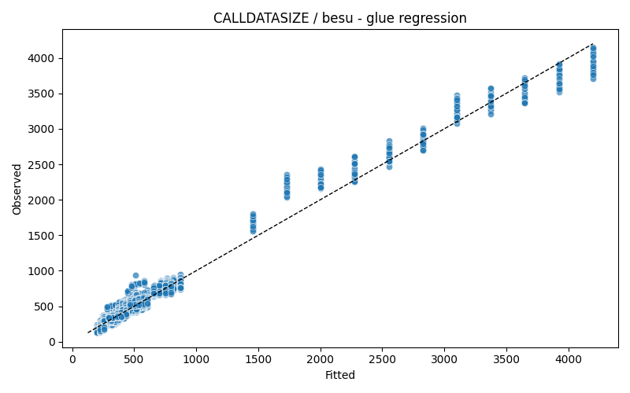


</details>

<details><summary><code>DUP</code> · nobs=168377 · runtime_ms=8.68e-07 · p=1.00e-03 · R²=0.9154</summary>

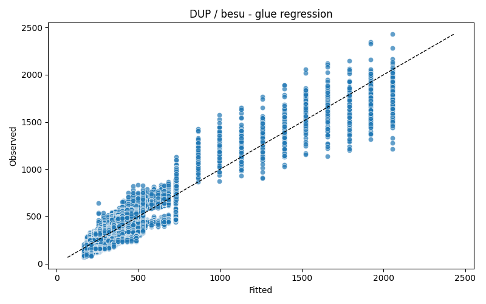

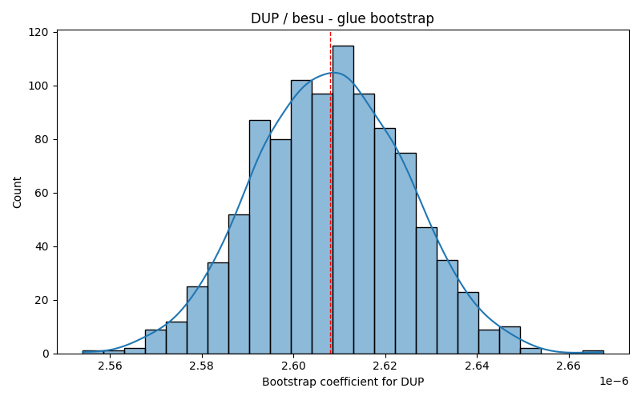

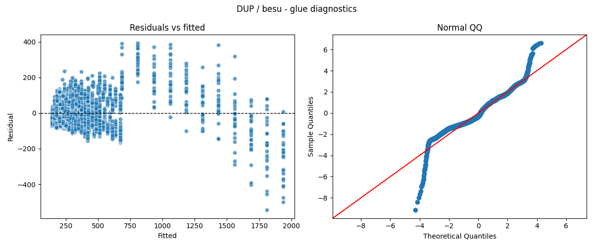

</details>

<details><summary><code>GAS</code> · nobs=168377 · runtime_ms=2.183e-06 · p=1.00e-03 · R²=0.9154</summary>

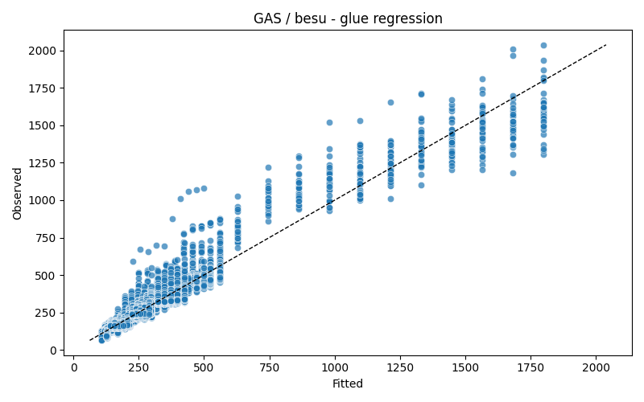

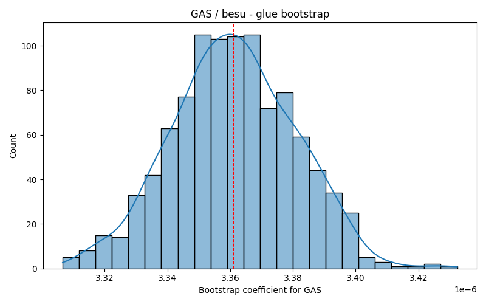


</details>

<details><summary><code>MLOAD</code> · nobs=168377 · runtime_ms=8.869e-06 · p=1.00e-03 · R²=0.9154</summary>

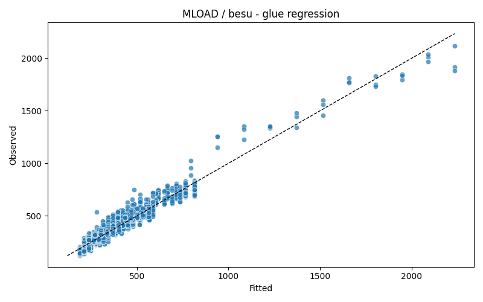


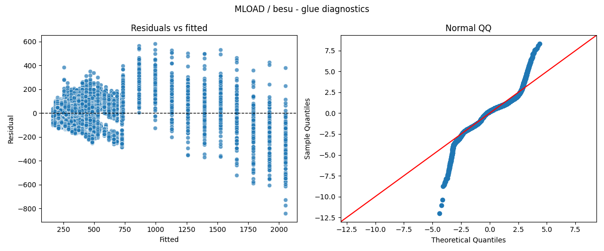

</details>

<details><summary><code>PUSH</code> · nobs=168377 · runtime_ms=1.792e-06 · p=1.00e-03 · R²=0.9154</summary>


</details>

<details><summary><code>PUSH0</code> · nobs=168377 · runtime_ms=7.531e-07 · p=1.00e-03 · R²=0.9154</summary>

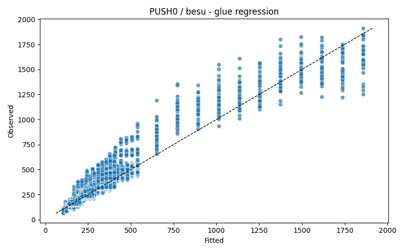


</details>

<details><summary><code>STATICCALL</code> · nobs=168377 · runtime_ms=0.001653 · p=1.00e-03 · R²=0.9154</summary>


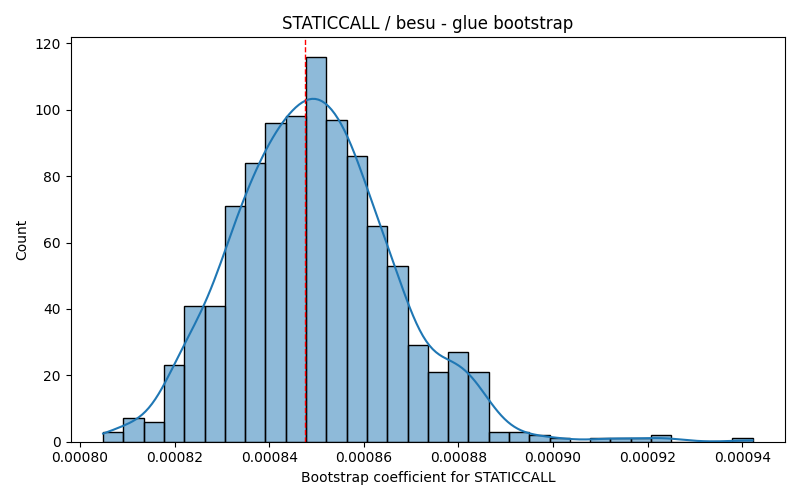

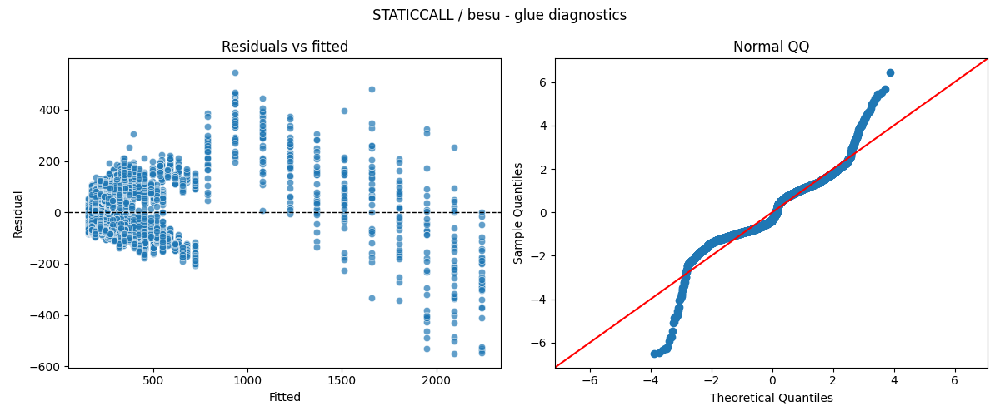

</details>

### Pure glue · besu

<details><summary><code>ISZERO</code> · nobs=2849 · runtime_ms=3.397e-06 · p=1.00e-03 · R²=0.7113</summary>

```
==============================================================================
                           NNLS Regression Results                            
==============================================================================
Dep. Variable:          test_runtime_ms              R-squared:          0.711
Model:                  NNLS                    Adj. R-squared:          0.711
No. Observations:       2849                              RMSE:          45.56
Df Residuals:           2847                               MAE:          32.82
Df Model:               1      
==============================================================================
                      coef     std err     P-value      [0.025      0.975]
------------------------------------------------------------------------------
         const     57.5424      2.6379       0.001     52.4389     63.0348
        ISZERO      0.0000      0.0000       0.001      0.0000      0.0000
==============================================================================
Notes: Non-negative least squares with bootstrap inference (1000 iterations)
==============================================================================
```

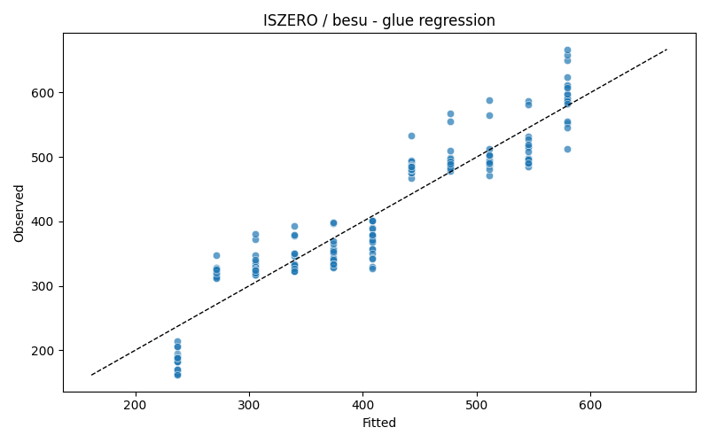

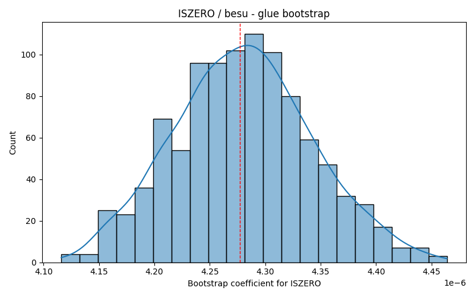

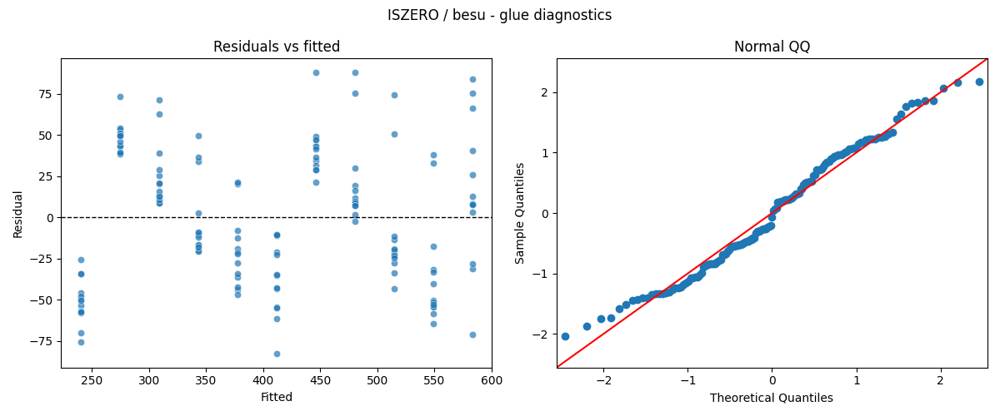

</details>

<details><summary><code>JUMPDEST</code> · nobs=2849 · runtime_ms=1.021e-06 · p=1.00e-03 · R²=0.2301</summary>

```
==============================================================================
                           NNLS Regression Results                            
==============================================================================
Dep. Variable:          test_runtime_ms              R-squared:          0.230
Model:                  NNLS                    Adj. R-squared:          0.230
No. Observations:       2849                              RMSE:         117.98
Df Residuals:           2847                               MAE:          61.99
Df Model:               1      
==============================================================================
                      coef     std err     P-value      [0.025      0.975]
------------------------------------------------------------------------------
         const     25.7236      6.3904       0.001     12.7667     38.3114
      JUMPDEST      0.0000      0.0000       0.001      0.0000      0.0000
==============================================================================
Notes: Non-negative least squares with bootstrap inference (1000 iterations)
==============================================================================
```

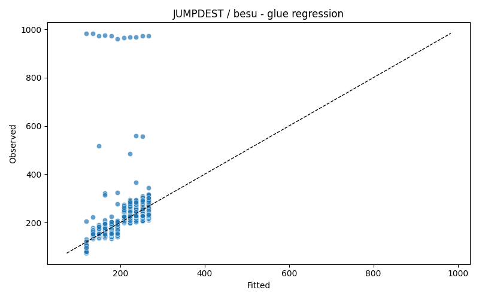


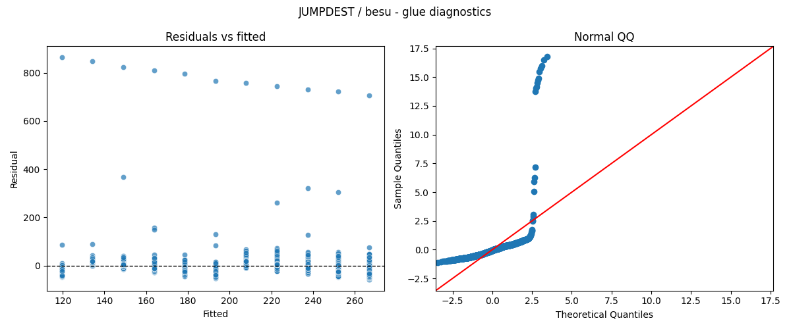

</details>

<details><summary><code>SWAP</code> · nobs=45584 · runtime_ms=2.314e-06 · p=1.00e-03 · R²=0.5794</summary>

```
==============================================================================
                           NNLS Regression Results                            
==============================================================================
Dep. Variable:          test_runtime_ms              R-squared:          0.579
Model:                  NNLS                    Adj. R-squared:          0.579
No. Observations:       45584                             RMSE:          41.51
Df Residuals:           45582                              MAE:          28.06
Df Model:               1      
==============================================================================
                      coef     std err     P-value      [0.025      0.975]
------------------------------------------------------------------------------
         const     41.8855      0.5864       0.001     40.7751     43.0574
          SWAP      0.0000      0.0000       0.001      0.0000      0.0000
==============================================================================
Notes: Non-negative least squares with bootstrap inference (1000 iterations)
==============================================================================
```

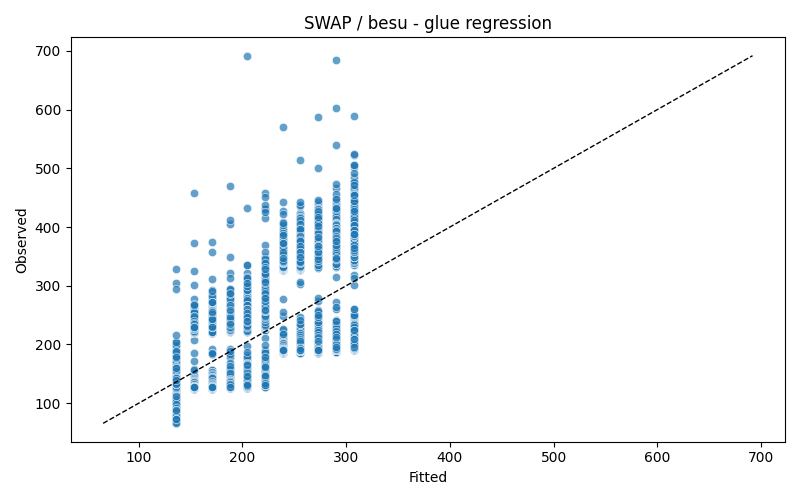

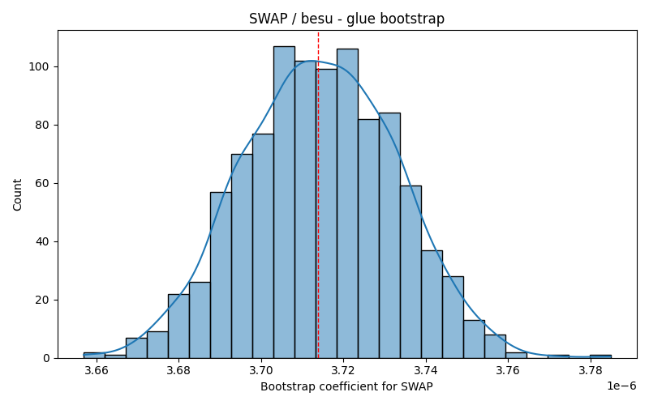

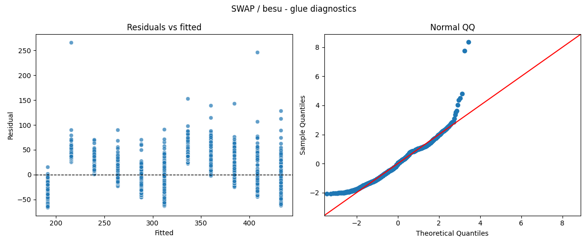

</details>

### Mixed glue (tier A) · besu

<details><summary><code>ADD</code> · nobs=2849 · runtime_ms=9.179e-06 · p=1.00e-03 · R²=0.662</summary>

```
==============================================================================
                           NNLS Regression Results                            
==============================================================================
Dep. Variable:          test_runtime_ms              R-squared:          0.662
Model:                  NNLS                    Adj. R-squared:          0.662
No. Observations:       2849                              RMSE:          69.03
Df Residuals:           2847                               MAE:          53.74
Df Model:               1      
==============================================================================
                      coef     std err     P-value      [0.025      0.975]
------------------------------------------------------------------------------
         const     80.2496      3.9247       0.001     72.8064     88.1267
           ADD      0.0000      0.0000       0.001      0.0000      0.0000
==============================================================================
Notes: Non-negative least squares with bootstrap inference (1000 iterations)
==============================================================================
```

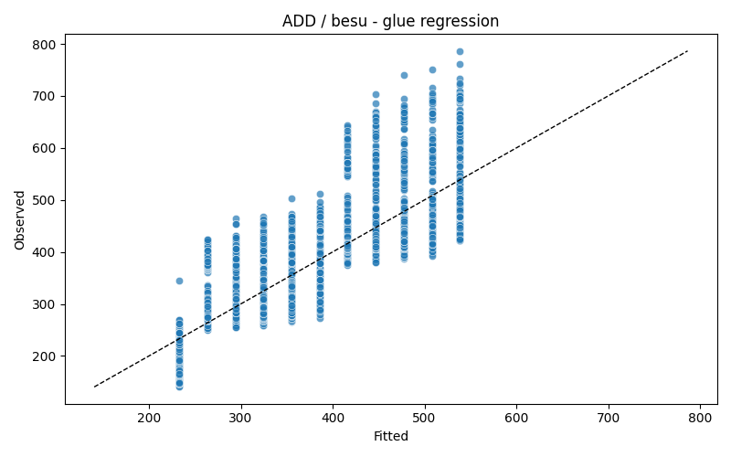


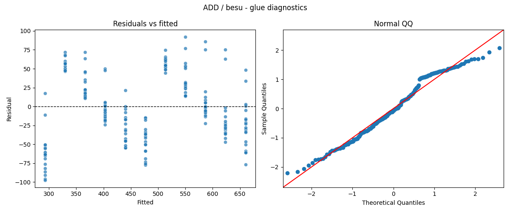

</details>

<details><summary><code>AND</code> · nobs=2849 · runtime_ms=6.948e-06 · p=1.00e-03 · R²=0.5719</summary>

```
==============================================================================
                           NNLS Regression Results                            
==============================================================================
Dep. Variable:          test_runtime_ms              R-squared:          0.572
Model:                  NNLS                    Adj. R-squared:          0.572
No. Observations:       2849                              RMSE:          63.27
Df Residuals:           2847                               MAE:          49.06
Df Model:               1      
==============================================================================
                      coef     std err     P-value      [0.025      0.975]
------------------------------------------------------------------------------
         const     65.5749      3.4171       0.001     58.7761     72.0388
           AND      0.0000      0.0000       0.001      0.0000      0.0000
==============================================================================
Notes: Non-negative least squares with bootstrap inference (1000 iterations)
==============================================================================
```


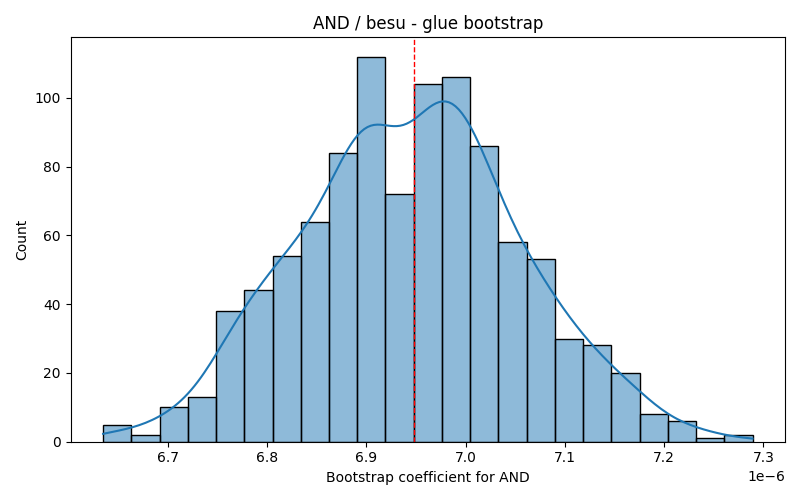


</details>

<details><summary><code>CALLDATACOPY</code> · nobs=68376 · runtime_ms=1.388e-05 · p=1.00e-03 · R²=0.6614</summary>

```
==============================================================================
                           NNLS Regression Results                            
==============================================================================
Dep. Variable:          test_runtime_ms              R-squared:          0.661
Model:                  NNLS                    Adj. R-squared:          0.661
No. Observations:       68376                             RMSE:          74.71
Df Residuals:           68374                              MAE:          56.58
Df Model:               1      
==============================================================================
                      coef     std err     P-value      [0.025      0.975]
------------------------------------------------------------------------------
         const    120.2682      0.3477       0.001    119.6267    120.9473
  CALLDATACOPY      0.0000      0.0000       0.001      0.0000      0.0000
==============================================================================
Notes: Non-negative least squares with bootstrap inference (1000 iterations)
==============================================================================
```


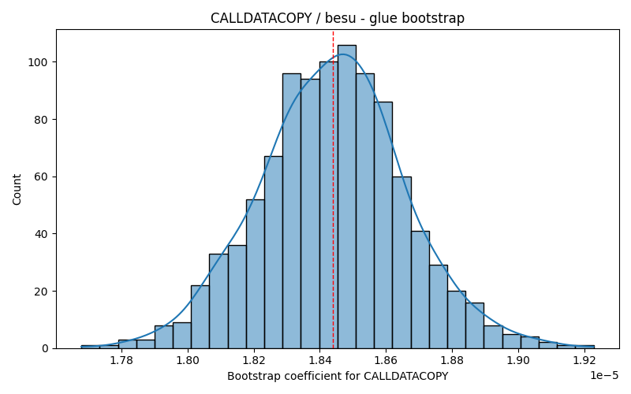

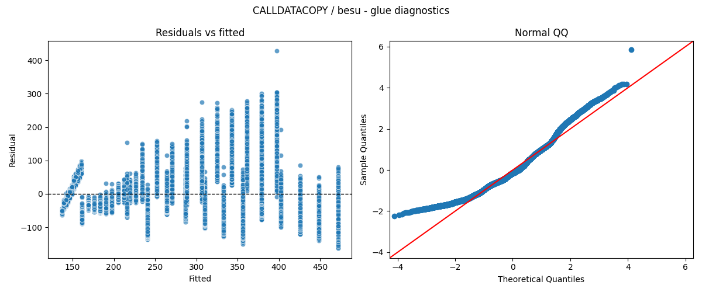

</details>

<details><summary><code>CALLDATALOAD</code> · nobs=11396 · runtime_ms=1.302e-05 · p=1.00e-03 · R²=0.007647</summary>

```
==============================================================================
                           NNLS Regression Results                            
==============================================================================
Dep. Variable:          test_runtime_ms              R-squared:          0.008
Model:                  NNLS                    Adj. R-squared:          0.008
No. Observations:       11396                             RMSE:           0.57
Df Residuals:           11394                              MAE:           0.36
Df Model:               1      
==============================================================================
                      coef     std err     P-value      [0.025      0.975]
------------------------------------------------------------------------------
         const      3.3578      0.0178       0.001      3.3226      3.3925
  CALLDATALOAD      0.0000      0.0000       0.001      0.0000      0.0000
==============================================================================
Notes: Non-negative least squares with bootstrap inference (1000 iterations)
==============================================================================
```

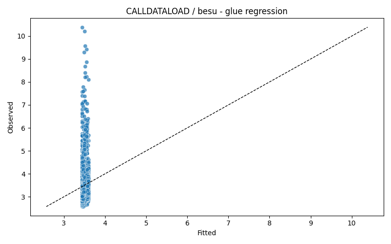


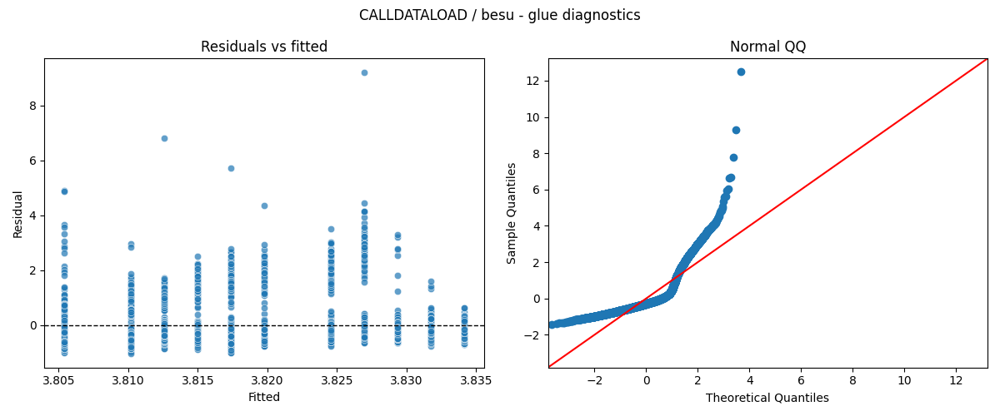

</details>

<details><summary><code>DIV</code> · nobs=2849 · runtime_ms=1.341e-05 · p=1.00e-03 · R²=0.7243</summary>

```
==============================================================================
                           NNLS Regression Results                            
==============================================================================
Dep. Variable:          test_runtime_ms              R-squared:          0.724
Model:                  NNLS                    Adj. R-squared:          0.724
No. Observations:       2849                              RMSE:          65.33
Df Residuals:           2847                               MAE:          50.70
Df Model:               1      
==============================================================================
                      coef     std err     P-value      [0.025      0.975]
------------------------------------------------------------------------------
         const    135.9143      3.2933       0.001    129.5856    142.5684
           DIV      0.0000      0.0000       0.001      0.0000      0.0000
==============================================================================
Notes: Non-negative least squares with bootstrap inference (1000 iterations)
==============================================================================
```

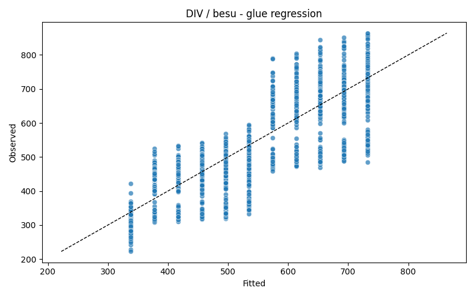


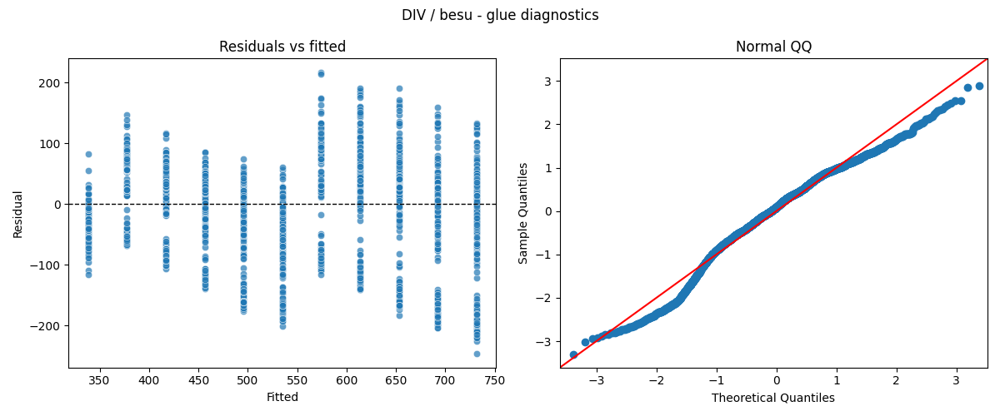

</details>

<details><summary><code>EXP</code> · nobs=2849 · runtime_ms=0.001021 · p=1.00e-03 · R²=0.6868</summary>

```
==============================================================================
                           NNLS Regression Results                            
==============================================================================
Dep. Variable:          test_runtime_ms              R-squared:          0.687
Model:                  NNLS                    Adj. R-squared:          0.687
No. Observations:       2849                              RMSE:          26.99
Df Residuals:           2847                               MAE:          19.82
Df Model:               1      
==============================================================================
                      coef     std err     P-value      [0.025      0.975]
------------------------------------------------------------------------------
         const    102.1558      2.2626       0.001     97.5597    106.8891
           EXP      0.0010      0.0000       0.001      0.0010      0.0011
==============================================================================
Notes: Non-negative least squares with bootstrap inference (1000 iterations)
==============================================================================
```

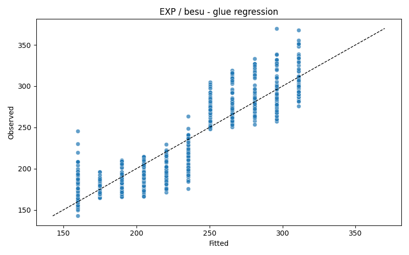


</details>

<details><summary><code>GT</code> · nobs=2849 · runtime_ms=1.793e-05 · p=1.00e-03 · R²=0.1381</summary>

```
==============================================================================
                           NNLS Regression Results                            
==============================================================================
Dep. Variable:          test_runtime_ms              R-squared:          0.138
Model:                  NNLS                    Adj. R-squared:          0.138
No. Observations:       2849                              RMSE:         471.49
Df Residuals:           2847                               MAE:         448.22
Df Model:               1      
==============================================================================
                      coef     std err     P-value      [0.025      0.975]
------------------------------------------------------------------------------
         const    108.7860     25.4795       0.001     59.5982    161.2079
            GT      0.0000      0.0000       0.001      0.0000      0.0000
==============================================================================
Notes: Non-negative least squares with bootstrap inference (1000 iterations)
==============================================================================
```

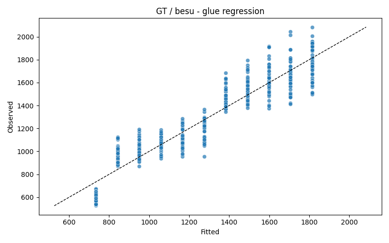

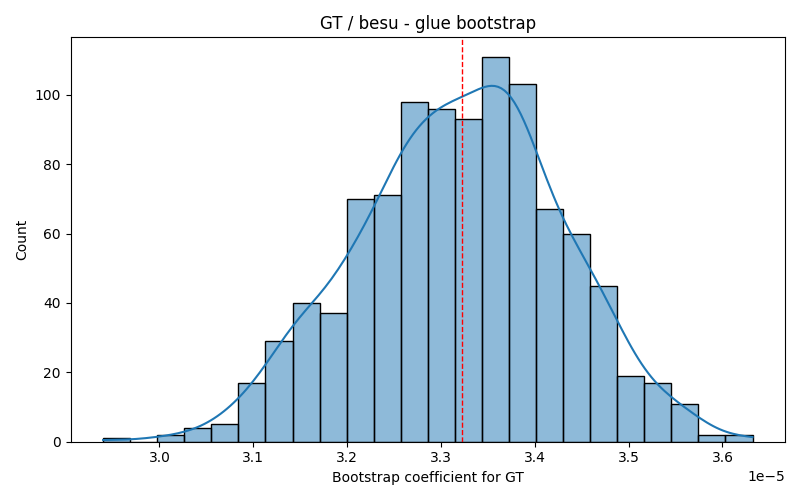


</details>

<details><summary><code>JUMPI</code> · nobs=2849 · runtime_ms=5.225e-06 · p=1.00e-03 · R²=0.4145</summary>

```
==============================================================================
                           NNLS Regression Results                            
==============================================================================
Dep. Variable:          test_runtime_ms              R-squared:          0.415
Model:                  NNLS                    Adj. R-squared:          0.414
No. Observations:       2849                              RMSE:          28.01
Df Residuals:           2847                               MAE:          20.11
Df Model:               1      
==============================================================================
                      coef     std err     P-value      [0.025      0.975]
------------------------------------------------------------------------------
         const     25.8533      1.4602       0.001     23.0195     28.6131
         JUMPI      0.0000      0.0000       0.001      0.0000      0.0000
==============================================================================
Notes: Non-negative least squares with bootstrap inference (1000 iterations)
==============================================================================
```

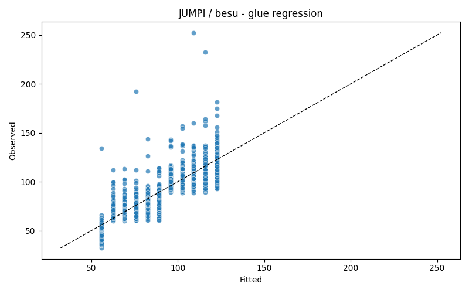


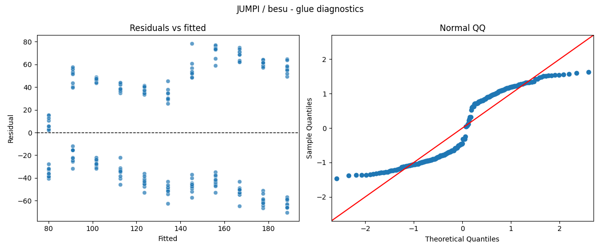

</details>

<details><summary><code>LT</code> · nobs=2849 · runtime_ms=1.821e-05 · p=1.00e-03 · R²=0.1364</summary>

```
==============================================================================
                           NNLS Regression Results                            
==============================================================================
Dep. Variable:          test_runtime_ms              R-squared:          0.136
Model:                  NNLS                    Adj. R-squared:          0.136
No. Observations:       2849                              RMSE:         482.28
Df Residuals:           2847                               MAE:         455.35
Df Model:               1      
==============================================================================
                      coef     std err     P-value      [0.025      0.975]
------------------------------------------------------------------------------
         const    139.3148     26.6846       0.001     87.3744    189.1629
            LT      0.0000      0.0000       0.001      0.0000      0.0000
==============================================================================
Notes: Non-negative least squares with bootstrap inference (1000 iterations)
==============================================================================
```

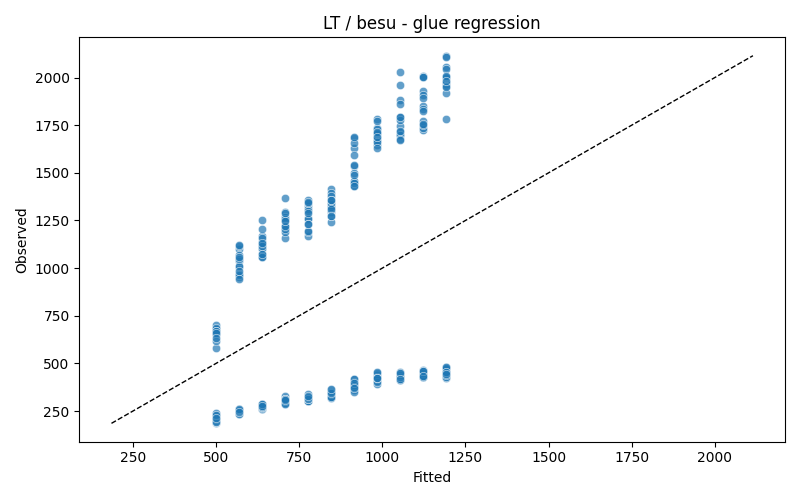

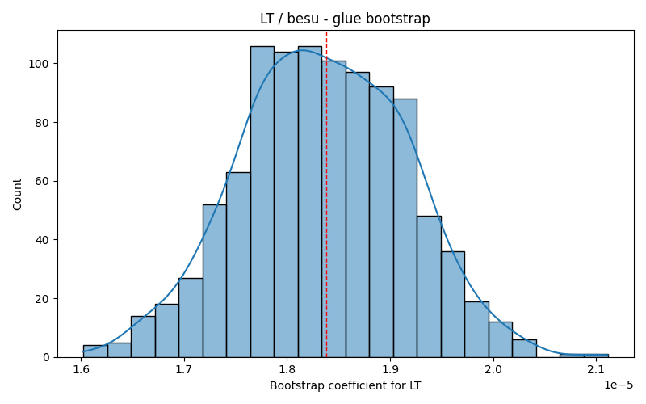


</details>

<details><summary><code>MSTORE</code> · nobs=14245 · runtime_ms=1.519e-05 · p=1.00e-03 · R²=0.7876</summary>

```
==============================================================================
                           NNLS Regression Results                            
==============================================================================
Dep. Variable:          test_runtime_ms              R-squared:          0.788
Model:                  NNLS                    Adj. R-squared:          0.788
No. Observations:       14245                             RMSE:          55.33
Df Residuals:           14243                              MAE:          44.50
Df Model:               1      
==============================================================================
                      coef     std err     P-value      [0.025      0.975]
------------------------------------------------------------------------------
         const     88.9691      1.5150       0.001     86.1760     92.0362
        MSTORE      0.0000      0.0000       0.001      0.0000      0.0000
==============================================================================
Notes: Non-negative least squares with bootstrap inference (1000 iterations)
==============================================================================
```

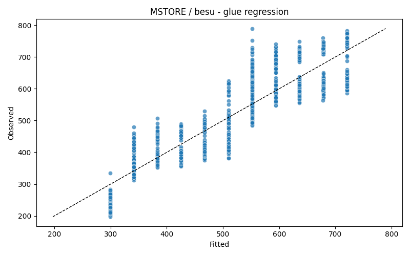

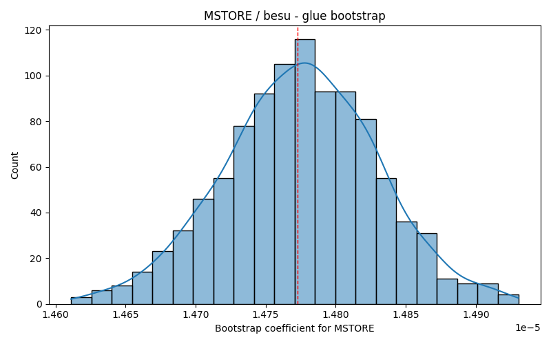

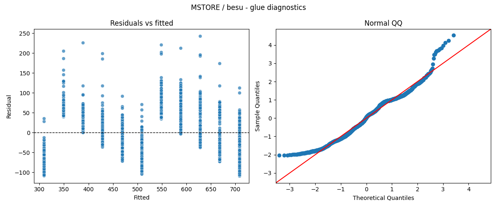

</details>

<details><summary><code>MSTORE8</code> · nobs=14245 · runtime_ms=8.82e-06 · p=1.00e-03 · R²=0.716</summary>

```
==============================================================================
                           NNLS Regression Results                            
==============================================================================
Dep. Variable:          test_runtime_ms              R-squared:          0.716
Model:                  NNLS                    Adj. R-squared:          0.716
No. Observations:       14245                             RMSE:          38.98
Df Residuals:           14243                              MAE:          27.24
Df Model:               1      
==============================================================================
                      coef     std err     P-value      [0.025      0.975]
------------------------------------------------------------------------------
         const     55.1183      1.0229       0.001     53.1377     57.0937
       MSTORE8      0.0000      0.0000       0.001      0.0000      0.0000
==============================================================================
Notes: Non-negative least squares with bootstrap inference (1000 iterations)
==============================================================================
```

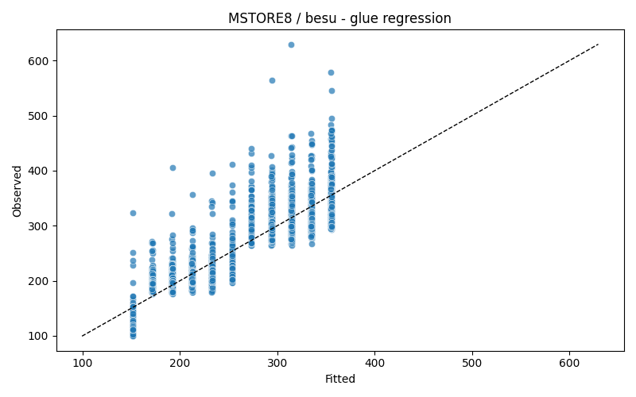

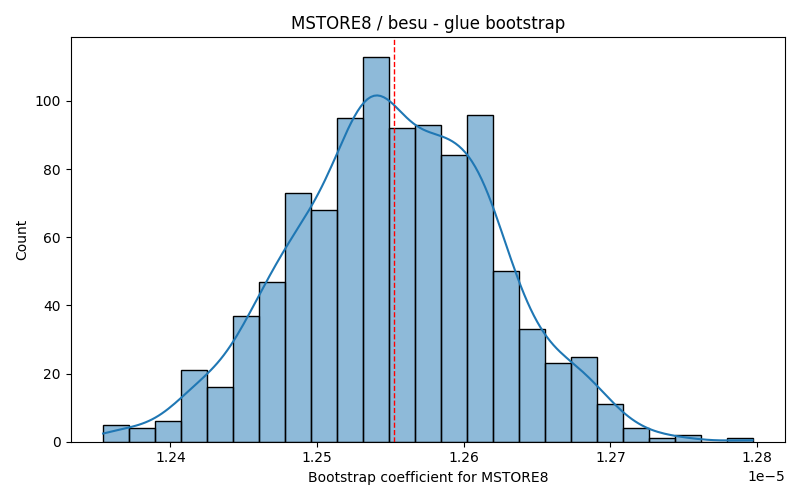


</details>

<details><summary><code>MUL</code> · nobs=2849 · runtime_ms=1.028e-05 · p=1.00e-03 · R²=0.5405</summary>

```
==============================================================================
                           NNLS Regression Results                            
==============================================================================
Dep. Variable:          test_runtime_ms              R-squared:          0.541
Model:                  NNLS                    Adj. R-squared:          0.540
No. Observations:       2849                              RMSE:          74.79
Df Residuals:           2847                               MAE:          59.47
Df Model:               1      
==============================================================================
                      coef     std err     P-value      [0.025      0.975]
------------------------------------------------------------------------------
         const     92.5935      4.0576       0.001     84.1117     99.8808
           MUL      0.0000      0.0000       0.001      0.0000      0.0000
==============================================================================
Notes: Non-negative least squares with bootstrap inference (1000 iterations)
==============================================================================
```


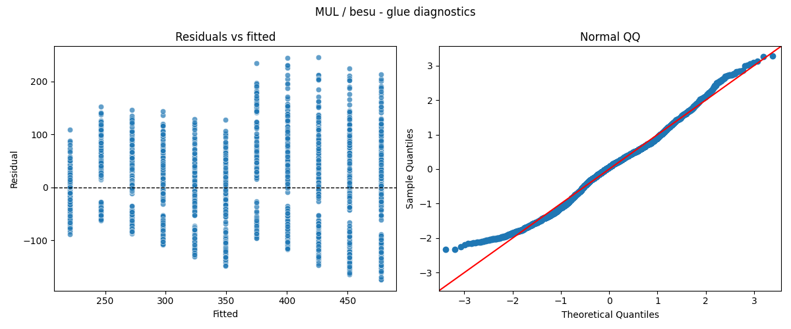

</details>

<details><summary><code>PC</code> · nobs=2849 · runtime_ms=3.467e-06 · p=1.00e-03 · R²=0.7594</summary>

```
==============================================================================
                           NNLS Regression Results                            
==============================================================================
Dep. Variable:          test_runtime_ms              R-squared:          0.759
Model:                  NNLS                    Adj. R-squared:          0.759
No. Observations:       2849                              RMSE:          58.33
Df Residuals:           2847                               MAE:          40.11
Df Model:               1      
==============================================================================
                      coef     std err     P-value      [0.025      0.975]
------------------------------------------------------------------------------
         const     76.0077      3.5101       0.001     69.2122     82.9691
            PC      0.0000      0.0000       0.001      0.0000      0.0000
==============================================================================
Notes: Non-negative least squares with bootstrap inference (1000 iterations)
==============================================================================
```


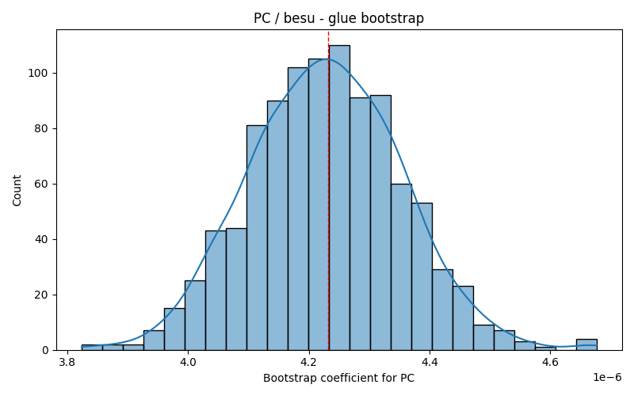

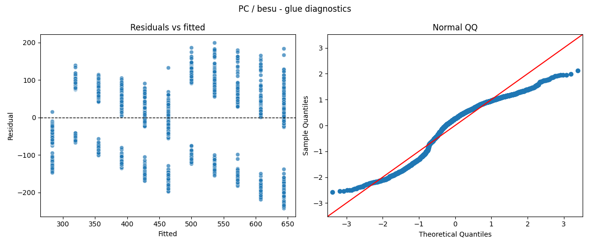

</details>

<details><summary><code>RETURNDATASIZE</code> · nobs=11396 · runtime_ms=4.231e-06 · p=1.00e-03 · R²=0.5517</summary>

```
==============================================================================
                           NNLS Regression Results                            
==============================================================================
Dep. Variable:          test_runtime_ms              R-squared:          0.552
Model:                  NNLS                    Adj. R-squared:          0.552
No. Observations:       11396                             RMSE:          60.22
Df Residuals:           11394                              MAE:          37.66
Df Model:               1      
==============================================================================
                      coef     std err     P-value      [0.025      0.975]
------------------------------------------------------------------------------
         const     54.8737      1.6246       0.001     51.8525     57.9745
RETURNDATASIZE      0.0000      0.0000       0.001      0.0000      0.0000
==============================================================================
Notes: Non-negative least squares with bootstrap inference (1000 iterations)
==============================================================================
```

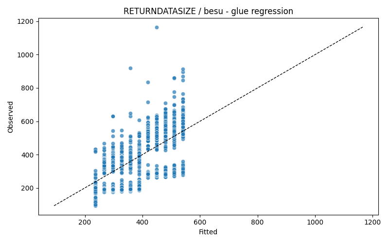


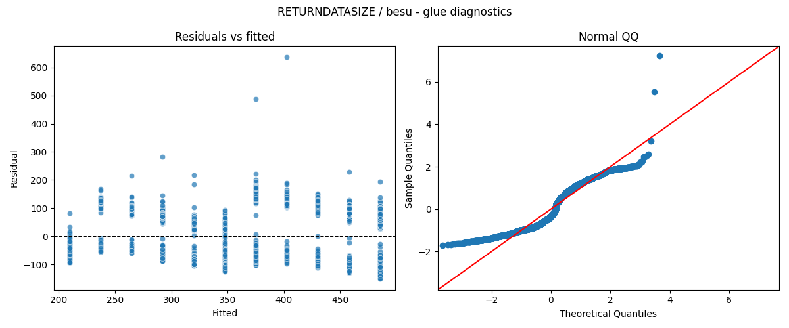

</details>

<details><summary><code>SELFBALANCE</code> · nobs=2331 · runtime_ms=6.476e-06 · p=1.00e-03 · R²=0.3324</summary>

```
==============================================================================
                           NNLS Regression Results                            
==============================================================================
Dep. Variable:          test_runtime_ms              R-squared:          0.332
Model:                  NNLS                    Adj. R-squared:          0.332
No. Observations:       2331                              RMSE:          92.59
Df Residuals:           2329                               MAE:          74.54
Df Model:               1      
==============================================================================
                      coef     std err     P-value      [0.025      0.975]
------------------------------------------------------------------------------
         const    418.1582      9.0977       0.001    400.9477    437.1884
   SELFBALANCE      0.0000      0.0000       0.001      0.0000      0.0000
==============================================================================
Notes: Non-negative least squares with bootstrap inference (1000 iterations)
==============================================================================
```


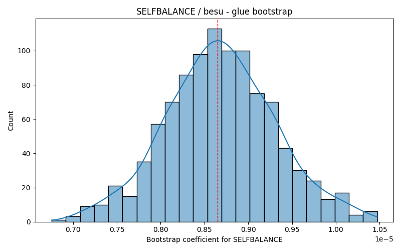

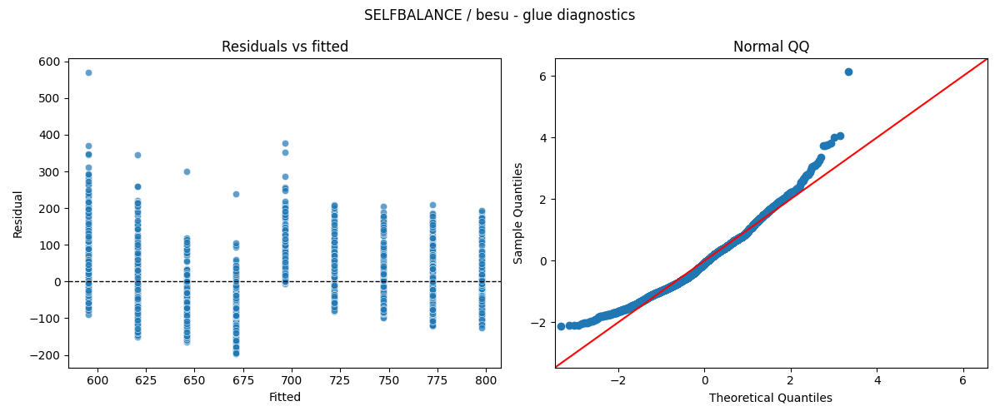

</details>

<details><summary><code>SUB</code> · nobs=2849 · runtime_ms=9.066e-06 · p=1.00e-03 · R²=0.6958</summary>

```
==============================================================================
                           NNLS Regression Results                            
==============================================================================
Dep. Variable:          test_runtime_ms              R-squared:          0.696
Model:                  NNLS                    Adj. R-squared:          0.696
No. Observations:       2849                              RMSE:          63.10
Df Residuals:           2847                               MAE:          48.34
Df Model:               1      
==============================================================================
                      coef     std err     P-value      [0.025      0.975]
------------------------------------------------------------------------------
         const     91.3004      3.6646       0.001     83.7197     98.3895
           SUB      0.0000      0.0000       0.001      0.0000      0.0000
==============================================================================
Notes: Non-negative least squares with bootstrap inference (1000 iterations)
==============================================================================
```

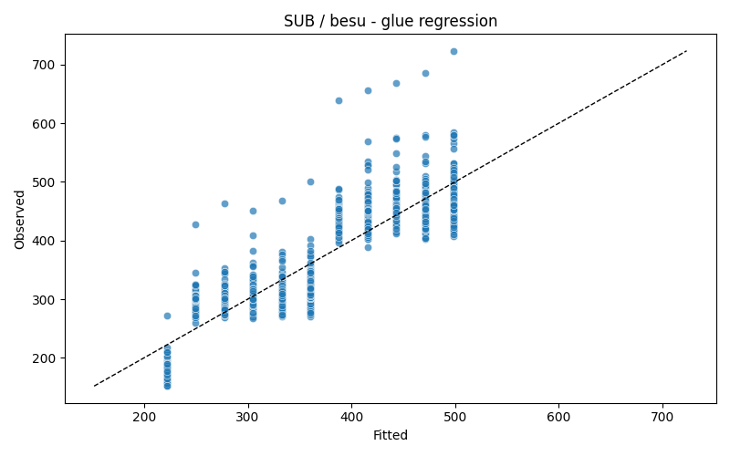

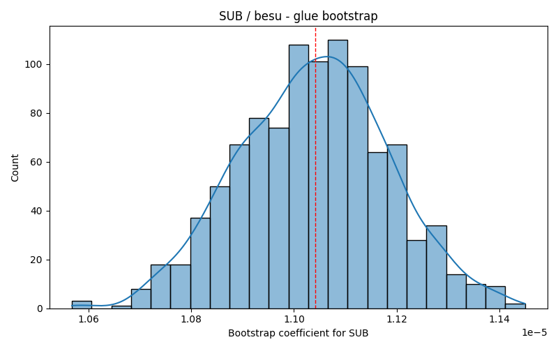


</details>

### Mixed glue (tier B) · besu

<details><summary><code>JUMP</code> · nobs=2849 · runtime_ms=2.926e-05 · p=1.00e-03 · R²=0.2858</summary>

```
==============================================================================
                           NNLS Regression Results                            
==============================================================================
Dep. Variable:          test_runtime_ms              R-squared:          0.286
Model:                  NNLS                    Adj. R-squared:          0.286
No. Observations:       2849                              RMSE:         171.84
Df Residuals:           2847                               MAE:         156.53
Df Model:               1      
==============================================================================
                      coef     std err     P-value      [0.025      0.975]
------------------------------------------------------------------------------
         const    109.3688      9.5383       0.001     91.4647    128.2713
          JUMP      0.0000      0.0000       0.001      0.0000      0.0000
==============================================================================
Notes: Non-negative least squares with bootstrap inference (1000 iterations)
==============================================================================
```

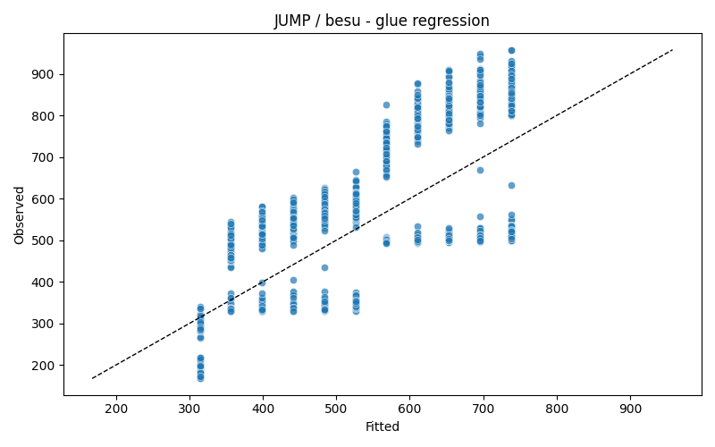


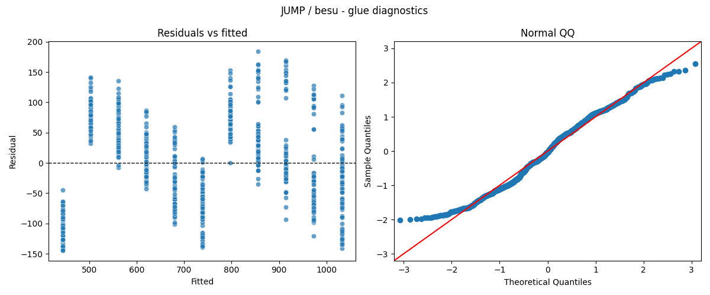

</details>

<details><summary><code>KECCAK256</code> · nobs=45584 · runtime_ms=4.439e-05 · p=1.00e-03 · R²=0.216</summary>

```
==============================================================================
                           NNLS Regression Results                            
==============================================================================
Dep. Variable:          test_runtime_ms              R-squared:          0.216
Model:                  NNLS                    Adj. R-squared:          0.216
No. Observations:       45584                             RMSE:         168.05
Df Residuals:           45582                              MAE:         131.94
Df Model:               1      
==============================================================================
                      coef     std err     P-value      [0.025      0.975]
------------------------------------------------------------------------------
         const    514.7708      1.6894       0.001    511.4303    517.9424
     KECCAK256      0.0000      0.0000       0.001      0.0000      0.0000
==============================================================================
Notes: Non-negative least squares with bootstrap inference (1000 iterations)
==============================================================================
```

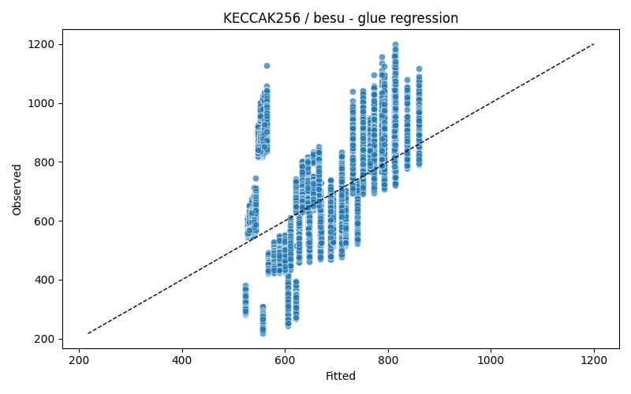


</details>

## erigon

| glue_opcode | nobs | glue_runtime_ms | p_value | rsquared |
| --- | --- | --- | --- | --- |
| `ISZERO` | 132 | 1.036e-06 | 1.00e-03 | 0.9307 |
| `JUMPDEST` | 132 | 7.871e-07 | 1.00e-03 | 0.9148 |
| `SWAP` | 2112 | 1.255e-06 | 1.00e-03 | 0.4868 |
| `CALLDATASIZE` | 8206 | 8.384e-07 | 1.00e-03 | 0.9327 |
| `DUP` | 8206 | 1.066e-06 | 1.00e-03 | 0.9327 |
| `GAS` | 8206 | 8.351e-07 | 1.00e-03 | 0.9327 |
| `MLOAD` | 8206 | 3.294e-06 | 1.00e-03 | 0.9327 |
| `PUSH` | 8206 | 2.711e-06 | 1.00e-03 | 0.9327 |
| `PUSH0` | 8206 | 9.007e-07 | 1.00e-03 | 0.9327 |
| `STATICCALL` | 8206 | 0.0005008 | 1.00e-03 | 0.9327 |
| `ADD` | 132 | 2.9e-06 | 1.00e-03 | 0.9047 |
| `AND` | 132 | 2.992e-06 | 1.00e-03 | 0.8296 |
| `CALLDATACOPY` | 3168 | 7.209e-06 | 1.00e-03 | 0.8551 |
| `CALLDATALOAD` | 528 | 7.958e-05 | 1.00e-03 | 0.03254 |
| `DIV` | 132 | 9.72e-06 | 1.00e-03 | 0.8822 |
| `EXP` | 132 | 0.0004001 | 1.00e-03 | 0.1982 |
| `GT` | 132 | 2.811e-06 | 1.00e-03 | 0.3822 |
| `JUMPI` | 132 | 2.918e-06 | 8.00e-03 | 0.118 |
| `LT` | 132 | 2.982e-06 | 1.00e-03 | 0.9281 |
| `MSTORE` | 660 | 5.738e-06 | 1.00e-03 | 0.8687 |
| `MSTORE8` | 660 | 5.248e-06 | 1.00e-03 | 0.5241 |
| `MUL` | 132 | 3.516e-06 | 1.00e-03 | 0.936 |
| `PC` | 132 | 1.403e-06 | 1.00e-03 | 0.9238 |
| `RETURNDATASIZE` | 528 | 1.624e-06 | 1.00e-03 | 0.4 |
| `SELFBALANCE` | 108 | 2.788e-05 | 1.00e-03 | 0.09106 |
| `SUB` | 132 | 2.63e-06 | 1.00e-03 | 0.4596 |
| `JUMP` | 132 | 7.054e-06 | 1.00e-03 | 0.9098 |
| `KECCAK256` | 2112 | 2.058e-05 | 1.00e-03 | 0.0855 |

### Cycle glue — joint fit · erigon

<details><summary>Joint NNLS regression summary</summary>

```
==============================================================================
                           NNLS Regression Results                            
==============================================================================
Dep. Variable:          test_runtime_ms              R-squared:          0.933
Model:                  NNLS                    Adj. R-squared:          0.933
No. Observations:       8206                              RMSE:          47.70
Df Residuals:           8198                               MAE:          20.88
Df Model:               7      
==============================================================================
                      coef     std err     P-value      [0.025      0.975]
------------------------------------------------------------------------------
         const     30.8981      1.7591       0.001     27.5239     34.3201
  CALLDATASIZE      0.0000      0.0000       0.001      0.0000      0.0000
           DUP      0.0000      0.0000       0.001      0.0000      0.0000
           GAS      0.0000      0.0000       0.001      0.0000      0.0000
         MLOAD      0.0000      0.0000       0.001      0.0000      0.0000
          PUSH      0.0000      0.0000       0.001      0.0000      0.0000
         PUSH0      0.0000      0.0000       0.001      0.0000      0.0000
    STATICCALL      0.0005      0.0000       0.001      0.0005      0.0005
==============================================================================
Notes: Non-negative least squares with bootstrap inference (1000 iterations)
==============================================================================
```

</details>

<details><summary><code>CALLDATASIZE</code> · nobs=8206 · runtime_ms=8.384e-07 · p=1.00e-03 · R²=0.9327</summary>


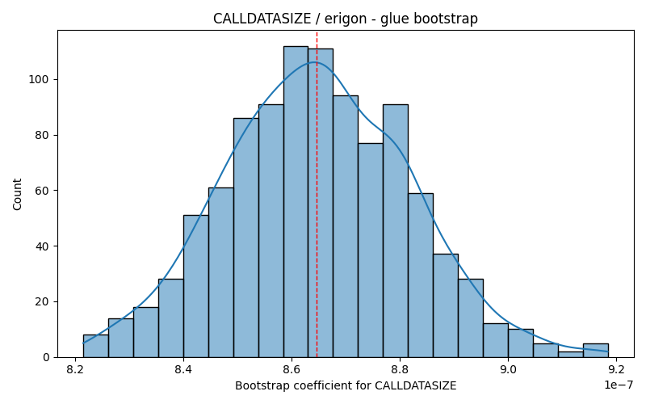


</details>

<details><summary><code>DUP</code> · nobs=8206 · runtime_ms=1.066e-06 · p=1.00e-03 · R²=0.9327</summary>


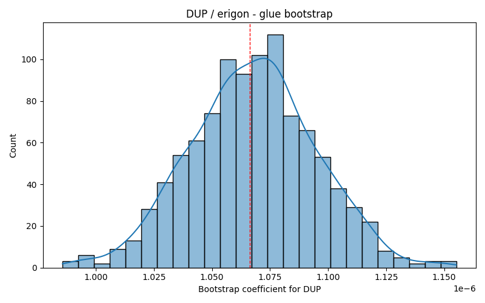

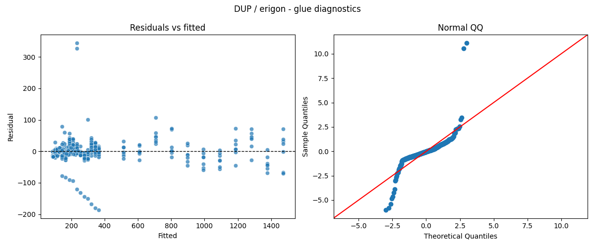

</details>

<details><summary><code>GAS</code> · nobs=8206 · runtime_ms=8.351e-07 · p=1.00e-03 · R²=0.9327</summary>

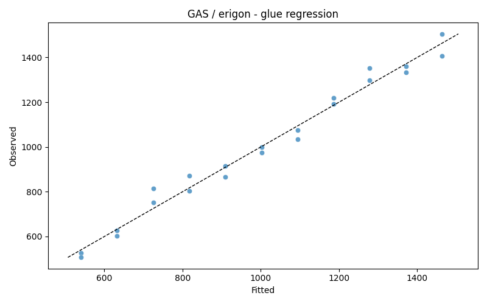


</details>

<details><summary><code>MLOAD</code> · nobs=8206 · runtime_ms=3.294e-06 · p=1.00e-03 · R²=0.9327</summary>


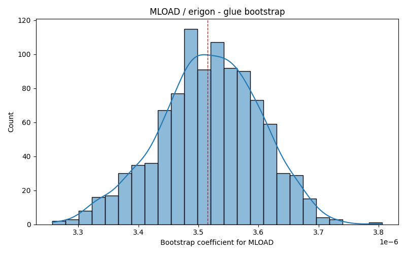

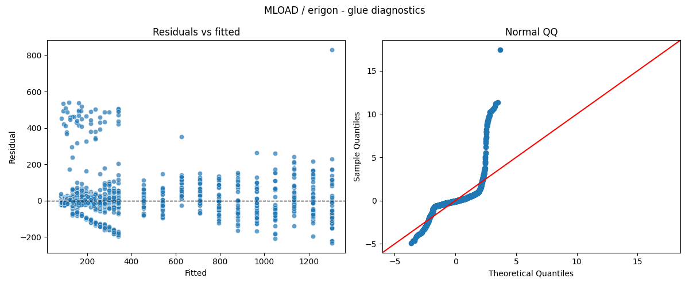

</details>

<details><summary><code>PUSH</code> · nobs=8206 · runtime_ms=2.711e-06 · p=1.00e-03 · R²=0.9327</summary>

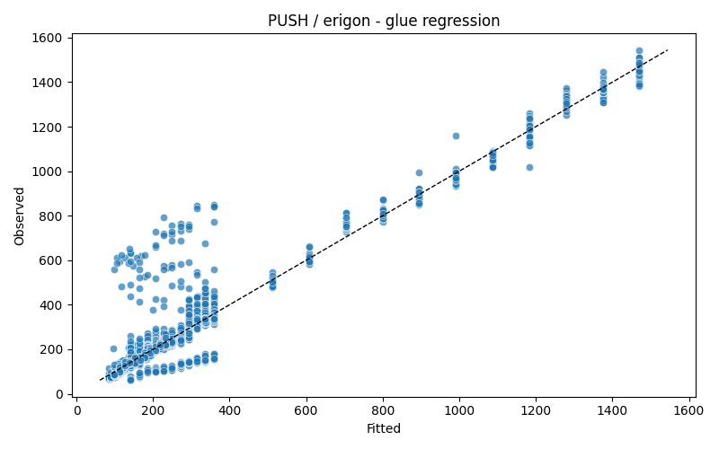


</details>

<details><summary><code>PUSH0</code> · nobs=8206 · runtime_ms=9.007e-07 · p=1.00e-03 · R²=0.9327</summary>


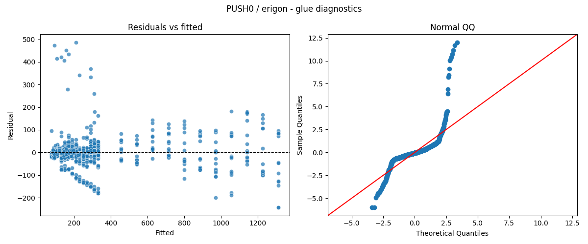

</details>

<details><summary><code>STATICCALL</code> · nobs=8206 · runtime_ms=0.0005008 · p=1.00e-03 · R²=0.9327</summary>


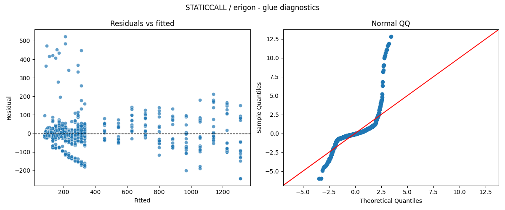

</details>

### Pure glue · erigon

<details><summary><code>ISZERO</code> · nobs=132 · runtime_ms=1.036e-06 · p=1.00e-03 · R²=0.9307</summary>

```
==============================================================================
                           NNLS Regression Results                            
==============================================================================
Dep. Variable:          test_runtime_ms              R-squared:          0.931
Model:                  NNLS                    Adj. R-squared:          0.930
No. Observations:       132                               RMSE:           5.95
Df Residuals:           130                                MAE:           4.87
Df Model:               1      
==============================================================================
                      coef     std err     P-value      [0.025      0.975]
------------------------------------------------------------------------------
         const     16.3504      1.9642       0.001     12.3711     19.9610
        ISZERO      0.0000      0.0000       0.001      0.0000      0.0000
==============================================================================
Notes: Non-negative least squares with bootstrap inference (1000 iterations)
==============================================================================
```

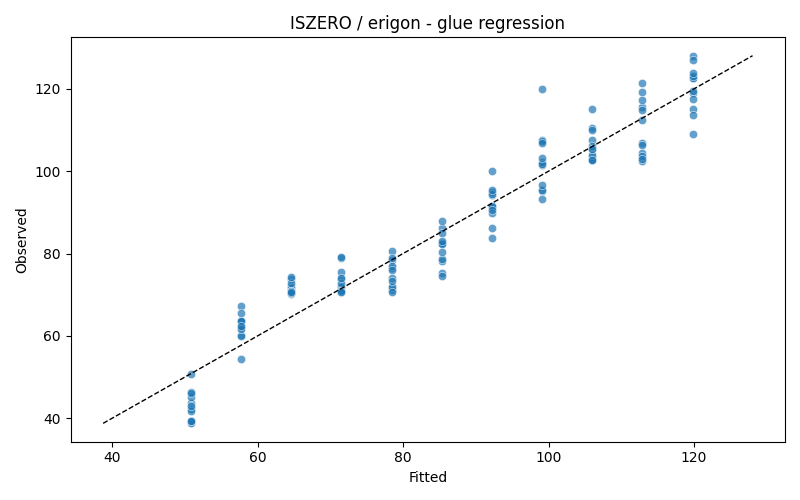

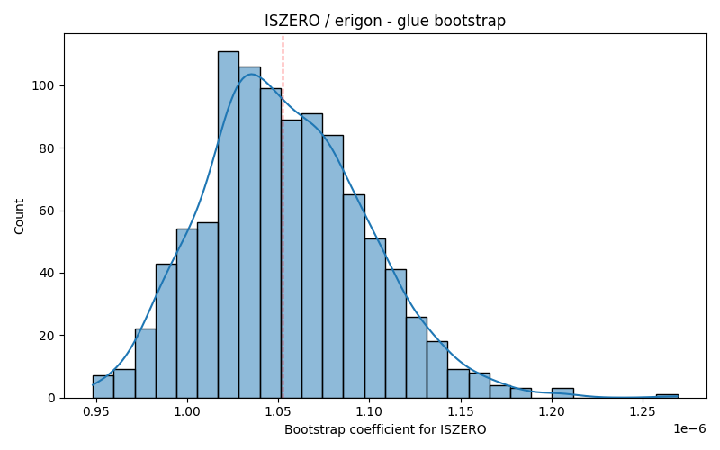

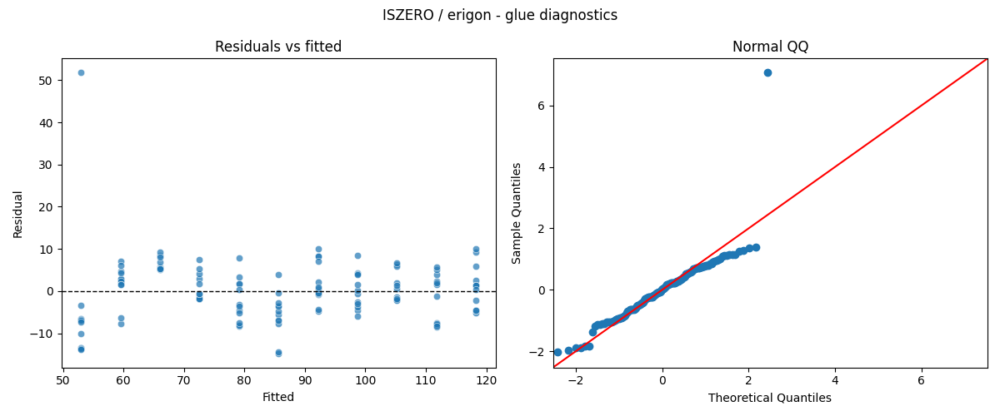

</details>

<details><summary><code>JUMPDEST</code> · nobs=132 · runtime_ms=7.871e-07 · p=1.00e-03 · R²=0.9148</summary>

```
==============================================================================
                           NNLS Regression Results                            
==============================================================================
Dep. Variable:          test_runtime_ms              R-squared:          0.915
Model:                  NNLS                    Adj. R-squared:          0.914
No. Observations:       132                               RMSE:          15.16
Df Residuals:           130                                MAE:          12.07
Df Model:               1      
==============================================================================
                      coef     std err     P-value      [0.025      0.975]
------------------------------------------------------------------------------
         const     18.4135      4.4200       0.001      9.8726     27.3589
      JUMPDEST      0.0000      0.0000       0.001      0.0000      0.0000
==============================================================================
Notes: Non-negative least squares with bootstrap inference (1000 iterations)
==============================================================================
```

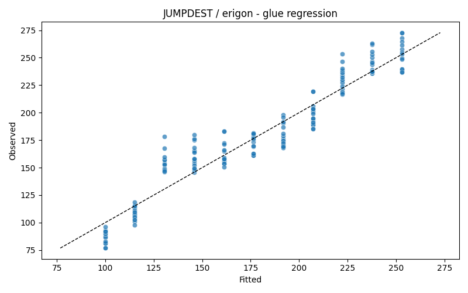


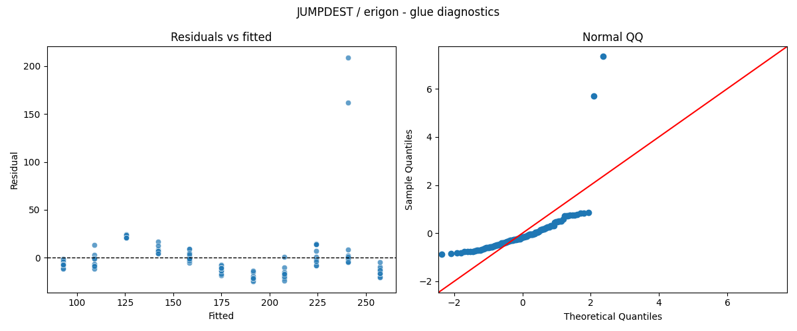

</details>

<details><summary><code>SWAP</code> · nobs=2112 · runtime_ms=1.255e-06 · p=1.00e-03 · R²=0.4868</summary>

```
==============================================================================
                           NNLS Regression Results                            
==============================================================================
Dep. Variable:          test_runtime_ms              R-squared:          0.487
Model:                  NNLS                    Adj. R-squared:          0.487
No. Observations:       2112                              RMSE:          27.14
Df Residuals:           2110                               MAE:           8.39
Df Model:               1      
==============================================================================
                      coef     std err     P-value      [0.025      0.975]
------------------------------------------------------------------------------
         const     23.6525      1.2855       0.001     21.2212     26.2047
          SWAP      0.0000      0.0000       0.001      0.0000      0.0000
==============================================================================
Notes: Non-negative least squares with bootstrap inference (1000 iterations)
==============================================================================
```

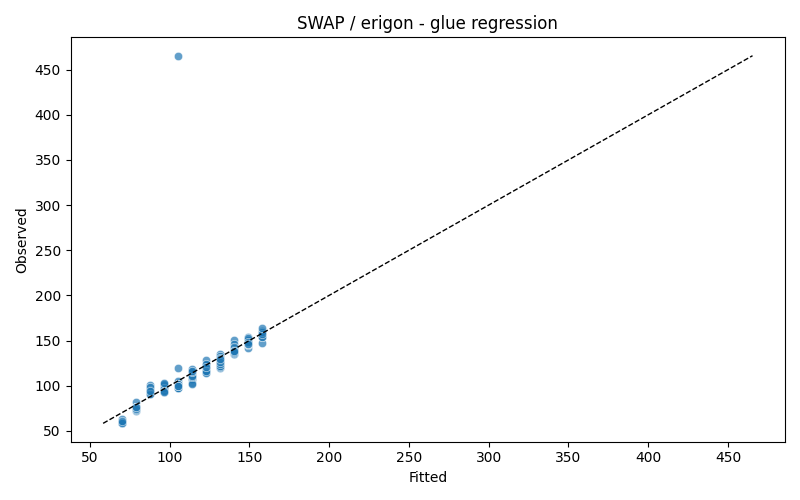


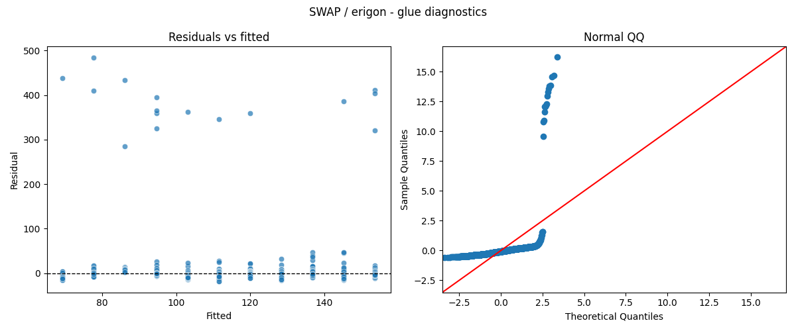

</details>

### Mixed glue (tier A) · erigon

<details><summary><code>ADD</code> · nobs=132 · runtime_ms=2.9e-06 · p=1.00e-03 · R²=0.9047</summary>

```
==============================================================================
                           NNLS Regression Results                            
==============================================================================
Dep. Variable:          test_runtime_ms              R-squared:          0.905
Model:                  NNLS                    Adj. R-squared:          0.904
No. Observations:       132                               RMSE:           9.91
Df Residuals:           130                                MAE:           7.65
Df Model:               1      
==============================================================================
                      coef     std err     P-value      [0.025      0.975]
------------------------------------------------------------------------------
         const     15.0534      2.6339       0.001     10.3071     20.7938
           ADD      0.0000      0.0000       0.001      0.0000      0.0000
==============================================================================
Notes: Non-negative least squares with bootstrap inference (1000 iterations)
==============================================================================
```


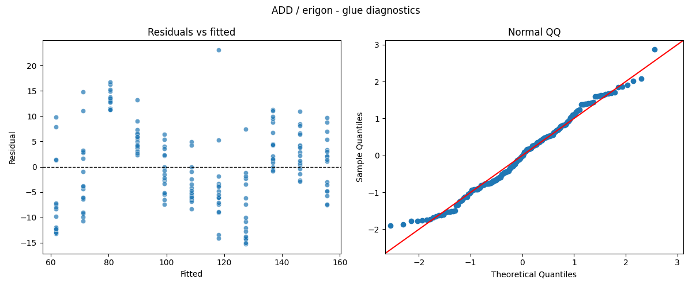

</details>

<details><summary><code>AND</code> · nobs=132 · runtime_ms=2.992e-06 · p=1.00e-03 · R²=0.8296</summary>

```
==============================================================================
                           NNLS Regression Results                            
==============================================================================
Dep. Variable:          test_runtime_ms              R-squared:          0.830
Model:                  NNLS                    Adj. R-squared:          0.828
No. Observations:       132                               RMSE:          14.27
Df Residuals:           130                                MAE:           8.60
Df Model:               1      
==============================================================================
                      coef     std err     P-value      [0.025      0.975]
------------------------------------------------------------------------------
         const     10.5813      4.4861       0.014      1.1995     18.4617
           AND      0.0000      0.0000       0.001      0.0000      0.0000
==============================================================================
Notes: Non-negative least squares with bootstrap inference (1000 iterations)
==============================================================================
```

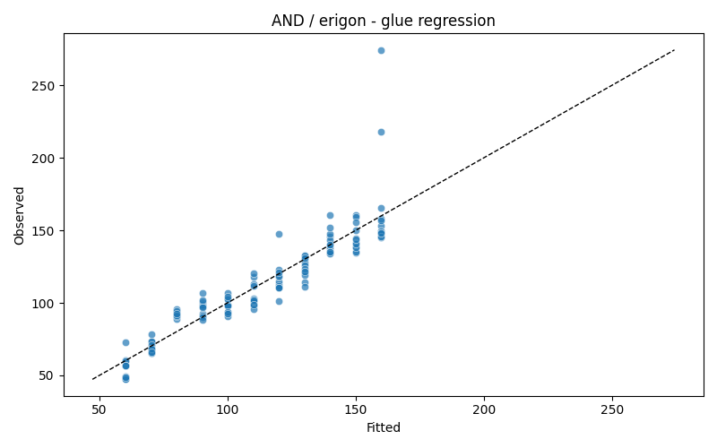


</details>

<details><summary><code>CALLDATACOPY</code> · nobs=3168 · runtime_ms=7.209e-06 · p=1.00e-03 · R²=0.8551</summary>

```
==============================================================================
                           NNLS Regression Results                            
==============================================================================
Dep. Variable:          test_runtime_ms              R-squared:          0.855
Model:                  NNLS                    Adj. R-squared:          0.855
No. Observations:       3168                              RMSE:          22.32
Df Residuals:           3166                               MAE:           8.30
Df Model:               1      
==============================================================================
                      coef     std err     P-value      [0.025      0.975]
------------------------------------------------------------------------------
         const     18.0164      0.6212       0.001     16.9389     19.2684
  CALLDATACOPY      0.0000      0.0000       0.001      0.0000      0.0000
==============================================================================
Notes: Non-negative least squares with bootstrap inference (1000 iterations)
==============================================================================
```

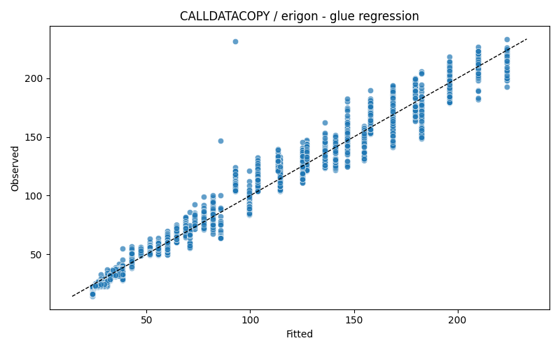

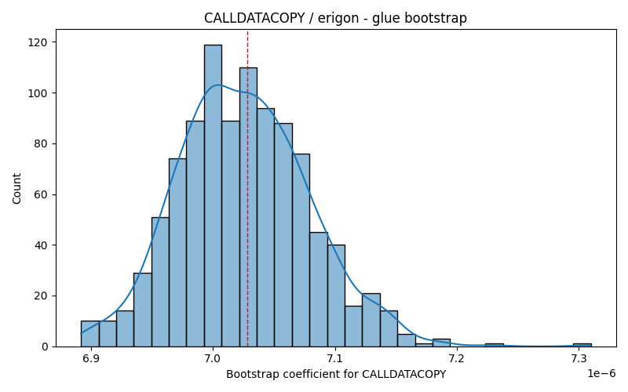


</details>

<details><summary><code>CALLDATALOAD</code> · nobs=528 · runtime_ms=7.958e-05 · p=1.00e-03 · R²=0.03254</summary>

```
==============================================================================
                           NNLS Regression Results                            
==============================================================================
Dep. Variable:          test_runtime_ms              R-squared:          0.033
Model:                  NNLS                    Adj. R-squared:          0.031
No. Observations:       528                               RMSE:           1.67
Df Residuals:           526                                MAE:           0.49
Df Model:               1      
==============================================================================
                      coef     std err     P-value      [0.025      0.975]
------------------------------------------------------------------------------
         const      5.4399      0.2016       0.001      4.9874      5.7604
  CALLDATALOAD      0.0001      0.0000       0.001      0.0000      0.0001
==============================================================================
Notes: Non-negative least squares with bootstrap inference (1000 iterations)
==============================================================================
```

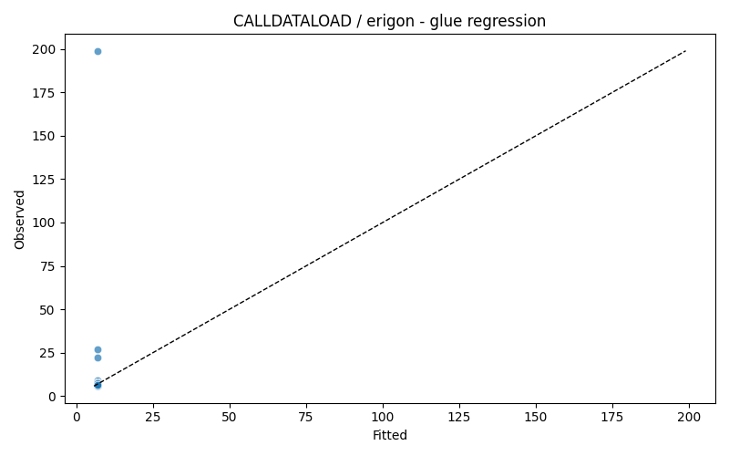


</details>

<details><summary><code>DIV</code> · nobs=132 · runtime_ms=9.72e-06 · p=1.00e-03 · R²=0.8822</summary>

```
==============================================================================
                           NNLS Regression Results                            
==============================================================================
Dep. Variable:          test_runtime_ms              R-squared:          0.882
Model:                  NNLS                    Adj. R-squared:          0.881
No. Observations:       132                               RMSE:          28.04
Df Residuals:           130                                MAE:          23.78
Df Model:               1      
==============================================================================
                      coef     std err     P-value      [0.025      0.975]
------------------------------------------------------------------------------
         const     21.0563      8.0035       0.004      6.8599     37.7716
           DIV      0.0000      0.0000       0.001      0.0000      0.0000
==============================================================================
Notes: Non-negative least squares with bootstrap inference (1000 iterations)
==============================================================================
```

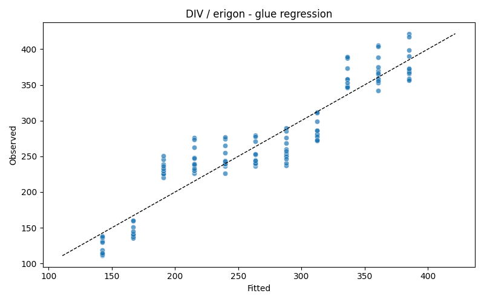

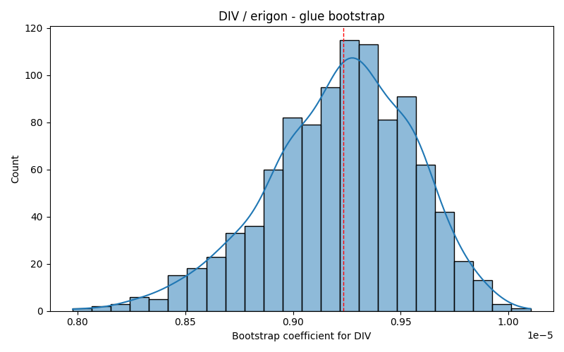

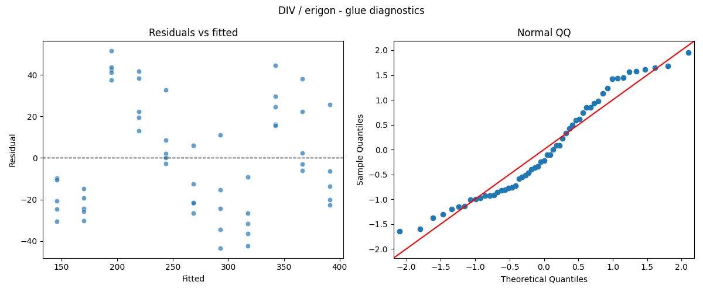

</details>

<details><summary><code>EXP</code> · nobs=132 · runtime_ms=0.0004001 · p=1.00e-03 · R²=0.1982</summary>

```
==============================================================================
                           NNLS Regression Results                            
==============================================================================
Dep. Variable:          test_runtime_ms              R-squared:          0.198
Model:                  NNLS                    Adj. R-squared:          0.192
No. Observations:       132                               RMSE:          31.51
Df Residuals:           130                                MAE:           6.99
Df Model:               1      
==============================================================================
                      coef     std err     P-value      [0.025      0.975]
------------------------------------------------------------------------------
         const      7.8035      3.0382       0.020      0.3449     12.4611
           EXP      0.0004      0.0000       0.001      0.0003      0.0005
==============================================================================
Notes: Non-negative least squares with bootstrap inference (1000 iterations)
==============================================================================
```


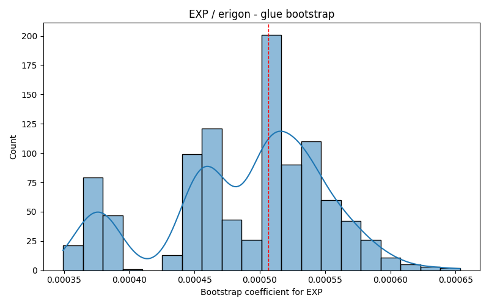

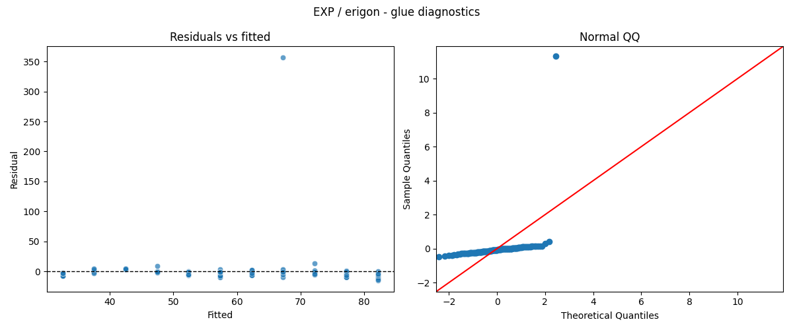

</details>

<details><summary><code>GT</code> · nobs=132 · runtime_ms=2.811e-06 · p=1.00e-03 · R²=0.3822</summary>

```
==============================================================================
                           NNLS Regression Results                            
==============================================================================
Dep. Variable:          test_runtime_ms              R-squared:          0.382
Model:                  NNLS                    Adj. R-squared:          0.377
No. Observations:       132                               RMSE:          37.61
Df Residuals:           130                                MAE:          11.69
Df Model:               1      
==============================================================================
                      coef     std err     P-value      [0.025      0.975]
------------------------------------------------------------------------------
         const     25.7192      7.2066       0.001     14.8518     42.6201
            GT      0.0000      0.0000       0.001      0.0000      0.0000
==============================================================================
Notes: Non-negative least squares with bootstrap inference (1000 iterations)
==============================================================================
```

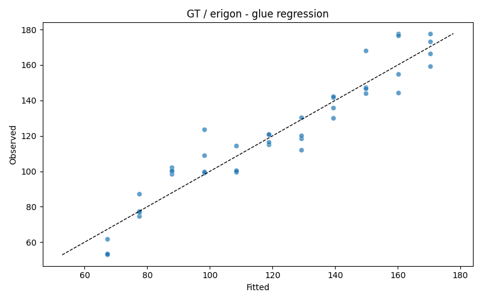


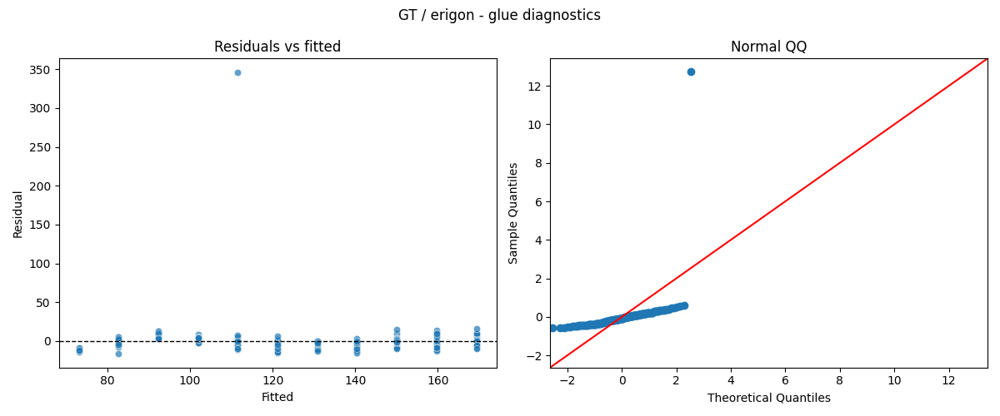

</details>

<details><summary><code>JUMPI</code> · nobs=132 · runtime_ms=2.918e-06 · p=8.00e-03 · R²=0.118</summary>

```
==============================================================================
                           NNLS Regression Results                            
==============================================================================
Dep. Variable:          test_runtime_ms              R-squared:          0.118
Model:                  NNLS                    Adj. R-squared:          0.111
No. Observations:       132                               RMSE:          36.00
Df Residuals:           130                                MAE:           9.30
Df Model:               1      
==============================================================================
                      coef     std err     P-value      [0.025      0.975]
------------------------------------------------------------------------------
         const     31.2844     15.5431       0.001     11.9313     66.5750
         JUMPI      0.0000      0.0000       0.008      0.0000      0.0000
==============================================================================
Notes: Non-negative least squares with bootstrap inference (1000 iterations)
==============================================================================
```


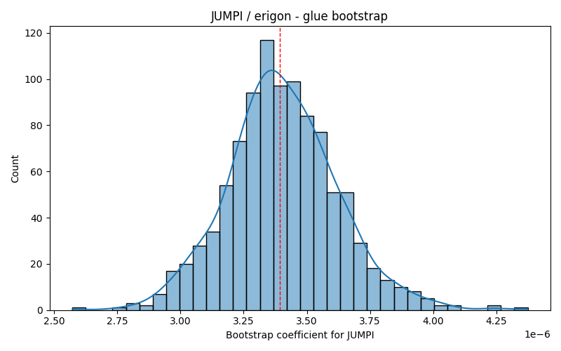

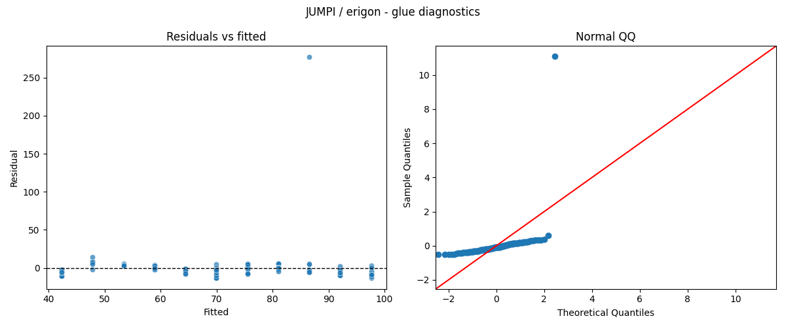

</details>

<details><summary><code>LT</code> · nobs=132 · runtime_ms=2.982e-06 · p=1.00e-03 · R²=0.9281</summary>

```
==============================================================================
                           NNLS Regression Results                            
==============================================================================
Dep. Variable:          test_runtime_ms              R-squared:          0.928
Model:                  NNLS                    Adj. R-squared:          0.928
No. Observations:       132                               RMSE:           8.73
Df Residuals:           130                                MAE:           7.34
Df Model:               1      
==============================================================================
                      coef     std err     P-value      [0.025      0.975]
------------------------------------------------------------------------------
         const     16.7232      2.7895       0.001     11.4726     21.9703
            LT      0.0000      0.0000       0.001      0.0000      0.0000
==============================================================================
Notes: Non-negative least squares with bootstrap inference (1000 iterations)
==============================================================================
```

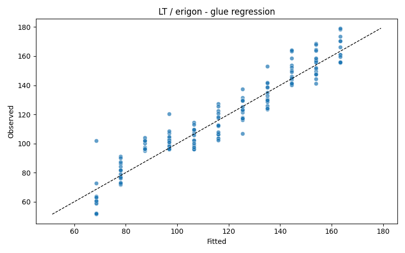

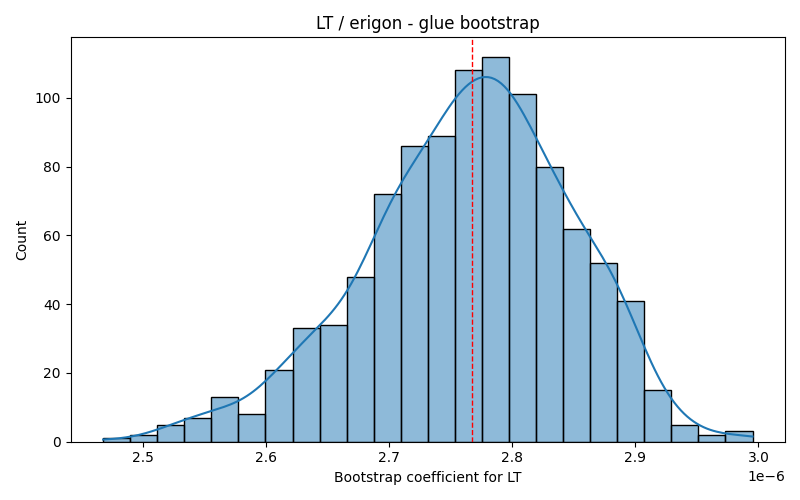

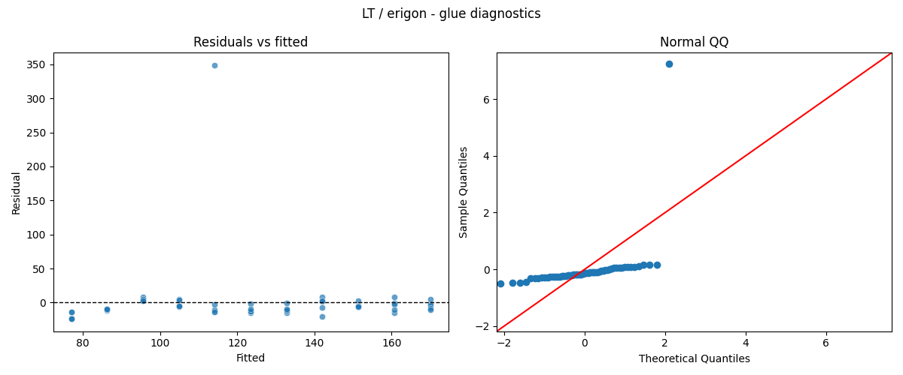

</details>

<details><summary><code>MSTORE</code> · nobs=660 · runtime_ms=5.738e-06 · p=1.00e-03 · R²=0.8687</summary>

```
==============================================================================
                           NNLS Regression Results                            
==============================================================================
Dep. Variable:          test_runtime_ms              R-squared:          0.869
Model:                  NNLS                    Adj. R-squared:          0.868
No. Observations:       660                               RMSE:          15.65
Df Residuals:           658                                MAE:           9.67
Df Model:               1      
==============================================================================
                      coef     std err     P-value      [0.025      0.975]
------------------------------------------------------------------------------
         const     23.6833      2.6367       0.001     19.5808     29.3805
        MSTORE      0.0000      0.0000       0.001      0.0000      0.0000
==============================================================================
Notes: Non-negative least squares with bootstrap inference (1000 iterations)
==============================================================================
```


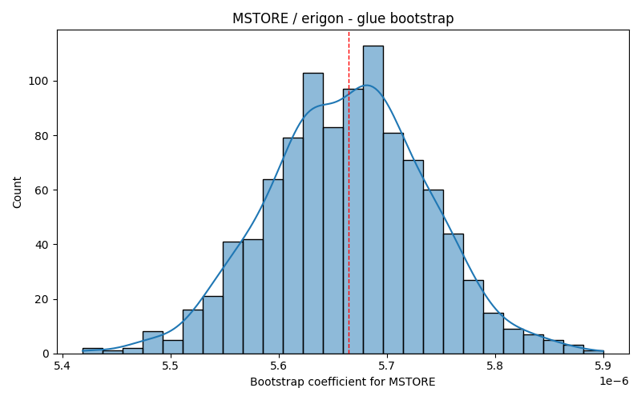

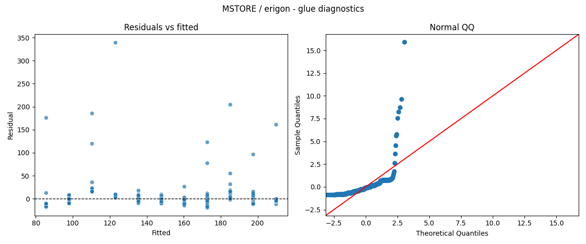

</details>

<details><summary><code>MSTORE8</code> · nobs=660 · runtime_ms=5.248e-06 · p=1.00e-03 · R²=0.5241</summary>

```
==============================================================================
                           NNLS Regression Results                            
==============================================================================
Dep. Variable:          test_runtime_ms              R-squared:          0.524
Model:                  NNLS                    Adj. R-squared:          0.523
No. Observations:       660                               RMSE:          35.09
Df Residuals:           658                                MAE:          12.24
Df Model:               1      
==============================================================================
                      coef     std err     P-value      [0.025      0.975]
------------------------------------------------------------------------------
         const     23.9582      3.7476       0.001     17.5928     31.8934
       MSTORE8      0.0000      0.0000       0.001      0.0000      0.0000
==============================================================================
Notes: Non-negative least squares with bootstrap inference (1000 iterations)
==============================================================================
```

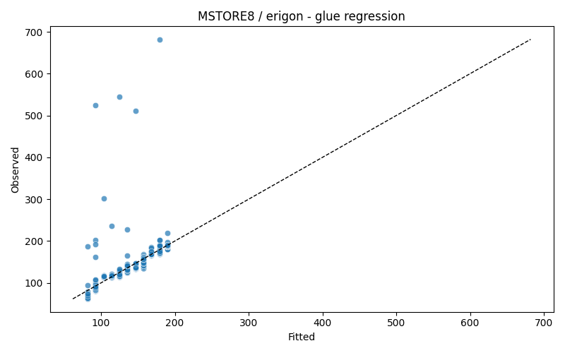


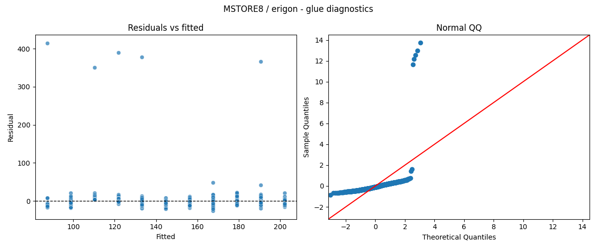

</details>

<details><summary><code>MUL</code> · nobs=132 · runtime_ms=3.516e-06 · p=1.00e-03 · R²=0.936</summary>

```
==============================================================================
                           NNLS Regression Results                            
==============================================================================
Dep. Variable:          test_runtime_ms              R-squared:          0.936
Model:                  NNLS                    Adj. R-squared:          0.936
No. Observations:       132                               RMSE:           7.26
Df Residuals:           130                                MAE:           5.91
Df Model:               1      
==============================================================================
                      coef     std err     P-value      [0.025      0.975]
------------------------------------------------------------------------------
         const     13.7160      2.3584       0.001      9.5781     18.9764
           MUL      0.0000      0.0000       0.001      0.0000      0.0000
==============================================================================
Notes: Non-negative least squares with bootstrap inference (1000 iterations)
==============================================================================
```


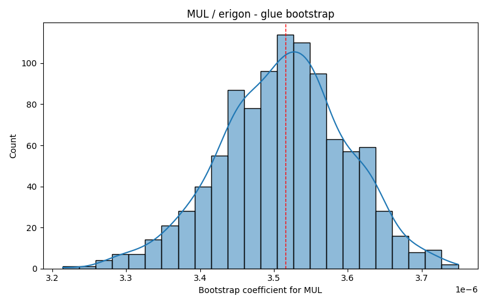


</details>

<details><summary><code>PC</code> · nobs=132 · runtime_ms=1.403e-06 · p=1.00e-03 · R²=0.9238</summary>

```
==============================================================================
                           NNLS Regression Results                            
==============================================================================
Dep. Variable:          test_runtime_ms              R-squared:          0.924
Model:                  NNLS                    Adj. R-squared:          0.923
No. Observations:       132                               RMSE:          12.04
Df Residuals:           130                                MAE:          10.21
Df Model:               1      
==============================================================================
                      coef     std err     P-value      [0.025      0.975]
------------------------------------------------------------------------------
         const     21.0742      3.9694       0.001     13.9043     29.2027
            PC      0.0000      0.0000       0.001      0.0000      0.0000
==============================================================================
Notes: Non-negative least squares with bootstrap inference (1000 iterations)
==============================================================================
```

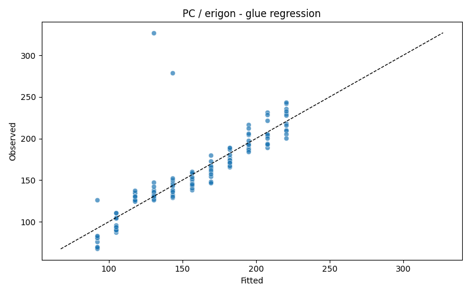

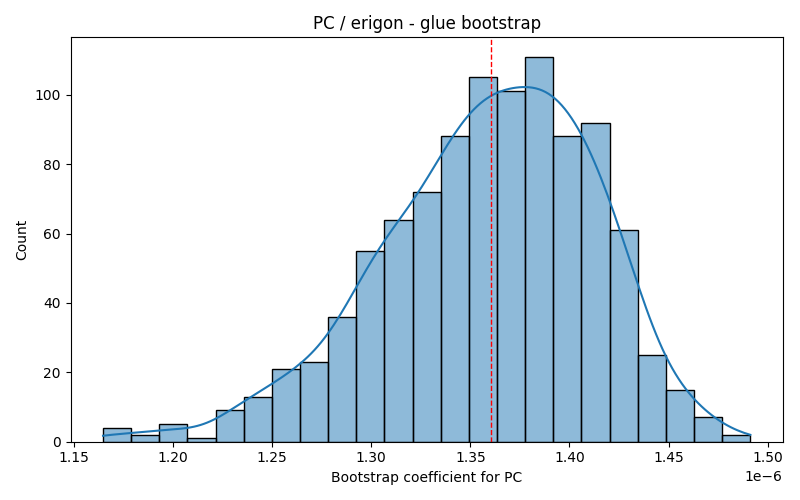

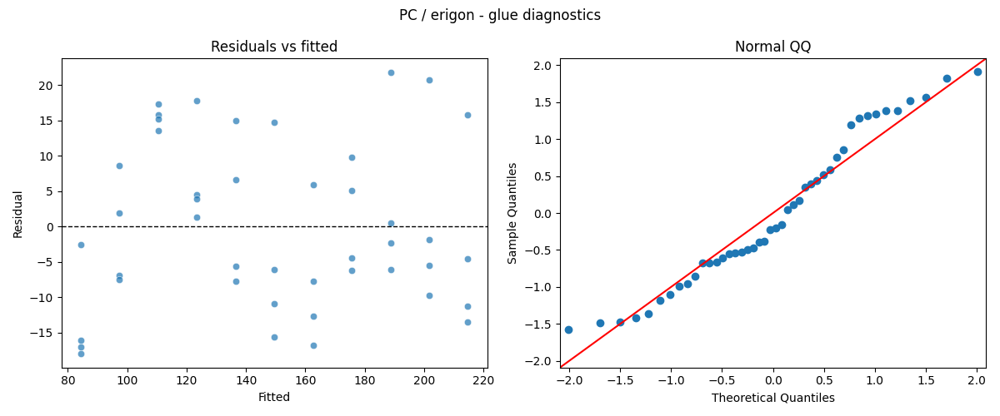

</details>

<details><summary><code>RETURNDATASIZE</code> · nobs=528 · runtime_ms=1.624e-06 · p=1.00e-03 · R²=0.4</summary>

```
==============================================================================
                           NNLS Regression Results                            
==============================================================================
Dep. Variable:          test_runtime_ms              R-squared:          0.400
Model:                  NNLS                    Adj. R-squared:          0.399
No. Observations:       528                               RMSE:          31.39
Df Residuals:           526                                MAE:           8.92
Df Model:               1      
==============================================================================
                      coef     std err     P-value      [0.025      0.975]
------------------------------------------------------------------------------
         const     28.4982      6.9601       0.001     16.3499     43.6051
RETURNDATASIZE      0.0000      0.0000       0.001      0.0000      0.0000
==============================================================================
Notes: Non-negative least squares with bootstrap inference (1000 iterations)
==============================================================================
```


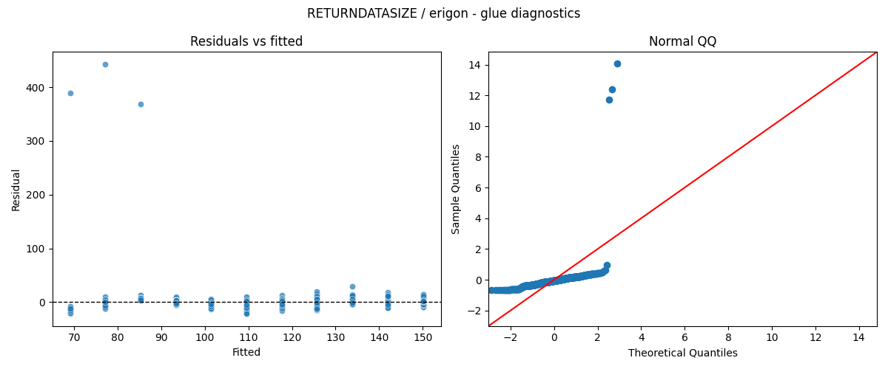

</details>

<details><summary><code>SELFBALANCE</code> · nobs=108 · runtime_ms=2.788e-05 · p=1.00e-03 · R²=0.09106</summary>

```
==============================================================================
                           NNLS Regression Results                            
==============================================================================
Dep. Variable:          test_runtime_ms              R-squared:          0.091
Model:                  NNLS                    Adj. R-squared:          0.082
No. Observations:       108                               RMSE:         888.49
Df Residuals:           106                                MAE:         800.83
Df Model:               1      
==============================================================================
                      coef     std err     P-value      [0.025      0.975]
------------------------------------------------------------------------------
         const     83.8778    234.0039       0.410      0.0000    782.9133
   SELFBALANCE      0.0000      0.0000       0.001      0.0000      0.0000
==============================================================================
Notes: Non-negative least squares with bootstrap inference (1000 iterations)
==============================================================================
```


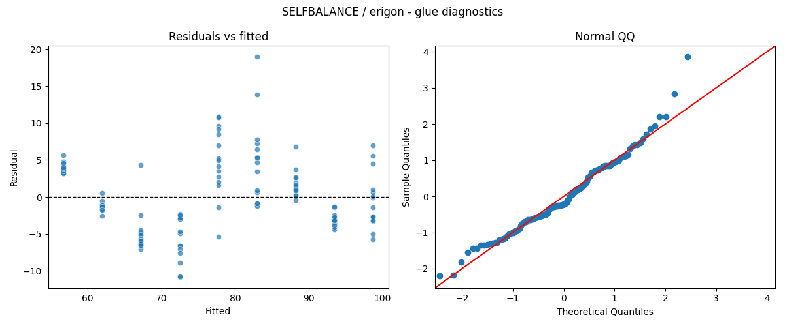

</details>

<details><summary><code>SUB</code> · nobs=132 · runtime_ms=2.63e-06 · p=1.00e-03 · R²=0.4596</summary>

```
==============================================================================
                           NNLS Regression Results                            
==============================================================================
Dep. Variable:          test_runtime_ms              R-squared:          0.460
Model:                  NNLS                    Adj. R-squared:          0.455
No. Observations:       132                               RMSE:          30.02
Df Residuals:           130                                MAE:          10.49
Df Model:               1      
==============================================================================
                      coef     std err     P-value      [0.025      0.975]
------------------------------------------------------------------------------
         const     25.9041     13.3966       0.001      9.1421     57.8283
           SUB      0.0000      0.0000       0.001      0.0000      0.0000
==============================================================================
Notes: Non-negative least squares with bootstrap inference (1000 iterations)
==============================================================================
```

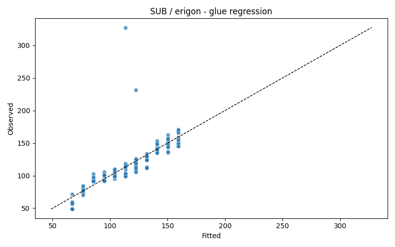


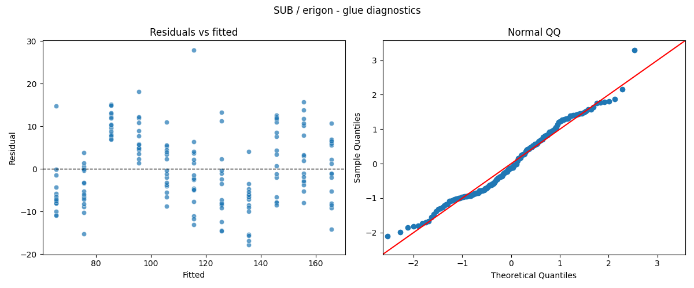

</details>

### Mixed glue (tier B) · erigon

<details><summary><code>JUMP</code> · nobs=132 · runtime_ms=7.054e-06 · p=1.00e-03 · R²=0.9098</summary>

```
==============================================================================
                           NNLS Regression Results                            
==============================================================================
Dep. Variable:          test_runtime_ms              R-squared:          0.910
Model:                  NNLS                    Adj. R-squared:          0.909
No. Observations:       132                               RMSE:           8.26
Df Residuals:           130                                MAE:           6.58
Df Model:               1      
==============================================================================
                      coef     std err     P-value      [0.025      0.975]
------------------------------------------------------------------------------
         const     16.4775      2.5300       0.001     11.3952     21.6433
          JUMP      0.0000      0.0000       0.001      0.0000      0.0000
==============================================================================
Notes: Non-negative least squares with bootstrap inference (1000 iterations)
==============================================================================
```

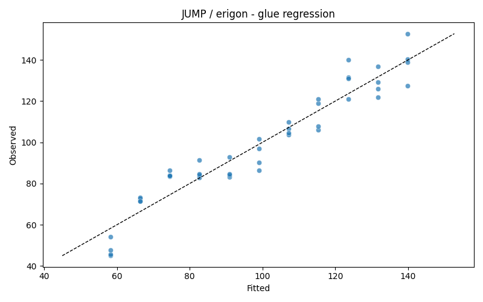


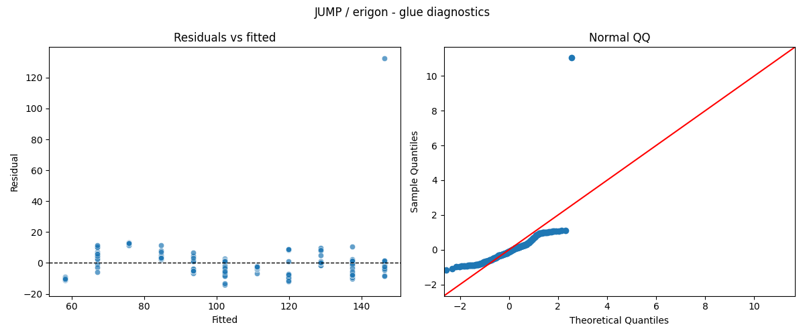

</details>

<details><summary><code>KECCAK256</code> · nobs=2112 · runtime_ms=2.058e-05 · p=1.00e-03 · R²=0.0855</summary>

```
==============================================================================
                           NNLS Regression Results                            
==============================================================================
Dep. Variable:          test_runtime_ms              R-squared:          0.086
Model:                  NNLS                    Adj. R-squared:          0.085
No. Observations:       2112                              RMSE:         133.74
Df Residuals:           2110                               MAE:         107.61
Df Model:               1      
==============================================================================
                      coef     std err     P-value      [0.025      0.975]
------------------------------------------------------------------------------
         const    362.8748      6.5212       0.001    350.3379    375.7284
     KECCAK256      0.0000      0.0000       0.001      0.0000      0.0000
==============================================================================
Notes: Non-negative least squares with bootstrap inference (1000 iterations)
==============================================================================
```


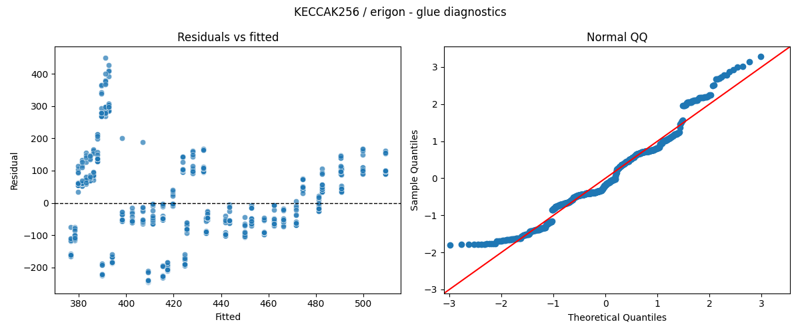

</details>

## geth

| glue_opcode | nobs | glue_runtime_ms | p_value | rsquared |
| --- | --- | --- | --- | --- |
| `ISZERO` | 1441 | 8.439e-06 | 1.00e-03 | 0.9731 |
| `JUMPDEST` | 1441 | 7.161e-06 | 1.00e-03 | 0.9703 |
| `SWAP` | 23056 | 9.539e-06 | 1.00e-03 | 0.9522 |
| `CALLDATASIZE` | 85580 | 8.663e-06 | 1.00e-03 | 0.9446 |
| `DUP` | 85580 | 9.552e-06 | 1.00e-03 | 0.9446 |
| `GAS` | 85580 | 8.735e-06 | 1.00e-03 | 0.9446 |
| `MLOAD` | 85580 | 3.043e-05 | 1.00e-03 | 0.9446 |
| `PUSH` | 85580 | 1.294e-05 | 1.00e-03 | 0.9446 |
| `PUSH0` | 85580 | 8.576e-06 | 1.00e-03 | 0.9446 |
| `STATICCALL` | 85580 | 0.0005562 | 1.00e-03 | 0.9446 |
| `ADD` | 1441 | 2.709e-05 | 1.00e-03 | 0.7975 |
| `AND` | 1441 | 2.692e-05 | 1.00e-03 | 0.7636 |
| `CALLDATACOPY` | 34584 | 6.5e-05 | 1.00e-03 | 0.9914 |
| `CALLDATALOAD` | 5764 | 5.337e-05 | 1.00e-03 | 0.03095 |
| `DIV` | 1441 | 5.85e-05 | 1.00e-03 | 0.994 |
| `EXP` | 1441 | 0.002068 | 1.00e-03 | 0.9945 |
| `GT` | 1441 | 2.105e-05 | 1.00e-03 | 0.9032 |
| `JUMPI` | 1441 | 3.307e-05 | 1.00e-03 | 0.9709 |
| `LT` | 1441 | 2.608e-05 | 1.00e-03 | 0.7506 |
| `MSTORE` | 7205 | 4.884e-05 | 1.00e-03 | 0.9744 |
| `MSTORE8` | 7205 | 4.385e-05 | 1.00e-03 | 0.9712 |
| `MUL` | 1441 | 2.715e-05 | 1.00e-03 | 0.8938 |
| `PC` | 1441 | 9.474e-06 | 1.00e-03 | 0.9875 |
| `RETURNDATASIZE` | 5764 | 1.601e-05 | 1.00e-03 | 0.9047 |
| `SELFBALANCE` | 1179 | 5.087e-05 | 1.00e-03 | 0.9904 |
| `SUB` | 1441 | 2.68e-05 | 1.00e-03 | 0.7688 |
| `JUMP` | 1441 | 5.755e-05 | 1.00e-03 | 0.9357 |
| `KECCAK256` | 23056 | 0.0002053 | 1.00e-03 | 0.3018 |

### Cycle glue — joint fit · geth

<details><summary>Joint NNLS regression summary</summary>

```
==============================================================================
                           NNLS Regression Results                            
==============================================================================
Dep. Variable:          test_runtime_ms              R-squared:          0.945
Model:                  NNLS                    Adj. R-squared:          0.945
No. Observations:       85580                             RMSE:          69.05
Df Residuals:           85572                              MAE:          35.20
Df Model:               7      
==============================================================================
                      coef     std err     P-value      [0.025      0.975]
------------------------------------------------------------------------------
         const      7.3421      0.6706       0.001      6.0331      8.6667
  CALLDATASIZE      0.0000      0.0000       0.001      0.0000      0.0000
           DUP      0.0000      0.0000       0.001      0.0000      0.0000
           GAS      0.0000      0.0000       0.001      0.0000      0.0000
         MLOAD      0.0000      0.0000       0.001      0.0000      0.0000
          PUSH      0.0000      0.0000       0.001      0.0000      0.0000
         PUSH0      0.0000      0.0000       0.001      0.0000      0.0000
    STATICCALL      0.0006      0.0000       0.001      0.0006      0.0006
==============================================================================
Notes: Non-negative least squares with bootstrap inference (1000 iterations)
==============================================================================
```

</details>

<details><summary><code>CALLDATASIZE</code> · nobs=85580 · runtime_ms=8.663e-06 · p=1.00e-03 · R²=0.9446</summary>


</details>

<details><summary><code>DUP</code> · nobs=85580 · runtime_ms=9.552e-06 · p=1.00e-03 · R²=0.9446</summary>

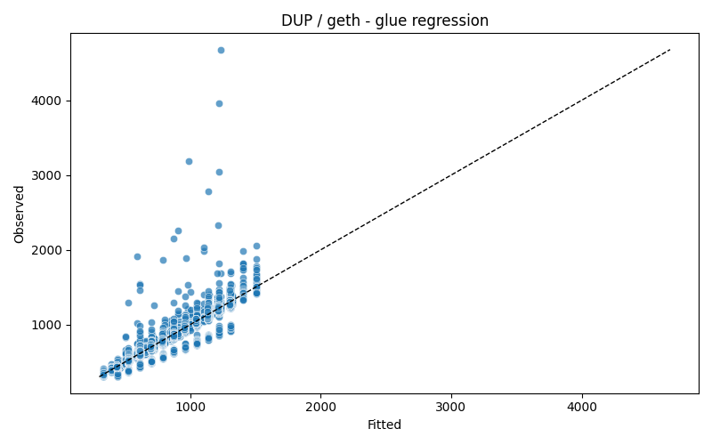


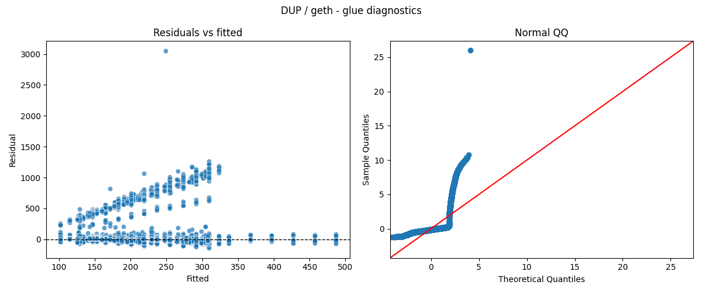

</details>

<details><summary><code>GAS</code> · nobs=85580 · runtime_ms=8.735e-06 · p=1.00e-03 · R²=0.9446</summary>


</details>

<details><summary><code>MLOAD</code> · nobs=85580 · runtime_ms=3.043e-05 · p=1.00e-03 · R²=0.9446</summary>


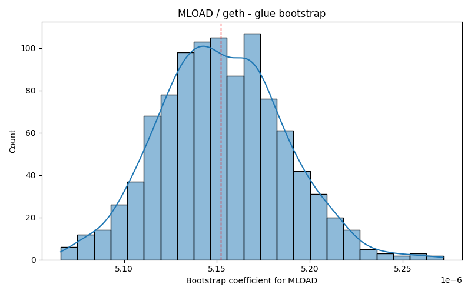


</details>

<details><summary><code>PUSH</code> · nobs=85580 · runtime_ms=1.294e-05 · p=1.00e-03 · R²=0.9446</summary>


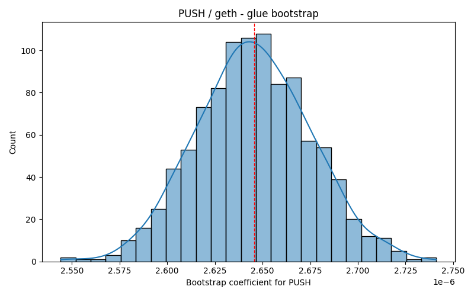

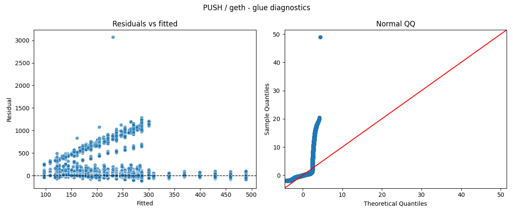

</details>

<details><summary><code>PUSH0</code> · nobs=85580 · runtime_ms=8.576e-06 · p=1.00e-03 · R²=0.9446</summary>

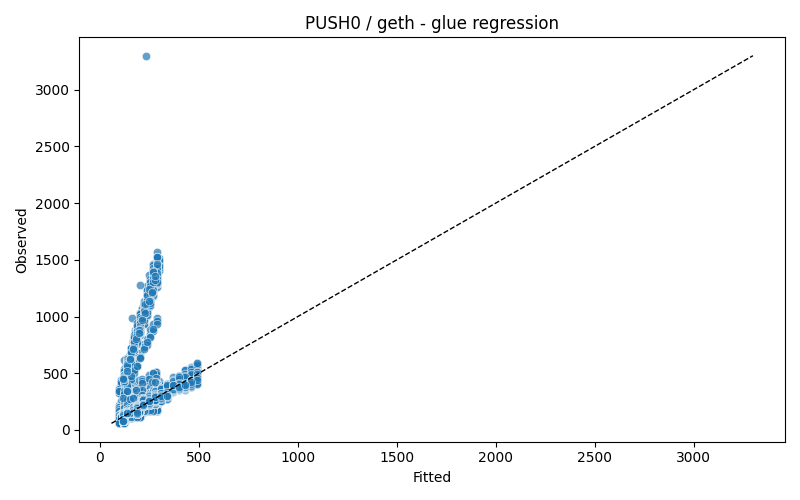

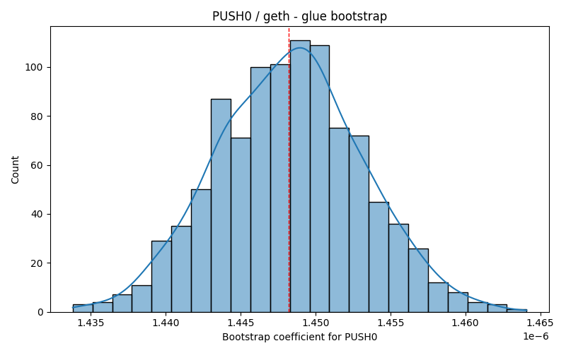

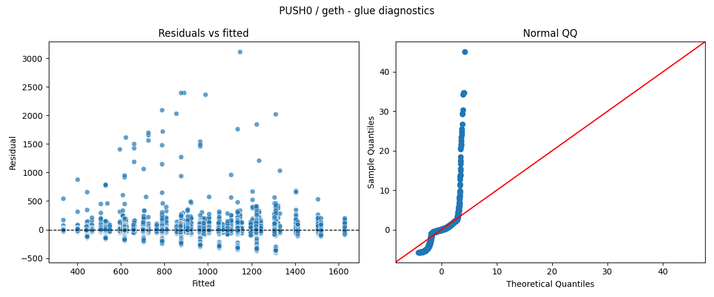

</details>

<details><summary><code>STATICCALL</code> · nobs=85580 · runtime_ms=0.0005562 · p=1.00e-03 · R²=0.9446</summary>


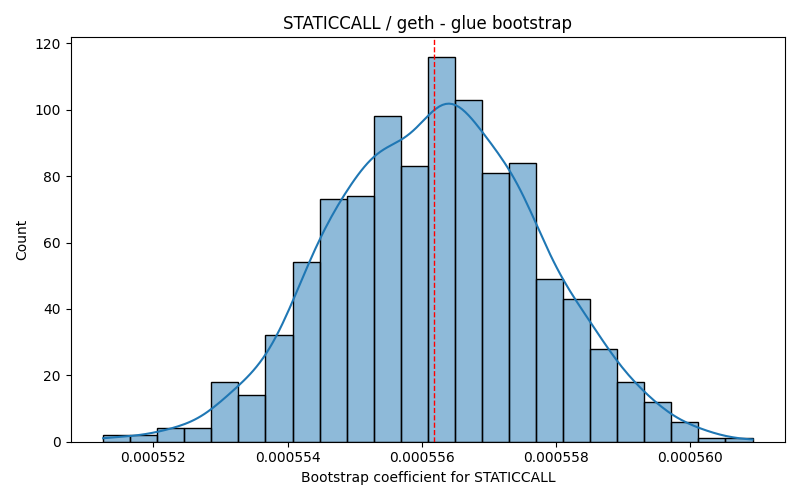

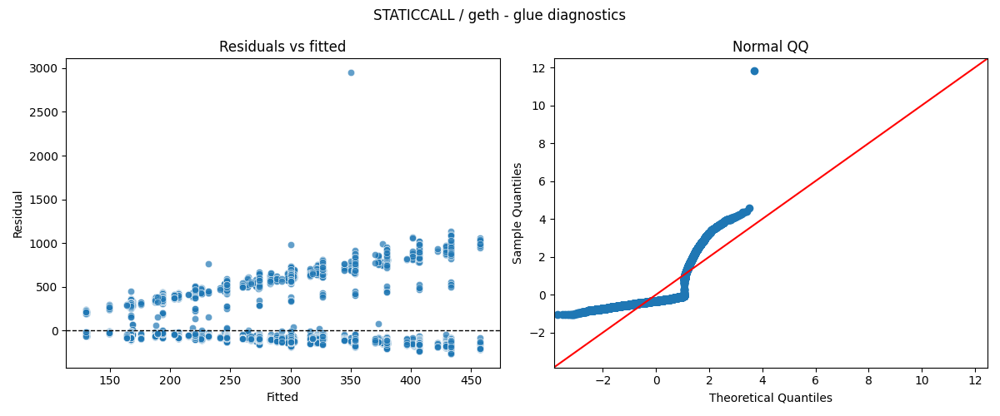

</details>

### Pure glue · geth

<details><summary><code>ISZERO</code> · nobs=1441 · runtime_ms=8.439e-06 · p=1.00e-03 · R²=0.9731</summary>

```
==============================================================================
                           NNLS Regression Results                            
==============================================================================
Dep. Variable:          test_runtime_ms              R-squared:          0.973
Model:                  NNLS                    Adj. R-squared:          0.973
No. Observations:       1441                              RMSE:          29.59
Df Residuals:           1439                               MAE:          16.18
Df Model:               1      
==============================================================================
                      coef     std err     P-value      [0.025      0.975]
------------------------------------------------------------------------------
         const      0.0000      0.7249       1.000      0.0000      2.5616
        ISZERO      0.0000      0.0000       0.001      0.0000      0.0000
==============================================================================
Notes: Non-negative least squares with bootstrap inference (1000 iterations)
==============================================================================
```


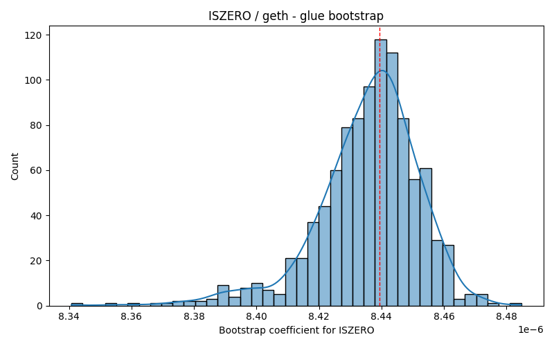

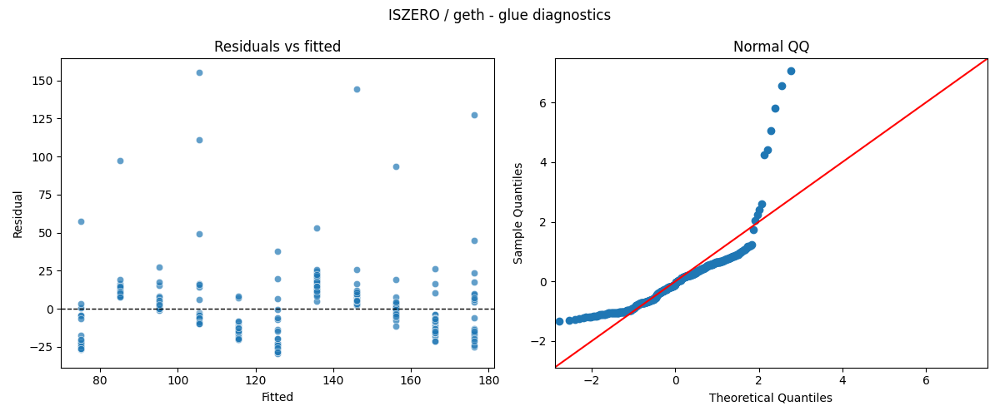

</details>

<details><summary><code>JUMPDEST</code> · nobs=1441 · runtime_ms=7.161e-06 · p=1.00e-03 · R²=0.9703</summary>

```
==============================================================================
                           NNLS Regression Results                            
==============================================================================
Dep. Variable:          test_runtime_ms              R-squared:          0.970
Model:                  NNLS                    Adj. R-squared:          0.970
No. Observations:       1441                              RMSE:          80.23
Df Residuals:           1439                               MAE:          41.39
Df Model:               1      
==============================================================================
                      coef     std err     P-value      [0.025      0.975]
------------------------------------------------------------------------------
         const      0.0000      0.0000       1.000      0.0000      0.0000
      JUMPDEST      0.0000      0.0000       0.001      0.0000      0.0000
==============================================================================
Notes: Non-negative least squares with bootstrap inference (1000 iterations)
==============================================================================
```

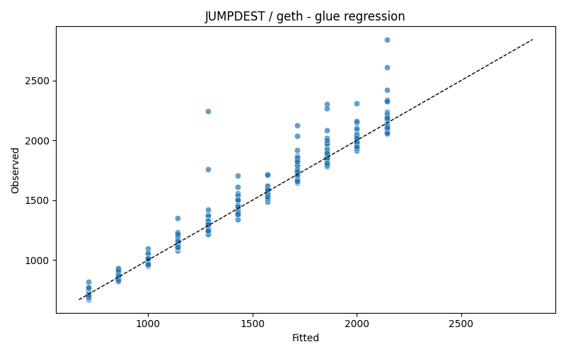

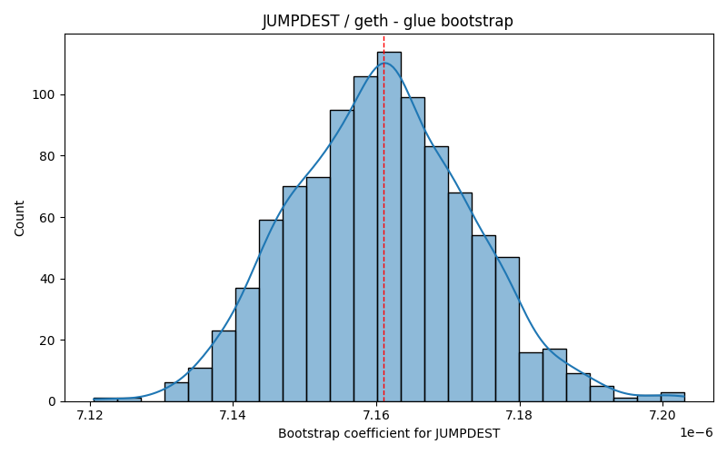

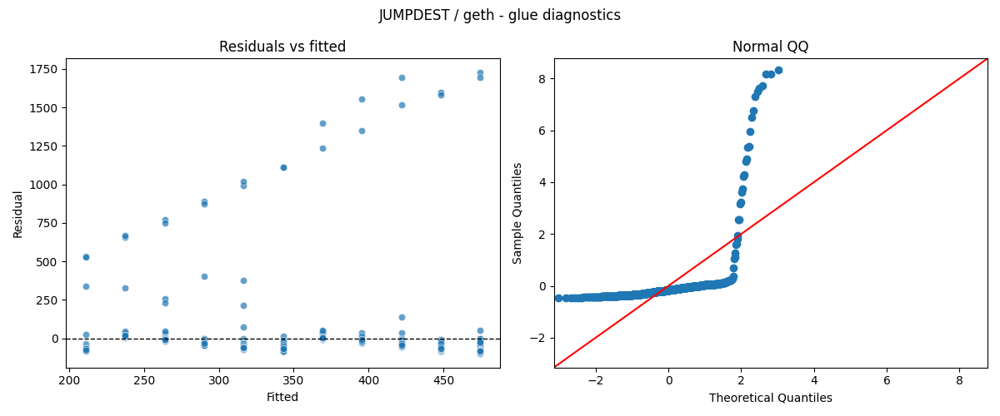

</details>

<details><summary><code>SWAP</code> · nobs=23056 · runtime_ms=9.539e-06 · p=1.00e-03 · R²=0.9522</summary>

```
==============================================================================
                           NNLS Regression Results                            
==============================================================================
Dep. Variable:          test_runtime_ms              R-squared:          0.952
Model:                  NNLS                    Adj. R-squared:          0.952
No. Observations:       23056                             RMSE:          45.01
Df Residuals:           23054                              MAE:          16.88
Df Model:               1      
==============================================================================
                      coef     std err     P-value      [0.025      0.975]
------------------------------------------------------------------------------
         const      5.5665      0.9107       0.001      3.8905      7.3355
          SWAP      0.0000      0.0000       0.001      0.0000      0.0000
==============================================================================
Notes: Non-negative least squares with bootstrap inference (1000 iterations)
==============================================================================
```


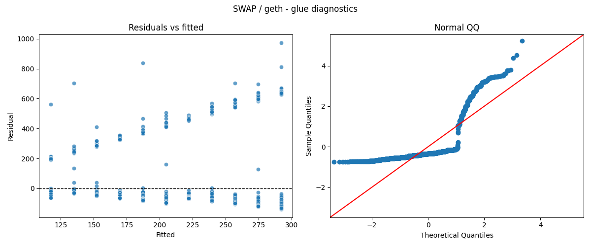

</details>

### Mixed glue (tier A) · geth

<details><summary><code>ADD</code> · nobs=1441 · runtime_ms=2.709e-05 · p=1.00e-03 · R²=0.7975</summary>

```
==============================================================================
                           NNLS Regression Results                            
==============================================================================
Dep. Variable:          test_runtime_ms              R-squared:          0.797
Model:                  NNLS                    Adj. R-squared:          0.797
No. Observations:       1441                              RMSE:         143.91
Df Residuals:           1439                               MAE:         117.06
Df Model:               1      
==============================================================================
                      coef     std err     P-value      [0.025      0.975]
------------------------------------------------------------------------------
         const      0.0000      5.7901       1.000      0.0000     19.6321
           ADD      0.0000      0.0000       0.001      0.0000      0.0000
==============================================================================
Notes: Non-negative least squares with bootstrap inference (1000 iterations)
==============================================================================
```


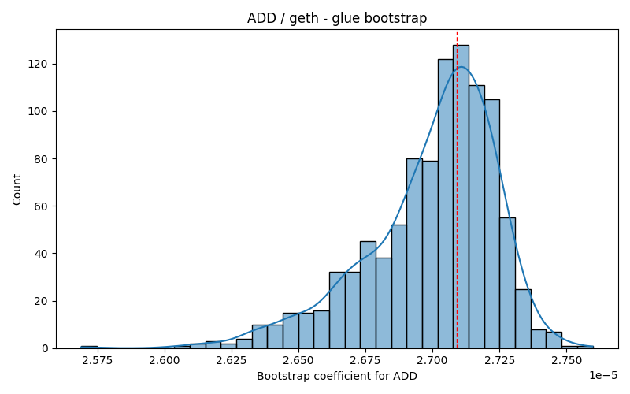

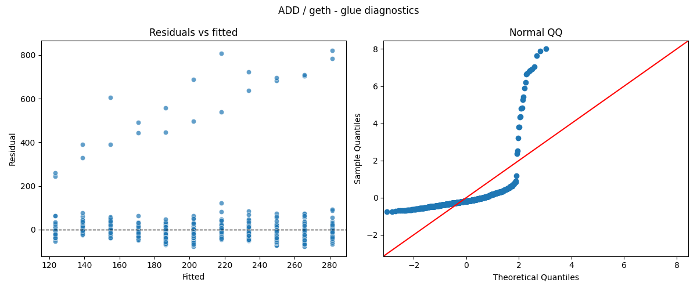

</details>

<details><summary><code>AND</code> · nobs=1441 · runtime_ms=2.692e-05 · p=1.00e-03 · R²=0.7636</summary>

```
==============================================================================
                           NNLS Regression Results                            
==============================================================================
Dep. Variable:          test_runtime_ms              R-squared:          0.764
Model:                  NNLS                    Adj. R-squared:          0.763
No. Observations:       1441                              RMSE:         159.78
Df Residuals:           1439                               MAE:         128.67
Df Model:               1      
==============================================================================
                      coef     std err     P-value      [0.025      0.975]
------------------------------------------------------------------------------
         const      0.0000      2.3170       1.000      0.0000      8.0777
           AND      0.0000      0.0000       0.001      0.0000      0.0000
==============================================================================
Notes: Non-negative least squares with bootstrap inference (1000 iterations)
==============================================================================
```


</details>

<details><summary><code>CALLDATACOPY</code> · nobs=34584 · runtime_ms=6.5e-05 · p=1.00e-03 · R²=0.9914</summary>

```
==============================================================================
                           NNLS Regression Results                            
==============================================================================
Dep. Variable:          test_runtime_ms              R-squared:          0.991
Model:                  NNLS                    Adj. R-squared:          0.991
No. Observations:       34584                             RMSE:          45.63
Df Residuals:           34582                              MAE:          26.94
Df Model:               1      
==============================================================================
                      coef     std err     P-value      [0.025      0.975]
------------------------------------------------------------------------------
         const     48.4796      0.3231       0.001     47.8369     49.1015
  CALLDATACOPY      0.0001      0.0000       0.001      0.0001      0.0001
==============================================================================
Notes: Non-negative least squares with bootstrap inference (1000 iterations)
==============================================================================
```


</details>

<details><summary><code>CALLDATALOAD</code> · nobs=5764 · runtime_ms=5.337e-05 · p=1.00e-03 · R²=0.03095</summary>

```
==============================================================================
                           NNLS Regression Results                            
==============================================================================
Dep. Variable:          test_runtime_ms              R-squared:          0.031
Model:                  NNLS                    Adj. R-squared:          0.031
No. Observations:       5764                              RMSE:           1.15
Df Residuals:           5762                               MAE:           0.58
Df Model:               1      
==============================================================================
                      coef     std err     P-value      [0.025      0.975]
------------------------------------------------------------------------------
         const      2.6494      0.0496       0.001      2.5492      2.7463
  CALLDATALOAD      0.0001      0.0000       0.001      0.0000      0.0001
==============================================================================
Notes: Non-negative least squares with bootstrap inference (1000 iterations)
==============================================================================
```


</details>

<details><summary><code>DIV</code> · nobs=1441 · runtime_ms=5.85e-05 · p=1.00e-03 · R²=0.994</summary>

```
==============================================================================
                           NNLS Regression Results                            
==============================================================================
Dep. Variable:          test_runtime_ms              R-squared:          0.994
Model:                  NNLS                    Adj. R-squared:          0.994
No. Observations:       1441                              RMSE:          35.78
Df Residuals:           1439                               MAE:          22.57
Df Model:               1      
==============================================================================
                      coef     std err     P-value      [0.025      0.975]
------------------------------------------------------------------------------
         const     13.9399      2.7909       0.001      8.5671     19.6433
           DIV      0.0001      0.0000       0.001      0.0001      0.0001
==============================================================================
Notes: Non-negative least squares with bootstrap inference (1000 iterations)
==============================================================================
```


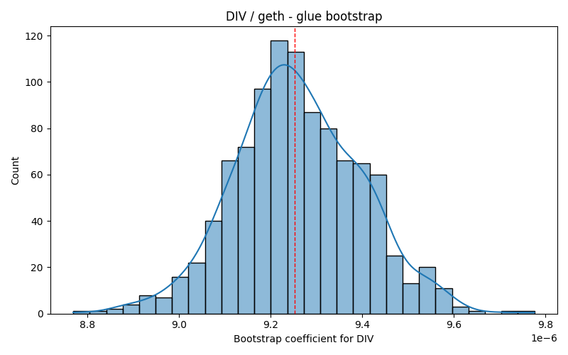


</details>

<details><summary><code>EXP</code> · nobs=1441 · runtime_ms=0.002068 · p=1.00e-03 · R²=0.9945</summary>

```
==============================================================================
                           NNLS Regression Results                            
==============================================================================
Dep. Variable:          test_runtime_ms              R-squared:          0.995
Model:                  NNLS                    Adj. R-squared:          0.995
No. Observations:       1441                              RMSE:           6.00
Df Residuals:           1439                               MAE:           4.85
Df Model:               1      
==============================================================================
                      coef     std err     P-value      [0.025      0.975]
------------------------------------------------------------------------------
         const      6.7495      0.4371       0.001      5.9175      7.6125
           EXP      0.0021      0.0000       0.001      0.0021      0.0021
==============================================================================
Notes: Non-negative least squares with bootstrap inference (1000 iterations)
==============================================================================
```


</details>

<details><summary><code>GT</code> · nobs=1441 · runtime_ms=2.105e-05 · p=1.00e-03 · R²=0.9032</summary>

```
==============================================================================
                           NNLS Regression Results                            
==============================================================================
Dep. Variable:          test_runtime_ms              R-squared:          0.903
Model:                  NNLS                    Adj. R-squared:          0.903
No. Observations:       1441                              RMSE:          72.58
Df Residuals:           1439                               MAE:          21.04
Df Model:               1      
==============================================================================
                      coef     std err     P-value      [0.025      0.975]
------------------------------------------------------------------------------
         const      0.0000      3.5225       1.000      0.0000     11.4857
            GT      0.0000      0.0000       0.001      0.0000      0.0000
==============================================================================
Notes: Non-negative least squares with bootstrap inference (1000 iterations)
==============================================================================
```


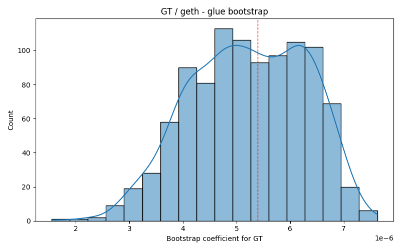

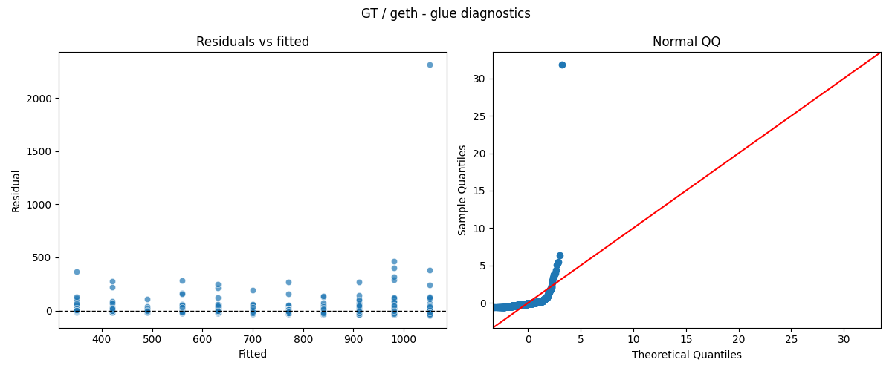

</details>

<details><summary><code>JUMPI</code> · nobs=1441 · runtime_ms=3.307e-05 · p=1.00e-03 · R²=0.9709</summary>

```
==============================================================================
                           NNLS Regression Results                            
==============================================================================
Dep. Variable:          test_runtime_ms              R-squared:          0.971
Model:                  NNLS                    Adj. R-squared:          0.971
No. Observations:       1441                              RMSE:          25.85
Df Residuals:           1439                               MAE:          13.22
Df Model:               1      
==============================================================================
                      coef     std err     P-value      [0.025      0.975]
------------------------------------------------------------------------------
         const      2.3566      2.0503       0.154      0.0000      6.9450
         JUMPI      0.0000      0.0000       0.001      0.0000      0.0000
==============================================================================
Notes: Non-negative least squares with bootstrap inference (1000 iterations)
==============================================================================
```

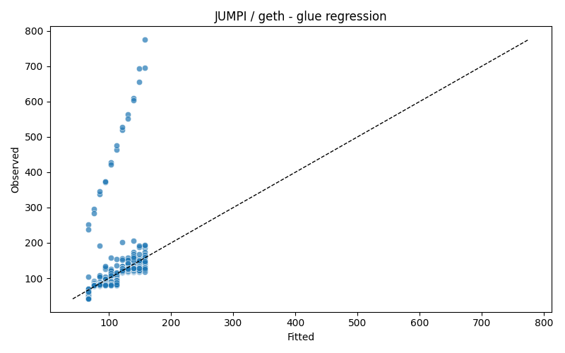


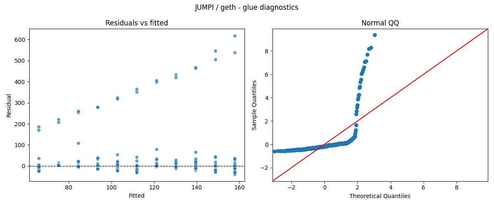

</details>

<details><summary><code>LT</code> · nobs=1441 · runtime_ms=2.608e-05 · p=1.00e-03 · R²=0.7506</summary>

```
==============================================================================
                           NNLS Regression Results                            
==============================================================================
Dep. Variable:          test_runtime_ms              R-squared:          0.751
Model:                  NNLS                    Adj. R-squared:          0.750
No. Observations:       1441                              RMSE:         158.60
Df Residuals:           1439                               MAE:         129.76
Df Model:               1      
==============================================================================
                      coef     std err     P-value      [0.025      0.975]
------------------------------------------------------------------------------
         const      0.0000      6.6462       1.000      0.0000     21.8660
            LT      0.0000      0.0000       0.001      0.0000      0.0000
==============================================================================
Notes: Non-negative least squares with bootstrap inference (1000 iterations)
==============================================================================
```


</details>

<details><summary><code>MSTORE</code> · nobs=7205 · runtime_ms=4.884e-05 · p=1.00e-03 · R²=0.9744</summary>

```
==============================================================================
                           NNLS Regression Results                            
==============================================================================
Dep. Variable:          test_runtime_ms              R-squared:          0.974
Model:                  NNLS                    Adj. R-squared:          0.974
No. Observations:       7205                              RMSE:          55.55
Df Residuals:           7203                               MAE:          25.88
Df Model:               1      
==============================================================================
                      coef     std err     P-value      [0.025      0.975]
------------------------------------------------------------------------------
         const      5.7921      2.0266       0.005      1.7772      9.6527
        MSTORE      0.0000      0.0000       0.001      0.0000      0.0000
==============================================================================
Notes: Non-negative least squares with bootstrap inference (1000 iterations)
==============================================================================
```

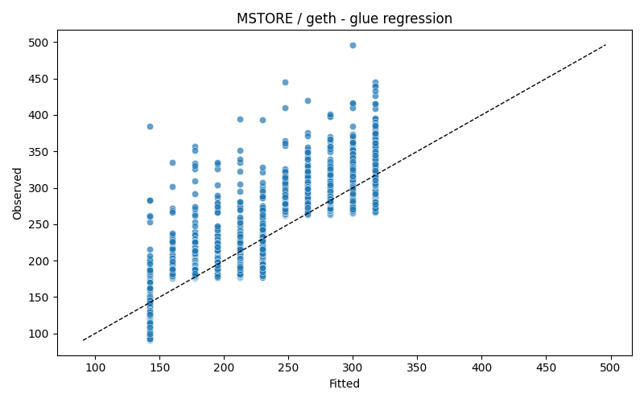

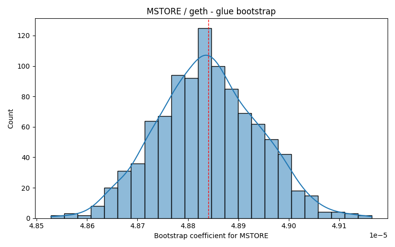

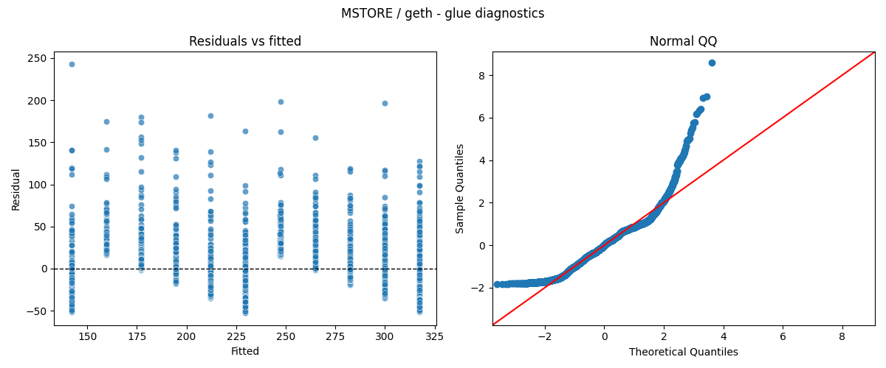

</details>

<details><summary><code>MSTORE8</code> · nobs=7205 · runtime_ms=4.385e-05 · p=1.00e-03 · R²=0.9712</summary>

```
==============================================================================
                           NNLS Regression Results                            
==============================================================================
Dep. Variable:          test_runtime_ms              R-squared:          0.971
Model:                  NNLS                    Adj. R-squared:          0.971
No. Observations:       7205                              RMSE:          52.98
Df Residuals:           7203                               MAE:          21.96
Df Model:               1      
==============================================================================
                      coef     std err     P-value      [0.025      0.975]
------------------------------------------------------------------------------
         const      6.9867      1.8303       0.001      3.2804     10.3939
       MSTORE8      0.0000      0.0000       0.001      0.0000      0.0000
==============================================================================
Notes: Non-negative least squares with bootstrap inference (1000 iterations)
==============================================================================
```


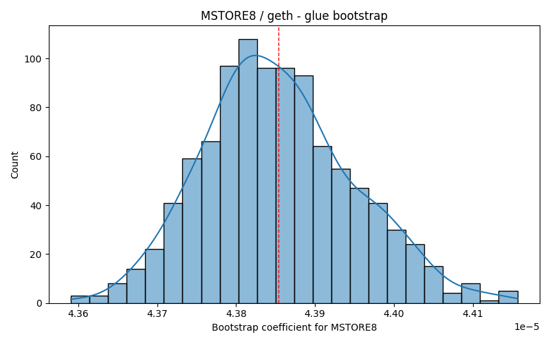

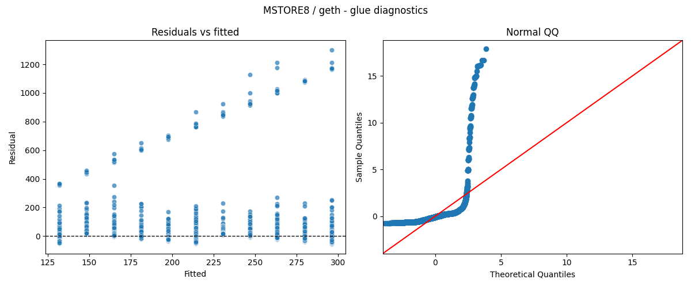

</details>

<details><summary><code>MUL</code> · nobs=1441 · runtime_ms=2.715e-05 · p=1.00e-03 · R²=0.8938</summary>

```
==============================================================================
                           NNLS Regression Results                            
==============================================================================
Dep. Variable:          test_runtime_ms              R-squared:          0.894
Model:                  NNLS                    Adj. R-squared:          0.894
No. Observations:       1441                              RMSE:          73.87
Df Residuals:           1439                               MAE:          48.24
Df Model:               1      
==============================================================================
                      coef     std err     P-value      [0.025      0.975]
------------------------------------------------------------------------------
         const     26.2826      5.1929       0.001     15.8285     35.7310
           MUL      0.0000      0.0000       0.001      0.0000      0.0000
==============================================================================
Notes: Non-negative least squares with bootstrap inference (1000 iterations)
==============================================================================
```


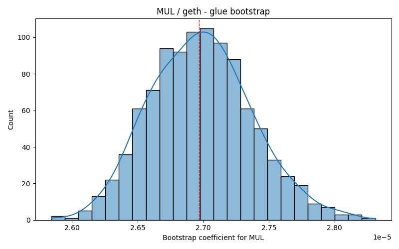

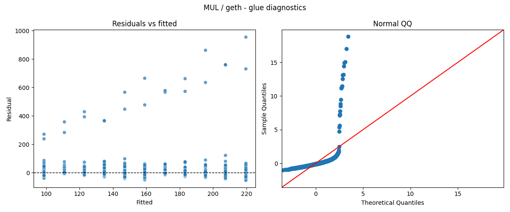

</details>

<details><summary><code>PC</code> · nobs=1441 · runtime_ms=9.474e-06 · p=1.00e-03 · R²=0.9875</summary>

```
==============================================================================
                           NNLS Regression Results                            
==============================================================================
Dep. Variable:          test_runtime_ms              R-squared:          0.987
Model:                  NNLS                    Adj. R-squared:          0.987
No. Observations:       1441                              RMSE:          31.90
Df Residuals:           1439                               MAE:          18.10
Df Model:               1      
==============================================================================
                      coef     std err     P-value      [0.025      0.975]
------------------------------------------------------------------------------
         const      5.8376      2.5426       0.021      0.4192     10.5797
            PC      0.0000      0.0000       0.001      0.0000      0.0000
==============================================================================
Notes: Non-negative least squares with bootstrap inference (1000 iterations)
==============================================================================
```

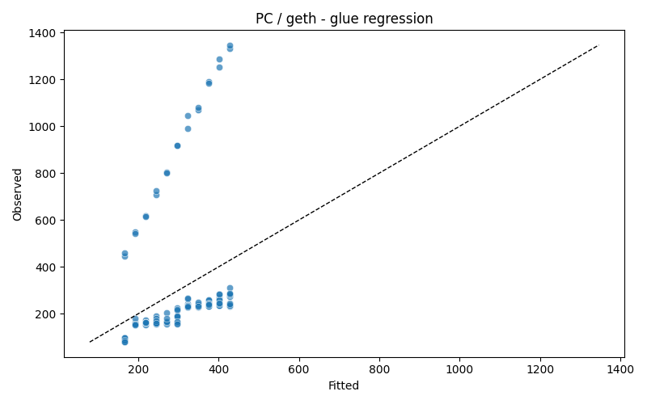

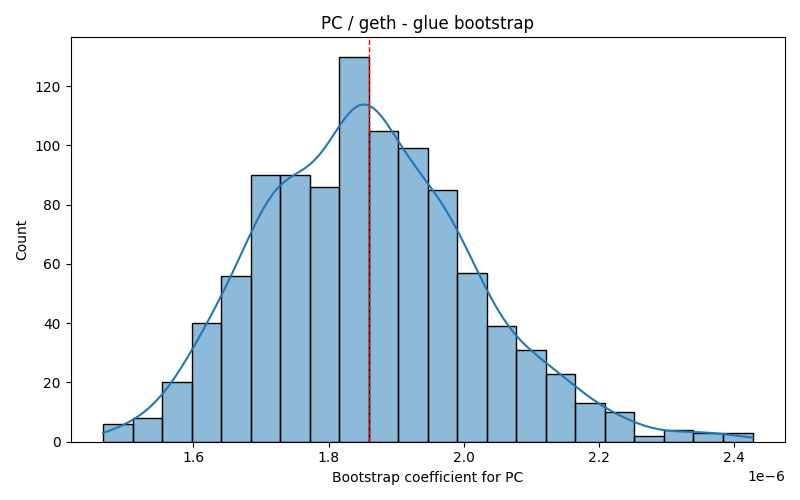

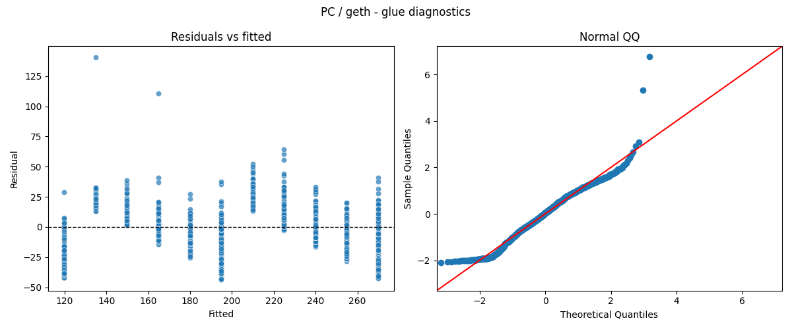

</details>

<details><summary><code>RETURNDATASIZE</code> · nobs=5764 · runtime_ms=1.601e-05 · p=1.00e-03 · R²=0.9047</summary>

```
==============================================================================
                           NNLS Regression Results                            
==============================================================================
Dep. Variable:          test_runtime_ms              R-squared:          0.905
Model:                  NNLS                    Adj. R-squared:          0.905
No. Observations:       5764                              RMSE:          82.01
Df Residuals:           5762                               MAE:          38.71
Df Model:               1      
==============================================================================
                      coef     std err     P-value      [0.025      0.975]
------------------------------------------------------------------------------
         const     26.0391      3.3570       0.001     19.4454     32.7148
RETURNDATASIZE      0.0000      0.0000       0.001      0.0000      0.0000
==============================================================================
Notes: Non-negative least squares with bootstrap inference (1000 iterations)
==============================================================================
```

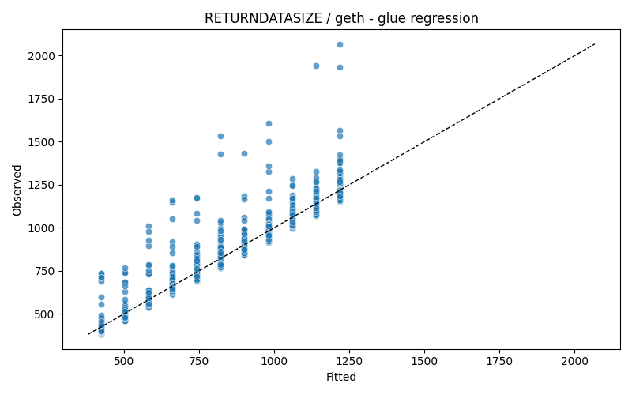

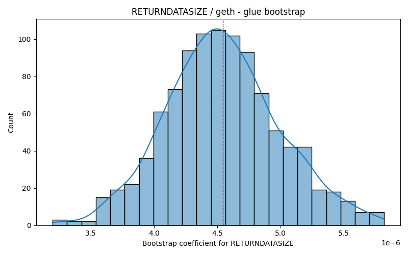


</details>

<details><summary><code>SELFBALANCE</code> · nobs=1179 · runtime_ms=5.087e-05 · p=1.00e-03 · R²=0.9904</summary>

```
==============================================================================
                           NNLS Regression Results                            
==============================================================================
Dep. Variable:          test_runtime_ms              R-squared:          0.990
Model:                  NNLS                    Adj. R-squared:          0.990
No. Observations:       1179                              RMSE:          50.57
Df Residuals:           1177                               MAE:          32.74
Df Model:               1      
==============================================================================
                      coef     std err     P-value      [0.025      0.975]
------------------------------------------------------------------------------
         const      7.2490      4.9603       0.089      0.0000     18.0849
   SELFBALANCE      0.0001      0.0000       0.001      0.0001      0.0001
==============================================================================
Notes: Non-negative least squares with bootstrap inference (1000 iterations)
==============================================================================
```


</details>

<details><summary><code>SUB</code> · nobs=1441 · runtime_ms=2.68e-05 · p=1.00e-03 · R²=0.7688</summary>

```
==============================================================================
                           NNLS Regression Results                            
==============================================================================
Dep. Variable:          test_runtime_ms              R-squared:          0.769
Model:                  NNLS                    Adj. R-squared:          0.769
No. Observations:       1441                              RMSE:         154.72
Df Residuals:           1439                               MAE:         127.49
Df Model:               1      
==============================================================================
                      coef     std err     P-value      [0.025      0.975]
------------------------------------------------------------------------------
         const      1.2433      7.3594       0.477      0.0000     24.5187
           SUB      0.0000      0.0000       0.001      0.0000      0.0000
==============================================================================
Notes: Non-negative least squares with bootstrap inference (1000 iterations)
==============================================================================
```

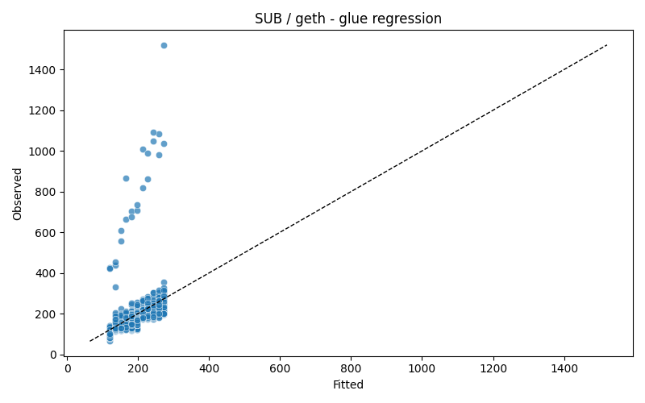


</details>

### Mixed glue (tier B) · geth

<details><summary><code>JUMP</code> · nobs=1441 · runtime_ms=5.755e-05 · p=1.00e-03 · R²=0.9357</summary>

```
==============================================================================
                           NNLS Regression Results                            
==============================================================================
Dep. Variable:          test_runtime_ms              R-squared:          0.936
Model:                  NNLS                    Adj. R-squared:          0.936
No. Observations:       1441                              RMSE:          56.08
Df Residuals:           1439                               MAE:          20.32
Df Model:               1      
==============================================================================
                      coef     std err     P-value      [0.025      0.975]
------------------------------------------------------------------------------
         const      0.0000      2.1664       1.000      0.0000      6.9164
          JUMP      0.0001      0.0000       0.001      0.0001      0.0001
==============================================================================
Notes: Non-negative least squares with bootstrap inference (1000 iterations)
==============================================================================
```

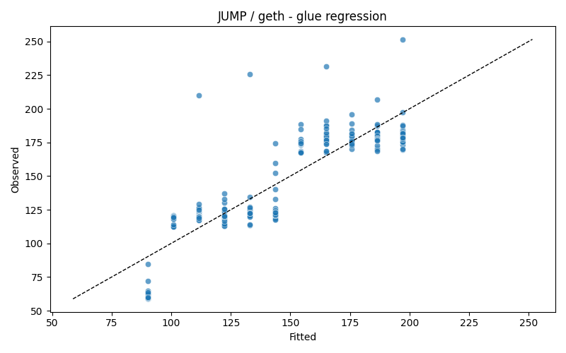

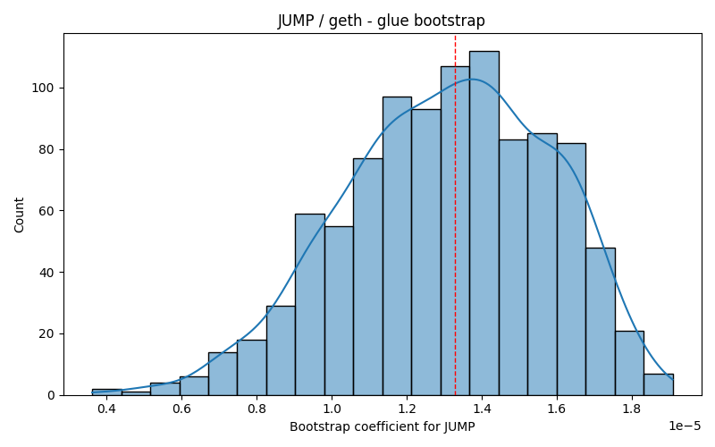


</details>

<details><summary><code>KECCAK256</code> · nobs=23056 · runtime_ms=0.0002053 · p=1.00e-03 · R²=0.3018</summary>

```
==============================================================================
                           NNLS Regression Results                            
==============================================================================
Dep. Variable:          test_runtime_ms              R-squared:          0.302
Model:                  NNLS                    Adj. R-squared:          0.302
No. Observations:       23056                             RMSE:         620.62
Df Residuals:           23054                              MAE:         499.34
Df Model:               1      
==============================================================================
                      coef     std err     P-value      [0.025      0.975]
------------------------------------------------------------------------------
         const   1630.2211      9.1834       0.001   1612.3040   1649.1416
     KECCAK256      0.0002      0.0000       0.001      0.0002      0.0002
==============================================================================
Notes: Non-negative least squares with bootstrap inference (1000 iterations)
==============================================================================
```

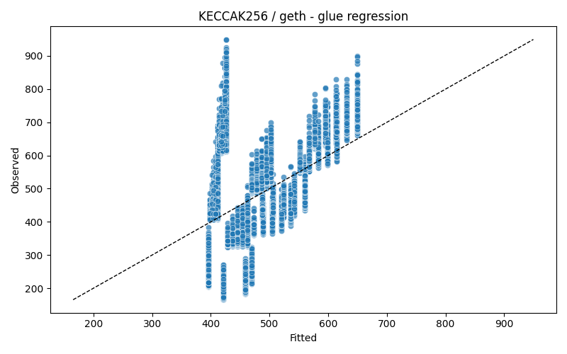


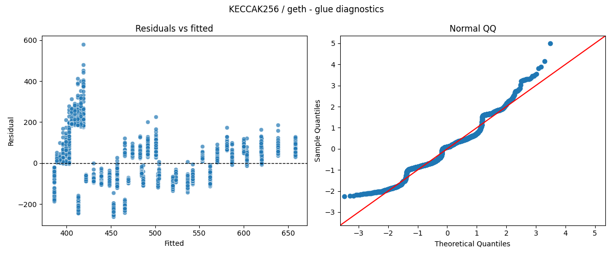

</details>

## nethermind

| glue_opcode | nobs | glue_runtime_ms | p_value | rsquared |
| --- | --- | --- | --- | --- |
| `ISZERO` | 2585 | 8.236e-07 | 1.00e-03 | 0.3775 |
| `JUMPDEST` | 2585 | 4.156e-07 | 1.00e-03 | 0.5823 |
| `SWAP` | 41360 | 5.331e-07 | 1.00e-03 | 0.4104 |
| `CALLDATASIZE` | 153241 | 1.208e-07 | 1.00e-03 | 0.8893 |
| `DUP` | 153241 | 7.316e-08 | 1.00e-03 | 0.8893 |
| `GAS` | 153241 | 8.374e-08 | 1.00e-03 | 0.8893 |
| `MLOAD` | 153241 | 1.547e-06 | 1.00e-03 | 0.8893 |
| `PUSH` | 153241 | 1.476e-07 | 1.00e-03 | 0.8893 |
| `PUSH0` | 153241 | 3.168e-08 | 1.00e-03 | 0.8893 |
| `STATICCALL` | 153241 | 0.0007095 | 1.00e-03 | 0.8893 |
| `ADD` | 2596 | 1.768e-06 | 1.00e-03 | 0.7116 |
| `AND` | 2596 | 1.068e-06 | 1.00e-03 | 0.5525 |
| `CALLDATACOPY` | 62304 | 4.162e-06 | 1.00e-03 | 0.6022 |
| `CALLDATALOAD` | 10384 | 0 | 1.00e+00 | 0 |
| `DIV` | 2596 | 5.553e-06 | 1.00e-03 | 0.4926 |
| `EXP` | 2596 | 0 | 1.00e+00 | 0 |
| `GT` | 2585 | 1.546e-06 | 1.00e-03 | 0.3997 |
| `JUMPI` | 2585 | 1.821e-06 | 1.00e-03 | 0.5047 |
| `LT` | 2585 | 1.538e-06 | 1.00e-03 | 0.3741 |
| `MSTORE` | 12925 | 2.109e-06 | 1.00e-03 | 0.6181 |
| `MSTORE8` | 12925 | 2.053e-06 | 1.00e-03 | 0.6279 |
| `MUL` | 2596 | 4.655e-06 | 1.00e-03 | 0.7634 |
| `PC` | 2585 | 8.097e-07 | 1.00e-03 | 0.8418 |
| `RETURNDATASIZE` | 10340 | 7.488e-07 | 1.00e-03 | 0.4462 |
| `SELFBALANCE` | 2124 | 8.559e-06 | 1.00e-03 | 0.6614 |
| `SUB` | 2596 | 2.084e-06 | 1.00e-03 | 0.8164 |
| `JUMP` | 2585 | 5.379e-06 | 1.00e-03 | 0.8248 |
| `KECCAK256` | 41360 | 0 | 1.00e+00 | 0 |

### Cycle glue — joint fit · nethermind

<details><summary>Joint NNLS regression summary</summary>

```
==============================================================================
                           NNLS Regression Results                            
==============================================================================
Dep. Variable:          test_runtime_ms              R-squared:          0.889
Model:                  NNLS                    Adj. R-squared:          0.889
No. Observations:       153241                            RMSE:          28.32
Df Residuals:           153233                             MAE:           6.58
Df Model:               7      
==============================================================================
                      coef     std err     P-value      [0.025      0.975]
------------------------------------------------------------------------------
         const     18.4541      0.2426       0.001     17.9110     18.8687
  CALLDATASIZE      0.0000      0.0000       0.001      0.0000      0.0000
           DUP      0.0000      0.0000       0.001      0.0000      0.0000
           GAS      0.0000      0.0000       0.001      0.0000      0.0000
         MLOAD      0.0000      0.0000       0.001      0.0000      0.0000
          PUSH      0.0000      0.0000       0.001      0.0000      0.0000
         PUSH0      0.0000      0.0000       0.001      0.0000      0.0000
    STATICCALL      0.0007      0.0000       0.001      0.0007      0.0007
==============================================================================
Notes: Non-negative least squares with bootstrap inference (1000 iterations)
==============================================================================
```

</details>

<details><summary><code>CALLDATASIZE</code> · nobs=153241 · runtime_ms=1.208e-07 · p=1.00e-03 · R²=0.8893</summary>

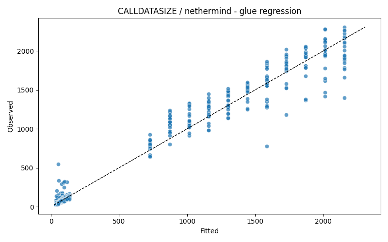

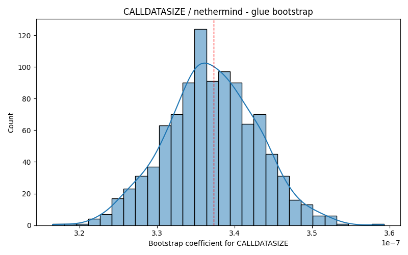

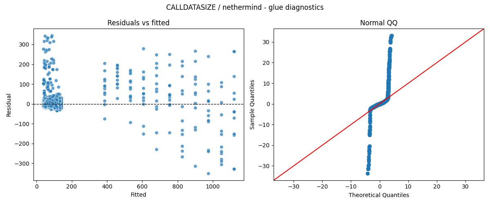

</details>

<details><summary><code>DUP</code> · nobs=153241 · runtime_ms=7.316e-08 · p=1.00e-03 · R²=0.8893</summary>


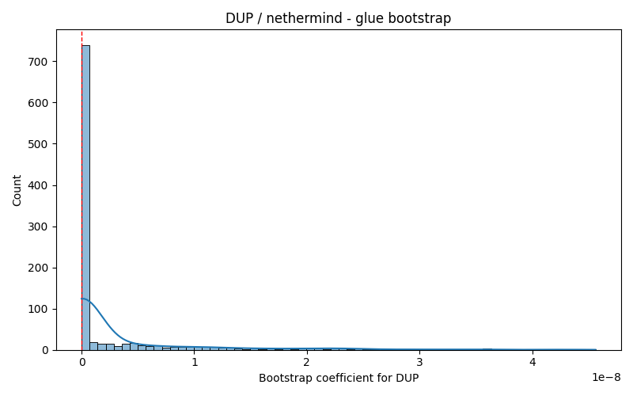


</details>

<details><summary><code>GAS</code> · nobs=153241 · runtime_ms=8.374e-08 · p=1.00e-03 · R²=0.8893</summary>


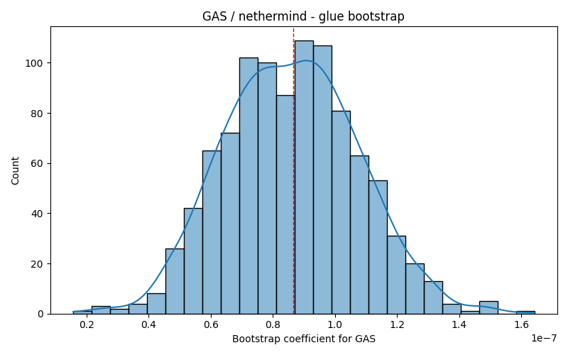

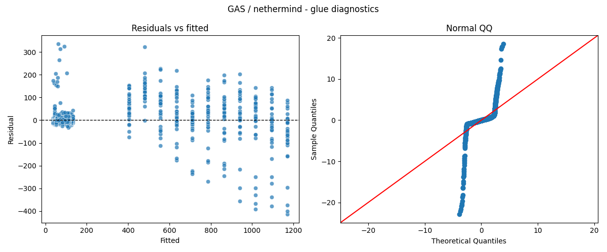

</details>

<details><summary><code>MLOAD</code> · nobs=153241 · runtime_ms=1.547e-06 · p=1.00e-03 · R²=0.8893</summary>

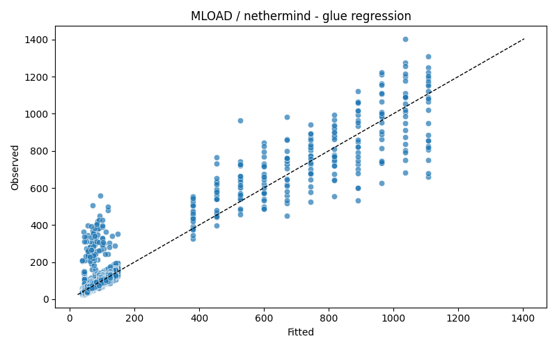


</details>

<details><summary><code>PUSH</code> · nobs=153241 · runtime_ms=1.476e-07 · p=1.00e-03 · R²=0.8893</summary>


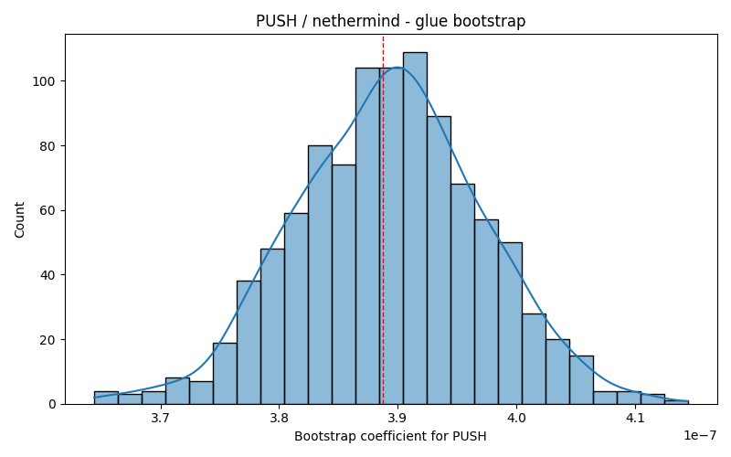

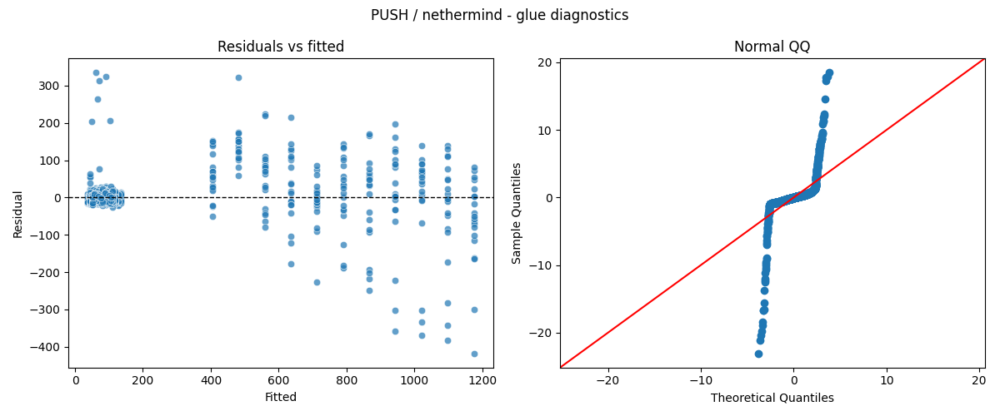

</details>

<details><summary><code>PUSH0</code> · nobs=153241 · runtime_ms=3.168e-08 · p=1.00e-03 · R²=0.8893</summary>


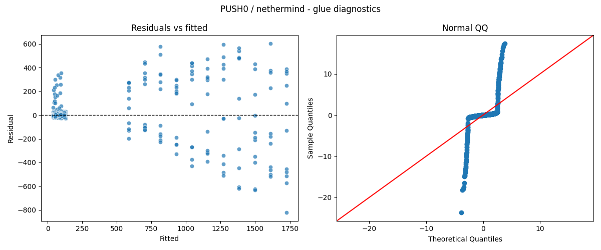

</details>

<details><summary><code>STATICCALL</code> · nobs=153241 · runtime_ms=0.0007095 · p=1.00e-03 · R²=0.8893</summary>

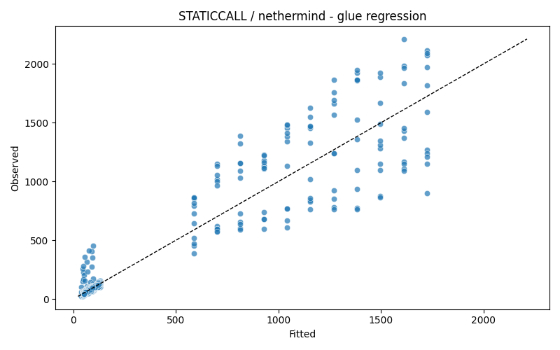


</details>

### Pure glue · nethermind

<details><summary><code>ISZERO</code> · nobs=2585 · runtime_ms=8.236e-07 · p=1.00e-03 · R²=0.3775</summary>

```
==============================================================================
                           NNLS Regression Results                            
==============================================================================
Dep. Variable:          test_runtime_ms              R-squared:          0.378
Model:                  NNLS                    Adj. R-squared:          0.377
No. Observations:       2585                              RMSE:          22.27
Df Residuals:           2583                               MAE:          10.99
Df Model:               1      
==============================================================================
                      coef     std err     P-value      [0.025      0.975]
------------------------------------------------------------------------------
         const     21.3004      1.5484       0.001     18.3365     24.1398
        ISZERO      0.0000      0.0000       0.001      0.0000      0.0000
==============================================================================
Notes: Non-negative least squares with bootstrap inference (1000 iterations)
==============================================================================
```

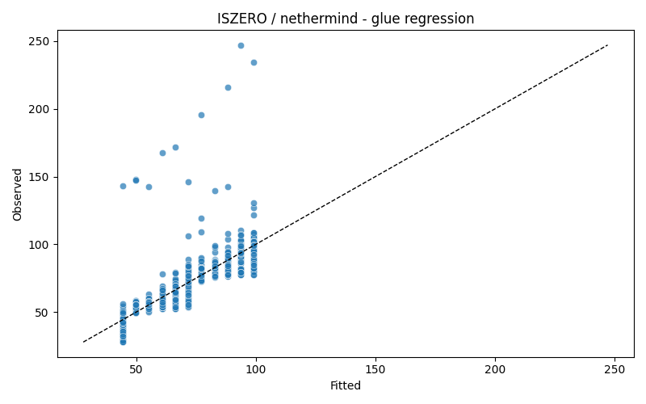

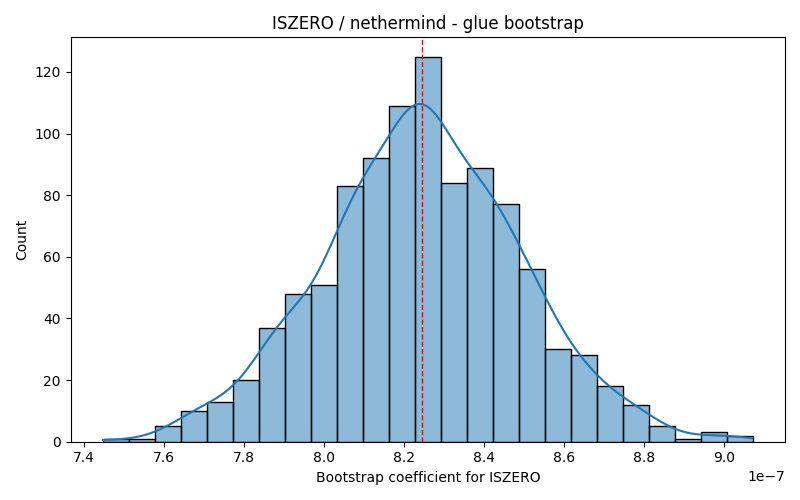

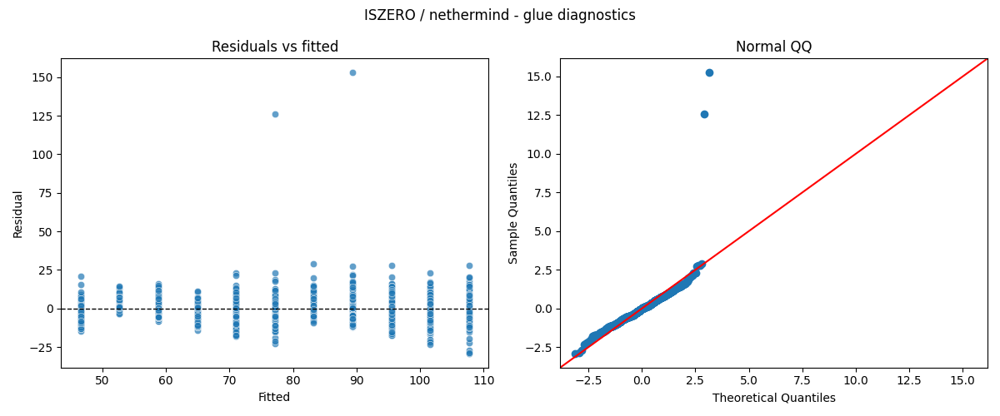

</details>

<details><summary><code>JUMPDEST</code> · nobs=2585 · runtime_ms=4.156e-07 · p=1.00e-03 · R²=0.5823</summary>

```
==============================================================================
                           NNLS Regression Results                            
==============================================================================
Dep. Variable:          test_runtime_ms              R-squared:          0.582
Model:                  NNLS                    Adj. R-squared:          0.582
No. Observations:       2585                              RMSE:          22.23
Df Residuals:           2583                               MAE:          12.87
Df Model:               1      
==============================================================================
                      coef     std err     P-value      [0.025      0.975]
------------------------------------------------------------------------------
         const     20.2605      1.1734       0.001     17.8671     22.5122
      JUMPDEST      0.0000      0.0000       0.001      0.0000      0.0000
==============================================================================
Notes: Non-negative least squares with bootstrap inference (1000 iterations)
==============================================================================
```

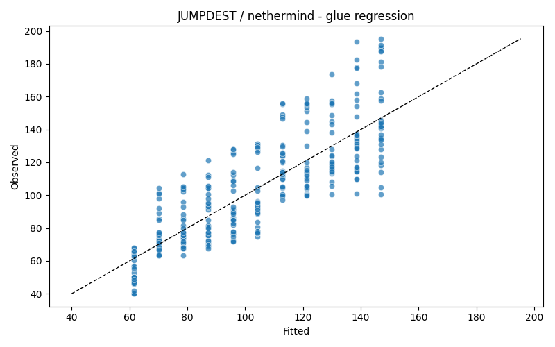


</details>

<details><summary><code>SWAP</code> · nobs=41360 · runtime_ms=5.331e-07 · p=1.00e-03 · R²=0.4104</summary>

```
==============================================================================
                           NNLS Regression Results                            
==============================================================================
Dep. Variable:          test_runtime_ms              R-squared:          0.410
Model:                  NNLS                    Adj. R-squared:          0.410
No. Observations:       41360                             RMSE:          13.45
Df Residuals:           41358                              MAE:           5.23
Df Model:               1      
==============================================================================
                      coef     std err     P-value      [0.025      0.975]
------------------------------------------------------------------------------
         const     16.2861      0.2234       0.001     15.8500     16.7288
          SWAP      0.0000      0.0000       0.001      0.0000      0.0000
==============================================================================
Notes: Non-negative least squares with bootstrap inference (1000 iterations)
==============================================================================
```

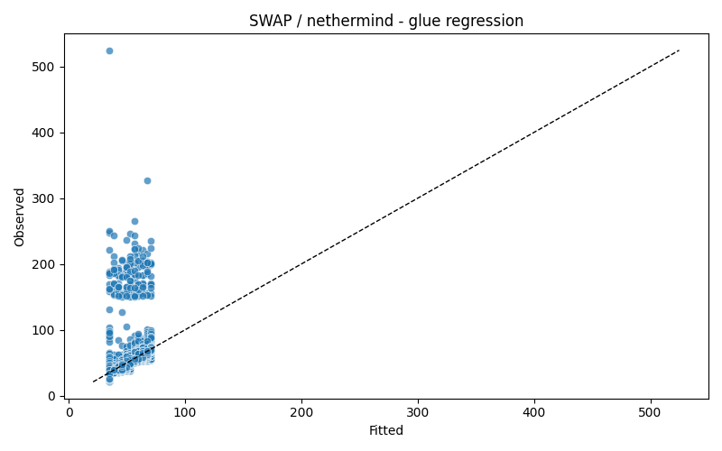


</details>

### Mixed glue (tier A) · nethermind

<details><summary><code>ADD</code> · nobs=2596 · runtime_ms=1.768e-06 · p=1.00e-03 · R²=0.7116</summary>

```
==============================================================================
                           NNLS Regression Results                            
==============================================================================
Dep. Variable:          test_runtime_ms              R-squared:          0.712
Model:                  NNLS                    Adj. R-squared:          0.711
No. Observations:       2596                              RMSE:          11.84
Df Residuals:           2594                               MAE:           7.68
Df Model:               1      
==============================================================================
                      coef     std err     P-value      [0.025      0.975]
------------------------------------------------------------------------------
         const     21.8768      0.7641       0.001     20.4903     23.4300
           ADD      0.0000      0.0000       0.001      0.0000      0.0000
==============================================================================
Notes: Non-negative least squares with bootstrap inference (1000 iterations)
==============================================================================
```

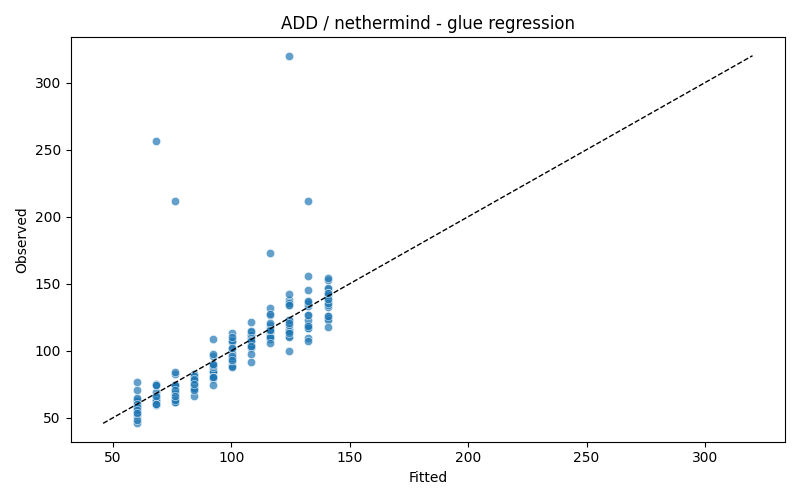

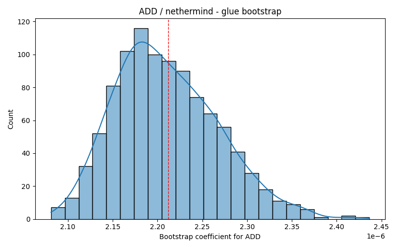

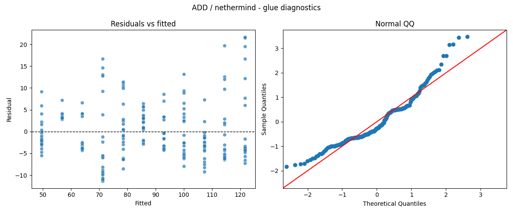

</details>

<details><summary><code>AND</code> · nobs=2596 · runtime_ms=1.068e-06 · p=1.00e-03 · R²=0.5525</summary>

```
==============================================================================
                           NNLS Regression Results                            
==============================================================================
Dep. Variable:          test_runtime_ms              R-squared:          0.553
Model:                  NNLS                    Adj. R-squared:          0.552
No. Observations:       2596                              RMSE:          10.12
Df Residuals:           2594                               MAE:           4.86
Df Model:               1      
==============================================================================
                      coef     std err     P-value      [0.025      0.975]
------------------------------------------------------------------------------
         const     14.0314      0.5919       0.001     12.8929     15.1698
           AND      0.0000      0.0000       0.001      0.0000      0.0000
==============================================================================
Notes: Non-negative least squares with bootstrap inference (1000 iterations)
==============================================================================
```


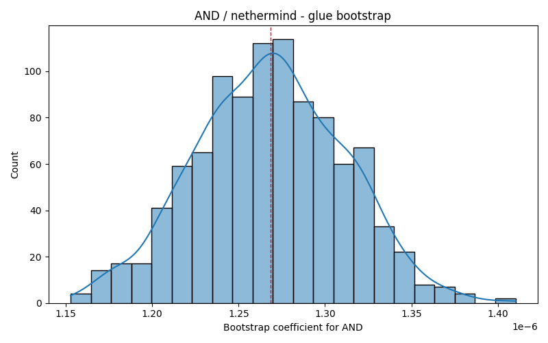

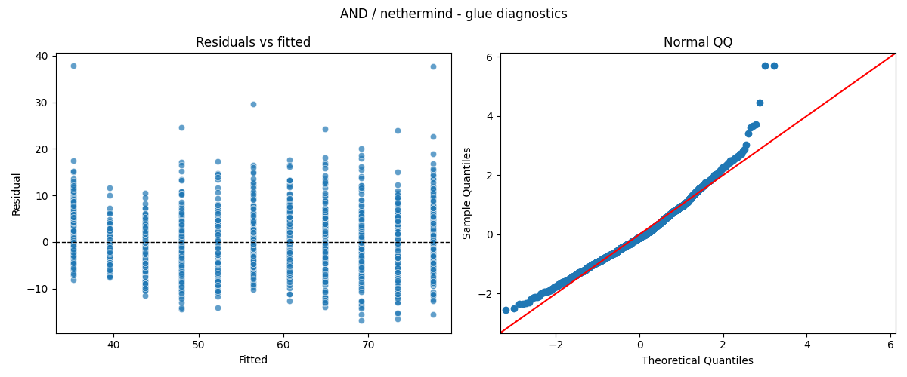

</details>

<details><summary><code>CALLDATACOPY</code> · nobs=62304 · runtime_ms=4.162e-06 · p=1.00e-03 · R²=0.6022</summary>

```
==============================================================================
                           NNLS Regression Results                            
==============================================================================
Dep. Variable:          test_runtime_ms              R-squared:          0.602
Model:                  NNLS                    Adj. R-squared:          0.602
No. Observations:       62304                             RMSE:          25.44
Df Residuals:           62302                              MAE:          15.51
Df Model:               1      
==============================================================================
                      coef     std err     P-value      [0.025      0.975]
------------------------------------------------------------------------------
         const     23.3353      0.1189       0.001     23.0981     23.5635
  CALLDATACOPY      0.0000      0.0000       0.001      0.0000      0.0000
==============================================================================
Notes: Non-negative least squares with bootstrap inference (1000 iterations)
==============================================================================
```

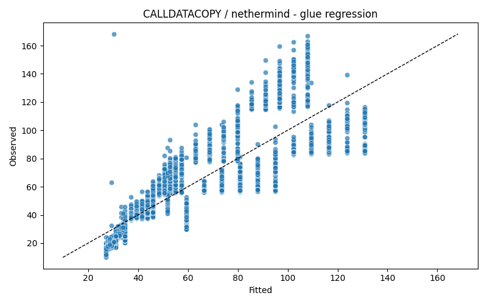

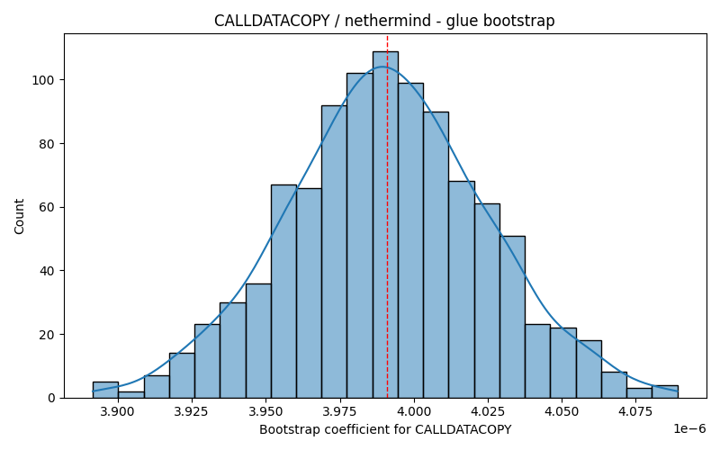

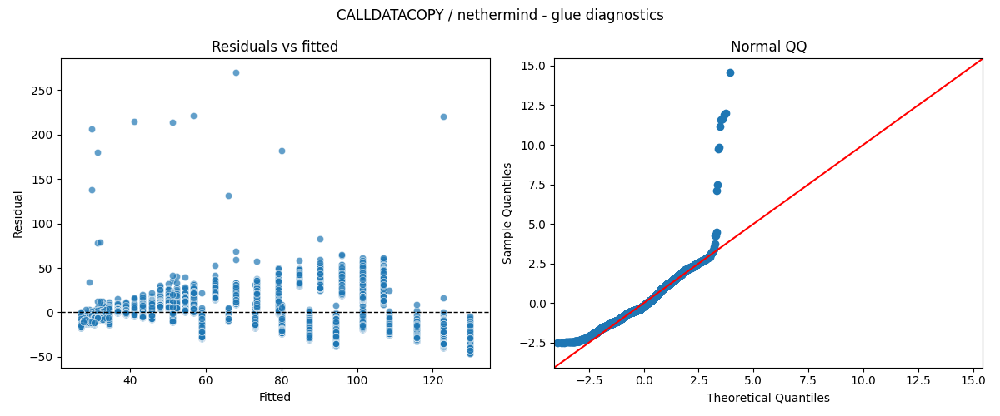

</details>

<details><summary><code>CALLDATALOAD</code> · nobs=10384 · runtime_ms=0 · p=1.00e+00 · R²=0</summary>

```
==============================================================================
                           NNLS Regression Results                            
==============================================================================
Dep. Variable:          test_runtime_ms              R-squared:          0.000
Model:                  NNLS                    Adj. R-squared:         -0.000
No. Observations:       10384                             RMSE:          46.95
Df Residuals:           10382                              MAE:           1.74
Df Model:               1      
==============================================================================
                      coef     std err     P-value      [0.025      0.975]
------------------------------------------------------------------------------
         const      3.4802      1.0341       0.015      0.2566      4.3118
  CALLDATALOAD      0.0000      0.0001       1.000      0.0000      0.0003
==============================================================================
Notes: Non-negative least squares with bootstrap inference (1000 iterations)
==============================================================================
```

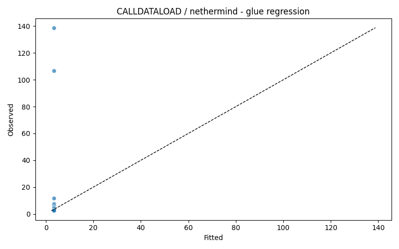

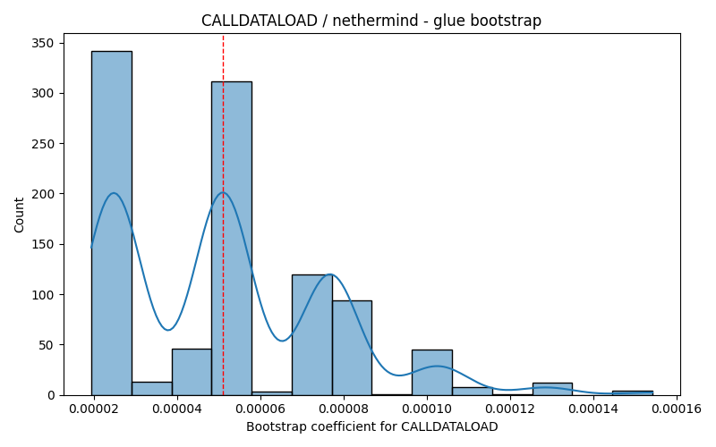

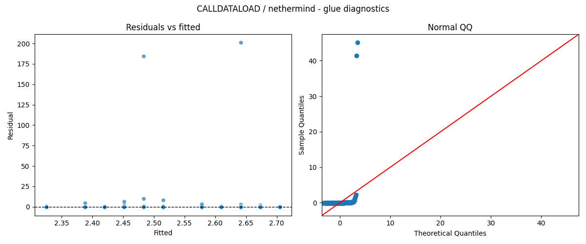

</details>

<details><summary><code>DIV</code> · nobs=2596 · runtime_ms=5.553e-06 · p=1.00e-03 · R²=0.4926</summary>

```
==============================================================================
                           NNLS Regression Results                            
==============================================================================
Dep. Variable:          test_runtime_ms              R-squared:          0.493
Model:                  NNLS                    Adj. R-squared:          0.492
No. Observations:       2596                              RMSE:          44.48
Df Residuals:           2594                               MAE:          34.40
Df Model:               1      
==============================================================================
                      coef     std err     P-value      [0.025      0.975]
------------------------------------------------------------------------------
         const    132.9890      3.6438       0.001    125.4544    139.8564
           DIV      0.0000      0.0000       0.001      0.0000      0.0000
==============================================================================
Notes: Non-negative least squares with bootstrap inference (1000 iterations)
==============================================================================
```


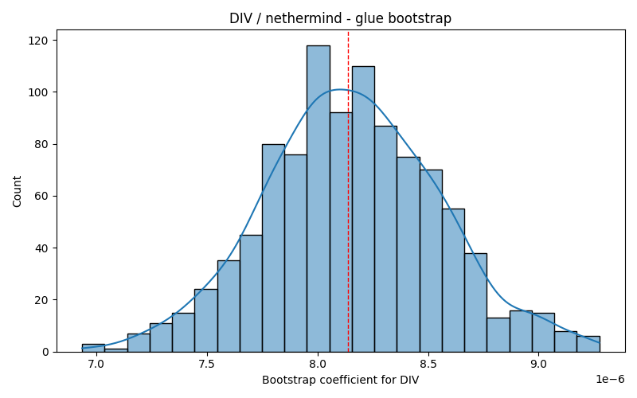

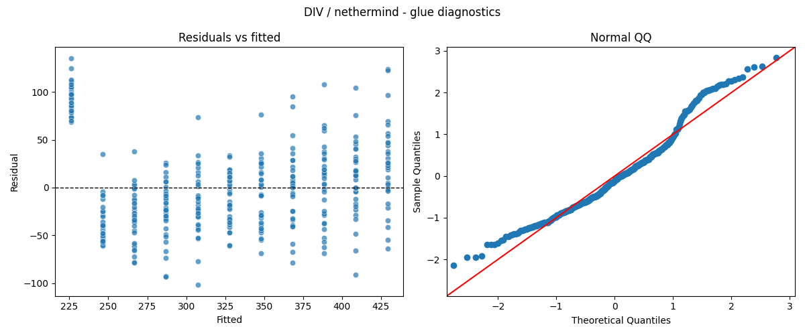

</details>

<details><summary><code>EXP</code> · nobs=2596 · runtime_ms=0 · p=1.00e+00 · R²=0</summary>

```
==============================================================================
                           NNLS Regression Results                            
==============================================================================
Dep. Variable:          test_runtime_ms              R-squared:          0.000
Model:                  NNLS                    Adj. R-squared:         -0.000
No. Observations:       2596                              RMSE:          46.26
Df Residuals:           2594                               MAE:          29.88
Df Model:               1      
==============================================================================
                      coef     std err     P-value      [0.025      0.975]
------------------------------------------------------------------------------
         const     91.8225      0.9461       0.001     90.0795     93.6724
           EXP      0.0000      0.0000       1.000      0.0000      0.0000
==============================================================================
Notes: Non-negative least squares with bootstrap inference (1000 iterations)
==============================================================================
```


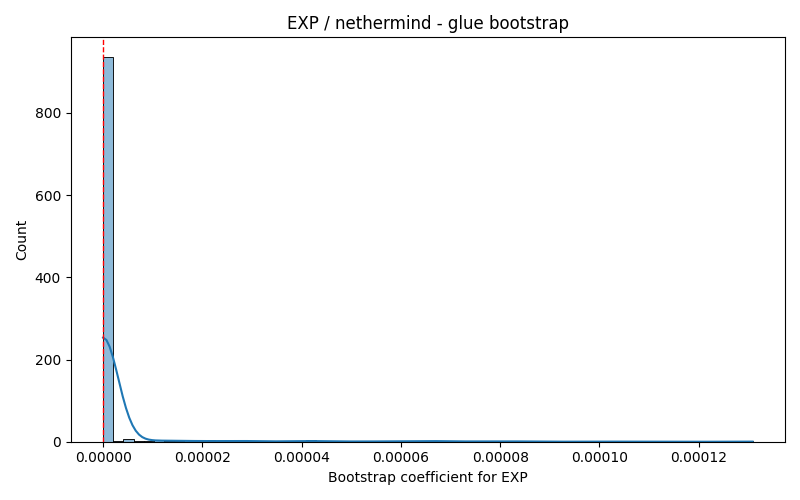


</details>

<details><summary><code>GT</code> · nobs=2585 · runtime_ms=1.546e-06 · p=1.00e-03 · R²=0.3997</summary>

```
==============================================================================
                           NNLS Regression Results                            
==============================================================================
Dep. Variable:          test_runtime_ms              R-squared:          0.400
Model:                  NNLS                    Adj. R-squared:          0.399
No. Observations:       2585                              RMSE:          19.94
Df Residuals:           2583                               MAE:          10.77
Df Model:               1      
==============================================================================
                      coef     std err     P-value      [0.025      0.975]
------------------------------------------------------------------------------
         const     15.3743      1.2267       0.001     12.8858     17.8181
            GT      0.0000      0.0000       0.001      0.0000      0.0000
==============================================================================
Notes: Non-negative least squares with bootstrap inference (1000 iterations)
==============================================================================
```


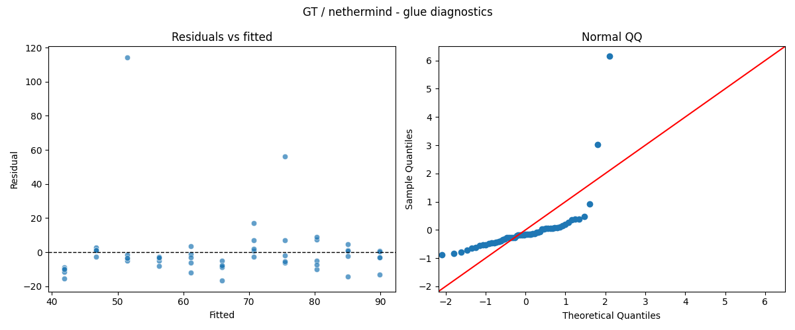

</details>

<details><summary><code>JUMPI</code> · nobs=2585 · runtime_ms=1.821e-06 · p=1.00e-03 · R²=0.5047</summary>

```
==============================================================================
                           NNLS Regression Results                            
==============================================================================
Dep. Variable:          test_runtime_ms              R-squared:          0.505
Model:                  NNLS                    Adj. R-squared:          0.505
No. Observations:       2585                              RMSE:           8.14
Df Residuals:           2583                               MAE:           3.79
Df Model:               1      
==============================================================================
                      coef     std err     P-value      [0.025      0.975]
------------------------------------------------------------------------------
         const      8.9186      0.4954       0.001      7.9651      9.9634
         JUMPI      0.0000      0.0000       0.001      0.0000      0.0000
==============================================================================
Notes: Non-negative least squares with bootstrap inference (1000 iterations)
==============================================================================
```


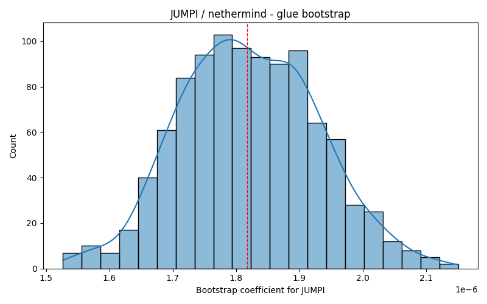


</details>

<details><summary><code>LT</code> · nobs=2585 · runtime_ms=1.538e-06 · p=1.00e-03 · R²=0.3741</summary>

```
==============================================================================
                           NNLS Regression Results                            
==============================================================================
Dep. Variable:          test_runtime_ms              R-squared:          0.374
Model:                  NNLS                    Adj. R-squared:          0.374
No. Observations:       2585                              RMSE:          20.94
Df Residuals:           2583                               MAE:          10.65
Df Model:               1      
==============================================================================
                      coef     std err     P-value      [0.025      0.975]
------------------------------------------------------------------------------
         const     17.1589      1.1604       0.001     14.8023     19.4942
            LT      0.0000      0.0000       0.001      0.0000      0.0000
==============================================================================
Notes: Non-negative least squares with bootstrap inference (1000 iterations)
==============================================================================
```


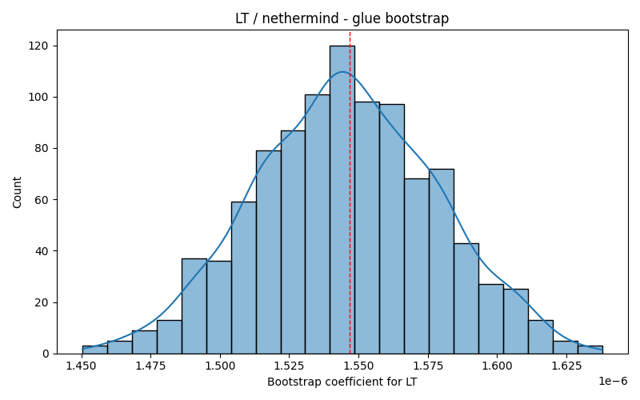


</details>

<details><summary><code>MSTORE</code> · nobs=12925 · runtime_ms=2.109e-06 · p=1.00e-03 · R²=0.6181</summary>

```
==============================================================================
                           NNLS Regression Results                            
==============================================================================
Dep. Variable:          test_runtime_ms              R-squared:          0.618
Model:                  NNLS                    Adj. R-squared:          0.618
No. Observations:       12925                             RMSE:          11.63
Df Residuals:           12923                              MAE:           5.84
Df Model:               1      
==============================================================================
                      coef     std err     P-value      [0.025      0.975]
------------------------------------------------------------------------------
         const     14.9021      0.3504       0.001     14.2079     15.5630
        MSTORE      0.0000      0.0000       0.001      0.0000      0.0000
==============================================================================
Notes: Non-negative least squares with bootstrap inference (1000 iterations)
==============================================================================
```


</details>

<details><summary><code>MSTORE8</code> · nobs=12925 · runtime_ms=2.053e-06 · p=1.00e-03 · R²=0.6279</summary>

```
==============================================================================
                           NNLS Regression Results                            
==============================================================================
Dep. Variable:          test_runtime_ms              R-squared:          0.628
Model:                  NNLS                    Adj. R-squared:          0.628
No. Observations:       12925                             RMSE:          11.09
Df Residuals:           12923                              MAE:           5.53
Df Model:               1      
==============================================================================
                      coef     std err     P-value      [0.025      0.975]
------------------------------------------------------------------------------
         const     14.0679      0.2997       0.001     13.5139     14.7154
       MSTORE8      0.0000      0.0000       0.001      0.0000      0.0000
==============================================================================
Notes: Non-negative least squares with bootstrap inference (1000 iterations)
==============================================================================
```

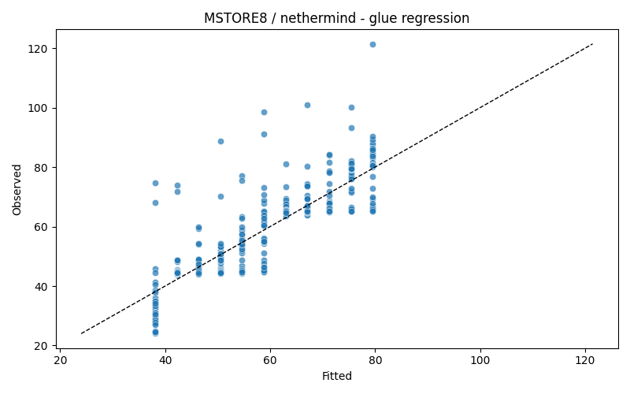

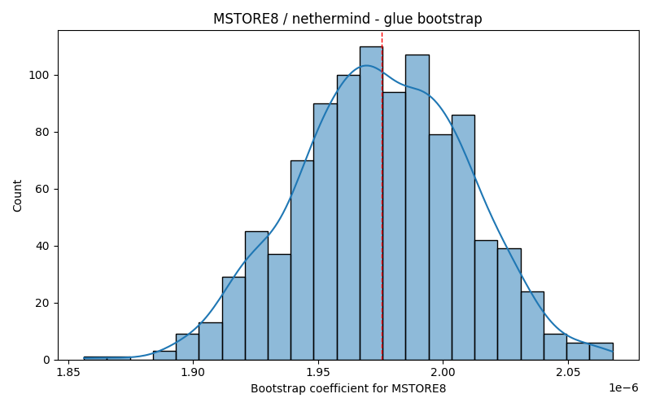

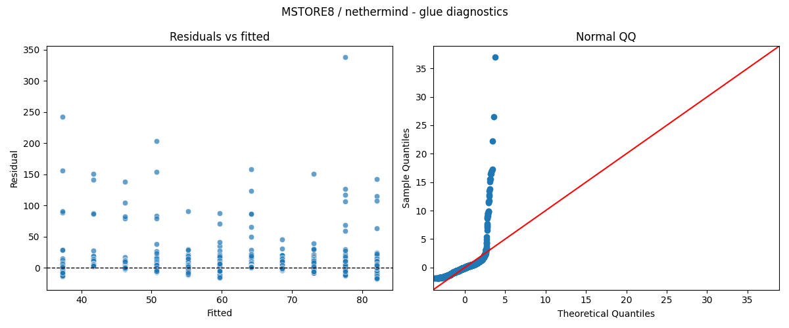

</details>

<details><summary><code>MUL</code> · nobs=2596 · runtime_ms=4.655e-06 · p=1.00e-03 · R²=0.7634</summary>

```
==============================================================================
                           NNLS Regression Results                            
==============================================================================
Dep. Variable:          test_runtime_ms              R-squared:          0.763
Model:                  NNLS                    Adj. R-squared:          0.763
No. Observations:       2596                              RMSE:          20.46
Df Residuals:           2594                               MAE:          14.11
Df Model:               1      
==============================================================================
                      coef     std err     P-value      [0.025      0.975]
------------------------------------------------------------------------------
         const     25.0013      1.2744       0.001     22.4393     27.4682
           MUL      0.0000      0.0000       0.001      0.0000      0.0000
==============================================================================
Notes: Non-negative least squares with bootstrap inference (1000 iterations)
==============================================================================
```


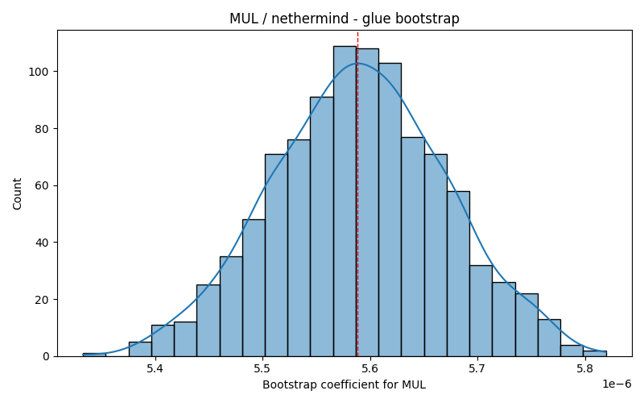


</details>

<details><summary><code>PC</code> · nobs=2585 · runtime_ms=8.097e-07 · p=1.00e-03 · R²=0.8418</summary>

```
==============================================================================
                           NNLS Regression Results                            
==============================================================================
Dep. Variable:          test_runtime_ms              R-squared:          0.842
Model:                  NNLS                    Adj. R-squared:          0.842
No. Observations:       2585                              RMSE:          10.49
Df Residuals:           2583                               MAE:           6.47
Df Model:               1      
==============================================================================
                      coef     std err     P-value      [0.025      0.975]
------------------------------------------------------------------------------
         const     16.7196      0.7632       0.001     15.1976     18.2854
            PC      0.0000      0.0000       0.001      0.0000      0.0000
==============================================================================
Notes: Non-negative least squares with bootstrap inference (1000 iterations)
==============================================================================
```

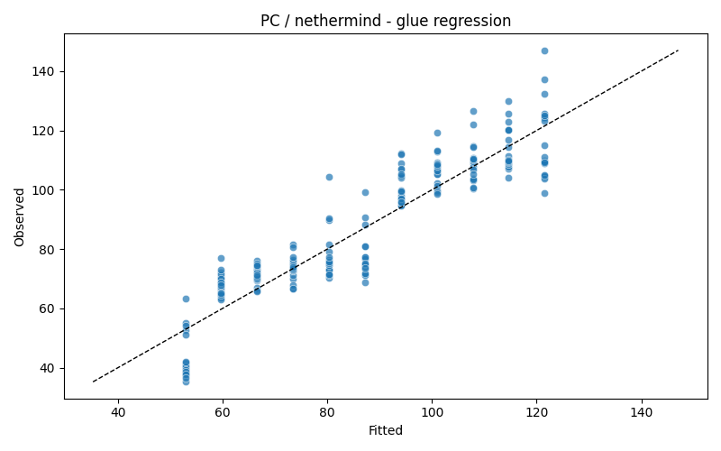


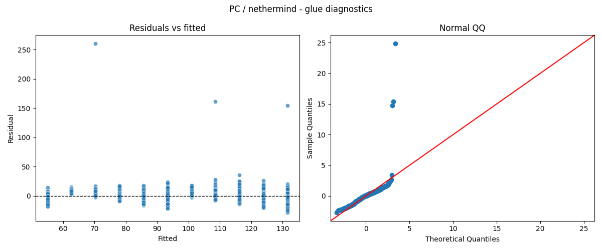

</details>

<details><summary><code>RETURNDATASIZE</code> · nobs=10340 · runtime_ms=7.488e-07 · p=1.00e-03 · R²=0.4462</summary>

```
==============================================================================
                           NNLS Regression Results                            
==============================================================================
Dep. Variable:          test_runtime_ms              R-squared:          0.446
Model:                  NNLS                    Adj. R-squared:          0.446
No. Observations:       10340                             RMSE:          13.17
Df Residuals:           10338                              MAE:           5.24
Df Model:               1      
==============================================================================
                      coef     std err     P-value      [0.025      0.975]
------------------------------------------------------------------------------
         const     12.5495      0.3996       0.001     11.7900     13.3610
RETURNDATASIZE      0.0000      0.0000       0.001      0.0000      0.0000
==============================================================================
Notes: Non-negative least squares with bootstrap inference (1000 iterations)
==============================================================================
```

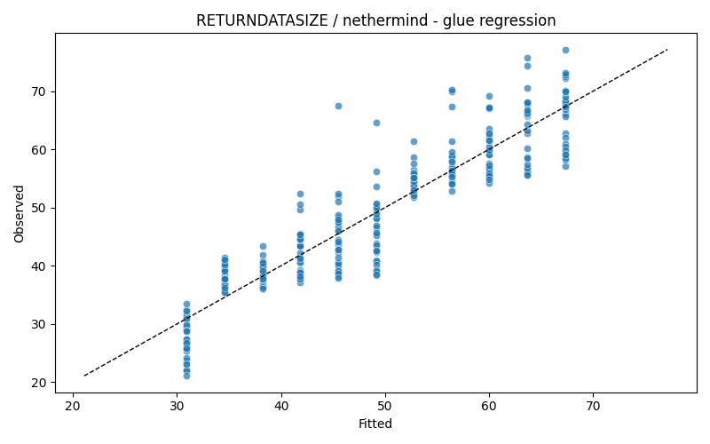


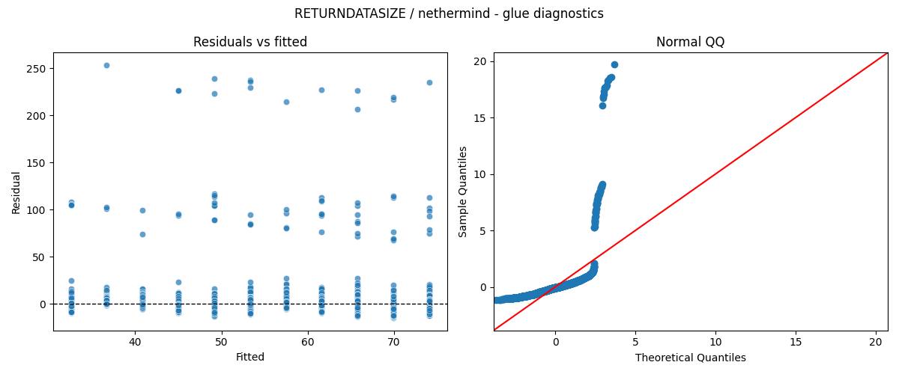

</details>

<details><summary><code>SELFBALANCE</code> · nobs=2124 · runtime_ms=8.559e-06 · p=1.00e-03 · R²=0.6614</summary>

```
==============================================================================
                           NNLS Regression Results                            
==============================================================================
Dep. Variable:          test_runtime_ms              R-squared:          0.661
Model:                  NNLS                    Adj. R-squared:          0.661
No. Observations:       2124                              RMSE:          61.78
Df Residuals:           2122                               MAE:          40.78
Df Model:               1      
==============================================================================
                      coef     std err     P-value      [0.025      0.975]
------------------------------------------------------------------------------
         const     87.1236      5.3986       0.001     76.9655     97.8785
   SELFBALANCE      0.0000      0.0000       0.001      0.0000      0.0000
==============================================================================
Notes: Non-negative least squares with bootstrap inference (1000 iterations)
==============================================================================
```


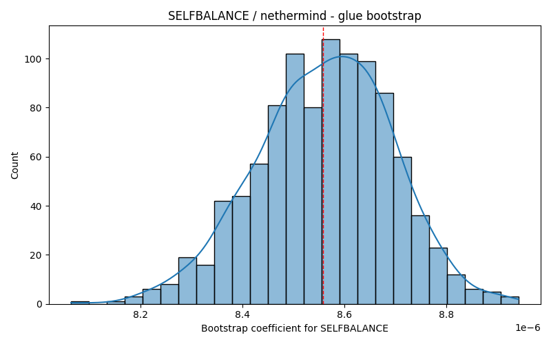


</details>

<details><summary><code>SUB</code> · nobs=2596 · runtime_ms=2.084e-06 · p=1.00e-03 · R²=0.8164</summary>

```
==============================================================================
                           NNLS Regression Results                            
==============================================================================
Dep. Variable:          test_runtime_ms              R-squared:          0.816
Model:                  NNLS                    Adj. R-squared:          0.816
No. Observations:       2596                              RMSE:          10.40
Df Residuals:           2594                               MAE:           7.08
Df Model:               1      
==============================================================================
                      coef     std err     P-value      [0.025      0.975]
------------------------------------------------------------------------------
         const     17.1398      0.6794       0.001     15.8282     18.4680
           SUB      0.0000      0.0000       0.001      0.0000      0.0000
==============================================================================
Notes: Non-negative least squares with bootstrap inference (1000 iterations)
==============================================================================
```

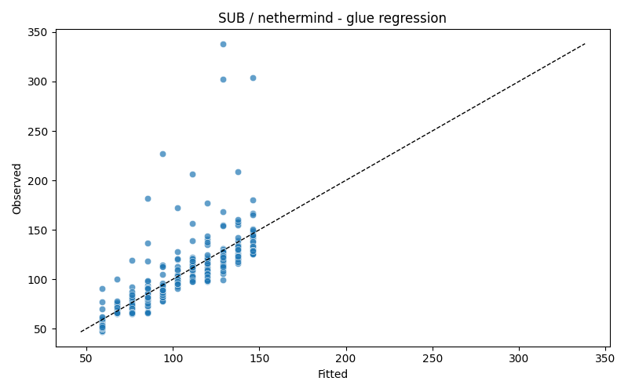

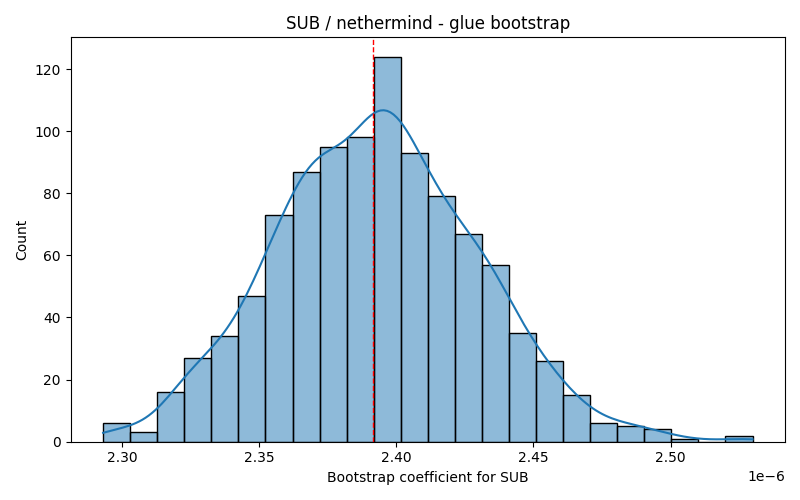


</details>

### Mixed glue (tier B) · nethermind

<details><summary><code>JUMP</code> · nobs=2585 · runtime_ms=5.379e-06 · p=1.00e-03 · R²=0.8248</summary>

```
==============================================================================
                           NNLS Regression Results                            
==============================================================================
Dep. Variable:          test_runtime_ms              R-squared:          0.825
Model:                  NNLS                    Adj. R-squared:          0.825
No. Observations:       2585                              RMSE:           9.21
Df Residuals:           2583                               MAE:           6.11
Df Model:               1      
==============================================================================
                      coef     std err     P-value      [0.025      0.975]
------------------------------------------------------------------------------
         const     15.3736      0.5799       0.001     14.2543     16.5602
          JUMP      0.0000      0.0000       0.001      0.0000      0.0000
==============================================================================
Notes: Non-negative least squares with bootstrap inference (1000 iterations)
==============================================================================
```

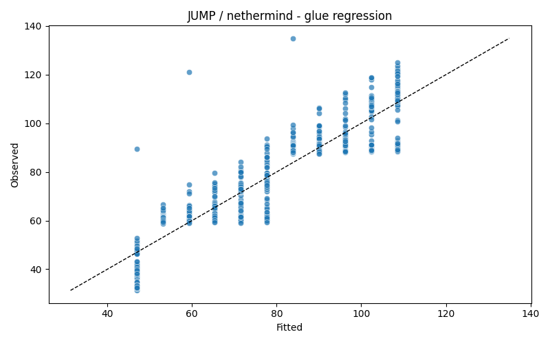

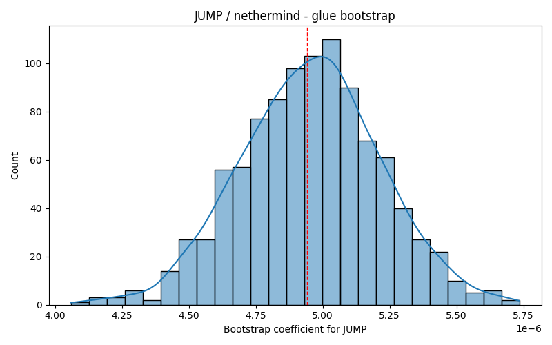

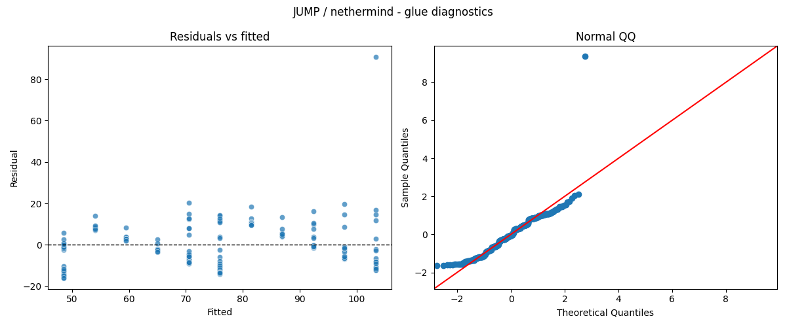

</details>

<details><summary><code>KECCAK256</code> · nobs=41360 · runtime_ms=0 · p=1.00e+00 · R²=0</summary>

```
==============================================================================
                           NNLS Regression Results                            
==============================================================================
Dep. Variable:          test_runtime_ms              R-squared:          0.000
Model:                  NNLS                    Adj. R-squared:         -0.000
No. Observations:       41360                             RMSE:         288.13
Df Residuals:           41358                              MAE:         237.53
Df Model:               1      
==============================================================================
                      coef     std err     P-value      [0.025      0.975]
------------------------------------------------------------------------------
         const    447.4827      1.4391       0.001    444.6294    450.2879
     KECCAK256      0.0000      0.0000       1.000      0.0000      0.0000
==============================================================================
Notes: Non-negative least squares with bootstrap inference (1000 iterations)
==============================================================================
```

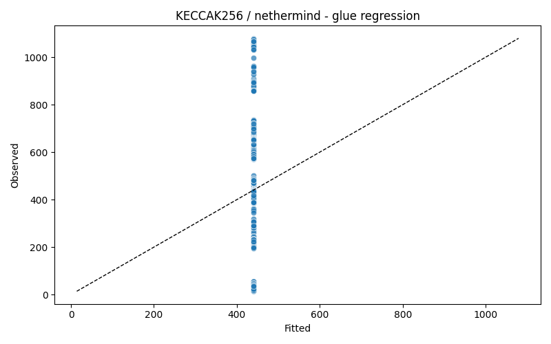


</details>

## reth

| glue_opcode | nobs | glue_runtime_ms | p_value | rsquared |
| --- | --- | --- | --- | --- |
| `ISZERO` | 506 | 3.898e-07 | 1.00e-03 | 0.7321 |
| `JUMPDEST` | 506 | 3.086e-07 | 1.00e-03 | 0.6912 |
| `SWAP` | 8096 | 4.759e-07 | 1.00e-03 | 0.4442 |
| `CALLDATASIZE` | 30910 | 5.022e-07 | 1.00e-03 | 0.8375 |
| `DUP` | 30910 | 4.235e-07 | 1.00e-03 | 0.8375 |
| `GAS` | 30910 | 4.44e-07 | 1.00e-03 | 0.8375 |
| `MLOAD` | 30910 | 1.594e-06 | 1.00e-03 | 0.8375 |
| `PUSH` | 30910 | 4.518e-07 | 1.00e-03 | 0.8375 |
| `PUSH0` | 30910 | 3.54e-07 | 1.00e-03 | 0.8375 |
| `STATICCALL` | 30910 | 4.594e-05 | 1.00e-03 | 0.8375 |
| `ADD` | 506 | 8.71e-07 | 1.00e-03 | 0.5379 |
| `AND` | 506 | 9.34e-07 | 1.00e-03 | 0.8152 |
| `CALLDATACOPY` | 12144 | 2.252e-06 | 1.00e-03 | 0.7742 |
| `CALLDATALOAD` | 2024 | 4.17e-05 | 1.00e-03 | 0.4243 |
| `DIV` | 506 | 6.981e-06 | 1.00e-03 | 0.8453 |
| `EXP` | 506 | 0.0003713 | 1.00e-03 | 0.8052 |
| `GT` | 506 | 1.022e-06 | 1.00e-03 | 0.802 |
| `JUMPI` | 506 | 1.235e-06 | 1.00e-03 | 0.722 |
| `LT` | 506 | 9.666e-07 | 1.00e-03 | 0.8146 |
| `MSTORE` | 2530 | 2.762e-06 | 1.00e-03 | 0.2724 |
| `MSTORE8` | 2530 | 1.342e-06 | 1.00e-03 | 0.685 |
| `MUL` | 506 | 1.155e-06 | 1.00e-03 | 0.7818 |
| `PC` | 506 | 6.136e-07 | 1.00e-03 | 0.9213 |
| `RETURNDATASIZE` | 2024 | 8.771e-07 | 1.00e-03 | 0.841 |
| `SELFBALANCE` | 414 | 3.782e-06 | 1.00e-03 | 0.8075 |
| `SUB` | 506 | 1.017e-06 | 1.00e-03 | 0.7754 |
| `JUMP` | 506 | 2.215e-06 | 1.00e-03 | 0.7631 |
| `KECCAK256` | 8096 | 0 | 1.00e+00 | 0 |

### Cycle glue — joint fit · reth

<details><summary>Joint NNLS regression summary</summary>

```
==============================================================================
                           NNLS Regression Results                            
==============================================================================
Dep. Variable:          test_runtime_ms              R-squared:          0.838
Model:                  NNLS                    Adj. R-squared:          0.837
No. Observations:       30910                             RMSE:           7.24
Df Residuals:           30902                              MAE:           5.09
Df Model:               7      
==============================================================================
                      coef     std err     P-value      [0.025      0.975]
------------------------------------------------------------------------------
         const     11.3645      0.1354       0.001     11.0837     11.6282
  CALLDATASIZE      0.0000      0.0000       0.001      0.0000      0.0000
           DUP      0.0000      0.0000       0.001      0.0000      0.0000
           GAS      0.0000      0.0000       0.001      0.0000      0.0000
         MLOAD      0.0000      0.0000       0.001      0.0000      0.0000
          PUSH      0.0000      0.0000       0.001      0.0000      0.0000
         PUSH0      0.0000      0.0000       0.001      0.0000      0.0000
    STATICCALL      0.0000      0.0000       0.001      0.0000      0.0000
==============================================================================
Notes: Non-negative least squares with bootstrap inference (1000 iterations)
==============================================================================
```

</details>

<details><summary><code>CALLDATASIZE</code> · nobs=30910 · runtime_ms=5.022e-07 · p=1.00e-03 · R²=0.8375</summary>


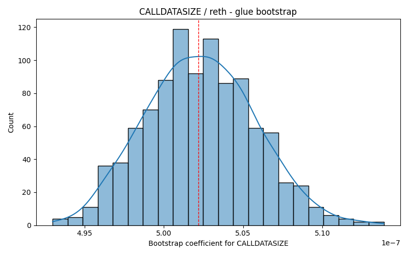


</details>

<details><summary><code>DUP</code> · nobs=30910 · runtime_ms=4.235e-07 · p=1.00e-03 · R²=0.8375</summary>


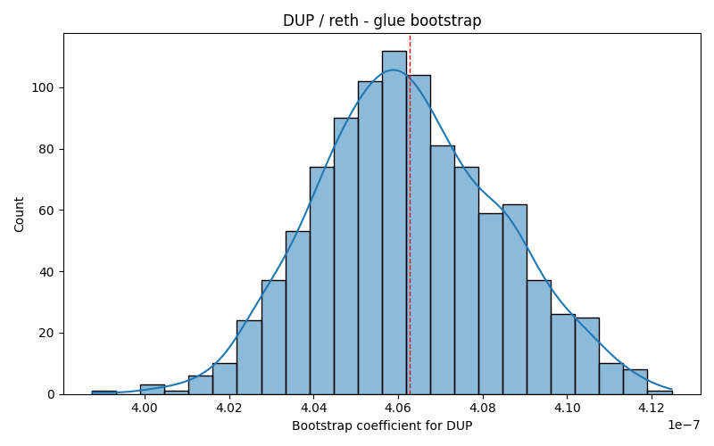

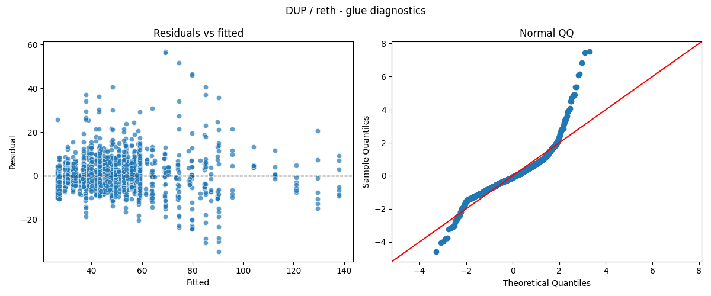

</details>

<details><summary><code>GAS</code> · nobs=30910 · runtime_ms=4.44e-07 · p=1.00e-03 · R²=0.8375</summary>


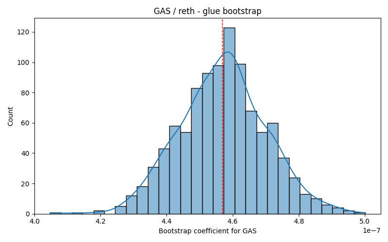


</details>

<details><summary><code>MLOAD</code> · nobs=30910 · runtime_ms=1.594e-06 · p=1.00e-03 · R²=0.8375</summary>

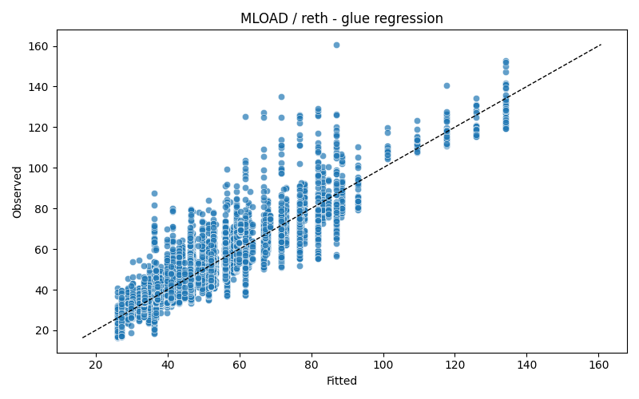


</details>

<details><summary><code>PUSH</code> · nobs=30910 · runtime_ms=4.518e-07 · p=1.00e-03 · R²=0.8375</summary>

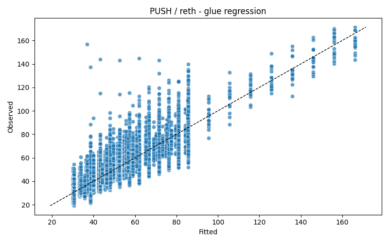

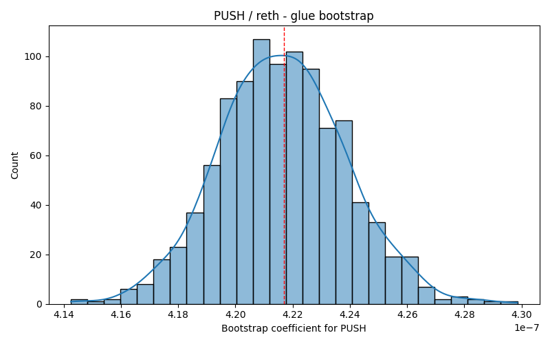


</details>

<details><summary><code>PUSH0</code> · nobs=30910 · runtime_ms=3.54e-07 · p=1.00e-03 · R²=0.8375</summary>


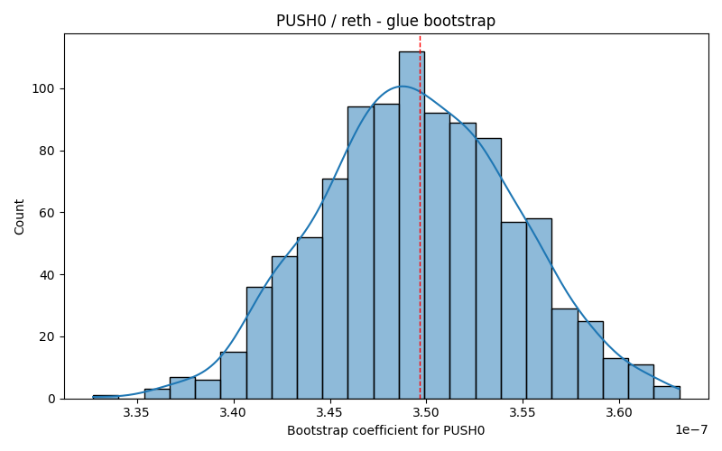

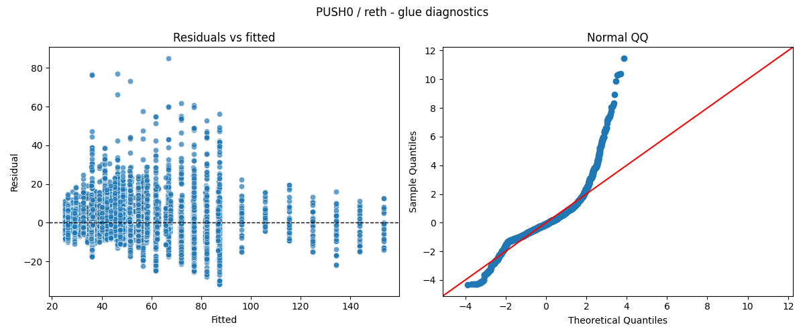

</details>

<details><summary><code>STATICCALL</code> · nobs=30910 · runtime_ms=4.594e-05 · p=1.00e-03 · R²=0.8375</summary>

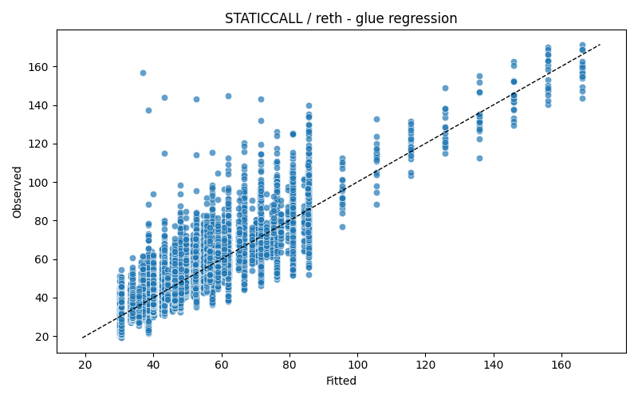


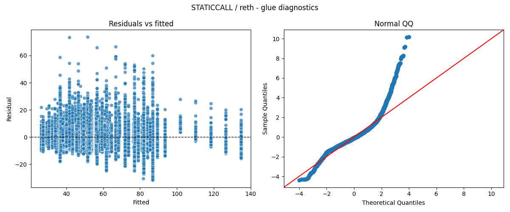

</details>

### Pure glue · reth

<details><summary><code>ISZERO</code> · nobs=506 · runtime_ms=3.898e-07 · p=1.00e-03 · R²=0.7321</summary>

```
==============================================================================
                           NNLS Regression Results                            
==============================================================================
Dep. Variable:          test_runtime_ms              R-squared:          0.732
Model:                  NNLS                    Adj. R-squared:          0.732
No. Observations:       506                               RMSE:           4.96
Df Residuals:           504                                MAE:           3.72
Df Model:               1      
==============================================================================
                      coef     std err     P-value      [0.025      0.975]
------------------------------------------------------------------------------
         const      8.3081      0.6789       0.001      7.0529      9.7103
        ISZERO      0.0000      0.0000       0.001      0.0000      0.0000
==============================================================================
Notes: Non-negative least squares with bootstrap inference (1000 iterations)
==============================================================================
```


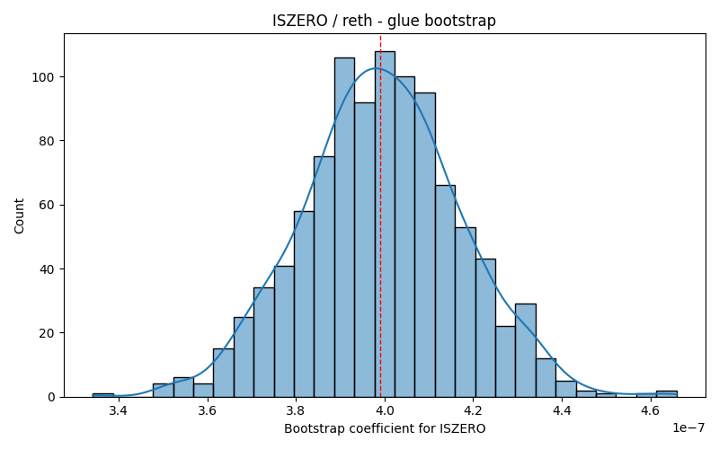


</details>

<details><summary><code>JUMPDEST</code> · nobs=506 · runtime_ms=3.086e-07 · p=1.00e-03 · R²=0.6912</summary>

```
==============================================================================
                           NNLS Regression Results                            
==============================================================================
Dep. Variable:          test_runtime_ms              R-squared:          0.691
Model:                  NNLS                    Adj. R-squared:          0.691
No. Observations:       506                               RMSE:          13.03
Df Residuals:           504                                MAE:           8.94
Df Model:               1      
==============================================================================
                      coef     std err     P-value      [0.025      0.975]
------------------------------------------------------------------------------
         const     12.8847      1.7633       0.001      9.4094     16.4565
      JUMPDEST      0.0000      0.0000       0.001      0.0000      0.0000
==============================================================================
Notes: Non-negative least squares with bootstrap inference (1000 iterations)
==============================================================================
```

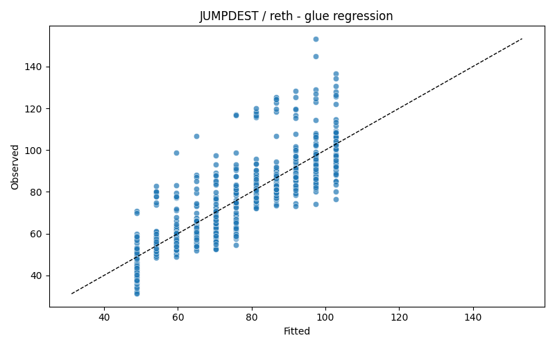

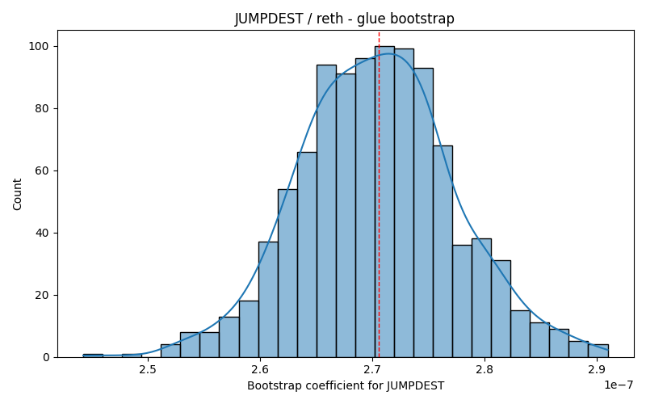


</details>

<details><summary><code>SWAP</code> · nobs=8096 · runtime_ms=4.759e-07 · p=1.00e-03 · R²=0.4442</summary>

```
==============================================================================
                           NNLS Regression Results                            
==============================================================================
Dep. Variable:          test_runtime_ms              R-squared:          0.444
Model:                  NNLS                    Adj. R-squared:          0.444
No. Observations:       8096                              RMSE:          11.21
Df Residuals:           8094                               MAE:           4.83
Df Model:               1      
==============================================================================
                      coef     std err     P-value      [0.025      0.975]
------------------------------------------------------------------------------
         const     11.7808      0.4275       0.001     10.9897     12.6573
          SWAP      0.0000      0.0000       0.001      0.0000      0.0000
==============================================================================
Notes: Non-negative least squares with bootstrap inference (1000 iterations)
==============================================================================
```

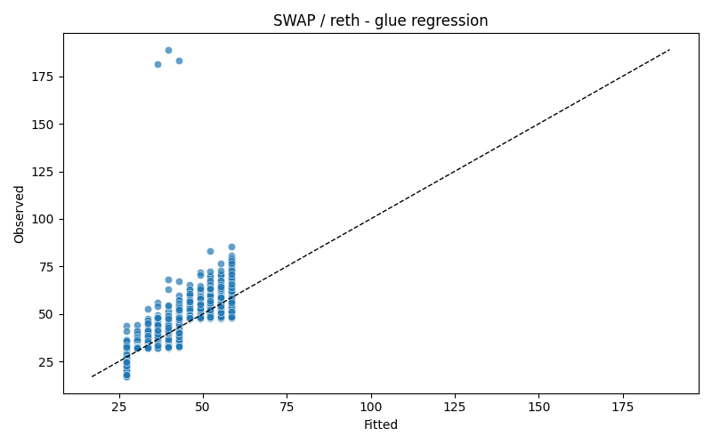


</details>

### Mixed glue (tier A) · reth

<details><summary><code>ADD</code> · nobs=506 · runtime_ms=8.71e-07 · p=1.00e-03 · R²=0.5379</summary>

```
==============================================================================
                           NNLS Regression Results                            
==============================================================================
Dep. Variable:          test_runtime_ms              R-squared:          0.538
Model:                  NNLS                    Adj. R-squared:          0.537
No. Observations:       506                               RMSE:           8.50
Df Residuals:           504                                MAE:           4.00
Df Model:               1      
==============================================================================
                      coef     std err     P-value      [0.025      0.975]
------------------------------------------------------------------------------
         const     10.8950      2.0354       0.001      7.9838     15.4978
           ADD      0.0000      0.0000       0.001      0.0000      0.0000
==============================================================================
Notes: Non-negative least squares with bootstrap inference (1000 iterations)
==============================================================================
```


</details>

<details><summary><code>AND</code> · nobs=506 · runtime_ms=9.34e-07 · p=1.00e-03 · R²=0.8152</summary>

```
==============================================================================
                           NNLS Regression Results                            
==============================================================================
Dep. Variable:          test_runtime_ms              R-squared:          0.815
Model:                  NNLS                    Adj. R-squared:          0.815
No. Observations:       506                               RMSE:           4.68
Df Residuals:           504                                MAE:           3.57
Df Model:               1      
==============================================================================
                      coef     std err     P-value      [0.025      0.975]
------------------------------------------------------------------------------
         const      8.2461      0.6715       0.001      6.9375      9.5583
           AND      0.0000      0.0000       0.001      0.0000      0.0000
==============================================================================
Notes: Non-negative least squares with bootstrap inference (1000 iterations)
==============================================================================
```

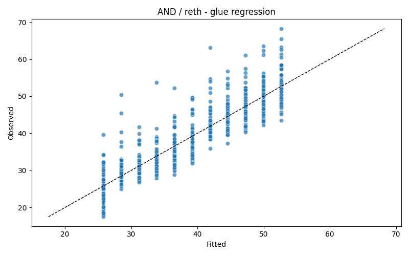


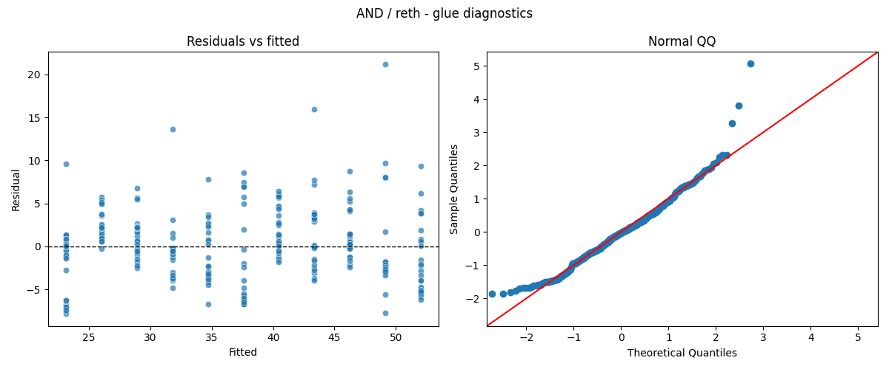

</details>

<details><summary><code>CALLDATACOPY</code> · nobs=12144 · runtime_ms=2.252e-06 · p=1.00e-03 · R²=0.7742</summary>

```
==============================================================================
                           NNLS Regression Results                            
==============================================================================
Dep. Variable:          test_runtime_ms              R-squared:          0.774
Model:                  NNLS                    Adj. R-squared:          0.774
No. Observations:       12144                             RMSE:           9.15
Df Residuals:           12142                              MAE:           6.62
Df Model:               1      
==============================================================================
                      coef     std err     P-value      [0.025      0.975]
------------------------------------------------------------------------------
         const     12.5298      0.0999       0.001     12.3347     12.7225
  CALLDATACOPY      0.0000      0.0000       0.001      0.0000      0.0000
==============================================================================
Notes: Non-negative least squares with bootstrap inference (1000 iterations)
==============================================================================
```

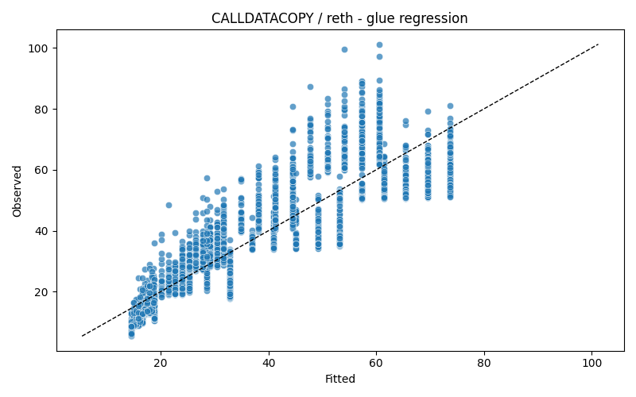


</details>

<details><summary><code>CALLDATALOAD</code> · nobs=2024 · runtime_ms=4.17e-05 · p=1.00e-03 · R²=0.4243</summary>

```
==============================================================================
                           NNLS Regression Results                            
==============================================================================
Dep. Variable:          test_runtime_ms              R-squared:          0.424
Model:                  NNLS                    Adj. R-squared:          0.424
No. Observations:       2024                              RMSE:           0.19
Df Residuals:           2022                               MAE:           0.14
Df Model:               1      
==============================================================================
                      coef     std err     P-value      [0.025      0.975]
------------------------------------------------------------------------------
         const      1.2055      0.0132       0.001      1.1806      1.2314
  CALLDATALOAD      0.0000      0.0000       0.001      0.0000      0.0000
==============================================================================
Notes: Non-negative least squares with bootstrap inference (1000 iterations)
==============================================================================
```


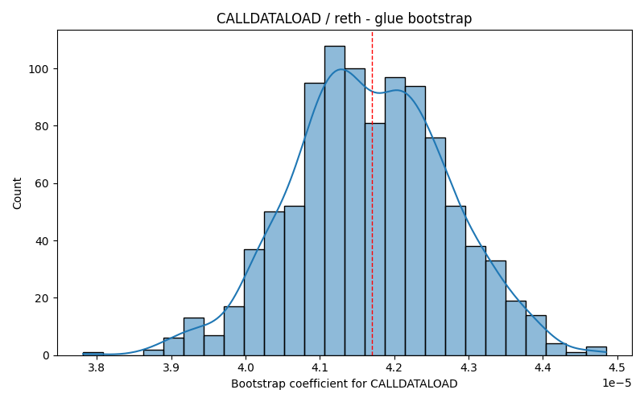

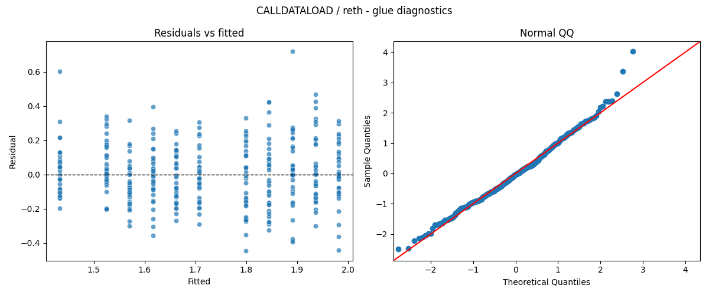

</details>

<details><summary><code>DIV</code> · nobs=506 · runtime_ms=6.981e-06 · p=1.00e-03 · R²=0.8453</summary>

```
==============================================================================
                           NNLS Regression Results                            
==============================================================================
Dep. Variable:          test_runtime_ms              R-squared:          0.845
Model:                  NNLS                    Adj. R-squared:          0.845
No. Observations:       506                               RMSE:          23.58
Df Residuals:           504                                MAE:          19.41
Df Model:               1      
==============================================================================
                      coef     std err     P-value      [0.025      0.975]
------------------------------------------------------------------------------
         const     59.3069      3.9088       0.001     51.5659     66.9847
           DIV      0.0000      0.0000       0.001      0.0000      0.0000
==============================================================================
Notes: Non-negative least squares with bootstrap inference (1000 iterations)
==============================================================================
```

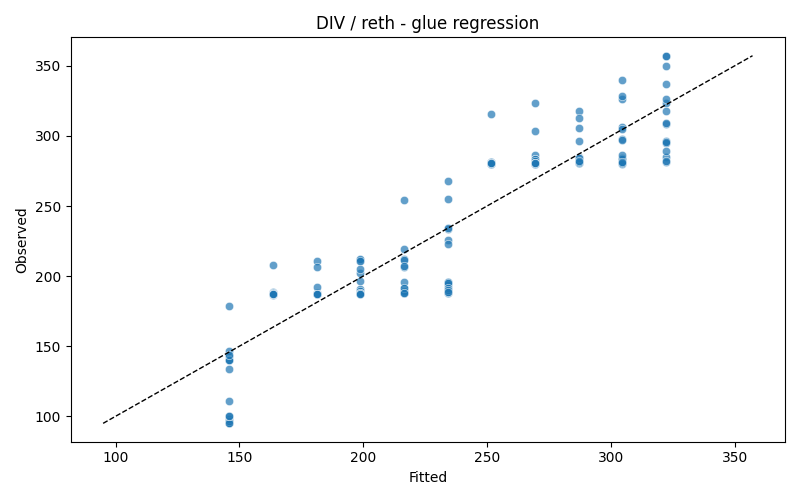

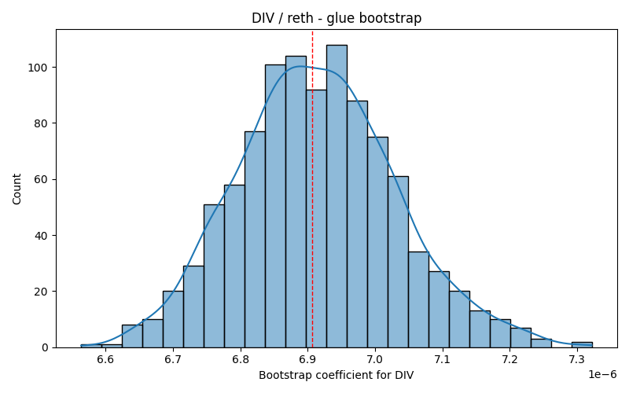


</details>

<details><summary><code>EXP</code> · nobs=506 · runtime_ms=0.0003713 · p=1.00e-03 · R²=0.8052</summary>

```
==============================================================================
                           NNLS Regression Results                            
==============================================================================
Dep. Variable:          test_runtime_ms              R-squared:          0.805
Model:                  NNLS                    Adj. R-squared:          0.805
No. Observations:       506                               RMSE:           7.15
Df Residuals:           504                                MAE:           5.58
Df Model:               1      
==============================================================================
                      coef     std err     P-value      [0.025      0.975]
------------------------------------------------------------------------------
         const     16.6996      1.0682       0.001     14.7252     18.9615
           EXP      0.0004      0.0000       0.001      0.0004      0.0004
==============================================================================
Notes: Non-negative least squares with bootstrap inference (1000 iterations)
==============================================================================
```


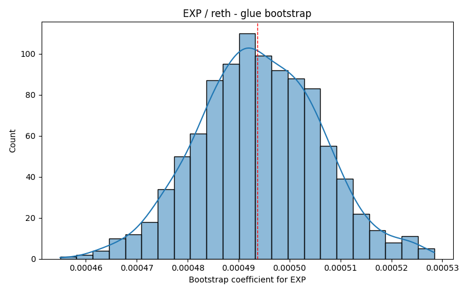

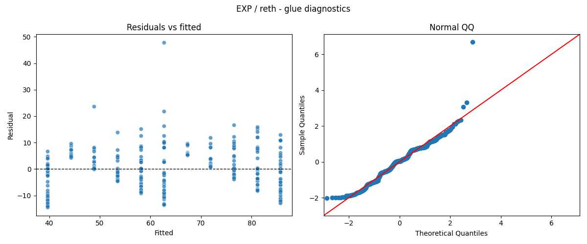

</details>

<details><summary><code>GT</code> · nobs=506 · runtime_ms=1.022e-06 · p=1.00e-03 · R²=0.802</summary>

```
==============================================================================
                           NNLS Regression Results                            
==============================================================================
Dep. Variable:          test_runtime_ms              R-squared:          0.802
Model:                  NNLS                    Adj. R-squared:          0.802
No. Observations:       506                               RMSE:           5.34
Df Residuals:           504                                MAE:           4.03
Df Model:               1      
==============================================================================
                      coef     std err     P-value      [0.025      0.975]
------------------------------------------------------------------------------
         const      9.3377      0.7710       0.001      7.7637     10.7542
            GT      0.0000      0.0000       0.001      0.0000      0.0000
==============================================================================
Notes: Non-negative least squares with bootstrap inference (1000 iterations)
==============================================================================
```

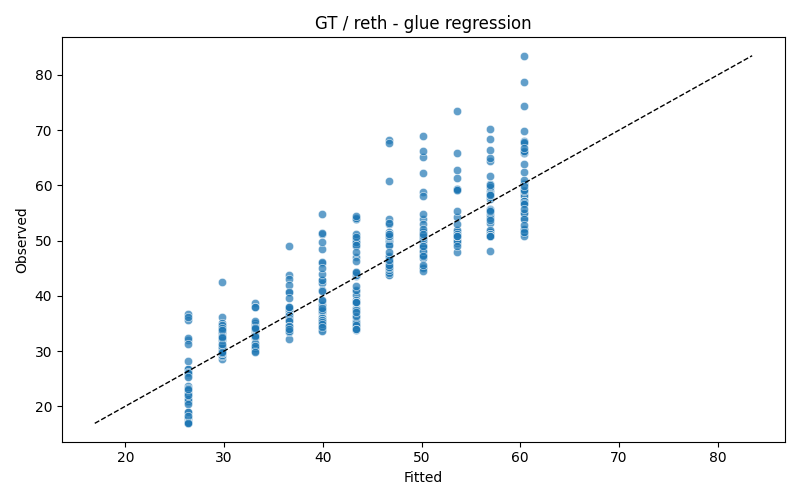


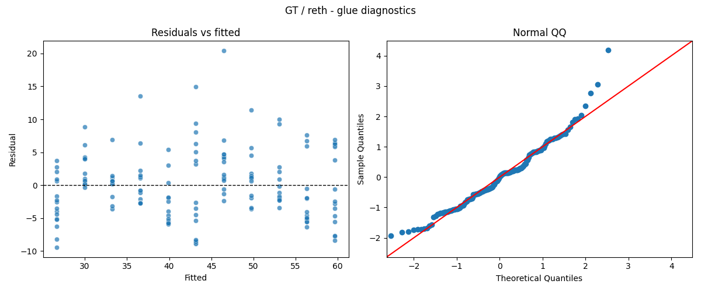

</details>

<details><summary><code>JUMPI</code> · nobs=506 · runtime_ms=1.235e-06 · p=1.00e-03 · R²=0.722</summary>

```
==============================================================================
                           NNLS Regression Results                            
==============================================================================
Dep. Variable:          test_runtime_ms              R-squared:          0.722
Model:                  NNLS                    Adj. R-squared:          0.721
No. Observations:       506                               RMSE:           3.46
Df Residuals:           504                                MAE:           2.41
Df Model:               1      
==============================================================================
                      coef     std err     P-value      [0.025      0.975]
------------------------------------------------------------------------------
         const      6.7584      0.4362       0.001      5.9231      7.6516
         JUMPI      0.0000      0.0000       0.001      0.0000      0.0000
==============================================================================
Notes: Non-negative least squares with bootstrap inference (1000 iterations)
==============================================================================
```


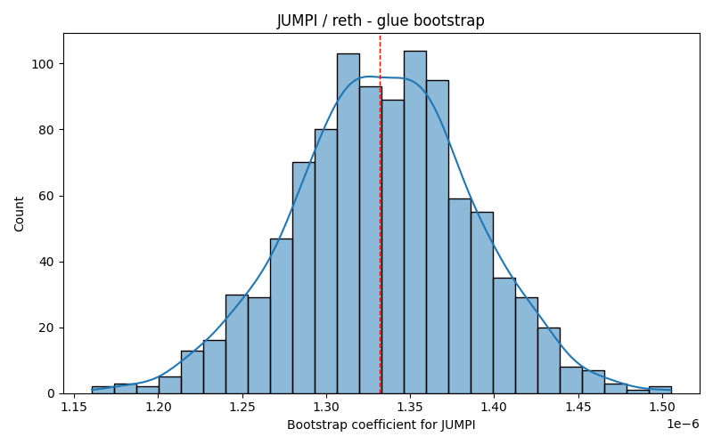


</details>

<details><summary><code>LT</code> · nobs=506 · runtime_ms=9.666e-07 · p=1.00e-03 · R²=0.8146</summary>

```
==============================================================================
                           NNLS Regression Results                            
==============================================================================
Dep. Variable:          test_runtime_ms              R-squared:          0.815
Model:                  NNLS                    Adj. R-squared:          0.814
No. Observations:       506                               RMSE:           4.85
Df Residuals:           504                                MAE:           3.69
Df Model:               1      
==============================================================================
                      coef     std err     P-value      [0.025      0.975]
------------------------------------------------------------------------------
         const      9.0019      0.6726       0.001      7.7152     10.3679
            LT      0.0000      0.0000       0.001      0.0000      0.0000
==============================================================================
Notes: Non-negative least squares with bootstrap inference (1000 iterations)
==============================================================================
```


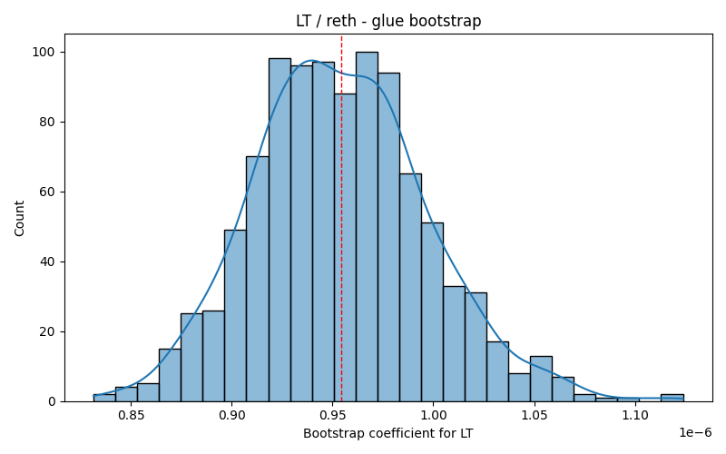

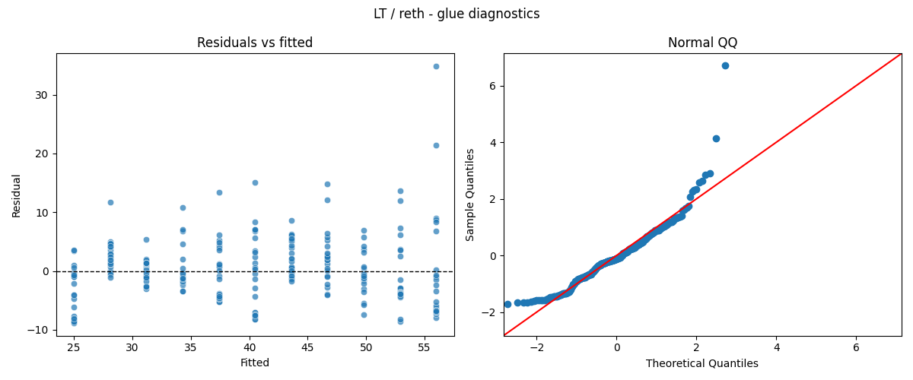

</details>

<details><summary><code>MSTORE</code> · nobs=2530 · runtime_ms=2.762e-06 · p=1.00e-03 · R²=0.2724</summary>

```
==============================================================================
                           NNLS Regression Results                            
==============================================================================
Dep. Variable:          test_runtime_ms              R-squared:          0.272
Model:                  NNLS                    Adj. R-squared:          0.272
No. Observations:       2530                              RMSE:          31.68
Df Residuals:           2528                               MAE:          28.76
Df Model:               1      
==============================================================================
                      coef     std err     P-value      [0.025      0.975]
------------------------------------------------------------------------------
         const     20.4335      1.8452       0.001     16.8283     24.1553
        MSTORE      0.0000      0.0000       0.001      0.0000      0.0000
==============================================================================
Notes: Non-negative least squares with bootstrap inference (1000 iterations)
==============================================================================
```


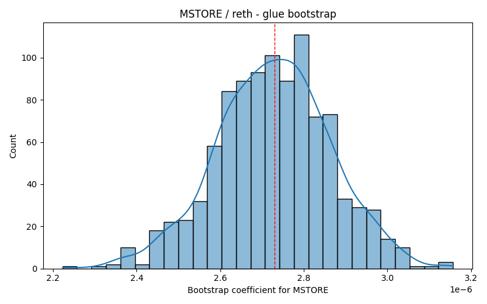

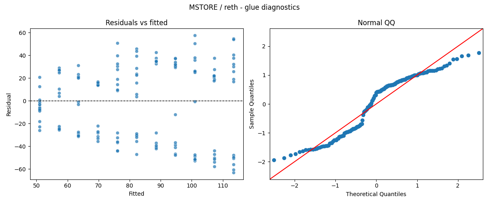

</details>

<details><summary><code>MSTORE8</code> · nobs=2530 · runtime_ms=1.342e-06 · p=1.00e-03 · R²=0.685</summary>

```
==============================================================================
                           NNLS Regression Results                            
==============================================================================
Dep. Variable:          test_runtime_ms              R-squared:          0.685
Model:                  NNLS                    Adj. R-squared:          0.685
No. Observations:       2530                              RMSE:           6.39
Df Residuals:           2528                               MAE:           4.39
Df Model:               1      
==============================================================================
                      coef     std err     P-value      [0.025      0.975]
------------------------------------------------------------------------------
         const     10.7610      0.4329       0.001      9.8905     11.6525
       MSTORE8      0.0000      0.0000       0.001      0.0000      0.0000
==============================================================================
Notes: Non-negative least squares with bootstrap inference (1000 iterations)
==============================================================================
```

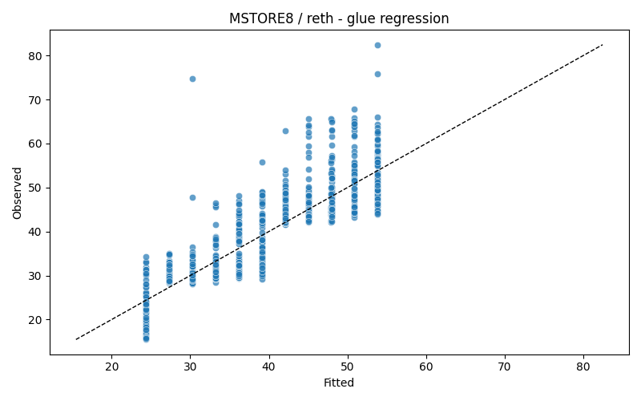

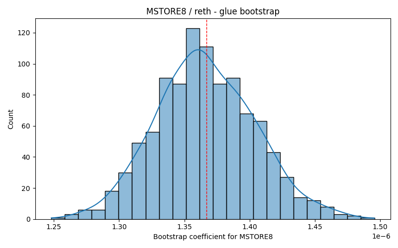

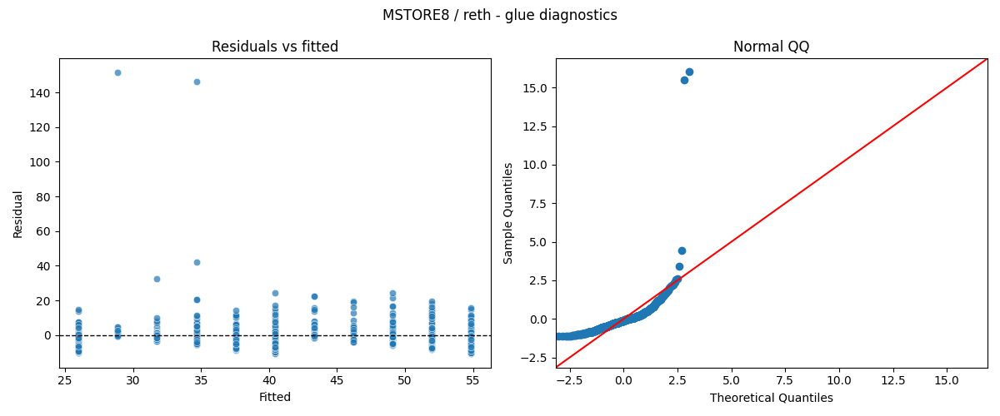

</details>

<details><summary><code>MUL</code> · nobs=506 · runtime_ms=1.155e-06 · p=1.00e-03 · R²=0.7818</summary>

```
==============================================================================
                           NNLS Regression Results                            
==============================================================================
Dep. Variable:          test_runtime_ms              R-squared:          0.782
Model:                  NNLS                    Adj. R-squared:          0.781
No. Observations:       506                               RMSE:           4.81
Df Residuals:           504                                MAE:           3.71
Df Model:               1      
==============================================================================
                      coef     std err     P-value      [0.025      0.975]
------------------------------------------------------------------------------
         const     10.3162      0.6900       0.001      9.0176     11.7929
           MUL      0.0000      0.0000       0.001      0.0000      0.0000
==============================================================================
Notes: Non-negative least squares with bootstrap inference (1000 iterations)
==============================================================================
```


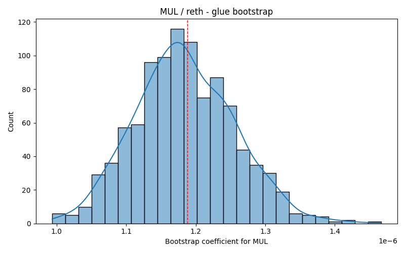


</details>

<details><summary><code>PC</code> · nobs=506 · runtime_ms=6.136e-07 · p=1.00e-03 · R²=0.9213</summary>

```
==============================================================================
                           NNLS Regression Results                            
==============================================================================
Dep. Variable:          test_runtime_ms              R-squared:          0.921
Model:                  NNLS                    Adj. R-squared:          0.921
No. Observations:       506                               RMSE:           5.36
Df Residuals:           504                                MAE:           4.19
Df Model:               1      
==============================================================================
                      coef     std err     P-value      [0.025      0.975]
------------------------------------------------------------------------------
         const     11.5633      0.7997       0.001      9.9225     13.1465
            PC      0.0000      0.0000       0.001      0.0000      0.0000
==============================================================================
Notes: Non-negative least squares with bootstrap inference (1000 iterations)
==============================================================================
```

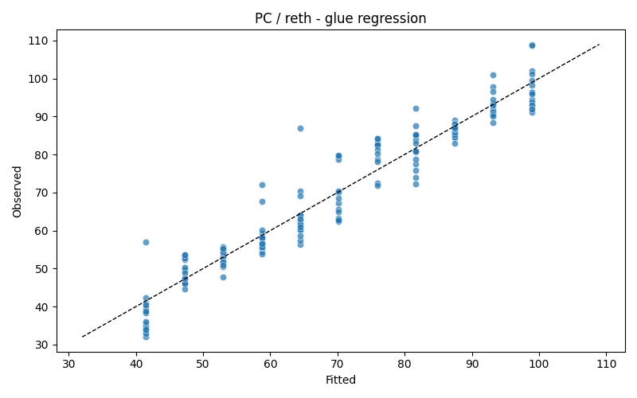

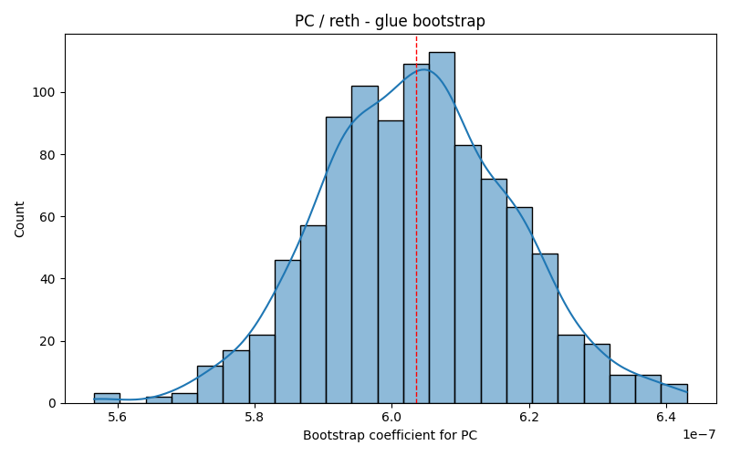

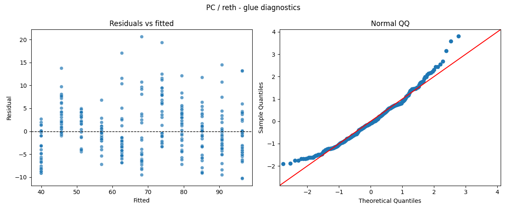

</details>

<details><summary><code>RETURNDATASIZE</code> · nobs=2024 · runtime_ms=8.771e-07 · p=1.00e-03 · R²=0.841</summary>

```
==============================================================================
                           NNLS Regression Results                            
==============================================================================
Dep. Variable:          test_runtime_ms              R-squared:          0.841
Model:                  NNLS                    Adj. R-squared:          0.841
No. Observations:       2024                              RMSE:           6.02
Df Residuals:           2022                               MAE:           4.66
Df Model:               1      
==============================================================================
                      coef     std err     P-value      [0.025      0.975]
------------------------------------------------------------------------------
         const     12.9525      0.4177       0.001     12.1345     13.7816
RETURNDATASIZE      0.0000      0.0000       0.001      0.0000      0.0000
==============================================================================
Notes: Non-negative least squares with bootstrap inference (1000 iterations)
==============================================================================
```

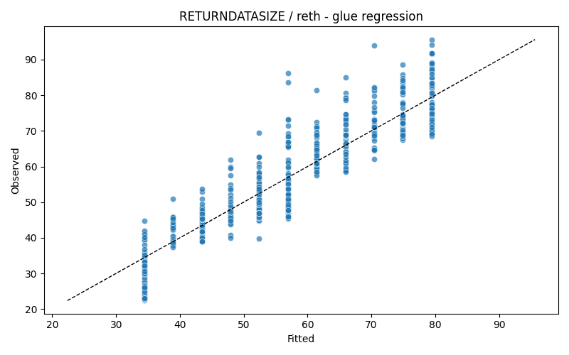


</details>

<details><summary><code>SELFBALANCE</code> · nobs=414 · runtime_ms=3.782e-06 · p=1.00e-03 · R²=0.8075</summary>

```
==============================================================================
                           NNLS Regression Results                            
==============================================================================
Dep. Variable:          test_runtime_ms              R-squared:          0.808
Model:                  NNLS                    Adj. R-squared:          0.807
No. Observations:       414                               RMSE:          18.63
Df Residuals:           412                                MAE:          14.97
Df Model:               1      
==============================================================================
                      coef     std err     P-value      [0.025      0.975]
------------------------------------------------------------------------------
         const     58.4164      3.3183       0.001     51.5029     64.6315
   SELFBALANCE      0.0000      0.0000       0.001      0.0000      0.0000
==============================================================================
Notes: Non-negative least squares with bootstrap inference (1000 iterations)
==============================================================================
```


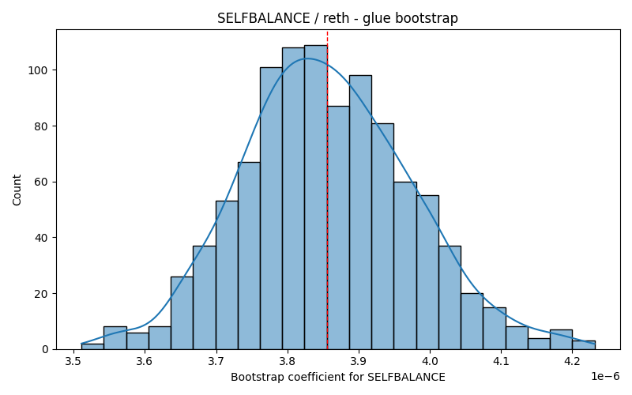

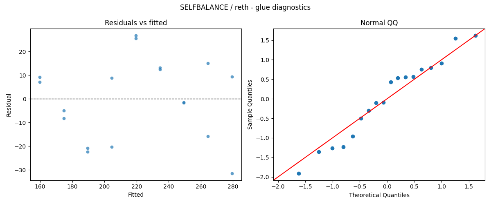

</details>

<details><summary><code>SUB</code> · nobs=506 · runtime_ms=1.017e-06 · p=1.00e-03 · R²=0.7754</summary>

```
==============================================================================
                           NNLS Regression Results                            
==============================================================================
Dep. Variable:          test_runtime_ms              R-squared:          0.775
Model:                  NNLS                    Adj. R-squared:          0.775
No. Observations:       506                               RMSE:           5.76
Df Residuals:           504                                MAE:           3.88
Df Model:               1      
==============================================================================
                      coef     std err     P-value      [0.025      0.975]
------------------------------------------------------------------------------
         const      7.4589      0.8876       0.001      5.6674      9.1364
           SUB      0.0000      0.0000       0.001      0.0000      0.0000
==============================================================================
Notes: Non-negative least squares with bootstrap inference (1000 iterations)
==============================================================================
```


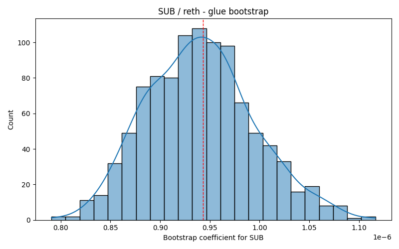

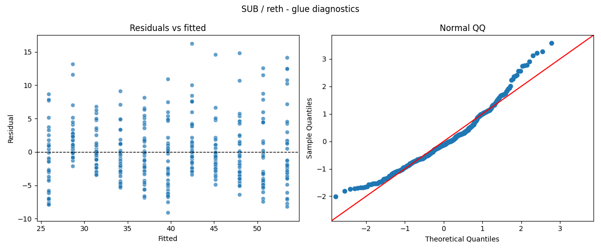

</details>

### Mixed glue (tier B) · reth

<details><summary><code>JUMP</code> · nobs=506 · runtime_ms=2.215e-06 · p=1.00e-03 · R²=0.7631</summary>

```
==============================================================================
                           NNLS Regression Results                            
==============================================================================
Dep. Variable:          test_runtime_ms              R-squared:          0.763
Model:                  NNLS                    Adj. R-squared:          0.763
No. Observations:       506                               RMSE:           4.59
Df Residuals:           504                                MAE:           3.48
Df Model:               1      
==============================================================================
                      coef     std err     P-value      [0.025      0.975]
------------------------------------------------------------------------------
         const      9.0407      0.6546       0.001      7.7264     10.2942
          JUMP      0.0000      0.0000       0.001      0.0000      0.0000
==============================================================================
Notes: Non-negative least squares with bootstrap inference (1000 iterations)
==============================================================================
```

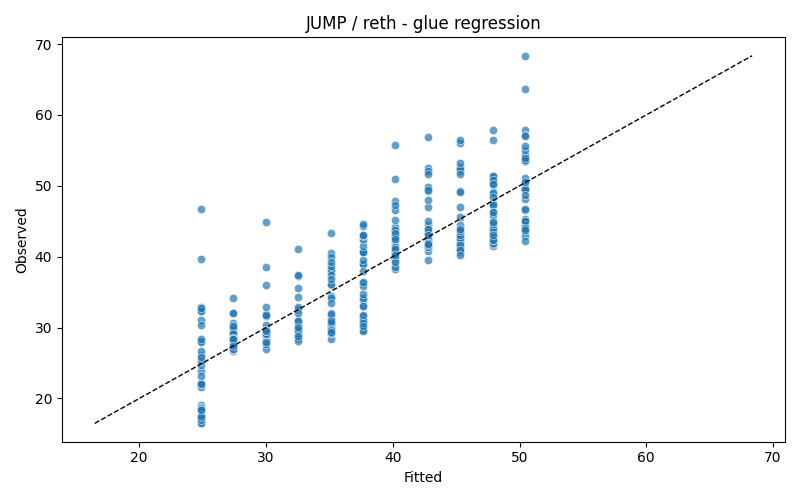

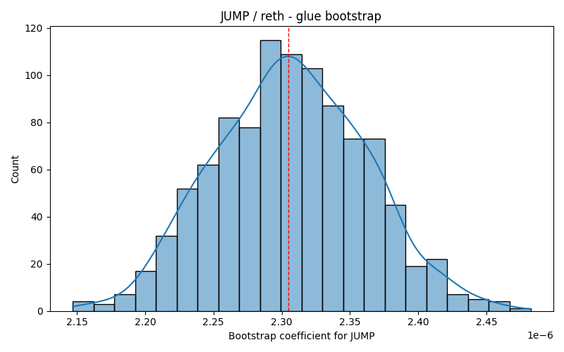

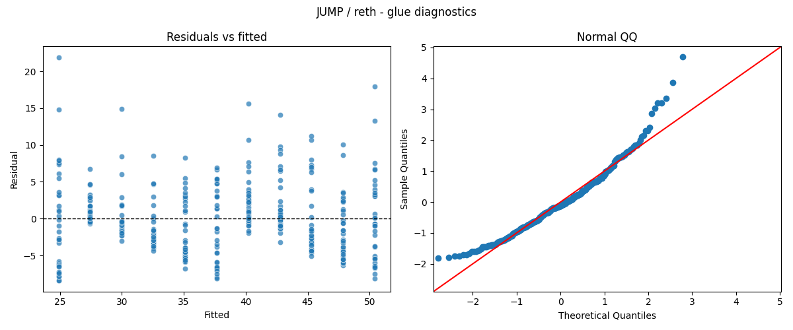

</details>

<details><summary><code>KECCAK256</code> · nobs=8096 · runtime_ms=0 · p=1.00e+00 · R²=0</summary>

```
==============================================================================
                           NNLS Regression Results                            
==============================================================================
Dep. Variable:          test_runtime_ms              R-squared:          0.000
Model:                  NNLS                    Adj. R-squared:         -0.000
No. Observations:       8096                              RMSE:         160.17
Df Residuals:           8094                               MAE:         135.36
Df Model:               1      
==============================================================================
                      coef     std err     P-value      [0.025      0.975]
------------------------------------------------------------------------------
         const    251.7731      1.7864       0.001    248.4975    255.2292
     KECCAK256      0.0000      0.0000       1.000      0.0000      0.0000
==============================================================================
Notes: Non-negative least squares with bootstrap inference (1000 iterations)
==============================================================================
```


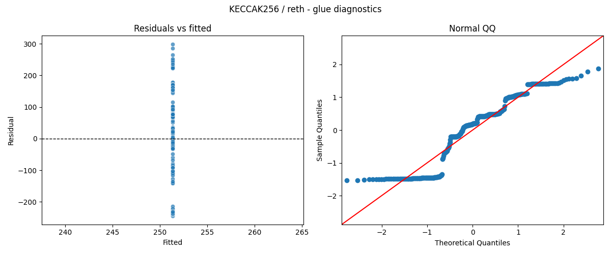

</details>
