# Glue opcodes report

Per-client NNLS fits of priced glue opcodes against their driver fixtures. Cycle-tier opcodes share one joint regression per client (shown once); pure-tier and mixed-tier opcodes each get a single-feature fit. Mixed-tier fits pre-adjust the LHS by subtracting the contribution of every priced upstream partner selected by the detector (pure ∪ cycle for `mixed_a`, plus `mixed_a` for `mixed_b`).

**Contents:** [besu](#besu) · [erigon](#erigon) · [geth](#geth) · [nethermind](#nethermind) · [reth](#reth)

## besu

| glue_opcode | nobs | glue_runtime_ms | p_value | rsquared |
| --- | --- | --- | --- | --- |
| `ISZERO` | 946 | 3.318e-06 | 1.00e-03 | 0.8283 |
| `JUMPDEST` | 946 | 8.783e-07 | 1.00e-03 | 0.6858 |
| `SWAP` | 15136 | 2.279e-06 | 1.00e-03 | 0.7742 |
| `CALLDATASIZE` | 55814 | 1.803e-06 | 1.00e-03 | 0.9145 |
| `DUP` | 55814 | 2.951e-07 | 1.00e-03 | 0.9145 |
| `GAS` | 55814 | 1.548e-06 | 1.00e-03 | 0.9145 |
| `MLOAD` | 55814 | 9.273e-06 | 1.00e-03 | 0.9145 |
| `PUSH` | 55814 | 1.196e-06 | 1.00e-03 | 0.9145 |
| `PUSH0` | 55814 | 0 | 1.00e+00 | 0.9145 |
| `STATICCALL` | 55814 | 0.002151 | 1.00e-03 | 0.9145 |
| `ADD` | 946 | 9.118e-06 | 1.00e-03 | 0.6811 |
| `AND` | 946 | 6.301e-06 | 1.00e-03 | 0.5322 |
| `CALLDATACOPY` | 22704 | 1.186e-05 | 1.00e-03 | 0.701 |
| `CALLDATALOAD` | 3784 | 0 | 1.00e+00 | 0 |
| `DIV` | 946 | 1.213e-05 | 1.00e-03 | 0.7343 |
| `EXP` | 946 | 0.0008898 | 1.00e-03 | 0.5813 |
| `GT` | 946 | 7.377e-06 | 1.00e-03 | 0.8552 |
| `JUMPI` | 946 | 4.052e-06 | 1.00e-03 | 0.8131 |
| `LT` | 946 | 6.841e-06 | 1.00e-03 | 0.8597 |
| `MSTORE` | 4730 | 1.528e-05 | 1.00e-03 | 0.8595 |
| `MSTORE8` | 4730 | 8.495e-06 | 1.00e-03 | 0.8541 |
| `MUL` | 946 | 9.191e-06 | 1.00e-03 | 0.5004 |
| `PC` | 946 | 3.304e-06 | 1.00e-03 | 0.8989 |
| `RETURNDATASIZE` | 3784 | 3.819e-06 | 1.00e-03 | 0.8474 |
| `SELFBALANCE` | 774 | 6.96e-06 | 1.00e-03 | 0.3349 |
| `SUB` | 946 | 8.487e-06 | 1.00e-03 | 0.636 |
| `JUMP` | 946 | 3.284e-05 | 1.00e-03 | 0.4071 |
| `KECCAK256` | 15136 | 4.231e-05 | 1.00e-03 | 0.1988 |

### Cycle glue — joint fit · besu

<details><summary>Joint NNLS regression summary</summary>

```
==============================================================================
                           NNLS Regression Results                            
==============================================================================
Dep. Variable:          test_runtime_ms              R-squared:          0.914
Model:                  NNLS                    Adj. R-squared:          0.914
No. Observations:       55814                             RMSE:          26.85
Df Residuals:           55806                              MAE:          21.75
Df Model:               7      
==============================================================================
                      coef     std err     P-value      [0.025      0.975]
------------------------------------------------------------------------------
         const     49.1925      0.3994       0.001     48.4269     49.9446
  CALLDATASIZE      0.0000      0.0000       0.001      0.0000      0.0000
           DUP      0.0000      0.0000       0.001      0.0000      0.0000
           GAS      0.0000      0.0000       0.001      0.0000      0.0000
         MLOAD      0.0000      0.0000       0.001      0.0000      0.0000
          PUSH      0.0000      0.0000       0.001      0.0000      0.0000
         PUSH0      0.0000      0.0000       1.000      0.0000      0.0000
    STATICCALL      0.0022      0.0000       0.001      0.0021      0.0022
==============================================================================
Notes: Non-negative least squares with bootstrap inference (1000 iterations)
==============================================================================
```

</details>

<details><summary><code>CALLDATASIZE</code> · nobs=55814 · runtime_ms=1.803e-06 · p=1.00e-03 · R²=0.9145</summary>

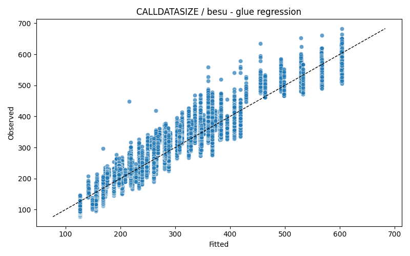

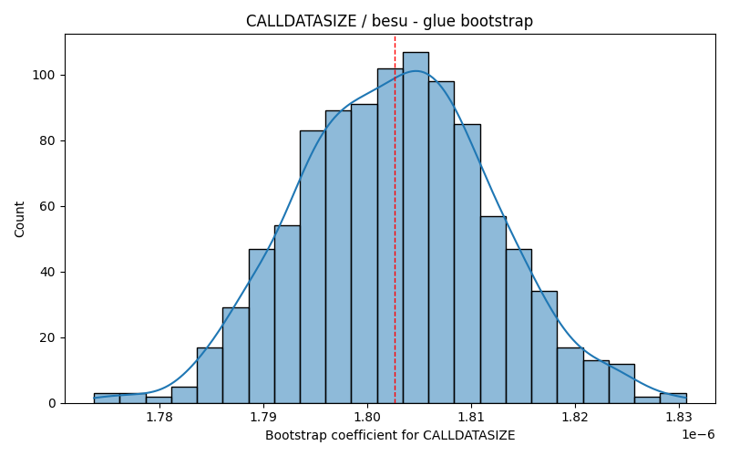


</details>

<details><summary><code>DUP</code> · nobs=55814 · runtime_ms=2.951e-07 · p=1.00e-03 · R²=0.9145</summary>

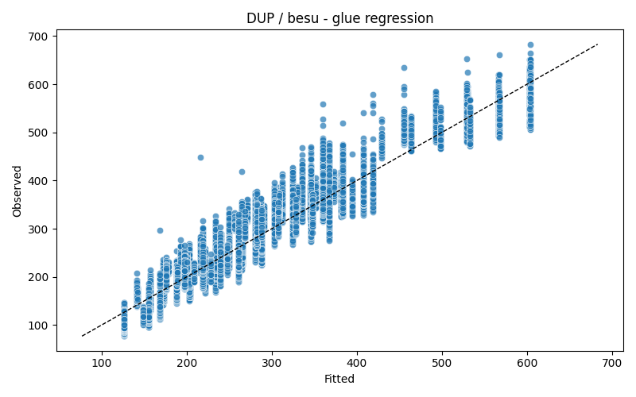

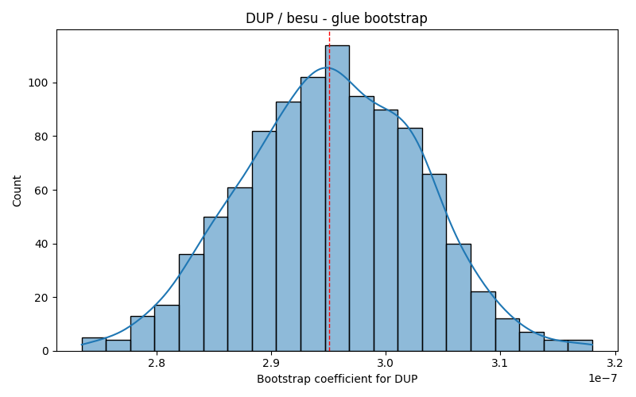


</details>

<details><summary><code>GAS</code> · nobs=55814 · runtime_ms=1.548e-06 · p=1.00e-03 · R²=0.9145</summary>


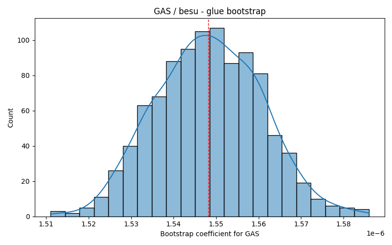


</details>

<details><summary><code>MLOAD</code> · nobs=55814 · runtime_ms=9.273e-06 · p=1.00e-03 · R²=0.9145</summary>

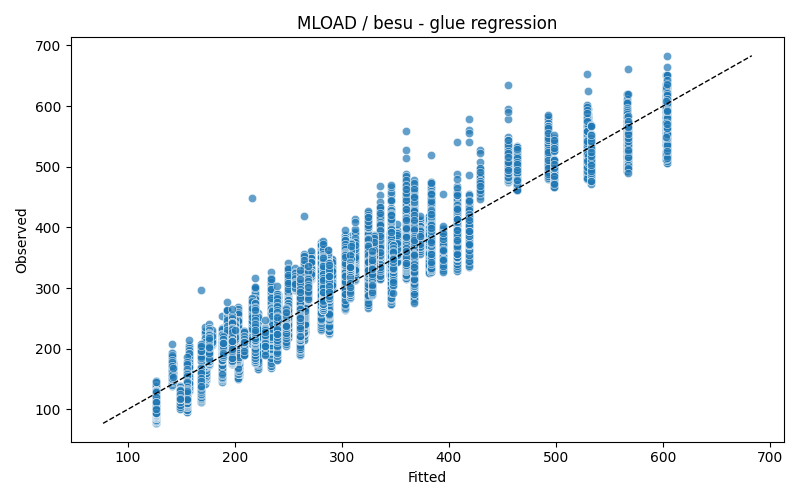

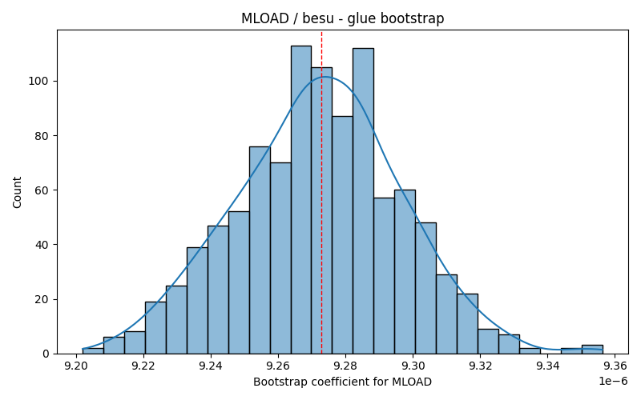

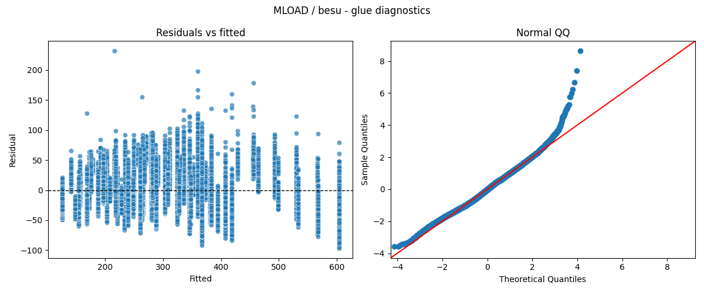

</details>

<details><summary><code>PUSH</code> · nobs=55814 · runtime_ms=1.196e-06 · p=1.00e-03 · R²=0.9145</summary>


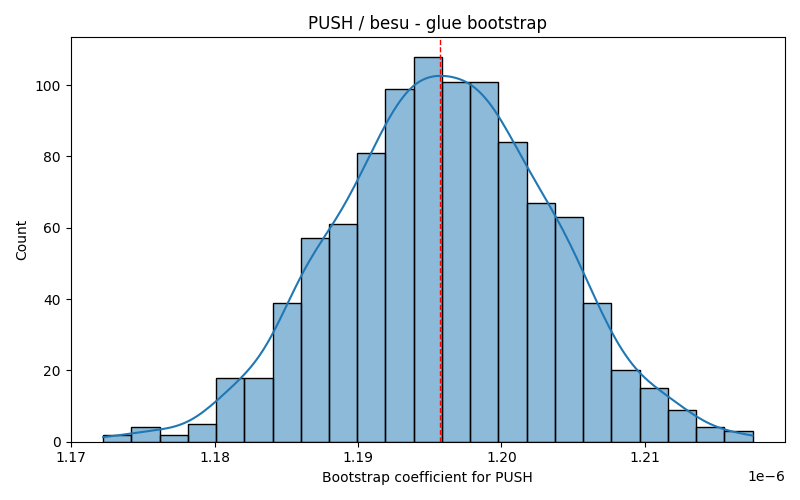

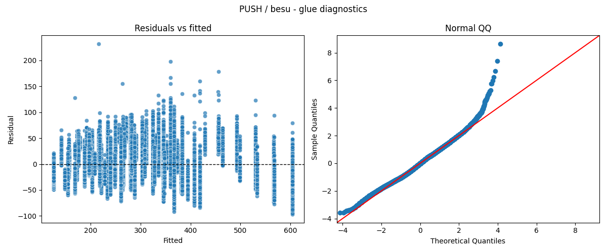

</details>

<details><summary><code>PUSH0</code> · nobs=55814 · runtime_ms=0 · p=1.00e+00 · R²=0.9145</summary>


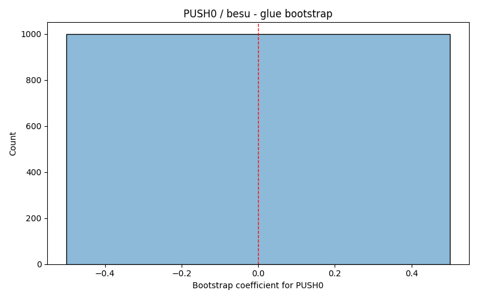


</details>

<details><summary><code>STATICCALL</code> · nobs=55814 · runtime_ms=0.002151 · p=1.00e-03 · R²=0.9145</summary>


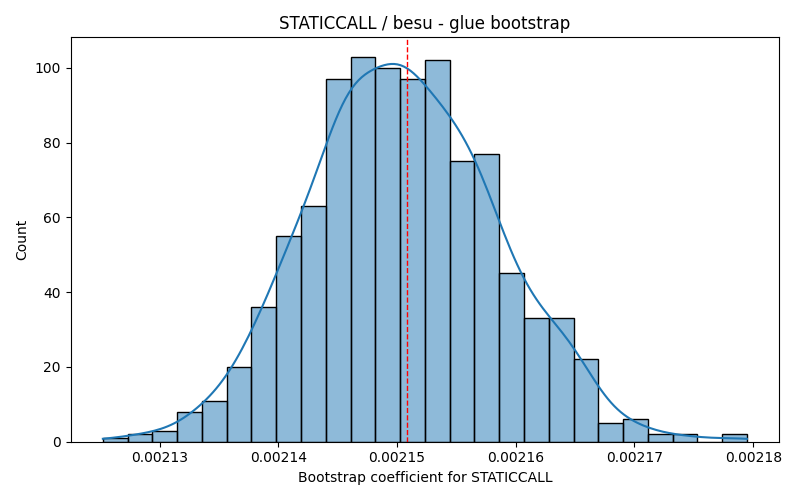

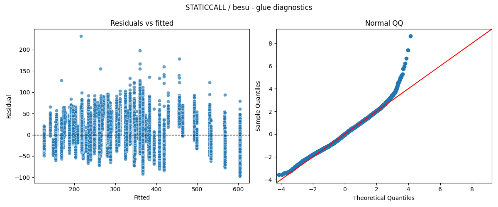

</details>

### Pure glue · besu

<details><summary><code>ISZERO</code> · nobs=946 · runtime_ms=3.318e-06 · p=1.00e-03 · R²=0.8283</summary>

```
==============================================================================
                           NNLS Regression Results                            
==============================================================================
Dep. Variable:          test_runtime_ms              R-squared:          0.828
Model:                  NNLS                    Adj. R-squared:          0.828
No. Observations:       946                               RMSE:          31.81
Df Residuals:           944                                MAE:          24.28
Df Model:               1      
==============================================================================
                      coef     std err     P-value      [0.025      0.975]
------------------------------------------------------------------------------
         const     59.3276      3.5089       0.001     52.3525     66.2132
        ISZERO      0.0000      0.0000       0.001      0.0000      0.0000
==============================================================================
Notes: Non-negative least squares with bootstrap inference (1000 iterations)
==============================================================================
```

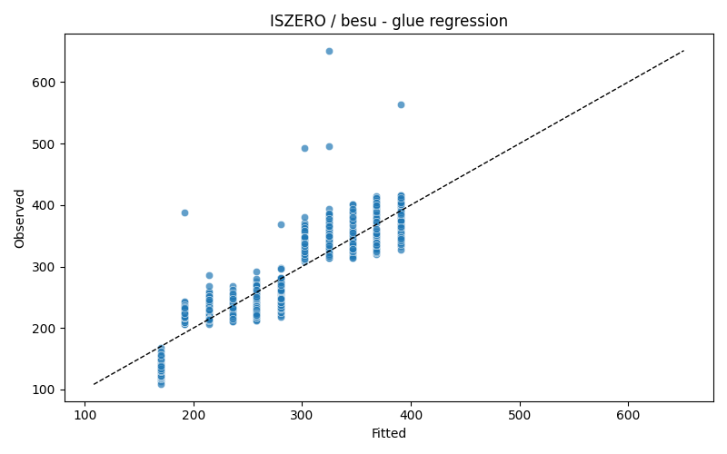

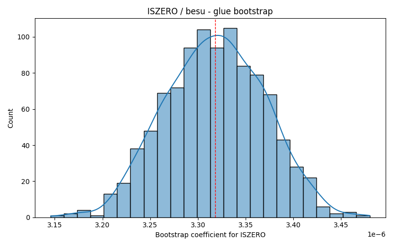

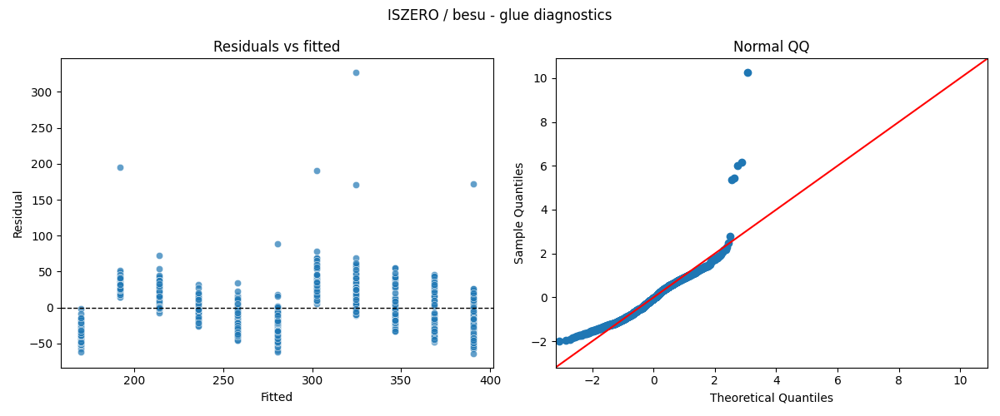

</details>

<details><summary><code>JUMPDEST</code> · nobs=946 · runtime_ms=8.783e-07 · p=1.00e-03 · R²=0.6858</summary>

```
==============================================================================
                           NNLS Regression Results                            
==============================================================================
Dep. Variable:          test_runtime_ms              R-squared:          0.686
Model:                  NNLS                    Adj. R-squared:          0.685
No. Observations:       946                               RMSE:          37.54
Df Residuals:           944                                MAE:          21.33
Df Model:               1      
==============================================================================
                      coef     std err     P-value      [0.025      0.975]
------------------------------------------------------------------------------
         const     16.4679      3.6699       0.001      9.0033     23.2810
      JUMPDEST      0.0000      0.0000       0.001      0.0000      0.0000
==============================================================================
Notes: Non-negative least squares with bootstrap inference (1000 iterations)
==============================================================================
```

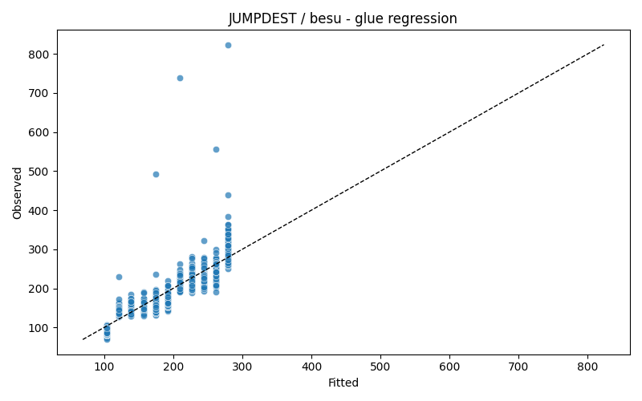

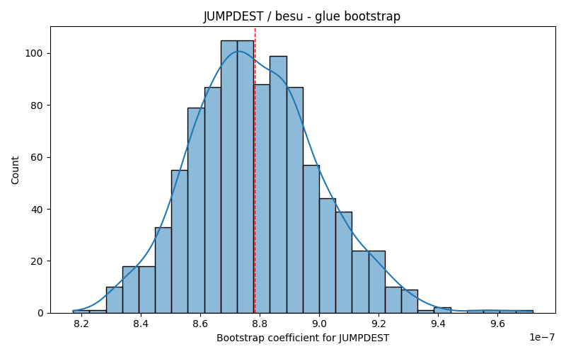

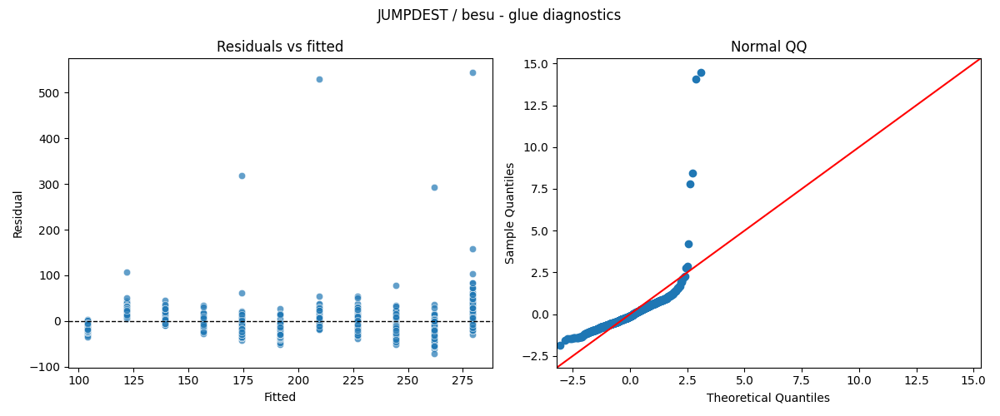

</details>

<details><summary><code>SWAP</code> · nobs=15136 · runtime_ms=2.279e-06 · p=1.00e-03 · R²=0.7742</summary>

```
==============================================================================
                           NNLS Regression Results                            
==============================================================================
Dep. Variable:          test_runtime_ms              R-squared:          0.774
Model:                  NNLS                    Adj. R-squared:          0.774
No. Observations:       15136                             RMSE:          25.91
Df Residuals:           15134                              MAE:          20.30
Df Model:               1      
==============================================================================
                      coef     std err     P-value      [0.025      0.975]
------------------------------------------------------------------------------
         const     42.1184      0.6904       0.001     40.7971     43.5396
          SWAP      0.0000      0.0000       0.001      0.0000      0.0000
==============================================================================
Notes: Non-negative least squares with bootstrap inference (1000 iterations)
==============================================================================
```

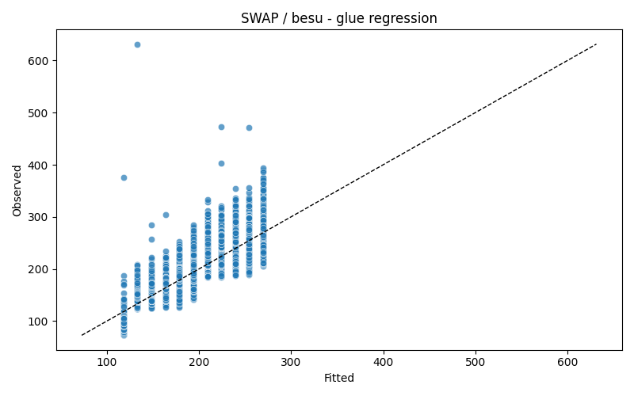

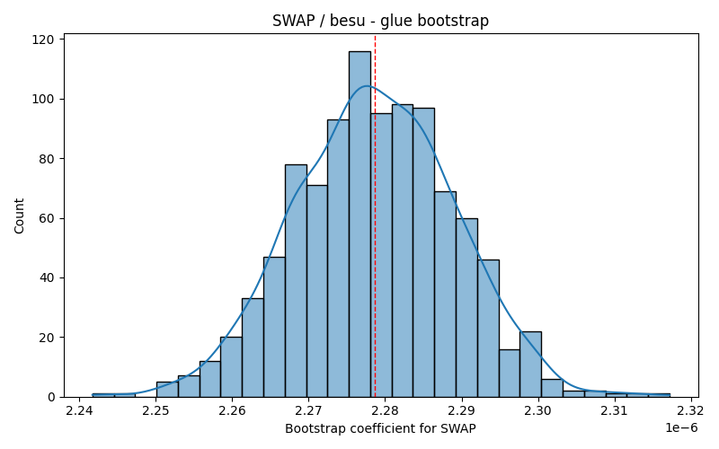

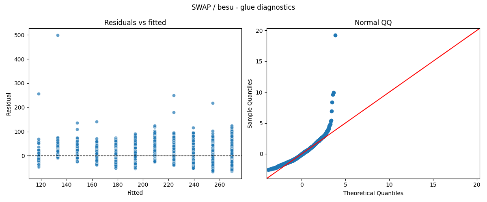

</details>

### Mixed glue (tier A) · besu

<details><summary><code>ADD</code> · nobs=946 · runtime_ms=9.118e-06 · p=1.00e-03 · R²=0.6811</summary>

```
==============================================================================
                           NNLS Regression Results                            
==============================================================================
Dep. Variable:          test_runtime_ms              R-squared:          0.681
Model:                  NNLS                    Adj. R-squared:          0.681
No. Observations:       946                               RMSE:          65.67
Df Residuals:           944                                MAE:          51.85
Df Model:               1      
==============================================================================
                      coef     std err     P-value      [0.025      0.975]
------------------------------------------------------------------------------
         const     84.4196      6.6572       0.001     71.0693     97.9422
           ADD      0.0000      0.0000       0.001      0.0000      0.0000
==============================================================================
Notes: Non-negative least squares with bootstrap inference (1000 iterations)
==============================================================================
```

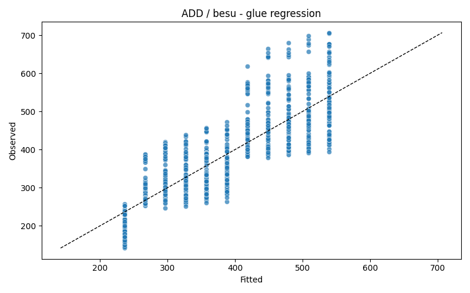

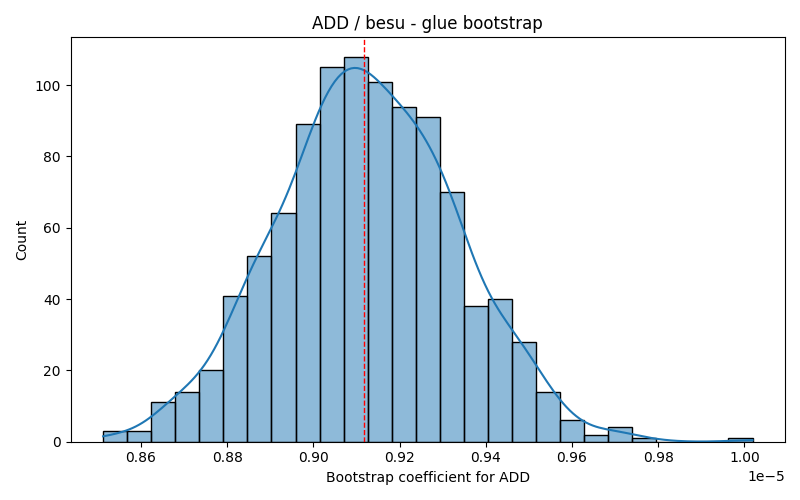

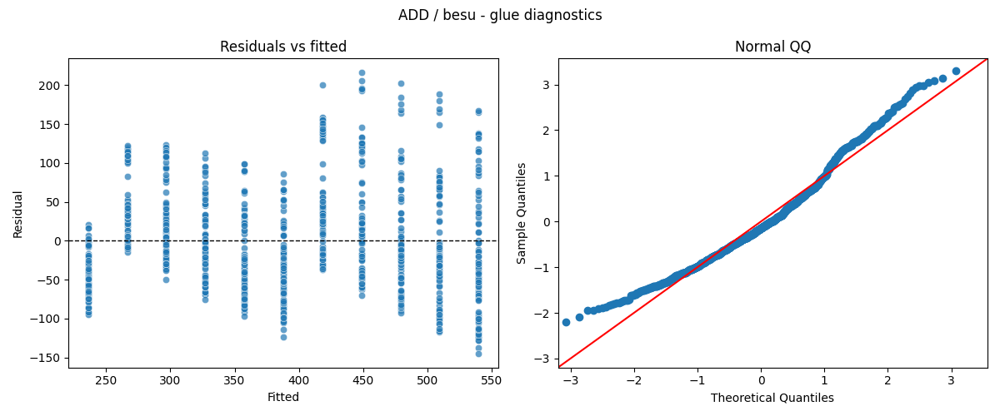

</details>

<details><summary><code>AND</code> · nobs=946 · runtime_ms=6.301e-06 · p=1.00e-03 · R²=0.5322</summary>

```
==============================================================================
                           NNLS Regression Results                            
==============================================================================
Dep. Variable:          test_runtime_ms              R-squared:          0.532
Model:                  NNLS                    Adj. R-squared:          0.532
No. Observations:       946                               RMSE:          62.18
Df Residuals:           944                                MAE:          45.58
Df Model:               1      
==============================================================================
                      coef     std err     P-value      [0.025      0.975]
------------------------------------------------------------------------------
         const     65.4995      5.8214       0.001     54.2851     76.9165
           AND      0.0000      0.0000       0.001      0.0000      0.0000
==============================================================================
Notes: Non-negative least squares with bootstrap inference (1000 iterations)
==============================================================================
```

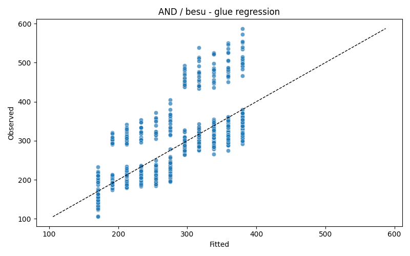

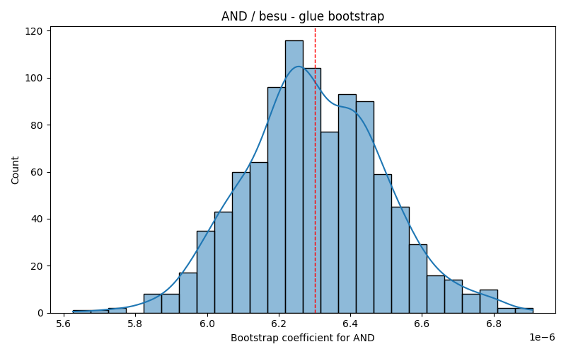

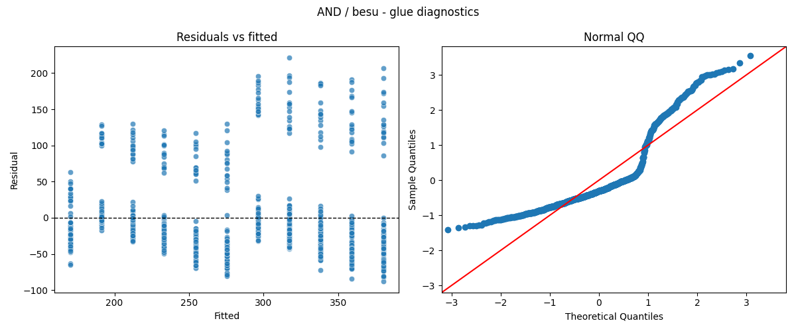

</details>

<details><summary><code>CALLDATACOPY</code> · nobs=22704 · runtime_ms=1.186e-05 · p=1.00e-03 · R²=0.701</summary>

```
==============================================================================
                           NNLS Regression Results                            
==============================================================================
Dep. Variable:          test_runtime_ms              R-squared:          0.701
Model:                  NNLS                    Adj. R-squared:          0.701
No. Observations:       22704                             RMSE:          58.27
Df Residuals:           22702                              MAE:          45.82
Df Model:               1      
==============================================================================
                      coef     std err     P-value      [0.025      0.975]
------------------------------------------------------------------------------
         const    119.6423      0.5197       0.001    118.6324    120.6182
  CALLDATACOPY      0.0000      0.0000       0.001      0.0000      0.0000
==============================================================================
Notes: Non-negative least squares with bootstrap inference (1000 iterations)
==============================================================================
```

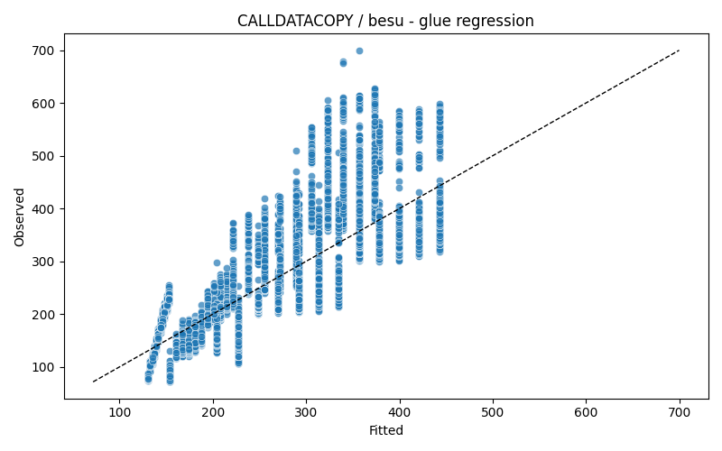

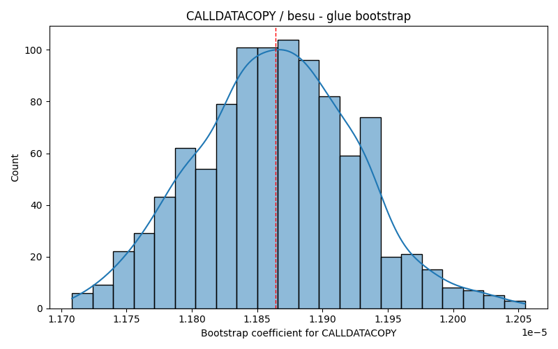

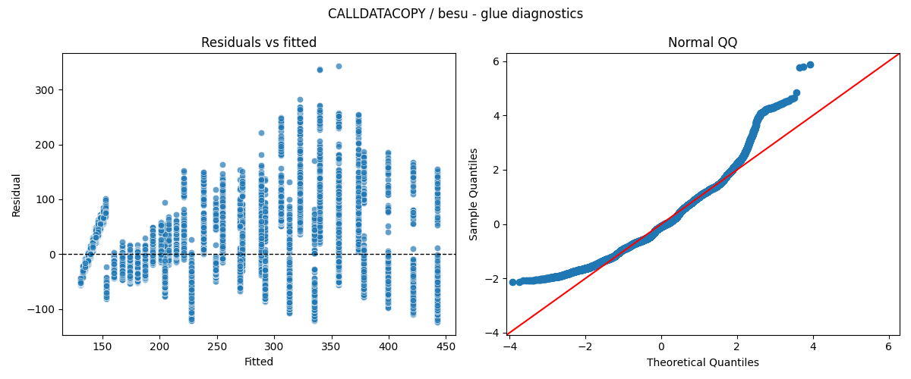

</details>

<details><summary><code>CALLDATALOAD</code> · nobs=3784 · runtime_ms=0 · p=1.00e+00 · R²=0</summary>

```
==============================================================================
                           NNLS Regression Results                            
==============================================================================
Dep. Variable:          test_runtime_ms              R-squared:          0.000
Model:                  NNLS                    Adj. R-squared:         -0.000
No. Observations:       3784                              RMSE:           0.66
Df Residuals:           3782                               MAE:           0.44
Df Model:               1      
==============================================================================
                      coef     std err     P-value      [0.025      0.975]
------------------------------------------------------------------------------
         const      3.5004      0.0183       0.001      3.4486      3.5216
  CALLDATALOAD      0.0000      0.0000       1.000      0.0000      0.0000
==============================================================================
Notes: Non-negative least squares with bootstrap inference (1000 iterations)
==============================================================================
```

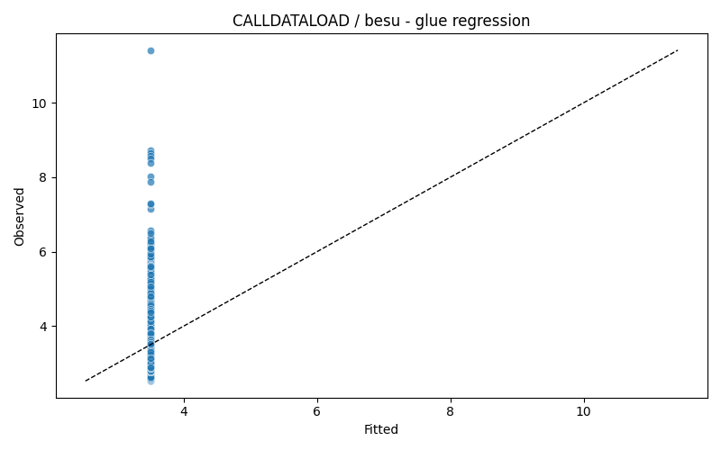

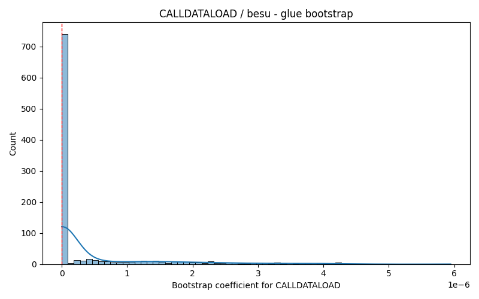

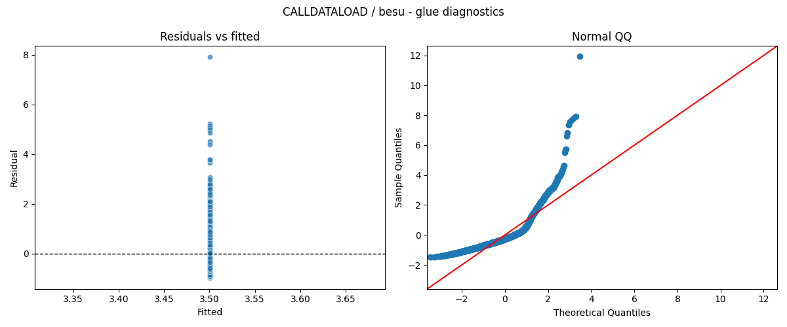

</details>

<details><summary><code>DIV</code> · nobs=946 · runtime_ms=1.213e-05 · p=1.00e-03 · R²=0.7343</summary>

```
==============================================================================
                           NNLS Regression Results                            
==============================================================================
Dep. Variable:          test_runtime_ms              R-squared:          0.734
Model:                  NNLS                    Adj. R-squared:          0.734
No. Observations:       946                               RMSE:          57.61
Df Residuals:           944                                MAE:          44.20
Df Model:               1      
==============================================================================
                      coef     std err     P-value      [0.025      0.975]
------------------------------------------------------------------------------
         const    140.8084      5.1933       0.001    130.5457    150.5812
           DIV      0.0000      0.0000       0.001      0.0000      0.0000
==============================================================================
Notes: Non-negative least squares with bootstrap inference (1000 iterations)
==============================================================================
```

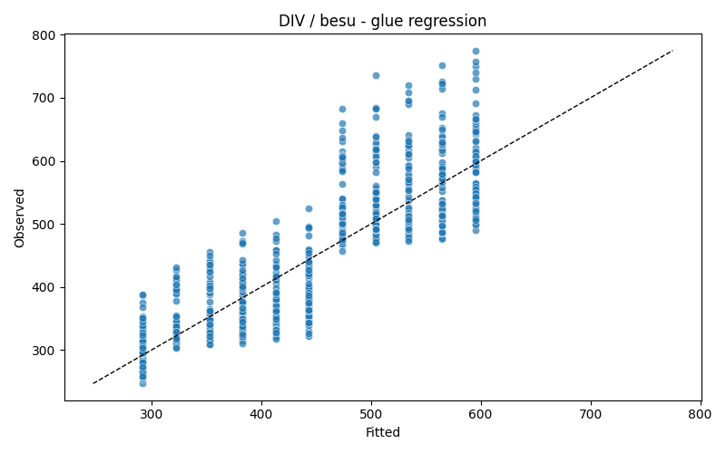

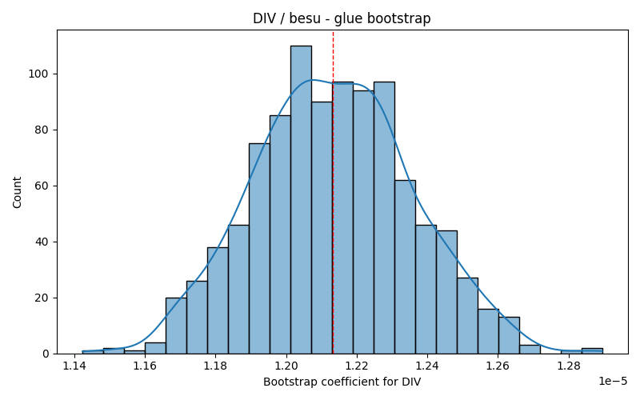

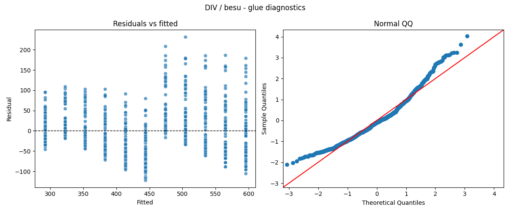

</details>

<details><summary><code>EXP</code> · nobs=946 · runtime_ms=0.0008898 · p=1.00e-03 · R²=0.5813</summary>

```
==============================================================================
                           NNLS Regression Results                            
==============================================================================
Dep. Variable:          test_runtime_ms              R-squared:          0.581
Model:                  NNLS                    Adj. R-squared:          0.581
No. Observations:       946                               RMSE:          29.57
Df Residuals:           944                                MAE:          22.69
Df Model:               1      
==============================================================================
                      coef     std err     P-value      [0.025      0.975]
------------------------------------------------------------------------------
         const    116.6493      4.5331       0.001    107.6258    125.0543
           EXP      0.0009      0.0000       0.001      0.0008      0.0010
==============================================================================
Notes: Non-negative least squares with bootstrap inference (1000 iterations)
==============================================================================
```

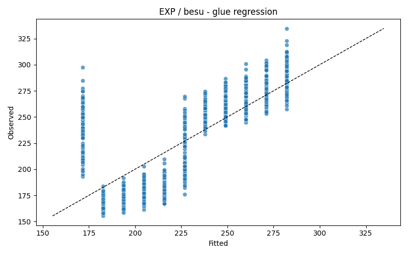

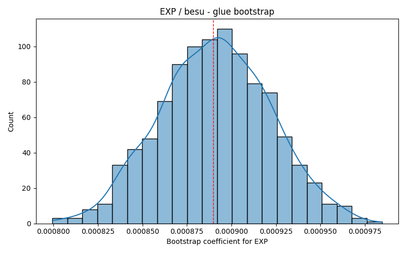

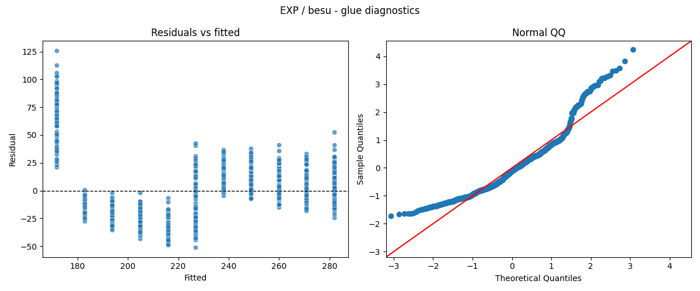

</details>

<details><summary><code>GT</code> · nobs=946 · runtime_ms=7.377e-06 · p=1.00e-03 · R²=0.8552</summary>

```
==============================================================================
                           NNLS Regression Results                            
==============================================================================
Dep. Variable:          test_runtime_ms              R-squared:          0.855
Model:                  NNLS                    Adj. R-squared:          0.855
No. Observations:       946                               RMSE:          31.96
Df Residuals:           944                                MAE:          26.14
Df Model:               1      
==============================================================================
                      coef     std err     P-value      [0.025      0.975]
------------------------------------------------------------------------------
         const     32.5774      3.7174       0.001     24.9627     39.6360
            GT      0.0000      0.0000       0.001      0.0000      0.0000
==============================================================================
Notes: Non-negative least squares with bootstrap inference (1000 iterations)
==============================================================================
```

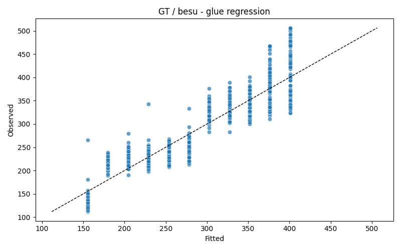

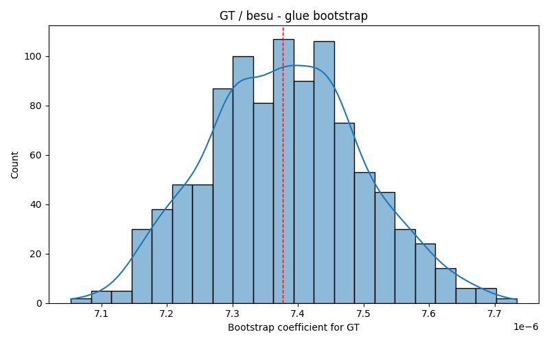

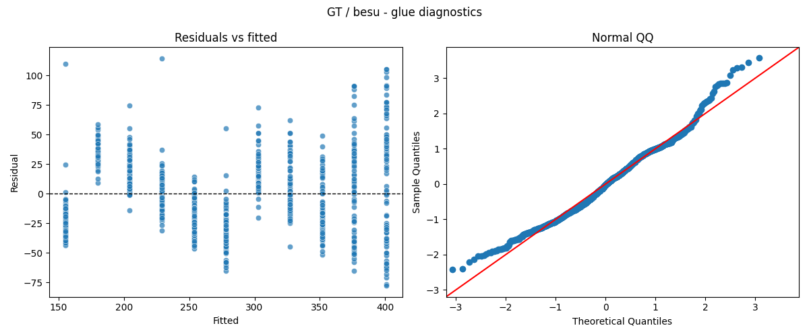

</details>

<details><summary><code>JUMPI</code> · nobs=946 · runtime_ms=4.052e-06 · p=1.00e-03 · R²=0.8131</summary>

```
==============================================================================
                           NNLS Regression Results                            
==============================================================================
Dep. Variable:          test_runtime_ms              R-squared:          0.813
Model:                  NNLS                    Adj. R-squared:          0.813
No. Observations:       946                               RMSE:           8.76
Df Residuals:           944                                MAE:           6.22
Df Model:               1      
==============================================================================
                      coef     std err     P-value      [0.025      0.975]
------------------------------------------------------------------------------
         const     22.8863      0.7970       0.001     21.3321     24.3965
         JUMPI      0.0000      0.0000       0.001      0.0000      0.0000
==============================================================================
Notes: Non-negative least squares with bootstrap inference (1000 iterations)
==============================================================================
```

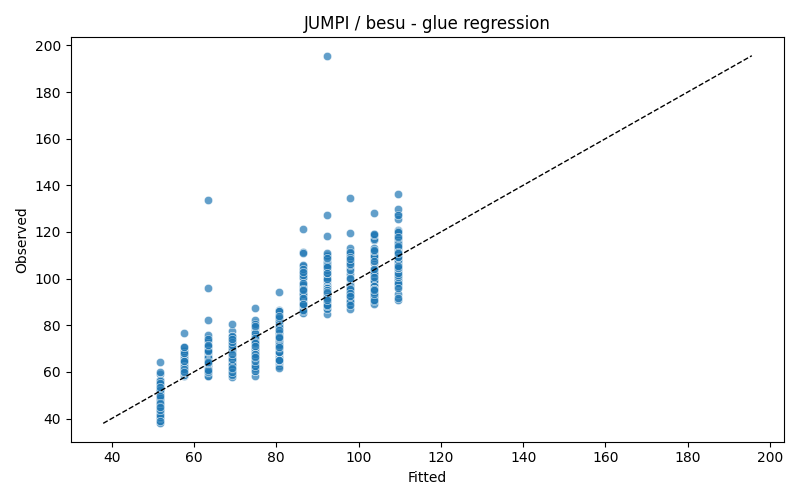

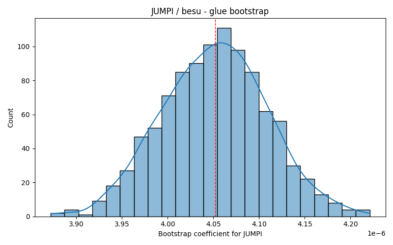

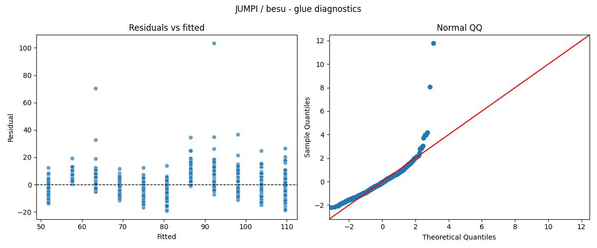

</details>

<details><summary><code>LT</code> · nobs=946 · runtime_ms=6.841e-06 · p=1.00e-03 · R²=0.8597</summary>

```
==============================================================================
                           NNLS Regression Results                            
==============================================================================
Dep. Variable:          test_runtime_ms              R-squared:          0.860
Model:                  NNLS                    Adj. R-squared:          0.860
No. Observations:       946                               RMSE:          29.09
Df Residuals:           944                                MAE:          24.04
Df Model:               1      
==============================================================================
                      coef     std err     P-value      [0.025      0.975]
------------------------------------------------------------------------------
         const     87.8808      2.8867       0.001     82.2546     93.3266
            LT      0.0000      0.0000       0.001      0.0000      0.0000
==============================================================================
Notes: Non-negative least squares with bootstrap inference (1000 iterations)
==============================================================================
```

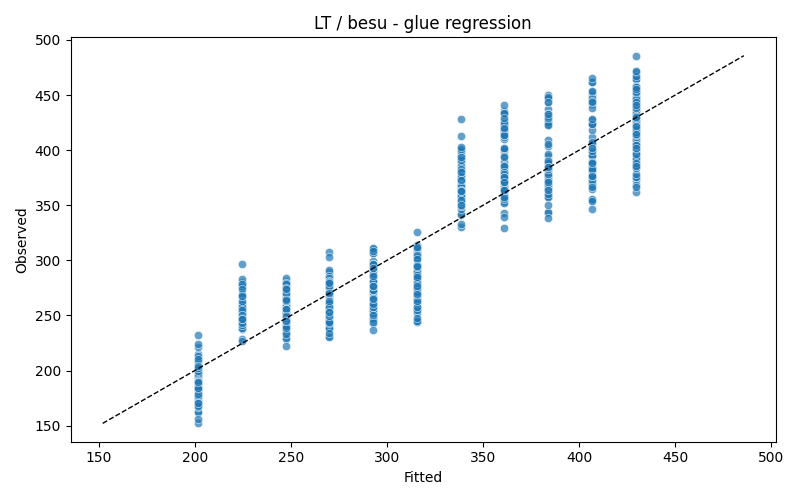

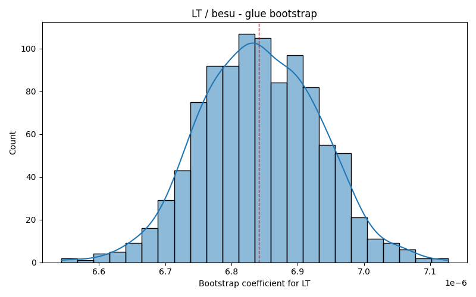

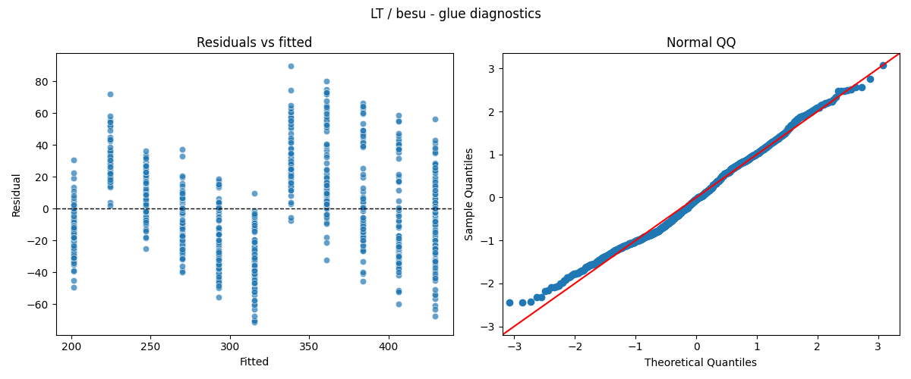

</details>

<details><summary><code>MSTORE</code> · nobs=4730 · runtime_ms=1.528e-05 · p=1.00e-03 · R²=0.8595</summary>

```
==============================================================================
                           NNLS Regression Results                            
==============================================================================
Dep. Variable:          test_runtime_ms              R-squared:          0.859
Model:                  NNLS                    Adj. R-squared:          0.859
No. Observations:       4730                              RMSE:          43.35
Df Residuals:           4728                               MAE:          36.41
Df Model:               1      
==============================================================================
                      coef     std err     P-value      [0.025      0.975]
------------------------------------------------------------------------------
         const     92.4777      2.2142       0.001     88.1385     96.6936
        MSTORE      0.0000      0.0000       0.001      0.0000      0.0000
==============================================================================
Notes: Non-negative least squares with bootstrap inference (1000 iterations)
==============================================================================
```

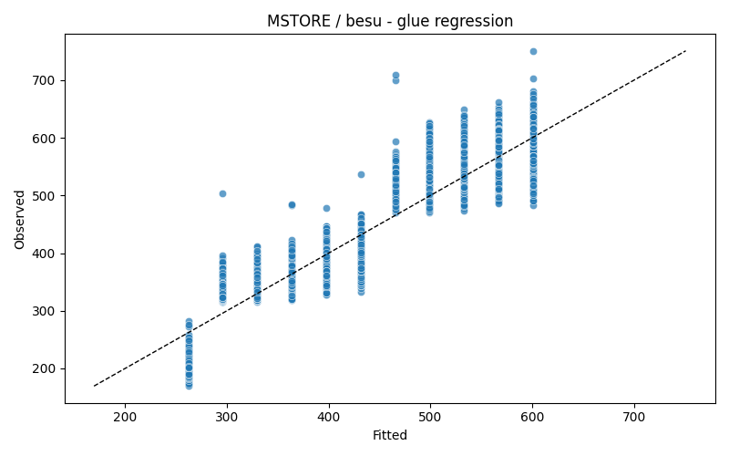

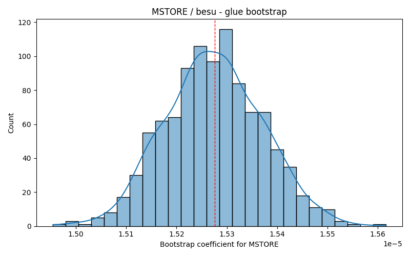

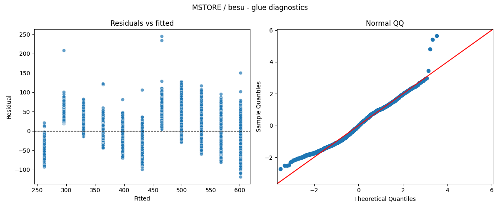

</details>

<details><summary><code>MSTORE8</code> · nobs=4730 · runtime_ms=8.495e-06 · p=1.00e-03 · R²=0.8541</summary>

```
==============================================================================
                           NNLS Regression Results                            
==============================================================================
Dep. Variable:          test_runtime_ms              R-squared:          0.854
Model:                  NNLS                    Adj. R-squared:          0.854
No. Observations:       4730                              RMSE:          24.64
Df Residuals:           4728                               MAE:          20.08
Df Model:               1      
==============================================================================
                      coef     std err     P-value      [0.025      0.975]
------------------------------------------------------------------------------
         const     53.3653      1.2805       0.001     50.9146     55.8270
       MSTORE8      0.0000      0.0000       0.001      0.0000      0.0000
==============================================================================
Notes: Non-negative least squares with bootstrap inference (1000 iterations)
==============================================================================
```

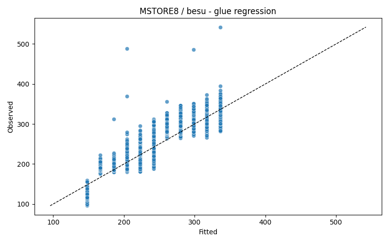

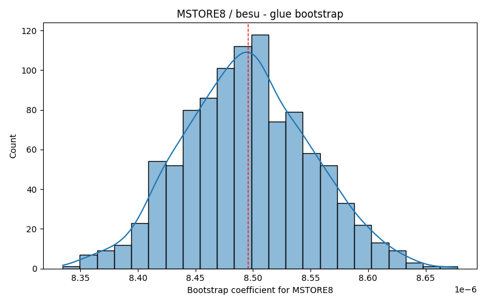

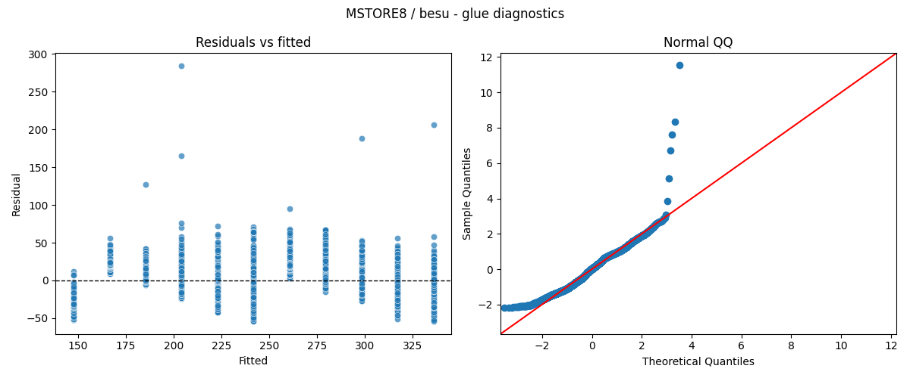

</details>

<details><summary><code>MUL</code> · nobs=946 · runtime_ms=9.191e-06 · p=1.00e-03 · R²=0.5004</summary>

```
==============================================================================
                           NNLS Regression Results                            
==============================================================================
Dep. Variable:          test_runtime_ms              R-squared:          0.500
Model:                  NNLS                    Adj. R-squared:          0.500
No. Observations:       946                               RMSE:          72.49
Df Residuals:           944                                MAE:          60.23
Df Model:               1      
==============================================================================
                      coef     std err     P-value      [0.025      0.975]
------------------------------------------------------------------------------
         const     90.2062      6.7350       0.001     76.8732    103.3644
           MUL      0.0000      0.0000       0.001      0.0000      0.0000
==============================================================================
Notes: Non-negative least squares with bootstrap inference (1000 iterations)
==============================================================================
```

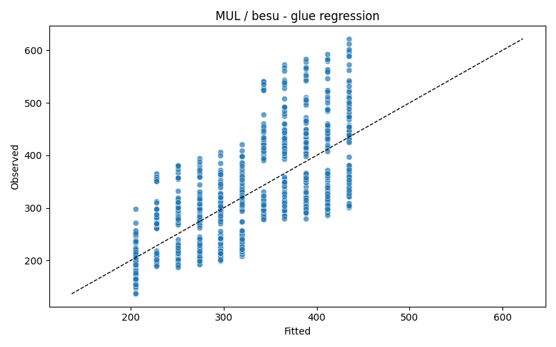

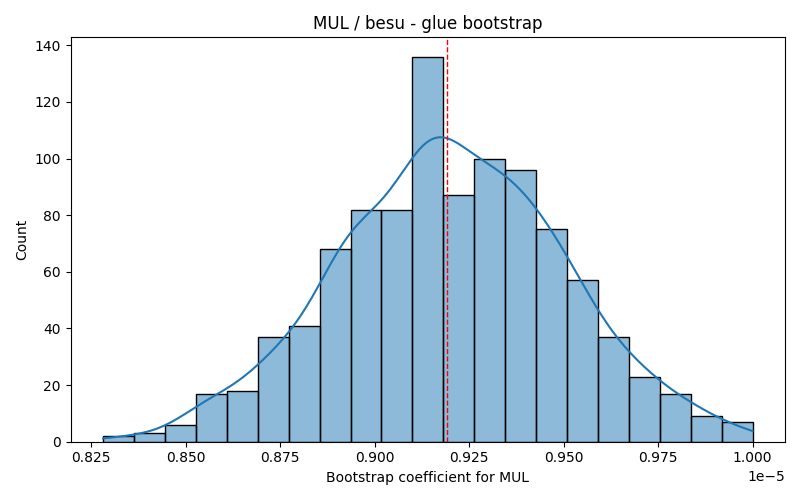

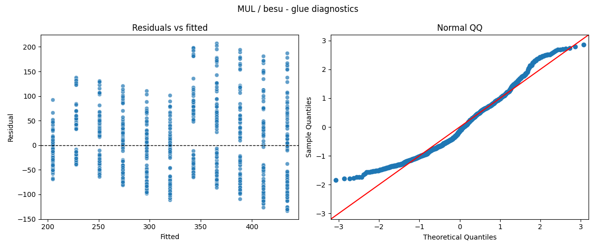

</details>

<details><summary><code>PC</code> · nobs=946 · runtime_ms=3.304e-06 · p=1.00e-03 · R²=0.8989</summary>

```
==============================================================================
                           NNLS Regression Results                            
==============================================================================
Dep. Variable:          test_runtime_ms              R-squared:          0.899
Model:                  NNLS                    Adj. R-squared:          0.899
No. Observations:       946                               RMSE:          33.13
Df Residuals:           944                                MAE:          28.40
Df Model:               1      
==============================================================================
                      coef     std err     P-value      [0.025      0.975]
------------------------------------------------------------------------------
         const     73.1585      3.7374       0.001     65.6656     80.1514
            PC      0.0000      0.0000       0.001      0.0000      0.0000
==============================================================================
Notes: Non-negative least squares with bootstrap inference (1000 iterations)
==============================================================================
```

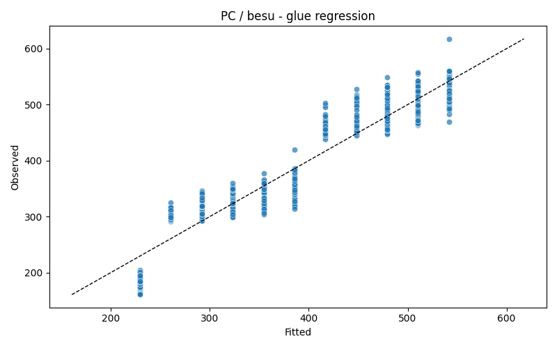

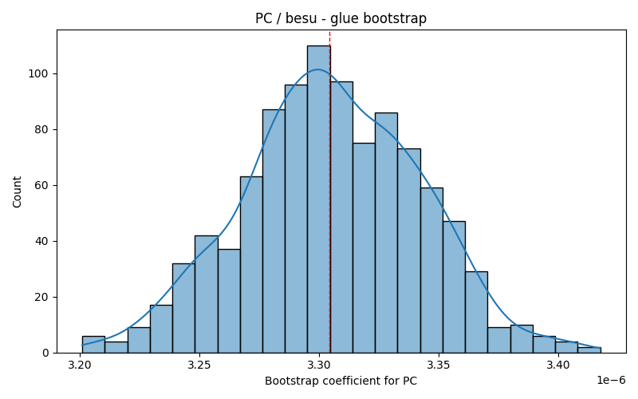

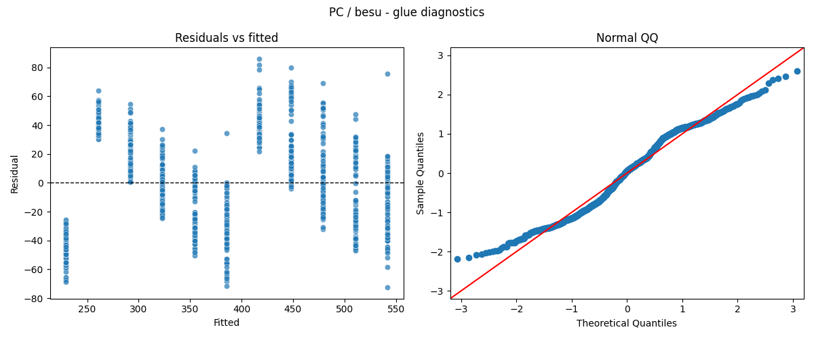

</details>

<details><summary><code>RETURNDATASIZE</code> · nobs=3784 · runtime_ms=3.819e-06 · p=1.00e-03 · R²=0.8474</summary>

```
==============================================================================
                           NNLS Regression Results                            
==============================================================================
Dep. Variable:          test_runtime_ms              R-squared:          0.847
Model:                  NNLS                    Adj. R-squared:          0.847
No. Observations:       3784                              RMSE:          25.58
Df Residuals:           3782                               MAE:          19.92
Df Model:               1      
==============================================================================
                      coef     std err     P-value      [0.025      0.975]
------------------------------------------------------------------------------
         const     47.6114      1.5119       0.001     44.6466     50.4501
RETURNDATASIZE      0.0000      0.0000       0.001      0.0000      0.0000
==============================================================================
Notes: Non-negative least squares with bootstrap inference (1000 iterations)
==============================================================================
```

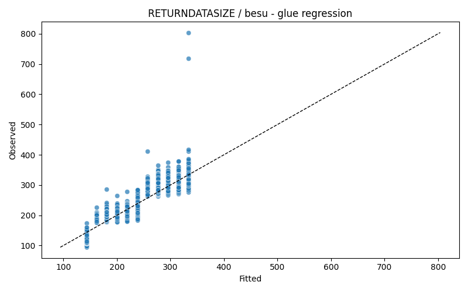

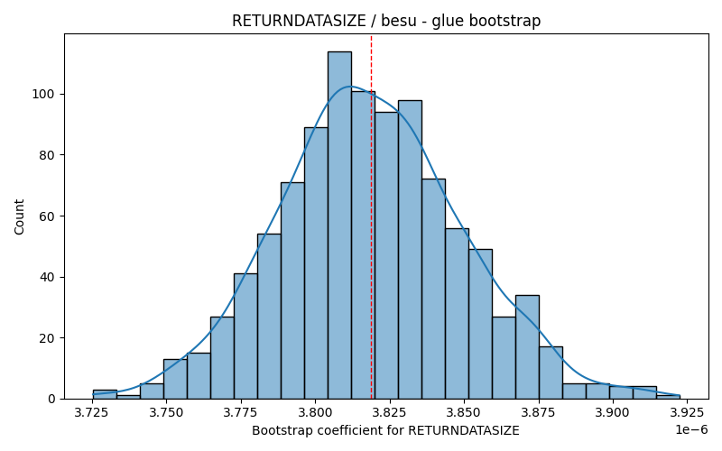

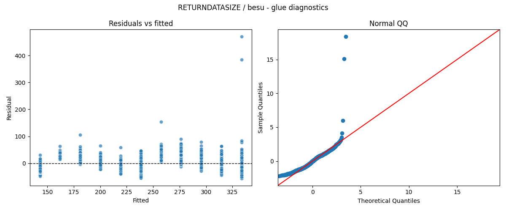

</details>

<details><summary><code>SELFBALANCE</code> · nobs=774 · runtime_ms=6.96e-06 · p=1.00e-03 · R²=0.3349</summary>

```
==============================================================================
                           NNLS Regression Results                            
==============================================================================
Dep. Variable:          test_runtime_ms              R-squared:          0.335
Model:                  NNLS                    Adj. R-squared:          0.334
No. Observations:       774                               RMSE:          98.94
Df Residuals:           772                                MAE:          76.71
Df Model:               1      
==============================================================================
                      coef     std err     P-value      [0.025      0.975]
------------------------------------------------------------------------------
         const    413.3867     16.3720       0.001    381.2379    444.4311
   SELFBALANCE      0.0000      0.0000       0.001      0.0000      0.0000
==============================================================================
Notes: Non-negative least squares with bootstrap inference (1000 iterations)
==============================================================================
```

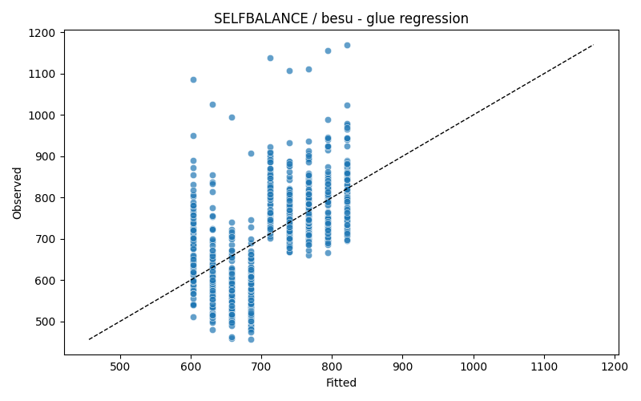

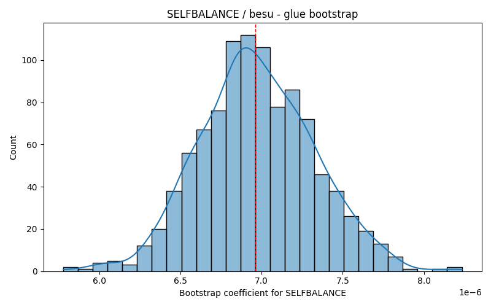

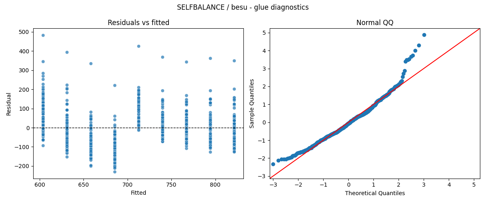

</details>

<details><summary><code>SUB</code> · nobs=946 · runtime_ms=8.487e-06 · p=1.00e-03 · R²=0.636</summary>

```
==============================================================================
                           NNLS Regression Results                            
==============================================================================
Dep. Variable:          test_runtime_ms              R-squared:          0.636
Model:                  NNLS                    Adj. R-squared:          0.636
No. Observations:       946                               RMSE:          67.58
Df Residuals:           944                                MAE:          51.14
Df Model:               1      
==============================================================================
                      coef     std err     P-value      [0.025      0.975]
------------------------------------------------------------------------------
         const     96.1178      6.8634       0.001     82.1035    109.6218
           SUB      0.0000      0.0000       0.001      0.0000      0.0000
==============================================================================
Notes: Non-negative least squares with bootstrap inference (1000 iterations)
==============================================================================
```

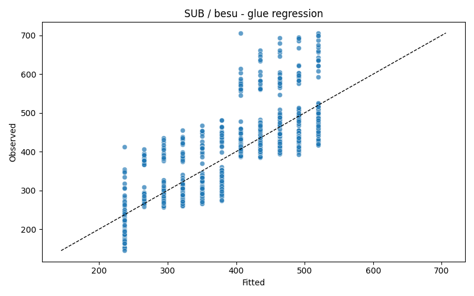

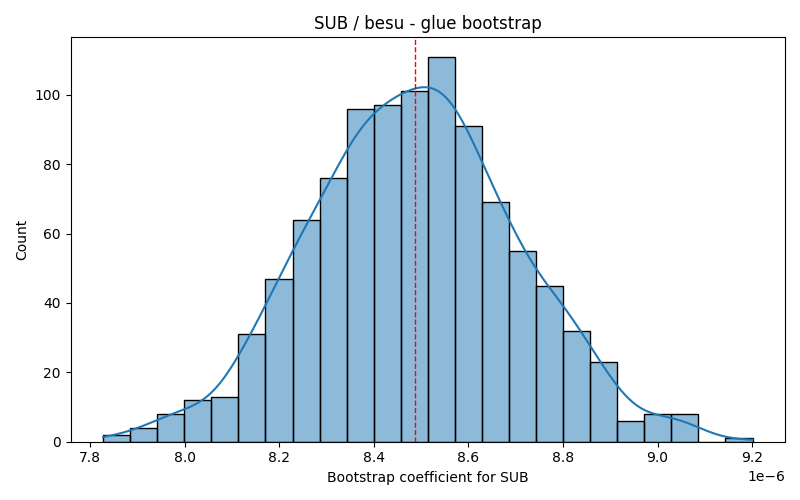

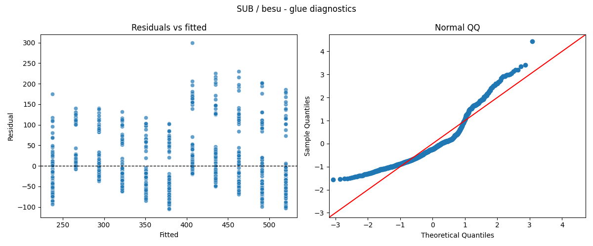

</details>

### Mixed glue (tier B) · besu

<details><summary><code>JUMP</code> · nobs=946 · runtime_ms=3.284e-05 · p=1.00e-03 · R²=0.4071</summary>

```
==============================================================================
                           NNLS Regression Results                            
==============================================================================
Dep. Variable:          test_runtime_ms              R-squared:          0.407
Model:                  NNLS                    Adj. R-squared:          0.406
No. Observations:       946                               RMSE:         147.25
Df Residuals:           944                                MAE:         125.38
Df Model:               1      
==============================================================================
                      coef     std err     P-value      [0.025      0.975]
------------------------------------------------------------------------------
         const    136.0100     13.7181       0.001    110.3704    163.8253
          JUMP      0.0000      0.0000       0.001      0.0000      0.0000
==============================================================================
Notes: Non-negative least squares with bootstrap inference (1000 iterations)
==============================================================================
```

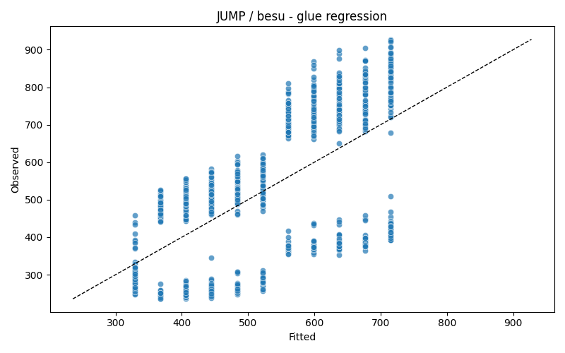

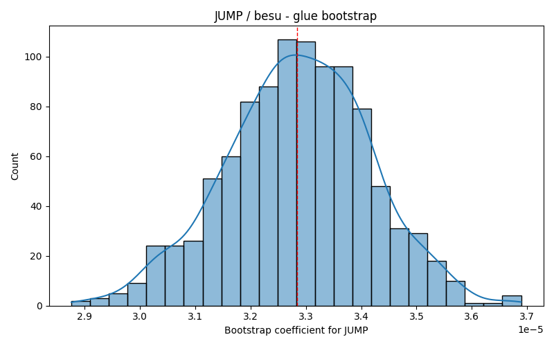

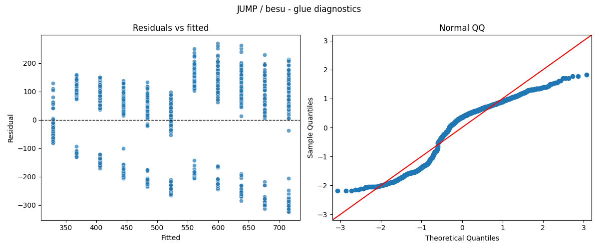

</details>

<details><summary><code>KECCAK256</code> · nobs=15136 · runtime_ms=4.231e-05 · p=1.00e-03 · R²=0.1988</summary>

```
==============================================================================
                           NNLS Regression Results                            
==============================================================================
Dep. Variable:          test_runtime_ms              R-squared:          0.199
Model:                  NNLS                    Adj. R-squared:          0.199
No. Observations:       15136                             RMSE:         168.81
Df Residuals:           15134                              MAE:         132.23
Df Model:               1      
==============================================================================
                      coef     std err     P-value      [0.025      0.975]
------------------------------------------------------------------------------
         const    514.4169      3.0112       0.001    508.5823    520.1236
     KECCAK256      0.0000      0.0000       0.001      0.0000      0.0000
==============================================================================
Notes: Non-negative least squares with bootstrap inference (1000 iterations)
==============================================================================
```

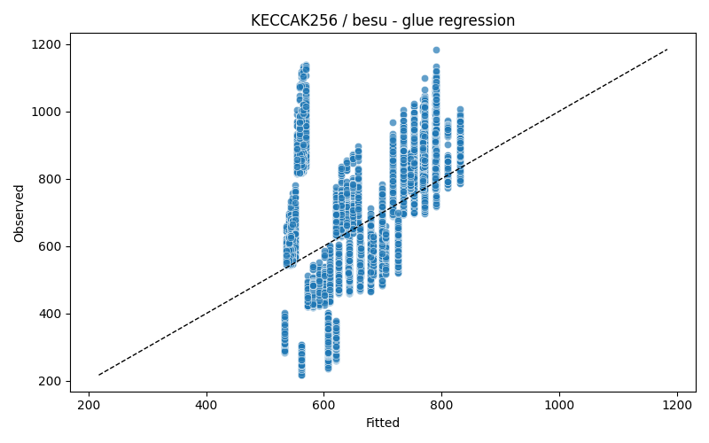

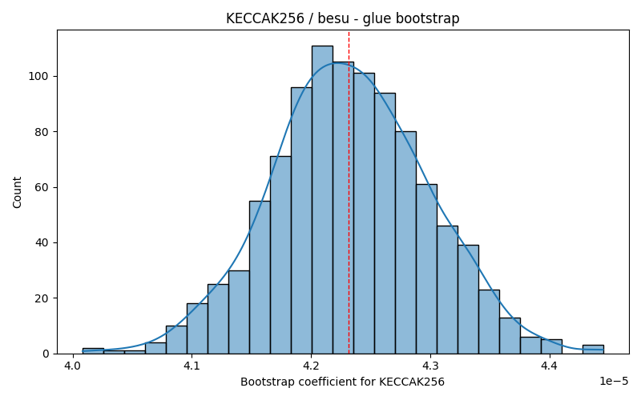

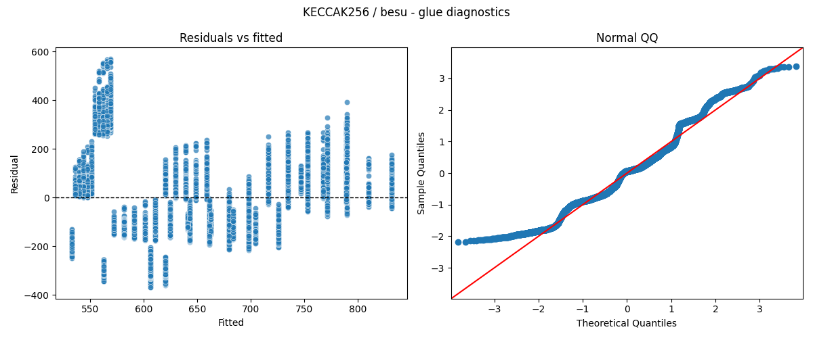

</details>

## erigon

| glue_opcode | nobs | glue_runtime_ms | p_value | rsquared |
| --- | --- | --- | --- | --- |
| `ISZERO` | 11 | 1.072e-06 | 1.00e-03 | 0.9628 |
| `JUMPDEST` | 11 | 8.473e-07 | 1.00e-03 | 0.9526 |
| `SWAP` | 176 | 1.299e-06 | 1.00e-03 | 0.9585 |
| `CALLDATASIZE` | 682 | 1.008e-06 | 1.00e-03 | 0.9362 |
| `DUP` | 682 | 1.202e-06 | 1.00e-03 | 0.9362 |
| `GAS` | 682 | 9.677e-07 | 1.00e-03 | 0.9362 |
| `MLOAD` | 682 | 3.336e-06 | 1.00e-03 | 0.9362 |
| `PUSH` | 682 | 3.029e-06 | 1.00e-03 | 0.9362 |
| `PUSH0` | 682 | 9.541e-07 | 1.00e-03 | 0.9362 |
| `STATICCALL` | 682 | 0.0004744 | 1.00e-03 | 0.9362 |
| `ADD` | 11 | 3.009e-06 | 1.00e-03 | 0.9585 |
| `AND` | 11 | 3.096e-06 | 1.00e-03 | 0.9485 |
| `CALLDATACOPY` | 264 | 7.759e-06 | 1.00e-03 | 0.9353 |
| `CALLDATALOAD` | 44 | 5.857e-05 | 1.00e-03 | 0.2163 |
| `DIV` | 11 | 1.056e-05 | 1.00e-03 | 0.911 |
| `EXP` | 11 | 0.000376 | 1.00e-03 | 0.9541 |
| `GT` | 11 | 3.108e-06 | 1.00e-03 | 0.9825 |
| `JUMPI` | 11 | 3.756e-06 | 1.00e-03 | 0.9324 |
| `LT` | 11 | 2.815e-06 | 1.00e-03 | 0.9611 |
| `MSTORE` | 55 | 6.079e-06 | 1.00e-03 | 0.9633 |
| `MSTORE8` | 55 | 5.416e-06 | 1.00e-03 | 0.9688 |
| `MUL` | 11 | 3.9e-06 | 1.00e-03 | 0.9627 |
| `PC` | 11 | 1.574e-06 | 1.00e-03 | 0.9568 |
| `RETURNDATASIZE` | 44 | 1.909e-06 | 1.00e-03 | 0.9688 |
| `SELFBALANCE` | 9 | 4.955e-05 | 1.00e-03 | 0.9857 |
| `SUB` | 11 | 2.998e-06 | 1.00e-03 | 0.9393 |
| `JUMP` | 11 | 8.036e-06 | 1.00e-03 | 0.9585 |
| `KECCAK256` | 176 | 2.058e-05 | 1.00e-03 | 0.07753 |

### Cycle glue — joint fit · erigon

<details><summary>Joint NNLS regression summary</summary>

```
==============================================================================
                           NNLS Regression Results                            
==============================================================================
Dep. Variable:          test_runtime_ms              R-squared:          0.936
Model:                  NNLS                    Adj. R-squared:          0.936
No. Observations:       682                               RMSE:          43.46
Df Residuals:           674                                MAE:          18.98
Df Model:               7      
==============================================================================
                      coef     std err     P-value      [0.025      0.975]
------------------------------------------------------------------------------
         const     32.2109      5.5223       0.001     22.4273     44.2858
  CALLDATASIZE      0.0000      0.0000       0.001      0.0000      0.0000
           DUP      0.0000      0.0000       0.001      0.0000      0.0000
           GAS      0.0000      0.0000       0.001      0.0000      0.0000
         MLOAD      0.0000      0.0000       0.001      0.0000      0.0000
          PUSH      0.0000      0.0000       0.001      0.0000      0.0000
         PUSH0      0.0000      0.0000       0.001      0.0000      0.0000
    STATICCALL      0.0005      0.0000       0.001      0.0005      0.0005
==============================================================================
Notes: Non-negative least squares with bootstrap inference (1000 iterations)
==============================================================================
```

</details>

<details><summary><code>CALLDATASIZE</code> · nobs=682 · runtime_ms=1.008e-06 · p=1.00e-03 · R²=0.9362</summary>

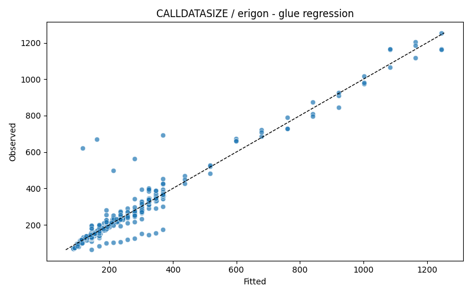

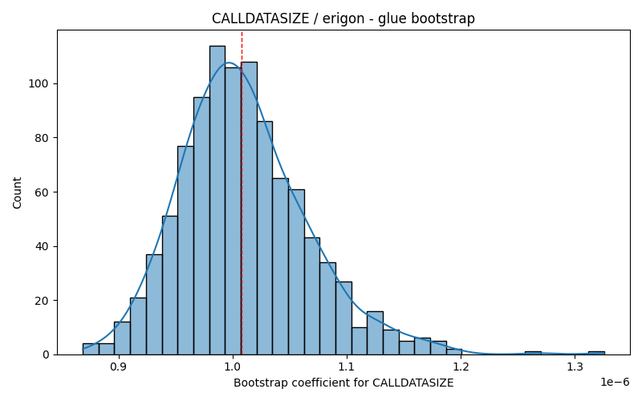

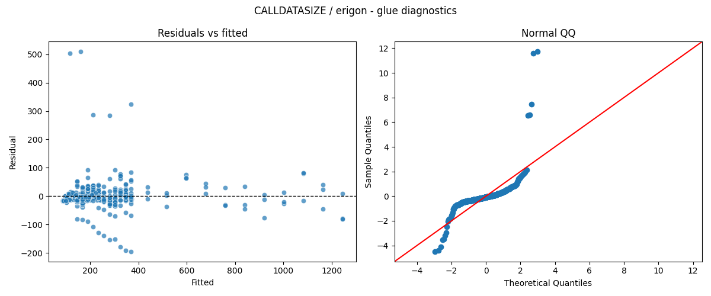

</details>

<details><summary><code>DUP</code> · nobs=682 · runtime_ms=1.202e-06 · p=1.00e-03 · R²=0.9362</summary>


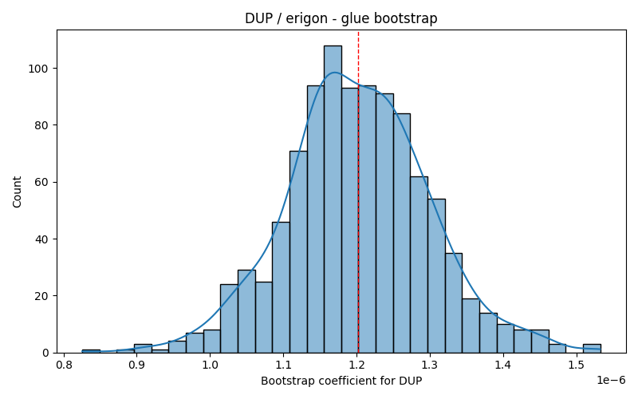


</details>

<details><summary><code>GAS</code> · nobs=682 · runtime_ms=9.677e-07 · p=1.00e-03 · R²=0.9362</summary>

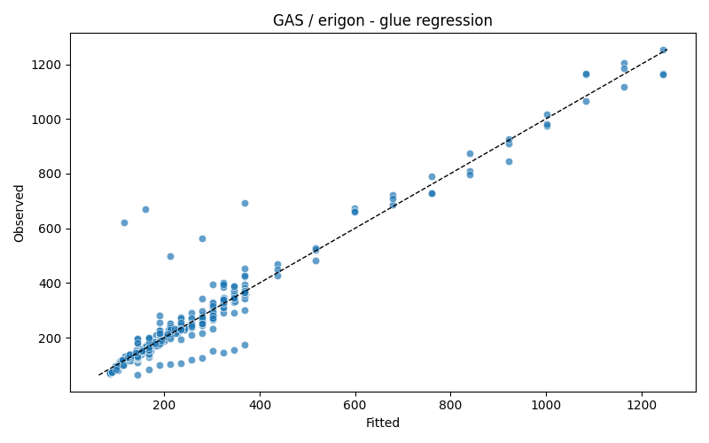

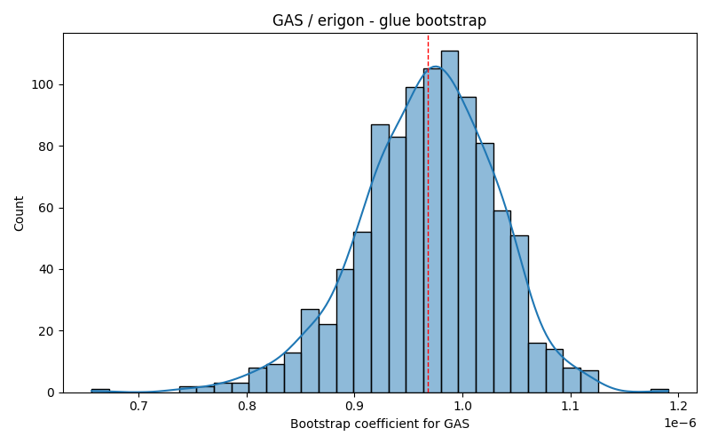

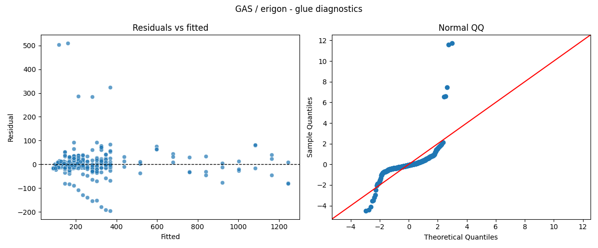

</details>

<details><summary><code>MLOAD</code> · nobs=682 · runtime_ms=3.336e-06 · p=1.00e-03 · R²=0.9362</summary>


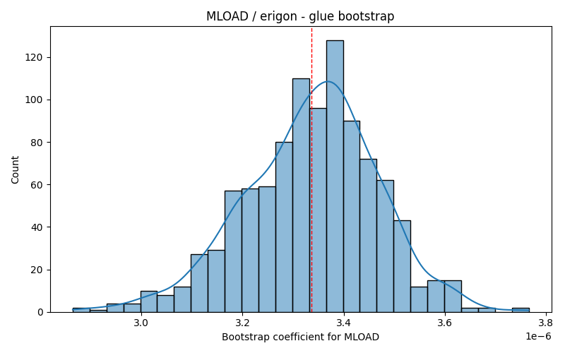


</details>

<details><summary><code>PUSH</code> · nobs=682 · runtime_ms=3.029e-06 · p=1.00e-03 · R²=0.9362</summary>

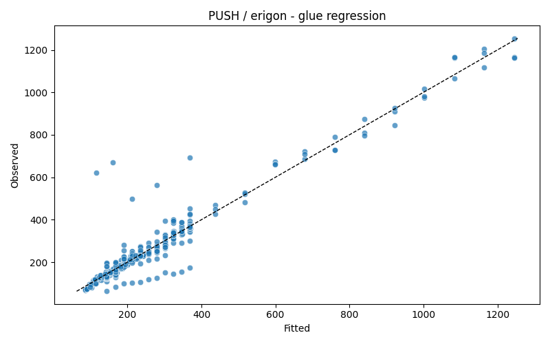

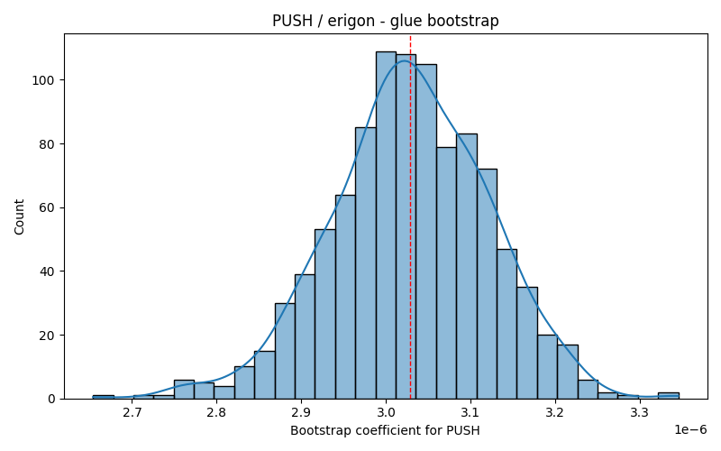


</details>

<details><summary><code>PUSH0</code> · nobs=682 · runtime_ms=9.541e-07 · p=1.00e-03 · R²=0.9362</summary>

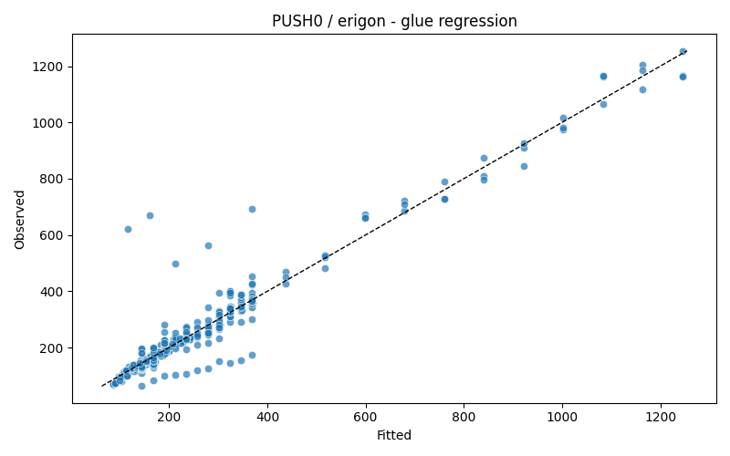

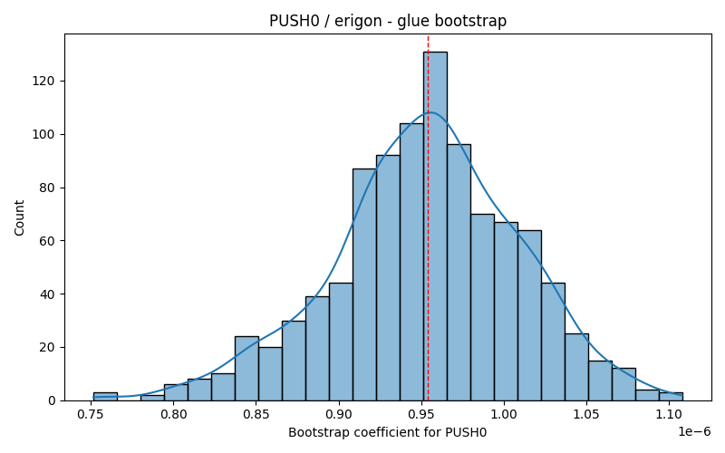


</details>

<details><summary><code>STATICCALL</code> · nobs=682 · runtime_ms=0.0004744 · p=1.00e-03 · R²=0.9362</summary>

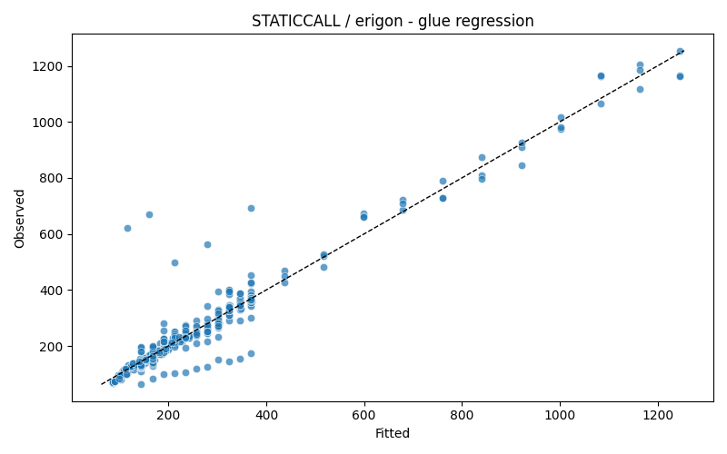

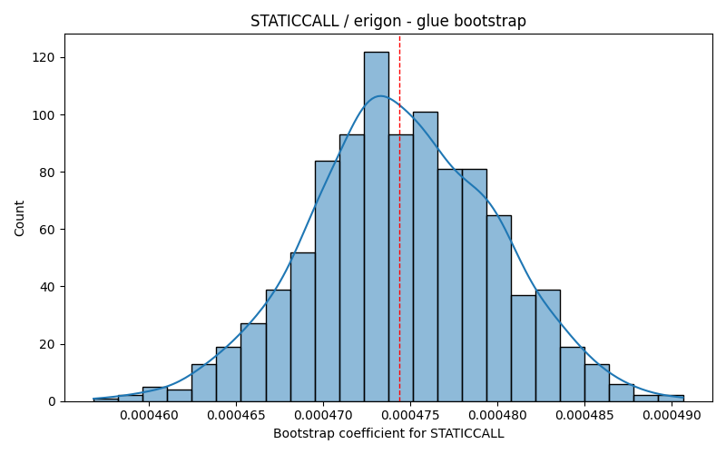


</details>

### Pure glue · erigon

<details><summary><code>ISZERO</code> · nobs=11 · runtime_ms=1.072e-06 · p=1.00e-03 · R²=0.9628</summary>

```
==============================================================================
                           NNLS Regression Results                            
==============================================================================
Dep. Variable:          test_runtime_ms              R-squared:          0.963
Model:                  NNLS                    Adj. R-squared:          0.959
No. Observations:       11                                RMSE:           4.44
Df Residuals:           9                                  MAE:           3.91
Df Model:               1      
==============================================================================
                      coef     std err     P-value      [0.025      0.975]
------------------------------------------------------------------------------
         const     18.1343      5.9452       0.001      8.3825     30.2900
        ISZERO      0.0000      0.0000       0.001      0.0000      0.0000
==============================================================================
Notes: Non-negative least squares with bootstrap inference (1000 iterations)
==============================================================================
```

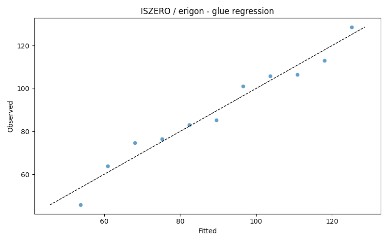

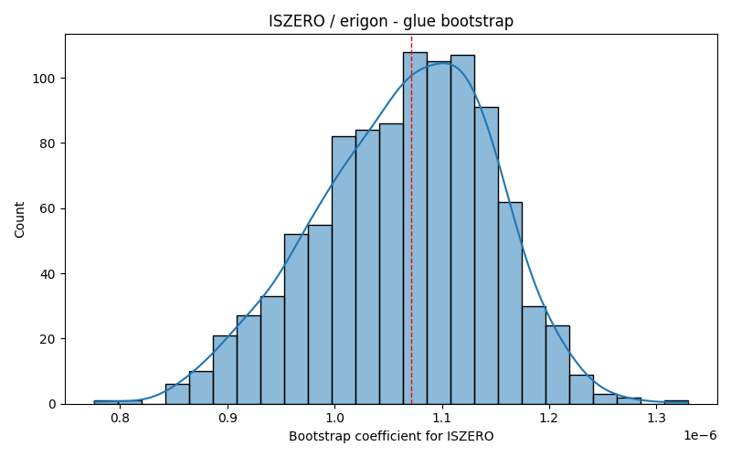

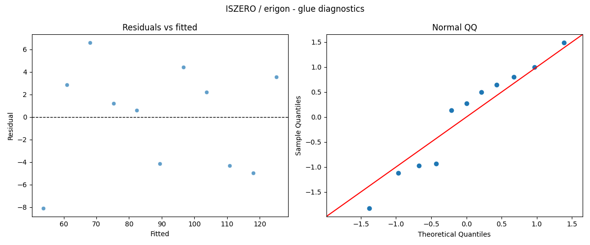

</details>

<details><summary><code>JUMPDEST</code> · nobs=11 · runtime_ms=8.473e-07 · p=1.00e-03 · R²=0.9526</summary>

```
==============================================================================
                           NNLS Regression Results                            
==============================================================================
Dep. Variable:          test_runtime_ms              R-squared:          0.953
Model:                  NNLS                    Adj. R-squared:          0.947
No. Observations:       11                                RMSE:          11.94
Df Residuals:           9                                  MAE:          10.73
Df Model:               1      
==============================================================================
                      coef     std err     P-value      [0.025      0.975]
------------------------------------------------------------------------------
         const     20.8324     12.4592       0.022      0.7006     50.8293
      JUMPDEST      0.0000      0.0000       0.001      0.0000      0.0000
==============================================================================
Notes: Non-negative least squares with bootstrap inference (1000 iterations)
==============================================================================
```

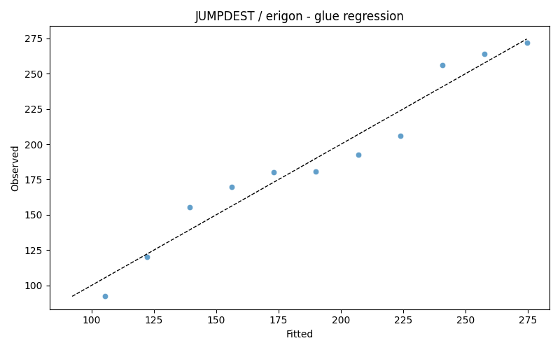

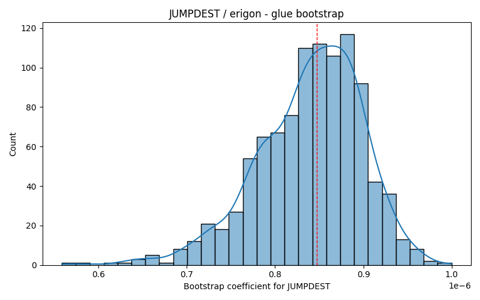

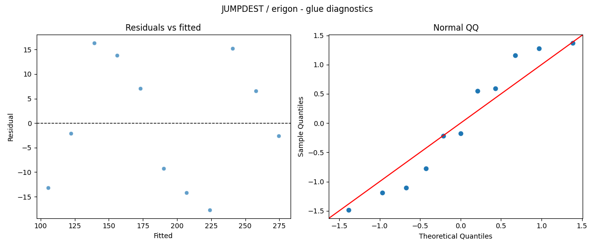

</details>

<details><summary><code>SWAP</code> · nobs=176 · runtime_ms=1.299e-06 · p=1.00e-03 · R²=0.9585</summary>

```
==============================================================================
                           NNLS Regression Results                            
==============================================================================
Dep. Variable:          test_runtime_ms              R-squared:          0.959
Model:                  NNLS                    Adj. R-squared:          0.958
No. Observations:       176                               RMSE:           5.69
Df Residuals:           174                                MAE:           4.33
Df Model:               1      
==============================================================================
                      coef     std err     P-value      [0.025      0.975]
------------------------------------------------------------------------------
         const     25.5078      1.6430       0.001     22.3898     28.8236
          SWAP      0.0000      0.0000       0.001      0.0000      0.0000
==============================================================================
Notes: Non-negative least squares with bootstrap inference (1000 iterations)
==============================================================================
```

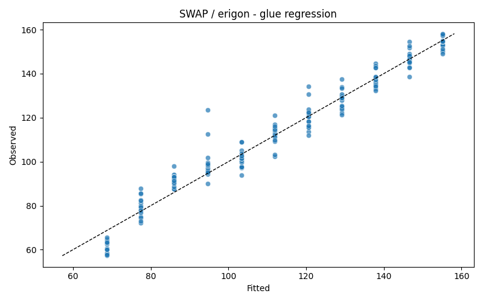

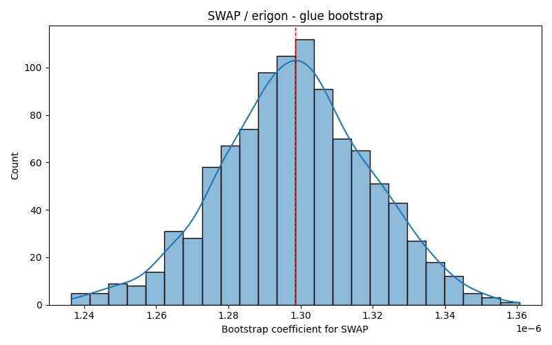

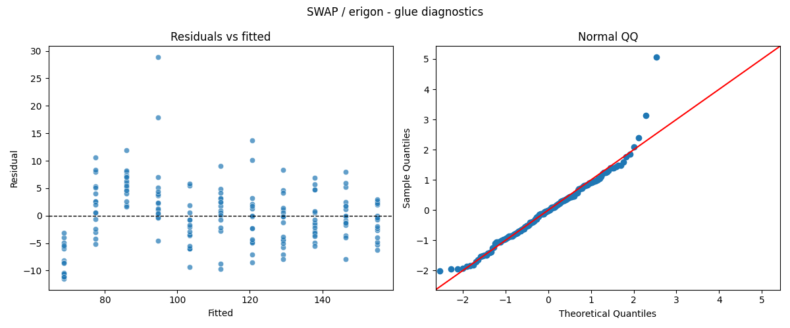

</details>

### Mixed glue (tier A) · erigon

<details><summary><code>ADD</code> · nobs=11 · runtime_ms=3.009e-06 · p=1.00e-03 · R²=0.9585</summary>

```
==============================================================================
                           NNLS Regression Results                            
==============================================================================
Dep. Variable:          test_runtime_ms              R-squared:          0.959
Model:                  NNLS                    Adj. R-squared:          0.954
No. Observations:       11                                RMSE:           6.59
Df Residuals:           9                                  MAE:           5.36
Df Model:               1      
==============================================================================
                      coef     std err     P-value      [0.025      0.975]
------------------------------------------------------------------------------
         const     13.6755      7.8953       0.032      0.0000     31.8992
           ADD      0.0000      0.0000       0.001      0.0000      0.0000
==============================================================================
Notes: Non-negative least squares with bootstrap inference (1000 iterations)
==============================================================================
```

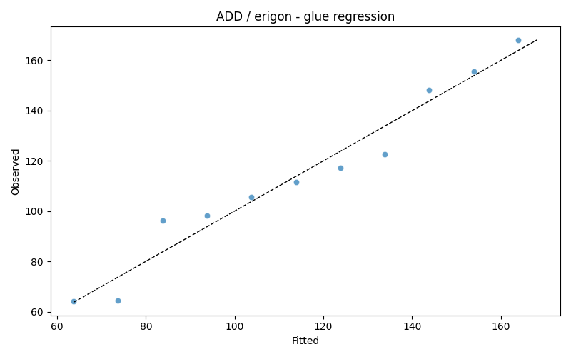

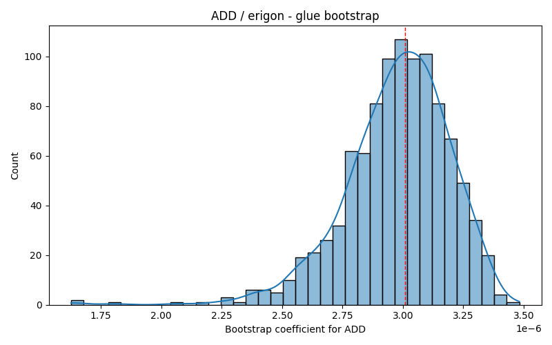

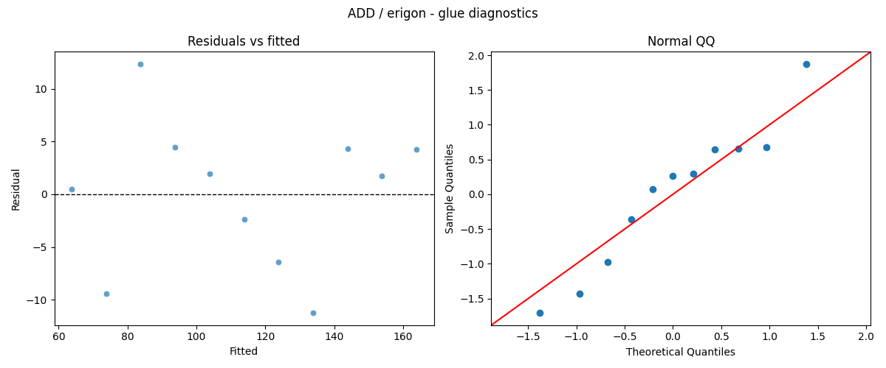

</details>

<details><summary><code>AND</code> · nobs=11 · runtime_ms=3.096e-06 · p=1.00e-03 · R²=0.9485</summary>

```
==============================================================================
                           NNLS Regression Results                            
==============================================================================
Dep. Variable:          test_runtime_ms              R-squared:          0.949
Model:                  NNLS                    Adj. R-squared:          0.943
No. Observations:       11                                RMSE:           7.59
Df Residuals:           9                                  MAE:           6.19
Df Model:               1      
==============================================================================
                      coef     std err     P-value      [0.025      0.975]
------------------------------------------------------------------------------
         const     11.0139      8.0082       0.046      0.0000     31.4174
           AND      0.0000      0.0000       0.001      0.0000      0.0000
==============================================================================
Notes: Non-negative least squares with bootstrap inference (1000 iterations)
==============================================================================
```

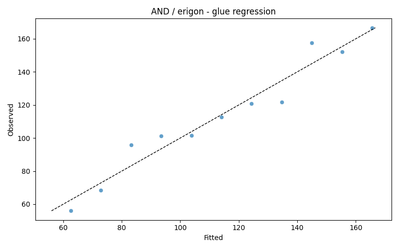

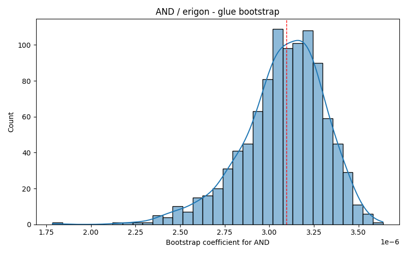

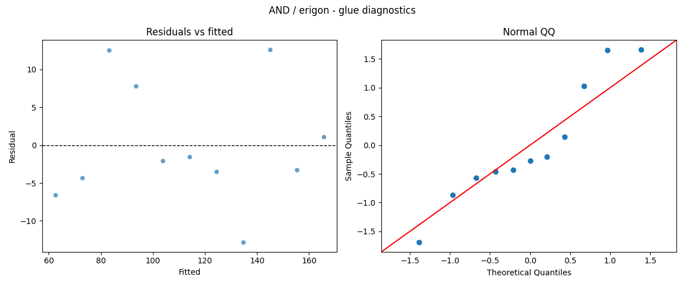

</details>

<details><summary><code>CALLDATACOPY</code> · nobs=264 · runtime_ms=7.759e-06 · p=1.00e-03 · R²=0.9353</summary>

```
==============================================================================
                           NNLS Regression Results                            
==============================================================================
Dep. Variable:          test_runtime_ms              R-squared:          0.935
Model:                  NNLS                    Adj. R-squared:          0.935
No. Observations:       264                               RMSE:          15.34
Df Residuals:           262                                MAE:           6.40
Df Model:               1      
==============================================================================
                      coef     std err     P-value      [0.025      0.975]
------------------------------------------------------------------------------
         const     17.3727      0.8402       0.001     15.9177     19.1042
  CALLDATACOPY      0.0000      0.0000       0.001      0.0000      0.0000
==============================================================================
Notes: Non-negative least squares with bootstrap inference (1000 iterations)
==============================================================================
```

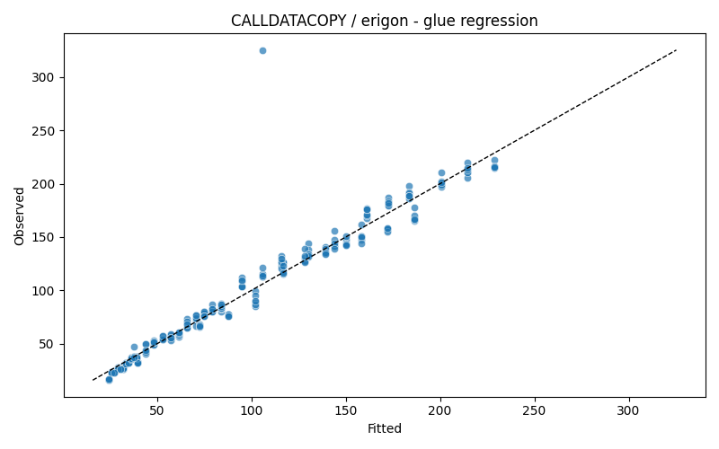

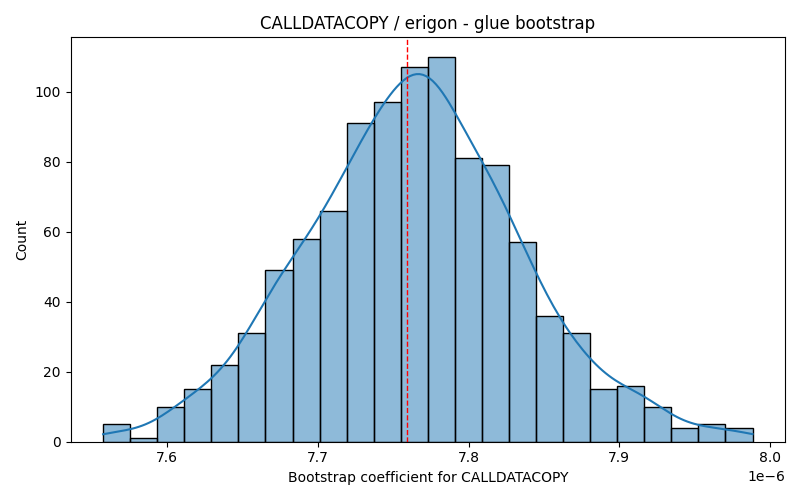

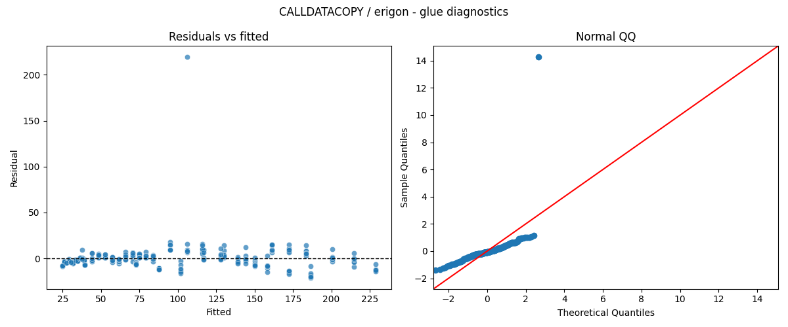

</details>

<details><summary><code>CALLDATALOAD</code> · nobs=44 · runtime_ms=5.857e-05 · p=1.00e-03 · R²=0.2163</summary>

```
==============================================================================
                           NNLS Regression Results                            
==============================================================================
Dep. Variable:          test_runtime_ms              R-squared:          0.216
Model:                  NNLS                    Adj. R-squared:          0.198
No. Observations:       44                                RMSE:           0.43
Df Residuals:           42                                 MAE:           0.37
Df Model:               1      
==============================================================================
                      coef     std err     P-value      [0.025      0.975]
------------------------------------------------------------------------------
         const      5.7262      0.2453       0.001      5.2549      6.2120
  CALLDATALOAD      0.0001      0.0000       0.001      0.0000      0.0001
==============================================================================
Notes: Non-negative least squares with bootstrap inference (1000 iterations)
==============================================================================
```

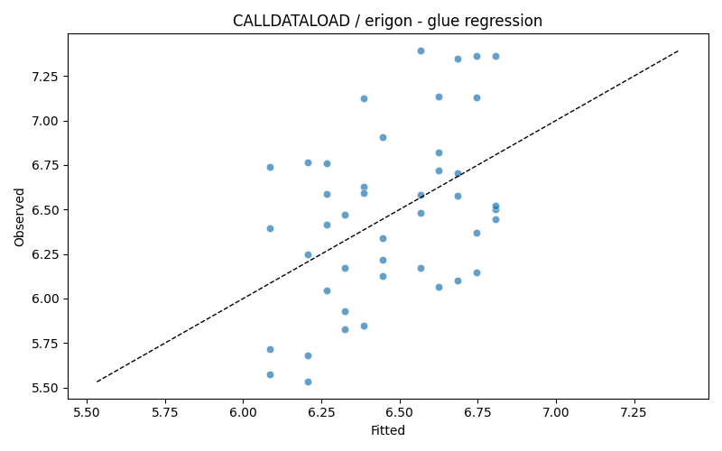

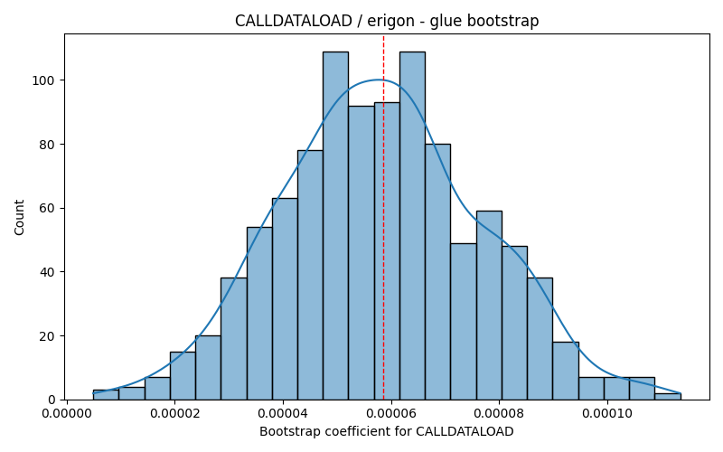

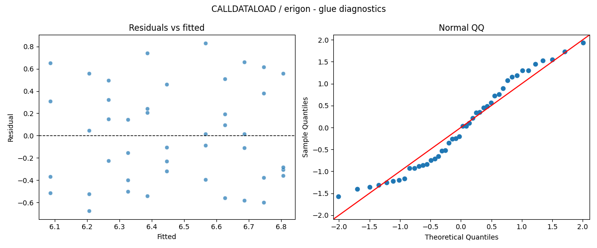

</details>

<details><summary><code>DIV</code> · nobs=11 · runtime_ms=1.056e-05 · p=1.00e-03 · R²=0.911</summary>

```
==============================================================================
                           NNLS Regression Results                            
==============================================================================
Dep. Variable:          test_runtime_ms              R-squared:          0.911
Model:                  NNLS                    Adj. R-squared:          0.901
No. Observations:       11                                RMSE:          26.05
Df Residuals:           9                                  MAE:          23.72
Df Model:               1      
==============================================================================
                      coef     std err     P-value      [0.025      0.975]
------------------------------------------------------------------------------
         const     19.6567     25.8244       0.201      0.0000     87.8071
           DIV      0.0000      0.0000       0.001      0.0000      0.0000
==============================================================================
Notes: Non-negative least squares with bootstrap inference (1000 iterations)
==============================================================================
```

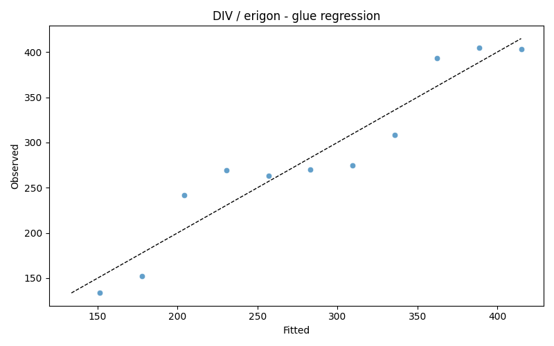

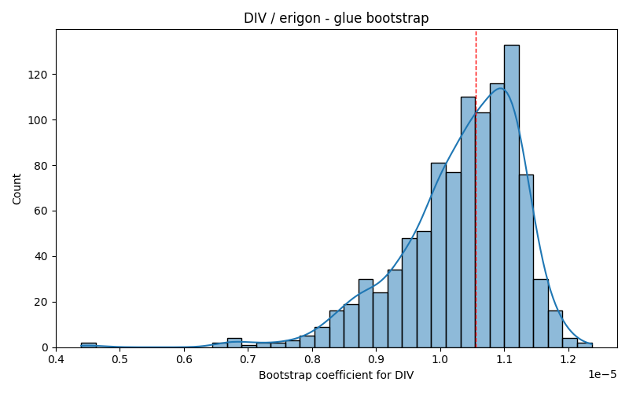

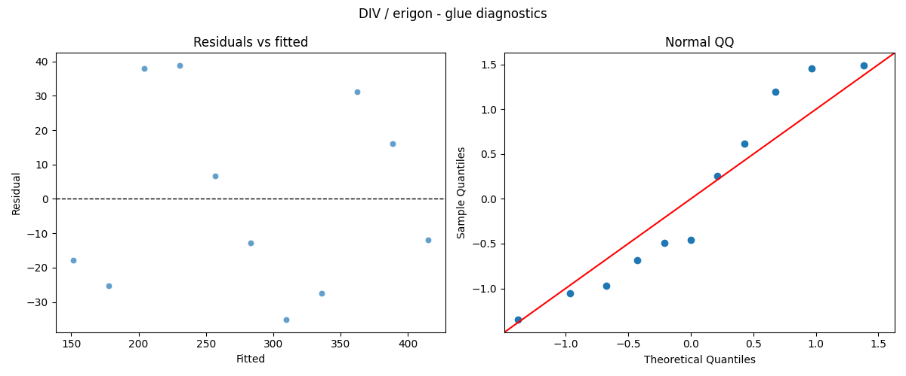

</details>

<details><summary><code>EXP</code> · nobs=11 · runtime_ms=0.000376 · p=1.00e-03 · R²=0.9541</summary>

```
==============================================================================
                           NNLS Regression Results                            
==============================================================================
Dep. Variable:          test_runtime_ms              R-squared:          0.954
Model:                  NNLS                    Adj. R-squared:          0.949
No. Observations:       11                                RMSE:           3.23
Df Residuals:           9                                  MAE:           2.75
Df Model:               1      
==============================================================================
                      coef     std err     P-value      [0.025      0.975]
------------------------------------------------------------------------------
         const     11.8381      4.2769       0.001      4.4980     19.7786
           EXP      0.0004      0.0000       0.001      0.0003      0.0004
==============================================================================
Notes: Non-negative least squares with bootstrap inference (1000 iterations)
==============================================================================
```

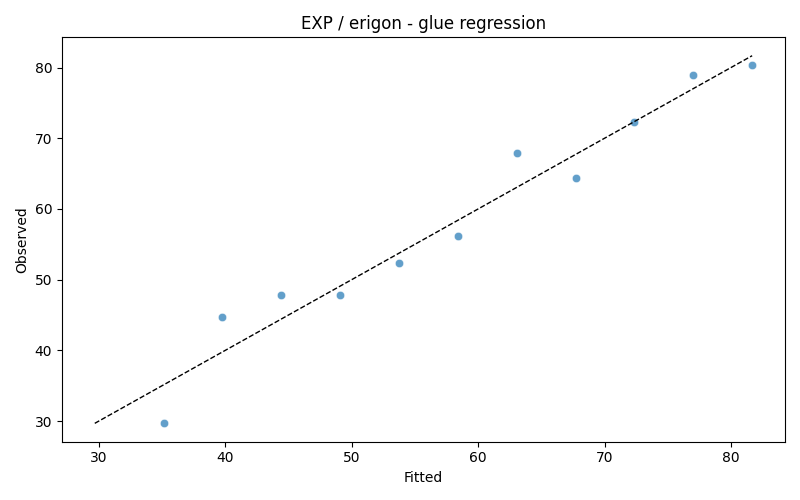

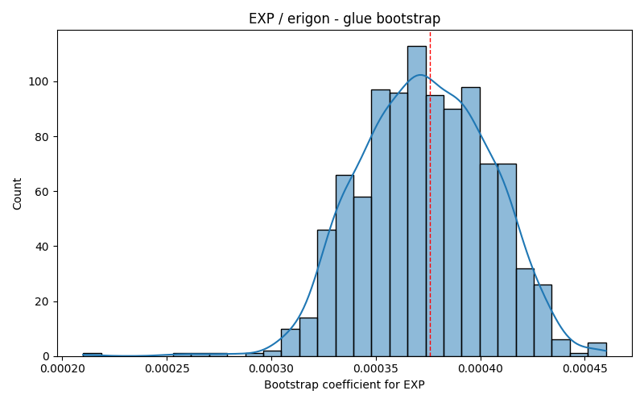

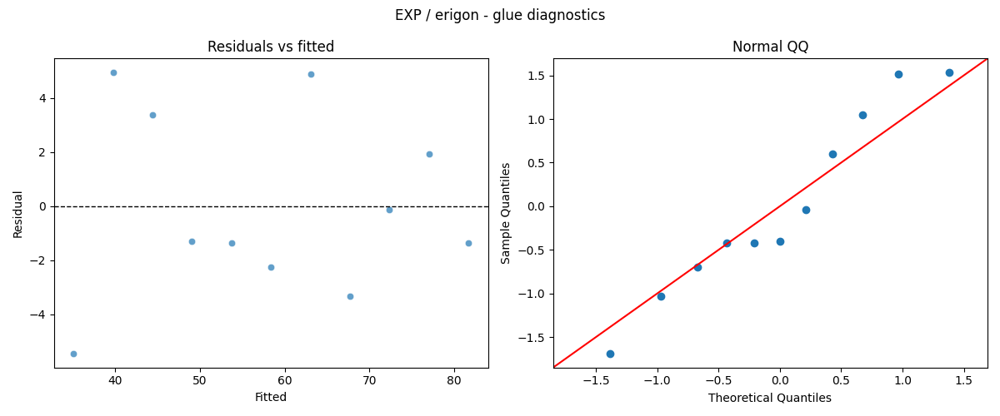

</details>

<details><summary><code>GT</code> · nobs=11 · runtime_ms=3.108e-06 · p=1.00e-03 · R²=0.9825</summary>

```
==============================================================================
                           NNLS Regression Results                            
==============================================================================
Dep. Variable:          test_runtime_ms              R-squared:          0.982
Model:                  NNLS                    Adj. R-squared:          0.981
No. Observations:       11                                RMSE:           4.37
Df Residuals:           9                                  MAE:           3.60
Df Model:               1      
==============================================================================
                      coef     std err     P-value      [0.025      0.975]
------------------------------------------------------------------------------
         const     16.0976      5.3250       0.001      6.3814     26.4786
            GT      0.0000      0.0000       0.001      0.0000      0.0000
==============================================================================
Notes: Non-negative least squares with bootstrap inference (1000 iterations)
==============================================================================
```

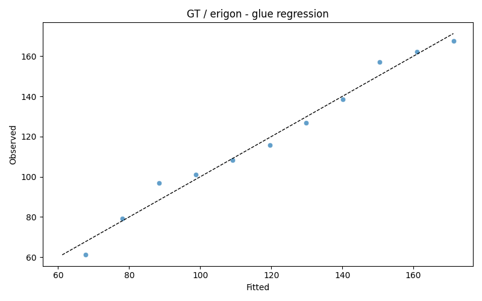

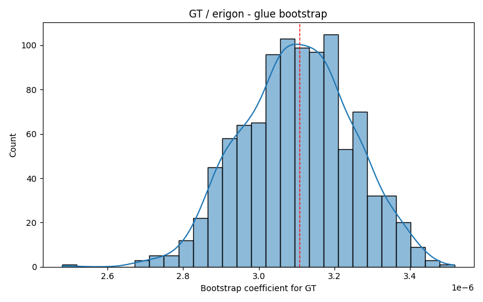

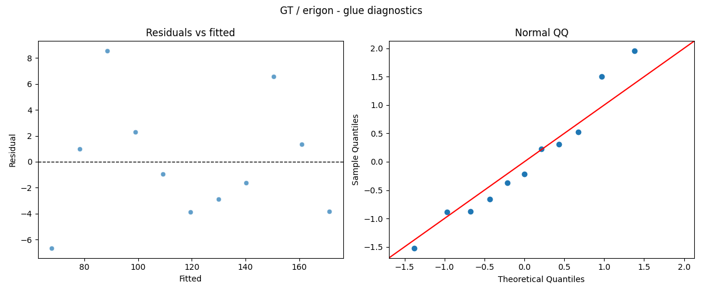

</details>

<details><summary><code>JUMPI</code> · nobs=11 · runtime_ms=3.756e-06 · p=1.00e-03 · R²=0.9324</summary>

```
==============================================================================
                           NNLS Regression Results                            
==============================================================================
Dep. Variable:          test_runtime_ms              R-squared:          0.932
Model:                  NNLS                    Adj. R-squared:          0.925
No. Observations:       11                                RMSE:           4.56
Df Residuals:           9                                  MAE:           3.68
Df Model:               1      
==============================================================================
                      coef     std err     P-value      [0.025      0.975]
------------------------------------------------------------------------------
         const     18.3911      6.4454       0.001      6.6738     30.9341
         JUMPI      0.0000      0.0000       0.001      0.0000      0.0000
==============================================================================
Notes: Non-negative least squares with bootstrap inference (1000 iterations)
==============================================================================
```

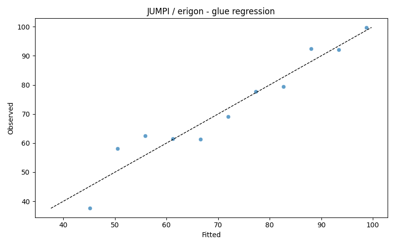

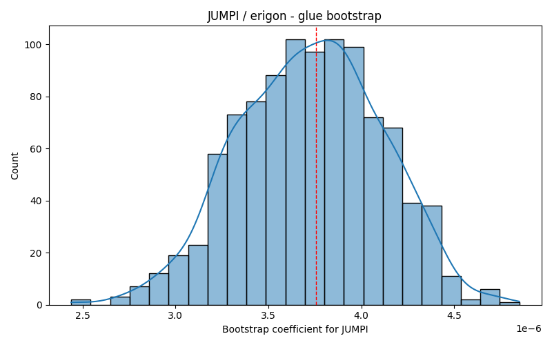

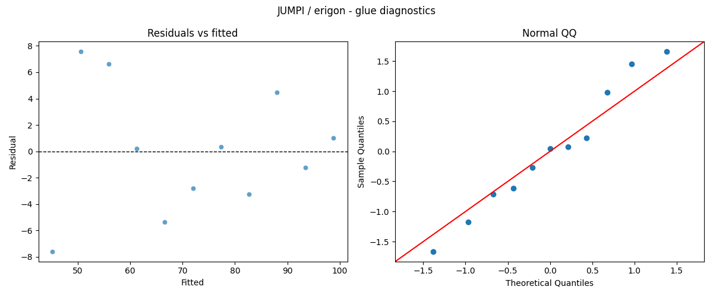

</details>

<details><summary><code>LT</code> · nobs=11 · runtime_ms=2.815e-06 · p=1.00e-03 · R²=0.9611</summary>

```
==============================================================================
                           NNLS Regression Results                            
==============================================================================
Dep. Variable:          test_runtime_ms              R-squared:          0.961
Model:                  NNLS                    Adj. R-squared:          0.957
No. Observations:       11                                RMSE:           5.96
Df Residuals:           9                                  MAE:           4.62
Df Model:               1      
==============================================================================
                      coef     std err     P-value      [0.025      0.975]
------------------------------------------------------------------------------
         const     24.9410      8.7528       0.001      8.8572     40.6365
            LT      0.0000      0.0000       0.001      0.0000      0.0000
==============================================================================
Notes: Non-negative least squares with bootstrap inference (1000 iterations)
==============================================================================
```

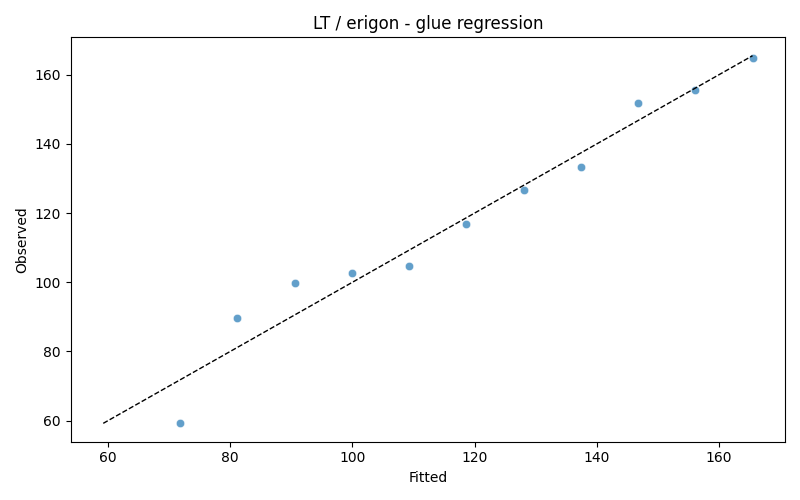

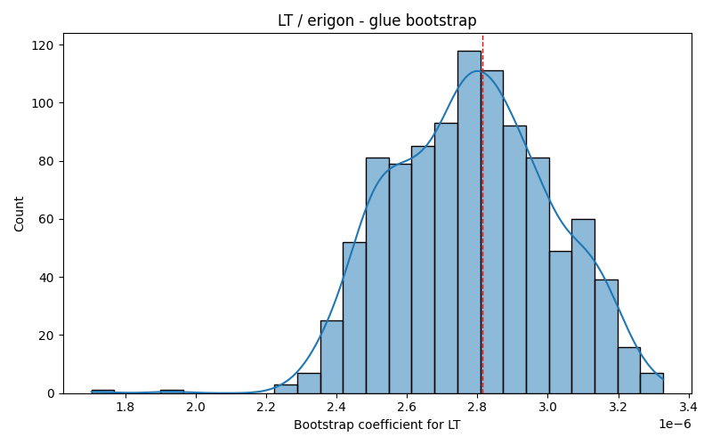

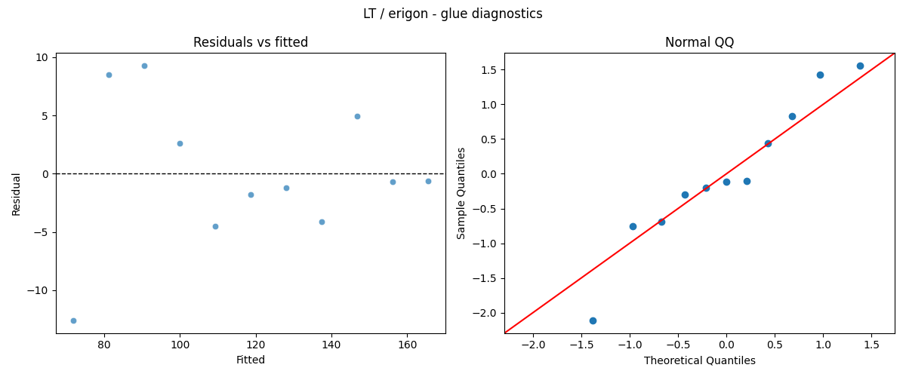

</details>

<details><summary><code>MSTORE</code> · nobs=55 · runtime_ms=6.079e-06 · p=1.00e-03 · R²=0.9633</summary>

```
==============================================================================
                           NNLS Regression Results                            
==============================================================================
Dep. Variable:          test_runtime_ms              R-squared:          0.963
Model:                  NNLS                    Adj. R-squared:          0.963
No. Observations:       55                                RMSE:           8.32
Df Residuals:           53                                 MAE:           6.78
Df Model:               1      
==============================================================================
                      coef     std err     P-value      [0.025      0.975]
------------------------------------------------------------------------------
         const     22.5367      4.1335       0.001     15.2875     31.6296
        MSTORE      0.0000      0.0000       0.001      0.0000      0.0000
==============================================================================
Notes: Non-negative least squares with bootstrap inference (1000 iterations)
==============================================================================
```

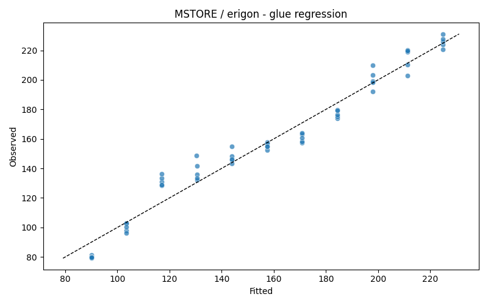

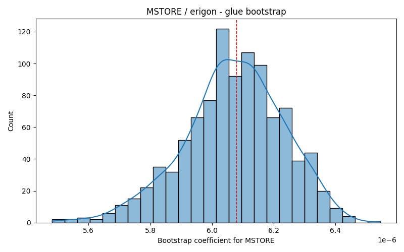

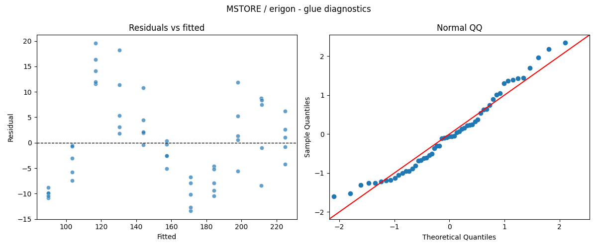

</details>

<details><summary><code>MSTORE8</code> · nobs=55 · runtime_ms=5.416e-06 · p=1.00e-03 · R²=0.9688</summary>

```
==============================================================================
                           NNLS Regression Results                            
==============================================================================
Dep. Variable:          test_runtime_ms              R-squared:          0.969
Model:                  NNLS                    Adj. R-squared:          0.968
No. Observations:       55                                RMSE:           6.83
Df Residuals:           53                                 MAE:           5.86
Df Model:               1      
==============================================================================
                      coef     std err     P-value      [0.025      0.975]
------------------------------------------------------------------------------
         const     22.6555      3.5744       0.001     16.1496     30.0071
       MSTORE8      0.0000      0.0000       0.001      0.0000      0.0000
==============================================================================
Notes: Non-negative least squares with bootstrap inference (1000 iterations)
==============================================================================
```

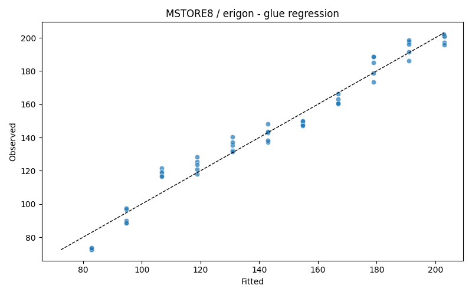

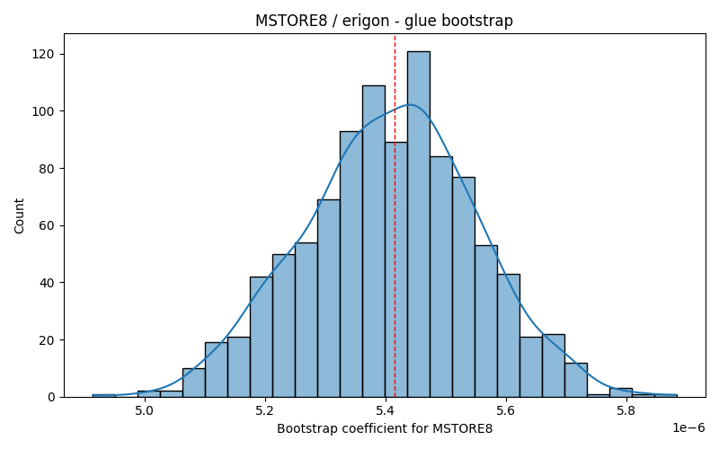

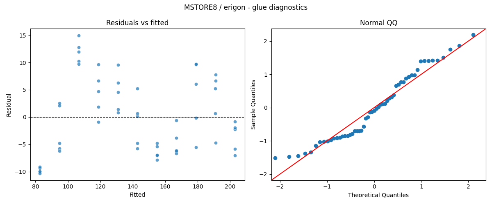

</details>

<details><summary><code>MUL</code> · nobs=11 · runtime_ms=3.9e-06 · p=1.00e-03 · R²=0.9627</summary>

```
==============================================================================
                           NNLS Regression Results                            
==============================================================================
Dep. Variable:          test_runtime_ms              R-squared:          0.963
Model:                  NNLS                    Adj. R-squared:          0.959
No. Observations:       11                                RMSE:           6.06
Df Residuals:           9                                  MAE:           4.88
Df Model:               1      
==============================================================================
                      coef     std err     P-value      [0.025      0.975]
------------------------------------------------------------------------------
         const      9.5244      6.2485       0.015      0.6433     23.8611
           MUL      0.0000      0.0000       0.001      0.0000      0.0000
==============================================================================
Notes: Non-negative least squares with bootstrap inference (1000 iterations)
==============================================================================
```

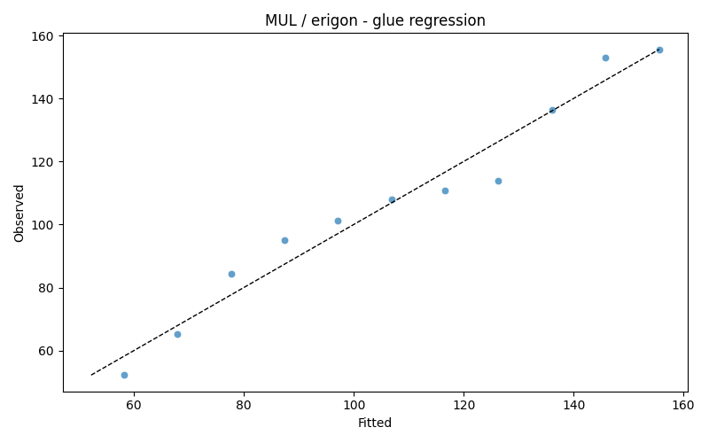

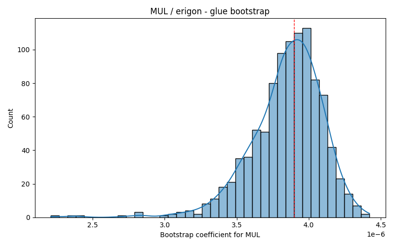

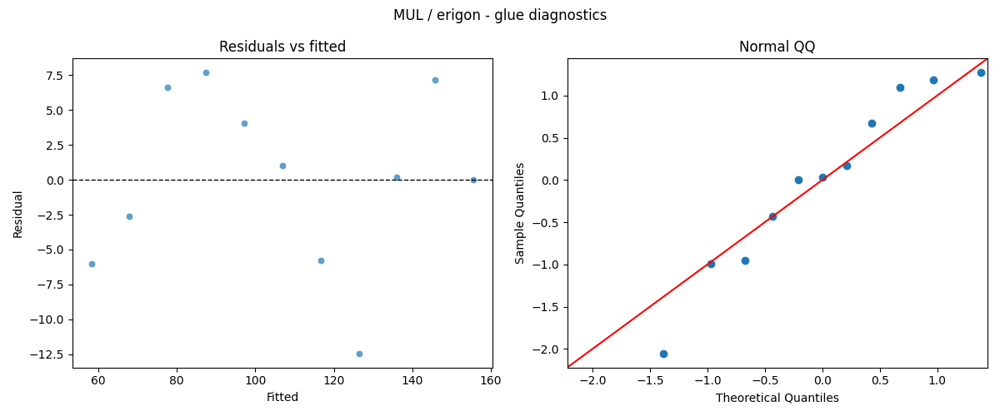

</details>

<details><summary><code>PC</code> · nobs=11 · runtime_ms=1.574e-06 · p=1.00e-03 · R²=0.9568</summary>

```
==============================================================================
                           NNLS Regression Results                            
==============================================================================
Dep. Variable:          test_runtime_ms              R-squared:          0.957
Model:                  NNLS                    Adj. R-squared:          0.952
No. Observations:       11                                RMSE:          10.00
Df Residuals:           9                                  MAE:           8.68
Df Model:               1      
==============================================================================
                      coef     std err     P-value      [0.025      0.975]
------------------------------------------------------------------------------
         const     18.1945     11.4018       0.015      1.5513     44.7643
            PC      0.0000      0.0000       0.001      0.0000      0.0000
==============================================================================
Notes: Non-negative least squares with bootstrap inference (1000 iterations)
==============================================================================
```

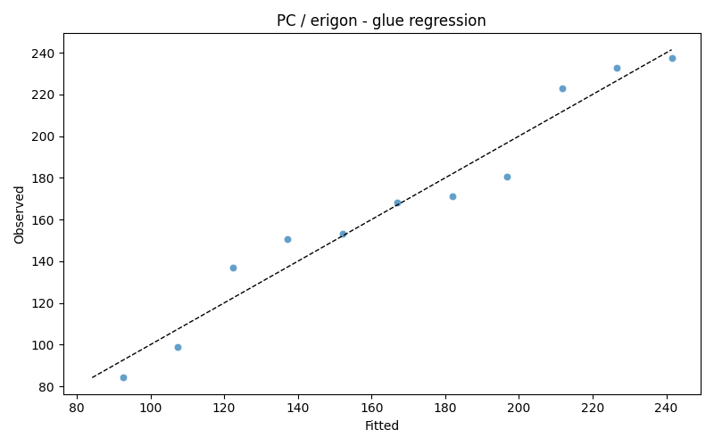

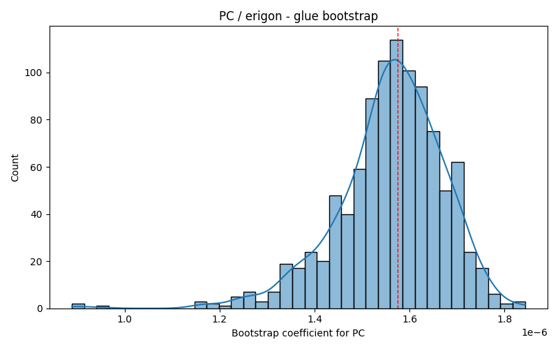

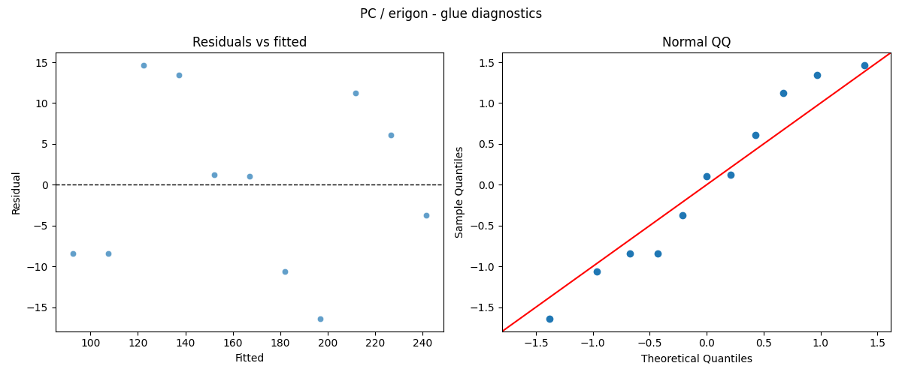

</details>

<details><summary><code>RETURNDATASIZE</code> · nobs=44 · runtime_ms=1.909e-06 · p=1.00e-03 · R²=0.9688</summary>

```
==============================================================================
                           NNLS Regression Results                            
==============================================================================
Dep. Variable:          test_runtime_ms              R-squared:          0.969
Model:                  NNLS                    Adj. R-squared:          0.968
No. Observations:       44                                RMSE:           5.41
Df Residuals:           42                                 MAE:           4.47
Df Model:               1      
==============================================================================
                      coef     std err     P-value      [0.025      0.975]
------------------------------------------------------------------------------
         const     18.0223      3.2788       0.001     11.9652     25.1356
RETURNDATASIZE      0.0000      0.0000       0.001      0.0000      0.0000
==============================================================================
Notes: Non-negative least squares with bootstrap inference (1000 iterations)
==============================================================================
```

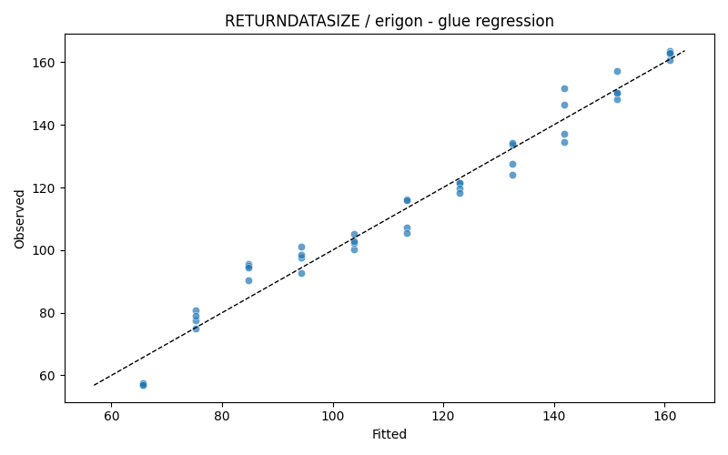

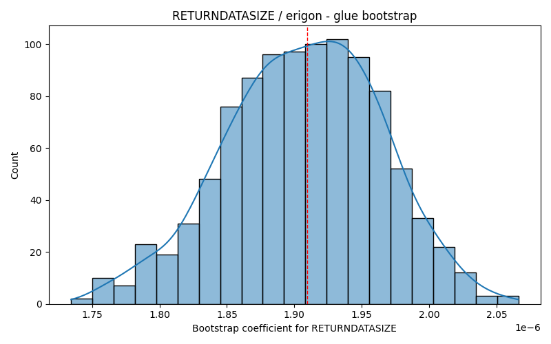

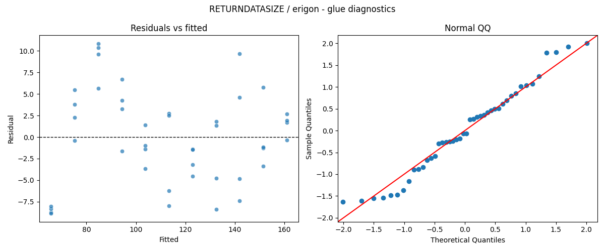

</details>

<details><summary><code>SELFBALANCE</code> · nobs=9 · runtime_ms=4.955e-05 · p=1.00e-03 · R²=0.9857</summary>

```
==============================================================================
                           NNLS Regression Results                            
==============================================================================
Dep. Variable:          test_runtime_ms              R-squared:          0.986
Model:                  NNLS                    Adj. R-squared:          0.984
No. Observations:       9                                 RMSE:          60.24
Df Residuals:           7                                  MAE:          48.33
Df Model:               1      
==============================================================================
                      coef     std err     P-value      [0.025      0.975]
------------------------------------------------------------------------------
         const    185.3171    113.4569       0.101      0.0000    372.6991
   SELFBALANCE      0.0000      0.0000       0.001      0.0000      0.0001
==============================================================================
Notes: Non-negative least squares with bootstrap inference (1000 iterations)
==============================================================================
```

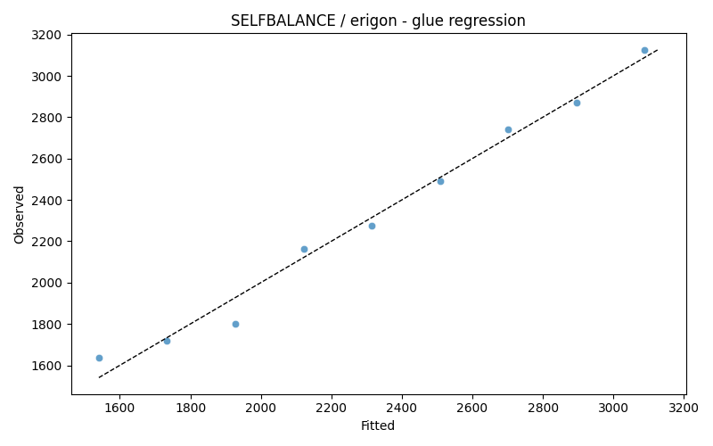

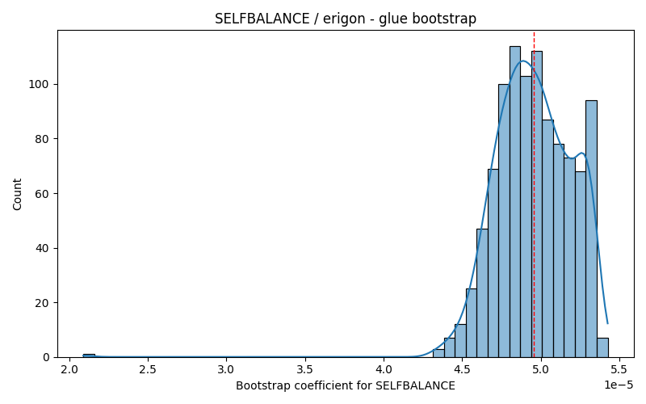

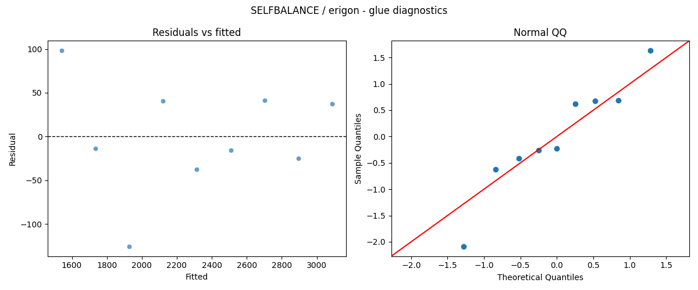

</details>

<details><summary><code>SUB</code> · nobs=11 · runtime_ms=2.998e-06 · p=1.00e-03 · R²=0.9393</summary>

```
==============================================================================
                           NNLS Regression Results                            
==============================================================================
Dep. Variable:          test_runtime_ms              R-squared:          0.939
Model:                  NNLS                    Adj. R-squared:          0.933
No. Observations:       11                                RMSE:           8.02
Df Residuals:           9                                  MAE:           7.12
Df Model:               1      
==============================================================================
                      coef     std err     P-value      [0.025      0.975]
------------------------------------------------------------------------------
         const     15.4783      8.8101       0.024      0.2083     33.7354
           SUB      0.0000      0.0000       0.001      0.0000      0.0000
==============================================================================
Notes: Non-negative least squares with bootstrap inference (1000 iterations)
==============================================================================
```

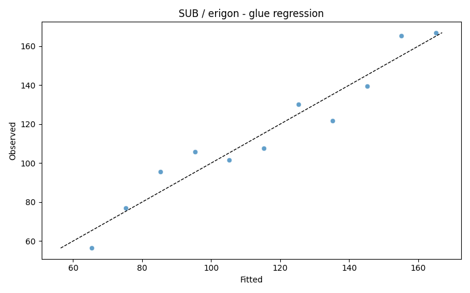

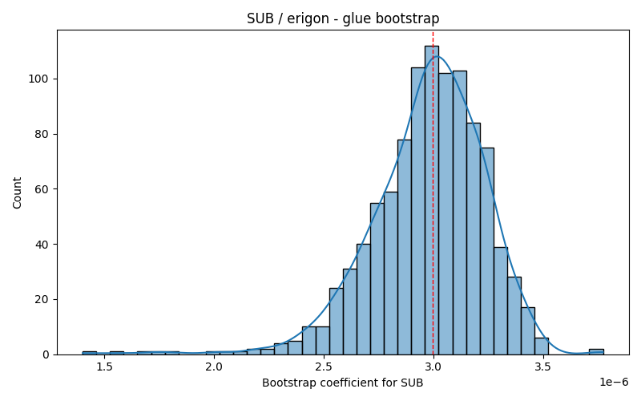

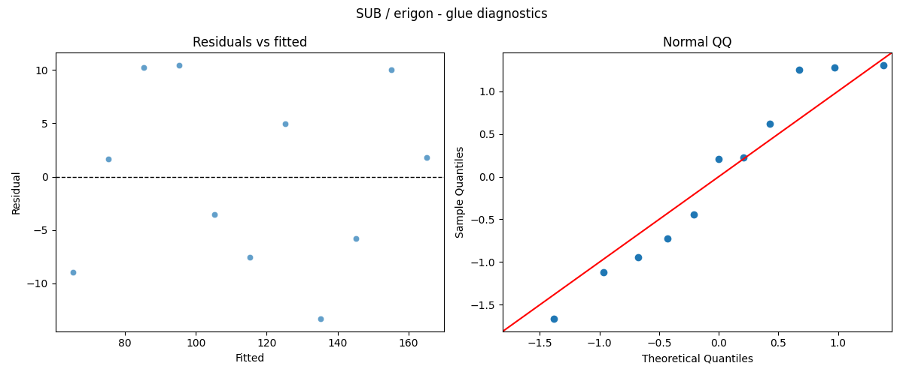

</details>

### Mixed glue (tier B) · erigon

<details><summary><code>JUMP</code> · nobs=11 · runtime_ms=8.036e-06 · p=1.00e-03 · R²=0.9585</summary>

```
==============================================================================
                           NNLS Regression Results                            
==============================================================================
Dep. Variable:          test_runtime_ms              R-squared:          0.959
Model:                  NNLS                    Adj. R-squared:          0.954
No. Observations:       11                                RMSE:           6.21
Df Residuals:           9                                  MAE:           5.44
Df Model:               1      
==============================================================================
                      coef     std err     P-value      [0.025      0.975]
------------------------------------------------------------------------------
         const     11.8683      5.2471       0.022      0.8741     22.8675
          JUMP      0.0000      0.0000       0.001      0.0000      0.0000
==============================================================================
Notes: Non-negative least squares with bootstrap inference (1000 iterations)
==============================================================================
```

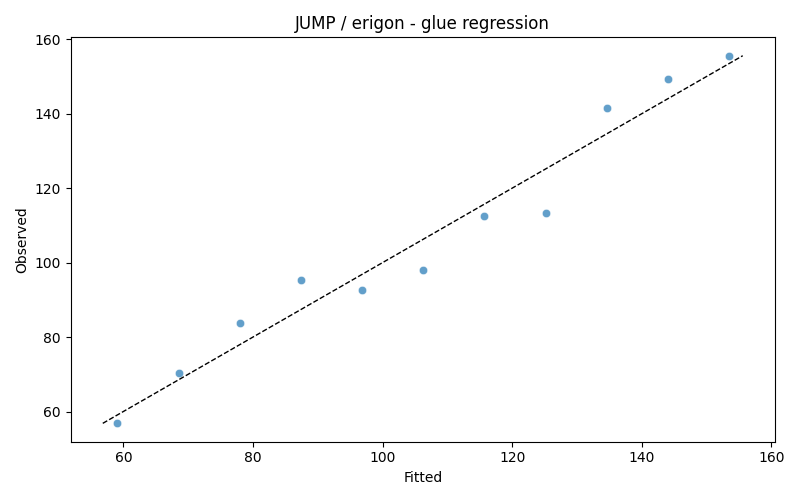

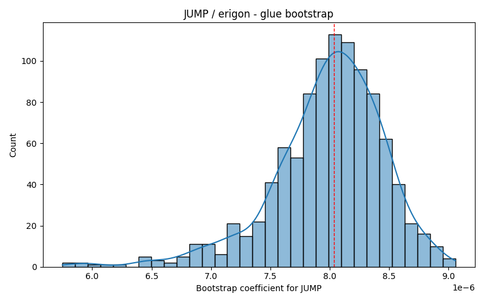

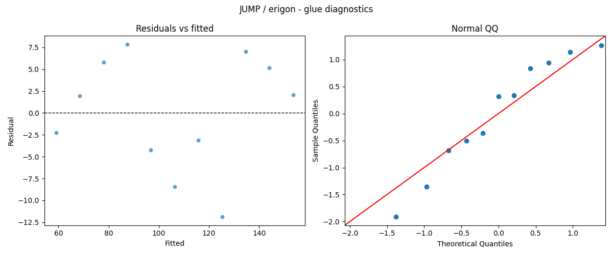

</details>

<details><summary><code>KECCAK256</code> · nobs=176 · runtime_ms=2.058e-05 · p=1.00e-03 · R²=0.07753</summary>

```
==============================================================================
                           NNLS Regression Results                            
==============================================================================
Dep. Variable:          test_runtime_ms              R-squared:          0.078
Model:                  NNLS                    Adj. R-squared:          0.072
No. Observations:       176                               RMSE:         141.08
Df Residuals:           174                                MAE:         114.09
Df Model:               1      
==============================================================================
                      coef     std err     P-value      [0.025      0.975]
------------------------------------------------------------------------------
         const    388.1908     23.4631       0.001    344.0302    434.1829
     KECCAK256      0.0000      0.0000       0.001      0.0000      0.0000
==============================================================================
Notes: Non-negative least squares with bootstrap inference (1000 iterations)
==============================================================================
```

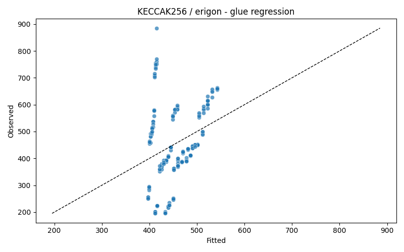

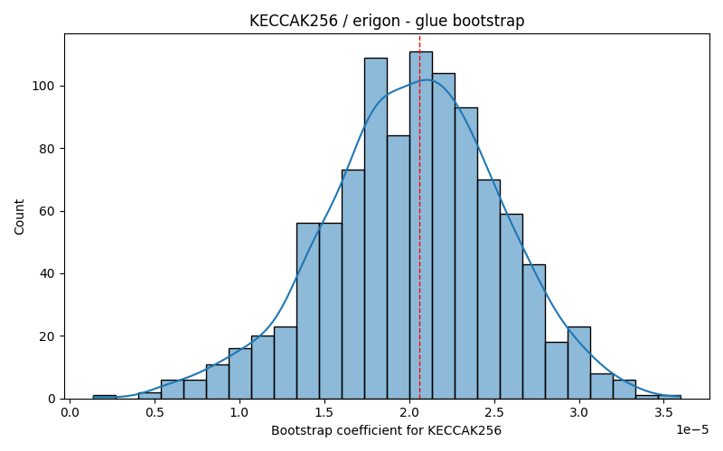

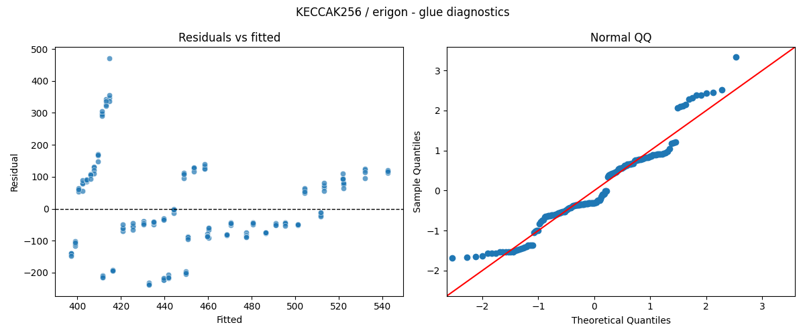

</details>

## geth

| glue_opcode | nobs | glue_runtime_ms | p_value | rsquared |
| --- | --- | --- | --- | --- |
| `ISZERO` | 143 | 8.055e-06 | 1.00e-03 | 0.9321 |
| `JUMPDEST` | 143 | 7.23e-06 | 1.00e-03 | 0.9562 |
| `SWAP` | 2288 | 9.527e-06 | 1.00e-03 | 0.9749 |
| `CALLDATASIZE` | 8536 | 8.685e-06 | 1.00e-03 | 0.9382 |
| `DUP` | 8536 | 9.581e-06 | 1.00e-03 | 0.9382 |
| `GAS` | 8536 | 8.965e-06 | 1.00e-03 | 0.9382 |
| `MLOAD` | 8536 | 3.042e-05 | 1.00e-03 | 0.9382 |
| `PUSH` | 8536 | 1.296e-05 | 1.00e-03 | 0.9382 |
| `PUSH0` | 8536 | 8.584e-06 | 1.00e-03 | 0.9382 |
| `STATICCALL` | 8536 | 0.0005561 | 1.00e-03 | 0.9382 |
| `ADD` | 143 | 2.719e-05 | 1.00e-03 | 0.7283 |
| `AND` | 143 | 2.646e-05 | 1.00e-03 | 0.7781 |
| `CALLDATACOPY` | 3432 | 6.531e-05 | 1.00e-03 | 0.9924 |
| `CALLDATALOAD` | 572 | 4.957e-05 | 1.00e-03 | 0.01964 |
| `DIV` | 143 | 5.845e-05 | 1.00e-03 | 0.9968 |
| `EXP` | 143 | 0.00207 | 1.00e-03 | 0.9945 |
| `GT` | 143 | 2.06e-05 | 1.00e-03 | 0.9684 |
| `JUMPI` | 143 | 3.311e-05 | 1.00e-03 | 0.9688 |
| `LT` | 143 | 2.671e-05 | 1.00e-03 | 0.7624 |
| `MSTORE` | 715 | 4.92e-05 | 1.00e-03 | 0.9716 |
| `MSTORE8` | 715 | 4.428e-05 | 1.00e-03 | 0.9792 |
| `MUL` | 143 | 2.589e-05 | 1.00e-03 | 0.9331 |
| `PC` | 143 | 9.512e-06 | 1.00e-03 | 0.9833 |
| `RETURNDATASIZE` | 572 | 1.621e-05 | 1.00e-03 | 0.9202 |
| `SELFBALANCE` | 117 | 5.044e-05 | 1.00e-03 | 0.9953 |
| `SUB` | 143 | 2.708e-05 | 1.00e-03 | 0.7585 |
| `JUMP` | 143 | 5.793e-05 | 1.00e-03 | 0.9764 |
| `KECCAK256` | 2288 | 0.0002064 | 1.00e-03 | 0.3014 |

### Cycle glue — joint fit · geth

<details><summary>Joint NNLS regression summary</summary>

```
==============================================================================
                           NNLS Regression Results                            
==============================================================================
Dep. Variable:          test_runtime_ms              R-squared:          0.938
Model:                  NNLS                    Adj. R-squared:          0.938
No. Observations:       8536                              RMSE:          73.54
Df Residuals:           8528                               MAE:          35.74
Df Model:               7      
==============================================================================
                      coef     std err     P-value      [0.025      0.975]
------------------------------------------------------------------------------
         const      6.6524      2.3367       0.004      2.1311     10.9296
  CALLDATASIZE      0.0000      0.0000       0.001      0.0000      0.0000
           DUP      0.0000      0.0000       0.001      0.0000      0.0000
           GAS      0.0000      0.0000       0.001      0.0000      0.0000
         MLOAD      0.0000      0.0000       0.001      0.0000      0.0000
          PUSH      0.0000      0.0000       0.001      0.0000      0.0000
         PUSH0      0.0000      0.0000       0.001      0.0000      0.0000
    STATICCALL      0.0006      0.0000       0.001      0.0005      0.0006
==============================================================================
Notes: Non-negative least squares with bootstrap inference (1000 iterations)
==============================================================================
```

</details>

<details><summary><code>CALLDATASIZE</code> · nobs=8536 · runtime_ms=8.685e-06 · p=1.00e-03 · R²=0.9382</summary>

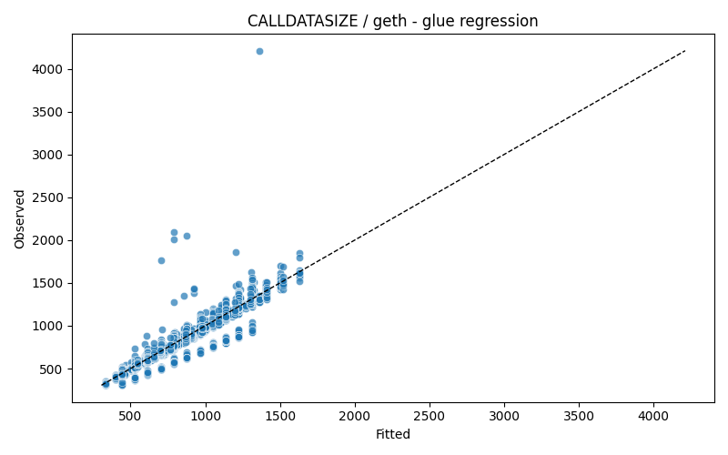

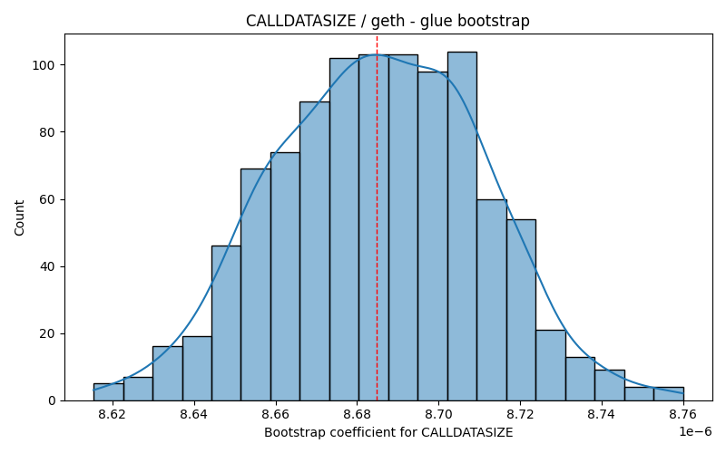

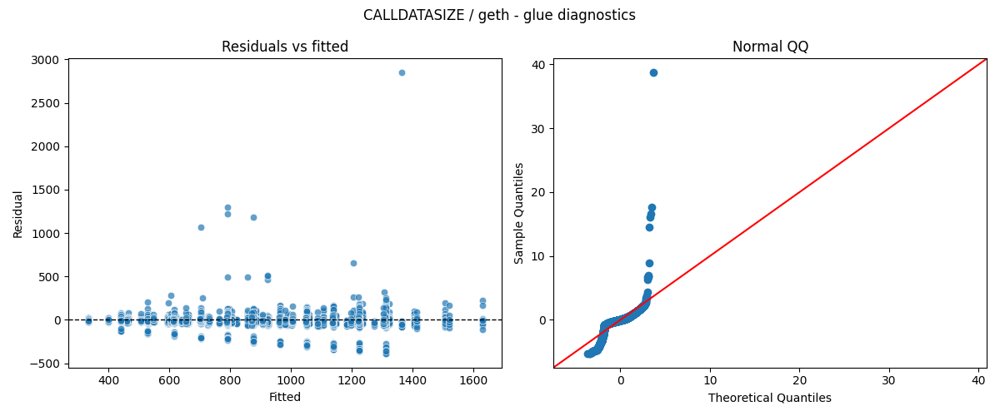

</details>

<details><summary><code>DUP</code> · nobs=8536 · runtime_ms=9.581e-06 · p=1.00e-03 · R²=0.9382</summary>


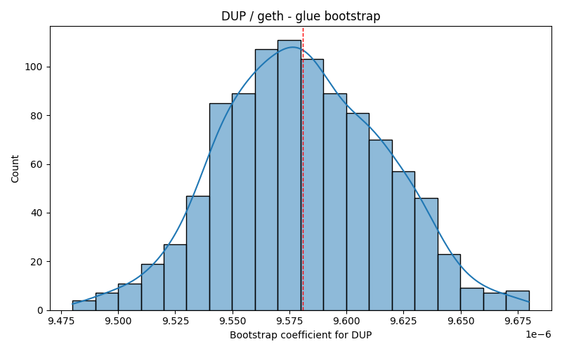


</details>

<details><summary><code>GAS</code> · nobs=8536 · runtime_ms=8.965e-06 · p=1.00e-03 · R²=0.9382</summary>


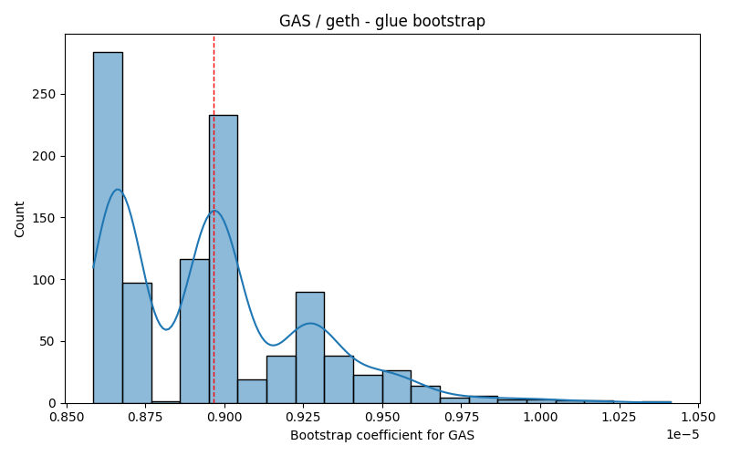

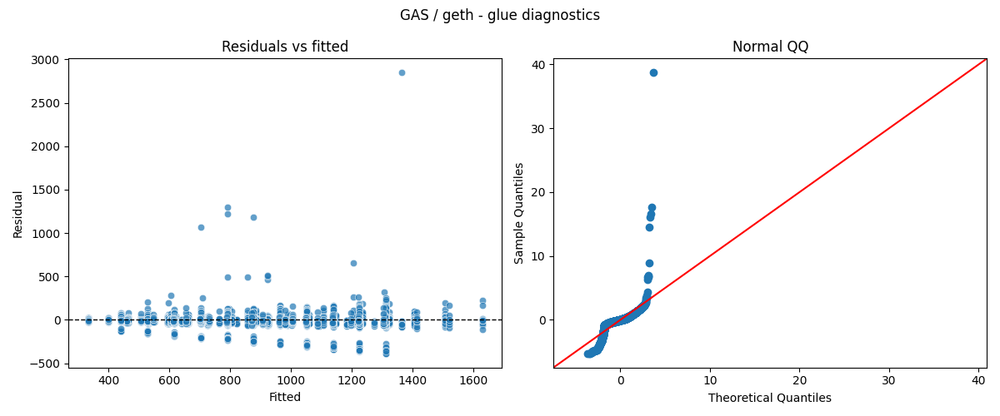

</details>

<details><summary><code>MLOAD</code> · nobs=8536 · runtime_ms=3.042e-05 · p=1.00e-03 · R²=0.9382</summary>


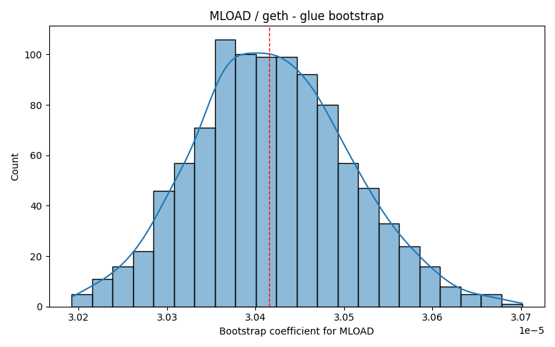


</details>

<details><summary><code>PUSH</code> · nobs=8536 · runtime_ms=1.296e-05 · p=1.00e-03 · R²=0.9382</summary>


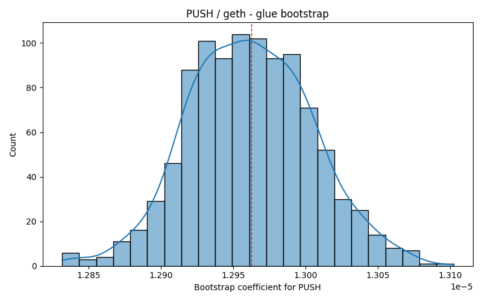

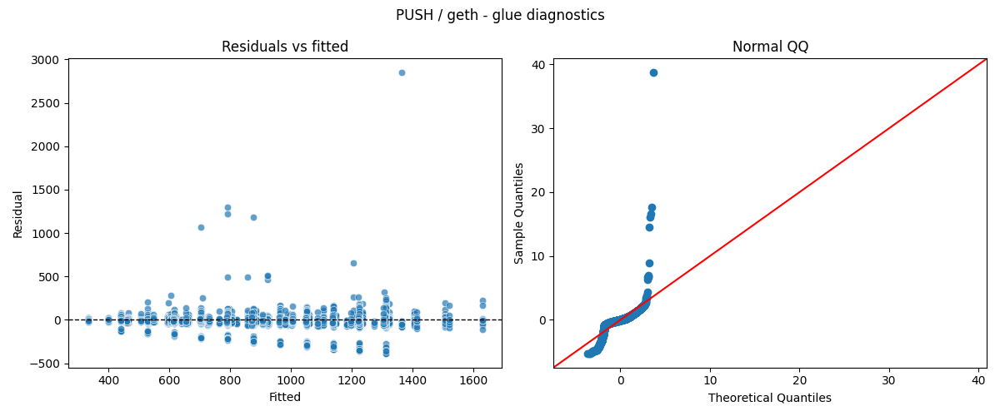

</details>

<details><summary><code>PUSH0</code> · nobs=8536 · runtime_ms=8.584e-06 · p=1.00e-03 · R²=0.9382</summary>

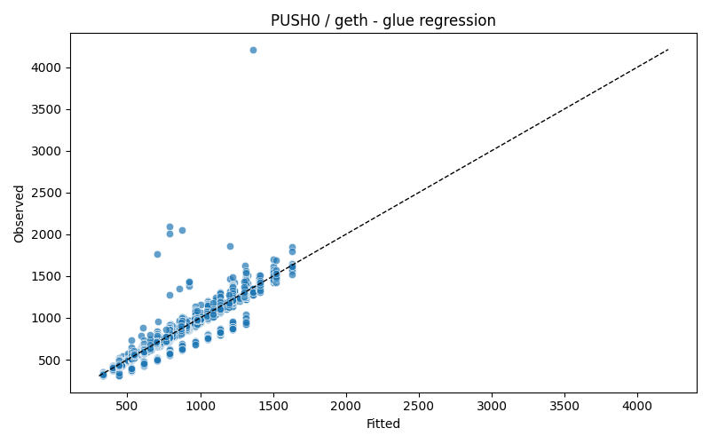

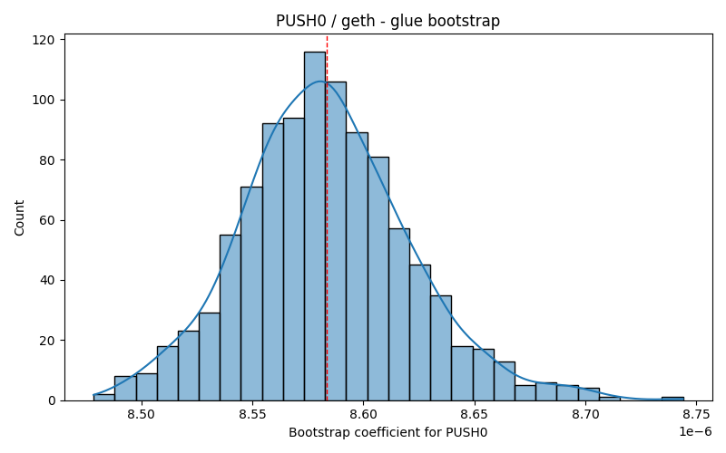


</details>

<details><summary><code>STATICCALL</code> · nobs=8536 · runtime_ms=0.0005561 · p=1.00e-03 · R²=0.9382</summary>


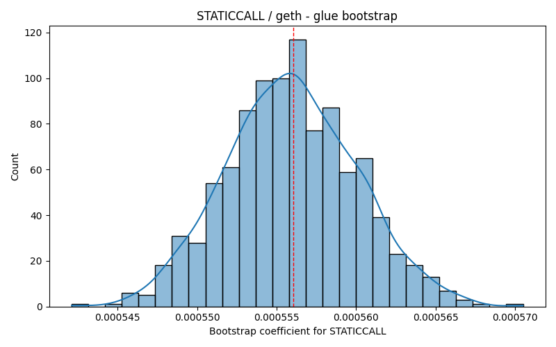


</details>

### Pure glue · geth

<details><summary><code>ISZERO</code> · nobs=143 · runtime_ms=8.055e-06 · p=1.00e-03 · R²=0.9321</summary>

```
==============================================================================
                           NNLS Regression Results                            
==============================================================================
Dep. Variable:          test_runtime_ms              R-squared:          0.932
Model:                  NNLS                    Adj. R-squared:          0.932
No. Observations:       143                               RMSE:          45.79
Df Residuals:           141                                MAE:          21.87
Df Model:               1      
==============================================================================
                      coef     std err     P-value      [0.025      0.975]
------------------------------------------------------------------------------
         const     29.3707     16.7801       0.002      4.1838     70.4687
        ISZERO      0.0000      0.0000       0.001      0.0000      0.0000
==============================================================================
Notes: Non-negative least squares with bootstrap inference (1000 iterations)
==============================================================================
```

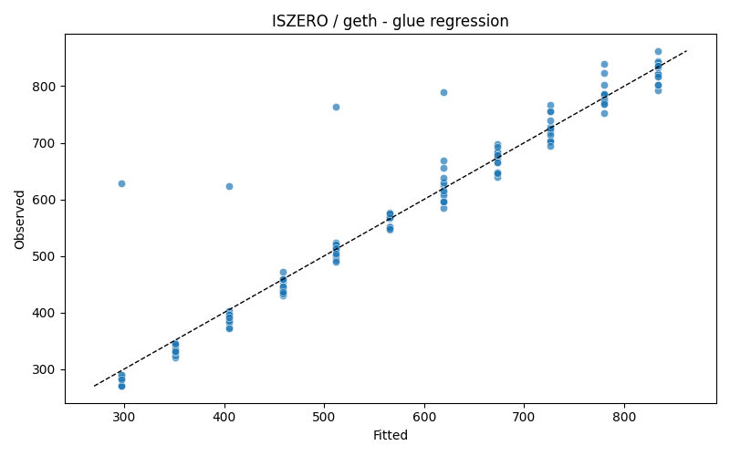

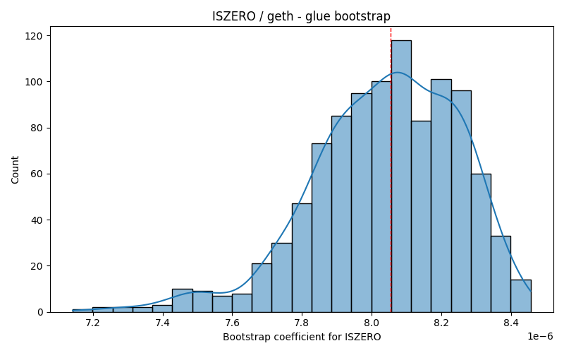

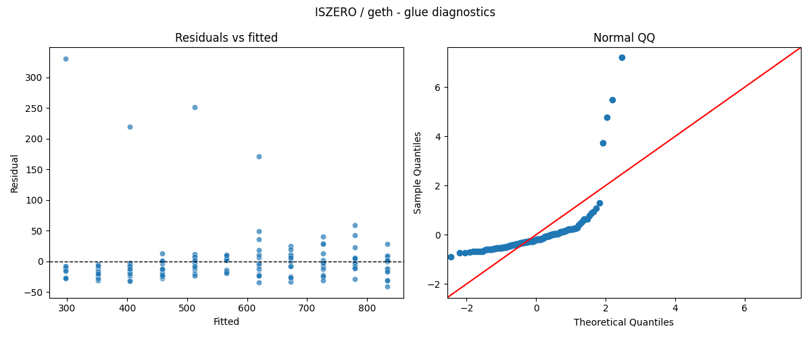

</details>

<details><summary><code>JUMPDEST</code> · nobs=143 · runtime_ms=7.23e-06 · p=1.00e-03 · R²=0.9562</summary>

```
==============================================================================
                           NNLS Regression Results                            
==============================================================================
Dep. Variable:          test_runtime_ms              R-squared:          0.956
Model:                  NNLS                    Adj. R-squared:          0.956
No. Observations:       143                               RMSE:          98.34
Df Residuals:           141                                MAE:          56.20
Df Model:               1      
==============================================================================
                      coef     std err     P-value      [0.025      0.975]
------------------------------------------------------------------------------
         const      0.0000      5.3309       1.000      0.0000     19.8131
      JUMPDEST      0.0000      0.0000       0.001      0.0000      0.0000
==============================================================================
Notes: Non-negative least squares with bootstrap inference (1000 iterations)
==============================================================================
```

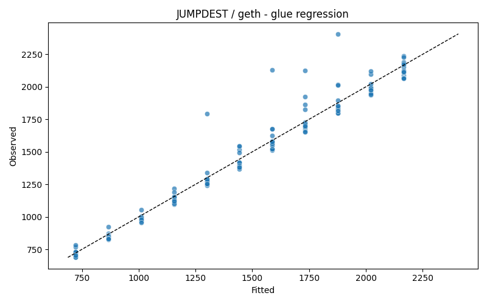

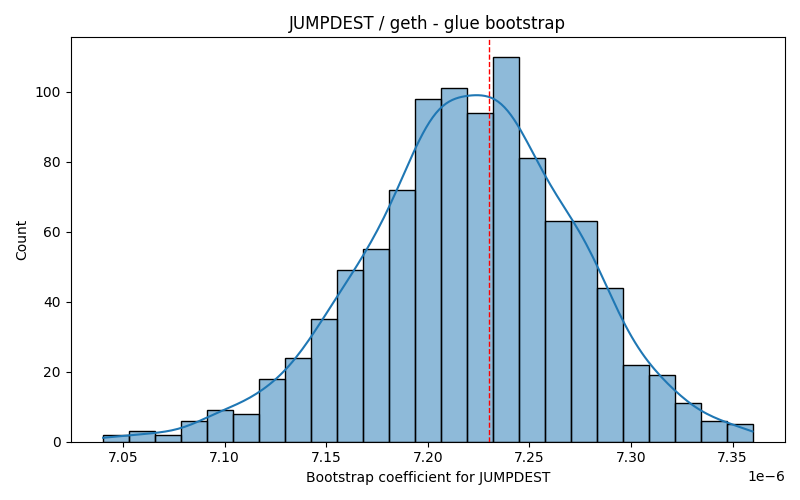

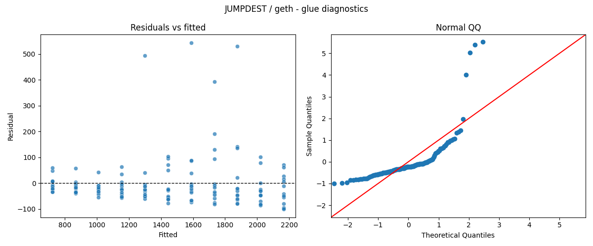

</details>

<details><summary><code>SWAP</code> · nobs=2288 · runtime_ms=9.527e-06 · p=1.00e-03 · R²=0.9749</summary>

```
==============================================================================
                           NNLS Regression Results                            
==============================================================================
Dep. Variable:          test_runtime_ms              R-squared:          0.975
Model:                  NNLS                    Adj. R-squared:          0.975
No. Observations:       2288                              RMSE:          32.19
Df Residuals:           2286                               MAE:          15.37
Df Model:               1      
==============================================================================
                      coef     std err     P-value      [0.025      0.975]
------------------------------------------------------------------------------
         const      5.7580      1.6799       0.001      2.4133      8.8295
          SWAP      0.0000      0.0000       0.001      0.0000      0.0000
==============================================================================
Notes: Non-negative least squares with bootstrap inference (1000 iterations)
==============================================================================
```

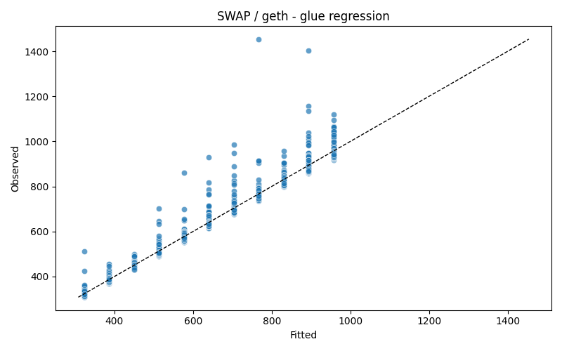

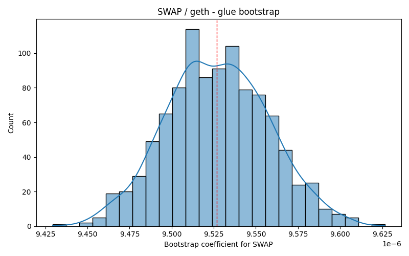

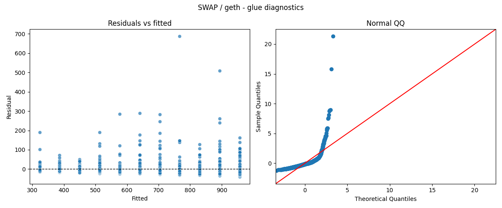

</details>

### Mixed glue (tier A) · geth

<details><summary><code>ADD</code> · nobs=143 · runtime_ms=2.719e-05 · p=1.00e-03 · R²=0.7283</summary>

```
==============================================================================
                           NNLS Regression Results                            
==============================================================================
Dep. Variable:          test_runtime_ms              R-squared:          0.728
Model:                  NNLS                    Adj. R-squared:          0.726
No. Observations:       143                               RMSE:         174.76
Df Residuals:           141                                MAE:         144.92
Df Model:               1      
==============================================================================
                      coef     std err     P-value      [0.025      0.975]
------------------------------------------------------------------------------
         const     17.6675     31.0142       0.343      0.0000    104.6786
           ADD      0.0000      0.0000       0.001      0.0000      0.0000
==============================================================================
Notes: Non-negative least squares with bootstrap inference (1000 iterations)
==============================================================================
```

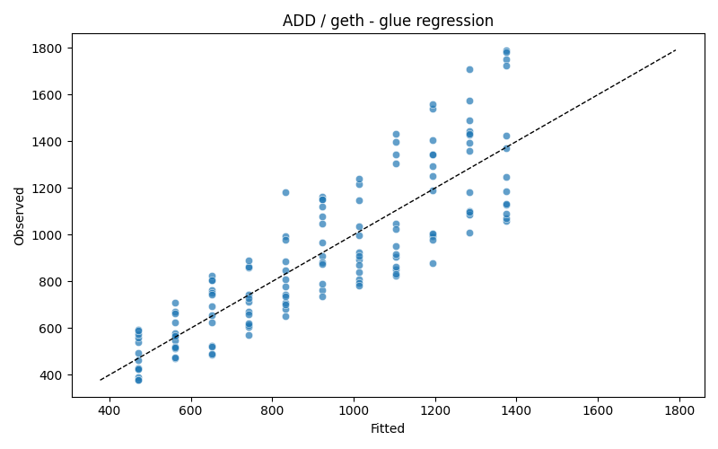

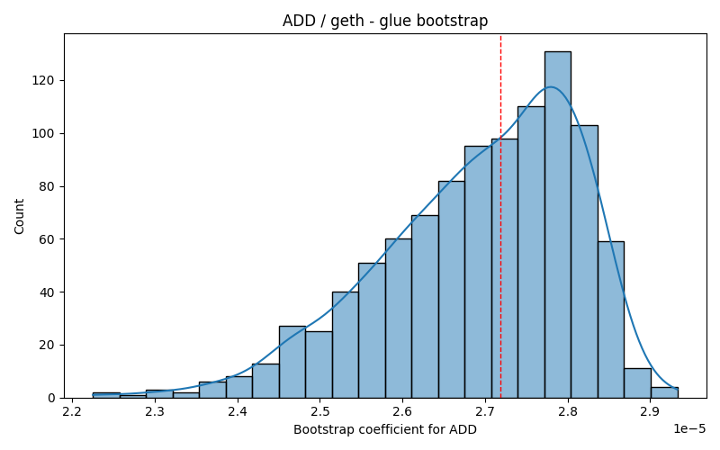

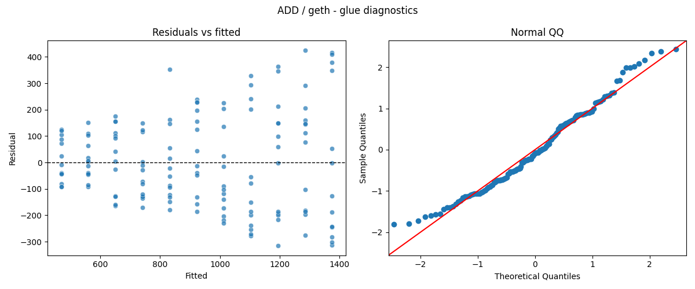

</details>

<details><summary><code>AND</code> · nobs=143 · runtime_ms=2.646e-05 · p=1.00e-03 · R²=0.7781</summary>

```
==============================================================================
                           NNLS Regression Results                            
==============================================================================
Dep. Variable:          test_runtime_ms              R-squared:          0.778
Model:                  NNLS                    Adj. R-squared:          0.776
No. Observations:       143                               RMSE:         148.72
Df Residuals:           141                                MAE:         122.13
Df Model:               1      
==============================================================================
                      coef     std err     P-value      [0.025      0.975]
------------------------------------------------------------------------------
         const      5.8840     21.6758       0.461      0.0000     72.1378
           AND      0.0000      0.0000       0.001      0.0000      0.0000
==============================================================================
Notes: Non-negative least squares with bootstrap inference (1000 iterations)
==============================================================================
```

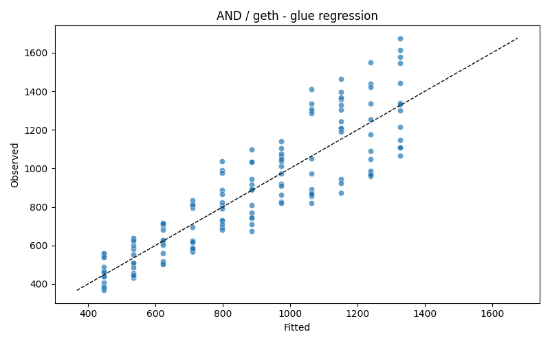

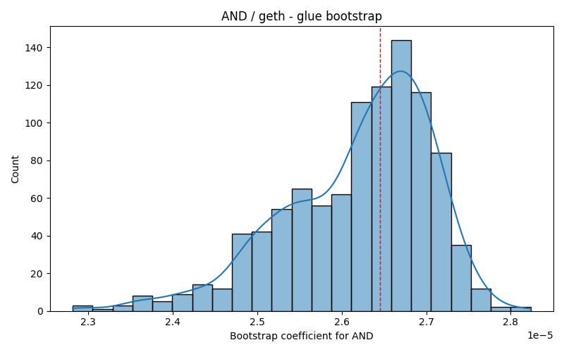

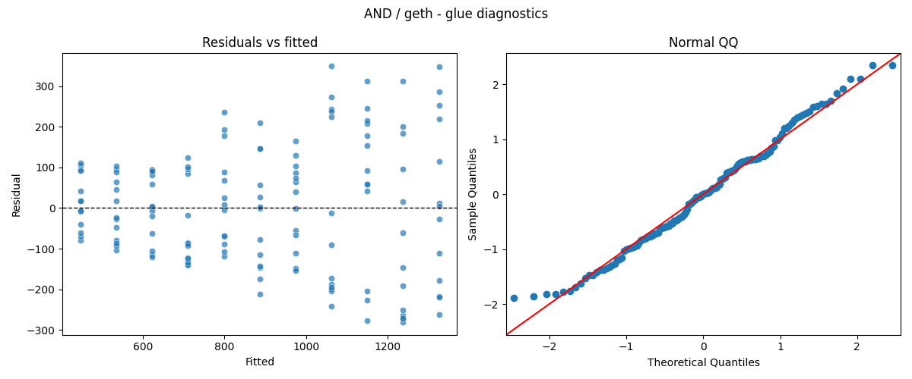

</details>

<details><summary><code>CALLDATACOPY</code> · nobs=3432 · runtime_ms=6.531e-05 · p=1.00e-03 · R²=0.9924</summary>

```
==============================================================================
                           NNLS Regression Results                            
==============================================================================
Dep. Variable:          test_runtime_ms              R-squared:          0.992
Model:                  NNLS                    Adj. R-squared:          0.992
No. Observations:       3432                              RMSE:          43.11
Df Residuals:           3430                               MAE:          26.24
Df Model:               1      
==============================================================================
                      coef     std err     P-value      [0.025      0.975]
------------------------------------------------------------------------------
         const     48.0660      0.9388       0.001     46.2498     50.0142
  CALLDATACOPY      0.0001      0.0000       0.001      0.0001      0.0001
==============================================================================
Notes: Non-negative least squares with bootstrap inference (1000 iterations)
==============================================================================
```

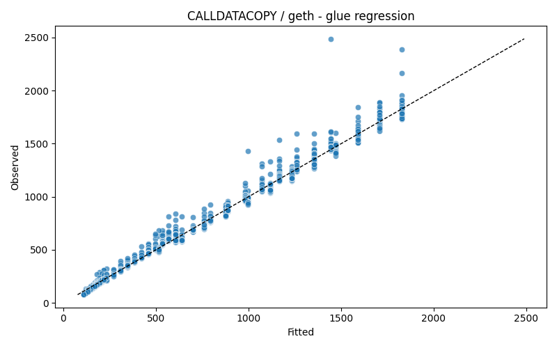

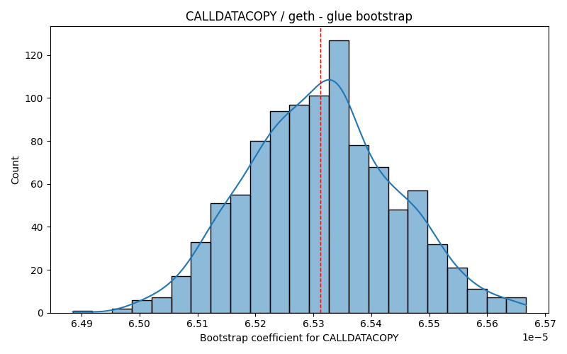

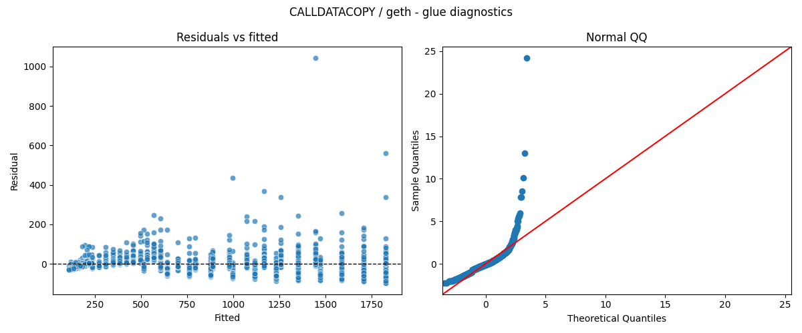

</details>

<details><summary><code>CALLDATALOAD</code> · nobs=572 · runtime_ms=4.957e-05 · p=1.00e-03 · R²=0.01964</summary>

```
==============================================================================
                           NNLS Regression Results                            
==============================================================================
Dep. Variable:          test_runtime_ms              R-squared:          0.020
Model:                  NNLS                    Adj. R-squared:          0.018
No. Observations:       572                               RMSE:           1.34
Df Residuals:           570                                MAE:           0.64
Df Model:               1      
==============================================================================
                      coef     std err     P-value      [0.025      0.975]
------------------------------------------------------------------------------
         const      2.7439      0.1943       0.001      2.4031      3.1390
  CALLDATALOAD      0.0000      0.0000       0.001      0.0000      0.0001
==============================================================================
Notes: Non-negative least squares with bootstrap inference (1000 iterations)
==============================================================================
```

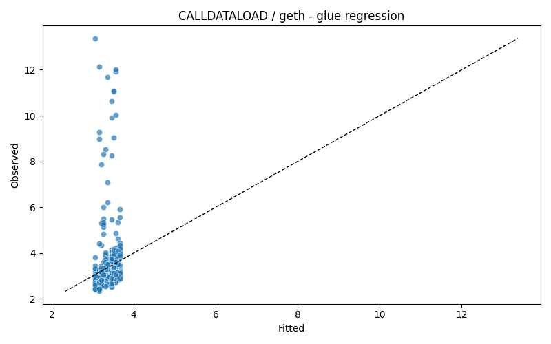

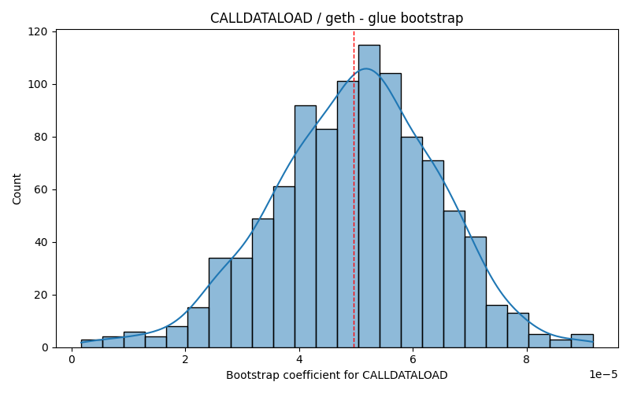

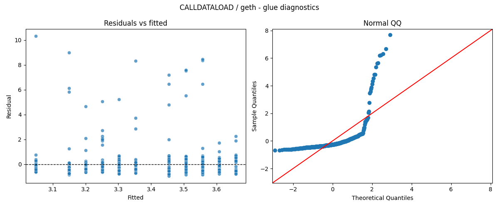

</details>

<details><summary><code>DIV</code> · nobs=143 · runtime_ms=5.845e-05 · p=1.00e-03 · R²=0.9968</summary>

```
==============================================================================
                           NNLS Regression Results                            
==============================================================================
Dep. Variable:          test_runtime_ms              R-squared:          0.997
Model:                  NNLS                    Adj. R-squared:          0.997
No. Observations:       143                               RMSE:          26.01
Df Residuals:           141                                MAE:          18.84
Df Model:               1      
==============================================================================
                      coef     std err     P-value      [0.025      0.975]
------------------------------------------------------------------------------
         const     12.3175      5.3403       0.013      2.0934     22.9793
           DIV      0.0001      0.0000       0.001      0.0001      0.0001
==============================================================================
Notes: Non-negative least squares with bootstrap inference (1000 iterations)
==============================================================================
```

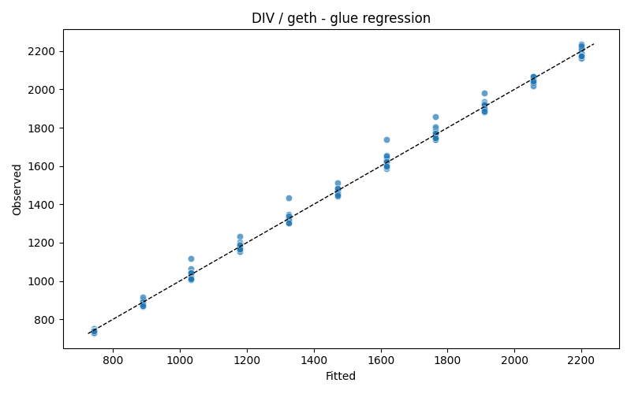

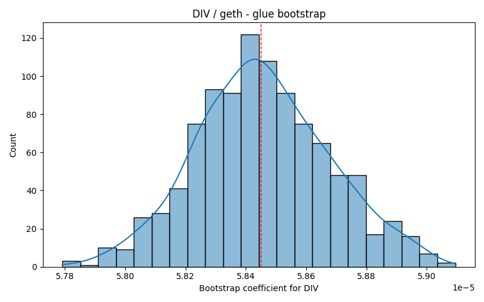

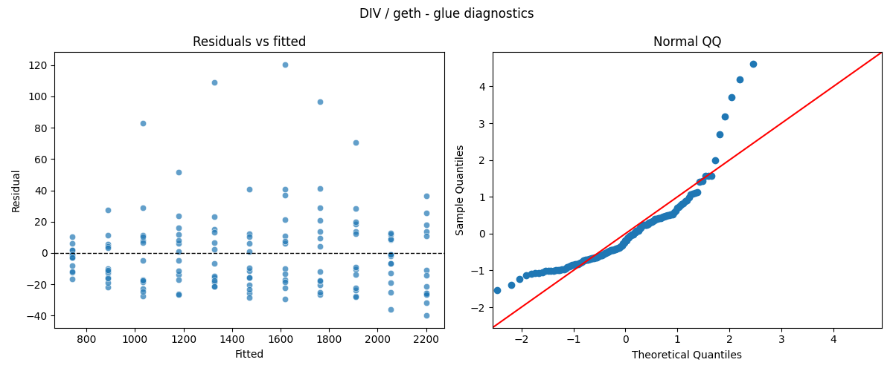

</details>

<details><summary><code>EXP</code> · nobs=143 · runtime_ms=0.00207 · p=1.00e-03 · R²=0.9945</summary>

```
==============================================================================
                           NNLS Regression Results                            
==============================================================================
Dep. Variable:          test_runtime_ms              R-squared:          0.995
Model:                  NNLS                    Adj. R-squared:          0.995
No. Observations:       143                               RMSE:           6.00
Df Residuals:           141                                MAE:           4.81
Df Model:               1      
==============================================================================
                      coef     std err     P-value      [0.025      0.975]
------------------------------------------------------------------------------
         const      6.9872      1.3483       0.001      4.4370      9.6527
           EXP      0.0021      0.0000       0.001      0.0020      0.0021
==============================================================================
Notes: Non-negative least squares with bootstrap inference (1000 iterations)
==============================================================================
```

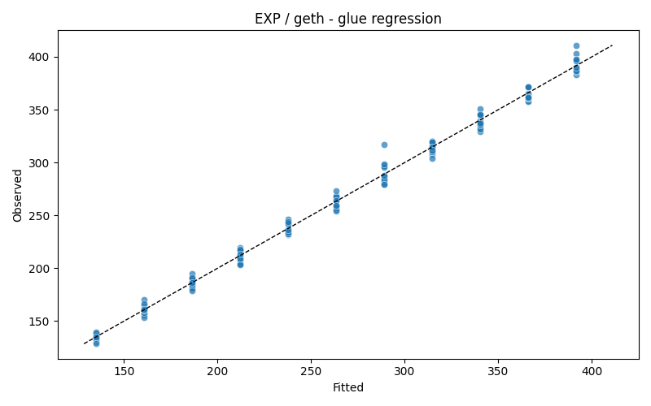

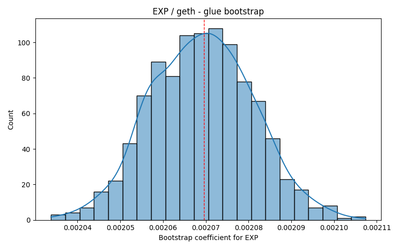

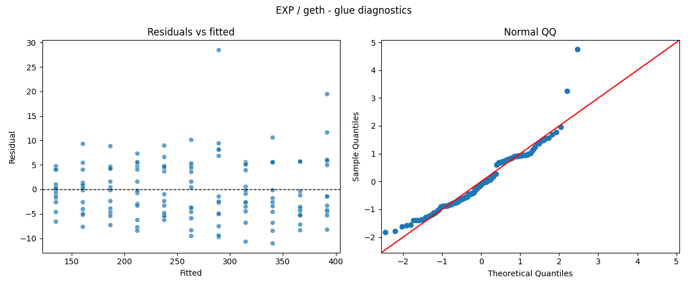

</details>

<details><summary><code>GT</code> · nobs=143 · runtime_ms=2.06e-05 · p=1.00e-03 · R²=0.9684</summary>

```
==============================================================================
                           NNLS Regression Results                            
==============================================================================
Dep. Variable:          test_runtime_ms              R-squared:          0.968
Model:                  NNLS                    Adj. R-squared:          0.968
No. Observations:       143                               RMSE:          39.18
Df Residuals:           141                                MAE:          19.89
Df Model:               1      
==============================================================================
                      coef     std err     P-value      [0.025      0.975]
------------------------------------------------------------------------------
         const     13.0719      8.9131       0.096      0.0000     30.7405
            GT      0.0000      0.0000       0.001      0.0000      0.0000
==============================================================================
Notes: Non-negative least squares with bootstrap inference (1000 iterations)
==============================================================================
```

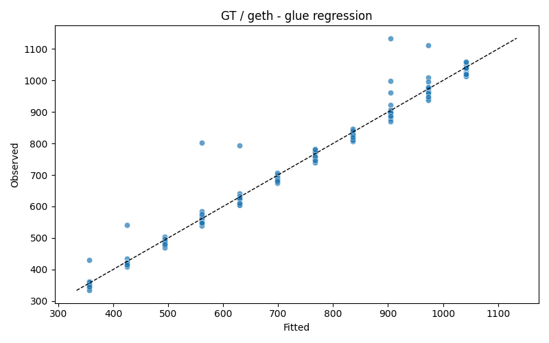

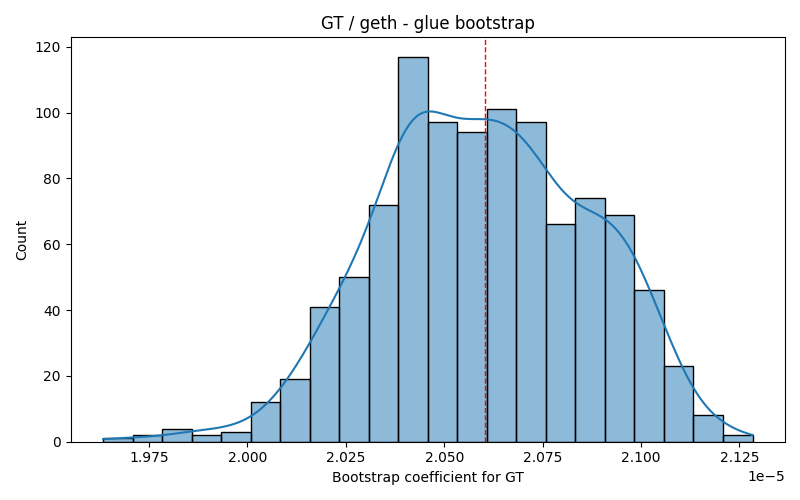

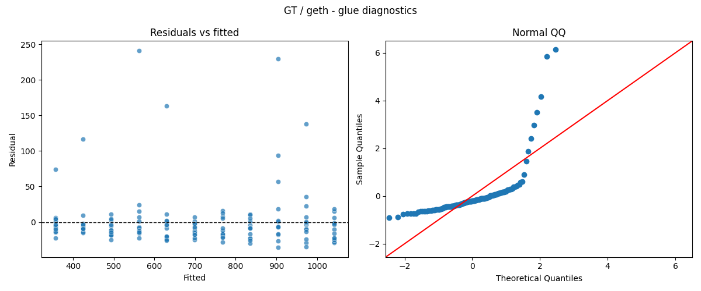

</details>

<details><summary><code>JUMPI</code> · nobs=143 · runtime_ms=3.311e-05 · p=1.00e-03 · R²=0.9688</summary>

```
==============================================================================
                           NNLS Regression Results                            
==============================================================================
Dep. Variable:          test_runtime_ms              R-squared:          0.969
Model:                  NNLS                    Adj. R-squared:          0.969
No. Observations:       143                               RMSE:          26.82
Df Residuals:           141                                MAE:          13.80
Df Model:               1      
==============================================================================
                      coef     std err     P-value      [0.025      0.975]
------------------------------------------------------------------------------
         const      1.8813      3.4879       0.343      0.0000     11.8874
         JUMPI      0.0000      0.0000       0.001      0.0000      0.0000
==============================================================================
Notes: Non-negative least squares with bootstrap inference (1000 iterations)
==============================================================================
```

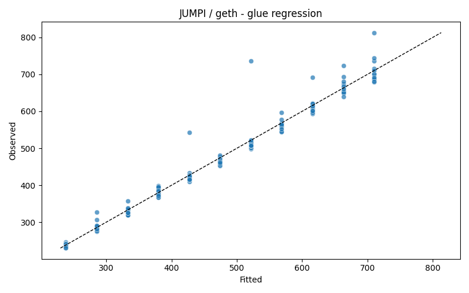

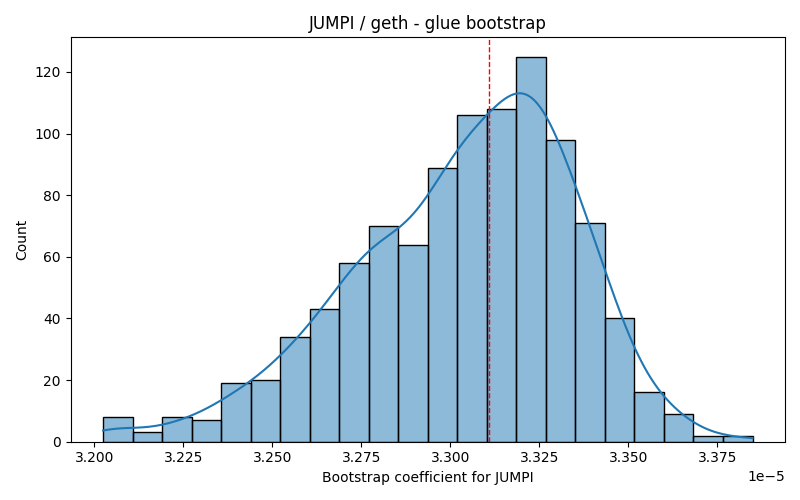

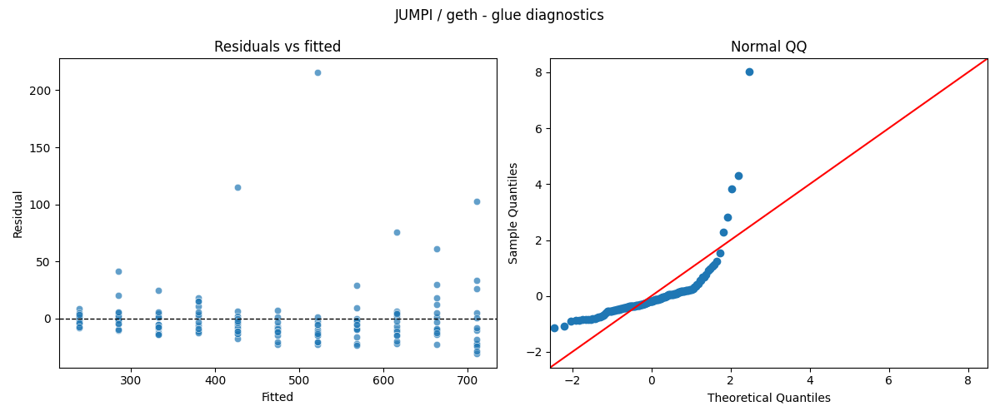

</details>

<details><summary><code>LT</code> · nobs=143 · runtime_ms=2.671e-05 · p=1.00e-03 · R²=0.7624</summary>

```
==============================================================================
                           NNLS Regression Results                            
==============================================================================
Dep. Variable:          test_runtime_ms              R-squared:          0.762
Model:                  NNLS                    Adj. R-squared:          0.761
No. Observations:       143                               RMSE:         165.57
Df Residuals:           141                                MAE:         135.52
Df Model:               1      
==============================================================================
                      coef     std err     P-value      [0.025      0.975]
------------------------------------------------------------------------------
         const      0.0000      5.0789       1.000      0.0000     14.4994
            LT      0.0000      0.0000       0.001      0.0000      0.0000
==============================================================================
Notes: Non-negative least squares with bootstrap inference (1000 iterations)
==============================================================================
```

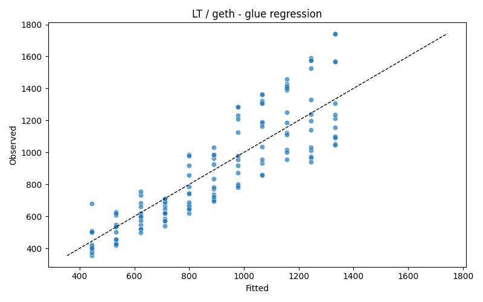

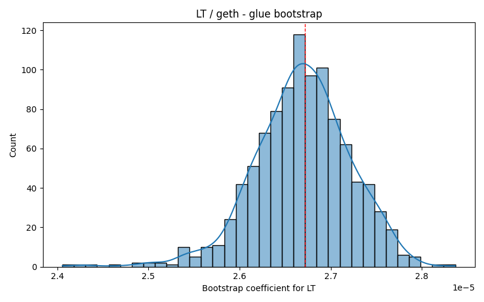

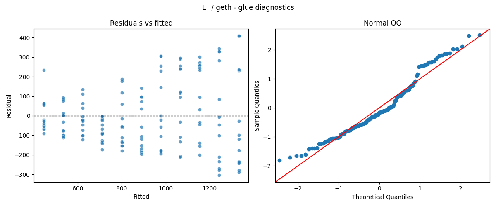

</details>

<details><summary><code>MSTORE</code> · nobs=715 · runtime_ms=4.92e-05 · p=1.00e-03 · R²=0.9716</summary>

```
==============================================================================
                           NNLS Regression Results                            
==============================================================================
Dep. Variable:          test_runtime_ms              R-squared:          0.972
Model:                  NNLS                    Adj. R-squared:          0.972
No. Observations:       715                               RMSE:          59.03
Df Residuals:           713                                MAE:          29.59
Df Model:               1      
==============================================================================
                      coef     std err     P-value      [0.025      0.975]
------------------------------------------------------------------------------
         const      1.5389      4.4122       0.403      0.0000     15.2840
        MSTORE      0.0000      0.0000       0.001      0.0000      0.0000
==============================================================================
Notes: Non-negative least squares with bootstrap inference (1000 iterations)
==============================================================================
```

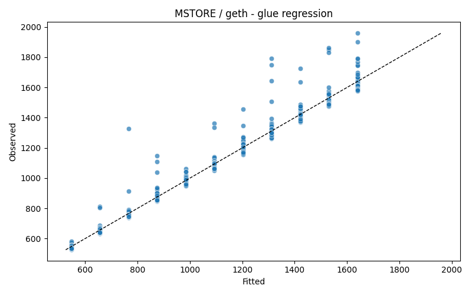

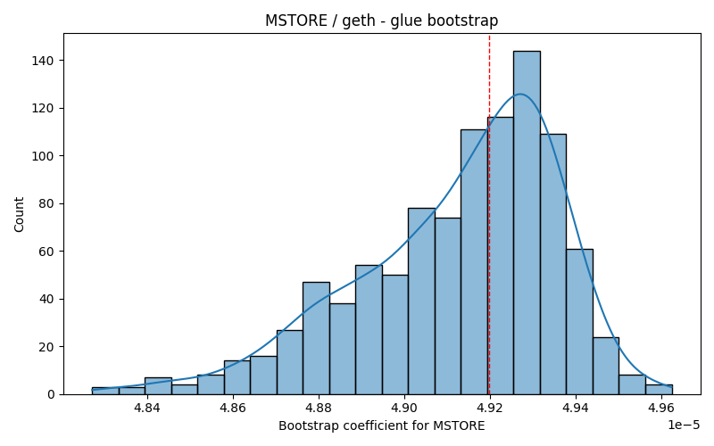

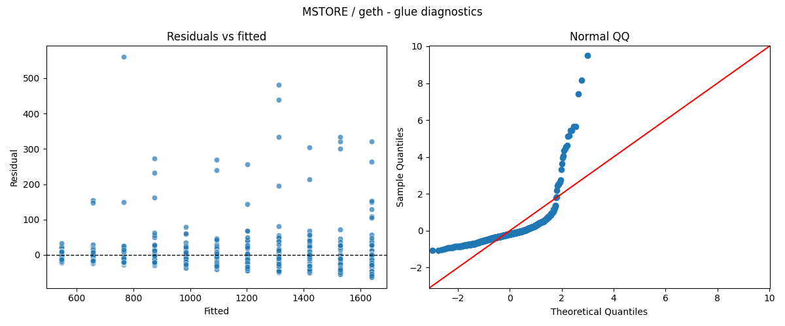

</details>

<details><summary><code>MSTORE8</code> · nobs=715 · runtime_ms=4.428e-05 · p=1.00e-03 · R²=0.9792</summary>

```
==============================================================================
                           NNLS Regression Results                            
==============================================================================
Dep. Variable:          test_runtime_ms              R-squared:          0.979
Model:                  NNLS                    Adj. R-squared:          0.979
No. Observations:       715                               RMSE:          45.34
Df Residuals:           713                                MAE:          23.40
Df Model:               1      
==============================================================================
                      coef     std err     P-value      [0.025      0.975]
------------------------------------------------------------------------------
         const      0.5949      2.4662       0.423      0.0000      8.4052
       MSTORE8      0.0000      0.0000       0.001      0.0000      0.0000
==============================================================================
Notes: Non-negative least squares with bootstrap inference (1000 iterations)
==============================================================================
```

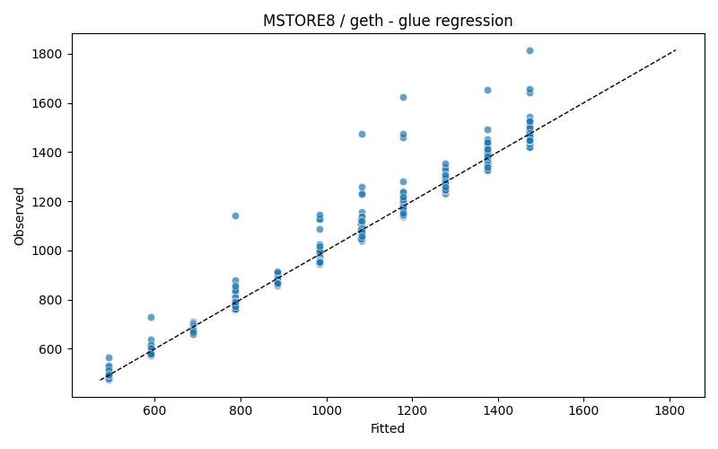

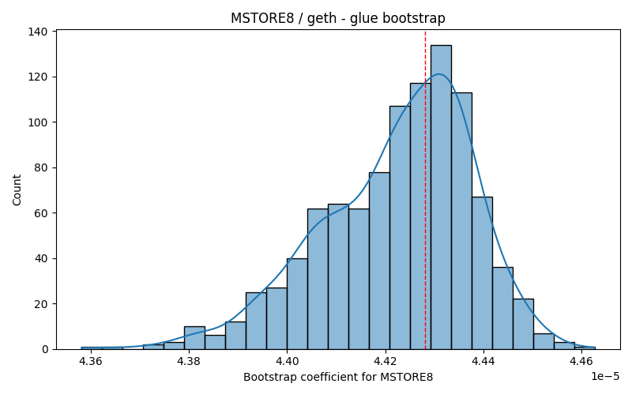

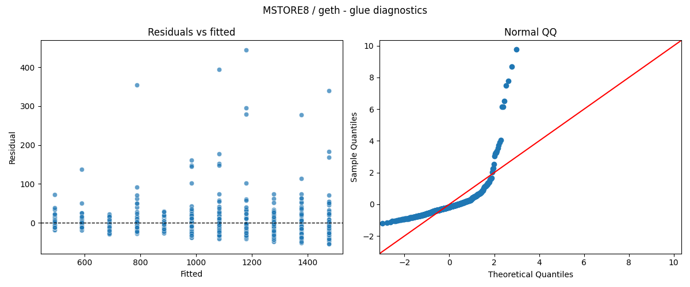

</details>

<details><summary><code>MUL</code> · nobs=143 · runtime_ms=2.589e-05 · p=1.00e-03 · R²=0.9331</summary>

```
==============================================================================
                           NNLS Regression Results                            
==============================================================================
Dep. Variable:          test_runtime_ms              R-squared:          0.933
Model:                  NNLS                    Adj. R-squared:          0.933
No. Observations:       143                               RMSE:          54.71
Df Residuals:           141                                MAE:          39.25
Df Model:               1      
==============================================================================
                      coef     std err     P-value      [0.025      0.975]
------------------------------------------------------------------------------
         const     48.8041     15.1120       0.001     21.1256     80.5604
           MUL      0.0000      0.0000       0.001      0.0000      0.0000
==============================================================================
Notes: Non-negative least squares with bootstrap inference (1000 iterations)
==============================================================================
```

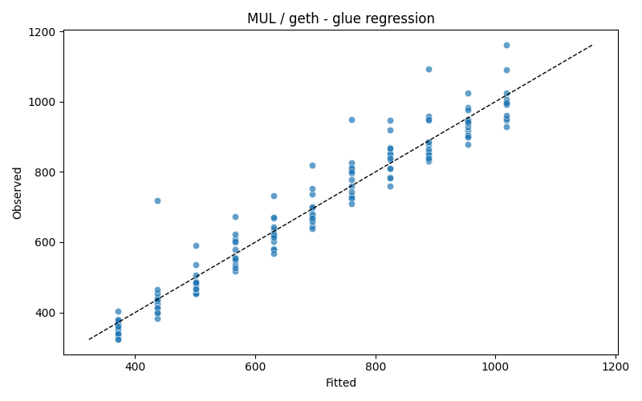

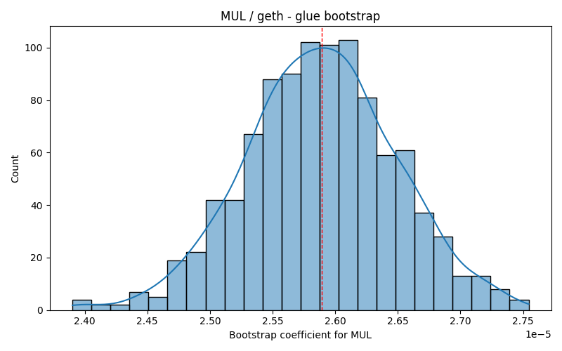

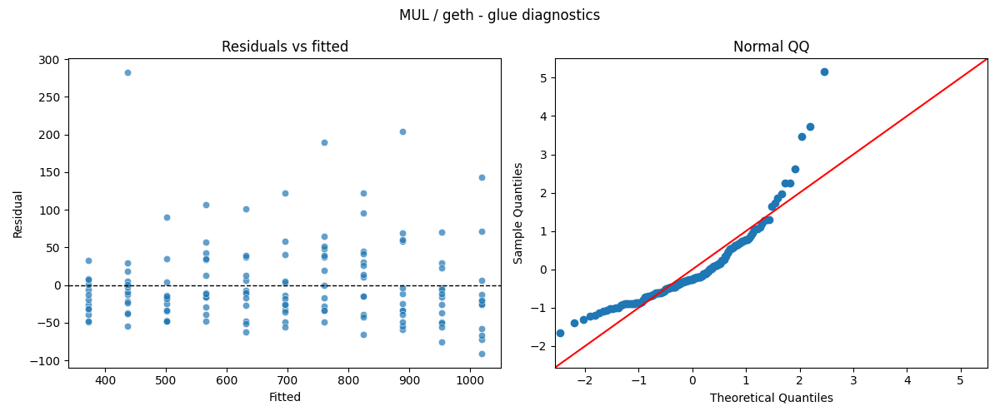

</details>

<details><summary><code>PC</code> · nobs=143 · runtime_ms=9.512e-06 · p=1.00e-03 · R²=0.9833</summary>

```
==============================================================================
                           NNLS Regression Results                            
==============================================================================
Dep. Variable:          test_runtime_ms              R-squared:          0.983
Model:                  NNLS                    Adj. R-squared:          0.983
No. Observations:       143                               RMSE:          37.11
Df Residuals:           141                                MAE:          15.69
Df Model:               1      
==============================================================================
                      coef     std err     P-value      [0.025      0.975]
------------------------------------------------------------------------------
         const      3.6844      4.5689       0.269      0.0000     14.4803
            PC      0.0000      0.0000       0.001      0.0000      0.0000
==============================================================================
Notes: Non-negative least squares with bootstrap inference (1000 iterations)
==============================================================================
```

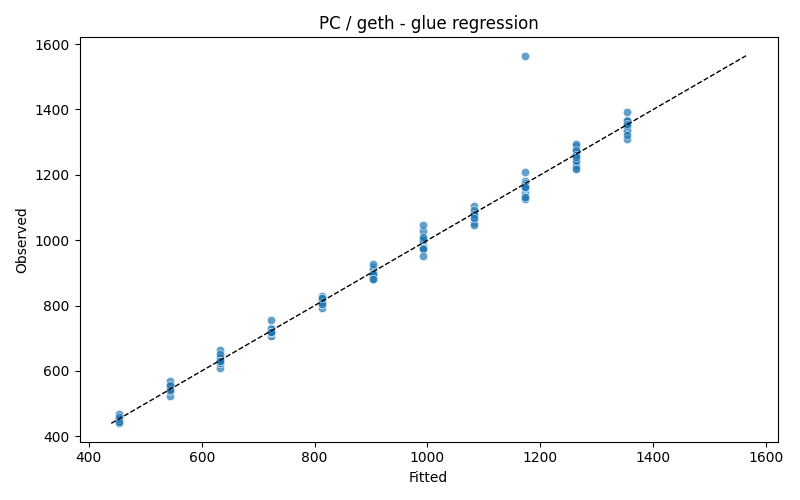

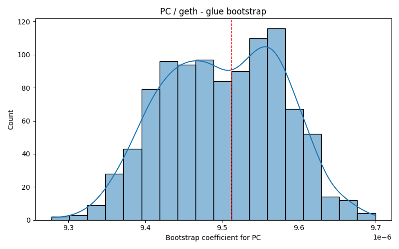

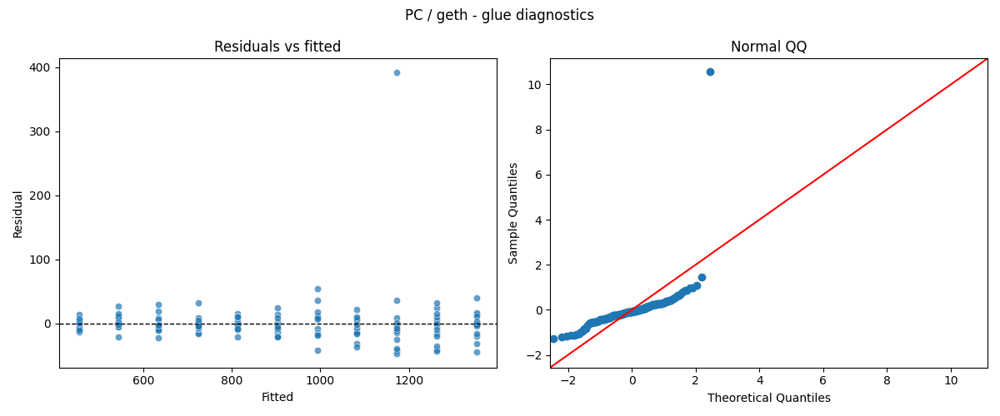

</details>

<details><summary><code>RETURNDATASIZE</code> · nobs=572 · runtime_ms=1.621e-05 · p=1.00e-03 · R²=0.9202</summary>

```
==============================================================================
                           NNLS Regression Results                            
==============================================================================
Dep. Variable:          test_runtime_ms              R-squared:          0.920
Model:                  NNLS                    Adj. R-squared:          0.920
No. Observations:       572                               RMSE:          75.37
Df Residuals:           570                                MAE:          36.14
Df Model:               1      
==============================================================================
                      coef     std err     P-value      [0.025      0.975]
------------------------------------------------------------------------------
         const     14.5441      9.3076       0.065      0.0000     32.7962
RETURNDATASIZE      0.0000      0.0000       0.001      0.0000      0.0000
==============================================================================
Notes: Non-negative least squares with bootstrap inference (1000 iterations)
==============================================================================
```

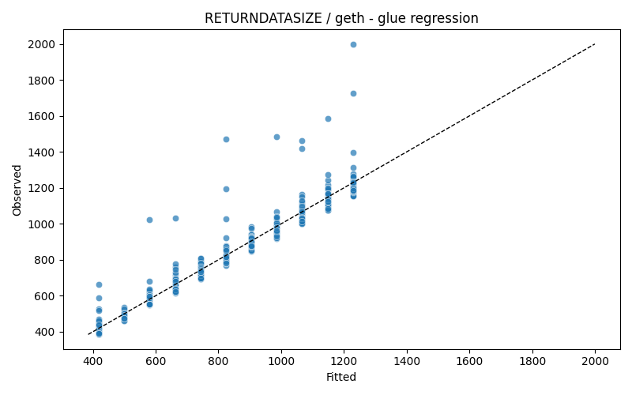

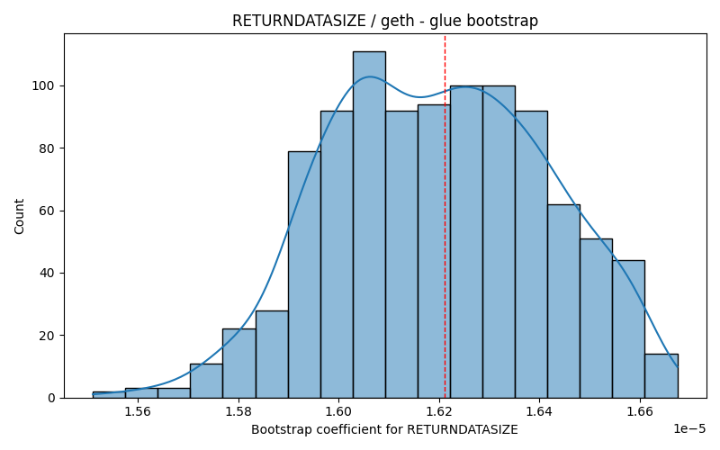

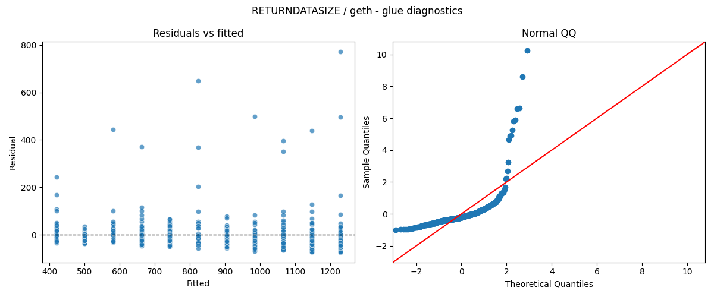

</details>

<details><summary><code>SELFBALANCE</code> · nobs=117 · runtime_ms=5.044e-05 · p=1.00e-03 · R²=0.9953</summary>

```
==============================================================================
                           NNLS Regression Results                            
==============================================================================
Dep. Variable:          test_runtime_ms              R-squared:          0.995
Model:                  NNLS                    Adj. R-squared:          0.995
No. Observations:       117                               RMSE:          35.03
Df Residuals:           115                                MAE:          28.65
Df Model:               1      
==============================================================================
                      coef     std err     P-value      [0.025      0.975]
------------------------------------------------------------------------------
         const     21.5320     13.2104       0.065      0.0000     47.6996
   SELFBALANCE      0.0001      0.0000       0.001      0.0000      0.0001
==============================================================================
Notes: Non-negative least squares with bootstrap inference (1000 iterations)
==============================================================================
```

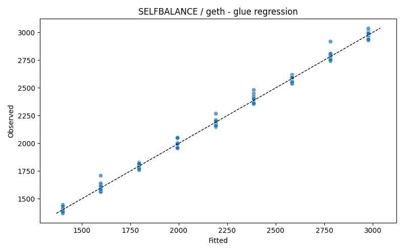

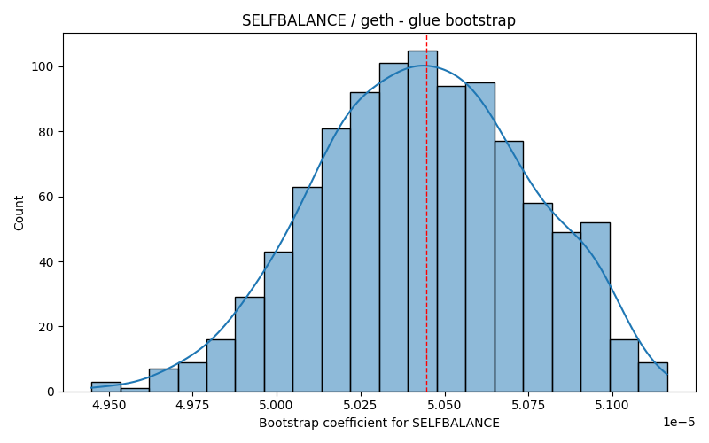

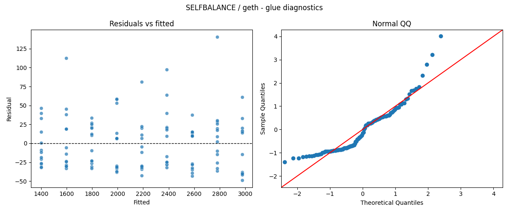

</details>

<details><summary><code>SUB</code> · nobs=143 · runtime_ms=2.708e-05 · p=1.00e-03 · R²=0.7585</summary>

```
==============================================================================
                           NNLS Regression Results                            
==============================================================================
Dep. Variable:          test_runtime_ms              R-squared:          0.759
Model:                  NNLS                    Adj. R-squared:          0.757
No. Observations:       143                               RMSE:         160.81
Df Residuals:           141                                MAE:         134.36
Df Model:               1      
==============================================================================
                      coef     std err     P-value      [0.025      0.975]
------------------------------------------------------------------------------
         const      4.1993     24.1513       0.440      0.0000     75.4778
           SUB      0.0000      0.0000       0.001      0.0000      0.0000
==============================================================================
Notes: Non-negative least squares with bootstrap inference (1000 iterations)
==============================================================================
```

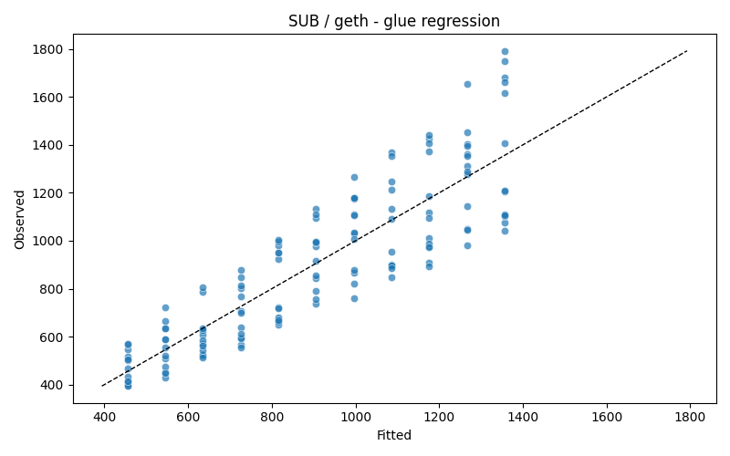

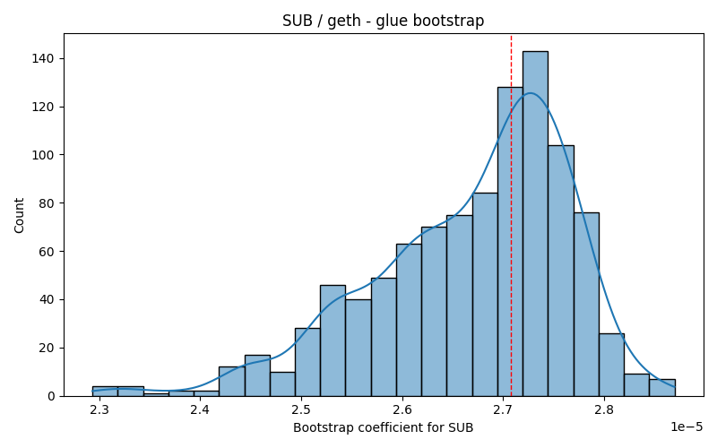

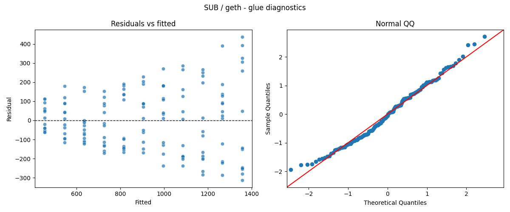

</details>

### Mixed glue (tier B) · geth

<details><summary><code>JUMP</code> · nobs=143 · runtime_ms=5.793e-05 · p=1.00e-03 · R²=0.9764</summary>

```
==============================================================================
                           NNLS Regression Results                            
==============================================================================
Dep. Variable:          test_runtime_ms              R-squared:          0.976
Model:                  NNLS                    Adj. R-squared:          0.976
No. Observations:       143                               RMSE:          33.60
Df Residuals:           141                                MAE:          20.42
Df Model:               1      
==============================================================================
                      coef     std err     P-value      [0.025      0.975]
------------------------------------------------------------------------------
         const      0.0000      3.7137       1.000      0.0000     13.4789
          JUMP      0.0001      0.0000       0.001      0.0001      0.0001
==============================================================================
Notes: Non-negative least squares with bootstrap inference (1000 iterations)
==============================================================================
```

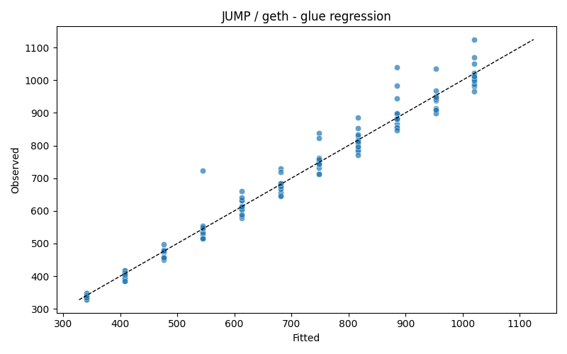

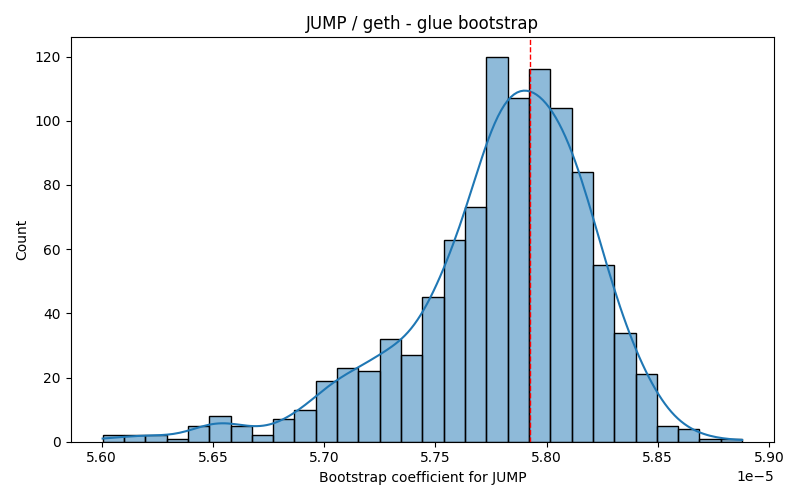

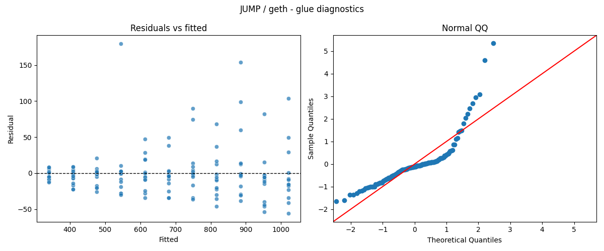

</details>

<details><summary><code>KECCAK256</code> · nobs=2288 · runtime_ms=0.0002064 · p=1.00e-03 · R²=0.3014</summary>

```
==============================================================================
                           NNLS Regression Results                            
==============================================================================
Dep. Variable:          test_runtime_ms              R-squared:          0.301
Model:                  NNLS                    Adj. R-squared:          0.301
No. Observations:       2288                              RMSE:         624.58
Df Residuals:           2286                               MAE:         500.59
Df Model:               1      
==============================================================================
                      coef     std err     P-value      [0.025      0.975]
------------------------------------------------------------------------------
         const   1628.5353     27.6836       0.001   1573.2804   1681.0127
     KECCAK256      0.0002      0.0000       0.001      0.0002      0.0002
==============================================================================
Notes: Non-negative least squares with bootstrap inference (1000 iterations)
==============================================================================
```

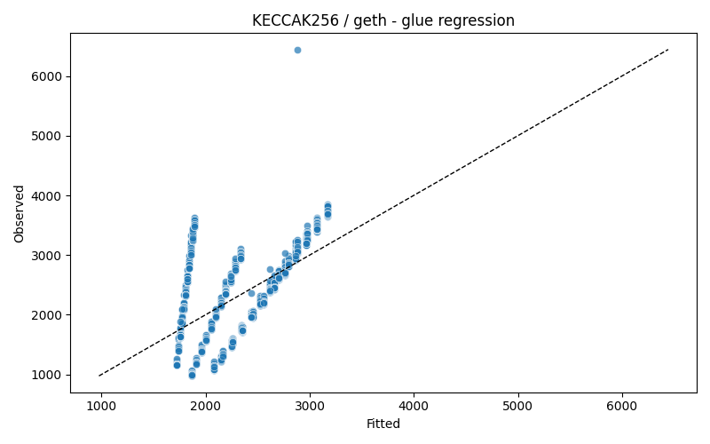

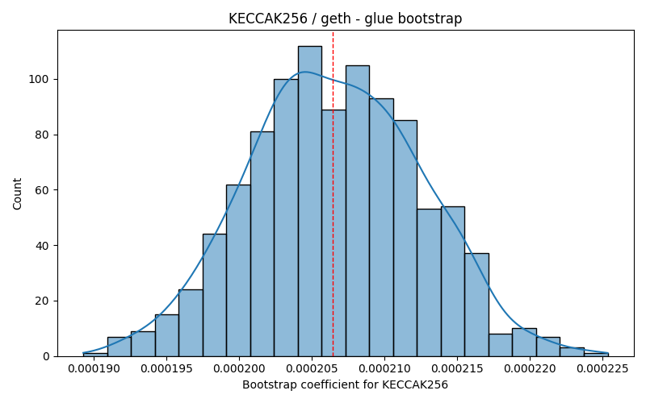

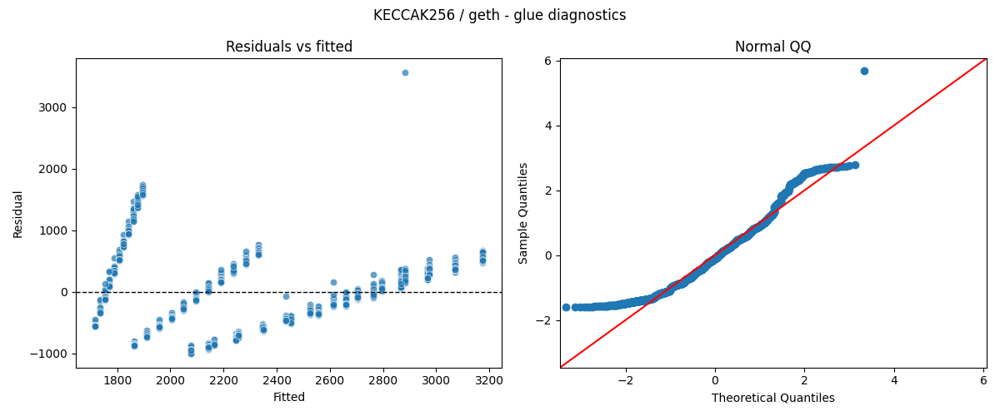

</details>

## nethermind

| glue_opcode | nobs | glue_runtime_ms | p_value | rsquared |
| --- | --- | --- | --- | --- |
| `ISZERO` | 1518 | 8.177e-07 | 1.00e-03 | 0.435 |
| `JUMPDEST` | 1518 | 4.218e-07 | 1.00e-03 | 0.7461 |
| `SWAP` | 24288 | 5.336e-07 | 1.00e-03 | 0.3785 |
| `CALLDATASIZE` | 89628 | 1.428e-07 | 1.00e-03 | 0.9121 |
| `DUP` | 89628 | 1.289e-07 | 1.00e-03 | 0.9121 |
| `GAS` | 89628 | 1.253e-07 | 1.00e-03 | 0.9121 |
| `MLOAD` | 89628 | 1.486e-06 | 1.00e-03 | 0.9121 |
| `PUSH` | 89628 | 1.932e-07 | 1.00e-03 | 0.9121 |
| `PUSH0` | 89628 | 7.465e-08 | 1.00e-03 | 0.9121 |
| `STATICCALL` | 89628 | 0.0006766 | 1.00e-03 | 0.9121 |
| `ADD` | 1518 | 1.673e-06 | 1.00e-03 | 0.8155 |
| `AND` | 1518 | 1.024e-06 | 1.00e-03 | 0.5178 |
| `CALLDATACOPY` | 36432 | 4.078e-06 | 1.00e-03 | 0.7122 |
| `CALLDATALOAD` | 6072 | 2.174e-05 | 2.23e-01 | 0.0002218 |
| `DIV` | 1518 | 5.04e-06 | 1.00e-03 | 0.5179 |
| `EXP` | 1518 | 0 | 1.00e+00 | 0 |
| `GT` | 1518 | 1.582e-06 | 1.00e-03 | 0.3401 |
| `JUMPI` | 1518 | 1.819e-06 | 1.00e-03 | 0.7195 |
| `LT` | 1518 | 1.542e-06 | 1.00e-03 | 0.3239 |
| `MSTORE` | 7590 | 2.122e-06 | 1.00e-03 | 0.6311 |
| `MSTORE8` | 7590 | 1.994e-06 | 1.00e-03 | 0.6835 |
| `MUL` | 1518 | 4.389e-06 | 1.00e-03 | 0.819 |
| `PC` | 1518 | 8.02e-07 | 1.00e-03 | 0.8675 |
| `RETURNDATASIZE` | 6072 | 7.32e-07 | 1.00e-03 | 0.5437 |
| `SELFBALANCE` | 1242 | 7.964e-06 | 1.00e-03 | 0.7609 |
| `SUB` | 1518 | 2.014e-06 | 1.00e-03 | 0.8105 |
| `JUMP` | 1518 | 5.218e-06 | 1.00e-03 | 0.8214 |
| `KECCAK256` | 24288 | 0 | 1.00e+00 | 0 |

### Cycle glue — joint fit · nethermind

<details><summary>Joint NNLS regression summary</summary>

```
==============================================================================
                           NNLS Regression Results                            
==============================================================================
Dep. Variable:          test_runtime_ms              R-squared:          0.912
Model:                  NNLS                    Adj. R-squared:          0.912
No. Observations:       89628                             RMSE:          11.11
Df Residuals:           89620                              MAE:           5.80
Df Model:               7      
==============================================================================
                      coef     std err     P-value      [0.025      0.975]
------------------------------------------------------------------------------
         const     17.4081      0.1281       0.001     17.1722     17.6592
  CALLDATASIZE      0.0000      0.0000       0.001      0.0000      0.0000
           DUP      0.0000      0.0000       0.001      0.0000      0.0000
           GAS      0.0000      0.0000       0.001      0.0000      0.0000
         MLOAD      0.0000      0.0000       0.001      0.0000      0.0000
          PUSH      0.0000      0.0000       0.001      0.0000      0.0000
         PUSH0      0.0000      0.0000       0.001      0.0000      0.0000
    STATICCALL      0.0007      0.0000       0.001      0.0006      0.0007
==============================================================================
Notes: Non-negative least squares with bootstrap inference (1000 iterations)
==============================================================================
```

</details>

<details><summary><code>CALLDATASIZE</code> · nobs=89628 · runtime_ms=1.428e-07 · p=1.00e-03 · R²=0.9121</summary>


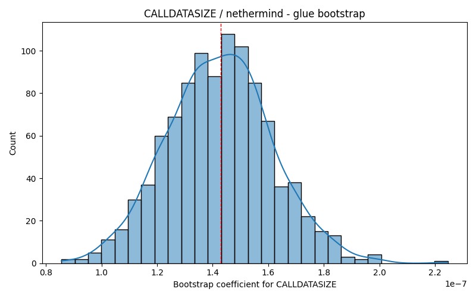


</details>

<details><summary><code>DUP</code> · nobs=89628 · runtime_ms=1.289e-07 · p=1.00e-03 · R²=0.9121</summary>

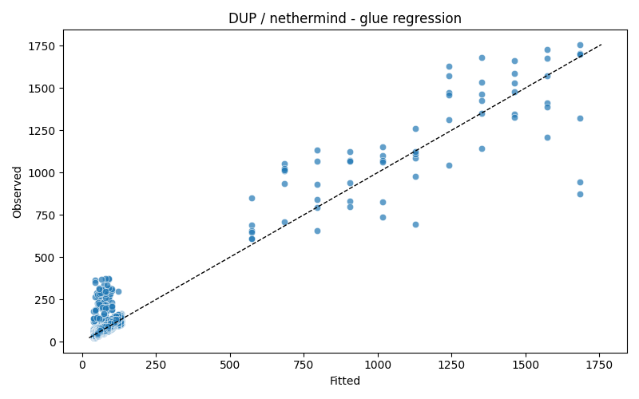

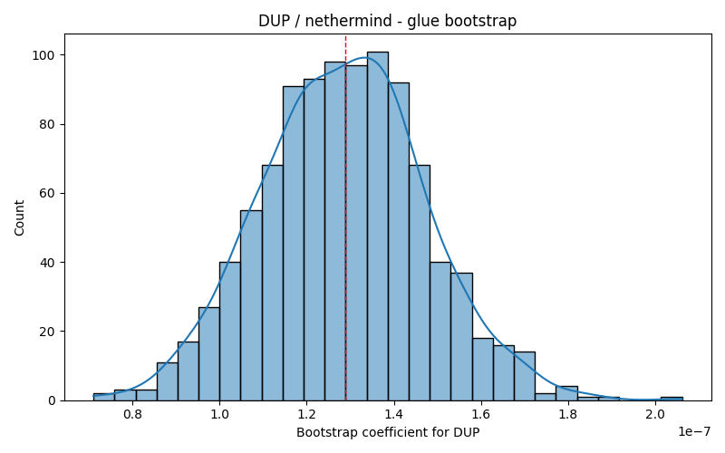


</details>

<details><summary><code>GAS</code> · nobs=89628 · runtime_ms=1.253e-07 · p=1.00e-03 · R²=0.9121</summary>


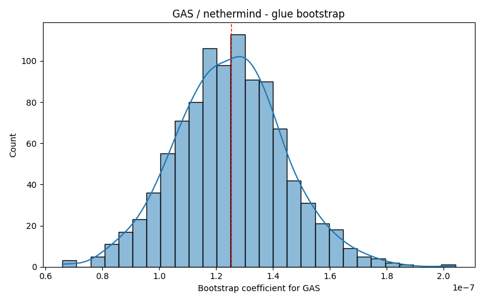


</details>

<details><summary><code>MLOAD</code> · nobs=89628 · runtime_ms=1.486e-06 · p=1.00e-03 · R²=0.9121</summary>


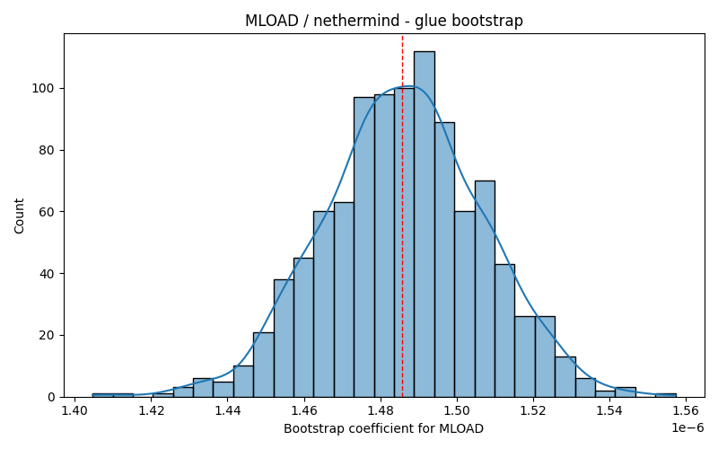

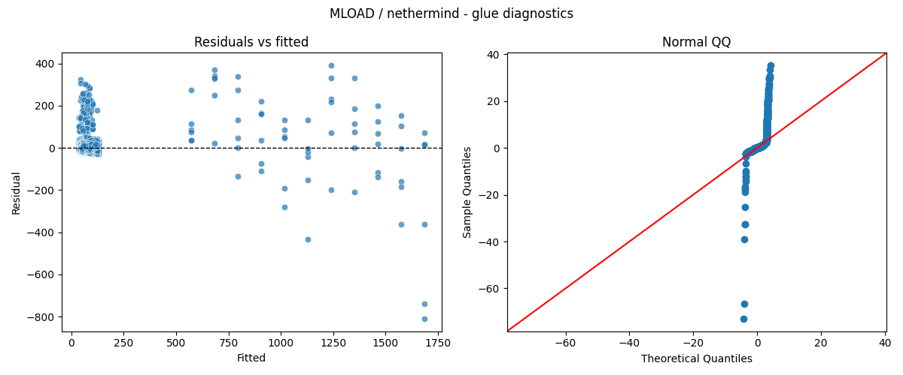

</details>

<details><summary><code>PUSH</code> · nobs=89628 · runtime_ms=1.932e-07 · p=1.00e-03 · R²=0.9121</summary>


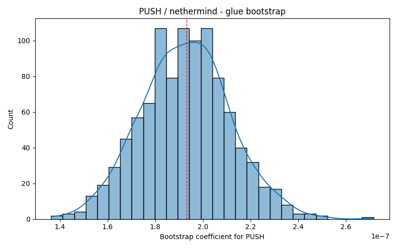


</details>

<details><summary><code>PUSH0</code> · nobs=89628 · runtime_ms=7.465e-08 · p=1.00e-03 · R²=0.9121</summary>

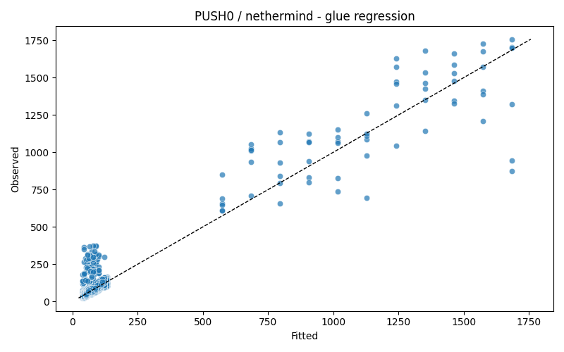

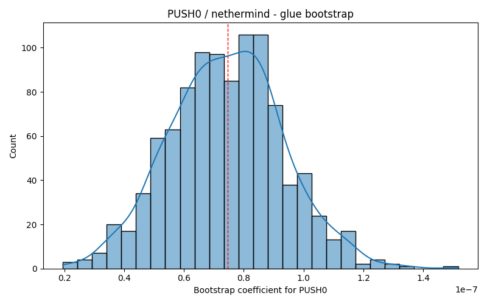


</details>

<details><summary><code>STATICCALL</code> · nobs=89628 · runtime_ms=0.0006766 · p=1.00e-03 · R²=0.9121</summary>

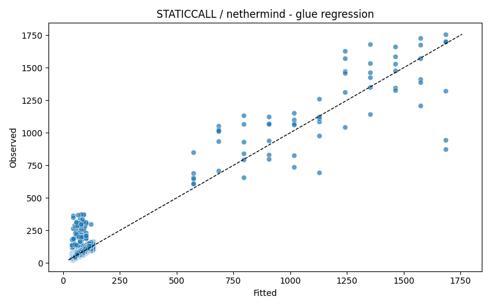

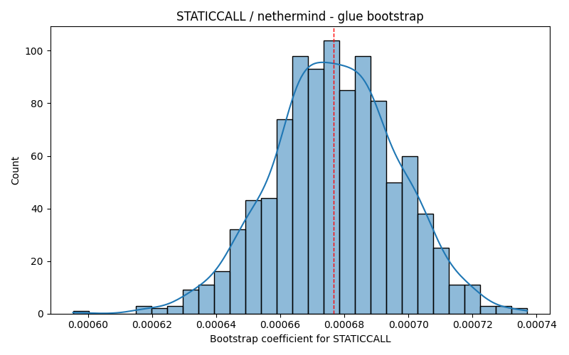

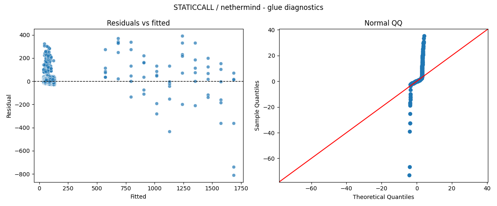

</details>

### Pure glue · nethermind

<details><summary><code>ISZERO</code> · nobs=1518 · runtime_ms=8.177e-07 · p=1.00e-03 · R²=0.435</summary>

```
==============================================================================
                           NNLS Regression Results                            
==============================================================================
Dep. Variable:          test_runtime_ms              R-squared:          0.435
Model:                  NNLS                    Adj. R-squared:          0.435
No. Observations:       1518                              RMSE:          19.62
Df Residuals:           1516                               MAE:          10.19
Df Model:               1      
==============================================================================
                      coef     std err     P-value      [0.025      0.975]
------------------------------------------------------------------------------
         const     21.3554      1.7790       0.001     17.8984     24.9249
        ISZERO      0.0000      0.0000       0.001      0.0000      0.0000
==============================================================================
Notes: Non-negative least squares with bootstrap inference (1000 iterations)
==============================================================================
```

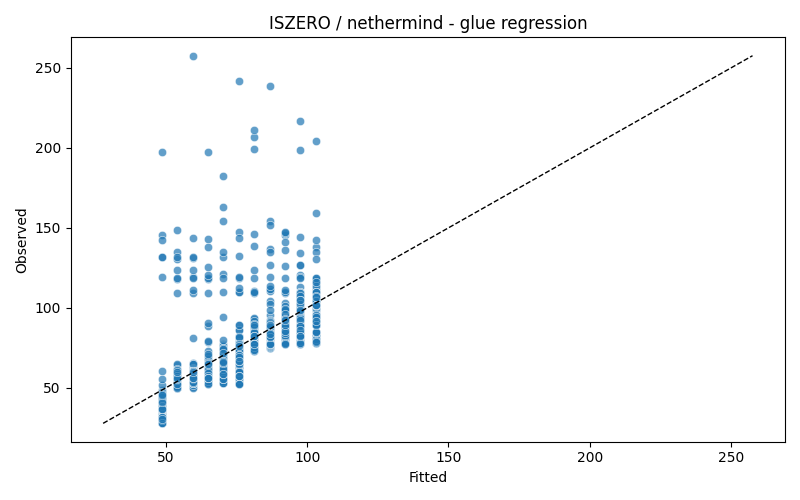

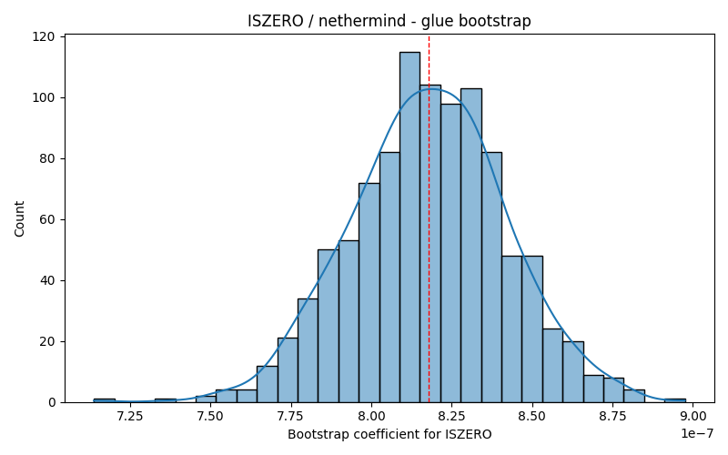

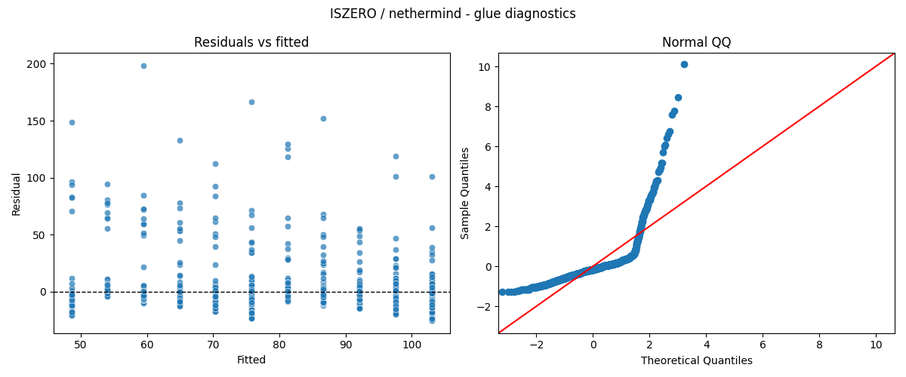

</details>

<details><summary><code>JUMPDEST</code> · nobs=1518 · runtime_ms=4.218e-07 · p=1.00e-03 · R²=0.7461</summary>

```
==============================================================================
                           NNLS Regression Results                            
==============================================================================
Dep. Variable:          test_runtime_ms              R-squared:          0.746
Model:                  NNLS                    Adj. R-squared:          0.746
No. Observations:       1518                              RMSE:          15.54
Df Residuals:           1516                               MAE:          11.57
Df Model:               1      
==============================================================================
                      coef     std err     P-value      [0.025      0.975]
------------------------------------------------------------------------------
         const     17.5132      1.2522       0.001     15.1086     20.1210
      JUMPDEST      0.0000      0.0000       0.001      0.0000      0.0000
==============================================================================
Notes: Non-negative least squares with bootstrap inference (1000 iterations)
==============================================================================
```

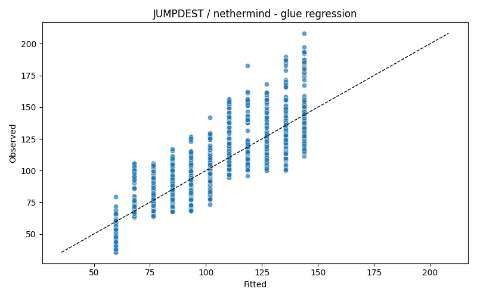

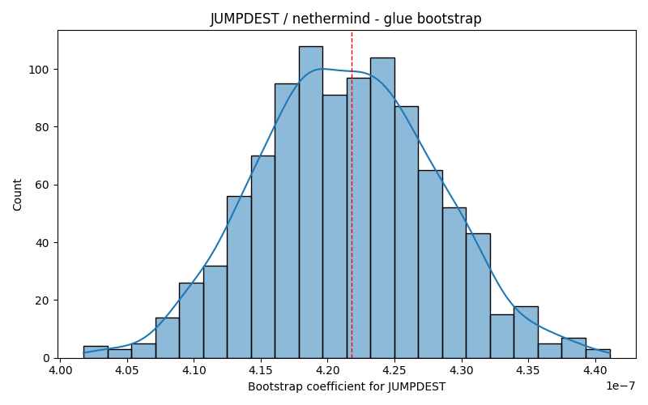

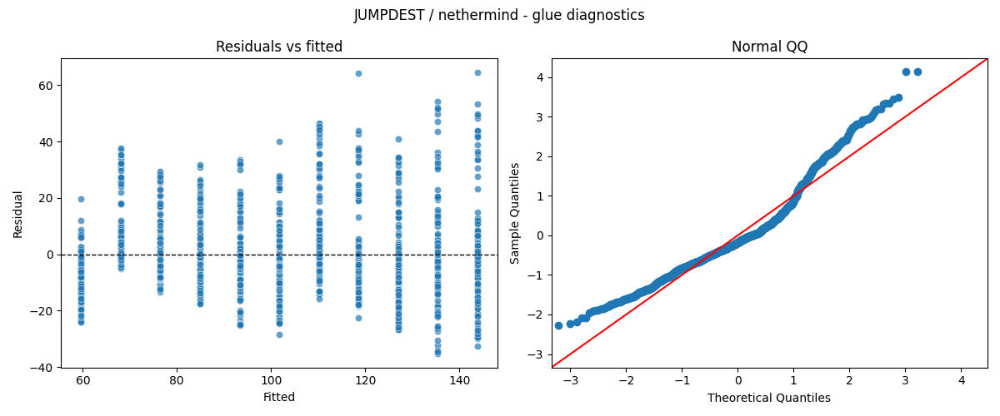

</details>

<details><summary><code>SWAP</code> · nobs=24288 · runtime_ms=5.336e-07 · p=1.00e-03 · R²=0.3785</summary>

```
==============================================================================
                           NNLS Regression Results                            
==============================================================================
Dep. Variable:          test_runtime_ms              R-squared:          0.378
Model:                  NNLS                    Adj. R-squared:          0.378
No. Observations:       24288                             RMSE:          14.40
Df Residuals:           24286                              MAE:           5.56
Df Model:               1      
==============================================================================
                      coef     std err     P-value      [0.025      0.975]
------------------------------------------------------------------------------
         const     16.5195      0.2939       0.001     15.9545     17.1028
          SWAP      0.0000      0.0000       0.001      0.0000      0.0000
==============================================================================
Notes: Non-negative least squares with bootstrap inference (1000 iterations)
==============================================================================
```

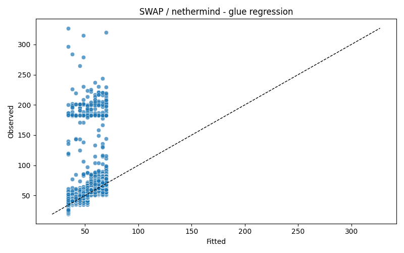

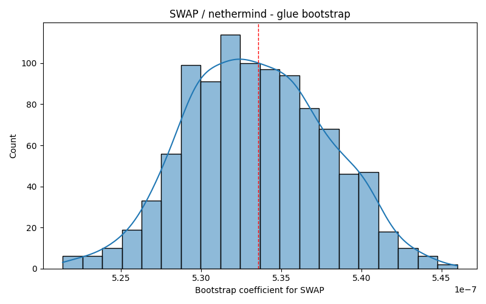

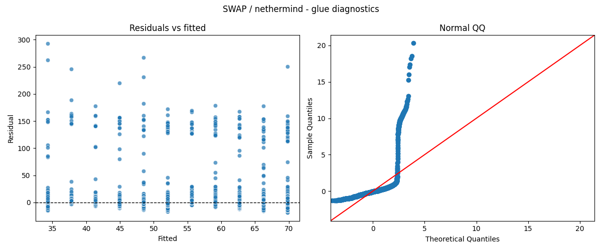

</details>

### Mixed glue (tier A) · nethermind

<details><summary><code>ADD</code> · nobs=1518 · runtime_ms=1.673e-06 · p=1.00e-03 · R²=0.8155</summary>

```
==============================================================================
                           NNLS Regression Results                            
==============================================================================
Dep. Variable:          test_runtime_ms              R-squared:          0.816
Model:                  NNLS                    Adj. R-squared:          0.815
No. Observations:       1518                              RMSE:           8.37
Df Residuals:           1516                               MAE:           5.83
Df Model:               1      
==============================================================================
                      coef     std err     P-value      [0.025      0.975]
------------------------------------------------------------------------------
         const     22.0561      0.7000       0.001     20.7080     23.4888
           ADD      0.0000      0.0000       0.001      0.0000      0.0000
==============================================================================
Notes: Non-negative least squares with bootstrap inference (1000 iterations)
==============================================================================
```

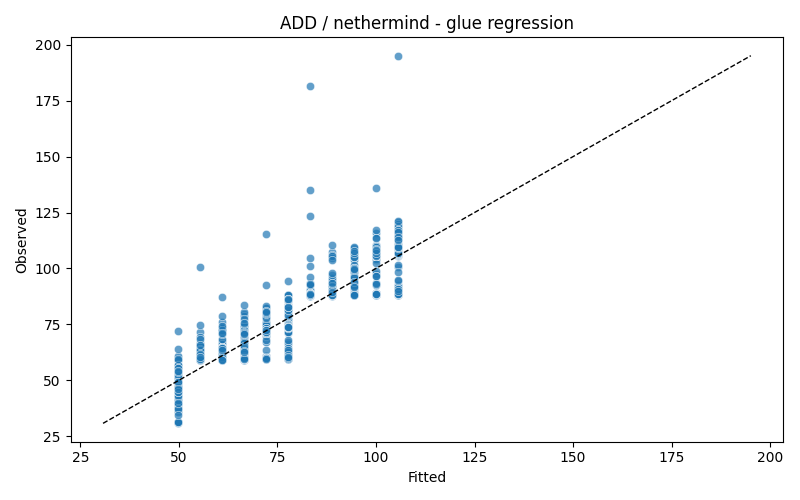

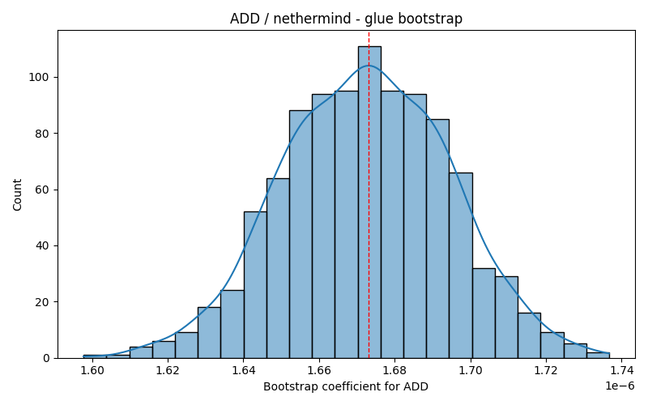

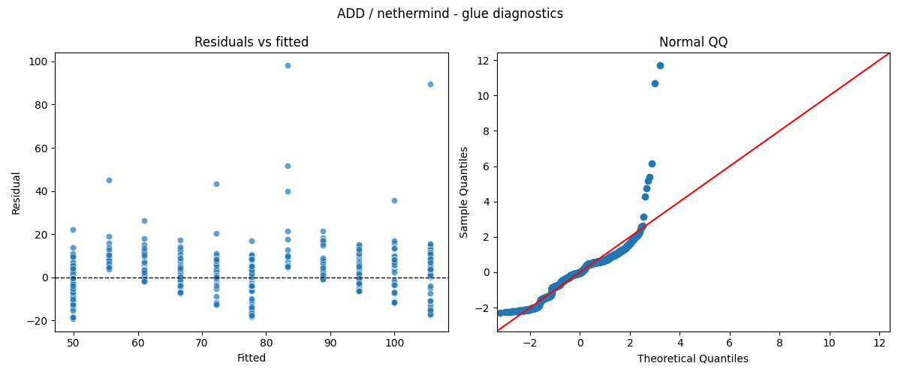

</details>

<details><summary><code>AND</code> · nobs=1518 · runtime_ms=1.024e-06 · p=1.00e-03 · R²=0.5178</summary>

```
==============================================================================
                           NNLS Regression Results                            
==============================================================================
Dep. Variable:          test_runtime_ms              R-squared:          0.518
Model:                  NNLS                    Adj. R-squared:          0.517
No. Observations:       1518                              RMSE:          10.40
Df Residuals:           1516                               MAE:           4.26
Df Model:               1      
==============================================================================
                      coef     std err     P-value      [0.025      0.975]
------------------------------------------------------------------------------
         const     14.4327      0.8379       0.001     13.0526     16.2875
           AND      0.0000      0.0000       0.001      0.0000      0.0000
==============================================================================
Notes: Non-negative least squares with bootstrap inference (1000 iterations)
==============================================================================
```

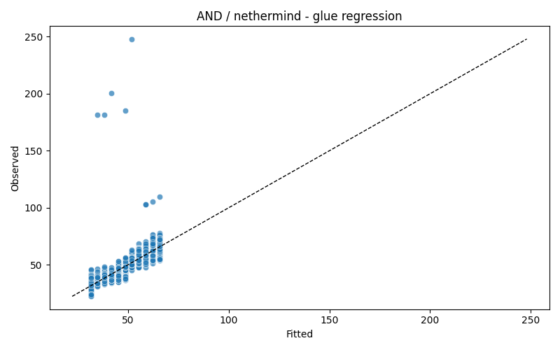

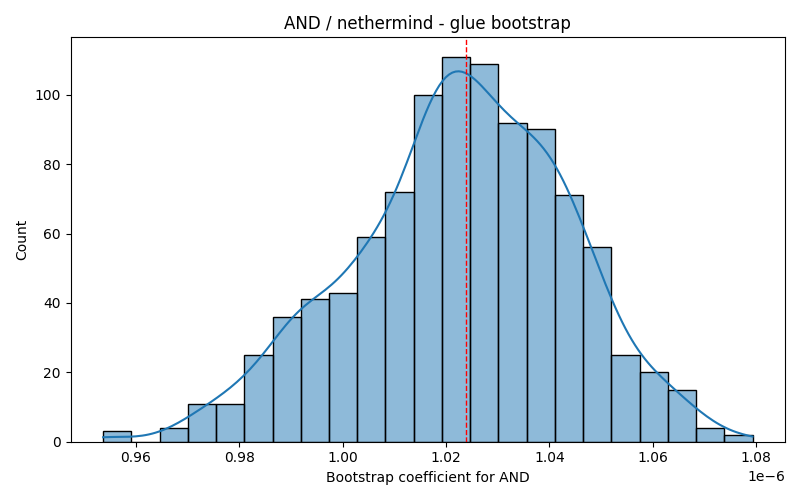

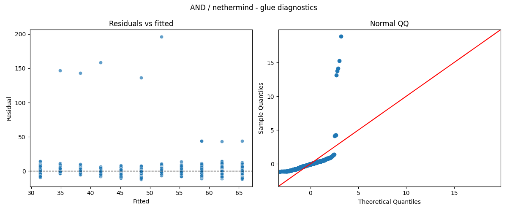

</details>

<details><summary><code>CALLDATACOPY</code> · nobs=36432 · runtime_ms=4.078e-06 · p=1.00e-03 · R²=0.7122</summary>

```
==============================================================================
                           NNLS Regression Results                            
==============================================================================
Dep. Variable:          test_runtime_ms              R-squared:          0.712
Model:                  NNLS                    Adj. R-squared:          0.712
No. Observations:       36432                             RMSE:          19.50
Df Residuals:           36430                              MAE:          15.21
Df Model:               1      
==============================================================================
                      coef     std err     P-value      [0.025      0.975]
------------------------------------------------------------------------------
         const     23.1779      0.1212       0.001     22.9466     23.4050
  CALLDATACOPY      0.0000      0.0000       0.001      0.0000      0.0000
==============================================================================
Notes: Non-negative least squares with bootstrap inference (1000 iterations)
==============================================================================
```

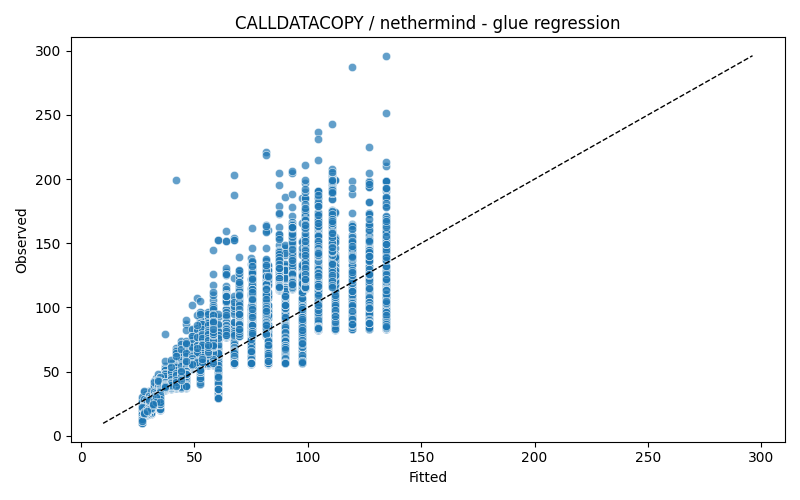

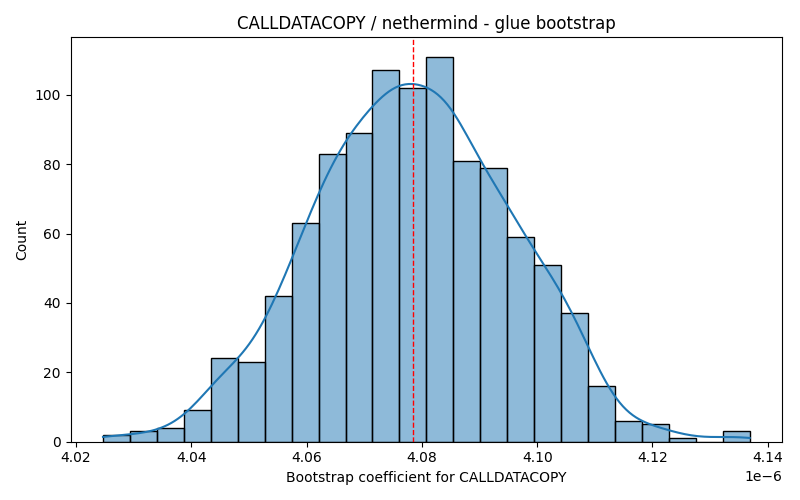

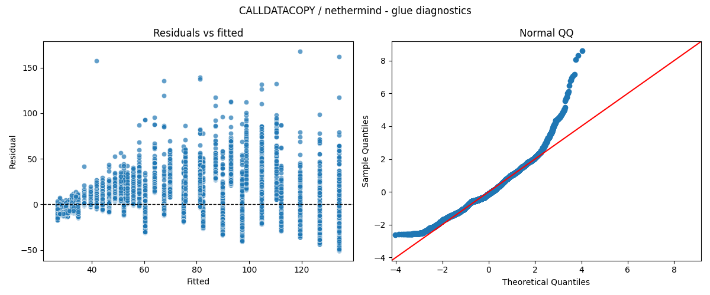

</details>

<details><summary><code>CALLDATALOAD</code> · nobs=6072 · runtime_ms=2.174e-05 · p=2.23e-01 · R²=0.0002218</summary>

```
==============================================================================
                           NNLS Regression Results                            
==============================================================================
Dep. Variable:          test_runtime_ms              R-squared:          0.000
Model:                  NNLS                    Adj. R-squared:          0.000
No. Observations:       6072                              RMSE:           5.60
Df Residuals:           6070                               MAE:           0.44
Df Model:               1      
==============================================================================
                      coef     std err     P-value      [0.025      0.975]
------------------------------------------------------------------------------
         const      2.5148      0.2962       0.001      1.8460      2.8967
  CALLDATALOAD      0.0000      0.0000       0.223      0.0000      0.0001
==============================================================================
Notes: Non-negative least squares with bootstrap inference (1000 iterations)
==============================================================================
```

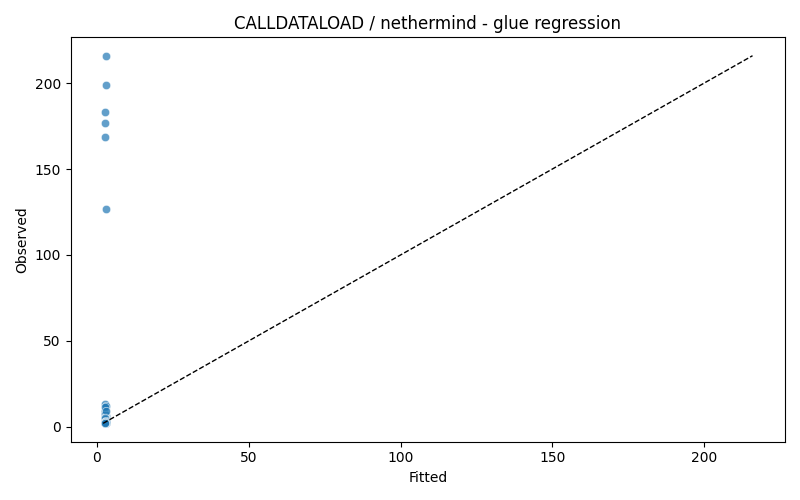

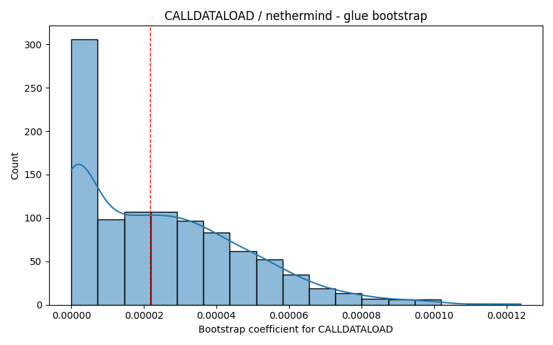

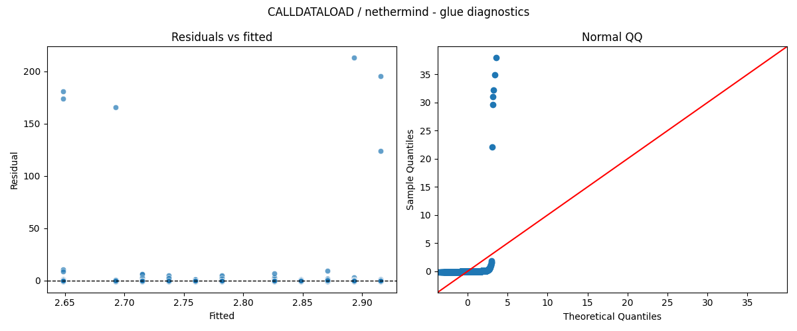

</details>

<details><summary><code>DIV</code> · nobs=1518 · runtime_ms=5.04e-06 · p=1.00e-03 · R²=0.5179</summary>

```
==============================================================================
                           NNLS Regression Results                            
==============================================================================
Dep. Variable:          test_runtime_ms              R-squared:          0.518
Model:                  NNLS                    Adj. R-squared:          0.518
No. Observations:       1518                              RMSE:          38.38
Df Residuals:           1516                               MAE:          30.24
Df Model:               1      
==============================================================================
                      coef     std err     P-value      [0.025      0.975]
------------------------------------------------------------------------------
         const    135.8790      4.3879       0.001    127.2484    144.2876
           DIV      0.0000      0.0000       0.001      0.0000      0.0000
==============================================================================
Notes: Non-negative least squares with bootstrap inference (1000 iterations)
==============================================================================
```

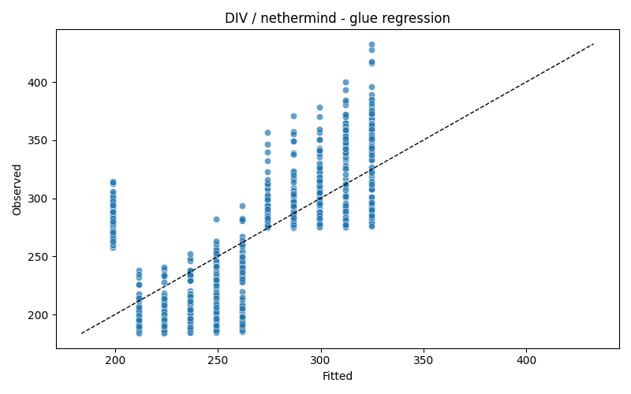

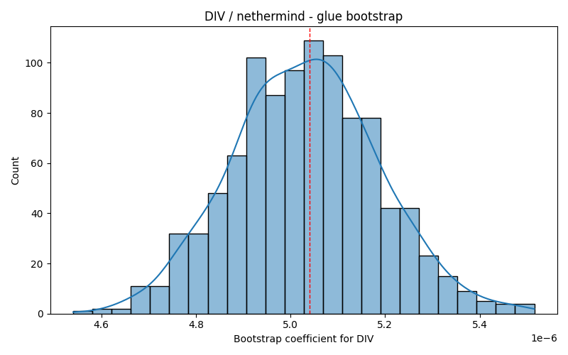

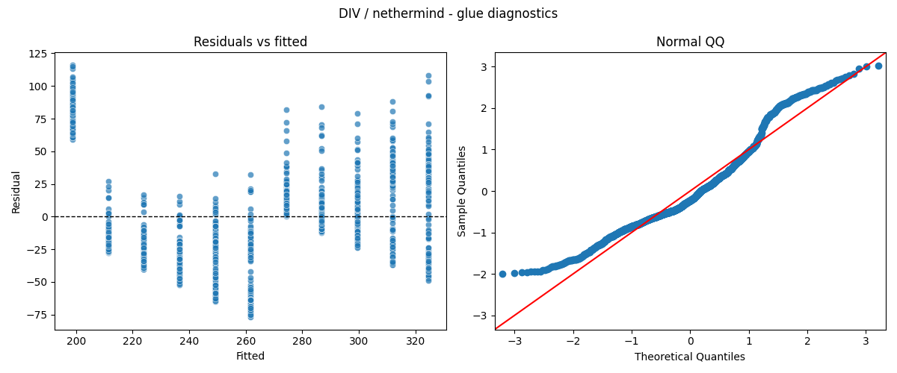

</details>

<details><summary><code>EXP</code> · nobs=1518 · runtime_ms=0 · p=1.00e+00 · R²=0</summary>

```
==============================================================================
                           NNLS Regression Results                            
==============================================================================
Dep. Variable:          test_runtime_ms              R-squared:          0.000
Model:                  NNLS                    Adj. R-squared:         -0.001
No. Observations:       1518                              RMSE:          45.37
Df Residuals:           1516                               MAE:          28.17
Df Model:               1      
==============================================================================
                      coef     std err     P-value      [0.025      0.975]
------------------------------------------------------------------------------
         const     88.9930      1.1413       0.001     86.7714     91.3131
           EXP      0.0000      0.0000       1.000      0.0000      0.0000
==============================================================================
Notes: Non-negative least squares with bootstrap inference (1000 iterations)
==============================================================================
```

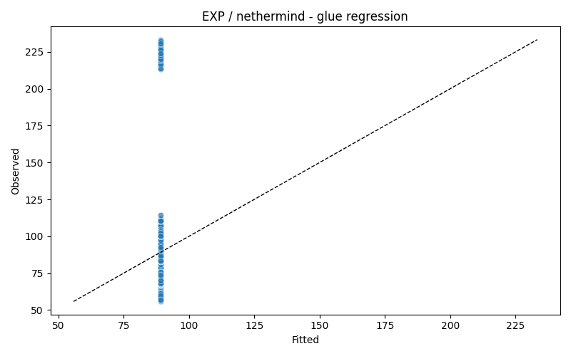


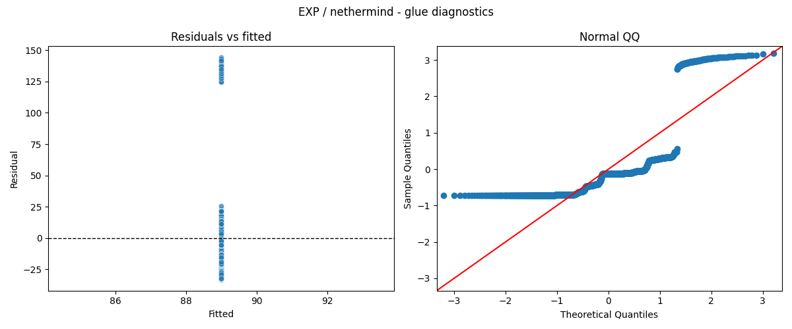

</details>

<details><summary><code>GT</code> · nobs=1518 · runtime_ms=1.582e-06 · p=1.00e-03 · R²=0.3401</summary>

```
==============================================================================
                           NNLS Regression Results                            
==============================================================================
Dep. Variable:          test_runtime_ms              R-squared:          0.340
Model:                  NNLS                    Adj. R-squared:          0.340
No. Observations:       1518                              RMSE:          23.19
Df Residuals:           1516                               MAE:          12.91
Df Model:               1      
==============================================================================
                      coef     std err     P-value      [0.025      0.975]
------------------------------------------------------------------------------
         const     15.9261      1.8154       0.001     12.5928     19.4175
            GT      0.0000      0.0000       0.001      0.0000      0.0000
==============================================================================
Notes: Non-negative least squares with bootstrap inference (1000 iterations)
==============================================================================
```

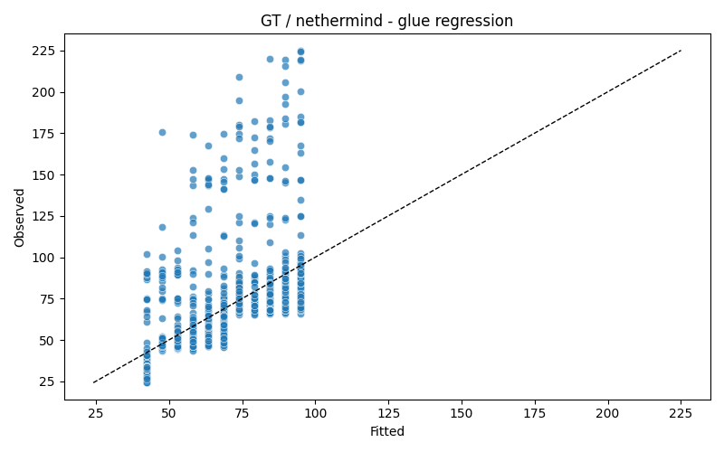

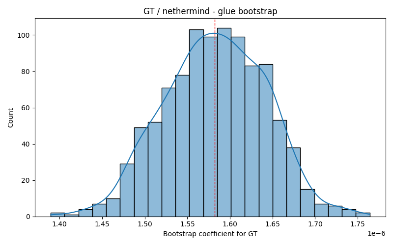

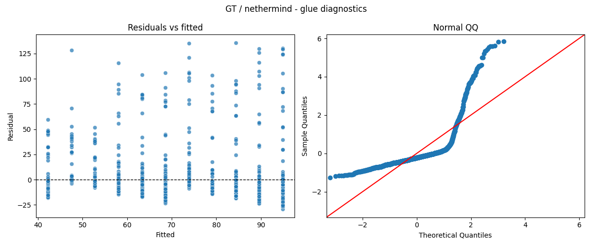

</details>

<details><summary><code>JUMPI</code> · nobs=1518 · runtime_ms=1.819e-06 · p=1.00e-03 · R²=0.7195</summary>

```
==============================================================================
                           NNLS Regression Results                            
==============================================================================
Dep. Variable:          test_runtime_ms              R-squared:          0.719
Model:                  NNLS                    Adj. R-squared:          0.719
No. Observations:       1518                              RMSE:           5.13
Df Residuals:           1516                               MAE:           3.20
Df Model:               1      
==============================================================================
                      coef     std err     P-value      [0.025      0.975]
------------------------------------------------------------------------------
         const      8.3833      0.4051       0.001      7.6000      9.2047
         JUMPI      0.0000      0.0000       0.001      0.0000      0.0000
==============================================================================
Notes: Non-negative least squares with bootstrap inference (1000 iterations)
==============================================================================
```

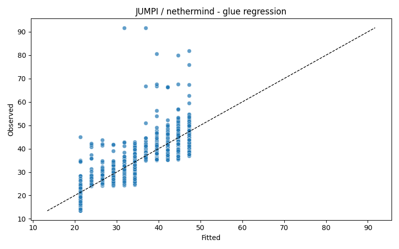

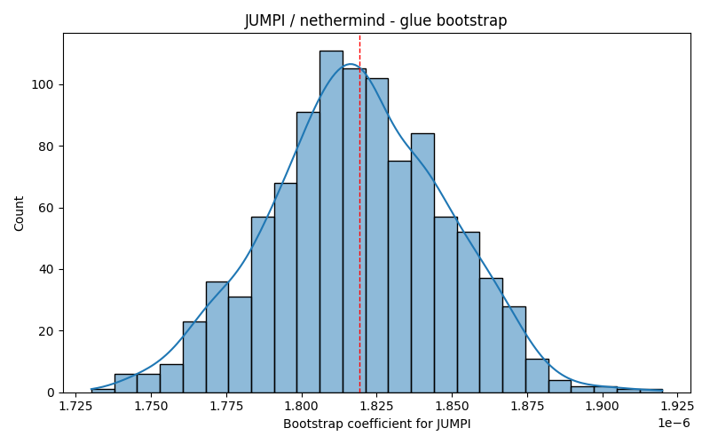

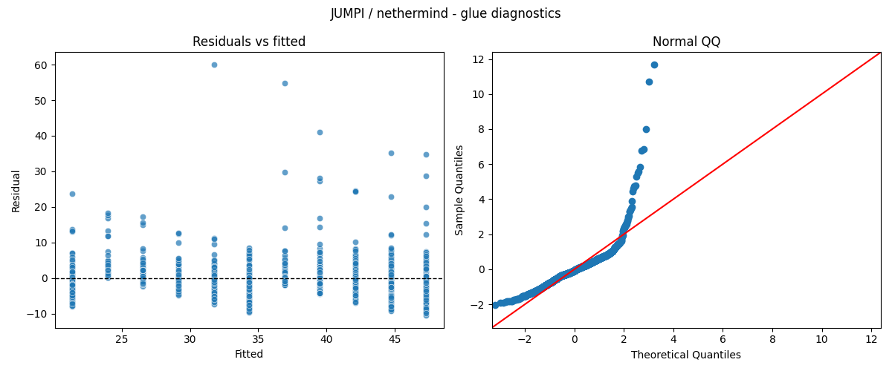

</details>

<details><summary><code>LT</code> · nobs=1518 · runtime_ms=1.542e-06 · p=1.00e-03 · R²=0.3239</summary>

```
==============================================================================
                           NNLS Regression Results                            
==============================================================================
Dep. Variable:          test_runtime_ms              R-squared:          0.324
Model:                  NNLS                    Adj. R-squared:          0.323
No. Observations:       1518                              RMSE:          23.45
Df Residuals:           1516                               MAE:          13.04
Df Model:               1      
==============================================================================
                      coef     std err     P-value      [0.025      0.975]
------------------------------------------------------------------------------
         const     18.6831      1.8403       0.001     14.9858     22.1731
            LT      0.0000      0.0000       0.001      0.0000      0.0000
==============================================================================
Notes: Non-negative least squares with bootstrap inference (1000 iterations)
==============================================================================
```

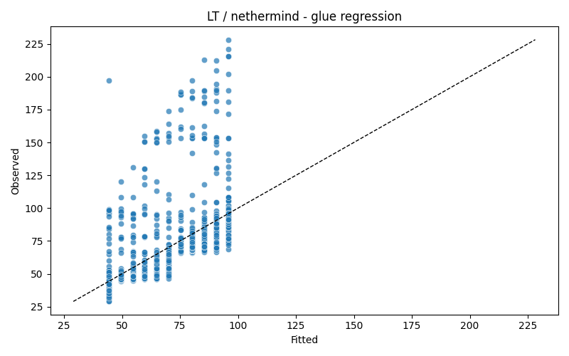

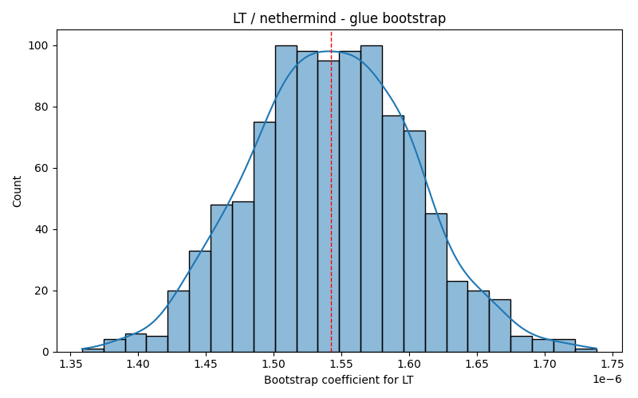

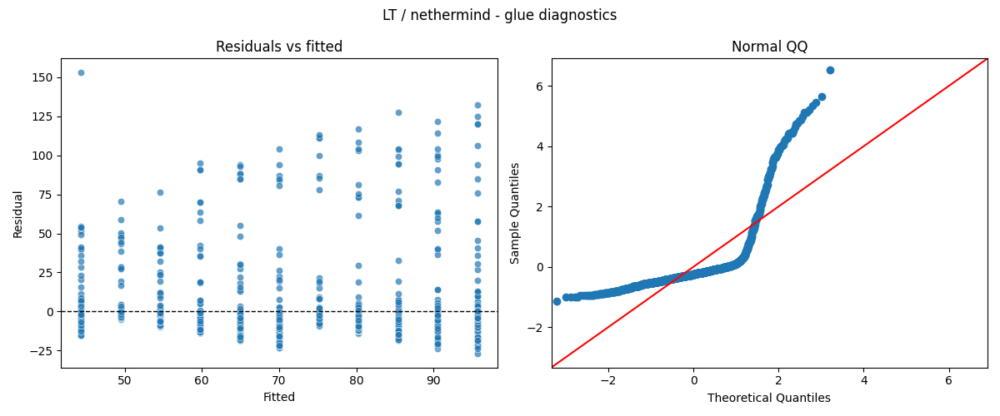

</details>

<details><summary><code>MSTORE</code> · nobs=7590 · runtime_ms=2.122e-06 · p=1.00e-03 · R²=0.6311</summary>

```
==============================================================================
                           NNLS Regression Results                            
==============================================================================
Dep. Variable:          test_runtime_ms              R-squared:          0.631
Model:                  NNLS                    Adj. R-squared:          0.631
No. Observations:       7590                              RMSE:          11.38
Df Residuals:           7588                               MAE:           6.32
Df Model:               1      
==============================================================================
                      coef     std err     P-value      [0.025      0.975]
------------------------------------------------------------------------------
         const     14.6922      0.3938       0.001     13.9123     15.4555
        MSTORE      0.0000      0.0000       0.001      0.0000      0.0000
==============================================================================
Notes: Non-negative least squares with bootstrap inference (1000 iterations)
==============================================================================
```

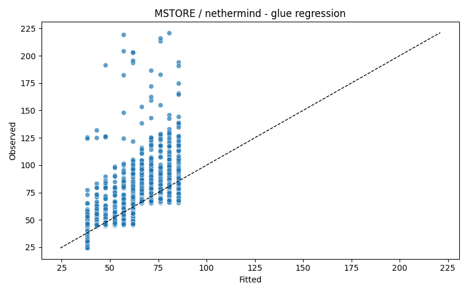

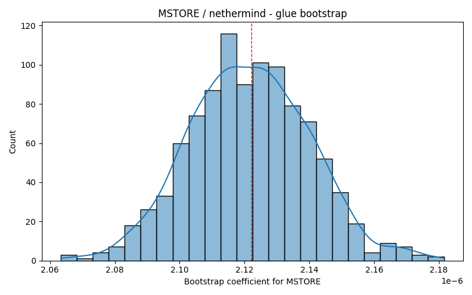

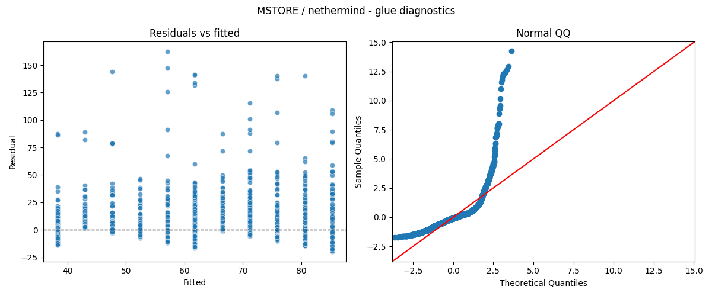

</details>

<details><summary><code>MSTORE8</code> · nobs=7590 · runtime_ms=1.994e-06 · p=1.00e-03 · R²=0.6835</summary>

```
==============================================================================
                           NNLS Regression Results                            
==============================================================================
Dep. Variable:          test_runtime_ms              R-squared:          0.683
Model:                  NNLS                    Adj. R-squared:          0.683
No. Observations:       7590                              RMSE:           9.52
Df Residuals:           7588                               MAE:           5.18
Df Model:               1      
==============================================================================
                      coef     std err     P-value      [0.025      0.975]
------------------------------------------------------------------------------
         const     14.7502      0.3971       0.001     13.9826     15.5470
       MSTORE8      0.0000      0.0000       0.001      0.0000      0.0000
==============================================================================
Notes: Non-negative least squares with bootstrap inference (1000 iterations)
==============================================================================
```

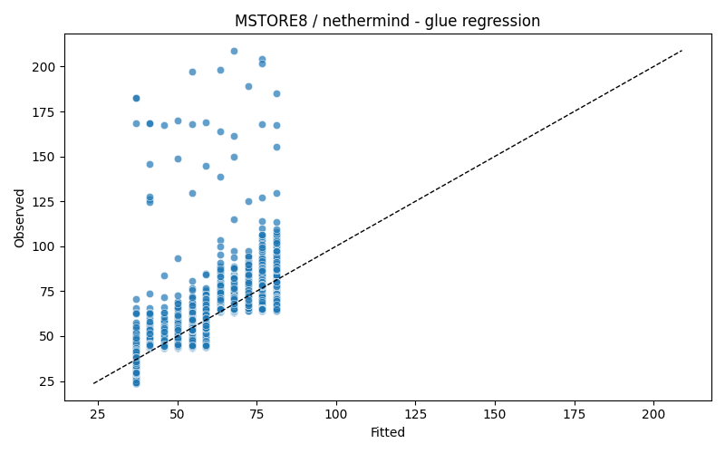

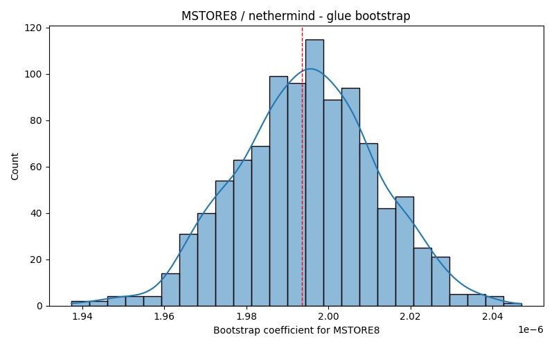

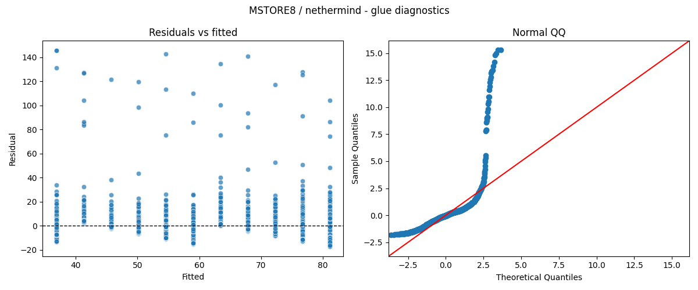

</details>

<details><summary><code>MUL</code> · nobs=1518 · runtime_ms=4.389e-06 · p=1.00e-03 · R²=0.819</summary>

```
==============================================================================
                           NNLS Regression Results                            
==============================================================================
Dep. Variable:          test_runtime_ms              R-squared:          0.819
Model:                  NNLS                    Adj. R-squared:          0.819
No. Observations:       1518                              RMSE:          16.29
Df Residuals:           1516                               MAE:          11.35
Df Model:               1      
==============================================================================
                      coef     std err     P-value      [0.025      0.975]
------------------------------------------------------------------------------
         const     25.8601      1.4153       0.001     23.0704     28.6716
           MUL      0.0000      0.0000       0.001      0.0000      0.0000
==============================================================================
Notes: Non-negative least squares with bootstrap inference (1000 iterations)
==============================================================================
```

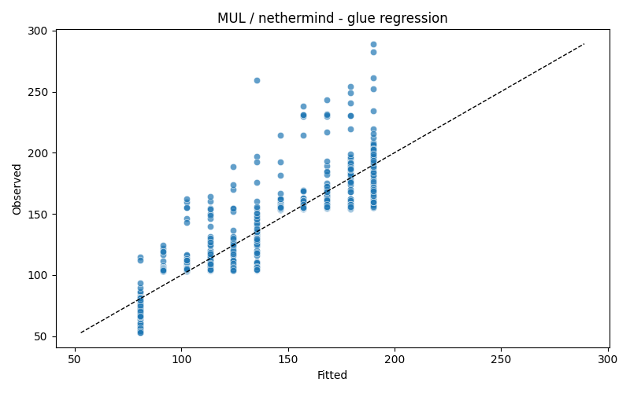

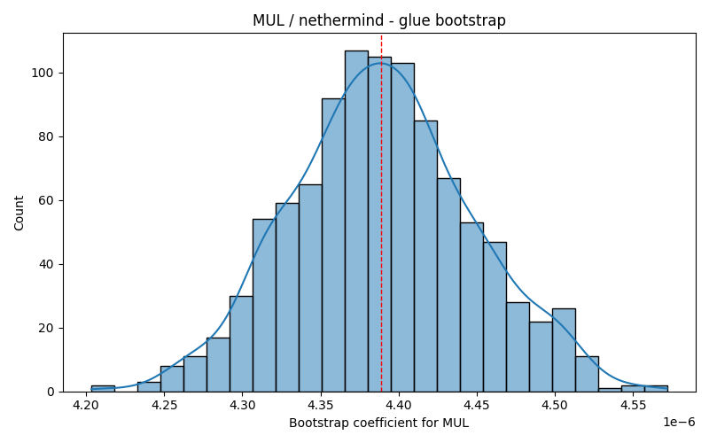

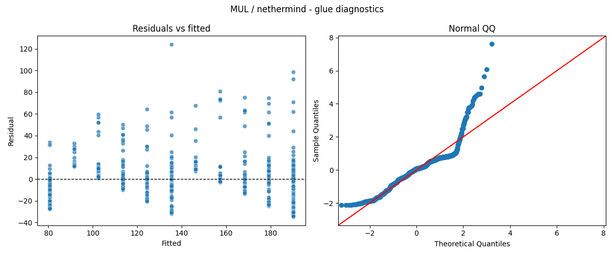

</details>

<details><summary><code>PC</code> · nobs=1518 · runtime_ms=8.02e-07 · p=1.00e-03 · R²=0.8675</summary>

```
==============================================================================
                           NNLS Regression Results                            
==============================================================================
Dep. Variable:          test_runtime_ms              R-squared:          0.868
Model:                  NNLS                    Adj. R-squared:          0.867
No. Observations:       1518                              RMSE:           9.37
Df Residuals:           1516                               MAE:           6.72
Df Model:               1      
==============================================================================
                      coef     std err     P-value      [0.025      0.975]
------------------------------------------------------------------------------
         const     17.0225      0.8457       0.001     15.4588     18.6306
            PC      0.0000      0.0000       0.001      0.0000      0.0000
==============================================================================
Notes: Non-negative least squares with bootstrap inference (1000 iterations)
==============================================================================
```

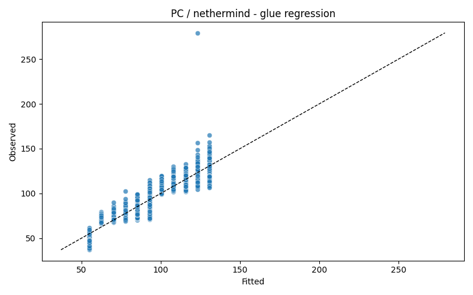

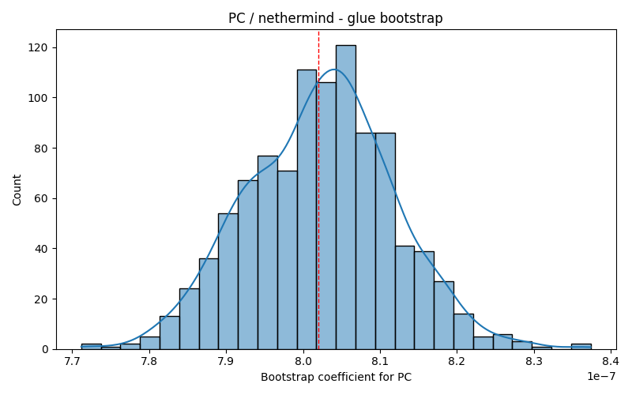

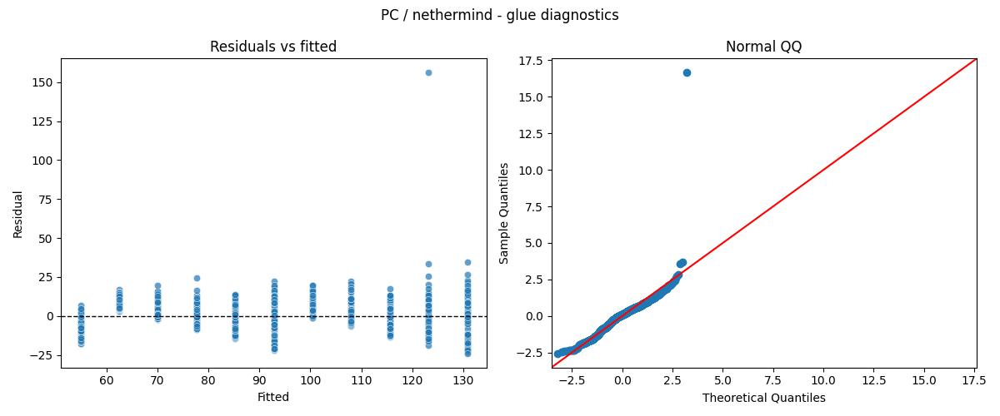

</details>

<details><summary><code>RETURNDATASIZE</code> · nobs=6072 · runtime_ms=7.32e-07 · p=1.00e-03 · R²=0.5437</summary>

```
==============================================================================
                           NNLS Regression Results                            
==============================================================================
Dep. Variable:          test_runtime_ms              R-squared:          0.544
Model:                  NNLS                    Adj. R-squared:          0.544
No. Observations:       6072                              RMSE:          10.59
Df Residuals:           6070                               MAE:           4.77
Df Model:               1      
==============================================================================
                      coef     std err     P-value      [0.025      0.975]
------------------------------------------------------------------------------
         const     13.2581      0.4429       0.001     12.4426     14.1508
RETURNDATASIZE      0.0000      0.0000       0.001      0.0000      0.0000
==============================================================================
Notes: Non-negative least squares with bootstrap inference (1000 iterations)
==============================================================================
```

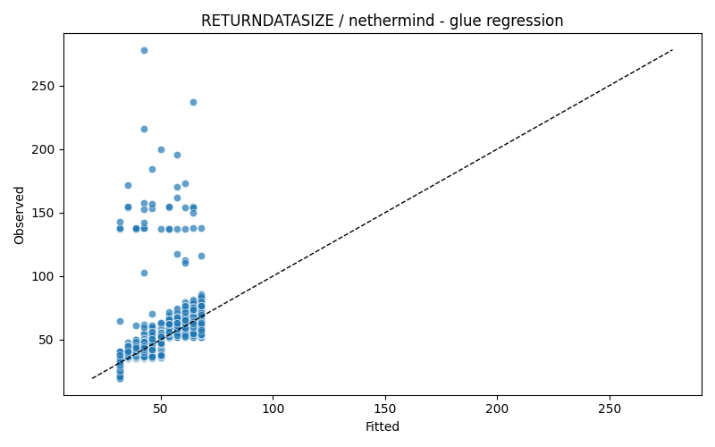

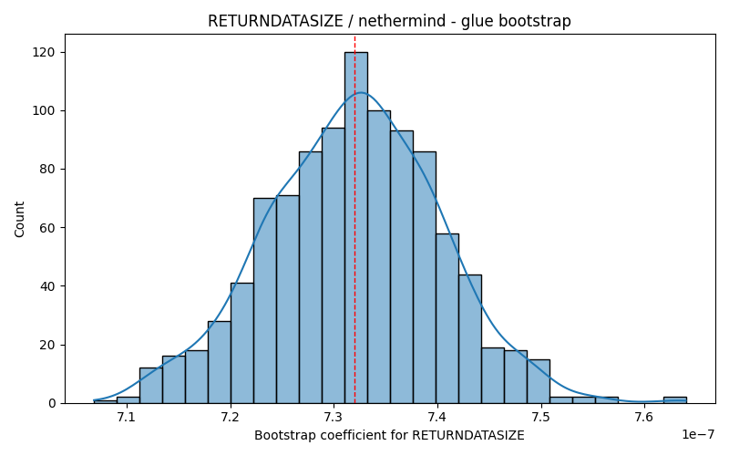

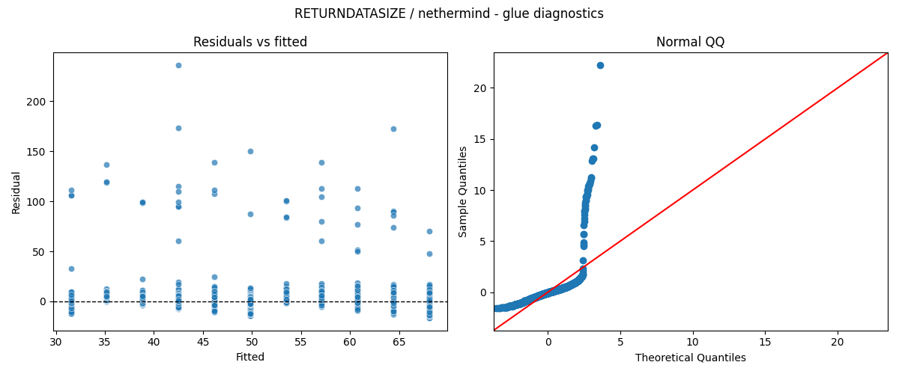

</details>

<details><summary><code>SELFBALANCE</code> · nobs=1242 · runtime_ms=7.964e-06 · p=1.00e-03 · R²=0.7609</summary>

```
==============================================================================
                           NNLS Regression Results                            
==============================================================================
Dep. Variable:          test_runtime_ms              R-squared:          0.761
Model:                  NNLS                    Adj. R-squared:          0.761
No. Observations:       1242                              RMSE:          45.04
Df Residuals:           1240                               MAE:          30.22
Df Model:               1      
==============================================================================
                      coef     std err     P-value      [0.025      0.975]
------------------------------------------------------------------------------
         const     95.4090      5.1347       0.001     85.8202    105.8184
   SELFBALANCE      0.0000      0.0000       0.001      0.0000      0.0000
==============================================================================
Notes: Non-negative least squares with bootstrap inference (1000 iterations)
==============================================================================
```

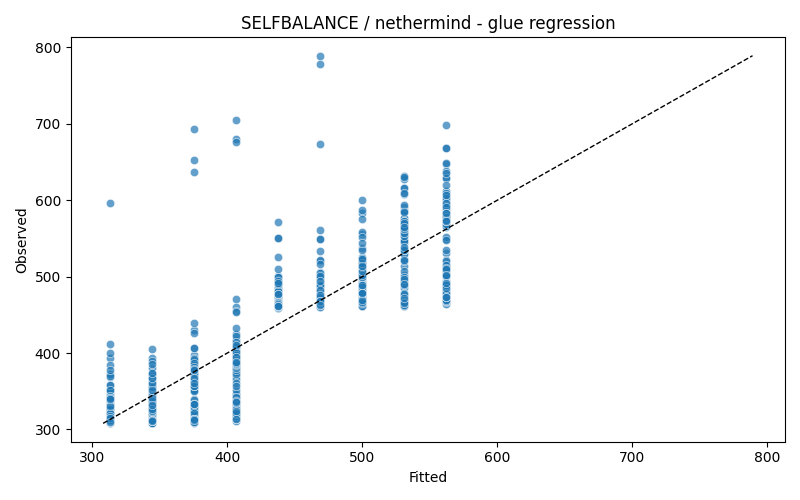

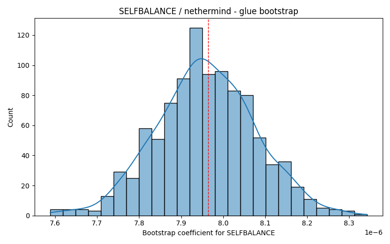

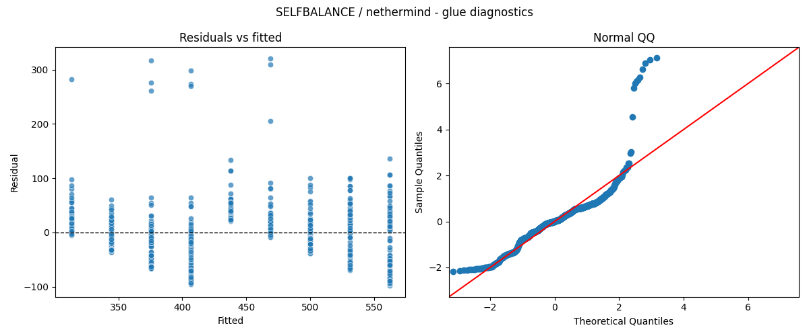

</details>

<details><summary><code>SUB</code> · nobs=1518 · runtime_ms=2.014e-06 · p=1.00e-03 · R²=0.8105</summary>

```
==============================================================================
                           NNLS Regression Results                            
==============================================================================
Dep. Variable:          test_runtime_ms              R-squared:          0.811
Model:                  NNLS                    Adj. R-squared:          0.810
No. Observations:       1518                              RMSE:          10.25
Df Residuals:           1516                               MAE:           6.80
Df Model:               1      
==============================================================================
                      coef     std err     P-value      [0.025      0.975]
------------------------------------------------------------------------------
         const     17.3196      0.8910       0.001     15.6613     19.1330
           SUB      0.0000      0.0000       0.001      0.0000      0.0000
==============================================================================
Notes: Non-negative least squares with bootstrap inference (1000 iterations)
==============================================================================
```

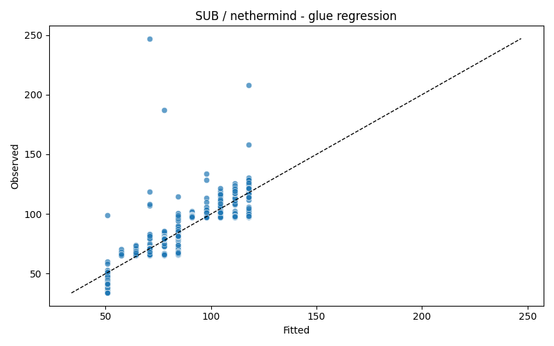

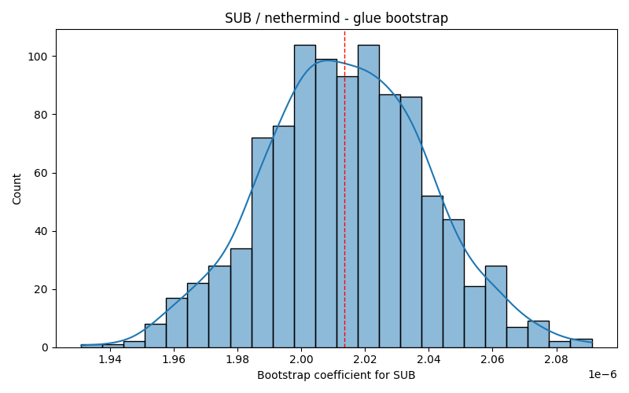

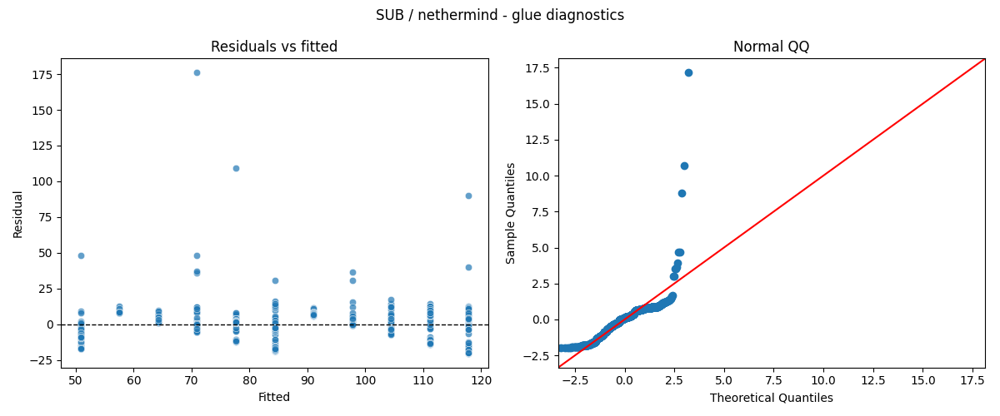

</details>

### Mixed glue (tier B) · nethermind

<details><summary><code>JUMP</code> · nobs=1518 · runtime_ms=5.218e-06 · p=1.00e-03 · R²=0.8214</summary>

```
==============================================================================
                           NNLS Regression Results                            
==============================================================================
Dep. Variable:          test_runtime_ms              R-squared:          0.821
Model:                  NNLS                    Adj. R-squared:          0.821
No. Observations:       1518                              RMSE:           9.04
Df Residuals:           1516                               MAE:           6.29
Df Model:               1      
==============================================================================
                      coef     std err     P-value      [0.025      0.975]
------------------------------------------------------------------------------
         const     16.2576      0.7400       0.001     14.7892     17.6687
          JUMP      0.0000      0.0000       0.001      0.0000      0.0000
==============================================================================
Notes: Non-negative least squares with bootstrap inference (1000 iterations)
==============================================================================
```

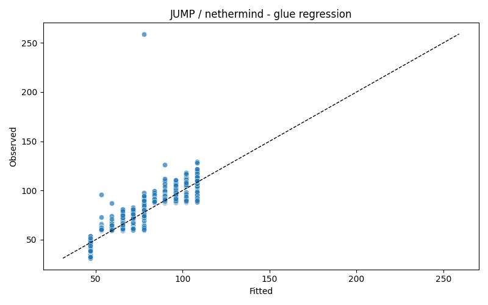

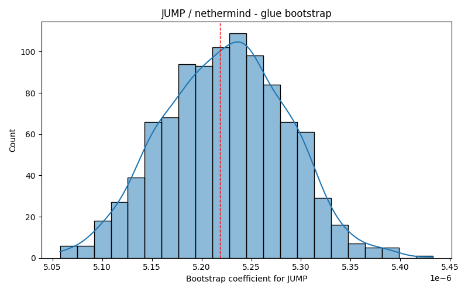

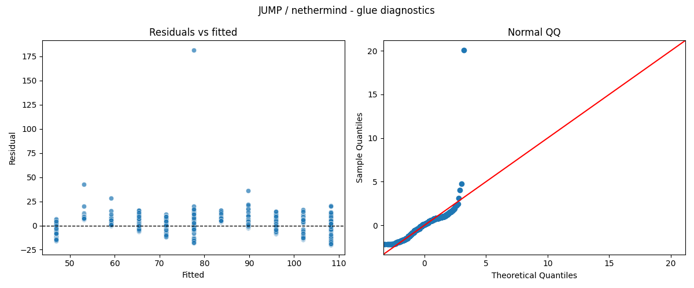

</details>

<details><summary><code>KECCAK256</code> · nobs=24288 · runtime_ms=0 · p=1.00e+00 · R²=0</summary>

```
==============================================================================
                           NNLS Regression Results                            
==============================================================================
Dep. Variable:          test_runtime_ms              R-squared:          0.000
Model:                  NNLS                    Adj. R-squared:         -0.000
No. Observations:       24288                             RMSE:         286.90
Df Residuals:           24286                              MAE:         236.48
Df Model:               1      
==============================================================================
                      coef     std err     P-value      [0.025      0.975]
------------------------------------------------------------------------------
         const    446.0001      1.8186       0.001    442.1929    449.5045
     KECCAK256      0.0000      0.0000       1.000      0.0000      0.0000
==============================================================================
Notes: Non-negative least squares with bootstrap inference (1000 iterations)
==============================================================================
```

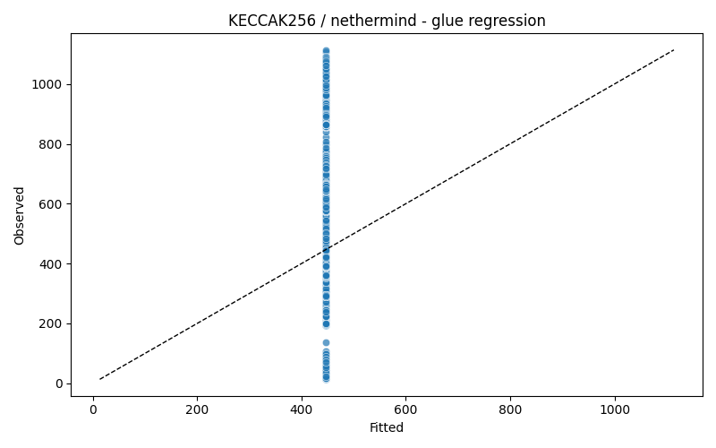


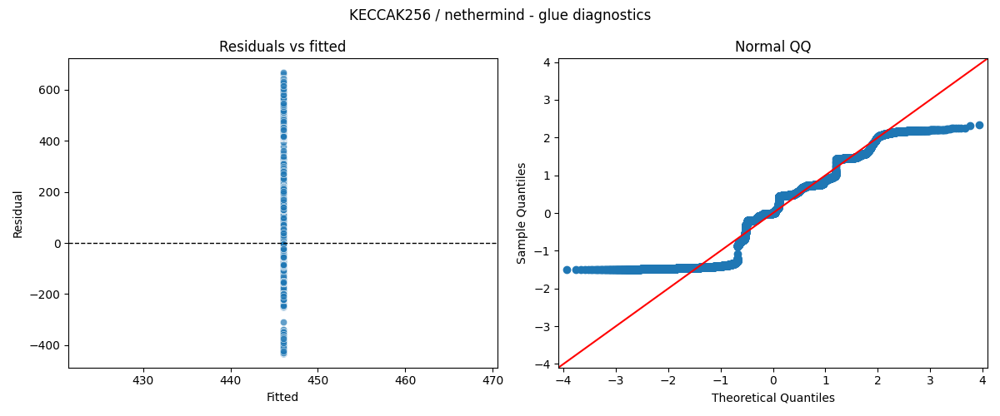

</details>

## reth

| glue_opcode | nobs | glue_runtime_ms | p_value | rsquared |
| --- | --- | --- | --- | --- |
| `ISZERO` | 88 | 3.915e-07 | 1.00e-03 | 0.754 |
| `JUMPDEST` | 88 | 2.926e-07 | 1.00e-03 | 0.698 |
| `SWAP` | 1408 | 4.674e-07 | 1.00e-03 | 0.7762 |
| `CALLDATASIZE` | 5258 | 5.108e-07 | 1.00e-03 | 0.8081 |
| `DUP` | 5258 | 4.311e-07 | 1.00e-03 | 0.8081 |
| `GAS` | 5258 | 4.49e-07 | 1.00e-03 | 0.8081 |
| `MLOAD` | 5258 | 1.63e-06 | 1.00e-03 | 0.8081 |
| `PUSH` | 5258 | 4.625e-07 | 1.00e-03 | 0.8081 |
| `PUSH0` | 5258 | 3.582e-07 | 1.00e-03 | 0.8081 |
| `STATICCALL` | 5258 | 4.625e-05 | 1.00e-03 | 0.8081 |
| `ADD` | 88 | 8.712e-07 | 1.00e-03 | 0.7357 |
| `AND` | 88 | 8.844e-07 | 1.00e-03 | 0.7723 |
| `CALLDATACOPY` | 2112 | 2.267e-06 | 1.00e-03 | 0.8042 |
| `CALLDATALOAD` | 352 | 4.18e-05 | 1.00e-03 | 0.1849 |
| `DIV` | 88 | 6.852e-06 | 1.00e-03 | 0.8592 |
| `EXP` | 88 | 0.0003534 | 1.00e-03 | 0.7629 |
| `GT` | 88 | 9.728e-07 | 1.00e-03 | 0.7785 |
| `JUMPI` | 88 | 1.235e-06 | 1.00e-03 | 0.7261 |
| `LT` | 88 | 9.2e-07 | 1.00e-03 | 0.7969 |
| `MSTORE` | 440 | 2.684e-06 | 1.00e-03 | 0.2671 |
| `MSTORE8` | 440 | 1.296e-06 | 1.00e-03 | 0.5159 |
| `MUL` | 88 | 1.164e-06 | 1.00e-03 | 0.8695 |
| `PC` | 88 | 6.287e-07 | 1.00e-03 | 0.926 |
| `RETURNDATASIZE` | 352 | 8.925e-07 | 1.00e-03 | 0.8354 |
| `SELFBALANCE` | 72 | 3.69e-06 | 1.00e-03 | 0.8369 |
| `SUB` | 88 | 1.088e-06 | 1.00e-03 | 0.7862 |
| `JUMP` | 88 | 2.485e-06 | 1.00e-03 | 0.8 |
| `KECCAK256` | 1408 | 0 | 1.00e+00 | 0 |

### Cycle glue — joint fit · reth

<details><summary>Joint NNLS regression summary</summary>

```
==============================================================================
                           NNLS Regression Results                            
==============================================================================
Dep. Variable:          test_runtime_ms              R-squared:          0.808
Model:                  NNLS                    Adj. R-squared:          0.808
No. Observations:       5258                              RMSE:           7.23
Df Residuals:           5250                               MAE:           5.09
Df Model:               7      
==============================================================================
                      coef     std err     P-value      [0.025      0.975]
------------------------------------------------------------------------------
         const     10.9373      0.3381       0.001     10.2780     11.5859
  CALLDATASIZE      0.0000      0.0000       0.001      0.0000      0.0000
           DUP      0.0000      0.0000       0.001      0.0000      0.0000
           GAS      0.0000      0.0000       0.001      0.0000      0.0000
         MLOAD      0.0000      0.0000       0.001      0.0000      0.0000
          PUSH      0.0000      0.0000       0.001      0.0000      0.0000
         PUSH0      0.0000      0.0000       0.001      0.0000      0.0000
    STATICCALL      0.0000      0.0000       0.001      0.0000      0.0000
==============================================================================
Notes: Non-negative least squares with bootstrap inference (1000 iterations)
==============================================================================
```

</details>

<details><summary><code>CALLDATASIZE</code> · nobs=5258 · runtime_ms=5.108e-07 · p=1.00e-03 · R²=0.8081</summary>


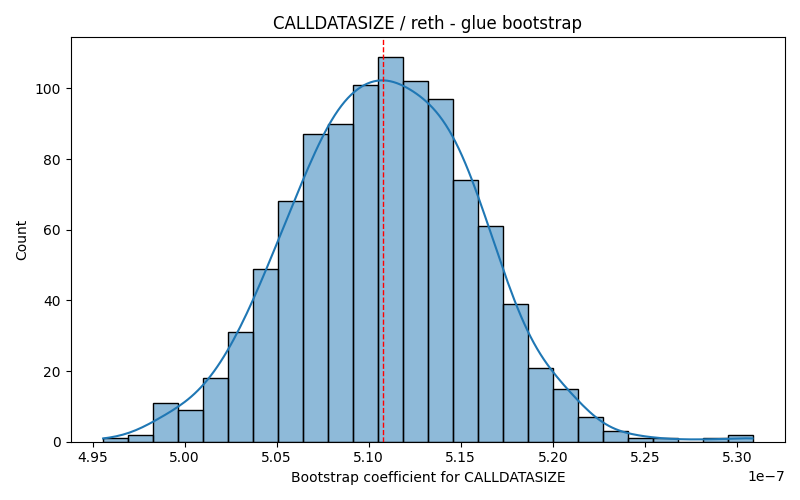

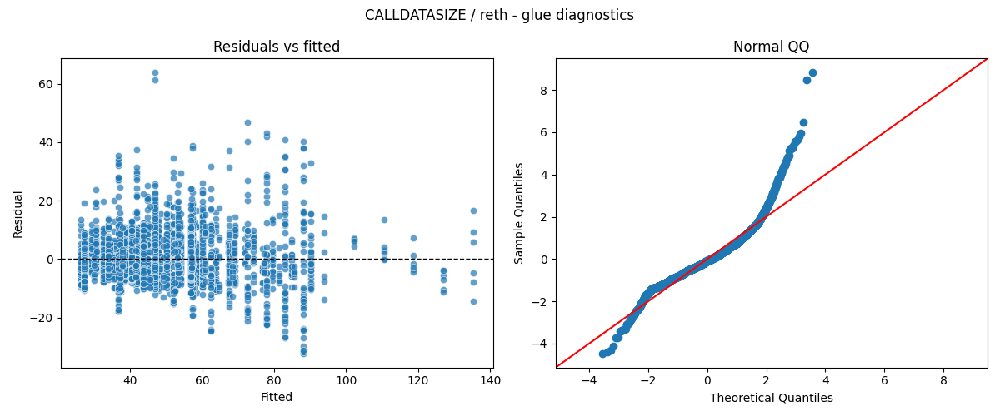

</details>

<details><summary><code>DUP</code> · nobs=5258 · runtime_ms=4.311e-07 · p=1.00e-03 · R²=0.8081</summary>


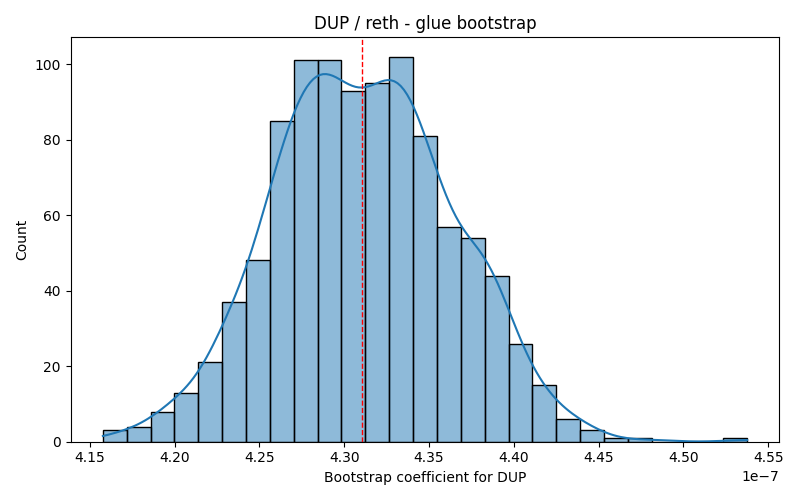


</details>

<details><summary><code>GAS</code> · nobs=5258 · runtime_ms=4.49e-07 · p=1.00e-03 · R²=0.8081</summary>


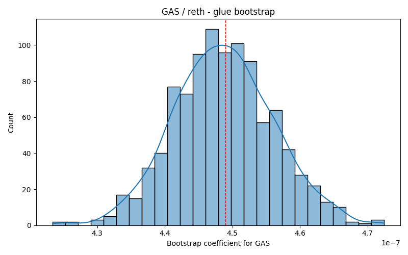


</details>

<details><summary><code>MLOAD</code> · nobs=5258 · runtime_ms=1.63e-06 · p=1.00e-03 · R²=0.8081</summary>

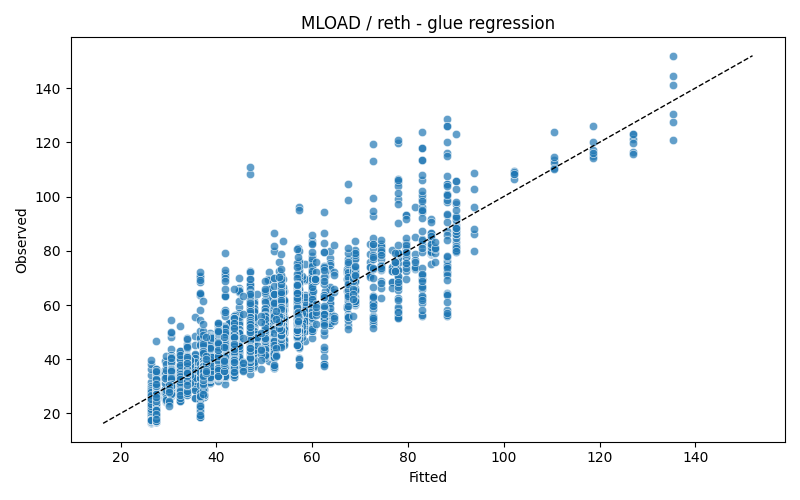

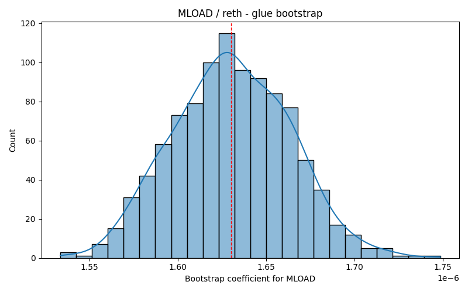

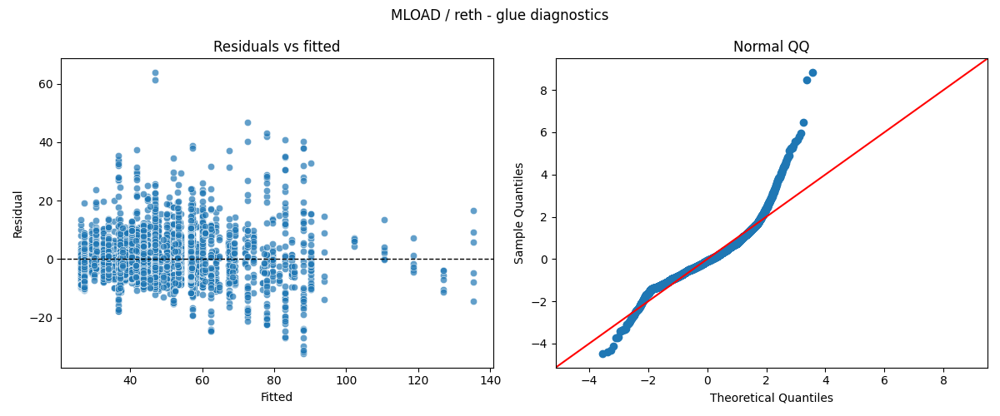

</details>

<details><summary><code>PUSH</code> · nobs=5258 · runtime_ms=4.625e-07 · p=1.00e-03 · R²=0.8081</summary>


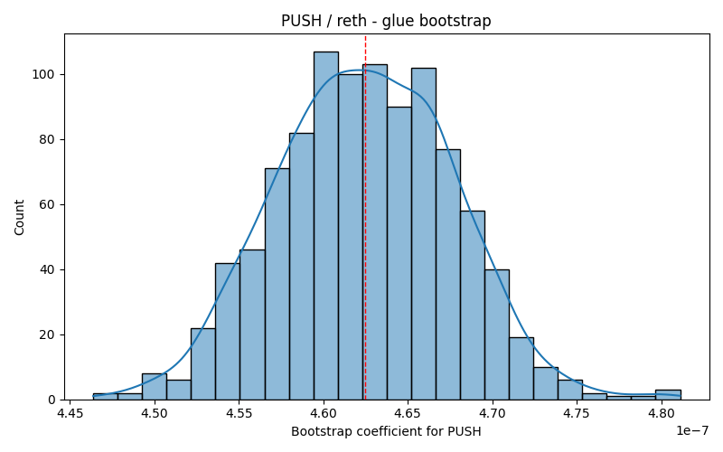


</details>

<details><summary><code>PUSH0</code> · nobs=5258 · runtime_ms=3.582e-07 · p=1.00e-03 · R²=0.8081</summary>


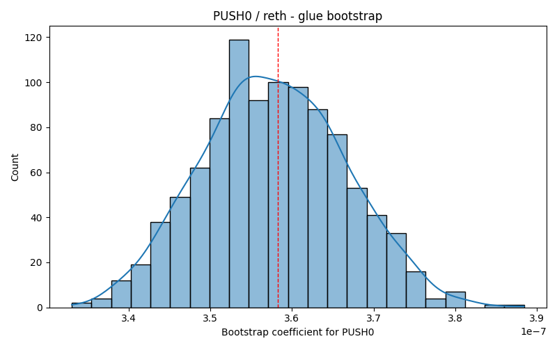

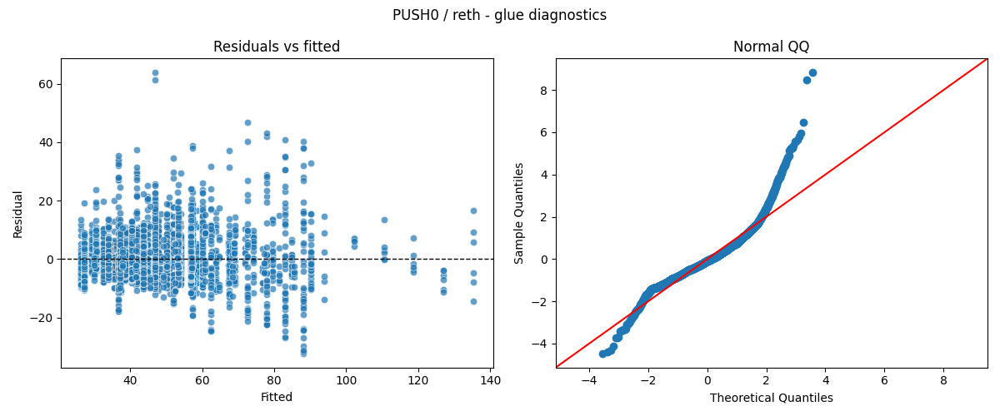

</details>

<details><summary><code>STATICCALL</code> · nobs=5258 · runtime_ms=4.625e-05 · p=1.00e-03 · R²=0.8081</summary>


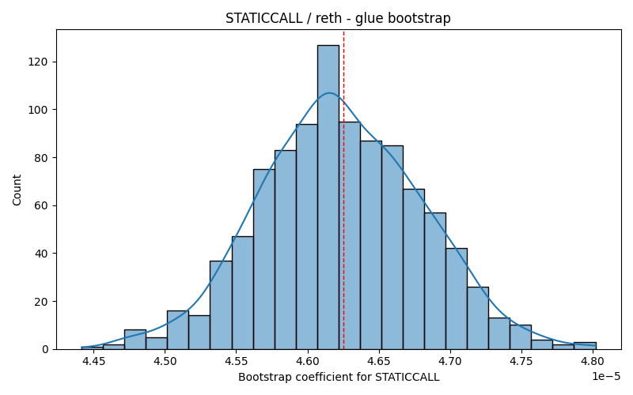


</details>

### Pure glue · reth

<details><summary><code>ISZERO</code> · nobs=88 · runtime_ms=3.915e-07 · p=1.00e-03 · R²=0.754</summary>

```
==============================================================================
                           NNLS Regression Results                            
==============================================================================
Dep. Variable:          test_runtime_ms              R-squared:          0.754
Model:                  NNLS                    Adj. R-squared:          0.751
No. Observations:       88                                RMSE:           4.71
Df Residuals:           86                                 MAE:           3.38
Df Model:               1      
==============================================================================
                      coef     std err     P-value      [0.025      0.975]
------------------------------------------------------------------------------
         const      8.3541      1.4720       0.001      5.5104     11.2791
        ISZERO      0.0000      0.0000       0.001      0.0000      0.0000
==============================================================================
Notes: Non-negative least squares with bootstrap inference (1000 iterations)
==============================================================================
```

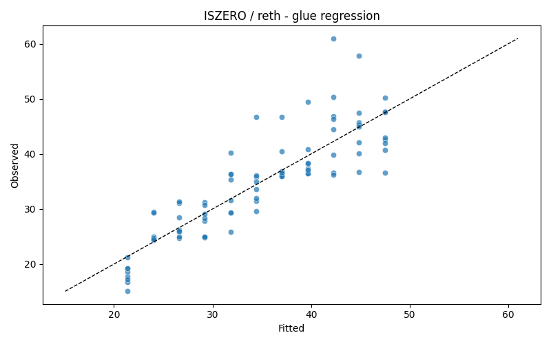

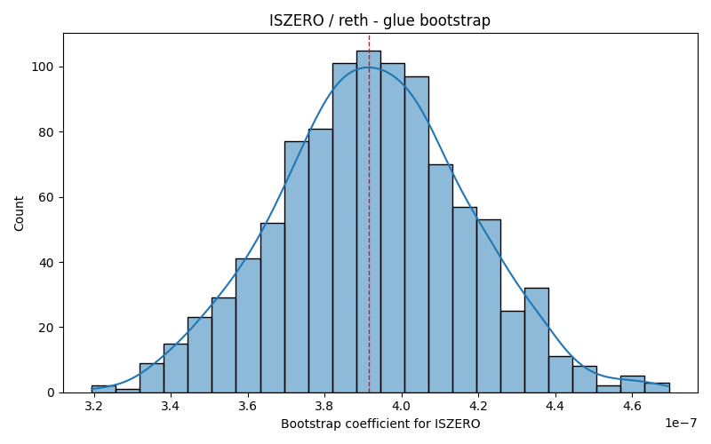

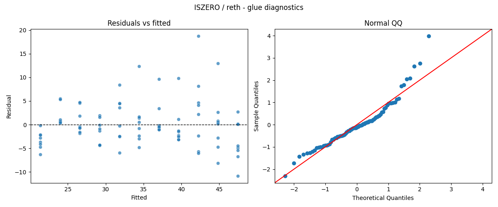

</details>

<details><summary><code>JUMPDEST</code> · nobs=88 · runtime_ms=2.926e-07 · p=1.00e-03 · R²=0.698</summary>

```
==============================================================================
                           NNLS Regression Results                            
==============================================================================
Dep. Variable:          test_runtime_ms              R-squared:          0.698
Model:                  NNLS                    Adj. R-squared:          0.694
No. Observations:       88                                RMSE:          12.15
Df Residuals:           86                                 MAE:           8.70
Df Model:               1      
==============================================================================
                      coef     std err     P-value      [0.025      0.975]
------------------------------------------------------------------------------
         const     15.4127      3.8770       0.001      8.0968     23.1074
      JUMPDEST      0.0000      0.0000       0.001      0.0000      0.0000
==============================================================================
Notes: Non-negative least squares with bootstrap inference (1000 iterations)
==============================================================================
```

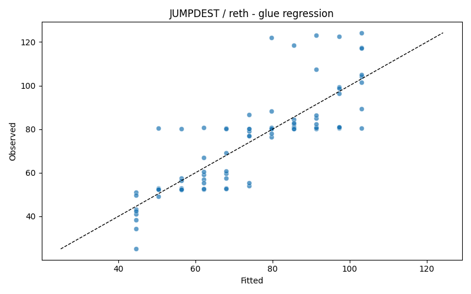

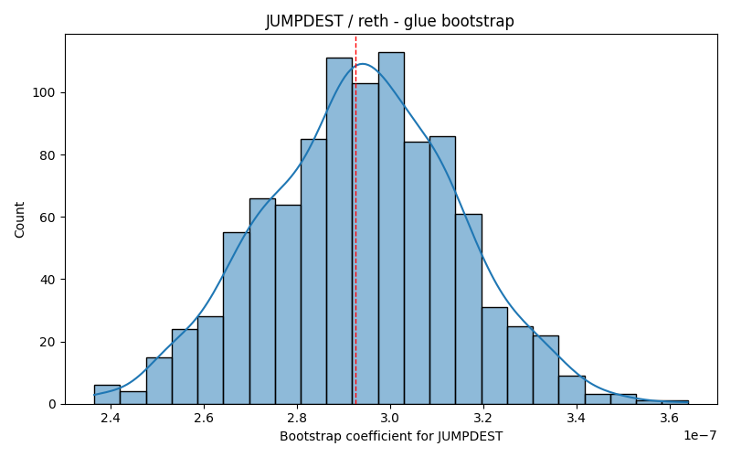

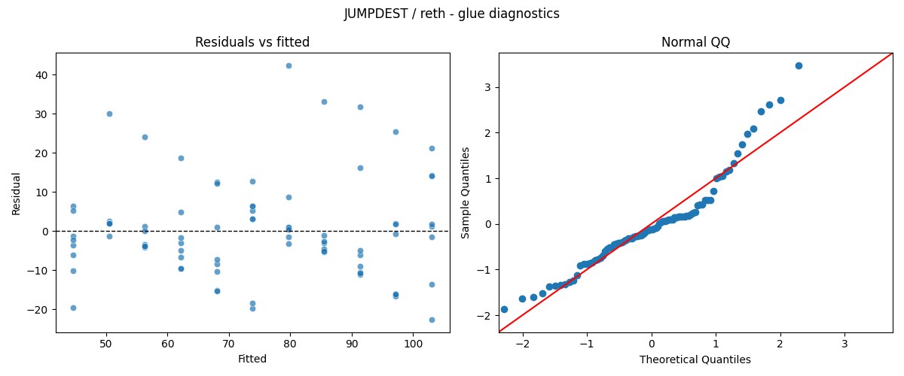

</details>

<details><summary><code>SWAP</code> · nobs=1408 · runtime_ms=4.674e-07 · p=1.00e-03 · R²=0.7762</summary>

```
==============================================================================
                           NNLS Regression Results                            
==============================================================================
Dep. Variable:          test_runtime_ms              R-squared:          0.776
Model:                  NNLS                    Adj. R-squared:          0.776
No. Observations:       1408                              RMSE:           5.28
Df Residuals:           1406                               MAE:           4.04
Df Model:               1      
==============================================================================
                      coef     std err     P-value      [0.025      0.975]
------------------------------------------------------------------------------
         const     11.4787      0.4354       0.001     10.6661     12.3333
          SWAP      0.0000      0.0000       0.001      0.0000      0.0000
==============================================================================
Notes: Non-negative least squares with bootstrap inference (1000 iterations)
==============================================================================
```

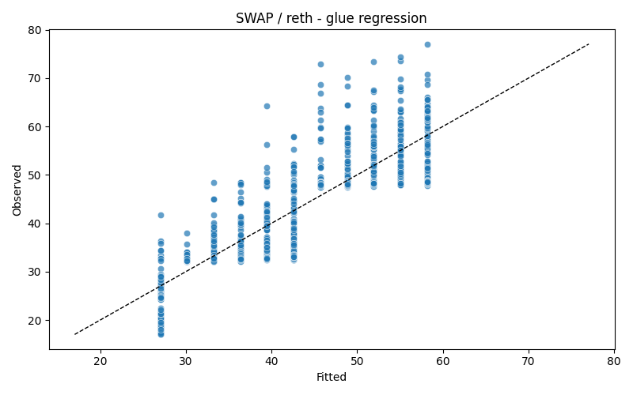

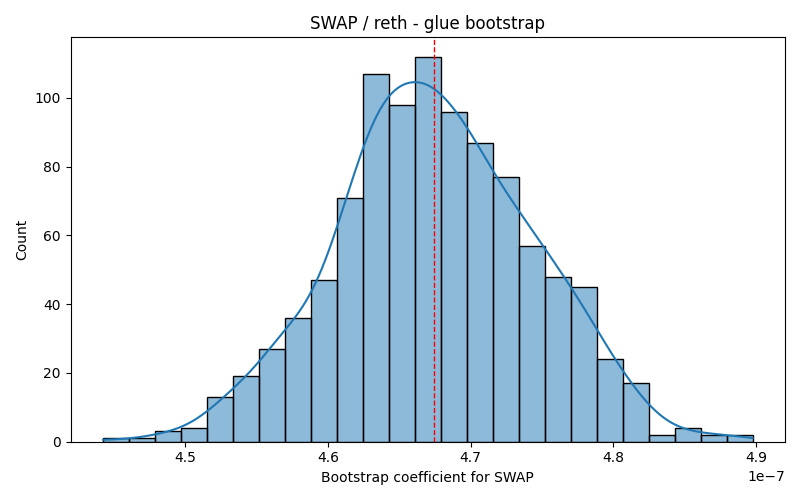

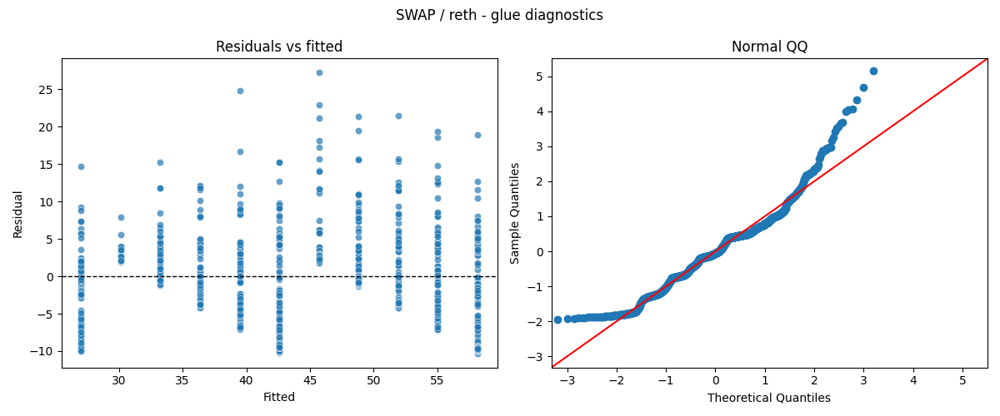

</details>

### Mixed glue (tier A) · reth

<details><summary><code>ADD</code> · nobs=88 · runtime_ms=8.712e-07 · p=1.00e-03 · R²=0.7357</summary>

```
==============================================================================
                           NNLS Regression Results                            
==============================================================================
Dep. Variable:          test_runtime_ms              R-squared:          0.736
Model:                  NNLS                    Adj. R-squared:          0.733
No. Observations:       88                                RMSE:           5.50
Df Residuals:           86                                 MAE:           4.06
Df Model:               1      
==============================================================================
                      coef     std err     P-value      [0.025      0.975]
------------------------------------------------------------------------------
         const     10.5517      1.6881       0.001      7.2628     13.8205
           ADD      0.0000      0.0000       0.001      0.0000      0.0000
==============================================================================
Notes: Non-negative least squares with bootstrap inference (1000 iterations)
==============================================================================
```

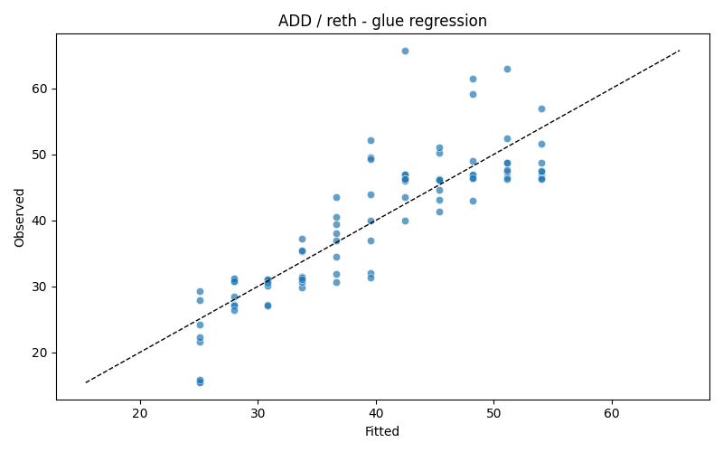

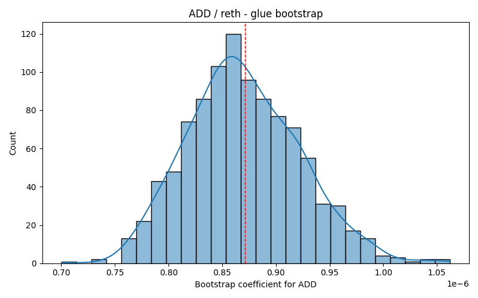

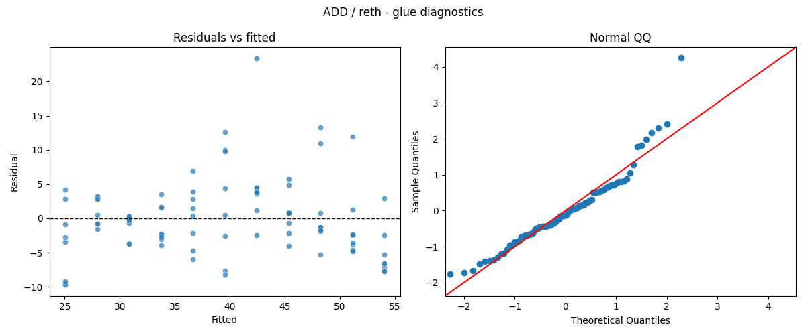

</details>

<details><summary><code>AND</code> · nobs=88 · runtime_ms=8.844e-07 · p=1.00e-03 · R²=0.7723</summary>

```
==============================================================================
                           NNLS Regression Results                            
==============================================================================
Dep. Variable:          test_runtime_ms              R-squared:          0.772
Model:                  NNLS                    Adj. R-squared:          0.770
No. Observations:       88                                RMSE:           5.05
Df Residuals:           86                                 MAE:           3.73
Df Model:               1      
==============================================================================
                      coef     std err     P-value      [0.025      0.975]
------------------------------------------------------------------------------
         const     10.3785      1.4280       0.001      7.4725     13.0018
           AND      0.0000      0.0000       0.001      0.0000      0.0000
==============================================================================
Notes: Non-negative least squares with bootstrap inference (1000 iterations)
==============================================================================
```

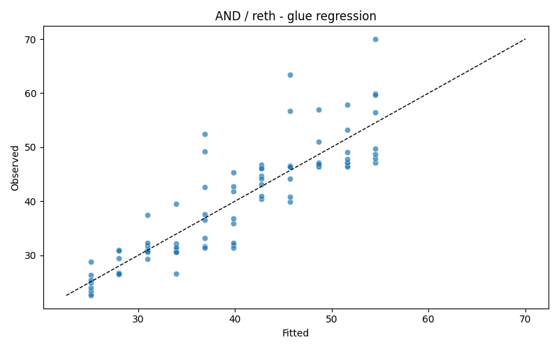

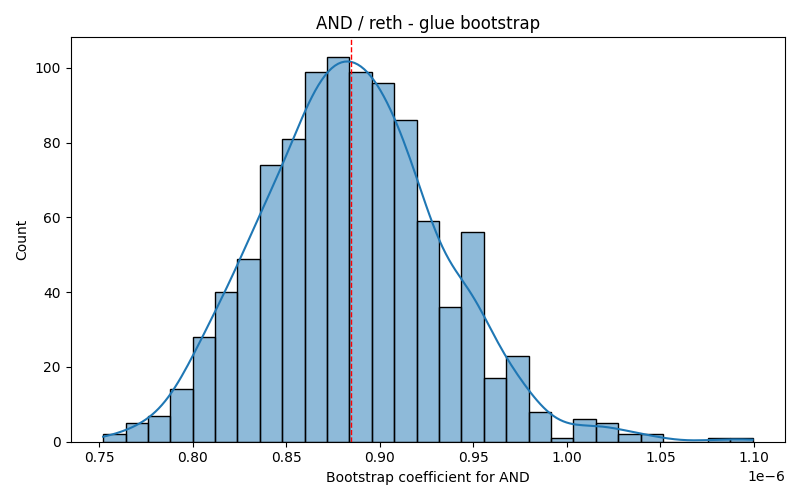

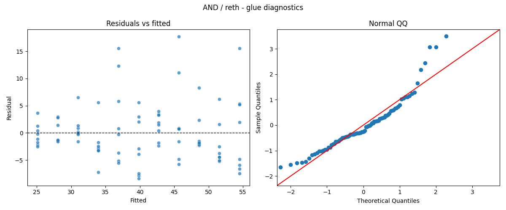

</details>

<details><summary><code>CALLDATACOPY</code> · nobs=2112 · runtime_ms=2.267e-06 · p=1.00e-03 · R²=0.8042</summary>

```
==============================================================================
                           NNLS Regression Results                            
==============================================================================
Dep. Variable:          test_runtime_ms              R-squared:          0.804
Model:                  NNLS                    Adj. R-squared:          0.804
No. Observations:       2112                              RMSE:           8.41
Df Residuals:           2110                               MAE:           6.50
Df Model:               1      
==============================================================================
                      coef     std err     P-value      [0.025      0.975]
------------------------------------------------------------------------------
         const     12.3846      0.2217       0.001     11.9322     12.8063
  CALLDATACOPY      0.0000      0.0000       0.001      0.0000      0.0000
==============================================================================
Notes: Non-negative least squares with bootstrap inference (1000 iterations)
==============================================================================
```

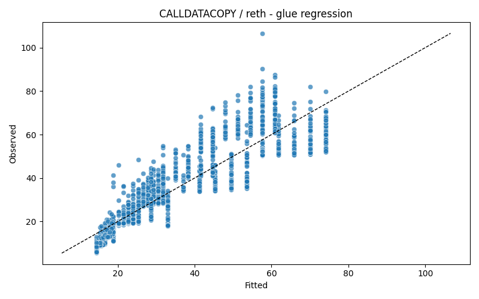

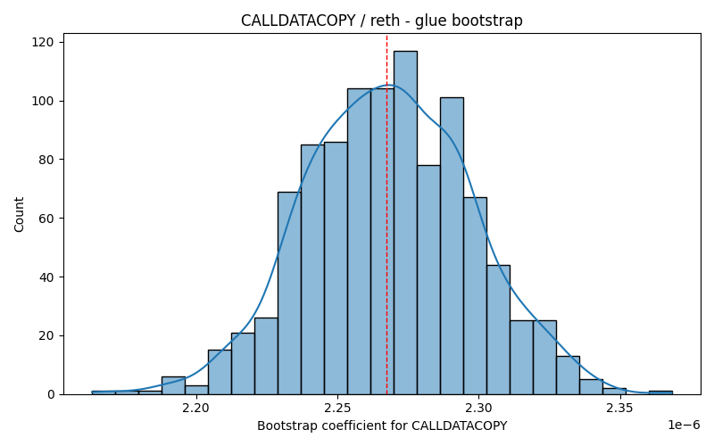

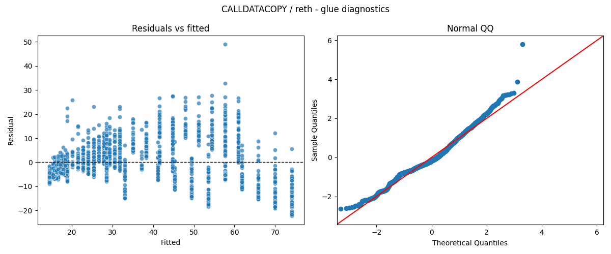

</details>

<details><summary><code>CALLDATALOAD</code> · nobs=352 · runtime_ms=4.18e-05 · p=1.00e-03 · R²=0.1849</summary>

```
==============================================================================
                           NNLS Regression Results                            
==============================================================================
Dep. Variable:          test_runtime_ms              R-squared:          0.185
Model:                  NNLS                    Adj. R-squared:          0.183
No. Observations:       352                               RMSE:           0.34
Df Residuals:           350                                MAE:           0.16
Df Model:               1      
==============================================================================
                      coef     std err     P-value      [0.025      0.975]
------------------------------------------------------------------------------
         const      1.2249      0.0630       0.001      1.1239      1.3568
  CALLDATALOAD      0.0000      0.0000       0.001      0.0000      0.0000
==============================================================================
Notes: Non-negative least squares with bootstrap inference (1000 iterations)
==============================================================================
```

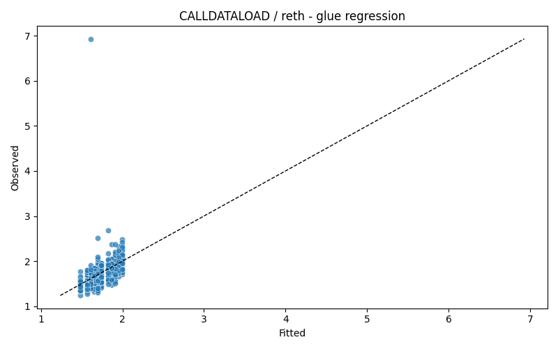

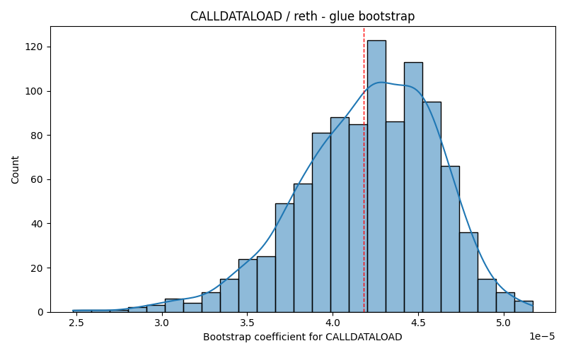

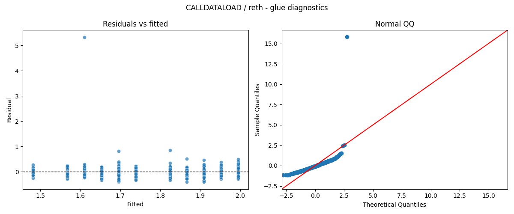

</details>

<details><summary><code>DIV</code> · nobs=88 · runtime_ms=6.852e-06 · p=1.00e-03 · R²=0.8592</summary>

```
==============================================================================
                           NNLS Regression Results                            
==============================================================================
Dep. Variable:          test_runtime_ms              R-squared:          0.859
Model:                  NNLS                    Adj. R-squared:          0.858
No. Observations:       88                                RMSE:          21.90
Df Residuals:           86                                 MAE:          18.20
Df Model:               1      
==============================================================================
                      coef     std err     P-value      [0.025      0.975]
------------------------------------------------------------------------------
         const     61.9772      8.8403       0.001     44.8555     78.9668
           DIV      0.0000      0.0000       0.001      0.0000      0.0000
==============================================================================
Notes: Non-negative least squares with bootstrap inference (1000 iterations)
==============================================================================
```

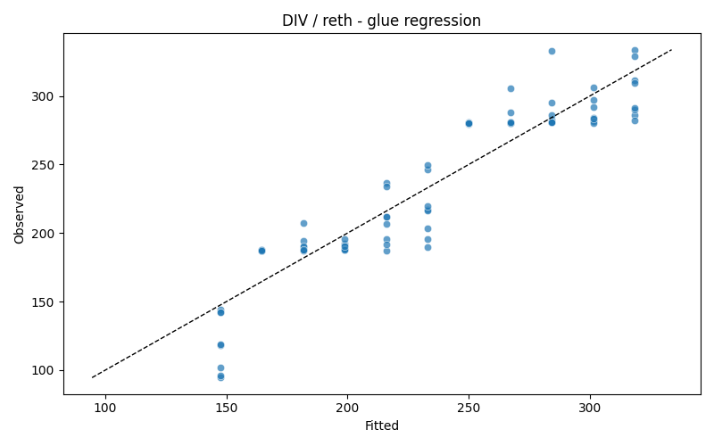

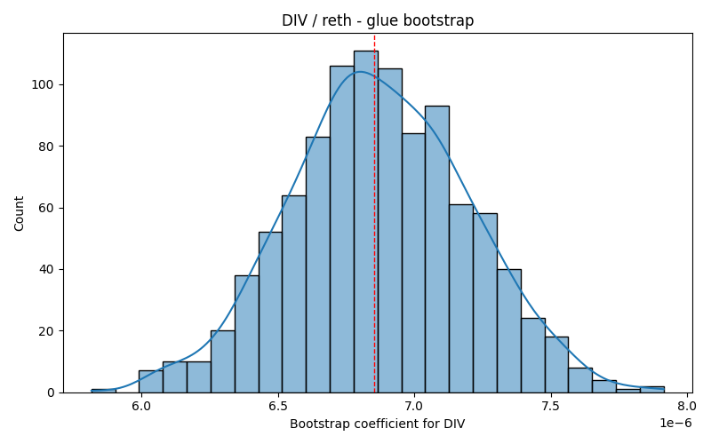

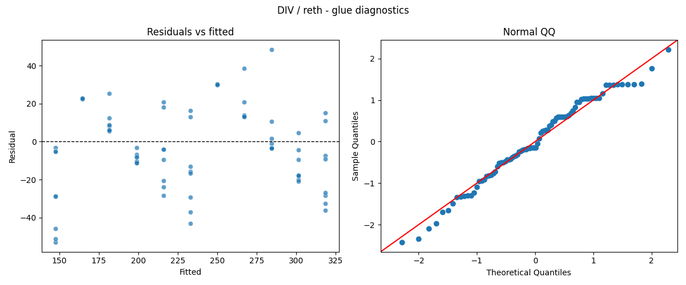

</details>

<details><summary><code>EXP</code> · nobs=88 · runtime_ms=0.0003534 · p=1.00e-03 · R²=0.7629</summary>

```
==============================================================================
                           NNLS Regression Results                            
==============================================================================
Dep. Variable:          test_runtime_ms              R-squared:          0.763
Model:                  NNLS                    Adj. R-squared:          0.760
No. Observations:       88                                RMSE:           7.71
Df Residuals:           86                                 MAE:           5.80
Df Model:               1      
==============================================================================
                      coef     std err     P-value      [0.025      0.975]
------------------------------------------------------------------------------
         const     19.3541      2.7512       0.001     13.5764     24.5531
           EXP      0.0004      0.0000       0.001      0.0003      0.0004
==============================================================================
Notes: Non-negative least squares with bootstrap inference (1000 iterations)
==============================================================================
```

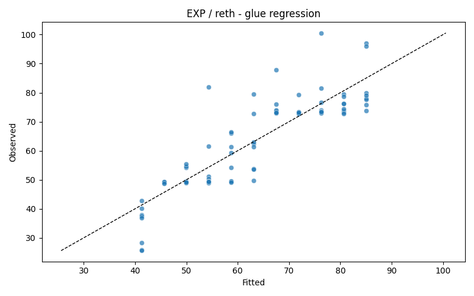

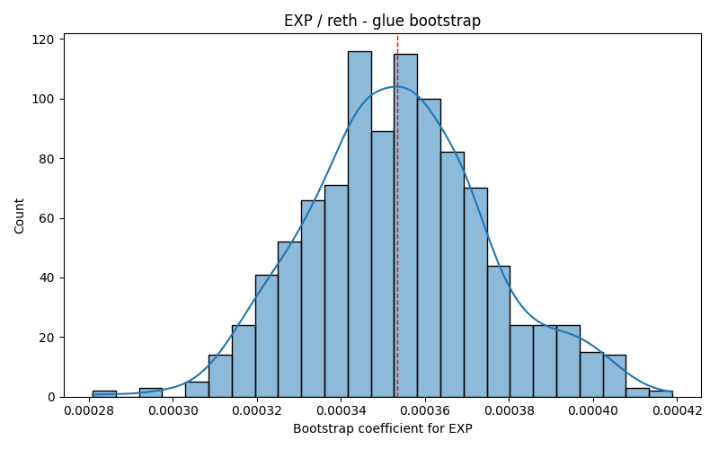

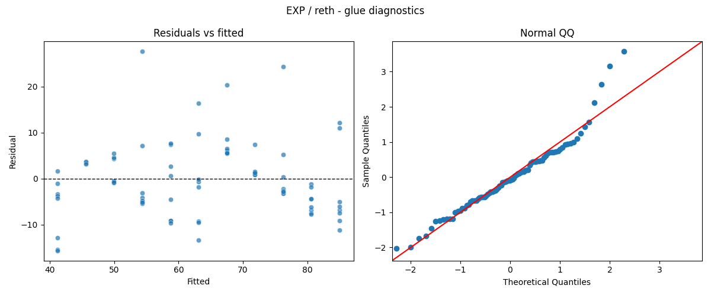

</details>

<details><summary><code>GT</code> · nobs=88 · runtime_ms=9.728e-07 · p=1.00e-03 · R²=0.7785</summary>

```
==============================================================================
                           NNLS Regression Results                            
==============================================================================
Dep. Variable:          test_runtime_ms              R-squared:          0.778
Model:                  NNLS                    Adj. R-squared:          0.776
No. Observations:       88                                RMSE:           5.46
Df Residuals:           86                                 MAE:           3.82
Df Model:               1      
==============================================================================
                      coef     std err     P-value      [0.025      0.975]
------------------------------------------------------------------------------
         const     11.2786      1.8492       0.001      7.8092     15.0145
            GT      0.0000      0.0000       0.001      0.0000      0.0000
==============================================================================
Notes: Non-negative least squares with bootstrap inference (1000 iterations)
==============================================================================
```

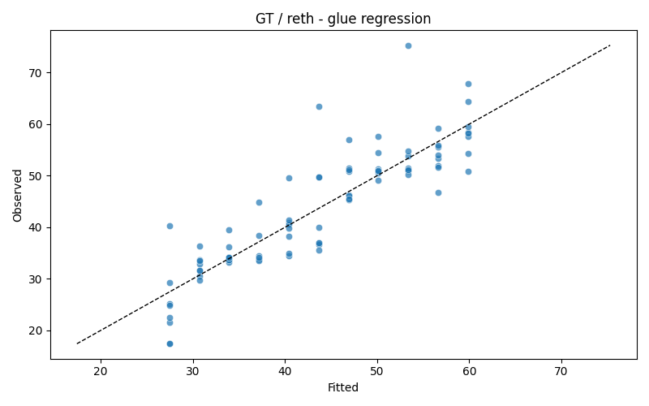

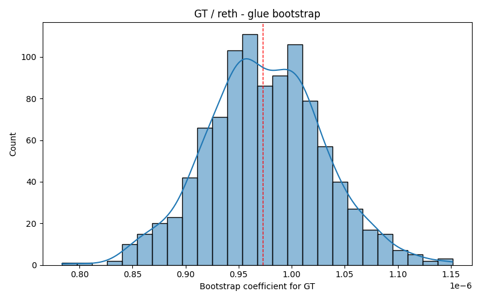

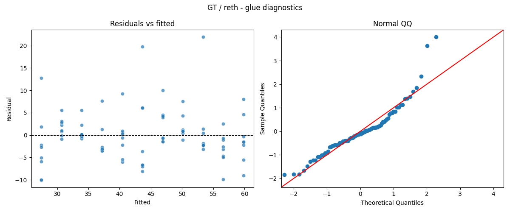

</details>

<details><summary><code>JUMPI</code> · nobs=88 · runtime_ms=1.235e-06 · p=1.00e-03 · R²=0.7261</summary>

```
==============================================================================
                           NNLS Regression Results                            
==============================================================================
Dep. Variable:          test_runtime_ms              R-squared:          0.726
Model:                  NNLS                    Adj. R-squared:          0.723
No. Observations:       88                                RMSE:           3.42
Df Residuals:           86                                 MAE:           2.50
Df Model:               1      
==============================================================================
                      coef     std err     P-value      [0.025      0.975]
------------------------------------------------------------------------------
         const      6.8809      1.2137       0.001      4.5761      9.2581
         JUMPI      0.0000      0.0000       0.001      0.0000      0.0000
==============================================================================
Notes: Non-negative least squares with bootstrap inference (1000 iterations)
==============================================================================
```

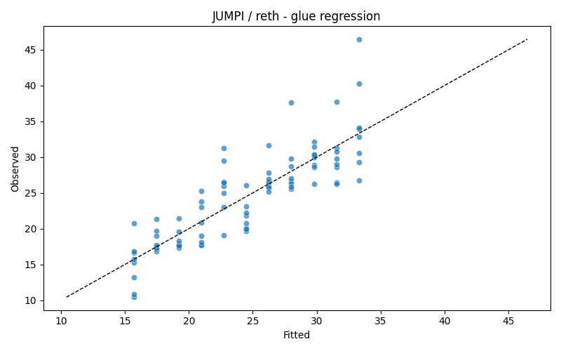

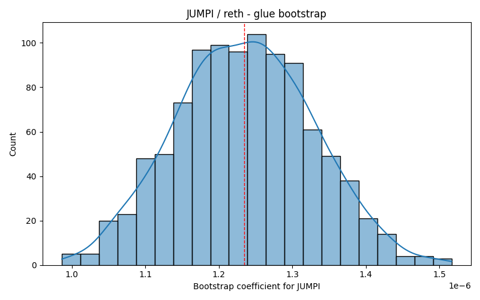

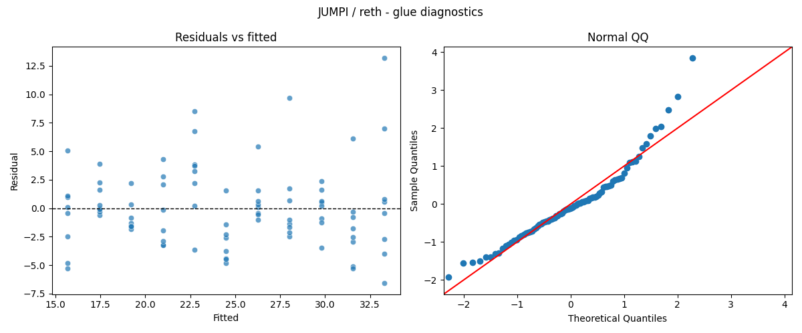

</details>

<details><summary><code>LT</code> · nobs=88 · runtime_ms=9.2e-07 · p=1.00e-03 · R²=0.7969</summary>

```
==============================================================================
                           NNLS Regression Results                            
==============================================================================
Dep. Variable:          test_runtime_ms              R-squared:          0.797
Model:                  NNLS                    Adj. R-squared:          0.795
No. Observations:       88                                RMSE:           4.89
Df Residuals:           86                                 MAE:           3.82
Df Model:               1      
==============================================================================
                      coef     std err     P-value      [0.025      0.975]
------------------------------------------------------------------------------
         const     11.2490      1.3402       0.001      8.7506     14.0423
            LT      0.0000      0.0000       0.001      0.0000      0.0000
==============================================================================
Notes: Non-negative least squares with bootstrap inference (1000 iterations)
==============================================================================
```

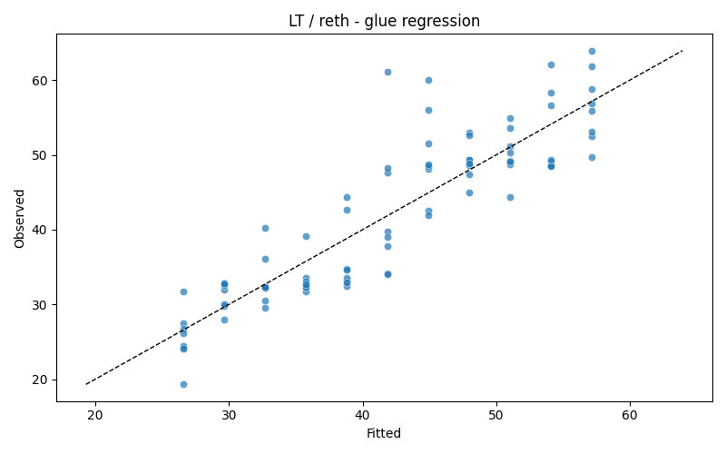

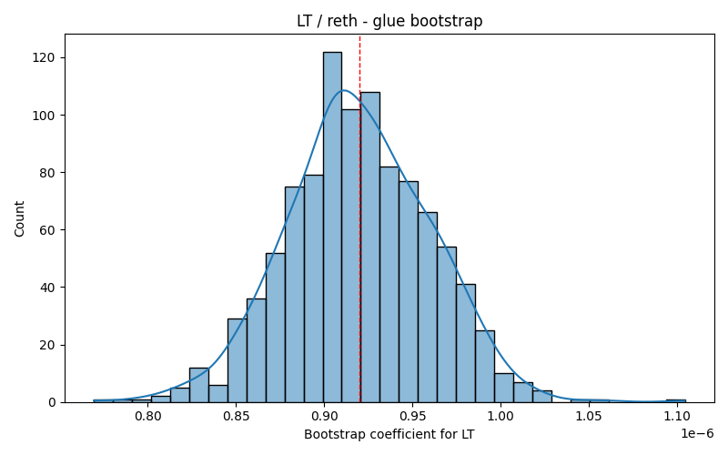

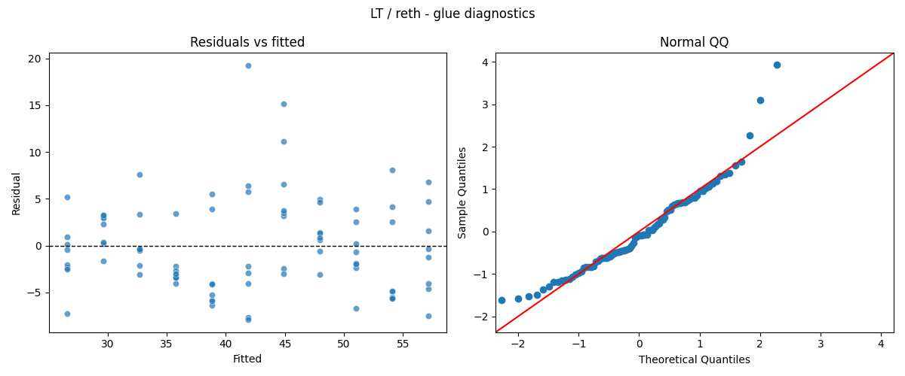

</details>

<details><summary><code>MSTORE</code> · nobs=440 · runtime_ms=2.684e-06 · p=1.00e-03 · R²=0.2671</summary>

```
==============================================================================
                           NNLS Regression Results                            
==============================================================================
Dep. Variable:          test_runtime_ms              R-squared:          0.267
Model:                  NNLS                    Adj. R-squared:          0.265
No. Observations:       440                               RMSE:          31.20
Df Residuals:           438                                MAE:          28.31
Df Model:               1      
==============================================================================
                      coef     std err     P-value      [0.025      0.975]
------------------------------------------------------------------------------
         const     21.3584      4.3962       0.001     12.4685     30.2265
        MSTORE      0.0000      0.0000       0.001      0.0000      0.0000
==============================================================================
Notes: Non-negative least squares with bootstrap inference (1000 iterations)
==============================================================================
```

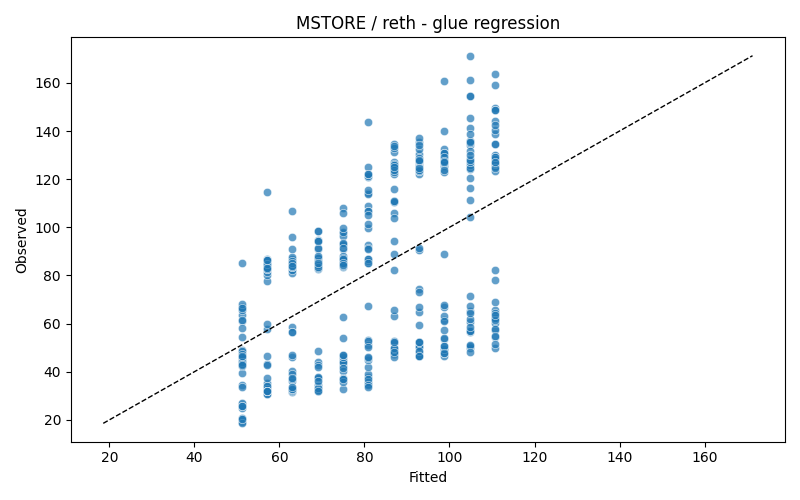

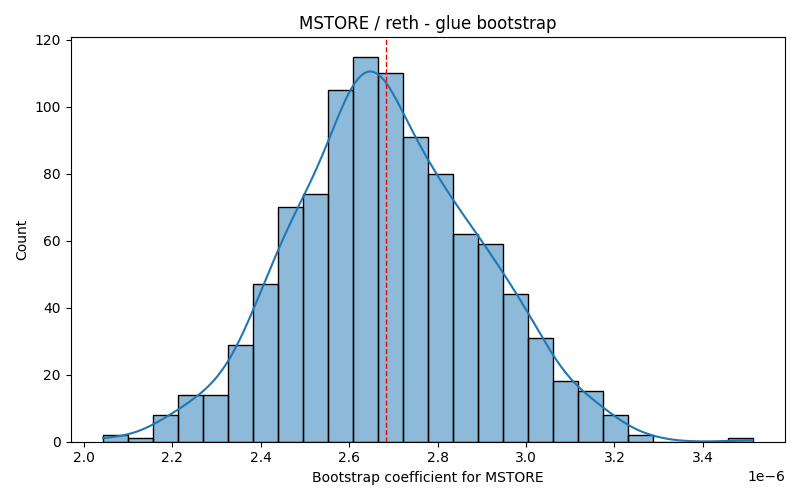

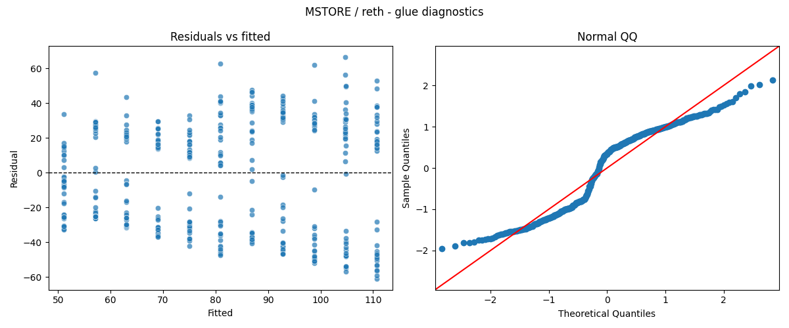

</details>

<details><summary><code>MSTORE8</code> · nobs=440 · runtime_ms=1.296e-06 · p=1.00e-03 · R²=0.5159</summary>

```
==============================================================================
                           NNLS Regression Results                            
==============================================================================
Dep. Variable:          test_runtime_ms              R-squared:          0.516
Model:                  NNLS                    Adj. R-squared:          0.515
No. Observations:       440                               RMSE:           8.81
Df Residuals:           438                                MAE:           5.02
Df Model:               1      
==============================================================================
                      coef     std err     P-value      [0.025      0.975]
------------------------------------------------------------------------------
         const     12.7389      1.6592       0.001      9.8654     16.2894
       MSTORE8      0.0000      0.0000       0.001      0.0000      0.0000
==============================================================================
Notes: Non-negative least squares with bootstrap inference (1000 iterations)
==============================================================================
```

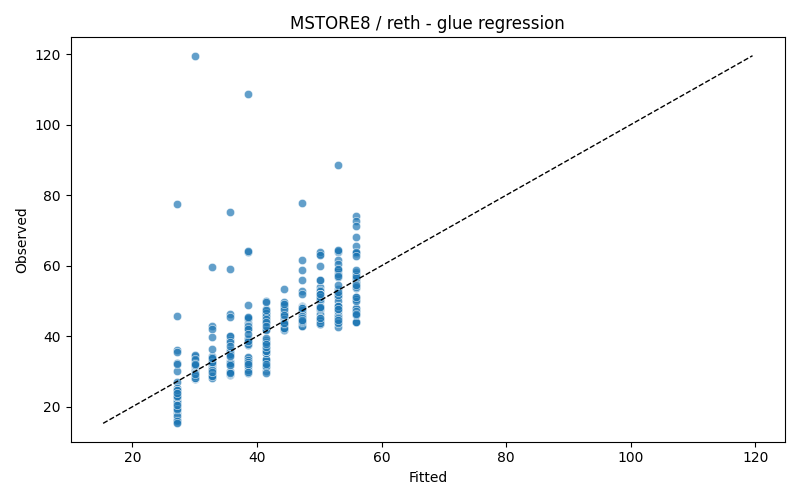

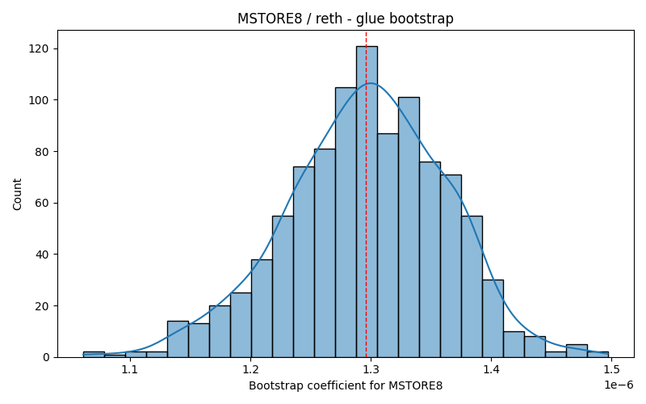

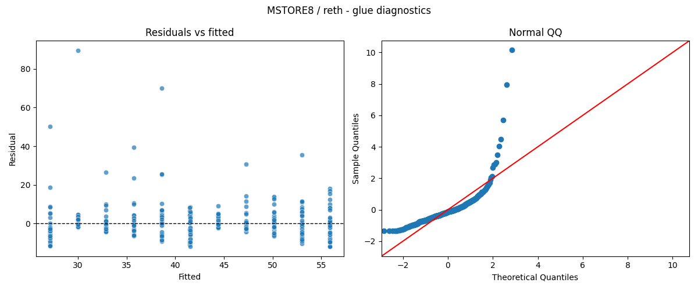

</details>

<details><summary><code>MUL</code> · nobs=88 · runtime_ms=1.164e-06 · p=1.00e-03 · R²=0.8695</summary>

```
==============================================================================
                           NNLS Regression Results                            
==============================================================================
Dep. Variable:          test_runtime_ms              R-squared:          0.869
Model:                  NNLS                    Adj. R-squared:          0.868
No. Observations:       88                                RMSE:           3.56
Df Residuals:           86                                 MAE:           2.88
Df Model:               1      
==============================================================================
                      coef     std err     P-value      [0.025      0.975]
------------------------------------------------------------------------------
         const      9.1175      1.1876       0.001      6.6956     11.2842
           MUL      0.0000      0.0000       0.001      0.0000      0.0000
==============================================================================
Notes: Non-negative least squares with bootstrap inference (1000 iterations)
==============================================================================
```

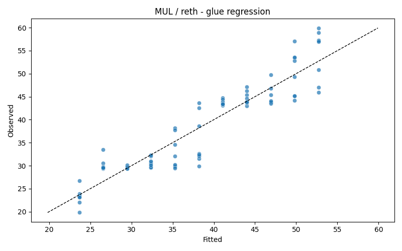

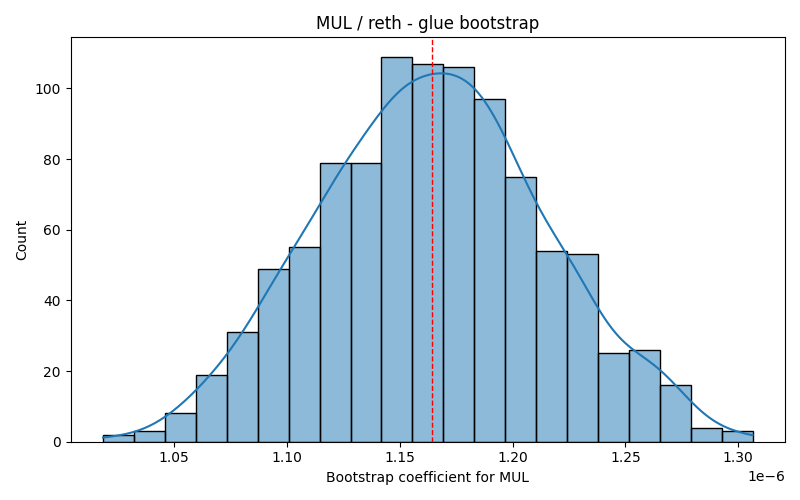

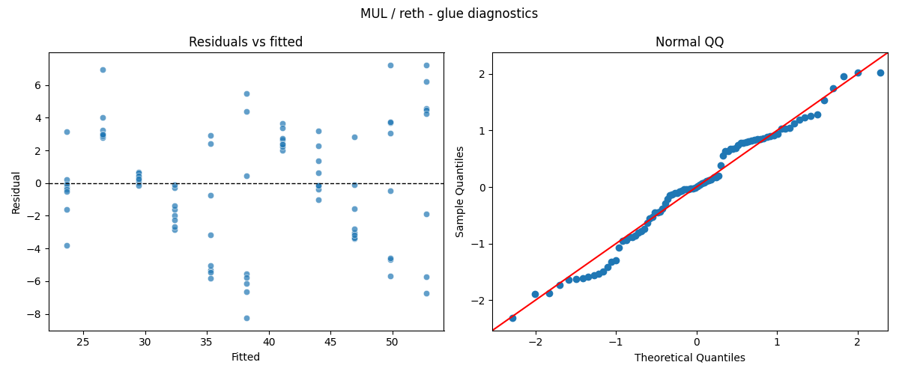

</details>

<details><summary><code>PC</code> · nobs=88 · runtime_ms=6.287e-07 · p=1.00e-03 · R²=0.926</summary>

```
==============================================================================
                           NNLS Regression Results                            
==============================================================================
Dep. Variable:          test_runtime_ms              R-squared:          0.926
Model:                  NNLS                    Adj. R-squared:          0.925
No. Observations:       88                                RMSE:           5.31
Df Residuals:           86                                 MAE:           4.32
Df Model:               1      
==============================================================================
                      coef     std err     P-value      [0.025      0.975]
------------------------------------------------------------------------------
         const     10.0298      1.9266       0.001      6.4240     13.8045
            PC      0.0000      0.0000       0.001      0.0000      0.0000
==============================================================================
Notes: Non-negative least squares with bootstrap inference (1000 iterations)
==============================================================================
```

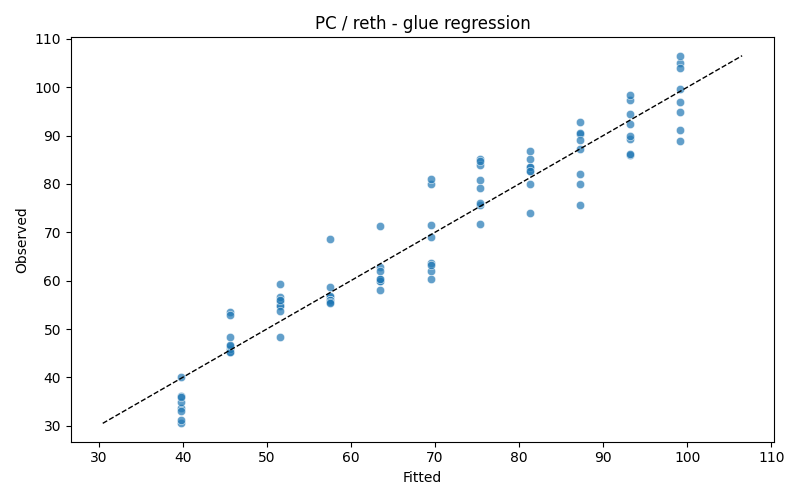

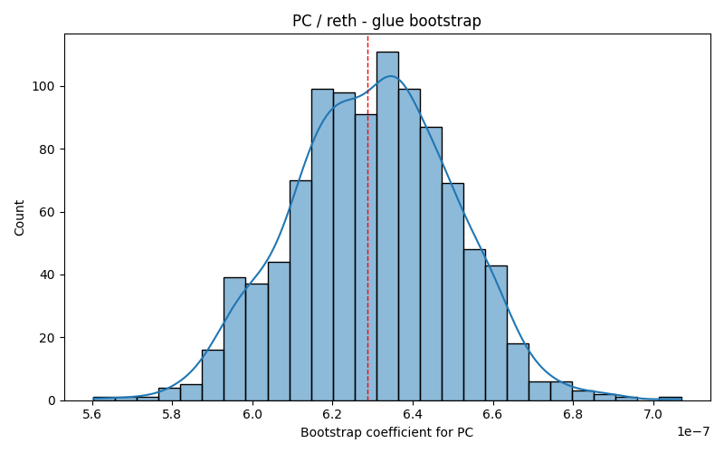

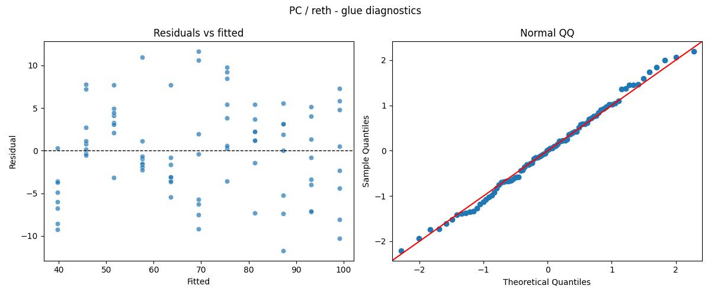

</details>

<details><summary><code>RETURNDATASIZE</code> · nobs=352 · runtime_ms=8.925e-07 · p=1.00e-03 · R²=0.8354</summary>

```
==============================================================================
                           NNLS Regression Results                            
==============================================================================
Dep. Variable:          test_runtime_ms              R-squared:          0.835
Model:                  NNLS                    Adj. R-squared:          0.835
No. Observations:       352                               RMSE:           6.26
Df Residuals:           350                                MAE:           4.68
Df Model:               1      
==============================================================================
                      coef     std err     P-value      [0.025      0.975]
------------------------------------------------------------------------------
         const     12.3818      0.9874       0.001     10.4841     14.3378
RETURNDATASIZE      0.0000      0.0000       0.001      0.0000      0.0000
==============================================================================
Notes: Non-negative least squares with bootstrap inference (1000 iterations)
==============================================================================
```

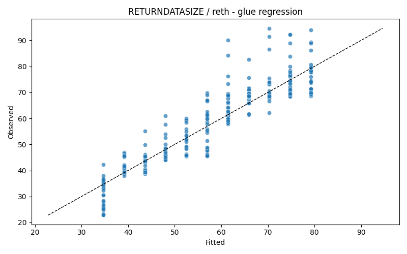

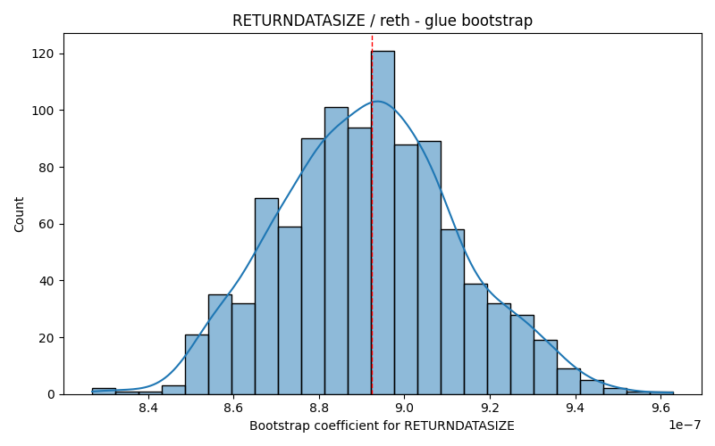

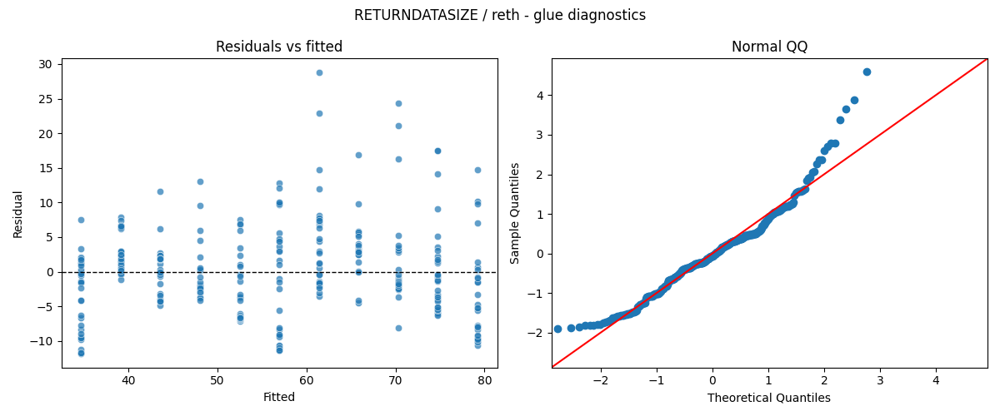

</details>

<details><summary><code>SELFBALANCE</code> · nobs=72 · runtime_ms=3.69e-06 · p=1.00e-03 · R²=0.8369</summary>

```
==============================================================================
                           NNLS Regression Results                            
==============================================================================
Dep. Variable:          test_runtime_ms              R-squared:          0.837
Model:                  NNLS                    Adj. R-squared:          0.835
No. Observations:       72                                RMSE:          16.43
Df Residuals:           70                                 MAE:          12.92
Df Model:               1      
==============================================================================
                      coef     std err     P-value      [0.025      0.975]
------------------------------------------------------------------------------
         const     62.1632      6.9751       0.001     48.7831     76.5936
   SELFBALANCE      0.0000      0.0000       0.001      0.0000      0.0000
==============================================================================
Notes: Non-negative least squares with bootstrap inference (1000 iterations)
==============================================================================
```

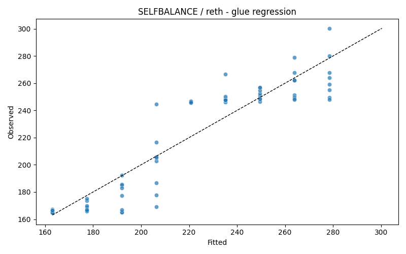

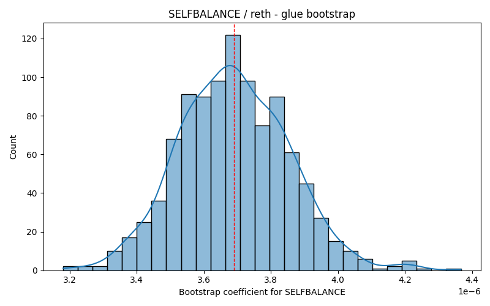

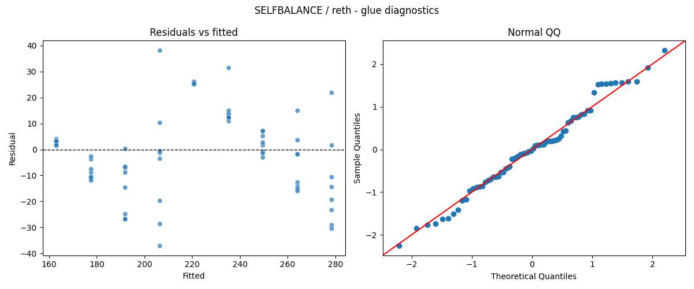

</details>

<details><summary><code>SUB</code> · nobs=88 · runtime_ms=1.088e-06 · p=1.00e-03 · R²=0.7862</summary>

```
==============================================================================
                           NNLS Regression Results                            
==============================================================================
Dep. Variable:          test_runtime_ms              R-squared:          0.786
Model:                  NNLS                    Adj. R-squared:          0.784
No. Observations:       88                                RMSE:           5.97
Df Residuals:           86                                 MAE:           4.24
Df Model:               1      
==============================================================================
                      coef     std err     P-value      [0.025      0.975]
------------------------------------------------------------------------------
         const      5.5828      1.5539       0.001      2.5908      8.4325
           SUB      0.0000      0.0000       0.001      0.0000      0.0000
==============================================================================
Notes: Non-negative least squares with bootstrap inference (1000 iterations)
==============================================================================
```

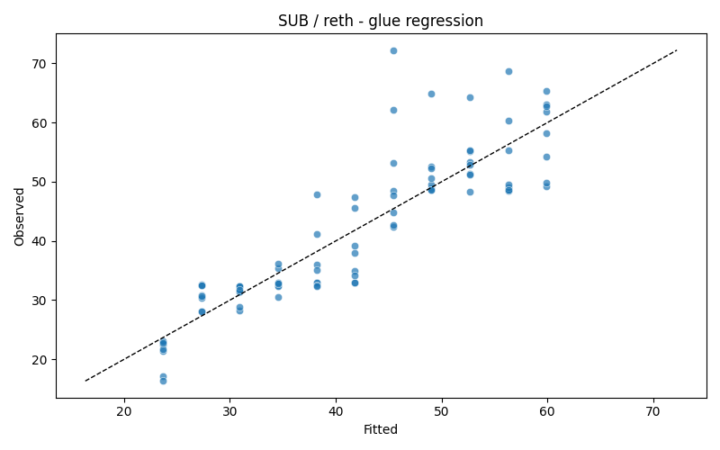

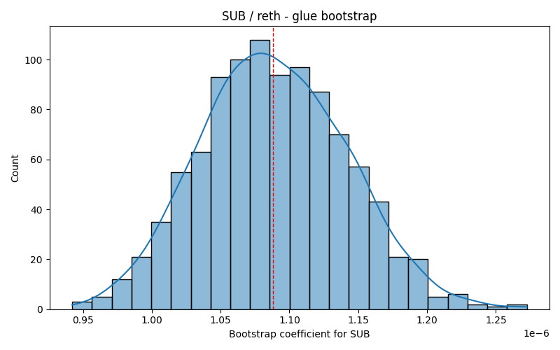

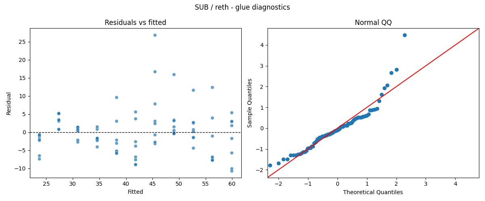

</details>

### Mixed glue (tier B) · reth

<details><summary><code>JUMP</code> · nobs=88 · runtime_ms=2.485e-06 · p=1.00e-03 · R²=0.8</summary>

```
==============================================================================
                           NNLS Regression Results                            
==============================================================================
Dep. Variable:          test_runtime_ms              R-squared:          0.800
Model:                  NNLS                    Adj. R-squared:          0.798
No. Observations:       88                                RMSE:           4.62
Df Residuals:           86                                 MAE:           3.49
Df Model:               1      
==============================================================================
                      coef     std err     P-value      [0.025      0.975]
------------------------------------------------------------------------------
         const      7.5623      1.6830       0.001      4.3009     10.8054
          JUMP      0.0000      0.0000       0.001      0.0000      0.0000
==============================================================================
Notes: Non-negative least squares with bootstrap inference (1000 iterations)
==============================================================================
```

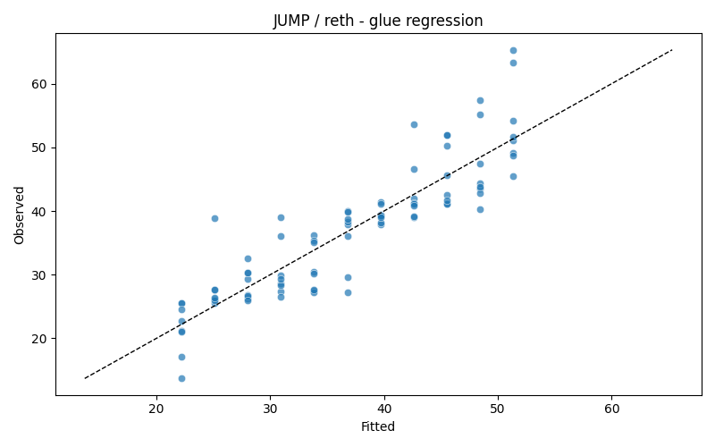

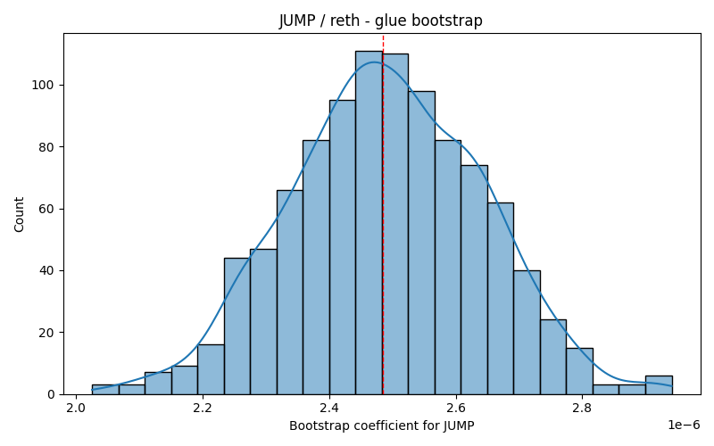

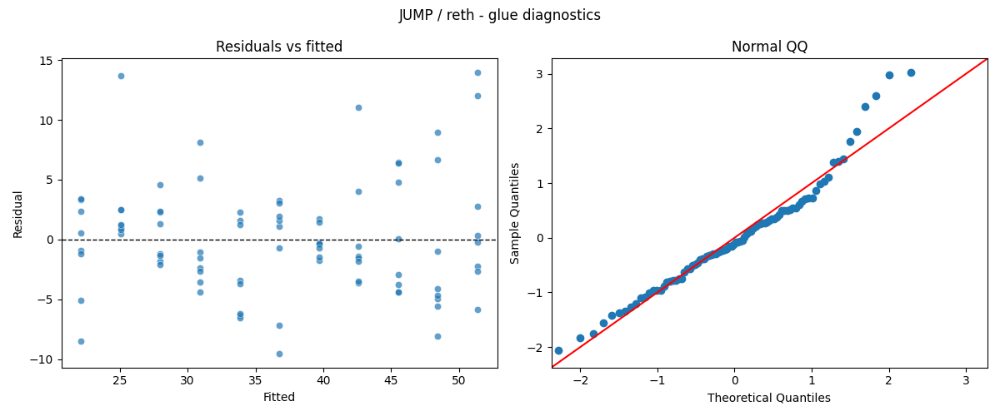

</details>

<details><summary><code>KECCAK256</code> · nobs=1408 · runtime_ms=0 · p=1.00e+00 · R²=0</summary>

```
==============================================================================
                           NNLS Regression Results                            
==============================================================================
Dep. Variable:          test_runtime_ms              R-squared:          0.000
Model:                  NNLS                    Adj. R-squared:         -0.001
No. Observations:       1408                              RMSE:         160.65
Df Residuals:           1406                               MAE:         135.86
Df Model:               1      
==============================================================================
                      coef     std err     P-value      [0.025      0.975]
------------------------------------------------------------------------------
         const    252.0966      4.2458       0.001    243.3180    259.8409
     KECCAK256      0.0000      0.0000       1.000      0.0000      0.0000
==============================================================================
Notes: Non-negative least squares with bootstrap inference (1000 iterations)
==============================================================================
```

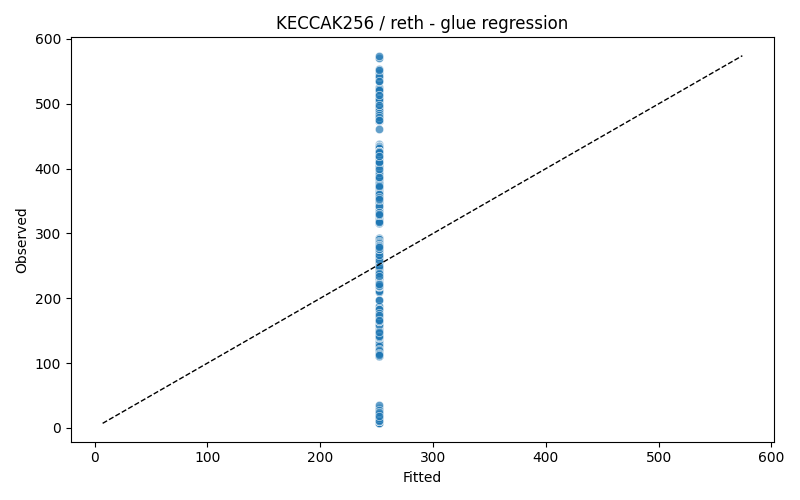


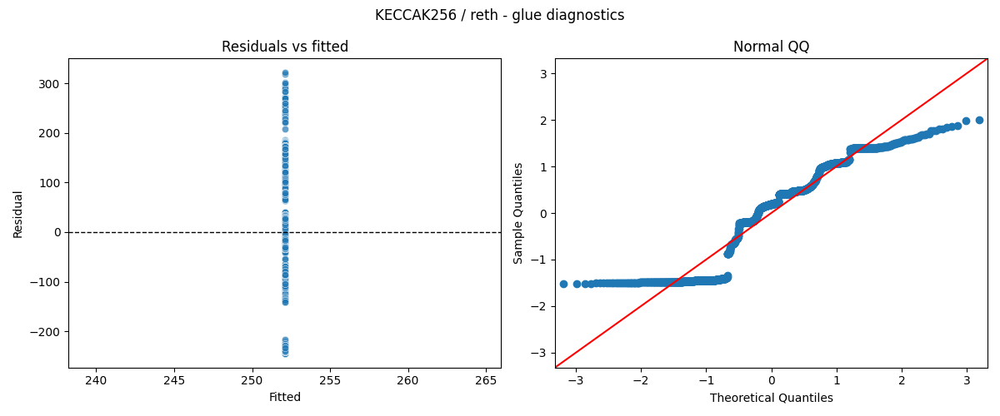

</details>
