# Runtime estimation report

Per-spec NNLS fits of `test_runtime_ms` against `opcount`, one row per (target opcode, test, model_by combo, client).

## Contents

- [SLOAD](#sload)
- [SSTORE](#sstore)
- [BALANCE](#balance)
- [CALL](#call)
- [CALLCODE](#callcode)
- [DELEGATECALL](#delegatecall)
- [EXTCODECOPY](#extcodecopy)
- [EXTCODEHASH](#extcodehash)
- [EXTCODESIZE](#extcodesize)
- [STATICCALL](#staticcall)

## SLOAD

### test_sload_bloated — combo `False`

| client | nobs | R² | target_coef (ms) | p-value | 95% CI |
| --- | --- | --- | --- | --- | --- |
| `erigon` | 33 | 0.9979 | 0.006133 | 1.00e-03 | [0.006056, 0.006228] |
| `geth` | 99 | 0.8867 | 0.1702 | 1.00e-03 | [0.157, 0.1816] |
| `nethermind` | 66 | 0.8936 | 0.003694 | 1.00e-03 | [0.00344, 0.003943] |
| `reth` | 66 | 0.9534 | 0.001319 | 1.00e-03 | [0.001237, 0.001397] |

<details><summary>erigon — NNLS regression summary</summary>

```
==============================================================================
                           NNLS Regression Results                            
==============================================================================
Dep. Variable:          test_runtime_ms              R-squared:          0.998
Model:                  NNLS                    Adj. R-squared:          0.998
No. Observations:       33                                RMSE:           8.29
Df Residuals:           31                                 MAE:           6.55
Df Model:               1      
==============================================================================
                      coef     std err     P-value      [0.025      0.975]
------------------------------------------------------------------------------
         const     21.1383      4.0549       0.001     11.9702     27.9153
       opcount      0.0061      0.0000       0.001      0.0061      0.0062
==============================================================================
Notes: Non-negative least squares with bootstrap inference (1000 iterations)
==============================================================================
```

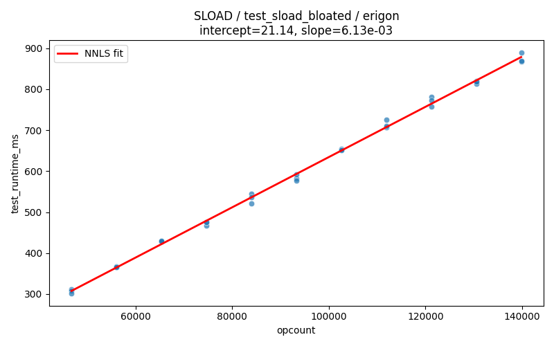

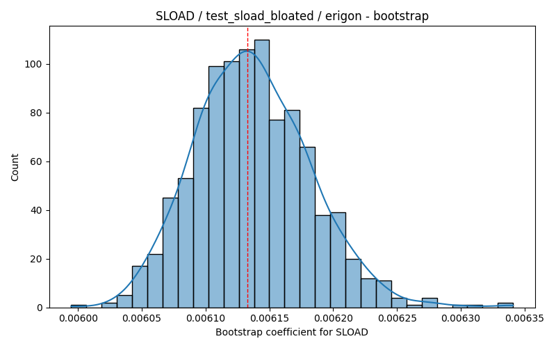

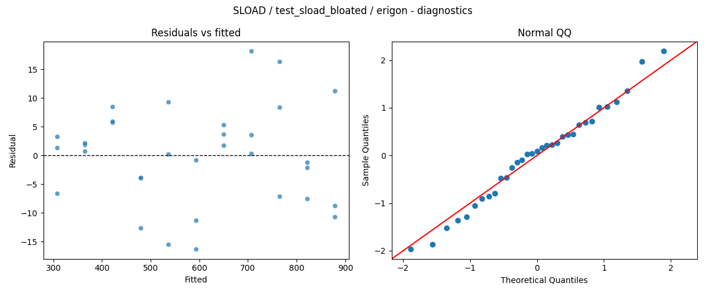

</details>

<details><summary>geth — NNLS regression summary</summary>

```
==============================================================================
                           NNLS Regression Results                            
==============================================================================
Dep. Variable:          test_runtime_ms              R-squared:          0.887
Model:                  NNLS                    Adj. R-squared:          0.886
No. Observations:       99                                RMSE:        1790.73
Df Residuals:           97                                 MAE:        1164.40
Df Model:               1      
==============================================================================
                      coef     std err     P-value      [0.025      0.975]
------------------------------------------------------------------------------
         const   2992.7504    533.8753       0.001   2007.0498   4066.7039
       opcount      0.1702      0.0064       0.001      0.1570      0.1816
==============================================================================
Notes: Non-negative least squares with bootstrap inference (1000 iterations)
==============================================================================
```

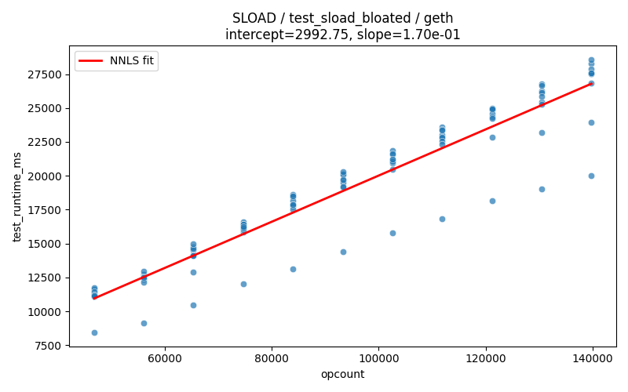

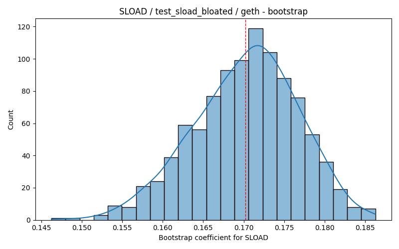

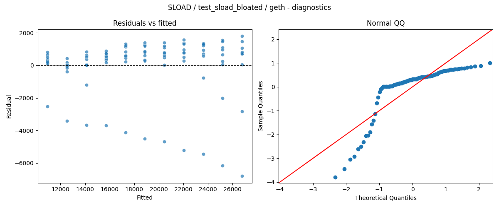

</details>

<details><summary>nethermind — NNLS regression summary</summary>

```
==============================================================================
                           NNLS Regression Results                            
==============================================================================
Dep. Variable:          test_runtime_ms              R-squared:          0.894
Model:                  NNLS                    Adj. R-squared:          0.892
No. Observations:       66                                RMSE:          37.52
Df Residuals:           64                                 MAE:          25.74
Df Model:               1      
==============================================================================
                      coef     std err     P-value      [0.025      0.975]
------------------------------------------------------------------------------
         const    133.7958     12.4016       0.001    112.3860    160.8580
       opcount      0.0037      0.0001       0.001      0.0034      0.0039
==============================================================================
Notes: Non-negative least squares with bootstrap inference (1000 iterations)
==============================================================================
```

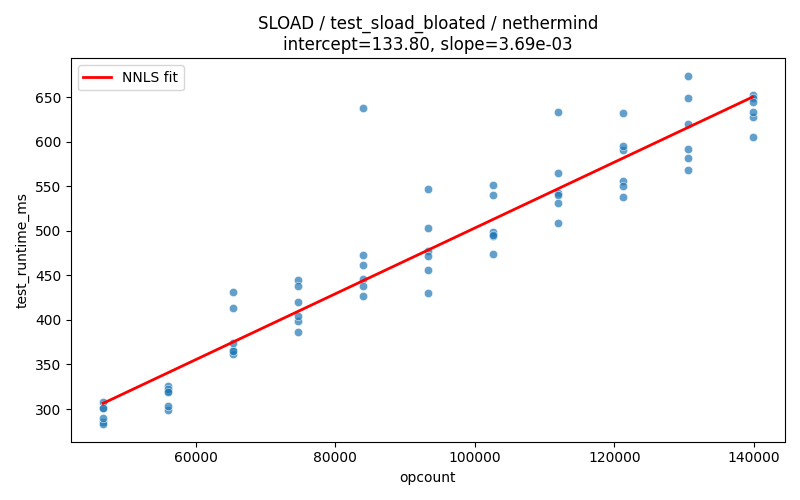

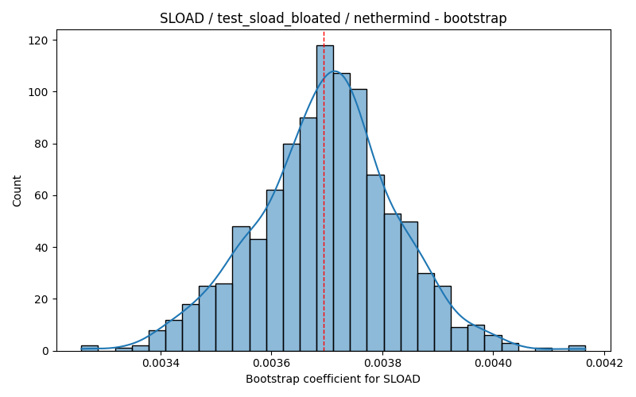

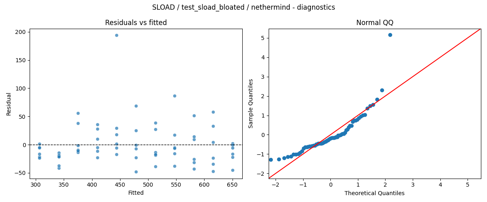

</details>

<details><summary>reth — NNLS regression summary</summary>

```
==============================================================================
                           NNLS Regression Results                            
==============================================================================
Dep. Variable:          test_runtime_ms              R-squared:          0.953
Model:                  NNLS                    Adj. R-squared:          0.953
No. Observations:       66                                RMSE:           8.58
Df Residuals:           64                                 MAE:           6.42
Df Model:               1      
==============================================================================
                      coef     std err     P-value      [0.025      0.975]
------------------------------------------------------------------------------
         const     37.3599      4.5433       0.001     28.7053     46.3325
       opcount      0.0013      0.0000       0.001      0.0012      0.0014
==============================================================================
Notes: Non-negative least squares with bootstrap inference (1000 iterations)
==============================================================================
```

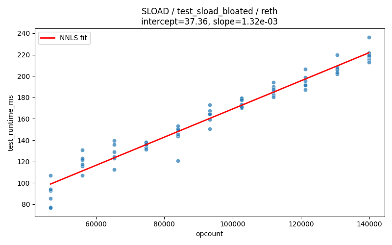

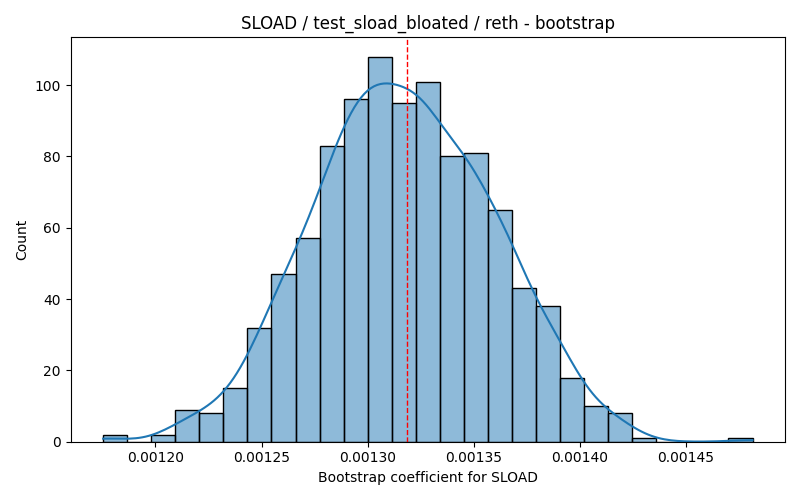

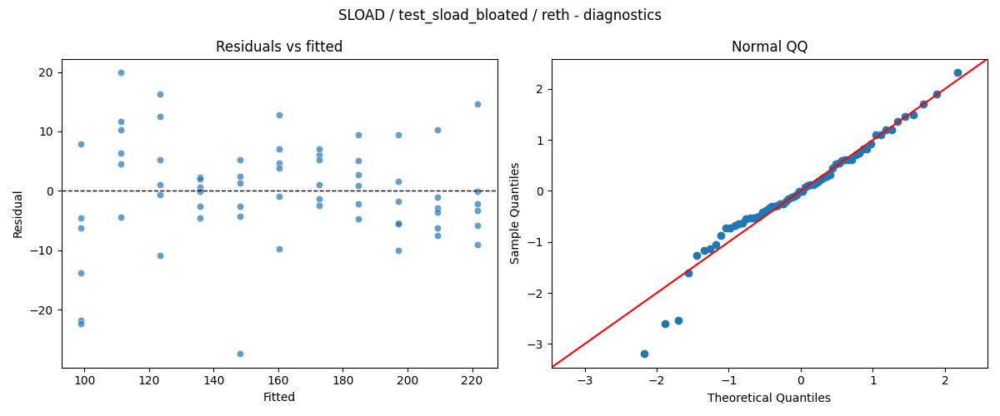

</details>

### test_sload_bloated — combo `True`

| client | nobs | R² | target_coef (ms) | p-value | 95% CI |
| --- | --- | --- | --- | --- | --- |
| `erigon` | 33 | 0.9909 | 0.005656 | 1.00e-03 | [0.005469, 0.005821] |
| `geth` | 99 | 0.8768 | 0.1627 | 1.00e-03 | [0.1492, 0.174] |
| `nethermind` | 66 | 0.6117 | 0.0244 | 1.00e-03 | [0.01917, 0.02956] |
| `reth` | 66 | 0.9731 | 0.001435 | 1.00e-03 | [0.001377, 0.001484] |

<details><summary>erigon — NNLS regression summary</summary>

```
==============================================================================
                           NNLS Regression Results                            
==============================================================================
Dep. Variable:          test_runtime_ms              R-squared:          0.991
Model:                  NNLS                    Adj. R-squared:          0.991
No. Observations:       33                                RMSE:          15.99
Df Residuals:           31                                 MAE:          13.62
Df Model:               1      
==============================================================================
                      coef     std err     P-value      [0.025      0.975]
------------------------------------------------------------------------------
         const     31.0664      9.1270       0.001     14.2530     50.4550
       opcount      0.0057      0.0001       0.001      0.0055      0.0058
==============================================================================
Notes: Non-negative least squares with bootstrap inference (1000 iterations)
==============================================================================
```

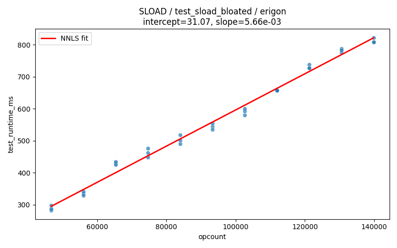

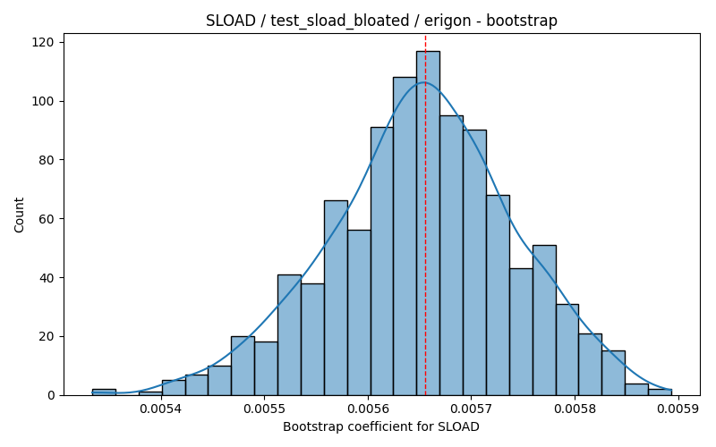

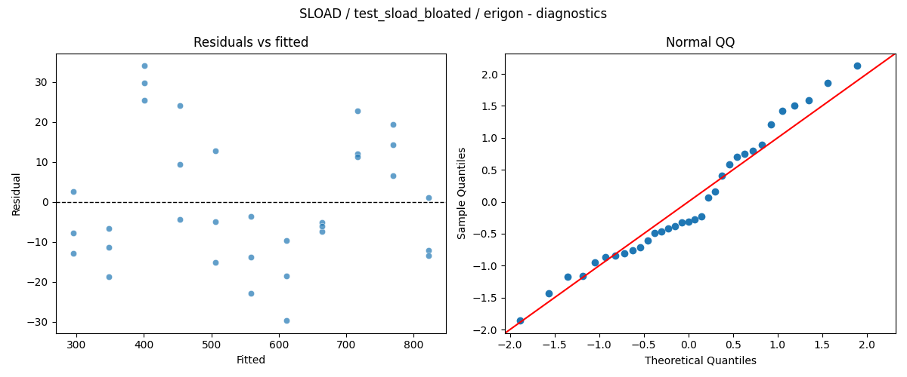

</details>

<details><summary>geth — NNLS regression summary</summary>

```
==============================================================================
                           NNLS Regression Results                            
==============================================================================
Dep. Variable:          test_runtime_ms              R-squared:          0.877
Model:                  NNLS                    Adj. R-squared:          0.876
No. Observations:       99                                RMSE:        1795.26
Df Residuals:           97                                 MAE:        1266.54
Df Model:               1      
==============================================================================
                      coef     std err     P-value      [0.025      0.975]
------------------------------------------------------------------------------
         const   3068.3298    517.8117       0.001   2107.4902   4146.0001
       opcount      0.1627      0.0063       0.001      0.1492      0.1740
==============================================================================
Notes: Non-negative least squares with bootstrap inference (1000 iterations)
==============================================================================
```

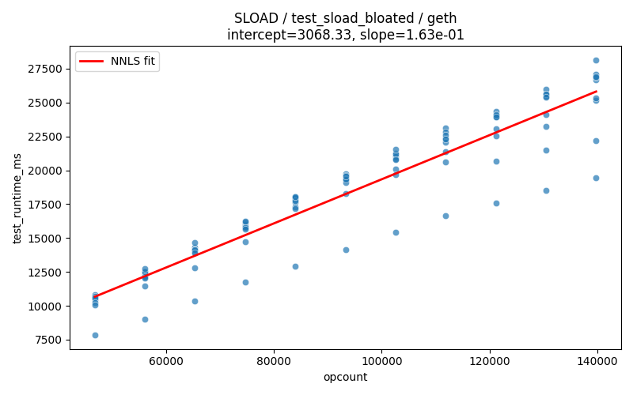

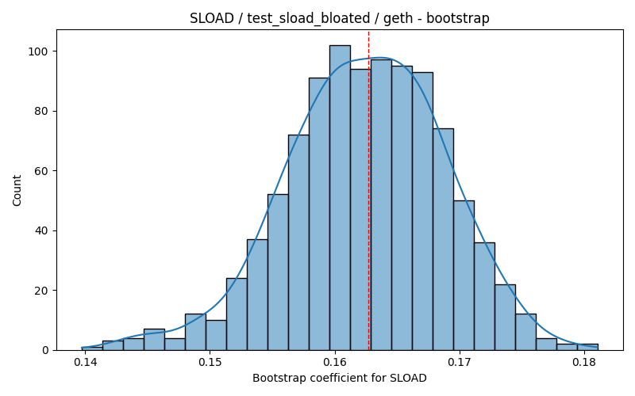

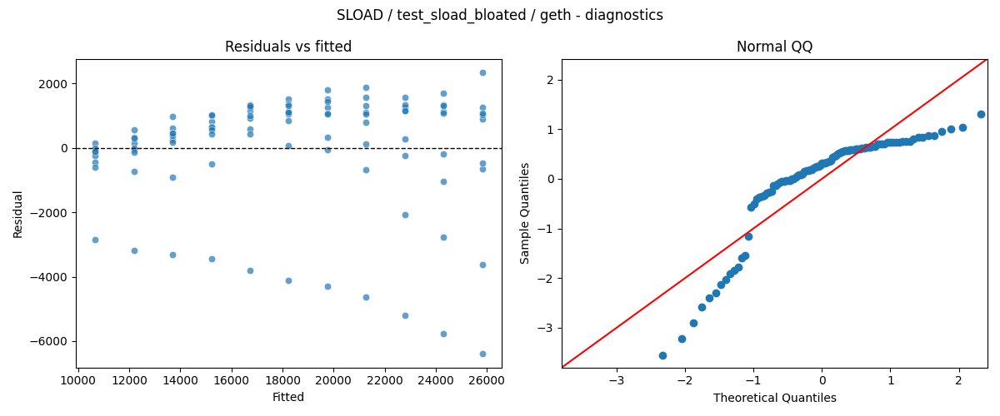

</details>

<details><summary>nethermind — NNLS regression summary</summary>

```
==============================================================================
                           NNLS Regression Results                            
==============================================================================
Dep. Variable:          test_runtime_ms              R-squared:          0.612
Model:                  NNLS                    Adj. R-squared:          0.606
No. Observations:       66                                RMSE:         572.18
Df Residuals:           64                                 MAE:         450.01
Df Model:               1      
==============================================================================
                      coef     std err     P-value      [0.025      0.975]
------------------------------------------------------------------------------
         const   1425.9829    250.0689       0.001    947.4749   1908.1092
       opcount      0.0244      0.0027       0.001      0.0192      0.0296
==============================================================================
Notes: Non-negative least squares with bootstrap inference (1000 iterations)
==============================================================================
```

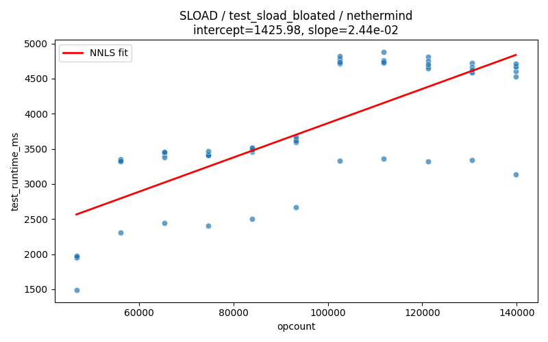

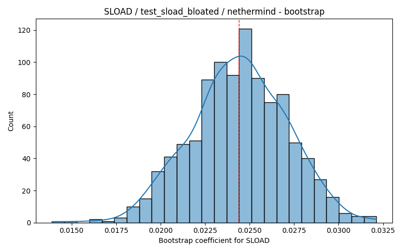

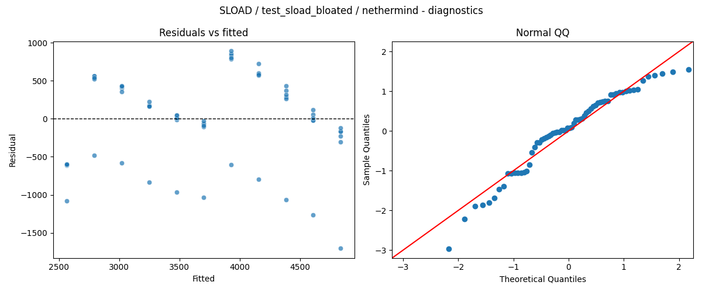

</details>

<details><summary>reth — NNLS regression summary</summary>

```
==============================================================================
                           NNLS Regression Results                            
==============================================================================
Dep. Variable:          test_runtime_ms              R-squared:          0.973
Model:                  NNLS                    Adj. R-squared:          0.973
No. Observations:       66                                RMSE:           7.02
Df Residuals:           64                                 MAE:           5.52
Df Model:               1      
==============================================================================
                      coef     std err     P-value      [0.025      0.975]
------------------------------------------------------------------------------
         const     29.3235      2.7226       0.001     24.5013     35.0059
       opcount      0.0014      0.0000       0.001      0.0014      0.0015
==============================================================================
Notes: Non-negative least squares with bootstrap inference (1000 iterations)
==============================================================================
```

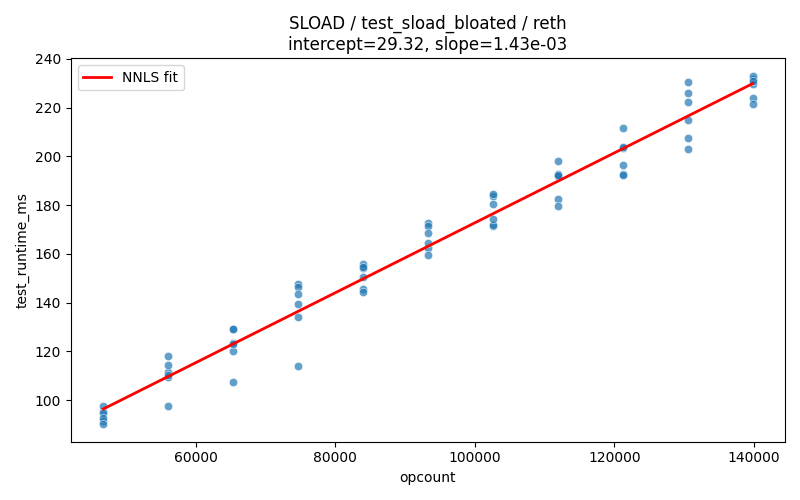

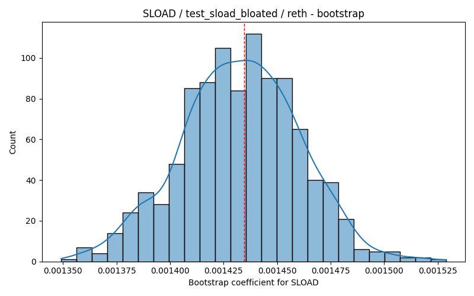

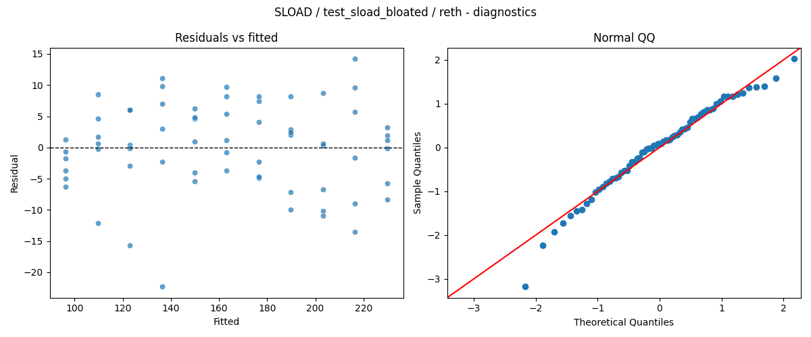

</details>

### test_storage_sload_same_key_benchmark

| client | nobs | R² | target_coef (ms) | p-value | 95% CI |
| --- | --- | --- | --- | --- | --- |
| `erigon` | 66 | 0.9264 | 4.76e-05 | 1.00e-03 | [4.413e-05, 5.067e-05] |
| `geth` | 198 | 0.9777 | 0.0002135 | 1.00e-03 | [0.0002092, 0.0002179] |
| `nethermind` | 132 | 0.7192 | 0.0001493 | 1.00e-03 | [0.0001347, 0.0001644] |
| `reth` | 132 | 0.661 | 4.775e-06 | 1.00e-03 | [4.024e-06, 5.473e-06] |

<details><summary>erigon — NNLS regression summary</summary>

```
==============================================================================
                           NNLS Regression Results                            
==============================================================================
Dep. Variable:          test_runtime_ms              R-squared:          0.926
Model:                  NNLS                    Adj. R-squared:          0.925
No. Observations:       66                                RMSE:           8.48
Df Residuals:           64                                 MAE:           5.89
Df Model:               1      
==============================================================================
                      coef     std err     P-value      [0.025      0.975]
------------------------------------------------------------------------------
         const     37.1191      3.8017       0.001     30.6369     45.7995
       opcount      0.0000      0.0000       0.001      0.0000      0.0001
==============================================================================
Notes: Non-negative least squares with bootstrap inference (1000 iterations)
==============================================================================
```

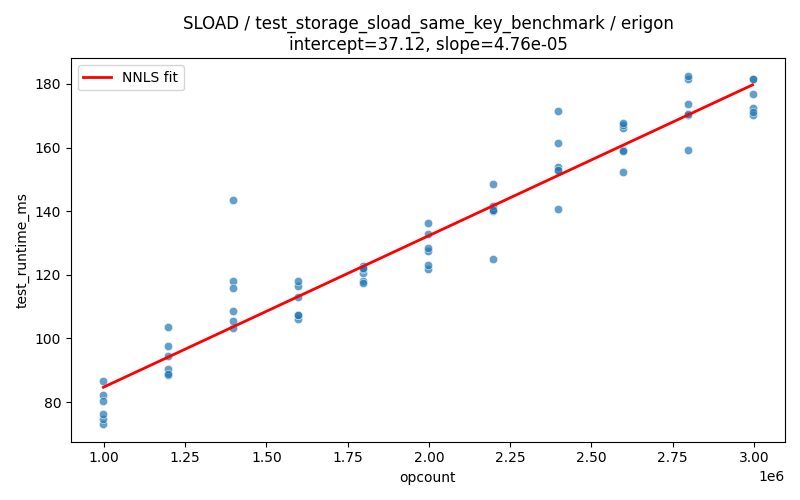

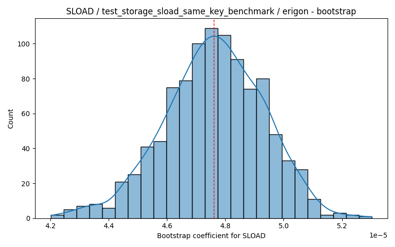

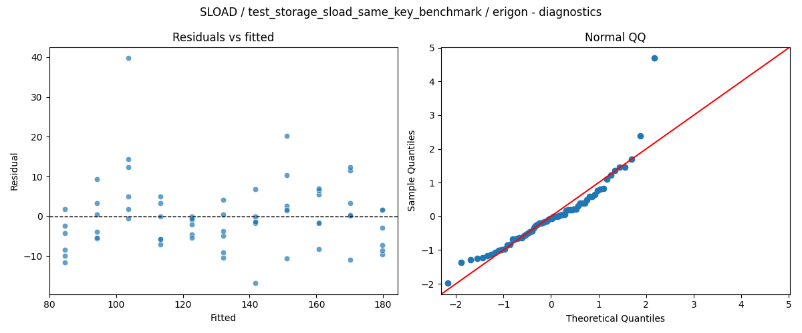

</details>

<details><summary>geth — NNLS regression summary</summary>

```
==============================================================================
                           NNLS Regression Results                            
==============================================================================
Dep. Variable:          test_runtime_ms              R-squared:          0.978
Model:                  NNLS                    Adj. R-squared:          0.978
No. Observations:       198                               RMSE:          20.37
Df Residuals:           196                                MAE:          15.48
Df Model:               1      
==============================================================================
                      coef     std err     P-value      [0.025      0.975]
------------------------------------------------------------------------------
         const     15.9504      4.2193       0.001      7.4279     24.0631
       opcount      0.0002      0.0000       0.001      0.0002      0.0002
==============================================================================
Notes: Non-negative least squares with bootstrap inference (1000 iterations)
==============================================================================
```

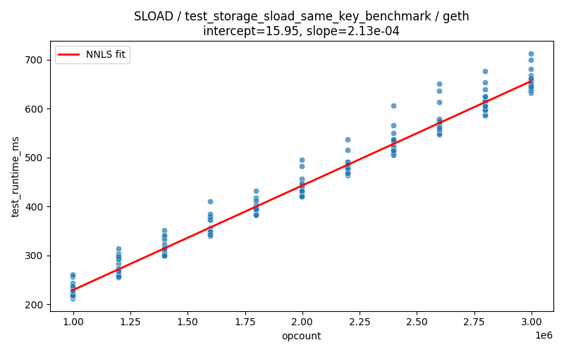

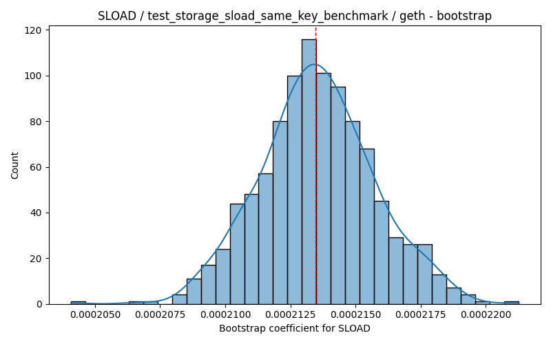

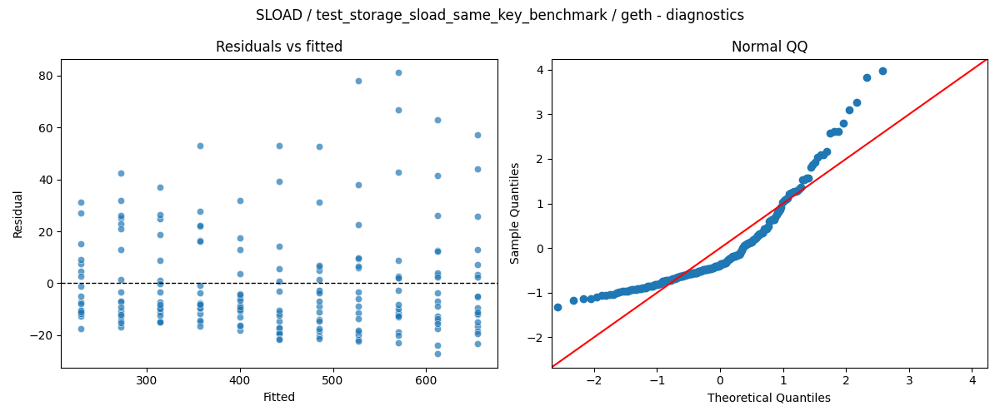

</details>

<details><summary>nethermind — NNLS regression summary</summary>

```
==============================================================================
                           NNLS Regression Results                            
==============================================================================
Dep. Variable:          test_runtime_ms              R-squared:          0.719
Model:                  NNLS                    Adj. R-squared:          0.717
No. Observations:       132                               RMSE:          58.92
Df Residuals:           130                                MAE:          44.89
Df Model:               1      
==============================================================================
                      coef     std err     P-value      [0.025      0.975]
------------------------------------------------------------------------------
         const    114.5813     15.1548       0.001     83.8572    142.8529
       opcount      0.0001      0.0000       0.001      0.0001      0.0002
==============================================================================
Notes: Non-negative least squares with bootstrap inference (1000 iterations)
==============================================================================
```

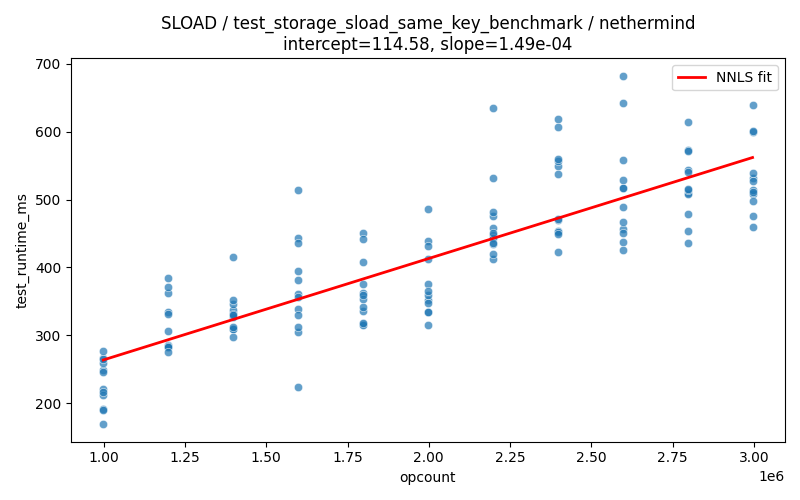

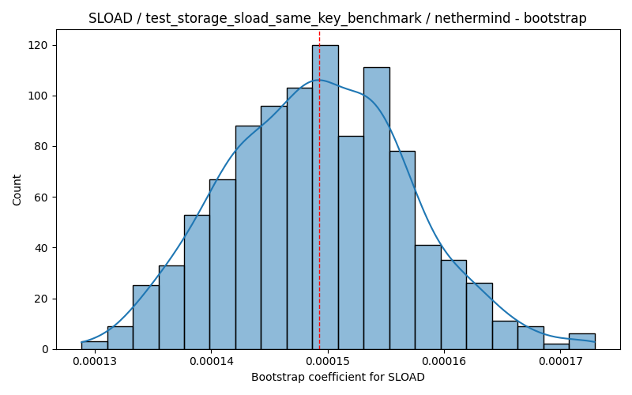

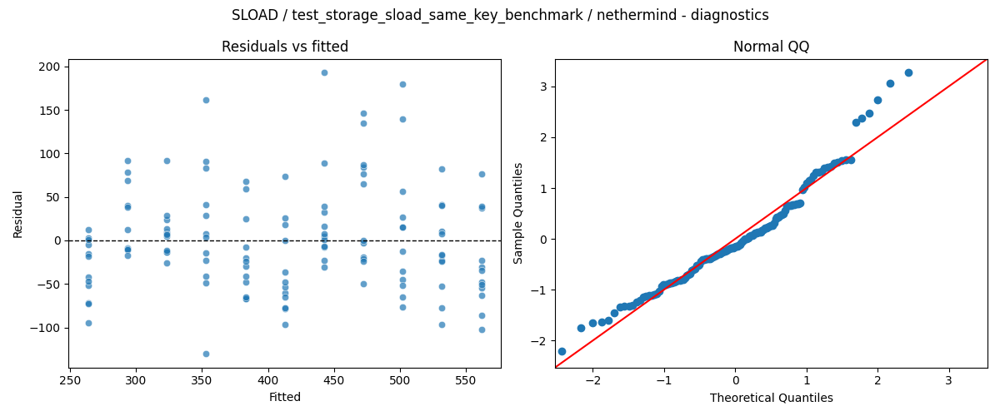

</details>

<details><summary>reth — NNLS regression summary</summary>

```
==============================================================================
                           NNLS Regression Results                            
==============================================================================
Dep. Variable:          test_runtime_ms              R-squared:          0.661
Model:                  NNLS                    Adj. R-squared:          0.658
No. Observations:       132                               RMSE:           2.16
Df Residuals:           130                                MAE:           1.42
Df Model:               1      
==============================================================================
                      coef     std err     P-value      [0.025      0.975]
------------------------------------------------------------------------------
         const      6.3990      0.7964       0.001      4.9940      8.1185
       opcount      0.0000      0.0000       0.001      0.0000      0.0000
==============================================================================
Notes: Non-negative least squares with bootstrap inference (1000 iterations)
==============================================================================
```

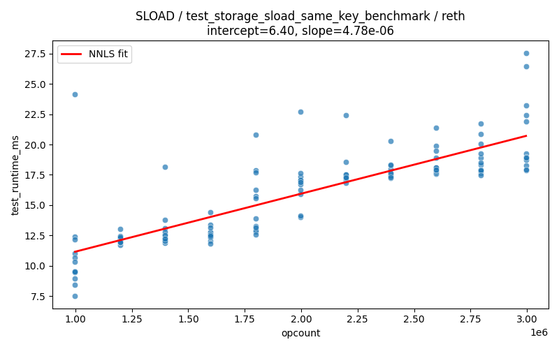

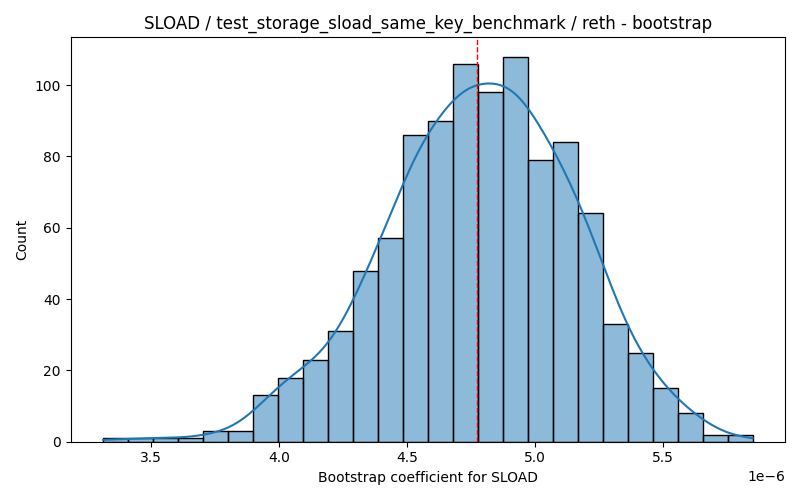

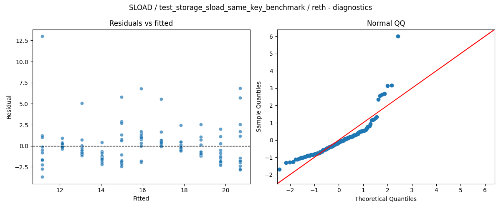

</details>

## SSTORE

### test_sstore_bloated — combo `False` — `presets[cold_storage_sstore_access]`

| client | nobs | R² | target_coef (ms) | p-value | 95% CI |
| --- | --- | --- | --- | --- | --- |
| `erigon` | 33 | 0.9979 | 0.006106 | 1.00e-03 | [0.006008, 0.006222] |
| `geth` | 99 | 0.7718 | 0.03812 | 1.00e-03 | [0.03371, 0.04211] |
| `nethermind` | 66 | 0.9153 | 0.003818 | 1.00e-03 | [0.003584, 0.004043] |
| `reth` | 66 | 0.9557 | 0.001328 | 1.00e-03 | [0.001256, 0.001396] |

<details><summary>erigon — NNLS regression summary</summary>

```
==============================================================================
                           NNLS Regression Results                            
==============================================================================
Dep. Variable:          test_runtime_ms              R-squared:          0.998
Model:                  NNLS                    Adj. R-squared:          0.998
No. Observations:       33                                RMSE:           7.95
Df Residuals:           31                                 MAE:           6.28
Df Model:               1      
==============================================================================
                      coef     std err     P-value      [0.025      0.975]
------------------------------------------------------------------------------
         const     20.6691      4.4298       0.001     11.4102     28.2838
       opcount      0.0061      0.0001       0.001      0.0060      0.0062
==============================================================================
Notes: Non-negative least squares with bootstrap inference (1000 iterations)
==============================================================================
```

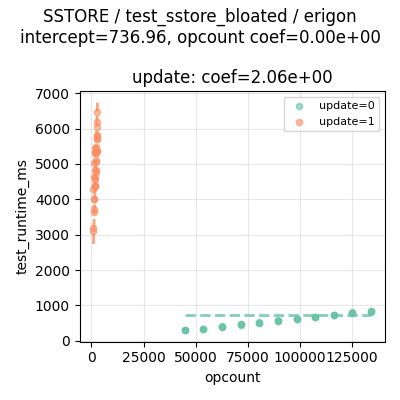

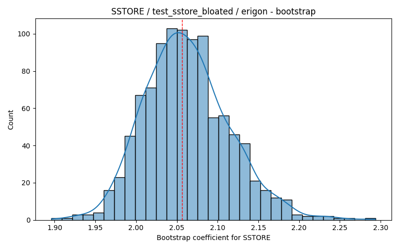

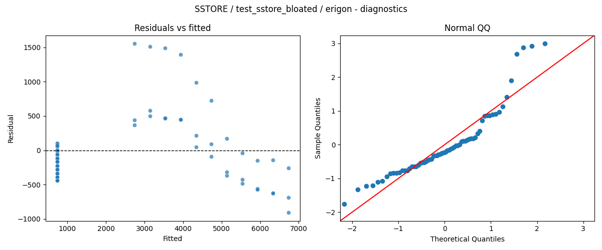

</details>

<details><summary>geth — NNLS regression summary</summary>

```
==============================================================================
                           NNLS Regression Results                            
==============================================================================
Dep. Variable:          test_runtime_ms              R-squared:          0.772
Model:                  NNLS                    Adj. R-squared:          0.769
No. Observations:       99                                RMSE:         585.86
Df Residuals:           97                                 MAE:         432.21
Df Model:               1      
==============================================================================
                      coef     std err     P-value      [0.025      0.975]
------------------------------------------------------------------------------
         const   1366.7484    166.5146       0.001   1042.3073   1726.4262
       opcount      0.0381      0.0021       0.001      0.0337      0.0421
==============================================================================
Notes: Non-negative least squares with bootstrap inference (1000 iterations)
==============================================================================
```

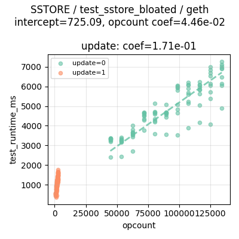

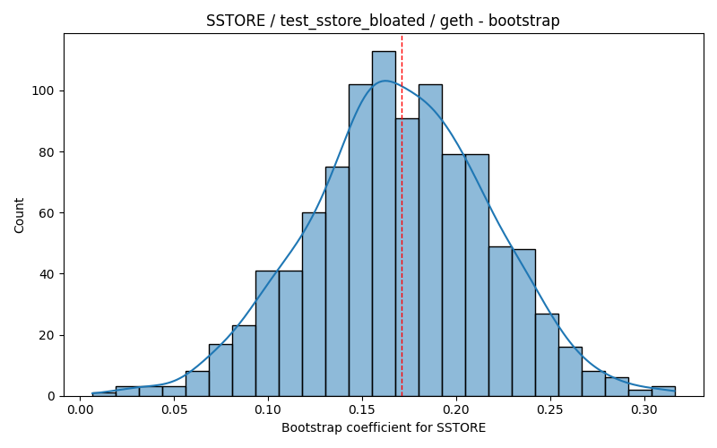

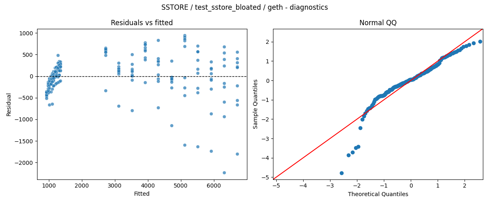

</details>

<details><summary>nethermind — NNLS regression summary</summary>

```
==============================================================================
                           NNLS Regression Results                            
==============================================================================
Dep. Variable:          test_runtime_ms              R-squared:          0.915
Model:                  NNLS                    Adj. R-squared:          0.914
No. Observations:       66                                RMSE:          32.83
Df Residuals:           64                                 MAE:          23.41
Df Model:               1      
==============================================================================
                      coef     std err     P-value      [0.025      0.975]
------------------------------------------------------------------------------
         const    116.3617     10.0623       0.001     96.9381    136.1547
       opcount      0.0038      0.0001       0.001      0.0036      0.0040
==============================================================================
Notes: Non-negative least squares with bootstrap inference (1000 iterations)
==============================================================================
```

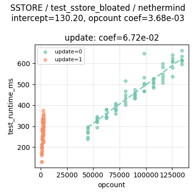

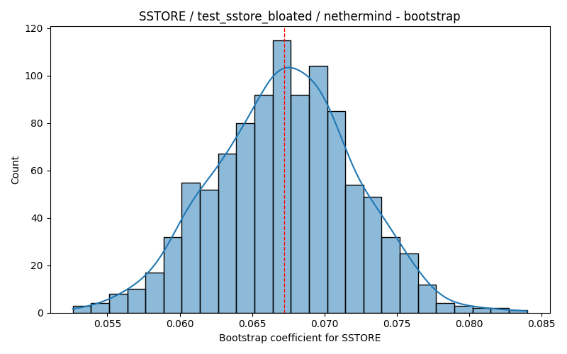

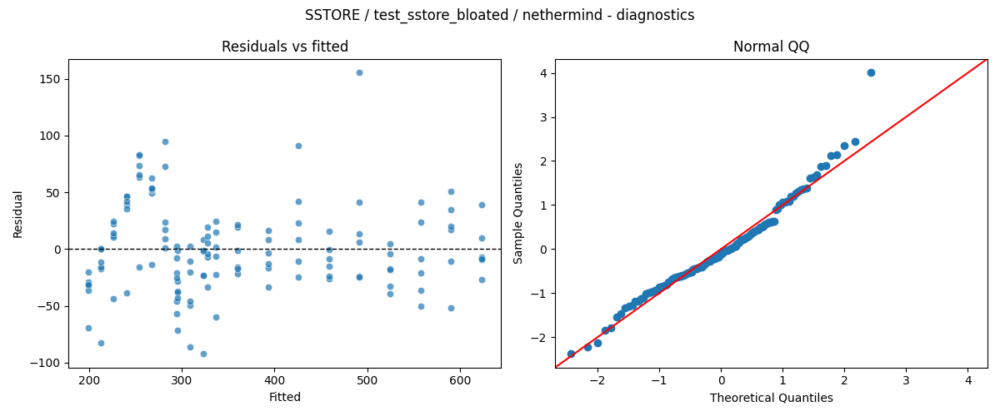

</details>

<details><summary>reth — NNLS regression summary</summary>

```
==============================================================================
                           NNLS Regression Results                            
==============================================================================
Dep. Variable:          test_runtime_ms              R-squared:          0.956
Model:                  NNLS                    Adj. R-squared:          0.955
No. Observations:       66                                RMSE:           8.08
Df Residuals:           64                                 MAE:           6.22
Df Model:               1      
==============================================================================
                      coef     std err     P-value      [0.025      0.975]
------------------------------------------------------------------------------
         const     39.3742      3.5445       0.001     32.9300     46.7170
       opcount      0.0013      0.0000       0.001      0.0013      0.0014
==============================================================================
Notes: Non-negative least squares with bootstrap inference (1000 iterations)
==============================================================================
```

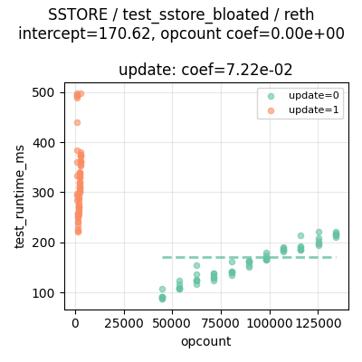

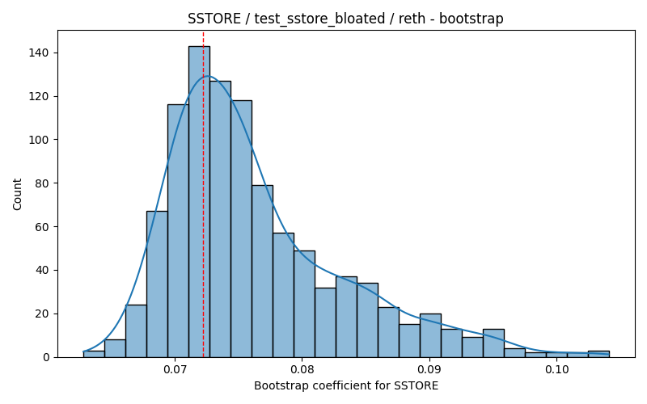

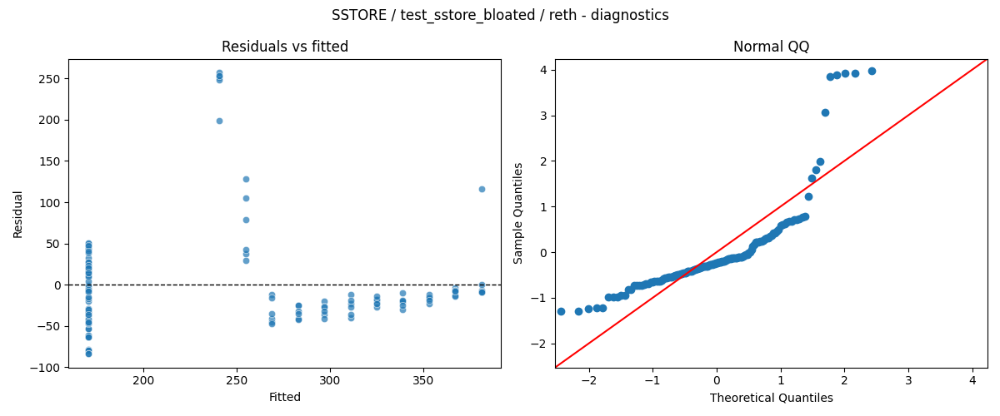

</details>

### test_sstore_bloated — combo `True` — `presets[cold_storage_sstore_access]`

| client | nobs | R² | target_coef (ms) | p-value | 95% CI |
| --- | --- | --- | --- | --- | --- |
| `erigon` | 33 | 0.9824 | 0.00565 | 1.00e-03 | [0.005398, 0.005904] |
| `geth` | 99 | 0.7648 | 0.03262 | 1.00e-03 | [0.02886, 0.03657] |
| `nethermind` | 66 | 0.6391 | 0.02581 | 1.00e-03 | [0.02118, 0.03104] |
| `reth` | 66 | 0.9684 | 0.001518 | 1.00e-03 | [0.00145, 0.001586] |

<details><summary>erigon — NNLS regression summary</summary>

```
==============================================================================
                           NNLS Regression Results                            
==============================================================================
Dep. Variable:          test_runtime_ms              R-squared:          0.982
Model:                  NNLS                    Adj. R-squared:          0.982
No. Observations:       33                                RMSE:          21.38
Df Residuals:           31                                 MAE:          18.54
Df Model:               1      
==============================================================================
                      coef     std err     P-value      [0.025      0.975]
------------------------------------------------------------------------------
         const     29.4841     11.5830       0.007      7.5914     52.9705
       opcount      0.0057      0.0001       0.001      0.0054      0.0059
==============================================================================
Notes: Non-negative least squares with bootstrap inference (1000 iterations)
==============================================================================
```

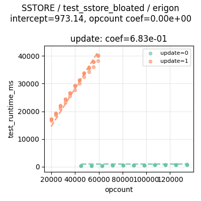

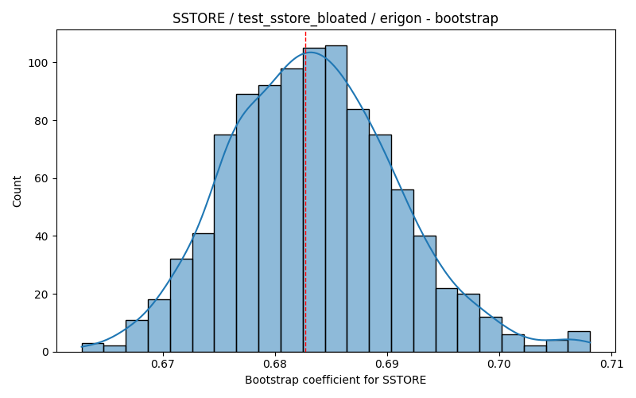

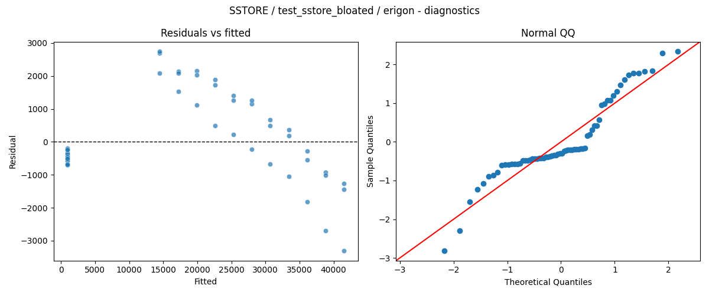

</details>

<details><summary>geth — NNLS regression summary</summary>

```
==============================================================================
                           NNLS Regression Results                            
==============================================================================
Dep. Variable:          test_runtime_ms              R-squared:          0.765
Model:                  NNLS                    Adj. R-squared:          0.762
No. Observations:       99                                RMSE:         511.24
Df Residuals:           97                                 MAE:         399.85
Df Model:               1      
==============================================================================
                      coef     std err     P-value      [0.025      0.975]
------------------------------------------------------------------------------
         const   1576.2241    178.8970       0.001   1208.8893   1896.0633
       opcount      0.0326      0.0020       0.001      0.0289      0.0366
==============================================================================
Notes: Non-negative least squares with bootstrap inference (1000 iterations)
==============================================================================
```

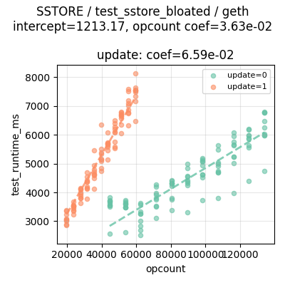

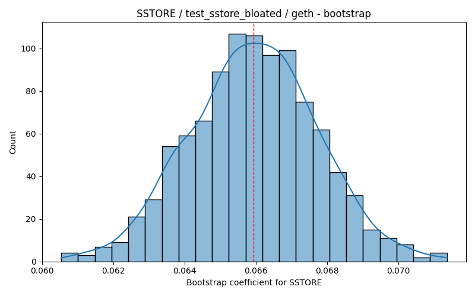

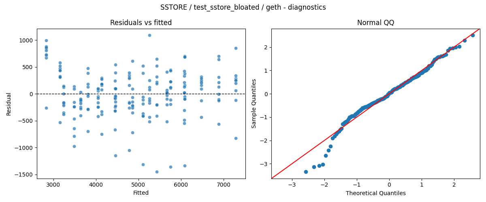

</details>

<details><summary>nethermind — NNLS regression summary</summary>

```
==============================================================================
                           NNLS Regression Results                            
==============================================================================
Dep. Variable:          test_runtime_ms              R-squared:          0.639
Model:                  NNLS                    Adj. R-squared:          0.633
No. Observations:       66                                RMSE:         548.17
Df Residuals:           64                                 MAE:         447.49
Df Model:               1      
==============================================================================
                      coef     std err     P-value      [0.025      0.975]
------------------------------------------------------------------------------
         const   1293.8760    226.5727       0.001    848.9276   1728.9348
       opcount      0.0258      0.0025       0.001      0.0212      0.0310
==============================================================================
Notes: Non-negative least squares with bootstrap inference (1000 iterations)
==============================================================================
```

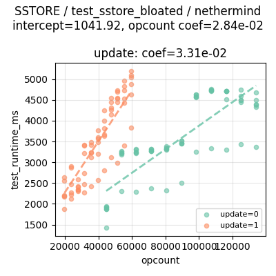

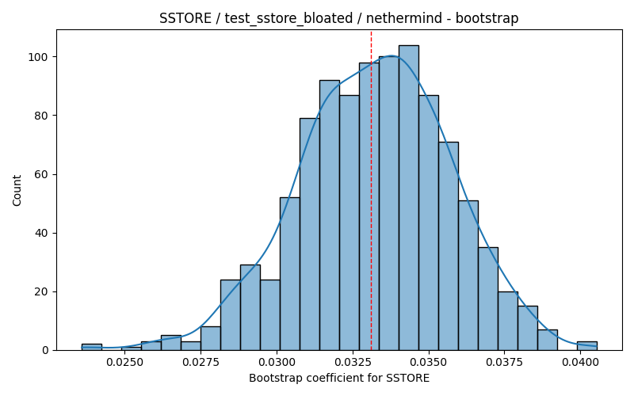

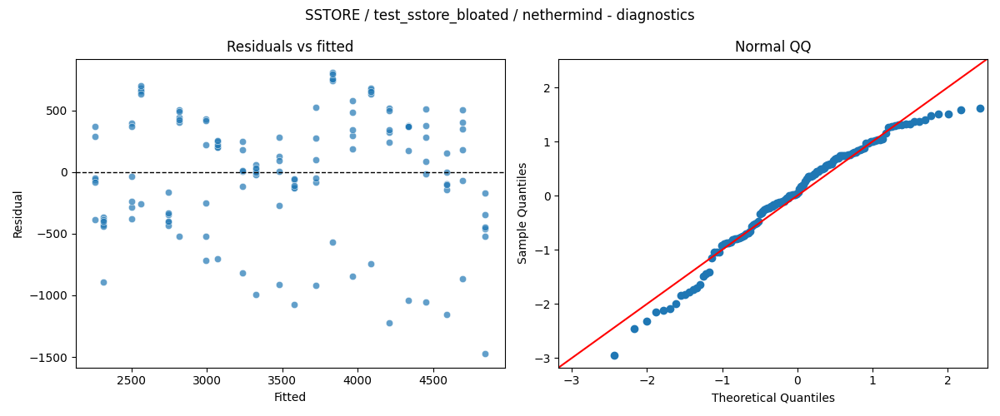

</details>

<details><summary>reth — NNLS regression summary</summary>

```
==============================================================================
                           NNLS Regression Results                            
==============================================================================
Dep. Variable:          test_runtime_ms              R-squared:          0.968
Model:                  NNLS                    Adj. R-squared:          0.968
No. Observations:       66                                RMSE:           7.75
Df Residuals:           64                                 MAE:           5.76
Df Model:               1      
==============================================================================
                      coef     std err     P-value      [0.025      0.975]
------------------------------------------------------------------------------
         const     26.7423      2.8619       0.001     21.2585     32.1251
       opcount      0.0015      0.0000       0.001      0.0015      0.0016
==============================================================================
Notes: Non-negative least squares with bootstrap inference (1000 iterations)
==============================================================================
```

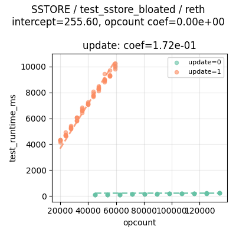

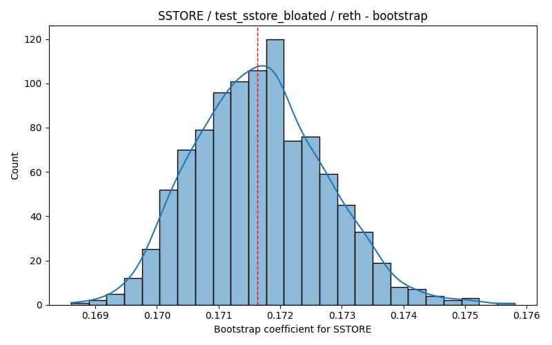

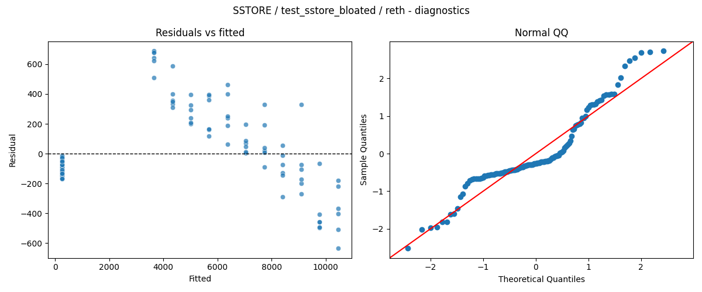

</details>

### test_sstore_bloated — combo `False` — `presets[cold_storage_sstore_write]`

| client | nobs | R² | target_coef (ms) | p-value | 95% CI |
| --- | --- | --- | --- | --- | --- |
| `erigon` | 33 | 0.7727 | 1.177 | 1.00e-03 | [0.93, 1.399] |
| `geth` | 99 | 0.8419 | 0.5161 | 1.00e-03 | [0.4755, 0.5526] |
| `nethermind` | 66 | 0.4521 | 0.06441 | 1.00e-03 | [0.0478, 0.07785] |
| `reth` | 66 | 0.004323 | 0.007578 | 3.56e-01 | [0, 0.04827] |

<details><summary>erigon — NNLS regression summary</summary>

```
==============================================================================
                           NNLS Regression Results                            
==============================================================================
Dep. Variable:          test_runtime_ms              R-squared:          0.773
Model:                  NNLS                    Adj. R-squared:          0.765
No. Observations:       33                                RMSE:         392.10
Df Residuals:           31                                 MAE:         324.32
Df Model:               1      
==============================================================================
                      coef     std err     P-value      [0.025      0.975]
------------------------------------------------------------------------------
         const   2616.8045    273.1502       0.001   2111.0448   3187.8508
       opcount      1.1771      0.1179       0.001      0.9300      1.3992
==============================================================================
Notes: Non-negative least squares with bootstrap inference (1000 iterations)
==============================================================================
```


</details>

<details><summary>geth — NNLS regression summary</summary>

```
==============================================================================
                           NNLS Regression Results                            
==============================================================================
Dep. Variable:          test_runtime_ms              R-squared:          0.842
Model:                  NNLS                    Adj. R-squared:          0.840
No. Observations:       99                                RMSE:         137.35
Df Residuals:           97                                 MAE:         103.79
Df Model:               1      
==============================================================================
                      coef     std err     P-value      [0.025      0.975]
------------------------------------------------------------------------------
         const     82.4544     40.0094       0.017      6.0294    166.5220
       opcount      0.5161      0.0202       0.001      0.4755      0.5526
==============================================================================
Notes: Non-negative least squares with bootstrap inference (1000 iterations)
==============================================================================
```


</details>

<details><summary>nethermind — NNLS regression summary</summary>

```
==============================================================================
                           NNLS Regression Results                            
==============================================================================
Dep. Variable:          test_runtime_ms              R-squared:          0.452
Model:                  NNLS                    Adj. R-squared:          0.444
No. Observations:       66                                RMSE:          43.55
Df Residuals:           64                                 MAE:          35.34
Df Model:               1      
==============================================================================
                      coef     std err     P-value      [0.025      0.975]
------------------------------------------------------------------------------
         const    144.0561     16.5249       0.001    114.8488    178.3987
       opcount      0.0644      0.0077       0.001      0.0478      0.0779
==============================================================================
Notes: Non-negative least squares with bootstrap inference (1000 iterations)
==============================================================================
```


</details>

<details><summary>reth — NNLS regression summary</summary>

```
==============================================================================
                           NNLS Regression Results                            
==============================================================================
Dep. Variable:          test_runtime_ms              R-squared:          0.004
Model:                  NNLS                    Adj. R-squared:         -0.011
No. Observations:       66                                RMSE:          70.63
Df Residuals:           64                                 MAE:          52.90
Df Model:               1      
==============================================================================
                      coef     std err     P-value      [0.025      0.975]
------------------------------------------------------------------------------
         const    308.8046     34.0111       0.001    216.9126    340.7689
       opcount      0.0076      0.0144       0.356      0.0000      0.0483
==============================================================================
Notes: Non-negative least squares with bootstrap inference (1000 iterations)
==============================================================================
```


</details>

### test_sstore_bloated — combo `True` — `presets[cold_storage_sstore_write]`

| client | nobs | R² | target_coef (ms) | p-value | 95% CI |
| --- | --- | --- | --- | --- | --- |
| `erigon` | 33 | 0.9918 | 0.572 | 1.00e-03 | [0.5535, 0.5889] |
| `geth` | 99 | 0.9547 | 0.1106 | 1.00e-03 | [0.1057, 0.1154] |
| `nethermind` | 66 | 0.7914 | 0.06728 | 1.00e-03 | [0.05827, 0.07561] |
| `reth` | 66 | 0.994 | 0.1481 | 1.00e-03 | [0.1454, 0.1512] |

<details><summary>erigon — NNLS regression summary</summary>

```
==============================================================================
                           NNLS Regression Results                            
==============================================================================
Dep. Variable:          test_runtime_ms              R-squared:          0.992
Model:                  NNLS                    Adj. R-squared:          0.992
No. Observations:       33                                RMSE:         649.54
Df Residuals:           31                                 MAE:         565.12
Df Model:               1      
==============================================================================
                      coef     std err     P-value      [0.025      0.975]
------------------------------------------------------------------------------
         const   5798.6886    335.9170       0.001   5197.3246   6481.0293
       opcount      0.5720      0.0094       0.001      0.5535      0.5889
==============================================================================
Notes: Non-negative least squares with bootstrap inference (1000 iterations)
==============================================================================
```


</details>

<details><summary>geth — NNLS regression summary</summary>

```
==============================================================================
                           NNLS Regression Results                            
==============================================================================
Dep. Variable:          test_runtime_ms              R-squared:          0.955
Model:                  NNLS                    Adj. R-squared:          0.954
No. Observations:       99                                RMSE:         301.72
Df Residuals:           97                                 MAE:         215.77
Df Model:               1      
==============================================================================
                      coef     std err     P-value      [0.025      0.975]
------------------------------------------------------------------------------
         const    850.0938     85.7176       0.001    672.5256   1012.1612
       opcount      0.1106      0.0024       0.001      0.1057      0.1154
==============================================================================
Notes: Non-negative least squares with bootstrap inference (1000 iterations)
==============================================================================
```


</details>

<details><summary>nethermind — NNLS regression summary</summary>

```
==============================================================================
                           NNLS Regression Results                            
==============================================================================
Dep. Variable:          test_runtime_ms              R-squared:          0.791
Model:                  NNLS                    Adj. R-squared:          0.788
No. Observations:       66                                RMSE:         432.59
Df Residuals:           64                                 MAE:         337.15
Df Model:               1      
==============================================================================
                      coef     std err     P-value      [0.025      0.975]
------------------------------------------------------------------------------
         const    789.9510    159.3482       0.001    477.8130   1101.2907
       opcount      0.0673      0.0044       0.001      0.0583      0.0756
==============================================================================
Notes: Non-negative least squares with bootstrap inference (1000 iterations)
==============================================================================
```


</details>

<details><summary>reth — NNLS regression summary</summary>

```
==============================================================================
                           NNLS Regression Results                            
==============================================================================
Dep. Variable:          test_runtime_ms              R-squared:          0.994
Model:                  NNLS                    Adj. R-squared:          0.994
No. Observations:       66                                RMSE:         144.41
Df Residuals:           64                                 MAE:         115.32
Df Model:               1      
==============================================================================
                      coef     std err     P-value      [0.025      0.975]
------------------------------------------------------------------------------
         const   1280.2931     54.5241       0.001   1174.5700   1384.4223
       opcount      0.1481      0.0015       0.001      0.1454      0.1512
==============================================================================
Notes: Non-negative least squares with bootstrap inference (1000 iterations)
==============================================================================
```


</details>

## BALANCE

### test_account_access — combo `BALANCE_AccountMode.EXISTING_EOA`

| client | nobs | R² | target_coef (ms) | p-value | 95% CI |
| --- | --- | --- | --- | --- | --- |
| `erigon` | 33 | 0.9982 | 0.009815 | 1.00e-03 | [0.009677, 0.009954] |
| `geth` | 99 | 0.7224 | 0.01203 | 1.00e-03 | [0.01054, 0.01348] |
| `nethermind` | 66 | 0.7289 | 0.005631 | 1.00e-03 | [0.004963, 0.006136] |
| `reth` | 66 | 0.9774 | 0.001086 | 1.00e-03 | [0.001047, 0.001127] |

<details><summary>erigon — NNLS regression summary</summary>

```
==============================================================================
                           NNLS Regression Results                            
==============================================================================
Dep. Variable:          test_runtime_ms              R-squared:          0.998
Model:                  NNLS                    Adj. R-squared:          0.998
No. Observations:       33                                RMSE:           9.85
Df Residuals:           31                                 MAE:           7.60
Df Model:               1      
==============================================================================
                      coef     std err     P-value      [0.025      0.975]
------------------------------------------------------------------------------
         const     27.4158      4.9520       0.001     17.7978     37.0114
       opcount      0.0098      0.0001       0.001      0.0097      0.0100
==============================================================================
Notes: Non-negative least squares with bootstrap inference (1000 iterations)
==============================================================================
```

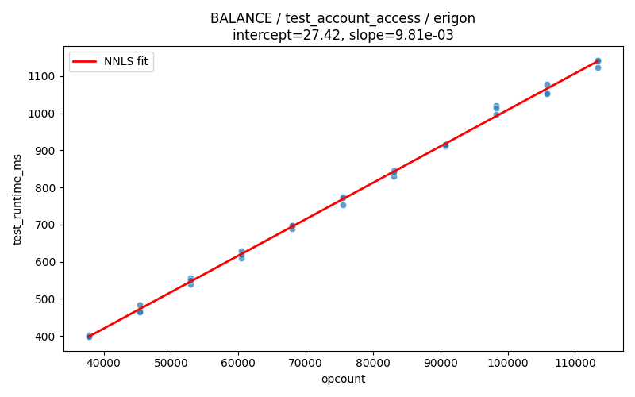

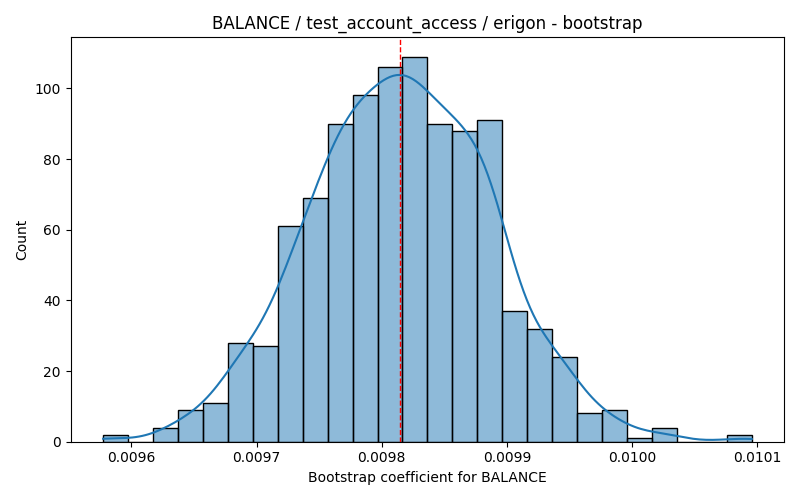

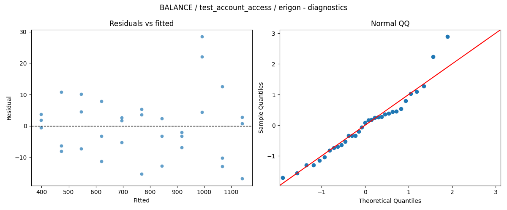

</details>

<details><summary>geth — NNLS regression summary</summary>

```
==============================================================================
                           NNLS Regression Results                            
==============================================================================
Dep. Variable:          test_runtime_ms              R-squared:          0.722
Model:                  NNLS                    Adj. R-squared:          0.719
No. Observations:       99                                RMSE:         178.22
Df Residuals:           97                                 MAE:         156.57
Df Model:               1      
==============================================================================
                      coef     std err     P-value      [0.025      0.975]
------------------------------------------------------------------------------
         const    474.0982     61.4809       0.001    353.6896    593.1160
       opcount      0.0120      0.0008       0.001      0.0105      0.0135
==============================================================================
Notes: Non-negative least squares with bootstrap inference (1000 iterations)
==============================================================================
```

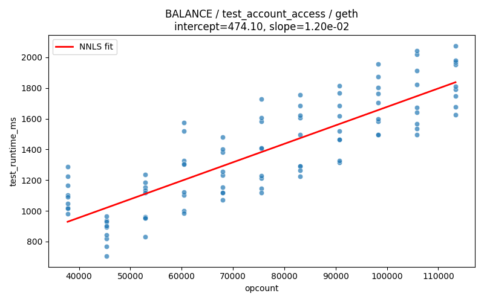

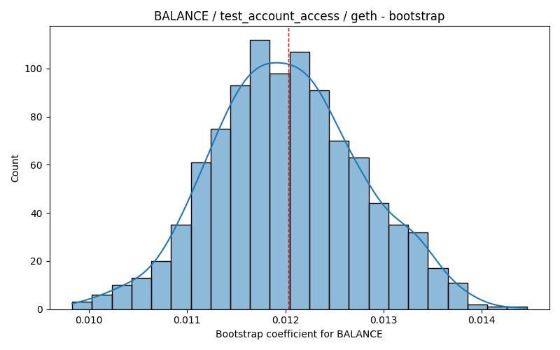

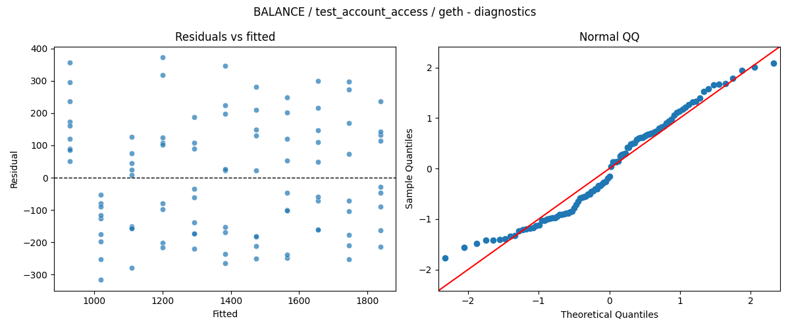

</details>

<details><summary>nethermind — NNLS regression summary</summary>

```
==============================================================================
                           NNLS Regression Results                            
==============================================================================
Dep. Variable:          test_runtime_ms              R-squared:          0.729
Model:                  NNLS                    Adj. R-squared:          0.725
No. Observations:       66                                RMSE:          82.09
Df Residuals:           64                                 MAE:          53.24
Df Model:               1      
==============================================================================
                      coef     std err     P-value      [0.025      0.975]
------------------------------------------------------------------------------
         const     21.6108     18.7806       0.163      0.0000     64.3143
       opcount      0.0056      0.0003       0.001      0.0050      0.0061
==============================================================================
Notes: Non-negative least squares with bootstrap inference (1000 iterations)
==============================================================================
```

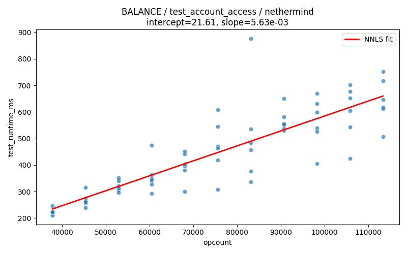

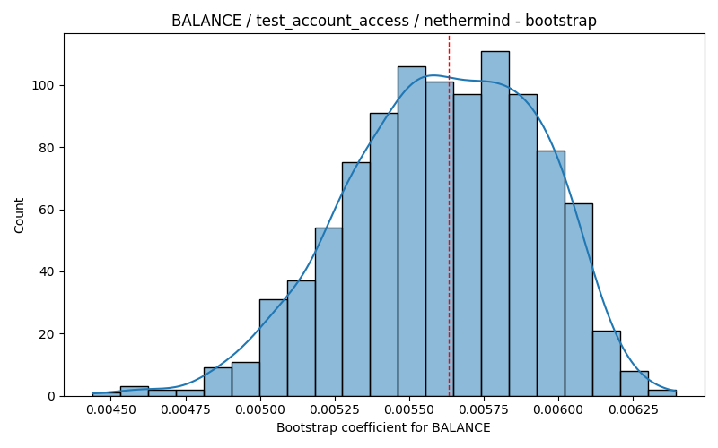

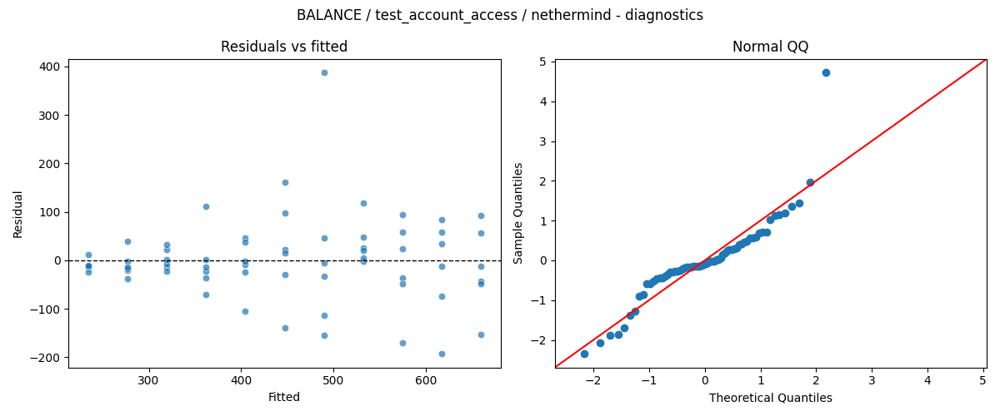

</details>

<details><summary>reth — NNLS regression summary</summary>

```
==============================================================================
                           NNLS Regression Results                            
==============================================================================
Dep. Variable:          test_runtime_ms              R-squared:          0.977
Model:                  NNLS                    Adj. R-squared:          0.977
No. Observations:       66                                RMSE:           3.94
Df Residuals:           64                                 MAE:           3.10
Df Model:               1      
==============================================================================
                      coef     std err     P-value      [0.025      0.975]
------------------------------------------------------------------------------
         const     32.0847      1.5593       0.001     28.9521     35.2343
       opcount      0.0011      0.0000       0.001      0.0010      0.0011
==============================================================================
Notes: Non-negative least squares with bootstrap inference (1000 iterations)
==============================================================================
```

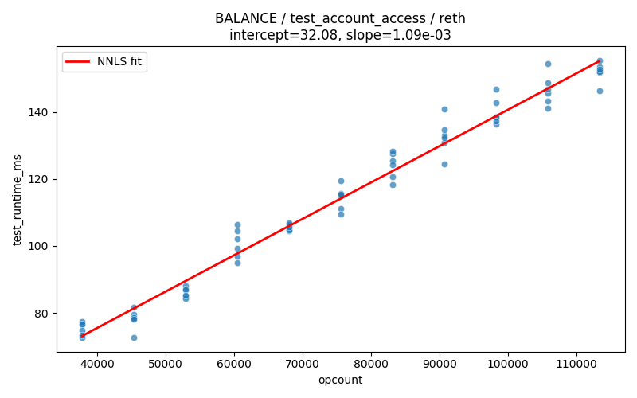

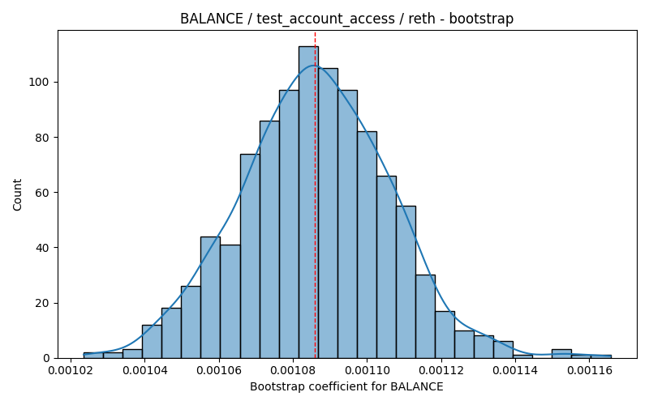

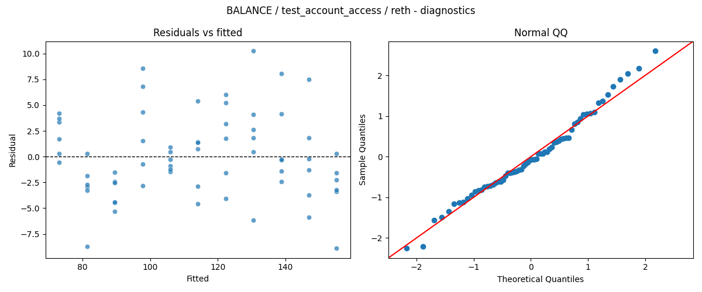

</details>

### test_account_access — combo `BALANCE_AccountMode.NON_EXISTING_ACCOUNT` — `presets[cold_account_nocode_access]`

| client | nobs | R² | target_coef (ms) | p-value | 95% CI |
| --- | --- | --- | --- | --- | --- |
| `erigon` | 33 | 0.9982 | 0.009107 | 1.00e-03 | [0.008992, 0.009125] |
| `geth` | 99 | 0.7244 | 0.02812 | 1.00e-03 | [0.02486, 0.03173] |
| `nethermind` | 66 | 0.8335 | 0.004969 | 1.00e-03 | [0.00442, 0.00545] |
| `reth` | 66 | 0.9749 | 0.000919 | 1.00e-03 | [0.0008808, 0.0009565] |

<details><summary>erigon — NNLS regression summary</summary>

```
==============================================================================
                           NNLS Regression Results                            
==============================================================================
Dep. Variable:          test_runtime_ms              R-squared:          0.998
Model:                  NNLS                    Adj. R-squared:          0.998
No. Observations:       33                                RMSE:           9.13
Df Residuals:           31                                 MAE:           7.31
Df Model:               1      
==============================================================================
                      coef     std err     P-value      [0.025      0.975]
------------------------------------------------------------------------------
         const      0.0000      3.0580       1.000      0.0000      9.7998
       opcount      0.0091      0.0000       0.001      0.0090      0.0091
==============================================================================
Notes: Non-negative least squares with bootstrap inference (1000 iterations)
==============================================================================
```


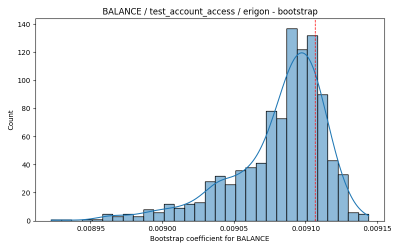

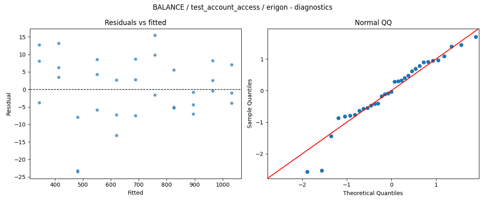

</details>

<details><summary>geth — NNLS regression summary</summary>

```
==============================================================================
                           NNLS Regression Results                            
==============================================================================
Dep. Variable:          test_runtime_ms              R-squared:          0.724
Model:                  NNLS                    Adj. R-squared:          0.722
No. Observations:       99                                RMSE:         414.56
Df Residuals:           97                                 MAE:         324.65
Df Model:               1      
==============================================================================
                      coef     std err     P-value      [0.025      0.975]
------------------------------------------------------------------------------
         const   1767.2473    147.5042       0.001   1445.8292   2049.1644
       opcount      0.0281      0.0017       0.001      0.0249      0.0317
==============================================================================
Notes: Non-negative least squares with bootstrap inference (1000 iterations)
==============================================================================
```

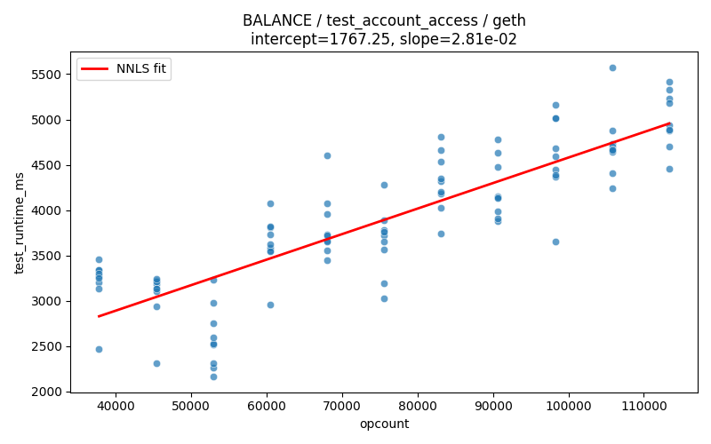

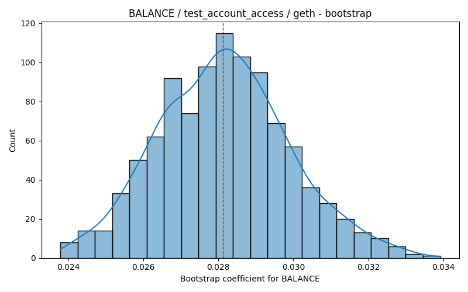

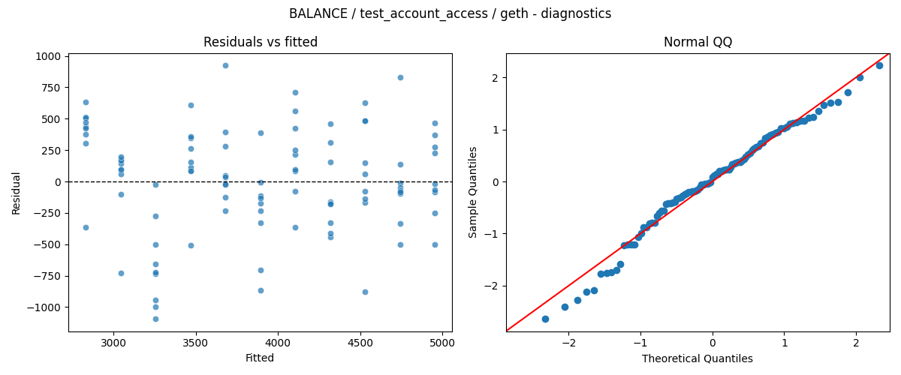

</details>

<details><summary>nethermind — NNLS regression summary</summary>

```
==============================================================================
                           NNLS Regression Results                            
==============================================================================
Dep. Variable:          test_runtime_ms              R-squared:          0.833
Model:                  NNLS                    Adj. R-squared:          0.831
No. Observations:       66                                RMSE:          53.08
Df Residuals:           64                                 MAE:          35.04
Df Model:               1      
==============================================================================
                      coef     std err     P-value      [0.025      0.975]
------------------------------------------------------------------------------
         const     29.4940     16.7615       0.050      0.0000     64.0963
       opcount      0.0050      0.0003       0.001      0.0044      0.0054
==============================================================================
Notes: Non-negative least squares with bootstrap inference (1000 iterations)
==============================================================================
```

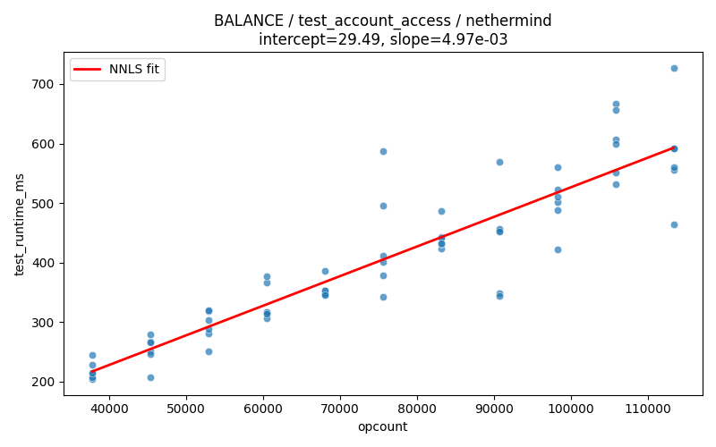

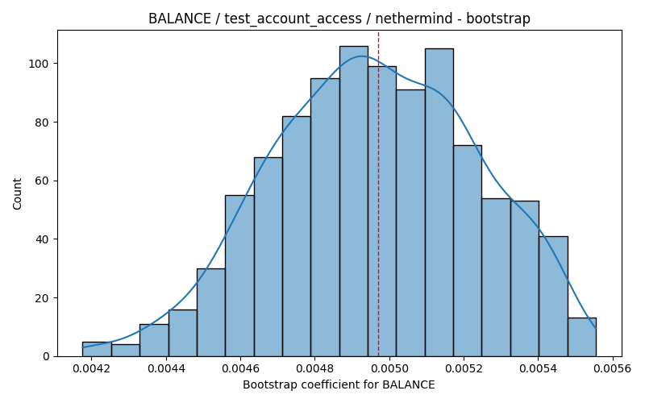

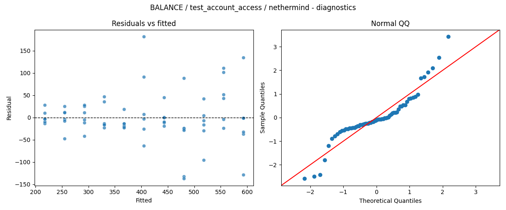

</details>

<details><summary>reth — NNLS regression summary</summary>

```
==============================================================================
                           NNLS Regression Results                            
==============================================================================
Dep. Variable:          test_runtime_ms              R-squared:          0.975
Model:                  NNLS                    Adj. R-squared:          0.975
No. Observations:       66                                RMSE:           3.52
Df Residuals:           64                                 MAE:           2.83
Df Model:               1      
==============================================================================
                      coef     std err     P-value      [0.025      0.975]
------------------------------------------------------------------------------
         const     31.2516      1.4390       0.001     28.4345     34.1966
       opcount      0.0009      0.0000       0.001      0.0009      0.0010
==============================================================================
Notes: Non-negative least squares with bootstrap inference (1000 iterations)
==============================================================================
```

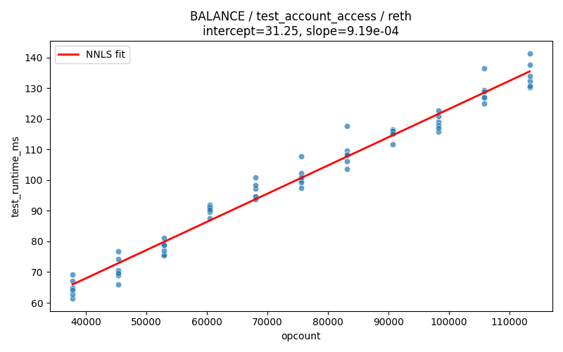

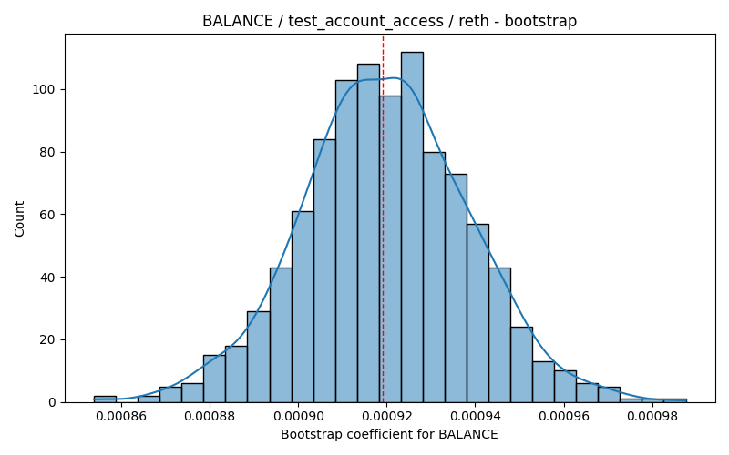

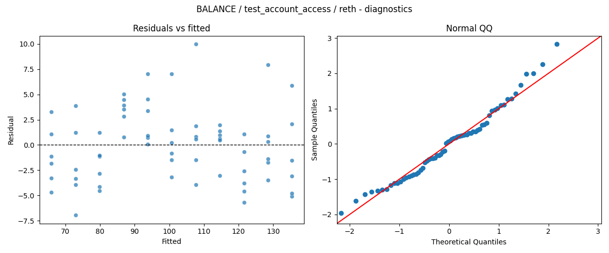

</details>

### test_account_access — combo `BALANCE_AccountMode.EXISTING_CONTRACT`

| client | nobs | R² | target_coef (ms) | p-value | 95% CI |
| --- | --- | --- | --- | --- | --- |
| `erigon` | 33 | 0.9025 | 0.03579 | 1.00e-03 | [0.03095, 0.03932] |
| `geth` | 99 | 0.6699 | 0.03448 | 1.00e-03 | [0.02979, 0.03967] |
| `nethermind` | 66 | 0.9075 | 0.01947 | 1.00e-03 | [0.01788, 0.02121] |
| `reth` | 66 | 0.7652 | 0.03025 | 1.00e-03 | [0.02639, 0.03386] |

<details><summary>erigon — NNLS regression summary</summary>

```
==============================================================================
                           NNLS Regression Results                            
==============================================================================
Dep. Variable:          test_runtime_ms              R-squared:          0.902
Model:                  NNLS                    Adj. R-squared:          0.899
No. Observations:       33                                RMSE:         244.80
Df Residuals:           31                                 MAE:         207.17
Df Model:               1      
==============================================================================
                      coef     std err     P-value      [0.025      0.975]
------------------------------------------------------------------------------
         const    431.4027    150.4979       0.001    172.0663    782.1404
       opcount      0.0358      0.0020       0.001      0.0310      0.0393
==============================================================================
Notes: Non-negative least squares with bootstrap inference (1000 iterations)
==============================================================================
```

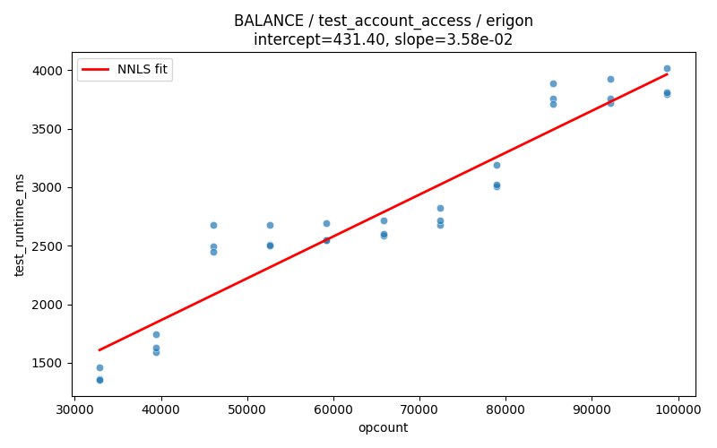

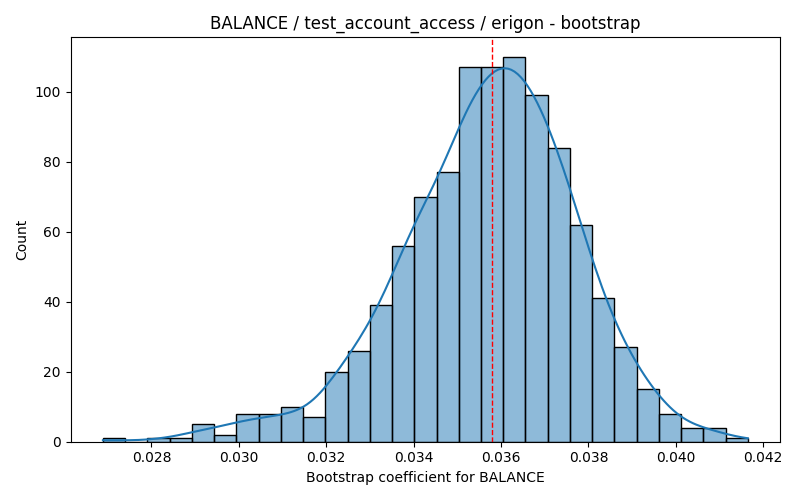

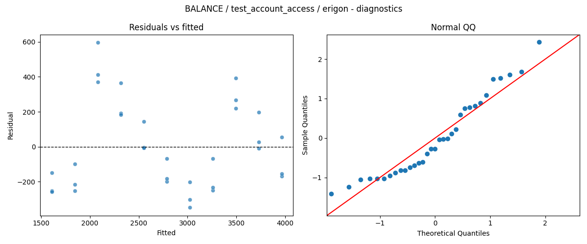

</details>

<details><summary>geth — NNLS regression summary</summary>

```
==============================================================================
                           NNLS Regression Results                            
==============================================================================
Dep. Variable:          test_runtime_ms              R-squared:          0.670
Model:                  NNLS                    Adj. R-squared:          0.666
No. Observations:       99                                RMSE:         503.53
Df Residuals:           97                                 MAE:         411.95
Df Model:               1      
==============================================================================
                      coef     std err     P-value      [0.025      0.975]
------------------------------------------------------------------------------
         const   1471.9648    165.0201       0.001   1114.7946   1765.4452
       opcount      0.0345      0.0025       0.001      0.0298      0.0397
==============================================================================
Notes: Non-negative least squares with bootstrap inference (1000 iterations)
==============================================================================
```

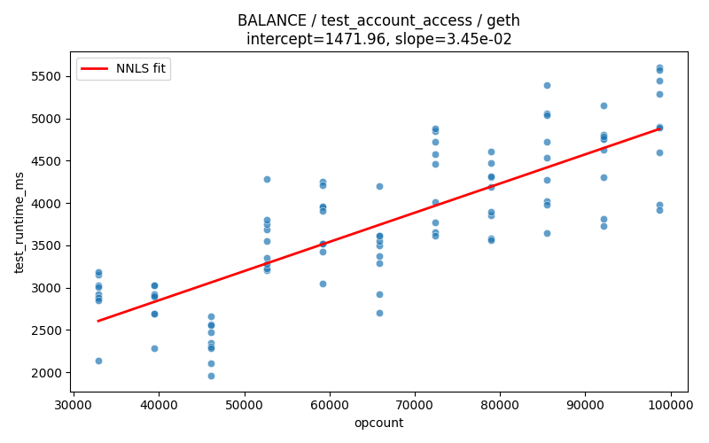

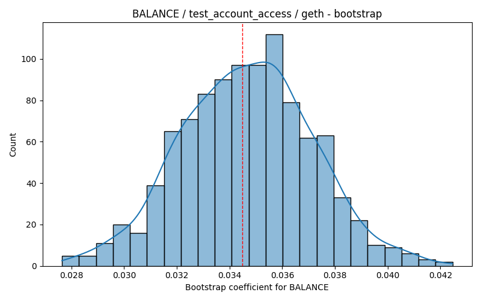

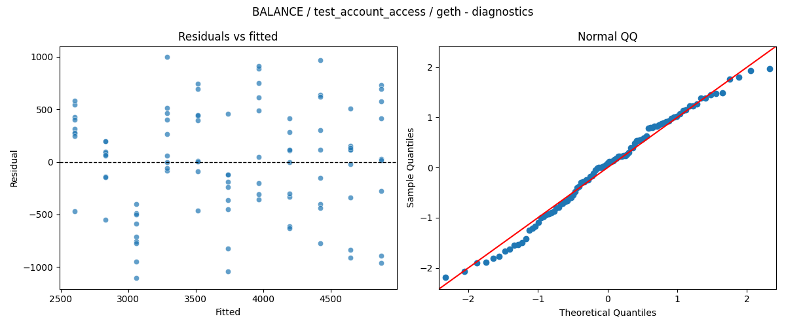

</details>

<details><summary>nethermind — NNLS regression summary</summary>

```
==============================================================================
                           NNLS Regression Results                            
==============================================================================
Dep. Variable:          test_runtime_ms              R-squared:          0.908
Model:                  NNLS                    Adj. R-squared:          0.906
No. Observations:       66                                RMSE:         129.31
Df Residuals:           64                                 MAE:          98.55
Df Model:               1      
==============================================================================
                      coef     std err     P-value      [0.025      0.975]
------------------------------------------------------------------------------
         const    206.2844     47.5973       0.001    112.3036    302.4987
       opcount      0.0195      0.0008       0.001      0.0179      0.0212
==============================================================================
Notes: Non-negative least squares with bootstrap inference (1000 iterations)
==============================================================================
```

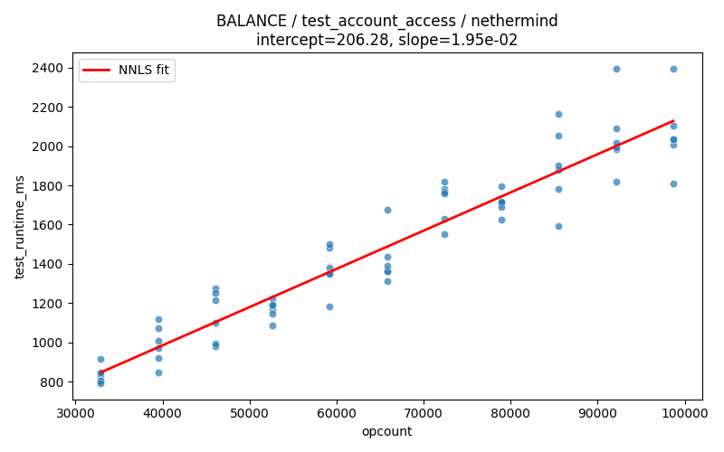

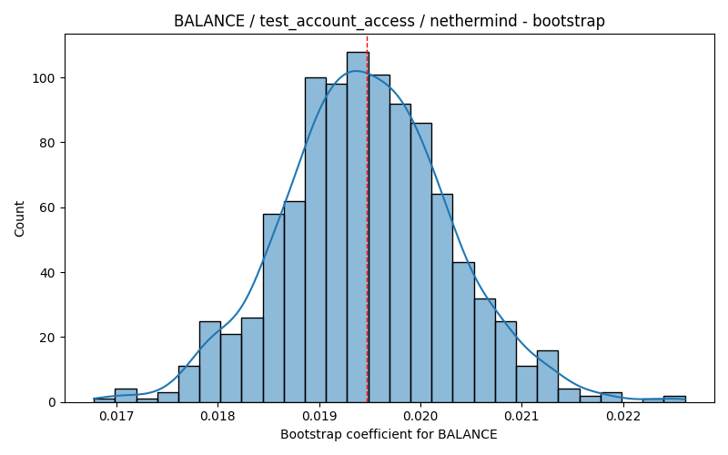

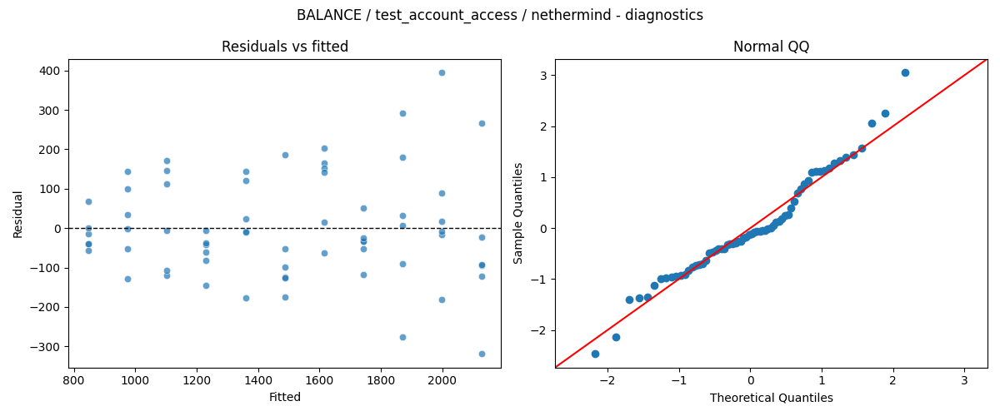

</details>

<details><summary>reth — NNLS regression summary</summary>

```
==============================================================================
                           NNLS Regression Results                            
==============================================================================
Dep. Variable:          test_runtime_ms              R-squared:          0.765
Model:                  NNLS                    Adj. R-squared:          0.762
No. Observations:       66                                RMSE:         348.56
Df Residuals:           64                                 MAE:         246.58
Df Model:               1      
==============================================================================
                      coef     std err     P-value      [0.025      0.975]
------------------------------------------------------------------------------
         const    857.8989    138.2550       0.001    593.5619   1134.1225
       opcount      0.0302      0.0019       0.001      0.0264      0.0339
==============================================================================
Notes: Non-negative least squares with bootstrap inference (1000 iterations)
==============================================================================
```

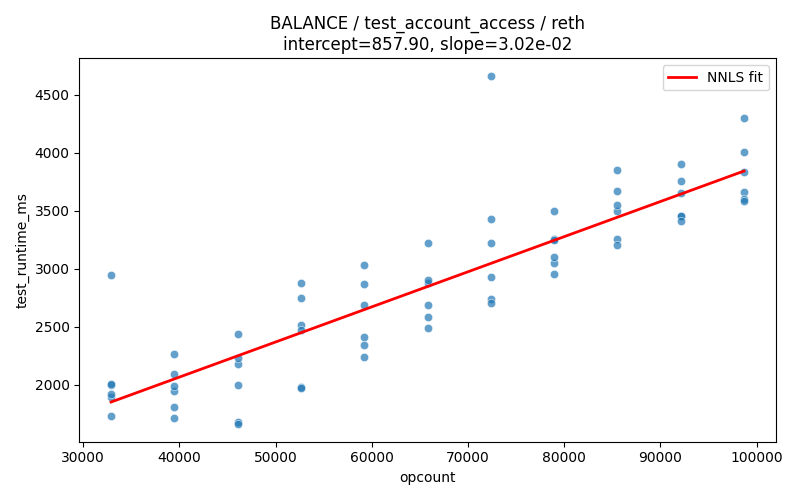

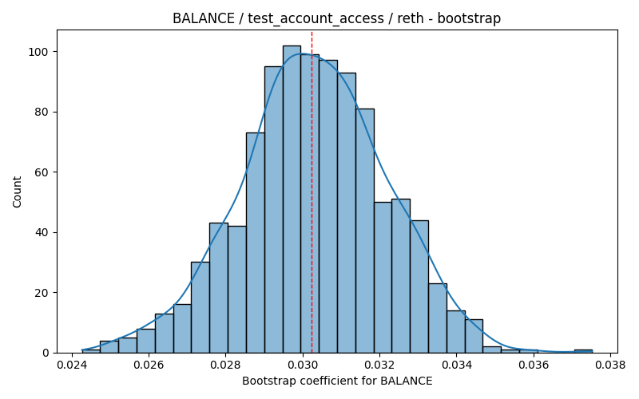

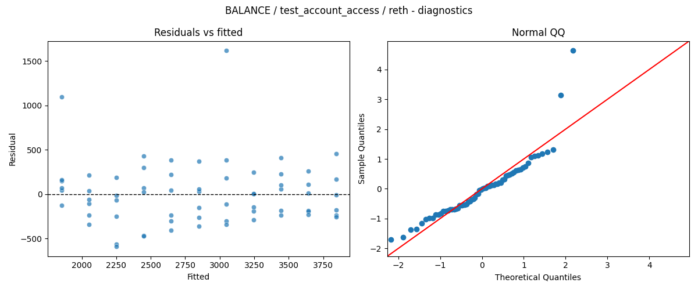

</details>

### test_account_access — combo `BALANCE_AccountMode.NON_EXISTING_ACCOUNT` — `presets[cold_account_code_access]`

| client | nobs | R² | target_coef (ms) | p-value | 95% CI |
| --- | --- | --- | --- | --- | --- |
| `erigon` | 33 | 0.9982 | 0.009107 | 1.00e-03 | [0.008992, 0.009125] |
| `geth` | 99 | 0.7244 | 0.02812 | 1.00e-03 | [0.02486, 0.03173] |
| `nethermind` | 66 | 0.8335 | 0.004969 | 1.00e-03 | [0.00442, 0.00545] |
| `reth` | 66 | 0.9749 | 0.000919 | 1.00e-03 | [0.0008808, 0.0009565] |

<details><summary>erigon — NNLS regression summary</summary>

```
==============================================================================
                           NNLS Regression Results                            
==============================================================================
Dep. Variable:          test_runtime_ms              R-squared:          0.998
Model:                  NNLS                    Adj. R-squared:          0.998
No. Observations:       33                                RMSE:           9.13
Df Residuals:           31                                 MAE:           7.31
Df Model:               1      
==============================================================================
                      coef     std err     P-value      [0.025      0.975]
------------------------------------------------------------------------------
         const      0.0000      3.0580       1.000      0.0000      9.7998
       opcount      0.0091      0.0000       0.001      0.0090      0.0091
==============================================================================
Notes: Non-negative least squares with bootstrap inference (1000 iterations)
==============================================================================
```


</details>

<details><summary>geth — NNLS regression summary</summary>

```
==============================================================================
                           NNLS Regression Results                            
==============================================================================
Dep. Variable:          test_runtime_ms              R-squared:          0.724
Model:                  NNLS                    Adj. R-squared:          0.722
No. Observations:       99                                RMSE:         414.56
Df Residuals:           97                                 MAE:         324.65
Df Model:               1      
==============================================================================
                      coef     std err     P-value      [0.025      0.975]
------------------------------------------------------------------------------
         const   1767.2473    147.5042       0.001   1445.8292   2049.1644
       opcount      0.0281      0.0017       0.001      0.0249      0.0317
==============================================================================
Notes: Non-negative least squares with bootstrap inference (1000 iterations)
==============================================================================
```


</details>

<details><summary>nethermind — NNLS regression summary</summary>

```
==============================================================================
                           NNLS Regression Results                            
==============================================================================
Dep. Variable:          test_runtime_ms              R-squared:          0.833
Model:                  NNLS                    Adj. R-squared:          0.831
No. Observations:       66                                RMSE:          53.08
Df Residuals:           64                                 MAE:          35.04
Df Model:               1      
==============================================================================
                      coef     std err     P-value      [0.025      0.975]
------------------------------------------------------------------------------
         const     29.4940     16.7615       0.050      0.0000     64.0963
       opcount      0.0050      0.0003       0.001      0.0044      0.0054
==============================================================================
Notes: Non-negative least squares with bootstrap inference (1000 iterations)
==============================================================================
```


</details>

<details><summary>reth — NNLS regression summary</summary>

```
==============================================================================
                           NNLS Regression Results                            
==============================================================================
Dep. Variable:          test_runtime_ms              R-squared:          0.975
Model:                  NNLS                    Adj. R-squared:          0.975
No. Observations:       66                                RMSE:           3.52
Df Residuals:           64                                 MAE:           2.83
Df Model:               1      
==============================================================================
                      coef     std err     P-value      [0.025      0.975]
------------------------------------------------------------------------------
         const     31.2516      1.4390       0.001     28.4345     34.1966
       opcount      0.0009      0.0000       0.001      0.0009      0.0010
==============================================================================
Notes: Non-negative least squares with bootstrap inference (1000 iterations)
==============================================================================
```


</details>

### test_ext_account_query_warm — combo `BALANCE`

| client | nobs | R² | target_coef (ms) | p-value | 95% CI |
| --- | --- | --- | --- | --- | --- |
| `erigon` | 33 | 0.9175 | 4.759e-05 | 1.00e-03 | [4.219e-05, 5.288e-05] |
| `geth` | 99 | 0.9767 | 0.0001395 | 1.00e-03 | [0.000135, 0.0001441] |
| `nethermind` | 66 | 0.7281 | 0.0001349 | 1.00e-03 | [0.0001195, 0.0001515] |
| `reth` | 66 | 0.6549 | 6.223e-06 | 1.00e-03 | [5.17e-06, 7.237e-06] |

<details><summary>erigon — NNLS regression summary</summary>

```
==============================================================================
                           NNLS Regression Results                            
==============================================================================
Dep. Variable:          test_runtime_ms              R-squared:          0.918
Model:                  NNLS                    Adj. R-squared:          0.915
No. Observations:       33                                RMSE:           8.34
Df Residuals:           31                                 MAE:           6.59
Df Model:               1      
==============================================================================
                      coef     std err     P-value      [0.025      0.975]
------------------------------------------------------------------------------
         const     40.2963      5.7946       0.001     30.3427     51.9124
       opcount      0.0000      0.0000       0.001      0.0000      0.0001
==============================================================================
Notes: Non-negative least squares with bootstrap inference (1000 iterations)
==============================================================================
```

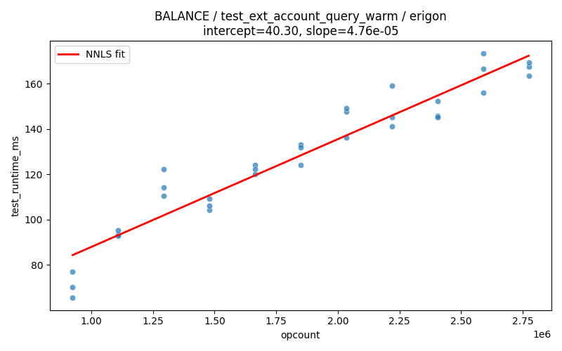

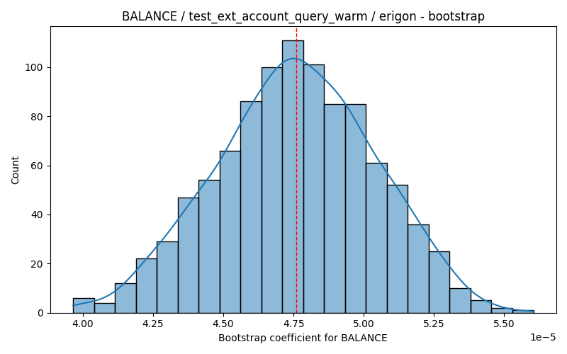

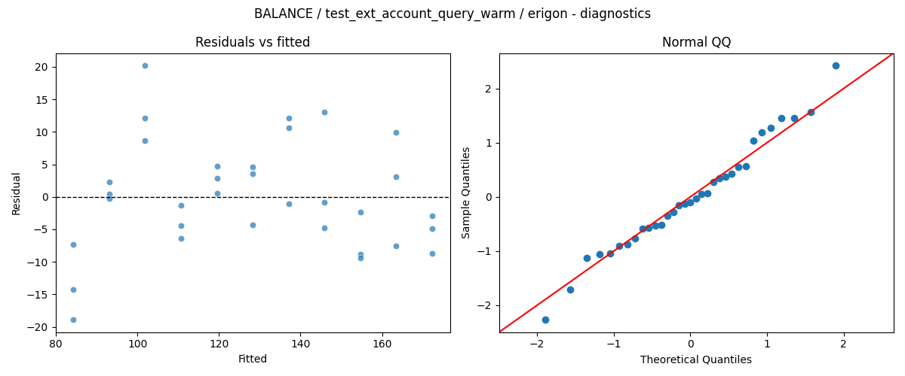

</details>

<details><summary>geth — NNLS regression summary</summary>

```
==============================================================================
                           NNLS Regression Results                            
==============================================================================
Dep. Variable:          test_runtime_ms              R-squared:          0.977
Model:                  NNLS                    Adj. R-squared:          0.976
No. Observations:       99                                RMSE:          12.59
Df Residuals:           97                                 MAE:           9.48
Df Model:               1      
==============================================================================
                      coef     std err     P-value      [0.025      0.975]
------------------------------------------------------------------------------
         const     10.9918      3.7805       0.002      3.2299     18.5003
       opcount      0.0001      0.0000       0.001      0.0001      0.0001
==============================================================================
Notes: Non-negative least squares with bootstrap inference (1000 iterations)
==============================================================================
```

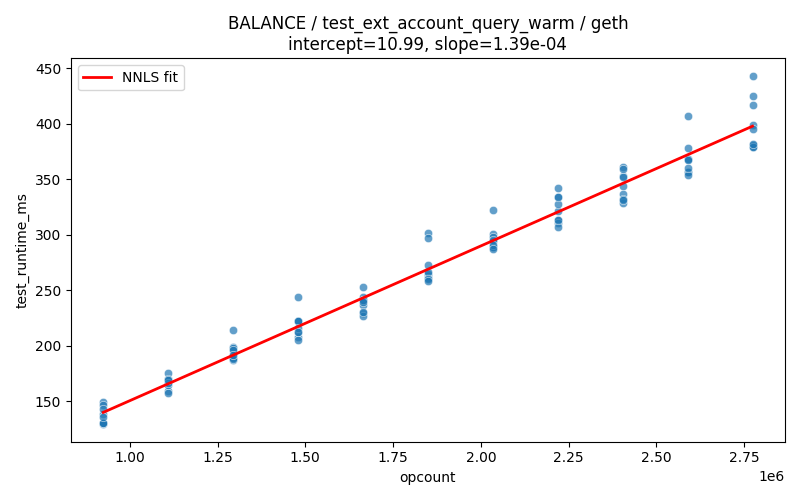

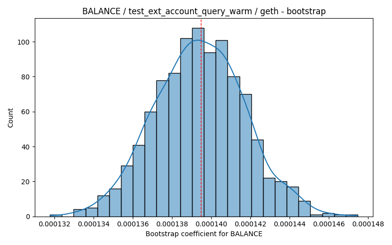

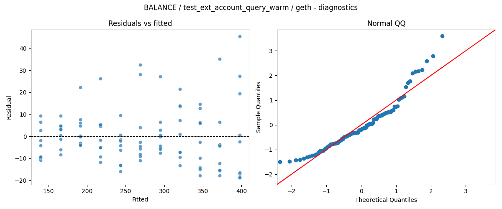

</details>

<details><summary>nethermind — NNLS regression summary</summary>

```
==============================================================================
                           NNLS Regression Results                            
==============================================================================
Dep. Variable:          test_runtime_ms              R-squared:          0.728
Model:                  NNLS                    Adj. R-squared:          0.724
No. Observations:       66                                RMSE:          48.20
Df Residuals:           64                                 MAE:          37.27
Df Model:               1      
==============================================================================
                      coef     std err     P-value      [0.025      0.975]
------------------------------------------------------------------------------
         const     76.1312     15.3782       0.001     44.4826    105.5723
       opcount      0.0001      0.0000       0.001      0.0001      0.0002
==============================================================================
Notes: Non-negative least squares with bootstrap inference (1000 iterations)
==============================================================================
```

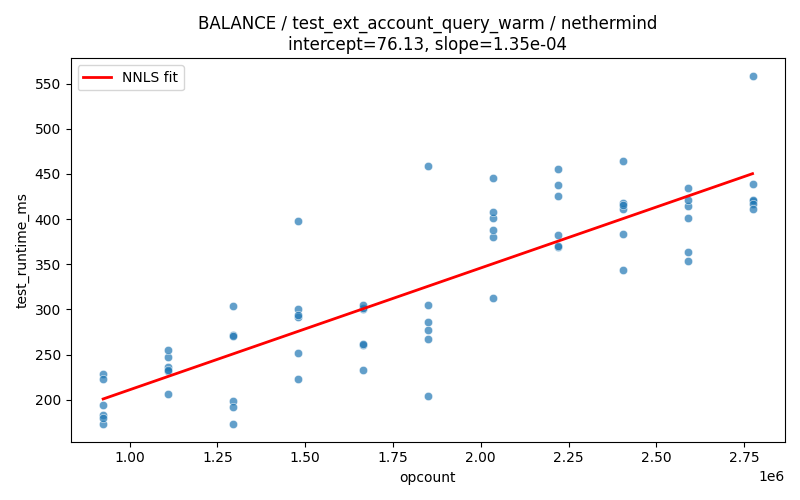

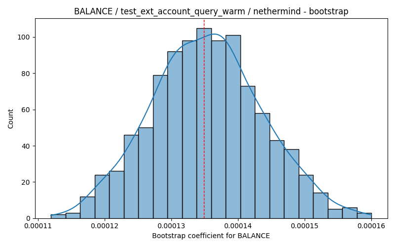

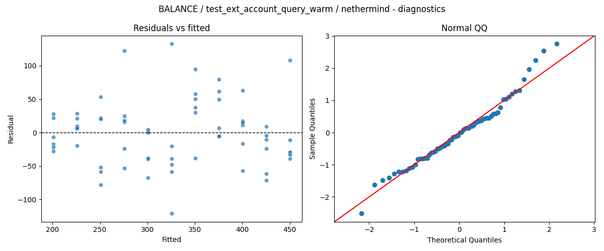

</details>

<details><summary>reth — NNLS regression summary</summary>

```
==============================================================================
                           NNLS Regression Results                            
==============================================================================
Dep. Variable:          test_runtime_ms              R-squared:          0.655
Model:                  NNLS                    Adj. R-squared:          0.650
No. Observations:       66                                RMSE:           2.64
Df Residuals:           64                                 MAE:           1.95
Df Model:               1      
==============================================================================
                      coef     std err     P-value      [0.025      0.975]
------------------------------------------------------------------------------
         const      6.9015      1.0340       0.001      5.0416      9.1341
       opcount      0.0000      0.0000       0.001      0.0000      0.0000
==============================================================================
Notes: Non-negative least squares with bootstrap inference (1000 iterations)
==============================================================================
```

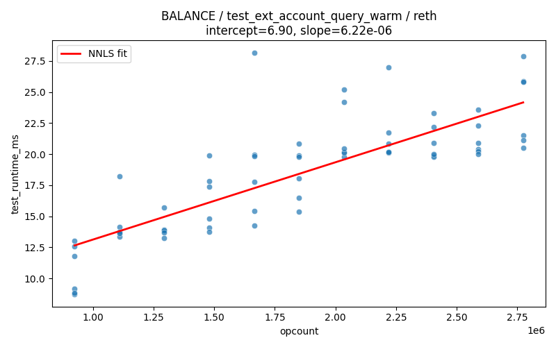

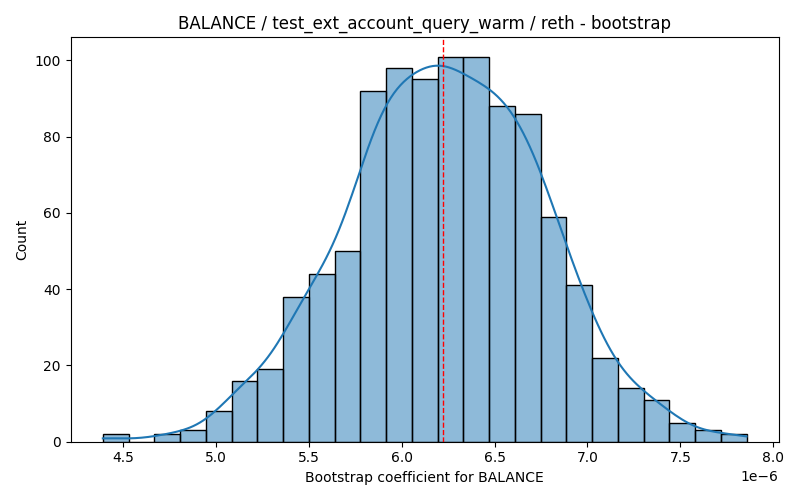

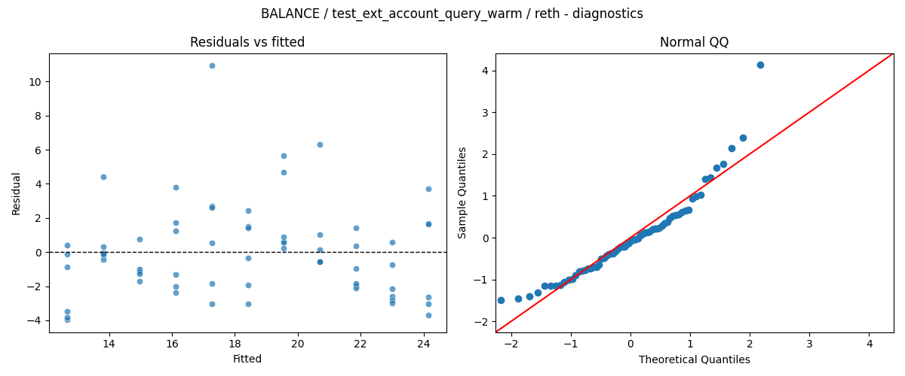

</details>

## CALL

### test_account_access — combo `CALL_AccountMode.EXISTING_EOA` — `presets[cold_account_nocode_access]`

| client | nobs | R² | target_coef (ms) | p-value | 95% CI |
| --- | --- | --- | --- | --- | --- |
| `erigon` | 33 | 0.9971 | 0.01105 | 1.00e-03 | [0.01088, 0.01126] |
| `geth` | 99 | 0.7405 | 0.01217 | 1.00e-03 | [0.01095, 0.0135] |
| `nethermind` | 66 | 0.8701 | 0.006239 | 1.00e-03 | [0.005639, 0.006794] |
| `reth` | 66 | 0.9787 | 0.001142 | 1.00e-03 | [0.001105, 0.001185] |

<details><summary>erigon — NNLS regression summary</summary>

```
==============================================================================
                           NNLS Regression Results                            
==============================================================================
Dep. Variable:          test_runtime_ms              R-squared:          0.997
Model:                  NNLS                    Adj. R-squared:          0.997
No. Observations:       33                                RMSE:          14.26
Df Residuals:           31                                 MAE:          11.41
Df Model:               1      
==============================================================================
                      coef     std err     P-value      [0.025      0.975]
------------------------------------------------------------------------------
         const     40.9669      6.3590       0.001     26.7984     52.1663
       opcount      0.0110      0.0001       0.001      0.0109      0.0113
==============================================================================
Notes: Non-negative least squares with bootstrap inference (1000 iterations)
==============================================================================
```

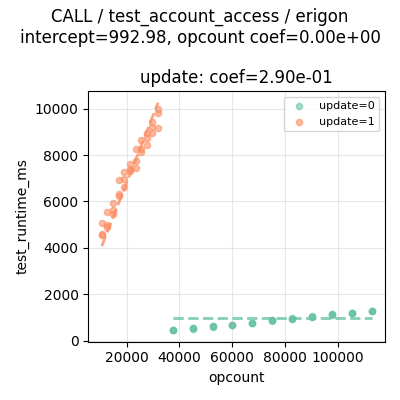

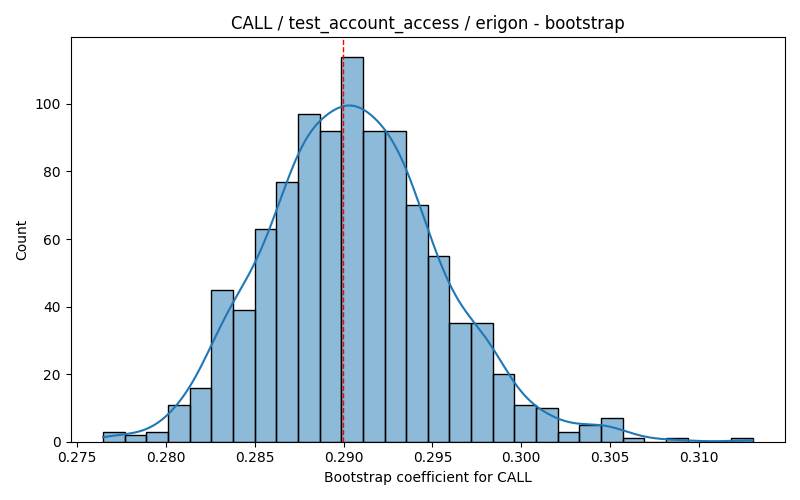

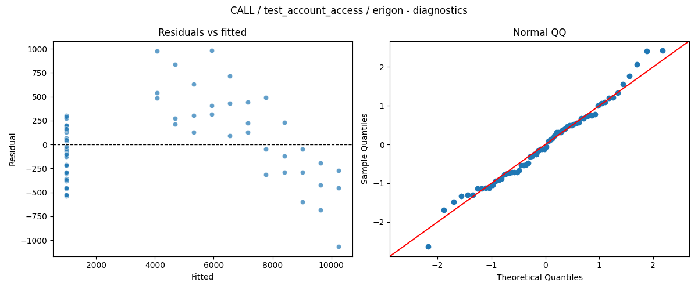

</details>

<details><summary>geth — NNLS regression summary</summary>

```
==============================================================================
                           NNLS Regression Results                            
==============================================================================
Dep. Variable:          test_runtime_ms              R-squared:          0.741
Model:                  NNLS                    Adj. R-squared:          0.738
No. Observations:       99                                RMSE:         171.11
Df Residuals:           97                                 MAE:         149.13
Df Model:               1      
==============================================================================
                      coef     std err     P-value      [0.025      0.975]
------------------------------------------------------------------------------
         const    515.8667     51.0545       0.001    410.9216    611.0239
       opcount      0.0122      0.0007       0.001      0.0109      0.0135
==============================================================================
Notes: Non-negative least squares with bootstrap inference (1000 iterations)
==============================================================================
```

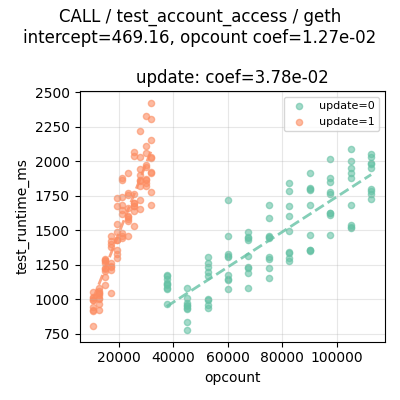

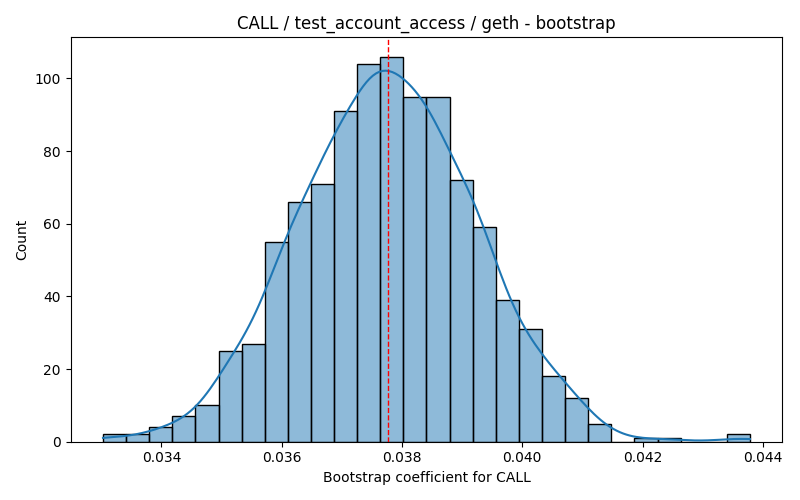

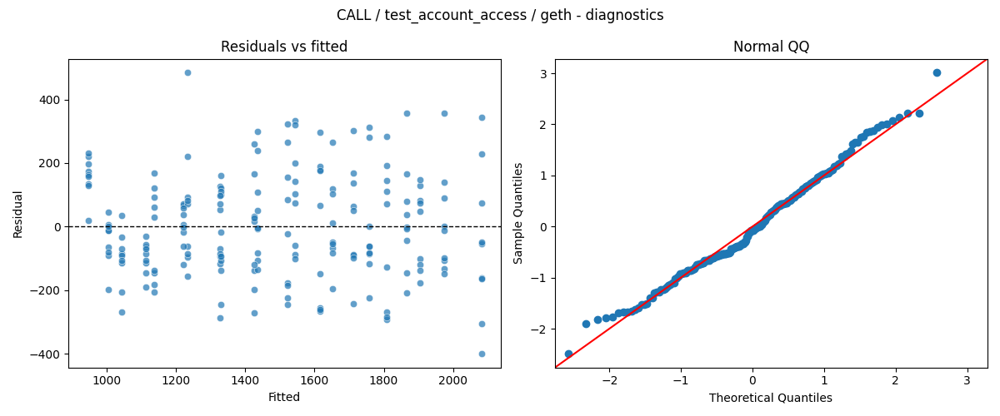

</details>

<details><summary>nethermind — NNLS regression summary</summary>

```
==============================================================================
                           NNLS Regression Results                            
==============================================================================
Dep. Variable:          test_runtime_ms              R-squared:          0.870
Model:                  NNLS                    Adj. R-squared:          0.868
No. Observations:       66                                RMSE:          57.23
Df Residuals:           64                                 MAE:          43.10
Df Model:               1      
==============================================================================
                      coef     std err     P-value      [0.025      0.975]
------------------------------------------------------------------------------
         const     42.1144     20.1313       0.020      2.7773     82.1976
       opcount      0.0062      0.0003       0.001      0.0056      0.0068
==============================================================================
Notes: Non-negative least squares with bootstrap inference (1000 iterations)
==============================================================================
```

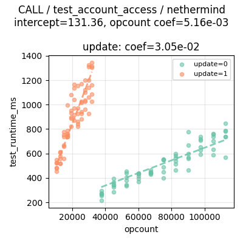

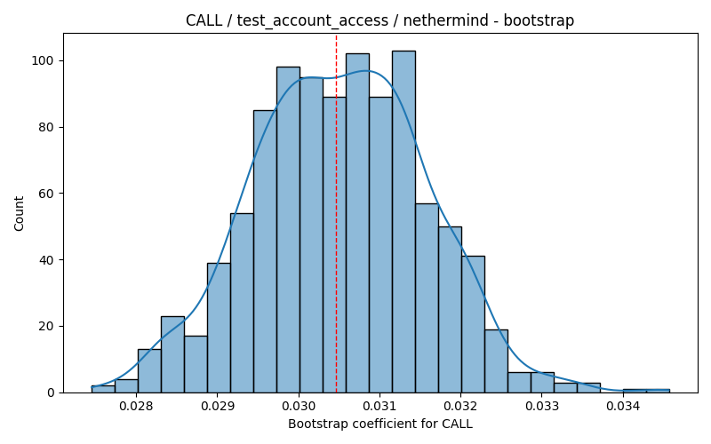

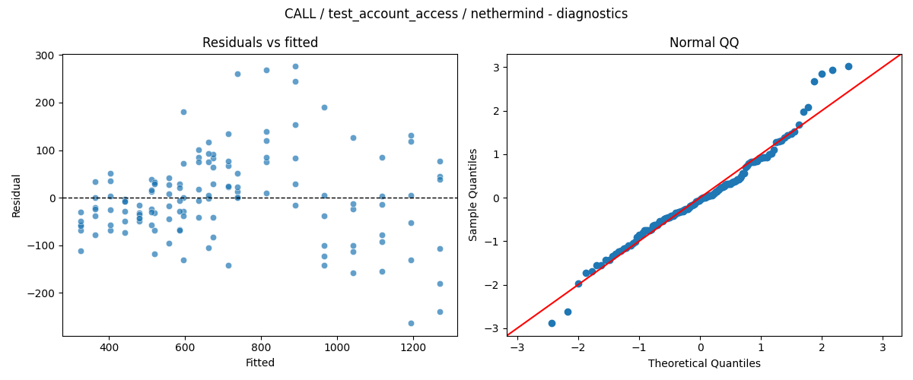

</details>

<details><summary>reth — NNLS regression summary</summary>

```
==============================================================================
                           NNLS Regression Results                            
==============================================================================
Dep. Variable:          test_runtime_ms              R-squared:          0.979
Model:                  NNLS                    Adj. R-squared:          0.978
No. Observations:       66                                RMSE:           4.00
Df Residuals:           64                                 MAE:           3.52
Df Model:               1      
==============================================================================
                      coef     std err     P-value      [0.025      0.975]
------------------------------------------------------------------------------
         const     31.1145      1.7226       0.001     27.5139     34.2199
       opcount      0.0011      0.0000       0.001      0.0011      0.0012
==============================================================================
Notes: Non-negative least squares with bootstrap inference (1000 iterations)
==============================================================================
```

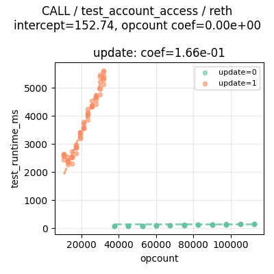

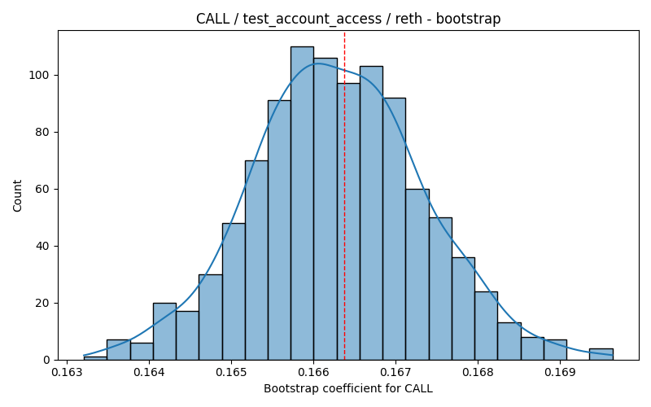

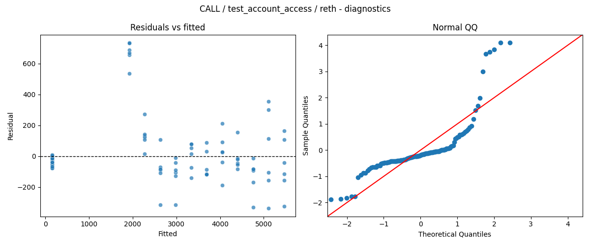

</details>

### test_account_access — combo `CALL_AccountMode.NON_EXISTING_ACCOUNT` — `presets[cold_account_nocode_access]`

| client | nobs | R² | target_coef (ms) | p-value | 95% CI |
| --- | --- | --- | --- | --- | --- |
| `erigon` | 33 | 0.9983 | 0.01002 | 1.00e-03 | [0.009874, 0.0102] |
| `geth` | 99 | 0.6917 | 0.03123 | 1.00e-03 | [0.02757, 0.03565] |
| `nethermind` | 66 | 0.7458 | 0.006286 | 1.00e-03 | [0.005412, 0.006926] |
| `reth` | 66 | 0.9729 | 0.0009885 | 1.00e-03 | [0.0009443, 0.001031] |

<details><summary>erigon — NNLS regression summary</summary>

```
==============================================================================
                           NNLS Regression Results                            
==============================================================================
Dep. Variable:          test_runtime_ms              R-squared:          0.998
Model:                  NNLS                    Adj. R-squared:          0.998
No. Observations:       33                                RMSE:           9.68
Df Residuals:           31                                 MAE:           8.02
Df Model:               1      
==============================================================================
                      coef     std err     P-value      [0.025      0.975]
------------------------------------------------------------------------------
         const     18.7463      6.7365       0.009      3.3549     30.4253
       opcount      0.0100      0.0001       0.001      0.0099      0.0102
==============================================================================
Notes: Non-negative least squares with bootstrap inference (1000 iterations)
==============================================================================
```

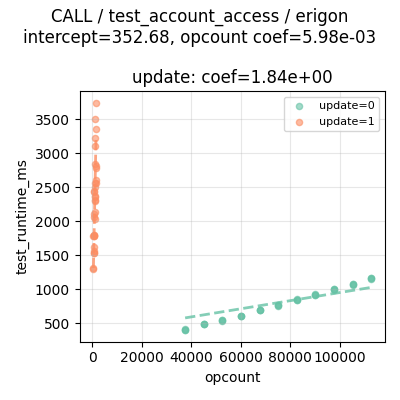

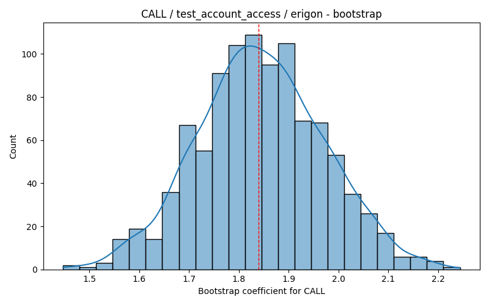

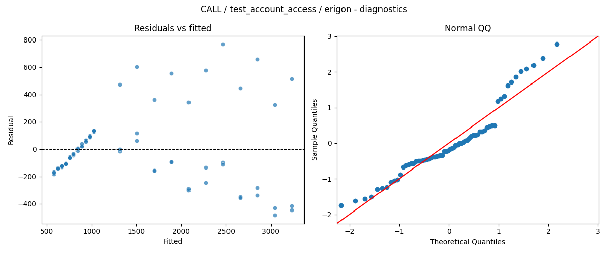

</details>

<details><summary>geth — NNLS regression summary</summary>

```
==============================================================================
                           NNLS Regression Results                            
==============================================================================
Dep. Variable:          test_runtime_ms              R-squared:          0.692
Model:                  NNLS                    Adj. R-squared:          0.689
No. Observations:       99                                RMSE:         495.13
Df Residuals:           97                                 MAE:         402.17
Df Model:               1      
==============================================================================
                      coef     std err     P-value      [0.025      0.975]
------------------------------------------------------------------------------
         const   1624.7398    164.3540       0.001   1275.4694   1901.6730
       opcount      0.0312      0.0021       0.001      0.0276      0.0356
==============================================================================
Notes: Non-negative least squares with bootstrap inference (1000 iterations)
==============================================================================
```

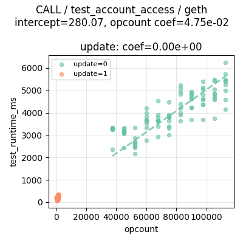


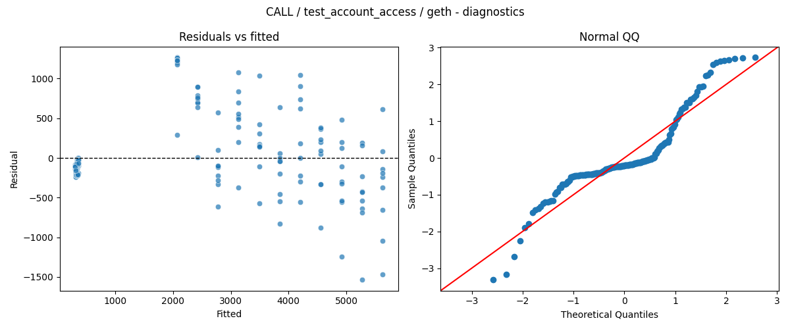

</details>

<details><summary>nethermind — NNLS regression summary</summary>

```
==============================================================================
                           NNLS Regression Results                            
==============================================================================
Dep. Variable:          test_runtime_ms              R-squared:          0.746
Model:                  NNLS                    Adj. R-squared:          0.742
No. Observations:       66                                RMSE:          87.14
Df Residuals:           64                                 MAE:          50.58
Df Model:               1      
==============================================================================
                      coef     std err     P-value      [0.025      0.975]
------------------------------------------------------------------------------
         const     22.9118     21.4643       0.187      0.0000     72.5793
       opcount      0.0063      0.0004       0.001      0.0054      0.0069
==============================================================================
Notes: Non-negative least squares with bootstrap inference (1000 iterations)
==============================================================================
```

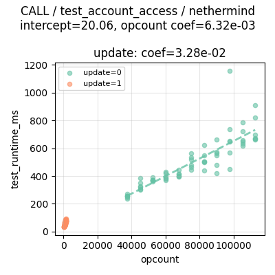

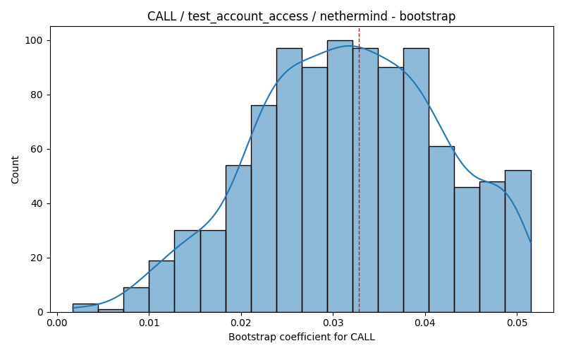

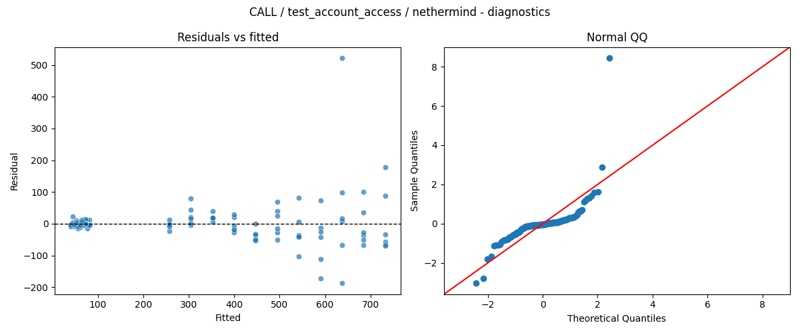

</details>

<details><summary>reth — NNLS regression summary</summary>

```
==============================================================================
                           NNLS Regression Results                            
==============================================================================
Dep. Variable:          test_runtime_ms              R-squared:          0.973
Model:                  NNLS                    Adj. R-squared:          0.973
No. Observations:       66                                RMSE:           3.92
Df Residuals:           64                                 MAE:           3.04
Df Model:               1      
==============================================================================
                      coef     std err     P-value      [0.025      0.975]
------------------------------------------------------------------------------
         const     29.4766      1.7475       0.001     26.3272     33.1263
       opcount      0.0010      0.0000       0.001      0.0009      0.0010
==============================================================================
Notes: Non-negative least squares with bootstrap inference (1000 iterations)
==============================================================================
```

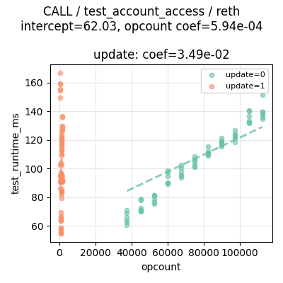

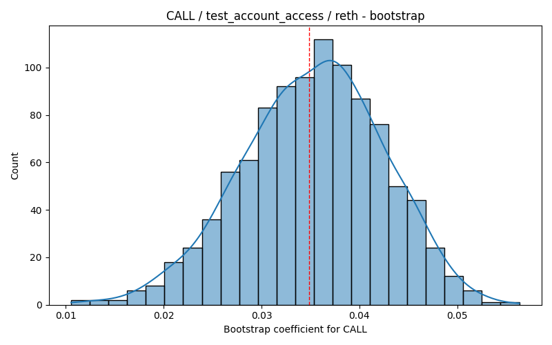

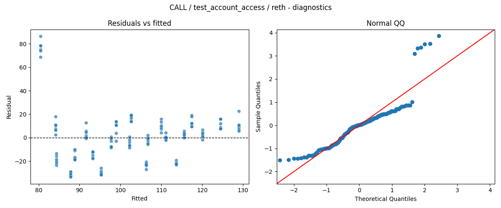

</details>

### test_account_access — combo `CALL_AccountMode.EXISTING_CONTRACT` — `presets[cold_account_code_access]`

| client | nobs | R² | target_coef (ms) | p-value | 95% CI |
| --- | --- | --- | --- | --- | --- |
| `erigon` | 33 | 0.8722 | 0.08722 | 1.00e-03 | [0.0739, 0.09735] |
| `geth` | 99 | 0.847 | 0.04416 | 1.00e-03 | [0.0407, 0.04789] |
| `nethermind` | 66 | 0.9102 | 0.02092 | 1.00e-03 | [0.01924, 0.0226] |
| `reth` | 66 | 0.955 | 0.03464 | 1.00e-03 | [0.03255, 0.03695] |

<details><summary>erigon — NNLS regression summary</summary>

```
==============================================================================
                           NNLS Regression Results                            
==============================================================================
Dep. Variable:          test_runtime_ms              R-squared:          0.872
Model:                  NNLS                    Adj. R-squared:          0.868
No. Observations:       33                                RMSE:         679.23
Df Residuals:           31                                 MAE:         583.28
Df Model:               1      
==============================================================================
                      coef     std err     P-value      [0.025      0.975]
------------------------------------------------------------------------------
         const   1500.7065    436.4871       0.001    772.2236   2479.9973
       opcount      0.0872      0.0059       0.001      0.0739      0.0974
==============================================================================
Notes: Non-negative least squares with bootstrap inference (1000 iterations)
==============================================================================
```

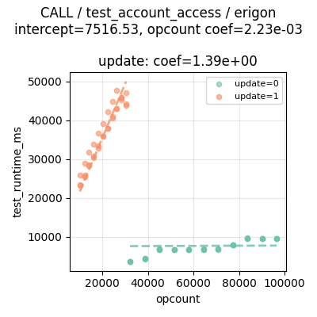

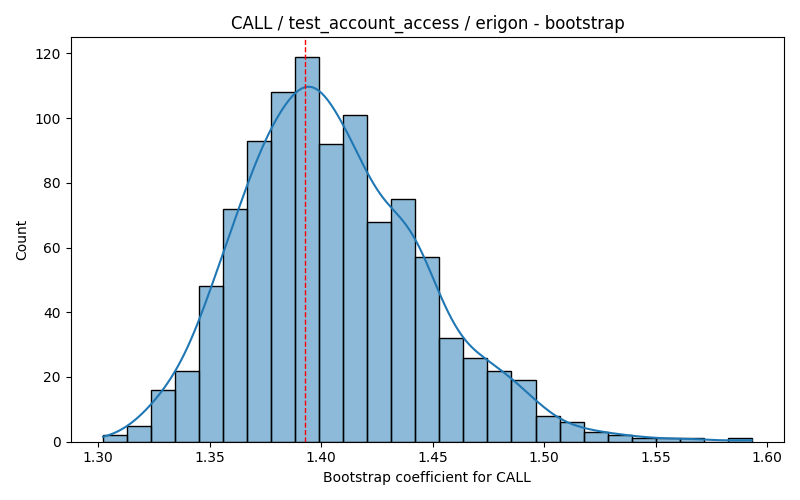

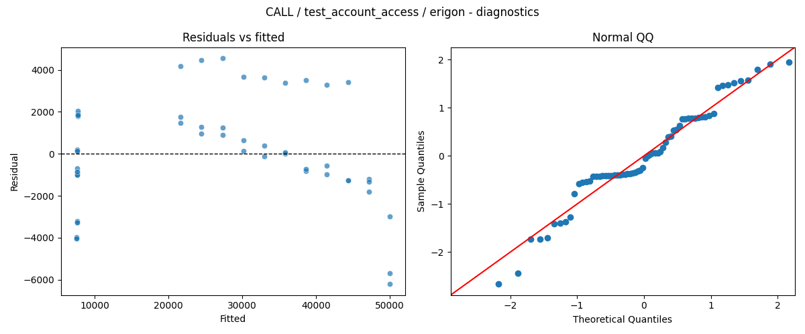

</details>

<details><summary>geth — NNLS regression summary</summary>

```
==============================================================================
                           NNLS Regression Results                            
==============================================================================
Dep. Variable:          test_runtime_ms              R-squared:          0.847
Model:                  NNLS                    Adj. R-squared:          0.845
No. Observations:       99                                RMSE:         381.86
Df Residuals:           97                                 MAE:         307.66
Df Model:               1      
==============================================================================
                      coef     std err     P-value      [0.025      0.975]
------------------------------------------------------------------------------
         const   1136.0652    117.1849       0.001    898.1825   1360.7066
       opcount      0.0442      0.0019       0.001      0.0407      0.0479
==============================================================================
Notes: Non-negative least squares with bootstrap inference (1000 iterations)
==============================================================================
```

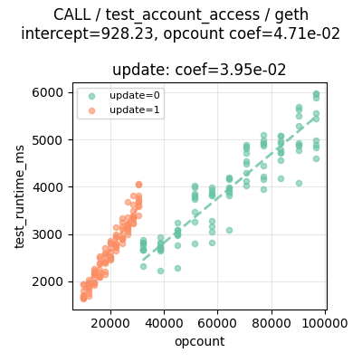


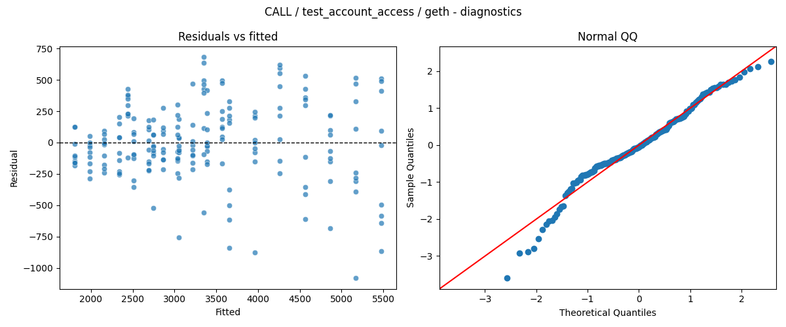

</details>

<details><summary>nethermind — NNLS regression summary</summary>

```
==============================================================================
                           NNLS Regression Results                            
==============================================================================
Dep. Variable:          test_runtime_ms              R-squared:          0.910
Model:                  NNLS                    Adj. R-squared:          0.909
No. Observations:       66                                RMSE:         133.70
Df Residuals:           64                                 MAE:         103.09
Df Model:               1      
==============================================================================
                      coef     std err     P-value      [0.025      0.975]
------------------------------------------------------------------------------
         const    222.6642     50.6067       0.001    127.2660    326.2801
       opcount      0.0209      0.0009       0.001      0.0192      0.0226
==============================================================================
Notes: Non-negative least squares with bootstrap inference (1000 iterations)
==============================================================================
```

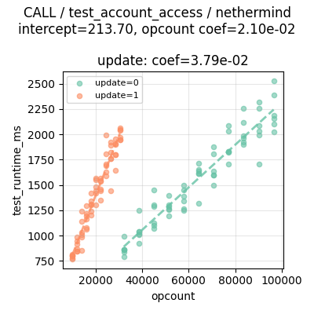

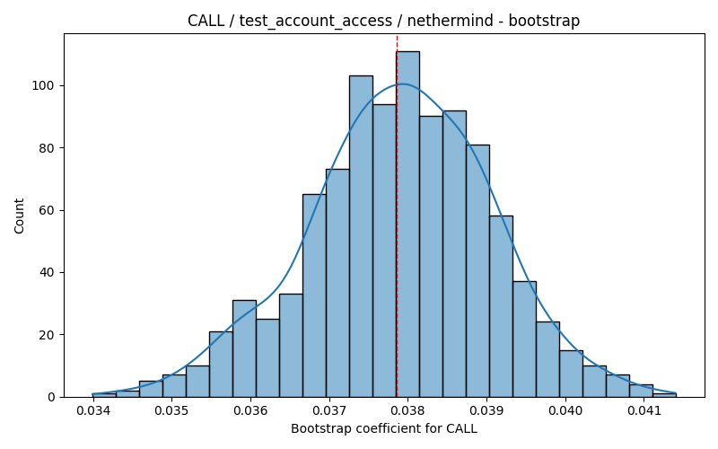

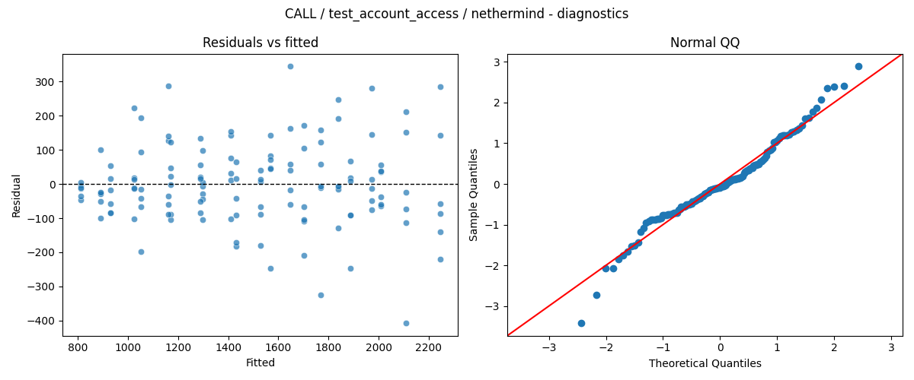

</details>

<details><summary>reth — NNLS regression summary</summary>

```
==============================================================================
                           NNLS Regression Results                            
==============================================================================
Dep. Variable:          test_runtime_ms              R-squared:          0.955
Model:                  NNLS                    Adj. R-squared:          0.954
No. Observations:       66                                RMSE:         153.00
Df Residuals:           64                                 MAE:         123.12
Df Model:               1      
==============================================================================
                      coef     std err     P-value      [0.025      0.975]
------------------------------------------------------------------------------
         const    321.4173     80.0172       0.001    148.2434    462.4042
       opcount      0.0346      0.0011       0.001      0.0326      0.0370
==============================================================================
Notes: Non-negative least squares with bootstrap inference (1000 iterations)
==============================================================================
```

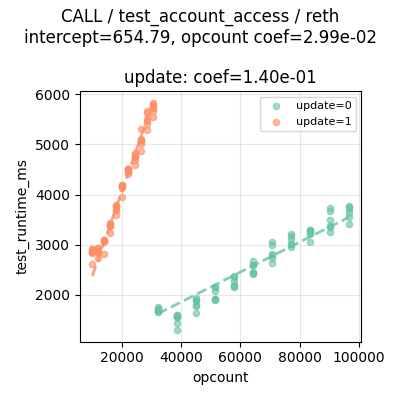

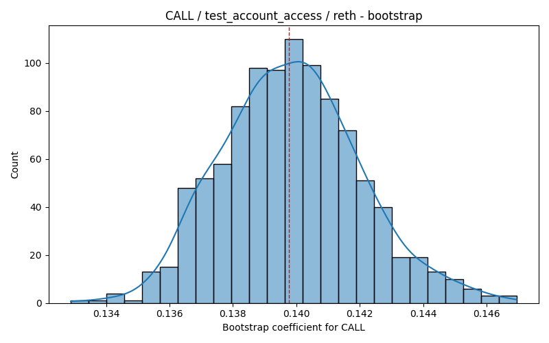

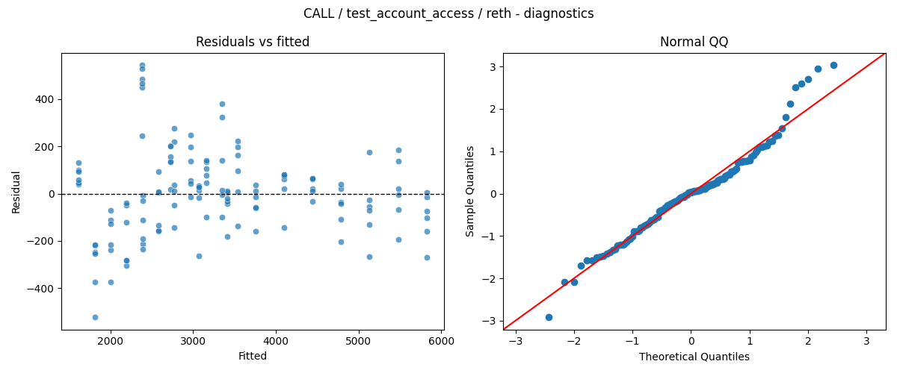

</details>

### test_account_access — combo `CALL_AccountMode.NON_EXISTING_ACCOUNT` — `presets[cold_account_code_access]`

| client | nobs | R² | target_coef (ms) | p-value | 95% CI |
| --- | --- | --- | --- | --- | --- |
| `erigon` | 33 | 0.9983 | 0.01002 | 1.00e-03 | [0.009874, 0.0102] |
| `geth` | 99 | 0.6917 | 0.03123 | 1.00e-03 | [0.02757, 0.03565] |
| `nethermind` | 66 | 0.7458 | 0.006286 | 1.00e-03 | [0.005412, 0.006926] |
| `reth` | 66 | 0.9729 | 0.0009885 | 1.00e-03 | [0.0009443, 0.001031] |

<details><summary>erigon — NNLS regression summary</summary>

```
==============================================================================
                           NNLS Regression Results                            
==============================================================================
Dep. Variable:          test_runtime_ms              R-squared:          0.998
Model:                  NNLS                    Adj. R-squared:          0.998
No. Observations:       33                                RMSE:           9.68
Df Residuals:           31                                 MAE:           8.02
Df Model:               1      
==============================================================================
                      coef     std err     P-value      [0.025      0.975]
------------------------------------------------------------------------------
         const     18.7463      6.7365       0.009      3.3549     30.4253
       opcount      0.0100      0.0001       0.001      0.0099      0.0102
==============================================================================
Notes: Non-negative least squares with bootstrap inference (1000 iterations)
==============================================================================
```


</details>

<details><summary>geth — NNLS regression summary</summary>

```
==============================================================================
                           NNLS Regression Results                            
==============================================================================
Dep. Variable:          test_runtime_ms              R-squared:          0.692
Model:                  NNLS                    Adj. R-squared:          0.689
No. Observations:       99                                RMSE:         495.13
Df Residuals:           97                                 MAE:         402.17
Df Model:               1      
==============================================================================
                      coef     std err     P-value      [0.025      0.975]
------------------------------------------------------------------------------
         const   1624.7398    164.3540       0.001   1275.4694   1901.6730
       opcount      0.0312      0.0021       0.001      0.0276      0.0356
==============================================================================
Notes: Non-negative least squares with bootstrap inference (1000 iterations)
==============================================================================
```


</details>

<details><summary>nethermind — NNLS regression summary</summary>

```
==============================================================================
                           NNLS Regression Results                            
==============================================================================
Dep. Variable:          test_runtime_ms              R-squared:          0.746
Model:                  NNLS                    Adj. R-squared:          0.742
No. Observations:       66                                RMSE:          87.14
Df Residuals:           64                                 MAE:          50.58
Df Model:               1      
==============================================================================
                      coef     std err     P-value      [0.025      0.975]
------------------------------------------------------------------------------
         const     22.9118     21.4643       0.187      0.0000     72.5793
       opcount      0.0063      0.0004       0.001      0.0054      0.0069
==============================================================================
Notes: Non-negative least squares with bootstrap inference (1000 iterations)
==============================================================================
```


</details>

<details><summary>reth — NNLS regression summary</summary>

```
==============================================================================
                           NNLS Regression Results                            
==============================================================================
Dep. Variable:          test_runtime_ms              R-squared:          0.973
Model:                  NNLS                    Adj. R-squared:          0.973
No. Observations:       66                                RMSE:           3.92
Df Residuals:           64                                 MAE:           3.04
Df Model:               1      
==============================================================================
                      coef     std err     P-value      [0.025      0.975]
------------------------------------------------------------------------------
         const     29.4766      1.7475       0.001     26.3272     33.1263
       opcount      0.0010      0.0000       0.001      0.0009      0.0010
==============================================================================
Notes: Non-negative least squares with bootstrap inference (1000 iterations)
==============================================================================
```


</details>

### test_account_access — combo `CALL_AccountMode.EXISTING_EOA` — `presets[cold_account_nocode_write]`

| client | nobs | R² | target_coef (ms) | p-value | 95% CI |
| --- | --- | --- | --- | --- | --- |
| `erigon` | 33 | 0.9687 | 0.2325 | 1.00e-03 | [0.2175, 0.2481] |
| `geth` | 99 | 0.8501 | 0.05251 | 1.00e-03 | [0.04841, 0.05676] |
| `nethermind` | 66 | 0.7924 | 0.03181 | 1.00e-03 | [0.02813, 0.03528] |
| `reth` | 66 | 0.955 | 0.1495 | 1.00e-03 | [0.1399, 0.1601] |

<details><summary>erigon — NNLS regression summary</summary>

```
==============================================================================
                           NNLS Regression Results                            
==============================================================================
Dep. Variable:          test_runtime_ms              R-squared:          0.969
Model:                  NNLS                    Adj. R-squared:          0.968
No. Observations:       33                                RMSE:         281.47
Df Residuals:           31                                 MAE:         231.03
Df Model:               1      
==============================================================================
                      coef     std err     P-value      [0.025      0.975]
------------------------------------------------------------------------------
         const   2338.2355    172.7238       0.001   2011.1349   2675.2705
       opcount      0.2325      0.0079       0.001      0.2175      0.2481
==============================================================================
Notes: Non-negative least squares with bootstrap inference (1000 iterations)
==============================================================================
```


</details>

<details><summary>geth — NNLS regression summary</summary>

```
==============================================================================
                           NNLS Regression Results                            
==============================================================================
Dep. Variable:          test_runtime_ms              R-squared:          0.850
Model:                  NNLS                    Adj. R-squared:          0.849
No. Observations:       99                                RMSE:         148.36
Df Residuals:           97                                 MAE:         114.19
Df Model:               1      
==============================================================================
                      coef     std err     P-value      [0.025      0.975]
------------------------------------------------------------------------------
         const    422.4646     40.5226       0.001    344.5354    501.4609
       opcount      0.0525      0.0022       0.001      0.0484      0.0568
==============================================================================
Notes: Non-negative least squares with bootstrap inference (1000 iterations)
==============================================================================
```


</details>

<details><summary>nethermind — NNLS regression summary</summary>

```
==============================================================================
                           NNLS Regression Results                            
==============================================================================
Dep. Variable:          test_runtime_ms              R-squared:          0.792
Model:                  NNLS                    Adj. R-squared:          0.789
No. Observations:       66                                RMSE:         109.57
Df Residuals:           64                                 MAE:          86.14
Df Model:               1      
==============================================================================
                      coef     std err     P-value      [0.025      0.975]
------------------------------------------------------------------------------
         const    220.5914     38.1407       0.001    155.4412    302.2765
       opcount      0.0318      0.0019       0.001      0.0281      0.0353
==============================================================================
Notes: Non-negative least squares with bootstrap inference (1000 iterations)
==============================================================================
```


</details>

<details><summary>reth — NNLS regression summary</summary>

```
==============================================================================
                           NNLS Regression Results                            
==============================================================================
Dep. Variable:          test_runtime_ms              R-squared:          0.955
Model:                  NNLS                    Adj. R-squared:          0.954
No. Observations:       66                                RMSE:         218.52
Df Residuals:           64                                 MAE:         161.30
Df Model:               1      
==============================================================================
                      coef     std err     P-value      [0.025      0.975]
------------------------------------------------------------------------------
         const    547.1228    124.4658       0.001    286.0596    774.7754
       opcount      0.1495      0.0052       0.001      0.1399      0.1601
==============================================================================
Notes: Non-negative least squares with bootstrap inference (1000 iterations)
==============================================================================
```


</details>

### test_account_access — combo `CALL_AccountMode.NON_EXISTING_ACCOUNT` — `presets[cold_account_nocode_write]`

| client | nobs | R² | target_coef (ms) | p-value | 95% CI |
| --- | --- | --- | --- | --- | --- |
| `erigon` | 33 | 0.6664 | 1.554 | 1.00e-03 | [1.186, 1.945] |
| `geth` | 99 | 0.2643 | 0.1148 | 1.00e-03 | [0.07339, 0.1512] |
| `nethermind` | 66 | 0.7966 | 0.04162 | 1.00e-03 | [0.03624, 0.04631] |
| `reth` | 66 | 0.006828 | 0.007046 | 2.89e-01 | [0, 0.03321] |

<details><summary>erigon — NNLS regression summary</summary>

```
==============================================================================
                           NNLS Regression Results                            
==============================================================================
Dep. Variable:          test_runtime_ms              R-squared:          0.666
Model:                  NNLS                    Adj. R-squared:          0.656
No. Observations:       33                                RMSE:         362.00
Df Residuals:           31                                 MAE:         320.39
Df Model:               1      
==============================================================================
                      coef     std err     P-value      [0.025      0.975]
------------------------------------------------------------------------------
         const    686.2891    186.5921       0.002    304.6266   1048.3073
       opcount      1.5539      0.1919       0.001      1.1864      1.9446
==============================================================================
Notes: Non-negative least squares with bootstrap inference (1000 iterations)
==============================================================================
```


</details>

<details><summary>geth — NNLS regression summary</summary>

```
==============================================================================
                           NNLS Regression Results                            
==============================================================================
Dep. Variable:          test_runtime_ms              R-squared:          0.264
Model:                  NNLS                    Adj. R-squared:          0.257
No. Observations:       99                                RMSE:          63.09
Df Residuals:           97                                 MAE:          55.38
Df Model:               1      
==============================================================================
                      coef     std err     P-value      [0.025      0.975]
------------------------------------------------------------------------------
         const     86.2770     19.1791       0.001     48.2089    126.0551
       opcount      0.1148      0.0195       0.001      0.0734      0.1512
==============================================================================
Notes: Non-negative least squares with bootstrap inference (1000 iterations)
==============================================================================
```


</details>

<details><summary>nethermind — NNLS regression summary</summary>

```
==============================================================================
                           NNLS Regression Results                            
==============================================================================
Dep. Variable:          test_runtime_ms              R-squared:          0.797
Model:                  NNLS                    Adj. R-squared:          0.793
No. Observations:       66                                RMSE:           6.92
Df Residuals:           64                                 MAE:           5.64
Df Model:               1      
==============================================================================
                      coef     std err     P-value      [0.025      0.975]
------------------------------------------------------------------------------
         const     17.2072      2.9000       0.001     12.2760     23.4049
       opcount      0.0416      0.0027       0.001      0.0362      0.0463
==============================================================================
Notes: Non-negative least squares with bootstrap inference (1000 iterations)
==============================================================================
```


</details>

<details><summary>reth — NNLS regression summary</summary>

```
==============================================================================
                           NNLS Regression Results                            
==============================================================================
Dep. Variable:          test_runtime_ms              R-squared:          0.007
Model:                  NNLS                    Adj. R-squared:         -0.009
No. Observations:       66                                RMSE:          27.98
Df Residuals:           64                                 MAE:          22.65
Df Model:               1      
==============================================================================
                      coef     std err     P-value      [0.025      0.975]
------------------------------------------------------------------------------
         const     94.5593     13.0502       0.001     62.7217    108.1784
       opcount      0.0070      0.0103       0.289      0.0000      0.0332
==============================================================================
Notes: Non-negative least squares with bootstrap inference (1000 iterations)
==============================================================================
```


</details>

### test_account_access — combo `CALL_AccountMode.EXISTING_CONTRACT` — `presets[cold_account_code_write]`

| client | nobs | R² | target_coef (ms) | p-value | 95% CI |
| --- | --- | --- | --- | --- | --- |
| `erigon` | 33 | 0.9323 | 1.126 | 1.00e-03 | [1.015, 1.25] |
| `geth` | 99 | 0.9343 | 0.0959 | 1.00e-03 | [0.09057, 0.101] |
| `nethermind` | 66 | 0.9329 | 0.0593 | 1.00e-03 | [0.05601, 0.06286] |
| `reth` | 66 | 0.9796 | 0.1548 | 1.00e-03 | [0.1484, 0.1621] |

<details><summary>erigon — NNLS regression summary</summary>

```
==============================================================================
                           NNLS Regression Results                            
==============================================================================
Dep. Variable:          test_runtime_ms              R-squared:          0.932
Model:                  NNLS                    Adj. R-squared:          0.930
No. Observations:       33                                RMSE:        1947.83
Df Residuals:           31                                 MAE:        1514.14
Df Model:               1      
==============================================================================
                      coef     std err     P-value      [0.025      0.975]
------------------------------------------------------------------------------
         const  13530.9497   1125.3523       0.001  11341.0196  15794.9094
       opcount      1.1257      0.0586       0.001      1.0154      1.2498
==============================================================================
Notes: Non-negative least squares with bootstrap inference (1000 iterations)
==============================================================================
```


</details>

<details><summary>geth — NNLS regression summary</summary>

```
==============================================================================
                           NNLS Regression Results                            
==============================================================================
Dep. Variable:          test_runtime_ms              R-squared:          0.934
Model:                  NNLS                    Adj. R-squared:          0.934
No. Observations:       99                                RMSE:         163.41
Df Residuals:           97                                 MAE:         135.51
Df Model:               1      
==============================================================================
                      coef     std err     P-value      [0.025      0.975]
------------------------------------------------------------------------------
         const    720.4509     49.9399       0.001    621.1256    820.2691
       opcount      0.0959      0.0026       0.001      0.0906      0.1010
==============================================================================
Notes: Non-negative least squares with bootstrap inference (1000 iterations)
==============================================================================
```


</details>

<details><summary>nethermind — NNLS regression summary</summary>

```
==============================================================================
                           NNLS Regression Results                            
==============================================================================
Dep. Variable:          test_runtime_ms              R-squared:          0.933
Model:                  NNLS                    Adj. R-squared:          0.932
No. Observations:       66                                RMSE:         102.18
Df Residuals:           64                                 MAE:          73.38
Df Model:               1      
==============================================================================
                      coef     std err     P-value      [0.025      0.975]
------------------------------------------------------------------------------
         const    204.7281     32.3186       0.001    143.5968    267.7906
       opcount      0.0593      0.0017       0.001      0.0560      0.0629
==============================================================================
Notes: Non-negative least squares with bootstrap inference (1000 iterations)
==============================================================================
```


</details>

<details><summary>reth — NNLS regression summary</summary>

```
==============================================================================
                           NNLS Regression Results                            
==============================================================================
Dep. Variable:          test_runtime_ms              R-squared:          0.980
Model:                  NNLS                    Adj. R-squared:          0.979
No. Observations:       66                                RMSE:         143.32
Df Residuals:           64                                 MAE:         107.45
Df Model:               1      
==============================================================================
                      coef     std err     P-value      [0.025      0.975]
------------------------------------------------------------------------------
         const    988.0759     79.0219       0.001    812.9525   1132.2626
       opcount      0.1548      0.0035       0.001      0.1484      0.1621
==============================================================================
Notes: Non-negative least squares with bootstrap inference (1000 iterations)
==============================================================================
```


</details>

### test_account_access — combo `CALL_AccountMode.NON_EXISTING_ACCOUNT` — `presets[cold_account_code_write]`

| client | nobs | R² | target_coef (ms) | p-value | 95% CI |
| --- | --- | --- | --- | --- | --- |
| `erigon` | 33 | 0.6664 | 1.554 | 1.00e-03 | [1.186, 1.945] |
| `geth` | 99 | 0.2643 | 0.1148 | 1.00e-03 | [0.07339, 0.1512] |
| `nethermind` | 66 | 0.7966 | 0.04162 | 1.00e-03 | [0.03624, 0.04631] |
| `reth` | 66 | 0.006828 | 0.007046 | 2.89e-01 | [0, 0.03321] |

<details><summary>erigon — NNLS regression summary</summary>

```
==============================================================================
                           NNLS Regression Results                            
==============================================================================
Dep. Variable:          test_runtime_ms              R-squared:          0.666
Model:                  NNLS                    Adj. R-squared:          0.656
No. Observations:       33                                RMSE:         362.00
Df Residuals:           31                                 MAE:         320.39
Df Model:               1      
==============================================================================
                      coef     std err     P-value      [0.025      0.975]
------------------------------------------------------------------------------
         const    686.2891    186.5921       0.002    304.6266   1048.3073
       opcount      1.5539      0.1919       0.001      1.1864      1.9446
==============================================================================
Notes: Non-negative least squares with bootstrap inference (1000 iterations)
==============================================================================
```


</details>

<details><summary>geth — NNLS regression summary</summary>

```
==============================================================================
                           NNLS Regression Results                            
==============================================================================
Dep. Variable:          test_runtime_ms              R-squared:          0.264
Model:                  NNLS                    Adj. R-squared:          0.257
No. Observations:       99                                RMSE:          63.09
Df Residuals:           97                                 MAE:          55.38
Df Model:               1      
==============================================================================
                      coef     std err     P-value      [0.025      0.975]
------------------------------------------------------------------------------
         const     86.2770     19.1791       0.001     48.2089    126.0551
       opcount      0.1148      0.0195       0.001      0.0734      0.1512
==============================================================================
Notes: Non-negative least squares with bootstrap inference (1000 iterations)
==============================================================================
```


</details>

<details><summary>nethermind — NNLS regression summary</summary>

```
==============================================================================
                           NNLS Regression Results                            
==============================================================================
Dep. Variable:          test_runtime_ms              R-squared:          0.797
Model:                  NNLS                    Adj. R-squared:          0.793
No. Observations:       66                                RMSE:           6.92
Df Residuals:           64                                 MAE:           5.64
Df Model:               1      
==============================================================================
                      coef     std err     P-value      [0.025      0.975]
------------------------------------------------------------------------------
         const     17.2072      2.9000       0.001     12.2760     23.4049
       opcount      0.0416      0.0027       0.001      0.0362      0.0463
==============================================================================
Notes: Non-negative least squares with bootstrap inference (1000 iterations)
==============================================================================
```


</details>

<details><summary>reth — NNLS regression summary</summary>

```
==============================================================================
                           NNLS Regression Results                            
==============================================================================
Dep. Variable:          test_runtime_ms              R-squared:          0.007
Model:                  NNLS                    Adj. R-squared:         -0.009
No. Observations:       66                                RMSE:          27.98
Df Residuals:           64                                 MAE:          22.65
Df Model:               1      
==============================================================================
                      coef     std err     P-value      [0.025      0.975]
------------------------------------------------------------------------------
         const     94.5593     13.0502       0.001     62.7217    108.1784
       opcount      0.0070      0.0103       0.289      0.0000      0.0332
==============================================================================
Notes: Non-negative least squares with bootstrap inference (1000 iterations)
==============================================================================
```


</details>

### test_ext_account_query_warm — combo `CALL`

| client | nobs | R² | target_coef (ms) | p-value | 95% CI |
| --- | --- | --- | --- | --- | --- |
| `erigon` | 33 | 0.9516 | 0.0005012 | 1.00e-03 | [0.0004599, 0.0005389] |
| `geth` | 99 | 0.9829 | 0.0005851 | 1.00e-03 | [0.0005719, 0.0006001] |
| `nethermind` | 66 | 0.6695 | 0.0004599 | 1.00e-03 | [0.0003772, 0.0005461] |
| `reth` | 66 | 0.9042 | 4.752e-05 | 1.00e-03 | [4.35e-05, 5.23e-05] |

<details><summary>erigon — NNLS regression summary</summary>

```
==============================================================================
                           NNLS Regression Results                            
==============================================================================
Dep. Variable:          test_runtime_ms              R-squared:          0.952
Model:                  NNLS                    Adj. R-squared:          0.950
No. Observations:       33                                RMSE:          57.11
Df Residuals:           31                                 MAE:          43.68
Df Model:               1      
==============================================================================
                      coef     std err     P-value      [0.025      0.975]
------------------------------------------------------------------------------
         const     62.8094     30.0554       0.016      5.6472    123.5447
       opcount      0.0005      0.0000       0.001      0.0005      0.0005
==============================================================================
Notes: Non-negative least squares with bootstrap inference (1000 iterations)
==============================================================================
```

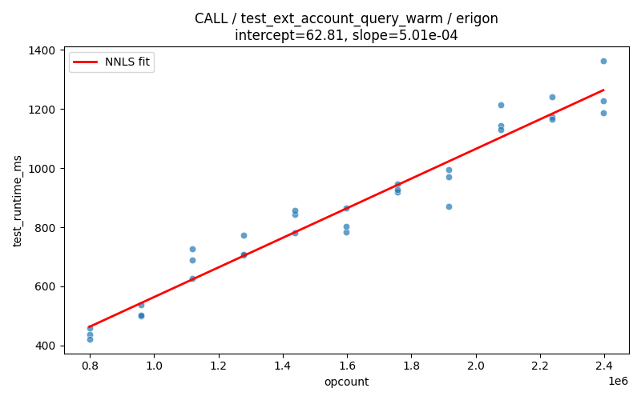

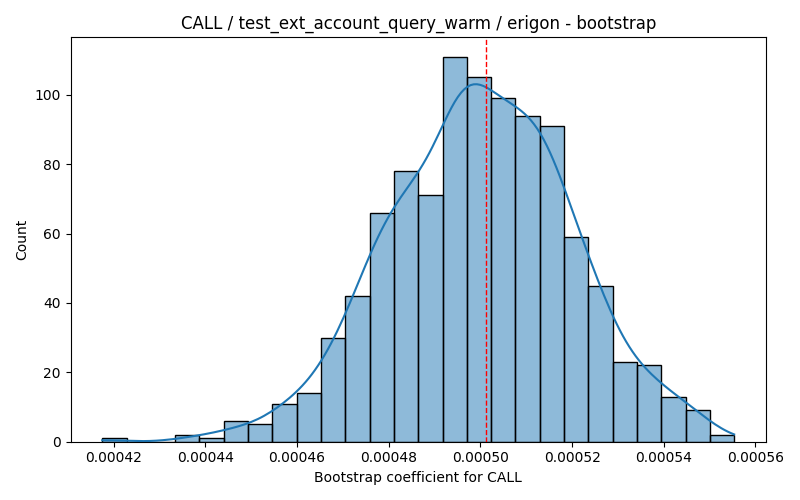

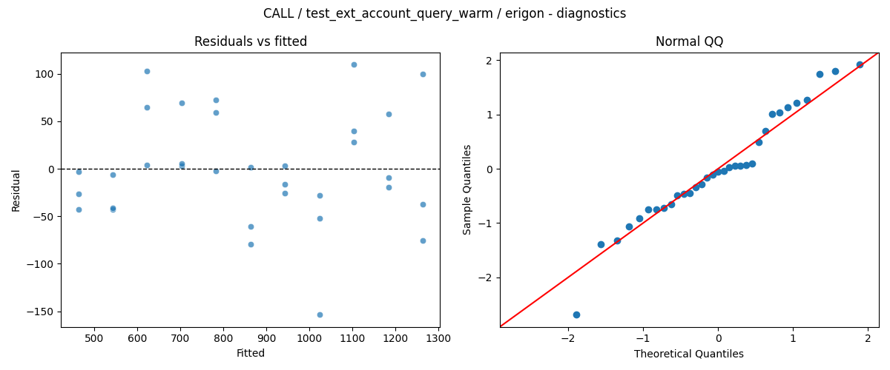

</details>

<details><summary>geth — NNLS regression summary</summary>

```
==============================================================================
                           NNLS Regression Results                            
==============================================================================
Dep. Variable:          test_runtime_ms              R-squared:          0.983
Model:                  NNLS                    Adj. R-squared:          0.983
No. Observations:       99                                RMSE:          39.01
Df Residuals:           97                                 MAE:          28.26
Df Model:               1      
==============================================================================
                      coef     std err     P-value      [0.025      0.975]
------------------------------------------------------------------------------
         const     25.5934     10.3896       0.005      5.8878     46.2289
       opcount      0.0006      0.0000       0.001      0.0006      0.0006
==============================================================================
Notes: Non-negative least squares with bootstrap inference (1000 iterations)
==============================================================================
```

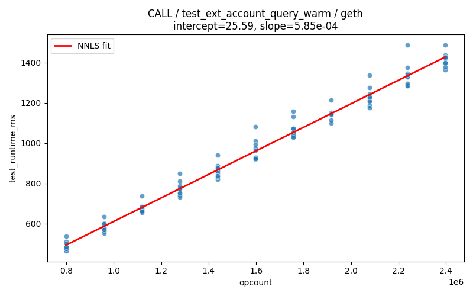

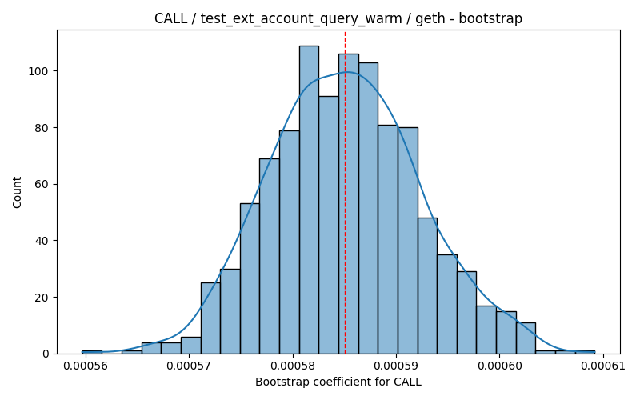

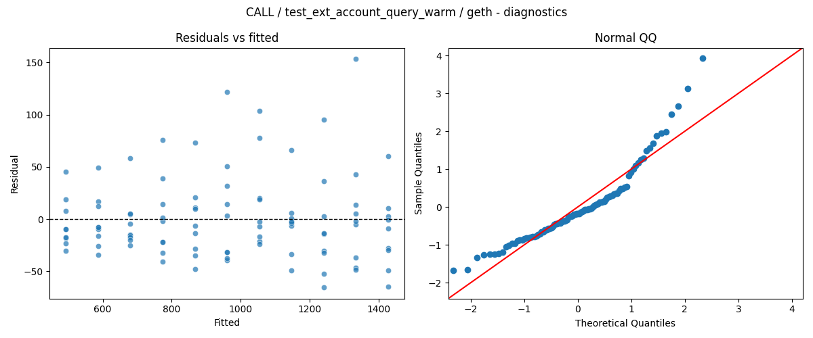

</details>

<details><summary>nethermind — NNLS regression summary</summary>

```
==============================================================================
                           NNLS Regression Results                            
==============================================================================
Dep. Variable:          test_runtime_ms              R-squared:          0.669
Model:                  NNLS                    Adj. R-squared:          0.664
No. Observations:       66                                RMSE:         163.26
Df Residuals:           64                                 MAE:         129.78
Df Model:               1      
==============================================================================
                      coef     std err     P-value      [0.025      0.975]
------------------------------------------------------------------------------
         const    436.2948     68.9515       0.001    298.1657    570.6952
       opcount      0.0005      0.0000       0.001      0.0004      0.0005
==============================================================================
Notes: Non-negative least squares with bootstrap inference (1000 iterations)
==============================================================================
```

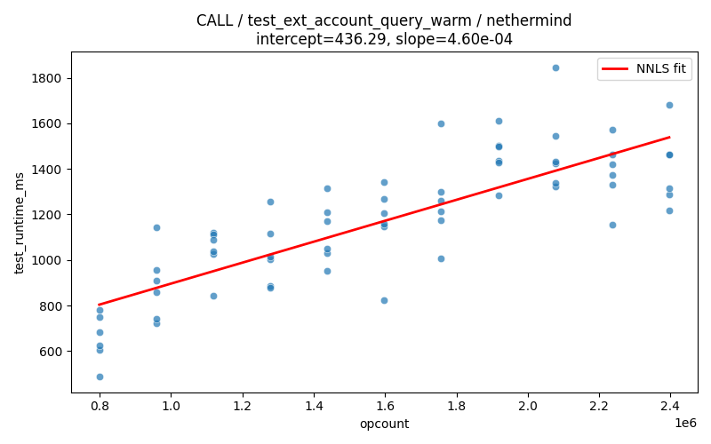

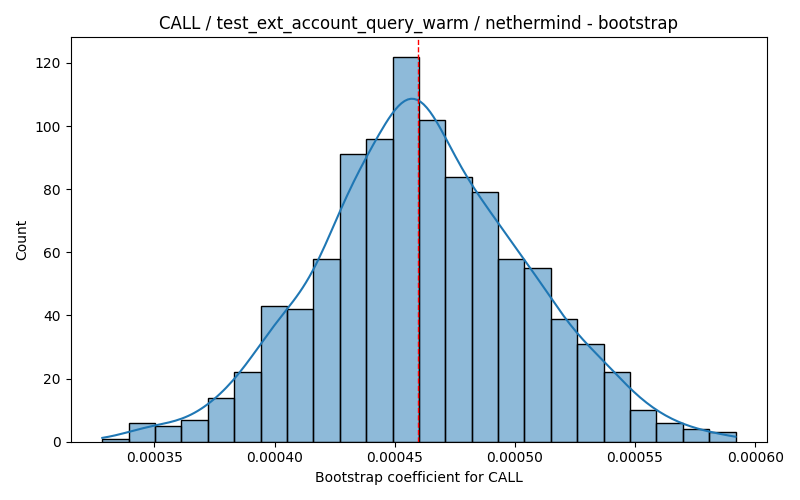

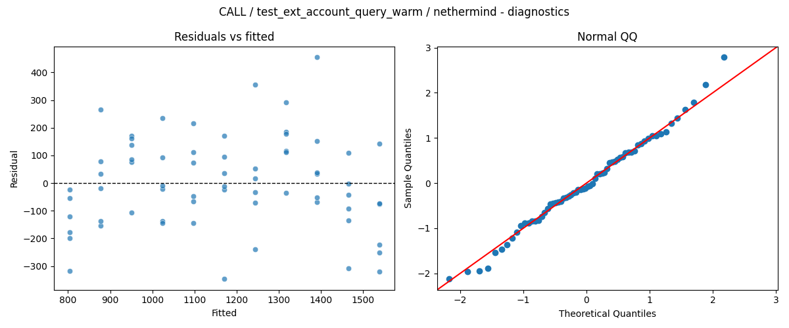

</details>

<details><summary>reth — NNLS regression summary</summary>

```
==============================================================================
                           NNLS Regression Results                            
==============================================================================
Dep. Variable:          test_runtime_ms              R-squared:          0.904
Model:                  NNLS                    Adj. R-squared:          0.903
No. Observations:       66                                RMSE:           7.81
Df Residuals:           64                                 MAE:           6.53
Df Model:               1      
==============================================================================
                      coef     std err     P-value      [0.025      0.975]
------------------------------------------------------------------------------
         const     21.7392      3.4540       0.001     14.4903     28.1053
       opcount      0.0000      0.0000       0.001      0.0000      0.0001
==============================================================================
Notes: Non-negative least squares with bootstrap inference (1000 iterations)
==============================================================================
```

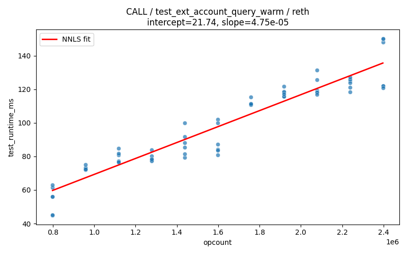

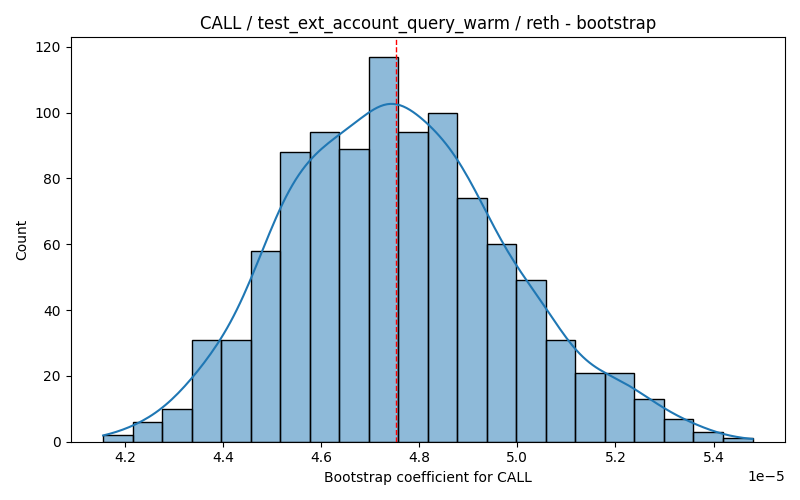

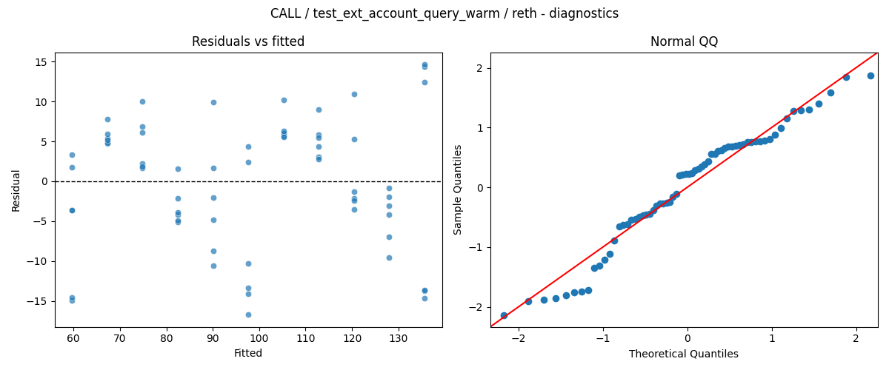

</details>

## CALLCODE

### test_account_access — combo `CALLCODE_AccountMode.EXISTING_EOA` — `presets[cold_account_nocode_access]`

| client | nobs | R² | target_coef (ms) | p-value | 95% CI |
| --- | --- | --- | --- | --- | --- |
| `erigon` | 33 | 0.9981 | 0.01011 | 1.00e-03 | [0.009951, 0.01026] |
| `geth` | 99 | 0.7509 | 0.01292 | 1.00e-03 | [0.01155, 0.01441] |
| `nethermind` | 66 | 0.8449 | 0.006739 | 1.00e-03 | [0.006054, 0.007271] |
| `reth` | 66 | 0.9738 | 0.001077 | 1.00e-03 | [0.001032, 0.001127] |

<details><summary>erigon — NNLS regression summary</summary>

```
==============================================================================
                           NNLS Regression Results                            
==============================================================================
Dep. Variable:          test_runtime_ms              R-squared:          0.998
Model:                  NNLS                    Adj. R-squared:          0.998
No. Observations:       33                                RMSE:          10.54
Df Residuals:           31                                 MAE:           8.71
Df Model:               1      
==============================================================================
                      coef     std err     P-value      [0.025      0.975]
------------------------------------------------------------------------------
         const     33.0112      5.9653       0.001     21.3385     44.9596
       opcount      0.0101      0.0001       0.001      0.0100      0.0103
==============================================================================
Notes: Non-negative least squares with bootstrap inference (1000 iterations)
==============================================================================
```

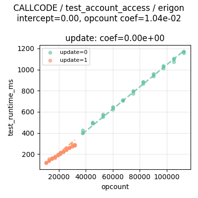


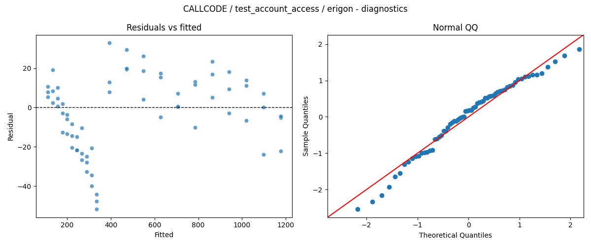

</details>

<details><summary>geth — NNLS regression summary</summary>

```
==============================================================================
                           NNLS Regression Results                            
==============================================================================
Dep. Variable:          test_runtime_ms              R-squared:          0.751
Model:                  NNLS                    Adj. R-squared:          0.748
No. Observations:       99                                RMSE:         176.63
Df Residuals:           97                                 MAE:         153.06
Df Model:               1      
==============================================================================
                      coef     std err     P-value      [0.025      0.975]
------------------------------------------------------------------------------
         const    480.8755     59.8137       0.001    366.2914    591.1411
       opcount      0.0129      0.0007       0.001      0.0115      0.0144
==============================================================================
Notes: Non-negative least squares with bootstrap inference (1000 iterations)
==============================================================================
```

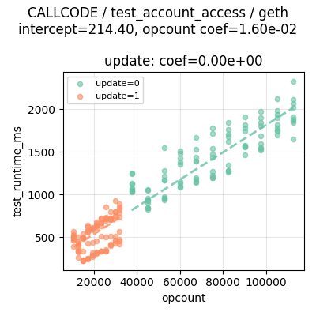


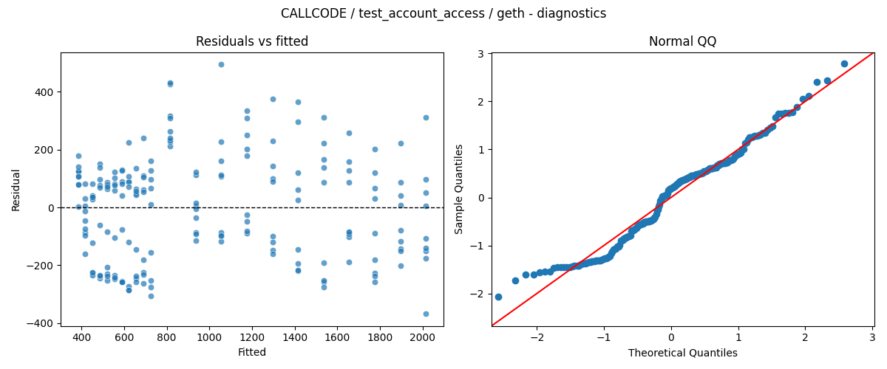

</details>

<details><summary>nethermind — NNLS regression summary</summary>

```
==============================================================================
                           NNLS Regression Results                            
==============================================================================
Dep. Variable:          test_runtime_ms              R-squared:          0.845
Model:                  NNLS                    Adj. R-squared:          0.842
No. Observations:       66                                RMSE:          68.57
Df Residuals:           64                                 MAE:          51.98
Df Model:               1      
==============================================================================
                      coef     std err     P-value      [0.025      0.975]
------------------------------------------------------------------------------
         const     30.2660     23.3047       0.098      0.0000     83.8388
       opcount      0.0067      0.0003       0.001      0.0061      0.0073
==============================================================================
Notes: Non-negative least squares with bootstrap inference (1000 iterations)
==============================================================================
```

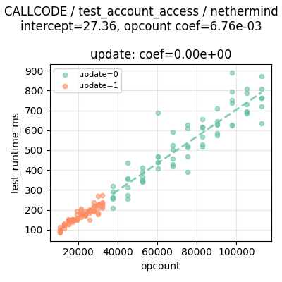

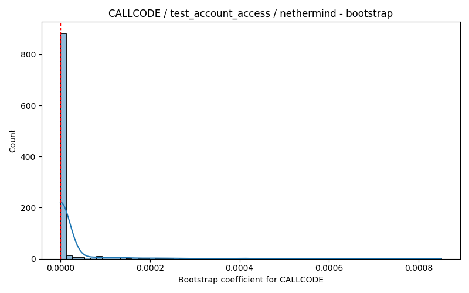

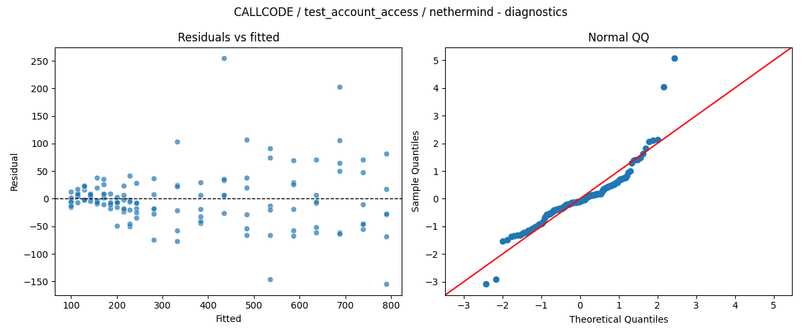

</details>

<details><summary>reth — NNLS regression summary</summary>

```
==============================================================================
                           NNLS Regression Results                            
==============================================================================
Dep. Variable:          test_runtime_ms              R-squared:          0.974
Model:                  NNLS                    Adj. R-squared:          0.973
No. Observations:       66                                RMSE:           4.19
Df Residuals:           64                                 MAE:           3.15
Df Model:               1      
==============================================================================
                      coef     std err     P-value      [0.025      0.975]
------------------------------------------------------------------------------
         const     35.1252      1.9493       0.001     31.4726     39.0287
       opcount      0.0011      0.0000       0.001      0.0010      0.0011
==============================================================================
Notes: Non-negative least squares with bootstrap inference (1000 iterations)
==============================================================================
```

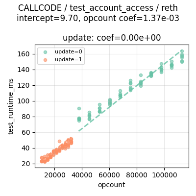


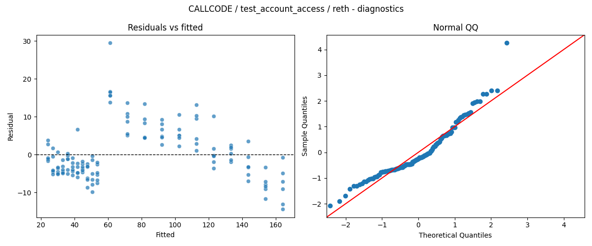

</details>

### test_account_access — combo `CALLCODE_AccountMode.NON_EXISTING_ACCOUNT` — `presets[cold_account_nocode_access]`

| client | nobs | R² | target_coef (ms) | p-value | 95% CI |
| --- | --- | --- | --- | --- | --- |
| `erigon` | 33 | 0.9976 | 0.009418 | 1.00e-03 | [0.00924, 0.009617] |
| `geth` | 99 | 0.7221 | 0.03321 | 1.00e-03 | [0.0291, 0.03771] |
| `nethermind` | 66 | 0.8351 | 0.00591 | 1.00e-03 | [0.005217, 0.006563] |
| `reth` | 66 | 0.9726 | 0.0009637 | 1.00e-03 | [0.0009222, 0.001009] |

<details><summary>erigon — NNLS regression summary</summary>

```
==============================================================================
                           NNLS Regression Results                            
==============================================================================
Dep. Variable:          test_runtime_ms              R-squared:          0.998
Model:                  NNLS                    Adj. R-squared:          0.998
No. Observations:       33                                RMSE:          11.01
Df Residuals:           31                                 MAE:           8.89
Df Model:               1      
==============================================================================
                      coef     std err     P-value      [0.025      0.975]
------------------------------------------------------------------------------
         const     24.6356      8.0197       0.006      7.5892     38.6279
       opcount      0.0094      0.0001       0.001      0.0092      0.0096
==============================================================================
Notes: Non-negative least squares with bootstrap inference (1000 iterations)
==============================================================================
```

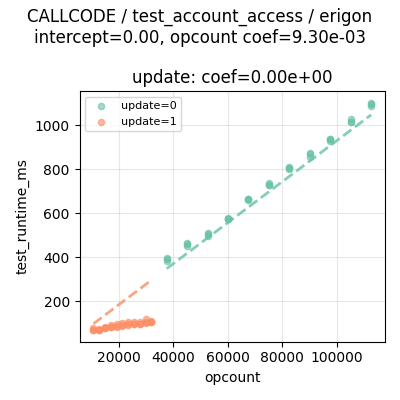


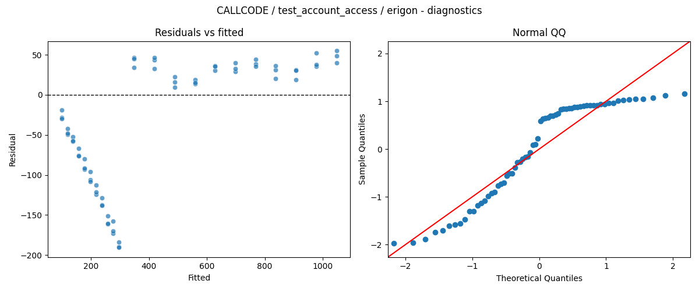

</details>

<details><summary>geth — NNLS regression summary</summary>

```
==============================================================================
                           NNLS Regression Results                            
==============================================================================
Dep. Variable:          test_runtime_ms              R-squared:          0.722
Model:                  NNLS                    Adj. R-squared:          0.719
No. Observations:       99                                RMSE:         489.24
Df Residuals:           97                                 MAE:         391.11
Df Model:               1      
==============================================================================
                      coef     std err     P-value      [0.025      0.975]
------------------------------------------------------------------------------
         const   1586.0496    163.1073       0.001   1246.7922   1890.3846
       opcount      0.0332      0.0022       0.001      0.0291      0.0377
==============================================================================
Notes: Non-negative least squares with bootstrap inference (1000 iterations)
==============================================================================
```

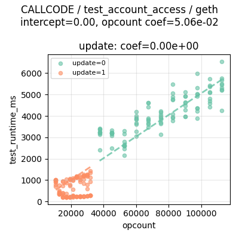


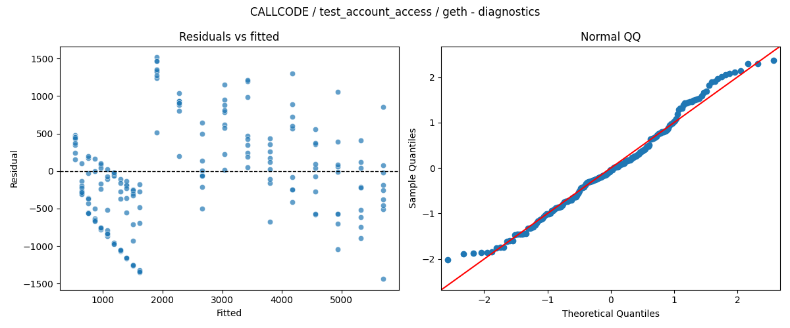

</details>

<details><summary>nethermind — NNLS regression summary</summary>

```
==============================================================================
                           NNLS Regression Results                            
==============================================================================
Dep. Variable:          test_runtime_ms              R-squared:          0.835
Model:                  NNLS                    Adj. R-squared:          0.833
No. Observations:       66                                RMSE:          62.36
Df Residuals:           64                                 MAE:          47.42
Df Model:               1      
==============================================================================
                      coef     std err     P-value      [0.025      0.975]
------------------------------------------------------------------------------
         const     45.9809     21.0470       0.019      2.1994     87.7656
       opcount      0.0059      0.0003       0.001      0.0052      0.0066
==============================================================================
Notes: Non-negative least squares with bootstrap inference (1000 iterations)
==============================================================================
```

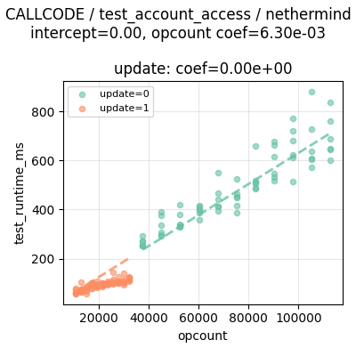


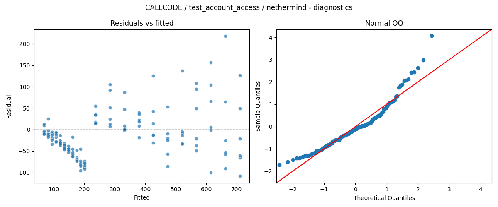

</details>

<details><summary>reth — NNLS regression summary</summary>

```
==============================================================================
                           NNLS Regression Results                            
==============================================================================
Dep. Variable:          test_runtime_ms              R-squared:          0.973
Model:                  NNLS                    Adj. R-squared:          0.972
No. Observations:       66                                RMSE:           3.84
Df Residuals:           64                                 MAE:           3.20
Df Model:               1      
==============================================================================
                      coef     std err     P-value      [0.025      0.975]
------------------------------------------------------------------------------
         const     30.9106      1.6230       0.001     27.6802     34.1375
       opcount      0.0010      0.0000       0.001      0.0009      0.0010
==============================================================================
Notes: Non-negative least squares with bootstrap inference (1000 iterations)
==============================================================================
```

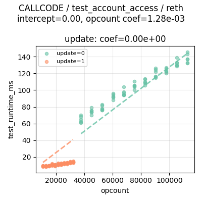


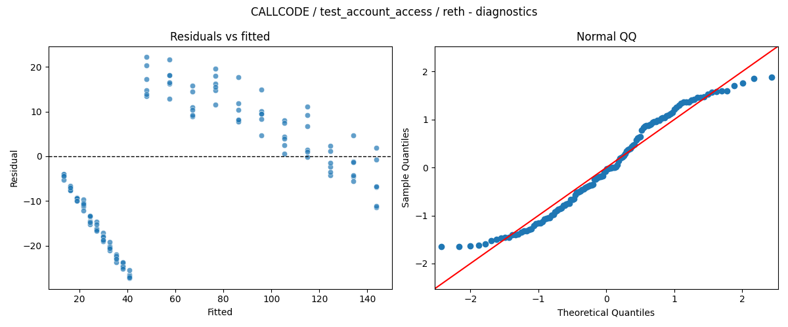

</details>

### test_account_access — combo `CALLCODE_AccountMode.EXISTING_CONTRACT` — `presets[cold_account_code_access]`

| client | nobs | R² | target_coef (ms) | p-value | 95% CI |
| --- | --- | --- | --- | --- | --- |
| `erigon` | 33 | 0.8718 | 0.08713 | 1.00e-03 | [0.0734, 0.09756] |
| `geth` | 99 | 0.6327 | 0.03275 | 1.00e-03 | [0.02833, 0.03706] |
| `nethermind` | 66 | 0.896 | 0.02101 | 1.00e-03 | [0.01918, 0.02313] |
| `reth` | 66 | 0.8161 | 0.03033 | 1.00e-03 | [0.02739, 0.03372] |

<details><summary>erigon — NNLS regression summary</summary>

```
==============================================================================
                           NNLS Regression Results                            
==============================================================================
Dep. Variable:          test_runtime_ms              R-squared:          0.872
Model:                  NNLS                    Adj. R-squared:          0.868
No. Observations:       33                                RMSE:         679.93
Df Residuals:           31                                 MAE:         586.87
Df Model:               1      
==============================================================================
                      coef     std err     P-value      [0.025      0.975]
------------------------------------------------------------------------------
         const   1461.5620    454.0969       0.001    697.7271   2503.4868
       opcount      0.0871      0.0060       0.001      0.0734      0.0976
==============================================================================
Notes: Non-negative least squares with bootstrap inference (1000 iterations)
==============================================================================
```

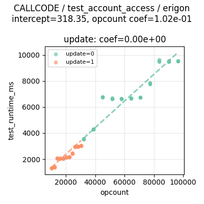


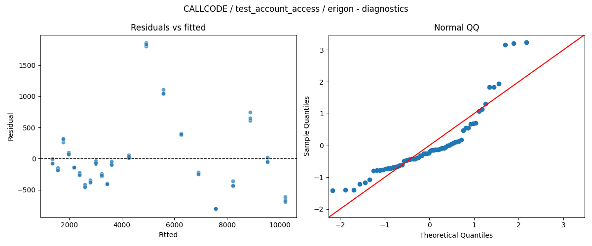

</details>

<details><summary>geth — NNLS regression summary</summary>

```
==============================================================================
                           NNLS Regression Results                            
==============================================================================
Dep. Variable:          test_runtime_ms              R-squared:          0.633
Model:                  NNLS                    Adj. R-squared:          0.629
No. Observations:       99                                RMSE:         507.82
Df Residuals:           97                                 MAE:         409.43
Df Model:               1      
==============================================================================
                      coef     std err     P-value      [0.025      0.975]
------------------------------------------------------------------------------
         const   1649.5762    152.4521       0.001   1353.4556   1948.1678
       opcount      0.0328      0.0021       0.001      0.0283      0.0371
==============================================================================
Notes: Non-negative least squares with bootstrap inference (1000 iterations)
==============================================================================
```

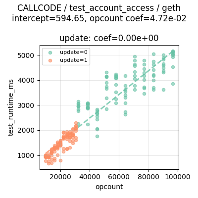


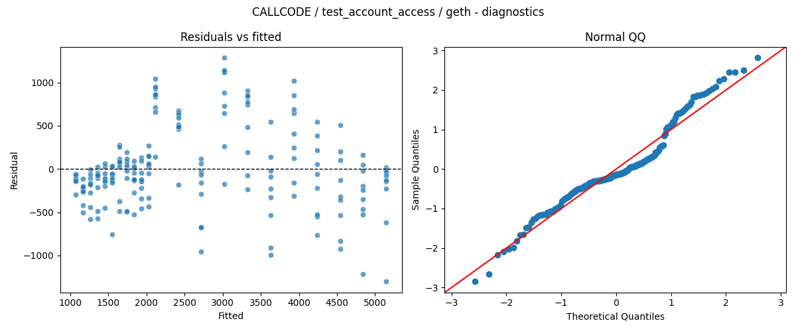

</details>

<details><summary>nethermind — NNLS regression summary</summary>

```
==============================================================================
                           NNLS Regression Results                            
==============================================================================
Dep. Variable:          test_runtime_ms              R-squared:          0.896
Model:                  NNLS                    Adj. R-squared:          0.894
No. Observations:       66                                RMSE:         145.69
Df Residuals:           64                                 MAE:         115.09
Df Model:               1      
==============================================================================
                      coef     std err     P-value      [0.025      0.975]
------------------------------------------------------------------------------
         const    207.2518     55.0310       0.001     94.8428    310.2475
       opcount      0.0210      0.0010       0.001      0.0192      0.0231
==============================================================================
Notes: Non-negative least squares with bootstrap inference (1000 iterations)
==============================================================================
```

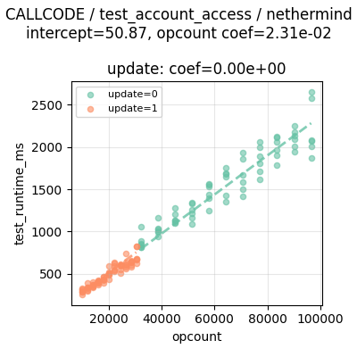


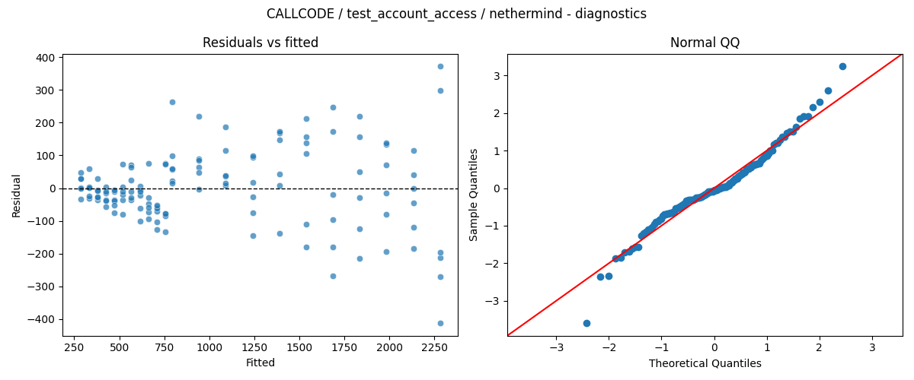

</details>

<details><summary>reth — NNLS regression summary</summary>

```
==============================================================================
                           NNLS Regression Results                            
==============================================================================
Dep. Variable:          test_runtime_ms              R-squared:          0.816
Model:                  NNLS                    Adj. R-squared:          0.813
No. Observations:       66                                RMSE:         293.01
Df Residuals:           64                                 MAE:         189.79
Df Model:               1      
==============================================================================
                      coef     std err     P-value      [0.025      0.975]
------------------------------------------------------------------------------
         const    633.1238    124.4045       0.001    382.4266    852.7062
       opcount      0.0303      0.0017       0.001      0.0274      0.0337
==============================================================================
Notes: Non-negative least squares with bootstrap inference (1000 iterations)
==============================================================================
```

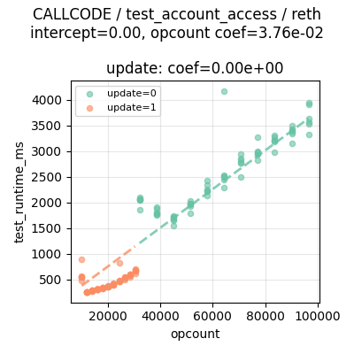


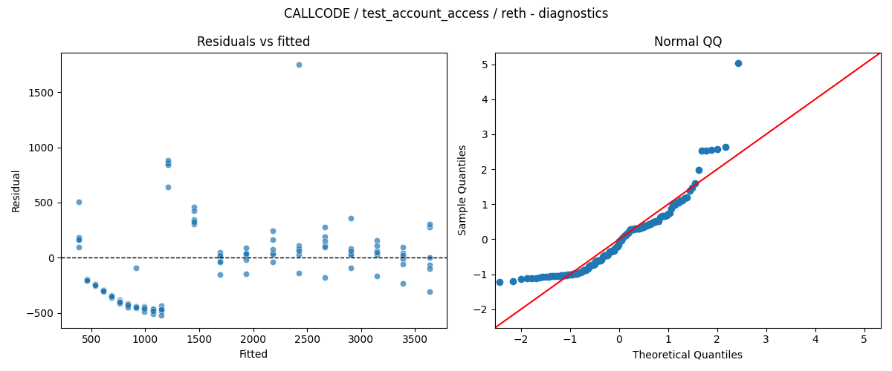

</details>

### test_account_access — combo `CALLCODE_AccountMode.NON_EXISTING_ACCOUNT` — `presets[cold_account_code_access]`

| client | nobs | R² | target_coef (ms) | p-value | 95% CI |
| --- | --- | --- | --- | --- | --- |
| `erigon` | 33 | 0.9976 | 0.009418 | 1.00e-03 | [0.00924, 0.009617] |
| `geth` | 99 | 0.7221 | 0.03321 | 1.00e-03 | [0.0291, 0.03771] |
| `nethermind` | 66 | 0.8351 | 0.00591 | 1.00e-03 | [0.005217, 0.006563] |
| `reth` | 66 | 0.9726 | 0.0009637 | 1.00e-03 | [0.0009222, 0.001009] |

<details><summary>erigon — NNLS regression summary</summary>

```
==============================================================================
                           NNLS Regression Results                            
==============================================================================
Dep. Variable:          test_runtime_ms              R-squared:          0.998
Model:                  NNLS                    Adj. R-squared:          0.998
No. Observations:       33                                RMSE:          11.01
Df Residuals:           31                                 MAE:           8.89
Df Model:               1      
==============================================================================
                      coef     std err     P-value      [0.025      0.975]
------------------------------------------------------------------------------
         const     24.6356      8.0197       0.006      7.5892     38.6279
       opcount      0.0094      0.0001       0.001      0.0092      0.0096
==============================================================================
Notes: Non-negative least squares with bootstrap inference (1000 iterations)
==============================================================================
```


</details>

<details><summary>geth — NNLS regression summary</summary>

```
==============================================================================
                           NNLS Regression Results                            
==============================================================================
Dep. Variable:          test_runtime_ms              R-squared:          0.722
Model:                  NNLS                    Adj. R-squared:          0.719
No. Observations:       99                                RMSE:         489.24
Df Residuals:           97                                 MAE:         391.11
Df Model:               1      
==============================================================================
                      coef     std err     P-value      [0.025      0.975]
------------------------------------------------------------------------------
         const   1586.0496    163.1073       0.001   1246.7922   1890.3846
       opcount      0.0332      0.0022       0.001      0.0291      0.0377
==============================================================================
Notes: Non-negative least squares with bootstrap inference (1000 iterations)
==============================================================================
```


</details>

<details><summary>nethermind — NNLS regression summary</summary>

```
==============================================================================
                           NNLS Regression Results                            
==============================================================================
Dep. Variable:          test_runtime_ms              R-squared:          0.835
Model:                  NNLS                    Adj. R-squared:          0.833
No. Observations:       66                                RMSE:          62.36
Df Residuals:           64                                 MAE:          47.42
Df Model:               1      
==============================================================================
                      coef     std err     P-value      [0.025      0.975]
------------------------------------------------------------------------------
         const     45.9809     21.0470       0.019      2.1994     87.7656
       opcount      0.0059      0.0003       0.001      0.0052      0.0066
==============================================================================
Notes: Non-negative least squares with bootstrap inference (1000 iterations)
==============================================================================
```


</details>

<details><summary>reth — NNLS regression summary</summary>

```
==============================================================================
                           NNLS Regression Results                            
==============================================================================
Dep. Variable:          test_runtime_ms              R-squared:          0.973
Model:                  NNLS                    Adj. R-squared:          0.972
No. Observations:       66                                RMSE:           3.84
Df Residuals:           64                                 MAE:           3.20
Df Model:               1      
==============================================================================
                      coef     std err     P-value      [0.025      0.975]
------------------------------------------------------------------------------
         const     30.9106      1.6230       0.001     27.6802     34.1375
       opcount      0.0010      0.0000       0.001      0.0009      0.0010
==============================================================================
Notes: Non-negative least squares with bootstrap inference (1000 iterations)
==============================================================================
```


</details>

### test_account_access — combo `CALLCODE_AccountMode.EXISTING_EOA` — `presets[cold_account_nocode_write]`

| client | nobs | R² | target_coef (ms) | p-value | 95% CI |
| --- | --- | --- | --- | --- | --- |
| `erigon` | 33 | 0.9868 | 0.007926 | 1.00e-03 | [0.007584, 0.008276] |
| `geth` | 99 | 0.2357 | 0.01265 | 1.00e-03 | [0.008096, 0.01681] |
| `nethermind` | 66 | 0.8349 | 0.005825 | 1.00e-03 | [0.005136, 0.006467] |
| `reth` | 66 | 0.9095 | 0.001206 | 1.00e-03 | [0.001114, 0.001301] |

<details><summary>erigon — NNLS regression summary</summary>

```
==============================================================================
                           NNLS Regression Results                            
==============================================================================
Dep. Variable:          test_runtime_ms              R-squared:          0.987
Model:                  NNLS                    Adj. R-squared:          0.986
No. Observations:       33                                RMSE:           6.16
Df Residuals:           31                                 MAE:           4.90
Df Model:               1      
==============================================================================
                      coef     std err     P-value      [0.025      0.975]
------------------------------------------------------------------------------
         const     39.8955      3.7422       0.001     32.9120     47.6427
       opcount      0.0079      0.0002       0.001      0.0076      0.0083
==============================================================================
Notes: Non-negative least squares with bootstrap inference (1000 iterations)
==============================================================================
```


</details>

<details><summary>geth — NNLS regression summary</summary>

```
==============================================================================
                           NNLS Regression Results                            
==============================================================================
Dep. Variable:          test_runtime_ms              R-squared:          0.236
Model:                  NNLS                    Adj. R-squared:          0.228
No. Observations:       99                                RMSE:         153.37
Df Residuals:           97                                 MAE:         139.30
Df Model:               1      
==============================================================================
                      coef     std err     P-value      [0.025      0.975]
------------------------------------------------------------------------------
         const    250.3906     44.1052       0.001    159.7794    333.6548
       opcount      0.0127      0.0022       0.001      0.0081      0.0168
==============================================================================
Notes: Non-negative least squares with bootstrap inference (1000 iterations)
==============================================================================
```


</details>

<details><summary>nethermind — NNLS regression summary</summary>

```
==============================================================================
                           NNLS Regression Results                            
==============================================================================
Dep. Variable:          test_runtime_ms              R-squared:          0.835
Model:                  NNLS                    Adj. R-squared:          0.832
No. Observations:       66                                RMSE:          17.43
Df Residuals:           64                                 MAE:          12.85
Df Model:               1      
==============================================================================
                      coef     std err     P-value      [0.025      0.975]
------------------------------------------------------------------------------
         const     46.2791      6.7153       0.001     33.5614     59.8372
       opcount      0.0058      0.0003       0.001      0.0051      0.0065
==============================================================================
Notes: Non-negative least squares with bootstrap inference (1000 iterations)
==============================================================================
```


</details>

<details><summary>reth — NNLS regression summary</summary>

```
==============================================================================
                           NNLS Regression Results                            
==============================================================================
Dep. Variable:          test_runtime_ms              R-squared:          0.909
Model:                  NNLS                    Adj. R-squared:          0.908
No. Observations:       66                                RMSE:           2.56
Df Residuals:           64                                 MAE:           2.01
Df Model:               1      
==============================================================================
                      coef     std err     P-value      [0.025      0.975]
------------------------------------------------------------------------------
         const      9.9950      1.0536       0.001      7.9586     12.0438
       opcount      0.0012      0.0000       0.001      0.0011      0.0013
==============================================================================
Notes: Non-negative least squares with bootstrap inference (1000 iterations)
==============================================================================
```


</details>

### test_account_access — combo `CALLCODE_AccountMode.NON_EXISTING_ACCOUNT` — `presets[cold_account_nocode_write]`

| client | nobs | R² | target_coef (ms) | p-value | 95% CI |
| --- | --- | --- | --- | --- | --- |
| `erigon` | 33 | 0.8385 | 0.001811 | 1.00e-03 | [0.001541, 0.002072] |
| `geth` | 99 | 0.01782 | 0.007912 | 8.70e-02 | [0, 0.01938] |
| `nethermind` | 66 | 0.6831 | 0.002358 | 1.00e-03 | [0.001953, 0.00276] |
| `reth` | 66 | 0.8569 | 0.00024 | 1.00e-03 | [0.00022, 0.0002616] |

<details><summary>erigon — NNLS regression summary</summary>

```
==============================================================================
                           NNLS Regression Results                            
==============================================================================
Dep. Variable:          test_runtime_ms              R-squared:          0.839
Model:                  NNLS                    Adj. R-squared:          0.833
No. Observations:       33                                RMSE:           5.35
Df Residuals:           31                                 MAE:           4.26
Df Model:               1      
==============================================================================
                      coef     std err     P-value      [0.025      0.975]
------------------------------------------------------------------------------
         const     53.8081      3.0095       0.001     48.3377     59.8548
       opcount      0.0018      0.0001       0.001      0.0015      0.0021
==============================================================================
Notes: Non-negative least squares with bootstrap inference (1000 iterations)
==============================================================================
```


</details>

<details><summary>geth — NNLS regression summary</summary>

```
==============================================================================
                           NNLS Regression Results                            
==============================================================================
Dep. Variable:          test_runtime_ms              R-squared:          0.018
Model:                  NNLS                    Adj. R-squared:          0.008
No. Observations:       99                                RMSE:         395.43
Df Residuals:           97                                 MAE:         373.40
Df Model:               1      
==============================================================================
                      coef     std err     P-value      [0.025      0.975]
------------------------------------------------------------------------------
         const    468.1822    111.4745       0.001    224.0754    645.9384
       opcount      0.0079      0.0055       0.087      0.0000      0.0194
==============================================================================
Notes: Non-negative least squares with bootstrap inference (1000 iterations)
==============================================================================
```


</details>

<details><summary>nethermind — NNLS regression summary</summary>

```
==============================================================================
                           NNLS Regression Results                            
==============================================================================
Dep. Variable:          test_runtime_ms              R-squared:          0.683
Model:                  NNLS                    Adj. R-squared:          0.678
No. Observations:       66                                RMSE:          10.81
Df Residuals:           64                                 MAE:           8.14
Df Model:               1      
==============================================================================
                      coef     std err     P-value      [0.025      0.975]
------------------------------------------------------------------------------
         const     44.7927      4.6720       0.001     36.6722     54.5143
       opcount      0.0024      0.0002       0.001      0.0020      0.0028
==============================================================================
Notes: Non-negative least squares with bootstrap inference (1000 iterations)
==============================================================================
```


</details>

<details><summary>reth — NNLS regression summary</summary>

```
==============================================================================
                           NNLS Regression Results                            
==============================================================================
Dep. Variable:          test_runtime_ms              R-squared:          0.857
Model:                  NNLS                    Adj. R-squared:          0.855
No. Observations:       66                                RMSE:           0.66
Df Residuals:           64                                 MAE:           0.53
Df Model:               1      
==============================================================================
                      coef     std err     P-value      [0.025      0.975]
------------------------------------------------------------------------------
         const      6.2030      0.2454       0.001      5.6785      6.6981
       opcount      0.0002      0.0000       0.001      0.0002      0.0003
==============================================================================
Notes: Non-negative least squares with bootstrap inference (1000 iterations)
==============================================================================
```


</details>

### test_account_access — combo `CALLCODE_AccountMode.EXISTING_CONTRACT` — `presets[cold_account_code_write]`

| client | nobs | R² | target_coef (ms) | p-value | 95% CI |
| --- | --- | --- | --- | --- | --- |
| `erigon` | 33 | 0.9077 | 0.08265 | 1.00e-03 | [0.07347, 0.0899] |
| `geth` | 99 | 0.7648 | 0.05497 | 1.00e-03 | [0.04945, 0.06036] |
| `nethermind` | 66 | 0.8939 | 0.02039 | 1.00e-03 | [0.01872, 0.02239] |
| `reth` | 66 | 0.3282 | 0.01329 | 1.00e-03 | [0.007362, 0.01996] |

<details><summary>erigon — NNLS regression summary</summary>

```
==============================================================================
                           NNLS Regression Results                            
==============================================================================
Dep. Variable:          test_runtime_ms              R-squared:          0.908
Model:                  NNLS                    Adj. R-squared:          0.905
No. Observations:       33                                RMSE:         169.24
Df Residuals:           31                                 MAE:         141.21
Df Model:               1      
==============================================================================
                      coef     std err     P-value      [0.025      0.975]
------------------------------------------------------------------------------
         const    557.1736    101.9414       0.001    385.0989    782.5451
       opcount      0.0826      0.0043       0.001      0.0735      0.0899
==============================================================================
Notes: Non-negative least squares with bootstrap inference (1000 iterations)
==============================================================================
```


</details>

<details><summary>geth — NNLS regression summary</summary>

```
==============================================================================
                           NNLS Regression Results                            
==============================================================================
Dep. Variable:          test_runtime_ms              R-squared:          0.765
Model:                  NNLS                    Adj. R-squared:          0.762
No. Observations:       99                                RMSE:         195.82
Df Residuals:           97                                 MAE:         149.41
Df Model:               1      
==============================================================================
                      coef     std err     P-value      [0.025      0.975]
------------------------------------------------------------------------------
         const    307.7816     54.2524       0.001    200.2834    409.9631
       opcount      0.0550      0.0028       0.001      0.0495      0.0604
==============================================================================
Notes: Non-negative least squares with bootstrap inference (1000 iterations)
==============================================================================
```


</details>

<details><summary>nethermind — NNLS regression summary</summary>

```
==============================================================================
                           NNLS Regression Results                            
==============================================================================
Dep. Variable:          test_runtime_ms              R-squared:          0.894
Model:                  NNLS                    Adj. R-squared:          0.892
No. Observations:       66                                RMSE:          45.12
Df Residuals:           64                                 MAE:          33.08
Df Model:               1      
==============================================================================
                      coef     std err     P-value      [0.025      0.975]
------------------------------------------------------------------------------
         const     83.8423     17.1210       0.001     47.7865    113.0272
       opcount      0.0204      0.0010       0.001      0.0187      0.0224
==============================================================================
Notes: Non-negative least squares with bootstrap inference (1000 iterations)
==============================================================================
```


</details>

<details><summary>reth — NNLS regression summary</summary>

```
==============================================================================
                           NNLS Regression Results                            
==============================================================================
Dep. Variable:          test_runtime_ms              R-squared:          0.328
Model:                  NNLS                    Adj. R-squared:          0.318
No. Observations:       66                                RMSE:         122.16
Df Residuals:           64                                 MAE:          87.85
Df Model:               1      
==============================================================================
                      coef     std err     P-value      [0.025      0.975]
------------------------------------------------------------------------------
         const    176.4138     75.5910       0.014     19.7312    314.2478
       opcount      0.0133      0.0032       0.001      0.0074      0.0200
==============================================================================
Notes: Non-negative least squares with bootstrap inference (1000 iterations)
==============================================================================
```


</details>

### test_account_access — combo `CALLCODE_AccountMode.NON_EXISTING_ACCOUNT` — `presets[cold_account_code_write]`

| client | nobs | R² | target_coef (ms) | p-value | 95% CI |
| --- | --- | --- | --- | --- | --- |
| `erigon` | 33 | 0.8385 | 0.001811 | 1.00e-03 | [0.001541, 0.002072] |
| `geth` | 99 | 0.01782 | 0.007912 | 8.70e-02 | [0, 0.01938] |
| `nethermind` | 66 | 0.6831 | 0.002358 | 1.00e-03 | [0.001953, 0.00276] |
| `reth` | 66 | 0.8569 | 0.00024 | 1.00e-03 | [0.00022, 0.0002616] |

<details><summary>erigon — NNLS regression summary</summary>

```
==============================================================================
                           NNLS Regression Results                            
==============================================================================
Dep. Variable:          test_runtime_ms              R-squared:          0.839
Model:                  NNLS                    Adj. R-squared:          0.833
No. Observations:       33                                RMSE:           5.35
Df Residuals:           31                                 MAE:           4.26
Df Model:               1      
==============================================================================
                      coef     std err     P-value      [0.025      0.975]
------------------------------------------------------------------------------
         const     53.8081      3.0095       0.001     48.3377     59.8548
       opcount      0.0018      0.0001       0.001      0.0015      0.0021
==============================================================================
Notes: Non-negative least squares with bootstrap inference (1000 iterations)
==============================================================================
```


</details>

<details><summary>geth — NNLS regression summary</summary>

```
==============================================================================
                           NNLS Regression Results                            
==============================================================================
Dep. Variable:          test_runtime_ms              R-squared:          0.018
Model:                  NNLS                    Adj. R-squared:          0.008
No. Observations:       99                                RMSE:         395.43
Df Residuals:           97                                 MAE:         373.40
Df Model:               1      
==============================================================================
                      coef     std err     P-value      [0.025      0.975]
------------------------------------------------------------------------------
         const    468.1822    111.4745       0.001    224.0754    645.9384
       opcount      0.0079      0.0055       0.087      0.0000      0.0194
==============================================================================
Notes: Non-negative least squares with bootstrap inference (1000 iterations)
==============================================================================
```


</details>

<details><summary>nethermind — NNLS regression summary</summary>

```
==============================================================================
                           NNLS Regression Results                            
==============================================================================
Dep. Variable:          test_runtime_ms              R-squared:          0.683
Model:                  NNLS                    Adj. R-squared:          0.678
No. Observations:       66                                RMSE:          10.81
Df Residuals:           64                                 MAE:           8.14
Df Model:               1      
==============================================================================
                      coef     std err     P-value      [0.025      0.975]
------------------------------------------------------------------------------
         const     44.7927      4.6720       0.001     36.6722     54.5143
       opcount      0.0024      0.0002       0.001      0.0020      0.0028
==============================================================================
Notes: Non-negative least squares with bootstrap inference (1000 iterations)
==============================================================================
```


</details>

<details><summary>reth — NNLS regression summary</summary>

```
==============================================================================
                           NNLS Regression Results                            
==============================================================================
Dep. Variable:          test_runtime_ms              R-squared:          0.857
Model:                  NNLS                    Adj. R-squared:          0.855
No. Observations:       66                                RMSE:           0.66
Df Residuals:           64                                 MAE:           0.53
Df Model:               1      
==============================================================================
                      coef     std err     P-value      [0.025      0.975]
------------------------------------------------------------------------------
         const      6.2030      0.2454       0.001      5.6785      6.6981
       opcount      0.0002      0.0000       0.001      0.0002      0.0003
==============================================================================
Notes: Non-negative least squares with bootstrap inference (1000 iterations)
==============================================================================
```


</details>

### test_ext_account_query_warm — combo `CALLCODE`

| client | nobs | R² | target_coef (ms) | p-value | 95% CI |
| --- | --- | --- | --- | --- | --- |
| `erigon` | 33 | 0.9666 | 0.000271 | 1.00e-03 | [0.0002495, 0.0002883] |
| `geth` | 99 | 0.9686 | 0.0006962 | 1.00e-03 | [0.0006725, 0.0007142] |
| `nethermind` | 66 | 0.6792 | 0.0004605 | 1.00e-03 | [0.0003736, 0.0005349] |
| `reth` | 66 | 0.919 | 4.737e-05 | 1.00e-03 | [4.446e-05, 5.047e-05] |

<details><summary>erigon — NNLS regression summary</summary>

```
==============================================================================
                           NNLS Regression Results                            
==============================================================================
Dep. Variable:          test_runtime_ms              R-squared:          0.967
Model:                  NNLS                    Adj. R-squared:          0.966
No. Observations:       33                                RMSE:          25.45
Df Residuals:           31                                 MAE:          20.71
Df Model:               1      
==============================================================================
                      coef     std err     P-value      [0.025      0.975]
------------------------------------------------------------------------------
         const     54.1639     15.7210       0.001     25.4666     86.8938
       opcount      0.0003      0.0000       0.001      0.0002      0.0003
==============================================================================
Notes: Non-negative least squares with bootstrap inference (1000 iterations)
==============================================================================
```

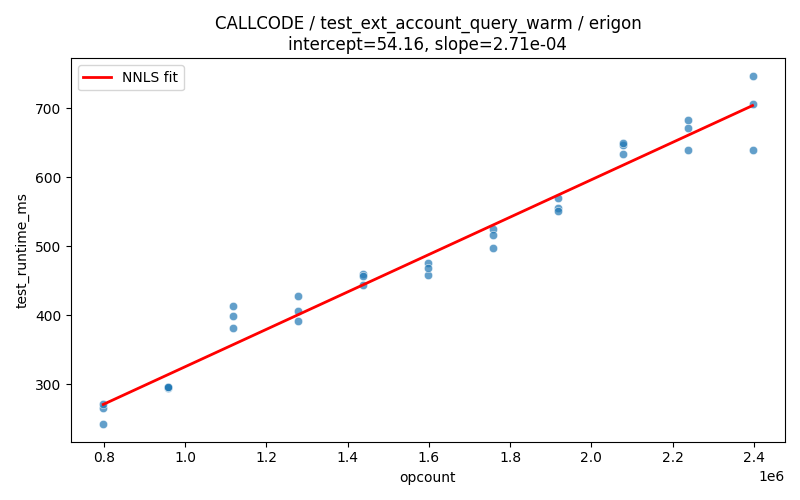

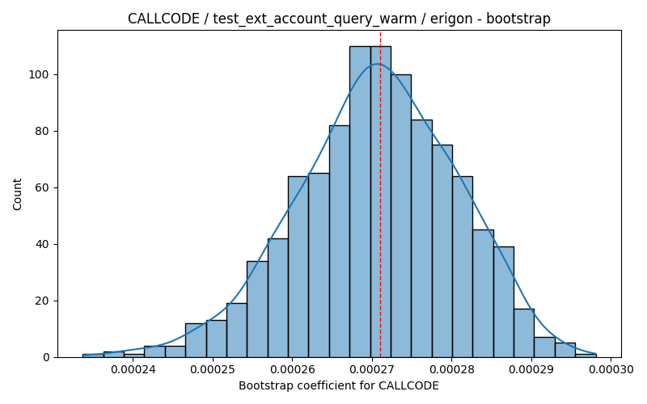

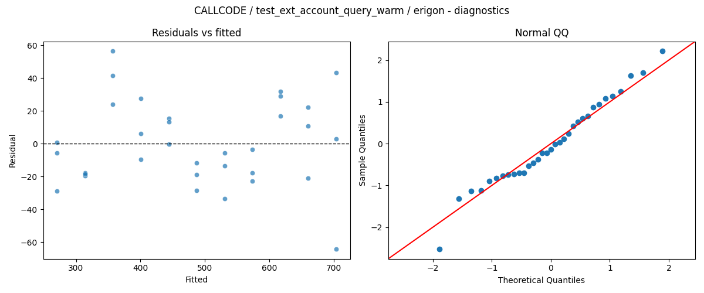

</details>

<details><summary>geth — NNLS regression summary</summary>

```
==============================================================================
                           NNLS Regression Results                            
==============================================================================
Dep. Variable:          test_runtime_ms              R-squared:          0.969
Model:                  NNLS                    Adj. R-squared:          0.968
No. Observations:       99                                RMSE:          63.33
Df Residuals:           97                                 MAE:          49.56
Df Model:               1      
==============================================================================
                      coef     std err     P-value      [0.025      0.975]
------------------------------------------------------------------------------
         const     18.0626     15.4110       0.163      0.0000     52.2992
       opcount      0.0007      0.0000       0.001      0.0007      0.0007
==============================================================================
Notes: Non-negative least squares with bootstrap inference (1000 iterations)
==============================================================================
```

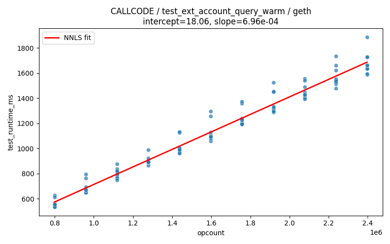

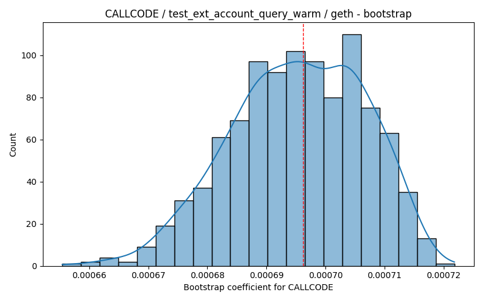

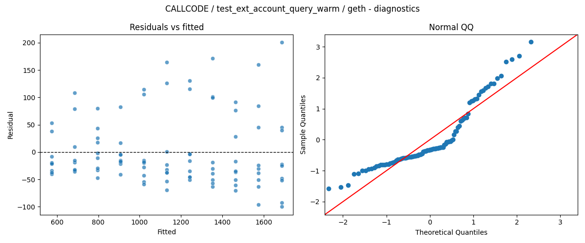

</details>

<details><summary>nethermind — NNLS regression summary</summary>

```
==============================================================================
                           NNLS Regression Results                            
==============================================================================
Dep. Variable:          test_runtime_ms              R-squared:          0.679
Model:                  NNLS                    Adj. R-squared:          0.674
No. Observations:       66                                RMSE:         159.90
Df Residuals:           64                                 MAE:         123.44
Df Model:               1      
==============================================================================
                      coef     std err     P-value      [0.025      0.975]
------------------------------------------------------------------------------
         const    411.4809     61.8026       0.001    299.2995    542.2255
       opcount      0.0005      0.0000       0.001      0.0004      0.0005
==============================================================================
Notes: Non-negative least squares with bootstrap inference (1000 iterations)
==============================================================================
```

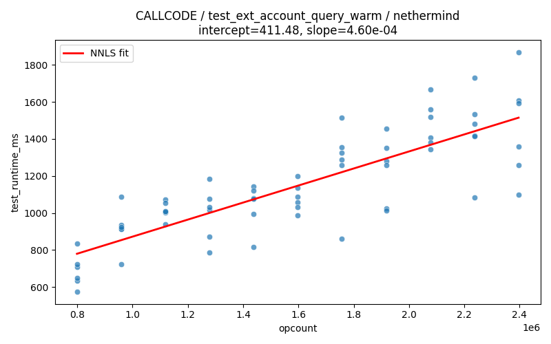

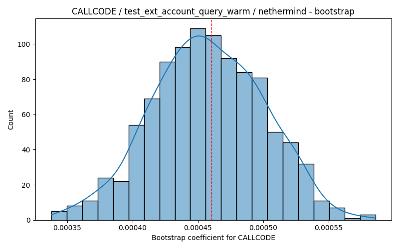

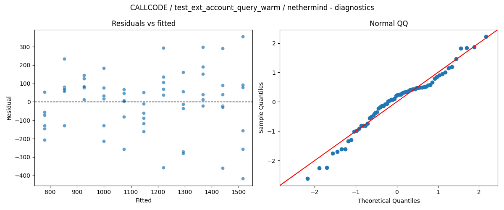

</details>

<details><summary>reth — NNLS regression summary</summary>

```
==============================================================================
                           NNLS Regression Results                            
==============================================================================
Dep. Variable:          test_runtime_ms              R-squared:          0.919
Model:                  NNLS                    Adj. R-squared:          0.918
No. Observations:       66                                RMSE:           7.11
Df Residuals:           64                                 MAE:           5.57
Df Model:               1      
==============================================================================
                      coef     std err     P-value      [0.025      0.975]
------------------------------------------------------------------------------
         const     17.5224      2.6249       0.001     12.3427     22.4830
       opcount      0.0000      0.0000       0.001      0.0000      0.0001
==============================================================================
Notes: Non-negative least squares with bootstrap inference (1000 iterations)
==============================================================================
```

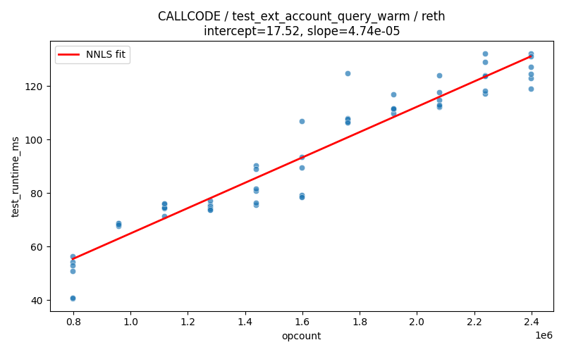

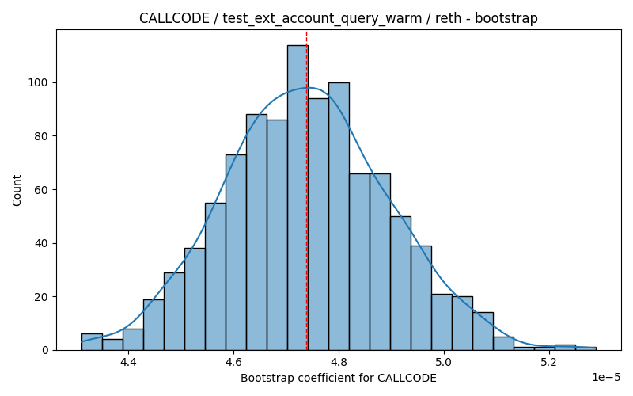

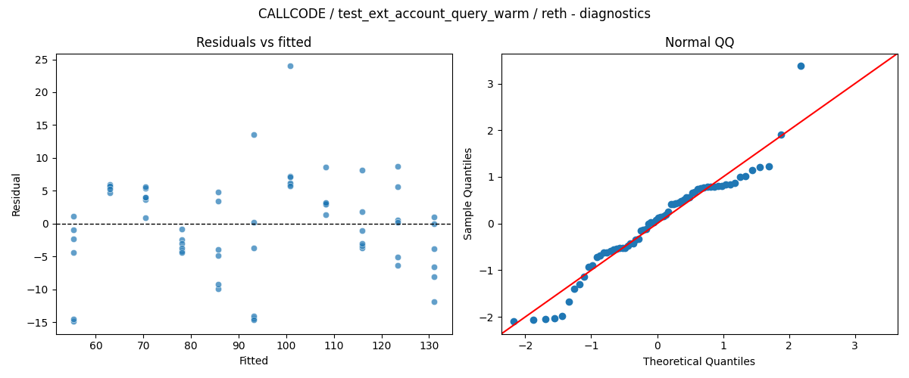

</details>

## DELEGATECALL

### test_account_access — combo `DELEGATECALL_AccountMode.EXISTING_EOA`

| client | nobs | R² | target_coef (ms) | p-value | 95% CI |
| --- | --- | --- | --- | --- | --- |
| `erigon` | 33 | 0.9977 | 0.009964 | 1.00e-03 | [0.009817, 0.01012] |
| `geth` | 99 | 0.7053 | 0.01201 | 1.00e-03 | [0.01054, 0.01358] |
| `nethermind` | 66 | 0.889 | 0.006286 | 1.00e-03 | [0.005734, 0.006803] |
| `reth` | 66 | 0.9793 | 0.001113 | 1.00e-03 | [0.001075, 0.001153] |

<details><summary>erigon — NNLS regression summary</summary>

```
==============================================================================
                           NNLS Regression Results                            
==============================================================================
Dep. Variable:          test_runtime_ms              R-squared:          0.998
Model:                  NNLS                    Adj. R-squared:          0.998
No. Observations:       33                                RMSE:          11.48
Df Residuals:           31                                 MAE:           9.68
Df Model:               1      
==============================================================================
                      coef     std err     P-value      [0.025      0.975]
------------------------------------------------------------------------------
         const     42.4129      5.7647       0.001     30.1245     53.0772
       opcount      0.0100      0.0001       0.001      0.0098      0.0101
==============================================================================
Notes: Non-negative least squares with bootstrap inference (1000 iterations)
==============================================================================
```


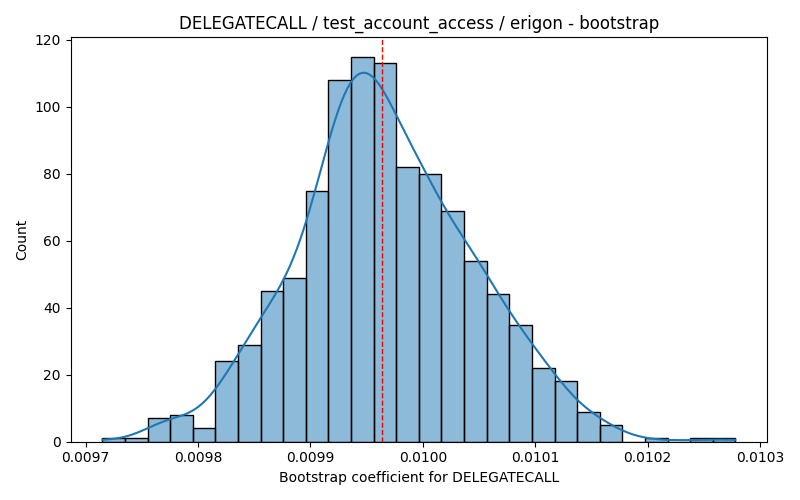

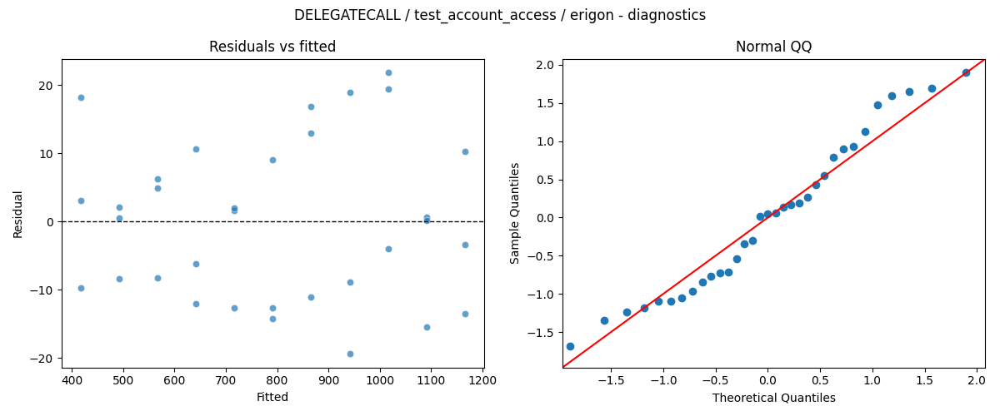

</details>

<details><summary>geth — NNLS regression summary</summary>

```
==============================================================================
                           NNLS Regression Results                            
==============================================================================
Dep. Variable:          test_runtime_ms              R-squared:          0.705
Model:                  NNLS                    Adj. R-squared:          0.702
No. Observations:       99                                RMSE:         184.54
Df Residuals:           97                                 MAE:         159.34
Df Model:               1      
==============================================================================
                      coef     std err     P-value      [0.025      0.975]
------------------------------------------------------------------------------
         const    538.4780     62.2837       0.001    405.1333    655.3268
       opcount      0.0120      0.0008       0.001      0.0105      0.0136
==============================================================================
Notes: Non-negative least squares with bootstrap inference (1000 iterations)
==============================================================================
```

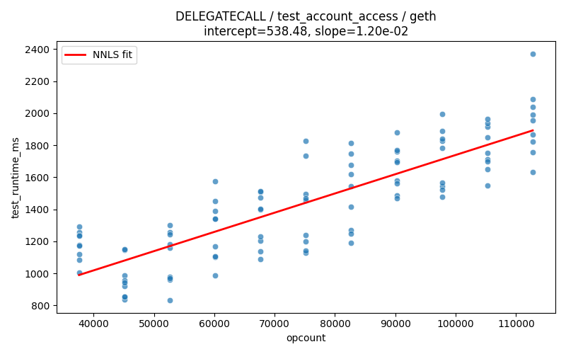

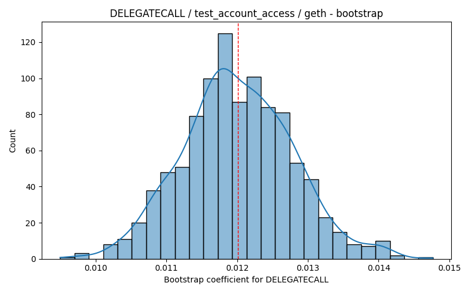

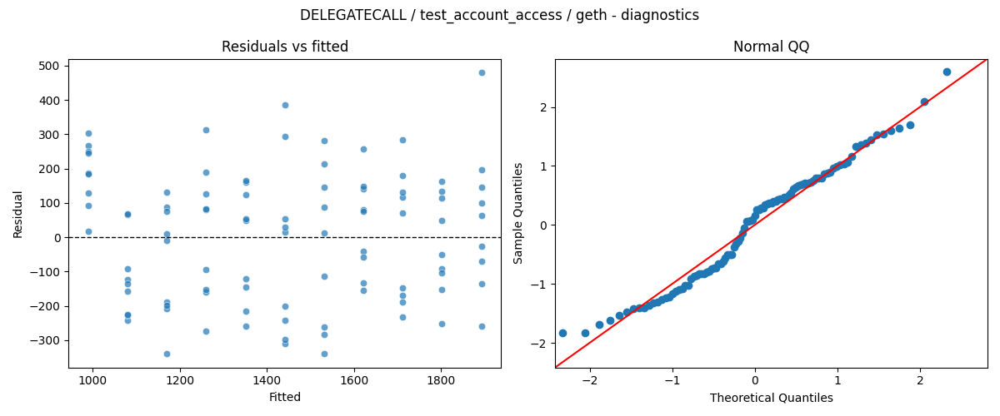

</details>

<details><summary>nethermind — NNLS regression summary</summary>

```
==============================================================================
                           NNLS Regression Results                            
==============================================================================
Dep. Variable:          test_runtime_ms              R-squared:          0.889
Model:                  NNLS                    Adj. R-squared:          0.887
No. Observations:       66                                RMSE:          52.80
Df Residuals:           64                                 MAE:          42.65
Df Model:               1      
==============================================================================
                      coef     std err     P-value      [0.025      0.975]
------------------------------------------------------------------------------
         const     44.9579     19.5786       0.006      7.6665     86.0878
       opcount      0.0063      0.0003       0.001      0.0057      0.0068
==============================================================================
Notes: Non-negative least squares with bootstrap inference (1000 iterations)
==============================================================================
```

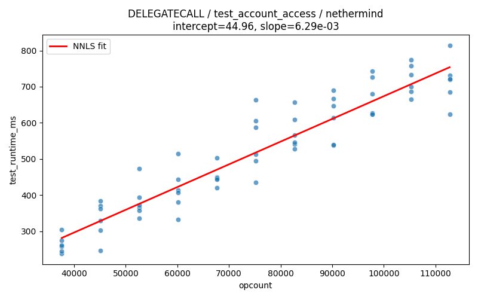

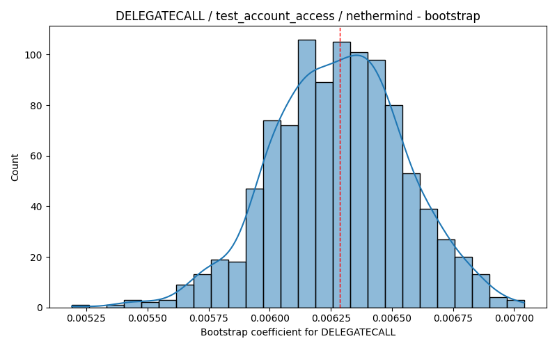

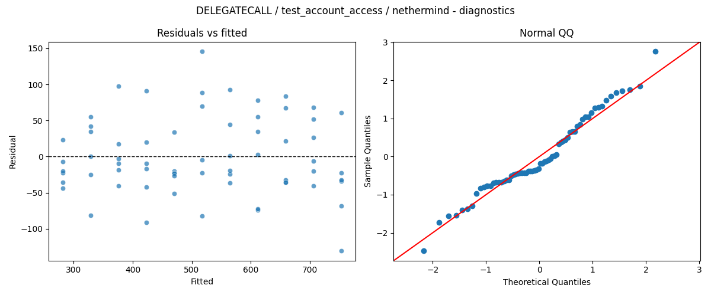

</details>

<details><summary>reth — NNLS regression summary</summary>

```
==============================================================================
                           NNLS Regression Results                            
==============================================================================
Dep. Variable:          test_runtime_ms              R-squared:          0.979
Model:                  NNLS                    Adj. R-squared:          0.979
No. Observations:       66                                RMSE:           3.85
Df Residuals:           64                                 MAE:           3.13
Df Model:               1      
==============================================================================
                      coef     std err     P-value      [0.025      0.975]
------------------------------------------------------------------------------
         const     32.2049      1.5925       0.001     28.9474     35.0744
       opcount      0.0011      0.0000       0.001      0.0011      0.0012
==============================================================================
Notes: Non-negative least squares with bootstrap inference (1000 iterations)
==============================================================================
```

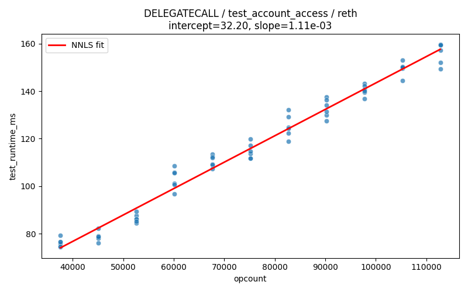

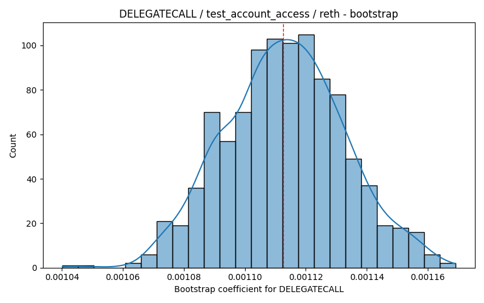

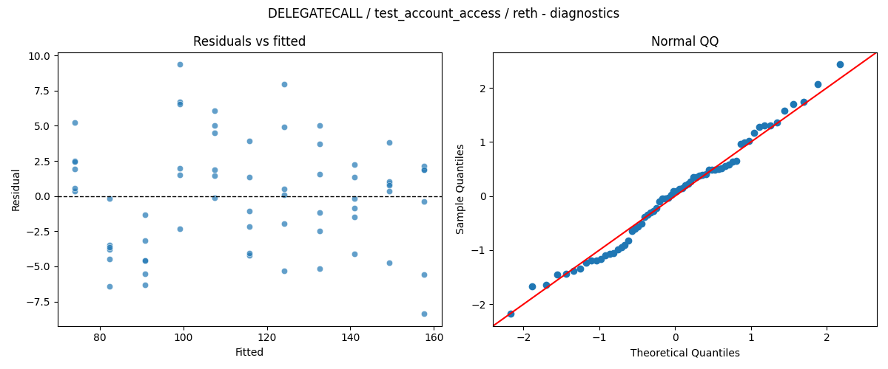

</details>

### test_account_access — combo `DELEGATECALL_AccountMode.NON_EXISTING_ACCOUNT` — `presets[cold_account_nocode_access]`

| client | nobs | R² | target_coef (ms) | p-value | 95% CI |
| --- | --- | --- | --- | --- | --- |
| `erigon` | 33 | 0.9983 | 0.009431 | 1.00e-03 | [0.009303, 0.009585] |
| `geth` | 99 | 0.647 | 0.03323 | 1.00e-03 | [0.02869, 0.03832] |
| `nethermind` | 66 | 0.7852 | 0.005891 | 1.00e-03 | [0.005351, 0.006607] |
| `reth` | 66 | 0.9725 | 0.0009521 | 1.00e-03 | [0.0009094, 0.0009979] |

<details><summary>erigon — NNLS regression summary</summary>

```
==============================================================================
                           NNLS Regression Results                            
==============================================================================
Dep. Variable:          test_runtime_ms              R-squared:          0.998
Model:                  NNLS                    Adj. R-squared:          0.998
No. Observations:       33                                RMSE:           9.13
Df Residuals:           31                                 MAE:           7.82
Df Model:               1      
==============================================================================
                      coef     std err     P-value      [0.025      0.975]
------------------------------------------------------------------------------
         const     19.0478      5.5823       0.006      6.3991     28.3842
       opcount      0.0094      0.0001       0.001      0.0093      0.0096
==============================================================================
Notes: Non-negative least squares with bootstrap inference (1000 iterations)
==============================================================================
```


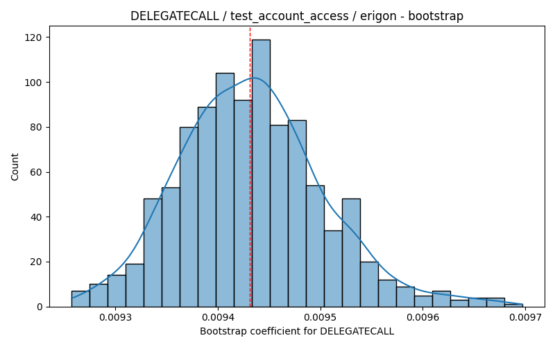

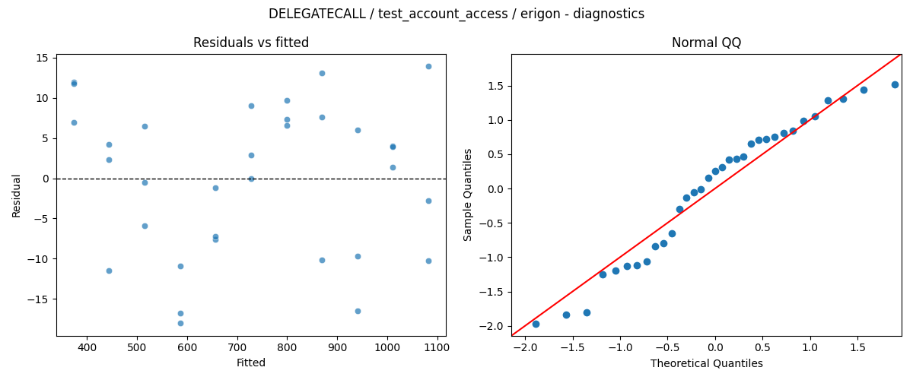

</details>

<details><summary>geth — NNLS regression summary</summary>

```
==============================================================================
                           NNLS Regression Results                            
==============================================================================
Dep. Variable:          test_runtime_ms              R-squared:          0.647
Model:                  NNLS                    Adj. R-squared:          0.643
No. Observations:       99                                RMSE:         583.61
Df Residuals:           97                                 MAE:         459.66
Df Model:               1      
==============================================================================
                      coef     std err     P-value      [0.025      0.975]
------------------------------------------------------------------------------
         const   1573.6991    183.6373       0.001   1205.0569   1911.6143
       opcount      0.0332      0.0025       0.001      0.0287      0.0383
==============================================================================
Notes: Non-negative least squares with bootstrap inference (1000 iterations)
==============================================================================
```

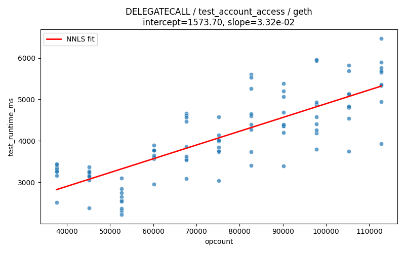

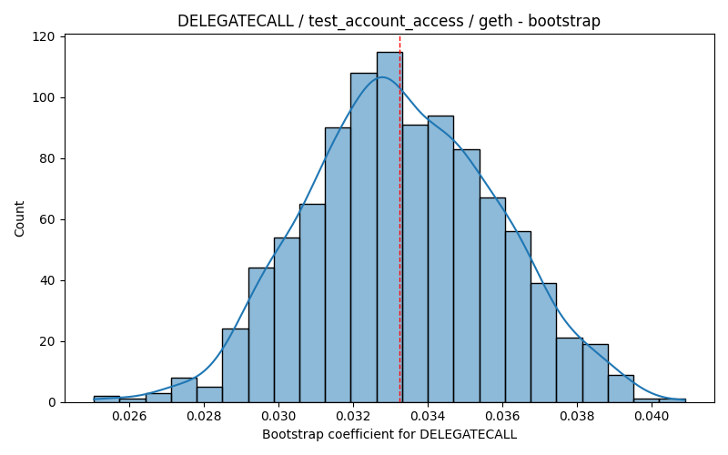

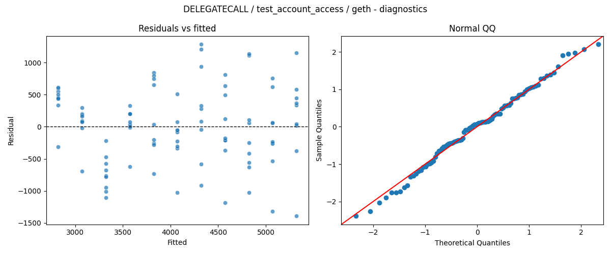

</details>

<details><summary>nethermind — NNLS regression summary</summary>

```
==============================================================================
                           NNLS Regression Results                            
==============================================================================
Dep. Variable:          test_runtime_ms              R-squared:          0.785
Model:                  NNLS                    Adj. R-squared:          0.782
No. Observations:       66                                RMSE:          73.25
Df Residuals:           64                                 MAE:          45.21
Df Model:               1      
==============================================================================
                      coef     std err     P-value      [0.025      0.975]
------------------------------------------------------------------------------
         const     45.3962     17.8670       0.014      5.8463     77.4934
       opcount      0.0059      0.0003       0.001      0.0054      0.0066
==============================================================================
Notes: Non-negative least squares with bootstrap inference (1000 iterations)
==============================================================================
```

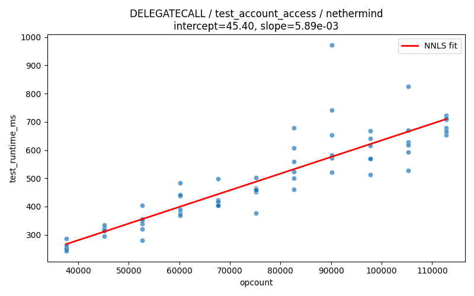

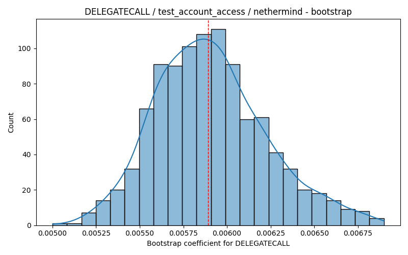

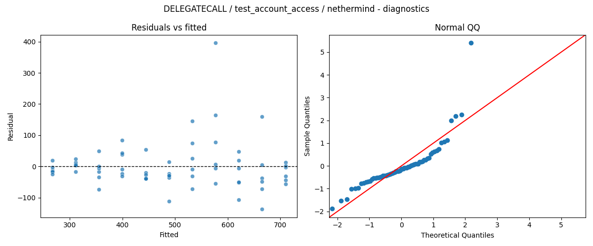

</details>

<details><summary>reth — NNLS regression summary</summary>

```
==============================================================================
                           NNLS Regression Results                            
==============================================================================
Dep. Variable:          test_runtime_ms              R-squared:          0.972
Model:                  NNLS                    Adj. R-squared:          0.972
No. Observations:       66                                RMSE:           3.81
Df Residuals:           64                                 MAE:           3.07
Df Model:               1      
==============================================================================
                      coef     std err     P-value      [0.025      0.975]
------------------------------------------------------------------------------
         const     30.9556      1.6656       0.001     27.7212     34.2725
       opcount      0.0010      0.0000       0.001      0.0009      0.0010
==============================================================================
Notes: Non-negative least squares with bootstrap inference (1000 iterations)
==============================================================================
```

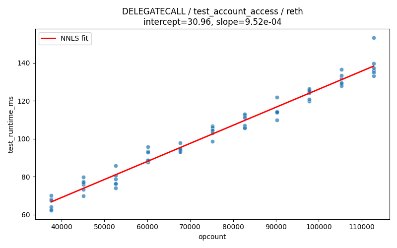

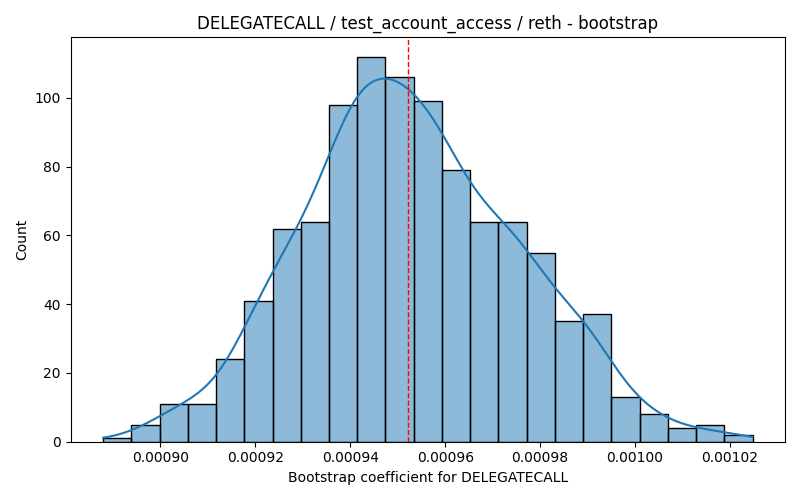

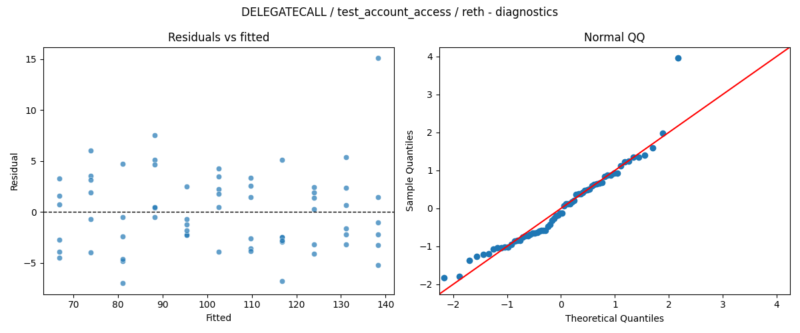

</details>

### test_account_access — combo `DELEGATECALL_AccountMode.EXISTING_CONTRACT`

| client | nobs | R² | target_coef (ms) | p-value | 95% CI |
| --- | --- | --- | --- | --- | --- |
| `erigon` | 33 | 0.8782 | 0.08689 | 1.00e-03 | [0.07413, 0.09619] |
| `geth` | 99 | 0.7244 | 0.0362 | 1.00e-03 | [0.03251, 0.04006] |
| `nethermind` | 66 | 0.8957 | 0.02033 | 1.00e-03 | [0.01859, 0.02216] |
| `reth` | 66 | 0.9693 | 0.03744 | 1.00e-03 | [0.03693, 0.03798] |

<details><summary>erigon — NNLS regression summary</summary>

```
==============================================================================
                           NNLS Regression Results                            
==============================================================================
Dep. Variable:          test_runtime_ms              R-squared:          0.878
Model:                  NNLS                    Adj. R-squared:          0.874
No. Observations:       33                                RMSE:         659.22
Df Residuals:           31                                 MAE:         571.04
Df Model:               1      
==============================================================================
                      coef     std err     P-value      [0.025      0.975]
------------------------------------------------------------------------------
         const   1473.0208    441.0786       0.001    718.2871   2469.8222
       opcount      0.0869      0.0058       0.001      0.0741      0.0962
==============================================================================
Notes: Non-negative least squares with bootstrap inference (1000 iterations)
==============================================================================
```

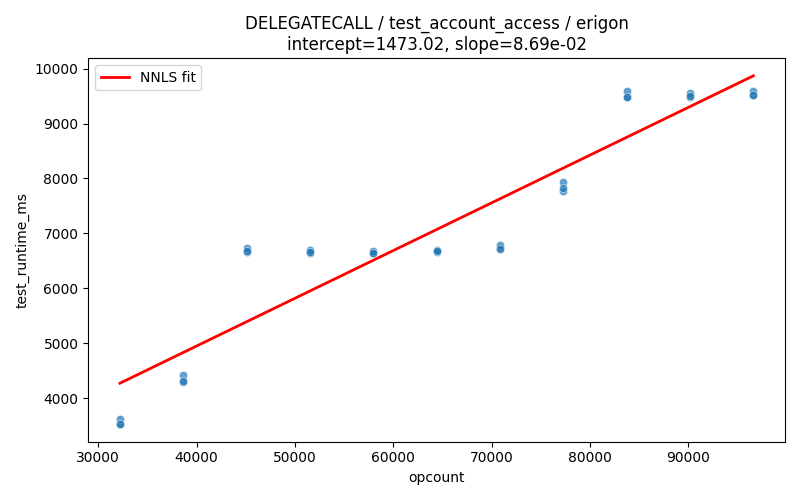

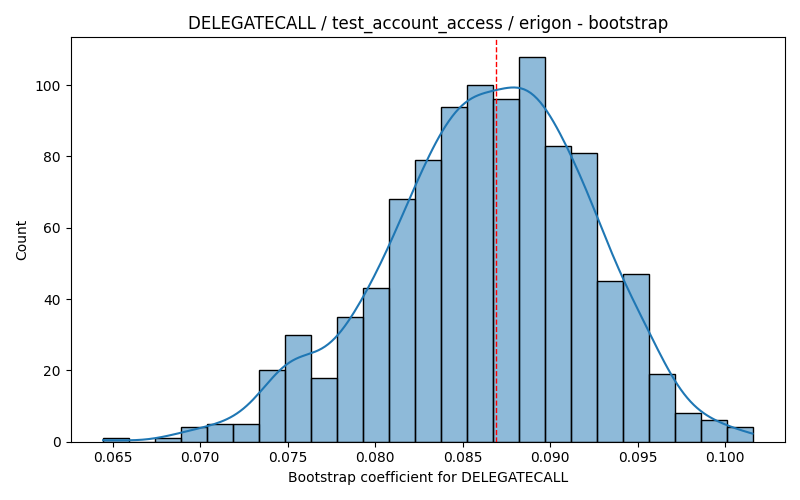

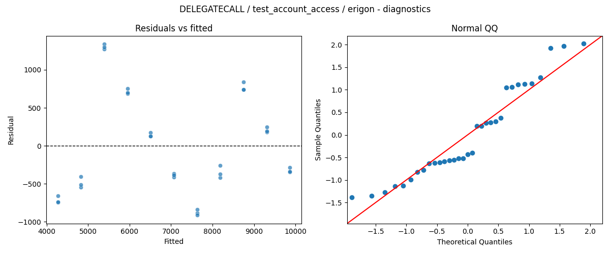

</details>

<details><summary>geth — NNLS regression summary</summary>

```
==============================================================================
                           NNLS Regression Results                            
==============================================================================
Dep. Variable:          test_runtime_ms              R-squared:          0.724
Model:                  NNLS                    Adj. R-squared:          0.722
No. Observations:       99                                RMSE:         454.93
Df Residuals:           97                                 MAE:         358.38
Df Model:               1      
==============================================================================
                      coef     std err     P-value      [0.025      0.975]
------------------------------------------------------------------------------
         const   1468.5189    134.7931       0.001   1201.0866   1723.8083
       opcount      0.0362      0.0019       0.001      0.0325      0.0401
==============================================================================
Notes: Non-negative least squares with bootstrap inference (1000 iterations)
==============================================================================
```

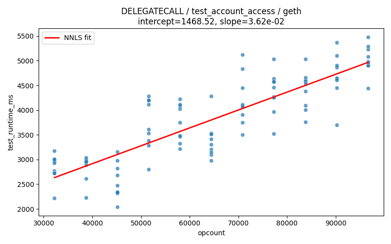

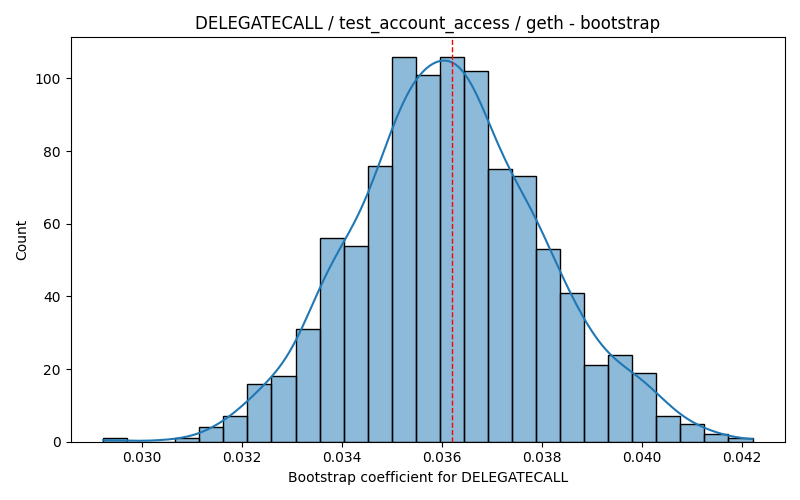

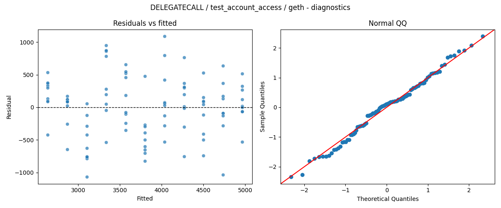

</details>

<details><summary>nethermind — NNLS regression summary</summary>

```
==============================================================================
                           NNLS Regression Results                            
==============================================================================
Dep. Variable:          test_runtime_ms              R-squared:          0.896
Model:                  NNLS                    Adj. R-squared:          0.894
No. Observations:       66                                RMSE:         141.34
Df Residuals:           64                                 MAE:         113.96
Df Model:               1      
==============================================================================
                      coef     std err     P-value      [0.025      0.975]
------------------------------------------------------------------------------
         const    255.6035     52.0646       0.001    154.9015    357.8632
       opcount      0.0203      0.0009       0.001      0.0186      0.0222
==============================================================================
Notes: Non-negative least squares with bootstrap inference (1000 iterations)
==============================================================================
```

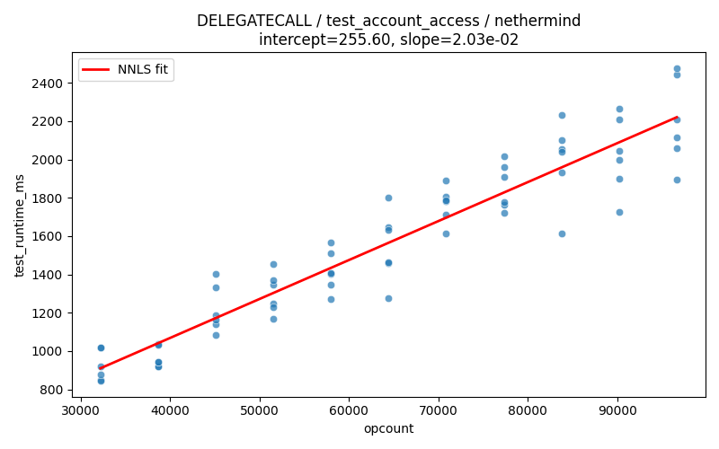

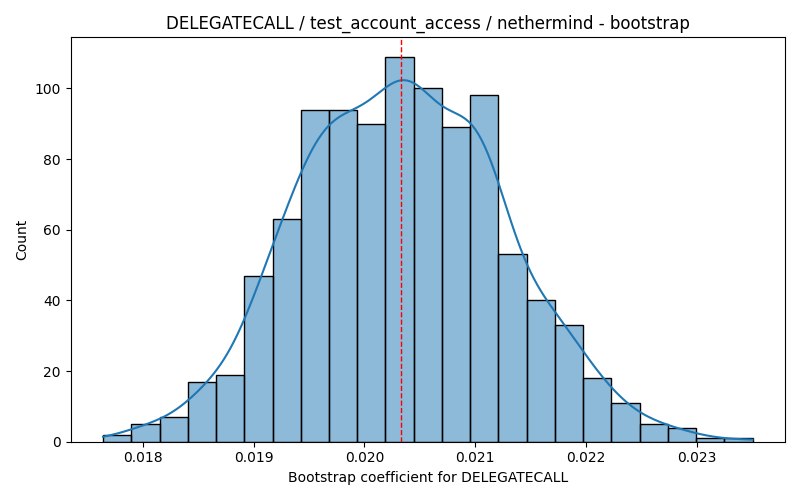

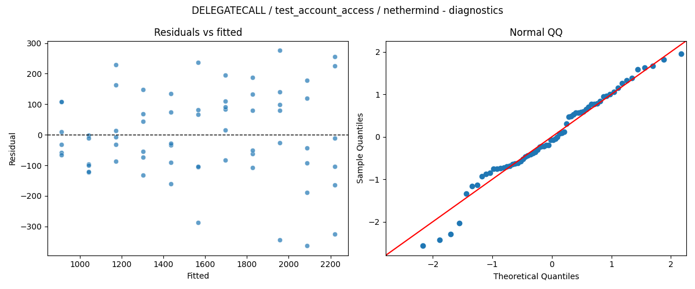

</details>

<details><summary>reth — NNLS regression summary</summary>

```
==============================================================================
                           NNLS Regression Results                            
==============================================================================
Dep. Variable:          test_runtime_ms              R-squared:          0.969
Model:                  NNLS                    Adj. R-squared:          0.969
No. Observations:       66                                RMSE:         140.88
Df Residuals:           64                                 MAE:         100.94
Df Model:               1      
==============================================================================
                      coef     std err     P-value      [0.025      0.975]
------------------------------------------------------------------------------
         const      0.0000      1.9827       1.000      0.0000      0.0000
       opcount      0.0374      0.0003       0.001      0.0369      0.0380
==============================================================================
Notes: Non-negative least squares with bootstrap inference (1000 iterations)
==============================================================================
```

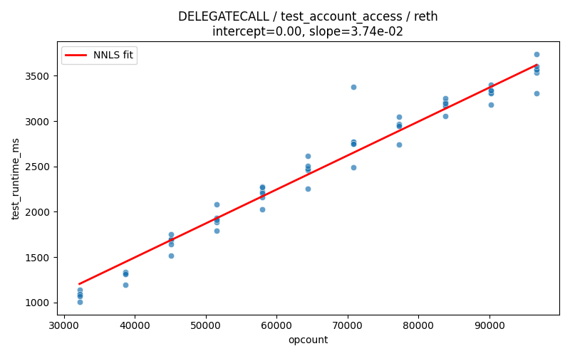

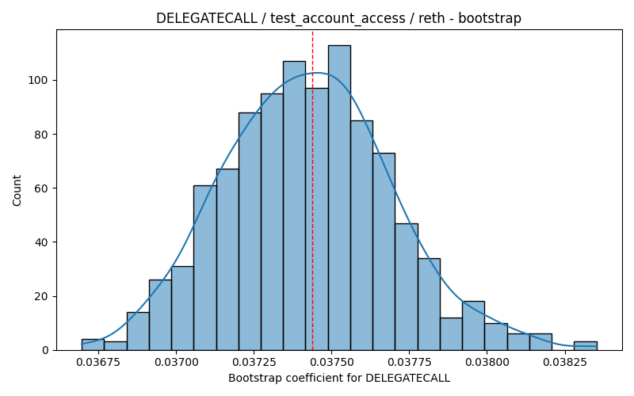

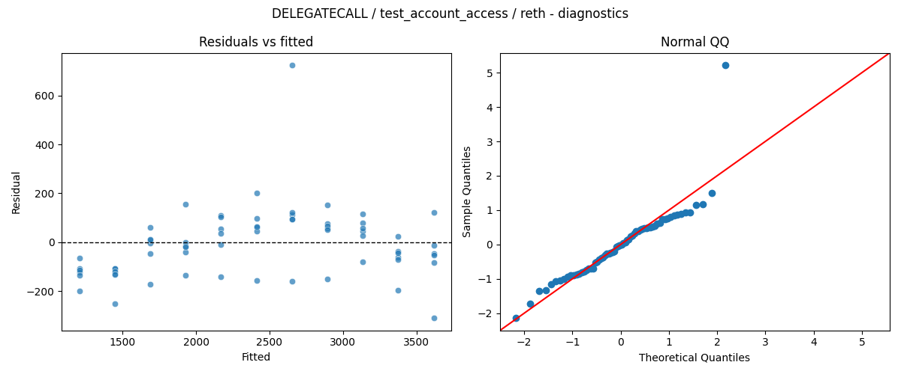

</details>

### test_account_access — combo `DELEGATECALL_AccountMode.NON_EXISTING_ACCOUNT` — `presets[cold_account_code_access]`

| client | nobs | R² | target_coef (ms) | p-value | 95% CI |
| --- | --- | --- | --- | --- | --- |
| `erigon` | 33 | 0.9983 | 0.009431 | 1.00e-03 | [0.009303, 0.009585] |
| `geth` | 99 | 0.647 | 0.03323 | 1.00e-03 | [0.02869, 0.03832] |
| `nethermind` | 66 | 0.7852 | 0.005891 | 1.00e-03 | [0.005351, 0.006607] |
| `reth` | 66 | 0.9725 | 0.0009521 | 1.00e-03 | [0.0009094, 0.0009979] |

<details><summary>erigon — NNLS regression summary</summary>

```
==============================================================================
                           NNLS Regression Results                            
==============================================================================
Dep. Variable:          test_runtime_ms              R-squared:          0.998
Model:                  NNLS                    Adj. R-squared:          0.998
No. Observations:       33                                RMSE:           9.13
Df Residuals:           31                                 MAE:           7.82
Df Model:               1      
==============================================================================
                      coef     std err     P-value      [0.025      0.975]
------------------------------------------------------------------------------
         const     19.0478      5.5823       0.006      6.3991     28.3842
       opcount      0.0094      0.0001       0.001      0.0093      0.0096
==============================================================================
Notes: Non-negative least squares with bootstrap inference (1000 iterations)
==============================================================================
```


</details>

<details><summary>geth — NNLS regression summary</summary>

```
==============================================================================
                           NNLS Regression Results                            
==============================================================================
Dep. Variable:          test_runtime_ms              R-squared:          0.647
Model:                  NNLS                    Adj. R-squared:          0.643
No. Observations:       99                                RMSE:         583.61
Df Residuals:           97                                 MAE:         459.66
Df Model:               1      
==============================================================================
                      coef     std err     P-value      [0.025      0.975]
------------------------------------------------------------------------------
         const   1573.6991    183.6373       0.001   1205.0569   1911.6143
       opcount      0.0332      0.0025       0.001      0.0287      0.0383
==============================================================================
Notes: Non-negative least squares with bootstrap inference (1000 iterations)
==============================================================================
```


</details>

<details><summary>nethermind — NNLS regression summary</summary>

```
==============================================================================
                           NNLS Regression Results                            
==============================================================================
Dep. Variable:          test_runtime_ms              R-squared:          0.785
Model:                  NNLS                    Adj. R-squared:          0.782
No. Observations:       66                                RMSE:          73.25
Df Residuals:           64                                 MAE:          45.21
Df Model:               1      
==============================================================================
                      coef     std err     P-value      [0.025      0.975]
------------------------------------------------------------------------------
         const     45.3962     17.8670       0.014      5.8463     77.4934
       opcount      0.0059      0.0003       0.001      0.0054      0.0066
==============================================================================
Notes: Non-negative least squares with bootstrap inference (1000 iterations)
==============================================================================
```


</details>

<details><summary>reth — NNLS regression summary</summary>

```
==============================================================================
                           NNLS Regression Results                            
==============================================================================
Dep. Variable:          test_runtime_ms              R-squared:          0.972
Model:                  NNLS                    Adj. R-squared:          0.972
No. Observations:       66                                RMSE:           3.81
Df Residuals:           64                                 MAE:           3.07
Df Model:               1      
==============================================================================
                      coef     std err     P-value      [0.025      0.975]
------------------------------------------------------------------------------
         const     30.9556      1.6656       0.001     27.7212     34.2725
       opcount      0.0010      0.0000       0.001      0.0009      0.0010
==============================================================================
Notes: Non-negative least squares with bootstrap inference (1000 iterations)
==============================================================================
```


</details>

### test_ext_account_query_warm — combo `DELEGATECALL`

| client | nobs | R² | target_coef (ms) | p-value | 95% CI |
| --- | --- | --- | --- | --- | --- |
| `erigon` | 33 | 0.8709 | 0.0002753 | 1.00e-03 | [0.0002412, 0.0003123] |
| `geth` | 99 | 0.9672 | 0.000553 | 1.00e-03 | [0.0005342, 0.0005722] |
| `nethermind` | 66 | 0.5244 | 0.0004164 | 1.00e-03 | [0.0003104, 0.0005198] |
| `reth` | 66 | 0.9269 | 4.425e-05 | 1.00e-03 | [4.149e-05, 4.727e-05] |

<details><summary>erigon — NNLS regression summary</summary>

```
==============================================================================
                           NNLS Regression Results                            
==============================================================================
Dep. Variable:          test_runtime_ms              R-squared:          0.871
Model:                  NNLS                    Adj. R-squared:          0.867
No. Observations:       33                                RMSE:          54.86
Df Residuals:           31                                 MAE:          36.82
Df Model:               1      
==============================================================================
                      coef     std err     P-value      [0.025      0.975]
------------------------------------------------------------------------------
         const     49.5010     23.7053       0.029      0.0000     98.5955
       opcount      0.0003      0.0000       0.001      0.0002      0.0003
==============================================================================
Notes: Non-negative least squares with bootstrap inference (1000 iterations)
==============================================================================
```

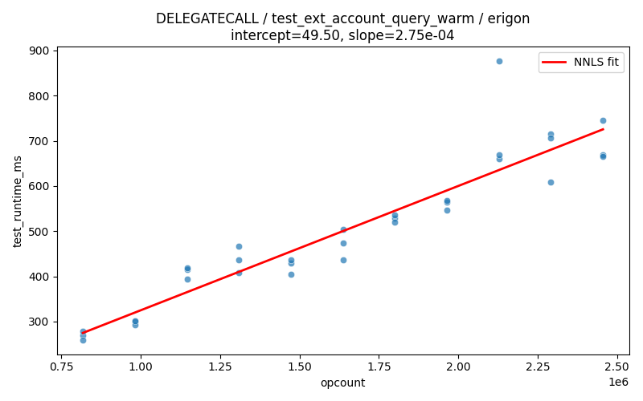

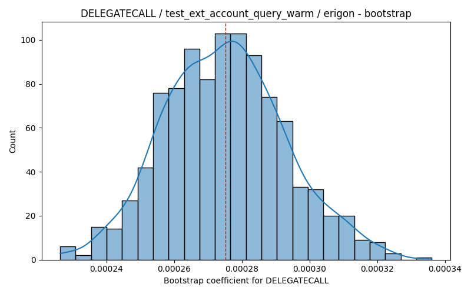

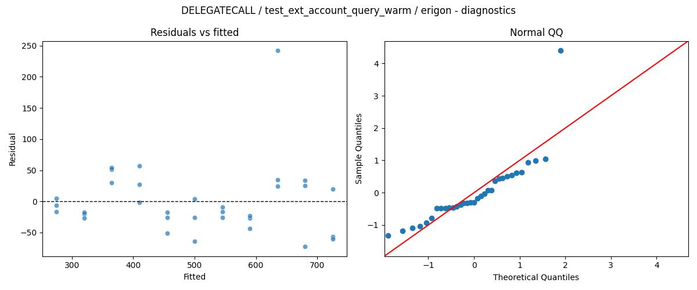

</details>

<details><summary>geth — NNLS regression summary</summary>

```
==============================================================================
                           NNLS Regression Results                            
==============================================================================
Dep. Variable:          test_runtime_ms              R-squared:          0.967
Model:                  NNLS                    Adj. R-squared:          0.967
No. Observations:       99                                RMSE:          52.70
Df Residuals:           97                                 MAE:          38.24
Df Model:               1      
==============================================================================
                      coef     std err     P-value      [0.025      0.975]
------------------------------------------------------------------------------
         const     24.6663     14.1774       0.052      0.0000     53.2976
       opcount      0.0006      0.0000       0.001      0.0005      0.0006
==============================================================================
Notes: Non-negative least squares with bootstrap inference (1000 iterations)
==============================================================================
```

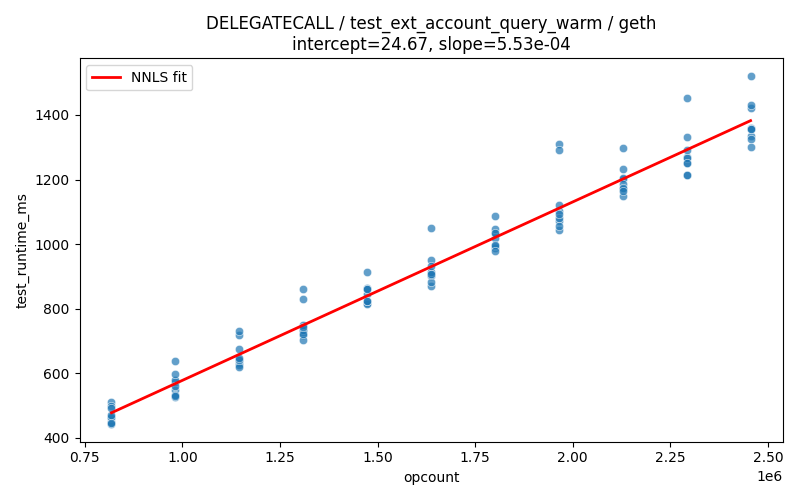

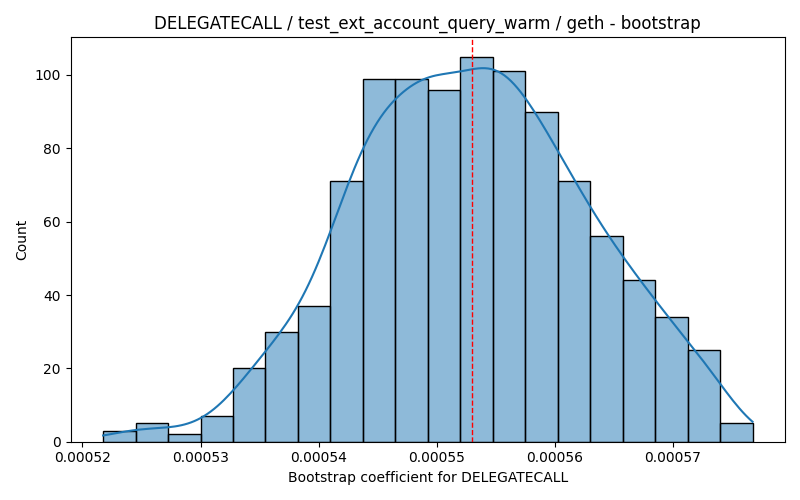

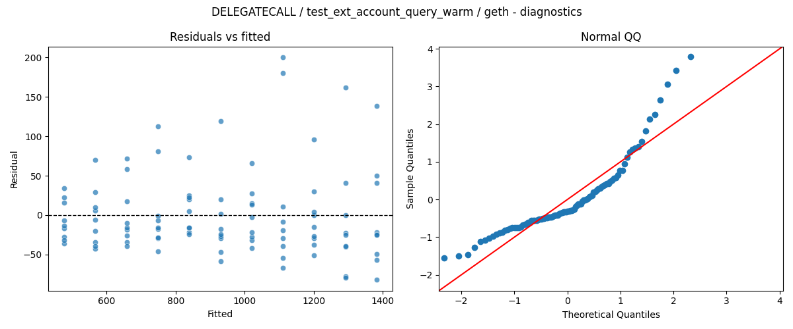

</details>

<details><summary>nethermind — NNLS regression summary</summary>

```
==============================================================================
                           NNLS Regression Results                            
==============================================================================
Dep. Variable:          test_runtime_ms              R-squared:          0.524
Model:                  NNLS                    Adj. R-squared:          0.517
No. Observations:       66                                RMSE:         205.25
Df Residuals:           64                                 MAE:         170.82
Df Model:               1      
==============================================================================
                      coef     std err     P-value      [0.025      0.975]
------------------------------------------------------------------------------
         const    465.8859     76.9028       0.001    315.4236    618.8320
       opcount      0.0004      0.0001       0.001      0.0003      0.0005
==============================================================================
Notes: Non-negative least squares with bootstrap inference (1000 iterations)
==============================================================================
```

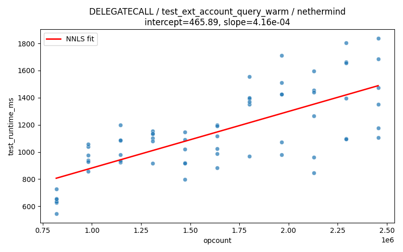

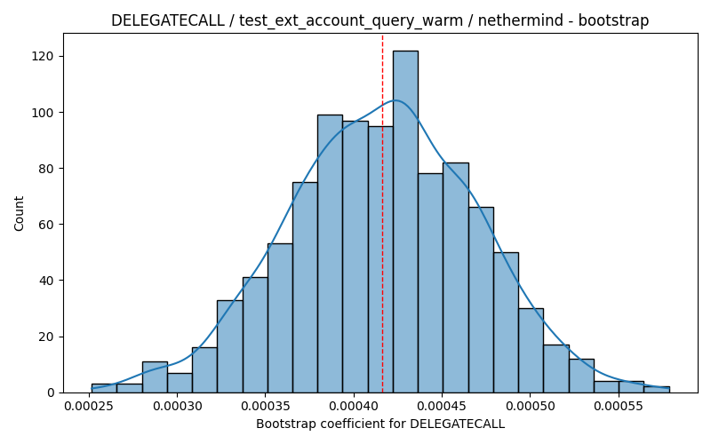

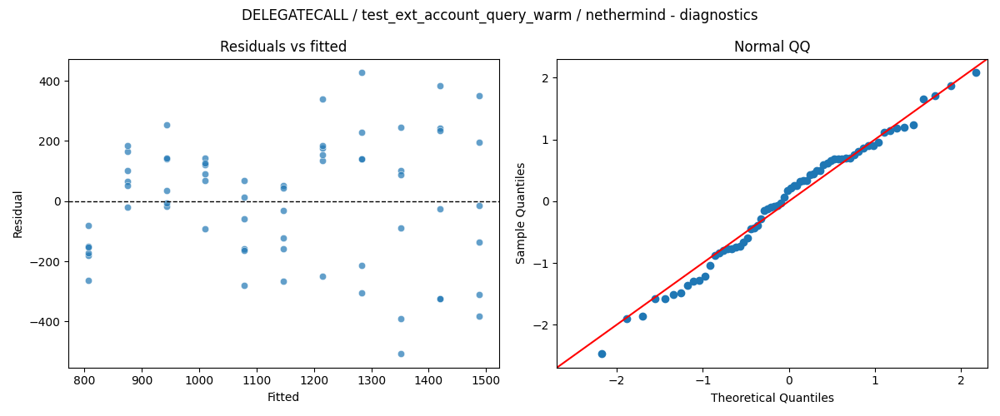

</details>

<details><summary>reth — NNLS regression summary</summary>

```
==============================================================================
                           NNLS Regression Results                            
==============================================================================
Dep. Variable:          test_runtime_ms              R-squared:          0.927
Model:                  NNLS                    Adj. R-squared:          0.926
No. Observations:       66                                RMSE:           6.43
Df Residuals:           64                                 MAE:           5.36
Df Model:               1      
==============================================================================
                      coef     std err     P-value      [0.025      0.975]
------------------------------------------------------------------------------
         const     20.5852      2.5968       0.001     15.8048     25.4794
       opcount      0.0000      0.0000       0.001      0.0000      0.0000
==============================================================================
Notes: Non-negative least squares with bootstrap inference (1000 iterations)
==============================================================================
```

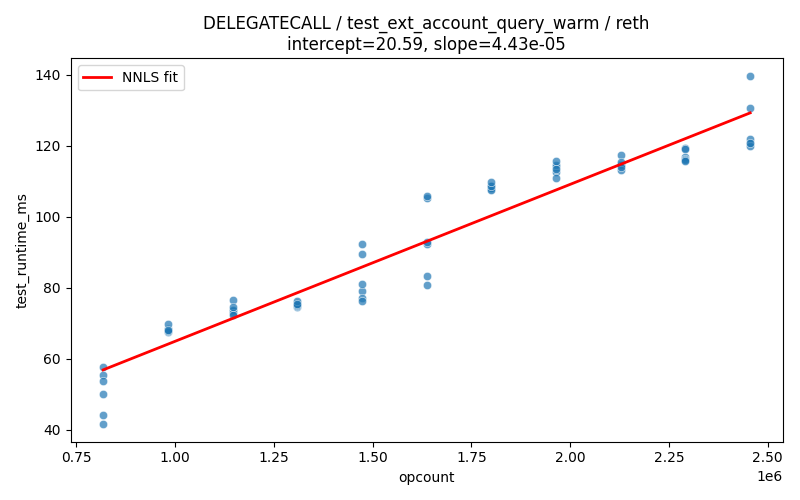

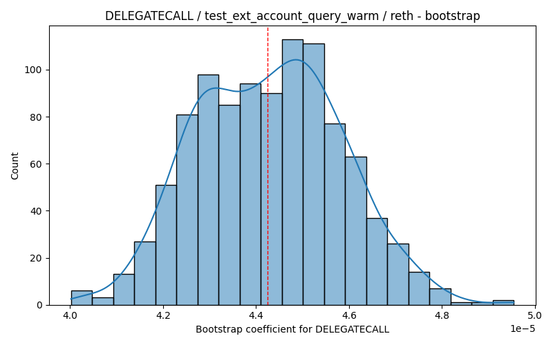

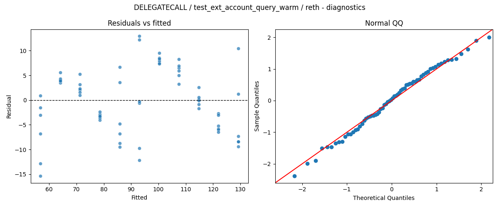

</details>

## EXTCODECOPY

### test_account_access — combo `EXTCODECOPY_AccountMode.NON_EXISTING_ACCOUNT` — `presets[cold_account_nocode_access]`

| client | nobs | R² | target_coef (ms) | p-value | 95% CI |
| --- | --- | --- | --- | --- | --- |
| `erigon` | 33 | 0.7996 | 6.342e-05 | 1.00e-03 | [5.231e-05, 7.472e-05] |
| `geth` | 99 | 0.9325 | 0.0007962 | 1.00e-03 | [0.0007544, 0.0008392] |
| `nethermind` | 66 | 0.8695 | 0.0003186 | 1.00e-03 | [0.0002883, 0.0003467] |
| `reth` | 66 | 0.6784 | 1.719e-05 | 1.00e-03 | [1.442e-05, 2.04e-05] |

<details><summary>erigon — NNLS regression summary</summary>

```
==============================================================================
                           NNLS Regression Results                            
==============================================================================
Dep. Variable:          test_runtime_ms              R-squared:          0.800
Model:                  NNLS                    Adj. R-squared:          0.793
No. Observations:       33                                RMSE:           8.15
Df Residuals:           31                                 MAE:           6.40
Df Model:               1      
==============================================================================
                      coef     std err     P-value      [0.025      0.975]
------------------------------------------------------------------------------
         const     43.1318      4.6890       0.001     34.2438     52.8302
       opcount      0.0001      0.0000       0.001      0.0001      0.0001
==============================================================================
Notes: Non-negative least squares with bootstrap inference (1000 iterations)
==============================================================================
```

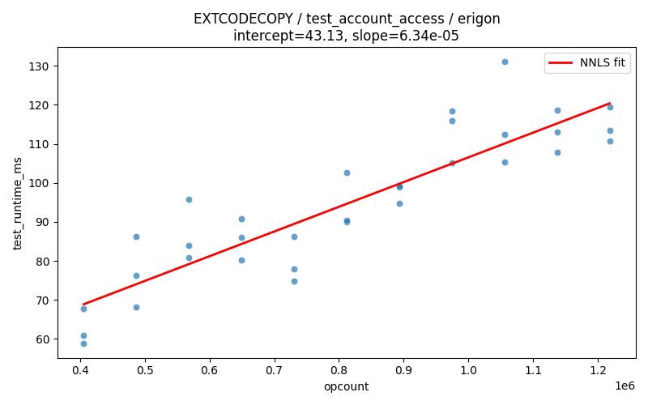

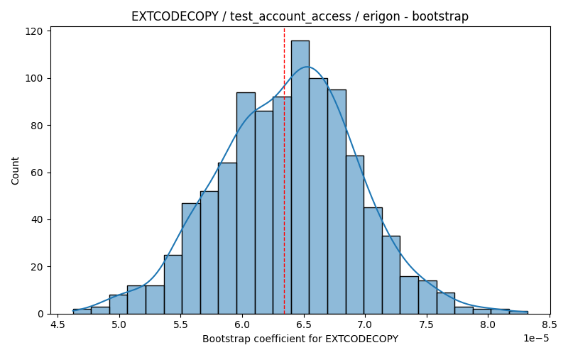

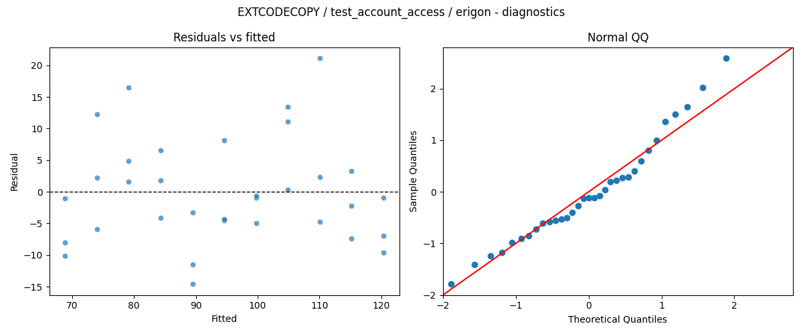

</details>

<details><summary>geth — NNLS regression summary</summary>

```
==============================================================================
                           NNLS Regression Results                            
==============================================================================
Dep. Variable:          test_runtime_ms              R-squared:          0.933
Model:                  NNLS                    Adj. R-squared:          0.932
No. Observations:       99                                RMSE:          55.00
Df Residuals:           97                                 MAE:          37.06
Df Model:               1      
==============================================================================
                      coef     std err     P-value      [0.025      0.975]
------------------------------------------------------------------------------
         const     30.4238     15.6051       0.029      0.0000     62.9926
       opcount      0.0008      0.0000       0.001      0.0008      0.0008
==============================================================================
Notes: Non-negative least squares with bootstrap inference (1000 iterations)
==============================================================================
```

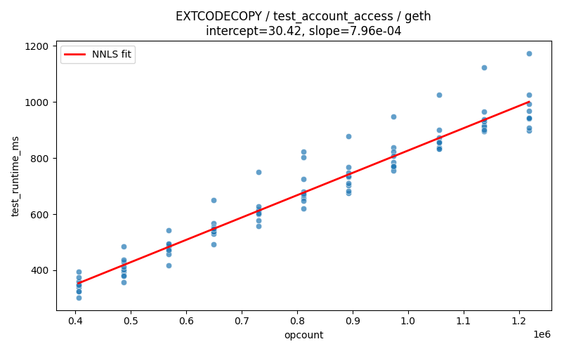

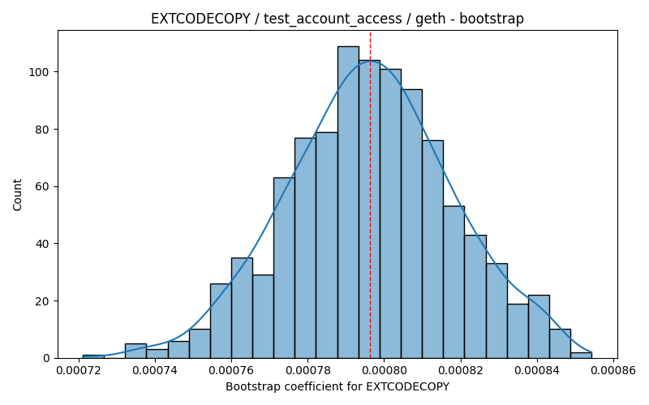

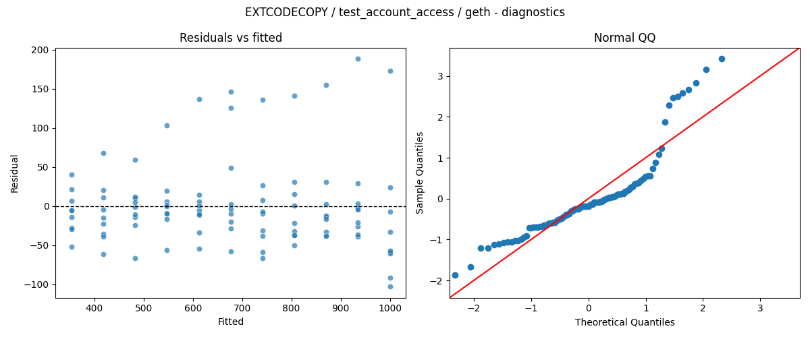

</details>

<details><summary>nethermind — NNLS regression summary</summary>

```
==============================================================================
                           NNLS Regression Results                            
==============================================================================
Dep. Variable:          test_runtime_ms              R-squared:          0.869
Model:                  NNLS                    Adj. R-squared:          0.867
No. Observations:       66                                RMSE:          31.69
Df Residuals:           64                                 MAE:          22.51
Df Model:               1      
==============================================================================
                      coef     std err     P-value      [0.025      0.975]
------------------------------------------------------------------------------
         const    108.2847     12.3103       0.001     86.2523    133.6363
       opcount      0.0003      0.0000       0.001      0.0003      0.0003
==============================================================================
Notes: Non-negative least squares with bootstrap inference (1000 iterations)
==============================================================================
```

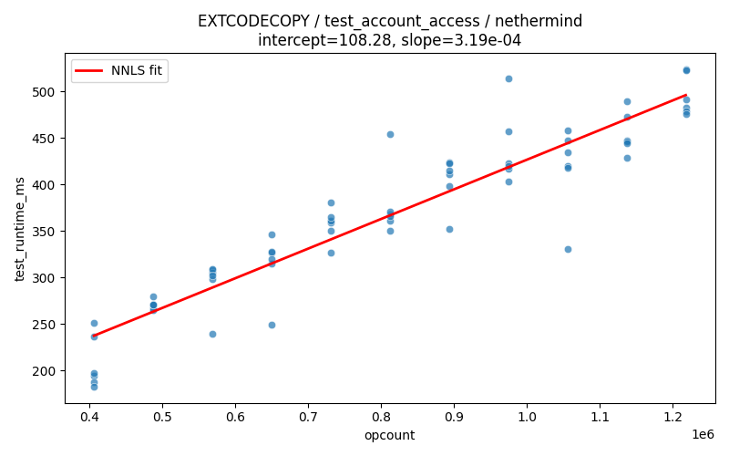

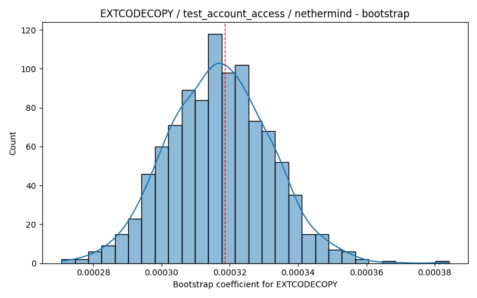

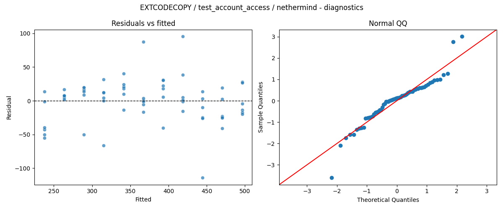

</details>

<details><summary>reth — NNLS regression summary</summary>

```
==============================================================================
                           NNLS Regression Results                            
==============================================================================
Dep. Variable:          test_runtime_ms              R-squared:          0.678
Model:                  NNLS                    Adj. R-squared:          0.673
No. Observations:       66                                RMSE:           3.04
Df Residuals:           64                                 MAE:           2.22
Df Model:               1      
==============================================================================
                      coef     std err     P-value      [0.025      0.975]
------------------------------------------------------------------------------
         const      5.8952      1.1547       0.001      3.6656      8.1686
       opcount      0.0000      0.0000       0.001      0.0000      0.0000
==============================================================================
Notes: Non-negative least squares with bootstrap inference (1000 iterations)
==============================================================================
```

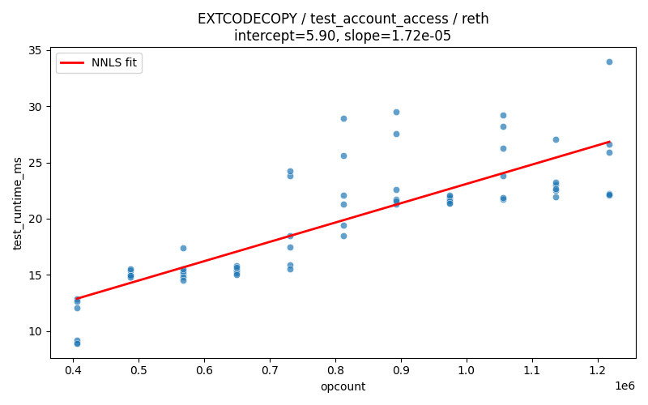

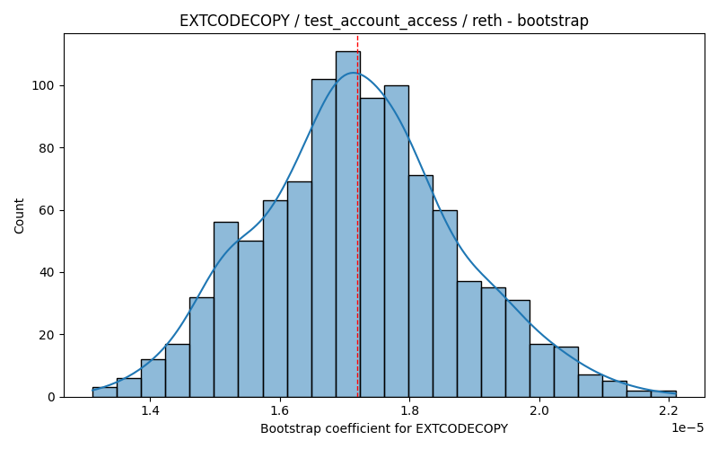

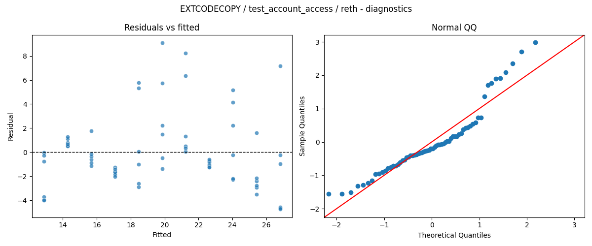

</details>

### test_account_access — combo `EXTCODECOPY_AccountMode.EXISTING_CONTRACT`

| client | nobs | R² | target_coef (ms) | p-value | 95% CI |
| --- | --- | --- | --- | --- | --- |
| `erigon` | 33 | 0.9247 | 0.0003134 | 1.00e-03 | [0.0002792, 0.0003414] |
| `geth` | 99 | 0.9662 | 0.002884 | 1.00e-03 | [0.002771, 0.002995] |
| `nethermind` | 66 | 0.733 | 0.001025 | 1.00e-03 | [0.0008776, 0.001168] |
| `reth` | 66 | 0.815 | 8.005e-05 | 1.00e-03 | [7.057e-05, 9.016e-05] |

<details><summary>erigon — NNLS regression summary</summary>

```
==============================================================================
                           NNLS Regression Results                            
==============================================================================
Dep. Variable:          test_runtime_ms              R-squared:          0.925
Model:                  NNLS                    Adj. R-squared:          0.922
No. Observations:       33                                RMSE:           8.84
Df Residuals:           31                                 MAE:           7.37
Df Model:               1      
==============================================================================
                      coef     std err     P-value      [0.025      0.975]
------------------------------------------------------------------------------
         const     44.9402      5.6729       0.001     34.7141     57.4103
       opcount      0.0003      0.0000       0.001      0.0003      0.0003
==============================================================================
Notes: Non-negative least squares with bootstrap inference (1000 iterations)
==============================================================================
```

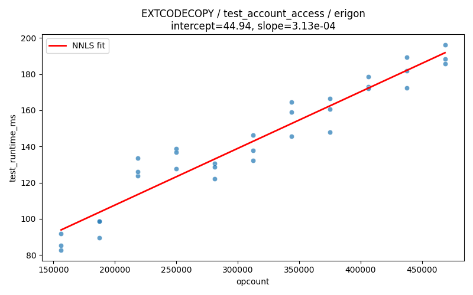

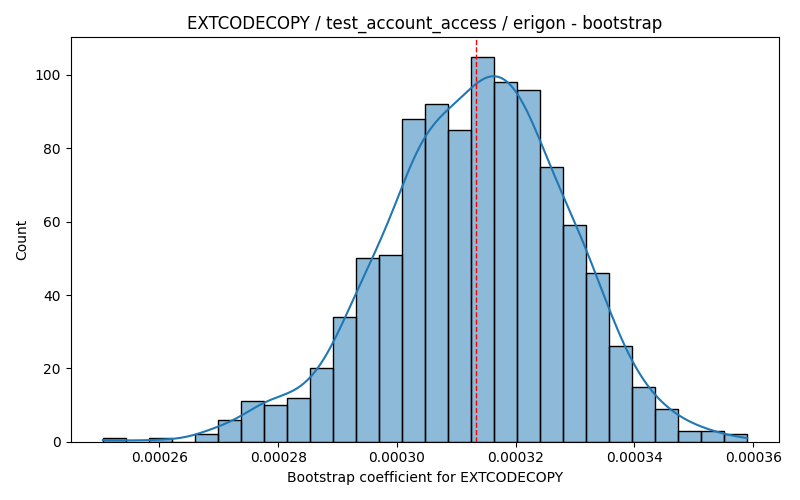

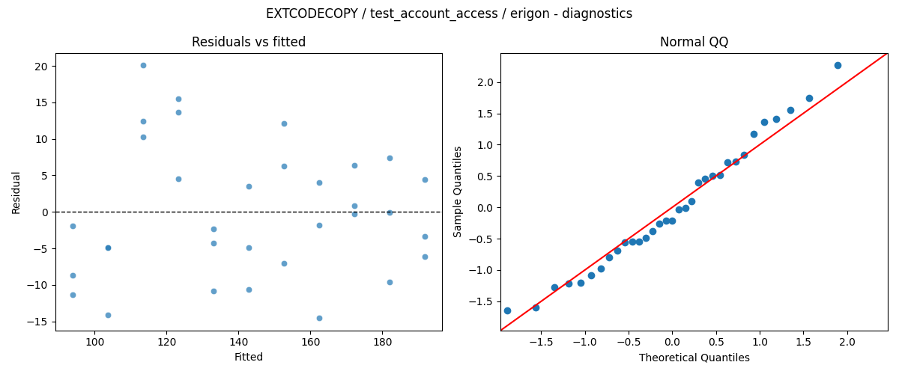

</details>

<details><summary>geth — NNLS regression summary</summary>

```
==============================================================================
                           NNLS Regression Results                            
==============================================================================
Dep. Variable:          test_runtime_ms              R-squared:          0.966
Model:                  NNLS                    Adj. R-squared:          0.966
No. Observations:       99                                RMSE:          53.33
Df Residuals:           97                                 MAE:          39.55
Df Model:               1      
==============================================================================
                      coef     std err     P-value      [0.025      0.975]
------------------------------------------------------------------------------
         const     31.3226     15.7189       0.030      0.0000     62.5652
       opcount      0.0029      0.0001       0.001      0.0028      0.0030
==============================================================================
Notes: Non-negative least squares with bootstrap inference (1000 iterations)
==============================================================================
```

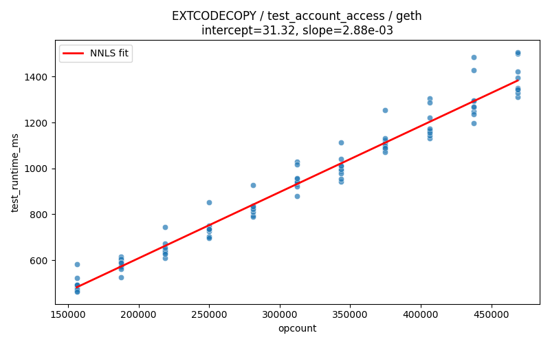

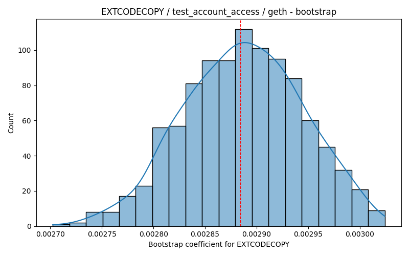

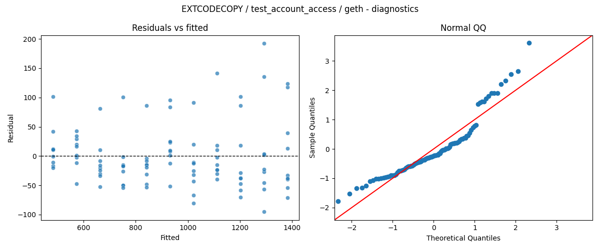

</details>

<details><summary>nethermind — NNLS regression summary</summary>

```
==============================================================================
                           NNLS Regression Results                            
==============================================================================
Dep. Variable:          test_runtime_ms              R-squared:          0.733
Model:                  NNLS                    Adj. R-squared:          0.729
No. Observations:       66                                RMSE:          61.13
Df Residuals:           64                                 MAE:          45.27
Df Model:               1      
==============================================================================
                      coef     std err     P-value      [0.025      0.975]
------------------------------------------------------------------------------
         const    230.8243     27.1939       0.001    177.8390    282.6730
       opcount      0.0010      0.0001       0.001      0.0009      0.0012
==============================================================================
Notes: Non-negative least squares with bootstrap inference (1000 iterations)
==============================================================================
```

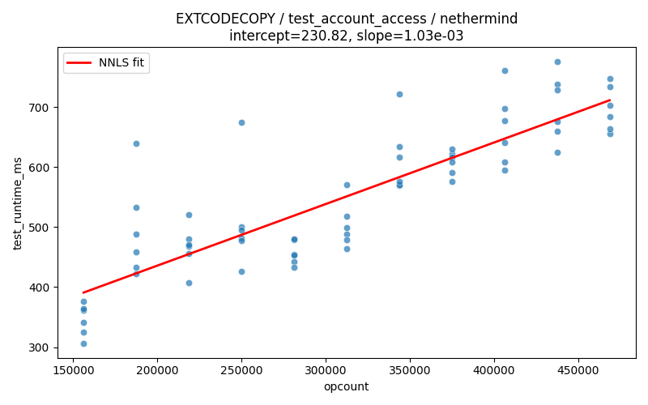

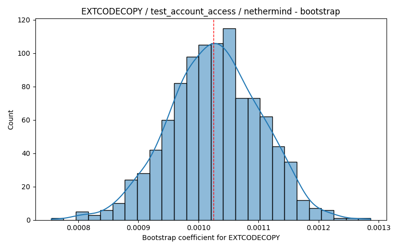

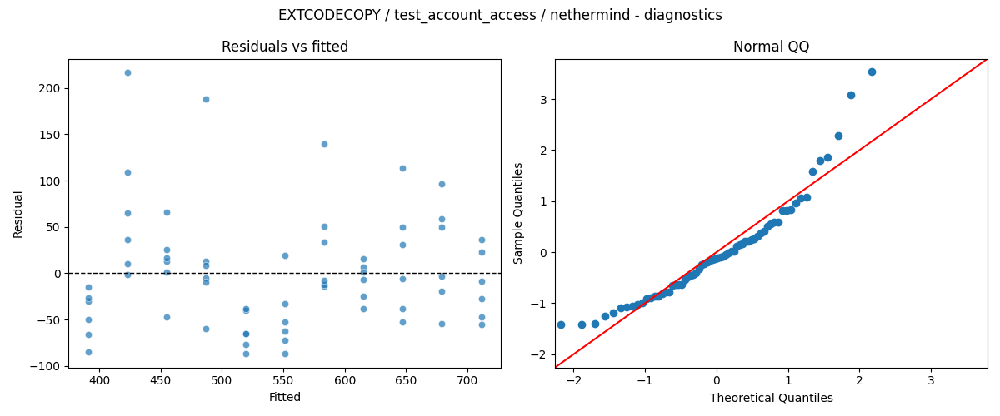

</details>

<details><summary>reth — NNLS regression summary</summary>

```
==============================================================================
                           NNLS Regression Results                            
==============================================================================
Dep. Variable:          test_runtime_ms              R-squared:          0.815
Model:                  NNLS                    Adj. R-squared:          0.812
No. Observations:       66                                RMSE:           3.77
Df Residuals:           64                                 MAE:           2.98
Df Model:               1      
==============================================================================
                      coef     std err     P-value      [0.025      0.975]
------------------------------------------------------------------------------
         const     10.5415      1.5899       0.001      7.3132     13.5035
       opcount      0.0001      0.0000       0.001      0.0001      0.0001
==============================================================================
Notes: Non-negative least squares with bootstrap inference (1000 iterations)
==============================================================================
```

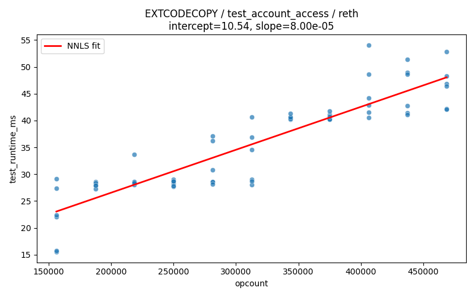

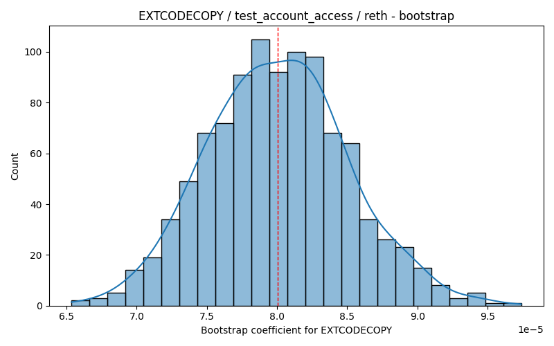

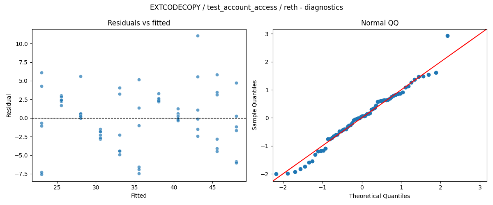

</details>

### test_account_access — combo `EXTCODECOPY_AccountMode.NON_EXISTING_ACCOUNT` — `presets[cold_account_code_access]`

| client | nobs | R² | target_coef (ms) | p-value | 95% CI |
| --- | --- | --- | --- | --- | --- |
| `erigon` | 33 | 0.7996 | 6.342e-05 | 1.00e-03 | [5.231e-05, 7.472e-05] |
| `geth` | 99 | 0.9325 | 0.0007962 | 1.00e-03 | [0.0007544, 0.0008392] |
| `nethermind` | 66 | 0.8695 | 0.0003186 | 1.00e-03 | [0.0002883, 0.0003467] |
| `reth` | 66 | 0.6784 | 1.719e-05 | 1.00e-03 | [1.442e-05, 2.04e-05] |

<details><summary>erigon — NNLS regression summary</summary>

```
==============================================================================
                           NNLS Regression Results                            
==============================================================================
Dep. Variable:          test_runtime_ms              R-squared:          0.800
Model:                  NNLS                    Adj. R-squared:          0.793
No. Observations:       33                                RMSE:           8.15
Df Residuals:           31                                 MAE:           6.40
Df Model:               1      
==============================================================================
                      coef     std err     P-value      [0.025      0.975]
------------------------------------------------------------------------------
         const     43.1318      4.6890       0.001     34.2438     52.8302
       opcount      0.0001      0.0000       0.001      0.0001      0.0001
==============================================================================
Notes: Non-negative least squares with bootstrap inference (1000 iterations)
==============================================================================
```


</details>

<details><summary>geth — NNLS regression summary</summary>

```
==============================================================================
                           NNLS Regression Results                            
==============================================================================
Dep. Variable:          test_runtime_ms              R-squared:          0.933
Model:                  NNLS                    Adj. R-squared:          0.932
No. Observations:       99                                RMSE:          55.00
Df Residuals:           97                                 MAE:          37.06
Df Model:               1      
==============================================================================
                      coef     std err     P-value      [0.025      0.975]
------------------------------------------------------------------------------
         const     30.4238     15.6051       0.029      0.0000     62.9926
       opcount      0.0008      0.0000       0.001      0.0008      0.0008
==============================================================================
Notes: Non-negative least squares with bootstrap inference (1000 iterations)
==============================================================================
```


</details>

<details><summary>nethermind — NNLS regression summary</summary>

```
==============================================================================
                           NNLS Regression Results                            
==============================================================================
Dep. Variable:          test_runtime_ms              R-squared:          0.869
Model:                  NNLS                    Adj. R-squared:          0.867
No. Observations:       66                                RMSE:          31.69
Df Residuals:           64                                 MAE:          22.51
Df Model:               1      
==============================================================================
                      coef     std err     P-value      [0.025      0.975]
------------------------------------------------------------------------------
         const    108.2847     12.3103       0.001     86.2523    133.6363
       opcount      0.0003      0.0000       0.001      0.0003      0.0003
==============================================================================
Notes: Non-negative least squares with bootstrap inference (1000 iterations)
==============================================================================
```


</details>

<details><summary>reth — NNLS regression summary</summary>

```
==============================================================================
                           NNLS Regression Results                            
==============================================================================
Dep. Variable:          test_runtime_ms              R-squared:          0.678
Model:                  NNLS                    Adj. R-squared:          0.673
No. Observations:       66                                RMSE:           3.04
Df Residuals:           64                                 MAE:           2.22
Df Model:               1      
==============================================================================
                      coef     std err     P-value      [0.025      0.975]
------------------------------------------------------------------------------
         const      5.8952      1.1547       0.001      3.6656      8.1686
       opcount      0.0000      0.0000       0.001      0.0000      0.0000
==============================================================================
Notes: Non-negative least squares with bootstrap inference (1000 iterations)
==============================================================================
```


</details>

## EXTCODEHASH

### test_account_access — combo `EXTCODEHASH_AccountMode.NON_EXISTING_ACCOUNT` — `presets[cold_account_nocode_access]`

| client | nobs | R² | target_coef (ms) | p-value | 95% CI |
| --- | --- | --- | --- | --- | --- |
| `erigon` | 33 | 0.9983 | 0.00858 | 1.00e-03 | [0.008453, 0.008679] |
| `geth` | 99 | 0.8112 | 0.04016 | 1.00e-03 | [0.03566, 0.04412] |
| `nethermind` | 66 | 0.8729 | 0.005137 | 1.00e-03 | [0.004748, 0.005508] |
| `reth` | 66 | 0.9615 | 0.0009128 | 1.00e-03 | [0.0008694, 0.0009568] |

<details><summary>erigon — NNLS regression summary</summary>

```
==============================================================================
                           NNLS Regression Results                            
==============================================================================
Dep. Variable:          test_runtime_ms              R-squared:          0.998
Model:                  NNLS                    Adj. R-squared:          0.998
No. Observations:       33                                RMSE:           8.41
Df Residuals:           31                                 MAE:           7.36
Df Model:               1      
==============================================================================
                      coef     std err     P-value      [0.025      0.975]
------------------------------------------------------------------------------
         const      7.5148      4.6307       0.079      0.0000     16.9994
       opcount      0.0086      0.0001       0.001      0.0085      0.0087
==============================================================================
Notes: Non-negative least squares with bootstrap inference (1000 iterations)
==============================================================================
```


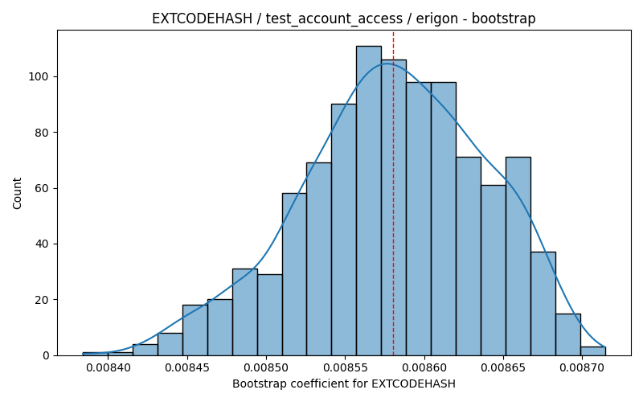

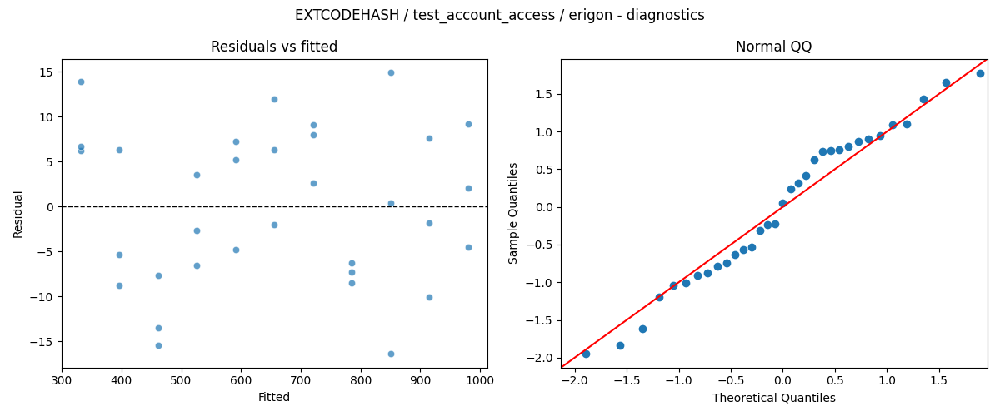

</details>

<details><summary>geth — NNLS regression summary</summary>

```
==============================================================================
                           NNLS Regression Results                            
==============================================================================
Dep. Variable:          test_runtime_ms              R-squared:          0.811
Model:                  NNLS                    Adj. R-squared:          0.809
No. Observations:       99                                RMSE:         462.94
Df Residuals:           97                                 MAE:         338.74
Df Model:               1      
==============================================================================
                      coef     std err     P-value      [0.025      0.975]
------------------------------------------------------------------------------
         const   1272.8735    145.4273       0.001    996.2775   1587.1788
       opcount      0.0402      0.0021       0.001      0.0357      0.0441
==============================================================================
Notes: Non-negative least squares with bootstrap inference (1000 iterations)
==============================================================================
```

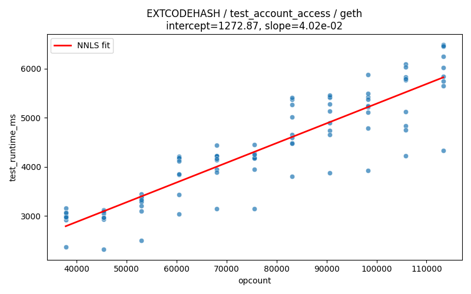

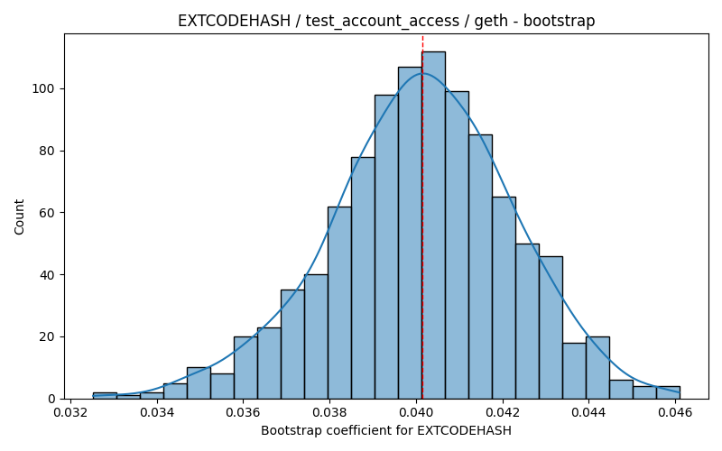


</details>

<details><summary>nethermind — NNLS regression summary</summary>

```
==============================================================================
                           NNLS Regression Results                            
==============================================================================
Dep. Variable:          test_runtime_ms              R-squared:          0.873
Model:                  NNLS                    Adj. R-squared:          0.871
No. Observations:       66                                RMSE:          46.85
Df Residuals:           64                                 MAE:          36.13
Df Model:               1      
==============================================================================
                      coef     std err     P-value      [0.025      0.975]
------------------------------------------------------------------------------
         const     28.8496     14.7323       0.035      0.0000     59.3993
       opcount      0.0051      0.0002       0.001      0.0047      0.0055
==============================================================================
Notes: Non-negative least squares with bootstrap inference (1000 iterations)
==============================================================================
```

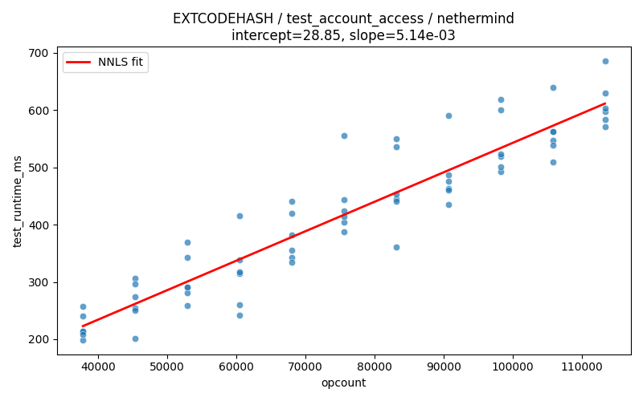

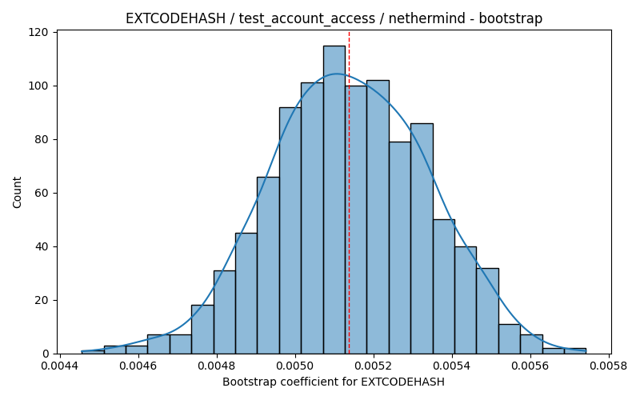

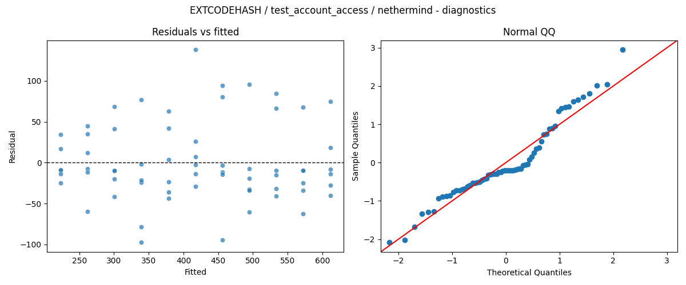

</details>

<details><summary>reth — NNLS regression summary</summary>

```
==============================================================================
                           NNLS Regression Results                            
==============================================================================
Dep. Variable:          test_runtime_ms              R-squared:          0.961
Model:                  NNLS                    Adj. R-squared:          0.961
No. Observations:       66                                RMSE:           4.37
Df Residuals:           64                                 MAE:           3.24
Df Model:               1      
==============================================================================
                      coef     std err     P-value      [0.025      0.975]
------------------------------------------------------------------------------
         const     32.6623      1.6733       0.001     29.5495     36.1272
       opcount      0.0009      0.0000       0.001      0.0009      0.0010
==============================================================================
Notes: Non-negative least squares with bootstrap inference (1000 iterations)
==============================================================================
```

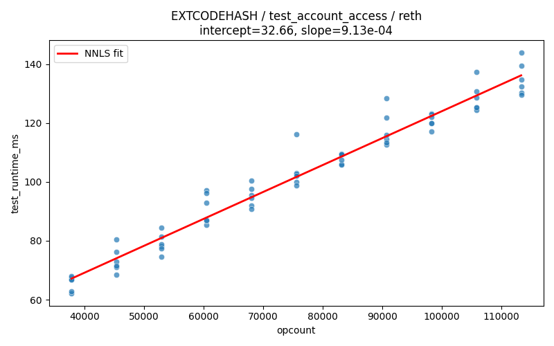

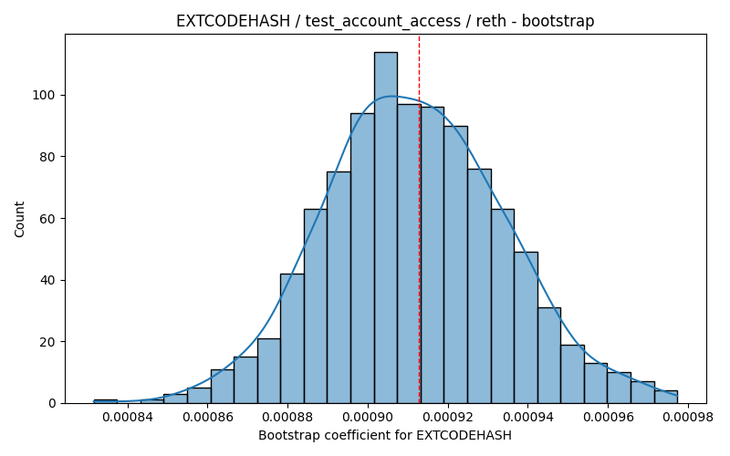

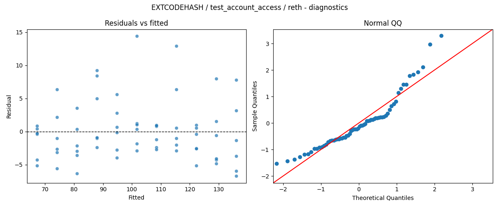

</details>

### test_account_access — combo `EXTCODEHASH_AccountMode.EXISTING_CONTRACT`

| client | nobs | R² | target_coef (ms) | p-value | 95% CI |
| --- | --- | --- | --- | --- | --- |
| `erigon` | 33 | 0.901 | 0.03535 | 1.00e-03 | [0.03096, 0.03886] |
| `geth` | 99 | 0.6835 | 0.03422 | 1.00e-03 | [0.03032, 0.0381] |
| `nethermind` | 66 | 0.9034 | 0.01977 | 1.00e-03 | [0.01838, 0.02134] |
| `reth` | 66 | 0.8642 | 0.03554 | 1.00e-03 | [0.03299, 0.03822] |

<details><summary>erigon — NNLS regression summary</summary>

```
==============================================================================
                           NNLS Regression Results                            
==============================================================================
Dep. Variable:          test_runtime_ms              R-squared:          0.901
Model:                  NNLS                    Adj. R-squared:          0.898
No. Observations:       33                                RMSE:         243.75
Df Residuals:           31                                 MAE:         205.35
Df Model:               1      
==============================================================================
                      coef     std err     P-value      [0.025      0.975]
------------------------------------------------------------------------------
         const    431.8327    150.8367       0.001    173.4343    769.8351
       opcount      0.0354      0.0020       0.001      0.0310      0.0389
==============================================================================
Notes: Non-negative least squares with bootstrap inference (1000 iterations)
==============================================================================
```

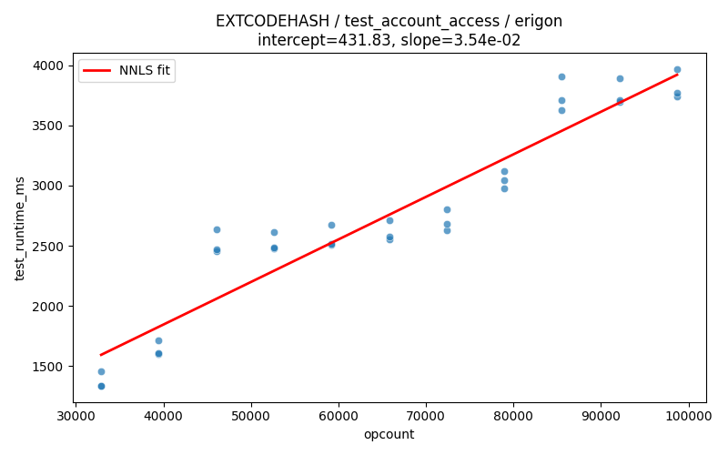

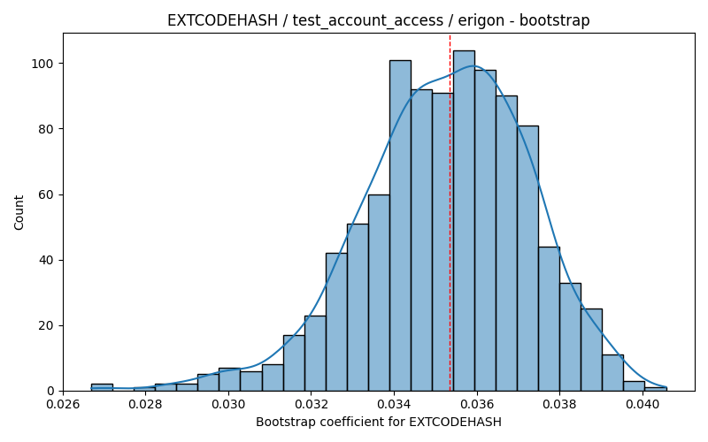

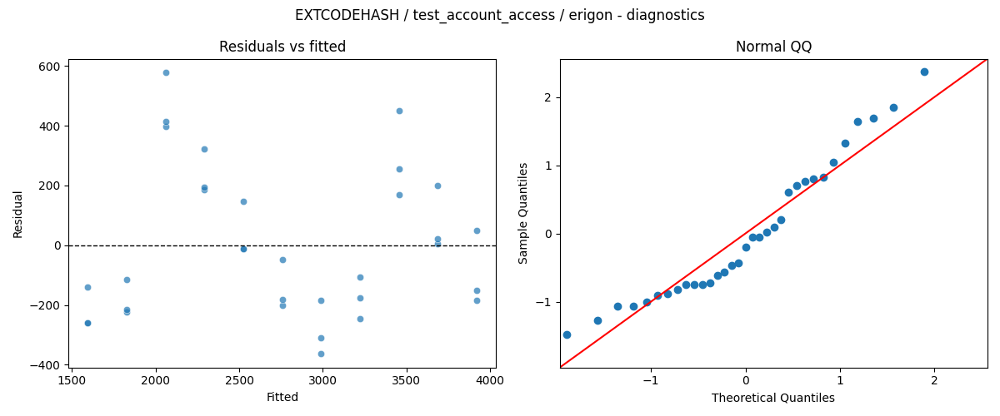

</details>

<details><summary>geth — NNLS regression summary</summary>

```
==============================================================================
                           NNLS Regression Results                            
==============================================================================
Dep. Variable:          test_runtime_ms              R-squared:          0.683
Model:                  NNLS                    Adj. R-squared:          0.680
No. Observations:       99                                RMSE:         484.51
Df Residuals:           97                                 MAE:         391.38
Df Model:               1      
==============================================================================
                      coef     std err     P-value      [0.025      0.975]
------------------------------------------------------------------------------
         const   1531.3205    138.8726       0.001   1257.4552   1811.4859
       opcount      0.0342      0.0020       0.001      0.0303      0.0381
==============================================================================
Notes: Non-negative least squares with bootstrap inference (1000 iterations)
==============================================================================
```

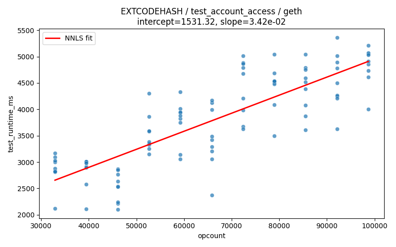

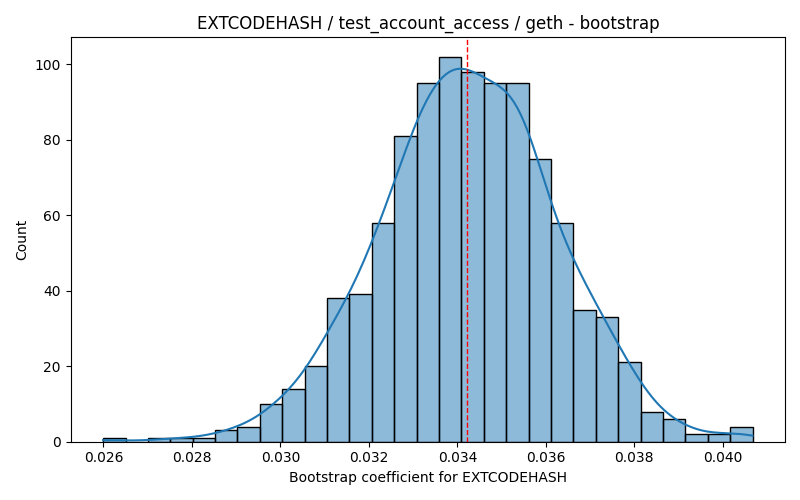

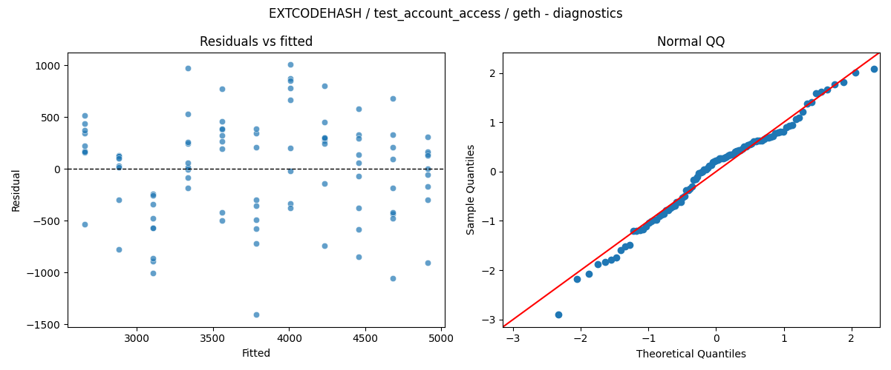

</details>

<details><summary>nethermind — NNLS regression summary</summary>

```
==============================================================================
                           NNLS Regression Results                            
==============================================================================
Dep. Variable:          test_runtime_ms              R-squared:          0.903
Model:                  NNLS                    Adj. R-squared:          0.902
No. Observations:       66                                RMSE:         134.49
Df Residuals:           64                                 MAE:         112.59
Df Model:               1      
==============================================================================
                      coef     std err     P-value      [0.025      0.975]
------------------------------------------------------------------------------
         const    221.9469     47.3185       0.001    124.7914    309.0789
       opcount      0.0198      0.0007       0.001      0.0184      0.0213
==============================================================================
Notes: Non-negative least squares with bootstrap inference (1000 iterations)
==============================================================================
```

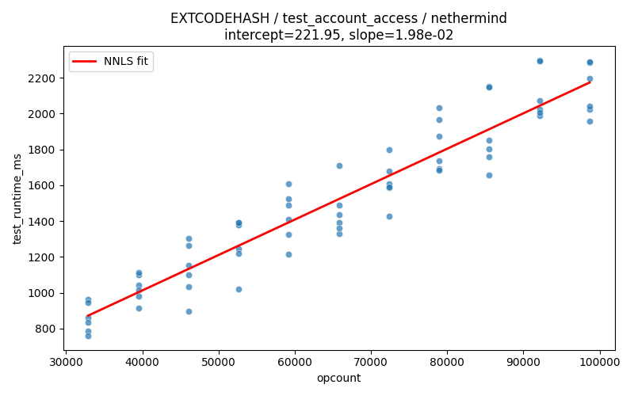

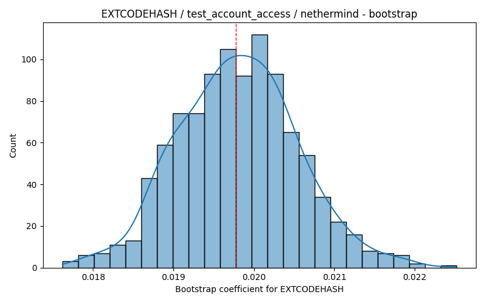

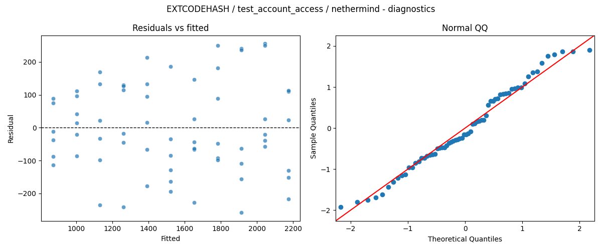

</details>

<details><summary>reth — NNLS regression summary</summary>

```
==============================================================================
                           NNLS Regression Results                            
==============================================================================
Dep. Variable:          test_runtime_ms              R-squared:          0.864
Model:                  NNLS                    Adj. R-squared:          0.862
No. Observations:       66                                RMSE:         293.09
Df Residuals:           64                                 MAE:         161.08
Df Model:               1      
==============================================================================
                      coef     std err     P-value      [0.025      0.975]
------------------------------------------------------------------------------
         const    223.7972     98.7227       0.013     24.6368    410.2047
       opcount      0.0355      0.0013       0.001      0.0330      0.0382
==============================================================================
Notes: Non-negative least squares with bootstrap inference (1000 iterations)
==============================================================================
```

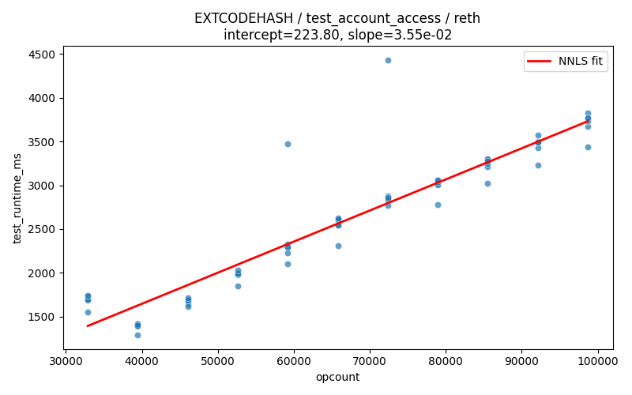

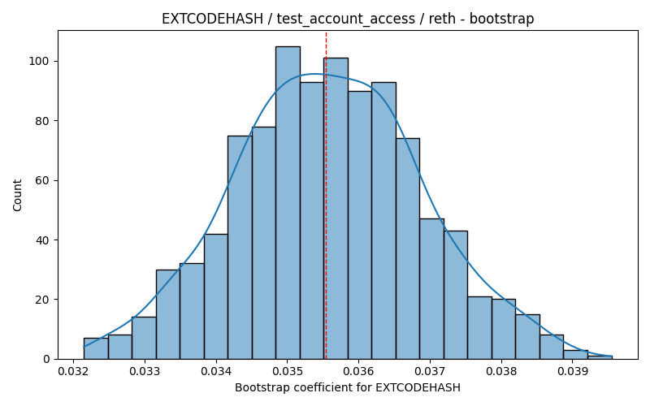

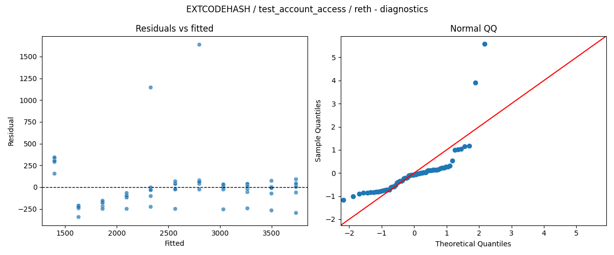

</details>

### test_account_access — combo `EXTCODEHASH_AccountMode.NON_EXISTING_ACCOUNT` — `presets[cold_account_code_access]`

| client | nobs | R² | target_coef (ms) | p-value | 95% CI |
| --- | --- | --- | --- | --- | --- |
| `erigon` | 33 | 0.9983 | 0.00858 | 1.00e-03 | [0.008453, 0.008679] |
| `geth` | 99 | 0.8112 | 0.04016 | 1.00e-03 | [0.03566, 0.04412] |
| `nethermind` | 66 | 0.8729 | 0.005137 | 1.00e-03 | [0.004748, 0.005508] |
| `reth` | 66 | 0.9615 | 0.0009128 | 1.00e-03 | [0.0008694, 0.0009568] |

<details><summary>erigon — NNLS regression summary</summary>

```
==============================================================================
                           NNLS Regression Results                            
==============================================================================
Dep. Variable:          test_runtime_ms              R-squared:          0.998
Model:                  NNLS                    Adj. R-squared:          0.998
No. Observations:       33                                RMSE:           8.41
Df Residuals:           31                                 MAE:           7.36
Df Model:               1      
==============================================================================
                      coef     std err     P-value      [0.025      0.975]
------------------------------------------------------------------------------
         const      7.5148      4.6307       0.079      0.0000     16.9994
       opcount      0.0086      0.0001       0.001      0.0085      0.0087
==============================================================================
Notes: Non-negative least squares with bootstrap inference (1000 iterations)
==============================================================================
```


</details>

<details><summary>geth — NNLS regression summary</summary>

```
==============================================================================
                           NNLS Regression Results                            
==============================================================================
Dep. Variable:          test_runtime_ms              R-squared:          0.811
Model:                  NNLS                    Adj. R-squared:          0.809
No. Observations:       99                                RMSE:         462.94
Df Residuals:           97                                 MAE:         338.74
Df Model:               1      
==============================================================================
                      coef     std err     P-value      [0.025      0.975]
------------------------------------------------------------------------------
         const   1272.8735    145.4273       0.001    996.2775   1587.1788
       opcount      0.0402      0.0021       0.001      0.0357      0.0441
==============================================================================
Notes: Non-negative least squares with bootstrap inference (1000 iterations)
==============================================================================
```


</details>

<details><summary>nethermind — NNLS regression summary</summary>

```
==============================================================================
                           NNLS Regression Results                            
==============================================================================
Dep. Variable:          test_runtime_ms              R-squared:          0.873
Model:                  NNLS                    Adj. R-squared:          0.871
No. Observations:       66                                RMSE:          46.85
Df Residuals:           64                                 MAE:          36.13
Df Model:               1      
==============================================================================
                      coef     std err     P-value      [0.025      0.975]
------------------------------------------------------------------------------
         const     28.8496     14.7323       0.035      0.0000     59.3993
       opcount      0.0051      0.0002       0.001      0.0047      0.0055
==============================================================================
Notes: Non-negative least squares with bootstrap inference (1000 iterations)
==============================================================================
```


</details>

<details><summary>reth — NNLS regression summary</summary>

```
==============================================================================
                           NNLS Regression Results                            
==============================================================================
Dep. Variable:          test_runtime_ms              R-squared:          0.961
Model:                  NNLS                    Adj. R-squared:          0.961
No. Observations:       66                                RMSE:           4.37
Df Residuals:           64                                 MAE:           3.24
Df Model:               1      
==============================================================================
                      coef     std err     P-value      [0.025      0.975]
------------------------------------------------------------------------------
         const     32.6623      1.6733       0.001     29.5495     36.1272
       opcount      0.0009      0.0000       0.001      0.0009      0.0010
==============================================================================
Notes: Non-negative least squares with bootstrap inference (1000 iterations)
==============================================================================
```


</details>

### test_ext_account_query_warm — combo `EXTCODEHASH`

| client | nobs | R² | target_coef (ms) | p-value | 95% CI |
| --- | --- | --- | --- | --- | --- |
| `erigon` | 33 | 0.9582 | 0.0002423 | 1.00e-03 | [0.0002212, 0.000262] |
| `geth` | 99 | 0.9532 | 0.0001956 | 1.00e-03 | [0.0001877, 0.0002039] |
| `nethermind` | 66 | 0.6561 | 0.0001983 | 1.00e-03 | [0.0001596, 0.0002341] |
| `reth` | 66 | 0.6832 | 7.664e-06 | 1.00e-03 | [6.594e-06, 8.709e-06] |

<details><summary>erigon — NNLS regression summary</summary>

```
==============================================================================
                           NNLS Regression Results                            
==============================================================================
Dep. Variable:          test_runtime_ms              R-squared:          0.958
Model:                  NNLS                    Adj. R-squared:          0.957
No. Observations:       33                                RMSE:          29.59
Df Residuals:           31                                 MAE:          23.46
Df Model:               1      
==============================================================================
                      coef     std err     P-value      [0.025      0.975]
------------------------------------------------------------------------------
         const     66.4310     18.7420       0.001     33.2719    106.1073
       opcount      0.0002      0.0000       0.001      0.0002      0.0003
==============================================================================
Notes: Non-negative least squares with bootstrap inference (1000 iterations)
==============================================================================
```

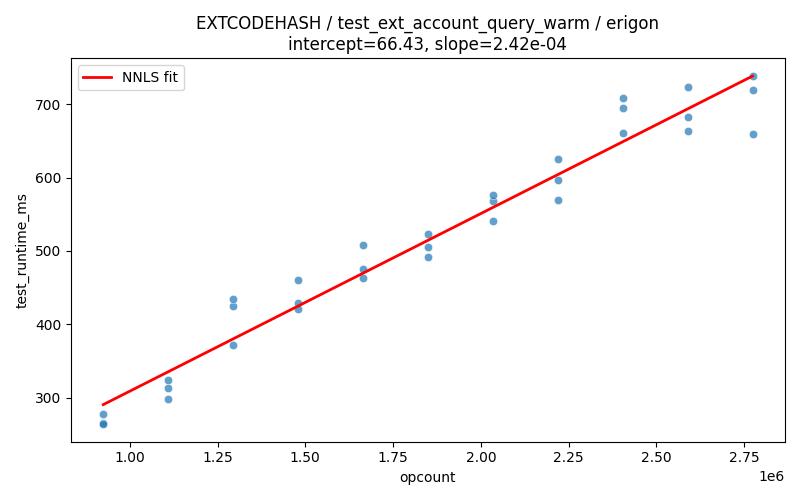

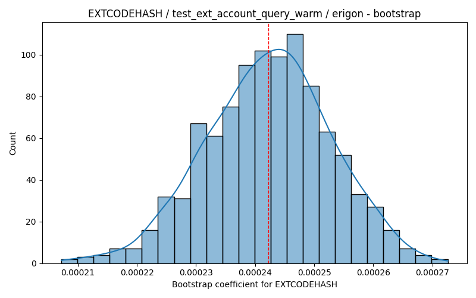

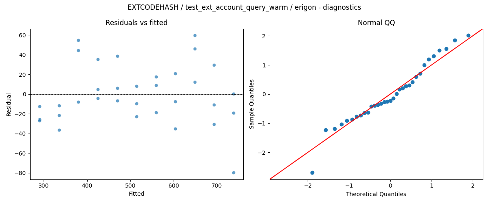

</details>

<details><summary>geth — NNLS regression summary</summary>

```
==============================================================================
                           NNLS Regression Results                            
==============================================================================
Dep. Variable:          test_runtime_ms              R-squared:          0.953
Model:                  NNLS                    Adj. R-squared:          0.953
No. Observations:       99                                RMSE:          25.33
Df Residuals:           97                                 MAE:          18.57
Df Model:               1      
==============================================================================
                      coef     std err     P-value      [0.025      0.975]
------------------------------------------------------------------------------
         const     12.5106      6.9745       0.047      0.0000     26.3297
       opcount      0.0002      0.0000       0.001      0.0002      0.0002
==============================================================================
Notes: Non-negative least squares with bootstrap inference (1000 iterations)
==============================================================================
```

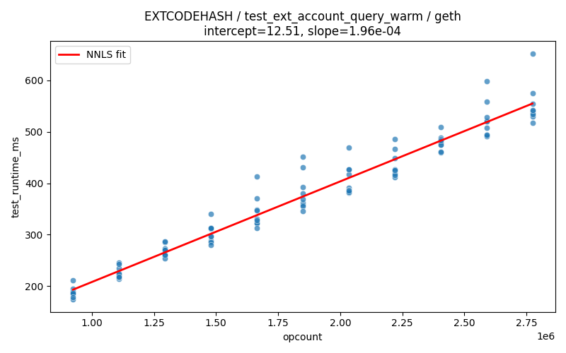

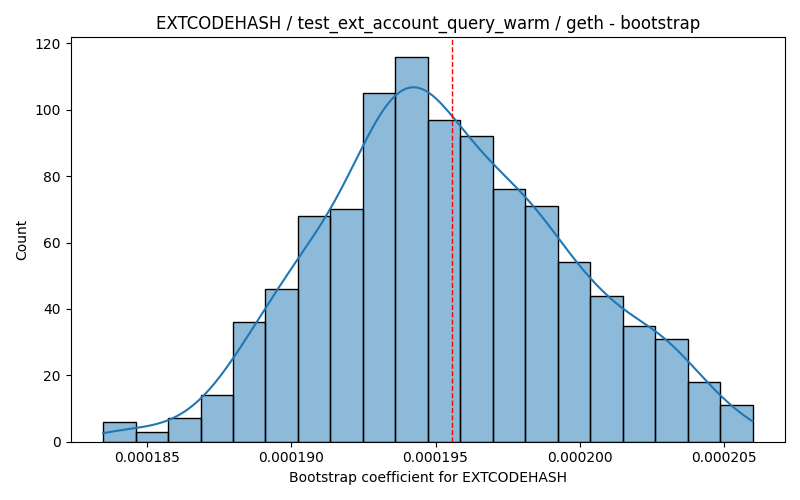

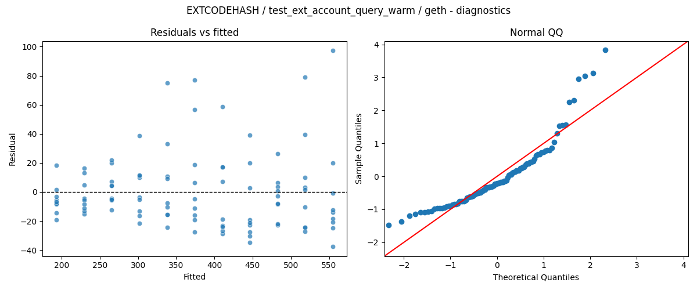

</details>

<details><summary>nethermind — NNLS regression summary</summary>

```
==============================================================================
                           NNLS Regression Results                            
==============================================================================
Dep. Variable:          test_runtime_ms              R-squared:          0.656
Model:                  NNLS                    Adj. R-squared:          0.651
No. Observations:       66                                RMSE:          83.93
Df Residuals:           64                                 MAE:          67.89
Df Model:               1      
==============================================================================
                      coef     std err     P-value      [0.025      0.975]
------------------------------------------------------------------------------
         const    151.5224     30.9974       0.001     91.1685    214.0781
       opcount      0.0002      0.0000       0.001      0.0002      0.0002
==============================================================================
Notes: Non-negative least squares with bootstrap inference (1000 iterations)
==============================================================================
```

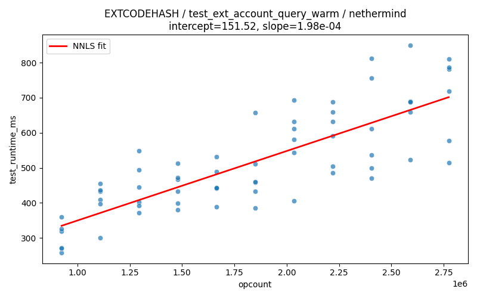

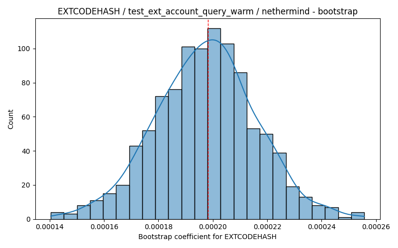

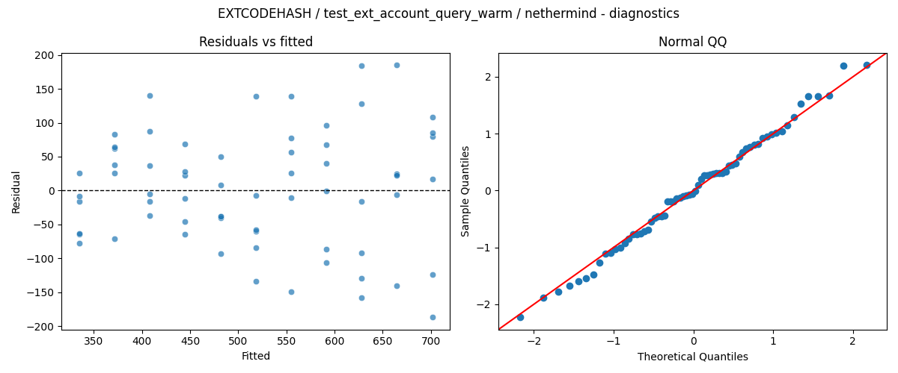

</details>

<details><summary>reth — NNLS regression summary</summary>

```
==============================================================================
                           NNLS Regression Results                            
==============================================================================
Dep. Variable:          test_runtime_ms              R-squared:          0.683
Model:                  NNLS                    Adj. R-squared:          0.678
No. Observations:       66                                RMSE:           3.05
Df Residuals:           64                                 MAE:           2.12
Df Model:               1      
==============================================================================
                      coef     std err     P-value      [0.025      0.975]
------------------------------------------------------------------------------
         const      6.8486      1.0540       0.001      4.8934      9.0388
       opcount      0.0000      0.0000       0.001      0.0000      0.0000
==============================================================================
Notes: Non-negative least squares with bootstrap inference (1000 iterations)
==============================================================================
```

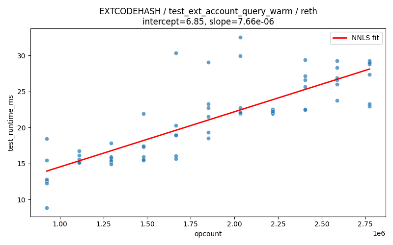

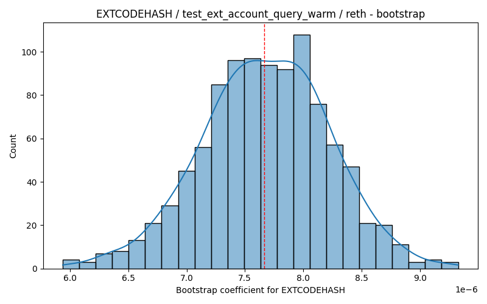

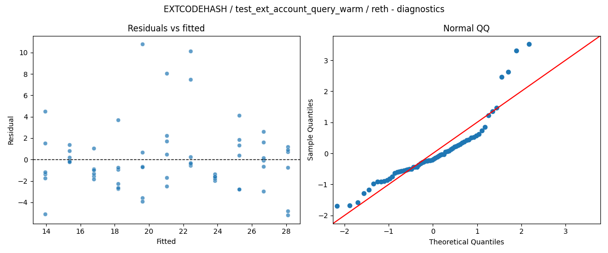

</details>

## EXTCODESIZE

### test_account_access — combo `EXTCODESIZE_AccountMode.NON_EXISTING_ACCOUNT` — `presets[cold_account_nocode_access]`

| client | nobs | R² | target_coef (ms) | p-value | 95% CI |
| --- | --- | --- | --- | --- | --- |
| `erigon` | 33 | 0.9976 | 0.008734 | 1.00e-03 | [0.008577, 0.008883] |
| `geth` | 99 | 0.7963 | 0.03939 | 1.00e-03 | [0.03523, 0.04366] |
| `nethermind` | 66 | 0.8268 | 0.00455 | 1.00e-03 | [0.004056, 0.004975] |
| `reth` | 66 | 0.9646 | 0.0009111 | 1.00e-03 | [0.0008699, 0.0009458] |

<details><summary>erigon — NNLS regression summary</summary>

```
==============================================================================
                           NNLS Regression Results                            
==============================================================================
Dep. Variable:          test_runtime_ms              R-squared:          0.998
Model:                  NNLS                    Adj. R-squared:          0.998
No. Observations:       33                                RMSE:          10.19
Df Residuals:           31                                 MAE:           8.53
Df Model:               1      
==============================================================================
                      coef     std err     P-value      [0.025      0.975]
------------------------------------------------------------------------------
         const     13.3981      6.4971       0.023      0.6146     26.1311
       opcount      0.0087      0.0001       0.001      0.0086      0.0089
==============================================================================
Notes: Non-negative least squares with bootstrap inference (1000 iterations)
==============================================================================
```

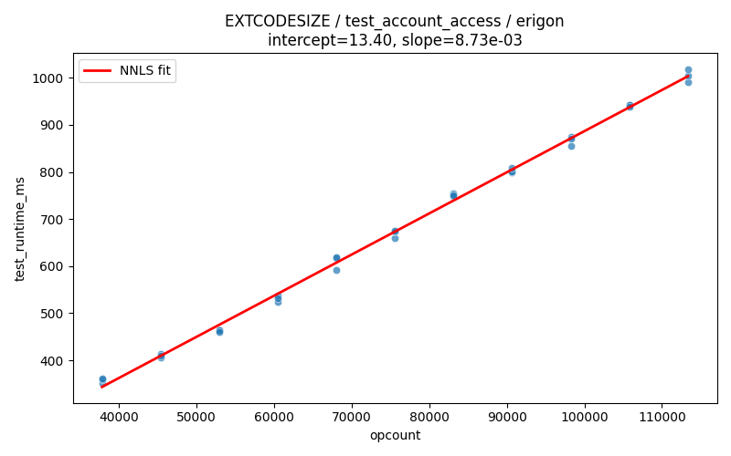

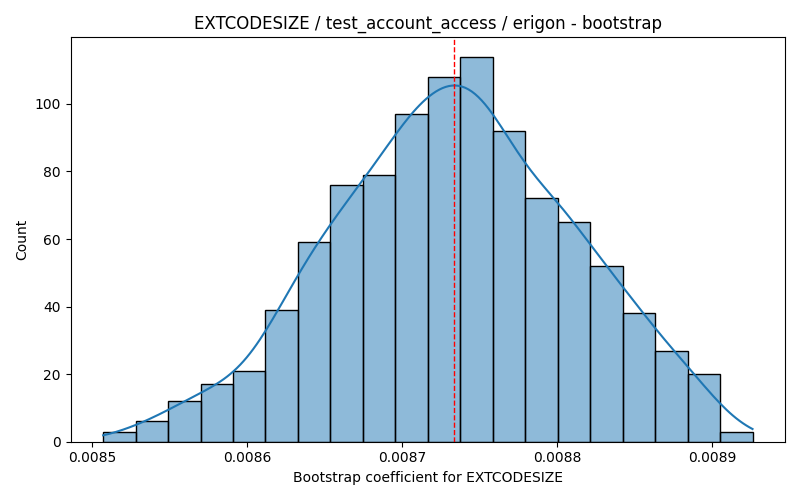

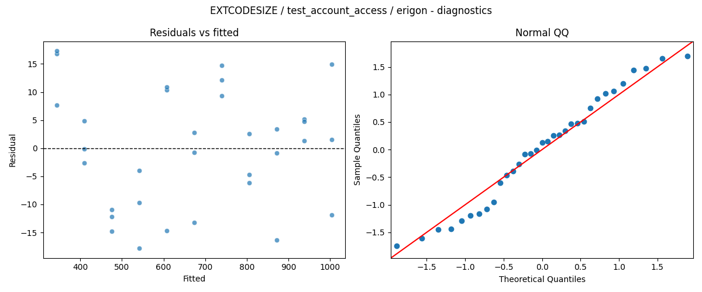

</details>

<details><summary>geth — NNLS regression summary</summary>

```
==============================================================================
                           NNLS Regression Results                            
==============================================================================
Dep. Variable:          test_runtime_ms              R-squared:          0.796
Model:                  NNLS                    Adj. R-squared:          0.794
No. Observations:       99                                RMSE:         476.12
Df Residuals:           97                                 MAE:         359.30
Df Model:               1      
==============================================================================
                      coef     std err     P-value      [0.025      0.975]
------------------------------------------------------------------------------
         const   1276.8197    142.6857       0.001   1002.1331   1547.6312
       opcount      0.0394      0.0021       0.001      0.0352      0.0437
==============================================================================
Notes: Non-negative least squares with bootstrap inference (1000 iterations)
==============================================================================
```

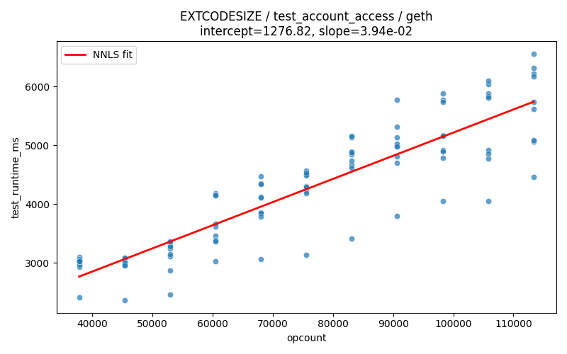


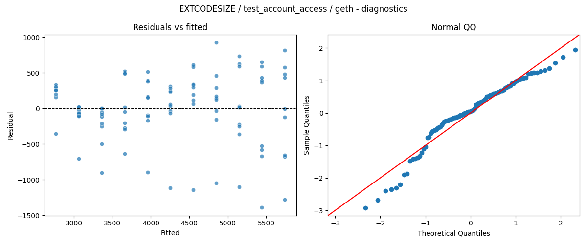

</details>

<details><summary>nethermind — NNLS regression summary</summary>

```
==============================================================================
                           NNLS Regression Results                            
==============================================================================
Dep. Variable:          test_runtime_ms              R-squared:          0.827
Model:                  NNLS                    Adj. R-squared:          0.824
No. Observations:       66                                RMSE:          49.78
Df Residuals:           64                                 MAE:          36.44
Df Model:               1      
==============================================================================
                      coef     std err     P-value      [0.025      0.975]
------------------------------------------------------------------------------
         const     66.1184     17.4209       0.001     33.5054    102.0350
       opcount      0.0045      0.0002       0.001      0.0041      0.0050
==============================================================================
Notes: Non-negative least squares with bootstrap inference (1000 iterations)
==============================================================================
```

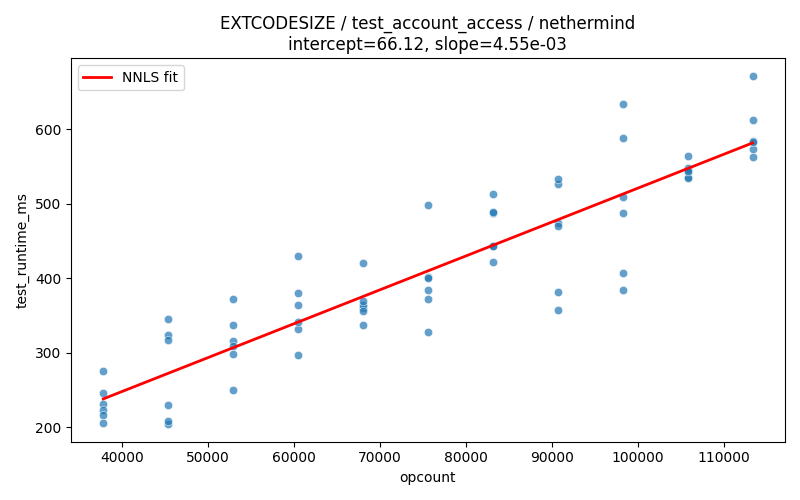

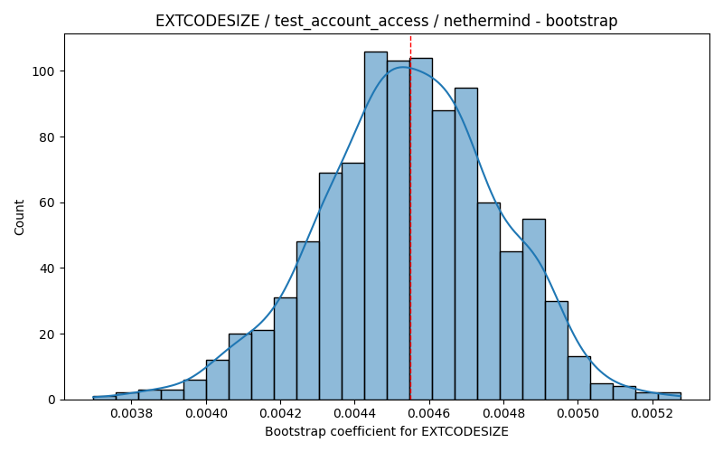

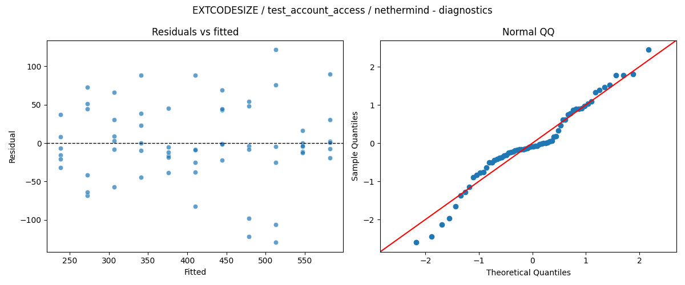

</details>

<details><summary>reth — NNLS regression summary</summary>

```
==============================================================================
                           NNLS Regression Results                            
==============================================================================
Dep. Variable:          test_runtime_ms              R-squared:          0.965
Model:                  NNLS                    Adj. R-squared:          0.964
No. Observations:       66                                RMSE:           4.17
Df Residuals:           64                                 MAE:           3.26
Df Model:               1      
==============================================================================
                      coef     std err     P-value      [0.025      0.975]
------------------------------------------------------------------------------
         const     31.9837      1.6442       0.001     29.2050     35.5474
       opcount      0.0009      0.0000       0.001      0.0009      0.0009
==============================================================================
Notes: Non-negative least squares with bootstrap inference (1000 iterations)
==============================================================================
```

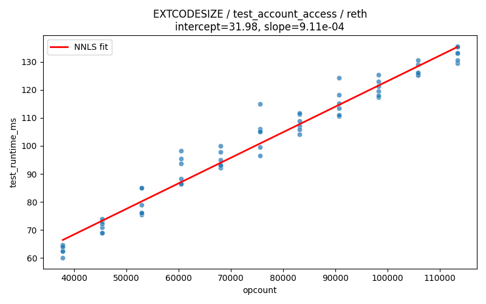

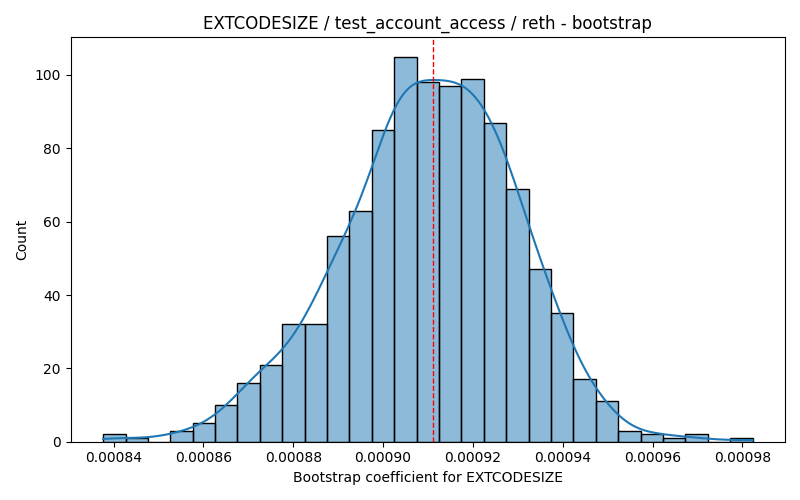

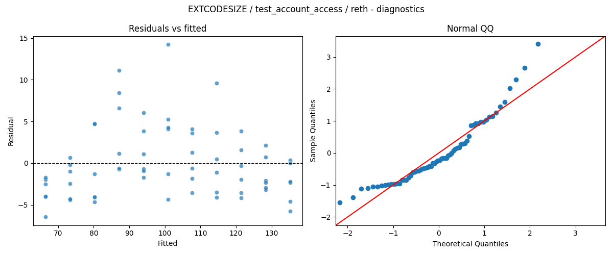

</details>

### test_account_access — combo `EXTCODESIZE_AccountMode.EXISTING_CONTRACT`

| client | nobs | R² | target_coef (ms) | p-value | 95% CI |
| --- | --- | --- | --- | --- | --- |
| `erigon` | 33 | 0.8696 | 0.08554 | 1.00e-03 | [0.07247, 0.09519] |
| `geth` | 99 | 0.7924 | 0.0439 | 1.00e-03 | [0.03919, 0.0486] |
| `nethermind` | 66 | 0.9204 | 0.02129 | 1.00e-03 | [0.01942, 0.02298] |
| `reth` | 66 | 0.9057 | 0.03597 | 1.00e-03 | [0.03361, 0.03893] |

<details><summary>erigon — NNLS regression summary</summary>

```
==============================================================================
                           NNLS Regression Results                            
==============================================================================
Dep. Variable:          test_runtime_ms              R-squared:          0.870
Model:                  NNLS                    Adj. R-squared:          0.865
No. Observations:       33                                RMSE:         689.05
Df Residuals:           31                                 MAE:         591.62
Df Model:               1      
==============================================================================
                      coef     std err     P-value      [0.025      0.975]
------------------------------------------------------------------------------
         const   1520.3866    447.9622       0.001    759.7332   2536.6437
       opcount      0.0855      0.0057       0.001      0.0725      0.0952
==============================================================================
Notes: Non-negative least squares with bootstrap inference (1000 iterations)
==============================================================================
```

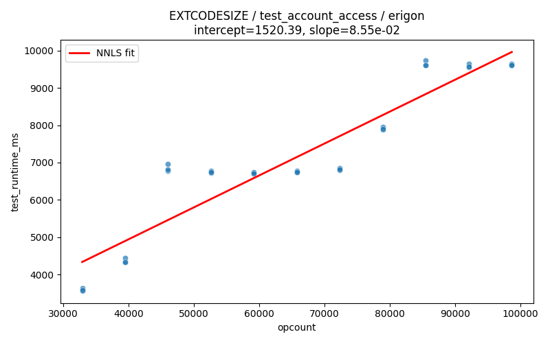

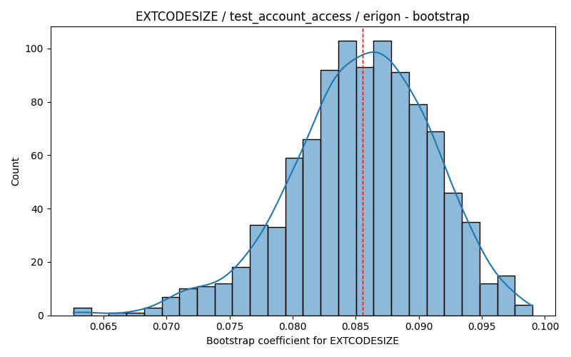

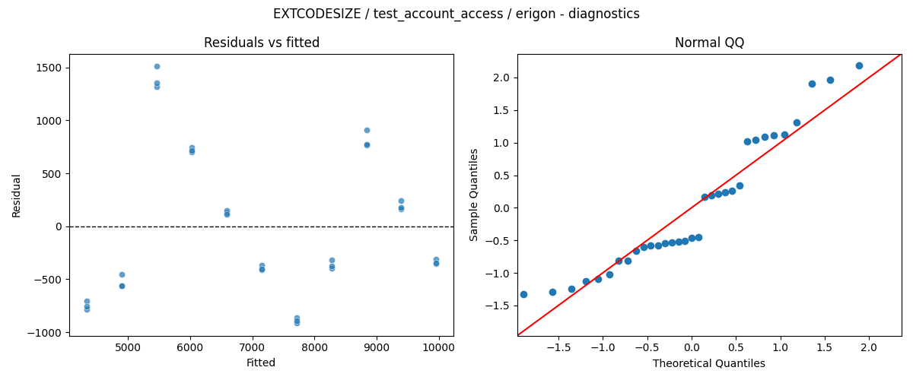

</details>

<details><summary>geth — NNLS regression summary</summary>

```
==============================================================================
                           NNLS Regression Results                            
==============================================================================
Dep. Variable:          test_runtime_ms              R-squared:          0.792
Model:                  NNLS                    Adj. R-squared:          0.790
No. Observations:       99                                RMSE:         467.48
Df Residuals:           97                                 MAE:         335.14
Df Model:               1      
==============================================================================
                      coef     std err     P-value      [0.025      0.975]
------------------------------------------------------------------------------
         const   1078.3131    138.7193       0.001    774.5310   1339.9121
       opcount      0.0439      0.0024       0.001      0.0392      0.0486
==============================================================================
Notes: Non-negative least squares with bootstrap inference (1000 iterations)
==============================================================================
```

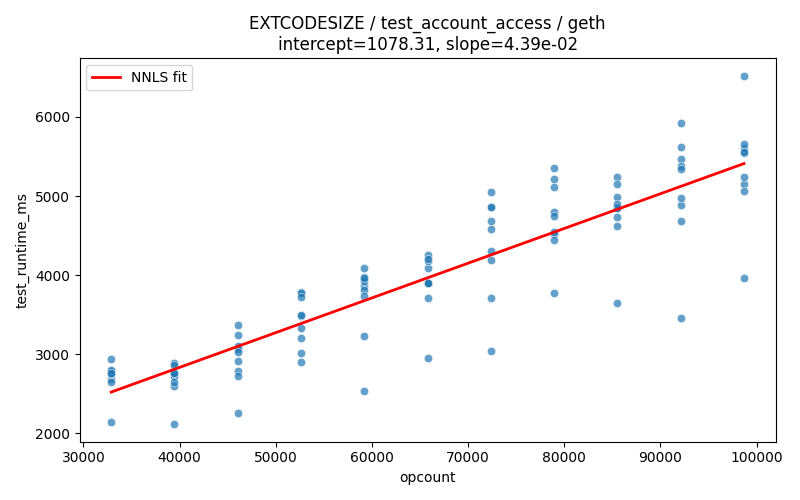

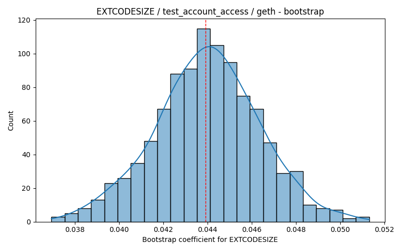

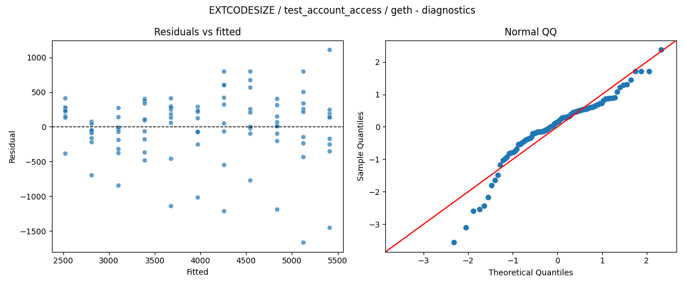

</details>

<details><summary>nethermind — NNLS regression summary</summary>

```
==============================================================================
                           NNLS Regression Results                            
==============================================================================
Dep. Variable:          test_runtime_ms              R-squared:          0.920
Model:                  NNLS                    Adj. R-squared:          0.919
No. Observations:       66                                RMSE:         130.26
Df Residuals:           64                                 MAE:         104.55
Df Model:               1      
==============================================================================
                      coef     std err     P-value      [0.025      0.975]
------------------------------------------------------------------------------
         const    125.8801     52.2856       0.008     29.8201    230.1232
       opcount      0.0213      0.0009       0.001      0.0194      0.0230
==============================================================================
Notes: Non-negative least squares with bootstrap inference (1000 iterations)
==============================================================================
```

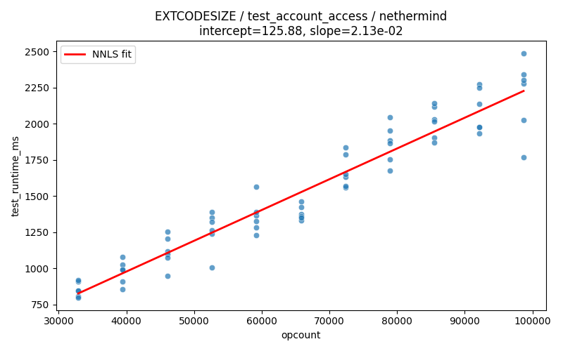

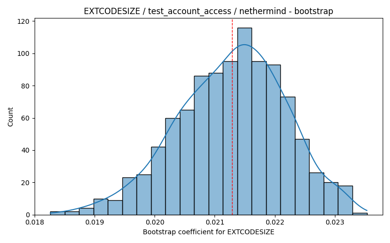

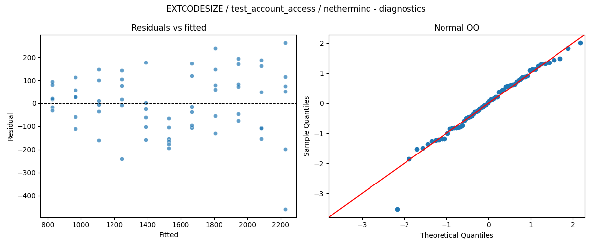

</details>

<details><summary>reth — NNLS regression summary</summary>

```
==============================================================================
                           NNLS Regression Results                            
==============================================================================
Dep. Variable:          test_runtime_ms              R-squared:          0.906
Model:                  NNLS                    Adj. R-squared:          0.904
No. Observations:       66                                RMSE:         241.52
Df Residuals:           64                                 MAE:         128.61
Df Model:               1      
==============================================================================
                      coef     std err     P-value      [0.025      0.975]
------------------------------------------------------------------------------
         const    187.7506     83.4841       0.028      0.0000    349.7646
       opcount      0.0360      0.0013       0.001      0.0336      0.0389
==============================================================================
Notes: Non-negative least squares with bootstrap inference (1000 iterations)
==============================================================================
```

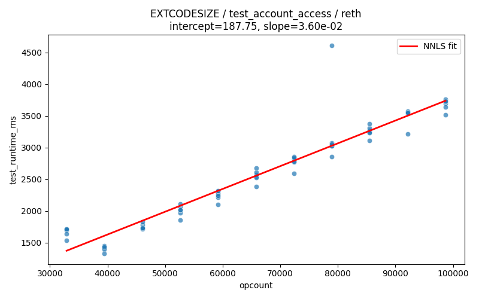

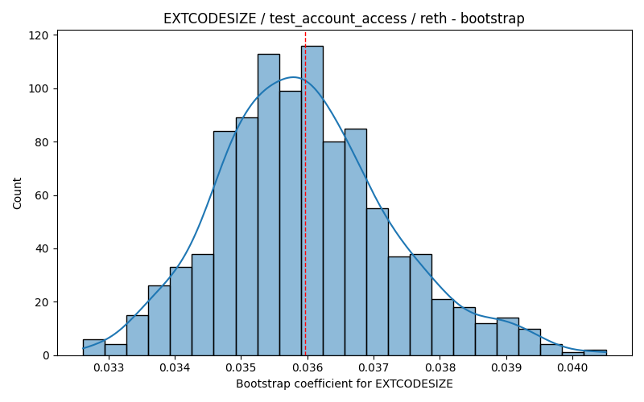

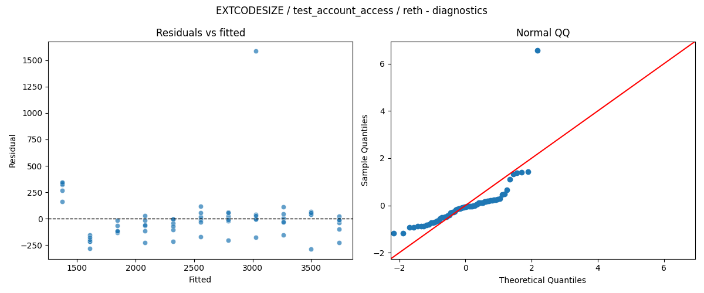

</details>

### test_account_access — combo `EXTCODESIZE_AccountMode.NON_EXISTING_ACCOUNT` — `presets[cold_account_code_access]`

| client | nobs | R² | target_coef (ms) | p-value | 95% CI |
| --- | --- | --- | --- | --- | --- |
| `erigon` | 33 | 0.9976 | 0.008734 | 1.00e-03 | [0.008577, 0.008883] |
| `geth` | 99 | 0.7963 | 0.03939 | 1.00e-03 | [0.03523, 0.04366] |
| `nethermind` | 66 | 0.8268 | 0.00455 | 1.00e-03 | [0.004056, 0.004975] |
| `reth` | 66 | 0.9646 | 0.0009111 | 1.00e-03 | [0.0008699, 0.0009458] |

<details><summary>erigon — NNLS regression summary</summary>

```
==============================================================================
                           NNLS Regression Results                            
==============================================================================
Dep. Variable:          test_runtime_ms              R-squared:          0.998
Model:                  NNLS                    Adj. R-squared:          0.998
No. Observations:       33                                RMSE:          10.19
Df Residuals:           31                                 MAE:           8.53
Df Model:               1      
==============================================================================
                      coef     std err     P-value      [0.025      0.975]
------------------------------------------------------------------------------
         const     13.3981      6.4971       0.023      0.6146     26.1311
       opcount      0.0087      0.0001       0.001      0.0086      0.0089
==============================================================================
Notes: Non-negative least squares with bootstrap inference (1000 iterations)
==============================================================================
```


</details>

<details><summary>geth — NNLS regression summary</summary>

```
==============================================================================
                           NNLS Regression Results                            
==============================================================================
Dep. Variable:          test_runtime_ms              R-squared:          0.796
Model:                  NNLS                    Adj. R-squared:          0.794
No. Observations:       99                                RMSE:         476.12
Df Residuals:           97                                 MAE:         359.30
Df Model:               1      
==============================================================================
                      coef     std err     P-value      [0.025      0.975]
------------------------------------------------------------------------------
         const   1276.8197    142.6857       0.001   1002.1331   1547.6312
       opcount      0.0394      0.0021       0.001      0.0352      0.0437
==============================================================================
Notes: Non-negative least squares with bootstrap inference (1000 iterations)
==============================================================================
```


</details>

<details><summary>nethermind — NNLS regression summary</summary>

```
==============================================================================
                           NNLS Regression Results                            
==============================================================================
Dep. Variable:          test_runtime_ms              R-squared:          0.827
Model:                  NNLS                    Adj. R-squared:          0.824
No. Observations:       66                                RMSE:          49.78
Df Residuals:           64                                 MAE:          36.44
Df Model:               1      
==============================================================================
                      coef     std err     P-value      [0.025      0.975]
------------------------------------------------------------------------------
         const     66.1184     17.4209       0.001     33.5054    102.0350
       opcount      0.0045      0.0002       0.001      0.0041      0.0050
==============================================================================
Notes: Non-negative least squares with bootstrap inference (1000 iterations)
==============================================================================
```


</details>

<details><summary>reth — NNLS regression summary</summary>

```
==============================================================================
                           NNLS Regression Results                            
==============================================================================
Dep. Variable:          test_runtime_ms              R-squared:          0.965
Model:                  NNLS                    Adj. R-squared:          0.964
No. Observations:       66                                RMSE:           4.17
Df Residuals:           64                                 MAE:           3.26
Df Model:               1      
==============================================================================
                      coef     std err     P-value      [0.025      0.975]
------------------------------------------------------------------------------
         const     31.9837      1.6442       0.001     29.2050     35.5474
       opcount      0.0009      0.0000       0.001      0.0009      0.0009
==============================================================================
Notes: Non-negative least squares with bootstrap inference (1000 iterations)
==============================================================================
```


</details>

### test_ext_account_query_warm — combo `EXTCODESIZE`

| client | nobs | R² | target_coef (ms) | p-value | 95% CI |
| --- | --- | --- | --- | --- | --- |
| `erigon` | 33 | 0.9088 | 4.005e-05 | 1.00e-03 | [3.537e-05, 4.428e-05] |
| `geth` | 99 | 0.9634 | 0.0001459 | 1.00e-03 | [0.0001402, 0.0001519] |
| `nethermind` | 66 | 0.7687 | 0.0001754 | 1.00e-03 | [0.0001493, 0.0001997] |
| `reth` | 66 | 0.5655 | 5.426e-06 | 1.00e-03 | [4.468e-06, 6.72e-06] |

<details><summary>erigon — NNLS regression summary</summary>

```
==============================================================================
                           NNLS Regression Results                            
==============================================================================
Dep. Variable:          test_runtime_ms              R-squared:          0.909
Model:                  NNLS                    Adj. R-squared:          0.906
No. Observations:       33                                RMSE:           7.42
Df Residuals:           31                                 MAE:           5.94
Df Model:               1      
==============================================================================
                      coef     std err     P-value      [0.025      0.975]
------------------------------------------------------------------------------
         const     44.1919      4.2253       0.001     36.9126     53.5383
       opcount      0.0000      0.0000       0.001      0.0000      0.0000
==============================================================================
Notes: Non-negative least squares with bootstrap inference (1000 iterations)
==============================================================================
```

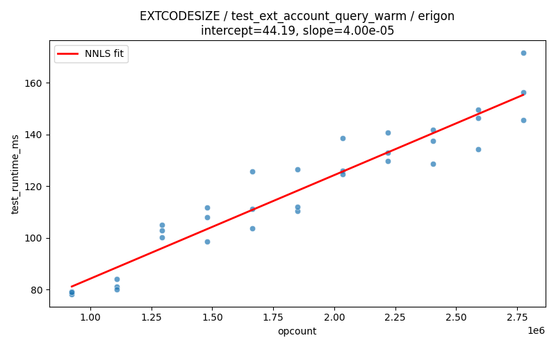

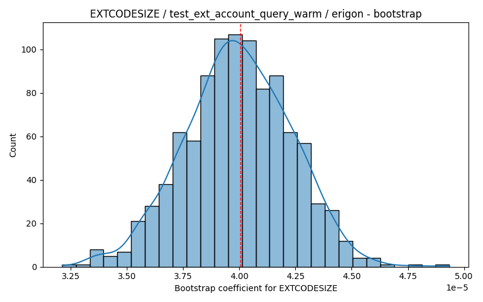

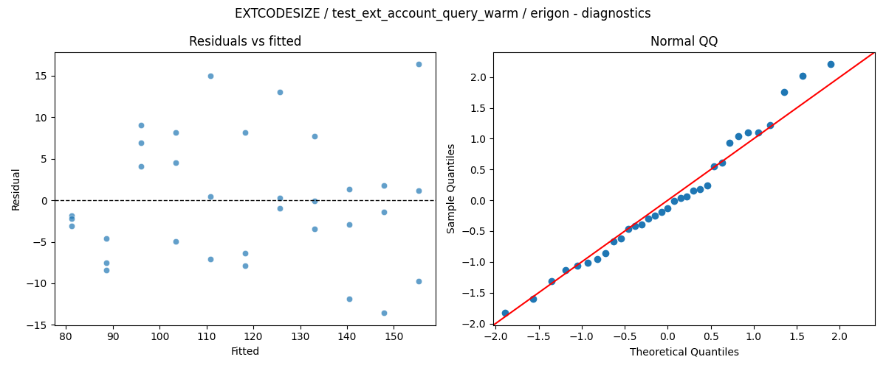

</details>

<details><summary>geth — NNLS regression summary</summary>

```
==============================================================================
                           NNLS Regression Results                            
==============================================================================
Dep. Variable:          test_runtime_ms              R-squared:          0.963
Model:                  NNLS                    Adj. R-squared:          0.963
No. Observations:       99                                RMSE:          16.62
Df Residuals:           97                                 MAE:          12.30
Df Model:               1      
==============================================================================
                      coef     std err     P-value      [0.025      0.975]
------------------------------------------------------------------------------
         const     12.6459      4.8478       0.003      3.4338     22.6032
       opcount      0.0001      0.0000       0.001      0.0001      0.0002
==============================================================================
Notes: Non-negative least squares with bootstrap inference (1000 iterations)
==============================================================================
```

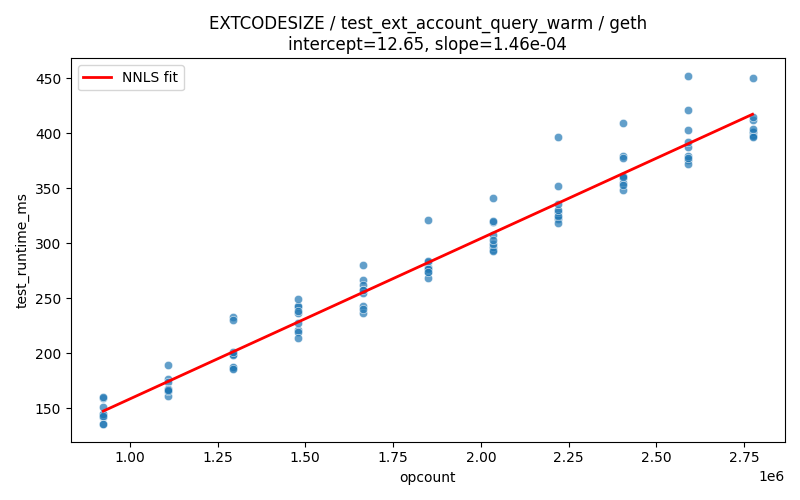

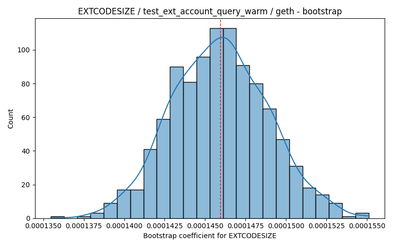

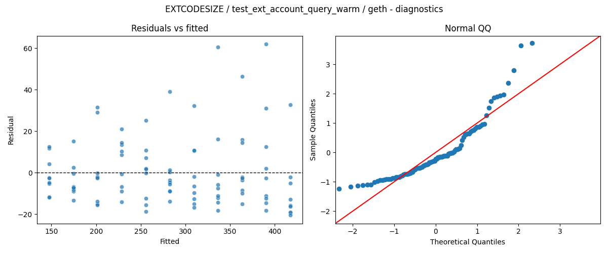

</details>

<details><summary>nethermind — NNLS regression summary</summary>

```
==============================================================================
                           NNLS Regression Results                            
==============================================================================
Dep. Variable:          test_runtime_ms              R-squared:          0.769
Model:                  NNLS                    Adj. R-squared:          0.765
No. Observations:       66                                RMSE:          56.27
Df Residuals:           64                                 MAE:          46.60
Df Model:               1      
==============================================================================
                      coef     std err     P-value      [0.025      0.975]
------------------------------------------------------------------------------
         const     89.1981     23.6291       0.001     42.8406    136.8846
       opcount      0.0002      0.0000       0.001      0.0001      0.0002
==============================================================================
Notes: Non-negative least squares with bootstrap inference (1000 iterations)
==============================================================================
```

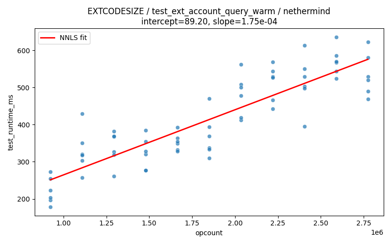

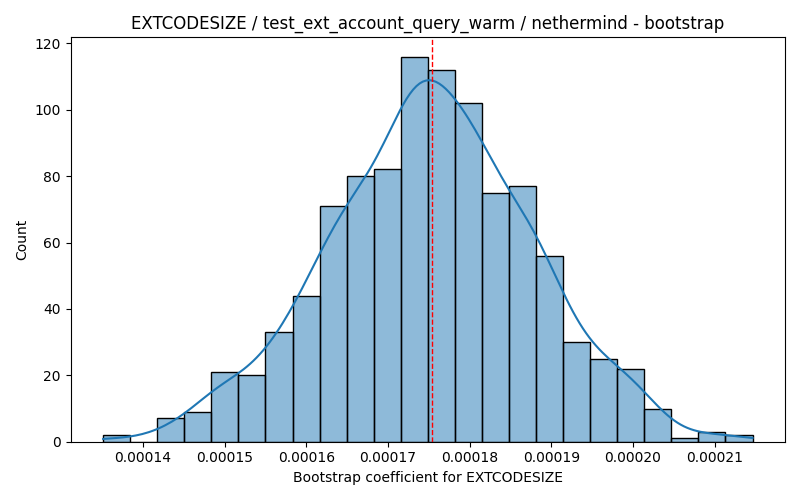

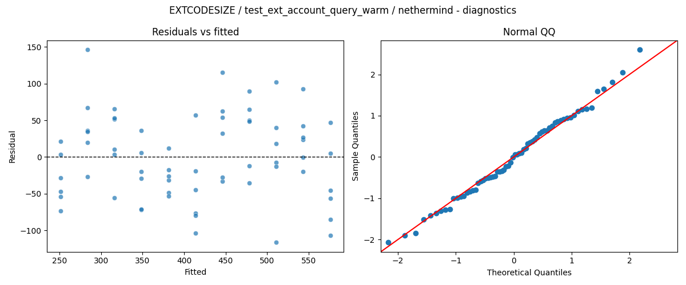

</details>

<details><summary>reth — NNLS regression summary</summary>

```
==============================================================================
                           NNLS Regression Results                            
==============================================================================
Dep. Variable:          test_runtime_ms              R-squared:          0.565
Model:                  NNLS                    Adj. R-squared:          0.559
No. Observations:       66                                RMSE:           2.78
Df Residuals:           64                                 MAE:           1.73
Df Model:               1      
==============================================================================
                      coef     std err     P-value      [0.025      0.975]
------------------------------------------------------------------------------
         const      5.5965      0.9020       0.001      3.6519      7.1634
       opcount      0.0000      0.0000       0.001      0.0000      0.0000
==============================================================================
Notes: Non-negative least squares with bootstrap inference (1000 iterations)
==============================================================================
```

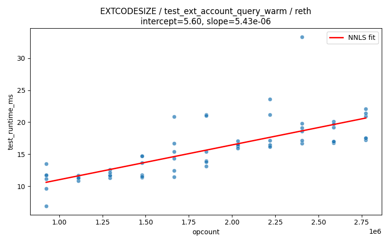

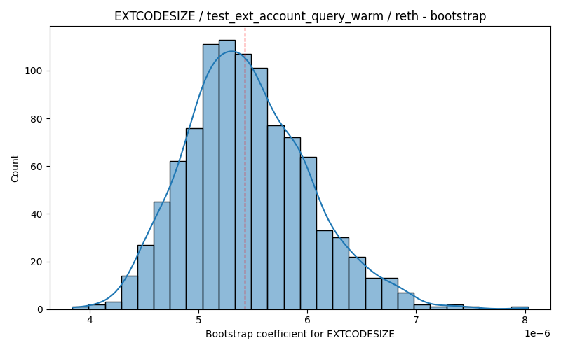

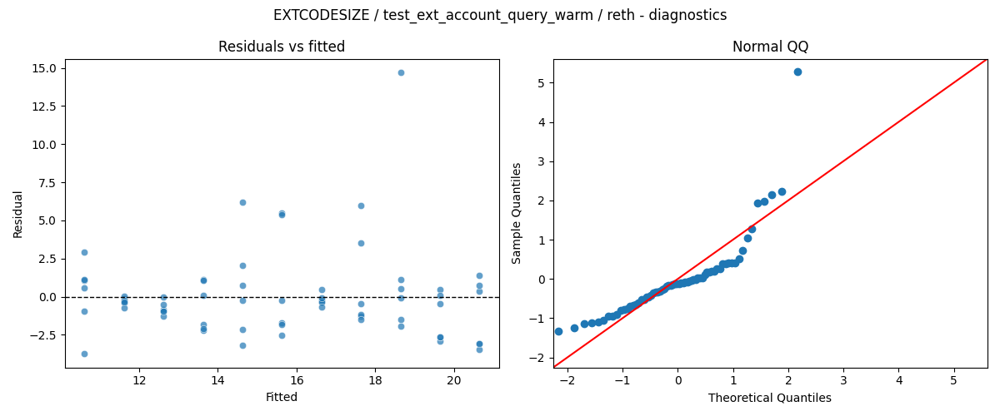

</details>

## STATICCALL

### test_account_access — combo `STATICCALL_AccountMode.EXISTING_EOA`

| client | nobs | R² | target_coef (ms) | p-value | 95% CI |
| --- | --- | --- | --- | --- | --- |
| `erigon` | 33 | 0.9985 | 0.01014 | 1.00e-03 | [0.01001, 0.01028] |
| `geth` | 99 | 0.7317 | 0.01216 | 1.00e-03 | [0.01071, 0.01372] |
| `nethermind` | 66 | 0.8041 | 0.006508 | 1.00e-03 | [0.005771, 0.007056] |
| `reth` | 66 | 0.978 | 0.001159 | 1.00e-03 | [0.001113, 0.001207] |

<details><summary>erigon — NNLS regression summary</summary>

```
==============================================================================
                           NNLS Regression Results                            
==============================================================================
Dep. Variable:          test_runtime_ms              R-squared:          0.998
Model:                  NNLS                    Adj. R-squared:          0.998
No. Observations:       33                                RMSE:           9.48
Df Residuals:           31                                 MAE:           7.85
Df Model:               1      
==============================================================================
                      coef     std err     P-value      [0.025      0.975]
------------------------------------------------------------------------------
         const     41.4166      5.2325       0.001     31.2954     50.7039
       opcount      0.0101      0.0001       0.001      0.0100      0.0103
==============================================================================
Notes: Non-negative least squares with bootstrap inference (1000 iterations)
==============================================================================
```

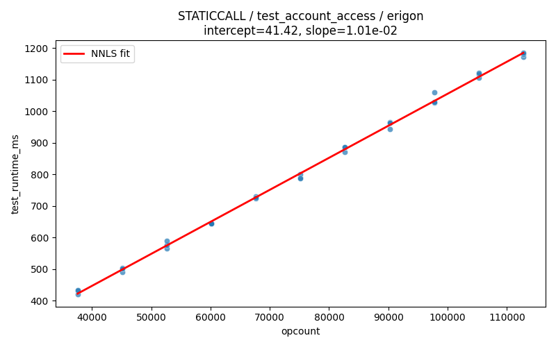

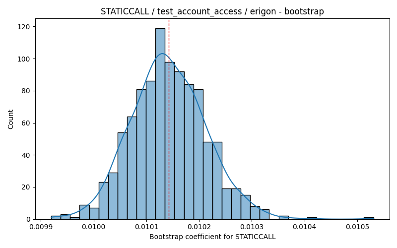

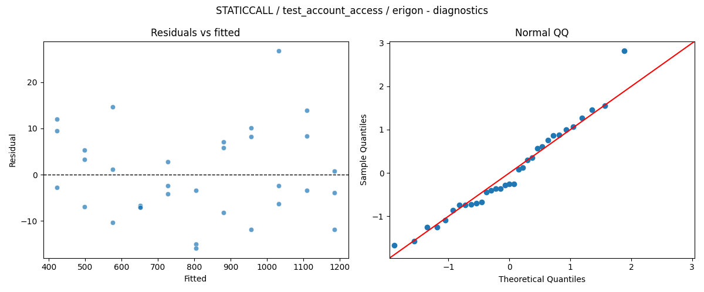

</details>

<details><summary>geth — NNLS regression summary</summary>

```
==============================================================================
                           NNLS Regression Results                            
==============================================================================
Dep. Variable:          test_runtime_ms              R-squared:          0.732
Model:                  NNLS                    Adj. R-squared:          0.729
No. Observations:       99                                RMSE:         175.08
Df Residuals:           97                                 MAE:         151.30
Df Model:               1      
==============================================================================
                      coef     std err     P-value      [0.025      0.975]
------------------------------------------------------------------------------
         const    532.9790     61.8908       0.001    411.1670    651.8708
       opcount      0.0122      0.0008       0.001      0.0107      0.0137
==============================================================================
Notes: Non-negative least squares with bootstrap inference (1000 iterations)
==============================================================================
```

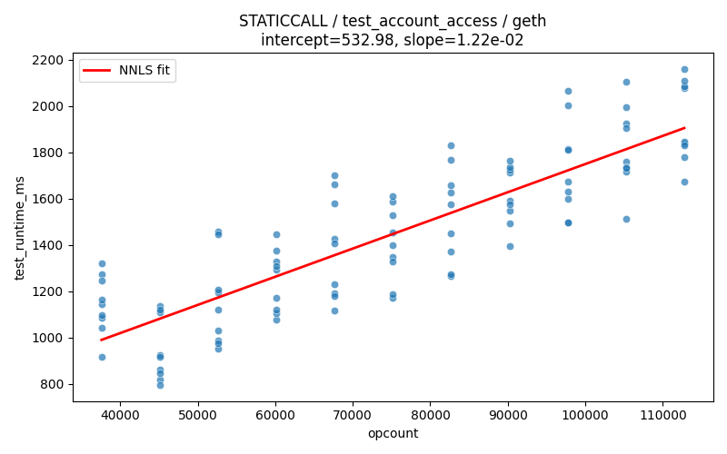

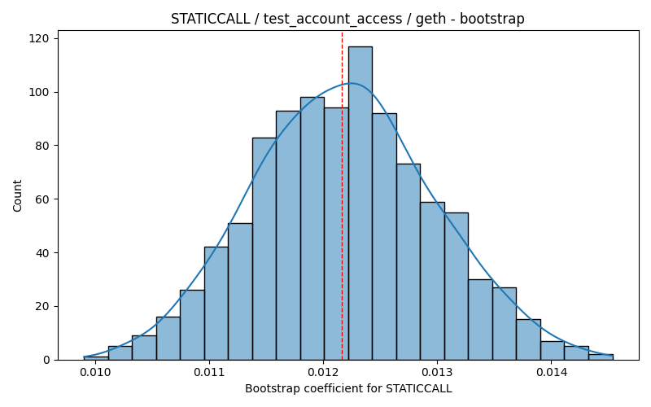

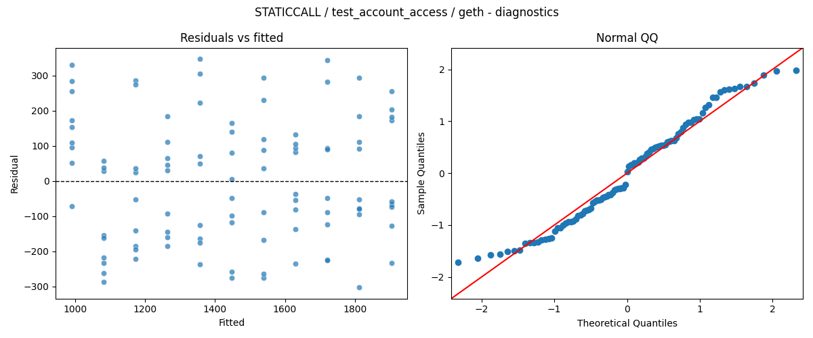

</details>

<details><summary>nethermind — NNLS regression summary</summary>

```
==============================================================================
                           NNLS Regression Results                            
==============================================================================
Dep. Variable:          test_runtime_ms              R-squared:          0.804
Model:                  NNLS                    Adj. R-squared:          0.801
No. Observations:       66                                RMSE:          76.37
Df Residuals:           64                                 MAE:          55.11
Df Model:               1      
==============================================================================
                      coef     std err     P-value      [0.025      0.975]
------------------------------------------------------------------------------
         const     24.2909     20.8291       0.177      0.0000     69.7199
       opcount      0.0065      0.0003       0.001      0.0058      0.0071
==============================================================================
Notes: Non-negative least squares with bootstrap inference (1000 iterations)
==============================================================================
```

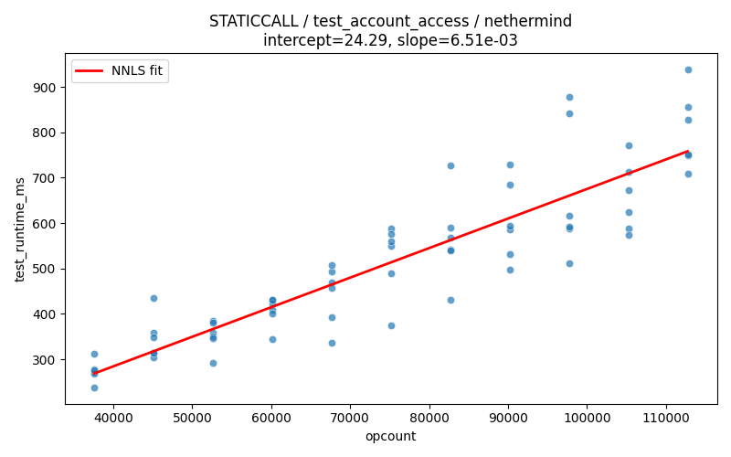

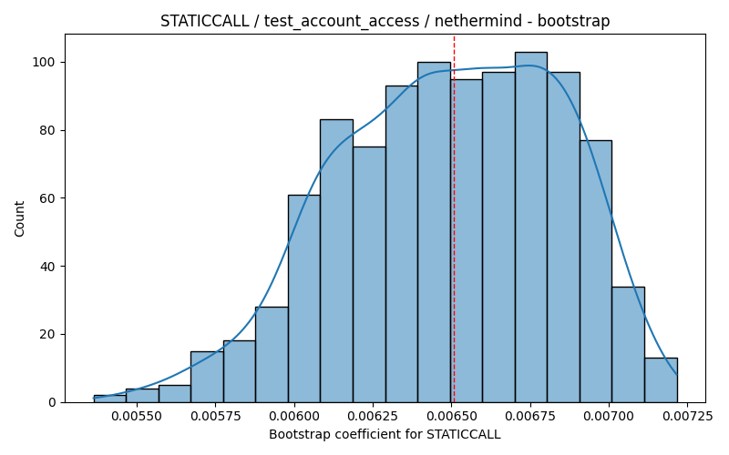

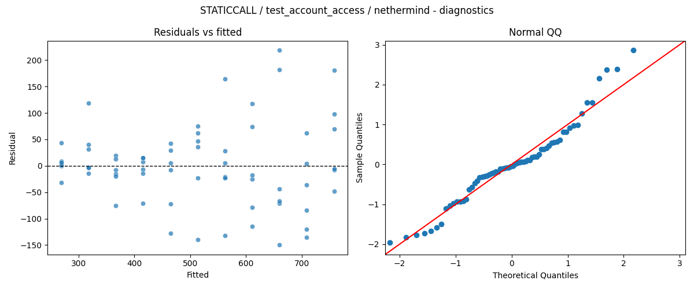

</details>

<details><summary>reth — NNLS regression summary</summary>

```
==============================================================================
                           NNLS Regression Results                            
==============================================================================
Dep. Variable:          test_runtime_ms              R-squared:          0.978
Model:                  NNLS                    Adj. R-squared:          0.978
No. Observations:       66                                RMSE:           4.13
Df Residuals:           64                                 MAE:           3.33
Df Model:               1      
==============================================================================
                      coef     std err     P-value      [0.025      0.975]
------------------------------------------------------------------------------
         const     29.9481      1.7656       0.001     26.0930     33.1741
       opcount      0.0012      0.0000       0.001      0.0011      0.0012
==============================================================================
Notes: Non-negative least squares with bootstrap inference (1000 iterations)
==============================================================================
```

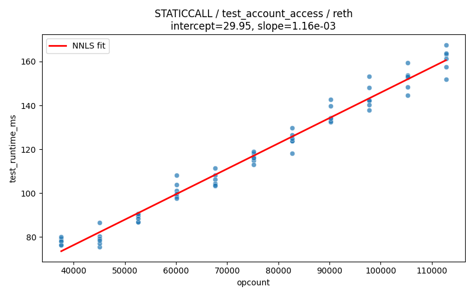

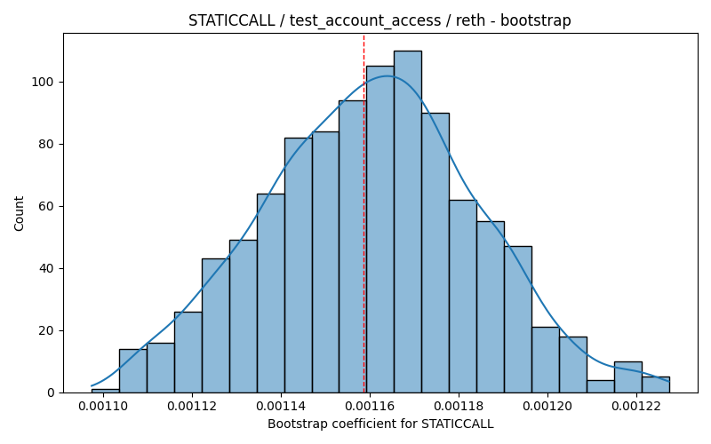

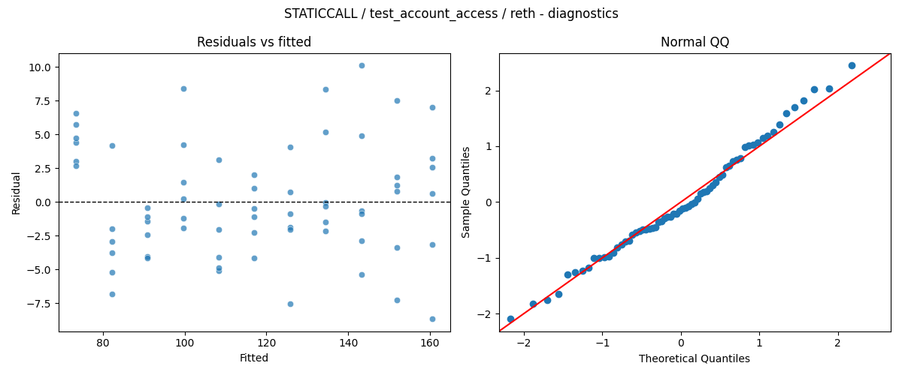

</details>

### test_account_access — combo `STATICCALL_AccountMode.NON_EXISTING_ACCOUNT` — `presets[cold_account_nocode_access]`

| client | nobs | R² | target_coef (ms) | p-value | 95% CI |
| --- | --- | --- | --- | --- | --- |
| `erigon` | 33 | 0.9975 | 0.0117 | 1.00e-03 | [0.01159, 0.01176] |
| `geth` | 99 | 0.7061 | 0.03517 | 1.00e-03 | [0.03055, 0.03963] |
| `nethermind` | 66 | 0.798 | 0.005009 | 1.00e-03 | [0.00434, 0.005585] |
| `reth` | 66 | 0.9692 | 0.0009865 | 1.00e-03 | [0.0009383, 0.001035] |

<details><summary>erigon — NNLS regression summary</summary>

```
==============================================================================
                           NNLS Regression Results                            
==============================================================================
Dep. Variable:          test_runtime_ms              R-squared:          0.997
Model:                  NNLS                    Adj. R-squared:          0.997
No. Observations:       33                                RMSE:          14.02
Df Residuals:           31                                 MAE:          10.79
Df Model:               1      
==============================================================================
                      coef     std err     P-value      [0.025      0.975]
------------------------------------------------------------------------------
         const      0.0000      2.0462       1.000      0.0000      7.9791
       opcount      0.0117      0.0000       0.001      0.0116      0.0118
==============================================================================
Notes: Non-negative least squares with bootstrap inference (1000 iterations)
==============================================================================
```

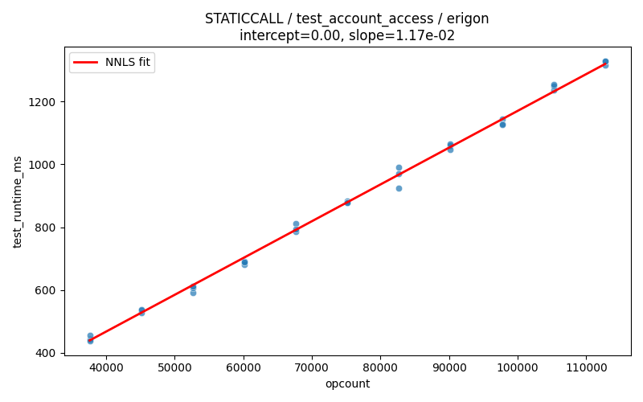

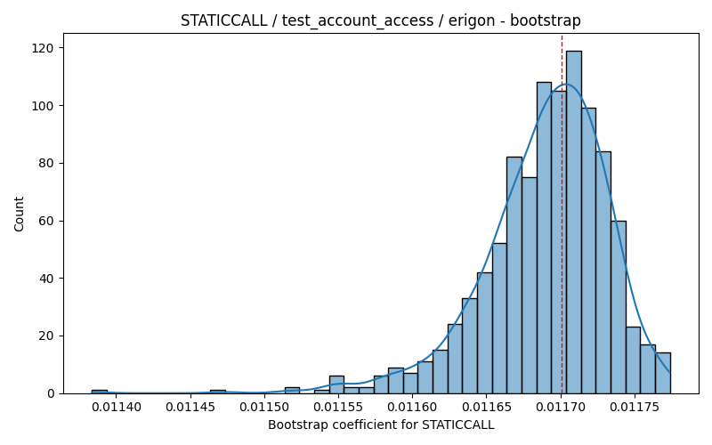

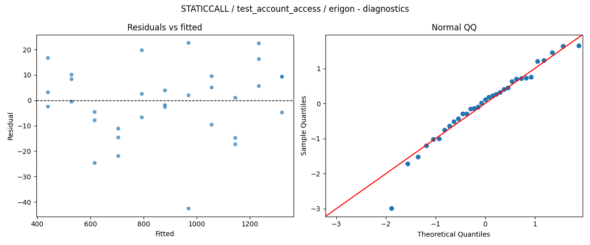

</details>

<details><summary>geth — NNLS regression summary</summary>

```
==============================================================================
                           NNLS Regression Results                            
==============================================================================
Dep. Variable:          test_runtime_ms              R-squared:          0.706
Model:                  NNLS                    Adj. R-squared:          0.703
No. Observations:       99                                RMSE:         539.44
Df Residuals:           97                                 MAE:         420.25
Df Model:               1      
==============================================================================
                      coef     std err     P-value      [0.025      0.975]
------------------------------------------------------------------------------
         const   1520.4446    172.4491       0.001   1180.0313   1869.1914
       opcount      0.0352      0.0023       0.001      0.0306      0.0396
==============================================================================
Notes: Non-negative least squares with bootstrap inference (1000 iterations)
==============================================================================
```

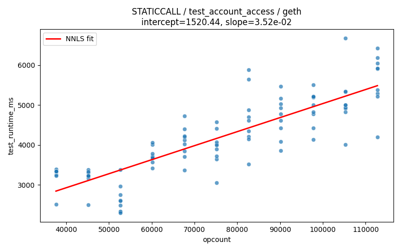

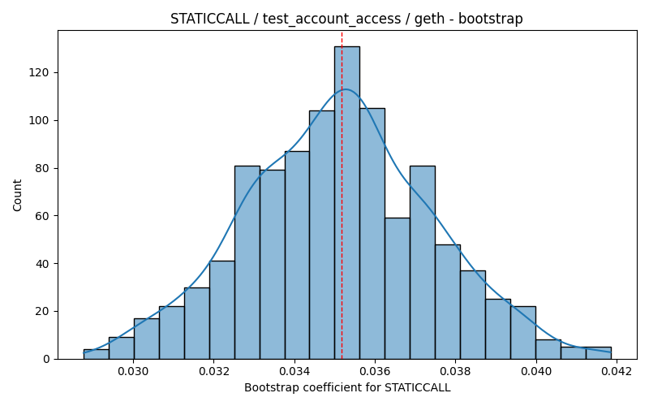

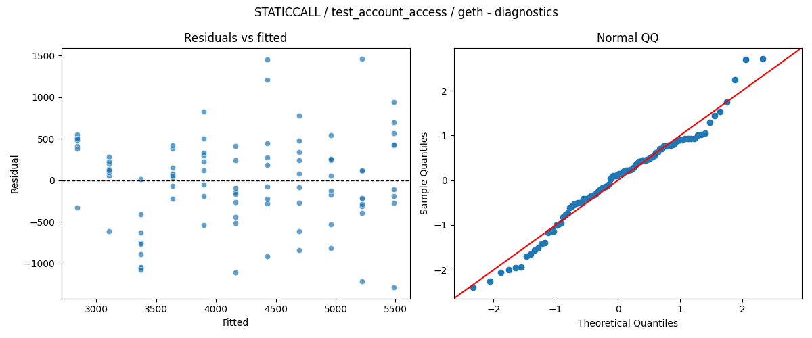

</details>

<details><summary>nethermind — NNLS regression summary</summary>

```
==============================================================================
                           NNLS Regression Results                            
==============================================================================
Dep. Variable:          test_runtime_ms              R-squared:          0.798
Model:                  NNLS                    Adj. R-squared:          0.795
No. Observations:       66                                RMSE:          59.92
Df Residuals:           64                                 MAE:          42.66
Df Model:               1      
==============================================================================
                      coef     std err     P-value      [0.025      0.975]
------------------------------------------------------------------------------
         const    118.2717     23.8832       0.001     76.4691    170.2314
       opcount      0.0050      0.0003       0.001      0.0043      0.0056
==============================================================================
Notes: Non-negative least squares with bootstrap inference (1000 iterations)
==============================================================================
```

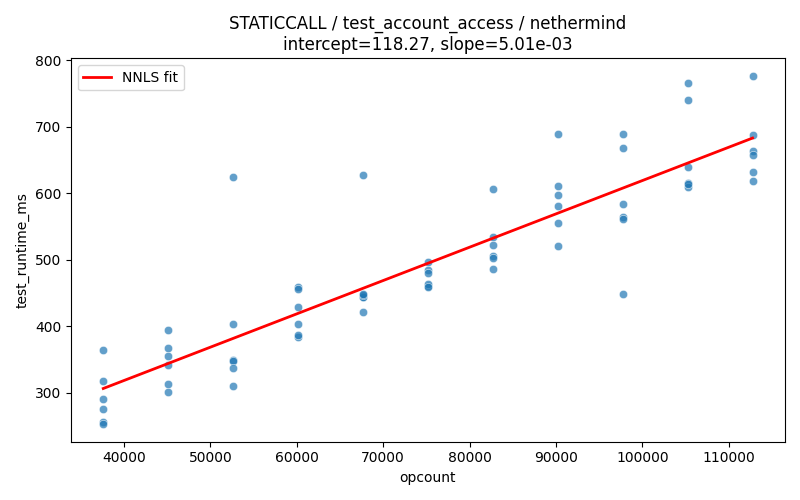

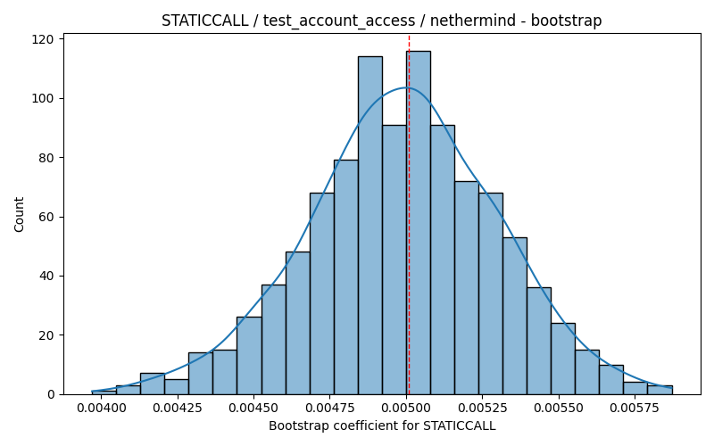

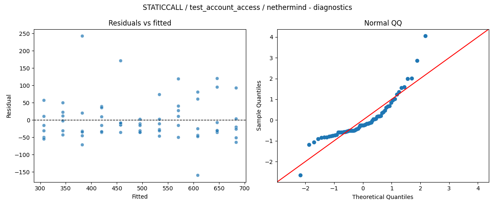

</details>

<details><summary>reth — NNLS regression summary</summary>

```
==============================================================================
                           NNLS Regression Results                            
==============================================================================
Dep. Variable:          test_runtime_ms              R-squared:          0.969
Model:                  NNLS                    Adj. R-squared:          0.969
No. Observations:       66                                RMSE:           4.18
Df Residuals:           64                                 MAE:           3.37
Df Model:               1      
==============================================================================
                      coef     std err     P-value      [0.025      0.975]
------------------------------------------------------------------------------
         const     30.8105      1.9529       0.001     27.0734     34.7544
       opcount      0.0010      0.0000       0.001      0.0009      0.0010
==============================================================================
Notes: Non-negative least squares with bootstrap inference (1000 iterations)
==============================================================================
```

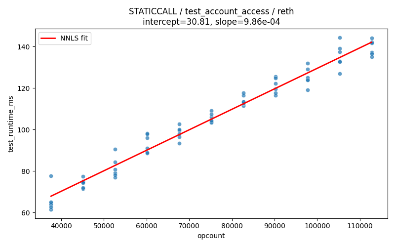

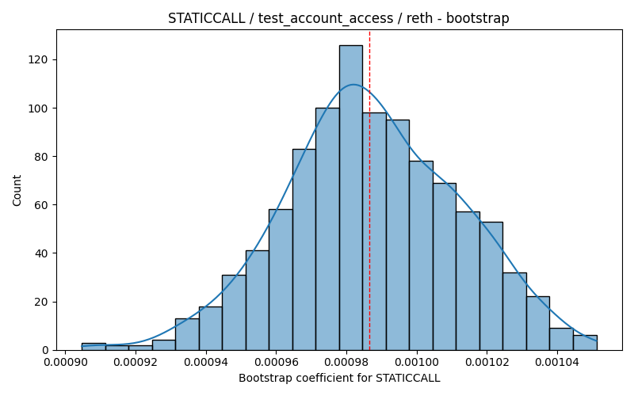

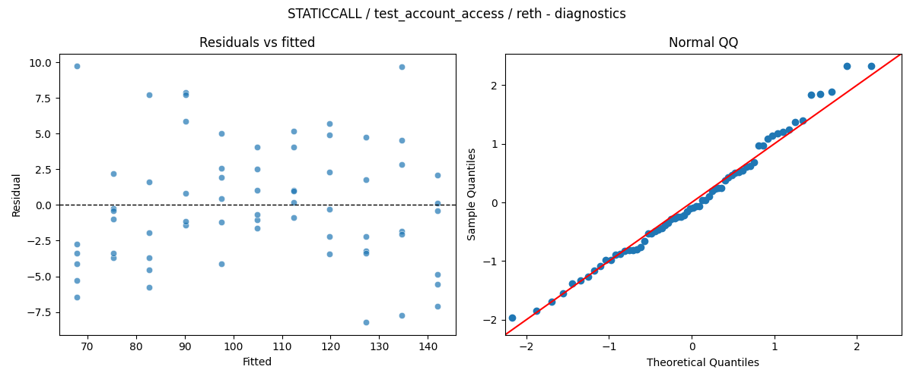

</details>

### test_account_access — combo `STATICCALL_AccountMode.EXISTING_CONTRACT`

| client | nobs | R² | target_coef (ms) | p-value | 95% CI |
| --- | --- | --- | --- | --- | --- |
| `erigon` | 33 | 0.8727 | 0.08701 | 1.00e-03 | [0.07444, 0.09671] |
| `geth` | 99 | 0.7909 | 0.04312 | 1.00e-03 | [0.03846, 0.04812] |
| `nethermind` | 66 | 0.9266 | 0.0221 | 1.00e-03 | [0.02058, 0.02361] |
| `reth` | 66 | 0.9523 | 0.03566 | 1.00e-03 | [0.03315, 0.0381] |

<details><summary>erigon — NNLS regression summary</summary>

```
==============================================================================
                           NNLS Regression Results                            
==============================================================================
Dep. Variable:          test_runtime_ms              R-squared:          0.873
Model:                  NNLS                    Adj. R-squared:          0.869
No. Observations:       33                                RMSE:         676.94
Df Residuals:           31                                 MAE:         583.03
Df Model:               1      
==============================================================================
                      coef     std err     P-value      [0.025      0.975]
------------------------------------------------------------------------------
         const   1483.6630    443.8748       0.001    776.5723   2453.5238
       opcount      0.0870      0.0058       0.001      0.0744      0.0967
==============================================================================
Notes: Non-negative least squares with bootstrap inference (1000 iterations)
==============================================================================
```

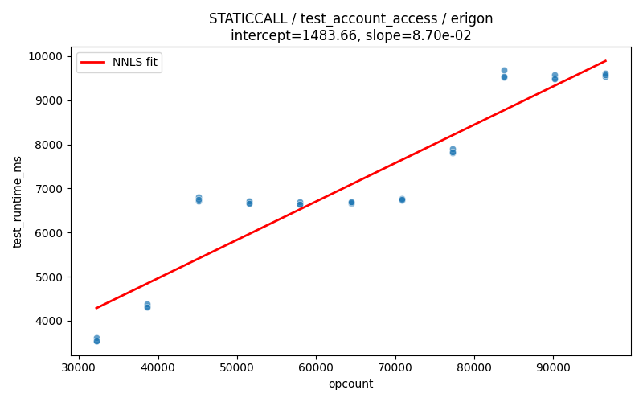

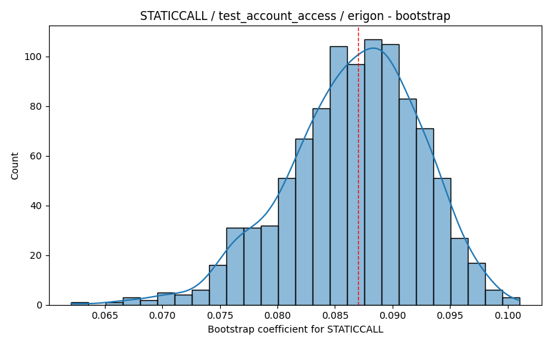

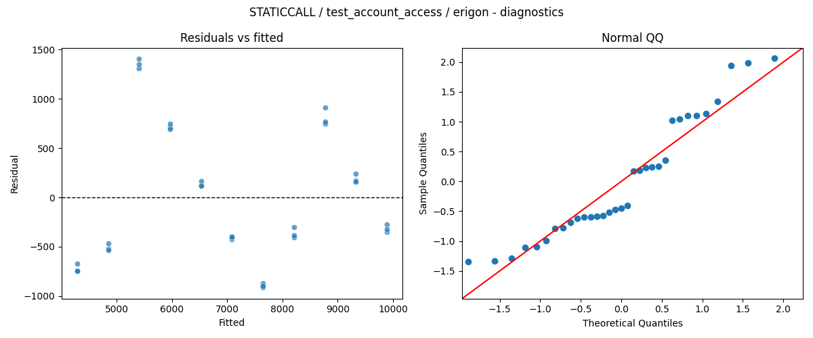

</details>

<details><summary>geth — NNLS regression summary</summary>

```
==============================================================================
                           NNLS Regression Results                            
==============================================================================
Dep. Variable:          test_runtime_ms              R-squared:          0.791
Model:                  NNLS                    Adj. R-squared:          0.789
No. Observations:       99                                RMSE:         451.72
Df Residuals:           97                                 MAE:         362.23
Df Model:               1      
==============================================================================
                      coef     std err     P-value      [0.025      0.975]
------------------------------------------------------------------------------
         const   1218.9353    139.2615       0.001    927.4201   1476.8242
       opcount      0.0431      0.0024       0.001      0.0385      0.0481
==============================================================================
Notes: Non-negative least squares with bootstrap inference (1000 iterations)
==============================================================================
```

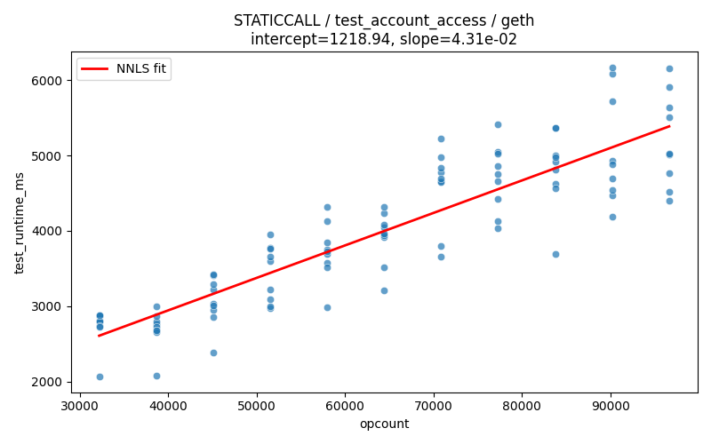

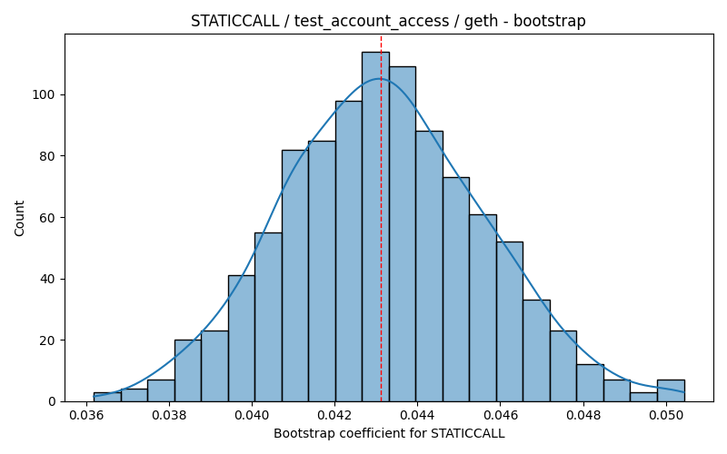

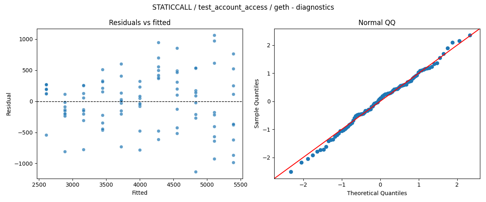

</details>

<details><summary>nethermind — NNLS regression summary</summary>

```
==============================================================================
                           NNLS Regression Results                            
==============================================================================
Dep. Variable:          test_runtime_ms              R-squared:          0.927
Model:                  NNLS                    Adj. R-squared:          0.925
No. Observations:       66                                RMSE:         126.76
Df Residuals:           64                                 MAE:          99.33
Df Model:               1      
==============================================================================
                      coef     std err     P-value      [0.025      0.975]
------------------------------------------------------------------------------
         const    152.5674     41.9196       0.001     65.3345    234.4536
       opcount      0.0221      0.0008       0.001      0.0206      0.0236
==============================================================================
Notes: Non-negative least squares with bootstrap inference (1000 iterations)
==============================================================================
```

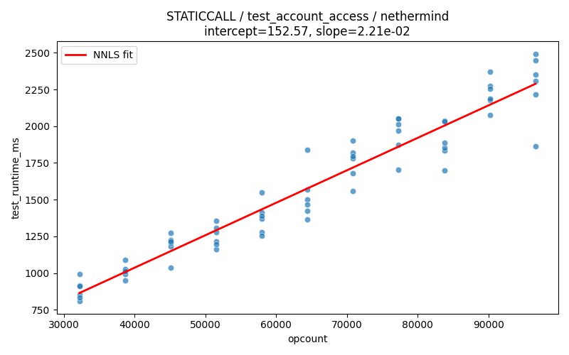

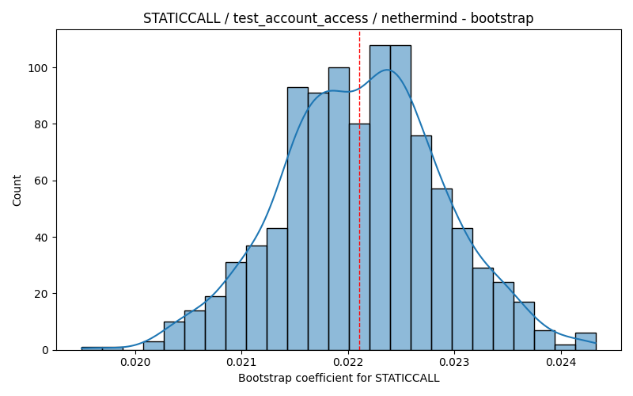

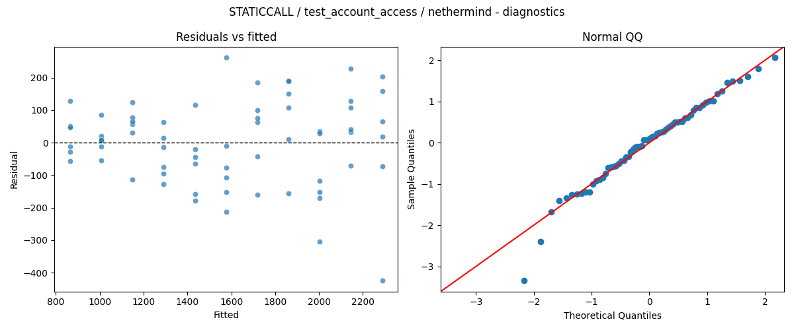

</details>

<details><summary>reth — NNLS regression summary</summary>

```
==============================================================================
                           NNLS Regression Results                            
==============================================================================
Dep. Variable:          test_runtime_ms              R-squared:          0.952
Model:                  NNLS                    Adj. R-squared:          0.952
No. Observations:       66                                RMSE:         162.48
Df Residuals:           64                                 MAE:         123.54
Df Model:               1      
==============================================================================
                      coef     std err     P-value      [0.025      0.975]
------------------------------------------------------------------------------
         const    203.7729     94.3275       0.017     24.9713    387.9693
       opcount      0.0357      0.0013       0.001      0.0331      0.0381
==============================================================================
Notes: Non-negative least squares with bootstrap inference (1000 iterations)
==============================================================================
```

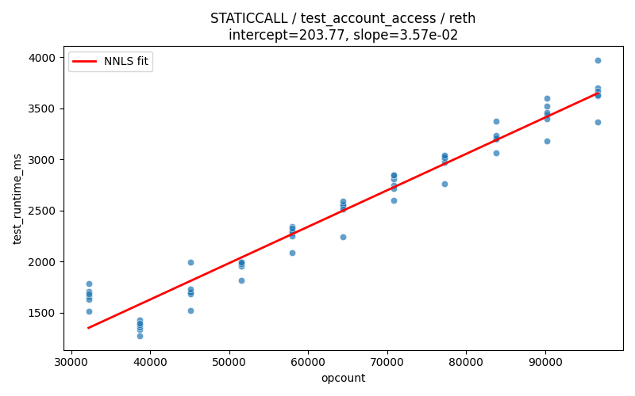

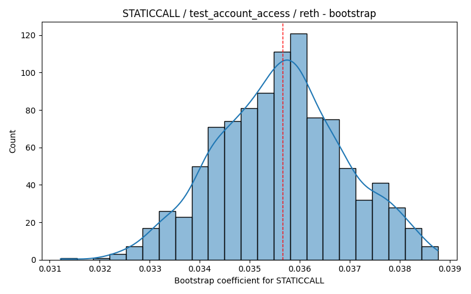

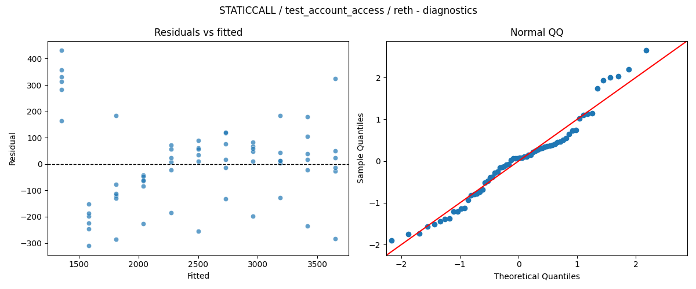

</details>

### test_account_access — combo `STATICCALL_AccountMode.NON_EXISTING_ACCOUNT` — `presets[cold_account_code_access]`

| client | nobs | R² | target_coef (ms) | p-value | 95% CI |
| --- | --- | --- | --- | --- | --- |
| `erigon` | 33 | 0.9975 | 0.0117 | 1.00e-03 | [0.01159, 0.01176] |
| `geth` | 99 | 0.7061 | 0.03517 | 1.00e-03 | [0.03055, 0.03963] |
| `nethermind` | 66 | 0.798 | 0.005009 | 1.00e-03 | [0.00434, 0.005585] |
| `reth` | 66 | 0.9692 | 0.0009865 | 1.00e-03 | [0.0009383, 0.001035] |

<details><summary>erigon — NNLS regression summary</summary>

```
==============================================================================
                           NNLS Regression Results                            
==============================================================================
Dep. Variable:          test_runtime_ms              R-squared:          0.997
Model:                  NNLS                    Adj. R-squared:          0.997
No. Observations:       33                                RMSE:          14.02
Df Residuals:           31                                 MAE:          10.79
Df Model:               1      
==============================================================================
                      coef     std err     P-value      [0.025      0.975]
------------------------------------------------------------------------------
         const      0.0000      2.0462       1.000      0.0000      7.9791
       opcount      0.0117      0.0000       0.001      0.0116      0.0118
==============================================================================
Notes: Non-negative least squares with bootstrap inference (1000 iterations)
==============================================================================
```


</details>

<details><summary>geth — NNLS regression summary</summary>

```
==============================================================================
                           NNLS Regression Results                            
==============================================================================
Dep. Variable:          test_runtime_ms              R-squared:          0.706
Model:                  NNLS                    Adj. R-squared:          0.703
No. Observations:       99                                RMSE:         539.44
Df Residuals:           97                                 MAE:         420.25
Df Model:               1      
==============================================================================
                      coef     std err     P-value      [0.025      0.975]
------------------------------------------------------------------------------
         const   1520.4446    172.4491       0.001   1180.0313   1869.1914
       opcount      0.0352      0.0023       0.001      0.0306      0.0396
==============================================================================
Notes: Non-negative least squares with bootstrap inference (1000 iterations)
==============================================================================
```


</details>

<details><summary>nethermind — NNLS regression summary</summary>

```
==============================================================================
                           NNLS Regression Results                            
==============================================================================
Dep. Variable:          test_runtime_ms              R-squared:          0.798
Model:                  NNLS                    Adj. R-squared:          0.795
No. Observations:       66                                RMSE:          59.92
Df Residuals:           64                                 MAE:          42.66
Df Model:               1      
==============================================================================
                      coef     std err     P-value      [0.025      0.975]
------------------------------------------------------------------------------
         const    118.2717     23.8832       0.001     76.4691    170.2314
       opcount      0.0050      0.0003       0.001      0.0043      0.0056
==============================================================================
Notes: Non-negative least squares with bootstrap inference (1000 iterations)
==============================================================================
```


</details>

<details><summary>reth — NNLS regression summary</summary>

```
==============================================================================
                           NNLS Regression Results                            
==============================================================================
Dep. Variable:          test_runtime_ms              R-squared:          0.969
Model:                  NNLS                    Adj. R-squared:          0.969
No. Observations:       66                                RMSE:           4.18
Df Residuals:           64                                 MAE:           3.37
Df Model:               1      
==============================================================================
                      coef     std err     P-value      [0.025      0.975]
------------------------------------------------------------------------------
         const     30.8105      1.9529       0.001     27.0734     34.7544
       opcount      0.0010      0.0000       0.001      0.0009      0.0010
==============================================================================
Notes: Non-negative least squares with bootstrap inference (1000 iterations)
==============================================================================
```


</details>

### test_ext_account_query_warm — combo `STATICCALL`

| client | nobs | R² | target_coef (ms) | p-value | 95% CI |
| --- | --- | --- | --- | --- | --- |
| `erigon` | 33 | 0.9707 | 0.0004715 | 1.00e-03 | [0.0004404, 0.0005003] |
| `geth` | 99 | 0.9726 | 0.0006552 | 1.00e-03 | [0.0006309, 0.0006714] |
| `nethermind` | 66 | 0.5903 | 0.000488 | 1.00e-03 | [0.0003692, 0.0006006] |
| `reth` | 66 | 0.9267 | 4.944e-05 | 1.00e-03 | [4.563e-05, 5.318e-05] |

<details><summary>erigon — NNLS regression summary</summary>

```
==============================================================================
                           NNLS Regression Results                            
==============================================================================
Dep. Variable:          test_runtime_ms              R-squared:          0.971
Model:                  NNLS                    Adj. R-squared:          0.970
No. Observations:       33                                RMSE:          42.42
Df Residuals:           31                                 MAE:          35.33
Df Model:               1      
==============================================================================
                      coef     std err     P-value      [0.025      0.975]
------------------------------------------------------------------------------
         const     72.3122     23.7551       0.002     25.4826    119.7843
       opcount      0.0005      0.0000       0.001      0.0004      0.0005
==============================================================================
Notes: Non-negative least squares with bootstrap inference (1000 iterations)
==============================================================================
```

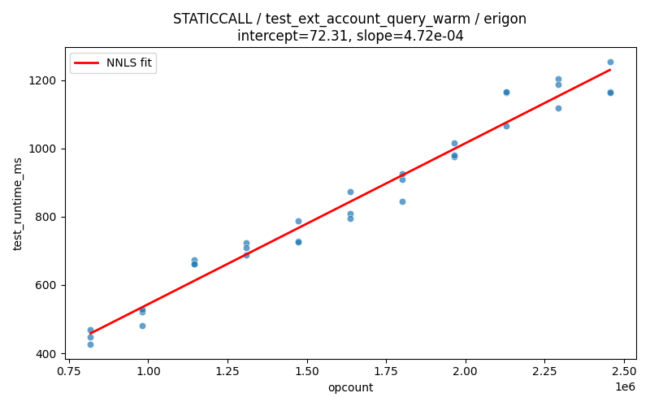

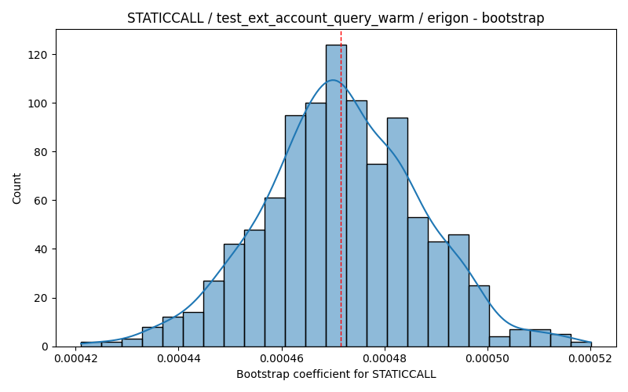

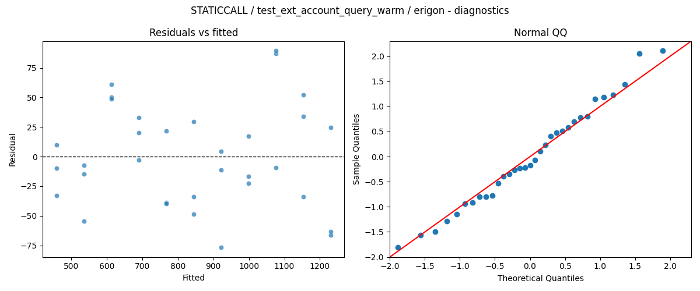

</details>

<details><summary>geth — NNLS regression summary</summary>

```
==============================================================================
                           NNLS Regression Results                            
==============================================================================
Dep. Variable:          test_runtime_ms              R-squared:          0.973
Model:                  NNLS                    Adj. R-squared:          0.972
No. Observations:       99                                RMSE:          56.96
Df Residuals:           97                                 MAE:          39.19
Df Model:               1      
==============================================================================
                      coef     std err     P-value      [0.025      0.975]
------------------------------------------------------------------------------
         const     15.7509     16.6488       0.223      0.0000     54.1597
       opcount      0.0007      0.0000       0.001      0.0006      0.0007
==============================================================================
Notes: Non-negative least squares with bootstrap inference (1000 iterations)
==============================================================================
```

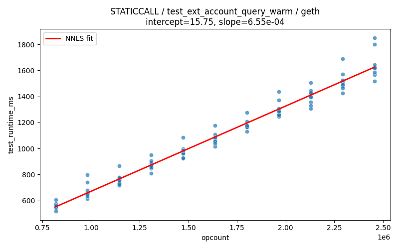

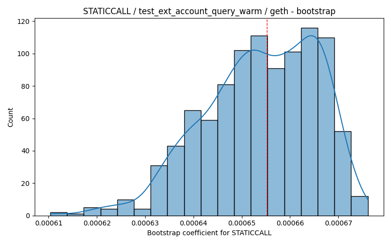

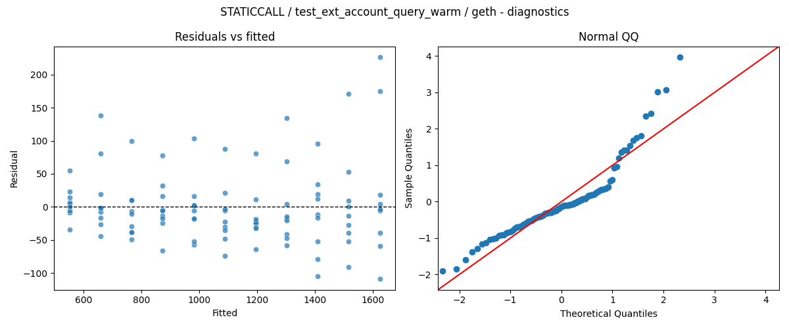

</details>

<details><summary>nethermind — NNLS regression summary</summary>

```
==============================================================================
                           NNLS Regression Results                            
==============================================================================
Dep. Variable:          test_runtime_ms              R-squared:          0.590
Model:                  NNLS                    Adj. R-squared:          0.584
No. Observations:       66                                RMSE:         210.47
Df Residuals:           64                                 MAE:         167.32
Df Model:               1      
==============================================================================
                      coef     std err     P-value      [0.025      0.975]
------------------------------------------------------------------------------
         const    361.7950     86.6888       0.001    198.3006    538.0039
       opcount      0.0005      0.0001       0.001      0.0004      0.0006
==============================================================================
Notes: Non-negative least squares with bootstrap inference (1000 iterations)
==============================================================================
```

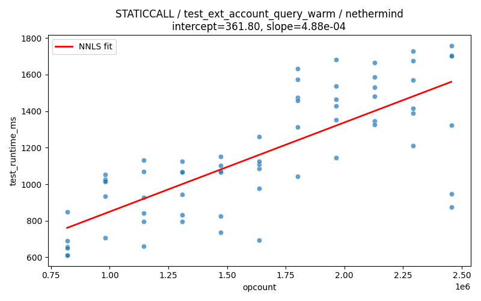

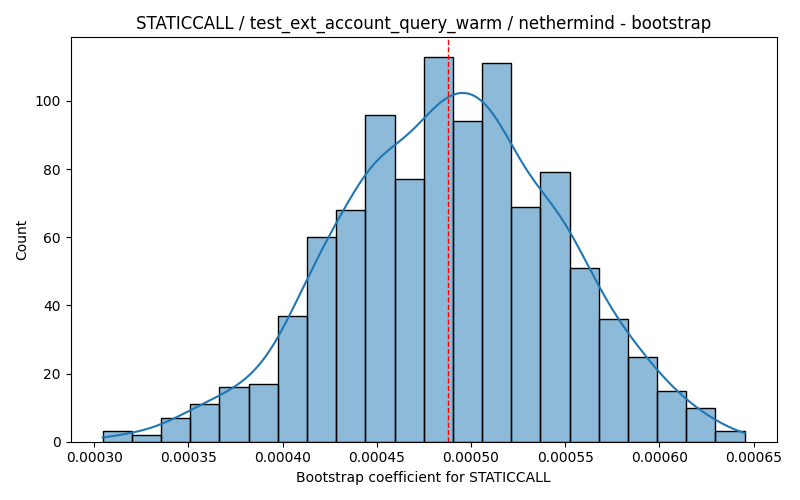

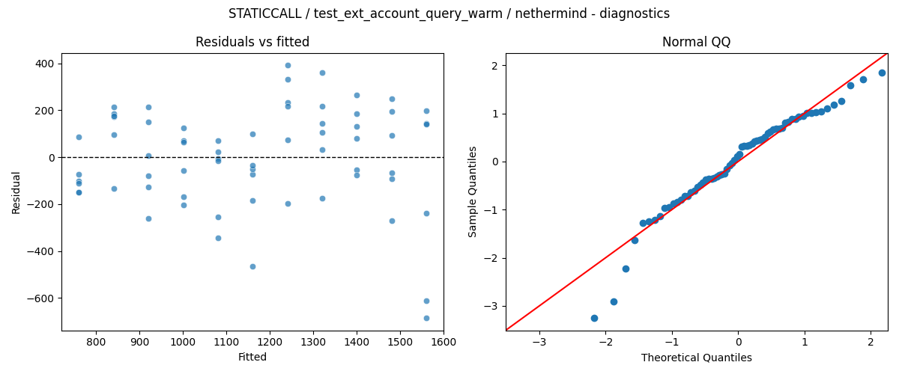

</details>

<details><summary>reth — NNLS regression summary</summary>

```
==============================================================================
                           NNLS Regression Results                            
==============================================================================
Dep. Variable:          test_runtime_ms              R-squared:          0.927
Model:                  NNLS                    Adj. R-squared:          0.926
No. Observations:       66                                RMSE:           7.20
Df Residuals:           64                                 MAE:           6.08
Df Model:               1      
==============================================================================
                      coef     std err     P-value      [0.025      0.975]
------------------------------------------------------------------------------
         const     13.1022      3.2492       0.002      6.8021     19.3036
       opcount      0.0000      0.0000       0.001      0.0000      0.0001
==============================================================================
Notes: Non-negative least squares with bootstrap inference (1000 iterations)
==============================================================================
```

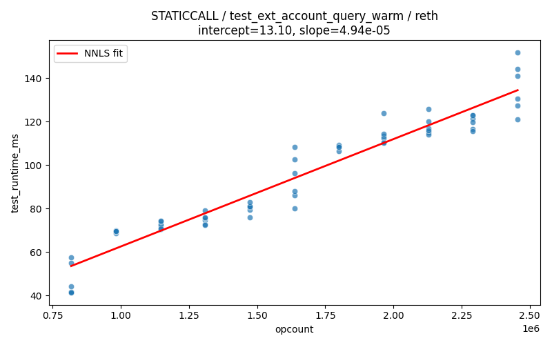

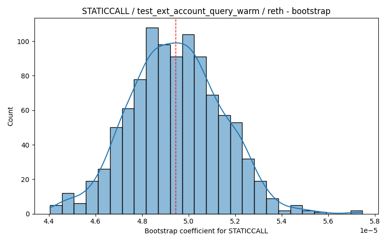

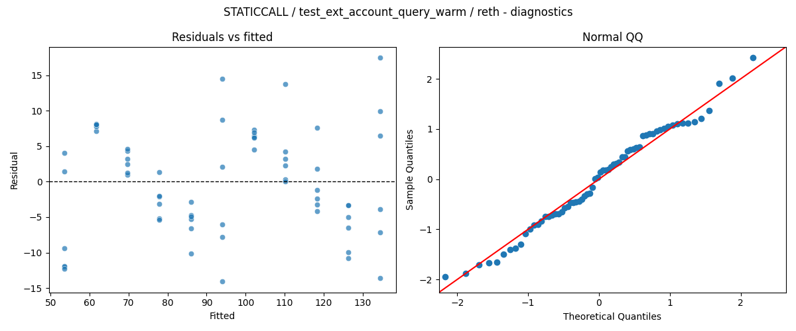

</details>
