# Runtime estimation report

Per-spec NNLS fits of `test_runtime_ms` against `opcount`, one row per (target opcode, test, model_by combo, client).

## Contents

- [SLOAD](#sload)
- [SSTORE](#sstore)
- [BALANCE](#balance)
- [CALL](#call)
- [CALLCODE](#callcode)
- [DELEGATECALL](#delegatecall)
- [EXTCODECOPY](#extcodecopy)
- [EXTCODEHASH](#extcodehash)
- [EXTCODESIZE](#extcodesize)
- [STATICCALL](#staticcall)

## SLOAD

### test_sload_bloated — combo `False`

| client | nobs | R² | target_coef (ms) | p-value | 95% CI |
| --- | --- | --- | --- | --- | --- |
| `besu` | 286 | 0.9237 | 0.008679 | 1.00e-03 | [0.008388, 0.00897] |
| `erigon` | 418 | 0.9956 | 0.006218 | 1.00e-03 | [0.006178, 0.006256] |
| `geth` | 561 | 0.732 | 0.1558 | 1.00e-03 | [0.148, 0.1634] |
| `nethermind` | 682 | 0.8193 | 0.003777 | 1.00e-03 | [0.003645, 0.003917] |
| `reth` | 1056 | 0.947 | 0.001299 | 1.00e-03 | [0.001279, 0.001318] |

<details><summary>besu — NNLS regression summary</summary>

```
==============================================================================
                           NNLS Regression Results                            
==============================================================================
Dep. Variable:          test_runtime_ms              R-squared:          0.924
Model:                  NNLS                    Adj. R-squared:          0.923
No. Observations:       286                               RMSE:          73.44
Df Residuals:           284                                MAE:          56.52
Df Model:               1      
==============================================================================
                      coef     std err     P-value      [0.025      0.975]
------------------------------------------------------------------------------
         const    161.2454     12.6120       0.001    136.7350    186.2127
       opcount      0.0087      0.0001       0.001      0.0084      0.0090
==============================================================================
Notes: Non-negative least squares with bootstrap inference (1000 iterations)
==============================================================================
```

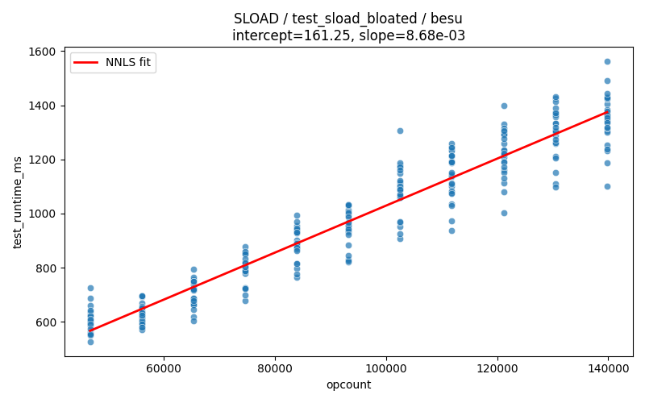

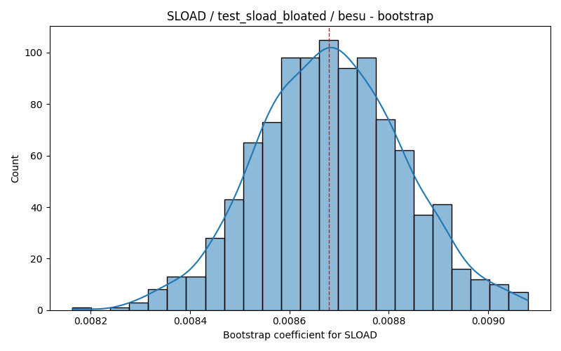

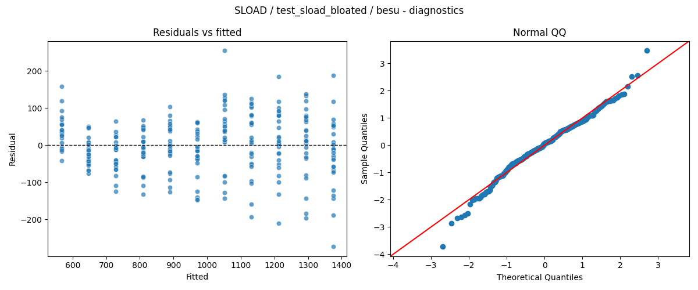

</details>

<details><summary>erigon — NNLS regression summary</summary>

```
==============================================================================
                           NNLS Regression Results                            
==============================================================================
Dep. Variable:          test_runtime_ms              R-squared:          0.996
Model:                  NNLS                    Adj. R-squared:          0.996
No. Observations:       418                               RMSE:          12.17
Df Residuals:           416                                MAE:           9.77
Df Model:               1      
==============================================================================
                      coef     std err     P-value      [0.025      0.975]
------------------------------------------------------------------------------
         const     17.8972      1.7007       0.001     14.7454     21.4000
       opcount      0.0062      0.0000       0.001      0.0062      0.0063
==============================================================================
Notes: Non-negative least squares with bootstrap inference (1000 iterations)
==============================================================================
```

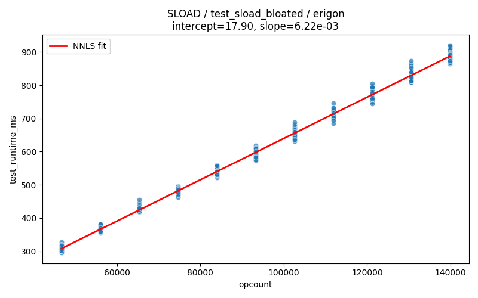

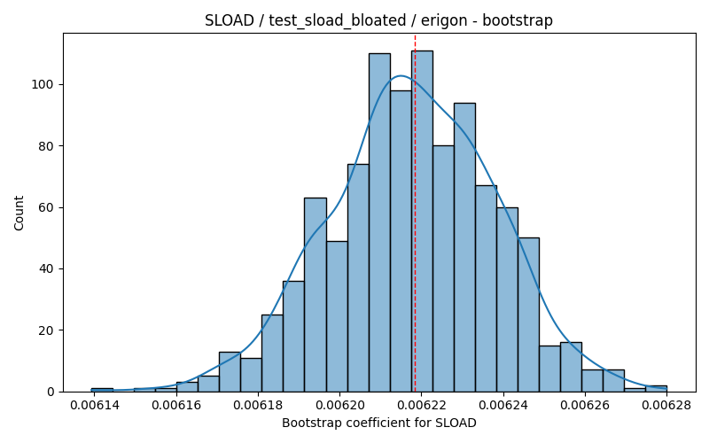

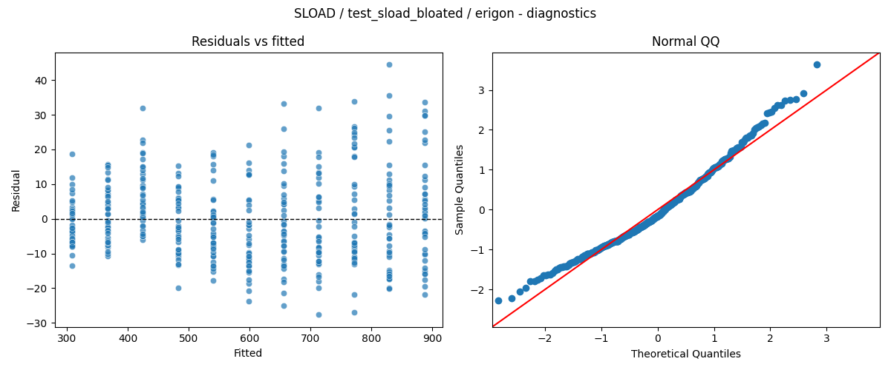

</details>

<details><summary>geth — NNLS regression summary</summary>

```
==============================================================================
                           NNLS Regression Results                            
==============================================================================
Dep. Variable:          test_runtime_ms              R-squared:          0.732
Model:                  NNLS                    Adj. R-squared:          0.732
No. Observations:       561                               RMSE:        2773.65
Df Residuals:           559                                MAE:        2553.77
Df Model:               1      
==============================================================================
                      coef     std err     P-value      [0.025      0.975]
------------------------------------------------------------------------------
         const   2712.9320    327.4943       0.001   2073.9982   3350.0504
       opcount      0.1558      0.0040       0.001      0.1480      0.1634
==============================================================================
Notes: Non-negative least squares with bootstrap inference (1000 iterations)
==============================================================================
```

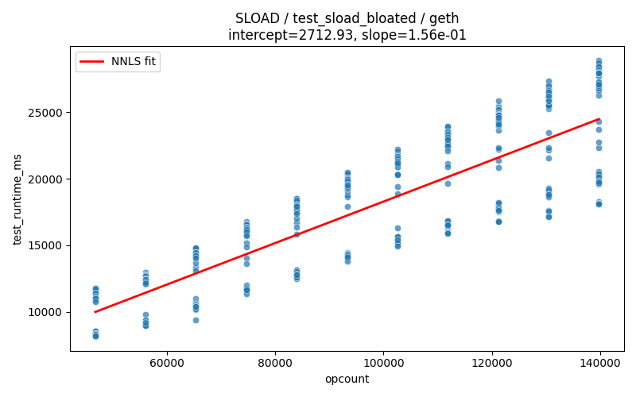

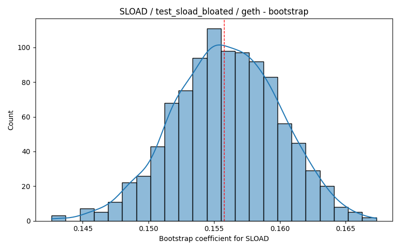

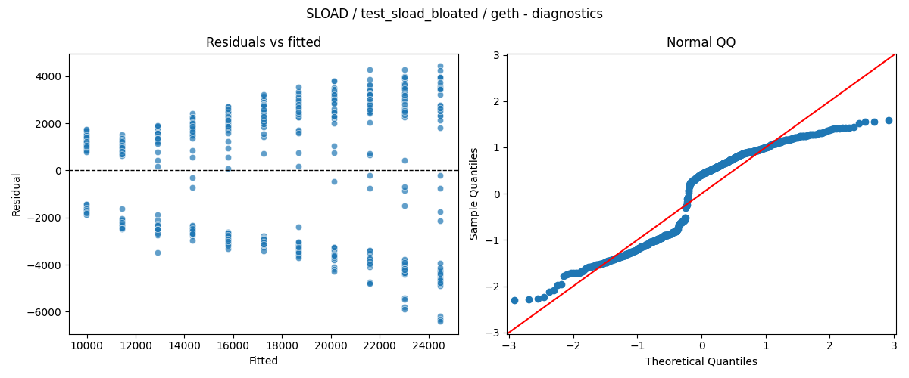

</details>

<details><summary>nethermind — NNLS regression summary</summary>

```
==============================================================================
                           NNLS Regression Results                            
==============================================================================
Dep. Variable:          test_runtime_ms              R-squared:          0.819
Model:                  NNLS                    Adj. R-squared:          0.819
No. Observations:       682                               RMSE:          52.21
Df Residuals:           680                                MAE:          42.01
Df Model:               1      
==============================================================================
                      coef     std err     P-value      [0.025      0.975]
------------------------------------------------------------------------------
         const    129.9899      5.8651       0.001    118.2574    141.3187
       opcount      0.0038      0.0001       0.001      0.0036      0.0039
==============================================================================
Notes: Non-negative least squares with bootstrap inference (1000 iterations)
==============================================================================
```

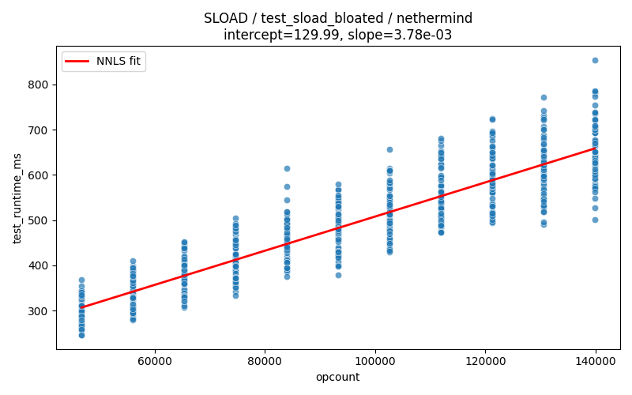

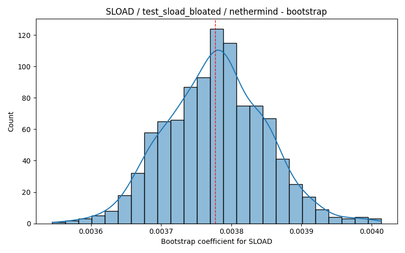

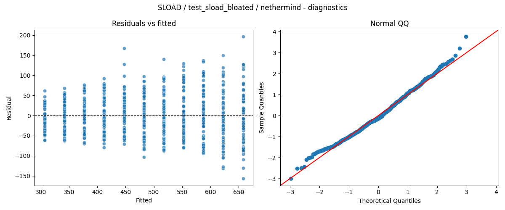

</details>

<details><summary>reth — NNLS regression summary</summary>

```
==============================================================================
                           NNLS Regression Results                            
==============================================================================
Dep. Variable:          test_runtime_ms              R-squared:          0.947
Model:                  NNLS                    Adj. R-squared:          0.947
No. Observations:       1056                              RMSE:           9.05
Df Residuals:           1054                               MAE:           6.92
Df Model:               1      
==============================================================================
                      coef     std err     P-value      [0.025      0.975]
------------------------------------------------------------------------------
         const     39.5671      1.0828       0.001     37.5597     41.6825
       opcount      0.0013      0.0000       0.001      0.0013      0.0013
==============================================================================
Notes: Non-negative least squares with bootstrap inference (1000 iterations)
==============================================================================
```

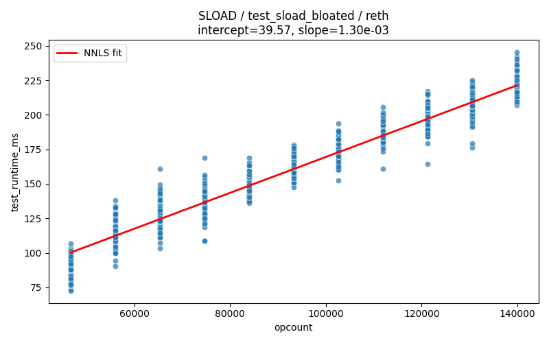

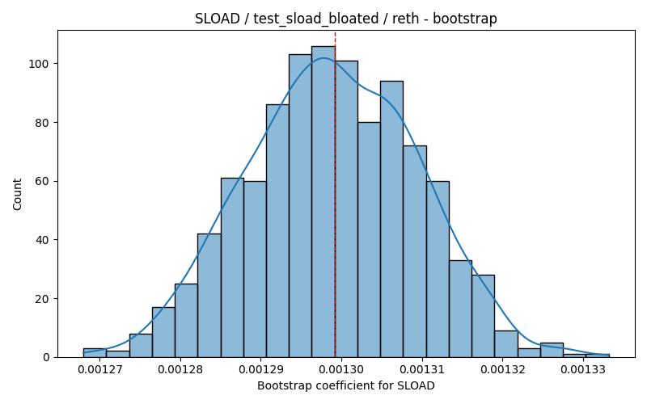

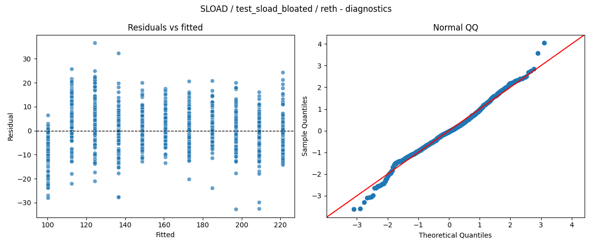

</details>

### test_sload_bloated — combo `True`

| client | nobs | R² | target_coef (ms) | p-value | 95% CI |
| --- | --- | --- | --- | --- | --- |
| `besu` | 286 | 0.8741 | 0.01965 | 1.00e-03 | [0.01868, 0.02055] |
| `erigon` | 418 | 0.9882 | 0.005783 | 1.00e-03 | [0.005728, 0.00584] |
| `geth` | 561 | 0.7063 | 0.1491 | 1.00e-03 | [0.1412, 0.157] |
| `nethermind` | 682 | 0.469 | 0.02223 | 1.00e-03 | [0.02048, 0.02403] |
| `reth` | 1056 | 0.9682 | 0.001454 | 1.00e-03 | [0.001438, 0.001471] |

<details><summary>besu — NNLS regression summary</summary>

```
==============================================================================
                           NNLS Regression Results                            
==============================================================================
Dep. Variable:          test_runtime_ms              R-squared:          0.874
Model:                  NNLS                    Adj. R-squared:          0.874
No. Observations:       286                               RMSE:         219.42
Df Residuals:           284                                MAE:         169.64
Df Model:               1      
==============================================================================
                      coef     std err     P-value      [0.025      0.975]
------------------------------------------------------------------------------
         const    462.0781     40.5182       0.001    385.1484    546.8667
       opcount      0.0196      0.0005       0.001      0.0187      0.0206
==============================================================================
Notes: Non-negative least squares with bootstrap inference (1000 iterations)
==============================================================================
```

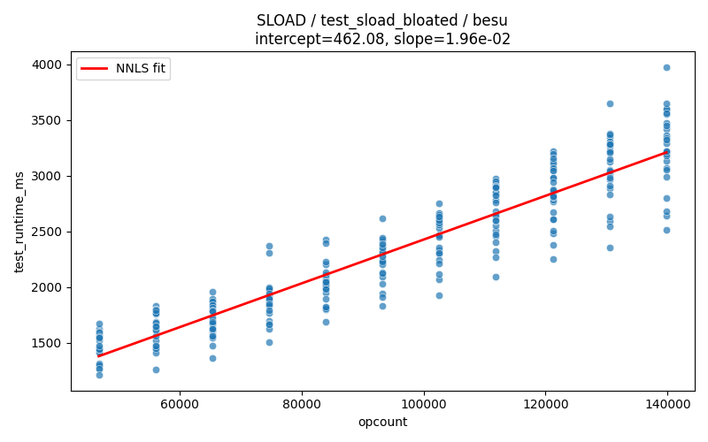

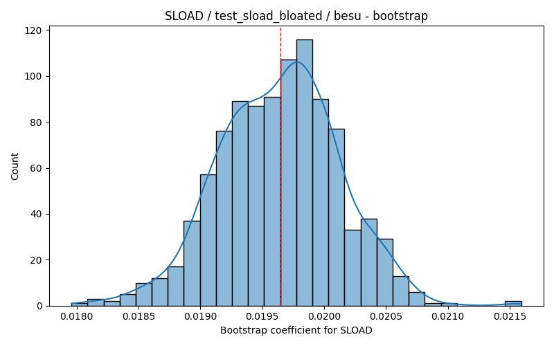

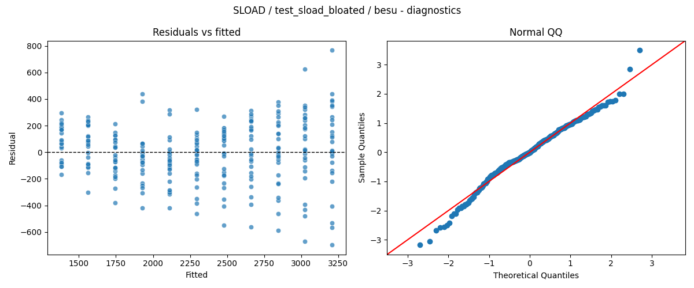

</details>

<details><summary>erigon — NNLS regression summary</summary>

```
==============================================================================
                           NNLS Regression Results                            
==============================================================================
Dep. Variable:          test_runtime_ms              R-squared:          0.988
Model:                  NNLS                    Adj. R-squared:          0.988
No. Observations:       418                               RMSE:          18.63
Df Residuals:           416                                MAE:          15.78
Df Model:               1      
==============================================================================
                      coef     std err     P-value      [0.025      0.975]
------------------------------------------------------------------------------
         const     26.9169      2.7597       0.001     21.3989     32.2661
       opcount      0.0058      0.0000       0.001      0.0057      0.0058
==============================================================================
Notes: Non-negative least squares with bootstrap inference (1000 iterations)
==============================================================================
```

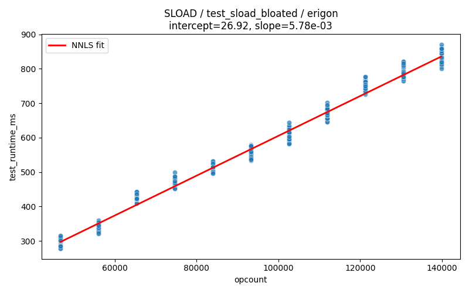

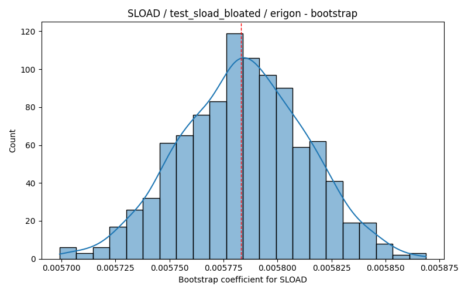

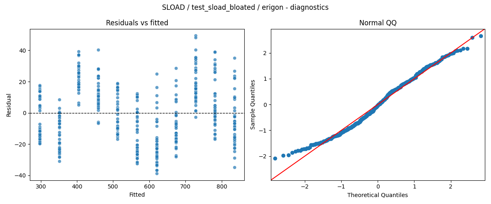

</details>

<details><summary>geth — NNLS regression summary</summary>

```
==============================================================================
                           NNLS Regression Results                            
==============================================================================
Dep. Variable:          test_runtime_ms              R-squared:          0.706
Model:                  NNLS                    Adj. R-squared:          0.706
No. Observations:       561                               RMSE:        2829.03
Df Residuals:           559                                MAE:        2536.01
Df Model:               1      
==============================================================================
                      coef     std err     P-value      [0.025      0.975]
------------------------------------------------------------------------------
         const   2783.6178    325.5915       0.001   2163.1304   3425.7170
       opcount      0.1491      0.0040       0.001      0.1412      0.1570
==============================================================================
Notes: Non-negative least squares with bootstrap inference (1000 iterations)
==============================================================================
```

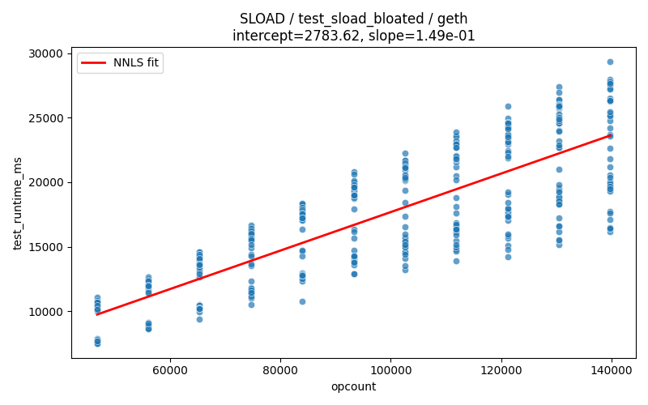

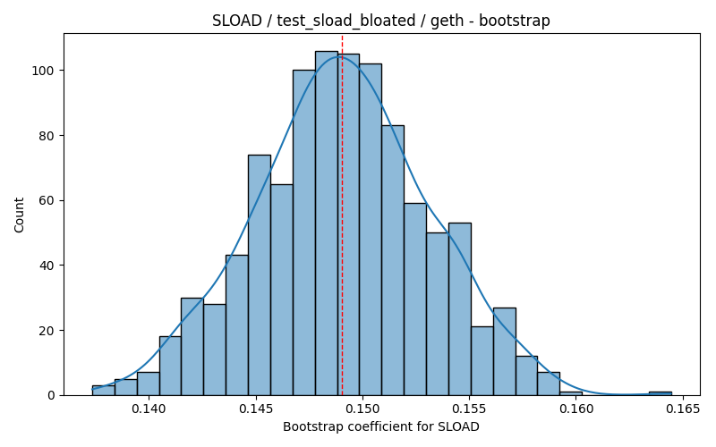

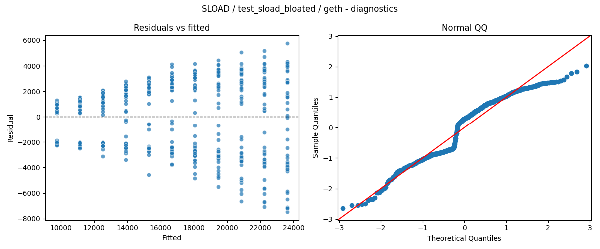

</details>

<details><summary>nethermind — NNLS regression summary</summary>

```
==============================================================================
                           NNLS Regression Results                            
==============================================================================
Dep. Variable:          test_runtime_ms              R-squared:          0.469
Model:                  NNLS                    Adj. R-squared:          0.468
No. Observations:       682                               RMSE:         696.08
Df Residuals:           680                                MAE:         615.75
Df Model:               1      
==============================================================================
                      coef     std err     P-value      [0.025      0.975]
------------------------------------------------------------------------------
         const   1386.7932     82.8999       0.001   1221.8237   1544.9483
       opcount      0.0222      0.0009       0.001      0.0205      0.0240
==============================================================================
Notes: Non-negative least squares with bootstrap inference (1000 iterations)
==============================================================================
```

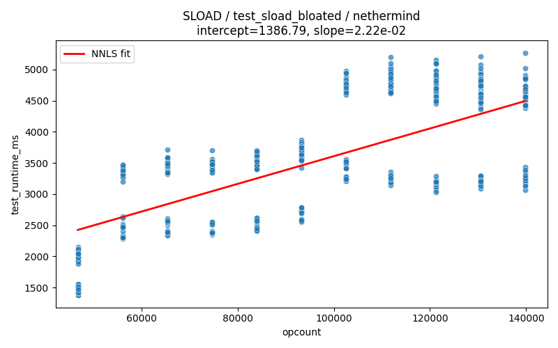

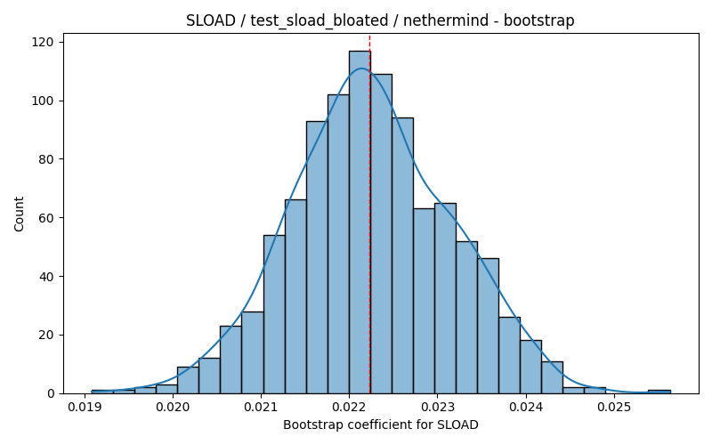

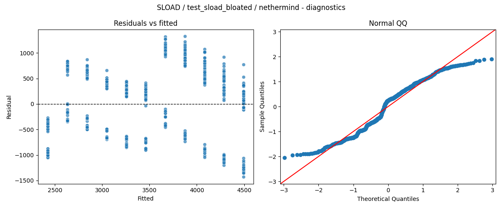

</details>

<details><summary>reth — NNLS regression summary</summary>

```
==============================================================================
                           NNLS Regression Results                            
==============================================================================
Dep. Variable:          test_runtime_ms              R-squared:          0.968
Model:                  NNLS                    Adj. R-squared:          0.968
No. Observations:       1056                              RMSE:           7.76
Df Residuals:           1054                               MAE:           5.99
Df Model:               1      
==============================================================================
                      coef     std err     P-value      [0.025      0.975]
------------------------------------------------------------------------------
         const     29.5400      0.7122       0.001     28.0631     30.8418
       opcount      0.0015      0.0000       0.001      0.0014      0.0015
==============================================================================
Notes: Non-negative least squares with bootstrap inference (1000 iterations)
==============================================================================
```

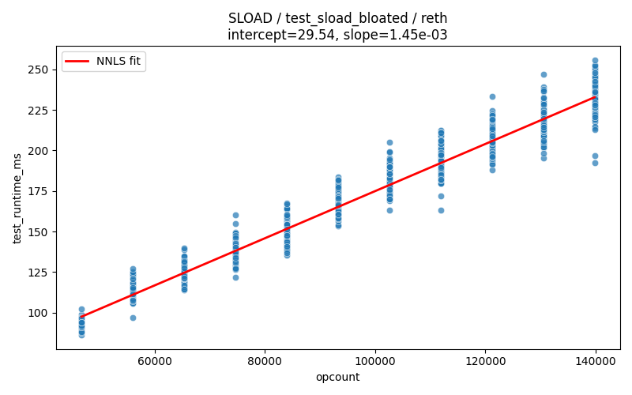

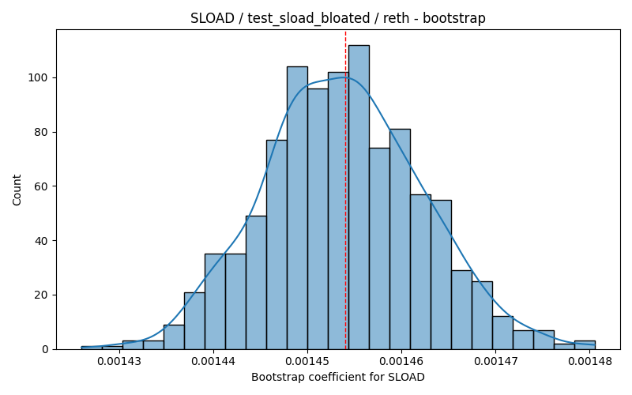

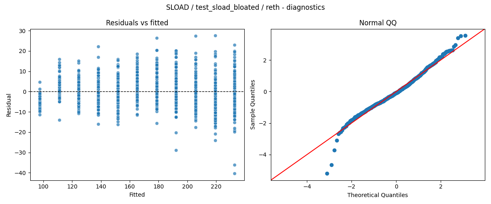

</details>

### test_storage_sload_same_key_benchmark

| client | nobs | R² | target_coef (ms) | p-value | 95% CI |
| --- | --- | --- | --- | --- | --- |
| `besu` | 572 | 0.6146 | 0.0001202 | 1.00e-03 | [0.0001124, 0.0001279] |
| `erigon` | 836 | 0.8589 | 5.021e-05 | 1.00e-03 | [4.876e-05, 5.165e-05] |
| `geth` | 1122 | 0.9812 | 0.0002154 | 1.00e-03 | [0.0002135, 0.0002172] |
| `nethermind` | 1364 | 0.6883 | 0.0001661 | 1.00e-03 | [0.0001594, 0.000172] |
| `reth` | 2112 | 0.6868 | 5.23e-06 | 1.00e-03 | [5.086e-06, 5.379e-06] |

<details><summary>besu — NNLS regression summary</summary>

```
==============================================================================
                           NNLS Regression Results                            
==============================================================================
Dep. Variable:          test_runtime_ms              R-squared:          0.615
Model:                  NNLS                    Adj. R-squared:          0.614
No. Observations:       572                               RMSE:          60.13
Df Residuals:           570                                MAE:          46.19
Df Model:               1      
==============================================================================
                      coef     std err     P-value      [0.025      0.975]
------------------------------------------------------------------------------
         const    117.1462      7.9426       0.001    101.5263    132.6318
       opcount      0.0001      0.0000       0.001      0.0001      0.0001
==============================================================================
Notes: Non-negative least squares with bootstrap inference (1000 iterations)
==============================================================================
```

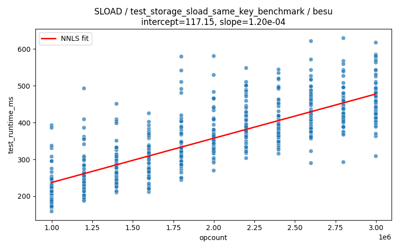

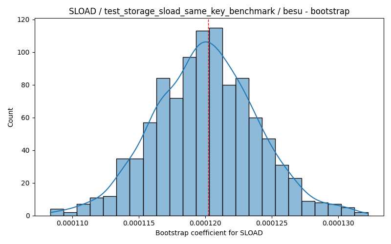

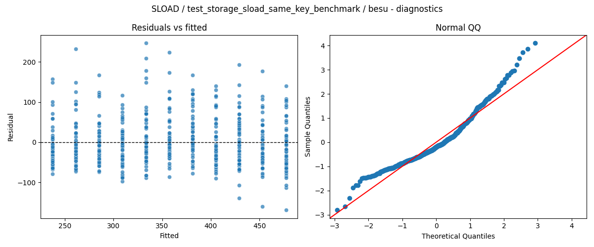

</details>

<details><summary>erigon — NNLS regression summary</summary>

```
==============================================================================
                           NNLS Regression Results                            
==============================================================================
Dep. Variable:          test_runtime_ms              R-squared:          0.859
Model:                  NNLS                    Adj. R-squared:          0.859
No. Observations:       836                               RMSE:          12.85
Df Residuals:           834                                MAE:           9.74
Df Model:               1      
==============================================================================
                      coef     std err     P-value      [0.025      0.975]
------------------------------------------------------------------------------
         const     36.6993      1.3347       0.001     34.1760     39.2963
       opcount      0.0001      0.0000       0.001      0.0000      0.0001
==============================================================================
Notes: Non-negative least squares with bootstrap inference (1000 iterations)
==============================================================================
```

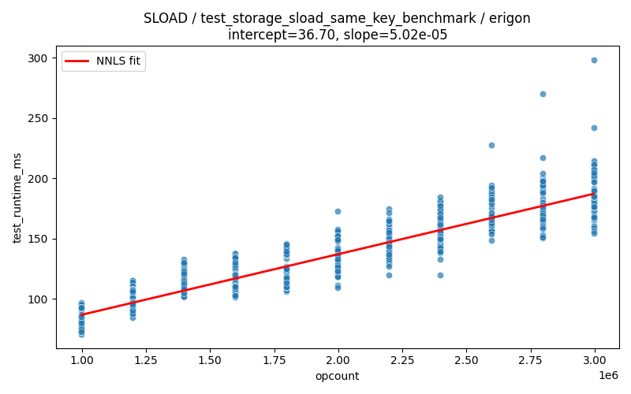

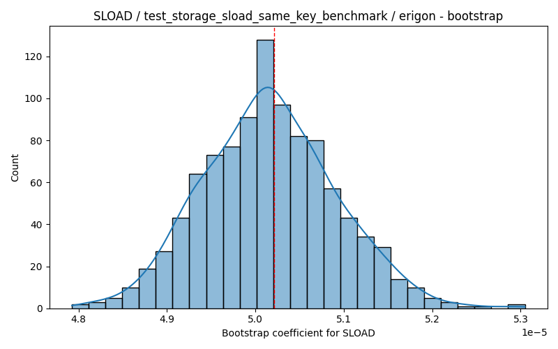

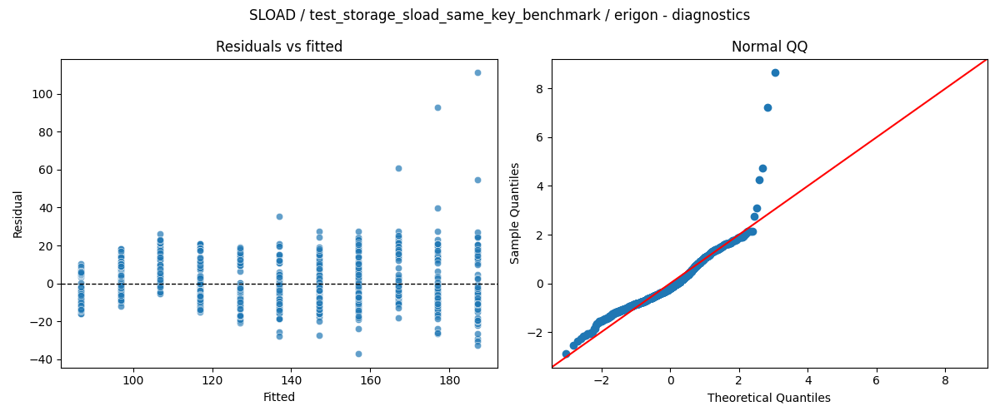

</details>

<details><summary>geth — NNLS regression summary</summary>

```
==============================================================================
                           NNLS Regression Results                            
==============================================================================
Dep. Variable:          test_runtime_ms              R-squared:          0.981
Model:                  NNLS                    Adj. R-squared:          0.981
No. Observations:       1122                              RMSE:          18.81
Df Residuals:           1120                               MAE:          14.35
Df Model:               1      
==============================================================================
                      coef     std err     P-value      [0.025      0.975]
------------------------------------------------------------------------------
         const     13.1431      1.7426       0.001      9.7495     16.6272
       opcount      0.0002      0.0000       0.001      0.0002      0.0002
==============================================================================
Notes: Non-negative least squares with bootstrap inference (1000 iterations)
==============================================================================
```

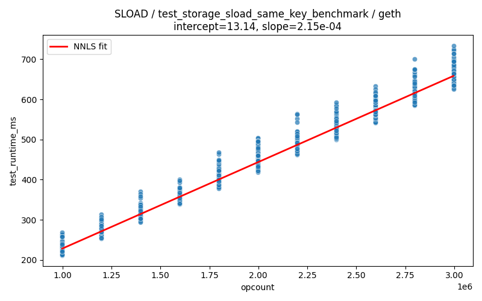

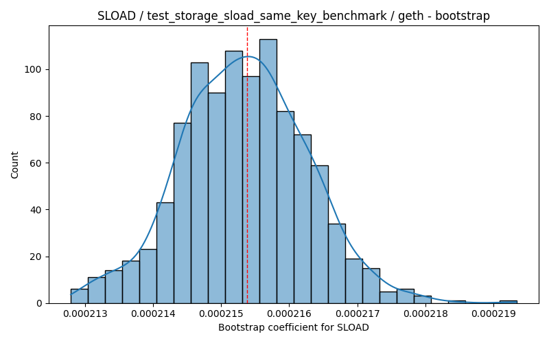

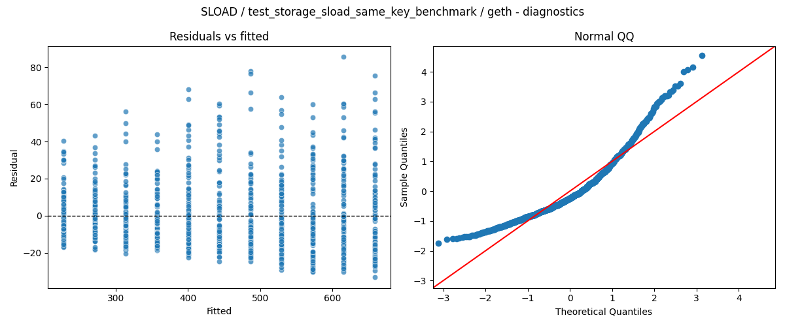

</details>

<details><summary>nethermind — NNLS regression summary</summary>

```
==============================================================================
                           NNLS Regression Results                            
==============================================================================
Dep. Variable:          test_runtime_ms              R-squared:          0.688
Model:                  NNLS                    Adj. R-squared:          0.688
No. Observations:       1364                              RMSE:          70.58
Df Residuals:           1362                               MAE:          56.15
Df Model:               1      
==============================================================================
                      coef     std err     P-value      [0.025      0.975]
------------------------------------------------------------------------------
         const     97.0840      5.7093       0.001     86.1547    109.0415
       opcount      0.0002      0.0000       0.001      0.0002      0.0002
==============================================================================
Notes: Non-negative least squares with bootstrap inference (1000 iterations)
==============================================================================
```

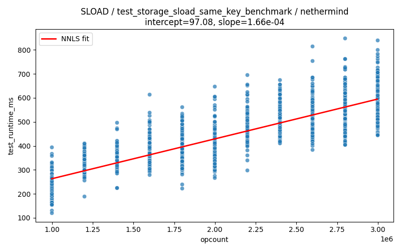

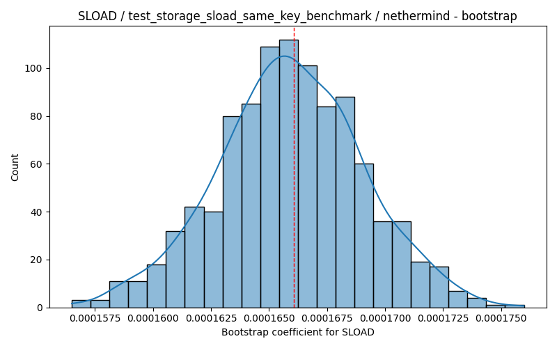

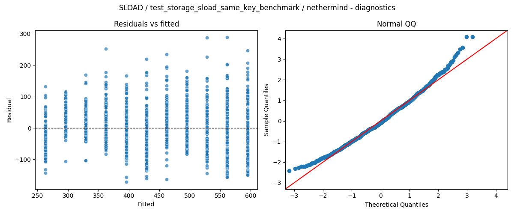

</details>

<details><summary>reth — NNLS regression summary</summary>

```
==============================================================================
                           NNLS Regression Results                            
==============================================================================
Dep. Variable:          test_runtime_ms              R-squared:          0.687
Model:                  NNLS                    Adj. R-squared:          0.687
No. Observations:       2112                              RMSE:           2.23
Df Residuals:           2110                               MAE:           1.59
Df Model:               1      
==============================================================================
                      coef     std err     P-value      [0.025      0.975]
------------------------------------------------------------------------------
         const      5.4808      0.1498       0.001      5.1982      5.7654
       opcount      0.0000      0.0000       0.001      0.0000      0.0000
==============================================================================
Notes: Non-negative least squares with bootstrap inference (1000 iterations)
==============================================================================
```

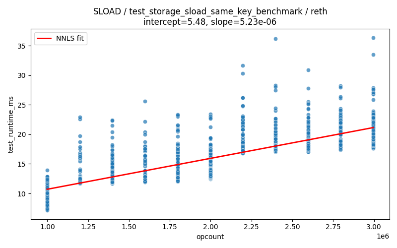

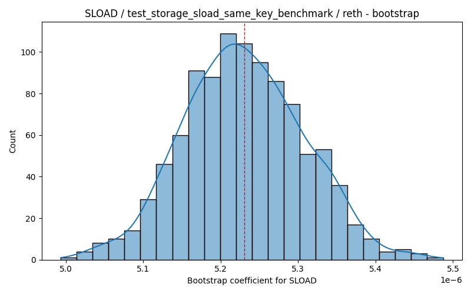

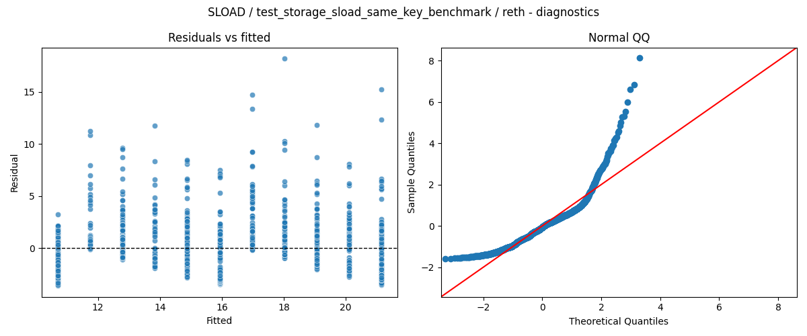

</details>

## SSTORE

### test_sstore_bloated — combo `False`

| client | nobs | R² | target_coef (ms) | p-value | 95% CI |
| --- | --- | --- | --- | --- | --- |
| `besu` | 572 | 0.8339 | 0.009452 | 1.00e-03 | [0.008999, 0.009887] |
| `erigon` | 836 | 0.9411 | 0 | 1.00e+00 | [0, 0] |
| `geth` | 1122 | 0.9276 | 0.0427 | 1.00e-03 | [0.04123, 0.04406] |
| `nethermind` | 1364 | 0.8771 | 0.003696 | 1.00e-03 | [0.0036, 0.003787] |
| `reth` | 2112 | 0.5949 | 0 | 1.00e+00 | [0, 0.0001261] |

<details><summary>besu — NNLS regression summary</summary>

```
==============================================================================
                           NNLS Regression Results                            
==============================================================================
Dep. Variable:          test_runtime_ms              R-squared:          0.834
Model:                  NNLS                    Adj. R-squared:          0.833
No. Observations:       572                               RMSE:         152.98
Df Residuals:           569                                MAE:         123.84
Df Model:               2      
==============================================================================
                      coef     std err     P-value      [0.025      0.975]
------------------------------------------------------------------------------
         const    492.7413     18.0867       0.001    457.1890    527.0264
       opcount      0.0095      0.0002       0.001      0.0090      0.0099
        update      0.1384      0.0110       0.001      0.1172      0.1594
==============================================================================
Notes: Non-negative least squares with bootstrap inference (1000 iterations)
==============================================================================
```

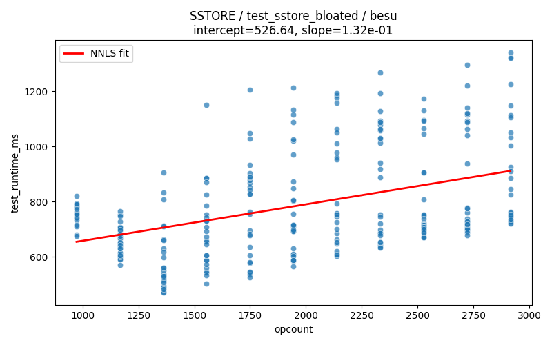

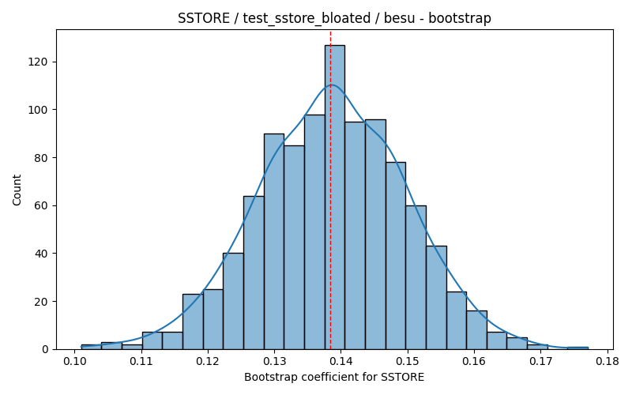

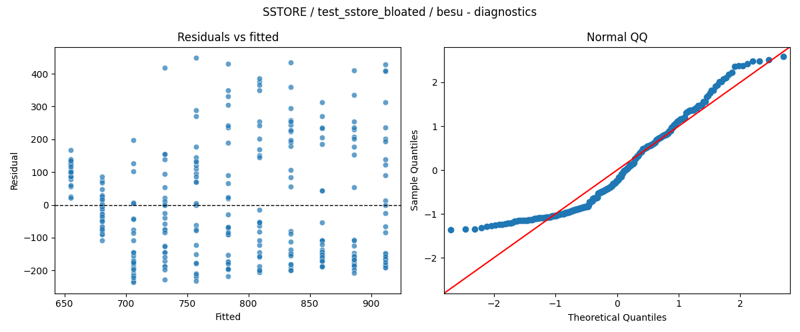

</details>

<details><summary>erigon — NNLS regression summary</summary>

```
==============================================================================
                           NNLS Regression Results                            
==============================================================================
Dep. Variable:          test_runtime_ms              R-squared:          0.941
Model:                  NNLS                    Adj. R-squared:          0.941
No. Observations:       836                               RMSE:         545.60
Df Residuals:           833                                MAE:         400.12
Df Model:               2      
==============================================================================
                      coef     std err     P-value      [0.025      0.975]
------------------------------------------------------------------------------
         const    753.8964     15.9677       0.001    725.3425    784.9618
       opcount      0.0000      0.0000       1.000      0.0000      0.0000
        update      2.0488      0.0157       0.001      2.0201      2.0821
==============================================================================
Notes: Non-negative least squares with bootstrap inference (1000 iterations)
==============================================================================
```

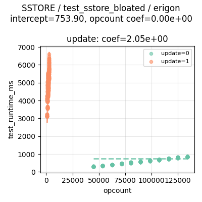

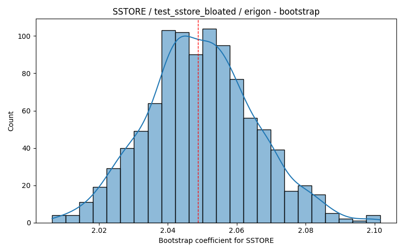

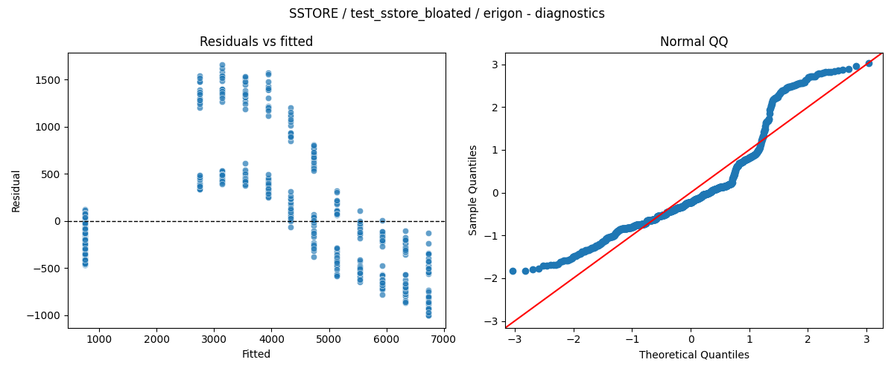

</details>

<details><summary>geth — NNLS regression summary</summary>

```
==============================================================================
                           NNLS Regression Results                            
==============================================================================
Dep. Variable:          test_runtime_ms              R-squared:          0.928
Model:                  NNLS                    Adj. R-squared:          0.927
No. Observations:       1122                              RMSE:         528.63
Df Residuals:           1119                               MAE:         394.43
Df Model:               2      
==============================================================================
                      coef     std err     P-value      [0.025      0.975]
------------------------------------------------------------------------------
         const    630.0482     49.6126       0.001    535.6707    731.1343
       opcount      0.0427      0.0007       0.001      0.0412      0.0441
        update      0.1860      0.0230       0.001      0.1389      0.2313
==============================================================================
Notes: Non-negative least squares with bootstrap inference (1000 iterations)
==============================================================================
```

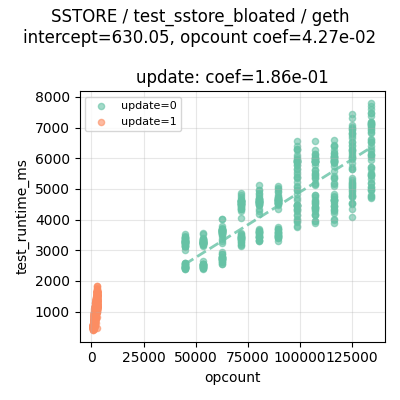

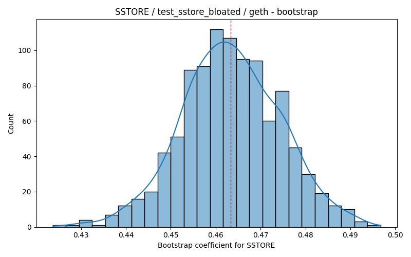

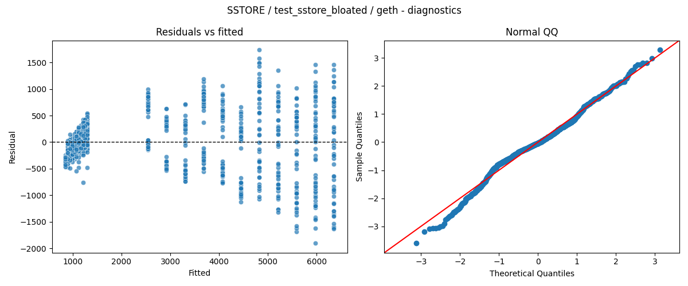

</details>

<details><summary>nethermind — NNLS regression summary</summary>

```
==============================================================================
                           NNLS Regression Results                            
==============================================================================
Dep. Variable:          test_runtime_ms              R-squared:          0.877
Model:                  NNLS                    Adj. R-squared:          0.877
No. Observations:       1364                              RMSE:          49.01
Df Residuals:           1361                               MAE:          39.21
Df Model:               2      
==============================================================================
                      coef     std err     P-value      [0.025      0.975]
------------------------------------------------------------------------------
         const    130.8827      3.8856       0.001    123.2967    138.6365
       opcount      0.0037      0.0000       0.001      0.0036      0.0038
        update      0.0585      0.0021       0.001      0.0544      0.0624
==============================================================================
Notes: Non-negative least squares with bootstrap inference (1000 iterations)
==============================================================================
```

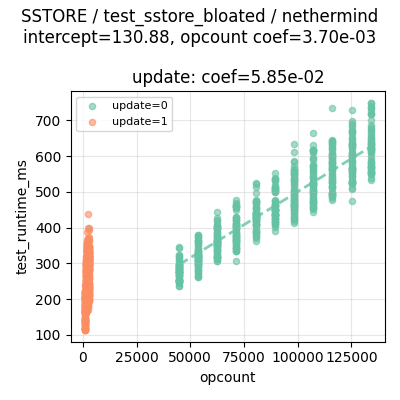

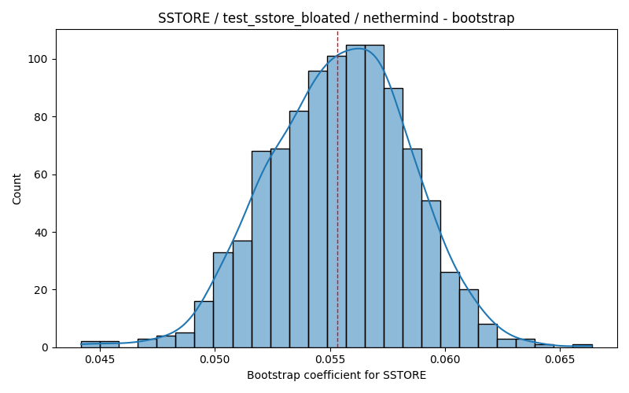

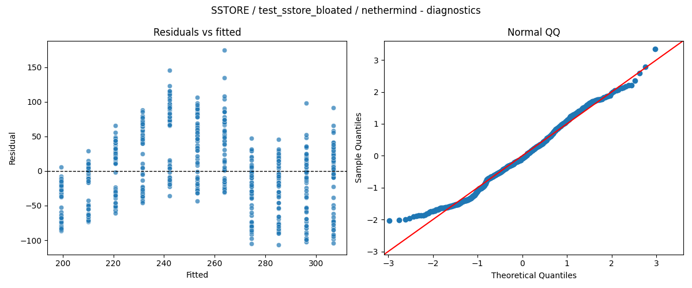

</details>

<details><summary>reth — NNLS regression summary</summary>

```
==============================================================================
                           NNLS Regression Results                            
==============================================================================
Dep. Variable:          test_runtime_ms              R-squared:          0.595
Model:                  NNLS                    Adj. R-squared:          0.595
No. Observations:       2112                              RMSE:          61.97
Df Residuals:           2109                               MAE:          38.98
Df Model:               2      
==============================================================================
                      coef     std err     P-value      [0.025      0.975]
------------------------------------------------------------------------------
         const    171.1556      4.3500       0.001    158.4398    174.3654
       opcount      0.0000      0.0000       1.000      0.0000      0.0001
        update      0.0706      0.0016       0.001      0.0695      0.0754
==============================================================================
Notes: Non-negative least squares with bootstrap inference (1000 iterations)
==============================================================================
```

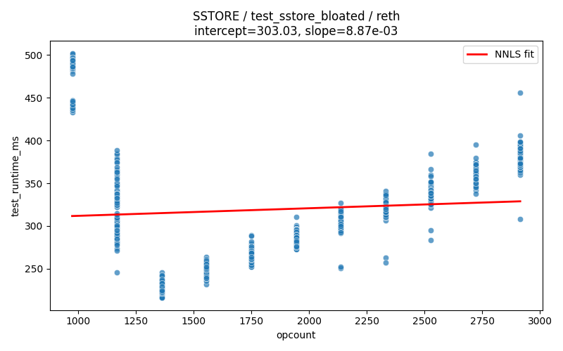

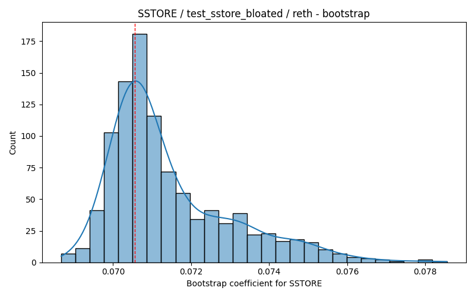

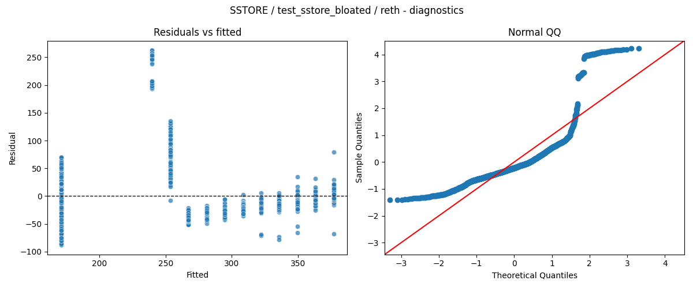

</details>

### test_sstore_bloated — combo `True`

| client | nobs | R² | target_coef (ms) | p-value | 95% CI |
| --- | --- | --- | --- | --- | --- |
| `besu` | 572 | 0.9744 | 0.01902 | 1.00e-03 | [0.01804, 0.01996] |
| `erigon` | 836 | 0.9942 | 0 | 1.00e+00 | [0, 0] |
| `geth` | 1122 | 0.8068 | 0.03544 | 1.00e-03 | [0.03397, 0.03685] |
| `nethermind` | 1364 | 0.5779 | 0.02591 | 1.00e-03 | [0.02458, 0.02716] |
| `reth` | 2112 | 0.9952 | 0 | 1.00e+00 | [0, 0] |

<details><summary>besu — NNLS regression summary</summary>

```
==============================================================================
                           NNLS Regression Results                            
==============================================================================
Dep. Variable:          test_runtime_ms              R-squared:          0.974
Model:                  NNLS                    Adj. R-squared:          0.974
No. Observations:       572                               RMSE:         283.29
Df Residuals:           569                                MAE:         222.40
Df Model:               2      
==============================================================================
                      coef     std err     P-value      [0.025      0.975]
------------------------------------------------------------------------------
         const    814.1376     41.6062       0.001    735.0054    897.2925
       opcount      0.0190      0.0005       0.001      0.0180      0.0200
        update      0.0938      0.0007       0.001      0.0922      0.0952
==============================================================================
Notes: Non-negative least squares with bootstrap inference (1000 iterations)
==============================================================================
```

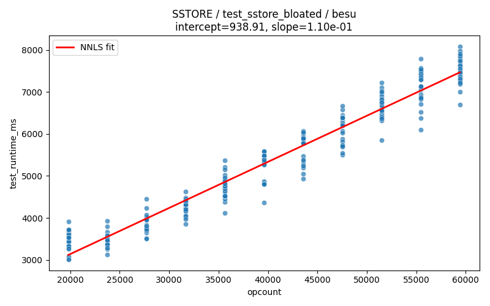

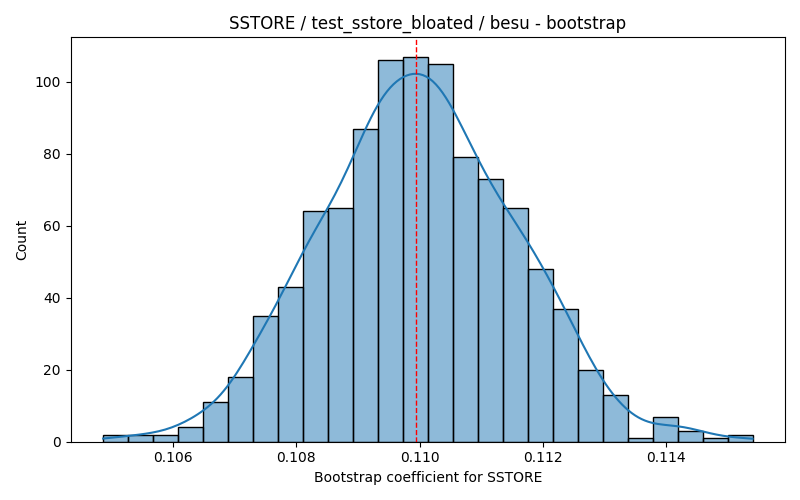

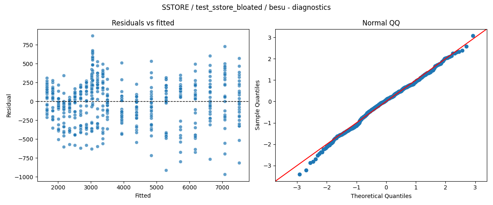

</details>

<details><summary>erigon — NNLS regression summary</summary>

```
==============================================================================
                           NNLS Regression Results                            
==============================================================================
Dep. Variable:          test_runtime_ms              R-squared:          0.994
Model:                  NNLS                    Adj. R-squared:          0.994
No. Observations:       836                               RMSE:        1125.47
Df Residuals:           833                                MAE:         873.85
Df Model:               2      
==============================================================================
                      coef     std err     P-value      [0.025      0.975]
------------------------------------------------------------------------------
         const    971.8490     33.9179       0.001    907.8962   1039.7750
       opcount      0.0000      0.0000       1.000      0.0000      0.0000
        update      0.6803      0.0019       0.001      0.6766      0.6840
==============================================================================
Notes: Non-negative least squares with bootstrap inference (1000 iterations)
==============================================================================
```

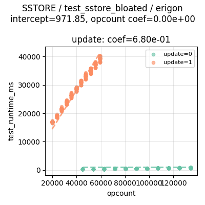

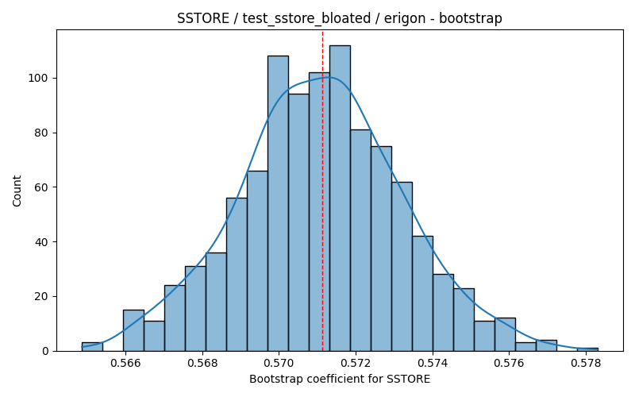

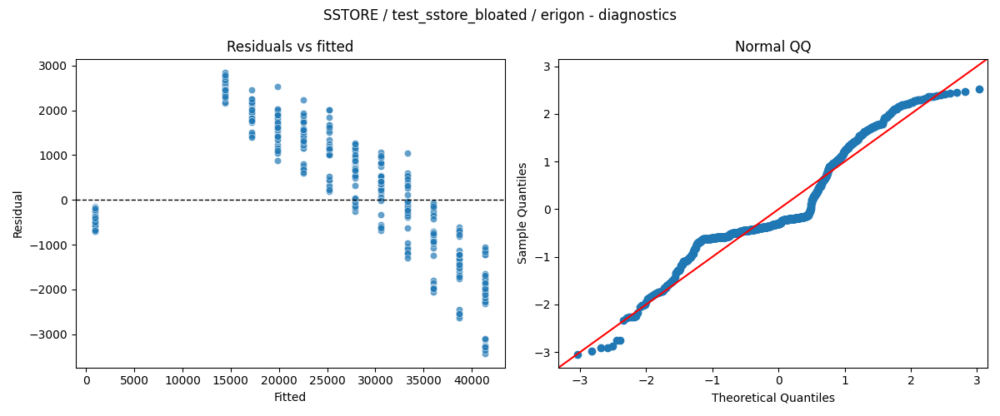

</details>

<details><summary>geth — NNLS regression summary</summary>

```
==============================================================================
                           NNLS Regression Results                            
==============================================================================
Dep. Variable:          test_runtime_ms              R-squared:          0.807
Model:                  NNLS                    Adj. R-squared:          0.806
No. Observations:       1122                              RMSE:         588.26
Df Residuals:           1119                               MAE:         454.99
Df Model:               2      
==============================================================================
                      coef     std err     P-value      [0.025      0.975]
------------------------------------------------------------------------------
         const   1151.1844     55.3070       0.001   1042.4892   1257.0677
       opcount      0.0354      0.0008       0.001      0.0340      0.0369
        update      0.0646      0.0009       0.001      0.0630      0.0663
==============================================================================
Notes: Non-negative least squares with bootstrap inference (1000 iterations)
==============================================================================
```

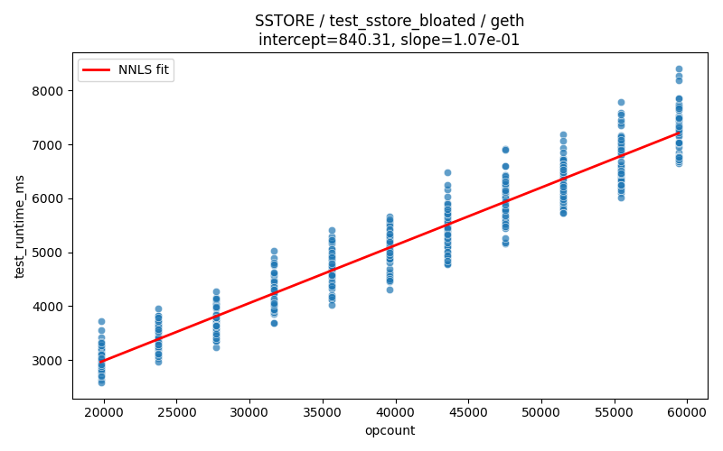

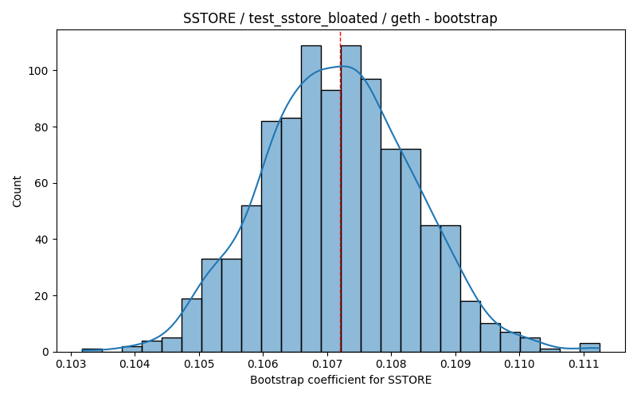

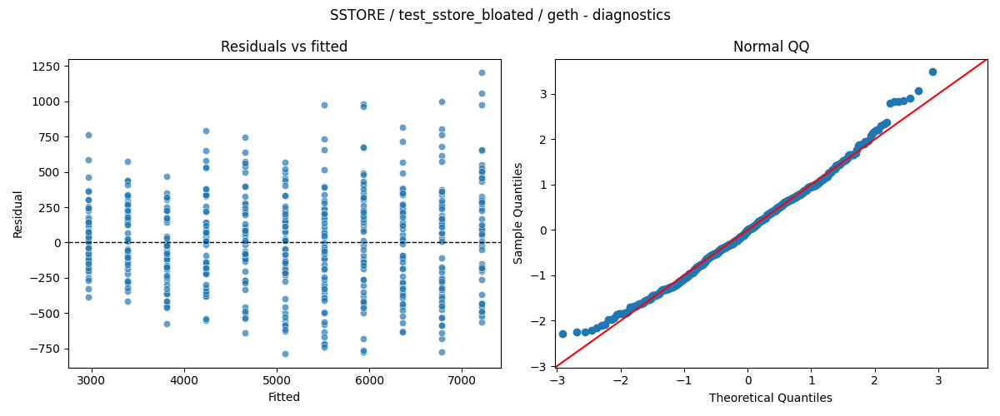

</details>

<details><summary>nethermind — NNLS regression summary</summary>

```
==============================================================================
                           NNLS Regression Results                            
==============================================================================
Dep. Variable:          test_runtime_ms              R-squared:          0.578
Model:                  NNLS                    Adj. R-squared:          0.577
No. Observations:       1364                              RMSE:         619.09
Df Residuals:           1361                               MAE:         521.13
Df Model:               2      
==============================================================================
                      coef     std err     P-value      [0.025      0.975]
------------------------------------------------------------------------------
         const   1032.1689     51.8729       0.001    939.3234   1136.0122
       opcount      0.0259      0.0007       0.001      0.0246      0.0272
        update      0.0312      0.0010       0.001      0.0293      0.0333
==============================================================================
Notes: Non-negative least squares with bootstrap inference (1000 iterations)
==============================================================================
```

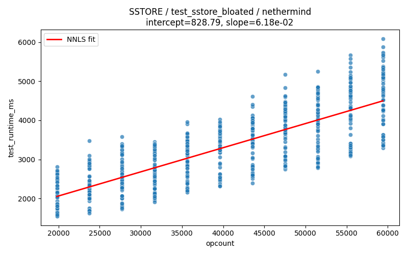

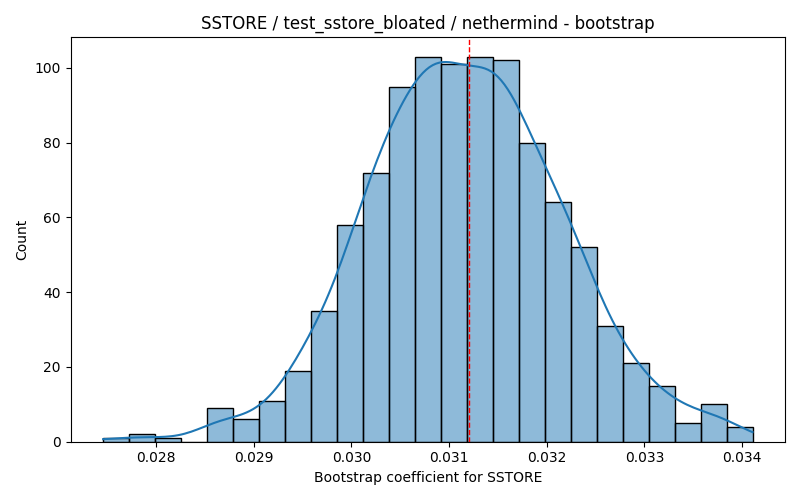

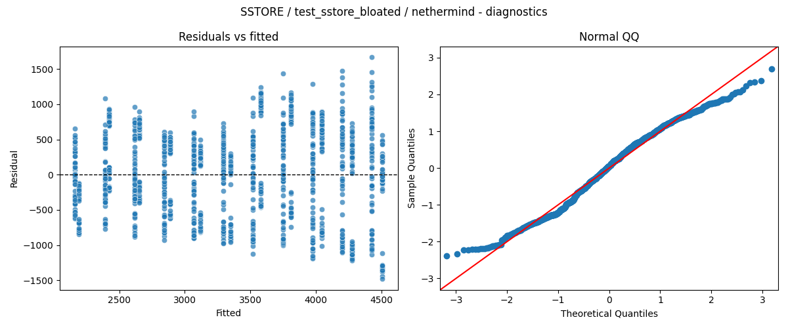

</details>

<details><summary>reth — NNLS regression summary</summary>

```
==============================================================================
                           NNLS Regression Results                            
==============================================================================
Dep. Variable:          test_runtime_ms              R-squared:          0.995
Model:                  NNLS                    Adj. R-squared:          0.995
No. Observations:       2112                              RMSE:         258.24
Df Residuals:           2109                               MAE:         192.85
Df Model:               2      
==============================================================================
                      coef     std err     P-value      [0.025      0.975]
------------------------------------------------------------------------------
         const    257.5851      4.9957       0.001    248.8958    268.3601
       opcount      0.0000      0.0000       1.000      0.0000      0.0000
        update      0.1712      0.0003       0.001      0.1707      0.1718
==============================================================================
Notes: Non-negative least squares with bootstrap inference (1000 iterations)
==============================================================================
```


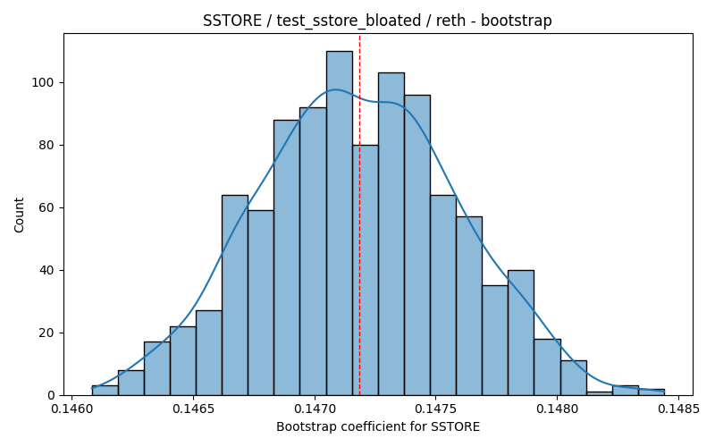

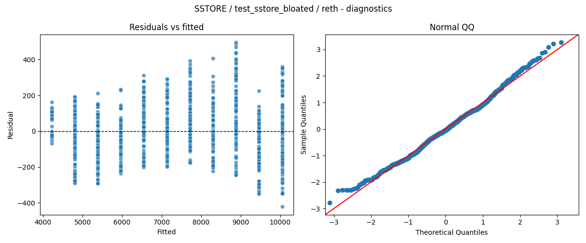

</details>

## BALANCE

### test_account_access — combo `BALANCE_AccountMode.EXISTING_EOA`

| client | nobs | R² | target_coef (ms) | p-value | 95% CI |
| --- | --- | --- | --- | --- | --- |
| `besu` | 286 | 0.6401 | 0.01768 | 1.00e-03 | [0.01603, 0.01933] |
| `erigon` | 418 | 0.9955 | 0.009916 | 1.00e-03 | [0.009855, 0.009982] |
| `geth` | 561 | 0.6608 | 0.0113 | 1.00e-03 | [0.01063, 0.01197] |
| `nethermind` | 682 | 0.749 | 0.004967 | 1.00e-03 | [0.004731, 0.005183] |
| `reth` | 1056 | 0.9755 | 0.001092 | 1.00e-03 | [0.001082, 0.001104] |

<details><summary>besu — NNLS regression summary</summary>

```
==============================================================================
                           NNLS Regression Results                            
==============================================================================
Dep. Variable:          test_runtime_ms              R-squared:          0.640
Model:                  NNLS                    Adj. R-squared:          0.639
No. Observations:       286                               RMSE:         316.75
Df Residuals:           284                                MAE:         236.17
Df Model:               1      
==============================================================================
                      coef     std err     P-value      [0.025      0.975]
------------------------------------------------------------------------------
         const    383.7500     57.8061       0.001    269.8517    494.4449
       opcount      0.0177      0.0008       0.001      0.0160      0.0193
==============================================================================
Notes: Non-negative least squares with bootstrap inference (1000 iterations)
==============================================================================
```

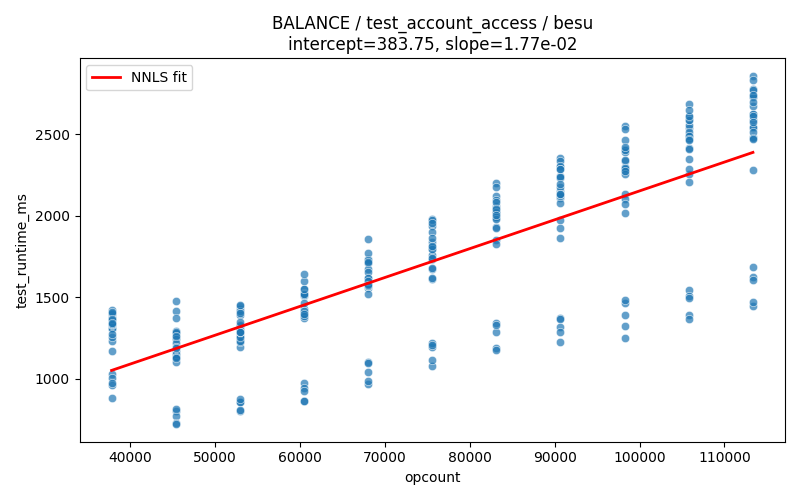

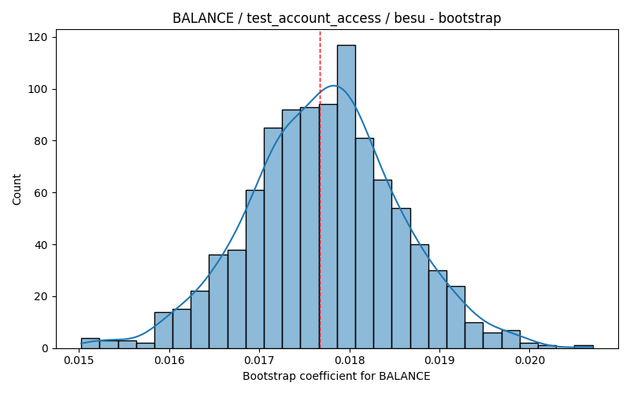

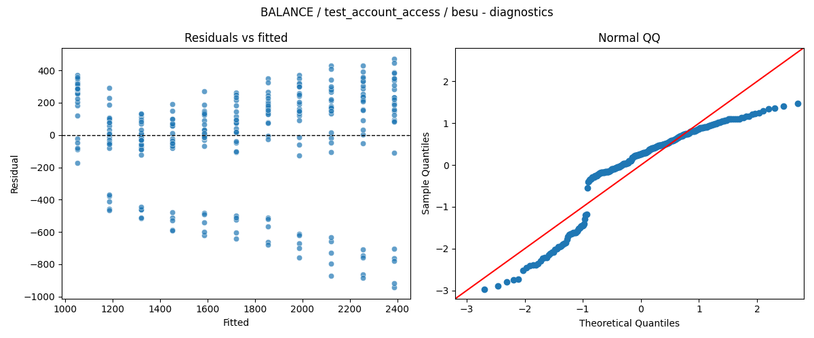

</details>

<details><summary>erigon — NNLS regression summary</summary>

```
==============================================================================
                           NNLS Regression Results                            
==============================================================================
Dep. Variable:          test_runtime_ms              R-squared:          0.996
Model:                  NNLS                    Adj. R-squared:          0.996
No. Observations:       418                               RMSE:          15.91
Df Residuals:           416                                MAE:          12.56
Df Model:               1      
==============================================================================
                      coef     std err     P-value      [0.025      0.975]
------------------------------------------------------------------------------
         const     31.8878      2.2641       0.001     27.2408     36.0670
       opcount      0.0099      0.0000       0.001      0.0099      0.0100
==============================================================================
Notes: Non-negative least squares with bootstrap inference (1000 iterations)
==============================================================================
```


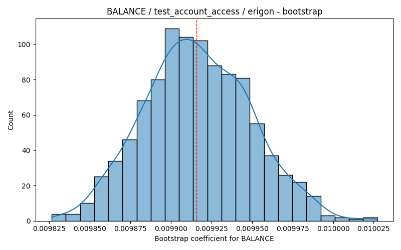

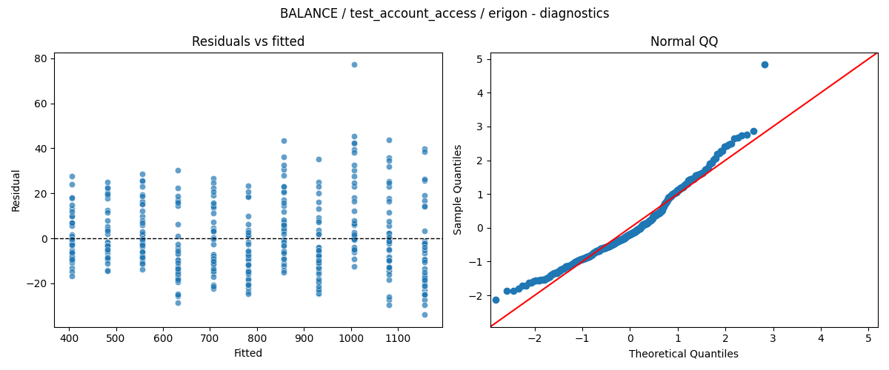

</details>

<details><summary>geth — NNLS regression summary</summary>

```
==============================================================================
                           NNLS Regression Results                            
==============================================================================
Dep. Variable:          test_runtime_ms              R-squared:          0.661
Model:                  NNLS                    Adj. R-squared:          0.660
No. Observations:       561                               RMSE:         193.46
Df Residuals:           559                                MAE:         162.93
Df Model:               1      
==============================================================================
                      coef     std err     P-value      [0.025      0.975]
------------------------------------------------------------------------------
         const    524.7151     26.3305       0.001    469.6947    575.4908
       opcount      0.0113      0.0003       0.001      0.0106      0.0120
==============================================================================
Notes: Non-negative least squares with bootstrap inference (1000 iterations)
==============================================================================
```

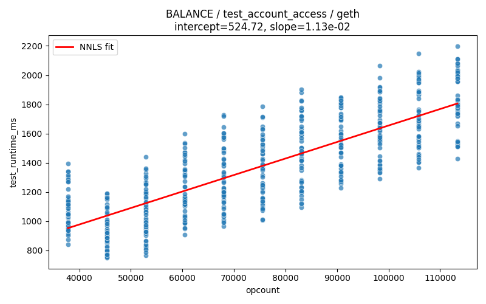

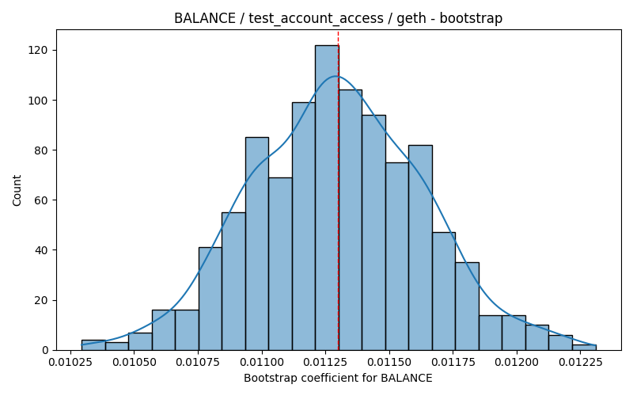

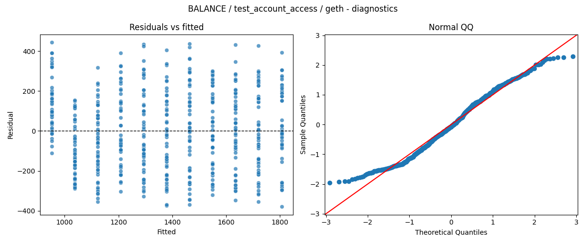

</details>

<details><summary>nethermind — NNLS regression summary</summary>

```
==============================================================================
                           NNLS Regression Results                            
==============================================================================
Dep. Variable:          test_runtime_ms              R-squared:          0.749
Model:                  NNLS                    Adj. R-squared:          0.749
No. Observations:       682                               RMSE:          68.73
Df Residuals:           680                                MAE:          52.72
Df Model:               1      
==============================================================================
                      coef     std err     P-value      [0.025      0.975]
------------------------------------------------------------------------------
         const     49.5620      7.6070       0.001     36.1407     64.8940
       opcount      0.0050      0.0001       0.001      0.0047      0.0052
==============================================================================
Notes: Non-negative least squares with bootstrap inference (1000 iterations)
==============================================================================
```

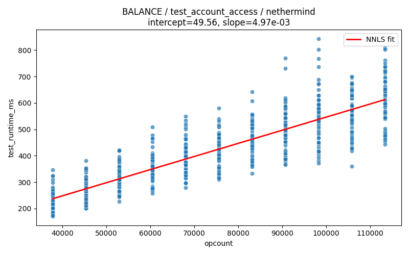

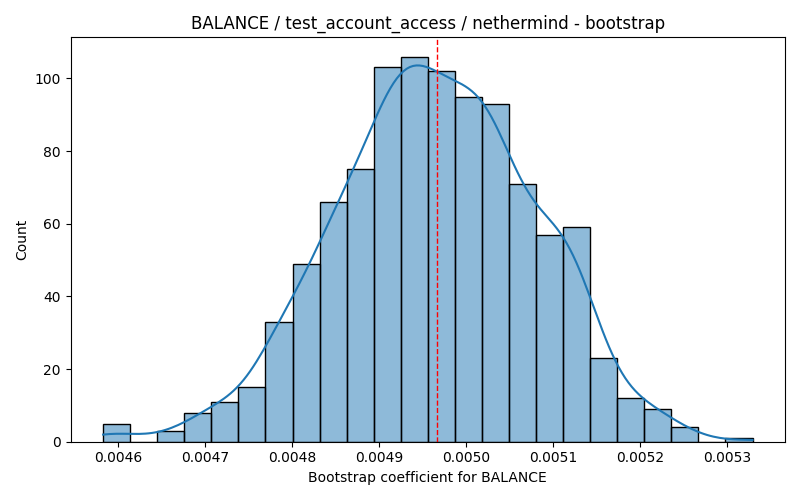

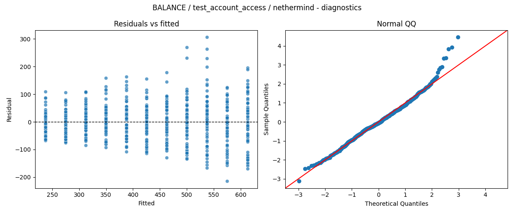

</details>

<details><summary>reth — NNLS regression summary</summary>

```
==============================================================================
                           NNLS Regression Results                            
==============================================================================
Dep. Variable:          test_runtime_ms              R-squared:          0.976
Model:                  NNLS                    Adj. R-squared:          0.976
No. Observations:       1056                              RMSE:           4.13
Df Residuals:           1054                               MAE:           3.28
Df Model:               1      
==============================================================================
                      coef     std err     P-value      [0.025      0.975]
------------------------------------------------------------------------------
         const     31.7664      0.4441       0.001     30.8985     32.5988
       opcount      0.0011      0.0000       0.001      0.0011      0.0011
==============================================================================
Notes: Non-negative least squares with bootstrap inference (1000 iterations)
==============================================================================
```

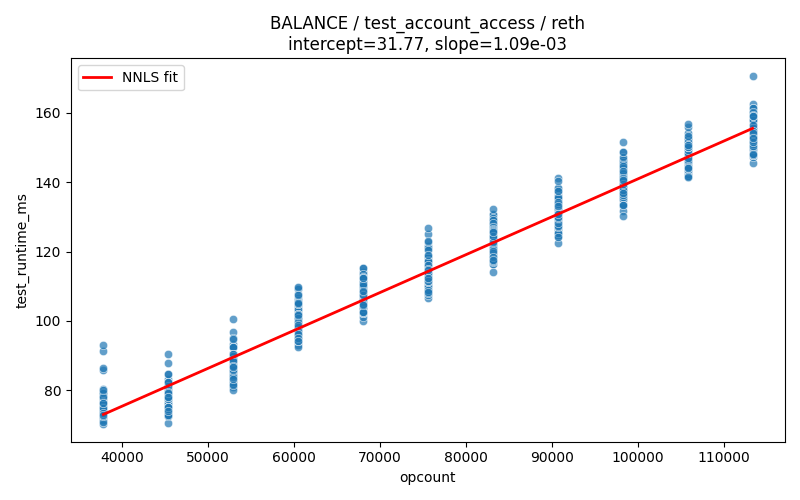

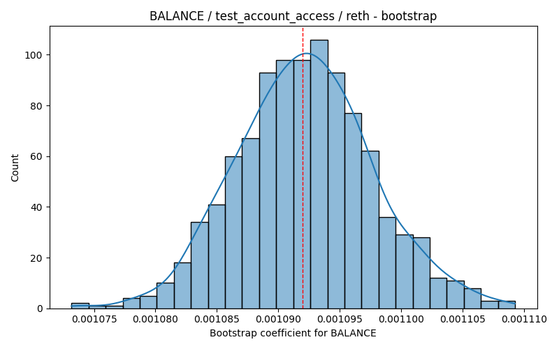

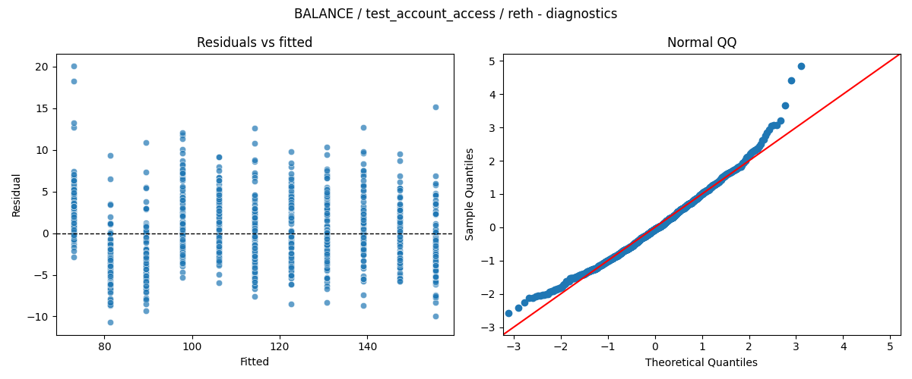

</details>

### test_account_access — combo `BALANCE_AccountMode.NON_EXISTING_ACCOUNT` — `presets[cold_account_nocode_access]`

| client | nobs | R² | target_coef (ms) | p-value | 95% CI |
| --- | --- | --- | --- | --- | --- |
| `besu` | 286 | 0.8583 | 0.01085 | 1.00e-03 | [0.01032, 0.01141] |
| `erigon` | 418 | 0.9956 | 0.009141 | 1.00e-03 | [0.009083, 0.009197] |
| `geth` | 561 | 0.5552 | 0.02944 | 1.00e-03 | [0.02726, 0.03173] |
| `nethermind` | 682 | 0.757 | 0.004563 | 1.00e-03 | [0.004375, 0.004769] |
| `reth` | 1056 | 0.9715 | 0.0009166 | 1.00e-03 | [0.0009067, 0.0009257] |

<details><summary>besu — NNLS regression summary</summary>

```
==============================================================================
                           NNLS Regression Results                            
==============================================================================
Dep. Variable:          test_runtime_ms              R-squared:          0.858
Model:                  NNLS                    Adj. R-squared:          0.858
No. Observations:       286                               RMSE:         105.40
Df Residuals:           284                                MAE:          86.82
Df Model:               1      
==============================================================================
                      coef     std err     P-value      [0.025      0.975]
------------------------------------------------------------------------------
         const    374.8198     21.5301       0.001    330.7917    416.0005
       opcount      0.0109      0.0003       0.001      0.0103      0.0114
==============================================================================
Notes: Non-negative least squares with bootstrap inference (1000 iterations)
==============================================================================
```

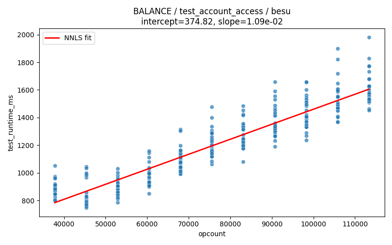

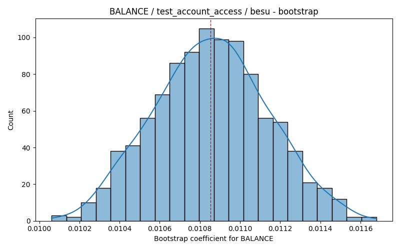

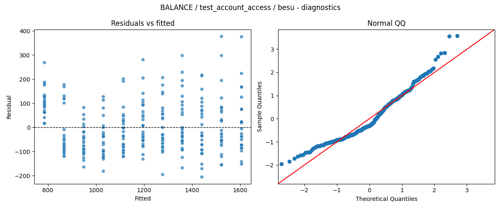

</details>

<details><summary>erigon — NNLS regression summary</summary>

```
==============================================================================
                           NNLS Regression Results                            
==============================================================================
Dep. Variable:          test_runtime_ms              R-squared:          0.996
Model:                  NNLS                    Adj. R-squared:          0.996
No. Observations:       418                               RMSE:          14.45
Df Residuals:           416                                MAE:          11.24
Df Model:               1      
==============================================================================
                      coef     std err     P-value      [0.025      0.975]
------------------------------------------------------------------------------
         const      5.7861      2.1275       0.002      1.6130     10.0649
       opcount      0.0091      0.0000       0.001      0.0091      0.0092
==============================================================================
Notes: Non-negative least squares with bootstrap inference (1000 iterations)
==============================================================================
```

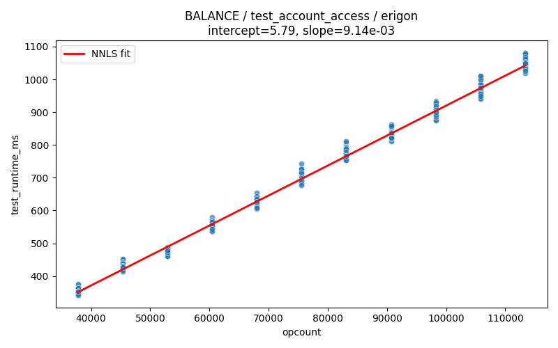

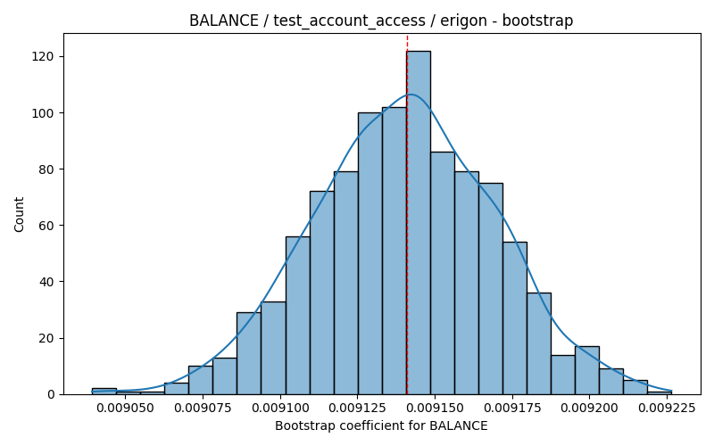

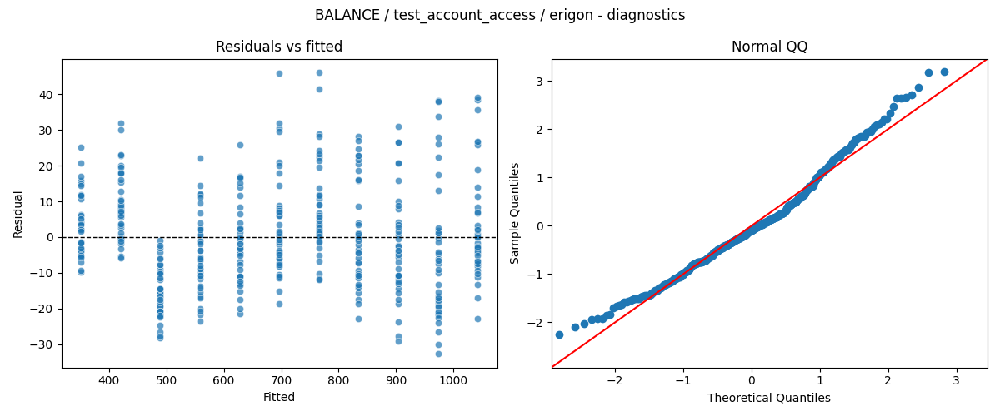

</details>

<details><summary>geth — NNLS regression summary</summary>

```
==============================================================================
                           NNLS Regression Results                            
==============================================================================
Dep. Variable:          test_runtime_ms              R-squared:          0.555
Model:                  NNLS                    Adj. R-squared:          0.554
No. Observations:       561                               RMSE:         629.67
Df Residuals:           559                                MAE:         511.06
Df Model:               1      
==============================================================================
                      coef     std err     P-value      [0.025      0.975]
------------------------------------------------------------------------------
         const   1520.2162     82.8407       0.001   1356.3773   1678.4405
       opcount      0.0294      0.0011       0.001      0.0273      0.0317
==============================================================================
Notes: Non-negative least squares with bootstrap inference (1000 iterations)
==============================================================================
```

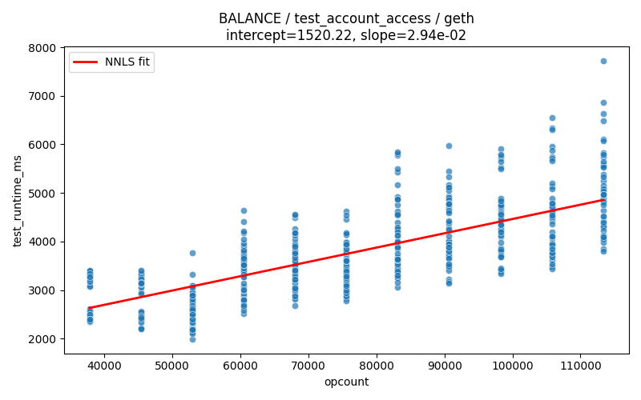

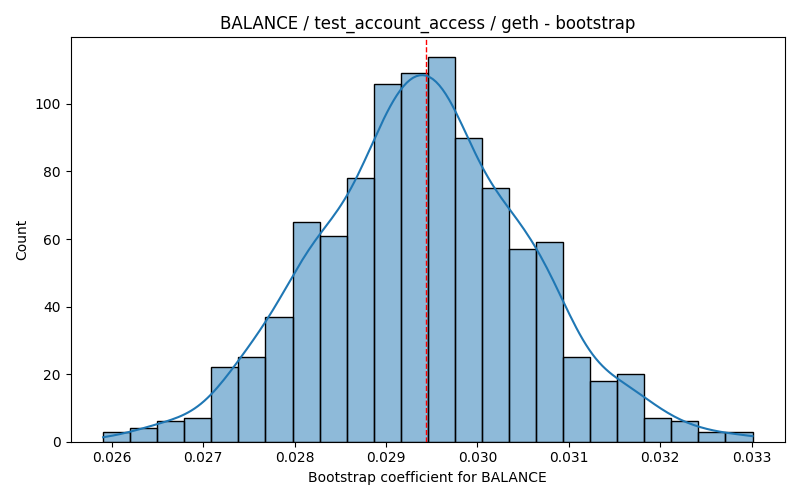

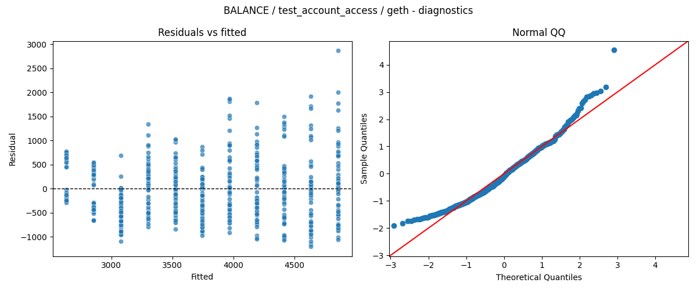

</details>

<details><summary>nethermind — NNLS regression summary</summary>

```
==============================================================================
                           NNLS Regression Results                            
==============================================================================
Dep. Variable:          test_runtime_ms              R-squared:          0.757
Model:                  NNLS                    Adj. R-squared:          0.757
No. Observations:       682                               RMSE:          61.79
Df Residuals:           680                                MAE:          47.91
Df Model:               1      
==============================================================================
                      coef     std err     P-value      [0.025      0.975]
------------------------------------------------------------------------------
         const     58.1813      6.7663       0.001     44.9972     70.5402
       opcount      0.0046      0.0001       0.001      0.0044      0.0048
==============================================================================
Notes: Non-negative least squares with bootstrap inference (1000 iterations)
==============================================================================
```

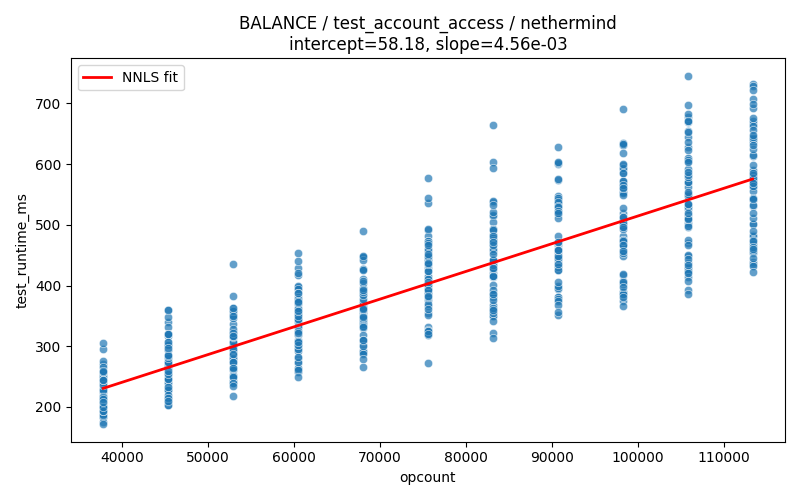

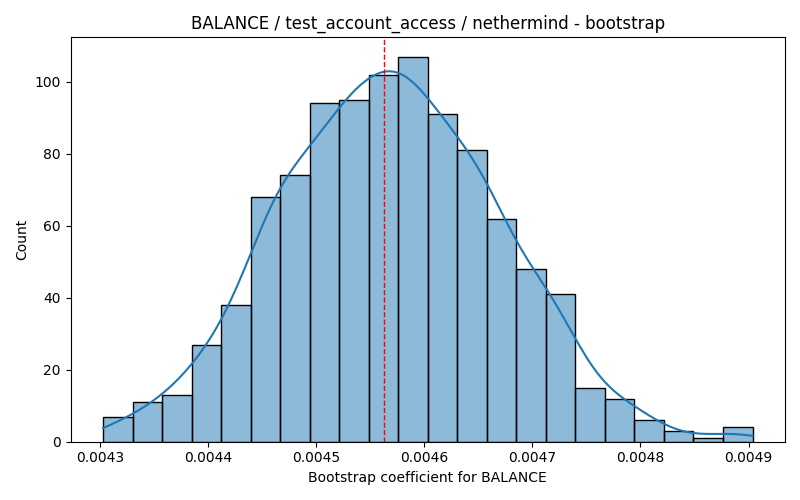

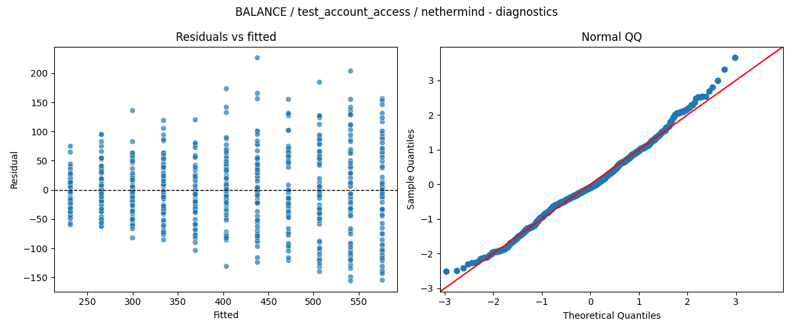

</details>

<details><summary>reth — NNLS regression summary</summary>

```
==============================================================================
                           NNLS Regression Results                            
==============================================================================
Dep. Variable:          test_runtime_ms              R-squared:          0.972
Model:                  NNLS                    Adj. R-squared:          0.972
No. Observations:       1056                              RMSE:           3.75
Df Residuals:           1054                               MAE:           2.98
Df Model:               1      
==============================================================================
                      coef     std err     P-value      [0.025      0.975]
------------------------------------------------------------------------------
         const     31.8838      0.3819       0.001     31.1985     32.6860
       opcount      0.0009      0.0000       0.001      0.0009      0.0009
==============================================================================
Notes: Non-negative least squares with bootstrap inference (1000 iterations)
==============================================================================
```

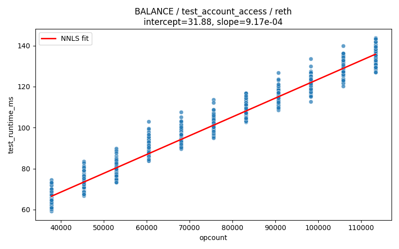

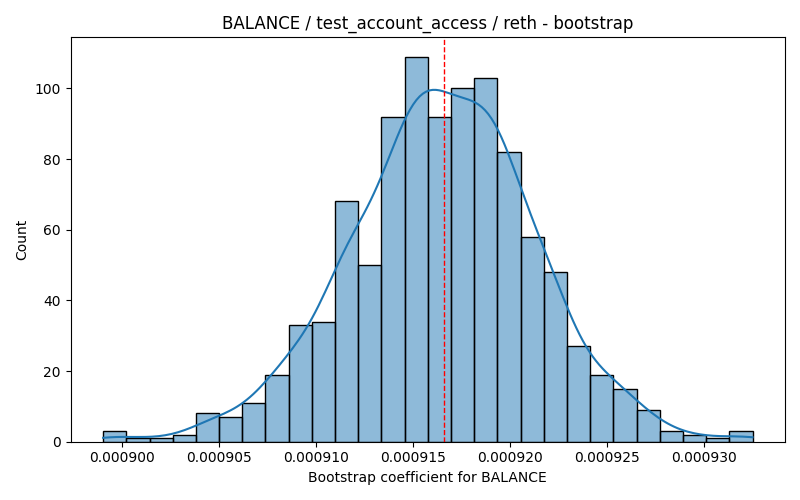

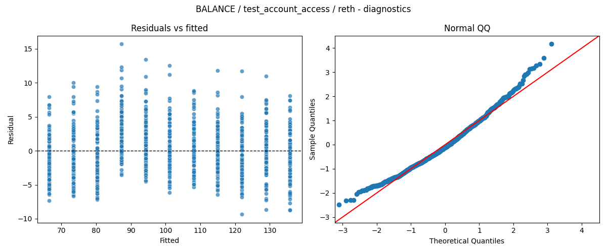

</details>

### test_account_access — combo `BALANCE_AccountMode.EXISTING_CONTRACT`

| client | nobs | R² | target_coef (ms) | p-value | 95% CI |
| --- | --- | --- | --- | --- | --- |
| `besu` | 286 | 0.8861 | 0.0308 | 1.00e-03 | [0.02937, 0.03211] |
| `erigon` | 418 | 0.8955 | 0.03619 | 1.00e-03 | [0.03497, 0.03725] |
| `geth` | 561 | 0.6498 | 0.03565 | 1.00e-03 | [0.03313, 0.03786] |
| `nethermind` | 682 | 0.7871 | 0.01997 | 1.00e-03 | [0.01921, 0.02073] |
| `reth` | 1056 | 0.779 | 0.03047 | 1.00e-03 | [0.02942, 0.03146] |

<details><summary>besu — NNLS regression summary</summary>

```
==============================================================================
                           NNLS Regression Results                            
==============================================================================
Dep. Variable:          test_runtime_ms              R-squared:          0.886
Model:                  NNLS                    Adj. R-squared:          0.886
No. Observations:       286                               RMSE:         229.69
Df Residuals:           284                                MAE:         182.14
Df Model:               1      
==============================================================================
                      coef     std err     P-value      [0.025      0.975]
------------------------------------------------------------------------------
         const    472.2463     44.5780       0.001    386.6881    558.3061
       opcount      0.0308      0.0007       0.001      0.0294      0.0321
==============================================================================
Notes: Non-negative least squares with bootstrap inference (1000 iterations)
==============================================================================
```

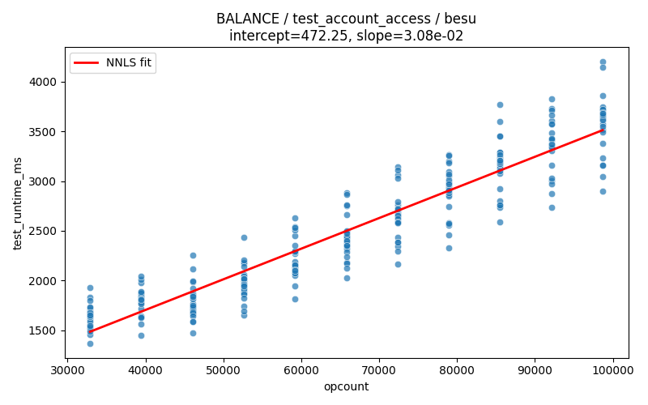

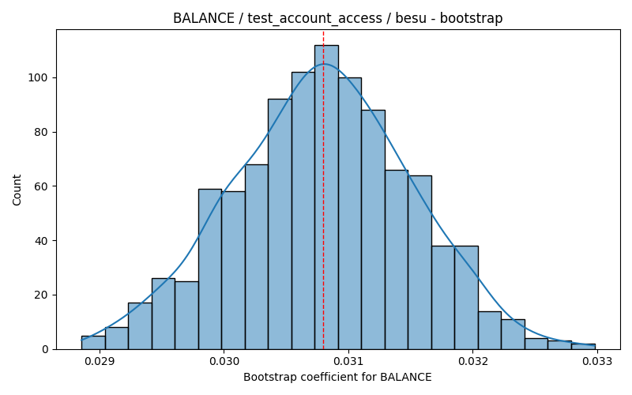

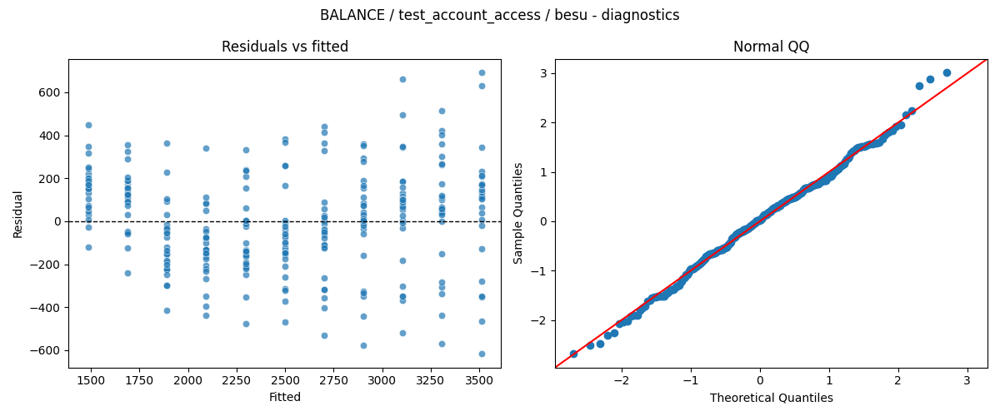

</details>

<details><summary>erigon — NNLS regression summary</summary>

```
==============================================================================
                           NNLS Regression Results                            
==============================================================================
Dep. Variable:          test_runtime_ms              R-squared:          0.895
Model:                  NNLS                    Adj. R-squared:          0.895
No. Observations:       418                               RMSE:         257.24
Df Residuals:           416                                MAE:         216.38
Df Model:               1      
==============================================================================
                      coef     std err     P-value      [0.025      0.975]
------------------------------------------------------------------------------
         const    441.3811     43.3037       0.001    363.5905    533.7210
       opcount      0.0362      0.0006       0.001      0.0350      0.0372
==============================================================================
Notes: Non-negative least squares with bootstrap inference (1000 iterations)
==============================================================================
```

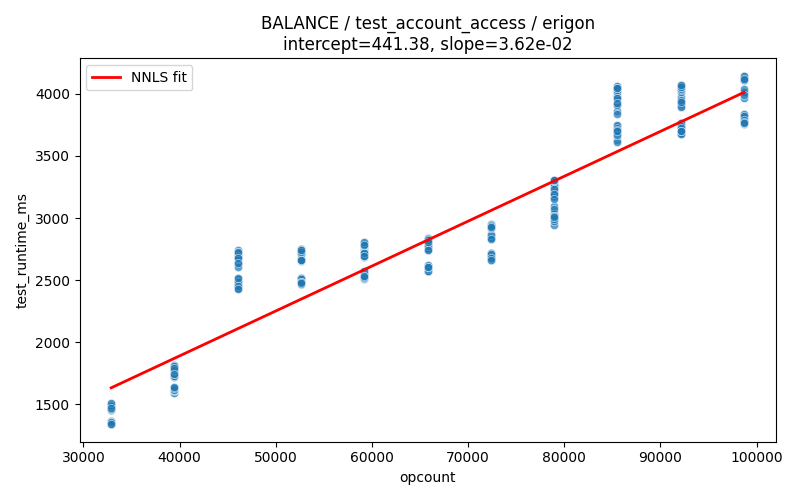

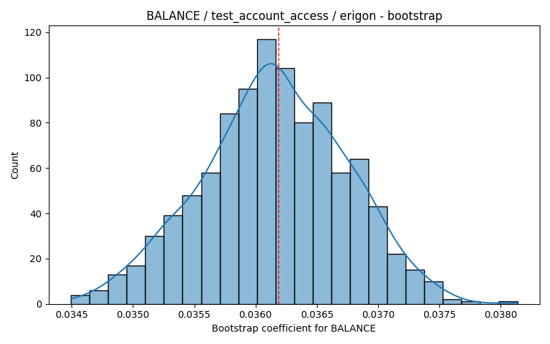

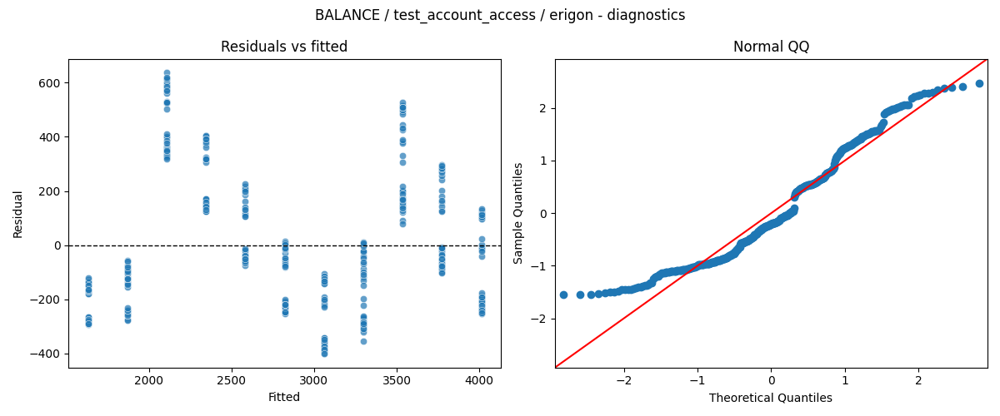

</details>

<details><summary>geth — NNLS regression summary</summary>

```
==============================================================================
                           NNLS Regression Results                            
==============================================================================
Dep. Variable:          test_runtime_ms              R-squared:          0.650
Model:                  NNLS                    Adj. R-squared:          0.649
No. Observations:       561                               RMSE:         544.54
Df Residuals:           559                                MAE:         452.89
Df Model:               1      
==============================================================================
                      coef     std err     P-value      [0.025      0.975]
------------------------------------------------------------------------------
         const   1245.6960     73.7741       0.001   1104.9690   1402.1920
       opcount      0.0357      0.0012       0.001      0.0331      0.0379
==============================================================================
Notes: Non-negative least squares with bootstrap inference (1000 iterations)
==============================================================================
```

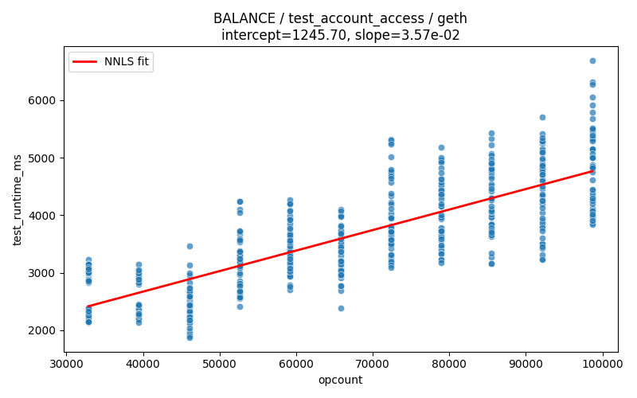

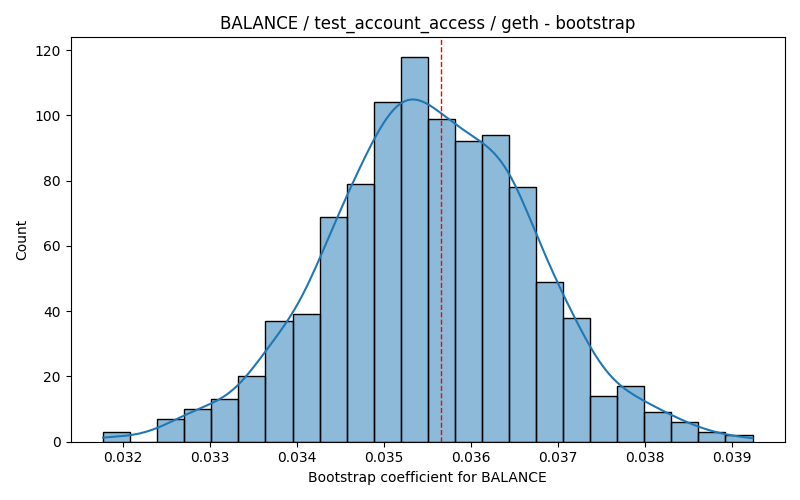

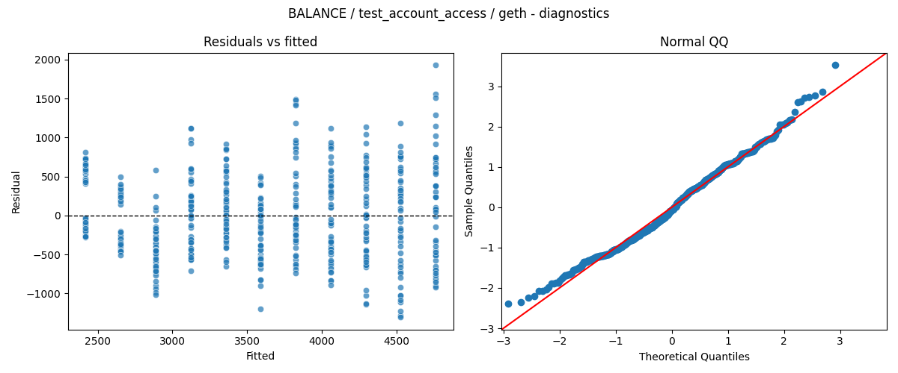

</details>

<details><summary>nethermind — NNLS regression summary</summary>

```
==============================================================================
                           NNLS Regression Results                            
==============================================================================
Dep. Variable:          test_runtime_ms              R-squared:          0.787
Model:                  NNLS                    Adj. R-squared:          0.787
No. Observations:       682                               RMSE:         216.08
Df Residuals:           680                                MAE:         151.08
Df Model:               1      
==============================================================================
                      coef     std err     P-value      [0.025      0.975]
------------------------------------------------------------------------------
         const    219.2324     23.8131       0.001    170.9256    267.5567
       opcount      0.0200      0.0004       0.001      0.0192      0.0207
==============================================================================
Notes: Non-negative least squares with bootstrap inference (1000 iterations)
==============================================================================
```


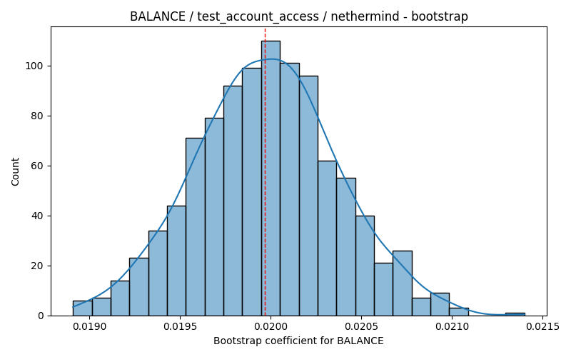

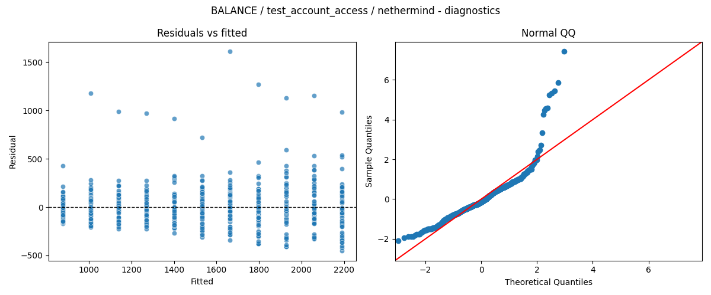

</details>

<details><summary>reth — NNLS regression summary</summary>

```
==============================================================================
                           NNLS Regression Results                            
==============================================================================
Dep. Variable:          test_runtime_ms              R-squared:          0.779
Model:                  NNLS                    Adj. R-squared:          0.779
No. Observations:       1056                              RMSE:         337.65
Df Residuals:           1054                               MAE:         233.01
Df Model:               1      
==============================================================================
                      coef     std err     P-value      [0.025      0.975]
------------------------------------------------------------------------------
         const    660.7516     36.3522       0.001    592.0961    734.3853
       opcount      0.0305      0.0005       0.001      0.0294      0.0315
==============================================================================
Notes: Non-negative least squares with bootstrap inference (1000 iterations)
==============================================================================
```

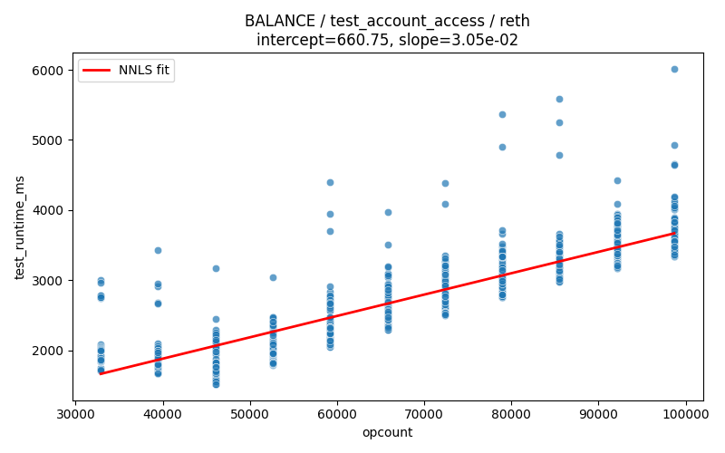

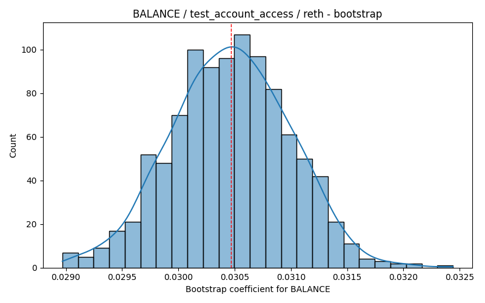

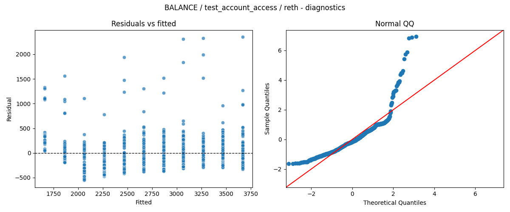

</details>

### test_account_access — combo `BALANCE_AccountMode.NON_EXISTING_ACCOUNT` — `presets[cold_account_code_access]`

| client | nobs | R² | target_coef (ms) | p-value | 95% CI |
| --- | --- | --- | --- | --- | --- |
| `besu` | 286 | 0.8583 | 0.01085 | 1.00e-03 | [0.01032, 0.01141] |
| `erigon` | 418 | 0.9956 | 0.009141 | 1.00e-03 | [0.009083, 0.009197] |
| `geth` | 561 | 0.5552 | 0.02944 | 1.00e-03 | [0.02726, 0.03173] |
| `nethermind` | 682 | 0.757 | 0.004563 | 1.00e-03 | [0.004375, 0.004769] |
| `reth` | 1056 | 0.9715 | 0.0009166 | 1.00e-03 | [0.0009067, 0.0009257] |

<details><summary>besu — NNLS regression summary</summary>

```
==============================================================================
                           NNLS Regression Results                            
==============================================================================
Dep. Variable:          test_runtime_ms              R-squared:          0.858
Model:                  NNLS                    Adj. R-squared:          0.858
No. Observations:       286                               RMSE:         105.40
Df Residuals:           284                                MAE:          86.82
Df Model:               1      
==============================================================================
                      coef     std err     P-value      [0.025      0.975]
------------------------------------------------------------------------------
         const    374.8198     21.5301       0.001    330.7917    416.0005
       opcount      0.0109      0.0003       0.001      0.0103      0.0114
==============================================================================
Notes: Non-negative least squares with bootstrap inference (1000 iterations)
==============================================================================
```


</details>

<details><summary>erigon — NNLS regression summary</summary>

```
==============================================================================
                           NNLS Regression Results                            
==============================================================================
Dep. Variable:          test_runtime_ms              R-squared:          0.996
Model:                  NNLS                    Adj. R-squared:          0.996
No. Observations:       418                               RMSE:          14.45
Df Residuals:           416                                MAE:          11.24
Df Model:               1      
==============================================================================
                      coef     std err     P-value      [0.025      0.975]
------------------------------------------------------------------------------
         const      5.7861      2.1275       0.002      1.6130     10.0649
       opcount      0.0091      0.0000       0.001      0.0091      0.0092
==============================================================================
Notes: Non-negative least squares with bootstrap inference (1000 iterations)
==============================================================================
```


</details>

<details><summary>geth — NNLS regression summary</summary>

```
==============================================================================
                           NNLS Regression Results                            
==============================================================================
Dep. Variable:          test_runtime_ms              R-squared:          0.555
Model:                  NNLS                    Adj. R-squared:          0.554
No. Observations:       561                               RMSE:         629.67
Df Residuals:           559                                MAE:         511.06
Df Model:               1      
==============================================================================
                      coef     std err     P-value      [0.025      0.975]
------------------------------------------------------------------------------
         const   1520.2162     82.8407       0.001   1356.3773   1678.4405
       opcount      0.0294      0.0011       0.001      0.0273      0.0317
==============================================================================
Notes: Non-negative least squares with bootstrap inference (1000 iterations)
==============================================================================
```


</details>

<details><summary>nethermind — NNLS regression summary</summary>

```
==============================================================================
                           NNLS Regression Results                            
==============================================================================
Dep. Variable:          test_runtime_ms              R-squared:          0.757
Model:                  NNLS                    Adj. R-squared:          0.757
No. Observations:       682                               RMSE:          61.79
Df Residuals:           680                                MAE:          47.91
Df Model:               1      
==============================================================================
                      coef     std err     P-value      [0.025      0.975]
------------------------------------------------------------------------------
         const     58.1813      6.7663       0.001     44.9972     70.5402
       opcount      0.0046      0.0001       0.001      0.0044      0.0048
==============================================================================
Notes: Non-negative least squares with bootstrap inference (1000 iterations)
==============================================================================
```


</details>

<details><summary>reth — NNLS regression summary</summary>

```
==============================================================================
                           NNLS Regression Results                            
==============================================================================
Dep. Variable:          test_runtime_ms              R-squared:          0.972
Model:                  NNLS                    Adj. R-squared:          0.972
No. Observations:       1056                              RMSE:           3.75
Df Residuals:           1054                               MAE:           2.98
Df Model:               1      
==============================================================================
                      coef     std err     P-value      [0.025      0.975]
------------------------------------------------------------------------------
         const     31.8838      0.3819       0.001     31.1985     32.6860
       opcount      0.0009      0.0000       0.001      0.0009      0.0009
==============================================================================
Notes: Non-negative least squares with bootstrap inference (1000 iterations)
==============================================================================
```


</details>

### test_ext_account_query_warm — combo `BALANCE`

| client | nobs | R² | target_coef (ms) | p-value | 95% CI |
| --- | --- | --- | --- | --- | --- |
| `besu` | 286 | 0.6604 | 0.0001535 | 1.00e-03 | [0.0001408, 0.0001668] |
| `erigon` | 418 | 0.8416 | 5.083e-05 | 1.00e-03 | [4.847e-05, 5.299e-05] |
| `geth` | 561 | 0.9688 | 0.0001389 | 1.00e-03 | [0.0001368, 0.0001411] |
| `nethermind` | 682 | 0.6898 | 0.0001501 | 1.00e-03 | [0.0001426, 0.0001577] |
| `reth` | 1056 | 0.6683 | 6.971e-06 | 1.00e-03 | [6.679e-06, 7.288e-06] |

<details><summary>besu — NNLS regression summary</summary>

```
==============================================================================
                           NNLS Regression Results                            
==============================================================================
Dep. Variable:          test_runtime_ms              R-squared:          0.660
Model:                  NNLS                    Adj. R-squared:          0.659
No. Observations:       286                               RMSE:          64.38
Df Residuals:           284                                MAE:          51.28
Df Model:               1      
==============================================================================
                      coef     std err     P-value      [0.025      0.975]
------------------------------------------------------------------------------
         const    156.7474     12.8296       0.001    132.0136    181.4434
       opcount      0.0002      0.0000       0.001      0.0001      0.0002
==============================================================================
Notes: Non-negative least squares with bootstrap inference (1000 iterations)
==============================================================================
```

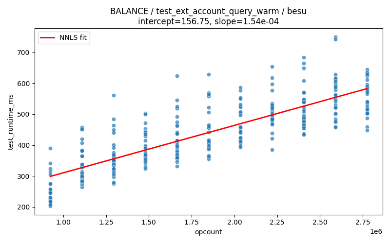

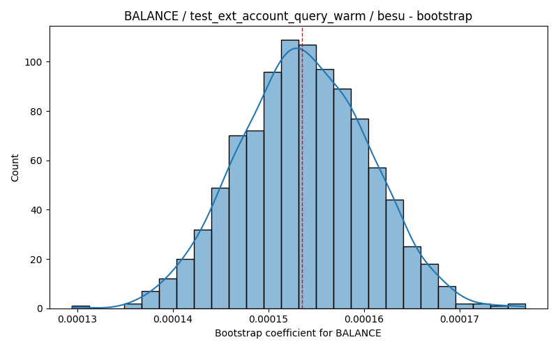

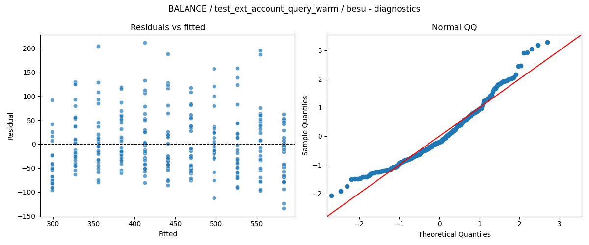

</details>

<details><summary>erigon — NNLS regression summary</summary>

```
==============================================================================
                           NNLS Regression Results                            
==============================================================================
Dep. Variable:          test_runtime_ms              R-squared:          0.842
Model:                  NNLS                    Adj. R-squared:          0.841
No. Observations:       418                               RMSE:          12.90
Df Residuals:           416                                MAE:          10.58
Df Model:               1      
==============================================================================
                      coef     std err     P-value      [0.025      0.975]
------------------------------------------------------------------------------
         const     36.1995      2.1415       0.001     32.1893     40.6515
       opcount      0.0001      0.0000       0.001      0.0000      0.0001
==============================================================================
Notes: Non-negative least squares with bootstrap inference (1000 iterations)
==============================================================================
```

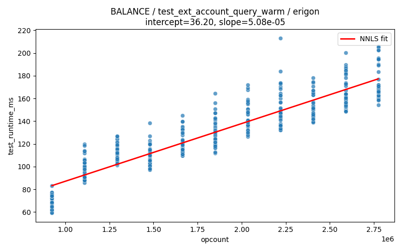

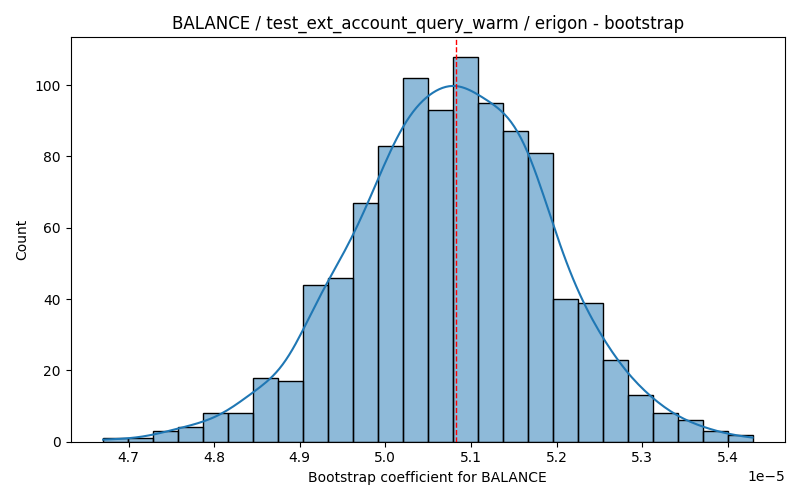

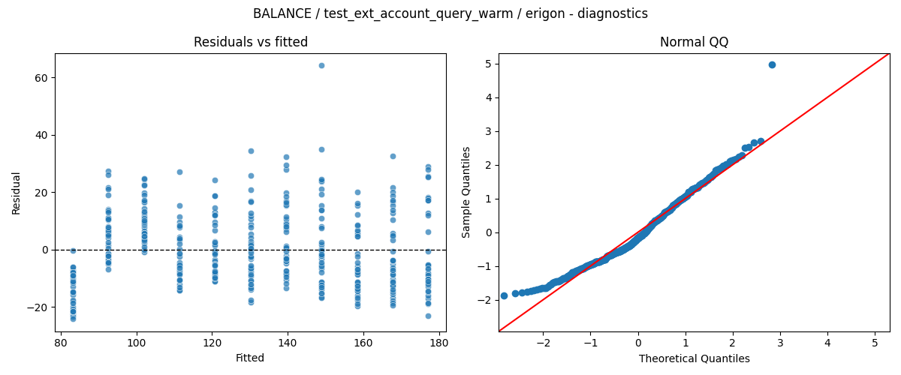

</details>

<details><summary>geth — NNLS regression summary</summary>

```
==============================================================================
                           NNLS Regression Results                            
==============================================================================
Dep. Variable:          test_runtime_ms              R-squared:          0.969
Model:                  NNLS                    Adj. R-squared:          0.969
No. Observations:       561                               RMSE:          14.57
Df Residuals:           559                                MAE:          11.14
Df Model:               1      
==============================================================================
                      coef     std err     P-value      [0.025      0.975]
------------------------------------------------------------------------------
         const     14.9237      1.9662       0.001     11.2046     18.6436
       opcount      0.0001      0.0000       0.001      0.0001      0.0001
==============================================================================
Notes: Non-negative least squares with bootstrap inference (1000 iterations)
==============================================================================
```

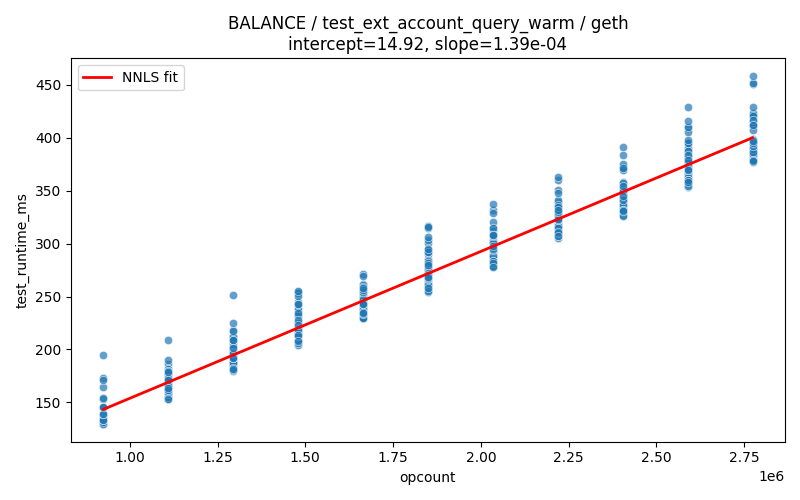

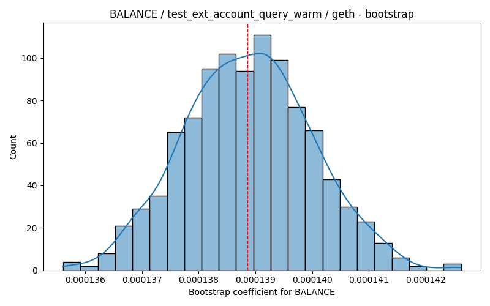

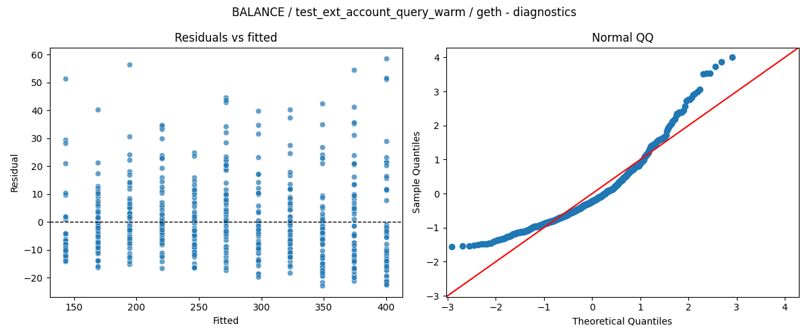

</details>

<details><summary>nethermind — NNLS regression summary</summary>

```
==============================================================================
                           NNLS Regression Results                            
==============================================================================
Dep. Variable:          test_runtime_ms              R-squared:          0.690
Model:                  NNLS                    Adj. R-squared:          0.689
No. Observations:       682                               RMSE:          58.88
Df Residuals:           680                                MAE:          46.12
Df Model:               1      
==============================================================================
                      coef     std err     P-value      [0.025      0.975]
------------------------------------------------------------------------------
         const     63.5429      6.7411       0.001     50.4586     76.9632
       opcount      0.0002      0.0000       0.001      0.0001      0.0002
==============================================================================
Notes: Non-negative least squares with bootstrap inference (1000 iterations)
==============================================================================
```

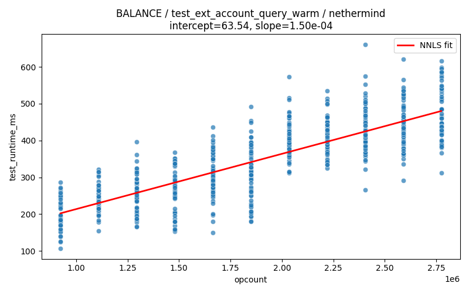

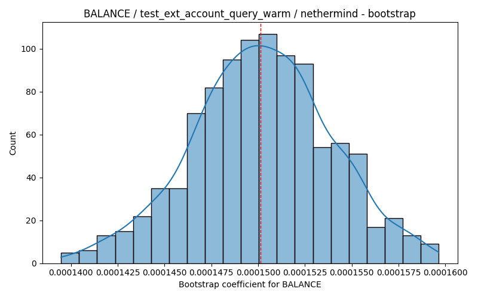

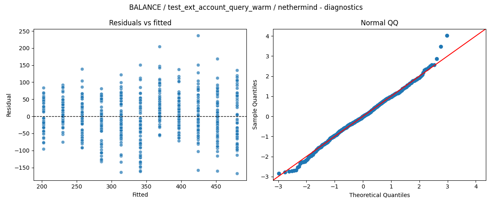

</details>

<details><summary>reth — NNLS regression summary</summary>

```
==============================================================================
                           NNLS Regression Results                            
==============================================================================
Dep. Variable:          test_runtime_ms              R-squared:          0.668
Model:                  NNLS                    Adj. R-squared:          0.668
No. Observations:       1056                              RMSE:           2.87
Df Residuals:           1054                               MAE:           2.00
Df Model:               1      
==============================================================================
                      coef     std err     P-value      [0.025      0.975]
------------------------------------------------------------------------------
         const      5.9893      0.2782       0.001      5.4233      6.4899
       opcount      0.0000      0.0000       0.001      0.0000      0.0000
==============================================================================
Notes: Non-negative least squares with bootstrap inference (1000 iterations)
==============================================================================
```

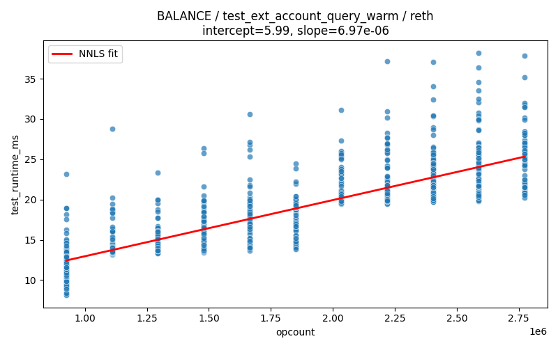

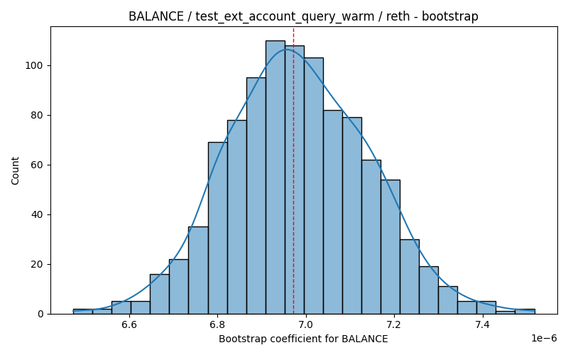

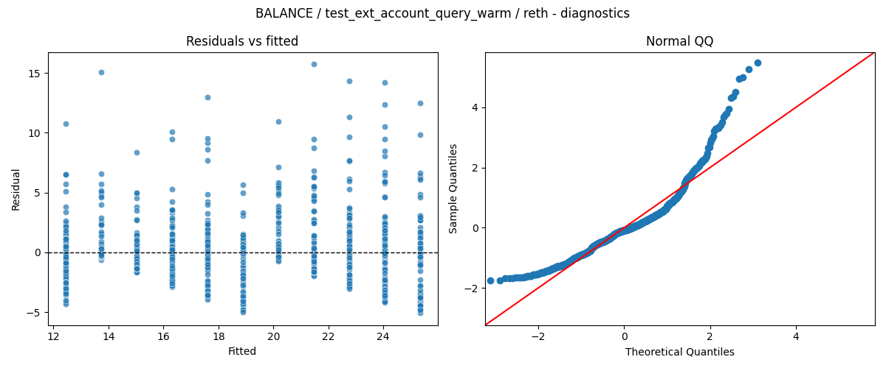

</details>

## CALL

### test_account_access — combo `CALL_AccountMode.EXISTING_EOA`

| client | nobs | R² | target_coef (ms) | p-value | 95% CI |
| --- | --- | --- | --- | --- | --- |
| `besu` | 572 | 0.8015 | 0.02046 | 1.00e-03 | [0.0193, 0.0214] |
| `erigon` | 836 | 0.9843 | 0 | 1.00e+00 | [0, 0] |
| `geth` | 1122 | 0.8068 | 0.01304 | 1.00e-03 | [0.01263, 0.01349] |
| `nethermind` | 1364 | 0.847 | 0.005121 | 1.00e-03 | [0.004873, 0.005369] |
| `reth` | 2112 | 0.9907 | 0 | 1.00e+00 | [0, 0] |

<details><summary>besu — NNLS regression summary</summary>

```
==============================================================================
                           NNLS Regression Results                            
==============================================================================
Dep. Variable:          test_runtime_ms              R-squared:          0.801
Model:                  NNLS                    Adj. R-squared:          0.801
No. Observations:       572                               RMSE:         241.43
Df Residuals:           569                                MAE:         169.21
Df Model:               2      
==============================================================================
                      coef     std err     P-value      [0.025      0.975]
------------------------------------------------------------------------------
         const    485.3085     31.2757       0.001    426.7614    546.9114
       opcount      0.0205      0.0005       0.001      0.0193      0.0214
        update      0.0515      0.0010       0.001      0.0496      0.0534
==============================================================================
Notes: Non-negative least squares with bootstrap inference (1000 iterations)
==============================================================================
```

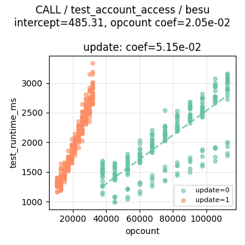

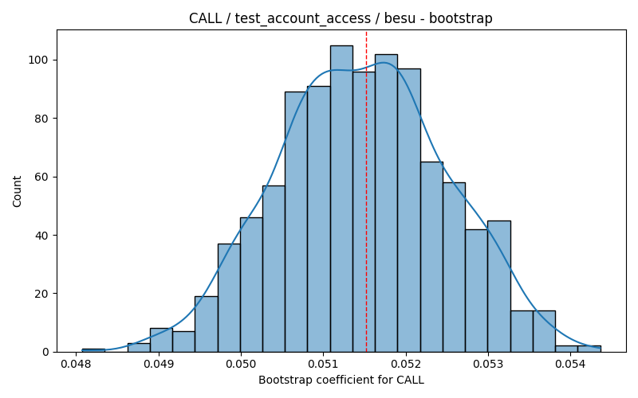

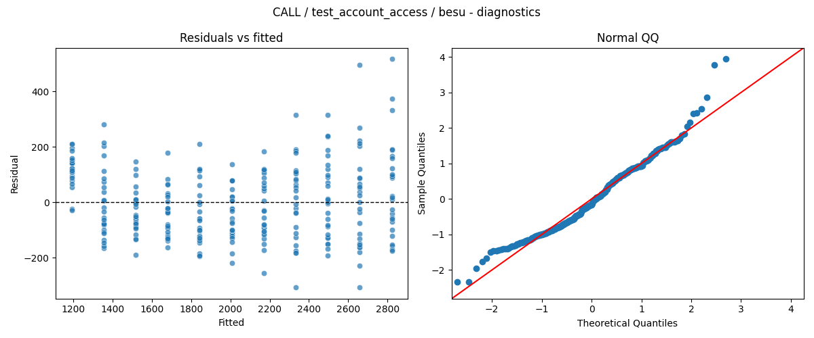

</details>

<details><summary>erigon — NNLS regression summary</summary>

```
==============================================================================
                           NNLS Regression Results                            
==============================================================================
Dep. Variable:          test_runtime_ms              R-squared:          0.984
Model:                  NNLS                    Adj. R-squared:          0.984
No. Observations:       836                               RMSE:         424.92
Df Residuals:           833                                MAE:         335.50
Df Model:               2      
==============================================================================
                      coef     std err     P-value      [0.025      0.975]
------------------------------------------------------------------------------
         const   1007.4197     16.1971       0.001    974.6031   1039.4424
       opcount      0.0000      0.0000       1.000      0.0000      0.0000
        update      0.2883      0.0012       0.001      0.2861      0.2909
==============================================================================
Notes: Non-negative least squares with bootstrap inference (1000 iterations)
==============================================================================
```

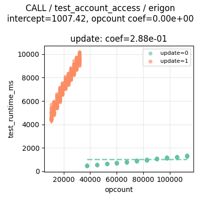

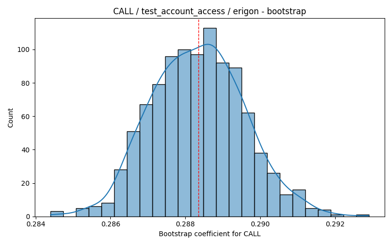

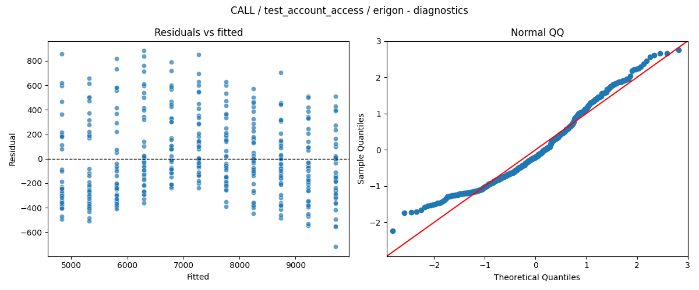

</details>

<details><summary>geth — NNLS regression summary</summary>

```
==============================================================================
                           NNLS Regression Results                            
==============================================================================
Dep. Variable:          test_runtime_ms              R-squared:          0.807
Model:                  NNLS                    Adj. R-squared:          0.806
No. Observations:       1122                              RMSE:         163.12
Df Residuals:           1119                               MAE:         133.27
Df Model:               2      
==============================================================================
                      coef     std err     P-value      [0.025      0.975]
------------------------------------------------------------------------------
         const    421.1545     15.1490       0.001    391.8184    449.8417
       opcount      0.0130      0.0002       0.001      0.0126      0.0135
        update      0.0384      0.0006       0.001      0.0373      0.0395
==============================================================================
Notes: Non-negative least squares with bootstrap inference (1000 iterations)
==============================================================================
```

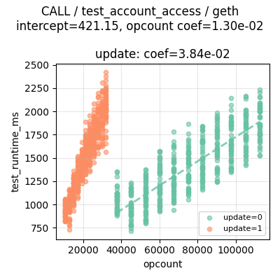

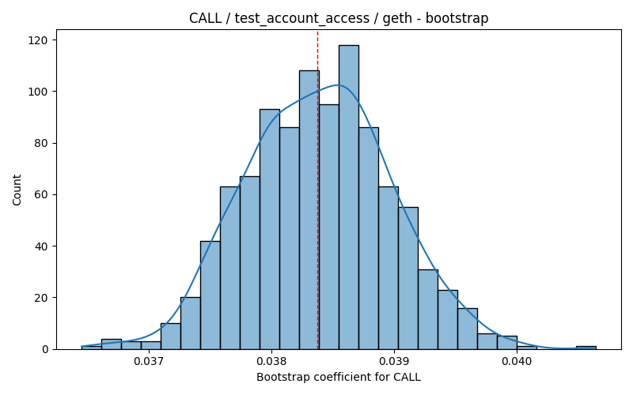

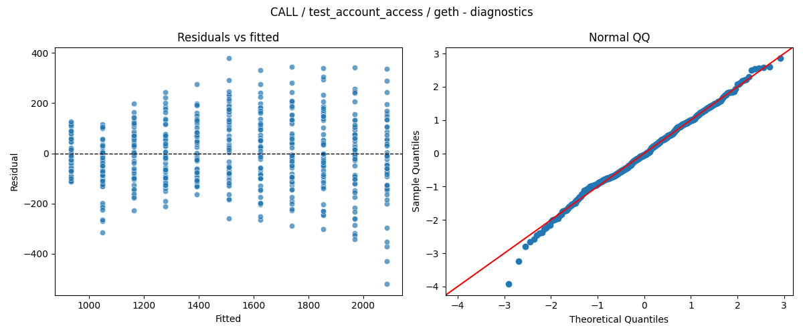

</details>

<details><summary>nethermind — NNLS regression summary</summary>

```
==============================================================================
                           NNLS Regression Results                            
==============================================================================
Dep. Variable:          test_runtime_ms              R-squared:          0.847
Model:                  NNLS                    Adj. R-squared:          0.847
No. Observations:       1364                              RMSE:         119.93
Df Residuals:           1361                               MAE:          91.36
Df Model:               2      
==============================================================================
                      coef     std err     P-value      [0.025      0.975]
------------------------------------------------------------------------------
         const    141.2109      9.5024       0.001    123.0675    159.5267
       opcount      0.0051      0.0001       0.001      0.0049      0.0054
        update      0.0320      0.0005       0.001      0.0311      0.0329
==============================================================================
Notes: Non-negative least squares with bootstrap inference (1000 iterations)
==============================================================================
```

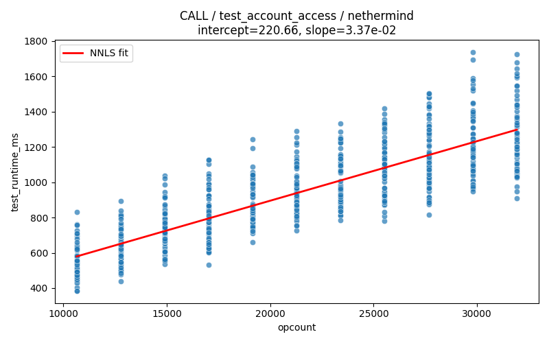

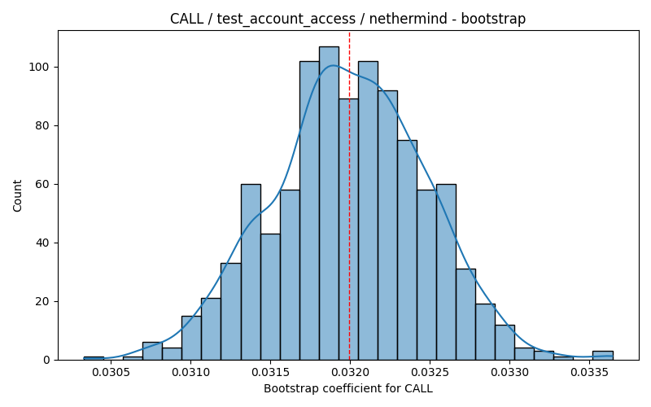

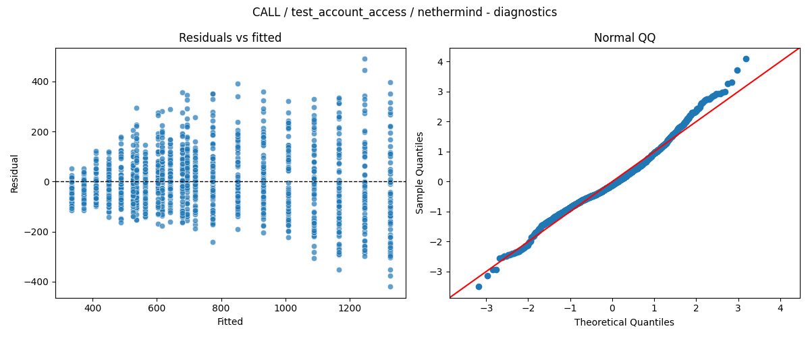

</details>

<details><summary>reth — NNLS regression summary</summary>

```
==============================================================================
                           NNLS Regression Results                            
==============================================================================
Dep. Variable:          test_runtime_ms              R-squared:          0.991
Model:                  NNLS                    Adj. R-squared:          0.991
No. Observations:       2112                              RMSE:         186.34
Df Residuals:           2109                               MAE:         110.38
Df Model:               2      
==============================================================================
                      coef     std err     P-value      [0.025      0.975]
------------------------------------------------------------------------------
         const    155.3110      3.7023       0.001    147.9892    162.1336
       opcount      0.0000      0.0000       1.000      0.0000      0.0000
        update      0.1647      0.0002       0.001      0.1642      0.1652
==============================================================================
Notes: Non-negative least squares with bootstrap inference (1000 iterations)
==============================================================================
```

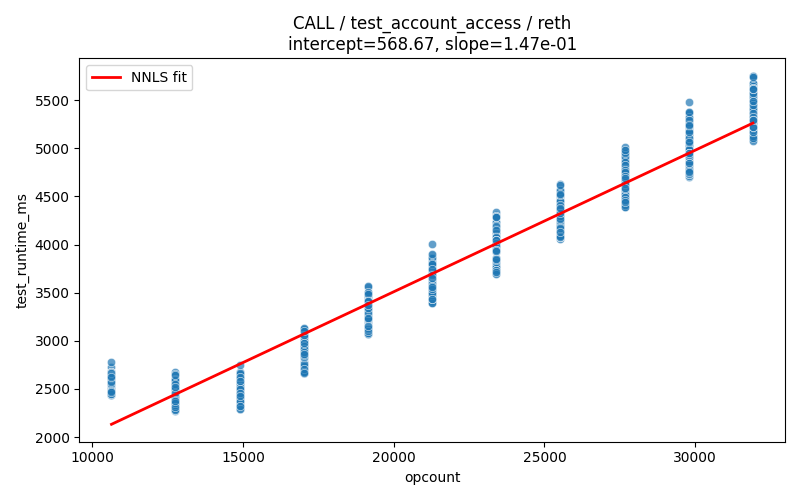


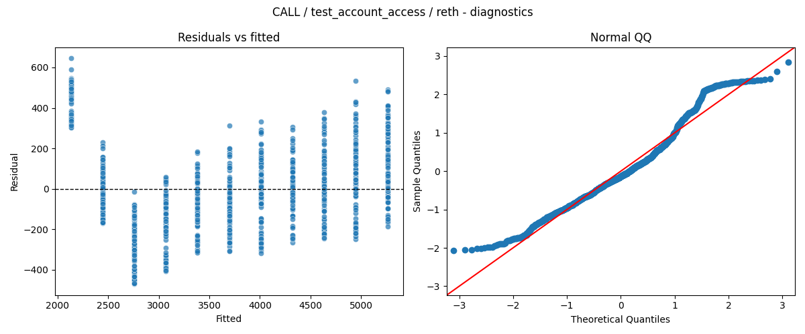

</details>

### test_account_access — combo `CALL_AccountMode.NON_EXISTING_ACCOUNT` — `presets[cold_account_nocode_access]`

| client | nobs | R² | target_coef (ms) | p-value | 95% CI |
| --- | --- | --- | --- | --- | --- |
| `besu` | 572 | 0.9581 | 0.01404 | 1.00e-03 | [0.01378, 0.01453] |
| `erigon` | 836 | 0.9152 | 0.006014 | 1.00e-03 | [0.005365, 0.006714] |
| `geth` | 1122 | 0.9308 | 0.04555 | 1.00e-03 | [0.04474, 0.04633] |
| `nethermind` | 1364 | 0.9555 | 0.00597 | 1.00e-03 | [0.005829, 0.006123] |
| `reth` | 2112 | 0.2707 | 0.0005829 | 1.00e-03 | [0.0005298, 0.0006401] |

<details><summary>besu — NNLS regression summary</summary>

```
==============================================================================
                           NNLS Regression Results                            
==============================================================================
Dep. Variable:          test_runtime_ms              R-squared:          0.958
Model:                  NNLS                    Adj. R-squared:          0.958
No. Observations:       572                               RMSE:         119.32
Df Residuals:           569                                MAE:          83.58
Df Model:               2      
==============================================================================
                      coef     std err     P-value      [0.025      0.975]
------------------------------------------------------------------------------
         const    452.4590     10.8992       0.001    418.9598    461.5328
       opcount      0.0140      0.0002       0.001      0.0138      0.0145
        update      0.0000      0.0094       1.000      0.0000      0.0324
==============================================================================
Notes: Non-negative least squares with bootstrap inference (1000 iterations)
==============================================================================
```

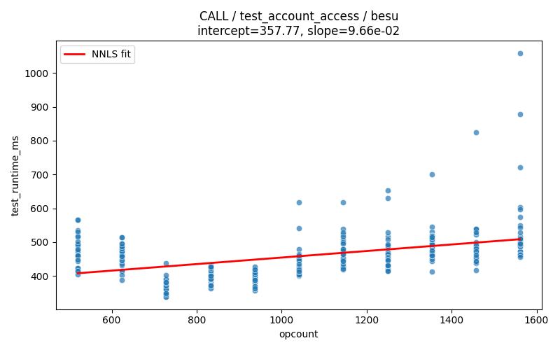

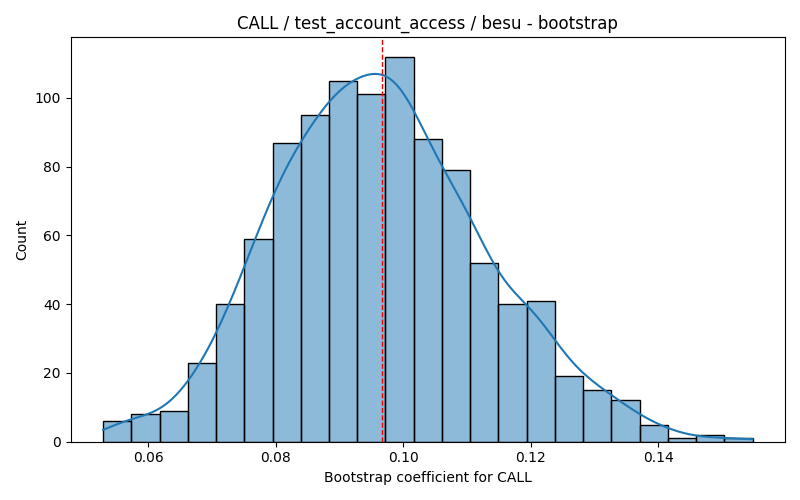

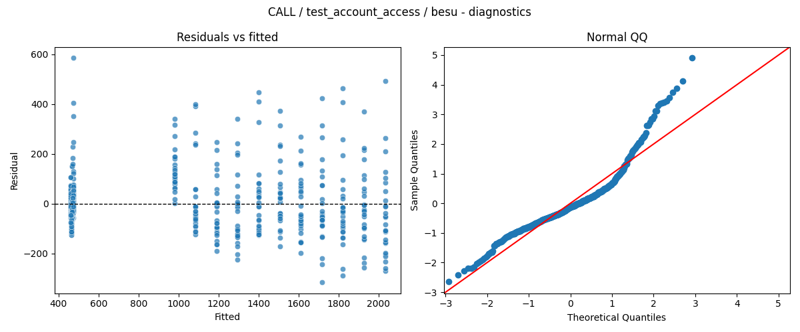

</details>

<details><summary>erigon — NNLS regression summary</summary>

```
==============================================================================
                           NNLS Regression Results                            
==============================================================================
Dep. Variable:          test_runtime_ms              R-squared:          0.915
Model:                  NNLS                    Adj. R-squared:          0.915
No. Observations:       836                               RMSE:         264.37
Df Residuals:           833                                MAE:         204.55
Df Model:               2      
==============================================================================
                      coef     std err     P-value      [0.025      0.975]
------------------------------------------------------------------------------
         const    355.1990     28.9898       0.001    297.0795    410.2600
       opcount      0.0060      0.0004       0.001      0.0054      0.0067
        update      1.8607      0.0339       0.001      1.7942      1.9307
==============================================================================
Notes: Non-negative least squares with bootstrap inference (1000 iterations)
==============================================================================
```

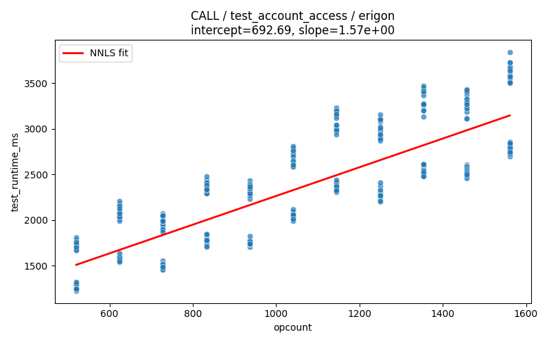


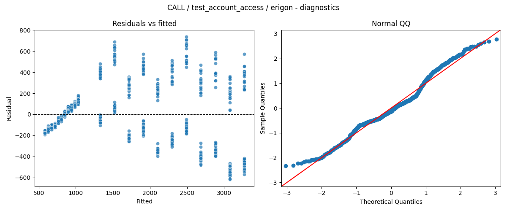

</details>

<details><summary>geth — NNLS regression summary</summary>

```
==============================================================================
                           NNLS Regression Results                            
==============================================================================
Dep. Variable:          test_runtime_ms              R-squared:          0.931
Model:                  NNLS                    Adj. R-squared:          0.931
No. Observations:       1122                              RMSE:         504.89
Df Residuals:           1119                               MAE:         343.86
Df Model:               2      
==============================================================================
                      coef     std err     P-value      [0.025      0.975]
------------------------------------------------------------------------------
         const    265.1528     11.0646       0.001    244.5845    287.5316
       opcount      0.0455      0.0004       0.001      0.0447      0.0463
        update      0.0000      0.0000       1.000      0.0000      0.0000
==============================================================================
Notes: Non-negative least squares with bootstrap inference (1000 iterations)
==============================================================================
```

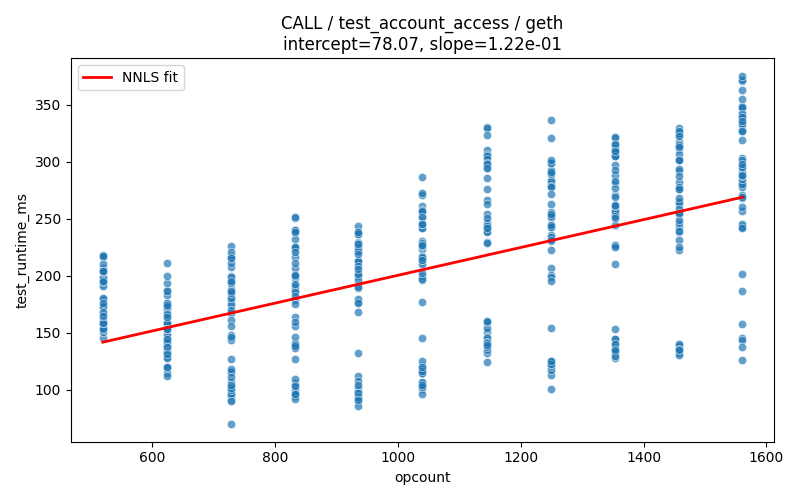

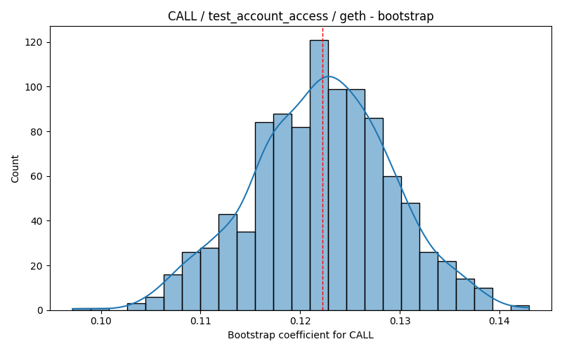

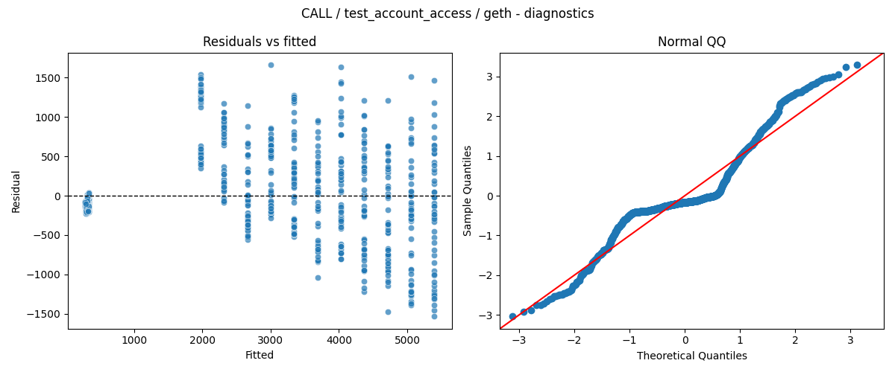

</details>

<details><summary>nethermind — NNLS regression summary</summary>

```
==============================================================================
                           NNLS Regression Results                            
==============================================================================
Dep. Variable:          test_runtime_ms              R-squared:          0.955
Model:                  NNLS                    Adj. R-squared:          0.955
No. Observations:       1364                              RMSE:          50.79
Df Residuals:           1361                               MAE:          31.98
Df Model:               2      
==============================================================================
                      coef     std err     P-value      [0.025      0.975]
------------------------------------------------------------------------------
         const     40.8986      4.1173       0.001     32.8203     48.6412
       opcount      0.0060      0.0001       0.001      0.0058      0.0061
        update      0.0158      0.0036       0.001      0.0090      0.0228
==============================================================================
Notes: Non-negative least squares with bootstrap inference (1000 iterations)
==============================================================================
```

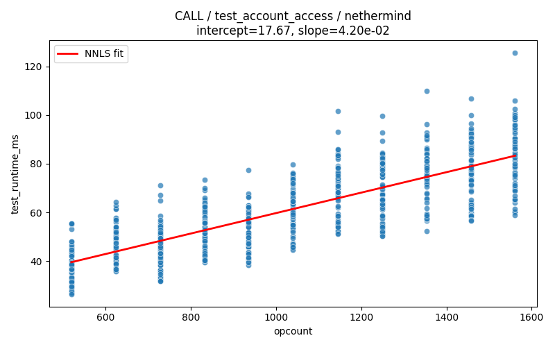

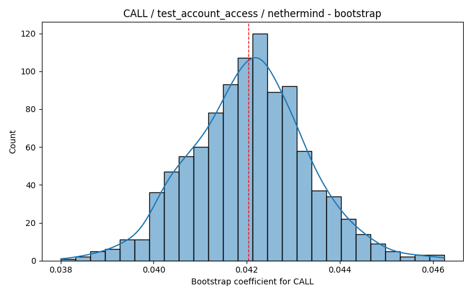

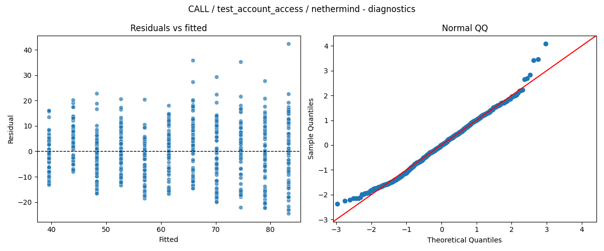

</details>

<details><summary>reth — NNLS regression summary</summary>

```
==============================================================================
                           NNLS Regression Results                            
==============================================================================
Dep. Variable:          test_runtime_ms              R-squared:          0.271
Model:                  NNLS                    Adj. R-squared:          0.270
No. Observations:       2112                              RMSE:          21.76
Df Residuals:           2109                               MAE:          15.07
Df Model:               2      
==============================================================================
                      coef     std err     P-value      [0.025      0.975]
------------------------------------------------------------------------------
         const     64.2885      2.3597       0.001     59.4531     68.6433
       opcount      0.0006      0.0000       0.001      0.0005      0.0006
        update      0.0339      0.0018       0.001      0.0304      0.0375
==============================================================================
Notes: Non-negative least squares with bootstrap inference (1000 iterations)
==============================================================================
```

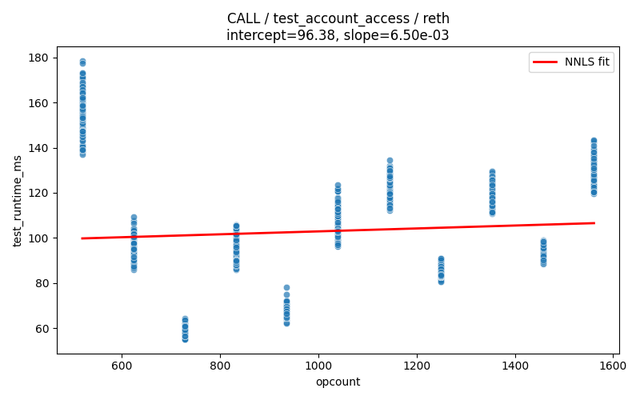

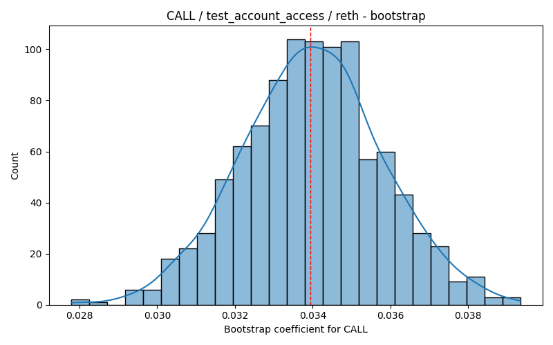

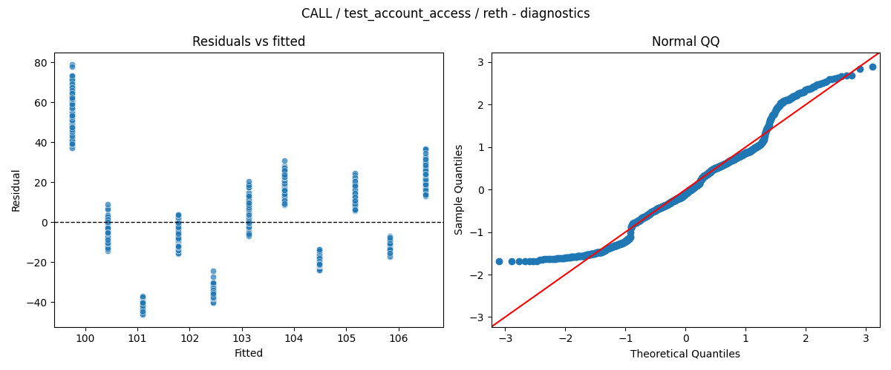

</details>

### test_account_access — combo `CALL_AccountMode.EXISTING_CONTRACT`

| client | nobs | R² | target_coef (ms) | p-value | 95% CI |
| --- | --- | --- | --- | --- | --- |
| `besu` | 572 | 0.9021 | 0.03023 | 1.00e-03 | [0.02922, 0.03127] |
| `erigon` | 836 | 0.978 | 0.004412 | 1.85e-01 | [0, 0.01357] |
| `geth` | 1122 | 0.8451 | 0.04606 | 1.00e-03 | [0.04468, 0.04753] |
| `nethermind` | 1364 | 0.7771 | 0.0211 | 1.00e-03 | [0.02046, 0.02165] |
| `reth` | 2112 | 0.9579 | 0.0295 | 1.00e-03 | [0.02878, 0.03017] |

<details><summary>besu — NNLS regression summary</summary>

```
==============================================================================
                           NNLS Regression Results                            
==============================================================================
Dep. Variable:          test_runtime_ms              R-squared:          0.902
Model:                  NNLS                    Adj. R-squared:          0.902
No. Observations:       572                               RMSE:         228.00
Df Residuals:           569                                MAE:         179.92
Df Model:               2      
==============================================================================
                      coef     std err     P-value      [0.025      0.975]
------------------------------------------------------------------------------
         const    701.6253     31.4354       0.001    635.6360    762.4536
       opcount      0.0302      0.0005       0.001      0.0292      0.0313
        update      0.0823      0.0011       0.001      0.0802      0.0844
==============================================================================
Notes: Non-negative least squares with bootstrap inference (1000 iterations)
==============================================================================
```

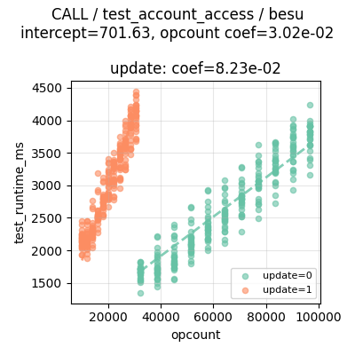

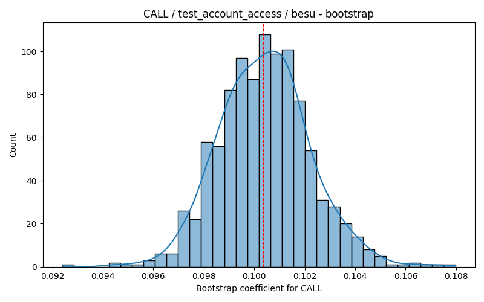

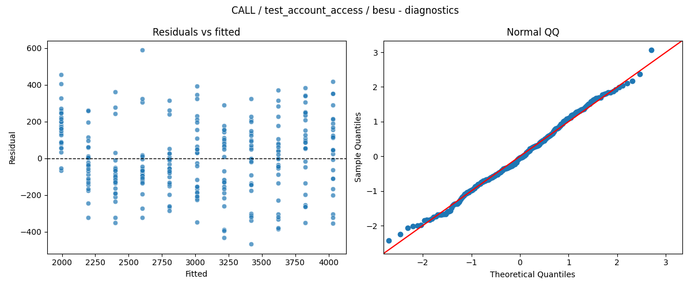

</details>

<details><summary>erigon — NNLS regression summary</summary>

```
==============================================================================
                           NNLS Regression Results                            
==============================================================================
Dep. Variable:          test_runtime_ms              R-squared:          0.978
Model:                  NNLS                    Adj. R-squared:          0.978
No. Observations:       836                               RMSE:        2311.40
Df Residuals:           833                                MAE:        1860.96
Df Model:               2      
==============================================================================
                      coef     std err     P-value      [0.025      0.975]
------------------------------------------------------------------------------
         const   7401.3060    295.8066       0.001   6725.7841   7835.1514
       opcount      0.0044      0.0040       0.185      0.0000      0.0136
        update      1.3919      0.0121       0.001      1.3715      1.4177
==============================================================================
Notes: Non-negative least squares with bootstrap inference (1000 iterations)
==============================================================================
```

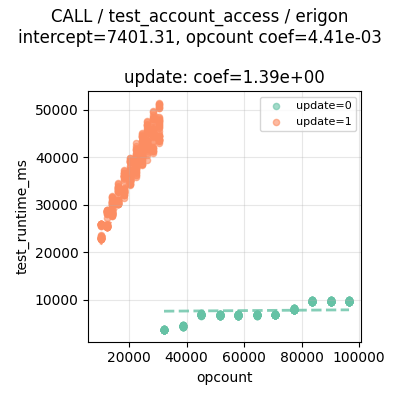

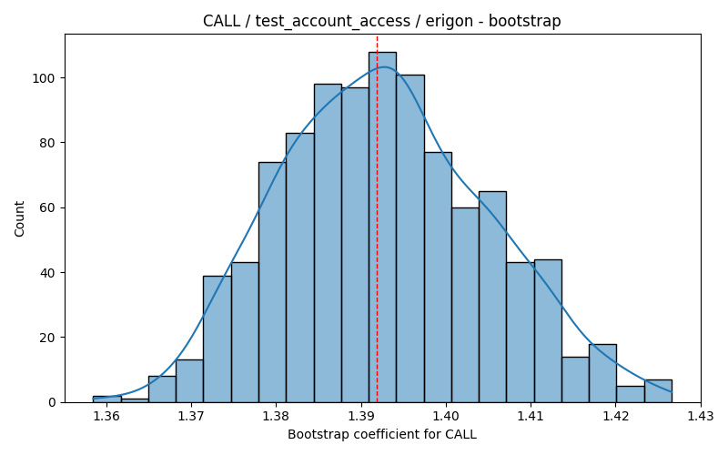

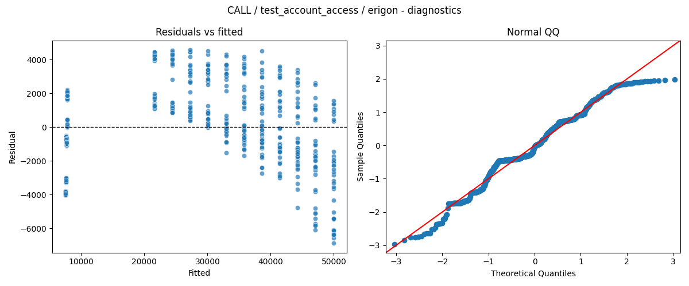

</details>

<details><summary>geth — NNLS regression summary</summary>

```
==============================================================================
                           NNLS Regression Results                            
==============================================================================
Dep. Variable:          test_runtime_ms              R-squared:          0.845
Model:                  NNLS                    Adj. R-squared:          0.845
No. Observations:       1122                              RMSE:         410.42
Df Residuals:           1119                               MAE:         305.92
Df Model:               2      
==============================================================================
                      coef     std err     P-value      [0.025      0.975]
------------------------------------------------------------------------------
         const    826.0612     35.5975       0.001    756.6576    896.8151
       opcount      0.0461      0.0007       0.001      0.0447      0.0475
        update      0.0452      0.0011       0.001      0.0431      0.0475
==============================================================================
Notes: Non-negative least squares with bootstrap inference (1000 iterations)
==============================================================================
```

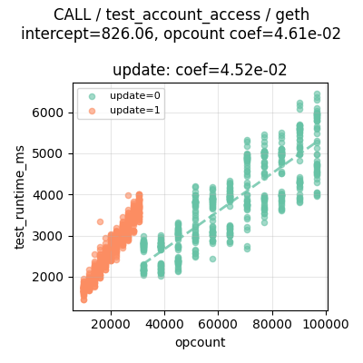

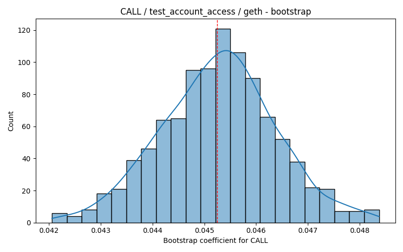

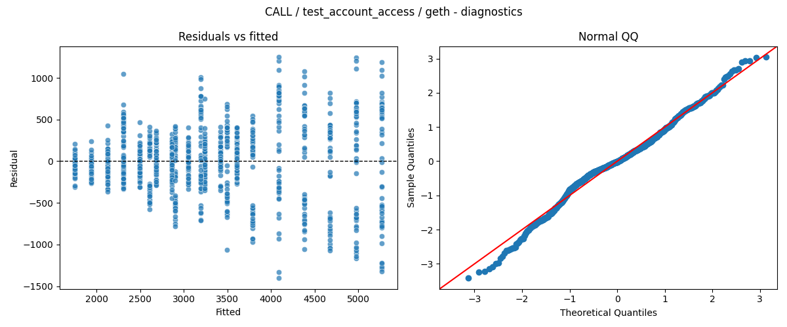

</details>

<details><summary>nethermind — NNLS regression summary</summary>

```
==============================================================================
                           NNLS Regression Results                            
==============================================================================
Dep. Variable:          test_runtime_ms              R-squared:          0.777
Model:                  NNLS                    Adj. R-squared:          0.777
No. Observations:       1364                              RMSE:         221.64
Df Residuals:           1361                               MAE:         165.35
Df Model:               2      
==============================================================================
                      coef     std err     P-value      [0.025      0.975]
------------------------------------------------------------------------------
         const    234.7375     17.6163       0.001    202.5136    270.9542
       opcount      0.0211      0.0003       0.001      0.0205      0.0217
        update      0.0389      0.0008       0.001      0.0373      0.0404
==============================================================================
Notes: Non-negative least squares with bootstrap inference (1000 iterations)
==============================================================================
```

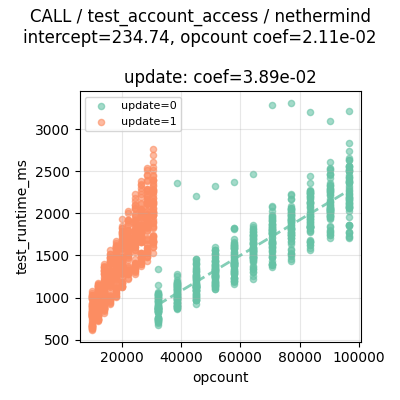

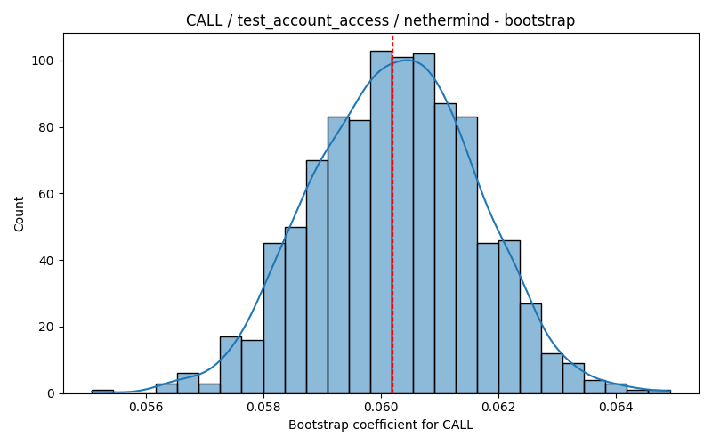

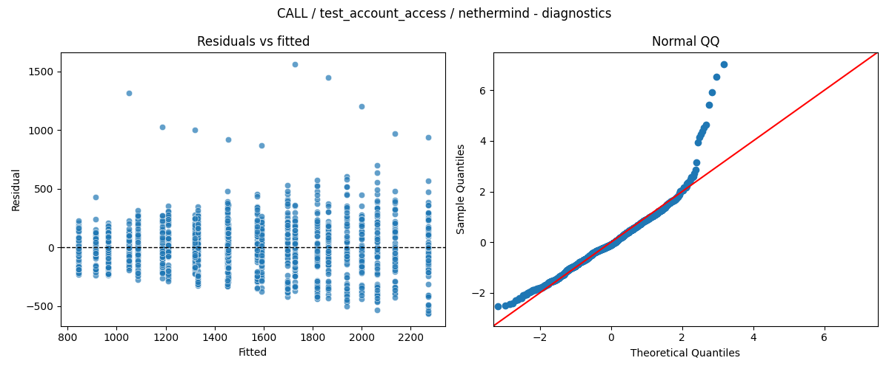

</details>

<details><summary>reth — NNLS regression summary</summary>

```
==============================================================================
                           NNLS Regression Results                            
==============================================================================
Dep. Variable:          test_runtime_ms              R-squared:          0.958
Model:                  NNLS                    Adj. R-squared:          0.958
No. Observations:       2112                              RMSE:         243.68
Df Residuals:           2109                               MAE:         166.41
Df Model:               2      
==============================================================================
                      coef     std err     P-value      [0.025      0.975]
------------------------------------------------------------------------------
         const    622.0348     21.5839       0.001    579.6355    664.4649
       opcount      0.0295      0.0003       0.001      0.0288      0.0302
        update      0.1392      0.0006       0.001      0.1380      0.1404
==============================================================================
Notes: Non-negative least squares with bootstrap inference (1000 iterations)
==============================================================================
```

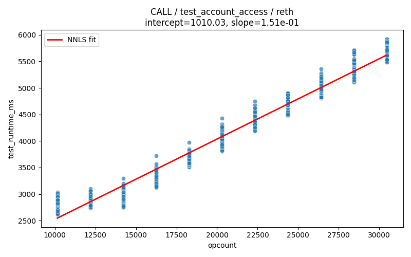

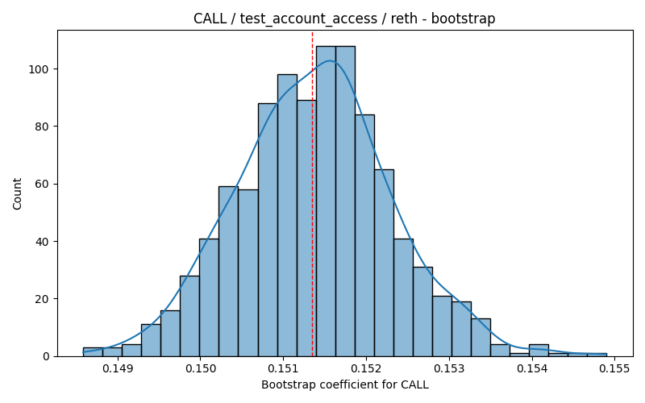

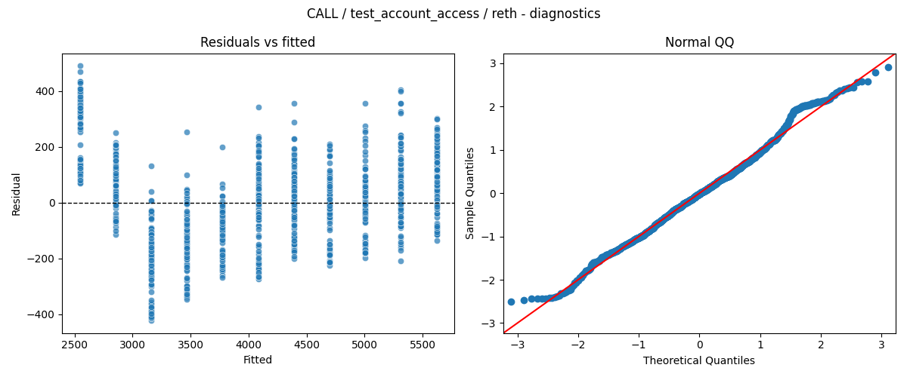

</details>

### test_account_access — combo `CALL_AccountMode.NON_EXISTING_ACCOUNT` — `presets[cold_account_code_access]`

| client | nobs | R² | target_coef (ms) | p-value | 95% CI |
| --- | --- | --- | --- | --- | --- |
| `besu` | 572 | 0.9581 | 0.01404 | 1.00e-03 | [0.01378, 0.01453] |
| `erigon` | 836 | 0.9152 | 0.006014 | 1.00e-03 | [0.005365, 0.006714] |
| `geth` | 1122 | 0.9308 | 0.04555 | 1.00e-03 | [0.04474, 0.04633] |
| `nethermind` | 1364 | 0.9555 | 0.00597 | 1.00e-03 | [0.005829, 0.006123] |
| `reth` | 2112 | 0.2707 | 0.0005829 | 1.00e-03 | [0.0005298, 0.0006401] |

<details><summary>besu — NNLS regression summary</summary>

```
==============================================================================
                           NNLS Regression Results                            
==============================================================================
Dep. Variable:          test_runtime_ms              R-squared:          0.958
Model:                  NNLS                    Adj. R-squared:          0.958
No. Observations:       572                               RMSE:         119.32
Df Residuals:           569                                MAE:          83.58
Df Model:               2      
==============================================================================
                      coef     std err     P-value      [0.025      0.975]
------------------------------------------------------------------------------
         const    452.4590     10.8992       0.001    418.9598    461.5328
       opcount      0.0140      0.0002       0.001      0.0138      0.0145
        update      0.0000      0.0094       1.000      0.0000      0.0324
==============================================================================
Notes: Non-negative least squares with bootstrap inference (1000 iterations)
==============================================================================
```


</details>

<details><summary>erigon — NNLS regression summary</summary>

```
==============================================================================
                           NNLS Regression Results                            
==============================================================================
Dep. Variable:          test_runtime_ms              R-squared:          0.915
Model:                  NNLS                    Adj. R-squared:          0.915
No. Observations:       836                               RMSE:         264.37
Df Residuals:           833                                MAE:         204.55
Df Model:               2      
==============================================================================
                      coef     std err     P-value      [0.025      0.975]
------------------------------------------------------------------------------
         const    355.1990     28.9898       0.001    297.0795    410.2600
       opcount      0.0060      0.0004       0.001      0.0054      0.0067
        update      1.8607      0.0339       0.001      1.7942      1.9307
==============================================================================
Notes: Non-negative least squares with bootstrap inference (1000 iterations)
==============================================================================
```


</details>

<details><summary>geth — NNLS regression summary</summary>

```
==============================================================================
                           NNLS Regression Results                            
==============================================================================
Dep. Variable:          test_runtime_ms              R-squared:          0.931
Model:                  NNLS                    Adj. R-squared:          0.931
No. Observations:       1122                              RMSE:         504.89
Df Residuals:           1119                               MAE:         343.86
Df Model:               2      
==============================================================================
                      coef     std err     P-value      [0.025      0.975]
------------------------------------------------------------------------------
         const    265.1528     11.0646       0.001    244.5845    287.5316
       opcount      0.0455      0.0004       0.001      0.0447      0.0463
        update      0.0000      0.0000       1.000      0.0000      0.0000
==============================================================================
Notes: Non-negative least squares with bootstrap inference (1000 iterations)
==============================================================================
```


</details>

<details><summary>nethermind — NNLS regression summary</summary>

```
==============================================================================
                           NNLS Regression Results                            
==============================================================================
Dep. Variable:          test_runtime_ms              R-squared:          0.955
Model:                  NNLS                    Adj. R-squared:          0.955
No. Observations:       1364                              RMSE:          50.79
Df Residuals:           1361                               MAE:          31.98
Df Model:               2      
==============================================================================
                      coef     std err     P-value      [0.025      0.975]
------------------------------------------------------------------------------
         const     40.8986      4.1173       0.001     32.8203     48.6412
       opcount      0.0060      0.0001       0.001      0.0058      0.0061
        update      0.0158      0.0036       0.001      0.0090      0.0228
==============================================================================
Notes: Non-negative least squares with bootstrap inference (1000 iterations)
==============================================================================
```


</details>

<details><summary>reth — NNLS regression summary</summary>

```
==============================================================================
                           NNLS Regression Results                            
==============================================================================
Dep. Variable:          test_runtime_ms              R-squared:          0.271
Model:                  NNLS                    Adj. R-squared:          0.270
No. Observations:       2112                              RMSE:          21.76
Df Residuals:           2109                               MAE:          15.07
Df Model:               2      
==============================================================================
                      coef     std err     P-value      [0.025      0.975]
------------------------------------------------------------------------------
         const     64.2885      2.3597       0.001     59.4531     68.6433
       opcount      0.0006      0.0000       0.001      0.0005      0.0006
        update      0.0339      0.0018       0.001      0.0304      0.0375
==============================================================================
Notes: Non-negative least squares with bootstrap inference (1000 iterations)
==============================================================================
```


</details>

### test_ext_account_query_warm — combo `CALL`

| client | nobs | R² | target_coef (ms) | p-value | 95% CI |
| --- | --- | --- | --- | --- | --- |
| `besu` | 286 | 0.9562 | 0.001346 | 1.00e-03 | [0.001312, 0.001379] |
| `erigon` | 418 | 0.8299 | 0.000519 | 1.00e-03 | [0.0004964, 0.0005472] |
| `geth` | 561 | 0.9855 | 0.0005862 | 1.00e-03 | [0.0005808, 0.000592] |
| `nethermind` | 682 | 0.5208 | 0.0005168 | 1.00e-03 | [0.0004764, 0.000558] |
| `reth` | 1056 | 0.8934 | 4.964e-05 | 1.00e-03 | [4.856e-05, 5.067e-05] |

<details><summary>besu — NNLS regression summary</summary>

```
==============================================================================
                           NNLS Regression Results                            
==============================================================================
Dep. Variable:          test_runtime_ms              R-squared:          0.956
Model:                  NNLS                    Adj. R-squared:          0.956
No. Observations:       286                               RMSE:         145.49
Df Residuals:           284                                MAE:         118.72
Df Model:               1      
==============================================================================
                      coef     std err     P-value      [0.025      0.975]
------------------------------------------------------------------------------
         const    772.0548     30.8896       0.001    714.8577    832.1726
       opcount      0.0013      0.0000       0.001      0.0013      0.0014
==============================================================================
Notes: Non-negative least squares with bootstrap inference (1000 iterations)
==============================================================================
```

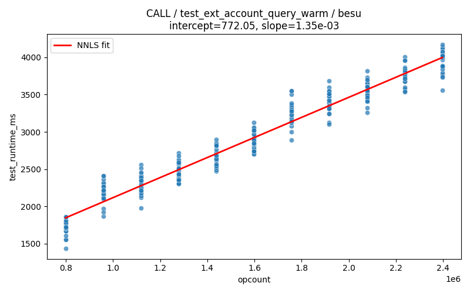

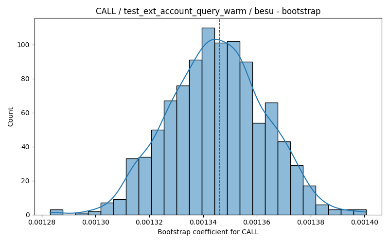

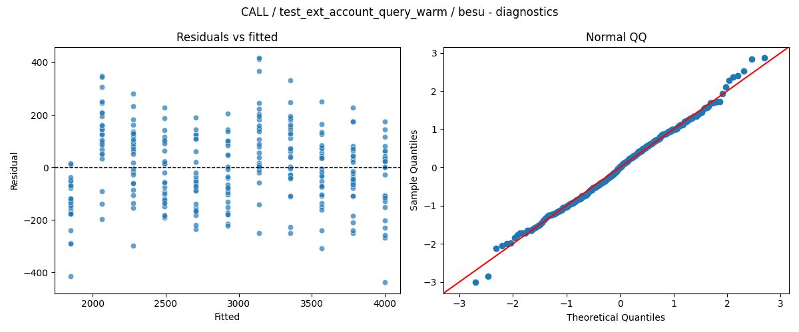

</details>

<details><summary>erigon — NNLS regression summary</summary>

```
==============================================================================
                           NNLS Regression Results                            
==============================================================================
Dep. Variable:          test_runtime_ms              R-squared:          0.830
Model:                  NNLS                    Adj. R-squared:          0.830
No. Observations:       418                               RMSE:         118.71
Df Residuals:           416                                MAE:          72.46
Df Model:               1      
==============================================================================
                      coef     std err     P-value      [0.025      0.975]
------------------------------------------------------------------------------
         const     56.4571     17.4449       0.001     18.9382     88.2260
       opcount      0.0005      0.0000       0.001      0.0005      0.0005
==============================================================================
Notes: Non-negative least squares with bootstrap inference (1000 iterations)
==============================================================================
```

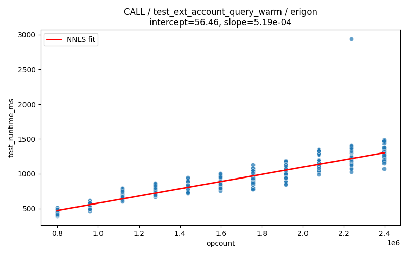

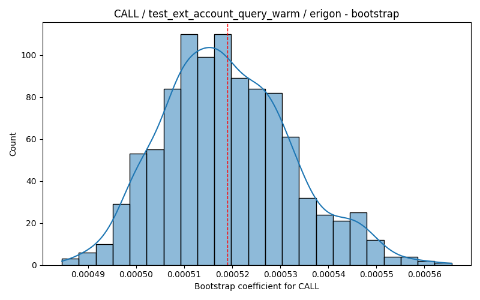

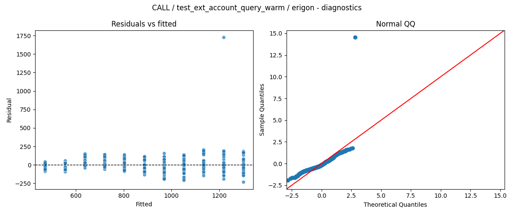

</details>

<details><summary>geth — NNLS regression summary</summary>

```
==============================================================================
                           NNLS Regression Results                            
==============================================================================
Dep. Variable:          test_runtime_ms              R-squared:          0.986
Model:                  NNLS                    Adj. R-squared:          0.986
No. Observations:       561                               RMSE:          35.88
Df Residuals:           559                                MAE:          28.04
Df Model:               1      
==============================================================================
                      coef     std err     P-value      [0.025      0.975]
------------------------------------------------------------------------------
         const     23.0194      4.0549       0.001     14.7253     30.8098
       opcount      0.0006      0.0000       0.001      0.0006      0.0006
==============================================================================
Notes: Non-negative least squares with bootstrap inference (1000 iterations)
==============================================================================
```


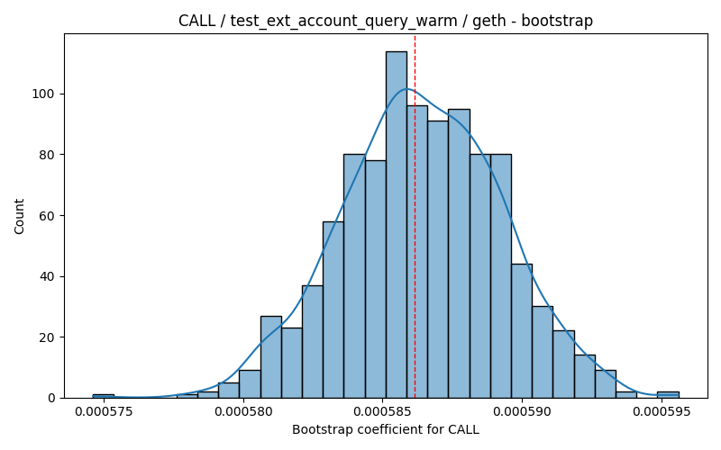

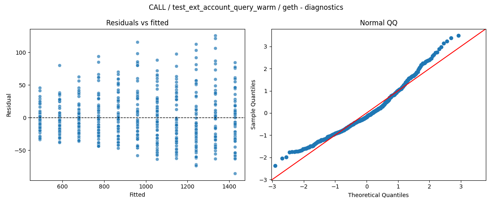

</details>

<details><summary>nethermind — NNLS regression summary</summary>

```
==============================================================================
                           NNLS Regression Results                            
==============================================================================
Dep. Variable:          test_runtime_ms              R-squared:          0.521
Model:                  NNLS                    Adj. R-squared:          0.520
No. Observations:       682                               RMSE:         250.46
Df Residuals:           680                                MAE:         194.20
Df Model:               1      
==============================================================================
                      coef     std err     P-value      [0.025      0.975]
------------------------------------------------------------------------------
         const    384.7920     28.7705       0.001    329.9117    440.1884
       opcount      0.0005      0.0000       0.001      0.0005      0.0006
==============================================================================
Notes: Non-negative least squares with bootstrap inference (1000 iterations)
==============================================================================
```

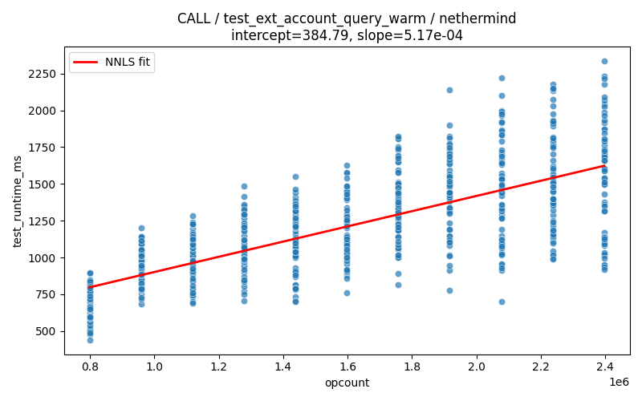

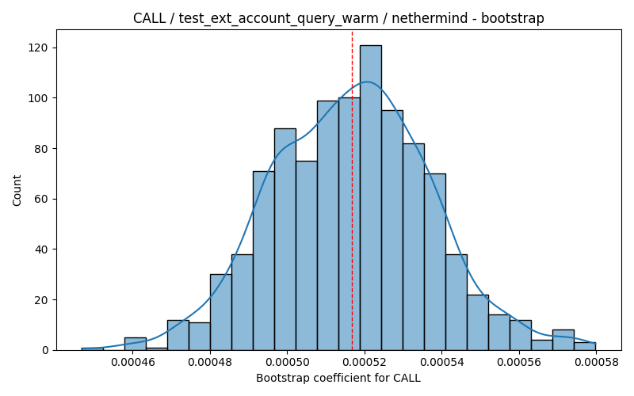

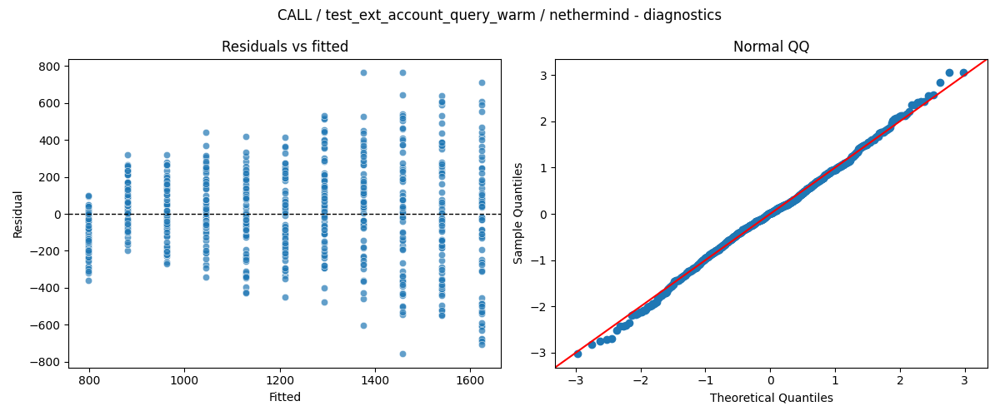

</details>

<details><summary>reth — NNLS regression summary</summary>

```
==============================================================================
                           NNLS Regression Results                            
==============================================================================
Dep. Variable:          test_runtime_ms              R-squared:          0.893
Model:                  NNLS                    Adj. R-squared:          0.893
No. Observations:       1056                              RMSE:           8.67
Df Residuals:           1054                               MAE:           7.13
Df Model:               1      
==============================================================================
                      coef     std err     P-value      [0.025      0.975]
------------------------------------------------------------------------------
         const     18.4522      0.8806       0.001     16.7231     20.1665
       opcount      0.0000      0.0000       0.001      0.0000      0.0001
==============================================================================
Notes: Non-negative least squares with bootstrap inference (1000 iterations)
==============================================================================
```

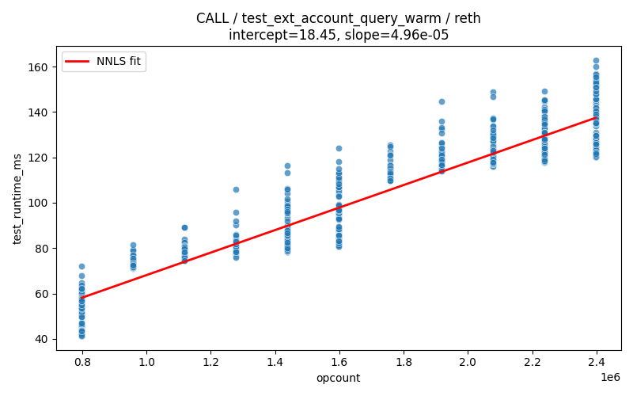

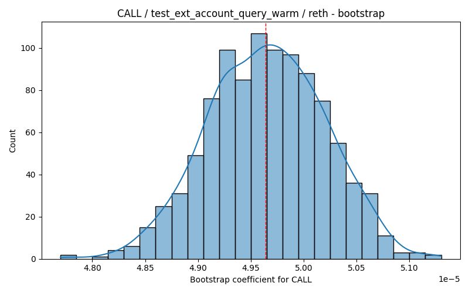

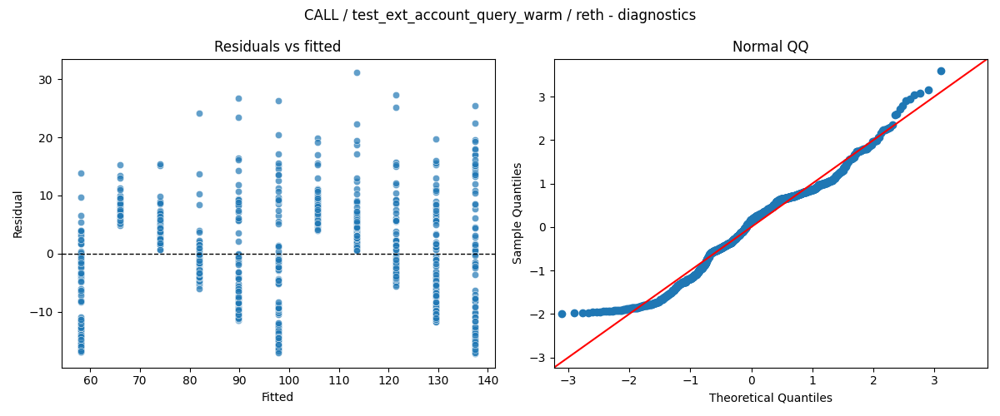

</details>

## CALLCODE

### test_account_access — combo `CALLCODE_AccountMode.EXISTING_EOA`

| client | nobs | R² | target_coef (ms) | p-value | 95% CI |
| --- | --- | --- | --- | --- | --- |
| `besu` | 572 | 0.8994 | 0.0225 | 1.00e-03 | [0.02168, 0.02326] |
| `erigon` | 836 | 0.9962 | 0.01058 | 1.00e-03 | [0.01056, 0.01061] |
| `geth` | 1122 | 0.883 | 0.01562 | 1.00e-03 | [0.0153, 0.01596] |
| `nethermind` | 1364 | 0.9259 | 0.006251 | 1.00e-03 | [0.006138, 0.006371] |
| `reth` | 2112 | 0.9807 | 0.0014 | 1.00e-03 | [0.001393, 0.001407] |

<details><summary>besu — NNLS regression summary</summary>

```
==============================================================================
                           NNLS Regression Results                            
==============================================================================
Dep. Variable:          test_runtime_ms              R-squared:          0.899
Model:                  NNLS                    Adj. R-squared:          0.899
No. Observations:       572                               RMSE:         241.31
Df Residuals:           569                                MAE:         158.71
Df Model:               2      
==============================================================================
                      coef     std err     P-value      [0.025      0.975]
------------------------------------------------------------------------------
         const    249.1747     14.1701       0.001    224.1958    279.6025
       opcount      0.0225      0.0004       0.001      0.0217      0.0233
        update      0.0000      0.0000       1.000      0.0000      0.0000
==============================================================================
Notes: Non-negative least squares with bootstrap inference (1000 iterations)
==============================================================================
```

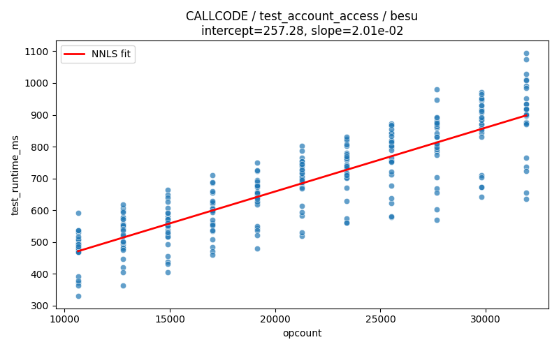


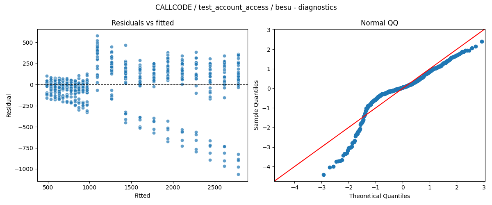

</details>

<details><summary>erigon — NNLS regression summary</summary>

```
==============================================================================
                           NNLS Regression Results                            
==============================================================================
Dep. Variable:          test_runtime_ms              R-squared:          0.996
Model:                  NNLS                    Adj. R-squared:          0.996
No. Observations:       836                               RMSE:          21.20
Df Residuals:           833                                MAE:          16.55
Df Model:               2      
==============================================================================
                      coef     std err     P-value      [0.025      0.975]
------------------------------------------------------------------------------
         const      0.0000      0.0000       1.000      0.0000      0.0000
       opcount      0.0106      0.0000       0.001      0.0106      0.0106
        update      0.0000      0.0000       1.000      0.0000      0.0000
==============================================================================
Notes: Non-negative least squares with bootstrap inference (1000 iterations)
==============================================================================
```

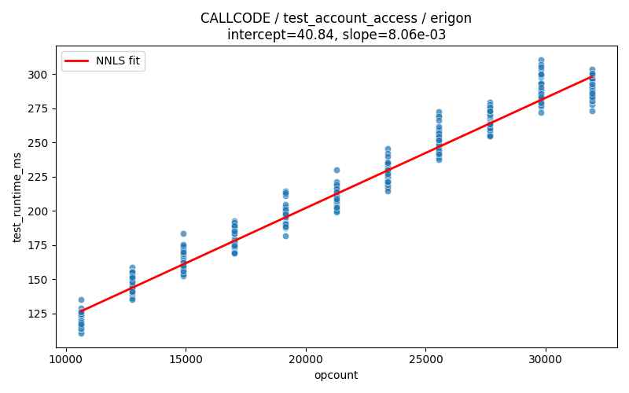


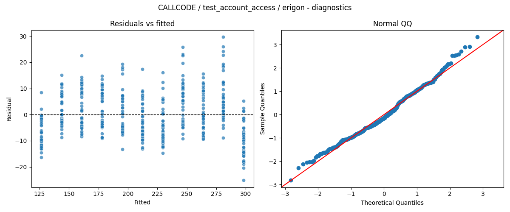

</details>

<details><summary>geth — NNLS regression summary</summary>

```
==============================================================================
                           NNLS Regression Results                            
==============================================================================
Dep. Variable:          test_runtime_ms              R-squared:          0.883
Model:                  NNLS                    Adj. R-squared:          0.883
No. Observations:       1122                              RMSE:         182.31
Df Residuals:           1119                               MAE:         150.56
Df Model:               2      
==============================================================================
                      coef     std err     P-value      [0.025      0.975]
------------------------------------------------------------------------------
         const    217.6584      8.7190       0.001    200.3509    234.8894
       opcount      0.0156      0.0002       0.001      0.0153      0.0160
        update      0.0000      0.0000       1.000      0.0000      0.0000
==============================================================================
Notes: Non-negative least squares with bootstrap inference (1000 iterations)
==============================================================================
```

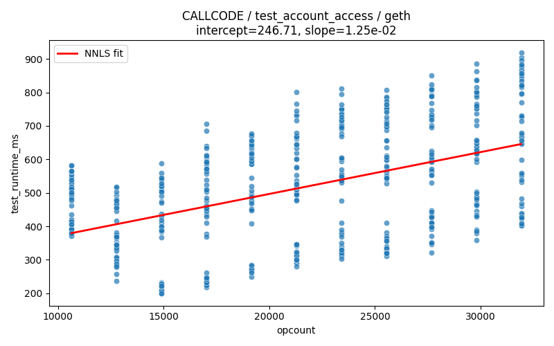


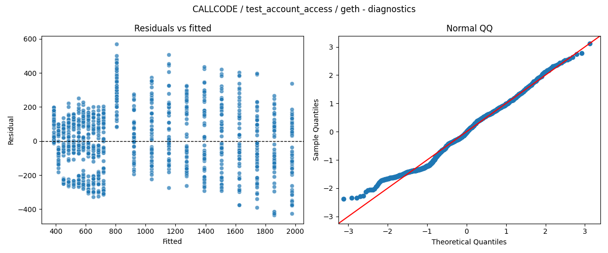

</details>

<details><summary>nethermind — NNLS regression summary</summary>

```
==============================================================================
                           NNLS Regression Results                            
==============================================================================
Dep. Variable:          test_runtime_ms              R-squared:          0.926
Model:                  NNLS                    Adj. R-squared:          0.926
No. Observations:       1364                              RMSE:          56.72
Df Residuals:           1361                               MAE:          38.21
Df Model:               2      
==============================================================================
                      coef     std err     P-value      [0.025      0.975]
------------------------------------------------------------------------------
         const     44.0878      1.9738       0.001     40.0904     47.9338
       opcount      0.0063      0.0001       0.001      0.0061      0.0064
        update      0.0000      0.0000       1.000      0.0000      0.0000
==============================================================================
Notes: Non-negative least squares with bootstrap inference (1000 iterations)
==============================================================================
```

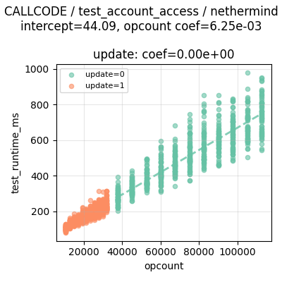


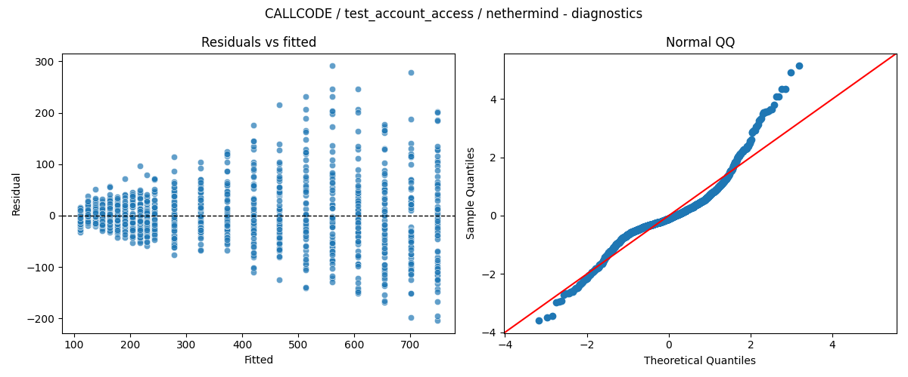

</details>

<details><summary>reth — NNLS regression summary</summary>

```
==============================================================================
                           NNLS Regression Results                            
==============================================================================
Dep. Variable:          test_runtime_ms              R-squared:          0.981
Model:                  NNLS                    Adj. R-squared:          0.981
No. Observations:       2112                              RMSE:           6.31
Df Residuals:           2109                               MAE:           4.84
Df Model:               2      
==============================================================================
                      coef     std err     P-value      [0.025      0.975]
------------------------------------------------------------------------------
         const      8.6395      0.2037       0.001      8.2343      9.0401
       opcount      0.0014      0.0000       0.001      0.0014      0.0014
        update      0.0000      0.0000       1.000      0.0000      0.0000
==============================================================================
Notes: Non-negative least squares with bootstrap inference (1000 iterations)
==============================================================================
```

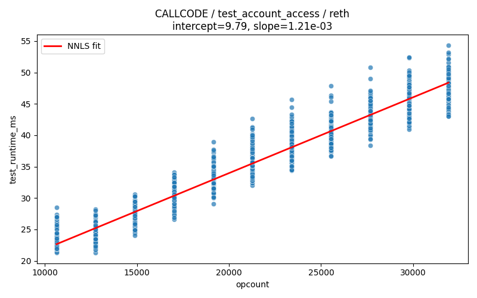

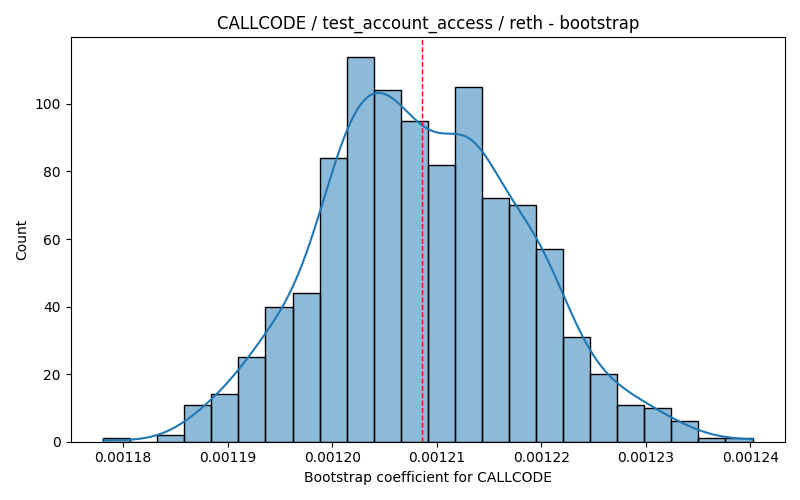

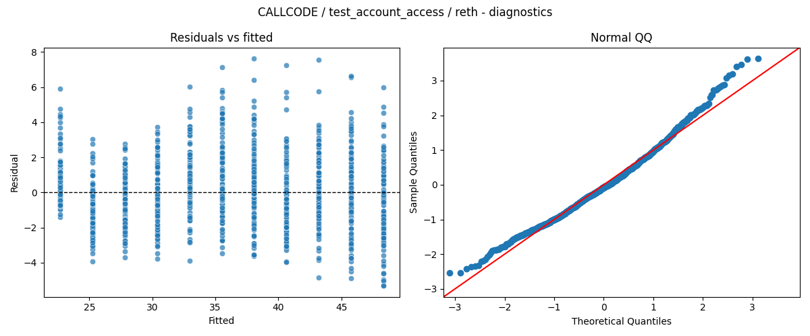

</details>

### test_account_access — combo `CALLCODE_AccountMode.NON_EXISTING_ACCOUNT` — `presets[cold_account_nocode_access]`

| client | nobs | R² | target_coef (ms) | p-value | 95% CI |
| --- | --- | --- | --- | --- | --- |
| `besu` | 572 | 0.9178 | 0.01698 | 1.00e-03 | [0.01659, 0.01735] |
| `erigon` | 836 | 0.9408 | 0.009376 | 1.00e-03 | [0.009307, 0.00944] |
| `geth` | 1122 | 0.8582 | 0.04802 | 1.00e-03 | [0.04739, 0.04873] |
| `nethermind` | 1364 | 0.9248 | 0.006213 | 1.00e-03 | [0.006137, 0.006289] |
| `reth` | 2112 | 0.9101 | 0.001281 | 1.00e-03 | [0.001274, 0.001288] |

<details><summary>besu — NNLS regression summary</summary>

```
==============================================================================
                           NNLS Regression Results                            
==============================================================================
Dep. Variable:          test_runtime_ms              R-squared:          0.918
Model:                  NNLS                    Adj. R-squared:          0.918
No. Observations:       572                               RMSE:         163.02
Df Residuals:           569                                MAE:         128.11
Df Model:               2      
==============================================================================
                      coef     std err     P-value      [0.025      0.975]
------------------------------------------------------------------------------
         const     82.0819     10.3289       0.001     62.4260    103.0368
       opcount      0.0170      0.0002       0.001      0.0166      0.0173
        update      0.0000      0.0000       1.000      0.0000      0.0000
==============================================================================
Notes: Non-negative least squares with bootstrap inference (1000 iterations)
==============================================================================
```

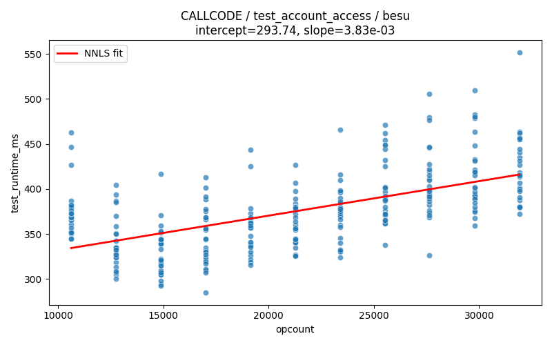


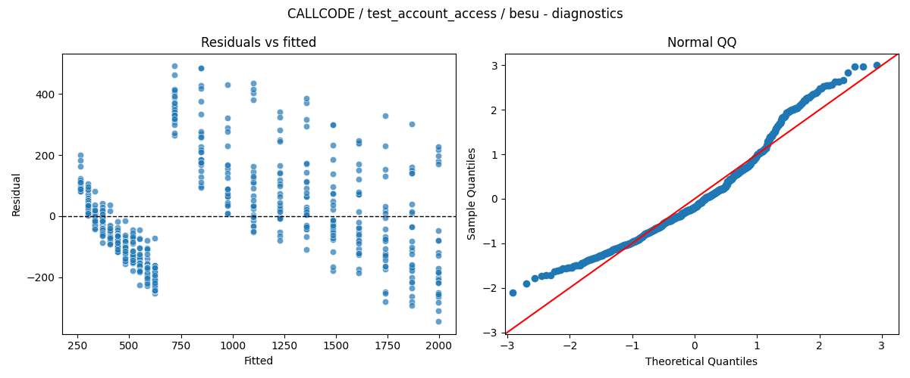

</details>

<details><summary>erigon — NNLS regression summary</summary>

```
==============================================================================
                           NNLS Regression Results                            
==============================================================================
Dep. Variable:          test_runtime_ms              R-squared:          0.941
Model:                  NNLS                    Adj. R-squared:          0.941
No. Observations:       836                               RMSE:          87.64
Df Residuals:           833                                MAE:          69.90
Df Model:               2      
==============================================================================
                      coef     std err     P-value      [0.025      0.975]
------------------------------------------------------------------------------
         const      0.0000      0.0000       1.000      0.0000      0.0000
       opcount      0.0094      0.0000       0.001      0.0093      0.0094
        update      0.0000      0.0000       1.000      0.0000      0.0000
==============================================================================
Notes: Non-negative least squares with bootstrap inference (1000 iterations)
==============================================================================
```

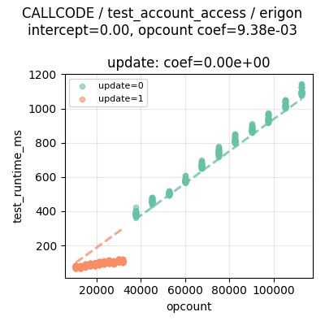


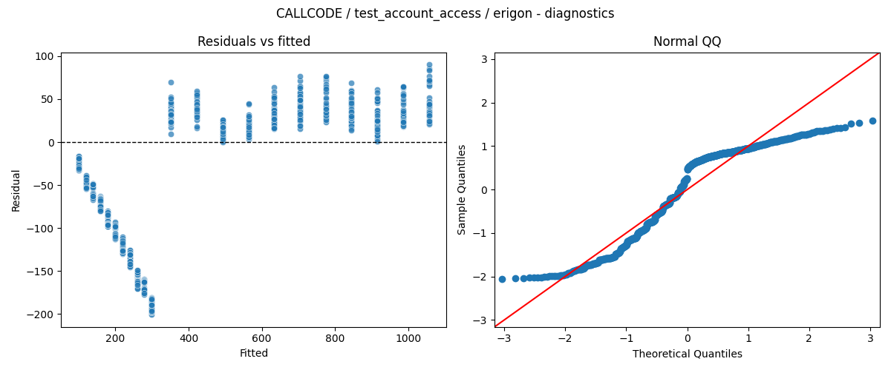

</details>

<details><summary>geth — NNLS regression summary</summary>

```
==============================================================================
                           NNLS Regression Results                            
==============================================================================
Dep. Variable:          test_runtime_ms              R-squared:          0.858
Model:                  NNLS                    Adj. R-squared:          0.858
No. Observations:       1122                              RMSE:         657.54
Df Residuals:           1119                               MAE:         526.29
Df Model:               2      
==============================================================================
                      coef     std err     P-value      [0.025      0.975]
------------------------------------------------------------------------------
         const      0.0000      0.0000       1.000      0.0000      0.0000
       opcount      0.0480      0.0003       0.001      0.0474      0.0487
        update      0.0000      0.0000       1.000      0.0000      0.0000
==============================================================================
Notes: Non-negative least squares with bootstrap inference (1000 iterations)
==============================================================================
```

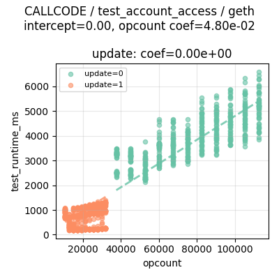


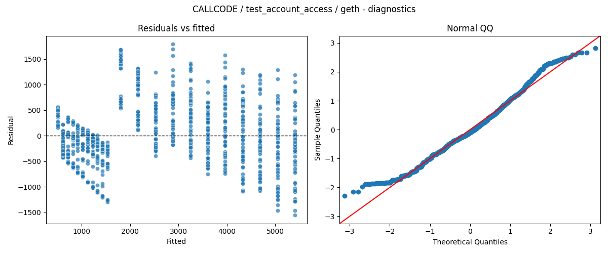

</details>

<details><summary>nethermind — NNLS regression summary</summary>

```
==============================================================================
                           NNLS Regression Results                            
==============================================================================
Dep. Variable:          test_runtime_ms              R-squared:          0.925
Model:                  NNLS                    Adj. R-squared:          0.925
No. Observations:       1364                              RMSE:          60.88
Df Residuals:           1361                               MAE:          47.63
Df Model:               2      
==============================================================================
                      coef     std err     P-value      [0.025      0.975]
------------------------------------------------------------------------------
         const      0.0000      0.0000       1.000      0.0000      0.0000
       opcount      0.0062      0.0000       0.001      0.0061      0.0063
        update      0.0000      0.0000       1.000      0.0000      0.0000
==============================================================================
Notes: Non-negative least squares with bootstrap inference (1000 iterations)
==============================================================================
```

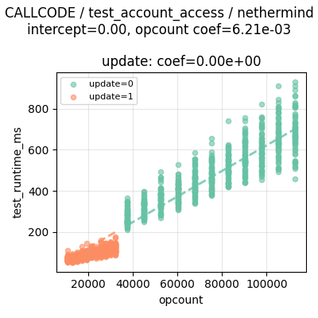

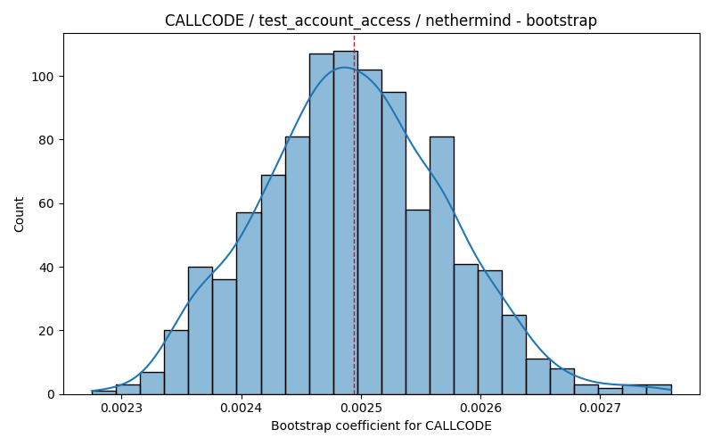

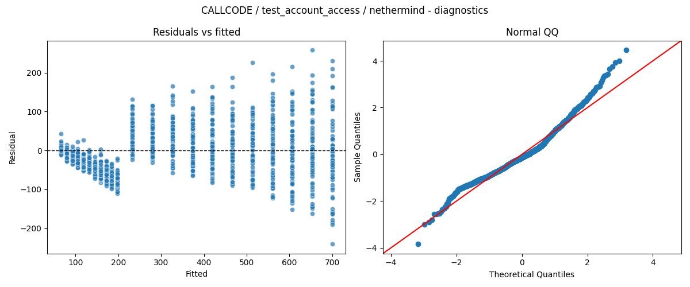

</details>

<details><summary>reth — NNLS regression summary</summary>

```
==============================================================================
                           NNLS Regression Results                            
==============================================================================
Dep. Variable:          test_runtime_ms              R-squared:          0.910
Model:                  NNLS                    Adj. R-squared:          0.910
No. Observations:       2112                              RMSE:          14.70
Df Residuals:           2109                               MAE:          12.73
Df Model:               2      
==============================================================================
                      coef     std err     P-value      [0.025      0.975]
------------------------------------------------------------------------------
         const      0.0000      0.0000       1.000      0.0000      0.0000
       opcount      0.0013      0.0000       0.001      0.0013      0.0013
        update      0.0000      0.0000       1.000      0.0000      0.0000
==============================================================================
Notes: Non-negative least squares with bootstrap inference (1000 iterations)
==============================================================================
```

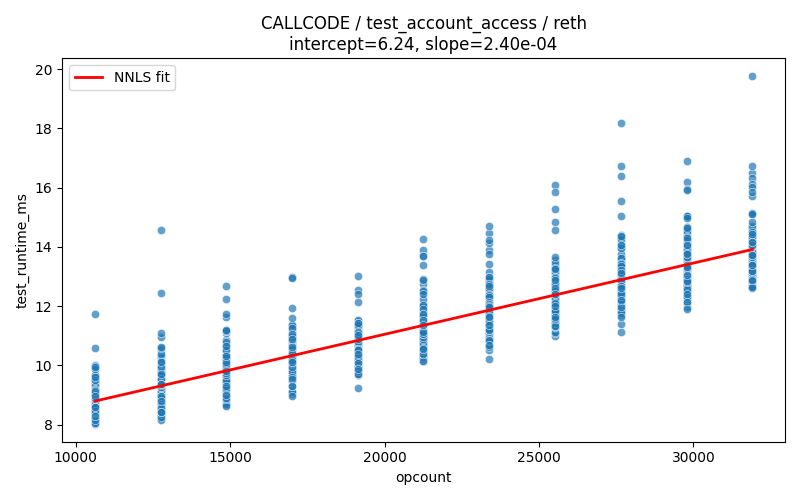

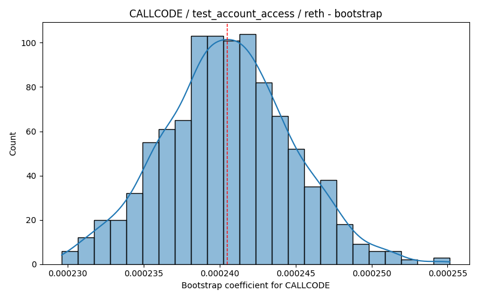

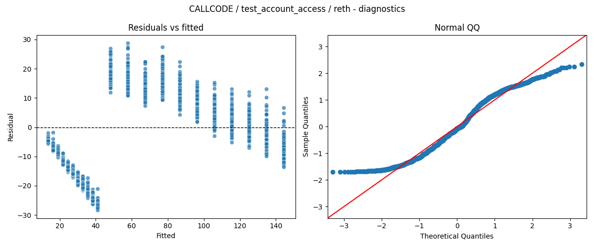

</details>

### test_account_access — combo `CALLCODE_AccountMode.EXISTING_CONTRACT`

| client | nobs | R² | target_coef (ms) | p-value | 95% CI |
| --- | --- | --- | --- | --- | --- |
| `besu` | 572 | 0.9535 | 0.0378 | 1.00e-03 | [0.03707, 0.0385] |
| `erigon` | 836 | 0.9573 | 0.1029 | 1.00e-03 | [0.1018, 0.1042] |
| `geth` | 1122 | 0.8717 | 0.04649 | 1.00e-03 | [0.04532, 0.04761] |
| `nethermind` | 1364 | 0.9253 | 0.02314 | 1.00e-03 | [0.02267, 0.02358] |
| `reth` | 2112 | 0.8938 | 0.03742 | 1.00e-03 | [0.03711, 0.03772] |

<details><summary>besu — NNLS regression summary</summary>

```
==============================================================================
                           NNLS Regression Results                            
==============================================================================
Dep. Variable:          test_runtime_ms              R-squared:          0.954
Model:                  NNLS                    Adj. R-squared:          0.953
No. Observations:       572                               RMSE:         222.74
Df Residuals:           569                                MAE:         173.06
Df Model:               2      
==============================================================================
                      coef     std err     P-value      [0.025      0.975]
------------------------------------------------------------------------------
         const    112.4693     14.2049       0.001     85.3153    140.8380
       opcount      0.0378      0.0004       0.001      0.0371      0.0385
        update      0.0000      0.0000       1.000      0.0000      0.0000
==============================================================================
Notes: Non-negative least squares with bootstrap inference (1000 iterations)
==============================================================================
```

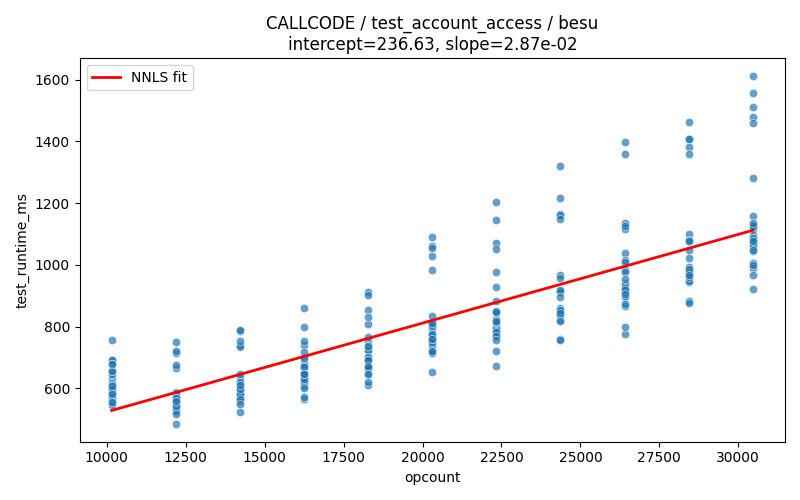


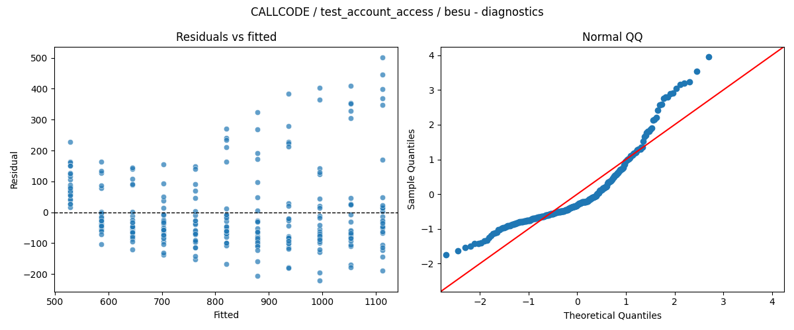

</details>

<details><summary>erigon — NNLS regression summary</summary>

```
==============================================================================
                           NNLS Regression Results                            
==============================================================================
Dep. Variable:          test_runtime_ms              R-squared:          0.957
Model:                  NNLS                    Adj. R-squared:          0.957
No. Observations:       836                               RMSE:         580.17
Df Residuals:           833                                MAE:         406.32
Df Model:               2      
==============================================================================
                      coef     std err     P-value      [0.025      0.975]
------------------------------------------------------------------------------
         const    320.2153     23.8061       0.001    274.9777    367.5213
       opcount      0.1029      0.0006       0.001      0.1018      0.1042
        update      0.0000      0.0000       1.000      0.0000      0.0000
==============================================================================
Notes: Non-negative least squares with bootstrap inference (1000 iterations)
==============================================================================
```

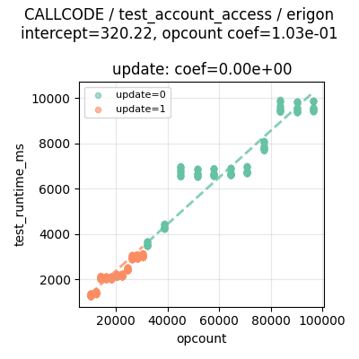


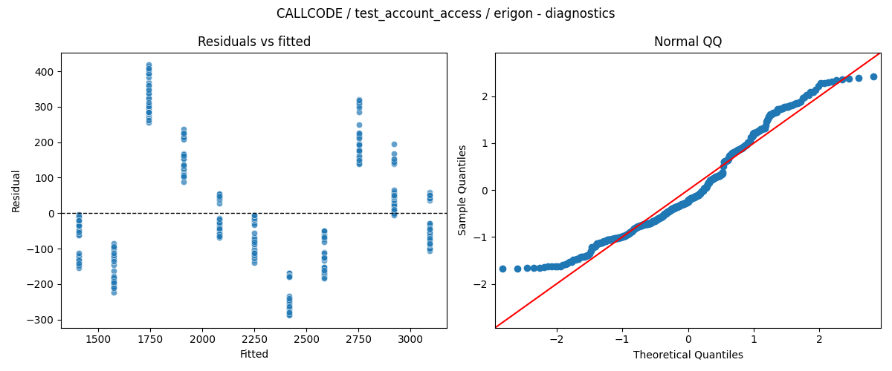

</details>

<details><summary>geth — NNLS regression summary</summary>

```
==============================================================================
                           NNLS Regression Results                            
==============================================================================
Dep. Variable:          test_runtime_ms              R-squared:          0.872
Model:                  NNLS                    Adj. R-squared:          0.871
No. Observations:       1122                              RMSE:         476.20
Df Residuals:           1119                               MAE:         360.58
Df Model:               2      
==============================================================================
                      coef     std err     P-value      [0.025      0.975]
------------------------------------------------------------------------------
         const    501.0280     20.9189       0.001    462.0246    541.7424
       opcount      0.0465      0.0006       0.001      0.0453      0.0476
        update      0.0000      0.0000       1.000      0.0000      0.0000
==============================================================================
Notes: Non-negative least squares with bootstrap inference (1000 iterations)
==============================================================================
```

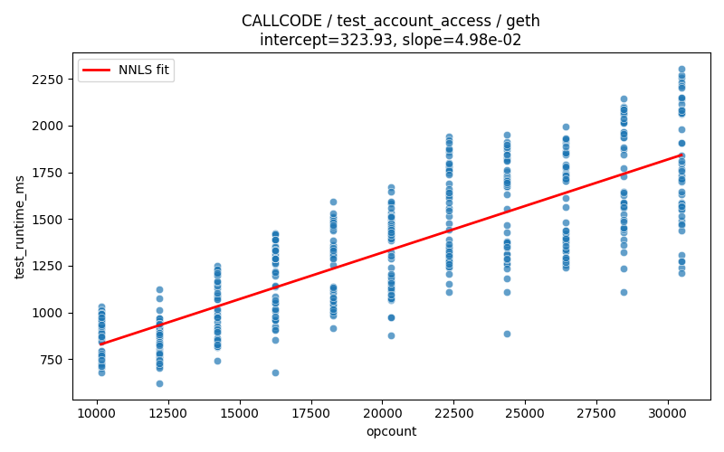


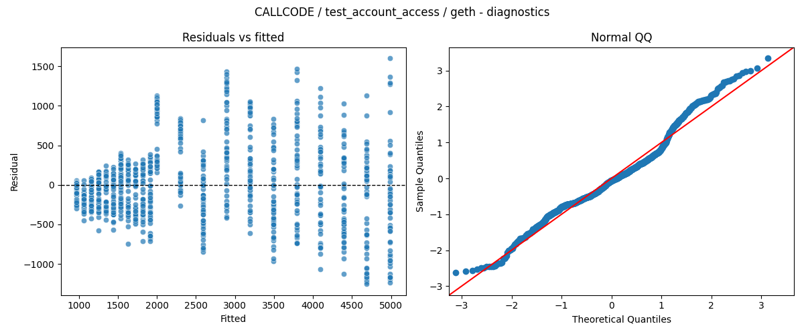

</details>

<details><summary>nethermind — NNLS regression summary</summary>

```
==============================================================================
                           NNLS Regression Results                            
==============================================================================
Dep. Variable:          test_runtime_ms              R-squared:          0.925
Model:                  NNLS                    Adj. R-squared:          0.925
No. Observations:       1364                              RMSE:         175.54
Df Residuals:           1361                               MAE:         114.20
Df Model:               2      
==============================================================================
                      coef     std err     P-value      [0.025      0.975]
------------------------------------------------------------------------------
         const     79.6137      7.3092       0.001     66.0621     94.9651
       opcount      0.0231      0.0002       0.001      0.0227      0.0236
        update      0.0000      0.0000       1.000      0.0000      0.0000
==============================================================================
Notes: Non-negative least squares with bootstrap inference (1000 iterations)
==============================================================================
```

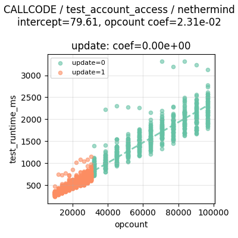

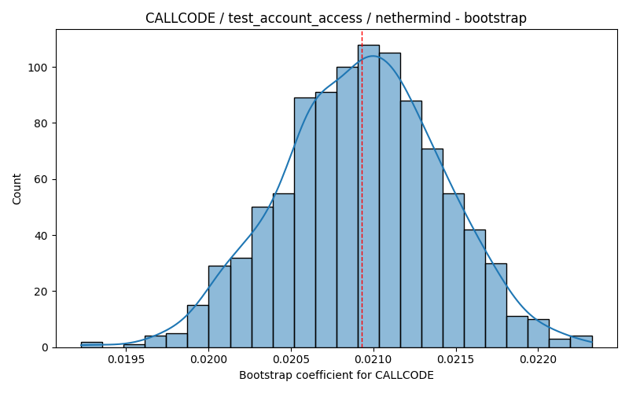

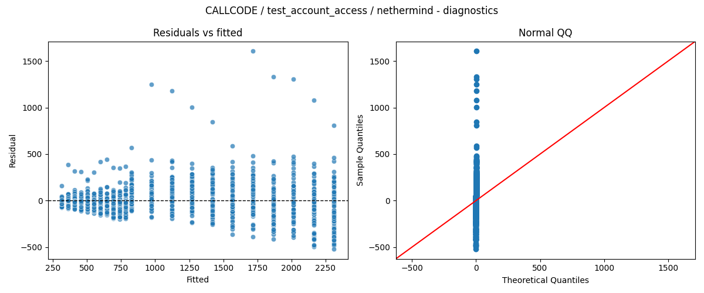

</details>

<details><summary>reth — NNLS regression summary</summary>

```
==============================================================================
                           NNLS Regression Results                            
==============================================================================
Dep. Variable:          test_runtime_ms              R-squared:          0.894
Model:                  NNLS                    Adj. R-squared:          0.894
No. Observations:       2112                              RMSE:         383.47
Df Residuals:           2109                               MAE:         287.59
Df Model:               2      
==============================================================================
                      coef     std err     P-value      [0.025      0.975]
------------------------------------------------------------------------------
         const      0.0000      0.0000       1.000      0.0000      0.0000
       opcount      0.0374      0.0002       0.001      0.0371      0.0377
        update      0.0000      0.0000       1.000      0.0000      0.0000
==============================================================================
Notes: Non-negative least squares with bootstrap inference (1000 iterations)
==============================================================================
```

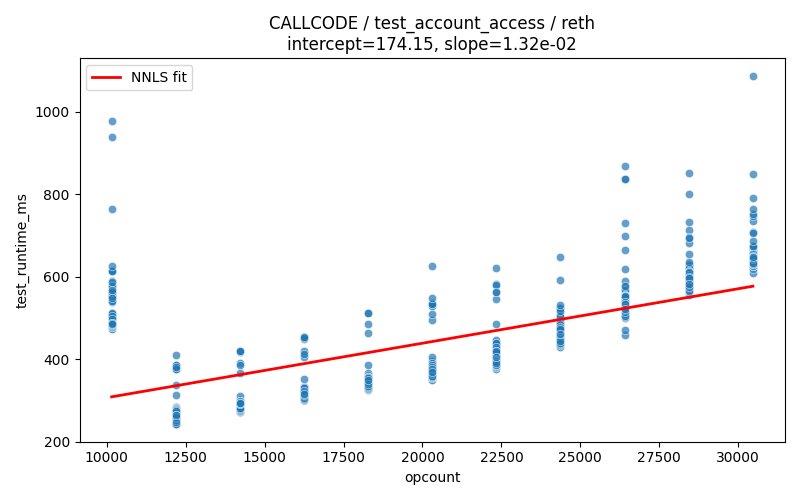

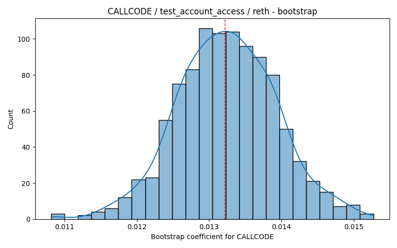

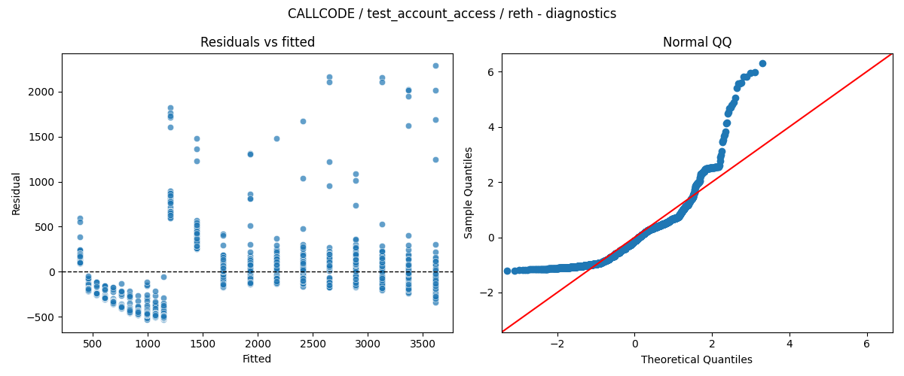

</details>

### test_account_access — combo `CALLCODE_AccountMode.NON_EXISTING_ACCOUNT` — `presets[cold_account_code_access]`

| client | nobs | R² | target_coef (ms) | p-value | 95% CI |
| --- | --- | --- | --- | --- | --- |
| `besu` | 572 | 0.9178 | 0.01698 | 1.00e-03 | [0.01659, 0.01735] |
| `erigon` | 836 | 0.9408 | 0.009376 | 1.00e-03 | [0.009307, 0.00944] |
| `geth` | 1122 | 0.8582 | 0.04802 | 1.00e-03 | [0.04739, 0.04873] |
| `nethermind` | 1364 | 0.9248 | 0.006213 | 1.00e-03 | [0.006137, 0.006289] |
| `reth` | 2112 | 0.9101 | 0.001281 | 1.00e-03 | [0.001274, 0.001288] |

<details><summary>besu — NNLS regression summary</summary>

```
==============================================================================
                           NNLS Regression Results                            
==============================================================================
Dep. Variable:          test_runtime_ms              R-squared:          0.918
Model:                  NNLS                    Adj. R-squared:          0.918
No. Observations:       572                               RMSE:         163.02
Df Residuals:           569                                MAE:         128.11
Df Model:               2      
==============================================================================
                      coef     std err     P-value      [0.025      0.975]
------------------------------------------------------------------------------
         const     82.0819     10.3289       0.001     62.4260    103.0368
       opcount      0.0170      0.0002       0.001      0.0166      0.0173
        update      0.0000      0.0000       1.000      0.0000      0.0000
==============================================================================
Notes: Non-negative least squares with bootstrap inference (1000 iterations)
==============================================================================
```


</details>

<details><summary>erigon — NNLS regression summary</summary>

```
==============================================================================
                           NNLS Regression Results                            
==============================================================================
Dep. Variable:          test_runtime_ms              R-squared:          0.941
Model:                  NNLS                    Adj. R-squared:          0.941
No. Observations:       836                               RMSE:          87.64
Df Residuals:           833                                MAE:          69.90
Df Model:               2      
==============================================================================
                      coef     std err     P-value      [0.025      0.975]
------------------------------------------------------------------------------
         const      0.0000      0.0000       1.000      0.0000      0.0000
       opcount      0.0094      0.0000       0.001      0.0093      0.0094
        update      0.0000      0.0000       1.000      0.0000      0.0000
==============================================================================
Notes: Non-negative least squares with bootstrap inference (1000 iterations)
==============================================================================
```


</details>

<details><summary>geth — NNLS regression summary</summary>

```
==============================================================================
                           NNLS Regression Results                            
==============================================================================
Dep. Variable:          test_runtime_ms              R-squared:          0.858
Model:                  NNLS                    Adj. R-squared:          0.858
No. Observations:       1122                              RMSE:         657.54
Df Residuals:           1119                               MAE:         526.29
Df Model:               2      
==============================================================================
                      coef     std err     P-value      [0.025      0.975]
------------------------------------------------------------------------------
         const      0.0000      0.0000       1.000      0.0000      0.0000
       opcount      0.0480      0.0003       0.001      0.0474      0.0487
        update      0.0000      0.0000       1.000      0.0000      0.0000
==============================================================================
Notes: Non-negative least squares with bootstrap inference (1000 iterations)
==============================================================================
```


</details>

<details><summary>nethermind — NNLS regression summary</summary>

```
==============================================================================
                           NNLS Regression Results                            
==============================================================================
Dep. Variable:          test_runtime_ms              R-squared:          0.925
Model:                  NNLS                    Adj. R-squared:          0.925
No. Observations:       1364                              RMSE:          60.88
Df Residuals:           1361                               MAE:          47.63
Df Model:               2      
==============================================================================
                      coef     std err     P-value      [0.025      0.975]
------------------------------------------------------------------------------
         const      0.0000      0.0000       1.000      0.0000      0.0000
       opcount      0.0062      0.0000       0.001      0.0061      0.0063
        update      0.0000      0.0000       1.000      0.0000      0.0000
==============================================================================
Notes: Non-negative least squares with bootstrap inference (1000 iterations)
==============================================================================
```


</details>

<details><summary>reth — NNLS regression summary</summary>

```
==============================================================================
                           NNLS Regression Results                            
==============================================================================
Dep. Variable:          test_runtime_ms              R-squared:          0.910
Model:                  NNLS                    Adj. R-squared:          0.910
No. Observations:       2112                              RMSE:          14.70
Df Residuals:           2109                               MAE:          12.73
Df Model:               2      
==============================================================================
                      coef     std err     P-value      [0.025      0.975]
------------------------------------------------------------------------------
         const      0.0000      0.0000       1.000      0.0000      0.0000
       opcount      0.0013      0.0000       0.001      0.0013      0.0013
        update      0.0000      0.0000       1.000      0.0000      0.0000
==============================================================================
Notes: Non-negative least squares with bootstrap inference (1000 iterations)
==============================================================================
```


</details>

### test_ext_account_query_warm — combo `CALLCODE`

| client | nobs | R² | target_coef (ms) | p-value | 95% CI |
| --- | --- | --- | --- | --- | --- |
| `besu` | 286 | 0.9546 | 0.001356 | 1.00e-03 | [0.001323, 0.001391] |
| `erigon` | 418 | 0.9009 | 0.0002846 | 1.00e-03 | [0.0002758, 0.0002932] |
| `geth` | 561 | 0.9787 | 0.0006909 | 1.00e-03 | [0.0006824, 0.0006998] |
| `nethermind` | 682 | 0.5777 | 0.000533 | 1.00e-03 | [0.0004978, 0.0005688] |
| `reth` | 1056 | 0.9069 | 4.812e-05 | 1.00e-03 | [4.707e-05, 4.912e-05] |

<details><summary>besu — NNLS regression summary</summary>

```
==============================================================================
                           NNLS Regression Results                            
==============================================================================
Dep. Variable:          test_runtime_ms              R-squared:          0.955
Model:                  NNLS                    Adj. R-squared:          0.954
No. Observations:       286                               RMSE:         149.41
Df Residuals:           284                                MAE:         121.34
Df Model:               1      
==============================================================================
                      coef     std err     P-value      [0.025      0.975]
------------------------------------------------------------------------------
         const    774.6343     30.7929       0.001    715.0401    831.5418
       opcount      0.0014      0.0000       0.001      0.0013      0.0014
==============================================================================
Notes: Non-negative least squares with bootstrap inference (1000 iterations)
==============================================================================
```

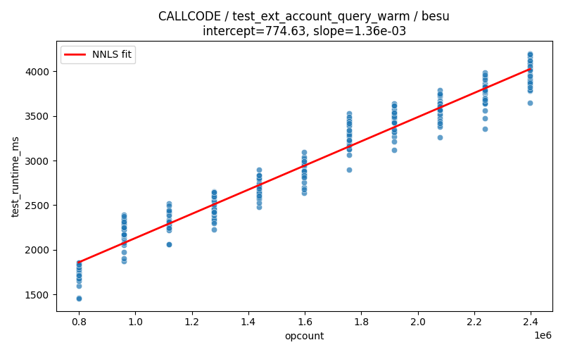

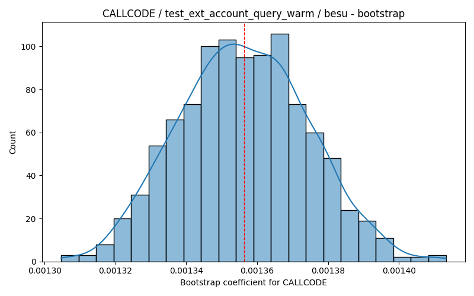

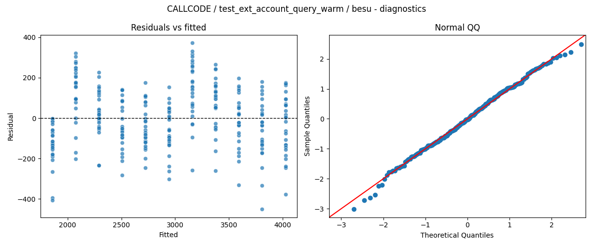

</details>

<details><summary>erigon — NNLS regression summary</summary>

```
==============================================================================
                           NNLS Regression Results                            
==============================================================================
Dep. Variable:          test_runtime_ms              R-squared:          0.901
Model:                  NNLS                    Adj. R-squared:          0.901
No. Observations:       418                               RMSE:          47.69
Df Residuals:           416                                MAE:          38.73
Df Model:               1      
==============================================================================
                      coef     std err     P-value      [0.025      0.975]
------------------------------------------------------------------------------
         const     52.2219      6.7862       0.001     39.6988     65.1955
       opcount      0.0003      0.0000       0.001      0.0003      0.0003
==============================================================================
Notes: Non-negative least squares with bootstrap inference (1000 iterations)
==============================================================================
```

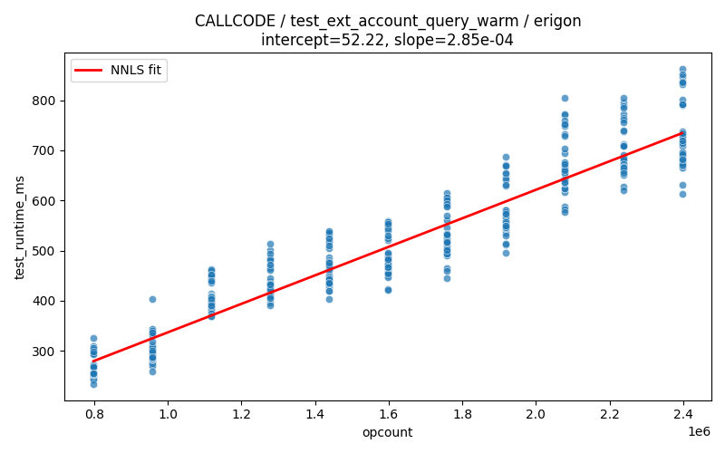

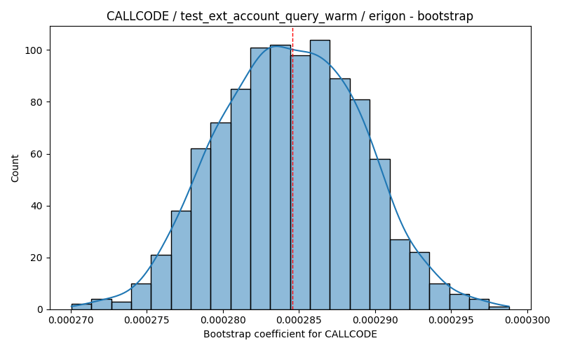

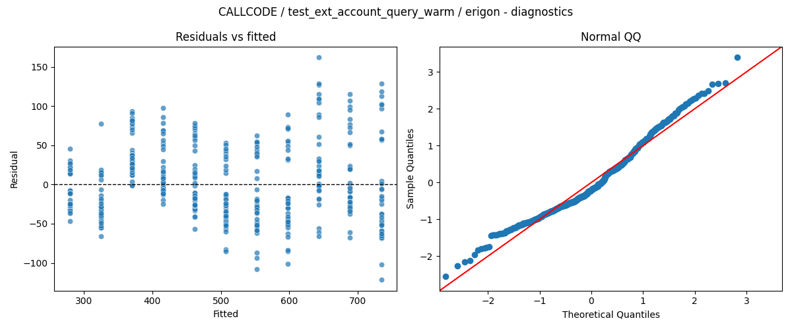

</details>

<details><summary>geth — NNLS regression summary</summary>

```
==============================================================================
                           NNLS Regression Results                            
==============================================================================
Dep. Variable:          test_runtime_ms              R-squared:          0.979
Model:                  NNLS                    Adj. R-squared:          0.979
No. Observations:       561                               RMSE:          51.56
Df Residuals:           559                                MAE:          39.93
Df Model:               1      
==============================================================================
                      coef     std err     P-value      [0.025      0.975]
------------------------------------------------------------------------------
         const     16.5620      6.4072       0.004      4.1566     29.5839
       opcount      0.0007      0.0000       0.001      0.0007      0.0007
==============================================================================
Notes: Non-negative least squares with bootstrap inference (1000 iterations)
==============================================================================
```

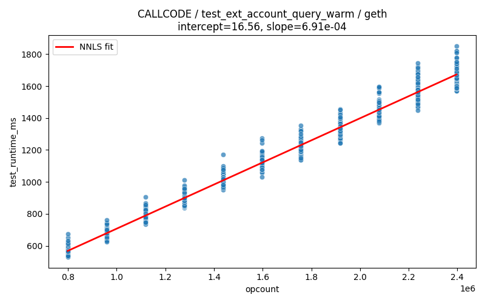

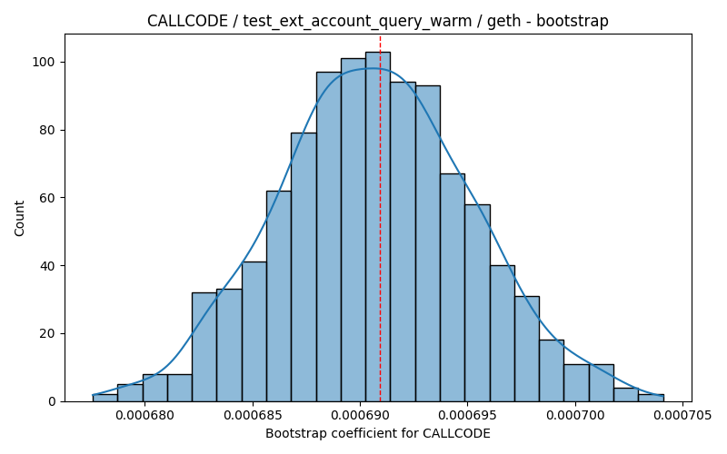

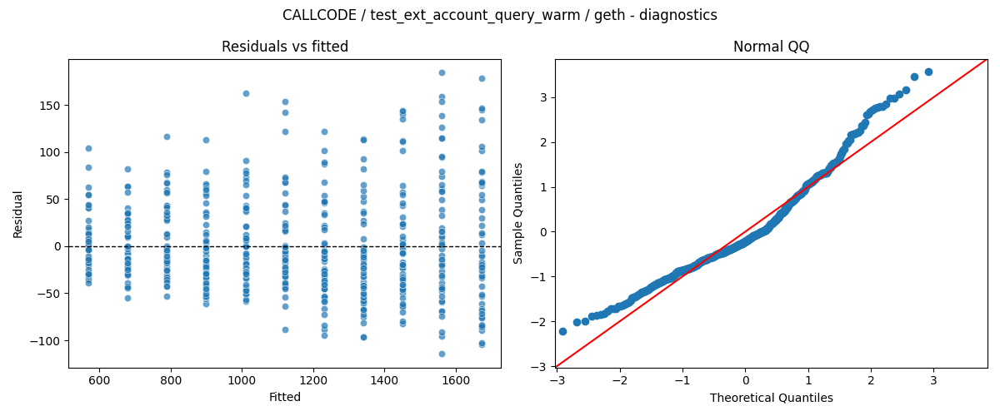

</details>

<details><summary>nethermind — NNLS regression summary</summary>

```
==============================================================================
                           NNLS Regression Results                            
==============================================================================
Dep. Variable:          test_runtime_ms              R-squared:          0.578
Model:                  NNLS                    Adj. R-squared:          0.577
No. Observations:       682                               RMSE:         230.26
Df Residuals:           680                                MAE:         181.53
Df Model:               1      
==============================================================================
                      coef     std err     P-value      [0.025      0.975]
------------------------------------------------------------------------------
         const    365.4173     25.1595       0.001    315.8339    416.7247
       opcount      0.0005      0.0000       0.001      0.0005      0.0006
==============================================================================
Notes: Non-negative least squares with bootstrap inference (1000 iterations)
==============================================================================
```

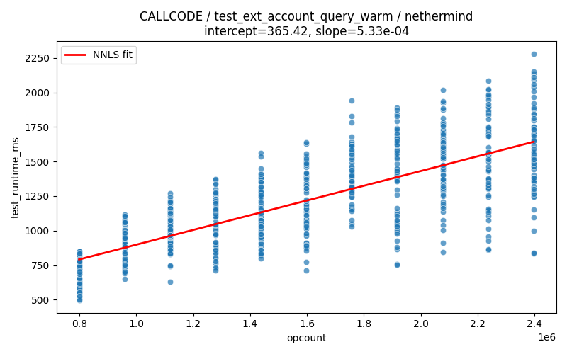

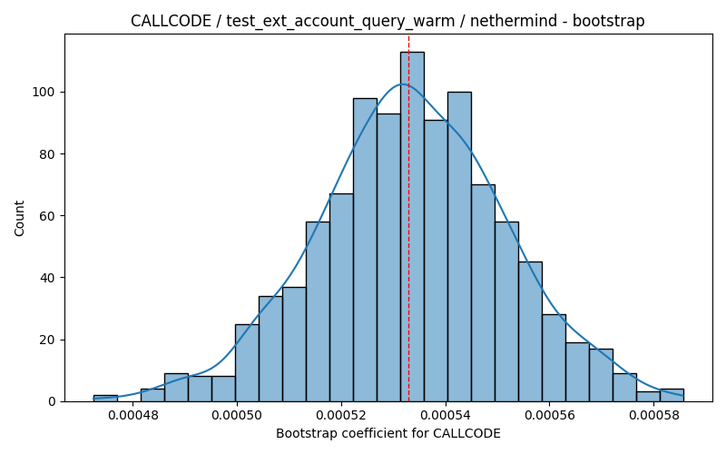

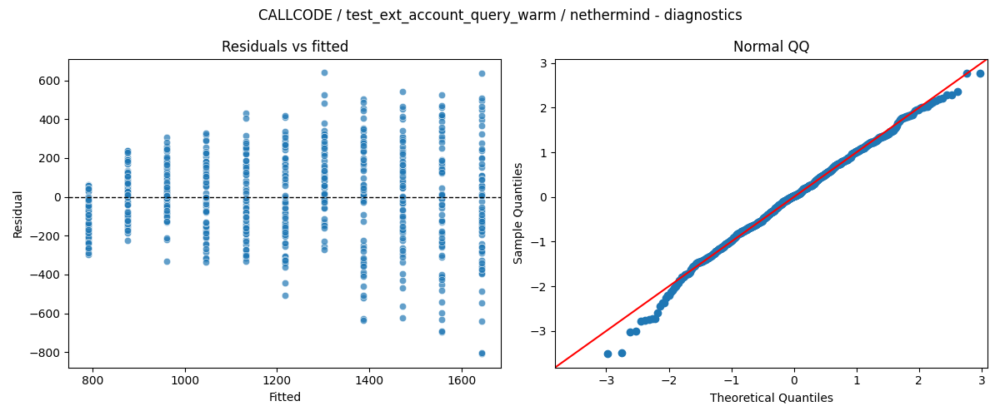

</details>

<details><summary>reth — NNLS regression summary</summary>

```
==============================================================================
                           NNLS Regression Results                            
==============================================================================
Dep. Variable:          test_runtime_ms              R-squared:          0.907
Model:                  NNLS                    Adj. R-squared:          0.907
No. Observations:       1056                              RMSE:           7.79
Df Residuals:           1054                               MAE:           6.31
Df Model:               1      
==============================================================================
                      coef     std err     P-value      [0.025      0.975]
------------------------------------------------------------------------------
         const     16.5775      0.8410       0.001     14.9413     18.3254
       opcount      0.0000      0.0000       0.001      0.0000      0.0000
==============================================================================
Notes: Non-negative least squares with bootstrap inference (1000 iterations)
==============================================================================
```

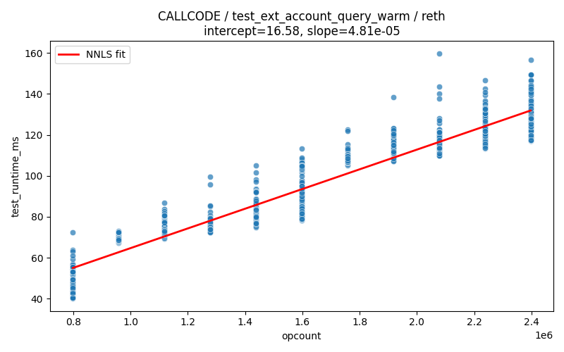

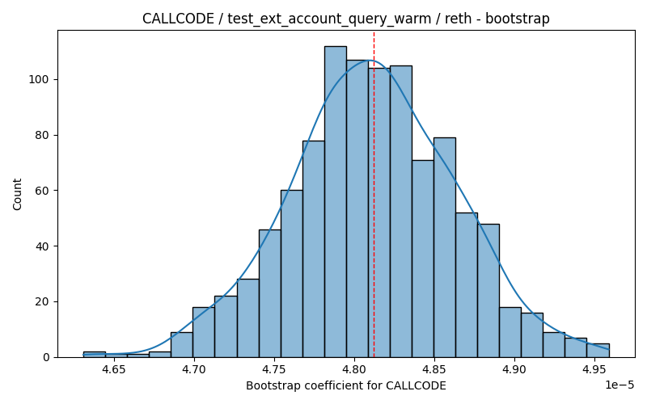

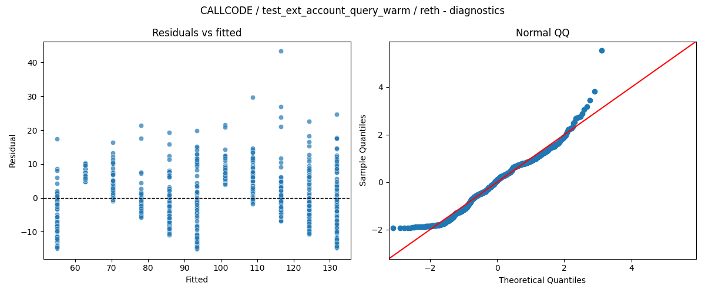

</details>

## DELEGATECALL

### test_account_access — combo `DELEGATECALL_AccountMode.EXISTING_EOA`

| client | nobs | R² | target_coef (ms) | p-value | 95% CI |
| --- | --- | --- | --- | --- | --- |
| `besu` | 286 | 0.6547 | 0.01836 | 1.00e-03 | [0.01664, 0.01976] |
| `erigon` | 418 | 0.9957 | 0.01012 | 1.00e-03 | [0.01006, 0.01019] |
| `geth` | 561 | 0.7086 | 0.0123 | 1.00e-03 | [0.01169, 0.01294] |
| `nethermind` | 682 | 0.7724 | 0.005941 | 1.00e-03 | [0.00571, 0.006202] |
| `reth` | 1056 | 0.9712 | 0.001123 | 1.00e-03 | [0.001111, 0.001135] |

<details><summary>besu — NNLS regression summary</summary>

```
==============================================================================
                           NNLS Regression Results                            
==============================================================================
Dep. Variable:          test_runtime_ms              R-squared:          0.655
Model:                  NNLS                    Adj. R-squared:          0.653
No. Observations:       286                               RMSE:         316.95
Df Residuals:           284                                MAE:         235.93
Df Model:               1      
==============================================================================
                      coef     std err     P-value      [0.025      0.975]
------------------------------------------------------------------------------
         const    584.2775     54.2965       0.001    485.4124    698.2947
       opcount      0.0184      0.0008       0.001      0.0166      0.0198
==============================================================================
Notes: Non-negative least squares with bootstrap inference (1000 iterations)
==============================================================================
```

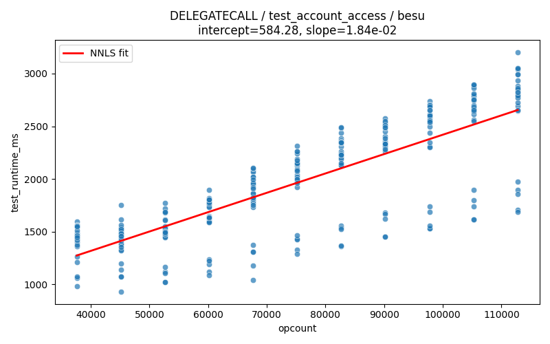

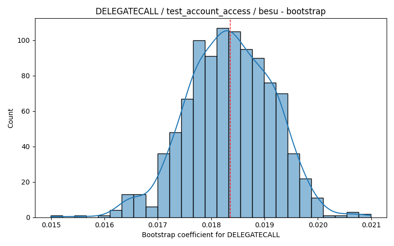

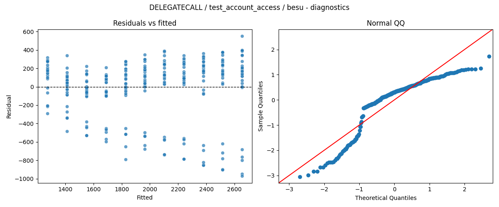

</details>

<details><summary>erigon — NNLS regression summary</summary>

```
==============================================================================
                           NNLS Regression Results                            
==============================================================================
Dep. Variable:          test_runtime_ms              R-squared:          0.996
Model:                  NNLS                    Adj. R-squared:          0.996
No. Observations:       418                               RMSE:          15.80
Df Residuals:           416                                MAE:          12.72
Df Model:               1      
==============================================================================
                      coef     std err     P-value      [0.025      0.975]
------------------------------------------------------------------------------
         const     42.8318      2.2814       0.001     38.2999     47.4411
       opcount      0.0101      0.0000       0.001      0.0101      0.0102
==============================================================================
Notes: Non-negative least squares with bootstrap inference (1000 iterations)
==============================================================================
```


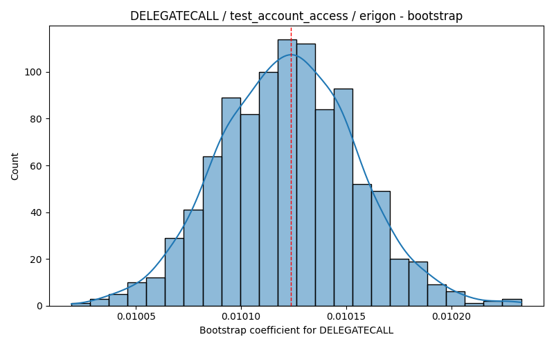

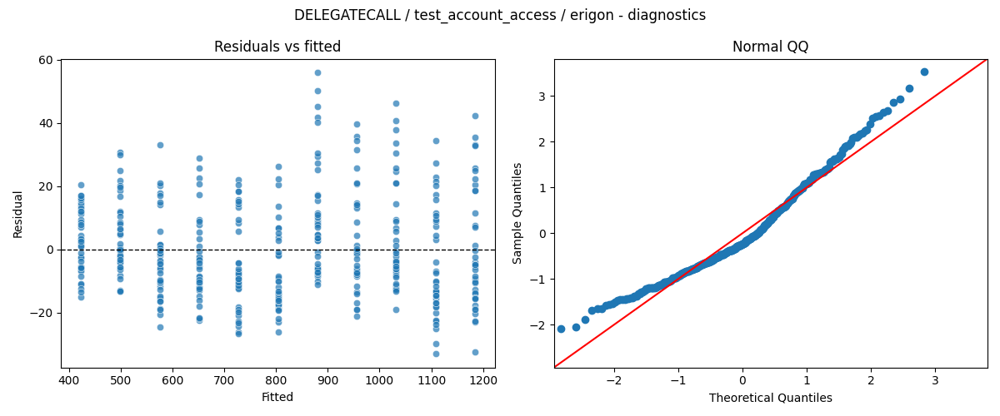

</details>

<details><summary>geth — NNLS regression summary</summary>

```
==============================================================================
                           NNLS Regression Results                            
==============================================================================
Dep. Variable:          test_runtime_ms              R-squared:          0.709
Model:                  NNLS                    Adj. R-squared:          0.708
No. Observations:       561                               RMSE:         187.45
Df Residuals:           559                                MAE:         158.55
Df Model:               1      
==============================================================================
                      coef     std err     P-value      [0.025      0.975]
------------------------------------------------------------------------------
         const    497.1733     25.0926       0.001    448.8567    543.9733
       opcount      0.0123      0.0003       0.001      0.0117      0.0129
==============================================================================
Notes: Non-negative least squares with bootstrap inference (1000 iterations)
==============================================================================
```

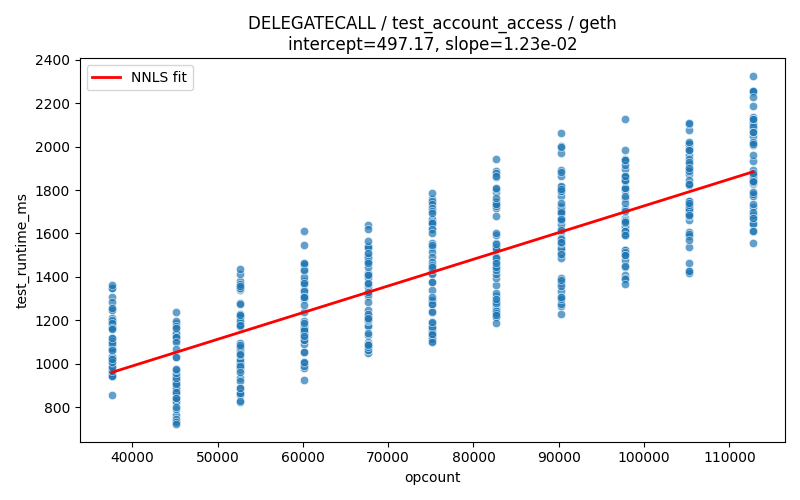

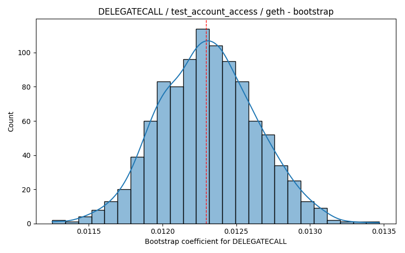

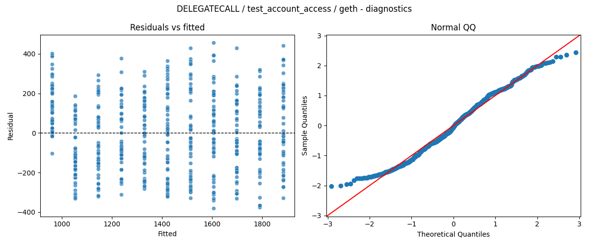

</details>

<details><summary>nethermind — NNLS regression summary</summary>

```
==============================================================================
                           NNLS Regression Results                            
==============================================================================
Dep. Variable:          test_runtime_ms              R-squared:          0.772
Model:                  NNLS                    Adj. R-squared:          0.772
No. Observations:       682                               RMSE:          76.67
Df Residuals:           680                                MAE:          58.89
Df Model:               1      
==============================================================================
                      coef     std err     P-value      [0.025      0.975]
------------------------------------------------------------------------------
         const     74.3194      8.5270       0.001     56.7816     90.7112
       opcount      0.0059      0.0001       0.001      0.0057      0.0062
==============================================================================
Notes: Non-negative least squares with bootstrap inference (1000 iterations)
==============================================================================
```

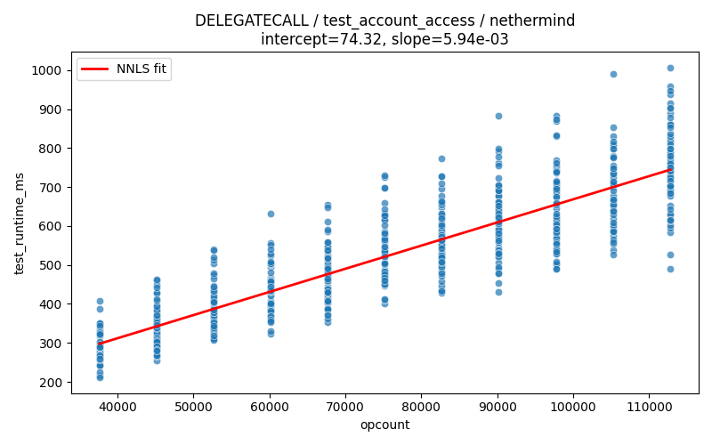

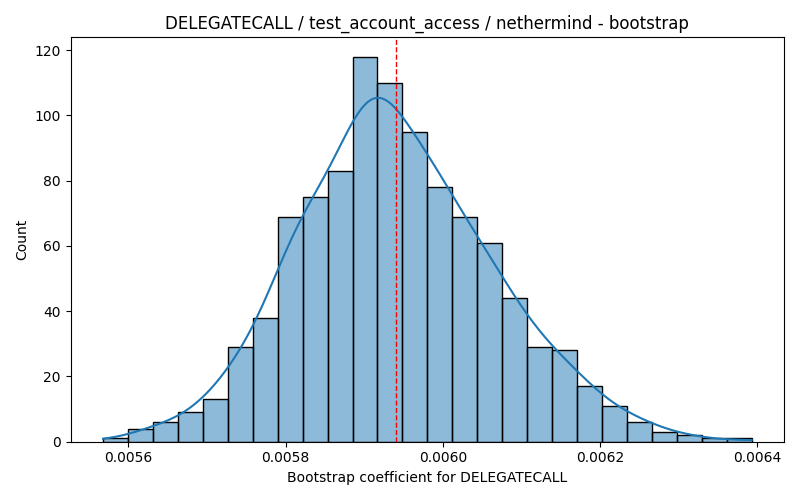

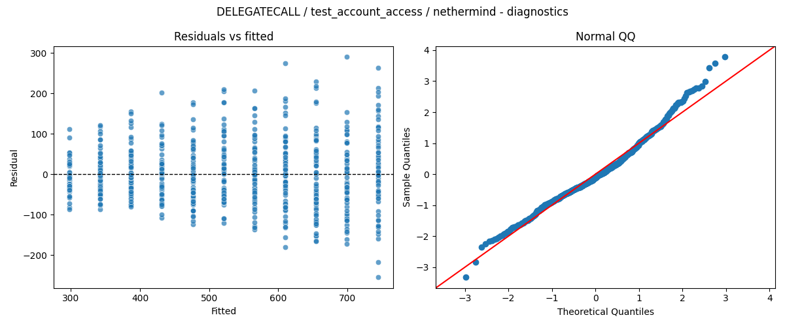

</details>

<details><summary>reth — NNLS regression summary</summary>

```
==============================================================================
                           NNLS Regression Results                            
==============================================================================
Dep. Variable:          test_runtime_ms              R-squared:          0.971
Model:                  NNLS                    Adj. R-squared:          0.971
No. Observations:       1056                              RMSE:           4.60
Df Residuals:           1054                               MAE:           3.55
Df Model:               1      
==============================================================================
                      coef     std err     P-value      [0.025      0.975]
------------------------------------------------------------------------------
         const     32.1884      0.5258       0.001     31.1326     33.1896
       opcount      0.0011      0.0000       0.001      0.0011      0.0011
==============================================================================
Notes: Non-negative least squares with bootstrap inference (1000 iterations)
==============================================================================
```

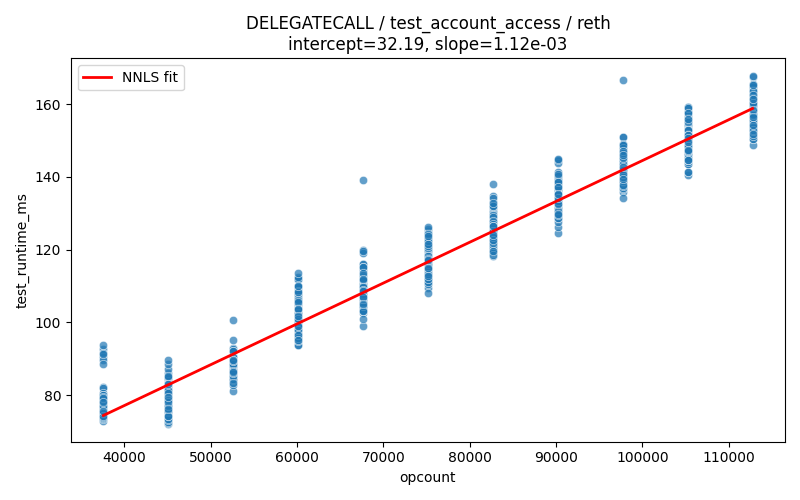

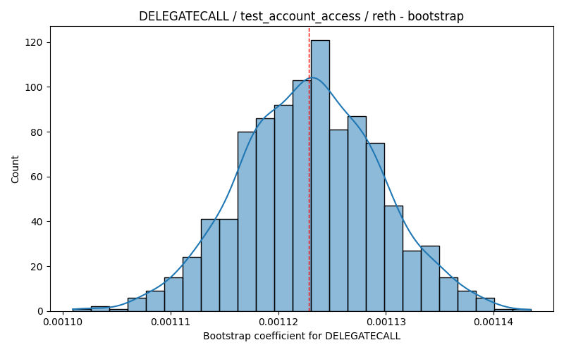

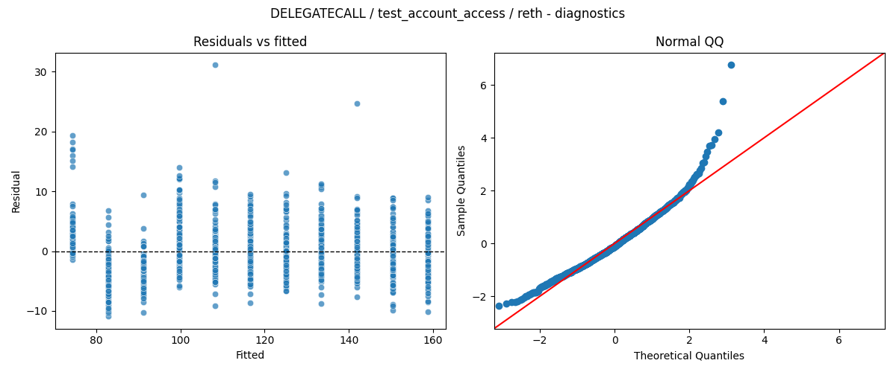

</details>

### test_account_access — combo `DELEGATECALL_AccountMode.NON_EXISTING_ACCOUNT` — `presets[cold_account_nocode_access]`

| client | nobs | R² | target_coef (ms) | p-value | 95% CI |
| --- | --- | --- | --- | --- | --- |
| `besu` | 286 | 0.8551 | 0.01191 | 1.00e-03 | [0.01136, 0.01253] |
| `erigon` | 418 | 0.9959 | 0.009545 | 1.00e-03 | [0.009486, 0.009606] |
| `geth` | 561 | 0.6202 | 0.03177 | 1.00e-03 | [0.02958, 0.03408] |
| `nethermind` | 682 | 0.7811 | 0.005527 | 1.00e-03 | [0.005301, 0.00577] |
| `reth` | 1056 | 0.9727 | 0.0009602 | 1.00e-03 | [0.0009511, 0.0009701] |

<details><summary>besu — NNLS regression summary</summary>

```
==============================================================================
                           NNLS Regression Results                            
==============================================================================
Dep. Variable:          test_runtime_ms              R-squared:          0.855
Model:                  NNLS                    Adj. R-squared:          0.855
No. Observations:       286                               RMSE:         116.56
Df Residuals:           284                                MAE:          94.87
Df Model:               1      
==============================================================================
                      coef     std err     P-value      [0.025      0.975]
------------------------------------------------------------------------------
         const    523.7447     22.5830       0.001    476.4728    563.8939
       opcount      0.0119      0.0003       0.001      0.0114      0.0125
==============================================================================
Notes: Non-negative least squares with bootstrap inference (1000 iterations)
==============================================================================
```

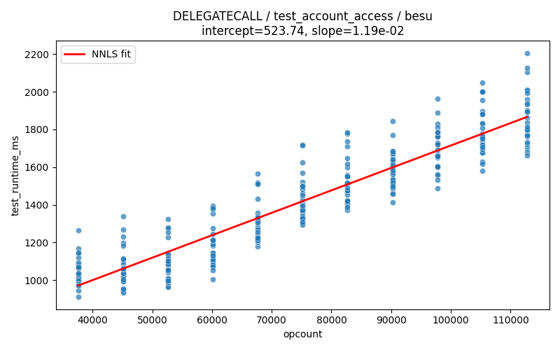

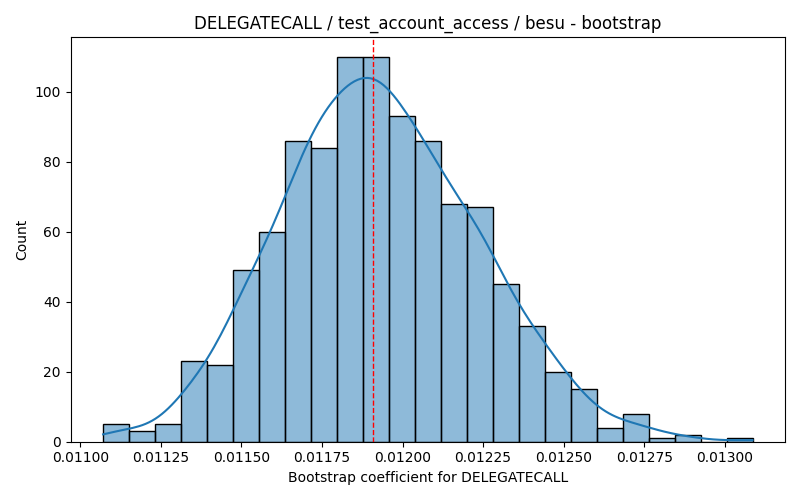

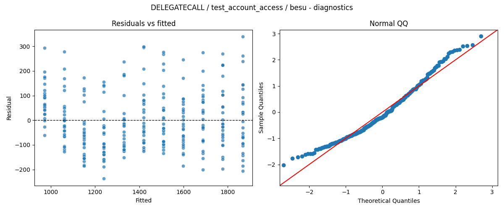

</details>

<details><summary>erigon — NNLS regression summary</summary>

```
==============================================================================
                           NNLS Regression Results                            
==============================================================================
Dep. Variable:          test_runtime_ms              R-squared:          0.996
Model:                  NNLS                    Adj. R-squared:          0.996
No. Observations:       418                               RMSE:          14.49
Df Residuals:           416                                MAE:          11.15
Df Model:               1      
==============================================================================
                      coef     std err     P-value      [0.025      0.975]
------------------------------------------------------------------------------
         const     19.0801      2.2654       0.001     14.4258     23.4695
       opcount      0.0095      0.0000       0.001      0.0095      0.0096
==============================================================================
Notes: Non-negative least squares with bootstrap inference (1000 iterations)
==============================================================================
```

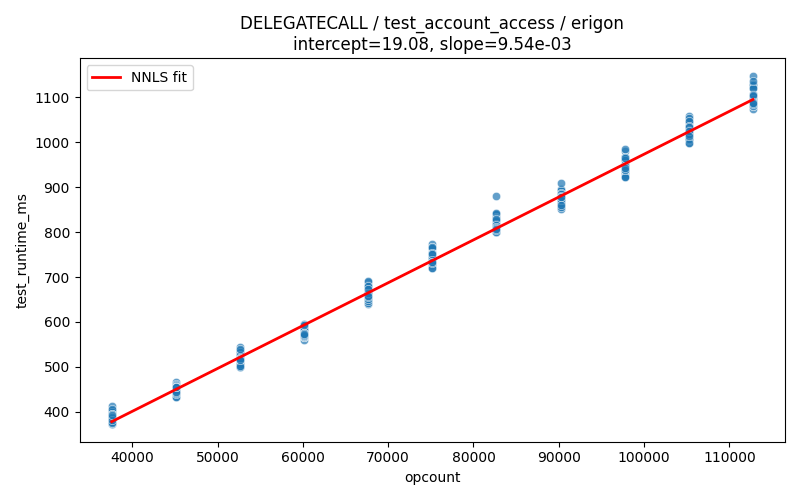

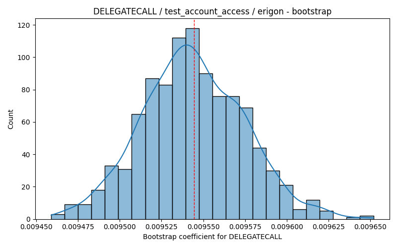

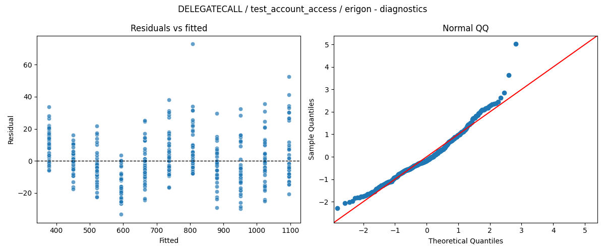

</details>

<details><summary>geth — NNLS regression summary</summary>

```
==============================================================================
                           NNLS Regression Results                            
==============================================================================
Dep. Variable:          test_runtime_ms              R-squared:          0.620
Model:                  NNLS                    Adj. R-squared:          0.620
No. Observations:       561                               RMSE:         591.06
Df Residuals:           559                                MAE:         484.86
Df Model:               1      
==============================================================================
                      coef     std err     P-value      [0.025      0.975]
------------------------------------------------------------------------------
         const   1470.2510     81.2951       0.001   1302.5444   1632.8158
       opcount      0.0318      0.0011       0.001      0.0296      0.0341
==============================================================================
Notes: Non-negative least squares with bootstrap inference (1000 iterations)
==============================================================================
```

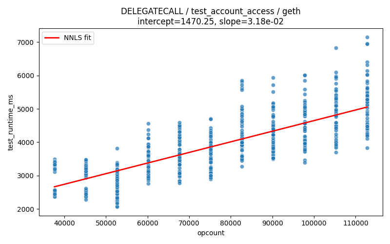

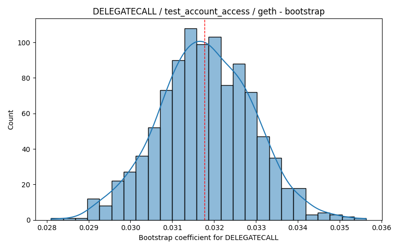

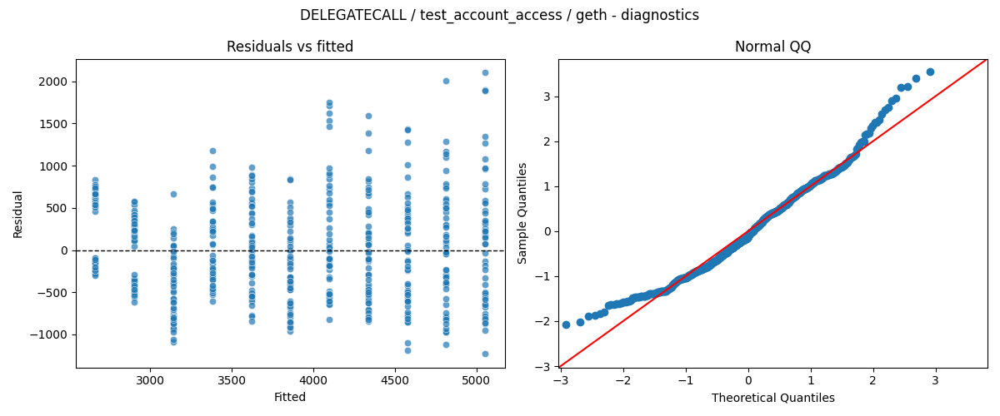

</details>

<details><summary>nethermind — NNLS regression summary</summary>

```
==============================================================================
                           NNLS Regression Results                            
==============================================================================
Dep. Variable:          test_runtime_ms              R-squared:          0.781
Model:                  NNLS                    Adj. R-squared:          0.781
No. Observations:       682                               RMSE:          69.56
Df Residuals:           680                                MAE:          53.27
Df Model:               1      
==============================================================================
                      coef     std err     P-value      [0.025      0.975]
------------------------------------------------------------------------------
         const     70.6502      7.9873       0.001     53.7858     84.9926
       opcount      0.0055      0.0001       0.001      0.0053      0.0058
==============================================================================
Notes: Non-negative least squares with bootstrap inference (1000 iterations)
==============================================================================
```

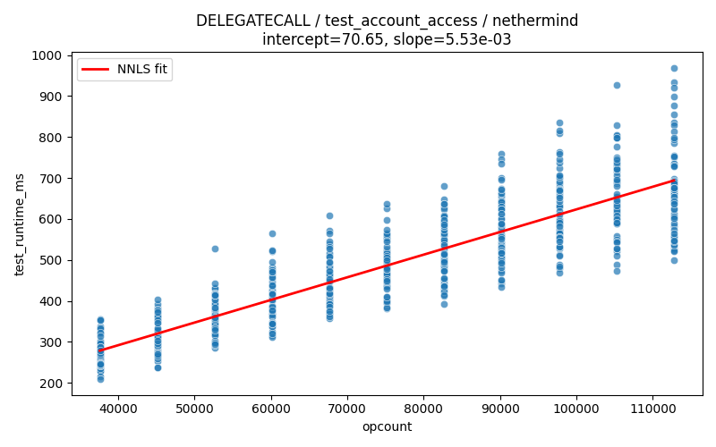

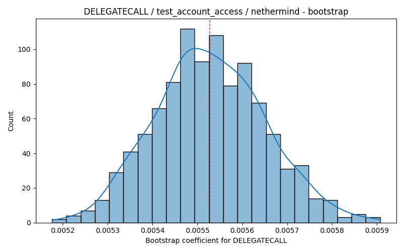

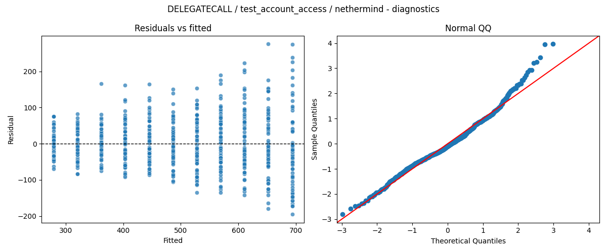

</details>

<details><summary>reth — NNLS regression summary</summary>

```
==============================================================================
                           NNLS Regression Results                            
==============================================================================
Dep. Variable:          test_runtime_ms              R-squared:          0.973
Model:                  NNLS                    Adj. R-squared:          0.973
No. Observations:       1056                              RMSE:           3.82
Df Residuals:           1054                               MAE:           3.01
Df Model:               1      
==============================================================================
                      coef     std err     P-value      [0.025      0.975]
------------------------------------------------------------------------------
         const     31.6537      0.3879       0.001     30.8902     32.4446
       opcount      0.0010      0.0000       0.001      0.0010      0.0010
==============================================================================
Notes: Non-negative least squares with bootstrap inference (1000 iterations)
==============================================================================
```

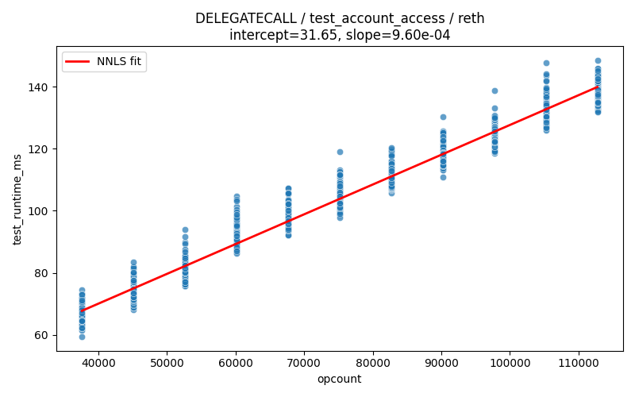

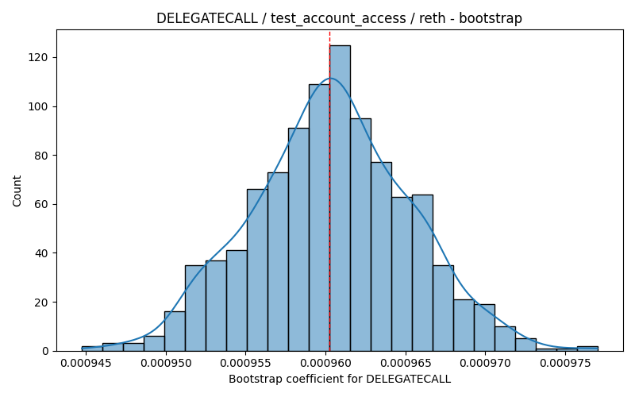

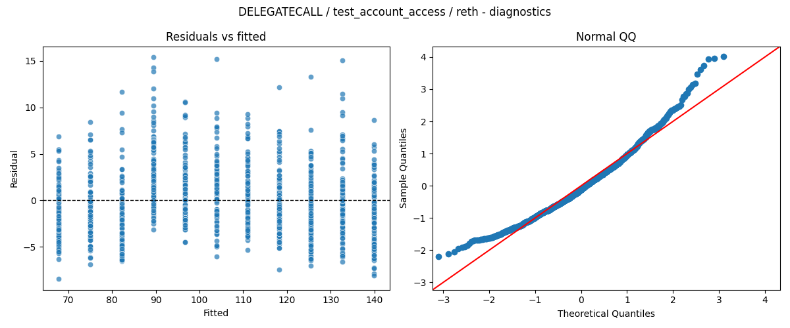

</details>

### test_account_access — combo `DELEGATECALL_AccountMode.EXISTING_CONTRACT`

| client | nobs | R² | target_coef (ms) | p-value | 95% CI |
| --- | --- | --- | --- | --- | --- |
| `besu` | 286 | 0.8983 | 0.03332 | 1.00e-03 | [0.03208, 0.03461] |
| `erigon` | 418 | 0.8728 | 0.08742 | 1.00e-03 | [0.08429, 0.09054] |
| `geth` | 561 | 0.6331 | 0.035 | 1.00e-03 | [0.03284, 0.03732] |
| `nethermind` | 682 | 0.7664 | 0.02053 | 1.00e-03 | [0.01965, 0.02136] |
| `reth` | 1056 | 0.9222 | 0.03754 | 1.00e-03 | [0.03731, 0.03776] |

<details><summary>besu — NNLS regression summary</summary>

```
==============================================================================
                           NNLS Regression Results                            
==============================================================================
Dep. Variable:          test_runtime_ms              R-squared:          0.898
Model:                  NNLS                    Adj. R-squared:          0.898
No. Observations:       286                               RMSE:         228.37
Df Residuals:           284                                MAE:         174.09
Df Model:               1      
==============================================================================
                      coef     std err     P-value      [0.025      0.975]
------------------------------------------------------------------------------
         const    418.8015     40.3114       0.001    338.3071    486.9388
       opcount      0.0333      0.0007       0.001      0.0321      0.0346
==============================================================================
Notes: Non-negative least squares with bootstrap inference (1000 iterations)
==============================================================================
```

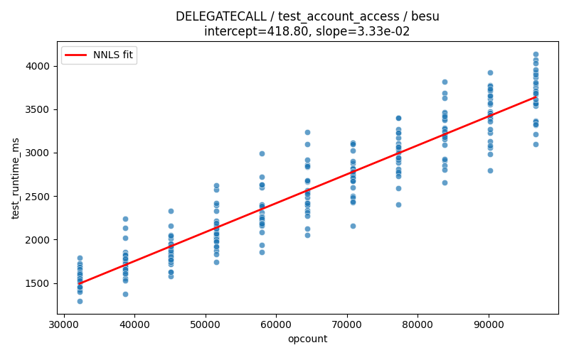

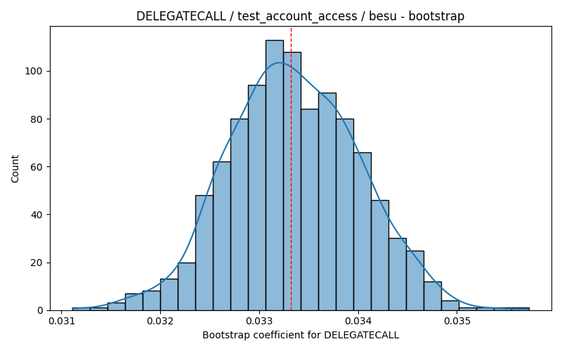

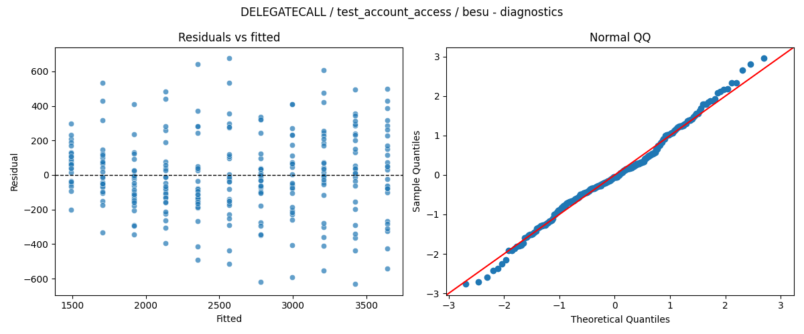

</details>

<details><summary>erigon — NNLS regression summary</summary>

```
==============================================================================
                           NNLS Regression Results                            
==============================================================================
Dep. Variable:          test_runtime_ms              R-squared:          0.873
Model:                  NNLS                    Adj. R-squared:          0.872
No. Observations:       418                               RMSE:         679.93
Df Residuals:           416                                MAE:         576.39
Df Model:               1      
==============================================================================
                      coef     std err     P-value      [0.025      0.975]
------------------------------------------------------------------------------
         const   1485.7298    116.7480       0.001   1255.4277   1716.1175
       opcount      0.0874      0.0016       0.001      0.0843      0.0905
==============================================================================
Notes: Non-negative least squares with bootstrap inference (1000 iterations)
==============================================================================
```

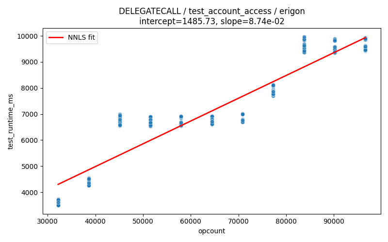

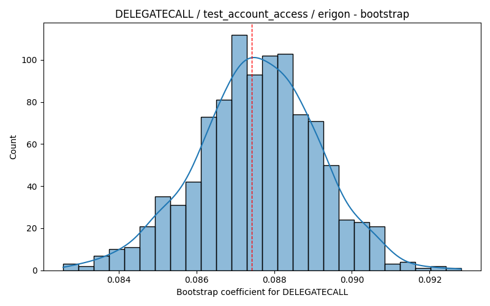

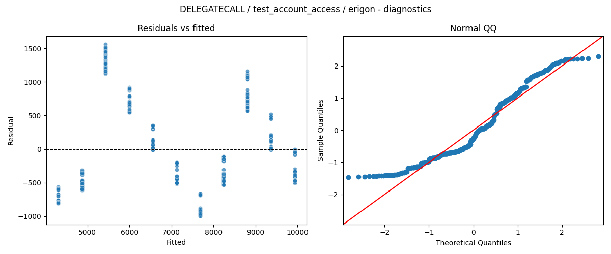

</details>

<details><summary>geth — NNLS regression summary</summary>

```
==============================================================================
                           NNLS Regression Results                            
==============================================================================
Dep. Variable:          test_runtime_ms              R-squared:          0.633
Model:                  NNLS                    Adj. R-squared:          0.632
No. Observations:       561                               RMSE:         542.80
Df Residuals:           559                                MAE:         445.90
Df Model:               1      
==============================================================================
                      coef     std err     P-value      [0.025      0.975]
------------------------------------------------------------------------------
         const   1355.5510     71.1718       0.001   1208.9002   1500.2108
       opcount      0.0350      0.0012       0.001      0.0328      0.0373
==============================================================================
Notes: Non-negative least squares with bootstrap inference (1000 iterations)
==============================================================================
```

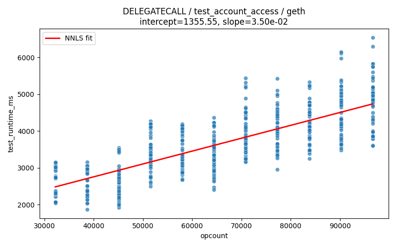

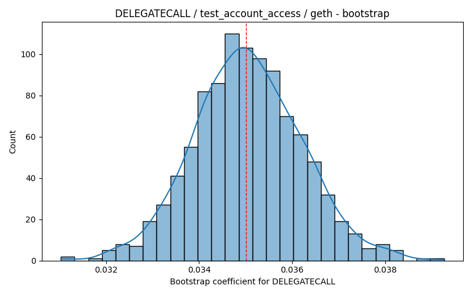

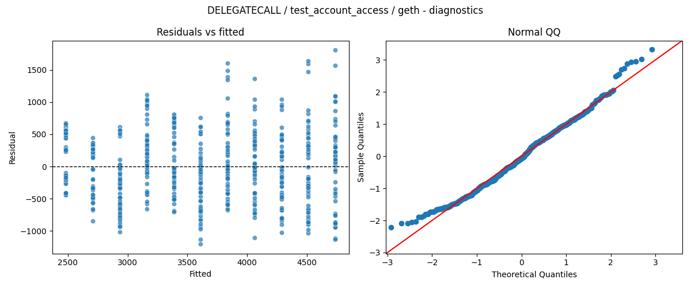

</details>

<details><summary>nethermind — NNLS regression summary</summary>

```
==============================================================================
                           NNLS Regression Results                            
==============================================================================
Dep. Variable:          test_runtime_ms              R-squared:          0.766
Model:                  NNLS                    Adj. R-squared:          0.766
No. Observations:       682                               RMSE:         230.93
Df Residuals:           680                                MAE:         164.54
Df Model:               1      
==============================================================================
                      coef     std err     P-value      [0.025      0.975]
------------------------------------------------------------------------------
         const    270.5539     26.6970       0.001    219.3276    324.3129
       opcount      0.0205      0.0004       0.001      0.0196      0.0214
==============================================================================
Notes: Non-negative least squares with bootstrap inference (1000 iterations)
==============================================================================
```

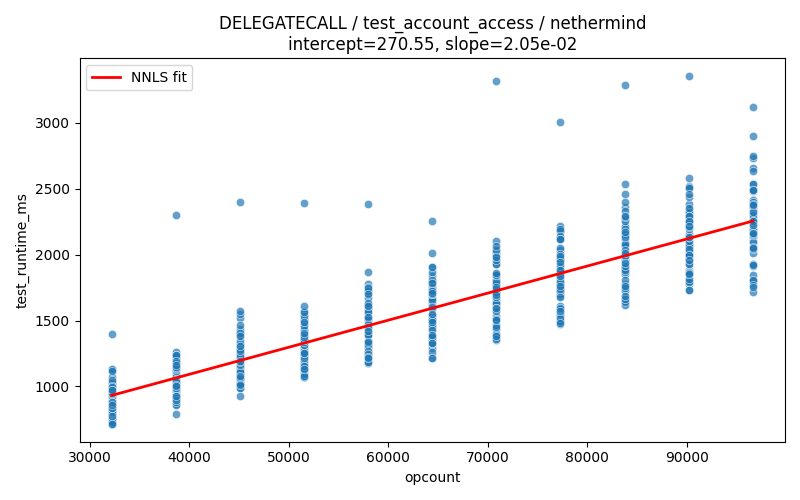

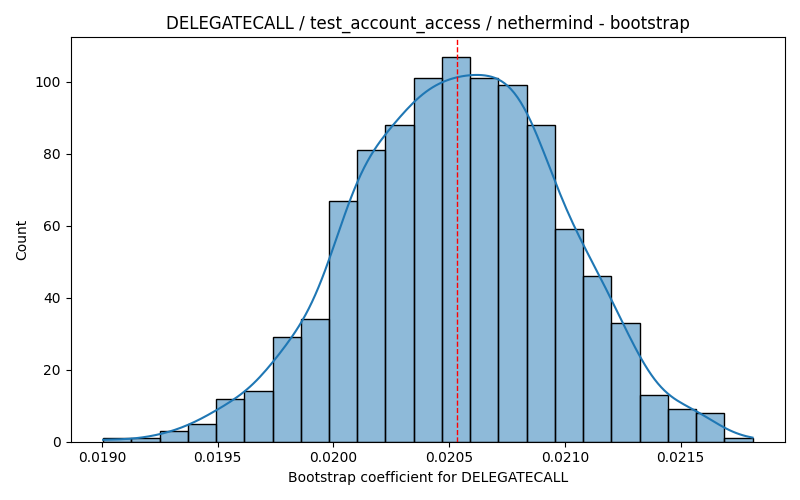

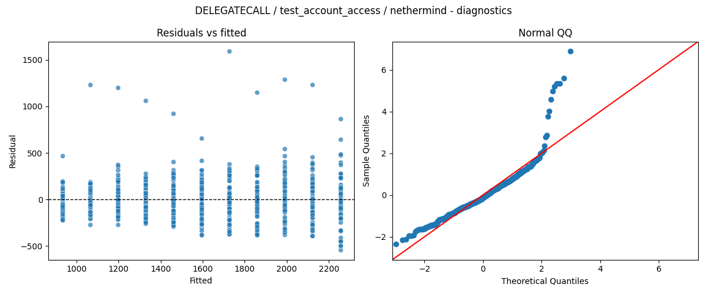

</details>

<details><summary>reth — NNLS regression summary</summary>

```
==============================================================================
                           NNLS Regression Results                            
==============================================================================
Dep. Variable:          test_runtime_ms              R-squared:          0.922
Model:                  NNLS                    Adj. R-squared:          0.922
No. Observations:       1056                              RMSE:         231.04
Df Residuals:           1054                               MAE:         128.41
Df Model:               1      
==============================================================================
                      coef     std err     P-value      [0.025      0.975]
------------------------------------------------------------------------------
         const      0.0000      0.0000       1.000      0.0000      0.0000
       opcount      0.0375      0.0001       0.001      0.0373      0.0378
==============================================================================
Notes: Non-negative least squares with bootstrap inference (1000 iterations)
==============================================================================
```

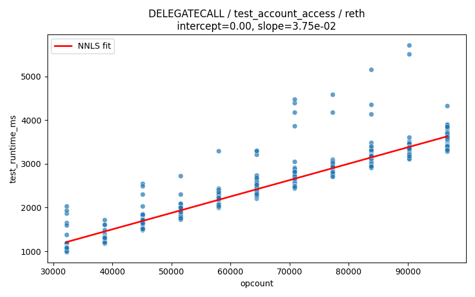

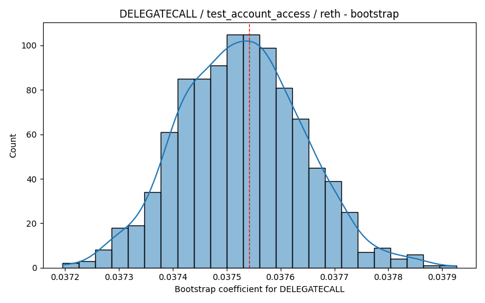

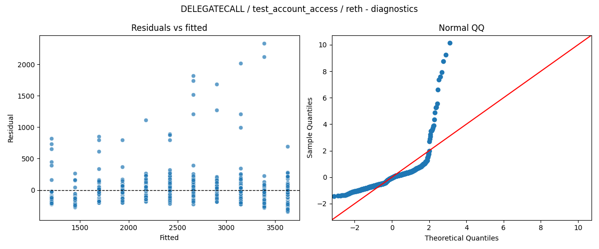

</details>

### test_account_access — combo `DELEGATECALL_AccountMode.NON_EXISTING_ACCOUNT` — `presets[cold_account_code_access]`

| client | nobs | R² | target_coef (ms) | p-value | 95% CI |
| --- | --- | --- | --- | --- | --- |
| `besu` | 286 | 0.8551 | 0.01191 | 1.00e-03 | [0.01136, 0.01253] |
| `erigon` | 418 | 0.9959 | 0.009545 | 1.00e-03 | [0.009486, 0.009606] |
| `geth` | 561 | 0.6202 | 0.03177 | 1.00e-03 | [0.02958, 0.03408] |
| `nethermind` | 682 | 0.7811 | 0.005527 | 1.00e-03 | [0.005301, 0.00577] |
| `reth` | 1056 | 0.9727 | 0.0009602 | 1.00e-03 | [0.0009511, 0.0009701] |

<details><summary>besu — NNLS regression summary</summary>

```
==============================================================================
                           NNLS Regression Results                            
==============================================================================
Dep. Variable:          test_runtime_ms              R-squared:          0.855
Model:                  NNLS                    Adj. R-squared:          0.855
No. Observations:       286                               RMSE:         116.56
Df Residuals:           284                                MAE:          94.87
Df Model:               1      
==============================================================================
                      coef     std err     P-value      [0.025      0.975]
------------------------------------------------------------------------------
         const    523.7447     22.5830       0.001    476.4728    563.8939
       opcount      0.0119      0.0003       0.001      0.0114      0.0125
==============================================================================
Notes: Non-negative least squares with bootstrap inference (1000 iterations)
==============================================================================
```


</details>

<details><summary>erigon — NNLS regression summary</summary>

```
==============================================================================
                           NNLS Regression Results                            
==============================================================================
Dep. Variable:          test_runtime_ms              R-squared:          0.996
Model:                  NNLS                    Adj. R-squared:          0.996
No. Observations:       418                               RMSE:          14.49
Df Residuals:           416                                MAE:          11.15
Df Model:               1      
==============================================================================
                      coef     std err     P-value      [0.025      0.975]
------------------------------------------------------------------------------
         const     19.0801      2.2654       0.001     14.4258     23.4695
       opcount      0.0095      0.0000       0.001      0.0095      0.0096
==============================================================================
Notes: Non-negative least squares with bootstrap inference (1000 iterations)
==============================================================================
```


</details>

<details><summary>geth — NNLS regression summary</summary>

```
==============================================================================
                           NNLS Regression Results                            
==============================================================================
Dep. Variable:          test_runtime_ms              R-squared:          0.620
Model:                  NNLS                    Adj. R-squared:          0.620
No. Observations:       561                               RMSE:         591.06
Df Residuals:           559                                MAE:         484.86
Df Model:               1      
==============================================================================
                      coef     std err     P-value      [0.025      0.975]
------------------------------------------------------------------------------
         const   1470.2510     81.2951       0.001   1302.5444   1632.8158
       opcount      0.0318      0.0011       0.001      0.0296      0.0341
==============================================================================
Notes: Non-negative least squares with bootstrap inference (1000 iterations)
==============================================================================
```


</details>

<details><summary>nethermind — NNLS regression summary</summary>

```
==============================================================================
                           NNLS Regression Results                            
==============================================================================
Dep. Variable:          test_runtime_ms              R-squared:          0.781
Model:                  NNLS                    Adj. R-squared:          0.781
No. Observations:       682                               RMSE:          69.56
Df Residuals:           680                                MAE:          53.27
Df Model:               1      
==============================================================================
                      coef     std err     P-value      [0.025      0.975]
------------------------------------------------------------------------------
         const     70.6502      7.9873       0.001     53.7858     84.9926
       opcount      0.0055      0.0001       0.001      0.0053      0.0058
==============================================================================
Notes: Non-negative least squares with bootstrap inference (1000 iterations)
==============================================================================
```


</details>

<details><summary>reth — NNLS regression summary</summary>

```
==============================================================================
                           NNLS Regression Results                            
==============================================================================
Dep. Variable:          test_runtime_ms              R-squared:          0.973
Model:                  NNLS                    Adj. R-squared:          0.973
No. Observations:       1056                              RMSE:           3.82
Df Residuals:           1054                               MAE:           3.01
Df Model:               1      
==============================================================================
                      coef     std err     P-value      [0.025      0.975]
------------------------------------------------------------------------------
         const     31.6537      0.3879       0.001     30.8902     32.4446
       opcount      0.0010      0.0000       0.001      0.0010      0.0010
==============================================================================
Notes: Non-negative least squares with bootstrap inference (1000 iterations)
==============================================================================
```


</details>

### test_ext_account_query_warm — combo `DELEGATECALL`

| client | nobs | R² | target_coef (ms) | p-value | 95% CI |
| --- | --- | --- | --- | --- | --- |
| `besu` | 286 | 0.9585 | 0.001313 | 1.00e-03 | [0.001283, 0.001341] |
| `erigon` | 418 | 0.9051 | 0.0002761 | 1.00e-03 | [0.0002679, 0.0002852] |
| `geth` | 561 | 0.9761 | 0.0005538 | 1.00e-03 | [0.0005467, 0.0005616] |
| `nethermind` | 682 | 0.5583 | 0.0005109 | 1.00e-03 | [0.0004746, 0.0005468] |
| `reth` | 1056 | 0.9196 | 4.738e-05 | 1.00e-03 | [4.643e-05, 4.83e-05] |

<details><summary>besu — NNLS regression summary</summary>

```
==============================================================================
                           NNLS Regression Results                            
==============================================================================
Dep. Variable:          test_runtime_ms              R-squared:          0.958
Model:                  NNLS                    Adj. R-squared:          0.958
No. Observations:       286                               RMSE:         141.49
Df Residuals:           284                                MAE:         105.52
Df Model:               1      
==============================================================================
                      coef     std err     P-value      [0.025      0.975]
------------------------------------------------------------------------------
         const    718.0529     26.9588       0.001    665.2606    770.9186
       opcount      0.0013      0.0000       0.001      0.0013      0.0013
==============================================================================
Notes: Non-negative least squares with bootstrap inference (1000 iterations)
==============================================================================
```

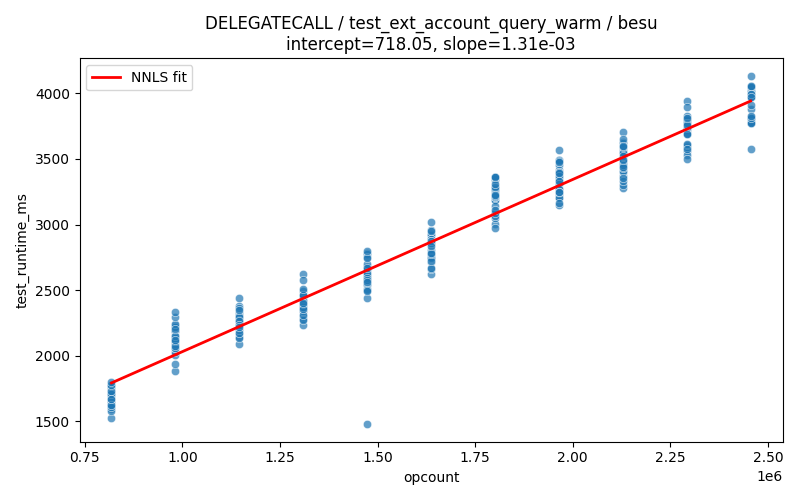

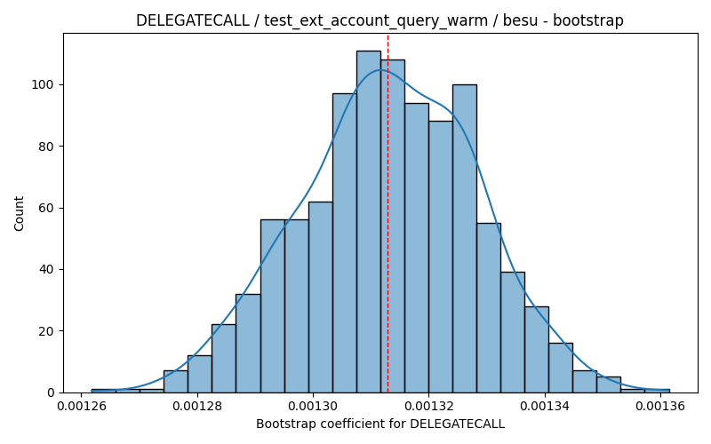

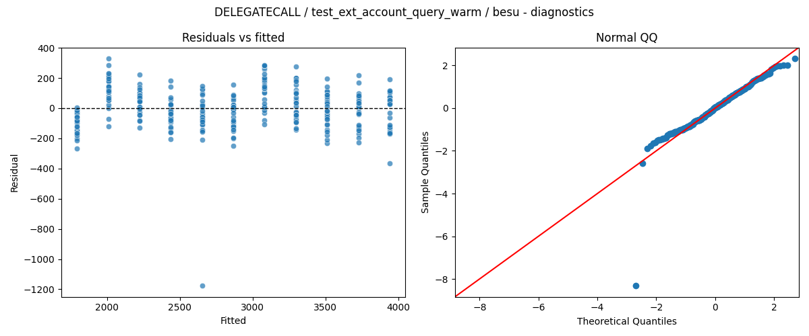

</details>

<details><summary>erigon — NNLS regression summary</summary>

```
==============================================================================
                           NNLS Regression Results                            
==============================================================================
Dep. Variable:          test_runtime_ms              R-squared:          0.905
Model:                  NNLS                    Adj. R-squared:          0.905
No. Observations:       418                               RMSE:          46.28
Df Residuals:           416                                MAE:          37.84
Df Model:               1      
==============================================================================
                      coef     std err     P-value      [0.025      0.975]
------------------------------------------------------------------------------
         const     62.1101      6.9609       0.001     47.4198     75.5321
       opcount      0.0003      0.0000       0.001      0.0003      0.0003
==============================================================================
Notes: Non-negative least squares with bootstrap inference (1000 iterations)
==============================================================================
```

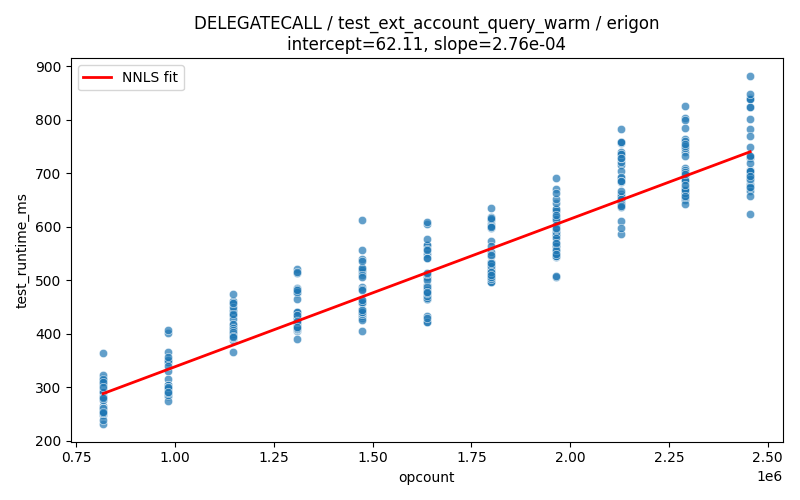

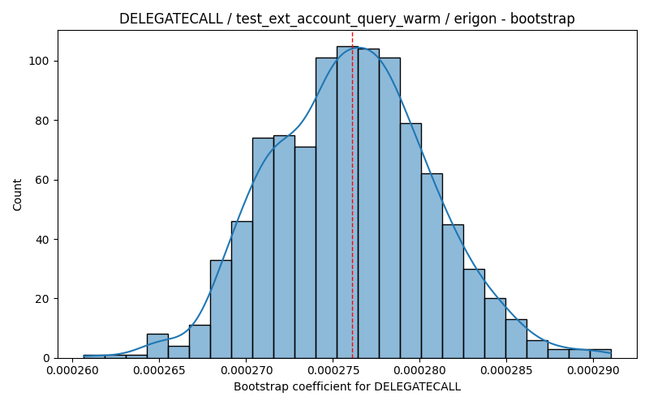

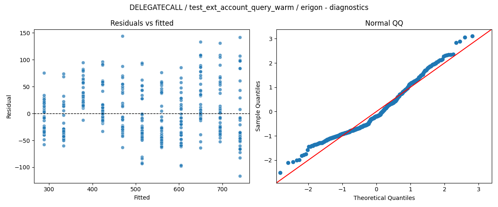

</details>

<details><summary>geth — NNLS regression summary</summary>

```
==============================================================================
                           NNLS Regression Results                            
==============================================================================
Dep. Variable:          test_runtime_ms              R-squared:          0.976
Model:                  NNLS                    Adj. R-squared:          0.976
No. Observations:       561                               RMSE:          44.89
Df Residuals:           559                                MAE:          34.23
Df Model:               1      
==============================================================================
                      coef     std err     P-value      [0.025      0.975]
------------------------------------------------------------------------------
         const     23.6296      5.5939       0.001     12.2465     34.0852
       opcount      0.0006      0.0000       0.001      0.0005      0.0006
==============================================================================
Notes: Non-negative least squares with bootstrap inference (1000 iterations)
==============================================================================
```

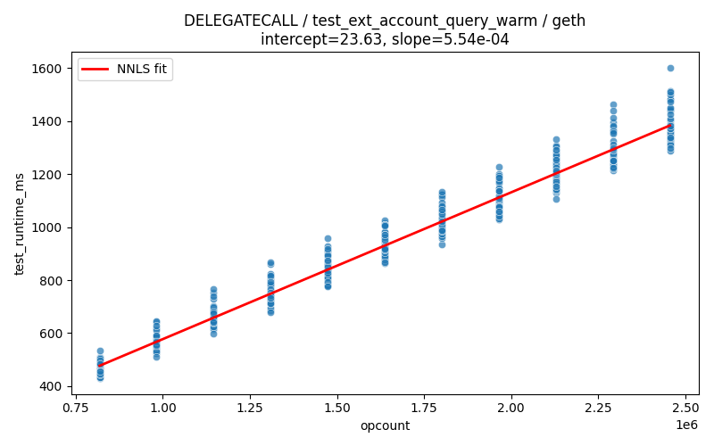

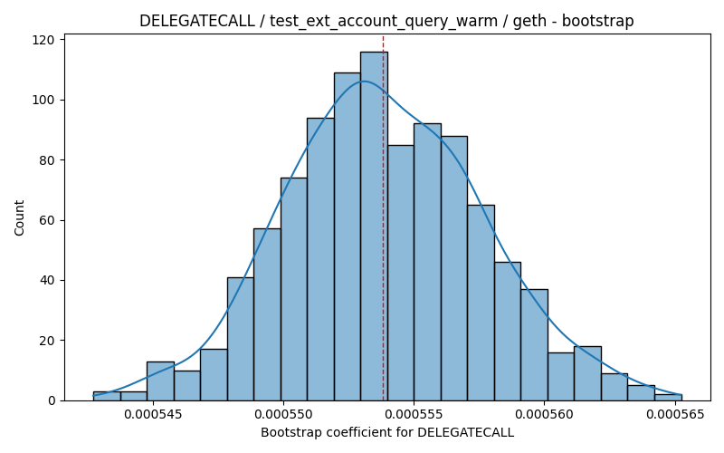

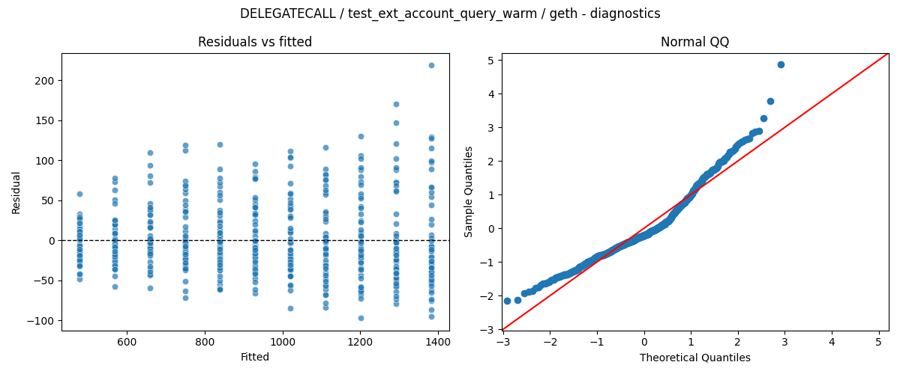

</details>

<details><summary>nethermind — NNLS regression summary</summary>

```
==============================================================================
                           NNLS Regression Results                            
==============================================================================
Dep. Variable:          test_runtime_ms              R-squared:          0.558
Model:                  NNLS                    Adj. R-squared:          0.558
No. Observations:       682                               RMSE:         235.25
Df Residuals:           680                                MAE:         187.68
Df Model:               1      
==============================================================================
                      coef     std err     P-value      [0.025      0.975]
------------------------------------------------------------------------------
         const    402.5629     25.9792       0.001    352.3878    454.5131
       opcount      0.0005      0.0000       0.001      0.0005      0.0005
==============================================================================
Notes: Non-negative least squares with bootstrap inference (1000 iterations)
==============================================================================
```

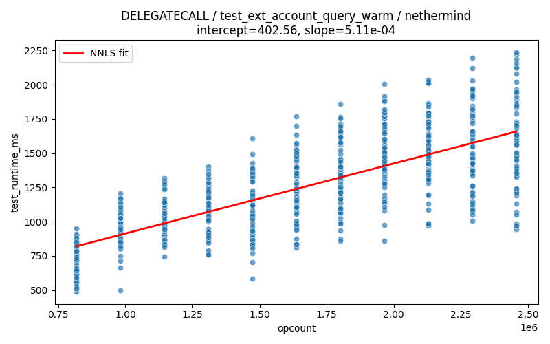

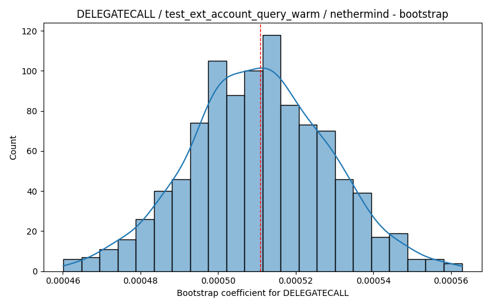

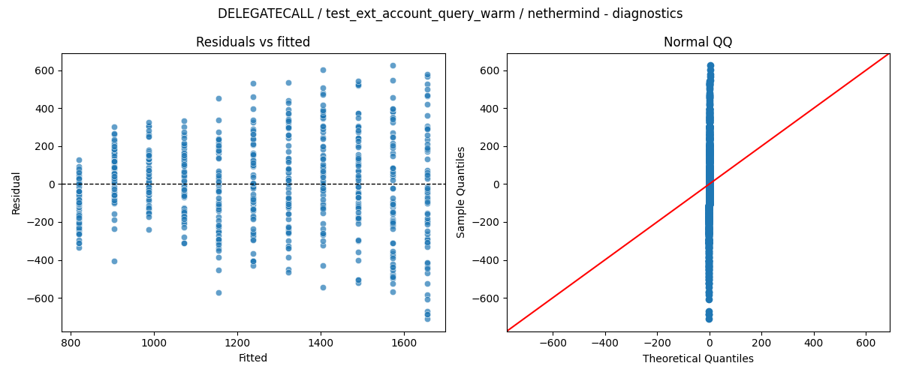

</details>

<details><summary>reth — NNLS regression summary</summary>

```
==============================================================================
                           NNLS Regression Results                            
==============================================================================
Dep. Variable:          test_runtime_ms              R-squared:          0.920
Model:                  NNLS                    Adj. R-squared:          0.919
No. Observations:       1056                              RMSE:           7.25
Df Residuals:           1054                               MAE:           5.98
Df Model:               1      
==============================================================================
                      coef     std err     P-value      [0.025      0.975]
------------------------------------------------------------------------------
         const     16.4318      0.8044       0.001     14.8430     18.0389
       opcount      0.0000      0.0000       0.001      0.0000      0.0000
==============================================================================
Notes: Non-negative least squares with bootstrap inference (1000 iterations)
==============================================================================
```

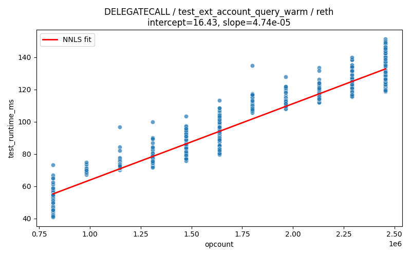

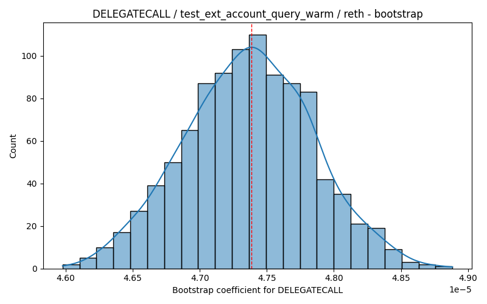

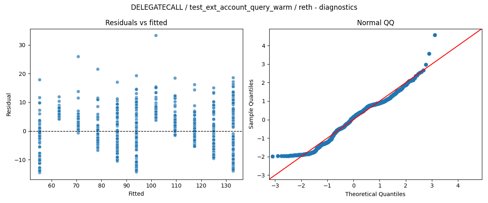

</details>

## EXTCODECOPY

### test_account_access — combo `EXTCODECOPY_AccountMode.NON_EXISTING_ACCOUNT` — `presets[cold_account_nocode_access]`

| client | nobs | R² | target_coef (ms) | p-value | 95% CI |
| --- | --- | --- | --- | --- | --- |
| `besu` | 286 | 0.583 | 0.0003921 | 1.00e-03 | [0.0003552, 0.0004321] |
| `erigon` | 418 | 0.7352 | 6.391e-05 | 1.00e-03 | [6.022e-05, 6.759e-05] |
| `geth` | 561 | 0.9378 | 0.0008106 | 1.00e-03 | [0.0007944, 0.0008279] |
| `nethermind` | 682 | 0.7251 | 0.0003169 | 1.00e-03 | [0.0003016, 0.0003317] |
| `reth` | 1056 | 0.7327 | 1.634e-05 | 1.00e-03 | [1.573e-05, 1.693e-05] |

<details><summary>besu — NNLS regression summary</summary>

```
==============================================================================
                           NNLS Regression Results                            
==============================================================================
Dep. Variable:          test_runtime_ms              R-squared:          0.583
Model:                  NNLS                    Adj. R-squared:          0.581
No. Observations:       286                               RMSE:          85.15
Df Residuals:           284                                MAE:          67.73
Df Model:               1      
==============================================================================
                      coef     std err     P-value      [0.025      0.975]
------------------------------------------------------------------------------
         const    212.4181     17.2821       0.001    177.8930    244.9350
       opcount      0.0004      0.0000       0.001      0.0004      0.0004
==============================================================================
Notes: Non-negative least squares with bootstrap inference (1000 iterations)
==============================================================================
```

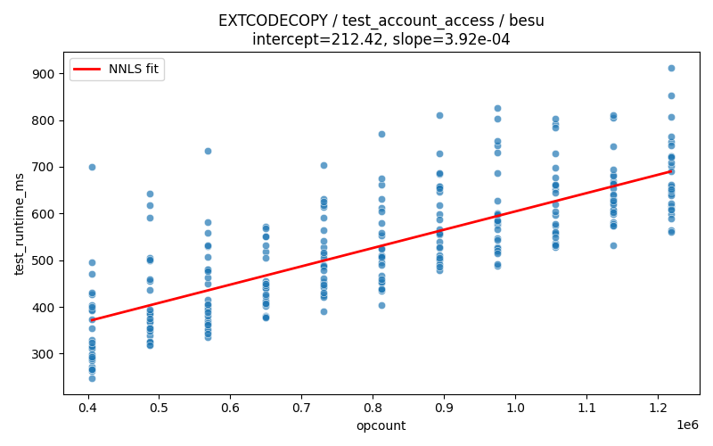

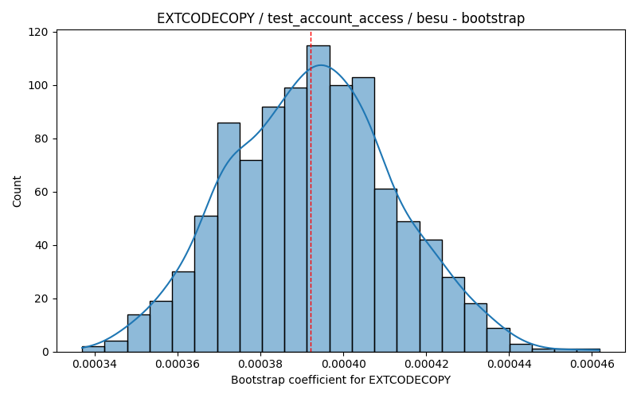

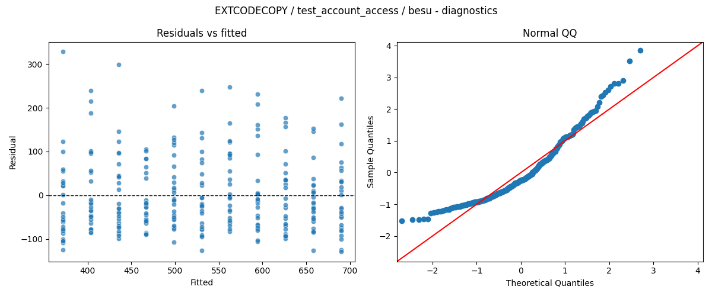

</details>

<details><summary>erigon — NNLS regression summary</summary>

```
==============================================================================
                           NNLS Regression Results                            
==============================================================================
Dep. Variable:          test_runtime_ms              R-squared:          0.735
Model:                  NNLS                    Adj. R-squared:          0.735
No. Observations:       418                               RMSE:           9.85
Df Residuals:           416                                MAE:           8.03
Df Model:               1      
==============================================================================
                      coef     std err     P-value      [0.025      0.975]
------------------------------------------------------------------------------
         const     44.3031      1.5615       0.001     41.1097     47.2400
       opcount      0.0001      0.0000       0.001      0.0001      0.0001
==============================================================================
Notes: Non-negative least squares with bootstrap inference (1000 iterations)
==============================================================================
```

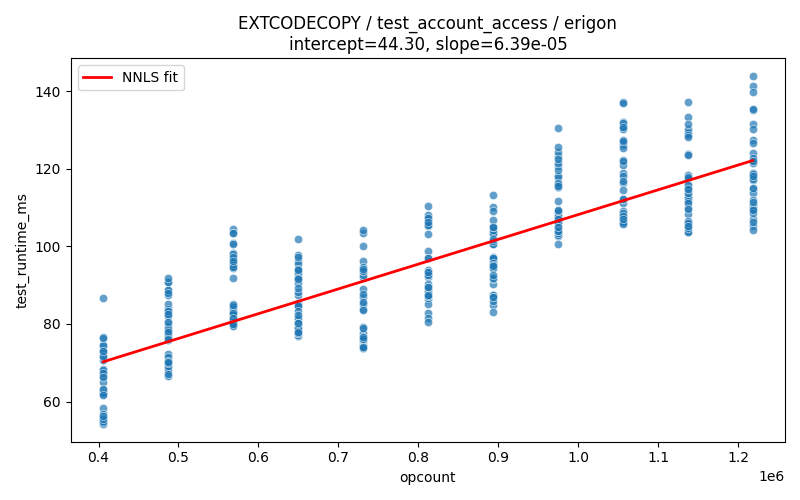

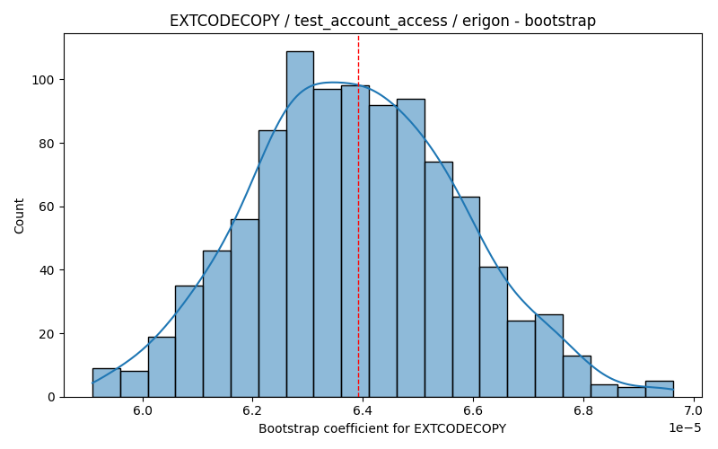

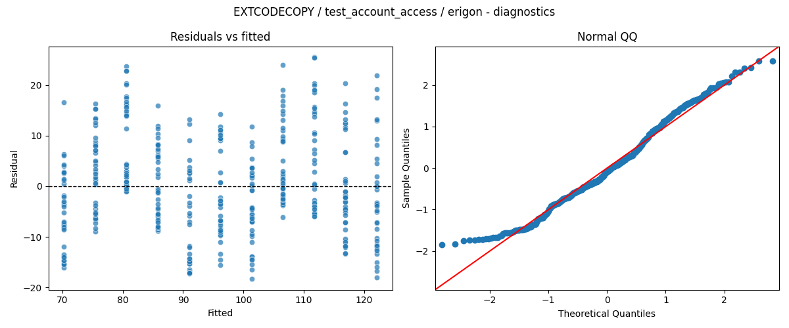

</details>

<details><summary>geth — NNLS regression summary</summary>

```
==============================================================================
                           NNLS Regression Results                            
==============================================================================
Dep. Variable:          test_runtime_ms              R-squared:          0.938
Model:                  NNLS                    Adj. R-squared:          0.938
No. Observations:       561                               RMSE:          53.58
Df Residuals:           559                                MAE:          40.04
Df Model:               1      
==============================================================================
                      coef     std err     P-value      [0.025      0.975]
------------------------------------------------------------------------------
         const     22.9030      6.2938       0.001     10.2273     35.0054
       opcount      0.0008      0.0000       0.001      0.0008      0.0008
==============================================================================
Notes: Non-negative least squares with bootstrap inference (1000 iterations)
==============================================================================
```

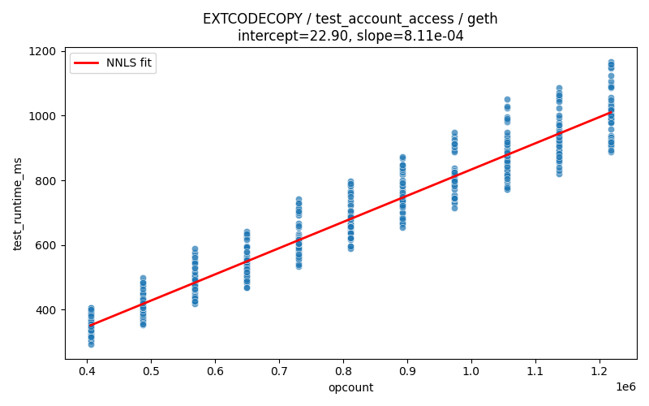

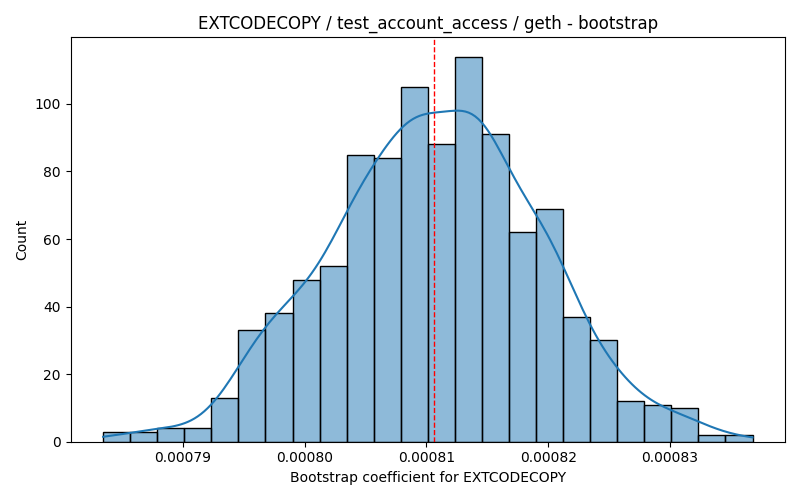

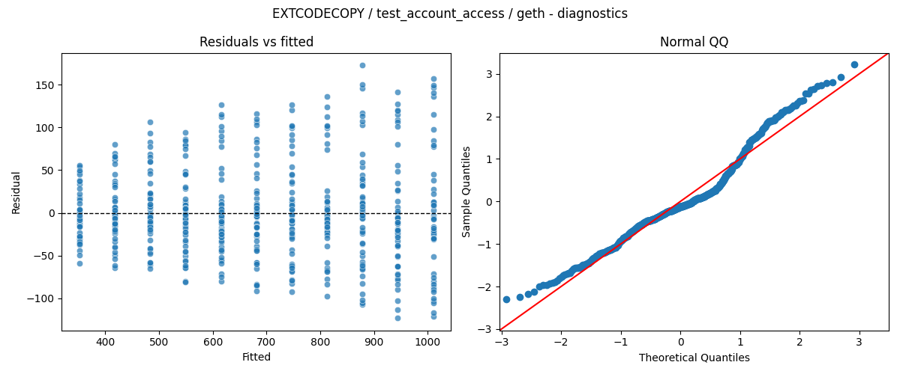

</details>

<details><summary>nethermind — NNLS regression summary</summary>

```
==============================================================================
                           NNLS Regression Results                            
==============================================================================
Dep. Variable:          test_runtime_ms              R-squared:          0.725
Model:                  NNLS                    Adj. R-squared:          0.725
No. Observations:       682                               RMSE:          50.09
Df Residuals:           680                                MAE:          37.15
Df Model:               1      
==============================================================================
                      coef     std err     P-value      [0.025      0.975]
------------------------------------------------------------------------------
         const    120.3152      5.6427       0.001    109.9056    131.6889
       opcount      0.0003      0.0000       0.001      0.0003      0.0003
==============================================================================
Notes: Non-negative least squares with bootstrap inference (1000 iterations)
==============================================================================
```

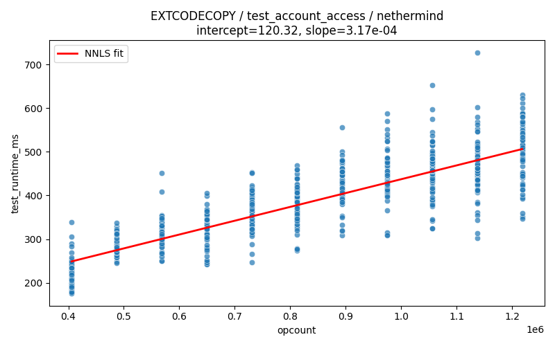

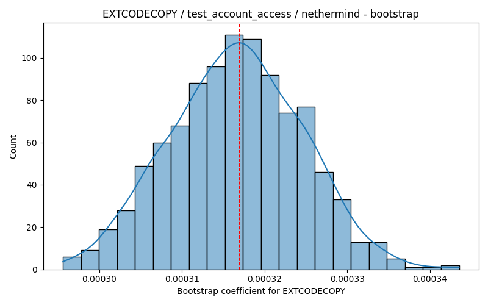

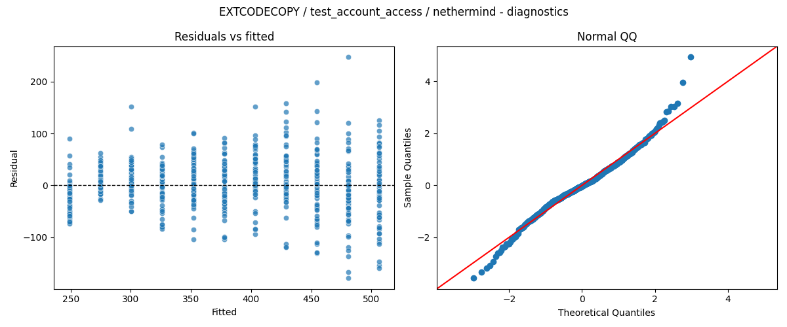

</details>

<details><summary>reth — NNLS regression summary</summary>

```
==============================================================================
                           NNLS Regression Results                            
==============================================================================
Dep. Variable:          test_runtime_ms              R-squared:          0.733
Model:                  NNLS                    Adj. R-squared:          0.732
No. Observations:       1056                              RMSE:           2.53
Df Residuals:           1054                               MAE:           1.86
Df Model:               1      
==============================================================================
                      coef     std err     P-value      [0.025      0.975]
------------------------------------------------------------------------------
         const      6.2516      0.2418       0.001      5.8075      6.7497
       opcount      0.0000      0.0000       0.001      0.0000      0.0000
==============================================================================
Notes: Non-negative least squares with bootstrap inference (1000 iterations)
==============================================================================
```

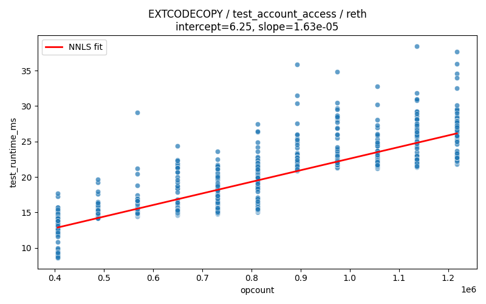

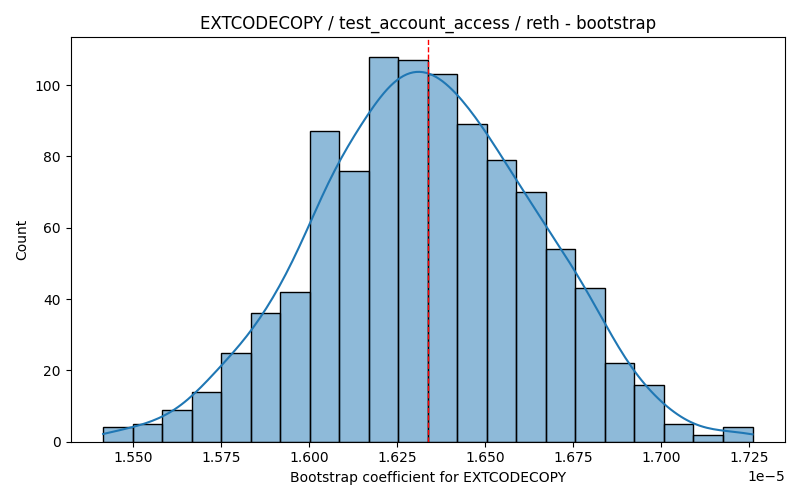

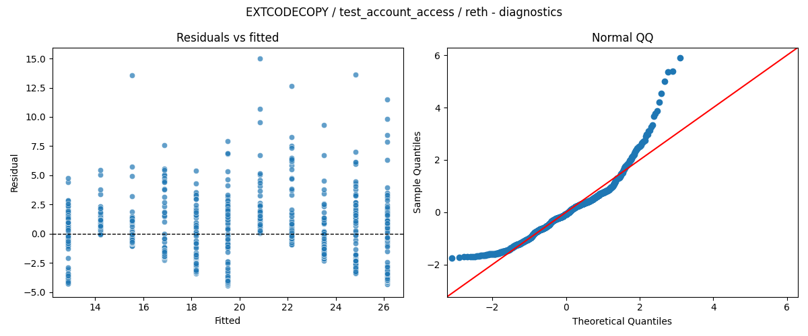

</details>

### test_account_access — combo `EXTCODECOPY_AccountMode.EXISTING_CONTRACT`

| client | nobs | R² | target_coef (ms) | p-value | 95% CI |
| --- | --- | --- | --- | --- | --- |
| `besu` | 286 | 0.7232 | 0.001869 | 1.00e-03 | [0.001733, 0.001998] |
| `erigon` | 418 | 0.858 | 0.0003228 | 1.00e-03 | [0.0003104, 0.0003345] |
| `geth` | 561 | 0.9787 | 0.002852 | 1.00e-03 | [0.002818, 0.002888] |
| `nethermind` | 682 | 0.7322 | 0.001152 | 1.00e-03 | [0.001096, 0.001211] |
| `reth` | 1056 | 0.7751 | 7.837e-05 | 1.00e-03 | [7.563e-05, 8.13e-05] |

<details><summary>besu — NNLS regression summary</summary>

```
==============================================================================
                           NNLS Regression Results                            
==============================================================================
Dep. Variable:          test_runtime_ms              R-squared:          0.723
Model:                  NNLS                    Adj. R-squared:          0.722
No. Observations:       286                               RMSE:         114.25
Df Residuals:           284                                MAE:          90.63
Df Model:               1      
==============================================================================
                      coef     std err     P-value      [0.025      0.975]
------------------------------------------------------------------------------
         const    420.6476     21.5166       0.001    379.8994    465.5150
       opcount      0.0019      0.0001       0.001      0.0017      0.0020
==============================================================================
Notes: Non-negative least squares with bootstrap inference (1000 iterations)
==============================================================================
```

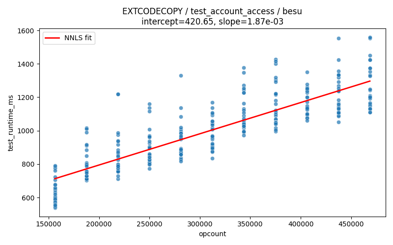

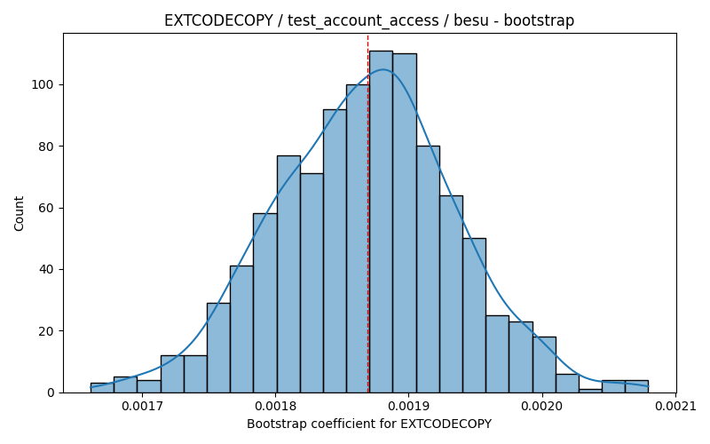

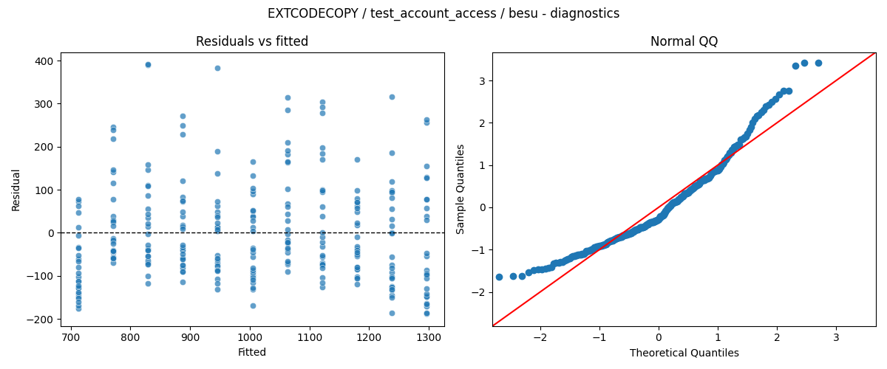

</details>

<details><summary>erigon — NNLS regression summary</summary>

```
==============================================================================
                           NNLS Regression Results                            
==============================================================================
Dep. Variable:          test_runtime_ms              R-squared:          0.858
Model:                  NNLS                    Adj. R-squared:          0.858
No. Observations:       418                               RMSE:          12.98
Df Residuals:           416                                MAE:          10.88
Df Model:               1      
==============================================================================
                      coef     std err     P-value      [0.025      0.975]
------------------------------------------------------------------------------
         const     44.0441      2.0473       0.001     40.3566     48.0134
       opcount      0.0003      0.0000       0.001      0.0003      0.0003
==============================================================================
Notes: Non-negative least squares with bootstrap inference (1000 iterations)
==============================================================================
```

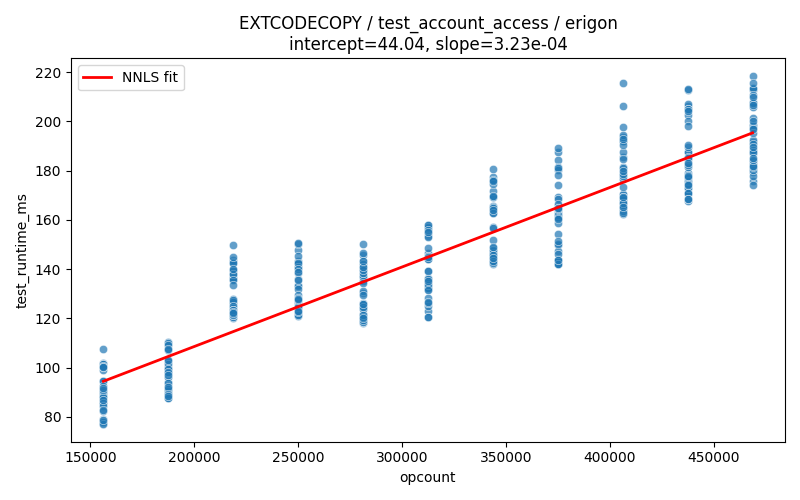

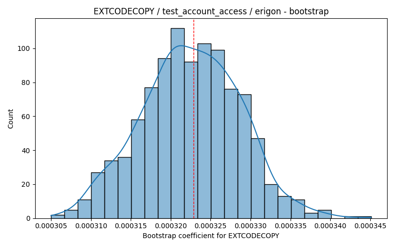

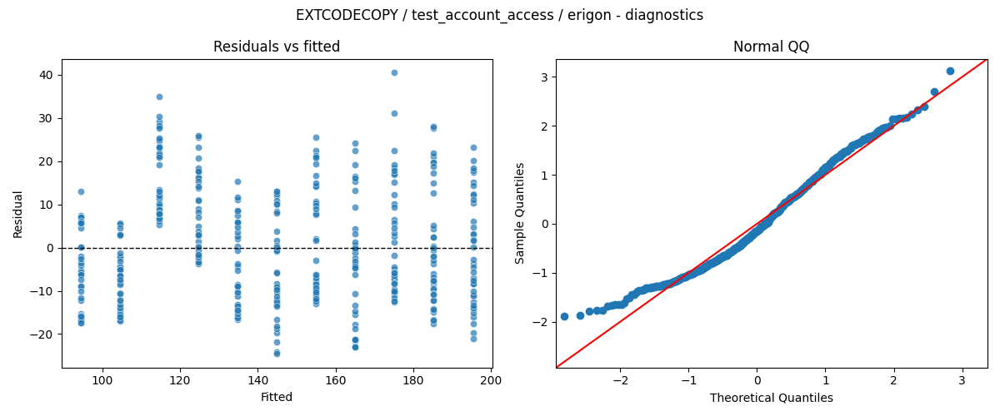

</details>

<details><summary>geth — NNLS regression summary</summary>

```
==============================================================================
                           NNLS Regression Results                            
==============================================================================
Dep. Variable:          test_runtime_ms              R-squared:          0.979
Model:                  NNLS                    Adj. R-squared:          0.979
No. Observations:       561                               RMSE:          41.54
Df Residuals:           559                                MAE:          32.24
Df Model:               1      
==============================================================================
                      coef     std err     P-value      [0.025      0.975]
------------------------------------------------------------------------------
         const     34.9740      5.2015       0.001     24.5637     44.9688
       opcount      0.0029      0.0000       0.001      0.0028      0.0029
==============================================================================
Notes: Non-negative least squares with bootstrap inference (1000 iterations)
==============================================================================
```

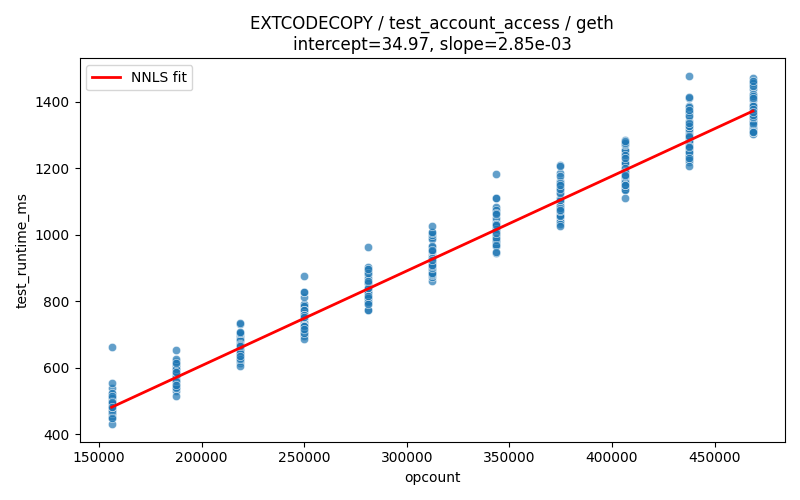

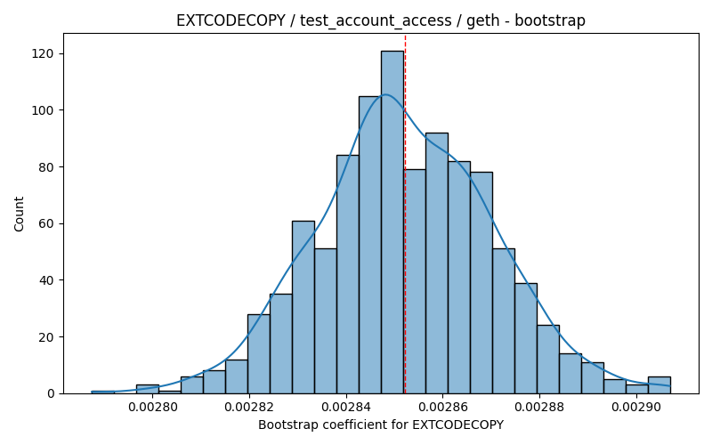

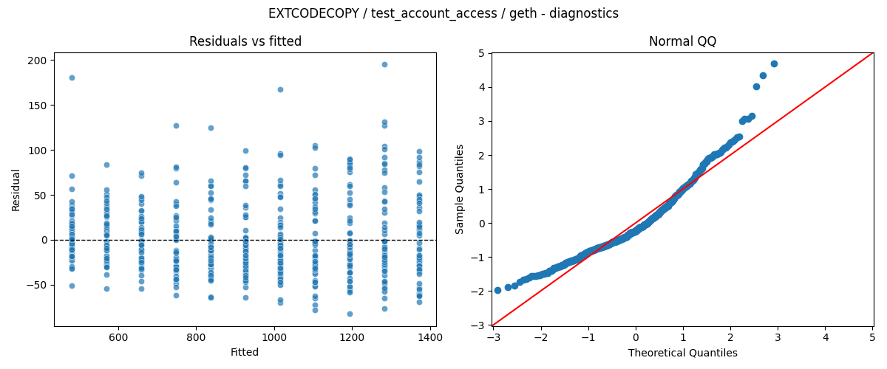

</details>

<details><summary>nethermind — NNLS regression summary</summary>

```
==============================================================================
                           NNLS Regression Results                            
==============================================================================
Dep. Variable:          test_runtime_ms              R-squared:          0.732
Model:                  NNLS                    Adj. R-squared:          0.732
No. Observations:       682                               RMSE:          68.82
Df Residuals:           680                                MAE:          55.45
Df Model:               1      
==============================================================================
                      coef     std err     P-value      [0.025      0.975]
------------------------------------------------------------------------------
         const    196.6337      8.3367       0.001    180.1018    212.1298
       opcount      0.0012      0.0000       0.001      0.0011      0.0012
==============================================================================
Notes: Non-negative least squares with bootstrap inference (1000 iterations)
==============================================================================
```

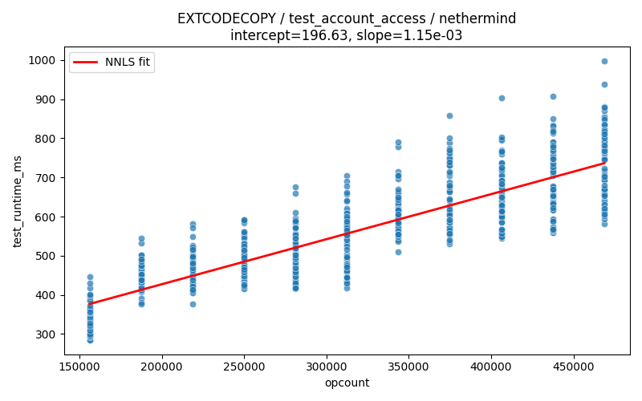

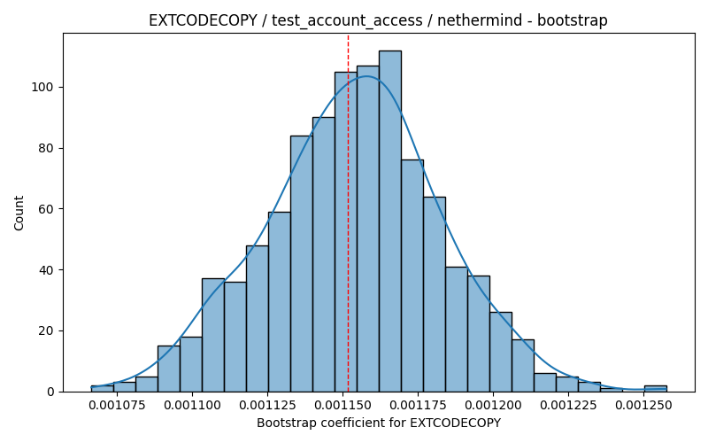

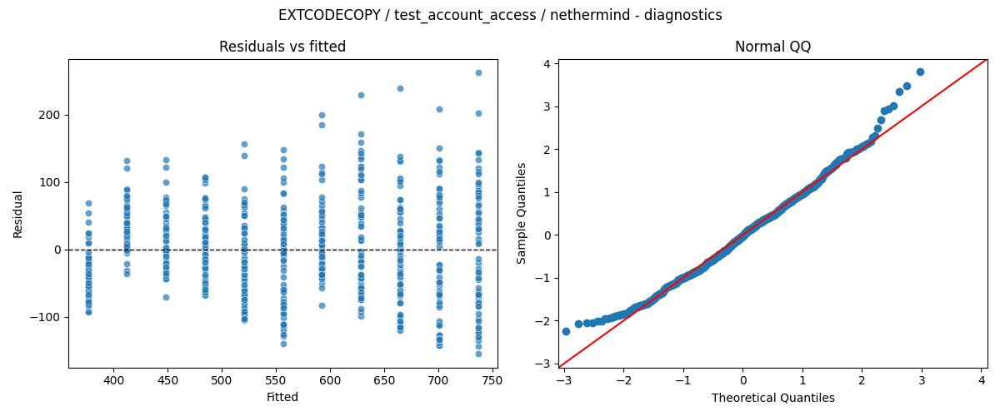

</details>

<details><summary>reth — NNLS regression summary</summary>

```
==============================================================================
                           NNLS Regression Results                            
==============================================================================
Dep. Variable:          test_runtime_ms              R-squared:          0.775
Model:                  NNLS                    Adj. R-squared:          0.775
No. Observations:       1056                              RMSE:           4.17
Df Residuals:           1054                               MAE:           3.22
Df Model:               1      
==============================================================================
                      coef     std err     P-value      [0.025      0.975]
------------------------------------------------------------------------------
         const     11.1438      0.4642       0.001     10.1795     12.0346
       opcount      0.0001      0.0000       0.001      0.0001      0.0001
==============================================================================
Notes: Non-negative least squares with bootstrap inference (1000 iterations)
==============================================================================
```

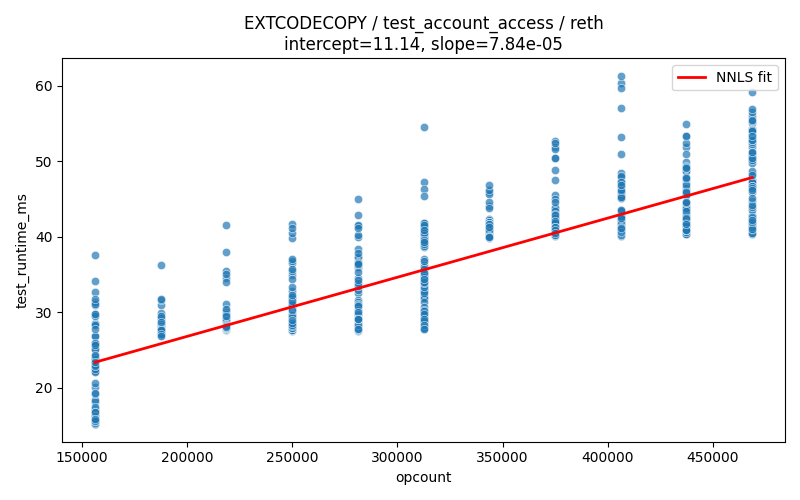

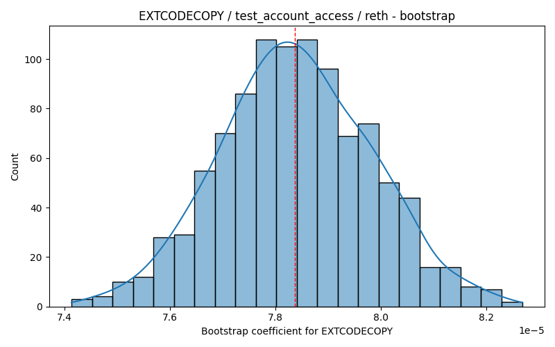

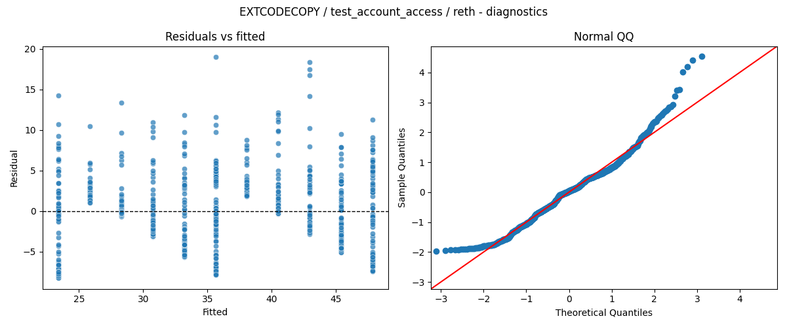

</details>

### test_account_access — combo `EXTCODECOPY_AccountMode.NON_EXISTING_ACCOUNT` — `presets[cold_account_code_access]`

| client | nobs | R² | target_coef (ms) | p-value | 95% CI |
| --- | --- | --- | --- | --- | --- |
| `besu` | 286 | 0.583 | 0.0003921 | 1.00e-03 | [0.0003552, 0.0004321] |
| `erigon` | 418 | 0.7352 | 6.391e-05 | 1.00e-03 | [6.022e-05, 6.759e-05] |
| `geth` | 561 | 0.9378 | 0.0008106 | 1.00e-03 | [0.0007944, 0.0008279] |
| `nethermind` | 682 | 0.7251 | 0.0003169 | 1.00e-03 | [0.0003016, 0.0003317] |
| `reth` | 1056 | 0.7327 | 1.634e-05 | 1.00e-03 | [1.573e-05, 1.693e-05] |

<details><summary>besu — NNLS regression summary</summary>

```
==============================================================================
                           NNLS Regression Results                            
==============================================================================
Dep. Variable:          test_runtime_ms              R-squared:          0.583
Model:                  NNLS                    Adj. R-squared:          0.581
No. Observations:       286                               RMSE:          85.15
Df Residuals:           284                                MAE:          67.73
Df Model:               1      
==============================================================================
                      coef     std err     P-value      [0.025      0.975]
------------------------------------------------------------------------------
         const    212.4181     17.2821       0.001    177.8930    244.9350
       opcount      0.0004      0.0000       0.001      0.0004      0.0004
==============================================================================
Notes: Non-negative least squares with bootstrap inference (1000 iterations)
==============================================================================
```


</details>

<details><summary>erigon — NNLS regression summary</summary>

```
==============================================================================
                           NNLS Regression Results                            
==============================================================================
Dep. Variable:          test_runtime_ms              R-squared:          0.735
Model:                  NNLS                    Adj. R-squared:          0.735
No. Observations:       418                               RMSE:           9.85
Df Residuals:           416                                MAE:           8.03
Df Model:               1      
==============================================================================
                      coef     std err     P-value      [0.025      0.975]
------------------------------------------------------------------------------
         const     44.3031      1.5615       0.001     41.1097     47.2400
       opcount      0.0001      0.0000       0.001      0.0001      0.0001
==============================================================================
Notes: Non-negative least squares with bootstrap inference (1000 iterations)
==============================================================================
```


</details>

<details><summary>geth — NNLS regression summary</summary>

```
==============================================================================
                           NNLS Regression Results                            
==============================================================================
Dep. Variable:          test_runtime_ms              R-squared:          0.938
Model:                  NNLS                    Adj. R-squared:          0.938
No. Observations:       561                               RMSE:          53.58
Df Residuals:           559                                MAE:          40.04
Df Model:               1      
==============================================================================
                      coef     std err     P-value      [0.025      0.975]
------------------------------------------------------------------------------
         const     22.9030      6.2938       0.001     10.2273     35.0054
       opcount      0.0008      0.0000       0.001      0.0008      0.0008
==============================================================================
Notes: Non-negative least squares with bootstrap inference (1000 iterations)
==============================================================================
```


</details>

<details><summary>nethermind — NNLS regression summary</summary>

```
==============================================================================
                           NNLS Regression Results                            
==============================================================================
Dep. Variable:          test_runtime_ms              R-squared:          0.725
Model:                  NNLS                    Adj. R-squared:          0.725
No. Observations:       682                               RMSE:          50.09
Df Residuals:           680                                MAE:          37.15
Df Model:               1      
==============================================================================
                      coef     std err     P-value      [0.025      0.975]
------------------------------------------------------------------------------
         const    120.3152      5.6427       0.001    109.9056    131.6889
       opcount      0.0003      0.0000       0.001      0.0003      0.0003
==============================================================================
Notes: Non-negative least squares with bootstrap inference (1000 iterations)
==============================================================================
```


</details>

<details><summary>reth — NNLS regression summary</summary>

```
==============================================================================
                           NNLS Regression Results                            
==============================================================================
Dep. Variable:          test_runtime_ms              R-squared:          0.733
Model:                  NNLS                    Adj. R-squared:          0.732
No. Observations:       1056                              RMSE:           2.53
Df Residuals:           1054                               MAE:           1.86
Df Model:               1      
==============================================================================
                      coef     std err     P-value      [0.025      0.975]
------------------------------------------------------------------------------
         const      6.2516      0.2418       0.001      5.8075      6.7497
       opcount      0.0000      0.0000       0.001      0.0000      0.0000
==============================================================================
Notes: Non-negative least squares with bootstrap inference (1000 iterations)
==============================================================================
```


</details>

## EXTCODEHASH

### test_account_access — combo `EXTCODEHASH_AccountMode.NON_EXISTING_ACCOUNT` — `presets[cold_account_nocode_access]`

| client | nobs | R² | target_coef (ms) | p-value | 95% CI |
| --- | --- | --- | --- | --- | --- |
| `besu` | 286 | 0.8317 | 0.01061 | 1.00e-03 | [0.01004, 0.01118] |
| `erigon` | 418 | 0.9955 | 0.008628 | 1.00e-03 | [0.008572, 0.008682] |
| `geth` | 561 | 0.6666 | 0.03858 | 1.00e-03 | [0.03632, 0.04108] |
| `nethermind` | 682 | 0.7695 | 0.005077 | 1.00e-03 | [0.004868, 0.005295] |
| `reth` | 1056 | 0.9698 | 0.0009145 | 1.00e-03 | [0.000905, 0.0009241] |

<details><summary>besu — NNLS regression summary</summary>

```
==============================================================================
                           NNLS Regression Results                            
==============================================================================
Dep. Variable:          test_runtime_ms              R-squared:          0.832
Model:                  NNLS                    Adj. R-squared:          0.831
No. Observations:       286                               RMSE:         114.05
Df Residuals:           284                                MAE:          95.71
Df Model:               1      
==============================================================================
                      coef     std err     P-value      [0.025      0.975]
------------------------------------------------------------------------------
         const    420.6799     23.2092       0.001    376.1825    467.0201
       opcount      0.0106      0.0003       0.001      0.0100      0.0112
==============================================================================
Notes: Non-negative least squares with bootstrap inference (1000 iterations)
==============================================================================
```

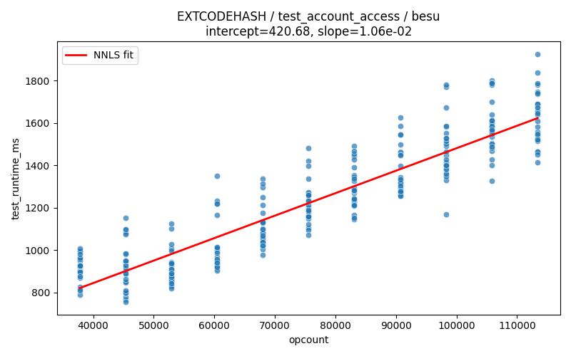

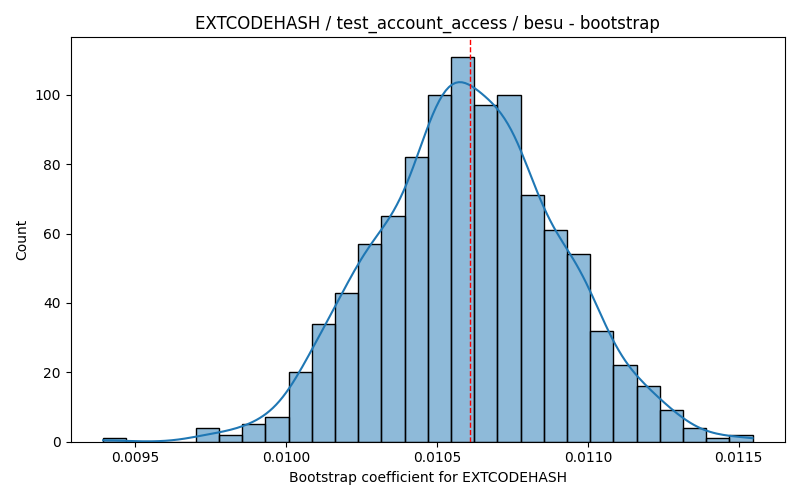

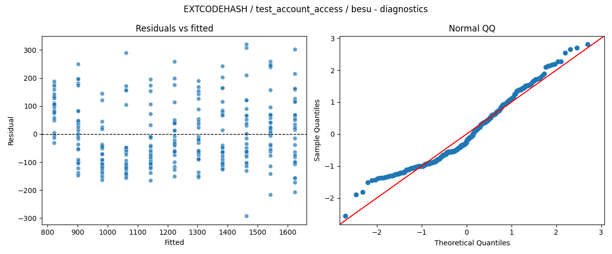

</details>

<details><summary>erigon — NNLS regression summary</summary>

```
==============================================================================
                           NNLS Regression Results                            
==============================================================================
Dep. Variable:          test_runtime_ms              R-squared:          0.995
Model:                  NNLS                    Adj. R-squared:          0.995
No. Observations:       418                               RMSE:          13.91
Df Residuals:           416                                MAE:          10.53
Df Model:               1      
==============================================================================
                      coef     std err     P-value      [0.025      0.975]
------------------------------------------------------------------------------
         const     12.4905      2.1597       0.001      8.5185     17.0440
       opcount      0.0086      0.0000       0.001      0.0086      0.0087
==============================================================================
Notes: Non-negative least squares with bootstrap inference (1000 iterations)
==============================================================================
```

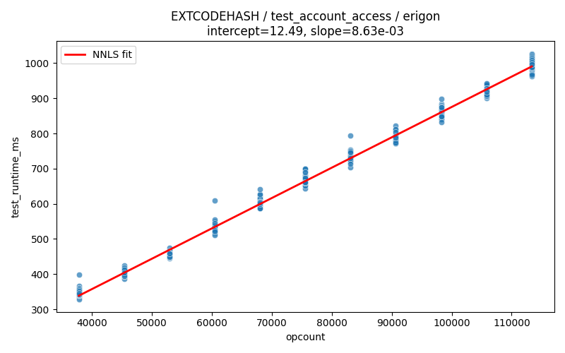

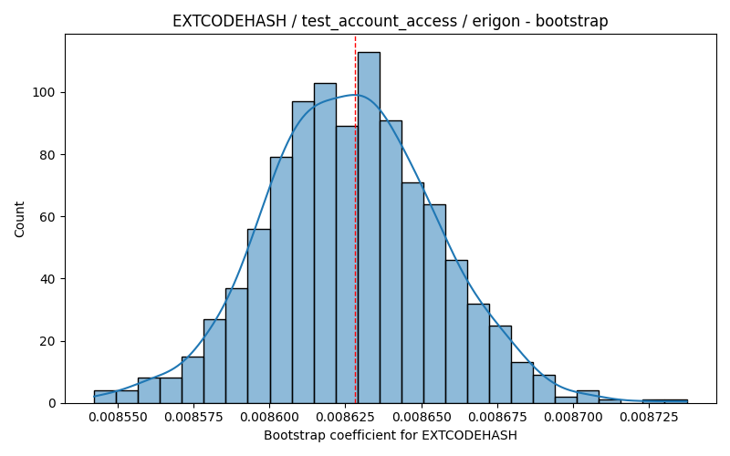

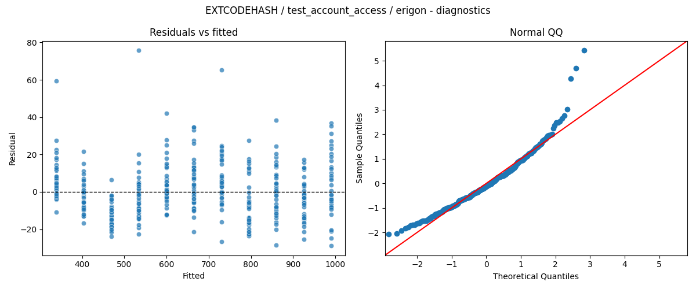

</details>

<details><summary>geth — NNLS regression summary</summary>

```
==============================================================================
                           NNLS Regression Results                            
==============================================================================
Dep. Variable:          test_runtime_ms              R-squared:          0.667
Model:                  NNLS                    Adj. R-squared:          0.666
No. Observations:       561                               RMSE:         652.16
Df Residuals:           559                                MAE:         551.55
Df Model:               1      
==============================================================================
                      coef     std err     P-value      [0.025      0.975]
------------------------------------------------------------------------------
         const   1157.7273     82.4163       0.001    986.6898   1312.6548
       opcount      0.0386      0.0012       0.001      0.0363      0.0411
==============================================================================
Notes: Non-negative least squares with bootstrap inference (1000 iterations)
==============================================================================
```

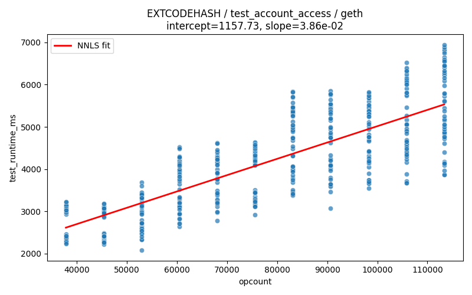

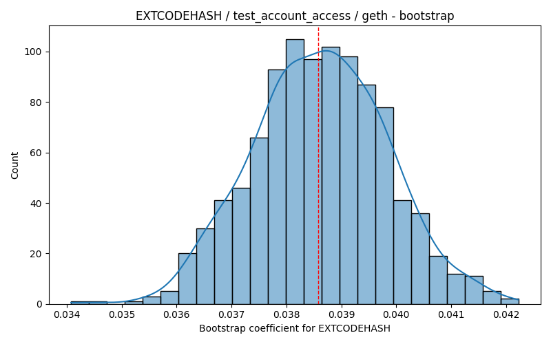

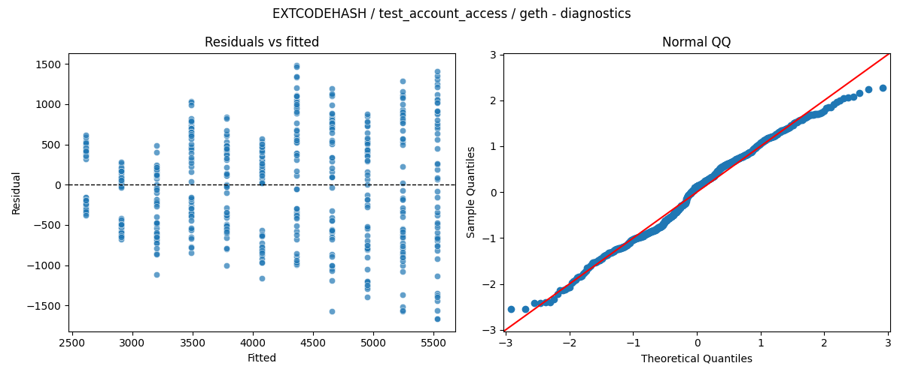

</details>

<details><summary>nethermind — NNLS regression summary</summary>

```
==============================================================================
                           NNLS Regression Results                            
==============================================================================
Dep. Variable:          test_runtime_ms              R-squared:          0.770
Model:                  NNLS                    Adj. R-squared:          0.769
No. Observations:       682                               RMSE:          66.40
Df Residuals:           680                                MAE:          51.50
Df Model:               1      
==============================================================================
                      coef     std err     P-value      [0.025      0.975]
------------------------------------------------------------------------------
         const     30.5002      7.3075       0.001     15.4564     43.8379
       opcount      0.0051      0.0001       0.001      0.0049      0.0053
==============================================================================
Notes: Non-negative least squares with bootstrap inference (1000 iterations)
==============================================================================
```

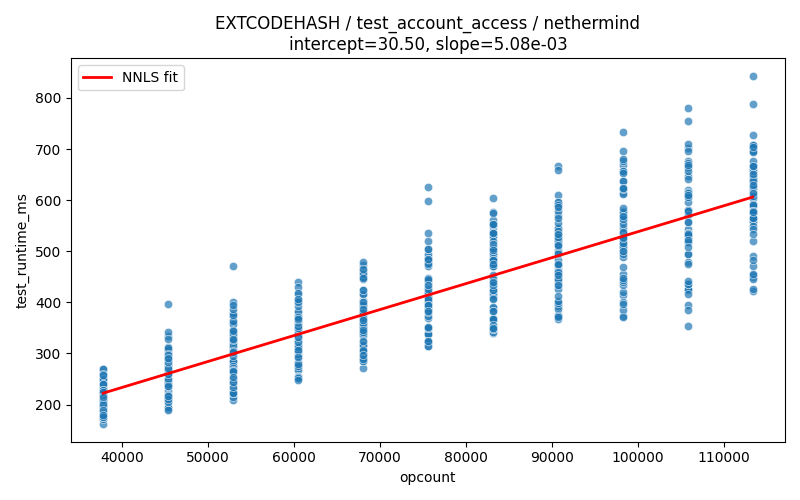

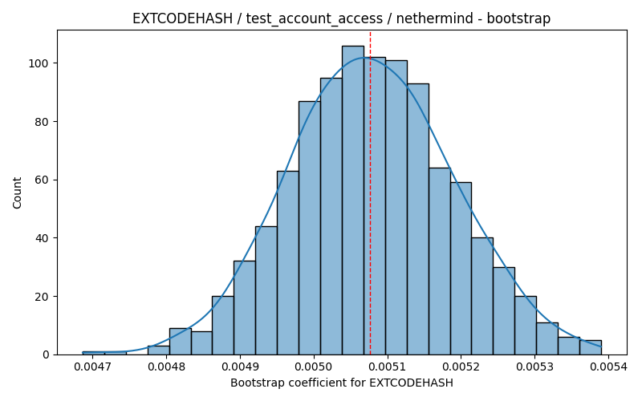

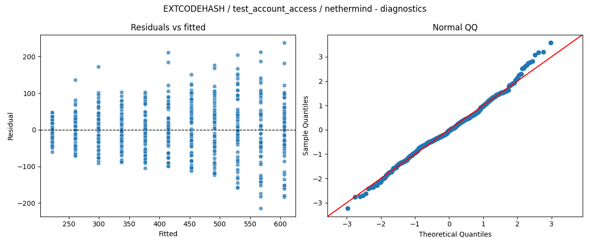

</details>

<details><summary>reth — NNLS regression summary</summary>

```
==============================================================================
                           NNLS Regression Results                            
==============================================================================
Dep. Variable:          test_runtime_ms              R-squared:          0.970
Model:                  NNLS                    Adj. R-squared:          0.970
No. Observations:       1056                              RMSE:           3.86
Df Residuals:           1054                               MAE:           3.03
Df Model:               1      
==============================================================================
                      coef     std err     P-value      [0.025      0.975]
------------------------------------------------------------------------------
         const     32.0990      0.3970       0.001     31.3387     32.9117
       opcount      0.0009      0.0000       0.001      0.0009      0.0009
==============================================================================
Notes: Non-negative least squares with bootstrap inference (1000 iterations)
==============================================================================
```

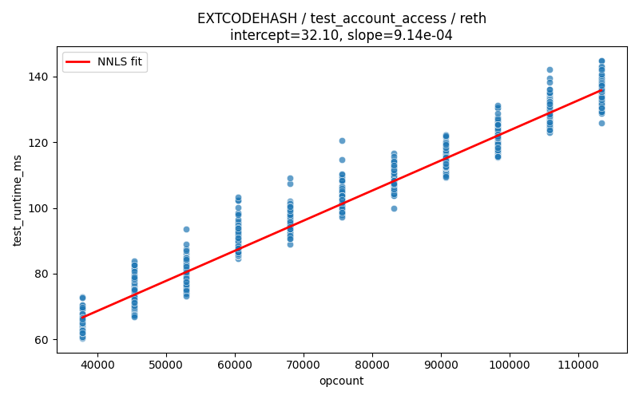

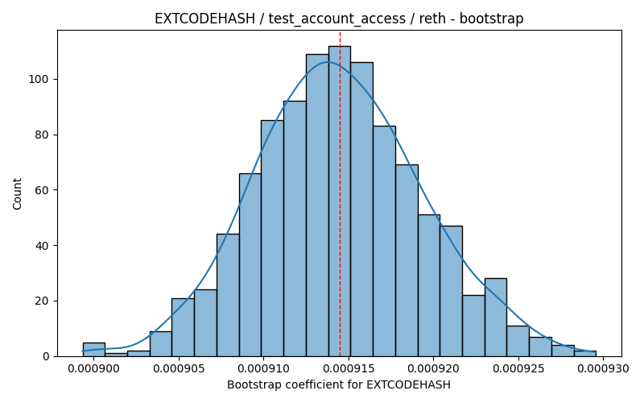

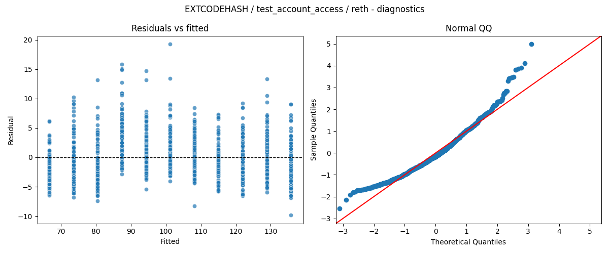

</details>

### test_account_access — combo `EXTCODEHASH_AccountMode.EXISTING_CONTRACT`

| client | nobs | R² | target_coef (ms) | p-value | 95% CI |
| --- | --- | --- | --- | --- | --- |
| `besu` | 286 | 0.8932 | 0.0317 | 1.00e-03 | [0.03036, 0.03295] |
| `erigon` | 418 | 0.8946 | 0.03586 | 1.00e-03 | [0.03468, 0.03698] |
| `geth` | 561 | 0.6274 | 0.0344 | 1.00e-03 | [0.03212, 0.03652] |
| `nethermind` | 682 | 0.7833 | 0.02032 | 1.00e-03 | [0.01954, 0.02103] |
| `reth` | 1056 | 0.8746 | 0.03554 | 1.00e-03 | [0.03474, 0.03646] |

<details><summary>besu — NNLS regression summary</summary>

```
==============================================================================
                           NNLS Regression Results                            
==============================================================================
Dep. Variable:          test_runtime_ms              R-squared:          0.893
Model:                  NNLS                    Adj. R-squared:          0.893
No. Observations:       286                               RMSE:         228.03
Df Residuals:           284                                MAE:         176.55
Df Model:               1      
==============================================================================
                      coef     std err     P-value      [0.025      0.975]
------------------------------------------------------------------------------
         const    388.7523     42.5263       0.001    303.6207    472.4043
       opcount      0.0317      0.0007       0.001      0.0304      0.0330
==============================================================================
Notes: Non-negative least squares with bootstrap inference (1000 iterations)
==============================================================================
```

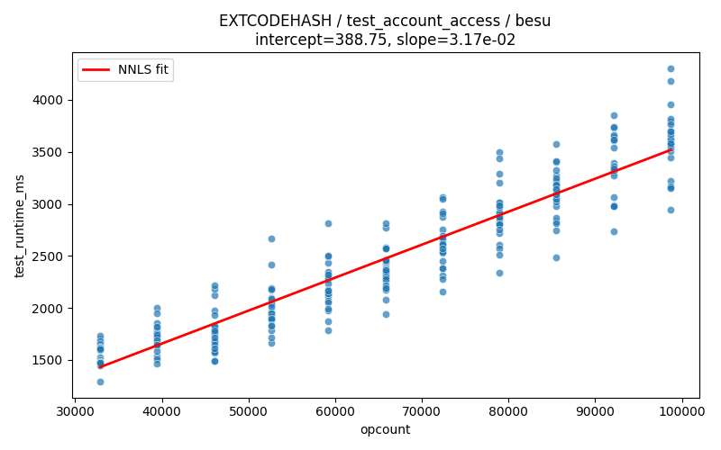

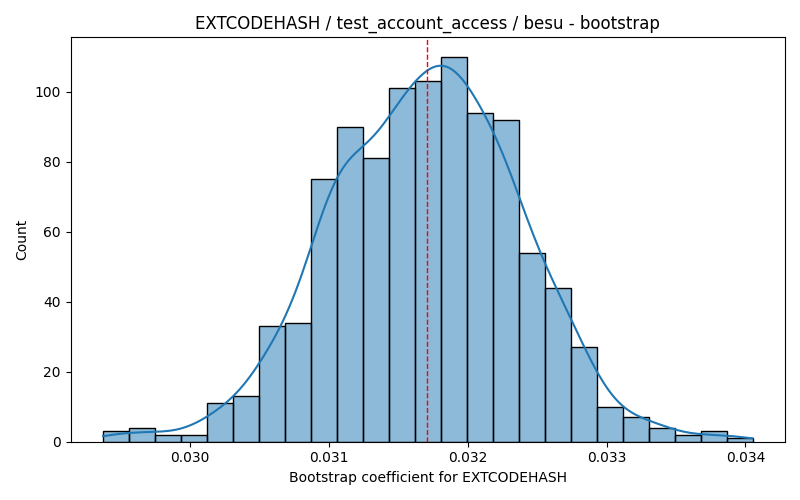

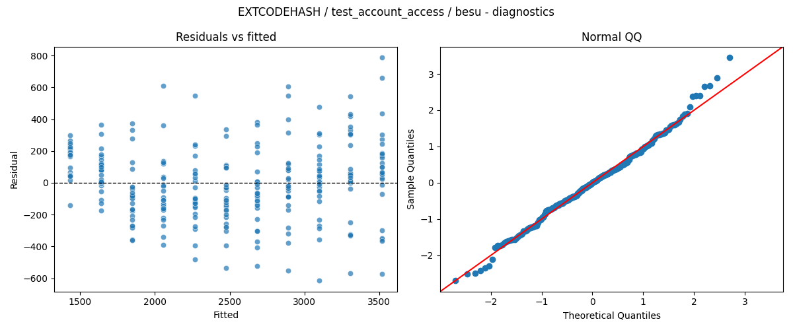

</details>

<details><summary>erigon — NNLS regression summary</summary>

```
==============================================================================
                           NNLS Regression Results                            
==============================================================================
Dep. Variable:          test_runtime_ms              R-squared:          0.895
Model:                  NNLS                    Adj. R-squared:          0.894
No. Observations:       418                               RMSE:         256.10
Df Residuals:           416                                MAE:         215.89
Df Model:               1      
==============================================================================
                      coef     std err     P-value      [0.025      0.975]
------------------------------------------------------------------------------
         const    427.3062     43.4548       0.001    345.2601    512.9334
       opcount      0.0359      0.0006       0.001      0.0347      0.0370
==============================================================================
Notes: Non-negative least squares with bootstrap inference (1000 iterations)
==============================================================================
```

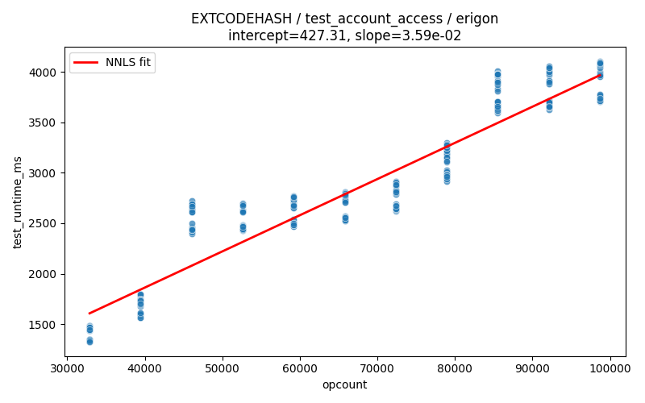

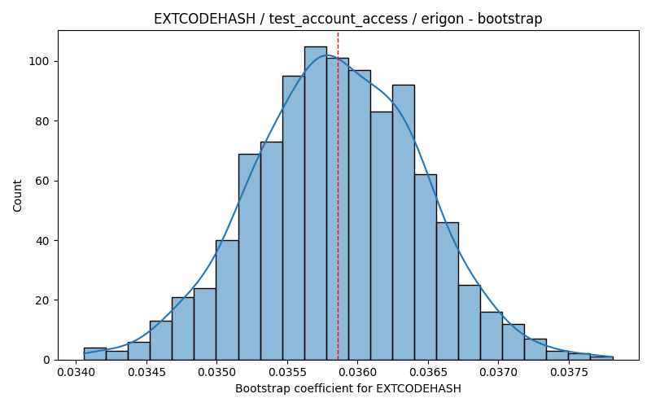

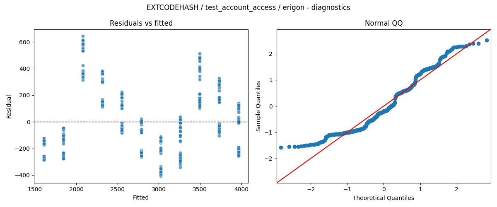

</details>

<details><summary>geth — NNLS regression summary</summary>

```
==============================================================================
                           NNLS Regression Results                            
==============================================================================
Dep. Variable:          test_runtime_ms              R-squared:          0.627
Model:                  NNLS                    Adj. R-squared:          0.627
No. Observations:       561                               RMSE:         551.49
Df Residuals:           559                                MAE:         454.35
Df Model:               1      
==============================================================================
                      coef     std err     P-value      [0.025      0.975]
------------------------------------------------------------------------------
         const   1333.2670     70.7989       0.001   1199.3609   1474.2298
       opcount      0.0344      0.0011       0.001      0.0321      0.0365
==============================================================================
Notes: Non-negative least squares with bootstrap inference (1000 iterations)
==============================================================================
```

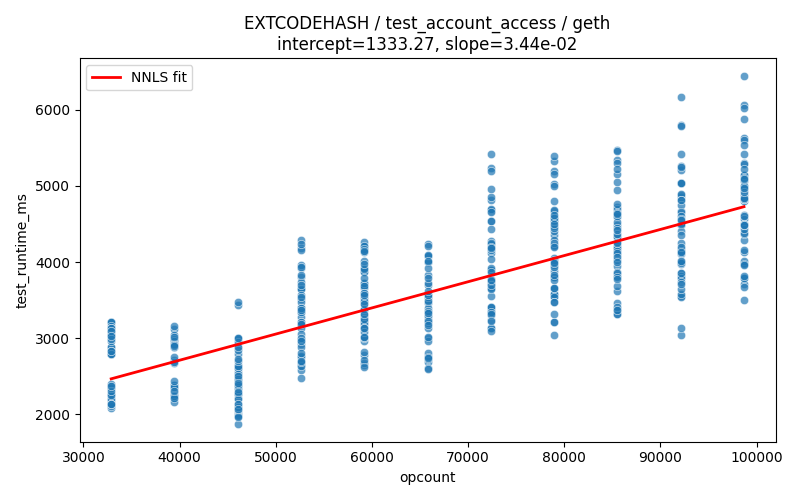

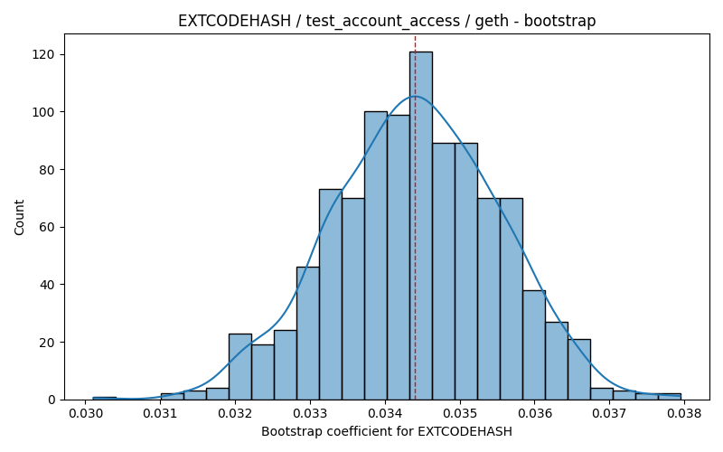

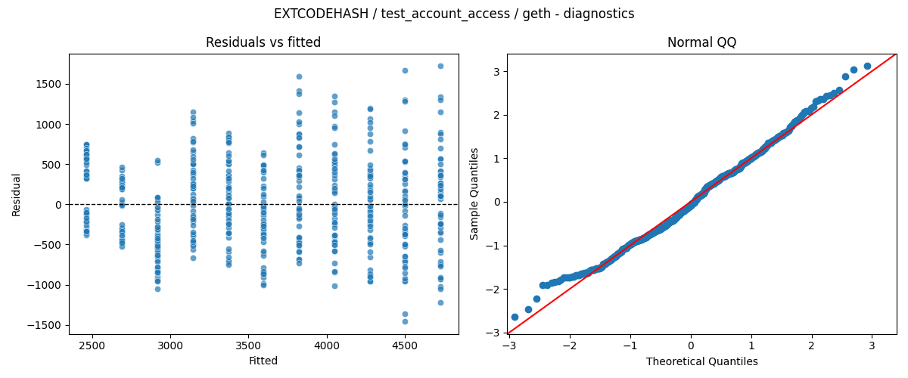

</details>

<details><summary>nethermind — NNLS regression summary</summary>

```
==============================================================================
                           NNLS Regression Results                            
==============================================================================
Dep. Variable:          test_runtime_ms              R-squared:          0.783
Model:                  NNLS                    Adj. R-squared:          0.783
No. Observations:       682                               RMSE:         222.32
Df Residuals:           680                                MAE:         154.28
Df Model:               1      
==============================================================================
                      coef     std err     P-value      [0.025      0.975]
------------------------------------------------------------------------------
         const    219.6562     23.6627       0.001    172.9214    265.8773
       opcount      0.0203      0.0004       0.001      0.0195      0.0210
==============================================================================
Notes: Non-negative least squares with bootstrap inference (1000 iterations)
==============================================================================
```

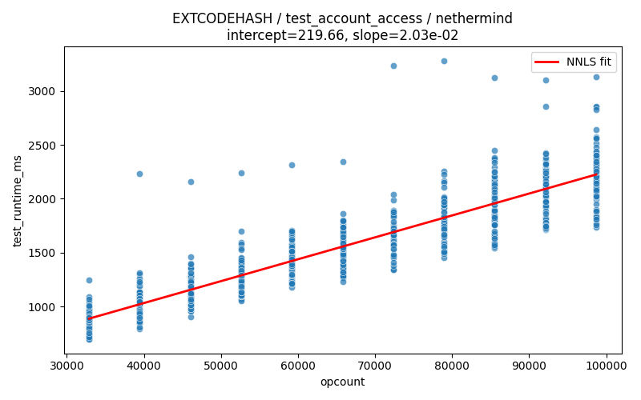

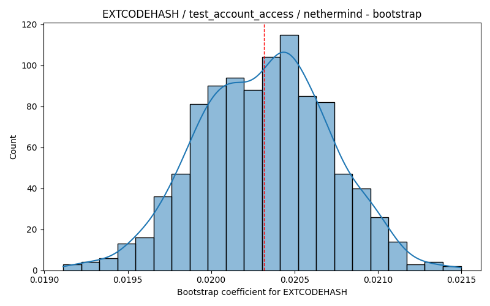

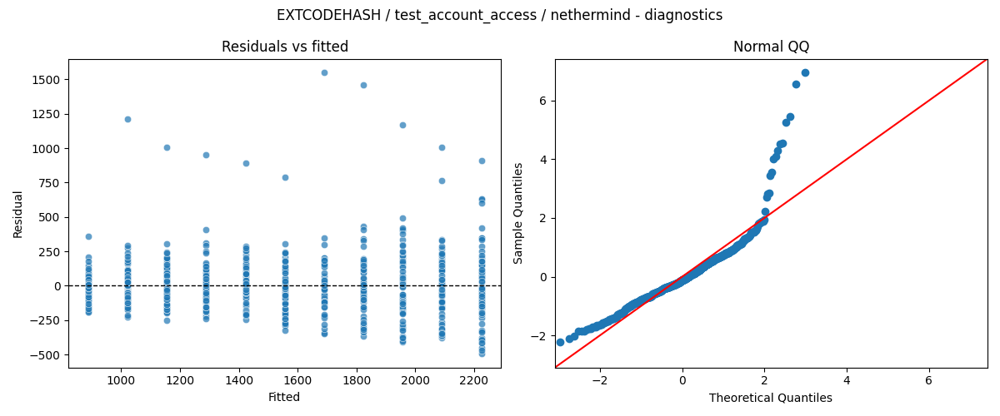

</details>

<details><summary>reth — NNLS regression summary</summary>

```
==============================================================================
                           NNLS Regression Results                            
==============================================================================
Dep. Variable:          test_runtime_ms              R-squared:          0.875
Model:                  NNLS                    Adj. R-squared:          0.874
No. Observations:       1056                              RMSE:         279.99
Df Residuals:           1054                               MAE:         157.84
Df Model:               1      
==============================================================================
                      coef     std err     P-value      [0.025      0.975]
------------------------------------------------------------------------------
         const    192.8474     28.5144       0.001    132.3808    247.2720
       opcount      0.0355      0.0004       0.001      0.0347      0.0365
==============================================================================
Notes: Non-negative least squares with bootstrap inference (1000 iterations)
==============================================================================
```

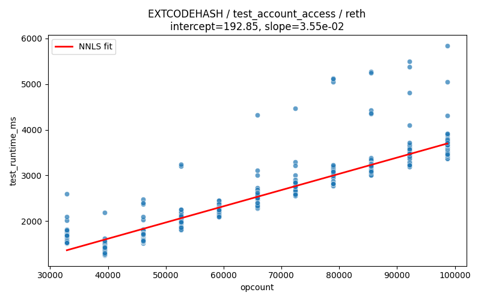

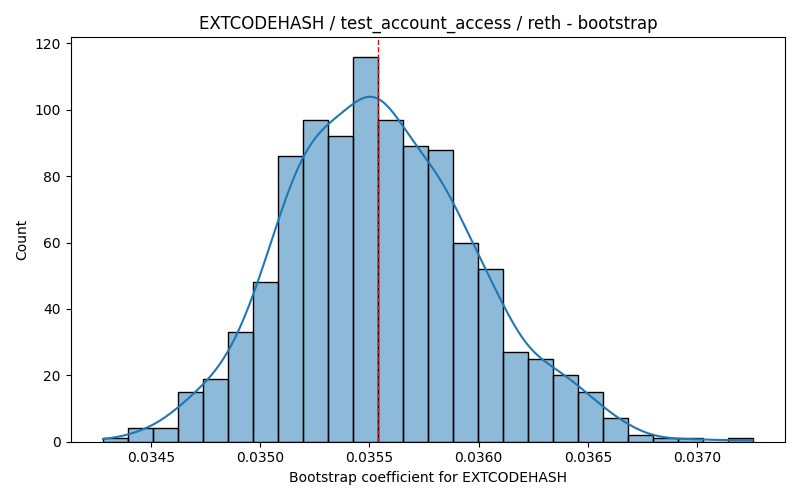

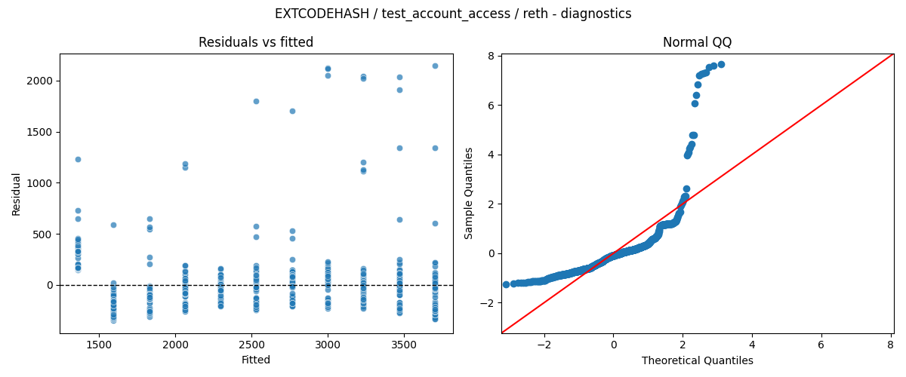

</details>

### test_account_access — combo `EXTCODEHASH_AccountMode.NON_EXISTING_ACCOUNT` — `presets[cold_account_code_access]`

| client | nobs | R² | target_coef (ms) | p-value | 95% CI |
| --- | --- | --- | --- | --- | --- |
| `besu` | 286 | 0.8317 | 0.01061 | 1.00e-03 | [0.01004, 0.01118] |
| `erigon` | 418 | 0.9955 | 0.008628 | 1.00e-03 | [0.008572, 0.008682] |
| `geth` | 561 | 0.6666 | 0.03858 | 1.00e-03 | [0.03632, 0.04108] |
| `nethermind` | 682 | 0.7695 | 0.005077 | 1.00e-03 | [0.004868, 0.005295] |
| `reth` | 1056 | 0.9698 | 0.0009145 | 1.00e-03 | [0.000905, 0.0009241] |

<details><summary>besu — NNLS regression summary</summary>

```
==============================================================================
                           NNLS Regression Results                            
==============================================================================
Dep. Variable:          test_runtime_ms              R-squared:          0.832
Model:                  NNLS                    Adj. R-squared:          0.831
No. Observations:       286                               RMSE:         114.05
Df Residuals:           284                                MAE:          95.71
Df Model:               1      
==============================================================================
                      coef     std err     P-value      [0.025      0.975]
------------------------------------------------------------------------------
         const    420.6799     23.2092       0.001    376.1825    467.0201
       opcount      0.0106      0.0003       0.001      0.0100      0.0112
==============================================================================
Notes: Non-negative least squares with bootstrap inference (1000 iterations)
==============================================================================
```


</details>

<details><summary>erigon — NNLS regression summary</summary>

```
==============================================================================
                           NNLS Regression Results                            
==============================================================================
Dep. Variable:          test_runtime_ms              R-squared:          0.995
Model:                  NNLS                    Adj. R-squared:          0.995
No. Observations:       418                               RMSE:          13.91
Df Residuals:           416                                MAE:          10.53
Df Model:               1      
==============================================================================
                      coef     std err     P-value      [0.025      0.975]
------------------------------------------------------------------------------
         const     12.4905      2.1597       0.001      8.5185     17.0440
       opcount      0.0086      0.0000       0.001      0.0086      0.0087
==============================================================================
Notes: Non-negative least squares with bootstrap inference (1000 iterations)
==============================================================================
```


</details>

<details><summary>geth — NNLS regression summary</summary>

```
==============================================================================
                           NNLS Regression Results                            
==============================================================================
Dep. Variable:          test_runtime_ms              R-squared:          0.667
Model:                  NNLS                    Adj. R-squared:          0.666
No. Observations:       561                               RMSE:         652.16
Df Residuals:           559                                MAE:         551.55
Df Model:               1      
==============================================================================
                      coef     std err     P-value      [0.025      0.975]
------------------------------------------------------------------------------
         const   1157.7273     82.4163       0.001    986.6898   1312.6548
       opcount      0.0386      0.0012       0.001      0.0363      0.0411
==============================================================================
Notes: Non-negative least squares with bootstrap inference (1000 iterations)
==============================================================================
```


</details>

<details><summary>nethermind — NNLS regression summary</summary>

```
==============================================================================
                           NNLS Regression Results                            
==============================================================================
Dep. Variable:          test_runtime_ms              R-squared:          0.770
Model:                  NNLS                    Adj. R-squared:          0.769
No. Observations:       682                               RMSE:          66.40
Df Residuals:           680                                MAE:          51.50
Df Model:               1      
==============================================================================
                      coef     std err     P-value      [0.025      0.975]
------------------------------------------------------------------------------
         const     30.5002      7.3075       0.001     15.4564     43.8379
       opcount      0.0051      0.0001       0.001      0.0049      0.0053
==============================================================================
Notes: Non-negative least squares with bootstrap inference (1000 iterations)
==============================================================================
```


</details>

<details><summary>reth — NNLS regression summary</summary>

```
==============================================================================
                           NNLS Regression Results                            
==============================================================================
Dep. Variable:          test_runtime_ms              R-squared:          0.970
Model:                  NNLS                    Adj. R-squared:          0.970
No. Observations:       1056                              RMSE:           3.86
Df Residuals:           1054                               MAE:           3.03
Df Model:               1      
==============================================================================
                      coef     std err     P-value      [0.025      0.975]
------------------------------------------------------------------------------
         const     32.0990      0.3970       0.001     31.3387     32.9117
       opcount      0.0009      0.0000       0.001      0.0009      0.0009
==============================================================================
Notes: Non-negative least squares with bootstrap inference (1000 iterations)
==============================================================================
```


</details>

### test_ext_account_query_warm — combo `EXTCODEHASH`

| client | nobs | R² | target_coef (ms) | p-value | 95% CI |
| --- | --- | --- | --- | --- | --- |
| `besu` | 286 | 0.6441 | 0.0001429 | 1.00e-03 | [0.0001294, 0.0001558] |
| `erigon` | 418 | 0.9105 | 0.0002649 | 1.00e-03 | [0.0002572, 0.0002731] |
| `geth` | 561 | 0.9648 | 0.0001977 | 1.00e-03 | [0.0001943, 0.0002011] |
| `nethermind` | 682 | 0.6134 | 0.0002368 | 1.00e-03 | [0.0002222, 0.0002508] |
| `reth` | 1056 | 0.6781 | 7.656e-06 | 1.00e-03 | [7.317e-06, 7.985e-06] |

<details><summary>besu — NNLS regression summary</summary>

```
==============================================================================
                           NNLS Regression Results                            
==============================================================================
Dep. Variable:          test_runtime_ms              R-squared:          0.644
Model:                  NNLS                    Adj. R-squared:          0.643
No. Observations:       286                               RMSE:          62.14
Df Residuals:           284                                MAE:          48.72
Df Model:               1      
==============================================================================
                      coef     std err     P-value      [0.025      0.975]
------------------------------------------------------------------------------
         const    182.4175     12.8891       0.001    158.8791    208.8183
       opcount      0.0001      0.0000       0.001      0.0001      0.0002
==============================================================================
Notes: Non-negative least squares with bootstrap inference (1000 iterations)
==============================================================================
```

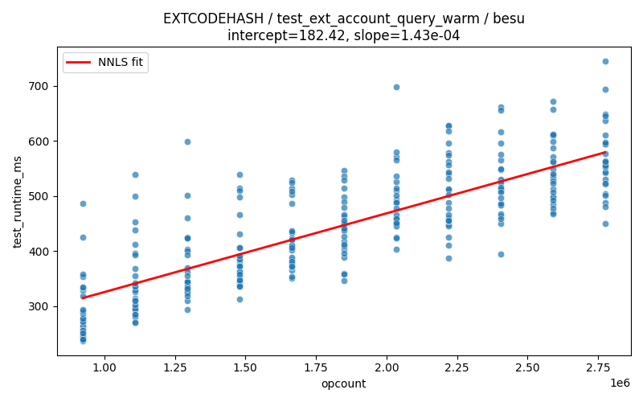

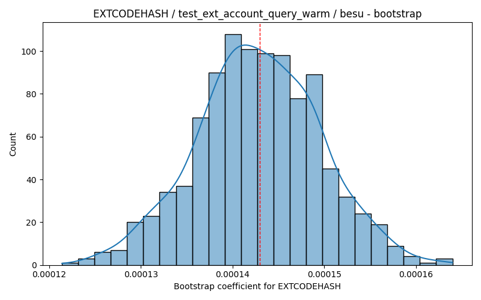

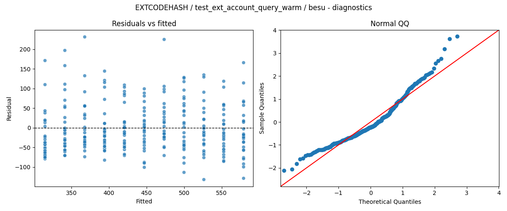

</details>

<details><summary>erigon — NNLS regression summary</summary>

```
==============================================================================
                           NNLS Regression Results                            
==============================================================================
Dep. Variable:          test_runtime_ms              R-squared:          0.910
Model:                  NNLS                    Adj. R-squared:          0.910
No. Observations:       418                               RMSE:          48.57
Df Residuals:           416                                MAE:          39.71
Df Model:               1      
==============================================================================
                      coef     std err     P-value      [0.025      0.975]
------------------------------------------------------------------------------
         const     46.8745      6.8314       0.001     33.4932     59.9743
       opcount      0.0003      0.0000       0.001      0.0003      0.0003
==============================================================================
Notes: Non-negative least squares with bootstrap inference (1000 iterations)
==============================================================================
```

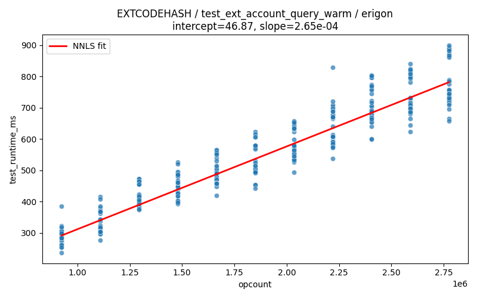

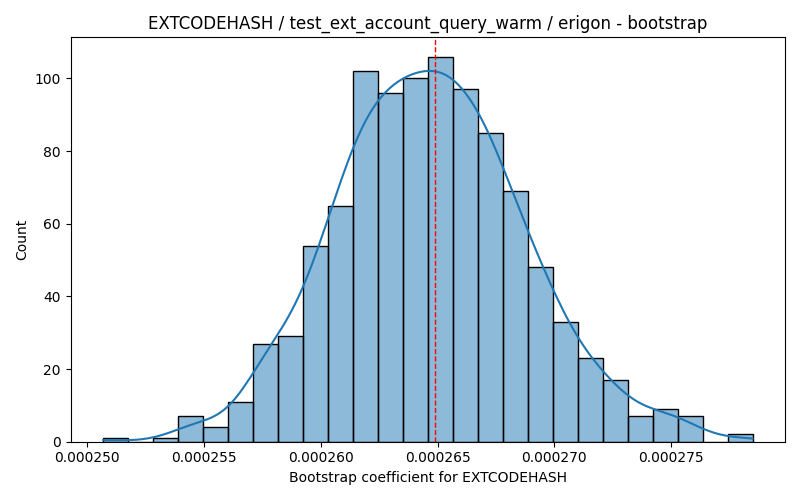

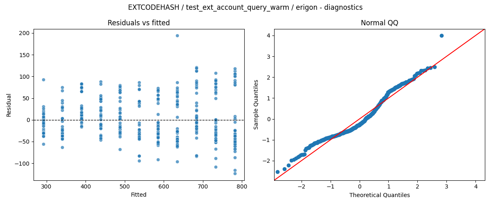

</details>

<details><summary>geth — NNLS regression summary</summary>

```
==============================================================================
                           NNLS Regression Results                            
==============================================================================
Dep. Variable:          test_runtime_ms              R-squared:          0.965
Model:                  NNLS                    Adj. R-squared:          0.965
No. Observations:       561                               RMSE:          22.07
Df Residuals:           559                                MAE:          16.40
Df Model:               1      
==============================================================================
                      coef     std err     P-value      [0.025      0.975]
------------------------------------------------------------------------------
         const      6.9347      2.7529       0.005      1.3806     12.4345
       opcount      0.0002      0.0000       0.001      0.0002      0.0002
==============================================================================
Notes: Non-negative least squares with bootstrap inference (1000 iterations)
==============================================================================
```

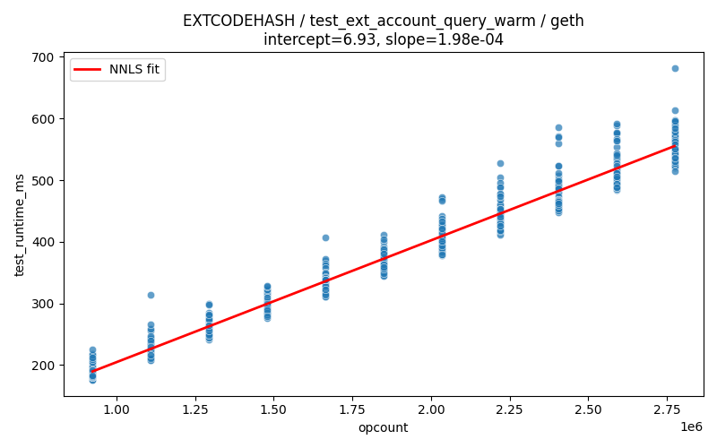

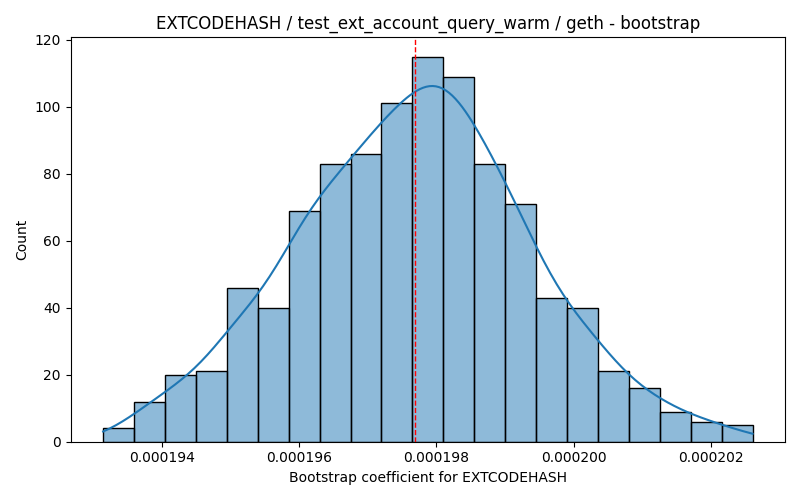

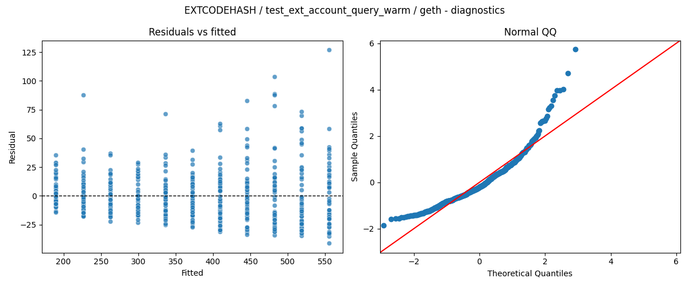

</details>

<details><summary>nethermind — NNLS regression summary</summary>

```
==============================================================================
                           NNLS Regression Results                            
==============================================================================
Dep. Variable:          test_runtime_ms              R-squared:          0.613
Model:                  NNLS                    Adj. R-squared:          0.613
No. Observations:       682                               RMSE:         109.93
Df Residuals:           680                                MAE:          87.15
Df Model:               1      
==============================================================================
                      coef     std err     P-value      [0.025      0.975]
------------------------------------------------------------------------------
         const    119.8529     12.1896       0.001     96.3837    144.1412
       opcount      0.0002      0.0000       0.001      0.0002      0.0003
==============================================================================
Notes: Non-negative least squares with bootstrap inference (1000 iterations)
==============================================================================
```

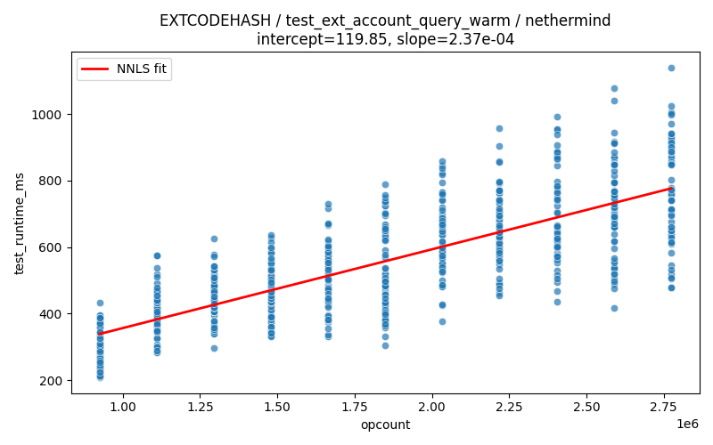

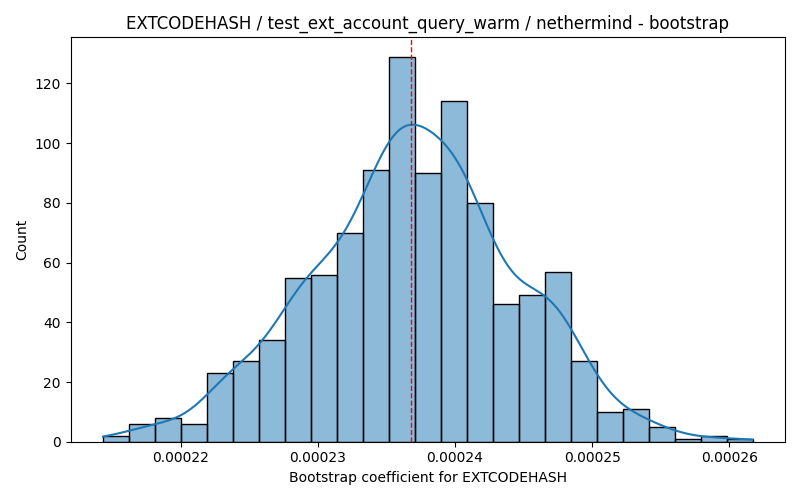

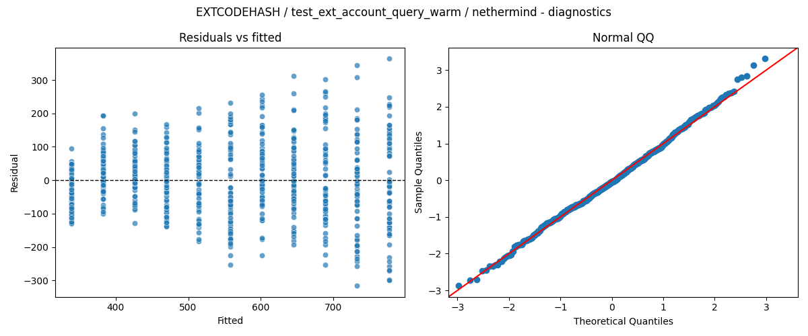

</details>

<details><summary>reth — NNLS regression summary</summary>

```
==============================================================================
                           NNLS Regression Results                            
==============================================================================
Dep. Variable:          test_runtime_ms              R-squared:          0.678
Model:                  NNLS                    Adj. R-squared:          0.678
No. Observations:       1056                              RMSE:           3.08
Df Residuals:           1054                               MAE:           2.20
Df Model:               1      
==============================================================================
                      coef     std err     P-value      [0.025      0.975]
------------------------------------------------------------------------------
         const      6.5662      0.3115       0.001      5.9507      7.1734
       opcount      0.0000      0.0000       0.001      0.0000      0.0000
==============================================================================
Notes: Non-negative least squares with bootstrap inference (1000 iterations)
==============================================================================
```

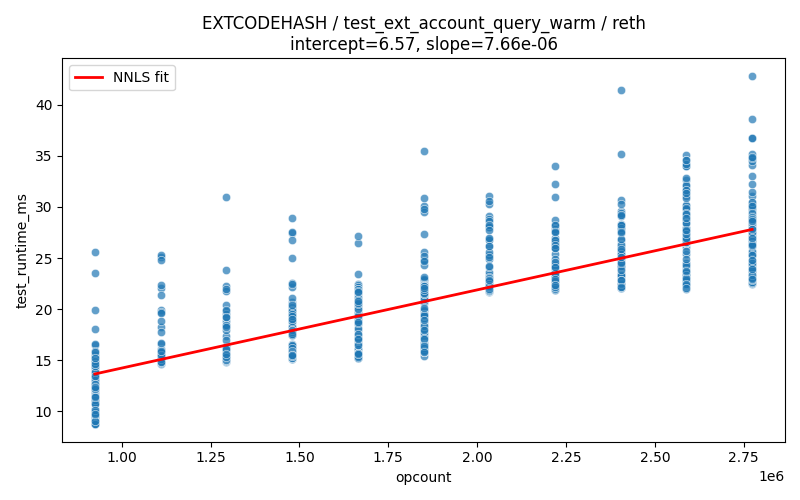

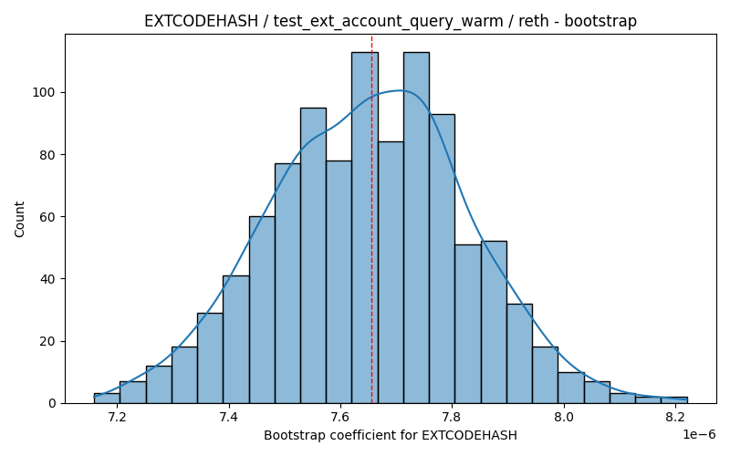

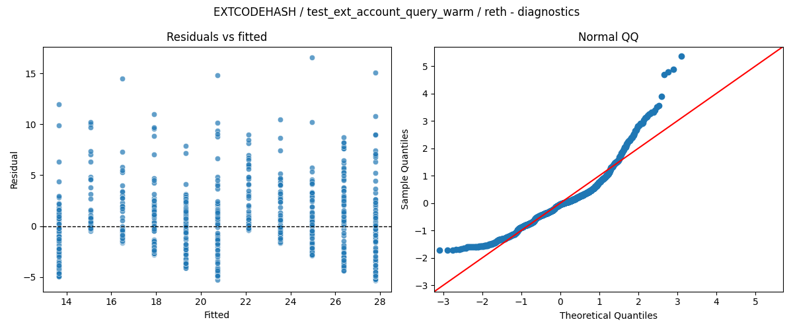

</details>

## EXTCODESIZE

### test_account_access — combo `EXTCODESIZE_AccountMode.NON_EXISTING_ACCOUNT` — `presets[cold_account_nocode_access]`

| client | nobs | R² | target_coef (ms) | p-value | 95% CI |
| --- | --- | --- | --- | --- | --- |
| `besu` | 286 | 0.8329 | 0.01065 | 1.00e-03 | [0.01014, 0.01122] |
| `erigon` | 418 | 0.996 | 0.008841 | 1.00e-03 | [0.008787, 0.008894] |
| `geth` | 561 | 0.6535 | 0.0372 | 1.00e-03 | [0.03471, 0.03955] |
| `nethermind` | 682 | 0.7823 | 0.004918 | 1.00e-03 | [0.004716, 0.005103] |
| `reth` | 1056 | 0.9668 | 0.0009176 | 1.00e-03 | [0.0009078, 0.0009277] |

<details><summary>besu — NNLS regression summary</summary>

```
==============================================================================
                           NNLS Regression Results                            
==============================================================================
Dep. Variable:          test_runtime_ms              R-squared:          0.833
Model:                  NNLS                    Adj. R-squared:          0.832
No. Observations:       286                               RMSE:         114.01
Df Residuals:           284                                MAE:          96.24
Df Model:               1      
==============================================================================
                      coef     std err     P-value      [0.025      0.975]
------------------------------------------------------------------------------
         const    417.0410     22.3278       0.001    372.5417    459.4166
       opcount      0.0106      0.0003       0.001      0.0101      0.0112
==============================================================================
Notes: Non-negative least squares with bootstrap inference (1000 iterations)
==============================================================================
```

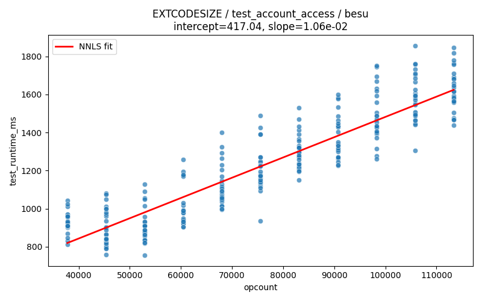

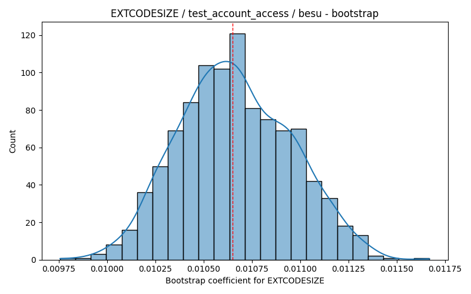

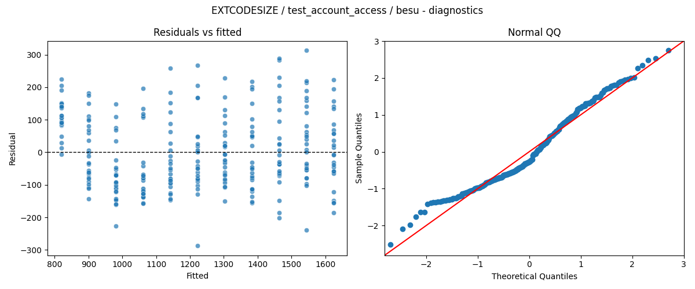

</details>

<details><summary>erigon — NNLS regression summary</summary>

```
==============================================================================
                           NNLS Regression Results                            
==============================================================================
Dep. Variable:          test_runtime_ms              R-squared:          0.996
Model:                  NNLS                    Adj. R-squared:          0.996
No. Observations:       418                               RMSE:          13.32
Df Residuals:           416                                MAE:          10.74
Df Model:               1      
==============================================================================
                      coef     std err     P-value      [0.025      0.975]
------------------------------------------------------------------------------
         const     11.5064      2.2397       0.001      7.0031     15.4977
       opcount      0.0088      0.0000       0.001      0.0088      0.0089
==============================================================================
Notes: Non-negative least squares with bootstrap inference (1000 iterations)
==============================================================================
```

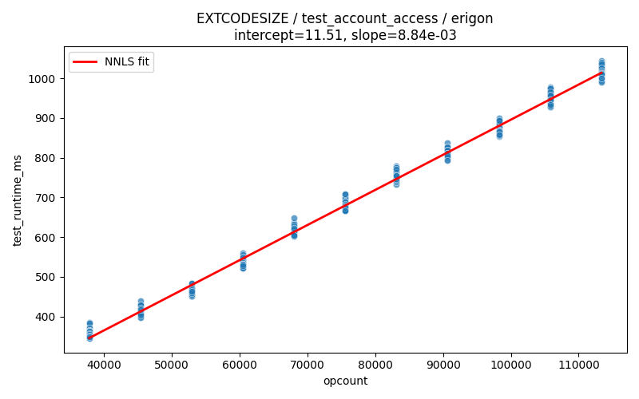

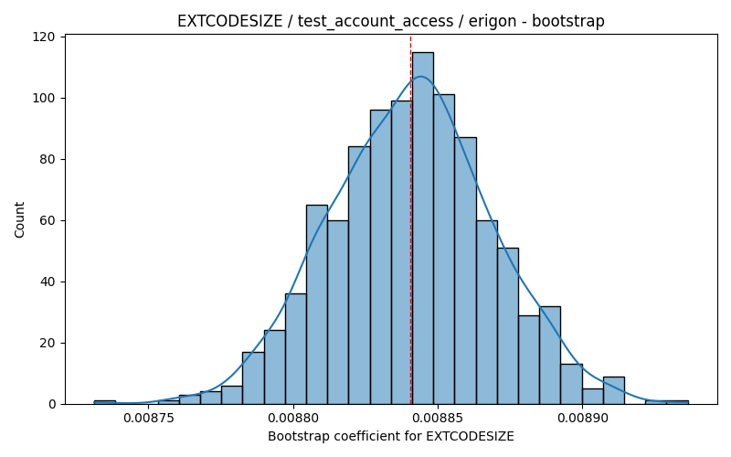

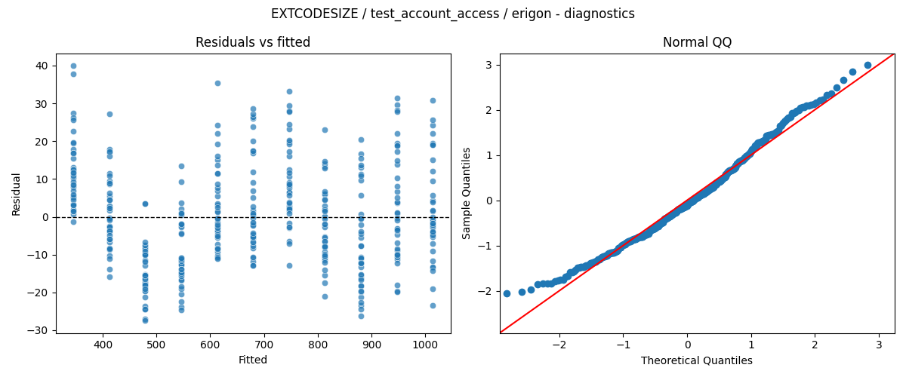

</details>

<details><summary>geth — NNLS regression summary</summary>

```
==============================================================================
                           NNLS Regression Results                            
==============================================================================
Dep. Variable:          test_runtime_ms              R-squared:          0.653
Model:                  NNLS                    Adj. R-squared:          0.653
No. Observations:       561                               RMSE:         647.37
Df Residuals:           559                                MAE:         544.36
Df Model:               1      
==============================================================================
                      coef     std err     P-value      [0.025      0.975]
------------------------------------------------------------------------------
         const   1227.0102     83.3792       0.001   1069.0609   1395.5582
       opcount      0.0372      0.0012       0.001      0.0347      0.0396
==============================================================================
Notes: Non-negative least squares with bootstrap inference (1000 iterations)
==============================================================================
```

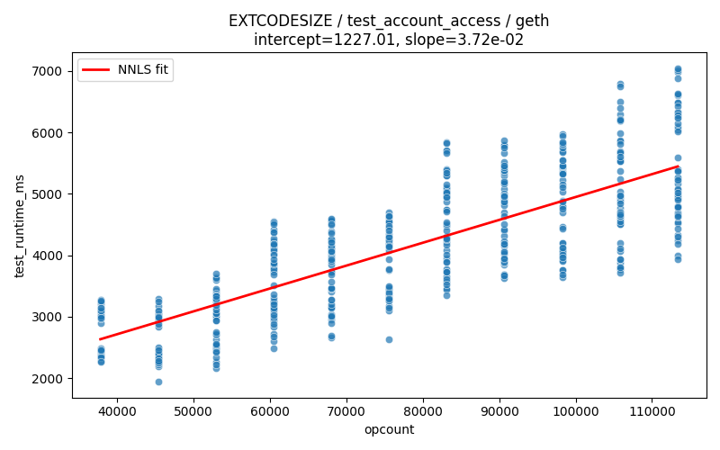

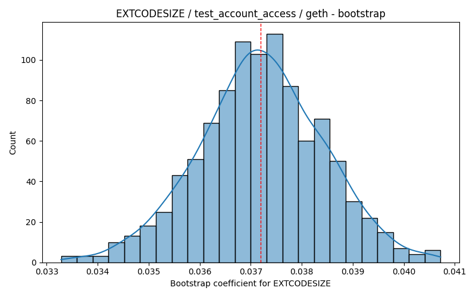

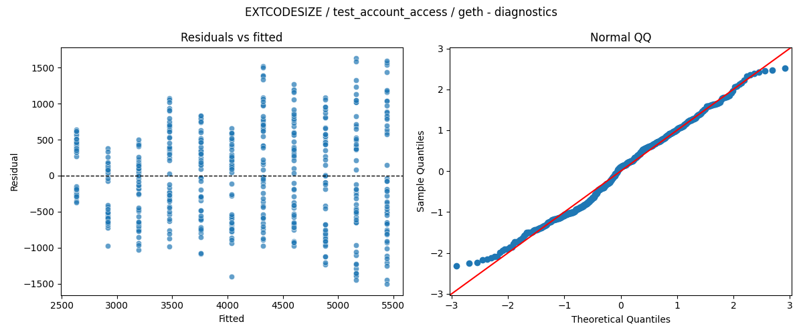

</details>

<details><summary>nethermind — NNLS regression summary</summary>

```
==============================================================================
                           NNLS Regression Results                            
==============================================================================
Dep. Variable:          test_runtime_ms              R-squared:          0.782
Model:                  NNLS                    Adj. R-squared:          0.782
No. Observations:       682                               RMSE:          61.99
Df Residuals:           680                                MAE:          49.12
Df Model:               1      
==============================================================================
                      coef     std err     P-value      [0.025      0.975]
------------------------------------------------------------------------------
         const     38.0217      6.9952       0.001     25.6318     52.3769
       opcount      0.0049      0.0001       0.001      0.0047      0.0051
==============================================================================
Notes: Non-negative least squares with bootstrap inference (1000 iterations)
==============================================================================
```

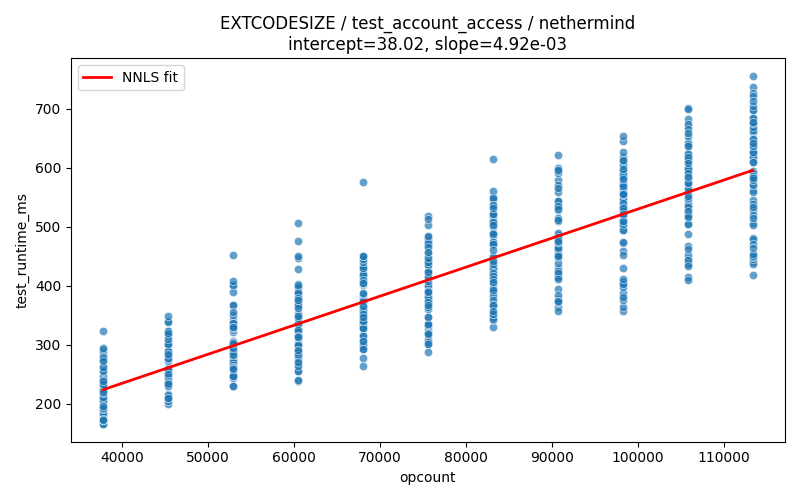

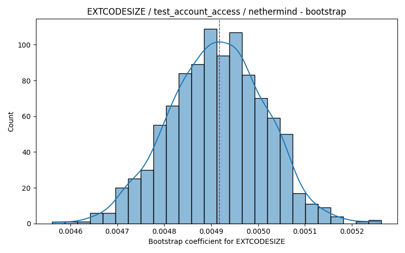

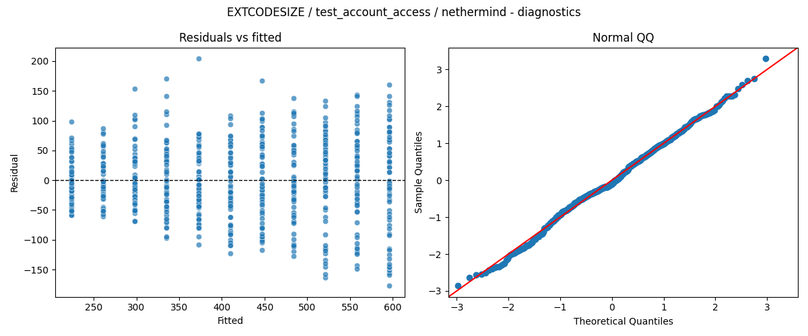

</details>

<details><summary>reth — NNLS regression summary</summary>

```
==============================================================================
                           NNLS Regression Results                            
==============================================================================
Dep. Variable:          test_runtime_ms              R-squared:          0.967
Model:                  NNLS                    Adj. R-squared:          0.967
No. Observations:       1056                              RMSE:           4.06
Df Residuals:           1054                               MAE:           3.20
Df Model:               1      
==============================================================================
                      coef     std err     P-value      [0.025      0.975]
------------------------------------------------------------------------------
         const     31.9214      0.3967       0.001     31.1003     32.6675
       opcount      0.0009      0.0000       0.001      0.0009      0.0009
==============================================================================
Notes: Non-negative least squares with bootstrap inference (1000 iterations)
==============================================================================
```

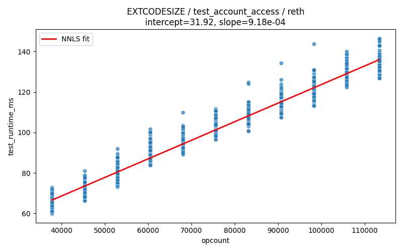

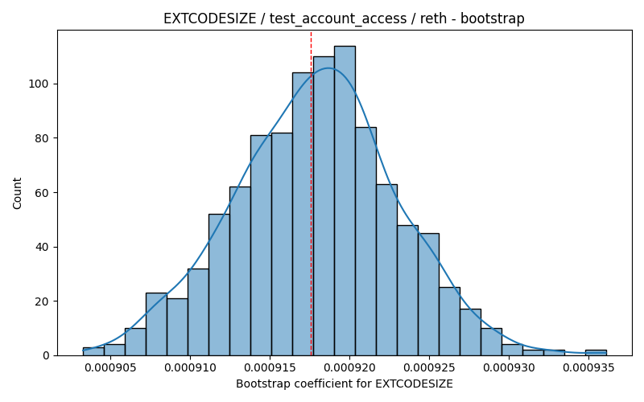

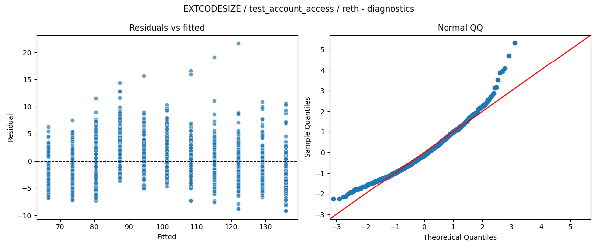

</details>

### test_account_access — combo `EXTCODESIZE_AccountMode.EXISTING_CONTRACT`

| client | nobs | R² | target_coef (ms) | p-value | 95% CI |
| --- | --- | --- | --- | --- | --- |
| `besu` | 286 | 0.8804 | 0.03184 | 1.00e-03 | [0.03057, 0.03316] |
| `erigon` | 418 | 0.8709 | 0.08608 | 1.00e-03 | [0.08292, 0.08927] |
| `geth` | 561 | 0.7292 | 0.04026 | 1.00e-03 | [0.0381, 0.04232] |
| `nethermind` | 682 | 0.7758 | 0.01996 | 1.00e-03 | [0.01916, 0.02078] |
| `reth` | 1056 | 0.8992 | 0.03504 | 1.00e-03 | [0.03423, 0.03582] |

<details><summary>besu — NNLS regression summary</summary>

```
==============================================================================
                           NNLS Regression Results                            
==============================================================================
Dep. Variable:          test_runtime_ms              R-squared:          0.880
Model:                  NNLS                    Adj. R-squared:          0.880
No. Observations:       286                               RMSE:         244.16
Df Residuals:           284                                MAE:         189.50
Df Model:               1      
==============================================================================
                      coef     std err     P-value      [0.025      0.975]
------------------------------------------------------------------------------
         const    379.5633     42.7431       0.001    291.2857    458.9452
       opcount      0.0318      0.0007       0.001      0.0306      0.0332
==============================================================================
Notes: Non-negative least squares with bootstrap inference (1000 iterations)
==============================================================================
```

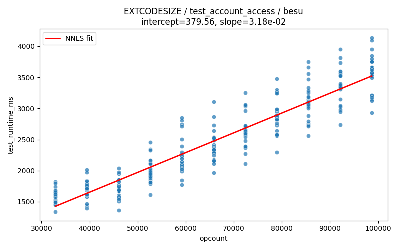

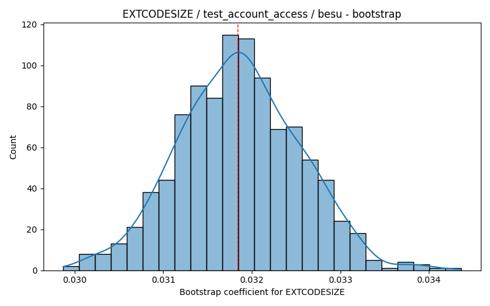

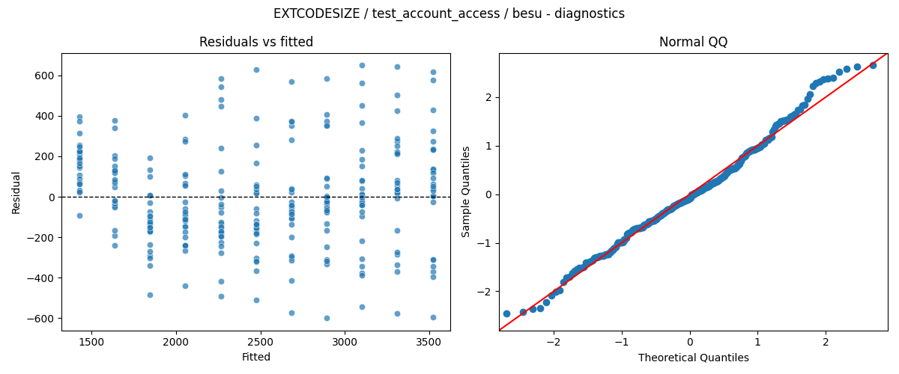

</details>

<details><summary>erigon — NNLS regression summary</summary>

```
==============================================================================
                           NNLS Regression Results                            
==============================================================================
Dep. Variable:          test_runtime_ms              R-squared:          0.871
Model:                  NNLS                    Adj. R-squared:          0.871
No. Observations:       418                               RMSE:         689.64
Df Residuals:           416                                MAE:         583.61
Df Model:               1      
==============================================================================
                      coef     std err     P-value      [0.025      0.975]
------------------------------------------------------------------------------
         const   1524.1649    123.1609       0.001   1279.1004   1756.1797
       opcount      0.0861      0.0016       0.001      0.0829      0.0893
==============================================================================
Notes: Non-negative least squares with bootstrap inference (1000 iterations)
==============================================================================
```

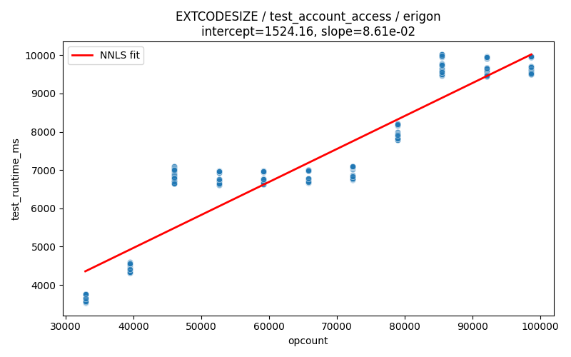

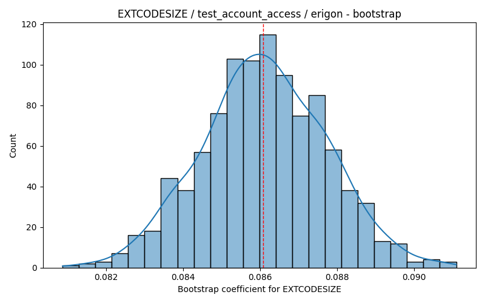

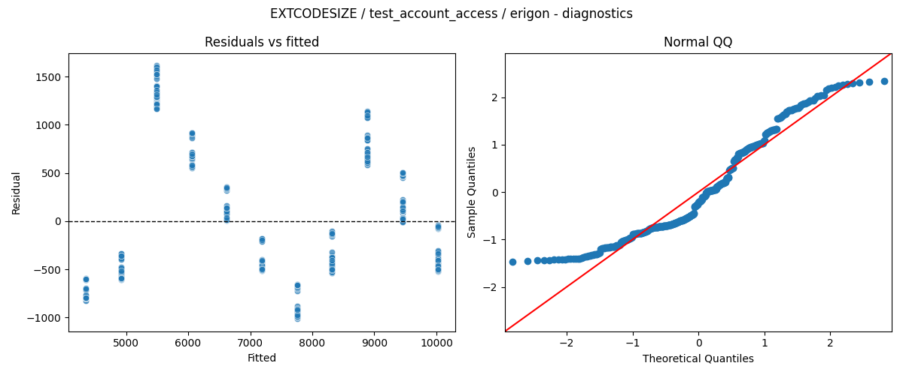

</details>

<details><summary>geth — NNLS regression summary</summary>

```
==============================================================================
                           NNLS Regression Results                            
==============================================================================
Dep. Variable:          test_runtime_ms              R-squared:          0.729
Model:                  NNLS                    Adj. R-squared:          0.729
No. Observations:       561                               RMSE:         510.37
Df Residuals:           559                                MAE:         418.32
Df Model:               1      
==============================================================================
                      coef     std err     P-value      [0.025      0.975]
------------------------------------------------------------------------------
         const   1066.0585     62.2065       0.001    947.7730   1193.9413
       opcount      0.0403      0.0011       0.001      0.0381      0.0423
==============================================================================
Notes: Non-negative least squares with bootstrap inference (1000 iterations)
==============================================================================
```

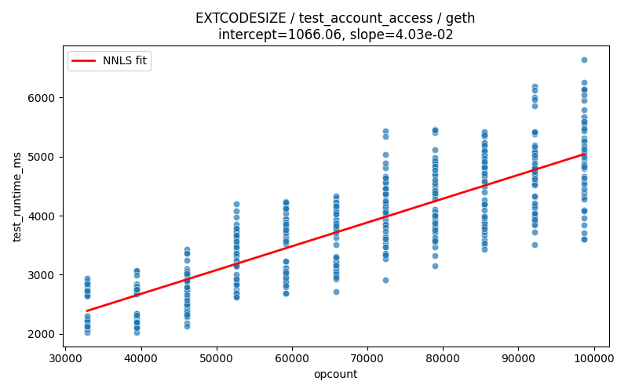


</details>

<details><summary>nethermind — NNLS regression summary</summary>

```
==============================================================================
                           NNLS Regression Results                            
==============================================================================
Dep. Variable:          test_runtime_ms              R-squared:          0.776
Model:                  NNLS                    Adj. R-squared:          0.775
No. Observations:       682                               RMSE:         223.29
Df Residuals:           680                                MAE:         155.28
Df Model:               1      
==============================================================================
                      coef     std err     P-value      [0.025      0.975]
------------------------------------------------------------------------------
         const    226.9765     24.9282       0.001    178.5611    274.5454
       opcount      0.0200      0.0004       0.001      0.0192      0.0208
==============================================================================
Notes: Non-negative least squares with bootstrap inference (1000 iterations)
==============================================================================
```

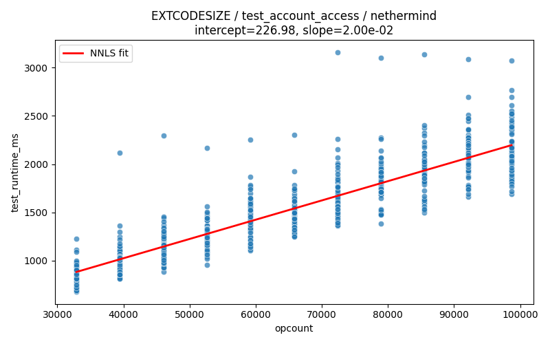

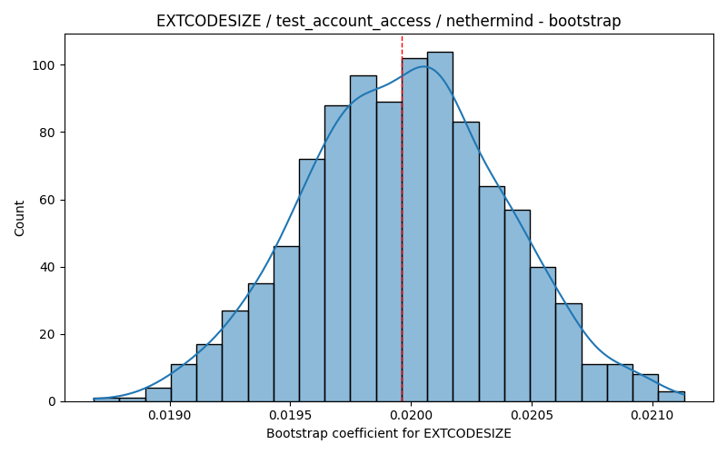

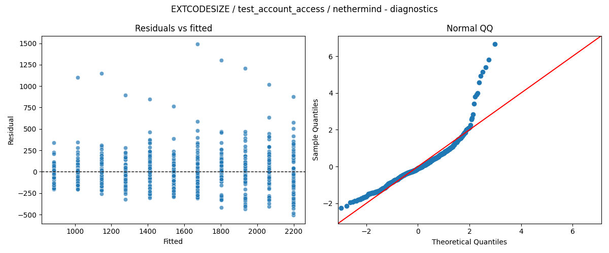

</details>

<details><summary>reth — NNLS regression summary</summary>

```
==============================================================================
                           NNLS Regression Results                            
==============================================================================
Dep. Variable:          test_runtime_ms              R-squared:          0.899
Model:                  NNLS                    Adj. R-squared:          0.899
No. Observations:       1056                              RMSE:         244.12
Df Residuals:           1054                               MAE:         145.15
Df Model:               1      
==============================================================================
                      coef     std err     P-value      [0.025      0.975]
------------------------------------------------------------------------------
         const    228.1705     27.8350       0.001    176.4368    281.9659
       opcount      0.0350      0.0004       0.001      0.0342      0.0358
==============================================================================
Notes: Non-negative least squares with bootstrap inference (1000 iterations)
==============================================================================
```

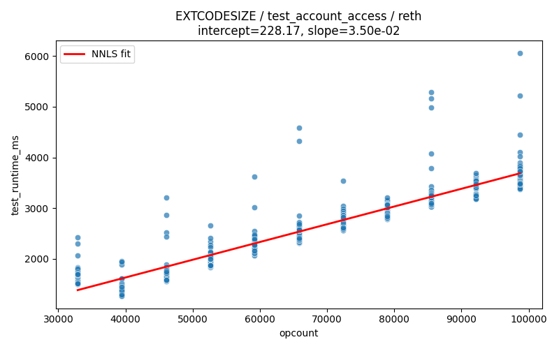

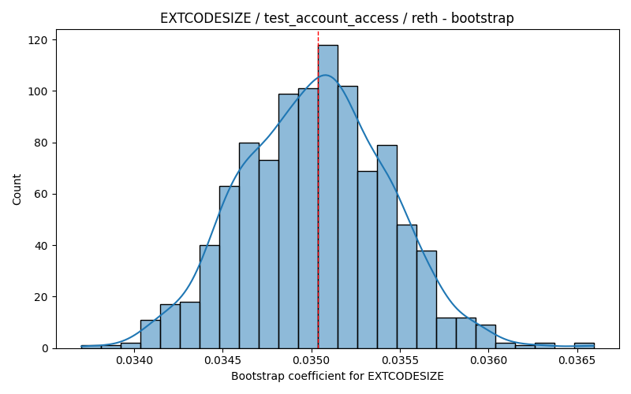

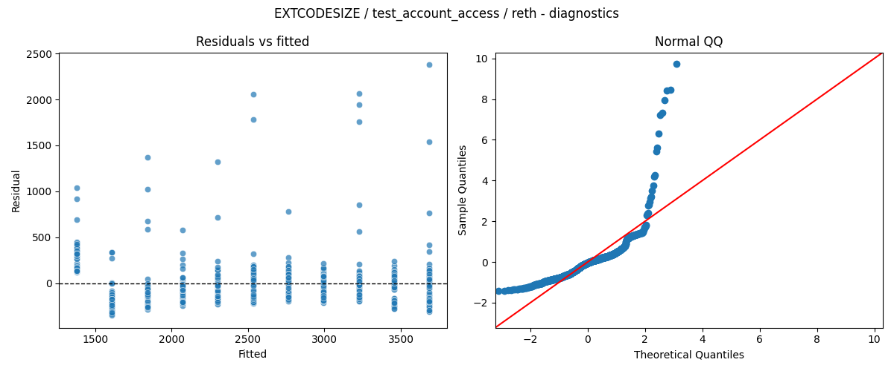

</details>

### test_account_access — combo `EXTCODESIZE_AccountMode.NON_EXISTING_ACCOUNT` — `presets[cold_account_code_access]`

| client | nobs | R² | target_coef (ms) | p-value | 95% CI |
| --- | --- | --- | --- | --- | --- |
| `besu` | 286 | 0.8329 | 0.01065 | 1.00e-03 | [0.01014, 0.01122] |
| `erigon` | 418 | 0.996 | 0.008841 | 1.00e-03 | [0.008787, 0.008894] |
| `geth` | 561 | 0.6535 | 0.0372 | 1.00e-03 | [0.03471, 0.03955] |
| `nethermind` | 682 | 0.7823 | 0.004918 | 1.00e-03 | [0.004716, 0.005103] |
| `reth` | 1056 | 0.9668 | 0.0009176 | 1.00e-03 | [0.0009078, 0.0009277] |

<details><summary>besu — NNLS regression summary</summary>

```
==============================================================================
                           NNLS Regression Results                            
==============================================================================
Dep. Variable:          test_runtime_ms              R-squared:          0.833
Model:                  NNLS                    Adj. R-squared:          0.832
No. Observations:       286                               RMSE:         114.01
Df Residuals:           284                                MAE:          96.24
Df Model:               1      
==============================================================================
                      coef     std err     P-value      [0.025      0.975]
------------------------------------------------------------------------------
         const    417.0410     22.3278       0.001    372.5417    459.4166
       opcount      0.0106      0.0003       0.001      0.0101      0.0112
==============================================================================
Notes: Non-negative least squares with bootstrap inference (1000 iterations)
==============================================================================
```


</details>

<details><summary>erigon — NNLS regression summary</summary>

```
==============================================================================
                           NNLS Regression Results                            
==============================================================================
Dep. Variable:          test_runtime_ms              R-squared:          0.996
Model:                  NNLS                    Adj. R-squared:          0.996
No. Observations:       418                               RMSE:          13.32
Df Residuals:           416                                MAE:          10.74
Df Model:               1      
==============================================================================
                      coef     std err     P-value      [0.025      0.975]
------------------------------------------------------------------------------
         const     11.5064      2.2397       0.001      7.0031     15.4977
       opcount      0.0088      0.0000       0.001      0.0088      0.0089
==============================================================================
Notes: Non-negative least squares with bootstrap inference (1000 iterations)
==============================================================================
```


</details>

<details><summary>geth — NNLS regression summary</summary>

```
==============================================================================
                           NNLS Regression Results                            
==============================================================================
Dep. Variable:          test_runtime_ms              R-squared:          0.653
Model:                  NNLS                    Adj. R-squared:          0.653
No. Observations:       561                               RMSE:         647.37
Df Residuals:           559                                MAE:         544.36
Df Model:               1      
==============================================================================
                      coef     std err     P-value      [0.025      0.975]
------------------------------------------------------------------------------
         const   1227.0102     83.3792       0.001   1069.0609   1395.5582
       opcount      0.0372      0.0012       0.001      0.0347      0.0396
==============================================================================
Notes: Non-negative least squares with bootstrap inference (1000 iterations)
==============================================================================
```


</details>

<details><summary>nethermind — NNLS regression summary</summary>

```
==============================================================================
                           NNLS Regression Results                            
==============================================================================
Dep. Variable:          test_runtime_ms              R-squared:          0.782
Model:                  NNLS                    Adj. R-squared:          0.782
No. Observations:       682                               RMSE:          61.99
Df Residuals:           680                                MAE:          49.12
Df Model:               1      
==============================================================================
                      coef     std err     P-value      [0.025      0.975]
------------------------------------------------------------------------------
         const     38.0217      6.9952       0.001     25.6318     52.3769
       opcount      0.0049      0.0001       0.001      0.0047      0.0051
==============================================================================
Notes: Non-negative least squares with bootstrap inference (1000 iterations)
==============================================================================
```


</details>

<details><summary>reth — NNLS regression summary</summary>

```
==============================================================================
                           NNLS Regression Results                            
==============================================================================
Dep. Variable:          test_runtime_ms              R-squared:          0.967
Model:                  NNLS                    Adj. R-squared:          0.967
No. Observations:       1056                              RMSE:           4.06
Df Residuals:           1054                               MAE:           3.20
Df Model:               1      
==============================================================================
                      coef     std err     P-value      [0.025      0.975]
------------------------------------------------------------------------------
         const     31.9214      0.3967       0.001     31.1003     32.6675
       opcount      0.0009      0.0000       0.001      0.0009      0.0009
==============================================================================
Notes: Non-negative least squares with bootstrap inference (1000 iterations)
==============================================================================
```


</details>

### test_ext_account_query_warm — combo `EXTCODESIZE`

| client | nobs | R² | target_coef (ms) | p-value | 95% CI |
| --- | --- | --- | --- | --- | --- |
| `besu` | 286 | 0.6399 | 0.0001309 | 1.00e-03 | [0.0001195, 0.0001432] |
| `erigon` | 418 | 0.7697 | 4.084e-05 | 1.00e-03 | [3.857e-05, 4.312e-05] |
| `geth` | 561 | 0.9736 | 0.0001459 | 1.00e-03 | [0.0001439, 0.0001477] |
| `nethermind` | 682 | 0.6787 | 0.0001862 | 1.00e-03 | [0.0001764, 0.0001962] |
| `reth` | 1056 | 0.6644 | 5.683e-06 | 1.00e-03 | [5.404e-06, 5.952e-06] |

<details><summary>besu — NNLS regression summary</summary>

```
==============================================================================
                           NNLS Regression Results                            
==============================================================================
Dep. Variable:          test_runtime_ms              R-squared:          0.640
Model:                  NNLS                    Adj. R-squared:          0.639
No. Observations:       286                               RMSE:          57.43
Df Residuals:           284                                MAE:          45.61
Df Model:               1      
==============================================================================
                      coef     std err     P-value      [0.025      0.975]
------------------------------------------------------------------------------
         const    204.6688     11.5596       0.001    181.7621    226.9720
       opcount      0.0001      0.0000       0.001      0.0001      0.0001
==============================================================================
Notes: Non-negative least squares with bootstrap inference (1000 iterations)
==============================================================================
```

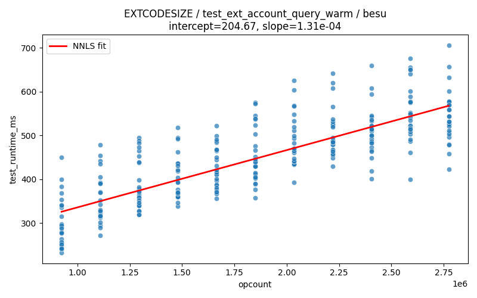

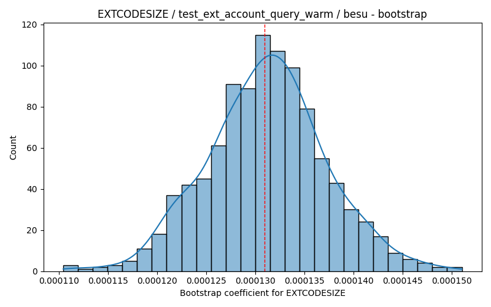

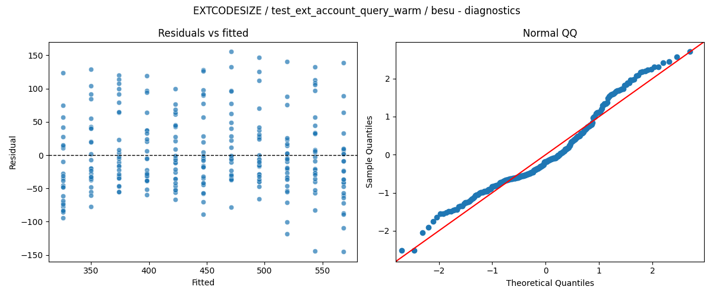

</details>

<details><summary>erigon — NNLS regression summary</summary>

```
==============================================================================
                           NNLS Regression Results                            
==============================================================================
Dep. Variable:          test_runtime_ms              R-squared:          0.770
Model:                  NNLS                    Adj. R-squared:          0.769
No. Observations:       418                               RMSE:          13.06
Df Residuals:           416                                MAE:          10.48
Df Model:               1      
==============================================================================
                      coef     std err     P-value      [0.025      0.975]
------------------------------------------------------------------------------
         const     45.2346      1.9112       0.001     41.4991     49.0183
       opcount      0.0000      0.0000       0.001      0.0000      0.0000
==============================================================================
Notes: Non-negative least squares with bootstrap inference (1000 iterations)
==============================================================================
```

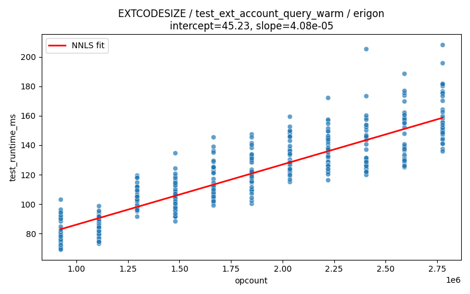

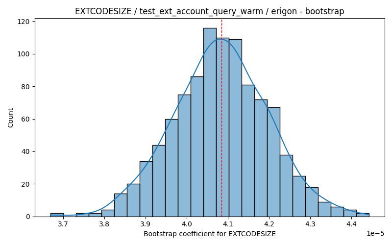

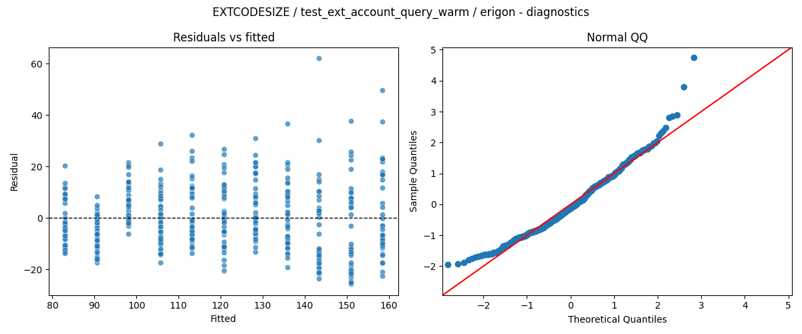

</details>

<details><summary>geth — NNLS regression summary</summary>

```
==============================================================================
                           NNLS Regression Results                            
==============================================================================
Dep. Variable:          test_runtime_ms              R-squared:          0.974
Model:                  NNLS                    Adj. R-squared:          0.974
No. Observations:       561                               RMSE:          14.04
Df Residuals:           559                                MAE:           9.97
Df Model:               1      
==============================================================================
                      coef     std err     P-value      [0.025      0.975]
------------------------------------------------------------------------------
         const     12.5073      1.6679       0.001      9.4157     15.7935
       opcount      0.0001      0.0000       0.001      0.0001      0.0001
==============================================================================
Notes: Non-negative least squares with bootstrap inference (1000 iterations)
==============================================================================
```

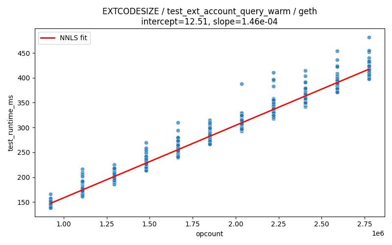

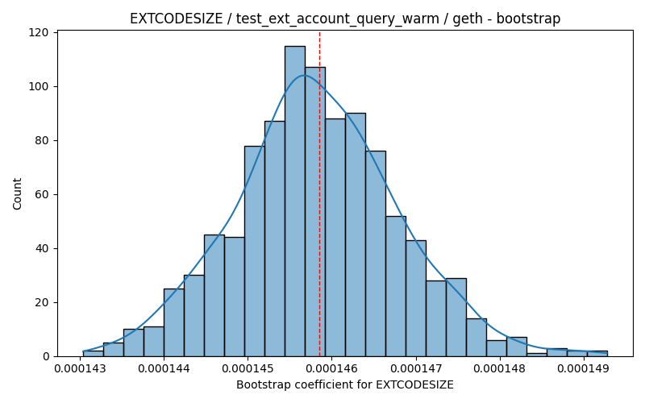

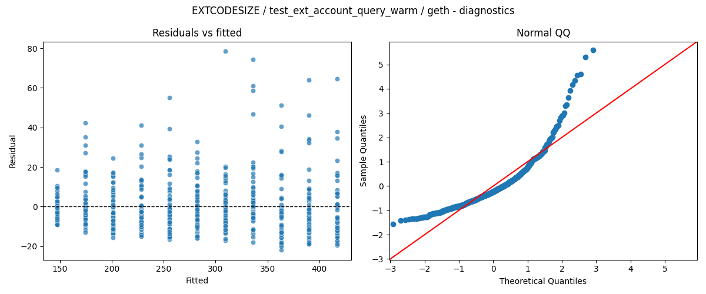

</details>

<details><summary>nethermind — NNLS regression summary</summary>

```
==============================================================================
                           NNLS Regression Results                            
==============================================================================
Dep. Variable:          test_runtime_ms              R-squared:          0.679
Model:                  NNLS                    Adj. R-squared:          0.678
No. Observations:       682                               RMSE:          74.91
Df Residuals:           680                                MAE:          61.24
Df Model:               1      
==============================================================================
                      coef     std err     P-value      [0.025      0.975]
------------------------------------------------------------------------------
         const     76.7320      9.1033       0.001     58.7889     94.9055
       opcount      0.0002      0.0000       0.001      0.0002      0.0002
==============================================================================
Notes: Non-negative least squares with bootstrap inference (1000 iterations)
==============================================================================
```

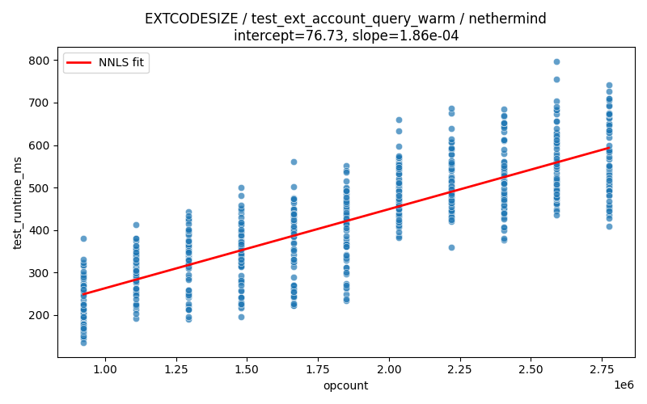

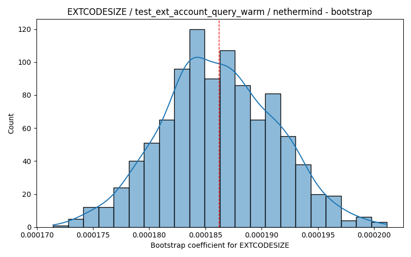

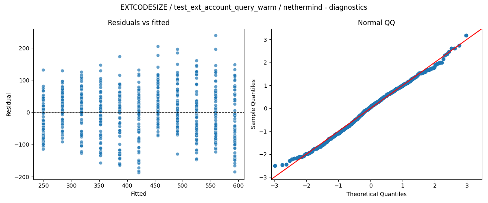

</details>

<details><summary>reth — NNLS regression summary</summary>

```
==============================================================================
                           NNLS Regression Results                            
==============================================================================
Dep. Variable:          test_runtime_ms              R-squared:          0.664
Model:                  NNLS                    Adj. R-squared:          0.664
No. Observations:       1056                              RMSE:           2.36
Df Residuals:           1054                               MAE:           1.62
Df Model:               1      
==============================================================================
                      coef     std err     P-value      [0.025      0.975]
------------------------------------------------------------------------------
         const      5.0382      0.2384       0.001      4.5873      5.5235
       opcount      0.0000      0.0000       0.001      0.0000      0.0000
==============================================================================
Notes: Non-negative least squares with bootstrap inference (1000 iterations)
==============================================================================
```

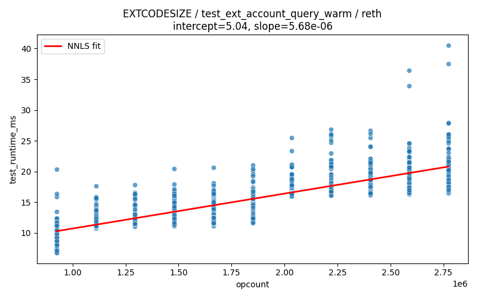

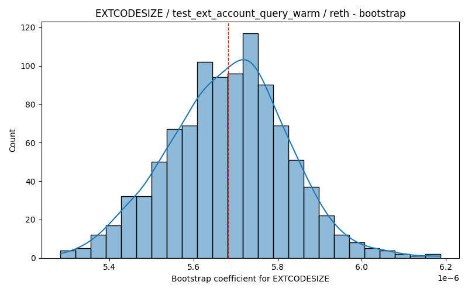

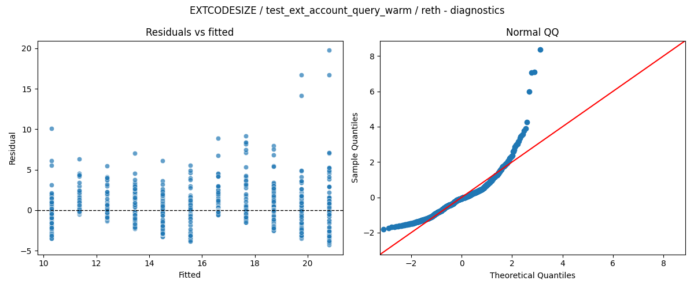

</details>

## STATICCALL

### test_account_access — combo `STATICCALL_AccountMode.EXISTING_EOA`

| client | nobs | R² | target_coef (ms) | p-value | 95% CI |
| --- | --- | --- | --- | --- | --- |
| `besu` | 286 | 0.6838 | 0.01933 | 1.00e-03 | [0.01776, 0.02079] |
| `erigon` | 418 | 0.9956 | 0.0103 | 1.00e-03 | [0.01023, 0.01036] |
| `geth` | 561 | 0.7122 | 0.01234 | 1.00e-03 | [0.01172, 0.01302] |
| `nethermind` | 682 | 0.7927 | 0.006083 | 1.00e-03 | [0.005862, 0.006314] |
| `reth` | 1056 | 0.9731 | 0.001133 | 1.00e-03 | [0.001122, 0.001145] |

<details><summary>besu — NNLS regression summary</summary>

```
==============================================================================
                           NNLS Regression Results                            
==============================================================================
Dep. Variable:          test_runtime_ms              R-squared:          0.684
Model:                  NNLS                    Adj. R-squared:          0.683
No. Observations:       286                               RMSE:         312.41
Df Residuals:           284                                MAE:         229.44
Df Model:               1      
==============================================================================
                      coef     std err     P-value      [0.025      0.975]
------------------------------------------------------------------------------
         const    561.4273     52.7785       0.001    457.6148    665.8726
       opcount      0.0193      0.0008       0.001      0.0178      0.0208
==============================================================================
Notes: Non-negative least squares with bootstrap inference (1000 iterations)
==============================================================================
```

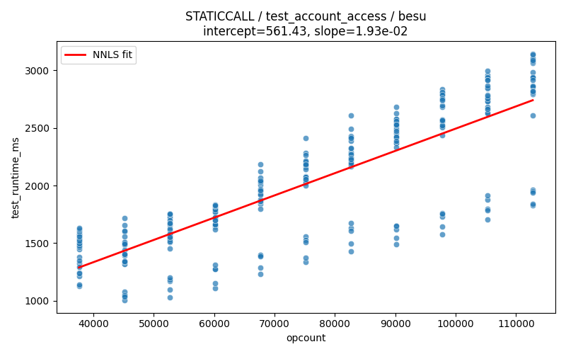

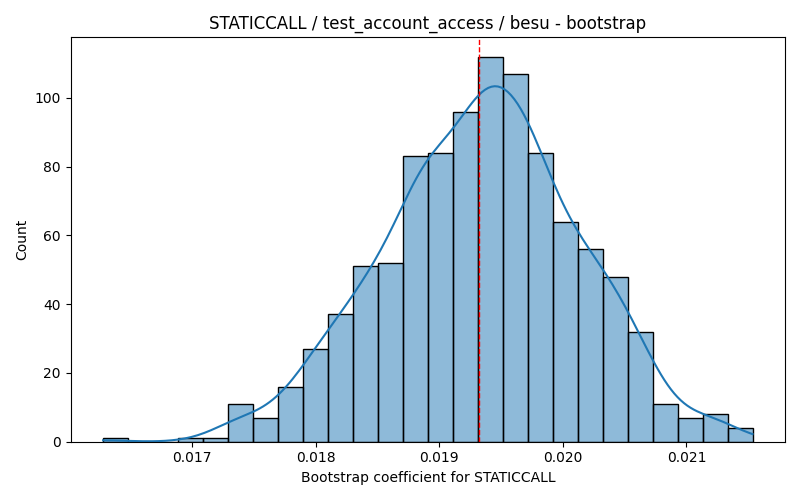

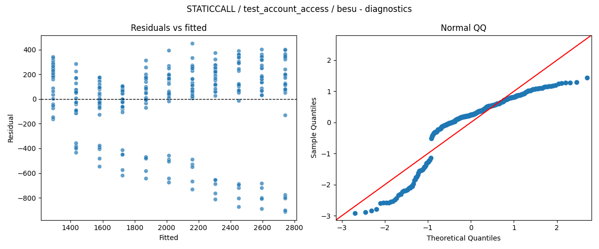

</details>

<details><summary>erigon — NNLS regression summary</summary>

```
==============================================================================
                           NNLS Regression Results                            
==============================================================================
Dep. Variable:          test_runtime_ms              R-squared:          0.996
Model:                  NNLS                    Adj. R-squared:          0.996
No. Observations:       418                               RMSE:          16.32
Df Residuals:           416                                MAE:          12.84
Df Model:               1      
==============================================================================
                      coef     std err     P-value      [0.025      0.975]
------------------------------------------------------------------------------
         const     41.7728      2.3860       0.001     37.2317     46.7279
       opcount      0.0103      0.0000       0.001      0.0102      0.0104
==============================================================================
Notes: Non-negative least squares with bootstrap inference (1000 iterations)
==============================================================================
```


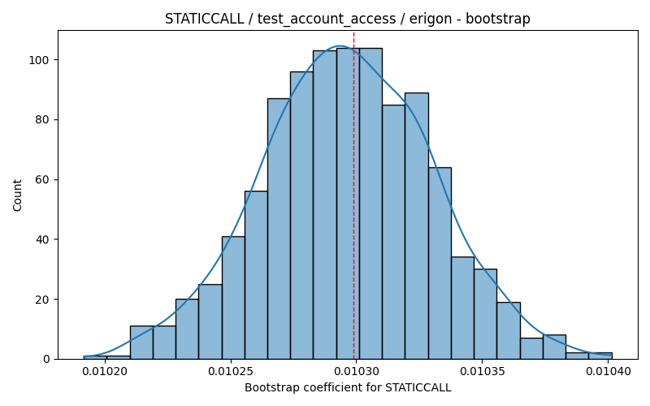

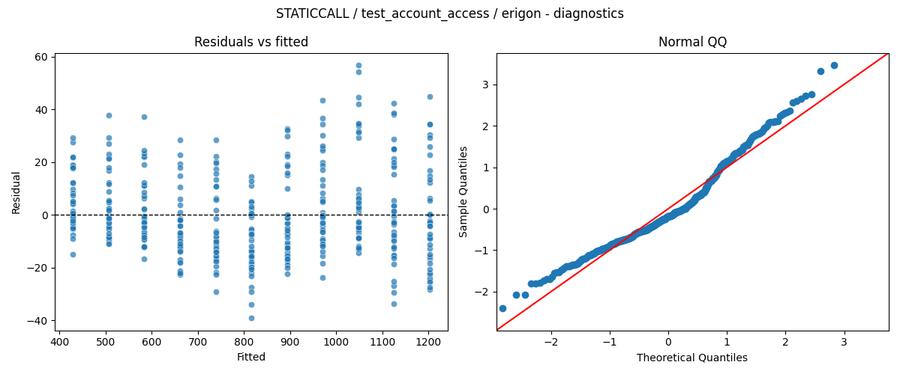

</details>

<details><summary>geth — NNLS regression summary</summary>

```
==============================================================================
                           NNLS Regression Results                            
==============================================================================
Dep. Variable:          test_runtime_ms              R-squared:          0.712
Model:                  NNLS                    Adj. R-squared:          0.712
No. Observations:       561                               RMSE:         186.52
Df Residuals:           559                                MAE:         158.40
Df Model:               1      
==============================================================================
                      coef     std err     P-value      [0.025      0.975]
------------------------------------------------------------------------------
         const    509.2433     25.0730       0.001    459.0982    555.5250
       opcount      0.0123      0.0003       0.001      0.0117      0.0130
==============================================================================
Notes: Non-negative least squares with bootstrap inference (1000 iterations)
==============================================================================
```

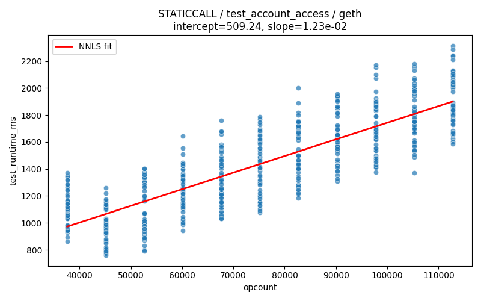

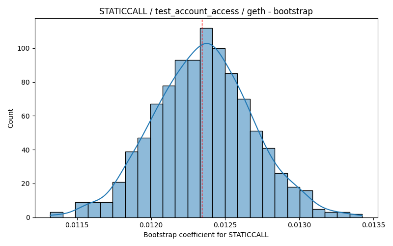

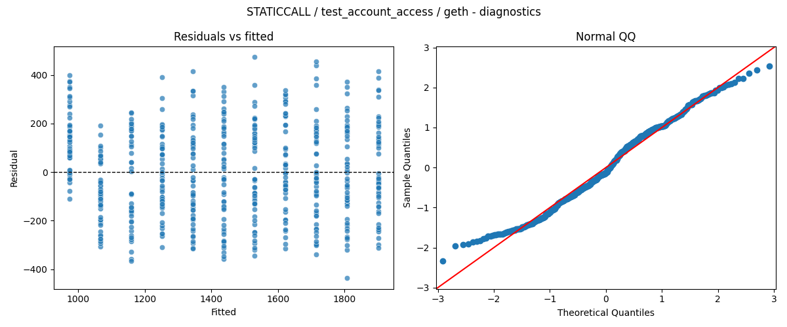

</details>

<details><summary>nethermind — NNLS regression summary</summary>

```
==============================================================================
                           NNLS Regression Results                            
==============================================================================
Dep. Variable:          test_runtime_ms              R-squared:          0.793
Model:                  NNLS                    Adj. R-squared:          0.792
No. Observations:       682                               RMSE:          73.97
Df Residuals:           680                                MAE:          56.17
Df Model:               1      
==============================================================================
                      coef     std err     P-value      [0.025      0.975]
------------------------------------------------------------------------------
         const     57.9798      8.0937       0.001     41.5079     73.5463
       opcount      0.0061      0.0001       0.001      0.0059      0.0063
==============================================================================
Notes: Non-negative least squares with bootstrap inference (1000 iterations)
==============================================================================
```

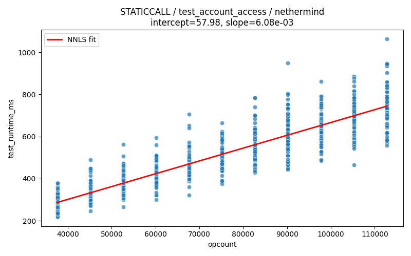

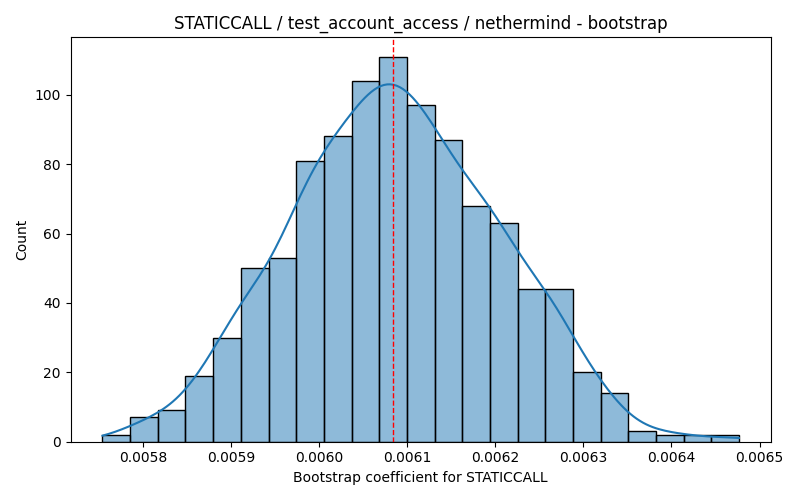

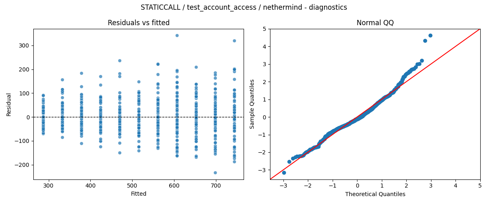

</details>

<details><summary>reth — NNLS regression summary</summary>

```
==============================================================================
                           NNLS Regression Results                            
==============================================================================
Dep. Variable:          test_runtime_ms              R-squared:          0.973
Model:                  NNLS                    Adj. R-squared:          0.973
No. Observations:       1056                              RMSE:           4.48
Df Residuals:           1054                               MAE:           3.51
Df Model:               1      
==============================================================================
                      coef     std err     P-value      [0.025      0.975]
------------------------------------------------------------------------------
         const     32.3579      0.4842       0.001     31.3800     33.2954
       opcount      0.0011      0.0000       0.001      0.0011      0.0011
==============================================================================
Notes: Non-negative least squares with bootstrap inference (1000 iterations)
==============================================================================
```

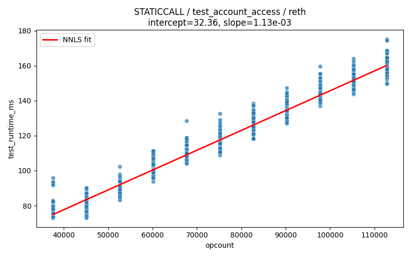

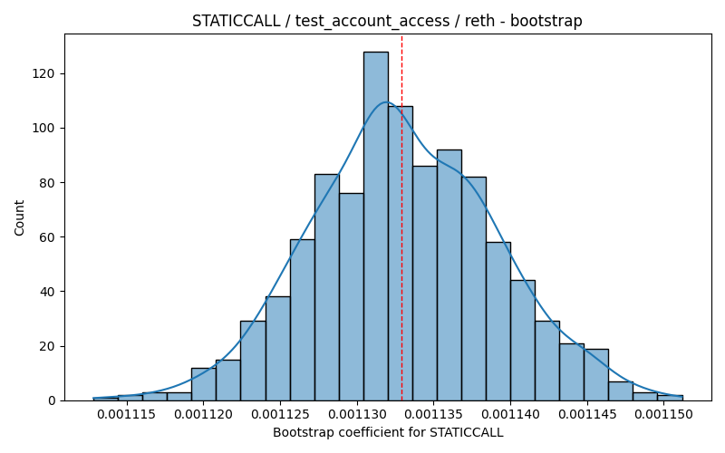

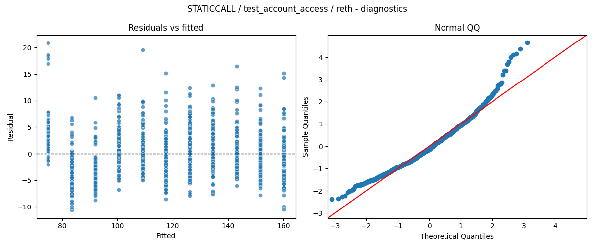

</details>

### test_account_access — combo `STATICCALL_AccountMode.NON_EXISTING_ACCOUNT` — `presets[cold_account_nocode_access]`

| client | nobs | R² | target_coef (ms) | p-value | 95% CI |
| --- | --- | --- | --- | --- | --- |
| `besu` | 286 | 0.8348 | 0.01285 | 1.00e-03 | [0.0122, 0.01358] |
| `erigon` | 418 | 0.9954 | 0.01181 | 1.00e-03 | [0.01176, 0.01184] |
| `geth` | 561 | 0.6322 | 0.03315 | 1.00e-03 | [0.03086, 0.03542] |
| `nethermind` | 682 | 0.7834 | 0.005564 | 1.00e-03 | [0.005321, 0.005802] |
| `reth` | 1056 | 0.9726 | 0.0009768 | 1.00e-03 | [0.0009667, 0.0009865] |

<details><summary>besu — NNLS regression summary</summary>

```
==============================================================================
                           NNLS Regression Results                            
==============================================================================
Dep. Variable:          test_runtime_ms              R-squared:          0.835
Model:                  NNLS                    Adj. R-squared:          0.834
No. Observations:       286                               RMSE:         135.91
Df Residuals:           284                                MAE:         108.90
Df Model:               1      
==============================================================================
                      coef     std err     P-value      [0.025      0.975]
------------------------------------------------------------------------------
         const    525.7708     26.3281       0.001    469.5713    574.7974
       opcount      0.0128      0.0003       0.001      0.0122      0.0136
==============================================================================
Notes: Non-negative least squares with bootstrap inference (1000 iterations)
==============================================================================
```

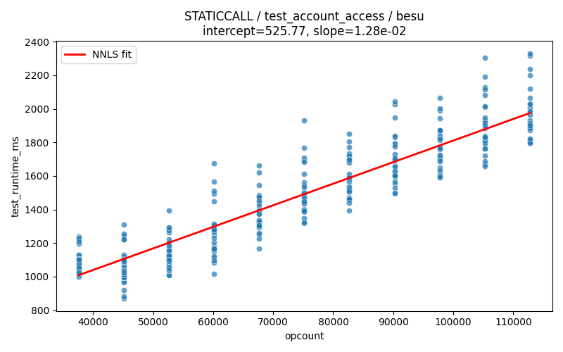

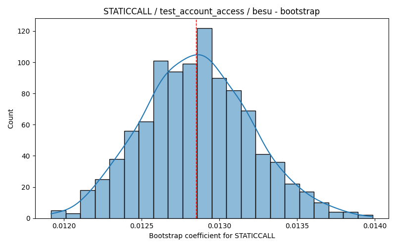

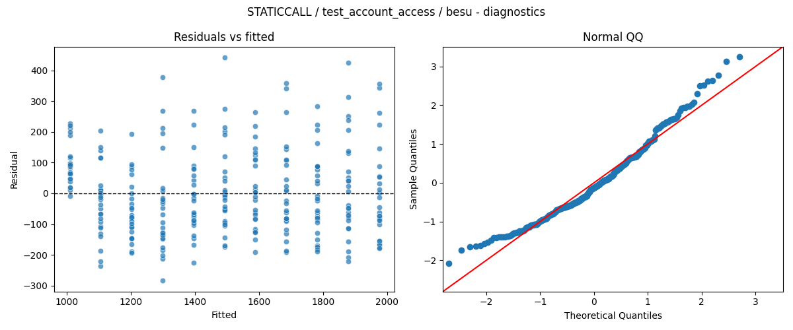

</details>

<details><summary>erigon — NNLS regression summary</summary>

```
==============================================================================
                           NNLS Regression Results                            
==============================================================================
Dep. Variable:          test_runtime_ms              R-squared:          0.995
Model:                  NNLS                    Adj. R-squared:          0.995
No. Observations:       418                               RMSE:          19.14
Df Residuals:           416                                MAE:          15.08
Df Model:               1      
==============================================================================
                      coef     std err     P-value      [0.025      0.975]
------------------------------------------------------------------------------
         const      0.0000      0.7201       1.000      0.0000      2.7102
       opcount      0.0118      0.0000       0.001      0.0118      0.0118
==============================================================================
Notes: Non-negative least squares with bootstrap inference (1000 iterations)
==============================================================================
```

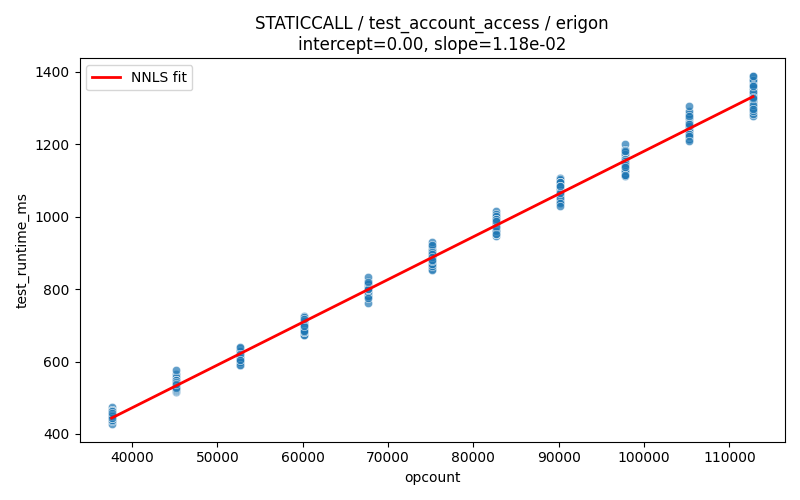

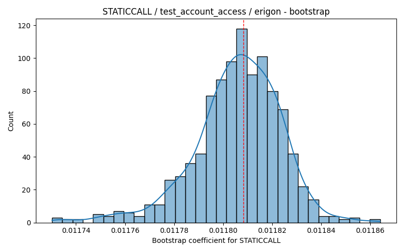

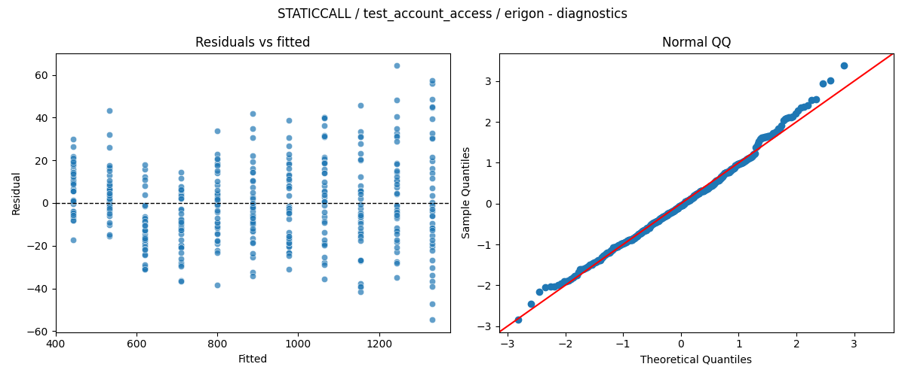

</details>

<details><summary>geth — NNLS regression summary</summary>

```
==============================================================================
                           NNLS Regression Results                            
==============================================================================
Dep. Variable:          test_runtime_ms              R-squared:          0.632
Model:                  NNLS                    Adj. R-squared:          0.632
No. Observations:       561                               RMSE:         601.03
Df Residuals:           559                                MAE:         486.64
Df Model:               1      
==============================================================================
                      coef     std err     P-value      [0.025      0.975]
------------------------------------------------------------------------------
         const   1416.6405     82.2612       0.001   1254.1636   1578.7844
       opcount      0.0331      0.0012       0.001      0.0309      0.0354
==============================================================================
Notes: Non-negative least squares with bootstrap inference (1000 iterations)
==============================================================================
```

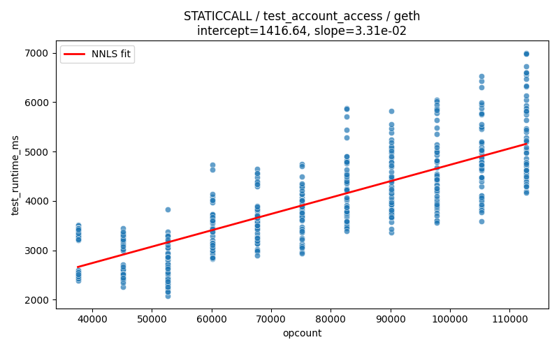

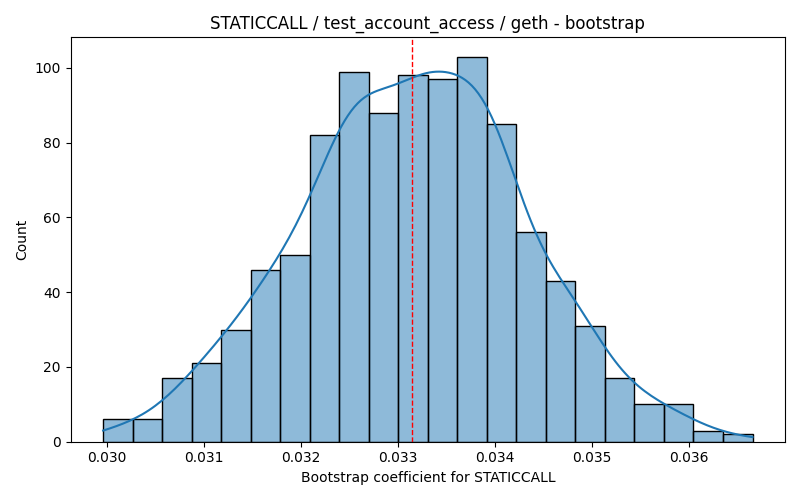

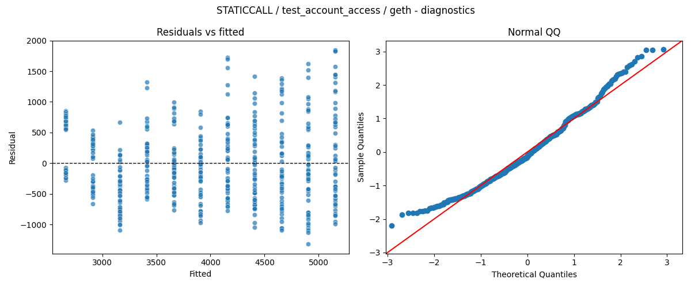

</details>

<details><summary>nethermind — NNLS regression summary</summary>

```
==============================================================================
                           NNLS Regression Results                            
==============================================================================
Dep. Variable:          test_runtime_ms              R-squared:          0.783
Model:                  NNLS                    Adj. R-squared:          0.783
No. Observations:       682                               RMSE:          69.56
Df Residuals:           680                                MAE:          52.42
Df Model:               1      
==============================================================================
                      coef     std err     P-value      [0.025      0.975]
------------------------------------------------------------------------------
         const     72.4394      7.7437       0.001     57.7234     87.2232
       opcount      0.0056      0.0001       0.001      0.0053      0.0058
==============================================================================
Notes: Non-negative least squares with bootstrap inference (1000 iterations)
==============================================================================
```

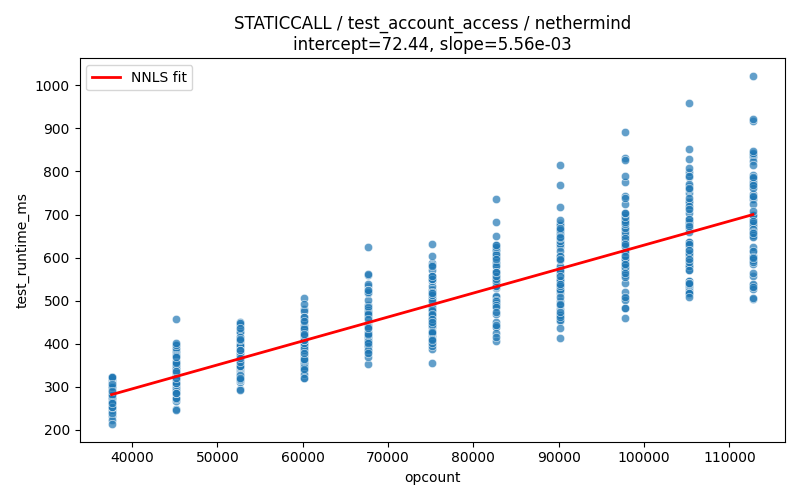

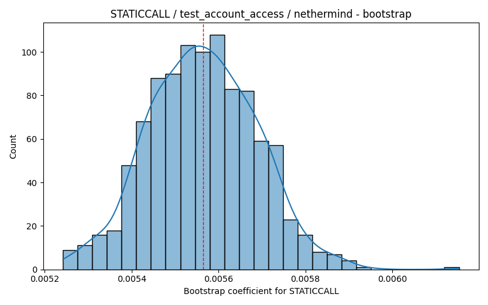

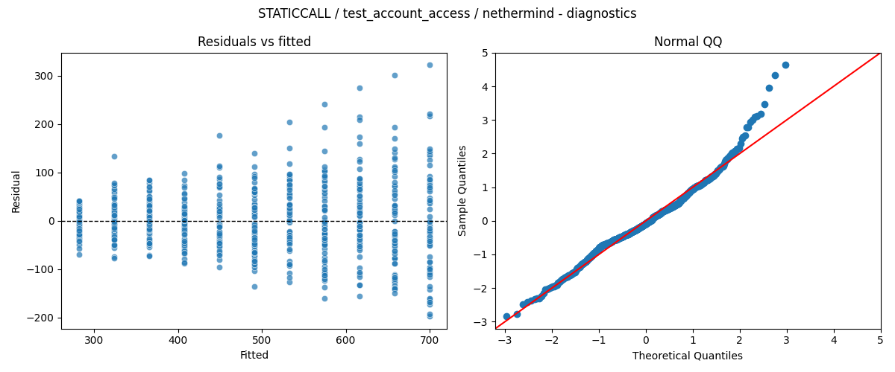

</details>

<details><summary>reth — NNLS regression summary</summary>

```
==============================================================================
                           NNLS Regression Results                            
==============================================================================
Dep. Variable:          test_runtime_ms              R-squared:          0.973
Model:                  NNLS                    Adj. R-squared:          0.973
No. Observations:       1056                              RMSE:           3.90
Df Residuals:           1054                               MAE:           3.09
Df Model:               1      
==============================================================================
                      coef     std err     P-value      [0.025      0.975]
------------------------------------------------------------------------------
         const     31.5165      0.3875       0.001     30.7543     32.3016
       opcount      0.0010      0.0000       0.001      0.0010      0.0010
==============================================================================
Notes: Non-negative least squares with bootstrap inference (1000 iterations)
==============================================================================
```

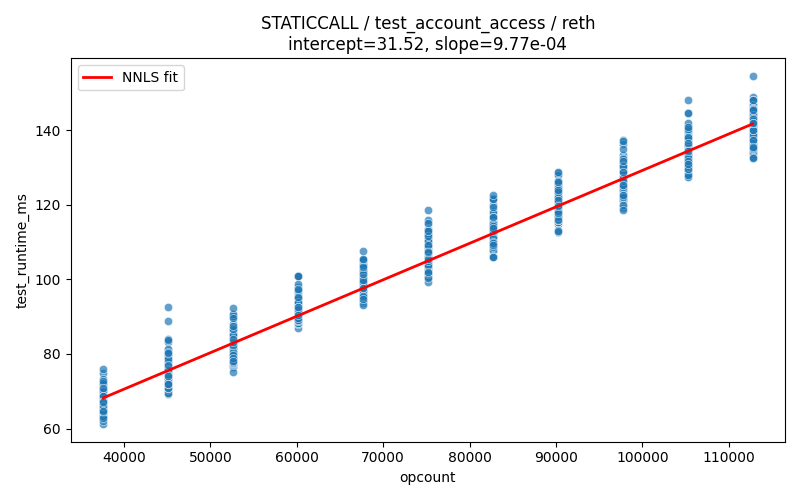

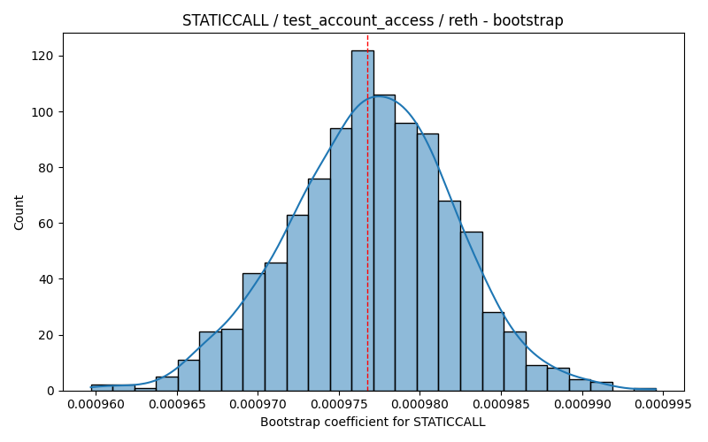

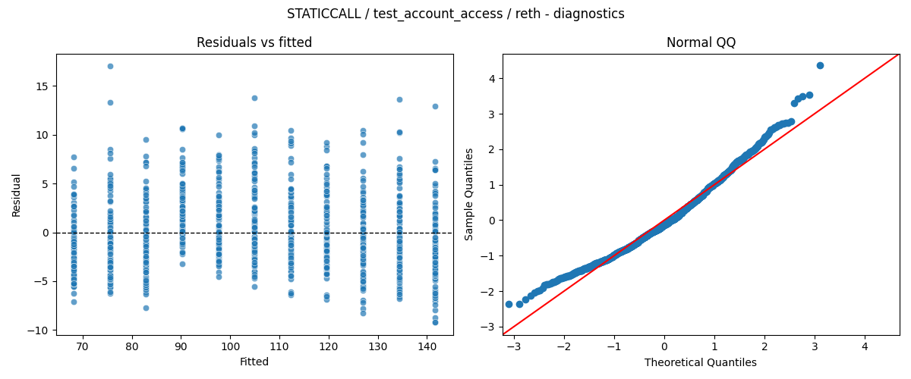

</details>

### test_account_access — combo `STATICCALL_AccountMode.EXISTING_CONTRACT`

| client | nobs | R² | target_coef (ms) | p-value | 95% CI |
| --- | --- | --- | --- | --- | --- |
| `besu` | 286 | 0.8961 | 0.03394 | 1.00e-03 | [0.03276, 0.03523] |
| `erigon` | 418 | 0.872 | 0.08761 | 1.00e-03 | [0.08445, 0.0905] |
| `geth` | 561 | 0.6969 | 0.04166 | 1.00e-03 | [0.03933, 0.04419] |
| `nethermind` | 682 | 0.7728 | 0.02086 | 1.00e-03 | [0.02002, 0.02164] |
| `reth` | 1056 | 0.8908 | 0.03572 | 1.00e-03 | [0.03488, 0.03655] |

<details><summary>besu — NNLS regression summary</summary>

```
==============================================================================
                           NNLS Regression Results                            
==============================================================================
Dep. Variable:          test_runtime_ms              R-squared:          0.896
Model:                  NNLS                    Adj. R-squared:          0.896
No. Observations:       286                               RMSE:         235.34
Df Residuals:           284                                MAE:         189.96
Df Model:               1      
==============================================================================
                      coef     std err     P-value      [0.025      0.975]
------------------------------------------------------------------------------
         const    423.3945     39.3096       0.001    342.0565    495.6362
       opcount      0.0339      0.0006       0.001      0.0328      0.0352
==============================================================================
Notes: Non-negative least squares with bootstrap inference (1000 iterations)
==============================================================================
```

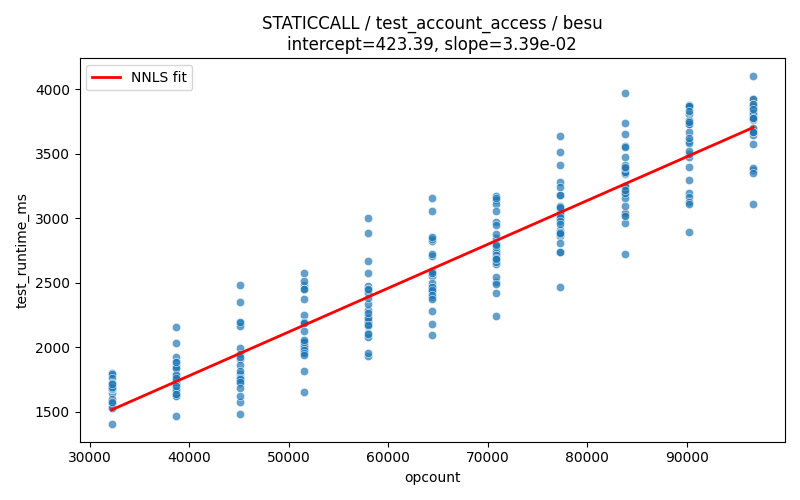

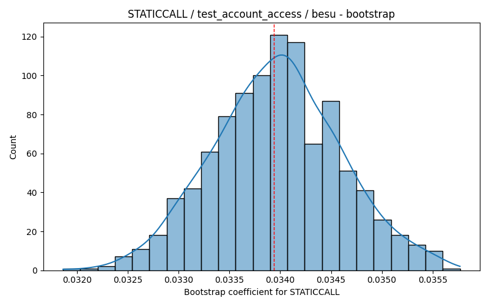

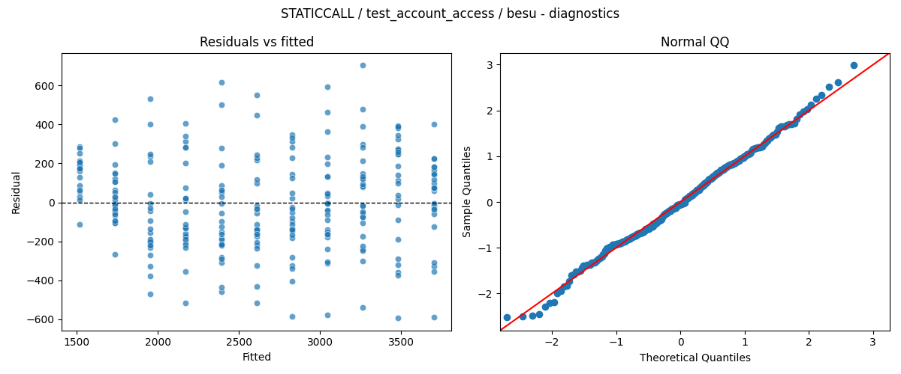

</details>

<details><summary>erigon — NNLS regression summary</summary>

```
==============================================================================
                           NNLS Regression Results                            
==============================================================================
Dep. Variable:          test_runtime_ms              R-squared:          0.872
Model:                  NNLS                    Adj. R-squared:          0.872
No. Observations:       418                               RMSE:         683.80
Df Residuals:           416                                MAE:         579.95
Df Model:               1      
==============================================================================
                      coef     std err     P-value      [0.025      0.975]
------------------------------------------------------------------------------
         const   1481.3545    120.4529       0.001   1260.5021   1723.9184
       opcount      0.0876      0.0016       0.001      0.0844      0.0905
==============================================================================
Notes: Non-negative least squares with bootstrap inference (1000 iterations)
==============================================================================
```


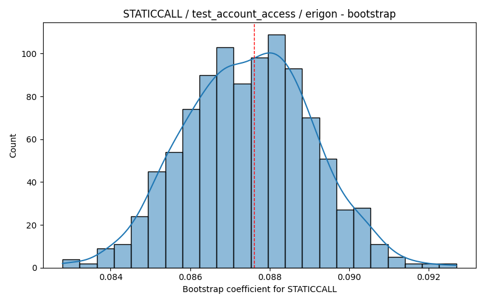

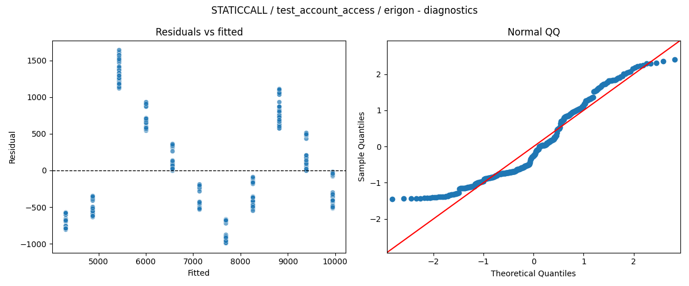

</details>

<details><summary>geth — NNLS regression summary</summary>

```
==============================================================================
                           NNLS Regression Results                            
==============================================================================
Dep. Variable:          test_runtime_ms              R-squared:          0.697
Model:                  NNLS                    Adj. R-squared:          0.696
No. Observations:       561                               RMSE:         559.65
Df Residuals:           559                                MAE:         462.01
Df Model:               1      
==============================================================================
                      coef     std err     P-value      [0.025      0.975]
------------------------------------------------------------------------------
         const   1069.1002     70.6682       0.001    928.5773   1200.6791
       opcount      0.0417      0.0012       0.001      0.0393      0.0442
==============================================================================
Notes: Non-negative least squares with bootstrap inference (1000 iterations)
==============================================================================
```

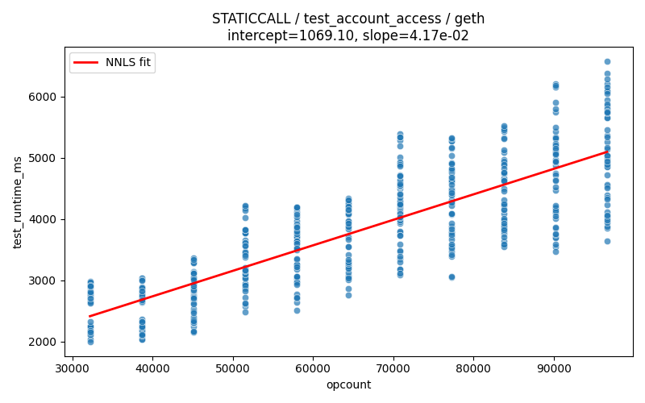

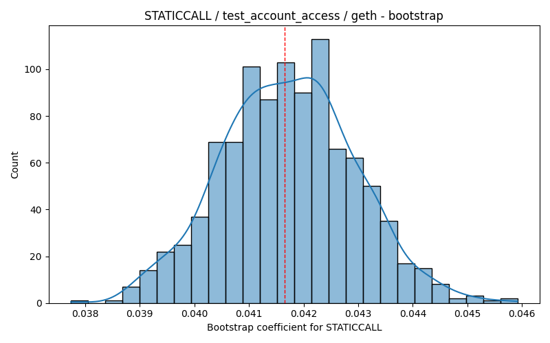

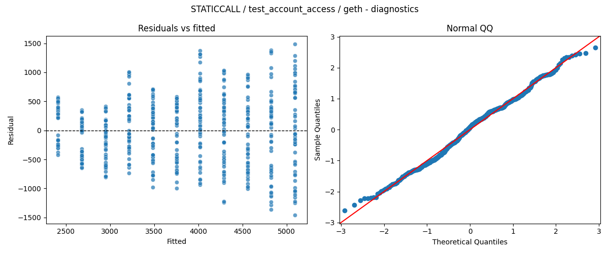

</details>

<details><summary>nethermind — NNLS regression summary</summary>

```
==============================================================================
                           NNLS Regression Results                            
==============================================================================
Dep. Variable:          test_runtime_ms              R-squared:          0.773
Model:                  NNLS                    Adj. R-squared:          0.772
No. Observations:       682                               RMSE:         230.41
Df Residuals:           680                                MAE:         165.02
Df Model:               1      
==============================================================================
                      coef     std err     P-value      [0.025      0.975]
------------------------------------------------------------------------------
         const    255.0589     25.8841       0.001    207.9916    307.3310
       opcount      0.0209      0.0004       0.001      0.0200      0.0216
==============================================================================
Notes: Non-negative least squares with bootstrap inference (1000 iterations)
==============================================================================
```

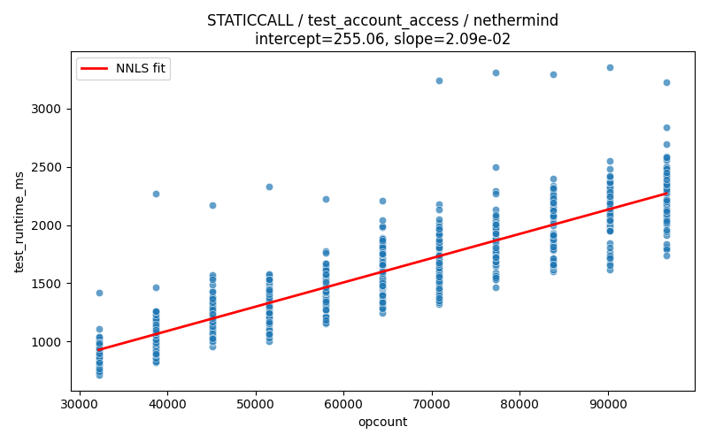

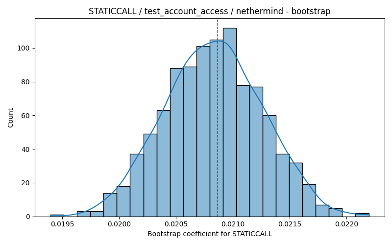

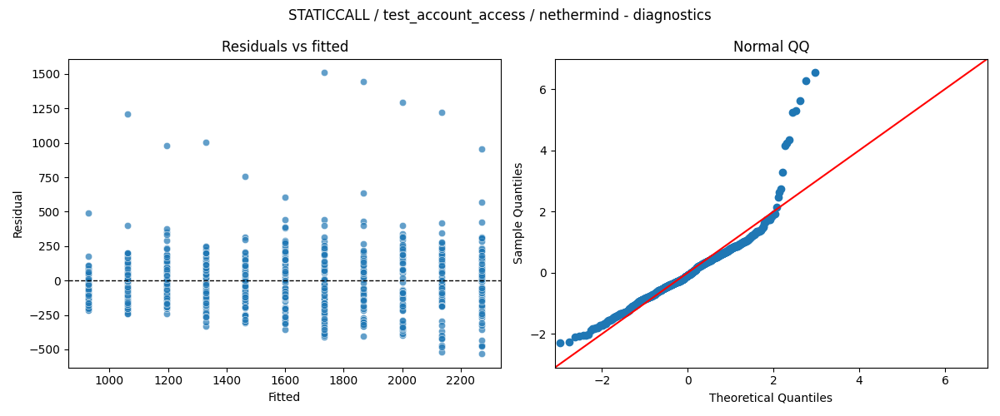

</details>

<details><summary>reth — NNLS regression summary</summary>

```
==============================================================================
                           NNLS Regression Results                            
==============================================================================
Dep. Variable:          test_runtime_ms              R-squared:          0.891
Model:                  NNLS                    Adj. R-squared:          0.891
No. Observations:       1056                              RMSE:         254.79
Df Residuals:           1054                               MAE:         147.72
Df Model:               1      
==============================================================================
                      coef     std err     P-value      [0.025      0.975]
------------------------------------------------------------------------------
         const    196.6867     27.2779       0.001    143.5697    250.6574
       opcount      0.0357      0.0004       0.001      0.0349      0.0366
==============================================================================
Notes: Non-negative least squares with bootstrap inference (1000 iterations)
==============================================================================
```

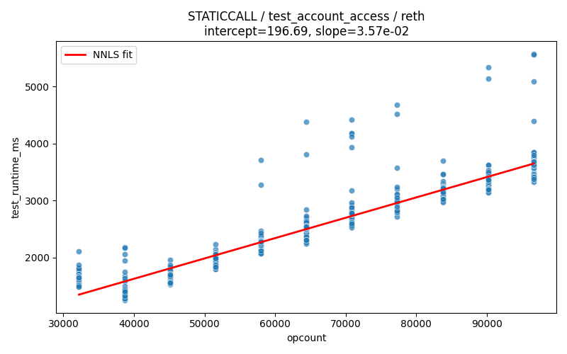

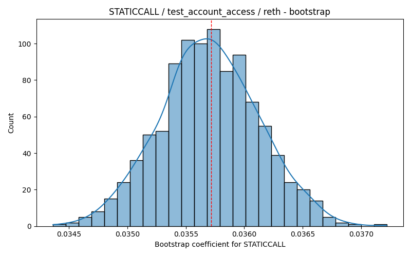

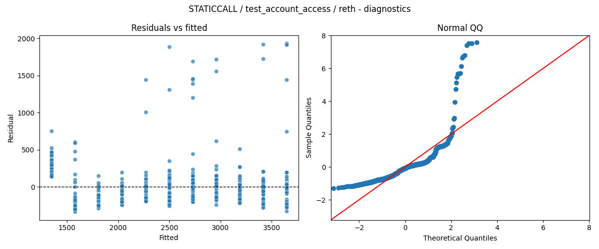

</details>

### test_account_access — combo `STATICCALL_AccountMode.NON_EXISTING_ACCOUNT` — `presets[cold_account_code_access]`

| client | nobs | R² | target_coef (ms) | p-value | 95% CI |
| --- | --- | --- | --- | --- | --- |
| `besu` | 286 | 0.8348 | 0.01285 | 1.00e-03 | [0.0122, 0.01358] |
| `erigon` | 418 | 0.9954 | 0.01181 | 1.00e-03 | [0.01176, 0.01184] |
| `geth` | 561 | 0.6322 | 0.03315 | 1.00e-03 | [0.03086, 0.03542] |
| `nethermind` | 682 | 0.7834 | 0.005564 | 1.00e-03 | [0.005321, 0.005802] |
| `reth` | 1056 | 0.9726 | 0.0009768 | 1.00e-03 | [0.0009667, 0.0009865] |

<details><summary>besu — NNLS regression summary</summary>

```
==============================================================================
                           NNLS Regression Results                            
==============================================================================
Dep. Variable:          test_runtime_ms              R-squared:          0.835
Model:                  NNLS                    Adj. R-squared:          0.834
No. Observations:       286                               RMSE:         135.91
Df Residuals:           284                                MAE:         108.90
Df Model:               1      
==============================================================================
                      coef     std err     P-value      [0.025      0.975]
------------------------------------------------------------------------------
         const    525.7708     26.3281       0.001    469.5713    574.7974
       opcount      0.0128      0.0003       0.001      0.0122      0.0136
==============================================================================
Notes: Non-negative least squares with bootstrap inference (1000 iterations)
==============================================================================
```


</details>

<details><summary>erigon — NNLS regression summary</summary>

```
==============================================================================
                           NNLS Regression Results                            
==============================================================================
Dep. Variable:          test_runtime_ms              R-squared:          0.995
Model:                  NNLS                    Adj. R-squared:          0.995
No. Observations:       418                               RMSE:          19.14
Df Residuals:           416                                MAE:          15.08
Df Model:               1      
==============================================================================
                      coef     std err     P-value      [0.025      0.975]
------------------------------------------------------------------------------
         const      0.0000      0.7201       1.000      0.0000      2.7102
       opcount      0.0118      0.0000       0.001      0.0118      0.0118
==============================================================================
Notes: Non-negative least squares with bootstrap inference (1000 iterations)
==============================================================================
```


</details>

<details><summary>geth — NNLS regression summary</summary>

```
==============================================================================
                           NNLS Regression Results                            
==============================================================================
Dep. Variable:          test_runtime_ms              R-squared:          0.632
Model:                  NNLS                    Adj. R-squared:          0.632
No. Observations:       561                               RMSE:         601.03
Df Residuals:           559                                MAE:         486.64
Df Model:               1      
==============================================================================
                      coef     std err     P-value      [0.025      0.975]
------------------------------------------------------------------------------
         const   1416.6405     82.2612       0.001   1254.1636   1578.7844
       opcount      0.0331      0.0012       0.001      0.0309      0.0354
==============================================================================
Notes: Non-negative least squares with bootstrap inference (1000 iterations)
==============================================================================
```


</details>

<details><summary>nethermind — NNLS regression summary</summary>

```
==============================================================================
                           NNLS Regression Results                            
==============================================================================
Dep. Variable:          test_runtime_ms              R-squared:          0.783
Model:                  NNLS                    Adj. R-squared:          0.783
No. Observations:       682                               RMSE:          69.56
Df Residuals:           680                                MAE:          52.42
Df Model:               1      
==============================================================================
                      coef     std err     P-value      [0.025      0.975]
------------------------------------------------------------------------------
         const     72.4394      7.7437       0.001     57.7234     87.2232
       opcount      0.0056      0.0001       0.001      0.0053      0.0058
==============================================================================
Notes: Non-negative least squares with bootstrap inference (1000 iterations)
==============================================================================
```


</details>

<details><summary>reth — NNLS regression summary</summary>

```
==============================================================================
                           NNLS Regression Results                            
==============================================================================
Dep. Variable:          test_runtime_ms              R-squared:          0.973
Model:                  NNLS                    Adj. R-squared:          0.973
No. Observations:       1056                              RMSE:           3.90
Df Residuals:           1054                               MAE:           3.09
Df Model:               1      
==============================================================================
                      coef     std err     P-value      [0.025      0.975]
------------------------------------------------------------------------------
         const     31.5165      0.3875       0.001     30.7543     32.3016
       opcount      0.0010      0.0000       0.001      0.0010      0.0010
==============================================================================
Notes: Non-negative least squares with bootstrap inference (1000 iterations)
==============================================================================
```


</details>

### test_ext_account_query_warm — combo `STATICCALL`

| client | nobs | R² | target_coef (ms) | p-value | 95% CI |
| --- | --- | --- | --- | --- | --- |
| `besu` | 286 | 0.9635 | 0.001308 | 1.00e-03 | [0.001275, 0.001338] |
| `erigon` | 418 | 0.8826 | 0.0005056 | 1.00e-03 | [0.0004854, 0.0005254] |
| `geth` | 561 | 0.9742 | 0.0006563 | 1.00e-03 | [0.0006472, 0.0006651] |
| `nethermind` | 682 | 0.5691 | 0.0005083 | 1.00e-03 | [0.0004751, 0.0005404] |
| `reth` | 1056 | 0.9109 | 4.59e-05 | 1.00e-03 | [4.496e-05, 4.678e-05] |

<details><summary>besu — NNLS regression summary</summary>

```
==============================================================================
                           NNLS Regression Results                            
==============================================================================
Dep. Variable:          test_runtime_ms              R-squared:          0.964
Model:                  NNLS                    Adj. R-squared:          0.963
No. Observations:       286                               RMSE:         131.72
Df Residuals:           284                                MAE:         106.77
Df Model:               1      
==============================================================================
                      coef     std err     P-value      [0.025      0.975]
------------------------------------------------------------------------------
         const    709.1301     27.5639       0.001    656.6987    766.1418
       opcount      0.0013      0.0000       0.001      0.0013      0.0013
==============================================================================
Notes: Non-negative least squares with bootstrap inference (1000 iterations)
==============================================================================
```

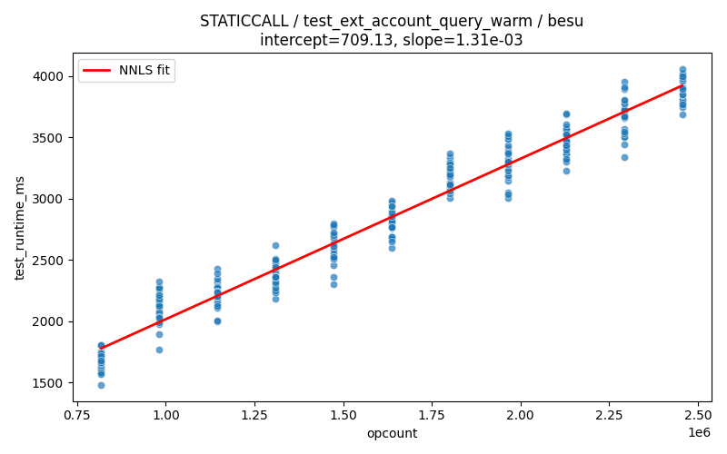

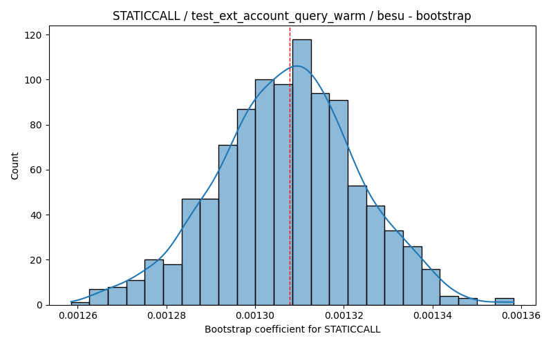

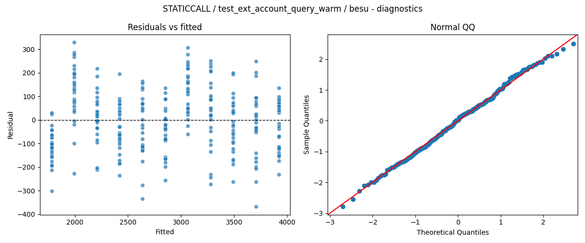

</details>

<details><summary>erigon — NNLS regression summary</summary>

```
==============================================================================
                           NNLS Regression Results                            
==============================================================================
Dep. Variable:          test_runtime_ms              R-squared:          0.883
Model:                  NNLS                    Adj. R-squared:          0.882
No. Observations:       418                               RMSE:          95.45
Df Residuals:           416                                MAE:          70.63
Df Model:               1      
==============================================================================
                      coef     std err     P-value      [0.025      0.975]
------------------------------------------------------------------------------
         const     54.0917     14.5075       0.001     25.8247     82.2230
       opcount      0.0005      0.0000       0.001      0.0005      0.0005
==============================================================================
Notes: Non-negative least squares with bootstrap inference (1000 iterations)
==============================================================================
```

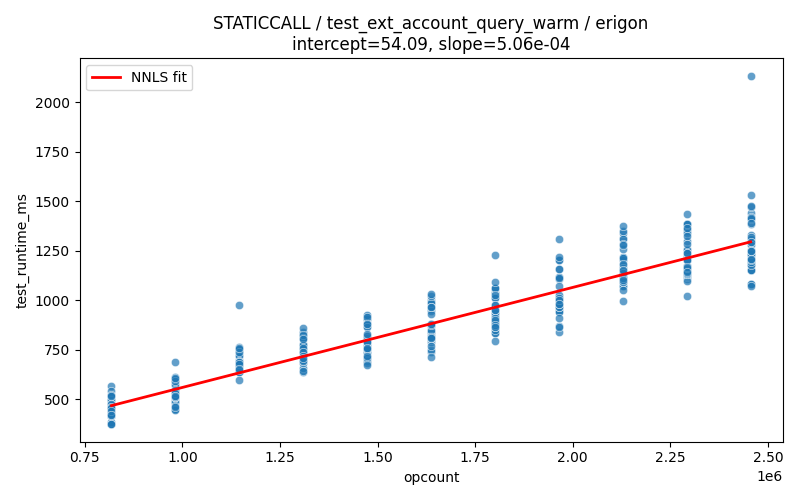

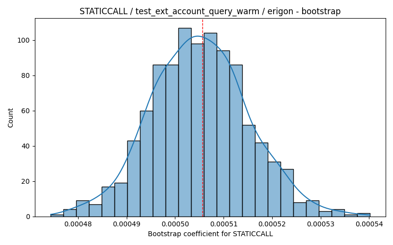

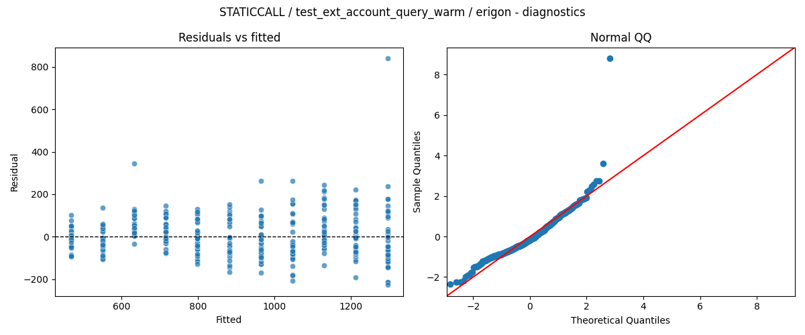

</details>

<details><summary>geth — NNLS regression summary</summary>

```
==============================================================================
                           NNLS Regression Results                            
==============================================================================
Dep. Variable:          test_runtime_ms              R-squared:          0.974
Model:                  NNLS                    Adj. R-squared:          0.974
No. Observations:       561                               RMSE:          55.25
Df Residuals:           559                                MAE:          41.62
Df Model:               1      
==============================================================================
                      coef     std err     P-value      [0.025      0.975]
------------------------------------------------------------------------------
         const     14.0786      6.6702       0.018      0.7412     27.9110
       opcount      0.0007      0.0000       0.001      0.0006      0.0007
==============================================================================
Notes: Non-negative least squares with bootstrap inference (1000 iterations)
==============================================================================
```

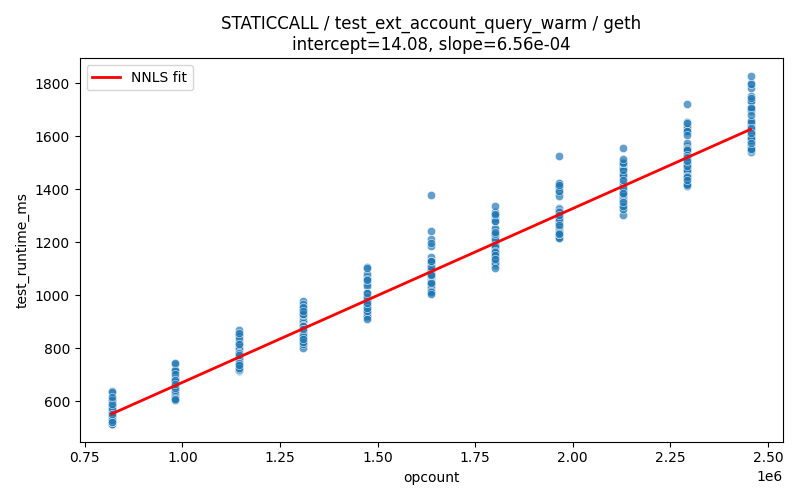

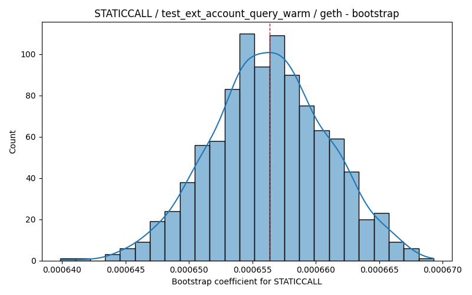

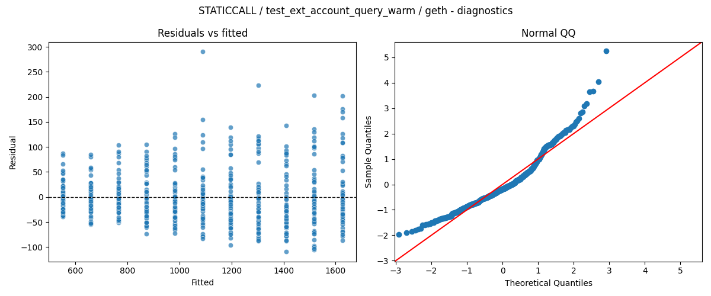

</details>

<details><summary>nethermind — NNLS regression summary</summary>

```
==============================================================================
                           NNLS Regression Results                            
==============================================================================
Dep. Variable:          test_runtime_ms              R-squared:          0.569
Model:                  NNLS                    Adj. R-squared:          0.568
No. Observations:       682                               RMSE:         228.95
Df Residuals:           680                                MAE:         184.16
Df Model:               1      
==============================================================================
                      coef     std err     P-value      [0.025      0.975]
------------------------------------------------------------------------------
         const    385.1312     24.7178       0.001    338.0910    434.5309
       opcount      0.0005      0.0000       0.001      0.0005      0.0005
==============================================================================
Notes: Non-negative least squares with bootstrap inference (1000 iterations)
==============================================================================
```

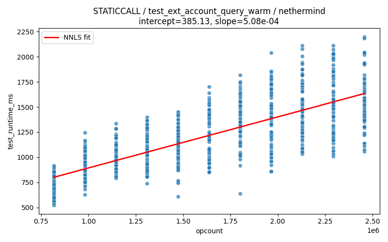

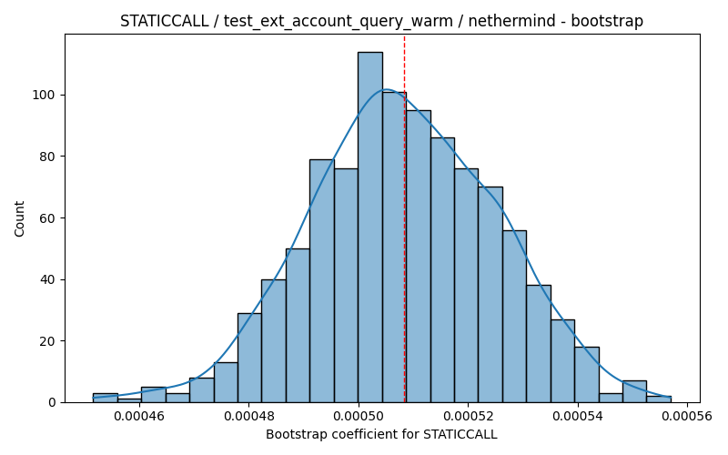

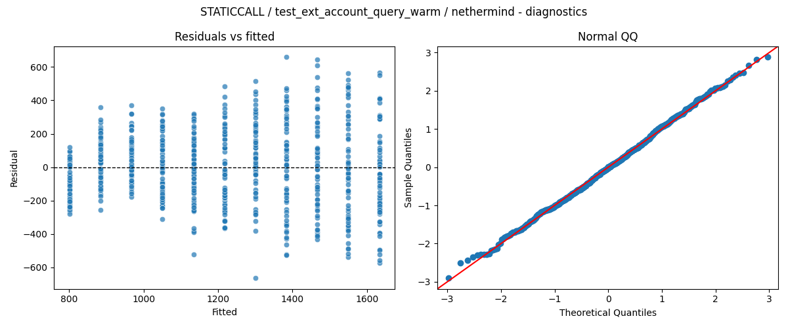

</details>

<details><summary>reth — NNLS regression summary</summary>

```
==============================================================================
                           NNLS Regression Results                            
==============================================================================
Dep. Variable:          test_runtime_ms              R-squared:          0.911
Model:                  NNLS                    Adj. R-squared:          0.911
No. Observations:       1056                              RMSE:           7.43
Df Residuals:           1054                               MAE:           6.02
Df Model:               1      
==============================================================================
                      coef     std err     P-value      [0.025      0.975]
------------------------------------------------------------------------------
         const     19.1654      0.8060       0.001     17.7148     20.8395
       opcount      0.0000      0.0000       0.001      0.0000      0.0000
==============================================================================
Notes: Non-negative least squares with bootstrap inference (1000 iterations)
==============================================================================
```

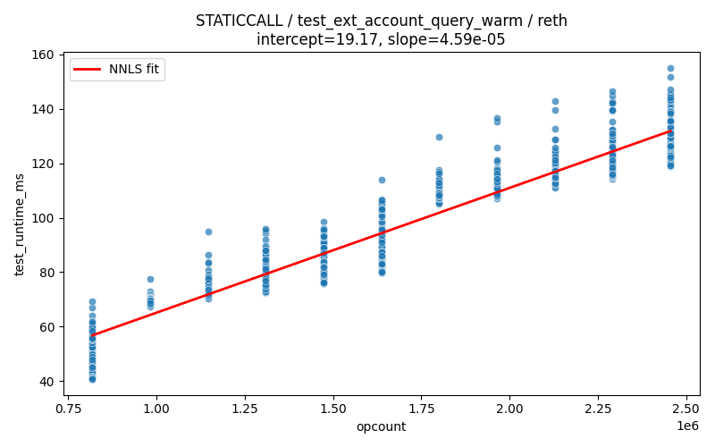


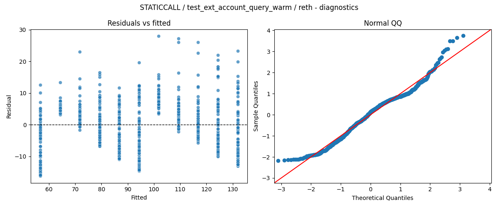

</details>
