# Glue opcodes report

Per-client NNLS fits of priced glue opcodes against their driver fixtures. Cycle-tier opcodes share one joint regression per client (shown once); pure-tier and mixed-tier opcodes each get a single-feature fit. Mixed-tier fits pre-adjust the LHS by subtracting the contribution of every priced upstream partner selected by the detector (pure ∪ cycle for `mixed_a`, plus `mixed_a` for `mixed_b`).

**Contents:** [besu](#besu) · [erigon](#erigon) · [geth](#geth) · [nethermind](#nethermind) · [reth](#reth)

## besu

| glue_opcode | nobs | glue_runtime_ms | p_value | rsquared |
| --- | --- | --- | --- | --- |
| `ISZERO` | 902 | 4.727e-06 | 1.00e-03 | 0.8543 |
| `JUMPDEST` | 902 | 2.652e-06 | 1.00e-03 | 0.8769 |
| `SWAP` | 14432 | 3.615e-06 | 1.00e-03 | 0.8534 |
| `CALLDATASIZE` | 53493 | 3.937e-06 | 1.00e-03 | 0.9631 |
| `DUP` | 53493 | 2.067e-06 | 1.00e-03 | 0.9631 |
| `GAS` | 53493 | 3.429e-06 | 1.00e-03 | 0.9631 |
| `MLOAD` | 53493 | 1.119e-05 | 1.00e-03 | 0.9631 |
| `PUSH` | 53493 | 2.899e-06 | 1.00e-03 | 0.9631 |
| `PUSH0` | 53493 | 2.082e-06 | 1.00e-03 | 0.9631 |
| `STATICCALL` | 53493 | 0.001647 | 1.00e-03 | 0.9631 |
| `ADD` | 902 | 1.141e-05 | 1.00e-03 | 0.859 |
| `AND` | 902 | 9.698e-06 | 1.00e-03 | 0.8732 |
| `CALLDATACOPY` | 21648 | 2.073e-05 | 1.00e-03 | 0.8325 |
| `CALLDATALOAD` | 3608 | 1.579e-06 | 2.59e-01 | 6.012e-05 |
| `DIV` | 902 | 1.826e-05 | 1.00e-03 | 0.8727 |
| `EXP` | 902 | 0.001292 | 1.00e-03 | 0.8742 |
| `GT` | 902 | 3.336e-05 | 1.00e-03 | 0.8926 |
| `JUMPI` | 902 | 9.86e-06 | 1.00e-03 | 0.8777 |
| `LT` | 902 | 3.448e-05 | 1.00e-03 | 0.8946 |
| `MSTORE` | 4510 | 1.854e-05 | 1.00e-03 | 0.8684 |
| `MSTORE8` | 4510 | 1.249e-05 | 1.00e-03 | 0.8653 |
| `MUL` | 902 | 1.168e-05 | 1.00e-03 | 0.6349 |
| `PC` | 902 | 4.753e-06 | 1.00e-03 | 0.8725 |
| `RETURNDATASIZE` | 3608 | 7.068e-06 | 1.00e-03 | 0.8525 |
| `SELFBALANCE` | 738 | 7.422e-06 | 1.00e-03 | 0.4782 |
| `SUB` | 902 | 1.106e-05 | 1.00e-03 | 0.8671 |
| `JUMP` | 902 | 5.014e-05 | 1.00e-03 | 0.8677 |
| `KECCAK256` | 14432 | 5.185e-05 | 1.00e-03 | 0.2818 |

### Cycle glue — joint fit · besu

<details><summary>Joint NNLS regression summary</summary>

```
==============================================================================
                           NNLS Regression Results                            
==============================================================================
Dep. Variable:          test_runtime_ms              R-squared:          0.963
Model:                  NNLS                    Adj. R-squared:          0.963
No. Observations:       53493                             RMSE:          43.38
Df Residuals:           53485                              MAE:          33.23
Df Model:               7      
==============================================================================
                      coef     std err     P-value      [0.025      0.975]
------------------------------------------------------------------------------
         const     81.9748      0.6687       0.001     80.6691     83.2843
  CALLDATASIZE      0.0000      0.0000       0.001      0.0000      0.0000
           DUP      0.0000      0.0000       0.001      0.0000      0.0000
           GAS      0.0000      0.0000       0.001      0.0000      0.0000
         MLOAD      0.0000      0.0000       0.001      0.0000      0.0000
          PUSH      0.0000      0.0000       0.001      0.0000      0.0000
         PUSH0      0.0000      0.0000       0.001      0.0000      0.0000
    STATICCALL      0.0016      0.0000       0.001      0.0016      0.0017
==============================================================================
Notes: Non-negative least squares with bootstrap inference (1000 iterations)
==============================================================================
```

</details>

<details><summary><code>CALLDATASIZE</code> · nobs=53493 · runtime_ms=3.937e-06 · p=1.00e-03 · R²=0.9631</summary>


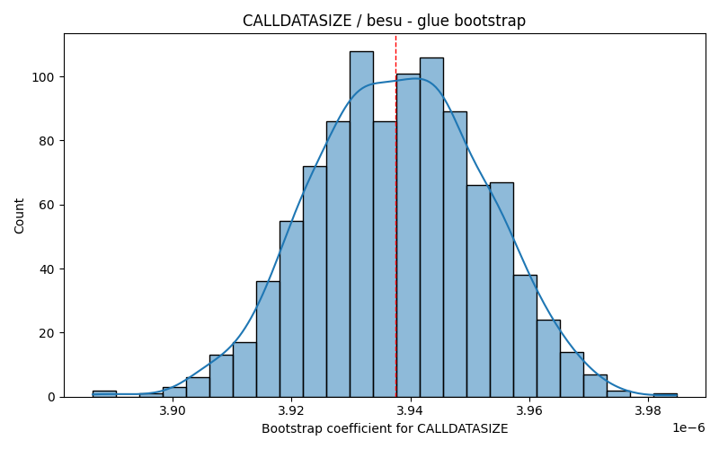


</details>

<details><summary><code>DUP</code> · nobs=53493 · runtime_ms=2.067e-06 · p=1.00e-03 · R²=0.9631</summary>


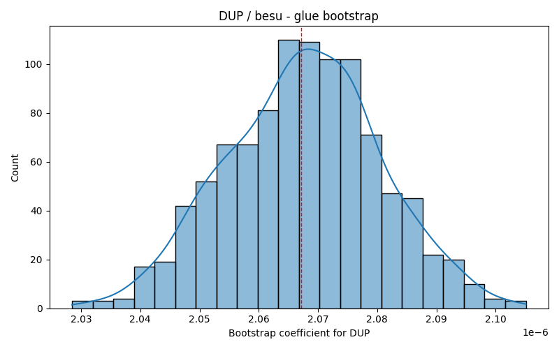


</details>

<details><summary><code>GAS</code> · nobs=53493 · runtime_ms=3.429e-06 · p=1.00e-03 · R²=0.9631</summary>


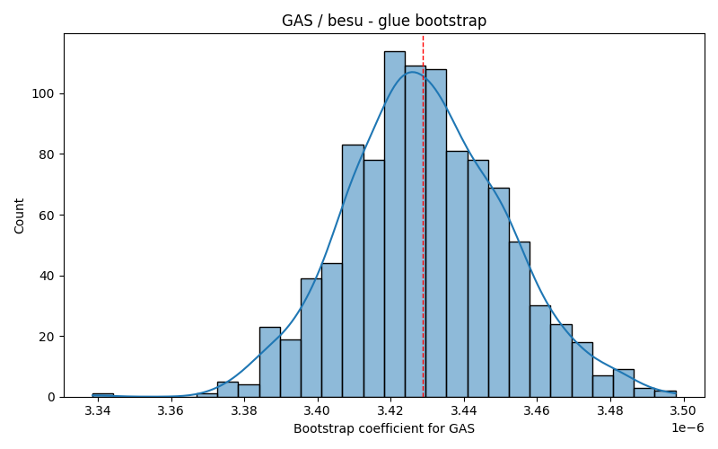


</details>

<details><summary><code>MLOAD</code> · nobs=53493 · runtime_ms=1.119e-05 · p=1.00e-03 · R²=0.9631</summary>


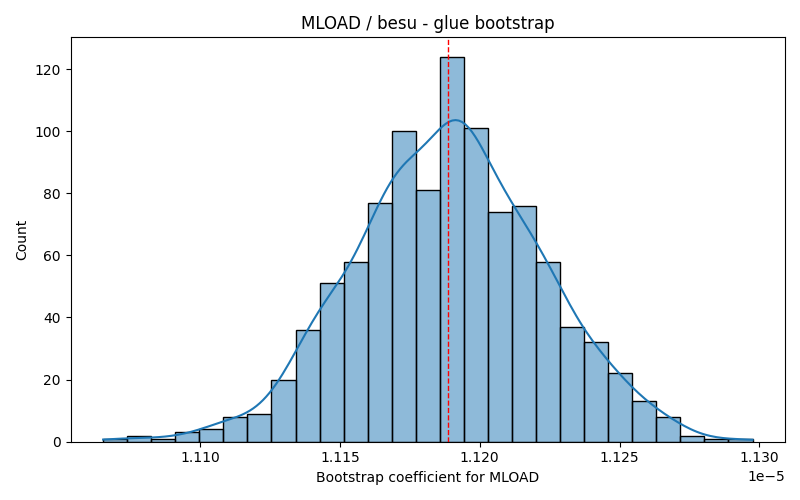


</details>

<details><summary><code>PUSH</code> · nobs=53493 · runtime_ms=2.899e-06 · p=1.00e-03 · R²=0.9631</summary>

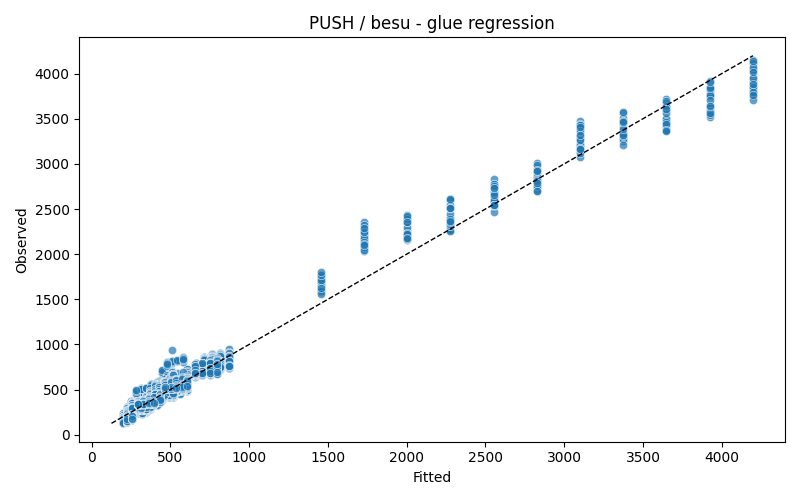

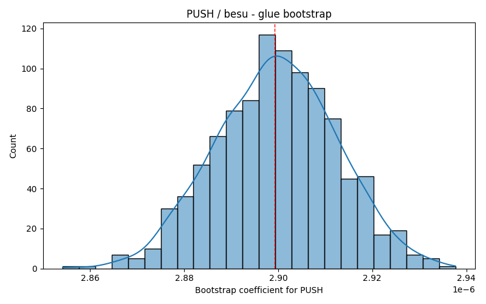

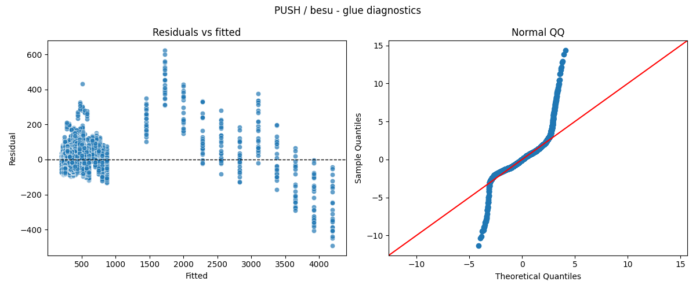

</details>

<details><summary><code>PUSH0</code> · nobs=53493 · runtime_ms=2.082e-06 · p=1.00e-03 · R²=0.9631</summary>


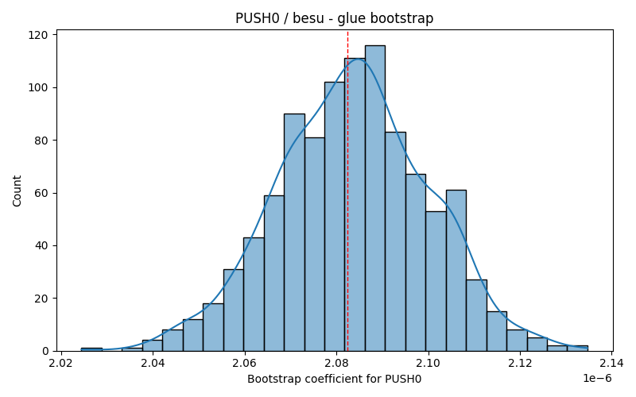


</details>

<details><summary><code>STATICCALL</code> · nobs=53493 · runtime_ms=0.001647 · p=1.00e-03 · R²=0.9631</summary>

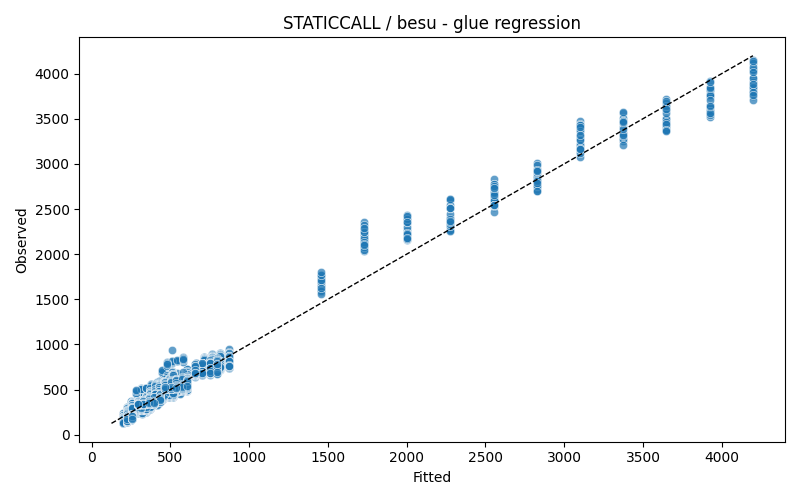

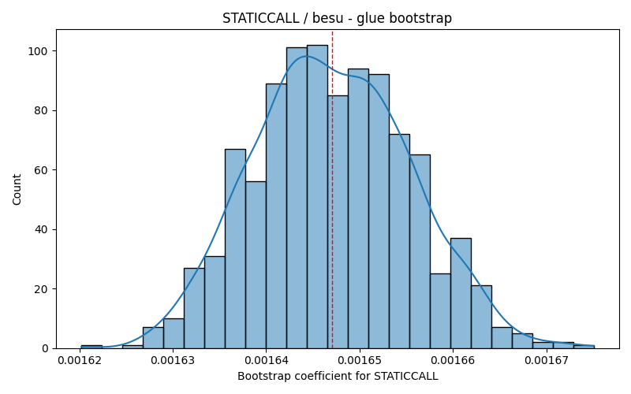


</details>

### Pure glue · besu

<details><summary><code>ISZERO</code> · nobs=902 · runtime_ms=4.727e-06 · p=1.00e-03 · R²=0.8543</summary>

```
==============================================================================
                           NNLS Regression Results                            
==============================================================================
Dep. Variable:          test_runtime_ms              R-squared:          0.854
Model:                  NNLS                    Adj. R-squared:          0.854
No. Observations:       902                               RMSE:          41.10
Df Residuals:           900                                MAE:          34.24
Df Model:               1      
==============================================================================
                      coef     std err     P-value      [0.025      0.975]
------------------------------------------------------------------------------
         const     83.6538      4.8979       0.001     73.5505     92.6197
        ISZERO      0.0000      0.0000       0.001      0.0000      0.0000
==============================================================================
Notes: Non-negative least squares with bootstrap inference (1000 iterations)
==============================================================================
```

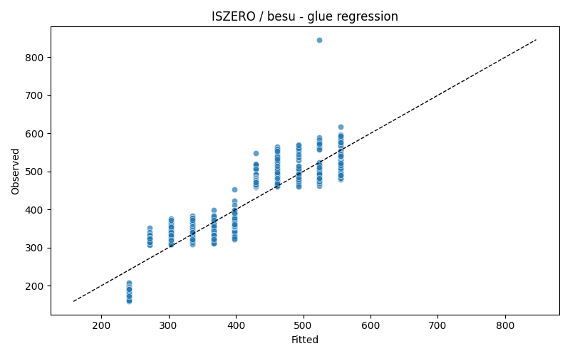

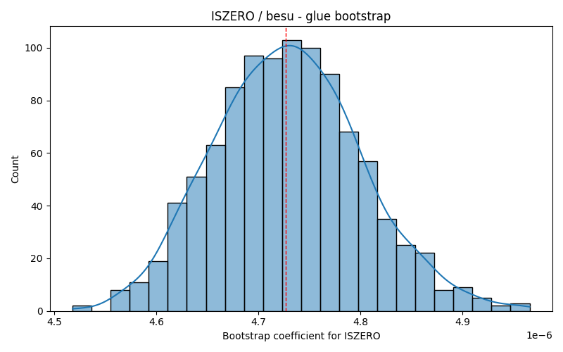

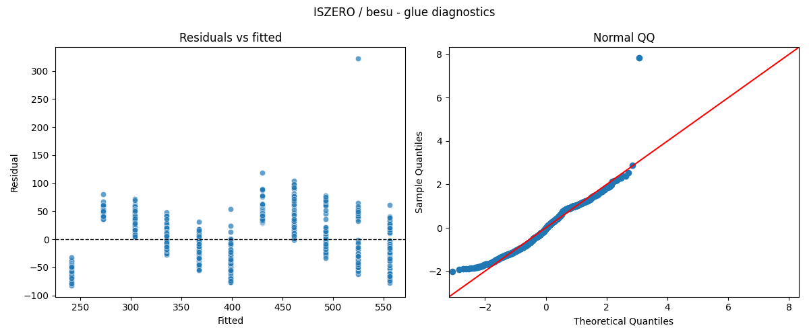

</details>

<details><summary><code>JUMPDEST</code> · nobs=902 · runtime_ms=2.652e-06 · p=1.00e-03 · R²=0.8769</summary>

```
==============================================================================
                           NNLS Regression Results                            
==============================================================================
Dep. Variable:          test_runtime_ms              R-squared:          0.877
Model:                  NNLS                    Adj. R-squared:          0.877
No. Observations:       902                               RMSE:          62.75
Df Residuals:           900                                MAE:          52.74
Df Model:               1      
==============================================================================
                      coef     std err     P-value      [0.025      0.975]
------------------------------------------------------------------------------
         const     84.0620      7.1112       0.001     69.4248     98.5006
      JUMPDEST      0.0000      0.0000       0.001      0.0000      0.0000
==============================================================================
Notes: Non-negative least squares with bootstrap inference (1000 iterations)
==============================================================================
```

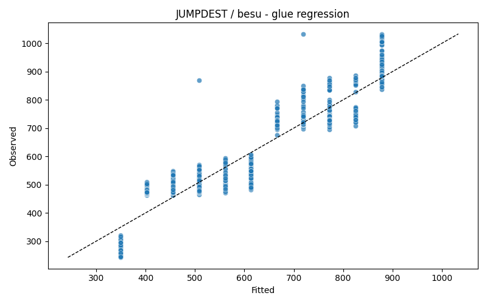

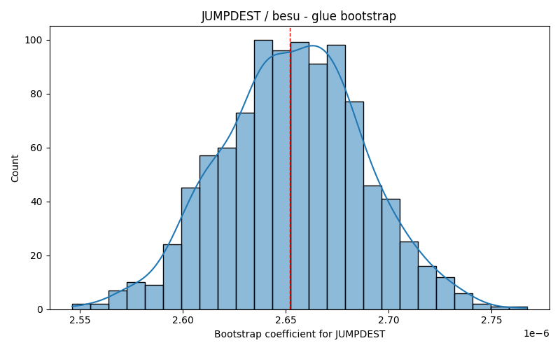

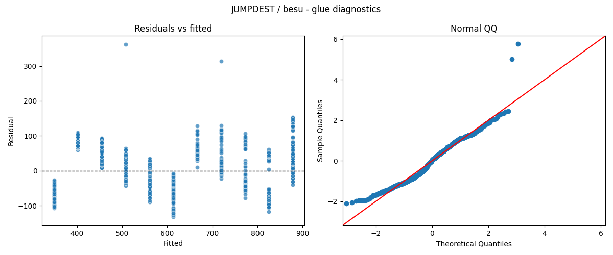

</details>

<details><summary><code>SWAP</code> · nobs=14432 · runtime_ms=3.615e-06 · p=1.00e-03 · R²=0.8534</summary>

```
==============================================================================
                           NNLS Regression Results                            
==============================================================================
Dep. Variable:          test_runtime_ms              R-squared:          0.853
Model:                  NNLS                    Adj. R-squared:          0.853
No. Observations:       14432                             RMSE:          31.55
Df Residuals:           14430                              MAE:          25.90
Df Model:               1      
==============================================================================
                      coef     std err     P-value      [0.025      0.975]
------------------------------------------------------------------------------
         const     68.3481      0.9092       0.001     66.5644     70.1276
          SWAP      0.0000      0.0000       0.001      0.0000      0.0000
==============================================================================
Notes: Non-negative least squares with bootstrap inference (1000 iterations)
==============================================================================
```

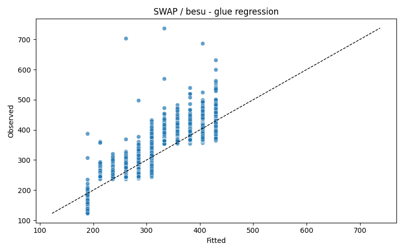

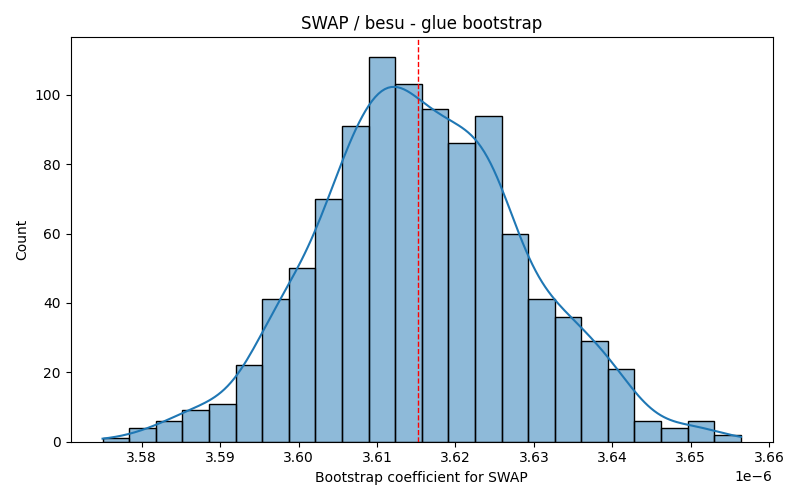

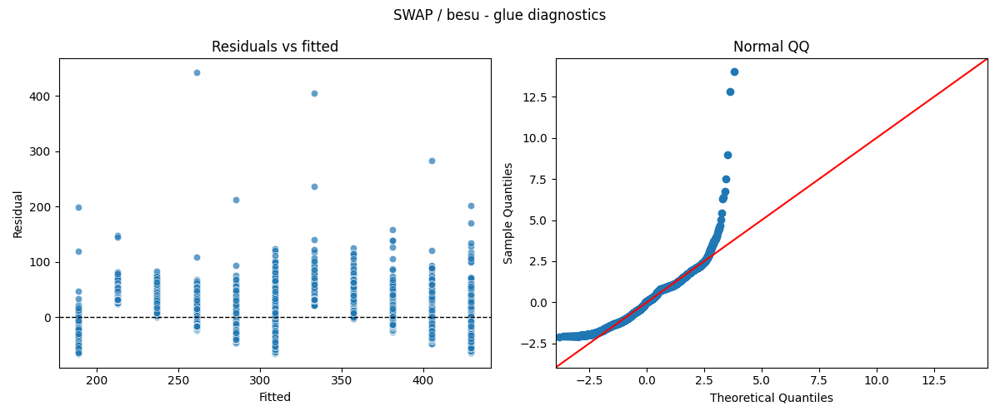

</details>

### Mixed glue (tier A) · besu

<details><summary><code>ADD</code> · nobs=902 · runtime_ms=1.141e-05 · p=1.00e-03 · R²=0.859</summary>

```
==============================================================================
                           NNLS Regression Results                            
==============================================================================
Dep. Variable:          test_runtime_ms              R-squared:          0.859
Model:                  NNLS                    Adj. R-squared:          0.859
No. Observations:       902                               RMSE:          48.66
Df Residuals:           900                                MAE:          41.17
Df Model:               1      
==============================================================================
                      coef     std err     P-value      [0.025      0.975]
------------------------------------------------------------------------------
         const    100.1263      5.6701       0.001     89.0589    111.0080
           ADD      0.0000      0.0000       0.001      0.0000      0.0000
==============================================================================
Notes: Non-negative least squares with bootstrap inference (1000 iterations)
==============================================================================
```

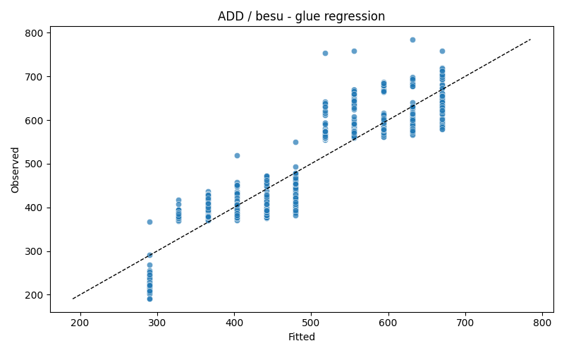

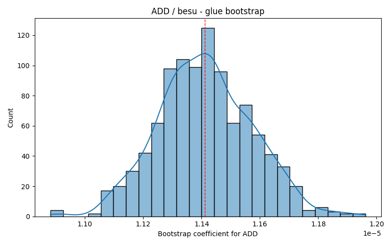

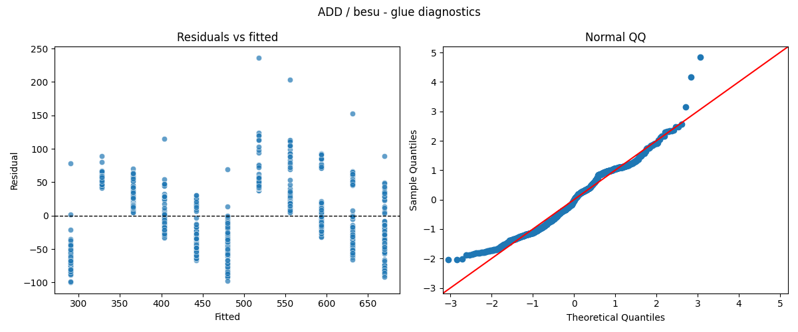

</details>

<details><summary><code>AND</code> · nobs=902 · runtime_ms=9.698e-06 · p=1.00e-03 · R²=0.8732</summary>

```
==============================================================================
                           NNLS Regression Results                            
==============================================================================
Dep. Variable:          test_runtime_ms              R-squared:          0.873
Model:                  NNLS                    Adj. R-squared:          0.873
No. Observations:       902                               RMSE:          38.89
Df Residuals:           900                                MAE:          33.32
Df Model:               1      
==============================================================================
                      coef     std err     P-value      [0.025      0.975]
------------------------------------------------------------------------------
         const     89.2510      4.4901       0.001     80.7158     98.2520
           AND      0.0000      0.0000       0.001      0.0000      0.0000
==============================================================================
Notes: Non-negative least squares with bootstrap inference (1000 iterations)
==============================================================================
```

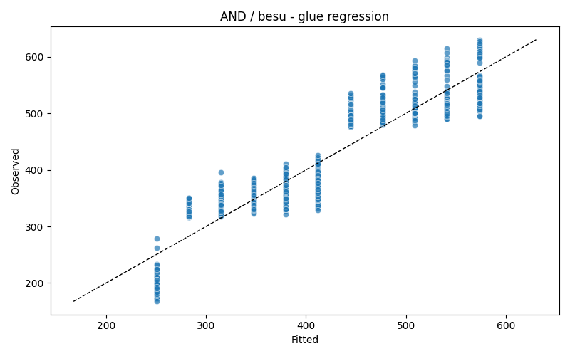

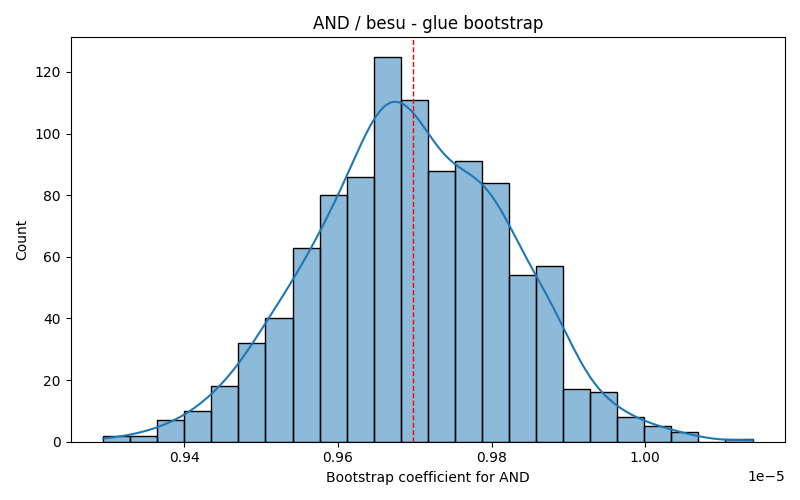

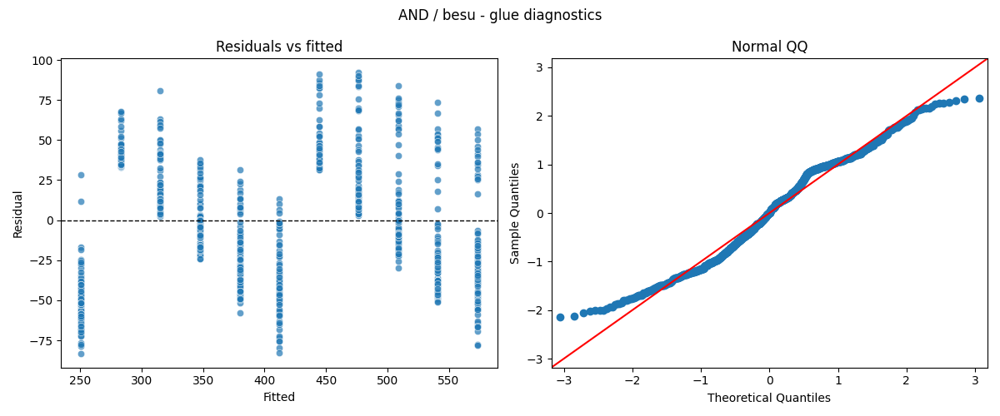

</details>

<details><summary><code>CALLDATACOPY</code> · nobs=21648 · runtime_ms=2.073e-05 · p=1.00e-03 · R²=0.8325</summary>

```
==============================================================================
                           NNLS Regression Results                            
==============================================================================
Dep. Variable:          test_runtime_ms              R-squared:          0.833
Model:                  NNLS                    Adj. R-squared:          0.833
No. Observations:       21648                             RMSE:          69.92
Df Residuals:           21646                              MAE:          55.57
Df Model:               1      
==============================================================================
                      coef     std err     P-value      [0.025      0.975]
------------------------------------------------------------------------------
         const    117.3885      0.5967       0.001    116.2452    118.5588
  CALLDATACOPY      0.0000      0.0000       0.001      0.0000      0.0000
==============================================================================
Notes: Non-negative least squares with bootstrap inference (1000 iterations)
==============================================================================
```

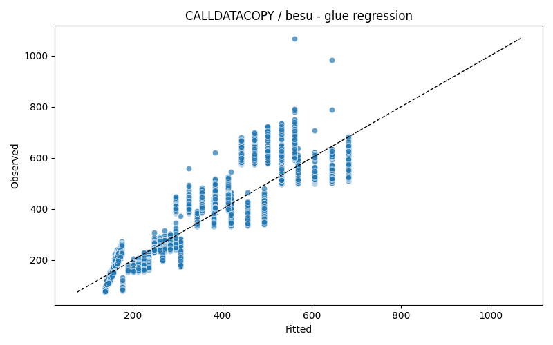

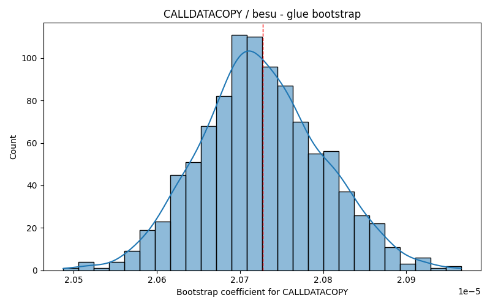

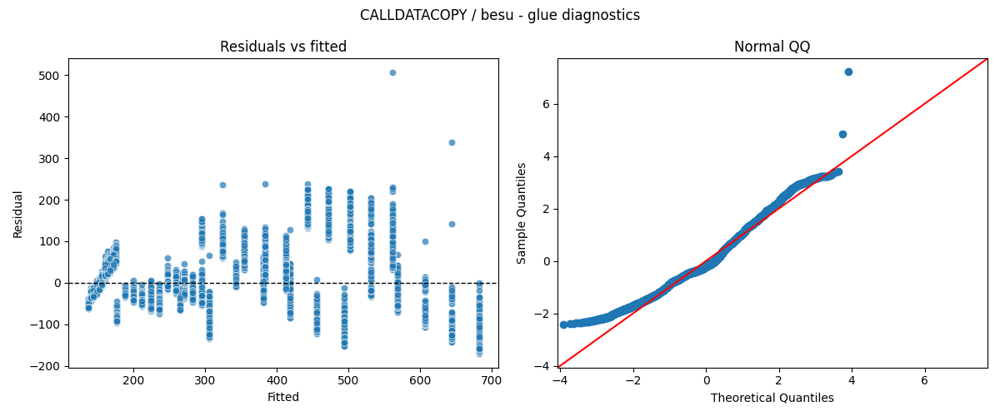

</details>

<details><summary><code>CALLDATALOAD</code> · nobs=3608 · runtime_ms=1.579e-06 · p=2.59e-01 · R²=6.012e-05</summary>

```
==============================================================================
                           NNLS Regression Results                            
==============================================================================
Dep. Variable:          test_runtime_ms              R-squared:          0.000
Model:                  NNLS                    Adj. R-squared:         -0.000
No. Observations:       3608                              RMSE:           0.78
Df Residuals:           3606                               MAE:           0.54
Df Model:               1      
==============================================================================
                      coef     std err     P-value      [0.025      0.975]
------------------------------------------------------------------------------
         const      3.7701      0.0307       0.001      3.6946      3.8108
  CALLDATALOAD      0.0000      0.0000       0.259      0.0000      0.0000
==============================================================================
Notes: Non-negative least squares with bootstrap inference (1000 iterations)
==============================================================================
```

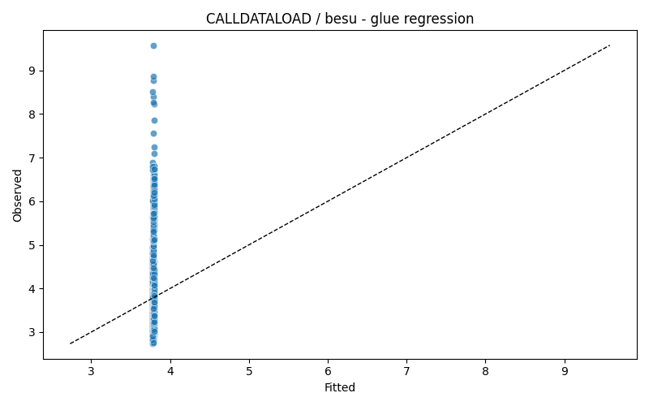

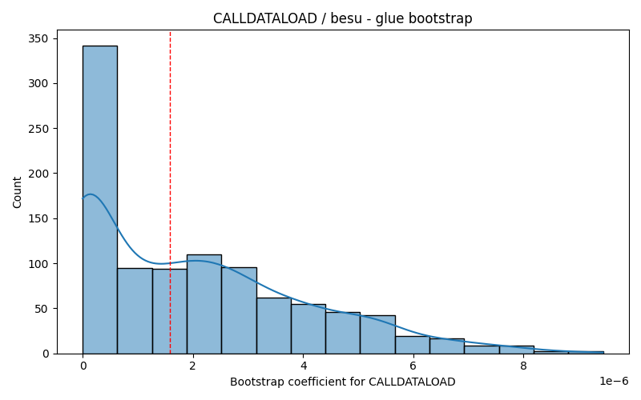

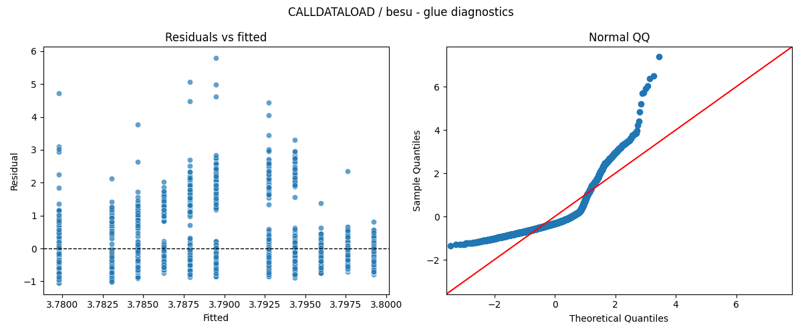

</details>

<details><summary><code>DIV</code> · nobs=902 · runtime_ms=1.826e-05 · p=1.00e-03 · R²=0.8727</summary>

```
==============================================================================
                           NNLS Regression Results                            
==============================================================================
Dep. Variable:          test_runtime_ms              R-squared:          0.873
Model:                  NNLS                    Adj. R-squared:          0.873
No. Observations:       902                               RMSE:          55.08
Df Residuals:           900                                MAE:          47.50
Df Model:               1      
==============================================================================
                      coef     std err     P-value      [0.025      0.975]
------------------------------------------------------------------------------
         const    131.7321      5.9825       0.001    119.4616    142.8242
           DIV      0.0000      0.0000       0.001      0.0000      0.0000
==============================================================================
Notes: Non-negative least squares with bootstrap inference (1000 iterations)
==============================================================================
```

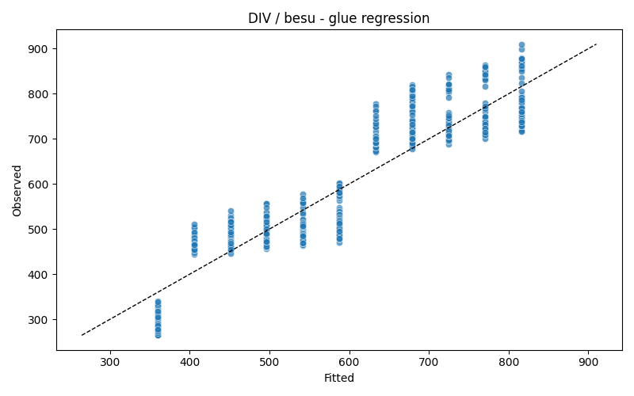

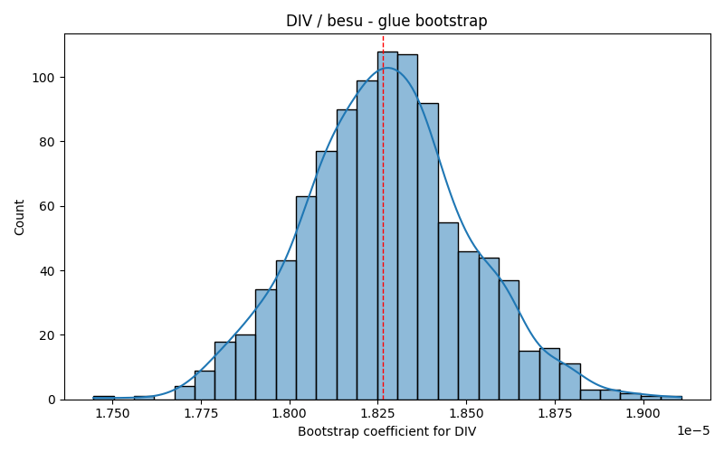

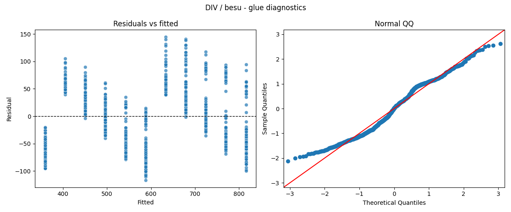

</details>

<details><summary><code>EXP</code> · nobs=902 · runtime_ms=0.001292 · p=1.00e-03 · R²=0.8742</summary>

```
==============================================================================
                           NNLS Regression Results                            
==============================================================================
Dep. Variable:          test_runtime_ms              R-squared:          0.874
Model:                  NNLS                    Adj. R-squared:          0.874
No. Observations:       902                               RMSE:          19.20
Df Residuals:           900                                MAE:          15.32
Df Model:               1      
==============================================================================
                      coef     std err     P-value      [0.025      0.975]
------------------------------------------------------------------------------
         const     77.7268      1.7763       0.001     74.0810     81.1243
           EXP      0.0013      0.0000       0.001      0.0013      0.0013
==============================================================================
Notes: Non-negative least squares with bootstrap inference (1000 iterations)
==============================================================================
```

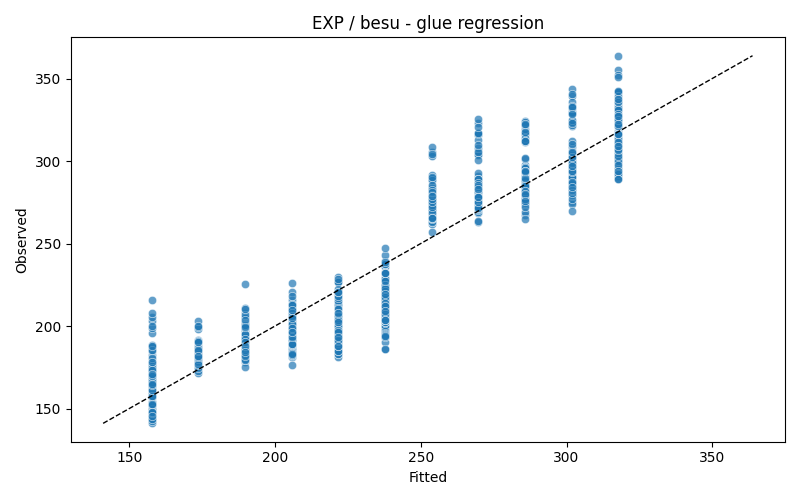

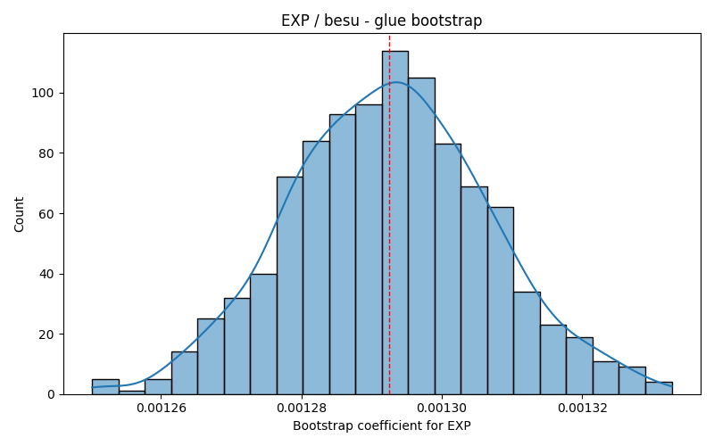

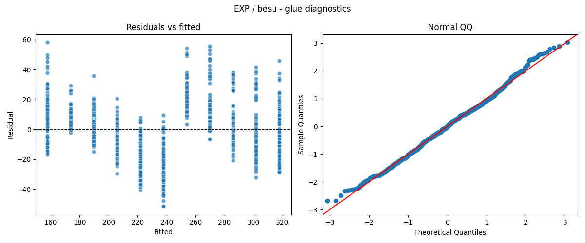

</details>

<details><summary><code>GT</code> · nobs=902 · runtime_ms=3.336e-05 · p=1.00e-03 · R²=0.8926</summary>

```
==============================================================================
                           NNLS Regression Results                            
==============================================================================
Dep. Variable:          test_runtime_ms              R-squared:          0.893
Model:                  NNLS                    Adj. R-squared:          0.892
No. Observations:       902                               RMSE:         121.80
Df Residuals:           900                                MAE:          99.29
Df Model:               1      
==============================================================================
                      coef     std err     P-value      [0.025      0.975]
------------------------------------------------------------------------------
         const    196.3662     14.9685       0.001    166.8240    225.0225
            GT      0.0000      0.0000       0.001      0.0000      0.0000
==============================================================================
Notes: Non-negative least squares with bootstrap inference (1000 iterations)
==============================================================================
```

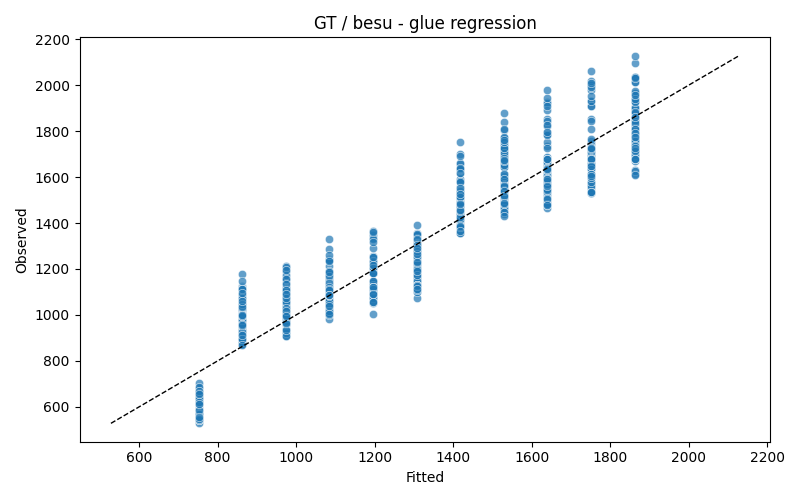

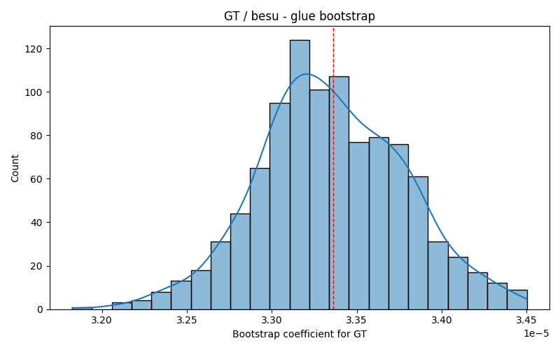

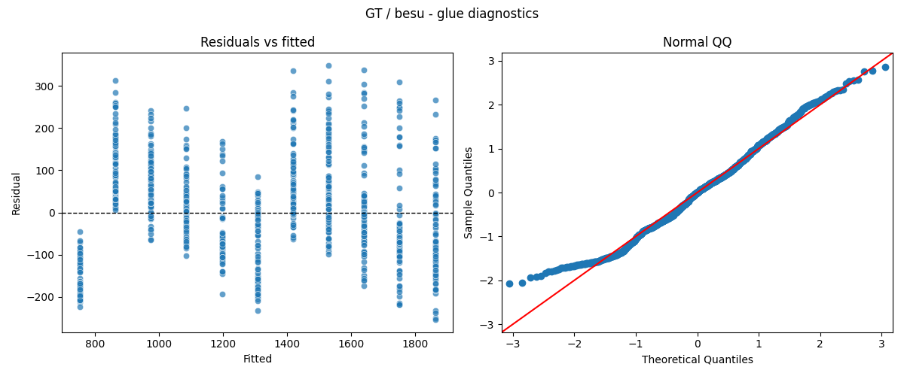

</details>

<details><summary><code>JUMPI</code> · nobs=902 · runtime_ms=9.86e-06 · p=1.00e-03 · R²=0.8777</summary>

```
==============================================================================
                           NNLS Regression Results                            
==============================================================================
Dep. Variable:          test_runtime_ms              R-squared:          0.878
Model:                  NNLS                    Adj. R-squared:          0.878
No. Observations:       902                               RMSE:          16.61
Df Residuals:           900                                MAE:          13.93
Df Model:               1      
==============================================================================
                      coef     std err     P-value      [0.025      0.975]
------------------------------------------------------------------------------
         const     37.6574      1.9986       0.001     33.6057     41.4148
         JUMPI      0.0000      0.0000       0.001      0.0000      0.0000
==============================================================================
Notes: Non-negative least squares with bootstrap inference (1000 iterations)
==============================================================================
```

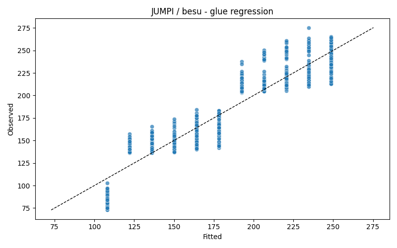

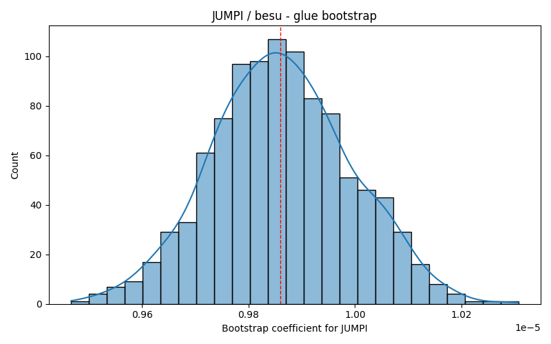

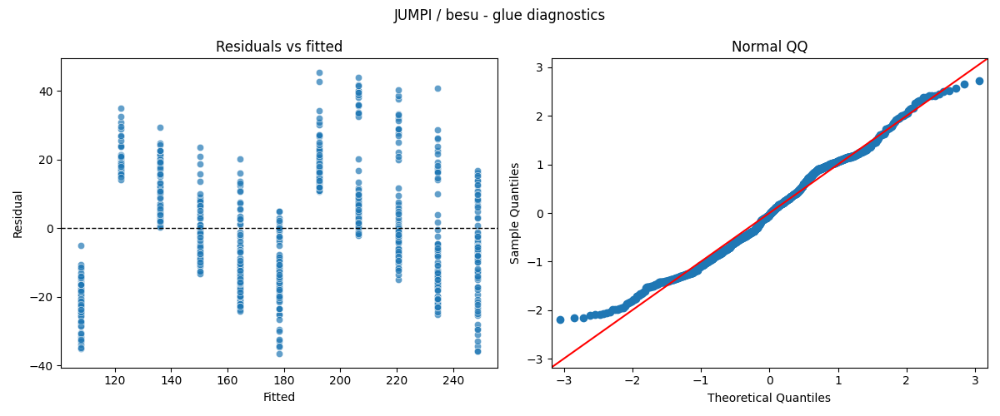

</details>

<details><summary><code>LT</code> · nobs=902 · runtime_ms=3.448e-05 · p=1.00e-03 · R²=0.8946</summary>

```
==============================================================================
                           NNLS Regression Results                            
==============================================================================
Dep. Variable:          test_runtime_ms              R-squared:          0.895
Model:                  NNLS                    Adj. R-squared:          0.894
No. Observations:       902                               RMSE:         124.55
Df Residuals:           900                                MAE:         102.27
Df Model:               1      
==============================================================================
                      coef     std err     P-value      [0.025      0.975]
------------------------------------------------------------------------------
         const    215.4014     15.1496       0.001    184.8346    246.3008
            LT      0.0000      0.0000       0.001      0.0000      0.0000
==============================================================================
Notes: Non-negative least squares with bootstrap inference (1000 iterations)
==============================================================================
```

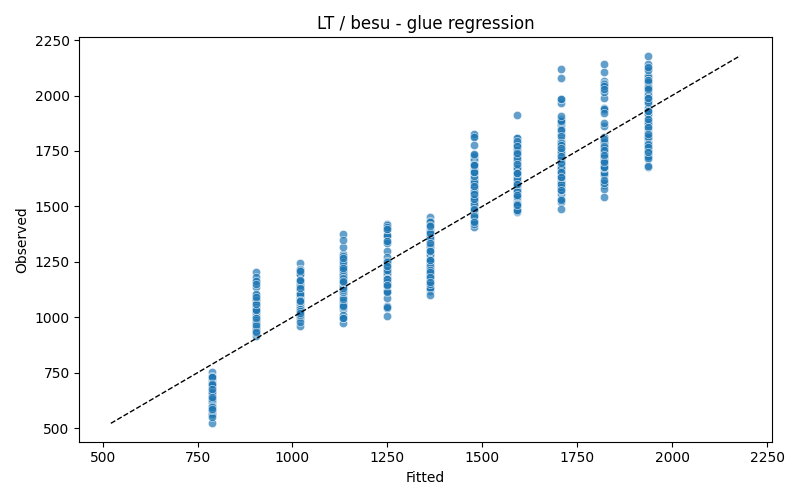

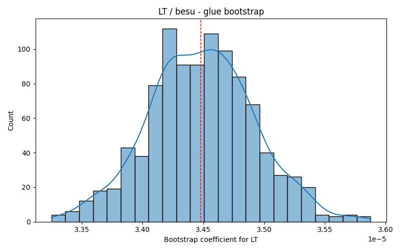

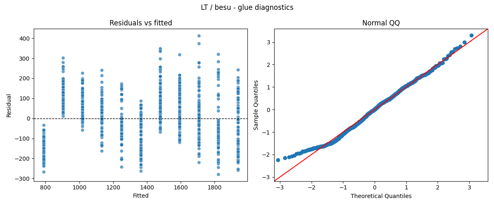

</details>

<details><summary><code>MSTORE</code> · nobs=4510 · runtime_ms=1.854e-05 · p=1.00e-03 · R²=0.8684</summary>

```
==============================================================================
                           NNLS Regression Results                            
==============================================================================
Dep. Variable:          test_runtime_ms              R-squared:          0.868
Model:                  NNLS                    Adj. R-squared:          0.868
No. Observations:       4510                              RMSE:          50.66
Df Residuals:           4508                               MAE:          43.36
Df Model:               1      
==============================================================================
                      coef     std err     P-value      [0.025      0.975]
------------------------------------------------------------------------------
         const    112.4443      2.7493       0.001    107.2452    117.7695
        MSTORE      0.0000      0.0000       0.001      0.0000      0.0000
==============================================================================
Notes: Non-negative least squares with bootstrap inference (1000 iterations)
==============================================================================
```

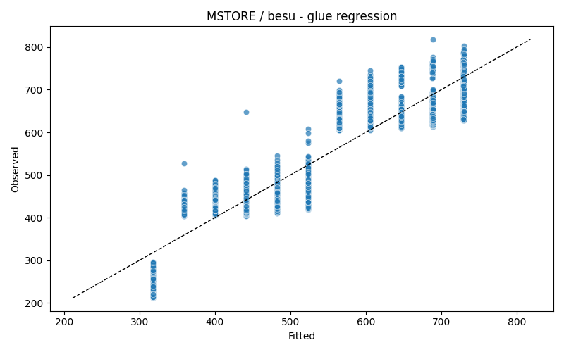

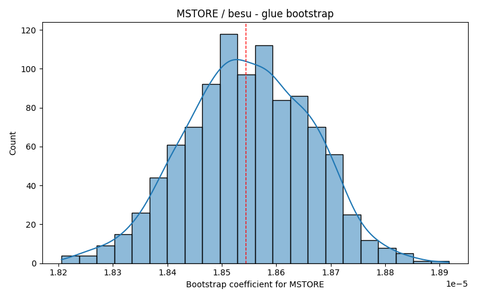

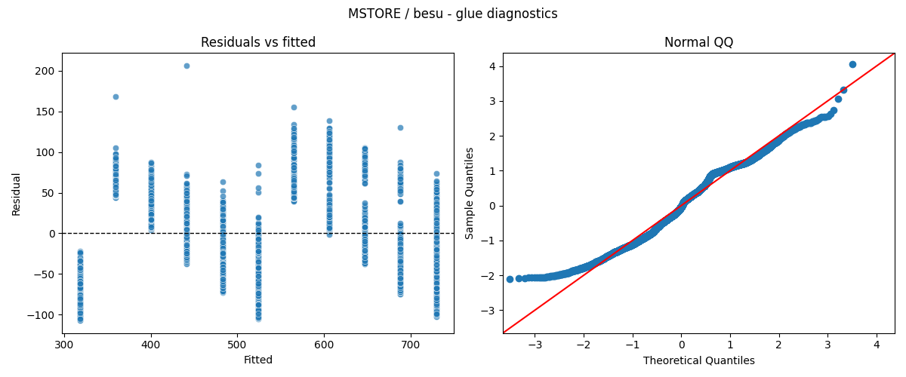

</details>

<details><summary><code>MSTORE8</code> · nobs=4510 · runtime_ms=1.249e-05 · p=1.00e-03 · R²=0.8653</summary>

```
==============================================================================
                           NNLS Regression Results                            
==============================================================================
Dep. Variable:          test_runtime_ms              R-squared:          0.865
Model:                  NNLS                    Adj. R-squared:          0.865
No. Observations:       4510                              RMSE:          34.58
Df Residuals:           4508                               MAE:          29.11
Df Model:               1      
==============================================================================
                      coef     std err     P-value      [0.025      0.975]
------------------------------------------------------------------------------
         const     77.7168      1.8689       0.001     73.8555     81.3530
       MSTORE8      0.0000      0.0000       0.001      0.0000      0.0000
==============================================================================
Notes: Non-negative least squares with bootstrap inference (1000 iterations)
==============================================================================
```

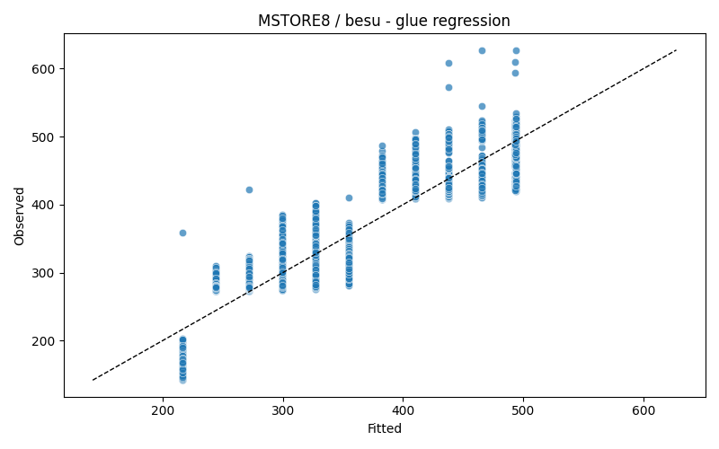

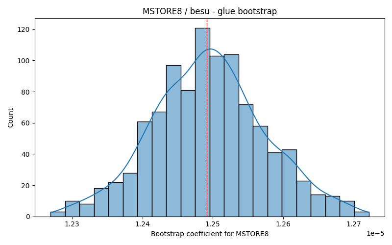

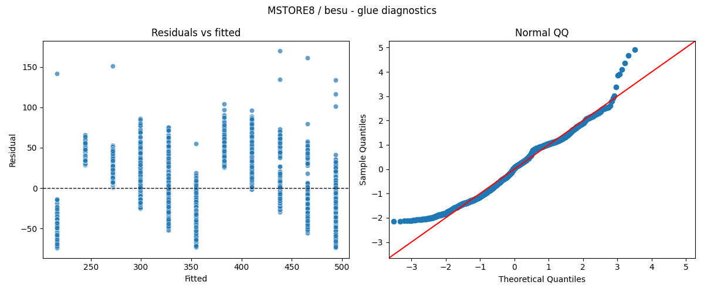

</details>

<details><summary><code>MUL</code> · nobs=902 · runtime_ms=1.168e-05 · p=1.00e-03 · R²=0.6349</summary>

```
==============================================================================
                           NNLS Regression Results                            
==============================================================================
Dep. Variable:          test_runtime_ms              R-squared:          0.635
Model:                  NNLS                    Adj. R-squared:          0.635
No. Observations:       902                               RMSE:          69.91
Df Residuals:           900                                MAE:          57.31
Df Model:               1      
==============================================================================
                      coef     std err     P-value      [0.025      0.975]
------------------------------------------------------------------------------
         const    103.9782      6.8286       0.001     90.7143    116.6545
           MUL      0.0000      0.0000       0.001      0.0000      0.0000
==============================================================================
Notes: Non-negative least squares with bootstrap inference (1000 iterations)
==============================================================================
```

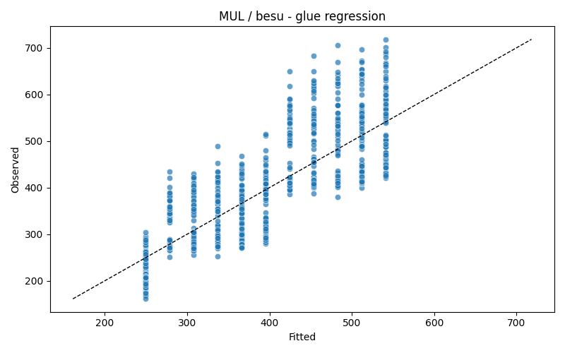

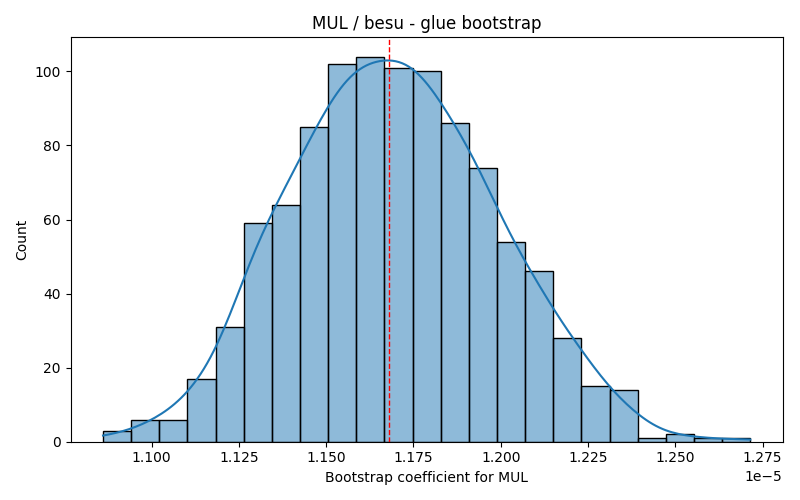

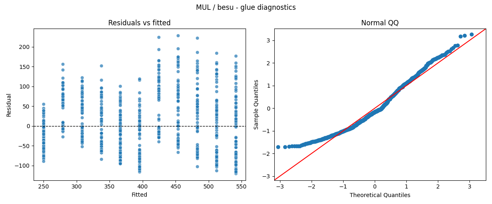

</details>

<details><summary><code>PC</code> · nobs=902 · runtime_ms=4.753e-06 · p=1.00e-03 · R²=0.8725</summary>

```
==============================================================================
                           NNLS Regression Results                            
==============================================================================
Dep. Variable:          test_runtime_ms              R-squared:          0.873
Model:                  NNLS                    Adj. R-squared:          0.872
No. Observations:       902                               RMSE:          54.32
Df Residuals:           900                                MAE:          46.58
Df Model:               1      
==============================================================================
                      coef     std err     P-value      [0.025      0.975]
------------------------------------------------------------------------------
         const    116.1138      6.5700       0.001    102.6892    128.6843
            PC      0.0000      0.0000       0.001      0.0000      0.0000
==============================================================================
Notes: Non-negative least squares with bootstrap inference (1000 iterations)
==============================================================================
```

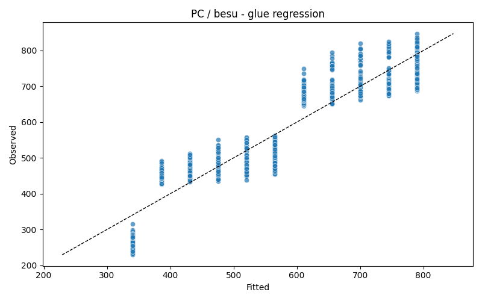

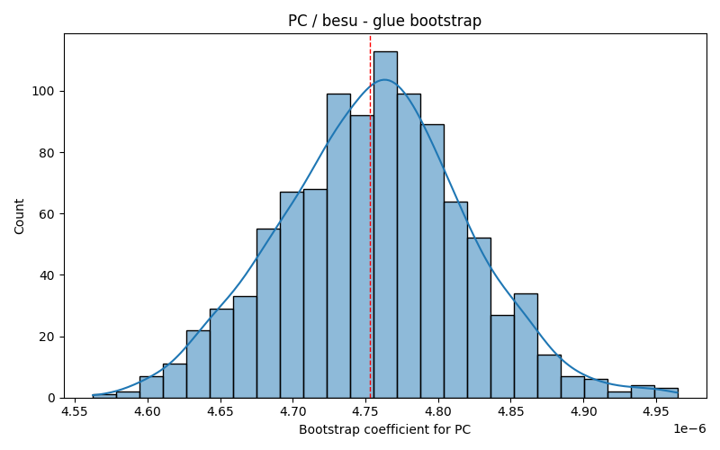

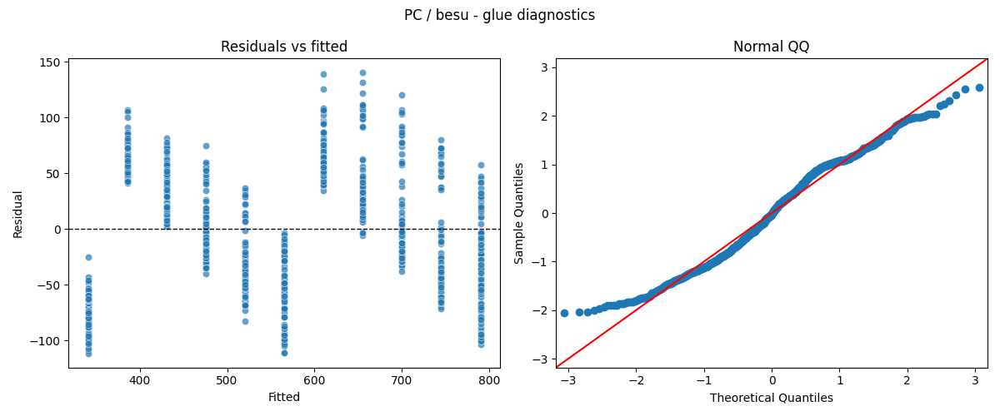

</details>

<details><summary><code>RETURNDATASIZE</code> · nobs=3608 · runtime_ms=7.068e-06 · p=1.00e-03 · R²=0.8525</summary>

```
==============================================================================
                           NNLS Regression Results                            
==============================================================================
Dep. Variable:          test_runtime_ms              R-squared:          0.853
Model:                  NNLS                    Adj. R-squared:          0.852
No. Observations:       3608                              RMSE:          46.41
Df Residuals:           3606                               MAE:          38.79
Df Model:               1      
==============================================================================
                      coef     std err     P-value      [0.025      0.975]
------------------------------------------------------------------------------
         const     93.0364      2.7395       0.001     87.6919     98.5242
RETURNDATASIZE      0.0000      0.0000       0.001      0.0000      0.0000
==============================================================================
Notes: Non-negative least squares with bootstrap inference (1000 iterations)
==============================================================================
```

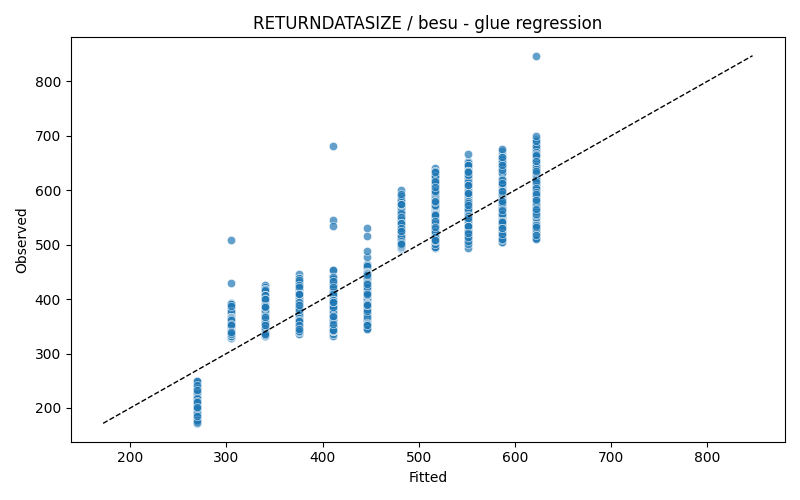

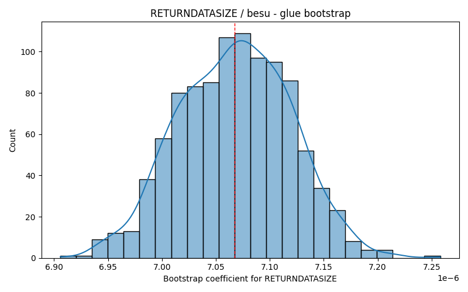

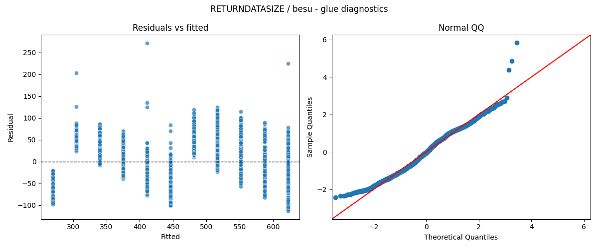

</details>

<details><summary><code>SELFBALANCE</code> · nobs=738 · runtime_ms=7.422e-06 · p=1.00e-03 · R²=0.4782</summary>

```
==============================================================================
                           NNLS Regression Results                            
==============================================================================
Dep. Variable:          test_runtime_ms              R-squared:          0.478
Model:                  NNLS                    Adj. R-squared:          0.477
No. Observations:       738                               RMSE:          78.20
Df Residuals:           736                                MAE:          62.33
Df Model:               1      
==============================================================================
                      coef     std err     P-value      [0.025      0.975]
------------------------------------------------------------------------------
         const    428.7225     12.0895       0.001    404.5842    451.1136
   SELFBALANCE      0.0000      0.0000       0.001      0.0000      0.0000
==============================================================================
Notes: Non-negative least squares with bootstrap inference (1000 iterations)
==============================================================================
```

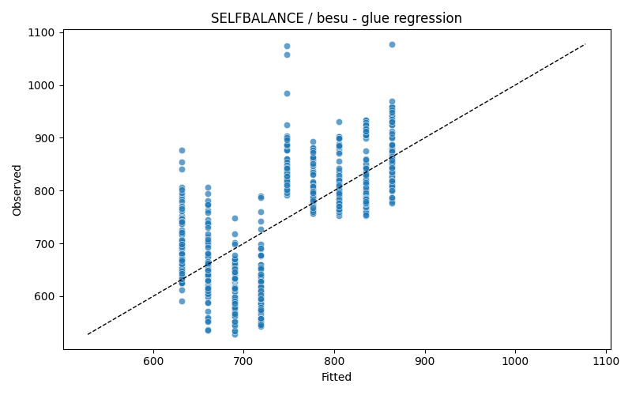

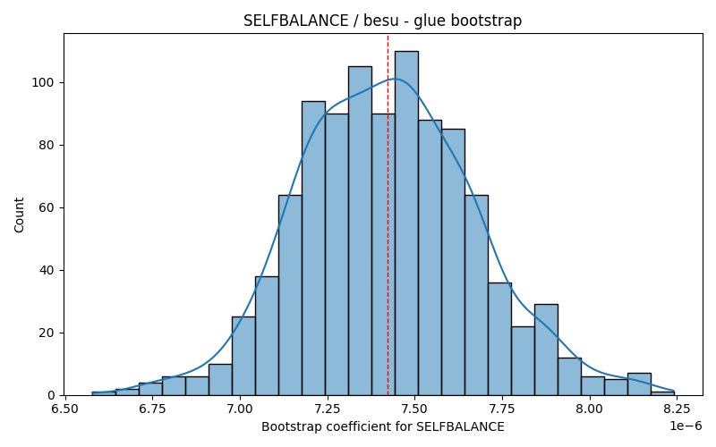

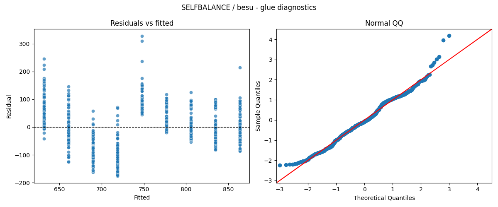

</details>

<details><summary><code>SUB</code> · nobs=902 · runtime_ms=1.106e-05 · p=1.00e-03 · R²=0.8671</summary>

```
==============================================================================
                           NNLS Regression Results                            
==============================================================================
Dep. Variable:          test_runtime_ms              R-squared:          0.867
Model:                  NNLS                    Adj. R-squared:          0.867
No. Observations:       902                               RMSE:          45.57
Df Residuals:           900                                MAE:          39.13
Df Model:               1      
==============================================================================
                      coef     std err     P-value      [0.025      0.975]
------------------------------------------------------------------------------
         const     99.9562      5.5671       0.001     88.7686    110.7111
           SUB      0.0000      0.0000       0.001      0.0000      0.0000
==============================================================================
Notes: Non-negative least squares with bootstrap inference (1000 iterations)
==============================================================================
```

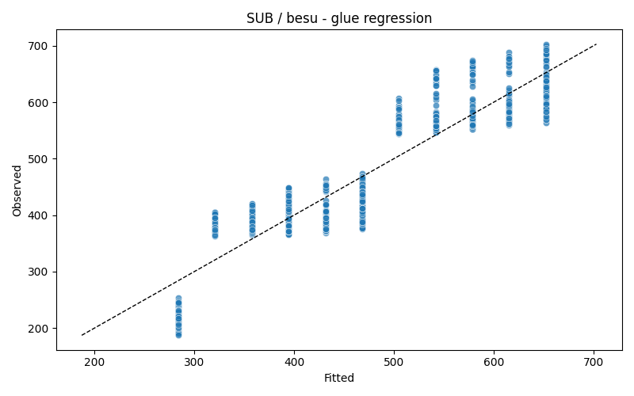

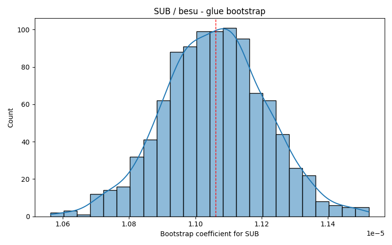

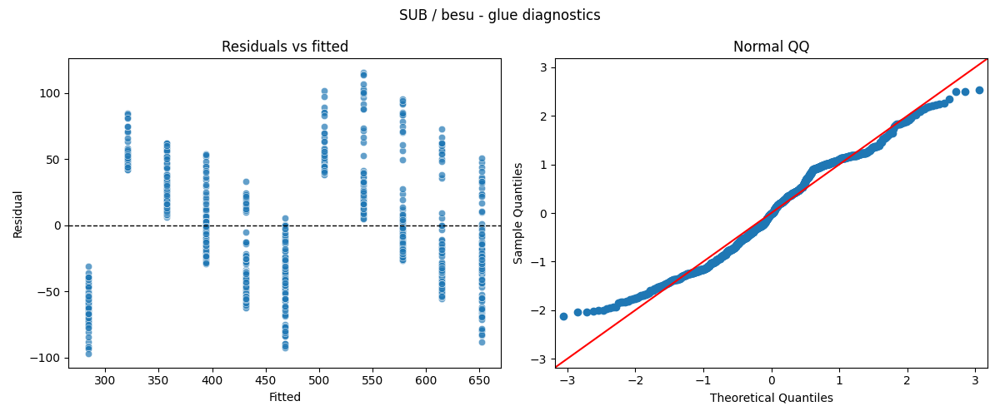

</details>

### Mixed glue (tier B) · besu

<details><summary><code>JUMP</code> · nobs=902 · runtime_ms=5.014e-05 · p=1.00e-03 · R²=0.8677</summary>

```
==============================================================================
                           NNLS Regression Results                            
==============================================================================
Dep. Variable:          test_runtime_ms              R-squared:          0.868
Model:                  NNLS                    Adj. R-squared:          0.868
No. Observations:       902                               RMSE:          72.76
Df Residuals:           900                                MAE:          61.71
Df Model:               1      
==============================================================================
                      coef     std err     P-value      [0.025      0.975]
------------------------------------------------------------------------------
         const    149.3334      9.1072       0.001    132.2145    167.6067
          JUMP      0.0001      0.0000       0.001      0.0000      0.0001
==============================================================================
Notes: Non-negative least squares with bootstrap inference (1000 iterations)
==============================================================================
```

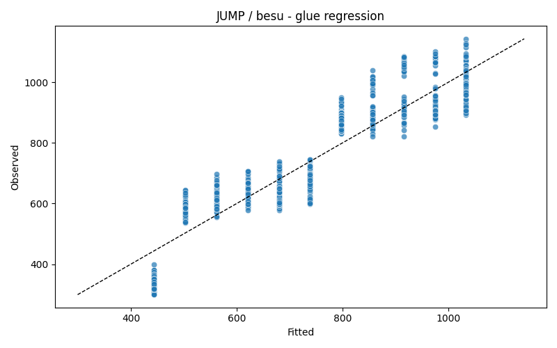

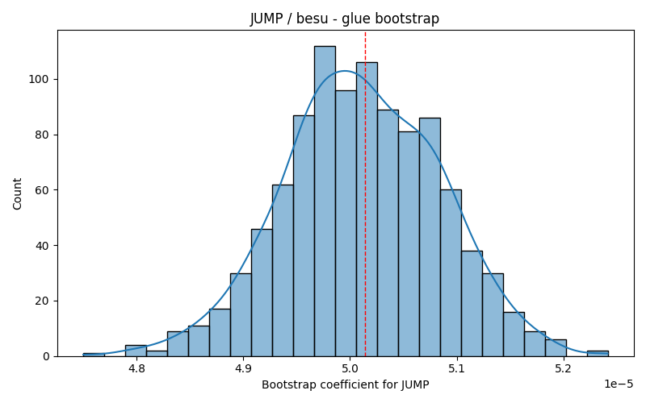

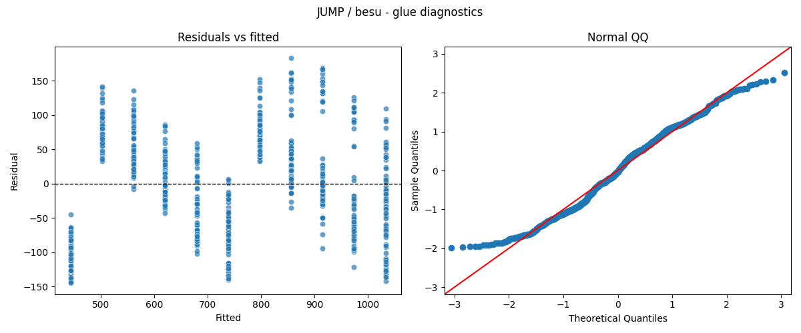

</details>

<details><summary><code>KECCAK256</code> · nobs=14432 · runtime_ms=5.185e-05 · p=1.00e-03 · R²=0.2818</summary>

```
==============================================================================
                           NNLS Regression Results                            
==============================================================================
Dep. Variable:          test_runtime_ms              R-squared:          0.282
Model:                  NNLS                    Adj. R-squared:          0.282
No. Observations:       14432                             RMSE:         164.50
Df Residuals:           14430                              MAE:         128.56
Df Model:               1      
==============================================================================
                      coef     std err     P-value      [0.025      0.975]
------------------------------------------------------------------------------
         const    511.2508      3.0336       0.001    505.1771    517.2843
     KECCAK256      0.0001      0.0000       0.001      0.0001      0.0001
==============================================================================
Notes: Non-negative least squares with bootstrap inference (1000 iterations)
==============================================================================
```

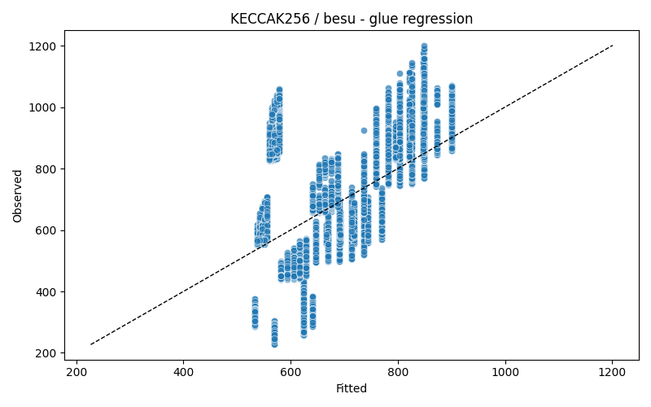

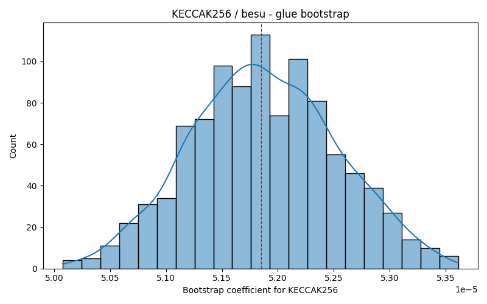

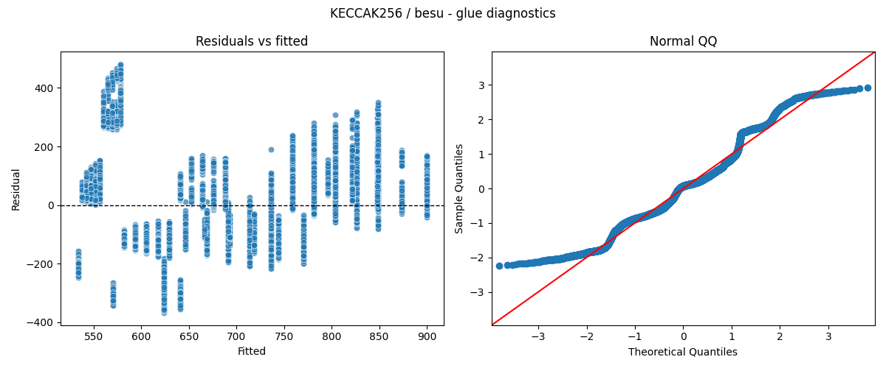

</details>

## erigon

| glue_opcode | nobs | glue_runtime_ms | p_value | rsquared |
| --- | --- | --- | --- | --- |
| `ISZERO` | 44 | 1.283e-06 | 1.00e-03 | 0.2121 |
| `JUMPDEST` | 44 | 7.637e-07 | 1.00e-03 | 0.9204 |
| `SWAP` | 704 | 1.303e-06 | 1.00e-03 | 0.519 |
| `CALLDATASIZE` | 2728 | 7.964e-07 | 1.00e-03 | 0.9494 |
| `DUP` | 2728 | 1.039e-06 | 1.00e-03 | 0.9494 |
| `GAS` | 2728 | 8.094e-07 | 1.00e-03 | 0.9494 |
| `MLOAD` | 2728 | 3.468e-06 | 1.00e-03 | 0.9494 |
| `PUSH` | 2728 | 2.625e-06 | 1.00e-03 | 0.9494 |
| `PUSH0` | 2728 | 8.668e-07 | 1.00e-03 | 0.9494 |
| `STATICCALL` | 2728 | 0.0005005 | 1.00e-03 | 0.9494 |
| `ADD` | 44 | 2.903e-06 | 1.00e-03 | 0.9228 |
| `AND` | 44 | 2.922e-06 | 1.00e-03 | 0.9207 |
| `CALLDATACOPY` | 1056 | 7.269e-06 | 1.00e-03 | 0.8704 |
| `CALLDATALOAD` | 176 | 5.645e-05 | 1.00e-03 | 0.145 |
| `DIV` | 44 | 9.881e-06 | 1.00e-03 | 0.8985 |
| `EXP` | 44 | 0.0003492 | 1.00e-03 | 0.8856 |
| `GT` | 44 | 3.103e-06 | 1.00e-03 | 0.9137 |
| `JUMPI` | 44 | 3.504e-06 | 1.00e-03 | 0.8707 |
| `LT` | 44 | 3.05e-06 | 1.00e-03 | 0.941 |
| `MSTORE` | 220 | 6.021e-06 | 1.00e-03 | 0.6865 |
| `MSTORE8` | 220 | 5.112e-06 | 1.00e-03 | 0.6255 |
| `MUL` | 44 | 3.767e-06 | 1.00e-03 | 0.8925 |
| `PC` | 44 | 1.38e-06 | 1.00e-03 | 0.9289 |
| `RETURNDATASIZE` | 176 | 1.809e-06 | 1.00e-03 | 0.9228 |
| `SELFBALANCE` | 36 | 1.421e-06 | 1.00e-03 | 0.875 |
| `SUB` | 44 | 2.885e-06 | 1.00e-03 | 0.9326 |
| `JUMP` | 44 | 6.951e-06 | 1.00e-03 | 0.919 |
| `KECCAK256` | 704 | 1.877e-05 | 1.00e-03 | 0.06946 |

### Cycle glue — joint fit · erigon

<details><summary>Joint NNLS regression summary</summary>

```
==============================================================================
                           NNLS Regression Results                            
==============================================================================
Dep. Variable:          test_runtime_ms              R-squared:          0.949
Model:                  NNLS                    Adj. R-squared:          0.949
No. Observations:       2728                              RMSE:          40.07
Df Residuals:           2720                               MAE:          19.81
Df Model:               7      
==============================================================================
                      coef     std err     P-value      [0.025      0.975]
------------------------------------------------------------------------------
         const     29.1683      2.5416       0.001     23.9746     33.9865
  CALLDATASIZE      0.0000      0.0000       0.001      0.0000      0.0000
           DUP      0.0000      0.0000       0.001      0.0000      0.0000
           GAS      0.0000      0.0000       0.001      0.0000      0.0000
         MLOAD      0.0000      0.0000       0.001      0.0000      0.0000
          PUSH      0.0000      0.0000       0.001      0.0000      0.0000
         PUSH0      0.0000      0.0000       0.001      0.0000      0.0000
    STATICCALL      0.0005      0.0000       0.001      0.0005      0.0005
==============================================================================
Notes: Non-negative least squares with bootstrap inference (1000 iterations)
==============================================================================
```

</details>

<details><summary><code>CALLDATASIZE</code> · nobs=2728 · runtime_ms=7.964e-07 · p=1.00e-03 · R²=0.9494</summary>

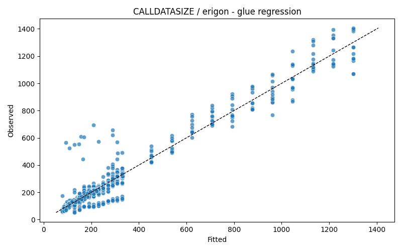

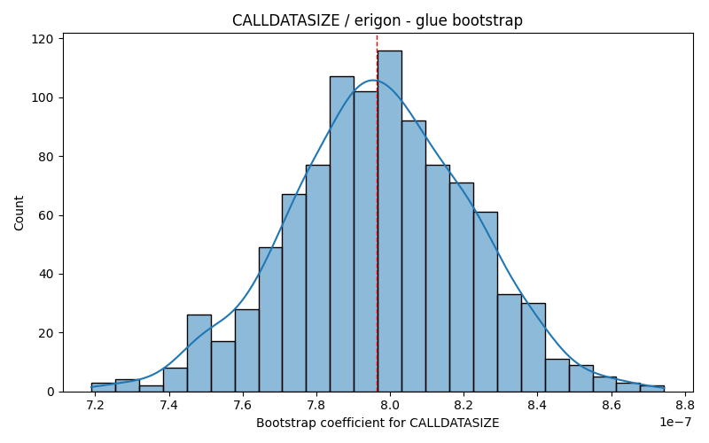

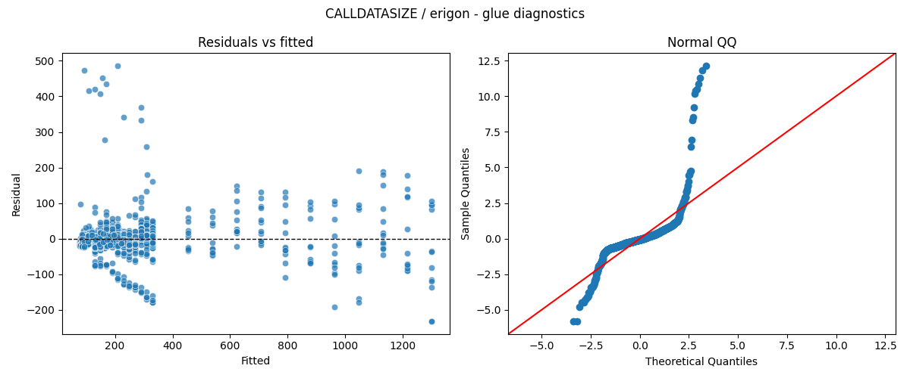

</details>

<details><summary><code>DUP</code> · nobs=2728 · runtime_ms=1.039e-06 · p=1.00e-03 · R²=0.9494</summary>

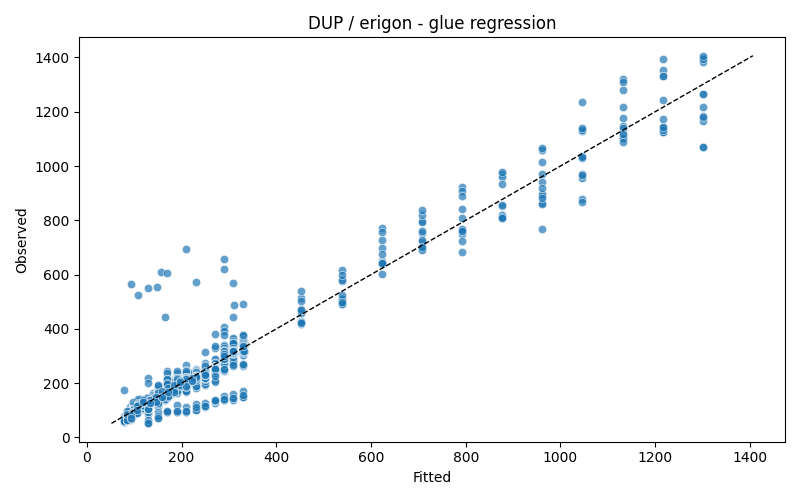

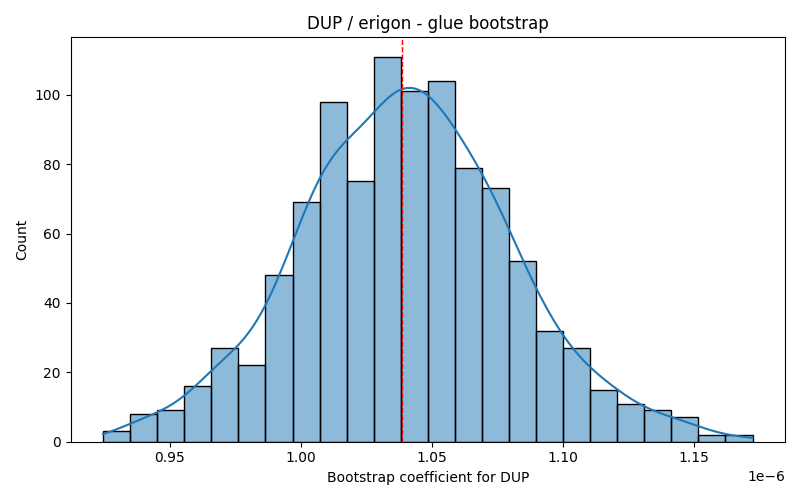

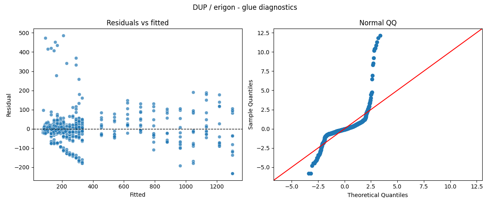

</details>

<details><summary><code>GAS</code> · nobs=2728 · runtime_ms=8.094e-07 · p=1.00e-03 · R²=0.9494</summary>


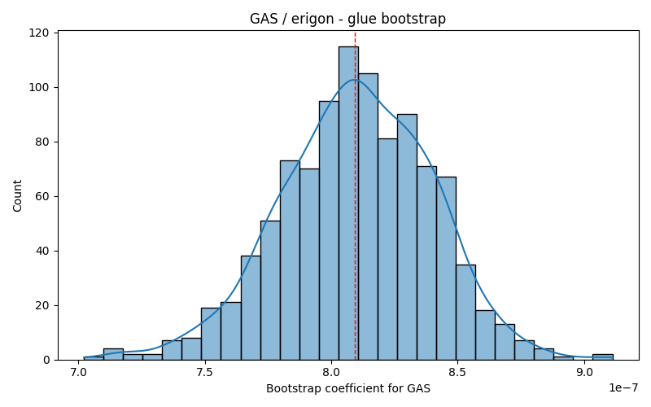


</details>

<details><summary><code>MLOAD</code> · nobs=2728 · runtime_ms=3.468e-06 · p=1.00e-03 · R²=0.9494</summary>


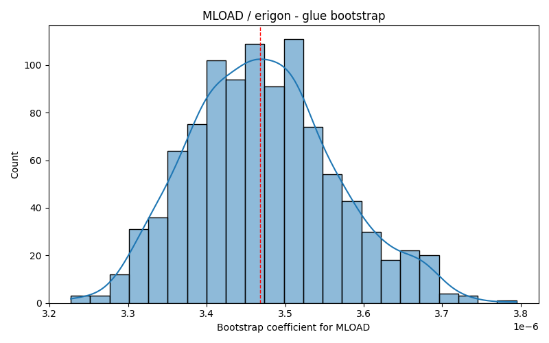

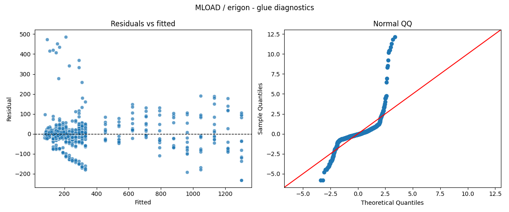

</details>

<details><summary><code>PUSH</code> · nobs=2728 · runtime_ms=2.625e-06 · p=1.00e-03 · R²=0.9494</summary>


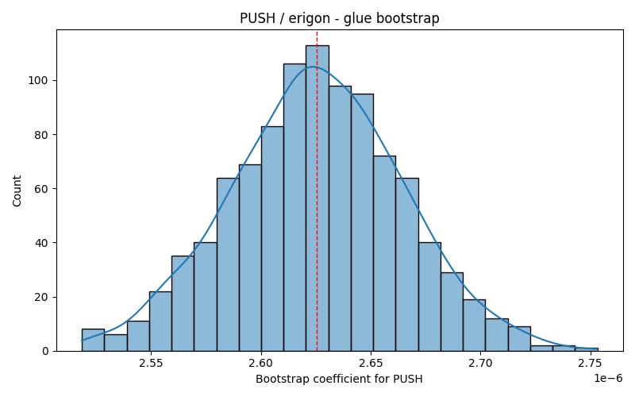


</details>

<details><summary><code>PUSH0</code> · nobs=2728 · runtime_ms=8.668e-07 · p=1.00e-03 · R²=0.9494</summary>


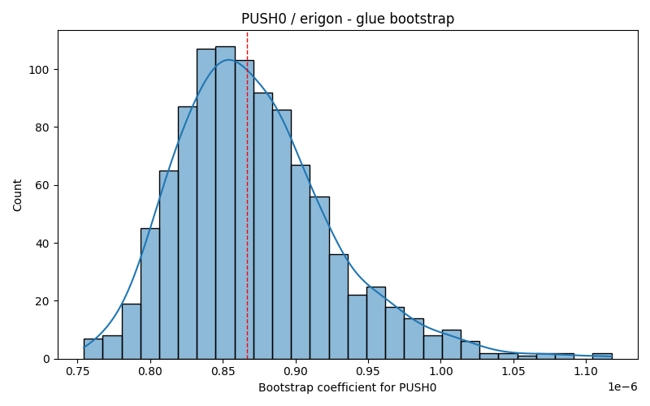


</details>

<details><summary><code>STATICCALL</code> · nobs=2728 · runtime_ms=0.0005005 · p=1.00e-03 · R²=0.9494</summary>


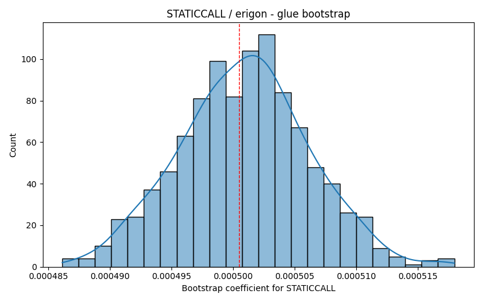

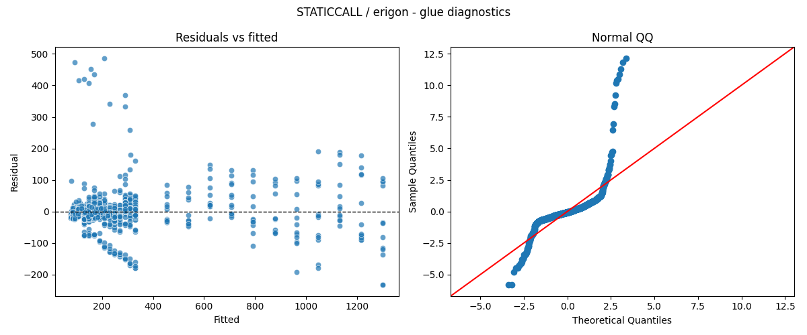

</details>

### Pure glue · erigon

<details><summary><code>ISZERO</code> · nobs=44 · runtime_ms=1.283e-06 · p=1.00e-03 · R²=0.2121</summary>

```
==============================================================================
                           NNLS Regression Results                            
==============================================================================
Dep. Variable:          test_runtime_ms              R-squared:          0.212
Model:                  NNLS                    Adj. R-squared:          0.193
No. Observations:       44                                RMSE:          52.04
Df Residuals:           42                                 MAE:          17.46
Df Model:               1      
==============================================================================
                      coef     std err     P-value      [0.025      0.975]
------------------------------------------------------------------------------
         const      7.9076      7.1197       0.208      0.0000     22.4053
        ISZERO      0.0000      0.0000       0.001      0.0000      0.0000
==============================================================================
Notes: Non-negative least squares with bootstrap inference (1000 iterations)
==============================================================================
```


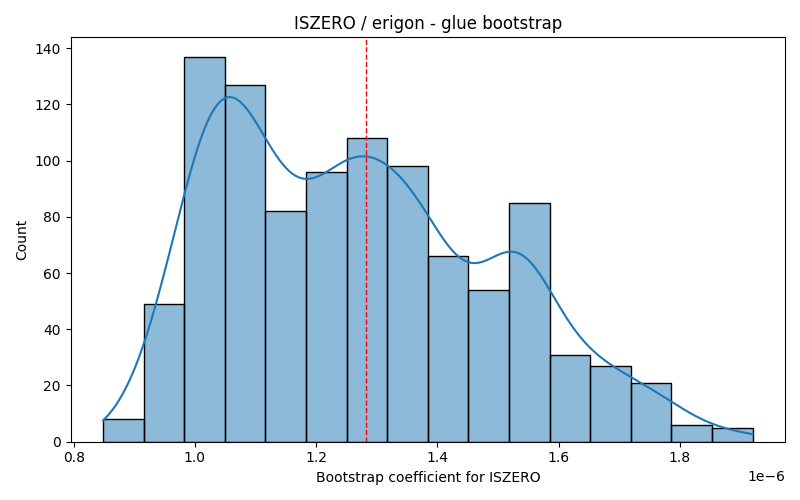

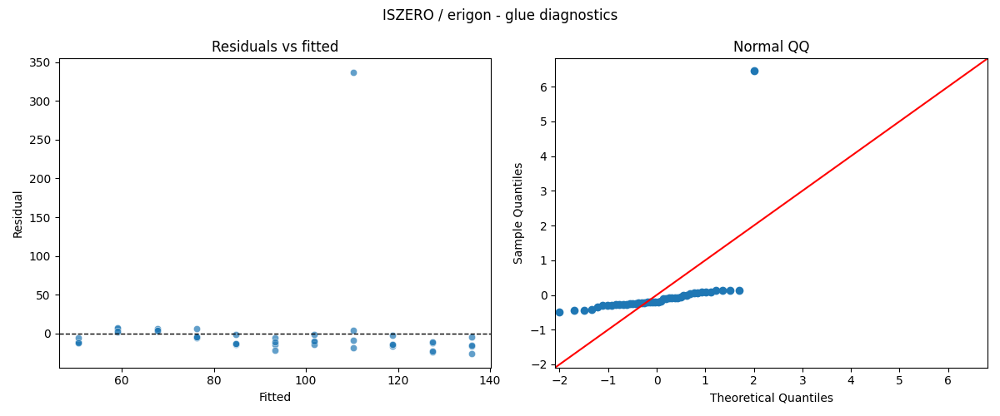

</details>

<details><summary><code>JUMPDEST</code> · nobs=44 · runtime_ms=7.637e-07 · p=1.00e-03 · R²=0.9204</summary>

```
==============================================================================
                           NNLS Regression Results                            
==============================================================================
Dep. Variable:          test_runtime_ms              R-squared:          0.920
Model:                  NNLS                    Adj. R-squared:          0.919
No. Observations:       44                                RMSE:          14.18
Df Residuals:           42                                 MAE:          11.36
Df Model:               1      
==============================================================================
                      coef     std err     P-value      [0.025      0.975]
------------------------------------------------------------------------------
         const     23.2901      6.9877       0.001     10.5176     37.7129
      JUMPDEST      0.0000      0.0000       0.001      0.0000      0.0000
==============================================================================
Notes: Non-negative least squares with bootstrap inference (1000 iterations)
==============================================================================
```

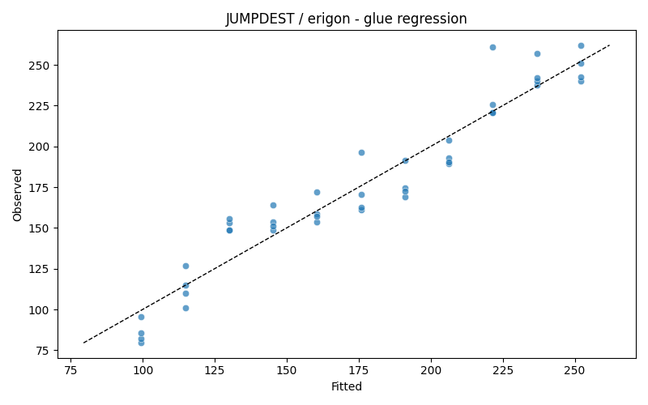

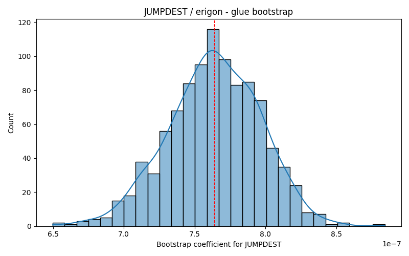


</details>

<details><summary><code>SWAP</code> · nobs=704 · runtime_ms=1.303e-06 · p=1.00e-03 · R²=0.519</summary>

```
==============================================================================
                           NNLS Regression Results                            
==============================================================================
Dep. Variable:          test_runtime_ms              R-squared:          0.519
Model:                  NNLS                    Adj. R-squared:          0.518
No. Observations:       704                               RMSE:          26.41
Df Residuals:           702                                MAE:           7.86
Df Model:               1      
==============================================================================
                      coef     std err     P-value      [0.025      0.975]
------------------------------------------------------------------------------
         const     20.3280      2.7048       0.001     14.5189     24.9267
          SWAP      0.0000      0.0000       0.001      0.0000      0.0000
==============================================================================
Notes: Non-negative least squares with bootstrap inference (1000 iterations)
==============================================================================
```


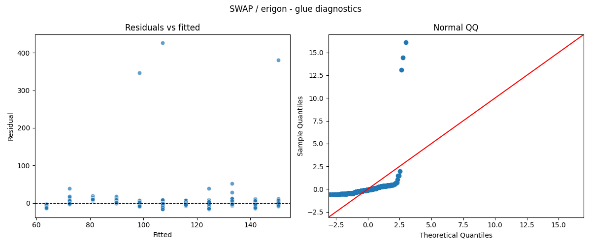

</details>

### Mixed glue (tier A) · erigon

<details><summary><code>ADD</code> · nobs=44 · runtime_ms=2.903e-06 · p=1.00e-03 · R²=0.9228</summary>

```
==============================================================================
                           NNLS Regression Results                            
==============================================================================
Dep. Variable:          test_runtime_ms              R-squared:          0.923
Model:                  NNLS                    Adj. R-squared:          0.921
No. Observations:       44                                RMSE:           8.84
Df Residuals:           42                                 MAE:           7.42
Df Model:               1      
==============================================================================
                      coef     std err     P-value      [0.025      0.975]
------------------------------------------------------------------------------
         const     13.6854      4.3344       0.001      6.0279     22.1092
           ADD      0.0000      0.0000       0.001      0.0000      0.0000
==============================================================================
Notes: Non-negative least squares with bootstrap inference (1000 iterations)
==============================================================================
```

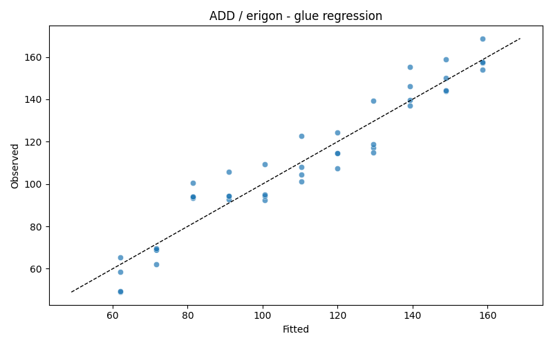


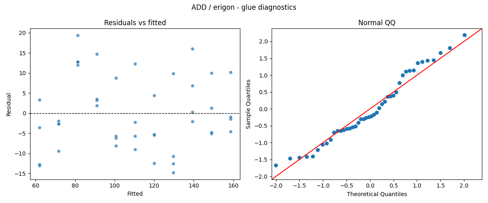

</details>

<details><summary><code>AND</code> · nobs=44 · runtime_ms=2.922e-06 · p=1.00e-03 · R²=0.9207</summary>

```
==============================================================================
                           NNLS Regression Results                            
==============================================================================
Dep. Variable:          test_runtime_ms              R-squared:          0.921
Model:                  NNLS                    Adj. R-squared:          0.919
No. Observations:       44                                RMSE:           9.02
Df Residuals:           42                                 MAE:           7.58
Df Model:               1      
==============================================================================
                      coef     std err     P-value      [0.025      0.975]
------------------------------------------------------------------------------
         const     11.5995      5.0606       0.010      2.0110     21.9248
           AND      0.0000      0.0000       0.001      0.0000      0.0000
==============================================================================
Notes: Non-negative least squares with bootstrap inference (1000 iterations)
==============================================================================
```


</details>

<details><summary><code>CALLDATACOPY</code> · nobs=1056 · runtime_ms=7.269e-06 · p=1.00e-03 · R²=0.8704</summary>

```
==============================================================================
                           NNLS Regression Results                            
==============================================================================
Dep. Variable:          test_runtime_ms              R-squared:          0.870
Model:                  NNLS                    Adj. R-squared:          0.870
No. Observations:       1056                              RMSE:          21.10
Df Residuals:           1054                               MAE:           8.26
Df Model:               1      
==============================================================================
                      coef     std err     P-value      [0.025      0.975]
------------------------------------------------------------------------------
         const     18.3827      1.3985       0.001     16.1956     21.4755
  CALLDATACOPY      0.0000      0.0000       0.001      0.0000      0.0000
==============================================================================
Notes: Non-negative least squares with bootstrap inference (1000 iterations)
==============================================================================
```

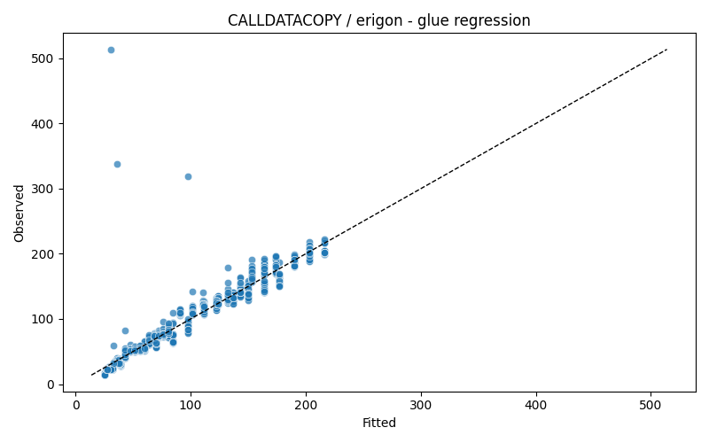


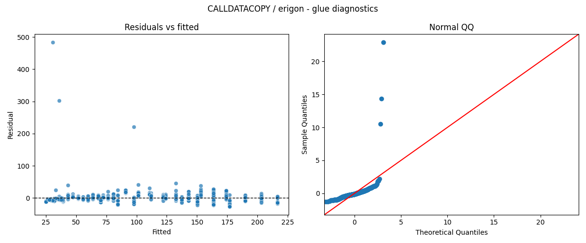

</details>

<details><summary><code>CALLDATALOAD</code> · nobs=176 · runtime_ms=5.645e-05 · p=1.00e-03 · R²=0.145</summary>

```
==============================================================================
                           NNLS Regression Results                            
==============================================================================
Dep. Variable:          test_runtime_ms              R-squared:          0.145
Model:                  NNLS                    Adj. R-squared:          0.140
No. Observations:       176                               RMSE:           0.53
Df Residuals:           174                                MAE:           0.39
Df Model:               1      
==============================================================================
                      coef     std err     P-value      [0.025      0.975]
------------------------------------------------------------------------------
         const      5.5322      0.1252       0.001      5.2831      5.7692
  CALLDATALOAD      0.0001      0.0000       0.001      0.0000      0.0001
==============================================================================
Notes: Non-negative least squares with bootstrap inference (1000 iterations)
==============================================================================
```


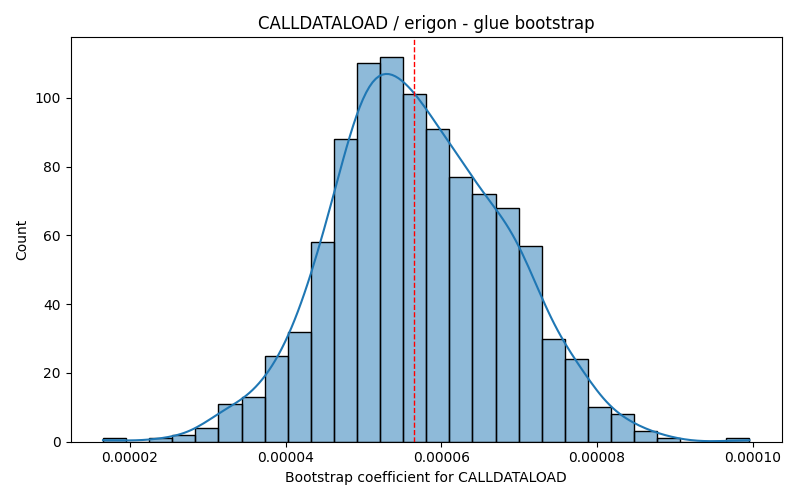


</details>

<details><summary><code>DIV</code> · nobs=44 · runtime_ms=9.881e-06 · p=1.00e-03 · R²=0.8985</summary>

```
==============================================================================
                           NNLS Regression Results                            
==============================================================================
Dep. Variable:          test_runtime_ms              R-squared:          0.899
Model:                  NNLS                    Adj. R-squared:          0.896
No. Observations:       44                                RMSE:          26.21
Df Residuals:           42                                 MAE:          22.70
Df Model:               1      
==============================================================================
                      coef     std err     P-value      [0.025      0.975]
------------------------------------------------------------------------------
         const     20.6923     12.9514       0.042      0.0000     49.9659
           DIV      0.0000      0.0000       0.001      0.0000      0.0000
==============================================================================
Notes: Non-negative least squares with bootstrap inference (1000 iterations)
==============================================================================
```

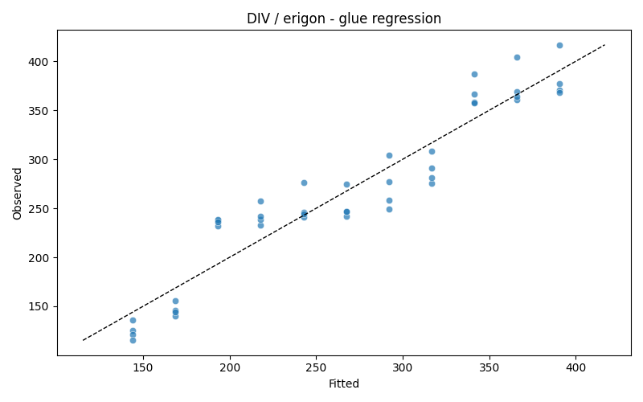


</details>

<details><summary><code>EXP</code> · nobs=44 · runtime_ms=0.0003492 · p=1.00e-03 · R²=0.8856</summary>

```
==============================================================================
                           NNLS Regression Results                            
==============================================================================
Dep. Variable:          test_runtime_ms              R-squared:          0.886
Model:                  NNLS                    Adj. R-squared:          0.883
No. Observations:       44                                RMSE:           4.91
Df Residuals:           42                                 MAE:           3.88
Df Model:               1      
==============================================================================
                      coef     std err     P-value      [0.025      0.975]
------------------------------------------------------------------------------
         const     11.7316      2.9295       0.001      5.8267     17.6718
           EXP      0.0003      0.0000       0.001      0.0003      0.0004
==============================================================================
Notes: Non-negative least squares with bootstrap inference (1000 iterations)
==============================================================================
```

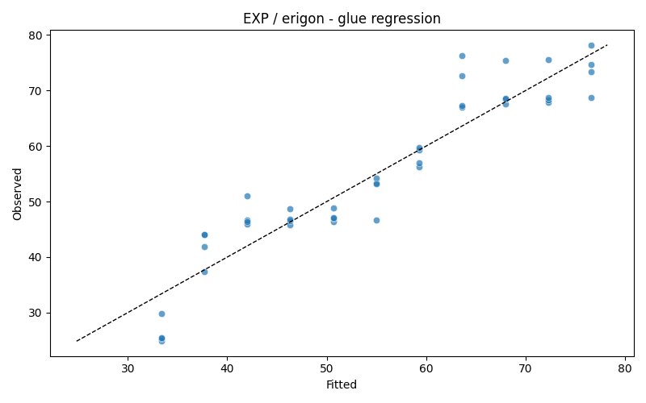

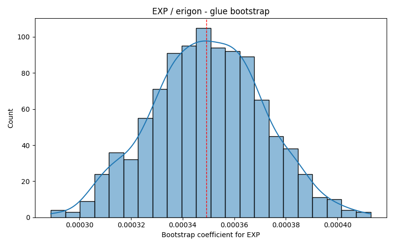


</details>

<details><summary><code>GT</code> · nobs=44 · runtime_ms=3.103e-06 · p=1.00e-03 · R²=0.9137</summary>

```
==============================================================================
                           NNLS Regression Results                            
==============================================================================
Dep. Variable:          test_runtime_ms              R-squared:          0.914
Model:                  NNLS                    Adj. R-squared:          0.912
No. Observations:       44                                RMSE:          10.04
Df Residuals:           42                                 MAE:           8.12
Df Model:               1      
==============================================================================
                      coef     std err     P-value      [0.025      0.975]
------------------------------------------------------------------------------
         const     15.5014      5.4113       0.001      5.6759     27.1221
            GT      0.0000      0.0000       0.001      0.0000      0.0000
==============================================================================
Notes: Non-negative least squares with bootstrap inference (1000 iterations)
==============================================================================
```


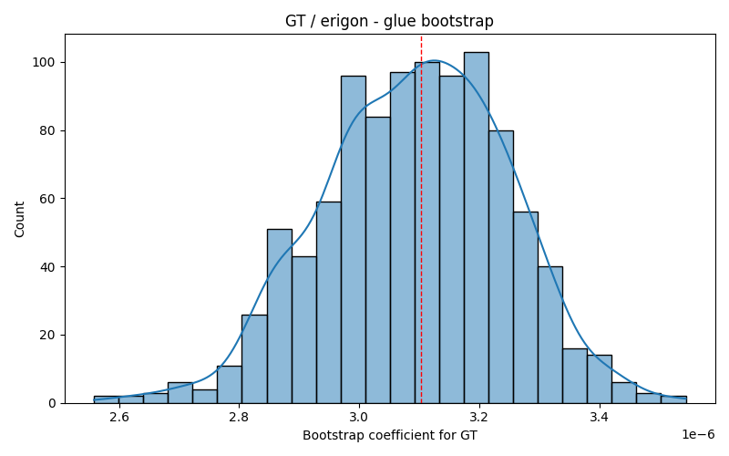

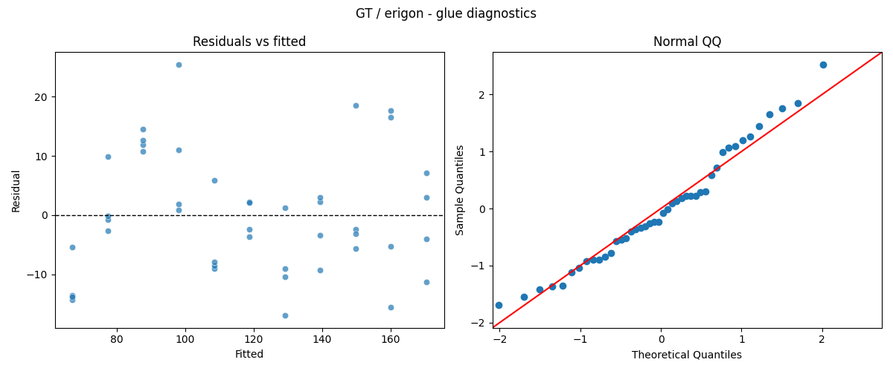

</details>

<details><summary><code>JUMPI</code> · nobs=44 · runtime_ms=3.504e-06 · p=1.00e-03 · R²=0.8707</summary>

```
==============================================================================
                           NNLS Regression Results                            
==============================================================================
Dep. Variable:          test_runtime_ms              R-squared:          0.871
Model:                  NNLS                    Adj. R-squared:          0.868
No. Observations:       44                                RMSE:           6.09
Df Residuals:           42                                 MAE:           5.15
Df Model:               1      
==============================================================================
                      coef     std err     P-value      [0.025      0.975]
------------------------------------------------------------------------------
         const     18.2924      3.8057       0.001     10.7970     25.6049
         JUMPI      0.0000      0.0000       0.001      0.0000      0.0000
==============================================================================
Notes: Non-negative least squares with bootstrap inference (1000 iterations)
==============================================================================
```

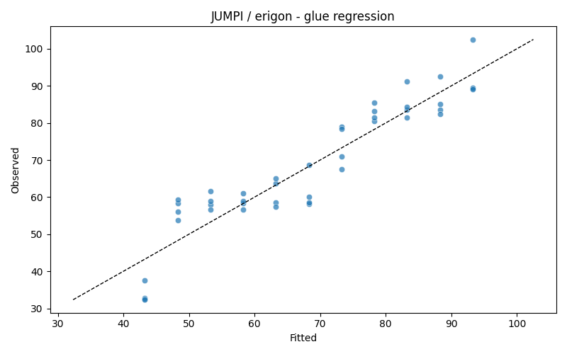

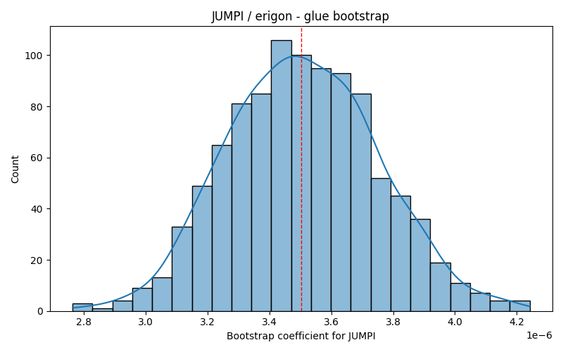

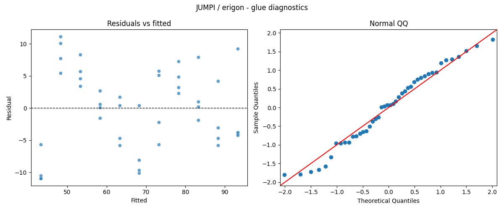

</details>

<details><summary><code>LT</code> · nobs=44 · runtime_ms=3.05e-06 · p=1.00e-03 · R²=0.941</summary>

```
==============================================================================
                           NNLS Regression Results                            
==============================================================================
Dep. Variable:          test_runtime_ms              R-squared:          0.941
Model:                  NNLS                    Adj. R-squared:          0.940
No. Observations:       44                                RMSE:           8.04
Df Residuals:           42                                 MAE:           6.51
Df Model:               1      
==============================================================================
                      coef     std err     P-value      [0.025      0.975]
------------------------------------------------------------------------------
         const     15.4075      4.4807       0.001      7.3460     24.8960
            LT      0.0000      0.0000       0.001      0.0000      0.0000
==============================================================================
Notes: Non-negative least squares with bootstrap inference (1000 iterations)
==============================================================================
```

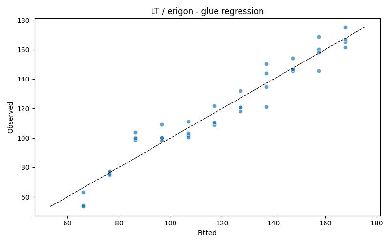

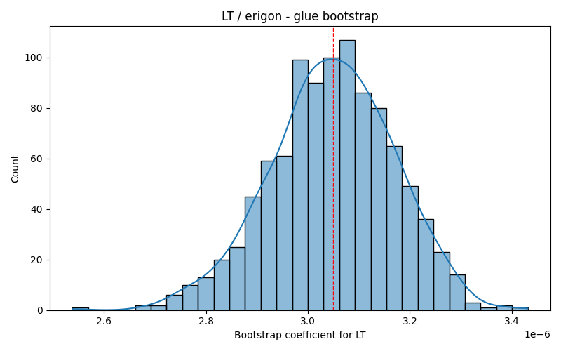

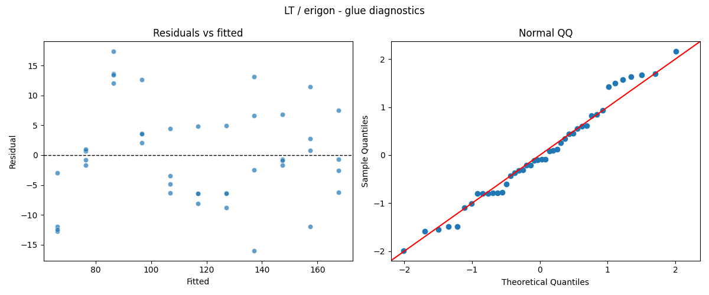

</details>

<details><summary><code>MSTORE</code> · nobs=220 · runtime_ms=6.021e-06 · p=1.00e-03 · R²=0.6865</summary>

```
==============================================================================
                           NNLS Regression Results                            
==============================================================================
Dep. Variable:          test_runtime_ms              R-squared:          0.686
Model:                  NNLS                    Adj. R-squared:          0.685
No. Observations:       220                               RMSE:          28.56
Df Residuals:           218                                MAE:          11.29
Df Model:               1      
==============================================================================
                      coef     std err     P-value      [0.025      0.975]
------------------------------------------------------------------------------
         const     17.2368      5.9379       0.010      3.0545     26.2462
        MSTORE      0.0000      0.0000       0.001      0.0000      0.0000
==============================================================================
Notes: Non-negative least squares with bootstrap inference (1000 iterations)
==============================================================================
```

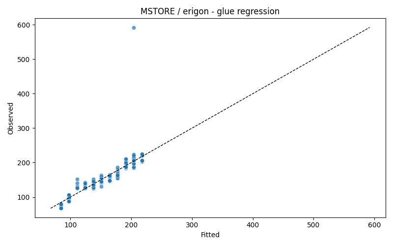


</details>

<details><summary><code>MSTORE8</code> · nobs=220 · runtime_ms=5.112e-06 · p=1.00e-03 · R²=0.6255</summary>

```
==============================================================================
                           NNLS Regression Results                            
==============================================================================
Dep. Variable:          test_runtime_ms              R-squared:          0.626
Model:                  NNLS                    Adj. R-squared:          0.624
No. Observations:       220                               RMSE:          27.76
Df Residuals:           218                                MAE:          10.72
Df Model:               1      
==============================================================================
                      coef     std err     P-value      [0.025      0.975]
------------------------------------------------------------------------------
         const     26.4350      3.3431       0.001     20.3056     33.0331
       MSTORE8      0.0000      0.0000       0.001      0.0000      0.0000
==============================================================================
Notes: Non-negative least squares with bootstrap inference (1000 iterations)
==============================================================================
```


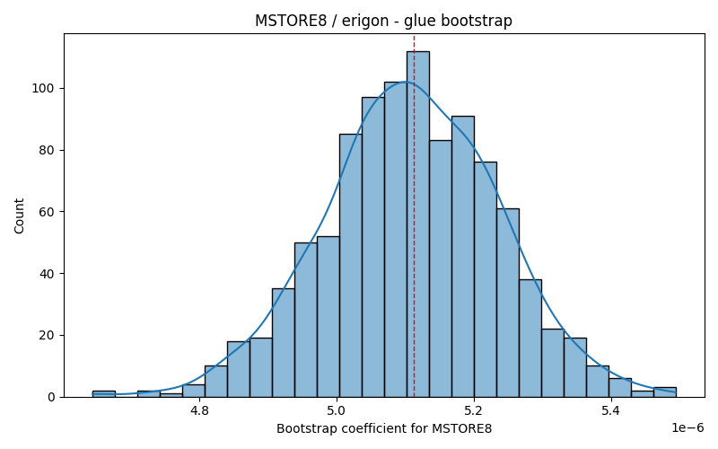

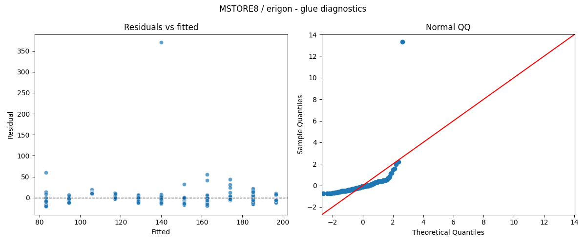

</details>

<details><summary><code>MUL</code> · nobs=44 · runtime_ms=3.767e-06 · p=1.00e-03 · R²=0.8925</summary>

```
==============================================================================
                           NNLS Regression Results                            
==============================================================================
Dep. Variable:          test_runtime_ms              R-squared:          0.892
Model:                  NNLS                    Adj. R-squared:          0.890
No. Observations:       44                                RMSE:          10.32
Df Residuals:           42                                 MAE:           7.81
Df Model:               1      
==============================================================================
                      coef     std err     P-value      [0.025      0.975]
------------------------------------------------------------------------------
         const      8.4627      5.1763       0.048      0.0000     20.0806
           MUL      0.0000      0.0000       0.001      0.0000      0.0000
==============================================================================
Notes: Non-negative least squares with bootstrap inference (1000 iterations)
==============================================================================
```

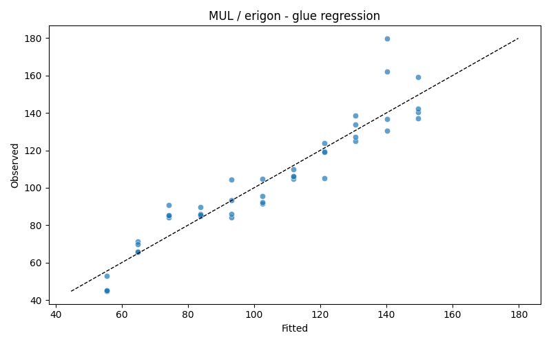


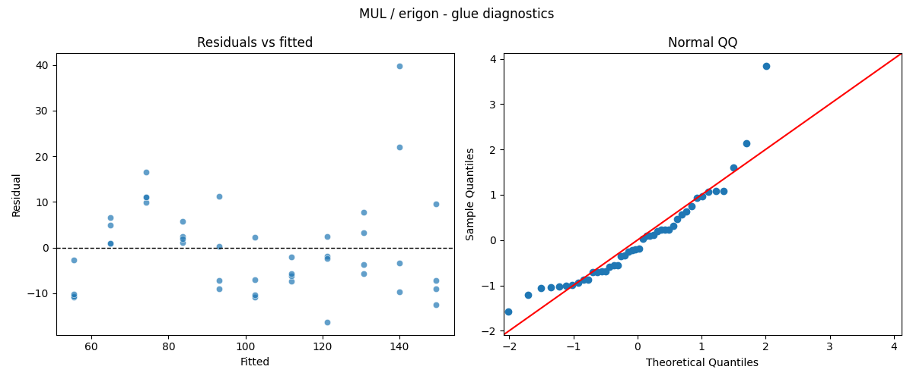

</details>

<details><summary><code>PC</code> · nobs=44 · runtime_ms=1.38e-06 · p=1.00e-03 · R²=0.9289</summary>

```
==============================================================================
                           NNLS Regression Results                            
==============================================================================
Dep. Variable:          test_runtime_ms              R-squared:          0.929
Model:                  NNLS                    Adj. R-squared:          0.927
No. Observations:       44                                RMSE:          11.41
Df Residuals:           42                                 MAE:           9.83
Df Model:               1      
==============================================================================
                      coef     std err     P-value      [0.025      0.975]
------------------------------------------------------------------------------
         const     19.0619      6.5267       0.001      7.5986     33.2337
            PC      0.0000      0.0000       0.001      0.0000      0.0000
==============================================================================
Notes: Non-negative least squares with bootstrap inference (1000 iterations)
==============================================================================
```


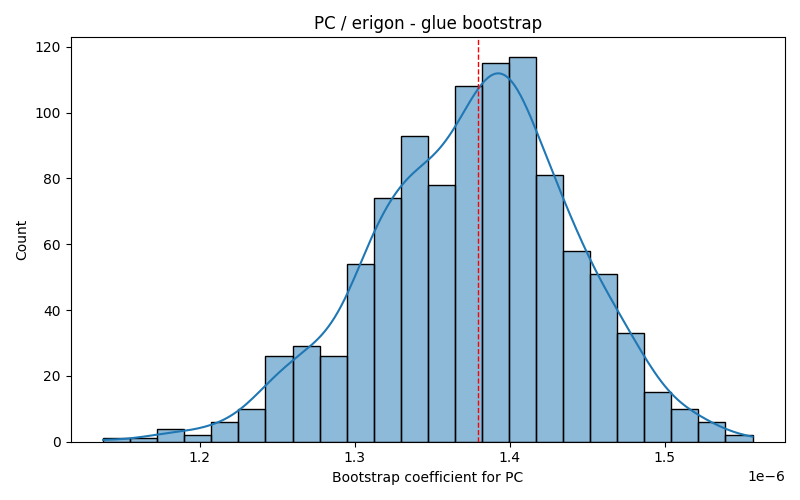


</details>

<details><summary><code>RETURNDATASIZE</code> · nobs=176 · runtime_ms=1.809e-06 · p=1.00e-03 · R²=0.9228</summary>

```
==============================================================================
                           NNLS Regression Results                            
==============================================================================
Dep. Variable:          test_runtime_ms              R-squared:          0.923
Model:                  NNLS                    Adj. R-squared:          0.922
No. Observations:       176                               RMSE:           8.26
Df Residuals:           174                                MAE:           6.48
Df Model:               1      
==============================================================================
                      coef     std err     P-value      [0.025      0.975]
------------------------------------------------------------------------------
         const     16.4983      2.2747       0.001     12.3891     21.3160
RETURNDATASIZE      0.0000      0.0000       0.001      0.0000      0.0000
==============================================================================
Notes: Non-negative least squares with bootstrap inference (1000 iterations)
==============================================================================
```

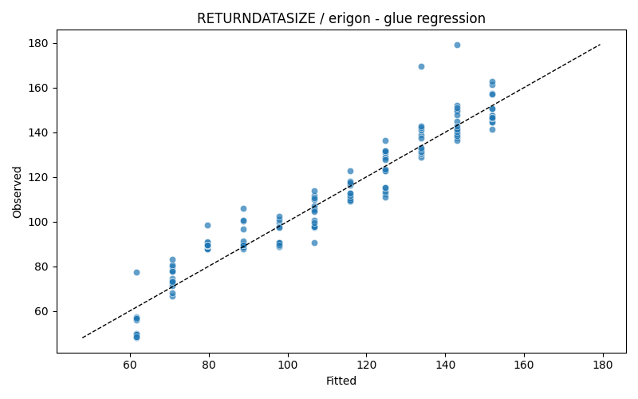

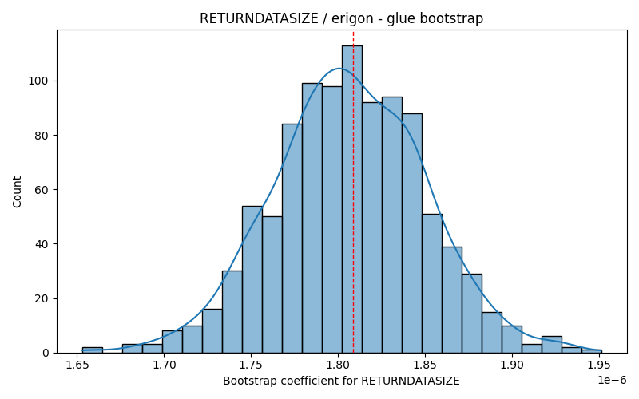

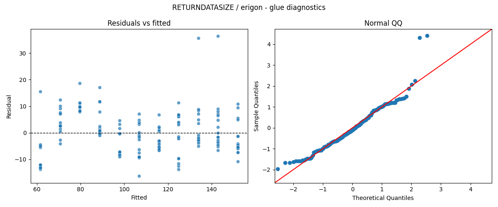

</details>

<details><summary><code>SELFBALANCE</code> · nobs=36 · runtime_ms=1.421e-06 · p=1.00e-03 · R²=0.875</summary>

```
==============================================================================
                           NNLS Regression Results                            
==============================================================================
Dep. Variable:          test_runtime_ms              R-squared:          0.875
Model:                  NNLS                    Adj. R-squared:          0.871
No. Observations:       36                                RMSE:           5.42
Df Residuals:           34                                 MAE:           4.54
Df Model:               1      
==============================================================================
                      coef     std err     P-value      [0.025      0.975]
------------------------------------------------------------------------------
         const     18.3292      4.0484       0.001      9.0982     25.1136
   SELFBALANCE      0.0000      0.0000       0.001      0.0000      0.0000
==============================================================================
Notes: Non-negative least squares with bootstrap inference (1000 iterations)
==============================================================================
```

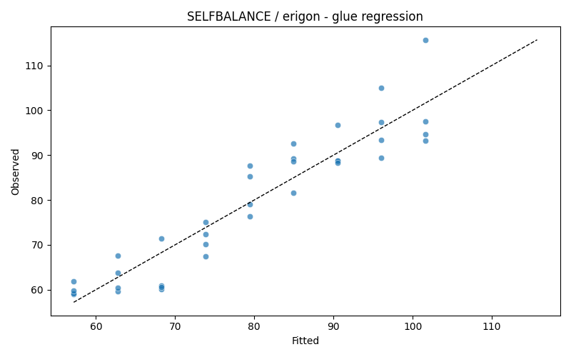


</details>

<details><summary><code>SUB</code> · nobs=44 · runtime_ms=2.885e-06 · p=1.00e-03 · R²=0.9326</summary>

```
==============================================================================
                           NNLS Regression Results                            
==============================================================================
Dep. Variable:          test_runtime_ms              R-squared:          0.933
Model:                  NNLS                    Adj. R-squared:          0.931
No. Observations:       44                                RMSE:           8.16
Df Residuals:           42                                 MAE:           6.57
Df Model:               1      
==============================================================================
                      coef     std err     P-value      [0.025      0.975]
------------------------------------------------------------------------------
         const     15.2403      4.4017       0.001      6.7179     23.6731
           SUB      0.0000      0.0000       0.001      0.0000      0.0000
==============================================================================
Notes: Non-negative least squares with bootstrap inference (1000 iterations)
==============================================================================
```

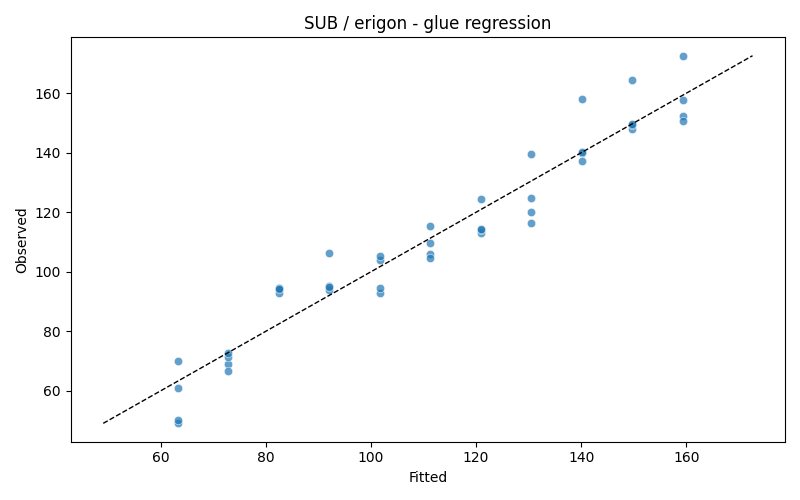


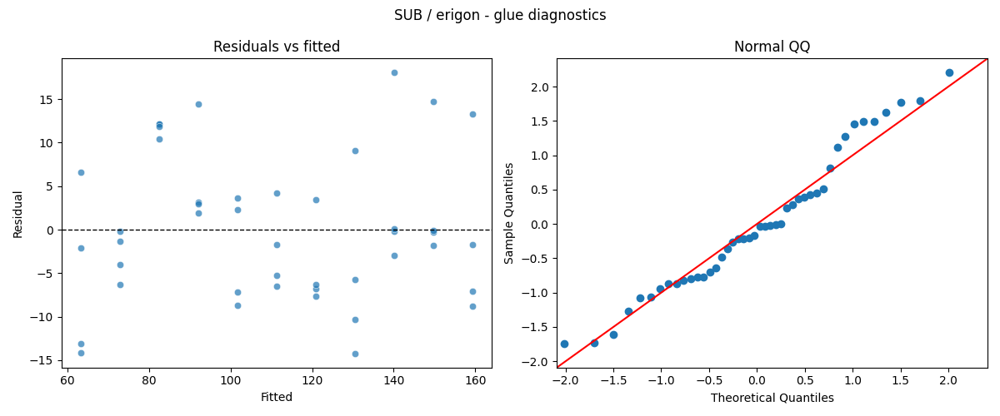

</details>

### Mixed glue (tier B) · erigon

<details><summary><code>JUMP</code> · nobs=44 · runtime_ms=6.951e-06 · p=1.00e-03 · R²=0.919</summary>

```
==============================================================================
                           NNLS Regression Results                            
==============================================================================
Dep. Variable:          test_runtime_ms              R-squared:          0.919
Model:                  NNLS                    Adj. R-squared:          0.917
No. Observations:       44                                RMSE:           7.67
Df Residuals:           42                                 MAE:           6.48
Df Model:               1      
==============================================================================
                      coef     std err     P-value      [0.025      0.975]
------------------------------------------------------------------------------
         const     17.3736      4.4655       0.001      9.4653     26.1253
          JUMP      0.0000      0.0000       0.001      0.0000      0.0000
==============================================================================
Notes: Non-negative least squares with bootstrap inference (1000 iterations)
==============================================================================
```


</details>

<details><summary><code>KECCAK256</code> · nobs=704 · runtime_ms=1.877e-05 · p=1.00e-03 · R²=0.06946</summary>

```
==============================================================================
                           NNLS Regression Results                            
==============================================================================
Dep. Variable:          test_runtime_ms              R-squared:          0.069
Model:                  NNLS                    Adj. R-squared:          0.068
No. Observations:       704                               RMSE:         136.53
Df Residuals:           702                                MAE:         109.66
Df Model:               1      
==============================================================================
                      coef     std err     P-value      [0.025      0.975]
------------------------------------------------------------------------------
         const    368.5237     11.3367       0.001    346.6106    390.9691
     KECCAK256      0.0000      0.0000       0.001      0.0000      0.0000
==============================================================================
Notes: Non-negative least squares with bootstrap inference (1000 iterations)
==============================================================================
```


</details>

## geth

| glue_opcode | nobs | glue_runtime_ms | p_value | rsquared |
| --- | --- | --- | --- | --- |
| `ISZERO` | 506 | 8.375e-06 | 1.00e-03 | 0.9794 |
| `JUMPDEST` | 506 | 7.135e-06 | 1.00e-03 | 0.977 |
| `SWAP` | 8096 | 9.463e-06 | 1.00e-03 | 0.9757 |
| `CALLDATASIZE` | 29854 | 9.177e-06 | 1.00e-03 | 0.9464 |
| `DUP` | 29854 | 1.009e-05 | 1.00e-03 | 0.9464 |
| `GAS` | 29854 | 9.245e-06 | 1.00e-03 | 0.9464 |
| `MLOAD` | 29854 | 2.994e-05 | 1.00e-03 | 0.9464 |
| `PUSH` | 29854 | 1.349e-05 | 1.00e-03 | 0.9464 |
| `PUSH0` | 29854 | 9.086e-06 | 1.00e-03 | 0.9464 |
| `STATICCALL` | 29854 | 0 | 1.00e+00 | 0.9464 |
| `ADD` | 506 | 2.676e-05 | 1.00e-03 | 0.7886 |
| `AND` | 506 | 2.681e-05 | 1.00e-03 | 0.7444 |
| `CALLDATACOPY` | 12144 | 6.461e-05 | 1.00e-03 | 0.992 |
| `CALLDATALOAD` | 2024 | 4.973e-05 | 1.00e-03 | 0.02299 |
| `DIV` | 506 | 5.864e-05 | 1.00e-03 | 0.9943 |
| `EXP` | 506 | 0.002071 | 1.00e-03 | 0.9944 |
| `GT` | 506 | 2.1e-05 | 1.00e-03 | 0.9549 |
| `JUMPI` | 506 | 3.292e-05 | 1.00e-03 | 0.9665 |
| `LT` | 506 | 2.55e-05 | 1.00e-03 | 0.7513 |
| `MSTORE` | 2530 | 4.833e-05 | 1.00e-03 | 0.9828 |
| `MSTORE8` | 2530 | 4.381e-05 | 1.00e-03 | 0.9723 |
| `MUL` | 506 | 2.697e-05 | 1.00e-03 | 0.9219 |
| `PC` | 506 | 9.422e-06 | 1.00e-03 | 0.9891 |
| `RETURNDATASIZE` | 2024 | 1.597e-05 | 1.00e-03 | 0.938 |
| `SELFBALANCE` | 414 | 5.086e-05 | 1.00e-03 | 0.9873 |
| `SUB` | 506 | 2.687e-05 | 1.00e-03 | 0.7666 |
| `JUMP` | 506 | 5.741e-05 | 1.00e-03 | 0.9635 |
| `KECCAK256` | 8096 | 0.000205 | 1.00e-03 | 0.3013 |

### Cycle glue — joint fit · geth

<details><summary>Joint NNLS regression summary</summary>

```
==============================================================================
                           NNLS Regression Results                            
==============================================================================
Dep. Variable:          test_runtime_ms              R-squared:          0.946
Model:                  NNLS                    Adj. R-squared:          0.946
No. Observations:       29854                             RMSE:          67.57
Df Residuals:           29846                              MAE:          35.01
Df Model:               7      
==============================================================================
                      coef     std err     P-value      [0.025      0.975]
------------------------------------------------------------------------------
         const      5.9741      1.1857       0.001      3.5678      8.1687
  CALLDATASIZE      0.0000      0.0000       0.001      0.0000      0.0000
           DUP      0.0000      0.0000       0.001      0.0000      0.0000
           GAS      0.0000      0.0000       0.001      0.0000      0.0000
         MLOAD      0.0000      0.0000       0.001      0.0000      0.0000
          PUSH      0.0000      0.0000       0.001      0.0000      0.0000
         PUSH0      0.0000      0.0000       0.001      0.0000      0.0000
    STATICCALL      0.0000      0.0000       1.000      0.0000      0.0000
==============================================================================
Notes: Non-negative least squares with bootstrap inference (1000 iterations)
==============================================================================
```

</details>

<details><summary><code>CALLDATASIZE</code> · nobs=29854 · runtime_ms=9.177e-06 · p=1.00e-03 · R²=0.9464</summary>


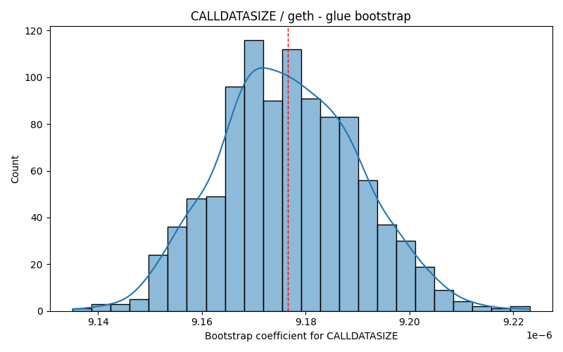

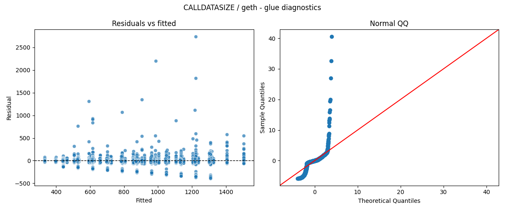

</details>

<details><summary><code>DUP</code> · nobs=29854 · runtime_ms=1.009e-05 · p=1.00e-03 · R²=0.9464</summary>


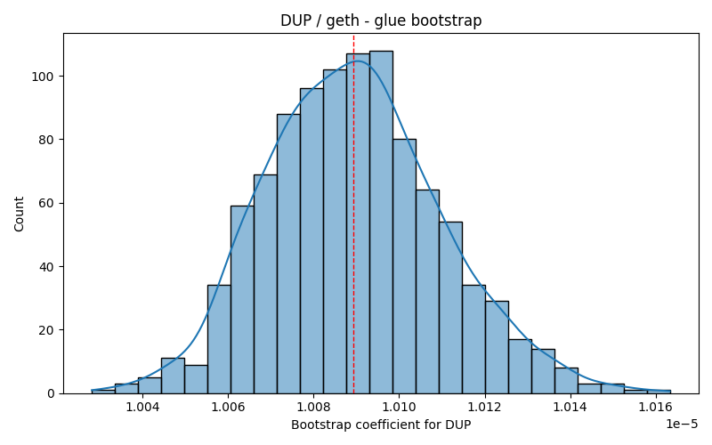


</details>

<details><summary><code>GAS</code> · nobs=29854 · runtime_ms=9.245e-06 · p=1.00e-03 · R²=0.9464</summary>

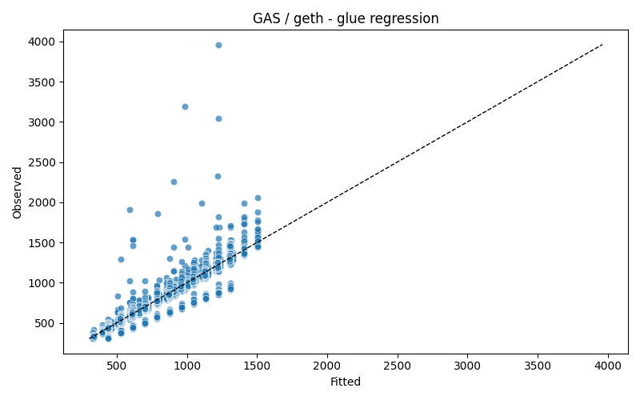

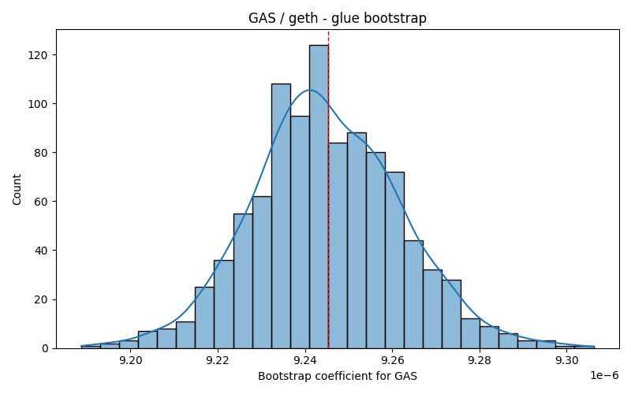


</details>

<details><summary><code>MLOAD</code> · nobs=29854 · runtime_ms=2.994e-05 · p=1.00e-03 · R²=0.9464</summary>


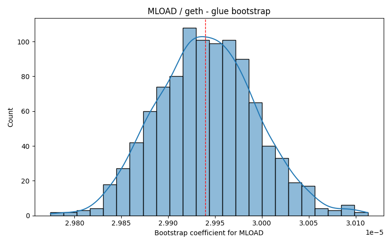


</details>

<details><summary><code>PUSH</code> · nobs=29854 · runtime_ms=1.349e-05 · p=1.00e-03 · R²=0.9464</summary>


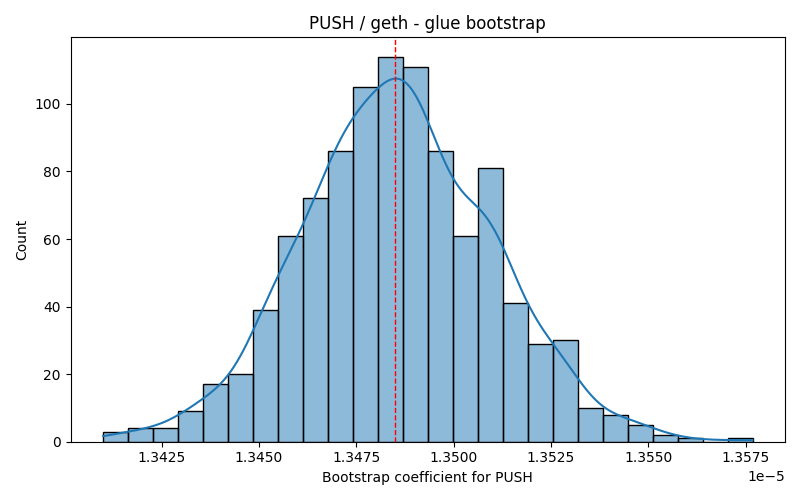


</details>

<details><summary><code>PUSH0</code> · nobs=29854 · runtime_ms=9.086e-06 · p=1.00e-03 · R²=0.9464</summary>

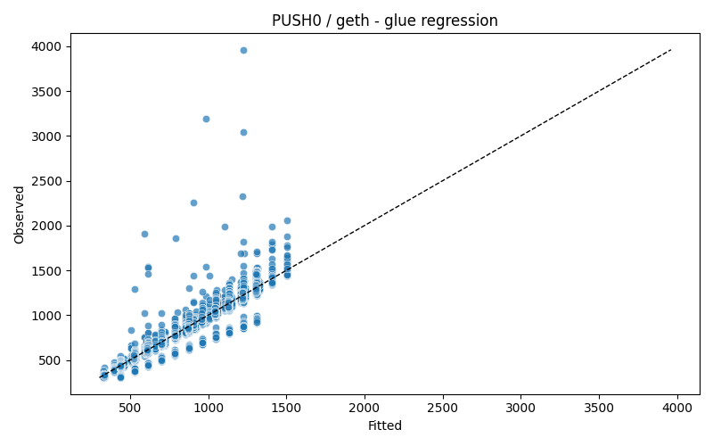

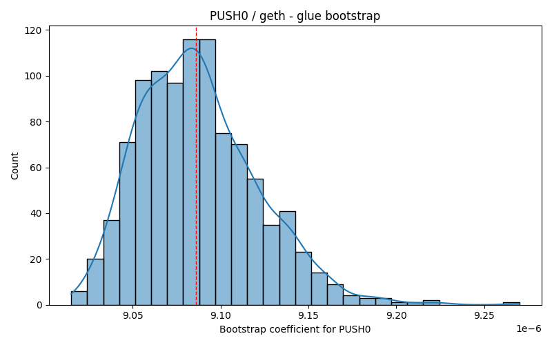


</details>

<details><summary><code>STATICCALL</code> · nobs=29854 · runtime_ms=0 · p=1.00e+00 · R²=0.9464</summary>


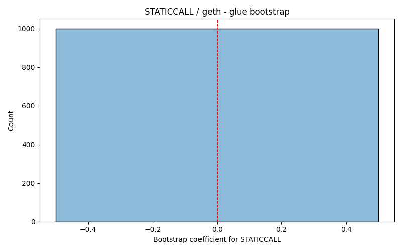

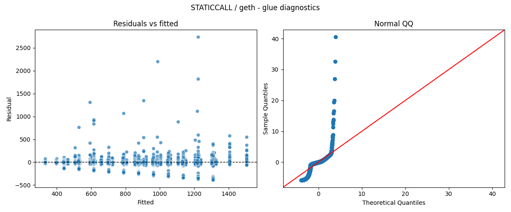

</details>

### Pure glue · geth

<details><summary><code>ISZERO</code> · nobs=506 · runtime_ms=8.375e-06 · p=1.00e-03 · R²=0.9794</summary>

```
==============================================================================
                           NNLS Regression Results                            
==============================================================================
Dep. Variable:          test_runtime_ms              R-squared:          0.979
Model:                  NNLS                    Adj. R-squared:          0.979
No. Observations:       506                               RMSE:          25.56
Df Residuals:           504                                MAE:          14.86
Df Model:               1      
==============================================================================
                      coef     std err     P-value      [0.025      0.975]
------------------------------------------------------------------------------
         const      1.5573      2.2376       0.310      0.0000      7.1703
        ISZERO      0.0000      0.0000       0.001      0.0000      0.0000
==============================================================================
Notes: Non-negative least squares with bootstrap inference (1000 iterations)
==============================================================================
```

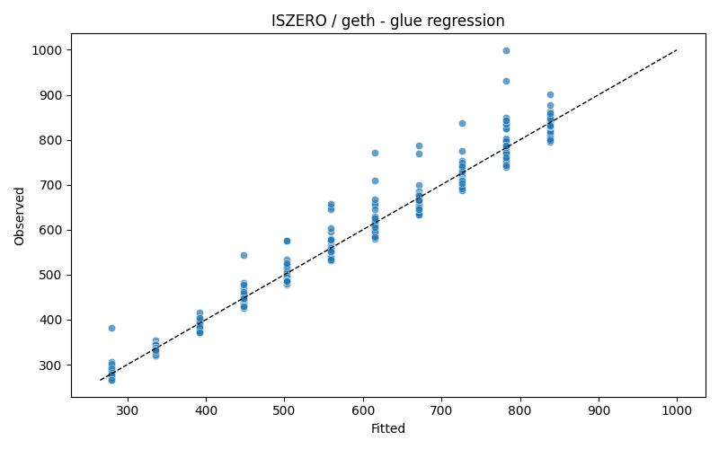

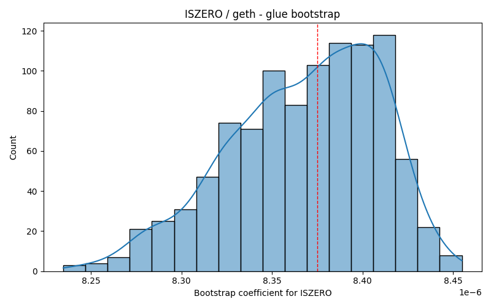

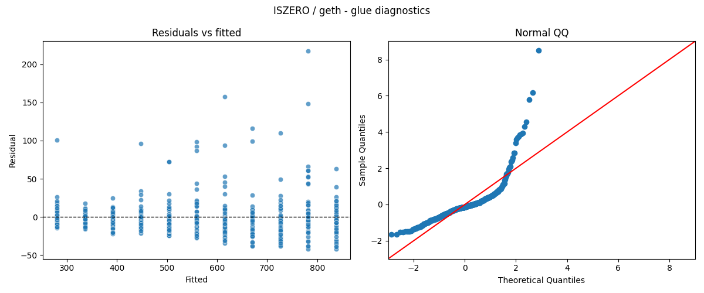

</details>

<details><summary><code>JUMPDEST</code> · nobs=506 · runtime_ms=7.135e-06 · p=1.00e-03 · R²=0.977</summary>

```
==============================================================================
                           NNLS Regression Results                            
==============================================================================
Dep. Variable:          test_runtime_ms              R-squared:          0.977
Model:                  NNLS                    Adj. R-squared:          0.977
No. Observations:       506                               RMSE:          69.85
Df Residuals:           504                                MAE:          39.86
Df Model:               1      
==============================================================================
                      coef     std err     P-value      [0.025      0.975]
------------------------------------------------------------------------------
         const      0.0000      0.6838       1.000      0.0000      1.6935
      JUMPDEST      0.0000      0.0000       0.001      0.0000      0.0000
==============================================================================
Notes: Non-negative least squares with bootstrap inference (1000 iterations)
==============================================================================
```

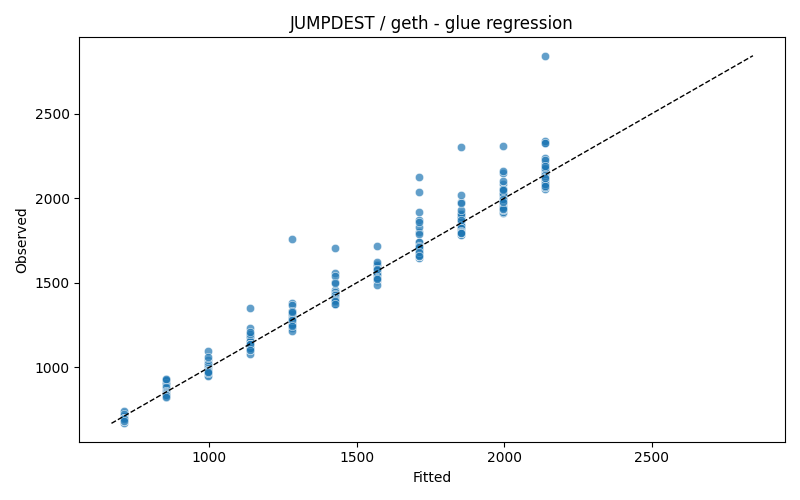

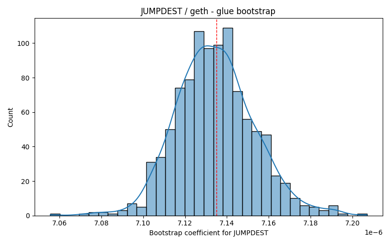

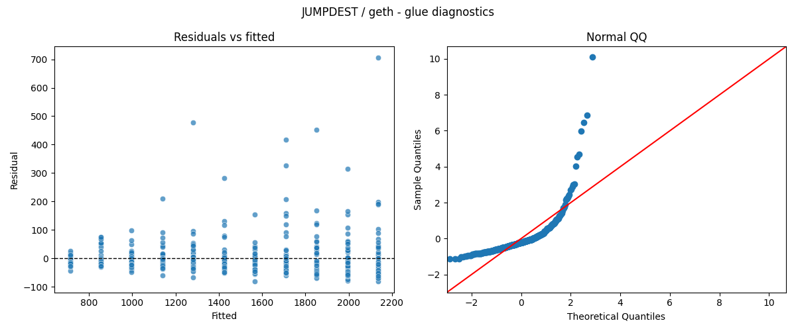

</details>

<details><summary><code>SWAP</code> · nobs=8096 · runtime_ms=9.463e-06 · p=1.00e-03 · R²=0.9757</summary>

```
==============================================================================
                           NNLS Regression Results                            
==============================================================================
Dep. Variable:          test_runtime_ms              R-squared:          0.976
Model:                  NNLS                    Adj. R-squared:          0.976
No. Observations:       8096                              RMSE:          31.47
Df Residuals:           8094                               MAE:          15.03
Df Model:               1      
==============================================================================
                      coef     std err     P-value      [0.025      0.975]
------------------------------------------------------------------------------
         const      7.6820      1.0134       0.001      5.7744      9.5445
          SWAP      0.0000      0.0000       0.001      0.0000      0.0000
==============================================================================
Notes: Non-negative least squares with bootstrap inference (1000 iterations)
==============================================================================
```

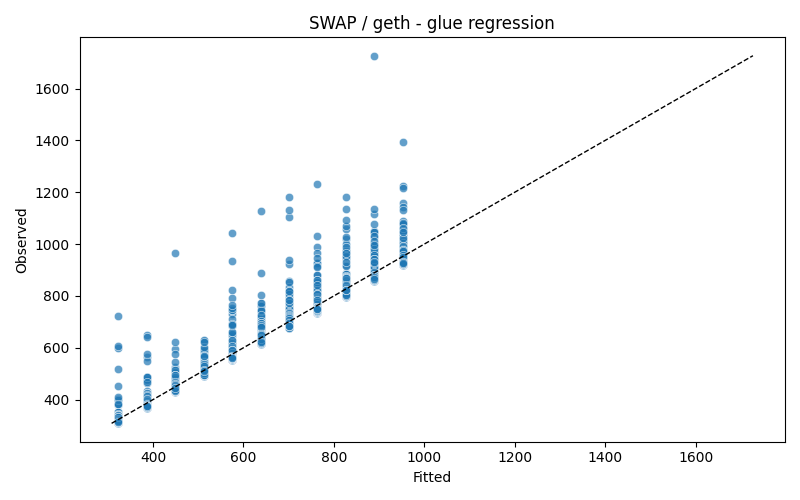

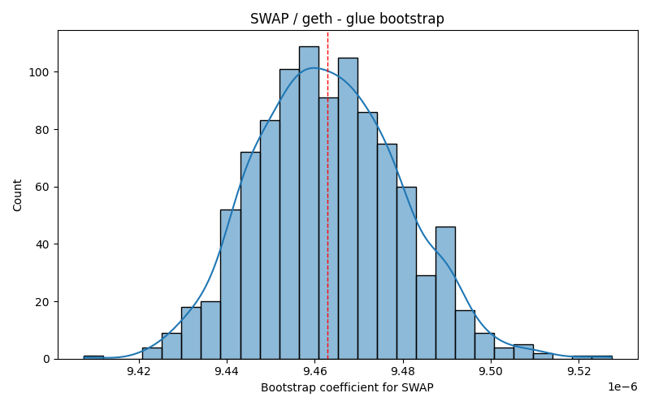

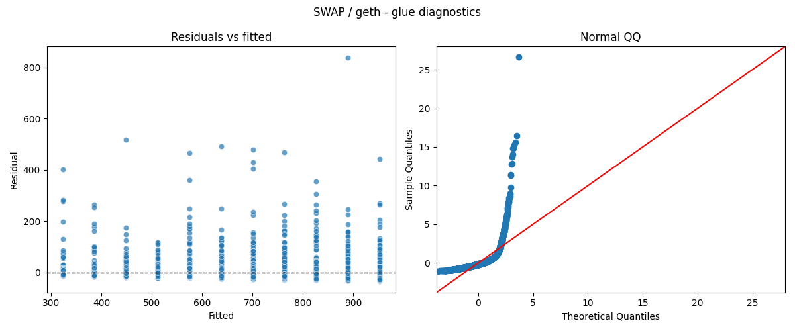

</details>

### Mixed glue (tier A) · geth

<details><summary><code>ADD</code> · nobs=506 · runtime_ms=2.676e-05 · p=1.00e-03 · R²=0.7886</summary>

```
==============================================================================
                           NNLS Regression Results                            
==============================================================================
Dep. Variable:          test_runtime_ms              R-squared:          0.789
Model:                  NNLS                    Adj. R-squared:          0.788
No. Observations:       506                               RMSE:         145.85
Df Residuals:           504                                MAE:         120.12
Df Model:               1      
==============================================================================
                      coef     std err     P-value      [0.025      0.975]
------------------------------------------------------------------------------
         const      1.6155     11.5418       0.463      0.0000     36.7993
           ADD      0.0000      0.0000       0.001      0.0000      0.0000
==============================================================================
Notes: Non-negative least squares with bootstrap inference (1000 iterations)
==============================================================================
```

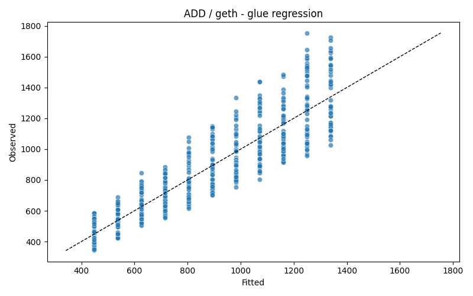

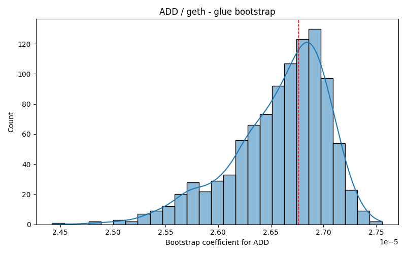

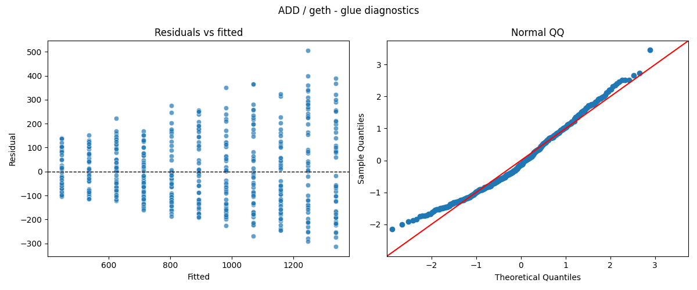

</details>

<details><summary><code>AND</code> · nobs=506 · runtime_ms=2.681e-05 · p=1.00e-03 · R²=0.7444</summary>

```
==============================================================================
                           NNLS Regression Results                            
==============================================================================
Dep. Variable:          test_runtime_ms              R-squared:          0.744
Model:                  NNLS                    Adj. R-squared:          0.744
No. Observations:       506                               RMSE:         167.82
Df Residuals:           504                                MAE:         124.32
Df Model:               1      
==============================================================================
                      coef     std err     P-value      [0.025      0.975]
------------------------------------------------------------------------------
         const      0.0000      6.8433       1.000      0.0000     25.5127
           AND      0.0000      0.0000       0.001      0.0000      0.0000
==============================================================================
Notes: Non-negative least squares with bootstrap inference (1000 iterations)
==============================================================================
```

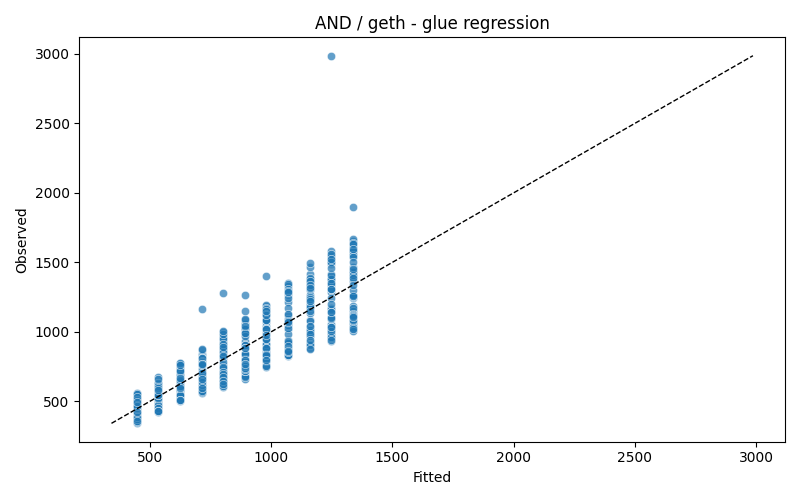

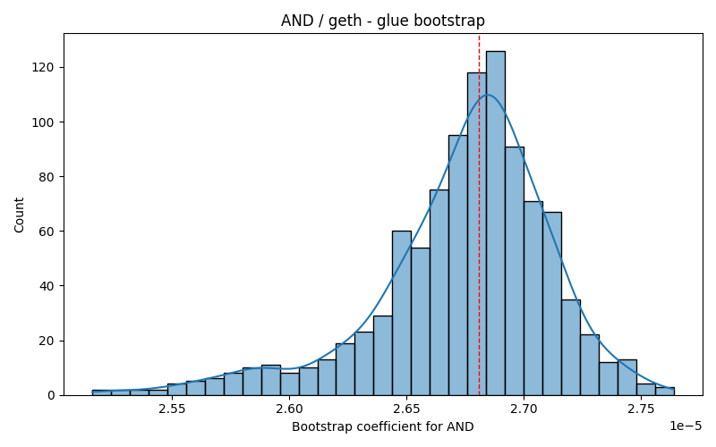

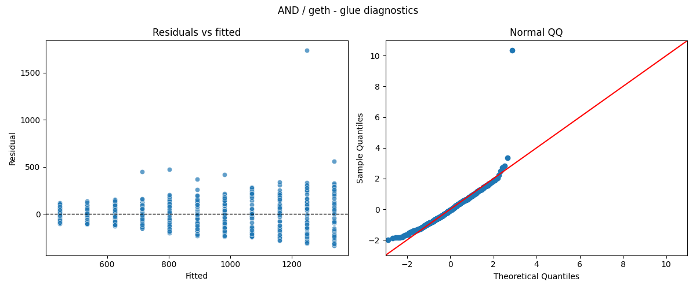

</details>

<details><summary><code>CALLDATACOPY</code> · nobs=12144 · runtime_ms=6.461e-05 · p=1.00e-03 · R²=0.992</summary>

```
==============================================================================
                           NNLS Regression Results                            
==============================================================================
Dep. Variable:          test_runtime_ms              R-squared:          0.992
Model:                  NNLS                    Adj. R-squared:          0.992
No. Observations:       12144                             RMSE:          43.63
Df Residuals:           12142                              MAE:          25.94
Df Model:               1      
==============================================================================
                      coef     std err     P-value      [0.025      0.975]
------------------------------------------------------------------------------
         const     49.2945      0.4738       0.001     48.3911     50.2290
  CALLDATACOPY      0.0001      0.0000       0.001      0.0001      0.0001
==============================================================================
Notes: Non-negative least squares with bootstrap inference (1000 iterations)
==============================================================================
```

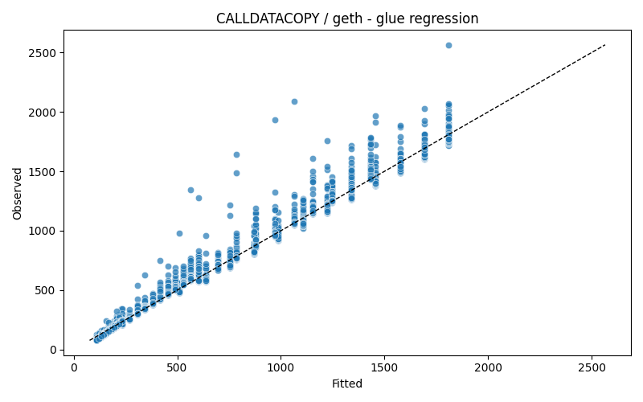

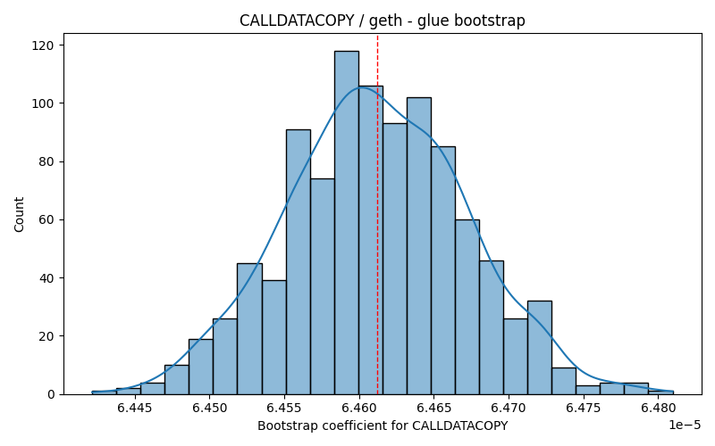

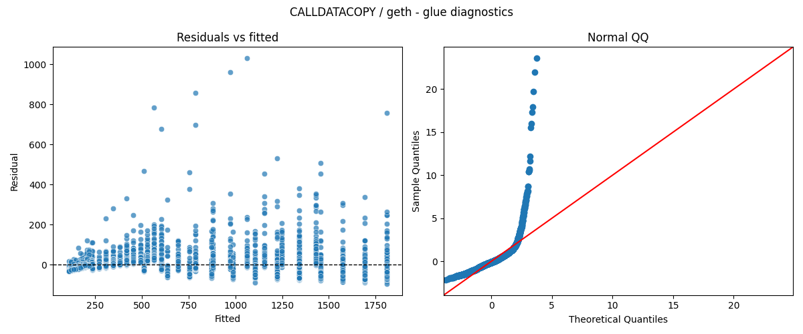

</details>

<details><summary><code>CALLDATALOAD</code> · nobs=2024 · runtime_ms=4.973e-05 · p=1.00e-03 · R²=0.02299</summary>

```
==============================================================================
                           NNLS Regression Results                            
==============================================================================
Dep. Variable:          test_runtime_ms              R-squared:          0.023
Model:                  NNLS                    Adj. R-squared:          0.023
No. Observations:       2024                              RMSE:           1.24
Df Residuals:           2022                               MAE:           0.64
Df Model:               1      
==============================================================================
                      coef     std err     P-value      [0.025      0.975]
------------------------------------------------------------------------------
         const      2.7567      0.0931       0.001      2.5789      2.9455
  CALLDATALOAD      0.0000      0.0000       0.001      0.0000      0.0001
==============================================================================
Notes: Non-negative least squares with bootstrap inference (1000 iterations)
==============================================================================
```

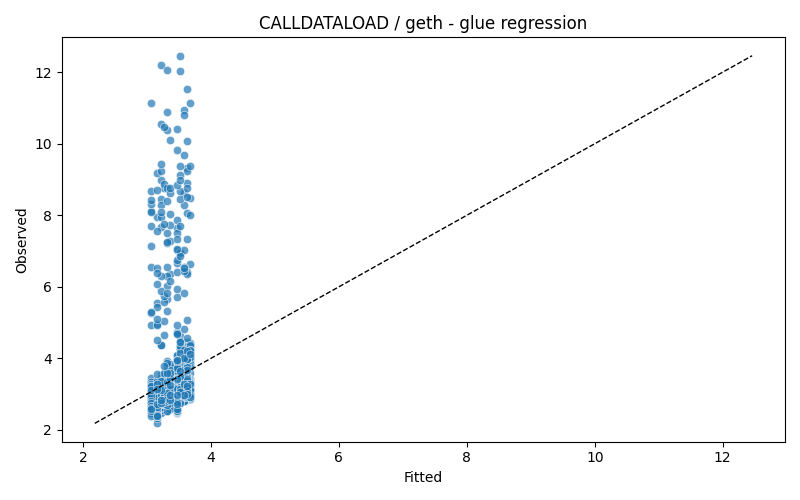

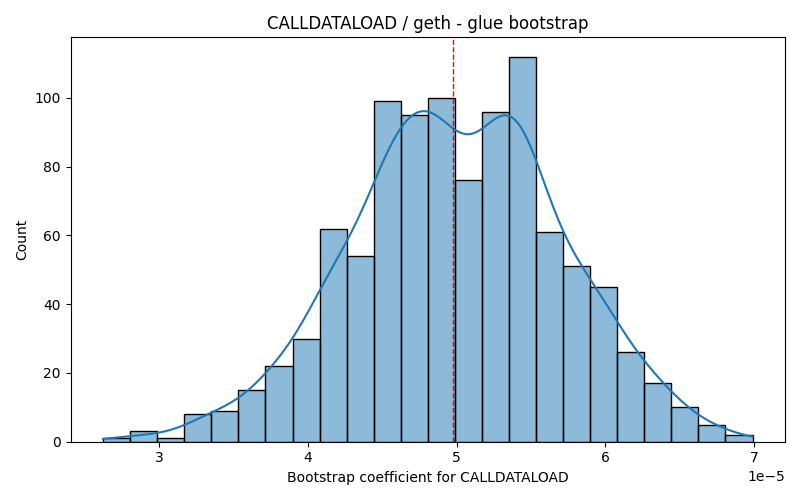

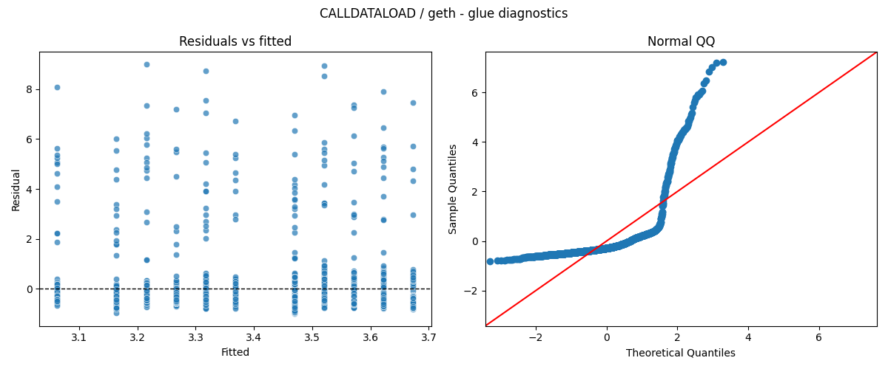

</details>

<details><summary><code>DIV</code> · nobs=506 · runtime_ms=5.864e-05 · p=1.00e-03 · R²=0.9943</summary>

```
==============================================================================
                           NNLS Regression Results                            
==============================================================================
Dep. Variable:          test_runtime_ms              R-squared:          0.994
Model:                  NNLS                    Adj. R-squared:          0.994
No. Observations:       506                               RMSE:          35.12
Df Residuals:           504                                MAE:          23.42
Df Model:               1      
==============================================================================
                      coef     std err     P-value      [0.025      0.975]
------------------------------------------------------------------------------
         const      6.9328      3.9660       0.041      0.0000     15.5344
           DIV      0.0001      0.0000       0.001      0.0001      0.0001
==============================================================================
Notes: Non-negative least squares with bootstrap inference (1000 iterations)
==============================================================================
```

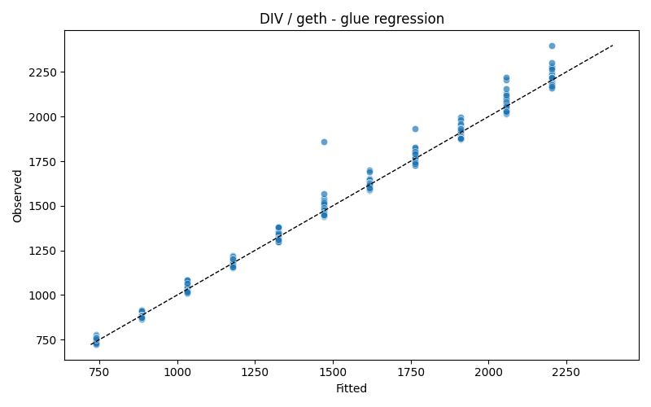

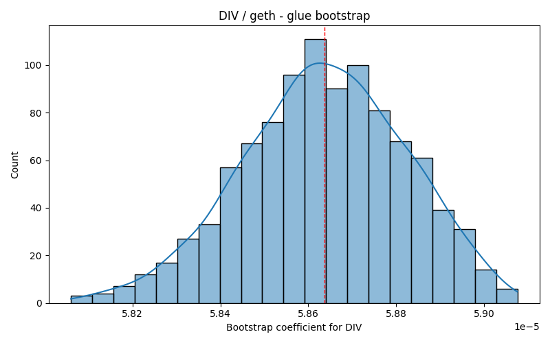

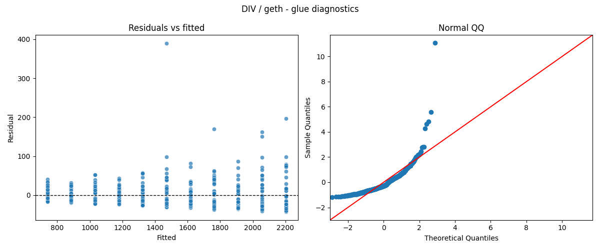

</details>

<details><summary><code>EXP</code> · nobs=506 · runtime_ms=0.002071 · p=1.00e-03 · R²=0.9944</summary>

```
==============================================================================
                           NNLS Regression Results                            
==============================================================================
Dep. Variable:          test_runtime_ms              R-squared:          0.994
Model:                  NNLS                    Adj. R-squared:          0.994
No. Observations:       506                               RMSE:           6.10
Df Residuals:           504                                MAE:           5.09
Df Model:               1      
==============================================================================
                      coef     std err     P-value      [0.025      0.975]
------------------------------------------------------------------------------
         const      5.9475      0.8179       0.001      4.3920      7.6237
           EXP      0.0021      0.0000       0.001      0.0021      0.0021
==============================================================================
Notes: Non-negative least squares with bootstrap inference (1000 iterations)
==============================================================================
```

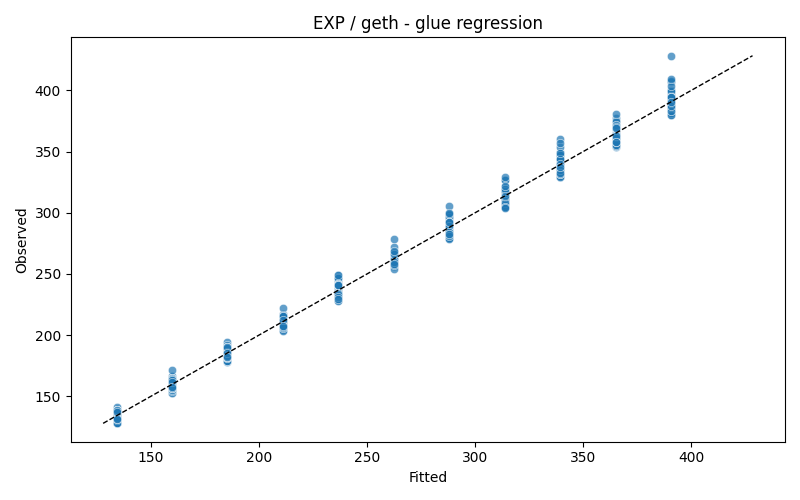

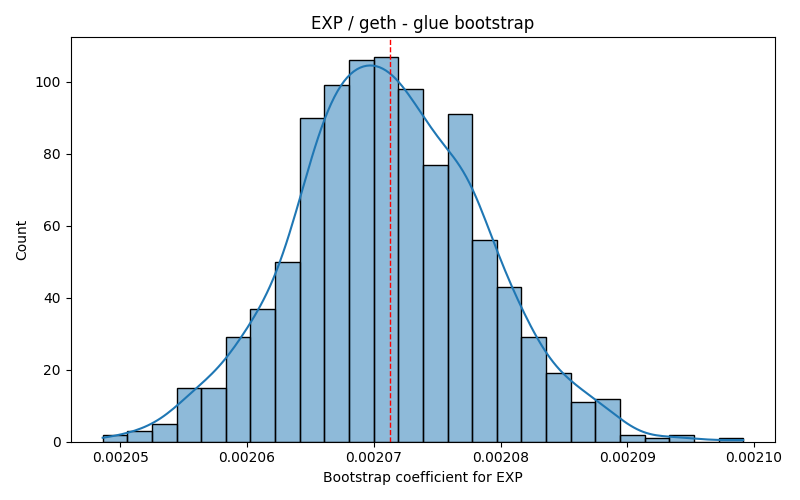

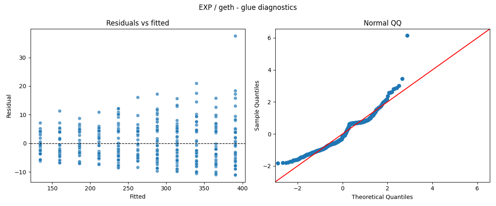

</details>

<details><summary><code>GT</code> · nobs=506 · runtime_ms=2.1e-05 · p=1.00e-03 · R²=0.9549</summary>

```
==============================================================================
                           NNLS Regression Results                            
==============================================================================
Dep. Variable:          test_runtime_ms              R-squared:          0.955
Model:                  NNLS                    Adj. R-squared:          0.955
No. Observations:       506                               RMSE:          48.17
Df Residuals:           504                                MAE:          20.26
Df Model:               1      
==============================================================================
                      coef     std err     P-value      [0.025      0.975]
------------------------------------------------------------------------------
         const      0.0000      3.0459       1.000      0.0000      9.8742
            GT      0.0000      0.0000       0.001      0.0000      0.0000
==============================================================================
Notes: Non-negative least squares with bootstrap inference (1000 iterations)
==============================================================================
```

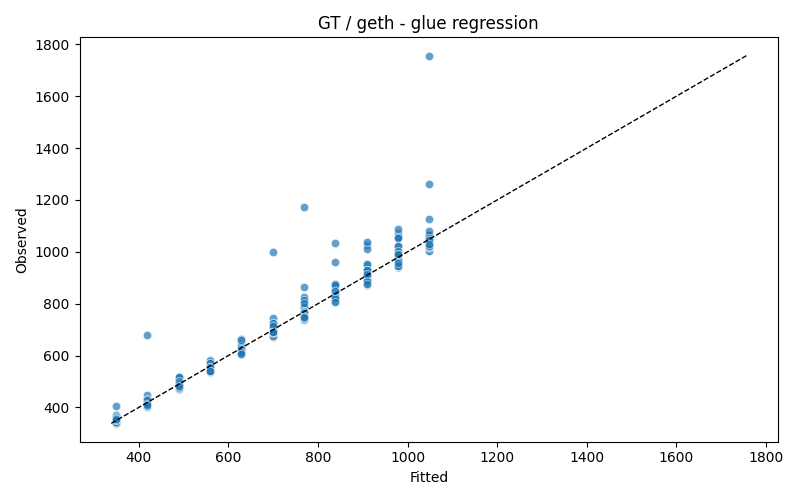

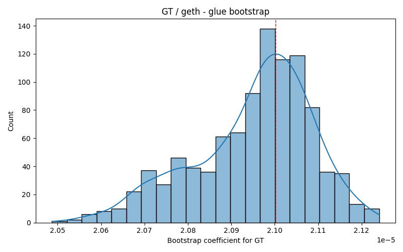

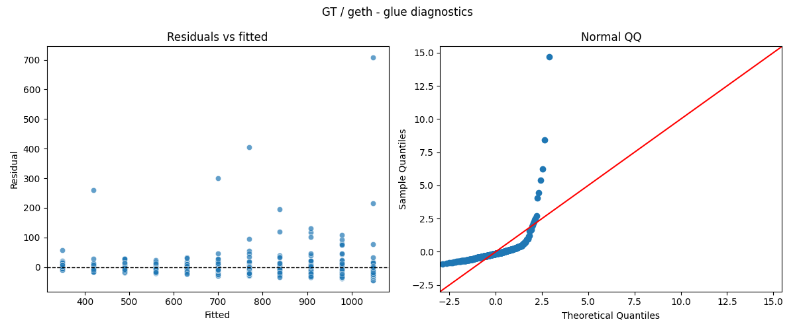

</details>

<details><summary><code>JUMPI</code> · nobs=506 · runtime_ms=3.292e-05 · p=1.00e-03 · R²=0.9665</summary>

```
==============================================================================
                           NNLS Regression Results                            
==============================================================================
Dep. Variable:          test_runtime_ms              R-squared:          0.966
Model:                  NNLS                    Adj. R-squared:          0.966
No. Observations:       506                               RMSE:          27.66
Df Residuals:           504                                MAE:          12.57
Df Model:               1      
==============================================================================
                      coef     std err     P-value      [0.025      0.975]
------------------------------------------------------------------------------
         const      1.8977      2.7473       0.317      0.0000      8.4433
         JUMPI      0.0000      0.0000       0.001      0.0000      0.0000
==============================================================================
Notes: Non-negative least squares with bootstrap inference (1000 iterations)
==============================================================================
```

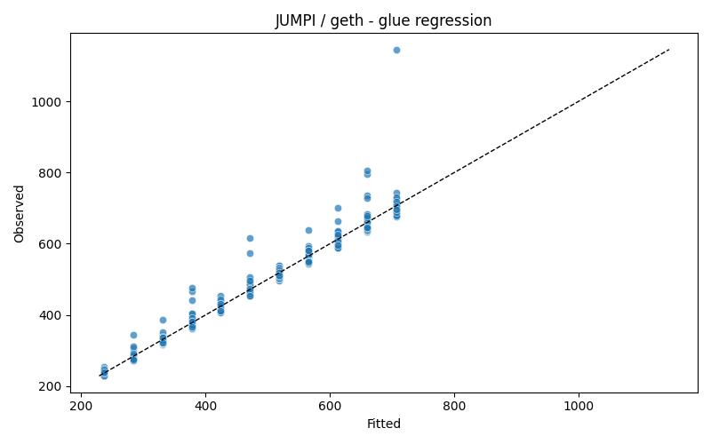

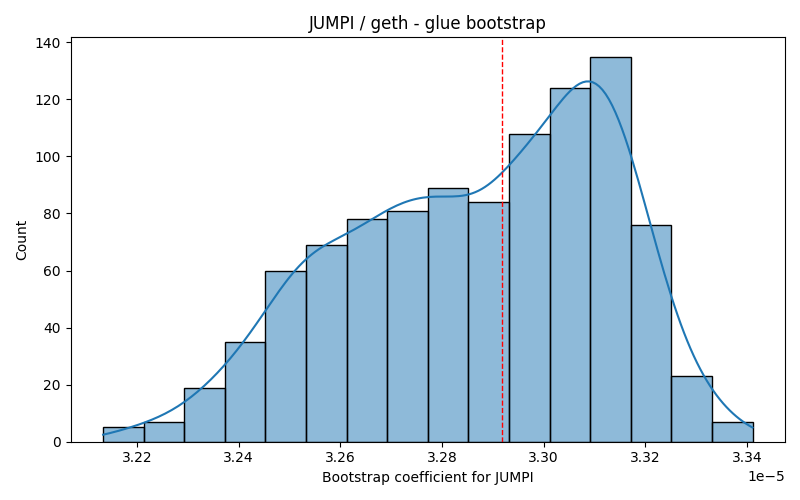

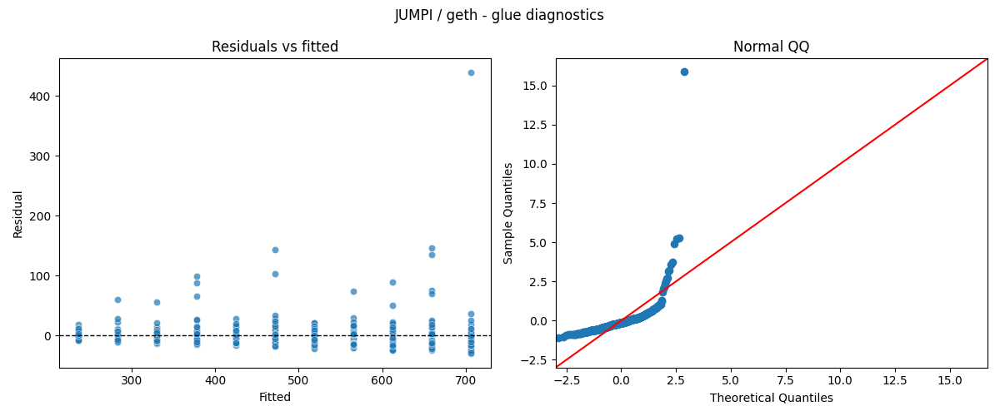

</details>

<details><summary><code>LT</code> · nobs=506 · runtime_ms=2.55e-05 · p=1.00e-03 · R²=0.7513</summary>

```
==============================================================================
                           NNLS Regression Results                            
==============================================================================
Dep. Variable:          test_runtime_ms              R-squared:          0.751
Model:                  NNLS                    Adj. R-squared:          0.751
No. Observations:       506                               RMSE:         155.31
Df Residuals:           504                                MAE:         121.54
Df Model:               1      
==============================================================================
                      coef     std err     P-value      [0.025      0.975]
------------------------------------------------------------------------------
         const      0.0000     10.4921       1.000      0.0000     36.0496
            LT      0.0000      0.0000       0.001      0.0000      0.0000
==============================================================================
Notes: Non-negative least squares with bootstrap inference (1000 iterations)
==============================================================================
```

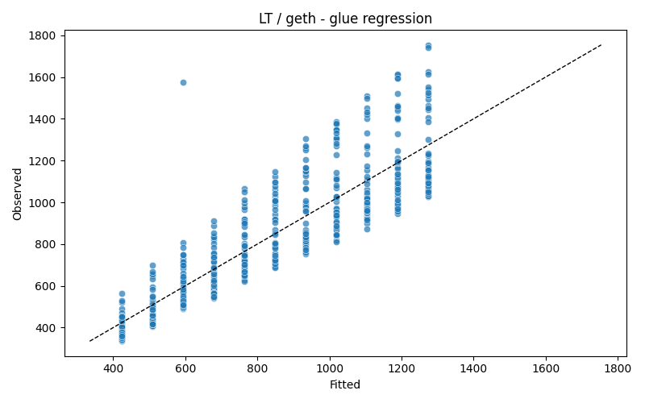

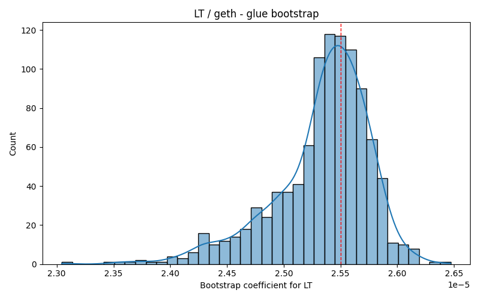

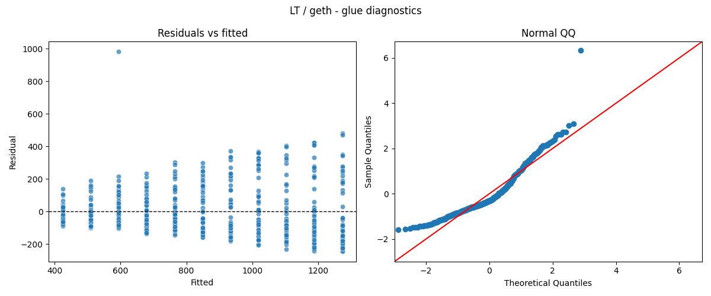

</details>

<details><summary><code>MSTORE</code> · nobs=2530 · runtime_ms=4.833e-05 · p=1.00e-03 · R²=0.9828</summary>

```
==============================================================================
                           NNLS Regression Results                            
==============================================================================
Dep. Variable:          test_runtime_ms              R-squared:          0.983
Model:                  NNLS                    Adj. R-squared:          0.983
No. Observations:       2530                              RMSE:          44.83
Df Residuals:           2528                               MAE:          24.06
Df Model:               1      
==============================================================================
                      coef     std err     P-value      [0.025      0.975]
------------------------------------------------------------------------------
         const     11.9664      2.6841       0.001      6.8015     17.2234
        MSTORE      0.0000      0.0000       0.001      0.0000      0.0000
==============================================================================
Notes: Non-negative least squares with bootstrap inference (1000 iterations)
==============================================================================
```

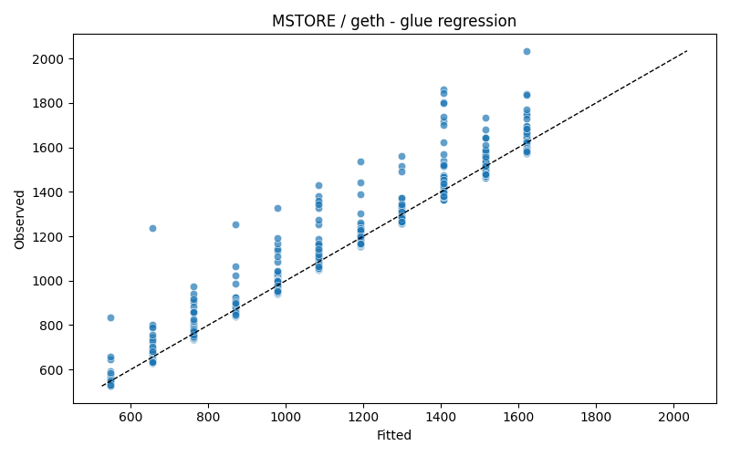

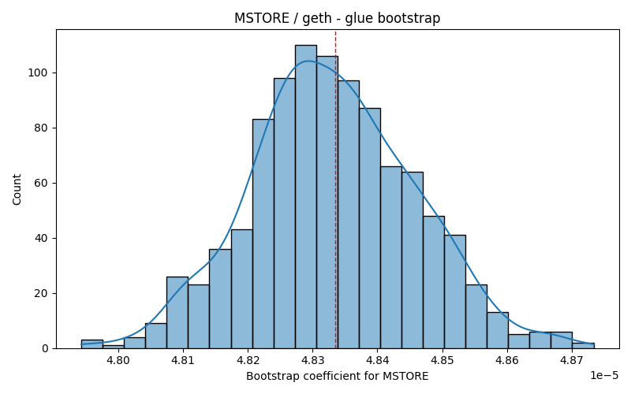

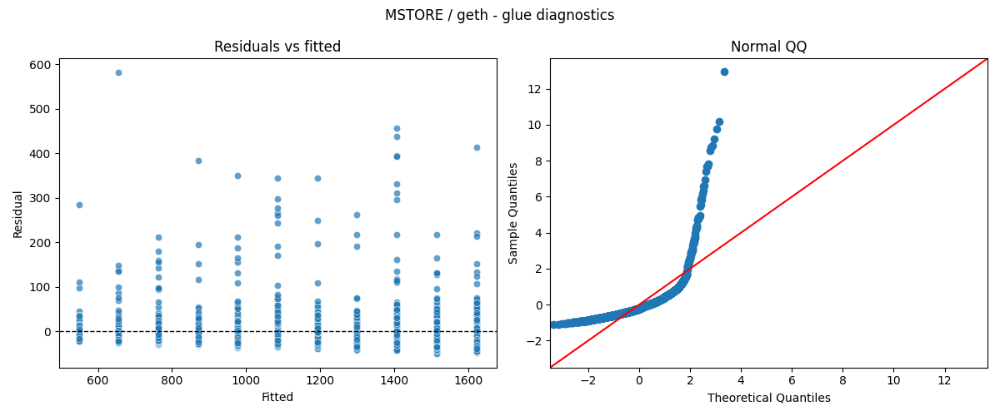

</details>

<details><summary><code>MSTORE8</code> · nobs=2530 · runtime_ms=4.381e-05 · p=1.00e-03 · R²=0.9723</summary>

```
==============================================================================
                           NNLS Regression Results                            
==============================================================================
Dep. Variable:          test_runtime_ms              R-squared:          0.972
Model:                  NNLS                    Adj. R-squared:          0.972
No. Observations:       2530                              RMSE:          51.92
Df Residuals:           2528                               MAE:          22.76
Df Model:               1      
==============================================================================
                      coef     std err     P-value      [0.025      0.975]
------------------------------------------------------------------------------
         const      5.5520      2.9088       0.044      0.0000     11.3051
       MSTORE8      0.0000      0.0000       0.001      0.0000      0.0000
==============================================================================
Notes: Non-negative least squares with bootstrap inference (1000 iterations)
==============================================================================
```

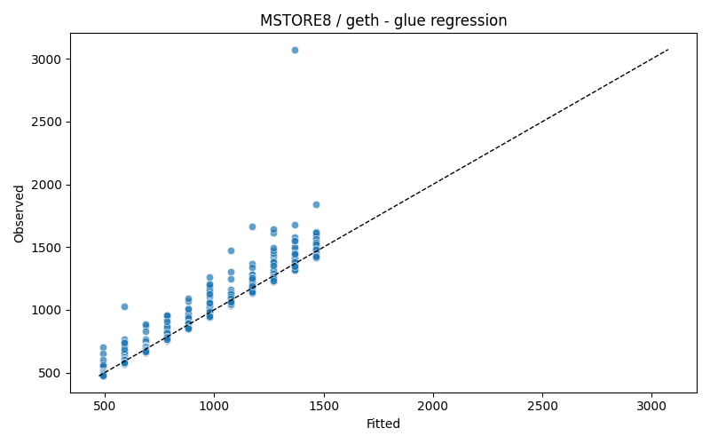

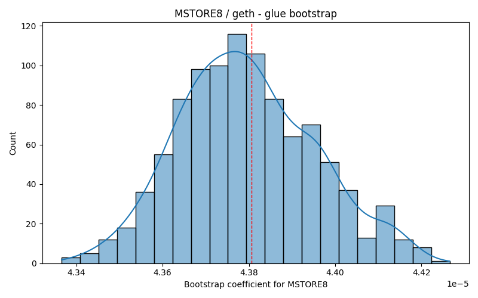

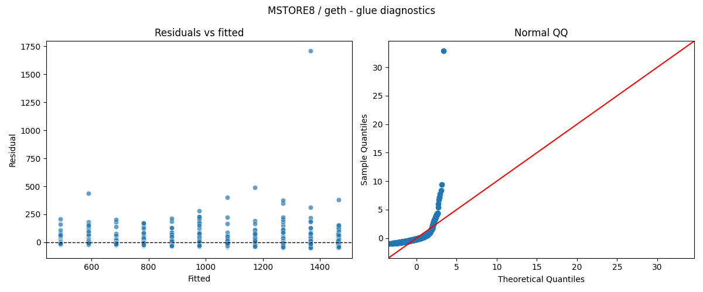

</details>

<details><summary><code>MUL</code> · nobs=506 · runtime_ms=2.697e-05 · p=1.00e-03 · R²=0.9219</summary>

```
==============================================================================
                           NNLS Regression Results                            
==============================================================================
Dep. Variable:          test_runtime_ms              R-squared:          0.922
Model:                  NNLS                    Adj. R-squared:          0.922
No. Observations:       506                               RMSE:          61.95
Df Residuals:           504                                MAE:          42.62
Df Model:               1      
==============================================================================
                      coef     std err     P-value      [0.025      0.975]
------------------------------------------------------------------------------
         const     23.6068      8.2992       0.005      6.1968     39.3198
           MUL      0.0000      0.0000       0.001      0.0000      0.0000
==============================================================================
Notes: Non-negative least squares with bootstrap inference (1000 iterations)
==============================================================================
```

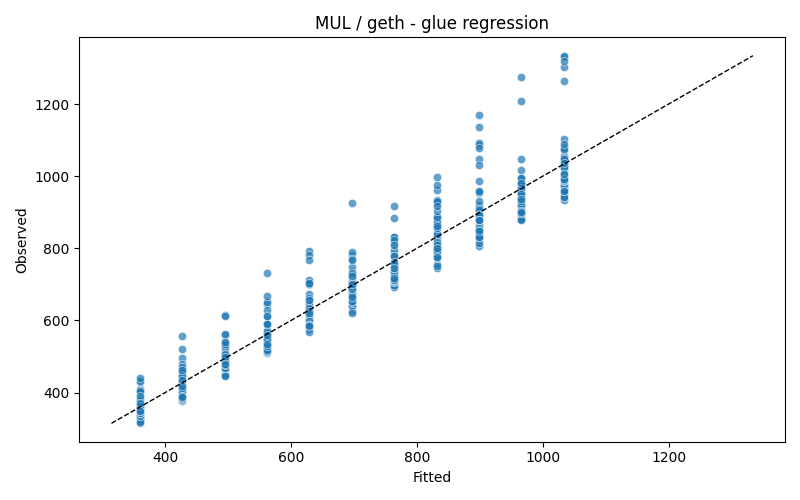


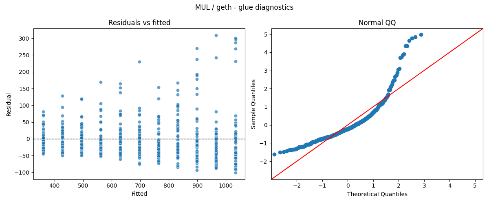

</details>

<details><summary><code>PC</code> · nobs=506 · runtime_ms=9.422e-06 · p=1.00e-03 · R²=0.9891</summary>

```
==============================================================================
                           NNLS Regression Results                            
==============================================================================
Dep. Variable:          test_runtime_ms              R-squared:          0.989
Model:                  NNLS                    Adj. R-squared:          0.989
No. Observations:       506                               RMSE:          29.60
Df Residuals:           504                                MAE:          16.66
Df Model:               1      
==============================================================================
                      coef     std err     P-value      [0.025      0.975]
------------------------------------------------------------------------------
         const      9.2386      3.7409       0.008      1.8446     16.0507
            PC      0.0000      0.0000       0.001      0.0000      0.0000
==============================================================================
Notes: Non-negative least squares with bootstrap inference (1000 iterations)
==============================================================================
```

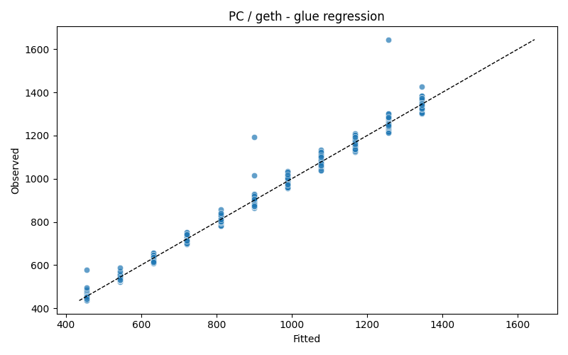

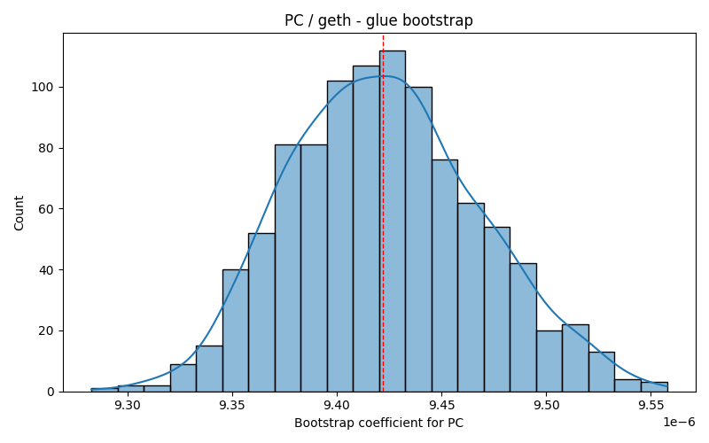

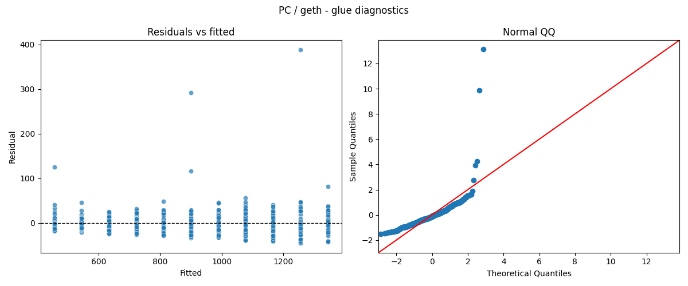

</details>

<details><summary><code>RETURNDATASIZE</code> · nobs=2024 · runtime_ms=1.597e-05 · p=1.00e-03 · R²=0.938</summary>

```
==============================================================================
                           NNLS Regression Results                            
==============================================================================
Dep. Variable:          test_runtime_ms              R-squared:          0.938
Model:                  NNLS                    Adj. R-squared:          0.938
No. Observations:       2024                              RMSE:          64.85
Df Residuals:           2022                               MAE:          33.28
Df Model:               1      
==============================================================================
                      coef     std err     P-value      [0.025      0.975]
------------------------------------------------------------------------------
         const     22.4500      4.3901       0.001     14.1233     31.1656
RETURNDATASIZE      0.0000      0.0000       0.001      0.0000      0.0000
==============================================================================
Notes: Non-negative least squares with bootstrap inference (1000 iterations)
==============================================================================
```

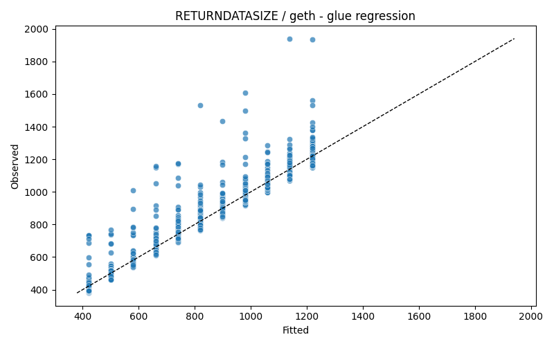

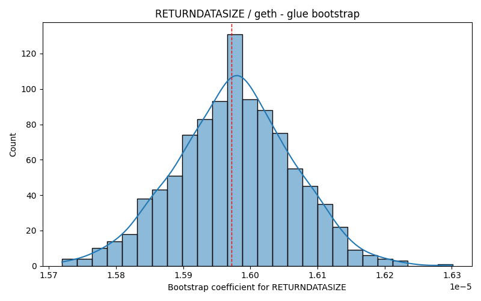

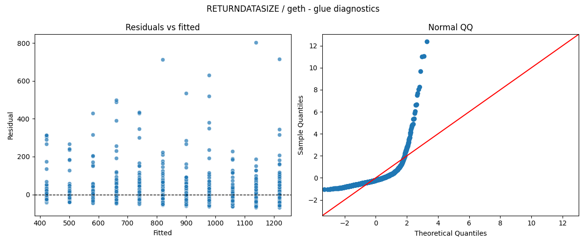

</details>

<details><summary><code>SELFBALANCE</code> · nobs=414 · runtime_ms=5.086e-05 · p=1.00e-03 · R²=0.9873</summary>

```
==============================================================================
                           NNLS Regression Results                            
==============================================================================
Dep. Variable:          test_runtime_ms              R-squared:          0.987
Model:                  NNLS                    Adj. R-squared:          0.987
No. Observations:       414                               RMSE:          58.15
Df Residuals:           412                                MAE:          32.71
Df Model:               1      
==============================================================================
                      coef     std err     P-value      [0.025      0.975]
------------------------------------------------------------------------------
         const      2.7924      5.8378       0.353      0.0000     19.1713
   SELFBALANCE      0.0001      0.0000       0.001      0.0001      0.0001
==============================================================================
Notes: Non-negative least squares with bootstrap inference (1000 iterations)
==============================================================================
```

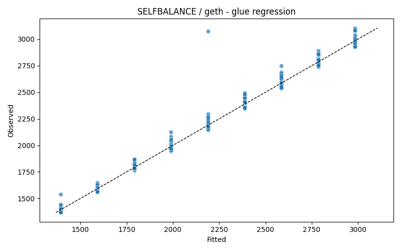

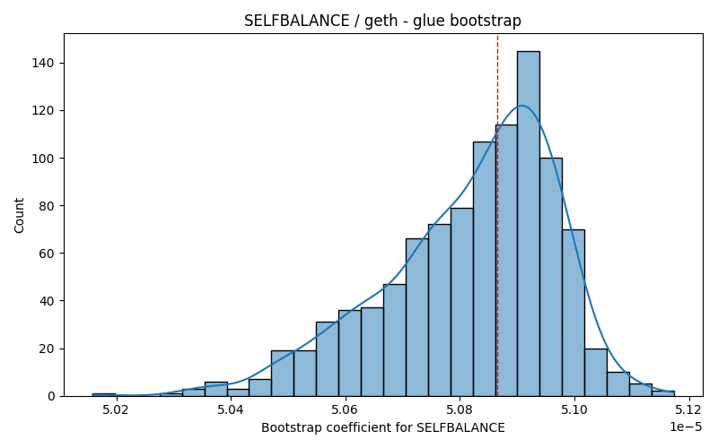

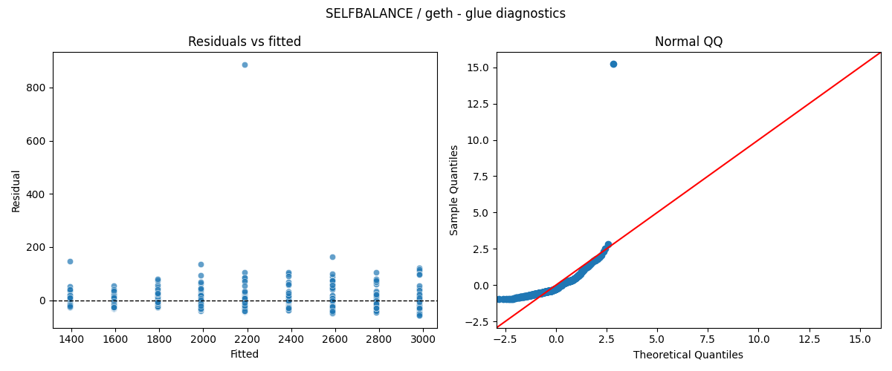

</details>

<details><summary><code>SUB</code> · nobs=506 · runtime_ms=2.687e-05 · p=1.00e-03 · R²=0.7666</summary>

```
==============================================================================
                           NNLS Regression Results                            
==============================================================================
Dep. Variable:          test_runtime_ms              R-squared:          0.767
Model:                  NNLS                    Adj. R-squared:          0.766
No. Observations:       506                               RMSE:         159.92
Df Residuals:           504                                MAE:         134.32
Df Model:               1      
==============================================================================
                      coef     std err     P-value      [0.025      0.975]
------------------------------------------------------------------------------
         const      0.0000      4.3271       1.000      0.0000     15.5223
           SUB      0.0000      0.0000       0.001      0.0000      0.0000
==============================================================================
Notes: Non-negative least squares with bootstrap inference (1000 iterations)
==============================================================================
```

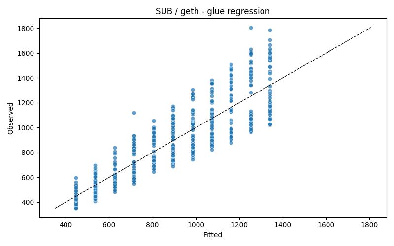

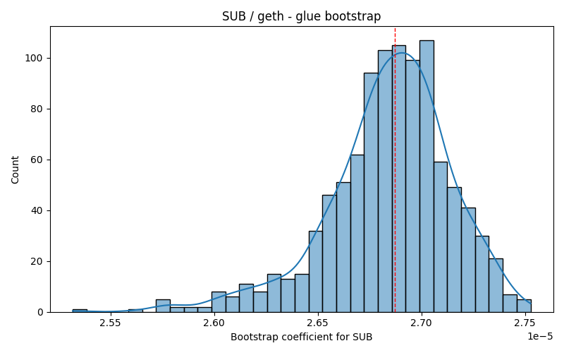


</details>

### Mixed glue (tier B) · geth

<details><summary><code>JUMP</code> · nobs=506 · runtime_ms=5.741e-05 · p=1.00e-03 · R²=0.9635</summary>

```
==============================================================================
                           NNLS Regression Results                            
==============================================================================
Dep. Variable:          test_runtime_ms              R-squared:          0.964
Model:                  NNLS                    Adj. R-squared:          0.963
No. Observations:       506                               RMSE:          41.70
Df Residuals:           504                                MAE:          16.89
Df Model:               1      
==============================================================================
                      coef     std err     P-value      [0.025      0.975]
------------------------------------------------------------------------------
         const      0.0000      1.8714       1.000      0.0000      6.4078
          JUMP      0.0001      0.0000       0.001      0.0001      0.0001
==============================================================================
Notes: Non-negative least squares with bootstrap inference (1000 iterations)
==============================================================================
```

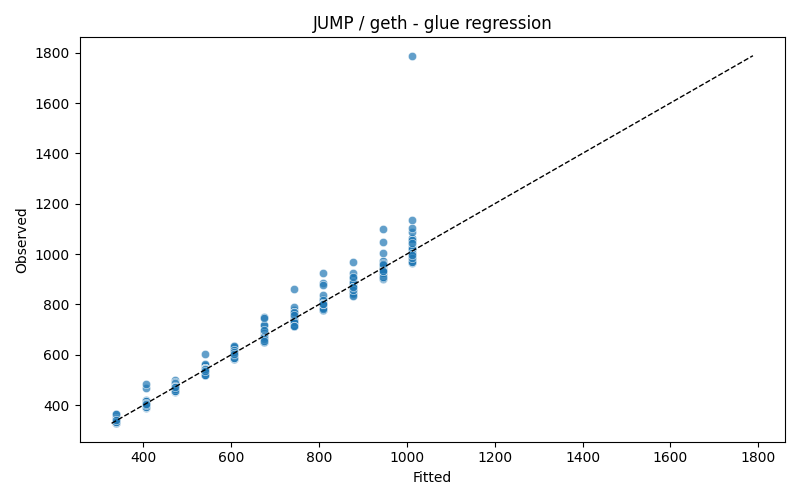

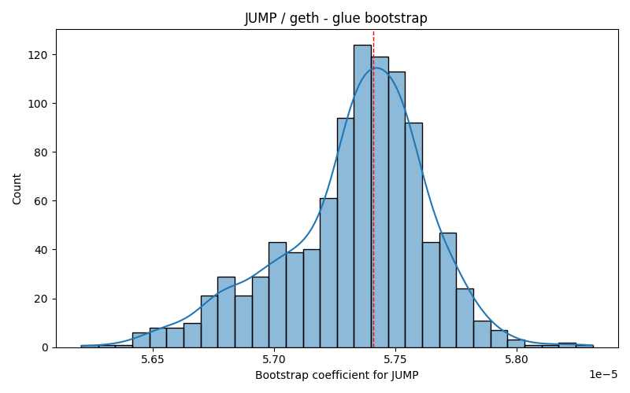

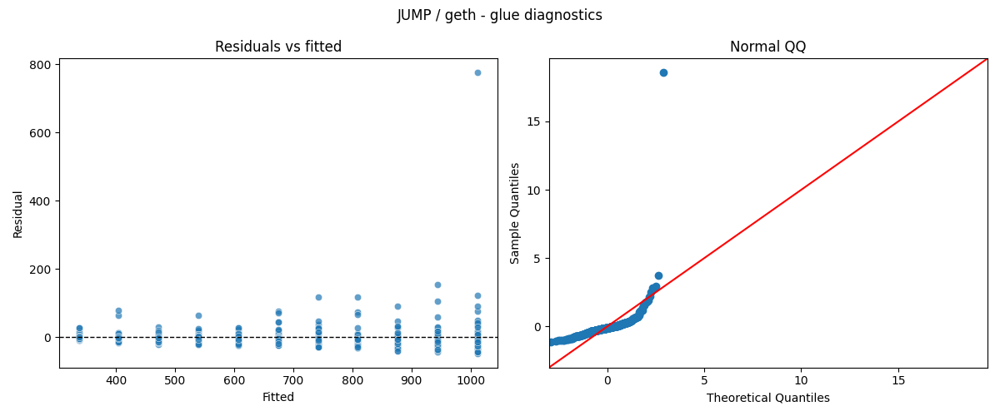

</details>

<details><summary><code>KECCAK256</code> · nobs=8096 · runtime_ms=0.000205 · p=1.00e-03 · R²=0.3013</summary>

```
==============================================================================
                           NNLS Regression Results                            
==============================================================================
Dep. Variable:          test_runtime_ms              R-squared:          0.301
Model:                  NNLS                    Adj. R-squared:          0.301
No. Observations:       8096                              RMSE:         620.21
Df Residuals:           8094                               MAE:         499.19
Df Model:               1      
==============================================================================
                      coef     std err     P-value      [0.025      0.975]
------------------------------------------------------------------------------
         const   1628.4731     14.8991       0.001   1601.4504   1658.3047
     KECCAK256      0.0002      0.0000       0.001      0.0002      0.0002
==============================================================================
Notes: Non-negative least squares with bootstrap inference (1000 iterations)
==============================================================================
```

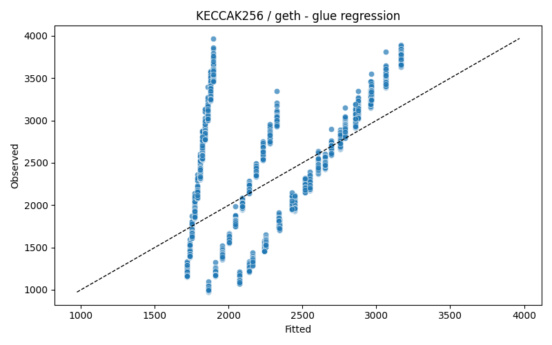

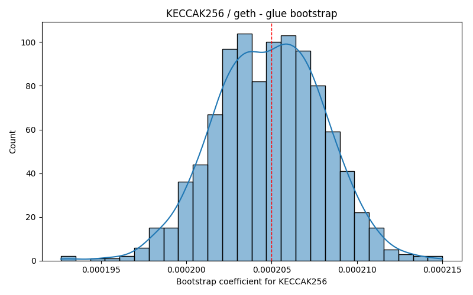

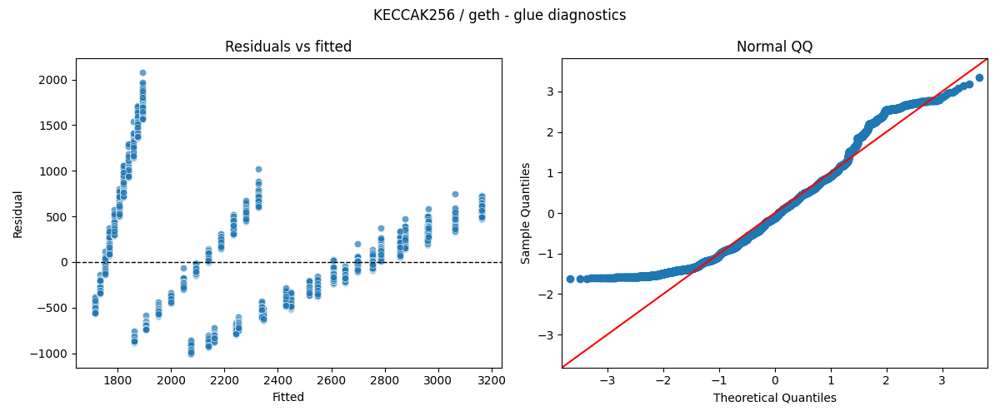

</details>

## nethermind

| glue_opcode | nobs | glue_runtime_ms | p_value | rsquared |
| --- | --- | --- | --- | --- |
| `ISZERO` | 352 | 8.443e-07 | 1.00e-03 | 0.2706 |
| `JUMPDEST` | 352 | 4.28e-07 | 1.00e-03 | 0.6841 |
| `SWAP` | 5632 | 5.645e-07 | 1.00e-03 | 0.317 |
| `CALLDATASIZE` | 20977 | 3.494e-09 | 2.77e-01 | 0.978 |
| `DUP` | 20977 | 0 | 1.00e+00 | 0.978 |
| `GAS` | 20977 | 0 | 1.00e+00 | 0.978 |
| `MLOAD` | 20977 | 1.758e-06 | 1.00e-03 | 0.978 |
| `PUSH` | 20977 | 3.568e-08 | 1.00e-03 | 0.978 |
| `PUSH0` | 20977 | 0 | 1.00e+00 | 0.978 |
| `STATICCALL` | 20977 | 0.0008671 | 1.00e-03 | 0.978 |
| `ADD` | 352 | 2.669e-06 | 1.00e-03 | 0.6359 |
| `AND` | 352 | 1.317e-06 | 1.00e-03 | 0.5585 |
| `CALLDATACOPY` | 8448 | 4e-06 | 1.00e-03 | 0.7029 |
| `CALLDATALOAD` | 1408 | 5.611e-05 | 1.00e-03 | 0.002096 |
| `DIV` | 352 | 8.14e-06 | 1.00e-03 | 0.6466 |
| `EXP` | 352 | 0 | 1.00e+00 | -2.22e-16 |
| `GT` | 352 | 1.578e-06 | 1.00e-03 | 0.3554 |
| `JUMPI` | 352 | 1.817e-06 | 1.00e-03 | 0.4586 |
| `LT` | 352 | 1.409e-06 | 1.00e-03 | 0.3094 |
| `MSTORE` | 1760 | 2.248e-06 | 1.00e-03 | 0.5574 |
| `MSTORE8` | 1760 | 1.957e-06 | 1.00e-03 | 0.676 |
| `MUL` | 352 | 5.736e-06 | 1.00e-03 | 0.7508 |
| `PC` | 352 | 8.134e-07 | 1.00e-03 | 0.8998 |
| `RETURNDATASIZE` | 1408 | 7.769e-07 | 1.00e-03 | 0.4656 |
| `SELFBALANCE` | 288 | 1.068e-05 | 1.00e-03 | 0.8691 |
| `SUB` | 352 | 2.622e-06 | 1.00e-03 | 0.5745 |
| `JUMP` | 352 | 5.136e-06 | 1.00e-03 | 0.7883 |
| `KECCAK256` | 5632 | 0 | 1.00e+00 | 0 |

### Cycle glue — joint fit · nethermind

<details><summary>Joint NNLS regression summary</summary>

```
==============================================================================
                           NNLS Regression Results                            
==============================================================================
Dep. Variable:          test_runtime_ms              R-squared:          0.978
Model:                  NNLS                    Adj. R-squared:          0.978
No. Observations:       20977                             RMSE:          21.64
Df Residuals:           20969                              MAE:           7.01
Df Model:               7      
==============================================================================
                      coef     std err     P-value      [0.025      0.975]
------------------------------------------------------------------------------
         const     14.5813      0.5727       0.001     13.4112     15.6334
  CALLDATASIZE      0.0000      0.0000       0.277      0.0000      0.0000
           DUP      0.0000      0.0000       1.000      0.0000      0.0000
           GAS      0.0000      0.0000       1.000      0.0000      0.0000
         MLOAD      0.0000      0.0000       0.001      0.0000      0.0000
          PUSH      0.0000      0.0000       0.001      0.0000      0.0000
         PUSH0      0.0000      0.0000       1.000      0.0000      0.0000
    STATICCALL      0.0009      0.0000       0.001      0.0008      0.0009
==============================================================================
Notes: Non-negative least squares with bootstrap inference (1000 iterations)
==============================================================================
```

</details>

<details><summary><code>CALLDATASIZE</code> · nobs=20977 · runtime_ms=3.494e-09 · p=2.77e-01 · R²=0.978</summary>

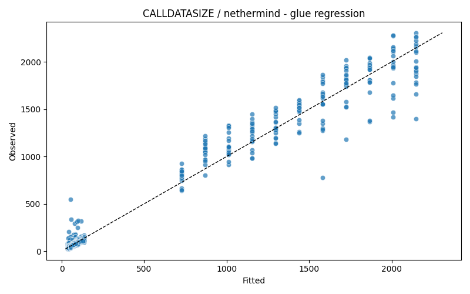

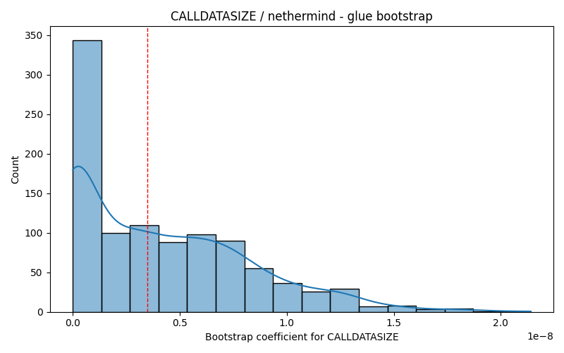

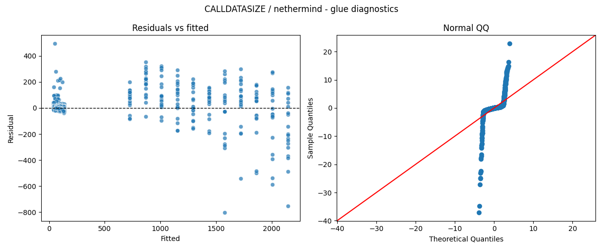

</details>

<details><summary><code>DUP</code> · nobs=20977 · runtime_ms=0 · p=1.00e+00 · R²=0.978</summary>

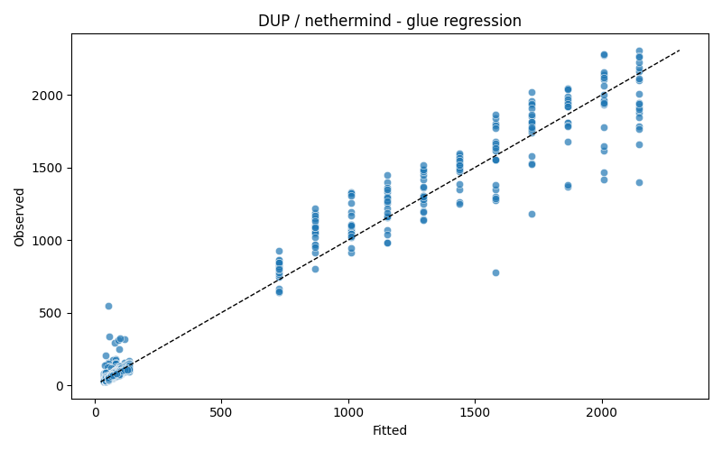


</details>

<details><summary><code>GAS</code> · nobs=20977 · runtime_ms=0 · p=1.00e+00 · R²=0.978</summary>


</details>

<details><summary><code>MLOAD</code> · nobs=20977 · runtime_ms=1.758e-06 · p=1.00e-03 · R²=0.978</summary>


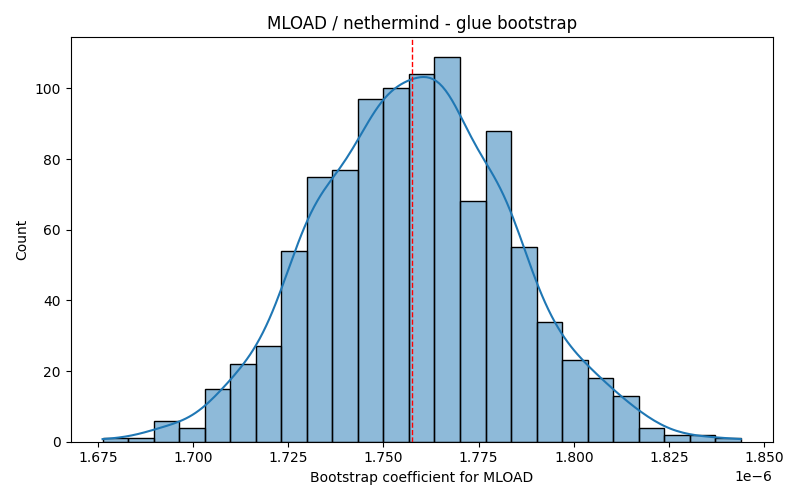


</details>

<details><summary><code>PUSH</code> · nobs=20977 · runtime_ms=3.568e-08 · p=1.00e-03 · R²=0.978</summary>


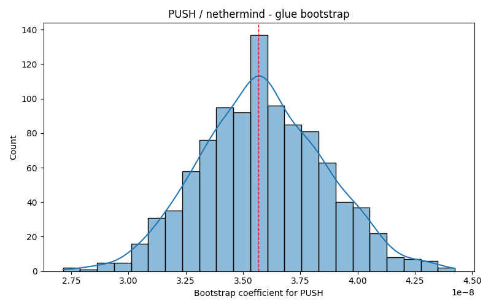


</details>

<details><summary><code>PUSH0</code> · nobs=20977 · runtime_ms=0 · p=1.00e+00 · R²=0.978</summary>

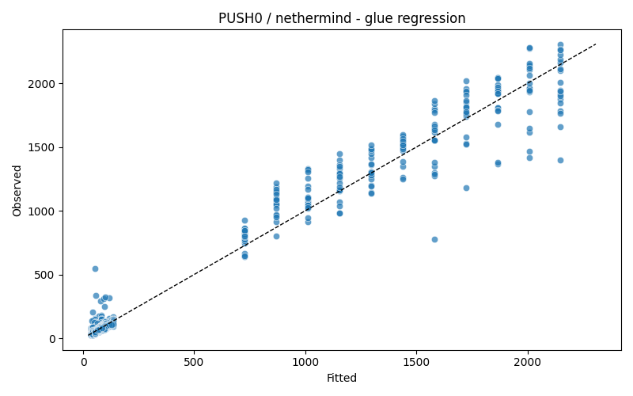


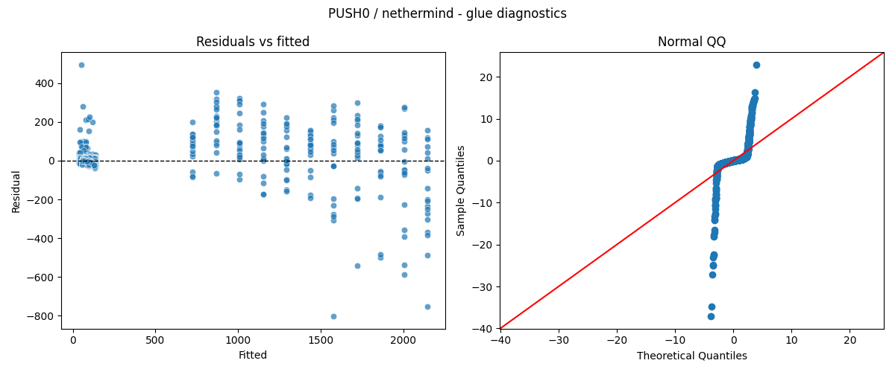

</details>

<details><summary><code>STATICCALL</code> · nobs=20977 · runtime_ms=0.0008671 · p=1.00e-03 · R²=0.978</summary>


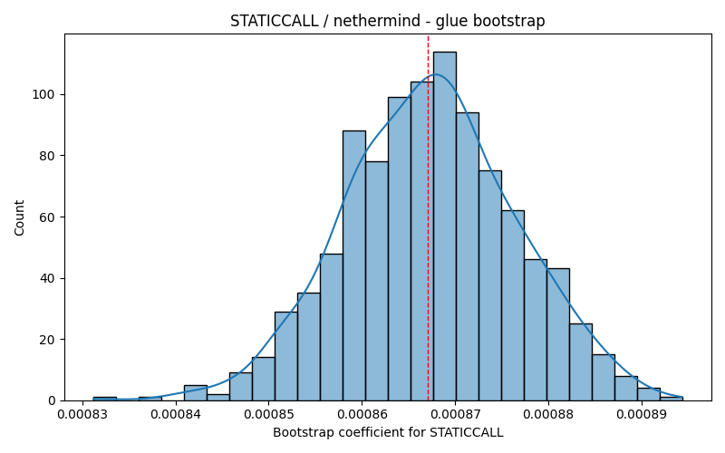

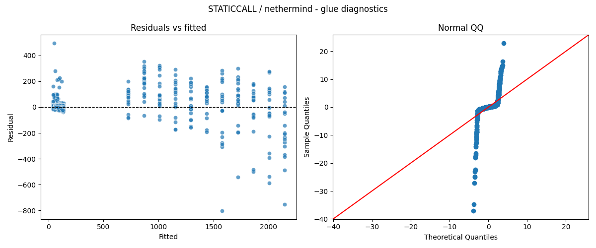

</details>

### Pure glue · nethermind

<details><summary><code>ISZERO</code> · nobs=352 · runtime_ms=8.443e-07 · p=1.00e-03 · R²=0.2706</summary>

```
==============================================================================
                           NNLS Regression Results                            
==============================================================================
Dep. Variable:          test_runtime_ms              R-squared:          0.271
Model:                  NNLS                    Adj. R-squared:          0.269
No. Observations:       352                               RMSE:          29.18
Df Residuals:           350                                MAE:          15.69
Df Model:               1      
==============================================================================
                      coef     std err     P-value      [0.025      0.975]
------------------------------------------------------------------------------
         const     22.7387      5.6745       0.001     11.7851     33.5963
        ISZERO      0.0000      0.0000       0.001      0.0000      0.0000
==============================================================================
Notes: Non-negative least squares with bootstrap inference (1000 iterations)
==============================================================================
```

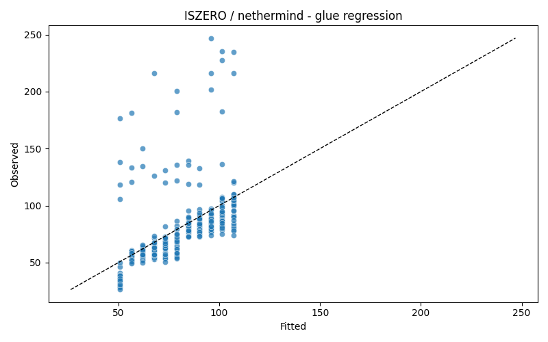

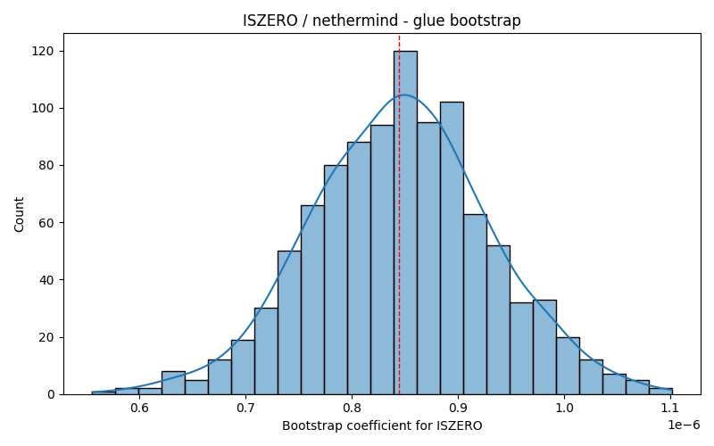

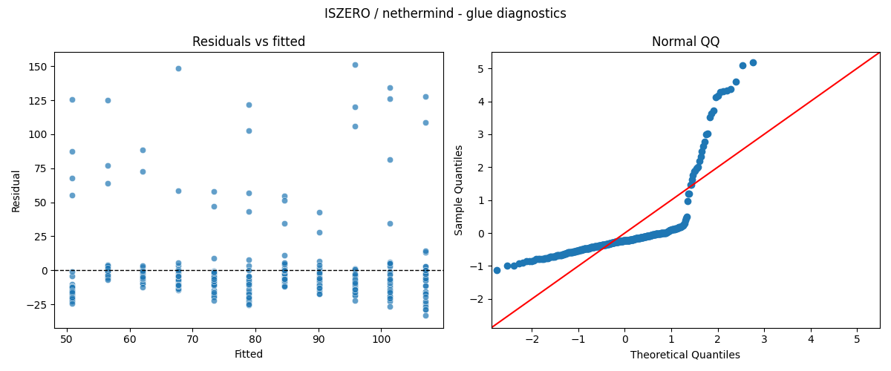

</details>

<details><summary><code>JUMPDEST</code> · nobs=352 · runtime_ms=4.28e-07 · p=1.00e-03 · R²=0.6841</summary>

```
==============================================================================
                           NNLS Regression Results                            
==============================================================================
Dep. Variable:          test_runtime_ms              R-squared:          0.684
Model:                  NNLS                    Adj. R-squared:          0.683
No. Observations:       352                               RMSE:          18.36
Df Residuals:           350                                MAE:          14.75
Df Model:               1      
==============================================================================
                      coef     std err     P-value      [0.025      0.975]
------------------------------------------------------------------------------
         const     18.8129      2.9739       0.001     12.8792     24.6376
      JUMPDEST      0.0000      0.0000       0.001      0.0000      0.0000
==============================================================================
Notes: Non-negative least squares with bootstrap inference (1000 iterations)
==============================================================================
```


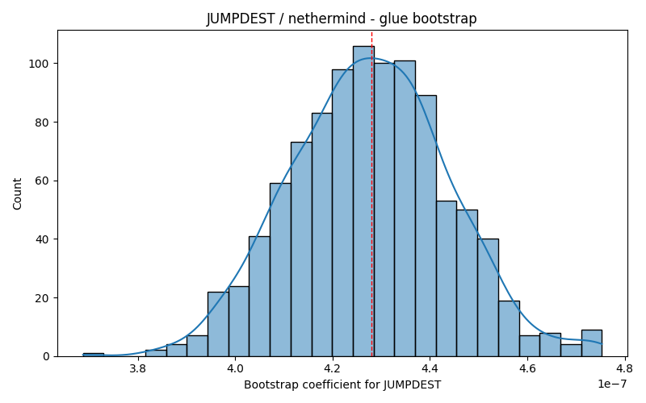

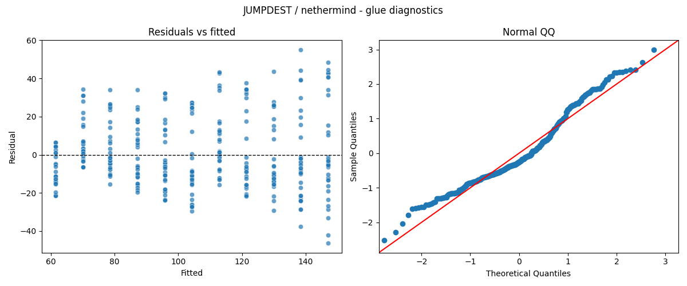

</details>

<details><summary><code>SWAP</code> · nobs=5632 · runtime_ms=5.645e-07 · p=1.00e-03 · R²=0.317</summary>

```
==============================================================================
                           NNLS Regression Results                            
==============================================================================
Dep. Variable:          test_runtime_ms              R-squared:          0.317
Model:                  NNLS                    Adj. R-squared:          0.317
No. Observations:       5632                              RMSE:          17.45
Df Residuals:           5630                               MAE:           6.20
Df Model:               1      
==============================================================================
                      coef     std err     P-value      [0.025      0.975]
------------------------------------------------------------------------------
         const     15.1589      0.6901       0.001     13.8269     16.5434
          SWAP      0.0000      0.0000       0.001      0.0000      0.0000
==============================================================================
Notes: Non-negative least squares with bootstrap inference (1000 iterations)
==============================================================================
```

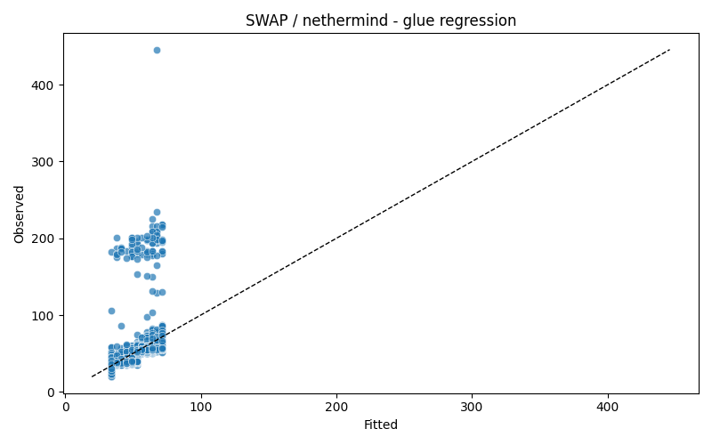

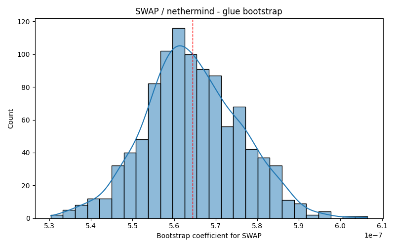

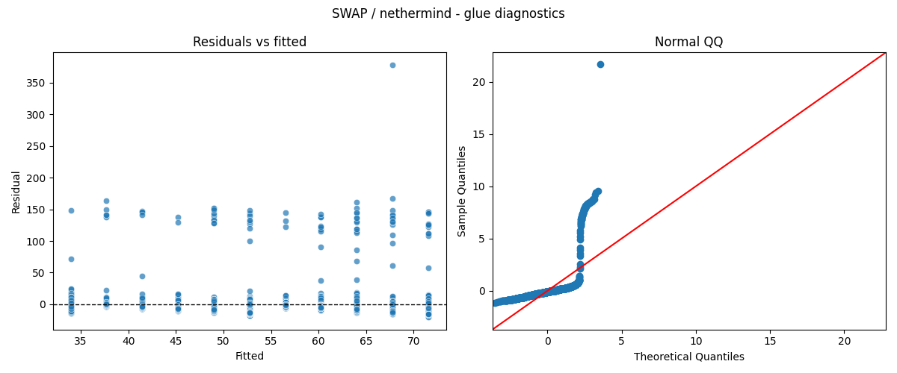

</details>

### Mixed glue (tier A) · nethermind

<details><summary><code>ADD</code> · nobs=352 · runtime_ms=2.669e-06 · p=1.00e-03 · R²=0.6359</summary>

```
==============================================================================
                           NNLS Regression Results                            
==============================================================================
Dep. Variable:          test_runtime_ms              R-squared:          0.636
Model:                  NNLS                    Adj. R-squared:          0.635
No. Observations:       352                               RMSE:          21.25
Df Residuals:           350                                MAE:          10.47
Df Model:               1      
==============================================================================
                      coef     std err     P-value      [0.025      0.975]
------------------------------------------------------------------------------
         const     13.8585      2.3462       0.001      9.1403     18.5075
           ADD      0.0000      0.0000       0.001      0.0000      0.0000
==============================================================================
Notes: Non-negative least squares with bootstrap inference (1000 iterations)
==============================================================================
```


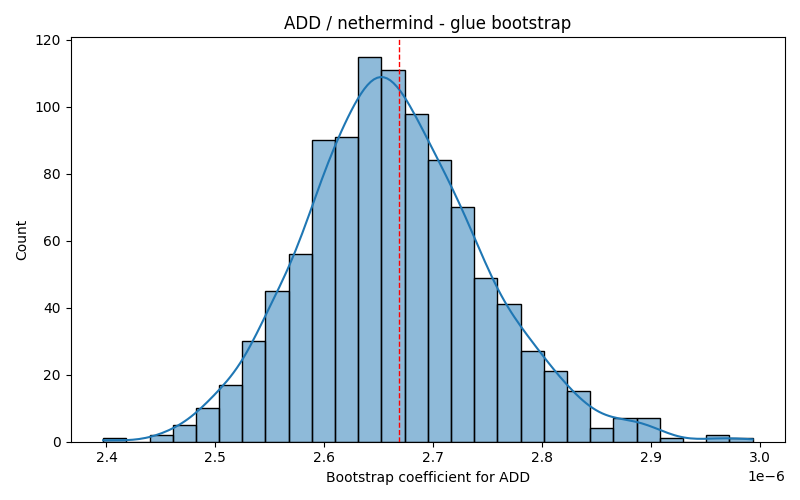

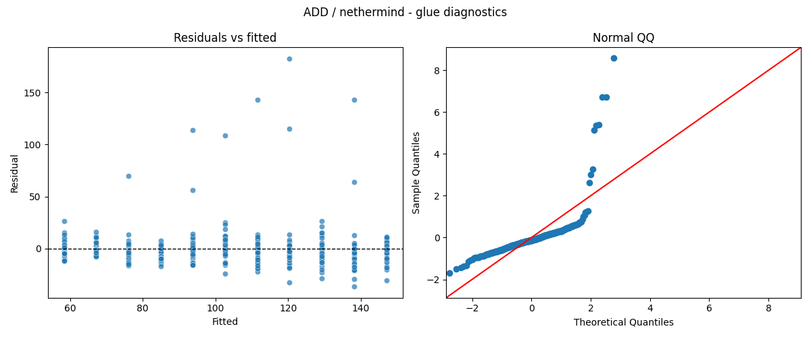

</details>

<details><summary><code>AND</code> · nobs=352 · runtime_ms=1.317e-06 · p=1.00e-03 · R²=0.5585</summary>

```
==============================================================================
                           NNLS Regression Results                            
==============================================================================
Dep. Variable:          test_runtime_ms              R-squared:          0.558
Model:                  NNLS                    Adj. R-squared:          0.557
No. Observations:       352                               RMSE:          12.32
Df Residuals:           350                                MAE:           5.29
Df Model:               1      
==============================================================================
                      coef     std err     P-value      [0.025      0.975]
------------------------------------------------------------------------------
         const     12.4845      1.9471       0.001      8.0951     15.7678
           AND      0.0000      0.0000       0.001      0.0000      0.0000
==============================================================================
Notes: Non-negative least squares with bootstrap inference (1000 iterations)
==============================================================================
```

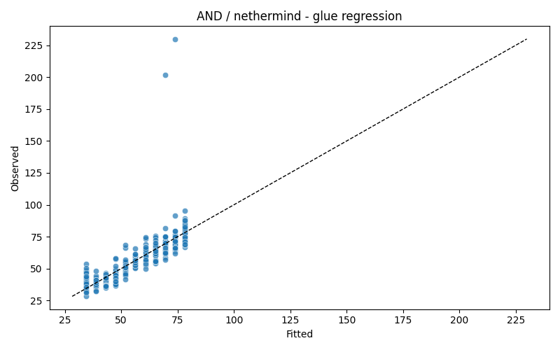

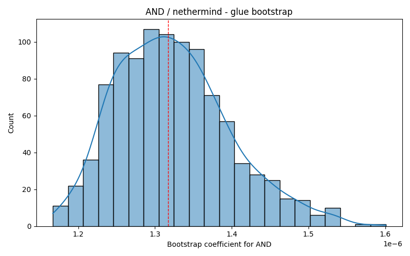

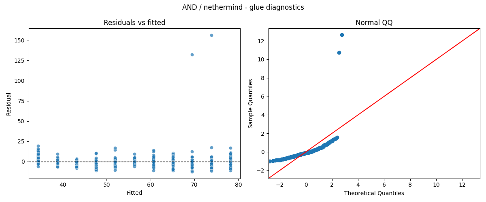

</details>

<details><summary><code>CALLDATACOPY</code> · nobs=8448 · runtime_ms=4e-06 · p=1.00e-03 · R²=0.7029</summary>

```
==============================================================================
                           NNLS Regression Results                            
==============================================================================
Dep. Variable:          test_runtime_ms              R-squared:          0.703
Model:                  NNLS                    Adj. R-squared:          0.703
No. Observations:       8448                              RMSE:          19.56
Df Residuals:           8446                               MAE:          15.12
Df Model:               1      
==============================================================================
                      coef     std err     P-value      [0.025      0.975]
------------------------------------------------------------------------------
         const     23.4500      0.2720       0.001     22.9311     23.9831
  CALLDATACOPY      0.0000      0.0000       0.001      0.0000      0.0000
==============================================================================
Notes: Non-negative least squares with bootstrap inference (1000 iterations)
==============================================================================
```

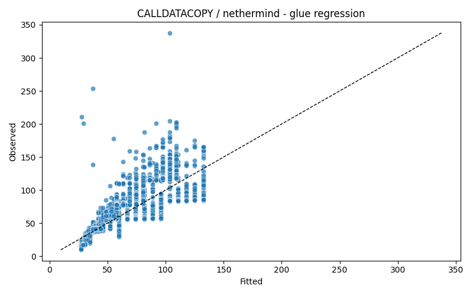

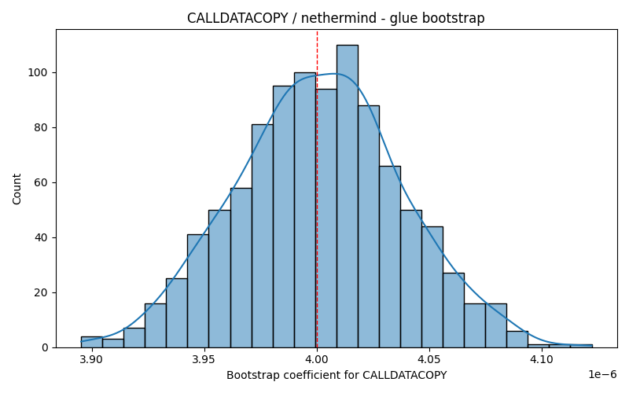

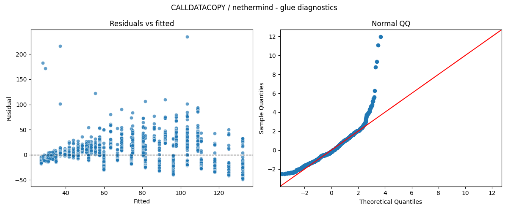

</details>

<details><summary><code>CALLDATALOAD</code> · nobs=1408 · runtime_ms=5.611e-05 · p=1.00e-03 · R²=0.002096</summary>

```
==============================================================================
                           NNLS Regression Results                            
==============================================================================
Dep. Variable:          test_runtime_ms              R-squared:          0.002
Model:                  NNLS                    Adj. R-squared:          0.001
No. Observations:       1408                              RMSE:           4.70
Df Residuals:           1406                               MAE:           0.35
Df Model:               1      
==============================================================================
                      coef     std err     P-value      [0.025      0.975]
------------------------------------------------------------------------------
         const      1.8381      0.2737       0.001      1.2424      2.1557
  CALLDATALOAD      0.0001      0.0000       0.001      0.0000      0.0001
==============================================================================
Notes: Non-negative least squares with bootstrap inference (1000 iterations)
==============================================================================
```

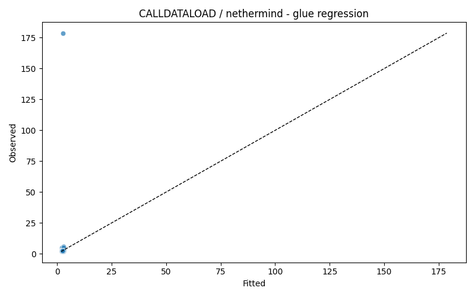

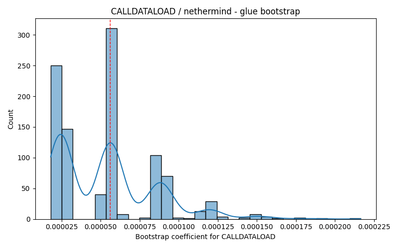

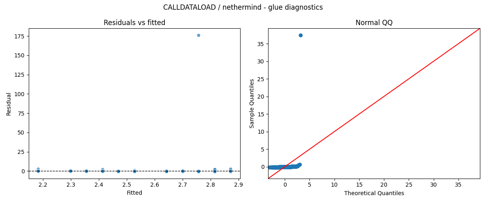

</details>

<details><summary><code>DIV</code> · nobs=352 · runtime_ms=8.14e-06 · p=1.00e-03 · R²=0.6466</summary>

```
==============================================================================
                           NNLS Regression Results                            
==============================================================================
Dep. Variable:          test_runtime_ms              R-squared:          0.647
Model:                  NNLS                    Adj. R-squared:          0.646
No. Observations:       352                               RMSE:          47.51
Df Residuals:           350                                MAE:          37.53
Df Model:               1      
==============================================================================
                      coef     std err     P-value      [0.025      0.975]
------------------------------------------------------------------------------
         const    124.4568     11.0661       0.001    100.9876    146.2333
           DIV      0.0000      0.0000       0.001      0.0000      0.0000
==============================================================================
Notes: Non-negative least squares with bootstrap inference (1000 iterations)
==============================================================================
```

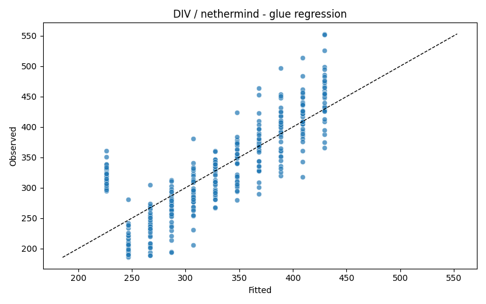


</details>

<details><summary><code>EXP</code> · nobs=352 · runtime_ms=0 · p=1.00e+00 · R²=-2.22e-16</summary>

```
==============================================================================
                           NNLS Regression Results                            
==============================================================================
Dep. Variable:          test_runtime_ms              R-squared:         -0.000
Model:                  NNLS                    Adj. R-squared:         -0.003
No. Observations:       352                               RMSE:          47.92
Df Residuals:           350                                MAE:          32.30
Df Model:               1      
==============================================================================
                      coef     std err     P-value      [0.025      0.975]
------------------------------------------------------------------------------
         const    110.7971      5.5028       0.001     92.5882    116.0587
           EXP      0.0000      0.0000       1.000      0.0000      0.0001
==============================================================================
Notes: Non-negative least squares with bootstrap inference (1000 iterations)
==============================================================================
```

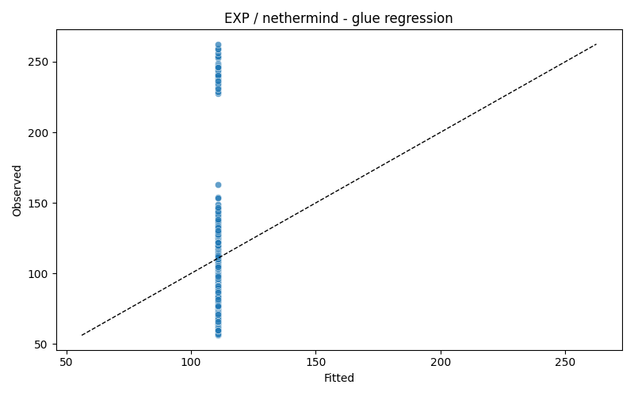

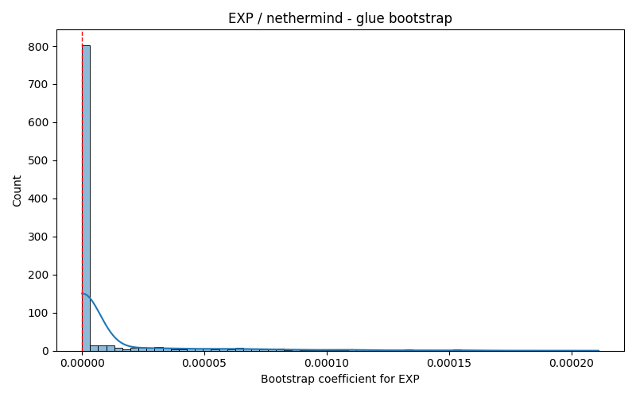

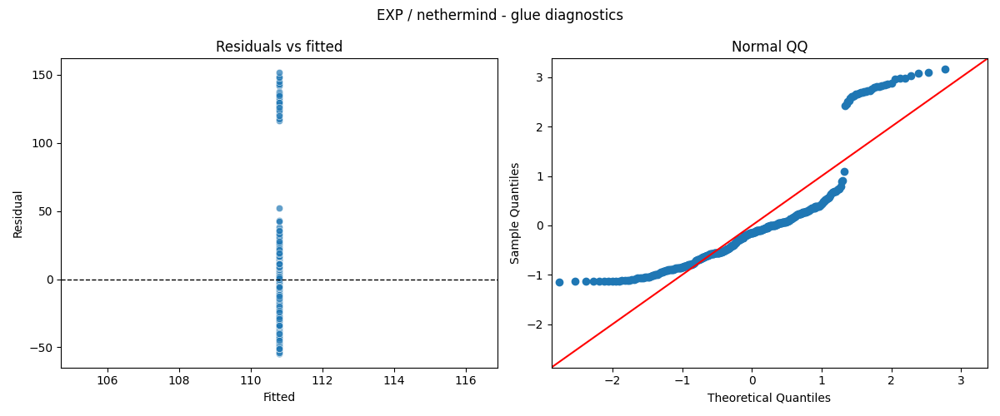

</details>

<details><summary><code>GT</code> · nobs=352 · runtime_ms=1.578e-06 · p=1.00e-03 · R²=0.3554</summary>

```
==============================================================================
                           NNLS Regression Results                            
==============================================================================
Dep. Variable:          test_runtime_ms              R-squared:          0.355
Model:                  NNLS                    Adj. R-squared:          0.354
No. Observations:       352                               RMSE:          22.37
Df Residuals:           350                                MAE:          11.65
Df Model:               1      
==============================================================================
                      coef     std err     P-value      [0.025      0.975]
------------------------------------------------------------------------------
         const     15.2151      3.9835       0.001      7.0514     23.3480
            GT      0.0000      0.0000       0.001      0.0000      0.0000
==============================================================================
Notes: Non-negative least squares with bootstrap inference (1000 iterations)
==============================================================================
```

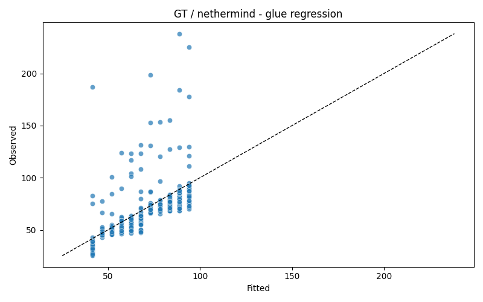

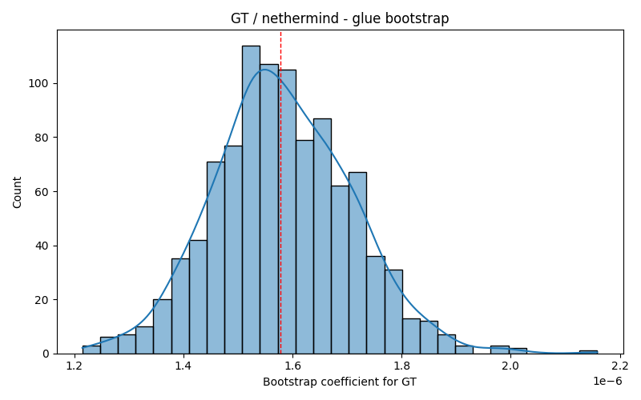

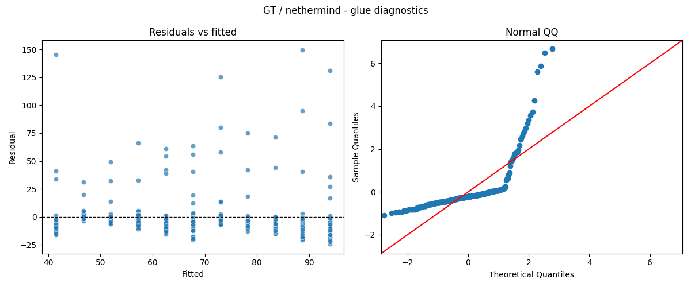

</details>

<details><summary><code>JUMPI</code> · nobs=352 · runtime_ms=1.817e-06 · p=1.00e-03 · R²=0.4586</summary>

```
==============================================================================
                           NNLS Regression Results                            
==============================================================================
Dep. Variable:          test_runtime_ms              R-squared:          0.459
Model:                  NNLS                    Adj. R-squared:          0.457
No. Observations:       352                               RMSE:           8.91
Df Residuals:           350                                MAE:           4.41
Df Model:               1      
==============================================================================
                      coef     std err     P-value      [0.025      0.975]
------------------------------------------------------------------------------
         const      9.7502      1.5272       0.001      6.8801     12.9271
         JUMPI      0.0000      0.0000       0.001      0.0000      0.0000
==============================================================================
Notes: Non-negative least squares with bootstrap inference (1000 iterations)
==============================================================================
```

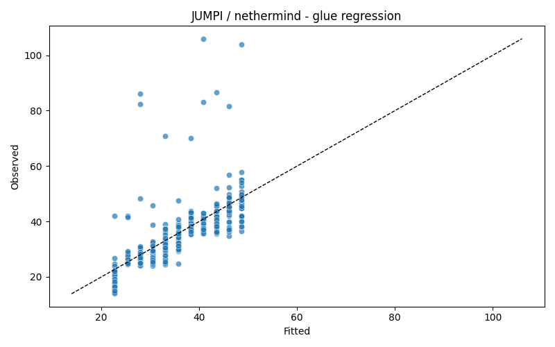


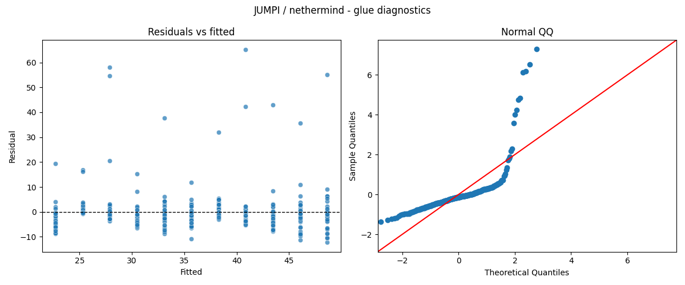

</details>

<details><summary><code>LT</code> · nobs=352 · runtime_ms=1.409e-06 · p=1.00e-03 · R²=0.3094</summary>

```
==============================================================================
                           NNLS Regression Results                            
==============================================================================
Dep. Variable:          test_runtime_ms              R-squared:          0.309
Model:                  NNLS                    Adj. R-squared:          0.307
No. Observations:       352                               RMSE:          22.16
Df Residuals:           350                                MAE:          11.19
Df Model:               1      
==============================================================================
                      coef     std err     P-value      [0.025      0.975]
------------------------------------------------------------------------------
         const     22.2063      3.5852       0.001     15.4067     29.8447
            LT      0.0000      0.0000       0.001      0.0000      0.0000
==============================================================================
Notes: Non-negative least squares with bootstrap inference (1000 iterations)
==============================================================================
```

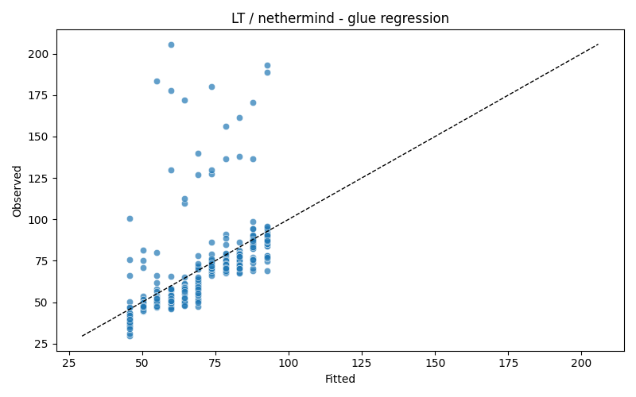

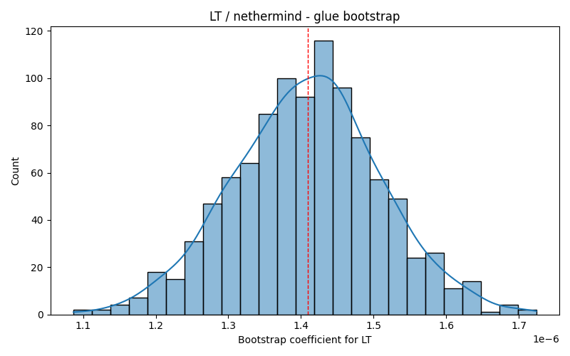

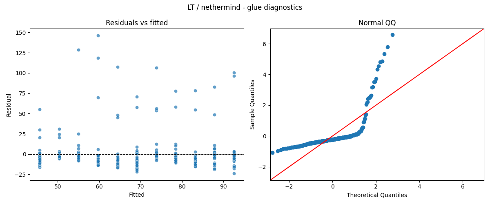

</details>

<details><summary><code>MSTORE</code> · nobs=1760 · runtime_ms=2.248e-06 · p=1.00e-03 · R²=0.5574</summary>

```
==============================================================================
                           NNLS Regression Results                            
==============================================================================
Dep. Variable:          test_runtime_ms              R-squared:          0.557
Model:                  NNLS                    Adj. R-squared:          0.557
No. Observations:       1760                              RMSE:          14.06
Df Residuals:           1758                               MAE:           8.09
Df Model:               1      
==============================================================================
                      coef     std err     P-value      [0.025      0.975]
------------------------------------------------------------------------------
         const     14.0899      0.9321       0.001     12.2125     15.8769
        MSTORE      0.0000      0.0000       0.001      0.0000      0.0000
==============================================================================
Notes: Non-negative least squares with bootstrap inference (1000 iterations)
==============================================================================
```

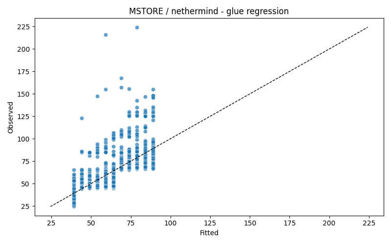

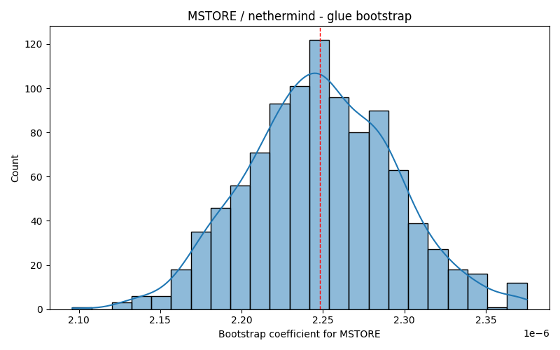

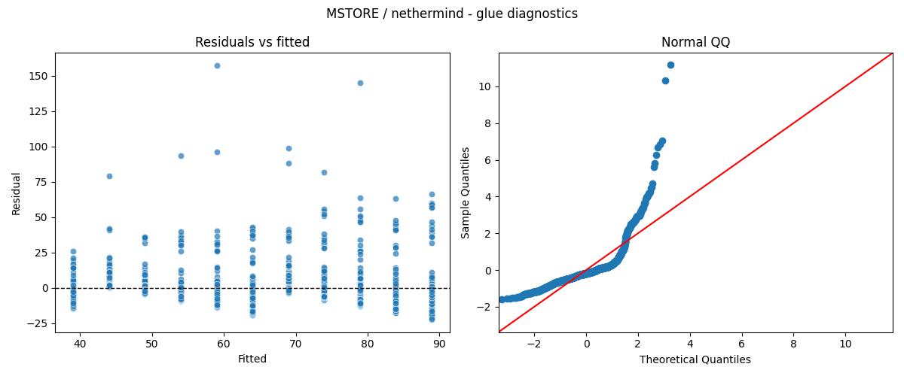

</details>

<details><summary><code>MSTORE8</code> · nobs=1760 · runtime_ms=1.957e-06 · p=1.00e-03 · R²=0.676</summary>

```
==============================================================================
                           NNLS Regression Results                            
==============================================================================
Dep. Variable:          test_runtime_ms              R-squared:          0.676
Model:                  NNLS                    Adj. R-squared:          0.676
No. Observations:       1760                              RMSE:           9.51
Df Residuals:           1758                               MAE:           5.55
Df Model:               1      
==============================================================================
                      coef     std err     P-value      [0.025      0.975]
------------------------------------------------------------------------------
         const     16.1158      0.7778       0.001     14.6224     17.6783
       MSTORE8      0.0000      0.0000       0.001      0.0000      0.0000
==============================================================================
Notes: Non-negative least squares with bootstrap inference (1000 iterations)
==============================================================================
```

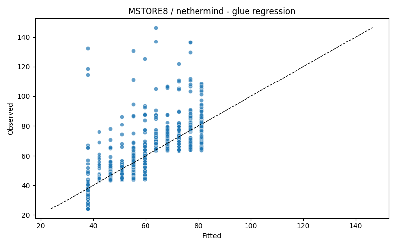

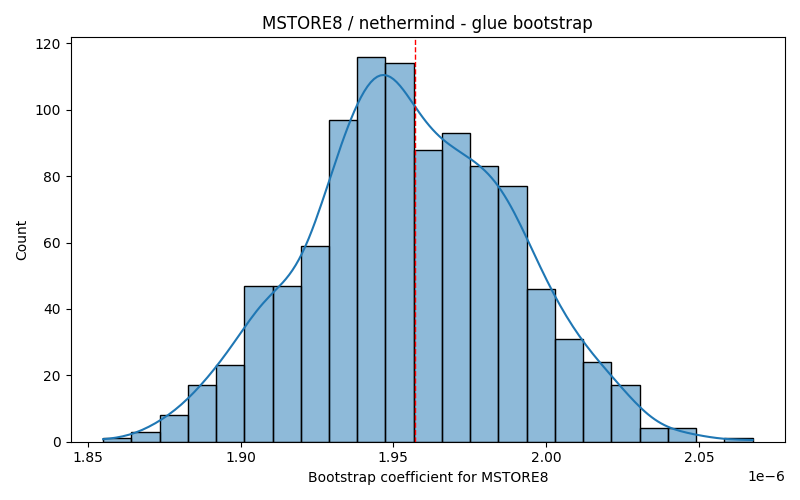

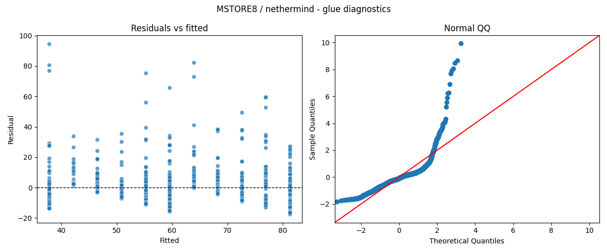

</details>

<details><summary><code>MUL</code> · nobs=352 · runtime_ms=5.736e-06 · p=1.00e-03 · R²=0.7508</summary>

```
==============================================================================
                           NNLS Regression Results                            
==============================================================================
Dep. Variable:          test_runtime_ms              R-squared:          0.751
Model:                  NNLS                    Adj. R-squared:          0.750
No. Observations:       352                               RMSE:          26.09
Df Residuals:           350                                MAE:          16.24
Df Model:               1      
==============================================================================
                      coef     std err     P-value      [0.025      0.975]
------------------------------------------------------------------------------
         const     25.5008      3.5467       0.001     18.3287     32.2486
           MUL      0.0000      0.0000       0.001      0.0000      0.0000
==============================================================================
Notes: Non-negative least squares with bootstrap inference (1000 iterations)
==============================================================================
```

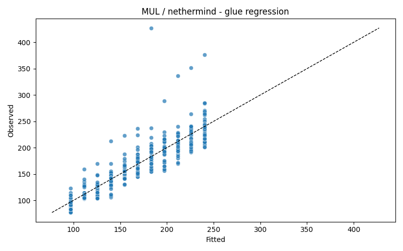

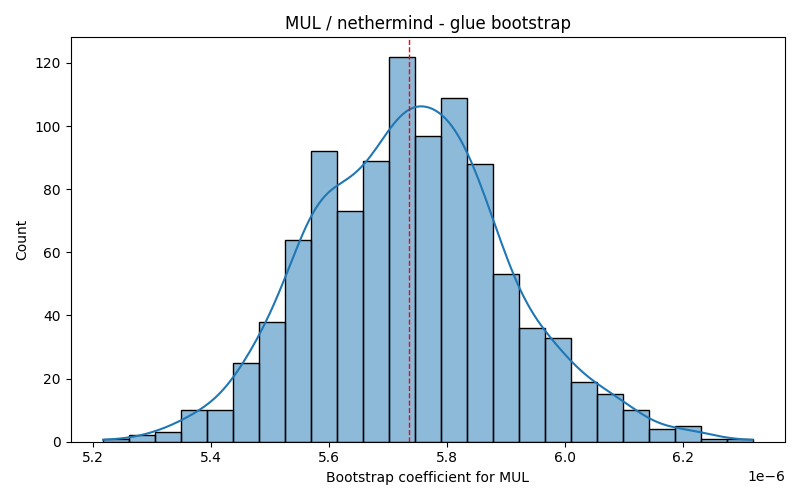

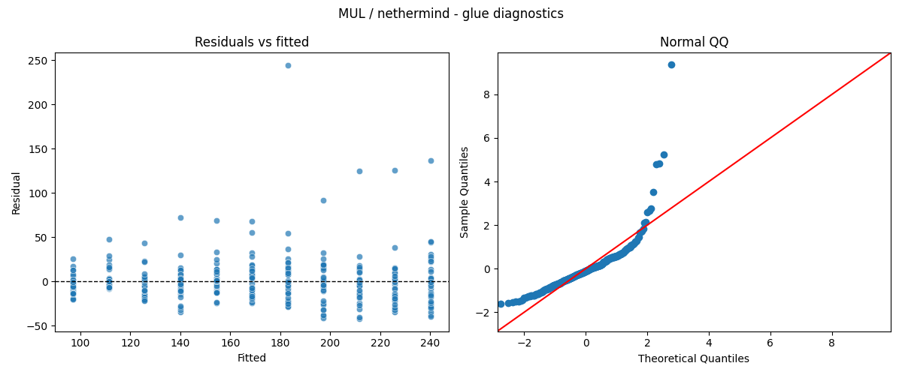

</details>

<details><summary><code>PC</code> · nobs=352 · runtime_ms=8.134e-07 · p=1.00e-03 · R²=0.8998</summary>

```
==============================================================================
                           NNLS Regression Results                            
==============================================================================
Dep. Variable:          test_runtime_ms              R-squared:          0.900
Model:                  NNLS                    Adj. R-squared:          0.900
No. Observations:       352                               RMSE:           8.12
Df Residuals:           350                                MAE:           6.39
Df Model:               1      
==============================================================================
                      coef     std err     P-value      [0.025      0.975]
------------------------------------------------------------------------------
         const     16.6256      1.5736       0.001     13.6972     19.8925
            PC      0.0000      0.0000       0.001      0.0000      0.0000
==============================================================================
Notes: Non-negative least squares with bootstrap inference (1000 iterations)
==============================================================================
```

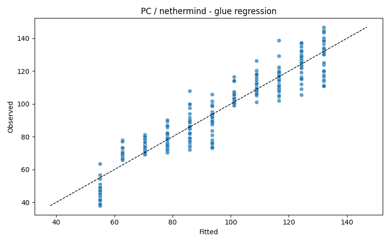

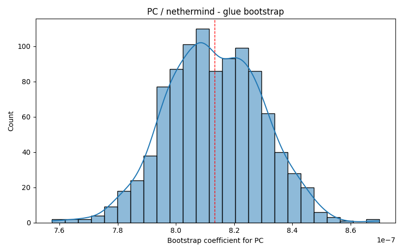

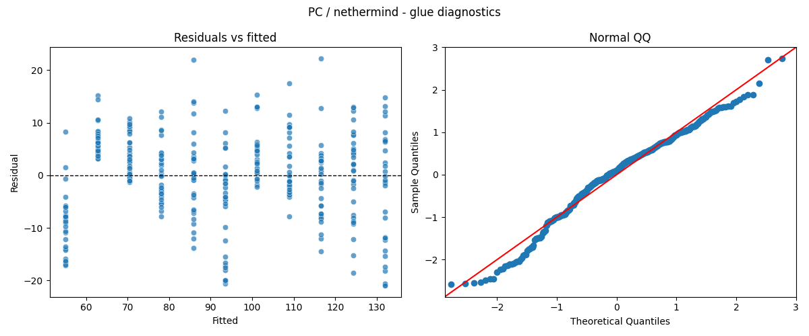

</details>

<details><summary><code>RETURNDATASIZE</code> · nobs=1408 · runtime_ms=7.769e-07 · p=1.00e-03 · R²=0.4656</summary>

```
==============================================================================
                           NNLS Regression Results                            
==============================================================================
Dep. Variable:          test_runtime_ms              R-squared:          0.466
Model:                  NNLS                    Adj. R-squared:          0.465
No. Observations:       1408                              RMSE:          13.14
Df Residuals:           1406                               MAE:           5.74
Df Model:               1      
==============================================================================
                      coef     std err     P-value      [0.025      0.975]
------------------------------------------------------------------------------
         const     12.1500      1.1345       0.001      9.9513     14.2785
RETURNDATASIZE      0.0000      0.0000       0.001      0.0000      0.0000
==============================================================================
Notes: Non-negative least squares with bootstrap inference (1000 iterations)
==============================================================================
```

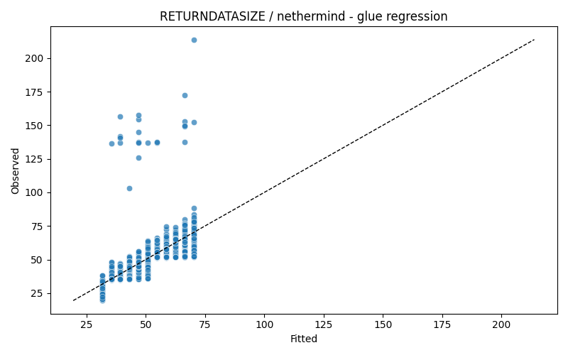

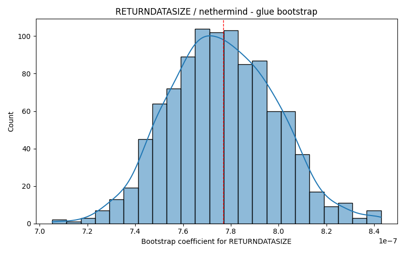

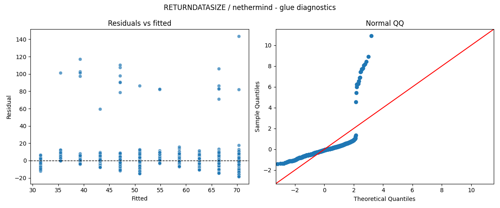

</details>

<details><summary><code>SELFBALANCE</code> · nobs=288 · runtime_ms=1.068e-05 · p=1.00e-03 · R²=0.8691</summary>

```
==============================================================================
                           NNLS Regression Results                            
==============================================================================
Dep. Variable:          test_runtime_ms              R-squared:          0.869
Model:                  NNLS                    Adj. R-squared:          0.869
No. Observations:       288                               RMSE:          41.80
Df Residuals:           286                                MAE:          34.06
Df Model:               1      
==============================================================================
                      coef     std err     P-value      [0.025      0.975]
------------------------------------------------------------------------------
         const     74.9496     10.6452       0.001     51.9730     95.1266
   SELFBALANCE      0.0000      0.0000       0.001      0.0000      0.0000
==============================================================================
Notes: Non-negative least squares with bootstrap inference (1000 iterations)
==============================================================================
```

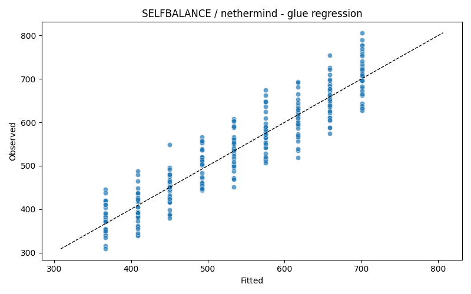

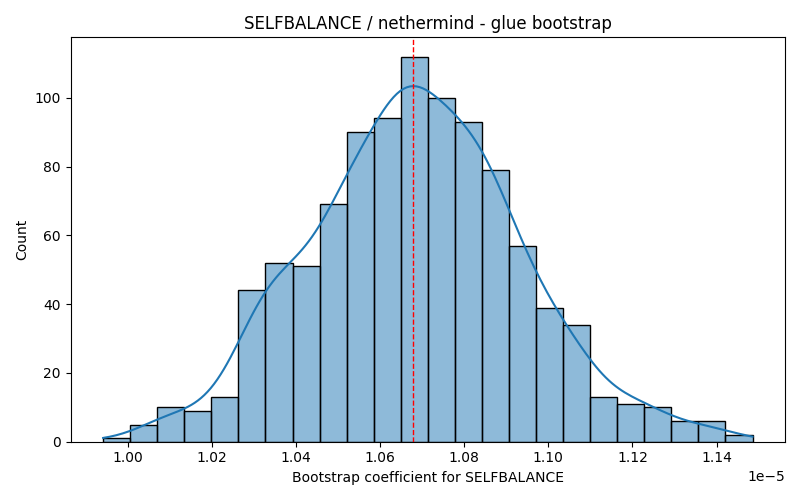

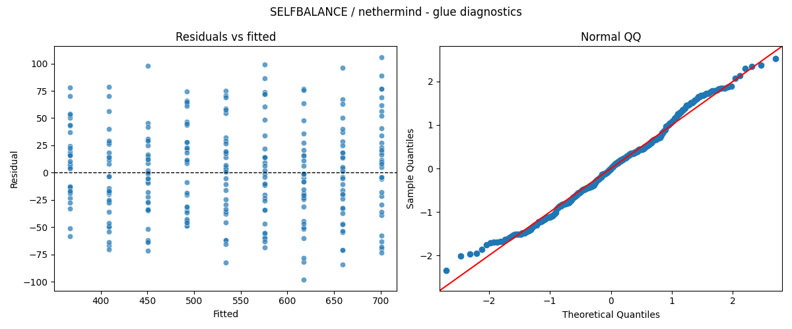

</details>

<details><summary><code>SUB</code> · nobs=352 · runtime_ms=2.622e-06 · p=1.00e-03 · R²=0.5745</summary>

```
==============================================================================
                           NNLS Regression Results                            
==============================================================================
Dep. Variable:          test_runtime_ms              R-squared:          0.575
Model:                  NNLS                    Adj. R-squared:          0.573
No. Observations:       352                               RMSE:          23.75
Df Residuals:           350                                MAE:          12.00
Df Model:               1      
==============================================================================
                      coef     std err     P-value      [0.025      0.975]
------------------------------------------------------------------------------
         const     15.3645      3.3613       0.001      8.4540     21.5409
           SUB      0.0000      0.0000       0.001      0.0000      0.0000
==============================================================================
Notes: Non-negative least squares with bootstrap inference (1000 iterations)
==============================================================================
```


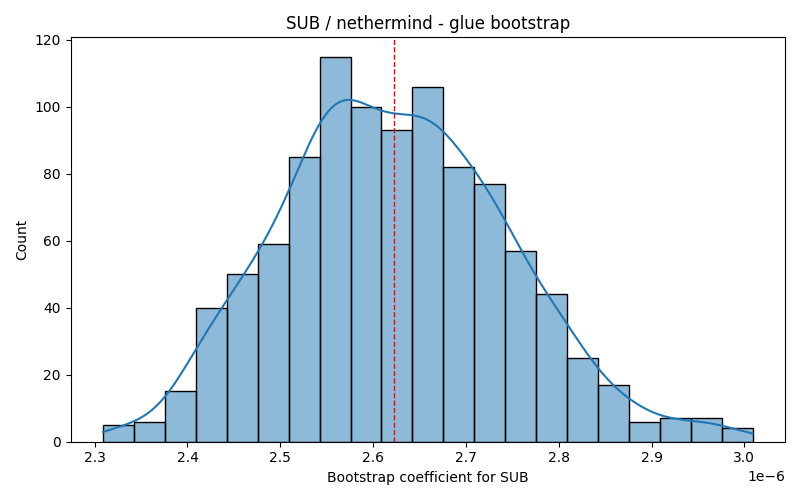

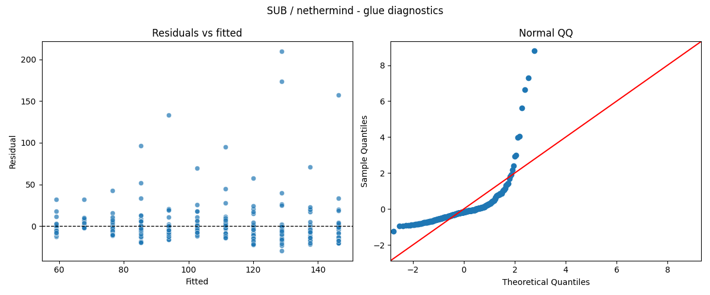

</details>

### Mixed glue (tier B) · nethermind

<details><summary><code>JUMP</code> · nobs=352 · runtime_ms=5.136e-06 · p=1.00e-03 · R²=0.7883</summary>

```
==============================================================================
                           NNLS Regression Results                            
==============================================================================
Dep. Variable:          test_runtime_ms              R-squared:          0.788
Model:                  NNLS                    Adj. R-squared:          0.788
No. Observations:       352                               RMSE:           9.89
Df Residuals:           350                                MAE:           6.56
Df Model:               1      
==============================================================================
                      coef     std err     P-value      [0.025      0.975]
------------------------------------------------------------------------------
         const     17.7471      2.1642       0.001     13.9985     22.7435
          JUMP      0.0000      0.0000       0.001      0.0000      0.0000
==============================================================================
Notes: Non-negative least squares with bootstrap inference (1000 iterations)
==============================================================================
```

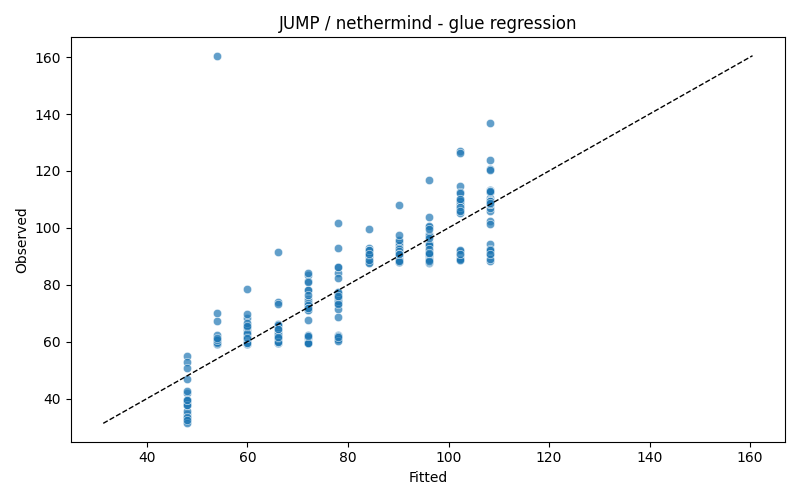

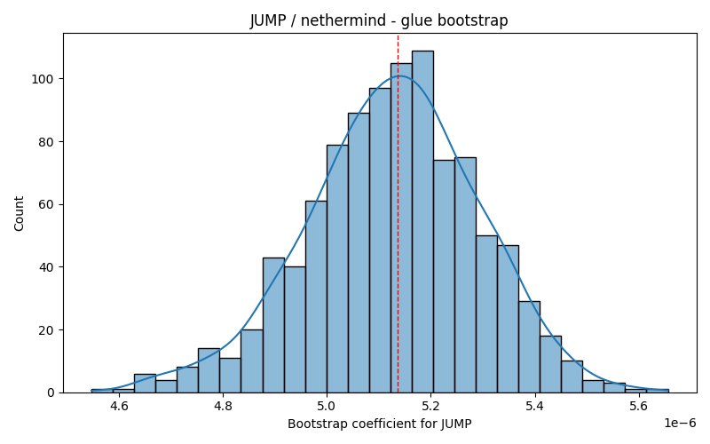

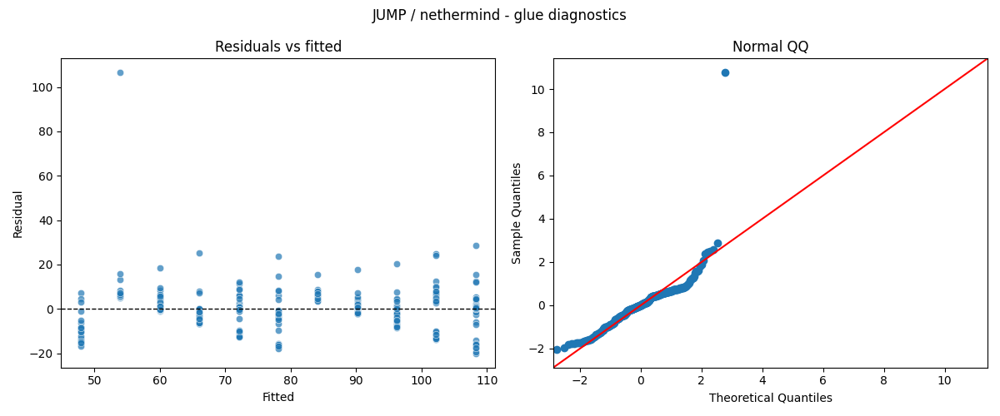

</details>

<details><summary><code>KECCAK256</code> · nobs=5632 · runtime_ms=0 · p=1.00e+00 · R²=0</summary>

```
==============================================================================
                           NNLS Regression Results                            
==============================================================================
Dep. Variable:          test_runtime_ms              R-squared:          0.000
Model:                  NNLS                    Adj. R-squared:         -0.000
No. Observations:       5632                              RMSE:         289.28
Df Residuals:           5630                               MAE:         238.29
Df Model:               1      
==============================================================================
                      coef     std err     P-value      [0.025      0.975]
------------------------------------------------------------------------------
         const    444.2041      3.7289       0.001    437.0884    451.5897
     KECCAK256      0.0000      0.0000       1.000      0.0000      0.0000
==============================================================================
Notes: Non-negative least squares with bootstrap inference (1000 iterations)
==============================================================================
```

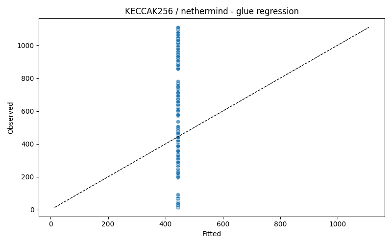


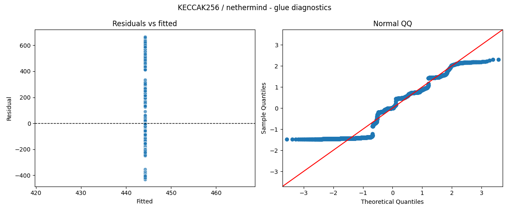

</details>

## reth

| glue_opcode | nobs | glue_runtime_ms | p_value | rsquared |
| --- | --- | --- | --- | --- |
| `ISZERO` | 165 | 3.702e-07 | 1.00e-03 | 0.7428 |
| `JUMPDEST` | 165 | 2.902e-07 | 1.00e-03 | 0.8104 |
| `SWAP` | 2640 | 4.775e-07 | 1.00e-03 | 0.5579 |
| `CALLDATASIZE` | 10098 | 4.988e-07 | 1.00e-03 | 0.838 |
| `DUP` | 10098 | 4.197e-07 | 1.00e-03 | 0.838 |
| `GAS` | 10098 | 4.521e-07 | 1.00e-03 | 0.838 |
| `MLOAD` | 10098 | 1.607e-06 | 1.00e-03 | 0.838 |
| `PUSH` | 10098 | 4.535e-07 | 1.00e-03 | 0.838 |
| `PUSH0` | 10098 | 3.496e-07 | 1.00e-03 | 0.838 |
| `STATICCALL` | 10098 | 4.58e-05 | 1.00e-03 | 0.838 |
| `ADD` | 165 | 9.279e-07 | 1.00e-03 | 0.8174 |
| `AND` | 165 | 7.611e-07 | 1.00e-03 | 0.2763 |
| `CALLDATACOPY` | 3960 | 2.284e-06 | 1.00e-03 | 0.7189 |
| `CALLDATALOAD` | 660 | 4.502e-05 | 1.00e-03 | 0.2923 |
| `DIV` | 165 | 6.713e-06 | 1.00e-03 | 0.838 |
| `EXP` | 165 | 0.0003695 | 1.00e-03 | 0.8178 |
| `GT` | 165 | 9.986e-07 | 1.00e-03 | 0.7747 |
| `JUMPI` | 165 | 1.236e-06 | 1.00e-03 | 0.7045 |
| `LT` | 165 | 9.868e-07 | 1.00e-03 | 0.8235 |
| `MSTORE` | 825 | 2.808e-06 | 1.00e-03 | 0.283 |
| `MSTORE8` | 825 | 1.301e-06 | 1.00e-03 | 0.4829 |
| `MUL` | 165 | 1.188e-06 | 1.00e-03 | 0.66 |
| `PC` | 165 | 6.035e-07 | 1.00e-03 | 0.926 |
| `RETURNDATASIZE` | 660 | 8.971e-07 | 1.00e-03 | 0.6496 |
| `SELFBALANCE` | 135 | 4.152e-06 | 1.00e-03 | 0.8263 |
| `SUB` | 165 | 9.622e-07 | 1.00e-03 | 0.8252 |
| `JUMP` | 165 | 2.213e-06 | 1.00e-03 | 0.8114 |
| `KECCAK256` | 2640 | 0 | 1.00e+00 | 0 |

### Cycle glue — joint fit · reth

<details><summary>Joint NNLS regression summary</summary>

```
==============================================================================
                           NNLS Regression Results                            
==============================================================================
Dep. Variable:          test_runtime_ms              R-squared:          0.838
Model:                  NNLS                    Adj. R-squared:          0.838
No. Observations:       10098                             RMSE:           7.29
Df Residuals:           10090                              MAE:           5.07
Df Model:               7      
==============================================================================
                      coef     std err     P-value      [0.025      0.975]
------------------------------------------------------------------------------
         const     11.0178      0.2375       0.001     10.5508     11.4791
  CALLDATASIZE      0.0000      0.0000       0.001      0.0000      0.0000
           DUP      0.0000      0.0000       0.001      0.0000      0.0000
           GAS      0.0000      0.0000       0.001      0.0000      0.0000
         MLOAD      0.0000      0.0000       0.001      0.0000      0.0000
          PUSH      0.0000      0.0000       0.001      0.0000      0.0000
         PUSH0      0.0000      0.0000       0.001      0.0000      0.0000
    STATICCALL      0.0000      0.0000       0.001      0.0000      0.0000
==============================================================================
Notes: Non-negative least squares with bootstrap inference (1000 iterations)
==============================================================================
```

</details>

<details><summary><code>CALLDATASIZE</code> · nobs=10098 · runtime_ms=4.988e-07 · p=1.00e-03 · R²=0.838</summary>


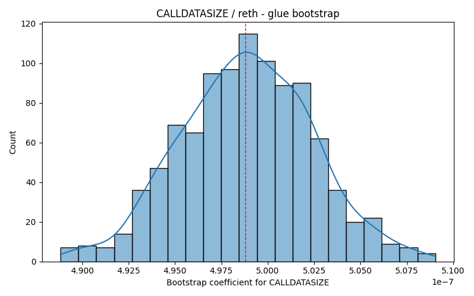

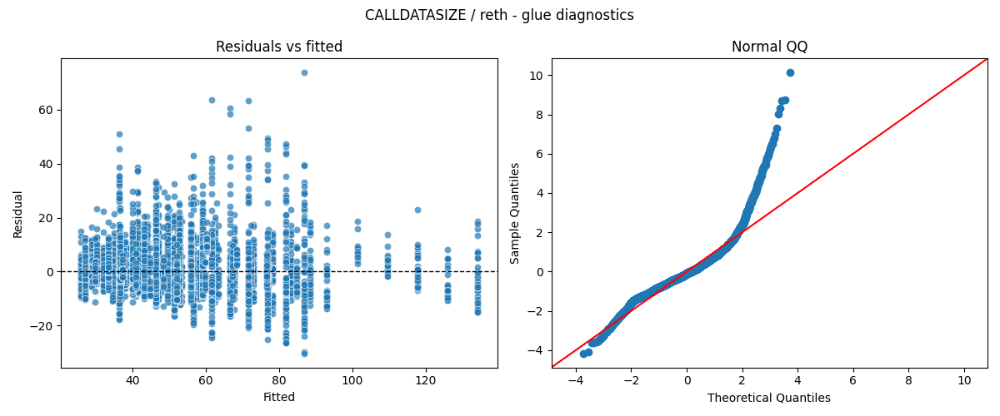

</details>

<details><summary><code>DUP</code> · nobs=10098 · runtime_ms=4.197e-07 · p=1.00e-03 · R²=0.838</summary>


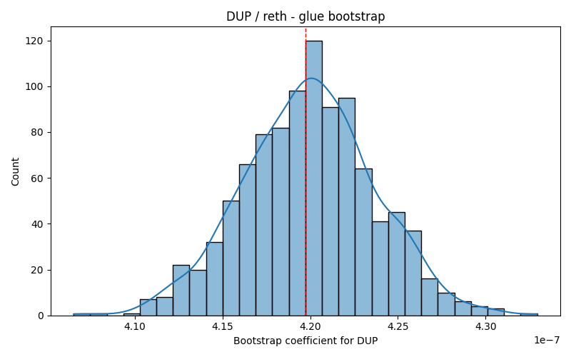


</details>

<details><summary><code>GAS</code> · nobs=10098 · runtime_ms=4.521e-07 · p=1.00e-03 · R²=0.838</summary>


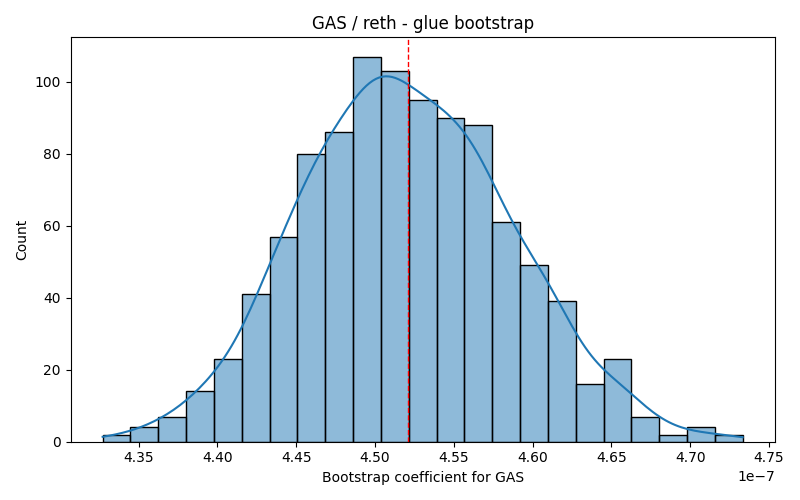


</details>

<details><summary><code>MLOAD</code> · nobs=10098 · runtime_ms=1.607e-06 · p=1.00e-03 · R²=0.838</summary>


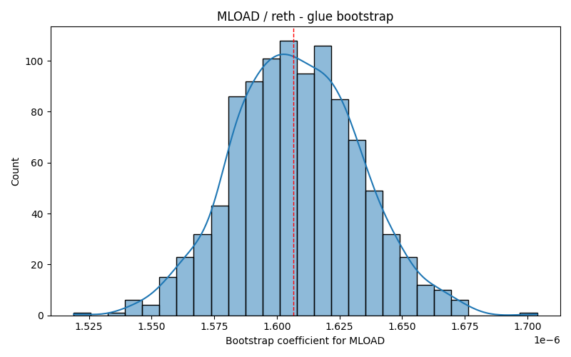


</details>

<details><summary><code>PUSH</code> · nobs=10098 · runtime_ms=4.535e-07 · p=1.00e-03 · R²=0.838</summary>


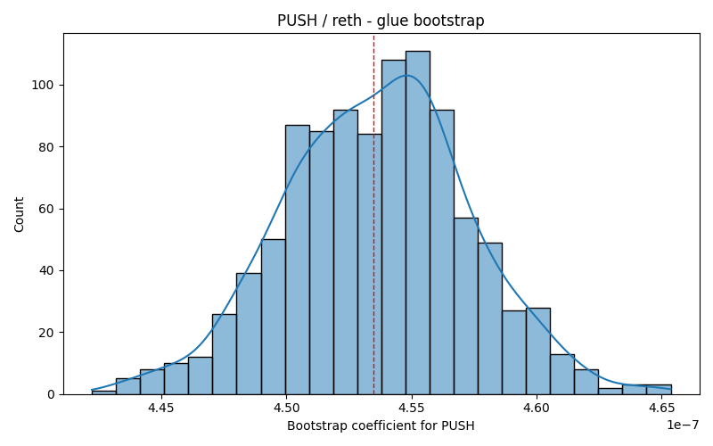

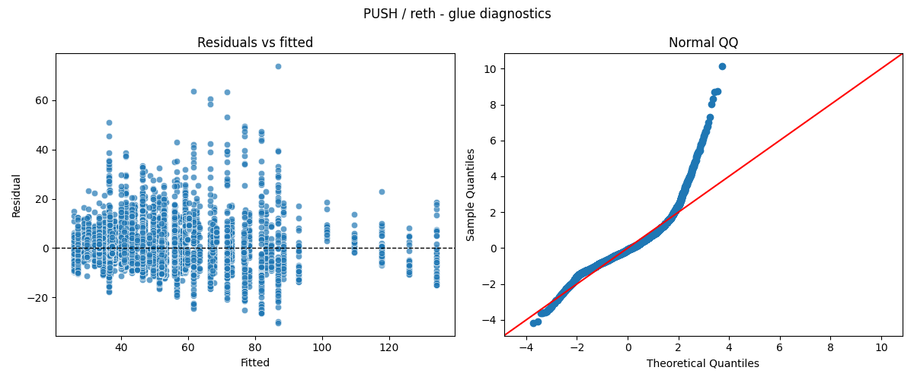

</details>

<details><summary><code>PUSH0</code> · nobs=10098 · runtime_ms=3.496e-07 · p=1.00e-03 · R²=0.838</summary>

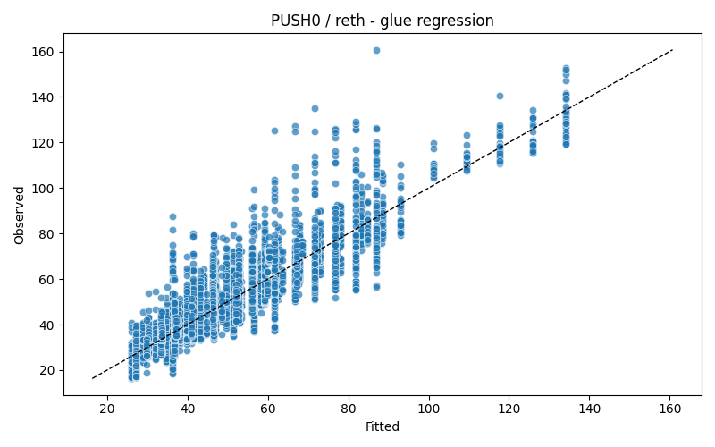


</details>

<details><summary><code>STATICCALL</code> · nobs=10098 · runtime_ms=4.58e-05 · p=1.00e-03 · R²=0.838</summary>


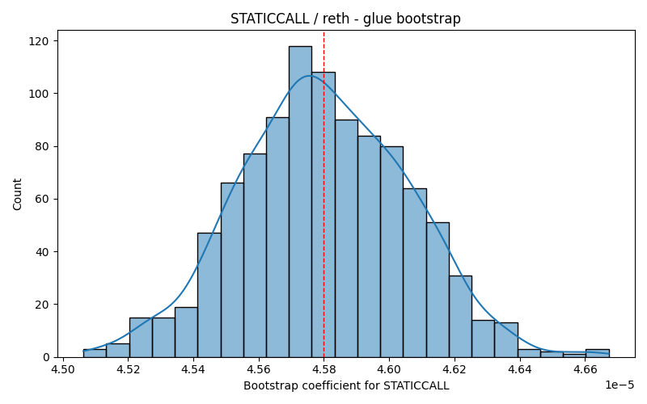


</details>

### Pure glue · reth

<details><summary><code>ISZERO</code> · nobs=165 · runtime_ms=3.702e-07 · p=1.00e-03 · R²=0.7428</summary>

```
==============================================================================
                           NNLS Regression Results                            
==============================================================================
Dep. Variable:          test_runtime_ms              R-squared:          0.743
Model:                  NNLS                    Adj. R-squared:          0.741
No. Observations:       165                               RMSE:           4.59
Df Residuals:           163                                MAE:           3.30
Df Model:               1      
==============================================================================
                      coef     std err     P-value      [0.025      0.975]
------------------------------------------------------------------------------
         const      8.6464      1.1566       0.001      6.2616     10.9033
        ISZERO      0.0000      0.0000       0.001      0.0000      0.0000
==============================================================================
Notes: Non-negative least squares with bootstrap inference (1000 iterations)
==============================================================================
```

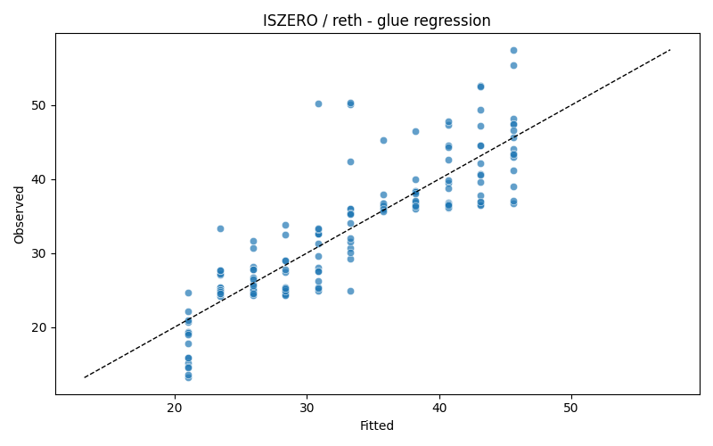

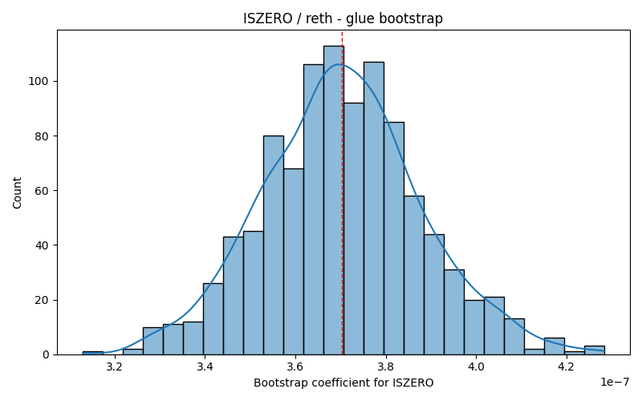

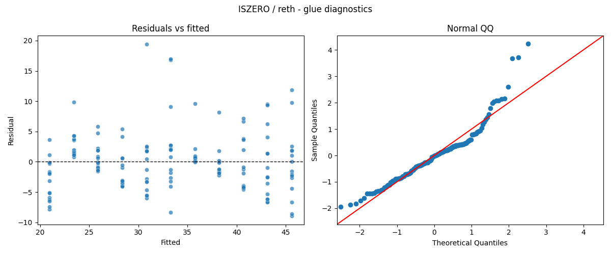

</details>

<details><summary><code>JUMPDEST</code> · nobs=165 · runtime_ms=2.902e-07 · p=1.00e-03 · R²=0.8104</summary>

```
==============================================================================
                           NNLS Regression Results                            
==============================================================================
Dep. Variable:          test_runtime_ms              R-squared:          0.810
Model:                  NNLS                    Adj. R-squared:          0.809
No. Observations:       165                               RMSE:           8.87
Df Residuals:           163                                MAE:           6.79
Df Model:               1      
==============================================================================
                      coef     std err     P-value      [0.025      0.975]
------------------------------------------------------------------------------
         const     13.3549      2.0349       0.001      9.2826     17.2668
      JUMPDEST      0.0000      0.0000       0.001      0.0000      0.0000
==============================================================================
Notes: Non-negative least squares with bootstrap inference (1000 iterations)
==============================================================================
```

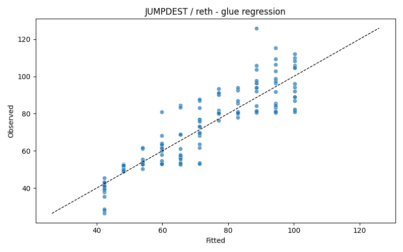

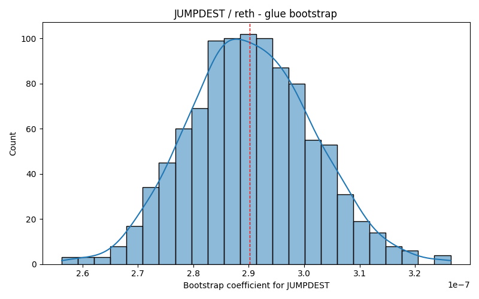

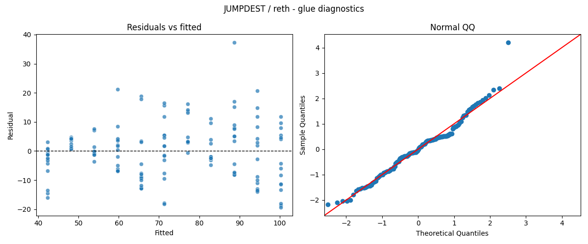

</details>

<details><summary><code>SWAP</code> · nobs=2640 · runtime_ms=4.775e-07 · p=1.00e-03 · R²=0.5579</summary>

```
==============================================================================
                           NNLS Regression Results                            
==============================================================================
Dep. Variable:          test_runtime_ms              R-squared:          0.558
Model:                  NNLS                    Adj. R-squared:          0.558
No. Observations:       2640                              RMSE:           8.95
Df Residuals:           2638                               MAE:           4.52
Df Model:               1      
==============================================================================
                      coef     std err     P-value      [0.025      0.975]
------------------------------------------------------------------------------
         const     11.3804      0.5757       0.001     10.2873     12.5177
          SWAP      0.0000      0.0000       0.001      0.0000      0.0000
==============================================================================
Notes: Non-negative least squares with bootstrap inference (1000 iterations)
==============================================================================
```

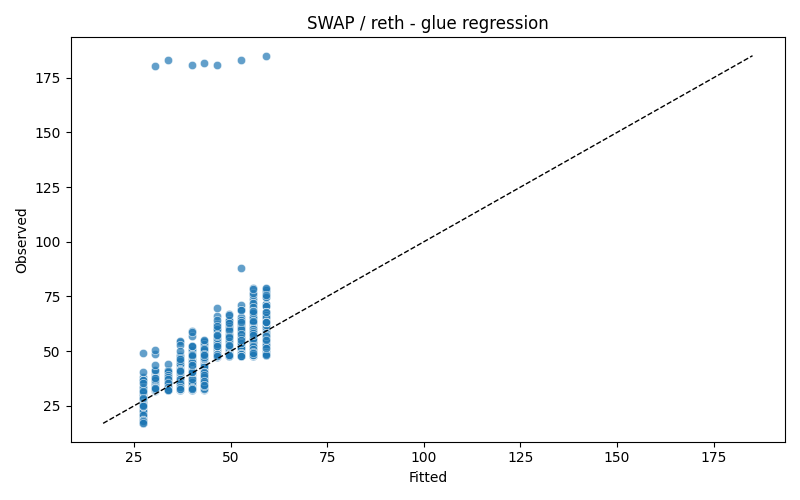

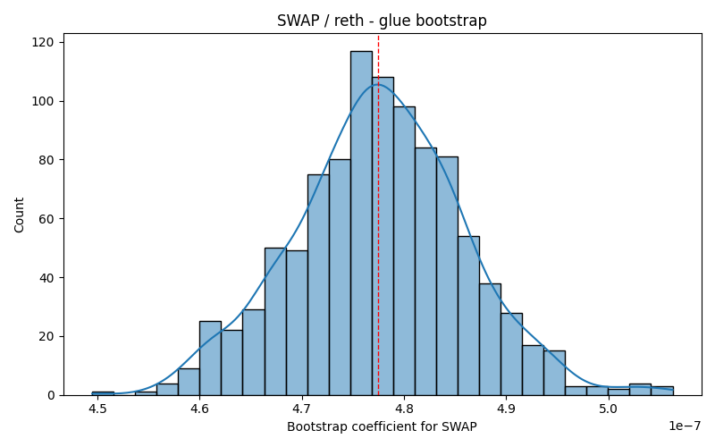

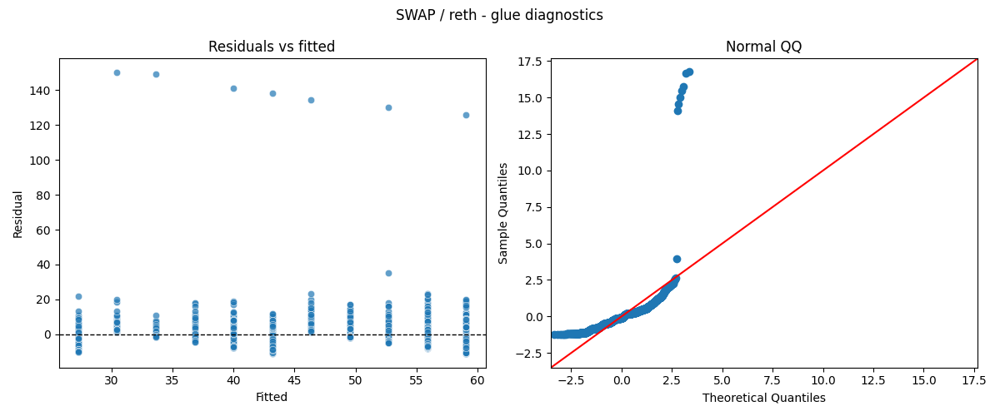

</details>

### Mixed glue (tier A) · reth

<details><summary><code>ADD</code> · nobs=165 · runtime_ms=9.279e-07 · p=1.00e-03 · R²=0.8174</summary>

```
==============================================================================
                           NNLS Regression Results                            
==============================================================================
Dep. Variable:          test_runtime_ms              R-squared:          0.817
Model:                  NNLS                    Adj. R-squared:          0.816
No. Observations:       165                               RMSE:           4.62
Df Residuals:           163                                MAE:           3.34
Df Model:               1      
==============================================================================
                      coef     std err     P-value      [0.025      0.975]
------------------------------------------------------------------------------
         const      8.4358      1.2137       0.001      6.0373     10.7510
           ADD      0.0000      0.0000       0.001      0.0000      0.0000
==============================================================================
Notes: Non-negative least squares with bootstrap inference (1000 iterations)
==============================================================================
```

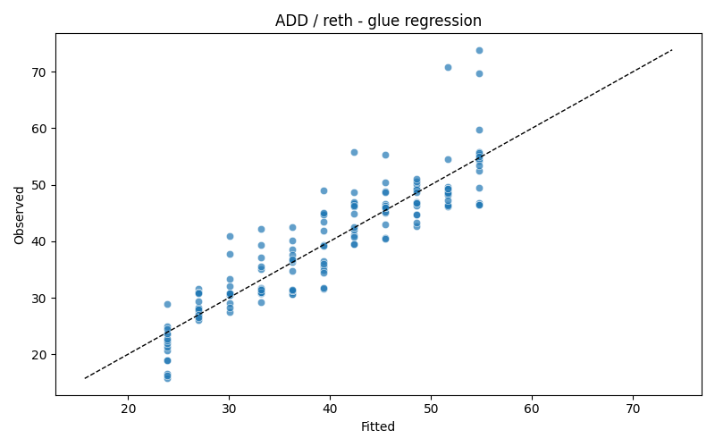

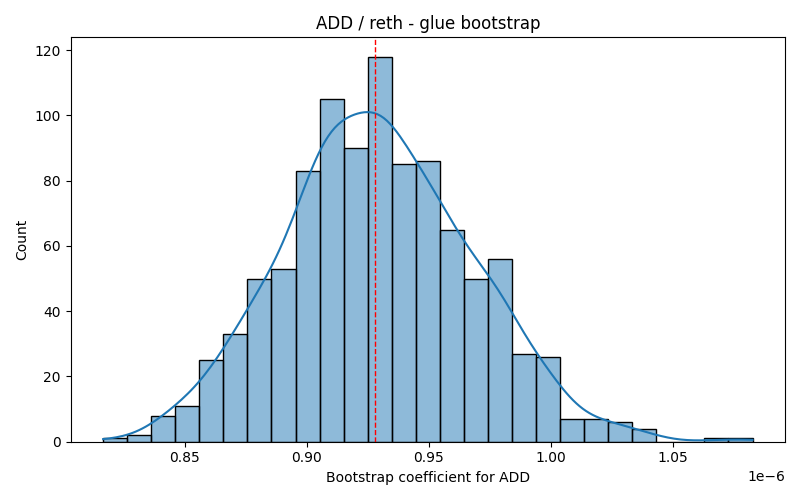

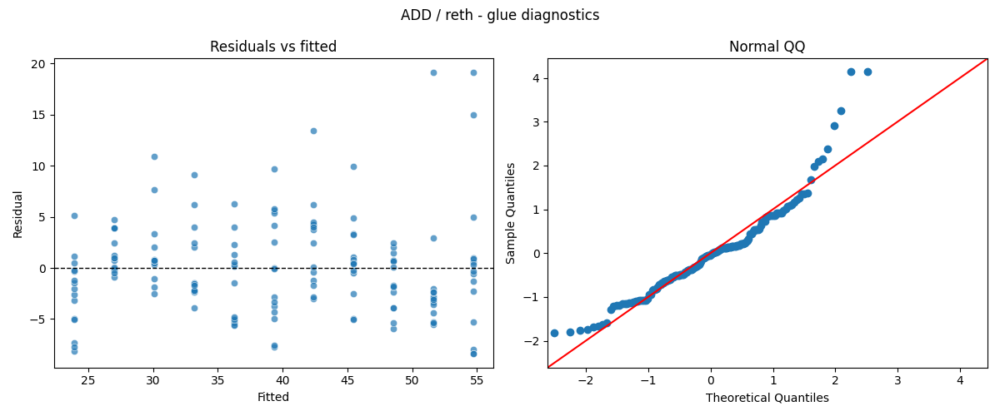

</details>

<details><summary><code>AND</code> · nobs=165 · runtime_ms=7.611e-07 · p=1.00e-03 · R²=0.2763</summary>

```
==============================================================================
                           NNLS Regression Results                            
==============================================================================
Dep. Variable:          test_runtime_ms              R-squared:          0.276
Model:                  NNLS                    Adj. R-squared:          0.272
No. Observations:       165                               RMSE:          12.96
Df Residuals:           163                                MAE:           4.42
Df Model:               1      
==============================================================================
                      coef     std err     P-value      [0.025      0.975]
------------------------------------------------------------------------------
         const     14.1230      5.7602       0.001      6.6050     27.4997
           AND      0.0000      0.0000       0.001      0.0000      0.0000
==============================================================================
Notes: Non-negative least squares with bootstrap inference (1000 iterations)
==============================================================================
```

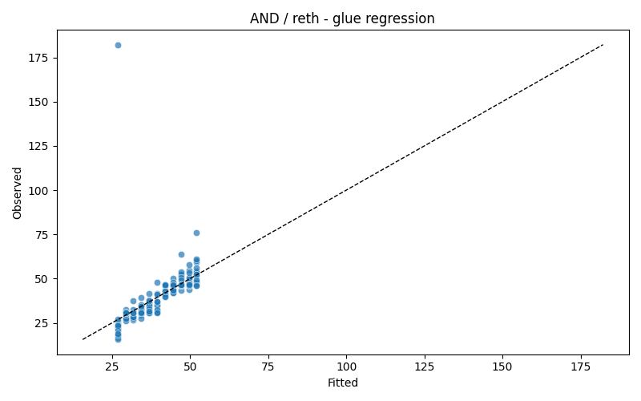

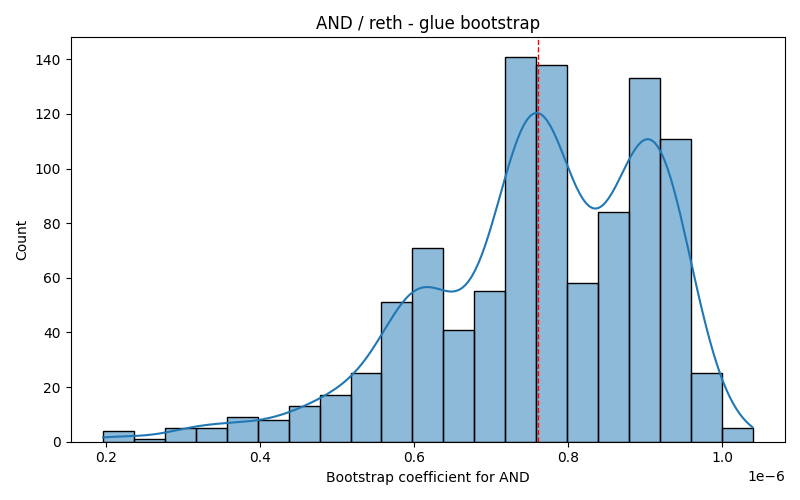

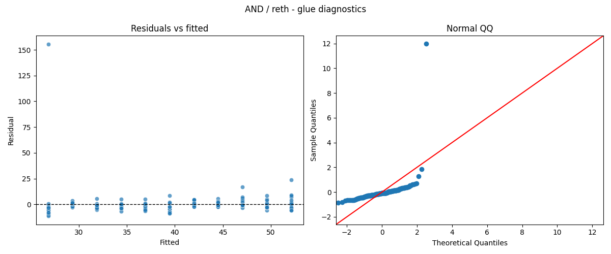

</details>

<details><summary><code>CALLDATACOPY</code> · nobs=3960 · runtime_ms=2.284e-06 · p=1.00e-03 · R²=0.7189</summary>

```
==============================================================================
                           NNLS Regression Results                            
==============================================================================
Dep. Variable:          test_runtime_ms              R-squared:          0.719
Model:                  NNLS                    Adj. R-squared:          0.719
No. Observations:       3960                              RMSE:          10.74
Df Residuals:           3958                               MAE:           7.11
Df Model:               1      
==============================================================================
                      coef     std err     P-value      [0.025      0.975]
------------------------------------------------------------------------------
         const     12.6008      0.2060       0.001     12.1809     12.9998
  CALLDATACOPY      0.0000      0.0000       0.001      0.0000      0.0000
==============================================================================
Notes: Non-negative least squares with bootstrap inference (1000 iterations)
==============================================================================
```

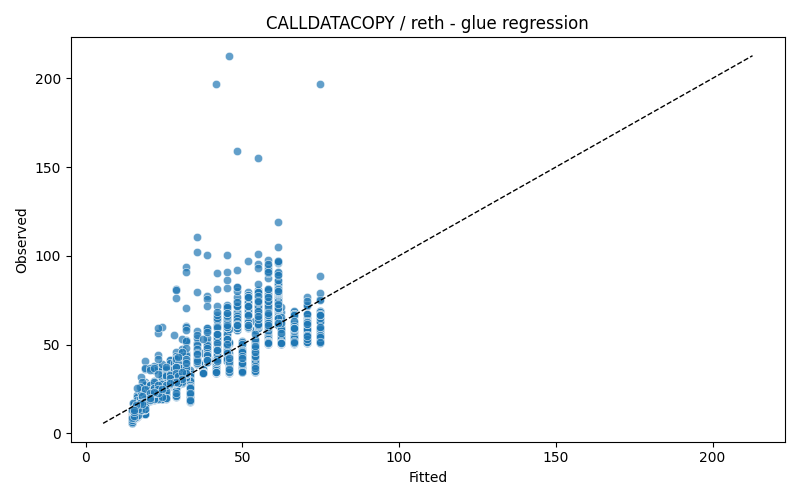

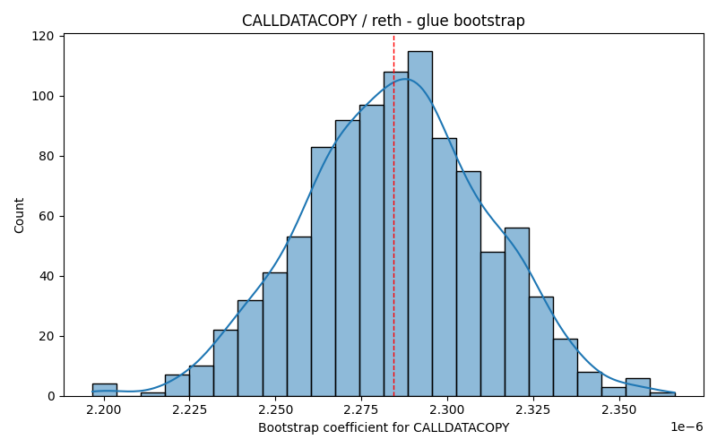

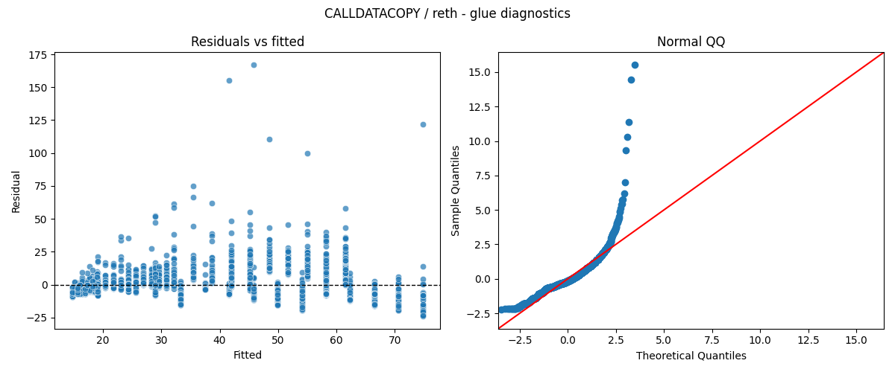

</details>

<details><summary><code>CALLDATALOAD</code> · nobs=660 · runtime_ms=4.502e-05 · p=1.00e-03 · R²=0.2923</summary>

```
==============================================================================
                           NNLS Regression Results                            
==============================================================================
Dep. Variable:          test_runtime_ms              R-squared:          0.292
Model:                  NNLS                    Adj. R-squared:          0.291
No. Observations:       660                               RMSE:           0.27
Df Residuals:           658                                MAE:           0.14
Df Model:               1      
==============================================================================
                      coef     std err     P-value      [0.025      0.975]
------------------------------------------------------------------------------
         const      1.1615      0.0395       0.001      1.0750      1.2230
  CALLDATALOAD      0.0000      0.0000       0.001      0.0000      0.0001
==============================================================================
Notes: Non-negative least squares with bootstrap inference (1000 iterations)
==============================================================================
```

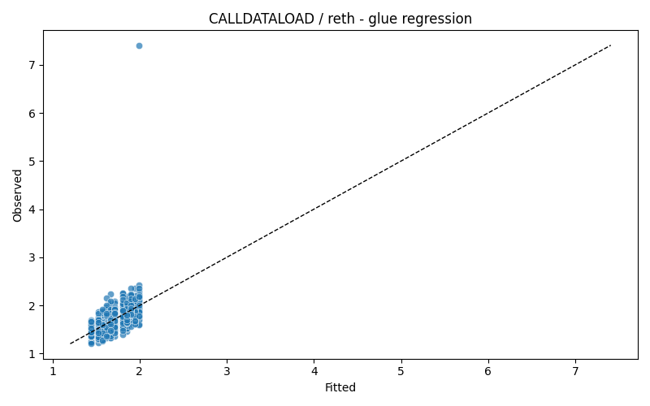

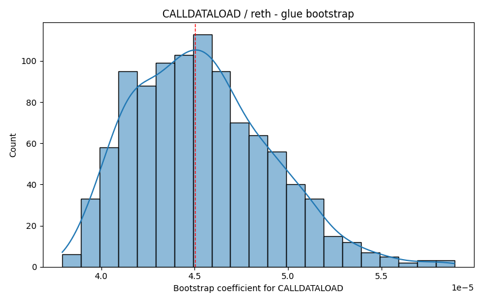

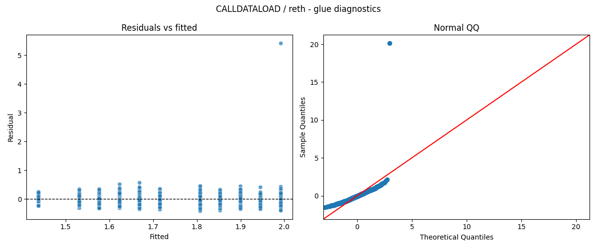

</details>

<details><summary><code>DIV</code> · nobs=165 · runtime_ms=6.713e-06 · p=1.00e-03 · R²=0.838</summary>

```
==============================================================================
                           NNLS Regression Results                            
==============================================================================
Dep. Variable:          test_runtime_ms              R-squared:          0.838
Model:                  NNLS                    Adj. R-squared:          0.837
No. Observations:       165                               RMSE:          23.30
Df Residuals:           163                                MAE:          19.27
Df Model:               1      
==============================================================================
                      coef     std err     P-value      [0.025      0.975]
------------------------------------------------------------------------------
         const     64.1154      6.2627       0.001     51.5559     76.0710
           DIV      0.0000      0.0000       0.001      0.0000      0.0000
==============================================================================
Notes: Non-negative least squares with bootstrap inference (1000 iterations)
==============================================================================
```

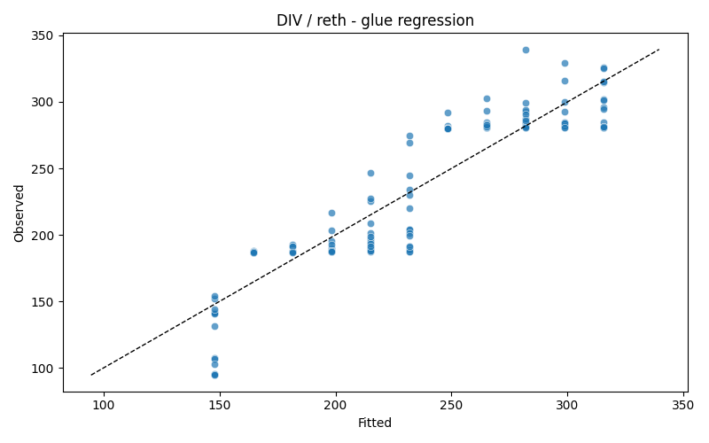

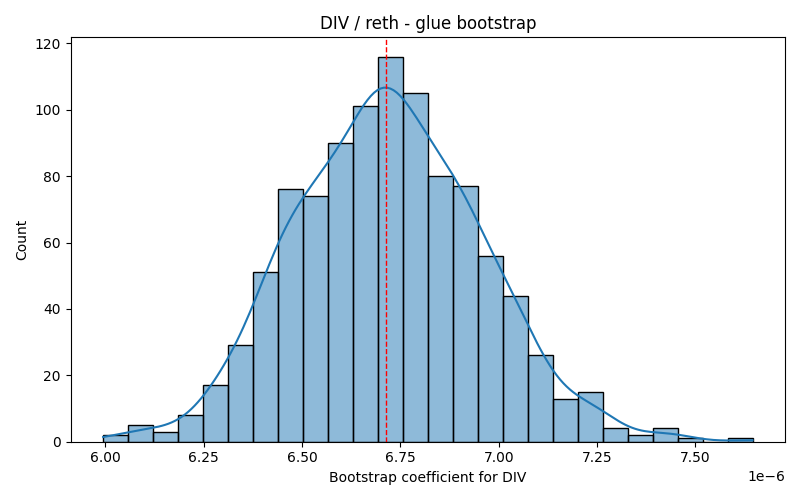

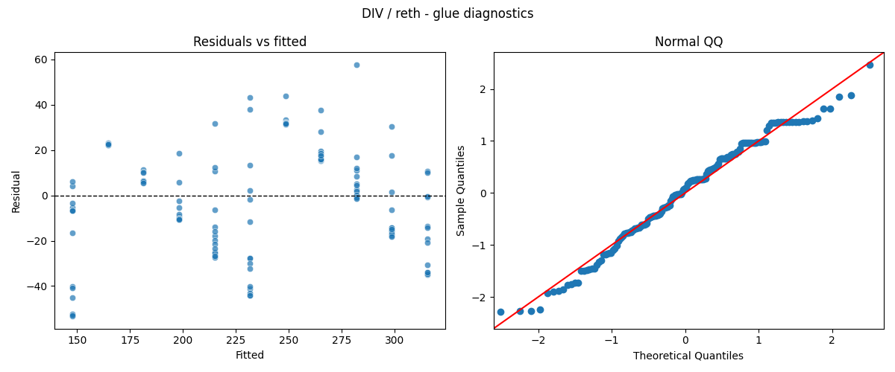

</details>

<details><summary><code>EXP</code> · nobs=165 · runtime_ms=0.0003695 · p=1.00e-03 · R²=0.8178</summary>

```
==============================================================================
                           NNLS Regression Results                            
==============================================================================
Dep. Variable:          test_runtime_ms              R-squared:          0.818
Model:                  NNLS                    Adj. R-squared:          0.817
No. Observations:       165                               RMSE:           6.83
Df Residuals:           163                                MAE:           5.51
Df Model:               1      
==============================================================================
                      coef     std err     P-value      [0.025      0.975]
------------------------------------------------------------------------------
         const     17.2360      1.7922       0.001     13.6220     20.6028
           EXP      0.0004      0.0000       0.001      0.0003      0.0004
==============================================================================
Notes: Non-negative least squares with bootstrap inference (1000 iterations)
==============================================================================
```

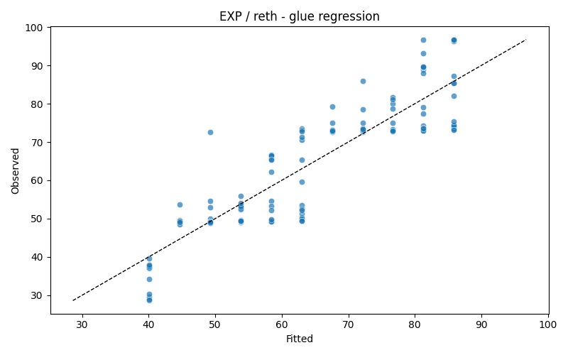

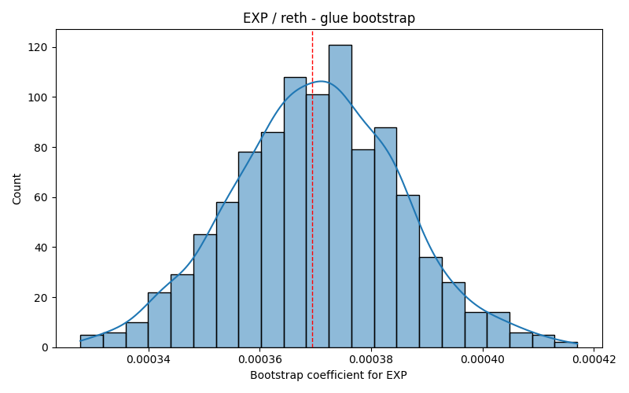

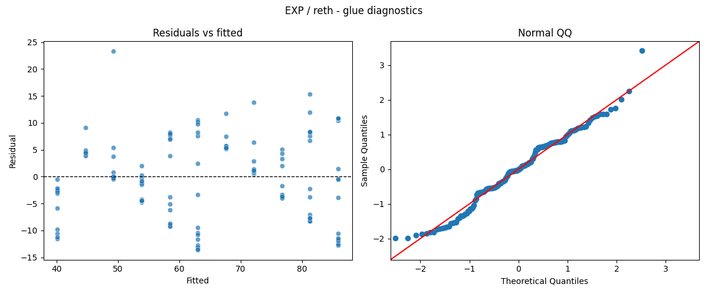

</details>

<details><summary><code>GT</code> · nobs=165 · runtime_ms=9.986e-07 · p=1.00e-03 · R²=0.7747</summary>

```
==============================================================================
                           NNLS Regression Results                            
==============================================================================
Dep. Variable:          test_runtime_ms              R-squared:          0.775
Model:                  NNLS                    Adj. R-squared:          0.773
No. Observations:       165                               RMSE:           5.67
Df Residuals:           163                                MAE:           3.98
Df Model:               1      
==============================================================================
                      coef     std err     P-value      [0.025      0.975]
------------------------------------------------------------------------------
         const     10.1480      1.6003       0.001      7.2355     13.5467
            GT      0.0000      0.0000       0.001      0.0000      0.0000
==============================================================================
Notes: Non-negative least squares with bootstrap inference (1000 iterations)
==============================================================================
```

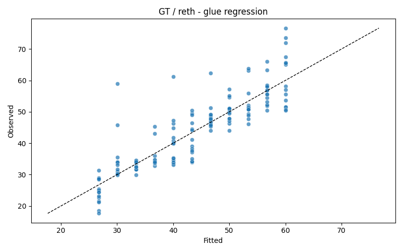

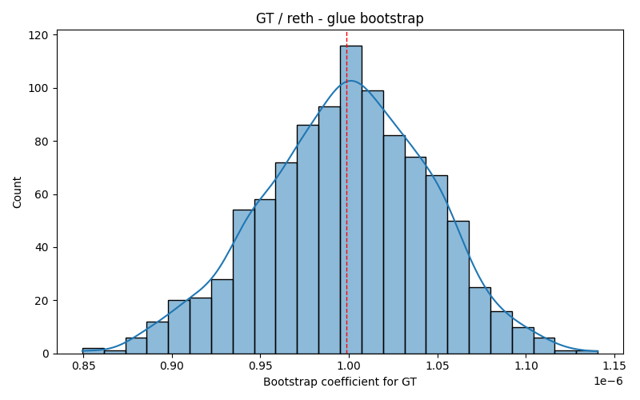

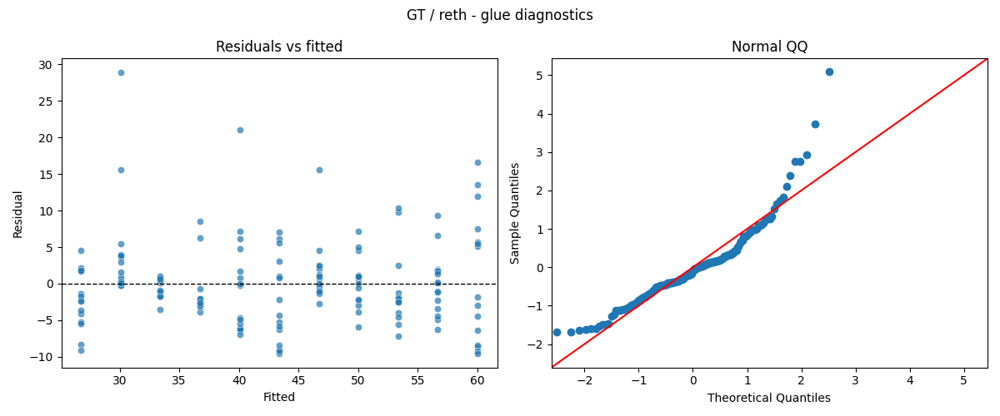

</details>

<details><summary><code>JUMPI</code> · nobs=165 · runtime_ms=1.236e-06 · p=1.00e-03 · R²=0.7045</summary>

```
==============================================================================
                           NNLS Regression Results                            
==============================================================================
Dep. Variable:          test_runtime_ms              R-squared:          0.705
Model:                  NNLS                    Adj. R-squared:          0.703
No. Observations:       165                               RMSE:           3.61
Df Residuals:           163                                MAE:           2.57
Df Model:               1      
==============================================================================
                      coef     std err     P-value      [0.025      0.975]
------------------------------------------------------------------------------
         const      6.9355      0.9155       0.001      5.1130      8.7768
         JUMPI      0.0000      0.0000       0.001      0.0000      0.0000
==============================================================================
Notes: Non-negative least squares with bootstrap inference (1000 iterations)
==============================================================================
```

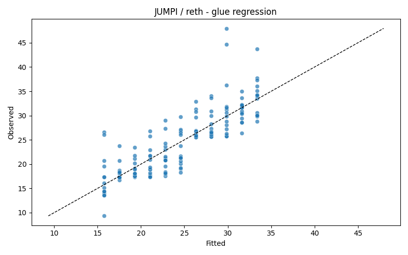

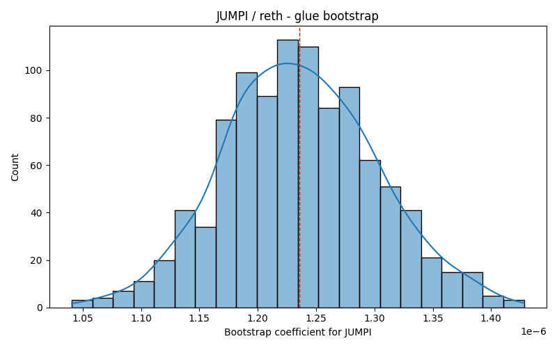

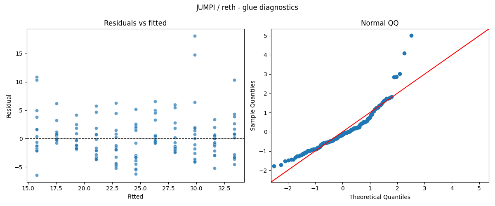

</details>

<details><summary><code>LT</code> · nobs=165 · runtime_ms=9.868e-07 · p=1.00e-03 · R²=0.8235</summary>

```
==============================================================================
                           NNLS Regression Results                            
==============================================================================
Dep. Variable:          test_runtime_ms              R-squared:          0.824
Model:                  NNLS                    Adj. R-squared:          0.822
No. Observations:       165                               RMSE:           4.81
Df Residuals:           163                                MAE:           3.61
Df Model:               1      
==============================================================================
                      coef     std err     P-value      [0.025      0.975]
------------------------------------------------------------------------------
         const      8.1914      1.2296       0.001      5.7230     10.4638
            LT      0.0000      0.0000       0.001      0.0000      0.0000
==============================================================================
Notes: Non-negative least squares with bootstrap inference (1000 iterations)
==============================================================================
```

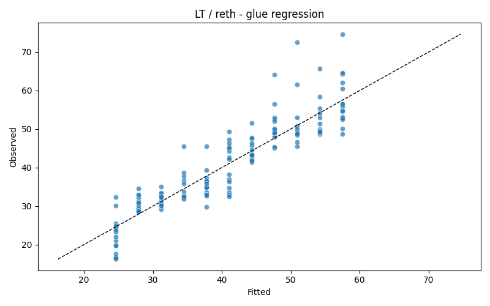

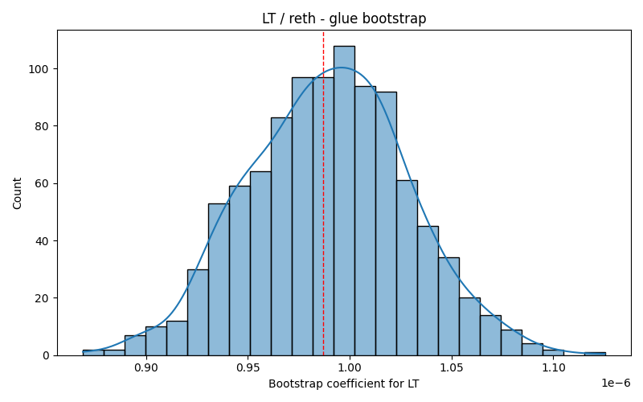

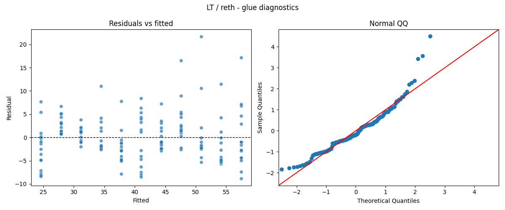

</details>

<details><summary><code>MSTORE</code> · nobs=825 · runtime_ms=2.808e-06 · p=1.00e-03 · R²=0.283</summary>

```
==============================================================================
                           NNLS Regression Results                            
==============================================================================
Dep. Variable:          test_runtime_ms              R-squared:          0.283
Model:                  NNLS                    Adj. R-squared:          0.282
No. Observations:       825                               RMSE:          31.37
Df Residuals:           823                                MAE:          28.57
Df Model:               1      
==============================================================================
                      coef     std err     P-value      [0.025      0.975]
------------------------------------------------------------------------------
         const     20.1622      3.1743       0.001     13.9270     26.4380
        MSTORE      0.0000      0.0000       0.001      0.0000      0.0000
==============================================================================
Notes: Non-negative least squares with bootstrap inference (1000 iterations)
==============================================================================
```

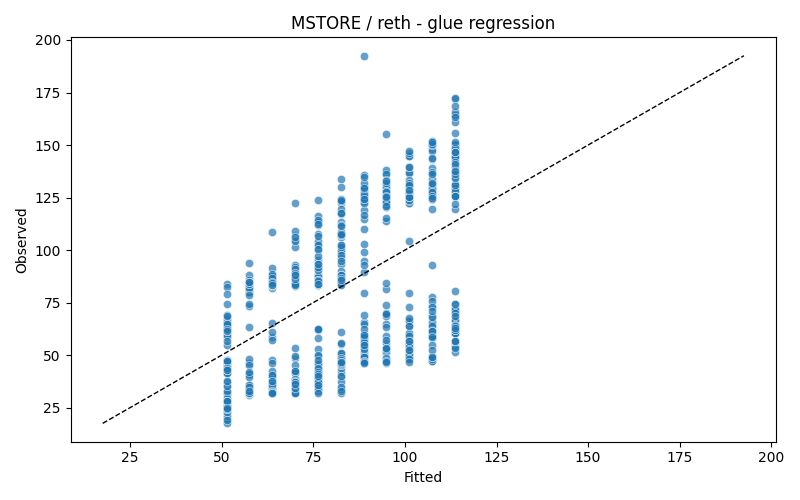

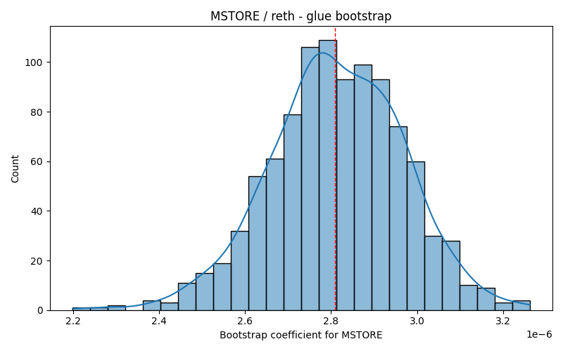

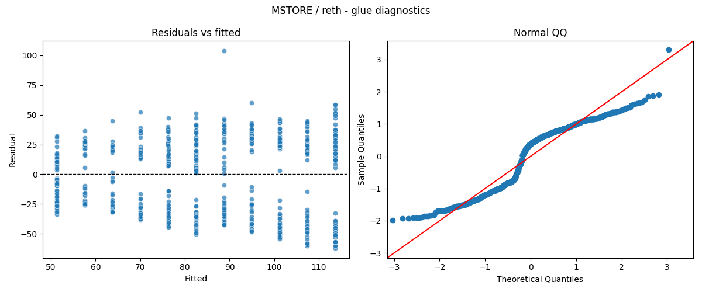

</details>

<details><summary><code>MSTORE8</code> · nobs=825 · runtime_ms=1.301e-06 · p=1.00e-03 · R²=0.4829</summary>

```
==============================================================================
                           NNLS Regression Results                            
==============================================================================
Dep. Variable:          test_runtime_ms              R-squared:          0.483
Model:                  NNLS                    Adj. R-squared:          0.482
No. Observations:       825                               RMSE:           9.45
Df Residuals:           823                                MAE:           4.59
Df Model:               1      
==============================================================================
                      coef     std err     P-value      [0.025      0.975]
------------------------------------------------------------------------------
         const     11.5522      1.2155       0.001      9.4327     14.2596
       MSTORE8      0.0000      0.0000       0.001      0.0000      0.0000
==============================================================================
Notes: Non-negative least squares with bootstrap inference (1000 iterations)
==============================================================================
```

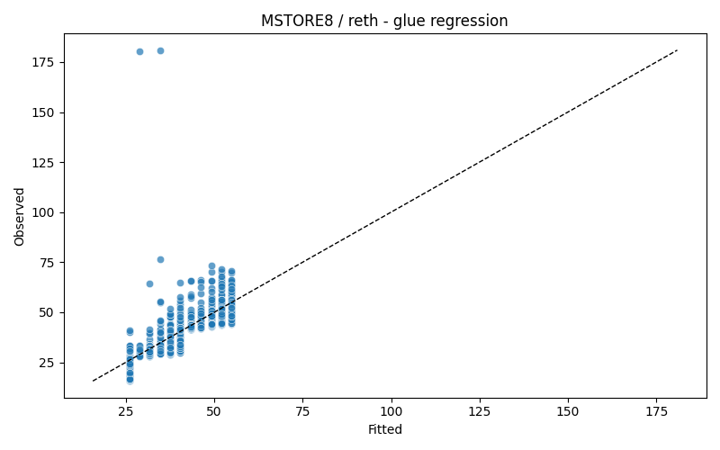

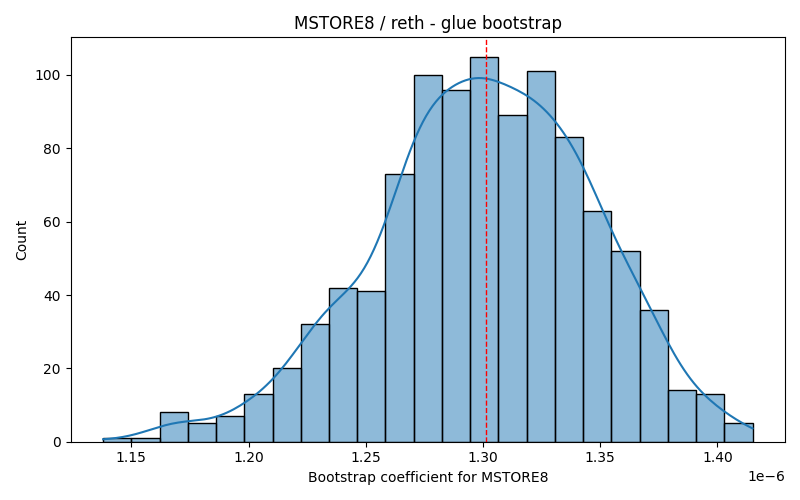


</details>

<details><summary><code>MUL</code> · nobs=165 · runtime_ms=1.188e-06 · p=1.00e-03 · R²=0.66</summary>

```
==============================================================================
                           NNLS Regression Results                            
==============================================================================
Dep. Variable:          test_runtime_ms              R-squared:          0.660
Model:                  NNLS                    Adj. R-squared:          0.658
No. Observations:       165                               RMSE:           6.73
Df Residuals:           163                                MAE:           4.88
Df Model:               1      
==============================================================================
                      coef     std err     P-value      [0.025      0.975]
------------------------------------------------------------------------------
         const     11.0136      1.6731       0.001      7.7187     14.3402
           MUL      0.0000      0.0000       0.001      0.0000      0.0000
==============================================================================
Notes: Non-negative least squares with bootstrap inference (1000 iterations)
==============================================================================
```

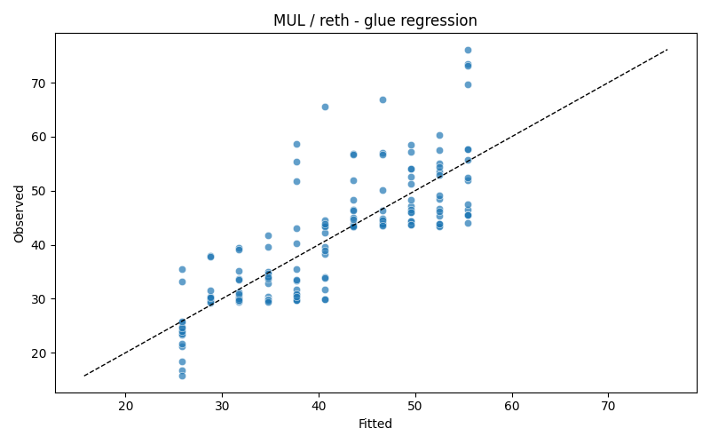


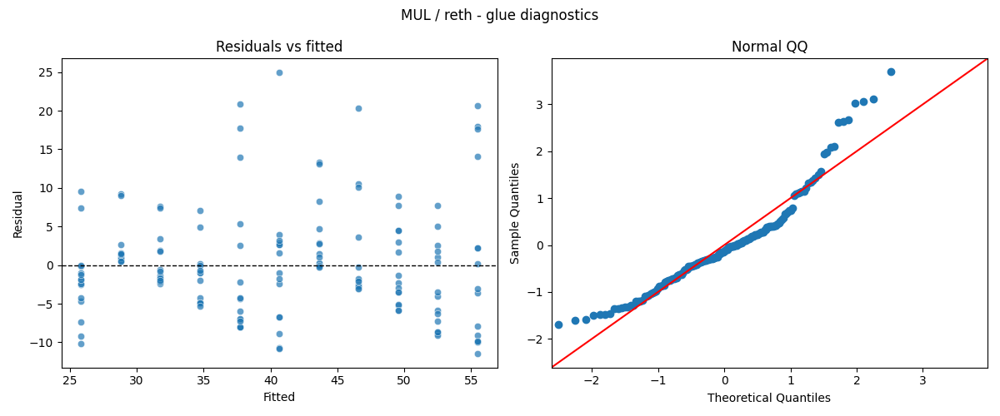

</details>

<details><summary><code>PC</code> · nobs=165 · runtime_ms=6.035e-07 · p=1.00e-03 · R²=0.926</summary>

```
==============================================================================
                           NNLS Regression Results                            
==============================================================================
Dep. Variable:          test_runtime_ms              R-squared:          0.926
Model:                  NNLS                    Adj. R-squared:          0.926
No. Observations:       165                               RMSE:           5.10
Df Residuals:           163                                MAE:           4.10
Df Model:               1      
==============================================================================
                      coef     std err     P-value      [0.025      0.975]
------------------------------------------------------------------------------
         const     12.4689      1.2843       0.001      9.9012     14.9346
            PC      0.0000      0.0000       0.001      0.0000      0.0000
==============================================================================
Notes: Non-negative least squares with bootstrap inference (1000 iterations)
==============================================================================
```

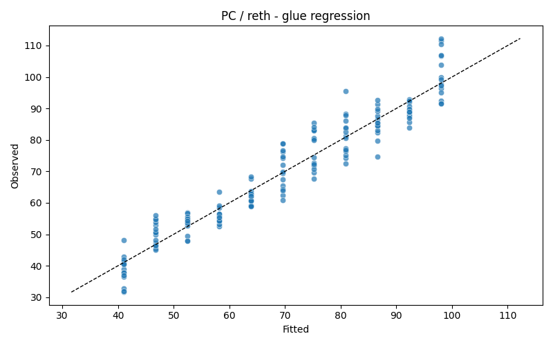


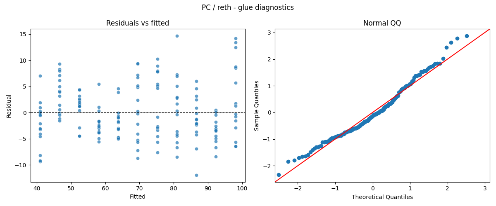

</details>

<details><summary><code>RETURNDATASIZE</code> · nobs=660 · runtime_ms=8.971e-07 · p=1.00e-03 · R²=0.6496</summary>

```
==============================================================================
                           NNLS Regression Results                            
==============================================================================
Dep. Variable:          test_runtime_ms              R-squared:          0.650
Model:                  NNLS                    Adj. R-squared:          0.649
No. Observations:       660                               RMSE:          10.40
Df Residuals:           658                                MAE:           5.12
Df Model:               1      
==============================================================================
                      coef     std err     P-value      [0.025      0.975]
------------------------------------------------------------------------------
         const     12.0947      0.8943       0.001     10.4563     14.0120
RETURNDATASIZE      0.0000      0.0000       0.001      0.0000      0.0000
==============================================================================
Notes: Non-negative least squares with bootstrap inference (1000 iterations)
==============================================================================
```

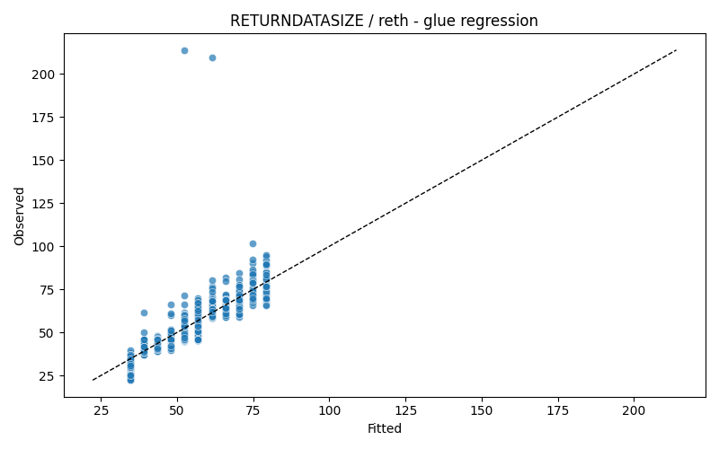

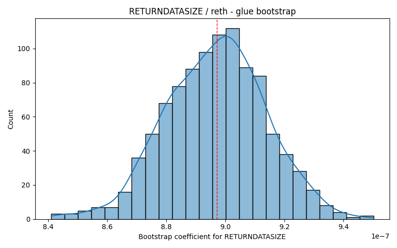

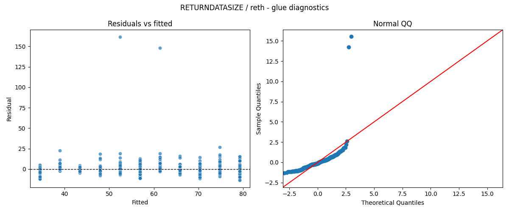

</details>

<details><summary><code>SELFBALANCE</code> · nobs=135 · runtime_ms=4.152e-06 · p=1.00e-03 · R²=0.8263</summary>

```
==============================================================================
                           NNLS Regression Results                            
==============================================================================
Dep. Variable:          test_runtime_ms              R-squared:          0.826
Model:                  NNLS                    Adj. R-squared:          0.825
No. Observations:       135                               RMSE:          19.21
Df Residuals:           133                                MAE:          15.79
Df Model:               1      
==============================================================================
                      coef     std err     P-value      [0.025      0.975]
------------------------------------------------------------------------------
         const     43.6382      6.6814       0.001     30.7172     56.6149
   SELFBALANCE      0.0000      0.0000       0.001      0.0000      0.0000
==============================================================================
Notes: Non-negative least squares with bootstrap inference (1000 iterations)
==============================================================================
```

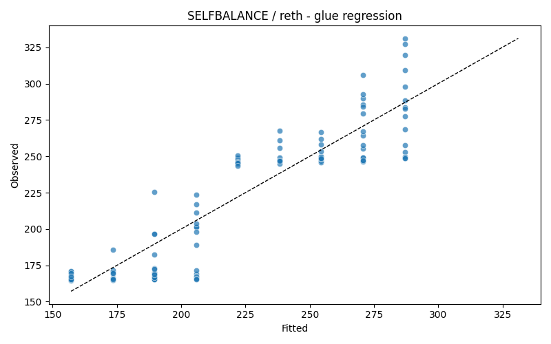

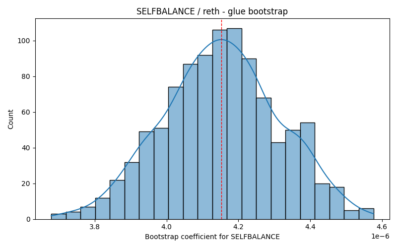

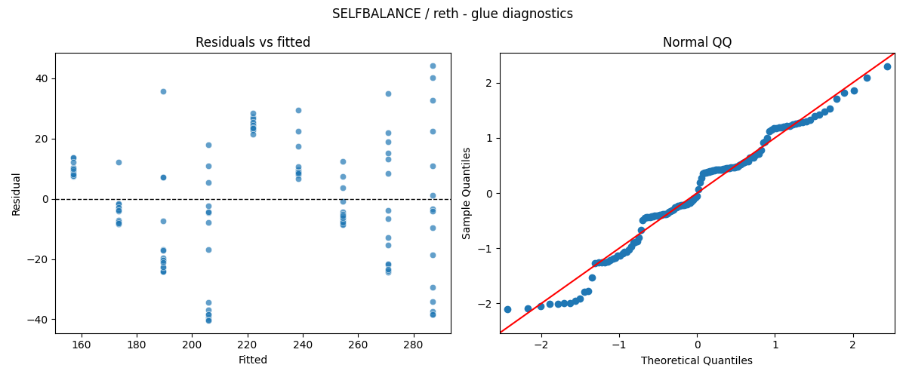

</details>

<details><summary><code>SUB</code> · nobs=165 · runtime_ms=9.622e-07 · p=1.00e-03 · R²=0.8252</summary>

```
==============================================================================
                           NNLS Regression Results                            
==============================================================================
Dep. Variable:          test_runtime_ms              R-squared:          0.825
Model:                  NNLS                    Adj. R-squared:          0.824
No. Observations:       165                               RMSE:           4.66
Df Residuals:           163                                MAE:           3.57
Df Model:               1      
==============================================================================
                      coef     std err     P-value      [0.025      0.975]
------------------------------------------------------------------------------
         const      9.5069      1.0935       0.001      7.3760     11.5457
           SUB      0.0000      0.0000       0.001      0.0000      0.0000
==============================================================================
Notes: Non-negative least squares with bootstrap inference (1000 iterations)
==============================================================================
```

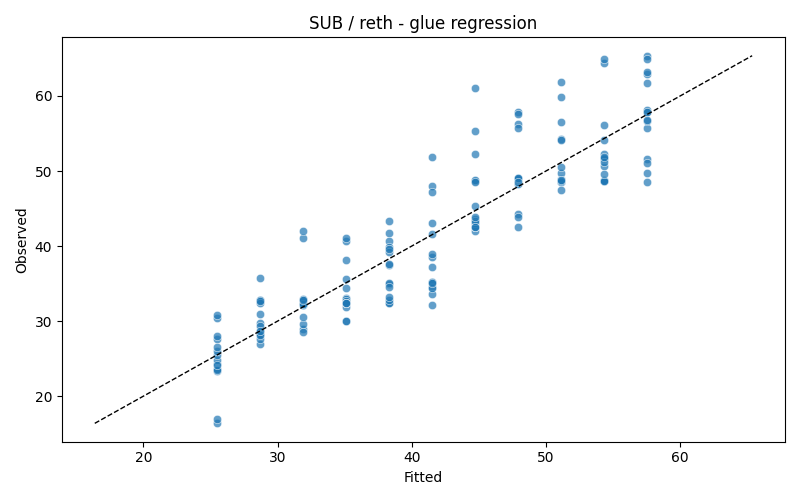

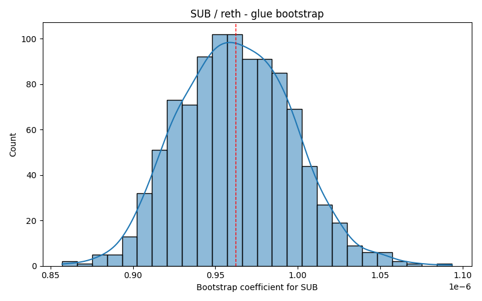

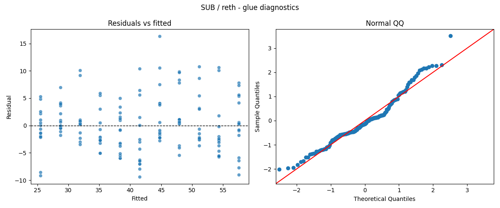

</details>

### Mixed glue (tier B) · reth

<details><summary><code>JUMP</code> · nobs=165 · runtime_ms=2.213e-06 · p=1.00e-03 · R²=0.8114</summary>

```
==============================================================================
                           NNLS Regression Results                            
==============================================================================
Dep. Variable:          test_runtime_ms              R-squared:          0.811
Model:                  NNLS                    Adj. R-squared:          0.810
No. Observations:       165                               RMSE:           3.97
Df Residuals:           163                                MAE:           3.00
Df Model:               1      
==============================================================================
                      coef     std err     P-value      [0.025      0.975]
------------------------------------------------------------------------------
         const      8.7827      1.0976       0.001      6.6399     11.0536
          JUMP      0.0000      0.0000       0.001      0.0000      0.0000
==============================================================================
Notes: Non-negative least squares with bootstrap inference (1000 iterations)
==============================================================================
```

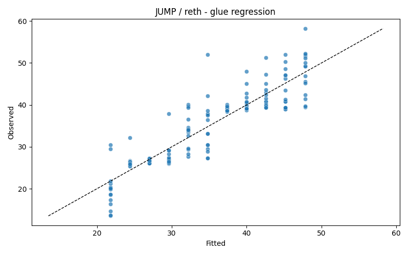

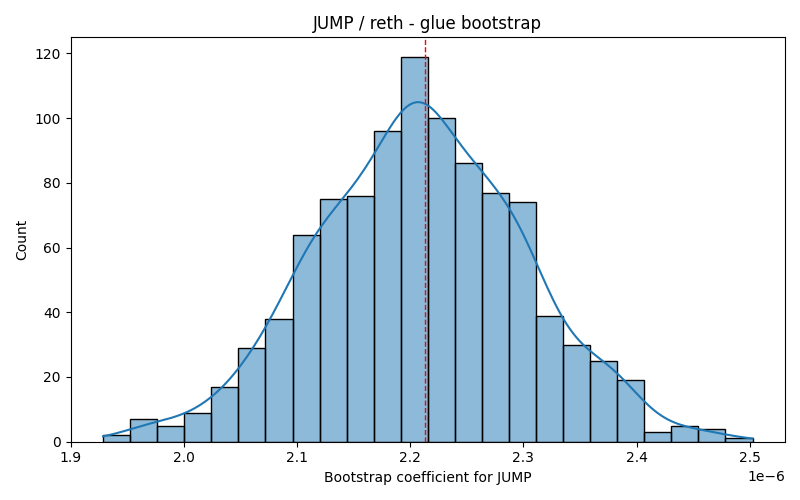

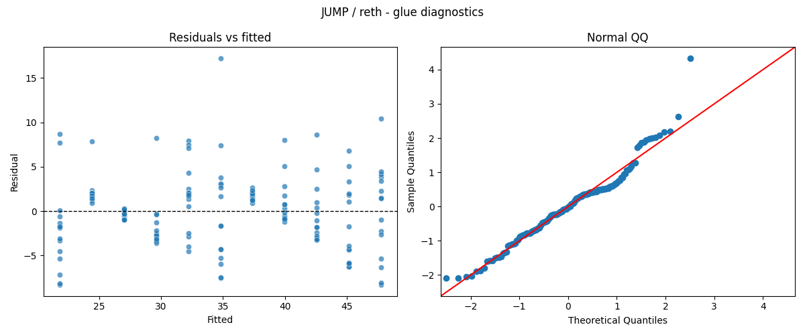

</details>

<details><summary><code>KECCAK256</code> · nobs=2640 · runtime_ms=0 · p=1.00e+00 · R²=0</summary>

```
==============================================================================
                           NNLS Regression Results                            
==============================================================================
Dep. Variable:          test_runtime_ms              R-squared:          0.000
Model:                  NNLS                    Adj. R-squared:         -0.000
No. Observations:       2640                              RMSE:         159.57
Df Residuals:           2638                               MAE:         135.11
Df Model:               1      
==============================================================================
                      coef     std err     P-value      [0.025      0.975]
------------------------------------------------------------------------------
         const    251.5364      3.2044       0.001    245.1388    257.4103
     KECCAK256      0.0000      0.0000       1.000      0.0000      0.0000
==============================================================================
Notes: Non-negative least squares with bootstrap inference (1000 iterations)
==============================================================================
```

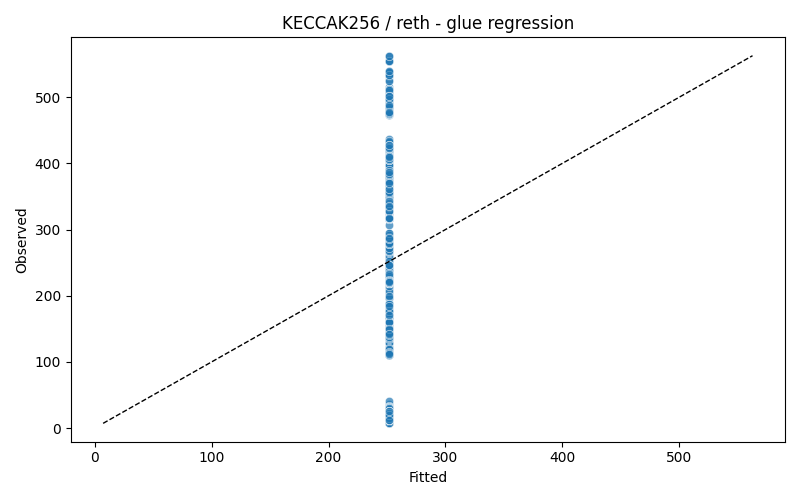


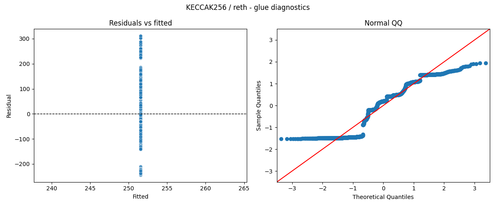

</details>
