# Runtime estimation report

Per-spec NNLS fits of `test_runtime_ms` against `opcount`, one row per (target opcode, test, model_by combo, client).

## Contents

- [SLOAD](#sload)
- [SSTORE](#sstore)
- [BALANCE](#balance)
- [CALL](#call)
- [CALLCODE](#callcode)
- [DELEGATECALL](#delegatecall)
- [EXTCODECOPY](#extcodecopy)
- [EXTCODEHASH](#extcodehash)
- [EXTCODESIZE](#extcodesize)
- [STATICCALL](#staticcall)

## SLOAD

### test_sload_bloated — combo `False`

| client | nobs | R² | target_coef (ms) | p-value | 95% CI |
| --- | --- | --- | --- | --- | --- |
| `besu` | 275 | 0.963 | 0.007042 | 1.00e-03 | [0.00686, 0.007226] |
| `erigon` | 132 | 0.9952 | 0.006233 | 1.00e-03 | [0.006153, 0.006306] |
| `nethermind` | 209 | 0.8838 | 0.003661 | 1.00e-03 | [0.003478, 0.003832] |
| `reth` | 363 | 0.9482 | 0.001304 | 1.00e-03 | [0.001271, 0.001339] |

<details><summary>besu — NNLS regression summary</summary>

```
==============================================================================
                           NNLS Regression Results                            
==============================================================================
Dep. Variable:          test_runtime_ms              R-squared:          0.963
Model:                  NNLS                    Adj. R-squared:          0.963
No. Observations:       275                               RMSE:          40.62
Df Residuals:           273                                MAE:          33.14
Df Model:               1      
==============================================================================
                      coef     std err     P-value      [0.025      0.975]
------------------------------------------------------------------------------
         const    192.4269      7.9371       0.001    176.9123    208.1712
       opcount      0.0070      0.0001       0.001      0.0069      0.0072
==============================================================================
Notes: Non-negative least squares with bootstrap inference (1000 iterations)
==============================================================================
```

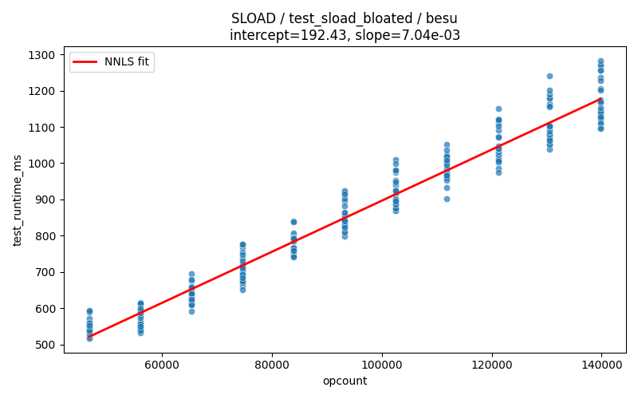

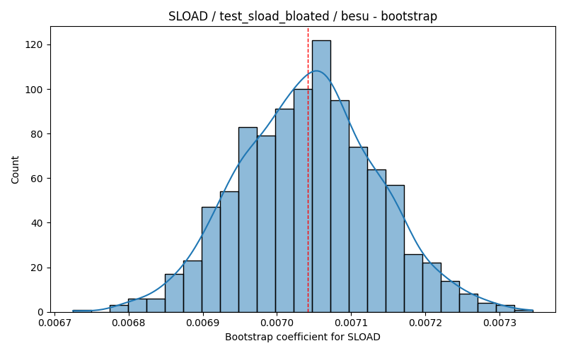

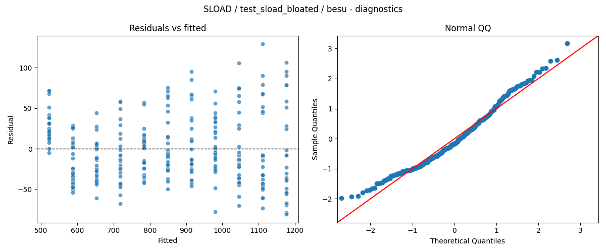

</details>

<details><summary>erigon — NNLS regression summary</summary>

```
==============================================================================
                           NNLS Regression Results                            
==============================================================================
Dep. Variable:          test_runtime_ms              R-squared:          0.995
Model:                  NNLS                    Adj. R-squared:          0.995
No. Observations:       132                               RMSE:          12.80
Df Residuals:           130                                MAE:          10.03
Df Model:               1      
==============================================================================
                      coef     std err     P-value      [0.025      0.975]
------------------------------------------------------------------------------
         const     20.7831      3.2658       0.001     14.7064     27.2818
       opcount      0.0062      0.0000       0.001      0.0062      0.0063
==============================================================================
Notes: Non-negative least squares with bootstrap inference (1000 iterations)
==============================================================================
```

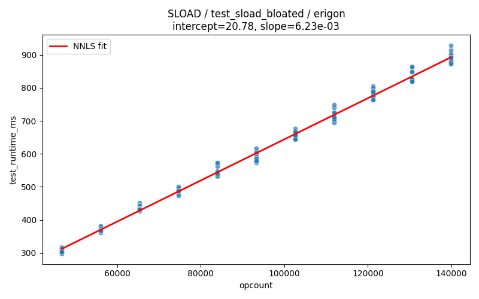

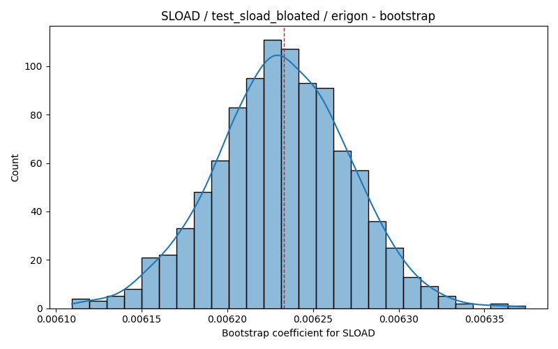

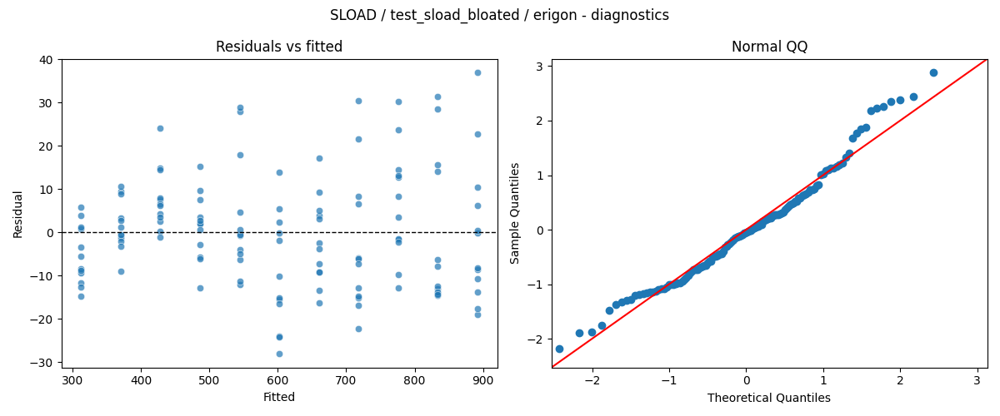

</details>

<details><summary>nethermind — NNLS regression summary</summary>

```
==============================================================================
                           NNLS Regression Results                            
==============================================================================
Dep. Variable:          test_runtime_ms              R-squared:          0.884
Model:                  NNLS                    Adj. R-squared:          0.883
No. Observations:       209                               RMSE:          39.07
Df Residuals:           207                                MAE:          32.67
Df Model:               1      
==============================================================================
                      coef     std err     P-value      [0.025      0.975]
------------------------------------------------------------------------------
         const    128.8986      9.0485       0.001    112.2325    147.5667
       opcount      0.0037      0.0001       0.001      0.0035      0.0038
==============================================================================
Notes: Non-negative least squares with bootstrap inference (1000 iterations)
==============================================================================
```

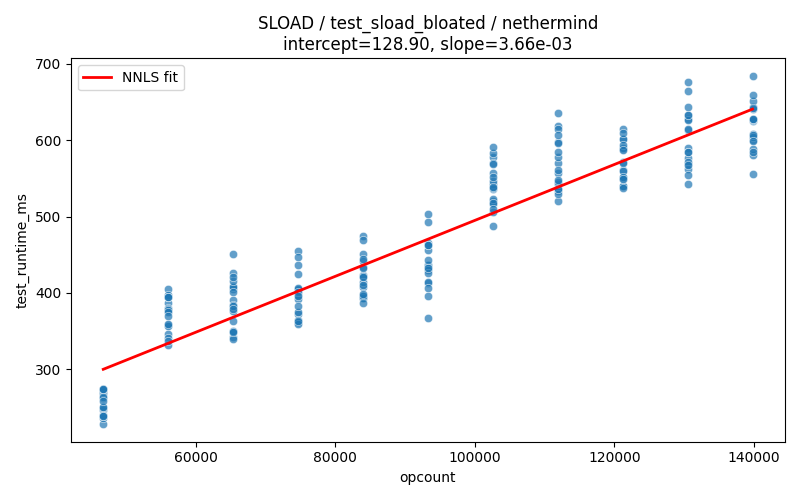

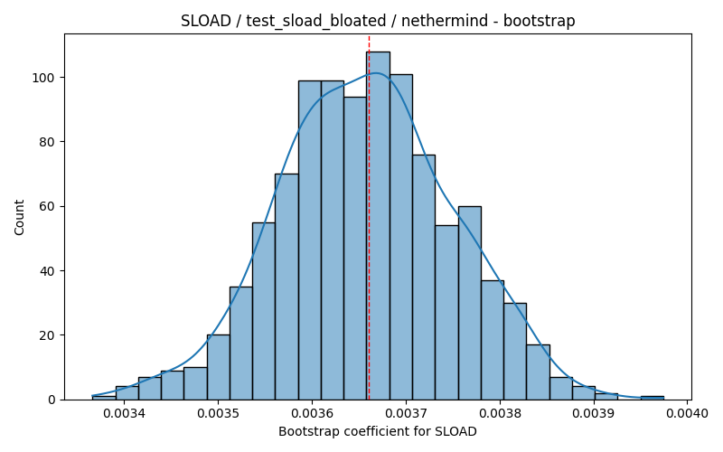

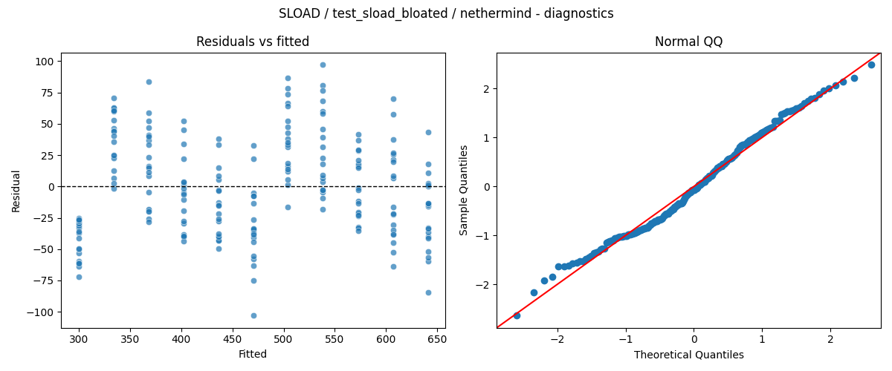

</details>

<details><summary>reth — NNLS regression summary</summary>

```
==============================================================================
                           NNLS Regression Results                            
==============================================================================
Dep. Variable:          test_runtime_ms              R-squared:          0.948
Model:                  NNLS                    Adj. R-squared:          0.948
No. Observations:       363                               RMSE:           8.97
Df Residuals:           361                                MAE:           6.86
Df Model:               1      
==============================================================================
                      coef     std err     P-value      [0.025      0.975]
------------------------------------------------------------------------------
         const     38.3335      1.8338       0.001     34.6879     41.5812
       opcount      0.0013      0.0000       0.001      0.0013      0.0013
==============================================================================
Notes: Non-negative least squares with bootstrap inference (1000 iterations)
==============================================================================
```

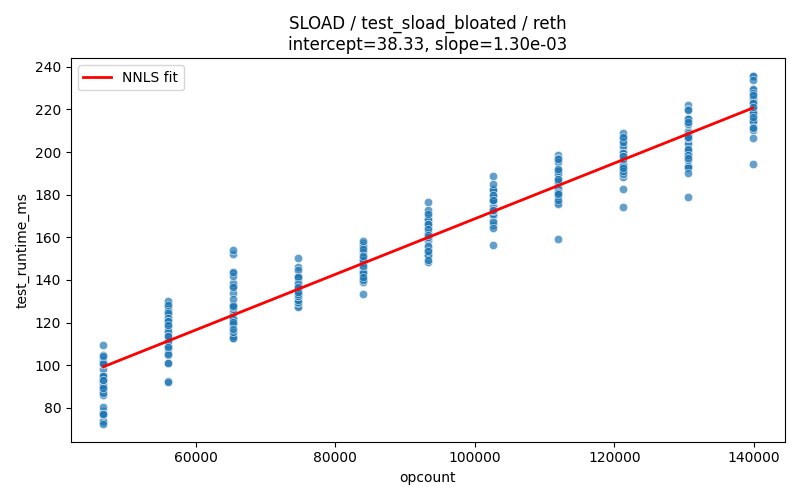

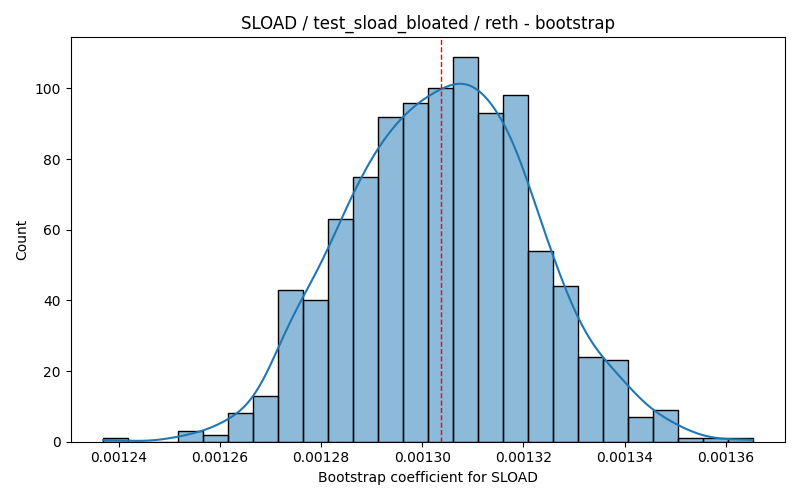

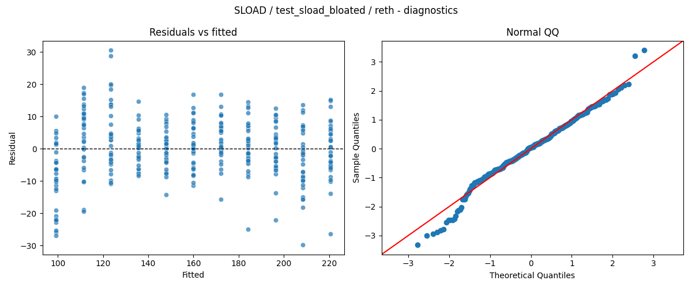

</details>

### test_sload_bloated — combo `True`

| client | nobs | R² | target_coef (ms) | p-value | 95% CI |
| --- | --- | --- | --- | --- | --- |
| `besu` | 275 | 0.9017 | 0.01567 | 1.00e-03 | [0.015, 0.01637] |
| `erigon` | 132 | 0.988 | 0.005806 | 1.00e-03 | [0.005703, 0.005915] |
| `nethermind` | 209 | 0.5673 | 0.02582 | 1.00e-03 | [0.02273, 0.02899] |
| `reth` | 363 | 0.961 | 0.001437 | 1.00e-03 | [0.001401, 0.001473] |

<details><summary>besu — NNLS regression summary</summary>

```
==============================================================================
                           NNLS Regression Results                            
==============================================================================
Dep. Variable:          test_runtime_ms              R-squared:          0.902
Model:                  NNLS                    Adj. R-squared:          0.901
No. Observations:       275                               RMSE:         152.28
Df Residuals:           273                                MAE:         127.49
Df Model:               1      
==============================================================================
                      coef     std err     P-value      [0.025      0.975]
------------------------------------------------------------------------------
         const    481.3955     29.7271       0.001    417.3182    538.1552
       opcount      0.0157      0.0003       0.001      0.0150      0.0164
==============================================================================
Notes: Non-negative least squares with bootstrap inference (1000 iterations)
==============================================================================
```

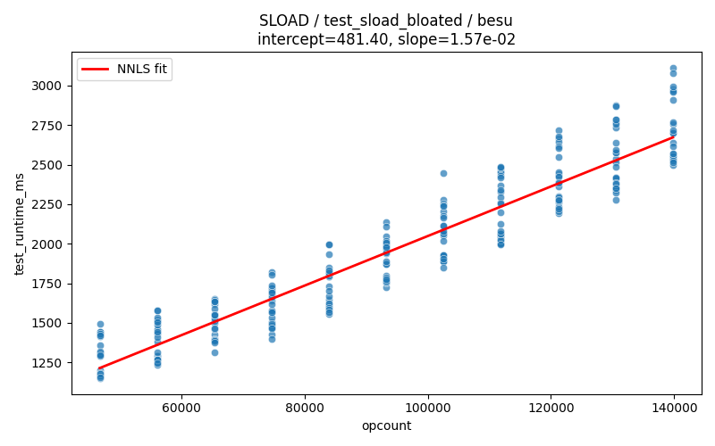

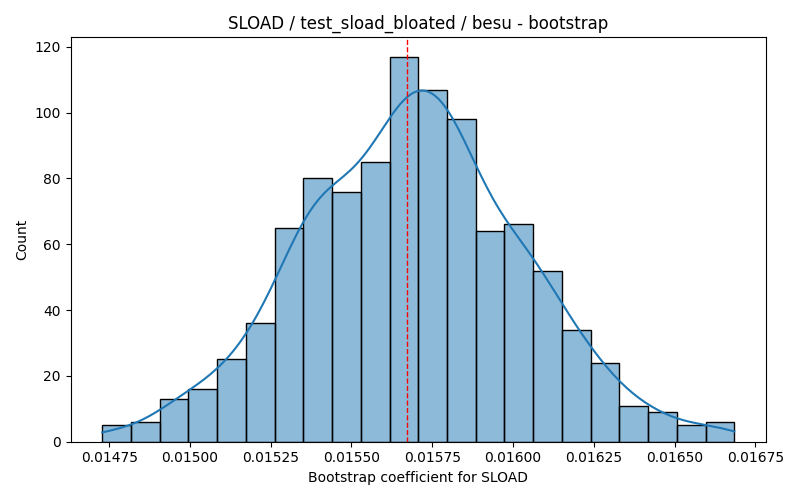

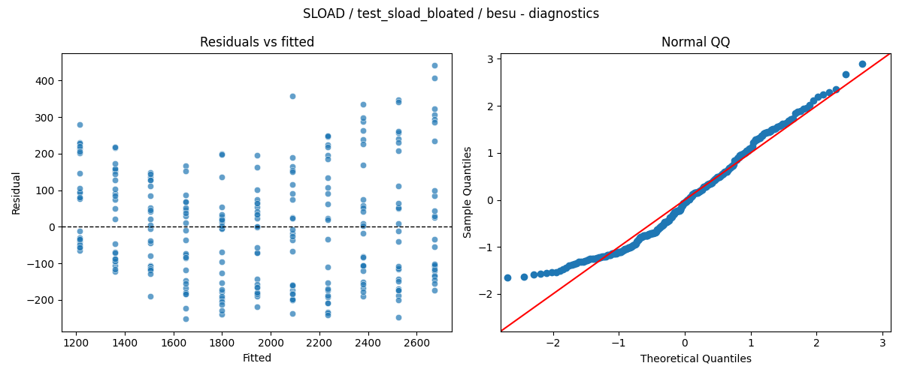

</details>

<details><summary>erigon — NNLS regression summary</summary>

```
==============================================================================
                           NNLS Regression Results                            
==============================================================================
Dep. Variable:          test_runtime_ms              R-squared:          0.988
Model:                  NNLS                    Adj. R-squared:          0.988
No. Observations:       132                               RMSE:          18.87
Df Residuals:           130                                MAE:          15.56
Df Model:               1      
==============================================================================
                      coef     std err     P-value      [0.025      0.975]
------------------------------------------------------------------------------
         const     29.8163      5.0740       0.001     20.1222     39.3368
       opcount      0.0058      0.0001       0.001      0.0057      0.0059
==============================================================================
Notes: Non-negative least squares with bootstrap inference (1000 iterations)
==============================================================================
```

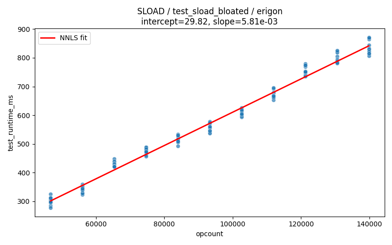

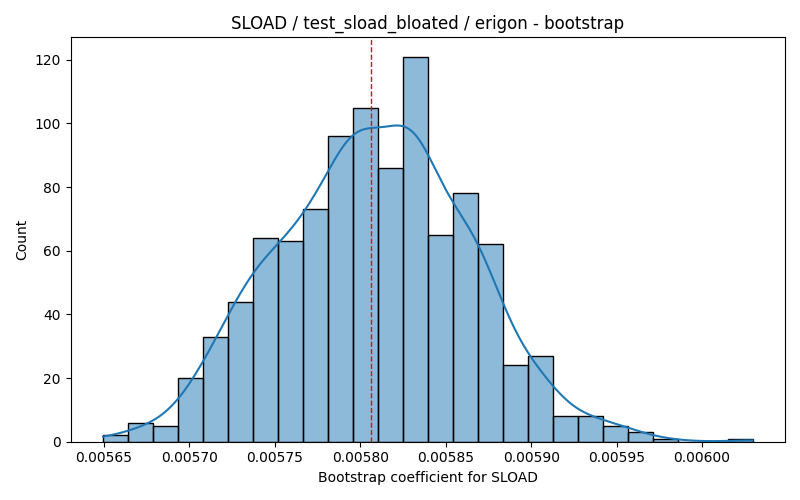

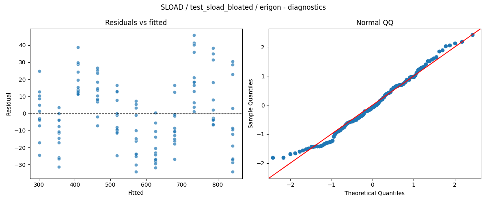

</details>

<details><summary>nethermind — NNLS regression summary</summary>

```
==============================================================================
                           NNLS Regression Results                            
==============================================================================
Dep. Variable:          test_runtime_ms              R-squared:          0.567
Model:                  NNLS                    Adj. R-squared:          0.565
No. Observations:       209                               RMSE:         663.67
Df Residuals:           207                                MAE:         556.50
Df Model:               1      
==============================================================================
                      coef     std err     P-value      [0.025      0.975]
------------------------------------------------------------------------------
         const   1255.5277    148.4310       0.001    963.9139   1535.8925
       opcount      0.0258      0.0016       0.001      0.0227      0.0290
==============================================================================
Notes: Non-negative least squares with bootstrap inference (1000 iterations)
==============================================================================
```

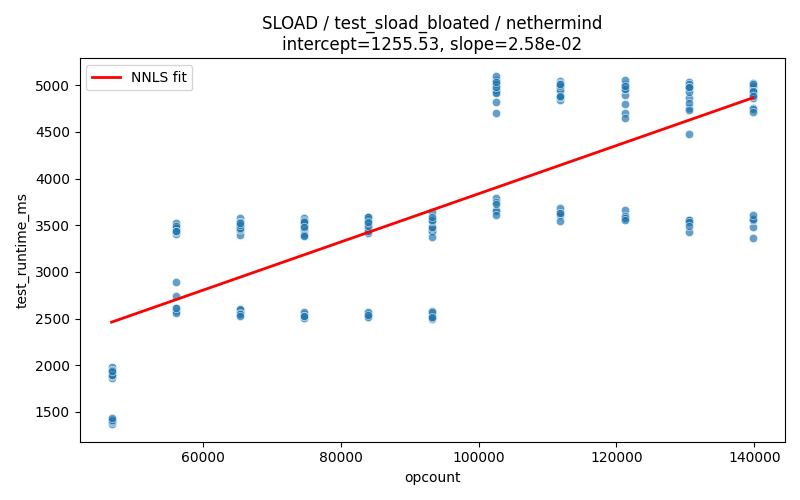

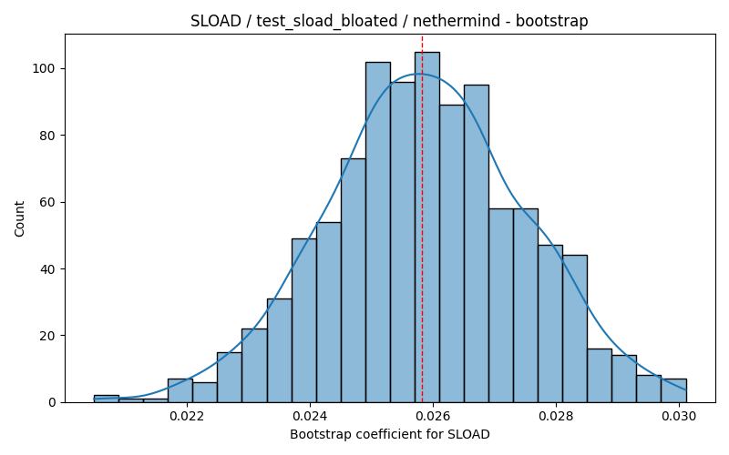

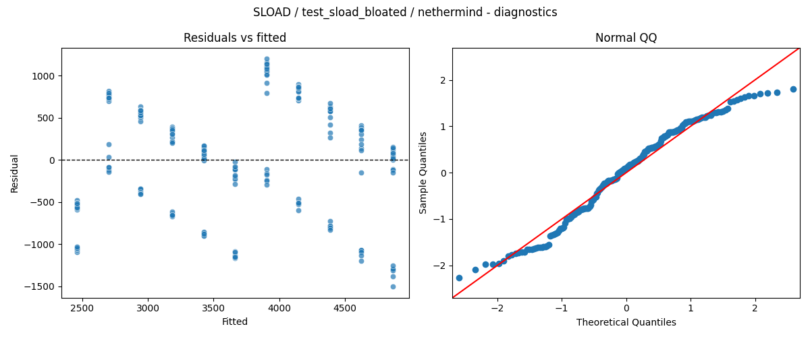

</details>

<details><summary>reth — NNLS regression summary</summary>

```
==============================================================================
                           NNLS Regression Results                            
==============================================================================
Dep. Variable:          test_runtime_ms              R-squared:          0.961
Model:                  NNLS                    Adj. R-squared:          0.961
No. Observations:       363                               RMSE:           8.52
Df Residuals:           361                                MAE:           6.28
Df Model:               1      
==============================================================================
                      coef     std err     P-value      [0.025      0.975]
------------------------------------------------------------------------------
         const     30.4668      1.4793       0.001     27.5958     33.5255
       opcount      0.0014      0.0000       0.001      0.0014      0.0015
==============================================================================
Notes: Non-negative least squares with bootstrap inference (1000 iterations)
==============================================================================
```

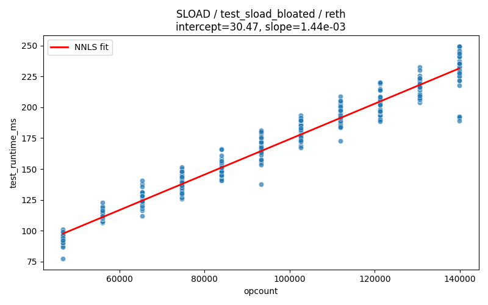

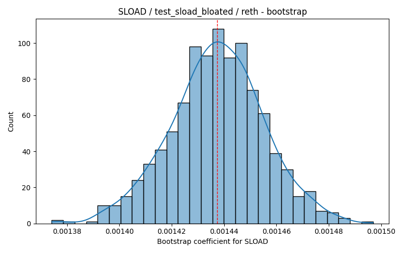

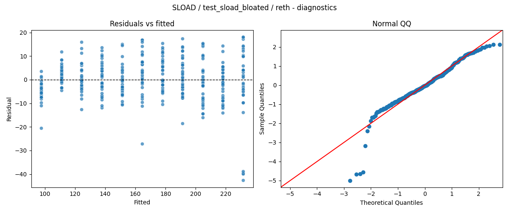

</details>

### test_storage_sload_same_key_benchmark

| client | nobs | R² | target_coef (ms) | p-value | 95% CI |
| --- | --- | --- | --- | --- | --- |
| `besu` | 550 | 0.8727 | 0.00014 | 1.00e-03 | [0.0001358, 0.0001445] |
| `erigon` | 264 | 0.8649 | 4.842e-05 | 1.00e-03 | [4.623e-05, 5.063e-05] |
| `nethermind` | 418 | 0.8746 | 0.0001824 | 1.00e-03 | [0.0001758, 0.0001883] |
| `reth` | 726 | 0.7094 | 5.174e-06 | 1.00e-03 | [4.934e-06, 5.425e-06] |

<details><summary>besu — NNLS regression summary</summary>

```
==============================================================================
                           NNLS Regression Results                            
==============================================================================
Dep. Variable:          test_runtime_ms              R-squared:          0.873
Model:                  NNLS                    Adj. R-squared:          0.872
No. Observations:       550                               RMSE:          33.78
Df Residuals:           548                                MAE:          26.63
Df Model:               1      
==============================================================================
                      coef     std err     P-value      [0.025      0.975]
------------------------------------------------------------------------------
         const    105.2071      4.2899       0.001     96.8276    113.1929
       opcount      0.0001      0.0000       0.001      0.0001      0.0001
==============================================================================
Notes: Non-negative least squares with bootstrap inference (1000 iterations)
==============================================================================
```

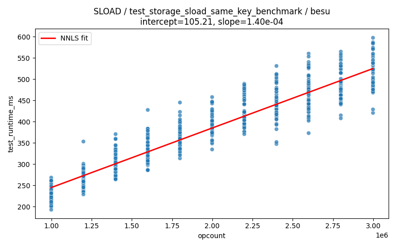

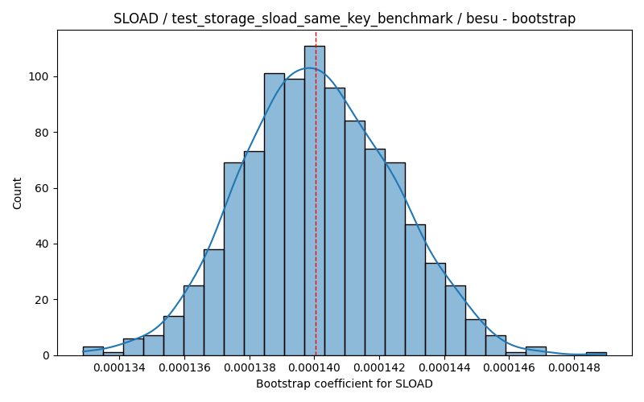

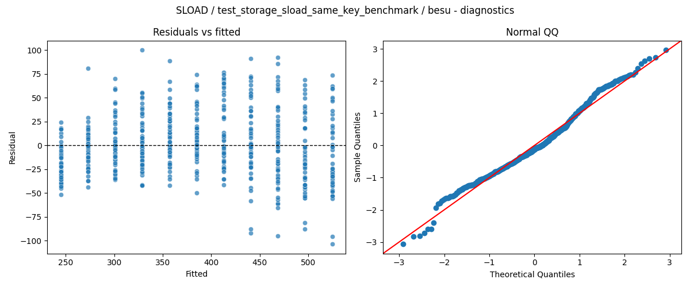

</details>

<details><summary>erigon — NNLS regression summary</summary>

```
==============================================================================
                           NNLS Regression Results                            
==============================================================================
Dep. Variable:          test_runtime_ms              R-squared:          0.865
Model:                  NNLS                    Adj. R-squared:          0.864
No. Observations:       264                               RMSE:          12.09
Df Residuals:           262                                MAE:           9.45
Df Model:               1      
==============================================================================
                      coef     std err     P-value      [0.025      0.975]
------------------------------------------------------------------------------
         const     41.3806      2.1061       0.001     37.3349     45.3179
       opcount      0.0000      0.0000       0.001      0.0000      0.0001
==============================================================================
Notes: Non-negative least squares with bootstrap inference (1000 iterations)
==============================================================================
```

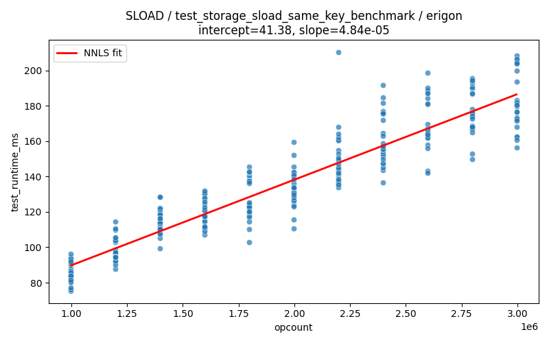

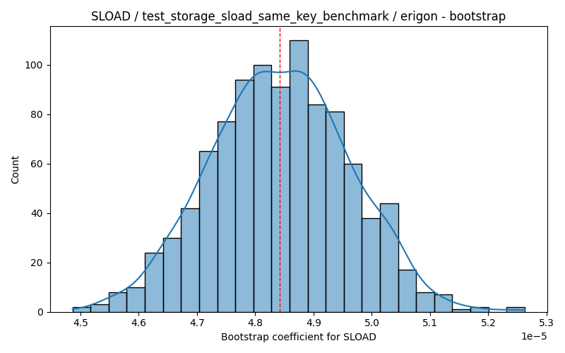

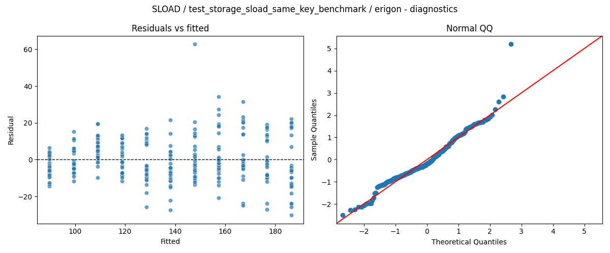

</details>

<details><summary>nethermind — NNLS regression summary</summary>

```
==============================================================================
                           NNLS Regression Results                            
==============================================================================
Dep. Variable:          test_runtime_ms              R-squared:          0.875
Model:                  NNLS                    Adj. R-squared:          0.874
No. Observations:       418                               RMSE:          43.63
Df Residuals:           416                                MAE:          32.30
Df Model:               1      
==============================================================================
                      coef     std err     P-value      [0.025      0.975]
------------------------------------------------------------------------------
         const     93.5187      6.5439       0.001     80.8821    106.4093
       opcount      0.0002      0.0000       0.001      0.0002      0.0002
==============================================================================
Notes: Non-negative least squares with bootstrap inference (1000 iterations)
==============================================================================
```

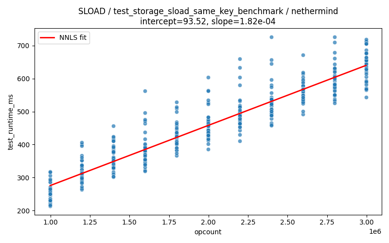

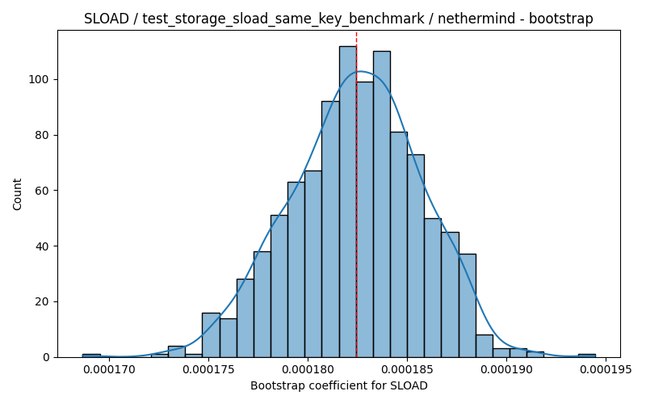

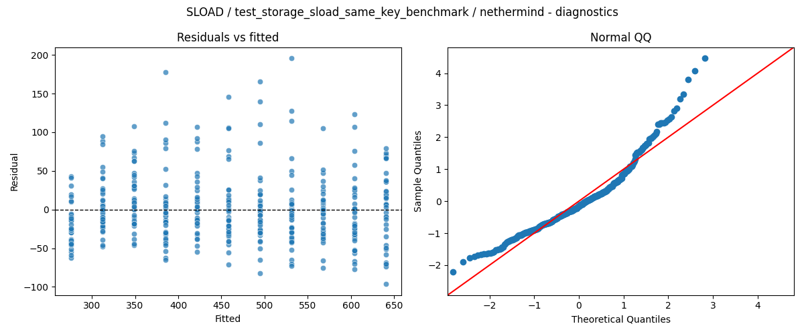

</details>

<details><summary>reth — NNLS regression summary</summary>

```
==============================================================================
                           NNLS Regression Results                            
==============================================================================
Dep. Variable:          test_runtime_ms              R-squared:          0.709
Model:                  NNLS                    Adj. R-squared:          0.709
No. Observations:       726                               RMSE:           2.09
Df Residuals:           724                                MAE:           1.53
Df Model:               1      
==============================================================================
                      coef     std err     P-value      [0.025      0.975]
------------------------------------------------------------------------------
         const      5.4186      0.2450       0.001      4.9489      5.9132
       opcount      0.0000      0.0000       0.001      0.0000      0.0000
==============================================================================
Notes: Non-negative least squares with bootstrap inference (1000 iterations)
==============================================================================
```

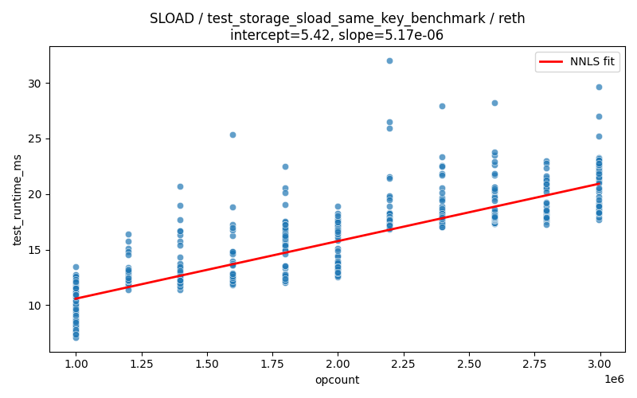

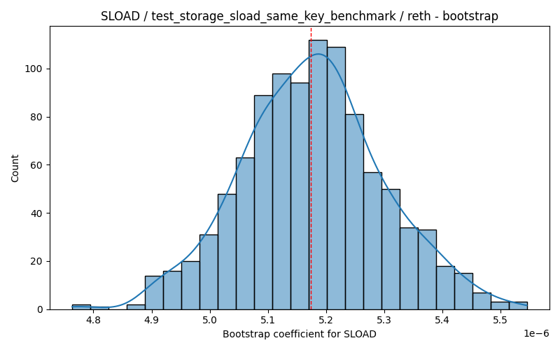

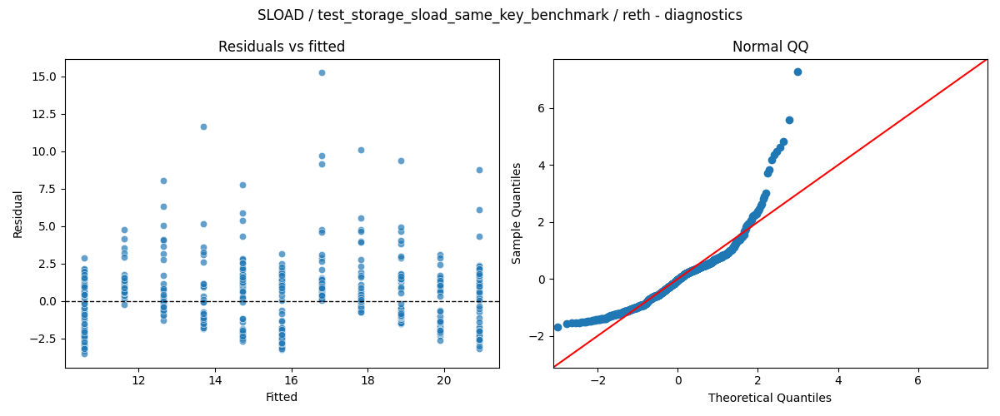

</details>

## SSTORE

### test_sstore_bloated — combo `False`

| client | nobs | R² | target_coef (ms) | p-value | 95% CI |
| --- | --- | --- | --- | --- | --- |
| `besu` | 550 | 0.7703 | 0.006869 | 1.00e-03 | [0.006483, 0.007273] |
| `erigon` | 264 | 0.9334 | 0 | 1.00e+00 | [0, 0] |
| `nethermind` | 418 | 0.9207 | 0.003667 | 1.00e-03 | [0.003532, 0.003822] |
| `reth` | 726 | 0.5981 | 0 | 1.00e+00 | [0, 0.0002174] |

<details><summary>besu — NNLS regression summary</summary>

```
==============================================================================
                           NNLS Regression Results                            
==============================================================================
Dep. Variable:          test_runtime_ms              R-squared:          0.770
Model:                  NNLS                    Adj. R-squared:          0.769
No. Observations:       550                               RMSE:         138.56
Df Residuals:           547                                MAE:         113.97
Df Model:               2      
==============================================================================
                      coef     std err     P-value      [0.025      0.975]
------------------------------------------------------------------------------
         const    546.5428     16.5284       0.001    511.8356    578.0865
       opcount      0.0069      0.0002       0.001      0.0065      0.0073
        update      0.0941      0.0098       0.001      0.0753      0.1140
==============================================================================
Notes: Non-negative least squares with bootstrap inference (1000 iterations)
==============================================================================
```

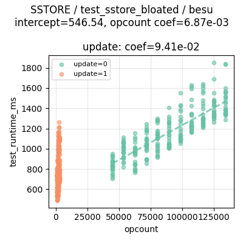

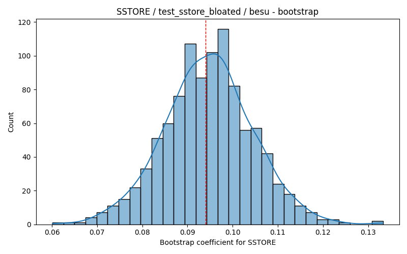

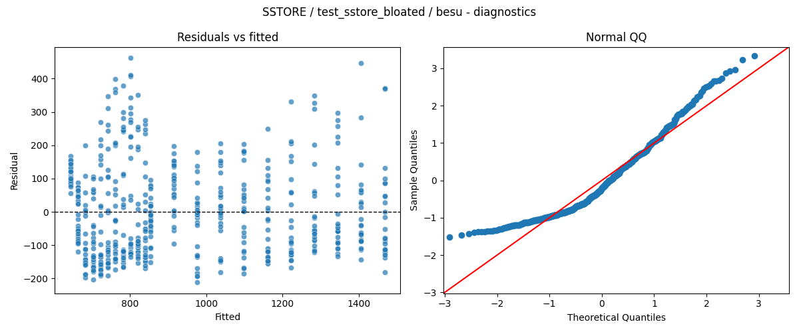

</details>

<details><summary>erigon — NNLS regression summary</summary>

```
==============================================================================
                           NNLS Regression Results                            
==============================================================================
Dep. Variable:          test_runtime_ms              R-squared:          0.933
Model:                  NNLS                    Adj. R-squared:          0.933
No. Observations:       264                               RMSE:         605.15
Df Residuals:           261                                MAE:         461.45
Df Model:               2      
==============================================================================
                      coef     std err     P-value      [0.025      0.975]
------------------------------------------------------------------------------
         const    793.4270     33.6238       0.001    731.8583    861.4837
       opcount      0.0000      0.0000       1.000      0.0000      0.0000
        update      2.1284      0.0322       0.001      2.0705      2.1921
==============================================================================
Notes: Non-negative least squares with bootstrap inference (1000 iterations)
==============================================================================
```

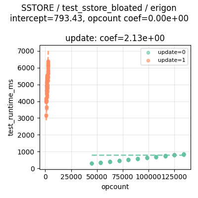

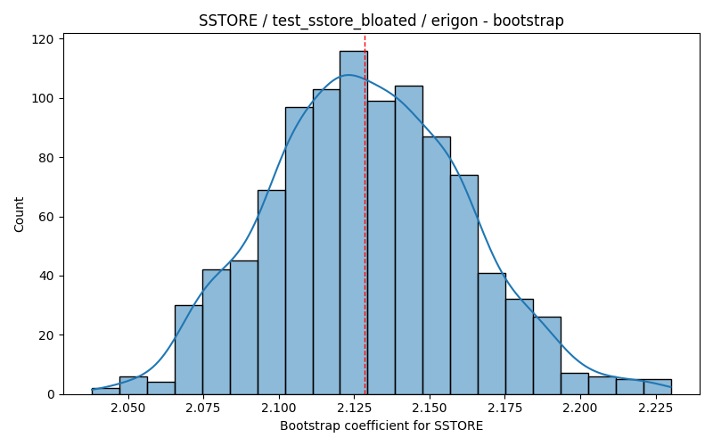

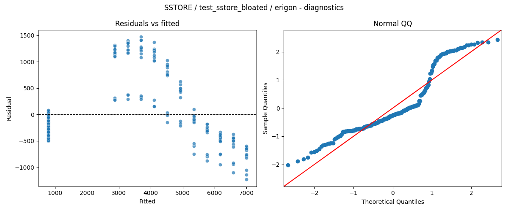

</details>

<details><summary>nethermind — NNLS regression summary</summary>

```
==============================================================================
                           NNLS Regression Results                            
==============================================================================
Dep. Variable:          test_runtime_ms              R-squared:          0.921
Model:                  NNLS                    Adj. R-squared:          0.920
No. Observations:       418                               RMSE:          37.32
Df Residuals:           415                                MAE:          29.60
Df Model:               2      
==============================================================================
                      coef     std err     P-value      [0.025      0.975]
------------------------------------------------------------------------------
         const    123.1799      6.1974       0.001    110.7975    135.5852
       opcount      0.0037      0.0001       0.001      0.0035      0.0038
        update      0.0621      0.0030       0.001      0.0562      0.0681
==============================================================================
Notes: Non-negative least squares with bootstrap inference (1000 iterations)
==============================================================================
```

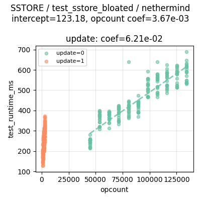

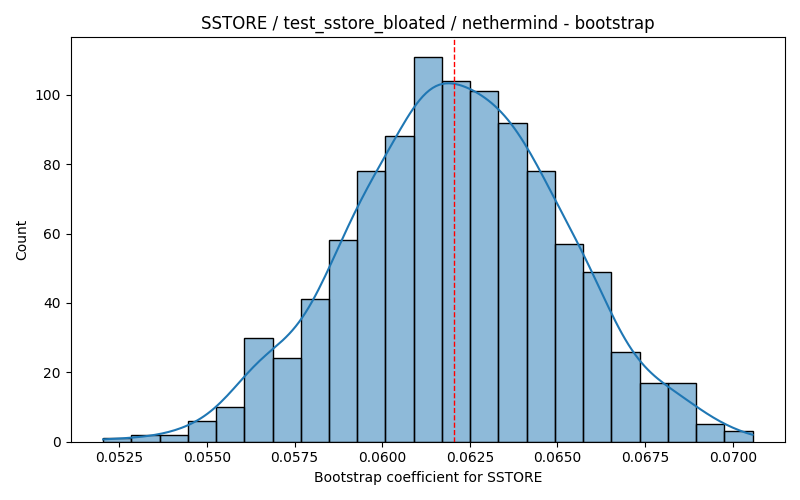

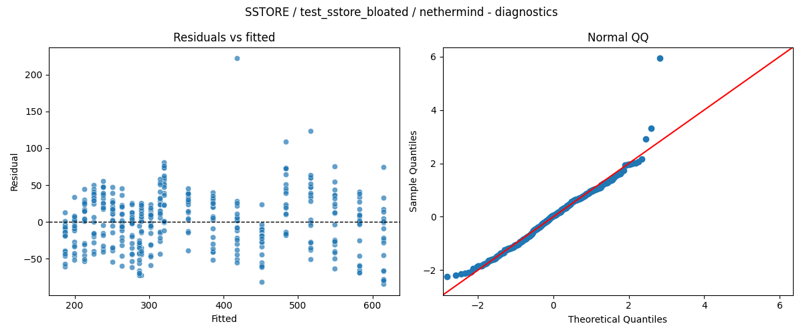

</details>

<details><summary>reth — NNLS regression summary</summary>

```
==============================================================================
                           NNLS Regression Results                            
==============================================================================
Dep. Variable:          test_runtime_ms              R-squared:          0.598
Model:                  NNLS                    Adj. R-squared:          0.597
No. Observations:       726                               RMSE:          62.17
Df Residuals:           723                                MAE:          39.93
Df Model:               2      
==============================================================================
                      coef     std err     P-value      [0.025      0.975]
------------------------------------------------------------------------------
         const    170.3772      7.4930       0.001    148.2515    175.7274
       opcount      0.0000      0.0001       1.000      0.0000      0.0002
        update      0.0713      0.0028       0.001      0.0695      0.0800
==============================================================================
Notes: Non-negative least squares with bootstrap inference (1000 iterations)
==============================================================================
```

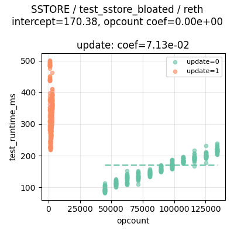

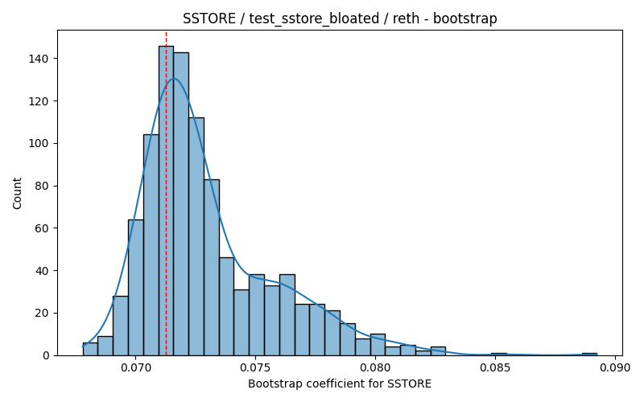

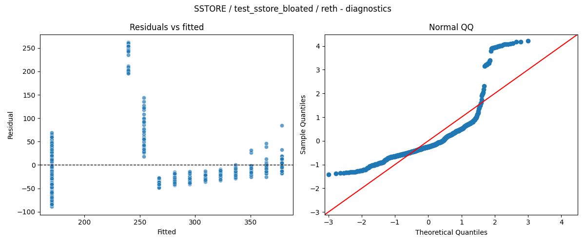

</details>

### test_sstore_bloated — combo `True`

| client | nobs | R² | target_coef (ms) | p-value | 95% CI |
| --- | --- | --- | --- | --- | --- |
| `besu` | 550 | 0.9772 | 0.01526 | 1.00e-03 | [0.01433, 0.0161] |
| `erigon` | 264 | 0.9939 | 0 | 1.00e+00 | [0, 0] |
| `nethermind` | 418 | 0.6923 | 0.02755 | 1.00e-03 | [0.02557, 0.02937] |
| `reth` | 726 | 0.9951 | 0 | 1.00e+00 | [0, 0] |

<details><summary>besu — NNLS regression summary</summary>

```
==============================================================================
                           NNLS Regression Results                            
==============================================================================
Dep. Variable:          test_runtime_ms              R-squared:          0.977
Model:                  NNLS                    Adj. R-squared:          0.977
No. Observations:       550                               RMSE:         255.04
Df Residuals:           547                                MAE:         199.95
Df Model:               2      
==============================================================================
                      coef     std err     P-value      [0.025      0.975]
------------------------------------------------------------------------------
         const    760.5957     41.5180       0.001    679.5416    846.7653
       opcount      0.0153      0.0004       0.001      0.0143      0.0161
        update      0.0881      0.0008       0.001      0.0865      0.0896
==============================================================================
Notes: Non-negative least squares with bootstrap inference (1000 iterations)
==============================================================================
```

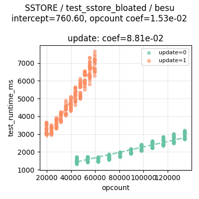

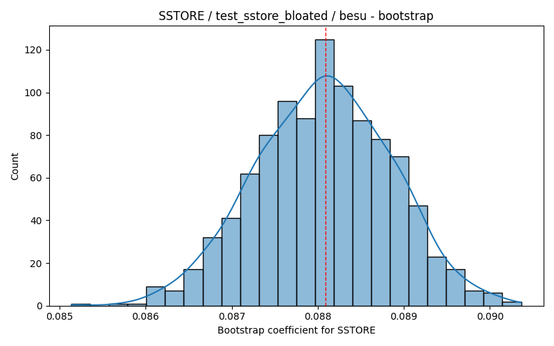

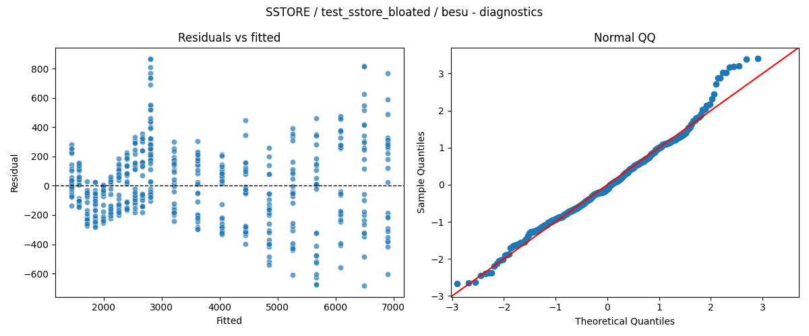

</details>

<details><summary>erigon — NNLS regression summary</summary>

```
==============================================================================
                           NNLS Regression Results                            
==============================================================================
Dep. Variable:          test_runtime_ms              R-squared:          0.994
Model:                  NNLS                    Adj. R-squared:          0.994
No. Observations:       264                               RMSE:        1149.58
Df Residuals:           261                                MAE:         885.98
Df Model:               2      
==============================================================================
                      coef     std err     P-value      [0.025      0.975]
------------------------------------------------------------------------------
         const    978.7857     65.9788       0.001    862.9559   1124.8043
       opcount      0.0000      0.0000       1.000      0.0000      0.0000
        update      0.6742      0.0034       0.001      0.6677      0.6813
==============================================================================
Notes: Non-negative least squares with bootstrap inference (1000 iterations)
==============================================================================
```


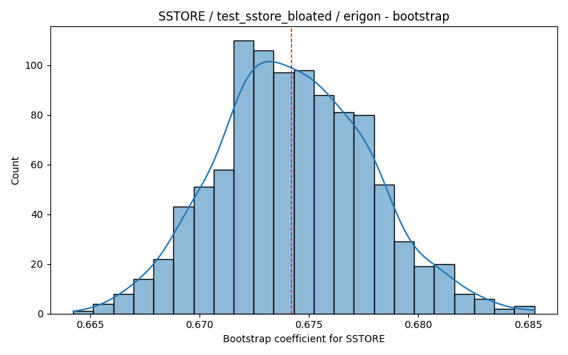

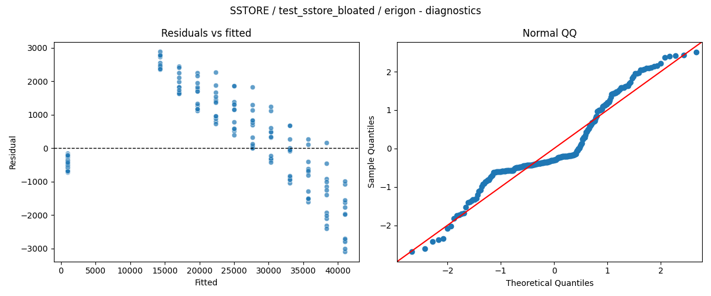

</details>

<details><summary>nethermind — NNLS regression summary</summary>

```
==============================================================================
                           NNLS Regression Results                            
==============================================================================
Dep. Variable:          test_runtime_ms              R-squared:          0.692
Model:                  NNLS                    Adj. R-squared:          0.691
No. Observations:       418                               RMSE:         498.35
Df Residuals:           415                                MAE:         391.14
Df Model:               2      
==============================================================================
                      coef     std err     P-value      [0.025      0.975]
------------------------------------------------------------------------------
         const   1071.6619     77.7057       0.001    926.6685   1218.9498
       opcount      0.0275      0.0010       0.001      0.0256      0.0294
        update      0.0268      0.0012       0.001      0.0245      0.0293
==============================================================================
Notes: Non-negative least squares with bootstrap inference (1000 iterations)
==============================================================================
```

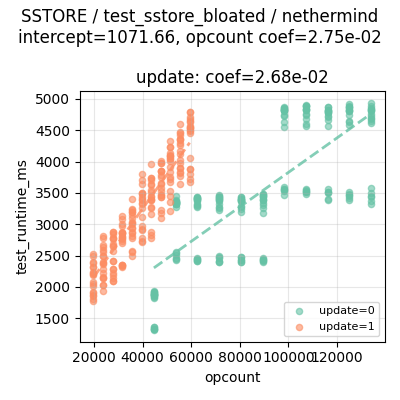

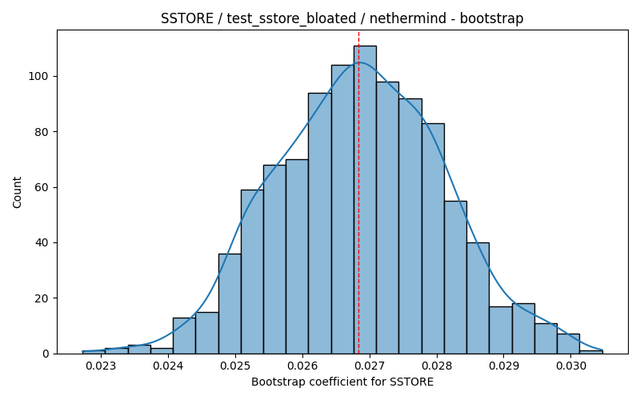

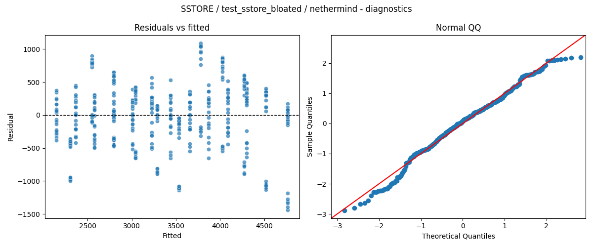

</details>

<details><summary>reth — NNLS regression summary</summary>

```
==============================================================================
                           NNLS Regression Results                            
==============================================================================
Dep. Variable:          test_runtime_ms              R-squared:          0.995
Model:                  NNLS                    Adj. R-squared:          0.995
No. Observations:       726                               RMSE:         259.78
Df Residuals:           723                                MAE:         194.23
Df Model:               2      
==============================================================================
                      coef     std err     P-value      [0.025      0.975]
------------------------------------------------------------------------------
         const    256.8940      8.2581       0.001    241.3581    274.9138
       opcount      0.0000      0.0000       1.000      0.0000      0.0000
        update      0.1713      0.0004       0.001      0.1705      0.1721
==============================================================================
Notes: Non-negative least squares with bootstrap inference (1000 iterations)
==============================================================================
```

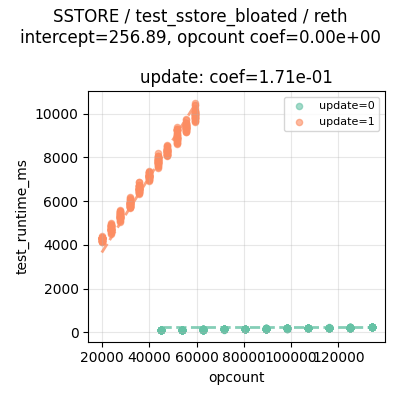

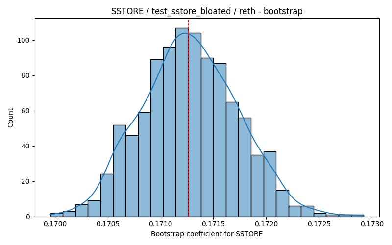

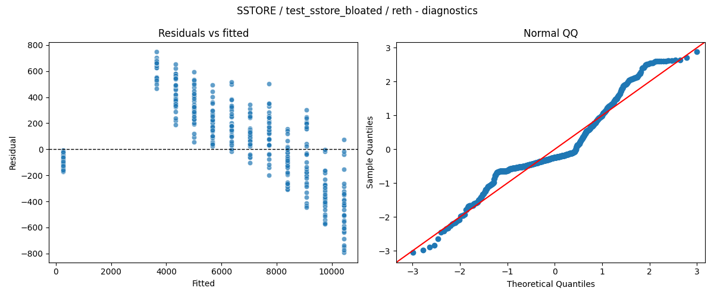

</details>

## BALANCE

### test_account_access — combo `BALANCE_AccountMode.EXISTING_CONTRACT`

| client | nobs | R² | target_coef (ms) | p-value | 95% CI |
| --- | --- | --- | --- | --- | --- |
| `besu` | 275 | 0.9406 | 0.02565 | 1.00e-03 | [0.02479, 0.02653] |
| `erigon` | 132 | 0.8999 | 0.03679 | 1.00e-03 | [0.0348, 0.03856] |
| `nethermind` | 209 | 0.7187 | 0.02481 | 1.00e-03 | [0.02259, 0.02695] |
| `reth` | 363 | 0.7807 | 0.03162 | 1.00e-03 | [0.02988, 0.03347] |

<details><summary>besu — NNLS regression summary</summary>

```
==============================================================================
                           NNLS Regression Results                            
==============================================================================
Dep. Variable:          test_runtime_ms              R-squared:          0.941
Model:                  NNLS                    Adj. R-squared:          0.940
No. Observations:       275                               RMSE:         134.08
Df Residuals:           273                                MAE:         115.82
Df Model:               1      
==============================================================================
                      coef     std err     P-value      [0.025      0.975]
------------------------------------------------------------------------------
         const    459.7806     29.6634       0.001    392.3893    513.7468
       opcount      0.0257      0.0004       0.001      0.0248      0.0265
==============================================================================
Notes: Non-negative least squares with bootstrap inference (1000 iterations)
==============================================================================
```

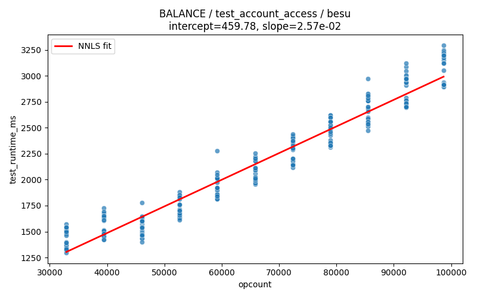

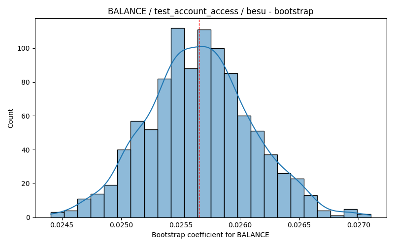

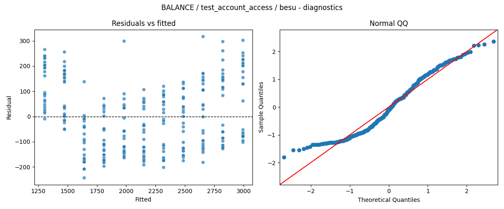

</details>

<details><summary>erigon — NNLS regression summary</summary>

```
==============================================================================
                           NNLS Regression Results                            
==============================================================================
Dep. Variable:          test_runtime_ms              R-squared:          0.900
Model:                  NNLS                    Adj. R-squared:          0.899
No. Observations:       132                               RMSE:         255.32
Df Residuals:           130                                MAE:         217.51
Df Model:               1      
==============================================================================
                      coef     std err     P-value      [0.025      0.975]
------------------------------------------------------------------------------
         const    461.4440     74.3798       0.001    330.5841    616.8429
       opcount      0.0368      0.0010       0.001      0.0348      0.0386
==============================================================================
Notes: Non-negative least squares with bootstrap inference (1000 iterations)
==============================================================================
```

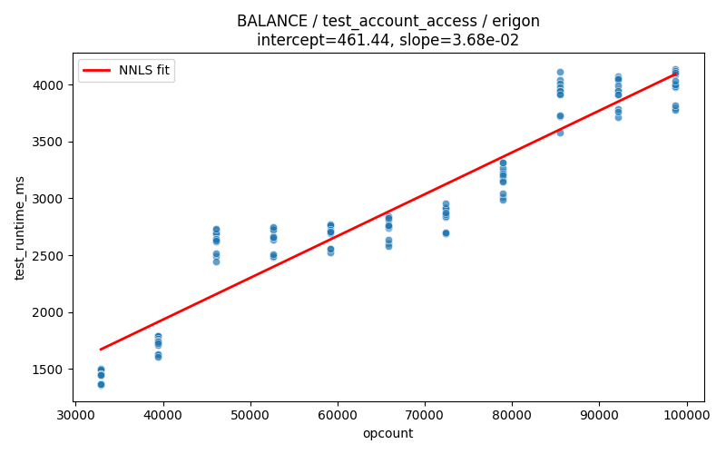

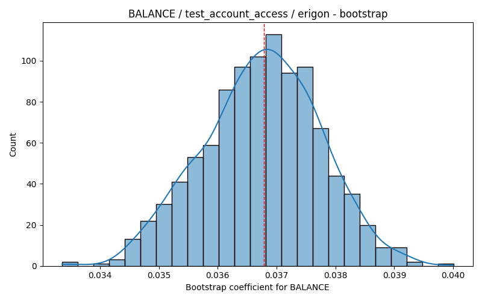

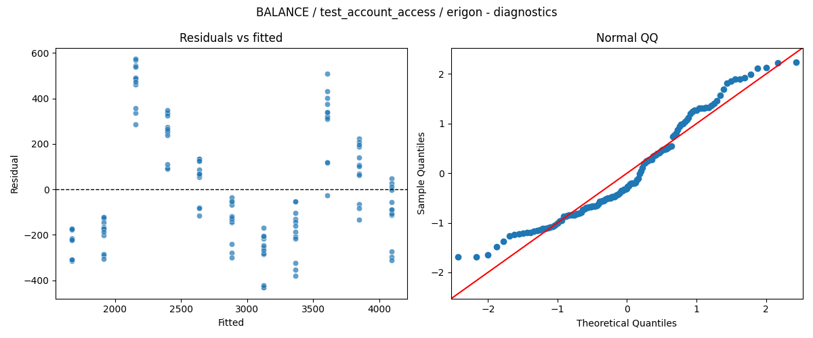

</details>

<details><summary>nethermind — NNLS regression summary</summary>

```
==============================================================================
                           NNLS Regression Results                            
==============================================================================
Dep. Variable:          test_runtime_ms              R-squared:          0.719
Model:                  NNLS                    Adj. R-squared:          0.717
No. Observations:       209                               RMSE:         322.88
Df Residuals:           207                                MAE:         271.18
Df Model:               1      
==============================================================================
                      coef     std err     P-value      [0.025      0.975]
------------------------------------------------------------------------------
         const    821.2076     80.8037       0.001    663.4796    979.7801
       opcount      0.0248      0.0011       0.001      0.0226      0.0269
==============================================================================
Notes: Non-negative least squares with bootstrap inference (1000 iterations)
==============================================================================
```

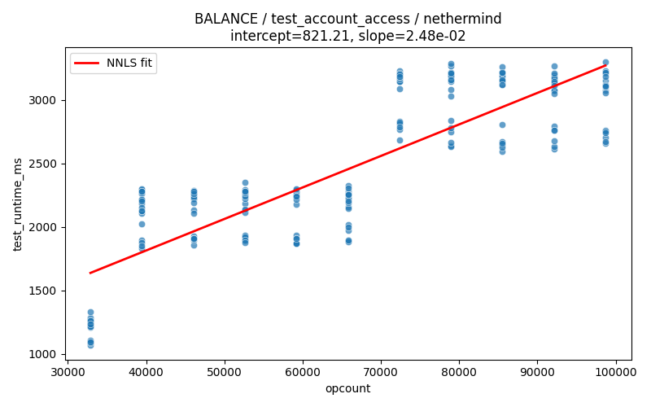

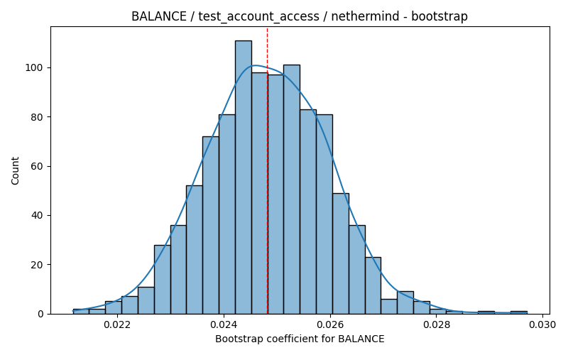

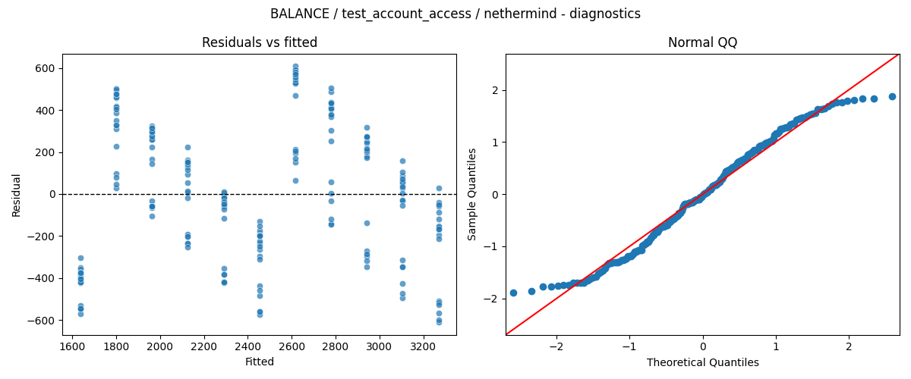

</details>

<details><summary>reth — NNLS regression summary</summary>

```
==============================================================================
                           NNLS Regression Results                            
==============================================================================
Dep. Variable:          test_runtime_ms              R-squared:          0.781
Model:                  NNLS                    Adj. R-squared:          0.780
No. Observations:       363                               RMSE:         348.69
Df Residuals:           361                                MAE:         242.37
Df Model:               1      
==============================================================================
                      coef     std err     P-value      [0.025      0.975]
------------------------------------------------------------------------------
         const    586.2820     59.0806       0.001    468.5650    696.5231
       opcount      0.0316      0.0009       0.001      0.0299      0.0335
==============================================================================
Notes: Non-negative least squares with bootstrap inference (1000 iterations)
==============================================================================
```

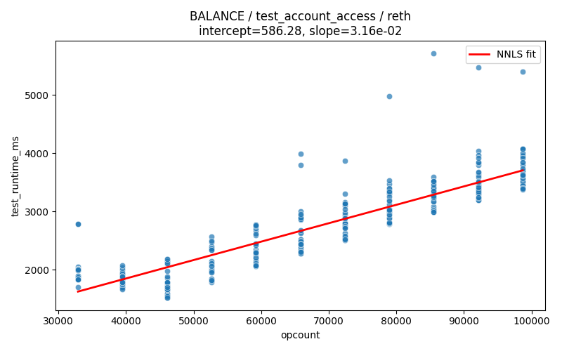

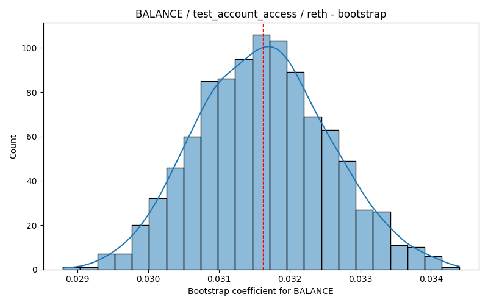

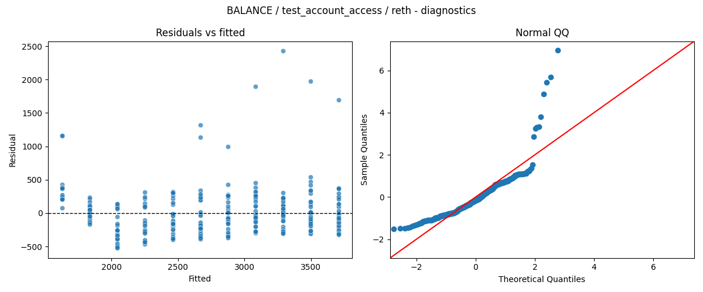

</details>

### test_account_access — combo `BALANCE_AccountMode.EXISTING_EOA`

| client | nobs | R² | target_coef (ms) | p-value | 95% CI |
| --- | --- | --- | --- | --- | --- |
| `besu` | 275 | 0.8323 | 0.009455 | 1.00e-03 | [0.008831, 0.01012] |
| `erigon` | 132 | 0.9955 | 0.0099 | 1.00e-03 | [0.009783, 0.01002] |
| `nethermind` | 209 | 0.9237 | 0.003707 | 1.00e-03 | [0.003557, 0.003859] |
| `reth` | 363 | 0.9768 | 0.001091 | 1.00e-03 | [0.001075, 0.001108] |

<details><summary>besu — NNLS regression summary</summary>

```
==============================================================================
                           NNLS Regression Results                            
==============================================================================
Dep. Variable:          test_runtime_ms              R-squared:          0.832
Model:                  NNLS                    Adj. R-squared:          0.832
No. Observations:       275                               RMSE:         101.43
Df Residuals:           273                                MAE:          79.62
Df Model:               1      
==============================================================================
                      coef     std err     P-value      [0.025      0.975]
------------------------------------------------------------------------------
         const    407.0317     28.2687       0.001    350.6295    461.3471
       opcount      0.0095      0.0003       0.001      0.0088      0.0101
==============================================================================
Notes: Non-negative least squares with bootstrap inference (1000 iterations)
==============================================================================
```

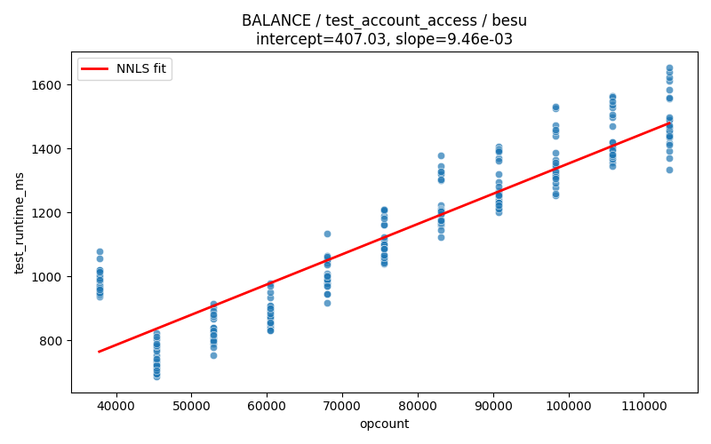

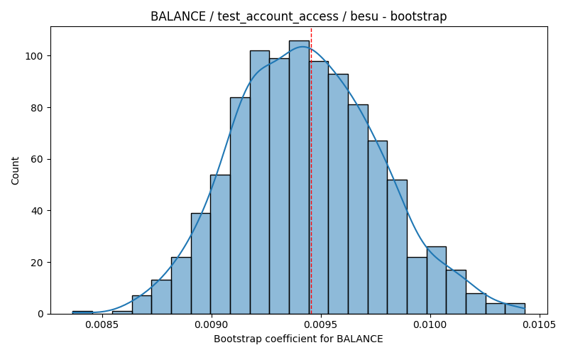

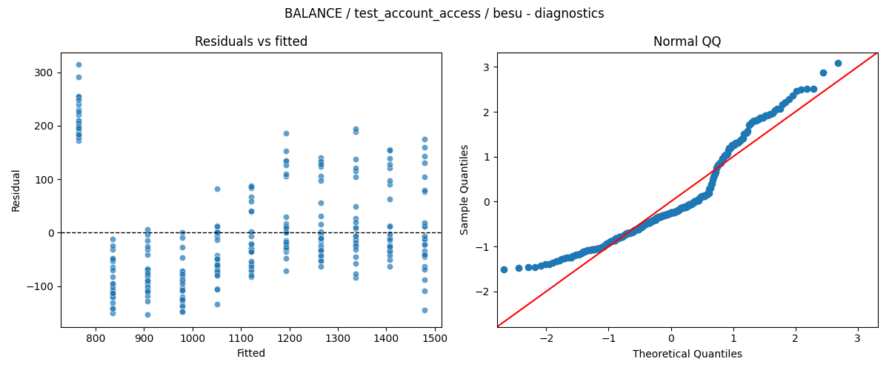

</details>

<details><summary>erigon — NNLS regression summary</summary>

```
==============================================================================
                           NNLS Regression Results                            
==============================================================================
Dep. Variable:          test_runtime_ms              R-squared:          0.995
Model:                  NNLS                    Adj. R-squared:          0.995
No. Observations:       132                               RMSE:          15.94
Df Residuals:           130                                MAE:          13.00
Df Model:               1      
==============================================================================
                      coef     std err     P-value      [0.025      0.975]
------------------------------------------------------------------------------
         const     35.5148      4.3937       0.001     26.3941     43.9373
       opcount      0.0099      0.0001       0.001      0.0098      0.0100
==============================================================================
Notes: Non-negative least squares with bootstrap inference (1000 iterations)
==============================================================================
```

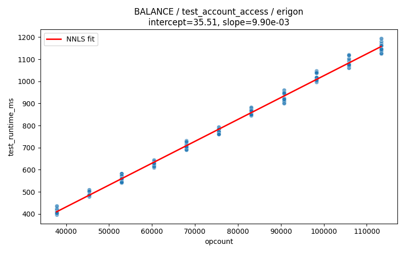

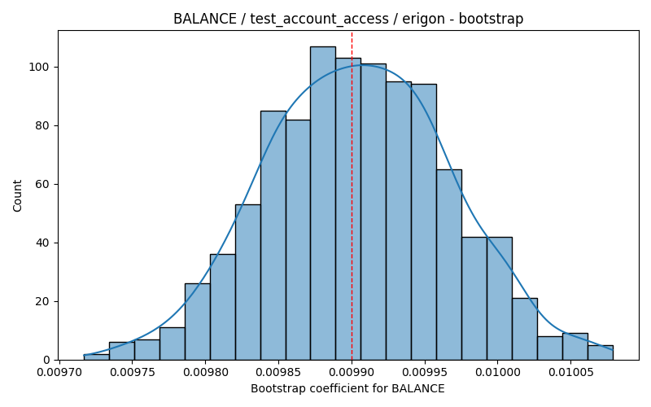

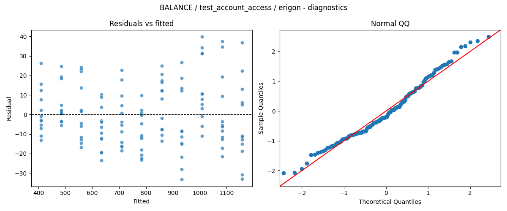

</details>

<details><summary>nethermind — NNLS regression summary</summary>

```
==============================================================================
                           NNLS Regression Results                            
==============================================================================
Dep. Variable:          test_runtime_ms              R-squared:          0.924
Model:                  NNLS                    Adj. R-squared:          0.923
No. Observations:       209                               RMSE:          25.46
Df Residuals:           207                                MAE:          18.63
Df Model:               1      
==============================================================================
                      coef     std err     P-value      [0.025      0.975]
------------------------------------------------------------------------------
         const     87.4098      5.9053       0.001     75.3397     98.8683
       opcount      0.0037      0.0001       0.001      0.0036      0.0039
==============================================================================
Notes: Non-negative least squares with bootstrap inference (1000 iterations)
==============================================================================
```

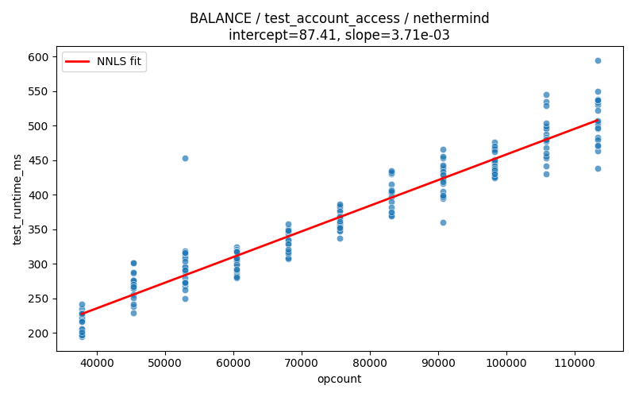

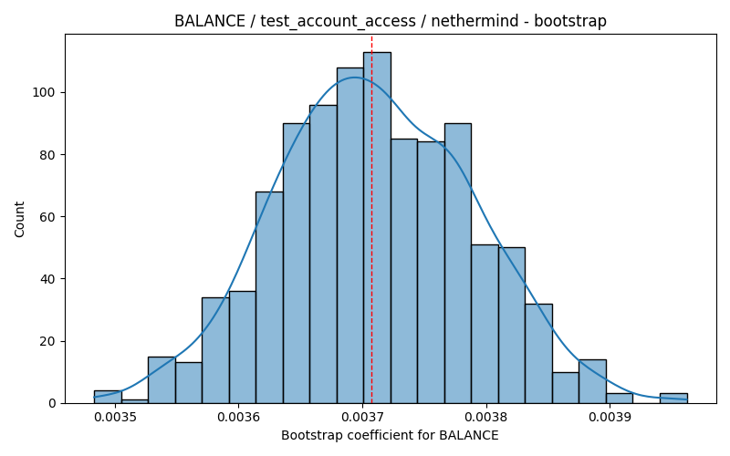

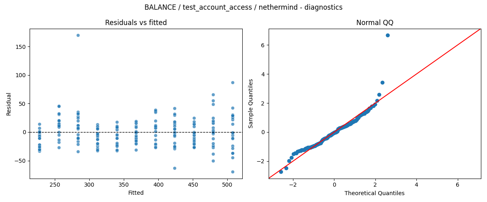

</details>

<details><summary>reth — NNLS regression summary</summary>

```
==============================================================================
                           NNLS Regression Results                            
==============================================================================
Dep. Variable:          test_runtime_ms              R-squared:          0.977
Model:                  NNLS                    Adj. R-squared:          0.977
No. Observations:       363                               RMSE:           4.02
Df Residuals:           361                                MAE:           3.24
Df Model:               1      
==============================================================================
                      coef     std err     P-value      [0.025      0.975]
------------------------------------------------------------------------------
         const     32.0603      0.7020       0.001     30.5873     33.3664
       opcount      0.0011      0.0000       0.001      0.0011      0.0011
==============================================================================
Notes: Non-negative least squares with bootstrap inference (1000 iterations)
==============================================================================
```

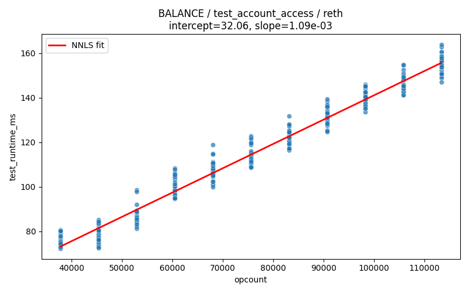

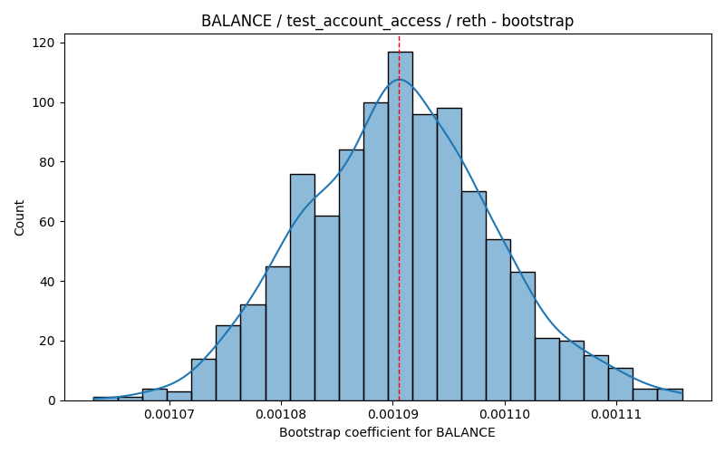

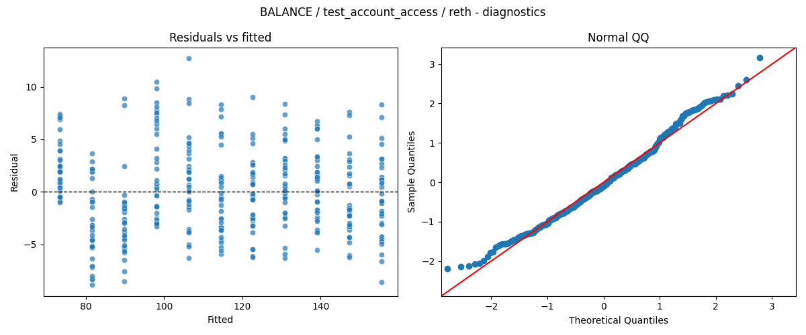

</details>

### test_account_access — combo `BALANCE_AccountMode.NON_EXISTING_ACCOUNT`

| client | nobs | R² | target_coef (ms) | p-value | 95% CI |
| --- | --- | --- | --- | --- | --- |
| `besu` | 275 | 0.9184 | 0.009445 | 1.00e-03 | [0.009091, 0.009827] |
| `erigon` | 132 | 0.9968 | 0.009068 | 1.00e-03 | [0.008988, 0.009156] |
| `nethermind` | 209 | 0.9373 | 0.003601 | 1.00e-03 | [0.003447, 0.003728] |
| `reth` | 363 | 0.9716 | 0.0009258 | 1.00e-03 | [0.0009103, 0.0009402] |

<details><summary>besu — NNLS regression summary</summary>

```
==============================================================================
                           NNLS Regression Results                            
==============================================================================
Dep. Variable:          test_runtime_ms              R-squared:          0.918
Model:                  NNLS                    Adj. R-squared:          0.918
No. Observations:       275                               RMSE:          67.30
Df Residuals:           273                                MAE:          56.21
Df Model:               1      
==============================================================================
                      coef     std err     P-value      [0.025      0.975]
------------------------------------------------------------------------------
         const    386.6809     14.9258       0.001    357.2057    414.4486
       opcount      0.0094      0.0002       0.001      0.0091      0.0098
==============================================================================
Notes: Non-negative least squares with bootstrap inference (1000 iterations)
==============================================================================
```

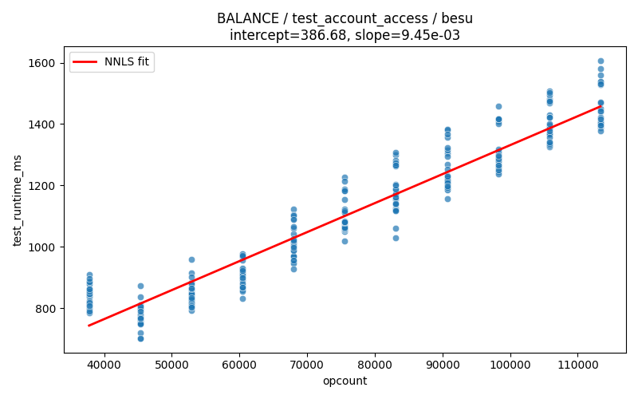

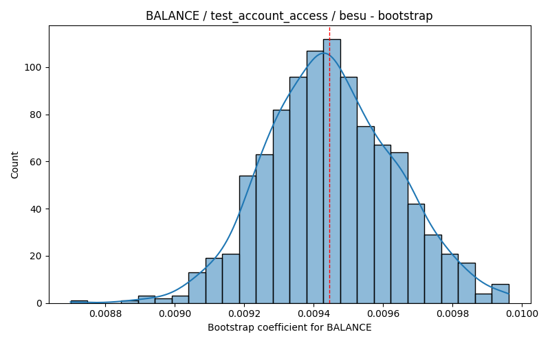

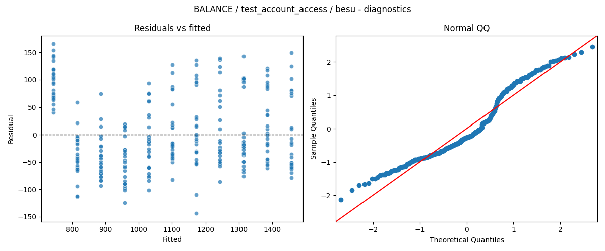

</details>

<details><summary>erigon — NNLS regression summary</summary>

```
==============================================================================
                           NNLS Regression Results                            
==============================================================================
Dep. Variable:          test_runtime_ms              R-squared:          0.997
Model:                  NNLS                    Adj. R-squared:          0.997
No. Observations:       132                               RMSE:          12.32
Df Residuals:           130                                MAE:           9.95
Df Model:               1      
==============================================================================
                      coef     std err     P-value      [0.025      0.975]
------------------------------------------------------------------------------
         const     10.7238      3.6299       0.001      3.7367     17.5545
       opcount      0.0091      0.0000       0.001      0.0090      0.0092
==============================================================================
Notes: Non-negative least squares with bootstrap inference (1000 iterations)
==============================================================================
```

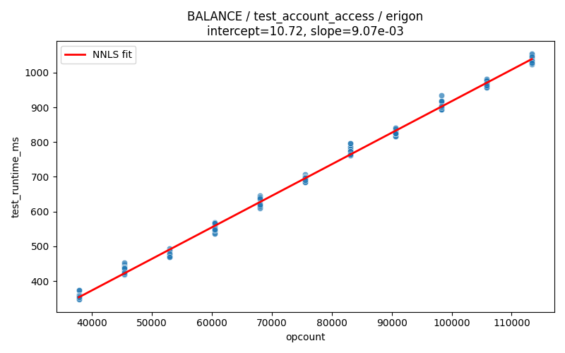

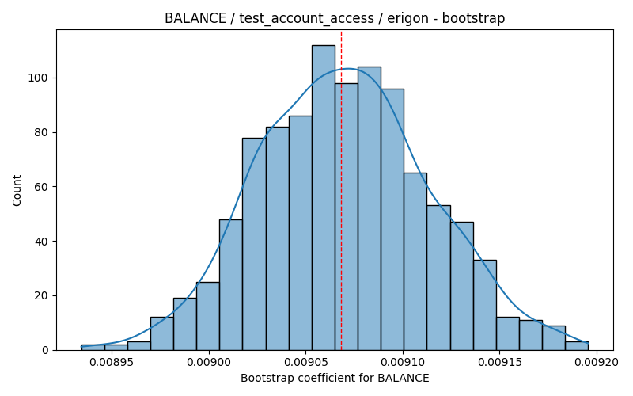

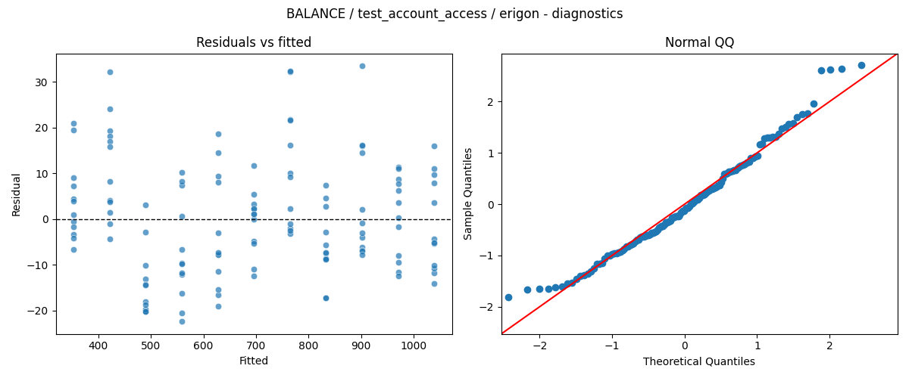

</details>

<details><summary>nethermind — NNLS regression summary</summary>

```
==============================================================================
                           NNLS Regression Results                            
==============================================================================
Dep. Variable:          test_runtime_ms              R-squared:          0.937
Model:                  NNLS                    Adj. R-squared:          0.937
No. Observations:       209                               RMSE:          22.25
Df Residuals:           207                                MAE:          17.35
Df Model:               1      
==============================================================================
                      coef     std err     P-value      [0.025      0.975]
------------------------------------------------------------------------------
         const     98.4041      5.6942       0.001     88.2942    111.1008
       opcount      0.0036      0.0001       0.001      0.0034      0.0037
==============================================================================
Notes: Non-negative least squares with bootstrap inference (1000 iterations)
==============================================================================
```

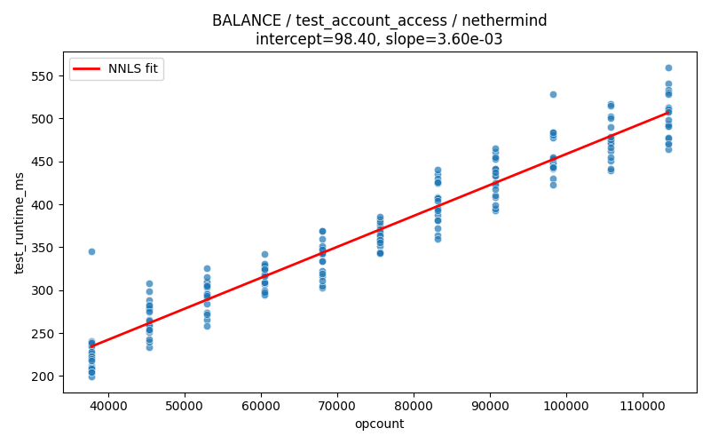

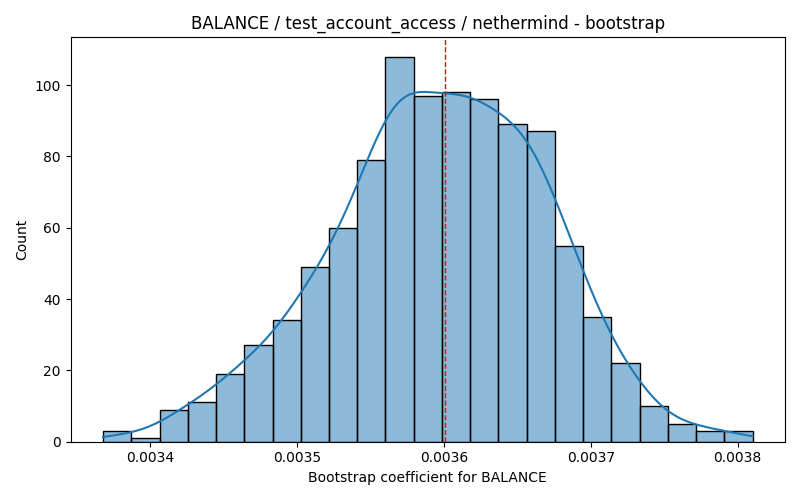

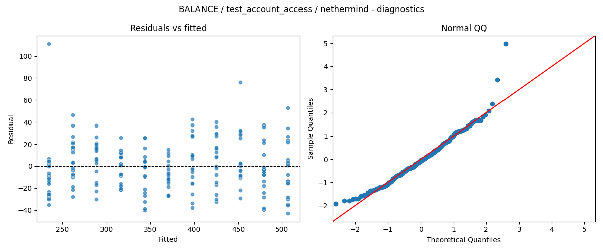

</details>

<details><summary>reth — NNLS regression summary</summary>

```
==============================================================================
                           NNLS Regression Results                            
==============================================================================
Dep. Variable:          test_runtime_ms              R-squared:          0.972
Model:                  NNLS                    Adj. R-squared:          0.972
No. Observations:       363                               RMSE:           3.78
Df Residuals:           361                                MAE:           2.98
Df Model:               1      
==============================================================================
                      coef     std err     P-value      [0.025      0.975]
------------------------------------------------------------------------------
         const     31.1138      0.6387       0.001     29.9336     32.3785
       opcount      0.0009      0.0000       0.001      0.0009      0.0009
==============================================================================
Notes: Non-negative least squares with bootstrap inference (1000 iterations)
==============================================================================
```

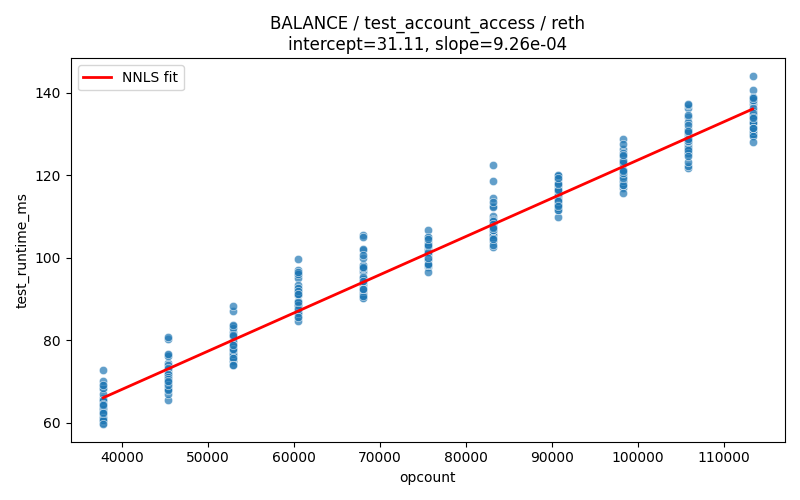

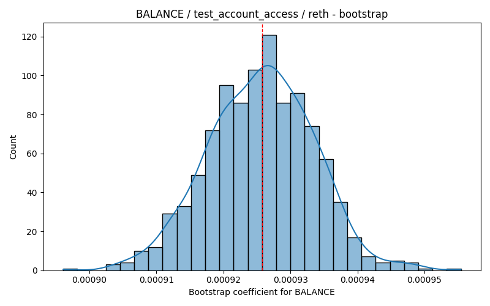

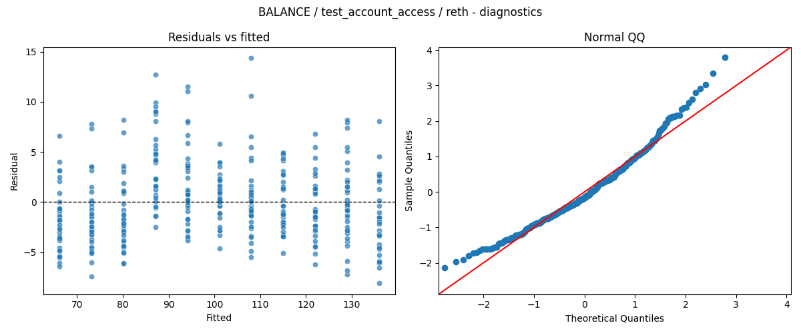

</details>

### test_ext_account_query_warm — combo `BALANCE`

| client | nobs | R² | target_coef (ms) | p-value | 95% CI |
| --- | --- | --- | --- | --- | --- |
| `besu` | 275 | 0.7674 | 0.0001627 | 1.00e-03 | [0.0001513, 0.0001733] |
| `erigon` | 132 | 0.8564 | 5.079e-05 | 1.00e-03 | [4.691e-05, 5.467e-05] |
| `nethermind` | 209 | 0.8682 | 0.0001686 | 1.00e-03 | [0.0001605, 0.0001766] |
| `reth` | 363 | 0.6965 | 6.678e-06 | 1.00e-03 | [6.274e-06, 7.075e-06] |

<details><summary>besu — NNLS regression summary</summary>

```
==============================================================================
                           NNLS Regression Results                            
==============================================================================
Dep. Variable:          test_runtime_ms              R-squared:          0.767
Model:                  NNLS                    Adj. R-squared:          0.767
No. Observations:       275                               RMSE:          52.36
Df Residuals:           273                                MAE:          40.67
Df Model:               1      
==============================================================================
                      coef     std err     P-value      [0.025      0.975]
------------------------------------------------------------------------------
         const    175.6651     11.2819       0.001    154.2643    197.4730
       opcount      0.0002      0.0000       0.001      0.0002      0.0002
==============================================================================
Notes: Non-negative least squares with bootstrap inference (1000 iterations)
==============================================================================
```

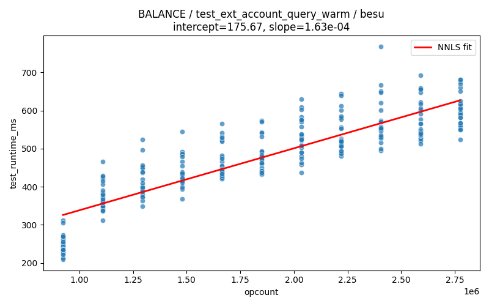

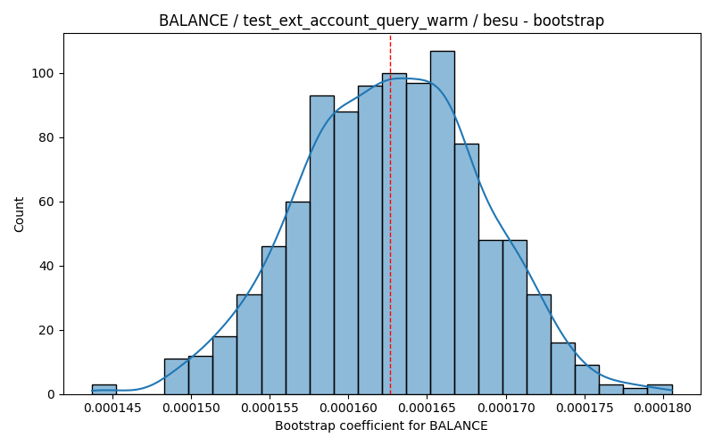

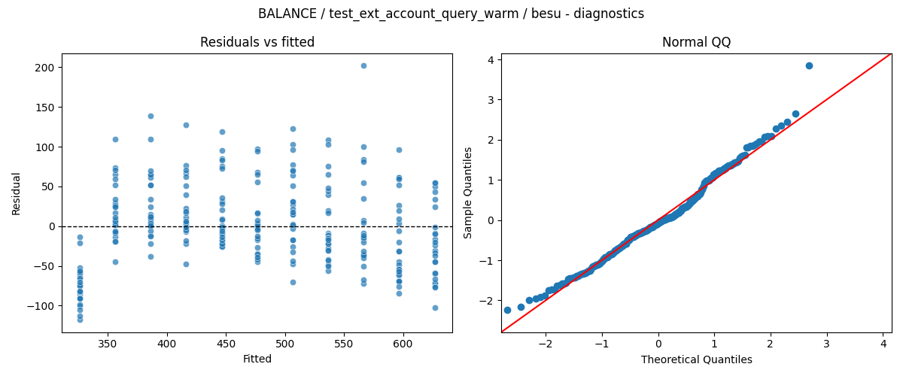

</details>

<details><summary>erigon — NNLS regression summary</summary>

```
==============================================================================
                           NNLS Regression Results                            
==============================================================================
Dep. Variable:          test_runtime_ms              R-squared:          0.856
Model:                  NNLS                    Adj. R-squared:          0.855
No. Observations:       132                               RMSE:          12.16
Df Residuals:           130                                MAE:          10.09
Df Model:               1      
==============================================================================
                      coef     std err     P-value      [0.025      0.975]
------------------------------------------------------------------------------
         const     37.7466      3.7724       0.001     30.5173     45.2885
       opcount      0.0001      0.0000       0.001      0.0000      0.0001
==============================================================================
Notes: Non-negative least squares with bootstrap inference (1000 iterations)
==============================================================================
```

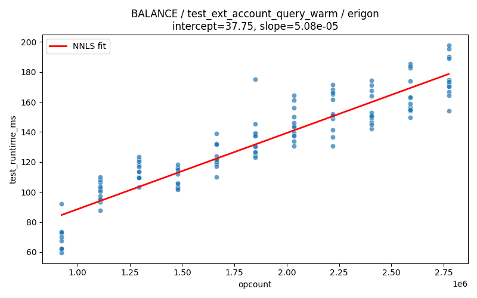

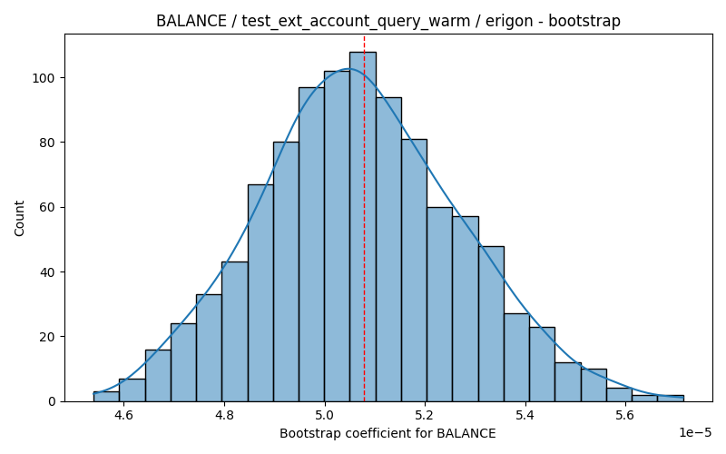

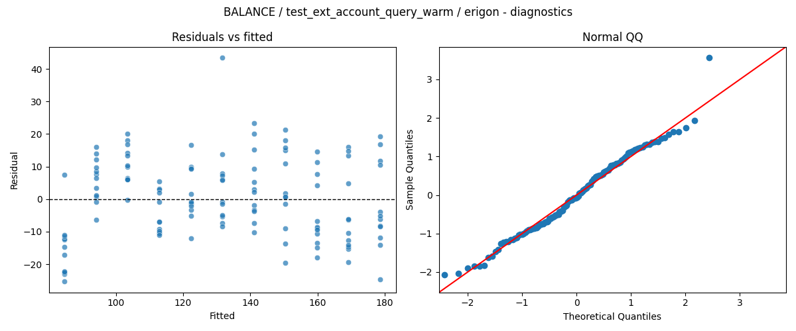

</details>

<details><summary>nethermind — NNLS regression summary</summary>

```
==============================================================================
                           NNLS Regression Results                            
==============================================================================
Dep. Variable:          test_runtime_ms              R-squared:          0.868
Model:                  NNLS                    Adj. R-squared:          0.868
No. Observations:       209                               RMSE:          38.41
Df Residuals:           207                                MAE:          28.73
Df Model:               1      
==============================================================================
                      coef     std err     P-value      [0.025      0.975]
------------------------------------------------------------------------------
         const     84.9801      8.0086       0.001     69.0900    100.8222
       opcount      0.0002      0.0000       0.001      0.0002      0.0002
==============================================================================
Notes: Non-negative least squares with bootstrap inference (1000 iterations)
==============================================================================
```

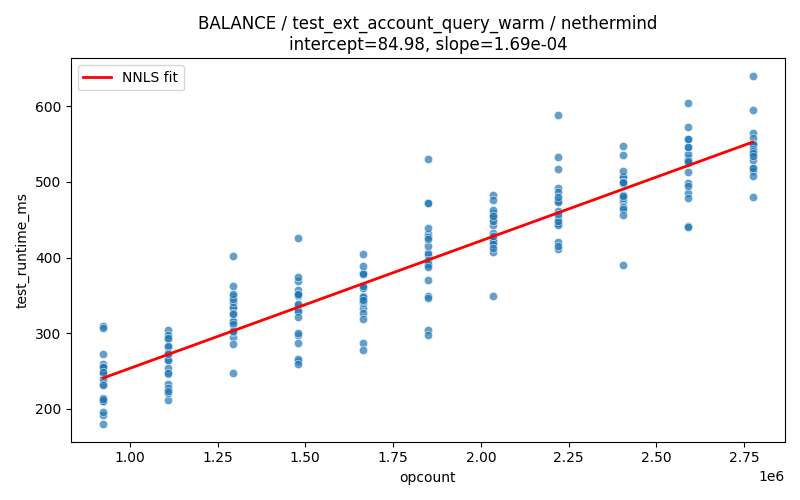

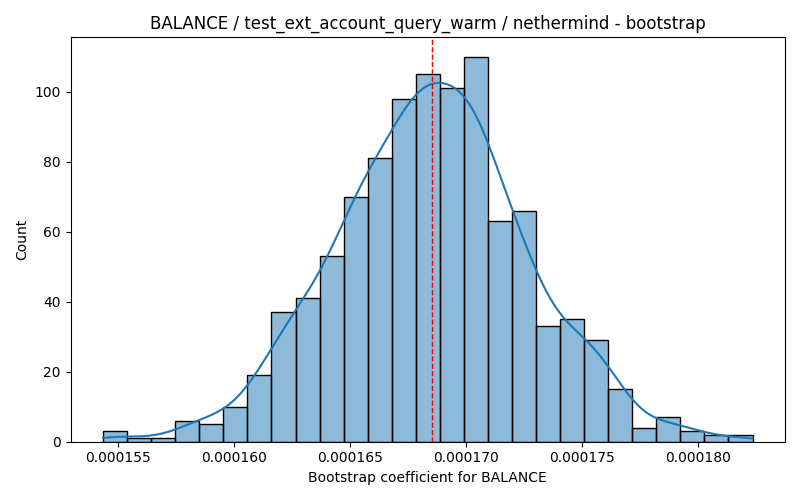

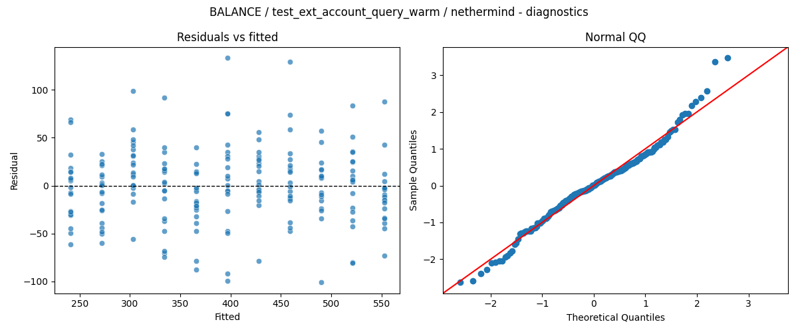

</details>

<details><summary>reth — NNLS regression summary</summary>

```
==============================================================================
                           NNLS Regression Results                            
==============================================================================
Dep. Variable:          test_runtime_ms              R-squared:          0.697
Model:                  NNLS                    Adj. R-squared:          0.696
No. Observations:       363                               RMSE:           2.58
Df Residuals:           361                                MAE:           1.79
Df Model:               1      
==============================================================================
                      coef     std err     P-value      [0.025      0.975]
------------------------------------------------------------------------------
         const      6.0782      0.3570       0.001      5.3932      6.8476
       opcount      0.0000      0.0000       0.001      0.0000      0.0000
==============================================================================
Notes: Non-negative least squares with bootstrap inference (1000 iterations)
==============================================================================
```

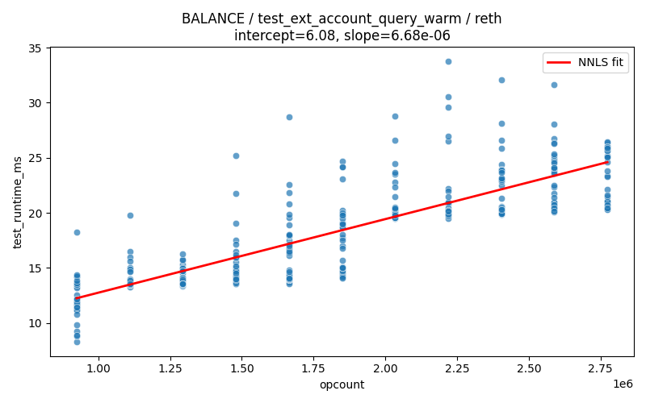

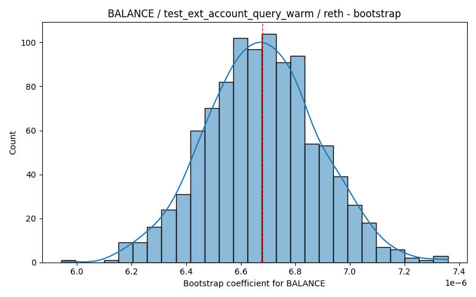

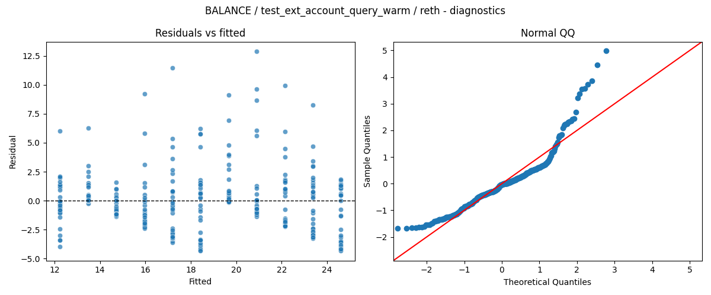

</details>

## CALL

### test_account_access — combo `CALL_AccountMode.EXISTING_CONTRACT`

| client | nobs | R² | target_coef (ms) | p-value | 95% CI |
| --- | --- | --- | --- | --- | --- |
| `besu` | 550 | 0.9387 | 0.02604 | 1.00e-03 | [0.02516, 0.0269] |
| `erigon` | 264 | 0.98 | 0 | 1.00e+00 | [0, 0.01474] |
| `nethermind` | 418 | 0.8754 | 0.02974 | 1.00e-03 | [0.02819, 0.03113] |
| `reth` | 726 | 0.9436 | 0.03008 | 1.00e-03 | [0.02871, 0.03162] |

<details><summary>besu — NNLS regression summary</summary>

```
==============================================================================
                           NNLS Regression Results                            
==============================================================================
Dep. Variable:          test_runtime_ms              R-squared:          0.939
Model:                  NNLS                    Adj. R-squared:          0.939
No. Observations:       550                               RMSE:         173.93
Df Residuals:           547                                MAE:         141.10
Df Model:               2      
==============================================================================
                      coef     std err     P-value      [0.025      0.975]
------------------------------------------------------------------------------
         const    619.2043     28.2037       0.001    563.8521    674.6752
       opcount      0.0260      0.0004       0.001      0.0252      0.0269
        update      0.0835      0.0010       0.001      0.0816      0.0854
==============================================================================
Notes: Non-negative least squares with bootstrap inference (1000 iterations)
==============================================================================
```

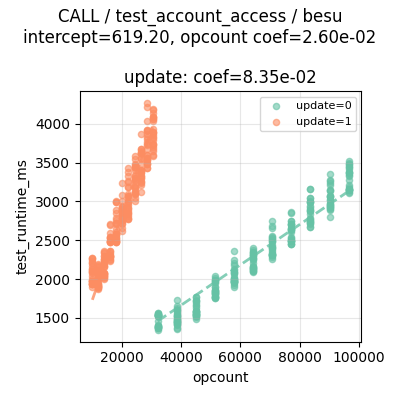

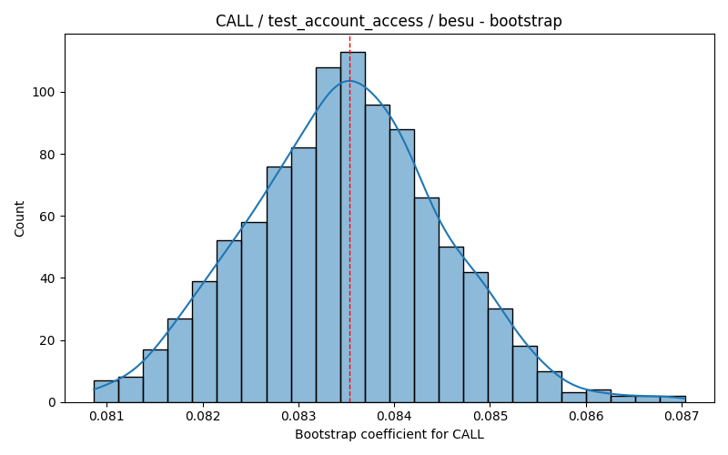

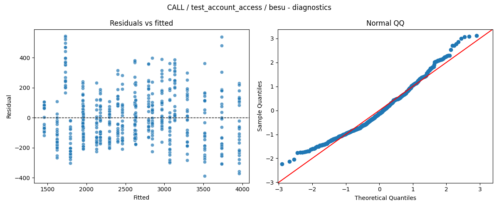

</details>

<details><summary>erigon — NNLS regression summary</summary>

```
==============================================================================
                           NNLS Regression Results                            
==============================================================================
Dep. Variable:          test_runtime_ms              R-squared:          0.980
Model:                  NNLS                    Adj. R-squared:          0.980
No. Observations:       264                               RMSE:        2272.95
Df Residuals:           261                                MAE:        1845.41
Df Model:               2      
==============================================================================
                      coef     std err     P-value      [0.025      0.975]
------------------------------------------------------------------------------
         const   7772.1328    368.0298       0.001   6700.7850   8114.0059
       opcount      0.0000      0.0044       1.000      0.0000      0.0147
        update      1.4299      0.0161       0.001      1.4067      1.4705
==============================================================================
Notes: Non-negative least squares with bootstrap inference (1000 iterations)
==============================================================================
```

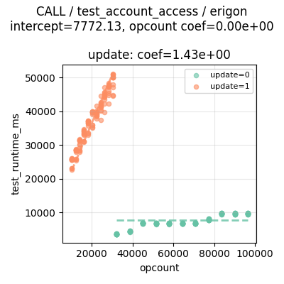

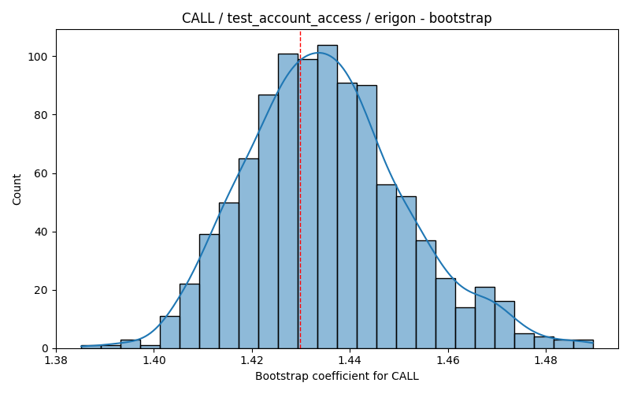

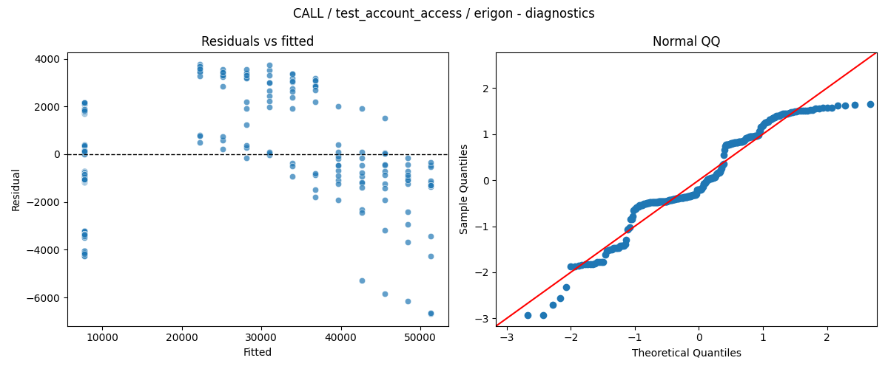

</details>

<details><summary>nethermind — NNLS regression summary</summary>

```
==============================================================================
                           NNLS Regression Results                            
==============================================================================
Dep. Variable:          test_runtime_ms              R-squared:          0.875
Model:                  NNLS                    Adj. R-squared:          0.875
No. Observations:       418                               RMSE:         264.64
Df Residuals:           415                                MAE:         206.75
Df Model:               2      
==============================================================================
                      coef     std err     P-value      [0.025      0.975]
------------------------------------------------------------------------------
         const    588.1532     45.7238       0.001    505.6714    686.1188
       opcount      0.0297      0.0007       0.001      0.0282      0.0311
        update      0.0133      0.0015       0.001      0.0100      0.0160
==============================================================================
Notes: Non-negative least squares with bootstrap inference (1000 iterations)
==============================================================================
```

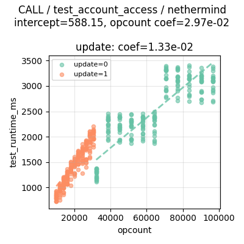

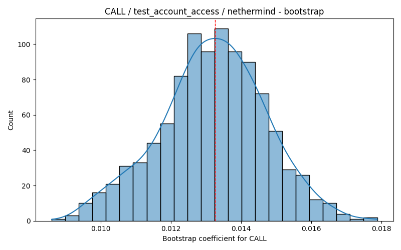

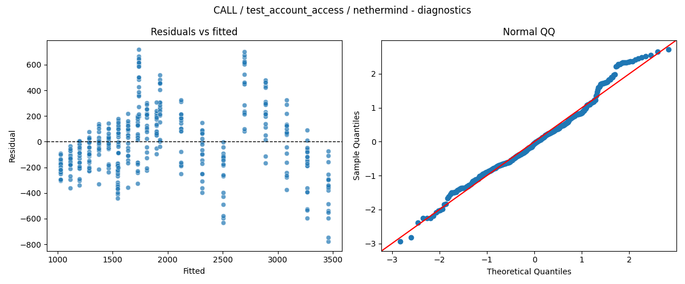

</details>

<details><summary>reth — NNLS regression summary</summary>

```
==============================================================================
                           NNLS Regression Results                            
==============================================================================
Dep. Variable:          test_runtime_ms              R-squared:          0.944
Model:                  NNLS                    Adj. R-squared:          0.943
No. Observations:       726                               RMSE:         282.85
Df Residuals:           723                                MAE:         178.91
Df Model:               2      
==============================================================================
                      coef     std err     P-value      [0.025      0.975]
------------------------------------------------------------------------------
         const    602.6238     43.3303       0.001    515.3337    680.7931
       opcount      0.0301      0.0007       0.001      0.0287      0.0316
        update      0.1390      0.0012       0.001      0.1367      0.1414
==============================================================================
Notes: Non-negative least squares with bootstrap inference (1000 iterations)
==============================================================================
```

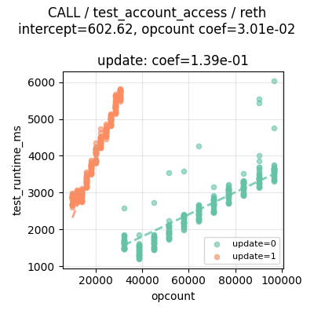

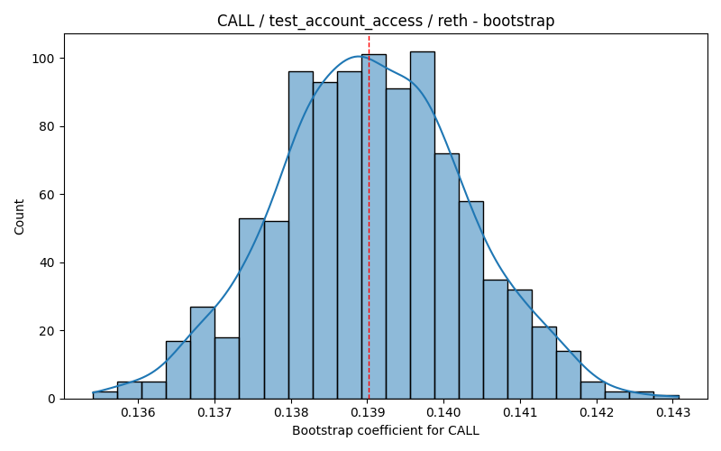

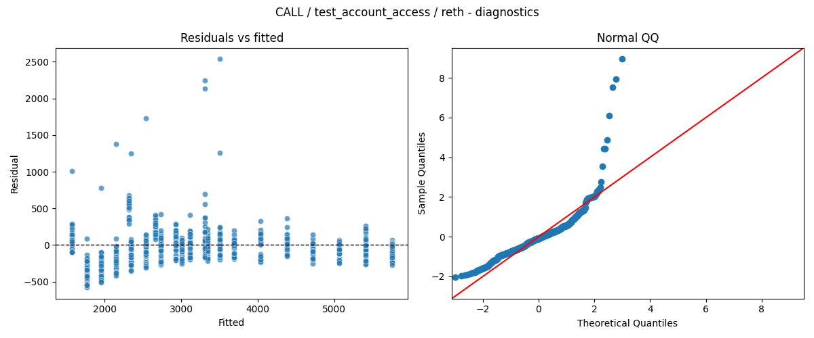

</details>

### test_account_access — combo `CALL_AccountMode.EXISTING_EOA`

| client | nobs | R² | target_coef (ms) | p-value | 95% CI |
| --- | --- | --- | --- | --- | --- |
| `besu` | 550 | 0.9441 | 0.01242 | 1.00e-03 | [0.01197, 0.01284] |
| `erigon` | 264 | 0.9876 | 0 | 1.00e+00 | [0, 0.0003759] |
| `nethermind` | 418 | 0.9557 | 0.003761 | 1.00e-03 | [0.003493, 0.004014] |
| `reth` | 726 | 0.9907 | 0 | 1.00e+00 | [0, 0] |

<details><summary>besu — NNLS regression summary</summary>

```
==============================================================================
                           NNLS Regression Results                            
==============================================================================
Dep. Variable:          test_runtime_ms              R-squared:          0.944
Model:                  NNLS                    Adj. R-squared:          0.944
No. Observations:       550                               RMSE:         111.38
Df Residuals:           547                                MAE:          91.46
Df Model:               2      
==============================================================================
                      coef     std err     P-value      [0.025      0.975]
------------------------------------------------------------------------------
         const    481.7444     19.3206       0.001    443.9512    519.3305
       opcount      0.0124      0.0002       0.001      0.0120      0.0128
        update      0.0550      0.0007       0.001      0.0536      0.0564
==============================================================================
Notes: Non-negative least squares with bootstrap inference (1000 iterations)
==============================================================================
```

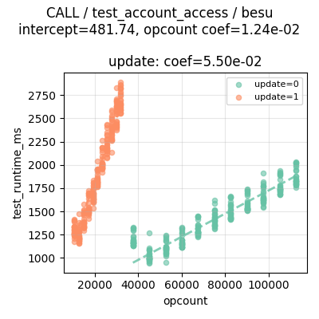

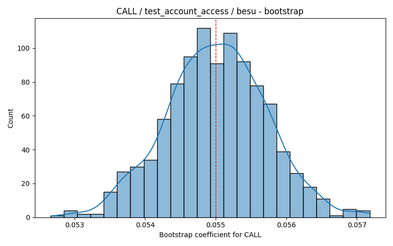

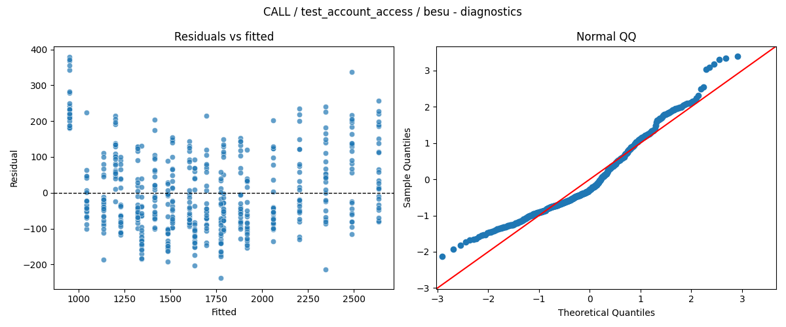

</details>

<details><summary>erigon — NNLS regression summary</summary>

```
==============================================================================
                           NNLS Regression Results                            
==============================================================================
Dep. Variable:          test_runtime_ms              R-squared:          0.988
Model:                  NNLS                    Adj. R-squared:          0.988
No. Observations:       264                               RMSE:         371.44
Df Residuals:           261                                MAE:         305.42
Df Model:               2      
==============================================================================
                      coef     std err     P-value      [0.025      0.975]
------------------------------------------------------------------------------
         const    990.9881     28.2279       0.001    926.3749   1041.4376
       opcount      0.0000      0.0001       1.000      0.0000      0.0004
        update      0.2847      0.0021       0.001      0.2806      0.2892
==============================================================================
Notes: Non-negative least squares with bootstrap inference (1000 iterations)
==============================================================================
```

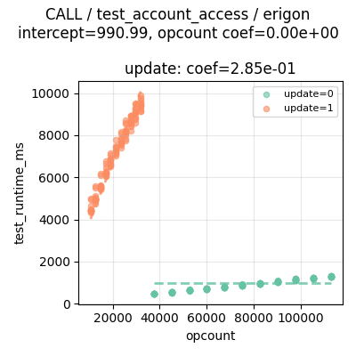

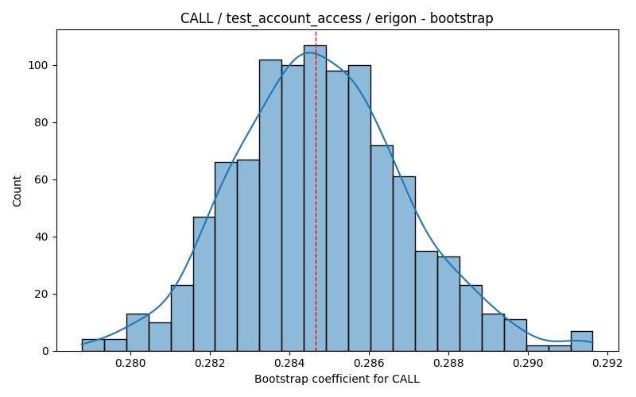

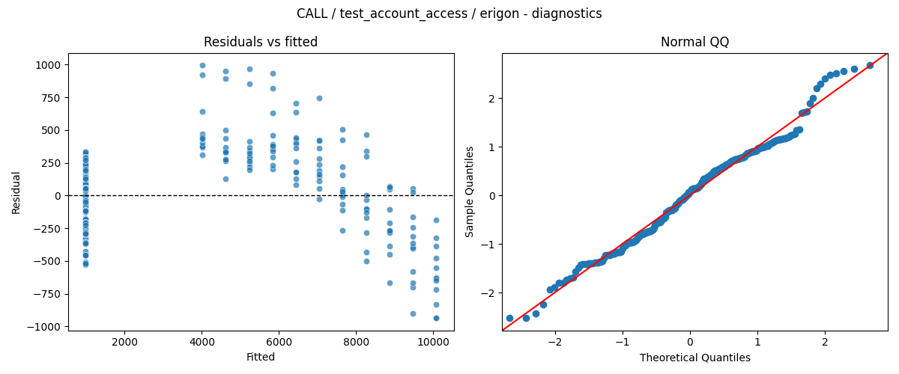

</details>

<details><summary>nethermind — NNLS regression summary</summary>

```
==============================================================================
                           NNLS Regression Results                            
==============================================================================
Dep. Variable:          test_runtime_ms              R-squared:          0.956
Model:                  NNLS                    Adj. R-squared:          0.955
No. Observations:       418                               RMSE:          66.53
Df Residuals:           415                                MAE:          51.28
Df Model:               2      
==============================================================================
                      coef     std err     P-value      [0.025      0.975]
------------------------------------------------------------------------------
         const    180.3296     10.3303       0.001    160.2890    201.4939
       opcount      0.0038      0.0001       0.001      0.0035      0.0040
        update      0.0328      0.0005       0.001      0.0318      0.0338
==============================================================================
Notes: Non-negative least squares with bootstrap inference (1000 iterations)
==============================================================================
```

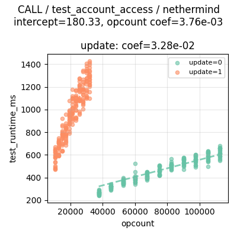

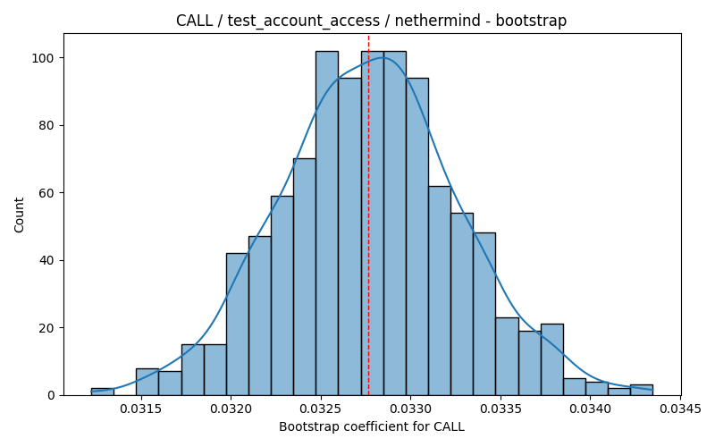

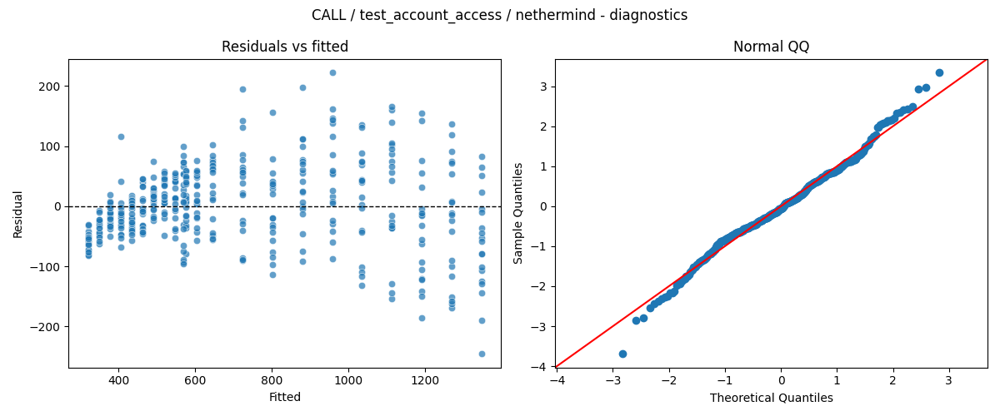

</details>

<details><summary>reth — NNLS regression summary</summary>

```
==============================================================================
                           NNLS Regression Results                            
==============================================================================
Dep. Variable:          test_runtime_ms              R-squared:          0.991
Model:                  NNLS                    Adj. R-squared:          0.991
No. Observations:       726                               RMSE:         185.33
Df Residuals:           723                                MAE:         110.03
Df Model:               2      
==============================================================================
                      coef     std err     P-value      [0.025      0.975]
------------------------------------------------------------------------------
         const    154.3639      6.1478       0.001    141.8739    166.6900
       opcount      0.0000      0.0000       1.000      0.0000      0.0000
        update      0.1641      0.0004       0.001      0.1633      0.1650
==============================================================================
Notes: Non-negative least squares with bootstrap inference (1000 iterations)
==============================================================================
```

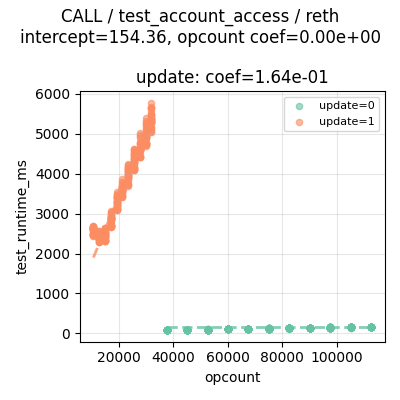

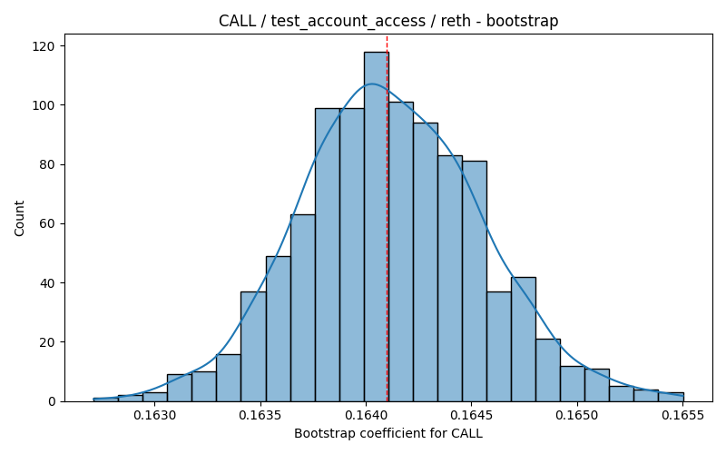

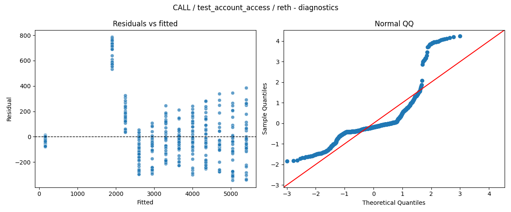

</details>

### test_account_access — combo `CALL_AccountMode.NON_EXISTING_ACCOUNT`

| client | nobs | R² | target_coef (ms) | p-value | 95% CI |
| --- | --- | --- | --- | --- | --- |
| `besu` | 550 | 0.9812 | 0.01242 | 1.00e-03 | [0.01228, 0.01265] |
| `erigon` | 264 | 0.938 | 0.005557 | 1.00e-03 | [0.004413, 0.006751] |
| `nethermind` | 418 | 0.9865 | 0.00527 | 1.00e-03 | [0.005156, 0.005386] |
| `reth` | 726 | 0.2758 | 0.0005788 | 1.00e-03 | [0.0004812, 0.0006794] |

<details><summary>besu — NNLS regression summary</summary>

```
==============================================================================
                           NNLS Regression Results                            
==============================================================================
Dep. Variable:          test_runtime_ms              R-squared:          0.981
Model:                  NNLS                    Adj. R-squared:          0.981
No. Observations:       550                               RMSE:          69.93
Df Residuals:           547                                MAE:          54.44
Df Model:               2      
==============================================================================
                      coef     std err     P-value      [0.025      0.975]
------------------------------------------------------------------------------
         const    439.9629      5.0990       0.001    424.5160    445.7277
       opcount      0.0124      0.0001       0.001      0.0123      0.0126
        update      0.0000      0.0032       1.000      0.0000      0.0119
==============================================================================
Notes: Non-negative least squares with bootstrap inference (1000 iterations)
==============================================================================
```

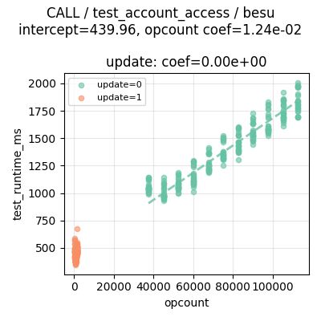

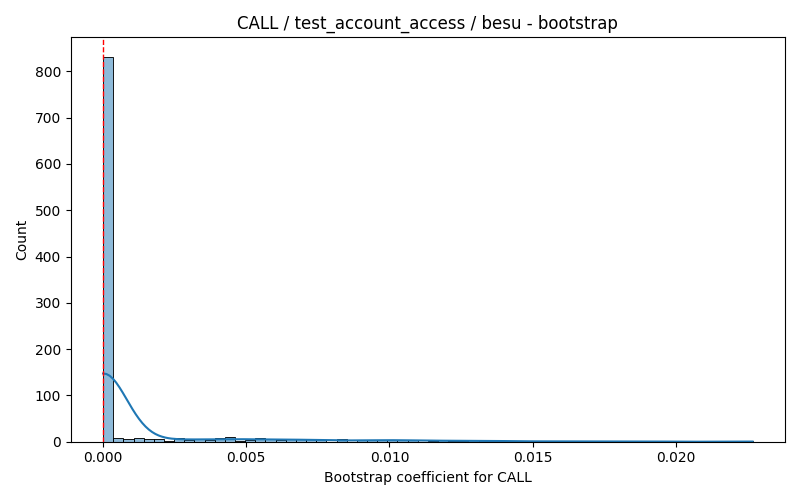

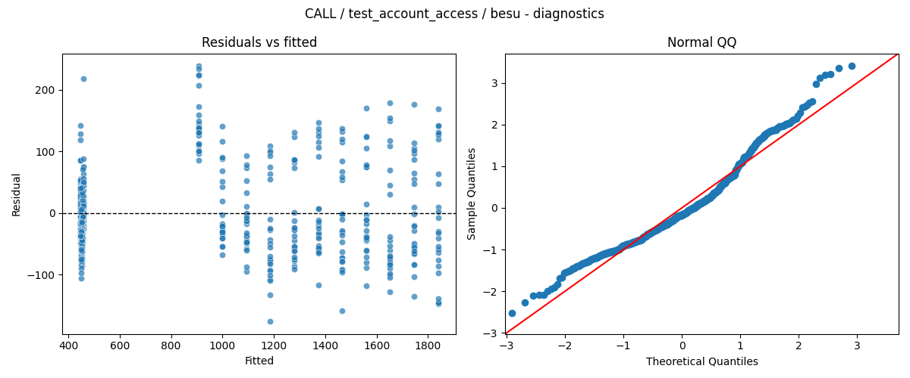

</details>

<details><summary>erigon — NNLS regression summary</summary>

```
==============================================================================
                           NNLS Regression Results                            
==============================================================================
Dep. Variable:          test_runtime_ms              R-squared:          0.938
Model:                  NNLS                    Adj. R-squared:          0.938
No. Observations:       264                               RMSE:         251.12
Df Residuals:           261                                MAE:         185.00
Df Model:               2      
==============================================================================
                      coef     std err     P-value      [0.025      0.975]
------------------------------------------------------------------------------
         const    393.7217     49.5438       0.001    293.3752    490.7440
       opcount      0.0056      0.0006       0.001      0.0044      0.0068
        update      2.0282      0.0555       0.001      1.9220      2.1404
==============================================================================
Notes: Non-negative least squares with bootstrap inference (1000 iterations)
==============================================================================
```

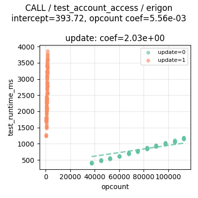

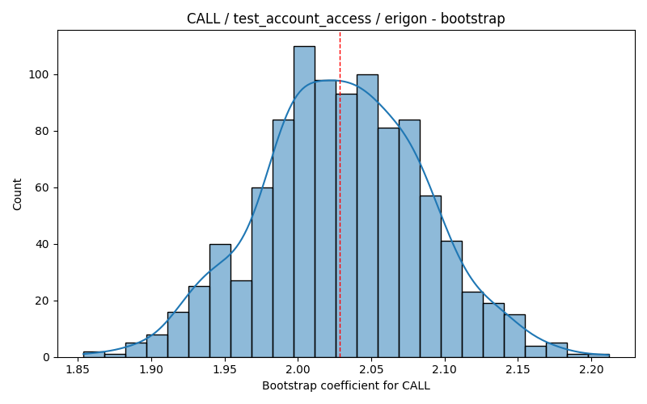

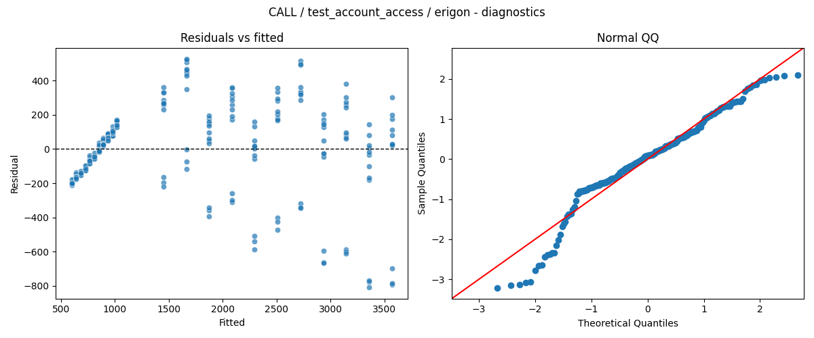

</details>

<details><summary>nethermind — NNLS regression summary</summary>

```
==============================================================================
                           NNLS Regression Results                            
==============================================================================
Dep. Variable:          test_runtime_ms              R-squared:          0.986
Model:                  NNLS                    Adj. R-squared:          0.986
No. Observations:       418                               RMSE:          24.29
Df Residuals:           415                                MAE:          19.48
Df Model:               2      
==============================================================================
                      coef     std err     P-value      [0.025      0.975]
------------------------------------------------------------------------------
         const     67.1169      4.4237       0.001     58.9395     75.5263
       opcount      0.0053      0.0001       0.001      0.0052      0.0054
        update      0.0146      0.0039       0.001      0.0070      0.0218
==============================================================================
Notes: Non-negative least squares with bootstrap inference (1000 iterations)
==============================================================================
```

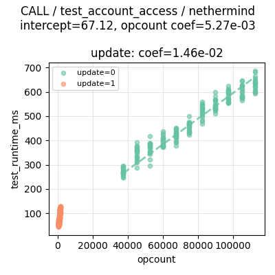

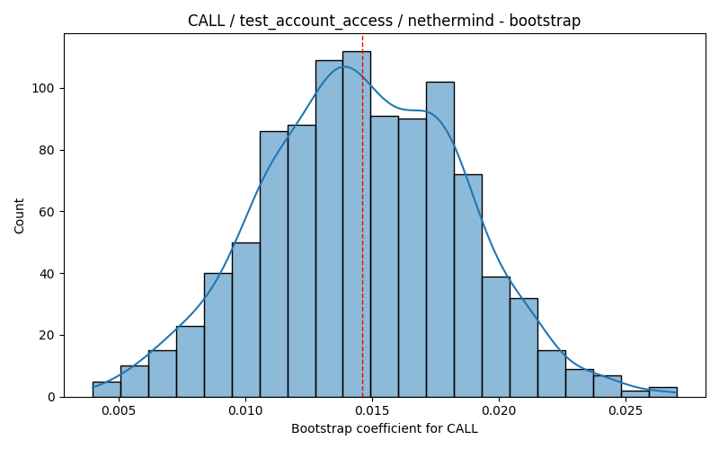

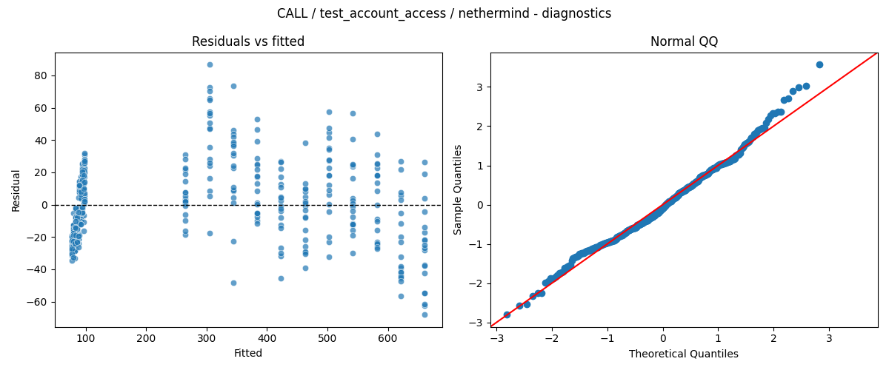

</details>

<details><summary>reth — NNLS regression summary</summary>

```
==============================================================================
                           NNLS Regression Results                            
==============================================================================
Dep. Variable:          test_runtime_ms              R-squared:          0.276
Model:                  NNLS                    Adj. R-squared:          0.274
No. Observations:       726                               RMSE:          21.33
Df Residuals:           723                                MAE:          14.80
Df Model:               2      
==============================================================================
                      coef     std err     P-value      [0.025      0.975]
------------------------------------------------------------------------------
         const     64.3485      4.0376       0.001     56.3116     72.2160
       opcount      0.0006      0.0000       0.001      0.0005      0.0007
        update      0.0341      0.0031       0.001      0.0280      0.0402
==============================================================================
Notes: Non-negative least squares with bootstrap inference (1000 iterations)
==============================================================================
```

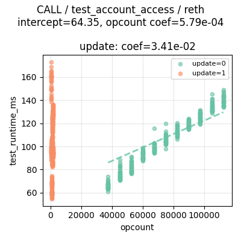

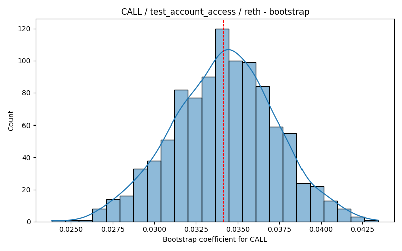

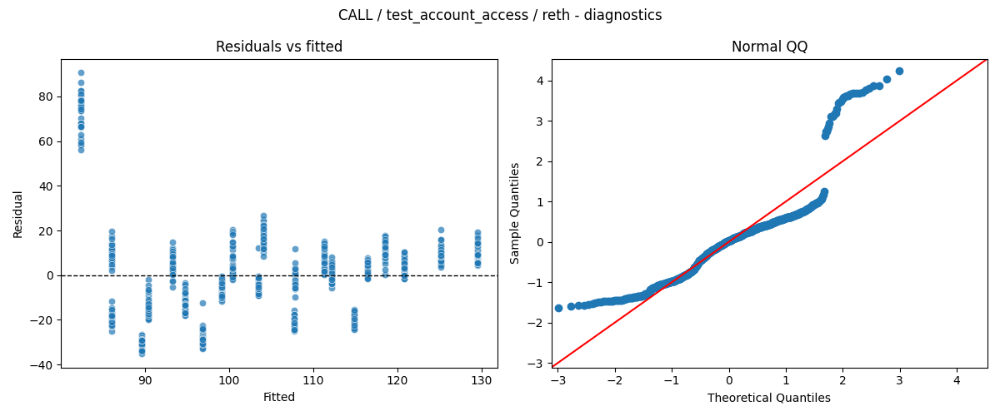

</details>

### test_ext_account_query_warm — combo `CALL`

| client | nobs | R² | target_coef (ms) | p-value | 95% CI |
| --- | --- | --- | --- | --- | --- |
| `besu` | 275 | 0.9588 | 0.001348 | 1.00e-03 | [0.001312, 0.001384] |
| `erigon` | 132 | 0.9026 | 0.000496 | 1.00e-03 | [0.0004699, 0.000524] |
| `nethermind` | 209 | 0.7682 | 0.0006458 | 1.00e-03 | [0.0005943, 0.0007052] |
| `reth` | 363 | 0.8826 | 4.902e-05 | 1.00e-03 | [4.718e-05, 5.1e-05] |

<details><summary>besu — NNLS regression summary</summary>

```
==============================================================================
                           NNLS Regression Results                            
==============================================================================
Dep. Variable:          test_runtime_ms              R-squared:          0.959
Model:                  NNLS                    Adj. R-squared:          0.959
No. Observations:       275                               RMSE:         141.18
Df Residuals:           273                                MAE:         120.21
Df Model:               1      
==============================================================================
                      coef     std err     P-value      [0.025      0.975]
------------------------------------------------------------------------------
         const    825.2570     30.3716       0.001    765.7991    887.8532
       opcount      0.0013      0.0000       0.001      0.0013      0.0014
==============================================================================
Notes: Non-negative least squares with bootstrap inference (1000 iterations)
==============================================================================
```


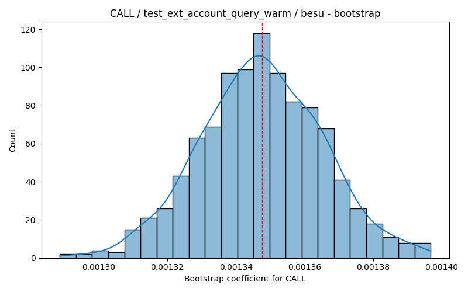

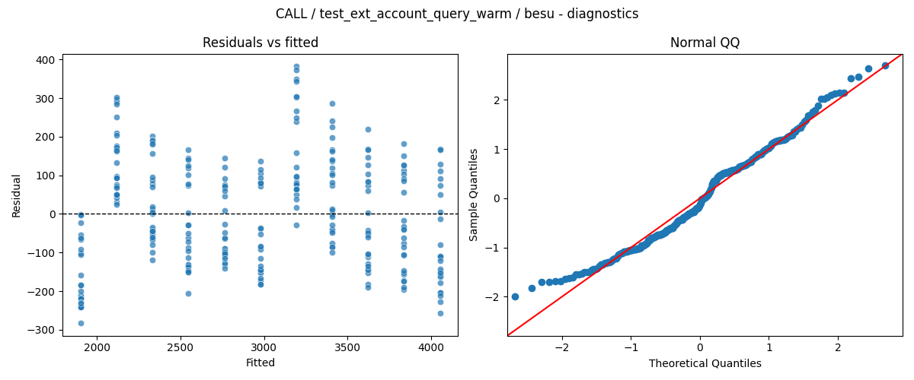

</details>

<details><summary>erigon — NNLS regression summary</summary>

```
==============================================================================
                           NNLS Regression Results                            
==============================================================================
Dep. Variable:          test_runtime_ms              R-squared:          0.903
Model:                  NNLS                    Adj. R-squared:          0.902
No. Observations:       132                               RMSE:          82.35
Df Residuals:           130                                MAE:          69.82
Df Model:               1      
==============================================================================
                      coef     std err     P-value      [0.025      0.975]
------------------------------------------------------------------------------
         const     74.9371     21.4345       0.001     32.3346    114.9852
       opcount      0.0005      0.0000       0.001      0.0005      0.0005
==============================================================================
Notes: Non-negative least squares with bootstrap inference (1000 iterations)
==============================================================================
```

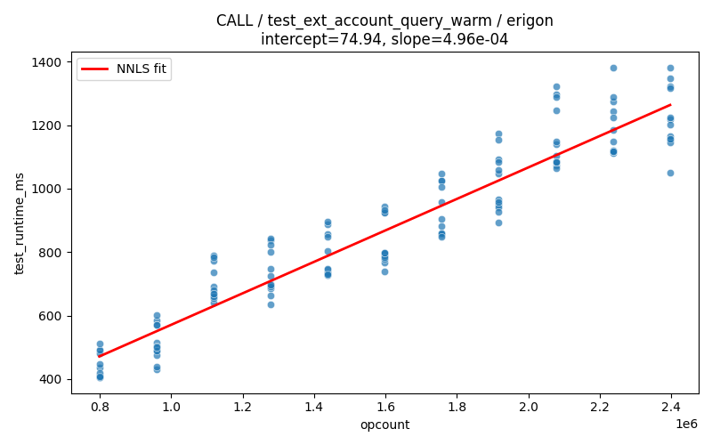

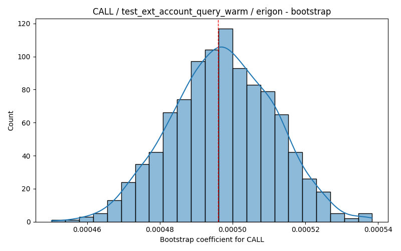

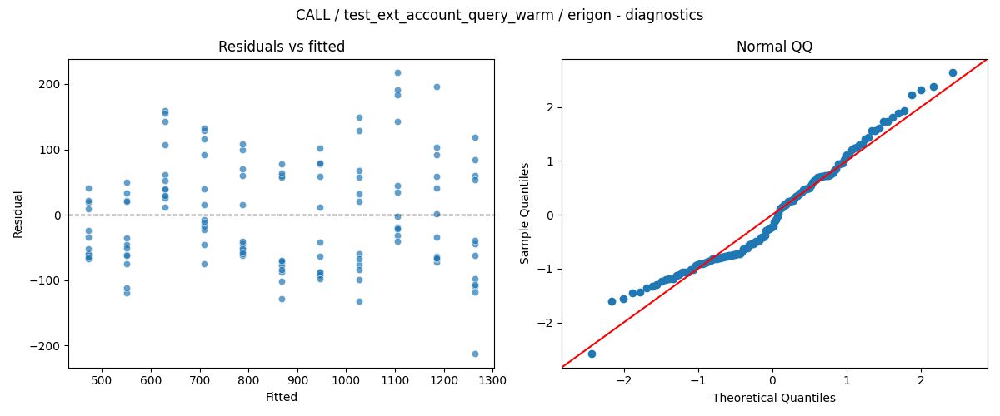

</details>

<details><summary>nethermind — NNLS regression summary</summary>

```
==============================================================================
                           NNLS Regression Results                            
==============================================================================
Dep. Variable:          test_runtime_ms              R-squared:          0.768
Model:                  NNLS                    Adj. R-squared:          0.767
No. Observations:       209                               RMSE:         179.23
Df Residuals:           207                                MAE:         139.81
Df Model:               1      
==============================================================================
                      coef     std err     P-value      [0.025      0.975]
------------------------------------------------------------------------------
         const    402.4674     39.4947       0.001    325.2265    474.7246
       opcount      0.0006      0.0000       0.001      0.0006      0.0007
==============================================================================
Notes: Non-negative least squares with bootstrap inference (1000 iterations)
==============================================================================
```

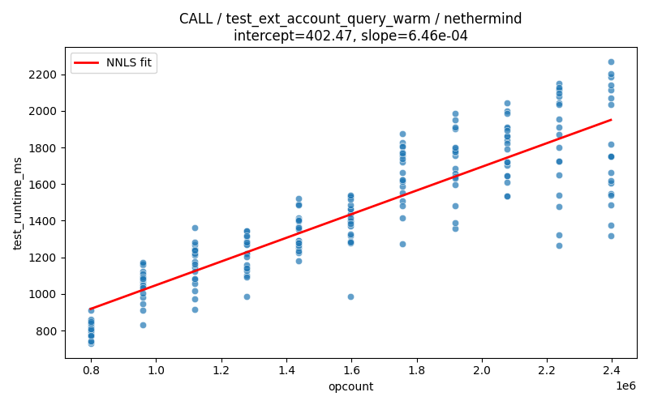

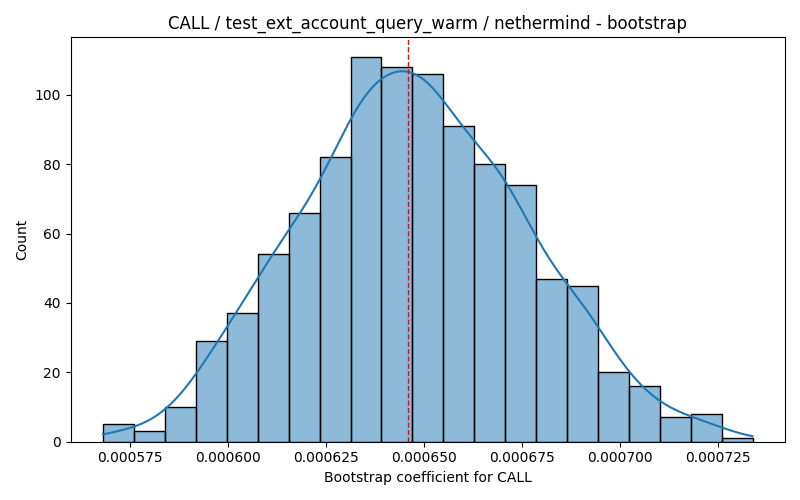

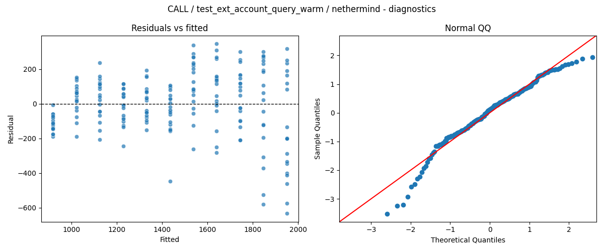

</details>

<details><summary>reth — NNLS regression summary</summary>

```
==============================================================================
                           NNLS Regression Results                            
==============================================================================
Dep. Variable:          test_runtime_ms              R-squared:          0.883
Model:                  NNLS                    Adj. R-squared:          0.882
No. Observations:       363                               RMSE:           9.03
Df Residuals:           361                                MAE:           7.34
Df Model:               1      
==============================================================================
                      coef     std err     P-value      [0.025      0.975]
------------------------------------------------------------------------------
         const     19.8506      1.6380       0.001     16.5668     22.8834
       opcount      0.0000      0.0000       0.001      0.0000      0.0001
==============================================================================
Notes: Non-negative least squares with bootstrap inference (1000 iterations)
==============================================================================
```

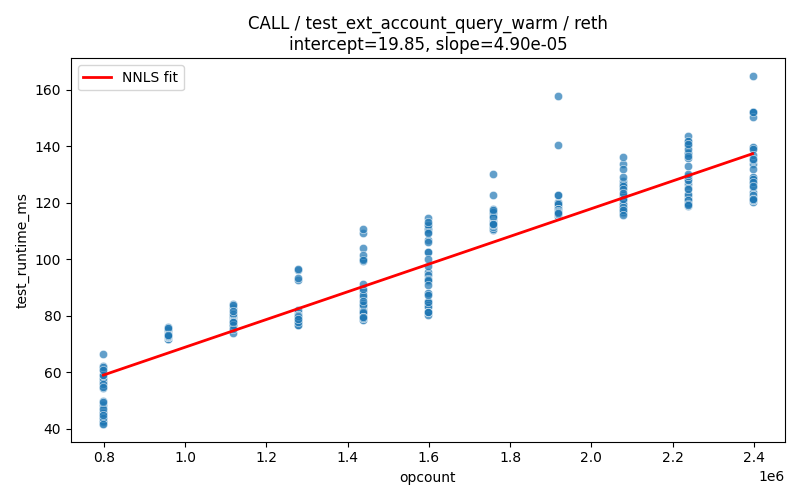

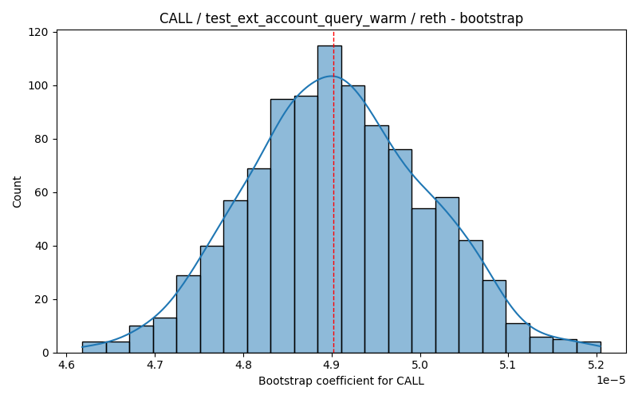

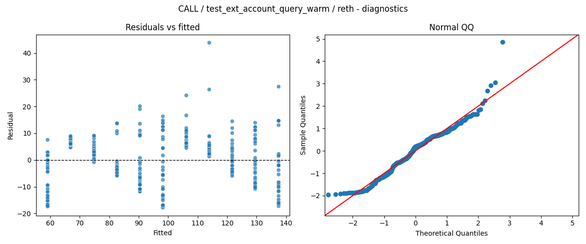

</details>

## CALLCODE

### test_account_access — combo `CALLCODE_AccountMode.EXISTING_CONTRACT`

| client | nobs | R² | target_coef (ms) | p-value | 95% CI |
| --- | --- | --- | --- | --- | --- |
| `besu` | 550 | 0.9739 | 0.03264 | 1.00e-03 | [0.03225, 0.033] |
| `erigon` | 264 | 0.9577 | 0.1035 | 1.00e-03 | [0.1016, 0.1058] |
| `nethermind` | 418 | 0.9082 | 0.03427 | 1.00e-03 | [0.03312, 0.03554] |
| `reth` | 726 | 0.8924 | 0.03722 | 1.00e-03 | [0.03679, 0.0377] |

<details><summary>besu — NNLS regression summary</summary>

```
==============================================================================
                           NNLS Regression Results                            
==============================================================================
Dep. Variable:          test_runtime_ms              R-squared:          0.974
Model:                  NNLS                    Adj. R-squared:          0.974
No. Observations:       550                               RMSE:         142.75
Df Residuals:           547                                MAE:         113.83
Df Model:               2      
==============================================================================
                      coef     std err     P-value      [0.025      0.975]
------------------------------------------------------------------------------
         const     96.9964      9.7485       0.001     78.6989    116.8095
       opcount      0.0326      0.0002       0.001      0.0322      0.0330
        update      0.0000      0.0000       1.000      0.0000      0.0000
==============================================================================
Notes: Non-negative least squares with bootstrap inference (1000 iterations)
==============================================================================
```

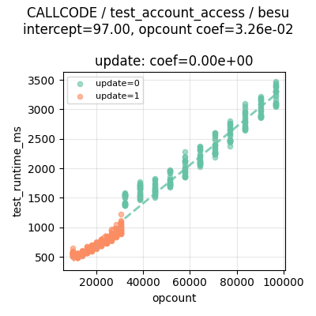


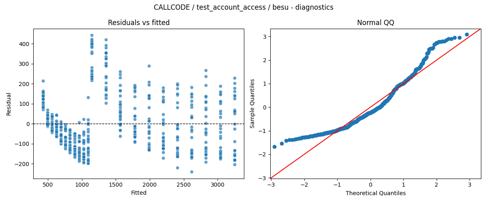

</details>

<details><summary>erigon — NNLS regression summary</summary>

```
==============================================================================
                           NNLS Regression Results                            
==============================================================================
Dep. Variable:          test_runtime_ms              R-squared:          0.958
Model:                  NNLS                    Adj. R-squared:          0.957
No. Observations:       264                               RMSE:         580.63
Df Residuals:           261                                MAE:         405.89
Df Model:               2      
==============================================================================
                      coef     std err     P-value      [0.025      0.975]
------------------------------------------------------------------------------
         const    329.2620     43.1491       0.001    247.4418    411.4334
       opcount      0.1035      0.0011       0.001      0.1016      0.1058
        update      0.0000      0.0000       1.000      0.0000      0.0000
==============================================================================
Notes: Non-negative least squares with bootstrap inference (1000 iterations)
==============================================================================
```

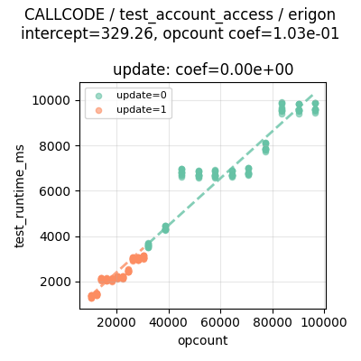


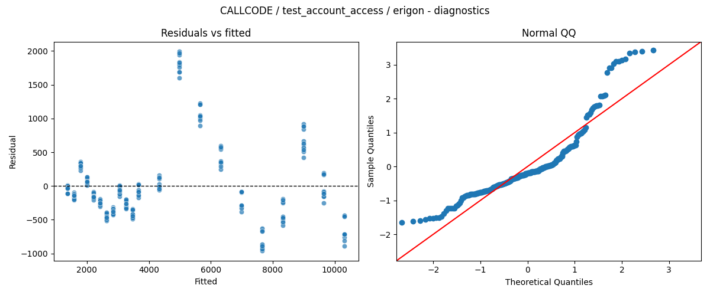

</details>

<details><summary>nethermind — NNLS regression summary</summary>

```
==============================================================================
                           NNLS Regression Results                            
==============================================================================
Dep. Variable:          test_runtime_ms              R-squared:          0.908
Model:                  NNLS                    Adj. R-squared:          0.908
No. Observations:       418                               RMSE:         290.92
Df Residuals:           415                                MAE:         210.62
Df Model:               2      
==============================================================================
                      coef     std err     P-value      [0.025      0.975]
------------------------------------------------------------------------------
         const    240.8043     20.7187       0.001    203.2687    279.9003
       opcount      0.0343      0.0006       0.001      0.0331      0.0355
        update      0.0000      0.0000       1.000      0.0000      0.0000
==============================================================================
Notes: Non-negative least squares with bootstrap inference (1000 iterations)
==============================================================================
```

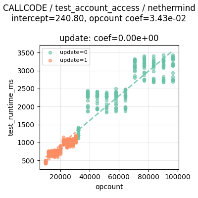


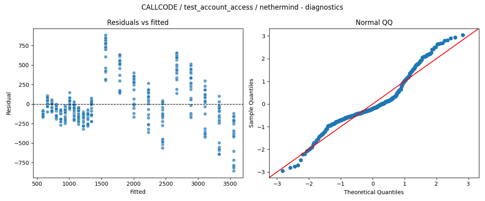

</details>

<details><summary>reth — NNLS regression summary</summary>

```
==============================================================================
                           NNLS Regression Results                            
==============================================================================
Dep. Variable:          test_runtime_ms              R-squared:          0.892
Model:                  NNLS                    Adj. R-squared:          0.892
No. Observations:       726                               RMSE:         382.65
Df Residuals:           723                                MAE:         287.86
Df Model:               2      
==============================================================================
                      coef     std err     P-value      [0.025      0.975]
------------------------------------------------------------------------------
         const      0.0000      0.0000       1.000      0.0000      0.0000
       opcount      0.0372      0.0002       0.001      0.0368      0.0377
        update      0.0000      0.0000       1.000      0.0000      0.0000
==============================================================================
Notes: Non-negative least squares with bootstrap inference (1000 iterations)
==============================================================================
```

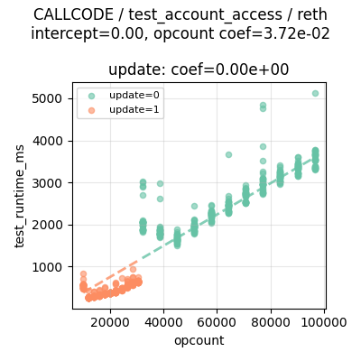


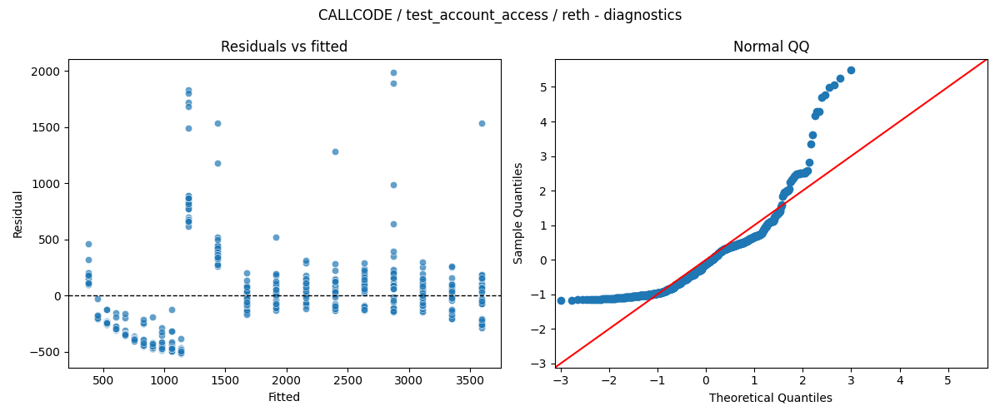

</details>

### test_account_access — combo `CALLCODE_AccountMode.EXISTING_EOA`

| client | nobs | R² | target_coef (ms) | p-value | 95% CI |
| --- | --- | --- | --- | --- | --- |
| `besu` | 550 | 0.9463 | 0.01403 | 1.00e-03 | [0.01379, 0.0143] |
| `erigon` | 264 | 0.9962 | 0.01061 | 1.00e-03 | [0.01056, 0.01065] |
| `nethermind` | 418 | 0.9767 | 0.005086 | 1.00e-03 | [0.005004, 0.005183] |
| `reth` | 726 | 0.9808 | 0.001393 | 1.00e-03 | [0.001381, 0.001407] |

<details><summary>besu — NNLS regression summary</summary>

```
==============================================================================
                           NNLS Regression Results                            
==============================================================================
Dep. Variable:          test_runtime_ms              R-squared:          0.946
Model:                  NNLS                    Adj. R-squared:          0.946
No. Observations:       550                               RMSE:         107.19
Df Residuals:           547                                MAE:          75.91
Df Model:               2      
==============================================================================
                      coef     std err     P-value      [0.025      0.975]
------------------------------------------------------------------------------
         const    272.9755      6.9491       0.001    259.5548    286.6462
       opcount      0.0140      0.0001       0.001      0.0138      0.0143
        update      0.0000      0.0000       1.000      0.0000      0.0000
==============================================================================
Notes: Non-negative least squares with bootstrap inference (1000 iterations)
==============================================================================
```

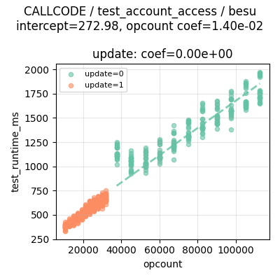


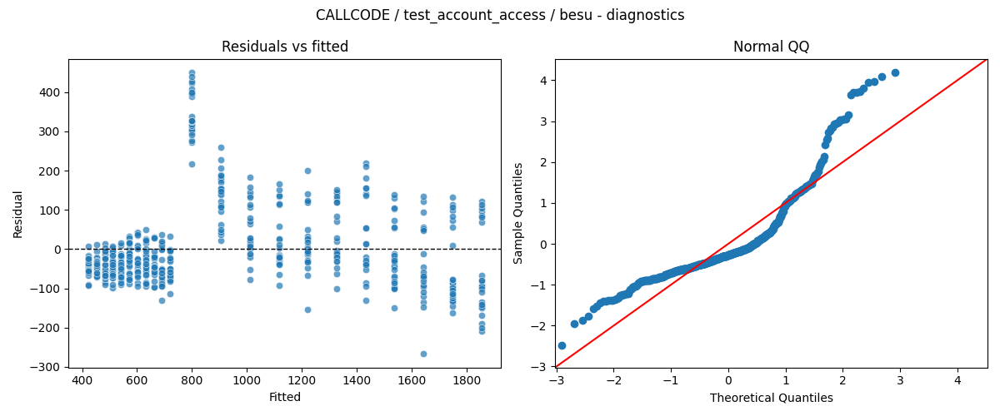

</details>

<details><summary>erigon — NNLS regression summary</summary>

```
==============================================================================
                           NNLS Regression Results                            
==============================================================================
Dep. Variable:          test_runtime_ms              R-squared:          0.996
Model:                  NNLS                    Adj. R-squared:          0.996
No. Observations:       264                               RMSE:          21.20
Df Residuals:           261                                MAE:          17.25
Df Model:               2      
==============================================================================
                      coef     std err     P-value      [0.025      0.975]
------------------------------------------------------------------------------
         const      0.0000      0.0059       1.000      0.0000      0.0000
       opcount      0.0106      0.0000       0.001      0.0106      0.0107
        update      0.0000      0.0000       1.000      0.0000      0.0000
==============================================================================
Notes: Non-negative least squares with bootstrap inference (1000 iterations)
==============================================================================
```

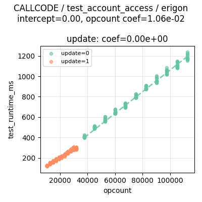


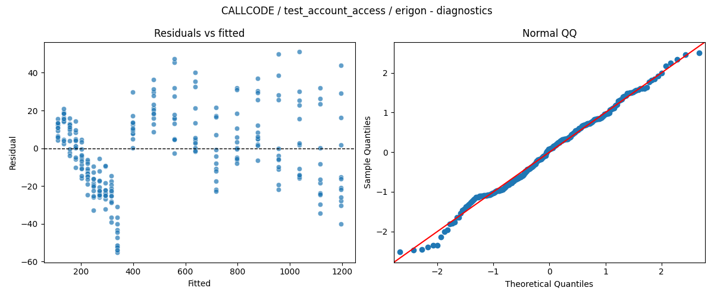

</details>

<details><summary>nethermind — NNLS regression summary</summary>

```
==============================================================================
                           NNLS Regression Results                            
==============================================================================
Dep. Variable:          test_runtime_ms              R-squared:          0.977
Model:                  NNLS                    Adj. R-squared:          0.977
No. Observations:       418                               RMSE:          25.18
Df Residuals:           415                                MAE:          17.02
Df Model:               2      
==============================================================================
                      coef     std err     P-value      [0.025      0.975]
------------------------------------------------------------------------------
         const     70.5553      1.8365       0.001     66.9884     74.1458
       opcount      0.0051      0.0000       0.001      0.0050      0.0052
        update      0.0000      0.0000       1.000      0.0000      0.0000
==============================================================================
Notes: Non-negative least squares with bootstrap inference (1000 iterations)
==============================================================================
```

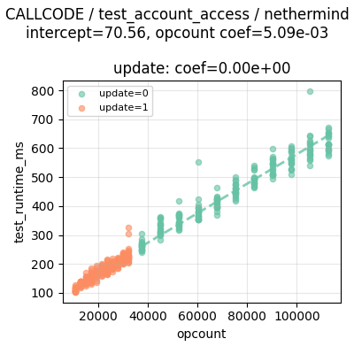

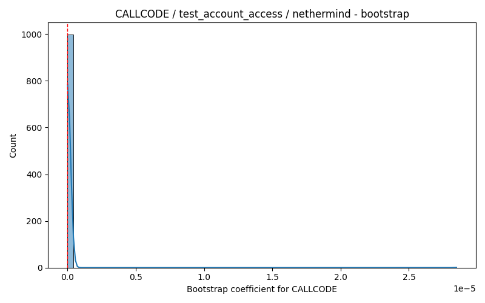

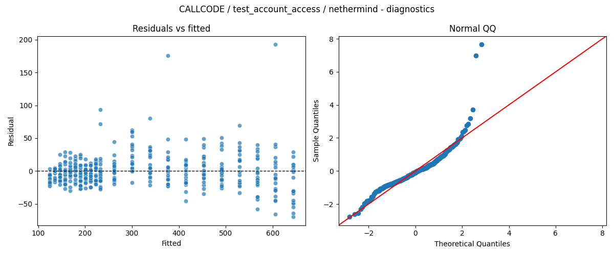

</details>

<details><summary>reth — NNLS regression summary</summary>

```
==============================================================================
                           NNLS Regression Results                            
==============================================================================
Dep. Variable:          test_runtime_ms              R-squared:          0.981
Model:                  NNLS                    Adj. R-squared:          0.981
No. Observations:       726                               RMSE:           6.25
Df Residuals:           723                                MAE:           4.79
Df Model:               2      
==============================================================================
                      coef     std err     P-value      [0.025      0.975]
------------------------------------------------------------------------------
         const      8.9669      0.3495       0.001      8.3105      9.6526
       opcount      0.0014      0.0000       0.001      0.0014      0.0014
        update      0.0000      0.0000       1.000      0.0000      0.0000
==============================================================================
Notes: Non-negative least squares with bootstrap inference (1000 iterations)
==============================================================================
```

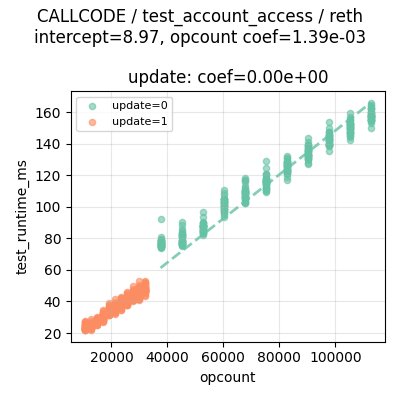

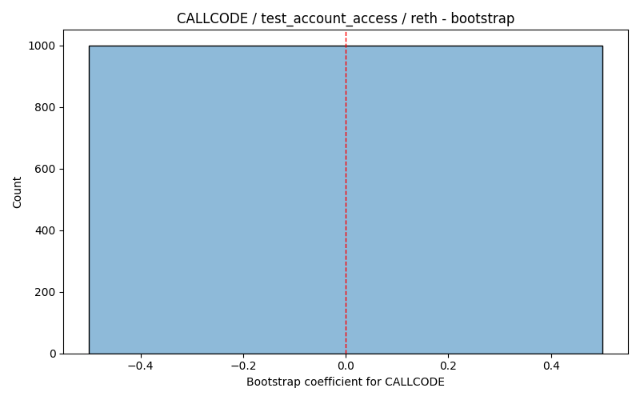

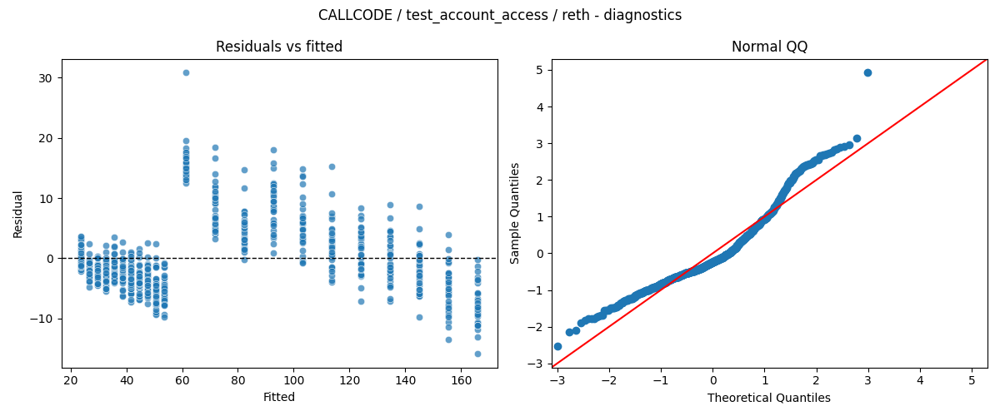

</details>

### test_account_access — combo `CALLCODE_AccountMode.NON_EXISTING_ACCOUNT`

| client | nobs | R² | target_coef (ms) | p-value | 95% CI |
| --- | --- | --- | --- | --- | --- |
| `besu` | 550 | 0.9323 | 0.0153 | 1.00e-03 | [0.01503, 0.01561] |
| `erigon` | 264 | 0.9432 | 0.009391 | 1.00e-03 | [0.009267, 0.00949] |
| `nethermind` | 418 | 0.9591 | 0.00594 | 1.00e-03 | [0.005871, 0.006011] |
| `reth` | 726 | 0.9108 | 0.001282 | 1.00e-03 | [0.001269, 0.001294] |

<details><summary>besu — NNLS regression summary</summary>

```
==============================================================================
                           NNLS Regression Results                            
==============================================================================
Dep. Variable:          test_runtime_ms              R-squared:          0.932
Model:                  NNLS                    Adj. R-squared:          0.932
No. Observations:       550                               RMSE:         132.27
Df Residuals:           547                                MAE:         104.42
Df Model:               2      
==============================================================================
                      coef     std err     P-value      [0.025      0.975]
------------------------------------------------------------------------------
         const     89.3793      9.4268       0.001     71.0124    108.4714
       opcount      0.0153      0.0001       0.001      0.0150      0.0156
        update      0.0000      0.0000       1.000      0.0000      0.0000
==============================================================================
Notes: Non-negative least squares with bootstrap inference (1000 iterations)
==============================================================================
```

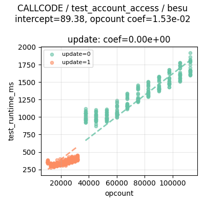


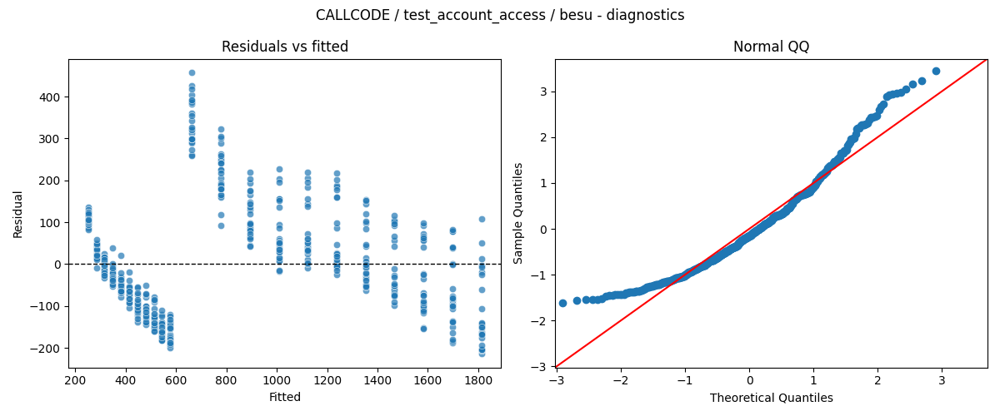

</details>

<details><summary>erigon — NNLS regression summary</summary>

```
==============================================================================
                           NNLS Regression Results                            
==============================================================================
Dep. Variable:          test_runtime_ms              R-squared:          0.943
Model:                  NNLS                    Adj. R-squared:          0.943
No. Observations:       264                               RMSE:          85.42
Df Residuals:           261                                MAE:          68.22
Df Model:               2      
==============================================================================
                      coef     std err     P-value      [0.025      0.975]
------------------------------------------------------------------------------
         const      0.0000      0.0000       1.000      0.0000      0.0000
       opcount      0.0094      0.0001       0.001      0.0093      0.0095
        update      0.0000      0.0000       1.000      0.0000      0.0000
==============================================================================
Notes: Non-negative least squares with bootstrap inference (1000 iterations)
==============================================================================
```

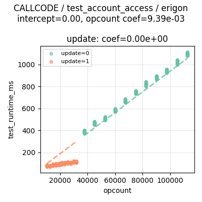


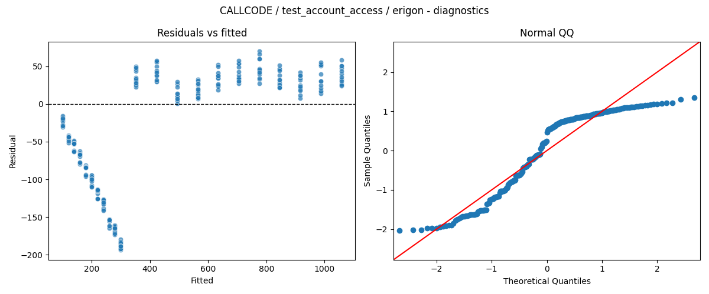

</details>

<details><summary>nethermind — NNLS regression summary</summary>

```
==============================================================================
                           NNLS Regression Results                            
==============================================================================
Dep. Variable:          test_runtime_ms              R-squared:          0.959
Model:                  NNLS                    Adj. R-squared:          0.959
No. Observations:       418                               RMSE:          40.26
Df Residuals:           415                                MAE:          32.04
Df Model:               2      
==============================================================================
                      coef     std err     P-value      [0.025      0.975]
------------------------------------------------------------------------------
         const      0.0000      0.0223       1.000      0.0000      0.0000
       opcount      0.0059      0.0000       0.001      0.0059      0.0060
        update      0.0000      0.0000       1.000      0.0000      0.0000
==============================================================================
Notes: Non-negative least squares with bootstrap inference (1000 iterations)
==============================================================================
```

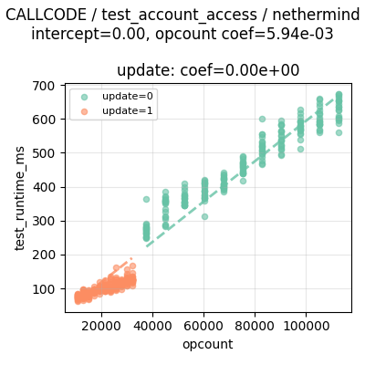


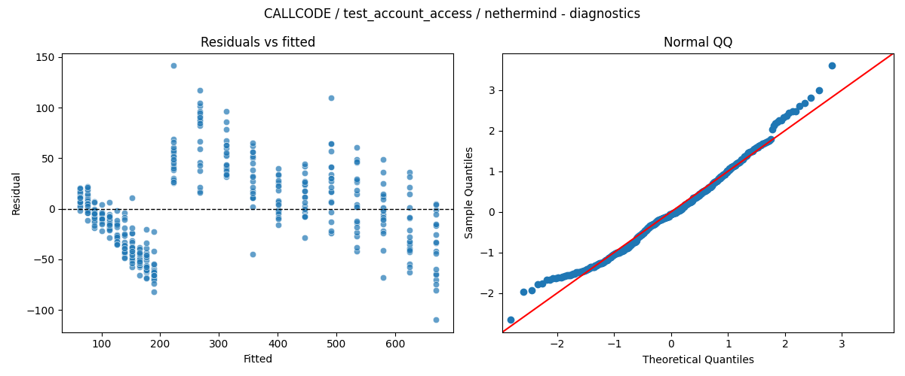

</details>

<details><summary>reth — NNLS regression summary</summary>

```
==============================================================================
                           NNLS Regression Results                            
==============================================================================
Dep. Variable:          test_runtime_ms              R-squared:          0.911
Model:                  NNLS                    Adj. R-squared:          0.911
No. Observations:       726                               RMSE:          14.65
Df Residuals:           723                                MAE:          12.70
Df Model:               2      
==============================================================================
                      coef     std err     P-value      [0.025      0.975]
------------------------------------------------------------------------------
         const      0.0000      0.0000       1.000      0.0000      0.0000
       opcount      0.0013      0.0000       0.001      0.0013      0.0013
        update      0.0000      0.0000       1.000      0.0000      0.0000
==============================================================================
Notes: Non-negative least squares with bootstrap inference (1000 iterations)
==============================================================================
```

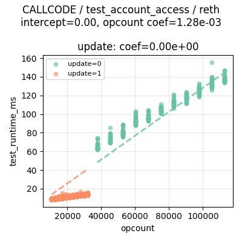


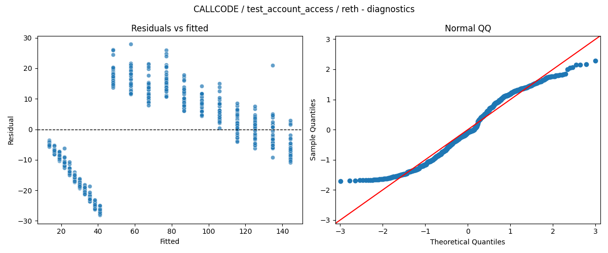

</details>

### test_ext_account_query_warm — combo `CALLCODE`

| client | nobs | R² | target_coef (ms) | p-value | 95% CI |
| --- | --- | --- | --- | --- | --- |
| `besu` | 275 | 0.9469 | 0.001348 | 1.00e-03 | [0.001308, 0.001381] |
| `erigon` | 132 | 0.8994 | 0.0002896 | 1.00e-03 | [0.0002726, 0.0003074] |
| `nethermind` | 209 | 0.7965 | 0.0006888 | 1.00e-03 | [0.0006373, 0.0007394] |
| `reth` | 363 | 0.9029 | 4.634e-05 | 1.00e-03 | [4.46e-05, 4.786e-05] |

<details><summary>besu — NNLS regression summary</summary>

```
==============================================================================
                           NNLS Regression Results                            
==============================================================================
Dep. Variable:          test_runtime_ms              R-squared:          0.947
Model:                  NNLS                    Adj. R-squared:          0.947
No. Observations:       275                               RMSE:         161.30
Df Residuals:           273                                MAE:         118.12
Df Model:               1      
==============================================================================
                      coef     std err     P-value      [0.025      0.975]
------------------------------------------------------------------------------
         const    803.8355     28.9410       0.001    751.8924    866.7290
       opcount      0.0013      0.0000       0.001      0.0013      0.0014
==============================================================================
Notes: Non-negative least squares with bootstrap inference (1000 iterations)
==============================================================================
```

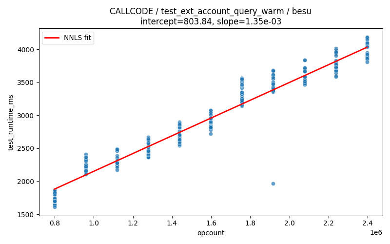

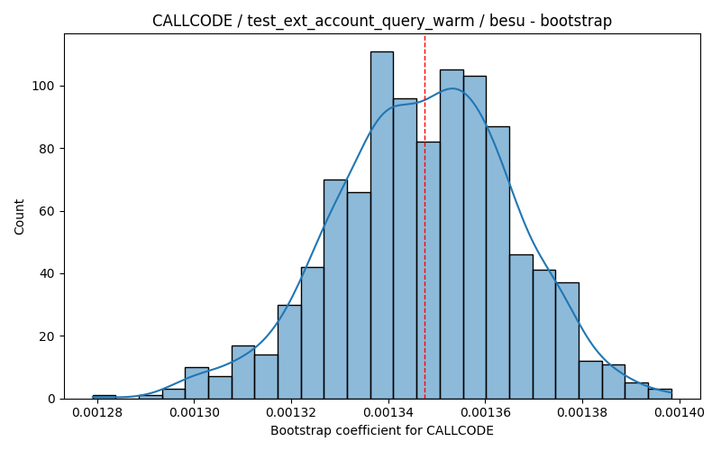

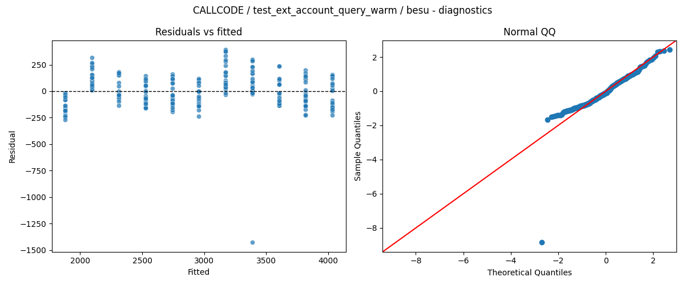

</details>

<details><summary>erigon — NNLS regression summary</summary>

```
==============================================================================
                           NNLS Regression Results                            
==============================================================================
Dep. Variable:          test_runtime_ms              R-squared:          0.899
Model:                  NNLS                    Adj. R-squared:          0.899
No. Observations:       132                               RMSE:          48.92
Df Residuals:           130                                MAE:          40.69
Df Model:               1      
==============================================================================
                      coef     std err     P-value      [0.025      0.975]
------------------------------------------------------------------------------
         const     47.4829     12.4521       0.001     22.6268     71.7141
       opcount      0.0003      0.0000       0.001      0.0003      0.0003
==============================================================================
Notes: Non-negative least squares with bootstrap inference (1000 iterations)
==============================================================================
```

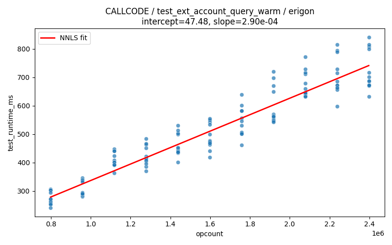

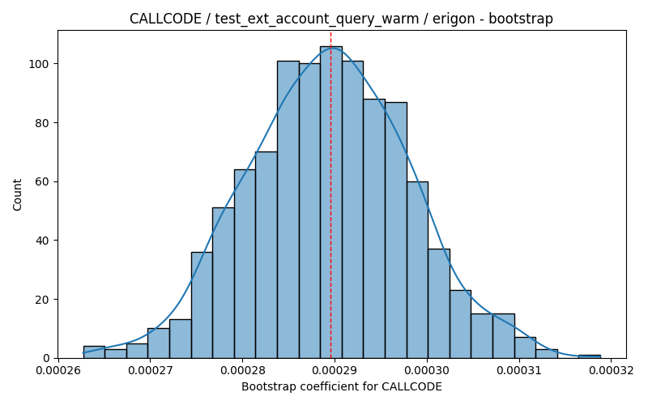

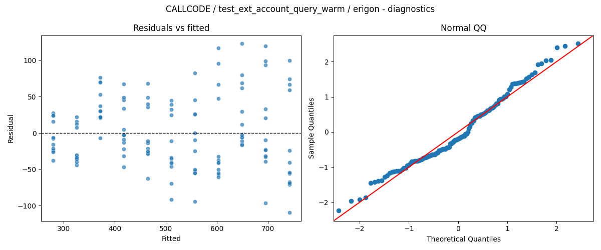

</details>

<details><summary>nethermind — NNLS regression summary</summary>

```
==============================================================================
                           NNLS Regression Results                            
==============================================================================
Dep. Variable:          test_runtime_ms              R-squared:          0.797
Model:                  NNLS                    Adj. R-squared:          0.796
No. Observations:       209                               RMSE:         175.90
Df Residuals:           207                                MAE:         136.16
Df Model:               1      
==============================================================================
                      coef     std err     P-value      [0.025      0.975]
------------------------------------------------------------------------------
         const    319.5997     37.4106       0.001    250.6947    396.6067
       opcount      0.0007      0.0000       0.001      0.0006      0.0007
==============================================================================
Notes: Non-negative least squares with bootstrap inference (1000 iterations)
==============================================================================
```

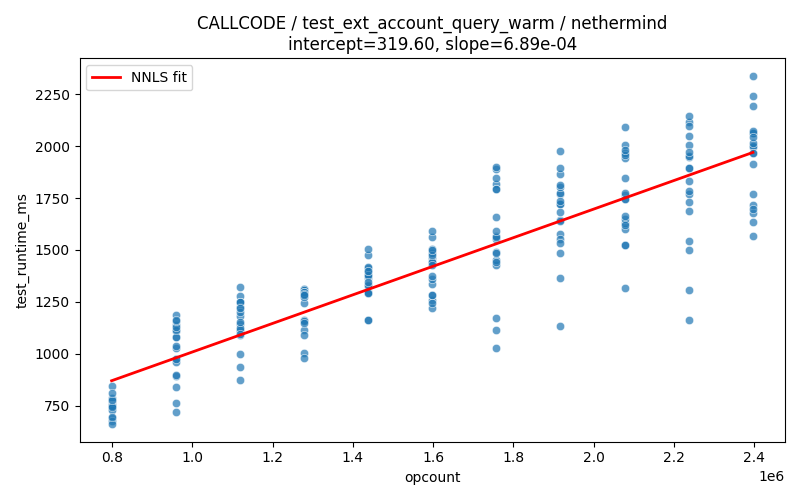

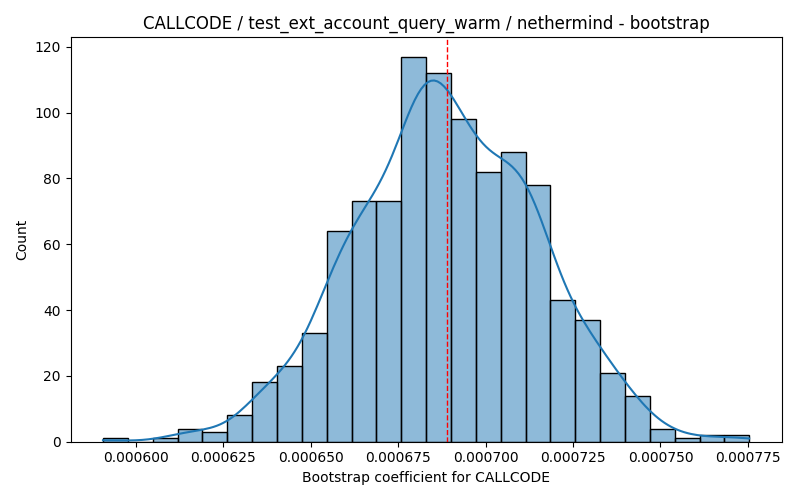

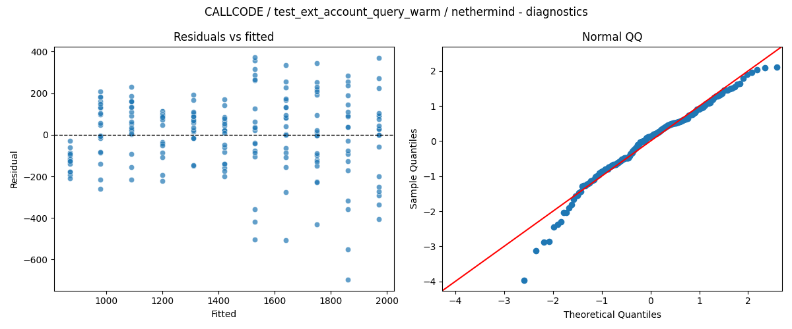

</details>

<details><summary>reth — NNLS regression summary</summary>

```
==============================================================================
                           NNLS Regression Results                            
==============================================================================
Dep. Variable:          test_runtime_ms              R-squared:          0.903
Model:                  NNLS                    Adj. R-squared:          0.903
No. Observations:       363                               RMSE:           7.68
Df Residuals:           361                                MAE:           6.21
Df Model:               1      
==============================================================================
                      coef     std err     P-value      [0.025      0.975]
------------------------------------------------------------------------------
         const     19.3963      1.3839       0.001     16.9053     22.2979
       opcount      0.0000      0.0000       0.001      0.0000      0.0000
==============================================================================
Notes: Non-negative least squares with bootstrap inference (1000 iterations)
==============================================================================
```

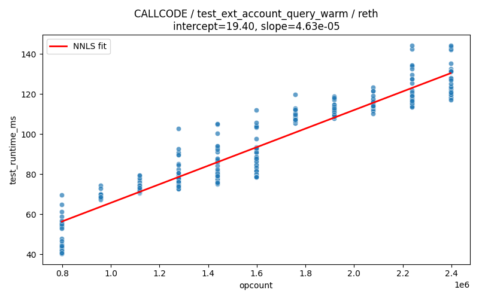

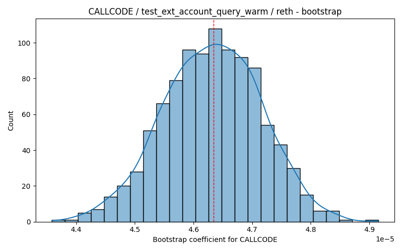

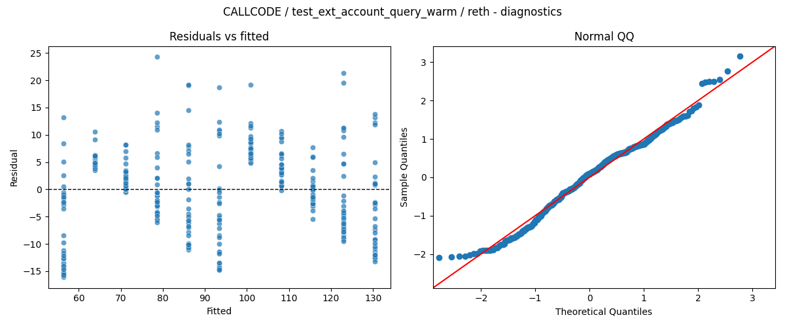

</details>

## DELEGATECALL

### test_account_access — combo `DELEGATECALL_AccountMode.EXISTING_CONTRACT`

| client | nobs | R² | target_coef (ms) | p-value | 95% CI |
| --- | --- | --- | --- | --- | --- |
| `besu` | 275 | 0.9615 | 0.02939 | 1.00e-03 | [0.02868, 0.03012] |
| `erigon` | 132 | 0.8698 | 0.08765 | 1.00e-03 | [0.08145, 0.09312] |
| `nethermind` | 209 | 0.7159 | 0.02565 | 1.00e-03 | [0.02335, 0.02783] |
| `reth` | 363 | 0.916 | 0.03745 | 1.00e-03 | [0.03708, 0.03787] |

<details><summary>besu — NNLS regression summary</summary>

```
==============================================================================
                           NNLS Regression Results                            
==============================================================================
Dep. Variable:          test_runtime_ms              R-squared:          0.961
Model:                  NNLS                    Adj. R-squared:          0.961
No. Observations:       275                               RMSE:         119.81
Df Residuals:           273                                MAE:         102.04
Df Model:               1      
==============================================================================
                      coef     std err     P-value      [0.025      0.975]
------------------------------------------------------------------------------
         const    306.2135     22.8868       0.001    259.6380    349.0609
       opcount      0.0294      0.0004       0.001      0.0287      0.0301
==============================================================================
Notes: Non-negative least squares with bootstrap inference (1000 iterations)
==============================================================================
```

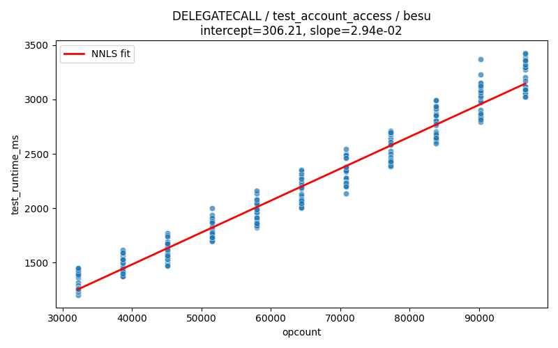

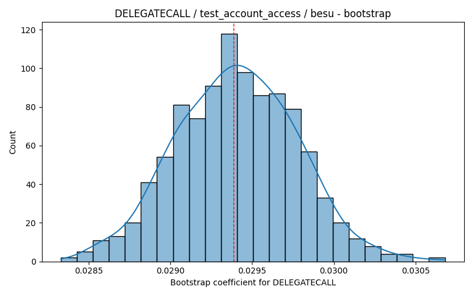

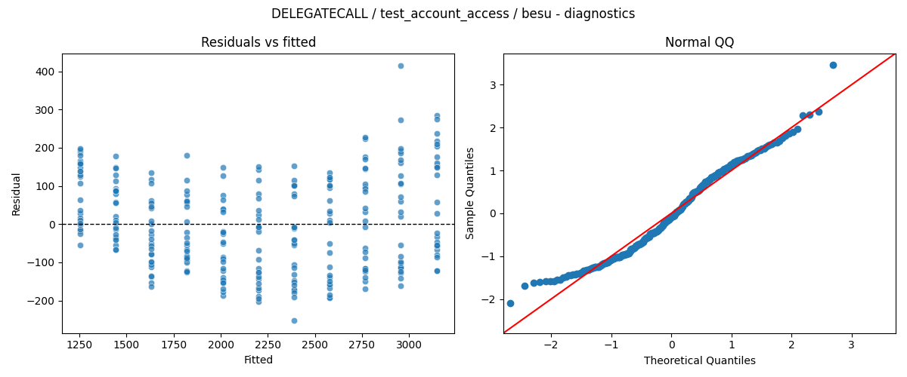

</details>

<details><summary>erigon — NNLS regression summary</summary>

```
==============================================================================
                           NNLS Regression Results                            
==============================================================================
Dep. Variable:          test_runtime_ms              R-squared:          0.870
Model:                  NNLS                    Adj. R-squared:          0.869
No. Observations:       132                               RMSE:         690.79
Df Residuals:           130                                MAE:         586.80
Df Model:               1      
==============================================================================
                      coef     std err     P-value      [0.025      0.975]
------------------------------------------------------------------------------
         const   1526.9763    217.5516       0.001   1111.5079   1969.2226
       opcount      0.0877      0.0029       0.001      0.0815      0.0931
==============================================================================
Notes: Non-negative least squares with bootstrap inference (1000 iterations)
==============================================================================
```

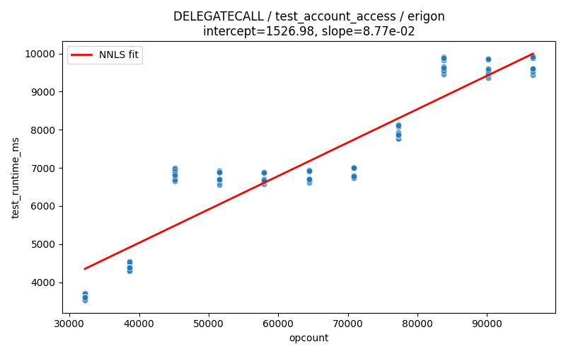

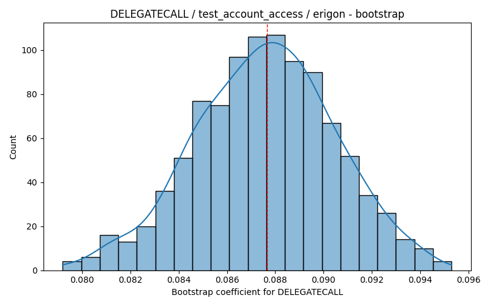

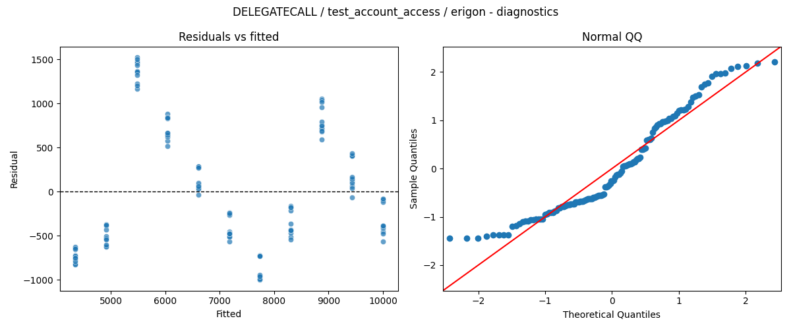

</details>

<details><summary>nethermind — NNLS regression summary</summary>

```
==============================================================================
                           NNLS Regression Results                            
==============================================================================
Dep. Variable:          test_runtime_ms              R-squared:          0.716
Model:                  NNLS                    Adj. R-squared:          0.714
No. Observations:       209                               RMSE:         329.17
Df Residuals:           207                                MAE:         271.86
Df Model:               1      
==============================================================================
                      coef     std err     P-value      [0.025      0.975]
------------------------------------------------------------------------------
         const    892.8819     78.5668       0.001    741.5373   1053.8078
       opcount      0.0256      0.0011       0.001      0.0233      0.0278
==============================================================================
Notes: Non-negative least squares with bootstrap inference (1000 iterations)
==============================================================================
```

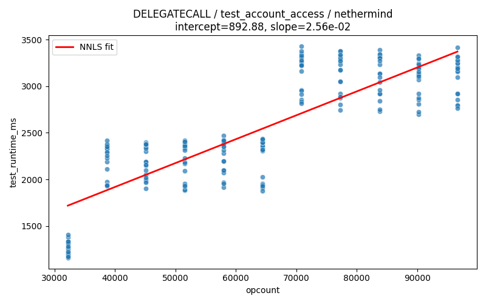

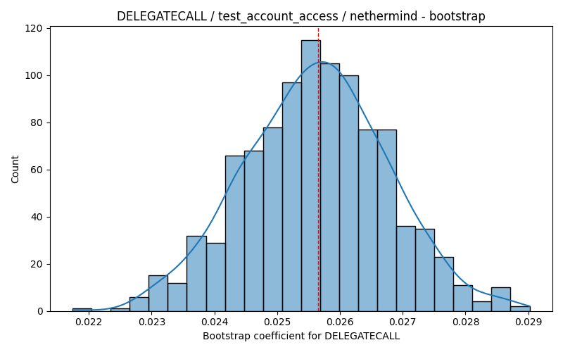

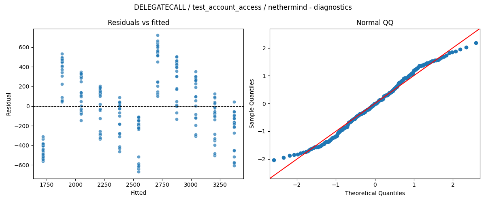

</details>

<details><summary>reth — NNLS regression summary</summary>

```
==============================================================================
                           NNLS Regression Results                            
==============================================================================
Dep. Variable:          test_runtime_ms              R-squared:          0.916
Model:                  NNLS                    Adj. R-squared:          0.916
No. Observations:       363                               RMSE:         242.45
Df Residuals:           361                                MAE:         128.96
Df Model:               1      
==============================================================================
                      coef     std err     P-value      [0.025      0.975]
------------------------------------------------------------------------------
         const      0.0000      0.0000       1.000      0.0000      0.0000
       opcount      0.0375      0.0002       0.001      0.0371      0.0379
==============================================================================
Notes: Non-negative least squares with bootstrap inference (1000 iterations)
==============================================================================
```

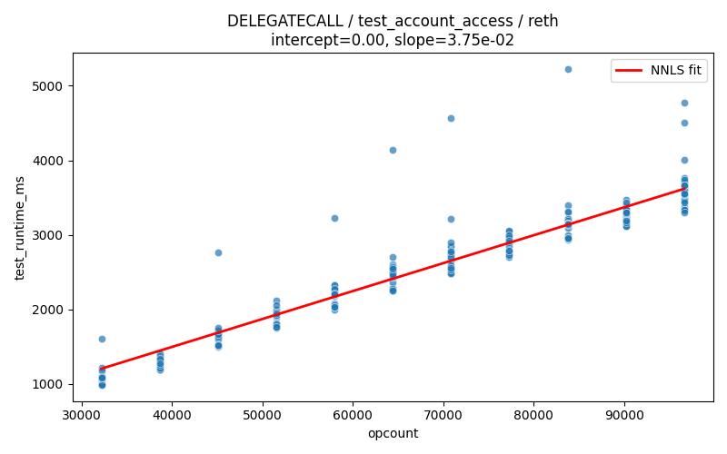

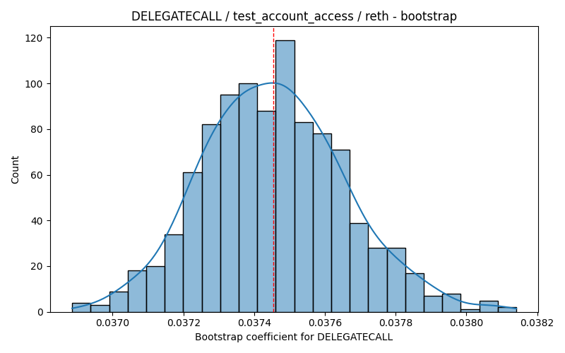

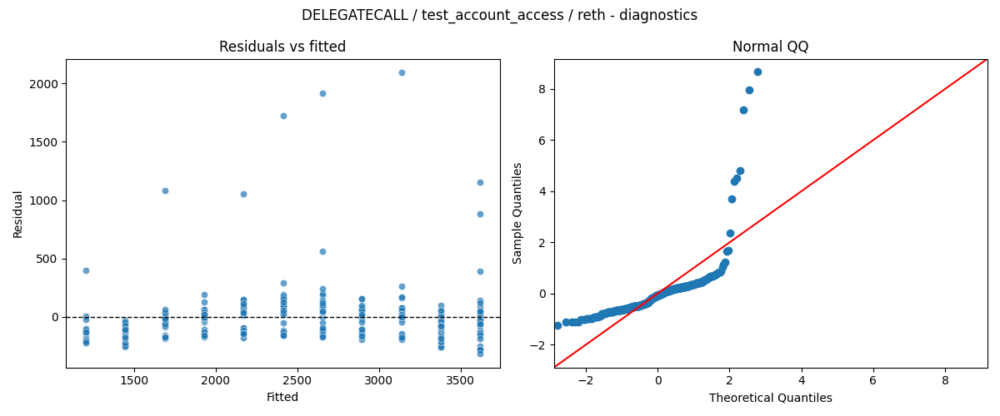

</details>

### test_account_access — combo `DELEGATECALL_AccountMode.EXISTING_EOA`

| client | nobs | R² | target_coef (ms) | p-value | 95% CI |
| --- | --- | --- | --- | --- | --- |
| `besu` | 275 | 0.8437 | 0.009894 | 1.00e-03 | [0.009371, 0.01047] |
| `erigon` | 132 | 0.9952 | 0.01009 | 1.00e-03 | [0.009984, 0.01021] |
| `nethermind` | 209 | 0.9504 | 0.004681 | 1.00e-03 | [0.004534, 0.004822] |
| `reth` | 363 | 0.9739 | 0.001118 | 1.00e-03 | [0.001099, 0.001139] |

<details><summary>besu — NNLS regression summary</summary>

```
==============================================================================
                           NNLS Regression Results                            
==============================================================================
Dep. Variable:          test_runtime_ms              R-squared:          0.844
Model:                  NNLS                    Adj. R-squared:          0.843
No. Observations:       275                               RMSE:         101.23
Df Residuals:           273                                MAE:          81.52
Df Model:               1      
==============================================================================
                      coef     std err     P-value      [0.025      0.975]
------------------------------------------------------------------------------
         const    611.8963     23.4088       0.001    564.0864    656.5010
       opcount      0.0099      0.0003       0.001      0.0094      0.0105
==============================================================================
Notes: Non-negative least squares with bootstrap inference (1000 iterations)
==============================================================================
```

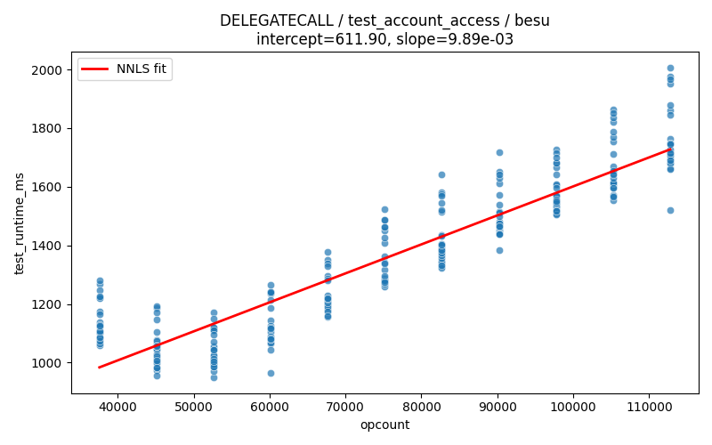

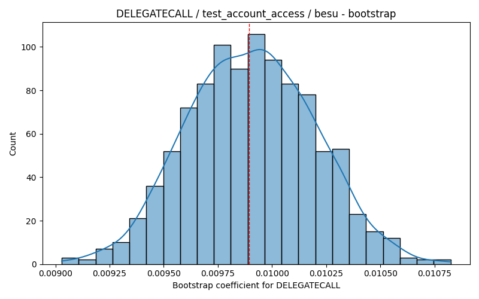

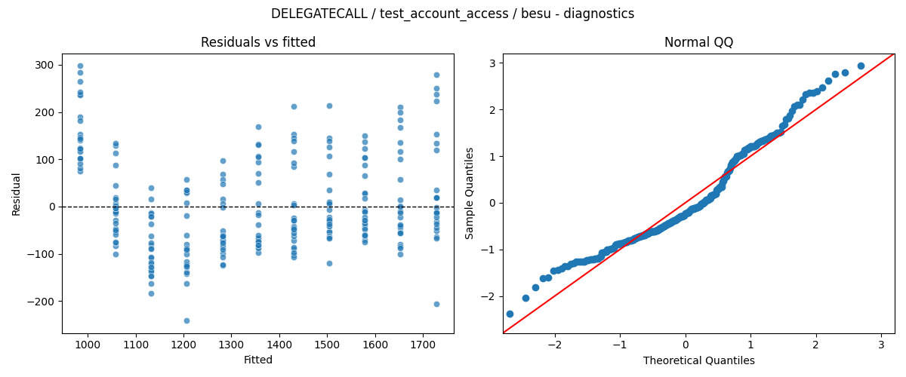

</details>

<details><summary>erigon — NNLS regression summary</summary>

```
==============================================================================
                           NNLS Regression Results                            
==============================================================================
Dep. Variable:          test_runtime_ms              R-squared:          0.995
Model:                  NNLS                    Adj. R-squared:          0.995
No. Observations:       132                               RMSE:          16.67
Df Residuals:           130                                MAE:          13.59
Df Model:               1      
==============================================================================
                      coef     std err     P-value      [0.025      0.975]
------------------------------------------------------------------------------
         const     47.4401      3.9004       0.001     39.5341     54.9434
       opcount      0.0101      0.0001       0.001      0.0100      0.0102
==============================================================================
Notes: Non-negative least squares with bootstrap inference (1000 iterations)
==============================================================================
```

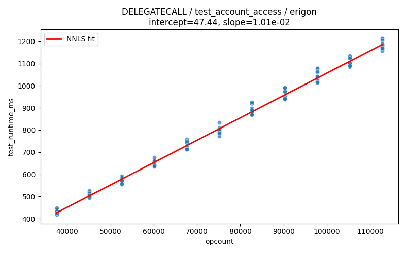

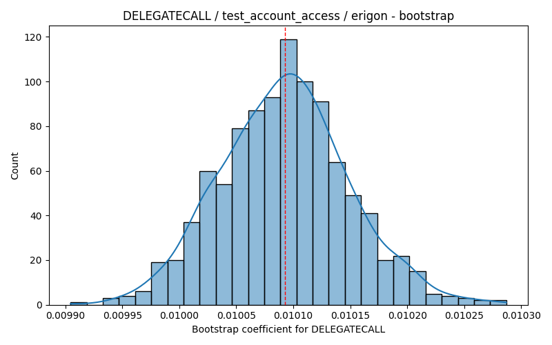

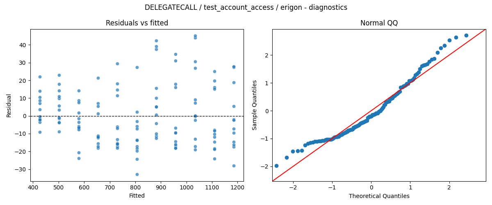

</details>

<details><summary>nethermind — NNLS regression summary</summary>

```
==============================================================================
                           NNLS Regression Results                            
==============================================================================
Dep. Variable:          test_runtime_ms              R-squared:          0.950
Model:                  NNLS                    Adj. R-squared:          0.950
No. Observations:       209                               RMSE:          25.43
Df Residuals:           207                                MAE:          19.62
Df Model:               1      
==============================================================================
                      coef     std err     P-value      [0.025      0.975]
------------------------------------------------------------------------------
         const    103.7088      5.7695       0.001     92.4326    114.8187
       opcount      0.0047      0.0001       0.001      0.0045      0.0048
==============================================================================
Notes: Non-negative least squares with bootstrap inference (1000 iterations)
==============================================================================
```

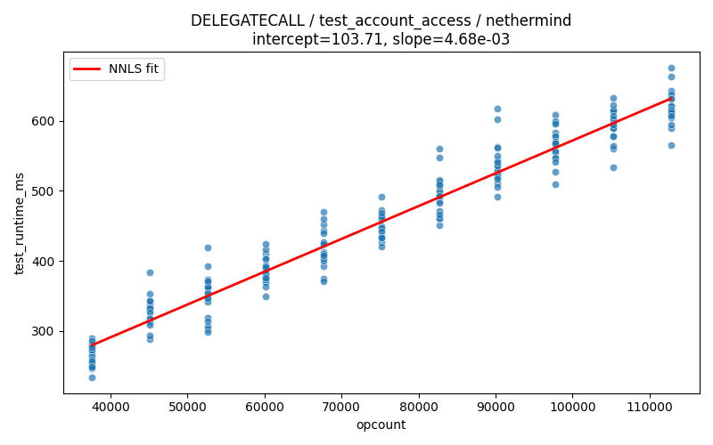

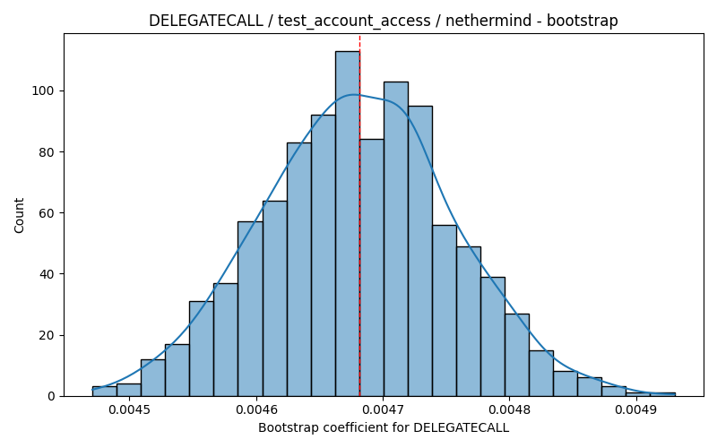

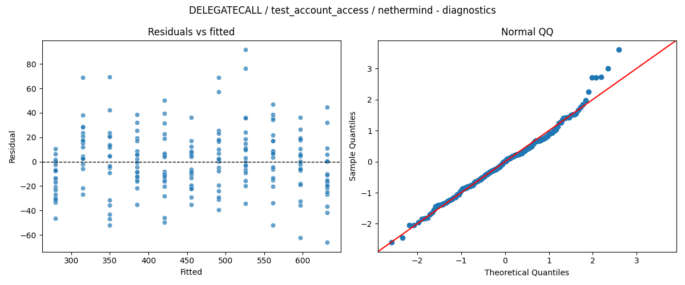

</details>

<details><summary>reth — NNLS regression summary</summary>

```
==============================================================================
                           NNLS Regression Results                            
==============================================================================
Dep. Variable:          test_runtime_ms              R-squared:          0.974
Model:                  NNLS                    Adj. R-squared:          0.974
No. Observations:       363                               RMSE:           4.35
Df Residuals:           361                                MAE:           3.47
Df Model:               1      
==============================================================================
                      coef     std err     P-value      [0.025      0.975]
------------------------------------------------------------------------------
         const     32.2697      0.8343       0.001     30.6187     33.8532
       opcount      0.0011      0.0000       0.001      0.0011      0.0011
==============================================================================
Notes: Non-negative least squares with bootstrap inference (1000 iterations)
==============================================================================
```

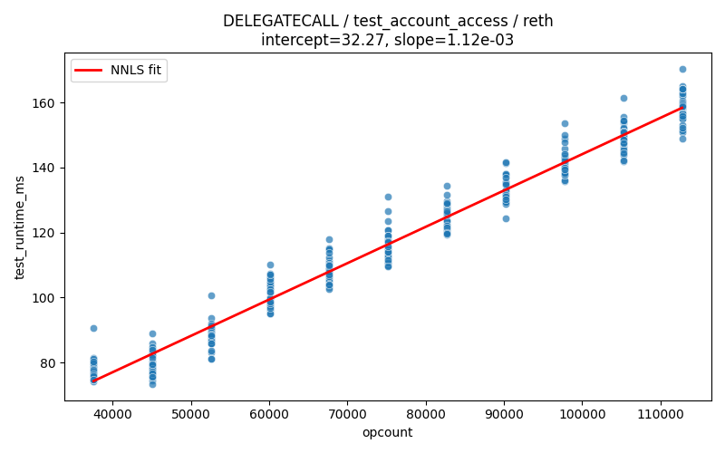

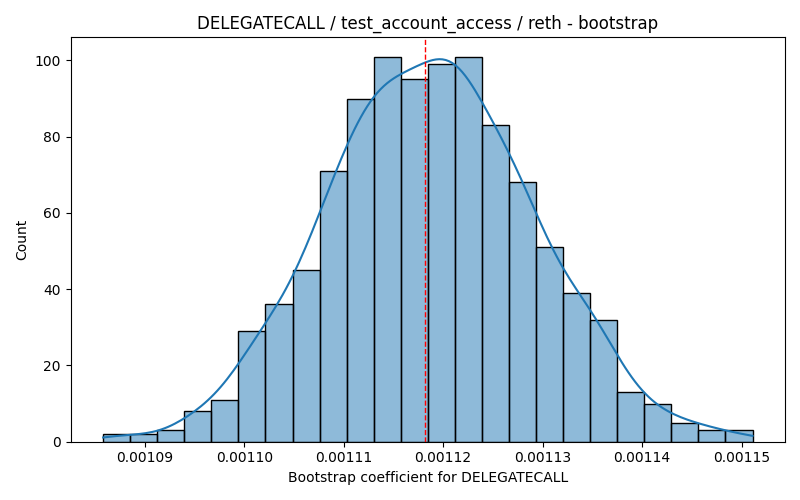

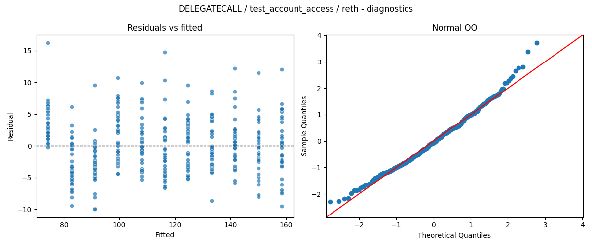

</details>

### test_account_access — combo `DELEGATECALL_AccountMode.NON_EXISTING_ACCOUNT`

| client | nobs | R² | target_coef (ms) | p-value | 95% CI |
| --- | --- | --- | --- | --- | --- |
| `besu` | 275 | 0.9167 | 0.01047 | 1.00e-03 | [0.01012, 0.01088] |
| `erigon` | 132 | 0.9971 | 0.009546 | 1.00e-03 | [0.009458, 0.009637] |
| `nethermind` | 209 | 0.9392 | 0.004601 | 1.00e-03 | [0.004426, 0.004767] |
| `reth` | 363 | 0.9756 | 0.000959 | 1.00e-03 | [0.0009428, 0.0009738] |

<details><summary>besu — NNLS regression summary</summary>

```
==============================================================================
                           NNLS Regression Results                            
==============================================================================
Dep. Variable:          test_runtime_ms              R-squared:          0.917
Model:                  NNLS                    Adj. R-squared:          0.916
No. Observations:       275                               RMSE:          75.01
Df Residuals:           273                                MAE:          62.07
Df Model:               1      
==============================================================================
                      coef     std err     P-value      [0.025      0.975]
------------------------------------------------------------------------------
         const    526.5581     15.2179       0.001    494.2289    554.6113
       opcount      0.0105      0.0002       0.001      0.0101      0.0109
==============================================================================
Notes: Non-negative least squares with bootstrap inference (1000 iterations)
==============================================================================
```

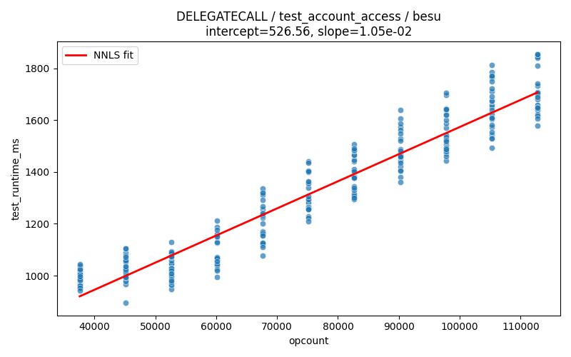

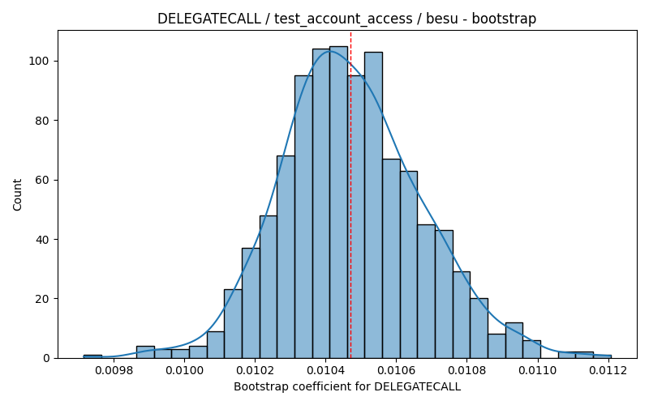

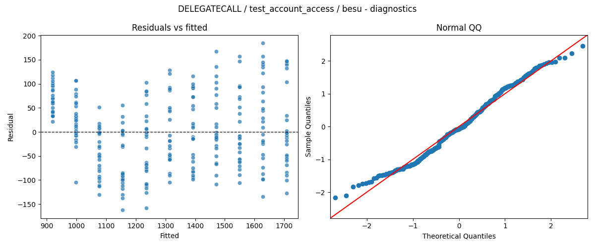

</details>

<details><summary>erigon — NNLS regression summary</summary>

```
==============================================================================
                           NNLS Regression Results                            
==============================================================================
Dep. Variable:          test_runtime_ms              R-squared:          0.997
Model:                  NNLS                    Adj. R-squared:          0.997
No. Observations:       132                               RMSE:          12.16
Df Residuals:           130                                MAE:           9.87
Df Model:               1      
==============================================================================
                      coef     std err     P-value      [0.025      0.975]
------------------------------------------------------------------------------
         const     20.0821      3.3266       0.001     13.3999     26.1779
       opcount      0.0095      0.0000       0.001      0.0095      0.0096
==============================================================================
Notes: Non-negative least squares with bootstrap inference (1000 iterations)
==============================================================================
```

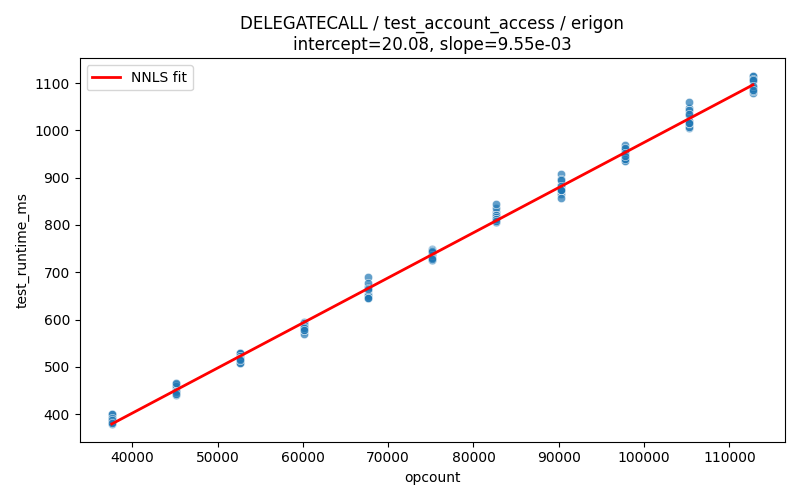

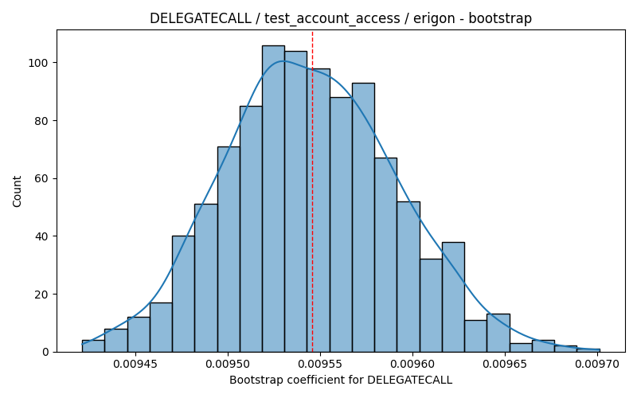

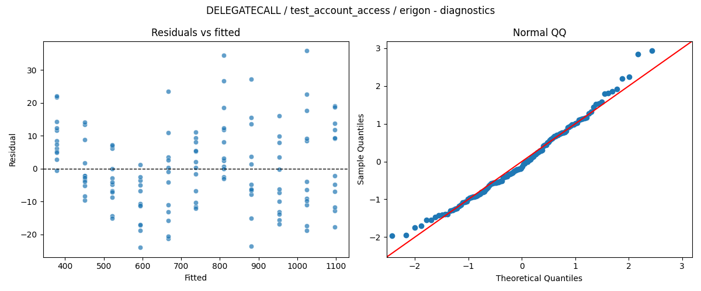

</details>

<details><summary>nethermind — NNLS regression summary</summary>

```
==============================================================================
                           NNLS Regression Results                            
==============================================================================
Dep. Variable:          test_runtime_ms              R-squared:          0.939
Model:                  NNLS                    Adj. R-squared:          0.939
No. Observations:       209                               RMSE:          27.84
Df Residuals:           207                                MAE:          21.43
Df Model:               1      
==============================================================================
                      coef     std err     P-value      [0.025      0.975]
------------------------------------------------------------------------------
         const    116.2638      6.1328       0.001    104.5048    128.4919
       opcount      0.0046      0.0001       0.001      0.0044      0.0048
==============================================================================
Notes: Non-negative least squares with bootstrap inference (1000 iterations)
==============================================================================
```

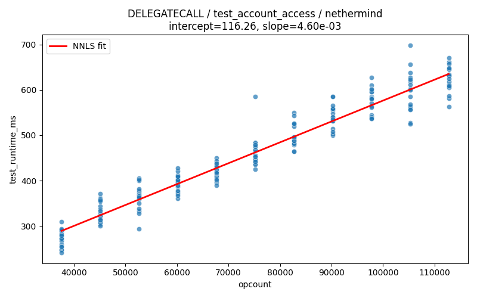

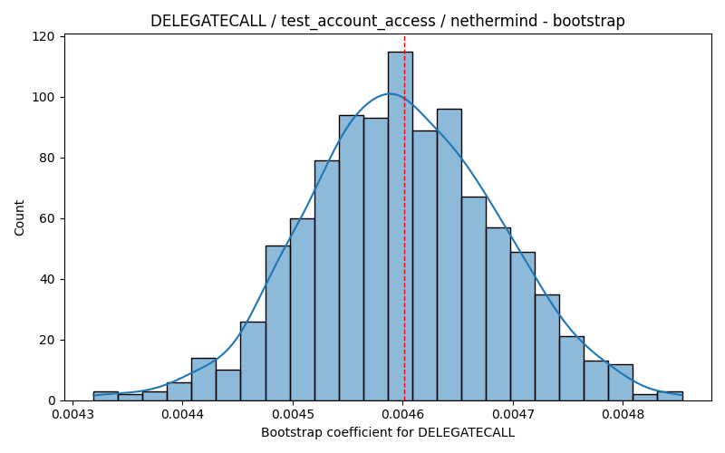

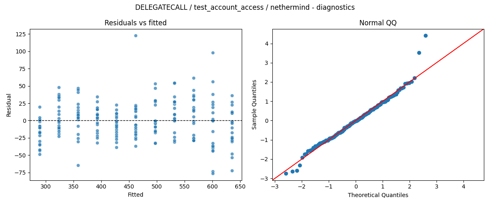

</details>

<details><summary>reth — NNLS regression summary</summary>

```
==============================================================================
                           NNLS Regression Results                            
==============================================================================
Dep. Variable:          test_runtime_ms              R-squared:          0.976
Model:                  NNLS                    Adj. R-squared:          0.975
No. Observations:       363                               RMSE:           3.61
Df Residuals:           361                                MAE:           2.89
Df Model:               1      
==============================================================================
                      coef     std err     P-value      [0.025      0.975]
------------------------------------------------------------------------------
         const     31.5216      0.6398       0.001     30.3167     32.8060
       opcount      0.0010      0.0000       0.001      0.0009      0.0010
==============================================================================
Notes: Non-negative least squares with bootstrap inference (1000 iterations)
==============================================================================
```

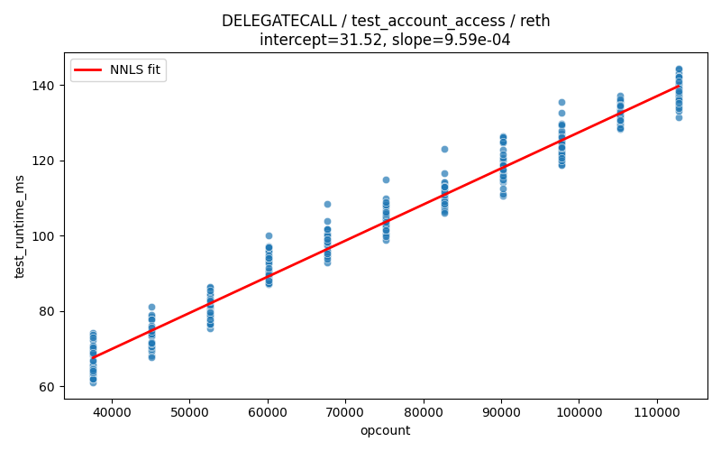

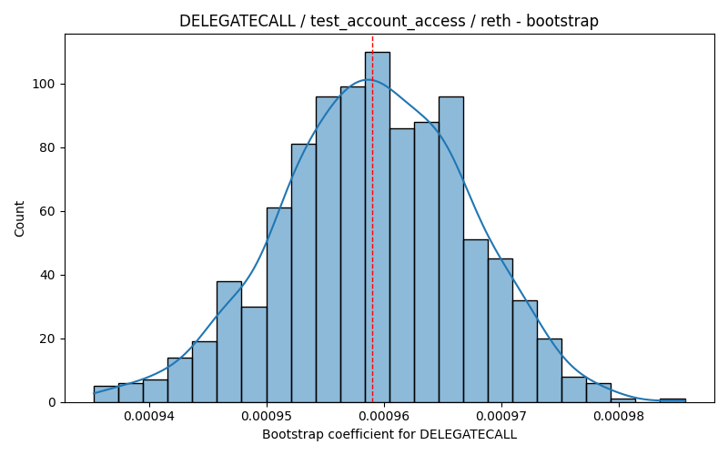

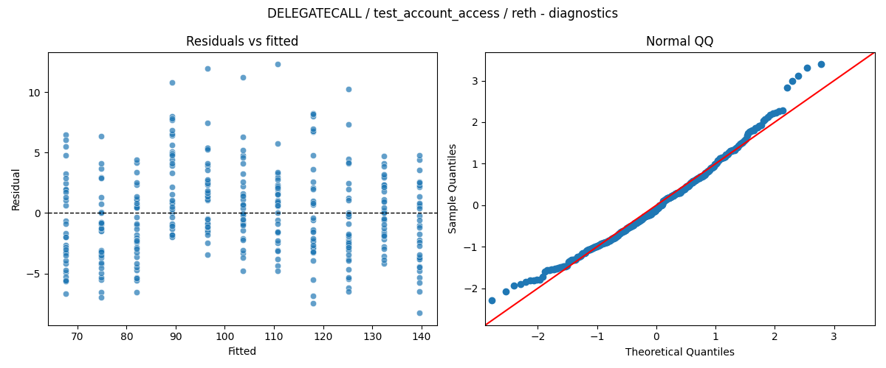

</details>

### test_ext_account_query_warm — combo `DELEGATECALL`

| client | nobs | R² | target_coef (ms) | p-value | 95% CI |
| --- | --- | --- | --- | --- | --- |
| `besu` | 275 | 0.9671 | 0.001318 | 1.00e-03 | [0.001288, 0.001348] |
| `erigon` | 132 | 0.9017 | 0.0002837 | 1.00e-03 | [0.0002685, 0.0002997] |
| `nethermind` | 209 | 0.8123 | 0.0006646 | 1.00e-03 | [0.000608, 0.0007103] |
| `reth` | 363 | 0.9188 | 4.837e-05 | 1.00e-03 | [4.685e-05, 5.002e-05] |

<details><summary>besu — NNLS regression summary</summary>

```
==============================================================================
                           NNLS Regression Results                            
==============================================================================
Dep. Variable:          test_runtime_ms              R-squared:          0.967
Model:                  NNLS                    Adj. R-squared:          0.967
No. Observations:       275                               RMSE:         125.86
Df Residuals:           273                                MAE:         105.89
Df Model:               1      
==============================================================================
                      coef     std err     P-value      [0.025      0.975]
------------------------------------------------------------------------------
         const    742.3062     27.0732       0.001    687.7541    795.5864
       opcount      0.0013      0.0000       0.001      0.0013      0.0013
==============================================================================
Notes: Non-negative least squares with bootstrap inference (1000 iterations)
==============================================================================
```

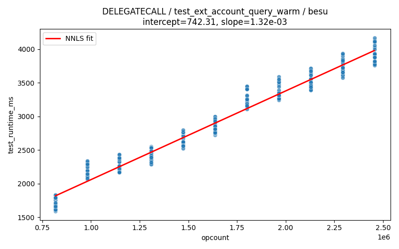

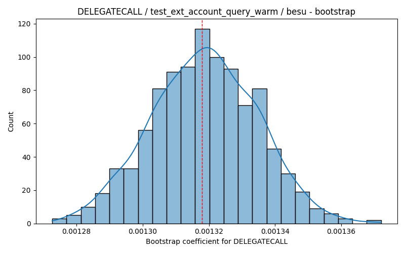

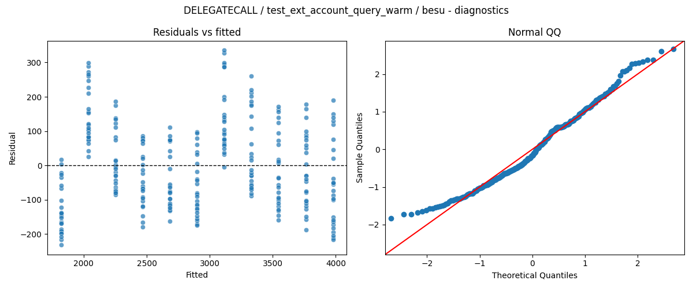

</details>

<details><summary>erigon — NNLS regression summary</summary>

```
==============================================================================
                           NNLS Regression Results                            
==============================================================================
Dep. Variable:          test_runtime_ms              R-squared:          0.902
Model:                  NNLS                    Adj. R-squared:          0.901
No. Observations:       132                               RMSE:          48.48
Df Residuals:           130                                MAE:          40.52
Df Model:               1      
==============================================================================
                      coef     std err     P-value      [0.025      0.975]
------------------------------------------------------------------------------
         const     51.9772     12.2015       0.001     28.6422     76.0114
       opcount      0.0003      0.0000       0.001      0.0003      0.0003
==============================================================================
Notes: Non-negative least squares with bootstrap inference (1000 iterations)
==============================================================================
```

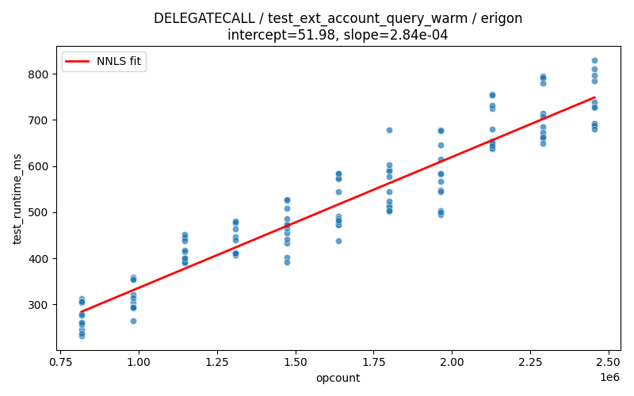

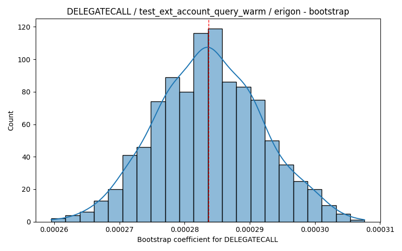

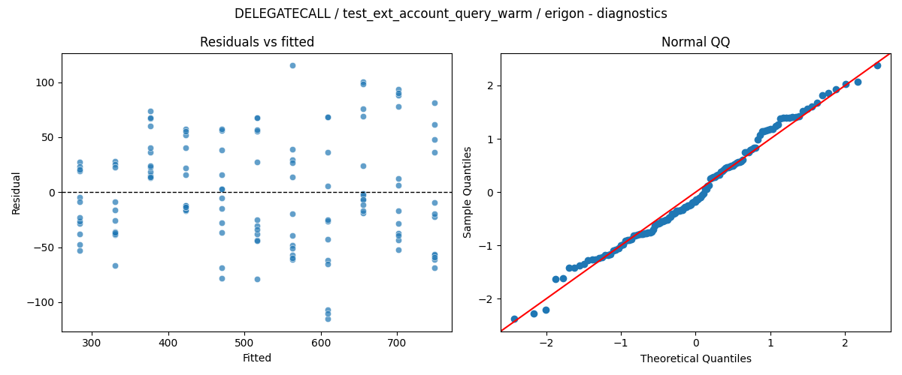

</details>

<details><summary>nethermind — NNLS regression summary</summary>

```
==============================================================================
                           NNLS Regression Results                            
==============================================================================
Dep. Variable:          test_runtime_ms              R-squared:          0.812
Model:                  NNLS                    Adj. R-squared:          0.811
No. Observations:       209                               RMSE:         165.38
Df Residuals:           207                                MAE:         120.94
Df Model:               1      
==============================================================================
                      coef     std err     P-value      [0.025      0.975]
------------------------------------------------------------------------------
         const    346.3487     36.2843       0.001    280.1061    422.2208
       opcount      0.0007      0.0000       0.001      0.0006      0.0007
==============================================================================
Notes: Non-negative least squares with bootstrap inference (1000 iterations)
==============================================================================
```

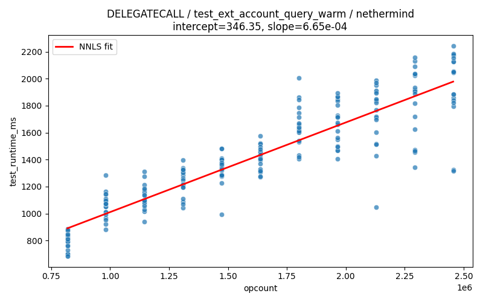

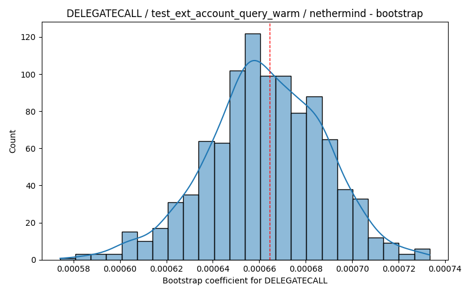

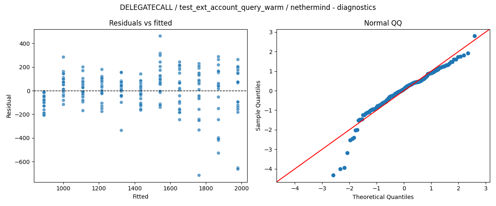

</details>

<details><summary>reth — NNLS regression summary</summary>

```
==============================================================================
                           NNLS Regression Results                            
==============================================================================
Dep. Variable:          test_runtime_ms              R-squared:          0.919
Model:                  NNLS                    Adj. R-squared:          0.919
No. Observations:       363                               RMSE:           7.44
Df Residuals:           361                                MAE:           6.10
Df Model:               1      
==============================================================================
                      coef     std err     P-value      [0.025      0.975]
------------------------------------------------------------------------------
         const     15.0464      1.3459       0.001     12.3575     17.6206
       opcount      0.0000      0.0000       0.001      0.0000      0.0001
==============================================================================
Notes: Non-negative least squares with bootstrap inference (1000 iterations)
==============================================================================
```

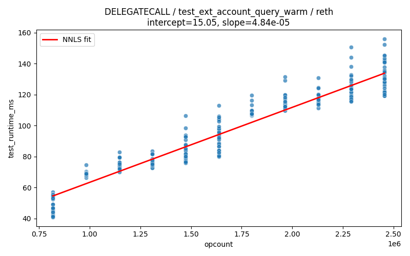

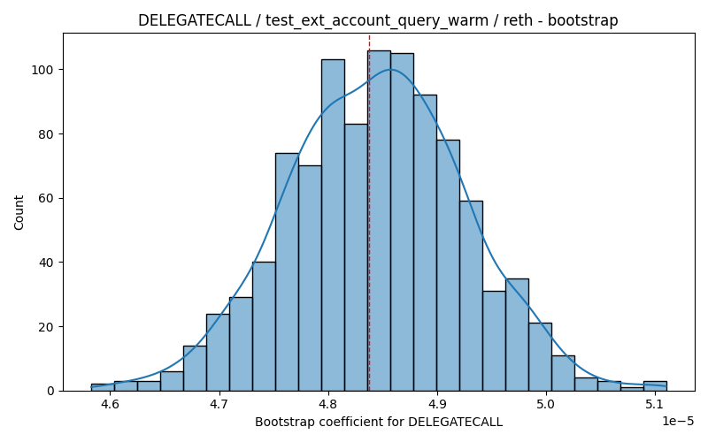

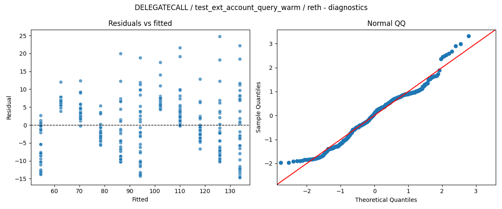

</details>

## EXTCODECOPY

### test_account_access — combo `EXTCODECOPY_AccountMode.EXISTING_CONTRACT`

| client | nobs | R² | target_coef (ms) | p-value | 95% CI |
| --- | --- | --- | --- | --- | --- |
| `besu` | 275 | 0.8154 | 0.001848 | 1.00e-03 | [0.001725, 0.001955] |
| `erigon` | 132 | 0.8503 | 0.0003158 | 1.00e-03 | [0.000289, 0.0003414] |
| `nethermind` | 209 | 0.8895 | 0.001394 | 1.00e-03 | [0.001326, 0.00146] |
| `reth` | 363 | 0.7547 | 7.843e-05 | 1.00e-03 | [7.357e-05, 8.317e-05] |

<details><summary>besu — NNLS regression summary</summary>

```
==============================================================================
                           NNLS Regression Results                            
==============================================================================
Dep. Variable:          test_runtime_ms              R-squared:          0.815
Model:                  NNLS                    Adj. R-squared:          0.815
No. Observations:       275                               RMSE:          86.87
Df Residuals:           273                                MAE:          69.80
Df Model:               1      
==============================================================================
                      coef     std err     P-value      [0.025      0.975]
------------------------------------------------------------------------------
         const    414.1296     16.6630       0.001    383.3714    447.3886
       opcount      0.0018      0.0001       0.001      0.0017      0.0020
==============================================================================
Notes: Non-negative least squares with bootstrap inference (1000 iterations)
==============================================================================
```

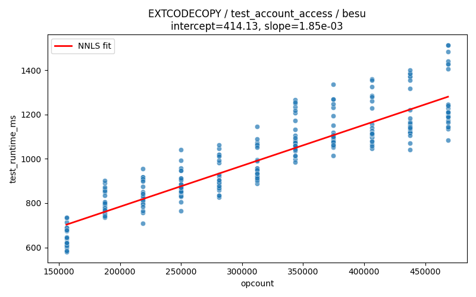

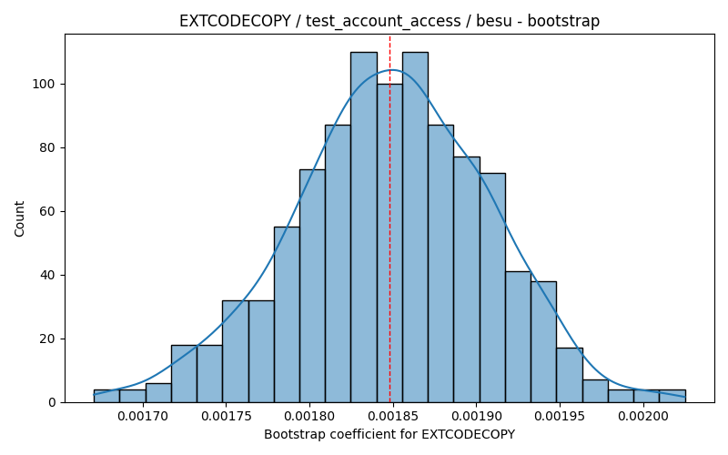

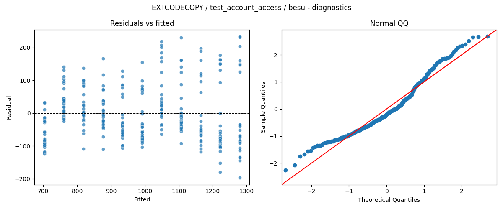

</details>

<details><summary>erigon — NNLS regression summary</summary>

```
==============================================================================
                           NNLS Regression Results                            
==============================================================================
Dep. Variable:          test_runtime_ms              R-squared:          0.850
Model:                  NNLS                    Adj. R-squared:          0.849
No. Observations:       132                               RMSE:          13.09
Df Residuals:           130                                MAE:          10.28
Df Model:               1      
==============================================================================
                      coef     std err     P-value      [0.025      0.975]
------------------------------------------------------------------------------
         const     49.8886      4.7887       0.001     41.0585     59.9400
       opcount      0.0003      0.0000       0.001      0.0003      0.0003
==============================================================================
Notes: Non-negative least squares with bootstrap inference (1000 iterations)
==============================================================================
```

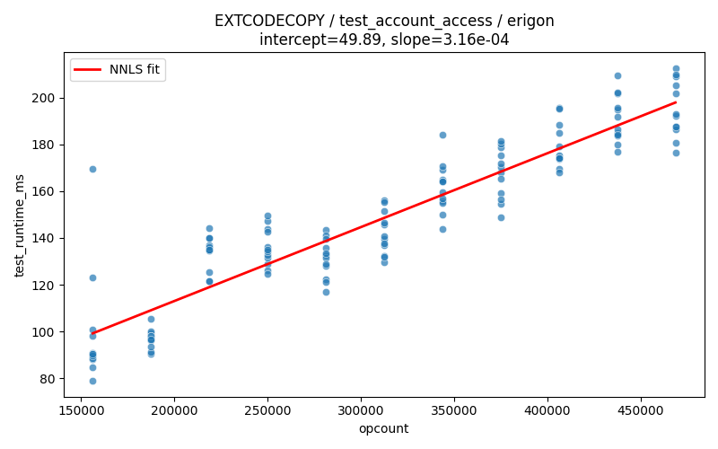

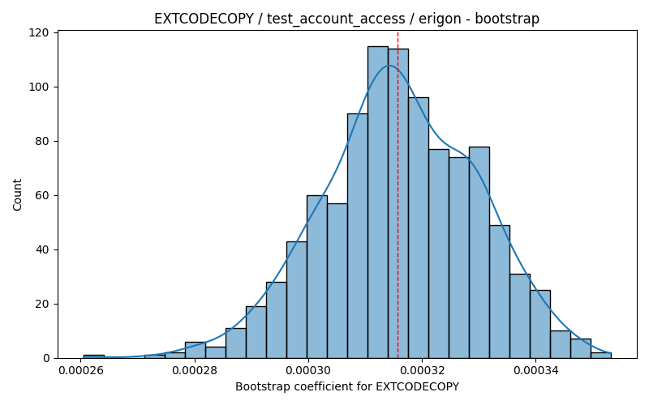

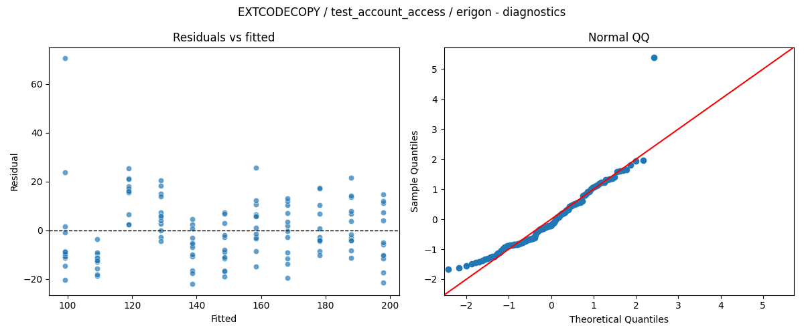

</details>

<details><summary>nethermind — NNLS regression summary</summary>

```
==============================================================================
                           NNLS Regression Results                            
==============================================================================
Dep. Variable:          test_runtime_ms              R-squared:          0.889
Model:                  NNLS                    Adj. R-squared:          0.889
No. Observations:       209                               RMSE:          48.57
Df Residuals:           207                                MAE:          37.45
Df Model:               1      
==============================================================================
                      coef     std err     P-value      [0.025      0.975]
------------------------------------------------------------------------------
         const    173.6002     10.5071       0.001    154.3040    195.0624
       opcount      0.0014      0.0000       0.001      0.0013      0.0015
==============================================================================
Notes: Non-negative least squares with bootstrap inference (1000 iterations)
==============================================================================
```

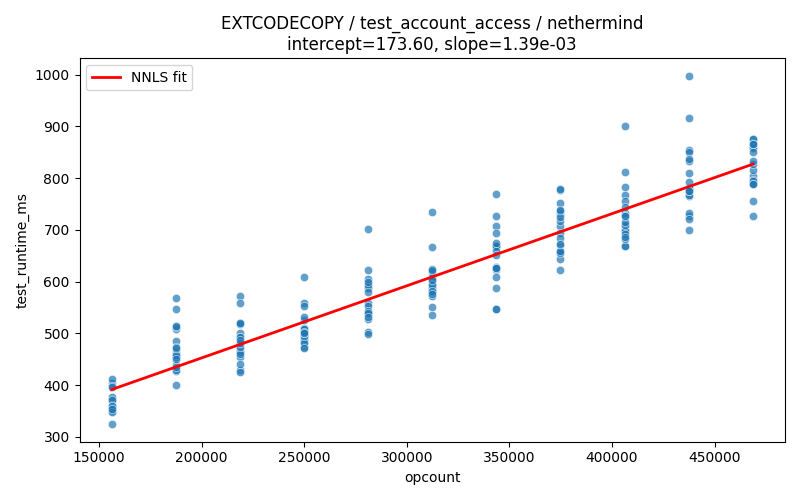

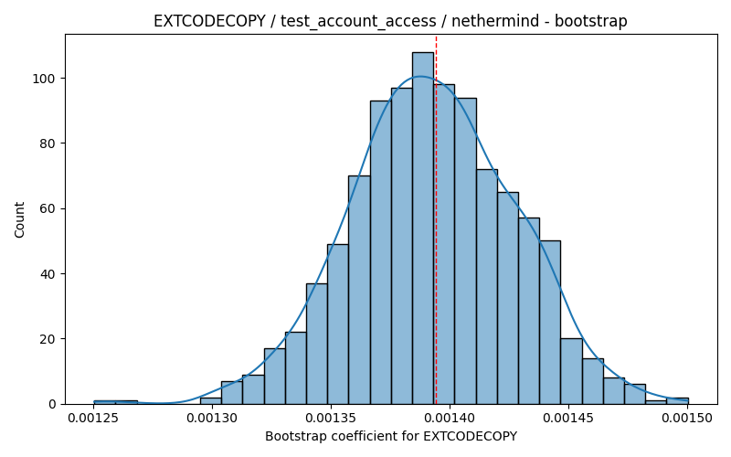

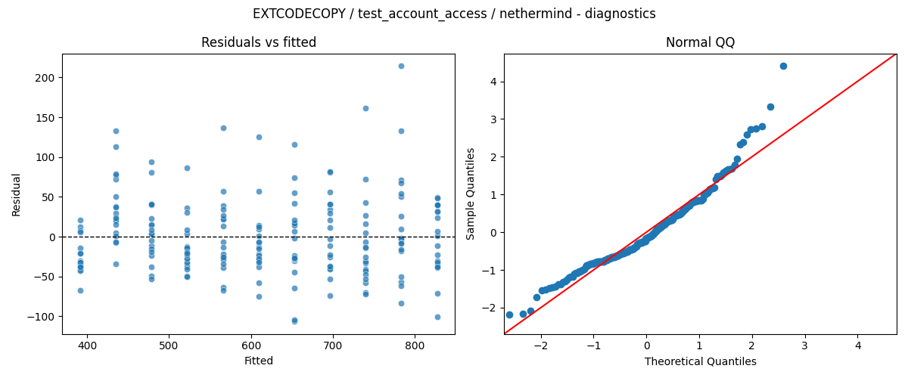

</details>

<details><summary>reth — NNLS regression summary</summary>

```
==============================================================================
                           NNLS Regression Results                            
==============================================================================
Dep. Variable:          test_runtime_ms              R-squared:          0.755
Model:                  NNLS                    Adj. R-squared:          0.754
No. Observations:       363                               RMSE:           4.42
Df Residuals:           361                                MAE:           3.31
Df Model:               1      
==============================================================================
                      coef     std err     P-value      [0.025      0.975]
------------------------------------------------------------------------------
         const     11.5658      0.7910       0.001     10.0226     13.1260
       opcount      0.0001      0.0000       0.001      0.0001      0.0001
==============================================================================
Notes: Non-negative least squares with bootstrap inference (1000 iterations)
==============================================================================
```

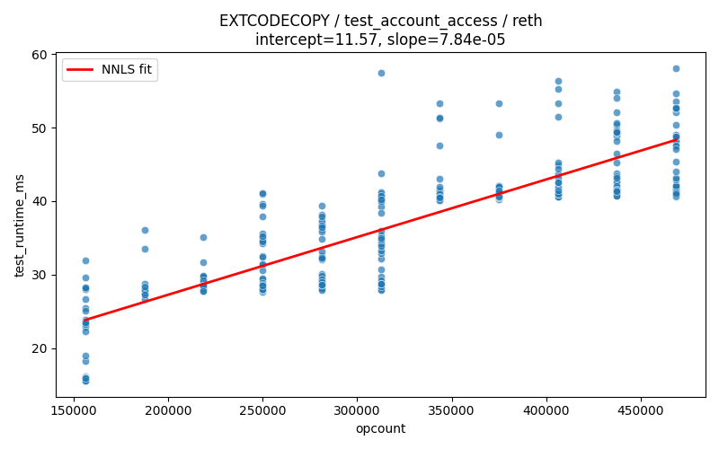

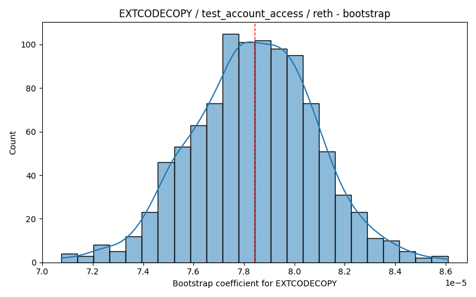

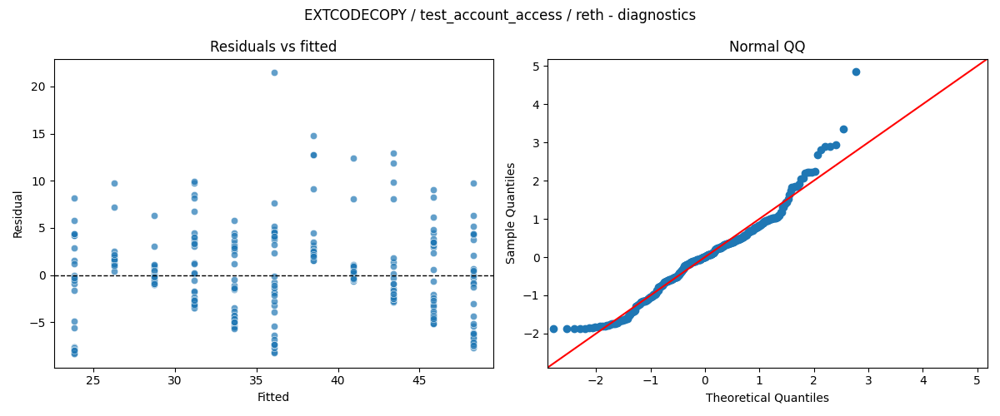

</details>

### test_account_access — combo `EXTCODECOPY_AccountMode.NON_EXISTING_ACCOUNT`

| client | nobs | R² | target_coef (ms) | p-value | 95% CI |
| --- | --- | --- | --- | --- | --- |
| `besu` | 275 | 0.844 | 0.000444 | 1.00e-03 | [0.0004219, 0.000465] |
| `erigon` | 132 | 0.7881 | 6.404e-05 | 1.00e-03 | [5.872e-05, 6.984e-05] |
| `nethermind` | 209 | 0.8644 | 0.000366 | 1.00e-03 | [0.0003451, 0.0003846] |
| `reth` | 363 | 0.7083 | 1.711e-05 | 1.00e-03 | [1.585e-05, 1.847e-05] |

<details><summary>besu — NNLS regression summary</summary>

```
==============================================================================
                           NNLS Regression Results                            
==============================================================================
Dep. Variable:          test_runtime_ms              R-squared:          0.844
Model:                  NNLS                    Adj. R-squared:          0.843
No. Observations:       275                               RMSE:          49.01
Df Residuals:           273                                MAE:          38.94
Df Model:               1      
==============================================================================
                      coef     std err     P-value      [0.025      0.975]
------------------------------------------------------------------------------
         const    218.1009      8.4589       0.001    202.1845    235.9760
       opcount      0.0004      0.0000       0.001      0.0004      0.0005
==============================================================================
Notes: Non-negative least squares with bootstrap inference (1000 iterations)
==============================================================================
```

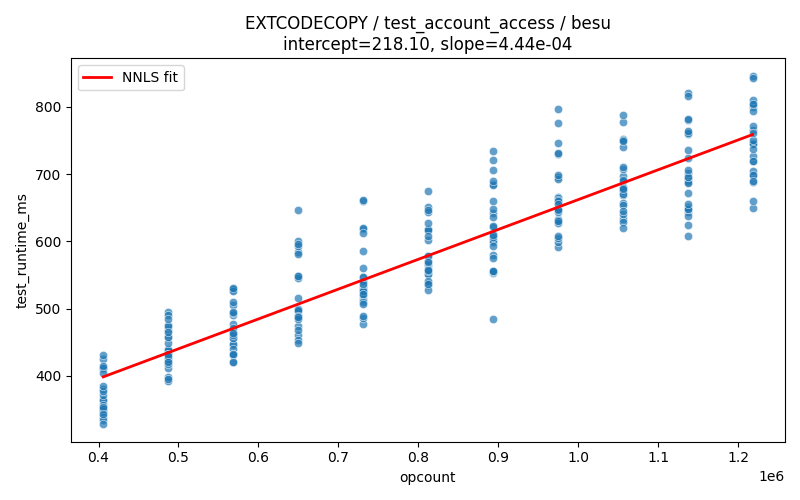

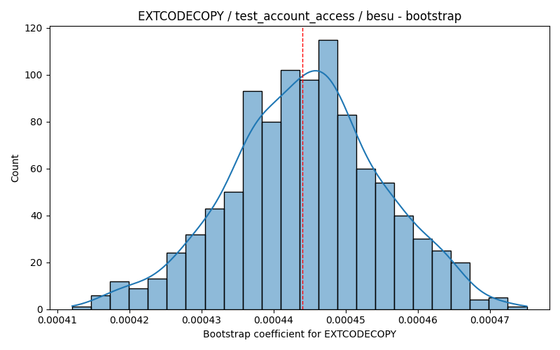

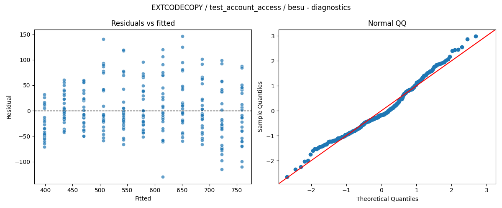

</details>

<details><summary>erigon — NNLS regression summary</summary>

```
==============================================================================
                           NNLS Regression Results                            
==============================================================================
Dep. Variable:          test_runtime_ms              R-squared:          0.788
Model:                  NNLS                    Adj. R-squared:          0.786
No. Observations:       132                               RMSE:           8.53
Df Residuals:           130                                MAE:           6.89
Df Model:               1      
==============================================================================
                      coef     std err     P-value      [0.025      0.975]
------------------------------------------------------------------------------
         const     46.7076      2.3756       0.001     41.8338     51.2660
       opcount      0.0001      0.0000       0.001      0.0001      0.0001
==============================================================================
Notes: Non-negative least squares with bootstrap inference (1000 iterations)
==============================================================================
```

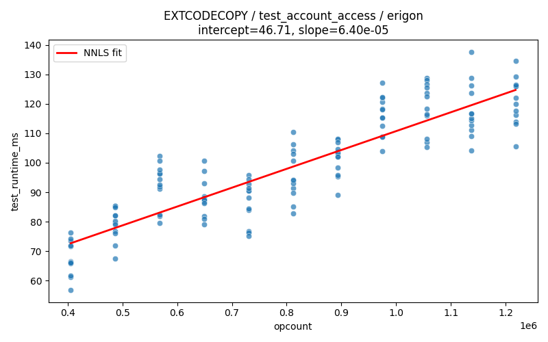

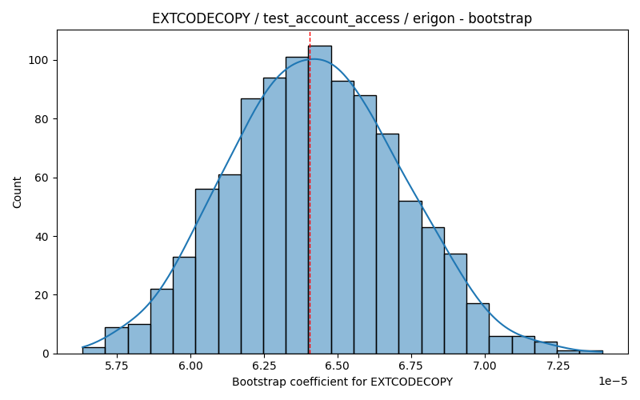

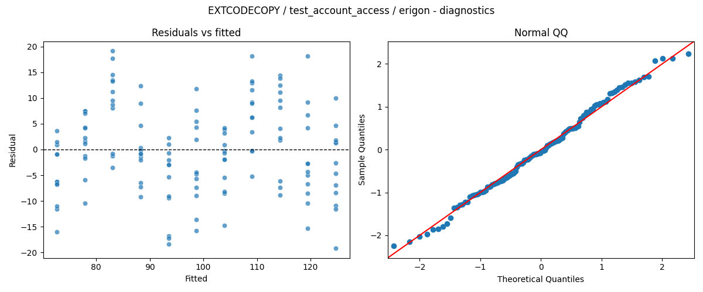

</details>

<details><summary>nethermind — NNLS regression summary</summary>

```
==============================================================================
                           NNLS Regression Results                            
==============================================================================
Dep. Variable:          test_runtime_ms              R-squared:          0.864
Model:                  NNLS                    Adj. R-squared:          0.864
No. Observations:       209                               RMSE:          37.21
Df Residuals:           207                                MAE:          27.91
Df Model:               1      
==============================================================================
                      coef     std err     P-value      [0.025      0.975]
------------------------------------------------------------------------------
         const    121.1026      7.5523       0.001    107.6518    136.8864
       opcount      0.0004      0.0000       0.001      0.0003      0.0004
==============================================================================
Notes: Non-negative least squares with bootstrap inference (1000 iterations)
==============================================================================
```

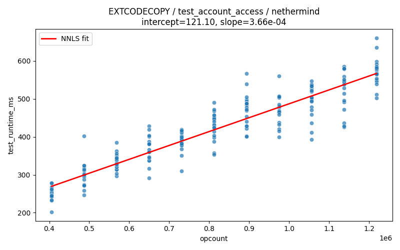

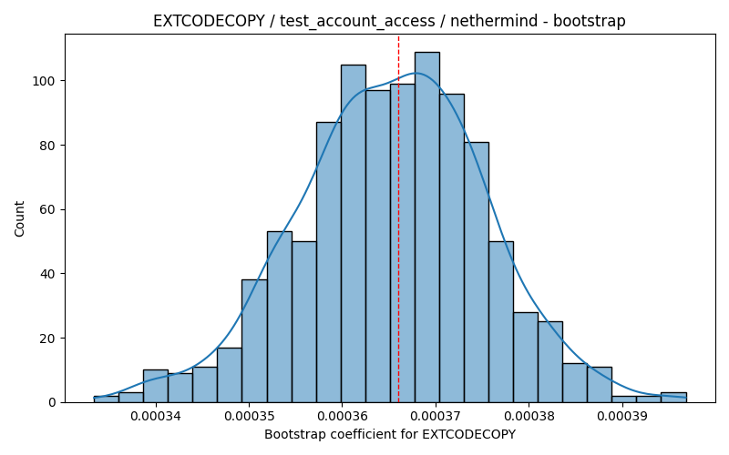

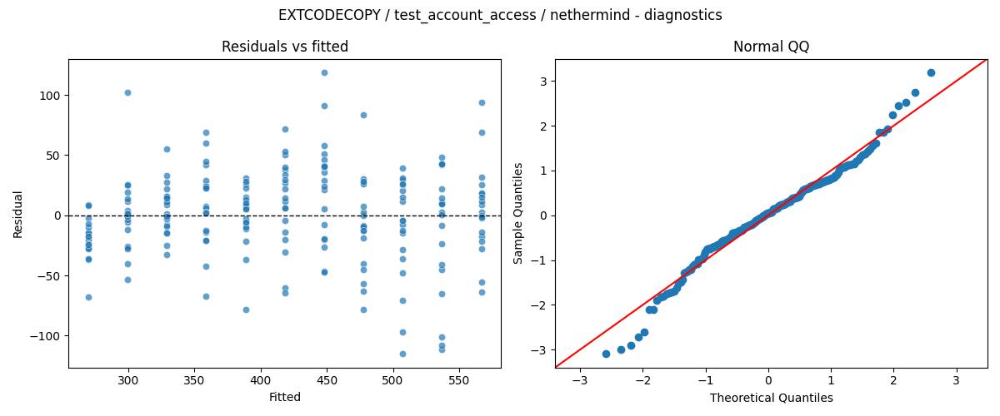

</details>

<details><summary>reth — NNLS regression summary</summary>

```
==============================================================================
                           NNLS Regression Results                            
==============================================================================
Dep. Variable:          test_runtime_ms              R-squared:          0.708
Model:                  NNLS                    Adj. R-squared:          0.708
No. Observations:       363                               RMSE:           2.82
Df Residuals:           361                                MAE:           1.87
Df Model:               1      
==============================================================================
                      coef     std err     P-value      [0.025      0.975]
------------------------------------------------------------------------------
         const      5.5436      0.4917       0.001      4.5617      6.5102
       opcount      0.0000      0.0000       0.001      0.0000      0.0000
==============================================================================
Notes: Non-negative least squares with bootstrap inference (1000 iterations)
==============================================================================
```

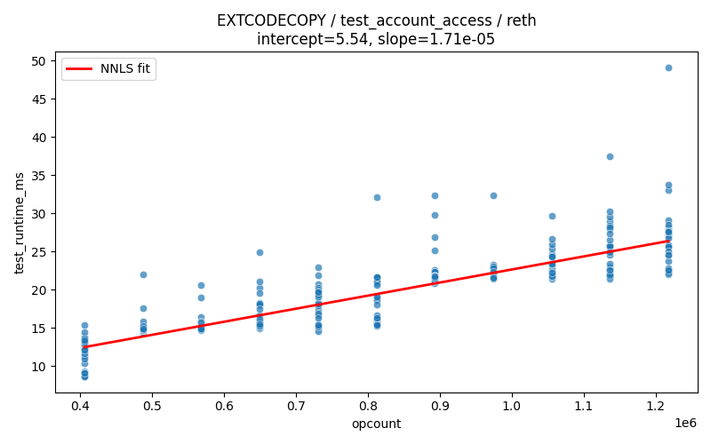

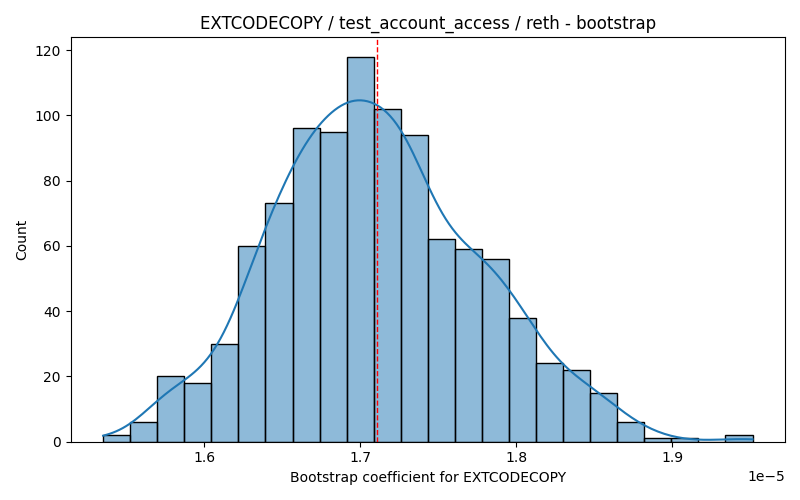

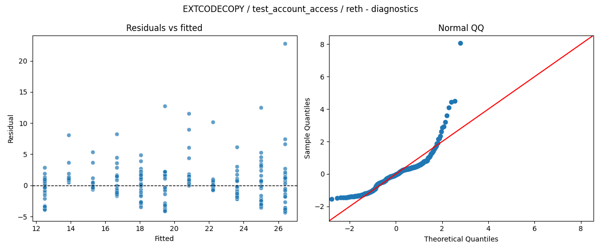

</details>

## EXTCODEHASH

### test_account_access — combo `EXTCODEHASH_AccountMode.EXISTING_CONTRACT`

| client | nobs | R² | target_coef (ms) | p-value | 95% CI |
| --- | --- | --- | --- | --- | --- |
| `besu` | 275 | 0.9465 | 0.02618 | 1.00e-03 | [0.02538, 0.02691] |
| `erigon` | 132 | 0.8989 | 0.03639 | 1.00e-03 | [0.03437, 0.03827] |
| `nethermind` | 209 | 0.7045 | 0.02463 | 1.00e-03 | [0.02236, 0.02684] |
| `reth` | 363 | 0.8524 | 0.0352 | 1.00e-03 | [0.03372, 0.03673] |

<details><summary>besu — NNLS regression summary</summary>

```
==============================================================================
                           NNLS Regression Results                            
==============================================================================
Dep. Variable:          test_runtime_ms              R-squared:          0.946
Model:                  NNLS                    Adj. R-squared:          0.946
No. Observations:       275                               RMSE:         129.58
Df Residuals:           273                                MAE:         111.10
Df Model:               1      
==============================================================================
                      coef     std err     P-value      [0.025      0.975]
------------------------------------------------------------------------------
         const    395.8859     27.4337       0.001    346.3549    451.1968
       opcount      0.0262      0.0004       0.001      0.0254      0.0269
==============================================================================
Notes: Non-negative least squares with bootstrap inference (1000 iterations)
==============================================================================
```

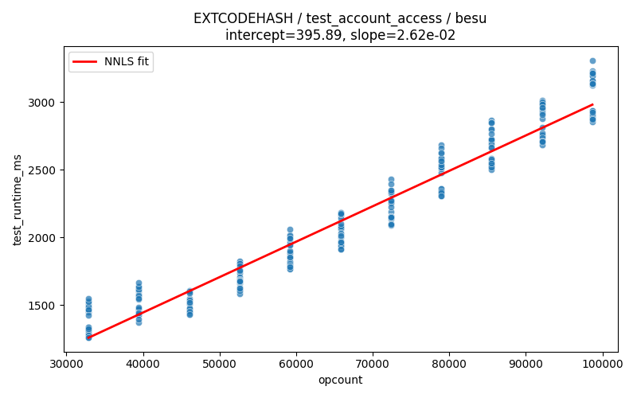

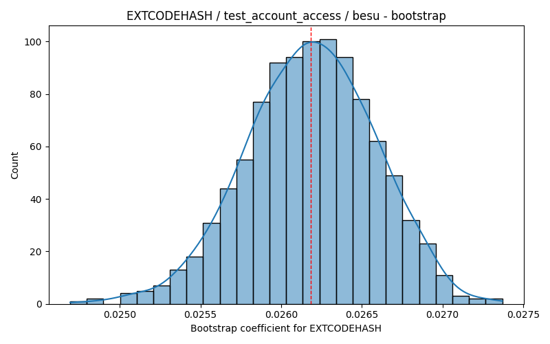

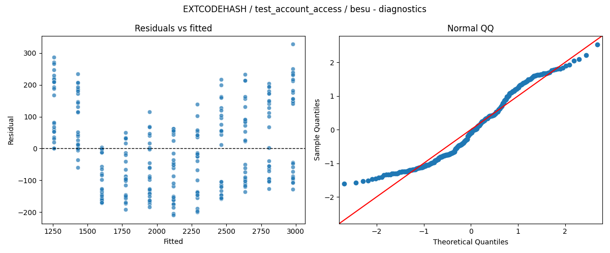

</details>

<details><summary>erigon — NNLS regression summary</summary>

```
==============================================================================
                           NNLS Regression Results                            
==============================================================================
Dep. Variable:          test_runtime_ms              R-squared:          0.899
Model:                  NNLS                    Adj. R-squared:          0.898
No. Observations:       132                               RMSE:         253.85
Df Residuals:           130                                MAE:         216.12
Df Model:               1      
==============================================================================
                      coef     std err     P-value      [0.025      0.975]
------------------------------------------------------------------------------
         const    449.8205     76.0764       0.001    311.5927    615.9531
       opcount      0.0364      0.0010       0.001      0.0344      0.0383
==============================================================================
Notes: Non-negative least squares with bootstrap inference (1000 iterations)
==============================================================================
```

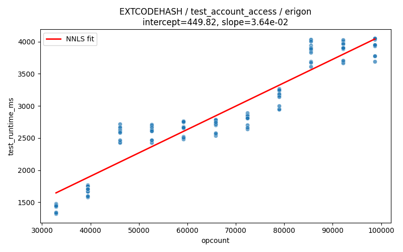

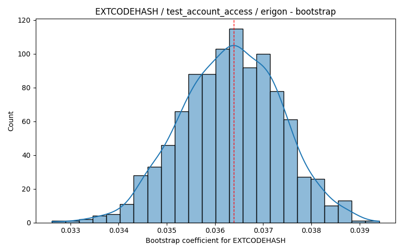


</details>

<details><summary>nethermind — NNLS regression summary</summary>

```
==============================================================================
                           NNLS Regression Results                            
==============================================================================
Dep. Variable:          test_runtime_ms              R-squared:          0.705
Model:                  NNLS                    Adj. R-squared:          0.703
No. Observations:       209                               RMSE:         331.84
Df Residuals:           207                                MAE:         275.99
Df Model:               1      
==============================================================================
                      coef     std err     P-value      [0.025      0.975]
------------------------------------------------------------------------------
         const    855.3491     80.6981       0.001    699.4820   1022.5754
       opcount      0.0246      0.0011       0.001      0.0224      0.0268
==============================================================================
Notes: Non-negative least squares with bootstrap inference (1000 iterations)
==============================================================================
```

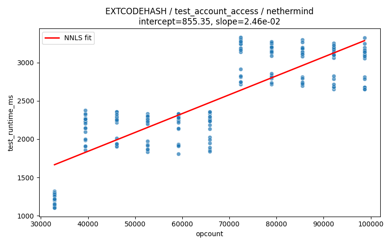

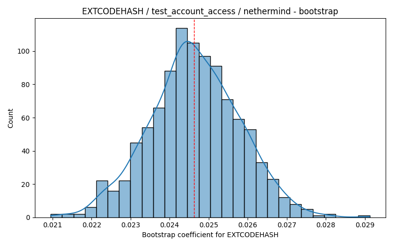

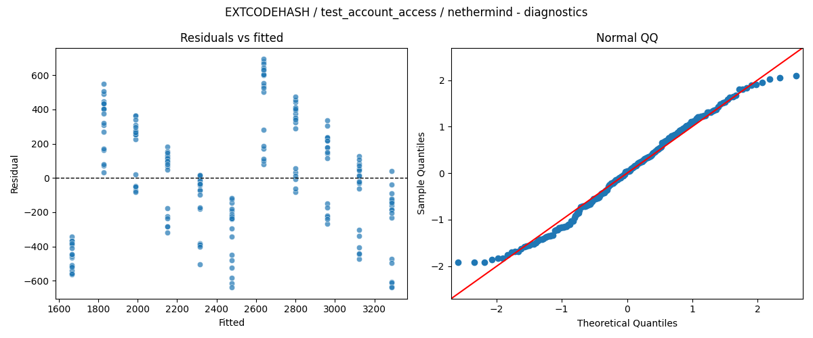

</details>

<details><summary>reth — NNLS regression summary</summary>

```
==============================================================================
                           NNLS Regression Results                            
==============================================================================
Dep. Variable:          test_runtime_ms              R-squared:          0.852
Model:                  NNLS                    Adj. R-squared:          0.852
No. Observations:       363                               RMSE:         304.80
Df Residuals:           361                                MAE:         177.11
Df Model:               1      
==============================================================================
                      coef     std err     P-value      [0.025      0.975]
------------------------------------------------------------------------------
         const    220.4379     51.5667       0.001    122.8690    321.0983
       opcount      0.0352      0.0008       0.001      0.0337      0.0367
==============================================================================
Notes: Non-negative least squares with bootstrap inference (1000 iterations)
==============================================================================
```

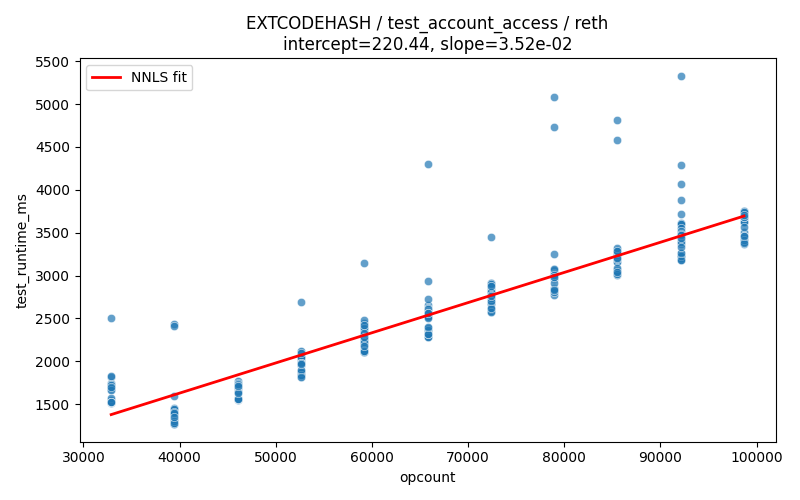

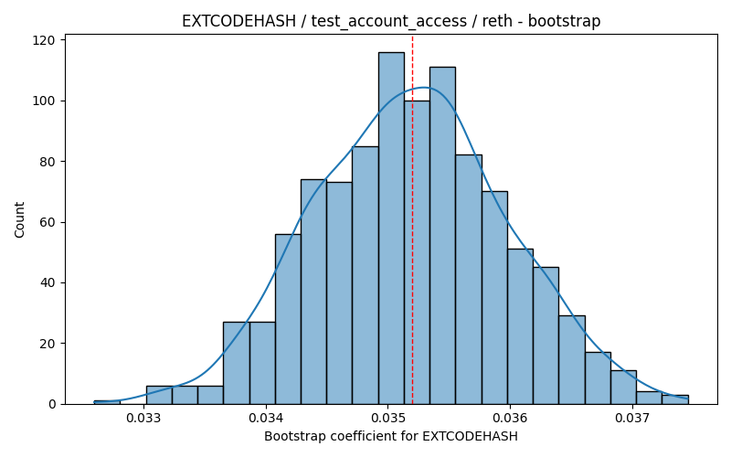

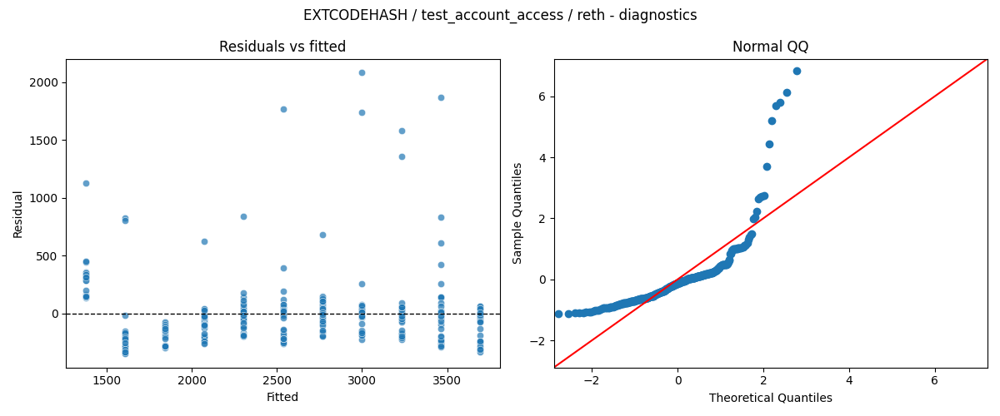

</details>

### test_account_access — combo `EXTCODEHASH_AccountMode.NON_EXISTING_ACCOUNT`

| client | nobs | R² | target_coef (ms) | p-value | 95% CI |
| --- | --- | --- | --- | --- | --- |
| `besu` | 275 | 0.9019 | 0.009203 | 1.00e-03 | [0.008807, 0.00962] |
| `erigon` | 132 | 0.997 | 0.0086 | 1.00e-03 | [0.008529, 0.008675] |
| `nethermind` | 209 | 0.927 | 0.003867 | 1.00e-03 | [0.003722, 0.004021] |
| `reth` | 363 | 0.9652 | 0.0009067 | 1.00e-03 | [0.0008896, 0.0009238] |

<details><summary>besu — NNLS regression summary</summary>

```
==============================================================================
                           NNLS Regression Results                            
==============================================================================
Dep. Variable:          test_runtime_ms              R-squared:          0.902
Model:                  NNLS                    Adj. R-squared:          0.901
No. Observations:       275                               RMSE:          72.56
Df Residuals:           273                                MAE:          61.06
Df Model:               1      
==============================================================================
                      coef     std err     P-value      [0.025      0.975]
------------------------------------------------------------------------------
         const    429.1774     17.4687       0.001    393.9303    462.0604
       opcount      0.0092      0.0002       0.001      0.0088      0.0096
==============================================================================
Notes: Non-negative least squares with bootstrap inference (1000 iterations)
==============================================================================
```

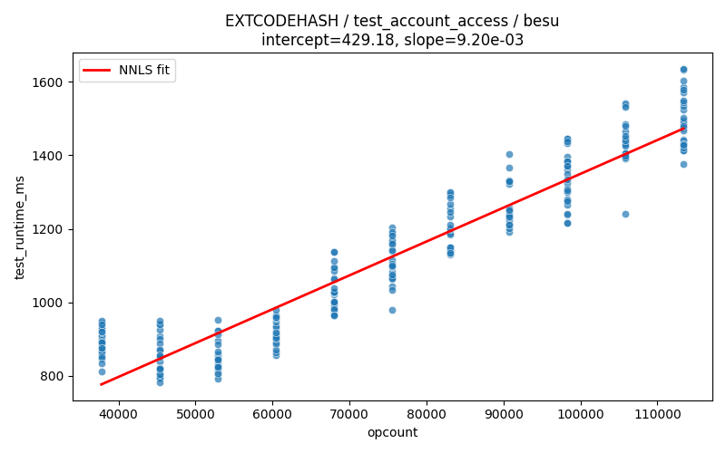

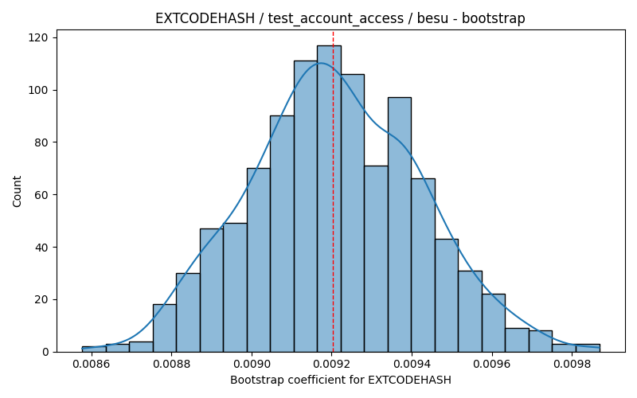

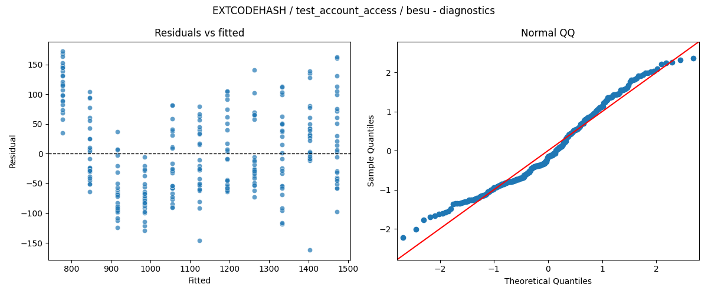

</details>

<details><summary>erigon — NNLS regression summary</summary>

```
==============================================================================
                           NNLS Regression Results                            
==============================================================================
Dep. Variable:          test_runtime_ms              R-squared:          0.997
Model:                  NNLS                    Adj. R-squared:          0.997
No. Observations:       132                               RMSE:          11.30
Df Residuals:           130                                MAE:           8.99
Df Model:               1      
==============================================================================
                      coef     std err     P-value      [0.025      0.975]
------------------------------------------------------------------------------
         const     14.2933      2.8554       0.001      8.3128     19.6118
       opcount      0.0086      0.0000       0.001      0.0085      0.0087
==============================================================================
Notes: Non-negative least squares with bootstrap inference (1000 iterations)
==============================================================================
```

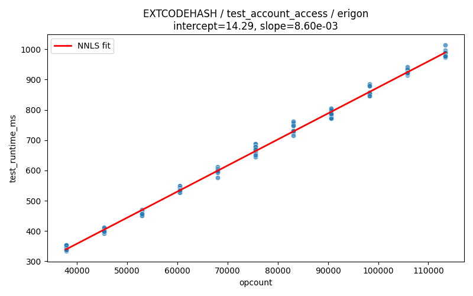

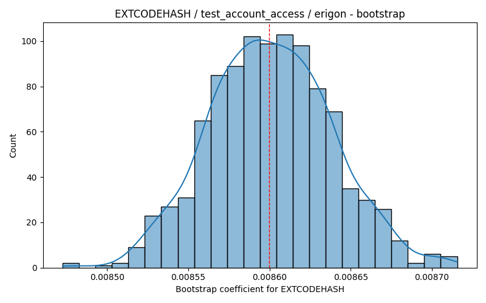

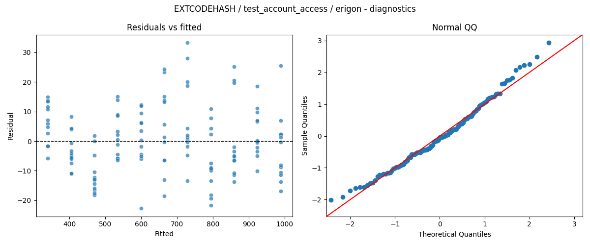

</details>

<details><summary>nethermind — NNLS regression summary</summary>

```
==============================================================================
                           NNLS Regression Results                            
==============================================================================
Dep. Variable:          test_runtime_ms              R-squared:          0.927
Model:                  NNLS                    Adj. R-squared:          0.927
No. Observations:       209                               RMSE:          25.93
Df Residuals:           207                                MAE:          20.87
Df Model:               1      
==============================================================================
                      coef     std err     P-value      [0.025      0.975]
------------------------------------------------------------------------------
         const     81.8279      5.5171       0.001     70.5958     91.9250
       opcount      0.0039      0.0001       0.001      0.0037      0.0040
==============================================================================
Notes: Non-negative least squares with bootstrap inference (1000 iterations)
==============================================================================
```

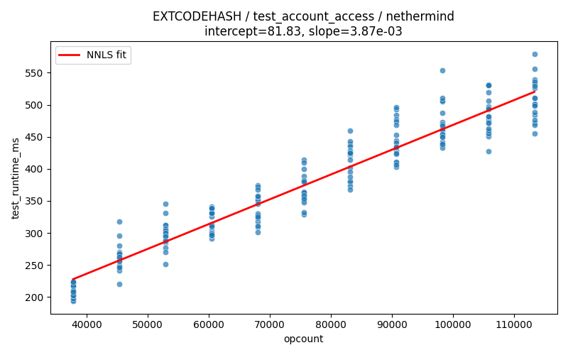

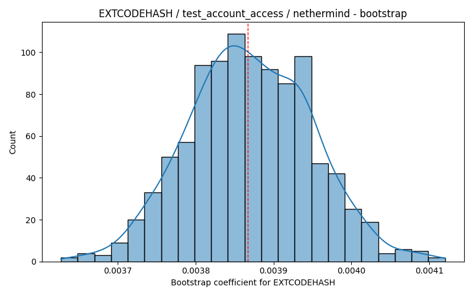

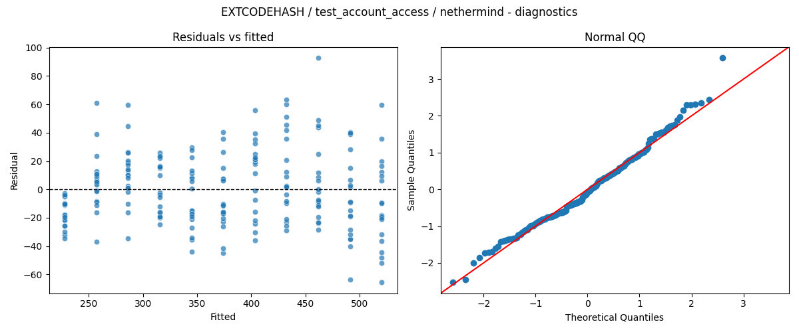

</details>

<details><summary>reth — NNLS regression summary</summary>

```
==============================================================================
                           NNLS Regression Results                            
==============================================================================
Dep. Variable:          test_runtime_ms              R-squared:          0.965
Model:                  NNLS                    Adj. R-squared:          0.965
No. Observations:       363                               RMSE:           4.12
Df Residuals:           361                                MAE:           3.08
Df Model:               1      
==============================================================================
                      coef     std err     P-value      [0.025      0.975]
------------------------------------------------------------------------------
         const     32.8544      0.7109       0.001     31.4510     34.3539
       opcount      0.0009      0.0000       0.001      0.0009      0.0009
==============================================================================
Notes: Non-negative least squares with bootstrap inference (1000 iterations)
==============================================================================
```

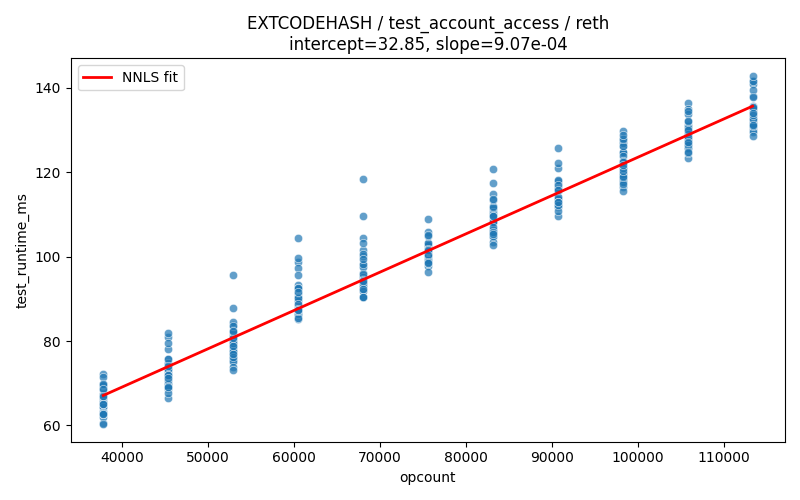

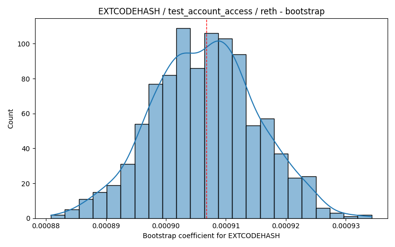

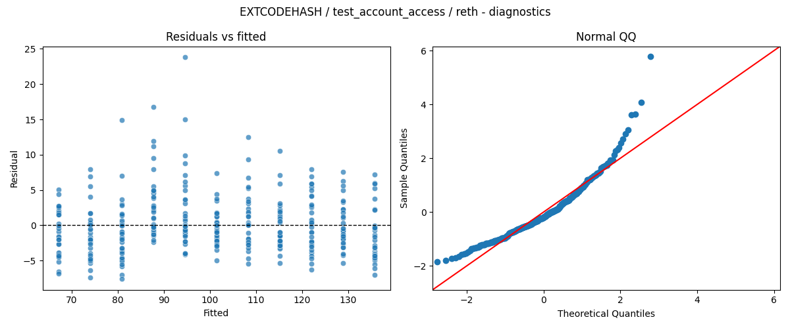

</details>

### test_ext_account_query_warm — combo `EXTCODEHASH`

| client | nobs | R² | target_coef (ms) | p-value | 95% CI |
| --- | --- | --- | --- | --- | --- |
| `besu` | 275 | 0.8075 | 0.0001558 | 1.00e-03 | [0.0001468, 0.0001659] |
| `erigon` | 132 | 0.834 | 0.0002597 | 1.00e-03 | [0.000236, 0.0002797] |
| `nethermind` | 209 | 0.7913 | 0.000283 | 1.00e-03 | [0.0002658, 0.0003015] |
| `reth` | 363 | 0.6762 | 7.906e-06 | 1.00e-03 | [7.308e-06, 8.502e-06] |

<details><summary>besu — NNLS regression summary</summary>

```
==============================================================================
                           NNLS Regression Results                            
==============================================================================
Dep. Variable:          test_runtime_ms              R-squared:          0.808
Model:                  NNLS                    Adj. R-squared:          0.807
No. Observations:       275                               RMSE:          44.49
Df Residuals:           273                                MAE:          35.91
Df Model:               1      
==============================================================================
                      coef     std err     P-value      [0.025      0.975]
------------------------------------------------------------------------------
         const    201.9608      8.4516       0.001    185.9871    217.5940
       opcount      0.0002      0.0000       0.001      0.0001      0.0002
==============================================================================
Notes: Non-negative least squares with bootstrap inference (1000 iterations)
==============================================================================
```

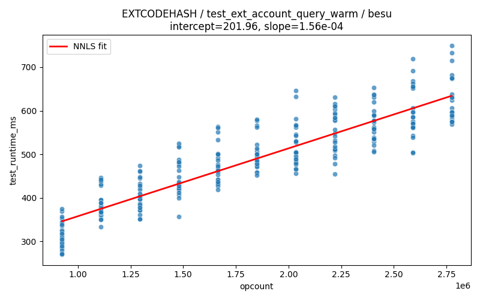

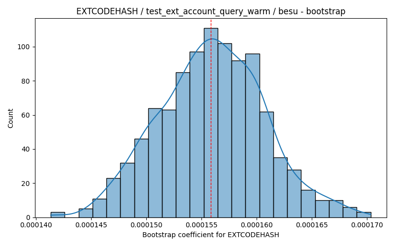

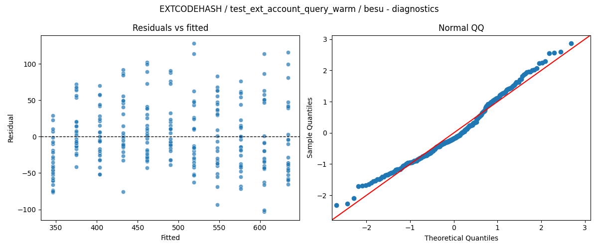

</details>

<details><summary>erigon — NNLS regression summary</summary>

```
==============================================================================
                           NNLS Regression Results                            
==============================================================================
Dep. Variable:          test_runtime_ms              R-squared:          0.834
Model:                  NNLS                    Adj. R-squared:          0.833
No. Observations:       132                               RMSE:          67.76
Df Residuals:           130                                MAE:          47.14
Df Model:               1      
==============================================================================
                      coef     std err     P-value      [0.025      0.975]
------------------------------------------------------------------------------
         const     61.9106     22.8142       0.001     23.9179    111.6890
       opcount      0.0003      0.0000       0.001      0.0002      0.0003
==============================================================================
Notes: Non-negative least squares with bootstrap inference (1000 iterations)
==============================================================================
```

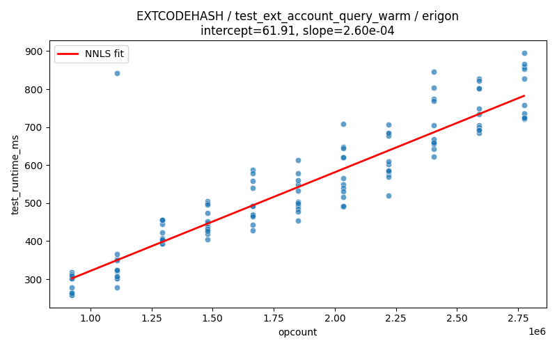

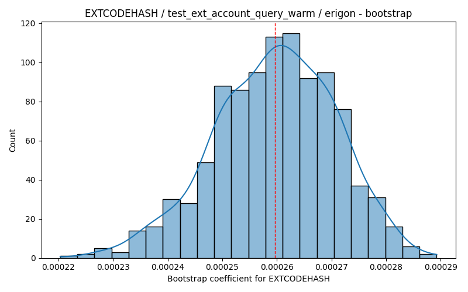

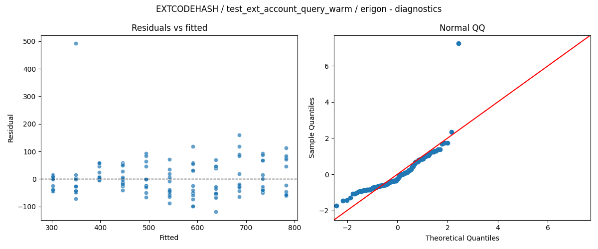

</details>

<details><summary>nethermind — NNLS regression summary</summary>

```
==============================================================================
                           NNLS Regression Results                            
==============================================================================
Dep. Variable:          test_runtime_ms              R-squared:          0.791
Model:                  NNLS                    Adj. R-squared:          0.790
No. Observations:       209                               RMSE:          84.98
Df Residuals:           207                                MAE:          64.67
Df Model:               1      
==============================================================================
                      coef     std err     P-value      [0.025      0.975]
------------------------------------------------------------------------------
         const    133.2394     15.9392       0.001    100.3521    164.1859
       opcount      0.0003      0.0000       0.001      0.0003      0.0003
==============================================================================
Notes: Non-negative least squares with bootstrap inference (1000 iterations)
==============================================================================
```

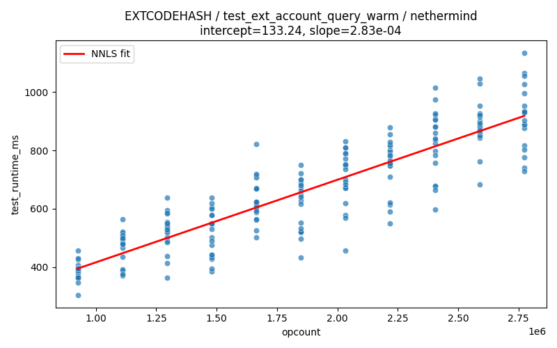

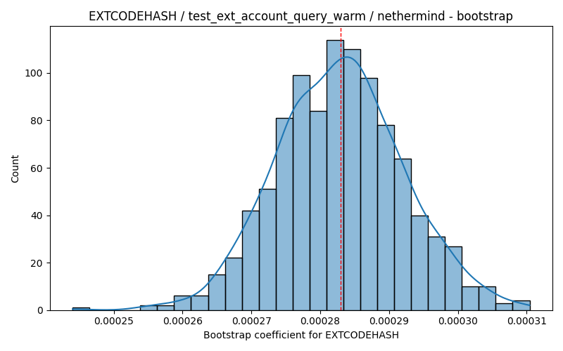

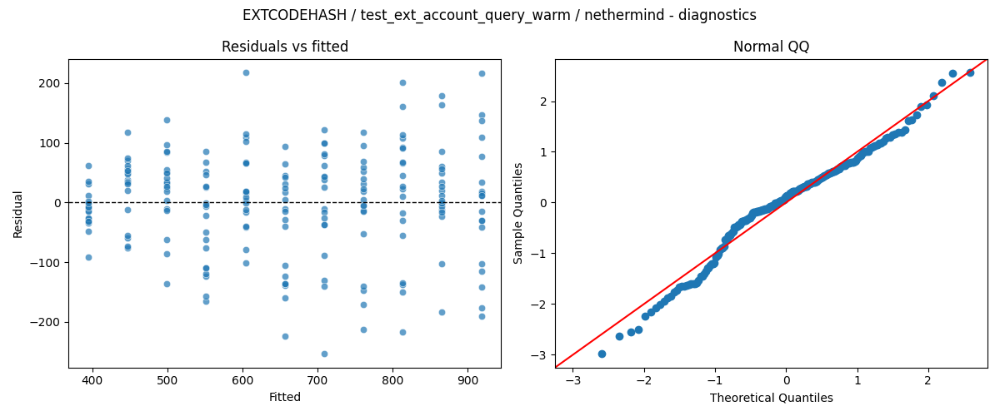

</details>

<details><summary>reth — NNLS regression summary</summary>

```
==============================================================================
                           NNLS Regression Results                            
==============================================================================
Dep. Variable:          test_runtime_ms              R-squared:          0.676
Model:                  NNLS                    Adj. R-squared:          0.675
No. Observations:       363                               RMSE:           3.20
Df Residuals:           361                                MAE:           2.23
Df Model:               1      
==============================================================================
                      coef     std err     P-value      [0.025      0.975]
------------------------------------------------------------------------------
         const      6.0451      0.5274       0.001      4.9590      7.1255
       opcount      0.0000      0.0000       0.001      0.0000      0.0000
==============================================================================
Notes: Non-negative least squares with bootstrap inference (1000 iterations)
==============================================================================
```

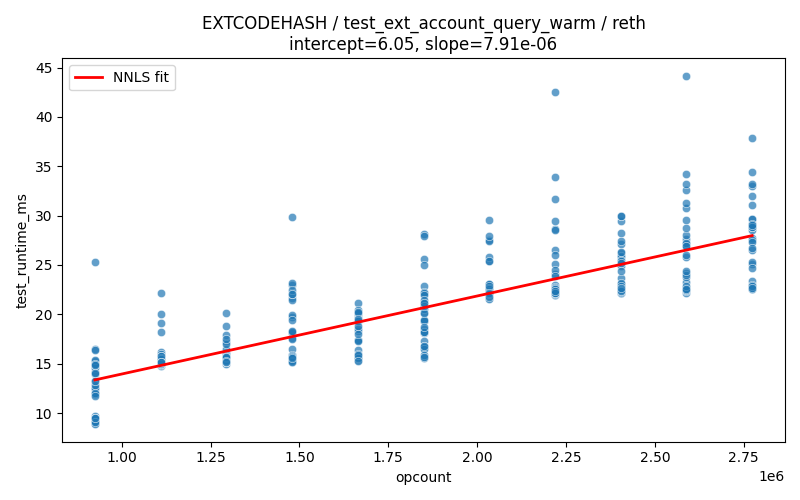

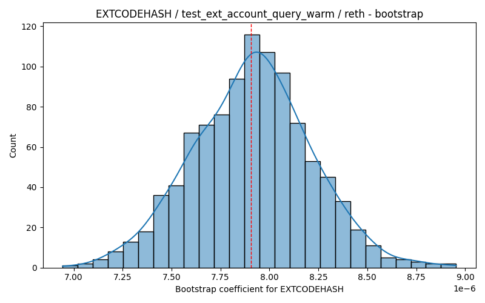

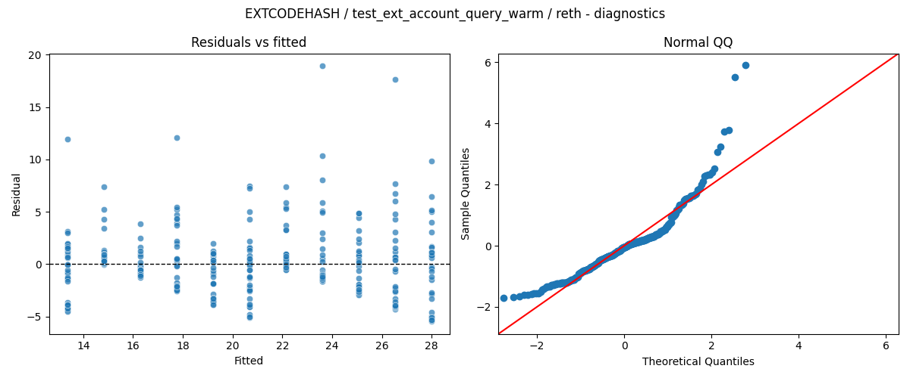

</details>

## EXTCODESIZE

### test_account_access — combo `EXTCODESIZE_AccountMode.EXISTING_CONTRACT`

| client | nobs | R² | target_coef (ms) | p-value | 95% CI |
| --- | --- | --- | --- | --- | --- |
| `besu` | 275 | 0.9473 | 0.02641 | 1.00e-03 | [0.02563, 0.02729] |
| `erigon` | 132 | 0.87 | 0.0865 | 1.00e-03 | [0.08074, 0.09132] |
| `nethermind` | 209 | 0.7233 | 0.02447 | 1.00e-03 | [0.02217, 0.02674] |
| `reth` | 363 | 0.8753 | 0.03648 | 1.00e-03 | [0.03471, 0.03846] |

<details><summary>besu — NNLS regression summary</summary>

```
==============================================================================
                           NNLS Regression Results                            
==============================================================================
Dep. Variable:          test_runtime_ms              R-squared:          0.947
Model:                  NNLS                    Adj. R-squared:          0.947
No. Observations:       275                               RMSE:         129.66
Df Residuals:           273                                MAE:         111.65
Df Model:               1      
==============================================================================
                      coef     std err     P-value      [0.025      0.975]
------------------------------------------------------------------------------
         const    377.4951     28.5114       0.001    319.5036    430.0031
       opcount      0.0264      0.0004       0.001      0.0256      0.0273
==============================================================================
Notes: Non-negative least squares with bootstrap inference (1000 iterations)
==============================================================================
```

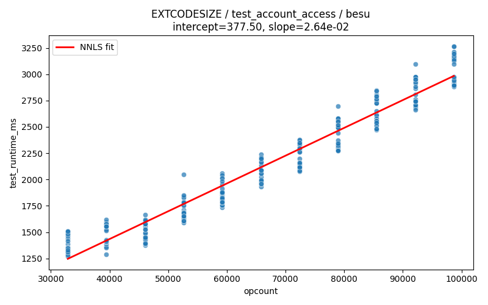

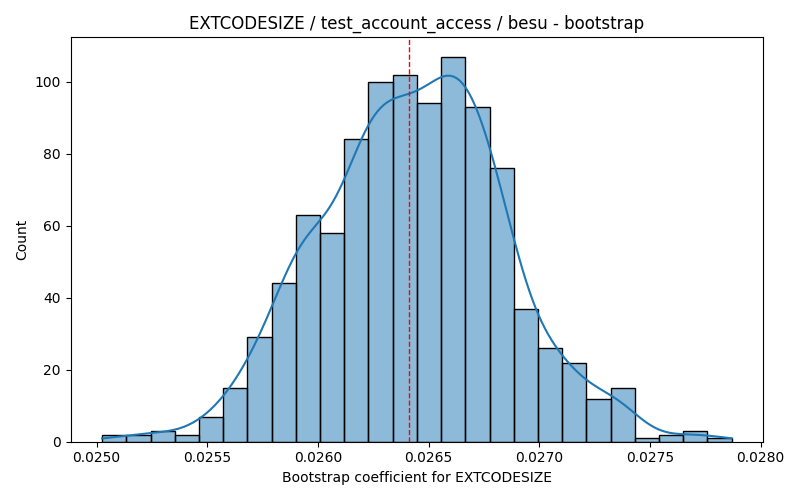

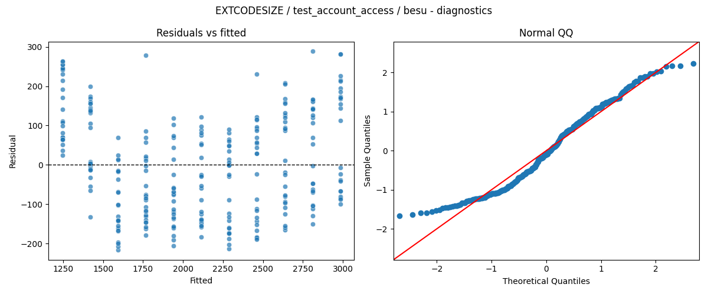

</details>

<details><summary>erigon — NNLS regression summary</summary>

```
==============================================================================
                           NNLS Regression Results                            
==============================================================================
Dep. Variable:          test_runtime_ms              R-squared:          0.870
Model:                  NNLS                    Adj. R-squared:          0.869
No. Observations:       132                               RMSE:         695.65
Df Residuals:           130                                MAE:         591.61
Df Model:               1      
==============================================================================
                      coef     std err     P-value      [0.025      0.975]
------------------------------------------------------------------------------
         const   1549.4803    218.2959       0.001   1183.1589   2025.4003
       opcount      0.0865      0.0028       0.001      0.0807      0.0913
==============================================================================
Notes: Non-negative least squares with bootstrap inference (1000 iterations)
==============================================================================
```

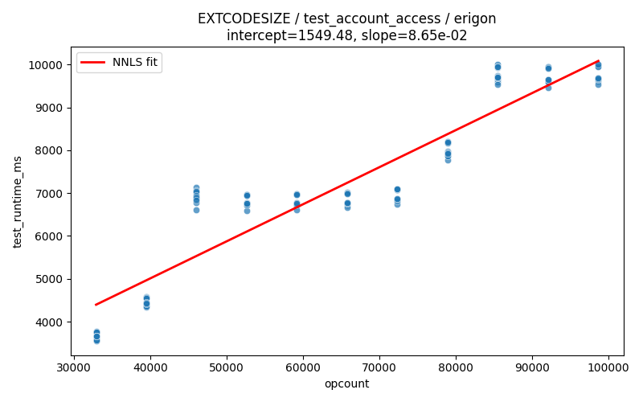

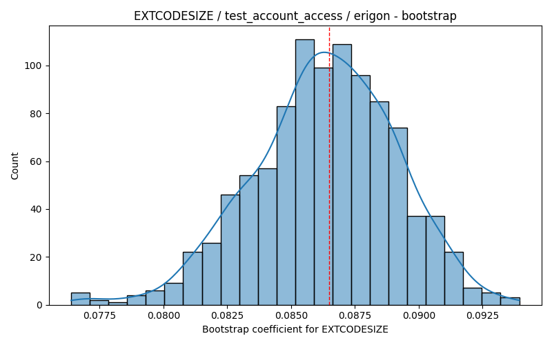


</details>

<details><summary>nethermind — NNLS regression summary</summary>

```
==============================================================================
                           NNLS Regression Results                            
==============================================================================
Dep. Variable:          test_runtime_ms              R-squared:          0.723
Model:                  NNLS                    Adj. R-squared:          0.722
No. Observations:       209                               RMSE:         314.92
Df Residuals:           207                                MAE:         262.37
Df Model:               1      
==============================================================================
                      coef     std err     P-value      [0.025      0.975]
------------------------------------------------------------------------------
         const    844.8038     79.2232       0.001    687.6929   1001.2056
       opcount      0.0245      0.0011       0.001      0.0222      0.0267
==============================================================================
Notes: Non-negative least squares with bootstrap inference (1000 iterations)
==============================================================================
```

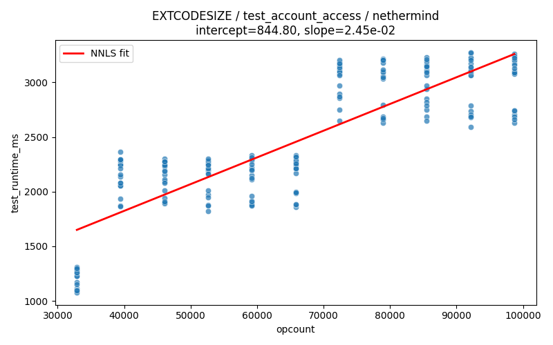

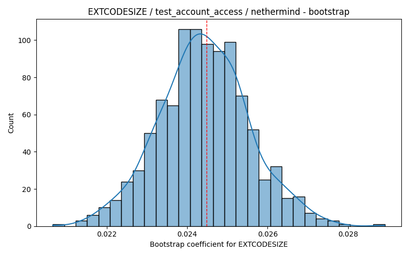

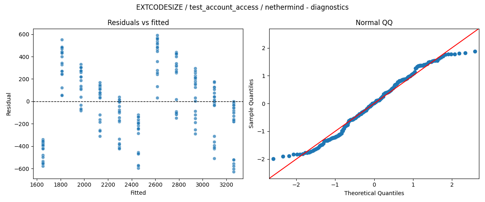

</details>

<details><summary>reth — NNLS regression summary</summary>

```
==============================================================================
                           NNLS Regression Results                            
==============================================================================
Dep. Variable:          test_runtime_ms              R-squared:          0.875
Model:                  NNLS                    Adj. R-squared:          0.875
No. Observations:       363                               RMSE:         286.44
Df Residuals:           361                                MAE:         158.53
Df Model:               1      
==============================================================================
                      coef     std err     P-value      [0.025      0.975]
------------------------------------------------------------------------------
         const    134.5506     57.3570       0.012     18.8473    243.3317
       opcount      0.0365      0.0010       0.001      0.0347      0.0385
==============================================================================
Notes: Non-negative least squares with bootstrap inference (1000 iterations)
==============================================================================
```

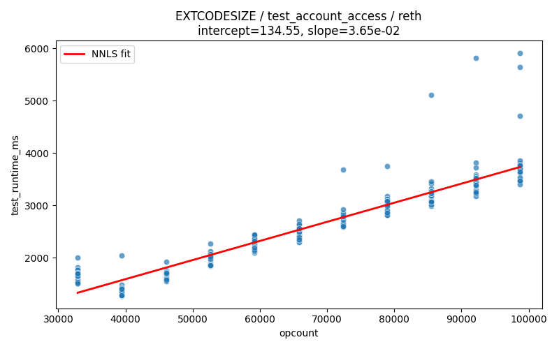

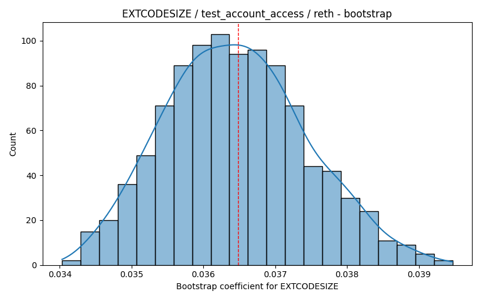

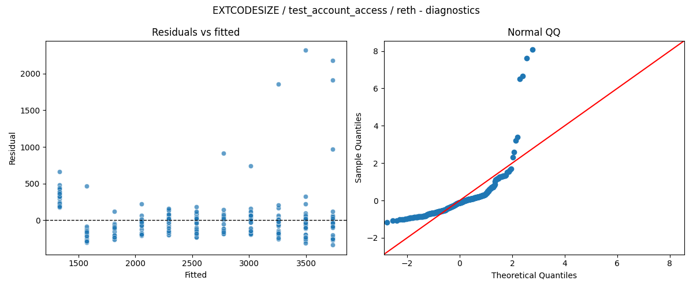

</details>

### test_account_access — combo `EXTCODESIZE_AccountMode.NON_EXISTING_ACCOUNT`

| client | nobs | R² | target_coef (ms) | p-value | 95% CI |
| --- | --- | --- | --- | --- | --- |
| `besu` | 275 | 0.895 | 0.00935 | 1.00e-03 | [0.008919, 0.009782] |
| `erigon` | 132 | 0.9955 | 0.008809 | 1.00e-03 | [0.008705, 0.00892] |
| `nethermind` | 209 | 0.9427 | 0.003914 | 1.00e-03 | [0.00379, 0.004055] |
| `reth` | 363 | 0.9726 | 0.0009155 | 1.00e-03 | [0.0009009, 0.0009319] |

<details><summary>besu — NNLS regression summary</summary>

```
==============================================================================
                           NNLS Regression Results                            
==============================================================================
Dep. Variable:          test_runtime_ms              R-squared:          0.895
Model:                  NNLS                    Adj. R-squared:          0.895
No. Observations:       275                               RMSE:          76.55
Df Residuals:           273                                MAE:          63.94
Df Model:               1      
==============================================================================
                      coef     std err     P-value      [0.025      0.975]
------------------------------------------------------------------------------
         const    416.9604     18.4148       0.001    380.0844    452.8096
       opcount      0.0094      0.0002       0.001      0.0089      0.0098
==============================================================================
Notes: Non-negative least squares with bootstrap inference (1000 iterations)
==============================================================================
```

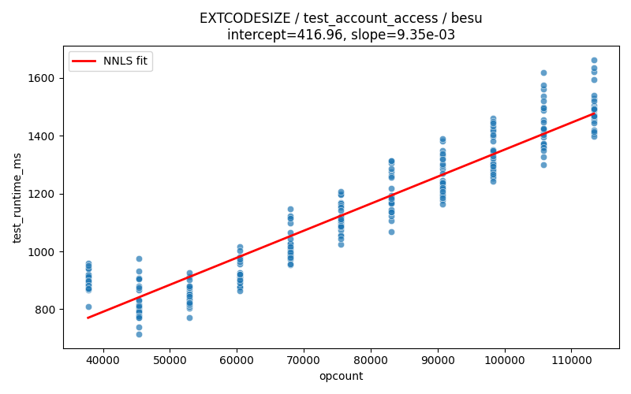

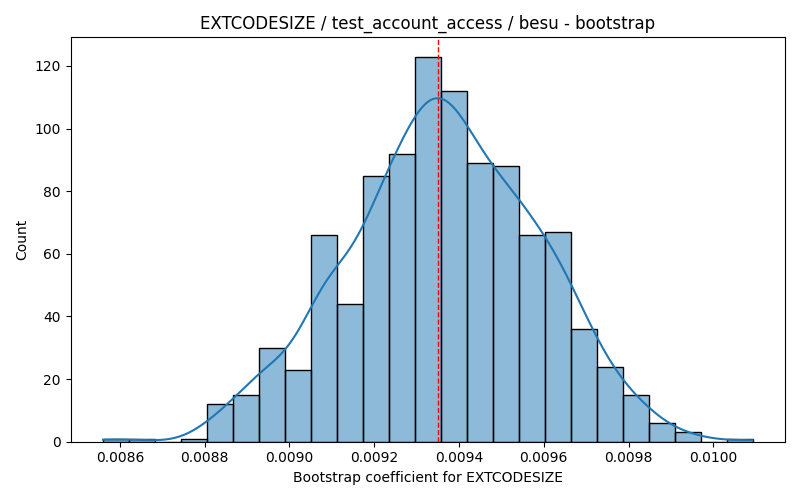

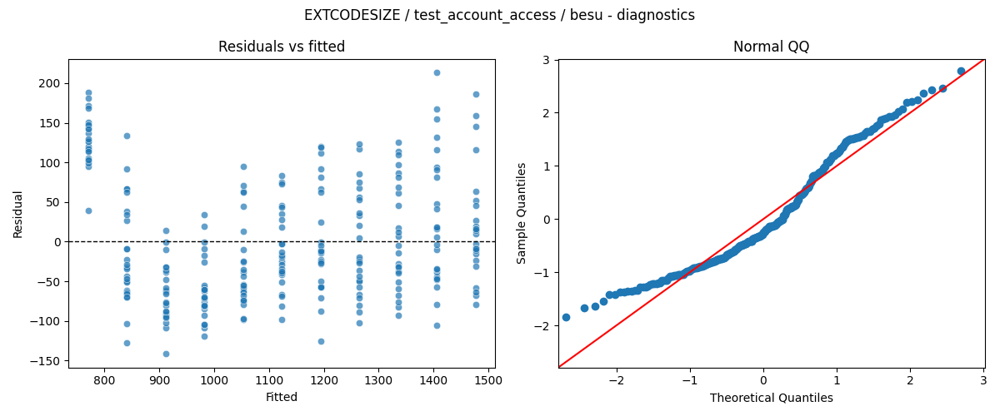

</details>

<details><summary>erigon — NNLS regression summary</summary>

```
==============================================================================
                           NNLS Regression Results                            
==============================================================================
Dep. Variable:          test_runtime_ms              R-squared:          0.995
Model:                  NNLS                    Adj. R-squared:          0.995
No. Observations:       132                               RMSE:          14.21
Df Residuals:           130                                MAE:          10.85
Df Model:               1      
==============================================================================
                      coef     std err     P-value      [0.025      0.975]
------------------------------------------------------------------------------
         const     13.8540      4.3223       0.002      5.1906     21.6404
       opcount      0.0088      0.0001       0.001      0.0087      0.0089
==============================================================================
Notes: Non-negative least squares with bootstrap inference (1000 iterations)
==============================================================================
```

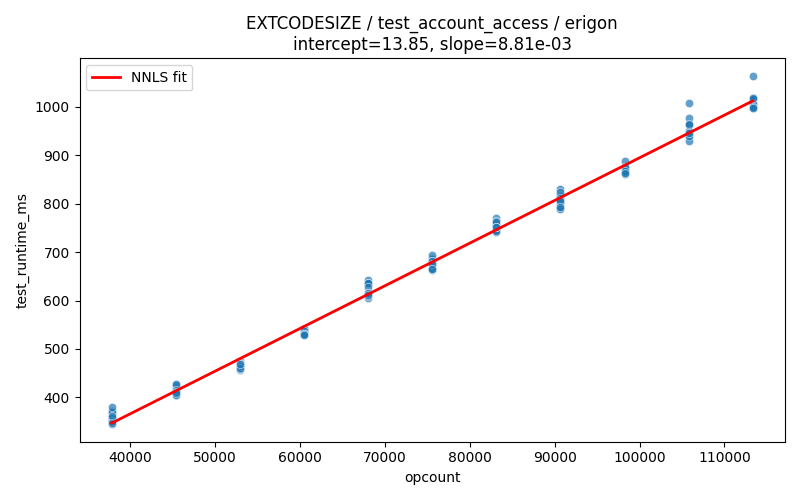

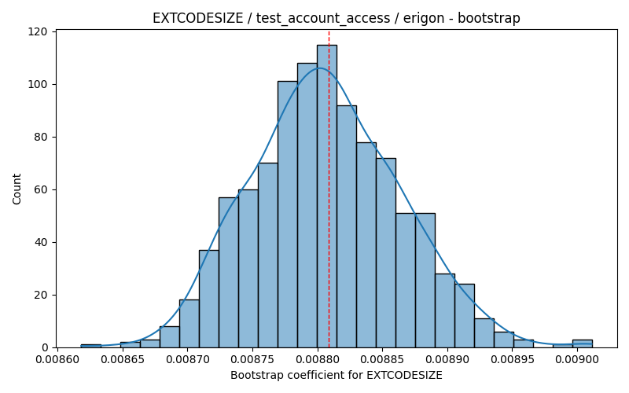

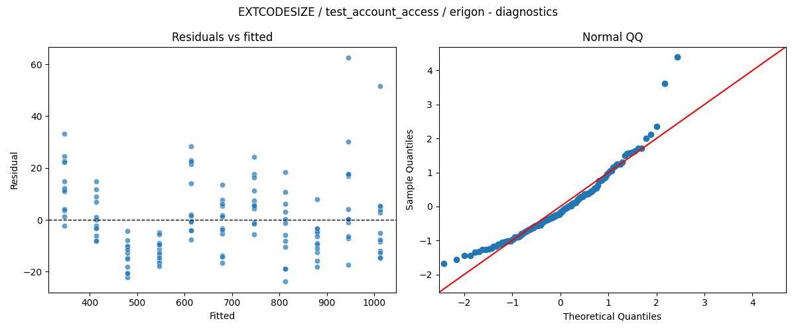

</details>

<details><summary>nethermind — NNLS regression summary</summary>

```
==============================================================================
                           NNLS Regression Results                            
==============================================================================
Dep. Variable:          test_runtime_ms              R-squared:          0.943
Model:                  NNLS                    Adj. R-squared:          0.942
No. Observations:       209                               RMSE:          23.06
Df Residuals:           207                                MAE:          18.70
Df Model:               1      
==============================================================================
                      coef     std err     P-value      [0.025      0.975]
------------------------------------------------------------------------------
         const     80.9759      4.8378       0.001     71.3698     90.0009
       opcount      0.0039      0.0001       0.001      0.0038      0.0041
==============================================================================
Notes: Non-negative least squares with bootstrap inference (1000 iterations)
==============================================================================
```

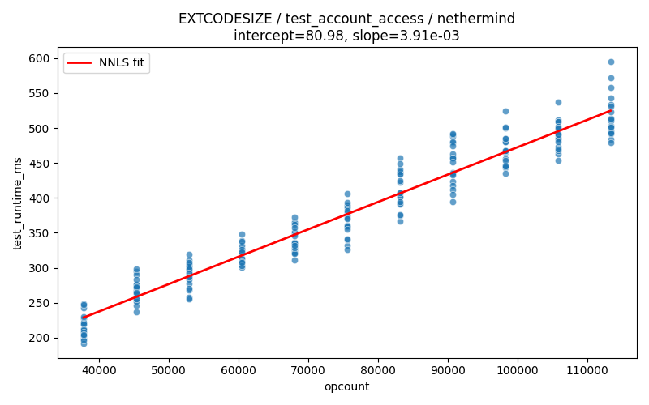

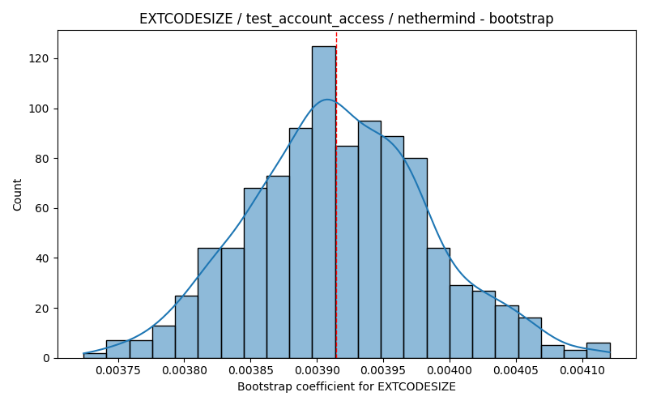

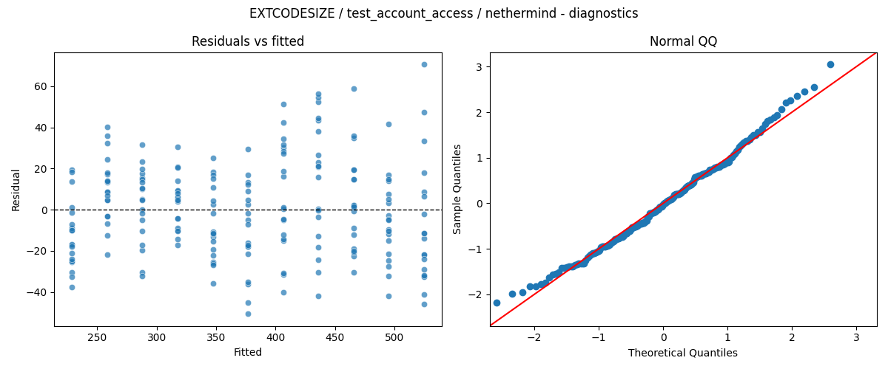

</details>

<details><summary>reth — NNLS regression summary</summary>

```
==============================================================================
                           NNLS Regression Results                            
==============================================================================
Dep. Variable:          test_runtime_ms              R-squared:          0.973
Model:                  NNLS                    Adj. R-squared:          0.973
No. Observations:       363                               RMSE:           3.67
Df Residuals:           361                                MAE:           2.90
Df Model:               1      
==============================================================================
                      coef     std err     P-value      [0.025      0.975]
------------------------------------------------------------------------------
         const     31.8526      0.6219       0.001     30.5855     33.0608
       opcount      0.0009      0.0000       0.001      0.0009      0.0009
==============================================================================
Notes: Non-negative least squares with bootstrap inference (1000 iterations)
==============================================================================
```

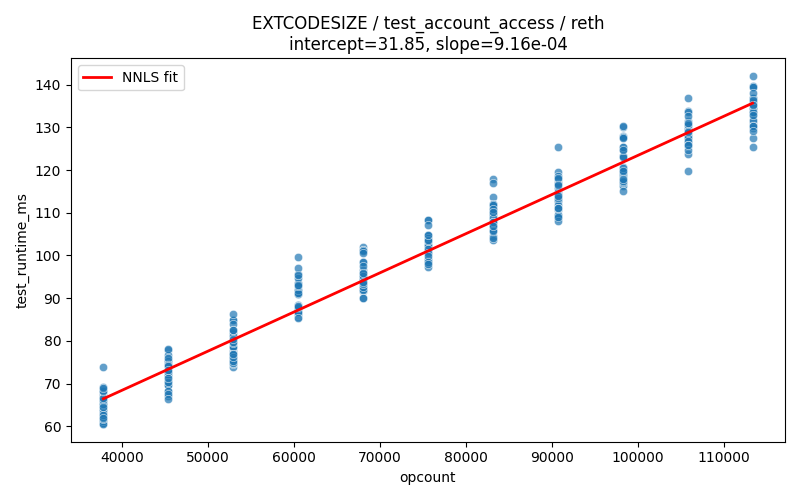

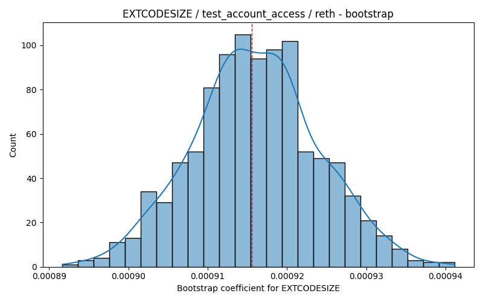

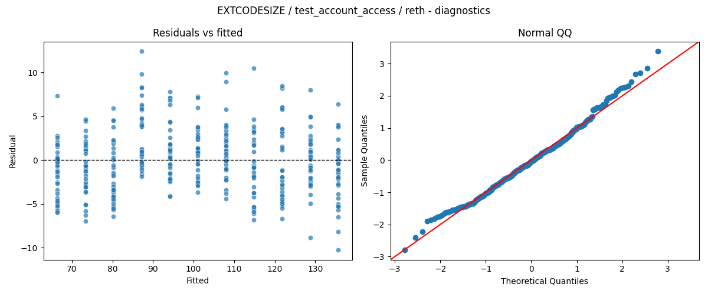

</details>

### test_ext_account_query_warm — combo `EXTCODESIZE`

| client | nobs | R² | target_coef (ms) | p-value | 95% CI |
| --- | --- | --- | --- | --- | --- |
| `besu` | 275 | 0.8052 | 0.0001548 | 1.00e-03 | [0.000145, 0.0001648] |
| `erigon` | 132 | 0.7996 | 3.707e-05 | 1.00e-03 | [3.378e-05, 4.003e-05] |
| `nethermind` | 209 | 0.8775 | 0.0002198 | 1.00e-03 | [0.0002096, 0.0002309] |
| `reth` | 363 | 0.7119 | 5.969e-06 | 1.00e-03 | [5.561e-06, 6.428e-06] |

<details><summary>besu — NNLS regression summary</summary>

```
==============================================================================
                           NNLS Regression Results                            
==============================================================================
Dep. Variable:          test_runtime_ms              R-squared:          0.805
Model:                  NNLS                    Adj. R-squared:          0.804
No. Observations:       275                               RMSE:          44.53
Df Residuals:           273                                MAE:          34.66
Df Model:               1      
==============================================================================
                      coef     std err     P-value      [0.025      0.975]
------------------------------------------------------------------------------
         const    205.0320      8.9904       0.001    187.3775    222.2539
       opcount      0.0002      0.0000       0.001      0.0001      0.0002
==============================================================================
Notes: Non-negative least squares with bootstrap inference (1000 iterations)
==============================================================================
```

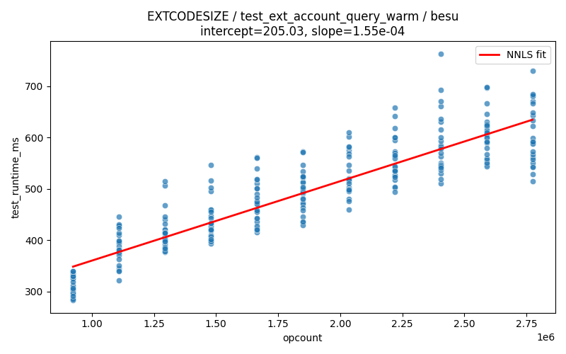

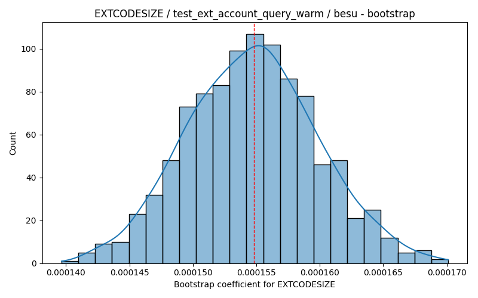

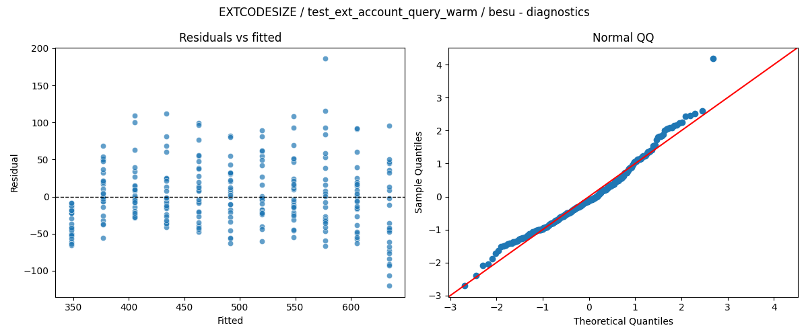

</details>

<details><summary>erigon — NNLS regression summary</summary>

```
==============================================================================
                           NNLS Regression Results                            
==============================================================================
Dep. Variable:          test_runtime_ms              R-squared:          0.800
Model:                  NNLS                    Adj. R-squared:          0.798
No. Observations:       132                               RMSE:          10.85
Df Residuals:           130                                MAE:           9.03
Df Model:               1      
==============================================================================
                      coef     std err     P-value      [0.025      0.975]
------------------------------------------------------------------------------
         const     52.1397      2.7366       0.001     47.2339     57.6706
       opcount      0.0000      0.0000       0.001      0.0000      0.0000
==============================================================================
Notes: Non-negative least squares with bootstrap inference (1000 iterations)
==============================================================================
```

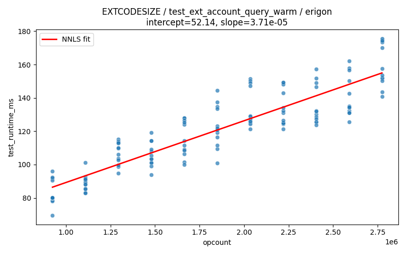

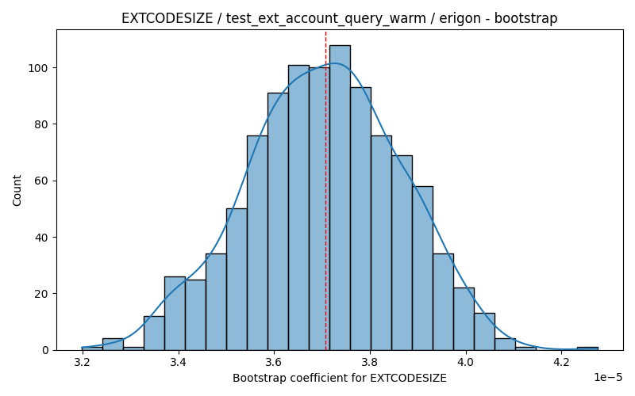

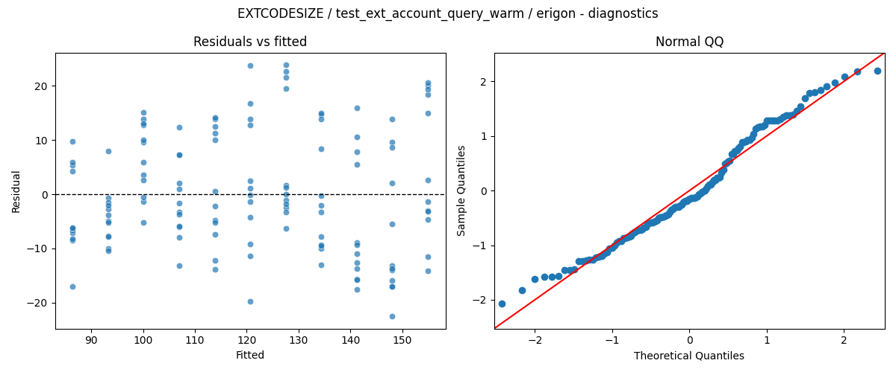

</details>

<details><summary>nethermind — NNLS regression summary</summary>

```
==============================================================================
                           NNLS Regression Results                            
==============================================================================
Dep. Variable:          test_runtime_ms              R-squared:          0.878
Model:                  NNLS                    Adj. R-squared:          0.877
No. Observations:       209                               RMSE:          48.03
Df Residuals:           207                                MAE:          35.41
Df Model:               1      
==============================================================================
                      coef     std err     P-value      [0.025      0.975]
------------------------------------------------------------------------------
         const     92.8228      9.5632       0.001     75.2090    110.4737
       opcount      0.0002      0.0000       0.001      0.0002      0.0002
==============================================================================
Notes: Non-negative least squares with bootstrap inference (1000 iterations)
==============================================================================
```

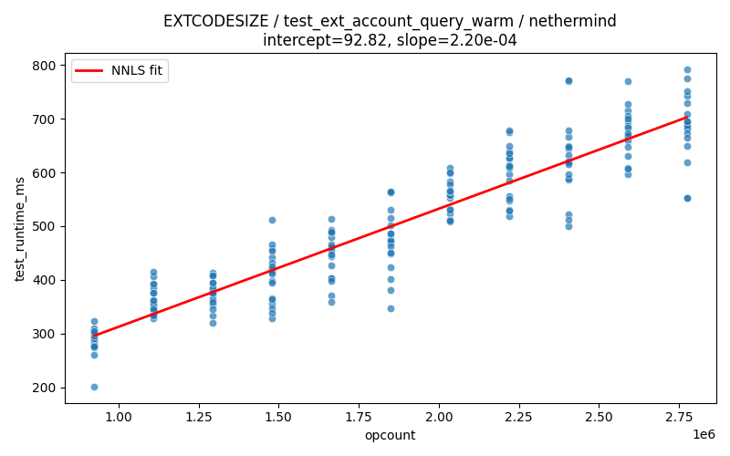

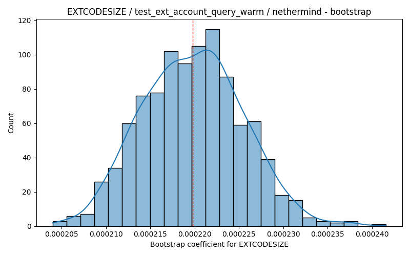

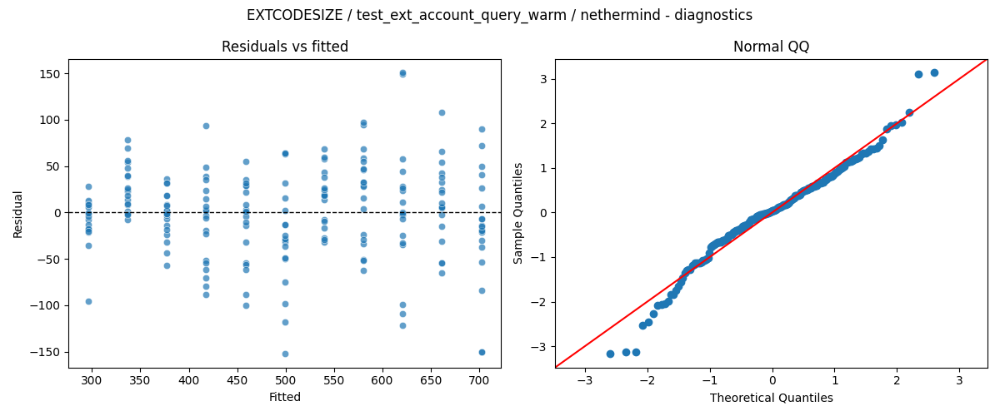

</details>

<details><summary>reth — NNLS regression summary</summary>

```
==============================================================================
                           NNLS Regression Results                            
==============================================================================
Dep. Variable:          test_runtime_ms              R-squared:          0.712
Model:                  NNLS                    Adj. R-squared:          0.711
No. Observations:       363                               RMSE:           2.22
Df Residuals:           361                                MAE:           1.52
Df Model:               1      
==============================================================================
                      coef     std err     P-value      [0.025      0.975]
------------------------------------------------------------------------------
         const      4.5771      0.3709       0.001      3.8648      5.2590
       opcount      0.0000      0.0000       0.001      0.0000      0.0000
==============================================================================
Notes: Non-negative least squares with bootstrap inference (1000 iterations)
==============================================================================
```

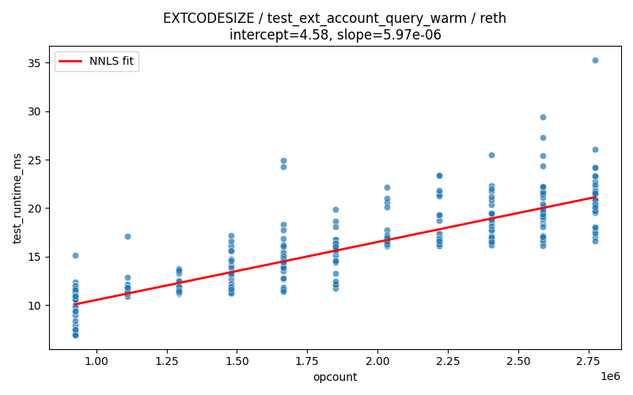

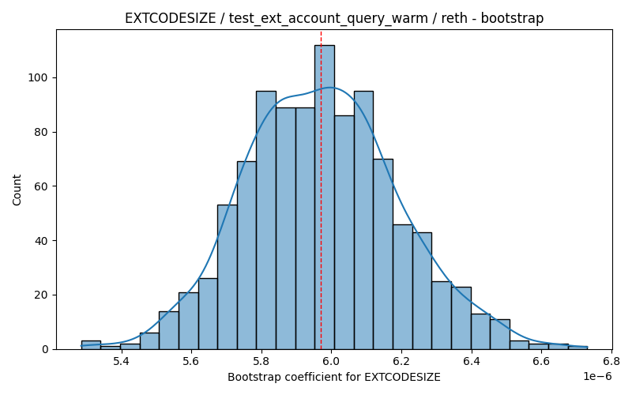

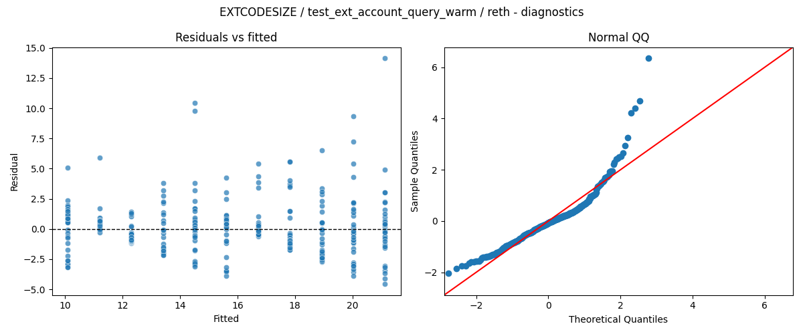

</details>

## STATICCALL

### test_account_access — combo `STATICCALL_AccountMode.EXISTING_CONTRACT`

| client | nobs | R² | target_coef (ms) | p-value | 95% CI |
| --- | --- | --- | --- | --- | --- |
| `besu` | 275 | 0.9476 | 0.02938 | 1.00e-03 | [0.02848, 0.03032] |
| `erigon` | 132 | 0.8696 | 0.08791 | 1.00e-03 | [0.08213, 0.09318] |
| `nethermind` | 209 | 0.7204 | 0.02542 | 1.00e-03 | [0.02311, 0.0277] |
| `reth` | 363 | 0.8977 | 0.0348 | 1.00e-03 | [0.03373, 0.03584] |

<details><summary>besu — NNLS regression summary</summary>

```
==============================================================================
                           NNLS Regression Results                            
==============================================================================
Dep. Variable:          test_runtime_ms              R-squared:          0.948
Model:                  NNLS                    Adj. R-squared:          0.947
No. Observations:       275                               RMSE:         140.72
Df Residuals:           273                                MAE:         118.04
Df Model:               1      
==============================================================================
                      coef     std err     P-value      [0.025      0.975]
------------------------------------------------------------------------------
         const    355.6308     30.5708       0.001    293.7870    411.8128
       opcount      0.0294      0.0005       0.001      0.0285      0.0303
==============================================================================
Notes: Non-negative least squares with bootstrap inference (1000 iterations)
==============================================================================
```

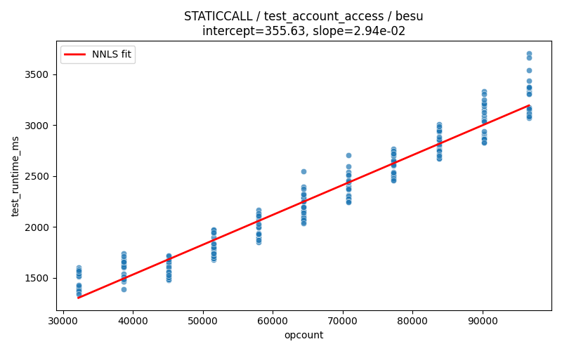

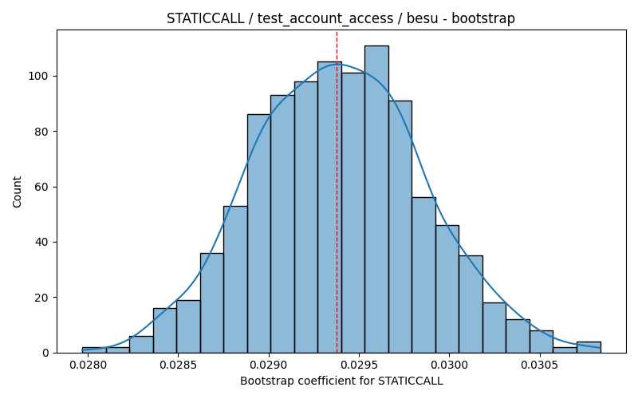

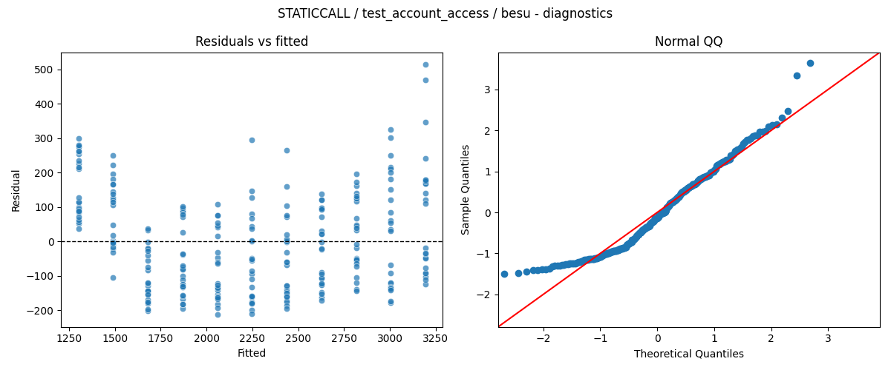

</details>

<details><summary>erigon — NNLS regression summary</summary>

```
==============================================================================
                           NNLS Regression Results                            
==============================================================================
Dep. Variable:          test_runtime_ms              R-squared:          0.870
Model:                  NNLS                    Adj. R-squared:          0.869
No. Observations:       132                               RMSE:         693.64
Df Residuals:           130                                MAE:         589.45
Df Model:               1      
==============================================================================
                      coef     std err     P-value      [0.025      0.975]
------------------------------------------------------------------------------
         const   1515.8510    223.0020       0.001   1109.9351   1949.6548
       opcount      0.0879      0.0030       0.001      0.0821      0.0932
==============================================================================
Notes: Non-negative least squares with bootstrap inference (1000 iterations)
==============================================================================
```

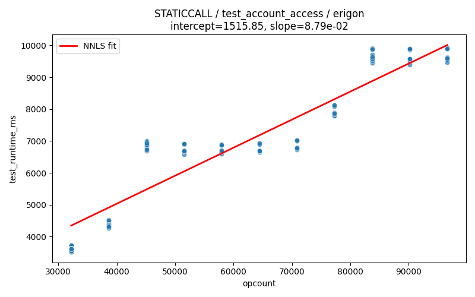

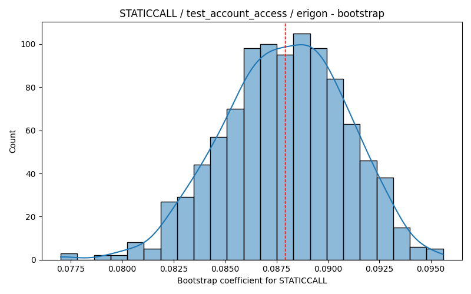


</details>

<details><summary>nethermind — NNLS regression summary</summary>

```
==============================================================================
                           NNLS Regression Results                            
==============================================================================
Dep. Variable:          test_runtime_ms              R-squared:          0.720
Model:                  NNLS                    Adj. R-squared:          0.719
No. Observations:       209                               RMSE:         322.62
Df Residuals:           207                                MAE:         267.35
Df Model:               1      
==============================================================================
                      coef     std err     P-value      [0.025      0.975]
------------------------------------------------------------------------------
         const    894.1758     82.3936       0.001    732.6184   1059.0297
       opcount      0.0254      0.0012       0.001      0.0231      0.0277
==============================================================================
Notes: Non-negative least squares with bootstrap inference (1000 iterations)
==============================================================================
```

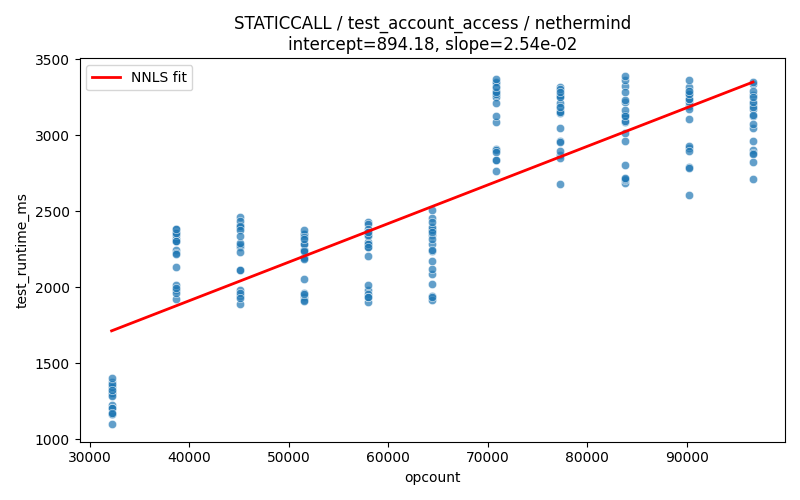

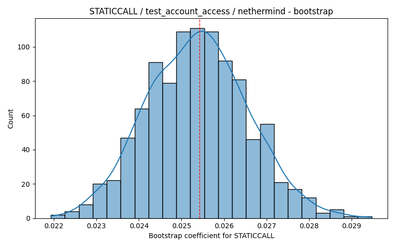

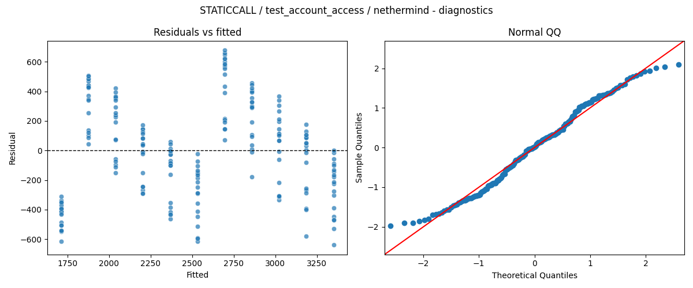

</details>

<details><summary>reth — NNLS regression summary</summary>

```
==============================================================================
                           NNLS Regression Results                            
==============================================================================
Dep. Variable:          test_runtime_ms              R-squared:          0.898
Model:                  NNLS                    Adj. R-squared:          0.897
No. Observations:       363                               RMSE:         239.24
Df Residuals:           361                                MAE:         149.94
Df Model:               1      
==============================================================================
                      coef     std err     P-value      [0.025      0.975]
------------------------------------------------------------------------------
         const    236.9875     43.7284       0.001    153.9877    324.1809
       opcount      0.0348      0.0006       0.001      0.0337      0.0358
==============================================================================
Notes: Non-negative least squares with bootstrap inference (1000 iterations)
==============================================================================
```

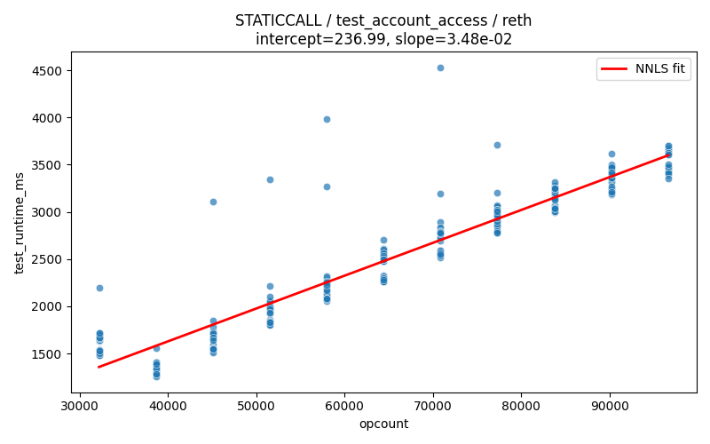

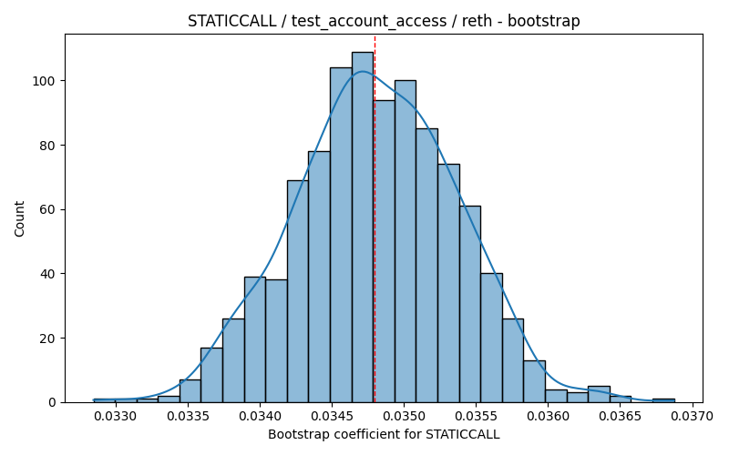

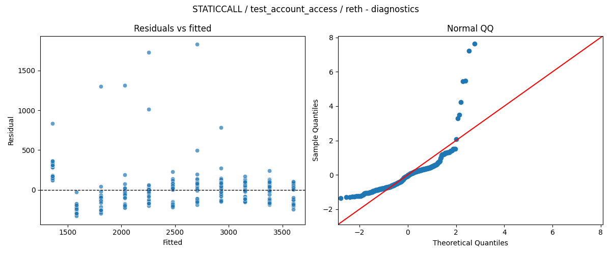

</details>

### test_account_access — combo `STATICCALL_AccountMode.EXISTING_EOA`

| client | nobs | R² | target_coef (ms) | p-value | 95% CI |
| --- | --- | --- | --- | --- | --- |
| `besu` | 275 | 0.8616 | 0.0108 | 1.00e-03 | [0.01023, 0.01139] |
| `erigon` | 132 | 0.996 | 0.0103 | 1.00e-03 | [0.01019, 0.01041] |
| `nethermind` | 209 | 0.9247 | 0.004647 | 1.00e-03 | [0.004498, 0.004796] |
| `reth` | 363 | 0.9704 | 0.001119 | 1.00e-03 | [0.001094, 0.00114] |

<details><summary>besu — NNLS regression summary</summary>

```
==============================================================================
                           NNLS Regression Results                            
==============================================================================
Dep. Variable:          test_runtime_ms              R-squared:          0.862
Model:                  NNLS                    Adj. R-squared:          0.861
No. Observations:       275                               RMSE:         102.90
Df Residuals:           273                                MAE:          84.83
Df Model:               1      
==============================================================================
                      coef     std err     P-value      [0.025      0.975]
------------------------------------------------------------------------------
         const    589.3391     24.9750       0.001    539.5813    637.9806
       opcount      0.0108      0.0003       0.001      0.0102      0.0114
==============================================================================
Notes: Non-negative least squares with bootstrap inference (1000 iterations)
==============================================================================
```

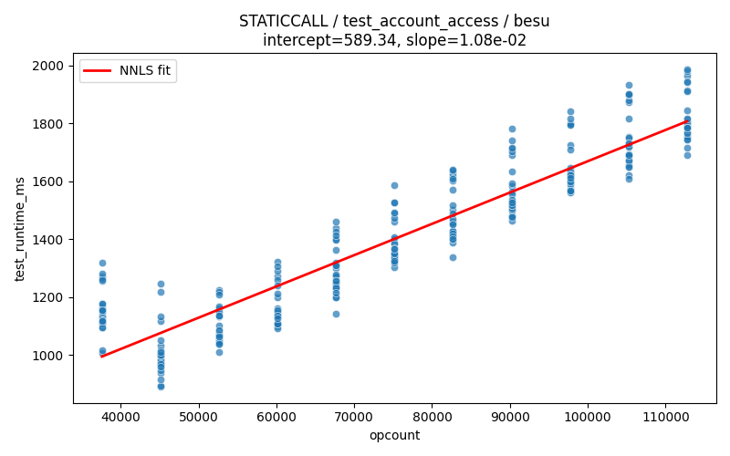

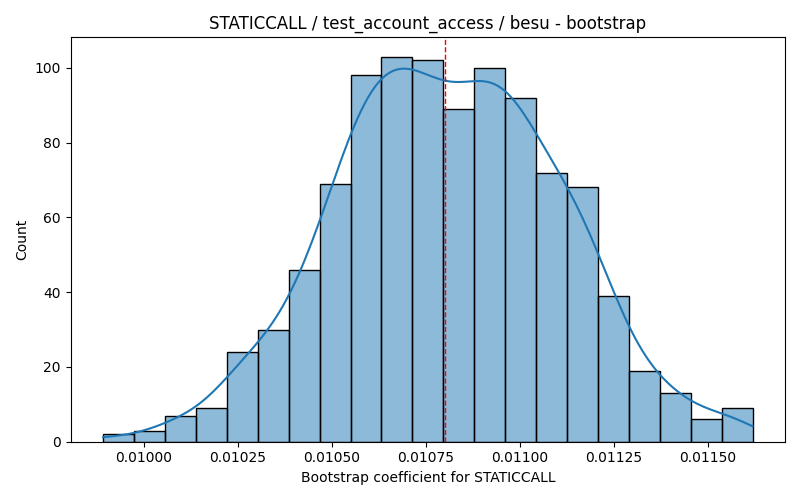

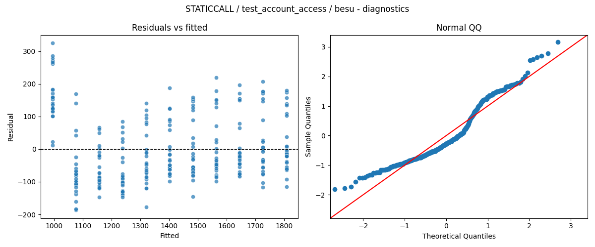

</details>

<details><summary>erigon — NNLS regression summary</summary>

```
==============================================================================
                           NNLS Regression Results                            
==============================================================================
Dep. Variable:          test_runtime_ms              R-squared:          0.996
Model:                  NNLS                    Adj. R-squared:          0.996
No. Observations:       132                               RMSE:          15.54
Df Residuals:           130                                MAE:          12.75
Df Model:               1      
==============================================================================
                      coef     std err     P-value      [0.025      0.975]
------------------------------------------------------------------------------
         const     44.2954      4.0946       0.001     36.2876     52.0294
       opcount      0.0103      0.0001       0.001      0.0102      0.0104
==============================================================================
Notes: Non-negative least squares with bootstrap inference (1000 iterations)
==============================================================================
```

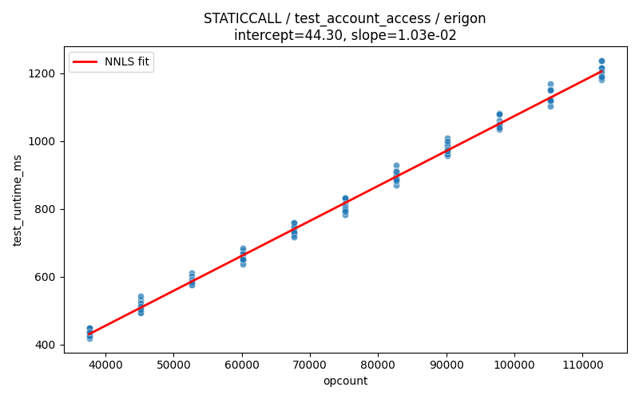

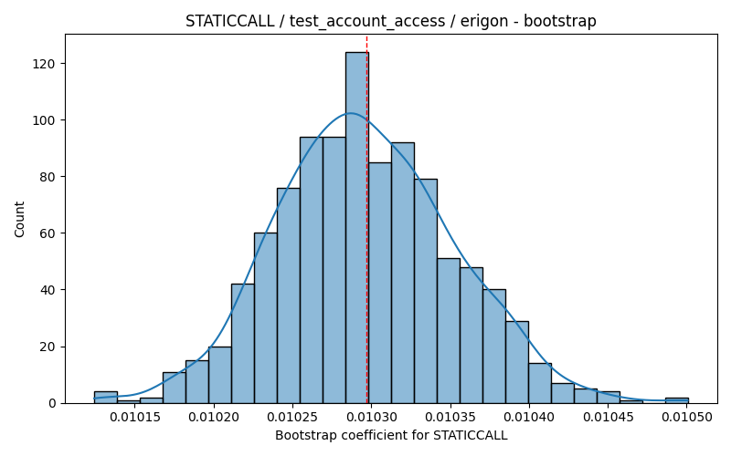

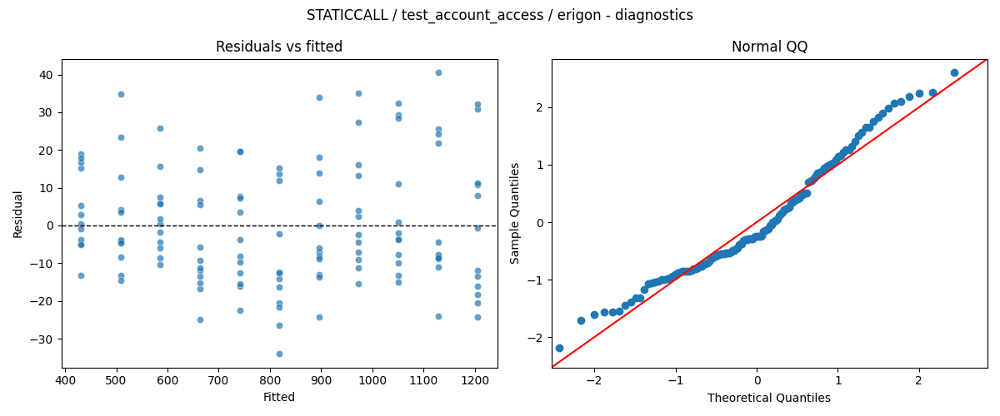

</details>

<details><summary>nethermind — NNLS regression summary</summary>

```
==============================================================================
                           NNLS Regression Results                            
==============================================================================
Dep. Variable:          test_runtime_ms              R-squared:          0.925
Model:                  NNLS                    Adj. R-squared:          0.924
No. Observations:       209                               RMSE:          31.53
Df Residuals:           207                                MAE:          22.81
Df Model:               1      
==============================================================================
                      coef     std err     P-value      [0.025      0.975]
------------------------------------------------------------------------------
         const    105.4182      5.9872       0.001     94.9781    118.0807
       opcount      0.0046      0.0001       0.001      0.0045      0.0048
==============================================================================
Notes: Non-negative least squares with bootstrap inference (1000 iterations)
==============================================================================
```

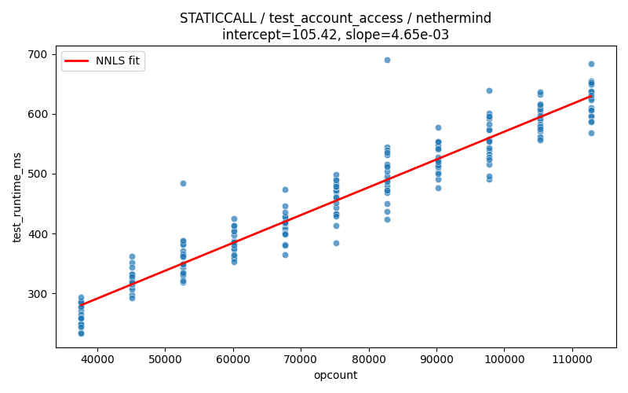

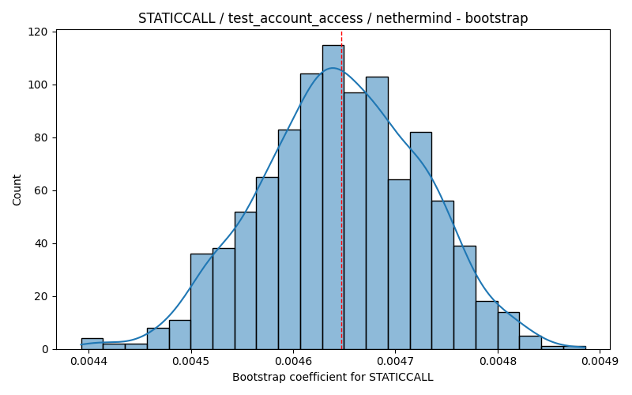

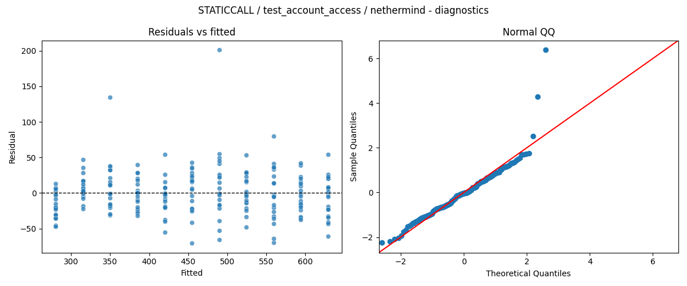

</details>

<details><summary>reth — NNLS regression summary</summary>

```
==============================================================================
                           NNLS Regression Results                            
==============================================================================
Dep. Variable:          test_runtime_ms              R-squared:          0.970
Model:                  NNLS                    Adj. R-squared:          0.970
No. Observations:       363                               RMSE:           4.65
Df Residuals:           361                                MAE:           3.47
Df Model:               1      
==============================================================================
                      coef     std err     P-value      [0.025      0.975]
------------------------------------------------------------------------------
         const     33.4586      0.9484       0.001     31.7145     35.5197
       opcount      0.0011      0.0000       0.001      0.0011      0.0011
==============================================================================
Notes: Non-negative least squares with bootstrap inference (1000 iterations)
==============================================================================
```

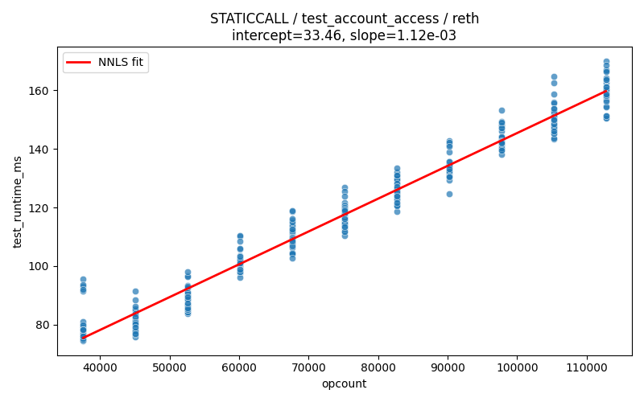

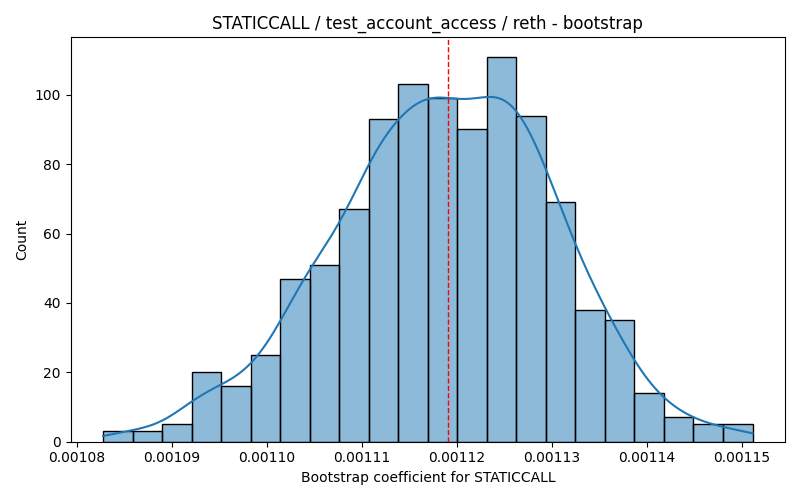

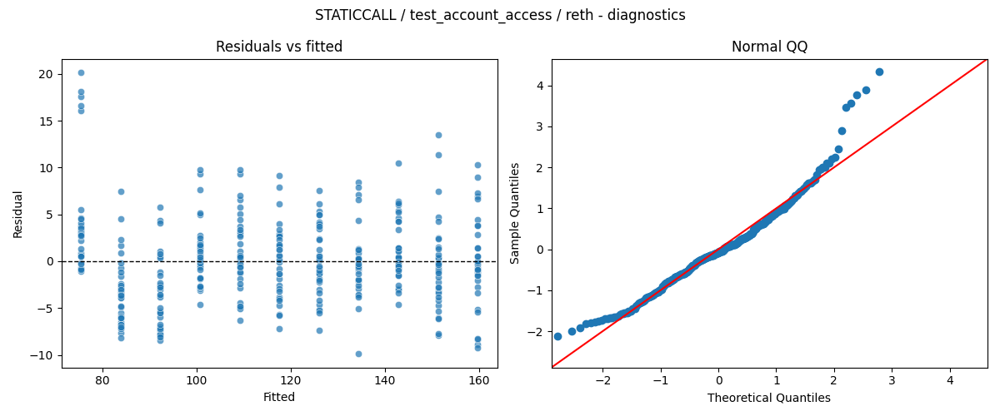

</details>

### test_account_access — combo `STATICCALL_AccountMode.NON_EXISTING_ACCOUNT`

| client | nobs | R² | target_coef (ms) | p-value | 95% CI |
| --- | --- | --- | --- | --- | --- |
| `besu` | 275 | 0.9065 | 0.01157 | 1.00e-03 | [0.01113, 0.01205] |
| `erigon` | 132 | 0.9958 | 0.01183 | 1.00e-03 | [0.01169, 0.01193] |
| `nethermind` | 209 | 0.9317 | 0.004764 | 1.00e-03 | [0.004578, 0.00495] |
| `reth` | 363 | 0.971 | 0.0009761 | 1.00e-03 | [0.000959, 0.000993] |

<details><summary>besu — NNLS regression summary</summary>

```
==============================================================================
                           NNLS Regression Results                            
==============================================================================
Dep. Variable:          test_runtime_ms              R-squared:          0.906
Model:                  NNLS                    Adj. R-squared:          0.906
No. Observations:       275                               RMSE:          88.36
Df Residuals:           273                                MAE:          74.80
Df Model:               1      
==============================================================================
                      coef     std err     P-value      [0.025      0.975]
------------------------------------------------------------------------------
         const    504.7059     18.5639       0.001    469.5524    538.0484
       opcount      0.0116      0.0002       0.001      0.0111      0.0121
==============================================================================
Notes: Non-negative least squares with bootstrap inference (1000 iterations)
==============================================================================
```

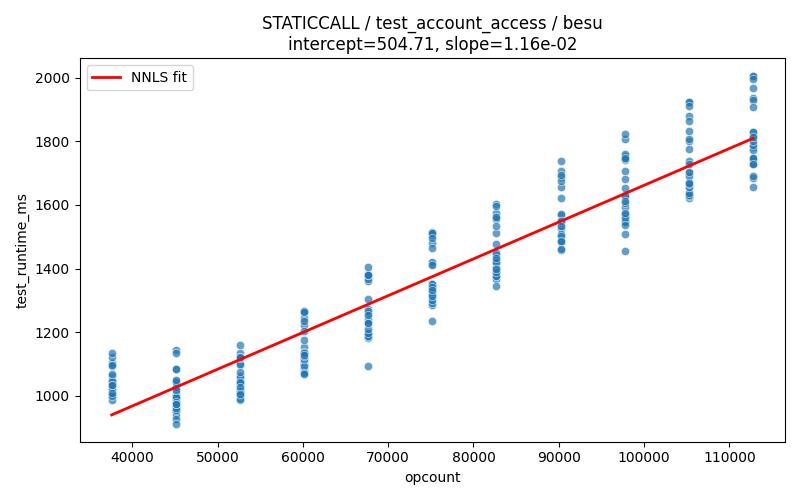

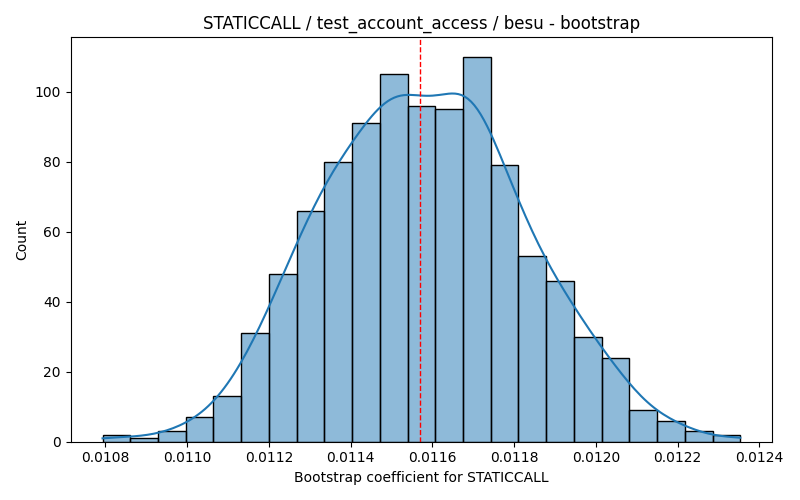

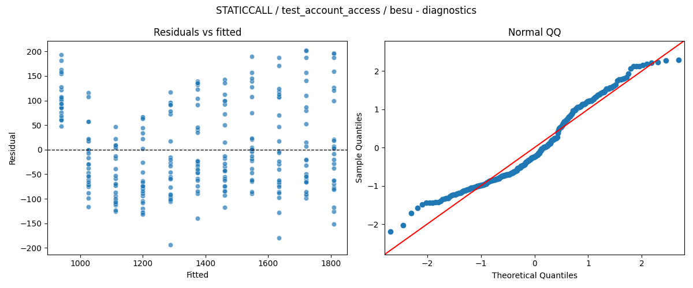

</details>

<details><summary>erigon — NNLS regression summary</summary>

```
==============================================================================
                           NNLS Regression Results                            
==============================================================================
Dep. Variable:          test_runtime_ms              R-squared:          0.996
Model:                  NNLS                    Adj. R-squared:          0.996
No. Observations:       132                               RMSE:          18.34
Df Residuals:           130                                MAE:          14.11
Df Model:               1      
==============================================================================
                      coef     std err     P-value      [0.025      0.975]
------------------------------------------------------------------------------
         const      6.3729      4.6156       0.102      0.0000     15.9226
       opcount      0.0118      0.0001       0.001      0.0117      0.0119
==============================================================================
Notes: Non-negative least squares with bootstrap inference (1000 iterations)
==============================================================================
```

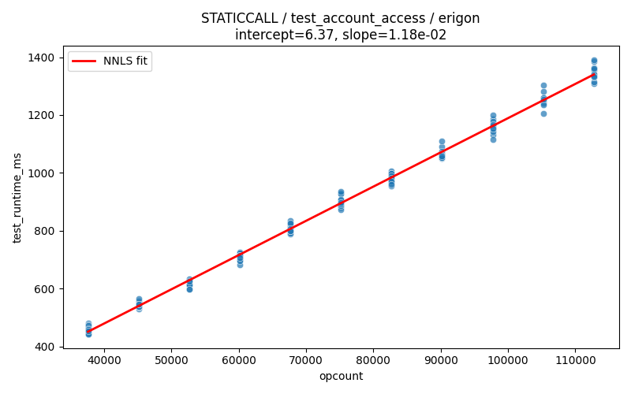

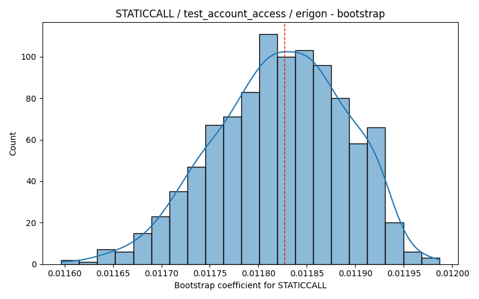

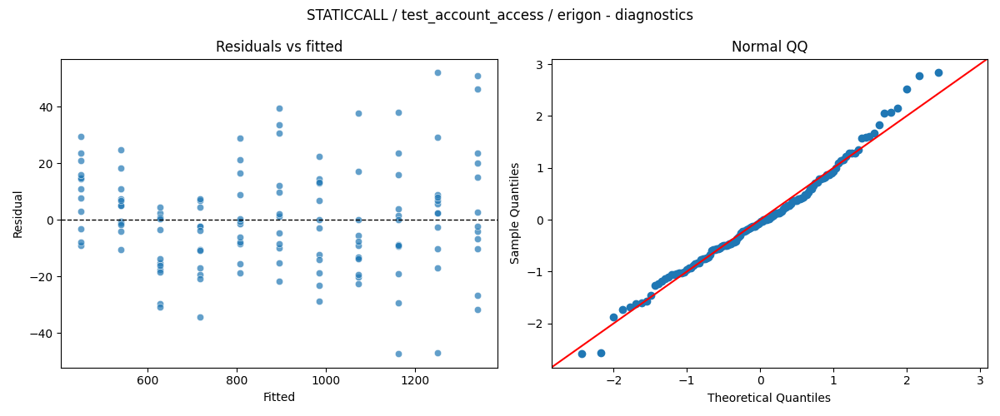

</details>

<details><summary>nethermind — NNLS regression summary</summary>

```
==============================================================================
                           NNLS Regression Results                            
==============================================================================
Dep. Variable:          test_runtime_ms              R-squared:          0.932
Model:                  NNLS                    Adj. R-squared:          0.931
No. Observations:       209                               RMSE:          30.66
Df Residuals:           207                                MAE:          23.56
Df Model:               1      
==============================================================================
                      coef     std err     P-value      [0.025      0.975]
------------------------------------------------------------------------------
         const    111.2329      7.0103       0.001     97.6463    124.9253
       opcount      0.0048      0.0001       0.001      0.0046      0.0049
==============================================================================
Notes: Non-negative least squares with bootstrap inference (1000 iterations)
==============================================================================
```

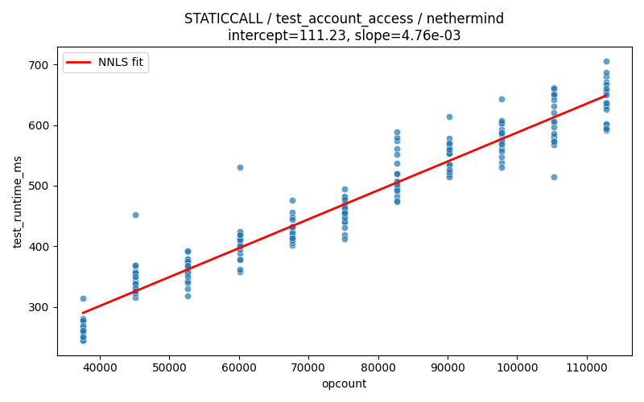

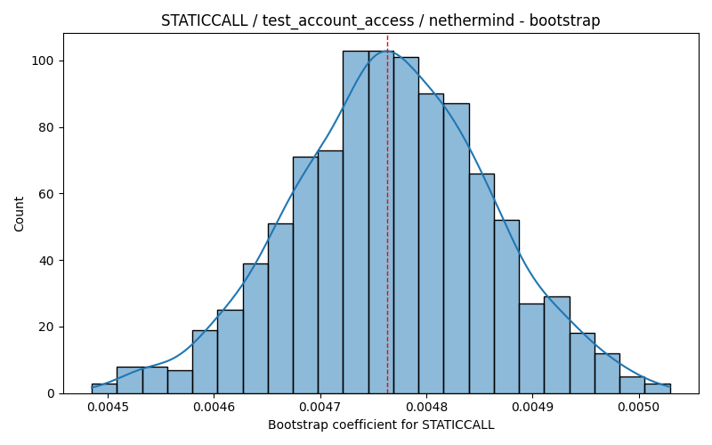

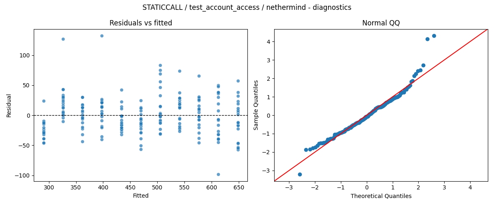

</details>

<details><summary>reth — NNLS regression summary</summary>

```
==============================================================================
                           NNLS Regression Results                            
==============================================================================
Dep. Variable:          test_runtime_ms              R-squared:          0.971
Model:                  NNLS                    Adj. R-squared:          0.971
No. Observations:       363                               RMSE:           4.01
Df Residuals:           361                                MAE:           3.07
Df Model:               1      
==============================================================================
                      coef     std err     P-value      [0.025      0.975]
------------------------------------------------------------------------------
         const     31.5887      0.7131       0.001     30.2145     33.0974
       opcount      0.0010      0.0000       0.001      0.0010      0.0010
==============================================================================
Notes: Non-negative least squares with bootstrap inference (1000 iterations)
==============================================================================
```


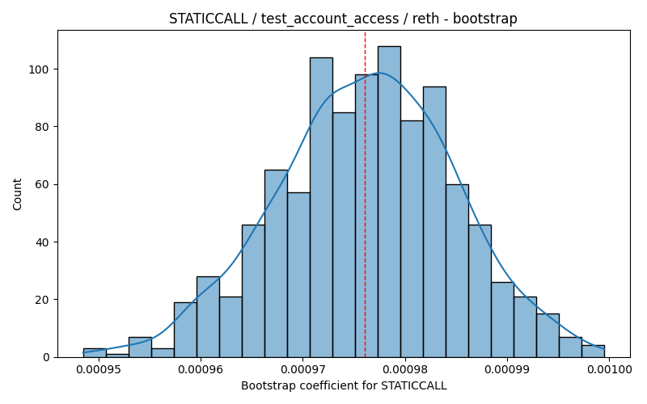

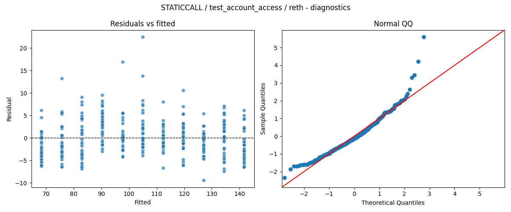

</details>

### test_ext_account_query_warm — combo `STATICCALL`

| client | nobs | R² | target_coef (ms) | p-value | 95% CI |
| --- | --- | --- | --- | --- | --- |
| `besu` | 275 | 0.962 | 0.001308 | 1.00e-03 | [0.001277, 0.001341] |
| `erigon` | 132 | 0.904 | 0.0004949 | 1.00e-03 | [0.0004667, 0.0005228] |
| `nethermind` | 209 | 0.8133 | 0.000718 | 1.00e-03 | [0.0006694, 0.0007665] |
| `reth` | 363 | 0.9164 | 4.712e-05 | 1.00e-03 | [4.551e-05, 4.87e-05] |

<details><summary>besu — NNLS regression summary</summary>

```
==============================================================================
                           NNLS Regression Results                            
==============================================================================
Dep. Variable:          test_runtime_ms              R-squared:          0.962
Model:                  NNLS                    Adj. R-squared:          0.962
No. Observations:       275                               RMSE:         134.66
Df Residuals:           273                                MAE:         114.20
Df Model:               1      
==============================================================================
                      coef     std err     P-value      [0.025      0.975]
------------------------------------------------------------------------------
         const    744.3901     27.8174       0.001    690.5949    797.2448
       opcount      0.0013      0.0000       0.001      0.0013      0.0013
==============================================================================
Notes: Non-negative least squares with bootstrap inference (1000 iterations)
==============================================================================
```

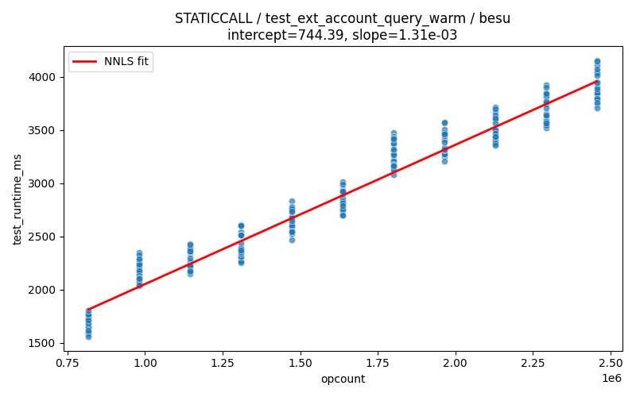

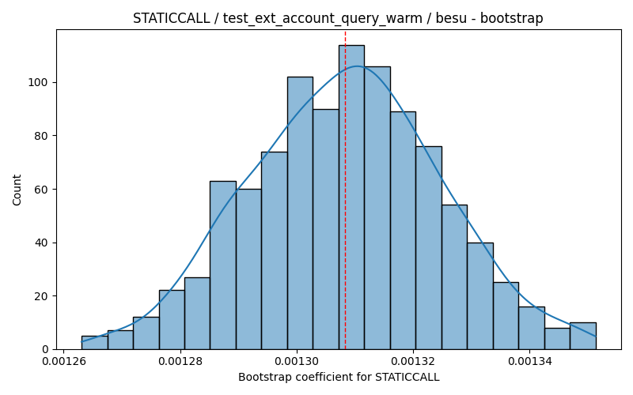

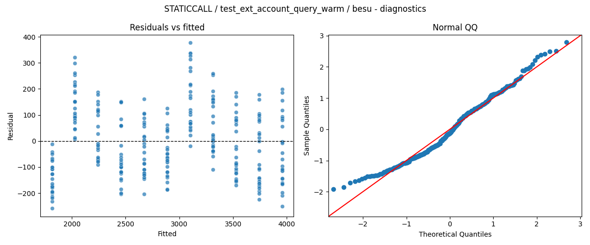

</details>

<details><summary>erigon — NNLS regression summary</summary>

```
==============================================================================
                           NNLS Regression Results                            
==============================================================================
Dep. Variable:          test_runtime_ms              R-squared:          0.904
Model:                  NNLS                    Adj. R-squared:          0.903
No. Observations:       132                               RMSE:          83.51
Df Residuals:           130                                MAE:          67.14
Df Model:               1      
==============================================================================
                      coef     std err     P-value      [0.025      0.975]
------------------------------------------------------------------------------
         const     70.5921     20.7691       0.002     30.7203    110.0626
       opcount      0.0005      0.0000       0.001      0.0005      0.0005
==============================================================================
Notes: Non-negative least squares with bootstrap inference (1000 iterations)
==============================================================================
```

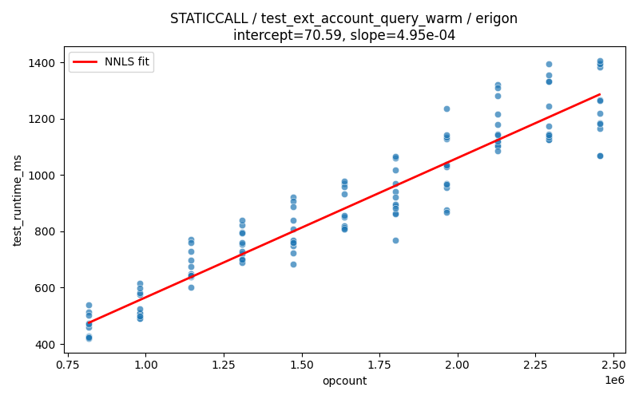

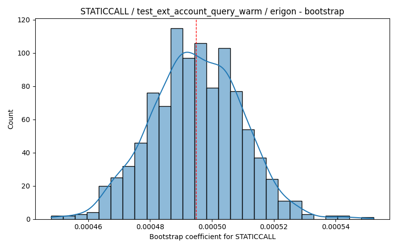

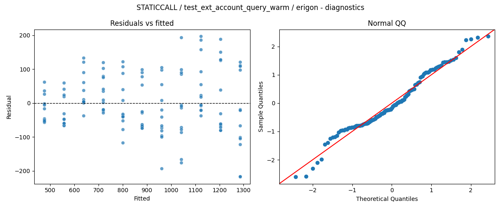

</details>

<details><summary>nethermind — NNLS regression summary</summary>

```
==============================================================================
                           NNLS Regression Results                            
==============================================================================
Dep. Variable:          test_runtime_ms              R-squared:          0.813
Model:                  NNLS                    Adj. R-squared:          0.812
No. Observations:       209                               RMSE:         178.10
Df Residuals:           207                                MAE:         135.65
Df Model:               1      
==============================================================================
                      coef     std err     P-value      [0.025      0.975]
------------------------------------------------------------------------------
         const    288.8960     36.8898       0.001    216.5679    357.8457
       opcount      0.0007      0.0000       0.001      0.0007      0.0008
==============================================================================
Notes: Non-negative least squares with bootstrap inference (1000 iterations)
==============================================================================
```

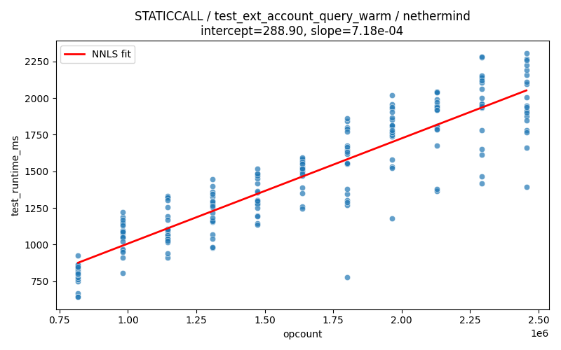

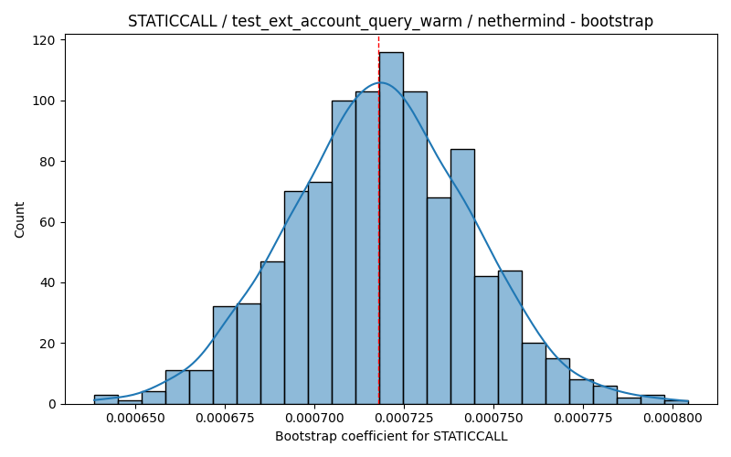

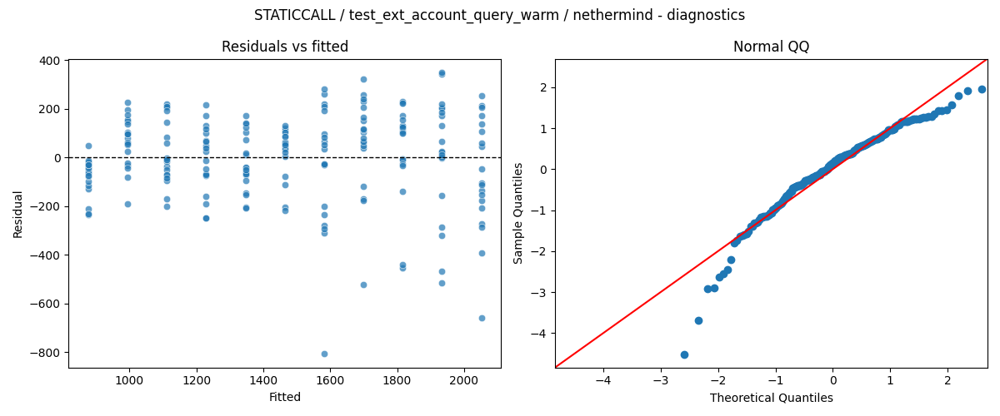

</details>

<details><summary>reth — NNLS regression summary</summary>

```
==============================================================================
                           NNLS Regression Results                            
==============================================================================
Dep. Variable:          test_runtime_ms              R-squared:          0.916
Model:                  NNLS                    Adj. R-squared:          0.916
No. Observations:       363                               RMSE:           7.37
Df Residuals:           361                                MAE:           6.15
Df Model:               1      
==============================================================================
                      coef     std err     P-value      [0.025      0.975]
------------------------------------------------------------------------------
         const     16.4263      1.3143       0.001     13.7557     18.9323
       opcount      0.0000      0.0000       0.001      0.0000      0.0000
==============================================================================
Notes: Non-negative least squares with bootstrap inference (1000 iterations)
==============================================================================
```

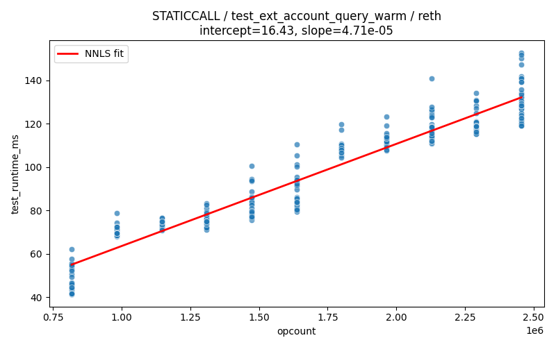

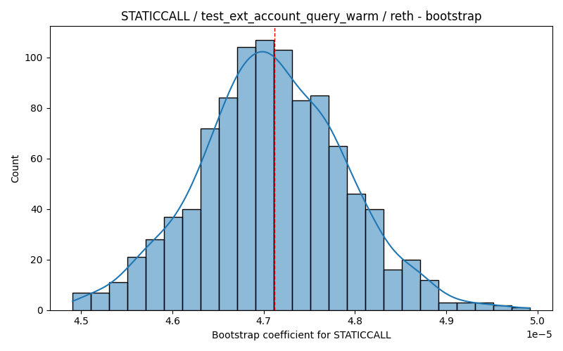

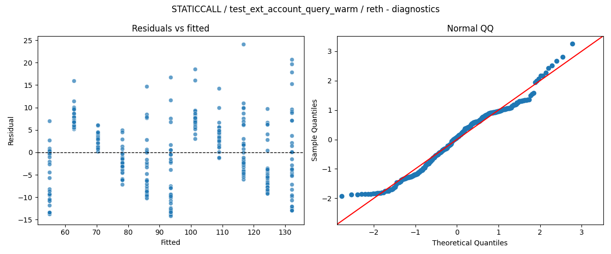

</details>
