# Glue opcodes report

Per-client NNLS fits of priced glue opcodes against their driver fixtures. Cycle-tier opcodes share one joint regression per client (shown once); pure-tier and mixed-tier opcodes each get a single-feature fit. Mixed-tier fits pre-adjust the LHS by subtracting the contribution of every priced upstream partner selected by the detector (pure ∪ cycle for `mixed_a`, plus `mixed_a` for `mixed_b`).

**Contents:** [besu](#besu) · [erigon](#erigon) · [geth](#geth) · [nethermind](#nethermind) · [reth](#reth)

## besu

| glue_opcode | nobs | glue_runtime_ms | p_value | rsquared |
| --- | --- | --- | --- | --- |
| `ISZERO` | 957 | 4.717e-06 | 1.00e-03 | 0.856 |
| `JUMPDEST` | 957 | 2.646e-06 | 1.00e-03 | 0.8781 |
| `SWAP` | 15312 | 3.609e-06 | 1.00e-03 | 0.8555 |
| `CALLDATASIZE` | 56749 | 3.925e-06 | 1.00e-03 | 0.9629 |
| `DUP` | 56749 | 2.059e-06 | 1.00e-03 | 0.9629 |
| `GAS` | 56749 | 3.418e-06 | 1.00e-03 | 0.9629 |
| `MLOAD` | 56749 | 1.119e-05 | 1.00e-03 | 0.9629 |
| `PUSH` | 56749 | 2.892e-06 | 1.00e-03 | 0.9629 |
| `PUSH0` | 56749 | 2.073e-06 | 1.00e-03 | 0.9629 |
| `STATICCALL` | 56749 | 0.001649 | 1.00e-03 | 0.9629 |
| `ADD` | 957 | 1.139e-05 | 1.00e-03 | 0.861 |
| `AND` | 957 | 9.691e-06 | 1.00e-03 | 0.8748 |
| `CALLDATACOPY` | 22968 | 2.071e-05 | 1.00e-03 | 0.8325 |
| `CALLDATALOAD` | 3828 | 1.67e-06 | 2.68e-01 | 6.817e-05 |
| `DIV` | 957 | 1.821e-05 | 1.00e-03 | 0.8742 |
| `EXP` | 957 | 0.001292 | 1.00e-03 | 0.8745 |
| `GT` | 957 | 3.323e-05 | 1.00e-03 | 0.8927 |
| `JUMPI` | 957 | 9.829e-06 | 1.00e-03 | 0.879 |
| `LT` | 957 | 3.448e-05 | 1.00e-03 | 0.8963 |
| `MSTORE` | 4785 | 1.851e-05 | 1.00e-03 | 0.8698 |
| `MSTORE8` | 4785 | 1.247e-05 | 1.00e-03 | 0.8668 |
| `MUL` | 957 | 1.166e-05 | 1.00e-03 | 0.6356 |
| `PC` | 957 | 4.743e-06 | 1.00e-03 | 0.8723 |
| `RETURNDATASIZE` | 3828 | 7.067e-06 | 1.00e-03 | 0.8553 |
| `SELFBALANCE` | 783 | 7.44e-06 | 1.00e-03 | 0.4862 |
| `SUB` | 957 | 1.104e-05 | 1.00e-03 | 0.869 |
| `JUMP` | 957 | 5.003e-05 | 1.00e-03 | 0.8695 |
| `KECCAK256` | 15312 | 5.178e-05 | 1.00e-03 | 0.2824 |

### Cycle glue — joint fit · besu

<details><summary>Joint NNLS regression summary</summary>

```
==============================================================================
                           NNLS Regression Results                            
==============================================================================
Dep. Variable:          test_runtime_ms              R-squared:          0.963
Model:                  NNLS                    Adj. R-squared:          0.963
No. Observations:       56749                             RMSE:          43.20
Df Residuals:           56741                              MAE:          33.09
Df Model:               7      
==============================================================================
                      coef     std err     P-value      [0.025      0.975]
------------------------------------------------------------------------------
         const     81.9495      0.6911       0.001     80.6282     83.2567
  CALLDATASIZE      0.0000      0.0000       0.001      0.0000      0.0000
           DUP      0.0000      0.0000       0.001      0.0000      0.0000
           GAS      0.0000      0.0000       0.001      0.0000      0.0000
         MLOAD      0.0000      0.0000       0.001      0.0000      0.0000
          PUSH      0.0000      0.0000       0.001      0.0000      0.0000
         PUSH0      0.0000      0.0000       0.001      0.0000      0.0000
    STATICCALL      0.0016      0.0000       0.001      0.0016      0.0017
==============================================================================
Notes: Non-negative least squares with bootstrap inference (1000 iterations)
==============================================================================
```

</details>

<details><summary><code>CALLDATASIZE</code> · nobs=56749 · runtime_ms=3.925e-06 · p=1.00e-03 · R²=0.9629</summary>

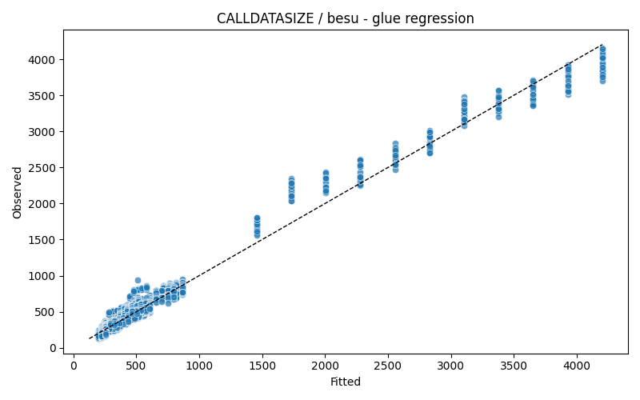

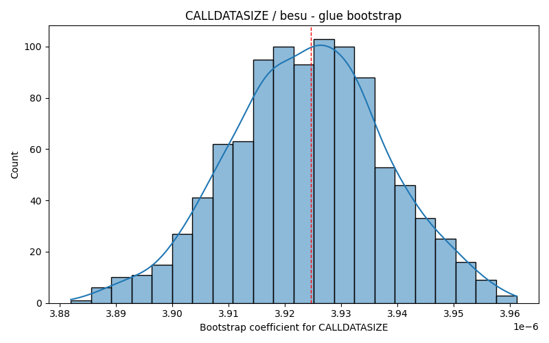


</details>

<details><summary><code>DUP</code> · nobs=56749 · runtime_ms=2.059e-06 · p=1.00e-03 · R²=0.9629</summary>


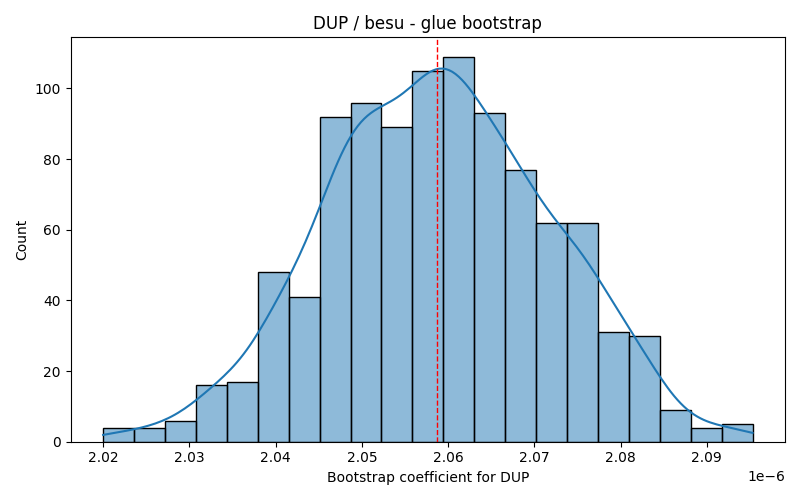


</details>

<details><summary><code>GAS</code> · nobs=56749 · runtime_ms=3.418e-06 · p=1.00e-03 · R²=0.9629</summary>

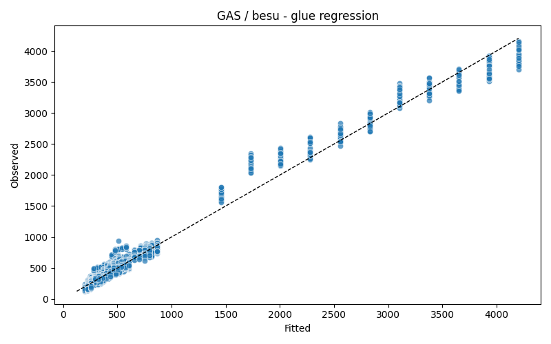

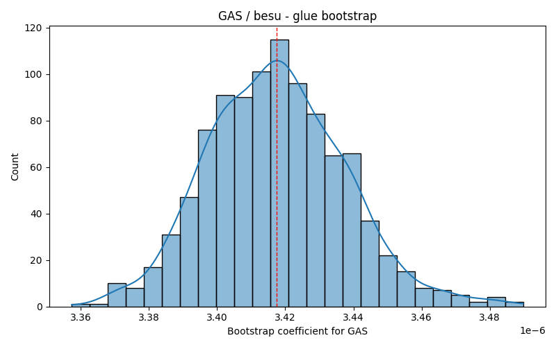


</details>

<details><summary><code>MLOAD</code> · nobs=56749 · runtime_ms=1.119e-05 · p=1.00e-03 · R²=0.9629</summary>


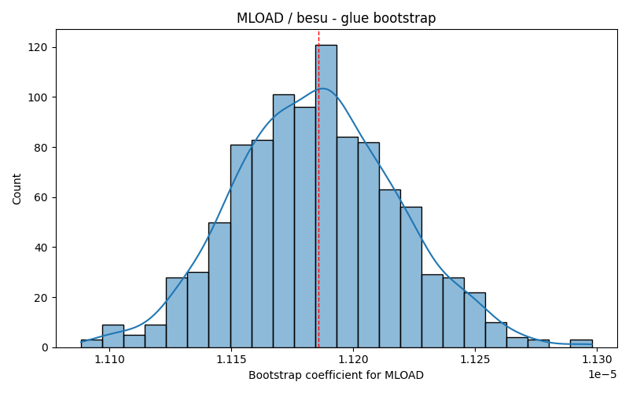


</details>

<details><summary><code>PUSH</code> · nobs=56749 · runtime_ms=2.892e-06 · p=1.00e-03 · R²=0.9629</summary>


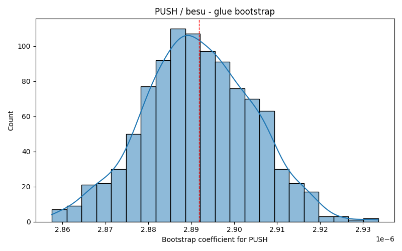


</details>

<details><summary><code>PUSH0</code> · nobs=56749 · runtime_ms=2.073e-06 · p=1.00e-03 · R²=0.9629</summary>


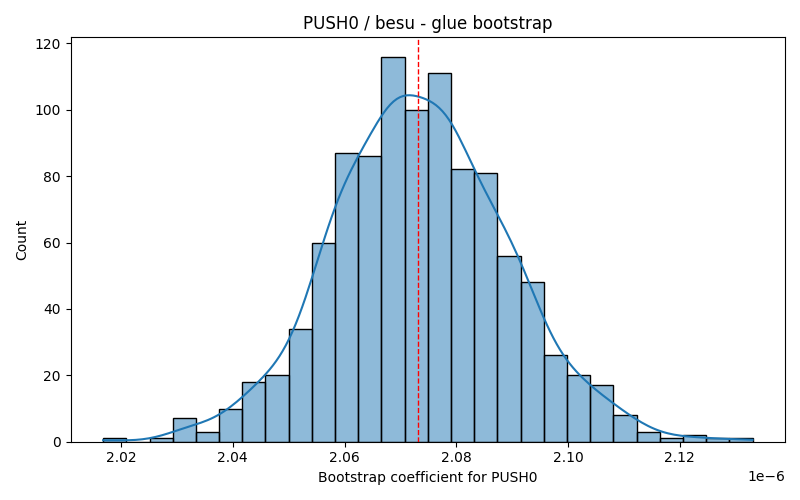

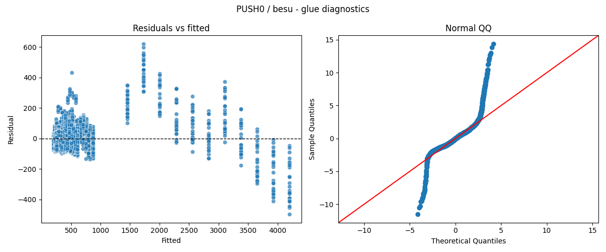

</details>

<details><summary><code>STATICCALL</code> · nobs=56749 · runtime_ms=0.001649 · p=1.00e-03 · R²=0.9629</summary>

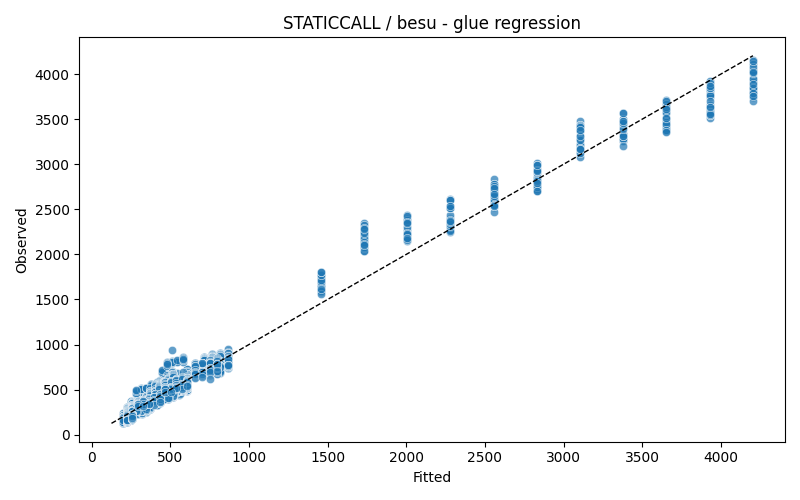

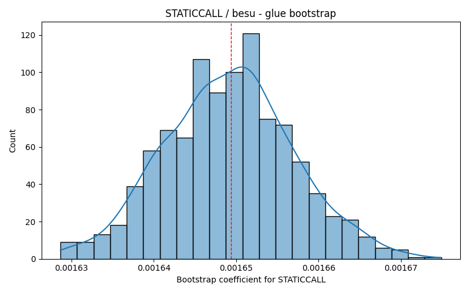


</details>

### Pure glue · besu

<details><summary><code>ISZERO</code> · nobs=957 · runtime_ms=4.717e-06 · p=1.00e-03 · R²=0.856</summary>

```
==============================================================================
                           NNLS Regression Results                            
==============================================================================
Dep. Variable:          test_runtime_ms              R-squared:          0.856
Model:                  NNLS                    Adj. R-squared:          0.856
No. Observations:       957                               RMSE:          40.73
Df Residuals:           955                                MAE:          33.99
Df Model:               1      
==============================================================================
                      coef     std err     P-value      [0.025      0.975]
------------------------------------------------------------------------------
         const     83.9901      4.8103       0.001     74.1348     93.4776
        ISZERO      0.0000      0.0000       0.001      0.0000      0.0000
==============================================================================
Notes: Non-negative least squares with bootstrap inference (1000 iterations)
==============================================================================
```

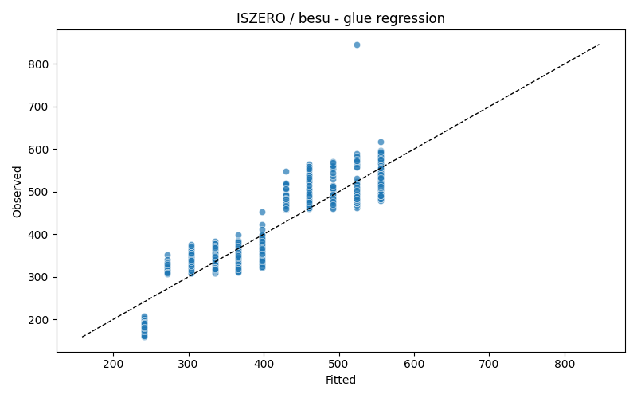

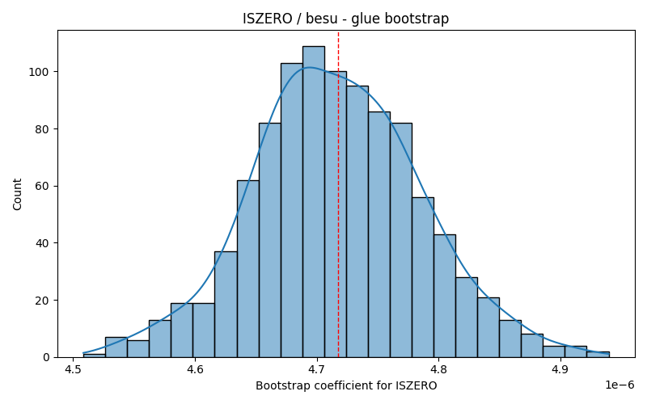

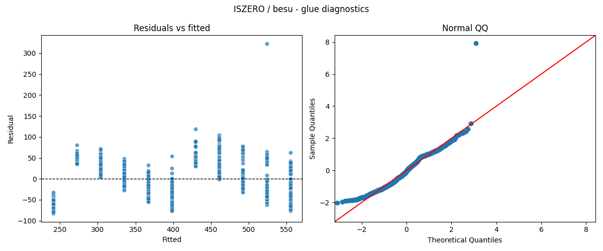

</details>

<details><summary><code>JUMPDEST</code> · nobs=957 · runtime_ms=2.646e-06 · p=1.00e-03 · R²=0.8781</summary>

```
==============================================================================
                           NNLS Regression Results                            
==============================================================================
Dep. Variable:          test_runtime_ms              R-squared:          0.878
Model:                  NNLS                    Adj. R-squared:          0.878
No. Observations:       957                               RMSE:          62.25
Df Residuals:           955                                MAE:          52.34
Df Model:               1      
==============================================================================
                      coef     std err     P-value      [0.025      0.975]
------------------------------------------------------------------------------
         const     84.4963      6.9906       0.001     71.1705     98.4331
      JUMPDEST      0.0000      0.0000       0.001      0.0000      0.0000
==============================================================================
Notes: Non-negative least squares with bootstrap inference (1000 iterations)
==============================================================================
```

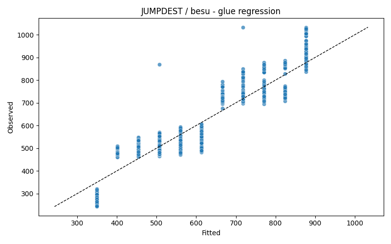

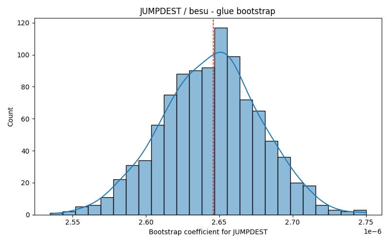

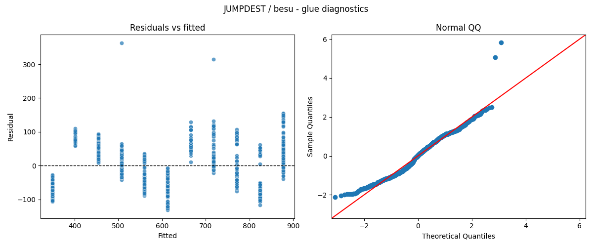

</details>

<details><summary><code>SWAP</code> · nobs=15312 · runtime_ms=3.609e-06 · p=1.00e-03 · R²=0.8555</summary>

```
==============================================================================
                           NNLS Regression Results                            
==============================================================================
Dep. Variable:          test_runtime_ms              R-squared:          0.856
Model:                  NNLS                    Adj. R-squared:          0.856
No. Observations:       15312                             RMSE:          31.23
Df Residuals:           15310                              MAE:          25.66
Df Model:               1      
==============================================================================
                      coef     std err     P-value      [0.025      0.975]
------------------------------------------------------------------------------
         const     68.4373      0.8922       0.001     66.8005     70.2282
          SWAP      0.0000      0.0000       0.001      0.0000      0.0000
==============================================================================
Notes: Non-negative least squares with bootstrap inference (1000 iterations)
==============================================================================
```

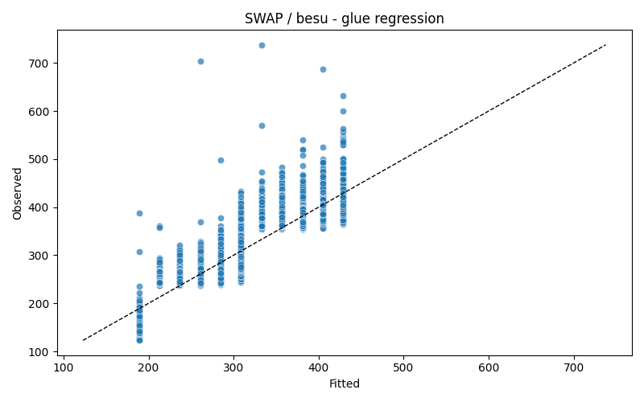

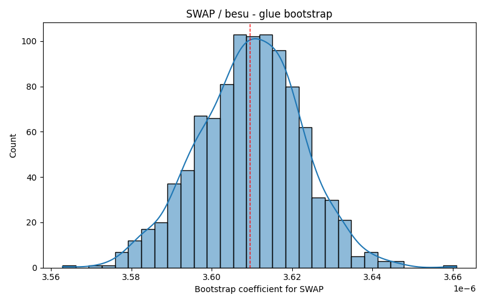

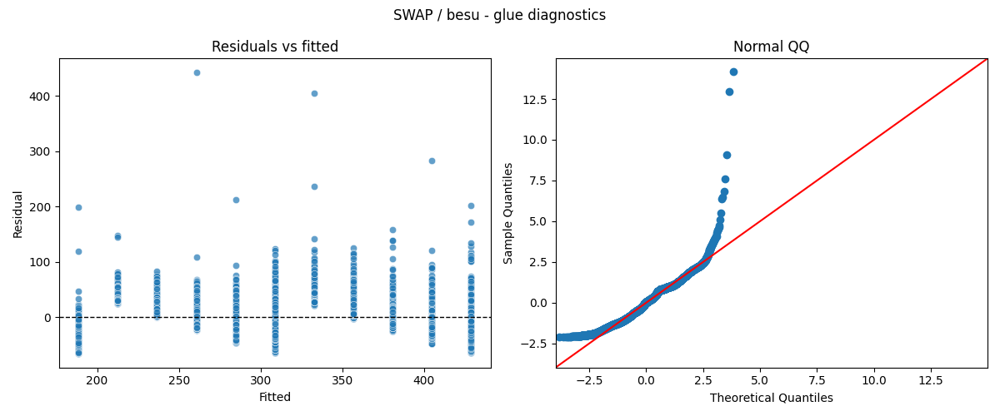

</details>

### Mixed glue (tier A) · besu

<details><summary><code>ADD</code> · nobs=957 · runtime_ms=1.139e-05 · p=1.00e-03 · R²=0.861</summary>

```
==============================================================================
                           NNLS Regression Results                            
==============================================================================
Dep. Variable:          test_runtime_ms              R-squared:          0.861
Model:                  NNLS                    Adj. R-squared:          0.861
No. Observations:       957                               RMSE:          48.17
Df Residuals:           955                                MAE:          40.77
Df Model:               1      
==============================================================================
                      coef     std err     P-value      [0.025      0.975]
------------------------------------------------------------------------------
         const    100.1842      5.4545       0.001     89.8262    111.0949
           ADD      0.0000      0.0000       0.001      0.0000      0.0000
==============================================================================
Notes: Non-negative least squares with bootstrap inference (1000 iterations)
==============================================================================
```

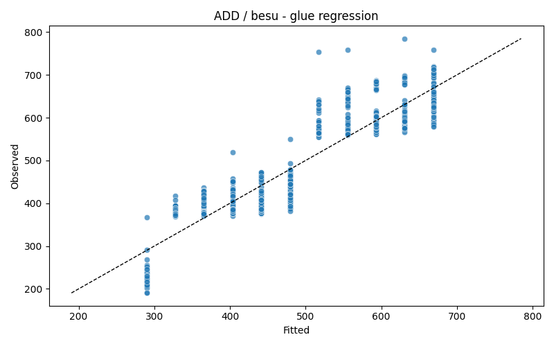

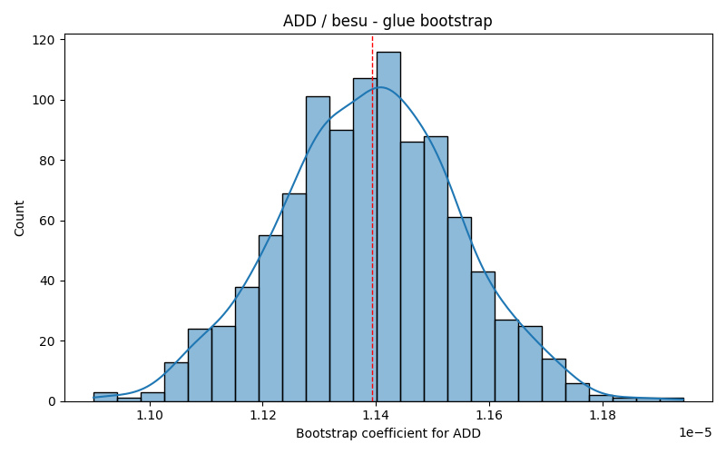

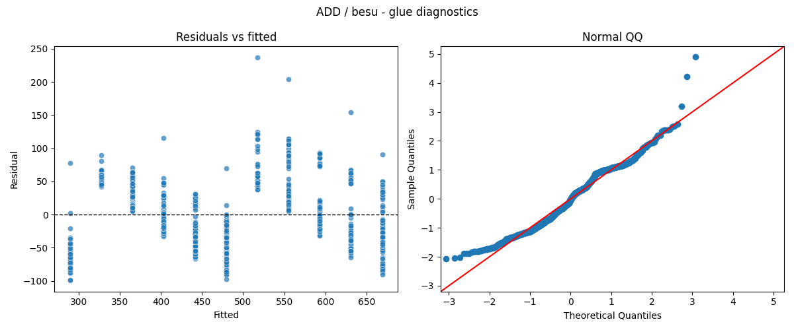

</details>

<details><summary><code>AND</code> · nobs=957 · runtime_ms=9.691e-06 · p=1.00e-03 · R²=0.8748</summary>

```
==============================================================================
                           NNLS Regression Results                            
==============================================================================
Dep. Variable:          test_runtime_ms              R-squared:          0.875
Model:                  NNLS                    Adj. R-squared:          0.875
No. Observations:       957                               RMSE:          38.59
Df Residuals:           955                                MAE:          33.06
Df Model:               1      
==============================================================================
                      coef     std err     P-value      [0.025      0.975]
------------------------------------------------------------------------------
         const     89.1996      4.4890       0.001     80.2481     97.4852
           AND      0.0000      0.0000       0.001      0.0000      0.0000
==============================================================================
Notes: Non-negative least squares with bootstrap inference (1000 iterations)
==============================================================================
```

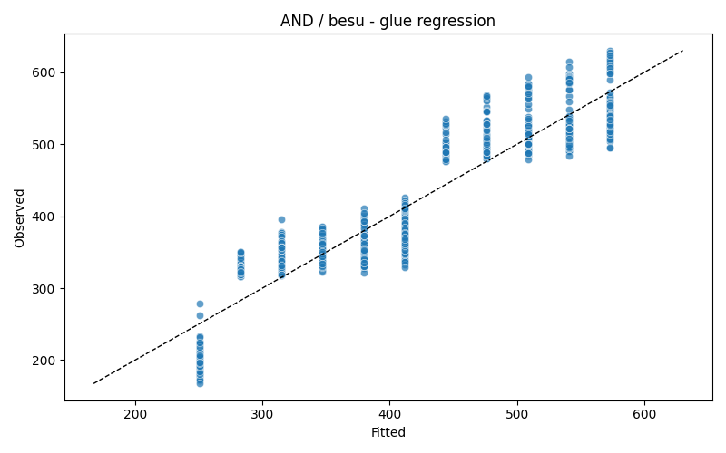

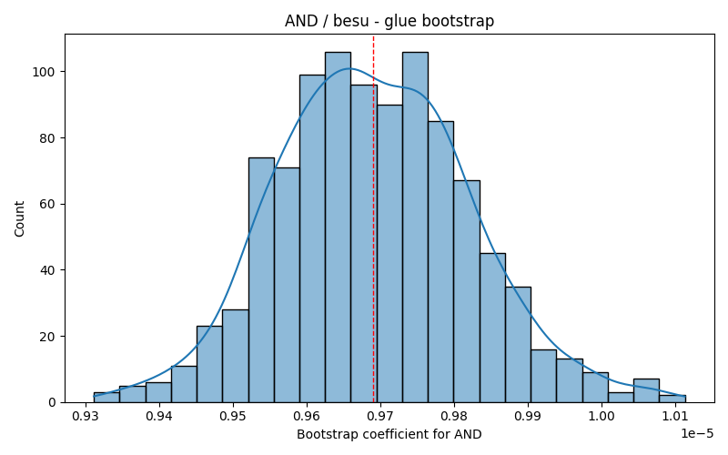

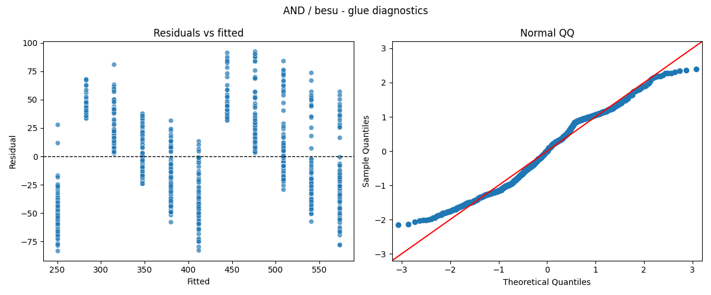

</details>

<details><summary><code>CALLDATACOPY</code> · nobs=22968 · runtime_ms=2.071e-05 · p=1.00e-03 · R²=0.8325</summary>

```
==============================================================================
                           NNLS Regression Results                            
==============================================================================
Dep. Variable:          test_runtime_ms              R-squared:          0.833
Model:                  NNLS                    Adj. R-squared:          0.832
No. Observations:       22968                             RMSE:          69.85
Df Residuals:           22966                              MAE:          55.59
Df Model:               1      
==============================================================================
                      coef     std err     P-value      [0.025      0.975]
------------------------------------------------------------------------------
         const    117.4257      0.5628       0.001    116.2777    118.5241
  CALLDATACOPY      0.0000      0.0000       0.001      0.0000      0.0000
==============================================================================
Notes: Non-negative least squares with bootstrap inference (1000 iterations)
==============================================================================
```

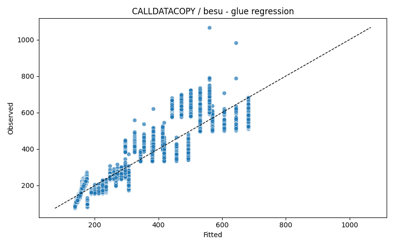

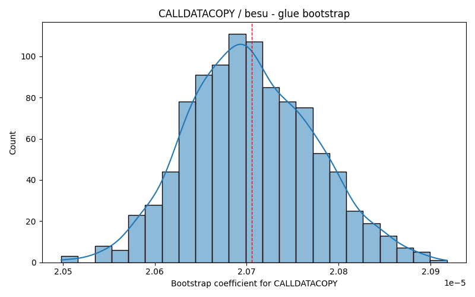

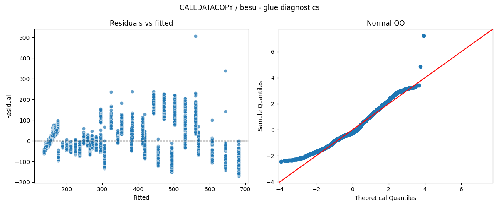

</details>

<details><summary><code>CALLDATALOAD</code> · nobs=3828 · runtime_ms=1.67e-06 · p=2.68e-01 · R²=6.817e-05</summary>

```
==============================================================================
                           NNLS Regression Results                            
==============================================================================
Dep. Variable:          test_runtime_ms              R-squared:          0.000
Model:                  NNLS                    Adj. R-squared:         -0.000
No. Observations:       3828                              RMSE:           0.78
Df Residuals:           3826                               MAE:           0.54
Df Model:               1      
==============================================================================
                      coef     std err     P-value      [0.025      0.975]
------------------------------------------------------------------------------
         const      3.7686      0.0316       0.001      3.6933      3.8075
  CALLDATALOAD      0.0000      0.0000       0.268      0.0000      0.0000
==============================================================================
Notes: Non-negative least squares with bootstrap inference (1000 iterations)
==============================================================================
```

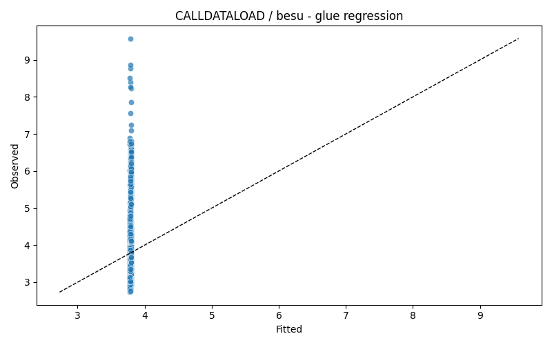

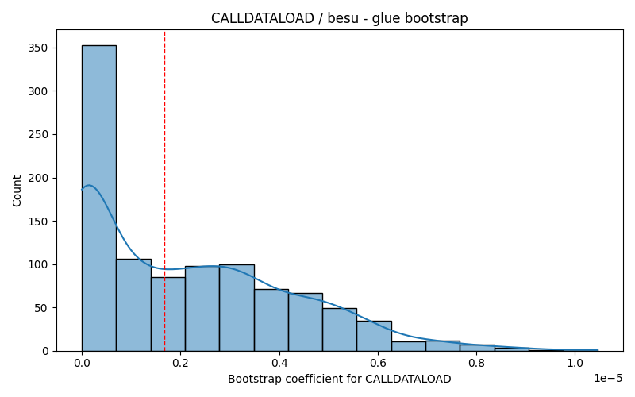

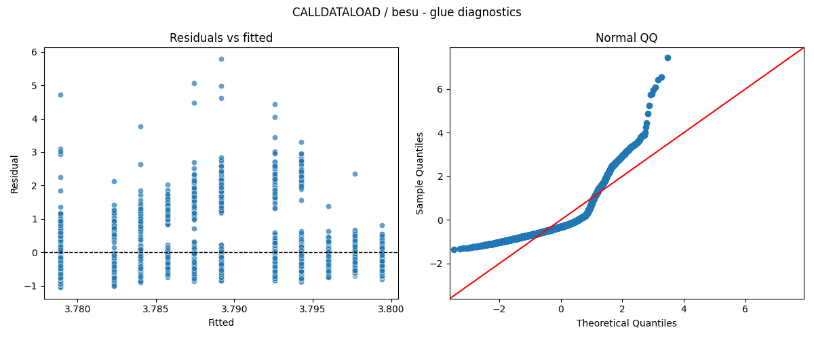

</details>

<details><summary><code>DIV</code> · nobs=957 · runtime_ms=1.821e-05 · p=1.00e-03 · R²=0.8742</summary>

```
==============================================================================
                           NNLS Regression Results                            
==============================================================================
Dep. Variable:          test_runtime_ms              R-squared:          0.874
Model:                  NNLS                    Adj. R-squared:          0.874
No. Observations:       957                               RMSE:          54.55
Df Residuals:           955                                MAE:          47.02
Df Model:               1      
==============================================================================
                      coef     std err     P-value      [0.025      0.975]
------------------------------------------------------------------------------
         const    132.2923      6.0214       0.001    120.5991    143.7742
           DIV      0.0000      0.0000       0.001      0.0000      0.0000
==============================================================================
Notes: Non-negative least squares with bootstrap inference (1000 iterations)
==============================================================================
```

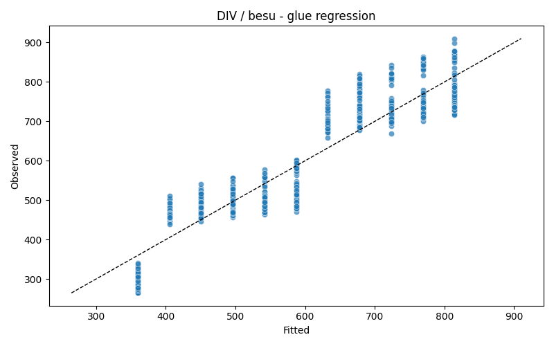

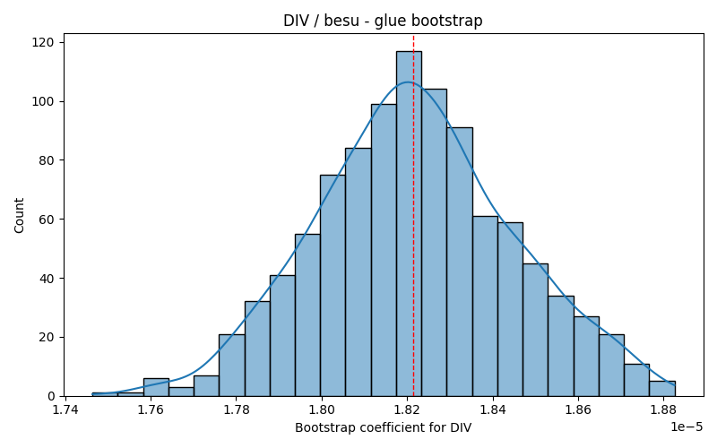

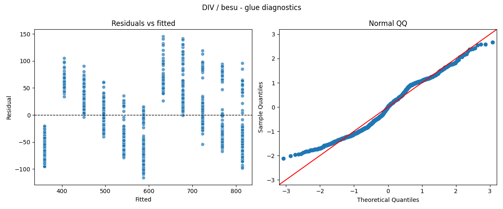

</details>

<details><summary><code>EXP</code> · nobs=957 · runtime_ms=0.001292 · p=1.00e-03 · R²=0.8745</summary>

```
==============================================================================
                           NNLS Regression Results                            
==============================================================================
Dep. Variable:          test_runtime_ms              R-squared:          0.875
Model:                  NNLS                    Adj. R-squared:          0.874
No. Observations:       957                               RMSE:          19.17
Df Residuals:           955                                MAE:          15.28
Df Model:               1      
==============================================================================
                      coef     std err     P-value      [0.025      0.975]
------------------------------------------------------------------------------
         const     77.4255      1.7559       0.001     73.8587     80.7771
           EXP      0.0013      0.0000       0.001      0.0013      0.0013
==============================================================================
Notes: Non-negative least squares with bootstrap inference (1000 iterations)
==============================================================================
```

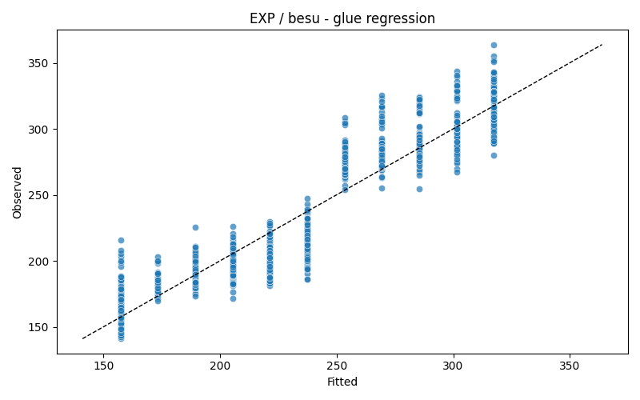

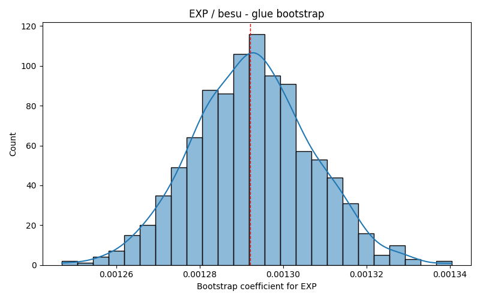

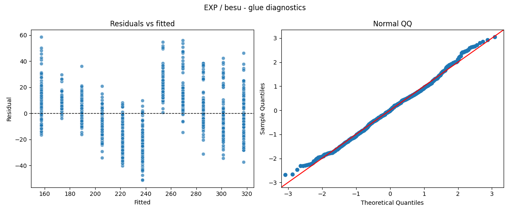

</details>

<details><summary><code>GT</code> · nobs=957 · runtime_ms=3.323e-05 · p=1.00e-03 · R²=0.8927</summary>

```
==============================================================================
                           NNLS Regression Results                            
==============================================================================
Dep. Variable:          test_runtime_ms              R-squared:          0.893
Model:                  NNLS                    Adj. R-squared:          0.893
No. Observations:       957                               RMSE:         121.25
Df Residuals:           955                                MAE:          98.95
Df Model:               1      
==============================================================================
                      coef     std err     P-value      [0.025      0.975]
------------------------------------------------------------------------------
         const    198.5644     14.3215       0.001    170.3902    227.0540
            GT      0.0000      0.0000       0.001      0.0000      0.0000
==============================================================================
Notes: Non-negative least squares with bootstrap inference (1000 iterations)
==============================================================================
```

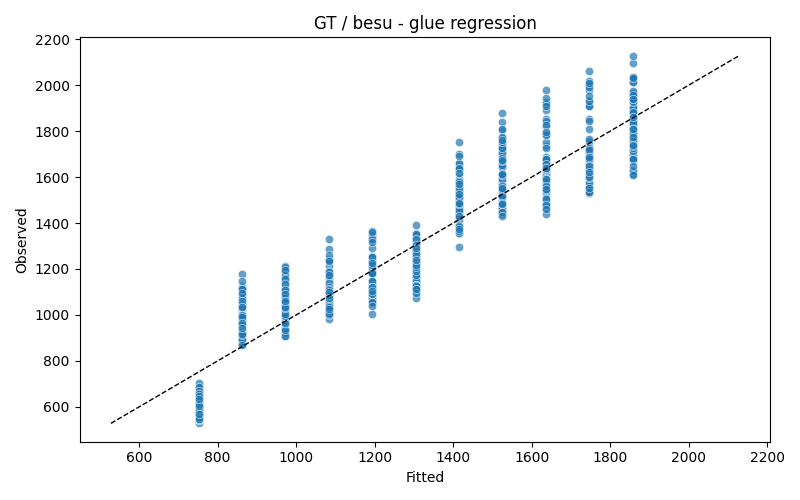

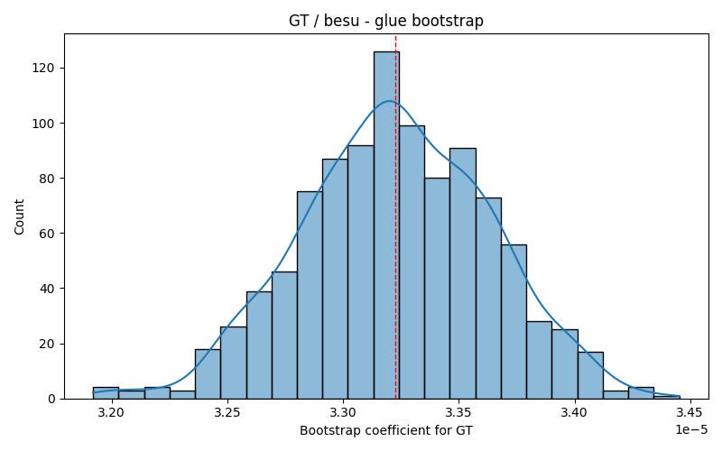

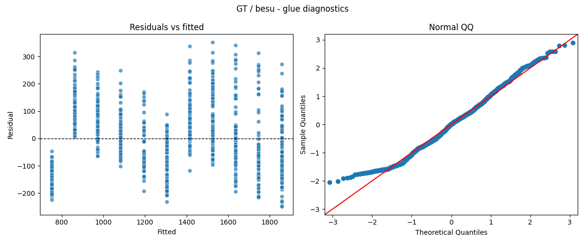

</details>

<details><summary><code>JUMPI</code> · nobs=957 · runtime_ms=9.829e-06 · p=1.00e-03 · R²=0.879</summary>

```
==============================================================================
                           NNLS Regression Results                            
==============================================================================
Dep. Variable:          test_runtime_ms              R-squared:          0.879
Model:                  NNLS                    Adj. R-squared:          0.879
No. Observations:       957                               RMSE:          16.45
Df Residuals:           955                                MAE:          13.82
Df Model:               1      
==============================================================================
                      coef     std err     P-value      [0.025      0.975]
------------------------------------------------------------------------------
         const     37.9253      1.9516       0.001     34.0084     41.7673
         JUMPI      0.0000      0.0000       0.001      0.0000      0.0000
==============================================================================
Notes: Non-negative least squares with bootstrap inference (1000 iterations)
==============================================================================
```

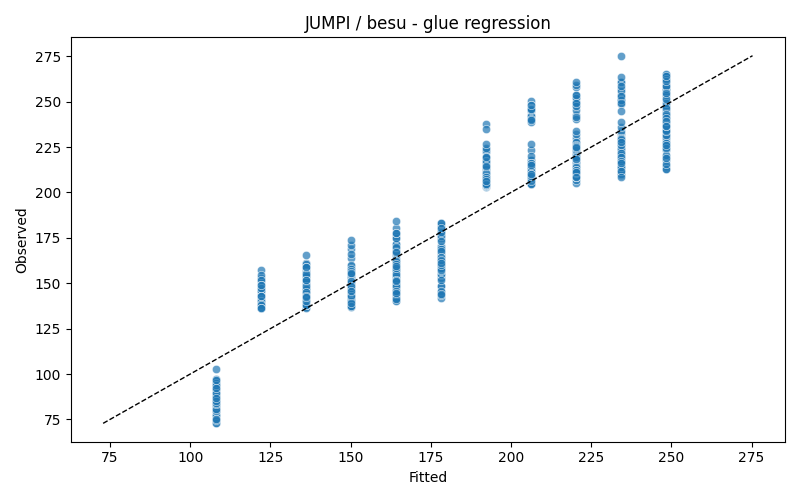

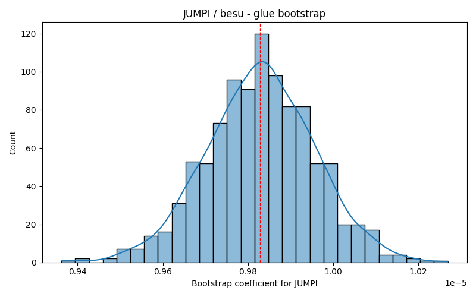


</details>

<details><summary><code>LT</code> · nobs=957 · runtime_ms=3.448e-05 · p=1.00e-03 · R²=0.8963</summary>

```
==============================================================================
                           NNLS Regression Results                            
==============================================================================
Dep. Variable:          test_runtime_ms              R-squared:          0.896
Model:                  NNLS                    Adj. R-squared:          0.896
No. Observations:       957                               RMSE:         123.42
Df Residuals:           955                                MAE:         101.27
Df Model:               1      
==============================================================================
                      coef     std err     P-value      [0.025      0.975]
------------------------------------------------------------------------------
         const    214.2588     14.3134       0.001    188.0203    241.6252
            LT      0.0000      0.0000       0.001      0.0000      0.0000
==============================================================================
Notes: Non-negative least squares with bootstrap inference (1000 iterations)
==============================================================================
```

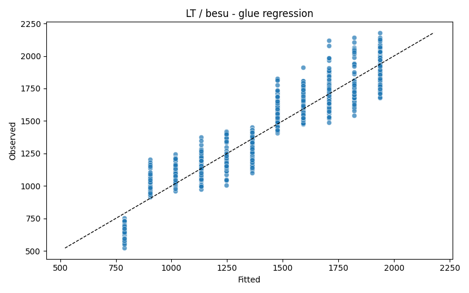

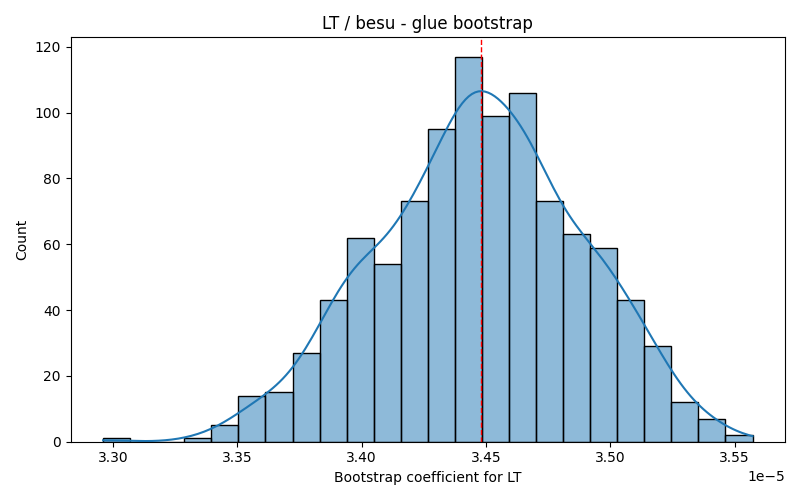

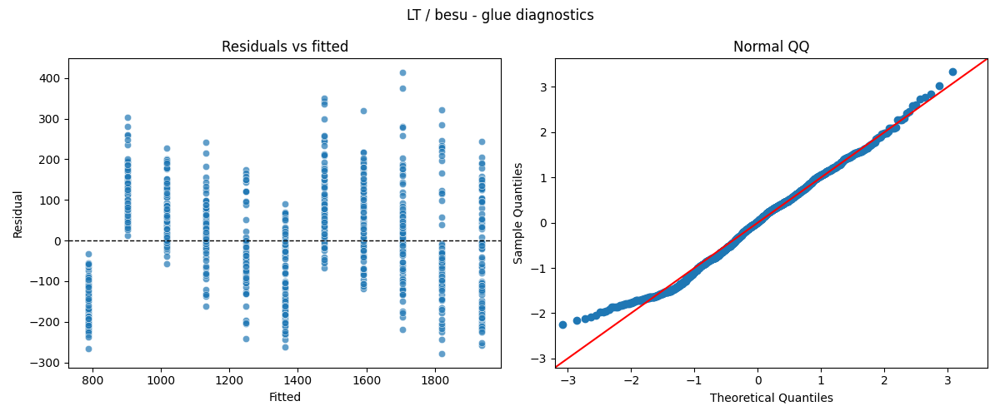

</details>

<details><summary><code>MSTORE</code> · nobs=4785 · runtime_ms=1.851e-05 · p=1.00e-03 · R²=0.8698</summary>

```
==============================================================================
                           NNLS Regression Results                            
==============================================================================
Dep. Variable:          test_runtime_ms              R-squared:          0.870
Model:                  NNLS                    Adj. R-squared:          0.870
No. Observations:       4785                              RMSE:          50.23
Df Residuals:           4783                               MAE:          42.98
Df Model:               1      
==============================================================================
                      coef     std err     P-value      [0.025      0.975]
------------------------------------------------------------------------------
         const    112.6913      2.7232       0.001    107.4689    118.1303
        MSTORE      0.0000      0.0000       0.001      0.0000      0.0000
==============================================================================
Notes: Non-negative least squares with bootstrap inference (1000 iterations)
==============================================================================
```

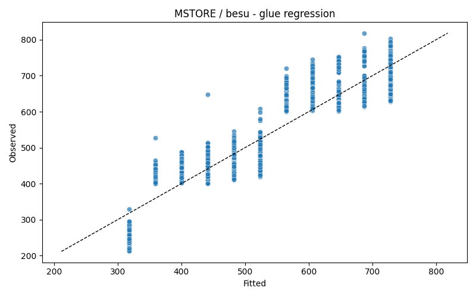

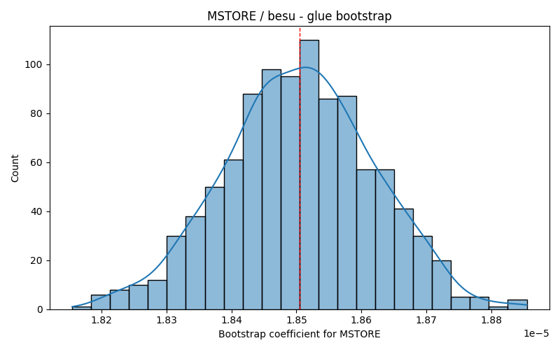

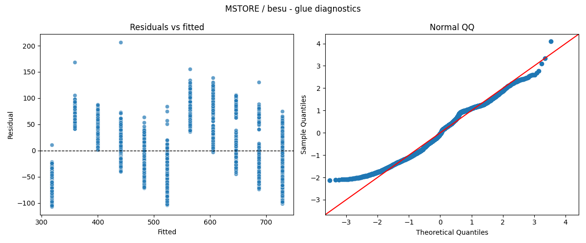

</details>

<details><summary><code>MSTORE8</code> · nobs=4785 · runtime_ms=1.247e-05 · p=1.00e-03 · R²=0.8668</summary>

```
==============================================================================
                           NNLS Regression Results                            
==============================================================================
Dep. Variable:          test_runtime_ms              R-squared:          0.867
Model:                  NNLS                    Adj. R-squared:          0.867
No. Observations:       4785                              RMSE:          34.31
Df Residuals:           4783                               MAE:          28.87
Df Model:               1      
==============================================================================
                      coef     std err     P-value      [0.025      0.975]
------------------------------------------------------------------------------
         const     77.9845      1.8447       0.001     74.4676     81.7043
       MSTORE8      0.0000      0.0000       0.001      0.0000      0.0000
==============================================================================
Notes: Non-negative least squares with bootstrap inference (1000 iterations)
==============================================================================
```

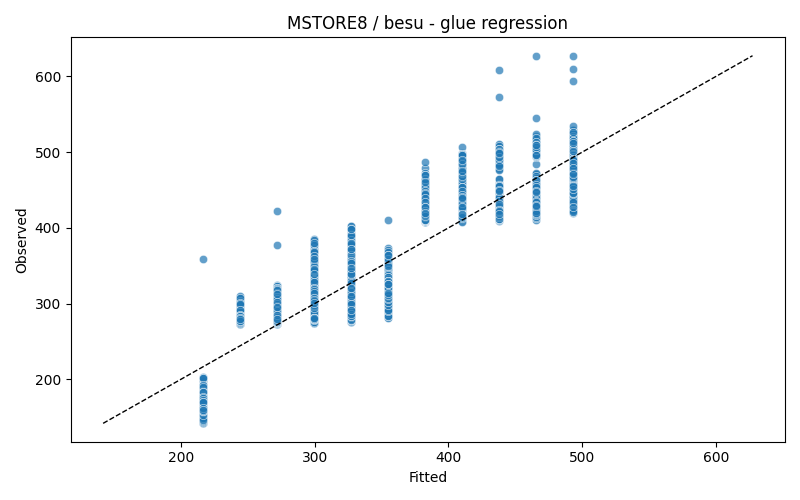

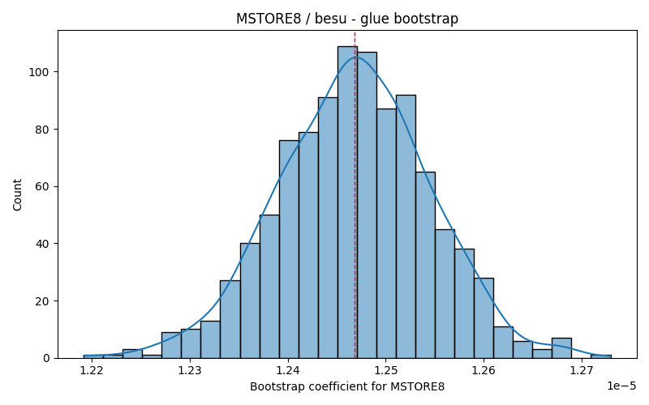

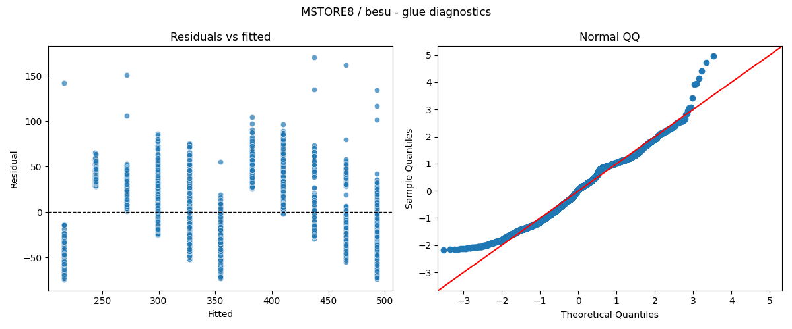

</details>

<details><summary><code>MUL</code> · nobs=957 · runtime_ms=1.166e-05 · p=1.00e-03 · R²=0.6356</summary>

```
==============================================================================
                           NNLS Regression Results                            
==============================================================================
Dep. Variable:          test_runtime_ms              R-squared:          0.636
Model:                  NNLS                    Adj. R-squared:          0.635
No. Observations:       957                               RMSE:          69.67
Df Residuals:           955                                MAE:          57.24
Df Model:               1      
==============================================================================
                      coef     std err     P-value      [0.025      0.975]
------------------------------------------------------------------------------
         const    103.8369      6.4290       0.001     91.6277    115.3998
           MUL      0.0000      0.0000       0.001      0.0000      0.0000
==============================================================================
Notes: Non-negative least squares with bootstrap inference (1000 iterations)
==============================================================================
```

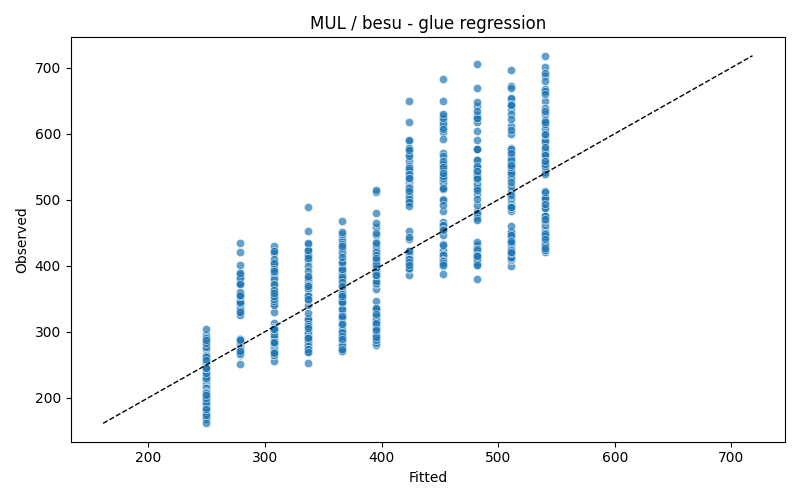

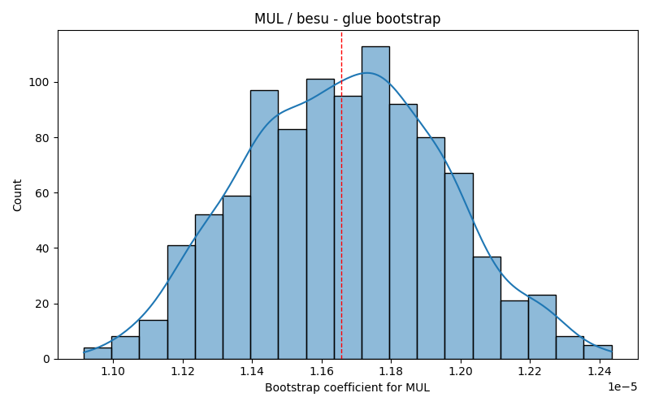

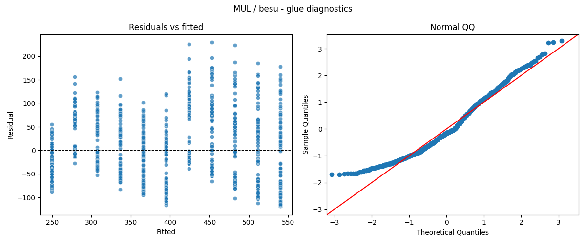

</details>

<details><summary><code>PC</code> · nobs=957 · runtime_ms=4.743e-06 · p=1.00e-03 · R²=0.8723</summary>

```
==============================================================================
                           NNLS Regression Results                            
==============================================================================
Dep. Variable:          test_runtime_ms              R-squared:          0.872
Model:                  NNLS                    Adj. R-squared:          0.872
No. Observations:       957                               RMSE:          54.26
Df Residuals:           955                                MAE:          46.50
Df Model:               1      
==============================================================================
                      coef     std err     P-value      [0.025      0.975]
------------------------------------------------------------------------------
         const    116.1814      6.1766       0.001    104.4570    128.4427
            PC      0.0000      0.0000       0.001      0.0000      0.0000
==============================================================================
Notes: Non-negative least squares with bootstrap inference (1000 iterations)
==============================================================================
```

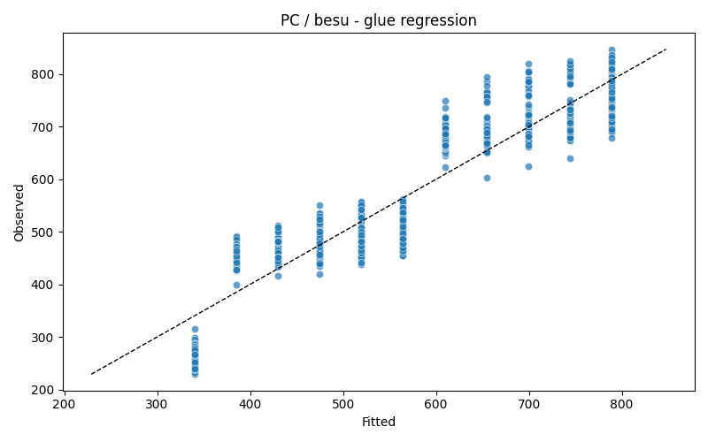

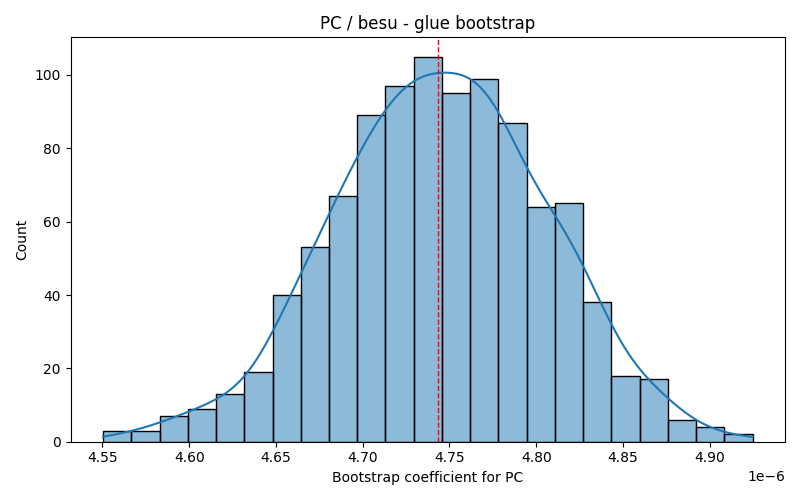

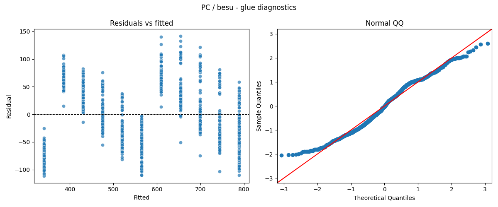

</details>

<details><summary><code>RETURNDATASIZE</code> · nobs=3828 · runtime_ms=7.067e-06 · p=1.00e-03 · R²=0.8553</summary>

```
==============================================================================
                           NNLS Regression Results                            
==============================================================================
Dep. Variable:          test_runtime_ms              R-squared:          0.855
Model:                  NNLS                    Adj. R-squared:          0.855
No. Observations:       3828                              RMSE:          45.89
Df Residuals:           3826                               MAE:          38.32
Df Model:               1      
==============================================================================
                      coef     std err     P-value      [0.025      0.975]
------------------------------------------------------------------------------
         const     93.2952      2.6326       0.001     88.0194     98.4016
RETURNDATASIZE      0.0000      0.0000       0.001      0.0000      0.0000
==============================================================================
Notes: Non-negative least squares with bootstrap inference (1000 iterations)
==============================================================================
```

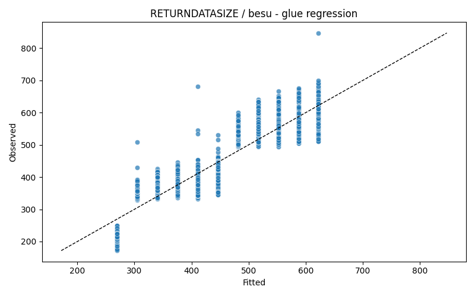

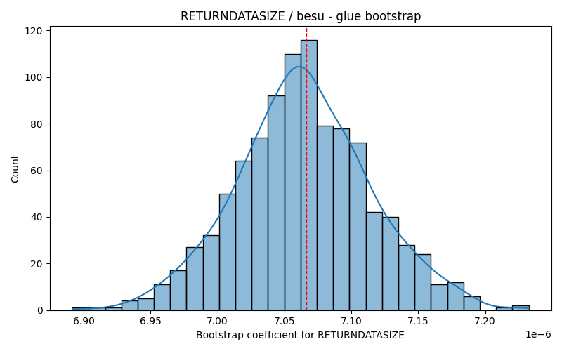

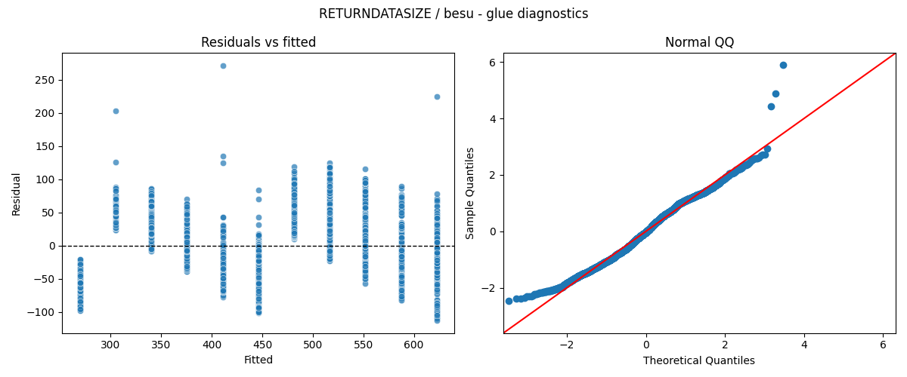

</details>

<details><summary><code>SELFBALANCE</code> · nobs=783 · runtime_ms=7.44e-06 · p=1.00e-03 · R²=0.4862</summary>

```
==============================================================================
                           NNLS Regression Results                            
==============================================================================
Dep. Variable:          test_runtime_ms              R-squared:          0.486
Model:                  NNLS                    Adj. R-squared:          0.486
No. Observations:       783                               RMSE:          77.15
Df Residuals:           781                                MAE:          61.25
Df Model:               1      
==============================================================================
                      coef     std err     P-value      [0.025      0.975]
------------------------------------------------------------------------------
         const    427.0752     11.9224       0.001    403.1057    450.2887
   SELFBALANCE      0.0000      0.0000       0.001      0.0000      0.0000
==============================================================================
Notes: Non-negative least squares with bootstrap inference (1000 iterations)
==============================================================================
```

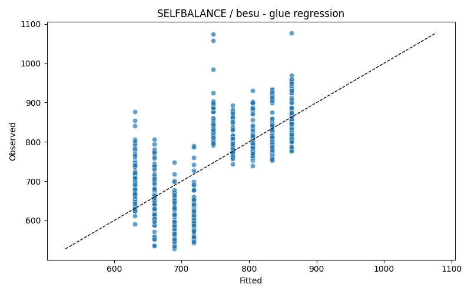

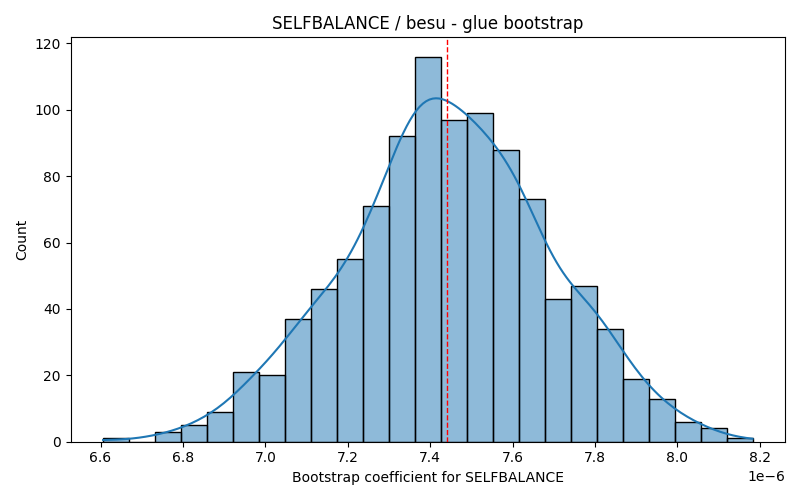

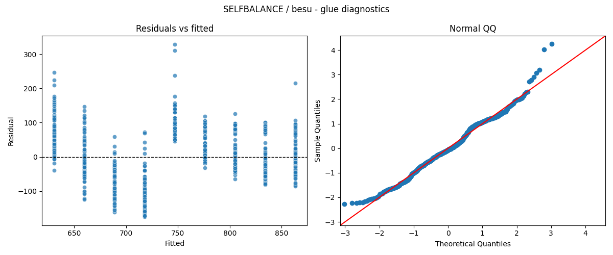

</details>

<details><summary><code>SUB</code> · nobs=957 · runtime_ms=1.104e-05 · p=1.00e-03 · R²=0.869</summary>

```
==============================================================================
                           NNLS Regression Results                            
==============================================================================
Dep. Variable:          test_runtime_ms              R-squared:          0.869
Model:                  NNLS                    Adj. R-squared:          0.869
No. Observations:       957                               RMSE:          45.11
Df Residuals:           955                                MAE:          38.67
Df Model:               1      
==============================================================================
                      coef     std err     P-value      [0.025      0.975]
------------------------------------------------------------------------------
         const    100.2273      5.2354       0.001     90.1097    110.1251
           SUB      0.0000      0.0000       0.001      0.0000      0.0000
==============================================================================
Notes: Non-negative least squares with bootstrap inference (1000 iterations)
==============================================================================
```

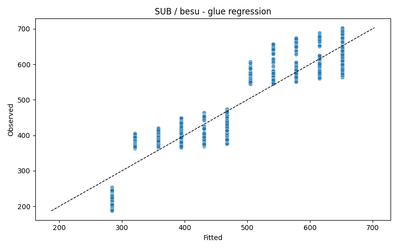


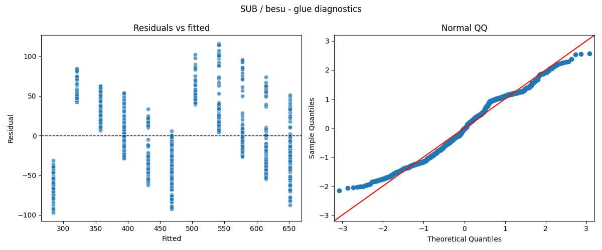

</details>

### Mixed glue (tier B) · besu

<details><summary><code>JUMP</code> · nobs=957 · runtime_ms=5.003e-05 · p=1.00e-03 · R²=0.8695</summary>

```
==============================================================================
                           NNLS Regression Results                            
==============================================================================
Dep. Variable:          test_runtime_ms              R-squared:          0.869
Model:                  NNLS                    Adj. R-squared:          0.869
No. Observations:       957                               RMSE:          72.03
Df Residuals:           955                                MAE:          60.99
Df Model:               1      
==============================================================================
                      coef     std err     P-value      [0.025      0.975]
------------------------------------------------------------------------------
         const    150.2411      8.6116       0.001    133.9439    167.5323
          JUMP      0.0001      0.0000       0.001      0.0000      0.0001
==============================================================================
Notes: Non-negative least squares with bootstrap inference (1000 iterations)
==============================================================================
```

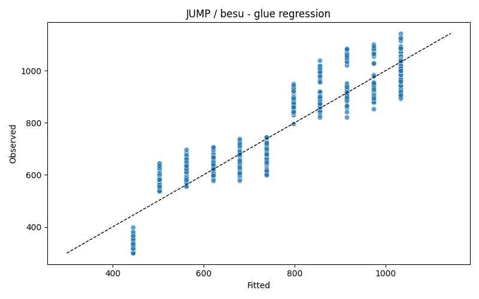

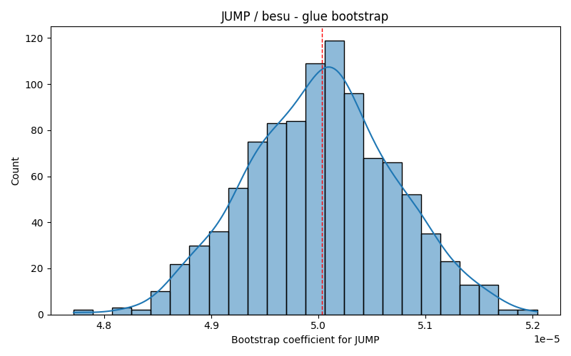


</details>

<details><summary><code>KECCAK256</code> · nobs=15312 · runtime_ms=5.178e-05 · p=1.00e-03 · R²=0.2824</summary>

```
==============================================================================
                           NNLS Regression Results                            
==============================================================================
Dep. Variable:          test_runtime_ms              R-squared:          0.282
Model:                  NNLS                    Adj. R-squared:          0.282
No. Observations:       15312                             RMSE:         164.02
Df Residuals:           15310                              MAE:         128.17
Df Model:               1      
==============================================================================
                      coef     std err     P-value      [0.025      0.975]
------------------------------------------------------------------------------
         const    510.7169      2.8062       0.001    505.1212    516.0184
     KECCAK256      0.0001      0.0000       0.001      0.0001      0.0001
==============================================================================
Notes: Non-negative least squares with bootstrap inference (1000 iterations)
==============================================================================
```

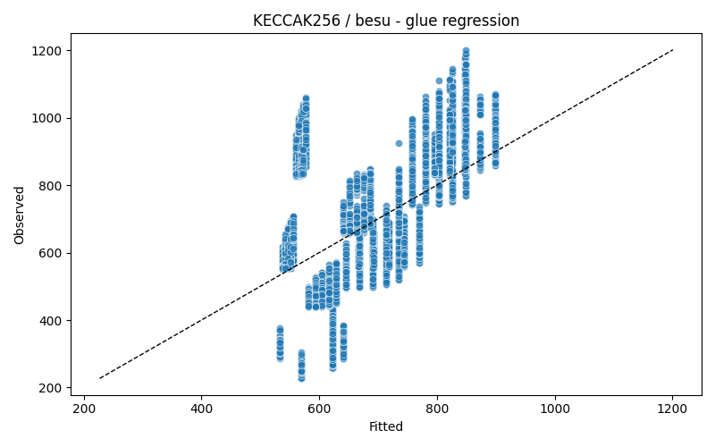

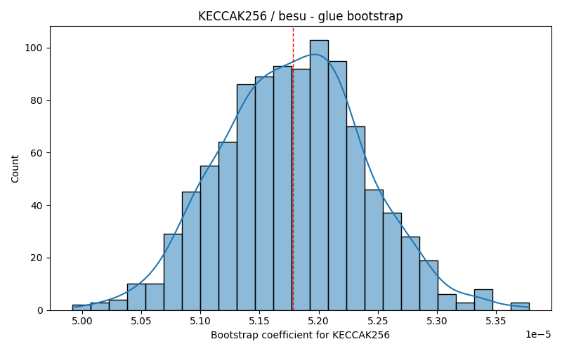

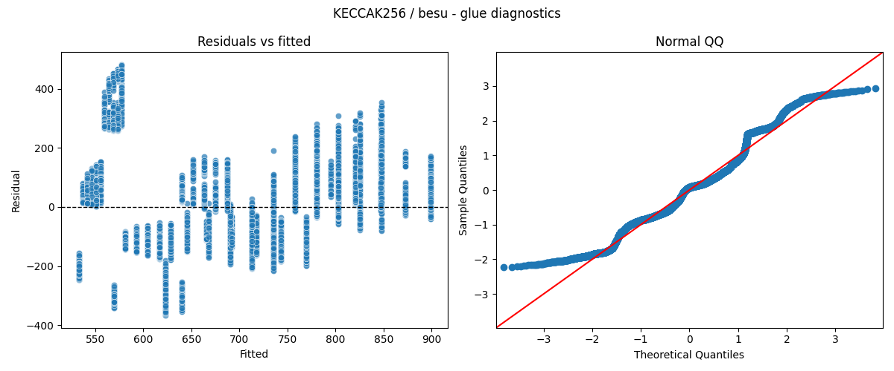

</details>

## erigon

| glue_opcode | nobs | glue_runtime_ms | p_value | rsquared |
| --- | --- | --- | --- | --- |
| `ISZERO` | 44 | 1.283e-06 | 1.00e-03 | 0.2121 |
| `JUMPDEST` | 44 | 7.637e-07 | 1.00e-03 | 0.9204 |
| `SWAP` | 704 | 1.303e-06 | 1.00e-03 | 0.519 |
| `CALLDATASIZE` | 2739 | 7.915e-07 | 1.00e-03 | 0.952 |
| `DUP` | 2739 | 1.033e-06 | 1.00e-03 | 0.952 |
| `GAS` | 2739 | 8.046e-07 | 1.00e-03 | 0.952 |
| `MLOAD` | 2739 | 3.471e-06 | 1.00e-03 | 0.952 |
| `PUSH` | 2739 | 2.62e-06 | 1.00e-03 | 0.952 |
| `PUSH0` | 2739 | 8.62e-07 | 1.00e-03 | 0.952 |
| `STATICCALL` | 2739 | 0.0005048 | 1.00e-03 | 0.952 |
| `ADD` | 44 | 2.903e-06 | 1.00e-03 | 0.9228 |
| `AND` | 44 | 2.922e-06 | 1.00e-03 | 0.9207 |
| `CALLDATACOPY` | 1056 | 7.269e-06 | 1.00e-03 | 0.8704 |
| `CALLDATALOAD` | 176 | 5.645e-05 | 1.00e-03 | 0.145 |
| `DIV` | 44 | 9.881e-06 | 1.00e-03 | 0.8985 |
| `EXP` | 44 | 0.0003492 | 1.00e-03 | 0.8856 |
| `GT` | 44 | 3.103e-06 | 1.00e-03 | 0.9137 |
| `JUMPI` | 44 | 3.504e-06 | 1.00e-03 | 0.8707 |
| `LT` | 44 | 3.05e-06 | 1.00e-03 | 0.941 |
| `MSTORE` | 220 | 6.021e-06 | 1.00e-03 | 0.6865 |
| `MSTORE8` | 220 | 5.112e-06 | 1.00e-03 | 0.6255 |
| `MUL` | 44 | 3.767e-06 | 1.00e-03 | 0.8925 |
| `PC` | 44 | 1.38e-06 | 1.00e-03 | 0.9289 |
| `RETURNDATASIZE` | 176 | 1.809e-06 | 1.00e-03 | 0.9228 |
| `SELFBALANCE` | 36 | 1.421e-06 | 1.00e-03 | 0.875 |
| `SUB` | 44 | 2.885e-06 | 1.00e-03 | 0.9326 |
| `JUMP` | 44 | 6.951e-06 | 1.00e-03 | 0.919 |
| `KECCAK256` | 704 | 1.877e-05 | 1.00e-03 | 0.06946 |

### Cycle glue — joint fit · erigon

<details><summary>Joint NNLS regression summary</summary>

```
==============================================================================
                           NNLS Regression Results                            
==============================================================================
Dep. Variable:          test_runtime_ms              R-squared:          0.952
Model:                  NNLS                    Adj. R-squared:          0.952
No. Observations:       2739                              RMSE:          40.51
Df Residuals:           2731                               MAE:          20.11
Df Model:               7      
==============================================================================
                      coef     std err     P-value      [0.025      0.975]
------------------------------------------------------------------------------
         const     29.2415      2.5125       0.001     24.6976     34.3505
  CALLDATASIZE      0.0000      0.0000       0.001      0.0000      0.0000
           DUP      0.0000      0.0000       0.001      0.0000      0.0000
           GAS      0.0000      0.0000       0.001      0.0000      0.0000
         MLOAD      0.0000      0.0000       0.001      0.0000      0.0000
          PUSH      0.0000      0.0000       0.001      0.0000      0.0000
         PUSH0      0.0000      0.0000       0.001      0.0000      0.0000
    STATICCALL      0.0005      0.0000       0.001      0.0005      0.0005
==============================================================================
Notes: Non-negative least squares with bootstrap inference (1000 iterations)
==============================================================================
```

</details>

<details><summary><code>CALLDATASIZE</code> · nobs=2739 · runtime_ms=7.915e-07 · p=1.00e-03 · R²=0.952</summary>

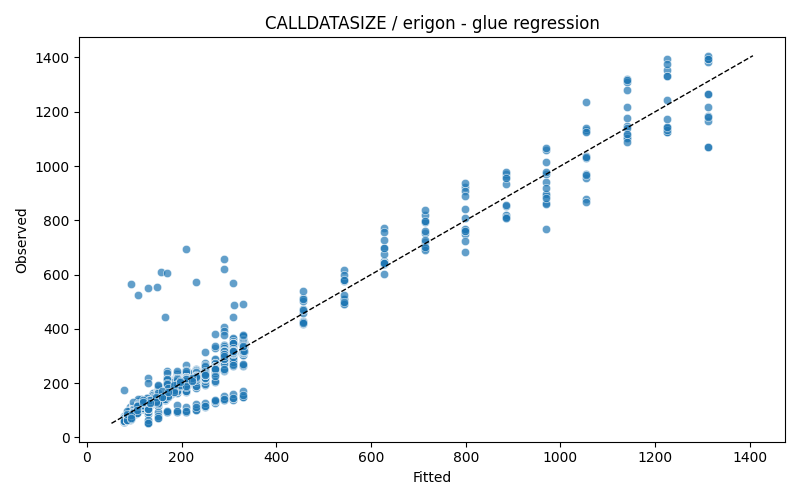

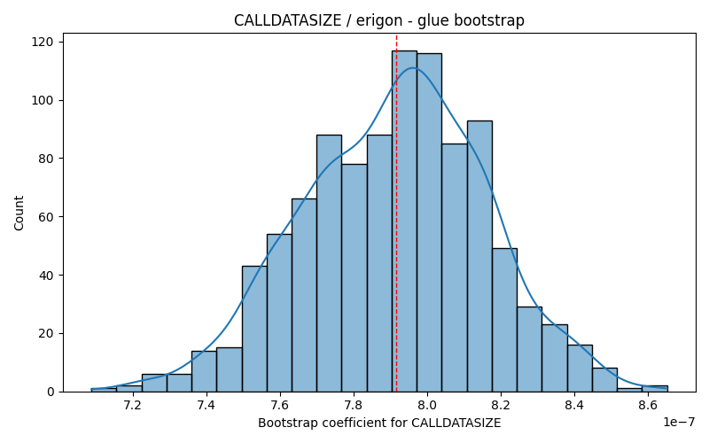

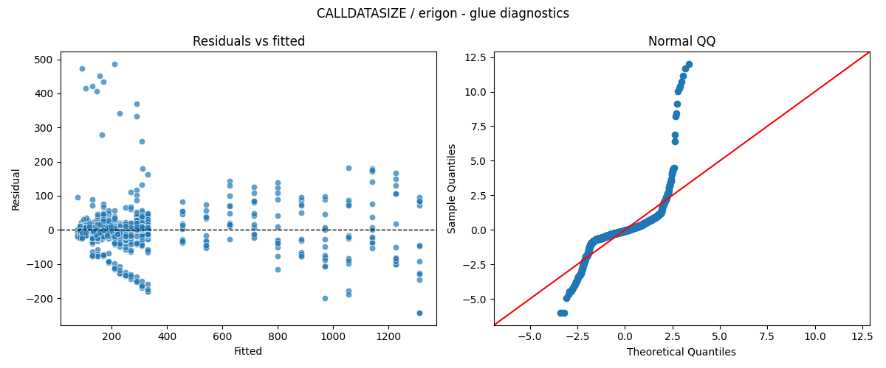

</details>

<details><summary><code>DUP</code> · nobs=2739 · runtime_ms=1.033e-06 · p=1.00e-03 · R²=0.952</summary>

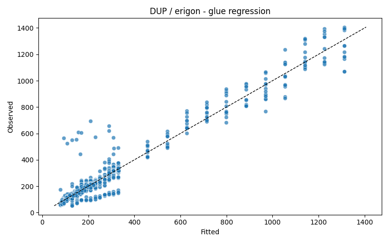

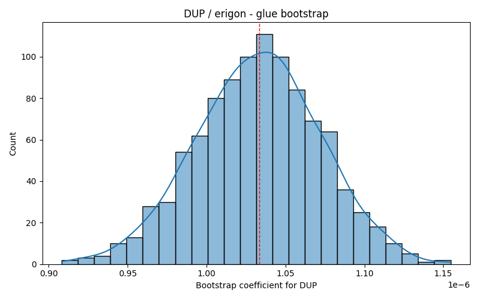


</details>

<details><summary><code>GAS</code> · nobs=2739 · runtime_ms=8.046e-07 · p=1.00e-03 · R²=0.952</summary>


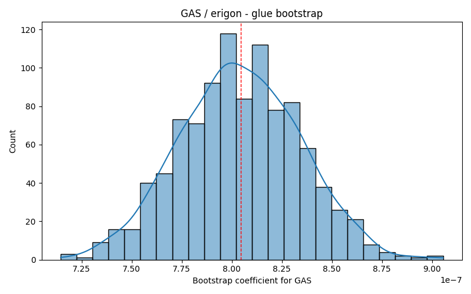

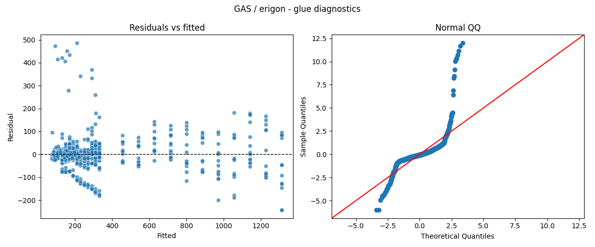

</details>

<details><summary><code>MLOAD</code> · nobs=2739 · runtime_ms=3.471e-06 · p=1.00e-03 · R²=0.952</summary>


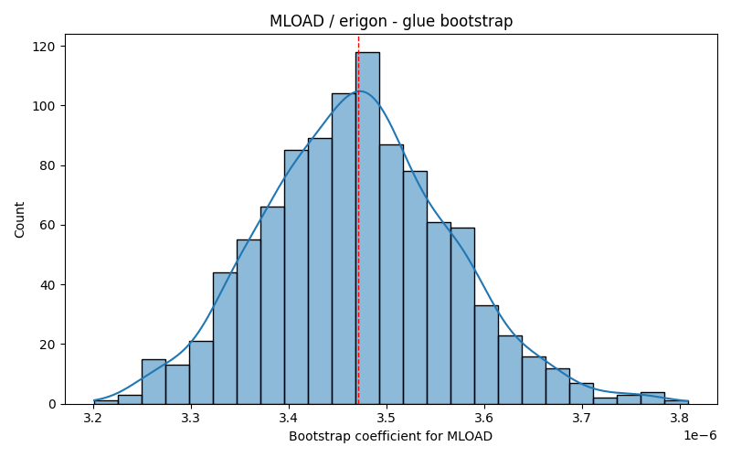


</details>

<details><summary><code>PUSH</code> · nobs=2739 · runtime_ms=2.62e-06 · p=1.00e-03 · R²=0.952</summary>


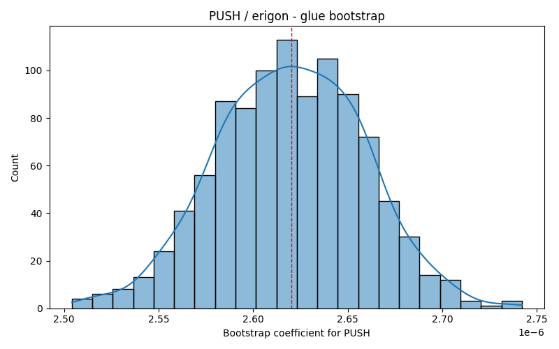


</details>

<details><summary><code>PUSH0</code> · nobs=2739 · runtime_ms=8.62e-07 · p=1.00e-03 · R²=0.952</summary>

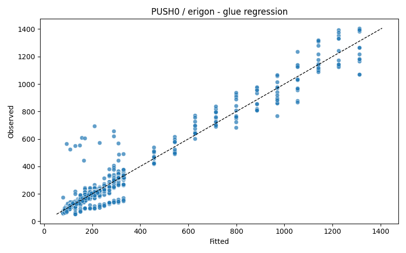

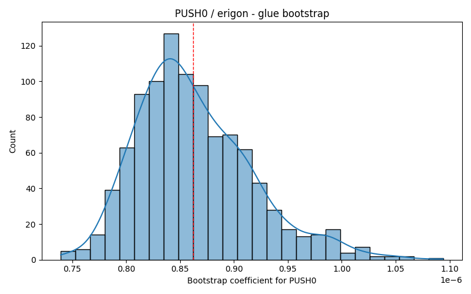


</details>

<details><summary><code>STATICCALL</code> · nobs=2739 · runtime_ms=0.0005048 · p=1.00e-03 · R²=0.952</summary>

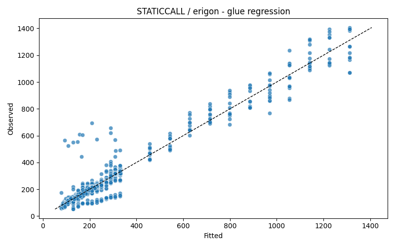

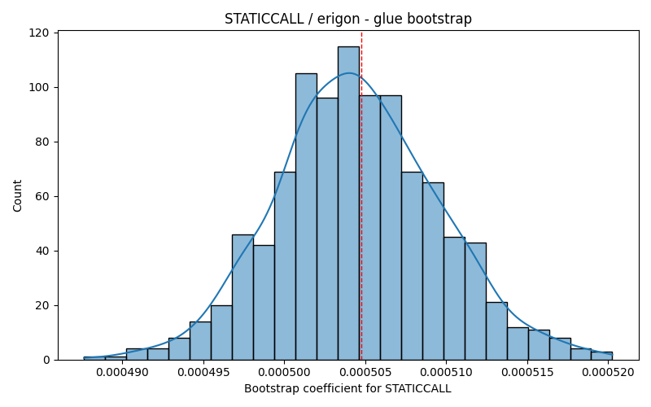

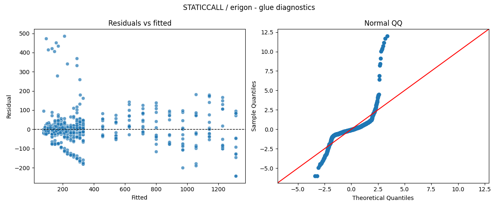

</details>

### Pure glue · erigon

<details><summary><code>ISZERO</code> · nobs=44 · runtime_ms=1.283e-06 · p=1.00e-03 · R²=0.2121</summary>

```
==============================================================================
                           NNLS Regression Results                            
==============================================================================
Dep. Variable:          test_runtime_ms              R-squared:          0.212
Model:                  NNLS                    Adj. R-squared:          0.193
No. Observations:       44                                RMSE:          52.04
Df Residuals:           42                                 MAE:          17.46
Df Model:               1      
==============================================================================
                      coef     std err     P-value      [0.025      0.975]
------------------------------------------------------------------------------
         const      7.9076      7.1197       0.208      0.0000     22.4053
        ISZERO      0.0000      0.0000       0.001      0.0000      0.0000
==============================================================================
Notes: Non-negative least squares with bootstrap inference (1000 iterations)
==============================================================================
```

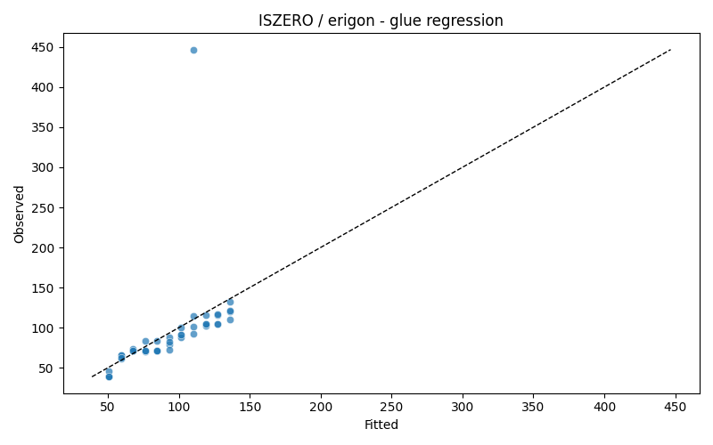


</details>

<details><summary><code>JUMPDEST</code> · nobs=44 · runtime_ms=7.637e-07 · p=1.00e-03 · R²=0.9204</summary>

```
==============================================================================
                           NNLS Regression Results                            
==============================================================================
Dep. Variable:          test_runtime_ms              R-squared:          0.920
Model:                  NNLS                    Adj. R-squared:          0.919
No. Observations:       44                                RMSE:          14.18
Df Residuals:           42                                 MAE:          11.36
Df Model:               1      
==============================================================================
                      coef     std err     P-value      [0.025      0.975]
------------------------------------------------------------------------------
         const     23.2901      6.9877       0.001     10.5176     37.7129
      JUMPDEST      0.0000      0.0000       0.001      0.0000      0.0000
==============================================================================
Notes: Non-negative least squares with bootstrap inference (1000 iterations)
==============================================================================
```


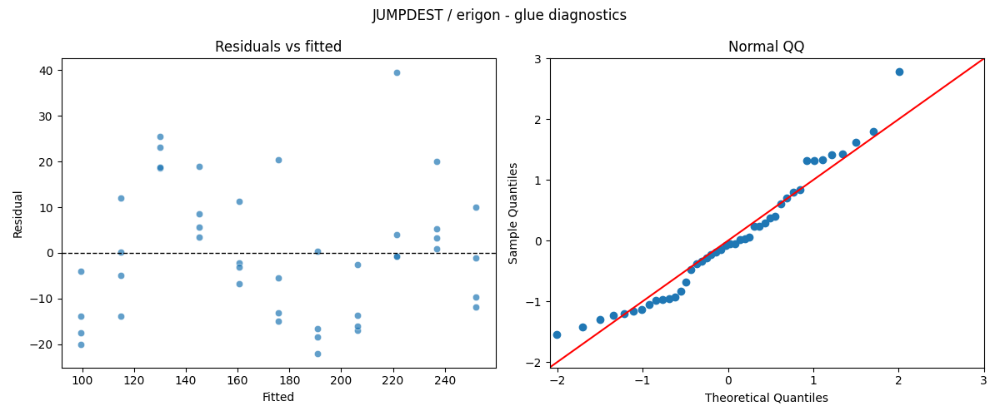

</details>

<details><summary><code>SWAP</code> · nobs=704 · runtime_ms=1.303e-06 · p=1.00e-03 · R²=0.519</summary>

```
==============================================================================
                           NNLS Regression Results                            
==============================================================================
Dep. Variable:          test_runtime_ms              R-squared:          0.519
Model:                  NNLS                    Adj. R-squared:          0.518
No. Observations:       704                               RMSE:          26.41
Df Residuals:           702                                MAE:           7.86
Df Model:               1      
==============================================================================
                      coef     std err     P-value      [0.025      0.975]
------------------------------------------------------------------------------
         const     20.3280      2.7048       0.001     14.5189     24.9267
          SWAP      0.0000      0.0000       0.001      0.0000      0.0000
==============================================================================
Notes: Non-negative least squares with bootstrap inference (1000 iterations)
==============================================================================
```

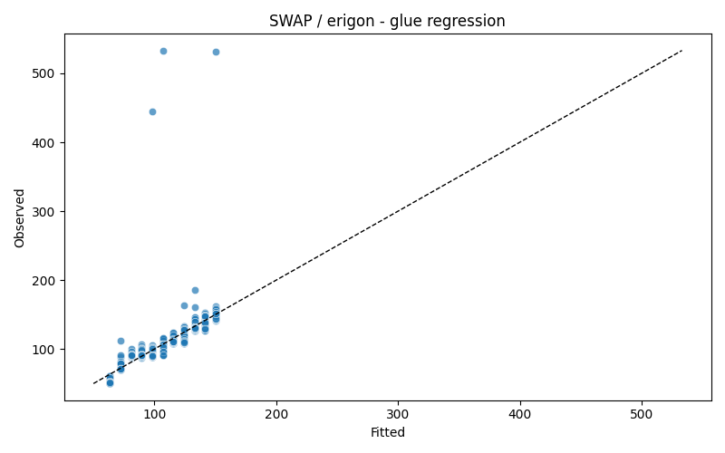

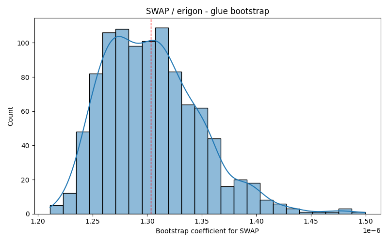


</details>

### Mixed glue (tier A) · erigon

<details><summary><code>ADD</code> · nobs=44 · runtime_ms=2.903e-06 · p=1.00e-03 · R²=0.9228</summary>

```
==============================================================================
                           NNLS Regression Results                            
==============================================================================
Dep. Variable:          test_runtime_ms              R-squared:          0.923
Model:                  NNLS                    Adj. R-squared:          0.921
No. Observations:       44                                RMSE:           8.84
Df Residuals:           42                                 MAE:           7.42
Df Model:               1      
==============================================================================
                      coef     std err     P-value      [0.025      0.975]
------------------------------------------------------------------------------
         const     13.6854      4.3344       0.001      6.0279     22.1092
           ADD      0.0000      0.0000       0.001      0.0000      0.0000
==============================================================================
Notes: Non-negative least squares with bootstrap inference (1000 iterations)
==============================================================================
```


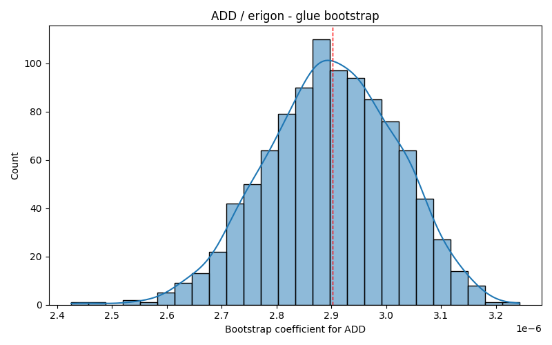


</details>

<details><summary><code>AND</code> · nobs=44 · runtime_ms=2.922e-06 · p=1.00e-03 · R²=0.9207</summary>

```
==============================================================================
                           NNLS Regression Results                            
==============================================================================
Dep. Variable:          test_runtime_ms              R-squared:          0.921
Model:                  NNLS                    Adj. R-squared:          0.919
No. Observations:       44                                RMSE:           9.02
Df Residuals:           42                                 MAE:           7.58
Df Model:               1      
==============================================================================
                      coef     std err     P-value      [0.025      0.975]
------------------------------------------------------------------------------
         const     11.5995      5.0606       0.010      2.0110     21.9248
           AND      0.0000      0.0000       0.001      0.0000      0.0000
==============================================================================
Notes: Non-negative least squares with bootstrap inference (1000 iterations)
==============================================================================
```

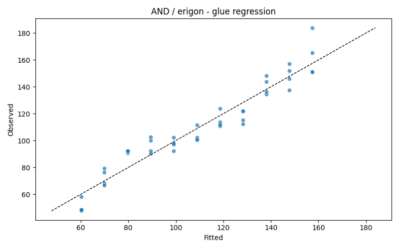

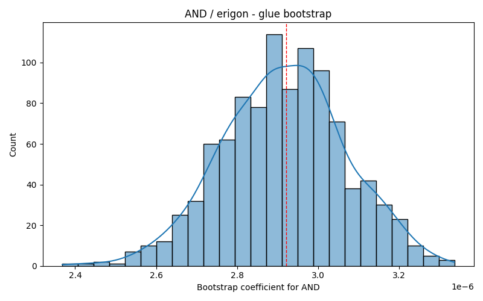

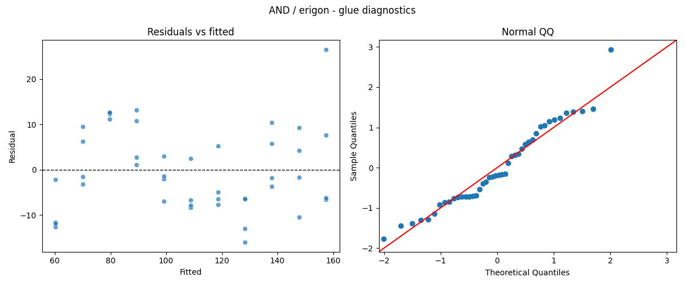

</details>

<details><summary><code>CALLDATACOPY</code> · nobs=1056 · runtime_ms=7.269e-06 · p=1.00e-03 · R²=0.8704</summary>

```
==============================================================================
                           NNLS Regression Results                            
==============================================================================
Dep. Variable:          test_runtime_ms              R-squared:          0.870
Model:                  NNLS                    Adj. R-squared:          0.870
No. Observations:       1056                              RMSE:          21.10
Df Residuals:           1054                               MAE:           8.26
Df Model:               1      
==============================================================================
                      coef     std err     P-value      [0.025      0.975]
------------------------------------------------------------------------------
         const     18.3827      1.3985       0.001     16.1956     21.4755
  CALLDATACOPY      0.0000      0.0000       0.001      0.0000      0.0000
==============================================================================
Notes: Non-negative least squares with bootstrap inference (1000 iterations)
==============================================================================
```


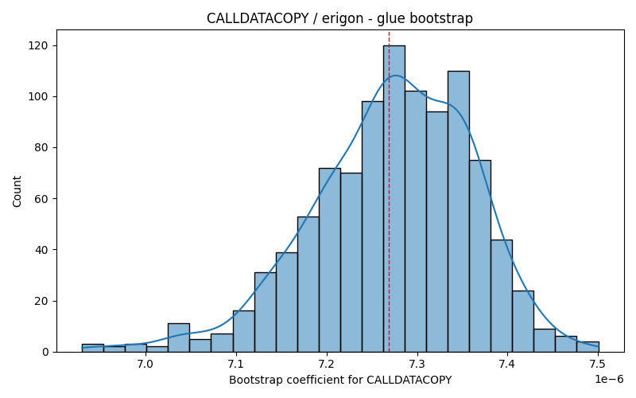


</details>

<details><summary><code>CALLDATALOAD</code> · nobs=176 · runtime_ms=5.645e-05 · p=1.00e-03 · R²=0.145</summary>

```
==============================================================================
                           NNLS Regression Results                            
==============================================================================
Dep. Variable:          test_runtime_ms              R-squared:          0.145
Model:                  NNLS                    Adj. R-squared:          0.140
No. Observations:       176                               RMSE:           0.53
Df Residuals:           174                                MAE:           0.39
Df Model:               1      
==============================================================================
                      coef     std err     P-value      [0.025      0.975]
------------------------------------------------------------------------------
         const      5.5322      0.1252       0.001      5.2831      5.7692
  CALLDATALOAD      0.0001      0.0000       0.001      0.0000      0.0001
==============================================================================
Notes: Non-negative least squares with bootstrap inference (1000 iterations)
==============================================================================
```

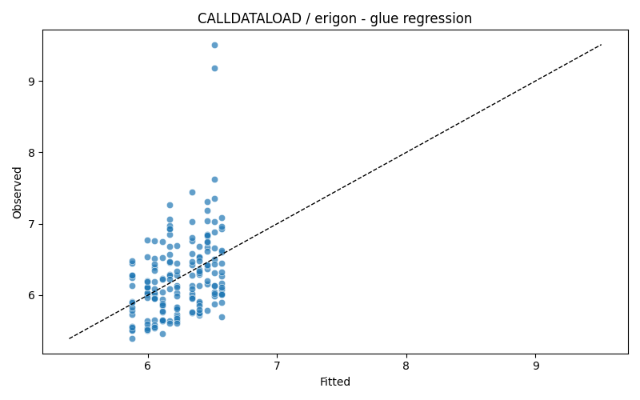


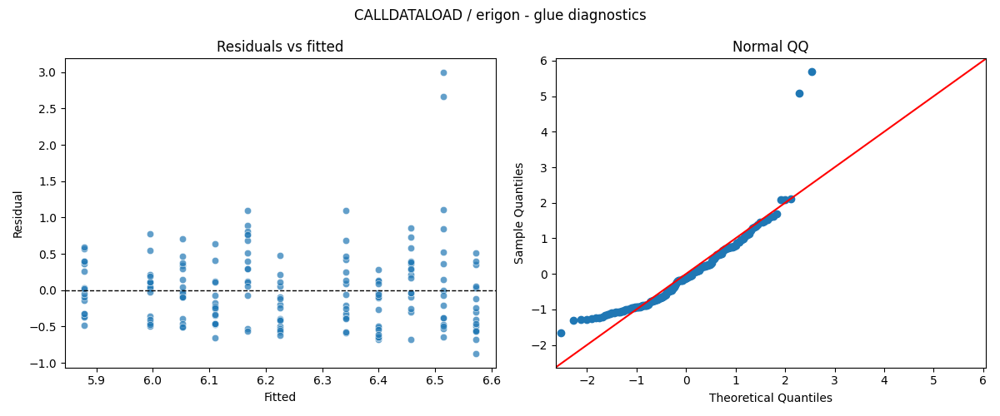

</details>

<details><summary><code>DIV</code> · nobs=44 · runtime_ms=9.881e-06 · p=1.00e-03 · R²=0.8985</summary>

```
==============================================================================
                           NNLS Regression Results                            
==============================================================================
Dep. Variable:          test_runtime_ms              R-squared:          0.899
Model:                  NNLS                    Adj. R-squared:          0.896
No. Observations:       44                                RMSE:          26.21
Df Residuals:           42                                 MAE:          22.70
Df Model:               1      
==============================================================================
                      coef     std err     P-value      [0.025      0.975]
------------------------------------------------------------------------------
         const     20.6923     12.9514       0.042      0.0000     49.9659
           DIV      0.0000      0.0000       0.001      0.0000      0.0000
==============================================================================
Notes: Non-negative least squares with bootstrap inference (1000 iterations)
==============================================================================
```


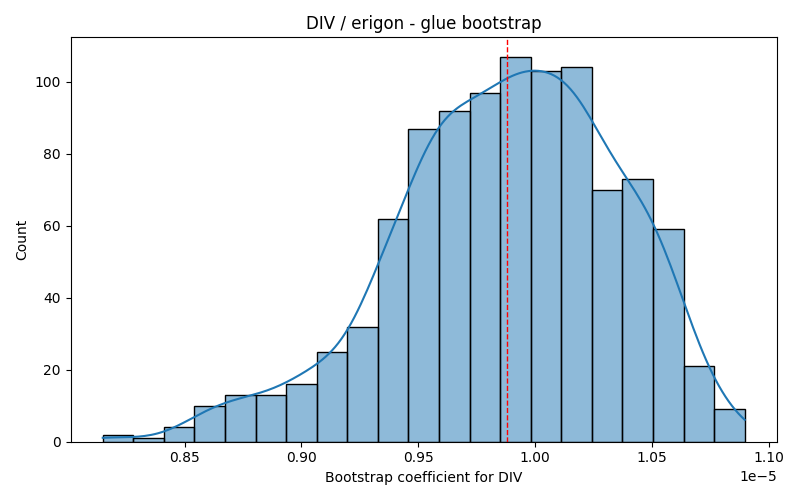

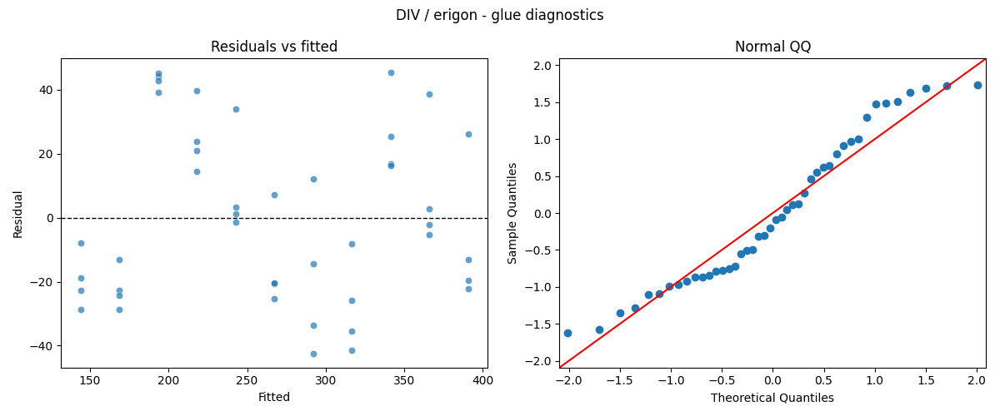

</details>

<details><summary><code>EXP</code> · nobs=44 · runtime_ms=0.0003492 · p=1.00e-03 · R²=0.8856</summary>

```
==============================================================================
                           NNLS Regression Results                            
==============================================================================
Dep. Variable:          test_runtime_ms              R-squared:          0.886
Model:                  NNLS                    Adj. R-squared:          0.883
No. Observations:       44                                RMSE:           4.91
Df Residuals:           42                                 MAE:           3.88
Df Model:               1      
==============================================================================
                      coef     std err     P-value      [0.025      0.975]
------------------------------------------------------------------------------
         const     11.7316      2.9295       0.001      5.8267     17.6718
           EXP      0.0003      0.0000       0.001      0.0003      0.0004
==============================================================================
Notes: Non-negative least squares with bootstrap inference (1000 iterations)
==============================================================================
```


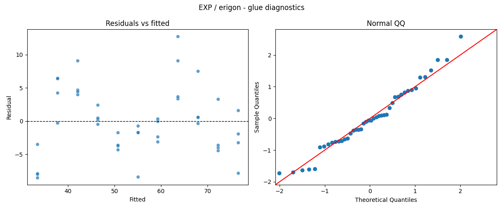

</details>

<details><summary><code>GT</code> · nobs=44 · runtime_ms=3.103e-06 · p=1.00e-03 · R²=0.9137</summary>

```
==============================================================================
                           NNLS Regression Results                            
==============================================================================
Dep. Variable:          test_runtime_ms              R-squared:          0.914
Model:                  NNLS                    Adj. R-squared:          0.912
No. Observations:       44                                RMSE:          10.04
Df Residuals:           42                                 MAE:           8.12
Df Model:               1      
==============================================================================
                      coef     std err     P-value      [0.025      0.975]
------------------------------------------------------------------------------
         const     15.5014      5.4113       0.001      5.6759     27.1221
            GT      0.0000      0.0000       0.001      0.0000      0.0000
==============================================================================
Notes: Non-negative least squares with bootstrap inference (1000 iterations)
==============================================================================
```


</details>

<details><summary><code>JUMPI</code> · nobs=44 · runtime_ms=3.504e-06 · p=1.00e-03 · R²=0.8707</summary>

```
==============================================================================
                           NNLS Regression Results                            
==============================================================================
Dep. Variable:          test_runtime_ms              R-squared:          0.871
Model:                  NNLS                    Adj. R-squared:          0.868
No. Observations:       44                                RMSE:           6.09
Df Residuals:           42                                 MAE:           5.15
Df Model:               1      
==============================================================================
                      coef     std err     P-value      [0.025      0.975]
------------------------------------------------------------------------------
         const     18.2924      3.8057       0.001     10.7970     25.6049
         JUMPI      0.0000      0.0000       0.001      0.0000      0.0000
==============================================================================
Notes: Non-negative least squares with bootstrap inference (1000 iterations)
==============================================================================
```


</details>

<details><summary><code>LT</code> · nobs=44 · runtime_ms=3.05e-06 · p=1.00e-03 · R²=0.941</summary>

```
==============================================================================
                           NNLS Regression Results                            
==============================================================================
Dep. Variable:          test_runtime_ms              R-squared:          0.941
Model:                  NNLS                    Adj. R-squared:          0.940
No. Observations:       44                                RMSE:           8.04
Df Residuals:           42                                 MAE:           6.51
Df Model:               1      
==============================================================================
                      coef     std err     P-value      [0.025      0.975]
------------------------------------------------------------------------------
         const     15.4075      4.4807       0.001      7.3460     24.8960
            LT      0.0000      0.0000       0.001      0.0000      0.0000
==============================================================================
Notes: Non-negative least squares with bootstrap inference (1000 iterations)
==============================================================================
```


</details>

<details><summary><code>MSTORE</code> · nobs=220 · runtime_ms=6.021e-06 · p=1.00e-03 · R²=0.6865</summary>

```
==============================================================================
                           NNLS Regression Results                            
==============================================================================
Dep. Variable:          test_runtime_ms              R-squared:          0.686
Model:                  NNLS                    Adj. R-squared:          0.685
No. Observations:       220                               RMSE:          28.56
Df Residuals:           218                                MAE:          11.29
Df Model:               1      
==============================================================================
                      coef     std err     P-value      [0.025      0.975]
------------------------------------------------------------------------------
         const     17.2368      5.9379       0.010      3.0545     26.2462
        MSTORE      0.0000      0.0000       0.001      0.0000      0.0000
==============================================================================
Notes: Non-negative least squares with bootstrap inference (1000 iterations)
==============================================================================
```


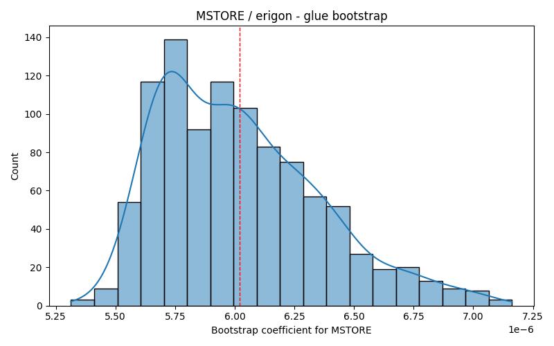

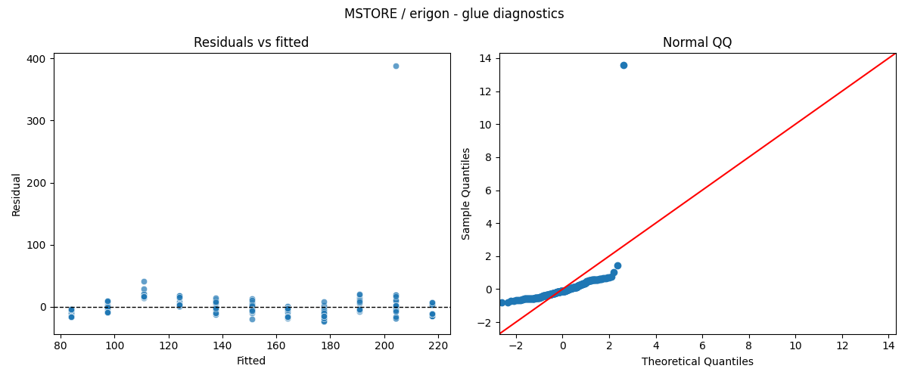

</details>

<details><summary><code>MSTORE8</code> · nobs=220 · runtime_ms=5.112e-06 · p=1.00e-03 · R²=0.6255</summary>

```
==============================================================================
                           NNLS Regression Results                            
==============================================================================
Dep. Variable:          test_runtime_ms              R-squared:          0.626
Model:                  NNLS                    Adj. R-squared:          0.624
No. Observations:       220                               RMSE:          27.76
Df Residuals:           218                                MAE:          10.72
Df Model:               1      
==============================================================================
                      coef     std err     P-value      [0.025      0.975]
------------------------------------------------------------------------------
         const     26.4350      3.3431       0.001     20.3056     33.0331
       MSTORE8      0.0000      0.0000       0.001      0.0000      0.0000
==============================================================================
Notes: Non-negative least squares with bootstrap inference (1000 iterations)
==============================================================================
```

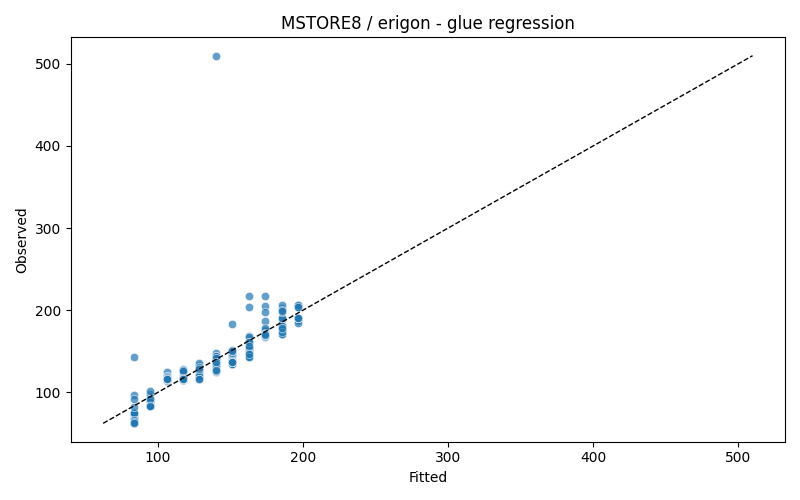


</details>

<details><summary><code>MUL</code> · nobs=44 · runtime_ms=3.767e-06 · p=1.00e-03 · R²=0.8925</summary>

```
==============================================================================
                           NNLS Regression Results                            
==============================================================================
Dep. Variable:          test_runtime_ms              R-squared:          0.892
Model:                  NNLS                    Adj. R-squared:          0.890
No. Observations:       44                                RMSE:          10.32
Df Residuals:           42                                 MAE:           7.81
Df Model:               1      
==============================================================================
                      coef     std err     P-value      [0.025      0.975]
------------------------------------------------------------------------------
         const      8.4627      5.1763       0.048      0.0000     20.0806
           MUL      0.0000      0.0000       0.001      0.0000      0.0000
==============================================================================
Notes: Non-negative least squares with bootstrap inference (1000 iterations)
==============================================================================
```


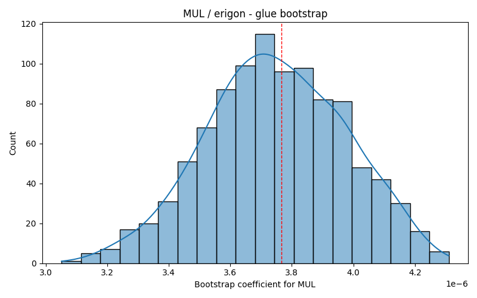


</details>

<details><summary><code>PC</code> · nobs=44 · runtime_ms=1.38e-06 · p=1.00e-03 · R²=0.9289</summary>

```
==============================================================================
                           NNLS Regression Results                            
==============================================================================
Dep. Variable:          test_runtime_ms              R-squared:          0.929
Model:                  NNLS                    Adj. R-squared:          0.927
No. Observations:       44                                RMSE:          11.41
Df Residuals:           42                                 MAE:           9.83
Df Model:               1      
==============================================================================
                      coef     std err     P-value      [0.025      0.975]
------------------------------------------------------------------------------
         const     19.0619      6.5267       0.001      7.5986     33.2337
            PC      0.0000      0.0000       0.001      0.0000      0.0000
==============================================================================
Notes: Non-negative least squares with bootstrap inference (1000 iterations)
==============================================================================
```

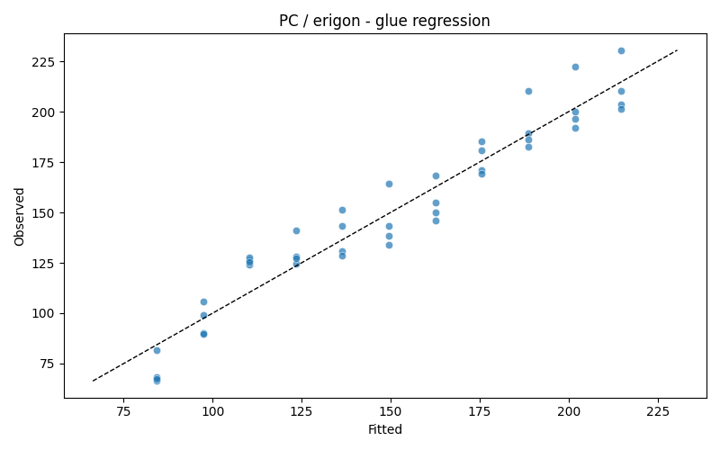


</details>

<details><summary><code>RETURNDATASIZE</code> · nobs=176 · runtime_ms=1.809e-06 · p=1.00e-03 · R²=0.9228</summary>

```
==============================================================================
                           NNLS Regression Results                            
==============================================================================
Dep. Variable:          test_runtime_ms              R-squared:          0.923
Model:                  NNLS                    Adj. R-squared:          0.922
No. Observations:       176                               RMSE:           8.26
Df Residuals:           174                                MAE:           6.48
Df Model:               1      
==============================================================================
                      coef     std err     P-value      [0.025      0.975]
------------------------------------------------------------------------------
         const     16.4983      2.2747       0.001     12.3891     21.3160
RETURNDATASIZE      0.0000      0.0000       0.001      0.0000      0.0000
==============================================================================
Notes: Non-negative least squares with bootstrap inference (1000 iterations)
==============================================================================
```


</details>

<details><summary><code>SELFBALANCE</code> · nobs=36 · runtime_ms=1.421e-06 · p=1.00e-03 · R²=0.875</summary>

```
==============================================================================
                           NNLS Regression Results                            
==============================================================================
Dep. Variable:          test_runtime_ms              R-squared:          0.875
Model:                  NNLS                    Adj. R-squared:          0.871
No. Observations:       36                                RMSE:           5.42
Df Residuals:           34                                 MAE:           4.54
Df Model:               1      
==============================================================================
                      coef     std err     P-value      [0.025      0.975]
------------------------------------------------------------------------------
         const     18.3292      4.0484       0.001      9.0982     25.1136
   SELFBALANCE      0.0000      0.0000       0.001      0.0000      0.0000
==============================================================================
Notes: Non-negative least squares with bootstrap inference (1000 iterations)
==============================================================================
```


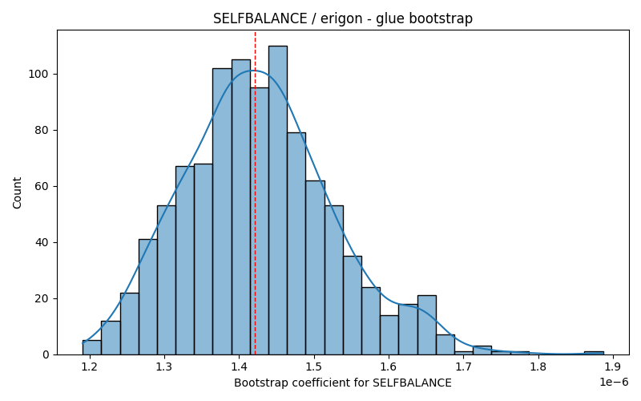

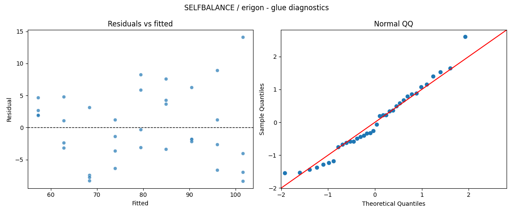

</details>

<details><summary><code>SUB</code> · nobs=44 · runtime_ms=2.885e-06 · p=1.00e-03 · R²=0.9326</summary>

```
==============================================================================
                           NNLS Regression Results                            
==============================================================================
Dep. Variable:          test_runtime_ms              R-squared:          0.933
Model:                  NNLS                    Adj. R-squared:          0.931
No. Observations:       44                                RMSE:           8.16
Df Residuals:           42                                 MAE:           6.57
Df Model:               1      
==============================================================================
                      coef     std err     P-value      [0.025      0.975]
------------------------------------------------------------------------------
         const     15.2403      4.4017       0.001      6.7179     23.6731
           SUB      0.0000      0.0000       0.001      0.0000      0.0000
==============================================================================
Notes: Non-negative least squares with bootstrap inference (1000 iterations)
==============================================================================
```


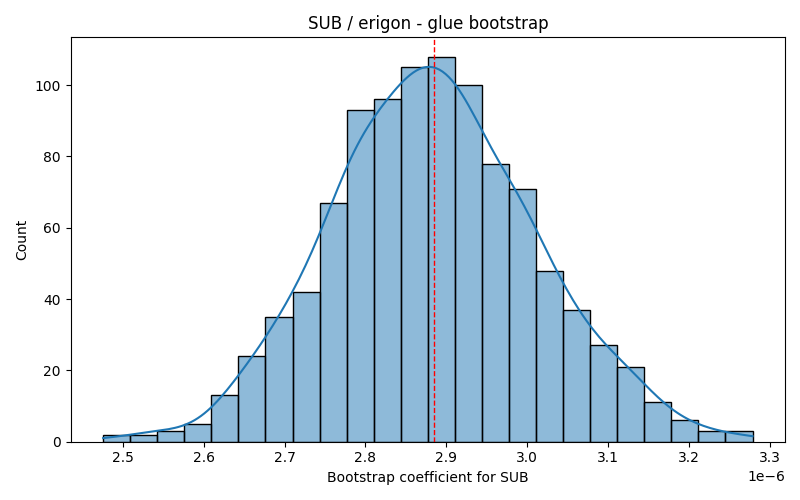


</details>

### Mixed glue (tier B) · erigon

<details><summary><code>JUMP</code> · nobs=44 · runtime_ms=6.951e-06 · p=1.00e-03 · R²=0.919</summary>

```
==============================================================================
                           NNLS Regression Results                            
==============================================================================
Dep. Variable:          test_runtime_ms              R-squared:          0.919
Model:                  NNLS                    Adj. R-squared:          0.917
No. Observations:       44                                RMSE:           7.67
Df Residuals:           42                                 MAE:           6.48
Df Model:               1      
==============================================================================
                      coef     std err     P-value      [0.025      0.975]
------------------------------------------------------------------------------
         const     17.3736      4.4655       0.001      9.4653     26.1253
          JUMP      0.0000      0.0000       0.001      0.0000      0.0000
==============================================================================
Notes: Non-negative least squares with bootstrap inference (1000 iterations)
==============================================================================
```


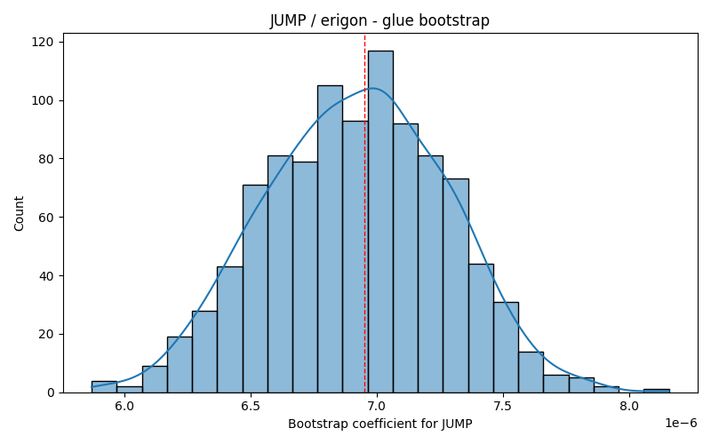

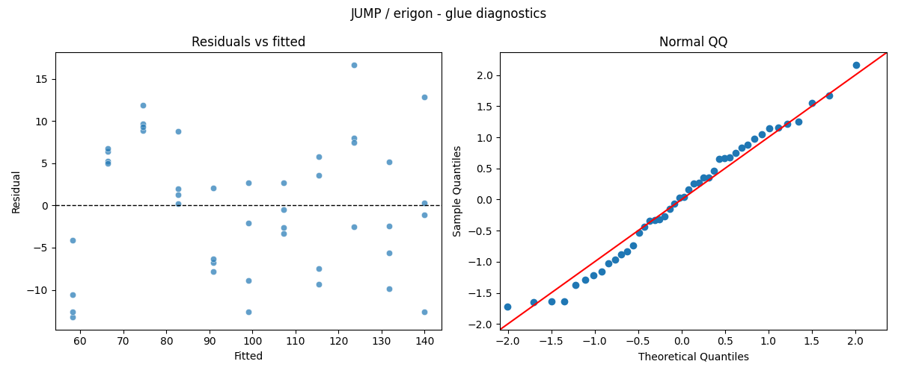

</details>

<details><summary><code>KECCAK256</code> · nobs=704 · runtime_ms=1.877e-05 · p=1.00e-03 · R²=0.06946</summary>

```
==============================================================================
                           NNLS Regression Results                            
==============================================================================
Dep. Variable:          test_runtime_ms              R-squared:          0.069
Model:                  NNLS                    Adj. R-squared:          0.068
No. Observations:       704                               RMSE:         136.53
Df Residuals:           702                                MAE:         109.66
Df Model:               1      
==============================================================================
                      coef     std err     P-value      [0.025      0.975]
------------------------------------------------------------------------------
         const    368.5237     11.3367       0.001    346.6106    390.9691
     KECCAK256      0.0000      0.0000       0.001      0.0000      0.0000
==============================================================================
Notes: Non-negative least squares with bootstrap inference (1000 iterations)
==============================================================================
```

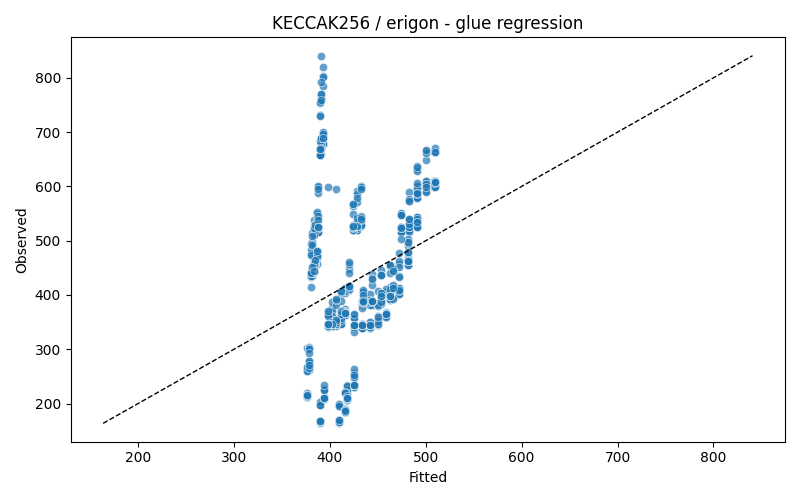

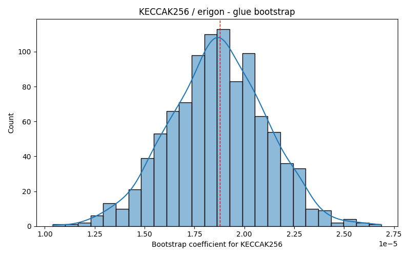


</details>

## geth

| glue_opcode | nobs | glue_runtime_ms | p_value | rsquared |
| --- | --- | --- | --- | --- |
| `ISZERO` | 539 | 8.375e-06 | 1.00e-03 | 0.9772 |
| `JUMPDEST` | 539 | 7.14e-06 | 1.00e-03 | 0.9761 |
| `SWAP` | 8624 | 9.46e-06 | 1.00e-03 | 0.9752 |
| `CALLDATASIZE` | 31801 | 9.178e-06 | 1.00e-03 | 0.947 |
| `DUP` | 31801 | 1.009e-05 | 1.00e-03 | 0.947 |
| `GAS` | 31801 | 9.244e-06 | 1.00e-03 | 0.947 |
| `MLOAD` | 31801 | 2.995e-05 | 1.00e-03 | 0.947 |
| `PUSH` | 31801 | 1.349e-05 | 1.00e-03 | 0.947 |
| `PUSH0` | 31801 | 9.085e-06 | 1.00e-03 | 0.947 |
| `STATICCALL` | 31801 | 0 | 1.00e+00 | 0.947 |
| `ADD` | 539 | 2.675e-05 | 1.00e-03 | 0.7912 |
| `AND` | 539 | 2.672e-05 | 1.00e-03 | 0.7416 |
| `CALLDATACOPY` | 12936 | 6.463e-05 | 1.00e-03 | 0.9921 |
| `CALLDATALOAD` | 2156 | 5.027e-05 | 1.00e-03 | 0.0235 |
| `DIV` | 539 | 5.858e-05 | 1.00e-03 | 0.9945 |
| `EXP` | 539 | 0.002074 | 1.00e-03 | 0.9944 |
| `GT` | 539 | 2.1e-05 | 1.00e-03 | 0.9572 |
| `JUMPI` | 539 | 3.293e-05 | 1.00e-03 | 0.9678 |
| `LT` | 539 | 2.554e-05 | 1.00e-03 | 0.7511 |
| `MSTORE` | 2695 | 4.833e-05 | 1.00e-03 | 0.9835 |
| `MSTORE8` | 2695 | 4.382e-05 | 1.00e-03 | 0.9706 |
| `MUL` | 539 | 2.699e-05 | 1.00e-03 | 0.9216 |
| `PC` | 539 | 9.426e-06 | 1.00e-03 | 0.9893 |
| `RETURNDATASIZE` | 2156 | 1.596e-05 | 1.00e-03 | 0.9312 |
| `SELFBALANCE` | 441 | 5.084e-05 | 1.00e-03 | 0.9879 |
| `SUB` | 539 | 2.696e-05 | 1.00e-03 | 0.7372 |
| `JUMP` | 539 | 5.736e-05 | 1.00e-03 | 0.9649 |
| `KECCAK256` | 8624 | 0.0002052 | 1.00e-03 | 0.3019 |

### Cycle glue — joint fit · geth

<details><summary>Joint NNLS regression summary</summary>

```
==============================================================================
                           NNLS Regression Results                            
==============================================================================
Dep. Variable:          test_runtime_ms              R-squared:          0.947
Model:                  NNLS                    Adj. R-squared:          0.947
No. Observations:       31801                             RMSE:          67.17
Df Residuals:           31793                              MAE:          34.98
Df Model:               7      
==============================================================================
                      coef     std err     P-value      [0.025      0.975]
------------------------------------------------------------------------------
         const      6.0956      1.0612       0.001      4.0177      8.2002
  CALLDATASIZE      0.0000      0.0000       0.001      0.0000      0.0000
           DUP      0.0000      0.0000       0.001      0.0000      0.0000
           GAS      0.0000      0.0000       0.001      0.0000      0.0000
         MLOAD      0.0000      0.0000       0.001      0.0000      0.0000
          PUSH      0.0000      0.0000       0.001      0.0000      0.0000
         PUSH0      0.0000      0.0000       0.001      0.0000      0.0000
    STATICCALL      0.0000      0.0000       1.000      0.0000      0.0000
==============================================================================
Notes: Non-negative least squares with bootstrap inference (1000 iterations)
==============================================================================
```

</details>

<details><summary><code>CALLDATASIZE</code> · nobs=31801 · runtime_ms=9.178e-06 · p=1.00e-03 · R²=0.947</summary>


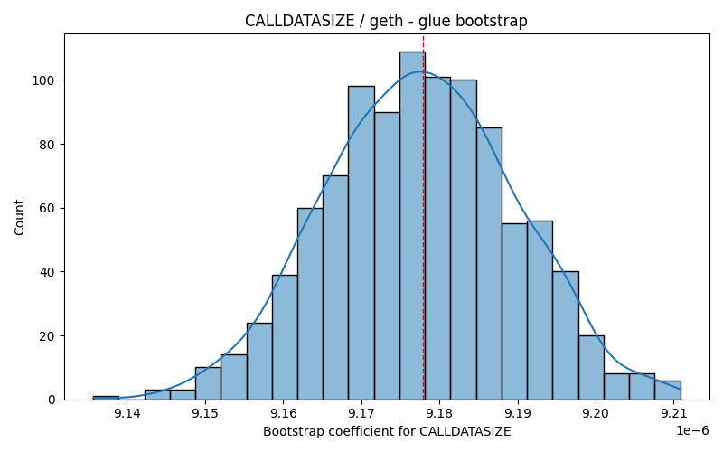

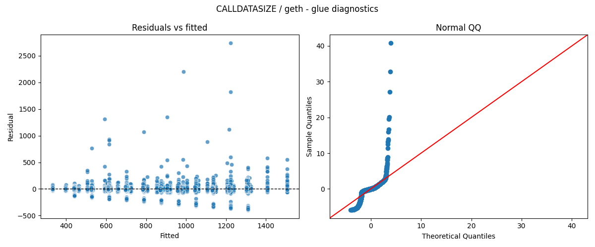

</details>

<details><summary><code>DUP</code> · nobs=31801 · runtime_ms=1.009e-05 · p=1.00e-03 · R²=0.947</summary>


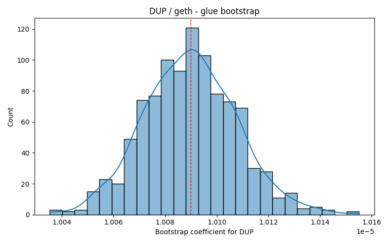


</details>

<details><summary><code>GAS</code> · nobs=31801 · runtime_ms=9.244e-06 · p=1.00e-03 · R²=0.947</summary>

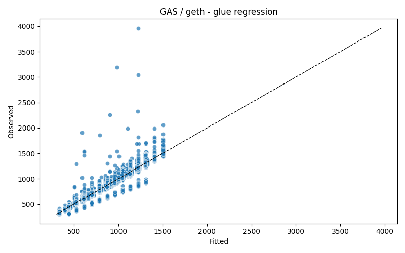

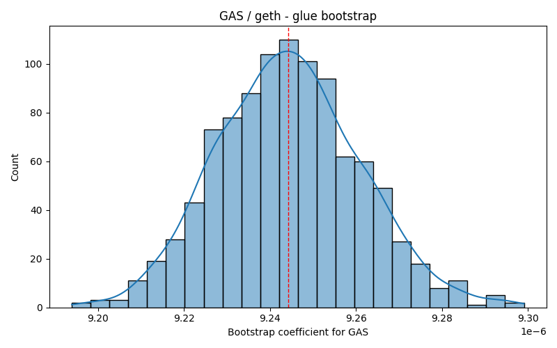


</details>

<details><summary><code>MLOAD</code> · nobs=31801 · runtime_ms=2.995e-05 · p=1.00e-03 · R²=0.947</summary>

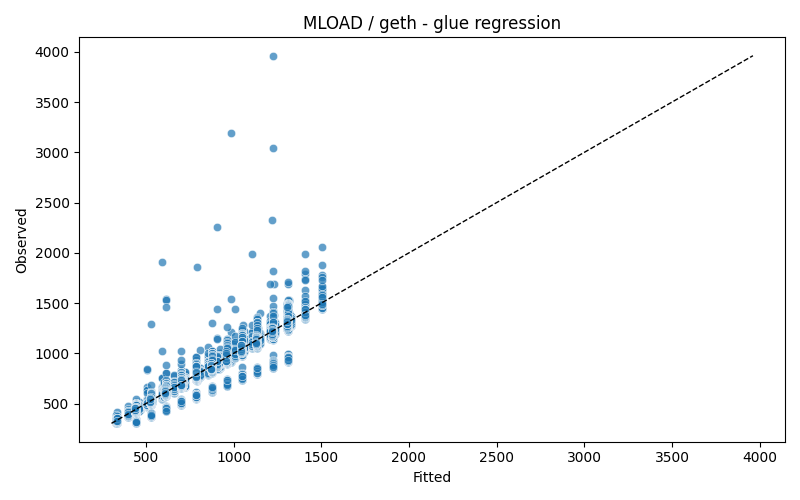

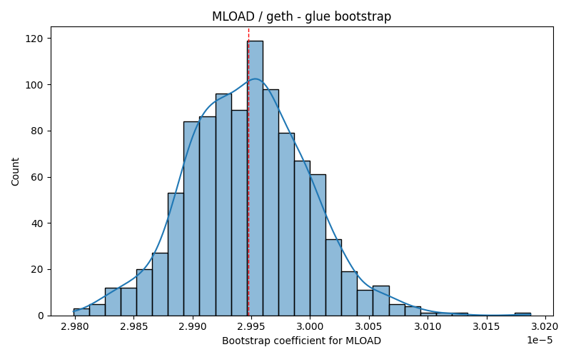


</details>

<details><summary><code>PUSH</code> · nobs=31801 · runtime_ms=1.349e-05 · p=1.00e-03 · R²=0.947</summary>

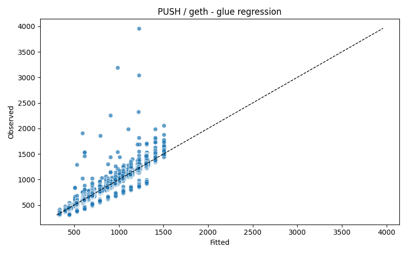

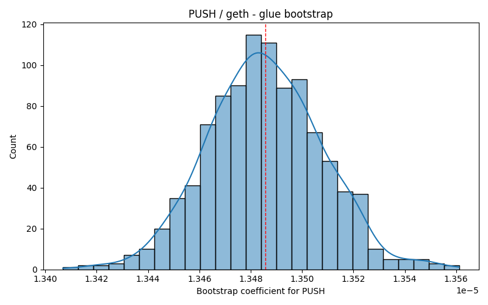


</details>

<details><summary><code>PUSH0</code> · nobs=31801 · runtime_ms=9.085e-06 · p=1.00e-03 · R²=0.947</summary>


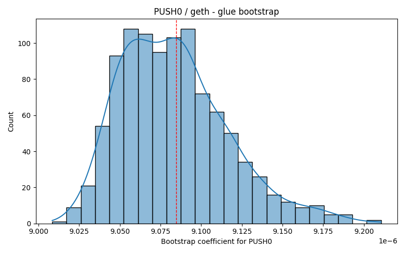

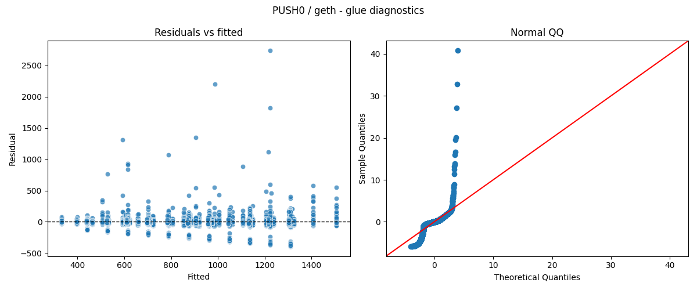

</details>

<details><summary><code>STATICCALL</code> · nobs=31801 · runtime_ms=0 · p=1.00e+00 · R²=0.947</summary>


</details>

### Pure glue · geth

<details><summary><code>ISZERO</code> · nobs=539 · runtime_ms=8.375e-06 · p=1.00e-03 · R²=0.9772</summary>

```
==============================================================================
                           NNLS Regression Results                            
==============================================================================
Dep. Variable:          test_runtime_ms              R-squared:          0.977
Model:                  NNLS                    Adj. R-squared:          0.977
No. Observations:       539                               RMSE:          26.93
Df Residuals:           537                                MAE:          15.26
Df Model:               1      
==============================================================================
                      coef     std err     P-value      [0.025      0.975]
------------------------------------------------------------------------------
         const      1.9406      2.3256       0.229      0.0000      8.0540
        ISZERO      0.0000      0.0000       0.001      0.0000      0.0000
==============================================================================
Notes: Non-negative least squares with bootstrap inference (1000 iterations)
==============================================================================
```

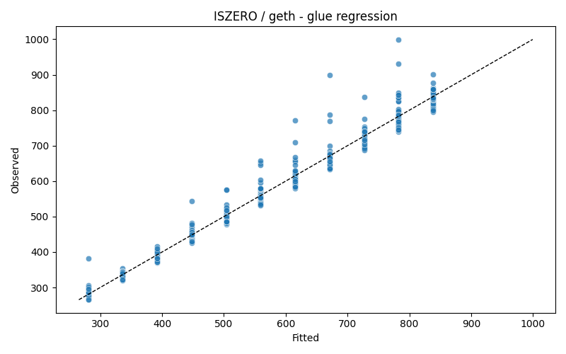

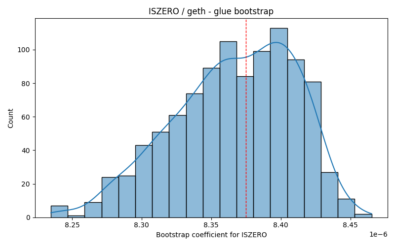

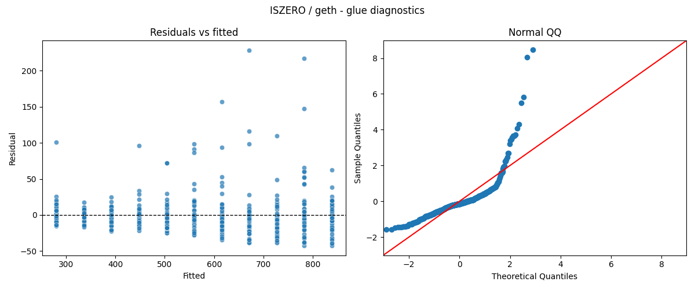

</details>

<details><summary><code>JUMPDEST</code> · nobs=539 · runtime_ms=7.14e-06 · p=1.00e-03 · R²=0.9761</summary>

```
==============================================================================
                           NNLS Regression Results                            
==============================================================================
Dep. Variable:          test_runtime_ms              R-squared:          0.976
Model:                  NNLS                    Adj. R-squared:          0.976
No. Observations:       539                               RMSE:          71.32
Df Residuals:           537                                MAE:          40.41
Df Model:               1      
==============================================================================
                      coef     std err     P-value      [0.025      0.975]
------------------------------------------------------------------------------
         const      0.0000      0.4255       1.000      0.0000      0.0000
      JUMPDEST      0.0000      0.0000       0.001      0.0000      0.0000
==============================================================================
Notes: Non-negative least squares with bootstrap inference (1000 iterations)
==============================================================================
```

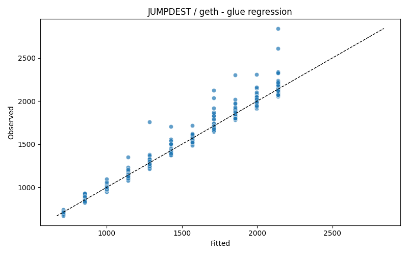

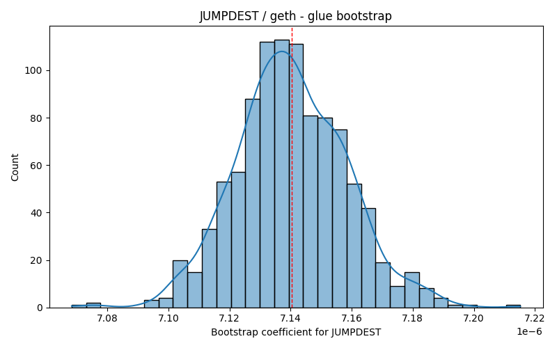

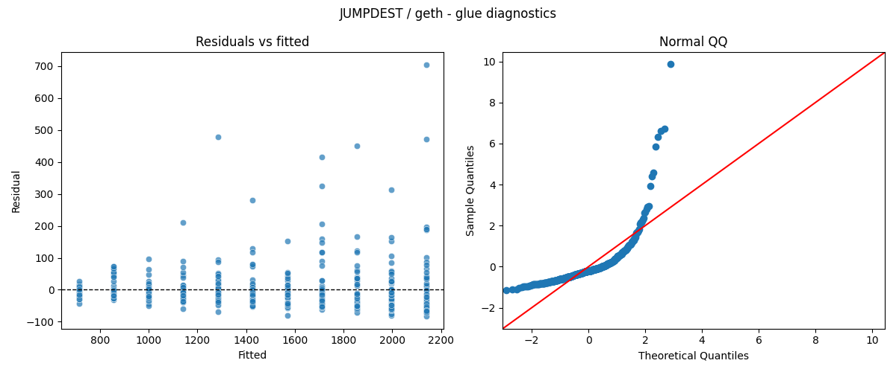

</details>

<details><summary><code>SWAP</code> · nobs=8624 · runtime_ms=9.46e-06 · p=1.00e-03 · R²=0.9752</summary>

```
==============================================================================
                           NNLS Regression Results                            
==============================================================================
Dep. Variable:          test_runtime_ms              R-squared:          0.975
Model:                  NNLS                    Adj. R-squared:          0.975
No. Observations:       8624                              RMSE:          31.74
Df Residuals:           8622                               MAE:          14.96
Df Model:               1      
==============================================================================
                      coef     std err     P-value      [0.025      0.975]
------------------------------------------------------------------------------
         const      8.0195      0.9659       0.001      6.0943      9.8327
          SWAP      0.0000      0.0000       0.001      0.0000      0.0000
==============================================================================
Notes: Non-negative least squares with bootstrap inference (1000 iterations)
==============================================================================
```

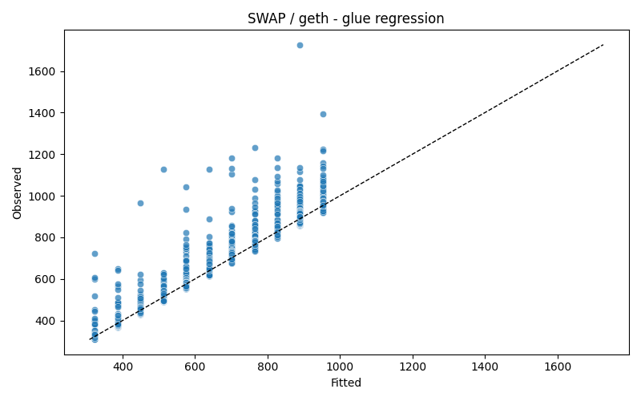

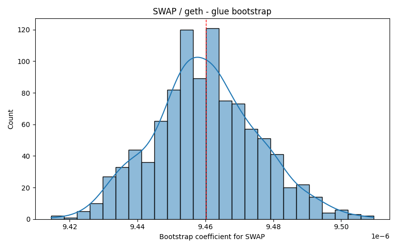

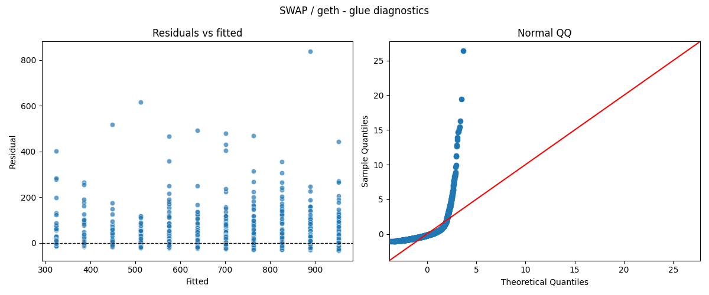

</details>

### Mixed glue (tier A) · geth

<details><summary><code>ADD</code> · nobs=539 · runtime_ms=2.675e-05 · p=1.00e-03 · R²=0.7912</summary>

```
==============================================================================
                           NNLS Regression Results                            
==============================================================================
Dep. Variable:          test_runtime_ms              R-squared:          0.791
Model:                  NNLS                    Adj. R-squared:          0.791
No. Observations:       539                               RMSE:         144.63
Df Residuals:           537                                MAE:         119.18
Df Model:               1      
==============================================================================
                      coef     std err     P-value      [0.025      0.975]
------------------------------------------------------------------------------
         const      2.8503     10.9789       0.448      0.0000     37.0116
           ADD      0.0000      0.0000       0.001      0.0000      0.0000
==============================================================================
Notes: Non-negative least squares with bootstrap inference (1000 iterations)
==============================================================================
```

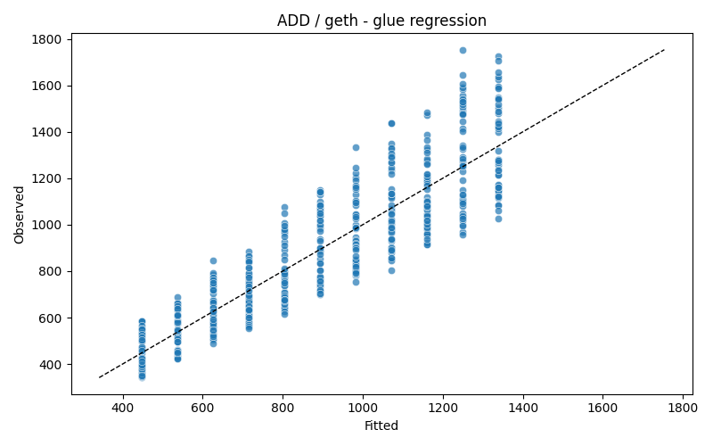

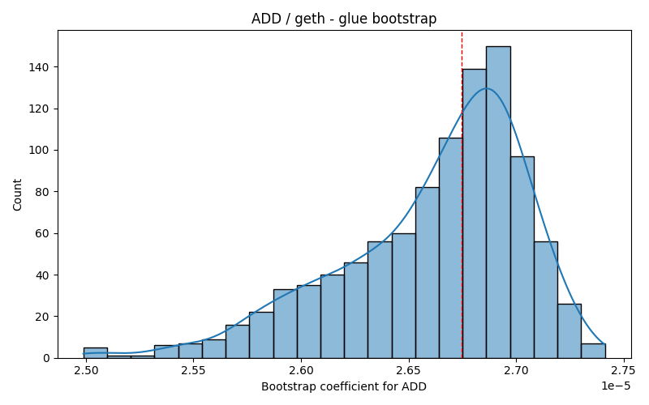

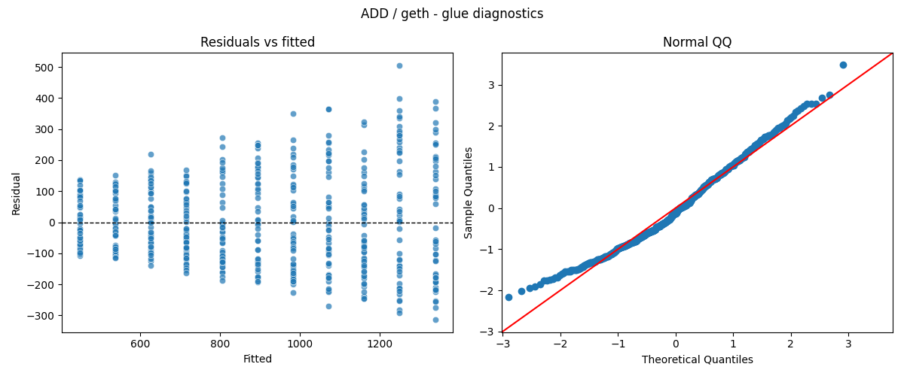

</details>

<details><summary><code>AND</code> · nobs=539 · runtime_ms=2.672e-05 · p=1.00e-03 · R²=0.7416</summary>

```
==============================================================================
                           NNLS Regression Results                            
==============================================================================
Dep. Variable:          test_runtime_ms              R-squared:          0.742
Model:                  NNLS                    Adj. R-squared:          0.741
No. Observations:       539                               RMSE:         167.25
Df Residuals:           537                                MAE:         124.75
Df Model:               1      
==============================================================================
                      coef     std err     P-value      [0.025      0.975]
------------------------------------------------------------------------------
         const      0.0000      8.9043       1.000      0.0000     30.8034
           AND      0.0000      0.0000       0.001      0.0000      0.0000
==============================================================================
Notes: Non-negative least squares with bootstrap inference (1000 iterations)
==============================================================================
```

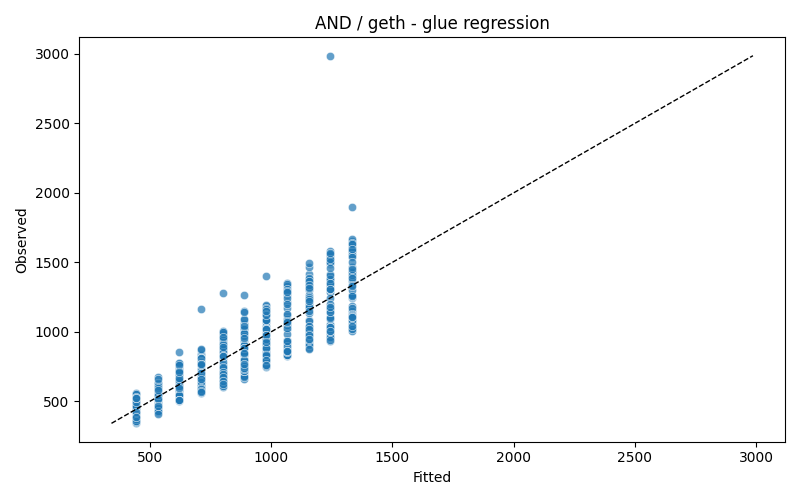

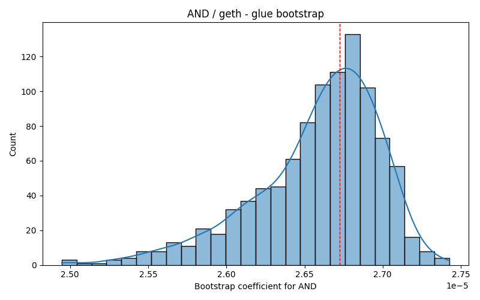

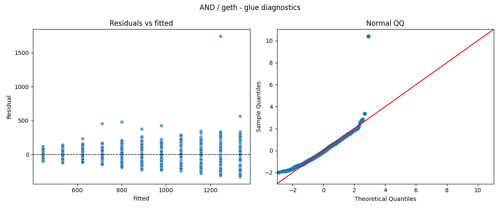

</details>

<details><summary><code>CALLDATACOPY</code> · nobs=12936 · runtime_ms=6.463e-05 · p=1.00e-03 · R²=0.9921</summary>

```
==============================================================================
                           NNLS Regression Results                            
==============================================================================
Dep. Variable:          test_runtime_ms              R-squared:          0.992
Model:                  NNLS                    Adj. R-squared:          0.992
No. Observations:       12936                             RMSE:          43.36
Df Residuals:           12934                              MAE:          25.92
Df Model:               1      
==============================================================================
                      coef     std err     P-value      [0.025      0.975]
------------------------------------------------------------------------------
         const     49.2530      0.4611       0.001     48.3923     50.1225
  CALLDATACOPY      0.0001      0.0000       0.001      0.0001      0.0001
==============================================================================
Notes: Non-negative least squares with bootstrap inference (1000 iterations)
==============================================================================
```

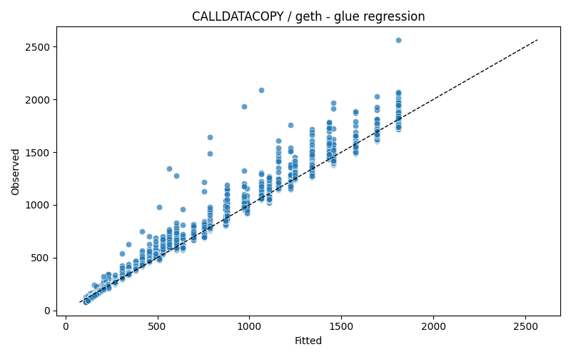

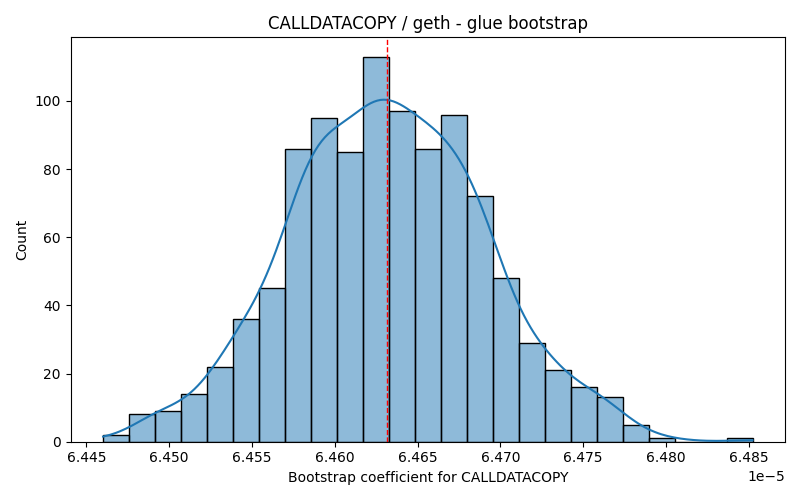

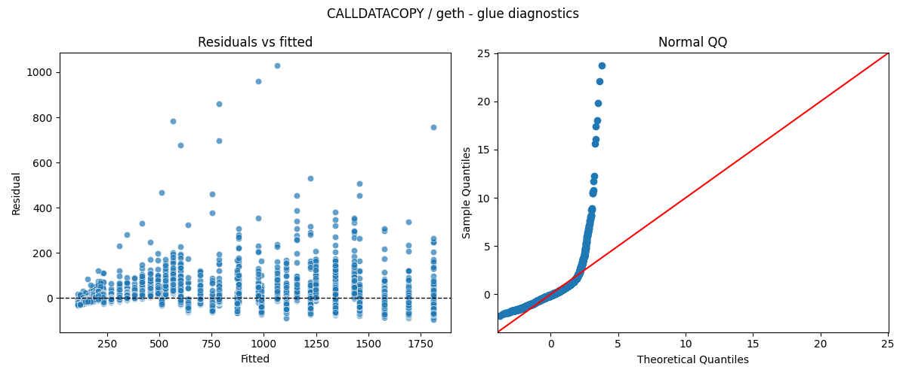

</details>

<details><summary><code>CALLDATALOAD</code> · nobs=2156 · runtime_ms=5.027e-05 · p=1.00e-03 · R²=0.0235</summary>

```
==============================================================================
                           NNLS Regression Results                            
==============================================================================
Dep. Variable:          test_runtime_ms              R-squared:          0.023
Model:                  NNLS                    Adj. R-squared:          0.023
No. Observations:       2156                              RMSE:           1.24
Df Residuals:           2154                               MAE:           0.64
Df Model:               1      
==============================================================================
                      coef     std err     P-value      [0.025      0.975]
------------------------------------------------------------------------------
         const      2.7485      0.0880       0.001      2.5863      2.9284
  CALLDATALOAD      0.0001      0.0000       0.001      0.0000      0.0001
==============================================================================
Notes: Non-negative least squares with bootstrap inference (1000 iterations)
==============================================================================
```

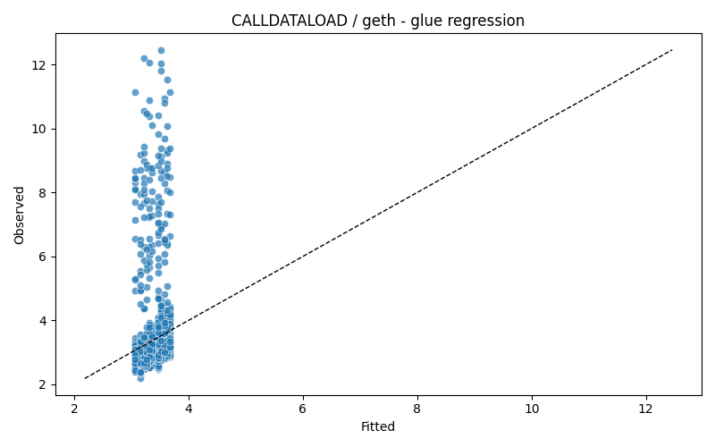

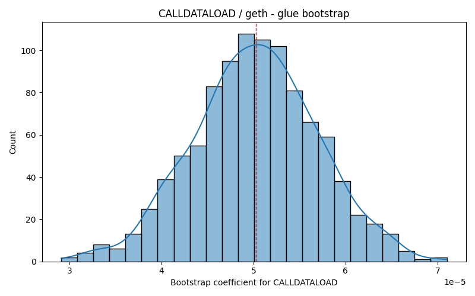

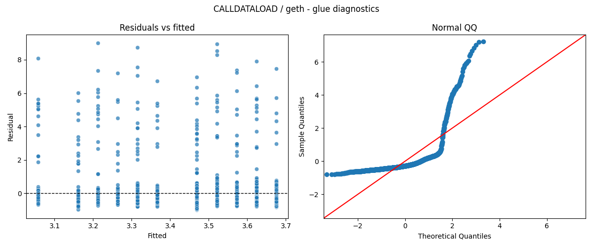

</details>

<details><summary><code>DIV</code> · nobs=539 · runtime_ms=5.858e-05 · p=1.00e-03 · R²=0.9945</summary>

```
==============================================================================
                           NNLS Regression Results                            
==============================================================================
Dep. Variable:          test_runtime_ms              R-squared:          0.994
Model:                  NNLS                    Adj. R-squared:          0.994
No. Observations:       539                               RMSE:          34.40
Df Residuals:           537                                MAE:          23.08
Df Model:               1      
==============================================================================
                      coef     std err     P-value      [0.025      0.975]
------------------------------------------------------------------------------
         const      8.4783      3.7766       0.021      0.3411     15.9602
           DIV      0.0001      0.0000       0.001      0.0001      0.0001
==============================================================================
Notes: Non-negative least squares with bootstrap inference (1000 iterations)
==============================================================================
```

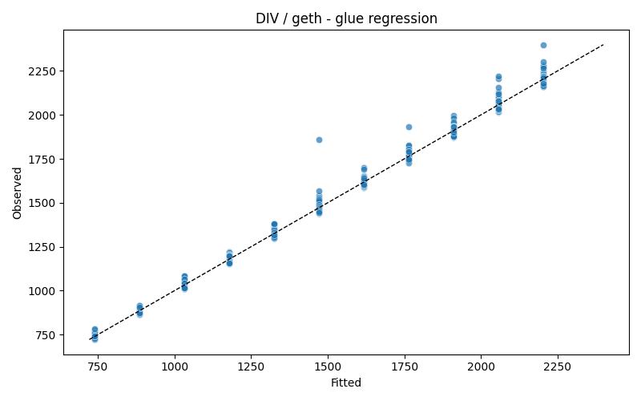

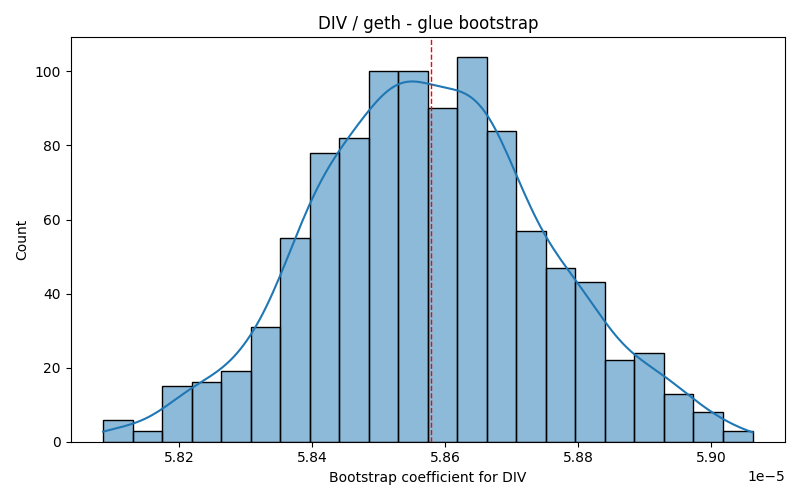

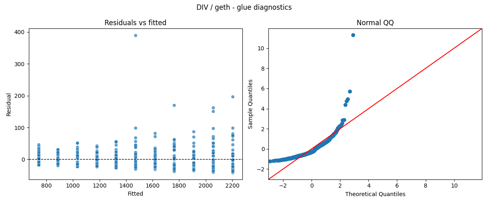

</details>

<details><summary><code>EXP</code> · nobs=539 · runtime_ms=0.002074 · p=1.00e-03 · R²=0.9944</summary>

```
==============================================================================
                           NNLS Regression Results                            
==============================================================================
Dep. Variable:          test_runtime_ms              R-squared:          0.994
Model:                  NNLS                    Adj. R-squared:          0.994
No. Observations:       539                               RMSE:           6.08
Df Residuals:           537                                MAE:           5.09
Df Model:               1      
==============================================================================
                      coef     std err     P-value      [0.025      0.975]
------------------------------------------------------------------------------
         const      5.8350      0.7739       0.001      4.4032      7.3517
           EXP      0.0021      0.0000       0.001      0.0021      0.0021
==============================================================================
Notes: Non-negative least squares with bootstrap inference (1000 iterations)
==============================================================================
```

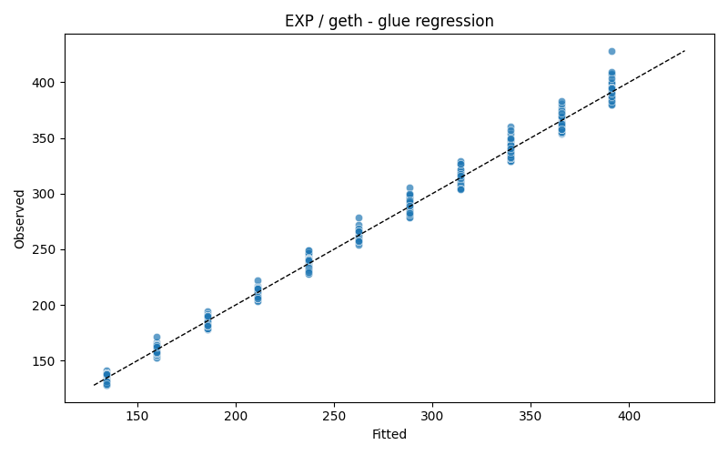

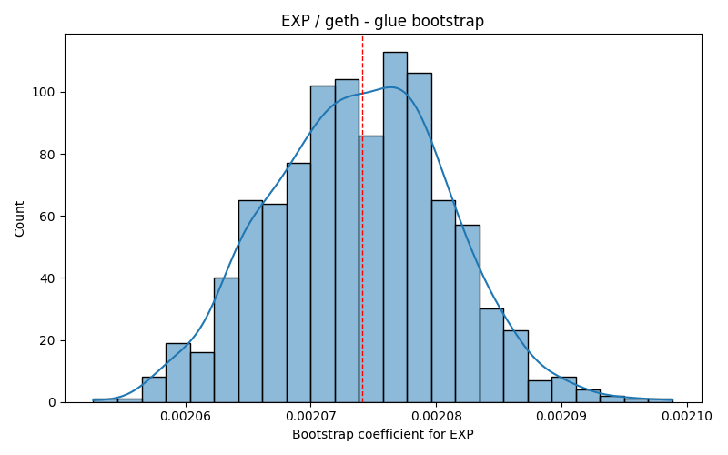

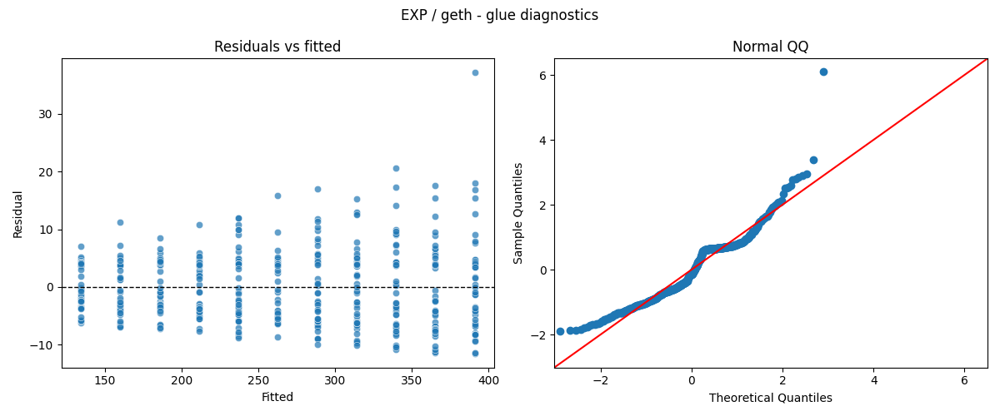

</details>

<details><summary><code>GT</code> · nobs=539 · runtime_ms=2.1e-05 · p=1.00e-03 · R²=0.9572</summary>

```
==============================================================================
                           NNLS Regression Results                            
==============================================================================
Dep. Variable:          test_runtime_ms              R-squared:          0.957
Model:                  NNLS                    Adj. R-squared:          0.957
No. Observations:       539                               RMSE:          46.80
Df Residuals:           537                                MAE:          19.68
Df Model:               1      
==============================================================================
                      coef     std err     P-value      [0.025      0.975]
------------------------------------------------------------------------------
         const      0.0000      2.9359       1.000      0.0000      9.8909
            GT      0.0000      0.0000       0.001      0.0000      0.0000
==============================================================================
Notes: Non-negative least squares with bootstrap inference (1000 iterations)
==============================================================================
```

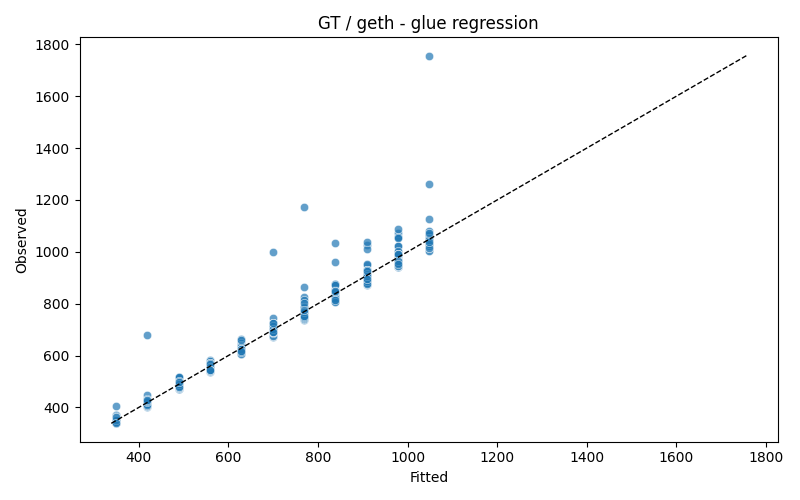

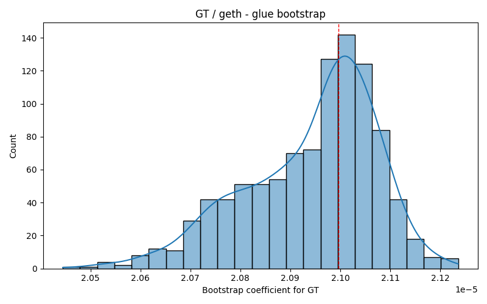

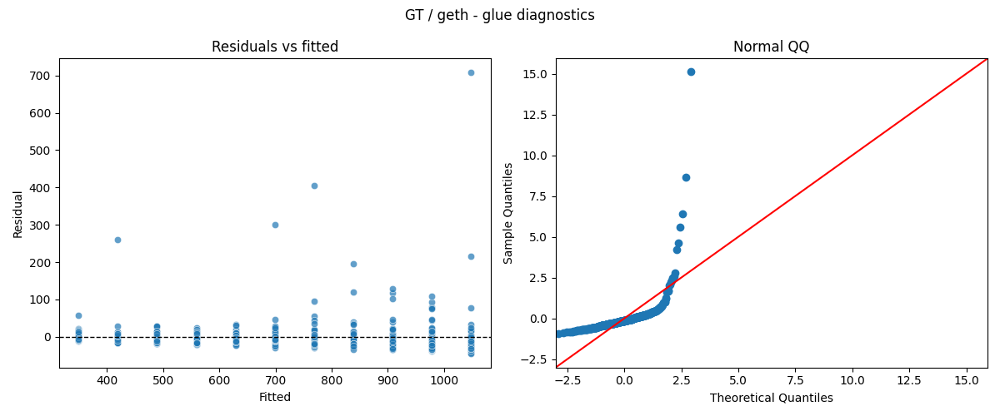

</details>

<details><summary><code>JUMPI</code> · nobs=539 · runtime_ms=3.293e-05 · p=1.00e-03 · R²=0.9678</summary>

```
==============================================================================
                           NNLS Regression Results                            
==============================================================================
Dep. Variable:          test_runtime_ms              R-squared:          0.968
Model:                  NNLS                    Adj. R-squared:          0.968
No. Observations:       539                               RMSE:          27.09
Df Residuals:           537                                MAE:          12.50
Df Model:               1      
==============================================================================
                      coef     std err     P-value      [0.025      0.975]
------------------------------------------------------------------------------
         const      1.8701      2.6511       0.292      0.0000      8.4180
         JUMPI      0.0000      0.0000       0.001      0.0000      0.0000
==============================================================================
Notes: Non-negative least squares with bootstrap inference (1000 iterations)
==============================================================================
```

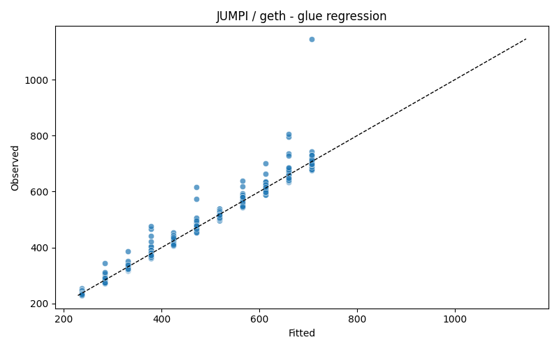

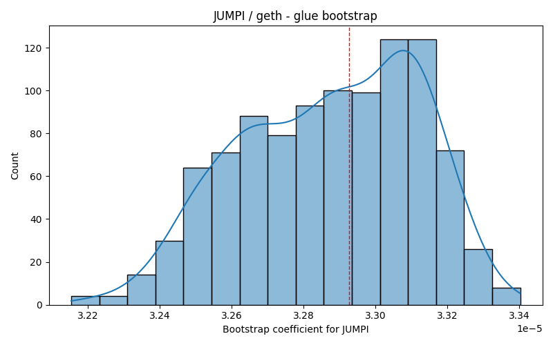

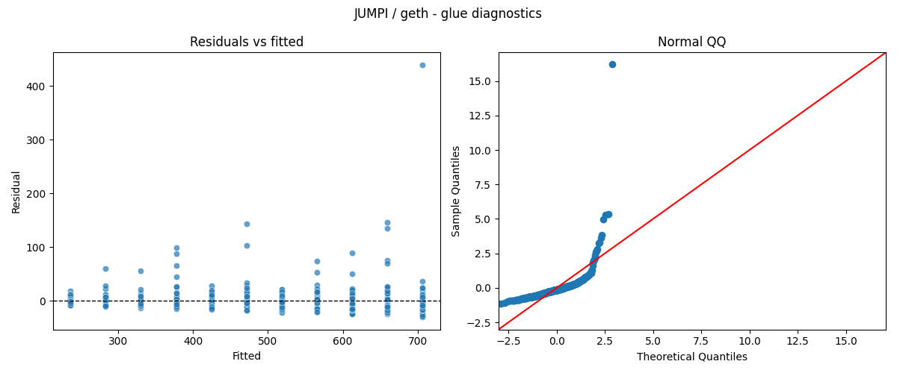

</details>

<details><summary><code>LT</code> · nobs=539 · runtime_ms=2.554e-05 · p=1.00e-03 · R²=0.7511</summary>

```
==============================================================================
                           NNLS Regression Results                            
==============================================================================
Dep. Variable:          test_runtime_ms              R-squared:          0.751
Model:                  NNLS                    Adj. R-squared:          0.751
No. Observations:       539                               RMSE:         155.54
Df Residuals:           537                                MAE:         122.62
Df Model:               1      
==============================================================================
                      coef     std err     P-value      [0.025      0.975]
------------------------------------------------------------------------------
         const      0.0000      9.3342       1.000      0.0000     31.3009
            LT      0.0000      0.0000       0.001      0.0000      0.0000
==============================================================================
Notes: Non-negative least squares with bootstrap inference (1000 iterations)
==============================================================================
```

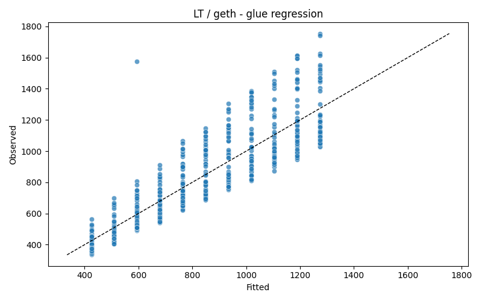

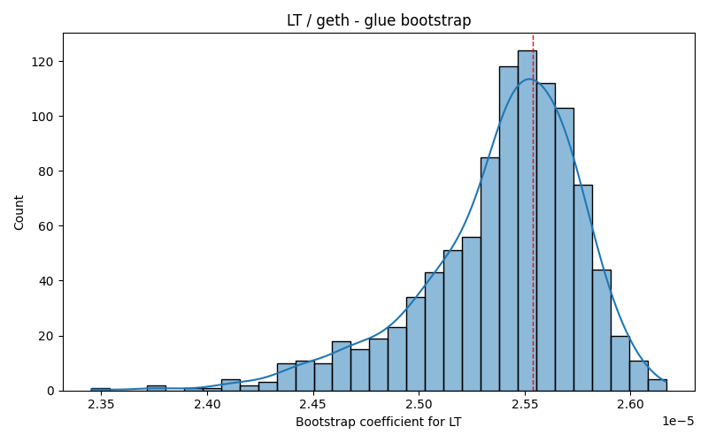

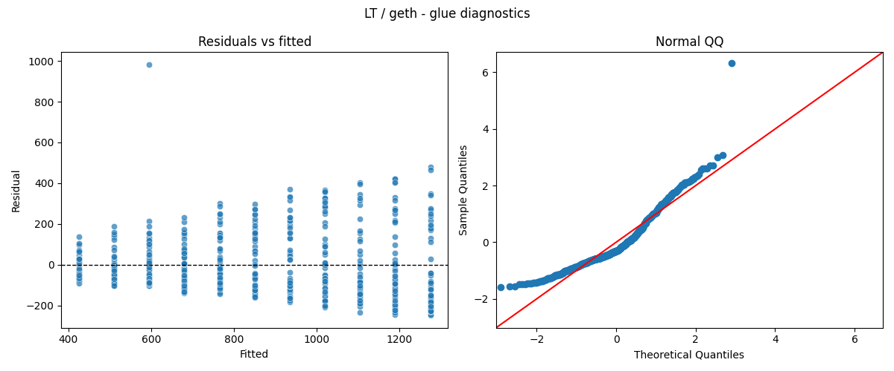

</details>

<details><summary><code>MSTORE</code> · nobs=2695 · runtime_ms=4.833e-05 · p=1.00e-03 · R²=0.9835</summary>

```
==============================================================================
                           NNLS Regression Results                            
==============================================================================
Dep. Variable:          test_runtime_ms              R-squared:          0.984
Model:                  NNLS                    Adj. R-squared:          0.984
No. Observations:       2695                              RMSE:          43.90
Df Residuals:           2693                               MAE:          23.72
Df Model:               1      
==============================================================================
                      coef     std err     P-value      [0.025      0.975]
------------------------------------------------------------------------------
         const     12.2477      2.4473       0.001      7.9229     17.6006
        MSTORE      0.0000      0.0000       0.001      0.0000      0.0000
==============================================================================
Notes: Non-negative least squares with bootstrap inference (1000 iterations)
==============================================================================
```

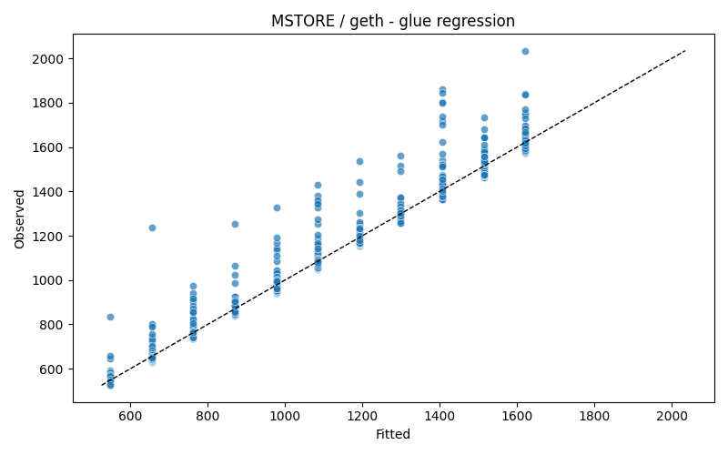

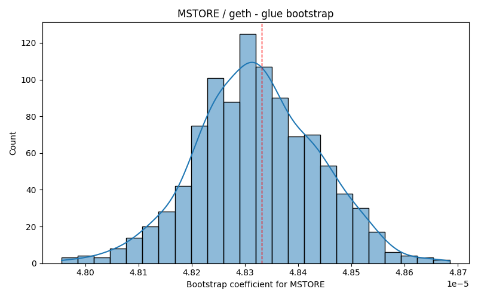

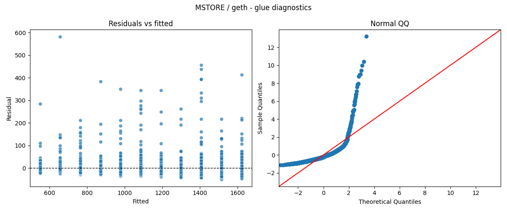

</details>

<details><summary><code>MSTORE8</code> · nobs=2695 · runtime_ms=4.382e-05 · p=1.00e-03 · R²=0.9706</summary>

```
==============================================================================
                           NNLS Regression Results                            
==============================================================================
Dep. Variable:          test_runtime_ms              R-squared:          0.971
Model:                  NNLS                    Adj. R-squared:          0.971
No. Observations:       2695                              RMSE:          53.48
Df Residuals:           2693                               MAE:          22.98
Df Model:               1      
==============================================================================
                      coef     std err     P-value      [0.025      0.975]
------------------------------------------------------------------------------
         const      5.6855      2.8680       0.034      0.0000     11.3759
       MSTORE8      0.0000      0.0000       0.001      0.0000      0.0000
==============================================================================
Notes: Non-negative least squares with bootstrap inference (1000 iterations)
==============================================================================
```

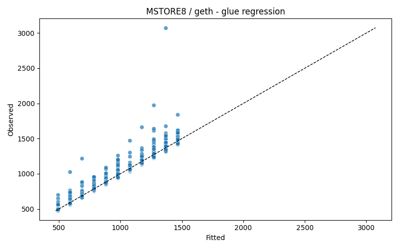

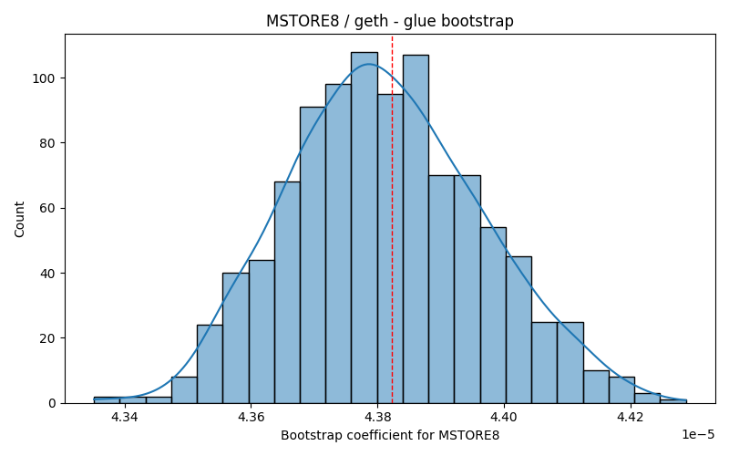

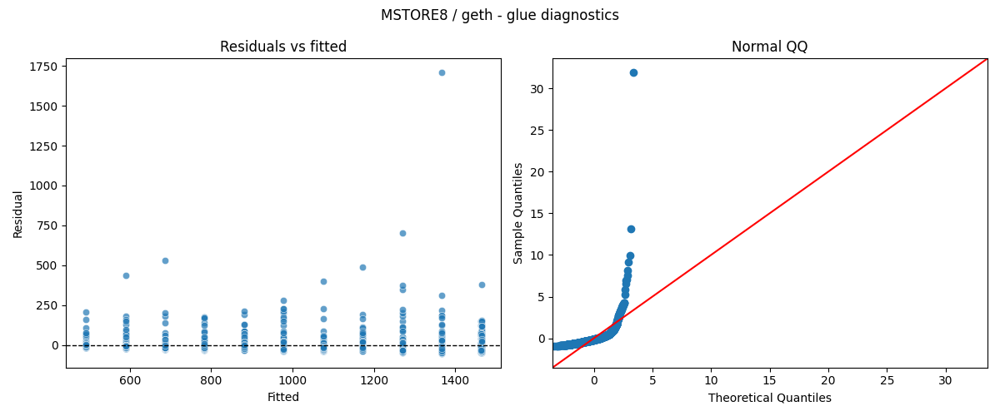

</details>

<details><summary><code>MUL</code> · nobs=539 · runtime_ms=2.699e-05 · p=1.00e-03 · R²=0.9216</summary>

```
==============================================================================
                           NNLS Regression Results                            
==============================================================================
Dep. Variable:          test_runtime_ms              R-squared:          0.922
Model:                  NNLS                    Adj. R-squared:          0.922
No. Observations:       539                               RMSE:          62.12
Df Residuals:           537                                MAE:          42.80
Df Model:               1      
==============================================================================
                      coef     std err     P-value      [0.025      0.975]
------------------------------------------------------------------------------
         const     24.1590      7.8005       0.002      8.3934     39.2615
           MUL      0.0000      0.0000       0.001      0.0000      0.0000
==============================================================================
Notes: Non-negative least squares with bootstrap inference (1000 iterations)
==============================================================================
```

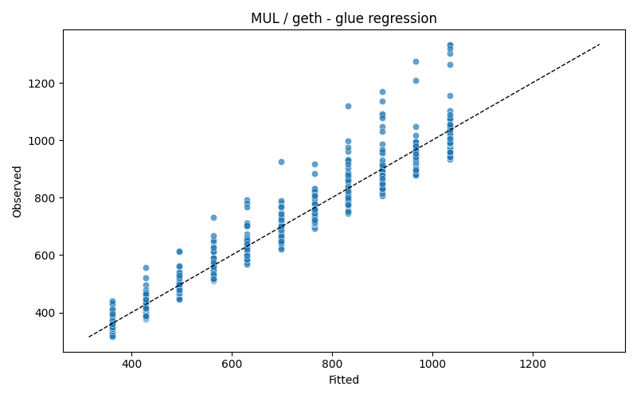

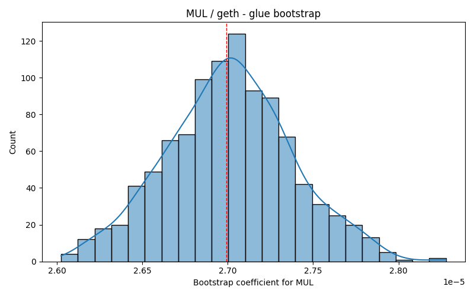

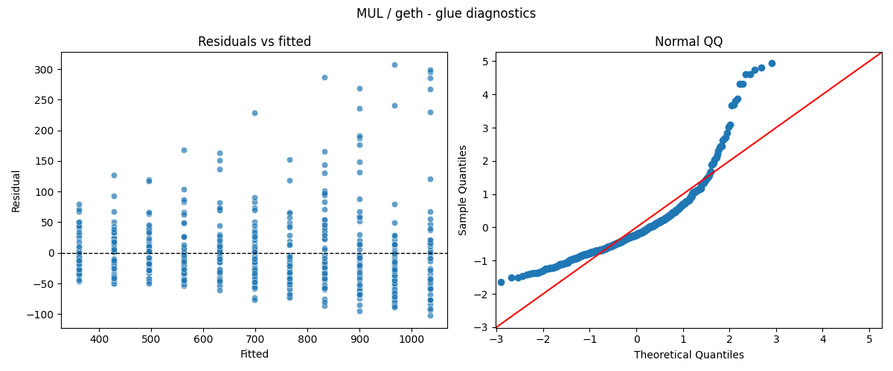

</details>

<details><summary><code>PC</code> · nobs=539 · runtime_ms=9.426e-06 · p=1.00e-03 · R²=0.9893</summary>

```
==============================================================================
                           NNLS Regression Results                            
==============================================================================
Dep. Variable:          test_runtime_ms              R-squared:          0.989
Model:                  NNLS                    Adj. R-squared:          0.989
No. Observations:       539                               RMSE:          29.31
Df Residuals:           537                                MAE:          16.65
Df Model:               1      
==============================================================================
                      coef     std err     P-value      [0.025      0.975]
------------------------------------------------------------------------------
         const      9.1605      3.5089       0.007      2.5792     15.9883
            PC      0.0000      0.0000       0.001      0.0000      0.0000
==============================================================================
Notes: Non-negative least squares with bootstrap inference (1000 iterations)
==============================================================================
```

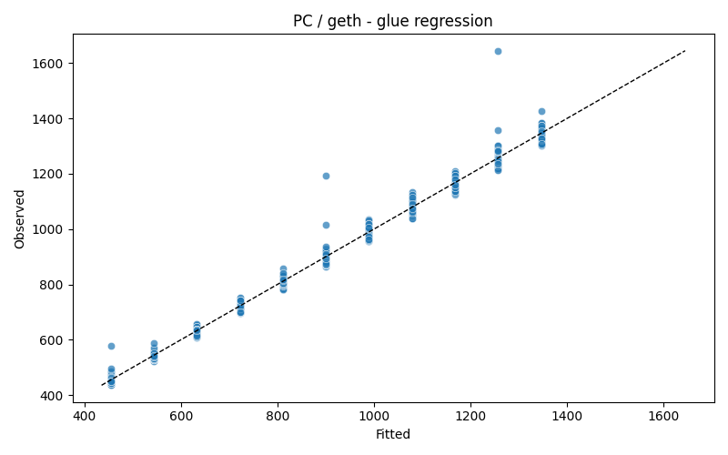

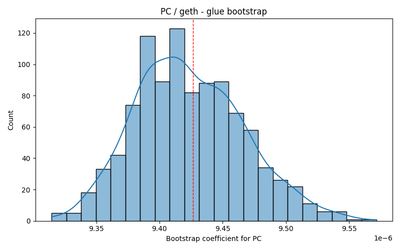

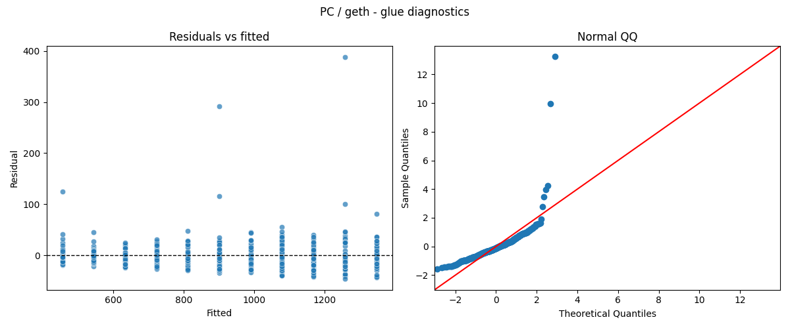

</details>

<details><summary><code>RETURNDATASIZE</code> · nobs=2156 · runtime_ms=1.596e-05 · p=1.00e-03 · R²=0.9312</summary>

```
==============================================================================
                           NNLS Regression Results                            
==============================================================================
Dep. Variable:          test_runtime_ms              R-squared:          0.931
Model:                  NNLS                    Adj. R-squared:          0.931
No. Observations:       2156                              RMSE:          68.49
Df Residuals:           2154                               MAE:          34.20
Df Model:               1      
==============================================================================
                      coef     std err     P-value      [0.025      0.975]
------------------------------------------------------------------------------
         const     23.7254      4.5873       0.001     14.5014     33.1263
RETURNDATASIZE      0.0000      0.0000       0.001      0.0000      0.0000
==============================================================================
Notes: Non-negative least squares with bootstrap inference (1000 iterations)
==============================================================================
```


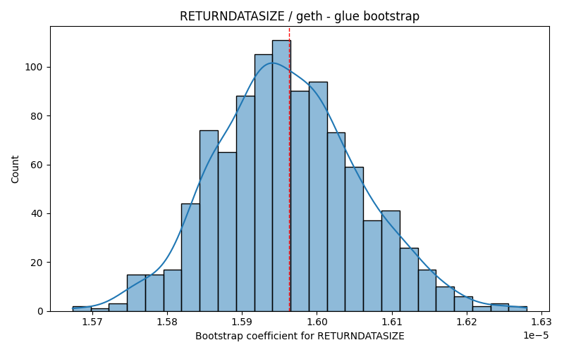

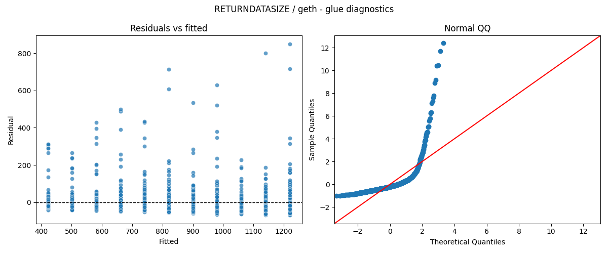

</details>

<details><summary><code>SELFBALANCE</code> · nobs=441 · runtime_ms=5.084e-05 · p=1.00e-03 · R²=0.9879</summary>

```
==============================================================================
                           NNLS Regression Results                            
==============================================================================
Dep. Variable:          test_runtime_ms              R-squared:          0.988
Model:                  NNLS                    Adj. R-squared:          0.988
No. Observations:       441                               RMSE:          56.74
Df Residuals:           439                                MAE:          32.01
Df Model:               1      
==============================================================================
                      coef     std err     P-value      [0.025      0.975]
------------------------------------------------------------------------------
         const      3.4534      5.3797       0.307      0.0000     17.8496
   SELFBALANCE      0.0001      0.0000       0.001      0.0001      0.0001
==============================================================================
Notes: Non-negative least squares with bootstrap inference (1000 iterations)
==============================================================================
```

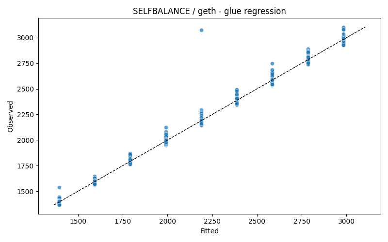

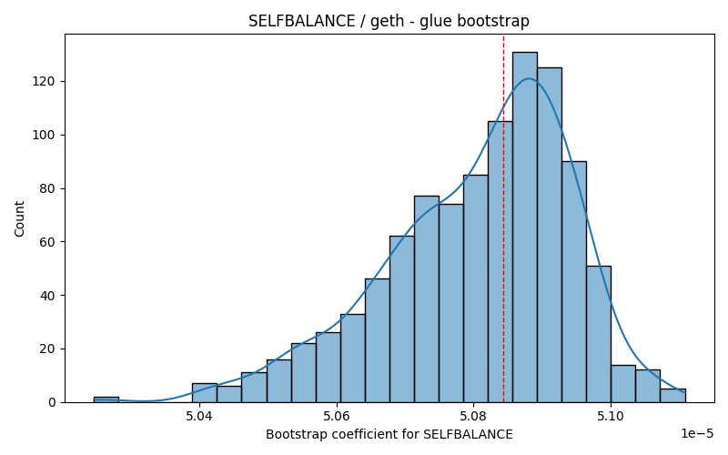

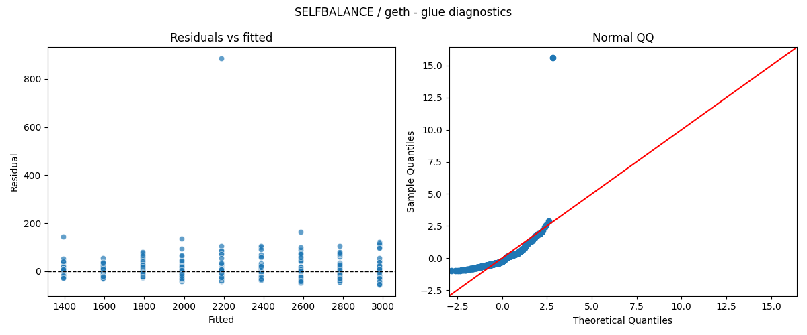

</details>

<details><summary><code>SUB</code> · nobs=539 · runtime_ms=2.696e-05 · p=1.00e-03 · R²=0.7372</summary>

```
==============================================================================
                           NNLS Regression Results                            
==============================================================================
Dep. Variable:          test_runtime_ms              R-squared:          0.737
Model:                  NNLS                    Adj. R-squared:          0.737
No. Observations:       539                               RMSE:         172.46
Df Residuals:           537                                MAE:         136.45
Df Model:               1      
==============================================================================
                      coef     std err     P-value      [0.025      0.975]
------------------------------------------------------------------------------
         const      0.0000      4.8981       1.000      0.0000     18.1074
           SUB      0.0000      0.0000       0.001      0.0000      0.0000
==============================================================================
Notes: Non-negative least squares with bootstrap inference (1000 iterations)
==============================================================================
```

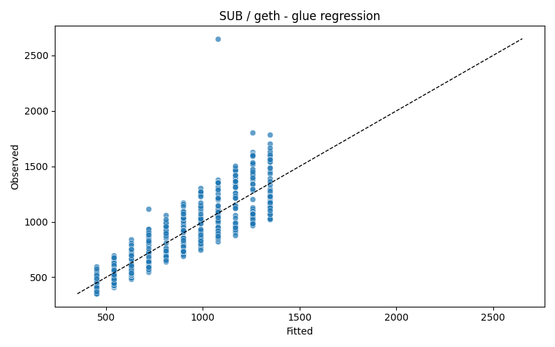

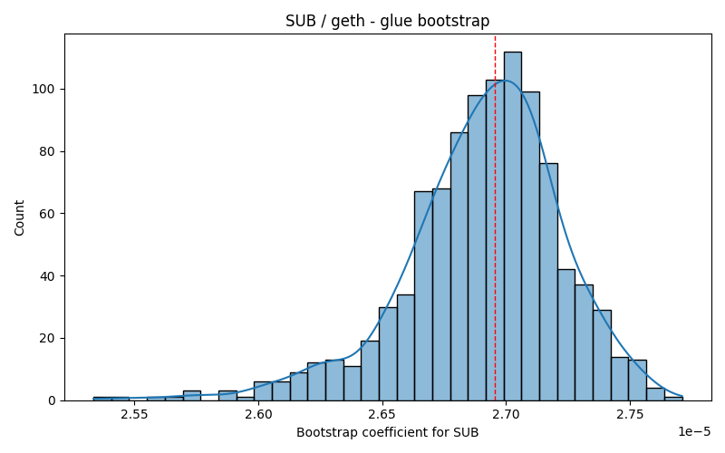

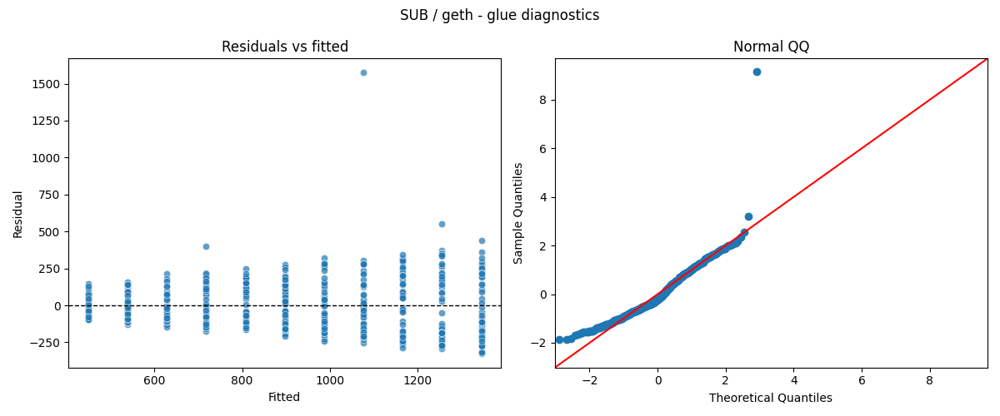

</details>

### Mixed glue (tier B) · geth

<details><summary><code>JUMP</code> · nobs=539 · runtime_ms=5.736e-05 · p=1.00e-03 · R²=0.9649</summary>

```
==============================================================================
                           NNLS Regression Results                            
==============================================================================
Dep. Variable:          test_runtime_ms              R-squared:          0.965
Model:                  NNLS                    Adj. R-squared:          0.965
No. Observations:       539                               RMSE:          40.78
Df Residuals:           537                                MAE:          16.75
Df Model:               1      
==============================================================================
                      coef     std err     P-value      [0.025      0.975]
------------------------------------------------------------------------------
         const      0.0000      2.1512       1.000      0.0000      7.0398
          JUMP      0.0001      0.0000       0.001      0.0001      0.0001
==============================================================================
Notes: Non-negative least squares with bootstrap inference (1000 iterations)
==============================================================================
```

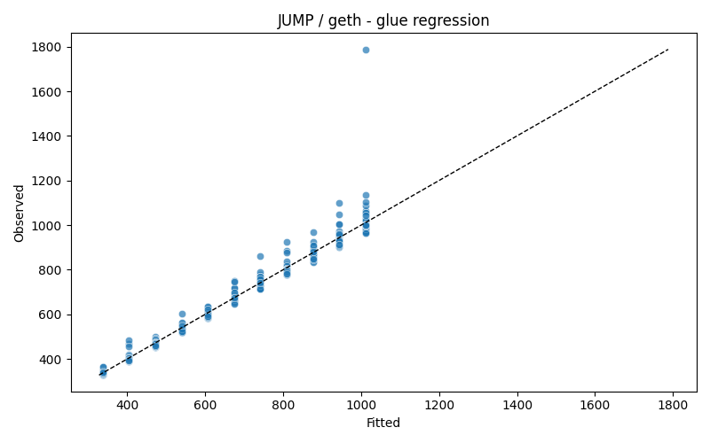

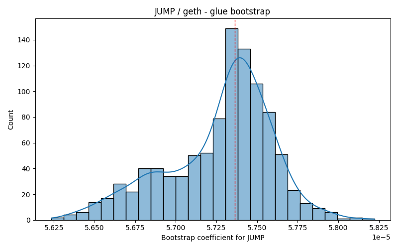

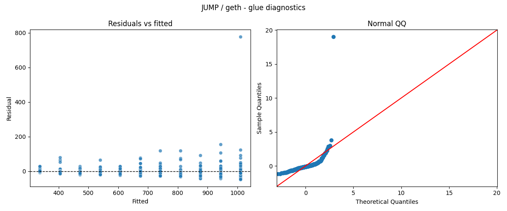

</details>

<details><summary><code>KECCAK256</code> · nobs=8624 · runtime_ms=0.0002052 · p=1.00e-03 · R²=0.3019</summary>

```
==============================================================================
                           NNLS Regression Results                            
==============================================================================
Dep. Variable:          test_runtime_ms              R-squared:          0.302
Model:                  NNLS                    Adj. R-squared:          0.302
No. Observations:       8624                              RMSE:         620.16
Df Residuals:           8622                               MAE:         499.14
Df Model:               1      
==============================================================================
                      coef     std err     P-value      [0.025      0.975]
------------------------------------------------------------------------------
         const   1628.2972     15.1698       0.001   1597.0596   1658.0630
     KECCAK256      0.0002      0.0000       0.001      0.0002      0.0002
==============================================================================
Notes: Non-negative least squares with bootstrap inference (1000 iterations)
==============================================================================
```

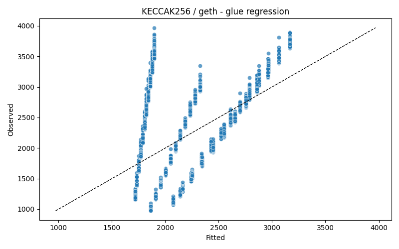

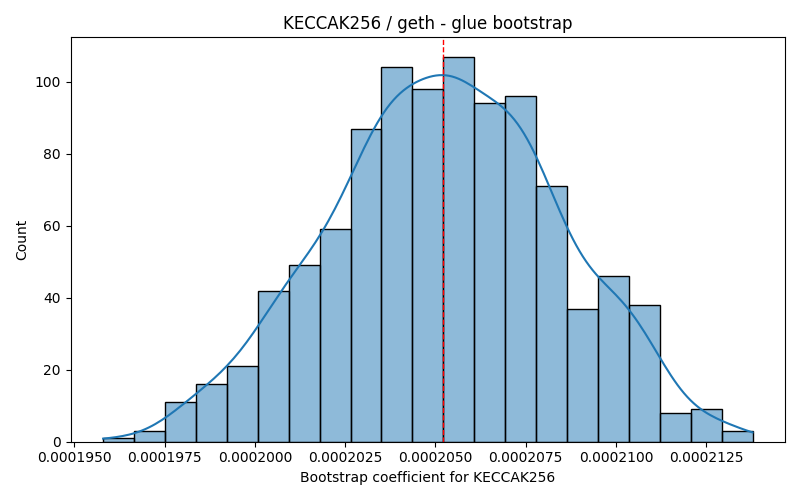

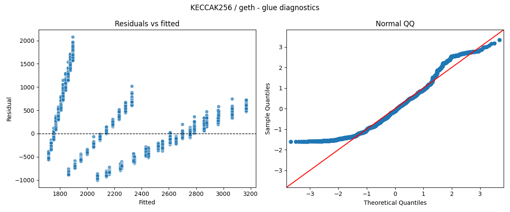

</details>

## nethermind

| glue_opcode | nobs | glue_runtime_ms | p_value | rsquared |
| --- | --- | --- | --- | --- |
| `ISZERO` | 374 | 8.452e-07 | 1.00e-03 | 0.2808 |
| `JUMPDEST` | 374 | 4.275e-07 | 1.00e-03 | 0.6815 |
| `SWAP` | 5984 | 5.591e-07 | 1.00e-03 | 0.324 |
| `CALLDATASIZE` | 22286 | 1.978e-09 | 3.56e-01 | 0.9784 |
| `DUP` | 22286 | 0 | 1.00e+00 | 0.9784 |
| `GAS` | 22286 | 0 | 1.00e+00 | 0.9784 |
| `MLOAD` | 22286 | 1.758e-06 | 1.00e-03 | 0.9784 |
| `PUSH` | 22286 | 3.48e-08 | 1.00e-03 | 0.9784 |
| `PUSH0` | 22286 | 0 | 1.00e+00 | 0.9784 |
| `STATICCALL` | 22286 | 0.0008698 | 1.00e-03 | 0.9784 |
| `ADD` | 374 | 2.645e-06 | 1.00e-03 | 0.6373 |
| `AND` | 374 | 1.303e-06 | 1.00e-03 | 0.5654 |
| `CALLDATACOPY` | 8976 | 3.991e-06 | 1.00e-03 | 0.7018 |
| `CALLDATALOAD` | 1496 | 5.342e-05 | 1.00e-03 | 0.002019 |
| `DIV` | 374 | 8.055e-06 | 1.00e-03 | 0.6412 |
| `EXP` | 374 | 0 | 1.00e+00 | 0 |
| `GT` | 374 | 1.563e-06 | 1.00e-03 | 0.3624 |
| `JUMPI` | 374 | 1.813e-06 | 1.00e-03 | 0.4704 |
| `LT` | 374 | 1.403e-06 | 1.00e-03 | 0.3185 |
| `MSTORE` | 1870 | 2.234e-06 | 1.00e-03 | 0.5641 |
| `MSTORE8` | 1870 | 1.952e-06 | 1.00e-03 | 0.6829 |
| `MUL` | 374 | 5.725e-06 | 1.00e-03 | 0.75 |
| `PC` | 374 | 8.119e-07 | 1.00e-03 | 0.8998 |
| `RETURNDATASIZE` | 1496 | 7.718e-07 | 1.00e-03 | 0.4757 |
| `SELFBALANCE` | 306 | 1.07e-05 | 1.00e-03 | 0.8717 |
| `SUB` | 374 | 2.625e-06 | 1.00e-03 | 0.5845 |
| `JUMP` | 374 | 5.14e-06 | 1.00e-03 | 0.7916 |
| `KECCAK256` | 5984 | 0 | 1.00e+00 | 0 |

### Cycle glue — joint fit · nethermind

<details><summary>Joint NNLS regression summary</summary>

```
==============================================================================
                           NNLS Regression Results                            
==============================================================================
Dep. Variable:          test_runtime_ms              R-squared:          0.978
Model:                  NNLS                    Adj. R-squared:          0.978
No. Observations:       22286                             RMSE:          21.42
Df Residuals:           22278                              MAE:           6.97
Df Model:               7      
==============================================================================
                      coef     std err     P-value      [0.025      0.975]
------------------------------------------------------------------------------
         const     14.3737      0.5311       0.001     13.2966     15.3689
  CALLDATASIZE      0.0000      0.0000       0.356      0.0000      0.0000
           DUP      0.0000      0.0000       1.000      0.0000      0.0000
           GAS      0.0000      0.0000       1.000      0.0000      0.0000
         MLOAD      0.0000      0.0000       0.001      0.0000      0.0000
          PUSH      0.0000      0.0000       0.001      0.0000      0.0000
         PUSH0      0.0000      0.0000       1.000      0.0000      0.0000
    STATICCALL      0.0009      0.0000       0.001      0.0009      0.0009
==============================================================================
Notes: Non-negative least squares with bootstrap inference (1000 iterations)
==============================================================================
```

</details>

<details><summary><code>CALLDATASIZE</code> · nobs=22286 · runtime_ms=1.978e-09 · p=3.56e-01 · R²=0.9784</summary>


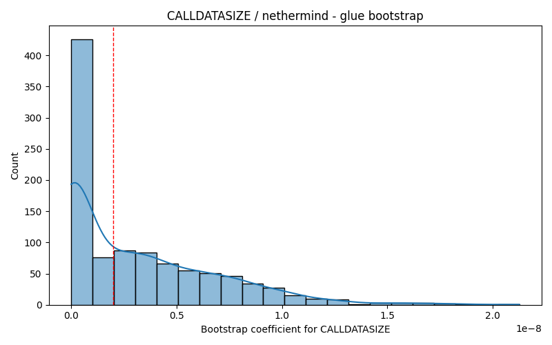

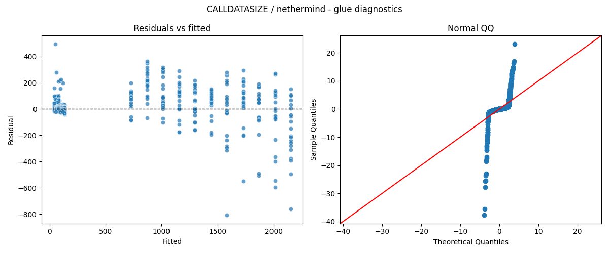

</details>

<details><summary><code>DUP</code> · nobs=22286 · runtime_ms=0 · p=1.00e+00 · R²=0.9784</summary>


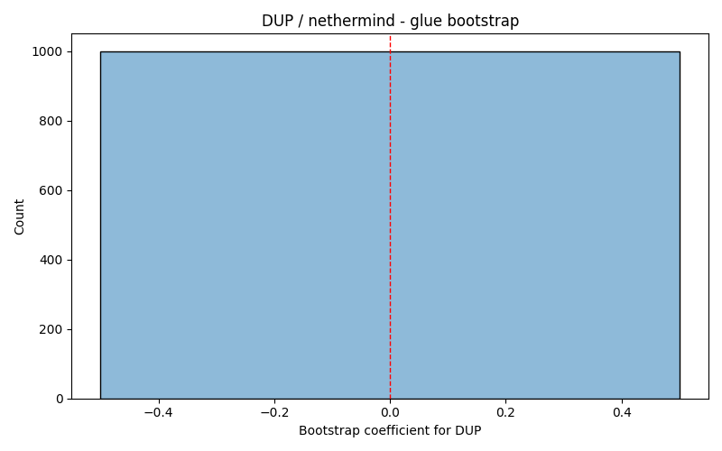

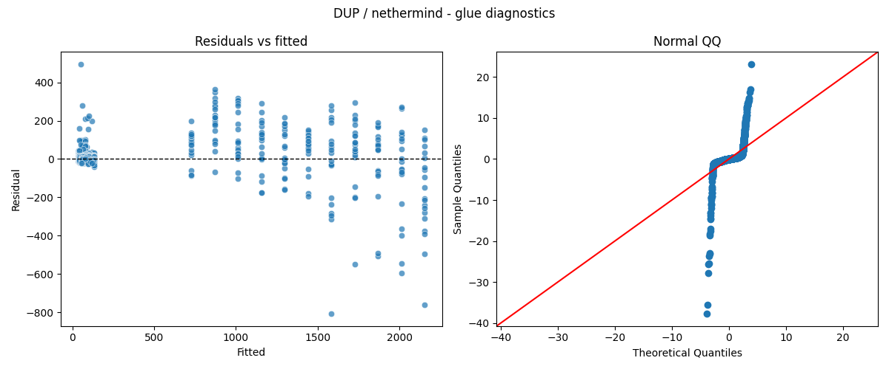

</details>

<details><summary><code>GAS</code> · nobs=22286 · runtime_ms=0 · p=1.00e+00 · R²=0.9784</summary>

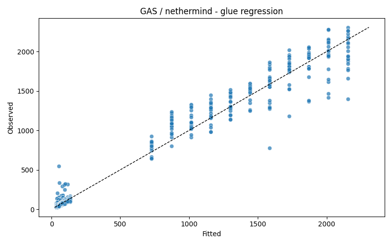


</details>

<details><summary><code>MLOAD</code> · nobs=22286 · runtime_ms=1.758e-06 · p=1.00e-03 · R²=0.9784</summary>


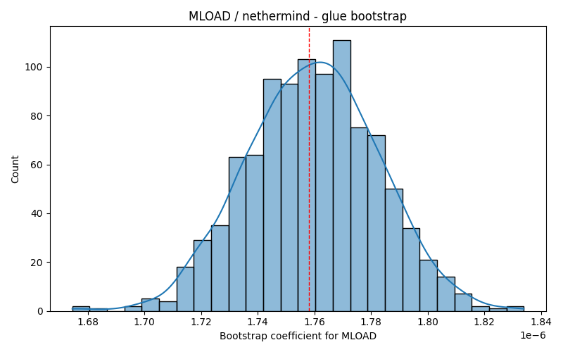


</details>

<details><summary><code>PUSH</code> · nobs=22286 · runtime_ms=3.48e-08 · p=1.00e-03 · R²=0.9784</summary>


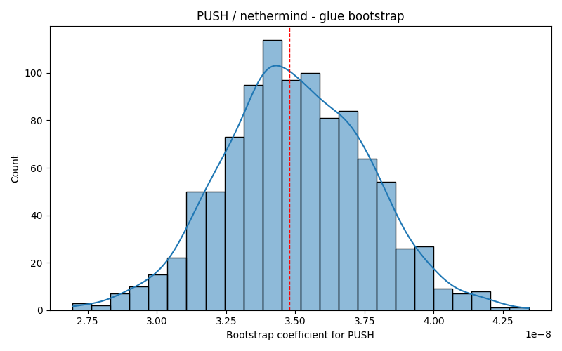


</details>

<details><summary><code>PUSH0</code> · nobs=22286 · runtime_ms=0 · p=1.00e+00 · R²=0.9784</summary>

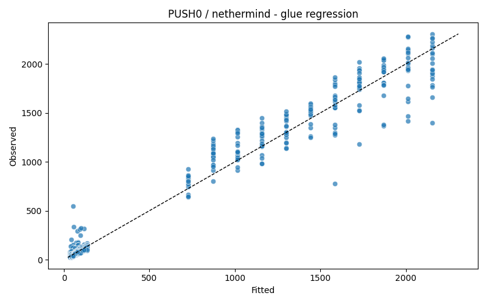

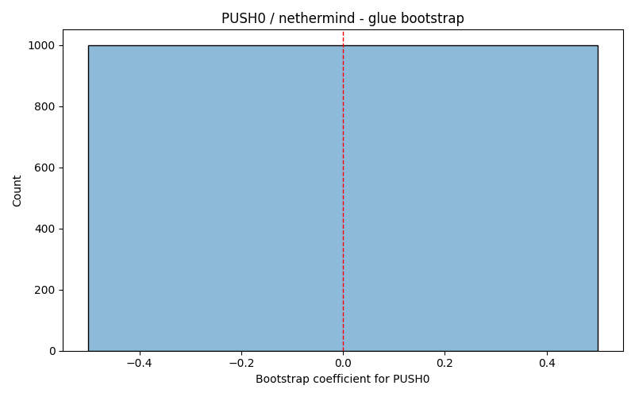


</details>

<details><summary><code>STATICCALL</code> · nobs=22286 · runtime_ms=0.0008698 · p=1.00e-03 · R²=0.9784</summary>

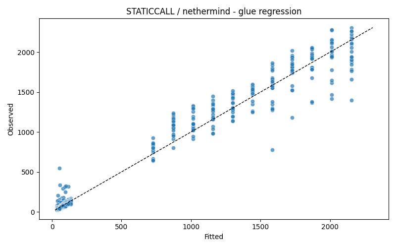

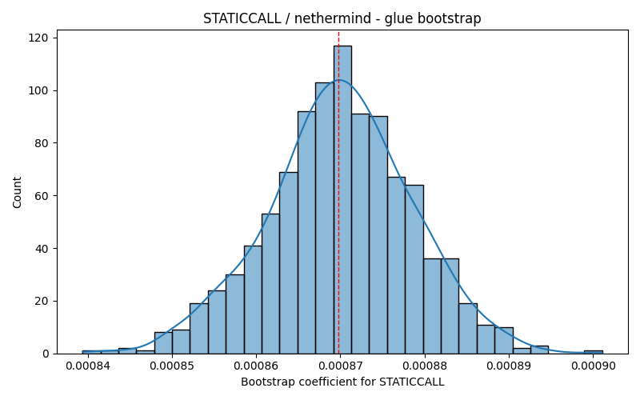

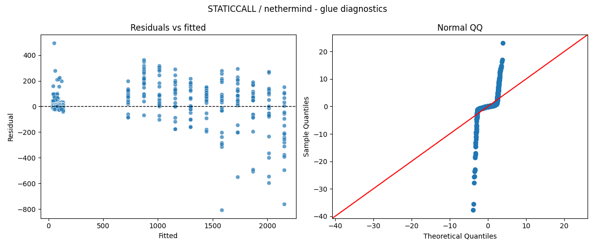

</details>

### Pure glue · nethermind

<details><summary><code>ISZERO</code> · nobs=374 · runtime_ms=8.452e-07 · p=1.00e-03 · R²=0.2808</summary>

```
==============================================================================
                           NNLS Regression Results                            
==============================================================================
Dep. Variable:          test_runtime_ms              R-squared:          0.281
Model:                  NNLS                    Adj. R-squared:          0.279
No. Observations:       374                               RMSE:          28.48
Df Residuals:           372                                MAE:          15.05
Df Model:               1      
==============================================================================
                      coef     std err     P-value      [0.025      0.975]
------------------------------------------------------------------------------
         const     22.0003      5.3794       0.001     11.6652     33.0014
        ISZERO      0.0000      0.0000       0.001      0.0000      0.0000
==============================================================================
Notes: Non-negative least squares with bootstrap inference (1000 iterations)
==============================================================================
```

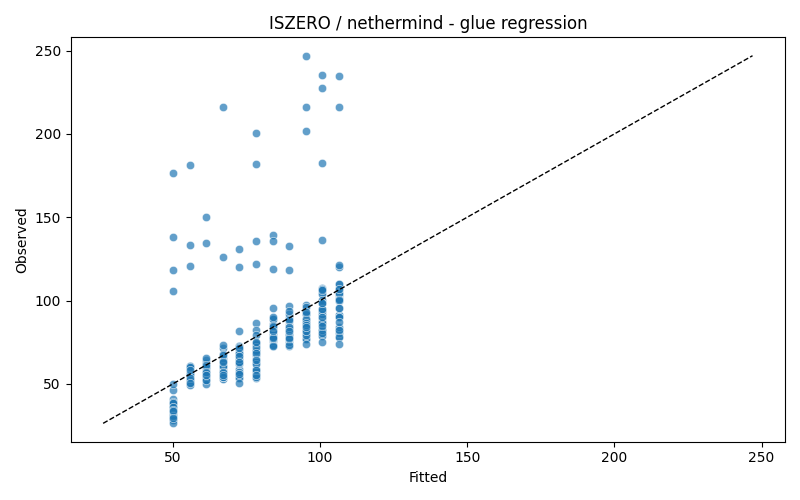

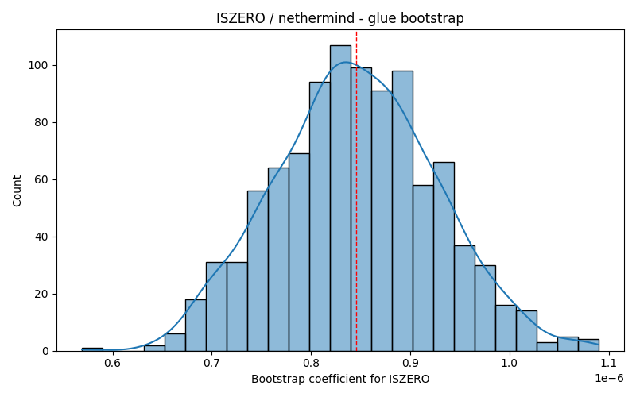

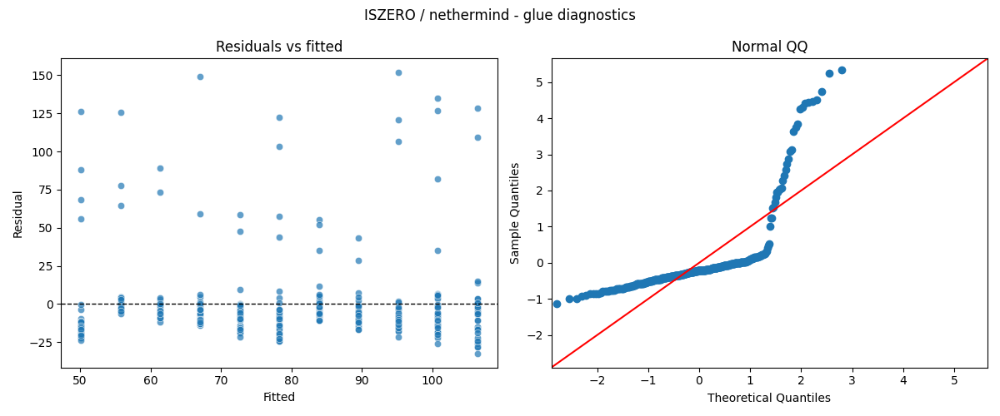

</details>

<details><summary><code>JUMPDEST</code> · nobs=374 · runtime_ms=4.275e-07 · p=1.00e-03 · R²=0.6815</summary>

```
==============================================================================
                           NNLS Regression Results                            
==============================================================================
Dep. Variable:          test_runtime_ms              R-squared:          0.682
Model:                  NNLS                    Adj. R-squared:          0.681
No. Observations:       374                               RMSE:          18.46
Df Residuals:           372                                MAE:          14.96
Df Model:               1      
==============================================================================
                      coef     std err     P-value      [0.025      0.975]
------------------------------------------------------------------------------
         const     19.0905      2.8950       0.001     13.4333     24.6072
      JUMPDEST      0.0000      0.0000       0.001      0.0000      0.0000
==============================================================================
Notes: Non-negative least squares with bootstrap inference (1000 iterations)
==============================================================================
```

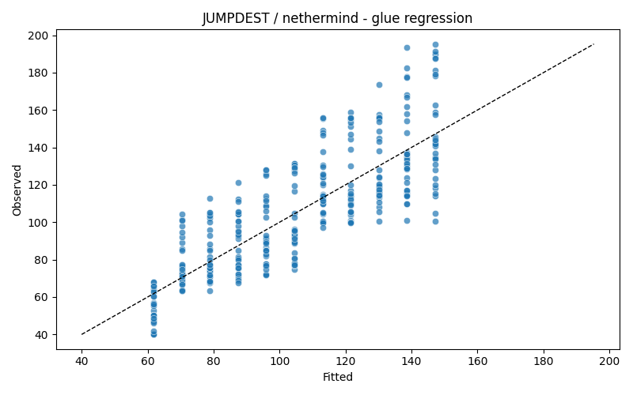

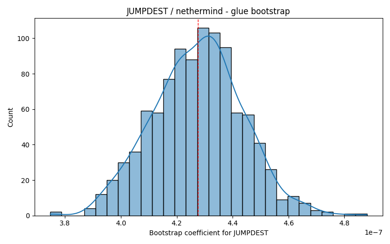

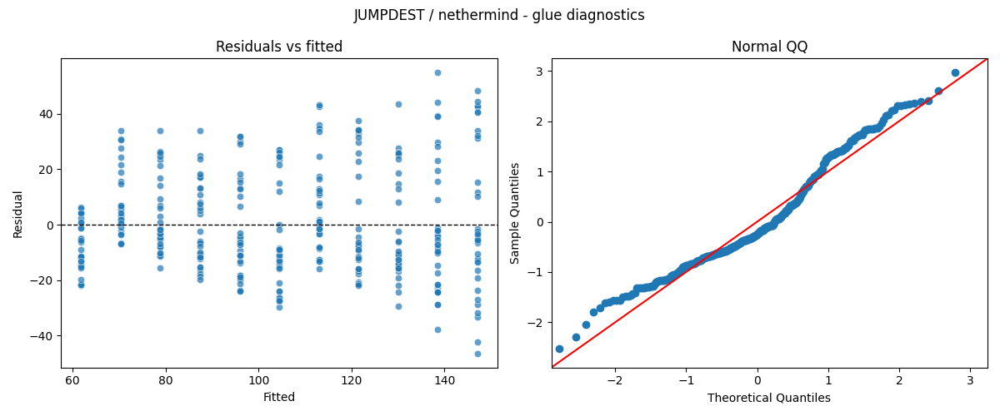

</details>

<details><summary><code>SWAP</code> · nobs=5984 · runtime_ms=5.591e-07 · p=1.00e-03 · R²=0.324</summary>

```
==============================================================================
                           NNLS Regression Results                            
==============================================================================
Dep. Variable:          test_runtime_ms              R-squared:          0.324
Model:                  NNLS                    Adj. R-squared:          0.324
No. Observations:       5984                              RMSE:          17.00
Df Residuals:           5982                               MAE:           6.06
Df Model:               1      
==============================================================================
                      coef     std err     P-value      [0.025      0.975]
------------------------------------------------------------------------------
         const     15.2391      0.6906       0.001     13.9450     16.5983
          SWAP      0.0000      0.0000       0.001      0.0000      0.0000
==============================================================================
Notes: Non-negative least squares with bootstrap inference (1000 iterations)
==============================================================================
```

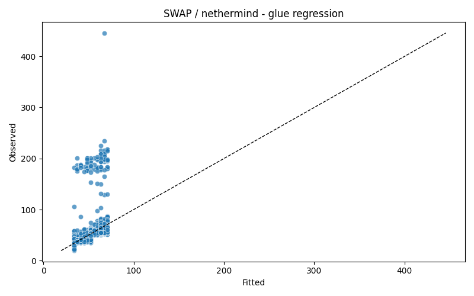

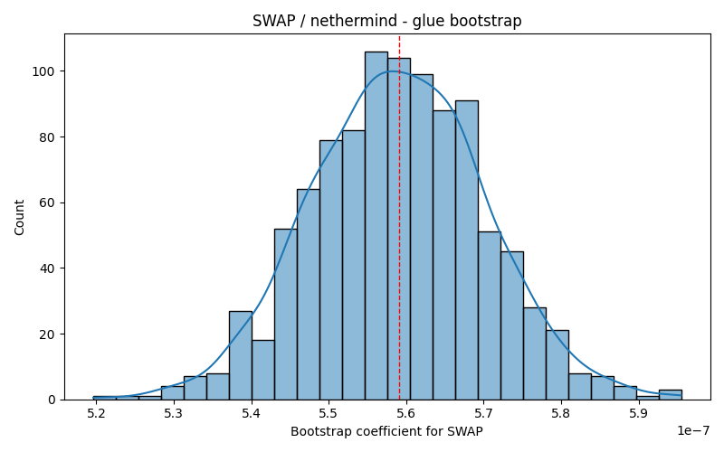

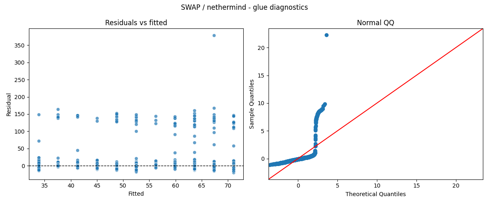

</details>

### Mixed glue (tier A) · nethermind

<details><summary><code>ADD</code> · nobs=374 · runtime_ms=2.645e-06 · p=1.00e-03 · R²=0.6373</summary>

```
==============================================================================
                           NNLS Regression Results                            
==============================================================================
Dep. Variable:          test_runtime_ms              R-squared:          0.637
Model:                  NNLS                    Adj. R-squared:          0.636
No. Observations:       374                               RMSE:          21.00
Df Residuals:           372                                MAE:          10.51
Df Model:               1      
==============================================================================
                      coef     std err     P-value      [0.025      0.975]
------------------------------------------------------------------------------
         const     13.9823      2.4296       0.001      8.8702     18.4739
           ADD      0.0000      0.0000       0.001      0.0000      0.0000
==============================================================================
Notes: Non-negative least squares with bootstrap inference (1000 iterations)
==============================================================================
```


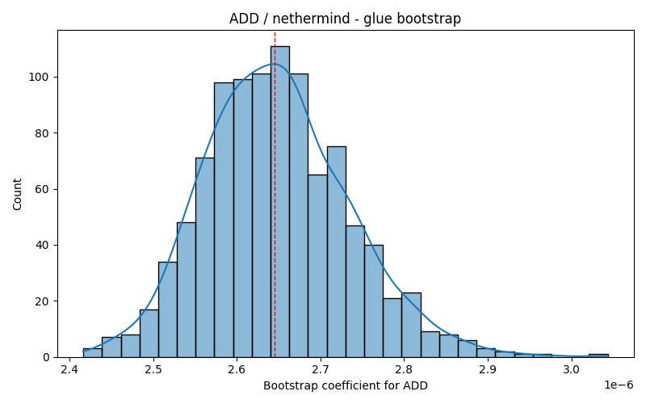

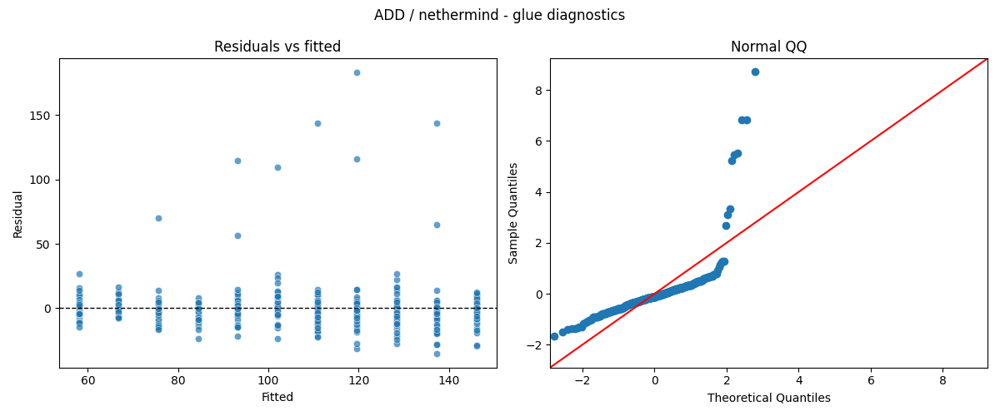

</details>

<details><summary><code>AND</code> · nobs=374 · runtime_ms=1.303e-06 · p=1.00e-03 · R²=0.5654</summary>

```
==============================================================================
                           NNLS Regression Results                            
==============================================================================
Dep. Variable:          test_runtime_ms              R-squared:          0.565
Model:                  NNLS                    Adj. R-squared:          0.564
No. Observations:       374                               RMSE:          12.02
Df Residuals:           372                                MAE:           5.19
Df Model:               1      
==============================================================================
                      coef     std err     P-value      [0.025      0.975]
------------------------------------------------------------------------------
         const     12.9002      1.8476       0.001      8.5910     16.1198
           AND      0.0000      0.0000       0.001      0.0000      0.0000
==============================================================================
Notes: Non-negative least squares with bootstrap inference (1000 iterations)
==============================================================================
```

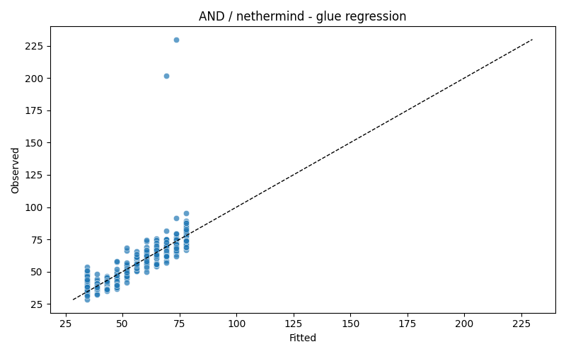

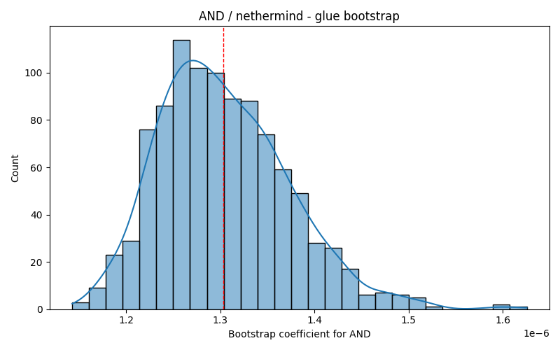

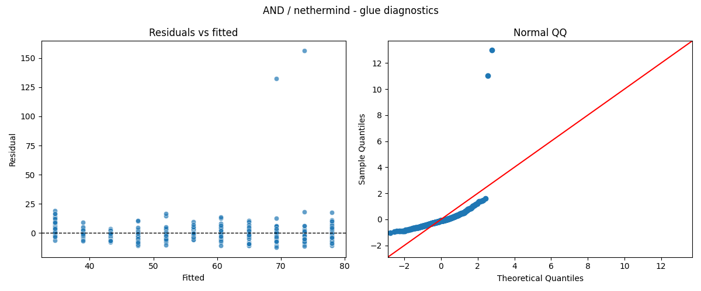

</details>

<details><summary><code>CALLDATACOPY</code> · nobs=8976 · runtime_ms=3.991e-06 · p=1.00e-03 · R²=0.7018</summary>

```
==============================================================================
                           NNLS Regression Results                            
==============================================================================
Dep. Variable:          test_runtime_ms              R-squared:          0.702
Model:                  NNLS                    Adj. R-squared:          0.702
No. Observations:       8976                              RMSE:          19.56
Df Residuals:           8974                               MAE:          15.10
Df Model:               1      
==============================================================================
                      coef     std err     P-value      [0.025      0.975]
------------------------------------------------------------------------------
         const     23.4395      0.2569       0.001     22.9436     23.9524
  CALLDATACOPY      0.0000      0.0000       0.001      0.0000      0.0000
==============================================================================
Notes: Non-negative least squares with bootstrap inference (1000 iterations)
==============================================================================
```

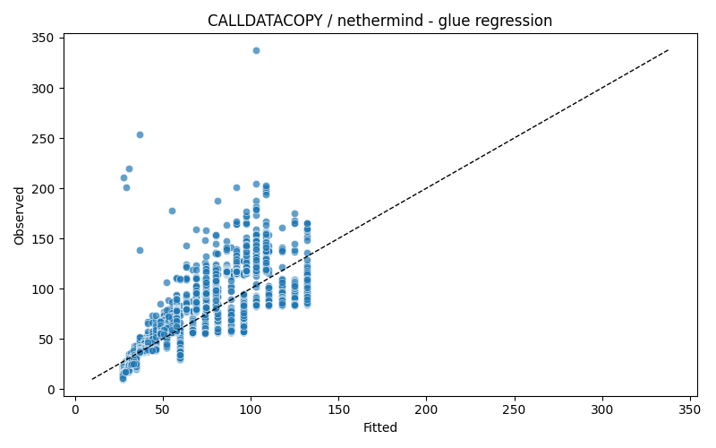


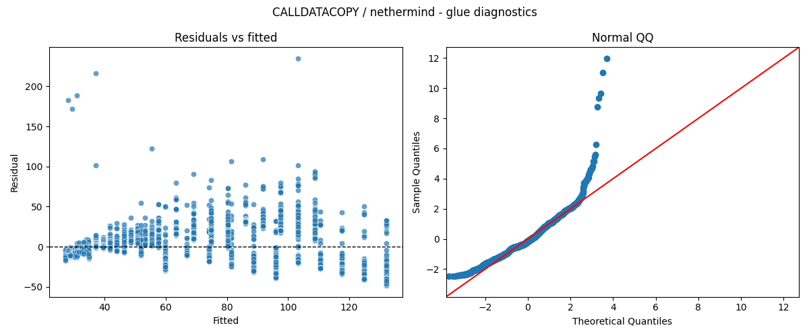

</details>

<details><summary><code>CALLDATALOAD</code> · nobs=1496 · runtime_ms=5.342e-05 · p=1.00e-03 · R²=0.002019</summary>

```
==============================================================================
                           NNLS Regression Results                            
==============================================================================
Dep. Variable:          test_runtime_ms              R-squared:          0.002
Model:                  NNLS                    Adj. R-squared:          0.001
No. Observations:       1496                              RMSE:           4.56
Df Residuals:           1494                               MAE:           0.34
Df Model:               1      
==============================================================================
                      coef     std err     P-value      [0.025      0.975]
------------------------------------------------------------------------------
         const      1.8662      0.2565       0.001      1.3010      2.1606
  CALLDATALOAD      0.0001      0.0000       0.001      0.0000      0.0001
==============================================================================
Notes: Non-negative least squares with bootstrap inference (1000 iterations)
==============================================================================
```

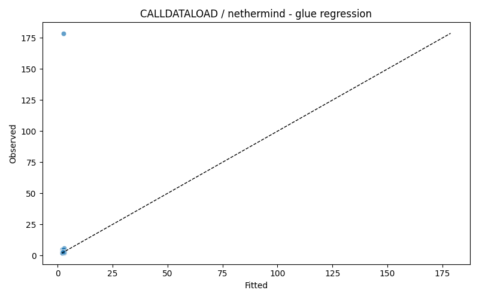

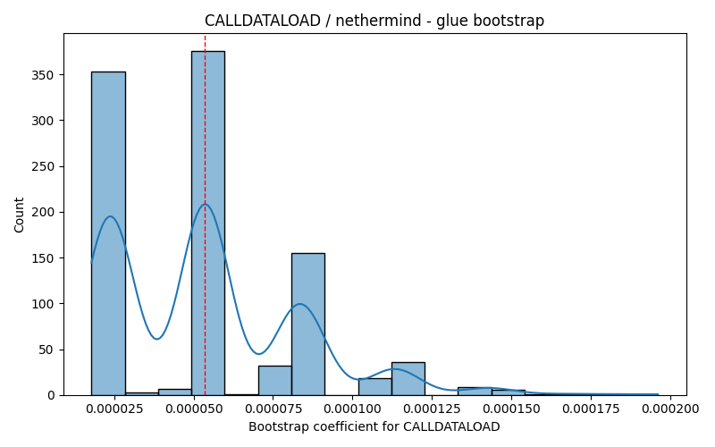

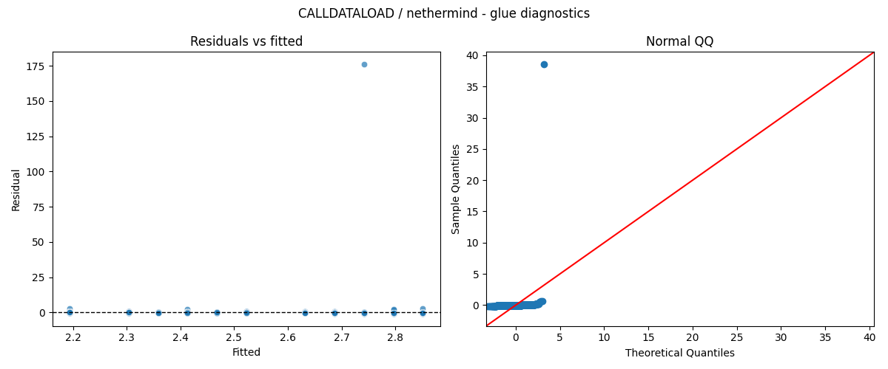

</details>

<details><summary><code>DIV</code> · nobs=374 · runtime_ms=8.055e-06 · p=1.00e-03 · R²=0.6412</summary>

```
==============================================================================
                           NNLS Regression Results                            
==============================================================================
Dep. Variable:          test_runtime_ms              R-squared:          0.641
Model:                  NNLS                    Adj. R-squared:          0.640
No. Observations:       374                               RMSE:          47.56
Df Residuals:           372                                MAE:          37.79
Df Model:               1      
==============================================================================
                      coef     std err     P-value      [0.025      0.975]
------------------------------------------------------------------------------
         const    124.8707     10.9626       0.001    102.7136    144.6616
           DIV      0.0000      0.0000       0.001      0.0000      0.0000
==============================================================================
Notes: Non-negative least squares with bootstrap inference (1000 iterations)
==============================================================================
```

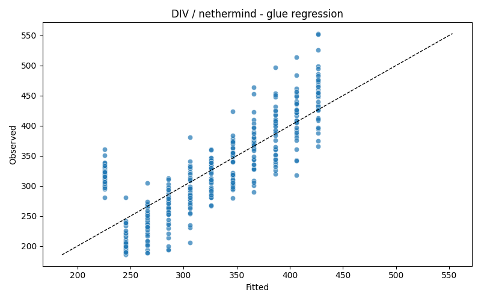

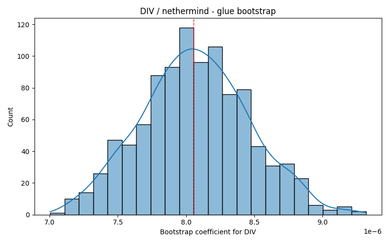

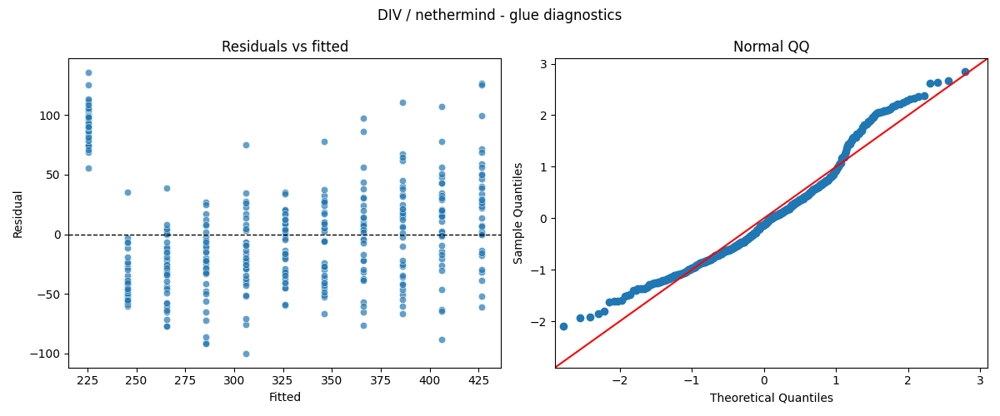

</details>

<details><summary><code>EXP</code> · nobs=374 · runtime_ms=0 · p=1.00e+00 · R²=0</summary>

```
==============================================================================
                           NNLS Regression Results                            
==============================================================================
Dep. Variable:          test_runtime_ms              R-squared:          0.000
Model:                  NNLS                    Adj. R-squared:         -0.003
No. Observations:       374                               RMSE:          47.95
Df Residuals:           372                                MAE:          32.38
Df Model:               1      
==============================================================================
                      coef     std err     P-value      [0.025      0.975]
------------------------------------------------------------------------------
         const    110.4854      5.2906       0.001     94.8172    115.5448
           EXP      0.0000      0.0000       1.000      0.0000      0.0001
==============================================================================
Notes: Non-negative least squares with bootstrap inference (1000 iterations)
==============================================================================
```

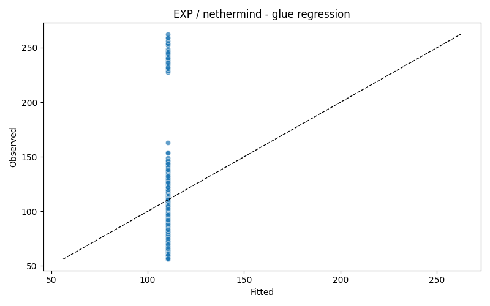

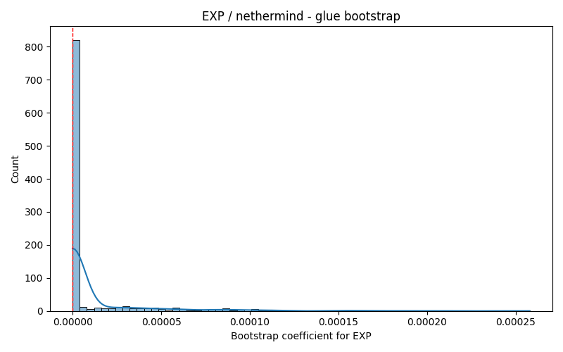

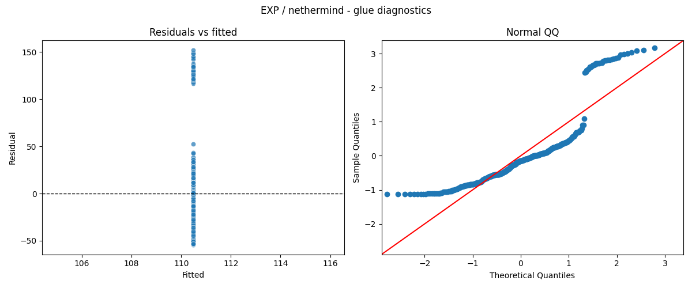

</details>

<details><summary><code>GT</code> · nobs=374 · runtime_ms=1.563e-06 · p=1.00e-03 · R²=0.3624</summary>

```
==============================================================================
                           NNLS Regression Results                            
==============================================================================
Dep. Variable:          test_runtime_ms              R-squared:          0.362
Model:                  NNLS                    Adj. R-squared:          0.361
No. Observations:       374                               RMSE:          21.82
Df Residuals:           372                                MAE:          11.20
Df Model:               1      
==============================================================================
                      coef     std err     P-value      [0.025      0.975]
------------------------------------------------------------------------------
         const     15.3780      3.9188       0.001      7.9194     22.7028
            GT      0.0000      0.0000       0.001      0.0000      0.0000
==============================================================================
Notes: Non-negative least squares with bootstrap inference (1000 iterations)
==============================================================================
```

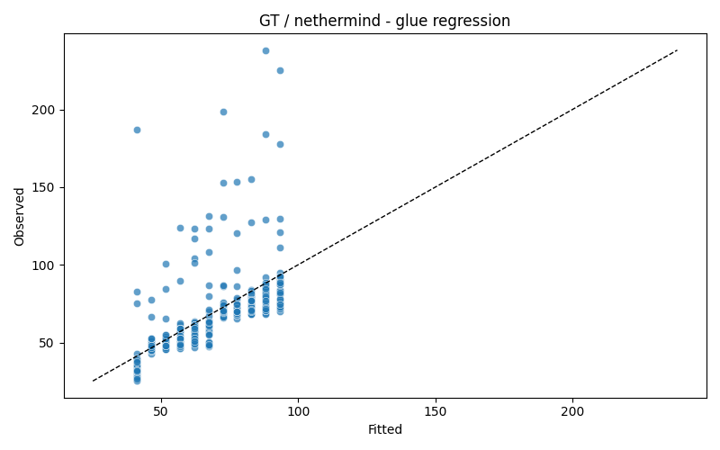

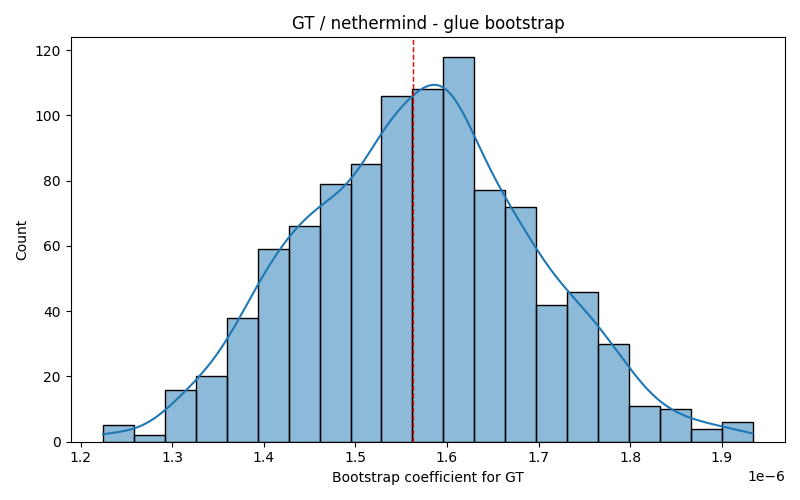

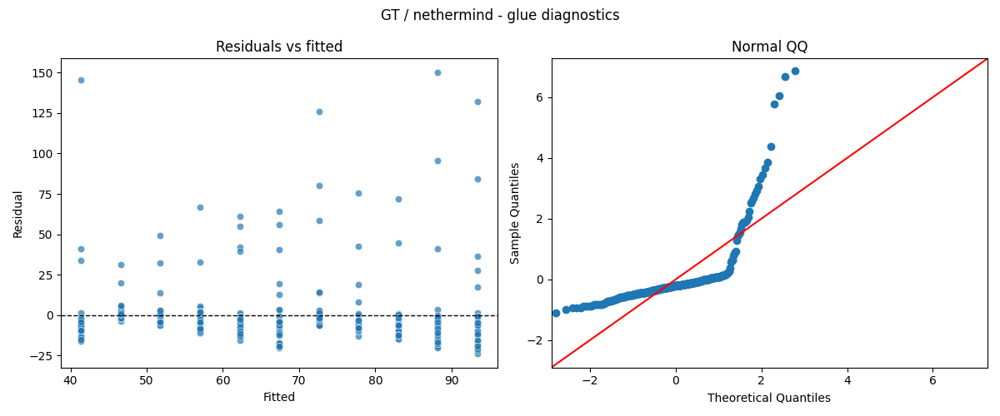

</details>

<details><summary><code>JUMPI</code> · nobs=374 · runtime_ms=1.813e-06 · p=1.00e-03 · R²=0.4704</summary>

```
==============================================================================
                           NNLS Regression Results                            
==============================================================================
Dep. Variable:          test_runtime_ms              R-squared:          0.470
Model:                  NNLS                    Adj. R-squared:          0.469
No. Observations:       374                               RMSE:           8.68
Df Residuals:           372                                MAE:           4.26
Df Model:               1      
==============================================================================
                      coef     std err     P-value      [0.025      0.975]
------------------------------------------------------------------------------
         const      9.7092      1.4260       0.001      7.0214     12.5247
         JUMPI      0.0000      0.0000       0.001      0.0000      0.0000
==============================================================================
Notes: Non-negative least squares with bootstrap inference (1000 iterations)
==============================================================================
```

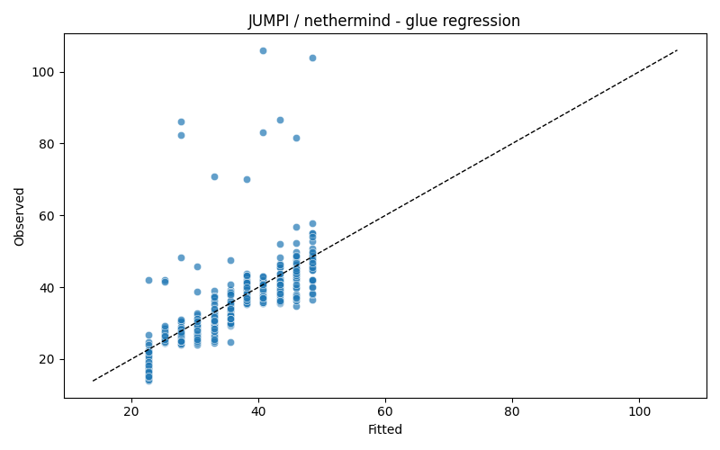

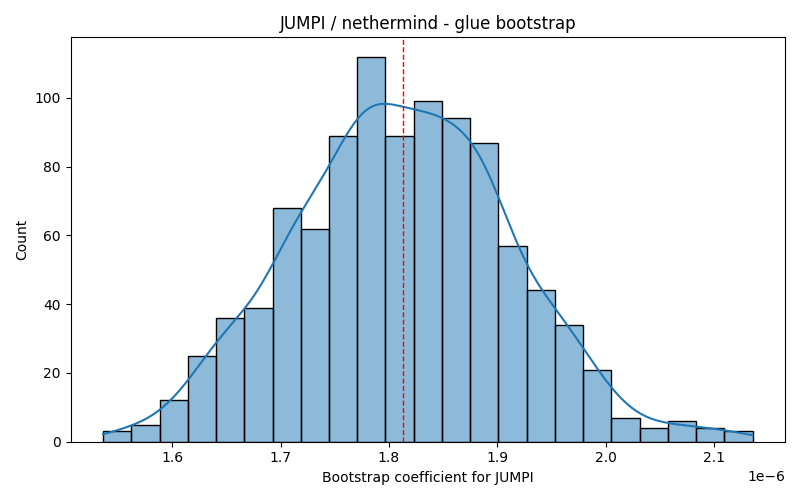

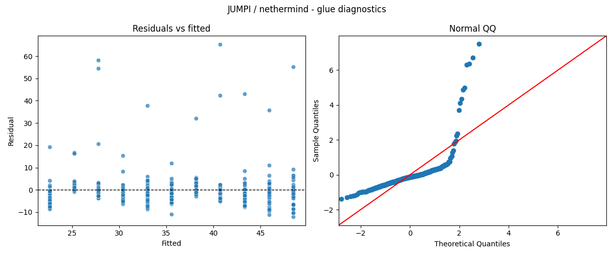

</details>

<details><summary><code>LT</code> · nobs=374 · runtime_ms=1.403e-06 · p=1.00e-03 · R²=0.3185</summary>

```
==============================================================================
                           NNLS Regression Results                            
==============================================================================
Dep. Variable:          test_runtime_ms              R-squared:          0.318
Model:                  NNLS                    Adj. R-squared:          0.317
No. Observations:       374                               RMSE:          21.60
Df Residuals:           372                                MAE:          10.70
Df Model:               1      
==============================================================================
                      coef     std err     P-value      [0.025      0.975]
------------------------------------------------------------------------------
         const     21.9995      3.3018       0.001     16.0458     28.5473
            LT      0.0000      0.0000       0.001      0.0000      0.0000
==============================================================================
Notes: Non-negative least squares with bootstrap inference (1000 iterations)
==============================================================================
```

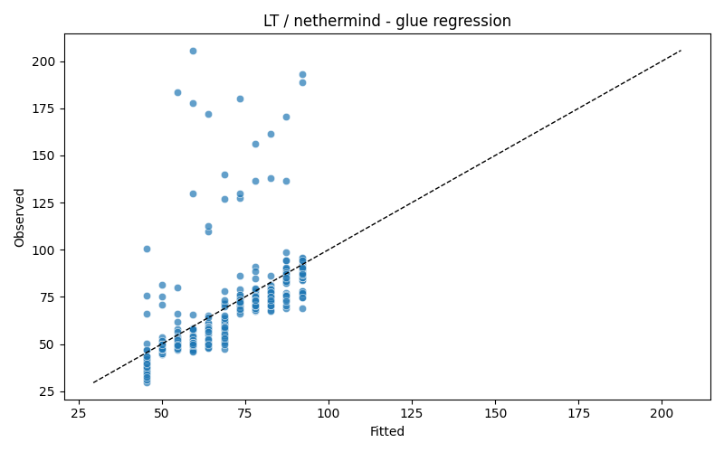

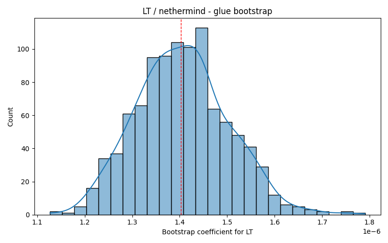

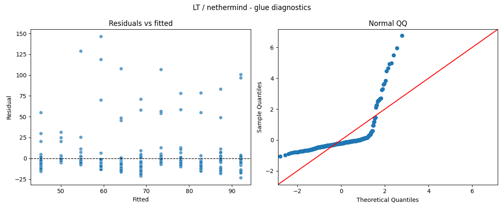

</details>

<details><summary><code>MSTORE</code> · nobs=1870 · runtime_ms=2.234e-06 · p=1.00e-03 · R²=0.5641</summary>

```
==============================================================================
                           NNLS Regression Results                            
==============================================================================
Dep. Variable:          test_runtime_ms              R-squared:          0.564
Model:                  NNLS                    Adj. R-squared:          0.564
No. Observations:       1870                              RMSE:          13.78
Df Residuals:           1868                               MAE:           7.89
Df Model:               1      
==============================================================================
                      coef     std err     P-value      [0.025      0.975]
------------------------------------------------------------------------------
         const     14.0936      0.8879       0.001     12.2509     15.7846
        MSTORE      0.0000      0.0000       0.001      0.0000      0.0000
==============================================================================
Notes: Non-negative least squares with bootstrap inference (1000 iterations)
==============================================================================
```

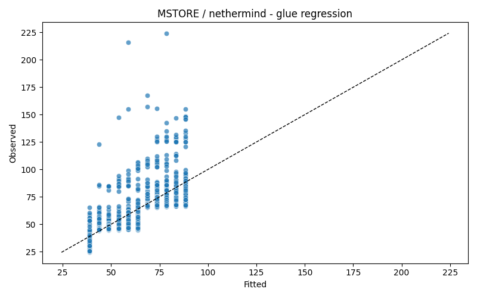

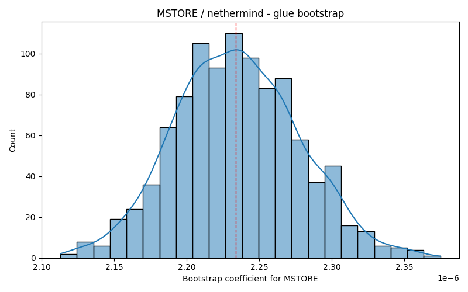

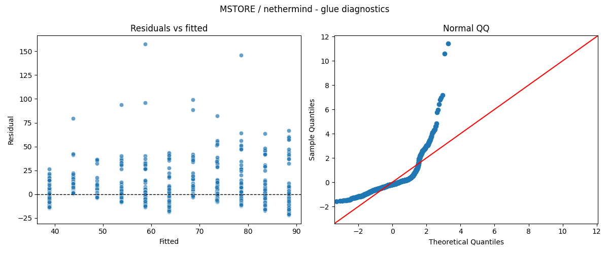

</details>

<details><summary><code>MSTORE8</code> · nobs=1870 · runtime_ms=1.952e-06 · p=1.00e-03 · R²=0.6829</summary>

```
==============================================================================
                           NNLS Regression Results                            
==============================================================================
Dep. Variable:          test_runtime_ms              R-squared:          0.683
Model:                  NNLS                    Adj. R-squared:          0.683
No. Observations:       1870                              RMSE:           9.33
Df Residuals:           1868                               MAE:           5.48
Df Model:               1      
==============================================================================
                      coef     std err     P-value      [0.025      0.975]
------------------------------------------------------------------------------
         const     16.0442      0.7776       0.001     14.6202     17.7019
       MSTORE8      0.0000      0.0000       0.001      0.0000      0.0000
==============================================================================
Notes: Non-negative least squares with bootstrap inference (1000 iterations)
==============================================================================
```

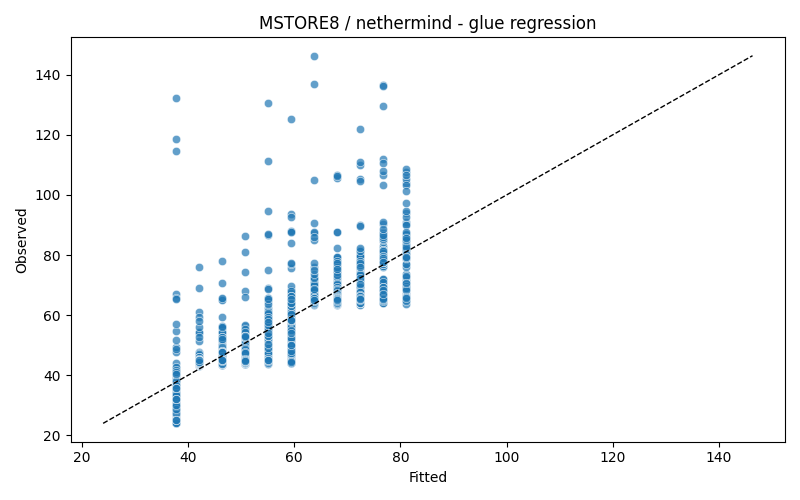

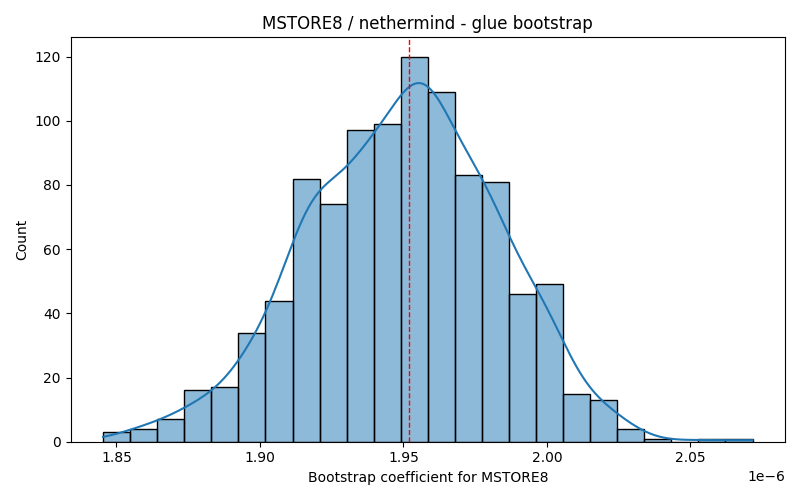

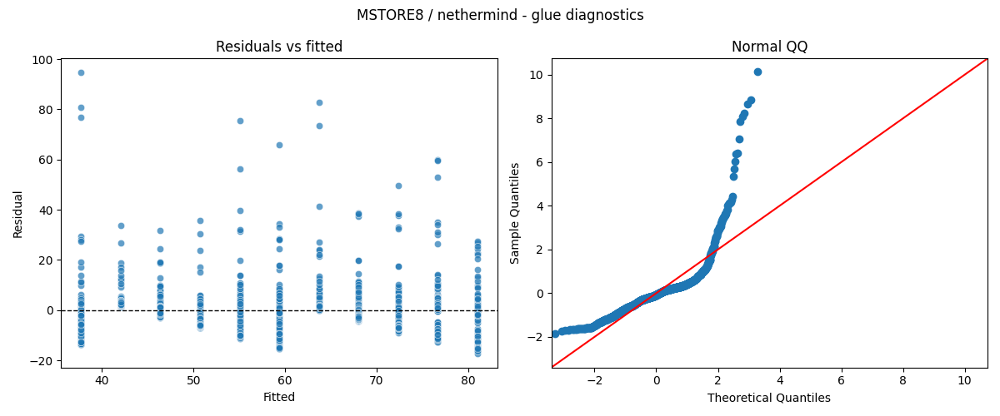

</details>

<details><summary><code>MUL</code> · nobs=374 · runtime_ms=5.725e-06 · p=1.00e-03 · R²=0.75</summary>

```
==============================================================================
                           NNLS Regression Results                            
==============================================================================
Dep. Variable:          test_runtime_ms              R-squared:          0.750
Model:                  NNLS                    Adj. R-squared:          0.749
No. Observations:       374                               RMSE:          26.09
Df Residuals:           372                                MAE:          16.50
Df Model:               1      
==============================================================================
                      coef     std err     P-value      [0.025      0.975]
------------------------------------------------------------------------------
         const     25.3739      3.3790       0.001     18.7501     32.0472
           MUL      0.0000      0.0000       0.001      0.0000      0.0000
==============================================================================
Notes: Non-negative least squares with bootstrap inference (1000 iterations)
==============================================================================
```

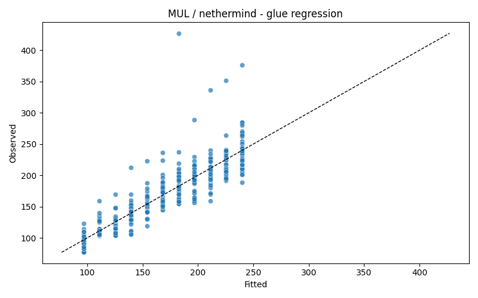

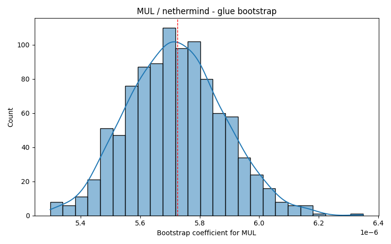

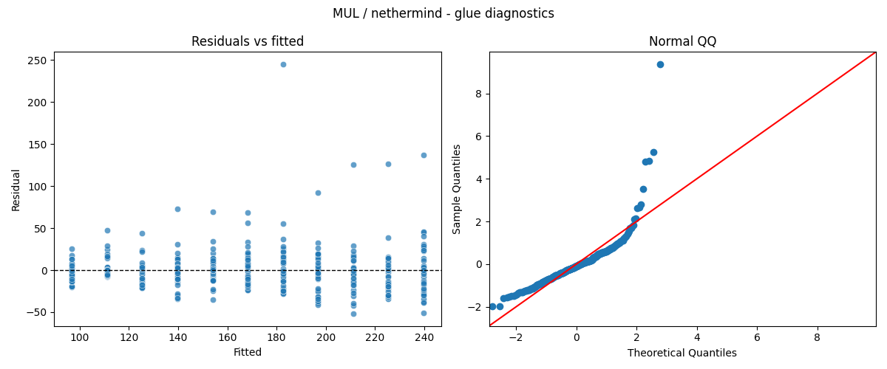

</details>

<details><summary><code>PC</code> · nobs=374 · runtime_ms=8.119e-07 · p=1.00e-03 · R²=0.8998</summary>

```
==============================================================================
                           NNLS Regression Results                            
==============================================================================
Dep. Variable:          test_runtime_ms              R-squared:          0.900
Model:                  NNLS                    Adj. R-squared:          0.900
No. Observations:       374                               RMSE:           8.10
Df Residuals:           372                                MAE:           6.39
Df Model:               1      
==============================================================================
                      coef     std err     P-value      [0.025      0.975]
------------------------------------------------------------------------------
         const     16.6336      1.5510       0.001     13.9039     19.6752
            PC      0.0000      0.0000       0.001      0.0000      0.0000
==============================================================================
Notes: Non-negative least squares with bootstrap inference (1000 iterations)
==============================================================================
```

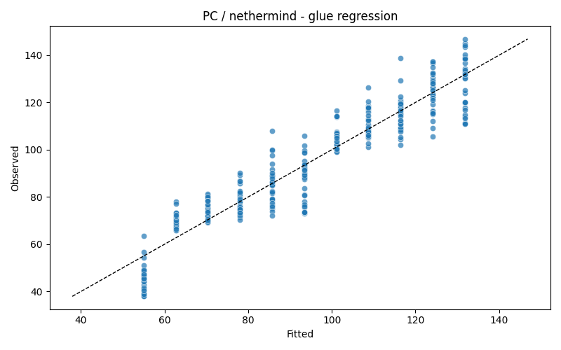

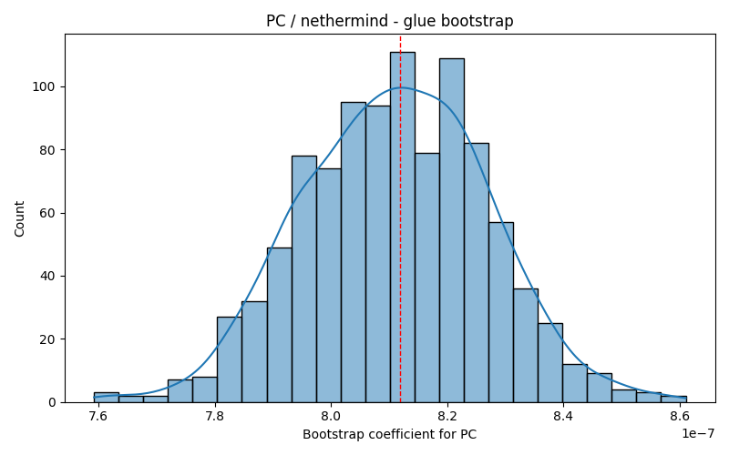

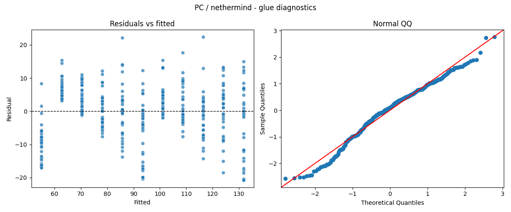

</details>

<details><summary><code>RETURNDATASIZE</code> · nobs=1496 · runtime_ms=7.718e-07 · p=1.00e-03 · R²=0.4757</summary>

```
==============================================================================
                           NNLS Regression Results                            
==============================================================================
Dep. Variable:          test_runtime_ms              R-squared:          0.476
Model:                  NNLS                    Adj. R-squared:          0.475
No. Observations:       1496                              RMSE:          12.79
Df Residuals:           1494                               MAE:           5.59
Df Model:               1      
==============================================================================
                      coef     std err     P-value      [0.025      0.975]
------------------------------------------------------------------------------
         const     12.2533      1.0724       0.001     10.2673     14.3551
RETURNDATASIZE      0.0000      0.0000       0.001      0.0000      0.0000
==============================================================================
Notes: Non-negative least squares with bootstrap inference (1000 iterations)
==============================================================================
```

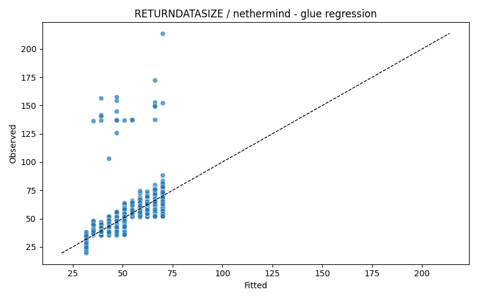

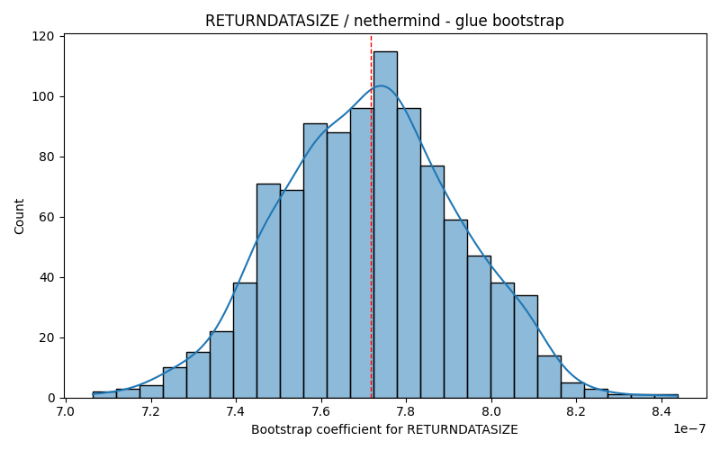

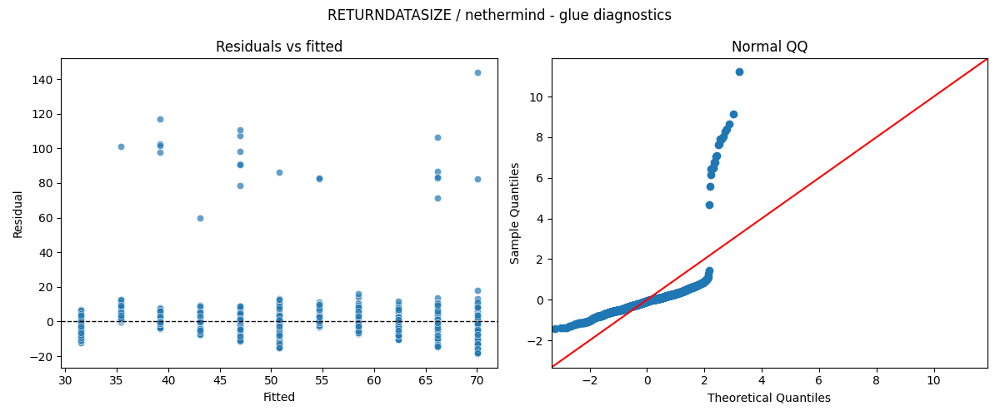

</details>

<details><summary><code>SELFBALANCE</code> · nobs=306 · runtime_ms=1.07e-05 · p=1.00e-03 · R²=0.8717</summary>

```
==============================================================================
                           NNLS Regression Results                            
==============================================================================
Dep. Variable:          test_runtime_ms              R-squared:          0.872
Model:                  NNLS                    Adj. R-squared:          0.871
No. Observations:       306                               RMSE:          41.42
Df Residuals:           304                                MAE:          33.66
Df Model:               1      
==============================================================================
                      coef     std err     P-value      [0.025      0.975]
------------------------------------------------------------------------------
         const     73.4251     10.0352       0.001     54.6914     94.5568
   SELFBALANCE      0.0000      0.0000       0.001      0.0000      0.0000
==============================================================================
Notes: Non-negative least squares with bootstrap inference (1000 iterations)
==============================================================================
```

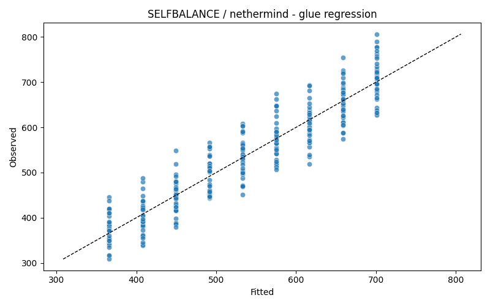

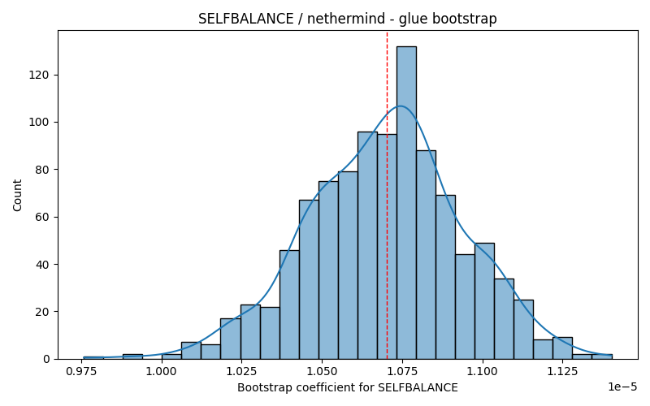

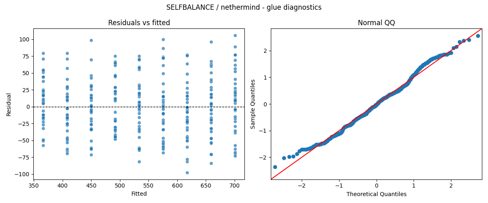

</details>

<details><summary><code>SUB</code> · nobs=374 · runtime_ms=2.625e-06 · p=1.00e-03 · R²=0.5845</summary>

```
==============================================================================
                           NNLS Regression Results                            
==============================================================================
Dep. Variable:          test_runtime_ms              R-squared:          0.585
Model:                  NNLS                    Adj. R-squared:          0.583
No. Observations:       374                               RMSE:          23.29
Df Residuals:           372                                MAE:          12.00
Df Model:               1      
==============================================================================
                      coef     std err     P-value      [0.025      0.975]
------------------------------------------------------------------------------
         const     15.2389      3.1600       0.001      9.1699     21.0030
           SUB      0.0000      0.0000       0.001      0.0000      0.0000
==============================================================================
Notes: Non-negative least squares with bootstrap inference (1000 iterations)
==============================================================================
```

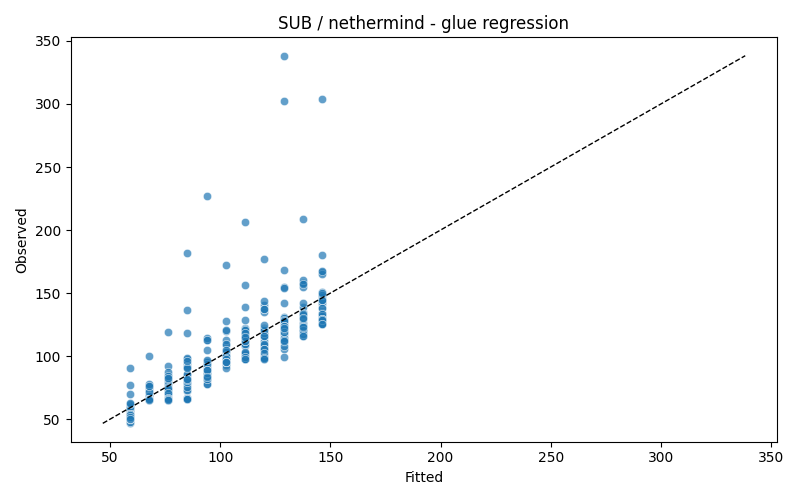

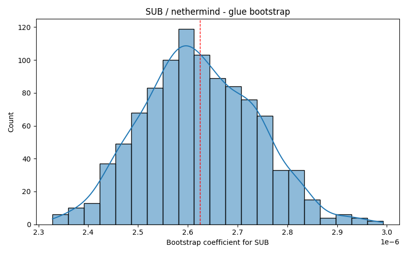

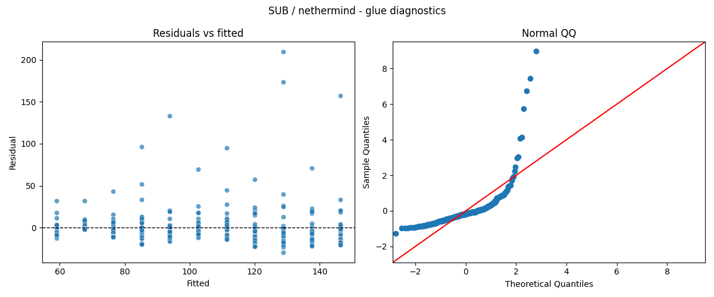

</details>

### Mixed glue (tier B) · nethermind

<details><summary><code>JUMP</code> · nobs=374 · runtime_ms=5.14e-06 · p=1.00e-03 · R²=0.7916</summary>

```
==============================================================================
                           NNLS Regression Results                            
==============================================================================
Dep. Variable:          test_runtime_ms              R-squared:          0.792
Model:                  NNLS                    Adj. R-squared:          0.791
No. Observations:       374                               RMSE:           9.80
Df Residuals:           372                                MAE:           6.56
Df Model:               1      
==============================================================================
                      coef     std err     P-value      [0.025      0.975]
------------------------------------------------------------------------------
         const     17.5846      2.2242       0.001     13.8068     22.5791
          JUMP      0.0000      0.0000       0.001      0.0000      0.0000
==============================================================================
Notes: Non-negative least squares with bootstrap inference (1000 iterations)
==============================================================================
```

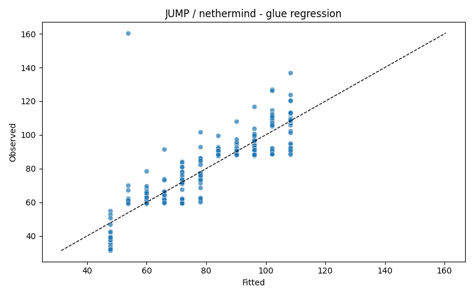

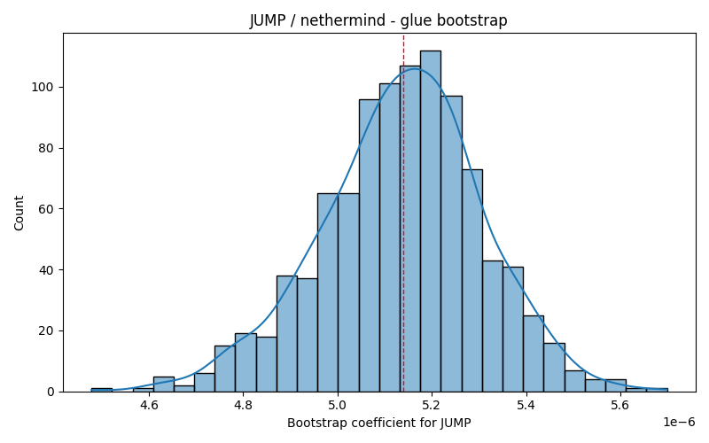

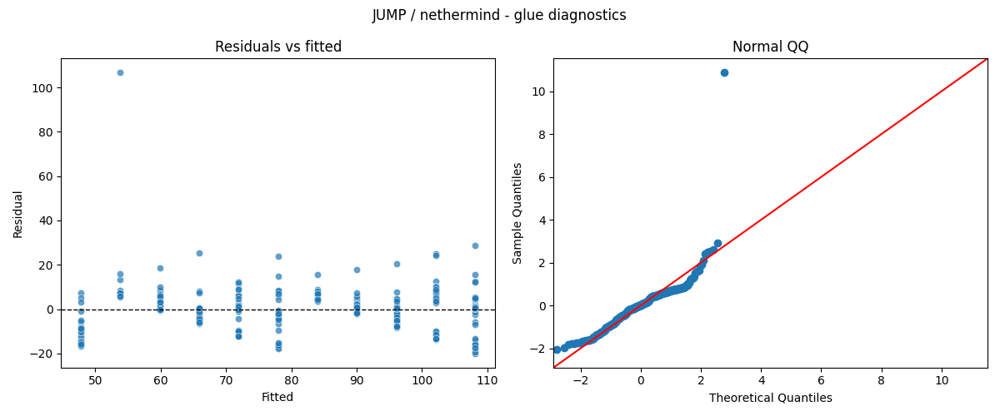

</details>

<details><summary><code>KECCAK256</code> · nobs=5984 · runtime_ms=0 · p=1.00e+00 · R²=0</summary>

```
==============================================================================
                           NNLS Regression Results                            
==============================================================================
Dep. Variable:          test_runtime_ms              R-squared:          0.000
Model:                  NNLS                    Adj. R-squared:         -0.000
No. Observations:       5984                              RMSE:         289.13
Df Residuals:           5982                               MAE:         238.16
Df Model:               1      
==============================================================================
                      coef     std err     P-value      [0.025      0.975]
------------------------------------------------------------------------------
         const    443.8969      3.6580       0.001    436.6830    451.5090
     KECCAK256      0.0000      0.0000       1.000      0.0000      0.0000
==============================================================================
Notes: Non-negative least squares with bootstrap inference (1000 iterations)
==============================================================================
```

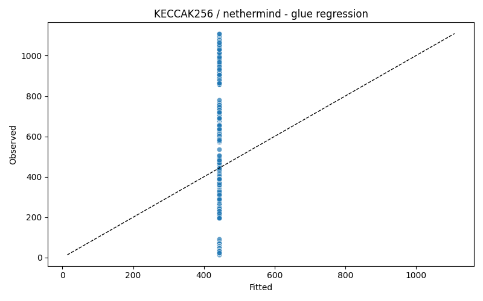


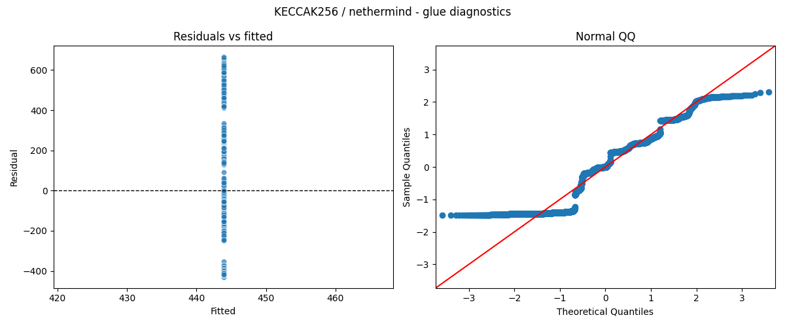

</details>

## reth

| glue_opcode | nobs | glue_runtime_ms | p_value | rsquared |
| --- | --- | --- | --- | --- |
| `ISZERO` | 176 | 3.665e-07 | 1.00e-03 | 0.7395 |
| `JUMPDEST` | 176 | 2.912e-07 | 1.00e-03 | 0.8156 |
| `SWAP` | 2816 | 4.769e-07 | 1.00e-03 | 0.5675 |
| `CALLDATASIZE` | 10769 | 4.998e-07 | 1.00e-03 | 0.8382 |
| `DUP` | 10769 | 4.19e-07 | 1.00e-03 | 0.8382 |
| `GAS` | 10769 | 4.497e-07 | 1.00e-03 | 0.8382 |
| `MLOAD` | 10769 | 1.609e-06 | 1.00e-03 | 0.8382 |
| `PUSH` | 10769 | 4.529e-07 | 1.00e-03 | 0.8382 |
| `PUSH0` | 10769 | 3.496e-07 | 1.00e-03 | 0.8382 |
| `STATICCALL` | 10769 | 4.577e-05 | 1.00e-03 | 0.8382 |
| `ADD` | 176 | 9.157e-07 | 1.00e-03 | 0.8133 |
| `AND` | 176 | 7.657e-07 | 1.00e-03 | 0.2907 |
| `CALLDATACOPY` | 4224 | 2.28e-06 | 1.00e-03 | 0.724 |
| `CALLDATALOAD` | 704 | 4.474e-05 | 1.00e-03 | 0.2994 |
| `DIV` | 176 | 6.707e-06 | 1.00e-03 | 0.8383 |
| `EXP` | 176 | 0.0003702 | 1.00e-03 | 0.8142 |
| `GT` | 176 | 1.007e-06 | 1.00e-03 | 0.7837 |
| `JUMPI` | 176 | 1.242e-06 | 1.00e-03 | 0.7167 |
| `LT` | 176 | 9.86e-07 | 1.00e-03 | 0.8293 |
| `MSTORE` | 880 | 2.795e-06 | 1.00e-03 | 0.2819 |
| `MSTORE8` | 880 | 1.299e-06 | 1.00e-03 | 0.4946 |
| `MUL` | 176 | 1.174e-06 | 1.00e-03 | 0.6633 |
| `PC` | 176 | 6.049e-07 | 1.00e-03 | 0.9277 |
| `RETURNDATASIZE` | 704 | 8.941e-07 | 1.00e-03 | 0.6566 |
| `SELFBALANCE` | 144 | 4.191e-06 | 1.00e-03 | 0.8223 |
| `SUB` | 176 | 9.716e-07 | 1.00e-03 | 0.83 |
| `JUMP` | 176 | 2.221e-06 | 1.00e-03 | 0.8175 |
| `KECCAK256` | 2816 | 0 | 1.00e+00 | 2.22e-16 |

### Cycle glue — joint fit · reth

<details><summary>Joint NNLS regression summary</summary>

```
==============================================================================
                           NNLS Regression Results                            
==============================================================================
Dep. Variable:          test_runtime_ms              R-squared:          0.838
Model:                  NNLS                    Adj. R-squared:          0.838
No. Observations:       10769                             RMSE:           7.28
Df Residuals:           10761                              MAE:           5.06
Df Model:               7      
==============================================================================
                      coef     std err     P-value      [0.025      0.975]
------------------------------------------------------------------------------
         const     11.0318      0.2361       0.001     10.5948     11.4832
  CALLDATASIZE      0.0000      0.0000       0.001      0.0000      0.0000
           DUP      0.0000      0.0000       0.001      0.0000      0.0000
           GAS      0.0000      0.0000       0.001      0.0000      0.0000
         MLOAD      0.0000      0.0000       0.001      0.0000      0.0000
          PUSH      0.0000      0.0000       0.001      0.0000      0.0000
         PUSH0      0.0000      0.0000       0.001      0.0000      0.0000
    STATICCALL      0.0000      0.0000       0.001      0.0000      0.0000
==============================================================================
Notes: Non-negative least squares with bootstrap inference (1000 iterations)
==============================================================================
```

</details>

<details><summary><code>CALLDATASIZE</code> · nobs=10769 · runtime_ms=4.998e-07 · p=1.00e-03 · R²=0.8382</summary>


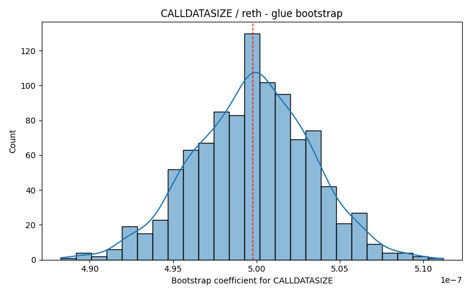

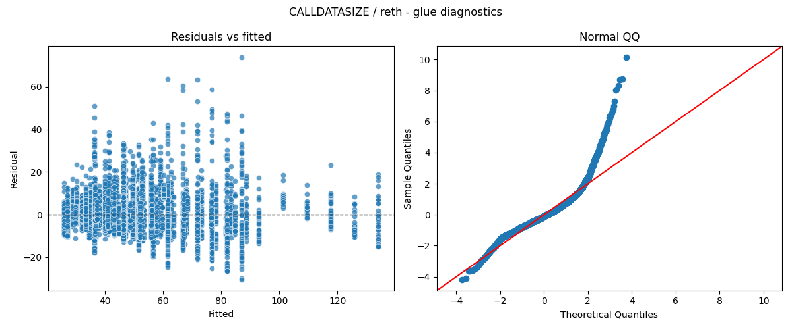

</details>

<details><summary><code>DUP</code> · nobs=10769 · runtime_ms=4.19e-07 · p=1.00e-03 · R²=0.8382</summary>


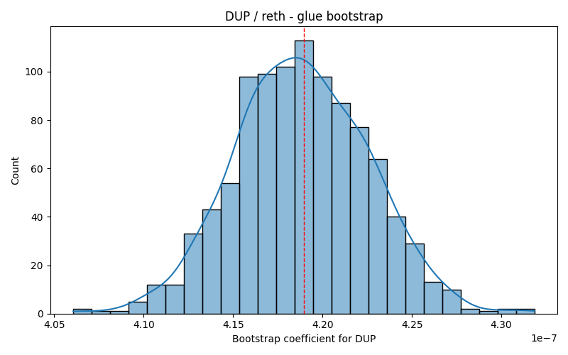

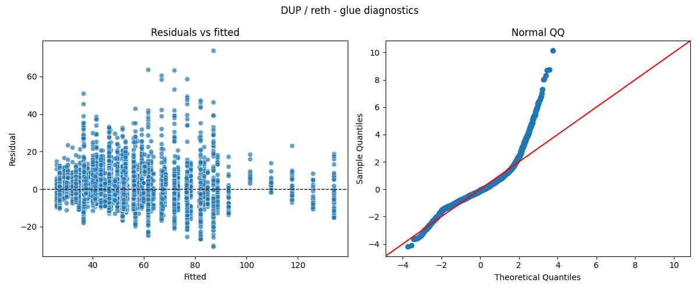

</details>

<details><summary><code>GAS</code> · nobs=10769 · runtime_ms=4.497e-07 · p=1.00e-03 · R²=0.8382</summary>


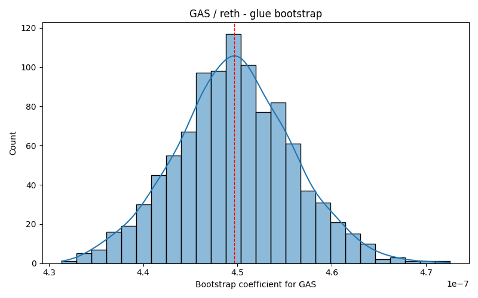


</details>

<details><summary><code>MLOAD</code> · nobs=10769 · runtime_ms=1.609e-06 · p=1.00e-03 · R²=0.8382</summary>

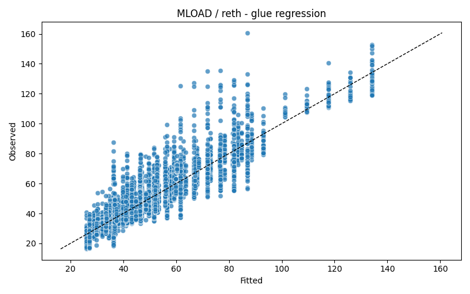

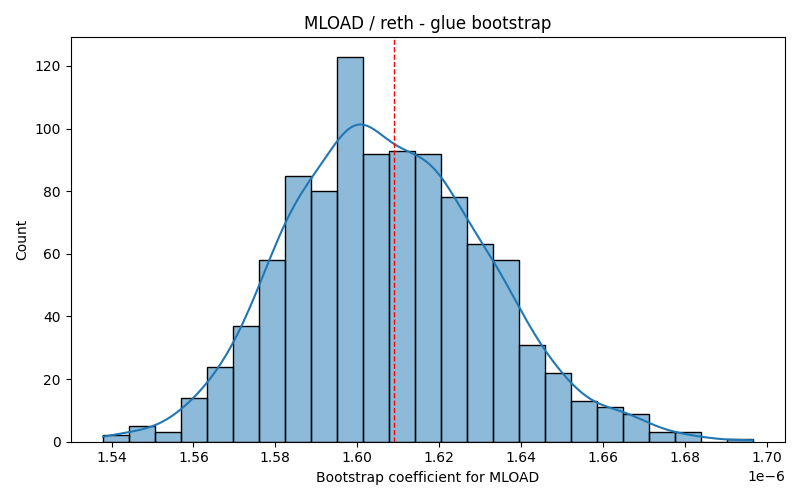

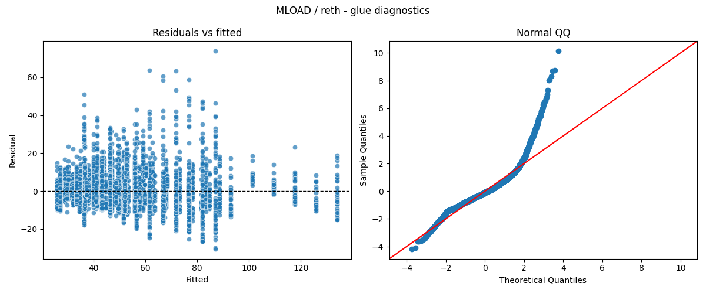

</details>

<details><summary><code>PUSH</code> · nobs=10769 · runtime_ms=4.529e-07 · p=1.00e-03 · R²=0.8382</summary>


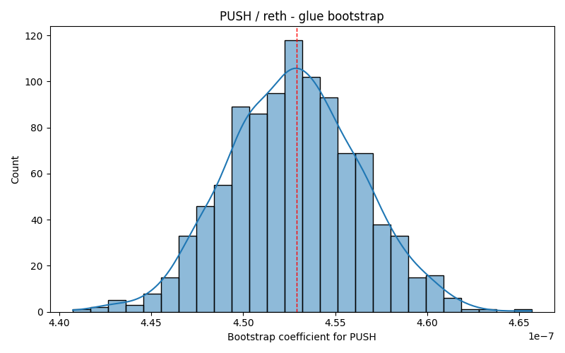


</details>

<details><summary><code>PUSH0</code> · nobs=10769 · runtime_ms=3.496e-07 · p=1.00e-03 · R²=0.8382</summary>


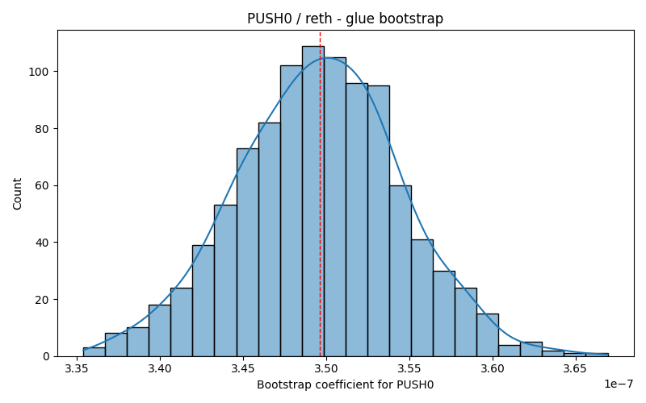


</details>

<details><summary><code>STATICCALL</code> · nobs=10769 · runtime_ms=4.577e-05 · p=1.00e-03 · R²=0.8382</summary>


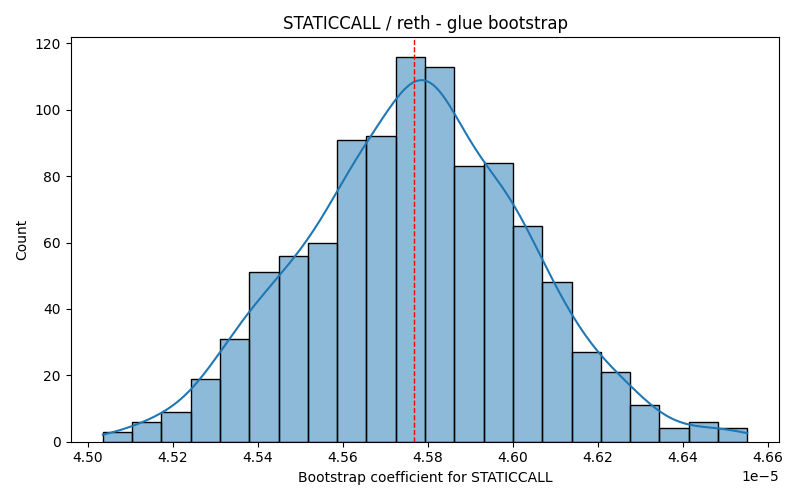


</details>

### Pure glue · reth

<details><summary><code>ISZERO</code> · nobs=176 · runtime_ms=3.665e-07 · p=1.00e-03 · R²=0.7395</summary>

```
==============================================================================
                           NNLS Regression Results                            
==============================================================================
Dep. Variable:          test_runtime_ms              R-squared:          0.740
Model:                  NNLS                    Adj. R-squared:          0.738
No. Observations:       176                               RMSE:           4.58
Df Residuals:           174                                MAE:           3.31
Df Model:               1      
==============================================================================
                      coef     std err     P-value      [0.025      0.975]
------------------------------------------------------------------------------
         const      8.8605      1.0907       0.001      6.8852     11.1688
        ISZERO      0.0000      0.0000       0.001      0.0000      0.0000
==============================================================================
Notes: Non-negative least squares with bootstrap inference (1000 iterations)
==============================================================================
```

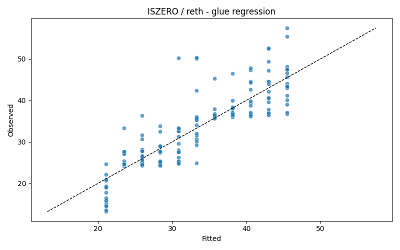

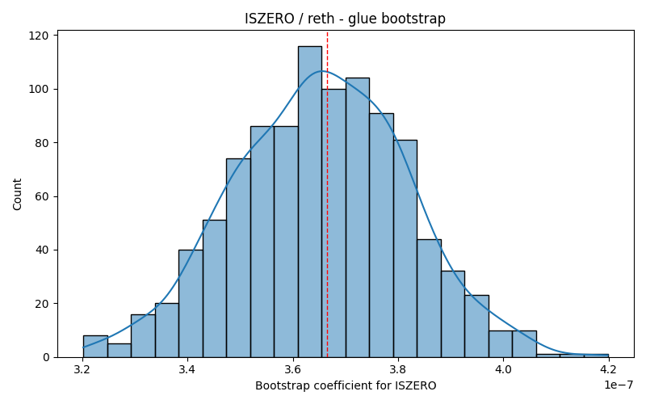

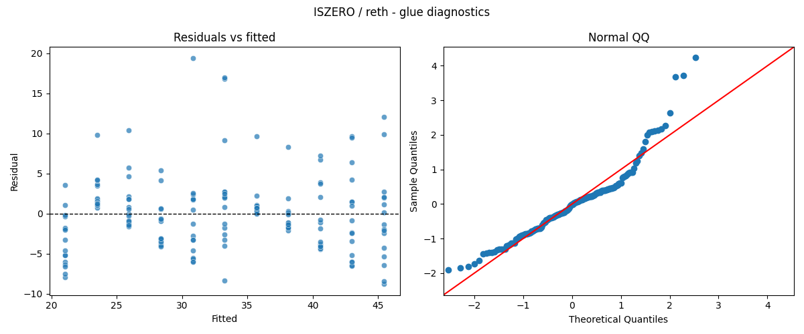

</details>

<details><summary><code>JUMPDEST</code> · nobs=176 · runtime_ms=2.912e-07 · p=1.00e-03 · R²=0.8156</summary>

```
==============================================================================
                           NNLS Regression Results                            
==============================================================================
Dep. Variable:          test_runtime_ms              R-squared:          0.816
Model:                  NNLS                    Adj. R-squared:          0.815
No. Observations:       176                               RMSE:           8.74
Df Residuals:           174                                MAE:           6.75
Df Model:               1      
==============================================================================
                      coef     std err     P-value      [0.025      0.975]
------------------------------------------------------------------------------
         const     13.1950      1.9028       0.001      9.5905     16.9419
      JUMPDEST      0.0000      0.0000       0.001      0.0000      0.0000
==============================================================================
Notes: Non-negative least squares with bootstrap inference (1000 iterations)
==============================================================================
```

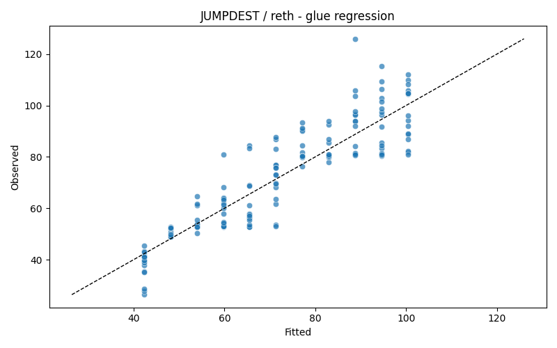

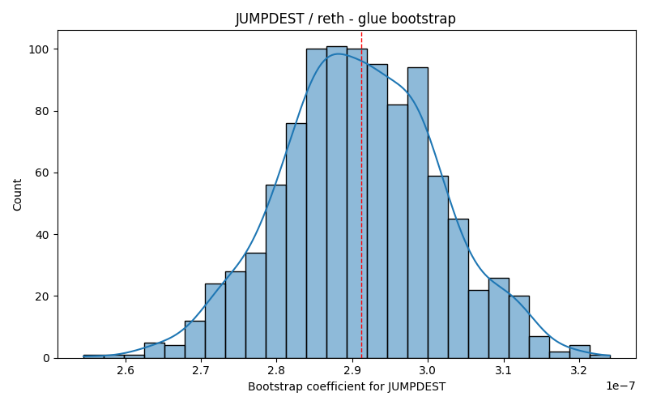

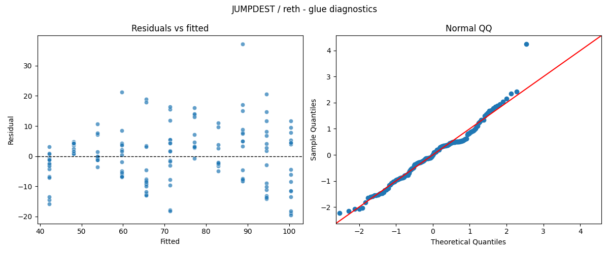

</details>

<details><summary><code>SWAP</code> · nobs=2816 · runtime_ms=4.769e-07 · p=1.00e-03 · R²=0.5675</summary>

```
==============================================================================
                           NNLS Regression Results                            
==============================================================================
Dep. Variable:          test_runtime_ms              R-squared:          0.567
Model:                  NNLS                    Adj. R-squared:          0.567
No. Observations:       2816                              RMSE:           8.77
Df Residuals:           2814                               MAE:           4.50
Df Model:               1      
==============================================================================
                      coef     std err     P-value      [0.025      0.975]
------------------------------------------------------------------------------
         const     11.3931      0.5259       0.001     10.4128     12.4803
          SWAP      0.0000      0.0000       0.001      0.0000      0.0000
==============================================================================
Notes: Non-negative least squares with bootstrap inference (1000 iterations)
==============================================================================
```

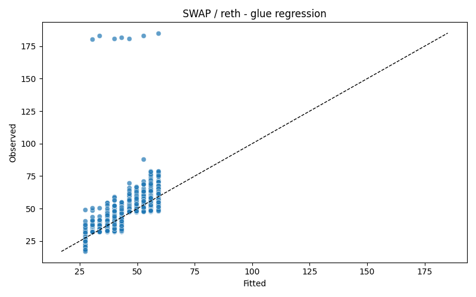

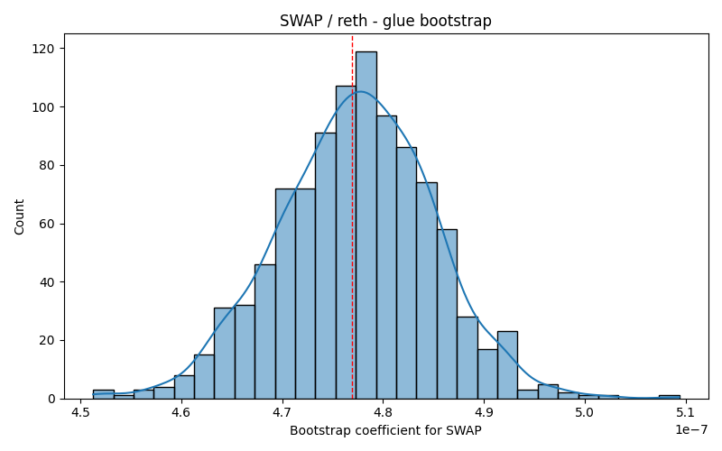

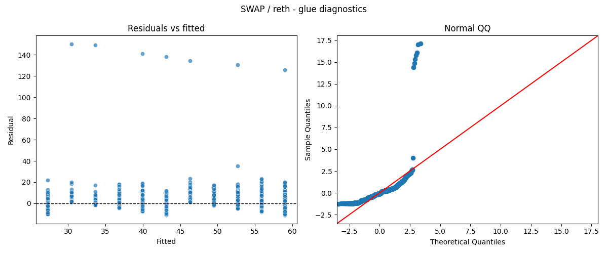

</details>

### Mixed glue (tier A) · reth

<details><summary><code>ADD</code> · nobs=176 · runtime_ms=9.157e-07 · p=1.00e-03 · R²=0.8133</summary>

```
==============================================================================
                           NNLS Regression Results                            
==============================================================================
Dep. Variable:          test_runtime_ms              R-squared:          0.813
Model:                  NNLS                    Adj. R-squared:          0.812
No. Observations:       176                               RMSE:           4.62
Df Residuals:           174                                MAE:           3.36
Df Model:               1      
==============================================================================
                      coef     std err     P-value      [0.025      0.975]
------------------------------------------------------------------------------
         const      8.6392      1.1471       0.001      6.3981     10.9600
           ADD      0.0000      0.0000       0.001      0.0000      0.0000
==============================================================================
Notes: Non-negative least squares with bootstrap inference (1000 iterations)
==============================================================================
```

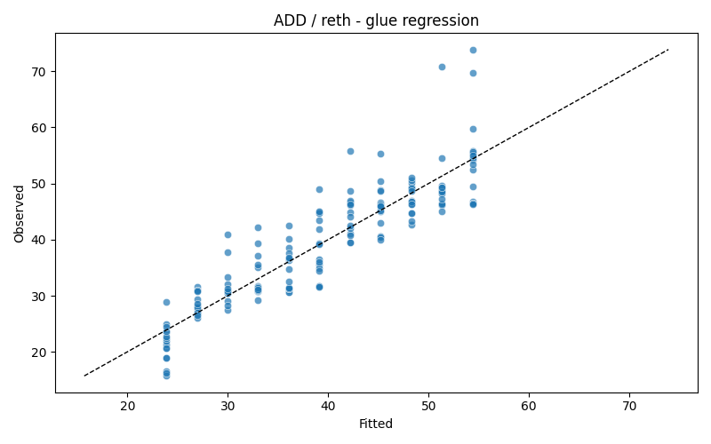

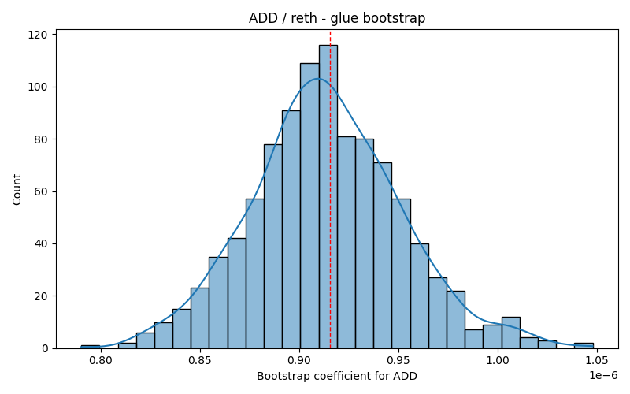

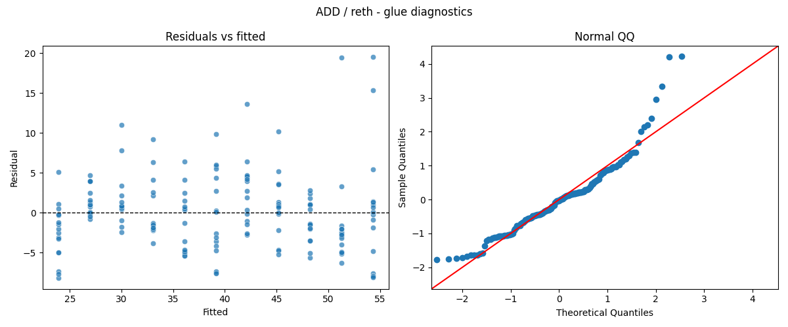

</details>

<details><summary><code>AND</code> · nobs=176 · runtime_ms=7.657e-07 · p=1.00e-03 · R²=0.2907</summary>

```
==============================================================================
                           NNLS Regression Results                            
==============================================================================
Dep. Variable:          test_runtime_ms              R-squared:          0.291
Model:                  NNLS                    Adj. R-squared:          0.287
No. Observations:       176                               RMSE:          12.59
Df Residuals:           174                                MAE:           4.32
Df Model:               1      
==============================================================================
                      coef     std err     P-value      [0.025      0.975]
------------------------------------------------------------------------------
         const     13.8967      5.5809       0.001      6.9658     27.1383
           AND      0.0000      0.0000       0.001      0.0000      0.0000
==============================================================================
Notes: Non-negative least squares with bootstrap inference (1000 iterations)
==============================================================================
```

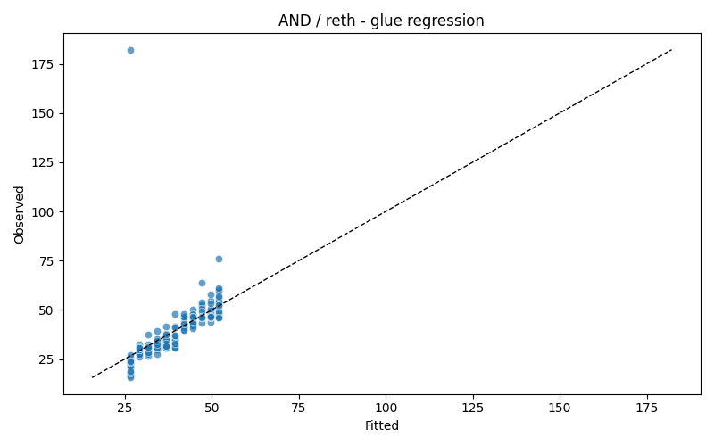

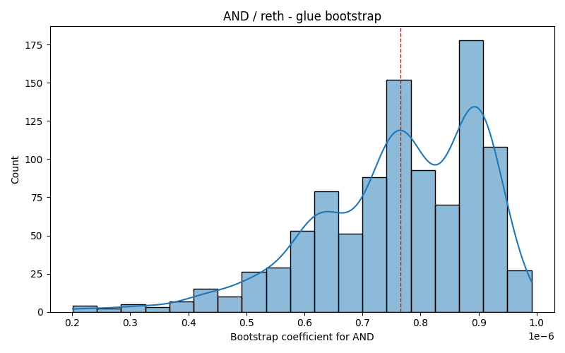

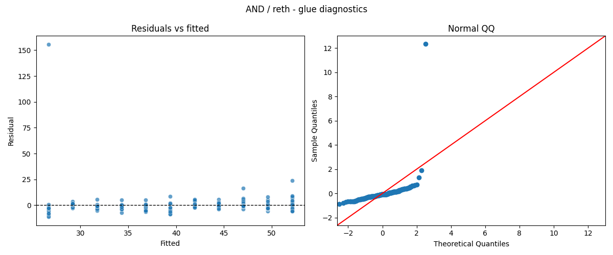

</details>

<details><summary><code>CALLDATACOPY</code> · nobs=4224 · runtime_ms=2.28e-06 · p=1.00e-03 · R²=0.724</summary>

```
==============================================================================
                           NNLS Regression Results                            
==============================================================================
Dep. Variable:          test_runtime_ms              R-squared:          0.724
Model:                  NNLS                    Adj. R-squared:          0.724
No. Observations:       4224                              RMSE:          10.59
Df Residuals:           4222                               MAE:           7.04
Df Model:               1      
==============================================================================
                      coef     std err     P-value      [0.025      0.975]
------------------------------------------------------------------------------
         const     12.5731      0.1869       0.001     12.2085     12.9374
  CALLDATACOPY      0.0000      0.0000       0.001      0.0000      0.0000
==============================================================================
Notes: Non-negative least squares with bootstrap inference (1000 iterations)
==============================================================================
```

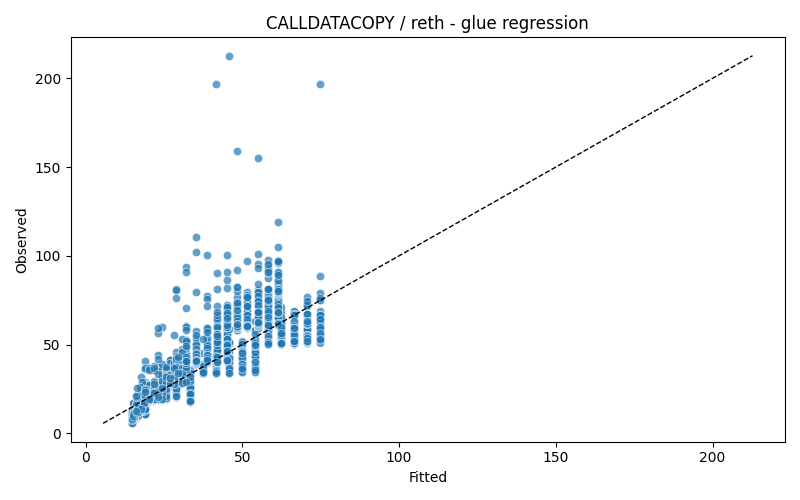

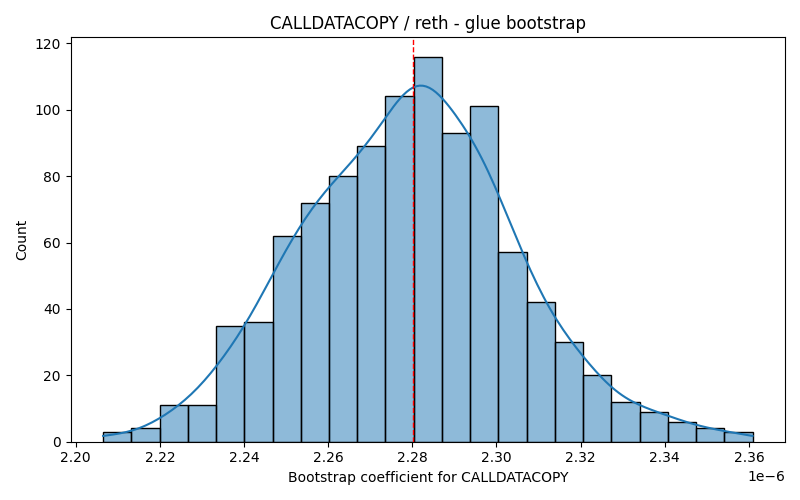

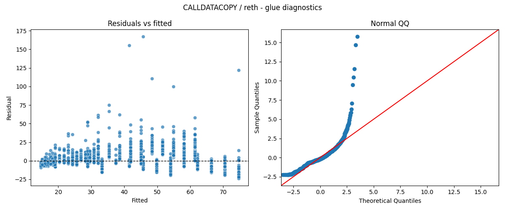

</details>

<details><summary><code>CALLDATALOAD</code> · nobs=704 · runtime_ms=4.474e-05 · p=1.00e-03 · R²=0.2994</summary>

```
==============================================================================
                           NNLS Regression Results                            
==============================================================================
Dep. Variable:          test_runtime_ms              R-squared:          0.299
Model:                  NNLS                    Adj. R-squared:          0.298
No. Observations:       704                               RMSE:           0.26
Df Residuals:           702                                MAE:           0.14
Df Model:               1      
==============================================================================
                      coef     std err     P-value      [0.025      0.975]
------------------------------------------------------------------------------
         const      1.1668      0.0356       0.001      1.0850      1.2256
  CALLDATALOAD      0.0000      0.0000       0.001      0.0000      0.0001
==============================================================================
Notes: Non-negative least squares with bootstrap inference (1000 iterations)
==============================================================================
```

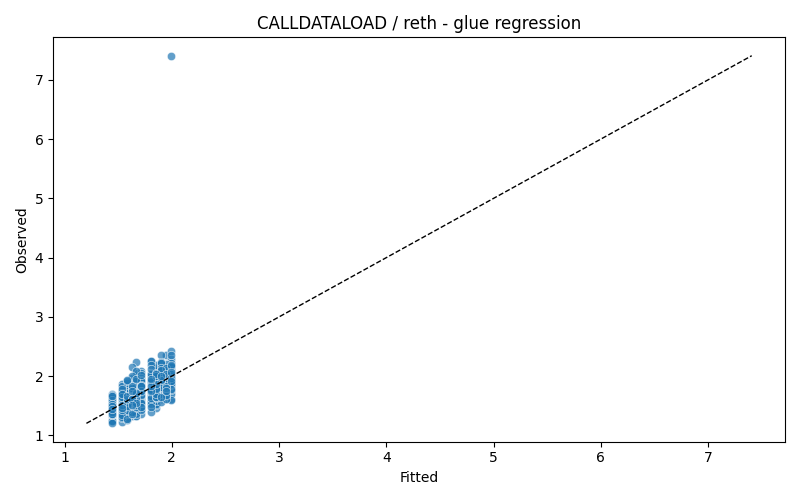

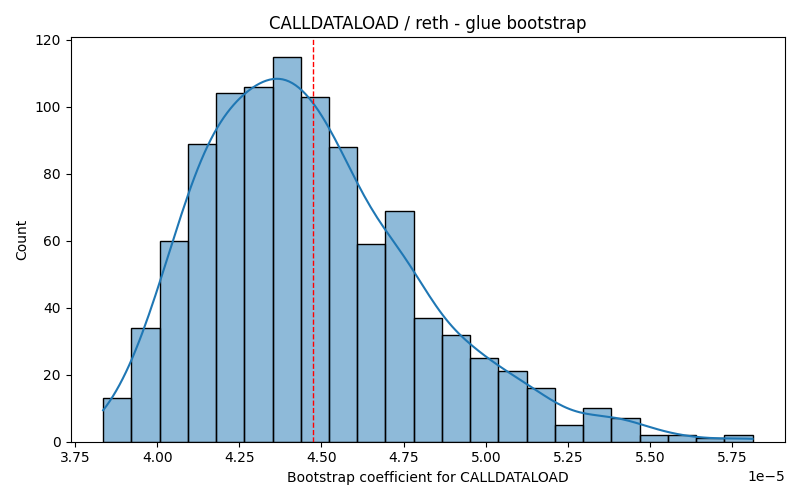

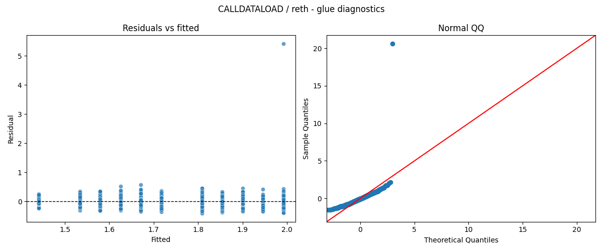

</details>

<details><summary><code>DIV</code> · nobs=176 · runtime_ms=6.707e-06 · p=1.00e-03 · R²=0.8383</summary>

```
==============================================================================
                           NNLS Regression Results                            
==============================================================================
Dep. Variable:          test_runtime_ms              R-squared:          0.838
Model:                  NNLS                    Adj. R-squared:          0.837
No. Observations:       176                               RMSE:          23.25
Df Residuals:           174                                MAE:          19.16
Df Model:               1      
==============================================================================
                      coef     std err     P-value      [0.025      0.975]
------------------------------------------------------------------------------
         const     64.4077      6.1795       0.001     51.3199     75.7791
           DIV      0.0000      0.0000       0.001      0.0000      0.0000
==============================================================================
Notes: Non-negative least squares with bootstrap inference (1000 iterations)
==============================================================================
```

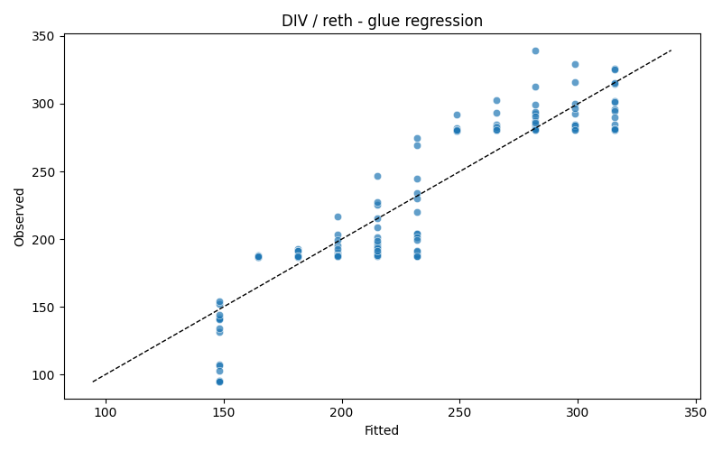

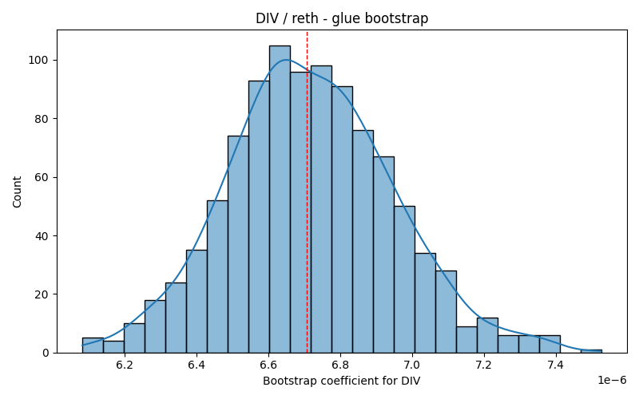

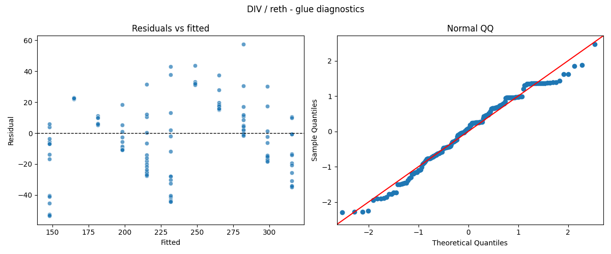

</details>

<details><summary><code>EXP</code> · nobs=176 · runtime_ms=0.0003702 · p=1.00e-03 · R²=0.8142</summary>

```
==============================================================================
                           NNLS Regression Results                            
==============================================================================
Dep. Variable:          test_runtime_ms              R-squared:          0.814
Model:                  NNLS                    Adj. R-squared:          0.813
No. Observations:       176                               RMSE:           6.93
Df Residuals:           174                                MAE:           5.60
Df Model:               1      
==============================================================================
                      coef     std err     P-value      [0.025      0.975]
------------------------------------------------------------------------------
         const     17.2187      1.6814       0.001     13.8582     20.4658
           EXP      0.0004      0.0000       0.001      0.0003      0.0004
==============================================================================
Notes: Non-negative least squares with bootstrap inference (1000 iterations)
==============================================================================
```

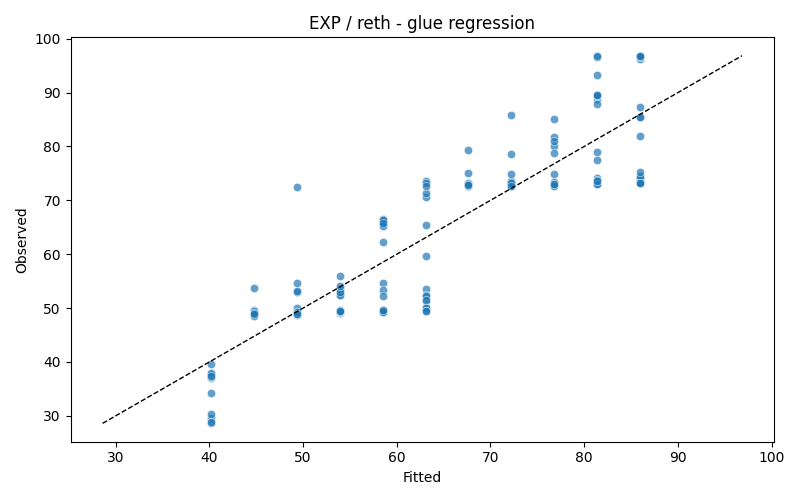

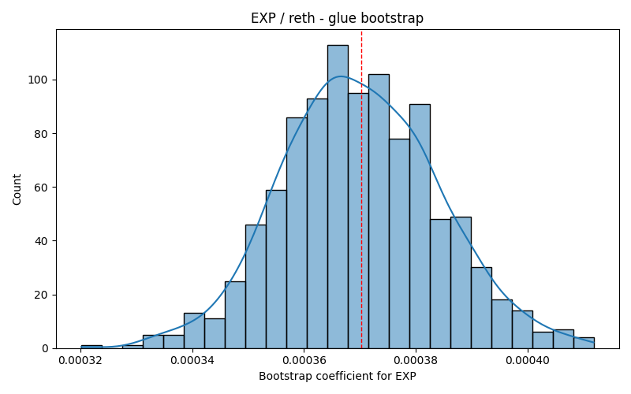

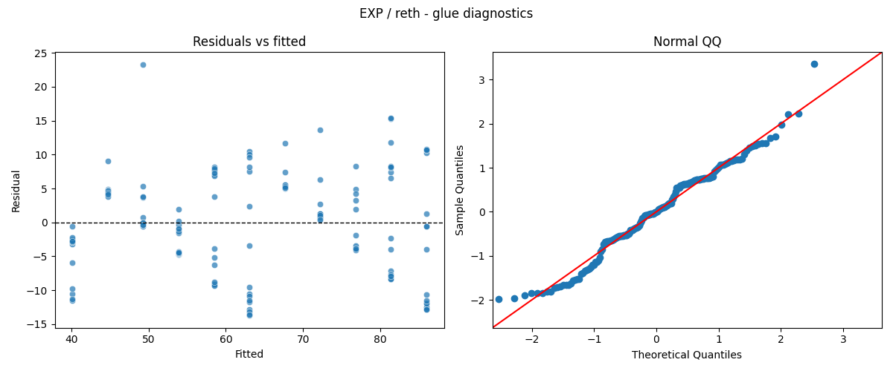

</details>

<details><summary><code>GT</code> · nobs=176 · runtime_ms=1.007e-06 · p=1.00e-03 · R²=0.7837</summary>

```
==============================================================================
                           NNLS Regression Results                            
==============================================================================
Dep. Variable:          test_runtime_ms              R-squared:          0.784
Model:                  NNLS                    Adj. R-squared:          0.782
No. Observations:       176                               RMSE:           5.57
Df Residuals:           174                                MAE:           3.92
Df Model:               1      
==============================================================================
                      coef     std err     P-value      [0.025      0.975]
------------------------------------------------------------------------------
         const      9.9303      1.5046       0.001      7.0021     12.7231
            GT      0.0000      0.0000       0.001      0.0000      0.0000
==============================================================================
Notes: Non-negative least squares with bootstrap inference (1000 iterations)
==============================================================================
```

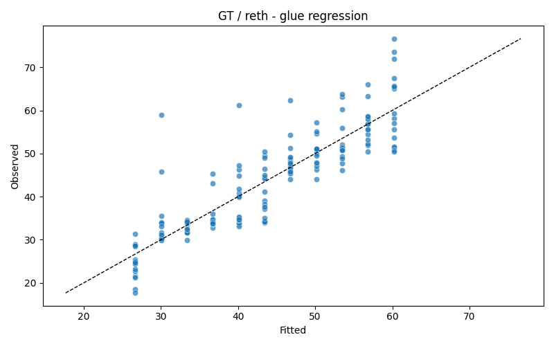

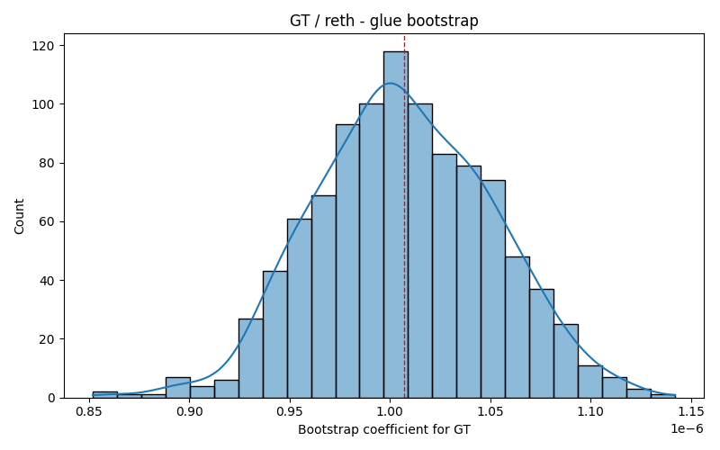

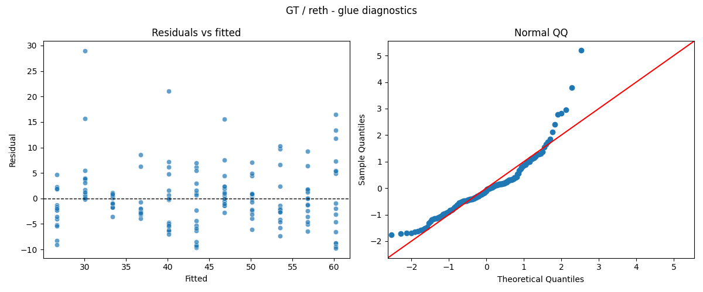

</details>

<details><summary><code>JUMPI</code> · nobs=176 · runtime_ms=1.242e-06 · p=1.00e-03 · R²=0.7167</summary>

```
==============================================================================
                           NNLS Regression Results                            
==============================================================================
Dep. Variable:          test_runtime_ms              R-squared:          0.717
Model:                  NNLS                    Adj. R-squared:          0.715
No. Observations:       176                               RMSE:           3.52
Df Residuals:           174                                MAE:           2.49
Df Model:               1      
==============================================================================
                      coef     std err     P-value      [0.025      0.975]
------------------------------------------------------------------------------
         const      6.8409      0.8638       0.001      5.1296      8.5007
         JUMPI      0.0000      0.0000       0.001      0.0000      0.0000
==============================================================================
Notes: Non-negative least squares with bootstrap inference (1000 iterations)
==============================================================================
```

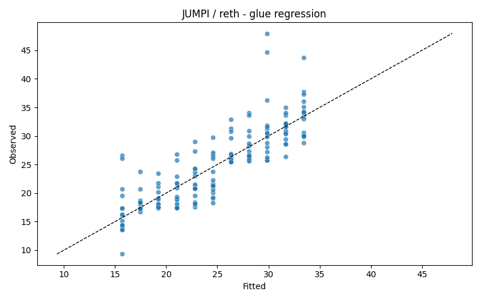

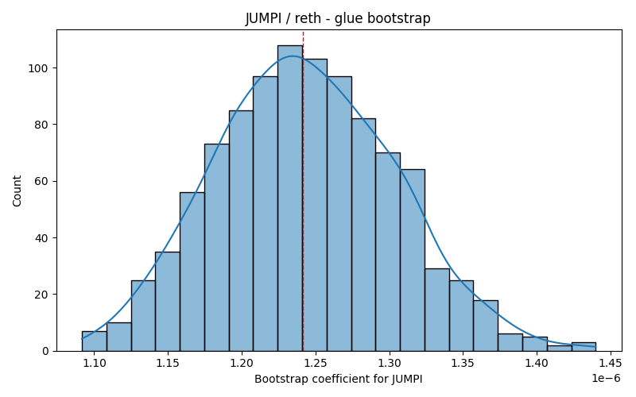

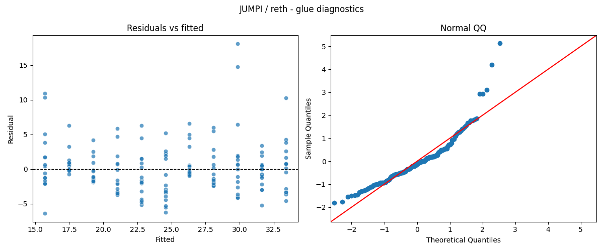

</details>

<details><summary><code>LT</code> · nobs=176 · runtime_ms=9.86e-07 · p=1.00e-03 · R²=0.8293</summary>

```
==============================================================================
                           NNLS Regression Results                            
==============================================================================
Dep. Variable:          test_runtime_ms              R-squared:          0.829
Model:                  NNLS                    Adj. R-squared:          0.828
No. Observations:       176                               RMSE:           4.71
Df Residuals:           174                                MAE:           3.52
Df Model:               1      
==============================================================================
                      coef     std err     P-value      [0.025      0.975]
------------------------------------------------------------------------------
         const      8.1843      1.1497       0.001      5.9145     10.5332
            LT      0.0000      0.0000       0.001      0.0000      0.0000
==============================================================================
Notes: Non-negative least squares with bootstrap inference (1000 iterations)
==============================================================================
```

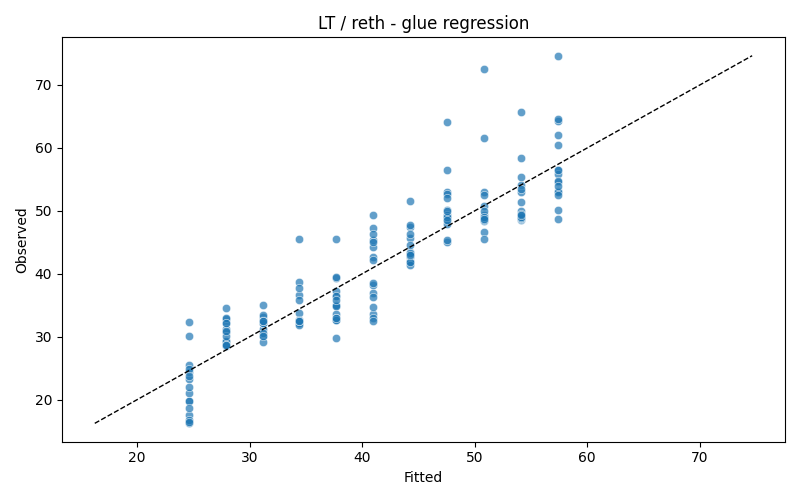

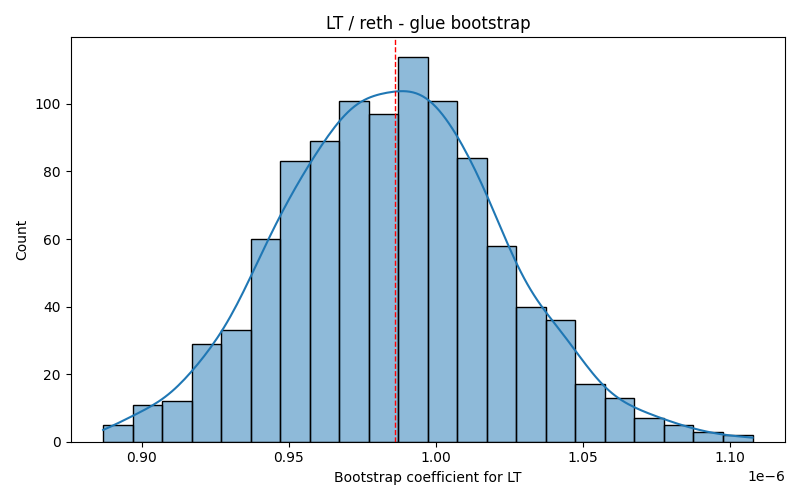

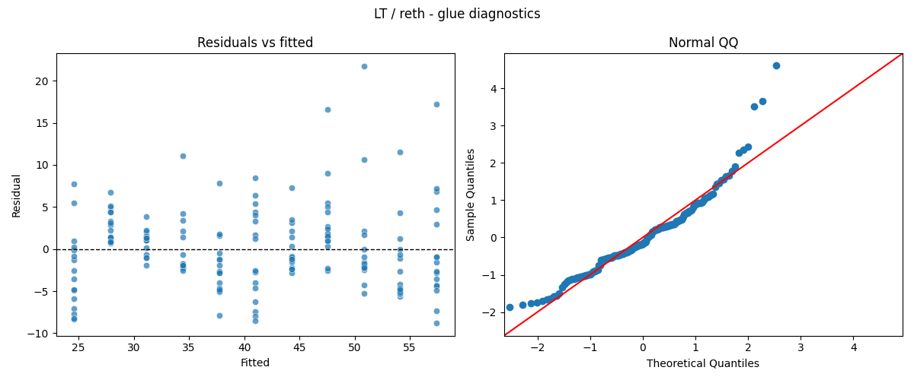

</details>

<details><summary><code>MSTORE</code> · nobs=880 · runtime_ms=2.795e-06 · p=1.00e-03 · R²=0.2819</summary>

```
==============================================================================
                           NNLS Regression Results                            
==============================================================================
Dep. Variable:          test_runtime_ms              R-squared:          0.282
Model:                  NNLS                    Adj. R-squared:          0.281
No. Observations:       880                               RMSE:          31.30
Df Residuals:           878                                MAE:          28.50
Df Model:               1      
==============================================================================
                      coef     std err     P-value      [0.025      0.975]
------------------------------------------------------------------------------
         const     20.3352      2.9871       0.001     14.2983     26.3123
        MSTORE      0.0000      0.0000       0.001      0.0000      0.0000
==============================================================================
Notes: Non-negative least squares with bootstrap inference (1000 iterations)
==============================================================================
```

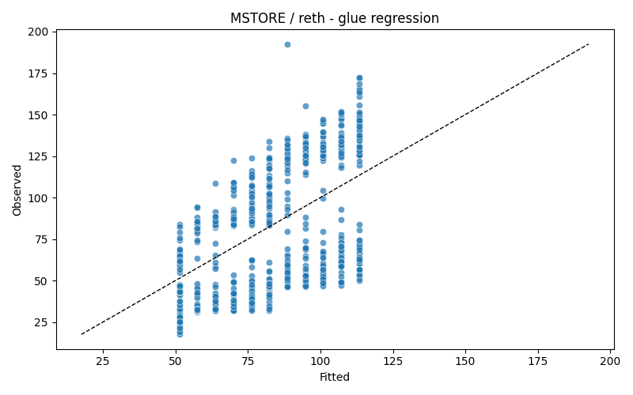

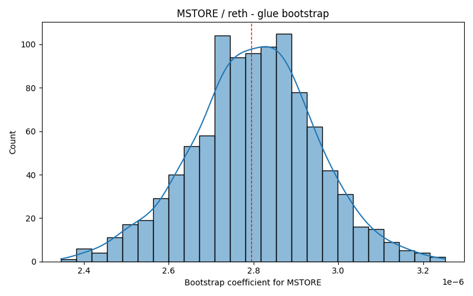

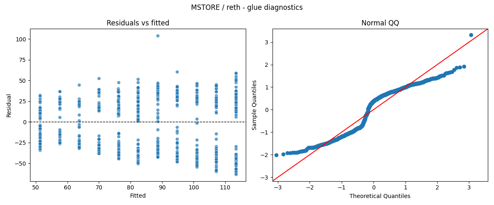

</details>

<details><summary><code>MSTORE8</code> · nobs=880 · runtime_ms=1.299e-06 · p=1.00e-03 · R²=0.4946</summary>

```
==============================================================================
                           NNLS Regression Results                            
==============================================================================
Dep. Variable:          test_runtime_ms              R-squared:          0.495
Model:                  NNLS                    Adj. R-squared:          0.494
No. Observations:       880                               RMSE:           9.22
Df Residuals:           878                                MAE:           4.51
Df Model:               1      
==============================================================================
                      coef     std err     P-value      [0.025      0.975]
------------------------------------------------------------------------------
         const     11.5483      1.1514       0.001      9.5469     14.0807
       MSTORE8      0.0000      0.0000       0.001      0.0000      0.0000
==============================================================================
Notes: Non-negative least squares with bootstrap inference (1000 iterations)
==============================================================================
```

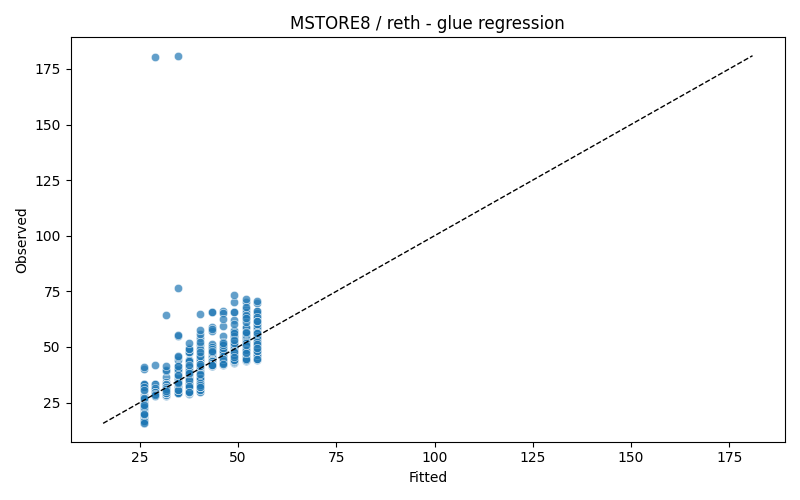

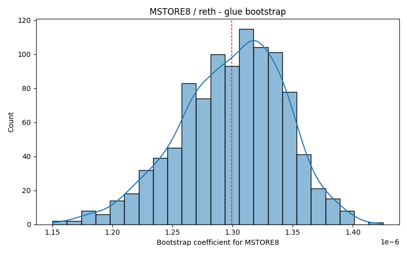

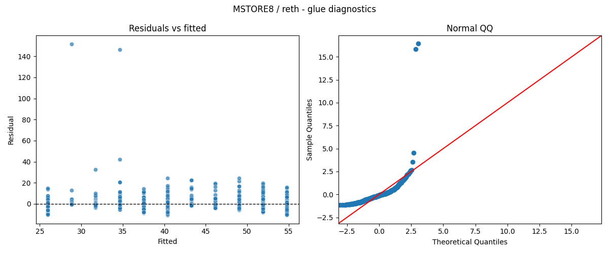

</details>

<details><summary><code>MUL</code> · nobs=176 · runtime_ms=1.174e-06 · p=1.00e-03 · R²=0.6633</summary>

```
==============================================================================
                           NNLS Regression Results                            
==============================================================================
Dep. Variable:          test_runtime_ms              R-squared:          0.663
Model:                  NNLS                    Adj. R-squared:          0.661
No. Observations:       176                               RMSE:           6.60
Df Residuals:           174                                MAE:           4.77
Df Model:               1      
==============================================================================
                      coef     std err     P-value      [0.025      0.975]
------------------------------------------------------------------------------
         const     11.2497      1.5421       0.001      8.1914     14.2275
           MUL      0.0000      0.0000       0.001      0.0000      0.0000
==============================================================================
Notes: Non-negative least squares with bootstrap inference (1000 iterations)
==============================================================================
```

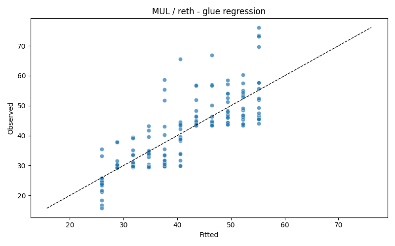

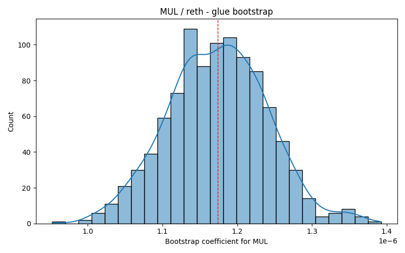

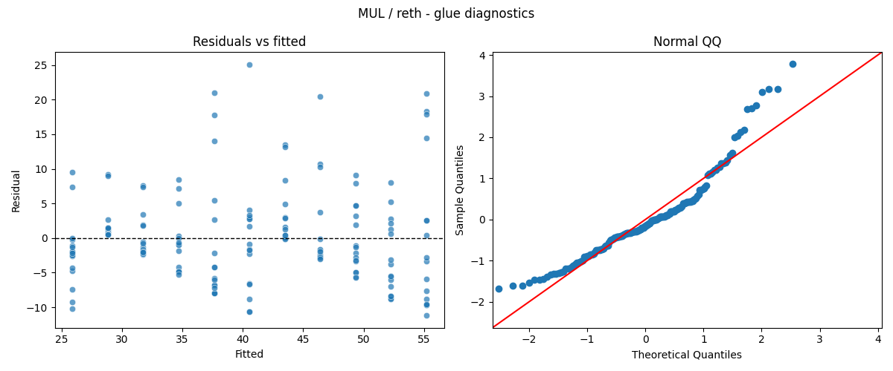

</details>

<details><summary><code>PC</code> · nobs=176 · runtime_ms=6.049e-07 · p=1.00e-03 · R²=0.9277</summary>

```
==============================================================================
                           NNLS Regression Results                            
==============================================================================
Dep. Variable:          test_runtime_ms              R-squared:          0.928
Model:                  NNLS                    Adj. R-squared:          0.927
No. Observations:       176                               RMSE:           5.05
Df Residuals:           174                                MAE:           4.05
Df Model:               1      
==============================================================================
                      coef     std err     P-value      [0.025      0.975]
------------------------------------------------------------------------------
         const     12.3096      1.2943       0.001      9.8989     14.7451
            PC      0.0000      0.0000       0.001      0.0000      0.0000
==============================================================================
Notes: Non-negative least squares with bootstrap inference (1000 iterations)
==============================================================================
```

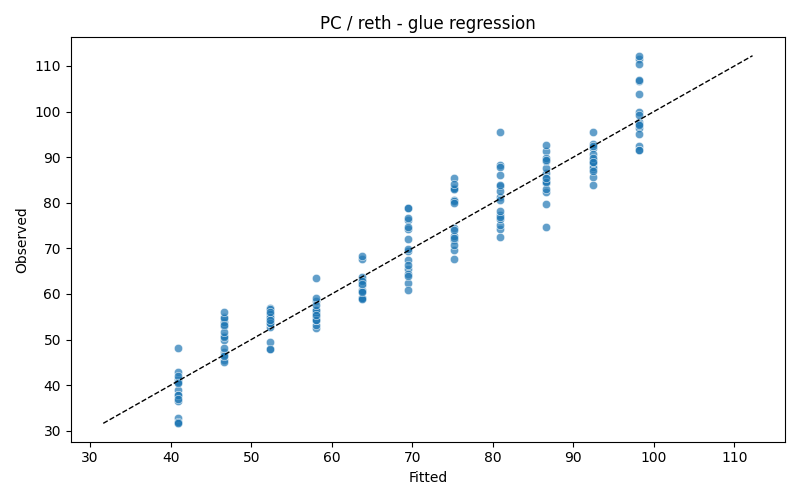

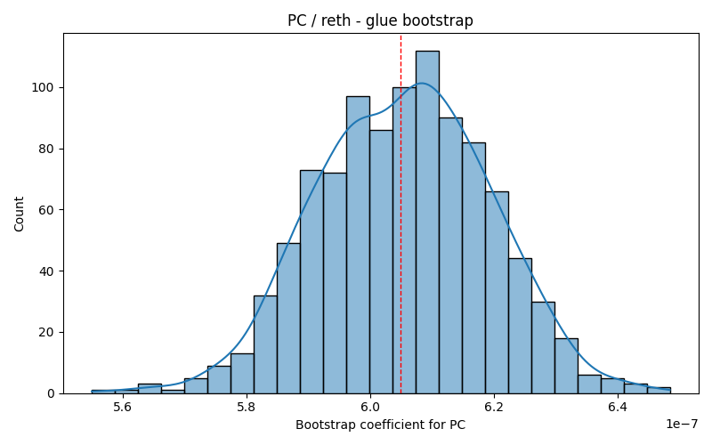

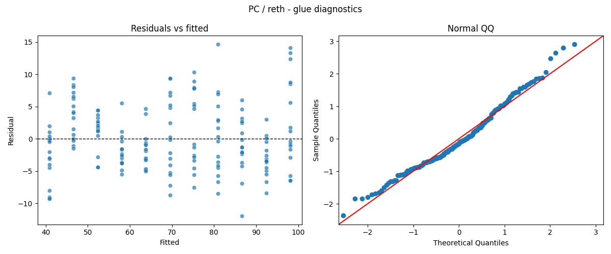

</details>

<details><summary><code>RETURNDATASIZE</code> · nobs=704 · runtime_ms=8.941e-07 · p=1.00e-03 · R²=0.6566</summary>

```
==============================================================================
                           NNLS Regression Results                            
==============================================================================
Dep. Variable:          test_runtime_ms              R-squared:          0.657
Model:                  NNLS                    Adj. R-squared:          0.656
No. Observations:       704                               RMSE:          10.21
Df Residuals:           702                                MAE:           5.13
Df Model:               1      
==============================================================================
                      coef     std err     P-value      [0.025      0.975]
------------------------------------------------------------------------------
         const     12.2953      0.8897       0.001     10.6311     14.0292
RETURNDATASIZE      0.0000      0.0000       0.001      0.0000      0.0000
==============================================================================
Notes: Non-negative least squares with bootstrap inference (1000 iterations)
==============================================================================
```

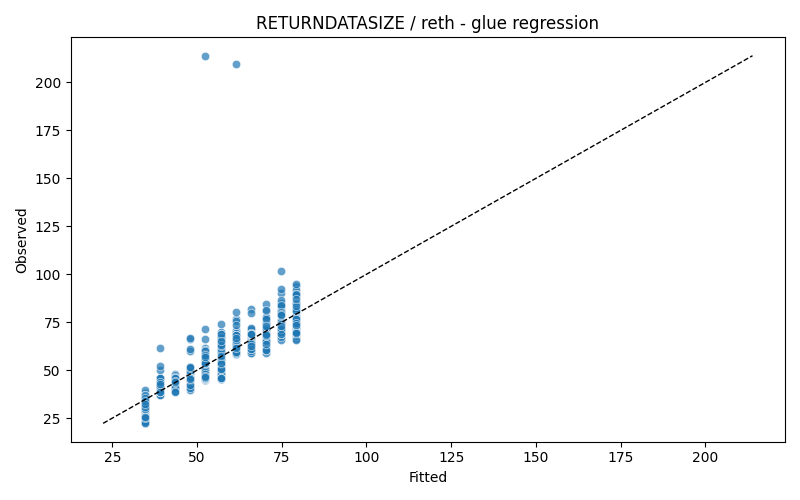

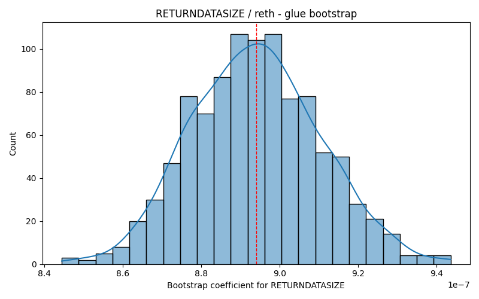

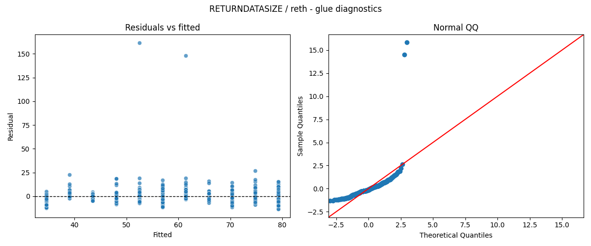

</details>

<details><summary><code>SELFBALANCE</code> · nobs=144 · runtime_ms=4.191e-06 · p=1.00e-03 · R²=0.8223</summary>

```
==============================================================================
                           NNLS Regression Results                            
==============================================================================
Dep. Variable:          test_runtime_ms              R-squared:          0.822
Model:                  NNLS                    Adj. R-squared:          0.821
No. Observations:       144                               RMSE:          19.65
Df Residuals:           142                                MAE:          16.13
Df Model:               1      
==============================================================================
                      coef     std err     P-value      [0.025      0.975]
------------------------------------------------------------------------------
         const     42.1022      6.4064       0.001     29.5888     54.8777
   SELFBALANCE      0.0000      0.0000       0.001      0.0000      0.0000
==============================================================================
Notes: Non-negative least squares with bootstrap inference (1000 iterations)
==============================================================================
```

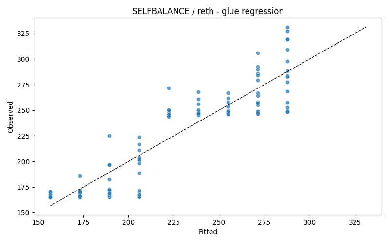

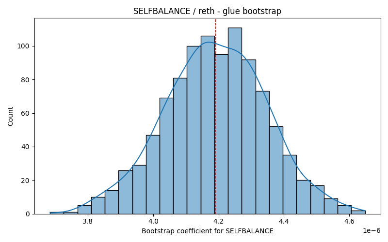

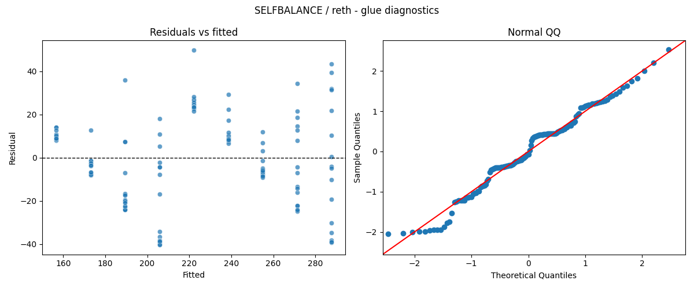

</details>

<details><summary><code>SUB</code> · nobs=176 · runtime_ms=9.716e-07 · p=1.00e-03 · R²=0.83</summary>

```
==============================================================================
                           NNLS Regression Results                            
==============================================================================
Dep. Variable:          test_runtime_ms              R-squared:          0.830
Model:                  NNLS                    Adj. R-squared:          0.829
No. Observations:       176                               RMSE:           4.63
Df Residuals:           174                                MAE:           3.56
Df Model:               1      
==============================================================================
                      coef     std err     P-value      [0.025      0.975]
------------------------------------------------------------------------------
         const      9.1770      1.0922       0.001      6.9203     11.0838
           SUB      0.0000      0.0000       0.001      0.0000      0.0000
==============================================================================
Notes: Non-negative least squares with bootstrap inference (1000 iterations)
==============================================================================
```

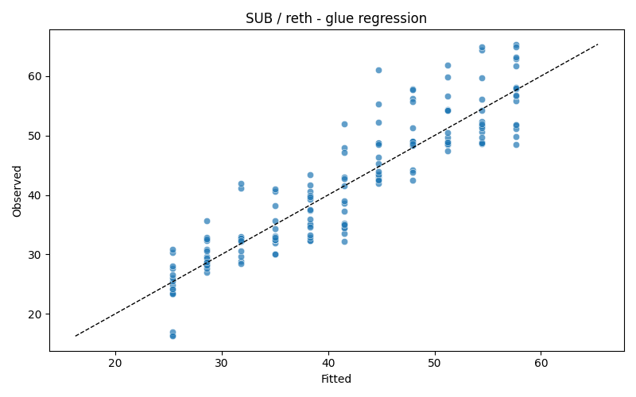

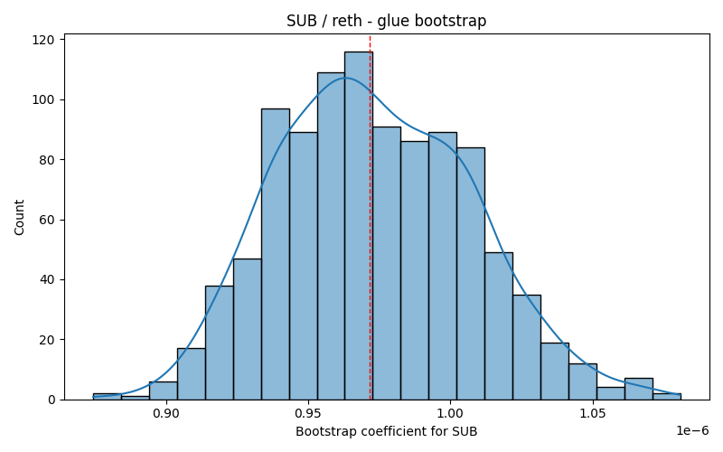

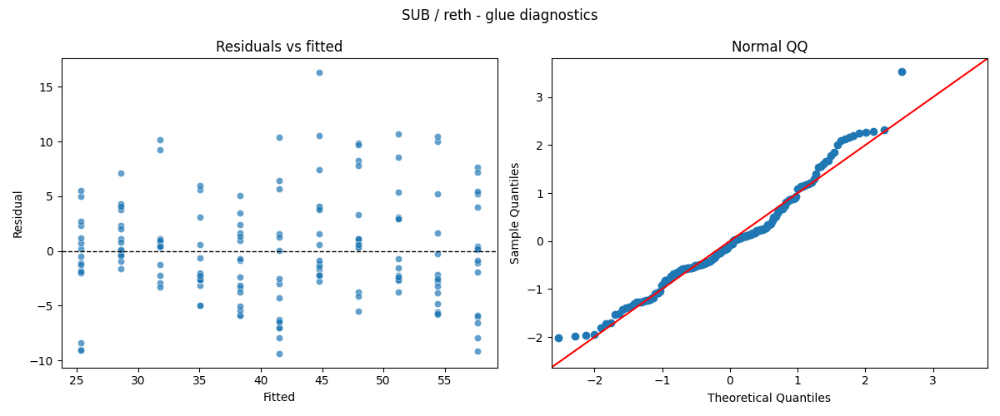

</details>

### Mixed glue (tier B) · reth

<details><summary><code>JUMP</code> · nobs=176 · runtime_ms=2.221e-06 · p=1.00e-03 · R²=0.8175</summary>

```
==============================================================================
                           NNLS Regression Results                            
==============================================================================
Dep. Variable:          test_runtime_ms              R-squared:          0.818
Model:                  NNLS                    Adj. R-squared:          0.816
No. Observations:       176                               RMSE:           3.90
Df Residuals:           174                                MAE:           2.95
Df Model:               1      
==============================================================================
                      coef     std err     P-value      [0.025      0.975]
------------------------------------------------------------------------------
         const      8.6643      0.9942       0.001      6.7278     10.6606
          JUMP      0.0000      0.0000       0.001      0.0000      0.0000
==============================================================================
Notes: Non-negative least squares with bootstrap inference (1000 iterations)
==============================================================================
```

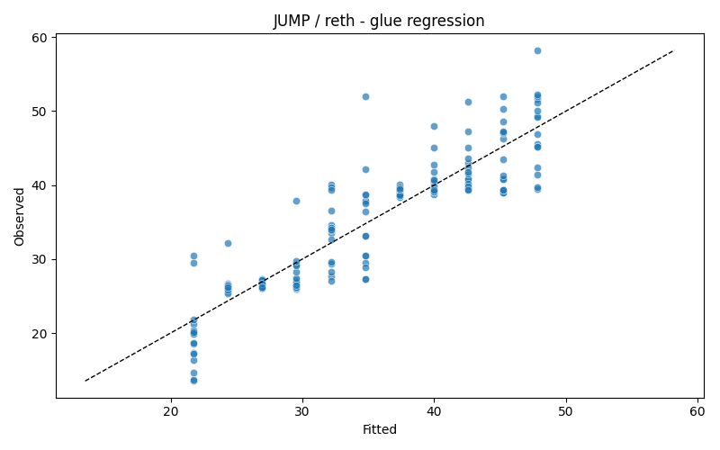

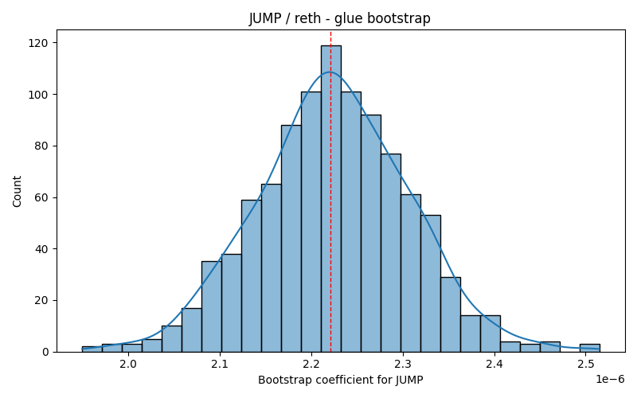

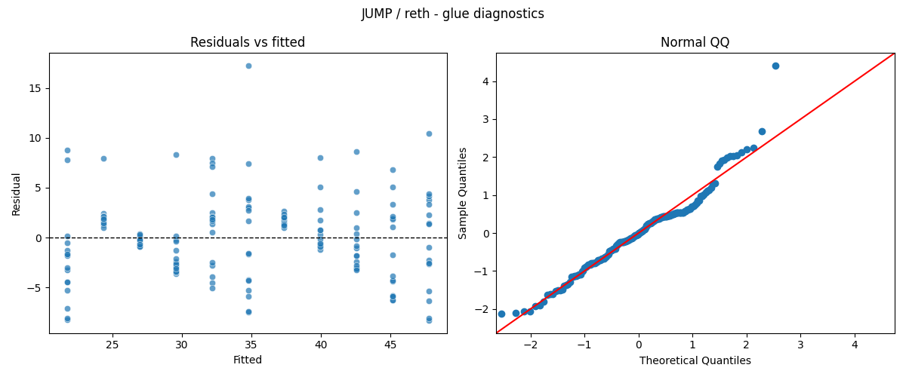

</details>

<details><summary><code>KECCAK256</code> · nobs=2816 · runtime_ms=0 · p=1.00e+00 · R²=2.22e-16</summary>

```
==============================================================================
                           NNLS Regression Results                            
==============================================================================
Dep. Variable:          test_runtime_ms              R-squared:          0.000
Model:                  NNLS                    Adj. R-squared:         -0.000
No. Observations:       2816                              RMSE:         159.58
Df Residuals:           2814                               MAE:         135.12
Df Model:               1      
==============================================================================
                      coef     std err     P-value      [0.025      0.975]
------------------------------------------------------------------------------
         const    251.5593      2.9176       0.001    245.9061    257.4174
     KECCAK256      0.0000      0.0000       1.000      0.0000      0.0000
==============================================================================
Notes: Non-negative least squares with bootstrap inference (1000 iterations)
==============================================================================
```

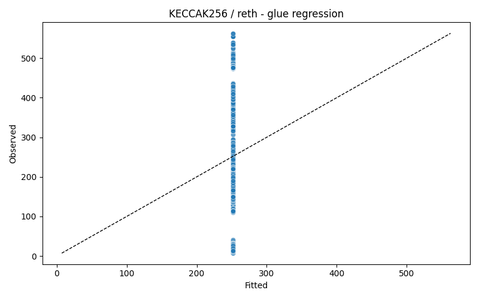


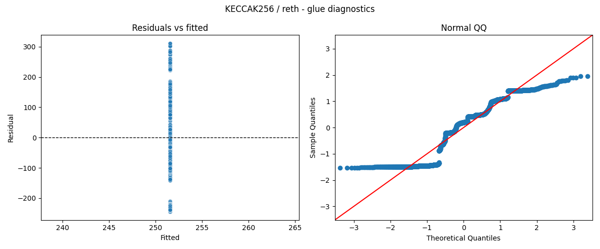

</details>
