# Glue opcodes report

Per-client NNLS fits of priced glue opcodes against their driver fixtures. Cycle-tier opcodes share one joint regression per client (shown once); pure-tier and mixed-tier opcodes each get a single-feature fit. Mixed-tier fits pre-adjust the LHS by subtracting the contribution of every priced upstream partner selected by the detector (pure ∪ cycle for `mixed_a`, plus `mixed_a` for `mixed_b`).

**Contents:** [besu](#besu) · [erigon](#erigon) · [geth](#geth) · [nethermind](#nethermind) · [reth](#reth)

## besu

| glue_opcode | nobs | glue_runtime_ms | p_value | rsquared |
| --- | --- | --- | --- | --- |
| `ISZERO` | 1111 | 4.797e-06 | 1.00e-03 | 0.8536 |
| `JUMPDEST` | 1111 | 2.664e-06 | 1.00e-03 | 0.8743 |
| `SWAP` | 17776 | 3.637e-06 | 1.00e-03 | 0.8505 |
| `CALLDATASIZE` | 65890 | 4.02e-06 | 1.00e-03 | 0.9324 |
| `DUP` | 65890 | 2.167e-06 | 1.00e-03 | 0.9324 |
| `GAS` | 65890 | 3.516e-06 | 1.00e-03 | 0.9324 |
| `MLOAD` | 65890 | 1.118e-05 | 1.00e-03 | 0.9324 |
| `PUSH` | 65890 | 2.981e-06 | 1.00e-03 | 0.9324 |
| `PUSH0` | 65890 | 2.175e-06 | 1.00e-03 | 0.9324 |
| `STATICCALL` | 65890 | 0.001524 | 1.00e-03 | 0.9324 |
| `ADD` | 1111 | 1.144e-05 | 1.00e-03 | 0.8609 |
| `AND` | 1111 | 9.772e-06 | 1.00e-03 | 0.8731 |
| `CALLDATACOPY` | 26664 | 2.089e-05 | 1.00e-03 | 0.8273 |
| `CALLDATALOAD` | 4444 | 2.211e-06 | 1.81e-01 | 0.0001256 |
| `DIV` | 1111 | 1.816e-05 | 1.00e-03 | 0.8729 |
| `EXP` | 1111 | 0.001271 | 1.00e-03 | 0.8637 |
| `GT` | 1111 | 3.322e-05 | 1.00e-03 | 0.8916 |
| `JUMPI` | 1111 | 9.912e-06 | 1.00e-03 | 0.8724 |
| `LT` | 1111 | 3.457e-05 | 1.00e-03 | 0.8948 |
| `MSTORE` | 5555 | 1.856e-05 | 1.00e-03 | 0.8675 |
| `MSTORE8` | 5555 | 1.255e-05 | 1.00e-03 | 0.8624 |
| `MUL` | 1111 | 1.152e-05 | 1.00e-03 | 0.639 |
| `PC` | 1111 | 4.706e-06 | 1.00e-03 | 0.8607 |
| `RETURNDATASIZE` | 4444 | 7.116e-06 | 1.00e-03 | 0.8501 |
| `SELFBALANCE` | 909 | 7.506e-06 | 1.00e-03 | 0.4878 |
| `SUB` | 1111 | 1.114e-05 | 1.00e-03 | 0.8673 |
| `JUMP` | 1111 | 4.984e-05 | 1.00e-03 | 0.8658 |
| `KECCAK256` | 17776 | 5.203e-05 | 1.00e-03 | 0.2823 |

### Cycle glue — joint fit · besu

<details><summary>Joint NNLS regression summary</summary>

```
==============================================================================
                           NNLS Regression Results                            
==============================================================================
Dep. Variable:          test_runtime_ms              R-squared:          0.932
Model:                  NNLS                    Adj. R-squared:          0.932
No. Observations:       65890                             RMSE:          56.32
Df Residuals:           65882                              MAE:          34.60
Df Model:               7      
==============================================================================
                      coef     std err     P-value      [0.025      0.975]
------------------------------------------------------------------------------
         const     81.1812      0.7231       0.001     79.8349     82.6525
  CALLDATASIZE      0.0000      0.0000       0.001      0.0000      0.0000
           DUP      0.0000      0.0000       0.001      0.0000      0.0000
           GAS      0.0000      0.0000       0.001      0.0000      0.0000
         MLOAD      0.0000      0.0000       0.001      0.0000      0.0000
          PUSH      0.0000      0.0000       0.001      0.0000      0.0000
         PUSH0      0.0000      0.0000       0.001      0.0000      0.0000
    STATICCALL      0.0015      0.0000       0.001      0.0015      0.0016
==============================================================================
Notes: Non-negative least squares with bootstrap inference (1000 iterations)
==============================================================================
```

</details>

<details><summary><code>CALLDATASIZE</code> · nobs=65890 · runtime_ms=4.02e-06 · p=1.00e-03 · R²=0.9324</summary>

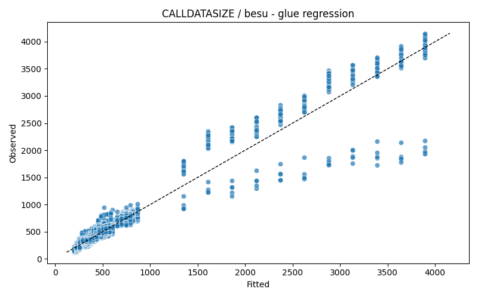

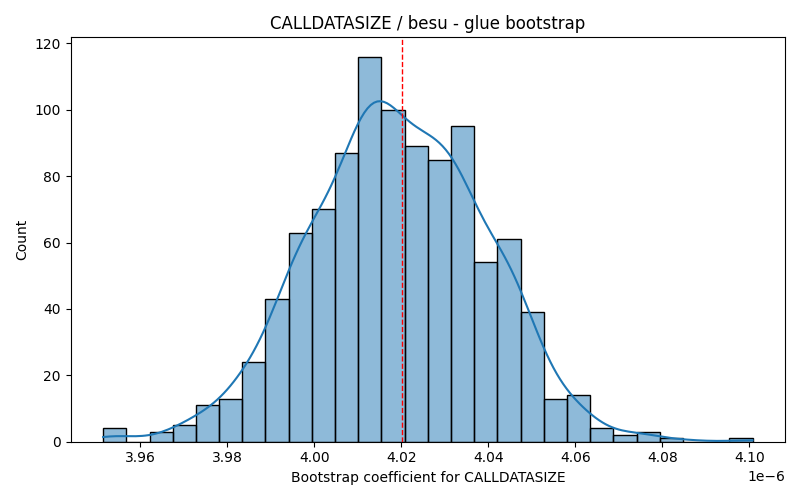

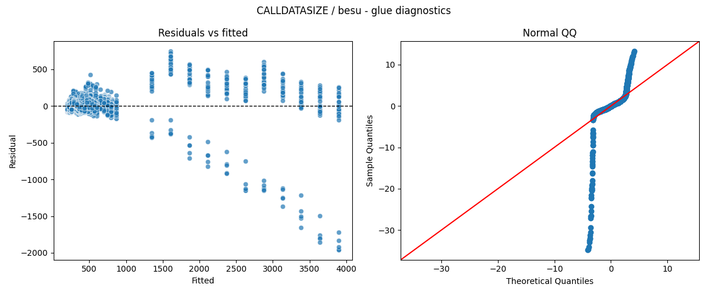

</details>

<details><summary><code>DUP</code> · nobs=65890 · runtime_ms=2.167e-06 · p=1.00e-03 · R²=0.9324</summary>

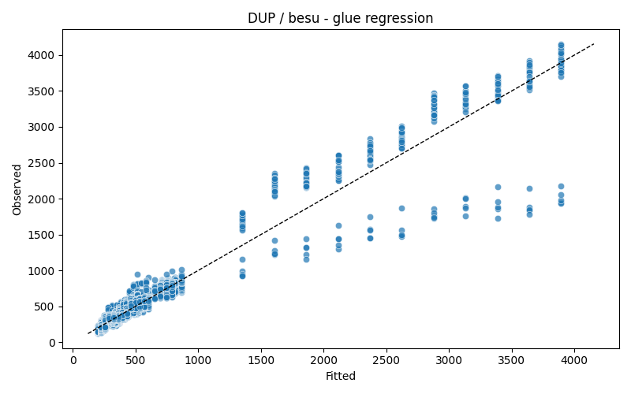

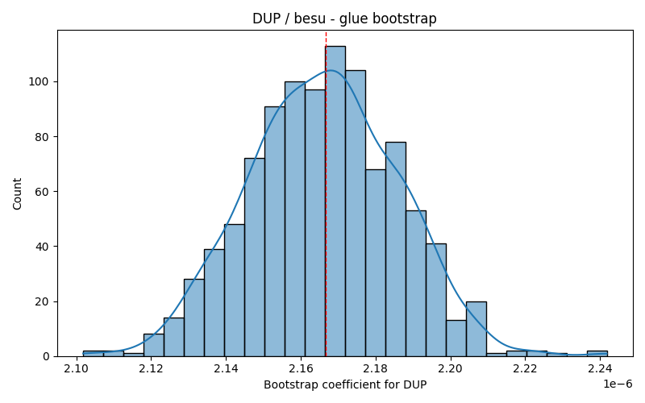


</details>

<details><summary><code>GAS</code> · nobs=65890 · runtime_ms=3.516e-06 · p=1.00e-03 · R²=0.9324</summary>


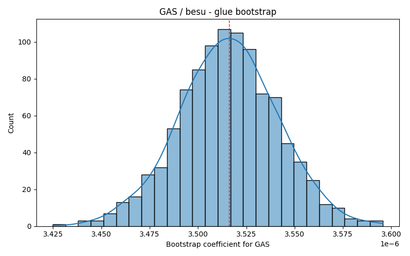

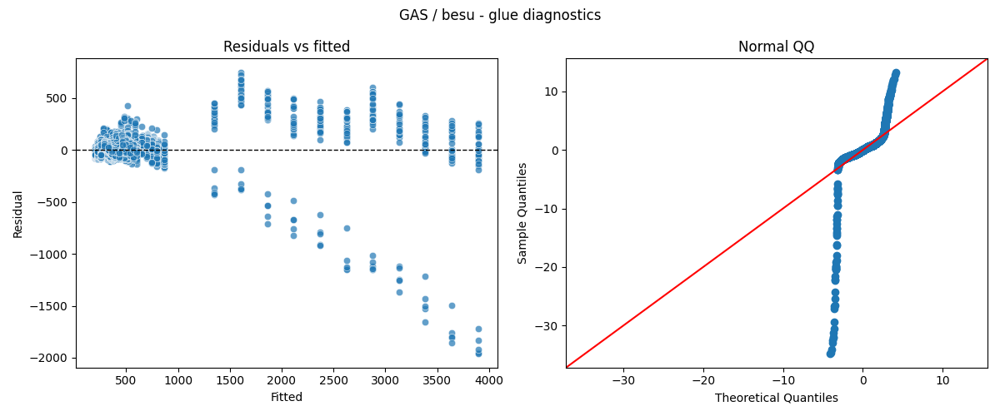

</details>

<details><summary><code>MLOAD</code> · nobs=65890 · runtime_ms=1.118e-05 · p=1.00e-03 · R²=0.9324</summary>

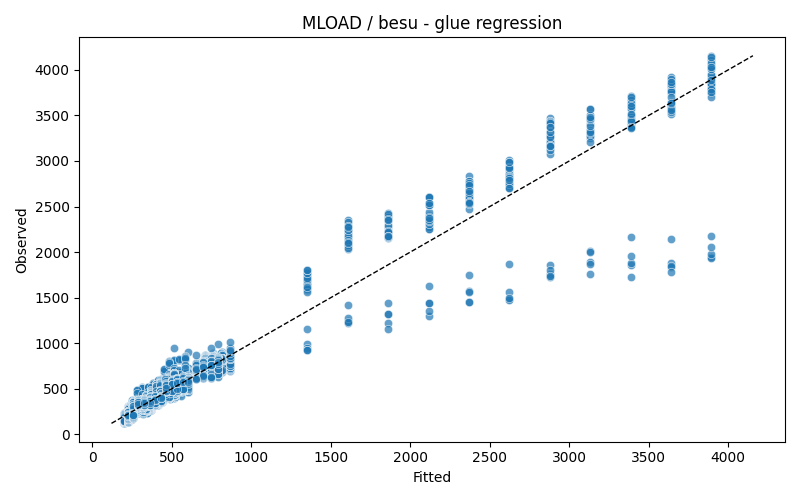

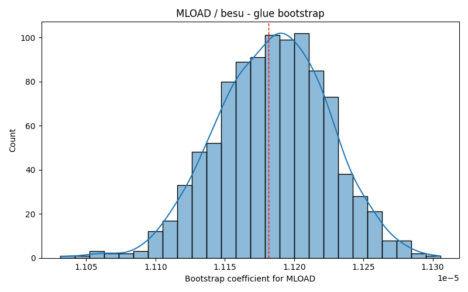


</details>

<details><summary><code>PUSH</code> · nobs=65890 · runtime_ms=2.981e-06 · p=1.00e-03 · R²=0.9324</summary>


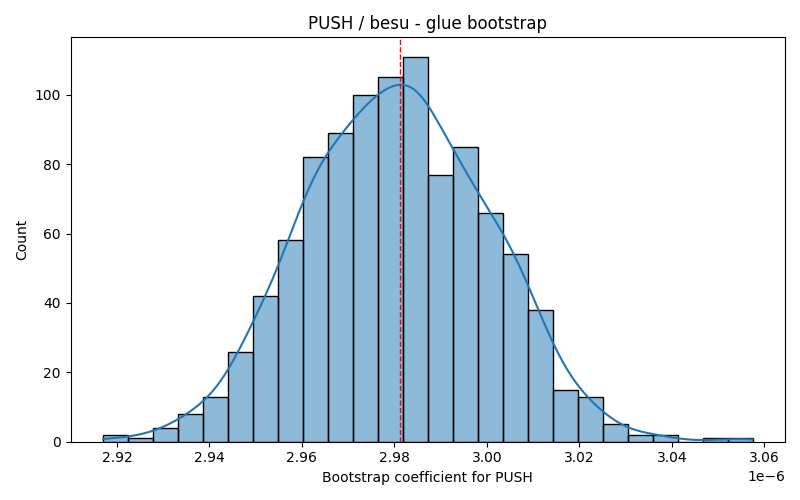


</details>

<details><summary><code>PUSH0</code> · nobs=65890 · runtime_ms=2.175e-06 · p=1.00e-03 · R²=0.9324</summary>


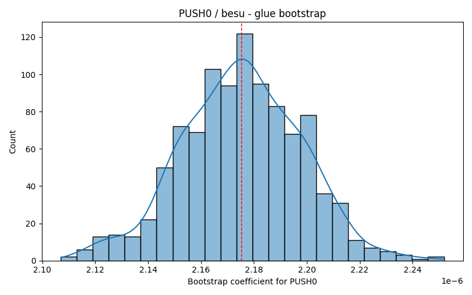


</details>

<details><summary><code>STATICCALL</code> · nobs=65890 · runtime_ms=0.001524 · p=1.00e-03 · R²=0.9324</summary>


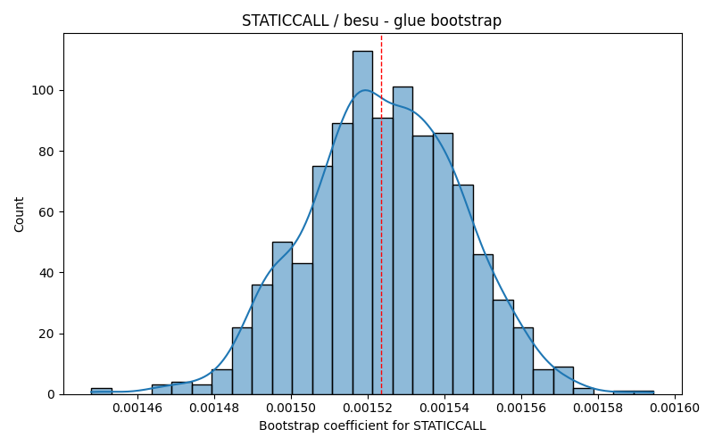

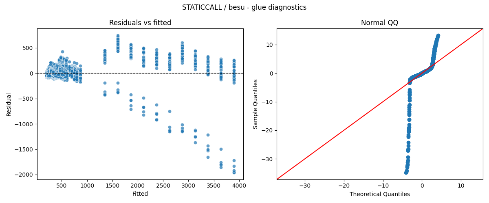

</details>

### Pure glue · besu

<details><summary><code>ISZERO</code> · nobs=1111 · runtime_ms=4.797e-06 · p=1.00e-03 · R²=0.8536</summary>

```
==============================================================================
                           NNLS Regression Results                            
==============================================================================
Dep. Variable:          test_runtime_ms              R-squared:          0.854
Model:                  NNLS                    Adj. R-squared:          0.853
No. Observations:       1111                              RMSE:          41.82
Df Residuals:           1109                               MAE:          35.02
Df Model:               1      
==============================================================================
                      coef     std err     P-value      [0.025      0.975]
------------------------------------------------------------------------------
         const     81.3655      4.3713       0.001     72.6554     89.8240
        ISZERO      0.0000      0.0000       0.001      0.0000      0.0000
==============================================================================
Notes: Non-negative least squares with bootstrap inference (1000 iterations)
==============================================================================
```

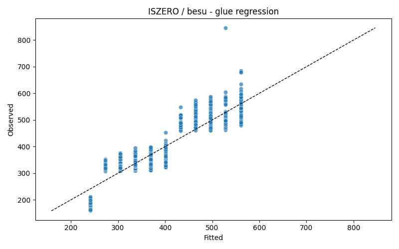

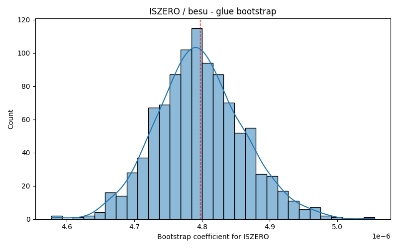

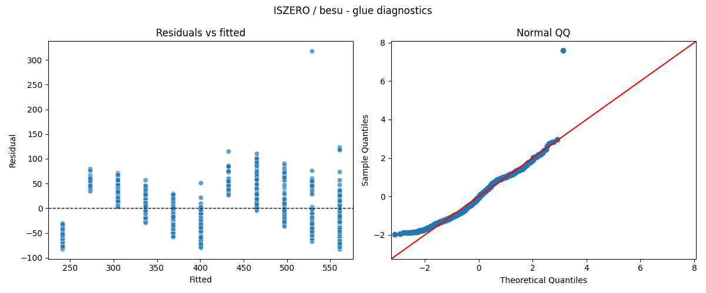

</details>

<details><summary><code>JUMPDEST</code> · nobs=1111 · runtime_ms=2.664e-06 · p=1.00e-03 · R²=0.8743</summary>

```
==============================================================================
                           NNLS Regression Results                            
==============================================================================
Dep. Variable:          test_runtime_ms              R-squared:          0.874
Model:                  NNLS                    Adj. R-squared:          0.874
No. Observations:       1111                              RMSE:          63.79
Df Residuals:           1109                               MAE:          53.23
Df Model:               1      
==============================================================================
                      coef     std err     P-value      [0.025      0.975]
------------------------------------------------------------------------------
         const     83.3175      6.8717       0.001     69.9883     97.6124
      JUMPDEST      0.0000      0.0000       0.001      0.0000      0.0000
==============================================================================
Notes: Non-negative least squares with bootstrap inference (1000 iterations)
==============================================================================
```

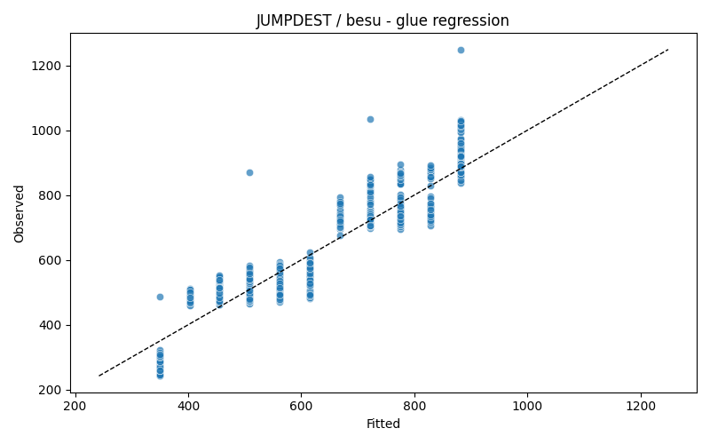

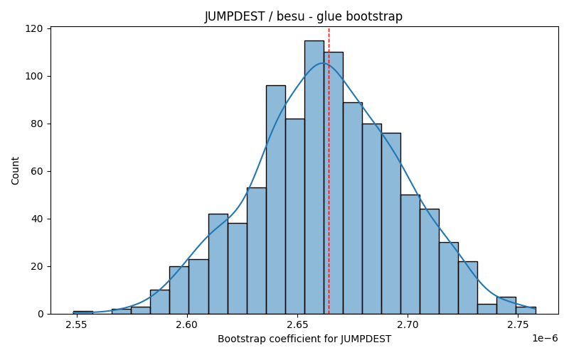

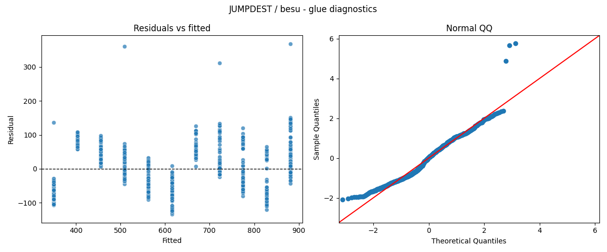

</details>

<details><summary><code>SWAP</code> · nobs=17776 · runtime_ms=3.637e-06 · p=1.00e-03 · R²=0.8505</summary>

```
==============================================================================
                           NNLS Regression Results                            
==============================================================================
Dep. Variable:          test_runtime_ms              R-squared:          0.851
Model:                  NNLS                    Adj. R-squared:          0.851
No. Observations:       17776                             RMSE:          32.10
Df Residuals:           17774                              MAE:          26.32
Df Model:               1      
==============================================================================
                      coef     std err     P-value      [0.025      0.975]
------------------------------------------------------------------------------
         const     68.5280      0.8672       0.001     66.7853     70.2513
          SWAP      0.0000      0.0000       0.001      0.0000      0.0000
==============================================================================
Notes: Non-negative least squares with bootstrap inference (1000 iterations)
==============================================================================
```

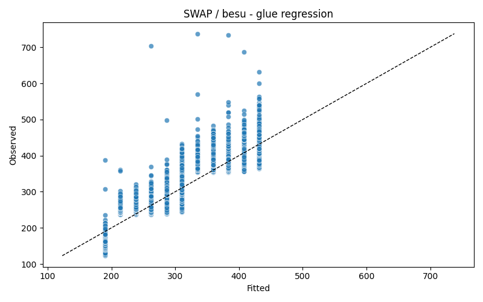

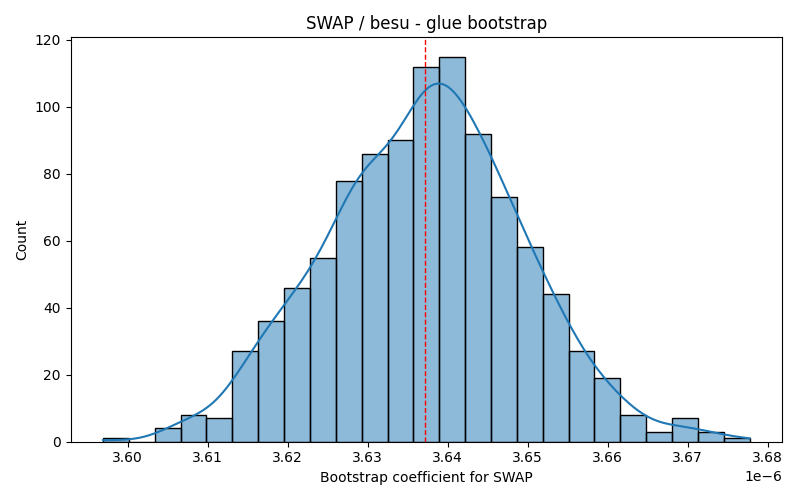

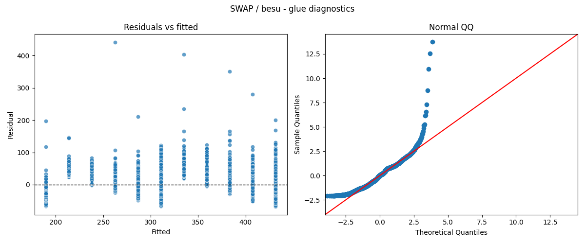

</details>

### Mixed glue (tier A) · besu

<details><summary><code>ADD</code> · nobs=1111 · runtime_ms=1.144e-05 · p=1.00e-03 · R²=0.8609</summary>

```
==============================================================================
                           NNLS Regression Results                            
==============================================================================
Dep. Variable:          test_runtime_ms              R-squared:          0.861
Model:                  NNLS                    Adj. R-squared:          0.861
No. Observations:       1111                              RMSE:          48.39
Df Residuals:           1109                               MAE:          41.08
Df Model:               1      
==============================================================================
                      coef     std err     P-value      [0.025      0.975]
------------------------------------------------------------------------------
         const    100.3284      4.9805       0.001     90.9222    110.0684
           ADD      0.0000      0.0000       0.001      0.0000      0.0000
==============================================================================
Notes: Non-negative least squares with bootstrap inference (1000 iterations)
==============================================================================
```

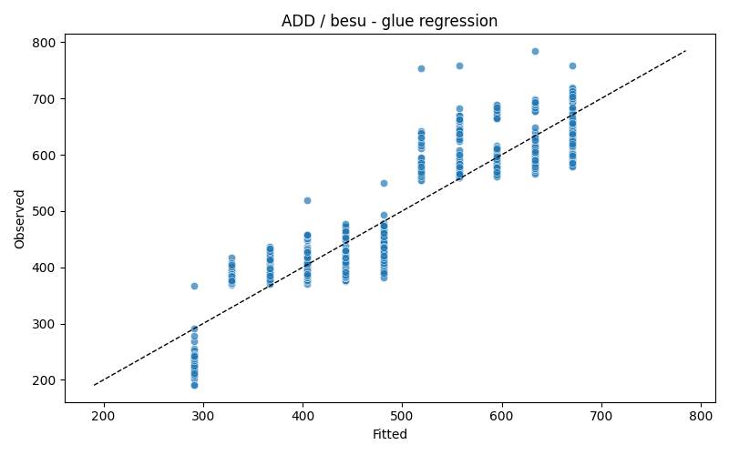

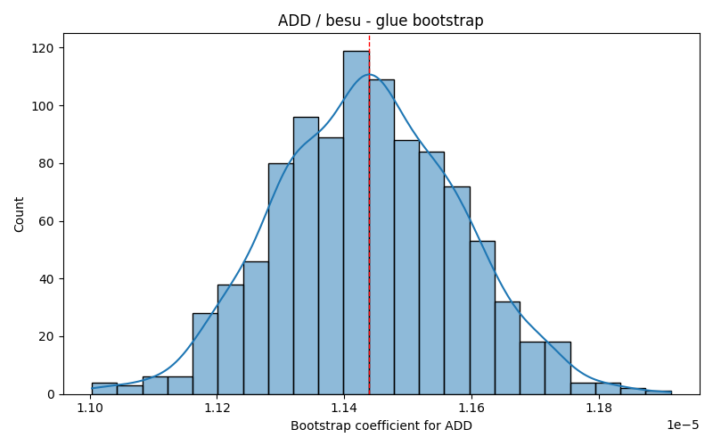

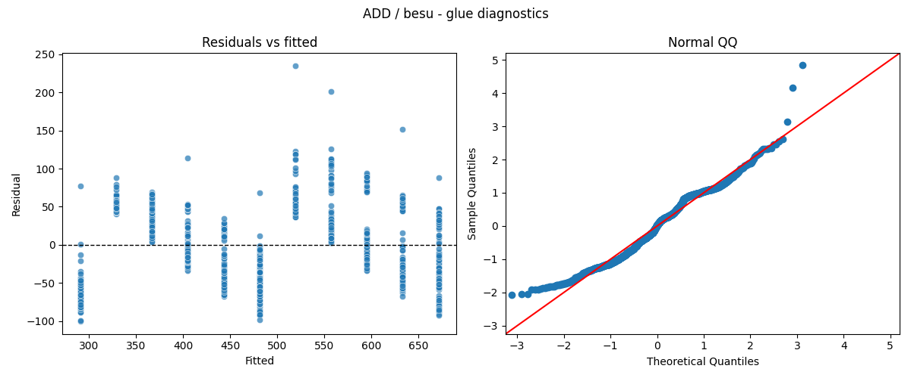

</details>

<details><summary><code>AND</code> · nobs=1111 · runtime_ms=9.772e-06 · p=1.00e-03 · R²=0.8731</summary>

```
==============================================================================
                           NNLS Regression Results                            
==============================================================================
Dep. Variable:          test_runtime_ms              R-squared:          0.873
Model:                  NNLS                    Adj. R-squared:          0.873
No. Observations:       1111                              RMSE:          39.20
Df Residuals:           1109                               MAE:          33.51
Df Model:               1      
==============================================================================
                      coef     std err     P-value      [0.025      0.975]
------------------------------------------------------------------------------
         const     88.6512      4.2063       0.001     80.2386     97.0654
           AND      0.0000      0.0000       0.001      0.0000      0.0000
==============================================================================
Notes: Non-negative least squares with bootstrap inference (1000 iterations)
==============================================================================
```

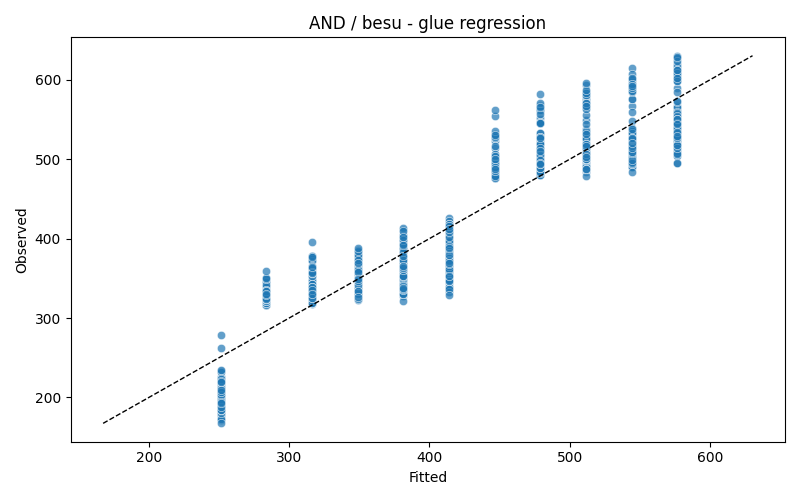

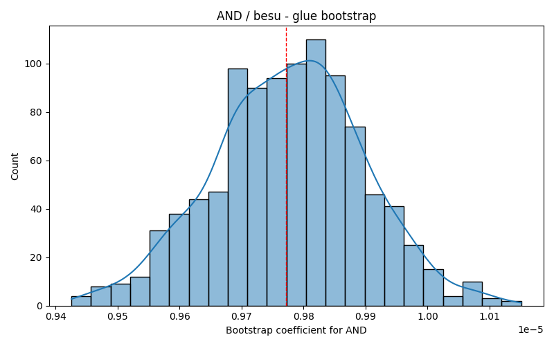

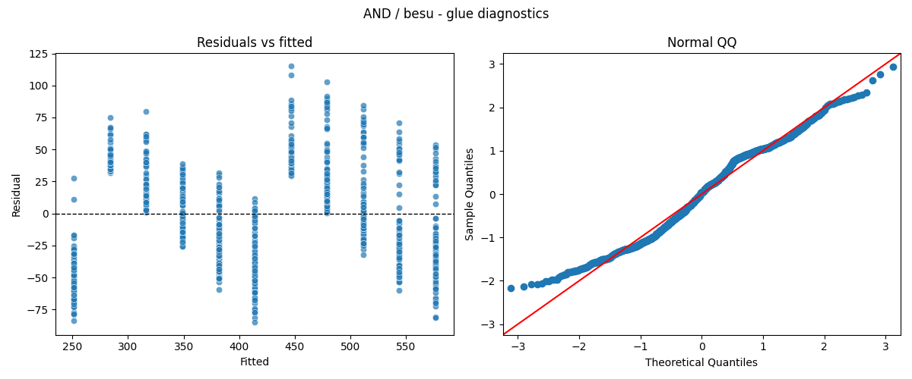

</details>

<details><summary><code>CALLDATACOPY</code> · nobs=26664 · runtime_ms=2.089e-05 · p=1.00e-03 · R²=0.8273</summary>

```
==============================================================================
                           NNLS Regression Results                            
==============================================================================
Dep. Variable:          test_runtime_ms              R-squared:          0.827
Model:                  NNLS                    Adj. R-squared:          0.827
No. Observations:       26664                             RMSE:          71.79
Df Residuals:           26662                              MAE:          56.74
Df Model:               1      
==============================================================================
                      coef     std err     P-value      [0.025      0.975]
------------------------------------------------------------------------------
         const    117.4282      0.5486       0.001    116.3197    118.5521
  CALLDATACOPY      0.0000      0.0000       0.001      0.0000      0.0000
==============================================================================
Notes: Non-negative least squares with bootstrap inference (1000 iterations)
==============================================================================
```

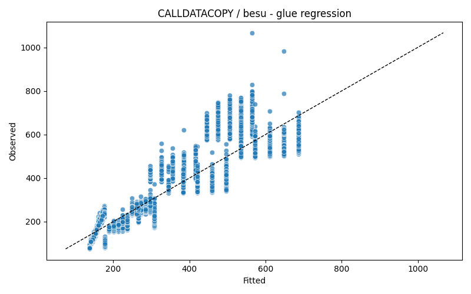

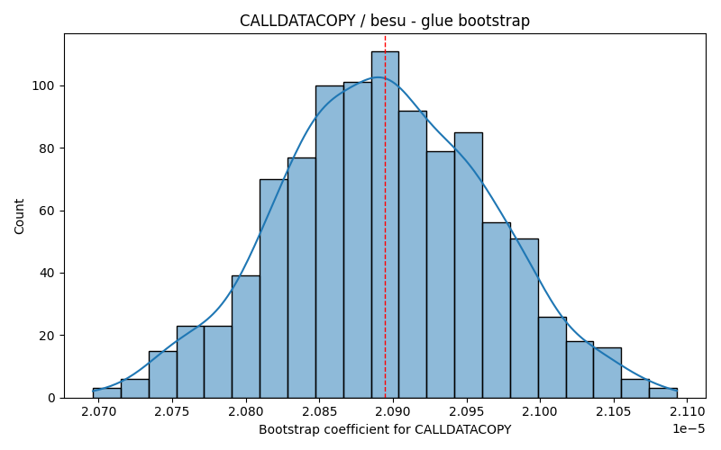

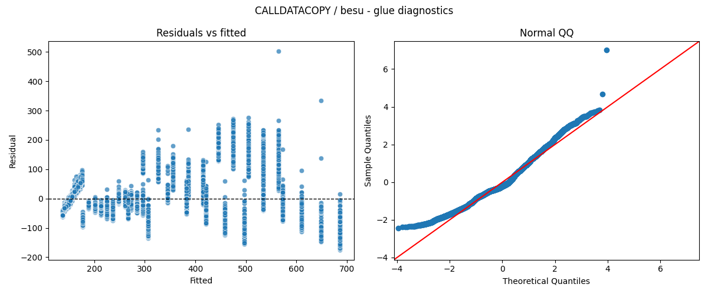

</details>

<details><summary><code>CALLDATALOAD</code> · nobs=4444 · runtime_ms=2.211e-06 · p=1.81e-01 · R²=0.0001256</summary>

```
==============================================================================
                           NNLS Regression Results                            
==============================================================================
Dep. Variable:          test_runtime_ms              R-squared:          0.000
Model:                  NNLS                    Adj. R-squared:         -0.000
No. Observations:       4444                              RMSE:           0.76
Df Residuals:           4442                               MAE:           0.53
Df Model:               1      
==============================================================================
                      coef     std err     P-value      [0.025      0.975]
------------------------------------------------------------------------------
         const      3.7601      0.0293       0.001      3.6917      3.8026
  CALLDATALOAD      0.0000      0.0000       0.181      0.0000      0.0000
==============================================================================
Notes: Non-negative least squares with bootstrap inference (1000 iterations)
==============================================================================
```

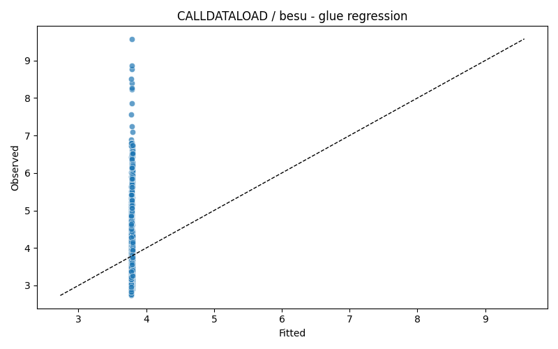

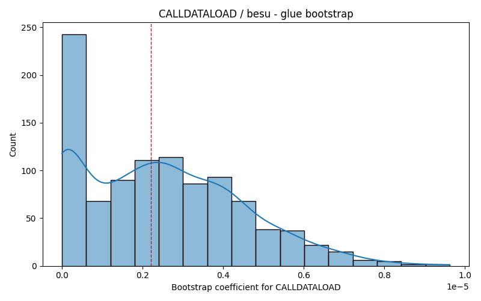

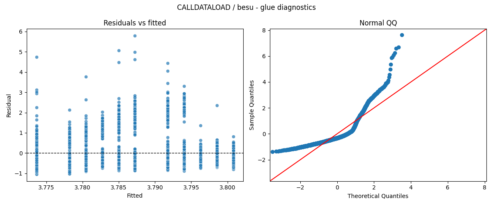

</details>

<details><summary><code>DIV</code> · nobs=1111 · runtime_ms=1.816e-05 · p=1.00e-03 · R²=0.8729</summary>

```
==============================================================================
                           NNLS Regression Results                            
==============================================================================
Dep. Variable:          test_runtime_ms              R-squared:          0.873
Model:                  NNLS                    Adj. R-squared:          0.873
No. Observations:       1111                              RMSE:          54.70
Df Residuals:           1109                               MAE:          46.84
Df Model:               1      
==============================================================================
                      coef     std err     P-value      [0.025      0.975]
------------------------------------------------------------------------------
         const    133.8694      5.4002       0.001    123.4539    144.4150
           DIV      0.0000      0.0000       0.001      0.0000      0.0000
==============================================================================
Notes: Non-negative least squares with bootstrap inference (1000 iterations)
==============================================================================
```

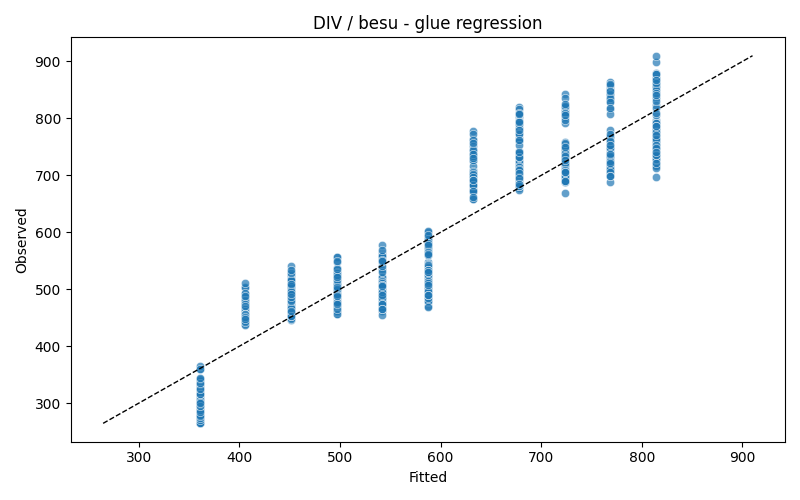

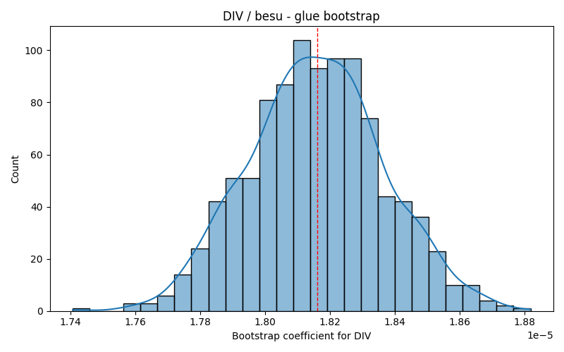

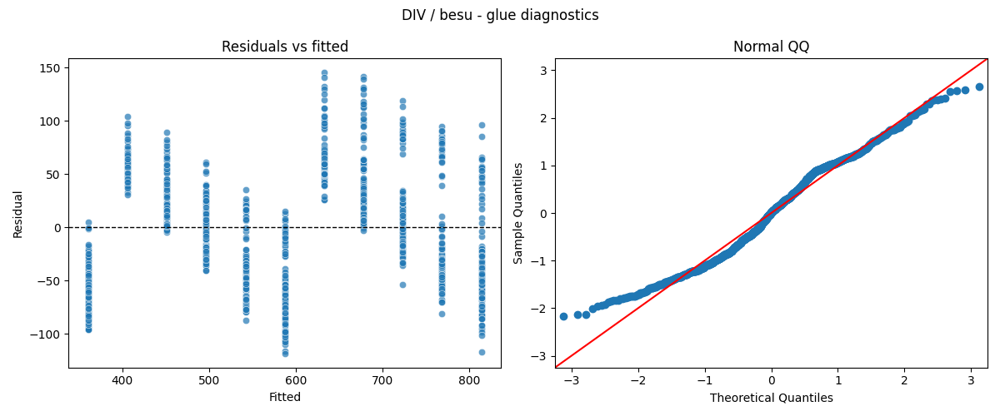

</details>

<details><summary><code>EXP</code> · nobs=1111 · runtime_ms=0.001271 · p=1.00e-03 · R²=0.8637</summary>

```
==============================================================================
                           NNLS Regression Results                            
==============================================================================
Dep. Variable:          test_runtime_ms              R-squared:          0.864
Model:                  NNLS                    Adj. R-squared:          0.864
No. Observations:       1111                              RMSE:          19.78
Df Residuals:           1109                               MAE:          15.71
Df Model:               1      
==============================================================================
                      coef     std err     P-value      [0.025      0.975]
------------------------------------------------------------------------------
         const     78.8532      1.7712       0.001     75.2891     82.4048
           EXP      0.0013      0.0000       0.001      0.0012      0.0013
==============================================================================
Notes: Non-negative least squares with bootstrap inference (1000 iterations)
==============================================================================
```

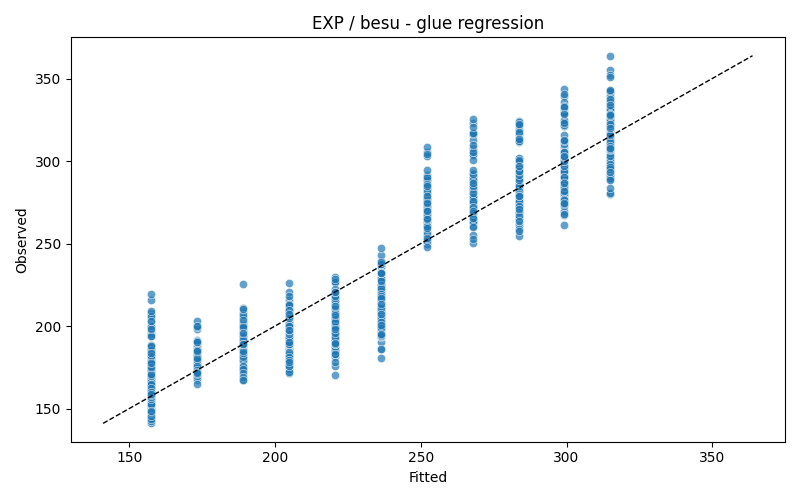

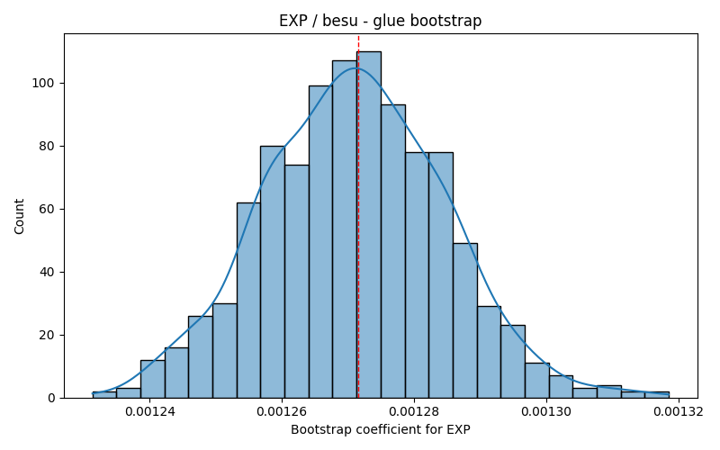

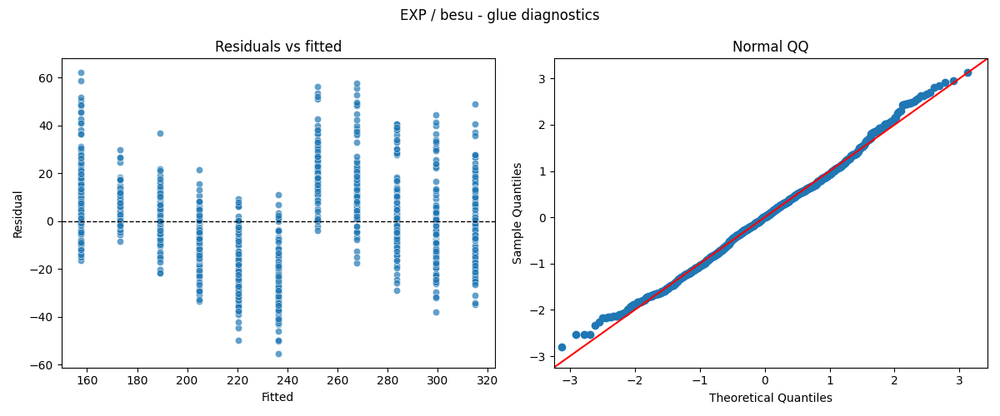

</details>

<details><summary><code>GT</code> · nobs=1111 · runtime_ms=3.322e-05 · p=1.00e-03 · R²=0.8916</summary>

```
==============================================================================
                           NNLS Regression Results                            
==============================================================================
Dep. Variable:          test_runtime_ms              R-squared:          0.892
Model:                  NNLS                    Adj. R-squared:          0.891
No. Observations:       1111                              RMSE:         121.93
Df Residuals:           1109                               MAE:          99.82
Df Model:               1      
==============================================================================
                      coef     std err     P-value      [0.025      0.975]
------------------------------------------------------------------------------
         const    199.5715     13.7824       0.001    172.4643    225.6064
            GT      0.0000      0.0000       0.001      0.0000      0.0000
==============================================================================
Notes: Non-negative least squares with bootstrap inference (1000 iterations)
==============================================================================
```

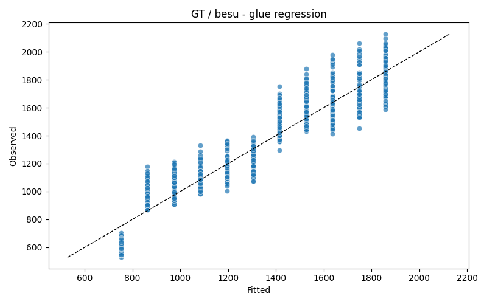

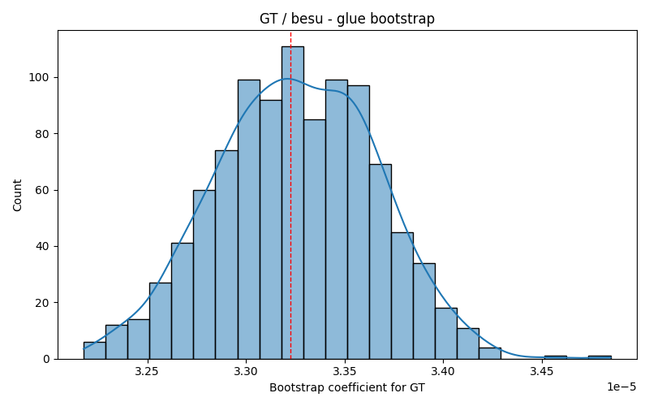

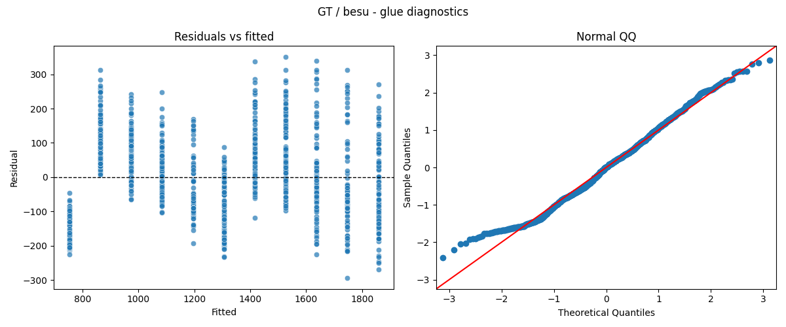

</details>

<details><summary><code>JUMPI</code> · nobs=1111 · runtime_ms=9.912e-06 · p=1.00e-03 · R²=0.8724</summary>

```
==============================================================================
                           NNLS Regression Results                            
==============================================================================
Dep. Variable:          test_runtime_ms              R-squared:          0.872
Model:                  NNLS                    Adj. R-squared:          0.872
No. Observations:       1111                              RMSE:          17.10
Df Residuals:           1109                               MAE:          14.29
Df Model:               1      
==============================================================================
                      coef     std err     P-value      [0.025      0.975]
------------------------------------------------------------------------------
         const     38.1202      1.7701       0.001     34.5971     41.4805
         JUMPI      0.0000      0.0000       0.001      0.0000      0.0000
==============================================================================
Notes: Non-negative least squares with bootstrap inference (1000 iterations)
==============================================================================
```

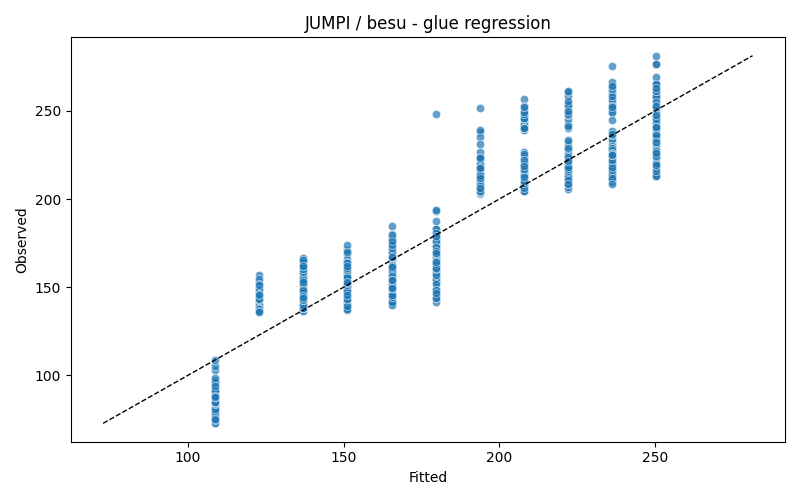

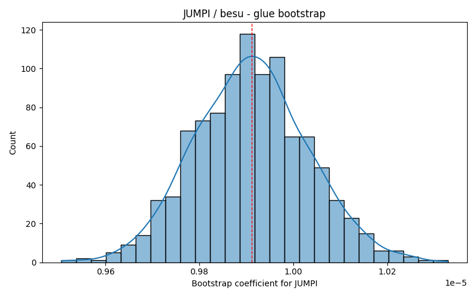

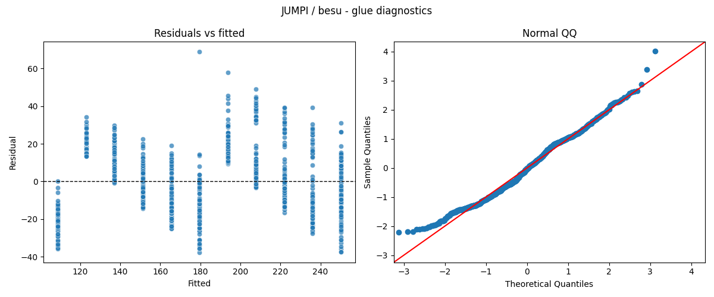

</details>

<details><summary><code>LT</code> · nobs=1111 · runtime_ms=3.457e-05 · p=1.00e-03 · R²=0.8948</summary>

```
==============================================================================
                           NNLS Regression Results                            
==============================================================================
Dep. Variable:          test_runtime_ms              R-squared:          0.895
Model:                  NNLS                    Adj. R-squared:          0.895
No. Observations:       1111                              RMSE:         124.78
Df Residuals:           1109                               MAE:         102.57
Df Model:               1      
==============================================================================
                      coef     std err     P-value      [0.025      0.975]
------------------------------------------------------------------------------
         const    213.2195     13.8204       0.001    185.4891    239.5296
            LT      0.0000      0.0000       0.001      0.0000      0.0000
==============================================================================
Notes: Non-negative least squares with bootstrap inference (1000 iterations)
==============================================================================
```

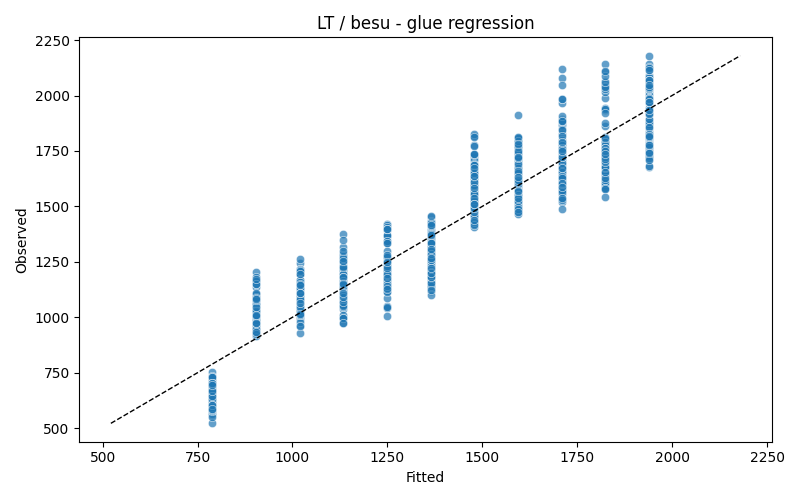

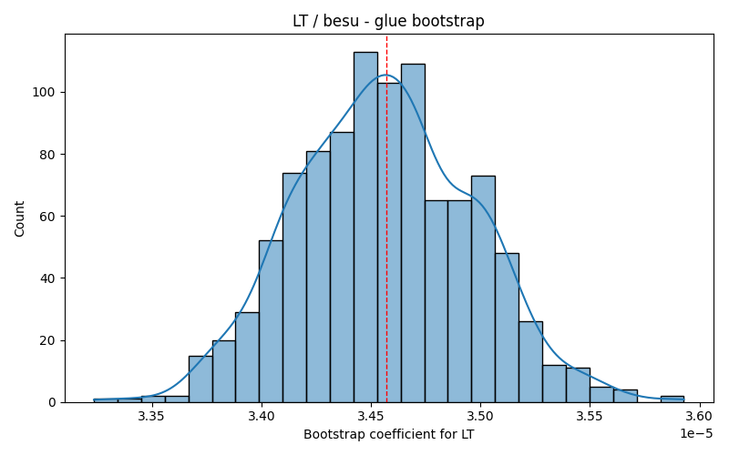

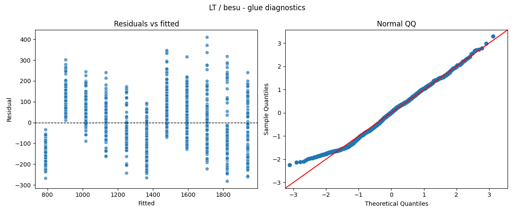

</details>

<details><summary><code>MSTORE</code> · nobs=5555 · runtime_ms=1.856e-05 · p=1.00e-03 · R²=0.8675</summary>

```
==============================================================================
                           NNLS Regression Results                            
==============================================================================
Dep. Variable:          test_runtime_ms              R-squared:          0.868
Model:                  NNLS                    Adj. R-squared:          0.868
No. Observations:       5555                              RMSE:          50.89
Df Residuals:           5553                               MAE:          43.49
Df Model:               1      
==============================================================================
                      coef     std err     P-value      [0.025      0.975]
------------------------------------------------------------------------------
         const    112.1882      2.5118       0.001    107.4674    117.3723
        MSTORE      0.0000      0.0000       0.001      0.0000      0.0000
==============================================================================
Notes: Non-negative least squares with bootstrap inference (1000 iterations)
==============================================================================
```

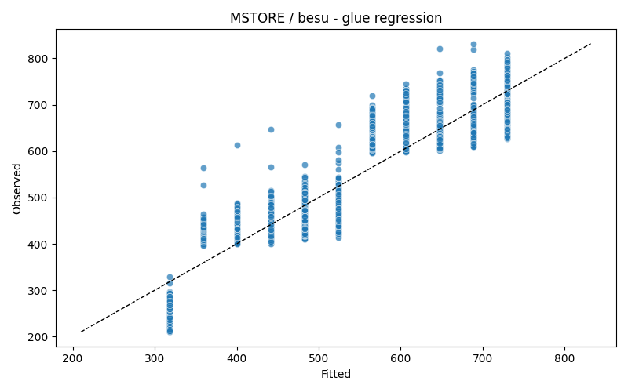

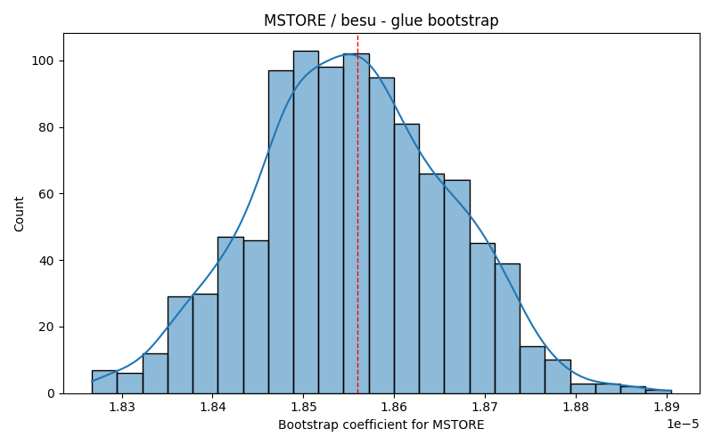

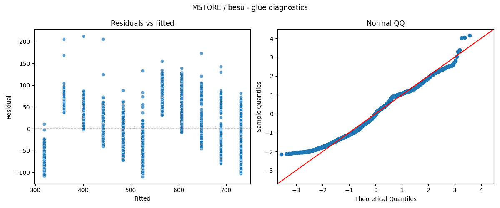

</details>

<details><summary><code>MSTORE8</code> · nobs=5555 · runtime_ms=1.255e-05 · p=1.00e-03 · R²=0.8624</summary>

```
==============================================================================
                           NNLS Regression Results                            
==============================================================================
Dep. Variable:          test_runtime_ms              R-squared:          0.862
Model:                  NNLS                    Adj. R-squared:          0.862
No. Observations:       5555                              RMSE:          35.19
Df Residuals:           5553                               MAE:          29.51
Df Model:               1      
==============================================================================
                      coef     std err     P-value      [0.025      0.975]
------------------------------------------------------------------------------
         const     77.8527      1.6163       0.001     74.6861     81.0019
       MSTORE8      0.0000      0.0000       0.001      0.0000      0.0000
==============================================================================
Notes: Non-negative least squares with bootstrap inference (1000 iterations)
==============================================================================
```

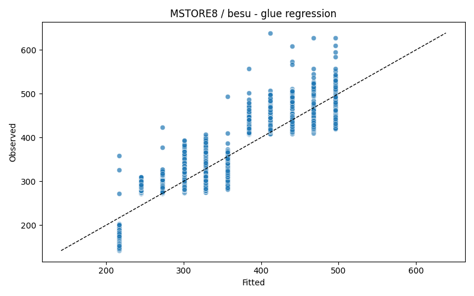


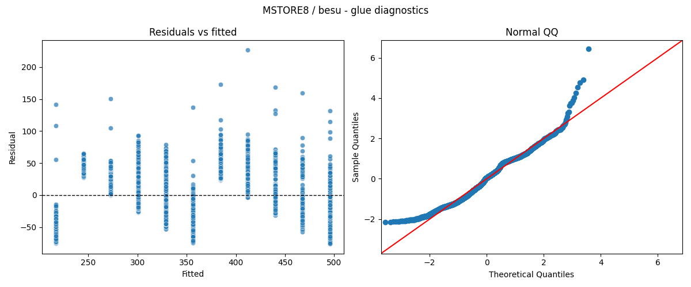

</details>

<details><summary><code>MUL</code> · nobs=1111 · runtime_ms=1.152e-05 · p=1.00e-03 · R²=0.639</summary>

```
==============================================================================
                           NNLS Regression Results                            
==============================================================================
Dep. Variable:          test_runtime_ms              R-squared:          0.639
Model:                  NNLS                    Adj. R-squared:          0.639
No. Observations:       1111                              RMSE:          68.37
Df Residuals:           1109                               MAE:          55.47
Df Model:               1      
==============================================================================
                      coef     std err     P-value      [0.025      0.975]
------------------------------------------------------------------------------
         const    104.4754      6.0206       0.001     92.7183    116.3388
           MUL      0.0000      0.0000       0.001      0.0000      0.0000
==============================================================================
Notes: Non-negative least squares with bootstrap inference (1000 iterations)
==============================================================================
```

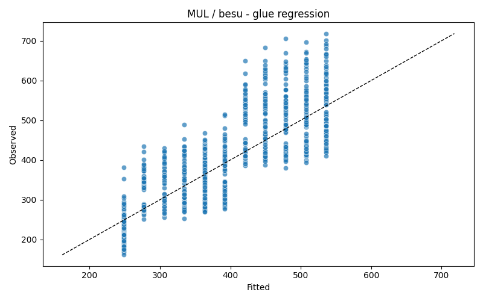

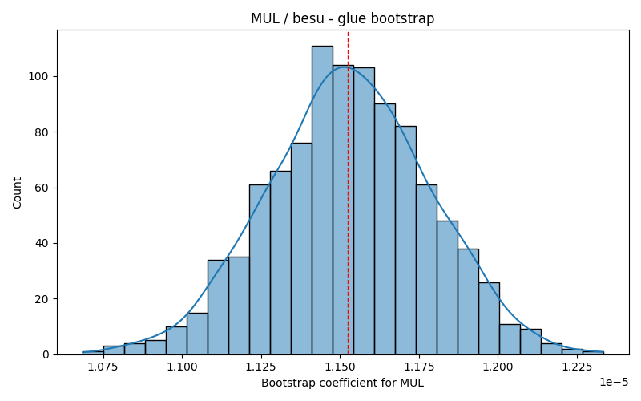

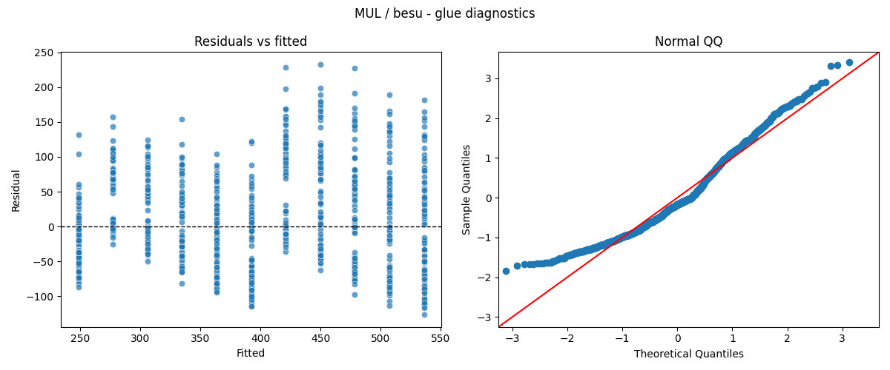

</details>

<details><summary><code>PC</code> · nobs=1111 · runtime_ms=4.706e-06 · p=1.00e-03 · R²=0.8607</summary>

```
==============================================================================
                           NNLS Regression Results                            
==============================================================================
Dep. Variable:          test_runtime_ms              R-squared:          0.861
Model:                  NNLS                    Adj. R-squared:          0.861
No. Observations:       1111                              RMSE:          56.61
Df Residuals:           1109                               MAE:          47.73
Df Model:               1      
==============================================================================
                      coef     std err     P-value      [0.025      0.975]
------------------------------------------------------------------------------
         const    115.7960      6.2021       0.001    103.8705    127.7886
            PC      0.0000      0.0000       0.001      0.0000      0.0000
==============================================================================
Notes: Non-negative least squares with bootstrap inference (1000 iterations)
==============================================================================
```

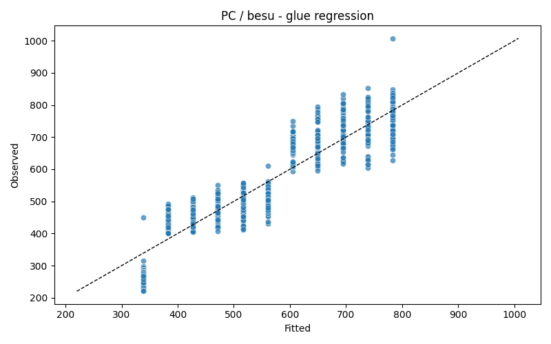

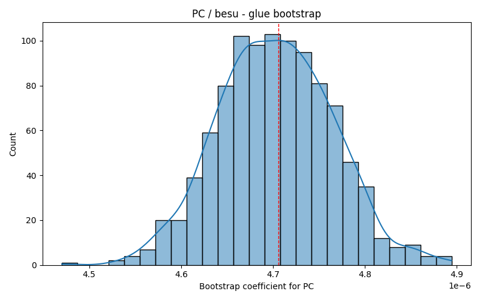

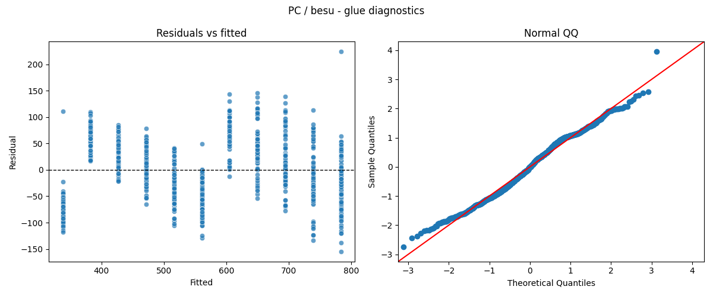

</details>

<details><summary><code>RETURNDATASIZE</code> · nobs=4444 · runtime_ms=7.116e-06 · p=1.00e-03 · R²=0.8501</summary>

```
==============================================================================
                           NNLS Regression Results                            
==============================================================================
Dep. Variable:          test_runtime_ms              R-squared:          0.850
Model:                  NNLS                    Adj. R-squared:          0.850
No. Observations:       4444                              RMSE:          47.18
Df Residuals:           4442                               MAE:          39.38
Df Model:               1      
==============================================================================
                      coef     std err     P-value      [0.025      0.975]
------------------------------------------------------------------------------
         const     93.4501      2.5749       0.001     88.5275     98.6175
RETURNDATASIZE      0.0000      0.0000       0.001      0.0000      0.0000
==============================================================================
Notes: Non-negative least squares with bootstrap inference (1000 iterations)
==============================================================================
```

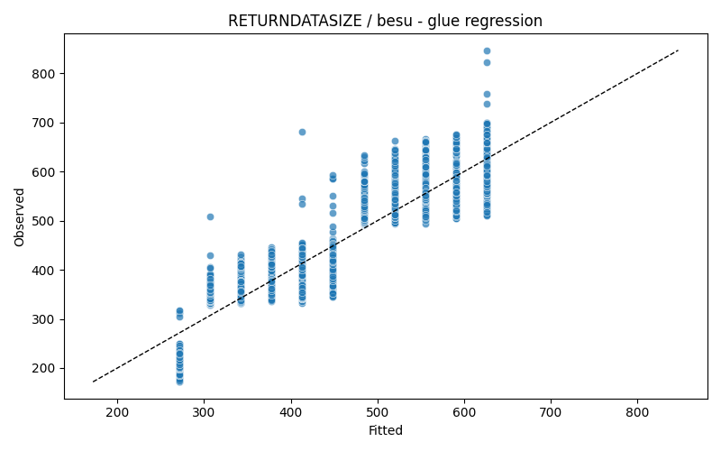

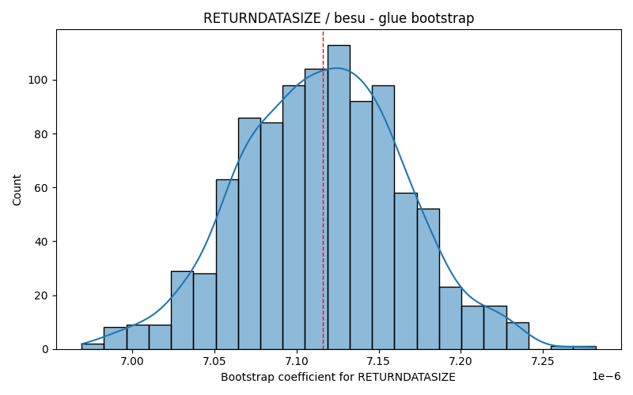

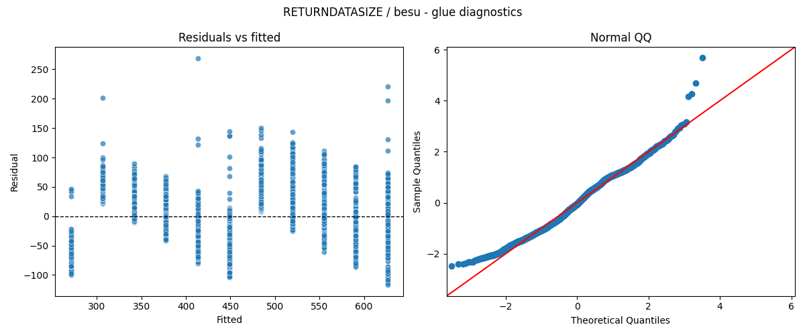

</details>

<details><summary><code>SELFBALANCE</code> · nobs=909 · runtime_ms=7.506e-06 · p=1.00e-03 · R²=0.4878</summary>

```
==============================================================================
                           NNLS Regression Results                            
==============================================================================
Dep. Variable:          test_runtime_ms              R-squared:          0.488
Model:                  NNLS                    Adj. R-squared:          0.487
No. Observations:       909                               RMSE:          77.59
Df Residuals:           907                                MAE:          62.20
Df Model:               1      
==============================================================================
                      coef     std err     P-value      [0.025      0.975]
------------------------------------------------------------------------------
         const    422.6200     10.7676       0.001    399.9959    443.3275
   SELFBALANCE      0.0000      0.0000       0.001      0.0000      0.0000
==============================================================================
Notes: Non-negative least squares with bootstrap inference (1000 iterations)
==============================================================================
```

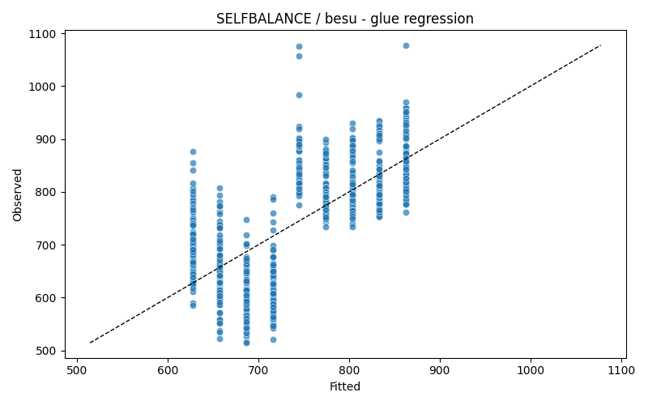

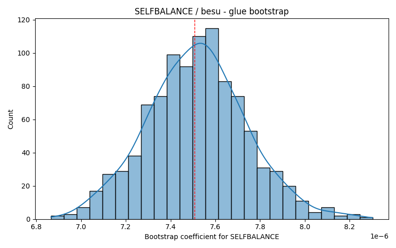

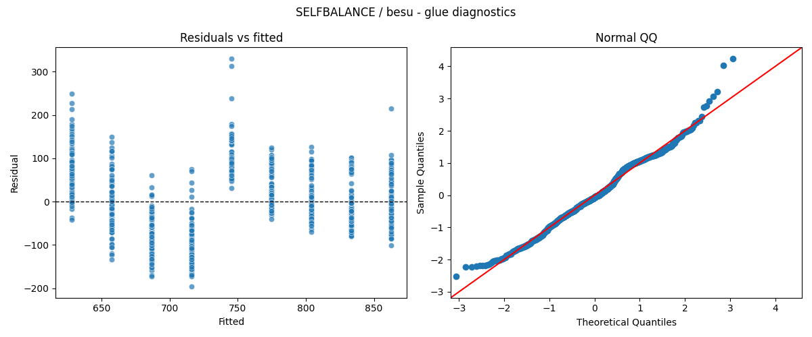

</details>

<details><summary><code>SUB</code> · nobs=1111 · runtime_ms=1.114e-05 · p=1.00e-03 · R²=0.8673</summary>

```
==============================================================================
                           NNLS Regression Results                            
==============================================================================
Dep. Variable:          test_runtime_ms              R-squared:          0.867
Model:                  NNLS                    Adj. R-squared:          0.867
No. Observations:       1111                              RMSE:          45.85
Df Residuals:           1109                               MAE:          39.35
Df Model:               1      
==============================================================================
                      coef     std err     P-value      [0.025      0.975]
------------------------------------------------------------------------------
         const     99.1122      5.0917       0.001     89.5309    108.8892
           SUB      0.0000      0.0000       0.001      0.0000      0.0000
==============================================================================
Notes: Non-negative least squares with bootstrap inference (1000 iterations)
==============================================================================
```

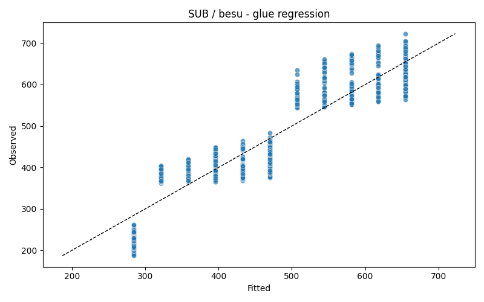

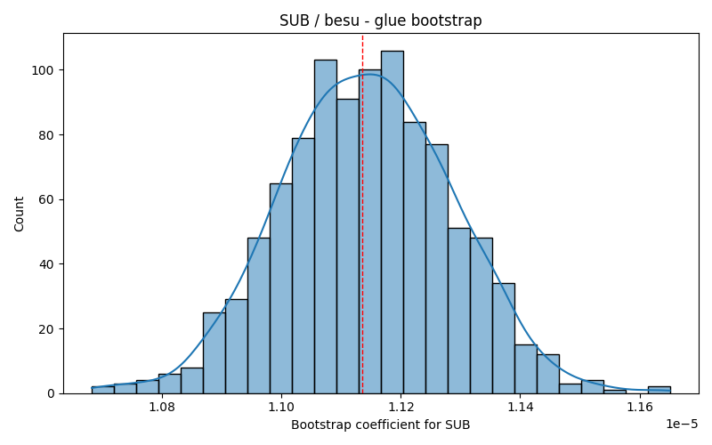

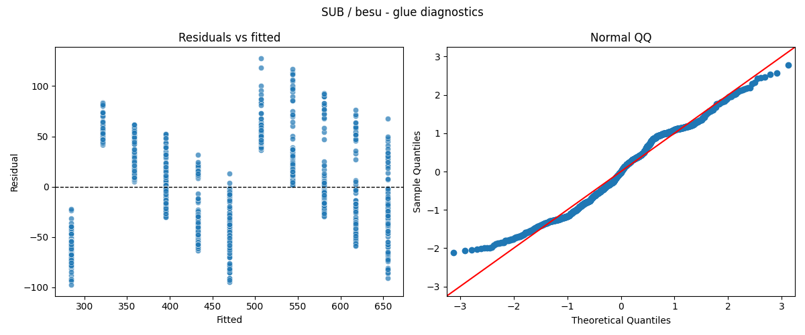

</details>

### Mixed glue (tier B) · besu

<details><summary><code>JUMP</code> · nobs=1111 · runtime_ms=4.984e-05 · p=1.00e-03 · R²=0.8658</summary>

```
==============================================================================
                           NNLS Regression Results                            
==============================================================================
Dep. Variable:          test_runtime_ms              R-squared:          0.866
Model:                  NNLS                    Adj. R-squared:          0.866
No. Observations:       1111                              RMSE:          72.93
Df Residuals:           1109                               MAE:          61.60
Df Model:               1      
==============================================================================
                      coef     std err     P-value      [0.025      0.975]
------------------------------------------------------------------------------
         const    150.0606      8.0992       0.001    133.5248    166.5710
          JUMP      0.0000      0.0000       0.001      0.0000      0.0001
==============================================================================
Notes: Non-negative least squares with bootstrap inference (1000 iterations)
==============================================================================
```

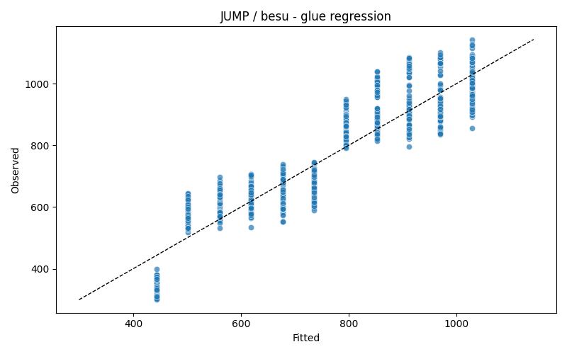

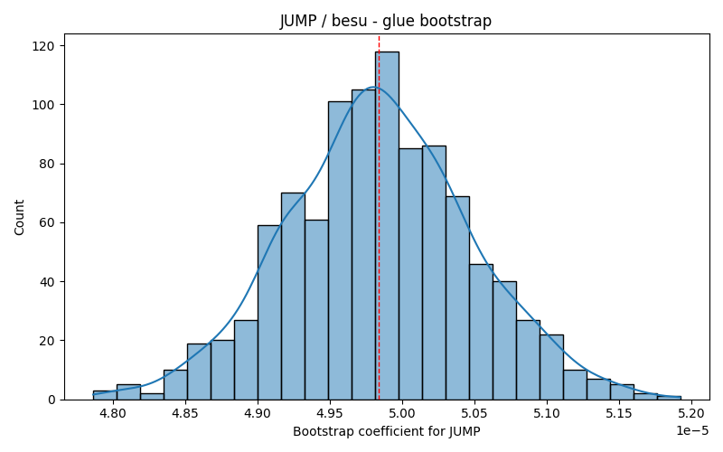

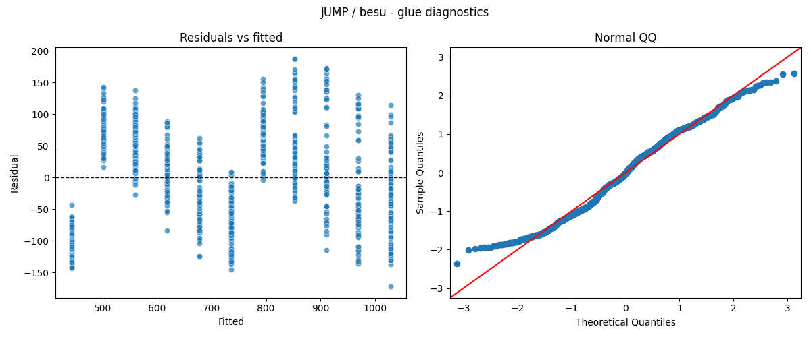

</details>

<details><summary><code>KECCAK256</code> · nobs=17776 · runtime_ms=5.203e-05 · p=1.00e-03 · R²=0.2823</summary>

```
==============================================================================
                           NNLS Regression Results                            
==============================================================================
Dep. Variable:          test_runtime_ms              R-squared:          0.282
Model:                  NNLS                    Adj. R-squared:          0.282
No. Observations:       17776                             RMSE:         164.87
Df Residuals:           17774                              MAE:         128.74
Df Model:               1      
==============================================================================
                      coef     std err     P-value      [0.025      0.975]
------------------------------------------------------------------------------
         const    511.8883      2.6785       0.001    506.5013    517.2269
     KECCAK256      0.0001      0.0000       0.001      0.0001      0.0001
==============================================================================
Notes: Non-negative least squares with bootstrap inference (1000 iterations)
==============================================================================
```

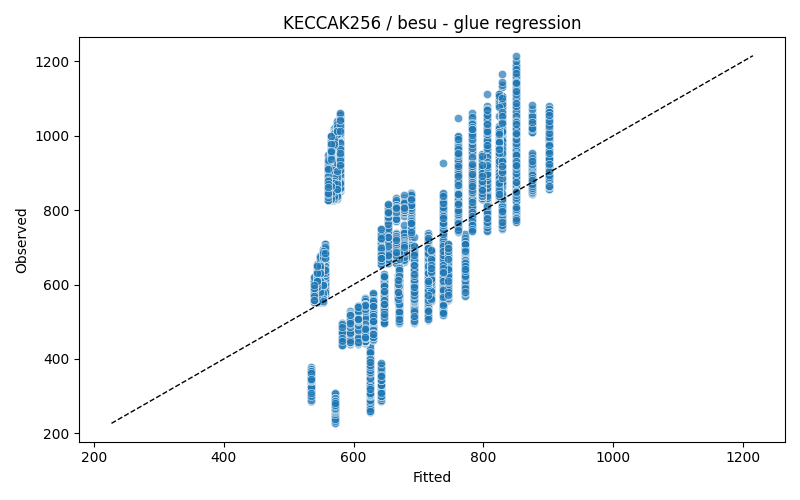

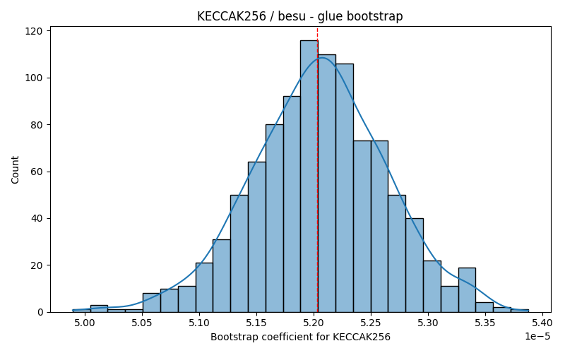

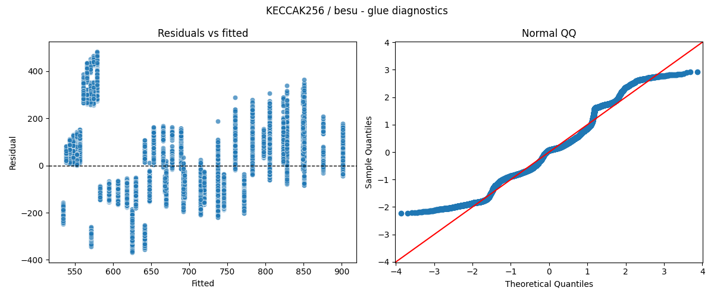

</details>

## erigon

| glue_opcode | nobs | glue_runtime_ms | p_value | rsquared |
| --- | --- | --- | --- | --- |
| `ISZERO` | 55 | 1.208e-06 | 1.00e-03 | 0.2279 |
| `JUMPDEST` | 55 | 7.692e-07 | 1.00e-03 | 0.9254 |
| `SWAP` | 880 | 1.292e-06 | 1.00e-03 | 0.5659 |
| `CALLDATASIZE` | 3421 | 7.898e-07 | 1.00e-03 | 0.9509 |
| `DUP` | 3421 | 1.031e-06 | 1.00e-03 | 0.9509 |
| `GAS` | 3421 | 8.117e-07 | 1.00e-03 | 0.9509 |
| `MLOAD` | 3421 | 3.442e-06 | 1.00e-03 | 0.9509 |
| `PUSH` | 3421 | 2.621e-06 | 1.00e-03 | 0.9509 |
| `PUSH0` | 3421 | 8.461e-07 | 1.00e-03 | 0.9509 |
| `STATICCALL` | 3421 | 0.0005047 | 1.00e-03 | 0.9509 |
| `ADD` | 55 | 2.871e-06 | 1.00e-03 | 0.928 |
| `AND` | 55 | 2.874e-06 | 1.00e-03 | 0.9209 |
| `CALLDATACOPY` | 1320 | 7.314e-06 | 1.00e-03 | 0.8289 |
| `CALLDATALOAD` | 220 | 5.924e-05 | 1.00e-03 | 0.1509 |
| `DIV` | 55 | 9.829e-06 | 1.00e-03 | 0.896 |
| `EXP` | 55 | 0.0003455 | 1.00e-03 | 0.8967 |
| `GT` | 55 | 3.08e-06 | 1.00e-03 | 0.9207 |
| `JUMPI` | 55 | 3.481e-06 | 1.00e-03 | 0.8811 |
| `LT` | 55 | 2.796e-06 | 1.00e-03 | 0.2724 |
| `MSTORE` | 275 | 5.969e-06 | 1.00e-03 | 0.7247 |
| `MSTORE8` | 275 | 5.111e-06 | 1.00e-03 | 0.6721 |
| `MUL` | 55 | 3.649e-06 | 1.00e-03 | 0.8993 |
| `PC` | 55 | 1.391e-06 | 1.00e-03 | 0.935 |
| `RETURNDATASIZE` | 220 | 1.801e-06 | 1.00e-03 | 0.9209 |
| `SELFBALANCE` | 45 | 1.431e-06 | 1.00e-03 | 0.8902 |
| `SUB` | 55 | 2.862e-06 | 1.00e-03 | 0.9346 |
| `JUMP` | 55 | 7.016e-06 | 1.00e-03 | 0.9106 |
| `KECCAK256` | 880 | 1.905e-05 | 1.00e-03 | 0.07236 |

### Cycle glue — joint fit · erigon

<details><summary>Joint NNLS regression summary</summary>

```
==============================================================================
                           NNLS Regression Results                            
==============================================================================
Dep. Variable:          test_runtime_ms              R-squared:          0.951
Model:                  NNLS                    Adj. R-squared:          0.951
No. Observations:       3421                              RMSE:          40.75
Df Residuals:           3413                               MAE:          19.73
Df Model:               7      
==============================================================================
                      coef     std err     P-value      [0.025      0.975]
------------------------------------------------------------------------------
         const     29.8195      2.4215       0.001     25.4523     34.6189
  CALLDATASIZE      0.0000      0.0000       0.001      0.0000      0.0000
           DUP      0.0000      0.0000       0.001      0.0000      0.0000
           GAS      0.0000      0.0000       0.001      0.0000      0.0000
         MLOAD      0.0000      0.0000       0.001      0.0000      0.0000
          PUSH      0.0000      0.0000       0.001      0.0000      0.0000
         PUSH0      0.0000      0.0000       0.001      0.0000      0.0000
    STATICCALL      0.0005      0.0000       0.001      0.0005      0.0005
==============================================================================
Notes: Non-negative least squares with bootstrap inference (1000 iterations)
==============================================================================
```

</details>

<details><summary><code>CALLDATASIZE</code> · nobs=3421 · runtime_ms=7.898e-07 · p=1.00e-03 · R²=0.9509</summary>

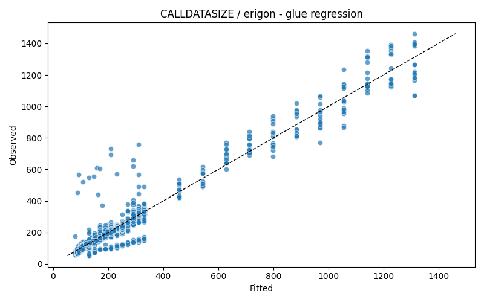

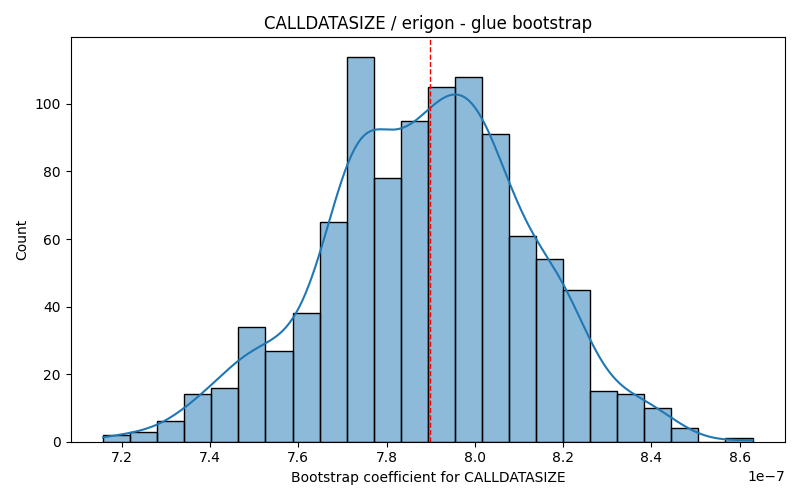

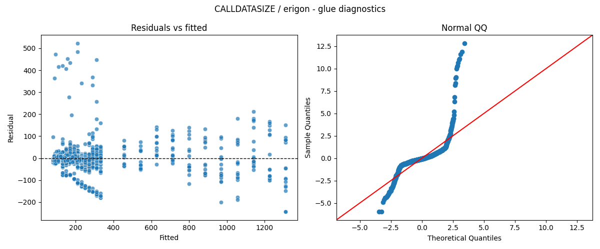

</details>

<details><summary><code>DUP</code> · nobs=3421 · runtime_ms=1.031e-06 · p=1.00e-03 · R²=0.9509</summary>


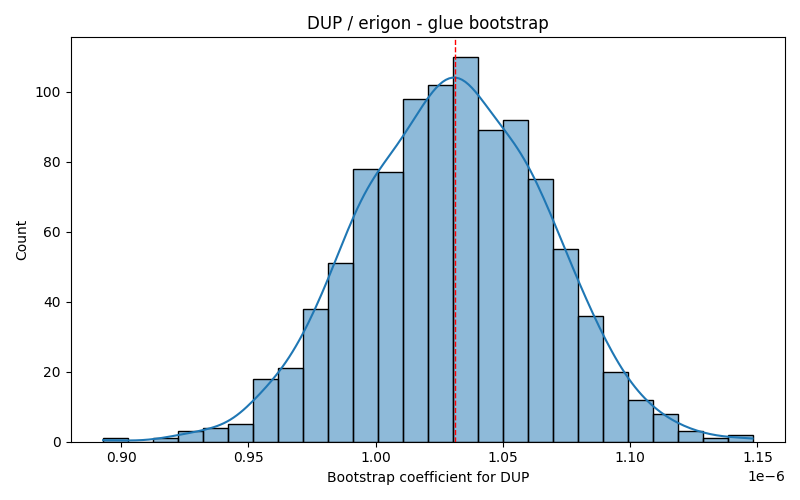


</details>

<details><summary><code>GAS</code> · nobs=3421 · runtime_ms=8.117e-07 · p=1.00e-03 · R²=0.9509</summary>


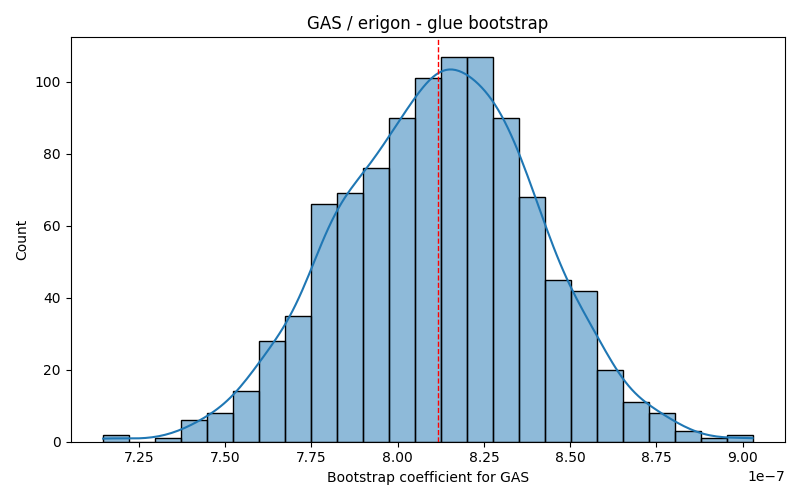


</details>

<details><summary><code>MLOAD</code> · nobs=3421 · runtime_ms=3.442e-06 · p=1.00e-03 · R²=0.9509</summary>

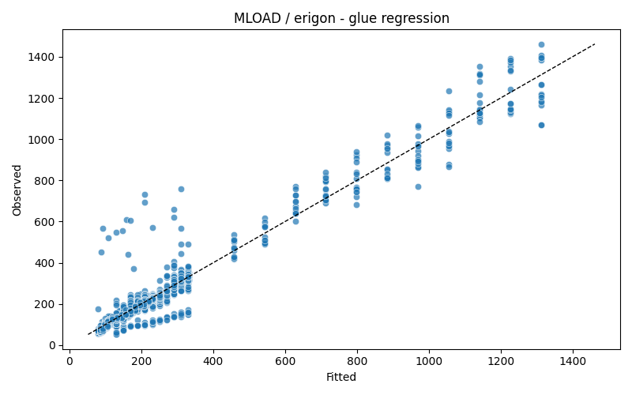

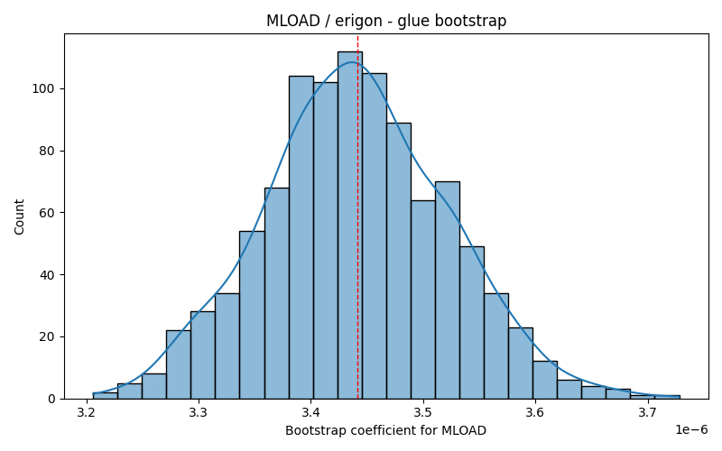


</details>

<details><summary><code>PUSH</code> · nobs=3421 · runtime_ms=2.621e-06 · p=1.00e-03 · R²=0.9509</summary>

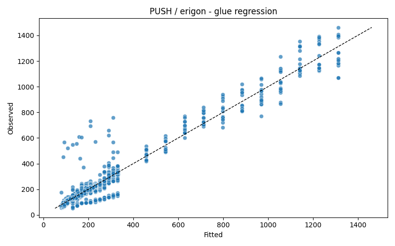

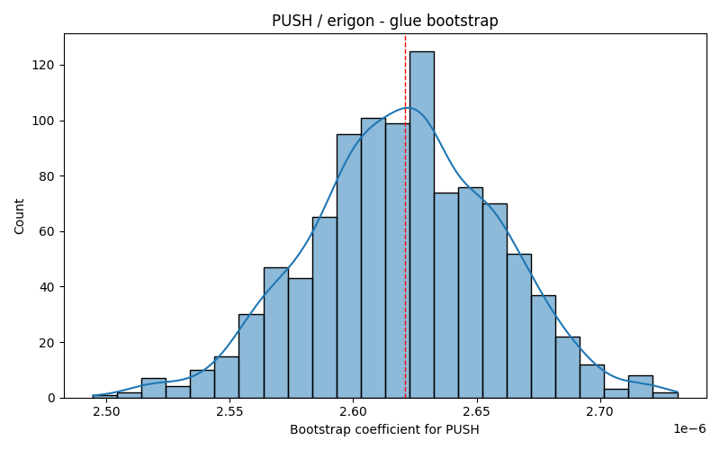


</details>

<details><summary><code>PUSH0</code> · nobs=3421 · runtime_ms=8.461e-07 · p=1.00e-03 · R²=0.9509</summary>


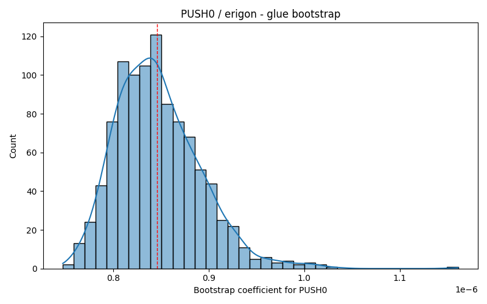

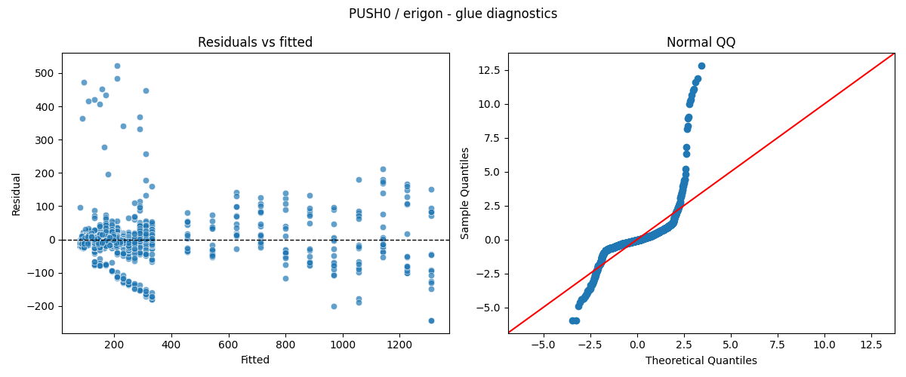

</details>

<details><summary><code>STATICCALL</code> · nobs=3421 · runtime_ms=0.0005047 · p=1.00e-03 · R²=0.9509</summary>

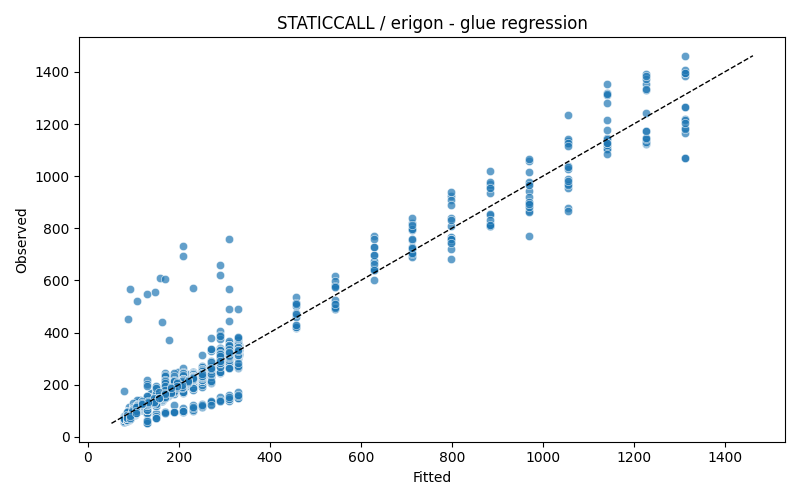

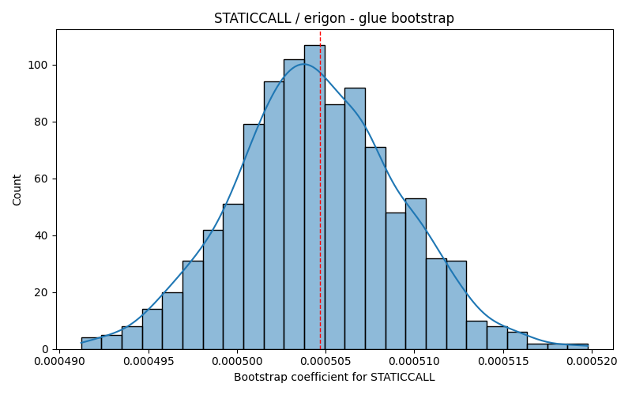


</details>

### Pure glue · erigon

<details><summary><code>ISZERO</code> · nobs=55 · runtime_ms=1.208e-06 · p=1.00e-03 · R²=0.2279</summary>

```
==============================================================================
                           NNLS Regression Results                            
==============================================================================
Dep. Variable:          test_runtime_ms              R-squared:          0.228
Model:                  NNLS                    Adj. R-squared:          0.213
No. Observations:       55                                RMSE:          46.82
Df Residuals:           53                                 MAE:          14.60
Df Model:               1      
==============================================================================
                      coef     std err     P-value      [0.025      0.975]
------------------------------------------------------------------------------
         const     11.1251      6.7080       0.102      0.0000     22.8438
        ISZERO      0.0000      0.0000       0.001      0.0000      0.0000
==============================================================================
Notes: Non-negative least squares with bootstrap inference (1000 iterations)
==============================================================================
```

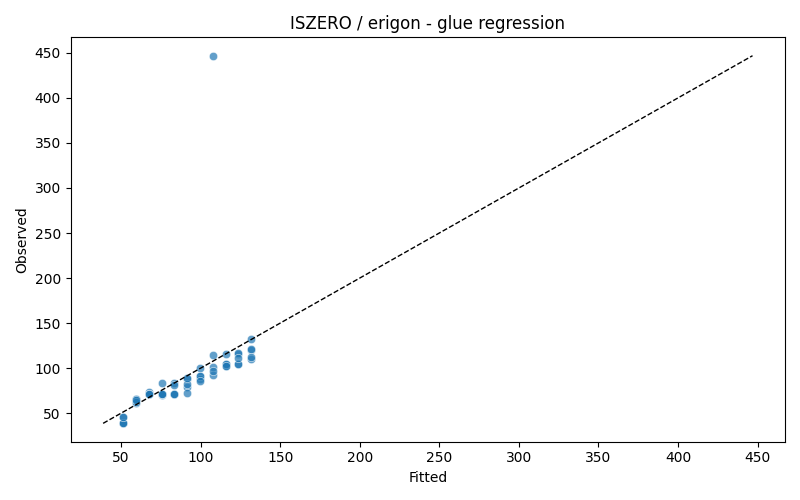

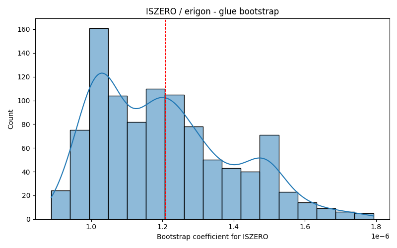

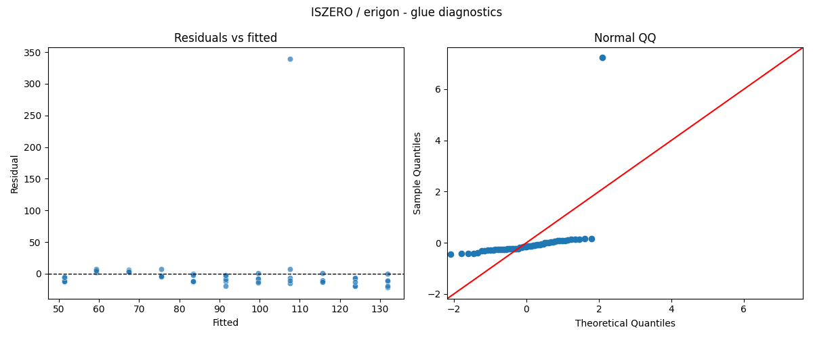

</details>

<details><summary><code>JUMPDEST</code> · nobs=55 · runtime_ms=7.692e-07 · p=1.00e-03 · R²=0.9254</summary>

```
==============================================================================
                           NNLS Regression Results                            
==============================================================================
Dep. Variable:          test_runtime_ms              R-squared:          0.925
Model:                  NNLS                    Adj. R-squared:          0.924
No. Observations:       55                                RMSE:          13.79
Df Residuals:           53                                 MAE:          11.34
Df Model:               1      
==============================================================================
                      coef     std err     P-value      [0.025      0.975]
------------------------------------------------------------------------------
         const     22.3811      6.1275       0.001     11.1902     35.8892
      JUMPDEST      0.0000      0.0000       0.001      0.0000      0.0000
==============================================================================
Notes: Non-negative least squares with bootstrap inference (1000 iterations)
==============================================================================
```

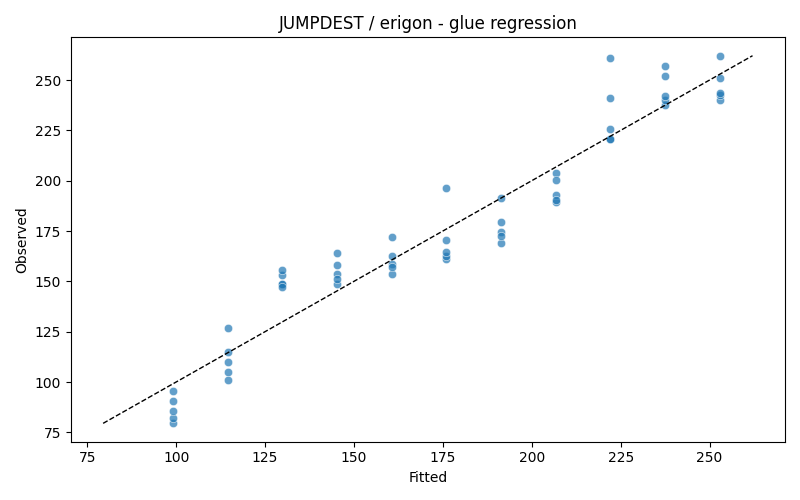

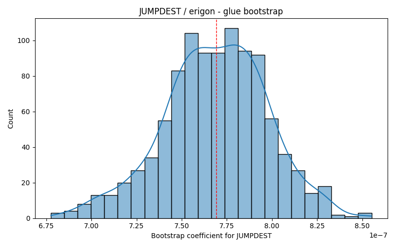

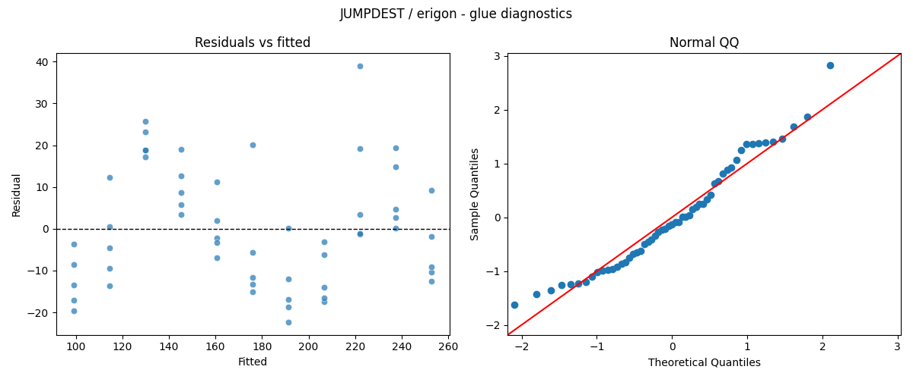

</details>

<details><summary><code>SWAP</code> · nobs=880 · runtime_ms=1.292e-06 · p=1.00e-03 · R²=0.5659</summary>

```
==============================================================================
                           NNLS Regression Results                            
==============================================================================
Dep. Variable:          test_runtime_ms              R-squared:          0.566
Model:                  NNLS                    Adj. R-squared:          0.565
No. Observations:       880                               RMSE:          23.82
Df Residuals:           878                                MAE:           7.25
Df Model:               1      
==============================================================================
                      coef     std err     P-value      [0.025      0.975]
------------------------------------------------------------------------------
         const     20.9283      2.0517       0.001     16.5838     24.5042
          SWAP      0.0000      0.0000       0.001      0.0000      0.0000
==============================================================================
Notes: Non-negative least squares with bootstrap inference (1000 iterations)
==============================================================================
```

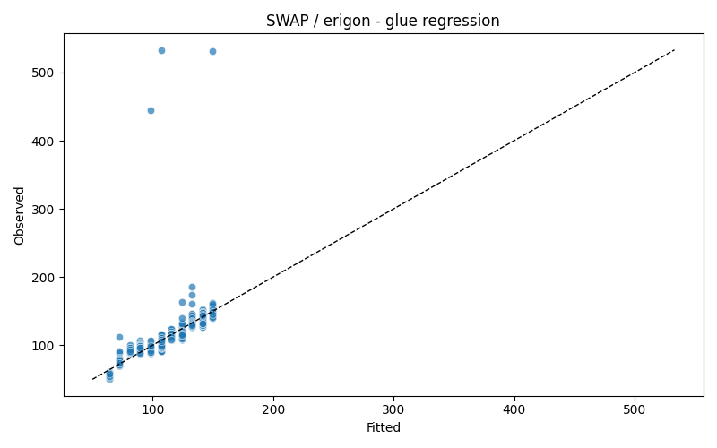

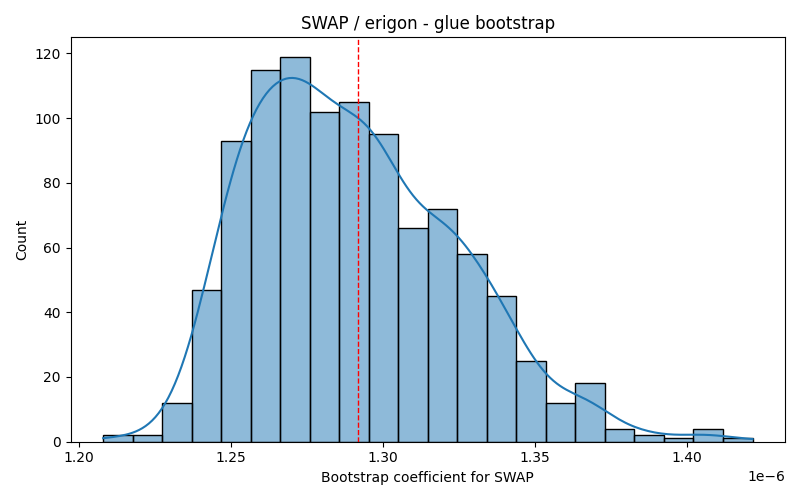

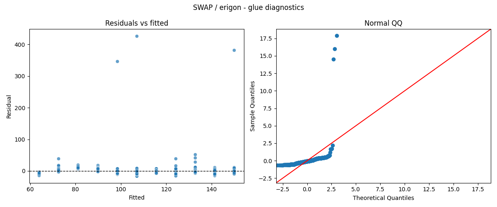

</details>

### Mixed glue (tier A) · erigon

<details><summary><code>ADD</code> · nobs=55 · runtime_ms=2.871e-06 · p=1.00e-03 · R²=0.928</summary>

```
==============================================================================
                           NNLS Regression Results                            
==============================================================================
Dep. Variable:          test_runtime_ms              R-squared:          0.928
Model:                  NNLS                    Adj. R-squared:          0.927
No. Observations:       55                                RMSE:           8.42
Df Residuals:           53                                 MAE:           6.87
Df Model:               1      
==============================================================================
                      coef     std err     P-value      [0.025      0.975]
------------------------------------------------------------------------------
         const     14.5092      3.7223       0.001      7.9603     22.5451
           ADD      0.0000      0.0000       0.001      0.0000      0.0000
==============================================================================
Notes: Non-negative least squares with bootstrap inference (1000 iterations)
==============================================================================
```

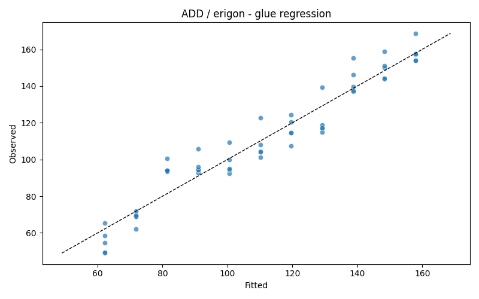

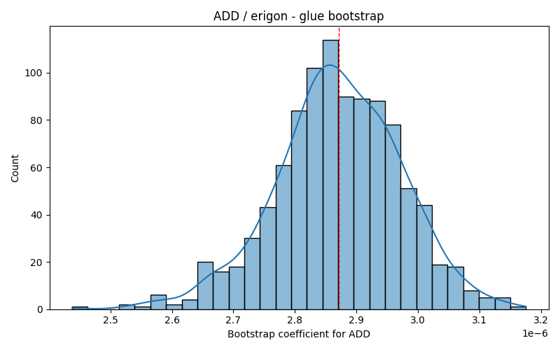

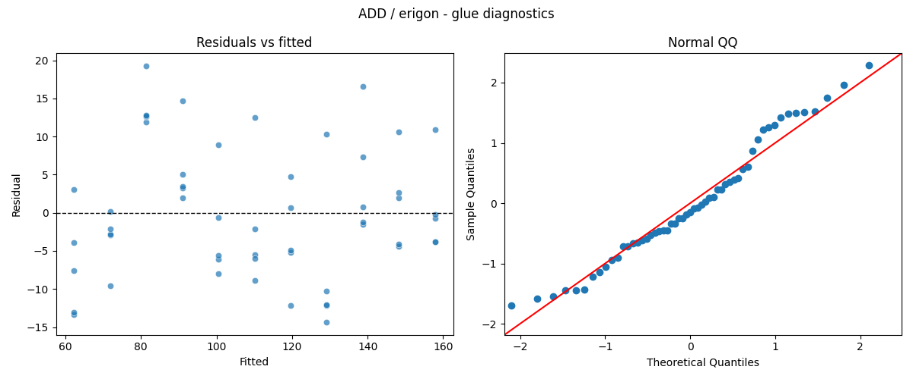

</details>

<details><summary><code>AND</code> · nobs=55 · runtime_ms=2.874e-06 · p=1.00e-03 · R²=0.9209</summary>

```
==============================================================================
                           NNLS Regression Results                            
==============================================================================
Dep. Variable:          test_runtime_ms              R-squared:          0.921
Model:                  NNLS                    Adj. R-squared:          0.919
No. Observations:       55                                RMSE:           8.86
Df Residuals:           53                                 MAE:           7.25
Df Model:               1      
==============================================================================
                      coef     std err     P-value      [0.025      0.975]
------------------------------------------------------------------------------
         const     13.0117      4.4176       0.001      4.7161     21.5446
           AND      0.0000      0.0000       0.001      0.0000      0.0000
==============================================================================
Notes: Non-negative least squares with bootstrap inference (1000 iterations)
==============================================================================
```

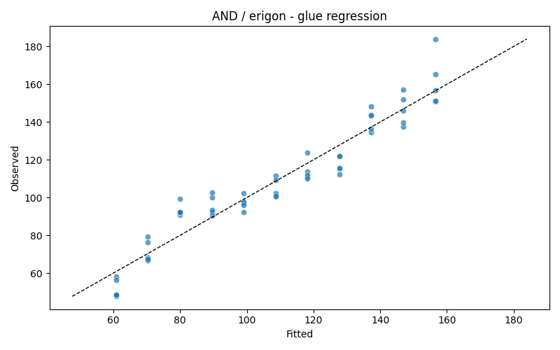

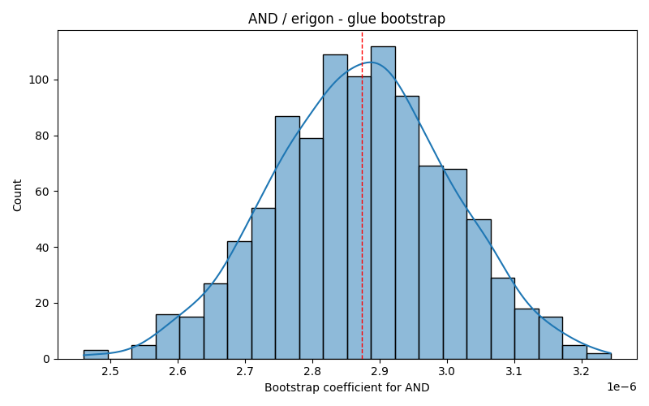

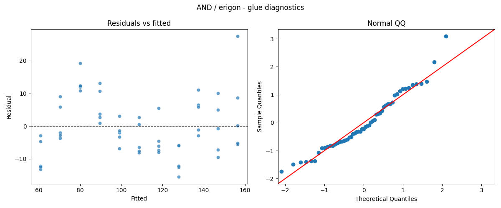

</details>

<details><summary><code>CALLDATACOPY</code> · nobs=1320 · runtime_ms=7.314e-06 · p=1.00e-03 · R²=0.8289</summary>

```
==============================================================================
                           NNLS Regression Results                            
==============================================================================
Dep. Variable:          test_runtime_ms              R-squared:          0.829
Model:                  NNLS                    Adj. R-squared:          0.829
No. Observations:       1320                              RMSE:          24.99
Df Residuals:           1318                               MAE:           8.61
Df Model:               1      
==============================================================================
                      coef     std err     P-value      [0.025      0.975]
------------------------------------------------------------------------------
         const     18.5070      1.1081       0.001     16.6461     20.9090
  CALLDATACOPY      0.0000      0.0000       0.001      0.0000      0.0000
==============================================================================
Notes: Non-negative least squares with bootstrap inference (1000 iterations)
==============================================================================
```

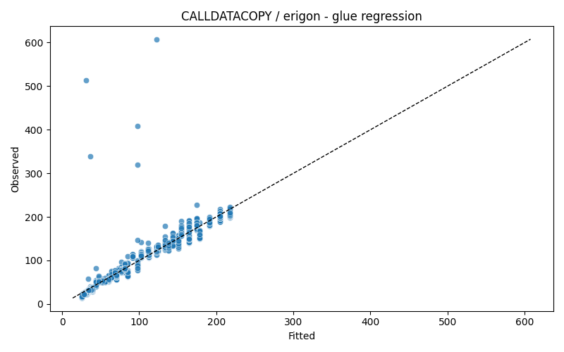

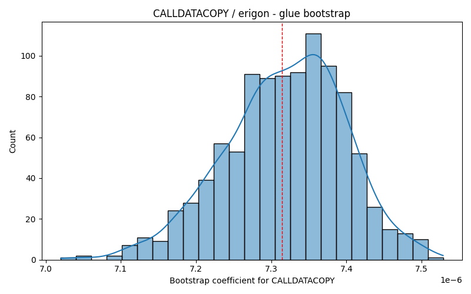

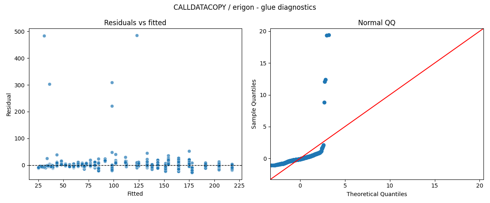

</details>

<details><summary><code>CALLDATALOAD</code> · nobs=220 · runtime_ms=5.924e-05 · p=1.00e-03 · R²=0.1509</summary>

```
==============================================================================
                           NNLS Regression Results                            
==============================================================================
Dep. Variable:          test_runtime_ms              R-squared:          0.151
Model:                  NNLS                    Adj. R-squared:          0.147
No. Observations:       220                               RMSE:           0.54
Df Residuals:           218                                MAE:           0.39
Df Model:               1      
==============================================================================
                      coef     std err     P-value      [0.025      0.975]
------------------------------------------------------------------------------
         const      5.5411      0.1229       0.001      5.3138      5.7788
  CALLDATALOAD      0.0001      0.0000       0.001      0.0000      0.0001
==============================================================================
Notes: Non-negative least squares with bootstrap inference (1000 iterations)
==============================================================================
```

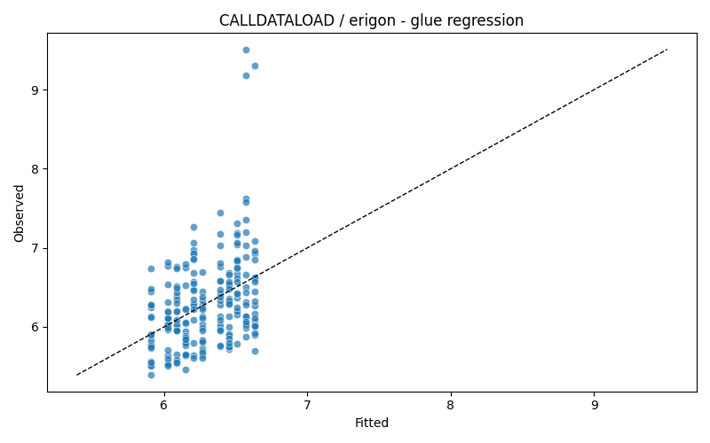

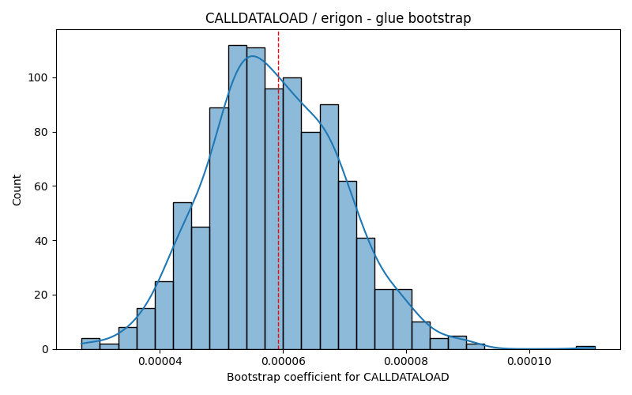

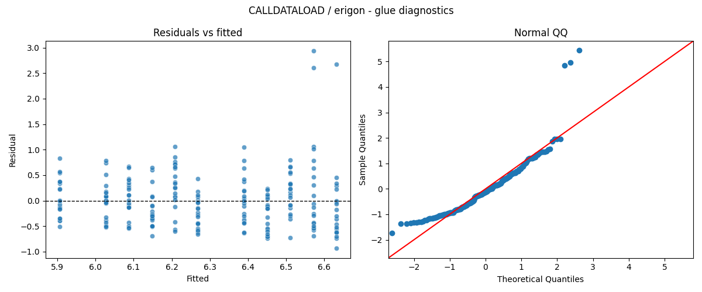

</details>

<details><summary><code>DIV</code> · nobs=55 · runtime_ms=9.829e-06 · p=1.00e-03 · R²=0.896</summary>

```
==============================================================================
                           NNLS Regression Results                            
==============================================================================
Dep. Variable:          test_runtime_ms              R-squared:          0.896
Model:                  NNLS                    Adj. R-squared:          0.894
No. Observations:       55                                RMSE:          26.44
Df Residuals:           53                                 MAE:          22.96
Df Model:               1      
==============================================================================
                      coef     std err     P-value      [0.025      0.975]
------------------------------------------------------------------------------
         const     23.1115     12.2636       0.018      1.6088     49.6503
           DIV      0.0000      0.0000       0.001      0.0000      0.0000
==============================================================================
Notes: Non-negative least squares with bootstrap inference (1000 iterations)
==============================================================================
```

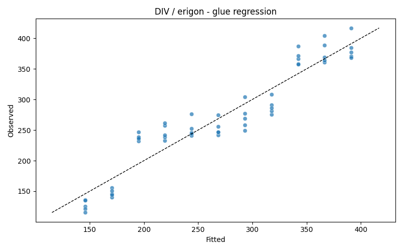

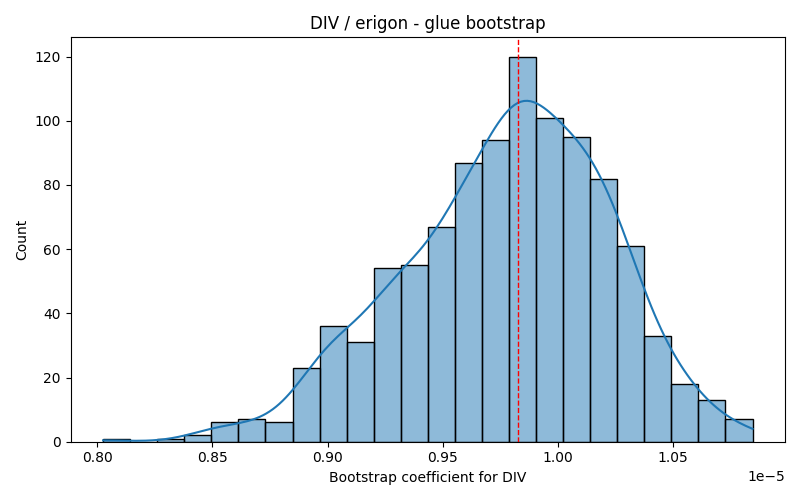


</details>

<details><summary><code>EXP</code> · nobs=55 · runtime_ms=0.0003455 · p=1.00e-03 · R²=0.8967</summary>

```
==============================================================================
                           NNLS Regression Results                            
==============================================================================
Dep. Variable:          test_runtime_ms              R-squared:          0.897
Model:                  NNLS                    Adj. R-squared:          0.895
No. Observations:       55                                RMSE:           4.59
Df Residuals:           53                                 MAE:           3.61
Df Model:               1      
==============================================================================
                      coef     std err     P-value      [0.025      0.975]
------------------------------------------------------------------------------
         const     12.1445      2.3377       0.001      7.7144     16.9292
           EXP      0.0003      0.0000       0.001      0.0003      0.0004
==============================================================================
Notes: Non-negative least squares with bootstrap inference (1000 iterations)
==============================================================================
```

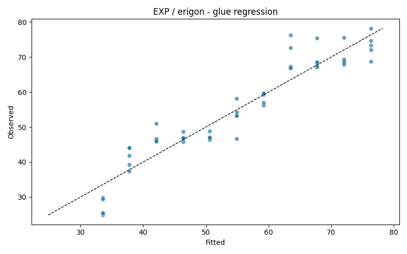

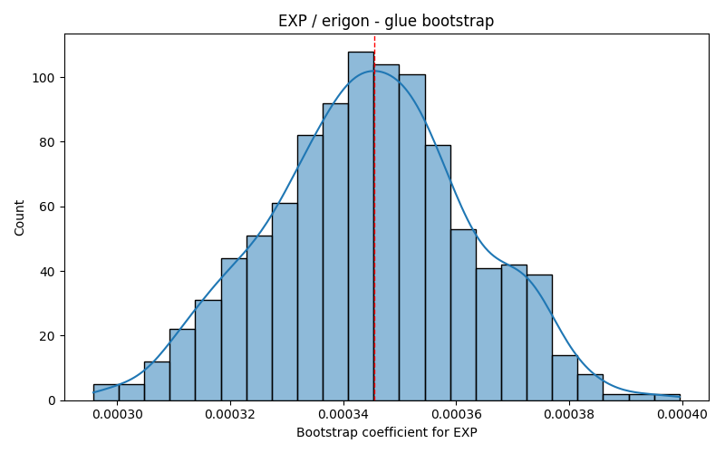

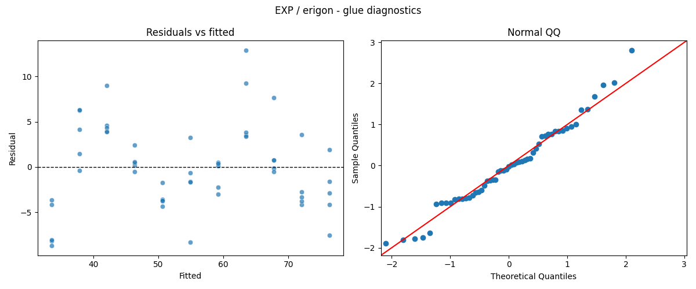

</details>

<details><summary><code>GT</code> · nobs=55 · runtime_ms=3.08e-06 · p=1.00e-03 · R²=0.9207</summary>

```
==============================================================================
                           NNLS Regression Results                            
==============================================================================
Dep. Variable:          test_runtime_ms              R-squared:          0.921
Model:                  NNLS                    Adj. R-squared:          0.919
No. Observations:       55                                RMSE:           9.51
Df Residuals:           53                                 MAE:           7.71
Df Model:               1      
==============================================================================
                      coef     std err     P-value      [0.025      0.975]
------------------------------------------------------------------------------
         const     15.8845      4.7349       0.001      7.0212     25.2573
            GT      0.0000      0.0000       0.001      0.0000      0.0000
==============================================================================
Notes: Non-negative least squares with bootstrap inference (1000 iterations)
==============================================================================
```

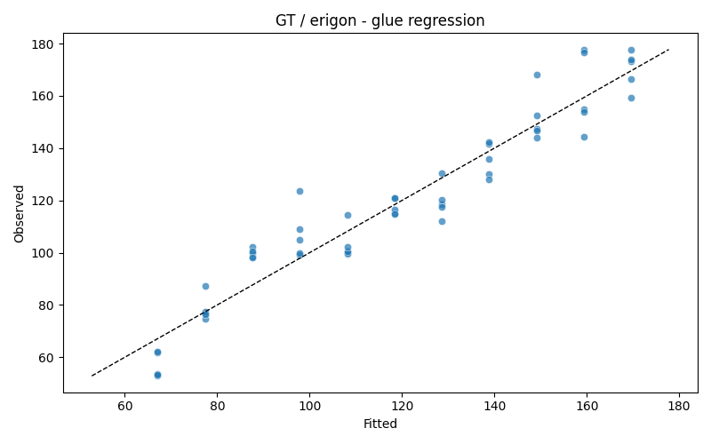

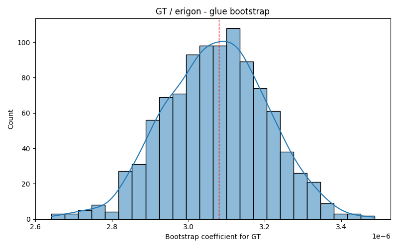

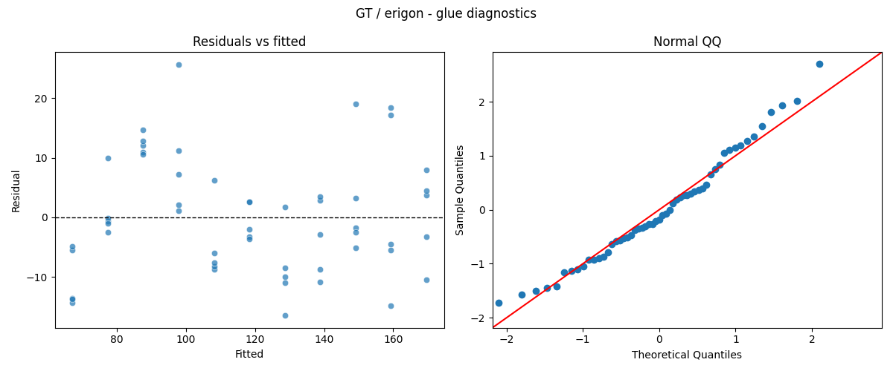

</details>

<details><summary><code>JUMPI</code> · nobs=55 · runtime_ms=3.481e-06 · p=1.00e-03 · R²=0.8811</summary>

```
==============================================================================
                           NNLS Regression Results                            
==============================================================================
Dep. Variable:          test_runtime_ms              R-squared:          0.881
Model:                  NNLS                    Adj. R-squared:          0.879
No. Observations:       55                                RMSE:           5.77
Df Residuals:           53                                 MAE:           4.91
Df Model:               1      
==============================================================================
                      coef     std err     P-value      [0.025      0.975]
------------------------------------------------------------------------------
         const     18.6258      3.2220       0.001     12.4597     24.7228
         JUMPI      0.0000      0.0000       0.001      0.0000      0.0000
==============================================================================
Notes: Non-negative least squares with bootstrap inference (1000 iterations)
==============================================================================
```

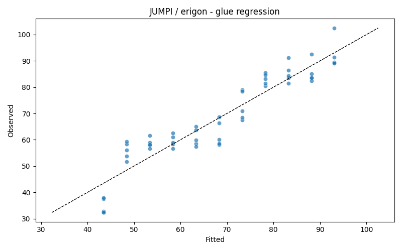

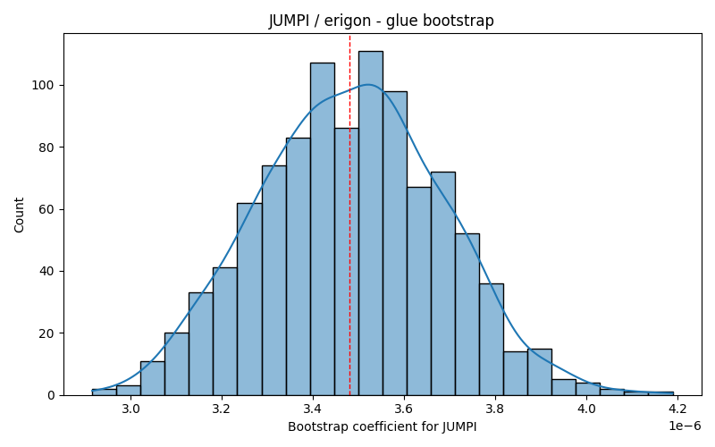

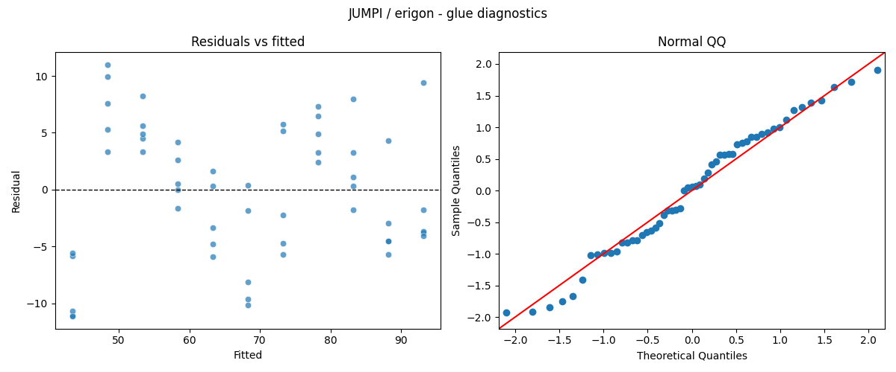

</details>

<details><summary><code>LT</code> · nobs=55 · runtime_ms=2.796e-06 · p=1.00e-03 · R²=0.2724</summary>

```
==============================================================================
                           NNLS Regression Results                            
==============================================================================
Dep. Variable:          test_runtime_ms              R-squared:          0.272
Model:                  NNLS                    Adj. R-squared:          0.259
No. Observations:       55                                RMSE:          48.10
Df Residuals:           53                                 MAE:          14.85
Df Model:               1      
==============================================================================
                      coef     std err     P-value      [0.025      0.975]
------------------------------------------------------------------------------
         const     30.4344     14.7952       0.001     11.8215     66.5262
            LT      0.0000      0.0000       0.001      0.0000      0.0000
==============================================================================
Notes: Non-negative least squares with bootstrap inference (1000 iterations)
==============================================================================
```

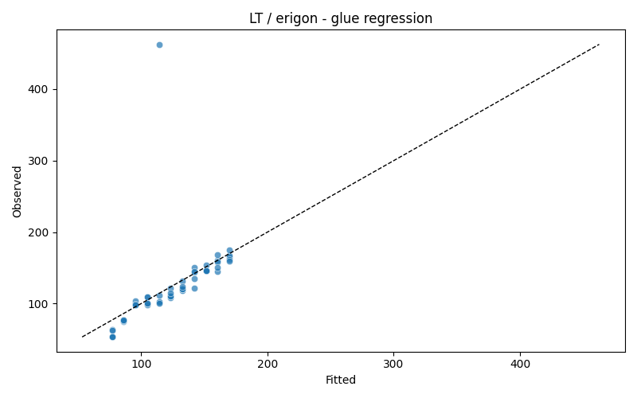

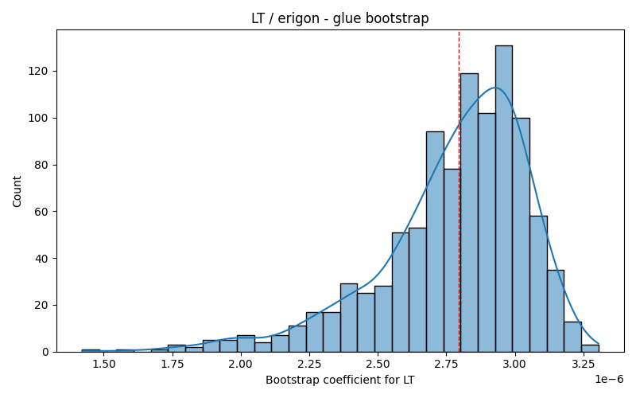


</details>

<details><summary><code>MSTORE</code> · nobs=275 · runtime_ms=5.969e-06 · p=1.00e-03 · R²=0.7247</summary>

```
==============================================================================
                           NNLS Regression Results                            
==============================================================================
Dep. Variable:          test_runtime_ms              R-squared:          0.725
Model:                  NNLS                    Adj. R-squared:          0.724
No. Observations:       275                               RMSE:          25.82
Df Residuals:           273                                MAE:          10.42
Df Model:               1      
==============================================================================
                      coef     std err     P-value      [0.025      0.975]
------------------------------------------------------------------------------
         const     18.9865      4.7586       0.001      8.6351     27.0515
        MSTORE      0.0000      0.0000       0.001      0.0000      0.0000
==============================================================================
Notes: Non-negative least squares with bootstrap inference (1000 iterations)
==============================================================================
```

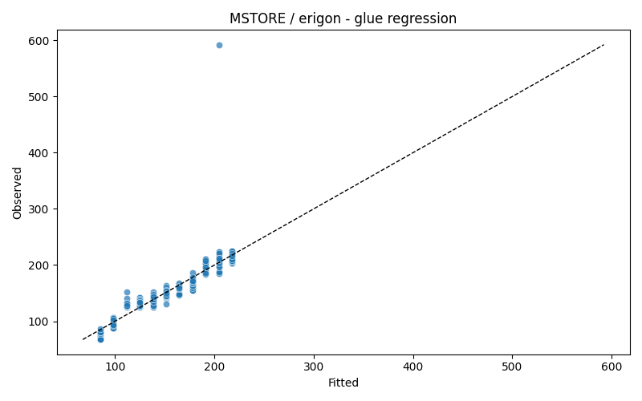

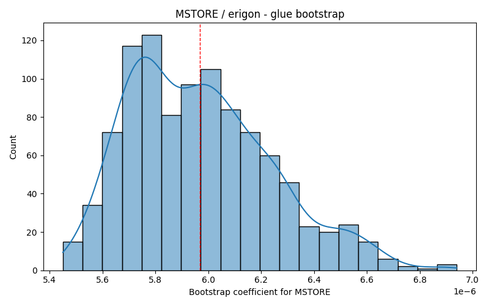

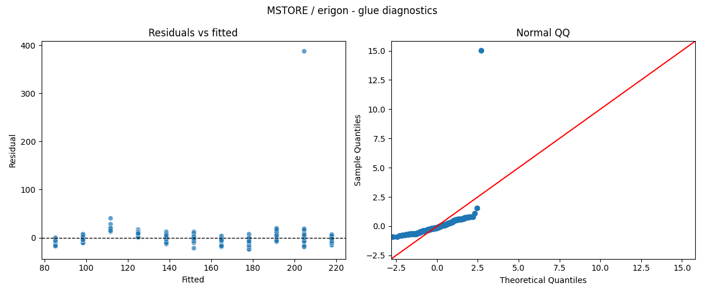

</details>

<details><summary><code>MSTORE8</code> · nobs=275 · runtime_ms=5.111e-06 · p=1.00e-03 · R²=0.6721</summary>

```
==============================================================================
                           NNLS Regression Results                            
==============================================================================
Dep. Variable:          test_runtime_ms              R-squared:          0.672
Model:                  NNLS                    Adj. R-squared:          0.671
No. Observations:       275                               RMSE:          25.05
Df Residuals:           273                                MAE:           9.84
Df Model:               1      
==============================================================================
                      coef     std err     P-value      [0.025      0.975]
------------------------------------------------------------------------------
         const     26.5157      2.9261       0.001     21.2309     32.7430
       MSTORE8      0.0000      0.0000       0.001      0.0000      0.0000
==============================================================================
Notes: Non-negative least squares with bootstrap inference (1000 iterations)
==============================================================================
```

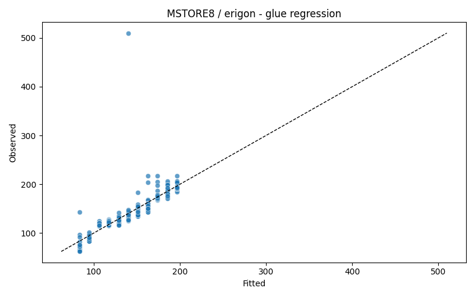

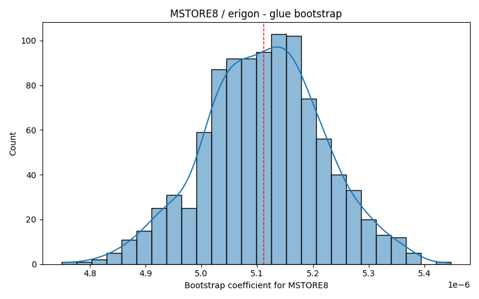

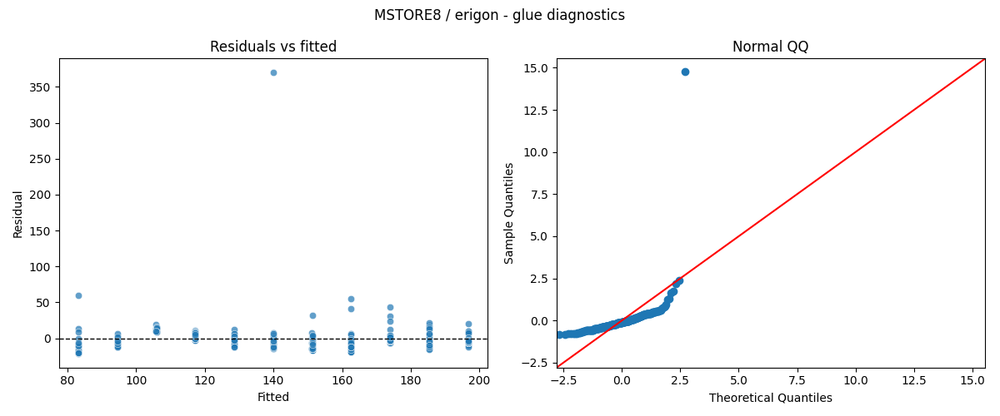

</details>

<details><summary><code>MUL</code> · nobs=55 · runtime_ms=3.649e-06 · p=1.00e-03 · R²=0.8993</summary>

```
==============================================================================
                           NNLS Regression Results                            
==============================================================================
Dep. Variable:          test_runtime_ms              R-squared:          0.899
Model:                  NNLS                    Adj. R-squared:          0.897
No. Observations:       55                                RMSE:           9.64
Df Residuals:           53                                 MAE:           7.07
Df Model:               1      
==============================================================================
                      coef     std err     P-value      [0.025      0.975]
------------------------------------------------------------------------------
         const     11.4251      4.2845       0.008      2.9804     20.2266
           MUL      0.0000      0.0000       0.001      0.0000      0.0000
==============================================================================
Notes: Non-negative least squares with bootstrap inference (1000 iterations)
==============================================================================
```

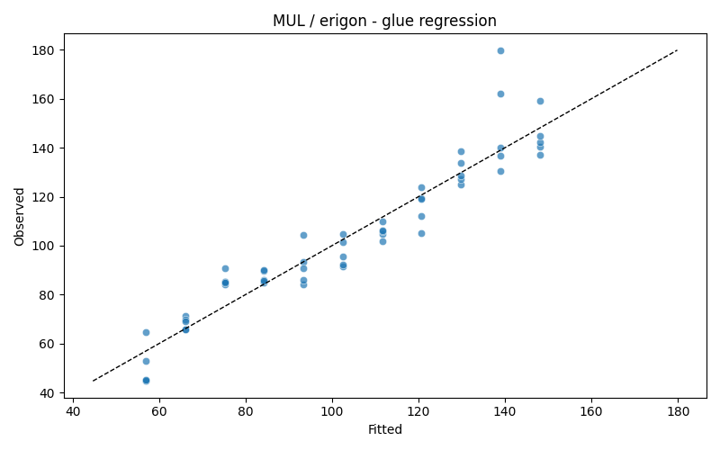

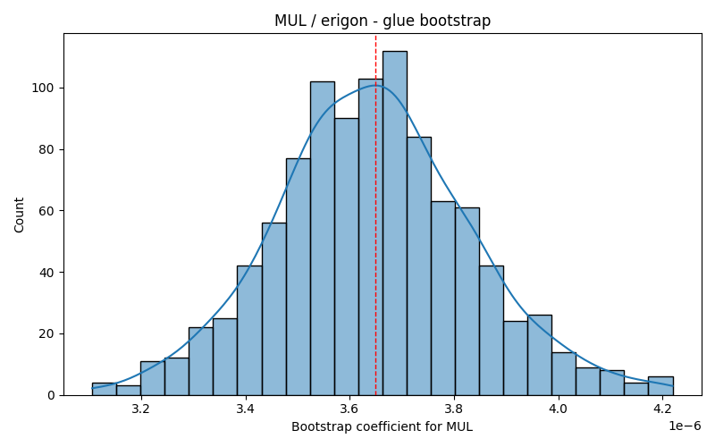

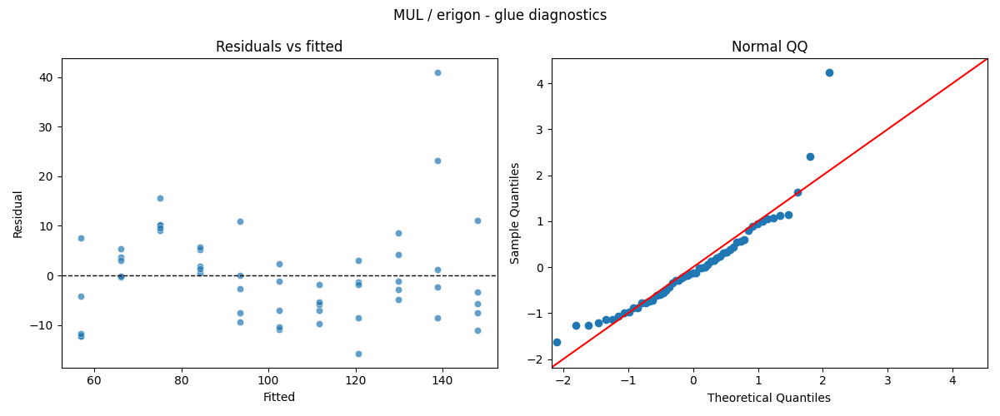

</details>

<details><summary><code>PC</code> · nobs=55 · runtime_ms=1.391e-06 · p=1.00e-03 · R²=0.935</summary>

```
==============================================================================
                           NNLS Regression Results                            
==============================================================================
Dep. Variable:          test_runtime_ms              R-squared:          0.935
Model:                  NNLS                    Adj. R-squared:          0.934
No. Observations:       55                                RMSE:          10.97
Df Residuals:           53                                 MAE:           9.42
Df Model:               1      
==============================================================================
                      coef     std err     P-value      [0.025      0.975]
------------------------------------------------------------------------------
         const     18.8935      5.6558       0.001      8.4661     30.6703
            PC      0.0000      0.0000       0.001      0.0000      0.0000
==============================================================================
Notes: Non-negative least squares with bootstrap inference (1000 iterations)
==============================================================================
```

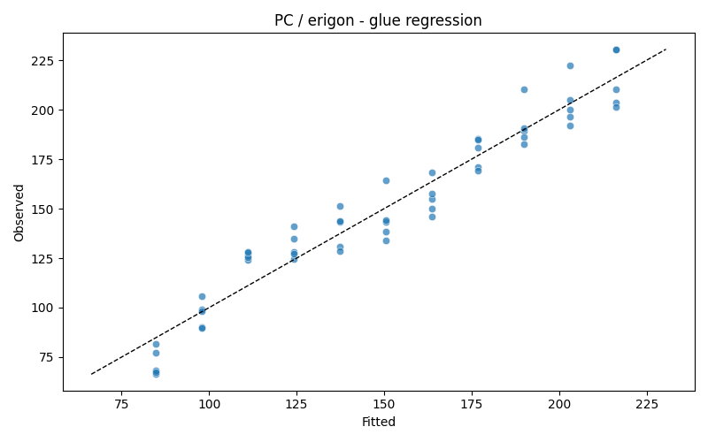

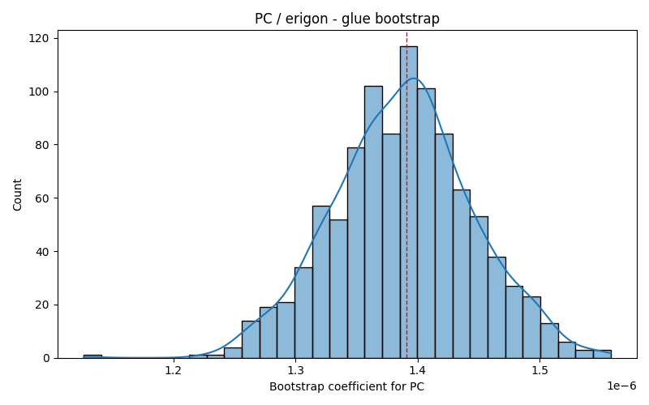

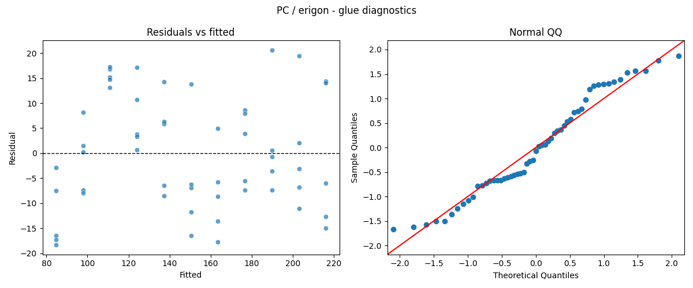

</details>

<details><summary><code>RETURNDATASIZE</code> · nobs=220 · runtime_ms=1.801e-06 · p=1.00e-03 · R²=0.9209</summary>

```
==============================================================================
                           NNLS Regression Results                            
==============================================================================
Dep. Variable:          test_runtime_ms              R-squared:          0.921
Model:                  NNLS                    Adj. R-squared:          0.920
No. Observations:       220                               RMSE:           8.34
Df Residuals:           218                                MAE:           6.45
Df Model:               1      
==============================================================================
                      coef     std err     P-value      [0.025      0.975]
------------------------------------------------------------------------------
         const     17.1197      2.0436       0.001     13.1371     20.9766
RETURNDATASIZE      0.0000      0.0000       0.001      0.0000      0.0000
==============================================================================
Notes: Non-negative least squares with bootstrap inference (1000 iterations)
==============================================================================
```

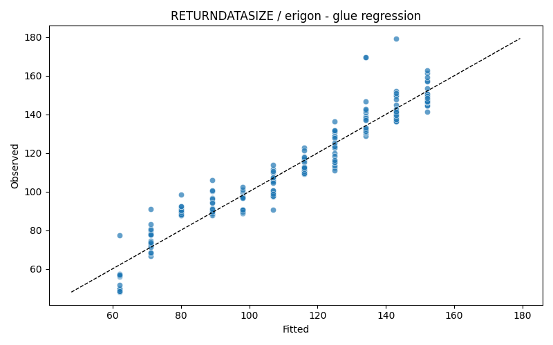

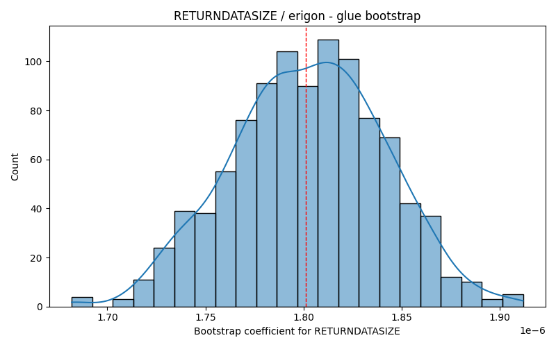

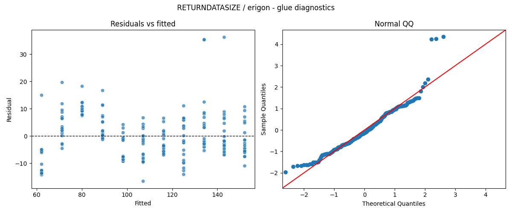

</details>

<details><summary><code>SELFBALANCE</code> · nobs=45 · runtime_ms=1.431e-06 · p=1.00e-03 · R²=0.8902</summary>

```
==============================================================================
                           NNLS Regression Results                            
==============================================================================
Dep. Variable:          test_runtime_ms              R-squared:          0.890
Model:                  NNLS                    Adj. R-squared:          0.888
No. Observations:       45                                RMSE:           5.07
Df Residuals:           43                                 MAE:           4.16
Df Model:               1      
==============================================================================
                      coef     std err     P-value      [0.025      0.975]
------------------------------------------------------------------------------
         const     17.7084      3.4922       0.001      9.8454     23.4668
   SELFBALANCE      0.0000      0.0000       0.001      0.0000      0.0000
==============================================================================
Notes: Non-negative least squares with bootstrap inference (1000 iterations)
==============================================================================
```

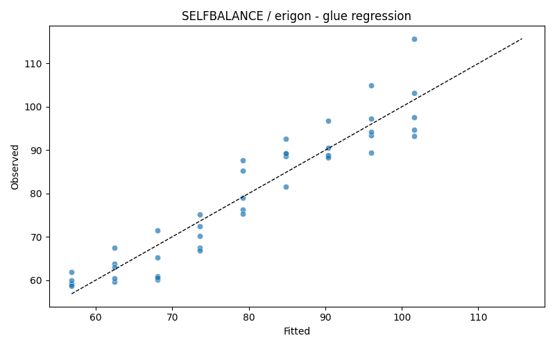

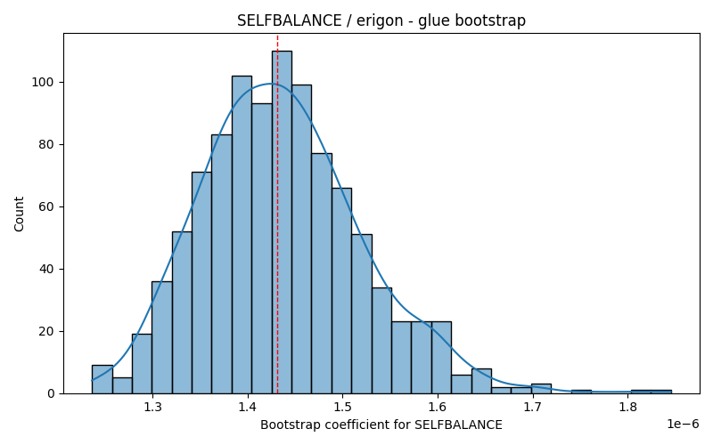

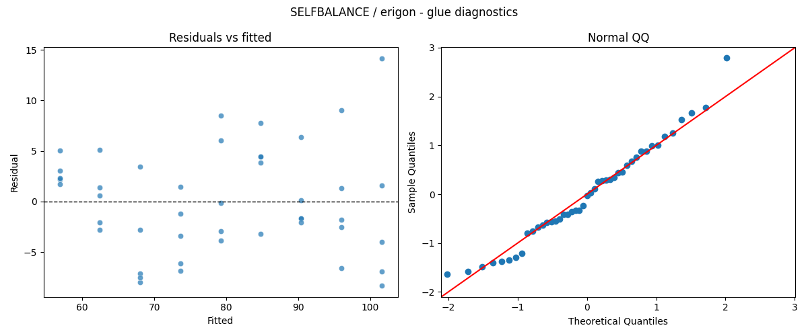

</details>

<details><summary><code>SUB</code> · nobs=55 · runtime_ms=2.862e-06 · p=1.00e-03 · R²=0.9346</summary>

```
==============================================================================
                           NNLS Regression Results                            
==============================================================================
Dep. Variable:          test_runtime_ms              R-squared:          0.935
Model:                  NNLS                    Adj. R-squared:          0.933
No. Observations:       55                                RMSE:           7.97
Df Residuals:           53                                 MAE:           6.38
Df Model:               1      
==============================================================================
                      coef     std err     P-value      [0.025      0.975]
------------------------------------------------------------------------------
         const     16.0208      3.9671       0.001      8.0899     24.0163
           SUB      0.0000      0.0000       0.001      0.0000      0.0000
==============================================================================
Notes: Non-negative least squares with bootstrap inference (1000 iterations)
==============================================================================
```

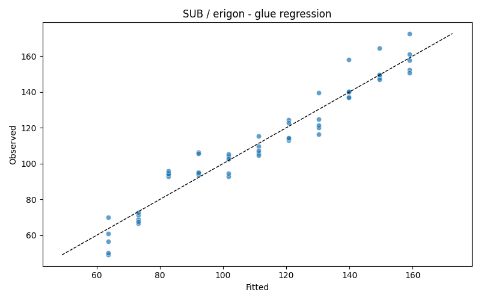

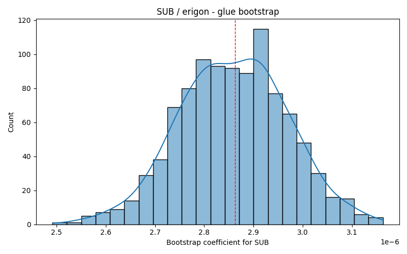

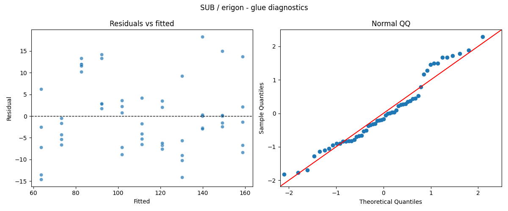

</details>

### Mixed glue (tier B) · erigon

<details><summary><code>JUMP</code> · nobs=55 · runtime_ms=7.016e-06 · p=1.00e-03 · R²=0.9106</summary>

```
==============================================================================
                           NNLS Regression Results                            
==============================================================================
Dep. Variable:          test_runtime_ms              R-squared:          0.911
Model:                  NNLS                    Adj. R-squared:          0.909
No. Observations:       55                                RMSE:           8.17
Df Residuals:           53                                 MAE:           6.47
Df Model:               1      
==============================================================================
                      coef     std err     P-value      [0.025      0.975]
------------------------------------------------------------------------------
         const     17.2591      3.7710       0.001      9.9183     24.8457
          JUMP      0.0000      0.0000       0.001      0.0000      0.0000
==============================================================================
Notes: Non-negative least squares with bootstrap inference (1000 iterations)
==============================================================================
```

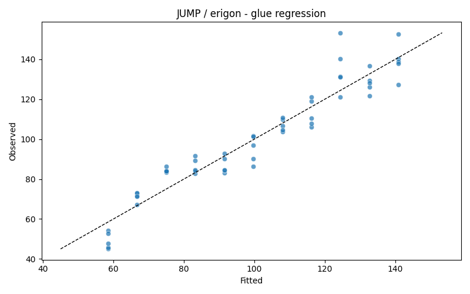

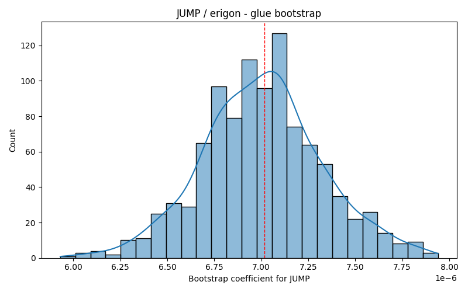

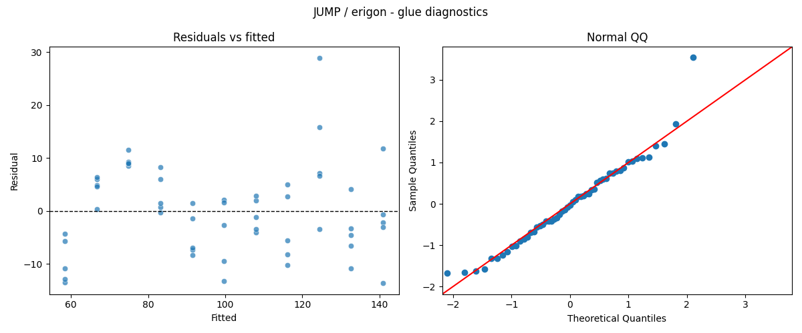

</details>

<details><summary><code>KECCAK256</code> · nobs=880 · runtime_ms=1.905e-05 · p=1.00e-03 · R²=0.07236</summary>

```
==============================================================================
                           NNLS Regression Results                            
==============================================================================
Dep. Variable:          test_runtime_ms              R-squared:          0.072
Model:                  NNLS                    Adj. R-squared:          0.071
No. Observations:       880                               RMSE:         135.57
Df Residuals:           878                                MAE:         108.94
Df Model:               1      
==============================================================================
                      coef     std err     P-value      [0.025      0.975]
------------------------------------------------------------------------------
         const    368.4974     10.0503       0.001    347.6595    387.7769
     KECCAK256      0.0000      0.0000       0.001      0.0000      0.0000
==============================================================================
Notes: Non-negative least squares with bootstrap inference (1000 iterations)
==============================================================================
```

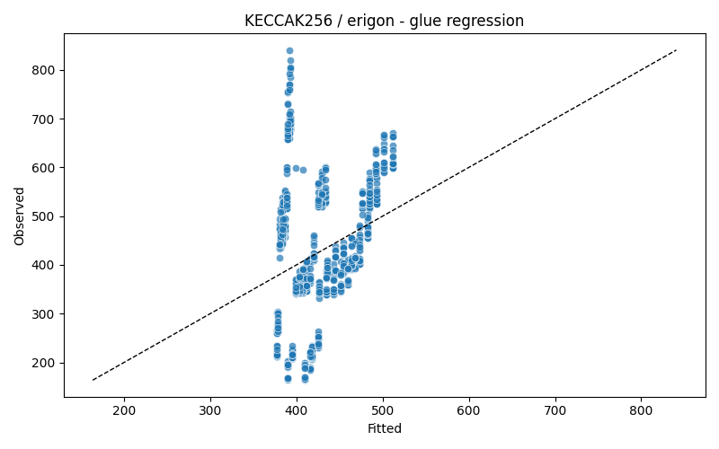

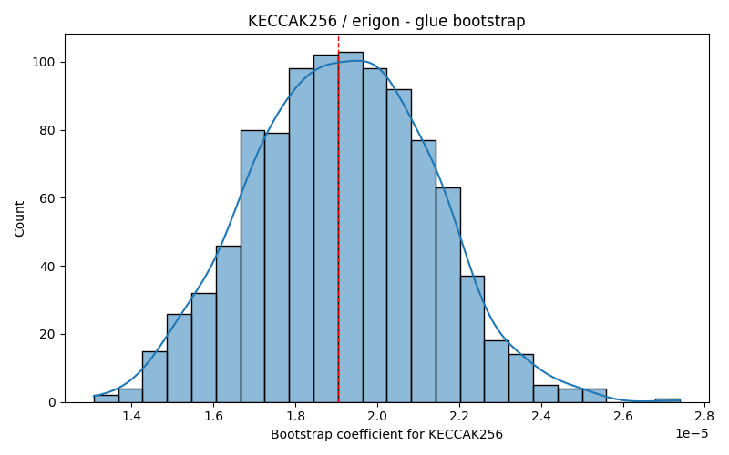

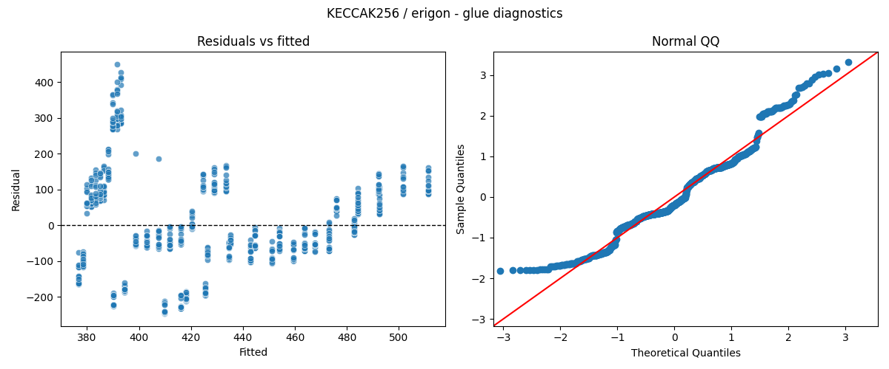

</details>

## geth

| glue_opcode | nobs | glue_runtime_ms | p_value | rsquared |
| --- | --- | --- | --- | --- |
| `ISZERO` | 627 | 8.371e-06 | 1.00e-03 | 0.9664 |
| `JUMPDEST` | 627 | 7.155e-06 | 1.00e-03 | 0.9686 |
| `SWAP` | 10032 | 9.454e-06 | 1.00e-03 | 0.9766 |
| `CALLDATASIZE` | 36993 | 9.202e-06 | 1.00e-03 | 0.9426 |
| `DUP` | 36993 | 1.009e-05 | 1.00e-03 | 0.9426 |
| `GAS` | 36993 | 9.241e-06 | 1.00e-03 | 0.9426 |
| `MLOAD` | 36993 | 2.993e-05 | 1.00e-03 | 0.9426 |
| `PUSH` | 36993 | 1.349e-05 | 1.00e-03 | 0.9426 |
| `PUSH0` | 36993 | 9.085e-06 | 1.00e-03 | 0.9426 |
| `STATICCALL` | 36993 | 0 | 1.00e+00 | 0.9426 |
| `ADD` | 627 | 2.682e-05 | 1.00e-03 | 0.7914 |
| `AND` | 627 | 2.663e-05 | 1.00e-03 | 0.7448 |
| `CALLDATACOPY` | 15048 | 6.465e-05 | 1.00e-03 | 0.9923 |
| `CALLDATALOAD` | 2508 | 5.321e-05 | 1.00e-03 | 0.02473 |
| `DIV` | 627 | 5.858e-05 | 1.00e-03 | 0.9947 |
| `EXP` | 627 | 0.002073 | 1.00e-03 | 0.9946 |
| `GT` | 627 | 2.098e-05 | 1.00e-03 | 0.9612 |
| `JUMPI` | 627 | 3.294e-05 | 1.00e-03 | 0.9708 |
| `LT` | 627 | 2.56e-05 | 1.00e-03 | 0.7511 |
| `MSTORE` | 3135 | 4.842e-05 | 1.00e-03 | 0.9818 |
| `MSTORE8` | 3135 | 4.377e-05 | 1.00e-03 | 0.9731 |
| `MUL` | 627 | 2.709e-05 | 1.00e-03 | 0.9198 |
| `PC` | 627 | 9.416e-06 | 1.00e-03 | 0.9864 |
| `RETURNDATASIZE` | 2508 | 1.596e-05 | 1.00e-03 | 0.9208 |
| `SELFBALANCE` | 513 | 5.076e-05 | 1.00e-03 | 0.9891 |
| `SUB` | 627 | 2.703e-05 | 1.00e-03 | 0.7412 |
| `JUMP` | 627 | 5.733e-05 | 1.00e-03 | 0.9681 |
| `KECCAK256` | 10032 | 0.0002049 | 1.00e-03 | 0.3014 |

### Cycle glue — joint fit · geth

<details><summary>Joint NNLS regression summary</summary>

```
==============================================================================
                           NNLS Regression Results                            
==============================================================================
Dep. Variable:          test_runtime_ms              R-squared:          0.943
Model:                  NNLS                    Adj. R-squared:          0.943
No. Observations:       36993                             RMSE:          70.10
Df Residuals:           36985                              MAE:          35.33
Df Model:               7      
==============================================================================
                      coef     std err     P-value      [0.025      0.975]
------------------------------------------------------------------------------
         const      5.9725      1.0796       0.001      3.9366      8.2200
  CALLDATASIZE      0.0000      0.0000       0.001      0.0000      0.0000
           DUP      0.0000      0.0000       0.001      0.0000      0.0000
           GAS      0.0000      0.0000       0.001      0.0000      0.0000
         MLOAD      0.0000      0.0000       0.001      0.0000      0.0000
          PUSH      0.0000      0.0000       0.001      0.0000      0.0000
         PUSH0      0.0000      0.0000       0.001      0.0000      0.0000
    STATICCALL      0.0000      0.0000       1.000      0.0000      0.0000
==============================================================================
Notes: Non-negative least squares with bootstrap inference (1000 iterations)
==============================================================================
```

</details>

<details><summary><code>CALLDATASIZE</code> · nobs=36993 · runtime_ms=9.202e-06 · p=1.00e-03 · R²=0.9426</summary>


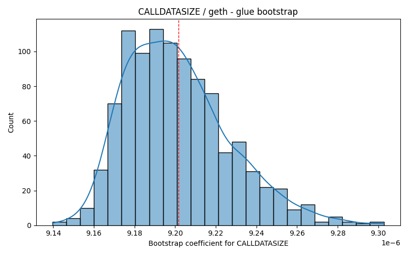

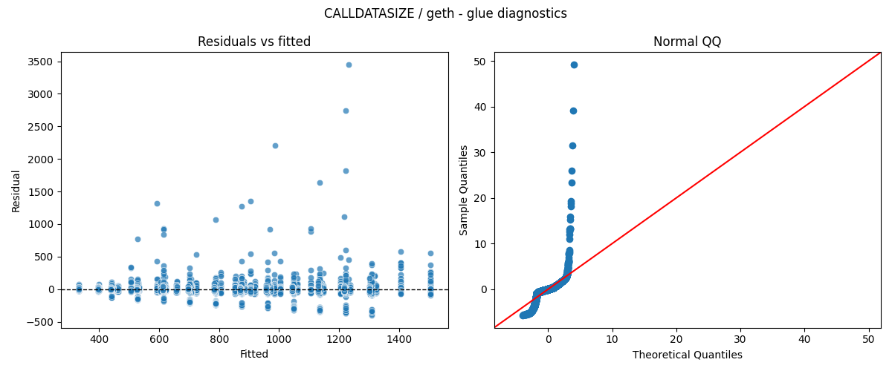

</details>

<details><summary><code>DUP</code> · nobs=36993 · runtime_ms=1.009e-05 · p=1.00e-03 · R²=0.9426</summary>


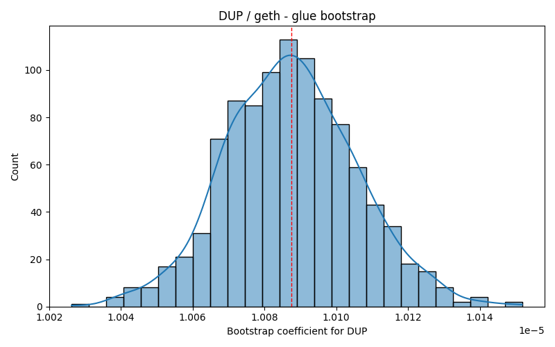

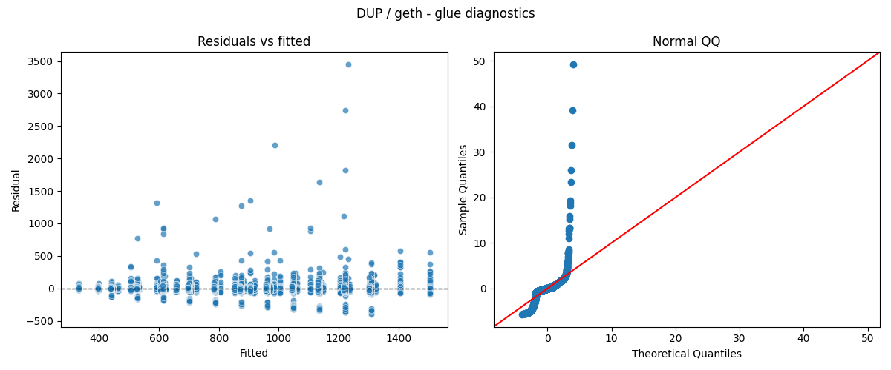

</details>

<details><summary><code>GAS</code> · nobs=36993 · runtime_ms=9.241e-06 · p=1.00e-03 · R²=0.9426</summary>


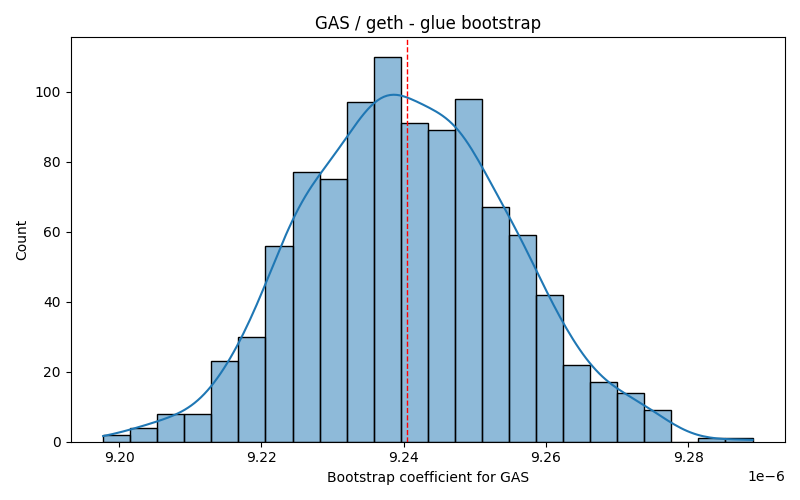


</details>

<details><summary><code>MLOAD</code> · nobs=36993 · runtime_ms=2.993e-05 · p=1.00e-03 · R²=0.9426</summary>

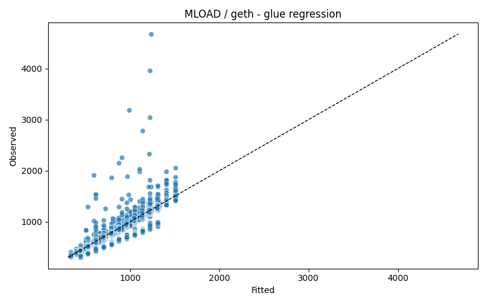

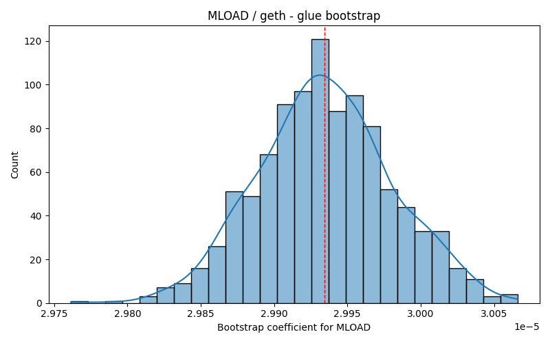


</details>

<details><summary><code>PUSH</code> · nobs=36993 · runtime_ms=1.349e-05 · p=1.00e-03 · R²=0.9426</summary>


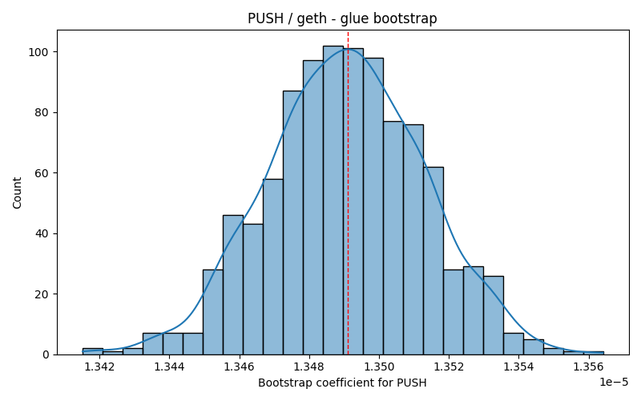


</details>

<details><summary><code>PUSH0</code> · nobs=36993 · runtime_ms=9.085e-06 · p=1.00e-03 · R²=0.9426</summary>


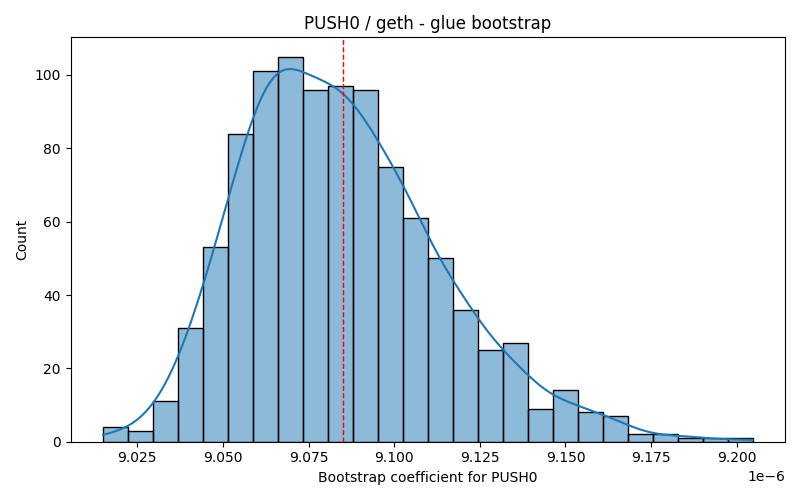


</details>

<details><summary><code>STATICCALL</code> · nobs=36993 · runtime_ms=0 · p=1.00e+00 · R²=0.9426</summary>

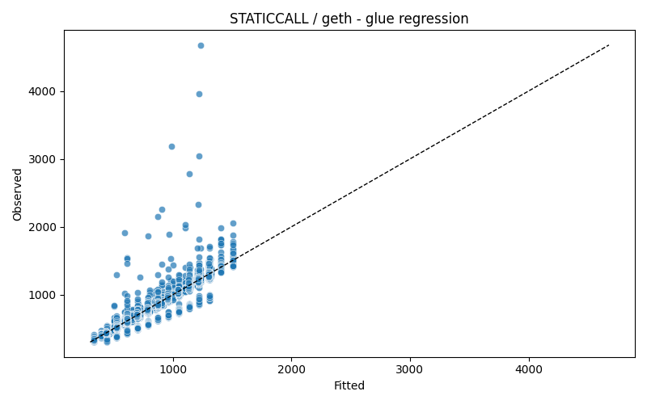


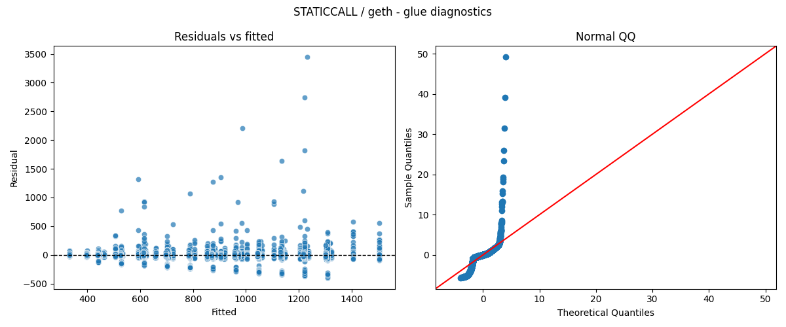

</details>

### Pure glue · geth

<details><summary><code>ISZERO</code> · nobs=627 · runtime_ms=8.371e-06 · p=1.00e-03 · R²=0.9664</summary>

```
==============================================================================
                           NNLS Regression Results                            
==============================================================================
Dep. Variable:          test_runtime_ms              R-squared:          0.966
Model:                  NNLS                    Adj. R-squared:          0.966
No. Observations:       627                               RMSE:          32.84
Df Residuals:           625                                MAE:          16.22
Df Model:               1      
==============================================================================
                      coef     std err     P-value      [0.025      0.975]
------------------------------------------------------------------------------
         const      2.9719      2.7395       0.156      0.0000      9.2698
        ISZERO      0.0000      0.0000       0.001      0.0000      0.0000
==============================================================================
Notes: Non-negative least squares with bootstrap inference (1000 iterations)
==============================================================================
```

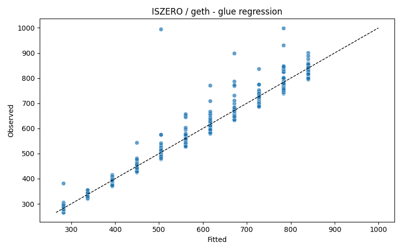

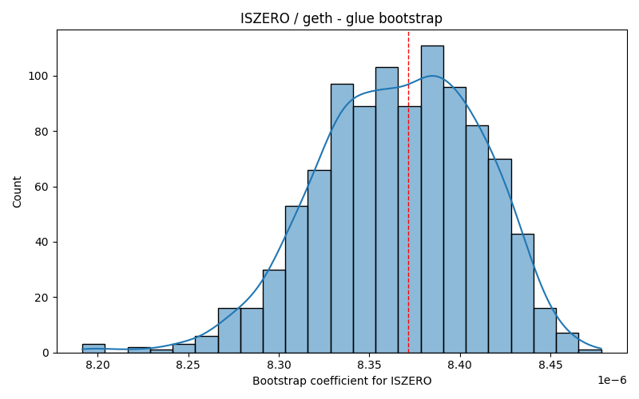

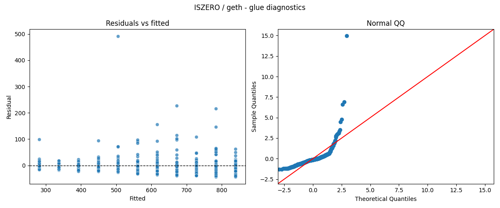

</details>

<details><summary><code>JUMPDEST</code> · nobs=627 · runtime_ms=7.155e-06 · p=1.00e-03 · R²=0.9686</summary>

```
==============================================================================
                           NNLS Regression Results                            
==============================================================================
Dep. Variable:          test_runtime_ms              R-squared:          0.969
Model:                  NNLS                    Adj. R-squared:          0.969
No. Observations:       627                               RMSE:          82.01
Df Residuals:           625                                MAE:          44.44
Df Model:               1      
==============================================================================
                      coef     std err     P-value      [0.025      0.975]
------------------------------------------------------------------------------
         const      0.0000      0.9286       1.000      0.0000      2.7280
      JUMPDEST      0.0000      0.0000       0.001      0.0000      0.0000
==============================================================================
Notes: Non-negative least squares with bootstrap inference (1000 iterations)
==============================================================================
```


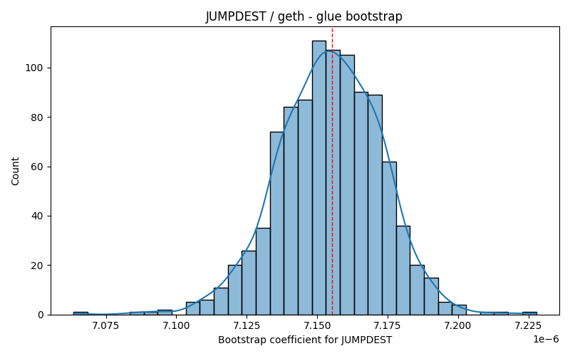

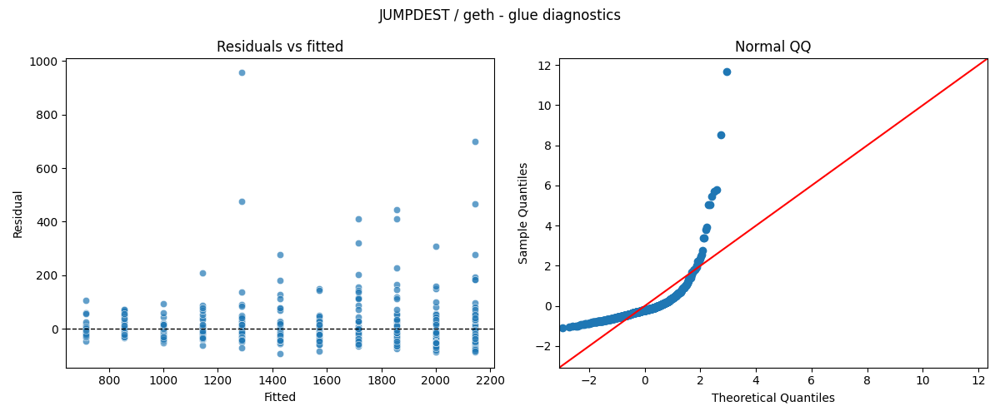

</details>

<details><summary><code>SWAP</code> · nobs=10032 · runtime_ms=9.454e-06 · p=1.00e-03 · R²=0.9766</summary>

```
==============================================================================
                           NNLS Regression Results                            
==============================================================================
Dep. Variable:          test_runtime_ms              R-squared:          0.977
Model:                  NNLS                    Adj. R-squared:          0.977
No. Observations:       10032                             RMSE:          30.78
Df Residuals:           10030                              MAE:          14.75
Df Model:               1      
==============================================================================
                      coef     std err     P-value      [0.025      0.975]
------------------------------------------------------------------------------
         const      8.0241      0.9131       0.001      6.2262      9.8400
          SWAP      0.0000      0.0000       0.001      0.0000      0.0000
==============================================================================
Notes: Non-negative least squares with bootstrap inference (1000 iterations)
==============================================================================
```

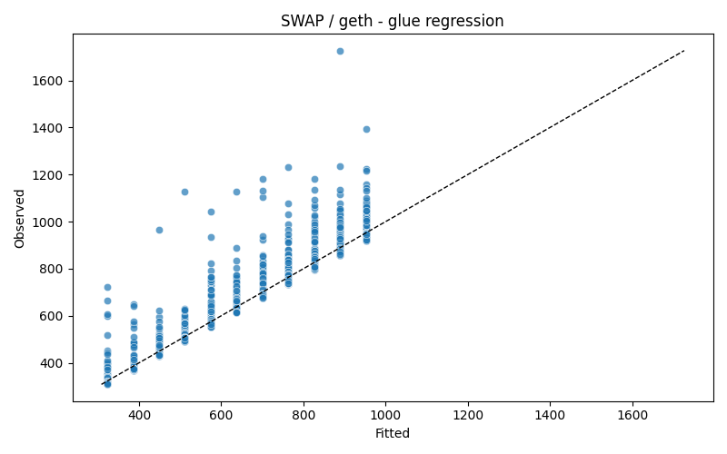

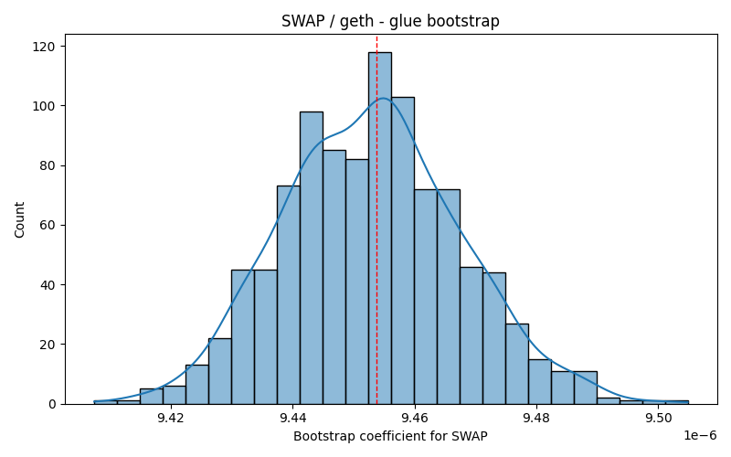

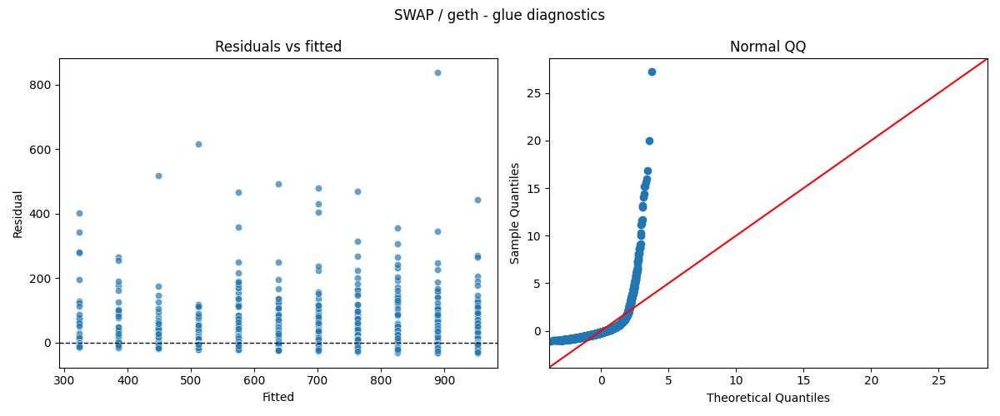

</details>

### Mixed glue (tier A) · geth

<details><summary><code>ADD</code> · nobs=627 · runtime_ms=2.682e-05 · p=1.00e-03 · R²=0.7914</summary>

```
==============================================================================
                           NNLS Regression Results                            
==============================================================================
Dep. Variable:          test_runtime_ms              R-squared:          0.791
Model:                  NNLS                    Adj. R-squared:          0.791
No. Observations:       627                               RMSE:         145.54
Df Residuals:           625                                MAE:         120.46
Df Model:               1      
==============================================================================
                      coef     std err     P-value      [0.025      0.975]
------------------------------------------------------------------------------
         const      0.0000      8.3106       1.000      0.0000     28.7814
           ADD      0.0000      0.0000       0.001      0.0000      0.0000
==============================================================================
Notes: Non-negative least squares with bootstrap inference (1000 iterations)
==============================================================================
```

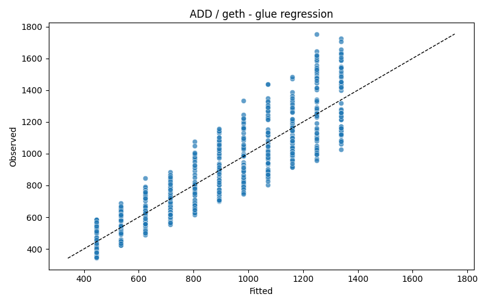

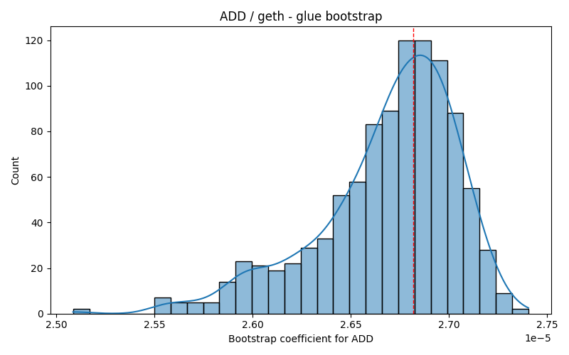

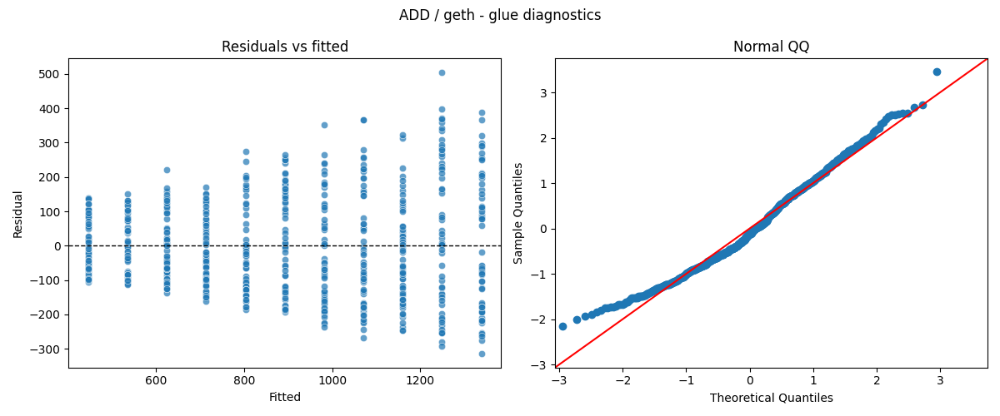

</details>

<details><summary><code>AND</code> · nobs=627 · runtime_ms=2.663e-05 · p=1.00e-03 · R²=0.7448</summary>

```
==============================================================================
                           NNLS Regression Results                            
==============================================================================
Dep. Variable:          test_runtime_ms              R-squared:          0.745
Model:                  NNLS                    Adj. R-squared:          0.744
No. Observations:       627                               RMSE:         165.01
Df Residuals:           625                                MAE:         124.51
Df Model:               1      
==============================================================================
                      coef     std err     P-value      [0.025      0.975]
------------------------------------------------------------------------------
         const      0.0000      8.4473       1.000      0.0000     30.0122
           AND      0.0000      0.0000       0.001      0.0000      0.0000
==============================================================================
Notes: Non-negative least squares with bootstrap inference (1000 iterations)
==============================================================================
```

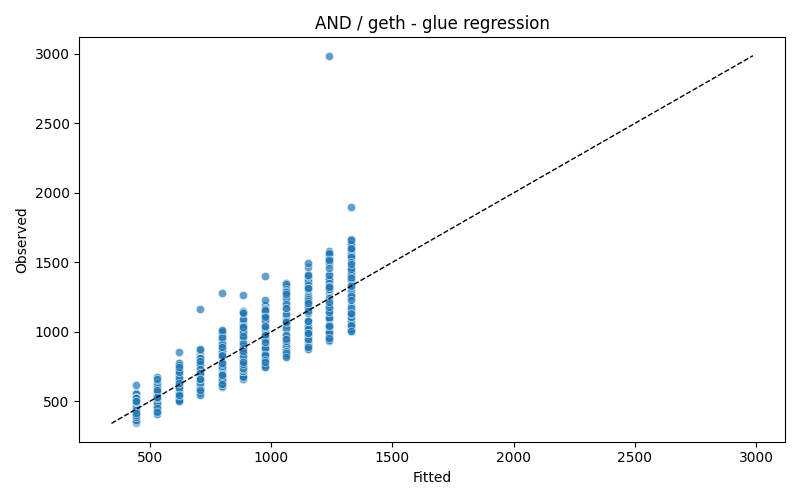

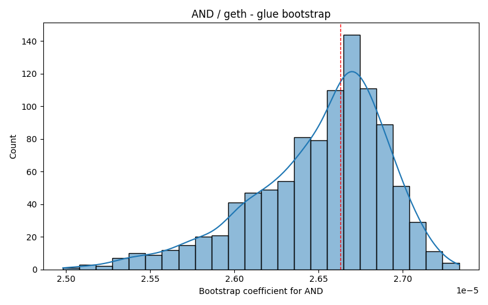

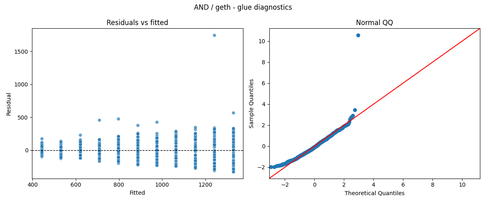

</details>

<details><summary><code>CALLDATACOPY</code> · nobs=15048 · runtime_ms=6.465e-05 · p=1.00e-03 · R²=0.9923</summary>

```
==============================================================================
                           NNLS Regression Results                            
==============================================================================
Dep. Variable:          test_runtime_ms              R-squared:          0.992
Model:                  NNLS                    Adj. R-squared:          0.992
No. Observations:       15048                             RMSE:          42.77
Df Residuals:           15046                              MAE:          25.86
Df Model:               1      
==============================================================================
                      coef     std err     P-value      [0.025      0.975]
------------------------------------------------------------------------------
         const     49.0902      0.4106       0.001     48.2870     49.8677
  CALLDATACOPY      0.0001      0.0000       0.001      0.0001      0.0001
==============================================================================
Notes: Non-negative least squares with bootstrap inference (1000 iterations)
==============================================================================
```

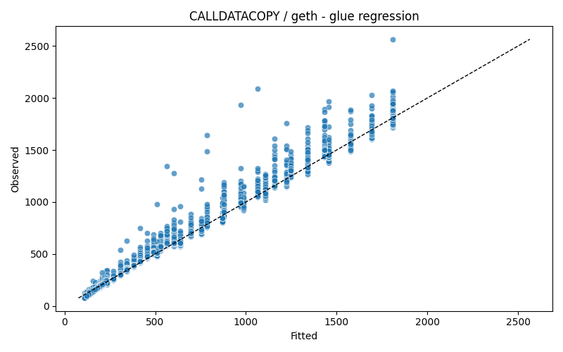

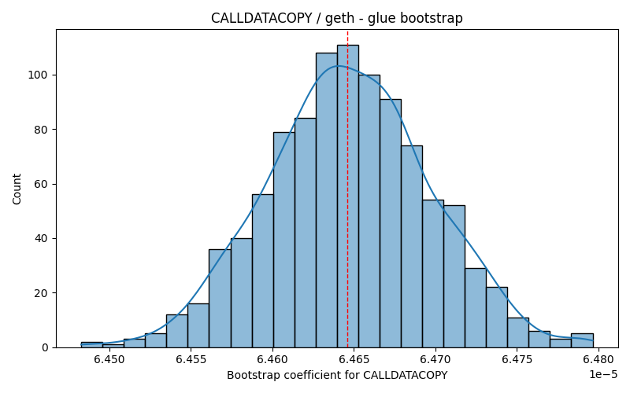

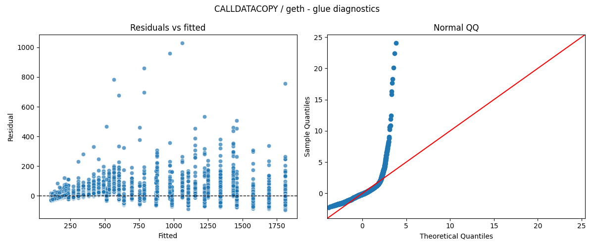

</details>

<details><summary><code>CALLDATALOAD</code> · nobs=2508 · runtime_ms=5.321e-05 · p=1.00e-03 · R²=0.02473</summary>

```
==============================================================================
                           NNLS Regression Results                            
==============================================================================
Dep. Variable:          test_runtime_ms              R-squared:          0.025
Model:                  NNLS                    Adj. R-squared:          0.024
No. Observations:       2508                              RMSE:           1.28
Df Residuals:           2506                               MAE:           0.65
Df Model:               1      
==============================================================================
                      coef     std err     P-value      [0.025      0.975]
------------------------------------------------------------------------------
         const      2.7182      0.0868       0.001      2.5533      2.8937
  CALLDATALOAD      0.0001      0.0000       0.001      0.0000      0.0001
==============================================================================
Notes: Non-negative least squares with bootstrap inference (1000 iterations)
==============================================================================
```

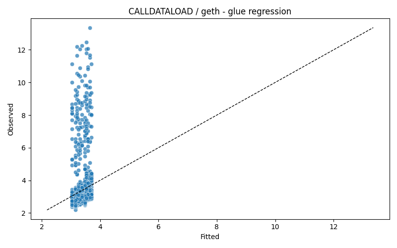

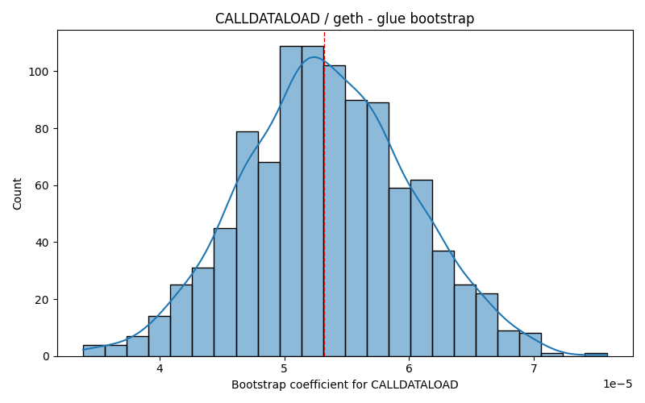

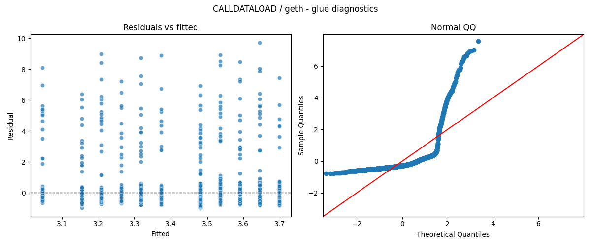

</details>

<details><summary><code>DIV</code> · nobs=627 · runtime_ms=5.858e-05 · p=1.00e-03 · R²=0.9947</summary>

```
==============================================================================
                           NNLS Regression Results                            
==============================================================================
Dep. Variable:          test_runtime_ms              R-squared:          0.995
Model:                  NNLS                    Adj. R-squared:          0.995
No. Observations:       627                               RMSE:          33.72
Df Residuals:           625                                MAE:          23.02
Df Model:               1      
==============================================================================
                      coef     std err     P-value      [0.025      0.975]
------------------------------------------------------------------------------
         const      7.9760      3.6180       0.013      1.0432     15.1410
           DIV      0.0001      0.0000       0.001      0.0001      0.0001
==============================================================================
Notes: Non-negative least squares with bootstrap inference (1000 iterations)
==============================================================================
```

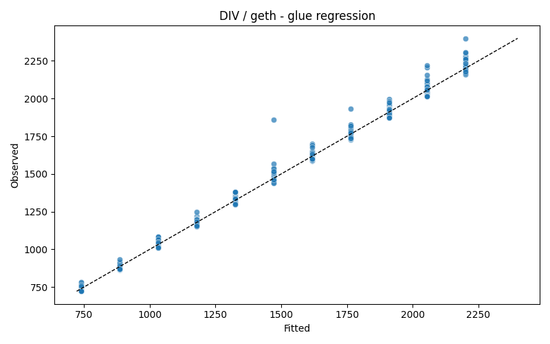

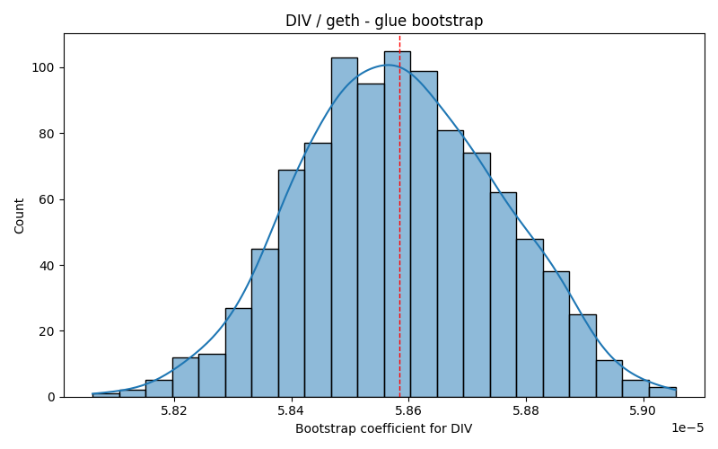

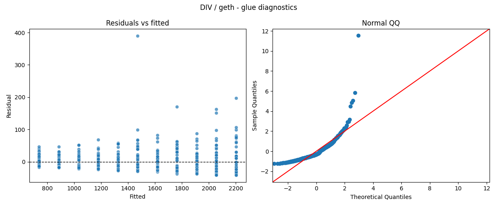

</details>

<details><summary><code>EXP</code> · nobs=627 · runtime_ms=0.002073 · p=1.00e-03 · R²=0.9946</summary>

```
==============================================================================
                           NNLS Regression Results                            
==============================================================================
Dep. Variable:          test_runtime_ms              R-squared:          0.995
Model:                  NNLS                    Adj. R-squared:          0.995
No. Observations:       627                               RMSE:           6.01
Df Residuals:           625                                MAE:           5.04
Df Model:               1      
==============================================================================
                      coef     std err     P-value      [0.025      0.975]
------------------------------------------------------------------------------
         const      5.7290      0.7019       0.001      4.4825      7.1188
           EXP      0.0021      0.0000       0.001      0.0021      0.0021
==============================================================================
Notes: Non-negative least squares with bootstrap inference (1000 iterations)
==============================================================================
```

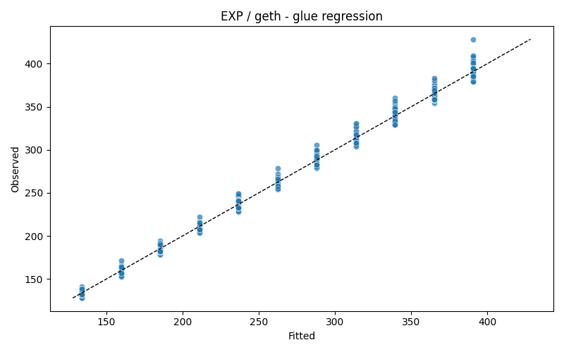

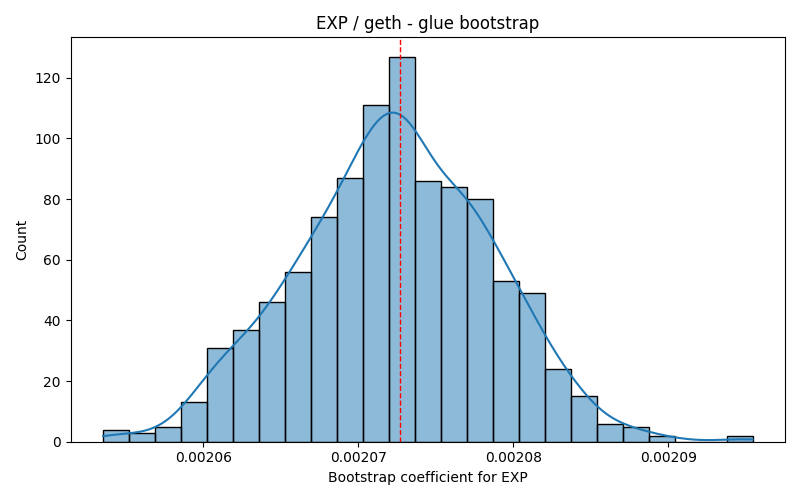

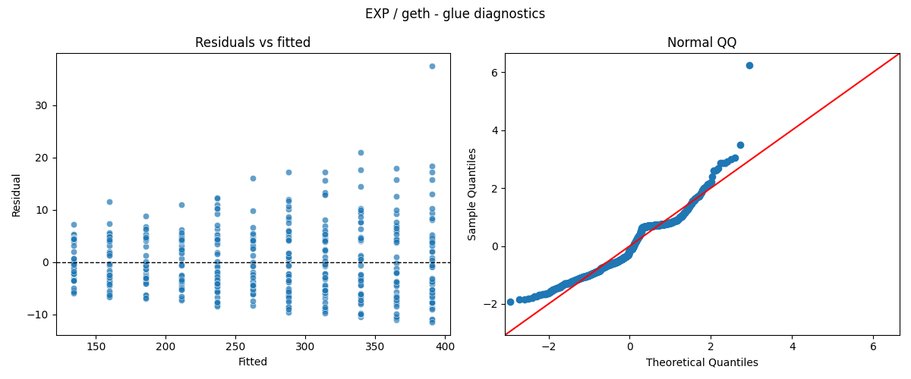

</details>

<details><summary><code>GT</code> · nobs=627 · runtime_ms=2.098e-05 · p=1.00e-03 · R²=0.9612</summary>

```
==============================================================================
                           NNLS Regression Results                            
==============================================================================
Dep. Variable:          test_runtime_ms              R-squared:          0.961
Model:                  NNLS                    Adj. R-squared:          0.961
No. Observations:       627                               RMSE:          44.42
Df Residuals:           625                                MAE:          18.99
Df Model:               1      
==============================================================================
                      coef     std err     P-value      [0.025      0.975]
------------------------------------------------------------------------------
         const      0.0000      2.8613       1.000      0.0000      9.2988
            GT      0.0000      0.0000       0.001      0.0000      0.0000
==============================================================================
Notes: Non-negative least squares with bootstrap inference (1000 iterations)
==============================================================================
```

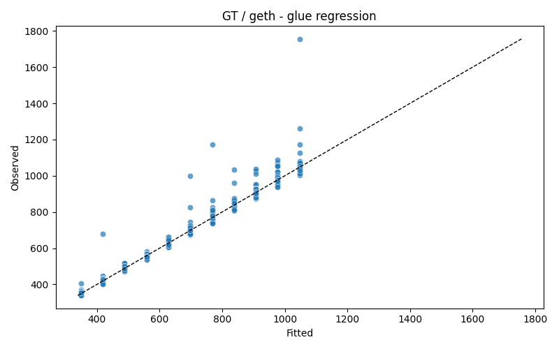

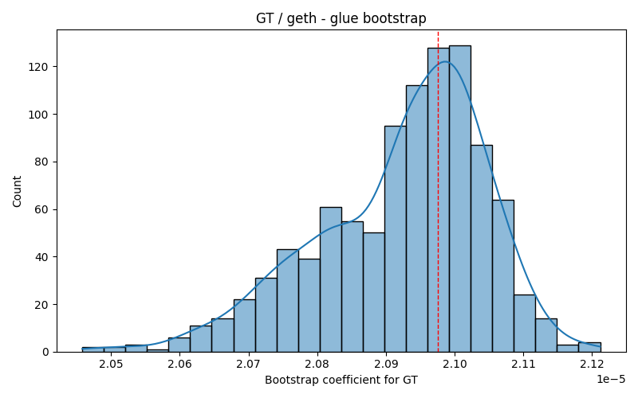

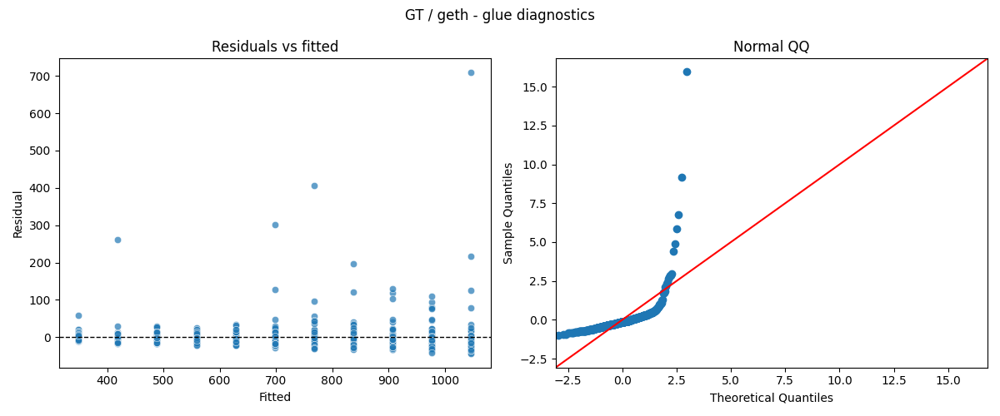

</details>

<details><summary><code>JUMPI</code> · nobs=627 · runtime_ms=3.294e-05 · p=1.00e-03 · R²=0.9708</summary>

```
==============================================================================
                           NNLS Regression Results                            
==============================================================================
Dep. Variable:          test_runtime_ms              R-squared:          0.971
Model:                  NNLS                    Adj. R-squared:          0.971
No. Observations:       627                               RMSE:          25.76
Df Residuals:           625                                MAE:          12.05
Df Model:               1      
==============================================================================
                      coef     std err     P-value      [0.025      0.975]
------------------------------------------------------------------------------
         const      1.3625      2.3007       0.273      0.0000      7.4230
         JUMPI      0.0000      0.0000       0.001      0.0000      0.0000
==============================================================================
Notes: Non-negative least squares with bootstrap inference (1000 iterations)
==============================================================================
```

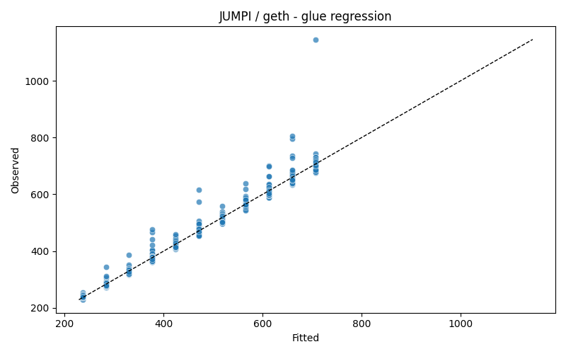

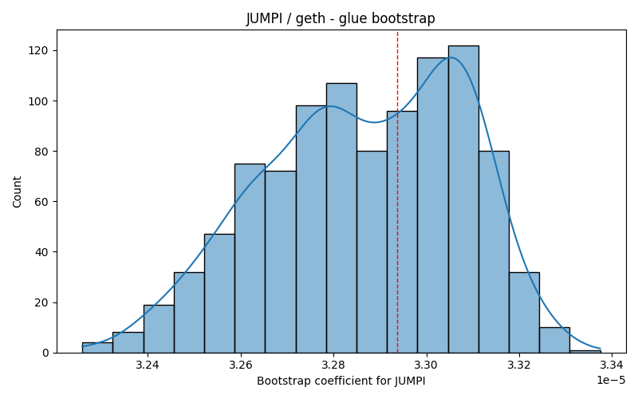

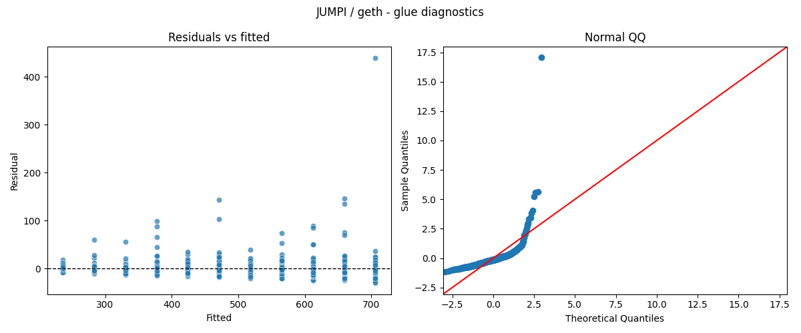

</details>

<details><summary><code>LT</code> · nobs=627 · runtime_ms=2.56e-05 · p=1.00e-03 · R²=0.7511</summary>

```
==============================================================================
                           NNLS Regression Results                            
==============================================================================
Dep. Variable:          test_runtime_ms              R-squared:          0.751
Model:                  NNLS                    Adj. R-squared:          0.751
No. Observations:       627                               RMSE:         155.55
Df Residuals:           625                                MAE:         123.77
Df Model:               1      
==============================================================================
                      coef     std err     P-value      [0.025      0.975]
------------------------------------------------------------------------------
         const      0.0000      9.6479       1.000      0.0000     32.3026
            LT      0.0000      0.0000       0.001      0.0000      0.0000
==============================================================================
Notes: Non-negative least squares with bootstrap inference (1000 iterations)
==============================================================================
```

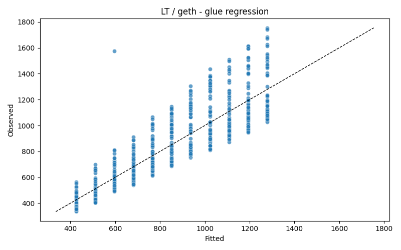

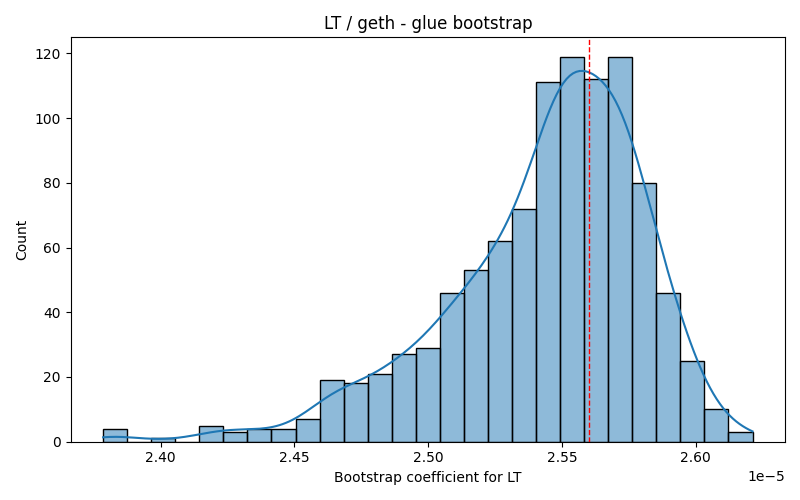

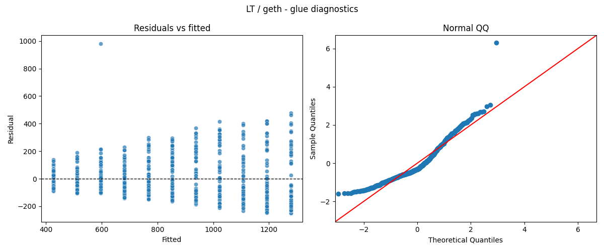

</details>

<details><summary><code>MSTORE</code> · nobs=3135 · runtime_ms=4.842e-05 · p=1.00e-03 · R²=0.9818</summary>

```
==============================================================================
                           NNLS Regression Results                            
==============================================================================
Dep. Variable:          test_runtime_ms              R-squared:          0.982
Model:                  NNLS                    Adj. R-squared:          0.982
No. Observations:       3135                              RMSE:          46.21
Df Residuals:           3133                               MAE:          24.29
Df Model:               1      
==============================================================================
                      coef     std err     P-value      [0.025      0.975]
------------------------------------------------------------------------------
         const     10.0858      2.4537       0.001      5.3347     15.1058
        MSTORE      0.0000      0.0000       0.001      0.0000      0.0000
==============================================================================
Notes: Non-negative least squares with bootstrap inference (1000 iterations)
==============================================================================
```

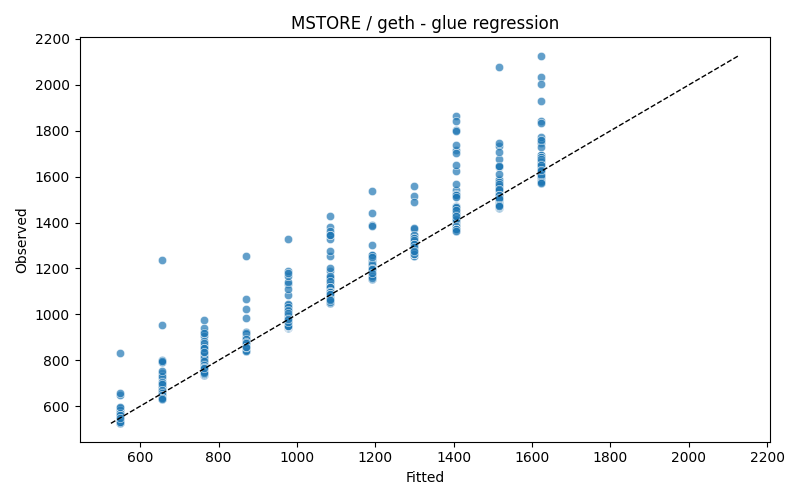

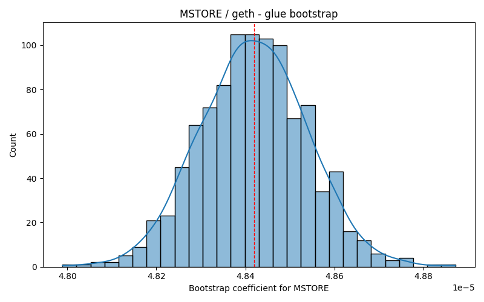

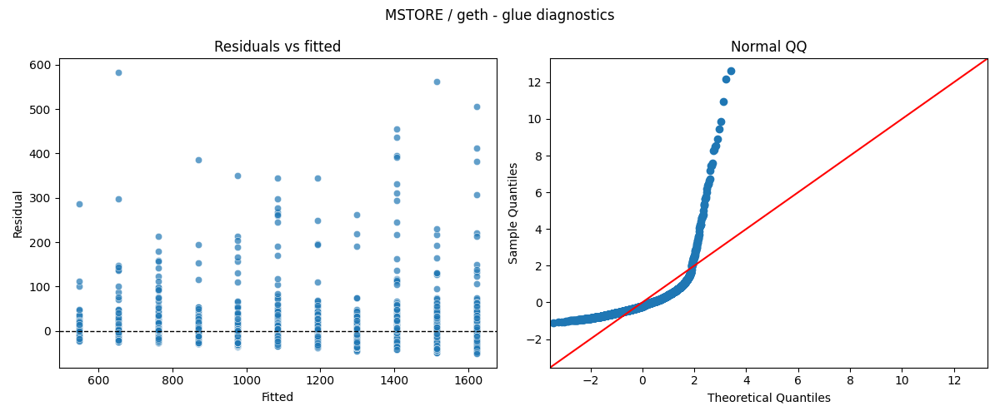

</details>

<details><summary><code>MSTORE8</code> · nobs=3135 · runtime_ms=4.377e-05 · p=1.00e-03 · R²=0.9731</summary>

```
==============================================================================
                           NNLS Regression Results                            
==============================================================================
Dep. Variable:          test_runtime_ms              R-squared:          0.973
Model:                  NNLS                    Adj. R-squared:          0.973
No. Observations:       3135                              RMSE:          51.11
Df Residuals:           3133                               MAE:          22.39
Df Model:               1      
==============================================================================
                      coef     std err     P-value      [0.025      0.975]
------------------------------------------------------------------------------
         const      6.4646      2.6494       0.016      0.9138     11.7020
       MSTORE8      0.0000      0.0000       0.001      0.0000      0.0000
==============================================================================
Notes: Non-negative least squares with bootstrap inference (1000 iterations)
==============================================================================
```

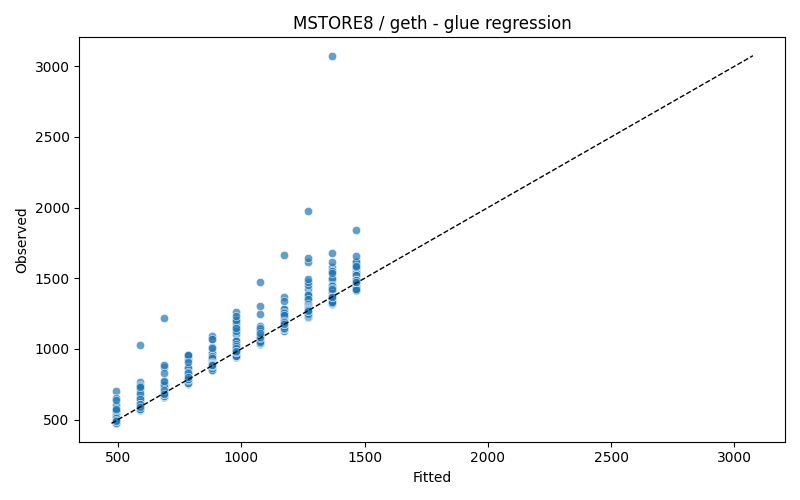

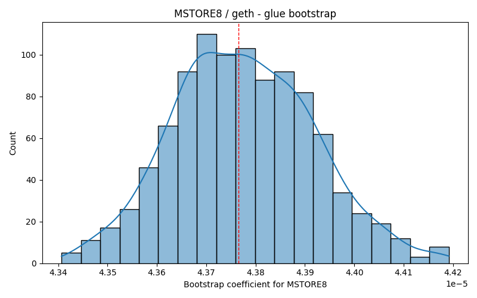

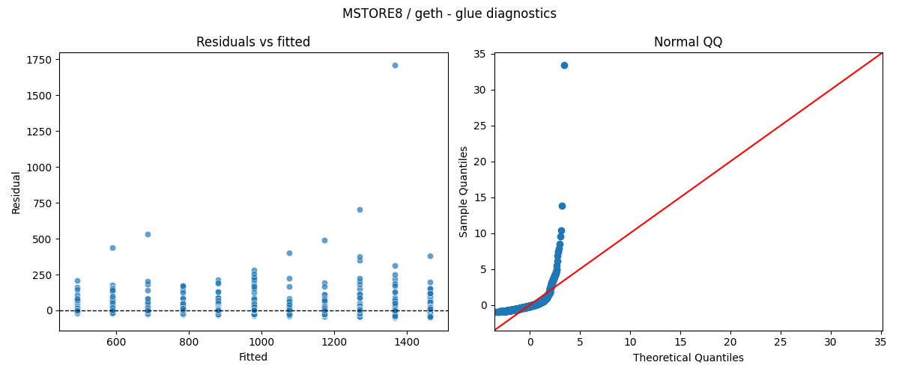

</details>

<details><summary><code>MUL</code> · nobs=627 · runtime_ms=2.709e-05 · p=1.00e-03 · R²=0.9198</summary>

```
==============================================================================
                           NNLS Regression Results                            
==============================================================================
Dep. Variable:          test_runtime_ms              R-squared:          0.920
Model:                  NNLS                    Adj. R-squared:          0.920
No. Observations:       627                               RMSE:          63.14
Df Residuals:           625                                MAE:          43.30
Df Model:               1      
==============================================================================
                      coef     std err     P-value      [0.025      0.975]
------------------------------------------------------------------------------
         const     22.2685      7.3058       0.003      7.3983     36.4741
           MUL      0.0000      0.0000       0.001      0.0000      0.0000
==============================================================================
Notes: Non-negative least squares with bootstrap inference (1000 iterations)
==============================================================================
```

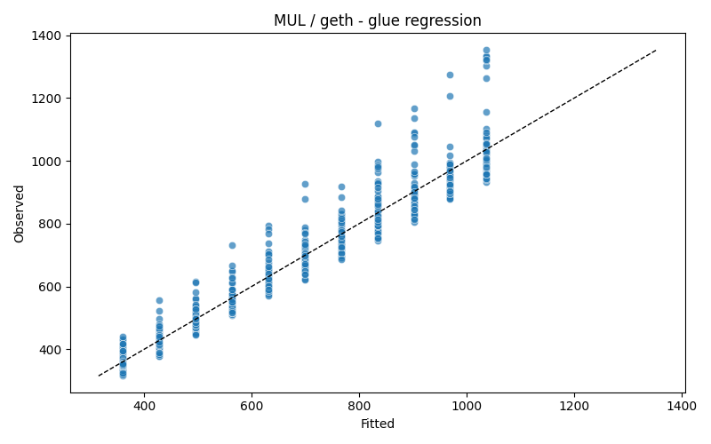

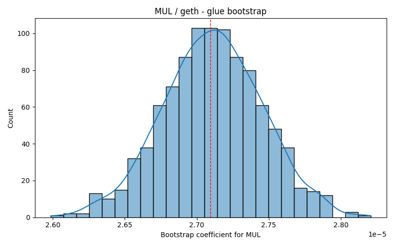

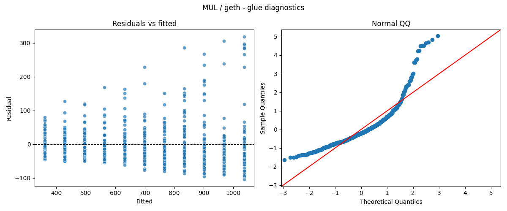

</details>

<details><summary><code>PC</code> · nobs=627 · runtime_ms=9.416e-06 · p=1.00e-03 · R²=0.9864</summary>

```
==============================================================================
                           NNLS Regression Results                            
==============================================================================
Dep. Variable:          test_runtime_ms              R-squared:          0.986
Model:                  NNLS                    Adj. R-squared:          0.986
No. Observations:       627                               RMSE:          33.06
Df Residuals:           625                                MAE:          17.79
Df Model:               1      
==============================================================================
                      coef     std err     P-value      [0.025      0.975]
------------------------------------------------------------------------------
         const     11.2026      3.8797       0.001      3.7829     18.8481
            PC      0.0000      0.0000       0.001      0.0000      0.0000
==============================================================================
Notes: Non-negative least squares with bootstrap inference (1000 iterations)
==============================================================================
```

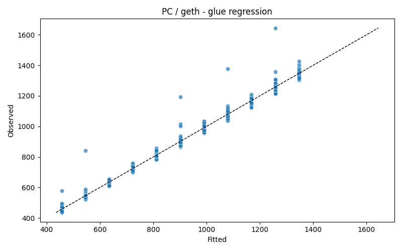

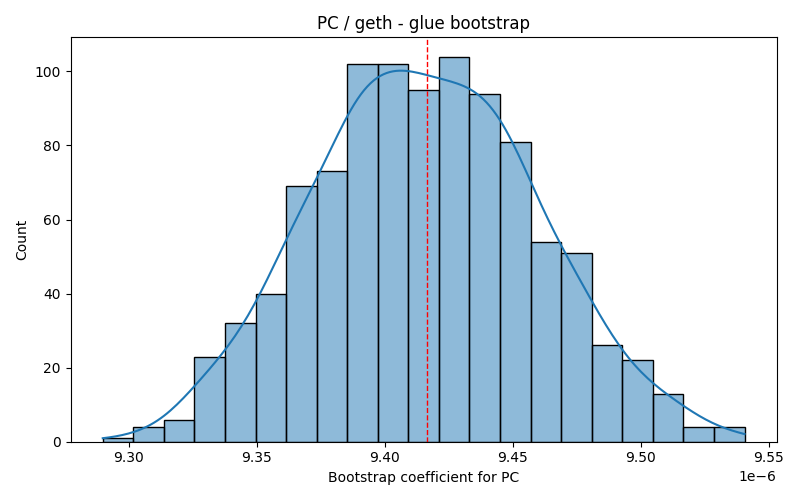

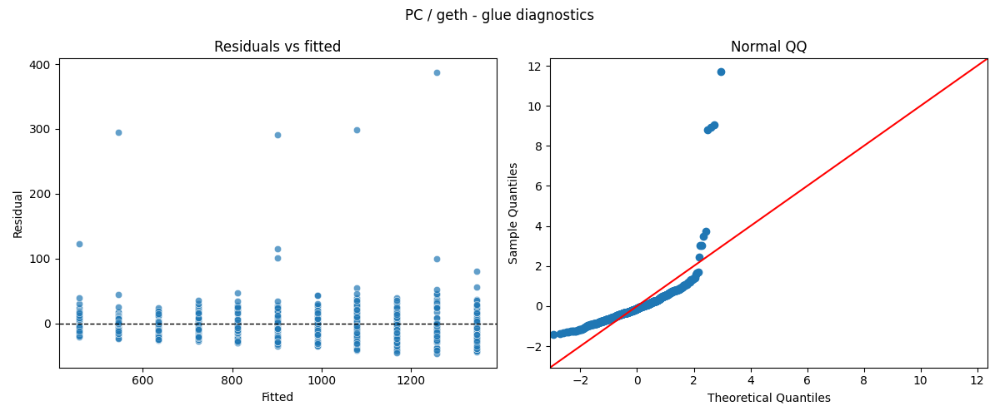

</details>

<details><summary><code>RETURNDATASIZE</code> · nobs=2508 · runtime_ms=1.596e-05 · p=1.00e-03 · R²=0.9208</summary>

```
==============================================================================
                           NNLS Regression Results                            
==============================================================================
Dep. Variable:          test_runtime_ms              R-squared:          0.921
Model:                  NNLS                    Adj. R-squared:          0.921
No. Observations:       2508                              RMSE:          73.90
Df Residuals:           2506                               MAE:          37.15
Df Model:               1      
==============================================================================
                      coef     std err     P-value      [0.025      0.975]
------------------------------------------------------------------------------
         const     26.4369      4.4030       0.001     16.8666     34.0970
RETURNDATASIZE      0.0000      0.0000       0.001      0.0000      0.0000
==============================================================================
Notes: Non-negative least squares with bootstrap inference (1000 iterations)
==============================================================================
```

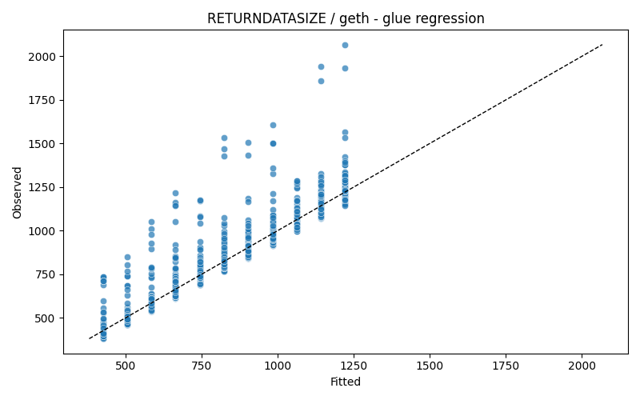

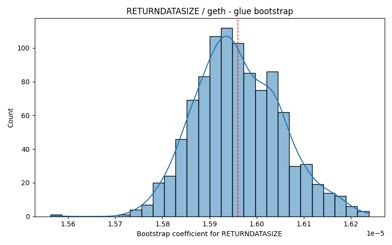

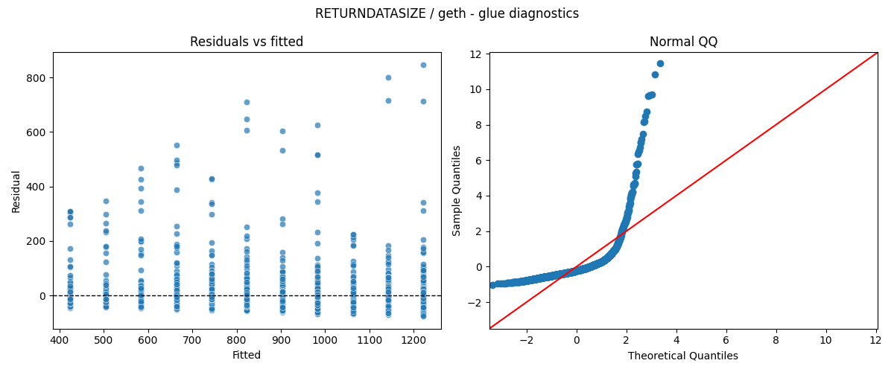

</details>

<details><summary><code>SELFBALANCE</code> · nobs=513 · runtime_ms=5.076e-05 · p=1.00e-03 · R²=0.9891</summary>

```
==============================================================================
                           NNLS Regression Results                            
==============================================================================
Dep. Variable:          test_runtime_ms              R-squared:          0.989
Model:                  NNLS                    Adj. R-squared:          0.989
No. Observations:       513                               RMSE:          53.74
Df Residuals:           511                                MAE:          30.92
Df Model:               1      
==============================================================================
                      coef     std err     P-value      [0.025      0.975]
------------------------------------------------------------------------------
         const      6.0560      5.8875       0.209      0.0000     19.0588
   SELFBALANCE      0.0001      0.0000       0.001      0.0001      0.0001
==============================================================================
Notes: Non-negative least squares with bootstrap inference (1000 iterations)
==============================================================================
```

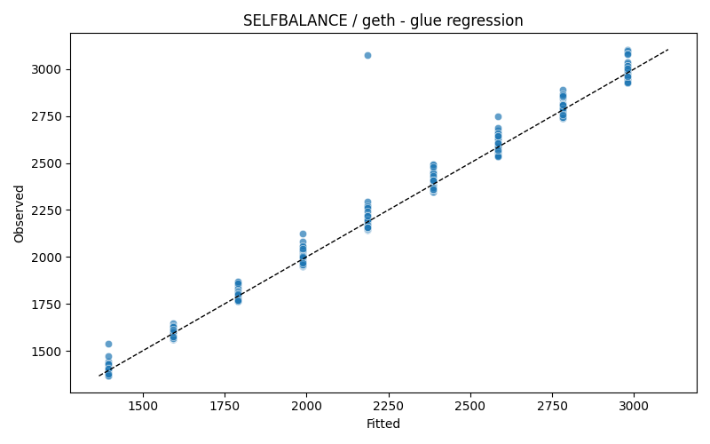

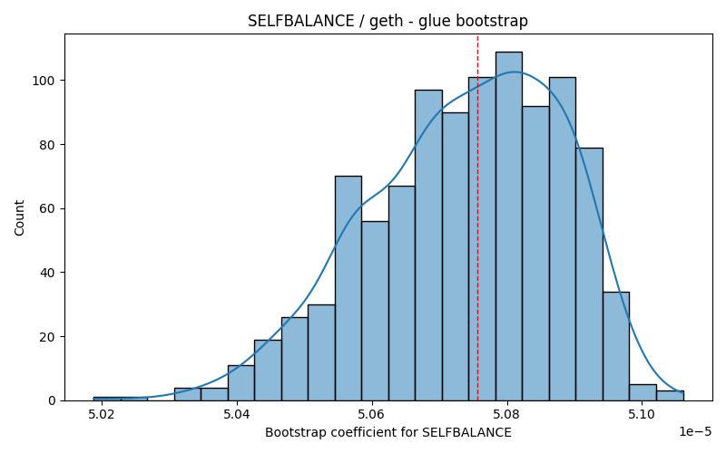

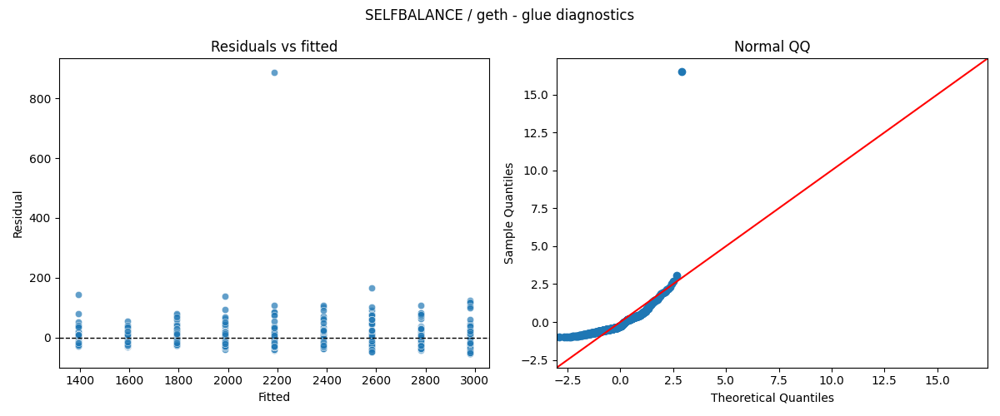

</details>

<details><summary><code>SUB</code> · nobs=627 · runtime_ms=2.703e-05 · p=1.00e-03 · R²=0.7412</summary>

```
==============================================================================
                           NNLS Regression Results                            
==============================================================================
Dep. Variable:          test_runtime_ms              R-squared:          0.741
Model:                  NNLS                    Adj. R-squared:          0.741
No. Observations:       627                               RMSE:         170.81
Df Residuals:           625                                MAE:         136.24
Df Model:               1      
==============================================================================
                      coef     std err     P-value      [0.025      0.975]
------------------------------------------------------------------------------
         const      0.0000      5.3004       1.000      0.0000     20.4147
           SUB      0.0000      0.0000       0.001      0.0000      0.0000
==============================================================================
Notes: Non-negative least squares with bootstrap inference (1000 iterations)
==============================================================================
```

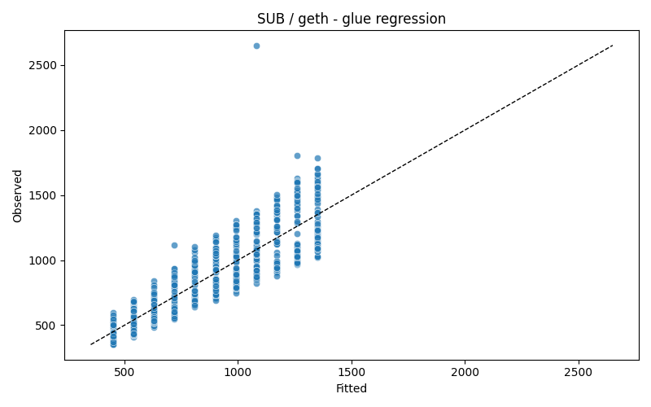

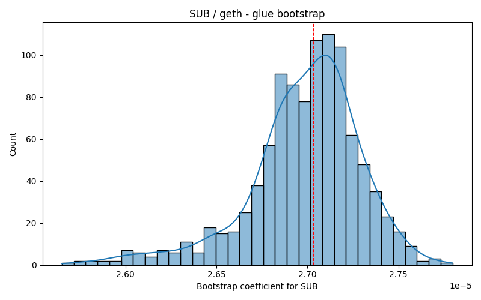

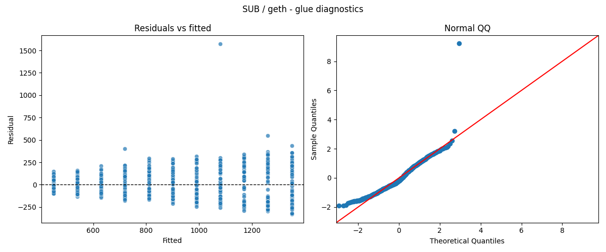

</details>

### Mixed glue (tier B) · geth

<details><summary><code>JUMP</code> · nobs=627 · runtime_ms=5.733e-05 · p=1.00e-03 · R²=0.9681</summary>

```
==============================================================================
                           NNLS Regression Results                            
==============================================================================
Dep. Variable:          test_runtime_ms              R-squared:          0.968
Model:                  NNLS                    Adj. R-squared:          0.968
No. Observations:       627                               RMSE:          38.80
Df Residuals:           625                                MAE:          16.24
Df Model:               1      
==============================================================================
                      coef     std err     P-value      [0.025      0.975]
------------------------------------------------------------------------------
         const      0.0000      2.0194       1.000      0.0000      6.6515
          JUMP      0.0001      0.0000       0.001      0.0001      0.0001
==============================================================================
Notes: Non-negative least squares with bootstrap inference (1000 iterations)
==============================================================================
```

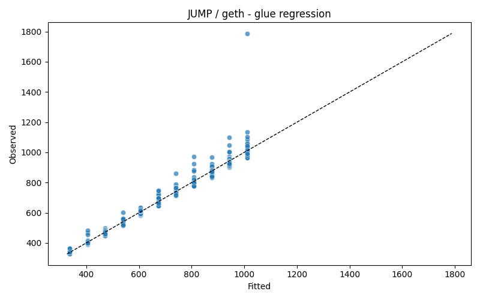

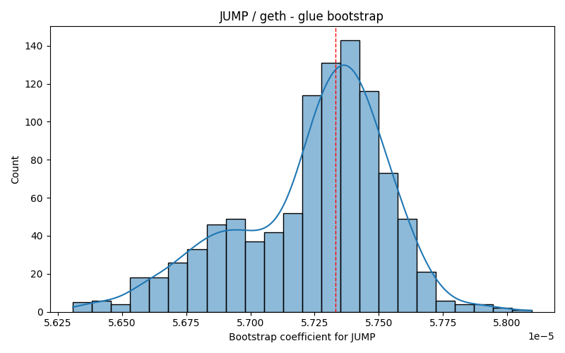

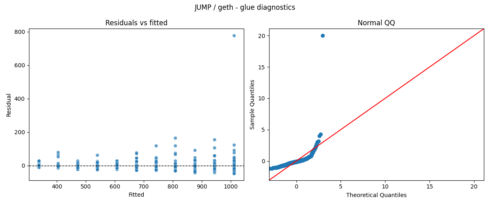

</details>

<details><summary><code>KECCAK256</code> · nobs=10032 · runtime_ms=0.0002049 · p=1.00e-03 · R²=0.3014</summary>

```
==============================================================================
                           NNLS Regression Results                            
==============================================================================
Dep. Variable:          test_runtime_ms              R-squared:          0.301
Model:                  NNLS                    Adj. R-squared:          0.301
No. Observations:       10032                             RMSE:         620.03
Df Residuals:           10030                              MAE:         499.01
Df Model:               1      
==============================================================================
                      coef     std err     P-value      [0.025      0.975]
------------------------------------------------------------------------------
         const   1627.6169     13.3959       0.001   1601.4946   1653.2500
     KECCAK256      0.0002      0.0000       0.001      0.0002      0.0002
==============================================================================
Notes: Non-negative least squares with bootstrap inference (1000 iterations)
==============================================================================
```

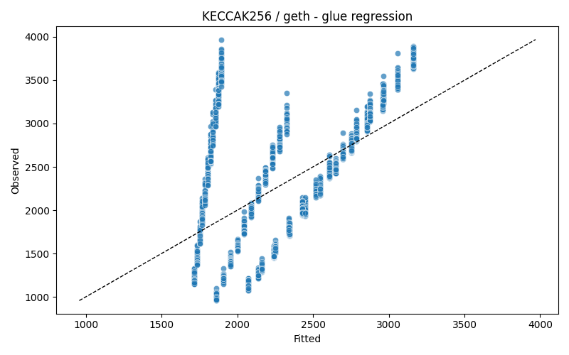

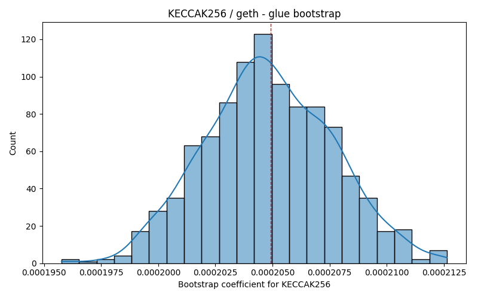

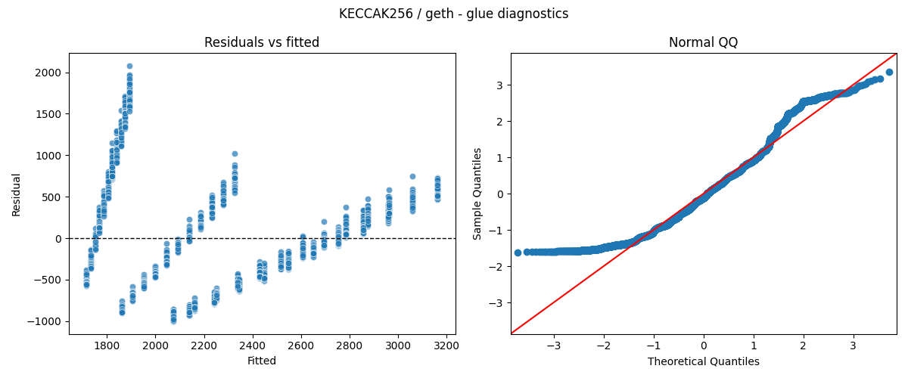

</details>

## nethermind

| glue_opcode | nobs | glue_runtime_ms | p_value | rsquared |
| --- | --- | --- | --- | --- |
| `ISZERO` | 429 | 8.97e-07 | 1.00e-03 | 0.2016 |
| `JUMPDEST` | 429 | 4.219e-07 | 1.00e-03 | 0.6917 |
| `SWAP` | 6864 | 5.557e-07 | 1.00e-03 | 0.3262 |
| `CALLDATASIZE` | 25575 | 0 | 1.00e+00 | 0.9797 |
| `DUP` | 25575 | 0 | 1.00e+00 | 0.9797 |
| `GAS` | 25575 | 0 | 1.00e+00 | 0.9797 |
| `MLOAD` | 25575 | 1.825e-06 | 1.00e-03 | 0.9797 |
| `PUSH` | 25575 | 3.916e-08 | 1.00e-03 | 0.9797 |
| `PUSH0` | 25575 | 0 | 1.00e+00 | 0.9797 |
| `STATICCALL` | 25575 | 0.0008792 | 1.00e-03 | 0.9797 |
| `ADD` | 429 | 2.633e-06 | 1.00e-03 | 0.6607 |
| `AND` | 429 | 1.284e-06 | 1.00e-03 | 0.5127 |
| `CALLDATACOPY` | 10296 | 4.017e-06 | 1.00e-03 | 0.7017 |
| `CALLDATALOAD` | 1716 | 5.093e-05 | 1.00e-03 | 0.002099 |
| `DIV` | 429 | 8.069e-06 | 1.00e-03 | 0.6332 |
| `EXP` | 429 | 0 | 1.00e+00 | 0 |
| `GT` | 429 | 1.612e-06 | 1.00e-03 | 0.3402 |
| `JUMPI` | 429 | 1.82e-06 | 1.00e-03 | 0.4519 |
| `LT` | 429 | 1.45e-06 | 1.00e-03 | 0.291 |
| `MSTORE` | 2145 | 2.225e-06 | 1.00e-03 | 0.5745 |
| `MSTORE8` | 2145 | 1.97e-06 | 1.00e-03 | 0.6638 |
| `MUL` | 429 | 5.69e-06 | 1.00e-03 | 0.7305 |
| `PC` | 429 | 8.115e-07 | 1.00e-03 | 0.9002 |
| `RETURNDATASIZE` | 1716 | 7.72e-07 | 1.00e-03 | 0.4656 |
| `SELFBALANCE` | 351 | 1.063e-05 | 1.00e-03 | 0.8577 |
| `SUB` | 429 | 2.593e-06 | 1.00e-03 | 0.6019 |
| `JUMP` | 429 | 5.14e-06 | 1.00e-03 | 0.7914 |
| `KECCAK256` | 6864 | 0 | 1.00e+00 | 0 |

### Cycle glue — joint fit · nethermind

<details><summary>Joint NNLS regression summary</summary>

```
==============================================================================
                           NNLS Regression Results                            
==============================================================================
Dep. Variable:          test_runtime_ms              R-squared:          0.980
Model:                  NNLS                    Adj. R-squared:          0.980
No. Observations:       25575                             RMSE:          21.40
Df Residuals:           25567                              MAE:           7.13
Df Model:               7      
==============================================================================
                      coef     std err     P-value      [0.025      0.975]
------------------------------------------------------------------------------
         const     13.5202      0.5252       0.001     12.4007     14.5134
  CALLDATASIZE      0.0000      0.0000       1.000      0.0000      0.0000
           DUP      0.0000      0.0000       1.000      0.0000      0.0000
           GAS      0.0000      0.0000       1.000      0.0000      0.0000
         MLOAD      0.0000      0.0000       0.001      0.0000      0.0000
          PUSH      0.0000      0.0000       0.001      0.0000      0.0000
         PUSH0      0.0000      0.0000       1.000      0.0000      0.0000
    STATICCALL      0.0009      0.0000       0.001      0.0009      0.0009
==============================================================================
Notes: Non-negative least squares with bootstrap inference (1000 iterations)
==============================================================================
```

</details>

<details><summary><code>CALLDATASIZE</code> · nobs=25575 · runtime_ms=0 · p=1.00e+00 · R²=0.9797</summary>

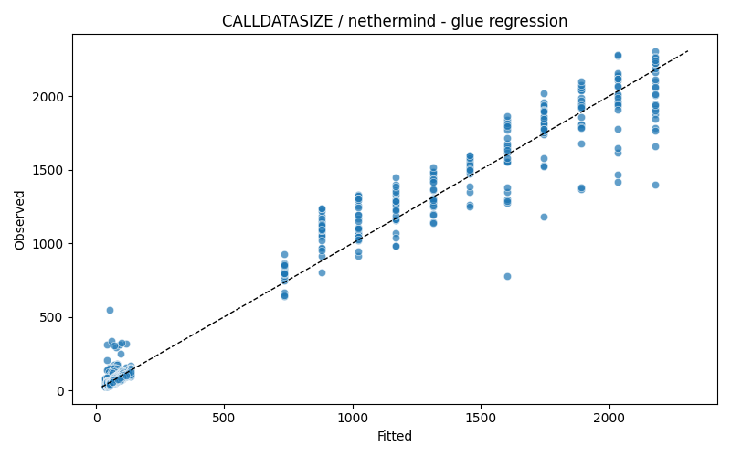

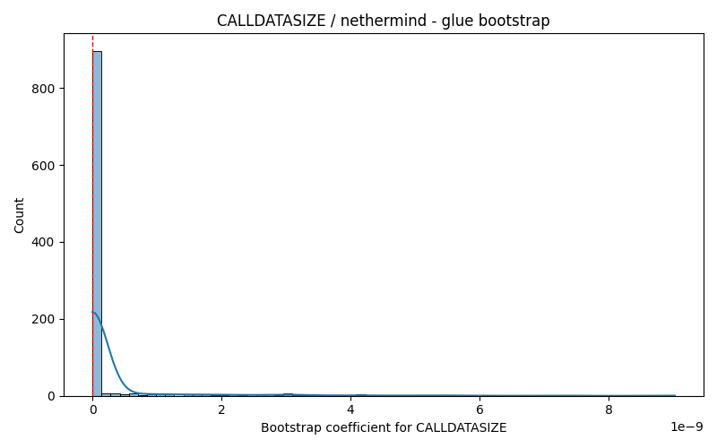


</details>

<details><summary><code>DUP</code> · nobs=25575 · runtime_ms=0 · p=1.00e+00 · R²=0.9797</summary>


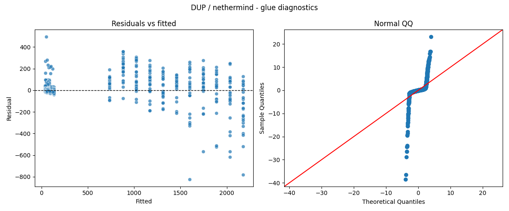

</details>

<details><summary><code>GAS</code> · nobs=25575 · runtime_ms=0 · p=1.00e+00 · R²=0.9797</summary>

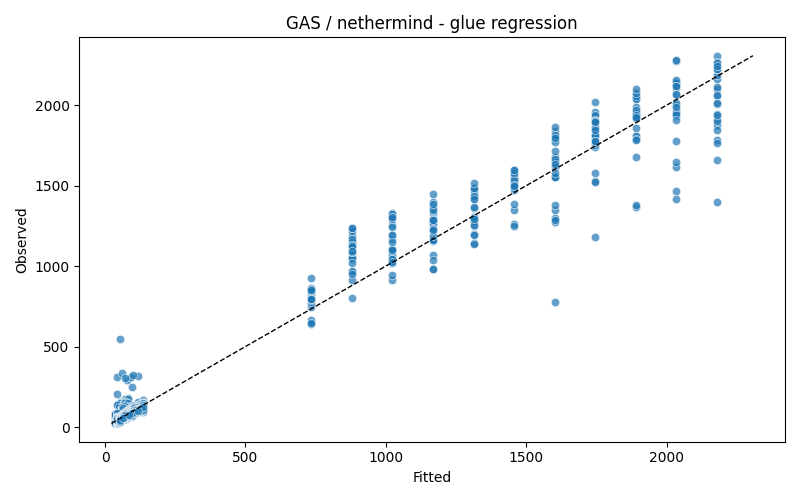


</details>

<details><summary><code>MLOAD</code> · nobs=25575 · runtime_ms=1.825e-06 · p=1.00e-03 · R²=0.9797</summary>


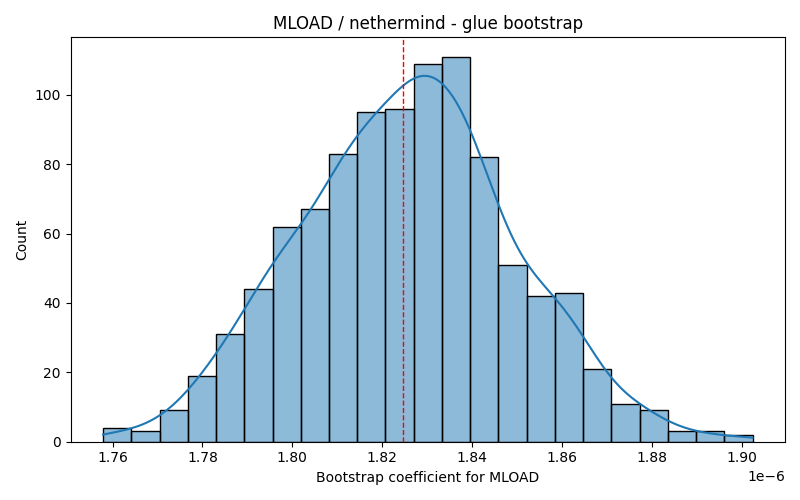


</details>

<details><summary><code>PUSH</code> · nobs=25575 · runtime_ms=3.916e-08 · p=1.00e-03 · R²=0.9797</summary>

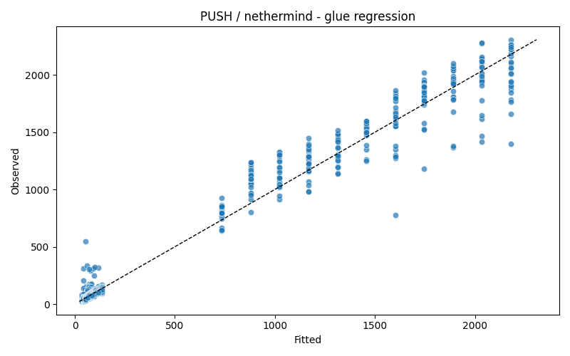

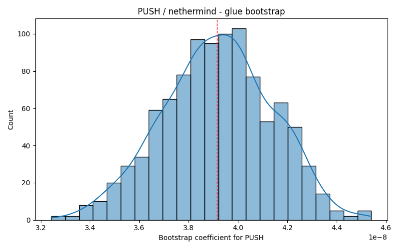


</details>

<details><summary><code>PUSH0</code> · nobs=25575 · runtime_ms=0 · p=1.00e+00 · R²=0.9797</summary>

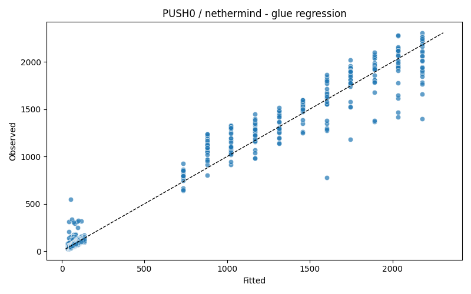


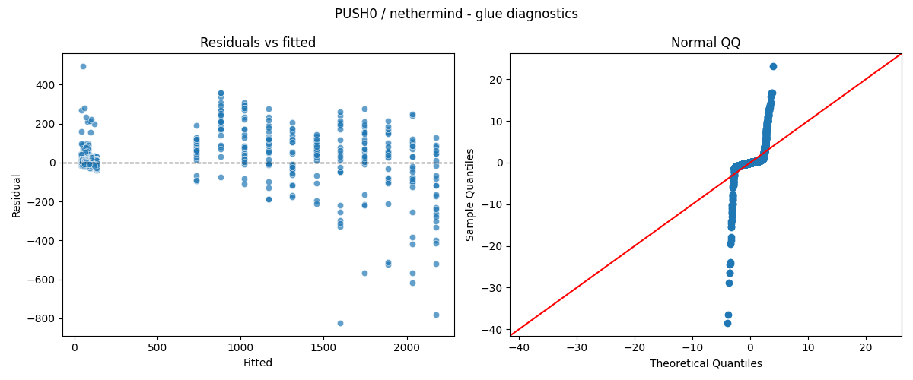

</details>

<details><summary><code>STATICCALL</code> · nobs=25575 · runtime_ms=0.0008792 · p=1.00e-03 · R²=0.9797</summary>

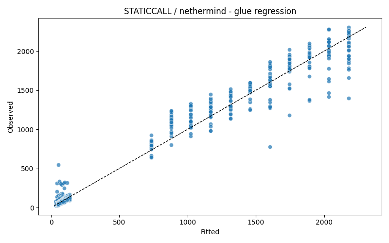

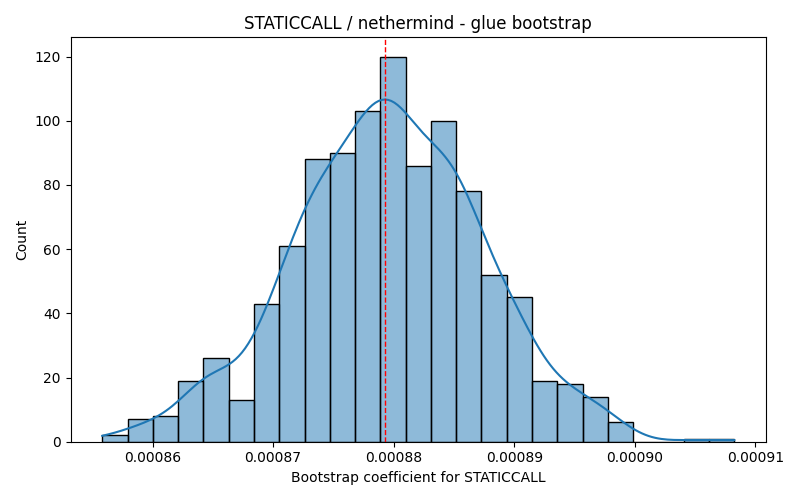

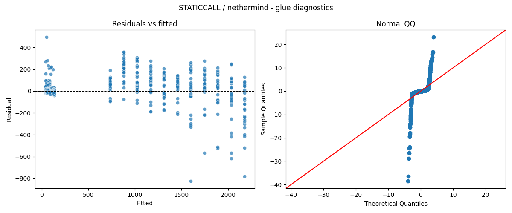

</details>

### Pure glue · nethermind

<details><summary><code>ISZERO</code> · nobs=429 · runtime_ms=8.97e-07 · p=1.00e-03 · R²=0.2016</summary>

```
==============================================================================
                           NNLS Regression Results                            
==============================================================================
Dep. Variable:          test_runtime_ms              R-squared:          0.202
Model:                  NNLS                    Adj. R-squared:          0.200
No. Observations:       429                               RMSE:          37.58
Df Residuals:           427                                MAE:          20.05
Df Model:               1      
==============================================================================
                      coef     std err     P-value      [0.025      0.975]
------------------------------------------------------------------------------
         const     21.5948      6.0115       0.001      8.8949     33.0332
        ISZERO      0.0000      0.0000       0.001      0.0000      0.0000
==============================================================================
Notes: Non-negative least squares with bootstrap inference (1000 iterations)
==============================================================================
```

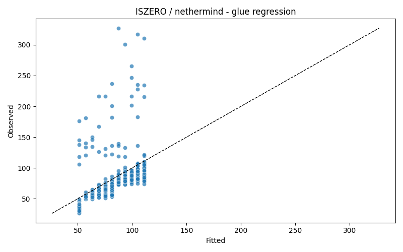

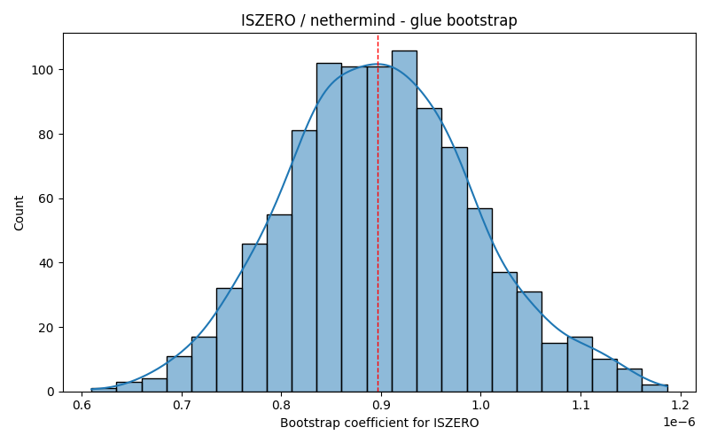

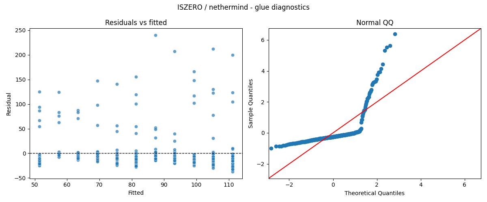

</details>

<details><summary><code>JUMPDEST</code> · nobs=429 · runtime_ms=4.219e-07 · p=1.00e-03 · R²=0.6917</summary>

```
==============================================================================
                           NNLS Regression Results                            
==============================================================================
Dep. Variable:          test_runtime_ms              R-squared:          0.692
Model:                  NNLS                    Adj. R-squared:          0.691
No. Observations:       429                               RMSE:          17.79
Df Residuals:           427                                MAE:          14.09
Df Model:               1      
==============================================================================
                      coef     std err     P-value      [0.025      0.975]
------------------------------------------------------------------------------
         const     19.4339      2.6269       0.001     14.7069     25.0786
      JUMPDEST      0.0000      0.0000       0.001      0.0000      0.0000
==============================================================================
Notes: Non-negative least squares with bootstrap inference (1000 iterations)
==============================================================================
```

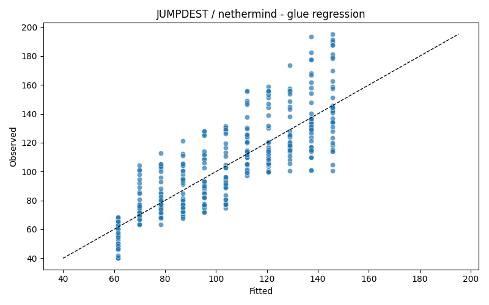

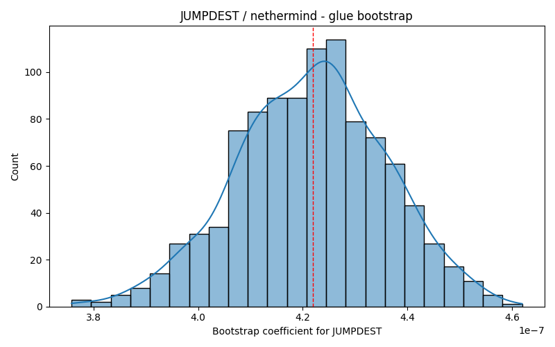

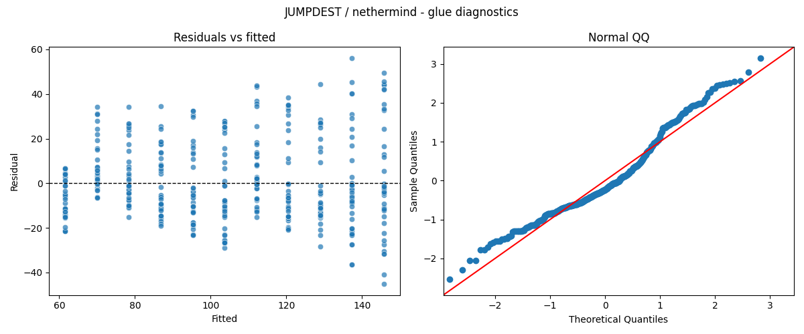

</details>

<details><summary><code>SWAP</code> · nobs=6864 · runtime_ms=5.557e-07 · p=1.00e-03 · R²=0.3262</summary>

```
==============================================================================
                           NNLS Regression Results                            
==============================================================================
Dep. Variable:          test_runtime_ms              R-squared:          0.326
Model:                  NNLS                    Adj. R-squared:          0.326
No. Observations:       6864                              RMSE:          16.81
Df Residuals:           6862                               MAE:           5.99
Df Model:               1      
==============================================================================
                      coef     std err     P-value      [0.025      0.975]
------------------------------------------------------------------------------
         const     15.2946      0.5956       0.001     14.1028     16.4143
          SWAP      0.0000      0.0000       0.001      0.0000      0.0000
==============================================================================
Notes: Non-negative least squares with bootstrap inference (1000 iterations)
==============================================================================
```

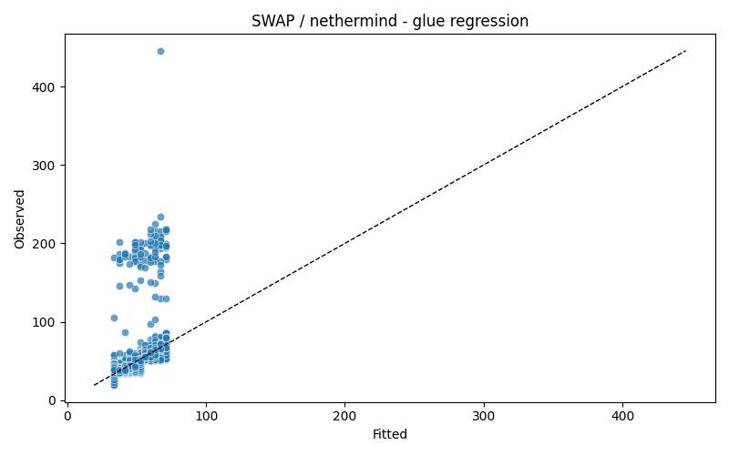

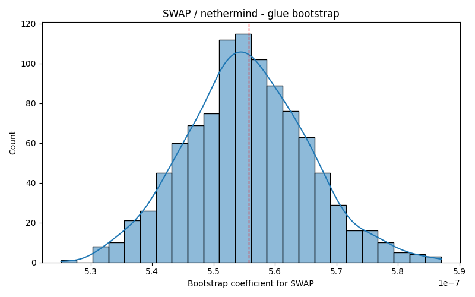

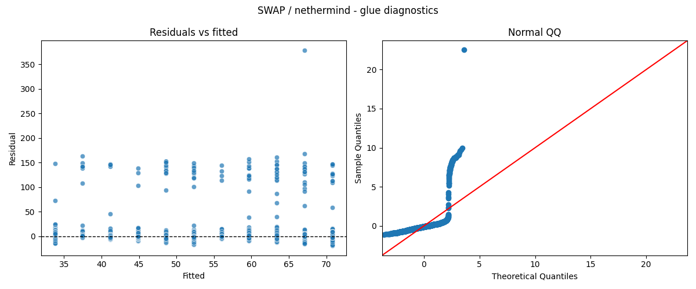

</details>

### Mixed glue (tier A) · nethermind

<details><summary><code>ADD</code> · nobs=429 · runtime_ms=2.633e-06 · p=1.00e-03 · R²=0.6607</summary>

```
==============================================================================
                           NNLS Regression Results                            
==============================================================================
Dep. Variable:          test_runtime_ms              R-squared:          0.661
Model:                  NNLS                    Adj. R-squared:          0.660
No. Observations:       429                               RMSE:          19.86
Df Residuals:           427                                MAE:          10.07
Df Model:               1      
==============================================================================
                      coef     std err     P-value      [0.025      0.975]
------------------------------------------------------------------------------
         const     14.2626      2.2045       0.001     10.2154     18.7174
           ADD      0.0000      0.0000       0.001      0.0000      0.0000
==============================================================================
Notes: Non-negative least squares with bootstrap inference (1000 iterations)
==============================================================================
```


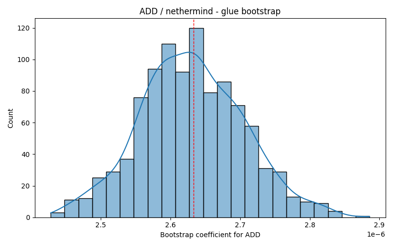

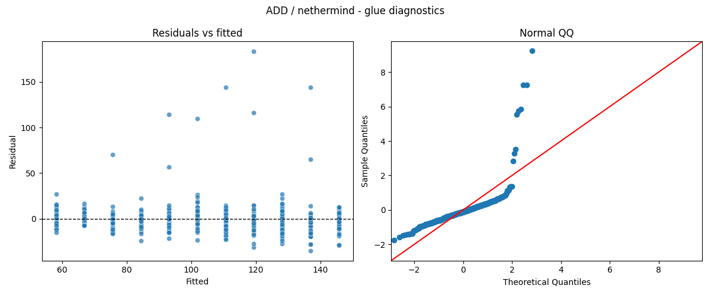

</details>

<details><summary><code>AND</code> · nobs=429 · runtime_ms=1.284e-06 · p=1.00e-03 · R²=0.5127</summary>

```
==============================================================================
                           NNLS Regression Results                            
==============================================================================
Dep. Variable:          test_runtime_ms              R-squared:          0.513
Model:                  NNLS                    Adj. R-squared:          0.512
No. Observations:       429                               RMSE:          13.17
Df Residuals:           427                                MAE:           5.41
Df Model:               1      
==============================================================================
                      coef     std err     P-value      [0.025      0.975]
------------------------------------------------------------------------------
         const     13.5822      1.7064       0.001      9.9120     16.4855
           AND      0.0000      0.0000       0.001      0.0000      0.0000
==============================================================================
Notes: Non-negative least squares with bootstrap inference (1000 iterations)
==============================================================================
```

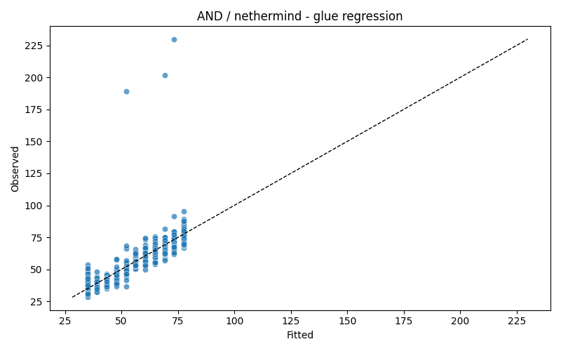

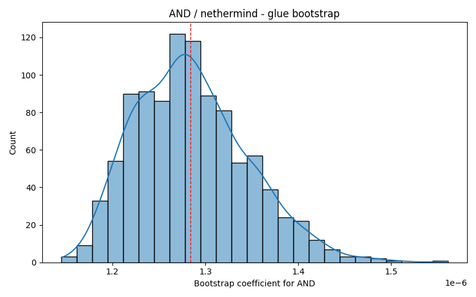

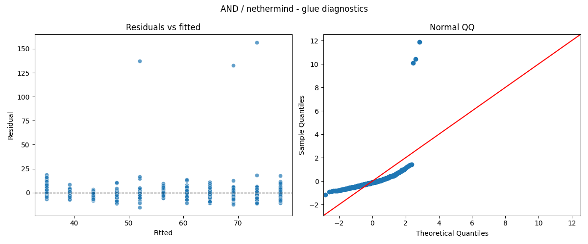

</details>

<details><summary><code>CALLDATACOPY</code> · nobs=10296 · runtime_ms=4.017e-06 · p=1.00e-03 · R²=0.7017</summary>

```
==============================================================================
                           NNLS Regression Results                            
==============================================================================
Dep. Variable:          test_runtime_ms              R-squared:          0.702
Model:                  NNLS                    Adj. R-squared:          0.702
No. Observations:       10296                             RMSE:          19.70
Df Residuals:           10294                              MAE:          15.16
Df Model:               1      
==============================================================================
                      coef     std err     P-value      [0.025      0.975]
------------------------------------------------------------------------------
         const     23.4230      0.2431       0.001     22.9360     23.9293
  CALLDATACOPY      0.0000      0.0000       0.001      0.0000      0.0000
==============================================================================
Notes: Non-negative least squares with bootstrap inference (1000 iterations)
==============================================================================
```

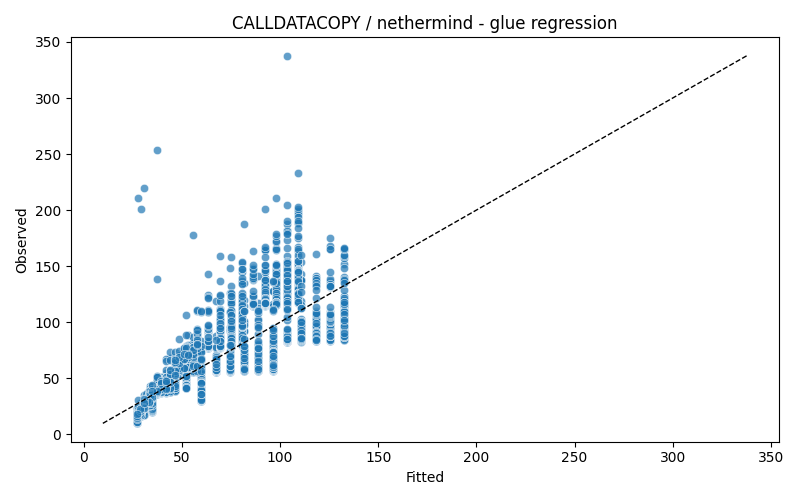

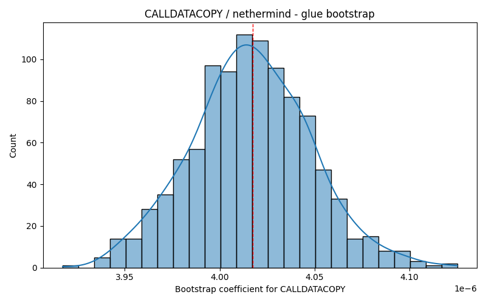

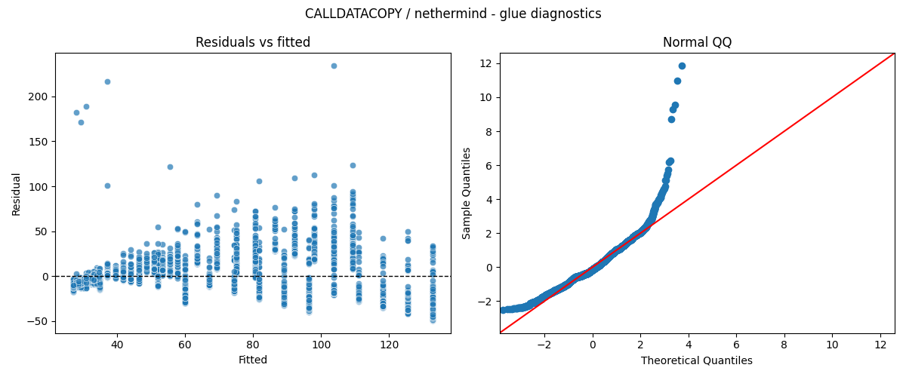

</details>

<details><summary><code>CALLDATALOAD</code> · nobs=1716 · runtime_ms=5.093e-05 · p=1.00e-03 · R²=0.002099</summary>

```
==============================================================================
                           NNLS Regression Results                            
==============================================================================
Dep. Variable:          test_runtime_ms              R-squared:          0.002
Model:                  NNLS                    Adj. R-squared:          0.002
No. Observations:       1716                              RMSE:           4.26
Df Residuals:           1714                               MAE:           0.32
Df Model:               1      
==============================================================================
                      coef     std err     P-value      [0.025      0.975]
------------------------------------------------------------------------------
         const      1.8869      0.2236       0.001      1.3993      2.1493
  CALLDATALOAD      0.0001      0.0000       0.001      0.0000      0.0001
==============================================================================
Notes: Non-negative least squares with bootstrap inference (1000 iterations)
==============================================================================
```

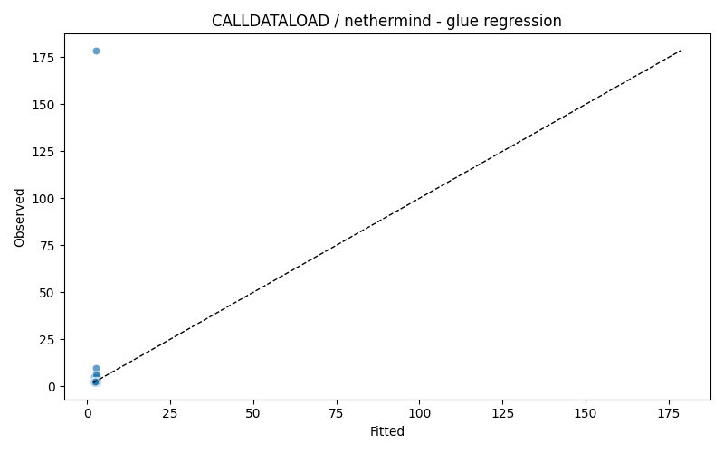


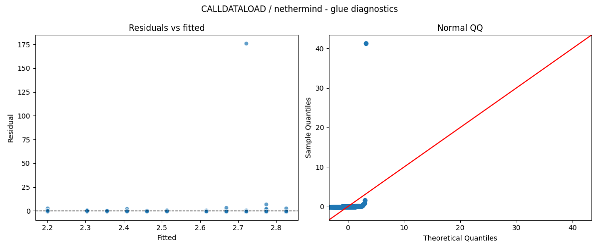

</details>

<details><summary><code>DIV</code> · nobs=429 · runtime_ms=8.069e-06 · p=1.00e-03 · R²=0.6332</summary>

```
==============================================================================
                           NNLS Regression Results                            
==============================================================================
Dep. Variable:          test_runtime_ms              R-squared:          0.633
Model:                  NNLS                    Adj. R-squared:          0.632
No. Observations:       429                               RMSE:          48.48
Df Residuals:           427                                MAE:          38.70
Df Model:               1      
==============================================================================
                      coef     std err     P-value      [0.025      0.975]
------------------------------------------------------------------------------
         const    125.4426     10.3135       0.001    104.8372    145.3338
           DIV      0.0000      0.0000       0.001      0.0000      0.0000
==============================================================================
Notes: Non-negative least squares with bootstrap inference (1000 iterations)
==============================================================================
```

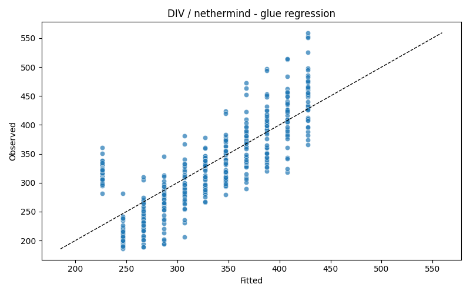

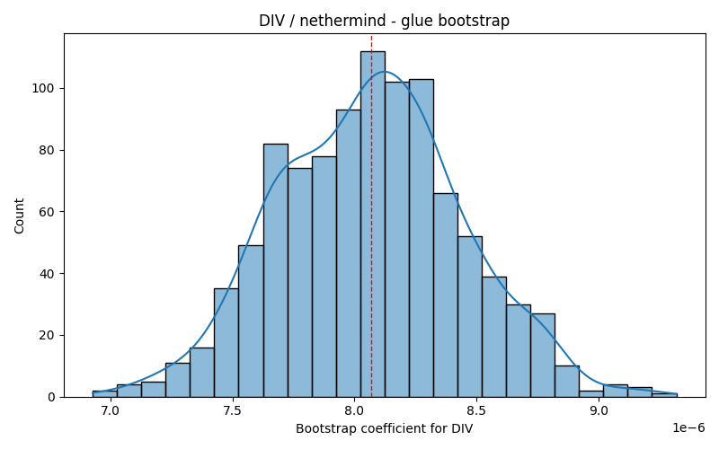

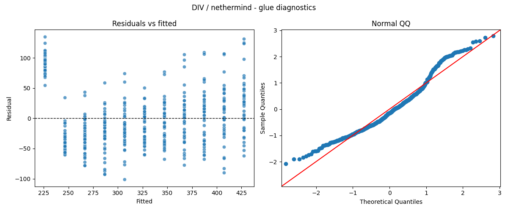

</details>

<details><summary><code>EXP</code> · nobs=429 · runtime_ms=0 · p=1.00e+00 · R²=0</summary>

```
==============================================================================
                           NNLS Regression Results                            
==============================================================================
Dep. Variable:          test_runtime_ms              R-squared:          0.000
Model:                  NNLS                    Adj. R-squared:         -0.002
No. Observations:       429                               RMSE:          47.94
Df Residuals:           427                                MAE:          32.40
Df Model:               1      
==============================================================================
                      coef     std err     P-value      [0.025      0.975]
------------------------------------------------------------------------------
         const    110.1258      5.0544       0.001     94.0797    114.5761
           EXP      0.0000      0.0000       1.000      0.0000      0.0001
==============================================================================
Notes: Non-negative least squares with bootstrap inference (1000 iterations)
==============================================================================
```

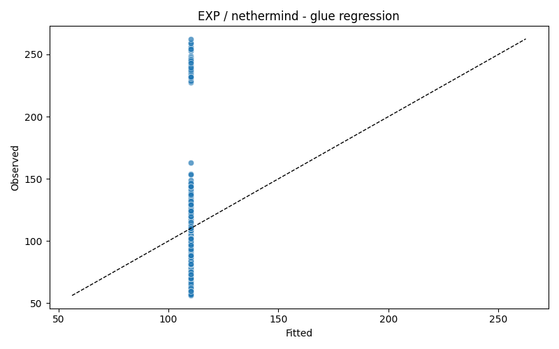

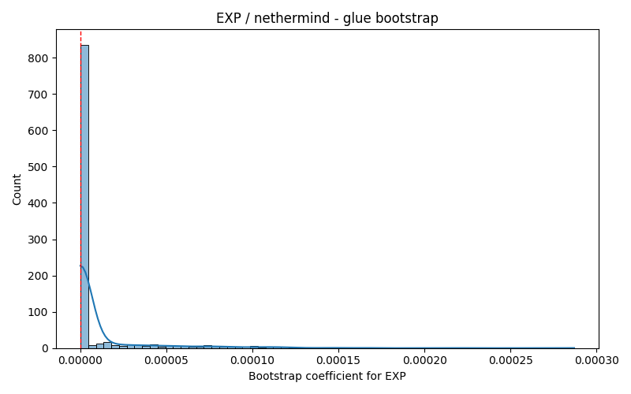

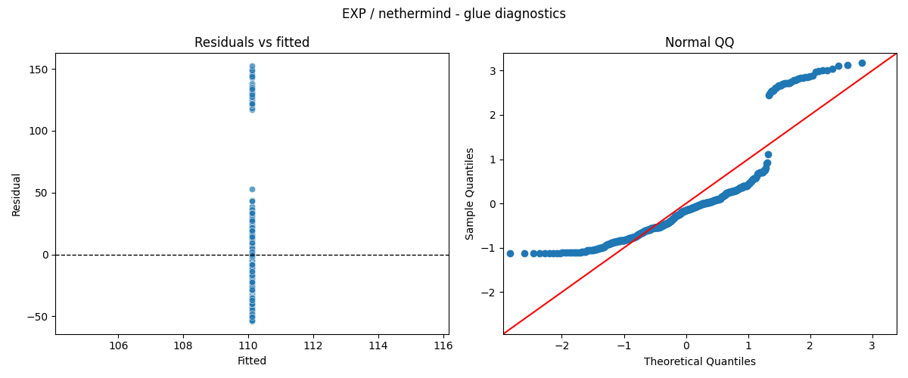

</details>

<details><summary><code>GT</code> · nobs=429 · runtime_ms=1.612e-06 · p=1.00e-03 · R²=0.3402</summary>

```
==============================================================================
                           NNLS Regression Results                            
==============================================================================
Dep. Variable:          test_runtime_ms              R-squared:          0.340
Model:                  NNLS                    Adj. R-squared:          0.339
No. Observations:       429                               RMSE:          23.63
Df Residuals:           427                                MAE:          13.02
Df Model:               1      
==============================================================================
                      coef     std err     P-value      [0.025      0.975]
------------------------------------------------------------------------------
         const     14.7112      3.6597       0.001      7.8775     22.2023
            GT      0.0000      0.0000       0.001      0.0000      0.0000
==============================================================================
Notes: Non-negative least squares with bootstrap inference (1000 iterations)
==============================================================================
```

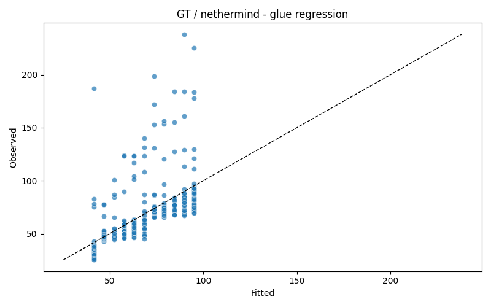

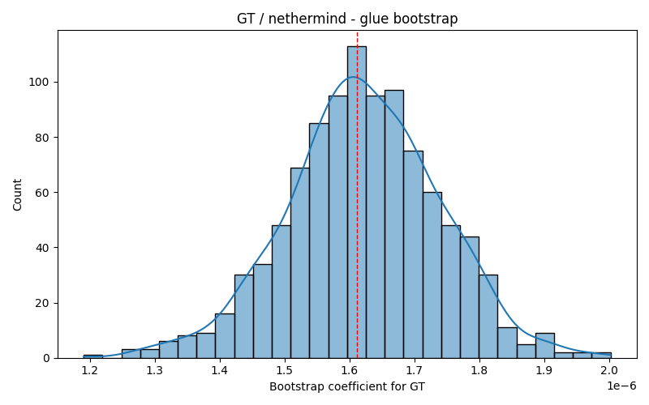

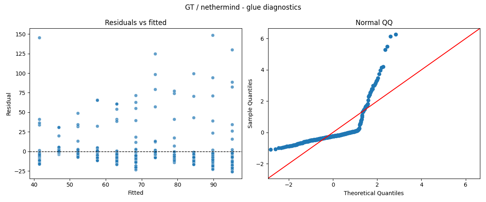

</details>

<details><summary><code>JUMPI</code> · nobs=429 · runtime_ms=1.82e-06 · p=1.00e-03 · R²=0.4519</summary>

```
==============================================================================
                           NNLS Regression Results                            
==============================================================================
Dep. Variable:          test_runtime_ms              R-squared:          0.452
Model:                  NNLS                    Adj. R-squared:          0.451
No. Observations:       429                               RMSE:           9.04
Df Residuals:           427                                MAE:           4.61
Df Model:               1      
==============================================================================
                      coef     std err     P-value      [0.025      0.975]
------------------------------------------------------------------------------
         const      9.7507      1.3948       0.001      7.0271     12.4228
         JUMPI      0.0000      0.0000       0.001      0.0000      0.0000
==============================================================================
Notes: Non-negative least squares with bootstrap inference (1000 iterations)
==============================================================================
```

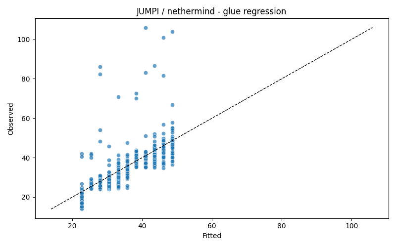

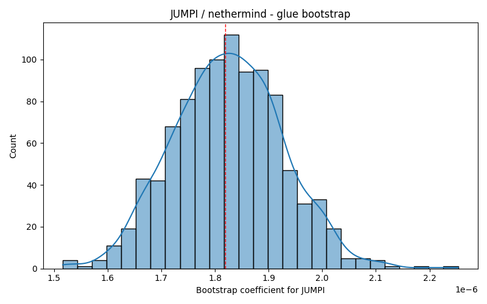

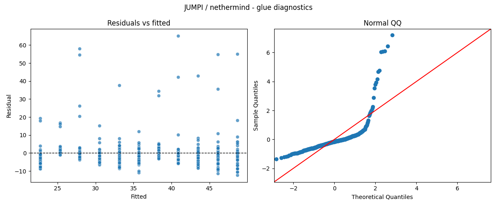

</details>

<details><summary><code>LT</code> · nobs=429 · runtime_ms=1.45e-06 · p=1.00e-03 · R²=0.291</summary>

```
==============================================================================
                           NNLS Regression Results                            
==============================================================================
Dep. Variable:          test_runtime_ms              R-squared:          0.291
Model:                  NNLS                    Adj. R-squared:          0.289
No. Observations:       429                               RMSE:          23.81
Df Residuals:           427                                MAE:          12.68
Df Model:               1      
==============================================================================
                      coef     std err     P-value      [0.025      0.975]
------------------------------------------------------------------------------
         const     21.5152      3.4089       0.001     15.0257     28.5052
            LT      0.0000      0.0000       0.001      0.0000      0.0000
==============================================================================
Notes: Non-negative least squares with bootstrap inference (1000 iterations)
==============================================================================
```

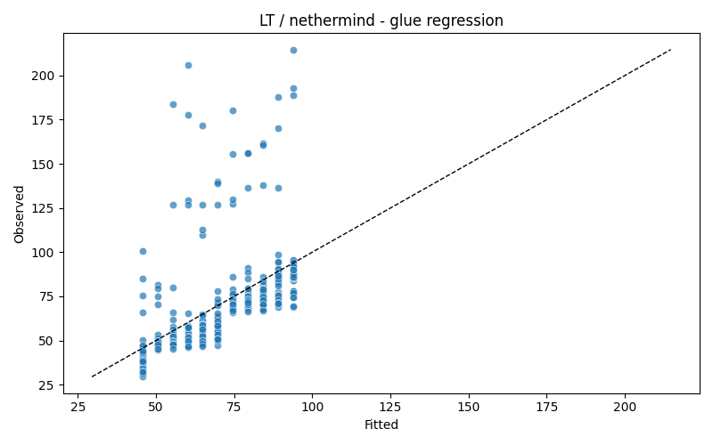

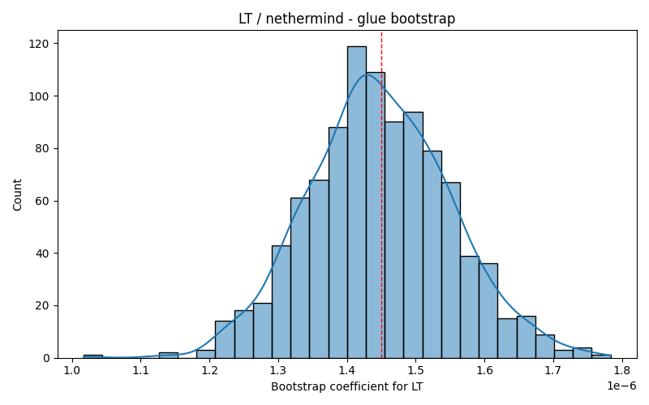

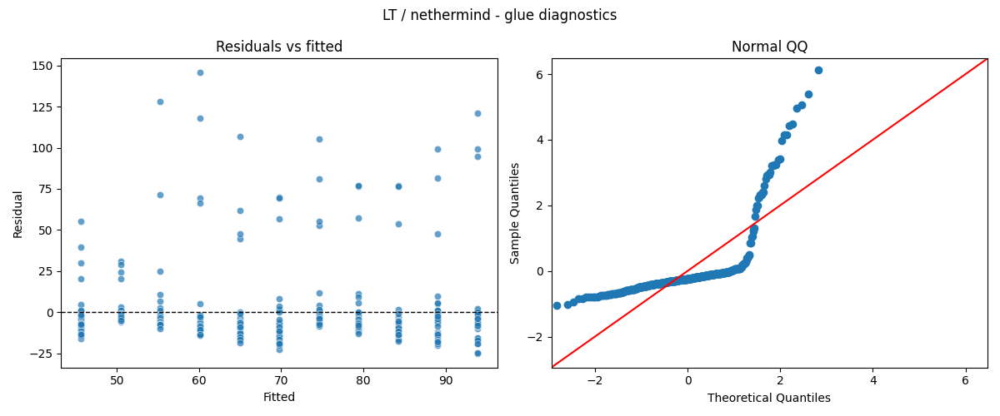

</details>

<details><summary><code>MSTORE</code> · nobs=2145 · runtime_ms=2.225e-06 · p=1.00e-03 · R²=0.5745</summary>

```
==============================================================================
                           NNLS Regression Results                            
==============================================================================
Dep. Variable:          test_runtime_ms              R-squared:          0.574
Model:                  NNLS                    Adj. R-squared:          0.574
No. Observations:       2145                              RMSE:          13.44
Df Residuals:           2143                               MAE:           7.85
Df Model:               1      
==============================================================================
                      coef     std err     P-value      [0.025      0.975]
------------------------------------------------------------------------------
         const     14.0746      0.7949       0.001     12.4907     15.6076
        MSTORE      0.0000      0.0000       0.001      0.0000      0.0000
==============================================================================
Notes: Non-negative least squares with bootstrap inference (1000 iterations)
==============================================================================
```

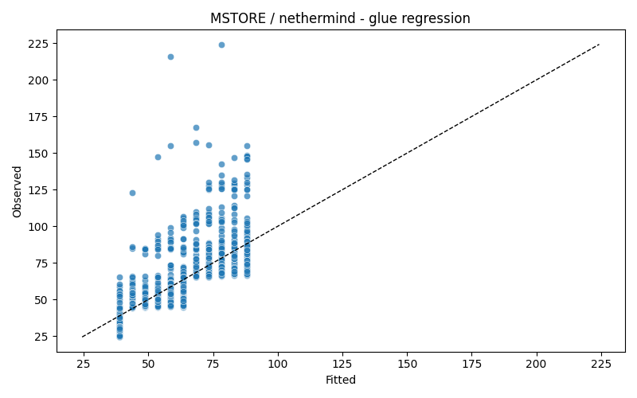

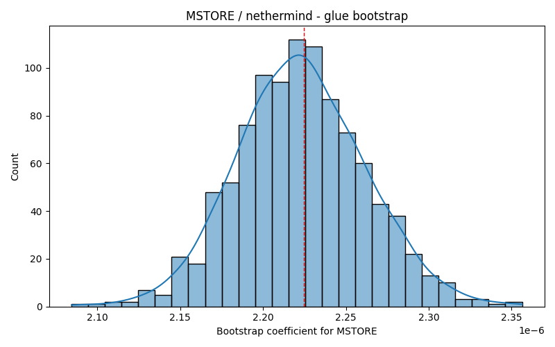

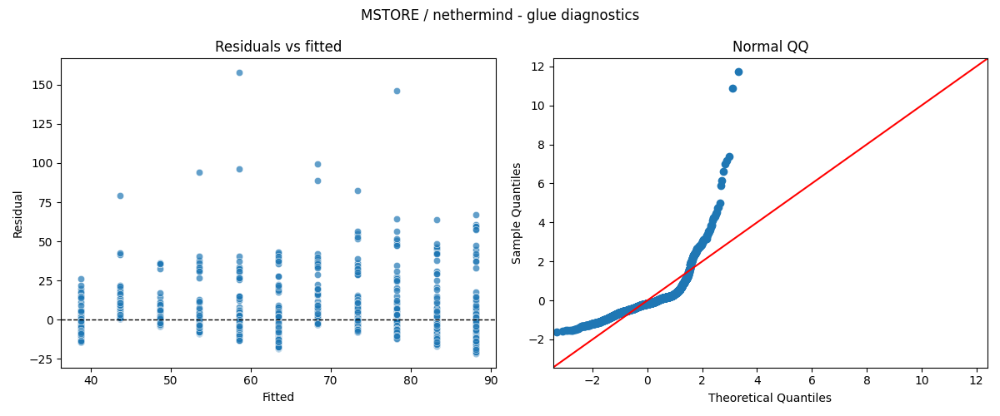

</details>

<details><summary><code>MSTORE8</code> · nobs=2145 · runtime_ms=1.97e-06 · p=1.00e-03 · R²=0.6638</summary>

```
==============================================================================
                           NNLS Regression Results                            
==============================================================================
Dep. Variable:          test_runtime_ms              R-squared:          0.664
Model:                  NNLS                    Adj. R-squared:          0.664
No. Observations:       2145                              RMSE:           9.84
Df Residuals:           2143                               MAE:           5.88
Df Model:               1      
==============================================================================
                      coef     std err     P-value      [0.025      0.975]
------------------------------------------------------------------------------
         const     15.9330      0.7126       0.001     14.5758     17.3289
       MSTORE8      0.0000      0.0000       0.001      0.0000      0.0000
==============================================================================
Notes: Non-negative least squares with bootstrap inference (1000 iterations)
==============================================================================
```

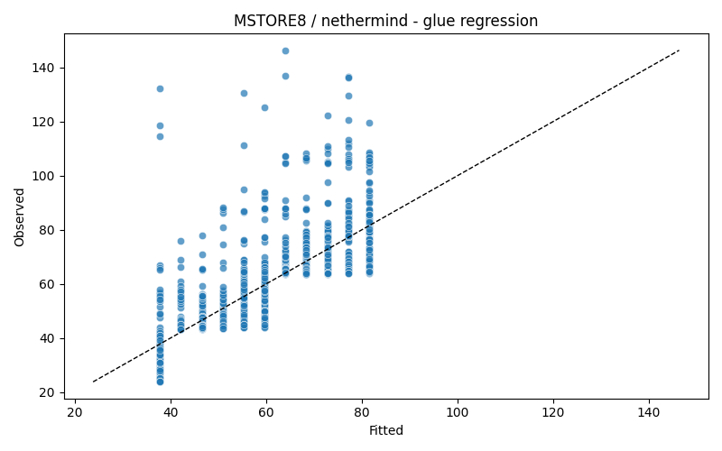

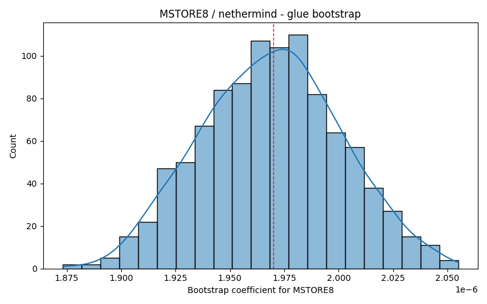

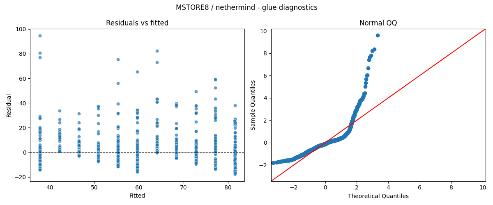

</details>

<details><summary><code>MUL</code> · nobs=429 · runtime_ms=5.69e-06 · p=1.00e-03 · R²=0.7305</summary>

```
==============================================================================
                           NNLS Regression Results                            
==============================================================================
Dep. Variable:          test_runtime_ms              R-squared:          0.730
Model:                  NNLS                    Adj. R-squared:          0.730
No. Observations:       429                               RMSE:          27.28
Df Residuals:           427                                MAE:          17.81
Df Model:               1      
==============================================================================
                      coef     std err     P-value      [0.025      0.975]
------------------------------------------------------------------------------
         const     26.4648      3.5918       0.001     19.0900     33.7666
           MUL      0.0000      0.0000       0.001      0.0000      0.0000
==============================================================================
Notes: Non-negative least squares with bootstrap inference (1000 iterations)
==============================================================================
```

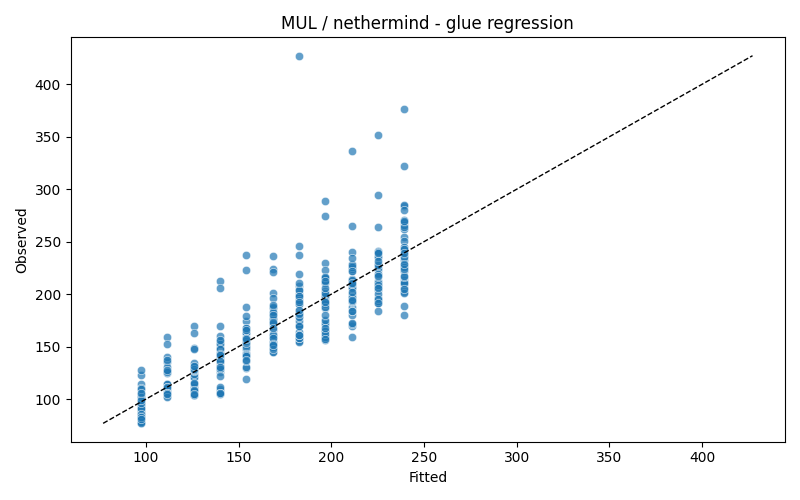

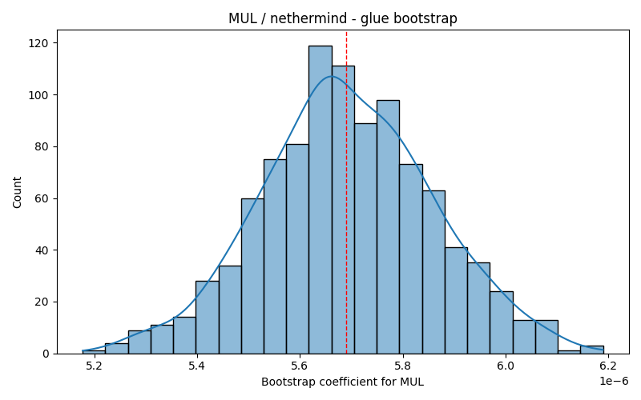

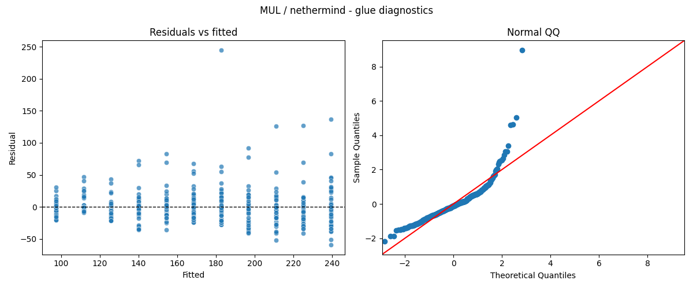

</details>

<details><summary><code>PC</code> · nobs=429 · runtime_ms=8.115e-07 · p=1.00e-03 · R²=0.9002</summary>

```
==============================================================================
                           NNLS Regression Results                            
==============================================================================
Dep. Variable:          test_runtime_ms              R-squared:          0.900
Model:                  NNLS                    Adj. R-squared:          0.900
No. Observations:       429                               RMSE:           8.08
Df Residuals:           427                                MAE:           6.37
Df Model:               1      
==============================================================================
                      coef     std err     P-value      [0.025      0.975]
------------------------------------------------------------------------------
         const     17.1048      1.4291       0.001     14.3527     19.9791
            PC      0.0000      0.0000       0.001      0.0000      0.0000
==============================================================================
Notes: Non-negative least squares with bootstrap inference (1000 iterations)
==============================================================================
```

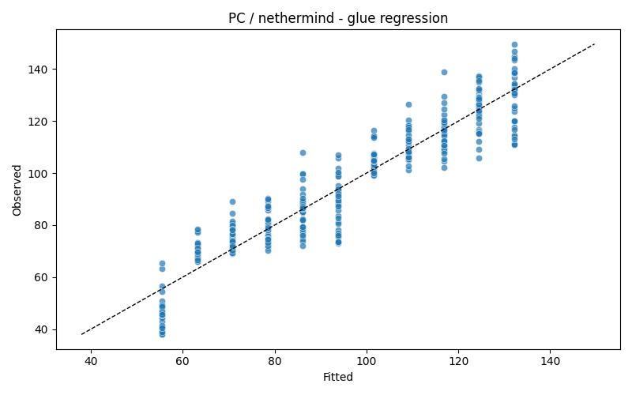


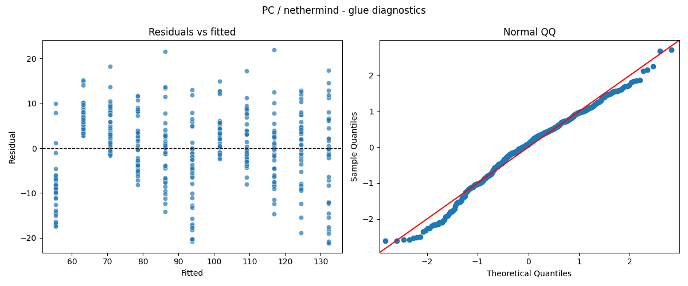

</details>

<details><summary><code>RETURNDATASIZE</code> · nobs=1716 · runtime_ms=7.72e-07 · p=1.00e-03 · R²=0.4656</summary>

```
==============================================================================
                           NNLS Regression Results                            
==============================================================================
Dep. Variable:          test_runtime_ms              R-squared:          0.466
Model:                  NNLS                    Adj. R-squared:          0.465
No. Observations:       1716                              RMSE:          13.06
Df Residuals:           1714                               MAE:           5.71
Df Model:               1      
==============================================================================
                      coef     std err     P-value      [0.025      0.975]
------------------------------------------------------------------------------
         const     11.9068      0.9759       0.001      9.9858     13.8512
RETURNDATASIZE      0.0000      0.0000       0.001      0.0000      0.0000
==============================================================================
Notes: Non-negative least squares with bootstrap inference (1000 iterations)
==============================================================================
```

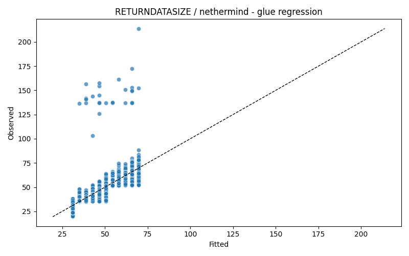

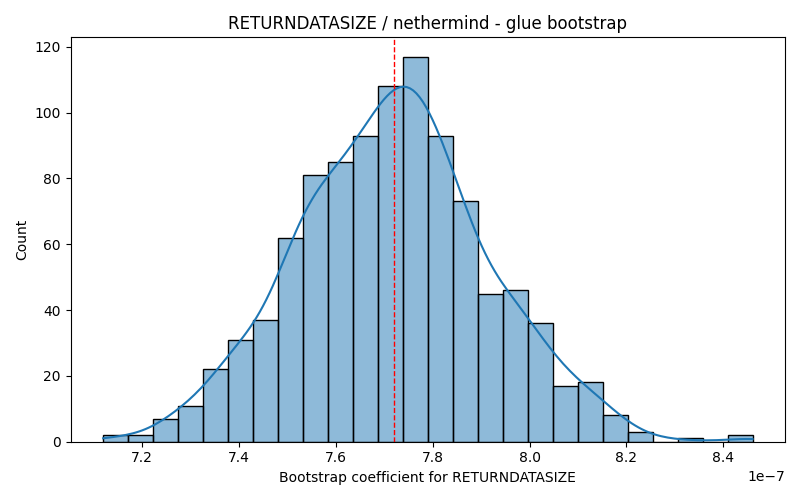

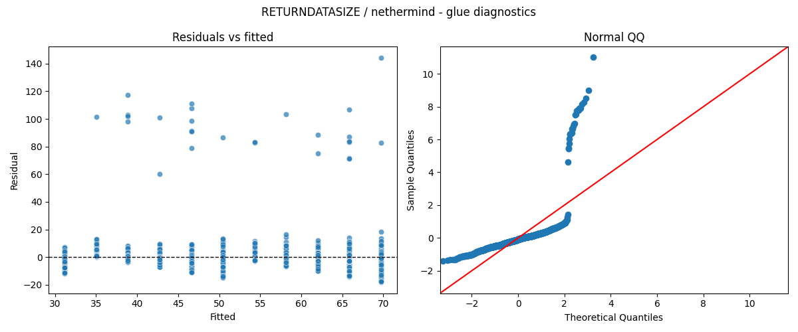

</details>

<details><summary><code>SELFBALANCE</code> · nobs=351 · runtime_ms=1.063e-05 · p=1.00e-03 · R²=0.8577</summary>

```
==============================================================================
                           NNLS Regression Results                            
==============================================================================
Dep. Variable:          test_runtime_ms              R-squared:          0.858
Model:                  NNLS                    Adj. R-squared:          0.857
No. Observations:       351                               RMSE:          43.68
Df Residuals:           349                                MAE:          35.53
Df Model:               1      
==============================================================================
                      coef     std err     P-value      [0.025      0.975]
------------------------------------------------------------------------------
         const     76.7819     10.1788       0.001     57.2158     96.4288
   SELFBALANCE      0.0000      0.0000       0.001      0.0000      0.0000
==============================================================================
Notes: Non-negative least squares with bootstrap inference (1000 iterations)
==============================================================================
```

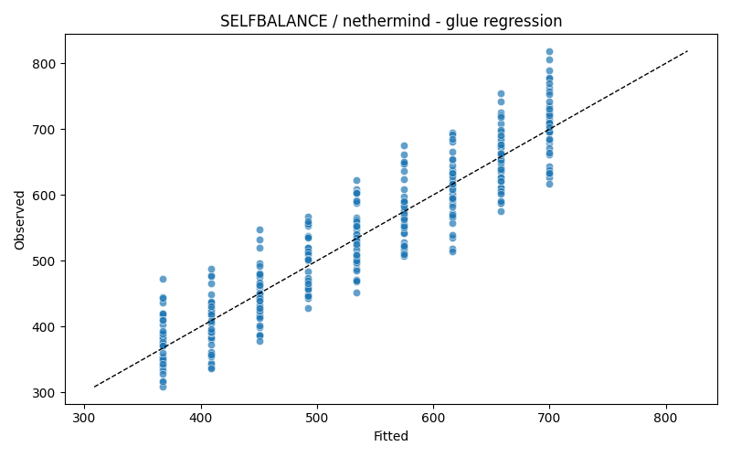

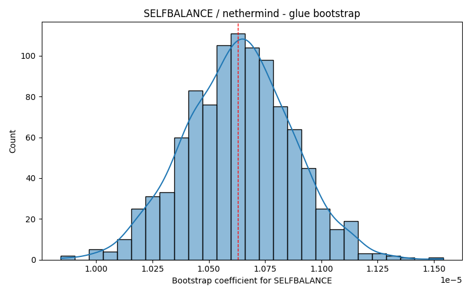

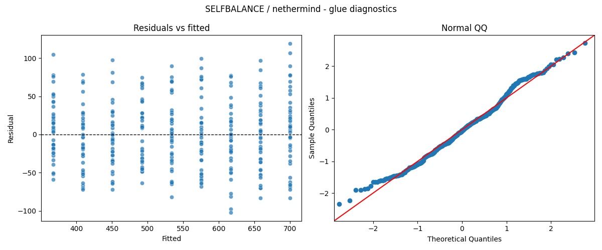

</details>

<details><summary><code>SUB</code> · nobs=429 · runtime_ms=2.593e-06 · p=1.00e-03 · R²=0.6019</summary>

```
==============================================================================
                           NNLS Regression Results                            
==============================================================================
Dep. Variable:          test_runtime_ms              R-squared:          0.602
Model:                  NNLS                    Adj. R-squared:          0.601
No. Observations:       429                               RMSE:          22.19
Df Residuals:           427                                MAE:          11.65
Df Model:               1      
==============================================================================
                      coef     std err     P-value      [0.025      0.975]
------------------------------------------------------------------------------
         const     16.0504      2.8555       0.001     10.2765     21.4911
           SUB      0.0000      0.0000       0.001      0.0000      0.0000
==============================================================================
Notes: Non-negative least squares with bootstrap inference (1000 iterations)
==============================================================================
```

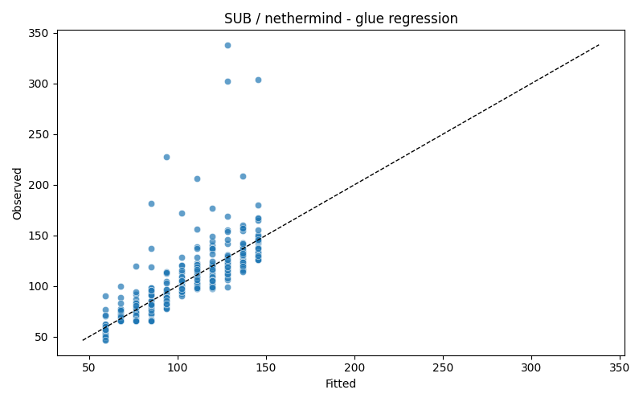

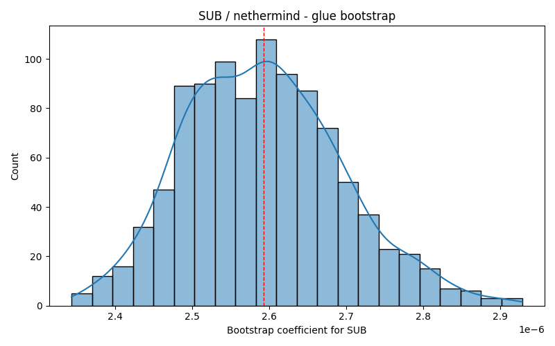

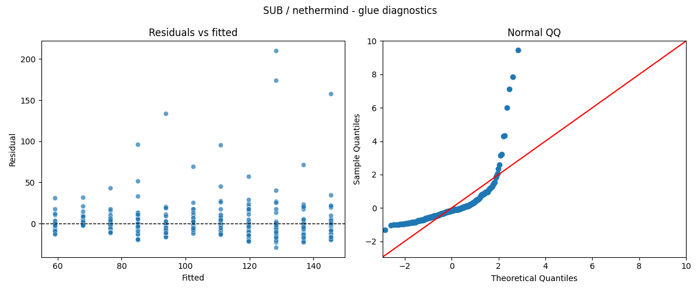

</details>

### Mixed glue (tier B) · nethermind

<details><summary><code>JUMP</code> · nobs=429 · runtime_ms=5.14e-06 · p=1.00e-03 · R²=0.7914</summary>

```
==============================================================================
                           NNLS Regression Results                            
==============================================================================
Dep. Variable:          test_runtime_ms              R-squared:          0.791
Model:                  NNLS                    Adj. R-squared:          0.791
No. Observations:       429                               RMSE:           9.81
Df Residuals:           427                                MAE:           6.74
Df Model:               1      
==============================================================================
                      coef     std err     P-value      [0.025      0.975]
------------------------------------------------------------------------------
         const     17.8129      1.9676       0.001     14.3069     22.0578
          JUMP      0.0000      0.0000       0.001      0.0000      0.0000
==============================================================================
Notes: Non-negative least squares with bootstrap inference (1000 iterations)
==============================================================================
```

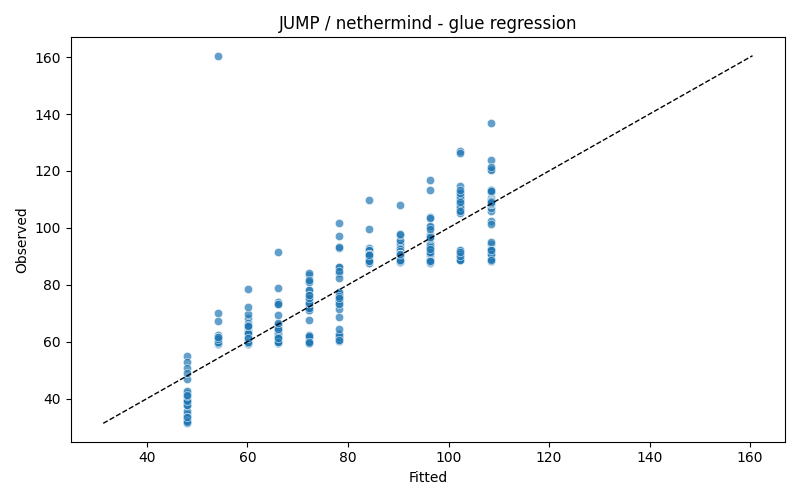

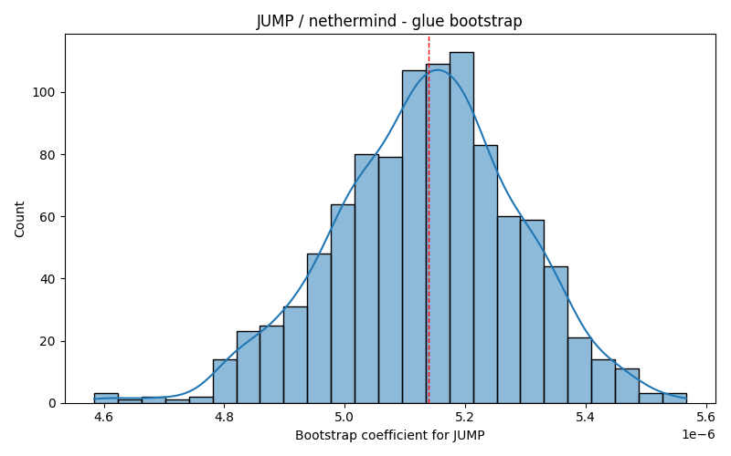

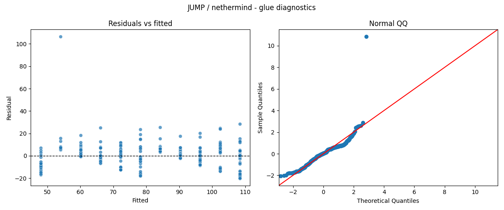

</details>

<details><summary><code>KECCAK256</code> · nobs=6864 · runtime_ms=0 · p=1.00e+00 · R²=0</summary>

```
==============================================================================
                           NNLS Regression Results                            
==============================================================================
Dep. Variable:          test_runtime_ms              R-squared:          0.000
Model:                  NNLS                    Adj. R-squared:         -0.000
No. Observations:       6864                              RMSE:         288.95
Df Residuals:           6862                               MAE:         237.99
Df Model:               1      
==============================================================================
                      coef     std err     P-value      [0.025      0.975]
------------------------------------------------------------------------------
         const    443.6763      3.5977       0.001    436.7405    450.8724
     KECCAK256      0.0000      0.0000       1.000      0.0000      0.0000
==============================================================================
Notes: Non-negative least squares with bootstrap inference (1000 iterations)
==============================================================================
```

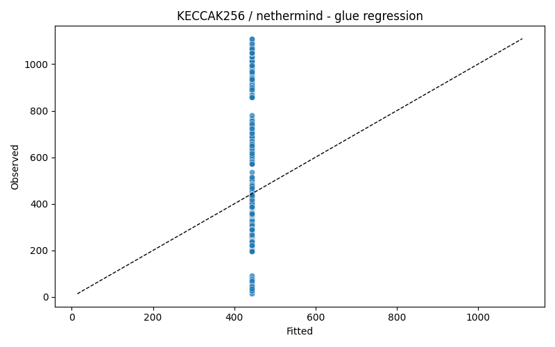


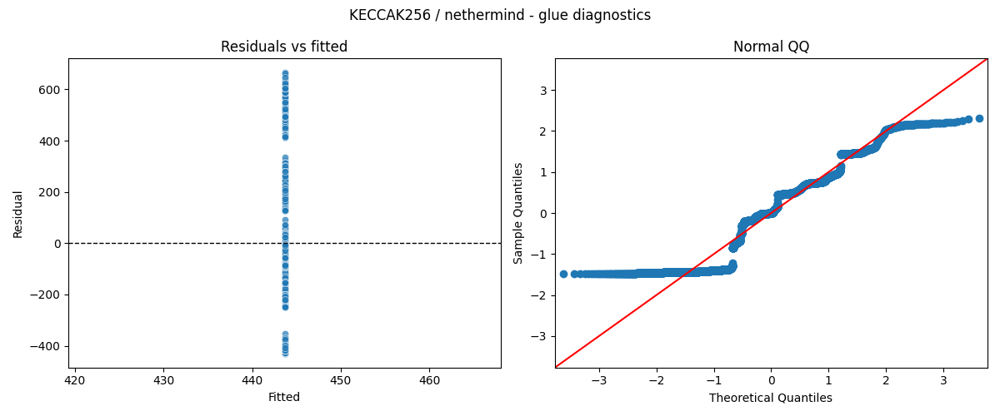

</details>

## reth

| glue_opcode | nobs | glue_runtime_ms | p_value | rsquared |
| --- | --- | --- | --- | --- |
| `ISZERO` | 209 | 3.852e-07 | 1.00e-03 | 0.7287 |
| `JUMPDEST` | 209 | 2.989e-07 | 1.00e-03 | 0.7474 |
| `SWAP` | 3344 | 4.798e-07 | 1.00e-03 | 0.5346 |
| `CALLDATASIZE` | 12782 | 5.025e-07 | 1.00e-03 | 0.8346 |
| `DUP` | 12782 | 4.219e-07 | 1.00e-03 | 0.8346 |
| `GAS` | 12782 | 4.513e-07 | 1.00e-03 | 0.8346 |
| `MLOAD` | 12782 | 1.623e-06 | 1.00e-03 | 0.8346 |
| `PUSH` | 12782 | 4.545e-07 | 1.00e-03 | 0.8346 |
| `PUSH0` | 12782 | 3.582e-07 | 1.00e-03 | 0.8346 |
| `STATICCALL` | 12782 | 4.568e-05 | 1.00e-03 | 0.8346 |
| `ADD` | 209 | 9.197e-07 | 1.00e-03 | 0.8084 |
| `AND` | 209 | 7.792e-07 | 1.00e-03 | 0.3297 |
| `CALLDATACOPY` | 5016 | 2.282e-06 | 1.00e-03 | 0.7345 |
| `CALLDATALOAD` | 836 | 4.472e-05 | 1.00e-03 | 0.3198 |
| `DIV` | 209 | 6.68e-06 | 1.00e-03 | 0.8366 |
| `EXP` | 209 | 0.0003608 | 1.00e-03 | 0.8129 |
| `GT` | 209 | 9.868e-07 | 1.00e-03 | 0.7856 |
| `JUMPI` | 209 | 1.244e-06 | 1.00e-03 | 0.7285 |
| `LT` | 209 | 9.693e-07 | 1.00e-03 | 0.8293 |
| `MSTORE` | 1045 | 2.83e-06 | 1.00e-03 | 0.2935 |
| `MSTORE8` | 1045 | 1.308e-06 | 1.00e-03 | 0.5165 |
| `MUL` | 209 | 1.169e-06 | 1.00e-03 | 0.6802 |
| `PC` | 209 | 6.077e-07 | 1.00e-03 | 0.9201 |
| `RETURNDATASIZE` | 836 | 8.996e-07 | 1.00e-03 | 0.6759 |
| `SELFBALANCE` | 171 | 3.898e-06 | 1.00e-03 | 0.5875 |
| `SUB` | 209 | 1.002e-06 | 1.00e-03 | 0.8338 |
| `JUMP` | 209 | 2.291e-06 | 1.00e-03 | 0.8042 |
| `KECCAK256` | 3344 | 0 | 1.00e+00 | 0 |

### Cycle glue — joint fit · reth

<details><summary>Joint NNLS regression summary</summary>

```
==============================================================================
                           NNLS Regression Results                            
==============================================================================
Dep. Variable:          test_runtime_ms              R-squared:          0.835
Model:                  NNLS                    Adj. R-squared:          0.835
No. Observations:       12782                             RMSE:           7.37
Df Residuals:           12774                              MAE:           5.12
Df Model:               7      
==============================================================================
                      coef     std err     P-value      [0.025      0.975]
------------------------------------------------------------------------------
         const     11.0693      0.2089       0.001     10.6386     11.4779
  CALLDATASIZE      0.0000      0.0000       0.001      0.0000      0.0000
           DUP      0.0000      0.0000       0.001      0.0000      0.0000
           GAS      0.0000      0.0000       0.001      0.0000      0.0000
         MLOAD      0.0000      0.0000       0.001      0.0000      0.0000
          PUSH      0.0000      0.0000       0.001      0.0000      0.0000
         PUSH0      0.0000      0.0000       0.001      0.0000      0.0000
    STATICCALL      0.0000      0.0000       0.001      0.0000      0.0000
==============================================================================
Notes: Non-negative least squares with bootstrap inference (1000 iterations)
==============================================================================
```

</details>

<details><summary><code>CALLDATASIZE</code> · nobs=12782 · runtime_ms=5.025e-07 · p=1.00e-03 · R²=0.8346</summary>

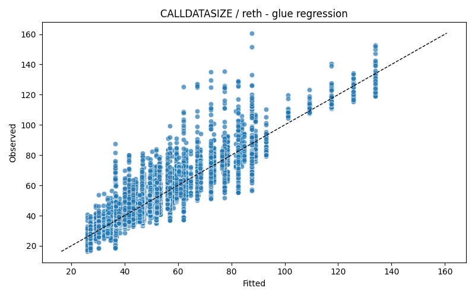

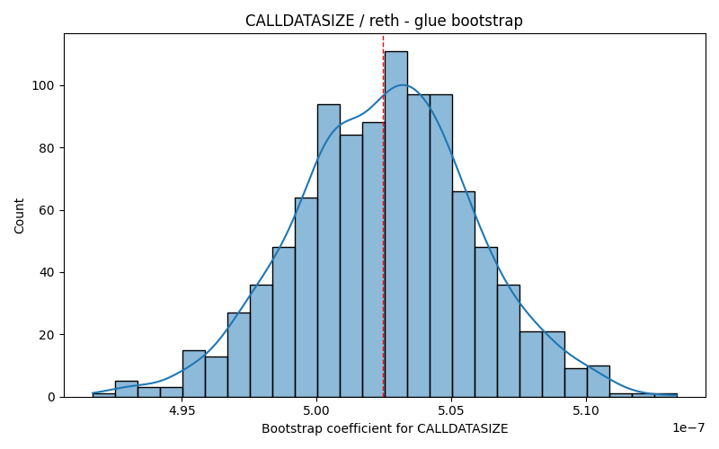

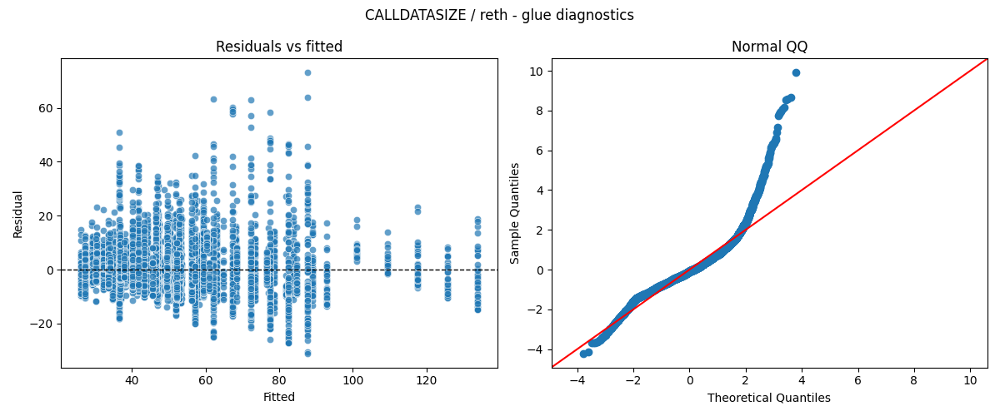

</details>

<details><summary><code>DUP</code> · nobs=12782 · runtime_ms=4.219e-07 · p=1.00e-03 · R²=0.8346</summary>


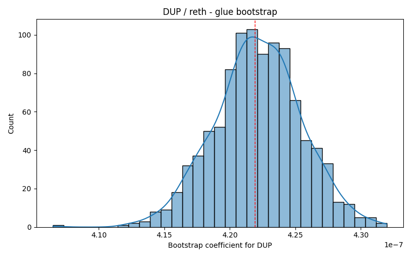


</details>

<details><summary><code>GAS</code> · nobs=12782 · runtime_ms=4.513e-07 · p=1.00e-03 · R²=0.8346</summary>

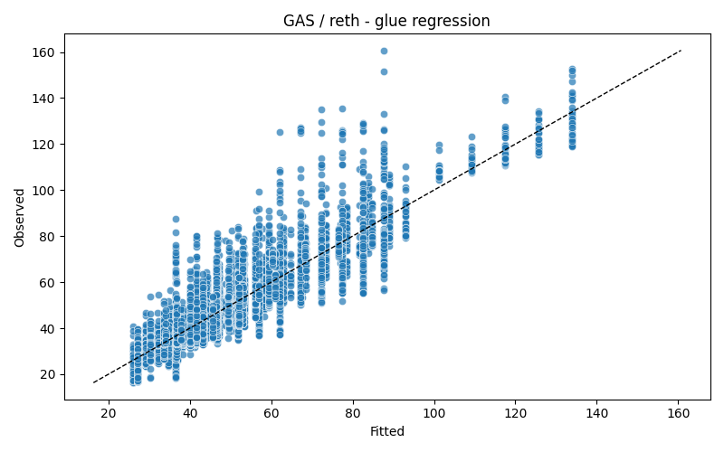

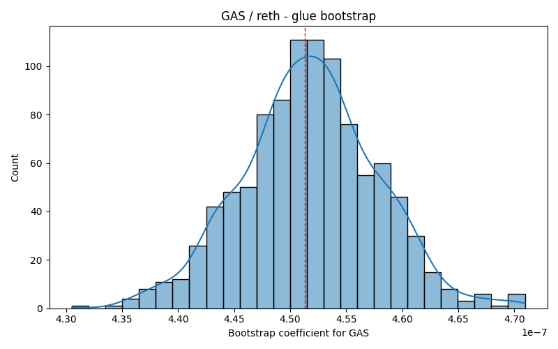

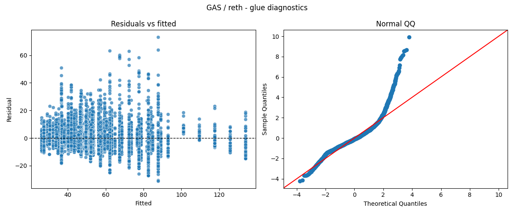

</details>

<details><summary><code>MLOAD</code> · nobs=12782 · runtime_ms=1.623e-06 · p=1.00e-03 · R²=0.8346</summary>


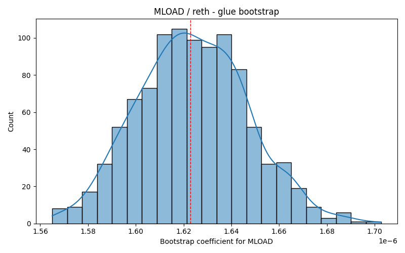

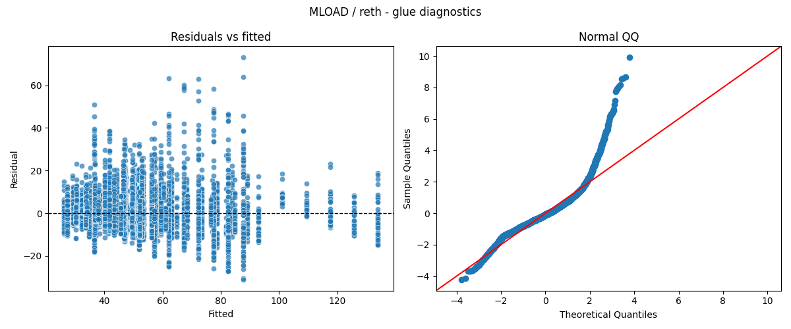

</details>

<details><summary><code>PUSH</code> · nobs=12782 · runtime_ms=4.545e-07 · p=1.00e-03 · R²=0.8346</summary>


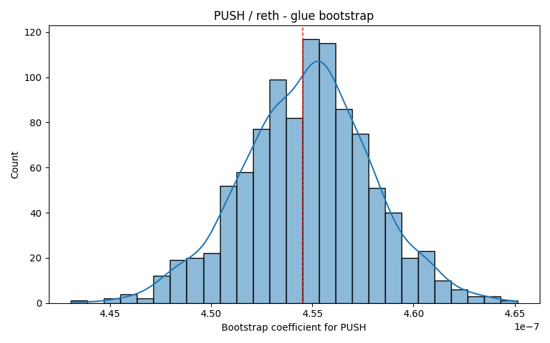


</details>

<details><summary><code>PUSH0</code> · nobs=12782 · runtime_ms=3.582e-07 · p=1.00e-03 · R²=0.8346</summary>


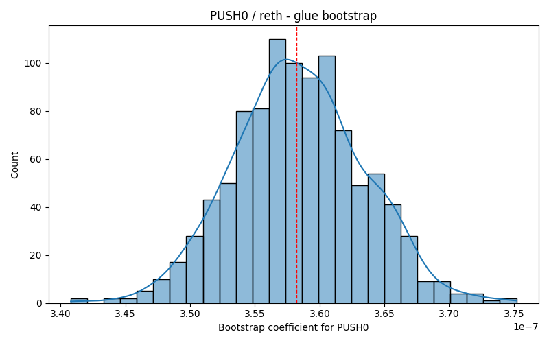


</details>

<details><summary><code>STATICCALL</code> · nobs=12782 · runtime_ms=4.568e-05 · p=1.00e-03 · R²=0.8346</summary>


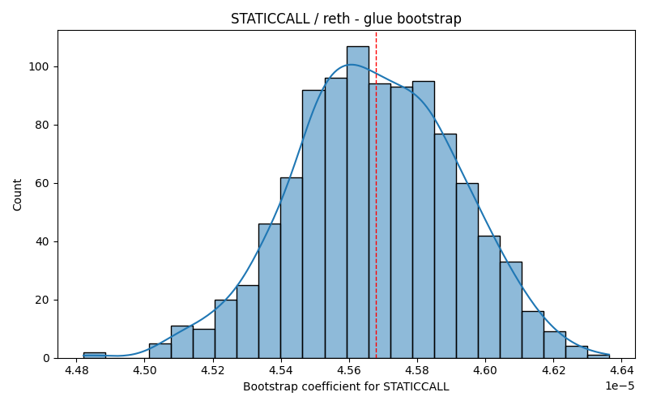


</details>

### Pure glue · reth

<details><summary><code>ISZERO</code> · nobs=209 · runtime_ms=3.852e-07 · p=1.00e-03 · R²=0.7287</summary>

```
==============================================================================
                           NNLS Regression Results                            
==============================================================================
Dep. Variable:          test_runtime_ms              R-squared:          0.729
Model:                  NNLS                    Adj. R-squared:          0.727
No. Observations:       209                               RMSE:           4.95
Df Residuals:           207                                MAE:           3.64
Df Model:               1      
==============================================================================
                      coef     std err     P-value      [0.025      0.975]
------------------------------------------------------------------------------
         const      8.1762      1.1224       0.001      5.9304     10.2914
        ISZERO      0.0000      0.0000       0.001      0.0000      0.0000
==============================================================================
Notes: Non-negative least squares with bootstrap inference (1000 iterations)
==============================================================================
```

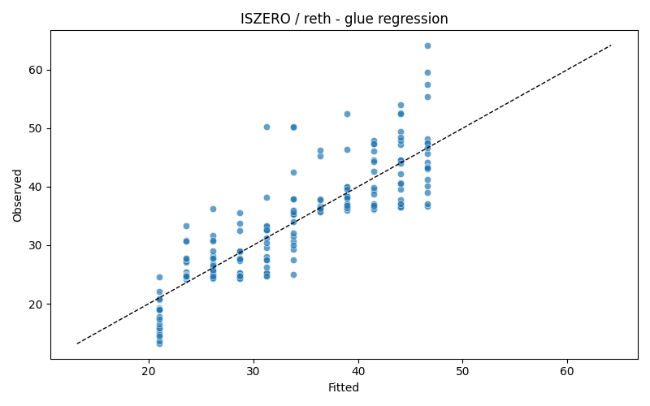

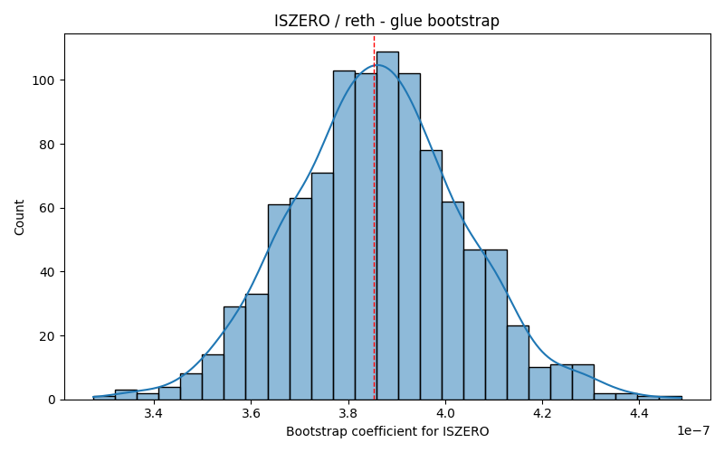

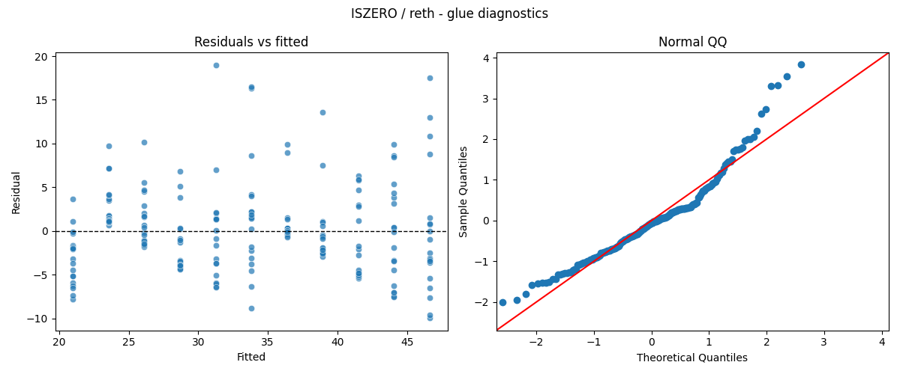

</details>

<details><summary><code>JUMPDEST</code> · nobs=209 · runtime_ms=2.989e-07 · p=1.00e-03 · R²=0.7474</summary>

```
==============================================================================
                           NNLS Regression Results                            
==============================================================================
Dep. Variable:          test_runtime_ms              R-squared:          0.747
Model:                  NNLS                    Adj. R-squared:          0.746
No. Observations:       209                               RMSE:          10.97
Df Residuals:           207                                MAE:           7.70
Df Model:               1      
==============================================================================
                      coef     std err     P-value      [0.025      0.975]
------------------------------------------------------------------------------
         const     13.2392      2.4327       0.001      8.4379     17.5849
      JUMPDEST      0.0000      0.0000       0.001      0.0000      0.0000
==============================================================================
Notes: Non-negative least squares with bootstrap inference (1000 iterations)
==============================================================================
```

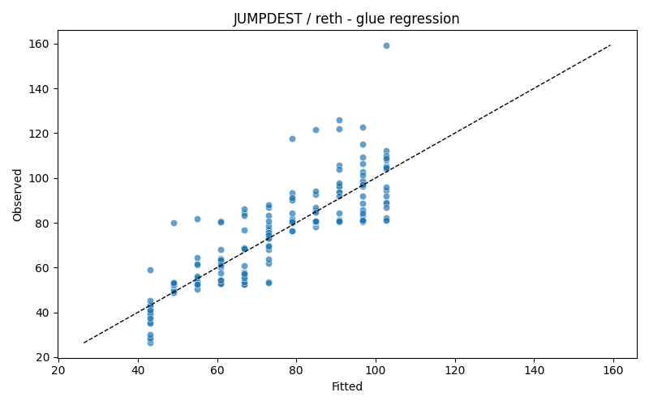

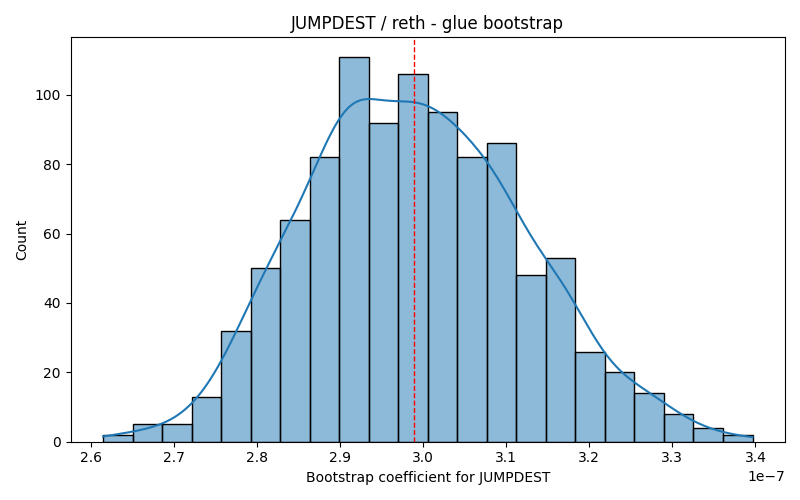

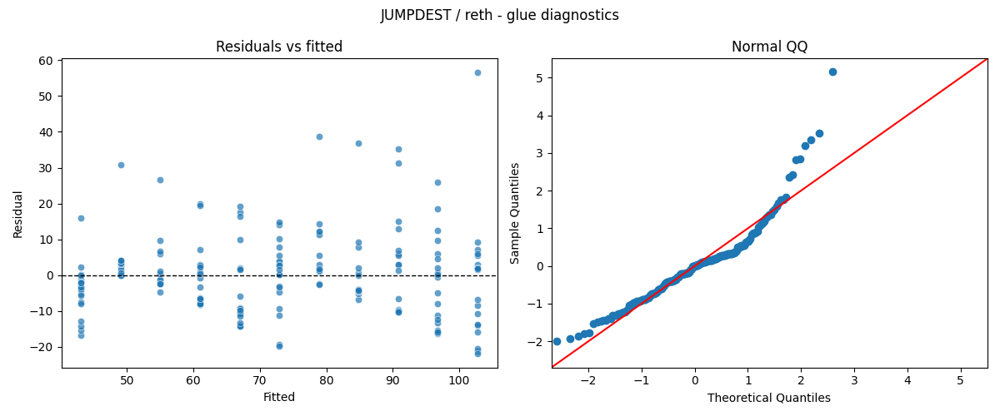

</details>

<details><summary><code>SWAP</code> · nobs=3344 · runtime_ms=4.798e-07 · p=1.00e-03 · R²=0.5346</summary>

```
==============================================================================
                           NNLS Regression Results                            
==============================================================================
Dep. Variable:          test_runtime_ms              R-squared:          0.535
Model:                  NNLS                    Adj. R-squared:          0.534
No. Observations:       3344                              RMSE:           9.43
Df Residuals:           3342                               MAE:           4.57
Df Model:               1      
==============================================================================
                      coef     std err     P-value      [0.025      0.975]
------------------------------------------------------------------------------
         const     11.3040      0.5661       0.001     10.2611     12.4908
          SWAP      0.0000      0.0000       0.001      0.0000      0.0000
==============================================================================
Notes: Non-negative least squares with bootstrap inference (1000 iterations)
==============================================================================
```

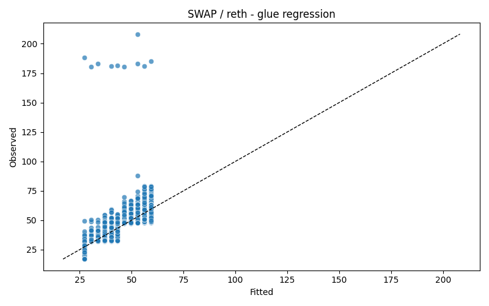

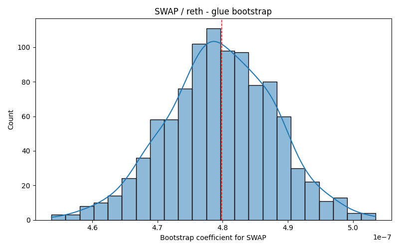

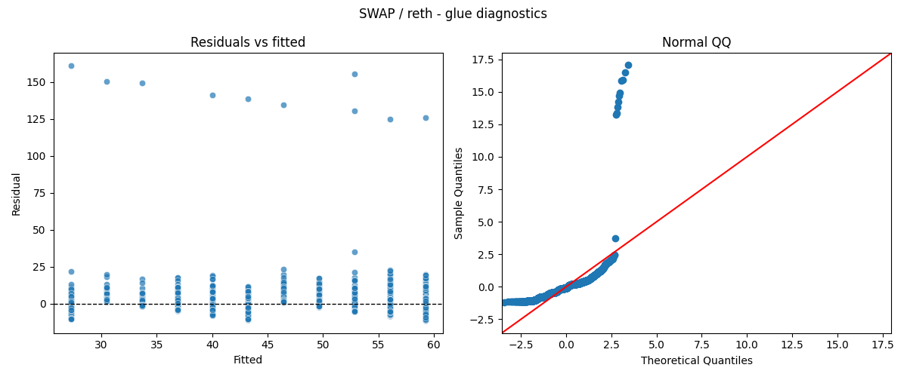

</details>

### Mixed glue (tier A) · reth

<details><summary><code>ADD</code> · nobs=209 · runtime_ms=9.197e-07 · p=1.00e-03 · R²=0.8084</summary>

```
==============================================================================
                           NNLS Regression Results                            
==============================================================================
Dep. Variable:          test_runtime_ms              R-squared:          0.808
Model:                  NNLS                    Adj. R-squared:          0.807
No. Observations:       209                               RMSE:           4.71
Df Residuals:           207                                MAE:           3.46
Df Model:               1      
==============================================================================
                      coef     std err     P-value      [0.025      0.975]
------------------------------------------------------------------------------
         const      8.6350      1.0433       0.001      6.7488     10.6686
           ADD      0.0000      0.0000       0.001      0.0000      0.0000
==============================================================================
Notes: Non-negative least squares with bootstrap inference (1000 iterations)
==============================================================================
```

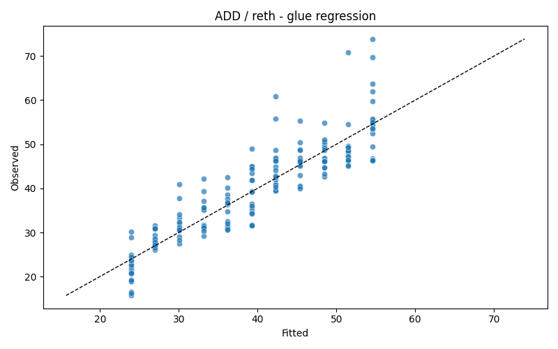

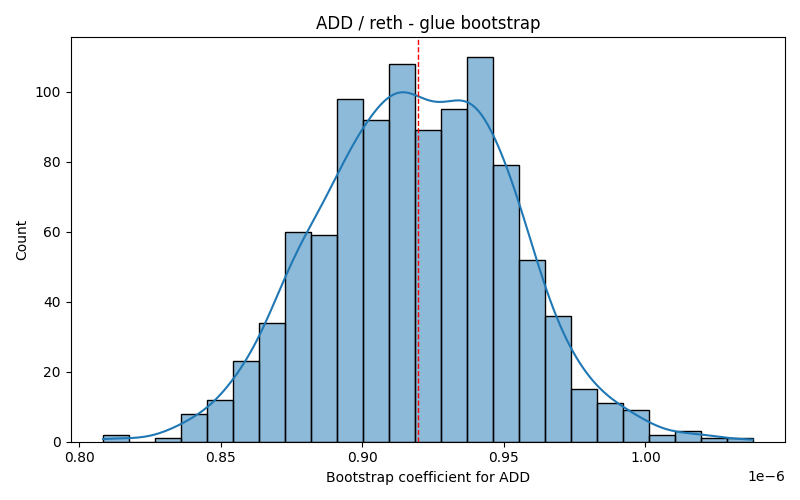


</details>

<details><summary><code>AND</code> · nobs=209 · runtime_ms=7.792e-07 · p=1.00e-03 · R²=0.3297</summary>

```
==============================================================================
                           NNLS Regression Results                            
==============================================================================
Dep. Variable:          test_runtime_ms              R-squared:          0.330
Model:                  NNLS                    Adj. R-squared:          0.326
No. Observations:       209                               RMSE:          11.69
Df Residuals:           207                                MAE:           4.19
Df Model:               1      
==============================================================================
                      coef     std err     P-value      [0.025      0.975]
------------------------------------------------------------------------------
         const     13.4317      4.5967       0.001      7.3368     23.2624
           AND      0.0000      0.0000       0.001      0.0000      0.0000
==============================================================================
Notes: Non-negative least squares with bootstrap inference (1000 iterations)
==============================================================================
```

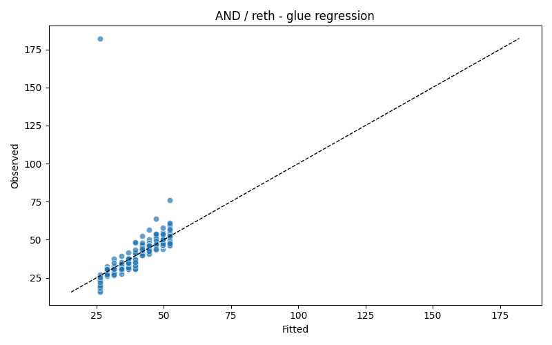

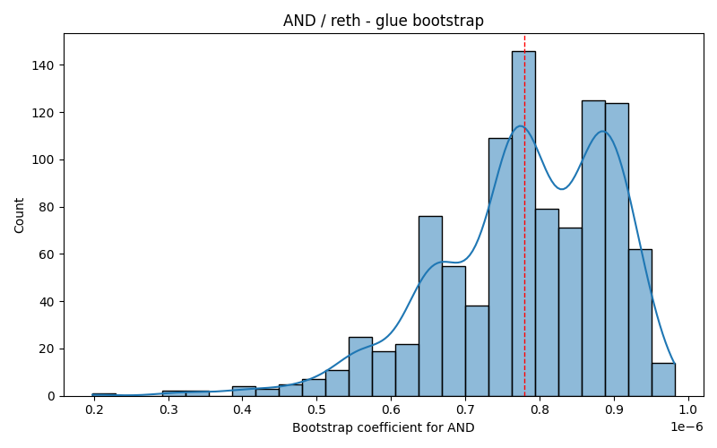

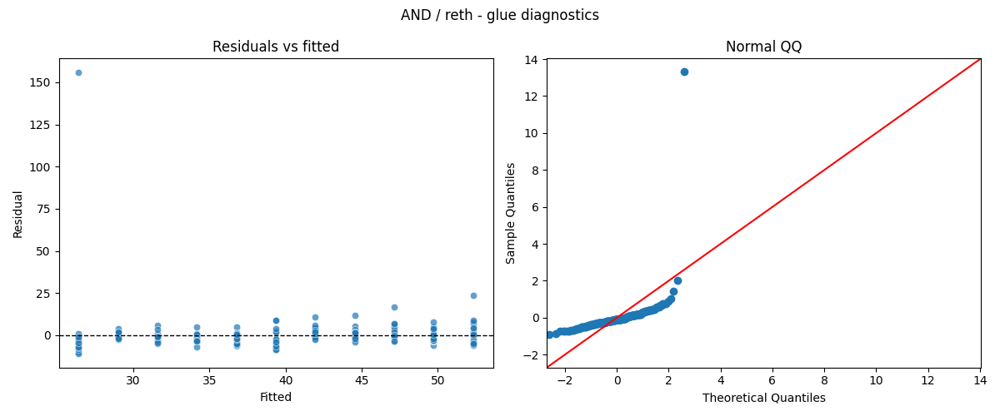

</details>

<details><summary><code>CALLDATACOPY</code> · nobs=5016 · runtime_ms=2.282e-06 · p=1.00e-03 · R²=0.7345</summary>

```
==============================================================================
                           NNLS Regression Results                            
==============================================================================
Dep. Variable:          test_runtime_ms              R-squared:          0.734
Model:                  NNLS                    Adj. R-squared:          0.734
No. Observations:       5016                              RMSE:          10.32
Df Residuals:           5014                               MAE:           6.96
Df Model:               1      
==============================================================================
                      coef     std err     P-value      [0.025      0.975]
------------------------------------------------------------------------------
         const     12.5403      0.1743       0.001     12.2110     12.8743
  CALLDATACOPY      0.0000      0.0000       0.001      0.0000      0.0000
==============================================================================
Notes: Non-negative least squares with bootstrap inference (1000 iterations)
==============================================================================
```

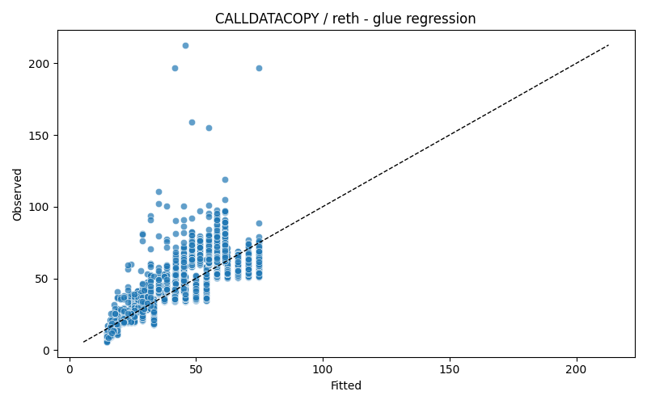

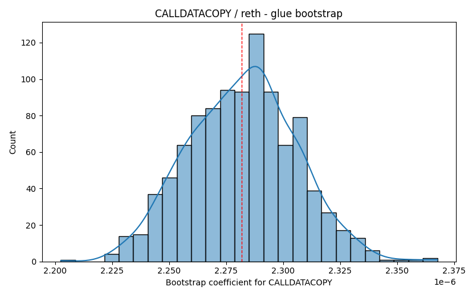

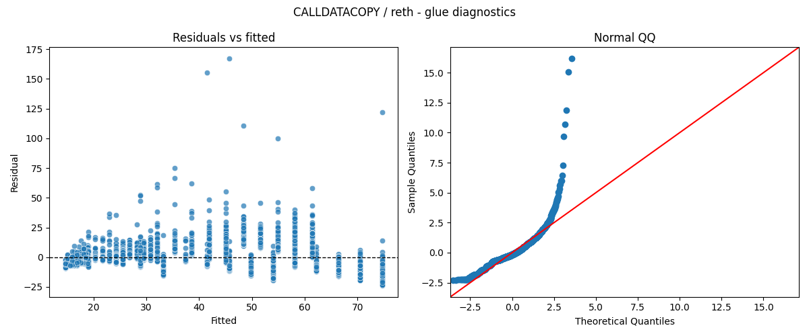

</details>

<details><summary><code>CALLDATALOAD</code> · nobs=836 · runtime_ms=4.472e-05 · p=1.00e-03 · R²=0.3198</summary>

```
==============================================================================
                           NNLS Regression Results                            
==============================================================================
Dep. Variable:          test_runtime_ms              R-squared:          0.320
Model:                  NNLS                    Adj. R-squared:          0.319
No. Observations:       836                               RMSE:           0.25
Df Residuals:           834                                MAE:           0.14
Df Model:               1      
==============================================================================
                      coef     std err     P-value      [0.025      0.975]
------------------------------------------------------------------------------
         const      1.1595      0.0308       0.001      1.0938      1.2127
  CALLDATALOAD      0.0000      0.0000       0.001      0.0000      0.0001
==============================================================================
Notes: Non-negative least squares with bootstrap inference (1000 iterations)
==============================================================================
```

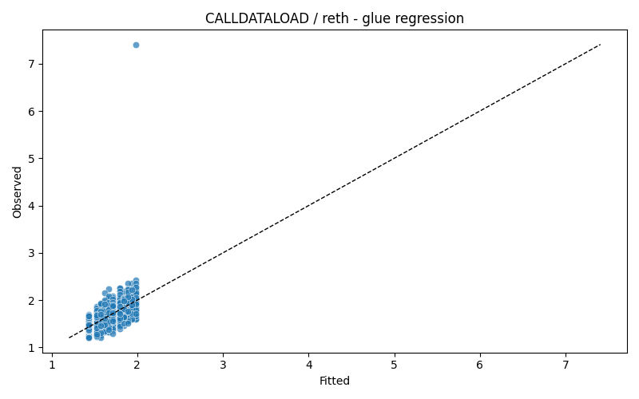

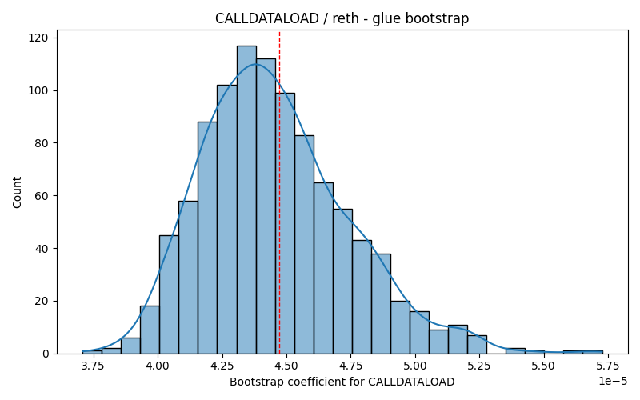

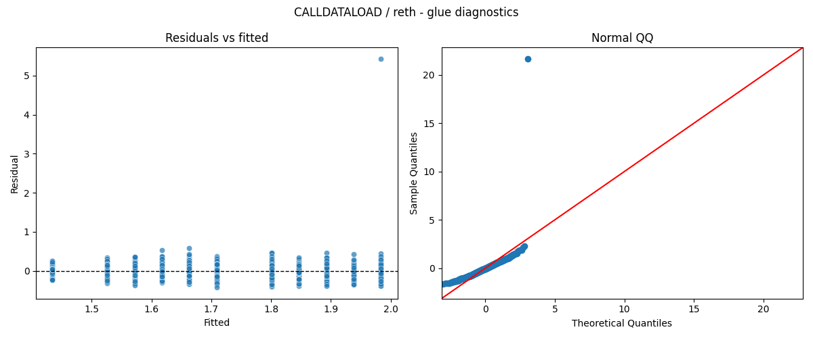

</details>

<details><summary><code>DIV</code> · nobs=209 · runtime_ms=6.68e-06 · p=1.00e-03 · R²=0.8366</summary>

```
==============================================================================
                           NNLS Regression Results                            
==============================================================================
Dep. Variable:          test_runtime_ms              R-squared:          0.837
Model:                  NNLS                    Adj. R-squared:          0.836
No. Observations:       209                               RMSE:          23.31
Df Residuals:           207                                MAE:          19.17
Df Model:               1      
==============================================================================
                      coef     std err     P-value      [0.025      0.975]
------------------------------------------------------------------------------
         const     64.8749      5.5446       0.001     53.0165     75.5195
           DIV      0.0000      0.0000       0.001      0.0000      0.0000
==============================================================================
Notes: Non-negative least squares with bootstrap inference (1000 iterations)
==============================================================================
```

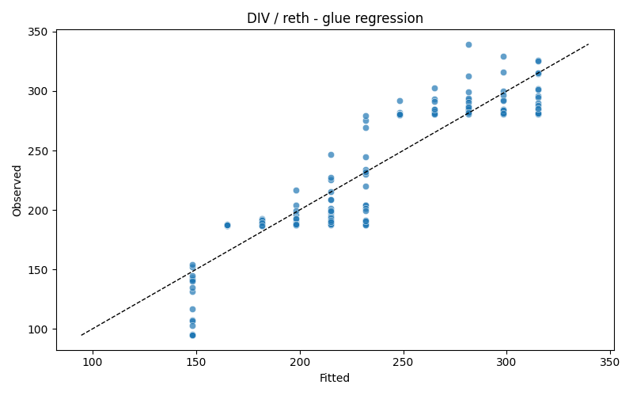

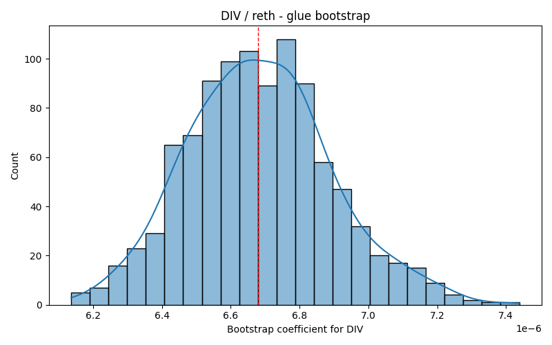

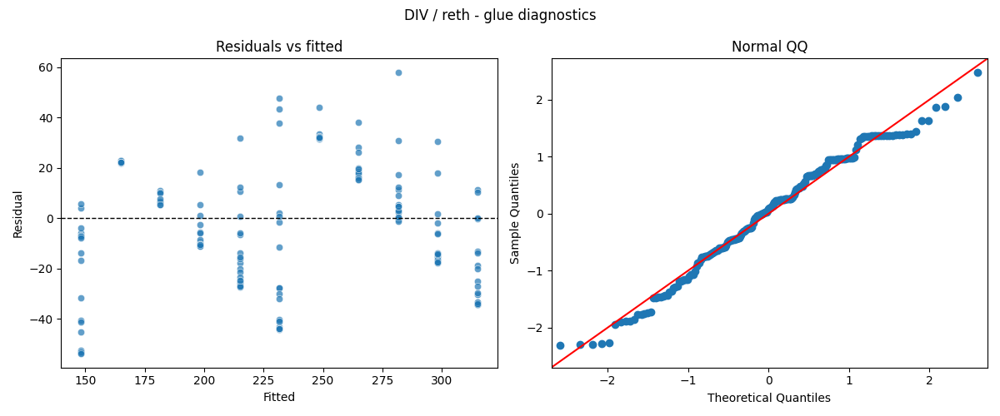

</details>

<details><summary><code>EXP</code> · nobs=209 · runtime_ms=0.0003608 · p=1.00e-03 · R²=0.8129</summary>

```
==============================================================================
                           NNLS Regression Results                            
==============================================================================
Dep. Variable:          test_runtime_ms              R-squared:          0.813
Model:                  NNLS                    Adj. R-squared:          0.812
No. Observations:       209                               RMSE:           6.78
Df Residuals:           207                                MAE:           5.49
Df Model:               1      
==============================================================================
                      coef     std err     P-value      [0.025      0.975]
------------------------------------------------------------------------------
         const     18.1314      1.5331       0.001     15.0405     21.1709
           EXP      0.0004      0.0000       0.001      0.0003      0.0004
==============================================================================
Notes: Non-negative least squares with bootstrap inference (1000 iterations)
==============================================================================
```

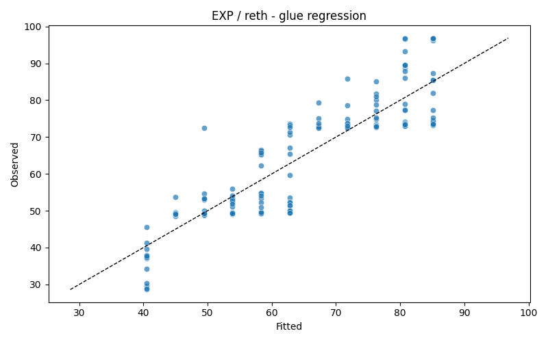

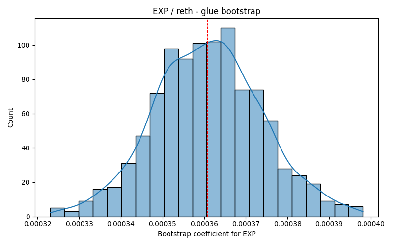

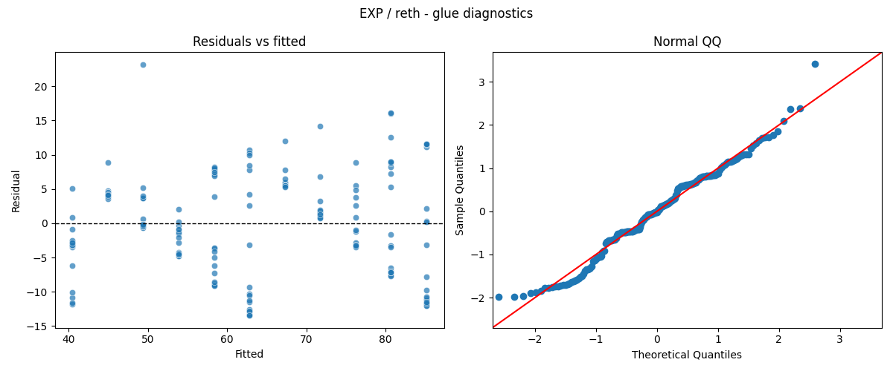

</details>

<details><summary><code>GT</code> · nobs=209 · runtime_ms=9.868e-07 · p=1.00e-03 · R²=0.7856</summary>

```
==============================================================================
                           NNLS Regression Results                            
==============================================================================
Dep. Variable:          test_runtime_ms              R-squared:          0.786
Model:                  NNLS                    Adj. R-squared:          0.785
No. Observations:       209                               RMSE:           5.43
Df Residuals:           207                                MAE:           3.88
Df Model:               1      
==============================================================================
                      coef     std err     P-value      [0.025      0.975]
------------------------------------------------------------------------------
         const     10.5814      1.3445       0.001      8.0426     13.2408
            GT      0.0000      0.0000       0.001      0.0000      0.0000
==============================================================================
Notes: Non-negative least squares with bootstrap inference (1000 iterations)
==============================================================================
```

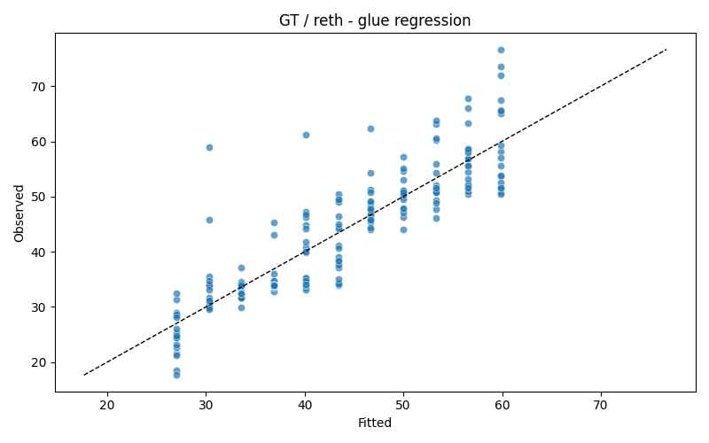

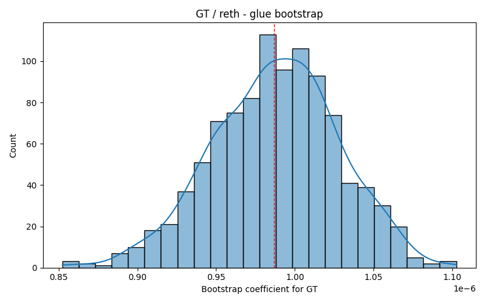

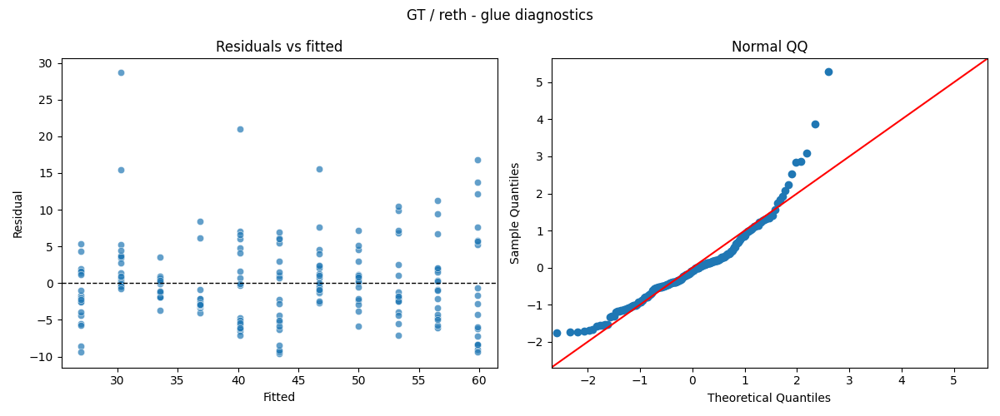

</details>

<details><summary><code>JUMPI</code> · nobs=209 · runtime_ms=1.244e-06 · p=1.00e-03 · R²=0.7285</summary>

```
==============================================================================
                           NNLS Regression Results                            
==============================================================================
Dep. Variable:          test_runtime_ms              R-squared:          0.728
Model:                  NNLS                    Adj. R-squared:          0.727
No. Observations:       209                               RMSE:           3.43
Df Residuals:           207                                MAE:           2.44
Df Model:               1      
==============================================================================
                      coef     std err     P-value      [0.025      0.975]
------------------------------------------------------------------------------
         const      6.8345      0.7781       0.001      5.3622      8.4024
         JUMPI      0.0000      0.0000       0.001      0.0000      0.0000
==============================================================================
Notes: Non-negative least squares with bootstrap inference (1000 iterations)
==============================================================================
```

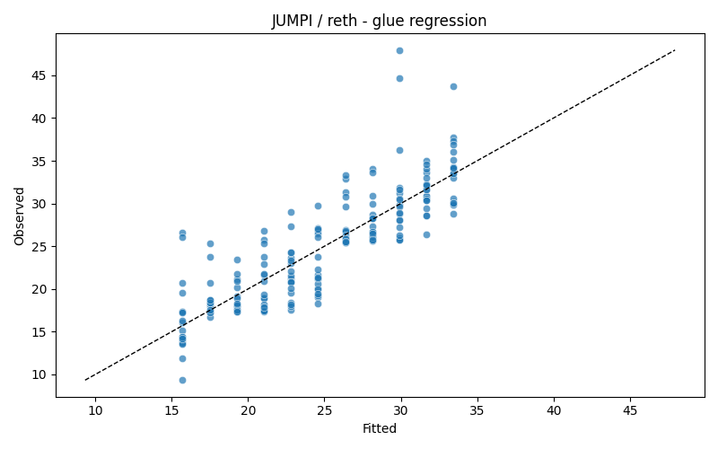

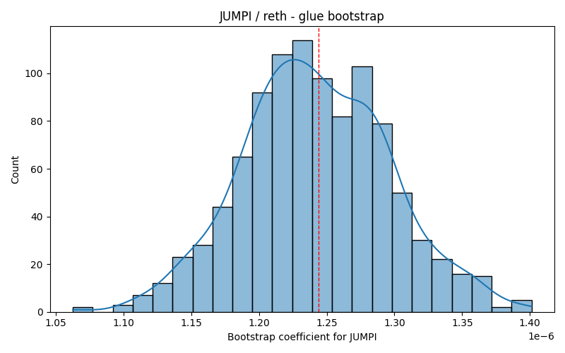

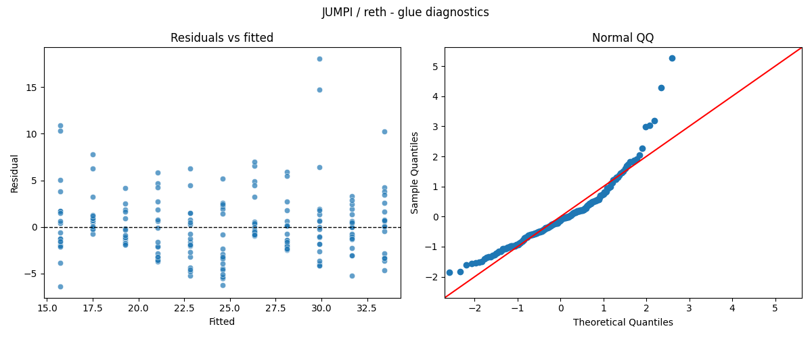

</details>

<details><summary><code>LT</code> · nobs=209 · runtime_ms=9.693e-07 · p=1.00e-03 · R²=0.8293</summary>

```
==============================================================================
                           NNLS Regression Results                            
==============================================================================
Dep. Variable:          test_runtime_ms              R-squared:          0.829
Model:                  NNLS                    Adj. R-squared:          0.828
No. Observations:       209                               RMSE:           4.63
Df Residuals:           207                                MAE:           3.47
Df Model:               1      
==============================================================================
                      coef     std err     P-value      [0.025      0.975]
------------------------------------------------------------------------------
         const      8.5915      1.0780       0.001      6.4718     10.6114
            LT      0.0000      0.0000       0.001      0.0000      0.0000
==============================================================================
Notes: Non-negative least squares with bootstrap inference (1000 iterations)
==============================================================================
```

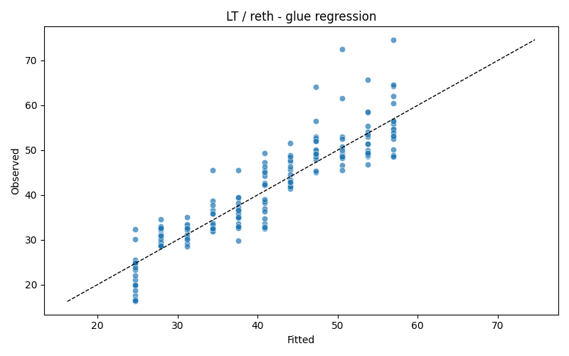

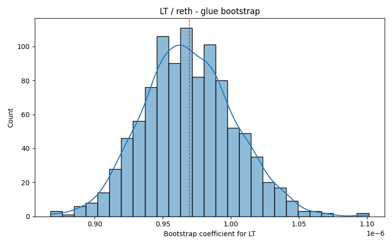

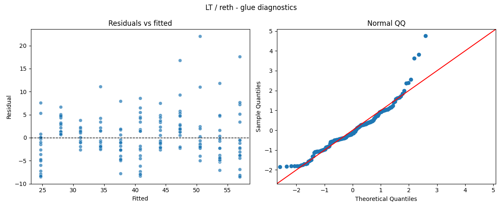

</details>

<details><summary><code>MSTORE</code> · nobs=1045 · runtime_ms=2.83e-06 · p=1.00e-03 · R²=0.2935</summary>

```
==============================================================================
                           NNLS Regression Results                            
==============================================================================
Dep. Variable:          test_runtime_ms              R-squared:          0.293
Model:                  NNLS                    Adj. R-squared:          0.293
No. Observations:       1045                              RMSE:          30.81
Df Residuals:           1043                               MAE:          27.74
Df Model:               1      
==============================================================================
                      coef     std err     P-value      [0.025      0.975]
------------------------------------------------------------------------------
         const     20.0862      2.7871       0.001     14.5170     25.3283
        MSTORE      0.0000      0.0000       0.001      0.0000      0.0000
==============================================================================
Notes: Non-negative least squares with bootstrap inference (1000 iterations)
==============================================================================
```

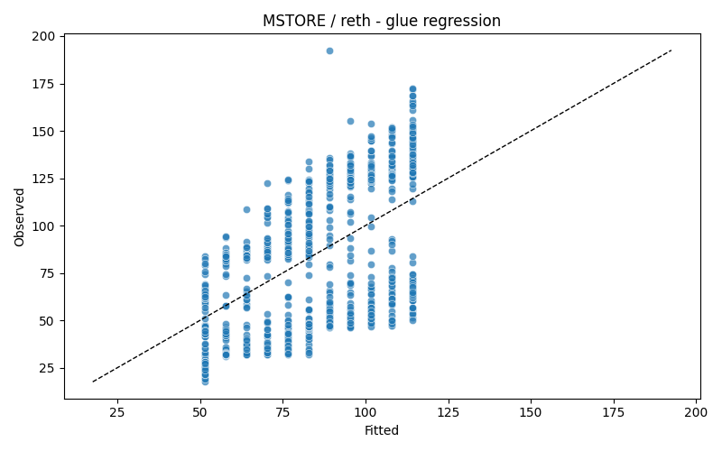

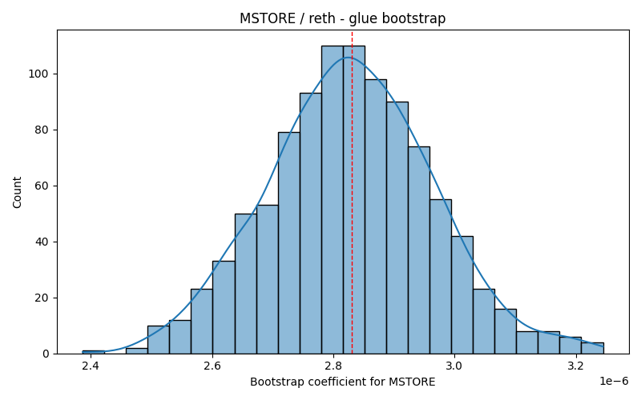

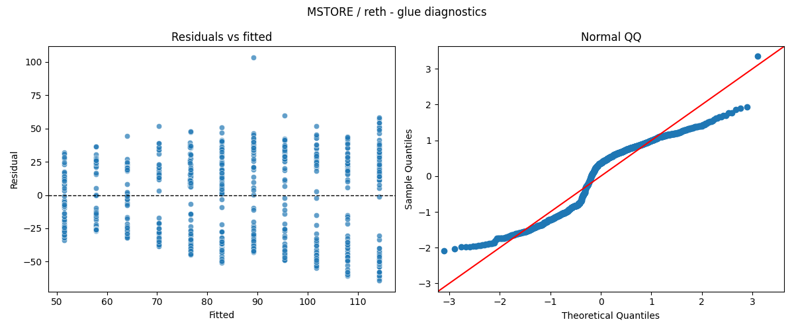

</details>

<details><summary><code>MSTORE8</code> · nobs=1045 · runtime_ms=1.308e-06 · p=1.00e-03 · R²=0.5165</summary>

```
==============================================================================
                           NNLS Regression Results                            
==============================================================================
Dep. Variable:          test_runtime_ms              R-squared:          0.516
Model:                  NNLS                    Adj. R-squared:          0.516
No. Observations:       1045                              RMSE:           8.88
Df Residuals:           1043                               MAE:           4.57
Df Model:               1      
==============================================================================
                      coef     std err     P-value      [0.025      0.975]
------------------------------------------------------------------------------
         const     11.5156      1.0434       0.001      9.6931     13.7158
       MSTORE8      0.0000      0.0000       0.001      0.0000      0.0000
==============================================================================
Notes: Non-negative least squares with bootstrap inference (1000 iterations)
==============================================================================
```

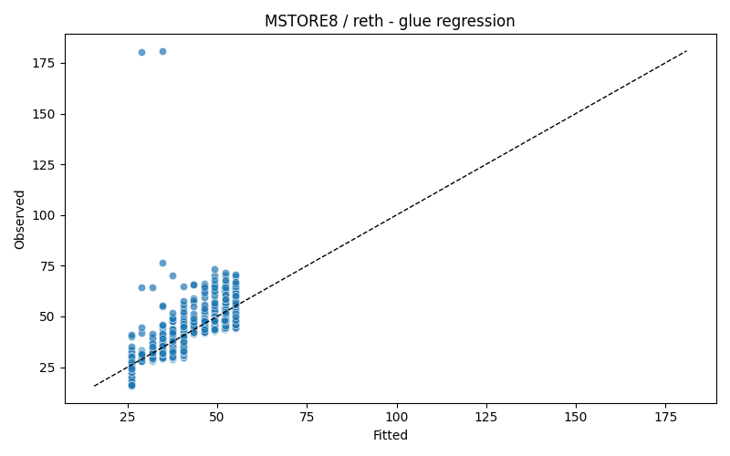

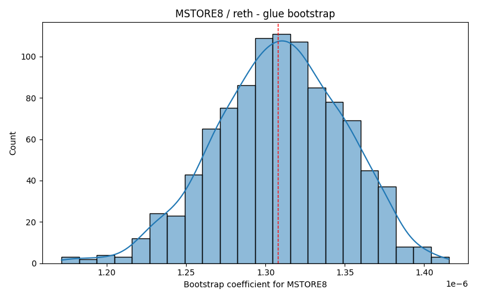

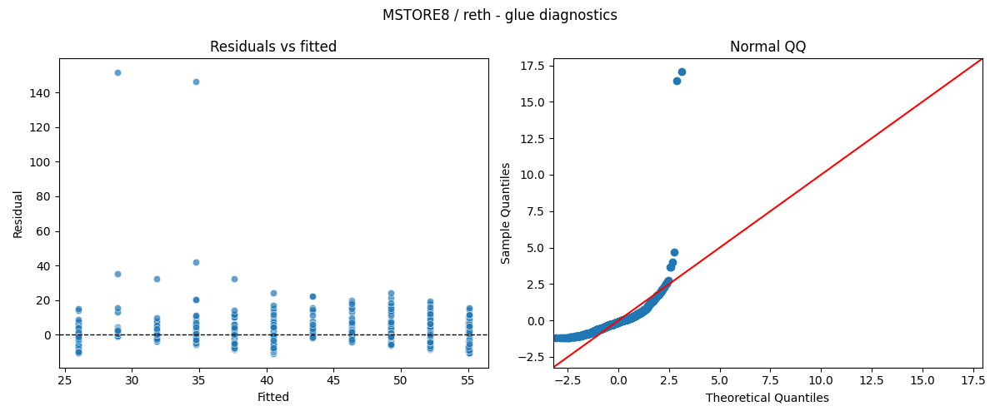

</details>

<details><summary><code>MUL</code> · nobs=209 · runtime_ms=1.169e-06 · p=1.00e-03 · R²=0.6802</summary>

```
==============================================================================
                           NNLS Regression Results                            
==============================================================================
Dep. Variable:          test_runtime_ms              R-squared:          0.680
Model:                  NNLS                    Adj. R-squared:          0.679
No. Observations:       209                               RMSE:           6.33
Df Residuals:           207                                MAE:           4.60
Df Model:               1      
==============================================================================
                      coef     std err     P-value      [0.025      0.975]
------------------------------------------------------------------------------
         const     11.2869      1.3265       0.001      8.7320     14.1261
           MUL      0.0000      0.0000       0.001      0.0000      0.0000
==============================================================================
Notes: Non-negative least squares with bootstrap inference (1000 iterations)
==============================================================================
```

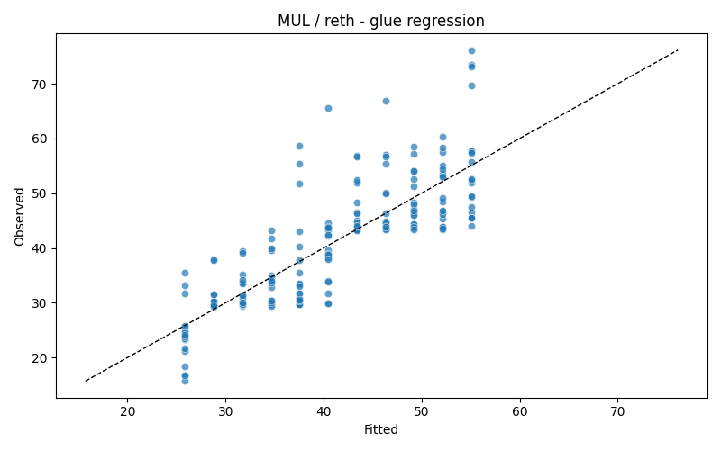

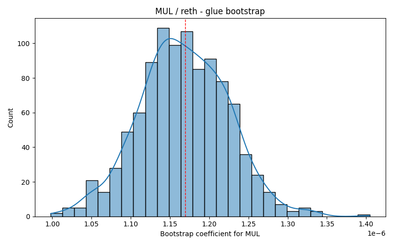

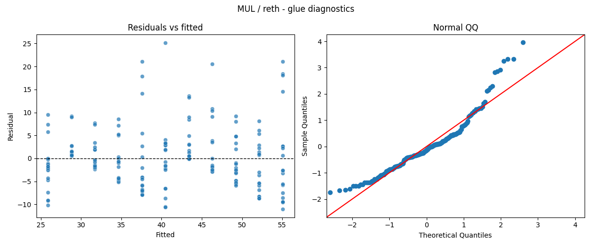

</details>

<details><summary><code>PC</code> · nobs=209 · runtime_ms=6.077e-07 · p=1.00e-03 · R²=0.9201</summary>

```
==============================================================================
                           NNLS Regression Results                            
==============================================================================
Dep. Variable:          test_runtime_ms              R-squared:          0.920
Model:                  NNLS                    Adj. R-squared:          0.920
No. Observations:       209                               RMSE:           5.35
Df Residuals:           207                                MAE:           4.23
Df Model:               1      
==============================================================================
                      coef     std err     P-value      [0.025      0.975]
------------------------------------------------------------------------------
         const     12.4864      1.1891       0.001     10.1793     14.7321
            PC      0.0000      0.0000       0.001      0.0000      0.0000
==============================================================================
Notes: Non-negative least squares with bootstrap inference (1000 iterations)
==============================================================================
```

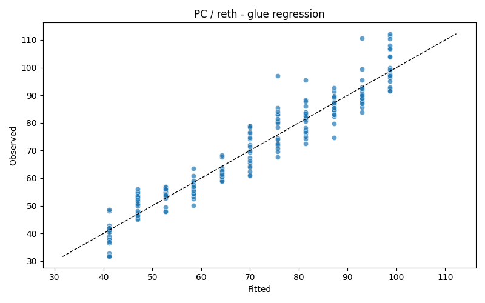

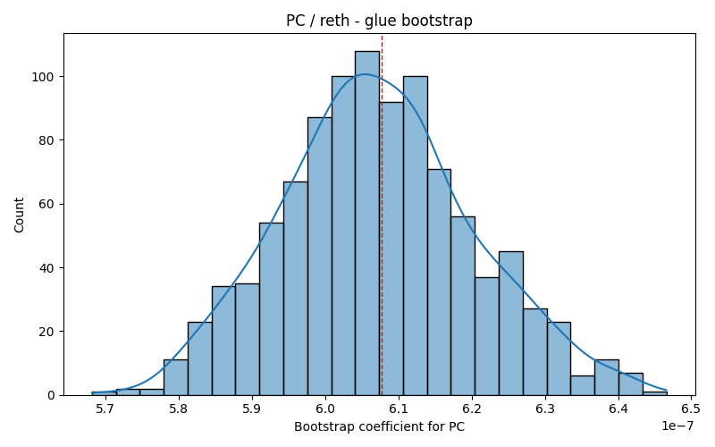

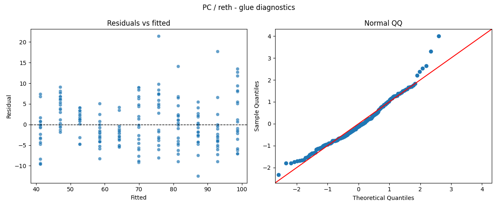

</details>

<details><summary><code>RETURNDATASIZE</code> · nobs=836 · runtime_ms=8.996e-07 · p=1.00e-03 · R²=0.6759</summary>

```
==============================================================================
                           NNLS Regression Results                            
==============================================================================
Dep. Variable:          test_runtime_ms              R-squared:          0.676
Model:                  NNLS                    Adj. R-squared:          0.675
No. Observations:       836                               RMSE:           9.84
Df Residuals:           834                                MAE:           5.20
Df Model:               1      
==============================================================================
                      coef     std err     P-value      [0.025      0.975]
------------------------------------------------------------------------------
         const     12.1263      0.8072       0.001     10.5546     13.7547
RETURNDATASIZE      0.0000      0.0000       0.001      0.0000      0.0000
==============================================================================
Notes: Non-negative least squares with bootstrap inference (1000 iterations)
==============================================================================
```

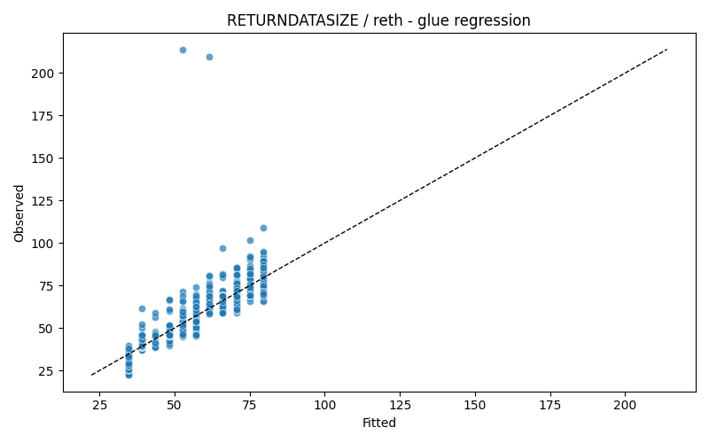

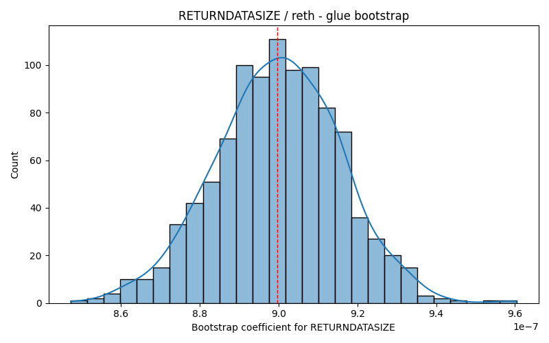

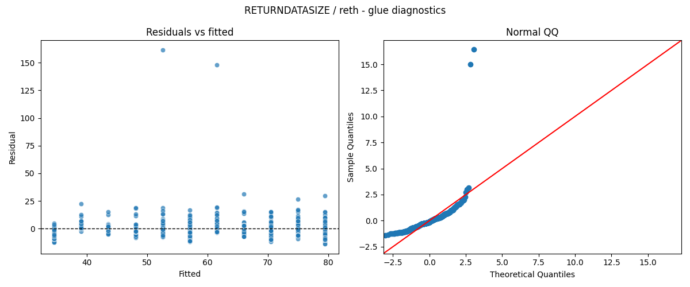

</details>

<details><summary><code>SELFBALANCE</code> · nobs=171 · runtime_ms=3.898e-06 · p=1.00e-03 · R²=0.5875</summary>

```
==============================================================================
                           NNLS Regression Results                            
==============================================================================
Dep. Variable:          test_runtime_ms              R-squared:          0.588
Model:                  NNLS                    Adj. R-squared:          0.585
No. Observations:       171                               RMSE:          32.94
Df Residuals:           169                                MAE:          20.85
Df Model:               1      
==============================================================================
                      coef     std err     P-value      [0.025      0.975]
------------------------------------------------------------------------------
         const     60.6109     12.8115       0.001     37.6493     86.8736
   SELFBALANCE      0.0000      0.0000       0.001      0.0000      0.0000
==============================================================================
Notes: Non-negative least squares with bootstrap inference (1000 iterations)
==============================================================================
```

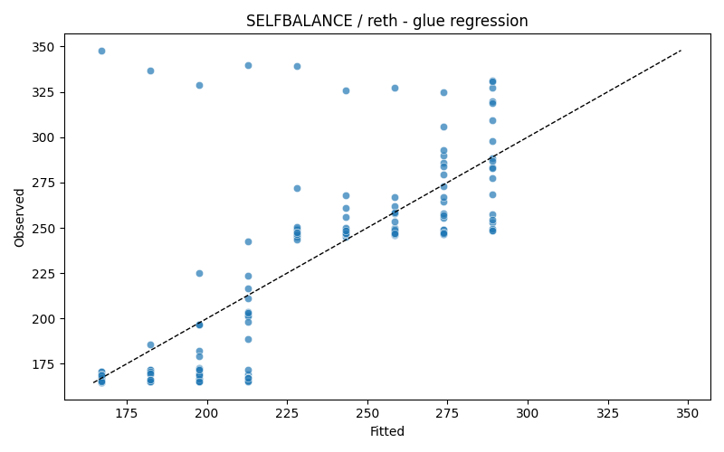

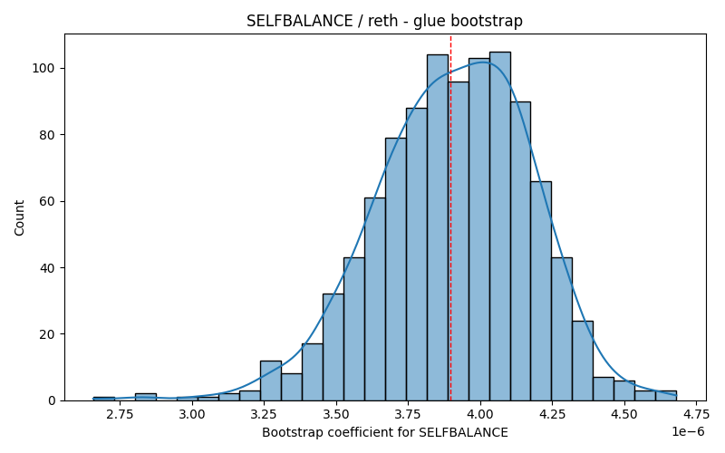

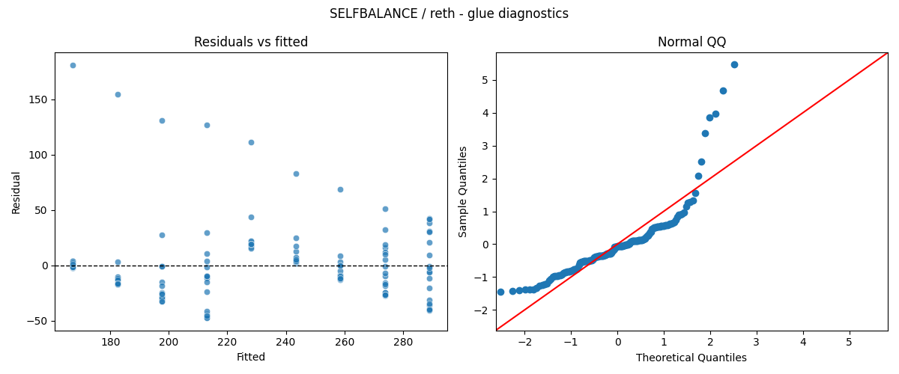

</details>

<details><summary><code>SUB</code> · nobs=209 · runtime_ms=1.002e-06 · p=1.00e-03 · R²=0.8338</summary>

```
==============================================================================
                           NNLS Regression Results                            
==============================================================================
Dep. Variable:          test_runtime_ms              R-squared:          0.834
Model:                  NNLS                    Adj. R-squared:          0.833
No. Observations:       209                               RMSE:           4.71
Df Residuals:           207                                MAE:           3.71
Df Model:               1      
==============================================================================
                      coef     std err     P-value      [0.025      0.975]
------------------------------------------------------------------------------
         const      8.2242      1.0237       0.001      6.2431     10.1225
           SUB      0.0000      0.0000       0.001      0.0000      0.0000
==============================================================================
Notes: Non-negative least squares with bootstrap inference (1000 iterations)
==============================================================================
```

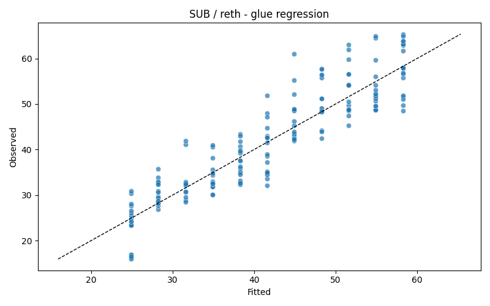

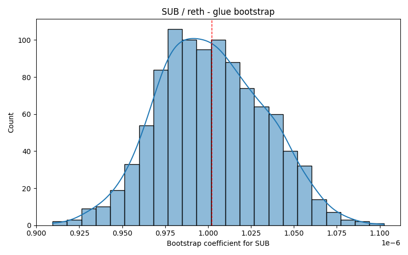

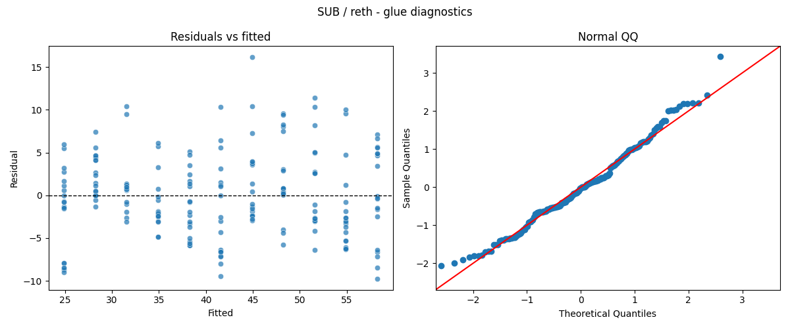

</details>

### Mixed glue (tier B) · reth

<details><summary><code>JUMP</code> · nobs=209 · runtime_ms=2.291e-06 · p=1.00e-03 · R²=0.8042</summary>

```
==============================================================================
                           NNLS Regression Results                            
==============================================================================
Dep. Variable:          test_runtime_ms              R-squared:          0.804
Model:                  NNLS                    Adj. R-squared:          0.803
No. Observations:       209                               RMSE:           4.20
Df Residuals:           207                                MAE:           3.11
Df Model:               1      
==============================================================================
                      coef     std err     P-value      [0.025      0.975]
------------------------------------------------------------------------------
         const      7.9429      1.0265       0.001      5.9840     10.1082
          JUMP      0.0000      0.0000       0.001      0.0000      0.0000
==============================================================================
Notes: Non-negative least squares with bootstrap inference (1000 iterations)
==============================================================================
```

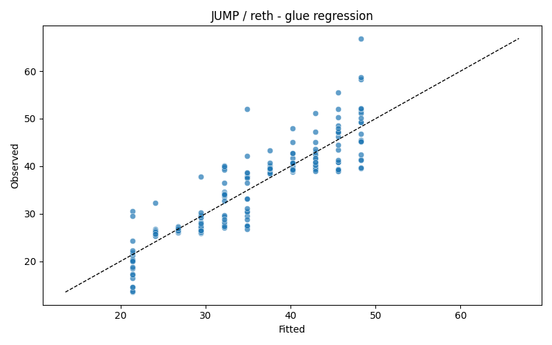

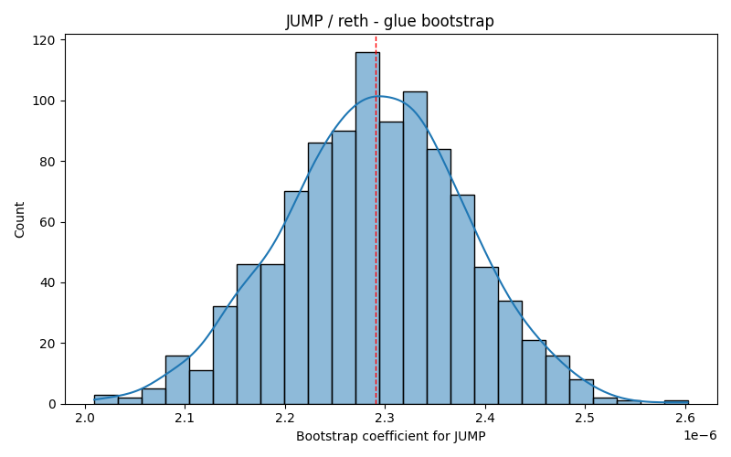

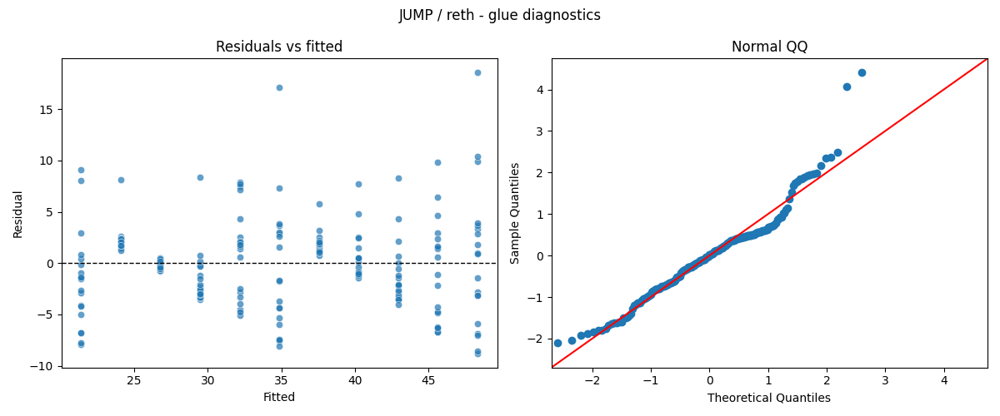

</details>

<details><summary><code>KECCAK256</code> · nobs=3344 · runtime_ms=0 · p=1.00e+00 · R²=0</summary>

```
==============================================================================
                           NNLS Regression Results                            
==============================================================================
Dep. Variable:          test_runtime_ms              R-squared:          0.000
Model:                  NNLS                    Adj. R-squared:         -0.000
No. Observations:       3344                              RMSE:         159.67
Df Residuals:           3342                               MAE:         135.16
Df Model:               1      
==============================================================================
                      coef     std err     P-value      [0.025      0.975]
------------------------------------------------------------------------------
         const    251.5655      2.7404       0.001    246.1513    256.7113
     KECCAK256      0.0000      0.0000       1.000      0.0000      0.0000
==============================================================================
Notes: Non-negative least squares with bootstrap inference (1000 iterations)
==============================================================================
```

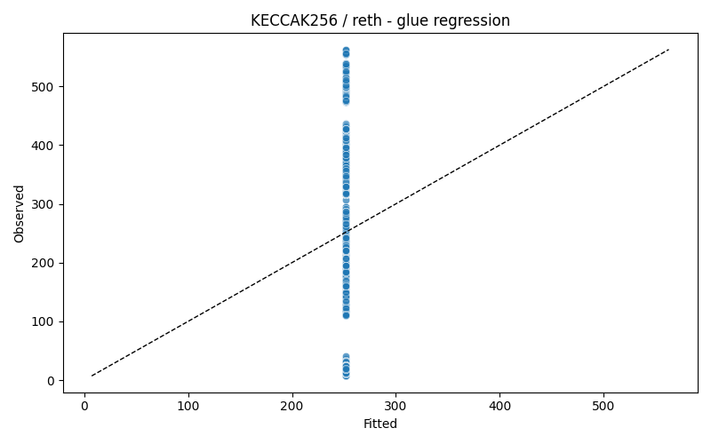


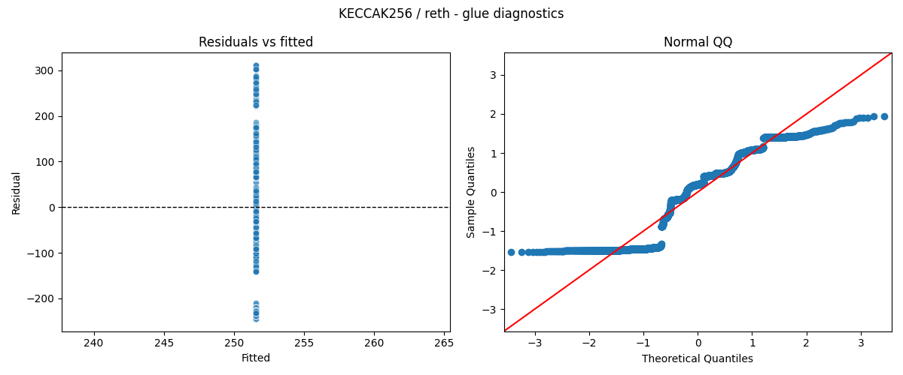

</details>
