# Runtime estimation report

Per-spec NNLS fits of `test_runtime_ms` against `opcount`, one row per (target opcode, test, model_by combo, client).

## Contents

- [SLOAD](#sload)
- [SSTORE](#sstore)
- [BALANCE](#balance)
- [CALL](#call)
- [CALLCODE](#callcode)
- [DELEGATECALL](#delegatecall)
- [EXTCODECOPY](#extcodecopy)
- [EXTCODEHASH](#extcodehash)
- [EXTCODESIZE](#extcodesize)
- [STATICCALL](#staticcall)

## SLOAD

### test_sload_bloated — combo `False`

| client | nobs | R² | target_coef (ms) | p-value | 95% CI |
| --- | --- | --- | --- | --- | --- |
| `besu` | 341 | 0.9601 | 0.007121 | 1.00e-03 | [0.006952, 0.007291] |
| `erigon` | 176 | 0.9949 | 0.006256 | 1.00e-03 | [0.006191, 0.006323] |
| `nethermind` | 264 | 0.8757 | 0.003612 | 1.00e-03 | [0.003447, 0.003771] |
| `reth` | 451 | 0.948 | 0.001302 | 1.00e-03 | [0.00127, 0.001333] |

<details><summary>besu — NNLS regression summary</summary>

```
==============================================================================
                           NNLS Regression Results                            
==============================================================================
Dep. Variable:          test_runtime_ms              R-squared:          0.960
Model:                  NNLS                    Adj. R-squared:          0.960
No. Observations:       341                               RMSE:          42.73
Df Residuals:           339                                MAE:          35.13
Df Model:               1      
==============================================================================
                      coef     std err     P-value      [0.025      0.975]
------------------------------------------------------------------------------
         const    192.3359      7.3219       0.001    177.3223    206.2391
       opcount      0.0071      0.0001       0.001      0.0070      0.0073
==============================================================================
Notes: Non-negative least squares with bootstrap inference (1000 iterations)
==============================================================================
```

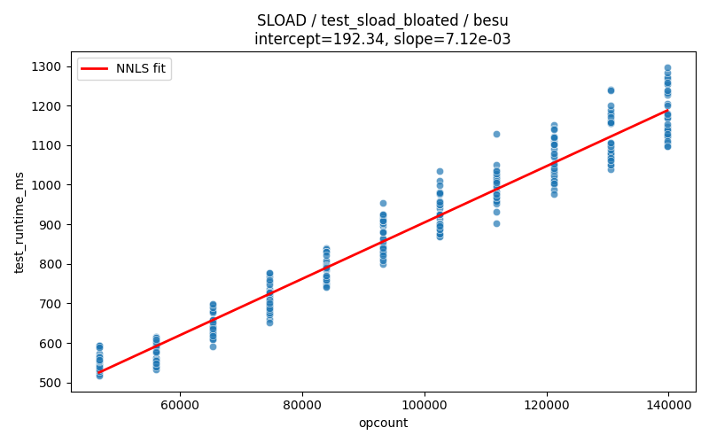

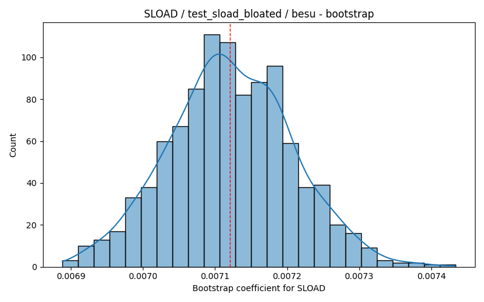

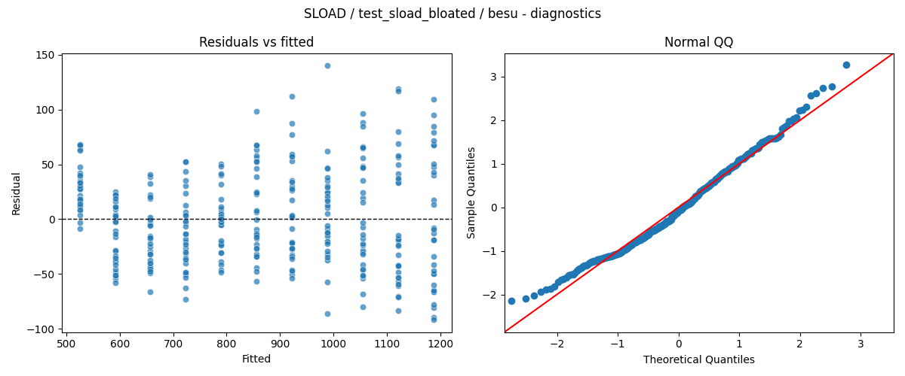

</details>

<details><summary>erigon — NNLS regression summary</summary>

```
==============================================================================
                           NNLS Regression Results                            
==============================================================================
Dep. Variable:          test_runtime_ms              R-squared:          0.995
Model:                  NNLS                    Adj. R-squared:          0.995
No. Observations:       176                               RMSE:          13.12
Df Residuals:           174                                MAE:          10.53
Df Model:               1      
==============================================================================
                      coef     std err     P-value      [0.025      0.975]
------------------------------------------------------------------------------
         const     18.7778      2.8612       0.001     13.2755     24.3937
       opcount      0.0063      0.0000       0.001      0.0062      0.0063
==============================================================================
Notes: Non-negative least squares with bootstrap inference (1000 iterations)
==============================================================================
```

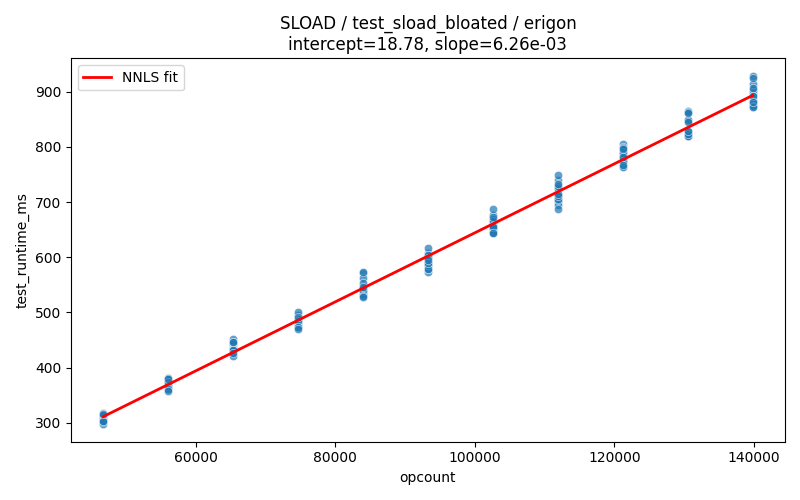

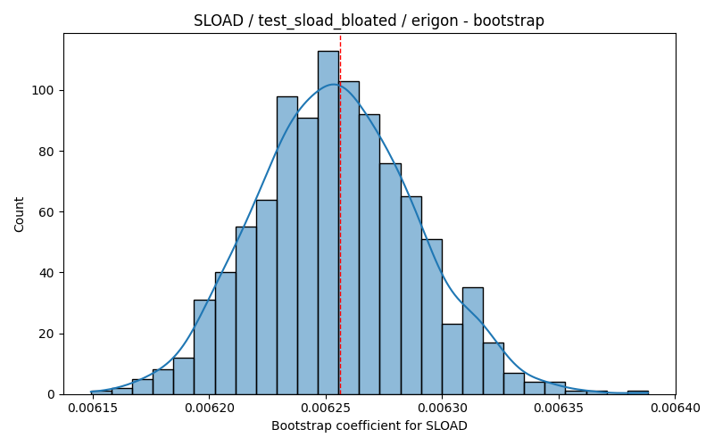

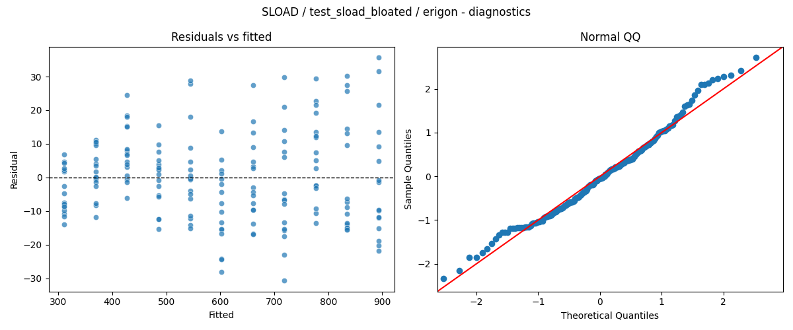

</details>

<details><summary>nethermind — NNLS regression summary</summary>

```
==============================================================================
                           NNLS Regression Results                            
==============================================================================
Dep. Variable:          test_runtime_ms              R-squared:          0.876
Model:                  NNLS                    Adj. R-squared:          0.875
No. Observations:       264                               RMSE:          40.06
Df Residuals:           262                                MAE:          32.94
Df Model:               1      
==============================================================================
                      coef     std err     P-value      [0.025      0.975]
------------------------------------------------------------------------------
         const    128.6141      8.5172       0.001    112.8452    144.9874
       opcount      0.0036      0.0001       0.001      0.0034      0.0038
==============================================================================
Notes: Non-negative least squares with bootstrap inference (1000 iterations)
==============================================================================
```

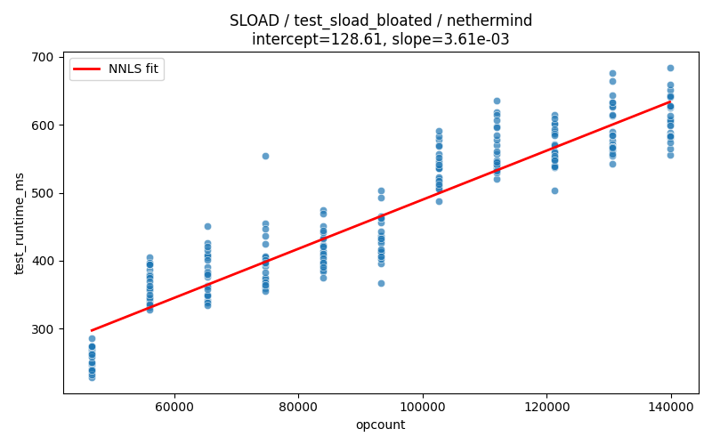

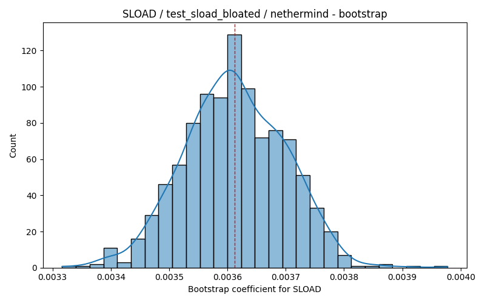

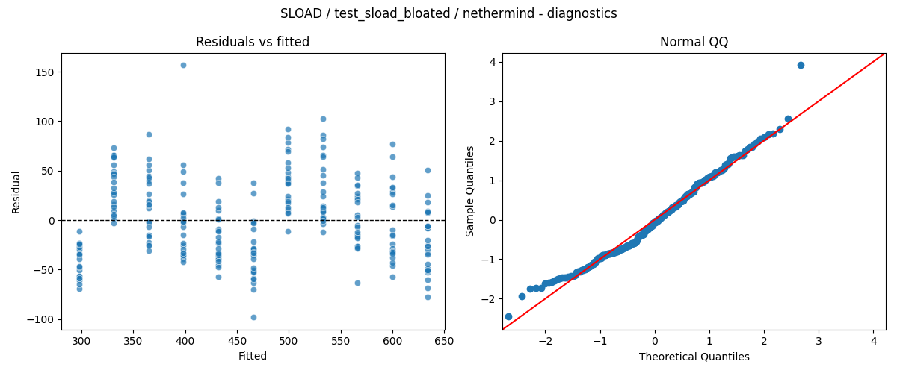

</details>

<details><summary>reth — NNLS regression summary</summary>

```
==============================================================================
                           NNLS Regression Results                            
==============================================================================
Dep. Variable:          test_runtime_ms              R-squared:          0.948
Model:                  NNLS                    Adj. R-squared:          0.948
No. Observations:       451                               RMSE:           8.97
Df Residuals:           449                                MAE:           6.88
Df Model:               1      
==============================================================================
                      coef     std err     P-value      [0.025      0.975]
------------------------------------------------------------------------------
         const     38.1720      1.6386       0.001     35.1793     41.5367
       opcount      0.0013      0.0000       0.001      0.0013      0.0013
==============================================================================
Notes: Non-negative least squares with bootstrap inference (1000 iterations)
==============================================================================
```

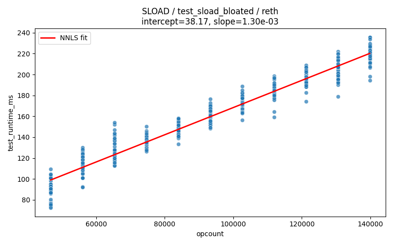

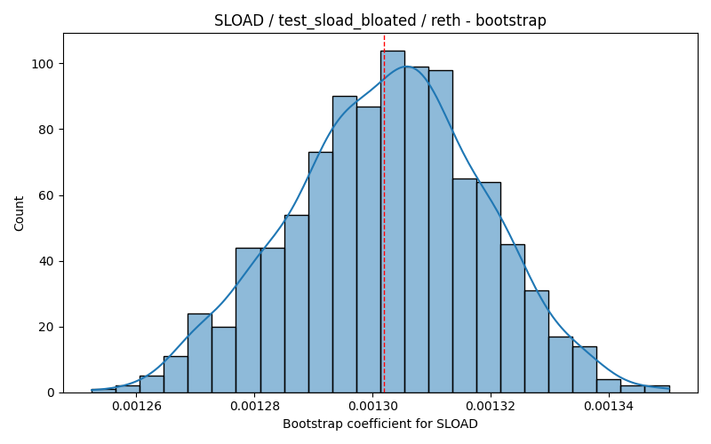

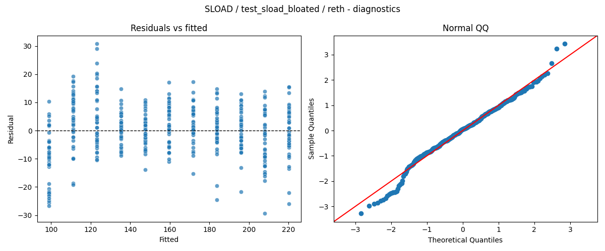

</details>

### test_sload_bloated — combo `True`

| client | nobs | R² | target_coef (ms) | p-value | 95% CI |
| --- | --- | --- | --- | --- | --- |
| `besu` | 341 | 0.9037 | 0.01586 | 1.00e-03 | [0.0153, 0.01644] |
| `erigon` | 176 | 0.987 | 0.00582 | 1.00e-03 | [0.005726, 0.005926] |
| `nethermind` | 264 | 0.5293 | 0.02467 | 1.00e-03 | [0.02183, 0.02742] |
| `reth` | 451 | 0.9583 | 0.00144 | 1.00e-03 | [0.001407, 0.001472] |

<details><summary>besu — NNLS regression summary</summary>

```
==============================================================================
                           NNLS Regression Results                            
==============================================================================
Dep. Variable:          test_runtime_ms              R-squared:          0.904
Model:                  NNLS                    Adj. R-squared:          0.903
No. Observations:       341                               RMSE:         152.38
Df Residuals:           339                                MAE:         127.36
Df Model:               1      
==============================================================================
                      coef     std err     P-value      [0.025      0.975]
------------------------------------------------------------------------------
         const    488.3762     25.7750       0.001    436.9223    536.4357
       opcount      0.0159      0.0003       0.001      0.0153      0.0164
==============================================================================
Notes: Non-negative least squares with bootstrap inference (1000 iterations)
==============================================================================
```

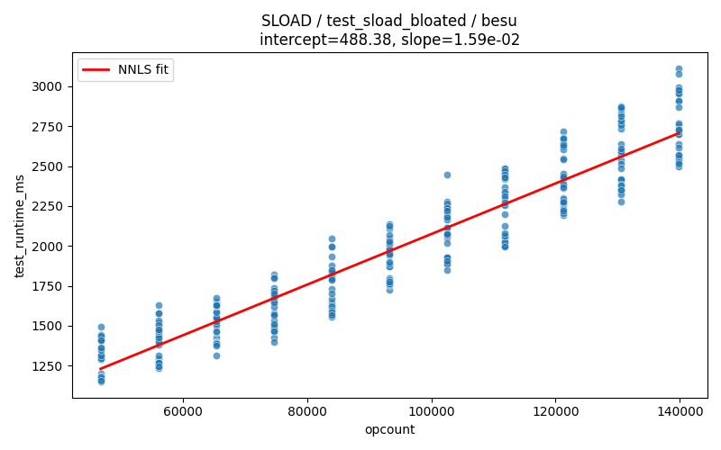

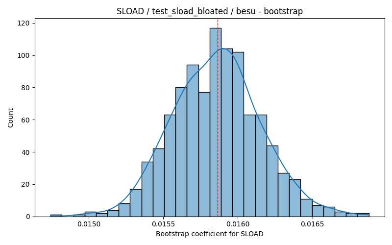

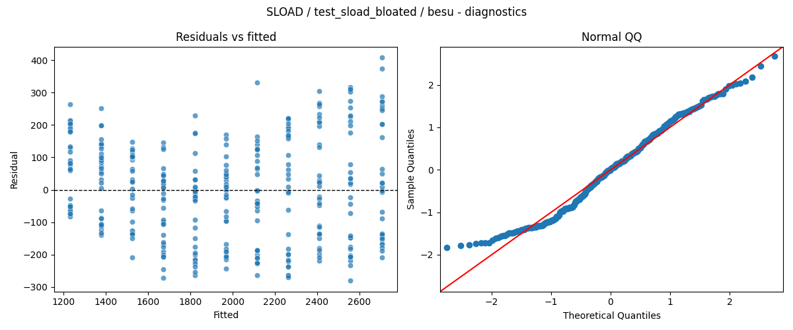

</details>

<details><summary>erigon — NNLS regression summary</summary>

```
==============================================================================
                           NNLS Regression Results                            
==============================================================================
Dep. Variable:          test_runtime_ms              R-squared:          0.987
Model:                  NNLS                    Adj. R-squared:          0.987
No. Observations:       176                               RMSE:          19.64
Df Residuals:           174                                MAE:          16.10
Df Model:               1      
==============================================================================
                      coef     std err     P-value      [0.025      0.975]
------------------------------------------------------------------------------
         const     28.6695      4.5294       0.001     19.4190     37.4673
       opcount      0.0058      0.0001       0.001      0.0057      0.0059
==============================================================================
Notes: Non-negative least squares with bootstrap inference (1000 iterations)
==============================================================================
```

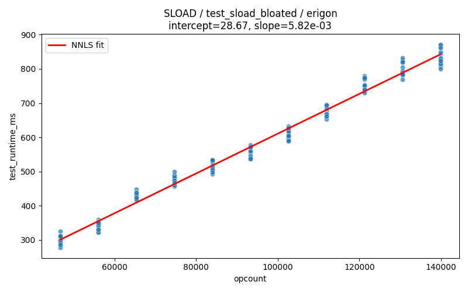


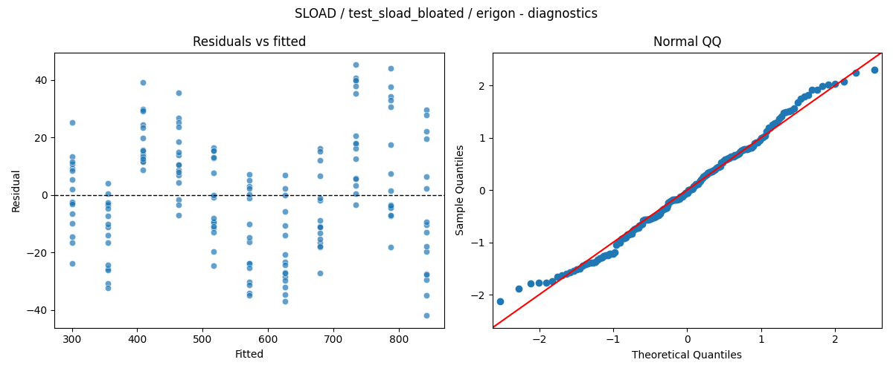

</details>

<details><summary>nethermind — NNLS regression summary</summary>

```
==============================================================================
                           NNLS Regression Results                            
==============================================================================
Dep. Variable:          test_runtime_ms              R-squared:          0.529
Model:                  NNLS                    Adj. R-squared:          0.527
No. Observations:       264                               RMSE:         684.82
Df Residuals:           262                                MAE:         585.77
Df Model:               1      
==============================================================================
                      coef     std err     P-value      [0.025      0.975]
------------------------------------------------------------------------------
         const   1209.3325    139.8435       0.001    941.5033   1484.5021
       opcount      0.0247      0.0015       0.001      0.0218      0.0274
==============================================================================
Notes: Non-negative least squares with bootstrap inference (1000 iterations)
==============================================================================
```

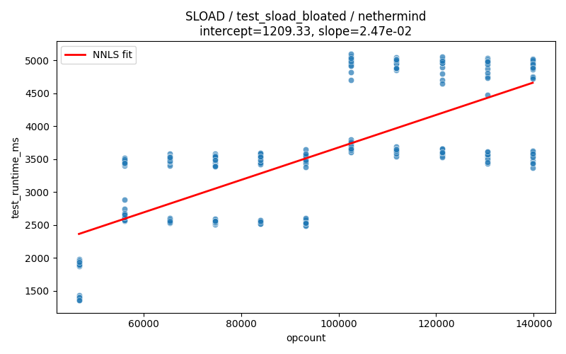

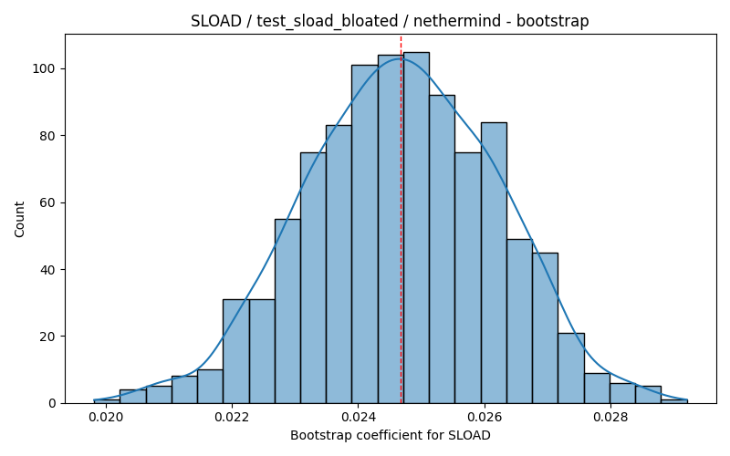

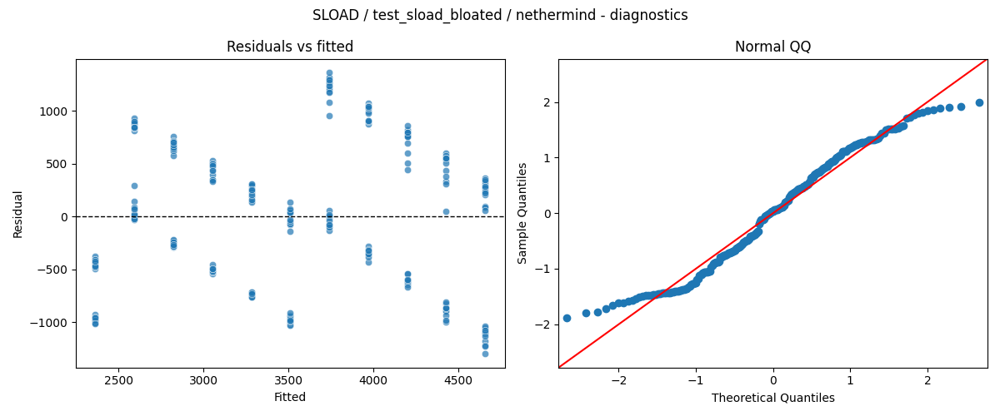

</details>

<details><summary>reth — NNLS regression summary</summary>

```
==============================================================================
                           NNLS Regression Results                            
==============================================================================
Dep. Variable:          test_runtime_ms              R-squared:          0.958
Model:                  NNLS                    Adj. R-squared:          0.958
No. Observations:       451                               RMSE:           8.83
Df Residuals:           449                                MAE:           6.42
Df Model:               1      
==============================================================================
                      coef     std err     P-value      [0.025      0.975]
------------------------------------------------------------------------------
         const     30.0955      1.3843       0.001     27.5575     32.7914
       opcount      0.0014      0.0000       0.001      0.0014      0.0015
==============================================================================
Notes: Non-negative least squares with bootstrap inference (1000 iterations)
==============================================================================
```

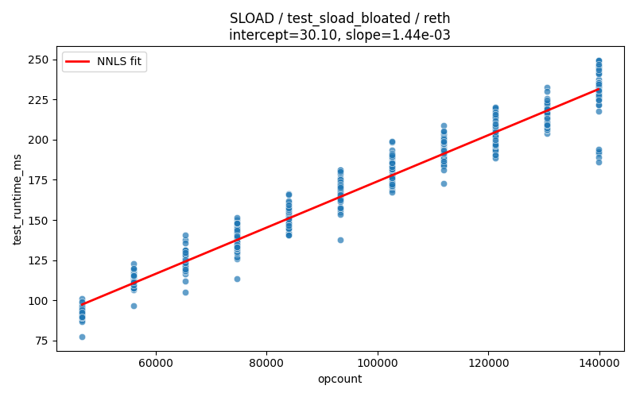

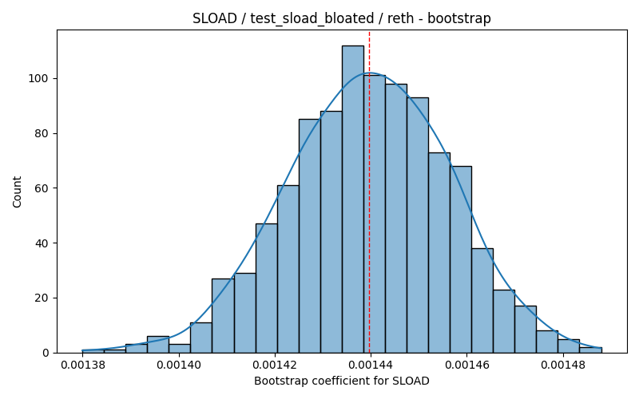

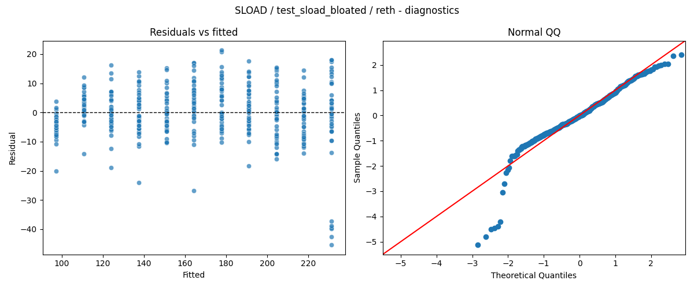

</details>

### test_storage_sload_same_key_benchmark

| client | nobs | R² | target_coef (ms) | p-value | 95% CI |
| --- | --- | --- | --- | --- | --- |
| `besu` | 682 | 0.8061 | 0.0001367 | 1.00e-03 | [0.0001316, 0.000142] |
| `erigon` | 352 | 0.8576 | 4.908e-05 | 1.00e-03 | [4.705e-05, 5.118e-05] |
| `nethermind` | 528 | 0.8711 | 0.000181 | 1.00e-03 | [0.0001751, 0.0001867] |
| `reth` | 902 | 0.704 | 5.233e-06 | 1.00e-03 | [5.022e-06, 5.438e-06] |

<details><summary>besu — NNLS regression summary</summary>

```
==============================================================================
                           NNLS Regression Results                            
==============================================================================
Dep. Variable:          test_runtime_ms              R-squared:          0.806
Model:                  NNLS                    Adj. R-squared:          0.806
No. Observations:       682                               RMSE:          42.35
Df Residuals:           680                                MAE:          32.36
Df Model:               1      
==============================================================================
                      coef     std err     P-value      [0.025      0.975]
------------------------------------------------------------------------------
         const    105.3506      4.8705       0.001     95.7983    115.1725
       opcount      0.0001      0.0000       0.001      0.0001      0.0001
==============================================================================
Notes: Non-negative least squares with bootstrap inference (1000 iterations)
==============================================================================
```

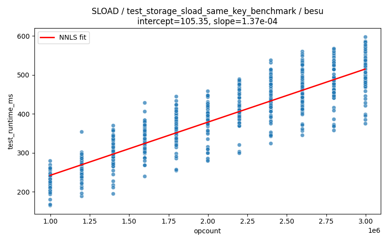

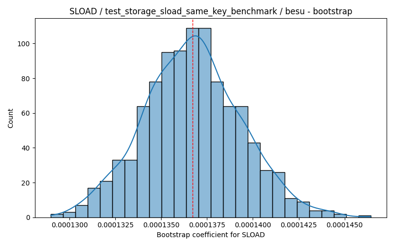

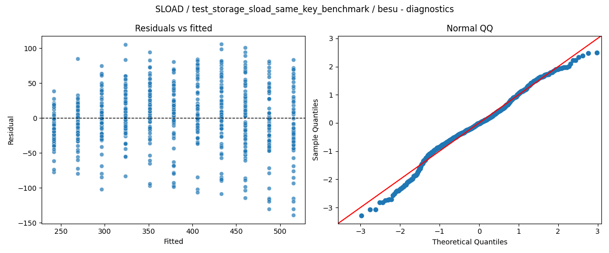

</details>

<details><summary>erigon — NNLS regression summary</summary>

```
==============================================================================
                           NNLS Regression Results                            
==============================================================================
Dep. Variable:          test_runtime_ms              R-squared:          0.858
Model:                  NNLS                    Adj. R-squared:          0.857
No. Observations:       352                               RMSE:          12.63
Df Residuals:           350                                MAE:          10.22
Df Model:               1      
==============================================================================
                      coef     std err     P-value      [0.025      0.975]
------------------------------------------------------------------------------
         const     40.3040      1.9035       0.001     36.7054     43.9852
       opcount      0.0000      0.0000       0.001      0.0000      0.0001
==============================================================================
Notes: Non-negative least squares with bootstrap inference (1000 iterations)
==============================================================================
```

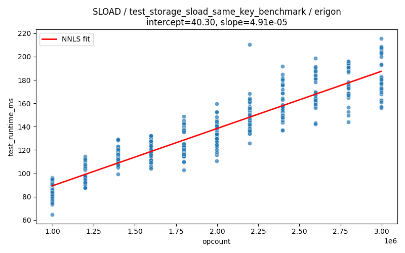

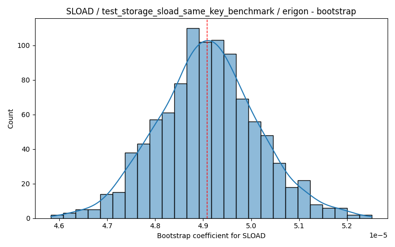

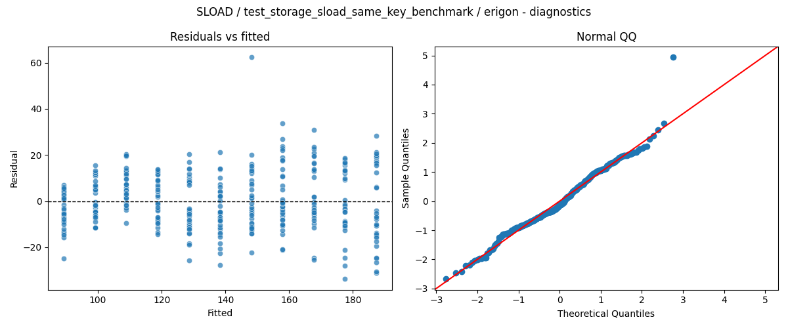

</details>

<details><summary>nethermind — NNLS regression summary</summary>

```
==============================================================================
                           NNLS Regression Results                            
==============================================================================
Dep. Variable:          test_runtime_ms              R-squared:          0.871
Model:                  NNLS                    Adj. R-squared:          0.871
No. Observations:       528                               RMSE:          43.98
Df Residuals:           526                                MAE:          32.54
Df Model:               1      
==============================================================================
                      coef     std err     P-value      [0.025      0.975]
------------------------------------------------------------------------------
         const     94.1125      5.9719       0.001     83.4610    106.9790
       opcount      0.0002      0.0000       0.001      0.0002      0.0002
==============================================================================
Notes: Non-negative least squares with bootstrap inference (1000 iterations)
==============================================================================
```

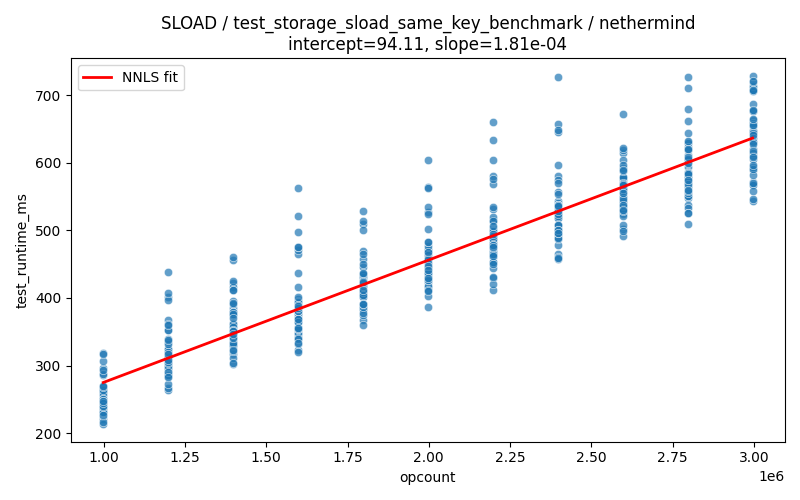

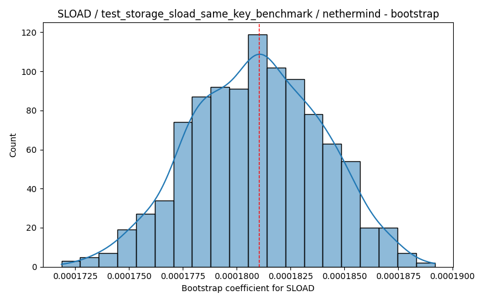

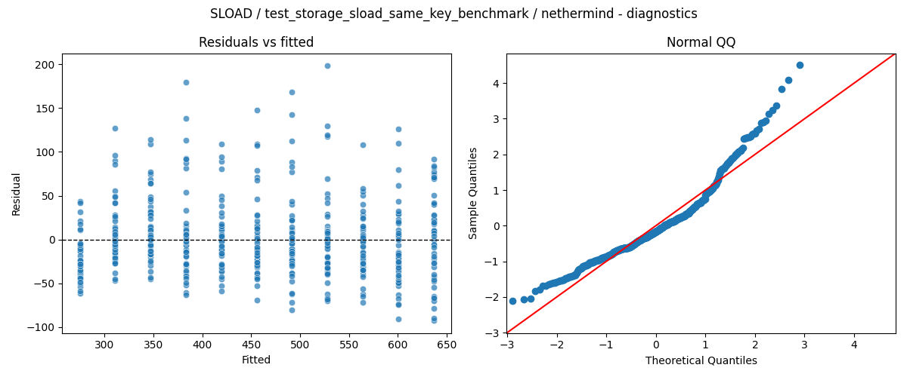

</details>

<details><summary>reth — NNLS regression summary</summary>

```
==============================================================================
                           NNLS Regression Results                            
==============================================================================
Dep. Variable:          test_runtime_ms              R-squared:          0.704
Model:                  NNLS                    Adj. R-squared:          0.704
No. Observations:       902                               RMSE:           2.14
Df Residuals:           900                                MAE:           1.55
Df Model:               1      
==============================================================================
                      coef     std err     P-value      [0.025      0.975]
------------------------------------------------------------------------------
         const      5.3236      0.2162       0.001      4.9169      5.7307
       opcount      0.0000      0.0000       0.001      0.0000      0.0000
==============================================================================
Notes: Non-negative least squares with bootstrap inference (1000 iterations)
==============================================================================
```

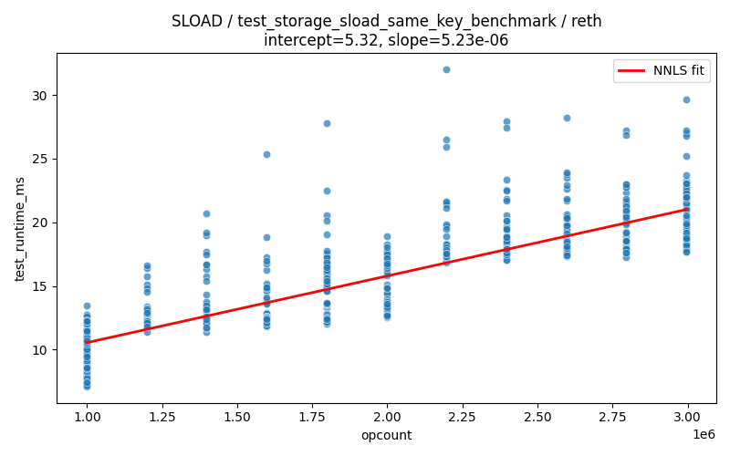


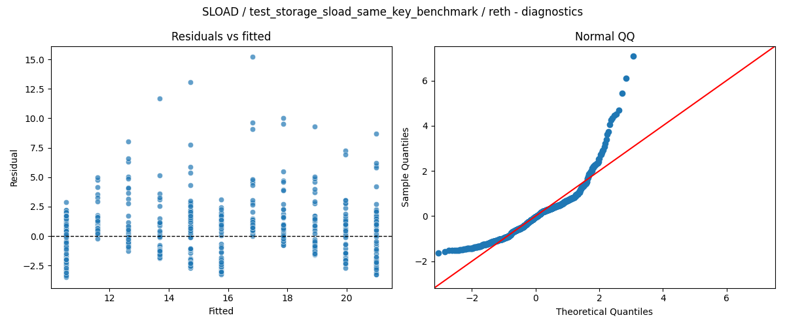

</details>

## SSTORE

### test_sstore_bloated — combo `False`

| client | nobs | R² | target_coef (ms) | p-value | 95% CI |
| --- | --- | --- | --- | --- | --- |
| `besu` | 682 | 0.7813 | 0.007268 | 1.00e-03 | [0.006887, 0.007649] |
| `erigon` | 352 | 0.9348 | 0 | 1.00e+00 | [0, 0] |
| `nethermind` | 528 | 0.9175 | 0.003619 | 1.00e-03 | [0.003502, 0.003749] |
| `reth` | 902 | 0.5997 | 0 | 1.00e+00 | [0, 0.000206] |

<details><summary>besu — NNLS regression summary</summary>

```
==============================================================================
                           NNLS Regression Results                            
==============================================================================
Dep. Variable:          test_runtime_ms              R-squared:          0.781
Model:                  NNLS                    Adj. R-squared:          0.781
No. Observations:       682                               RMSE:         143.33
Df Residuals:           679                                MAE:         120.14
Df Model:               2      
==============================================================================
                      coef     std err     P-value      [0.025      0.975]
------------------------------------------------------------------------------
         const    541.3066     15.6415       0.001    511.3980    572.7535
       opcount      0.0073      0.0002       0.001      0.0069      0.0076
        update      0.0961      0.0090       0.001      0.0787      0.1134
==============================================================================
Notes: Non-negative least squares with bootstrap inference (1000 iterations)
==============================================================================
```

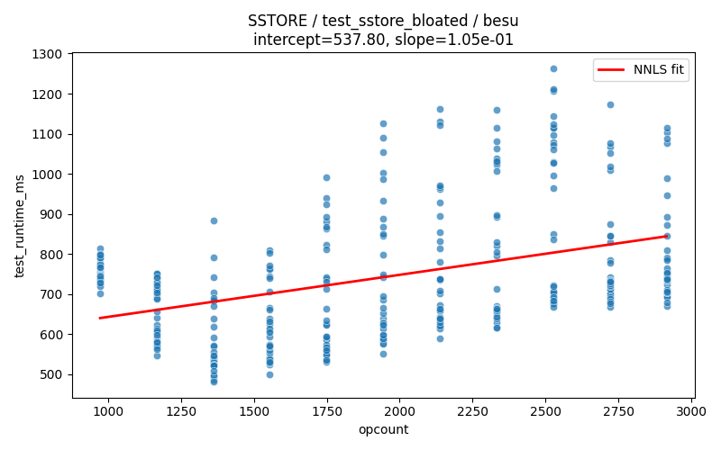

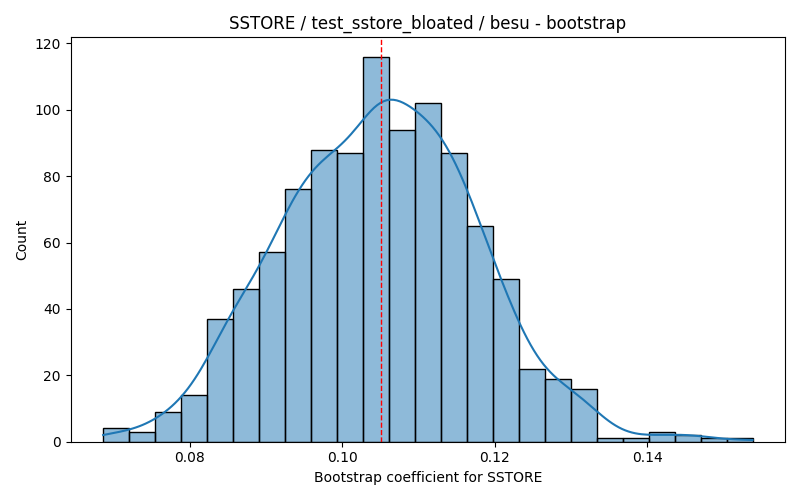

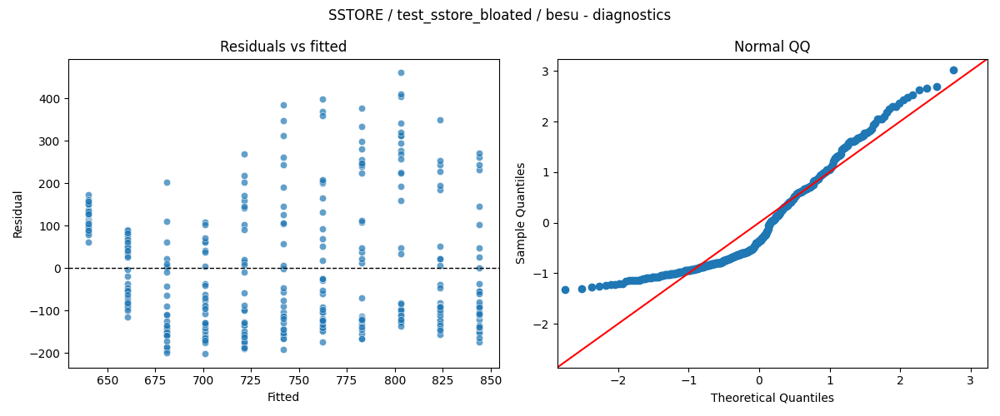

</details>

<details><summary>erigon — NNLS regression summary</summary>

```
==============================================================================
                           NNLS Regression Results                            
==============================================================================
Dep. Variable:          test_runtime_ms              R-squared:          0.935
Model:                  NNLS                    Adj. R-squared:          0.934
No. Observations:       352                               RMSE:         592.27
Df Residuals:           349                                MAE:         446.00
Df Model:               2      
==============================================================================
                      coef     std err     P-value      [0.025      0.975]
------------------------------------------------------------------------------
         const    784.6638     27.3004       0.001    733.8502    839.0325
       opcount      0.0000      0.0000       1.000      0.0000      0.0000
        update      2.1076      0.0267       0.001      2.0599      2.1620
==============================================================================
Notes: Non-negative least squares with bootstrap inference (1000 iterations)
==============================================================================
```

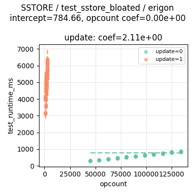

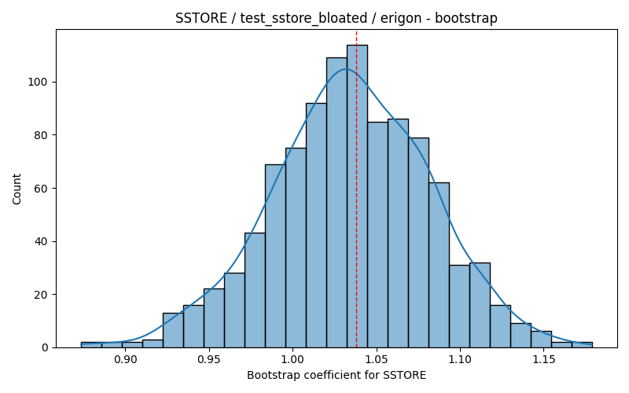

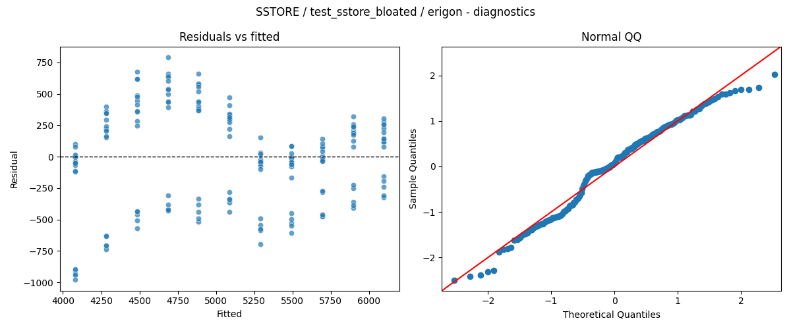

</details>

<details><summary>nethermind — NNLS regression summary</summary>

```
==============================================================================
                           NNLS Regression Results                            
==============================================================================
Dep. Variable:          test_runtime_ms              R-squared:          0.918
Model:                  NNLS                    Adj. R-squared:          0.917
No. Observations:       528                               RMSE:          37.70
Df Residuals:           525                                MAE:          30.53
Df Model:               2      
==============================================================================
                      coef     std err     P-value      [0.025      0.975]
------------------------------------------------------------------------------
         const    119.6928      5.2067       0.001    109.0936    129.7888
       opcount      0.0036      0.0001       0.001      0.0035      0.0037
        update      0.0610      0.0025       0.001      0.0561      0.0659
==============================================================================
Notes: Non-negative least squares with bootstrap inference (1000 iterations)
==============================================================================
```

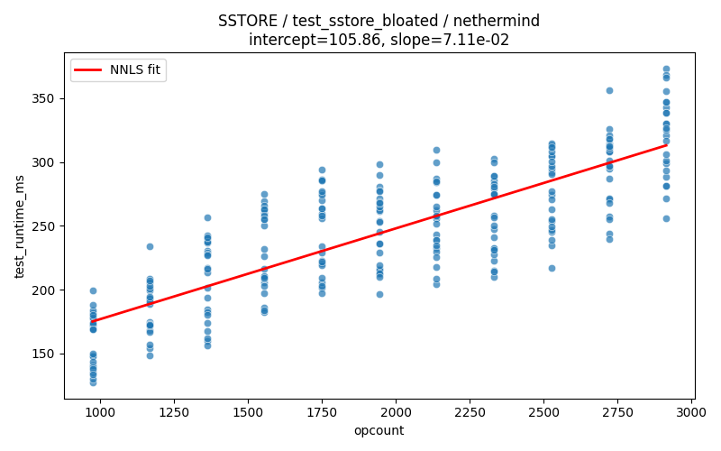

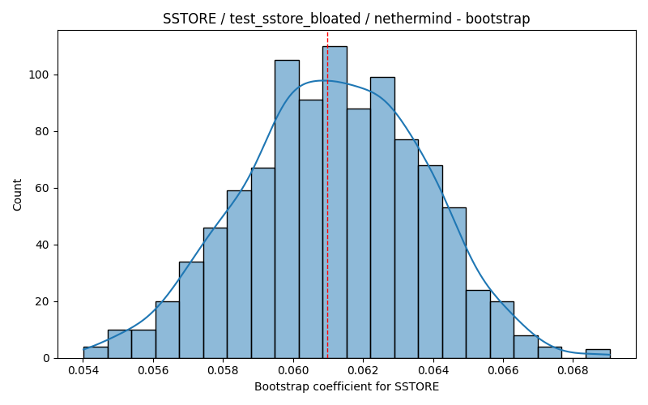

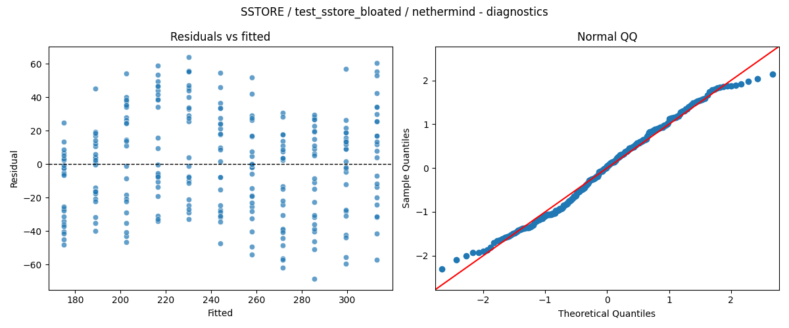

</details>

<details><summary>reth — NNLS regression summary</summary>

```
==============================================================================
                           NNLS Regression Results                            
==============================================================================
Dep. Variable:          test_runtime_ms              R-squared:          0.600
Model:                  NNLS                    Adj. R-squared:          0.599
No. Observations:       902                               RMSE:          62.20
Df Residuals:           899                                MAE:          39.86
Df Model:               2      
==============================================================================
                      coef     std err     P-value      [0.025      0.975]
------------------------------------------------------------------------------
         const    170.2103      6.8015       0.001    149.5509    174.8958
       opcount      0.0000      0.0001       1.000      0.0000      0.0002
        update      0.0715      0.0025       0.001      0.0699      0.0793
==============================================================================
Notes: Non-negative least squares with bootstrap inference (1000 iterations)
==============================================================================
```

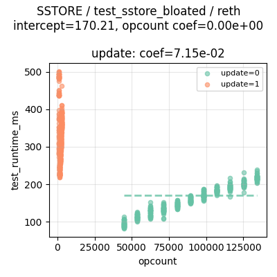

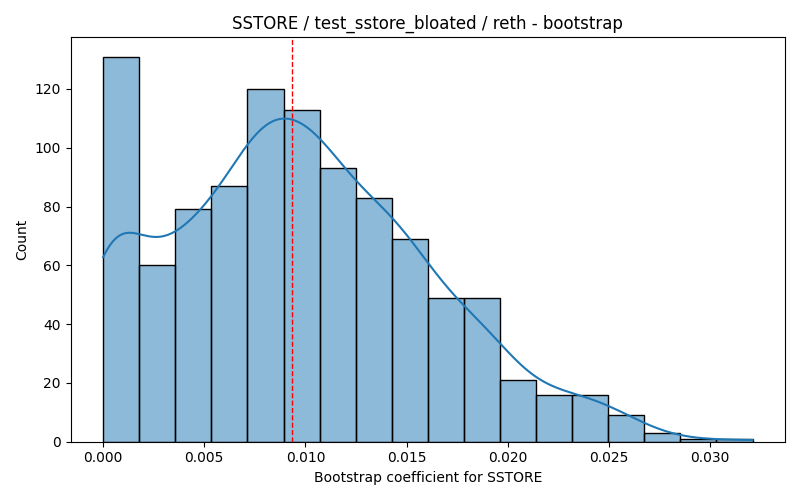

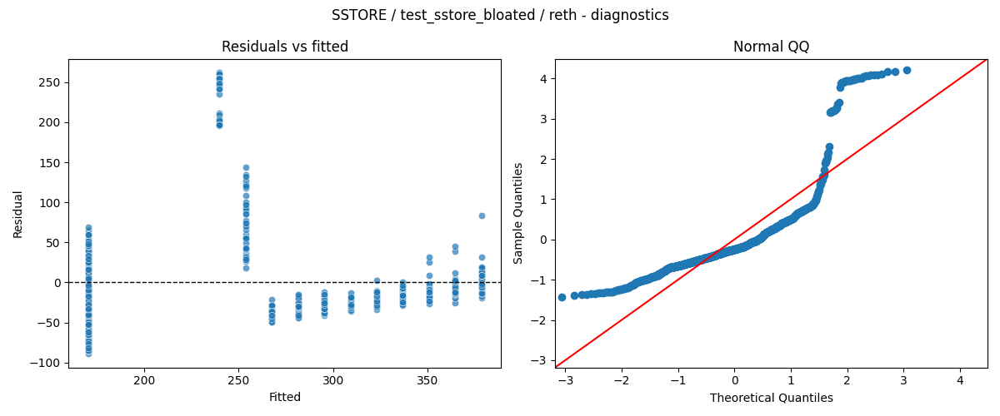

</details>

### test_sstore_bloated — combo `True`

| client | nobs | R² | target_coef (ms) | p-value | 95% CI |
| --- | --- | --- | --- | --- | --- |
| `besu` | 682 | 0.9712 | 0.01562 | 1.00e-03 | [0.01491, 0.0164] |
| `erigon` | 352 | 0.994 | 0 | 1.00e+00 | [0, 0] |
| `nethermind` | 528 | 0.6595 | 0.02634 | 1.00e-03 | [0.02472, 0.02822] |
| `reth` | 902 | 0.9952 | 0 | 1.00e+00 | [0, 0] |

<details><summary>besu — NNLS regression summary</summary>

```
==============================================================================
                           NNLS Regression Results                            
==============================================================================
Dep. Variable:          test_runtime_ms              R-squared:          0.971
Model:                  NNLS                    Adj. R-squared:          0.971
No. Observations:       682                               RMSE:         294.79
Df Residuals:           679                                MAE:         225.29
Df Model:               2      
==============================================================================
                      coef     std err     P-value      [0.025      0.975]
------------------------------------------------------------------------------
         const    765.0938     36.8963       0.001    690.8838    833.9903
       opcount      0.0156      0.0004       0.001      0.0149      0.0164
        update      0.0902      0.0008       0.001      0.0887      0.0917
==============================================================================
Notes: Non-negative least squares with bootstrap inference (1000 iterations)
==============================================================================
```

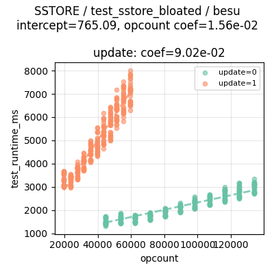

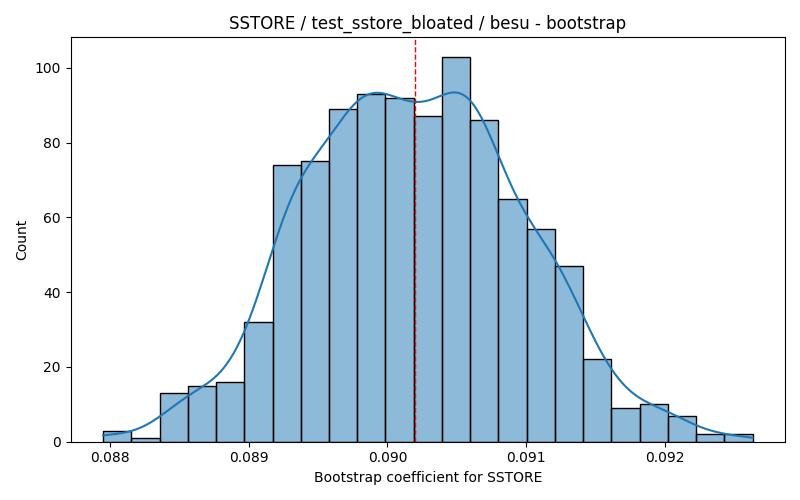

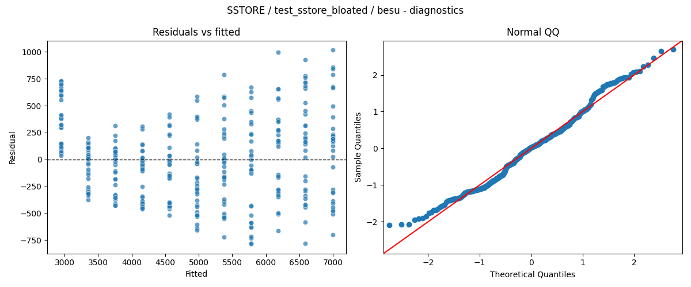

</details>

<details><summary>erigon — NNLS regression summary</summary>

```
==============================================================================
                           NNLS Regression Results                            
==============================================================================
Dep. Variable:          test_runtime_ms              R-squared:          0.994
Model:                  NNLS                    Adj. R-squared:          0.994
No. Observations:       352                               RMSE:        1138.38
Df Residuals:           349                                MAE:         881.52
Df Model:               2      
==============================================================================
                      coef     std err     P-value      [0.025      0.975]
------------------------------------------------------------------------------
         const    978.8187     54.6352       0.001    876.8748   1090.4148
       opcount      0.0000      0.0000       1.000      0.0000      0.0000
        update      0.6759      0.0029       0.001      0.6708      0.6824
==============================================================================
Notes: Non-negative least squares with bootstrap inference (1000 iterations)
==============================================================================
```


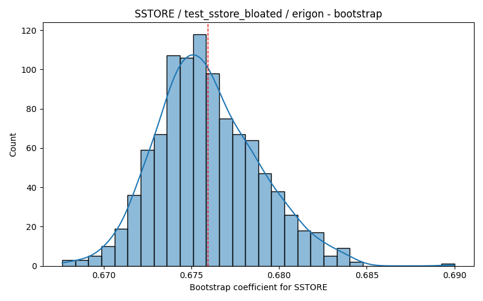

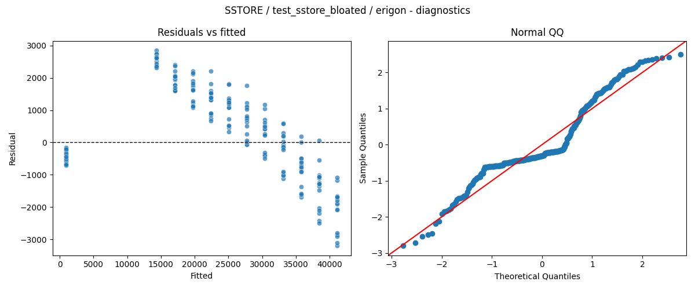

</details>

<details><summary>nethermind — NNLS regression summary</summary>

```
==============================================================================
                           NNLS Regression Results                            
==============================================================================
Dep. Variable:          test_runtime_ms              R-squared:          0.659
Model:                  NNLS                    Adj. R-squared:          0.658
No. Observations:       528                               RMSE:         515.99
Df Residuals:           525                                MAE:         414.84
Df Model:               2      
==============================================================================
                      coef     std err     P-value      [0.025      0.975]
------------------------------------------------------------------------------
         const   1030.3032     74.3696       0.001    889.1277   1169.2701
       opcount      0.0263      0.0009       0.001      0.0247      0.0282
        update      0.0272      0.0011       0.001      0.0250      0.0295
==============================================================================
Notes: Non-negative least squares with bootstrap inference (1000 iterations)
==============================================================================
```

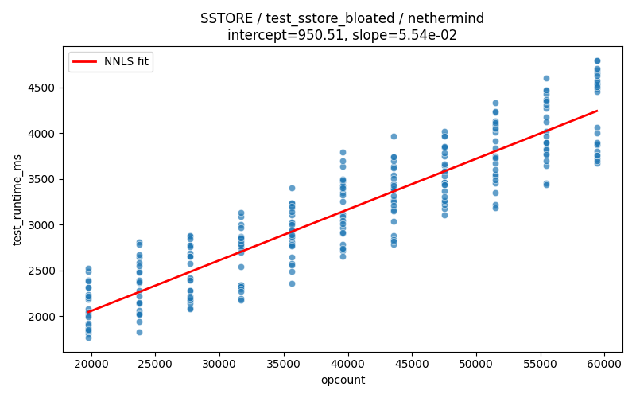

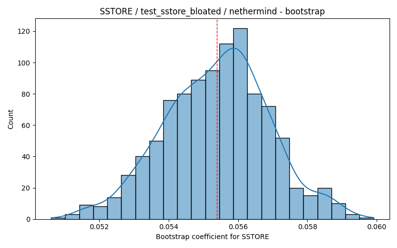

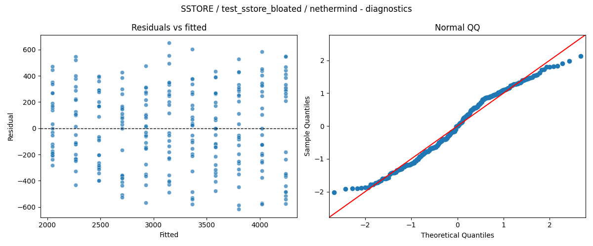

</details>

<details><summary>reth — NNLS regression summary</summary>

```
==============================================================================
                           NNLS Regression Results                            
==============================================================================
Dep. Variable:          test_runtime_ms              R-squared:          0.995
Model:                  NNLS                    Adj. R-squared:          0.995
No. Observations:       902                               RMSE:         257.65
Df Residuals:           899                                MAE:         191.89
Df Model:               2      
==============================================================================
                      coef     std err     P-value      [0.025      0.975]
------------------------------------------------------------------------------
         const    255.7070      7.6514       0.001    241.0282    271.4480
       opcount      0.0000      0.0000       1.000      0.0000      0.0000
        update      0.1714      0.0004       0.001      0.1706      0.1722
==============================================================================
Notes: Non-negative least squares with bootstrap inference (1000 iterations)
==============================================================================
```

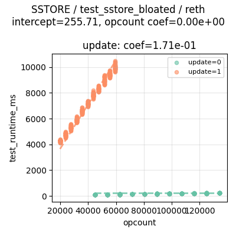

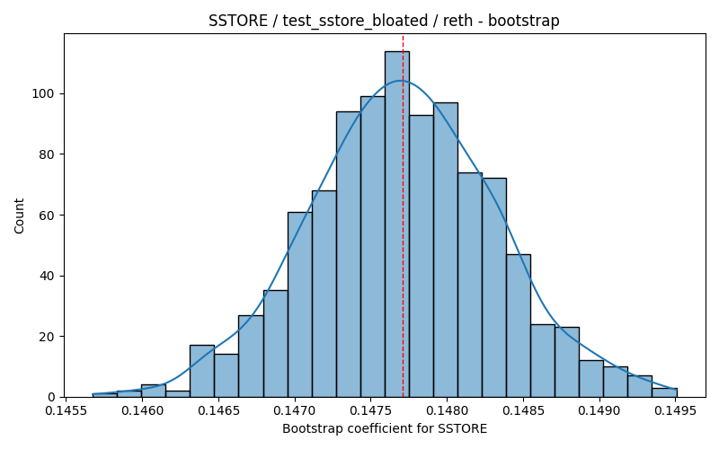

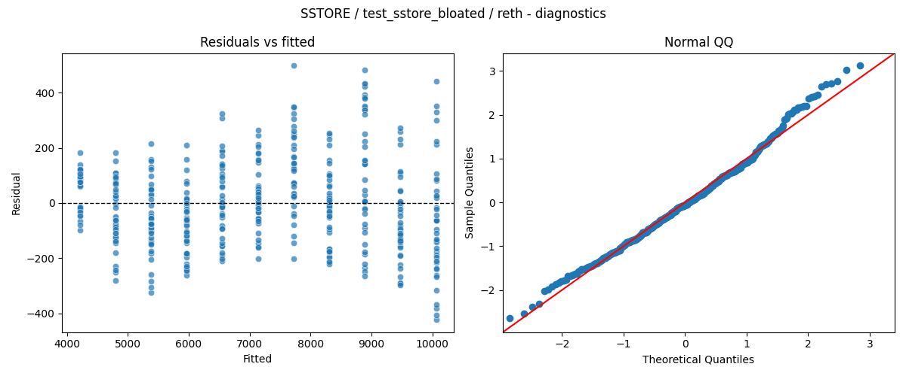

</details>

## BALANCE

### test_account_access — combo `BALANCE_AccountMode.EXISTING_EOA`

| client | nobs | R² | target_coef (ms) | p-value | 95% CI |
| --- | --- | --- | --- | --- | --- |
| `besu` | 341 | 0.8259 | 0.009457 | 1.00e-03 | [0.008899, 0.01006] |
| `erigon` | 176 | 0.9956 | 0.009898 | 1.00e-03 | [0.0098, 0.009995] |
| `nethermind` | 264 | 0.9049 | 0.003698 | 1.00e-03 | [0.003555, 0.003842] |
| `reth` | 451 | 0.9767 | 0.001091 | 1.00e-03 | [0.001076, 0.001106] |

<details><summary>besu — NNLS regression summary</summary>

```
==============================================================================
                           NNLS Regression Results                            
==============================================================================
Dep. Variable:          test_runtime_ms              R-squared:          0.826
Model:                  NNLS                    Adj. R-squared:          0.825
No. Observations:       341                               RMSE:         103.77
Df Residuals:           339                                MAE:          82.99
Df Model:               1      
==============================================================================
                      coef     std err     P-value      [0.025      0.975]
------------------------------------------------------------------------------
         const    411.8807     26.2331       0.001    358.8897    461.5426
       opcount      0.0095      0.0003       0.001      0.0089      0.0101
==============================================================================
Notes: Non-negative least squares with bootstrap inference (1000 iterations)
==============================================================================
```

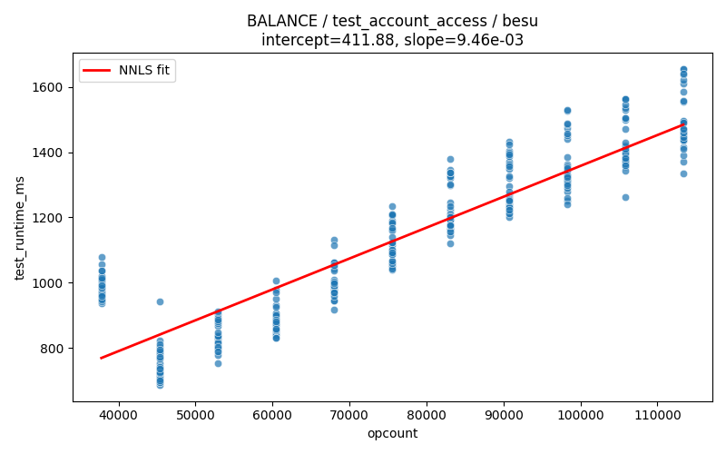

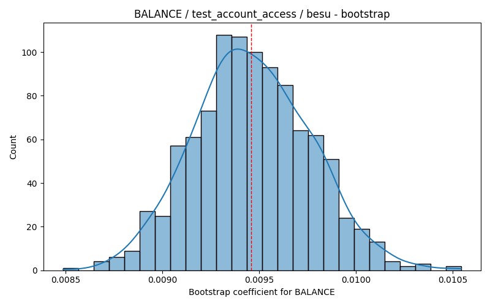

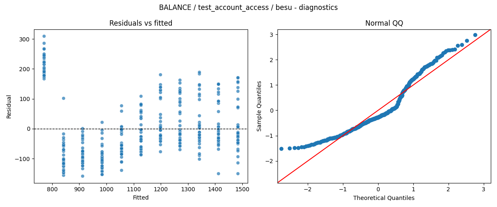

</details>

<details><summary>erigon — NNLS regression summary</summary>

```
==============================================================================
                           NNLS Regression Results                            
==============================================================================
Dep. Variable:          test_runtime_ms              R-squared:          0.996
Model:                  NNLS                    Adj. R-squared:          0.996
No. Observations:       176                               RMSE:          15.69
Df Residuals:           174                                MAE:          12.92
Df Model:               1      
==============================================================================
                      coef     std err     P-value      [0.025      0.975]
------------------------------------------------------------------------------
         const     36.5585      3.6609       0.001     29.4746     43.5845
       opcount      0.0099      0.0001       0.001      0.0098      0.0100
==============================================================================
Notes: Non-negative least squares with bootstrap inference (1000 iterations)
==============================================================================
```

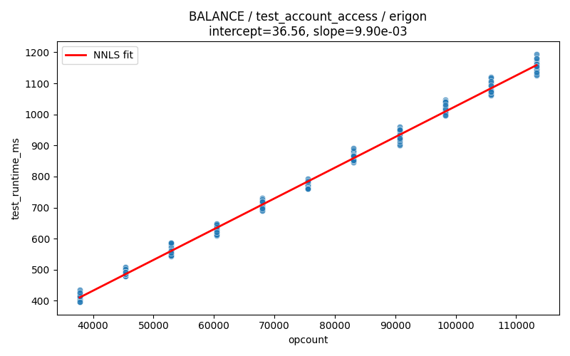

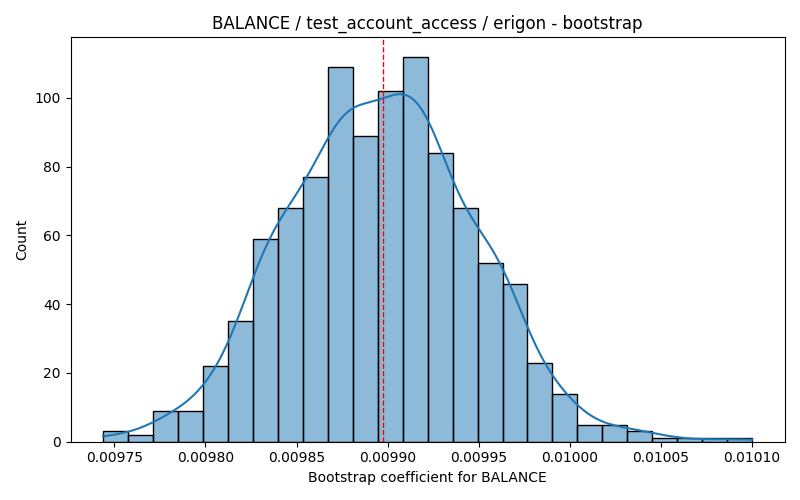

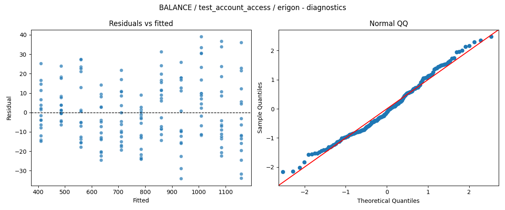

</details>

<details><summary>nethermind — NNLS regression summary</summary>

```
==============================================================================
                           NNLS Regression Results                            
==============================================================================
Dep. Variable:          test_runtime_ms              R-squared:          0.905
Model:                  NNLS                    Adj. R-squared:          0.905
No. Observations:       264                               RMSE:          28.66
Df Residuals:           262                                MAE:          19.20
Df Model:               1      
==============================================================================
                      coef     std err     P-value      [0.025      0.975]
------------------------------------------------------------------------------
         const     85.8725      5.4136       0.001     75.7429     96.9233
       opcount      0.0037      0.0001       0.001      0.0036      0.0038
==============================================================================
Notes: Non-negative least squares with bootstrap inference (1000 iterations)
==============================================================================
```

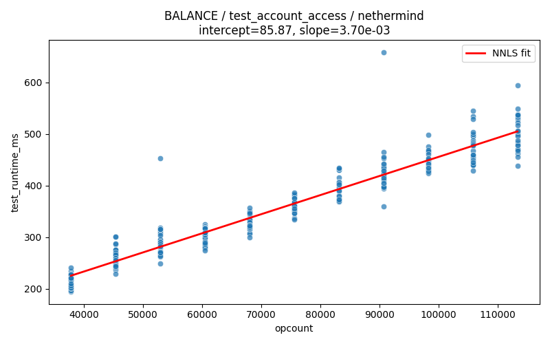

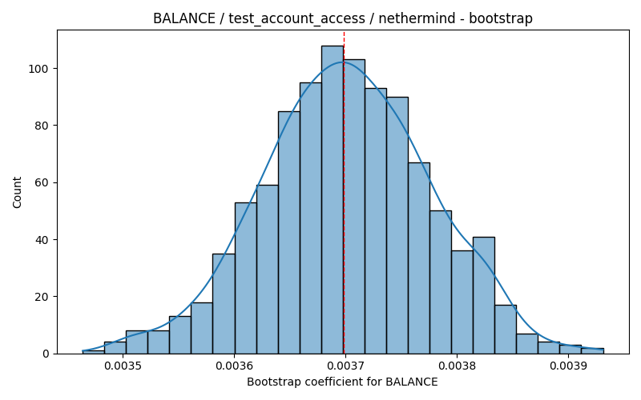

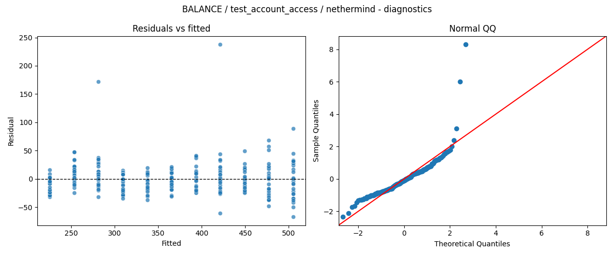

</details>

<details><summary>reth — NNLS regression summary</summary>

```
==============================================================================
                           NNLS Regression Results                            
==============================================================================
Dep. Variable:          test_runtime_ms              R-squared:          0.977
Model:                  NNLS                    Adj. R-squared:          0.977
No. Observations:       451                               RMSE:           4.03
Df Residuals:           449                                MAE:           3.26
Df Model:               1      
==============================================================================
                      coef     std err     P-value      [0.025      0.975]
------------------------------------------------------------------------------
         const     31.7331      0.6308       0.001     30.5010     32.9571
       opcount      0.0011      0.0000       0.001      0.0011      0.0011
==============================================================================
Notes: Non-negative least squares with bootstrap inference (1000 iterations)
==============================================================================
```

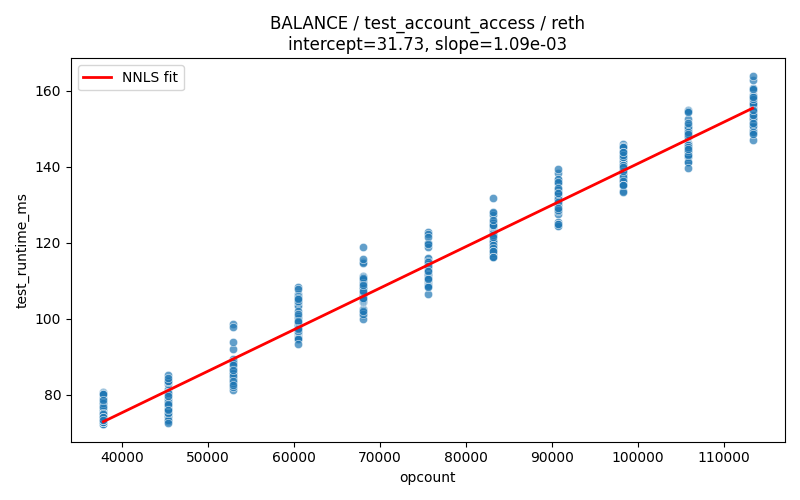

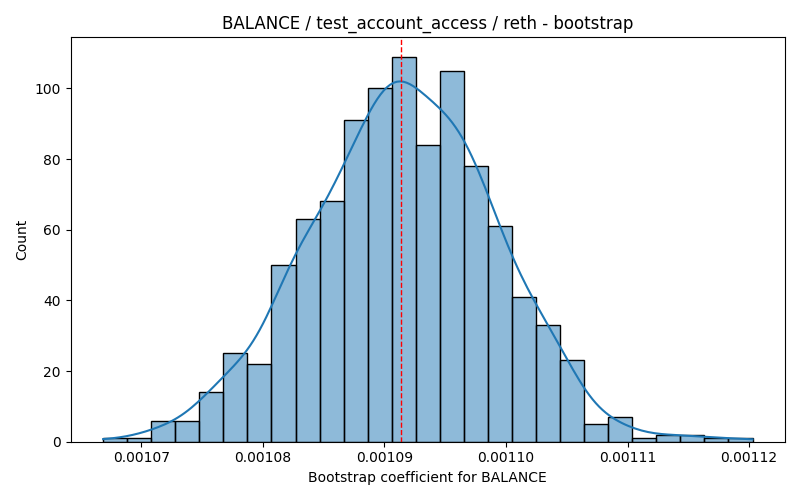

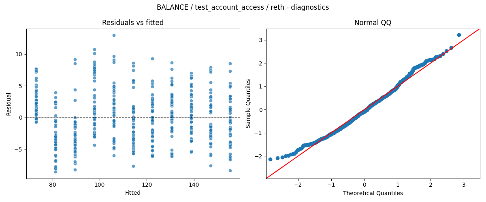

</details>

### test_account_access — combo `BALANCE_AccountMode.NON_EXISTING_ACCOUNT` — `presets[cold_account_nocode_access]`

| client | nobs | R² | target_coef (ms) | p-value | 95% CI |
| --- | --- | --- | --- | --- | --- |
| `besu` | 341 | 0.9178 | 0.009517 | 1.00e-03 | [0.009207, 0.009857] |
| `erigon` | 176 | 0.9965 | 0.009069 | 1.00e-03 | [0.008991, 0.009144] |
| `nethermind` | 264 | 0.9286 | 0.003524 | 1.00e-03 | [0.003371, 0.00366] |
| `reth` | 451 | 0.9714 | 0.0009283 | 1.00e-03 | [0.0009122, 0.0009422] |

<details><summary>besu — NNLS regression summary</summary>

```
==============================================================================
                           NNLS Regression Results                            
==============================================================================
Dep. Variable:          test_runtime_ms              R-squared:          0.918
Model:                  NNLS                    Adj. R-squared:          0.918
No. Observations:       341                               RMSE:          68.09
Df Residuals:           339                                MAE:          56.85
Df Model:               1      
==============================================================================
                      coef     std err     P-value      [0.025      0.975]
------------------------------------------------------------------------------
         const    387.4098     13.8790       0.001    360.0069    411.8084
       opcount      0.0095      0.0002       0.001      0.0092      0.0099
==============================================================================
Notes: Non-negative least squares with bootstrap inference (1000 iterations)
==============================================================================
```

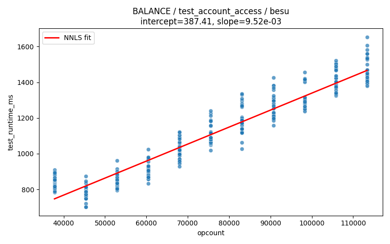

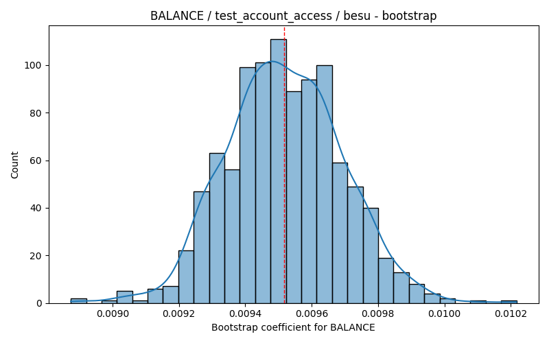

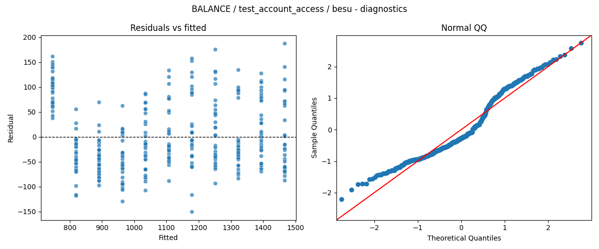

</details>

<details><summary>erigon — NNLS regression summary</summary>

```
==============================================================================
                           NNLS Regression Results                            
==============================================================================
Dep. Variable:          test_runtime_ms              R-squared:          0.996
Model:                  NNLS                    Adj. R-squared:          0.996
No. Observations:       176                               RMSE:          12.93
Df Residuals:           174                                MAE:          10.63
Df Model:               1      
==============================================================================
                      coef     std err     P-value      [0.025      0.975]
------------------------------------------------------------------------------
         const     11.6913      3.1494       0.001      5.6803     17.8783
       opcount      0.0091      0.0000       0.001      0.0090      0.0091
==============================================================================
Notes: Non-negative least squares with bootstrap inference (1000 iterations)
==============================================================================
```

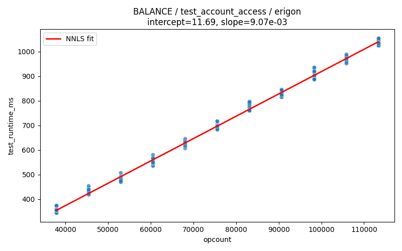

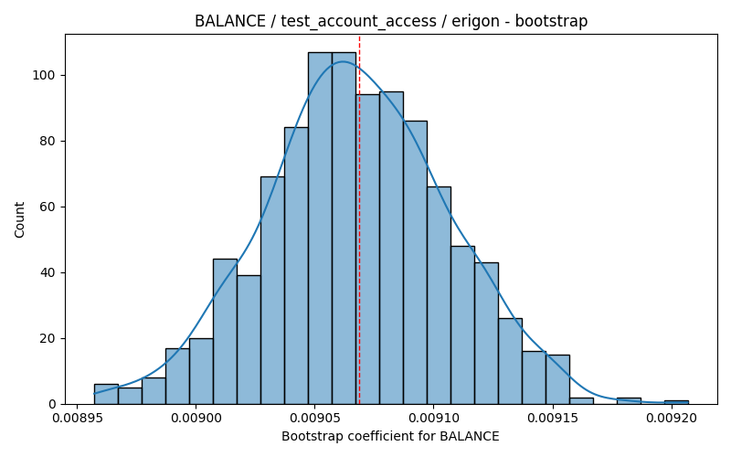

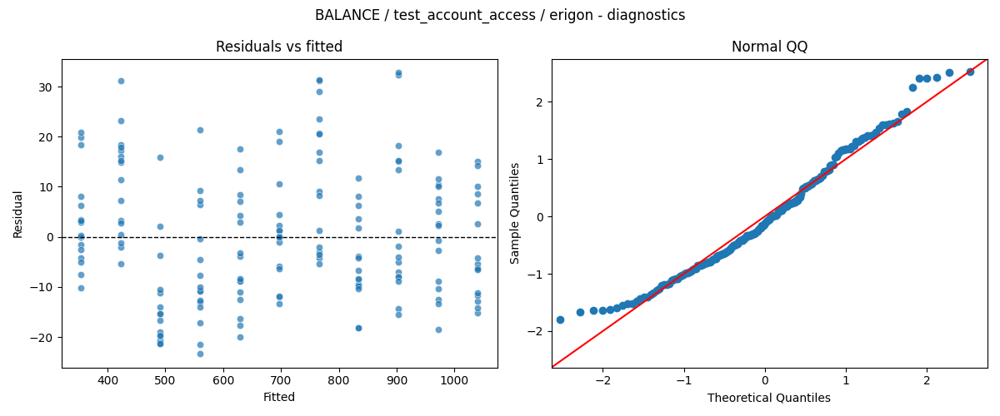

</details>

<details><summary>nethermind — NNLS regression summary</summary>

```
==============================================================================
                           NNLS Regression Results                            
==============================================================================
Dep. Variable:          test_runtime_ms              R-squared:          0.929
Model:                  NNLS                    Adj. R-squared:          0.928
No. Observations:       264                               RMSE:          23.35
Df Residuals:           262                                MAE:          17.36
Df Model:               1      
==============================================================================
                      coef     std err     P-value      [0.025      0.975]
------------------------------------------------------------------------------
         const    101.9063      6.0162       0.001     90.9438    113.9719
       opcount      0.0035      0.0001       0.001      0.0034      0.0037
==============================================================================
Notes: Non-negative least squares with bootstrap inference (1000 iterations)
==============================================================================
```

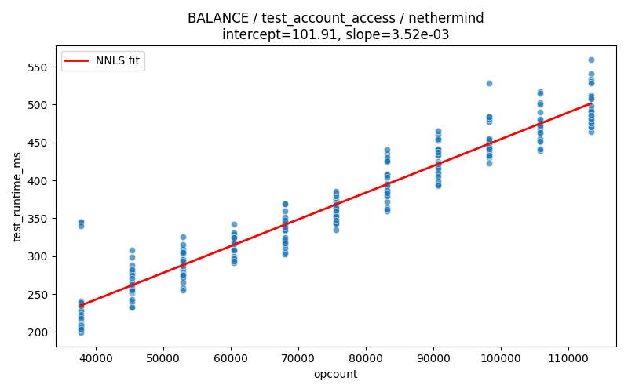

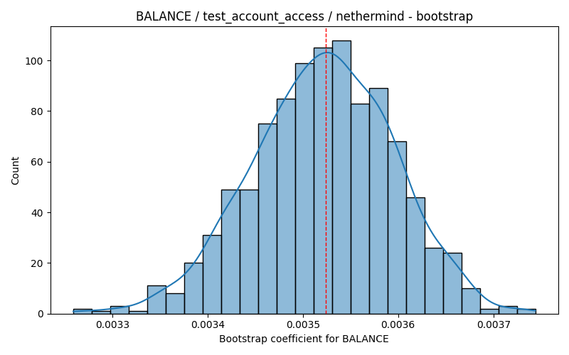

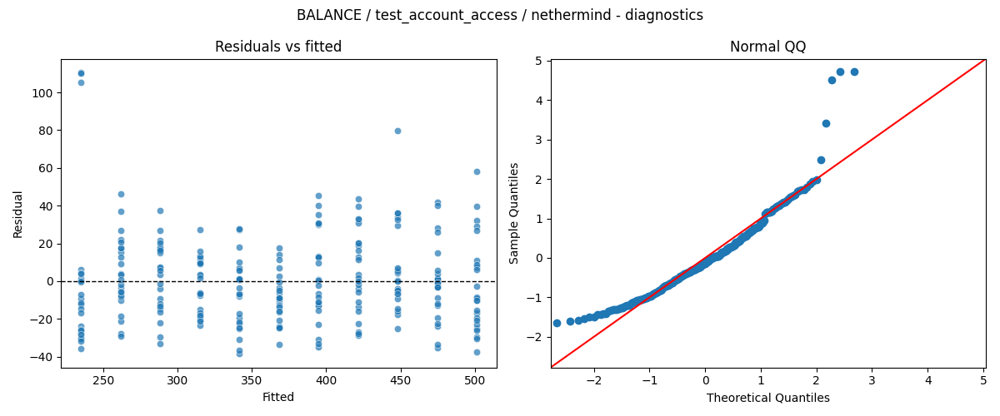

</details>

<details><summary>reth — NNLS regression summary</summary>

```
==============================================================================
                           NNLS Regression Results                            
==============================================================================
Dep. Variable:          test_runtime_ms              R-squared:          0.971
Model:                  NNLS                    Adj. R-squared:          0.971
No. Observations:       451                               RMSE:           3.81
Df Residuals:           449                                MAE:           3.01
Df Model:               1      
==============================================================================
                      coef     std err     P-value      [0.025      0.975]
------------------------------------------------------------------------------
         const     30.8672      0.6241       0.001     29.7097     32.1919
       opcount      0.0009      0.0000       0.001      0.0009      0.0009
==============================================================================
Notes: Non-negative least squares with bootstrap inference (1000 iterations)
==============================================================================
```

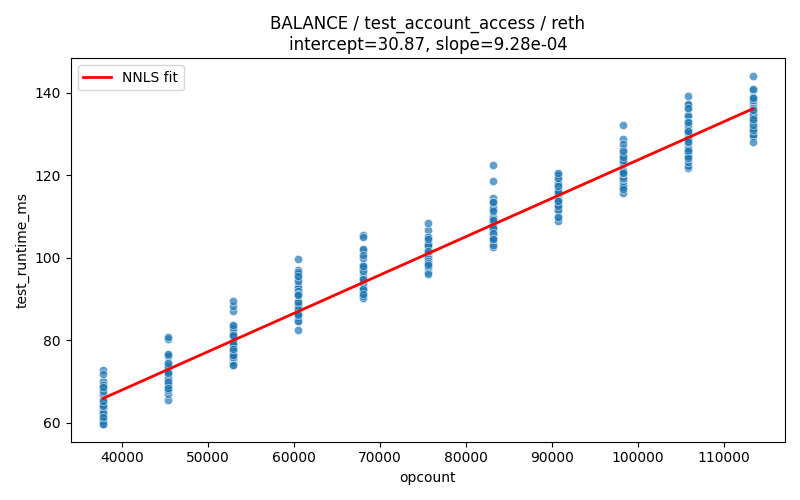

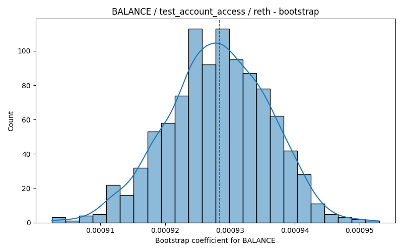

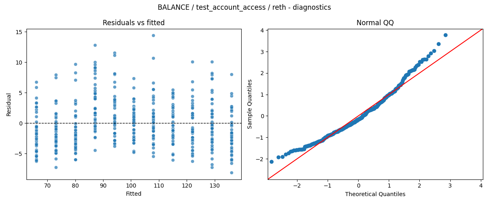

</details>

### test_account_access — combo `BALANCE_AccountMode.EXISTING_CONTRACT`

| client | nobs | R² | target_coef (ms) | p-value | 95% CI |
| --- | --- | --- | --- | --- | --- |
| `besu` | 341 | 0.9405 | 0.02577 | 1.00e-03 | [0.02501, 0.02655] |
| `erigon` | 176 | 0.8982 | 0.03676 | 1.00e-03 | [0.03484, 0.03847] |
| `nethermind` | 264 | 0.7069 | 0.02442 | 1.00e-03 | [0.02232, 0.02648] |
| `reth` | 451 | 0.7835 | 0.03108 | 1.00e-03 | [0.02952, 0.03263] |

<details><summary>besu — NNLS regression summary</summary>

```
==============================================================================
                           NNLS Regression Results                            
==============================================================================
Dep. Variable:          test_runtime_ms              R-squared:          0.940
Model:                  NNLS                    Adj. R-squared:          0.940
No. Observations:       341                               RMSE:         134.89
Df Residuals:           339                                MAE:         116.48
Df Model:               1      
==============================================================================
                      coef     std err     P-value      [0.025      0.975]
------------------------------------------------------------------------------
         const    470.4383     27.6602       0.001    413.5567    522.7499
       opcount      0.0258      0.0004       0.001      0.0250      0.0265
==============================================================================
Notes: Non-negative least squares with bootstrap inference (1000 iterations)
==============================================================================
```

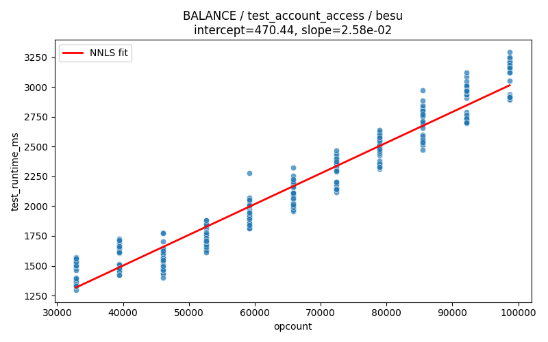

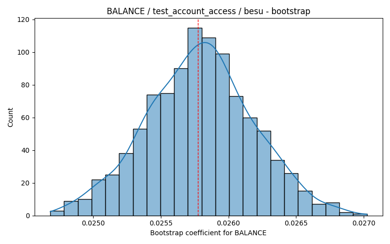

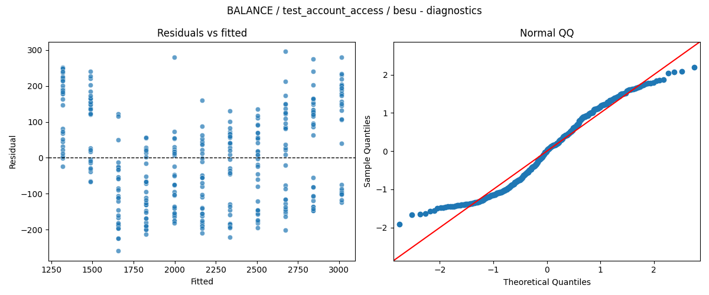

</details>

<details><summary>erigon — NNLS regression summary</summary>

```
==============================================================================
                           NNLS Regression Results                            
==============================================================================
Dep. Variable:          test_runtime_ms              R-squared:          0.898
Model:                  NNLS                    Adj. R-squared:          0.898
No. Observations:       176                               RMSE:         257.51
Df Residuals:           174                                MAE:         218.66
Df Model:               1      
==============================================================================
                      coef     std err     P-value      [0.025      0.975]
------------------------------------------------------------------------------
         const    453.7079     70.1223       0.001    326.1948    602.7521
       opcount      0.0368      0.0009       0.001      0.0348      0.0385
==============================================================================
Notes: Non-negative least squares with bootstrap inference (1000 iterations)
==============================================================================
```

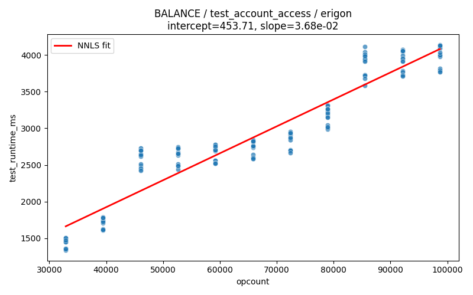

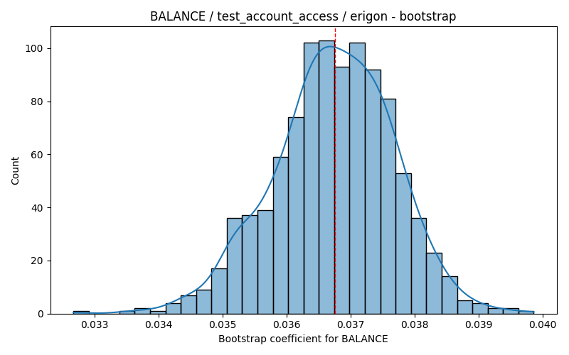

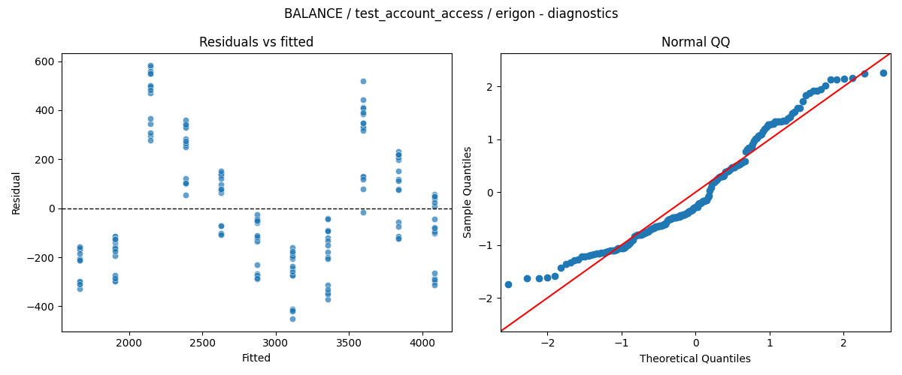

</details>

<details><summary>nethermind — NNLS regression summary</summary>

```
==============================================================================
                           NNLS Regression Results                            
==============================================================================
Dep. Variable:          test_runtime_ms              R-squared:          0.707
Model:                  NNLS                    Adj. R-squared:          0.706
No. Observations:       264                               RMSE:         327.16
Df Residuals:           262                                MAE:         275.07
Df Model:               1      
==============================================================================
                      coef     std err     P-value      [0.025      0.975]
------------------------------------------------------------------------------
         const    793.2201     72.0944       0.001    655.5150    938.4252
       opcount      0.0244      0.0010       0.001      0.0223      0.0265
==============================================================================
Notes: Non-negative least squares with bootstrap inference (1000 iterations)
==============================================================================
```

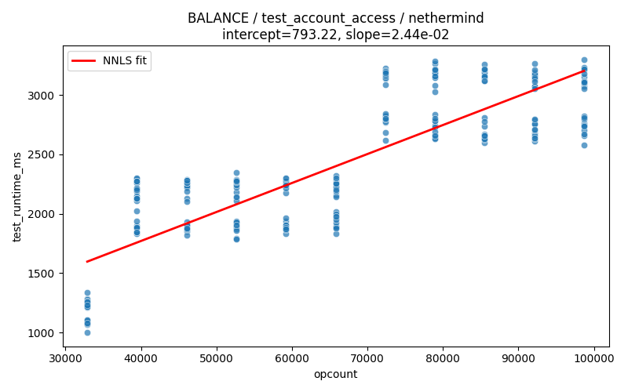

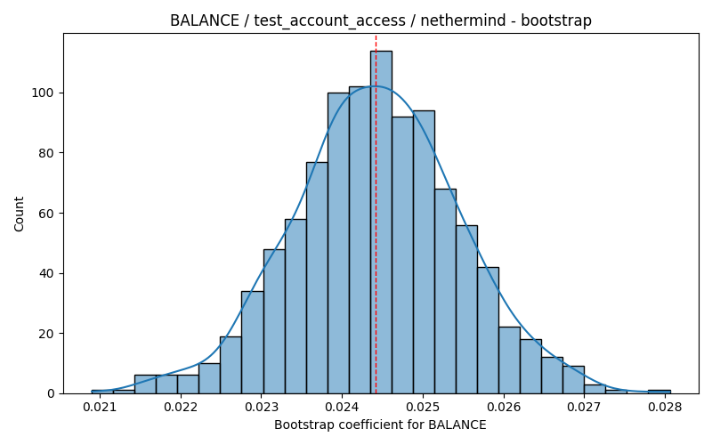

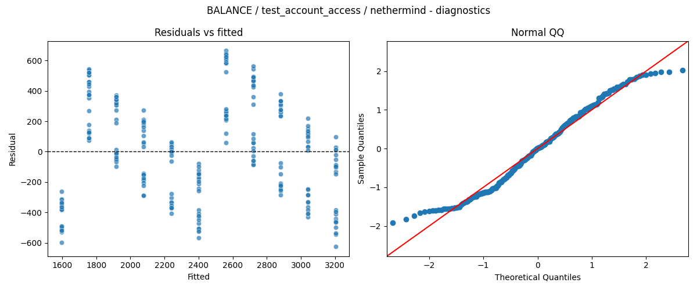

</details>

<details><summary>reth — NNLS regression summary</summary>

```
==============================================================================
                           NNLS Regression Results                            
==============================================================================
Dep. Variable:          test_runtime_ms              R-squared:          0.783
Model:                  NNLS                    Adj. R-squared:          0.783
No. Observations:       451                               RMSE:         339.94
Df Residuals:           449                                MAE:         239.47
Df Model:               1      
==============================================================================
                      coef     std err     P-value      [0.025      0.975]
------------------------------------------------------------------------------
         const    627.6940     56.5096       0.001    521.8479    734.2942
       opcount      0.0311      0.0008       0.001      0.0295      0.0326
==============================================================================
Notes: Non-negative least squares with bootstrap inference (1000 iterations)
==============================================================================
```

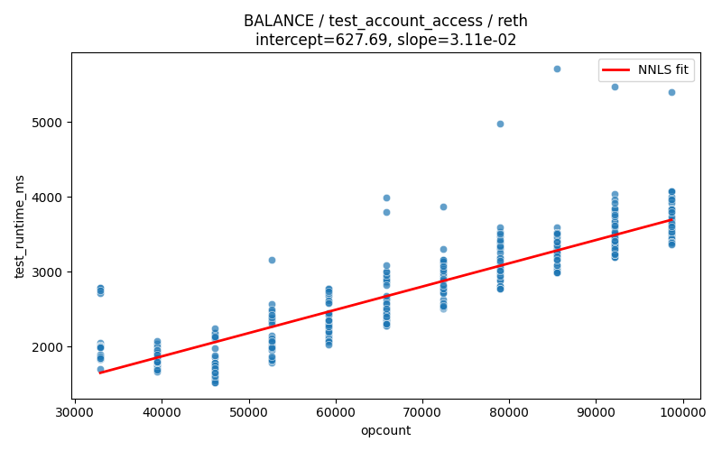

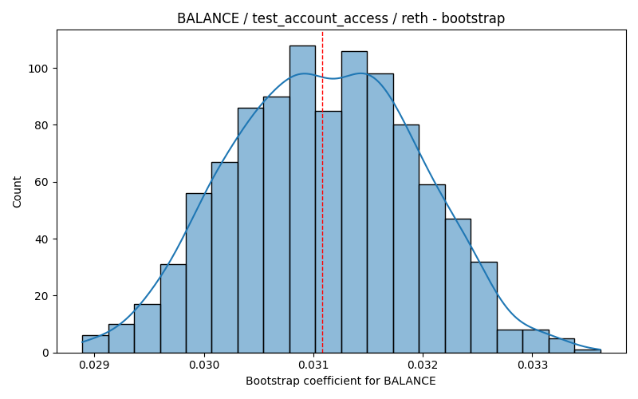

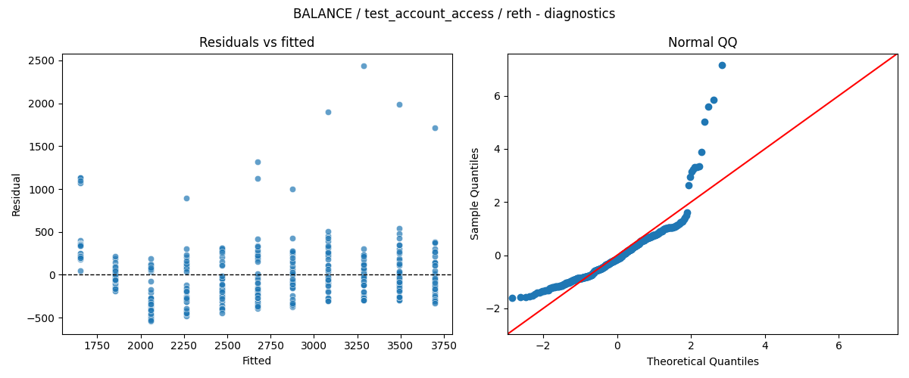

</details>

### test_account_access — combo `BALANCE_AccountMode.NON_EXISTING_ACCOUNT` — `presets[cold_account_code_access]`

| client | nobs | R² | target_coef (ms) | p-value | 95% CI |
| --- | --- | --- | --- | --- | --- |
| `besu` | 341 | 0.9178 | 0.009517 | 1.00e-03 | [0.009207, 0.009857] |
| `erigon` | 176 | 0.9965 | 0.009069 | 1.00e-03 | [0.008991, 0.009144] |
| `nethermind` | 264 | 0.9286 | 0.003524 | 1.00e-03 | [0.003371, 0.00366] |
| `reth` | 451 | 0.9714 | 0.0009283 | 1.00e-03 | [0.0009122, 0.0009422] |

<details><summary>besu — NNLS regression summary</summary>

```
==============================================================================
                           NNLS Regression Results                            
==============================================================================
Dep. Variable:          test_runtime_ms              R-squared:          0.918
Model:                  NNLS                    Adj. R-squared:          0.918
No. Observations:       341                               RMSE:          68.09
Df Residuals:           339                                MAE:          56.85
Df Model:               1      
==============================================================================
                      coef     std err     P-value      [0.025      0.975]
------------------------------------------------------------------------------
         const    387.4098     13.8790       0.001    360.0069    411.8084
       opcount      0.0095      0.0002       0.001      0.0092      0.0099
==============================================================================
Notes: Non-negative least squares with bootstrap inference (1000 iterations)
==============================================================================
```


</details>

<details><summary>erigon — NNLS regression summary</summary>

```
==============================================================================
                           NNLS Regression Results                            
==============================================================================
Dep. Variable:          test_runtime_ms              R-squared:          0.996
Model:                  NNLS                    Adj. R-squared:          0.996
No. Observations:       176                               RMSE:          12.93
Df Residuals:           174                                MAE:          10.63
Df Model:               1      
==============================================================================
                      coef     std err     P-value      [0.025      0.975]
------------------------------------------------------------------------------
         const     11.6913      3.1494       0.001      5.6803     17.8783
       opcount      0.0091      0.0000       0.001      0.0090      0.0091
==============================================================================
Notes: Non-negative least squares with bootstrap inference (1000 iterations)
==============================================================================
```


</details>

<details><summary>nethermind — NNLS regression summary</summary>

```
==============================================================================
                           NNLS Regression Results                            
==============================================================================
Dep. Variable:          test_runtime_ms              R-squared:          0.929
Model:                  NNLS                    Adj. R-squared:          0.928
No. Observations:       264                               RMSE:          23.35
Df Residuals:           262                                MAE:          17.36
Df Model:               1      
==============================================================================
                      coef     std err     P-value      [0.025      0.975]
------------------------------------------------------------------------------
         const    101.9063      6.0162       0.001     90.9438    113.9719
       opcount      0.0035      0.0001       0.001      0.0034      0.0037
==============================================================================
Notes: Non-negative least squares with bootstrap inference (1000 iterations)
==============================================================================
```


</details>

<details><summary>reth — NNLS regression summary</summary>

```
==============================================================================
                           NNLS Regression Results                            
==============================================================================
Dep. Variable:          test_runtime_ms              R-squared:          0.971
Model:                  NNLS                    Adj. R-squared:          0.971
No. Observations:       451                               RMSE:           3.81
Df Residuals:           449                                MAE:           3.01
Df Model:               1      
==============================================================================
                      coef     std err     P-value      [0.025      0.975]
------------------------------------------------------------------------------
         const     30.8672      0.6241       0.001     29.7097     32.1919
       opcount      0.0009      0.0000       0.001      0.0009      0.0009
==============================================================================
Notes: Non-negative least squares with bootstrap inference (1000 iterations)
==============================================================================
```


</details>

### test_ext_account_query_warm — combo `BALANCE`

| client | nobs | R² | target_coef (ms) | p-value | 95% CI |
| --- | --- | --- | --- | --- | --- |
| `besu` | 341 | 0.7703 | 0.0001681 | 1.00e-03 | [0.0001578, 0.0001784] |
| `erigon` | 176 | 0.8493 | 5.068e-05 | 1.00e-03 | [4.695e-05, 5.406e-05] |
| `nethermind` | 264 | 0.8635 | 0.0001688 | 1.00e-03 | [0.0001613, 0.0001765] |
| `reth` | 451 | 0.6886 | 6.603e-06 | 1.00e-03 | [6.216e-06, 6.99e-06] |

<details><summary>besu — NNLS regression summary</summary>

```
==============================================================================
                           NNLS Regression Results                            
==============================================================================
Dep. Variable:          test_runtime_ms              R-squared:          0.770
Model:                  NNLS                    Adj. R-squared:          0.770
No. Observations:       341                               RMSE:          53.68
Df Residuals:           339                                MAE:          42.35
Df Model:               1      
==============================================================================
                      coef     std err     P-value      [0.025      0.975]
------------------------------------------------------------------------------
         const    163.6954     10.2948       0.001    143.8699    183.9124
       opcount      0.0002      0.0000       0.001      0.0002      0.0002
==============================================================================
Notes: Non-negative least squares with bootstrap inference (1000 iterations)
==============================================================================
```

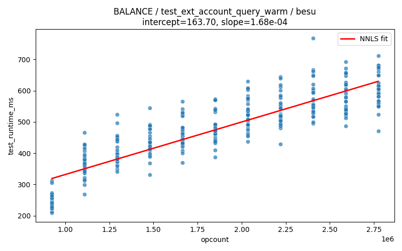

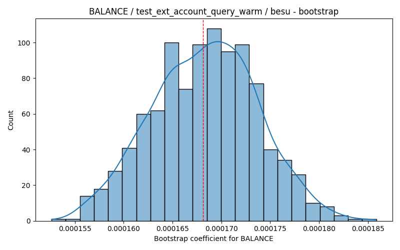

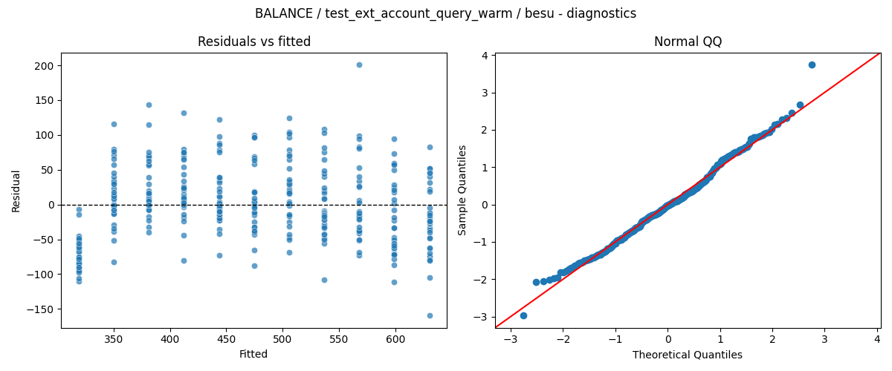

</details>

<details><summary>erigon — NNLS regression summary</summary>

```
==============================================================================
                           NNLS Regression Results                            
==============================================================================
Dep. Variable:          test_runtime_ms              R-squared:          0.849
Model:                  NNLS                    Adj. R-squared:          0.848
No. Observations:       176                               RMSE:          12.49
Df Residuals:           174                                MAE:          10.55
Df Model:               1      
==============================================================================
                      coef     std err     P-value      [0.025      0.975]
------------------------------------------------------------------------------
         const     38.2937      3.4046       0.001     31.9065     45.4264
       opcount      0.0001      0.0000       0.001      0.0000      0.0001
==============================================================================
Notes: Non-negative least squares with bootstrap inference (1000 iterations)
==============================================================================
```

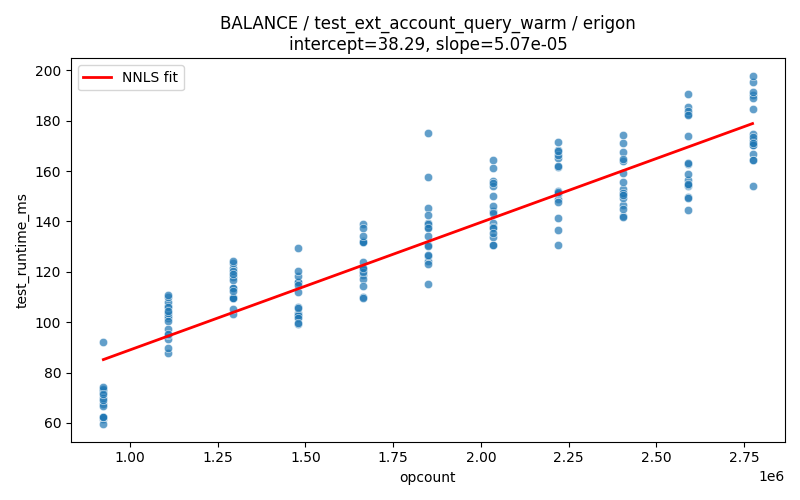

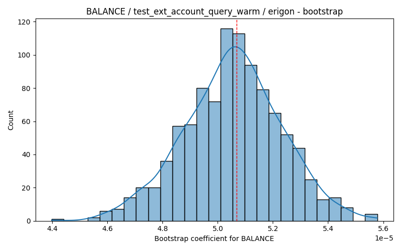

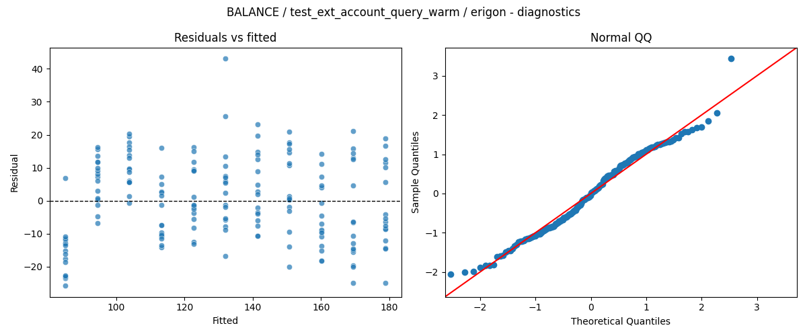

</details>

<details><summary>nethermind — NNLS regression summary</summary>

```
==============================================================================
                           NNLS Regression Results                            
==============================================================================
Dep. Variable:          test_runtime_ms              R-squared:          0.863
Model:                  NNLS                    Adj. R-squared:          0.863
No. Observations:       264                               RMSE:          39.26
Df Residuals:           262                                MAE:          29.73
Df Model:               1      
==============================================================================
                      coef     std err     P-value      [0.025      0.975]
------------------------------------------------------------------------------
         const     85.4560      7.4933       0.001     70.9637    100.2562
       opcount      0.0002      0.0000       0.001      0.0002      0.0002
==============================================================================
Notes: Non-negative least squares with bootstrap inference (1000 iterations)
==============================================================================
```

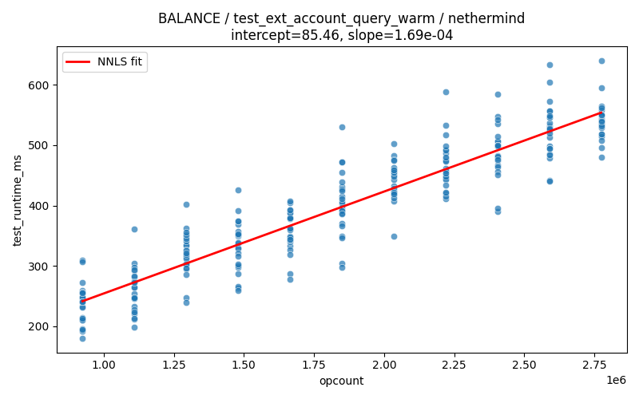

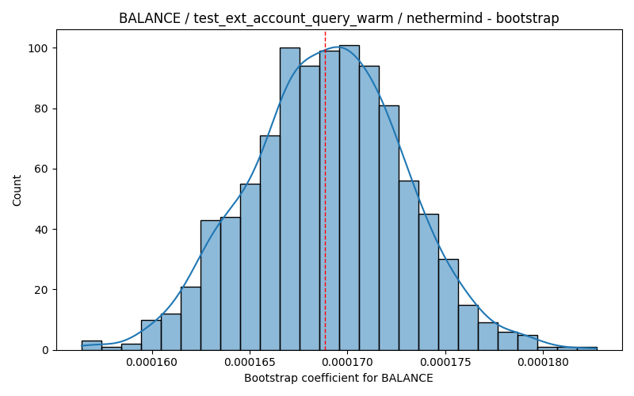

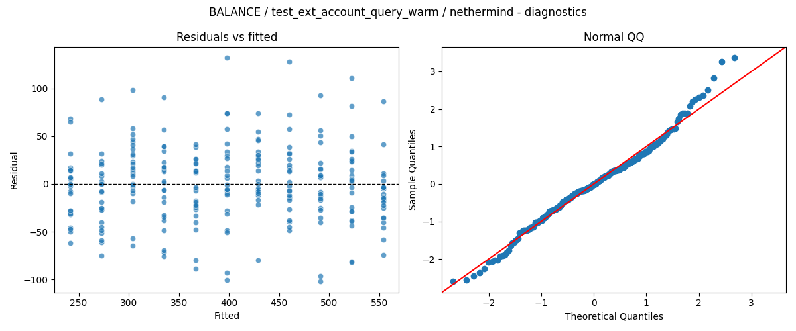

</details>

<details><summary>reth — NNLS regression summary</summary>

```
==============================================================================
                           NNLS Regression Results                            
==============================================================================
Dep. Variable:          test_runtime_ms              R-squared:          0.689
Model:                  NNLS                    Adj. R-squared:          0.688
No. Observations:       451                               RMSE:           2.60
Df Residuals:           449                                MAE:           1.82
Df Model:               1      
==============================================================================
                      coef     std err     P-value      [0.025      0.975]
------------------------------------------------------------------------------
         const      6.2582      0.3555       0.001      5.5829      6.9926
       opcount      0.0000      0.0000       0.001      0.0000      0.0000
==============================================================================
Notes: Non-negative least squares with bootstrap inference (1000 iterations)
==============================================================================
```

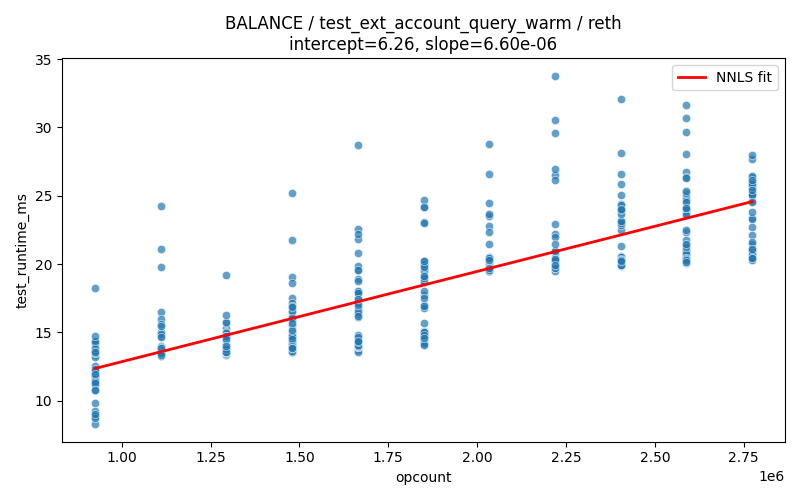

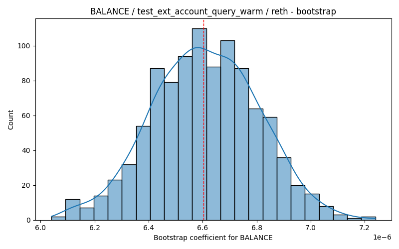

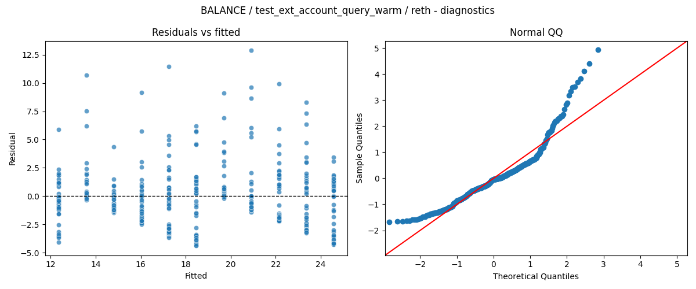

</details>

## CALL

### test_account_access — combo `CALL_AccountMode.EXISTING_EOA`

| client | nobs | R² | target_coef (ms) | p-value | 95% CI |
| --- | --- | --- | --- | --- | --- |
| `besu` | 682 | 0.9428 | 0.0124 | 1.00e-03 | [0.012, 0.01284] |
| `erigon` | 352 | 0.9865 | 0 | 1.00e+00 | [0, 0] |
| `nethermind` | 528 | 0.9545 | 0.003712 | 1.00e-03 | [0.003483, 0.003924] |
| `reth` | 902 | 0.9907 | 0 | 1.00e+00 | [0, 0] |

<details><summary>besu — NNLS regression summary</summary>

```
==============================================================================
                           NNLS Regression Results                            
==============================================================================
Dep. Variable:          test_runtime_ms              R-squared:          0.943
Model:                  NNLS                    Adj. R-squared:          0.943
No. Observations:       682                               RMSE:         113.49
Df Residuals:           679                                MAE:          93.24
Df Model:               2      
==============================================================================
                      coef     std err     P-value      [0.025      0.975]
------------------------------------------------------------------------------
         const    480.2398     17.9681       0.001    443.5749    514.8010
       opcount      0.0124      0.0002       0.001      0.0120      0.0128
        update      0.0553      0.0007       0.001      0.0541      0.0566
==============================================================================
Notes: Non-negative least squares with bootstrap inference (1000 iterations)
==============================================================================
```

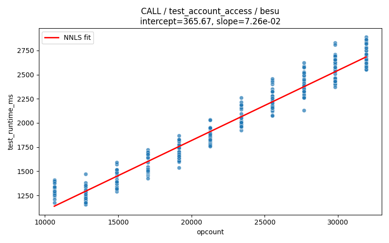

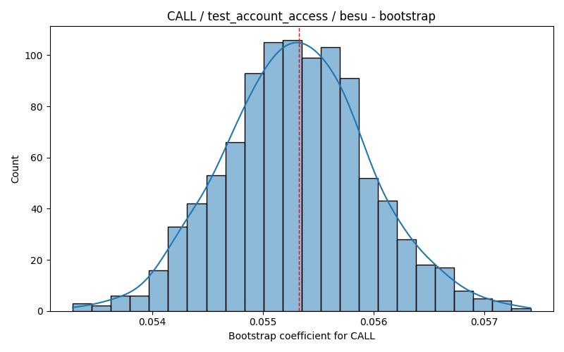

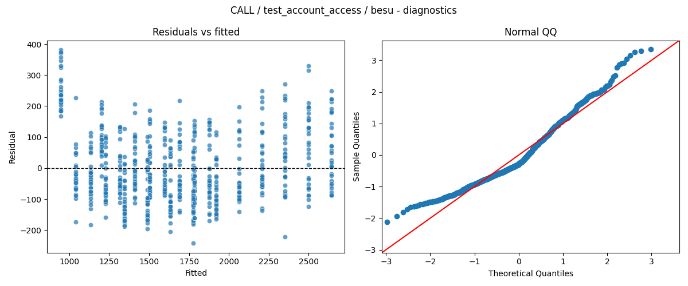

</details>

<details><summary>erigon — NNLS regression summary</summary>

```
==============================================================================
                           NNLS Regression Results                            
==============================================================================
Dep. Variable:          test_runtime_ms              R-squared:          0.986
Model:                  NNLS                    Adj. R-squared:          0.986
No. Observations:       352                               RMSE:         389.46
Df Residuals:           349                                MAE:         313.60
Df Model:               2      
==============================================================================
                      coef     std err     P-value      [0.025      0.975]
------------------------------------------------------------------------------
         const    996.0960     23.9488       0.001    950.2752   1043.5204
       opcount      0.0000      0.0001       1.000      0.0000      0.0000
        update      0.2853      0.0019       0.001      0.2818      0.2891
==============================================================================
Notes: Non-negative least squares with bootstrap inference (1000 iterations)
==============================================================================
```

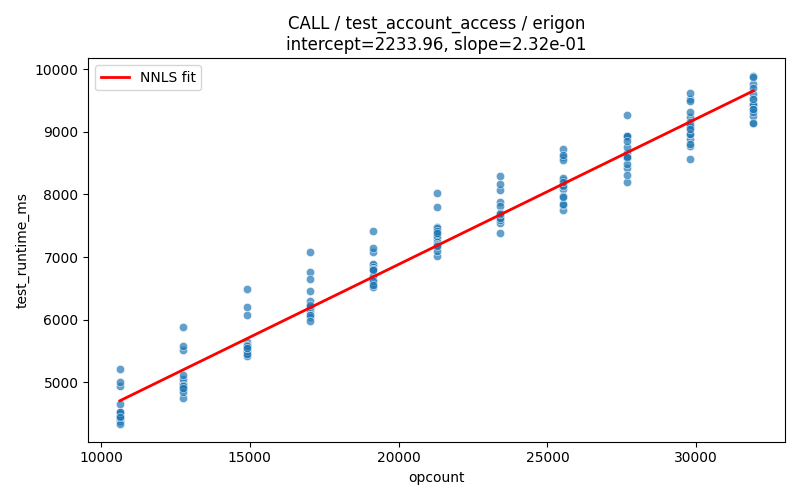

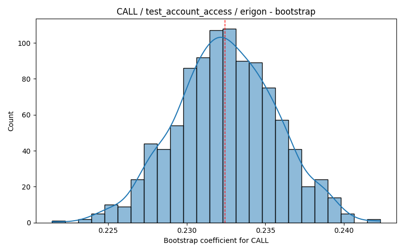

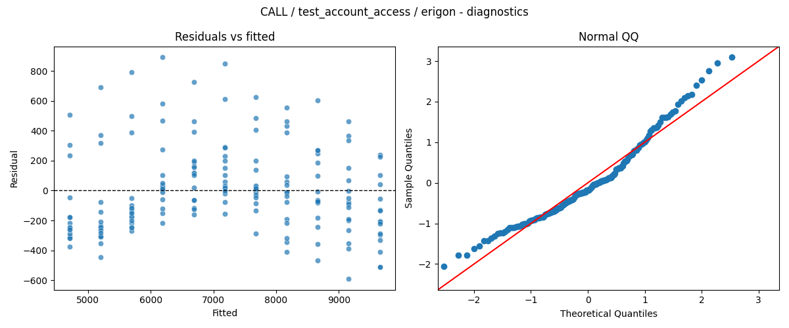

</details>

<details><summary>nethermind — NNLS regression summary</summary>

```
==============================================================================
                           NNLS Regression Results                            
==============================================================================
Dep. Variable:          test_runtime_ms              R-squared:          0.955
Model:                  NNLS                    Adj. R-squared:          0.954
No. Observations:       528                               RMSE:          66.71
Df Residuals:           525                                MAE:          51.49
Df Model:               2      
==============================================================================
                      coef     std err     P-value      [0.025      0.975]
------------------------------------------------------------------------------
         const    180.1003      9.0655       0.001    163.2315    198.4213
       opcount      0.0037      0.0001       0.001      0.0035      0.0039
        update      0.0324      0.0004       0.001      0.0316      0.0332
==============================================================================
Notes: Non-negative least squares with bootstrap inference (1000 iterations)
==============================================================================
```

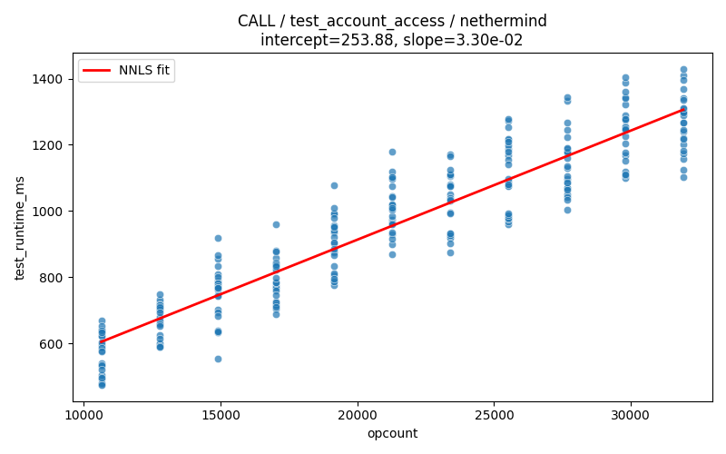

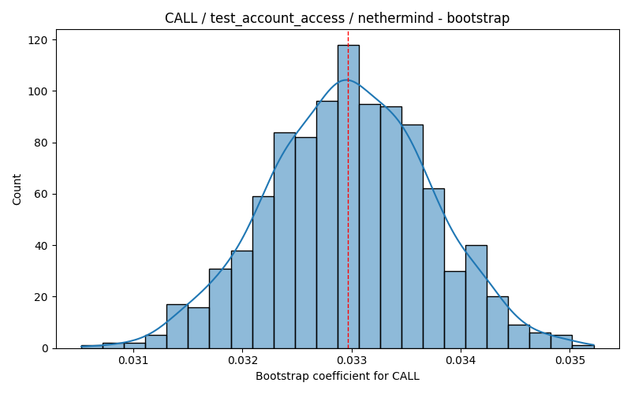

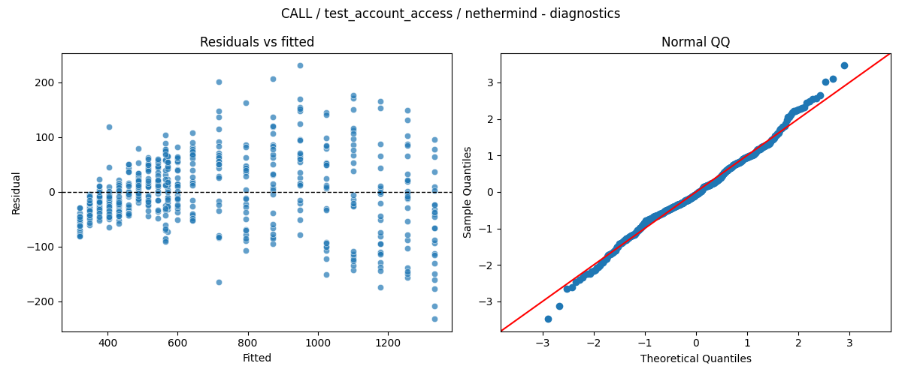

</details>

<details><summary>reth — NNLS regression summary</summary>

```
==============================================================================
                           NNLS Regression Results                            
==============================================================================
Dep. Variable:          test_runtime_ms              R-squared:          0.991
Model:                  NNLS                    Adj. R-squared:          0.991
No. Observations:       902                               RMSE:         185.32
Df Residuals:           899                                MAE:         110.05
Df Model:               2      
==============================================================================
                      coef     std err     P-value      [0.025      0.975]
------------------------------------------------------------------------------
         const    153.9144      5.6540       0.001    142.9630    165.7517
       opcount      0.0000      0.0000       1.000      0.0000      0.0000
        update      0.1644      0.0004       0.001      0.1636      0.1652
==============================================================================
Notes: Non-negative least squares with bootstrap inference (1000 iterations)
==============================================================================
```

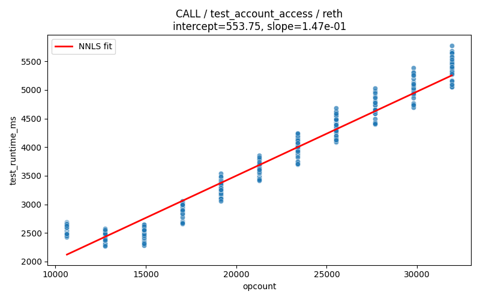

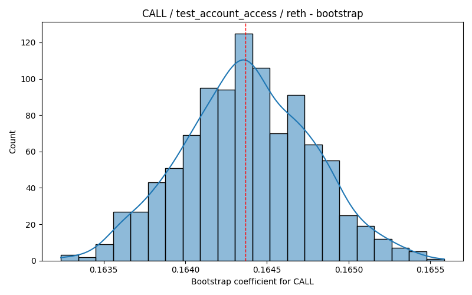

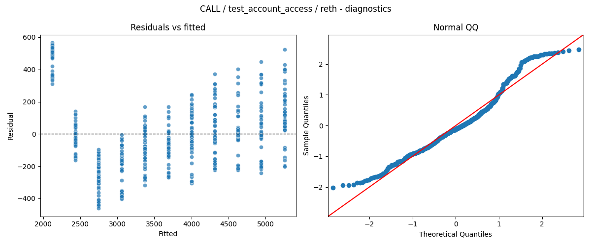

</details>

### test_account_access — combo `CALL_AccountMode.NON_EXISTING_ACCOUNT` — `presets[cold_account_nocode_access]`

| client | nobs | R² | target_coef (ms) | p-value | 95% CI |
| --- | --- | --- | --- | --- | --- |
| `besu` | 682 | 0.9805 | 0.0124 | 1.00e-03 | [0.01226, 0.01262] |
| `erigon` | 352 | 0.9311 | 0.00569 | 1.00e-03 | [0.004552, 0.006799] |
| `nethermind` | 528 | 0.9872 | 0.005244 | 1.00e-03 | [0.005146, 0.005344] |
| `reth` | 902 | 0.2727 | 0.0005758 | 1.00e-03 | [0.0004966, 0.0006584] |

<details><summary>besu — NNLS regression summary</summary>

```
==============================================================================
                           NNLS Regression Results                            
==============================================================================
Dep. Variable:          test_runtime_ms              R-squared:          0.981
Model:                  NNLS                    Adj. R-squared:          0.980
No. Observations:       682                               RMSE:          71.01
Df Residuals:           679                                MAE:          55.07
Df Model:               2      
==============================================================================
                      coef     std err     P-value      [0.025      0.975]
------------------------------------------------------------------------------
         const    438.9086      5.4460       0.001    422.1259    444.1644
       opcount      0.0124      0.0001       0.001      0.0123      0.0126
        update      0.0000      0.0039       1.000      0.0000      0.0141
==============================================================================
Notes: Non-negative least squares with bootstrap inference (1000 iterations)
==============================================================================
```

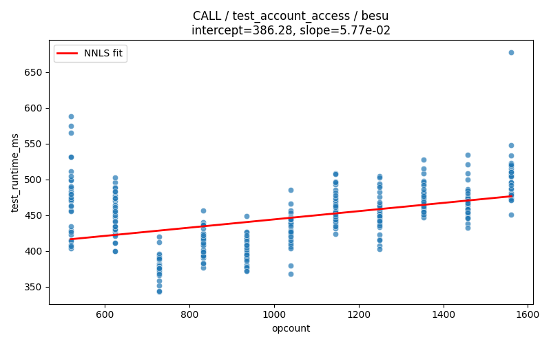

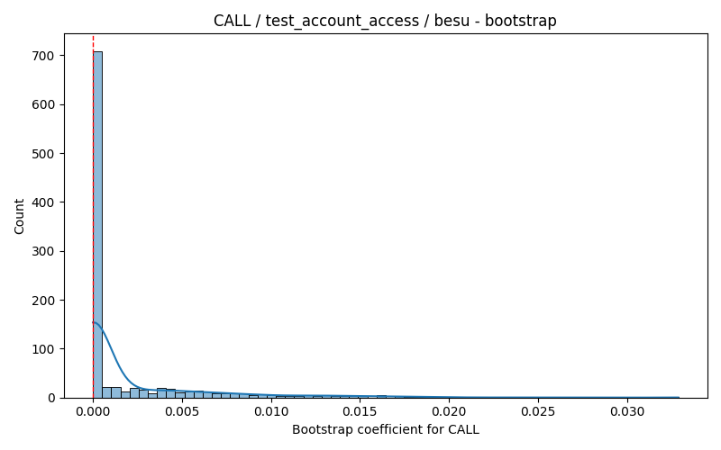

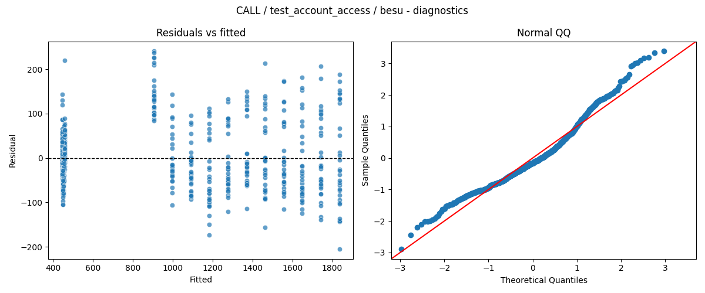

</details>

<details><summary>erigon — NNLS regression summary</summary>

```
==============================================================================
                           NNLS Regression Results                            
==============================================================================
Dep. Variable:          test_runtime_ms              R-squared:          0.931
Model:                  NNLS                    Adj. R-squared:          0.931
No. Observations:       352                               RMSE:         257.93
Df Residuals:           349                                MAE:         194.16
Df Model:               2      
==============================================================================
                      coef     std err     P-value      [0.025      0.975]
------------------------------------------------------------------------------
         const    383.5330     46.8975       0.001    290.2456    474.9252
       opcount      0.0057      0.0006       0.001      0.0046      0.0068
        update      1.9839      0.0523       0.001      1.8846      2.0866
==============================================================================
Notes: Non-negative least squares with bootstrap inference (1000 iterations)
==============================================================================
```

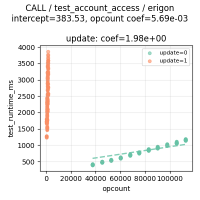

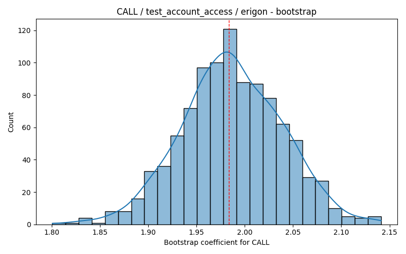

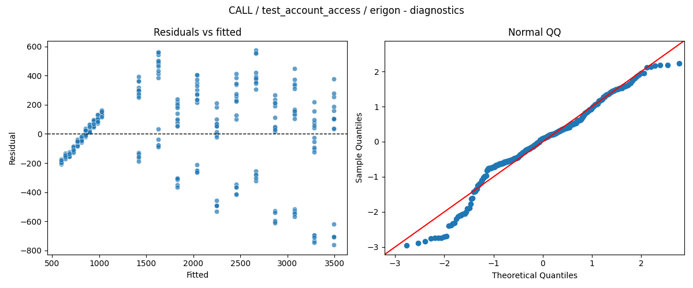

</details>

<details><summary>nethermind — NNLS regression summary</summary>

```
==============================================================================
                           NNLS Regression Results                            
==============================================================================
Dep. Variable:          test_runtime_ms              R-squared:          0.987
Model:                  NNLS                    Adj. R-squared:          0.987
No. Observations:       528                               RMSE:          23.54
Df Residuals:           525                                MAE:          18.83
Df Model:               2      
==============================================================================
                      coef     std err     P-value      [0.025      0.975]
------------------------------------------------------------------------------
         const     65.7937      3.7799       0.001     58.3140     73.4995
       opcount      0.0052      0.0001       0.001      0.0051      0.0053
        update      0.0138      0.0034       0.001      0.0069      0.0206
==============================================================================
Notes: Non-negative least squares with bootstrap inference (1000 iterations)
==============================================================================
```

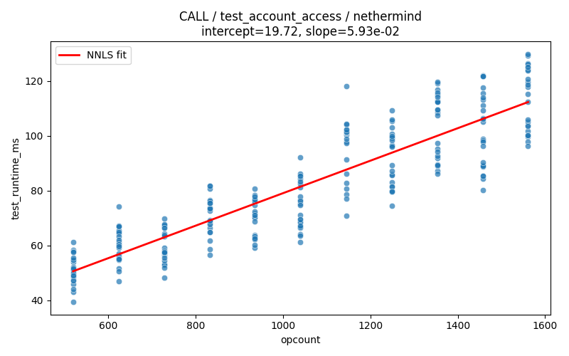

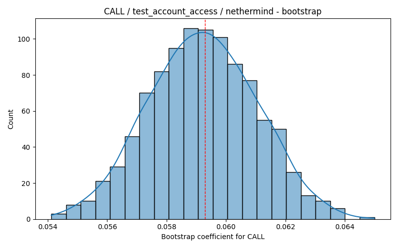

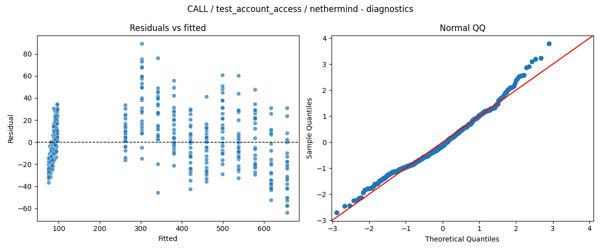

</details>

<details><summary>reth — NNLS regression summary</summary>

```
==============================================================================
                           NNLS Regression Results                            
==============================================================================
Dep. Variable:          test_runtime_ms              R-squared:          0.273
Model:                  NNLS                    Adj. R-squared:          0.271
No. Observations:       902                               RMSE:          21.39
Df Residuals:           899                                MAE:          14.83
Df Model:               2      
==============================================================================
                      coef     std err     P-value      [0.025      0.975]
------------------------------------------------------------------------------
         const     64.4929      3.4464       0.001     57.7209     70.8613
       opcount      0.0006      0.0000       0.001      0.0005      0.0007
        update      0.0341      0.0026       0.001      0.0292      0.0395
==============================================================================
Notes: Non-negative least squares with bootstrap inference (1000 iterations)
==============================================================================
```

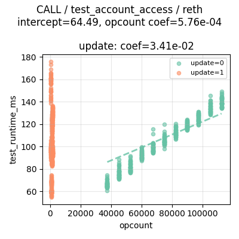

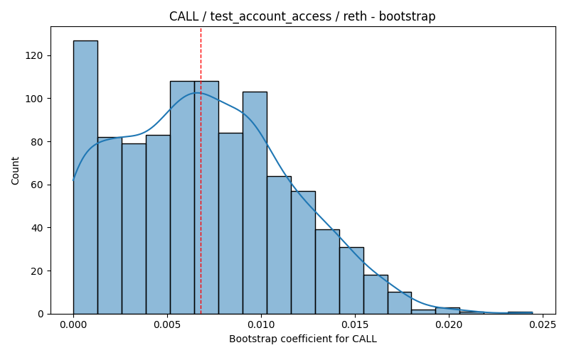

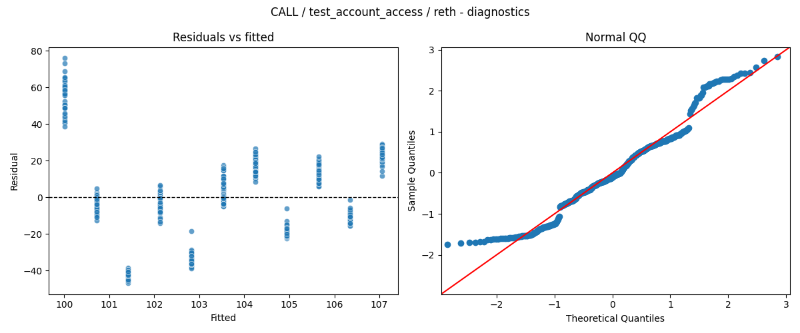

</details>

### test_account_access — combo `CALL_AccountMode.EXISTING_CONTRACT`

| client | nobs | R² | target_coef (ms) | p-value | 95% CI |
| --- | --- | --- | --- | --- | --- |
| `besu` | 682 | 0.9378 | 0.02623 | 1.00e-03 | [0.02549, 0.02706] |
| `erigon` | 352 | 0.9794 | 0.00052 | 4.53e-01 | [0, 0.01615] |
| `nethermind` | 528 | 0.8641 | 0.02901 | 1.00e-03 | [0.02761, 0.03031] |
| `reth` | 902 | 0.9472 | 0.02985 | 1.00e-03 | [0.02874, 0.03108] |

<details><summary>besu — NNLS regression summary</summary>

```
==============================================================================
                           NNLS Regression Results                            
==============================================================================
Dep. Variable:          test_runtime_ms              R-squared:          0.938
Model:                  NNLS                    Adj. R-squared:          0.938
No. Observations:       682                               RMSE:         177.46
Df Residuals:           679                                MAE:         143.21
Df Model:               2      
==============================================================================
                      coef     std err     P-value      [0.025      0.975]
------------------------------------------------------------------------------
         const    623.4890     26.0400       0.001    569.7894    673.8554
       opcount      0.0262      0.0004       0.001      0.0255      0.0271
        update      0.0845      0.0010       0.001      0.0828      0.0865
==============================================================================
Notes: Non-negative least squares with bootstrap inference (1000 iterations)
==============================================================================
```

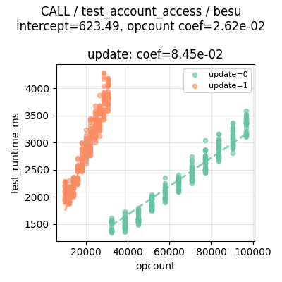

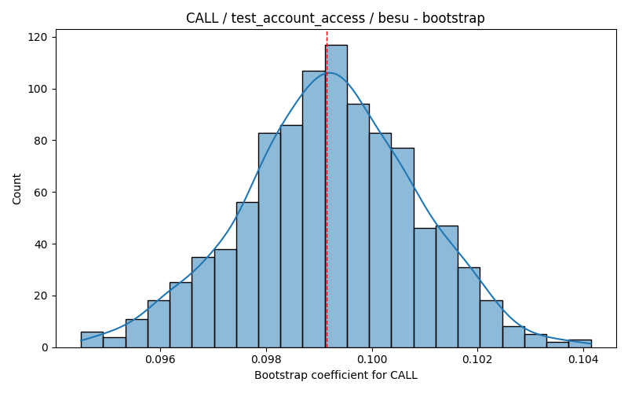

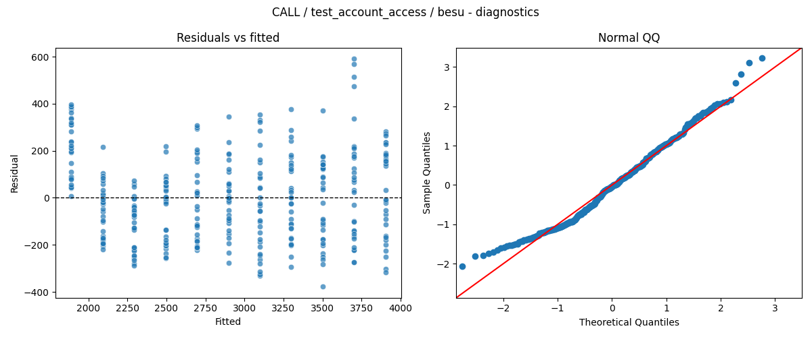

</details>

<details><summary>erigon — NNLS regression summary</summary>

```
==============================================================================
                           NNLS Regression Results                            
==============================================================================
Dep. Variable:          test_runtime_ms              R-squared:          0.979
Model:                  NNLS                    Adj. R-squared:          0.979
No. Observations:       352                               RMSE:        2291.64
Df Residuals:           349                                MAE:        1827.62
Df Model:               2      
==============================================================================
                      coef     std err     P-value      [0.025      0.975]
------------------------------------------------------------------------------
         const   7728.0962    358.0061       0.001   6700.4813   8067.9565
       opcount      0.0005      0.0045       0.453      0.0000      0.0162
        update      1.4210      0.0151       0.001      1.4003      1.4587
==============================================================================
Notes: Non-negative least squares with bootstrap inference (1000 iterations)
==============================================================================
```

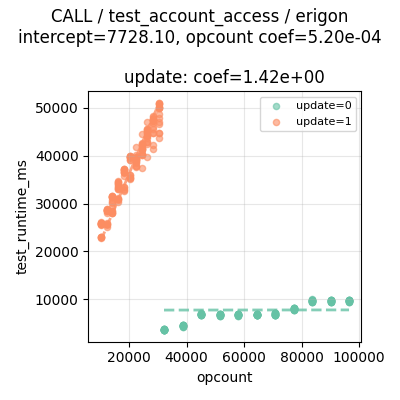

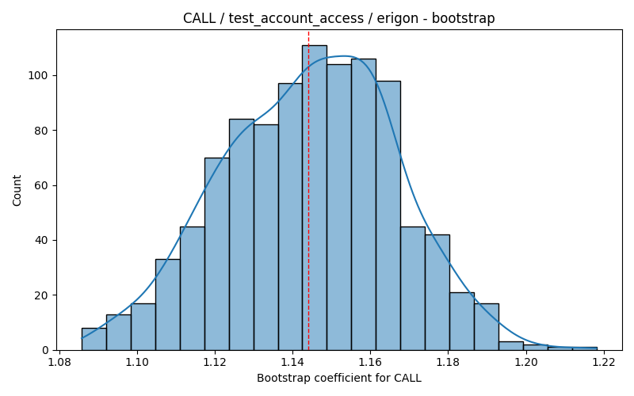

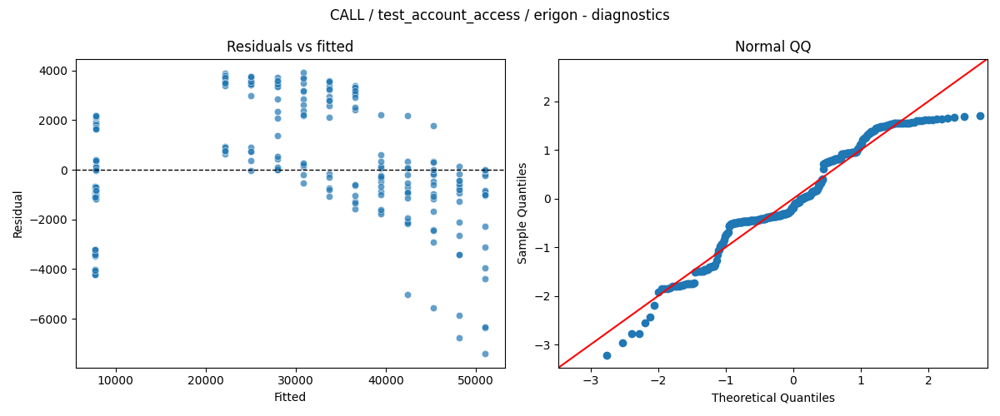

</details>

<details><summary>nethermind — NNLS regression summary</summary>

```
==============================================================================
                           NNLS Regression Results                            
==============================================================================
Dep. Variable:          test_runtime_ms              R-squared:          0.864
Model:                  NNLS                    Adj. R-squared:          0.864
No. Observations:       528                               RMSE:         270.88
Df Residuals:           525                                MAE:         212.40
Df Model:               2      
==============================================================================
                      coef     std err     P-value      [0.025      0.975]
------------------------------------------------------------------------------
         const    580.0500     41.9952       0.001    504.9770    670.3541
       opcount      0.0290      0.0007       0.001      0.0276      0.0303
        update      0.0131      0.0014       0.001      0.0101      0.0156
==============================================================================
Notes: Non-negative least squares with bootstrap inference (1000 iterations)
==============================================================================
```

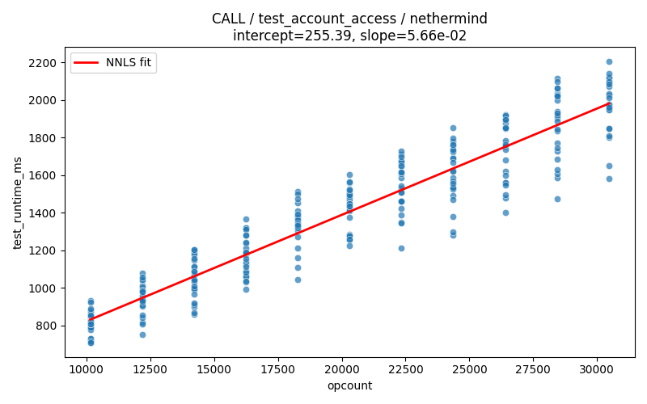

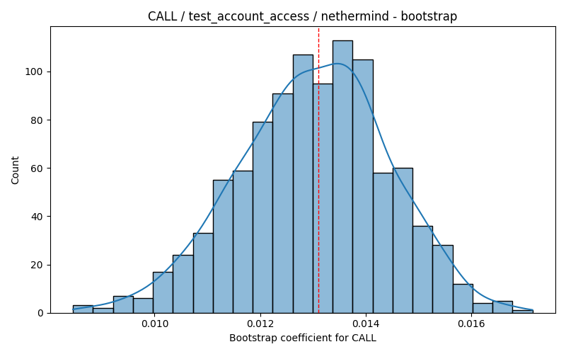

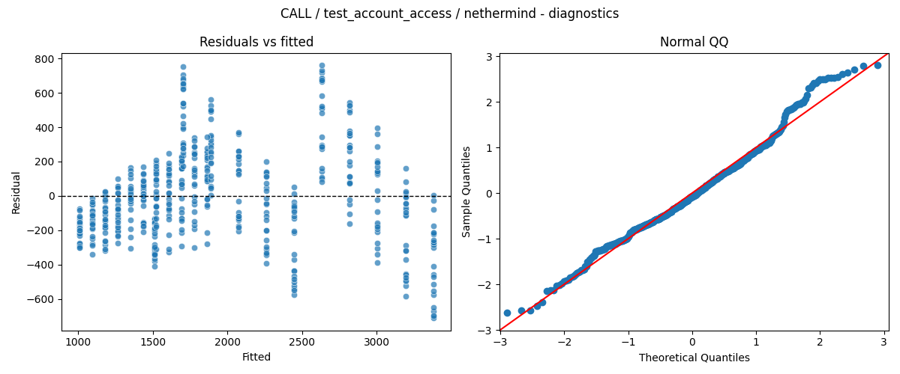

</details>

<details><summary>reth — NNLS regression summary</summary>

```
==============================================================================
                           NNLS Regression Results                            
==============================================================================
Dep. Variable:          test_runtime_ms              R-squared:          0.947
Model:                  NNLS                    Adj. R-squared:          0.947
No. Observations:       902                               RMSE:         273.04
Df Residuals:           899                                MAE:         177.19
Df Model:               2      
==============================================================================
                      coef     std err     P-value      [0.025      0.975]
------------------------------------------------------------------------------
         const    616.7513     37.0572       0.001    541.9199    687.4148
       opcount      0.0298      0.0006       0.001      0.0287      0.0311
        update      0.1388      0.0011       0.001      0.1368      0.1410
==============================================================================
Notes: Non-negative least squares with bootstrap inference (1000 iterations)
==============================================================================
```

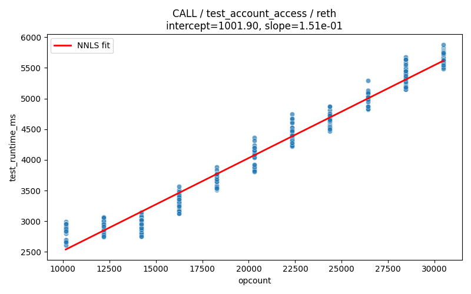

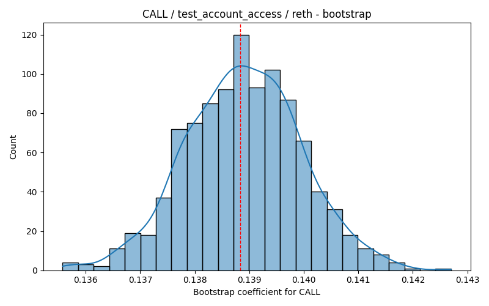

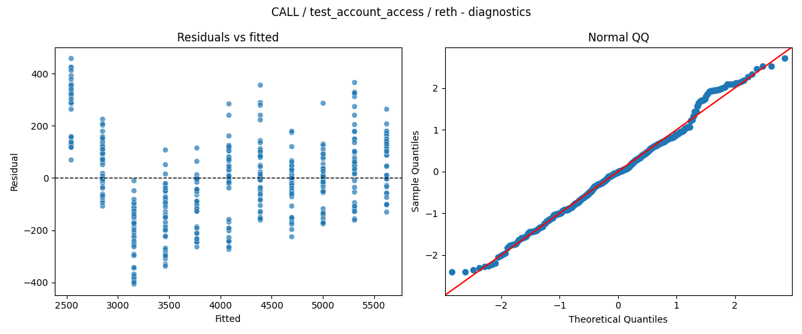

</details>

### test_account_access — combo `CALL_AccountMode.NON_EXISTING_ACCOUNT` — `presets[cold_account_code_access]`

| client | nobs | R² | target_coef (ms) | p-value | 95% CI |
| --- | --- | --- | --- | --- | --- |
| `besu` | 682 | 0.9805 | 0.0124 | 1.00e-03 | [0.01226, 0.01262] |
| `erigon` | 352 | 0.9311 | 0.00569 | 1.00e-03 | [0.004552, 0.006799] |
| `nethermind` | 528 | 0.9872 | 0.005244 | 1.00e-03 | [0.005146, 0.005344] |
| `reth` | 902 | 0.2727 | 0.0005758 | 1.00e-03 | [0.0004966, 0.0006584] |

<details><summary>besu — NNLS regression summary</summary>

```
==============================================================================
                           NNLS Regression Results                            
==============================================================================
Dep. Variable:          test_runtime_ms              R-squared:          0.981
Model:                  NNLS                    Adj. R-squared:          0.980
No. Observations:       682                               RMSE:          71.01
Df Residuals:           679                                MAE:          55.07
Df Model:               2      
==============================================================================
                      coef     std err     P-value      [0.025      0.975]
------------------------------------------------------------------------------
         const    438.9086      5.4460       0.001    422.1259    444.1644
       opcount      0.0124      0.0001       0.001      0.0123      0.0126
        update      0.0000      0.0039       1.000      0.0000      0.0141
==============================================================================
Notes: Non-negative least squares with bootstrap inference (1000 iterations)
==============================================================================
```


</details>

<details><summary>erigon — NNLS regression summary</summary>

```
==============================================================================
                           NNLS Regression Results                            
==============================================================================
Dep. Variable:          test_runtime_ms              R-squared:          0.931
Model:                  NNLS                    Adj. R-squared:          0.931
No. Observations:       352                               RMSE:         257.93
Df Residuals:           349                                MAE:         194.16
Df Model:               2      
==============================================================================
                      coef     std err     P-value      [0.025      0.975]
------------------------------------------------------------------------------
         const    383.5330     46.8975       0.001    290.2456    474.9252
       opcount      0.0057      0.0006       0.001      0.0046      0.0068
        update      1.9839      0.0523       0.001      1.8846      2.0866
==============================================================================
Notes: Non-negative least squares with bootstrap inference (1000 iterations)
==============================================================================
```


</details>

<details><summary>nethermind — NNLS regression summary</summary>

```
==============================================================================
                           NNLS Regression Results                            
==============================================================================
Dep. Variable:          test_runtime_ms              R-squared:          0.987
Model:                  NNLS                    Adj. R-squared:          0.987
No. Observations:       528                               RMSE:          23.54
Df Residuals:           525                                MAE:          18.83
Df Model:               2      
==============================================================================
                      coef     std err     P-value      [0.025      0.975]
------------------------------------------------------------------------------
         const     65.7937      3.7799       0.001     58.3140     73.4995
       opcount      0.0052      0.0001       0.001      0.0051      0.0053
        update      0.0138      0.0034       0.001      0.0069      0.0206
==============================================================================
Notes: Non-negative least squares with bootstrap inference (1000 iterations)
==============================================================================
```


</details>

<details><summary>reth — NNLS regression summary</summary>

```
==============================================================================
                           NNLS Regression Results                            
==============================================================================
Dep. Variable:          test_runtime_ms              R-squared:          0.273
Model:                  NNLS                    Adj. R-squared:          0.271
No. Observations:       902                               RMSE:          21.39
Df Residuals:           899                                MAE:          14.83
Df Model:               2      
==============================================================================
                      coef     std err     P-value      [0.025      0.975]
------------------------------------------------------------------------------
         const     64.4929      3.4464       0.001     57.7209     70.8613
       opcount      0.0006      0.0000       0.001      0.0005      0.0007
        update      0.0341      0.0026       0.001      0.0292      0.0395
==============================================================================
Notes: Non-negative least squares with bootstrap inference (1000 iterations)
==============================================================================
```


</details>

### test_ext_account_query_warm — combo `CALL`

| client | nobs | R² | target_coef (ms) | p-value | 95% CI |
| --- | --- | --- | --- | --- | --- |
| `besu` | 341 | 0.5928 | 0.001231 | 1.00e-03 | [0.001119, 0.001336] |
| `erigon` | 176 | 0.8984 | 0.0005013 | 1.00e-03 | [0.0004771, 0.000528] |
| `nethermind` | 264 | 0.7927 | 0.0006615 | 1.00e-03 | [0.0006148, 0.0007084] |
| `reth` | 451 | 0.8825 | 4.959e-05 | 1.00e-03 | [4.769e-05, 5.139e-05] |

<details><summary>besu — NNLS regression summary</summary>

```
==============================================================================
                           NNLS Regression Results                            
==============================================================================
Dep. Variable:          test_runtime_ms              R-squared:          0.593
Model:                  NNLS                    Adj. R-squared:          0.592
No. Observations:       341                               RMSE:         515.46
Df Residuals:           339                                MAE:         361.40
Df Model:               1      
==============================================================================
                      coef     std err     P-value      [0.025      0.975]
------------------------------------------------------------------------------
         const    807.4855     83.7065       0.001    649.6640    968.6922
       opcount      0.0012      0.0001       0.001      0.0011      0.0013
==============================================================================
Notes: Non-negative least squares with bootstrap inference (1000 iterations)
==============================================================================
```

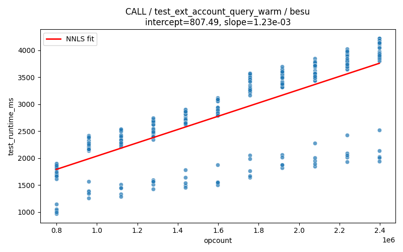

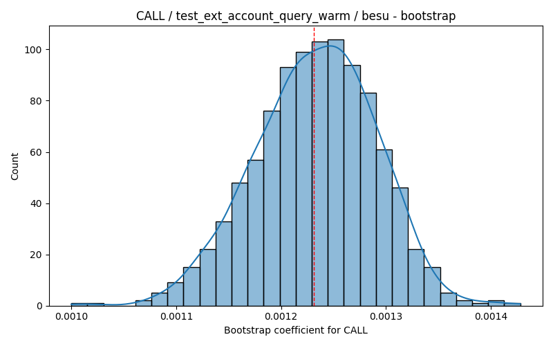

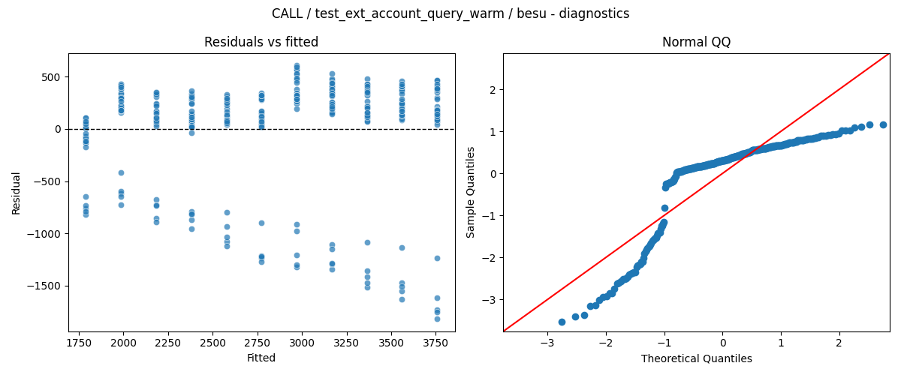

</details>

<details><summary>erigon — NNLS regression summary</summary>

```
==============================================================================
                           NNLS Regression Results                            
==============================================================================
Dep. Variable:          test_runtime_ms              R-squared:          0.898
Model:                  NNLS                    Adj. R-squared:          0.898
No. Observations:       176                               RMSE:          85.18
Df Residuals:           174                                MAE:          71.92
Df Model:               1      
==============================================================================
                      coef     std err     P-value      [0.025      0.975]
------------------------------------------------------------------------------
         const     72.9110     19.7153       0.001     33.3879    108.1479
       opcount      0.0005      0.0000       0.001      0.0005      0.0005
==============================================================================
Notes: Non-negative least squares with bootstrap inference (1000 iterations)
==============================================================================
```

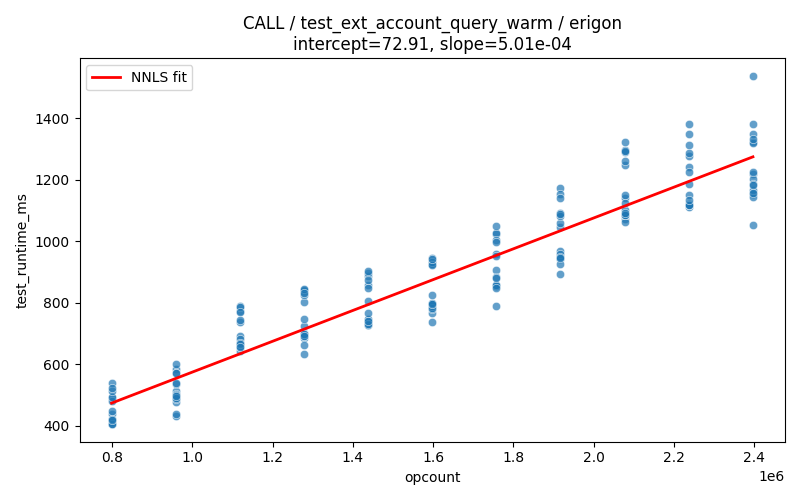

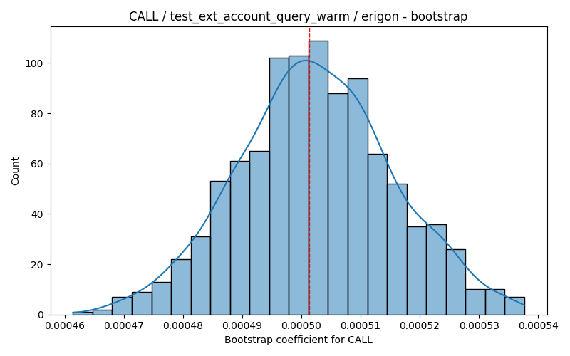

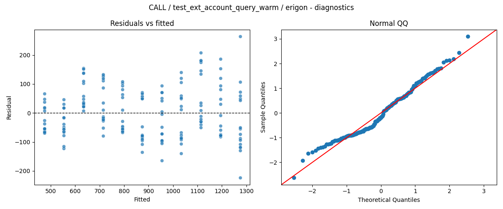

</details>

<details><summary>nethermind — NNLS regression summary</summary>

```
==============================================================================
                           NNLS Regression Results                            
==============================================================================
Dep. Variable:          test_runtime_ms              R-squared:          0.793
Model:                  NNLS                    Adj. R-squared:          0.792
No. Observations:       264                               RMSE:         170.91
Df Residuals:           262                                MAE:         130.45
Df Model:               1      
==============================================================================
                      coef     std err     P-value      [0.025      0.975]
------------------------------------------------------------------------------
         const    393.0297     33.4677       0.001    323.7641    459.5689
       opcount      0.0007      0.0000       0.001      0.0006      0.0007
==============================================================================
Notes: Non-negative least squares with bootstrap inference (1000 iterations)
==============================================================================
```

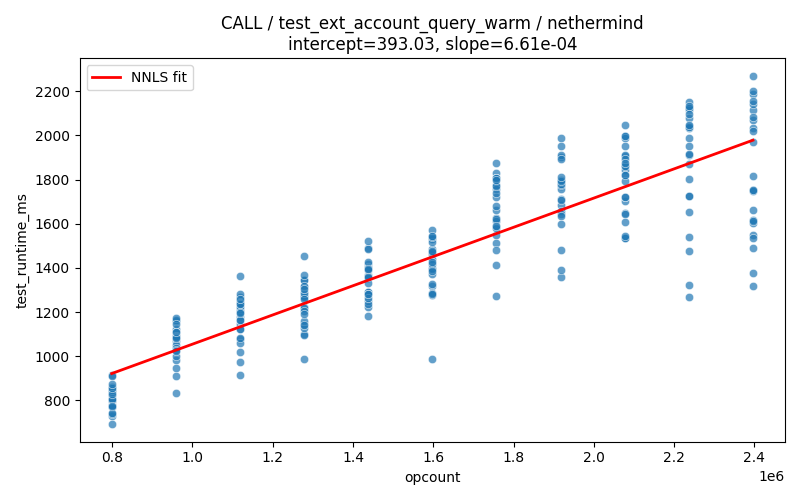

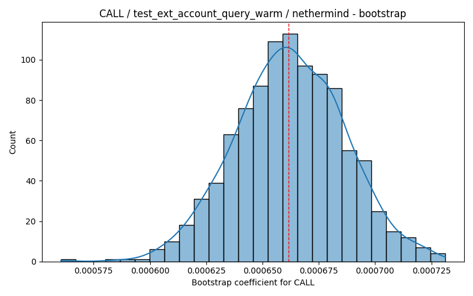

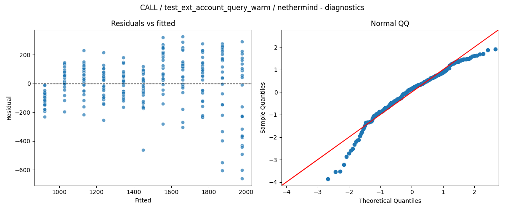

</details>

<details><summary>reth — NNLS regression summary</summary>

```
==============================================================================
                           NNLS Regression Results                            
==============================================================================
Dep. Variable:          test_runtime_ms              R-squared:          0.882
Model:                  NNLS                    Adj. R-squared:          0.882
No. Observations:       451                               RMSE:           9.14
Df Residuals:           449                                MAE:           7.48
Df Model:               1      
==============================================================================
                      coef     std err     P-value      [0.025      0.975]
------------------------------------------------------------------------------
         const     18.8535      1.4662       0.001     16.0914     21.8383
       opcount      0.0000      0.0000       0.001      0.0000      0.0001
==============================================================================
Notes: Non-negative least squares with bootstrap inference (1000 iterations)
==============================================================================
```

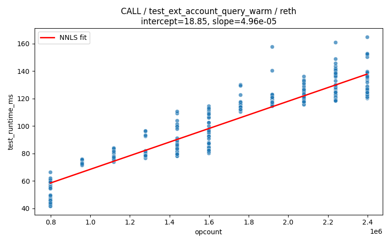

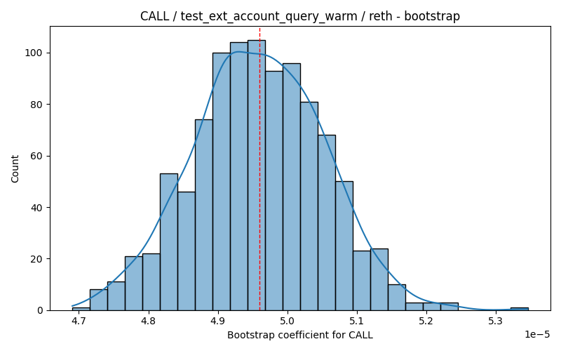

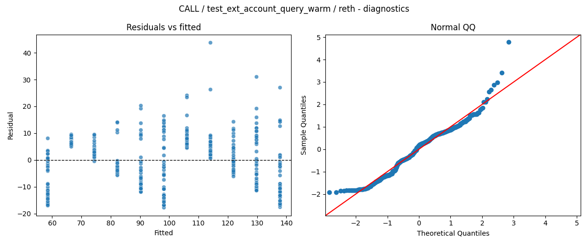

</details>

## CALLCODE

### test_account_access — combo `CALLCODE_AccountMode.EXISTING_EOA`

| client | nobs | R² | target_coef (ms) | p-value | 95% CI |
| --- | --- | --- | --- | --- | --- |
| `besu` | 682 | 0.9451 | 0.01403 | 1.00e-03 | [0.01382, 0.01425] |
| `erigon` | 352 | 0.9961 | 0.01062 | 1.00e-03 | [0.01058, 0.01066] |
| `nethermind` | 528 | 0.9724 | 0.005072 | 1.00e-03 | [0.004984, 0.005168] |
| `reth` | 902 | 0.9804 | 0.001392 | 1.00e-03 | [0.001381, 0.001404] |

<details><summary>besu — NNLS regression summary</summary>

```
==============================================================================
                           NNLS Regression Results                            
==============================================================================
Dep. Variable:          test_runtime_ms              R-squared:          0.945
Model:                  NNLS                    Adj. R-squared:          0.945
No. Observations:       682                               RMSE:         108.51
Df Residuals:           679                                MAE:          76.83
Df Model:               2      
==============================================================================
                      coef     std err     P-value      [0.025      0.975]
------------------------------------------------------------------------------
         const    270.2316      6.2270       0.001    258.9496    282.5826
       opcount      0.0140      0.0001       0.001      0.0138      0.0142
        update      0.0000      0.0000       1.000      0.0000      0.0000
==============================================================================
Notes: Non-negative least squares with bootstrap inference (1000 iterations)
==============================================================================
```

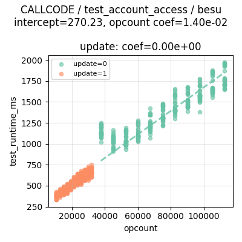


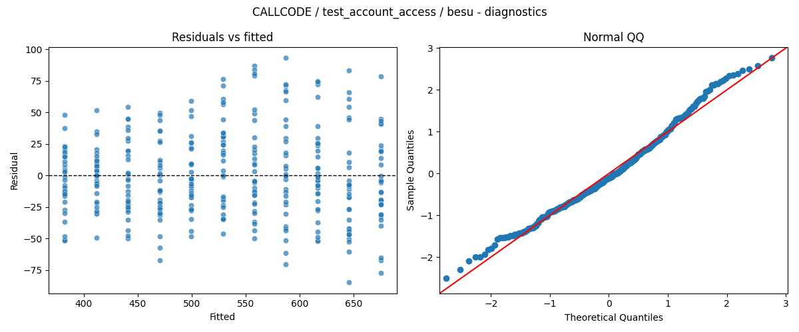

</details>

<details><summary>erigon — NNLS regression summary</summary>

```
==============================================================================
                           NNLS Regression Results                            
==============================================================================
Dep. Variable:          test_runtime_ms              R-squared:          0.996
Model:                  NNLS                    Adj. R-squared:          0.996
No. Observations:       352                               RMSE:          21.51
Df Residuals:           349                                MAE:          17.52
Df Model:               2      
==============================================================================
                      coef     std err     P-value      [0.025      0.975]
------------------------------------------------------------------------------
         const      0.0000      0.0000       1.000      0.0000      0.0000
       opcount      0.0106      0.0000       0.001      0.0106      0.0107
        update      0.0000      0.0000       1.000      0.0000      0.0000
==============================================================================
Notes: Non-negative least squares with bootstrap inference (1000 iterations)
==============================================================================
```

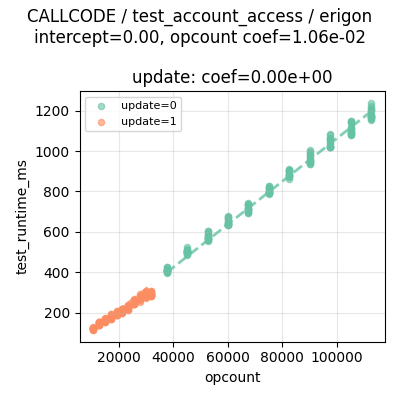


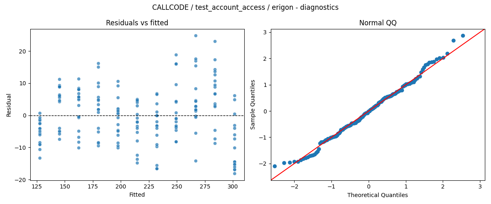

</details>

<details><summary>nethermind — NNLS regression summary</summary>

```
==============================================================================
                           NNLS Regression Results                            
==============================================================================
Dep. Variable:          test_runtime_ms              R-squared:          0.972
Model:                  NNLS                    Adj. R-squared:          0.972
No. Observations:       528                               RMSE:          27.41
Df Residuals:           525                                MAE:          17.36
Df Model:               2      
==============================================================================
                      coef     std err     P-value      [0.025      0.975]
------------------------------------------------------------------------------
         const     70.0359      1.7727       0.001     66.5903     73.3307
       opcount      0.0051      0.0000       0.001      0.0050      0.0052
        update      0.0000      0.0000       1.000      0.0000      0.0000
==============================================================================
Notes: Non-negative least squares with bootstrap inference (1000 iterations)
==============================================================================
```

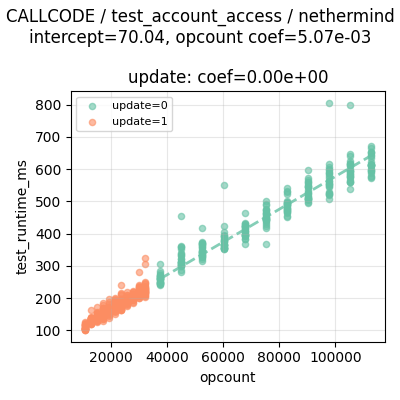

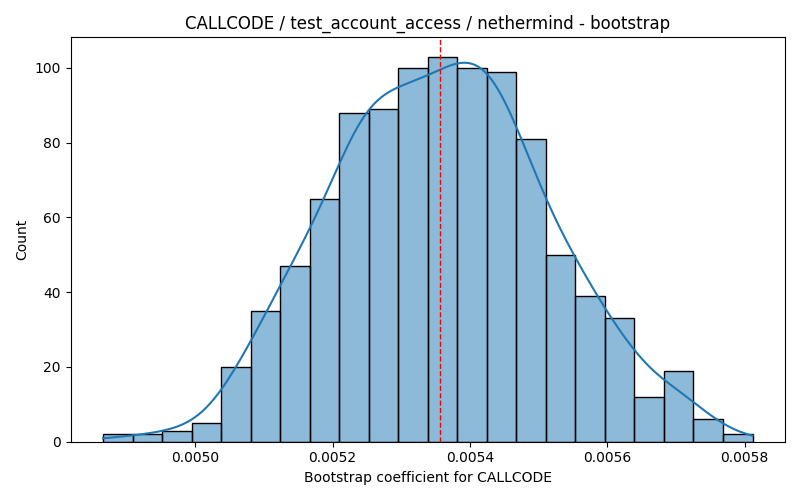

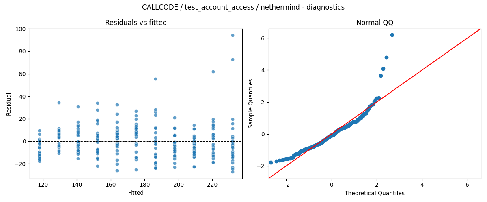

</details>

<details><summary>reth — NNLS regression summary</summary>

```
==============================================================================
                           NNLS Regression Results                            
==============================================================================
Dep. Variable:          test_runtime_ms              R-squared:          0.980
Model:                  NNLS                    Adj. R-squared:          0.980
No. Observations:       902                               RMSE:           6.31
Df Residuals:           899                                MAE:           4.84
Df Model:               2      
==============================================================================
                      coef     std err     P-value      [0.025      0.975]
------------------------------------------------------------------------------
         const      8.9657      0.3105       0.001      8.3543      9.5573
       opcount      0.0014      0.0000       0.001      0.0014      0.0014
        update      0.0000      0.0000       1.000      0.0000      0.0000
==============================================================================
Notes: Non-negative least squares with bootstrap inference (1000 iterations)
==============================================================================
```

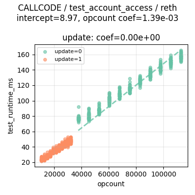

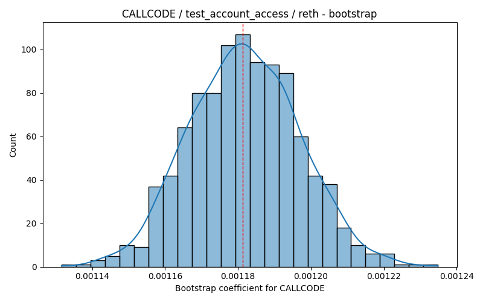

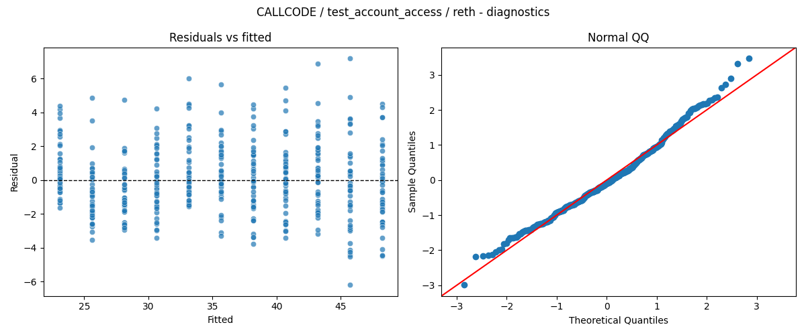

</details>

### test_account_access — combo `CALLCODE_AccountMode.NON_EXISTING_ACCOUNT` — `presets[cold_account_nocode_access]`

| client | nobs | R² | target_coef (ms) | p-value | 95% CI |
| --- | --- | --- | --- | --- | --- |
| `besu` | 682 | 0.9319 | 0.01528 | 1.00e-03 | [0.01504, 0.01552] |
| `erigon` | 352 | 0.9427 | 0.009392 | 1.00e-03 | [0.009295, 0.009483] |
| `nethermind` | 528 | 0.9581 | 0.005905 | 1.00e-03 | [0.005847, 0.005963] |
| `reth` | 902 | 0.9109 | 0.001281 | 1.00e-03 | [0.001269, 0.001291] |

<details><summary>besu — NNLS regression summary</summary>

```
==============================================================================
                           NNLS Regression Results                            
==============================================================================
Dep. Variable:          test_runtime_ms              R-squared:          0.932
Model:                  NNLS                    Adj. R-squared:          0.932
No. Observations:       682                               RMSE:         132.47
Df Residuals:           679                                MAE:         104.61
Df Model:               2      
==============================================================================
                      coef     std err     P-value      [0.025      0.975]
------------------------------------------------------------------------------
         const     85.9852      8.0520       0.001     71.2075    101.5828
       opcount      0.0153      0.0001       0.001      0.0150      0.0155
        update      0.0000      0.0000       1.000      0.0000      0.0000
==============================================================================
Notes: Non-negative least squares with bootstrap inference (1000 iterations)
==============================================================================
```

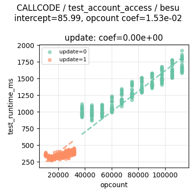


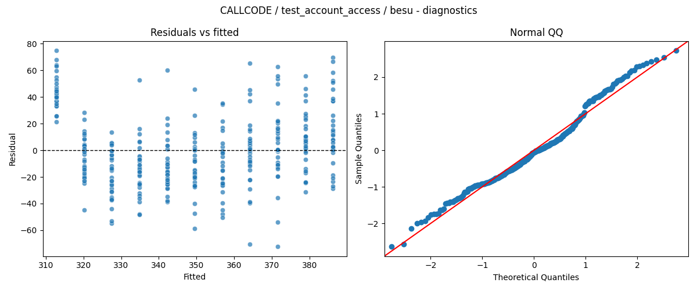

</details>

<details><summary>erigon — NNLS regression summary</summary>

```
==============================================================================
                           NNLS Regression Results                            
==============================================================================
Dep. Variable:          test_runtime_ms              R-squared:          0.943
Model:                  NNLS                    Adj. R-squared:          0.942
No. Observations:       352                               RMSE:          85.99
Df Residuals:           349                                MAE:          68.69
Df Model:               2      
==============================================================================
                      coef     std err     P-value      [0.025      0.975]
------------------------------------------------------------------------------
         const      0.0000      0.0000       1.000      0.0000      0.0000
       opcount      0.0094      0.0000       0.001      0.0093      0.0095
        update      0.0000      0.0000       1.000      0.0000      0.0000
==============================================================================
Notes: Non-negative least squares with bootstrap inference (1000 iterations)
==============================================================================
```

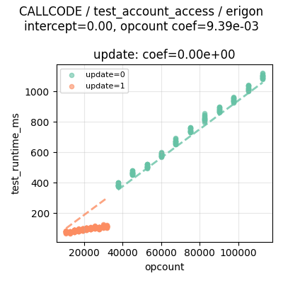


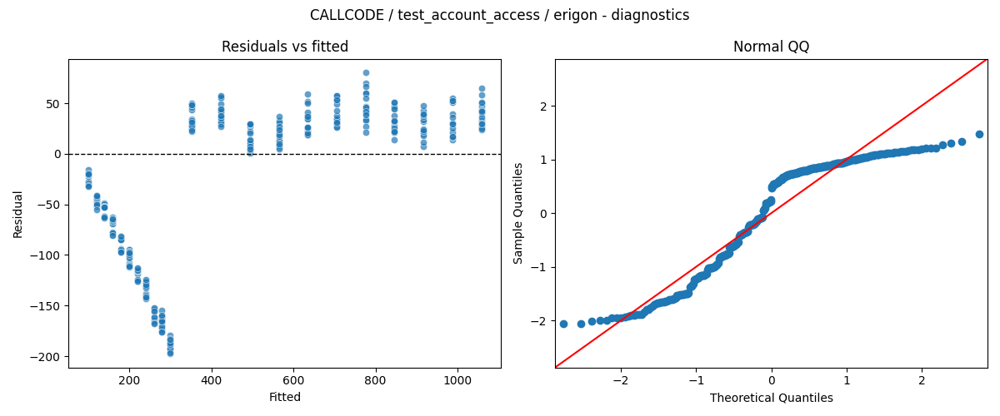

</details>

<details><summary>nethermind — NNLS regression summary</summary>

```
==============================================================================
                           NNLS Regression Results                            
==============================================================================
Dep. Variable:          test_runtime_ms              R-squared:          0.958
Model:                  NNLS                    Adj. R-squared:          0.958
No. Observations:       528                               RMSE:          40.42
Df Residuals:           525                                MAE:          31.68
Df Model:               2      
==============================================================================
                      coef     std err     P-value      [0.025      0.975]
------------------------------------------------------------------------------
         const      0.0000      0.0000       1.000      0.0000      0.0000
       opcount      0.0059      0.0000       0.001      0.0058      0.0060
        update      0.0000      0.0000       1.000      0.0000      0.0000
==============================================================================
Notes: Non-negative least squares with bootstrap inference (1000 iterations)
==============================================================================
```

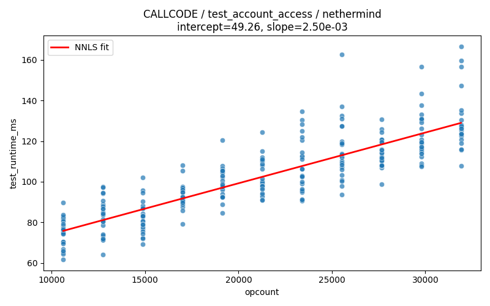


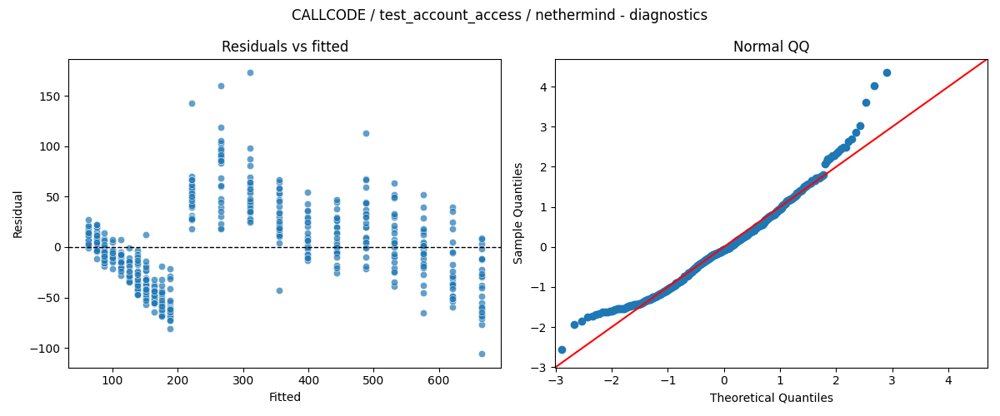

</details>

<details><summary>reth — NNLS regression summary</summary>

```
==============================================================================
                           NNLS Regression Results                            
==============================================================================
Dep. Variable:          test_runtime_ms              R-squared:          0.911
Model:                  NNLS                    Adj. R-squared:          0.911
No. Observations:       902                               RMSE:          14.63
Df Residuals:           899                                MAE:          12.64
Df Model:               2      
==============================================================================
                      coef     std err     P-value      [0.025      0.975]
------------------------------------------------------------------------------
         const      0.0000      0.0000       1.000      0.0000      0.0000
       opcount      0.0013      0.0000       0.001      0.0013      0.0013
        update      0.0000      0.0000       1.000      0.0000      0.0000
==============================================================================
Notes: Non-negative least squares with bootstrap inference (1000 iterations)
==============================================================================
```

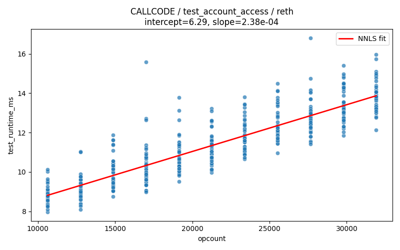


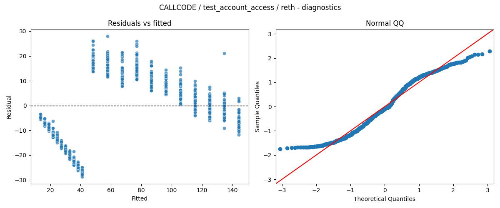

</details>

### test_account_access — combo `CALLCODE_AccountMode.EXISTING_CONTRACT`

| client | nobs | R² | target_coef (ms) | p-value | 95% CI |
| --- | --- | --- | --- | --- | --- |
| `besu` | 682 | 0.9737 | 0.03289 | 1.00e-03 | [0.03257, 0.03323] |
| `erigon` | 352 | 0.9578 | 0.1035 | 1.00e-03 | [0.1018, 0.1055] |
| `nethermind` | 528 | 0.9041 | 0.03351 | 1.00e-03 | [0.03255, 0.03459] |
| `reth` | 902 | 0.8939 | 0.03716 | 1.00e-03 | [0.03678, 0.03755] |

<details><summary>besu — NNLS regression summary</summary>

```
==============================================================================
                           NNLS Regression Results                            
==============================================================================
Dep. Variable:          test_runtime_ms              R-squared:          0.974
Model:                  NNLS                    Adj. R-squared:          0.974
No. Observations:       682                               RMSE:         144.40
Df Residuals:           679                                MAE:         113.90
Df Model:               2      
==============================================================================
                      coef     std err     P-value      [0.025      0.975]
------------------------------------------------------------------------------
         const     95.8422      8.8435       0.001     78.9829    113.4110
       opcount      0.0329      0.0002       0.001      0.0326      0.0332
        update      0.0000      0.0000       1.000      0.0000      0.0000
==============================================================================
Notes: Non-negative least squares with bootstrap inference (1000 iterations)
==============================================================================
```

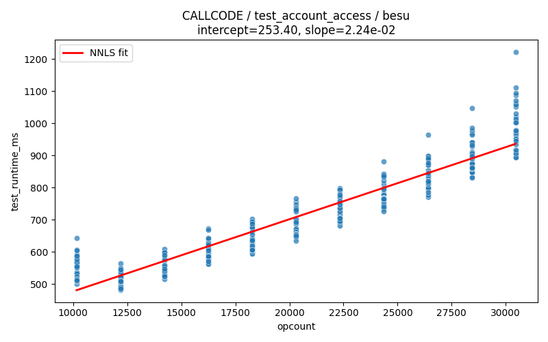


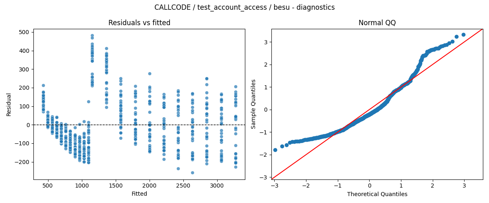

</details>

<details><summary>erigon — NNLS regression summary</summary>

```
==============================================================================
                           NNLS Regression Results                            
==============================================================================
Dep. Variable:          test_runtime_ms              R-squared:          0.958
Model:                  NNLS                    Adj. R-squared:          0.958
No. Observations:       352                               RMSE:         580.01
Df Residuals:           349                                MAE:         406.10
Df Model:               2      
==============================================================================
                      coef     std err     P-value      [0.025      0.975]
------------------------------------------------------------------------------
         const    325.6737     37.4199       0.001    252.6358    399.7855
       opcount      0.1035      0.0010       0.001      0.1018      0.1055
        update      0.0000      0.0000       1.000      0.0000      0.0000
==============================================================================
Notes: Non-negative least squares with bootstrap inference (1000 iterations)
==============================================================================
```

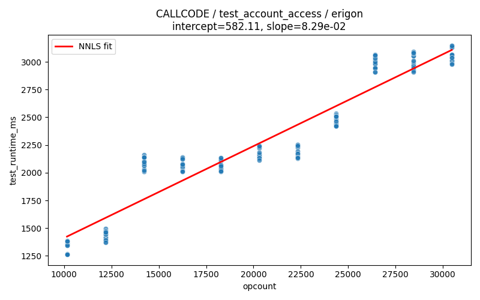


</details>

<details><summary>nethermind — NNLS regression summary</summary>

```
==============================================================================
                           NNLS Regression Results                            
==============================================================================
Dep. Variable:          test_runtime_ms              R-squared:          0.904
Model:                  NNLS                    Adj. R-squared:          0.904
No. Observations:       528                               RMSE:         291.29
Df Residuals:           525                                MAE:         211.43
Df Model:               2      
==============================================================================
                      coef     std err     P-value      [0.025      0.975]
------------------------------------------------------------------------------
         const    239.4831     18.3509       0.001    203.5885    275.0207
       opcount      0.0335      0.0005       0.001      0.0326      0.0346
        update      0.0000      0.0000       1.000      0.0000      0.0000
==============================================================================
Notes: Non-negative least squares with bootstrap inference (1000 iterations)
==============================================================================
```

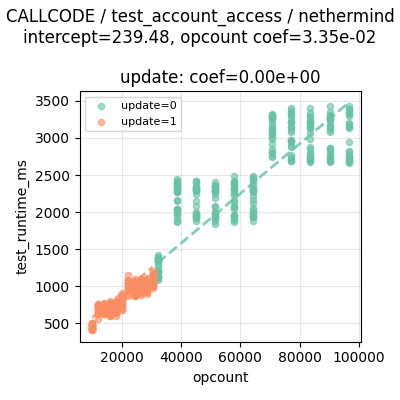

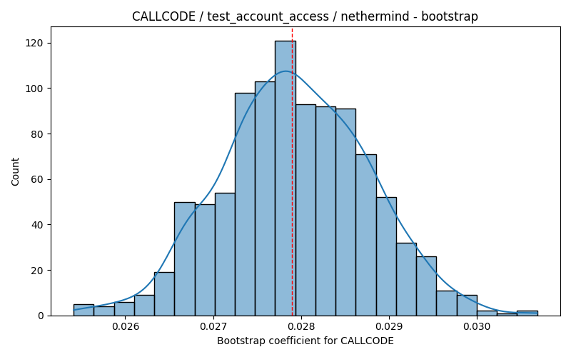

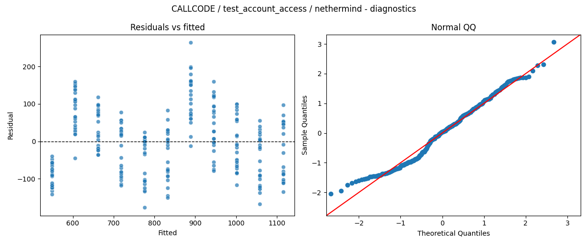

</details>

<details><summary>reth — NNLS regression summary</summary>

```
==============================================================================
                           NNLS Regression Results                            
==============================================================================
Dep. Variable:          test_runtime_ms              R-squared:          0.894
Model:                  NNLS                    Adj. R-squared:          0.894
No. Observations:       902                               RMSE:         378.33
Df Residuals:           899                                MAE:         285.57
Df Model:               2      
==============================================================================
                      coef     std err     P-value      [0.025      0.975]
------------------------------------------------------------------------------
         const      0.0000      0.0000       1.000      0.0000      0.0000
       opcount      0.0372      0.0002       0.001      0.0368      0.0375
        update      0.0000      0.0000       1.000      0.0000      0.0000
==============================================================================
Notes: Non-negative least squares with bootstrap inference (1000 iterations)
==============================================================================
```

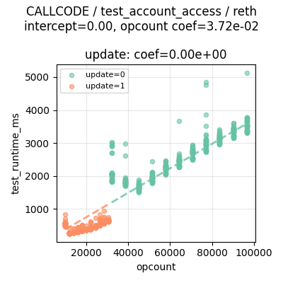

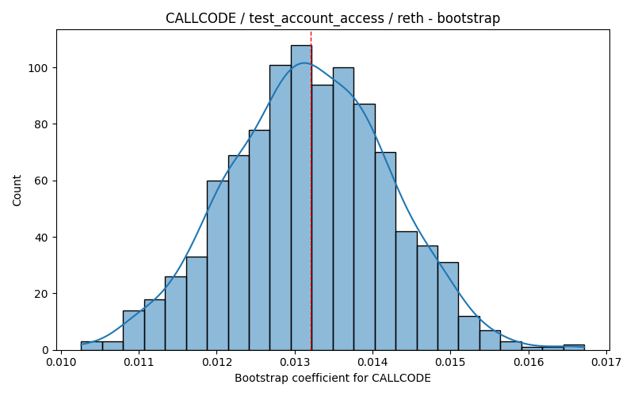

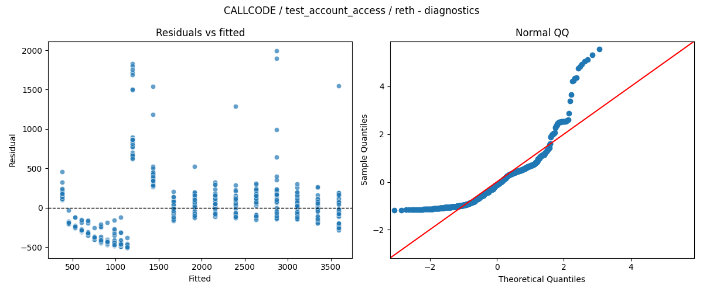

</details>

### test_account_access — combo `CALLCODE_AccountMode.NON_EXISTING_ACCOUNT` — `presets[cold_account_code_access]`

| client | nobs | R² | target_coef (ms) | p-value | 95% CI |
| --- | --- | --- | --- | --- | --- |
| `besu` | 682 | 0.9319 | 0.01528 | 1.00e-03 | [0.01504, 0.01552] |
| `erigon` | 352 | 0.9427 | 0.009392 | 1.00e-03 | [0.009295, 0.009483] |
| `nethermind` | 528 | 0.9581 | 0.005905 | 1.00e-03 | [0.005847, 0.005963] |
| `reth` | 902 | 0.9109 | 0.001281 | 1.00e-03 | [0.001269, 0.001291] |

<details><summary>besu — NNLS regression summary</summary>

```
==============================================================================
                           NNLS Regression Results                            
==============================================================================
Dep. Variable:          test_runtime_ms              R-squared:          0.932
Model:                  NNLS                    Adj. R-squared:          0.932
No. Observations:       682                               RMSE:         132.47
Df Residuals:           679                                MAE:         104.61
Df Model:               2      
==============================================================================
                      coef     std err     P-value      [0.025      0.975]
------------------------------------------------------------------------------
         const     85.9852      8.0520       0.001     71.2075    101.5828
       opcount      0.0153      0.0001       0.001      0.0150      0.0155
        update      0.0000      0.0000       1.000      0.0000      0.0000
==============================================================================
Notes: Non-negative least squares with bootstrap inference (1000 iterations)
==============================================================================
```


</details>

<details><summary>erigon — NNLS regression summary</summary>

```
==============================================================================
                           NNLS Regression Results                            
==============================================================================
Dep. Variable:          test_runtime_ms              R-squared:          0.943
Model:                  NNLS                    Adj. R-squared:          0.942
No. Observations:       352                               RMSE:          85.99
Df Residuals:           349                                MAE:          68.69
Df Model:               2      
==============================================================================
                      coef     std err     P-value      [0.025      0.975]
------------------------------------------------------------------------------
         const      0.0000      0.0000       1.000      0.0000      0.0000
       opcount      0.0094      0.0000       0.001      0.0093      0.0095
        update      0.0000      0.0000       1.000      0.0000      0.0000
==============================================================================
Notes: Non-negative least squares with bootstrap inference (1000 iterations)
==============================================================================
```


</details>

<details><summary>nethermind — NNLS regression summary</summary>

```
==============================================================================
                           NNLS Regression Results                            
==============================================================================
Dep. Variable:          test_runtime_ms              R-squared:          0.958
Model:                  NNLS                    Adj. R-squared:          0.958
No. Observations:       528                               RMSE:          40.42
Df Residuals:           525                                MAE:          31.68
Df Model:               2      
==============================================================================
                      coef     std err     P-value      [0.025      0.975]
------------------------------------------------------------------------------
         const      0.0000      0.0000       1.000      0.0000      0.0000
       opcount      0.0059      0.0000       0.001      0.0058      0.0060
        update      0.0000      0.0000       1.000      0.0000      0.0000
==============================================================================
Notes: Non-negative least squares with bootstrap inference (1000 iterations)
==============================================================================
```


</details>

<details><summary>reth — NNLS regression summary</summary>

```
==============================================================================
                           NNLS Regression Results                            
==============================================================================
Dep. Variable:          test_runtime_ms              R-squared:          0.911
Model:                  NNLS                    Adj. R-squared:          0.911
No. Observations:       902                               RMSE:          14.63
Df Residuals:           899                                MAE:          12.64
Df Model:               2      
==============================================================================
                      coef     std err     P-value      [0.025      0.975]
------------------------------------------------------------------------------
         const      0.0000      0.0000       1.000      0.0000      0.0000
       opcount      0.0013      0.0000       0.001      0.0013      0.0013
        update      0.0000      0.0000       1.000      0.0000      0.0000
==============================================================================
Notes: Non-negative least squares with bootstrap inference (1000 iterations)
==============================================================================
```


</details>

### test_ext_account_query_warm — combo `CALLCODE`

| client | nobs | R² | target_coef (ms) | p-value | 95% CI |
| --- | --- | --- | --- | --- | --- |
| `besu` | 341 | 0.5944 | 0.001233 | 1.00e-03 | [0.001118, 0.001344] |
| `erigon` | 176 | 0.9022 | 0.0002926 | 1.00e-03 | [0.0002783, 0.0003077] |
| `nethermind` | 264 | 0.8187 | 0.0006986 | 1.00e-03 | [0.0006584, 0.0007388] |
| `reth` | 451 | 0.9055 | 4.733e-05 | 1.00e-03 | [4.57e-05, 4.892e-05] |

<details><summary>besu — NNLS regression summary</summary>

```
==============================================================================
                           NNLS Regression Results                            
==============================================================================
Dep. Variable:          test_runtime_ms              R-squared:          0.594
Model:                  NNLS                    Adj. R-squared:          0.593
No. Observations:       341                               RMSE:         514.72
Df Residuals:           339                                MAE:         362.00
Df Model:               1      
==============================================================================
                      coef     std err     P-value      [0.025      0.975]
------------------------------------------------------------------------------
         const    784.8176     84.6654       0.001    621.7616    953.1534
       opcount      0.0012      0.0001       0.001      0.0011      0.0013
==============================================================================
Notes: Non-negative least squares with bootstrap inference (1000 iterations)
==============================================================================
```

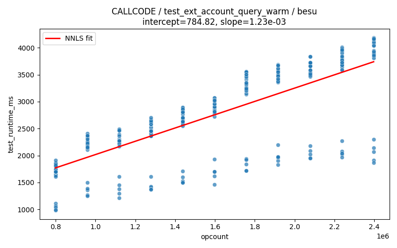

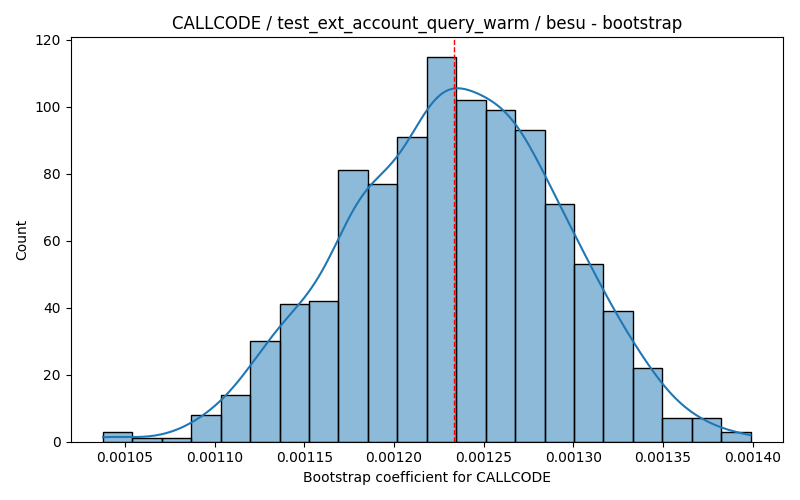

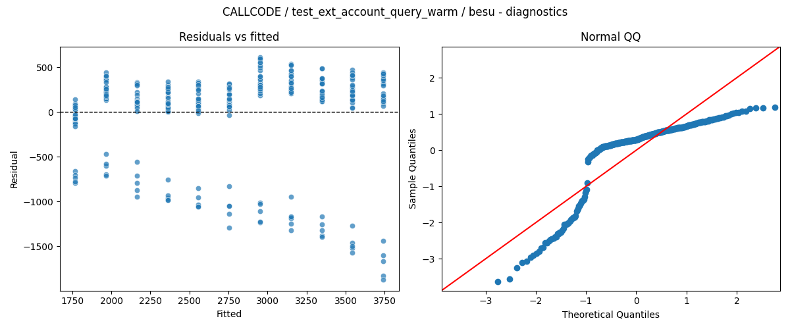

</details>

<details><summary>erigon — NNLS regression summary</summary>

```
==============================================================================
                           NNLS Regression Results                            
==============================================================================
Dep. Variable:          test_runtime_ms              R-squared:          0.902
Model:                  NNLS                    Adj. R-squared:          0.902
No. Observations:       176                               RMSE:          48.68
Df Residuals:           174                                MAE:          41.30
Df Model:               1      
==============================================================================
                      coef     std err     P-value      [0.025      0.975]
------------------------------------------------------------------------------
         const     45.6480     11.2356       0.001     24.1060     66.9494
       opcount      0.0003      0.0000       0.001      0.0003      0.0003
==============================================================================
Notes: Non-negative least squares with bootstrap inference (1000 iterations)
==============================================================================
```

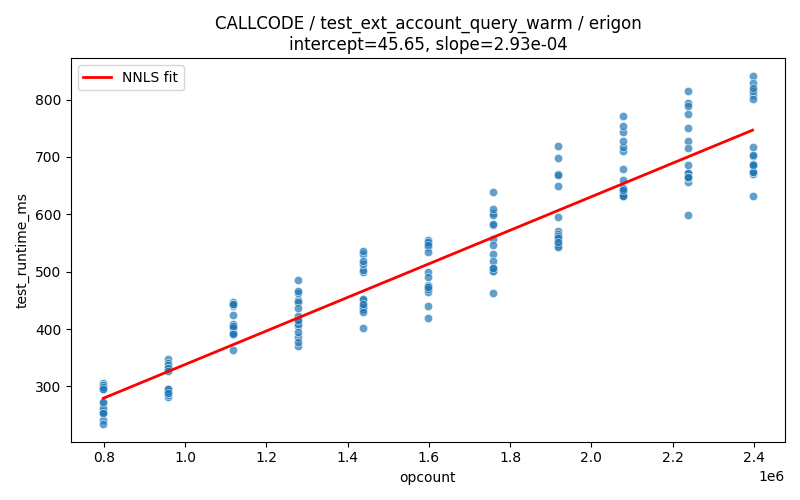

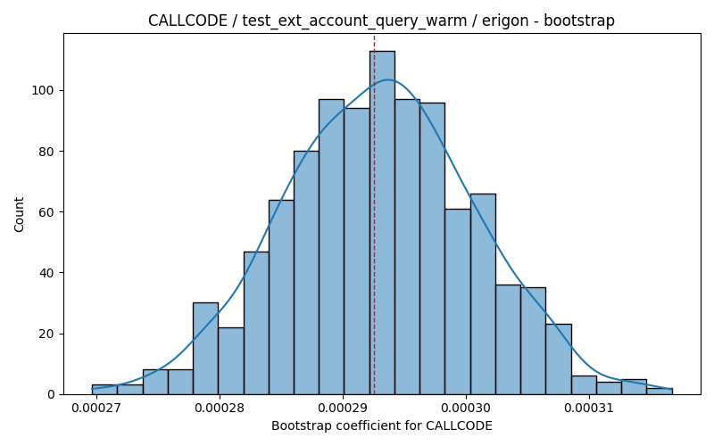

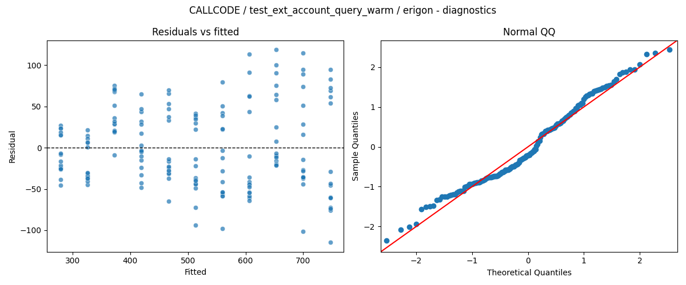

</details>

<details><summary>nethermind — NNLS regression summary</summary>

```
==============================================================================
                           NNLS Regression Results                            
==============================================================================
Dep. Variable:          test_runtime_ms              R-squared:          0.819
Model:                  NNLS                    Adj. R-squared:          0.818
No. Observations:       264                               RMSE:         166.11
Df Residuals:           262                                MAE:         126.30
Df Model:               1      
==============================================================================
                      coef     std err     P-value      [0.025      0.975]
------------------------------------------------------------------------------
         const    320.0954     30.7999       0.001    261.6830    379.2295
       opcount      0.0007      0.0000       0.001      0.0007      0.0007
==============================================================================
Notes: Non-negative least squares with bootstrap inference (1000 iterations)
==============================================================================
```

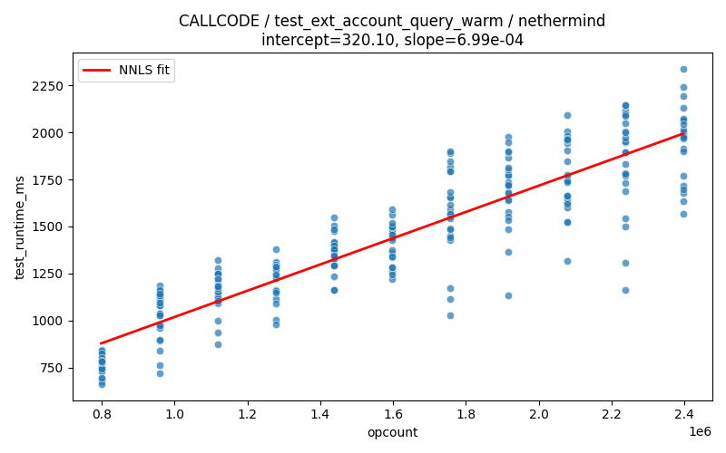

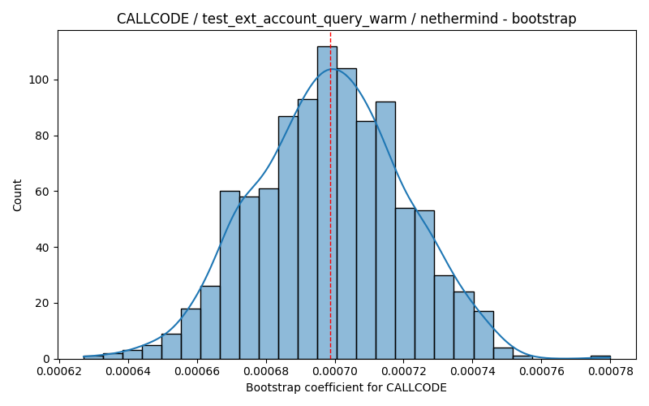

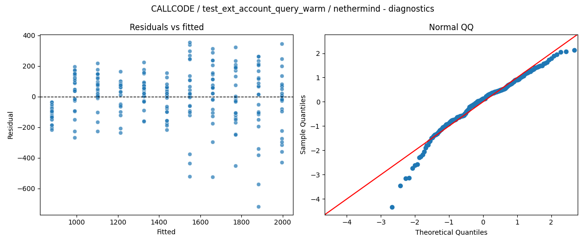

</details>

<details><summary>reth — NNLS regression summary</summary>

```
==============================================================================
                           NNLS Regression Results                            
==============================================================================
Dep. Variable:          test_runtime_ms              R-squared:          0.905
Model:                  NNLS                    Adj. R-squared:          0.905
No. Observations:       451                               RMSE:           7.73
Df Residuals:           449                                MAE:           6.31
Df Model:               1      
==============================================================================
                      coef     std err     P-value      [0.025      0.975]
------------------------------------------------------------------------------
         const     17.8264      1.3605       0.001     15.2149     20.5296
       opcount      0.0000      0.0000       0.001      0.0000      0.0000
==============================================================================
Notes: Non-negative least squares with bootstrap inference (1000 iterations)
==============================================================================
```

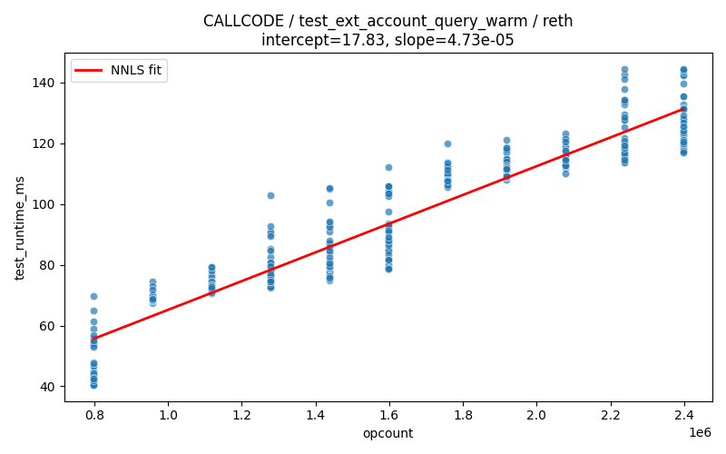

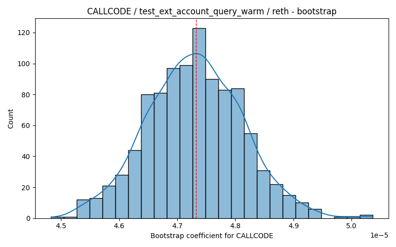

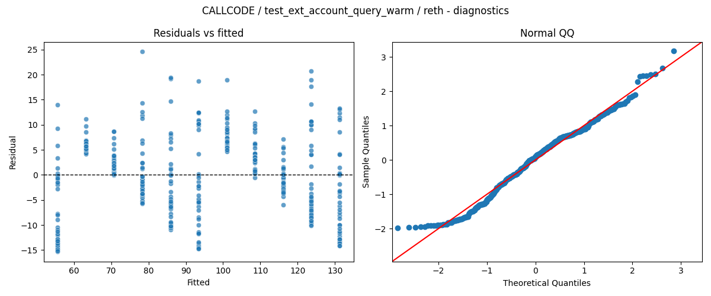

</details>

## DELEGATECALL

### test_account_access — combo `DELEGATECALL_AccountMode.EXISTING_EOA`

| client | nobs | R² | target_coef (ms) | p-value | 95% CI |
| --- | --- | --- | --- | --- | --- |
| `besu` | 341 | 0.8355 | 0.009809 | 1.00e-03 | [0.009285, 0.01034] |
| `erigon` | 176 | 0.995 | 0.01013 | 1.00e-03 | [0.01004, 0.01023] |
| `nethermind` | 264 | 0.9455 | 0.004682 | 1.00e-03 | [0.00454, 0.004824] |
| `reth` | 451 | 0.9751 | 0.001119 | 1.00e-03 | [0.001103, 0.001136] |

<details><summary>besu — NNLS regression summary</summary>

```
==============================================================================
                           NNLS Regression Results                            
==============================================================================
Dep. Variable:          test_runtime_ms              R-squared:          0.835
Model:                  NNLS                    Adj. R-squared:          0.835
No. Observations:       341                               RMSE:         103.49
Df Residuals:           339                                MAE:          83.42
Df Model:               1      
==============================================================================
                      coef     std err     P-value      [0.025      0.975]
------------------------------------------------------------------------------
         const    615.0777     22.2577       0.001    571.1777    656.9016
       opcount      0.0098      0.0003       0.001      0.0093      0.0103
==============================================================================
Notes: Non-negative least squares with bootstrap inference (1000 iterations)
==============================================================================
```

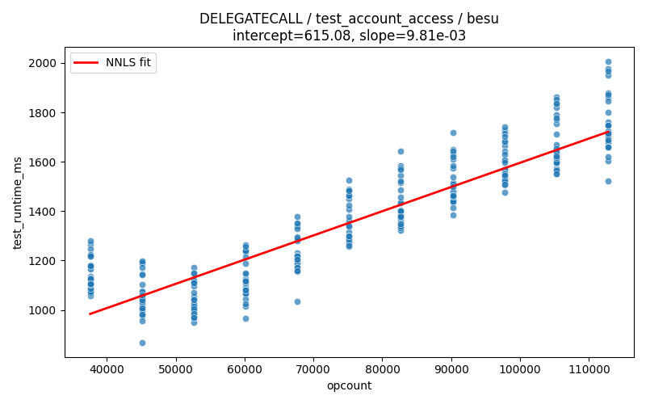

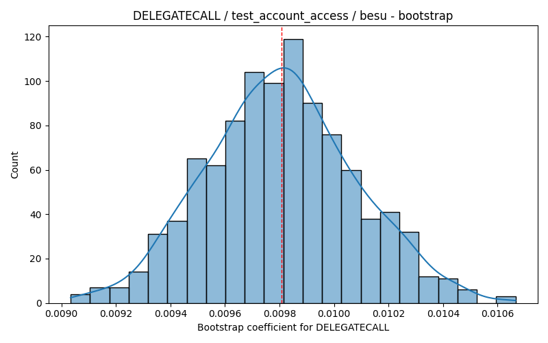

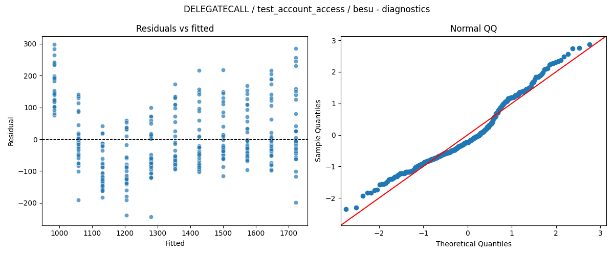

</details>

<details><summary>erigon — NNLS regression summary</summary>

```
==============================================================================
                           NNLS Regression Results                            
==============================================================================
Dep. Variable:          test_runtime_ms              R-squared:          0.995
Model:                  NNLS                    Adj. R-squared:          0.995
No. Observations:       176                               RMSE:          17.01
Df Residuals:           174                                MAE:          14.13
Df Model:               1      
==============================================================================
                      coef     std err     P-value      [0.025      0.975]
------------------------------------------------------------------------------
         const     45.5323      3.4251       0.001     38.3288     52.0664
       opcount      0.0101      0.0000       0.001      0.0100      0.0102
==============================================================================
Notes: Non-negative least squares with bootstrap inference (1000 iterations)
==============================================================================
```

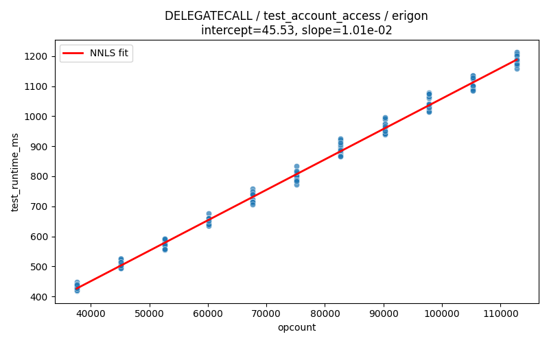

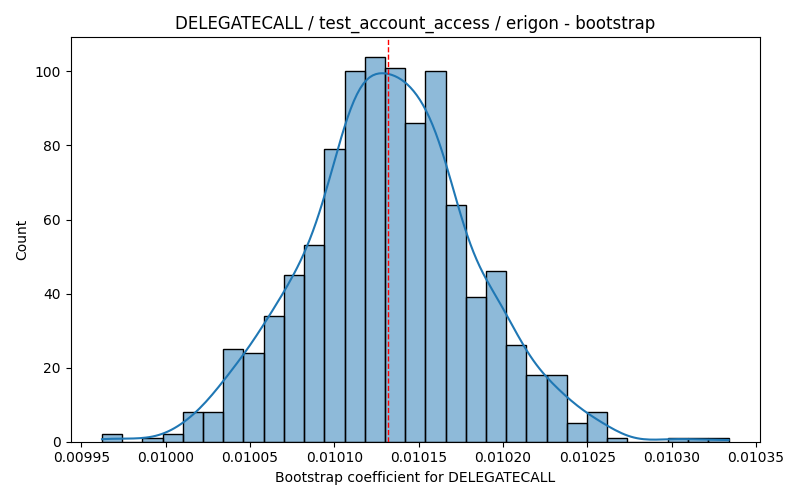

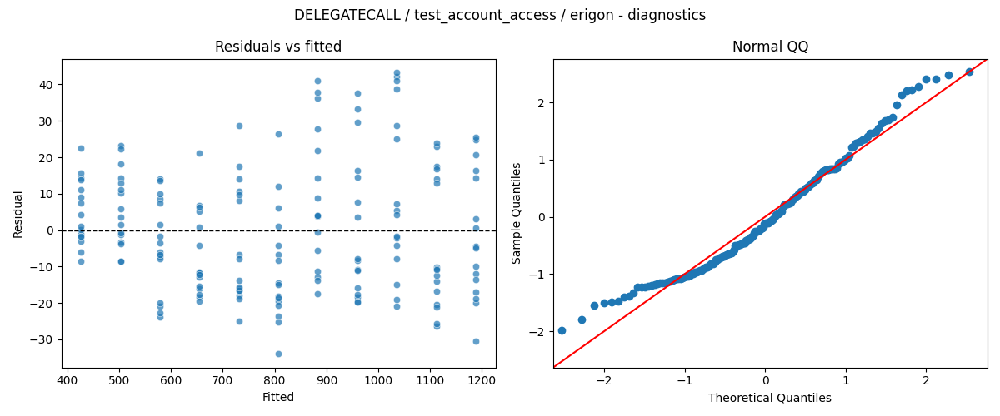

</details>

<details><summary>nethermind — NNLS regression summary</summary>

```
==============================================================================
                           NNLS Regression Results                            
==============================================================================
Dep. Variable:          test_runtime_ms              R-squared:          0.945
Model:                  NNLS                    Adj. R-squared:          0.945
No. Observations:       264                               RMSE:          26.73
Df Residuals:           262                                MAE:          20.46
Df Model:               1      
==============================================================================
                      coef     std err     P-value      [0.025      0.975]
------------------------------------------------------------------------------
         const    100.0223      5.3809       0.001     89.9615    110.7075
       opcount      0.0047      0.0001       0.001      0.0045      0.0048
==============================================================================
Notes: Non-negative least squares with bootstrap inference (1000 iterations)
==============================================================================
```

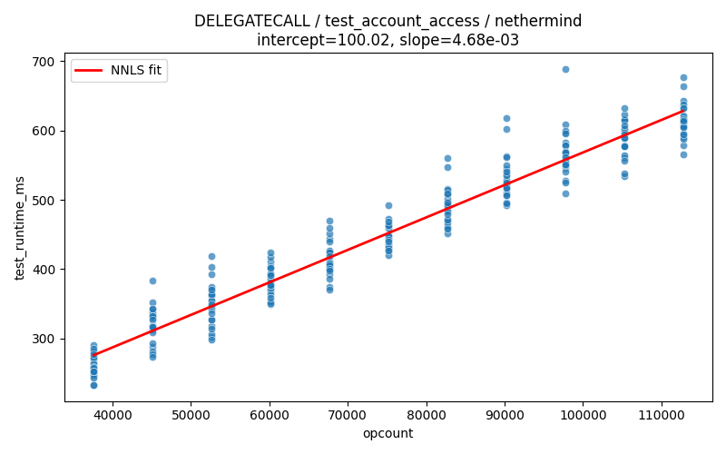

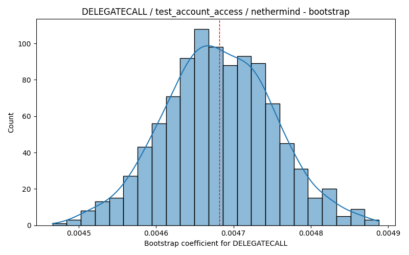

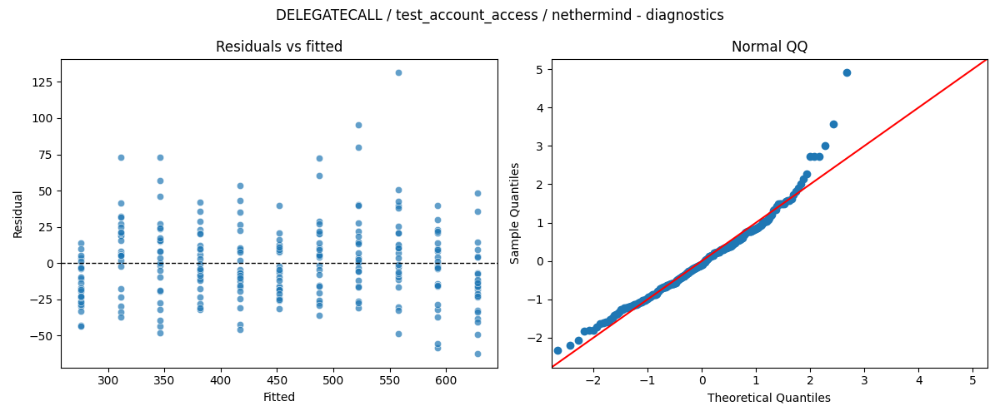

</details>

<details><summary>reth — NNLS regression summary</summary>

```
==============================================================================
                           NNLS Regression Results                            
==============================================================================
Dep. Variable:          test_runtime_ms              R-squared:          0.975
Model:                  NNLS                    Adj. R-squared:          0.975
No. Observations:       451                               RMSE:           4.25
Df Residuals:           449                                MAE:           3.43
Df Model:               1      
==============================================================================
                      coef     std err     P-value      [0.025      0.975]
------------------------------------------------------------------------------
         const     32.1190      0.6842       0.001     30.7819     33.4334
       opcount      0.0011      0.0000       0.001      0.0011      0.0011
==============================================================================
Notes: Non-negative least squares with bootstrap inference (1000 iterations)
==============================================================================
```

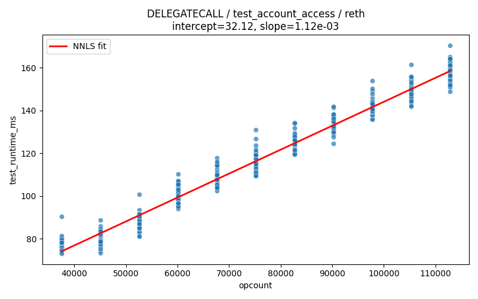

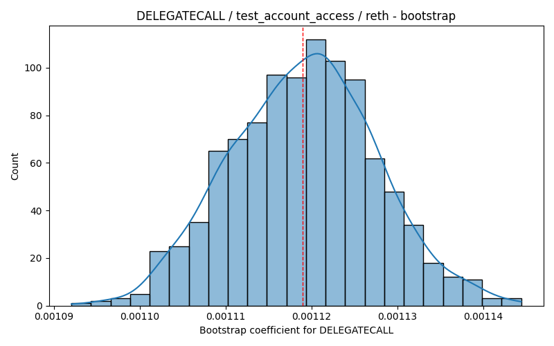

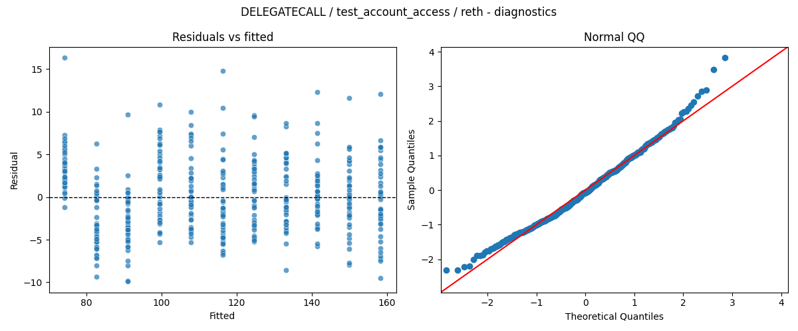

</details>

### test_account_access — combo `DELEGATECALL_AccountMode.NON_EXISTING_ACCOUNT` — `presets[cold_account_nocode_access]`

| client | nobs | R² | target_coef (ms) | p-value | 95% CI |
| --- | --- | --- | --- | --- | --- |
| `besu` | 341 | 0.9112 | 0.01056 | 1.00e-03 | [0.0102, 0.01091] |
| `erigon` | 176 | 0.9968 | 0.009557 | 1.00e-03 | [0.009483, 0.009643] |
| `nethermind` | 264 | 0.9371 | 0.004591 | 1.00e-03 | [0.004452, 0.004738] |
| `reth` | 451 | 0.9757 | 0.0009568 | 1.00e-03 | [0.0009425, 0.000969] |

<details><summary>besu — NNLS regression summary</summary>

```
==============================================================================
                           NNLS Regression Results                            
==============================================================================
Dep. Variable:          test_runtime_ms              R-squared:          0.911
Model:                  NNLS                    Adj. R-squared:          0.911
No. Observations:       341                               RMSE:          78.34
Df Residuals:           339                                MAE:          64.73
Df Model:               1      
==============================================================================
                      coef     std err     P-value      [0.025      0.975]
------------------------------------------------------------------------------
         const    515.5238     13.7864       0.001    488.3543    540.9402
       opcount      0.0106      0.0002       0.001      0.0102      0.0109
==============================================================================
Notes: Non-negative least squares with bootstrap inference (1000 iterations)
==============================================================================
```

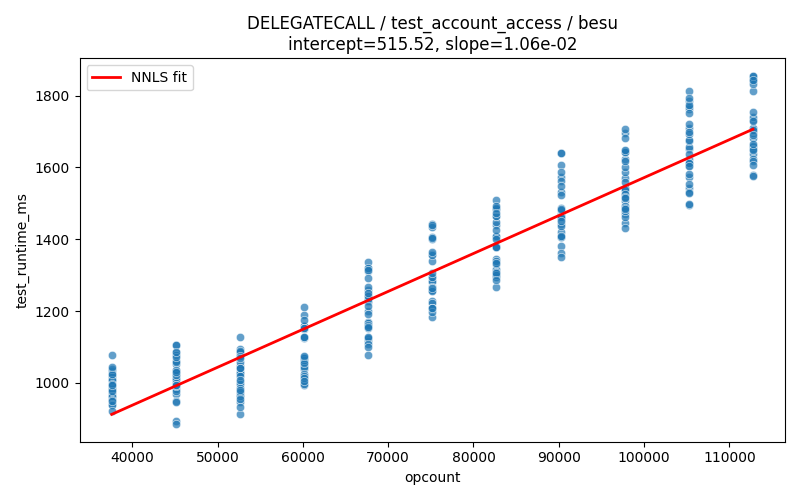

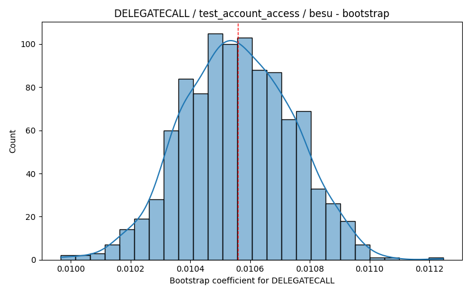

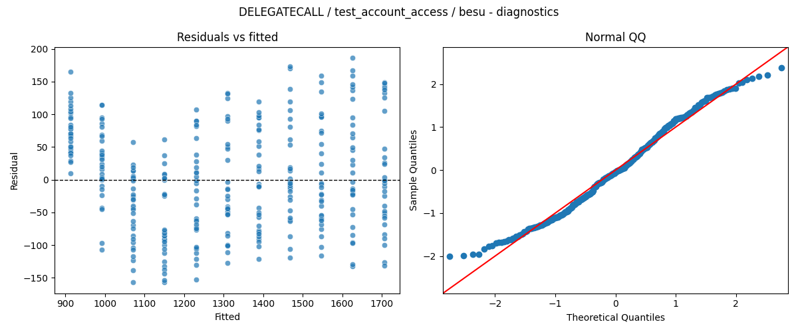

</details>

<details><summary>erigon — NNLS regression summary</summary>

```
==============================================================================
                           NNLS Regression Results                            
==============================================================================
Dep. Variable:          test_runtime_ms              R-squared:          0.997
Model:                  NNLS                    Adj. R-squared:          0.997
No. Observations:       176                               RMSE:          12.79
Df Residuals:           174                                MAE:          10.44
Df Model:               1      
==============================================================================
                      coef     std err     P-value      [0.025      0.975]
------------------------------------------------------------------------------
         const     19.9238      3.0504       0.001     13.6758     25.8305
       opcount      0.0096      0.0000       0.001      0.0095      0.0096
==============================================================================
Notes: Non-negative least squares with bootstrap inference (1000 iterations)
==============================================================================
```

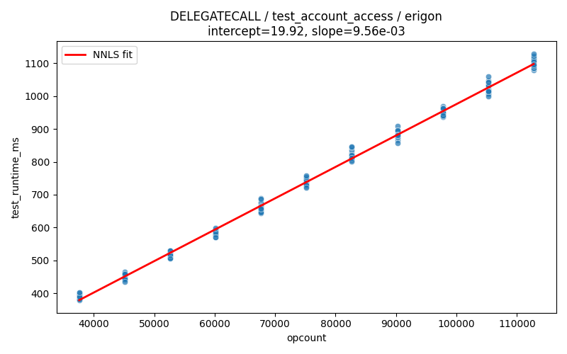

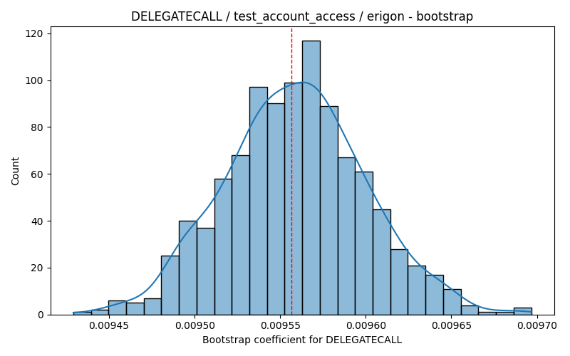

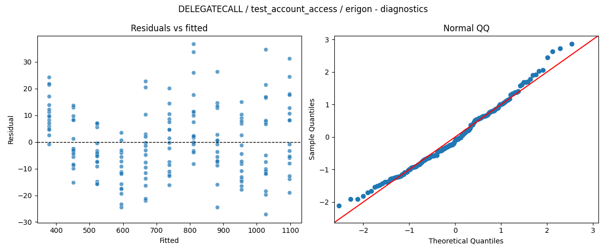

</details>

<details><summary>nethermind — NNLS regression summary</summary>

```
==============================================================================
                           NNLS Regression Results                            
==============================================================================
Dep. Variable:          test_runtime_ms              R-squared:          0.937
Model:                  NNLS                    Adj. R-squared:          0.937
No. Observations:       264                               RMSE:          28.28
Df Residuals:           262                                MAE:          22.26
Df Model:               1      
==============================================================================
                      coef     std err     P-value      [0.025      0.975]
------------------------------------------------------------------------------
         const    112.2382      5.5110       0.001    100.9602    122.3433
       opcount      0.0046      0.0001       0.001      0.0045      0.0047
==============================================================================
Notes: Non-negative least squares with bootstrap inference (1000 iterations)
==============================================================================
```

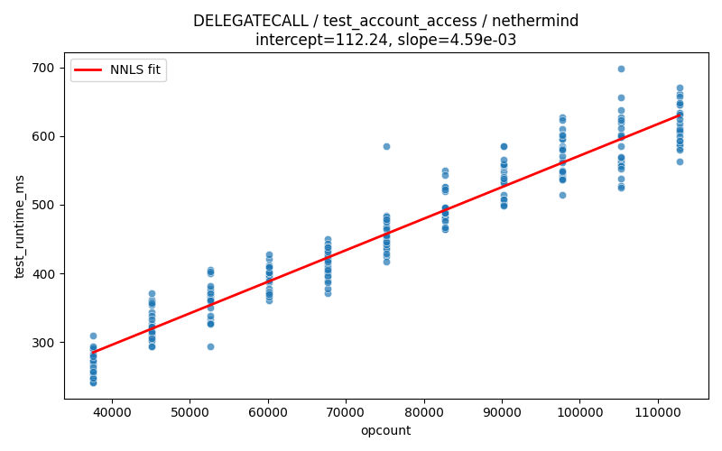

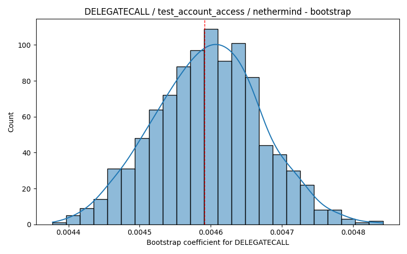

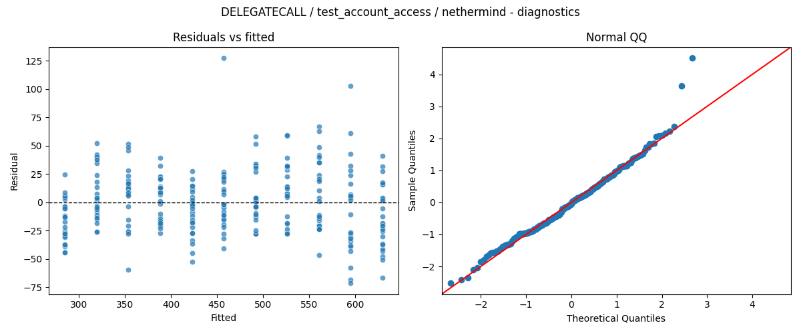

</details>

<details><summary>reth — NNLS regression summary</summary>

```
==============================================================================
                           NNLS Regression Results                            
==============================================================================
Dep. Variable:          test_runtime_ms              R-squared:          0.976
Model:                  NNLS                    Adj. R-squared:          0.976
No. Observations:       451                               RMSE:           3.59
Df Residuals:           449                                MAE:           2.87
Df Model:               1      
==============================================================================
                      coef     std err     P-value      [0.025      0.975]
------------------------------------------------------------------------------
         const     31.6246      0.5622       0.001     30.5786     32.7626
       opcount      0.0010      0.0000       0.001      0.0009      0.0010
==============================================================================
Notes: Non-negative least squares with bootstrap inference (1000 iterations)
==============================================================================
```

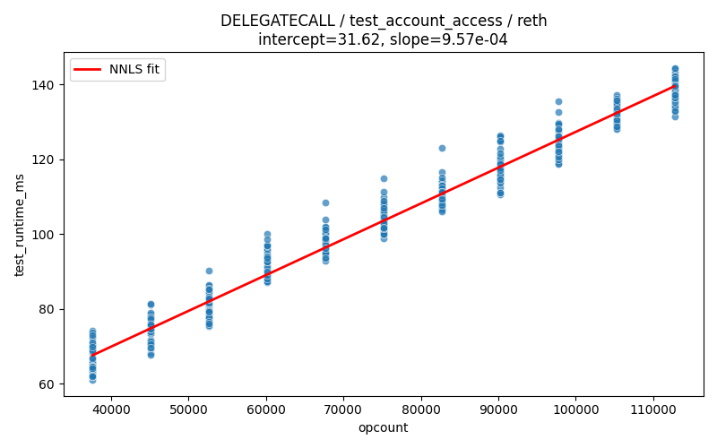

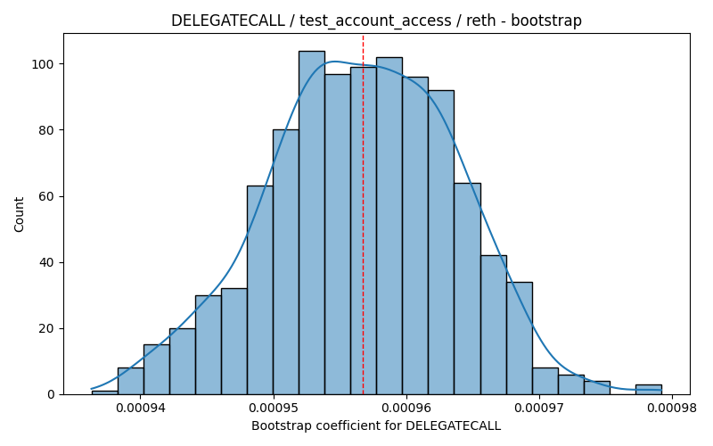

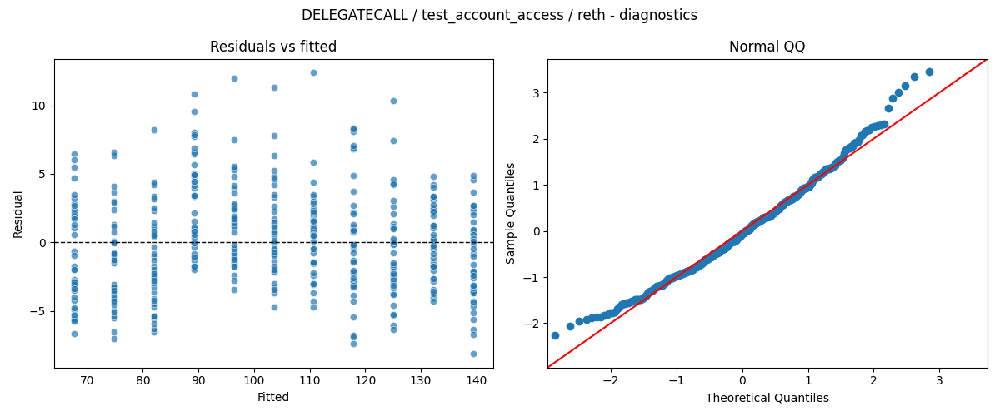

</details>

### test_account_access — combo `DELEGATECALL_AccountMode.EXISTING_CONTRACT`

| client | nobs | R² | target_coef (ms) | p-value | 95% CI |
| --- | --- | --- | --- | --- | --- |
| `besu` | 341 | 0.9627 | 0.02949 | 1.00e-03 | [0.02883, 0.03008] |
| `erigon` | 176 | 0.8709 | 0.08781 | 1.00e-03 | [0.08289, 0.09235] |
| `nethermind` | 264 | 0.6988 | 0.02496 | 1.00e-03 | [0.0229, 0.02691] |
| `reth` | 451 | 0.9154 | 0.03755 | 1.00e-03 | [0.03718, 0.03795] |

<details><summary>besu — NNLS regression summary</summary>

```
==============================================================================
                           NNLS Regression Results                            
==============================================================================
Dep. Variable:          test_runtime_ms              R-squared:          0.963
Model:                  NNLS                    Adj. R-squared:          0.963
No. Observations:       341                               RMSE:         118.21
Df Residuals:           339                                MAE:         100.11
Df Model:               1      
==============================================================================
                      coef     std err     P-value      [0.025      0.975]
------------------------------------------------------------------------------
         const    314.6697     20.6433       0.001    273.2040    355.1586
       opcount      0.0295      0.0003       0.001      0.0288      0.0301
==============================================================================
Notes: Non-negative least squares with bootstrap inference (1000 iterations)
==============================================================================
```

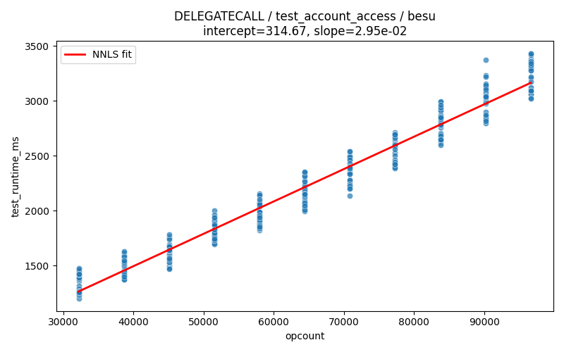

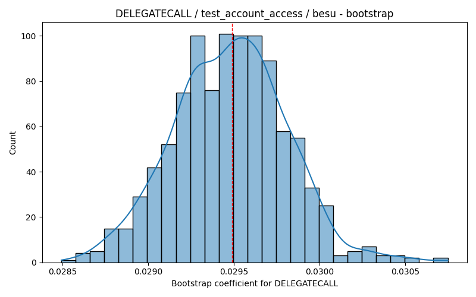

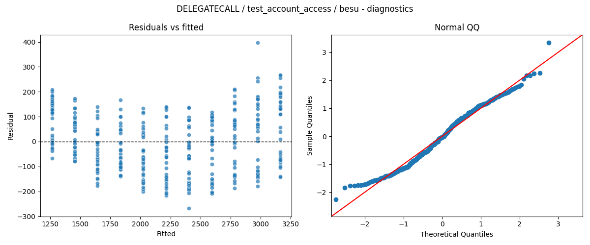

</details>

<details><summary>erigon — NNLS regression summary</summary>

```
==============================================================================
                           NNLS Regression Results                            
==============================================================================
Dep. Variable:          test_runtime_ms              R-squared:          0.871
Model:                  NNLS                    Adj. R-squared:          0.870
No. Observations:       176                               RMSE:         688.58
Df Residuals:           174                                MAE:         584.02
Df Model:               1      
==============================================================================
                      coef     std err     P-value      [0.025      0.975]
------------------------------------------------------------------------------
         const   1513.0601    189.2816       0.001   1166.1076   1887.5091
       opcount      0.0878      0.0025       0.001      0.0829      0.0923
==============================================================================
Notes: Non-negative least squares with bootstrap inference (1000 iterations)
==============================================================================
```

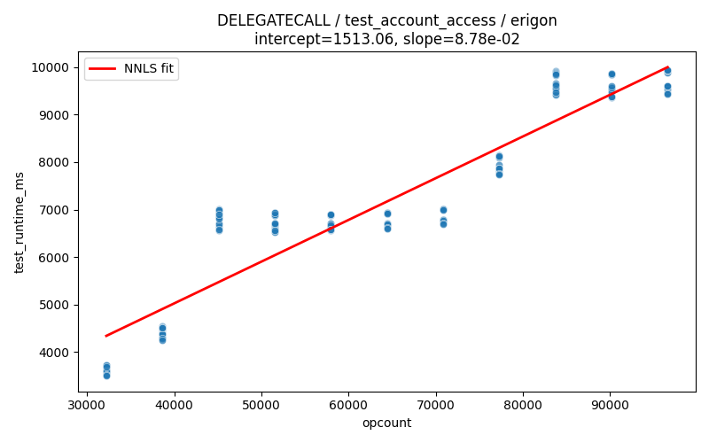

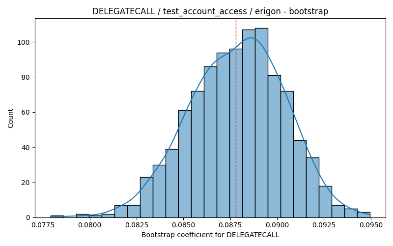


</details>

<details><summary>nethermind — NNLS regression summary</summary>

```
==============================================================================
                           NNLS Regression Results                            
==============================================================================
Dep. Variable:          test_runtime_ms              R-squared:          0.699
Model:                  NNLS                    Adj. R-squared:          0.698
No. Observations:       264                               RMSE:         333.82
Df Residuals:           262                                MAE:         275.60
Df Model:               1      
==============================================================================
                      coef     std err     P-value      [0.025      0.975]
------------------------------------------------------------------------------
         const    885.9587     70.8418       0.001    756.7134   1027.3102
       opcount      0.0250      0.0010       0.001      0.0229      0.0269
==============================================================================
Notes: Non-negative least squares with bootstrap inference (1000 iterations)
==============================================================================
```

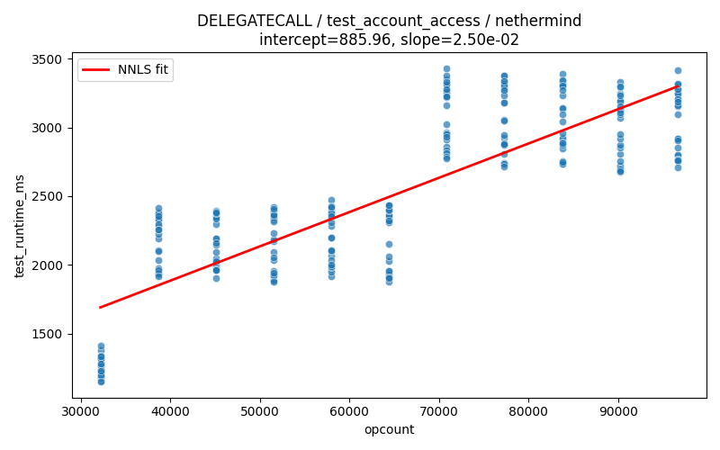

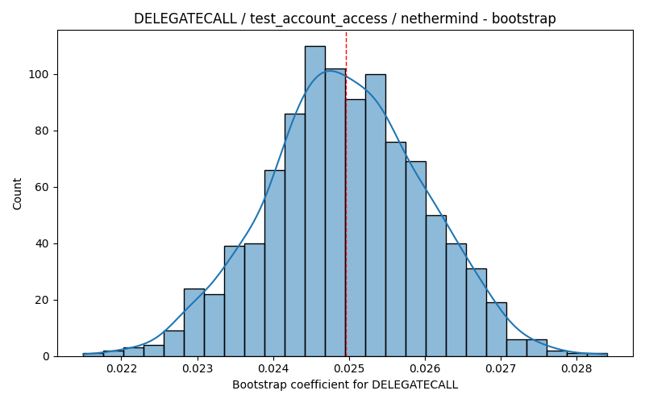

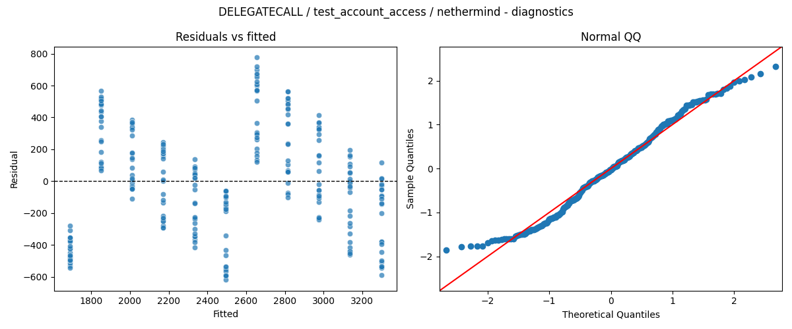

</details>

<details><summary>reth — NNLS regression summary</summary>

```
==============================================================================
                           NNLS Regression Results                            
==============================================================================
Dep. Variable:          test_runtime_ms              R-squared:          0.915
Model:                  NNLS                    Adj. R-squared:          0.915
No. Observations:       451                               RMSE:         243.78
Df Residuals:           449                                MAE:         130.76
Df Model:               1      
==============================================================================
                      coef     std err     P-value      [0.025      0.975]
------------------------------------------------------------------------------
         const      0.0000      0.0000       1.000      0.0000      0.0000
       opcount      0.0375      0.0002       0.001      0.0372      0.0379
==============================================================================
Notes: Non-negative least squares with bootstrap inference (1000 iterations)
==============================================================================
```

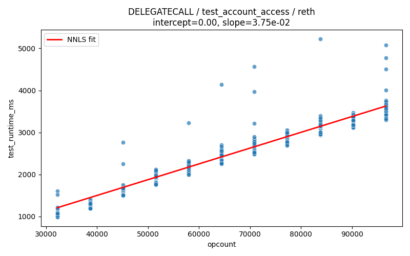

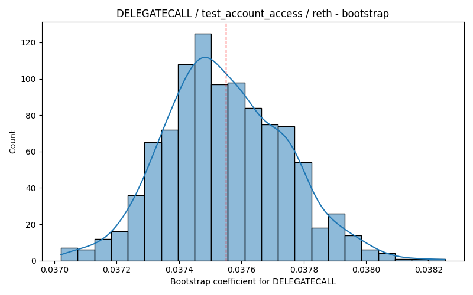

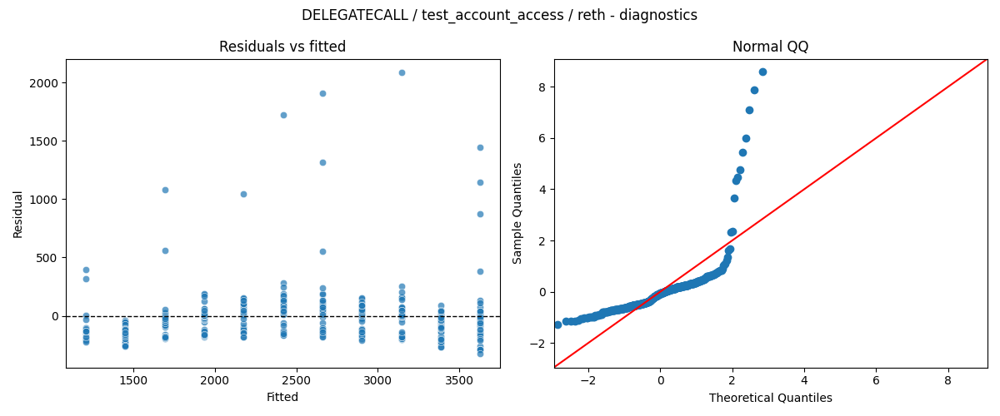

</details>

### test_account_access — combo `DELEGATECALL_AccountMode.NON_EXISTING_ACCOUNT` — `presets[cold_account_code_access]`

| client | nobs | R² | target_coef (ms) | p-value | 95% CI |
| --- | --- | --- | --- | --- | --- |
| `besu` | 341 | 0.9112 | 0.01056 | 1.00e-03 | [0.0102, 0.01091] |
| `erigon` | 176 | 0.9968 | 0.009557 | 1.00e-03 | [0.009483, 0.009643] |
| `nethermind` | 264 | 0.9371 | 0.004591 | 1.00e-03 | [0.004452, 0.004738] |
| `reth` | 451 | 0.9757 | 0.0009568 | 1.00e-03 | [0.0009425, 0.000969] |

<details><summary>besu — NNLS regression summary</summary>

```
==============================================================================
                           NNLS Regression Results                            
==============================================================================
Dep. Variable:          test_runtime_ms              R-squared:          0.911
Model:                  NNLS                    Adj. R-squared:          0.911
No. Observations:       341                               RMSE:          78.34
Df Residuals:           339                                MAE:          64.73
Df Model:               1      
==============================================================================
                      coef     std err     P-value      [0.025      0.975]
------------------------------------------------------------------------------
         const    515.5238     13.7864       0.001    488.3543    540.9402
       opcount      0.0106      0.0002       0.001      0.0102      0.0109
==============================================================================
Notes: Non-negative least squares with bootstrap inference (1000 iterations)
==============================================================================
```


</details>

<details><summary>erigon — NNLS regression summary</summary>

```
==============================================================================
                           NNLS Regression Results                            
==============================================================================
Dep. Variable:          test_runtime_ms              R-squared:          0.997
Model:                  NNLS                    Adj. R-squared:          0.997
No. Observations:       176                               RMSE:          12.79
Df Residuals:           174                                MAE:          10.44
Df Model:               1      
==============================================================================
                      coef     std err     P-value      [0.025      0.975]
------------------------------------------------------------------------------
         const     19.9238      3.0504       0.001     13.6758     25.8305
       opcount      0.0096      0.0000       0.001      0.0095      0.0096
==============================================================================
Notes: Non-negative least squares with bootstrap inference (1000 iterations)
==============================================================================
```


</details>

<details><summary>nethermind — NNLS regression summary</summary>

```
==============================================================================
                           NNLS Regression Results                            
==============================================================================
Dep. Variable:          test_runtime_ms              R-squared:          0.937
Model:                  NNLS                    Adj. R-squared:          0.937
No. Observations:       264                               RMSE:          28.28
Df Residuals:           262                                MAE:          22.26
Df Model:               1      
==============================================================================
                      coef     std err     P-value      [0.025      0.975]
------------------------------------------------------------------------------
         const    112.2382      5.5110       0.001    100.9602    122.3433
       opcount      0.0046      0.0001       0.001      0.0045      0.0047
==============================================================================
Notes: Non-negative least squares with bootstrap inference (1000 iterations)
==============================================================================
```


</details>

<details><summary>reth — NNLS regression summary</summary>

```
==============================================================================
                           NNLS Regression Results                            
==============================================================================
Dep. Variable:          test_runtime_ms              R-squared:          0.976
Model:                  NNLS                    Adj. R-squared:          0.976
No. Observations:       451                               RMSE:           3.59
Df Residuals:           449                                MAE:           2.87
Df Model:               1      
==============================================================================
                      coef     std err     P-value      [0.025      0.975]
------------------------------------------------------------------------------
         const     31.6246      0.5622       0.001     30.5786     32.7626
       opcount      0.0010      0.0000       0.001      0.0009      0.0010
==============================================================================
Notes: Non-negative least squares with bootstrap inference (1000 iterations)
==============================================================================
```


</details>

### test_ext_account_query_warm — combo `DELEGATECALL`

| client | nobs | R² | target_coef (ms) | p-value | 95% CI |
| --- | --- | --- | --- | --- | --- |
| `besu` | 341 | 0.586 | 0.001201 | 1.00e-03 | [0.001082, 0.001321] |
| `erigon` | 176 | 0.897 | 0.0002857 | 1.00e-03 | [0.0002717, 0.0003006] |
| `nethermind` | 264 | 0.8232 | 0.0006635 | 1.00e-03 | [0.0006212, 0.0007044] |
| `reth` | 451 | 0.9192 | 4.806e-05 | 1.00e-03 | [4.652e-05, 4.954e-05] |

<details><summary>besu — NNLS regression summary</summary>

```
==============================================================================
                           NNLS Regression Results                            
==============================================================================
Dep. Variable:          test_runtime_ms              R-squared:          0.586
Model:                  NNLS                    Adj. R-squared:          0.585
No. Observations:       341                               RMSE:         522.54
Df Residuals:           339                                MAE:         364.37
Df Model:               1      
==============================================================================
                      coef     std err     P-value      [0.025      0.975]
------------------------------------------------------------------------------
         const    724.5070     85.9981       0.001    556.5624    896.7084
       opcount      0.0012      0.0001       0.001      0.0011      0.0013
==============================================================================
Notes: Non-negative least squares with bootstrap inference (1000 iterations)
==============================================================================
```

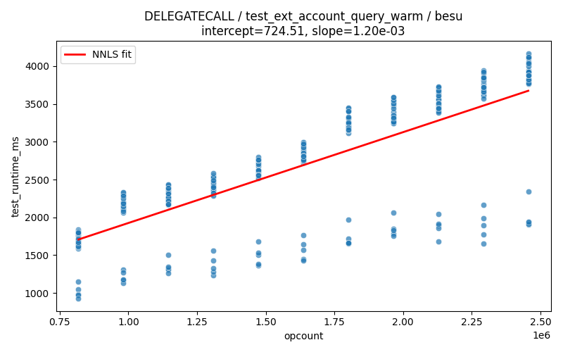

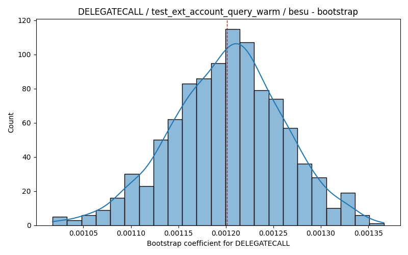

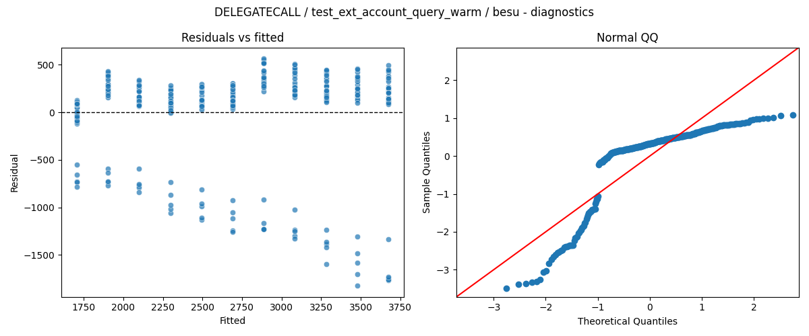

</details>

<details><summary>erigon — NNLS regression summary</summary>

```
==============================================================================
                           NNLS Regression Results                            
==============================================================================
Dep. Variable:          test_runtime_ms              R-squared:          0.897
Model:                  NNLS                    Adj. R-squared:          0.896
No. Observations:       176                               RMSE:          50.11
Df Residuals:           174                                MAE:          41.85
Df Model:               1      
==============================================================================
                      coef     std err     P-value      [0.025      0.975]
------------------------------------------------------------------------------
         const     51.6081     10.9809       0.001     30.4792     72.8997
       opcount      0.0003      0.0000       0.001      0.0003      0.0003
==============================================================================
Notes: Non-negative least squares with bootstrap inference (1000 iterations)
==============================================================================
```

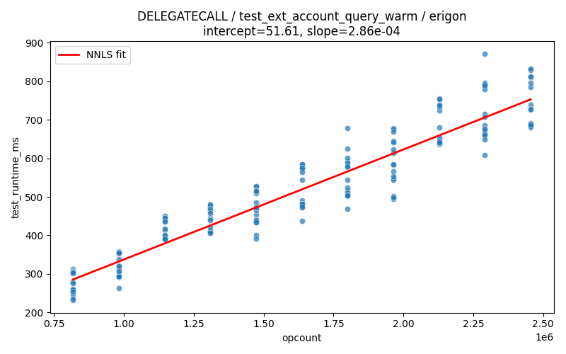

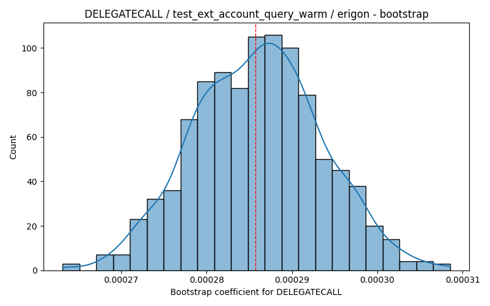

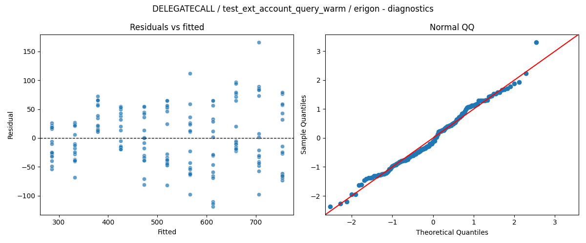

</details>

<details><summary>nethermind — NNLS regression summary</summary>

```
==============================================================================
                           NNLS Regression Results                            
==============================================================================
Dep. Variable:          test_runtime_ms              R-squared:          0.823
Model:                  NNLS                    Adj. R-squared:          0.823
No. Observations:       264                               RMSE:         159.16
Df Residuals:           262                                MAE:         117.85
Df Model:               1      
==============================================================================
                      coef     std err     P-value      [0.025      0.975]
------------------------------------------------------------------------------
         const    361.1516     30.8483       0.001    302.5539    423.2448
       opcount      0.0007      0.0000       0.001      0.0006      0.0007
==============================================================================
Notes: Non-negative least squares with bootstrap inference (1000 iterations)
==============================================================================
```

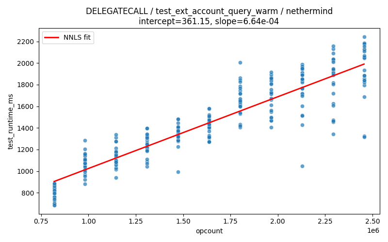

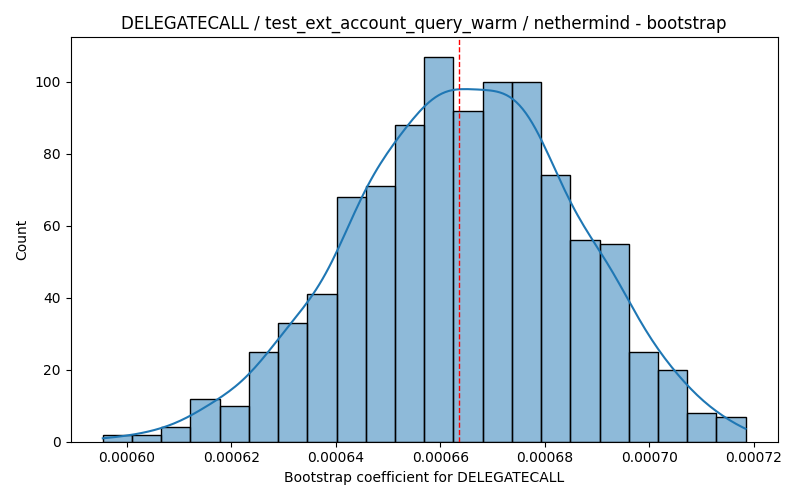

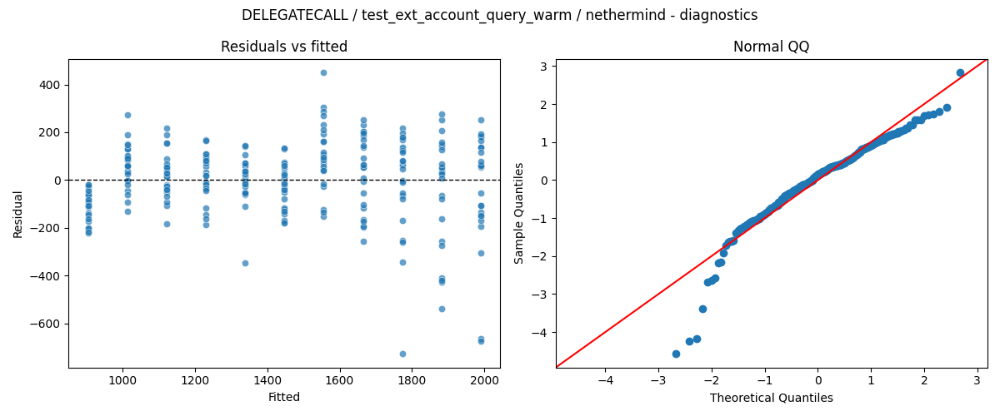

</details>

<details><summary>reth — NNLS regression summary</summary>

```
==============================================================================
                           NNLS Regression Results                            
==============================================================================
Dep. Variable:          test_runtime_ms              R-squared:          0.919
Model:                  NNLS                    Adj. R-squared:          0.919
No. Observations:       451                               RMSE:           7.38
Df Residuals:           449                                MAE:           6.01
Df Model:               1      
==============================================================================
                      coef     std err     P-value      [0.025      0.975]
------------------------------------------------------------------------------
         const     15.6885      1.2686       0.001     13.2229     18.2294
       opcount      0.0000      0.0000       0.001      0.0000      0.0000
==============================================================================
Notes: Non-negative least squares with bootstrap inference (1000 iterations)
==============================================================================
```

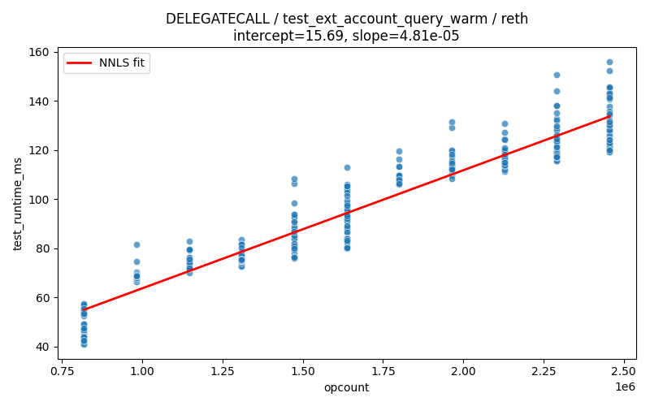

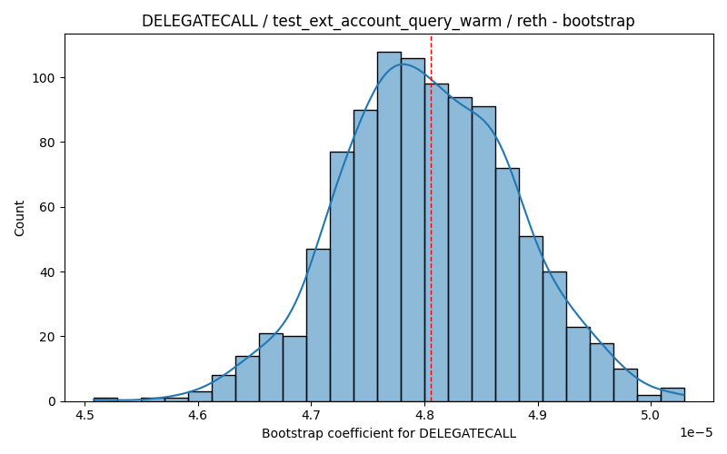

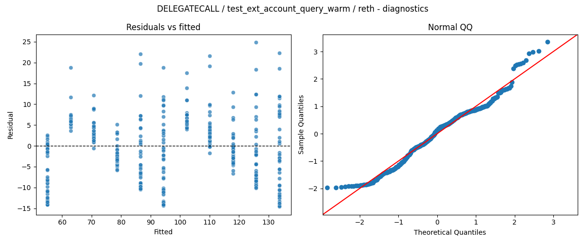

</details>

## EXTCODECOPY

### test_account_access — combo `EXTCODECOPY_AccountMode.NON_EXISTING_ACCOUNT` — `presets[cold_account_nocode_access]`

| client | nobs | R² | target_coef (ms) | p-value | 95% CI |
| --- | --- | --- | --- | --- | --- |
| `besu` | 341 | 0.8318 | 0.000436 | 1.00e-03 | [0.0004149, 0.0004558] |
| `erigon` | 176 | 0.7535 | 6.371e-05 | 1.00e-03 | [5.82e-05, 6.916e-05] |
| `nethermind` | 264 | 0.8489 | 0.0003605 | 1.00e-03 | [0.0003418, 0.0003787] |
| `reth` | 451 | 0.7091 | 1.674e-05 | 1.00e-03 | [1.568e-05, 1.788e-05] |

<details><summary>besu — NNLS regression summary</summary>

```
==============================================================================
                           NNLS Regression Results                            
==============================================================================
Dep. Variable:          test_runtime_ms              R-squared:          0.832
Model:                  NNLS                    Adj. R-squared:          0.831
No. Observations:       341                               RMSE:          50.34
Df Residuals:           339                                MAE:          40.07
Df Model:               1      
==============================================================================
                      coef     std err     P-value      [0.025      0.975]
------------------------------------------------------------------------------
         const    223.2788      8.3748       0.001    207.7102    239.9184
       opcount      0.0004      0.0000       0.001      0.0004      0.0005
==============================================================================
Notes: Non-negative least squares with bootstrap inference (1000 iterations)
==============================================================================
```

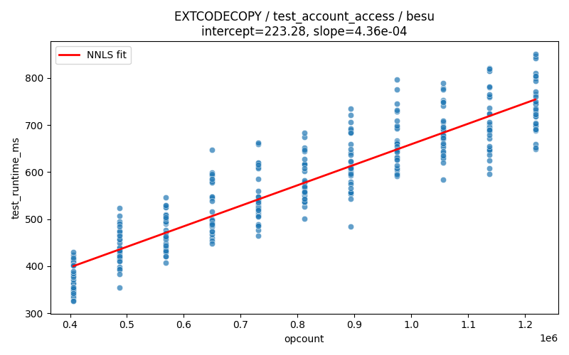

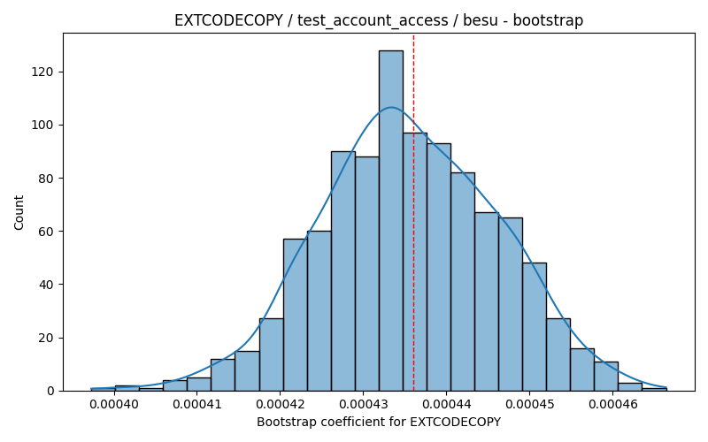

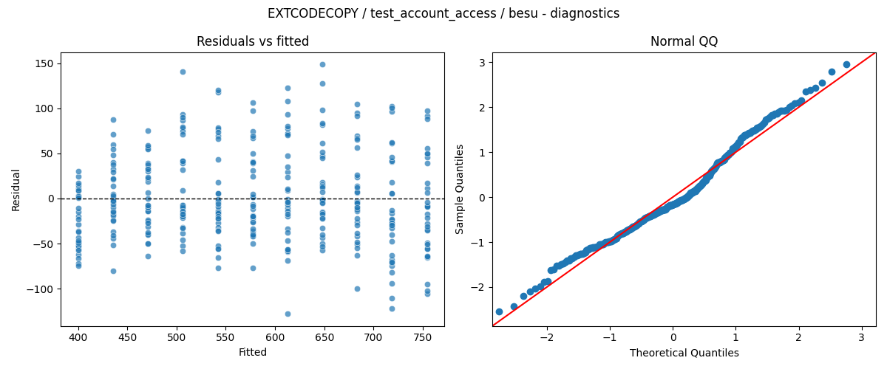

</details>

<details><summary>erigon — NNLS regression summary</summary>

```
==============================================================================
                           NNLS Regression Results                            
==============================================================================
Dep. Variable:          test_runtime_ms              R-squared:          0.754
Model:                  NNLS                    Adj. R-squared:          0.752
No. Observations:       176                               RMSE:           9.36
Df Residuals:           174                                MAE:           7.69
Df Model:               1      
==============================================================================
                      coef     std err     P-value      [0.025      0.975]
------------------------------------------------------------------------------
         const     46.7564      2.2313       0.001     42.2548     51.1111
       opcount      0.0001      0.0000       0.001      0.0001      0.0001
==============================================================================
Notes: Non-negative least squares with bootstrap inference (1000 iterations)
==============================================================================
```

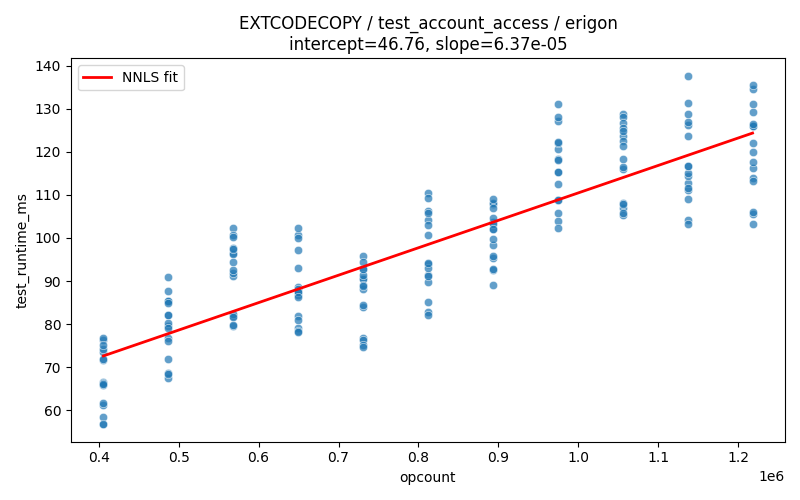

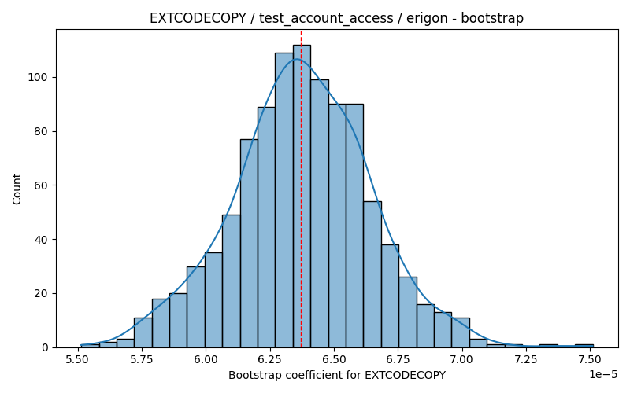

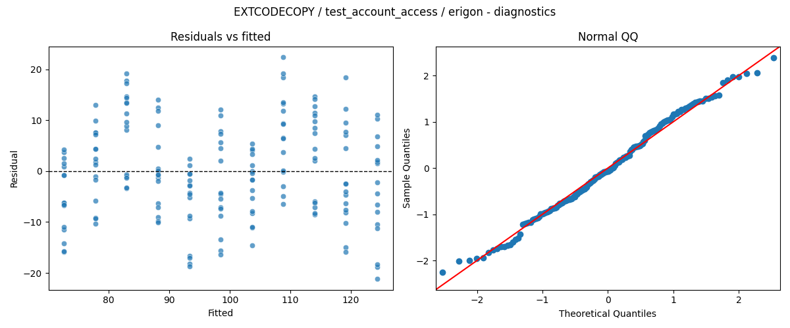

</details>

<details><summary>nethermind — NNLS regression summary</summary>

```
==============================================================================
                           NNLS Regression Results                            
==============================================================================
Dep. Variable:          test_runtime_ms              R-squared:          0.849
Model:                  NNLS                    Adj. R-squared:          0.848
No. Observations:       264                               RMSE:          39.05
Df Residuals:           262                                MAE:          28.69
Df Model:               1      
==============================================================================
                      coef     std err     P-value      [0.025      0.975]
------------------------------------------------------------------------------
         const    122.7178      6.8180       0.001    109.5590    136.9639
       opcount      0.0004      0.0000       0.001      0.0003      0.0004
==============================================================================
Notes: Non-negative least squares with bootstrap inference (1000 iterations)
==============================================================================
```

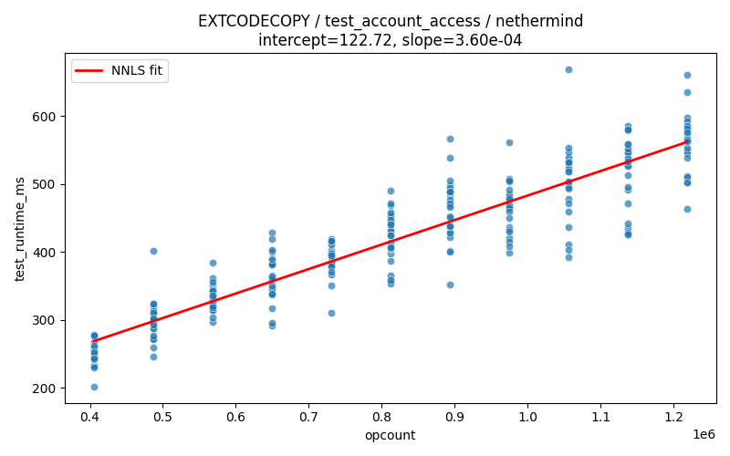

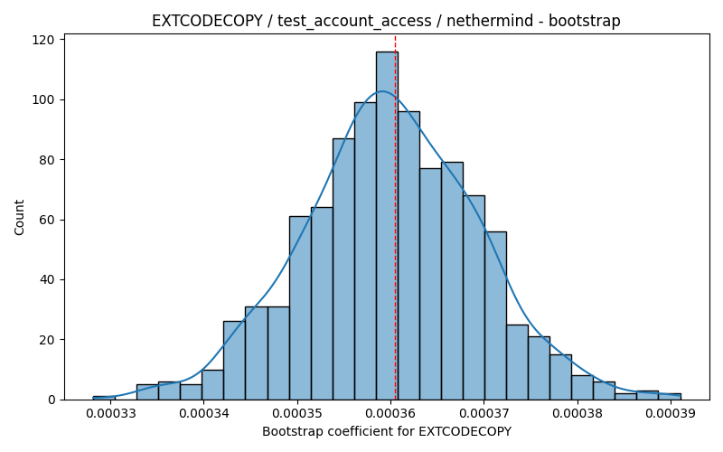

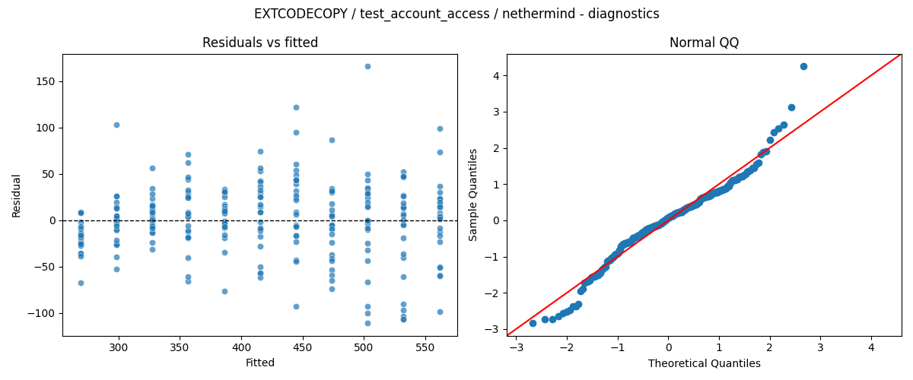

</details>

<details><summary>reth — NNLS regression summary</summary>

```
==============================================================================
                           NNLS Regression Results                            
==============================================================================
Dep. Variable:          test_runtime_ms              R-squared:          0.709
Model:                  NNLS                    Adj. R-squared:          0.708
No. Observations:       451                               RMSE:           2.75
Df Residuals:           449                                MAE:           1.84
Df Model:               1      
==============================================================================
                      coef     std err     P-value      [0.025      0.975]
------------------------------------------------------------------------------
         const      5.7669      0.4246       0.001      4.9658      6.6250
       opcount      0.0000      0.0000       0.001      0.0000      0.0000
==============================================================================
Notes: Non-negative least squares with bootstrap inference (1000 iterations)
==============================================================================
```

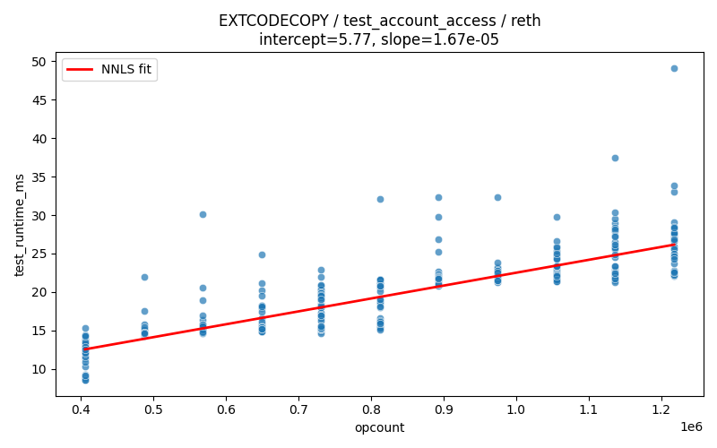

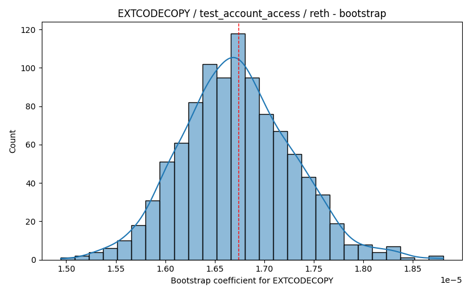

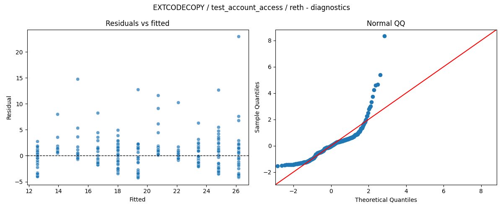

</details>

### test_account_access — combo `EXTCODECOPY_AccountMode.EXISTING_CONTRACT`

| client | nobs | R² | target_coef (ms) | p-value | 95% CI |
| --- | --- | --- | --- | --- | --- |
| `besu` | 341 | 0.8242 | 0.00189 | 1.00e-03 | [0.001791, 0.001995] |
| `erigon` | 176 | 0.8493 | 0.0003184 | 1.00e-03 | [0.0002954, 0.0003389] |
| `nethermind` | 264 | 0.8833 | 0.001387 | 1.00e-03 | [0.001327, 0.00145] |
| `reth` | 451 | 0.7546 | 7.755e-05 | 1.00e-03 | [7.347e-05, 8.21e-05] |

<details><summary>besu — NNLS regression summary</summary>

```
==============================================================================
                           NNLS Regression Results                            
==============================================================================
Dep. Variable:          test_runtime_ms              R-squared:          0.824
Model:                  NNLS                    Adj. R-squared:          0.824
No. Observations:       341                               RMSE:          86.21
Df Residuals:           339                                MAE:          70.58
Df Model:               1      
==============================================================================
                      coef     std err     P-value      [0.025      0.975]
------------------------------------------------------------------------------
         const    405.2685     15.3635       0.001    374.2404    437.1171
       opcount      0.0019      0.0001       0.001      0.0018      0.0020
==============================================================================
Notes: Non-negative least squares with bootstrap inference (1000 iterations)
==============================================================================
```

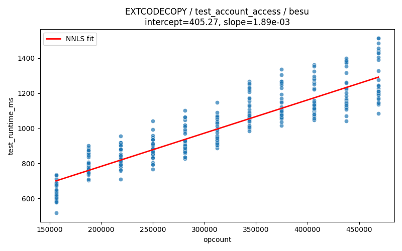

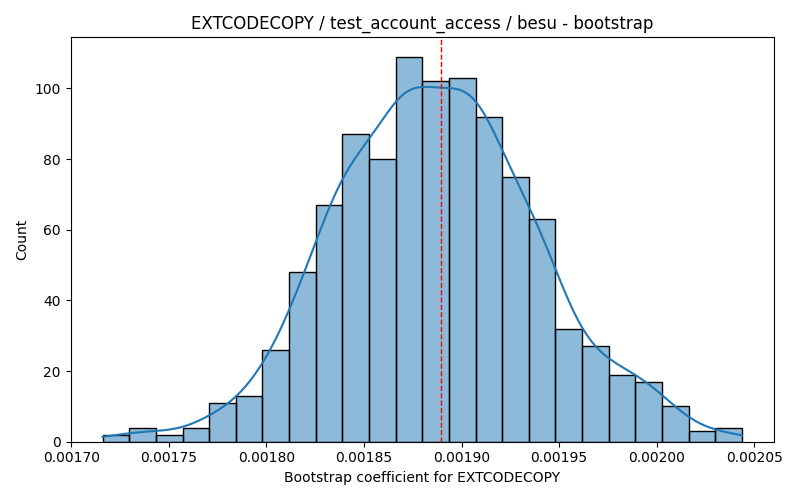

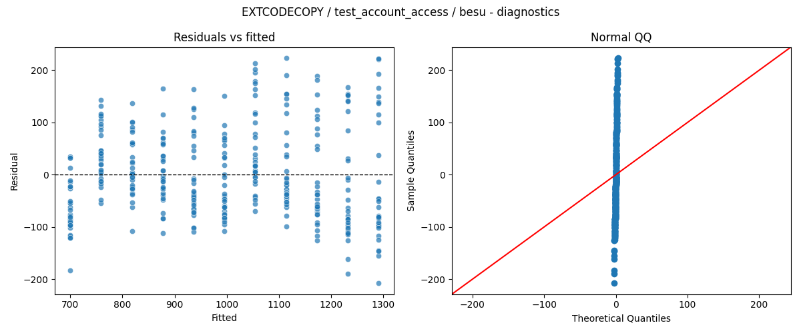

</details>

<details><summary>erigon — NNLS regression summary</summary>

```
==============================================================================
                           NNLS Regression Results                            
==============================================================================
Dep. Variable:          test_runtime_ms              R-squared:          0.849
Model:                  NNLS                    Adj. R-squared:          0.848
No. Observations:       176                               RMSE:          13.25
Df Residuals:           174                                MAE:          10.66
Df Model:               1      
==============================================================================
                      coef     std err     P-value      [0.025      0.975]
------------------------------------------------------------------------------
         const     48.4740      4.0141       0.001     40.8254     56.8883
       opcount      0.0003      0.0000       0.001      0.0003      0.0003
==============================================================================
Notes: Non-negative least squares with bootstrap inference (1000 iterations)
==============================================================================
```

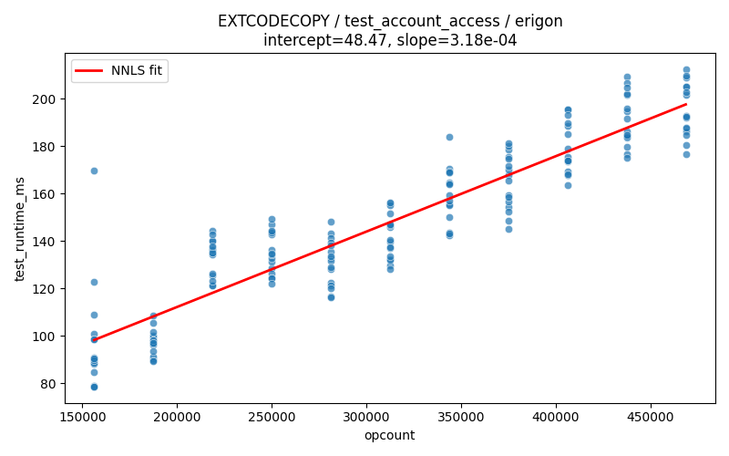

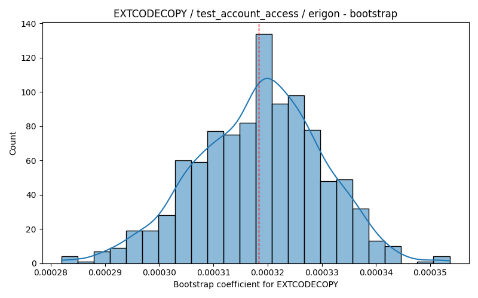

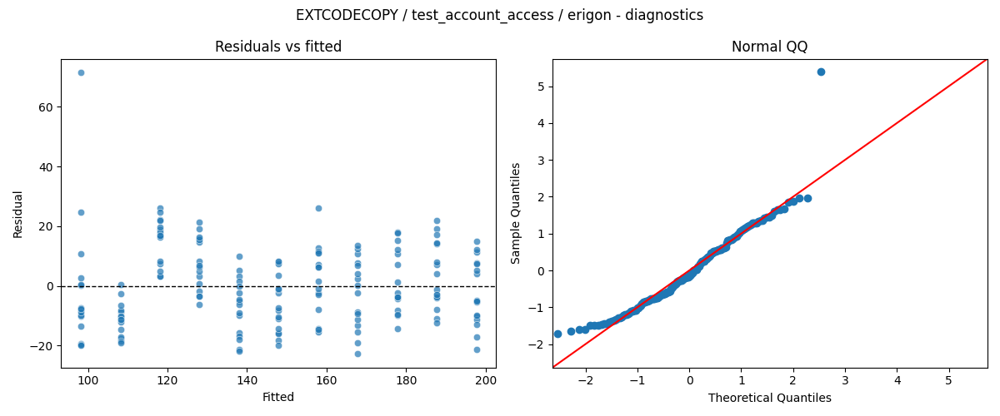

</details>

<details><summary>nethermind — NNLS regression summary</summary>

```
==============================================================================
                           NNLS Regression Results                            
==============================================================================
Dep. Variable:          test_runtime_ms              R-squared:          0.883
Model:                  NNLS                    Adj. R-squared:          0.883
No. Observations:       264                               RMSE:          49.79
Df Residuals:           262                                MAE:          38.78
Df Model:               1      
==============================================================================
                      coef     std err     P-value      [0.025      0.975]
------------------------------------------------------------------------------
         const    172.2716      9.7195       0.001    152.4482    190.0810
       opcount      0.0014      0.0000       0.001      0.0013      0.0015
==============================================================================
Notes: Non-negative least squares with bootstrap inference (1000 iterations)
==============================================================================
```

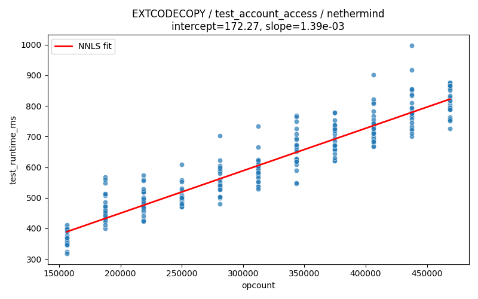

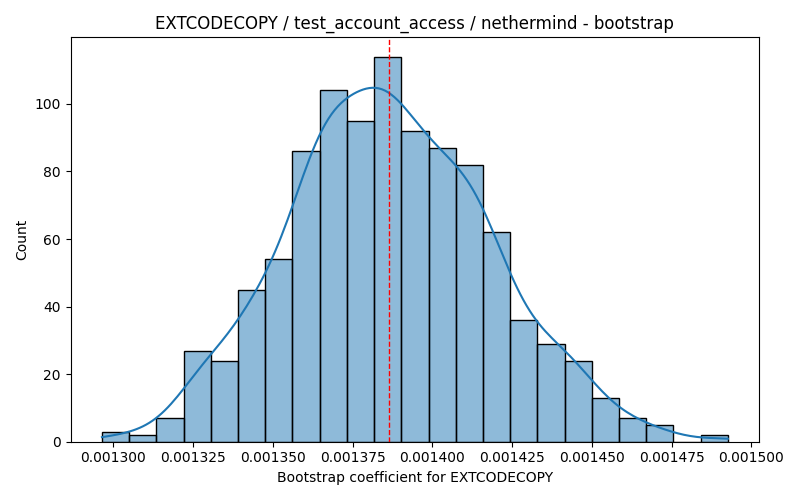

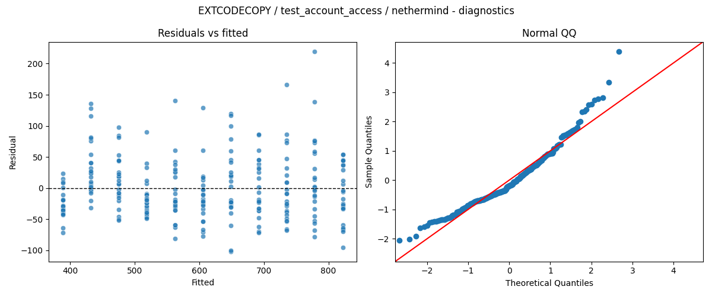

</details>

<details><summary>reth — NNLS regression summary</summary>

```
==============================================================================
                           NNLS Regression Results                            
==============================================================================
Dep. Variable:          test_runtime_ms              R-squared:          0.755
Model:                  NNLS                    Adj. R-squared:          0.754
No. Observations:       451                               RMSE:           4.37
Df Residuals:           449                                MAE:           3.30
Df Model:               1      
==============================================================================
                      coef     std err     P-value      [0.025      0.975]
------------------------------------------------------------------------------
         const     11.7637      0.6976       0.001     10.3498     13.0948
       opcount      0.0001      0.0000       0.001      0.0001      0.0001
==============================================================================
Notes: Non-negative least squares with bootstrap inference (1000 iterations)
==============================================================================
```

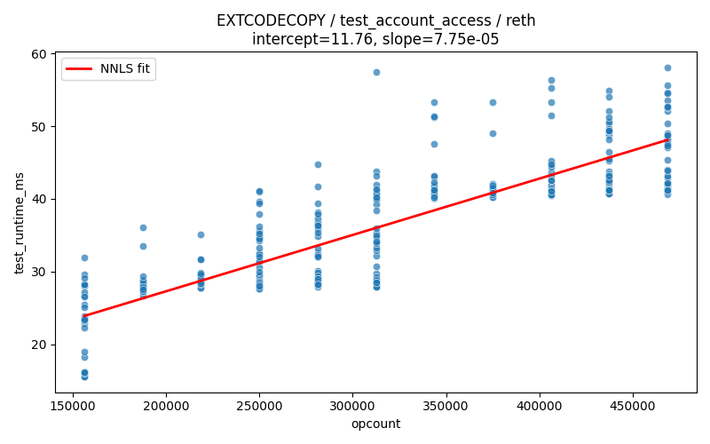

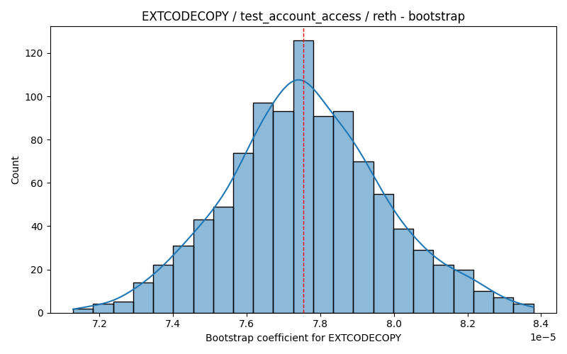

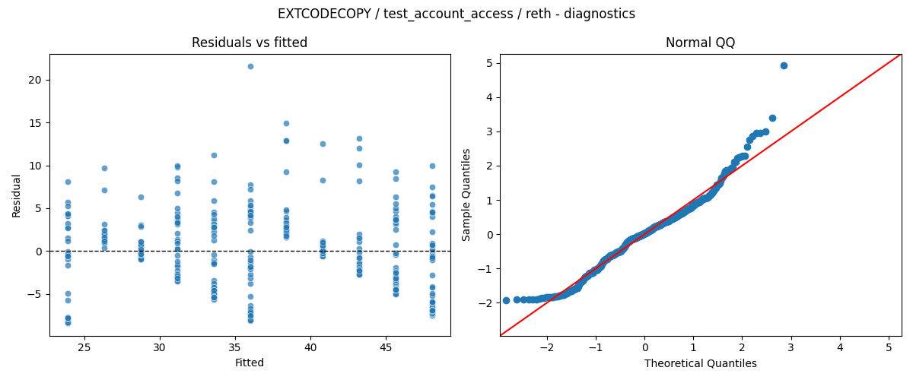

</details>

### test_account_access — combo `EXTCODECOPY_AccountMode.NON_EXISTING_ACCOUNT` — `presets[cold_account_code_access]`

| client | nobs | R² | target_coef (ms) | p-value | 95% CI |
| --- | --- | --- | --- | --- | --- |
| `besu` | 341 | 0.8318 | 0.000436 | 1.00e-03 | [0.0004149, 0.0004558] |
| `erigon` | 176 | 0.7535 | 6.371e-05 | 1.00e-03 | [5.82e-05, 6.916e-05] |
| `nethermind` | 264 | 0.8489 | 0.0003605 | 1.00e-03 | [0.0003418, 0.0003787] |
| `reth` | 451 | 0.7091 | 1.674e-05 | 1.00e-03 | [1.568e-05, 1.788e-05] |

<details><summary>besu — NNLS regression summary</summary>

```
==============================================================================
                           NNLS Regression Results                            
==============================================================================
Dep. Variable:          test_runtime_ms              R-squared:          0.832
Model:                  NNLS                    Adj. R-squared:          0.831
No. Observations:       341                               RMSE:          50.34
Df Residuals:           339                                MAE:          40.07
Df Model:               1      
==============================================================================
                      coef     std err     P-value      [0.025      0.975]
------------------------------------------------------------------------------
         const    223.2788      8.3748       0.001    207.7102    239.9184
       opcount      0.0004      0.0000       0.001      0.0004      0.0005
==============================================================================
Notes: Non-negative least squares with bootstrap inference (1000 iterations)
==============================================================================
```


</details>

<details><summary>erigon — NNLS regression summary</summary>

```
==============================================================================
                           NNLS Regression Results                            
==============================================================================
Dep. Variable:          test_runtime_ms              R-squared:          0.754
Model:                  NNLS                    Adj. R-squared:          0.752
No. Observations:       176                               RMSE:           9.36
Df Residuals:           174                                MAE:           7.69
Df Model:               1      
==============================================================================
                      coef     std err     P-value      [0.025      0.975]
------------------------------------------------------------------------------
         const     46.7564      2.2313       0.001     42.2548     51.1111
       opcount      0.0001      0.0000       0.001      0.0001      0.0001
==============================================================================
Notes: Non-negative least squares with bootstrap inference (1000 iterations)
==============================================================================
```


</details>

<details><summary>nethermind — NNLS regression summary</summary>

```
==============================================================================
                           NNLS Regression Results                            
==============================================================================
Dep. Variable:          test_runtime_ms              R-squared:          0.849
Model:                  NNLS                    Adj. R-squared:          0.848
No. Observations:       264                               RMSE:          39.05
Df Residuals:           262                                MAE:          28.69
Df Model:               1      
==============================================================================
                      coef     std err     P-value      [0.025      0.975]
------------------------------------------------------------------------------
         const    122.7178      6.8180       0.001    109.5590    136.9639
       opcount      0.0004      0.0000       0.001      0.0003      0.0004
==============================================================================
Notes: Non-negative least squares with bootstrap inference (1000 iterations)
==============================================================================
```


</details>

<details><summary>reth — NNLS regression summary</summary>

```
==============================================================================
                           NNLS Regression Results                            
==============================================================================
Dep. Variable:          test_runtime_ms              R-squared:          0.709
Model:                  NNLS                    Adj. R-squared:          0.708
No. Observations:       451                               RMSE:           2.75
Df Residuals:           449                                MAE:           1.84
Df Model:               1      
==============================================================================
                      coef     std err     P-value      [0.025      0.975]
------------------------------------------------------------------------------
         const      5.7669      0.4246       0.001      4.9658      6.6250
       opcount      0.0000      0.0000       0.001      0.0000      0.0000
==============================================================================
Notes: Non-negative least squares with bootstrap inference (1000 iterations)
==============================================================================
```


</details>

## EXTCODEHASH

### test_account_access — combo `EXTCODEHASH_AccountMode.NON_EXISTING_ACCOUNT` — `presets[cold_account_nocode_access]`

| client | nobs | R² | target_coef (ms) | p-value | 95% CI |
| --- | --- | --- | --- | --- | --- |
| `besu` | 341 | 0.8992 | 0.009268 | 1.00e-03 | [0.008896, 0.009684] |
| `erigon` | 176 | 0.997 | 0.008627 | 1.00e-03 | [0.00856, 0.008692] |
| `nethermind` | 264 | 0.9334 | 0.003849 | 1.00e-03 | [0.003717, 0.003966] |
| `reth` | 451 | 0.9665 | 0.0009116 | 1.00e-03 | [0.0008965, 0.0009264] |

<details><summary>besu — NNLS regression summary</summary>

```
==============================================================================
                           NNLS Regression Results                            
==============================================================================
Dep. Variable:          test_runtime_ms              R-squared:          0.899
Model:                  NNLS                    Adj. R-squared:          0.899
No. Observations:       341                               RMSE:          74.18
Df Residuals:           339                                MAE:          62.59
Df Model:               1      
==============================================================================
                      coef     std err     P-value      [0.025      0.975]
------------------------------------------------------------------------------
         const    429.1714     16.6607       0.001    394.3499    459.2448
       opcount      0.0093      0.0002       0.001      0.0089      0.0097
==============================================================================
Notes: Non-negative least squares with bootstrap inference (1000 iterations)
==============================================================================
```

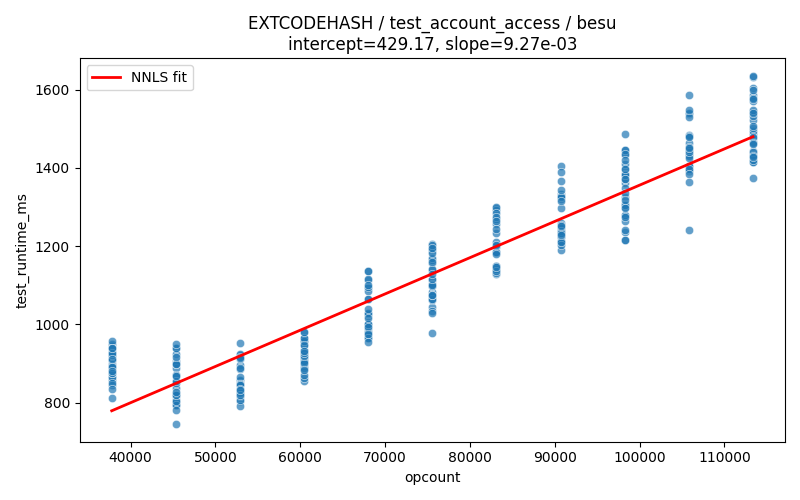

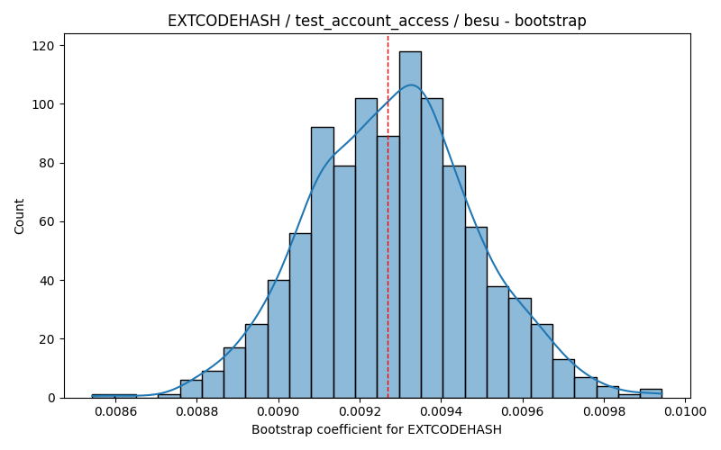

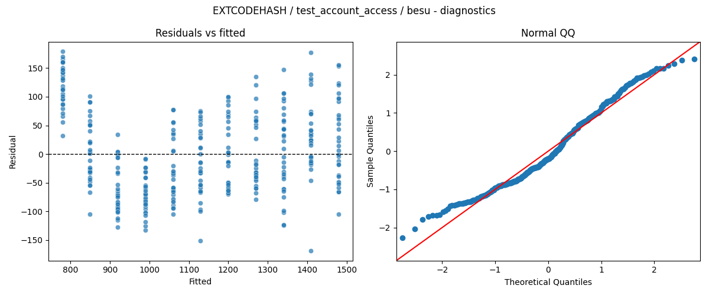

</details>

<details><summary>erigon — NNLS regression summary</summary>

```
==============================================================================
                           NNLS Regression Results                            
==============================================================================
Dep. Variable:          test_runtime_ms              R-squared:          0.997
Model:                  NNLS                    Adj. R-squared:          0.997
No. Observations:       176                               RMSE:          11.25
Df Residuals:           174                                MAE:           9.19
Df Model:               1      
==============================================================================
                      coef     std err     P-value      [0.025      0.975]
------------------------------------------------------------------------------
         const     12.5152      2.5764       0.001      7.5465     17.6326
       opcount      0.0086      0.0000       0.001      0.0086      0.0087
==============================================================================
Notes: Non-negative least squares with bootstrap inference (1000 iterations)
==============================================================================
```

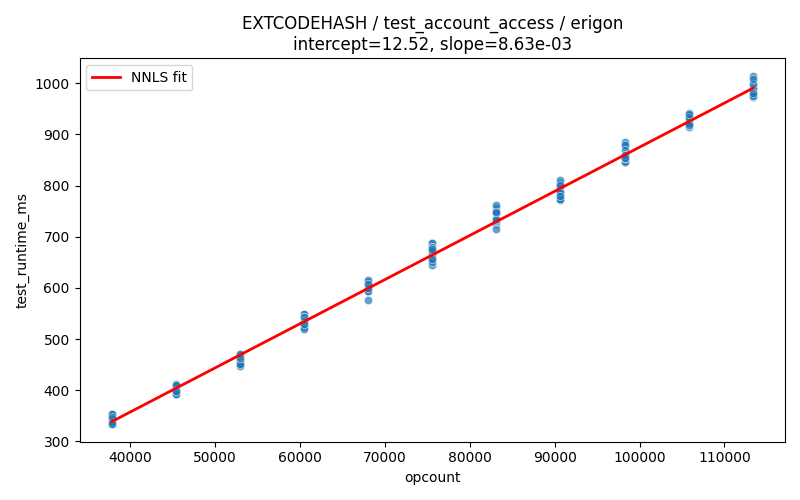

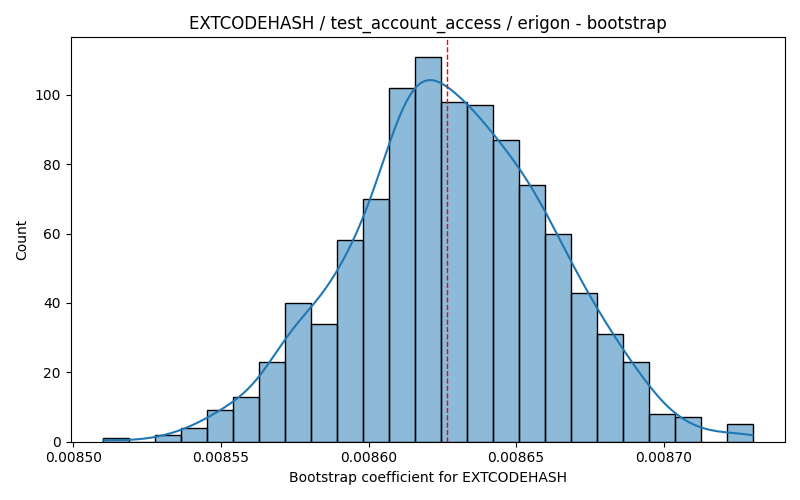

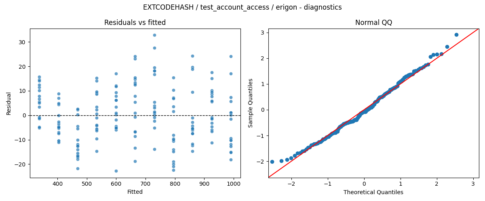

</details>

<details><summary>nethermind — NNLS regression summary</summary>

```
==============================================================================
                           NNLS Regression Results                            
==============================================================================
Dep. Variable:          test_runtime_ms              R-squared:          0.933
Model:                  NNLS                    Adj. R-squared:          0.933
No. Observations:       264                               RMSE:          24.58
Df Residuals:           262                                MAE:          19.64
Df Model:               1      
==============================================================================
                      coef     std err     P-value      [0.025      0.975]
------------------------------------------------------------------------------
         const     79.8567      4.6468       0.001     71.5669     89.0621
       opcount      0.0038      0.0001       0.001      0.0037      0.0040
==============================================================================
Notes: Non-negative least squares with bootstrap inference (1000 iterations)
==============================================================================
```

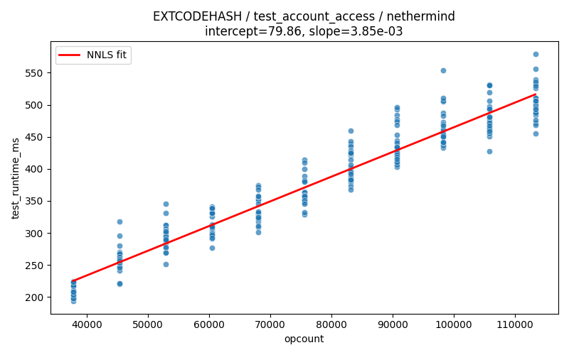

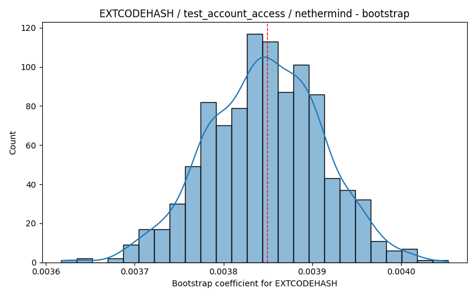

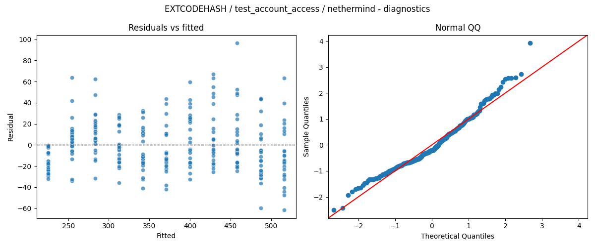

</details>

<details><summary>reth — NNLS regression summary</summary>

```
==============================================================================
                           NNLS Regression Results                            
==============================================================================
Dep. Variable:          test_runtime_ms              R-squared:          0.966
Model:                  NNLS                    Adj. R-squared:          0.966
No. Observations:       451                               RMSE:           4.06
Df Residuals:           449                                MAE:           3.07
Df Model:               1      
==============================================================================
                      coef     std err     P-value      [0.025      0.975]
------------------------------------------------------------------------------
         const     32.3385      0.6398       0.001     31.1733     33.5746
       opcount      0.0009      0.0000       0.001      0.0009      0.0009
==============================================================================
Notes: Non-negative least squares with bootstrap inference (1000 iterations)
==============================================================================
```

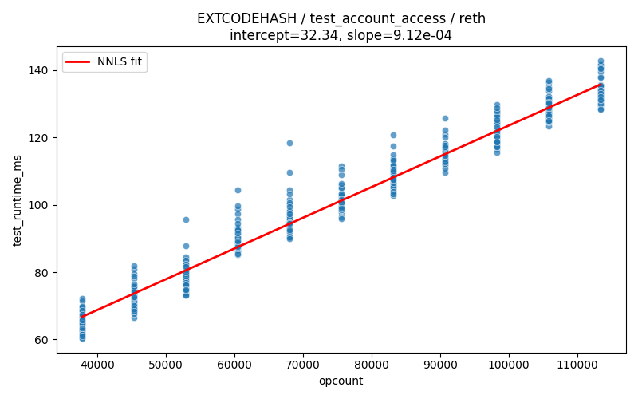

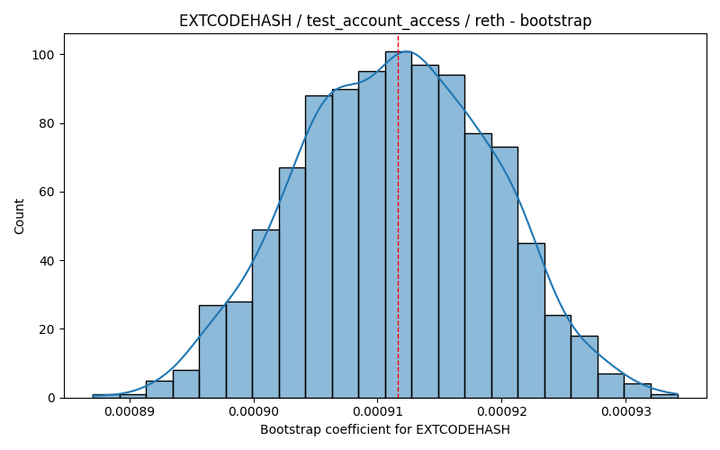

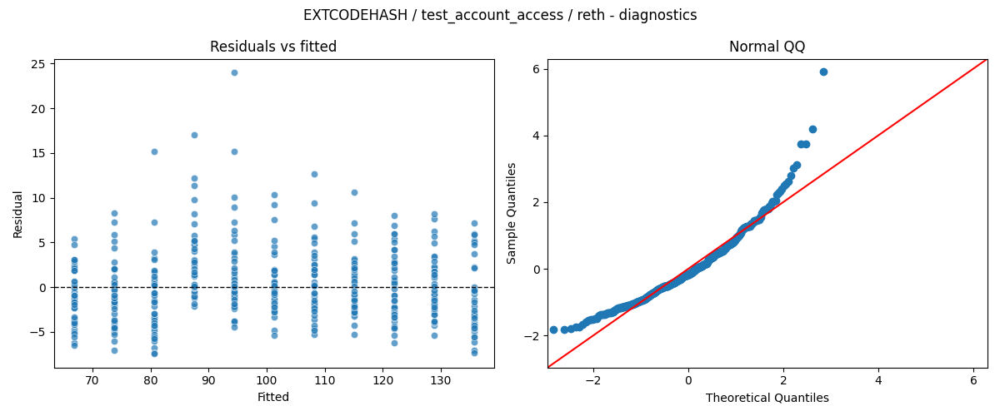

</details>

### test_account_access — combo `EXTCODEHASH_AccountMode.EXISTING_CONTRACT`

| client | nobs | R² | target_coef (ms) | p-value | 95% CI |
| --- | --- | --- | --- | --- | --- |
| `besu` | 341 | 0.9457 | 0.02634 | 1.00e-03 | [0.02561, 0.02712] |
| `erigon` | 176 | 0.8969 | 0.03631 | 1.00e-03 | [0.03452, 0.03804] |
| `nethermind` | 264 | 0.6957 | 0.02416 | 1.00e-03 | [0.02232, 0.02626] |
| `reth` | 451 | 0.8473 | 0.035 | 1.00e-03 | [0.03377, 0.03641] |

<details><summary>besu — NNLS regression summary</summary>

```
==============================================================================
                           NNLS Regression Results                            
==============================================================================
Dep. Variable:          test_runtime_ms              R-squared:          0.946
Model:                  NNLS                    Adj. R-squared:          0.946
No. Observations:       341                               RMSE:         131.27
Df Residuals:           339                                MAE:         112.64
Df Model:               1      
==============================================================================
                      coef     std err     P-value      [0.025      0.975]
------------------------------------------------------------------------------
         const    403.2448     26.3500       0.001    349.9512    451.6401
       opcount      0.0263      0.0004       0.001      0.0256      0.0271
==============================================================================
Notes: Non-negative least squares with bootstrap inference (1000 iterations)
==============================================================================
```

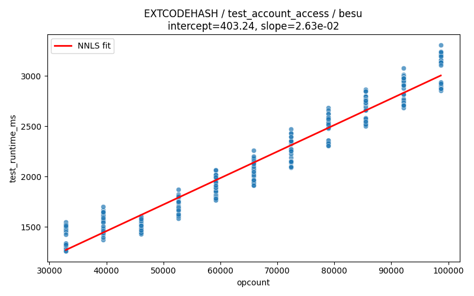

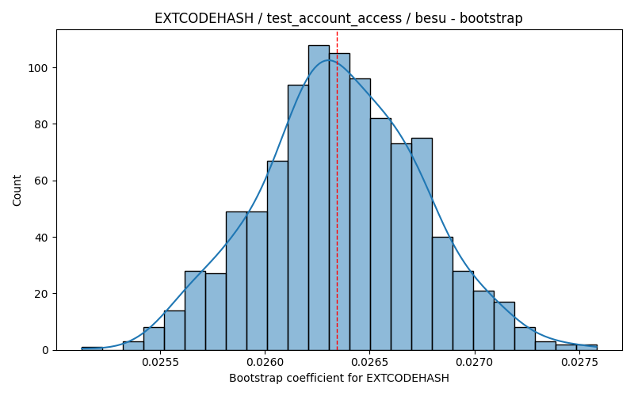

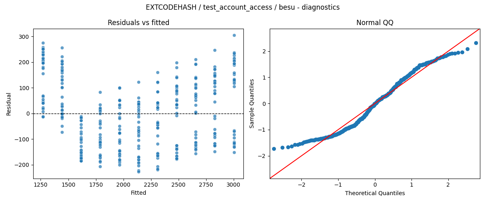

</details>

<details><summary>erigon — NNLS regression summary</summary>

```
==============================================================================
                           NNLS Regression Results                            
==============================================================================
Dep. Variable:          test_runtime_ms              R-squared:          0.897
Model:                  NNLS                    Adj. R-squared:          0.896
No. Observations:       176                               RMSE:         256.17
Df Residuals:           174                                MAE:         217.71
Df Model:               1      
==============================================================================
                      coef     std err     P-value      [0.025      0.975]
------------------------------------------------------------------------------
         const    445.8375     64.7805       0.001    327.8783    578.6667
       opcount      0.0363      0.0009       0.001      0.0345      0.0380
==============================================================================
Notes: Non-negative least squares with bootstrap inference (1000 iterations)
==============================================================================
```

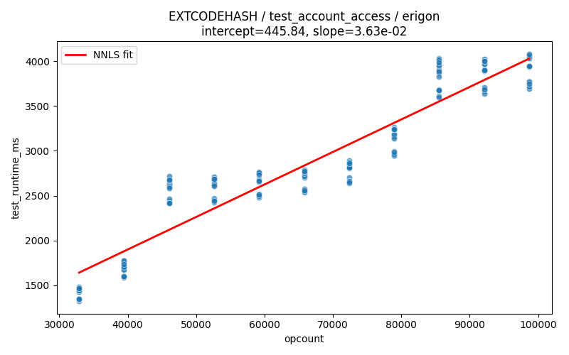

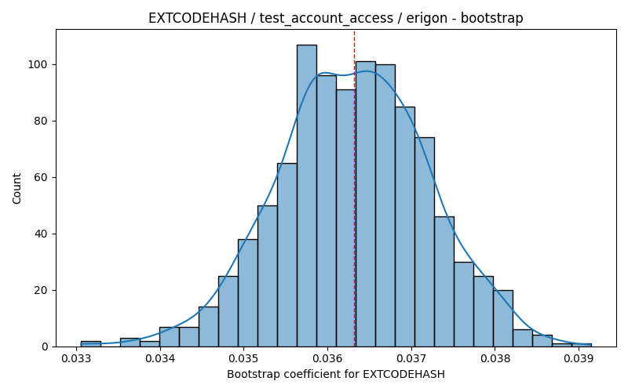

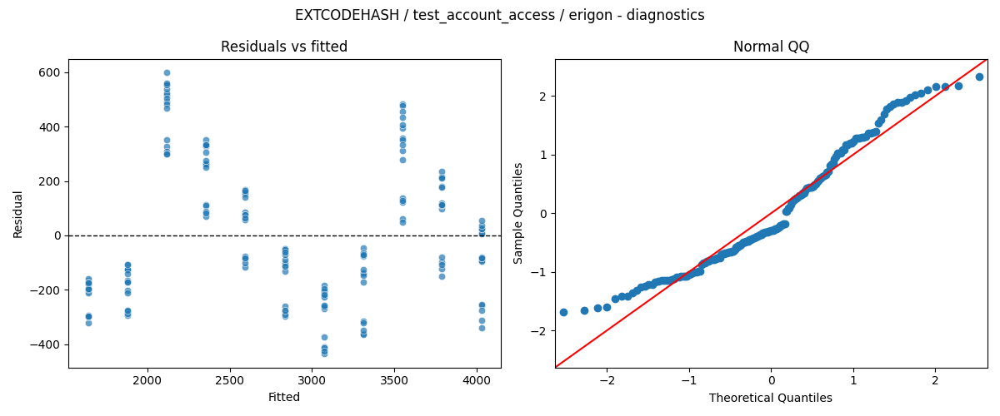

</details>

<details><summary>nethermind — NNLS regression summary</summary>

```
==============================================================================
                           NNLS Regression Results                            
==============================================================================
Dep. Variable:          test_runtime_ms              R-squared:          0.696
Model:                  NNLS                    Adj. R-squared:          0.695
No. Observations:       264                               RMSE:         332.35
Df Residuals:           262                                MAE:         278.33
Df Model:               1      
==============================================================================
                      coef     std err     P-value      [0.025      0.975]
------------------------------------------------------------------------------
         const    832.8665     71.8507       0.001    678.7942    963.8703
       opcount      0.0242      0.0010       0.001      0.0223      0.0263
==============================================================================
Notes: Non-negative least squares with bootstrap inference (1000 iterations)
==============================================================================
```

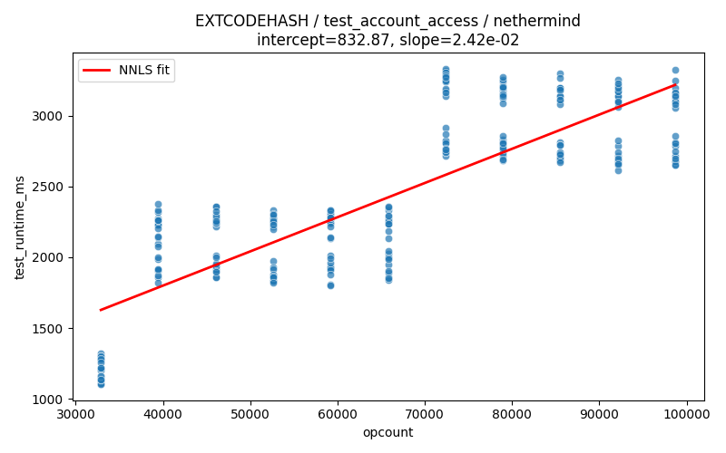

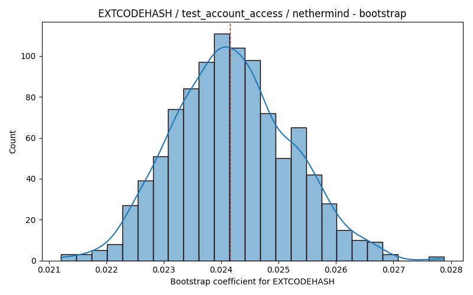

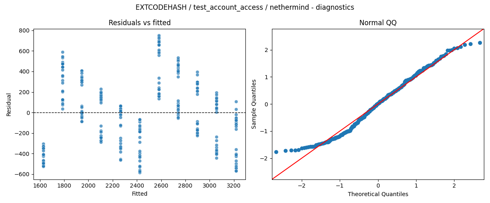

</details>

<details><summary>reth — NNLS regression summary</summary>

```
==============================================================================
                           NNLS Regression Results                            
==============================================================================
Dep. Variable:          test_runtime_ms              R-squared:          0.847
Model:                  NNLS                    Adj. R-squared:          0.847
No. Observations:       451                               RMSE:         309.09
Df Residuals:           449                                MAE:         175.60
Df Model:               1      
==============================================================================
                      coef     std err     P-value      [0.025      0.975]
------------------------------------------------------------------------------
         const    234.7323     45.2544       0.001    142.4054    320.9167
       opcount      0.0350      0.0007       0.001      0.0338      0.0364
==============================================================================
Notes: Non-negative least squares with bootstrap inference (1000 iterations)
==============================================================================
```

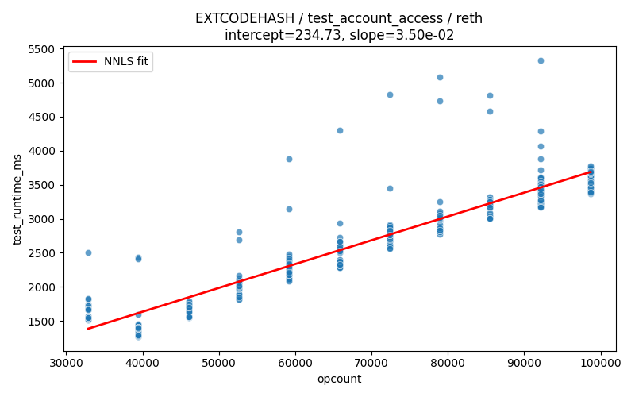

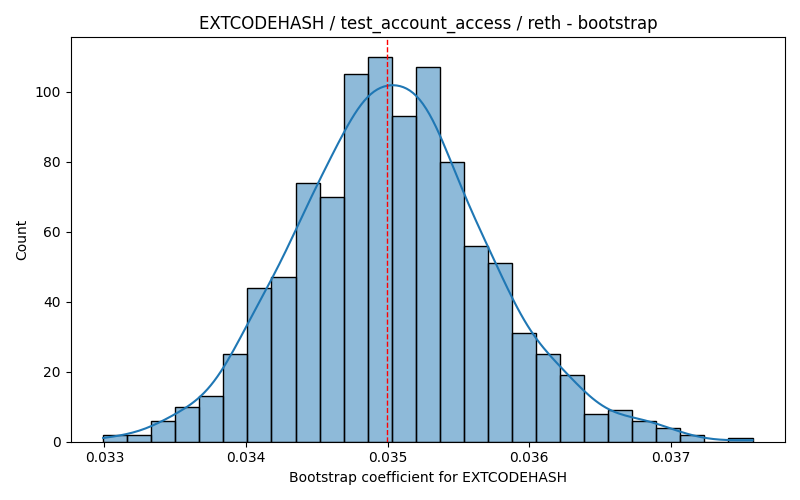

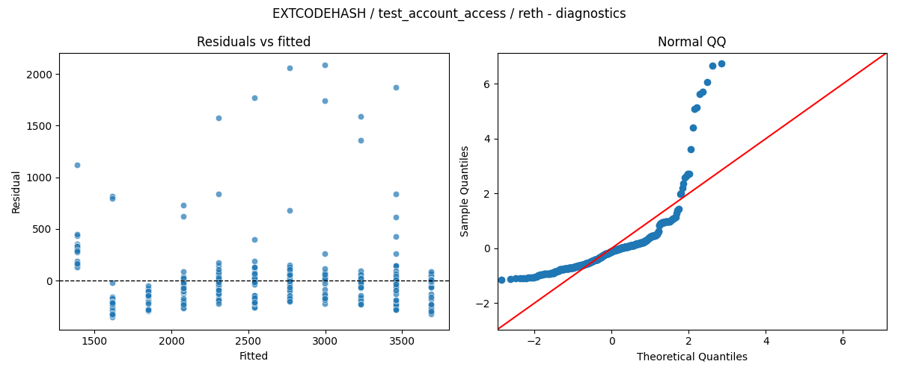

</details>

### test_account_access — combo `EXTCODEHASH_AccountMode.NON_EXISTING_ACCOUNT` — `presets[cold_account_code_access]`

| client | nobs | R² | target_coef (ms) | p-value | 95% CI |
| --- | --- | --- | --- | --- | --- |
| `besu` | 341 | 0.8992 | 0.009268 | 1.00e-03 | [0.008896, 0.009684] |
| `erigon` | 176 | 0.997 | 0.008627 | 1.00e-03 | [0.00856, 0.008692] |
| `nethermind` | 264 | 0.9334 | 0.003849 | 1.00e-03 | [0.003717, 0.003966] |
| `reth` | 451 | 0.9665 | 0.0009116 | 1.00e-03 | [0.0008965, 0.0009264] |

<details><summary>besu — NNLS regression summary</summary>

```
==============================================================================
                           NNLS Regression Results                            
==============================================================================
Dep. Variable:          test_runtime_ms              R-squared:          0.899
Model:                  NNLS                    Adj. R-squared:          0.899
No. Observations:       341                               RMSE:          74.18
Df Residuals:           339                                MAE:          62.59
Df Model:               1      
==============================================================================
                      coef     std err     P-value      [0.025      0.975]
------------------------------------------------------------------------------
         const    429.1714     16.6607       0.001    394.3499    459.2448
       opcount      0.0093      0.0002       0.001      0.0089      0.0097
==============================================================================
Notes: Non-negative least squares with bootstrap inference (1000 iterations)
==============================================================================
```


</details>

<details><summary>erigon — NNLS regression summary</summary>

```
==============================================================================
                           NNLS Regression Results                            
==============================================================================
Dep. Variable:          test_runtime_ms              R-squared:          0.997
Model:                  NNLS                    Adj. R-squared:          0.997
No. Observations:       176                               RMSE:          11.25
Df Residuals:           174                                MAE:           9.19
Df Model:               1      
==============================================================================
                      coef     std err     P-value      [0.025      0.975]
------------------------------------------------------------------------------
         const     12.5152      2.5764       0.001      7.5465     17.6326
       opcount      0.0086      0.0000       0.001      0.0086      0.0087
==============================================================================
Notes: Non-negative least squares with bootstrap inference (1000 iterations)
==============================================================================
```


</details>

<details><summary>nethermind — NNLS regression summary</summary>

```
==============================================================================
                           NNLS Regression Results                            
==============================================================================
Dep. Variable:          test_runtime_ms              R-squared:          0.933
Model:                  NNLS                    Adj. R-squared:          0.933
No. Observations:       264                               RMSE:          24.58
Df Residuals:           262                                MAE:          19.64
Df Model:               1      
==============================================================================
                      coef     std err     P-value      [0.025      0.975]
------------------------------------------------------------------------------
         const     79.8567      4.6468       0.001     71.5669     89.0621
       opcount      0.0038      0.0001       0.001      0.0037      0.0040
==============================================================================
Notes: Non-negative least squares with bootstrap inference (1000 iterations)
==============================================================================
```


</details>

<details><summary>reth — NNLS regression summary</summary>

```
==============================================================================
                           NNLS Regression Results                            
==============================================================================
Dep. Variable:          test_runtime_ms              R-squared:          0.966
Model:                  NNLS                    Adj. R-squared:          0.966
No. Observations:       451                               RMSE:           4.06
Df Residuals:           449                                MAE:           3.07
Df Model:               1      
==============================================================================
                      coef     std err     P-value      [0.025      0.975]
------------------------------------------------------------------------------
         const     32.3385      0.6398       0.001     31.1733     33.5746
       opcount      0.0009      0.0000       0.001      0.0009      0.0009
==============================================================================
Notes: Non-negative least squares with bootstrap inference (1000 iterations)
==============================================================================
```


</details>

### test_ext_account_query_warm — combo `EXTCODEHASH`

| client | nobs | R² | target_coef (ms) | p-value | 95% CI |
| --- | --- | --- | --- | --- | --- |
| `besu` | 341 | 0.7997 | 0.0001577 | 1.00e-03 | [0.000149, 0.0001668] |
| `erigon` | 176 | 0.8488 | 0.0002629 | 1.00e-03 | [0.0002433, 0.0002778] |
| `nethermind` | 264 | 0.7951 | 0.0002863 | 1.00e-03 | [0.0002688, 0.0003035] |
| `reth` | 451 | 0.6795 | 8.14e-06 | 1.00e-03 | [7.601e-06, 8.666e-06] |

<details><summary>besu — NNLS regression summary</summary>

```
==============================================================================
                           NNLS Regression Results                            
==============================================================================
Dep. Variable:          test_runtime_ms              R-squared:          0.800
Model:                  NNLS                    Adj. R-squared:          0.799
No. Observations:       341                               RMSE:          46.13
Df Residuals:           339                                MAE:          36.86
Df Model:               1      
==============================================================================
                      coef     std err     P-value      [0.025      0.975]
------------------------------------------------------------------------------
         const    198.3033      8.2901       0.001    182.4265    214.7589
       opcount      0.0002      0.0000       0.001      0.0001      0.0002
==============================================================================
Notes: Non-negative least squares with bootstrap inference (1000 iterations)
==============================================================================
```

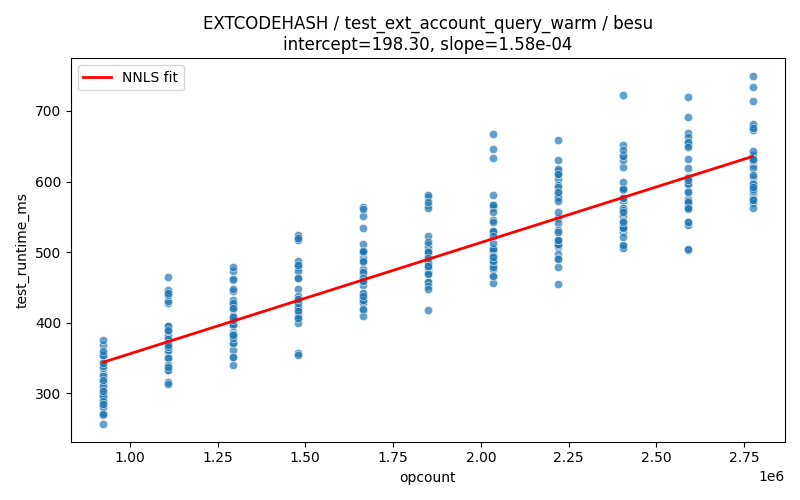

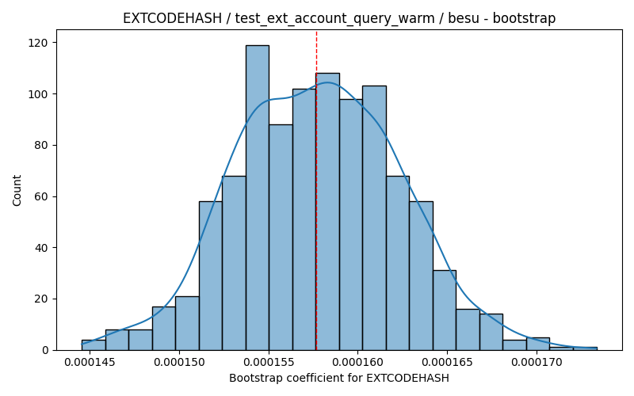

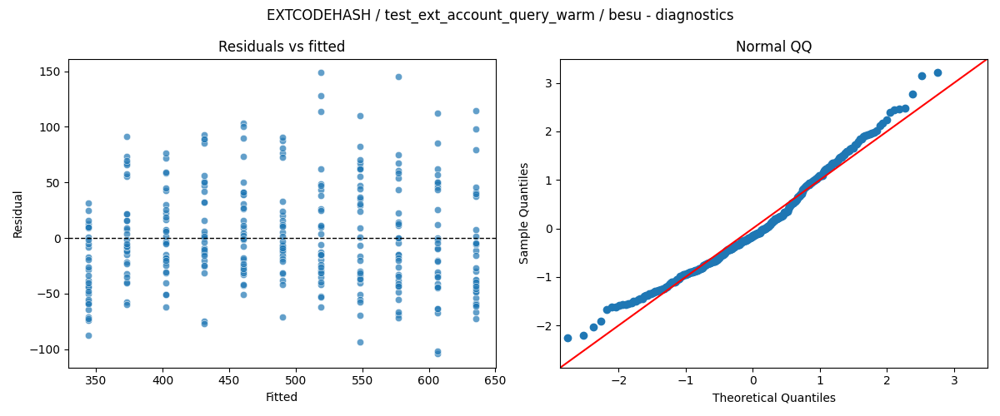

</details>

<details><summary>erigon — NNLS regression summary</summary>

```
==============================================================================
                           NNLS Regression Results                            
==============================================================================
Dep. Variable:          test_runtime_ms              R-squared:          0.849
Model:                  NNLS                    Adj. R-squared:          0.848
No. Observations:       176                               RMSE:          64.89
Df Residuals:           174                                MAE:          47.41
Df Model:               1      
==============================================================================
                      coef     std err     P-value      [0.025      0.975]
------------------------------------------------------------------------------
         const     56.9268     17.8071       0.001     29.4314     95.6083
       opcount      0.0003      0.0000       0.001      0.0002      0.0003
==============================================================================
Notes: Non-negative least squares with bootstrap inference (1000 iterations)
==============================================================================
```

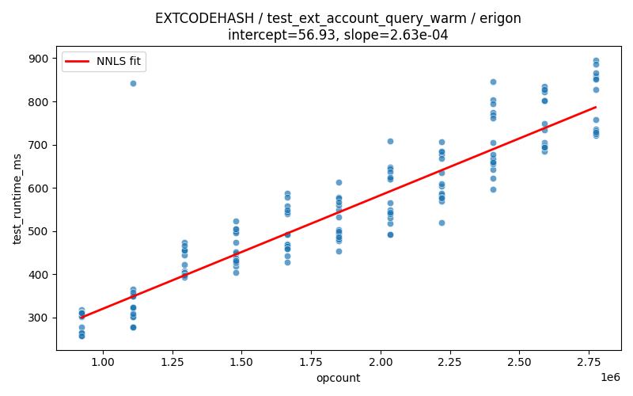

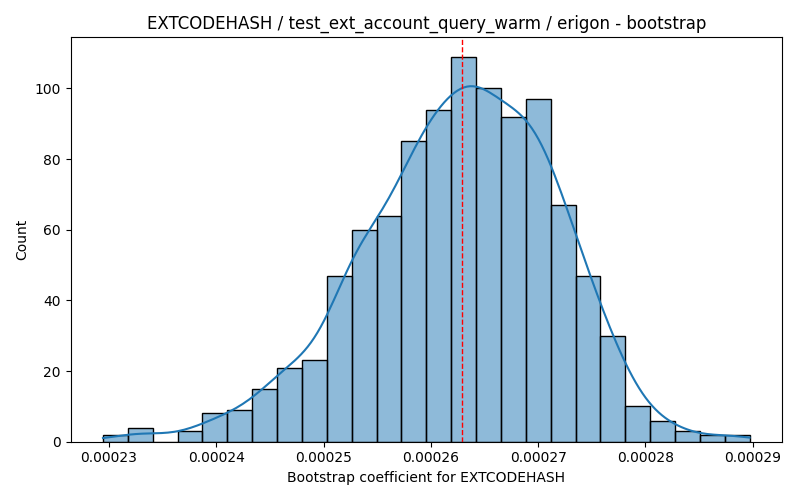

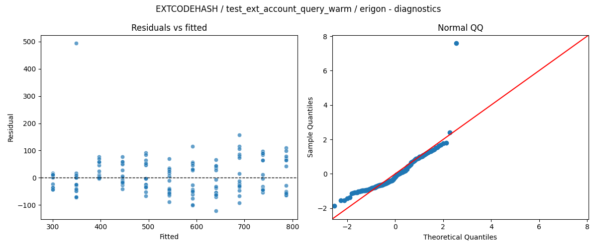

</details>

<details><summary>nethermind — NNLS regression summary</summary>

```
==============================================================================
                           NNLS Regression Results                            
==============================================================================
Dep. Variable:          test_runtime_ms              R-squared:          0.795
Model:                  NNLS                    Adj. R-squared:          0.794
No. Observations:       264                               RMSE:          84.99
Df Residuals:           262                                MAE:          63.98
Df Model:               1      
==============================================================================
                      coef     std err     P-value      [0.025      0.975]
------------------------------------------------------------------------------
         const    135.3205     14.3749       0.001    106.9423    164.2670
       opcount      0.0003      0.0000       0.001      0.0003      0.0003
==============================================================================
Notes: Non-negative least squares with bootstrap inference (1000 iterations)
==============================================================================
```

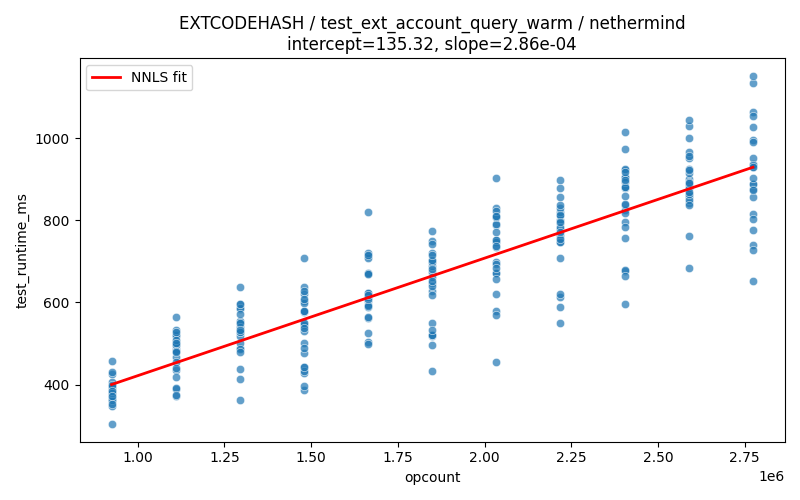

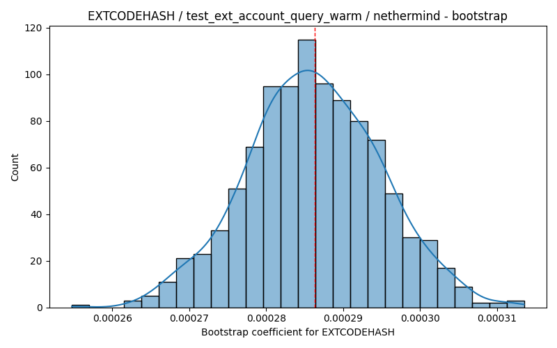

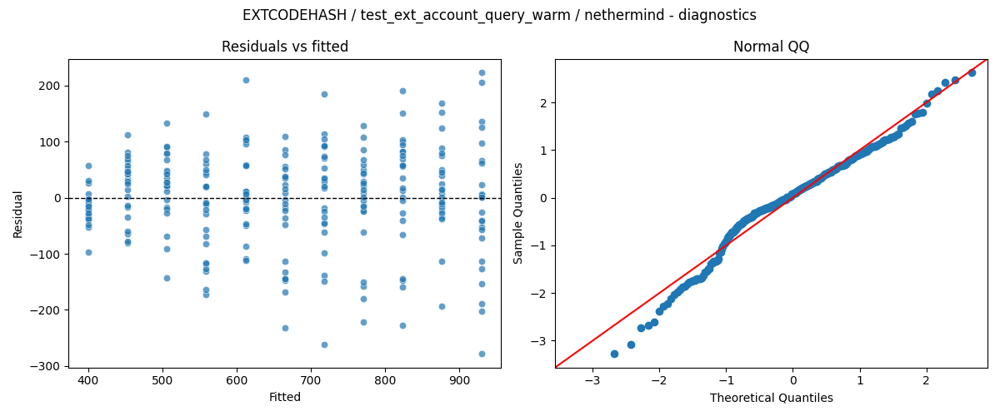

</details>

<details><summary>reth — NNLS regression summary</summary>

```
==============================================================================
                           NNLS Regression Results                            
==============================================================================
Dep. Variable:          test_runtime_ms              R-squared:          0.680
Model:                  NNLS                    Adj. R-squared:          0.679
No. Observations:       451                               RMSE:           3.27
Df Residuals:           449                                MAE:           2.29
Df Model:               1      
==============================================================================
                      coef     std err     P-value      [0.025      0.975]
------------------------------------------------------------------------------
         const      5.7933      0.4692       0.001      4.9104      6.6804
       opcount      0.0000      0.0000       0.001      0.0000      0.0000
==============================================================================
Notes: Non-negative least squares with bootstrap inference (1000 iterations)
==============================================================================
```

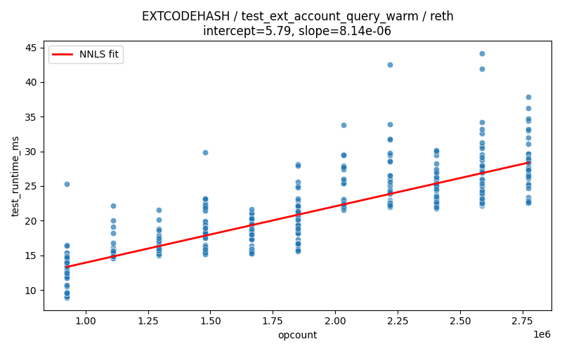

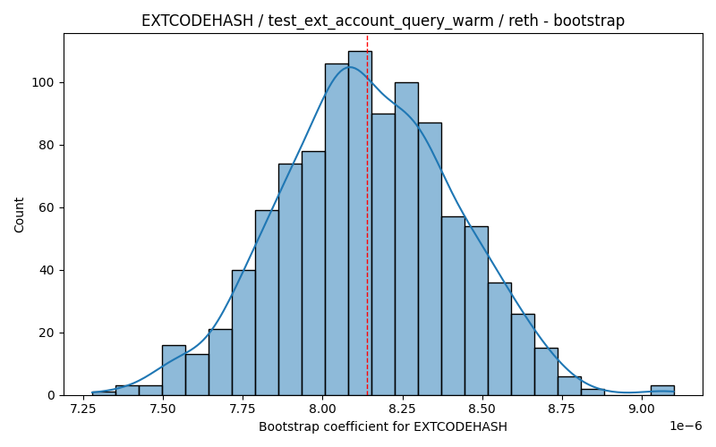

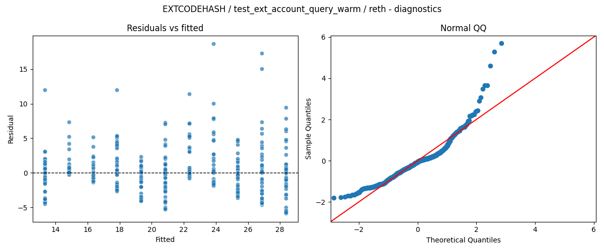

</details>

## EXTCODESIZE

### test_account_access — combo `EXTCODESIZE_AccountMode.NON_EXISTING_ACCOUNT` — `presets[cold_account_nocode_access]`

| client | nobs | R² | target_coef (ms) | p-value | 95% CI |
| --- | --- | --- | --- | --- | --- |
| `besu` | 341 | 0.8942 | 0.009378 | 1.00e-03 | [0.009009, 0.009788] |
| `erigon` | 176 | 0.9956 | 0.008807 | 1.00e-03 | [0.008713, 0.008912] |
| `nethermind` | 264 | 0.9287 | 0.003839 | 1.00e-03 | [0.00372, 0.003964] |
| `reth` | 451 | 0.9732 | 0.0009205 | 1.00e-03 | [0.000907, 0.0009352] |

<details><summary>besu — NNLS regression summary</summary>

```
==============================================================================
                           NNLS Regression Results                            
==============================================================================
Dep. Variable:          test_runtime_ms              R-squared:          0.894
Model:                  NNLS                    Adj. R-squared:          0.894
No. Observations:       341                               RMSE:          77.08
Df Residuals:           339                                MAE:          64.31
Df Model:               1      
==============================================================================
                      coef     std err     P-value      [0.025      0.975]
------------------------------------------------------------------------------
         const    421.4238     16.9009       0.001    388.5258    453.9676
       opcount      0.0094      0.0002       0.001      0.0090      0.0098
==============================================================================
Notes: Non-negative least squares with bootstrap inference (1000 iterations)
==============================================================================
```

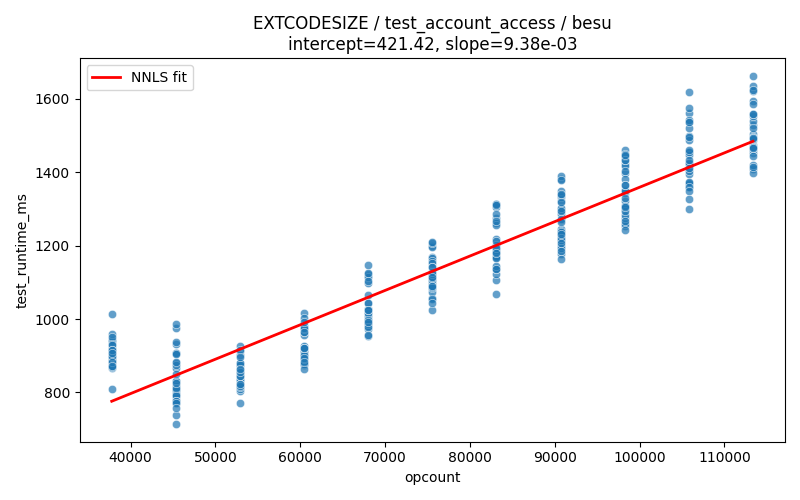

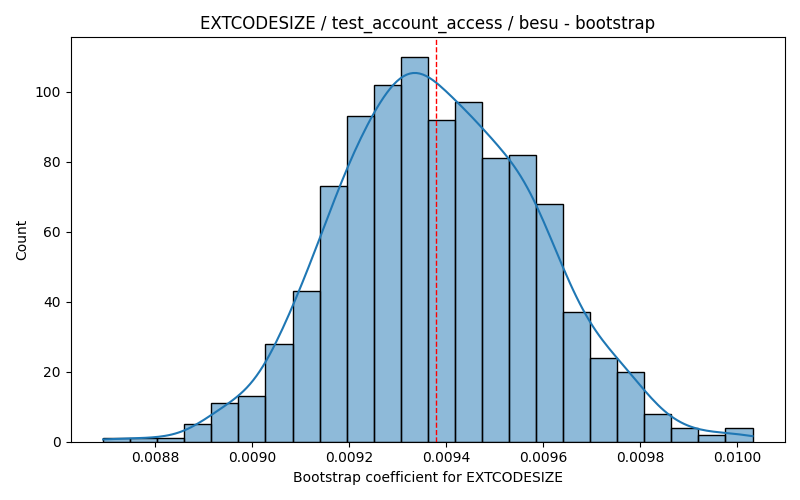

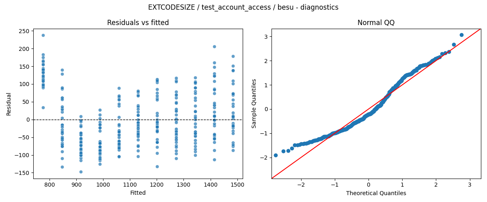

</details>

<details><summary>erigon — NNLS regression summary</summary>

```
==============================================================================
                           NNLS Regression Results                            
==============================================================================
Dep. Variable:          test_runtime_ms              R-squared:          0.996
Model:                  NNLS                    Adj. R-squared:          0.996
No. Observations:       176                               RMSE:          14.03
Df Residuals:           174                                MAE:          10.67
Df Model:               1      
==============================================================================
                      coef     std err     P-value      [0.025      0.975]
------------------------------------------------------------------------------
         const     14.0454      3.8113       0.001      6.1411     21.2543
       opcount      0.0088      0.0001       0.001      0.0087      0.0089
==============================================================================
Notes: Non-negative least squares with bootstrap inference (1000 iterations)
==============================================================================
```

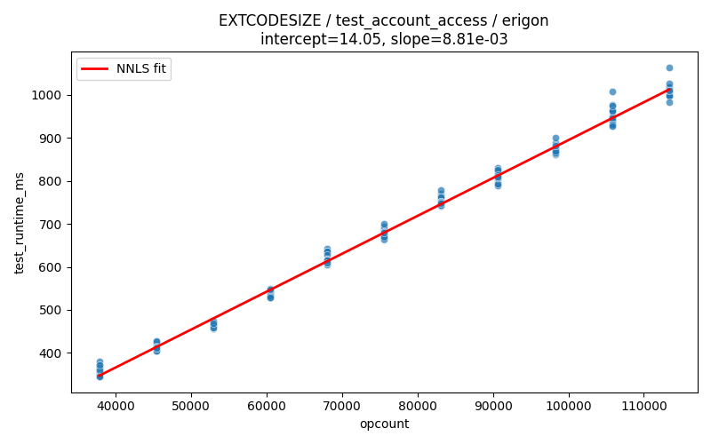

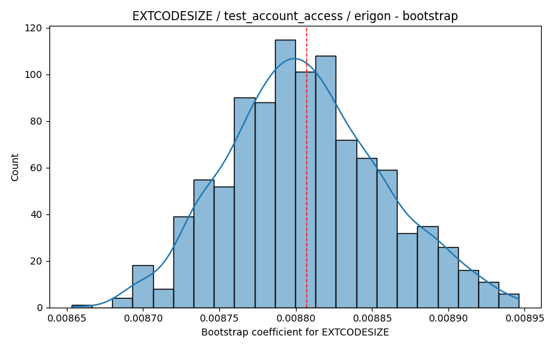

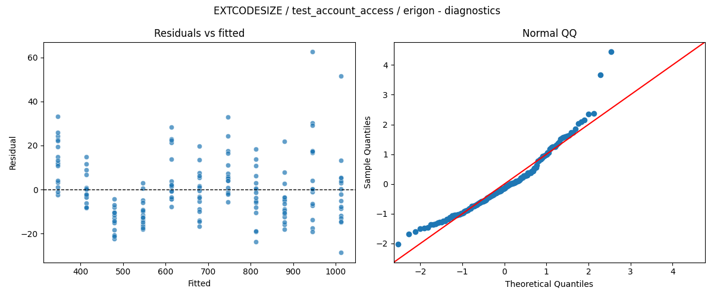

</details>

<details><summary>nethermind — NNLS regression summary</summary>

```
==============================================================================
                           NNLS Regression Results                            
==============================================================================
Dep. Variable:          test_runtime_ms              R-squared:          0.929
Model:                  NNLS                    Adj. R-squared:          0.928
No. Observations:       264                               RMSE:          25.41
Df Residuals:           262                                MAE:          19.11
Df Model:               1      
==============================================================================
                      coef     std err     P-value      [0.025      0.975]
------------------------------------------------------------------------------
         const     83.8199      4.8168       0.001     74.6903     93.4173
       opcount      0.0038      0.0001       0.001      0.0037      0.0040
==============================================================================
Notes: Non-negative least squares with bootstrap inference (1000 iterations)
==============================================================================
```

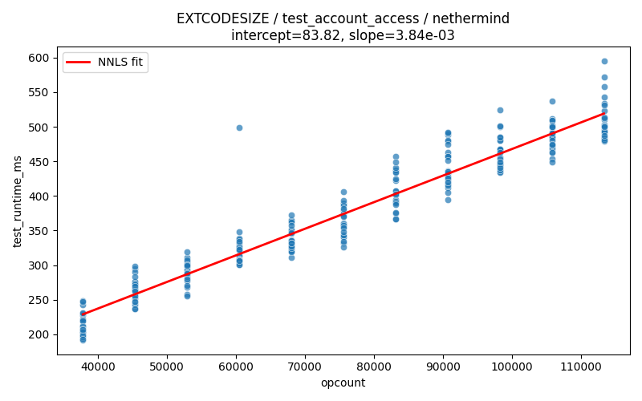

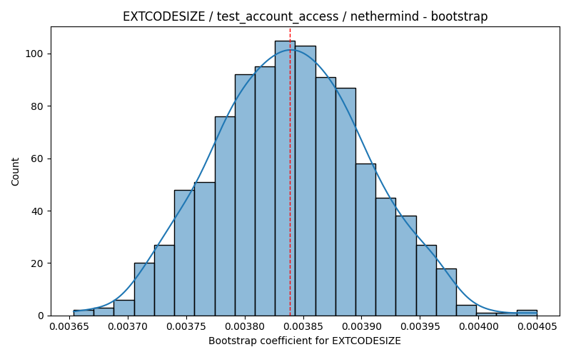

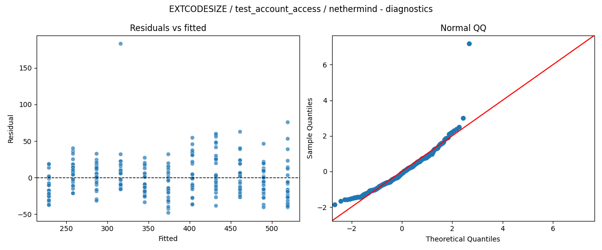

</details>

<details><summary>reth — NNLS regression summary</summary>

```
==============================================================================
                           NNLS Regression Results                            
==============================================================================
Dep. Variable:          test_runtime_ms              R-squared:          0.973
Model:                  NNLS                    Adj. R-squared:          0.973
No. Observations:       451                               RMSE:           3.65
Df Residuals:           449                                MAE:           2.88
Df Model:               1      
==============================================================================
                      coef     std err     P-value      [0.025      0.975]
------------------------------------------------------------------------------
         const     31.3809      0.5699       0.001     30.3210     32.4473
       opcount      0.0009      0.0000       0.001      0.0009      0.0009
==============================================================================
Notes: Non-negative least squares with bootstrap inference (1000 iterations)
==============================================================================
```

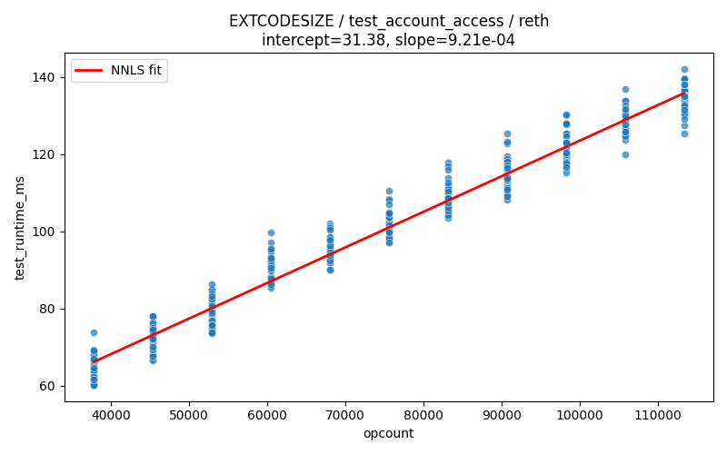

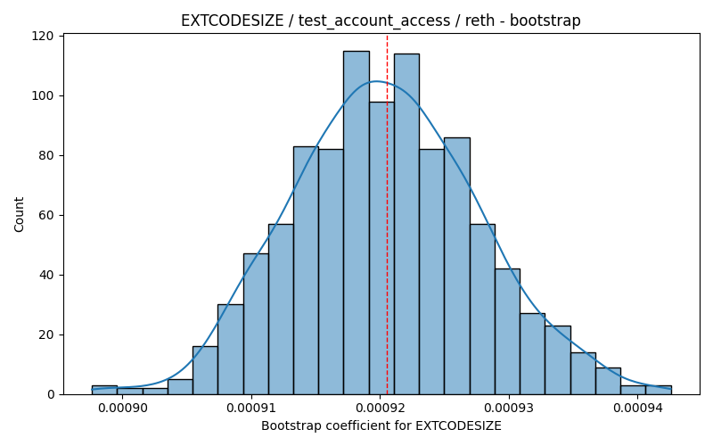

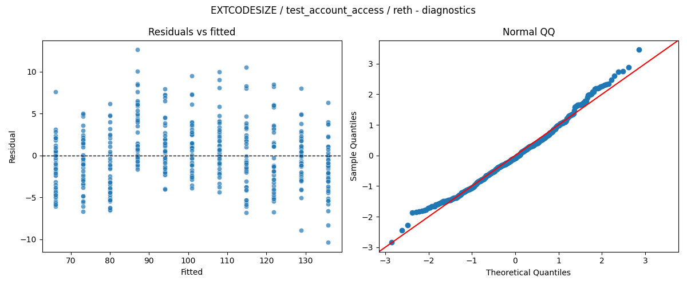

</details>

### test_account_access — combo `EXTCODESIZE_AccountMode.EXISTING_CONTRACT`

| client | nobs | R² | target_coef (ms) | p-value | 95% CI |
| --- | --- | --- | --- | --- | --- |
| `besu` | 341 | 0.9478 | 0.02644 | 1.00e-03 | [0.02576, 0.0272] |
| `erigon` | 176 | 0.8702 | 0.08653 | 1.00e-03 | [0.0815, 0.0911] |
| `nethermind` | 264 | 0.7062 | 0.02399 | 1.00e-03 | [0.02205, 0.02607] |
| `reth` | 451 | 0.8876 | 0.036 | 1.00e-03 | [0.03453, 0.03758] |

<details><summary>besu — NNLS regression summary</summary>

```
==============================================================================
                           NNLS Regression Results                            
==============================================================================
Dep. Variable:          test_runtime_ms              R-squared:          0.948
Model:                  NNLS                    Adj. R-squared:          0.948
No. Observations:       341                               RMSE:         129.10
Df Residuals:           339                                MAE:         109.89
Df Model:               1      
==============================================================================
                      coef     std err     P-value      [0.025      0.975]
------------------------------------------------------------------------------
         const    392.2275     26.4697       0.001    335.1296    440.1303
       opcount      0.0264      0.0004       0.001      0.0258      0.0272
==============================================================================
Notes: Non-negative least squares with bootstrap inference (1000 iterations)
==============================================================================
```

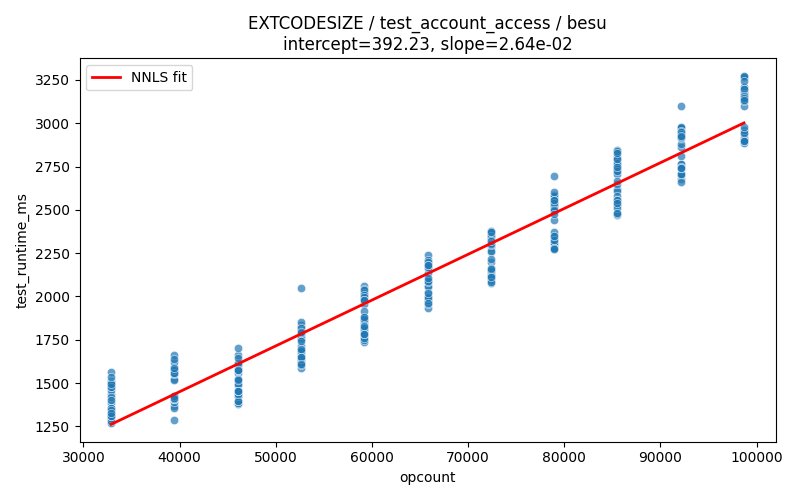

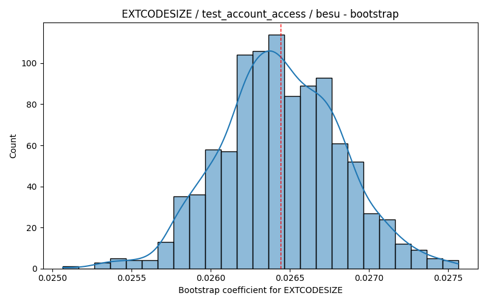

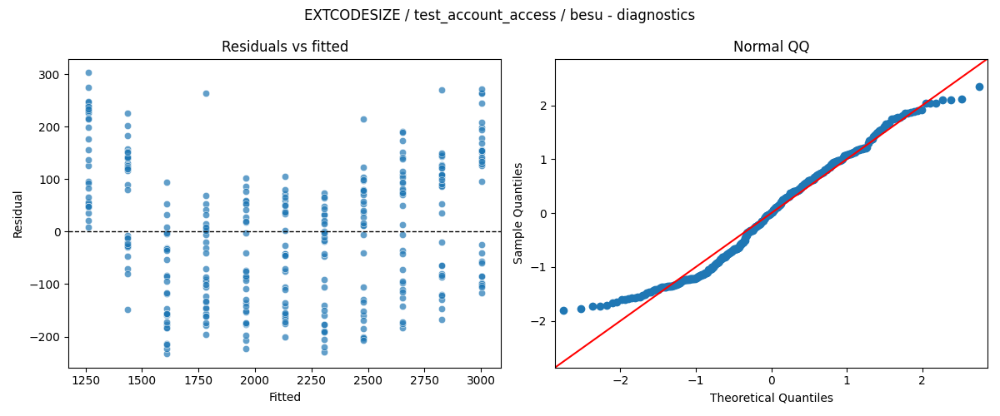

</details>

<details><summary>erigon — NNLS regression summary</summary>

```
==============================================================================
                           NNLS Regression Results                            
==============================================================================
Dep. Variable:          test_runtime_ms              R-squared:          0.870
Model:                  NNLS                    Adj. R-squared:          0.869
No. Observations:       176                               RMSE:         695.26
Df Residuals:           174                                MAE:         590.51
Df Model:               1      
==============================================================================
                      coef     std err     P-value      [0.025      0.975]
------------------------------------------------------------------------------
         const   1543.3664    187.3216       0.001   1210.7641   1925.5899
       opcount      0.0865      0.0025       0.001      0.0815      0.0911
==============================================================================
Notes: Non-negative least squares with bootstrap inference (1000 iterations)
==============================================================================
```

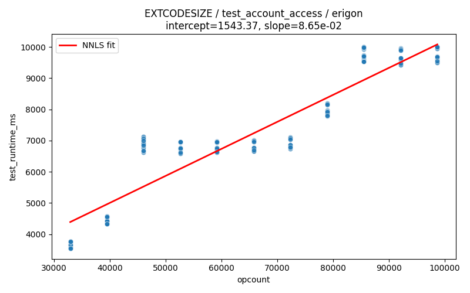

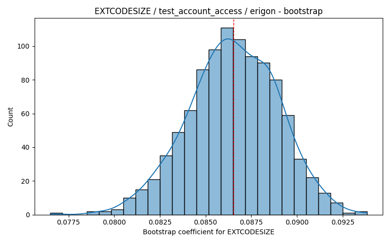

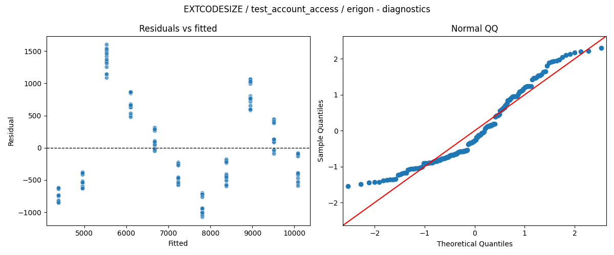

</details>

<details><summary>nethermind — NNLS regression summary</summary>

```
==============================================================================
                           NNLS Regression Results                            
==============================================================================
Dep. Variable:          test_runtime_ms              R-squared:          0.706
Model:                  NNLS                    Adj. R-squared:          0.705
No. Observations:       264                               RMSE:         321.93
Df Residuals:           262                                MAE:         270.38
Df Model:               1      
==============================================================================
                      coef     std err     P-value      [0.025      0.975]
------------------------------------------------------------------------------
         const    826.5338     71.5762       0.001    681.3911    963.9077
       opcount      0.0240      0.0010       0.001      0.0221      0.0261
==============================================================================
Notes: Non-negative least squares with bootstrap inference (1000 iterations)
==============================================================================
```

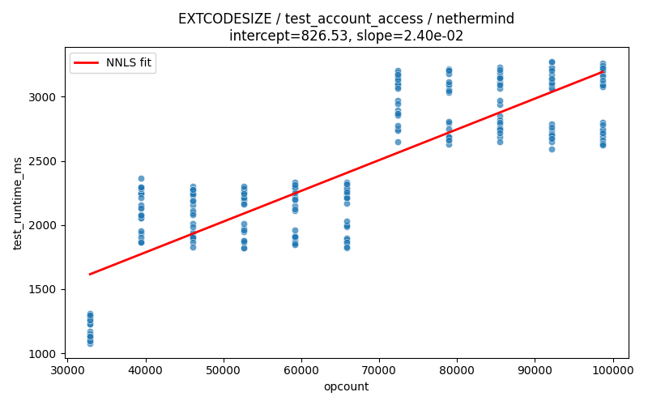

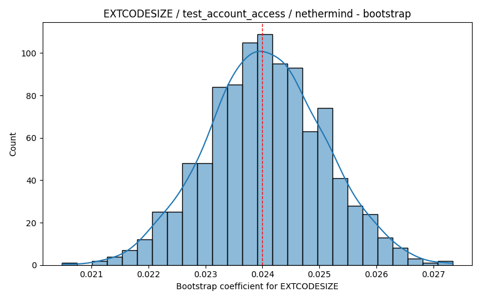

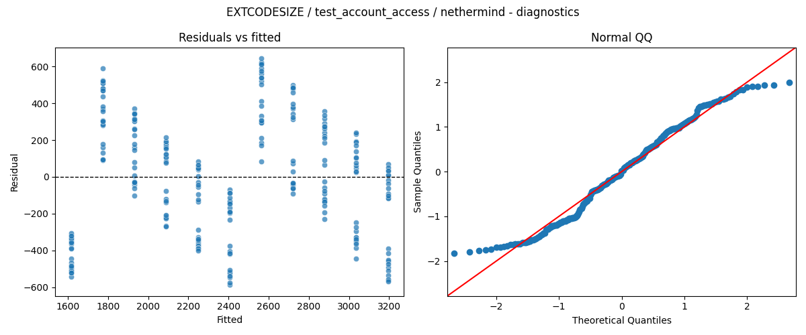

</details>

<details><summary>reth — NNLS regression summary</summary>

```
==============================================================================
                           NNLS Regression Results                            
==============================================================================
Dep. Variable:          test_runtime_ms              R-squared:          0.888
Model:                  NNLS                    Adj. R-squared:          0.887
No. Observations:       451                               RMSE:         266.49
Df Residuals:           449                                MAE:         149.91
Df Model:               1      
==============================================================================
                      coef     std err     P-value      [0.025      0.975]
------------------------------------------------------------------------------
         const    163.7120     48.8976       0.001     64.0027    258.0886
       opcount      0.0360      0.0008       0.001      0.0345      0.0376
==============================================================================
Notes: Non-negative least squares with bootstrap inference (1000 iterations)
==============================================================================
```

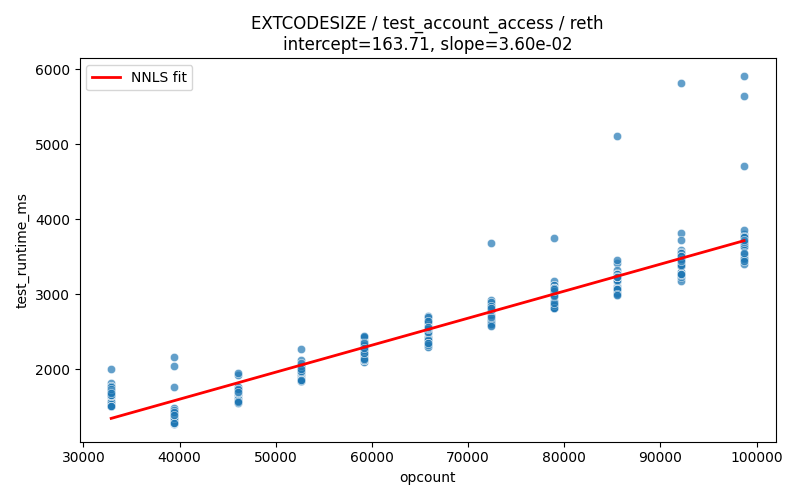

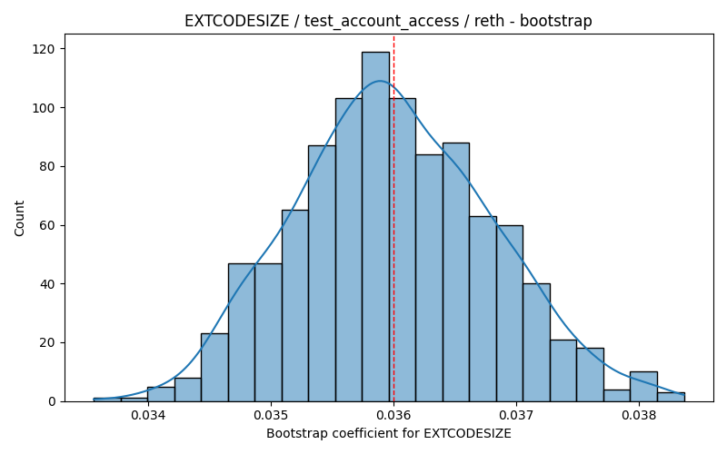

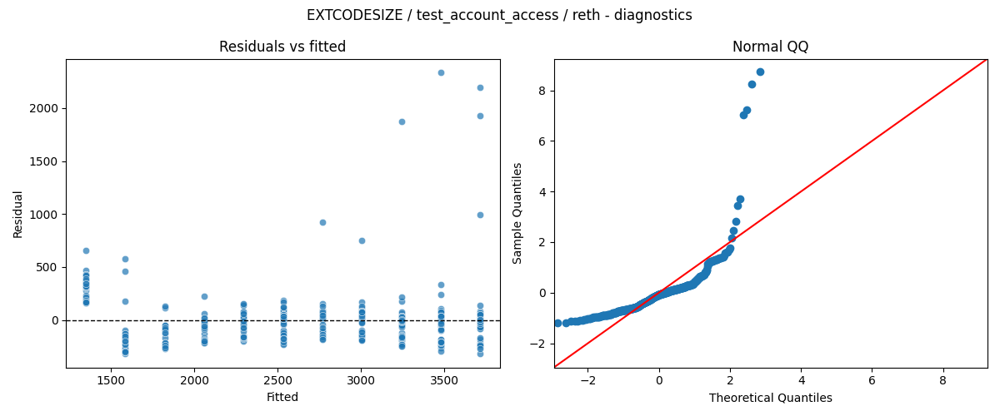

</details>

### test_account_access — combo `EXTCODESIZE_AccountMode.NON_EXISTING_ACCOUNT` — `presets[cold_account_code_access]`

| client | nobs | R² | target_coef (ms) | p-value | 95% CI |
| --- | --- | --- | --- | --- | --- |
| `besu` | 341 | 0.8942 | 0.009378 | 1.00e-03 | [0.009009, 0.009788] |
| `erigon` | 176 | 0.9956 | 0.008807 | 1.00e-03 | [0.008713, 0.008912] |
| `nethermind` | 264 | 0.9287 | 0.003839 | 1.00e-03 | [0.00372, 0.003964] |
| `reth` | 451 | 0.9732 | 0.0009205 | 1.00e-03 | [0.000907, 0.0009352] |

<details><summary>besu — NNLS regression summary</summary>

```
==============================================================================
                           NNLS Regression Results                            
==============================================================================
Dep. Variable:          test_runtime_ms              R-squared:          0.894
Model:                  NNLS                    Adj. R-squared:          0.894
No. Observations:       341                               RMSE:          77.08
Df Residuals:           339                                MAE:          64.31
Df Model:               1      
==============================================================================
                      coef     std err     P-value      [0.025      0.975]
------------------------------------------------------------------------------
         const    421.4238     16.9009       0.001    388.5258    453.9676
       opcount      0.0094      0.0002       0.001      0.0090      0.0098
==============================================================================
Notes: Non-negative least squares with bootstrap inference (1000 iterations)
==============================================================================
```


</details>

<details><summary>erigon — NNLS regression summary</summary>

```
==============================================================================
                           NNLS Regression Results                            
==============================================================================
Dep. Variable:          test_runtime_ms              R-squared:          0.996
Model:                  NNLS                    Adj. R-squared:          0.996
No. Observations:       176                               RMSE:          14.03
Df Residuals:           174                                MAE:          10.67
Df Model:               1      
==============================================================================
                      coef     std err     P-value      [0.025      0.975]
------------------------------------------------------------------------------
         const     14.0454      3.8113       0.001      6.1411     21.2543
       opcount      0.0088      0.0001       0.001      0.0087      0.0089
==============================================================================
Notes: Non-negative least squares with bootstrap inference (1000 iterations)
==============================================================================
```


</details>

<details><summary>nethermind — NNLS regression summary</summary>

```
==============================================================================
                           NNLS Regression Results                            
==============================================================================
Dep. Variable:          test_runtime_ms              R-squared:          0.929
Model:                  NNLS                    Adj. R-squared:          0.928
No. Observations:       264                               RMSE:          25.41
Df Residuals:           262                                MAE:          19.11
Df Model:               1      
==============================================================================
                      coef     std err     P-value      [0.025      0.975]
------------------------------------------------------------------------------
         const     83.8199      4.8168       0.001     74.6903     93.4173
       opcount      0.0038      0.0001       0.001      0.0037      0.0040
==============================================================================
Notes: Non-negative least squares with bootstrap inference (1000 iterations)
==============================================================================
```


</details>

<details><summary>reth — NNLS regression summary</summary>

```
==============================================================================
                           NNLS Regression Results                            
==============================================================================
Dep. Variable:          test_runtime_ms              R-squared:          0.973
Model:                  NNLS                    Adj. R-squared:          0.973
No. Observations:       451                               RMSE:           3.65
Df Residuals:           449                                MAE:           2.88
Df Model:               1      
==============================================================================
                      coef     std err     P-value      [0.025      0.975]
------------------------------------------------------------------------------
         const     31.3809      0.5699       0.001     30.3210     32.4473
       opcount      0.0009      0.0000       0.001      0.0009      0.0009
==============================================================================
Notes: Non-negative least squares with bootstrap inference (1000 iterations)
==============================================================================
```


</details>

### test_ext_account_query_warm — combo `EXTCODESIZE`

| client | nobs | R² | target_coef (ms) | p-value | 95% CI |
| --- | --- | --- | --- | --- | --- |
| `besu` | 341 | 0.7941 | 0.0001602 | 1.00e-03 | [0.0001511, 0.0001692] |
| `erigon` | 176 | 0.7456 | 3.901e-05 | 1.00e-03 | [3.549e-05, 4.235e-05] |
| `nethermind` | 264 | 0.8797 | 0.0002179 | 1.00e-03 | [0.0002084, 0.0002284] |
| `reth` | 451 | 0.7094 | 5.921e-06 | 1.00e-03 | [5.559e-06, 6.335e-06] |

<details><summary>besu — NNLS regression summary</summary>

```
==============================================================================
                           NNLS Regression Results                            
==============================================================================
Dep. Variable:          test_runtime_ms              R-squared:          0.794
Model:                  NNLS                    Adj. R-squared:          0.793
No. Observations:       341                               RMSE:          47.69
Df Residuals:           339                                MAE:          37.17
Df Model:               1      
==============================================================================
                      coef     std err     P-value      [0.025      0.975]
------------------------------------------------------------------------------
         const    193.5556      8.3841       0.001    175.9963    209.6788
       opcount      0.0002      0.0000       0.001      0.0002      0.0002
==============================================================================
Notes: Non-negative least squares with bootstrap inference (1000 iterations)
==============================================================================
```

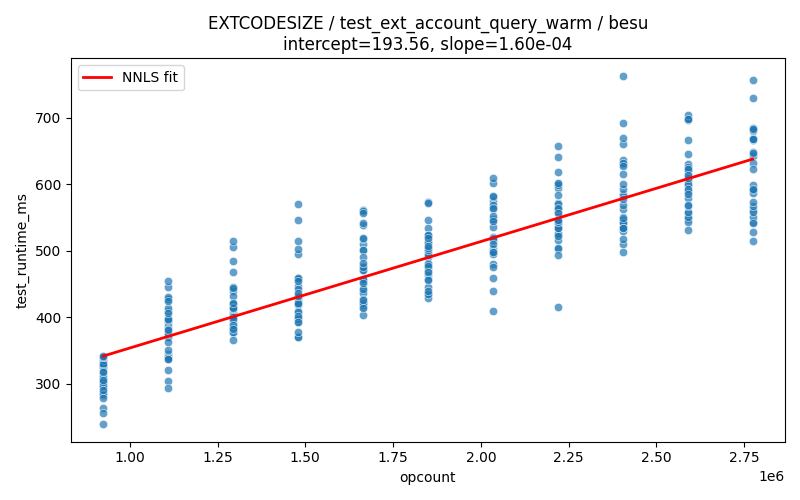

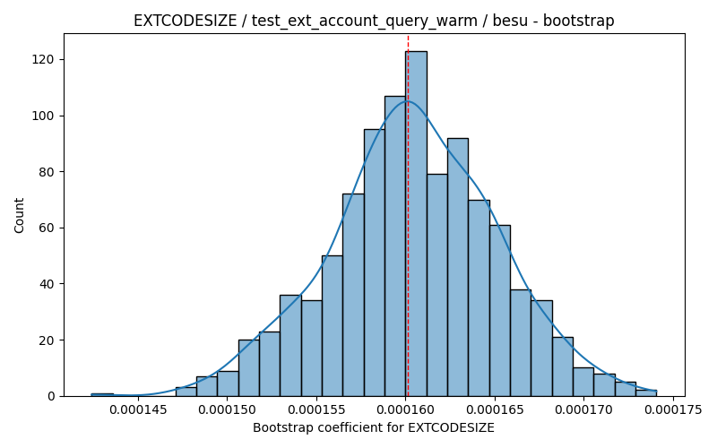

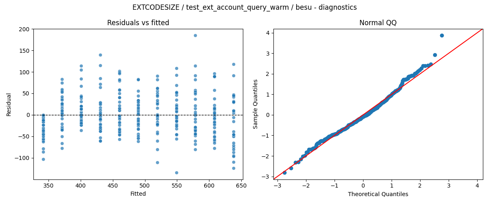

</details>

<details><summary>erigon — NNLS regression summary</summary>

```
==============================================================================
                           NNLS Regression Results                            
==============================================================================
Dep. Variable:          test_runtime_ms              R-squared:          0.746
Model:                  NNLS                    Adj. R-squared:          0.744
No. Observations:       176                               RMSE:          13.32
Df Residuals:           174                                MAE:          10.29
Df Model:               1      
==============================================================================
                      coef     std err     P-value      [0.025      0.975]
------------------------------------------------------------------------------
         const     49.4551      2.9290       0.001     44.0120     55.2585
       opcount      0.0000      0.0000       0.001      0.0000      0.0000
==============================================================================
Notes: Non-negative least squares with bootstrap inference (1000 iterations)
==============================================================================
```

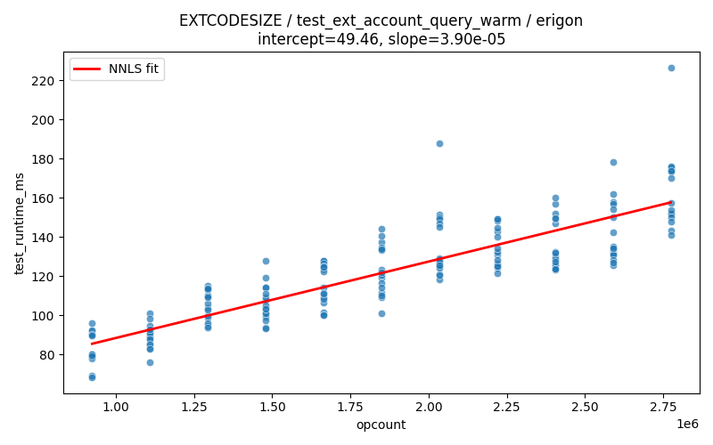

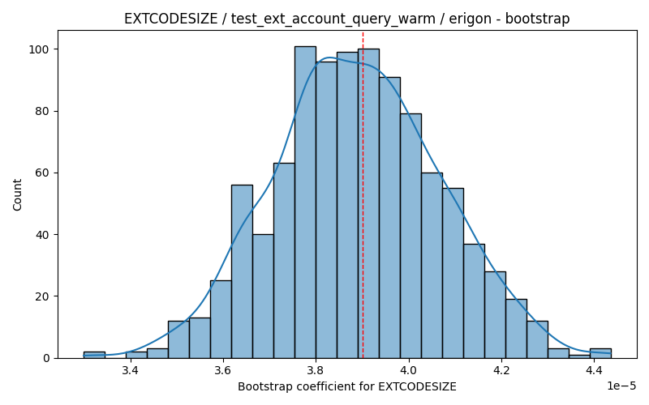

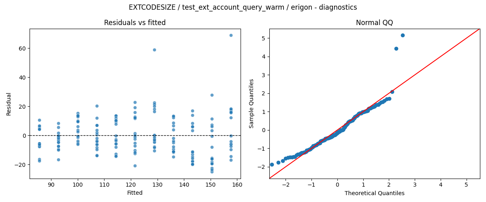

</details>

<details><summary>nethermind — NNLS regression summary</summary>

```
==============================================================================
                           NNLS Regression Results                            
==============================================================================
Dep. Variable:          test_runtime_ms              R-squared:          0.880
Model:                  NNLS                    Adj. R-squared:          0.879
No. Observations:       264                               RMSE:          47.13
Df Residuals:           262                                MAE:          34.95
Df Model:               1      
==============================================================================
                      coef     std err     P-value      [0.025      0.975]
------------------------------------------------------------------------------
         const     97.7217      8.2561       0.001     80.7046    112.9916
       opcount      0.0002      0.0000       0.001      0.0002      0.0002
==============================================================================
Notes: Non-negative least squares with bootstrap inference (1000 iterations)
==============================================================================
```

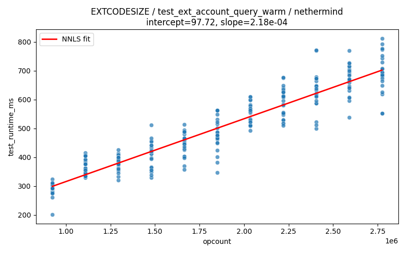

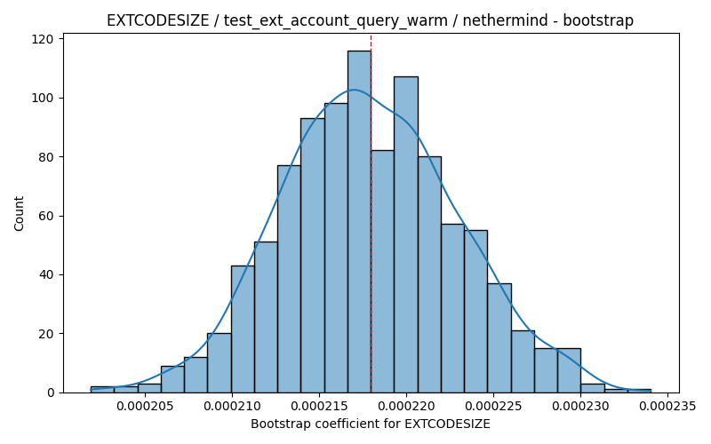

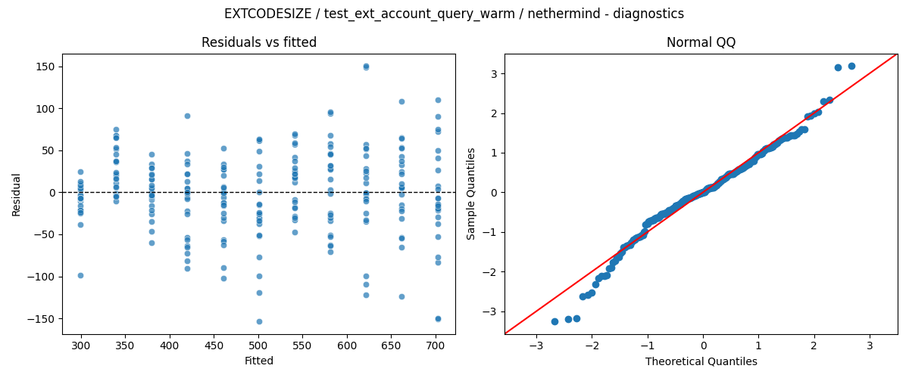

</details>

<details><summary>reth — NNLS regression summary</summary>

```
==============================================================================
                           NNLS Regression Results                            
==============================================================================
Dep. Variable:          test_runtime_ms              R-squared:          0.709
Model:                  NNLS                    Adj. R-squared:          0.709
No. Observations:       451                               RMSE:           2.22
Df Residuals:           449                                MAE:           1.53
Df Model:               1      
==============================================================================
                      coef     std err     P-value      [0.025      0.975]
------------------------------------------------------------------------------
         const      4.6724      0.3361       0.001      3.9873      5.3065
       opcount      0.0000      0.0000       0.001      0.0000      0.0000
==============================================================================
Notes: Non-negative least squares with bootstrap inference (1000 iterations)
==============================================================================
```

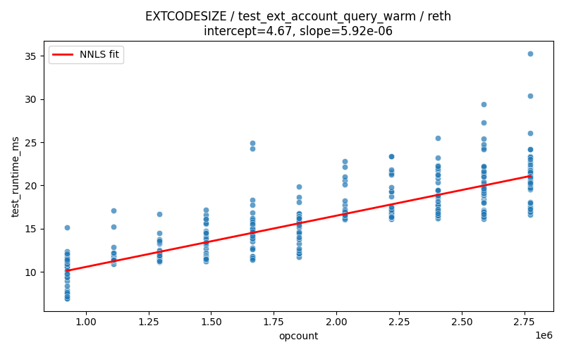

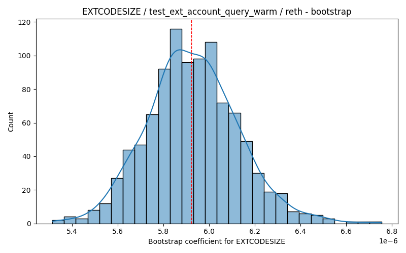

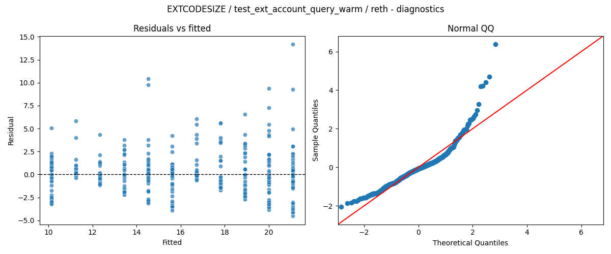

</details>

## STATICCALL

### test_account_access — combo `STATICCALL_AccountMode.EXISTING_EOA`

| client | nobs | R² | target_coef (ms) | p-value | 95% CI |
| --- | --- | --- | --- | --- | --- |
| `besu` | 341 | 0.8565 | 0.01074 | 1.00e-03 | [0.01022, 0.01128] |
| `erigon` | 176 | 0.9958 | 0.01032 | 1.00e-03 | [0.01022, 0.01041] |
| `nethermind` | 264 | 0.9319 | 0.004671 | 1.00e-03 | [0.004522, 0.004796] |
| `reth` | 451 | 0.9718 | 0.001123 | 1.00e-03 | [0.001103, 0.001143] |

<details><summary>besu — NNLS regression summary</summary>

```
==============================================================================
                           NNLS Regression Results                            
==============================================================================
Dep. Variable:          test_runtime_ms              R-squared:          0.856
Model:                  NNLS                    Adj. R-squared:          0.856
No. Observations:       341                               RMSE:         104.53
Df Residuals:           339                                MAE:          86.79
Df Model:               1      
==============================================================================
                      coef     std err     P-value      [0.025      0.975]
------------------------------------------------------------------------------
         const    591.6264     22.8709       0.001    546.8610    635.7984
       opcount      0.0107      0.0003       0.001      0.0102      0.0113
==============================================================================
Notes: Non-negative least squares with bootstrap inference (1000 iterations)
==============================================================================
```

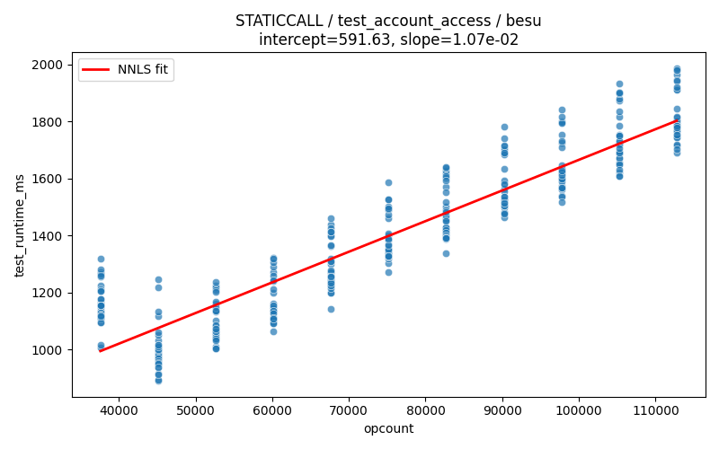

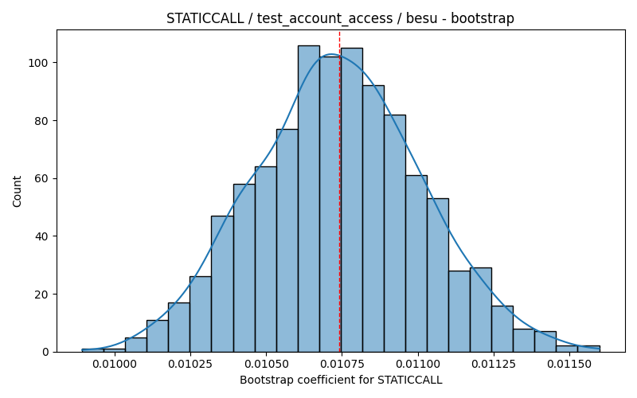

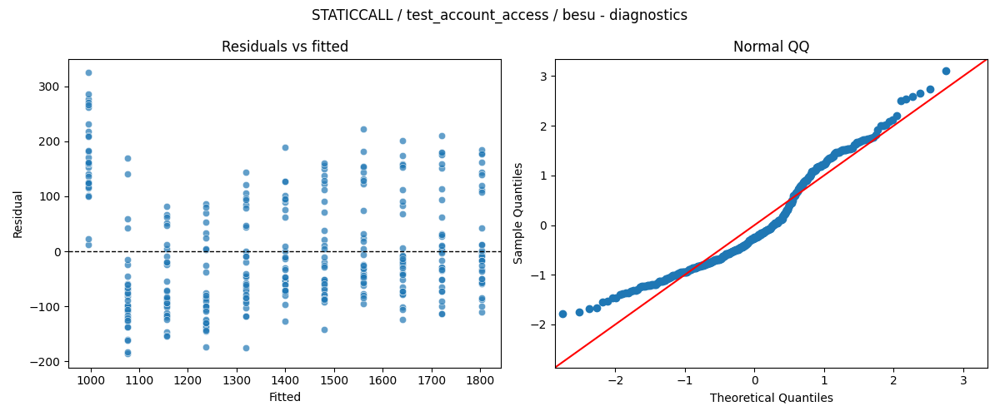

</details>

<details><summary>erigon — NNLS regression summary</summary>

```
==============================================================================
                           NNLS Regression Results                            
==============================================================================
Dep. Variable:          test_runtime_ms              R-squared:          0.996
Model:                  NNLS                    Adj. R-squared:          0.996
No. Observations:       176                               RMSE:          16.02
Df Residuals:           174                                MAE:          13.31
Df Model:               1      
==============================================================================
                      coef     std err     P-value      [0.025      0.975]
------------------------------------------------------------------------------
         const     43.5811      3.6627       0.001     36.4884     50.7723
       opcount      0.0103      0.0001       0.001      0.0102      0.0104
==============================================================================
Notes: Non-negative least squares with bootstrap inference (1000 iterations)
==============================================================================
```

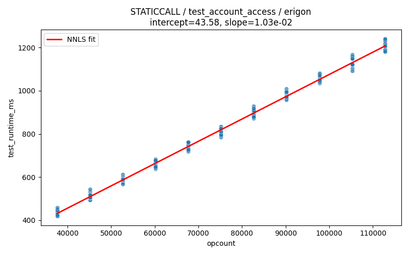

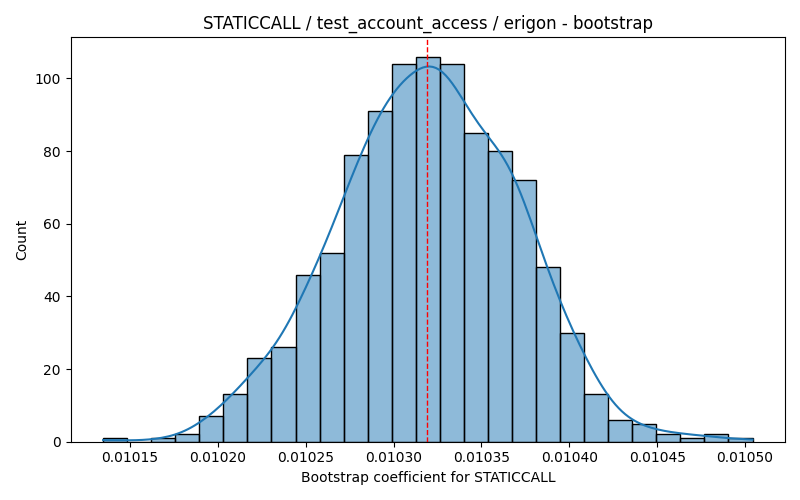

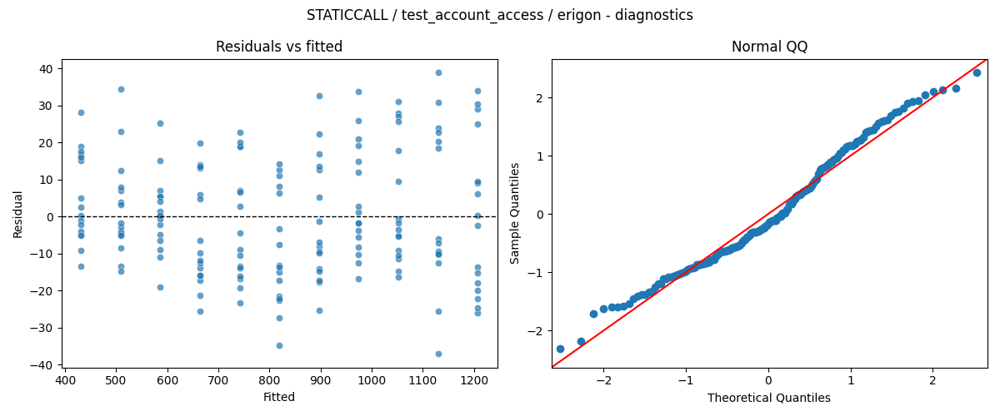

</details>

<details><summary>nethermind — NNLS regression summary</summary>

```
==============================================================================
                           NNLS Regression Results                            
==============================================================================
Dep. Variable:          test_runtime_ms              R-squared:          0.932
Model:                  NNLS                    Adj. R-squared:          0.932
No. Observations:       264                               RMSE:          30.02
Df Residuals:           262                                MAE:          22.07
Df Model:               1      
==============================================================================
                      coef     std err     P-value      [0.025      0.975]
------------------------------------------------------------------------------
         const    100.5149      5.3508       0.001     90.5746    111.5031
       opcount      0.0047      0.0001       0.001      0.0045      0.0048
==============================================================================
Notes: Non-negative least squares with bootstrap inference (1000 iterations)
==============================================================================
```

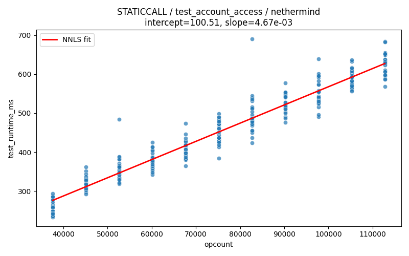

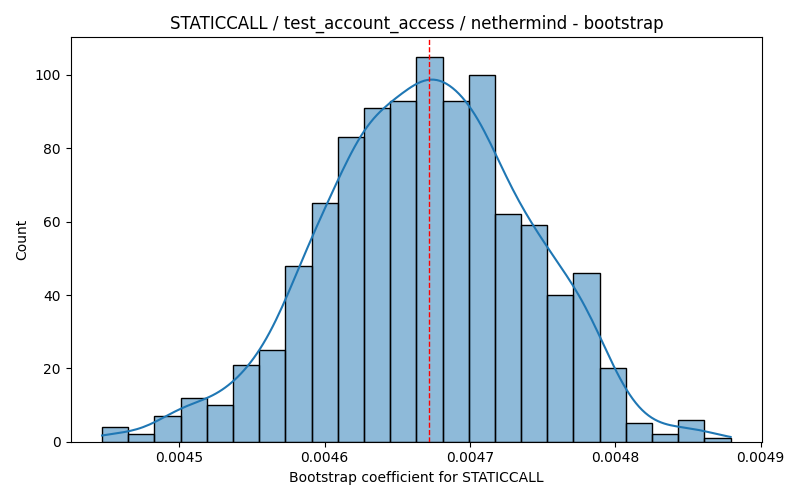

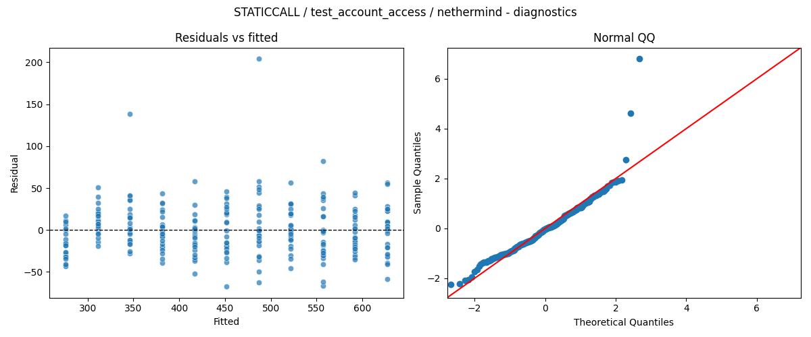

</details>

<details><summary>reth — NNLS regression summary</summary>

```
==============================================================================
                           NNLS Regression Results                            
==============================================================================
Dep. Variable:          test_runtime_ms              R-squared:          0.972
Model:                  NNLS                    Adj. R-squared:          0.972
No. Observations:       451                               RMSE:           4.55
Df Residuals:           449                                MAE:           3.43
Df Model:               1      
==============================================================================
                      coef     std err     P-value      [0.025      0.975]
------------------------------------------------------------------------------
         const     33.0917      0.8499       0.001     31.4829     34.7561
       opcount      0.0011      0.0000       0.001      0.0011      0.0011
==============================================================================
Notes: Non-negative least squares with bootstrap inference (1000 iterations)
==============================================================================
```

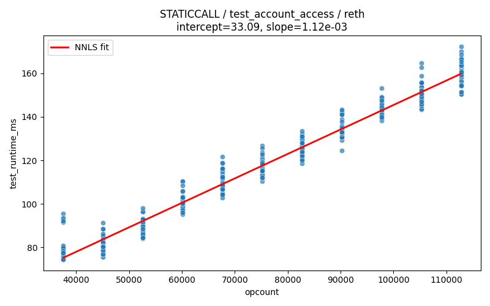

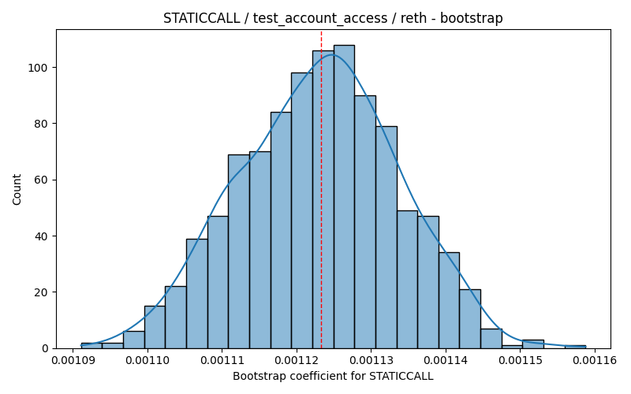

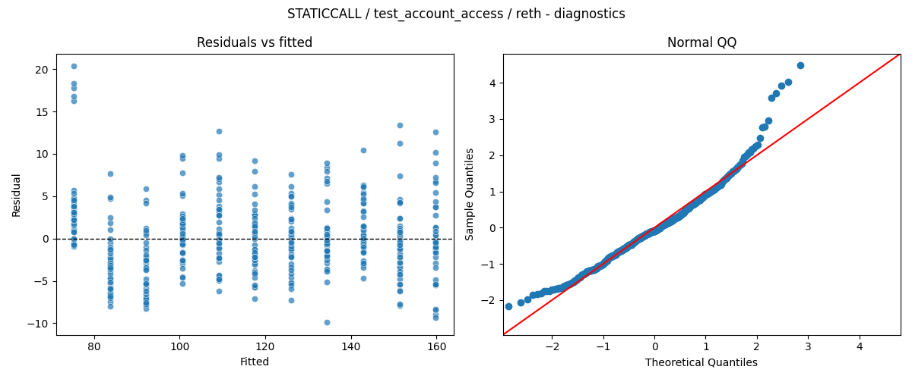

</details>

### test_account_access — combo `STATICCALL_AccountMode.NON_EXISTING_ACCOUNT` — `presets[cold_account_nocode_access]`

| client | nobs | R² | target_coef (ms) | p-value | 95% CI |
| --- | --- | --- | --- | --- | --- |
| `besu` | 341 | 0.9069 | 0.01169 | 1.00e-03 | [0.01124, 0.01217] |
| `erigon` | 176 | 0.9952 | 0.01187 | 1.00e-03 | [0.01174, 0.01193] |
| `nethermind` | 264 | 0.9301 | 0.004666 | 1.00e-03 | [0.004507, 0.004834] |
| `reth` | 451 | 0.9729 | 0.0009757 | 1.00e-03 | [0.0009604, 0.0009907] |

<details><summary>besu — NNLS regression summary</summary>

```
==============================================================================
                           NNLS Regression Results                            
==============================================================================
Dep. Variable:          test_runtime_ms              R-squared:          0.907
Model:                  NNLS                    Adj. R-squared:          0.907
No. Observations:       341                               RMSE:          89.08
Df Residuals:           339                                MAE:          74.87
Df Model:               1      
==============================================================================
                      coef     std err     P-value      [0.025      0.975]
------------------------------------------------------------------------------
         const    492.3401     17.8602       0.001    457.1925    526.1072
       opcount      0.0117      0.0002       0.001      0.0112      0.0122
==============================================================================
Notes: Non-negative least squares with bootstrap inference (1000 iterations)
==============================================================================
```

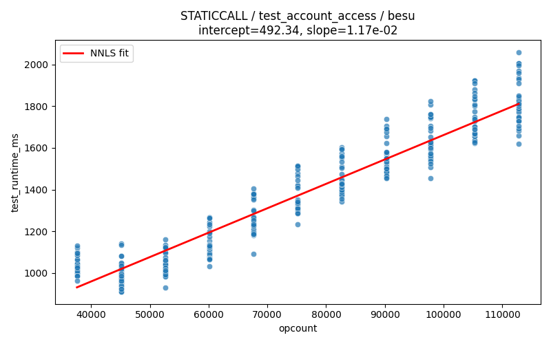

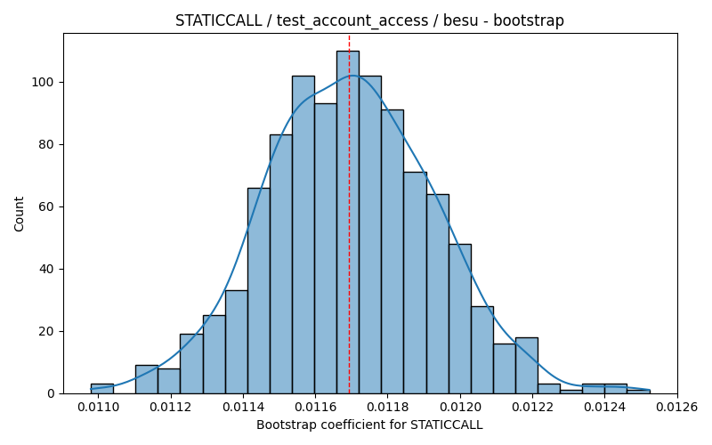

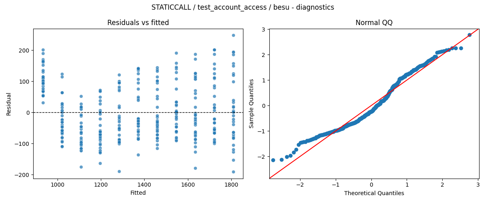

</details>

<details><summary>erigon — NNLS regression summary</summary>

```
==============================================================================
                           NNLS Regression Results                            
==============================================================================
Dep. Variable:          test_runtime_ms              R-squared:          0.995
Model:                  NNLS                    Adj. R-squared:          0.995
No. Observations:       176                               RMSE:          19.55
Df Residuals:           174                                MAE:          15.33
Df Model:               1      
==============================================================================
                      coef     std err     P-value      [0.025      0.975]
------------------------------------------------------------------------------
         const      2.6443      3.4740       0.293      0.0000     11.8270
       opcount      0.0119      0.0001       0.001      0.0117      0.0119
==============================================================================
Notes: Non-negative least squares with bootstrap inference (1000 iterations)
==============================================================================
```

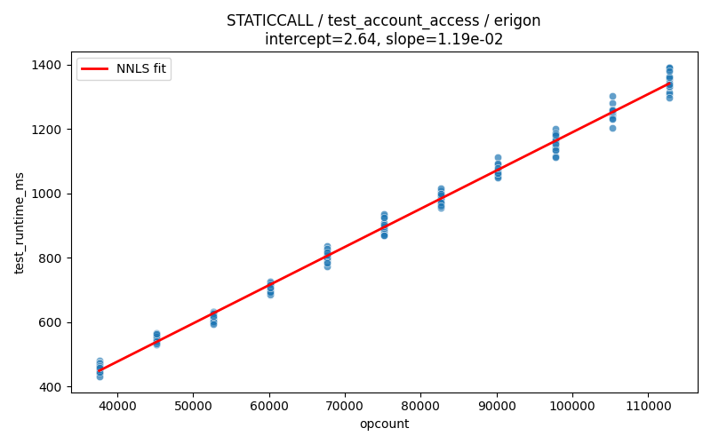

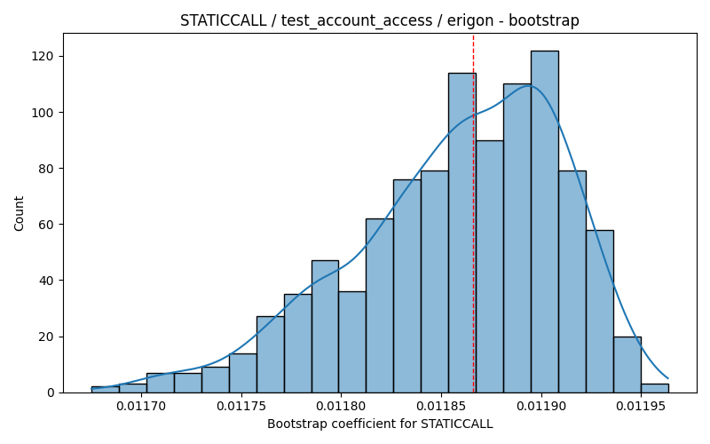

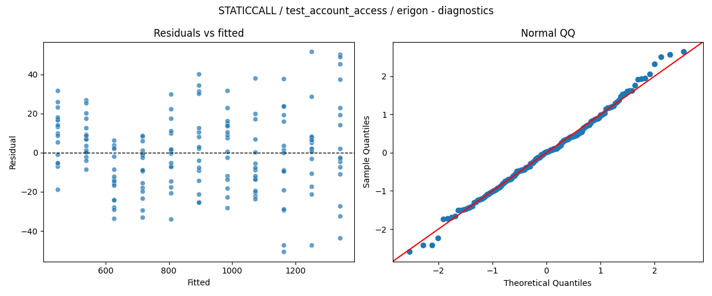

</details>

<details><summary>nethermind — NNLS regression summary</summary>

```
==============================================================================
                           NNLS Regression Results                            
==============================================================================
Dep. Variable:          test_runtime_ms              R-squared:          0.930
Model:                  NNLS                    Adj. R-squared:          0.930
No. Observations:       264                               RMSE:          30.41
Df Residuals:           262                                MAE:          23.76
Df Model:               1      
==============================================================================
                      coef     std err     P-value      [0.025      0.975]
------------------------------------------------------------------------------
         const    113.8402      6.3818       0.001    101.8572    126.6158
       opcount      0.0047      0.0001       0.001      0.0045      0.0048
==============================================================================
Notes: Non-negative least squares with bootstrap inference (1000 iterations)
==============================================================================
```


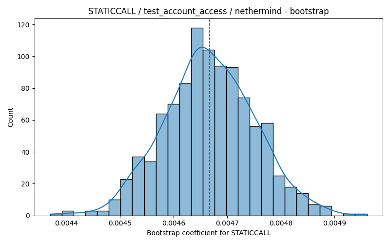

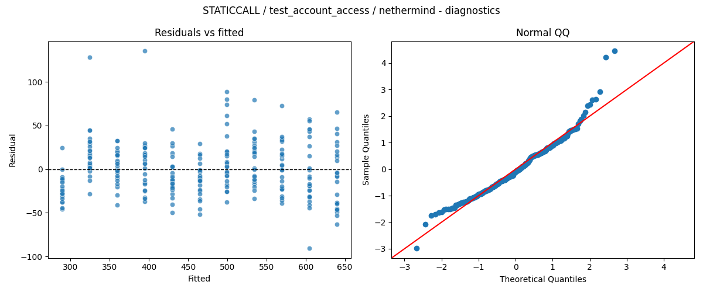

</details>

<details><summary>reth — NNLS regression summary</summary>

```
==============================================================================
                           NNLS Regression Results                            
==============================================================================
Dep. Variable:          test_runtime_ms              R-squared:          0.973
Model:                  NNLS                    Adj. R-squared:          0.973
No. Observations:       451                               RMSE:           3.87
Df Residuals:           449                                MAE:           2.96
Df Model:               1      
==============================================================================
                      coef     std err     P-value      [0.025      0.975]
------------------------------------------------------------------------------
         const     31.5596      0.6130       0.001     30.3823     32.8143
       opcount      0.0010      0.0000       0.001      0.0010      0.0010
==============================================================================
Notes: Non-negative least squares with bootstrap inference (1000 iterations)
==============================================================================
```

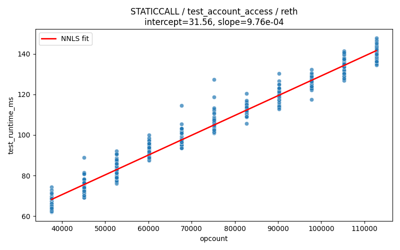

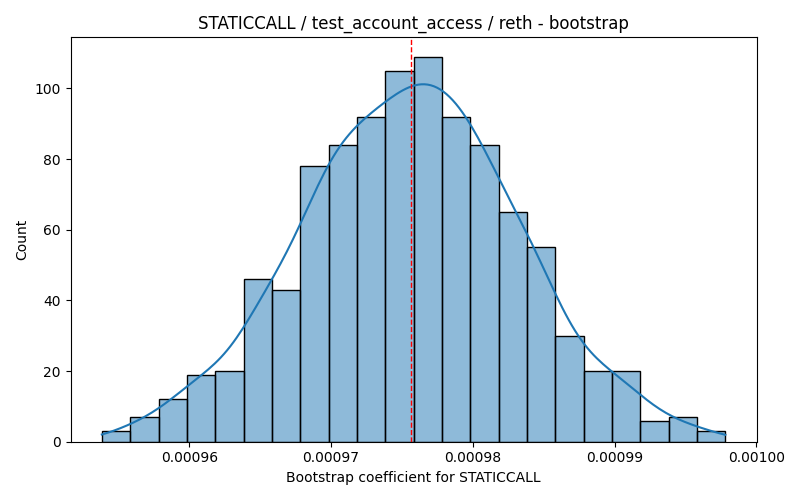

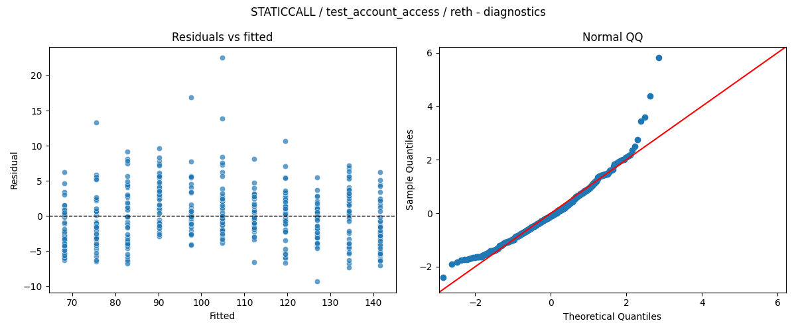

</details>

### test_account_access — combo `STATICCALL_AccountMode.EXISTING_CONTRACT`

| client | nobs | R² | target_coef (ms) | p-value | 95% CI |
| --- | --- | --- | --- | --- | --- |
| `besu` | 341 | 0.949 | 0.02949 | 1.00e-03 | [0.02862, 0.03026] |
| `erigon` | 176 | 0.87 | 0.08818 | 1.00e-03 | [0.0831, 0.09296] |
| `nethermind` | 264 | 0.7076 | 0.0249 | 1.00e-03 | [0.02288, 0.02683] |
| `reth` | 451 | 0.8918 | 0.03499 | 1.00e-03 | [0.03402, 0.03599] |

<details><summary>besu — NNLS regression summary</summary>

```
==============================================================================
                           NNLS Regression Results                            
==============================================================================
Dep. Variable:          test_runtime_ms              R-squared:          0.949
Model:                  NNLS                    Adj. R-squared:          0.949
No. Observations:       341                               RMSE:         139.22
Df Residuals:           339                                MAE:         114.86
Df Model:               1      
==============================================================================
                      coef     std err     P-value      [0.025      0.975]
------------------------------------------------------------------------------
         const    364.2603     27.3411       0.001    313.4155    419.6945
       opcount      0.0295      0.0004       0.001      0.0286      0.0303
==============================================================================
Notes: Non-negative least squares with bootstrap inference (1000 iterations)
==============================================================================
```

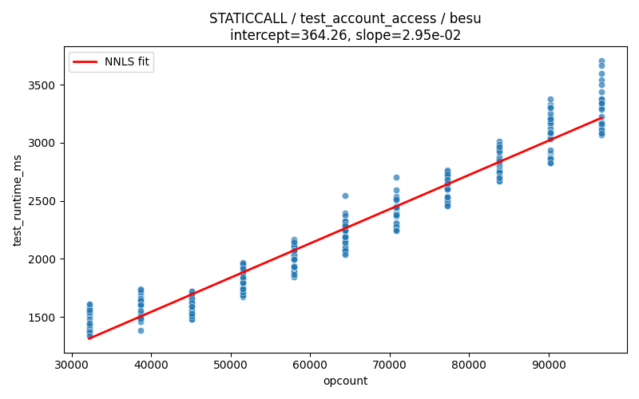

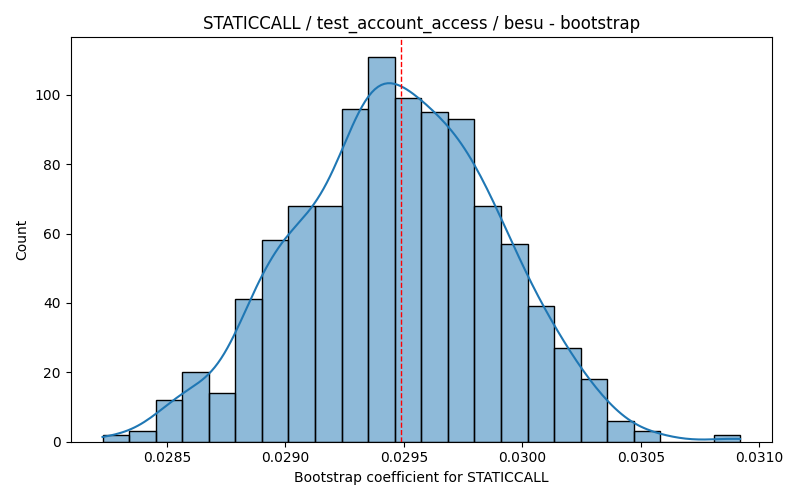

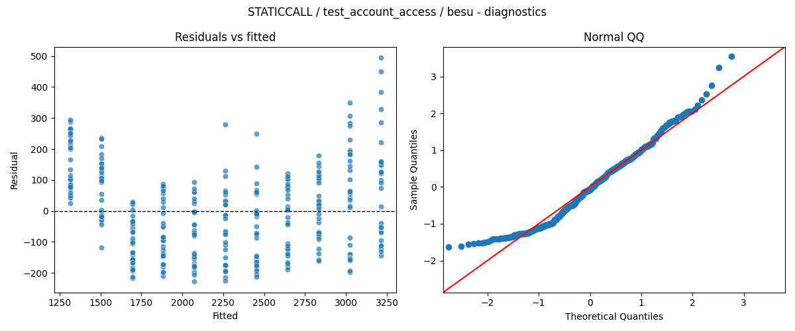

</details>

<details><summary>erigon — NNLS regression summary</summary>

```
==============================================================================
                           NNLS Regression Results                            
==============================================================================
Dep. Variable:          test_runtime_ms              R-squared:          0.870
Model:                  NNLS                    Adj. R-squared:          0.869
No. Observations:       176                               RMSE:         694.40
Df Residuals:           174                                MAE:         589.19
Df Model:               1      
==============================================================================
                      coef     std err     P-value      [0.025      0.975]
------------------------------------------------------------------------------
         const   1498.1431    182.4993       0.001   1161.4284   1871.6226
       opcount      0.0882      0.0025       0.001      0.0831      0.0930
==============================================================================
Notes: Non-negative least squares with bootstrap inference (1000 iterations)
==============================================================================
```

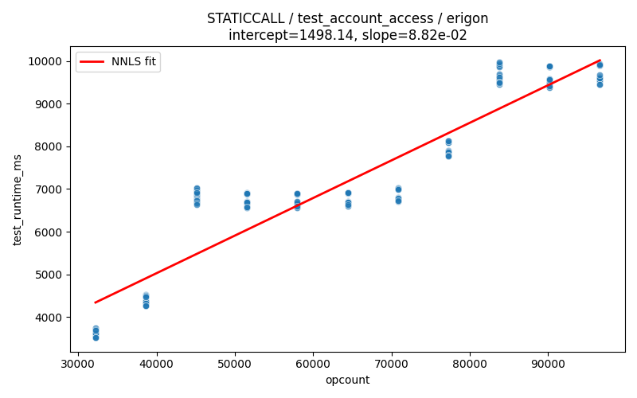

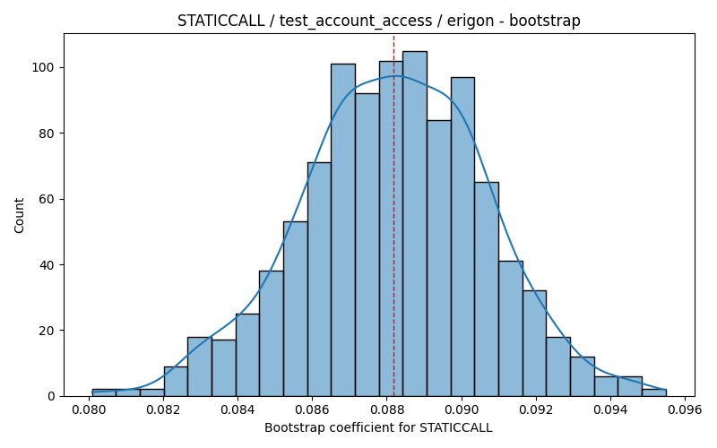

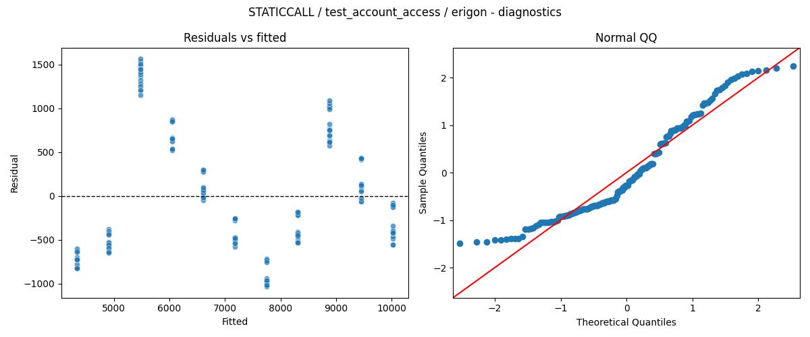

</details>

<details><summary>nethermind — NNLS regression summary</summary>

```
==============================================================================
                           NNLS Regression Results                            
==============================================================================
Dep. Variable:          test_runtime_ms              R-squared:          0.708
Model:                  NNLS                    Adj. R-squared:          0.706
No. Observations:       264                               RMSE:         326.07
Df Residuals:           262                                MAE:         273.42
Df Model:               1      
==============================================================================
                      coef     std err     P-value      [0.025      0.975]
------------------------------------------------------------------------------
         const    880.5158     70.8474       0.001    745.5850   1019.2753
       opcount      0.0249      0.0010       0.001      0.0229      0.0268
==============================================================================
Notes: Non-negative least squares with bootstrap inference (1000 iterations)
==============================================================================
```

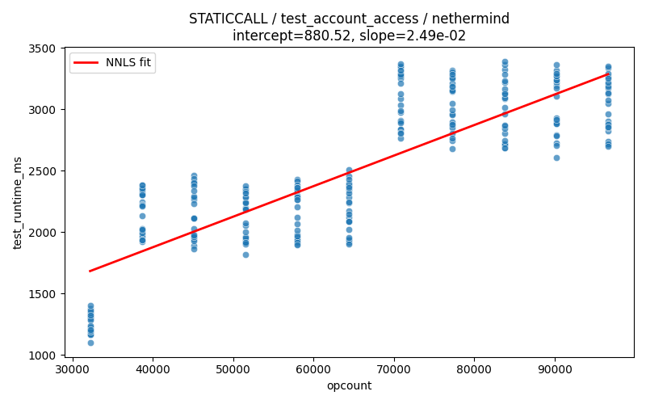

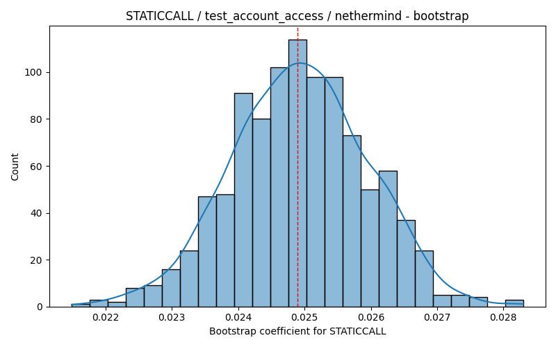

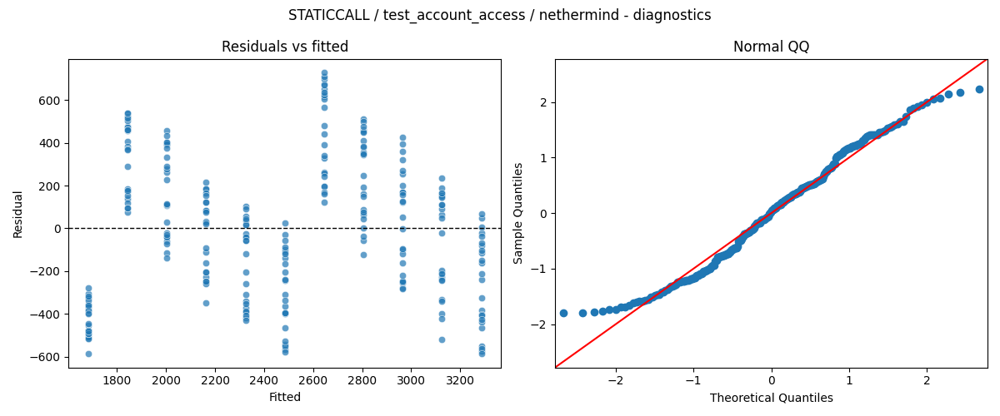

</details>

<details><summary>reth — NNLS regression summary</summary>

```
==============================================================================
                           NNLS Regression Results                            
==============================================================================
Dep. Variable:          test_runtime_ms              R-squared:          0.892
Model:                  NNLS                    Adj. R-squared:          0.892
No. Observations:       451                               RMSE:         248.36
Df Residuals:           449                                MAE:         148.53
Df Model:               1      
==============================================================================
                      coef     std err     P-value      [0.025      0.975]
------------------------------------------------------------------------------
         const    232.5610     38.0690       0.001    160.6845    306.8388
       opcount      0.0350      0.0005       0.001      0.0340      0.0360
==============================================================================
Notes: Non-negative least squares with bootstrap inference (1000 iterations)
==============================================================================
```

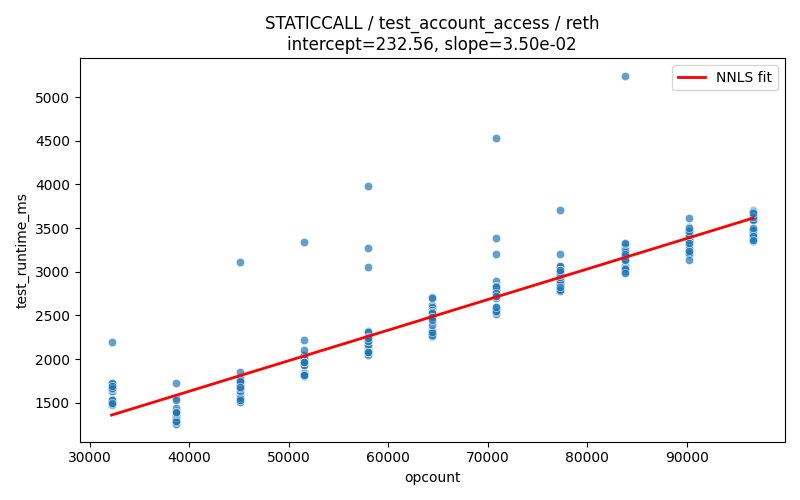

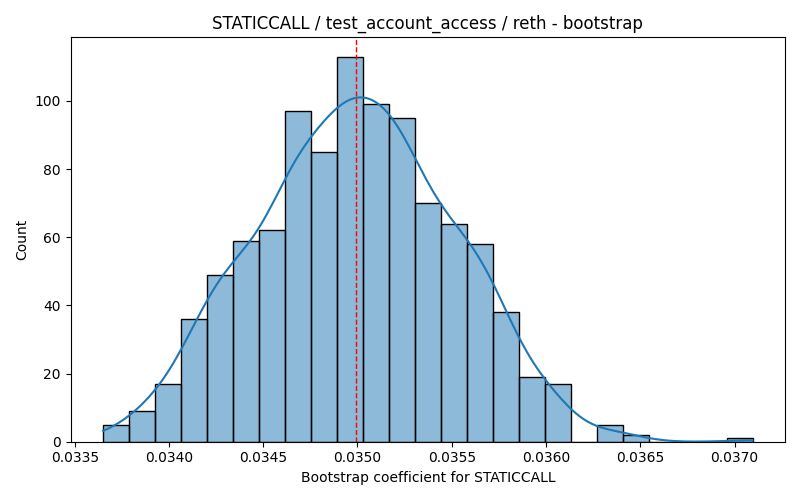

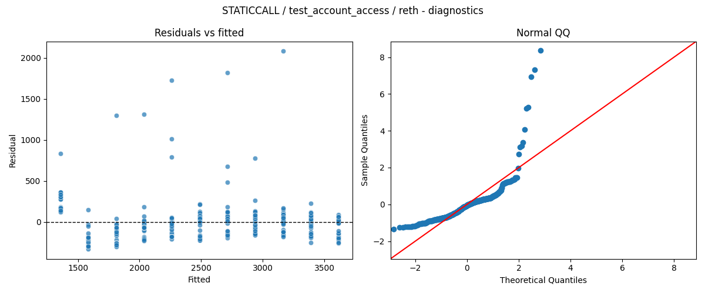

</details>

### test_account_access — combo `STATICCALL_AccountMode.NON_EXISTING_ACCOUNT` — `presets[cold_account_code_access]`

| client | nobs | R² | target_coef (ms) | p-value | 95% CI |
| --- | --- | --- | --- | --- | --- |
| `besu` | 341 | 0.9069 | 0.01169 | 1.00e-03 | [0.01124, 0.01217] |
| `erigon` | 176 | 0.9952 | 0.01187 | 1.00e-03 | [0.01174, 0.01193] |
| `nethermind` | 264 | 0.9301 | 0.004666 | 1.00e-03 | [0.004507, 0.004834] |
| `reth` | 451 | 0.9729 | 0.0009757 | 1.00e-03 | [0.0009604, 0.0009907] |

<details><summary>besu — NNLS regression summary</summary>

```
==============================================================================
                           NNLS Regression Results                            
==============================================================================
Dep. Variable:          test_runtime_ms              R-squared:          0.907
Model:                  NNLS                    Adj. R-squared:          0.907
No. Observations:       341                               RMSE:          89.08
Df Residuals:           339                                MAE:          74.87
Df Model:               1      
==============================================================================
                      coef     std err     P-value      [0.025      0.975]
------------------------------------------------------------------------------
         const    492.3401     17.8602       0.001    457.1925    526.1072
       opcount      0.0117      0.0002       0.001      0.0112      0.0122
==============================================================================
Notes: Non-negative least squares with bootstrap inference (1000 iterations)
==============================================================================
```


</details>

<details><summary>erigon — NNLS regression summary</summary>

```
==============================================================================
                           NNLS Regression Results                            
==============================================================================
Dep. Variable:          test_runtime_ms              R-squared:          0.995
Model:                  NNLS                    Adj. R-squared:          0.995
No. Observations:       176                               RMSE:          19.55
Df Residuals:           174                                MAE:          15.33
Df Model:               1      
==============================================================================
                      coef     std err     P-value      [0.025      0.975]
------------------------------------------------------------------------------
         const      2.6443      3.4740       0.293      0.0000     11.8270
       opcount      0.0119      0.0001       0.001      0.0117      0.0119
==============================================================================
Notes: Non-negative least squares with bootstrap inference (1000 iterations)
==============================================================================
```


</details>

<details><summary>nethermind — NNLS regression summary</summary>

```
==============================================================================
                           NNLS Regression Results                            
==============================================================================
Dep. Variable:          test_runtime_ms              R-squared:          0.930
Model:                  NNLS                    Adj. R-squared:          0.930
No. Observations:       264                               RMSE:          30.41
Df Residuals:           262                                MAE:          23.76
Df Model:               1      
==============================================================================
                      coef     std err     P-value      [0.025      0.975]
------------------------------------------------------------------------------
         const    113.8402      6.3818       0.001    101.8572    126.6158
       opcount      0.0047      0.0001       0.001      0.0045      0.0048
==============================================================================
Notes: Non-negative least squares with bootstrap inference (1000 iterations)
==============================================================================
```


</details>

<details><summary>reth — NNLS regression summary</summary>

```
==============================================================================
                           NNLS Regression Results                            
==============================================================================
Dep. Variable:          test_runtime_ms              R-squared:          0.973
Model:                  NNLS                    Adj. R-squared:          0.973
No. Observations:       451                               RMSE:           3.87
Df Residuals:           449                                MAE:           2.96
Df Model:               1      
==============================================================================
                      coef     std err     P-value      [0.025      0.975]
------------------------------------------------------------------------------
         const     31.5596      0.6130       0.001     30.3823     32.8143
       opcount      0.0010      0.0000       0.001      0.0010      0.0010
==============================================================================
Notes: Non-negative least squares with bootstrap inference (1000 iterations)
==============================================================================
```


</details>

### test_ext_account_query_warm — combo `STATICCALL`

| client | nobs | R² | target_coef (ms) | p-value | 95% CI |
| --- | --- | --- | --- | --- | --- |
| `besu` | 341 | 0.5945 | 0.001193 | 1.00e-03 | [0.001088, 0.00129] |
| `erigon` | 176 | 0.9056 | 0.0005034 | 1.00e-03 | [0.000477, 0.0005288] |
| `nethermind` | 264 | 0.8321 | 0.0007278 | 1.00e-03 | [0.000687, 0.0007688] |
| `reth` | 451 | 0.9174 | 4.689e-05 | 1.00e-03 | [4.556e-05, 4.831e-05] |

<details><summary>besu — NNLS regression summary</summary>

```
==============================================================================
                           NNLS Regression Results                            
==============================================================================
Dep. Variable:          test_runtime_ms              R-squared:          0.595
Model:                  NNLS                    Adj. R-squared:          0.593
No. Observations:       341                               RMSE:         509.98
Df Residuals:           339                                MAE:         355.18
Df Model:               1      
==============================================================================
                      coef     std err     P-value      [0.025      0.975]
------------------------------------------------------------------------------
         const    730.0319     78.3106       0.001    581.3268    889.1052
       opcount      0.0012      0.0001       0.001      0.0011      0.0013
==============================================================================
Notes: Non-negative least squares with bootstrap inference (1000 iterations)
==============================================================================
```

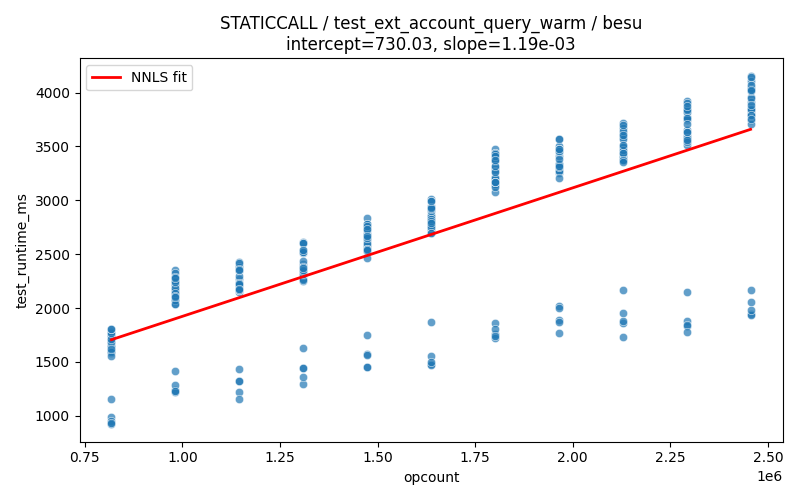

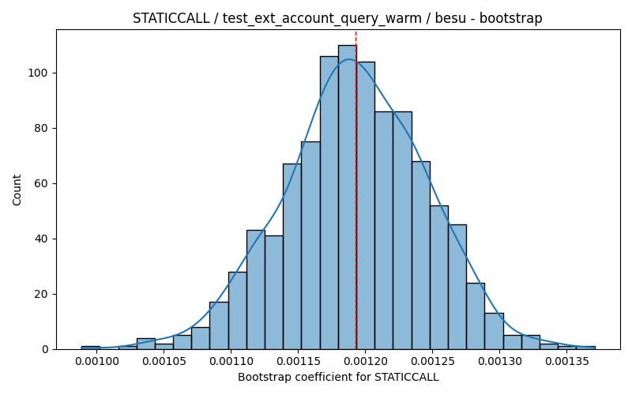

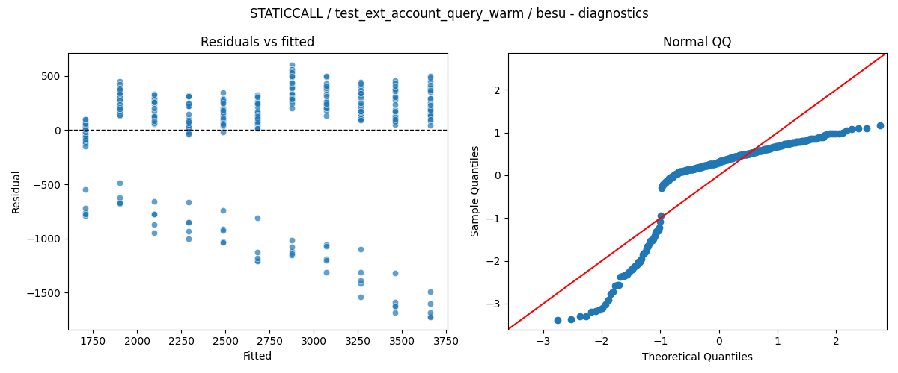

</details>

<details><summary>erigon — NNLS regression summary</summary>

```
==============================================================================
                           NNLS Regression Results                            
==============================================================================
Dep. Variable:          test_runtime_ms              R-squared:          0.906
Model:                  NNLS                    Adj. R-squared:          0.905
No. Observations:       176                               RMSE:          84.12
Df Residuals:           174                                MAE:          68.12
Df Model:               1      
==============================================================================
                      coef     std err     P-value      [0.025      0.975]
------------------------------------------------------------------------------
         const     63.4299     18.3164       0.001     29.0084    102.2096
       opcount      0.0005      0.0000       0.001      0.0005      0.0005
==============================================================================
Notes: Non-negative least squares with bootstrap inference (1000 iterations)
==============================================================================
```

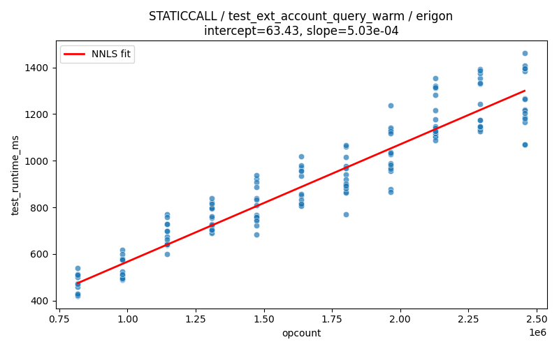

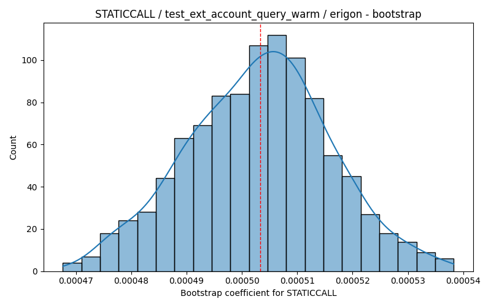

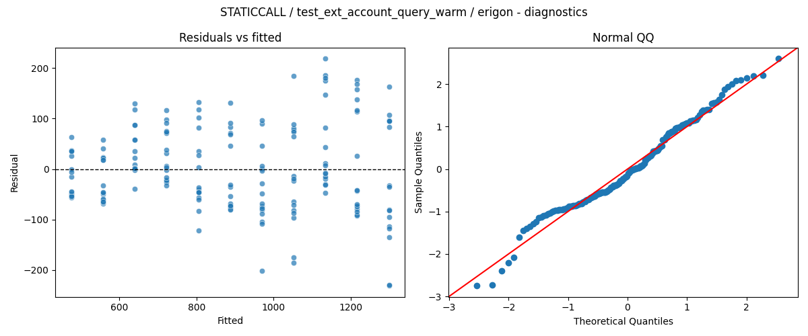

</details>

<details><summary>nethermind — NNLS regression summary</summary>

```
==============================================================================
                           NNLS Regression Results                            
==============================================================================
Dep. Variable:          test_runtime_ms              R-squared:          0.832
Model:                  NNLS                    Adj. R-squared:          0.831
No. Observations:       264                               RMSE:         169.22
Df Residuals:           262                                MAE:         127.35
Df Model:               1      
==============================================================================
                      coef     std err     P-value      [0.025      0.975]
------------------------------------------------------------------------------
         const    292.7276     30.2624       0.001    234.2485    352.7132
       opcount      0.0007      0.0000       0.001      0.0007      0.0008
==============================================================================
Notes: Non-negative least squares with bootstrap inference (1000 iterations)
==============================================================================
```

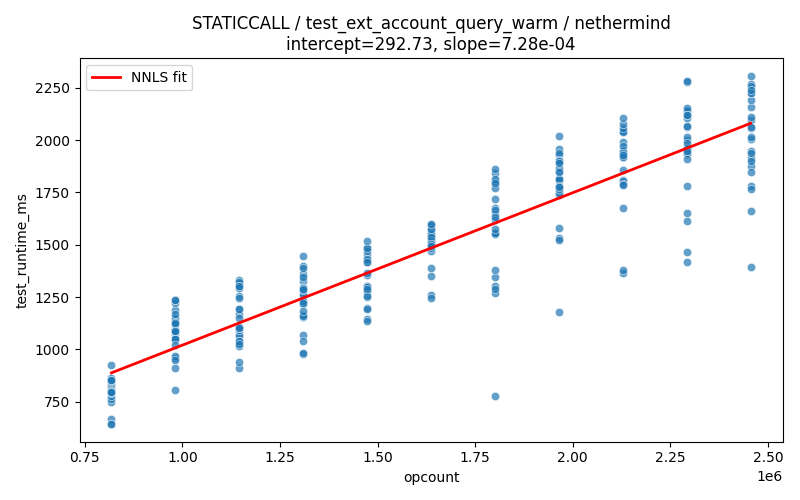

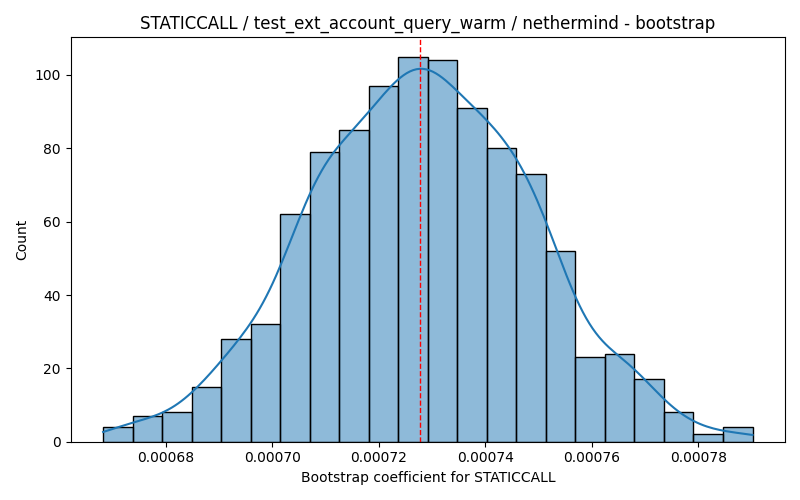

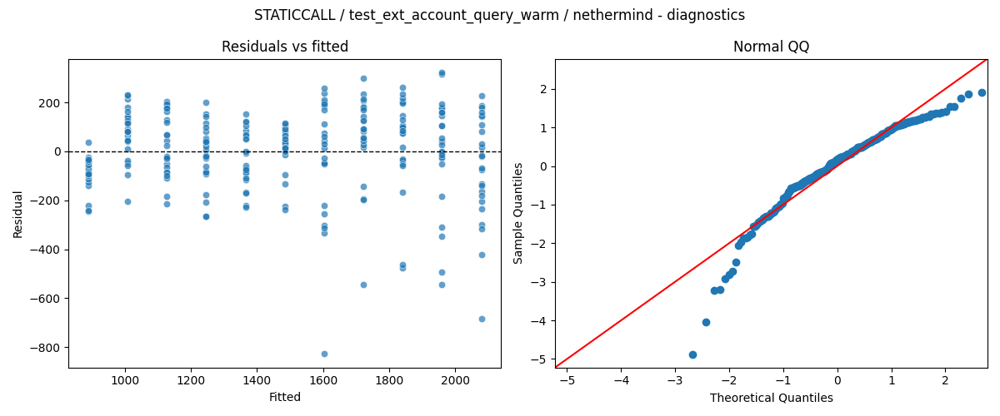

</details>

<details><summary>reth — NNLS regression summary</summary>

```
==============================================================================
                           NNLS Regression Results                            
==============================================================================
Dep. Variable:          test_runtime_ms              R-squared:          0.917
Model:                  NNLS                    Adj. R-squared:          0.917
No. Observations:       451                               RMSE:           7.28
Df Residuals:           449                                MAE:           6.06
Df Model:               1      
==============================================================================
                      coef     std err     P-value      [0.025      0.975]
------------------------------------------------------------------------------
         const     16.7114      1.1531       0.001     14.3128     18.9977
       opcount      0.0000      0.0000       0.001      0.0000      0.0000
==============================================================================
Notes: Non-negative least squares with bootstrap inference (1000 iterations)
==============================================================================
```

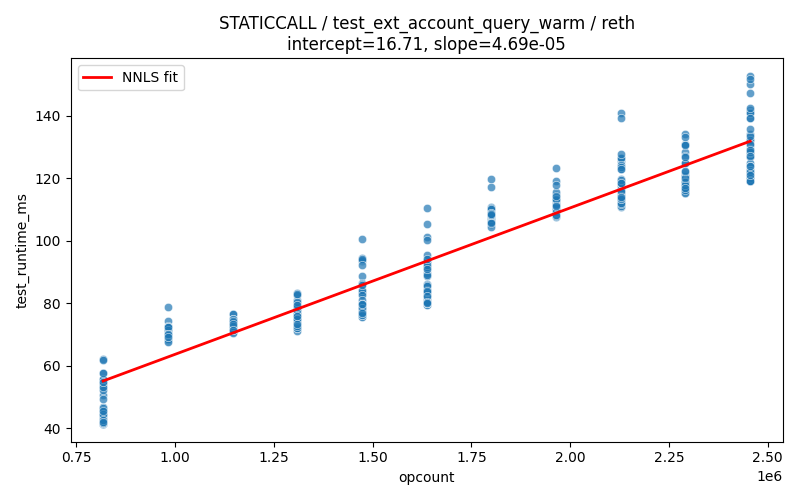

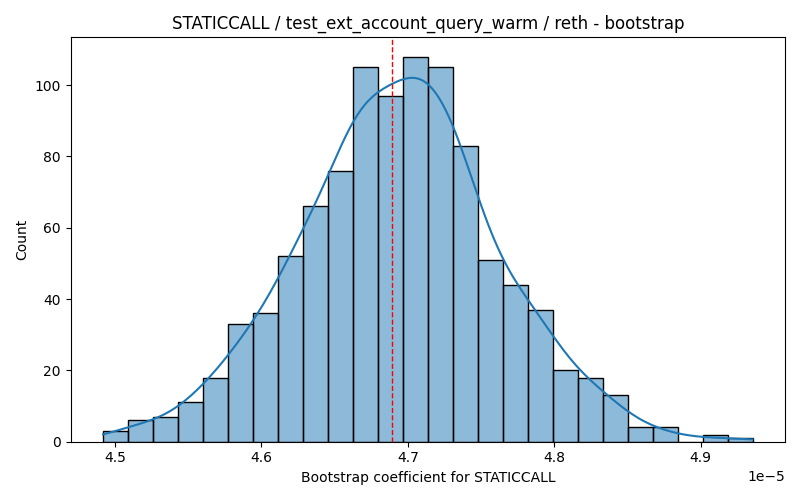

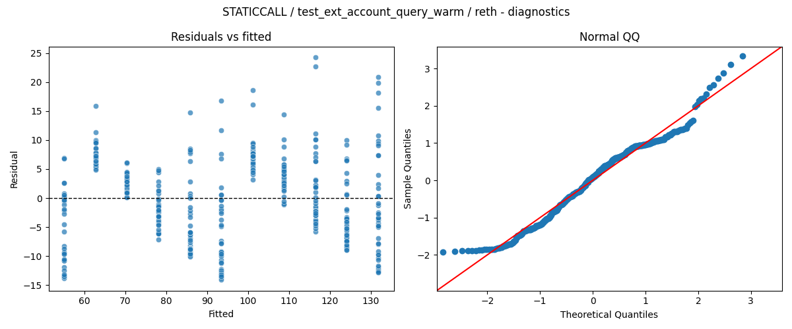

</details>
