# Glue opcodes report

Per-client NNLS fits of priced glue opcodes against their driver fixtures. Cycle-tier opcodes share one joint regression per client (shown once); pure-tier and mixed-tier opcodes each get a single-feature fit. Mixed-tier fits pre-adjust the LHS by subtracting the contribution of every priced upstream partner selected by the detector (pure ∪ cycle for `mixed_a`, plus `mixed_a` for `mixed_b`).

**Contents:** [besu](#besu) · [erigon](#erigon) · [geth](#geth) · [nethermind](#nethermind) · [reth](#reth)

## besu

| glue_opcode | nobs | glue_runtime_ms | p_value | rsquared |
| --- | --- | --- | --- | --- |
| `ISZERO` | 143 | 5.155e-06 | 1.00e-03 | 0.8778 |
| `JUMPDEST` | 143 | 2.635e-06 | 1.00e-03 | 0.8777 |
| `SWAP` | 2288 | 3.689e-06 | 1.00e-03 | 0.8561 |
| `CALLDATASIZE` | 8470 | 4.347e-06 | 1.00e-03 | 0.9283 |
| `DUP` | 8470 | 2.63e-06 | 1.00e-03 | 0.9283 |
| `GAS` | 8470 | 3.804e-06 | 1.00e-03 | 0.9283 |
| `MLOAD` | 8470 | 1.097e-05 | 1.00e-03 | 0.9283 |
| `PUSH` | 8470 | 3.309e-06 | 1.00e-03 | 0.9283 |
| `PUSH0` | 8470 | 2.597e-06 | 1.00e-03 | 0.9283 |
| `STATICCALL` | 8470 | 0.0008476 | 1.00e-03 | 0.9283 |
| `ADD` | 143 | 1.104e-05 | 1.00e-03 | 0.8755 |
| `AND` | 143 | 1.005e-05 | 1.00e-03 | 0.8853 |
| `CALLDATACOPY` | 3432 | 2.155e-05 | 1.00e-03 | 0.8048 |
| `CALLDATALOAD` | 572 | 6.964e-06 | 1.35e-01 | 0.001472 |
| `DIV` | 143 | 1.756e-05 | 1.00e-03 | 0.8617 |
| `EXP` | 143 | 0.001176 | 1.00e-03 | 0.8481 |
| `GT` | 143 | 3.322e-05 | 1.00e-03 | 0.8901 |
| `JUMPI` | 143 | 1.016e-05 | 1.00e-03 | 0.891 |
| `LT` | 143 | 3.388e-05 | 1.00e-03 | 0.9046 |
| `MSTORE` | 715 | 1.812e-05 | 1.00e-03 | 0.8668 |
| `MSTORE8` | 715 | 1.26e-05 | 1.00e-03 | 0.858 |
| `MUL` | 143 | 1.398e-05 | 1.00e-03 | 0.5829 |
| `PC` | 143 | 4.291e-06 | 1.00e-03 | 0.8707 |
| `RETURNDATASIZE` | 572 | 7.096e-06 | 1.00e-03 | 0.865 |
| `SELFBALANCE` | 117 | 7.242e-06 | 1.00e-03 | 0.4835 |
| `SUB` | 143 | 1.111e-05 | 1.00e-03 | 0.8758 |
| `JUMP` | 143 | 4.713e-05 | 1.00e-03 | 0.8739 |
| `KECCAK256` | 2288 | 5.181e-05 | 1.00e-03 | 0.2854 |

### Cycle glue — joint fit · besu

<details><summary>Joint NNLS regression summary</summary>

```
==============================================================================
                           NNLS Regression Results                            
==============================================================================
Dep. Variable:          test_runtime_ms              R-squared:          0.928
Model:                  NNLS                    Adj. R-squared:          0.928
No. Observations:       8470                              RMSE:          38.35
Df Residuals:           8462                               MAE:          30.44
Df Model:               7      
==============================================================================
                      coef     std err     P-value      [0.025      0.975]
------------------------------------------------------------------------------
         const     76.0656      1.5175       0.001     73.1221     79.0670
  CALLDATASIZE      0.0000      0.0000       0.001      0.0000      0.0000
           DUP      0.0000      0.0000       0.001      0.0000      0.0000
           GAS      0.0000      0.0000       0.001      0.0000      0.0000
         MLOAD      0.0000      0.0000       0.001      0.0000      0.0000
          PUSH      0.0000      0.0000       0.001      0.0000      0.0000
         PUSH0      0.0000      0.0000       0.001      0.0000      0.0000
    STATICCALL      0.0008      0.0000       0.001      0.0008      0.0009
==============================================================================
Notes: Non-negative least squares with bootstrap inference (1000 iterations)
==============================================================================
```

</details>

<details><summary><code>CALLDATASIZE</code> · nobs=8470 · runtime_ms=4.347e-06 · p=1.00e-03 · R²=0.9283</summary>


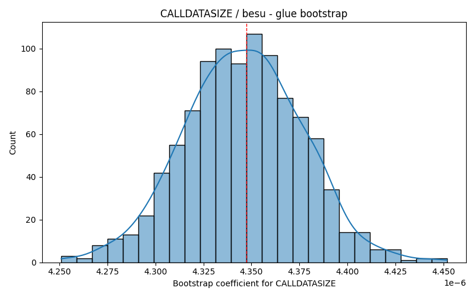

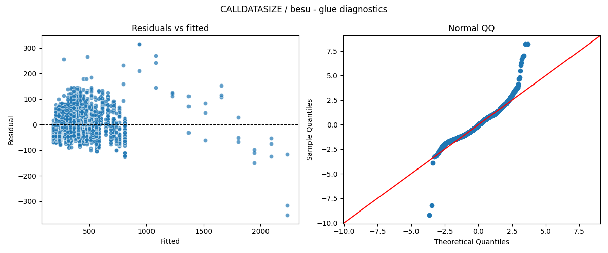

</details>

<details><summary><code>DUP</code> · nobs=8470 · runtime_ms=2.63e-06 · p=1.00e-03 · R²=0.9283</summary>


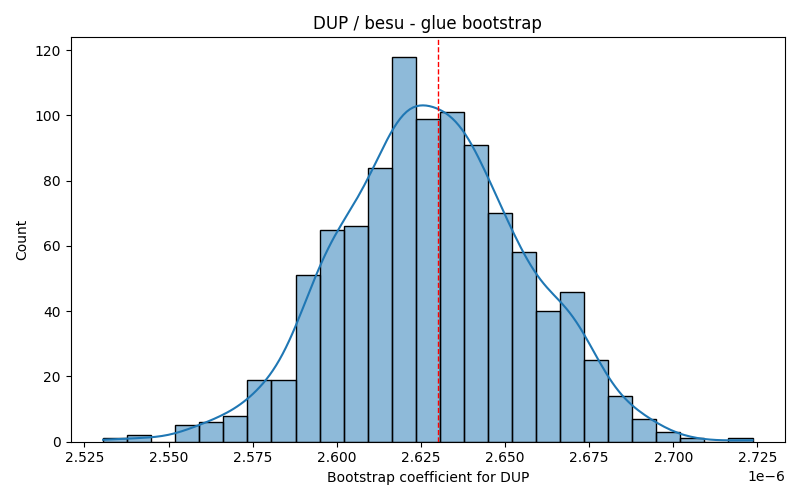


</details>

<details><summary><code>GAS</code> · nobs=8470 · runtime_ms=3.804e-06 · p=1.00e-03 · R²=0.9283</summary>

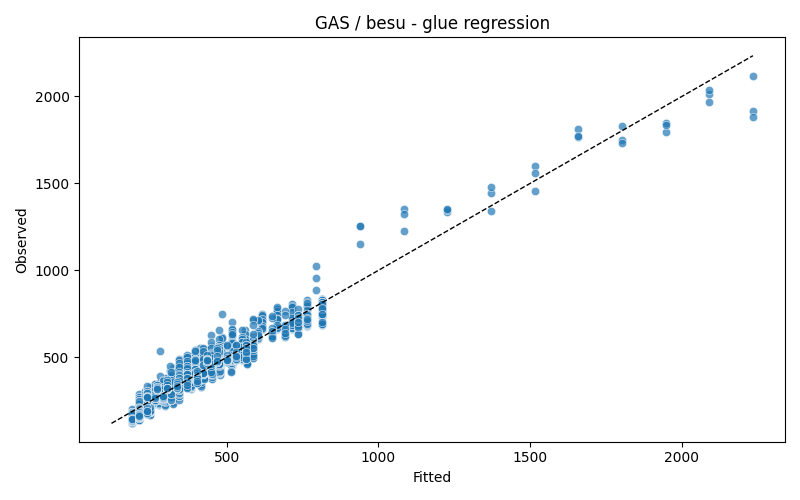

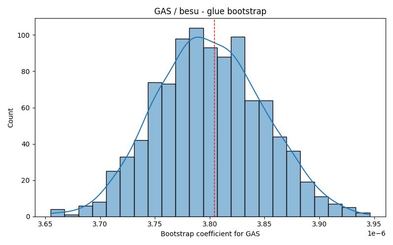


</details>

<details><summary><code>MLOAD</code> · nobs=8470 · runtime_ms=1.097e-05 · p=1.00e-03 · R²=0.9283</summary>


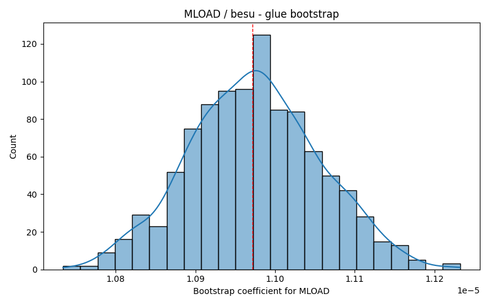


</details>

<details><summary><code>PUSH</code> · nobs=8470 · runtime_ms=3.309e-06 · p=1.00e-03 · R²=0.9283</summary>

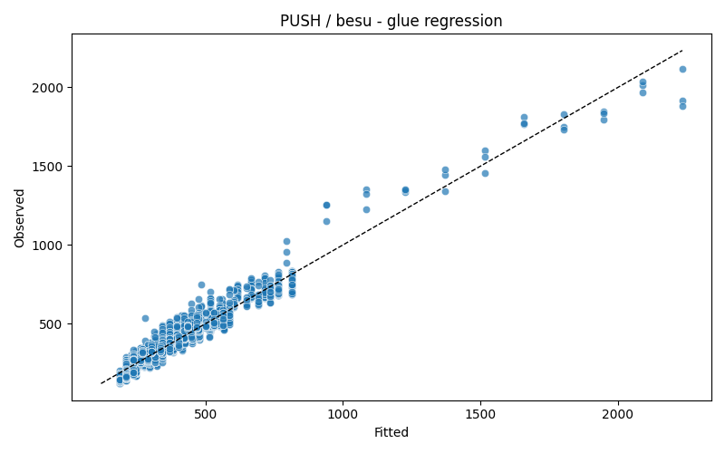

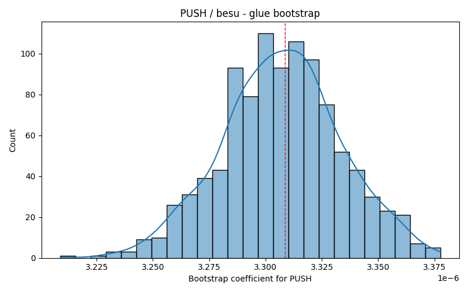


</details>

<details><summary><code>PUSH0</code> · nobs=8470 · runtime_ms=2.597e-06 · p=1.00e-03 · R²=0.9283</summary>


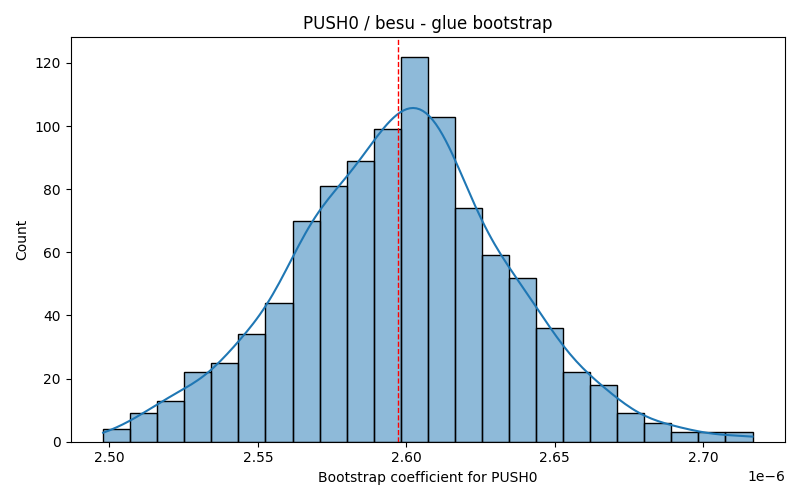


</details>

<details><summary><code>STATICCALL</code> · nobs=8470 · runtime_ms=0.0008476 · p=1.00e-03 · R²=0.9283</summary>

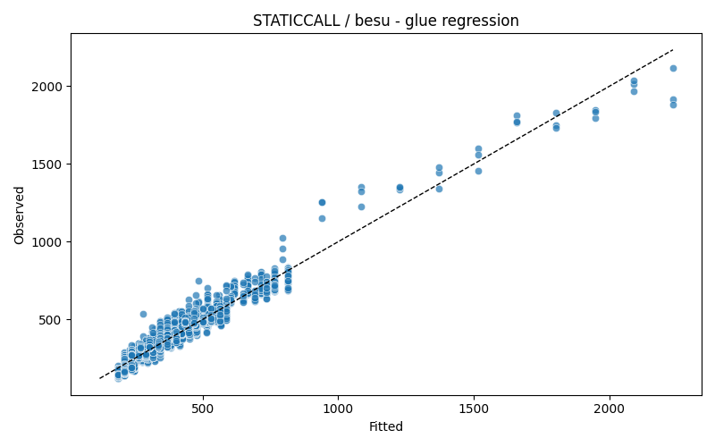


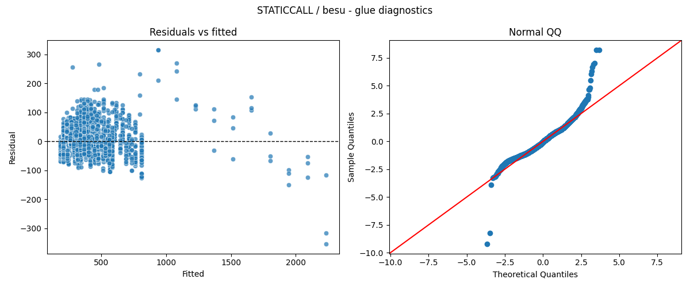

</details>

### Pure glue · besu

<details><summary><code>ISZERO</code> · nobs=143 · runtime_ms=5.155e-06 · p=1.00e-03 · R²=0.8778</summary>

```
==============================================================================
                           NNLS Regression Results                            
==============================================================================
Dep. Variable:          test_runtime_ms              R-squared:          0.878
Model:                  NNLS                    Adj. R-squared:          0.877
No. Observations:       143                               RMSE:          40.49
Df Residuals:           141                                MAE:          34.82
Df Model:               1      
==============================================================================
                      coef     std err     P-value      [0.025      0.975]
------------------------------------------------------------------------------
         const     68.5453     12.3807       0.001     46.3832     93.5797
        ISZERO      0.0000      0.0000       0.001      0.0000      0.0000
==============================================================================
Notes: Non-negative least squares with bootstrap inference (1000 iterations)
==============================================================================
```

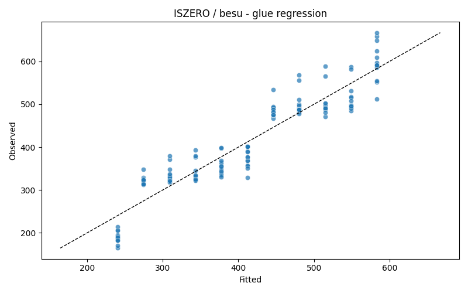

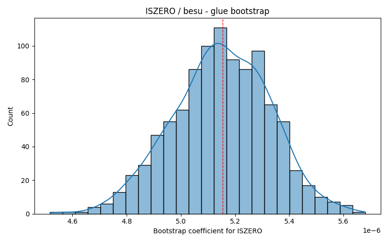


</details>

<details><summary><code>JUMPDEST</code> · nobs=143 · runtime_ms=2.635e-06 · p=1.00e-03 · R²=0.8777</summary>

```
==============================================================================
                           NNLS Regression Results                            
==============================================================================
Dep. Variable:          test_runtime_ms              R-squared:          0.878
Model:                  NNLS                    Adj. R-squared:          0.877
No. Observations:       143                               RMSE:          62.10
Df Residuals:           141                                MAE:          53.43
Df Model:               1      
==============================================================================
                      coef     std err     P-value      [0.025      0.975]
------------------------------------------------------------------------------
         const     81.6028     18.5458       0.001     47.9025    116.6847
      JUMPDEST      0.0000      0.0000       0.001      0.0000      0.0000
==============================================================================
Notes: Non-negative least squares with bootstrap inference (1000 iterations)
==============================================================================
```

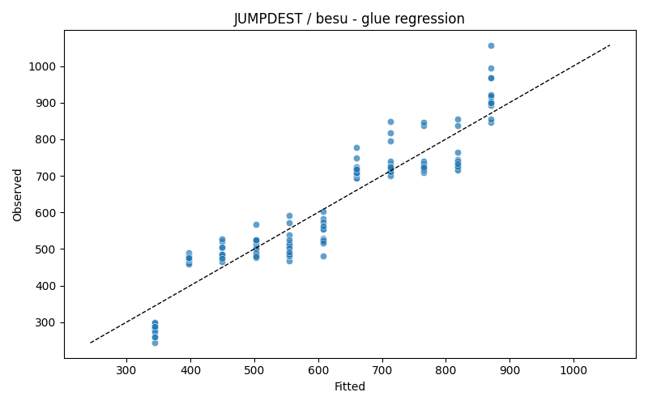

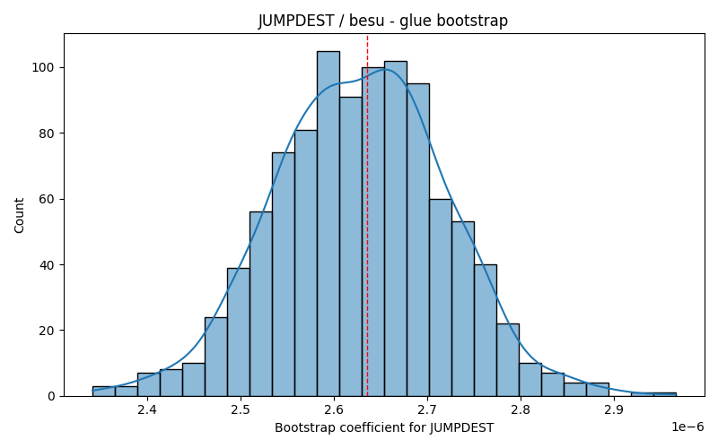

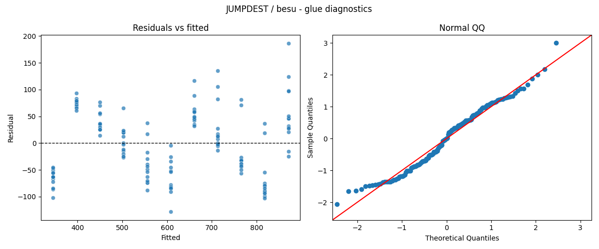

</details>

<details><summary><code>SWAP</code> · nobs=2288 · runtime_ms=3.689e-06 · p=1.00e-03 · R²=0.8561</summary>

```
==============================================================================
                           NNLS Regression Results                            
==============================================================================
Dep. Variable:          test_runtime_ms              R-squared:          0.856
Model:                  NNLS                    Adj. R-squared:          0.856
No. Observations:       2288                              RMSE:          31.84
Df Residuals:           2286                               MAE:          26.27
Df Model:               1      
==============================================================================
                      coef     std err     P-value      [0.025      0.975]
------------------------------------------------------------------------------
         const     69.2965      2.3961       0.001     64.4431     73.7356
          SWAP      0.0000      0.0000       0.001      0.0000      0.0000
==============================================================================
Notes: Non-negative least squares with bootstrap inference (1000 iterations)
==============================================================================
```

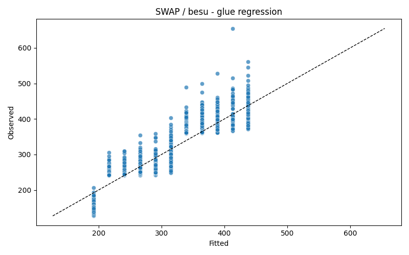

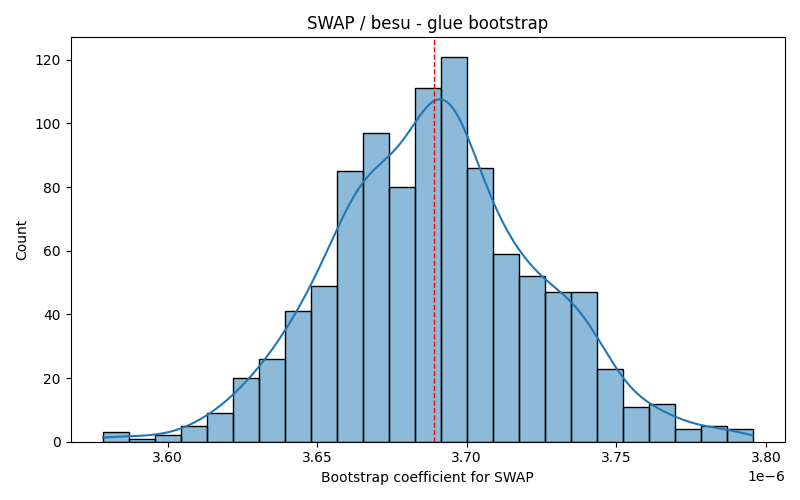

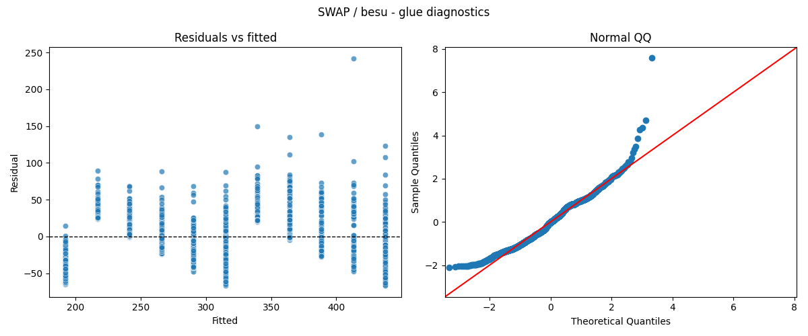

</details>

### Mixed glue (tier A) · besu

<details><summary><code>ADD</code> · nobs=143 · runtime_ms=1.104e-05 · p=1.00e-03 · R²=0.8755</summary>

```
==============================================================================
                           NNLS Regression Results                            
==============================================================================
Dep. Variable:          test_runtime_ms              R-squared:          0.875
Model:                  NNLS                    Adj. R-squared:          0.875
No. Observations:       143                               RMSE:          43.83
Df Residuals:           141                                MAE:          37.29
Df Model:               1      
==============================================================================
                      coef     std err     P-value      [0.025      0.975]
------------------------------------------------------------------------------
         const    112.3421     13.5203       0.001     86.1252    137.5944
           ADD      0.0000      0.0000       0.001      0.0000      0.0000
==============================================================================
Notes: Non-negative least squares with bootstrap inference (1000 iterations)
==============================================================================
```

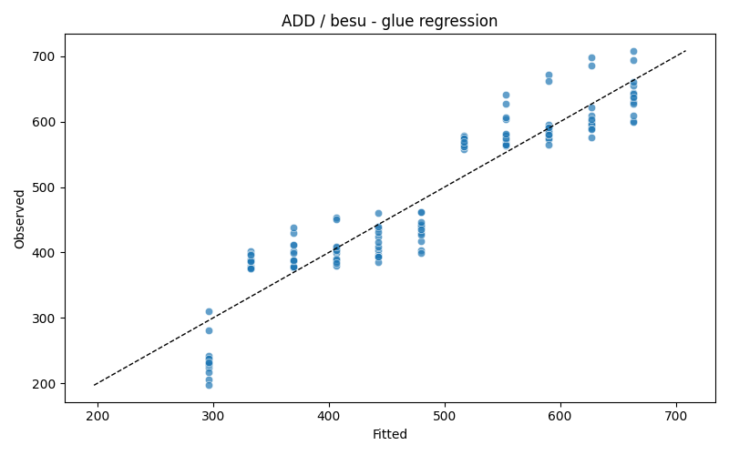

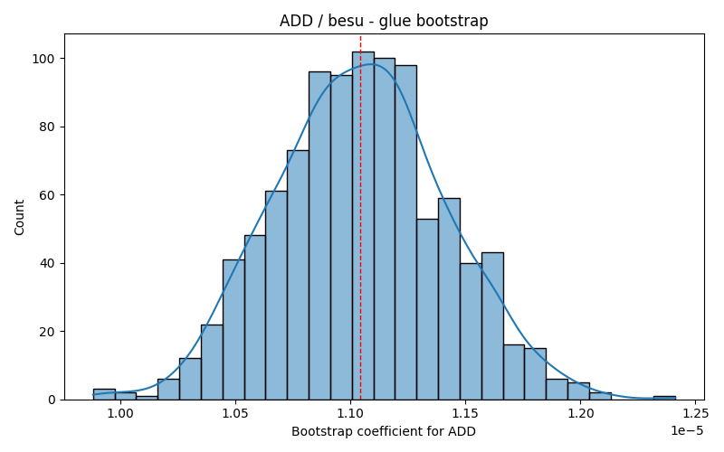

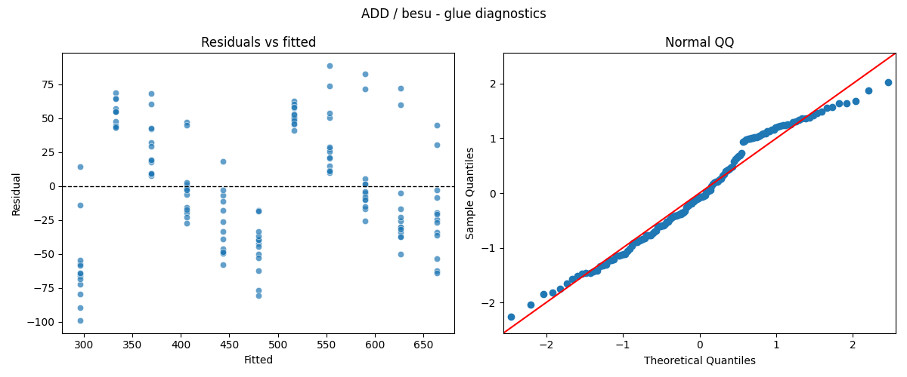

</details>

<details><summary><code>AND</code> · nobs=143 · runtime_ms=1.005e-05 · p=1.00e-03 · R²=0.8853</summary>

```
==============================================================================
                           NNLS Regression Results                            
==============================================================================
Dep. Variable:          test_runtime_ms              R-squared:          0.885
Model:                  NNLS                    Adj. R-squared:          0.884
No. Observations:       143                               RMSE:          38.07
Df Residuals:           141                                MAE:          32.48
Df Model:               1      
==============================================================================
                      coef     std err     P-value      [0.025      0.975]
------------------------------------------------------------------------------
         const     81.8739     11.8051       0.001     58.7558    105.8666
           AND      0.0000      0.0000       0.001      0.0000      0.0000
==============================================================================
Notes: Non-negative least squares with bootstrap inference (1000 iterations)
==============================================================================
```

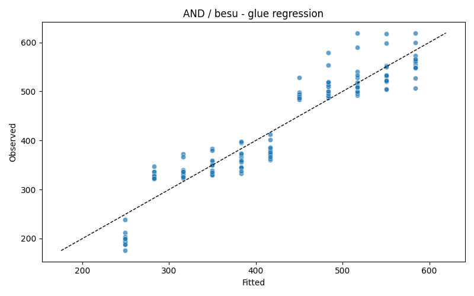

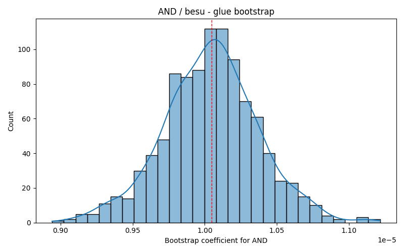

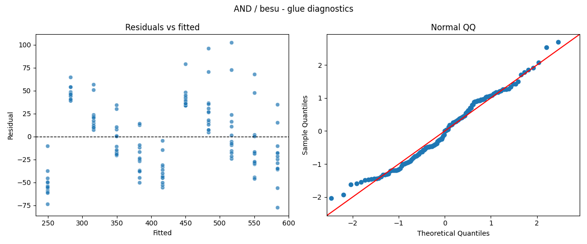

</details>

<details><summary><code>CALLDATACOPY</code> · nobs=3432 · runtime_ms=2.155e-05 · p=1.00e-03 · R²=0.8048</summary>

```
==============================================================================
                           NNLS Regression Results                            
==============================================================================
Dep. Variable:          test_runtime_ms              R-squared:          0.805
Model:                  NNLS                    Adj. R-squared:          0.805
No. Observations:       3432                              RMSE:          79.82
Df Residuals:           3430                               MAE:          63.24
Df Model:               1      
==============================================================================
                      coef     std err     P-value      [0.025      0.975]
------------------------------------------------------------------------------
         const    116.2090      1.5970       0.001    113.1573    119.4805
  CALLDATACOPY      0.0000      0.0000       0.001      0.0000      0.0000
==============================================================================
Notes: Non-negative least squares with bootstrap inference (1000 iterations)
==============================================================================
```

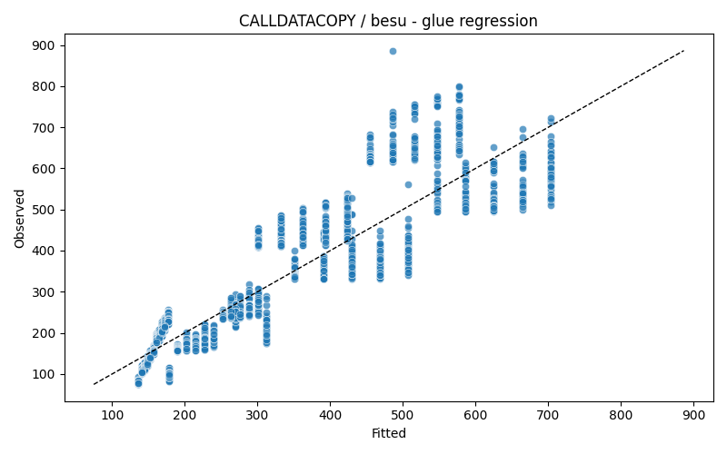

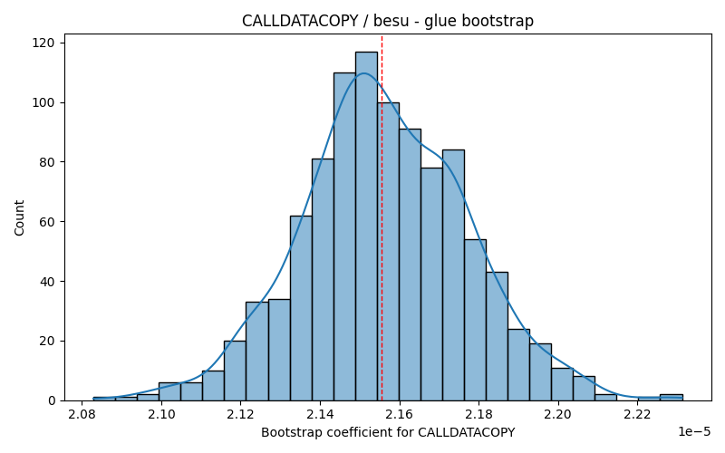

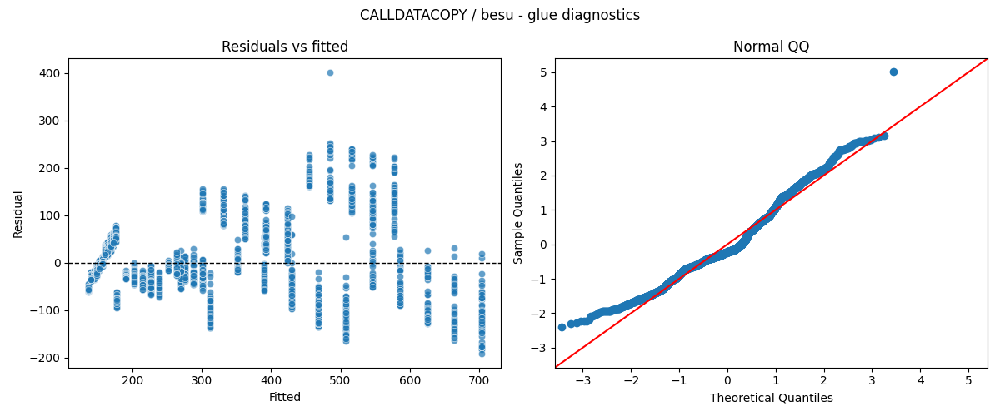

</details>

<details><summary><code>CALLDATALOAD</code> · nobs=572 · runtime_ms=6.964e-06 · p=1.35e-01 · R²=0.001472</summary>

```
==============================================================================
                           NNLS Regression Results                            
==============================================================================
Dep. Variable:          test_runtime_ms              R-squared:          0.001
Model:                  NNLS                    Adj. R-squared:         -0.000
No. Observations:       572                               RMSE:           0.70
Df Residuals:           570                                MAE:           0.45
Df Model:               1      
==============================================================================
                      coef     std err     P-value      [0.025      0.975]
------------------------------------------------------------------------------
         const      3.6837      0.0793       0.001      3.5121      3.8097
  CALLDATALOAD      0.0000      0.0000       0.135      0.0000      0.0000
==============================================================================
Notes: Non-negative least squares with bootstrap inference (1000 iterations)
==============================================================================
```

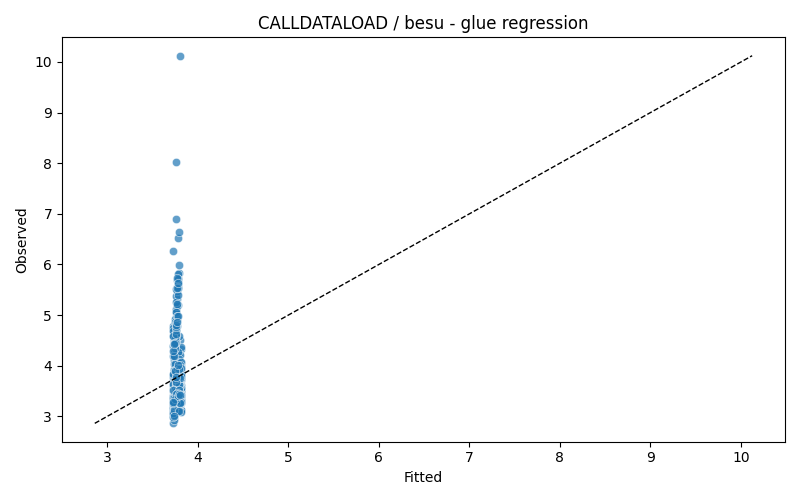

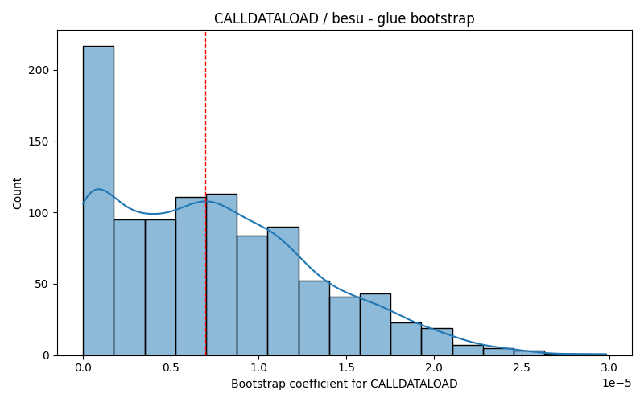

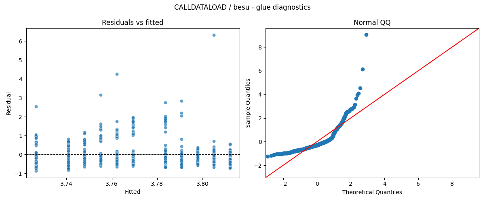

</details>

<details><summary><code>DIV</code> · nobs=143 · runtime_ms=1.756e-05 · p=1.00e-03 · R²=0.8617</summary>

```
==============================================================================
                           NNLS Regression Results                            
==============================================================================
Dep. Variable:          test_runtime_ms              R-squared:          0.862
Model:                  NNLS                    Adj. R-squared:          0.861
No. Observations:       143                               RMSE:          55.55
Df Residuals:           141                                MAE:          46.40
Df Model:               1      
==============================================================================
                      coef     std err     P-value      [0.025      0.975]
------------------------------------------------------------------------------
         const    141.8250     14.4819       0.001    112.3052    170.4172
           DIV      0.0000      0.0000       0.001      0.0000      0.0000
==============================================================================
Notes: Non-negative least squares with bootstrap inference (1000 iterations)
==============================================================================
```

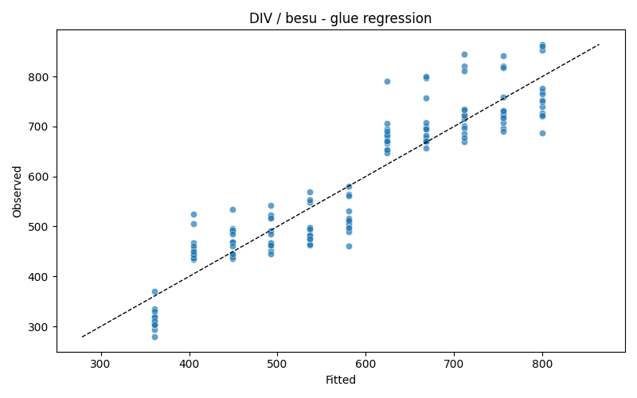

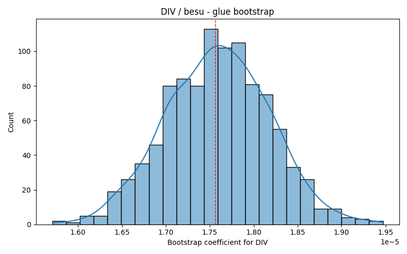

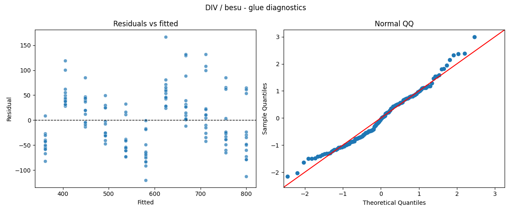

</details>

<details><summary><code>EXP</code> · nobs=143 · runtime_ms=0.001176 · p=1.00e-03 · R²=0.8481</summary>

```
==============================================================================
                           NNLS Regression Results                            
==============================================================================
Dep. Variable:          test_runtime_ms              R-squared:          0.848
Model:                  NNLS                    Adj. R-squared:          0.847
No. Observations:       143                               RMSE:          19.49
Df Residuals:           141                                MAE:          15.62
Df Model:               1      
==============================================================================
                      coef     std err     P-value      [0.025      0.975]
------------------------------------------------------------------------------
         const     78.8509      5.5437       0.001     67.1084     88.6007
           EXP      0.0012      0.0000       0.001      0.0011      0.0013
==============================================================================
Notes: Non-negative least squares with bootstrap inference (1000 iterations)
==============================================================================
```

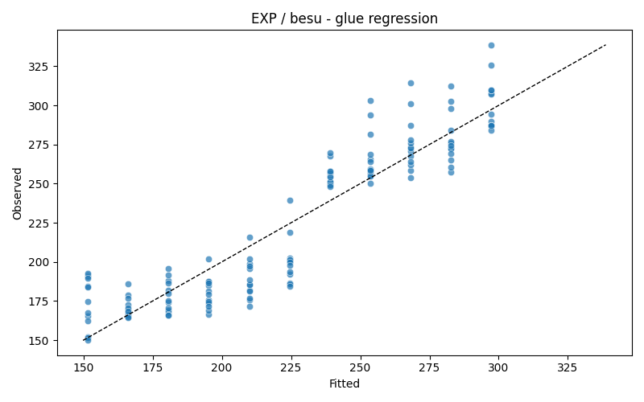

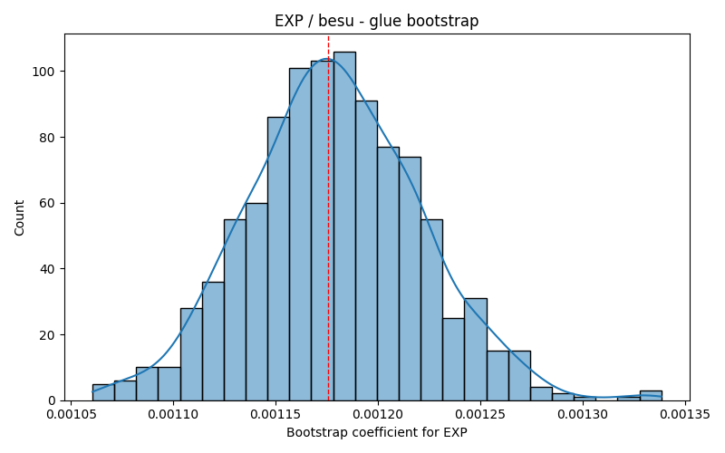

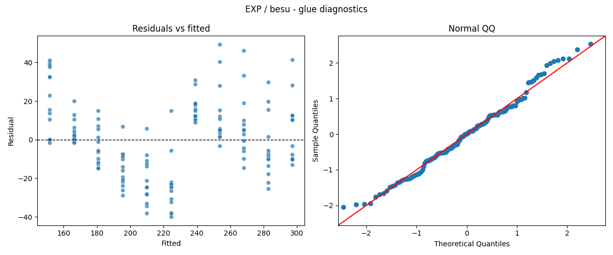

</details>

<details><summary><code>GT</code> · nobs=143 · runtime_ms=3.322e-05 · p=1.00e-03 · R²=0.8901</summary>

```
==============================================================================
                           NNLS Regression Results                            
==============================================================================
Dep. Variable:          test_runtime_ms              R-squared:          0.890
Model:                  NNLS                    Adj. R-squared:          0.889
No. Observations:       143                               RMSE:         122.83
Df Residuals:           141                                MAE:          99.34
Df Model:               1      
==============================================================================
                      coef     std err     P-value      [0.025      0.975]
------------------------------------------------------------------------------
         const    198.2445     37.1140       0.001    131.4772    273.6536
            GT      0.0000      0.0000       0.001      0.0000      0.0000
==============================================================================
Notes: Non-negative least squares with bootstrap inference (1000 iterations)
==============================================================================
```

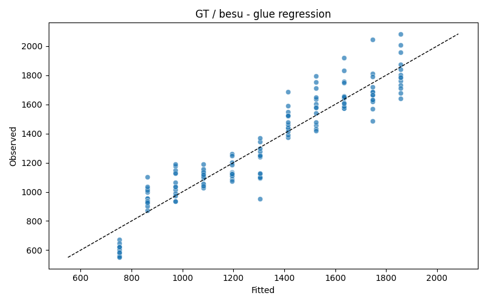


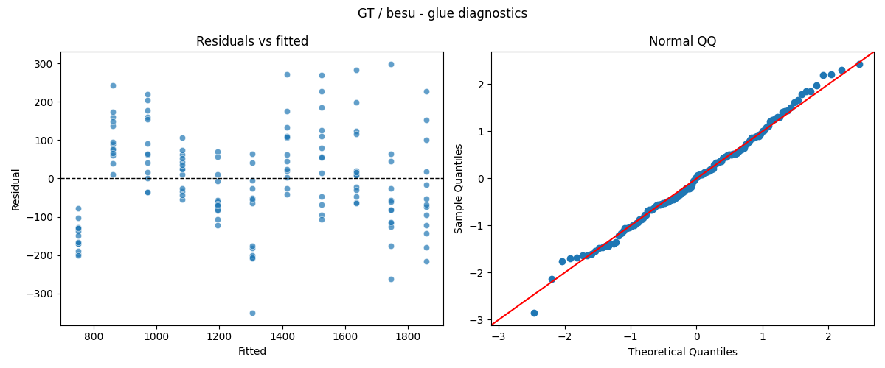

</details>

<details><summary><code>JUMPI</code> · nobs=143 · runtime_ms=1.016e-05 · p=1.00e-03 · R²=0.891</summary>

```
==============================================================================
                           NNLS Regression Results                            
==============================================================================
Dep. Variable:          test_runtime_ms              R-squared:          0.891
Model:                  NNLS                    Adj. R-squared:          0.890
No. Observations:       143                               RMSE:          16.04
Df Residuals:           141                                MAE:          13.36
Df Model:               1      
==============================================================================
                      coef     std err     P-value      [0.025      0.975]
------------------------------------------------------------------------------
         const     39.1236      4.7802       0.001     29.3988     48.2352
         JUMPI      0.0000      0.0000       0.001      0.0000      0.0000
==============================================================================
Notes: Non-negative least squares with bootstrap inference (1000 iterations)
==============================================================================
```

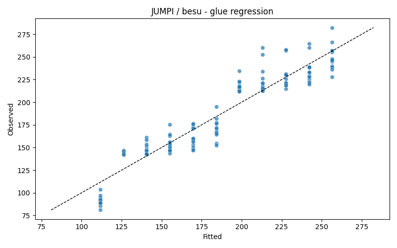

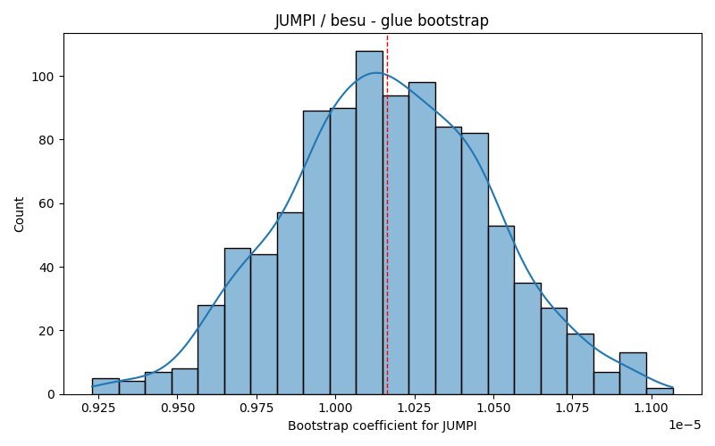

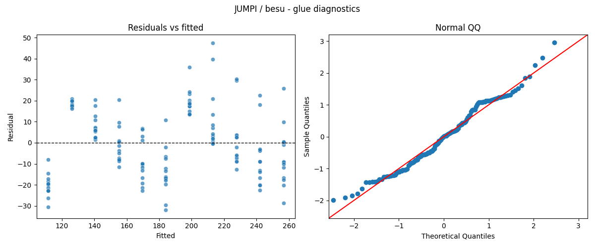

</details>

<details><summary><code>LT</code> · nobs=143 · runtime_ms=3.388e-05 · p=1.00e-03 · R²=0.9046</summary>

```
==============================================================================
                           NNLS Regression Results                            
==============================================================================
Dep. Variable:          test_runtime_ms              R-squared:          0.905
Model:                  NNLS                    Adj. R-squared:          0.904
No. Observations:       143                               RMSE:         115.83
Df Residuals:           141                                MAE:          95.25
Df Model:               1      
==============================================================================
                      coef     std err     P-value      [0.025      0.975]
------------------------------------------------------------------------------
         const    232.4190     37.5909       0.001    158.7881    306.3022
            LT      0.0000      0.0000       0.001      0.0000      0.0000
==============================================================================
Notes: Non-negative least squares with bootstrap inference (1000 iterations)
==============================================================================
```

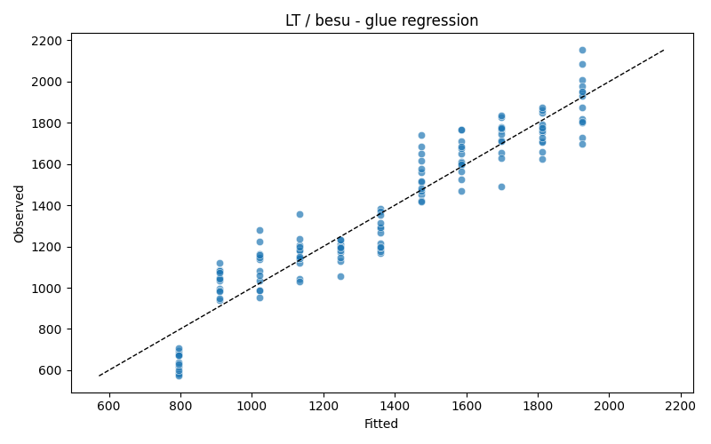

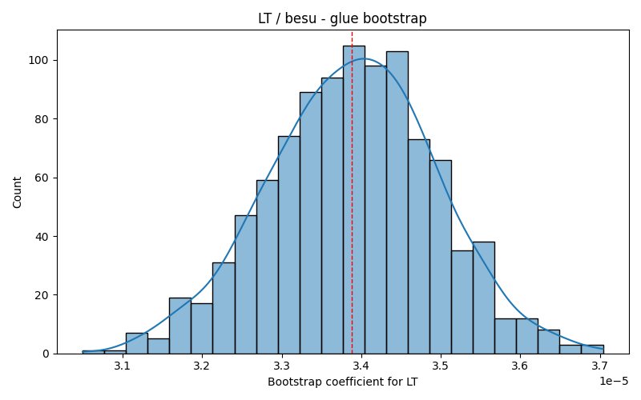

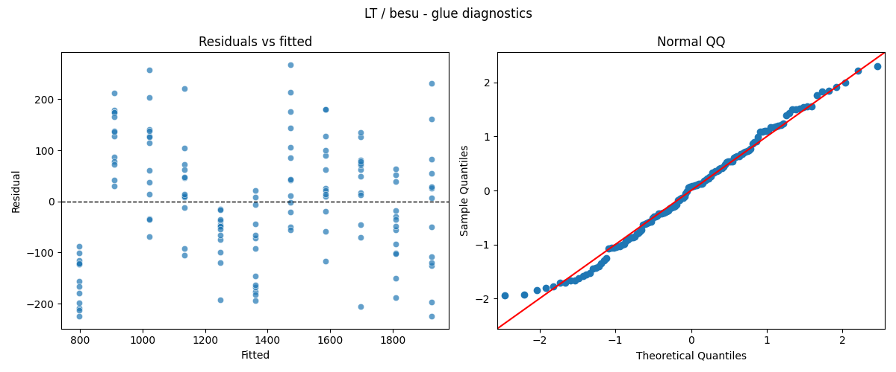

</details>

<details><summary><code>MSTORE</code> · nobs=715 · runtime_ms=1.812e-05 · p=1.00e-03 · R²=0.8668</summary>

```
==============================================================================
                           NNLS Regression Results                            
==============================================================================
Dep. Variable:          test_runtime_ms              R-squared:          0.867
Model:                  NNLS                    Adj. R-squared:          0.867
No. Observations:       715                               RMSE:          49.83
Df Residuals:           713                                MAE:          41.91
Df Model:               1      
==============================================================================
                      coef     std err     P-value      [0.025      0.975]
------------------------------------------------------------------------------
         const    110.6512      6.9078       0.001     96.6852    123.6637
        MSTORE      0.0000      0.0000       0.001      0.0000      0.0000
==============================================================================
Notes: Non-negative least squares with bootstrap inference (1000 iterations)
==============================================================================
```

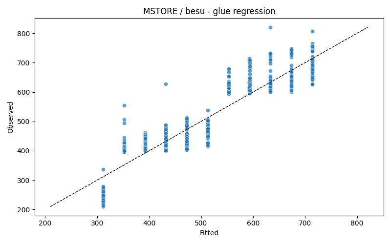

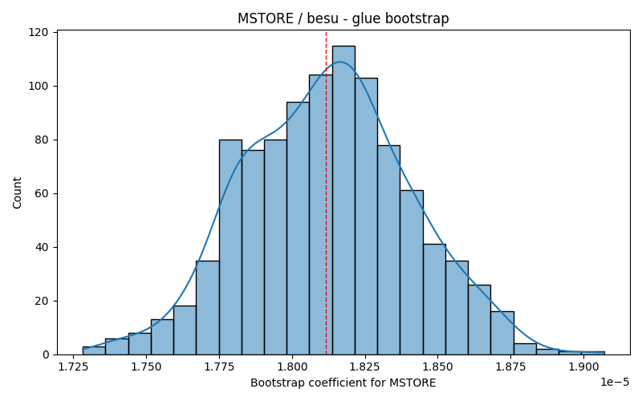

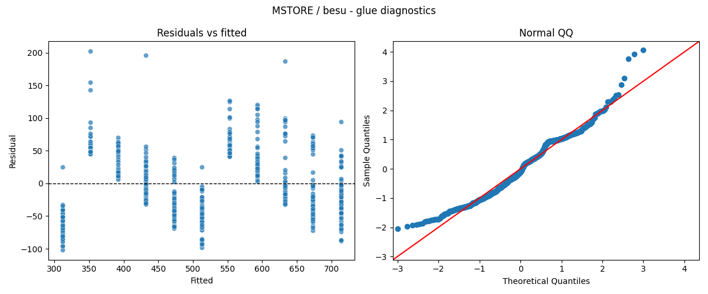

</details>

<details><summary><code>MSTORE8</code> · nobs=715 · runtime_ms=1.26e-05 · p=1.00e-03 · R²=0.858</summary>

```
==============================================================================
                           NNLS Regression Results                            
==============================================================================
Dep. Variable:          test_runtime_ms              R-squared:          0.858
Model:                  NNLS                    Adj. R-squared:          0.858
No. Observations:       715                               RMSE:          35.98
Df Residuals:           713                                MAE:          29.91
Df Model:               1      
==============================================================================
                      coef     std err     P-value      [0.025      0.975]
------------------------------------------------------------------------------
         const     78.7657      4.9171       0.001     69.2489     88.3005
       MSTORE8      0.0000      0.0000       0.001      0.0000      0.0000
==============================================================================
Notes: Non-negative least squares with bootstrap inference (1000 iterations)
==============================================================================
```

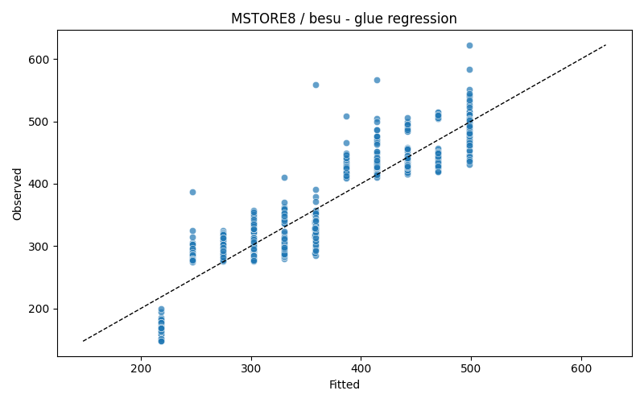

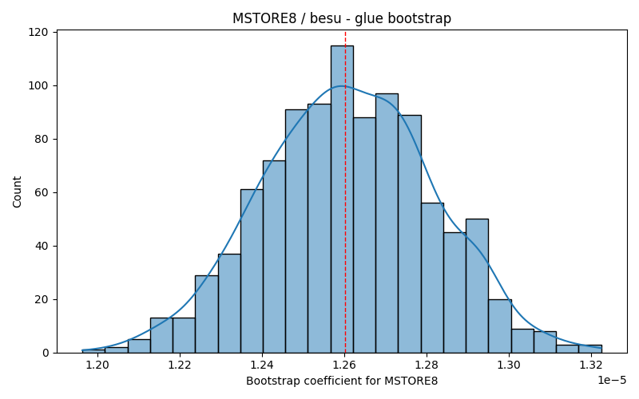

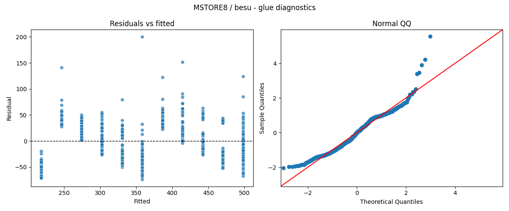

</details>

<details><summary><code>MUL</code> · nobs=143 · runtime_ms=1.398e-05 · p=1.00e-03 · R²=0.5829</summary>

```
==============================================================================
                           NNLS Regression Results                            
==============================================================================
Dep. Variable:          test_runtime_ms              R-squared:          0.583
Model:                  NNLS                    Adj. R-squared:          0.580
No. Observations:       143                               RMSE:          93.35
Df Residuals:           141                                MAE:          77.93
Df Model:               1      
==============================================================================
                      coef     std err     P-value      [0.025      0.975]
------------------------------------------------------------------------------
         const    112.7485     21.8623       0.001     71.0766    155.5145
           MUL      0.0000      0.0000       0.001      0.0000      0.0000
==============================================================================
Notes: Non-negative least squares with bootstrap inference (1000 iterations)
==============================================================================
```

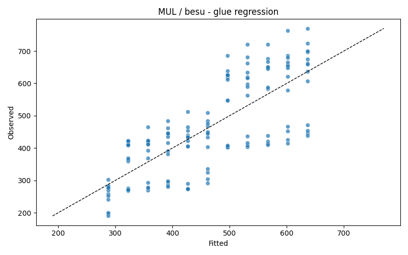

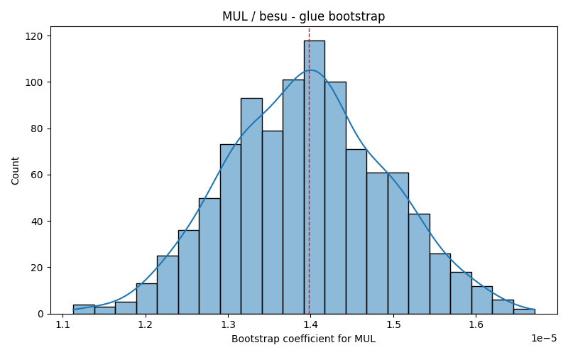

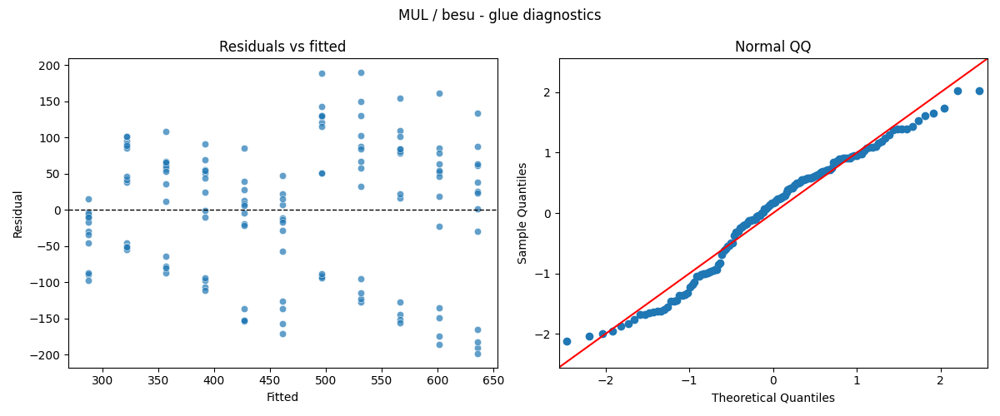

</details>

<details><summary><code>PC</code> · nobs=143 · runtime_ms=4.291e-06 · p=1.00e-03 · R²=0.8707</summary>

```
==============================================================================
                           NNLS Regression Results                            
==============================================================================
Dep. Variable:          test_runtime_ms              R-squared:          0.871
Model:                  NNLS                    Adj. R-squared:          0.870
No. Observations:       143                               RMSE:          49.44
Df Residuals:           141                                MAE:          41.62
Df Model:               1      
==============================================================================
                      coef     std err     P-value      [0.025      0.975]
------------------------------------------------------------------------------
         const    111.7114     15.2849       0.001     81.2336    141.2531
            PC      0.0000      0.0000       0.001      0.0000      0.0000
==============================================================================
Notes: Non-negative least squares with bootstrap inference (1000 iterations)
==============================================================================
```

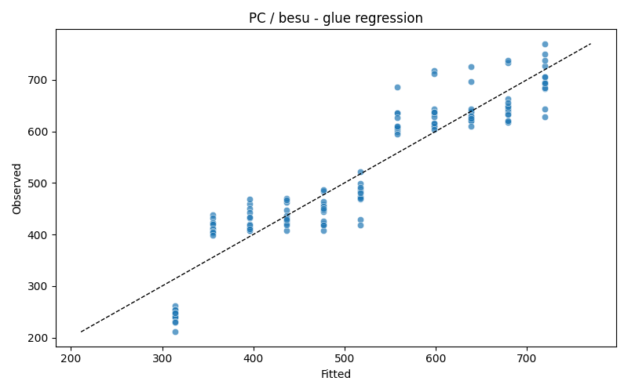

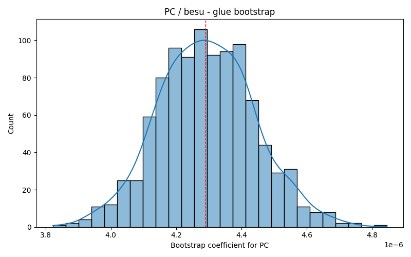

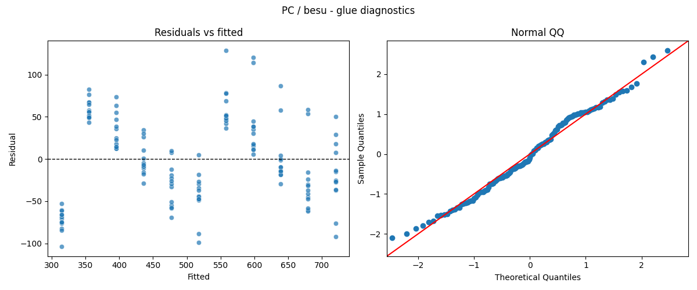

</details>

<details><summary><code>RETURNDATASIZE</code> · nobs=572 · runtime_ms=7.096e-06 · p=1.00e-03 · R²=0.865</summary>

```
==============================================================================
                           NNLS Regression Results                            
==============================================================================
Dep. Variable:          test_runtime_ms              R-squared:          0.865
Model:                  NNLS                    Adj. R-squared:          0.865
No. Observations:       572                               RMSE:          44.25
Df Residuals:           570                                MAE:          37.18
Df Model:               1      
==============================================================================
                      coef     std err     P-value      [0.025      0.975]
------------------------------------------------------------------------------
         const     92.4595      6.6207       0.001     78.8937    104.7229
RETURNDATASIZE      0.0000      0.0000       0.001      0.0000      0.0000
==============================================================================
Notes: Non-negative least squares with bootstrap inference (1000 iterations)
==============================================================================
```

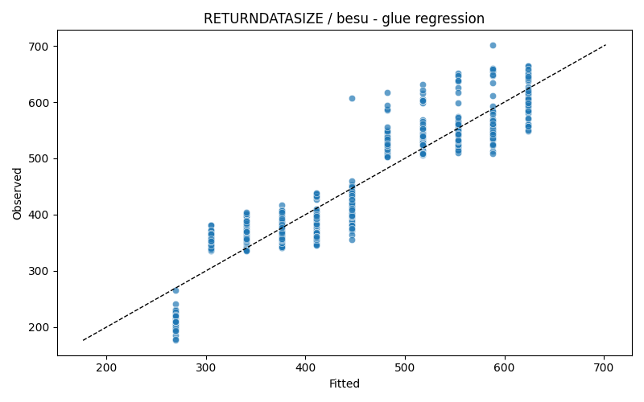

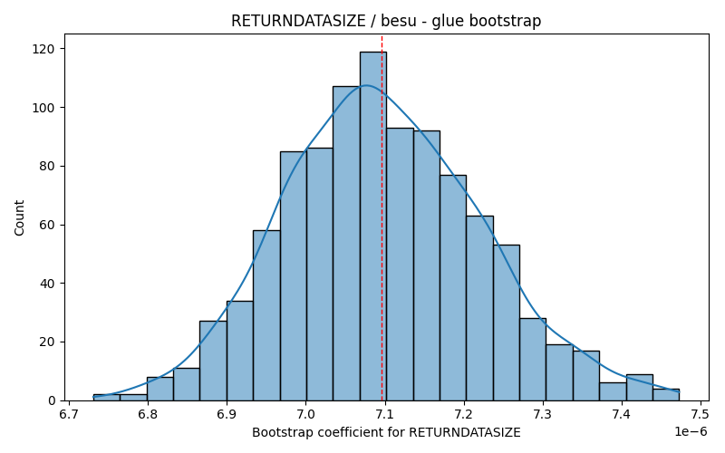

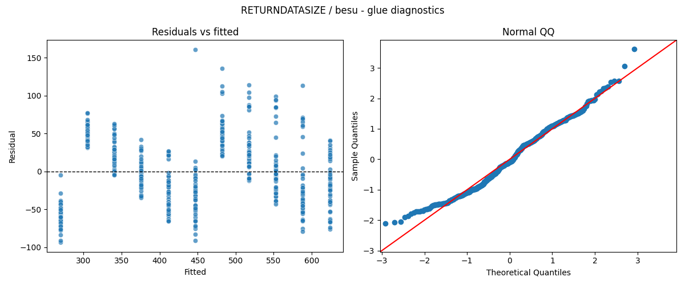

</details>

<details><summary><code>SELFBALANCE</code> · nobs=117 · runtime_ms=7.242e-06 · p=1.00e-03 · R²=0.4835</summary>

```
==============================================================================
                           NNLS Regression Results                            
==============================================================================
Dep. Variable:          test_runtime_ms              R-squared:          0.484
Model:                  NNLS                    Adj. R-squared:          0.479
No. Observations:       117                               RMSE:          75.50
Df Residuals:           115                                MAE:          59.97
Df Model:               1      
==============================================================================
                      coef     std err     P-value      [0.025      0.975]
------------------------------------------------------------------------------
         const    414.6699     32.3128       0.001    353.2080    477.4980
   SELFBALANCE      0.0000      0.0000       0.001      0.0000      0.0000
==============================================================================
Notes: Non-negative least squares with bootstrap inference (1000 iterations)
==============================================================================
```

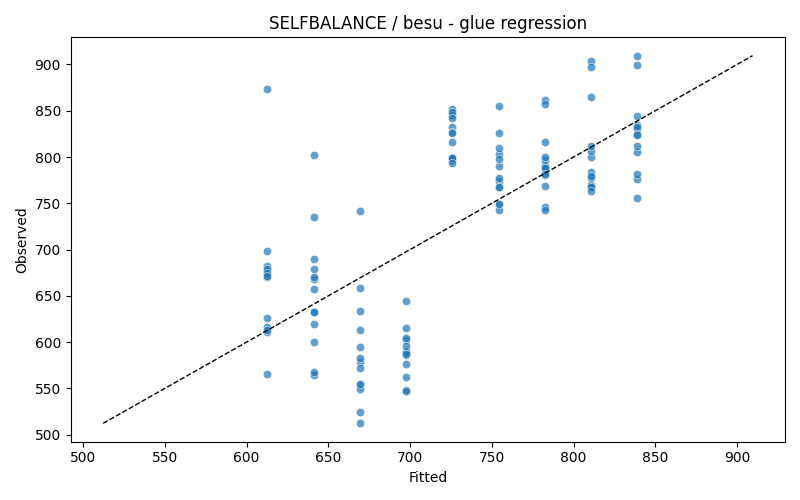

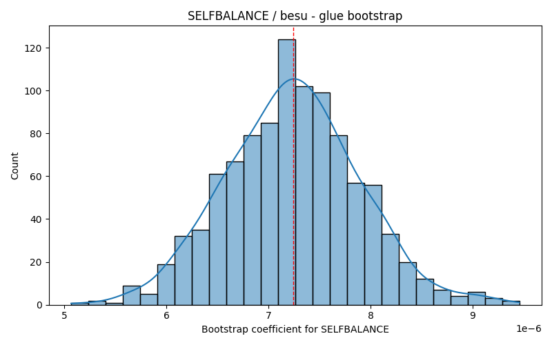

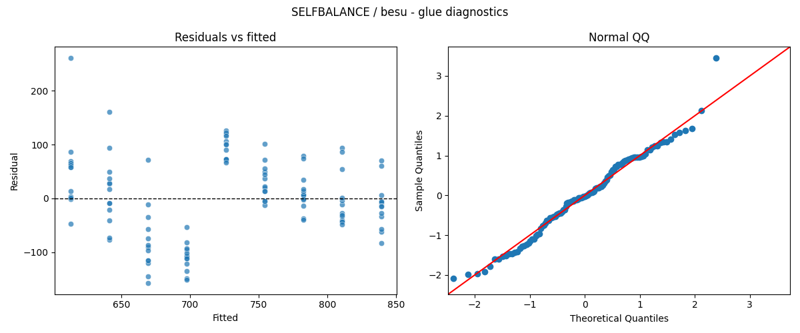

</details>

<details><summary><code>SUB</code> · nobs=143 · runtime_ms=1.111e-05 · p=1.00e-03 · R²=0.8758</summary>

```
==============================================================================
                           NNLS Regression Results                            
==============================================================================
Dep. Variable:          test_runtime_ms              R-squared:          0.876
Model:                  NNLS                    Adj. R-squared:          0.875
No. Observations:       143                               RMSE:          44.03
Df Residuals:           141                                MAE:          37.35
Df Model:               1      
==============================================================================
                      coef     std err     P-value      [0.025      0.975]
------------------------------------------------------------------------------
         const     99.8621     13.1303       0.001     74.4749    125.0750
           SUB      0.0000      0.0000       0.001      0.0000      0.0000
==============================================================================
Notes: Non-negative least squares with bootstrap inference (1000 iterations)
==============================================================================
```


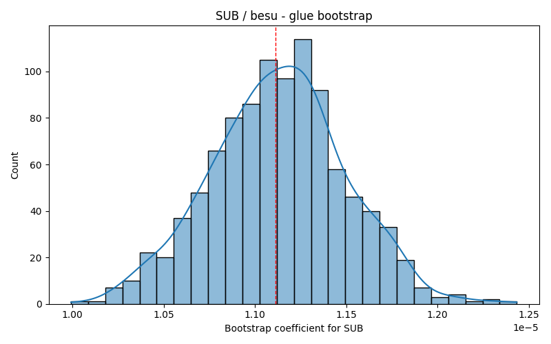

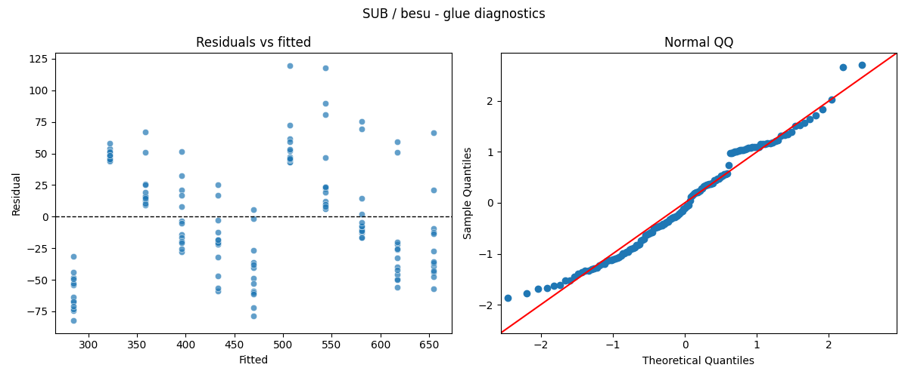

</details>

### Mixed glue (tier B) · besu

<details><summary><code>JUMP</code> · nobs=143 · runtime_ms=4.713e-05 · p=1.00e-03 · R²=0.8739</summary>

```
==============================================================================
                           NNLS Regression Results                            
==============================================================================
Dep. Variable:          test_runtime_ms              R-squared:          0.874
Model:                  NNLS                    Adj. R-squared:          0.873
No. Observations:       143                               RMSE:          66.53
Df Residuals:           141                                MAE:          56.95
Df Model:               1      
==============================================================================
                      coef     std err     P-value      [0.025      0.975]
------------------------------------------------------------------------------
         const    154.7990     21.1837       0.001    114.9794    196.2630
          JUMP      0.0000      0.0000       0.001      0.0000      0.0001
==============================================================================
Notes: Non-negative least squares with bootstrap inference (1000 iterations)
==============================================================================
```

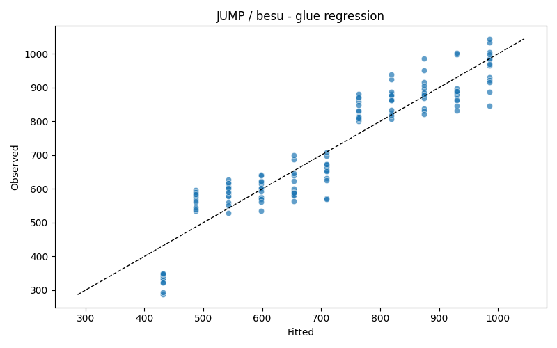

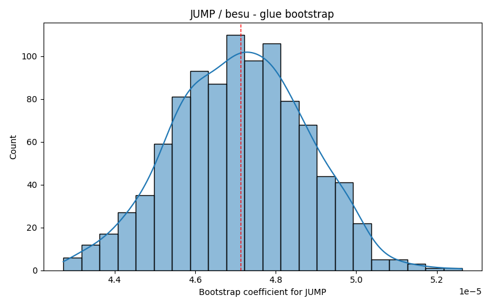

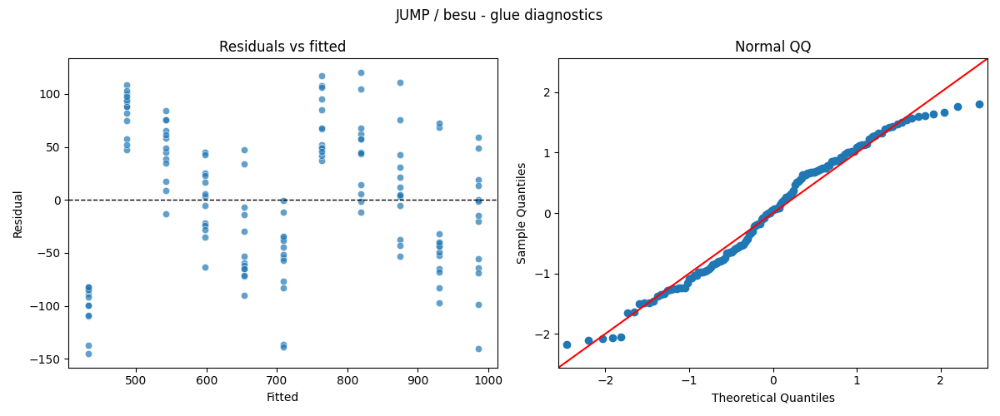

</details>

<details><summary><code>KECCAK256</code> · nobs=2288 · runtime_ms=5.181e-05 · p=1.00e-03 · R²=0.2854</summary>

```
==============================================================================
                           NNLS Regression Results                            
==============================================================================
Dep. Variable:          test_runtime_ms              R-squared:          0.285
Model:                  NNLS                    Adj. R-squared:          0.285
No. Observations:       2288                              RMSE:         162.91
Df Residuals:           2286                               MAE:         127.15
Df Model:               1      
==============================================================================
                      coef     std err     P-value      [0.025      0.975]
------------------------------------------------------------------------------
         const    508.5483      7.4924       0.001    493.9330    522.9131
     KECCAK256      0.0001      0.0000       0.001      0.0000      0.0001
==============================================================================
Notes: Non-negative least squares with bootstrap inference (1000 iterations)
==============================================================================
```

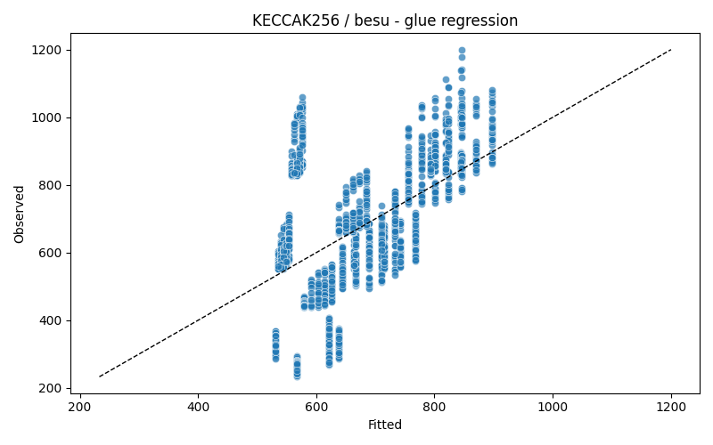

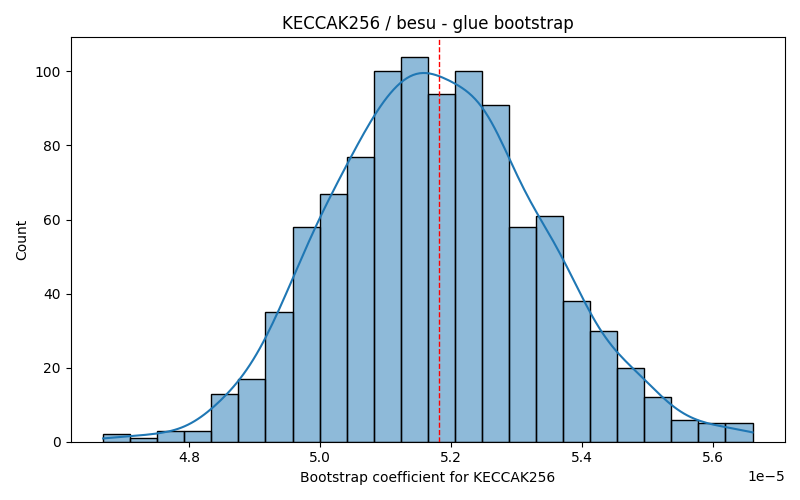

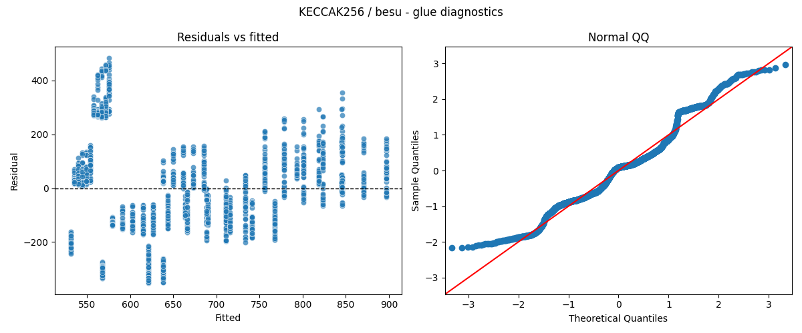

</details>

## erigon

| glue_opcode | nobs | glue_runtime_ms | p_value | rsquared |
| --- | --- | --- | --- | --- |
| `ISZERO` | 0 | n/a | n/a | n/a |
| `JUMPDEST` | 0 | n/a | n/a | n/a |
| `SWAP` | 0 | n/a | n/a | n/a |
| `CALLDATASIZE` | 11 | 0 | 1.00e+00 | 0.9838 |
| `DUP` | 11 | 21.61 | 9.00e-03 | 0.9838 |
| `GAS` | 11 | 0.0005717 | 3.85e-01 | 0.9838 |
| `MLOAD` | 11 | 0 | 1.00e+00 | 0.9838 |
| `PUSH` | 11 | 0 | 1.00e+00 | 0.9838 |
| `PUSH0` | 11 | 0 | 1.00e+00 | 0.9838 |
| `STATICCALL` | 11 | 0 | 1.00e+00 | 0.9838 |
| `ADD` | 0 | n/a | n/a | n/a |
| `AND` | 0 | n/a | n/a | n/a |
| `CALLDATACOPY` | 0 | n/a | n/a | n/a |
| `CALLDATALOAD` | 0 | n/a | n/a | n/a |
| `DIV` | 0 | n/a | n/a | n/a |
| `EXP` | 0 | n/a | n/a | n/a |
| `GT` | 0 | n/a | n/a | n/a |
| `JUMPI` | 0 | n/a | n/a | n/a |
| `LT` | 0 | n/a | n/a | n/a |
| `MSTORE` | 0 | n/a | n/a | n/a |
| `MSTORE8` | 0 | n/a | n/a | n/a |
| `MUL` | 0 | n/a | n/a | n/a |
| `PC` | 0 | n/a | n/a | n/a |
| `RETURNDATASIZE` | 0 | n/a | n/a | n/a |
| `SELFBALANCE` | 0 | n/a | n/a | n/a |
| `SUB` | 0 | n/a | n/a | n/a |
| `JUMP` | 0 | n/a | n/a | n/a |
| `KECCAK256` | 0 | n/a | n/a | n/a |

### Cycle glue — joint fit · erigon

<details><summary>Joint NNLS regression summary</summary>

```
==============================================================================
                           NNLS Regression Results                            
==============================================================================
Dep. Variable:          test_runtime_ms              R-squared:          0.984
Model:                  NNLS                    Adj. R-squared:          0.946
No. Observations:       11                                RMSE:          37.94
Df Residuals:           3                                  MAE:          33.43
Df Model:               7      
==============================================================================
                      coef     std err     P-value      [0.025      0.975]
------------------------------------------------------------------------------
         const      0.0000      0.0000       1.000      0.0000      0.0000
  CALLDATASIZE      0.0000      0.0000       1.000      0.0000      0.0000
           DUP     21.6080     10.8525       0.009      4.7253     46.7169
           GAS      0.0006      0.0003       0.385      0.0000      0.0006
         MLOAD      0.0000      0.0000       1.000      0.0000      0.0000
          PUSH      0.0000      0.0001       1.000      0.0000      0.0001
         PUSH0      0.0000      0.0000       1.000      0.0000      0.0000
    STATICCALL      0.0000      0.0001       1.000      0.0000      0.0000
==============================================================================
Notes: Non-negative least squares with bootstrap inference (1000 iterations)
==============================================================================
```

</details>

<details><summary><code>CALLDATASIZE</code> · nobs=11 · runtime_ms=0 · p=1.00e+00 · R²=0.9838</summary>

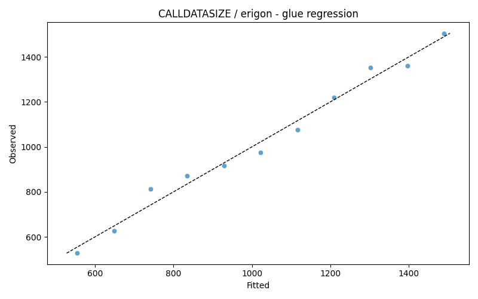


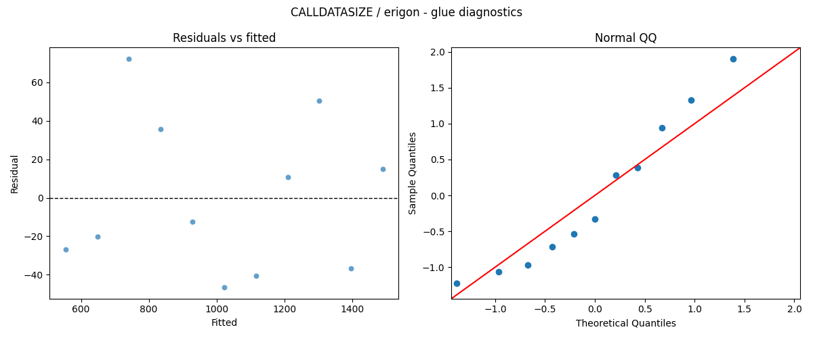

</details>

<details><summary><code>DUP</code> · nobs=11 · runtime_ms=21.61 · p=9.00e-03 · R²=0.9838</summary>


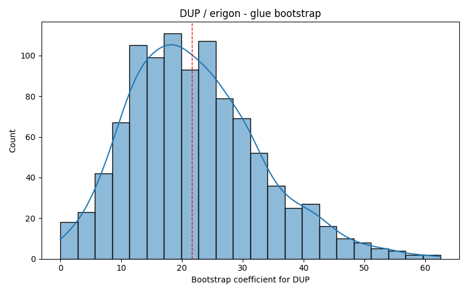

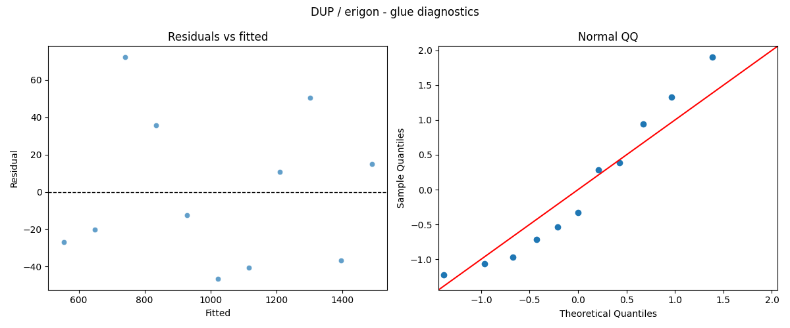

</details>

<details><summary><code>GAS</code> · nobs=11 · runtime_ms=0.0005717 · p=3.85e-01 · R²=0.9838</summary>

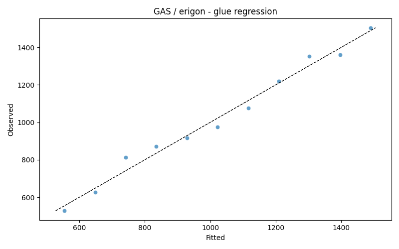

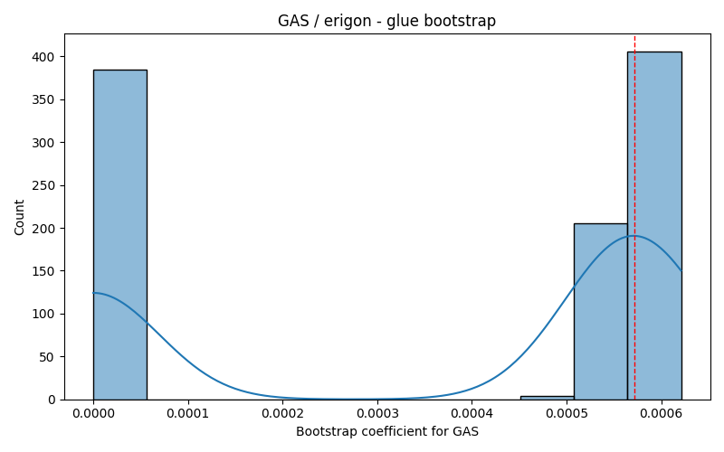


</details>

<details><summary><code>MLOAD</code> · nobs=11 · runtime_ms=0 · p=1.00e+00 · R²=0.9838</summary>

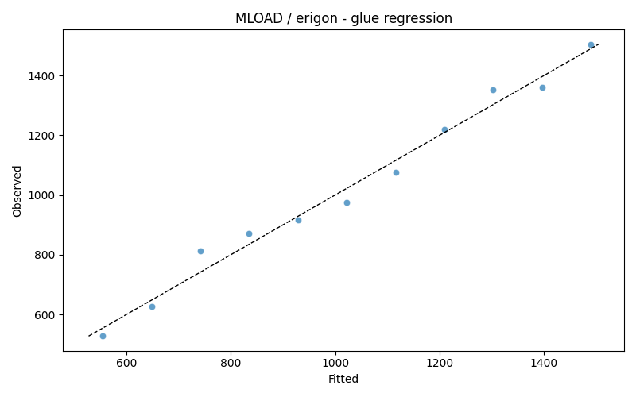

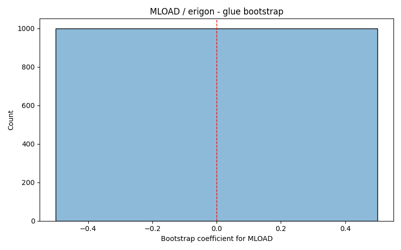

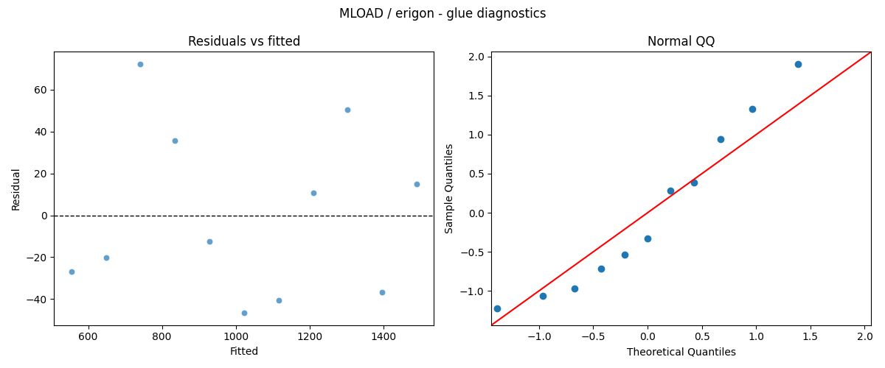

</details>

<details><summary><code>PUSH</code> · nobs=11 · runtime_ms=0 · p=1.00e+00 · R²=0.9838</summary>

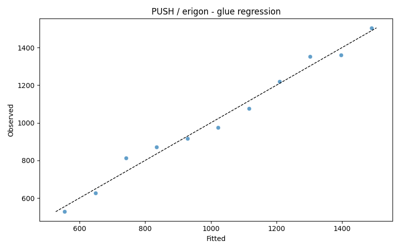

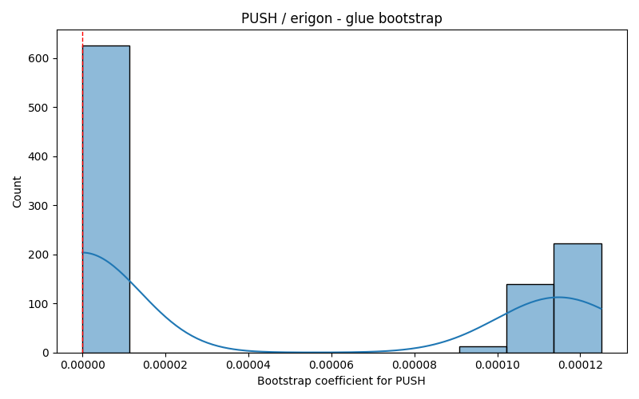


</details>

<details><summary><code>PUSH0</code> · nobs=11 · runtime_ms=0 · p=1.00e+00 · R²=0.9838</summary>


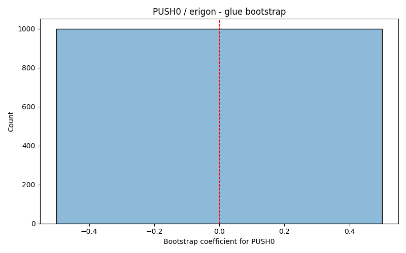


</details>

<details><summary><code>STATICCALL</code> · nobs=11 · runtime_ms=0 · p=1.00e+00 · R²=0.9838</summary>


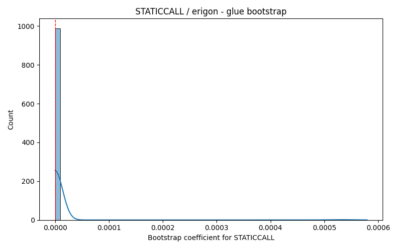

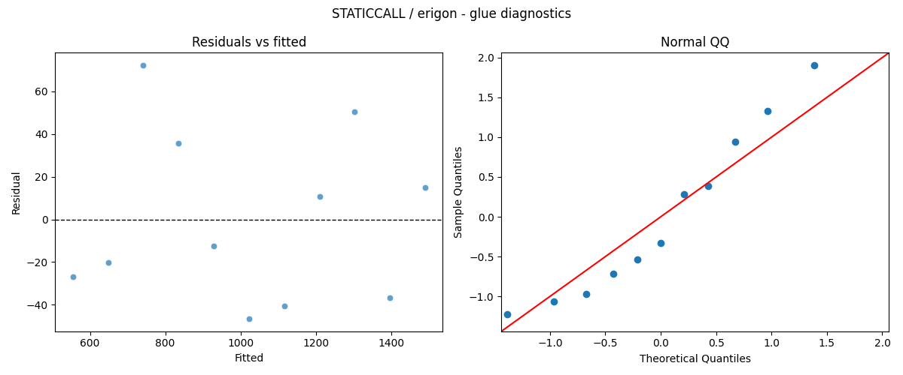

</details>

### Pure glue · erigon

<details><summary><code>ISZERO</code> · nobs=0 · runtime_ms=n/a · p=n/a · R²=n/a</summary>

</details>

<details><summary><code>JUMPDEST</code> · nobs=0 · runtime_ms=n/a · p=n/a · R²=n/a</summary>

</details>

<details><summary><code>SWAP</code> · nobs=0 · runtime_ms=n/a · p=n/a · R²=n/a</summary>

</details>

### Mixed glue (tier A) · erigon

<details><summary><code>ADD</code> · nobs=0 · runtime_ms=n/a · p=n/a · R²=n/a</summary>

</details>

<details><summary><code>AND</code> · nobs=0 · runtime_ms=n/a · p=n/a · R²=n/a</summary>

</details>

<details><summary><code>CALLDATACOPY</code> · nobs=0 · runtime_ms=n/a · p=n/a · R²=n/a</summary>

</details>

<details><summary><code>CALLDATALOAD</code> · nobs=0 · runtime_ms=n/a · p=n/a · R²=n/a</summary>

</details>

<details><summary><code>DIV</code> · nobs=0 · runtime_ms=n/a · p=n/a · R²=n/a</summary>

</details>

<details><summary><code>EXP</code> · nobs=0 · runtime_ms=n/a · p=n/a · R²=n/a</summary>

</details>

<details><summary><code>GT</code> · nobs=0 · runtime_ms=n/a · p=n/a · R²=n/a</summary>

</details>

<details><summary><code>JUMPI</code> · nobs=0 · runtime_ms=n/a · p=n/a · R²=n/a</summary>

</details>

<details><summary><code>LT</code> · nobs=0 · runtime_ms=n/a · p=n/a · R²=n/a</summary>

</details>

<details><summary><code>MSTORE</code> · nobs=0 · runtime_ms=n/a · p=n/a · R²=n/a</summary>

</details>

<details><summary><code>MSTORE8</code> · nobs=0 · runtime_ms=n/a · p=n/a · R²=n/a</summary>

</details>

<details><summary><code>MUL</code> · nobs=0 · runtime_ms=n/a · p=n/a · R²=n/a</summary>

</details>

<details><summary><code>PC</code> · nobs=0 · runtime_ms=n/a · p=n/a · R²=n/a</summary>

</details>

<details><summary><code>RETURNDATASIZE</code> · nobs=0 · runtime_ms=n/a · p=n/a · R²=n/a</summary>

</details>

<details><summary><code>SELFBALANCE</code> · nobs=0 · runtime_ms=n/a · p=n/a · R²=n/a</summary>

</details>

<details><summary><code>SUB</code> · nobs=0 · runtime_ms=n/a · p=n/a · R²=n/a</summary>

</details>

### Mixed glue (tier B) · erigon

<details><summary><code>JUMP</code> · nobs=0 · runtime_ms=n/a · p=n/a · R²=n/a</summary>

</details>

<details><summary><code>KECCAK256</code> · nobs=0 · runtime_ms=n/a · p=n/a · R²=n/a</summary>

</details>

## geth

| glue_opcode | nobs | glue_runtime_ms | p_value | rsquared |
| --- | --- | --- | --- | --- |
| `ISZERO` | 154 | 2.52e-06 | 1.00e-03 | 0.09045 |
| `JUMPDEST` | 154 | 2.029e-06 | 1.00e-03 | 0.07882 |
| `SWAP` | 2464 | 2.623e-06 | 1.00e-03 | 0.0813 |
| `CALLDATASIZE` | 9086 | 2.766e-06 | 3.80e-02 | 0.106 |
| `DUP` | 9086 | 2.965e-06 | 1.00e-03 | 0.106 |
| `GAS` | 9086 | 2.799e-06 | 4.90e-02 | 0.106 |
| `MLOAD` | 9086 | 8.344e-06 | 1.00e-03 | 0.106 |
| `PUSH` | 9086 | 4.13e-06 | 1.00e-03 | 0.106 |
| `PUSH0` | 9086 | 2.718e-06 | 5.80e-02 | 0.106 |
| `STATICCALL` | 9086 | 0 | 1.00e+00 | 0.106 |
| `ADD` | 154 | 6.36e-06 | 1.00e-03 | 0.0901 |
| `AND` | 154 | 6.66e-06 | 1.00e-03 | 0.09006 |
| `CALLDATACOPY` | 3696 | 2.066e-05 | 1.00e-03 | 0.2917 |
| `CALLDATALOAD` | 616 | 7.896e-05 | 1.00e-03 | 0.04215 |
| `DIV` | 154 | 1.571e-05 | 1.00e-03 | 0.0792 |
| `EXP` | 154 | 0.0005793 | 1.00e-03 | 0.08395 |
| `GT` | 154 | 6.623e-06 | 1.00e-03 | 0.09078 |
| `JUMPI` | 154 | 9.67e-06 | 1.00e-03 | 0.08979 |
| `LT` | 154 | 7.413e-06 | 1.00e-03 | 0.104 |
| `MSTORE` | 770 | 1.357e-05 | 1.00e-03 | 0.08411 |
| `MSTORE8` | 770 | 1.262e-05 | 1.00e-03 | 0.08492 |
| `MUL` | 154 | 8.233e-06 | 1.00e-03 | 0.09207 |
| `PC` | 154 | 2.77e-06 | 1.00e-03 | 0.09067 |
| `RETURNDATASIZE` | 616 | 5.274e-06 | 1.00e-03 | 0.09543 |
| `SELFBALANCE` | 126 | 1.36e-05 | 1.00e-03 | 0.04599 |
| `SUB` | 154 | 7.052e-06 | 1.00e-03 | 0.09297 |
| `JUMP` | 154 | 1.571e-05 | 1.00e-03 | 0.08017 |
| `KECCAK256` | 2464 | 6.382e-05 | 1.00e-03 | 0.03461 |

### Cycle glue — joint fit · geth

<details><summary>Joint NNLS regression summary</summary>

```
==============================================================================
                           NNLS Regression Results                            
==============================================================================
Dep. Variable:          test_runtime_ms              R-squared:          0.106
Model:                  NNLS                    Adj. R-squared:          0.105
No. Observations:       9086                              RMSE:         249.44
Df Residuals:           9078                               MAE:         162.29
Df Model:               7      
==============================================================================
                      coef     std err     P-value      [0.025      0.975]
------------------------------------------------------------------------------
         const     34.2004      7.4727       0.001     19.4983     48.7407
  CALLDATASIZE      0.0000      0.0000       0.038      0.0000      0.0000
           DUP      0.0000      0.0000       0.001      0.0000      0.0000
           GAS      0.0000      0.0000       0.049      0.0000      0.0000
         MLOAD      0.0000      0.0000       0.001      0.0000      0.0000
          PUSH      0.0000      0.0000       0.001      0.0000      0.0000
         PUSH0      0.0000      0.0000       0.058      0.0000      0.0000
    STATICCALL      0.0000      0.0010       1.000      0.0000      0.0028
==============================================================================
Notes: Non-negative least squares with bootstrap inference (1000 iterations)
==============================================================================
```

</details>

<details><summary><code>CALLDATASIZE</code> · nobs=9086 · runtime_ms=2.766e-06 · p=3.80e-02 · R²=0.106</summary>

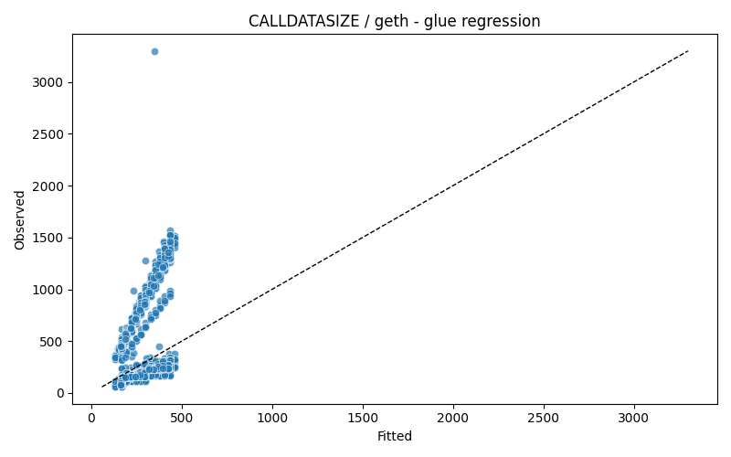

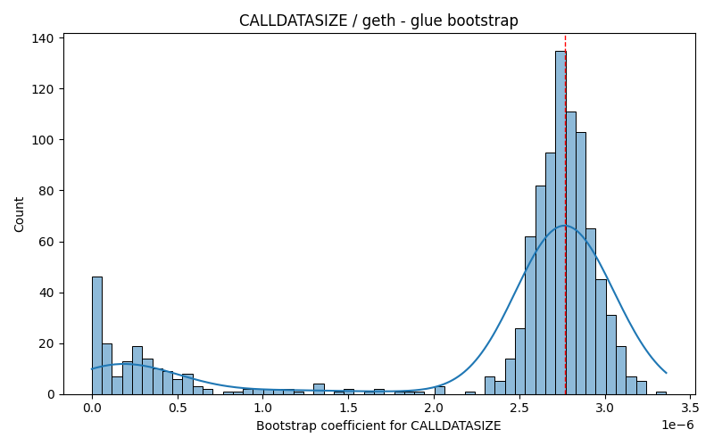

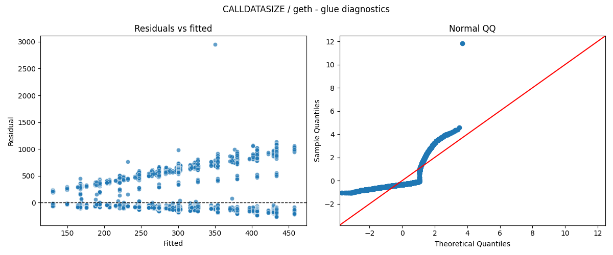

</details>

<details><summary><code>DUP</code> · nobs=9086 · runtime_ms=2.965e-06 · p=1.00e-03 · R²=0.106</summary>


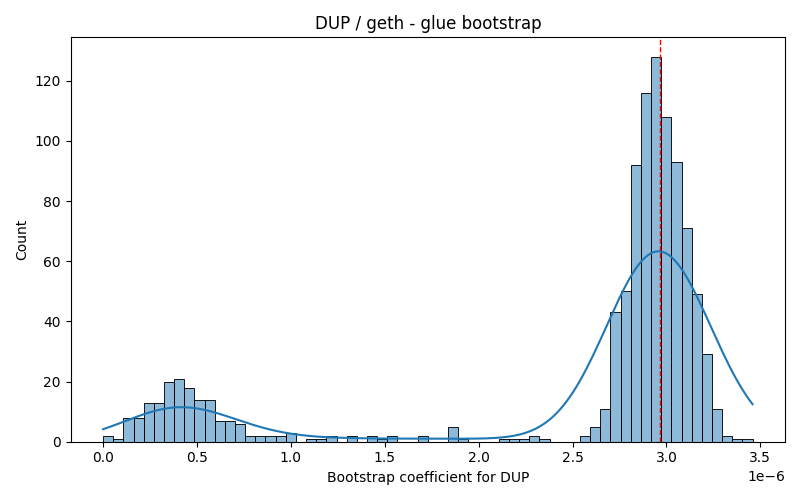


</details>

<details><summary><code>GAS</code> · nobs=9086 · runtime_ms=2.799e-06 · p=4.90e-02 · R²=0.106</summary>

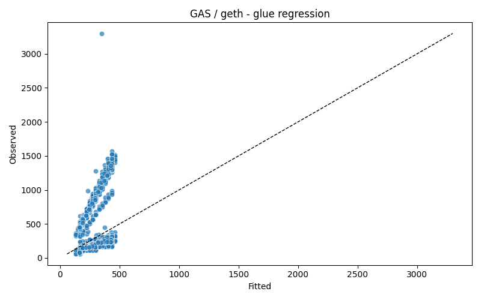

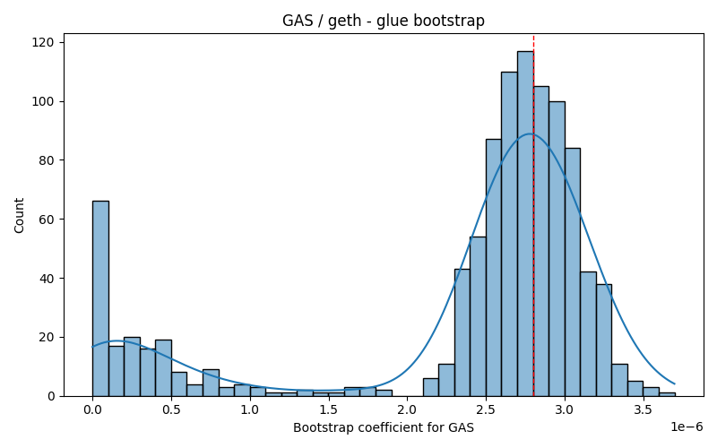


</details>

<details><summary><code>MLOAD</code> · nobs=9086 · runtime_ms=8.344e-06 · p=1.00e-03 · R²=0.106</summary>

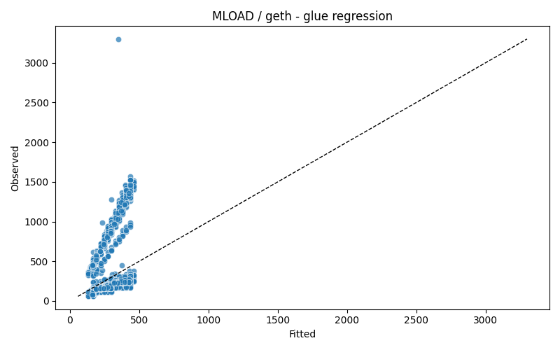

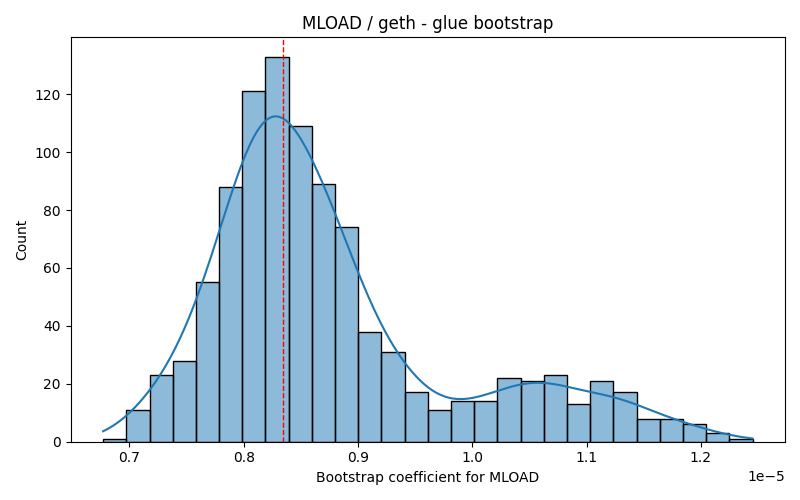


</details>

<details><summary><code>PUSH</code> · nobs=9086 · runtime_ms=4.13e-06 · p=1.00e-03 · R²=0.106</summary>

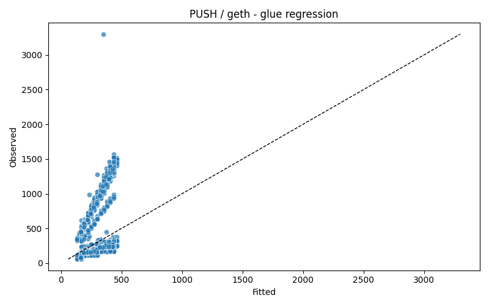

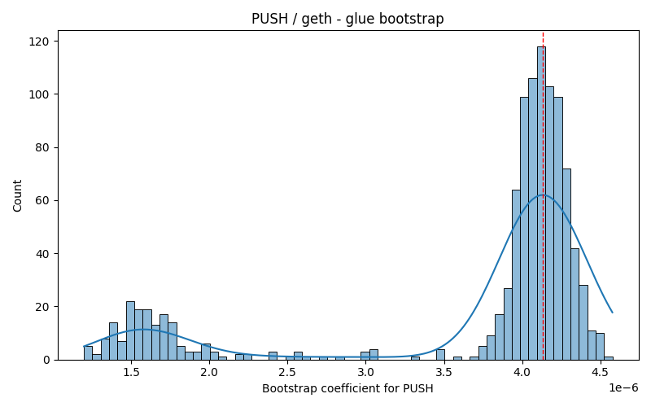

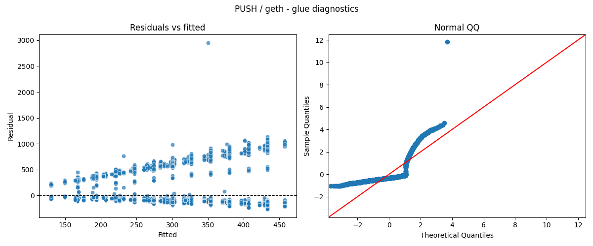

</details>

<details><summary><code>PUSH0</code> · nobs=9086 · runtime_ms=2.718e-06 · p=5.80e-02 · R²=0.106</summary>


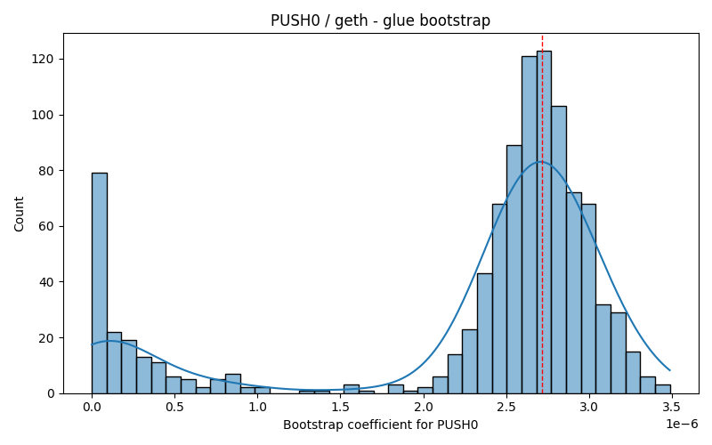


</details>

<details><summary><code>STATICCALL</code> · nobs=9086 · runtime_ms=0 · p=1.00e+00 · R²=0.106</summary>

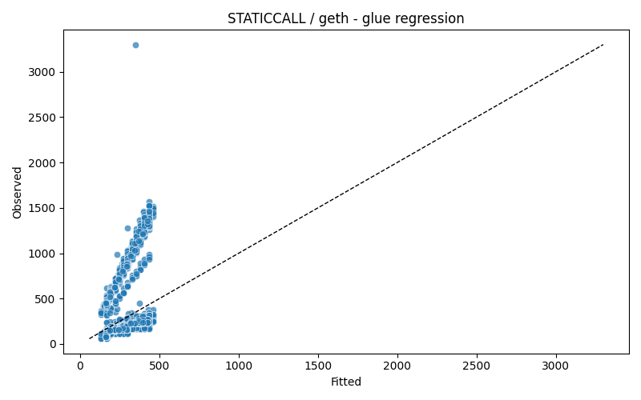

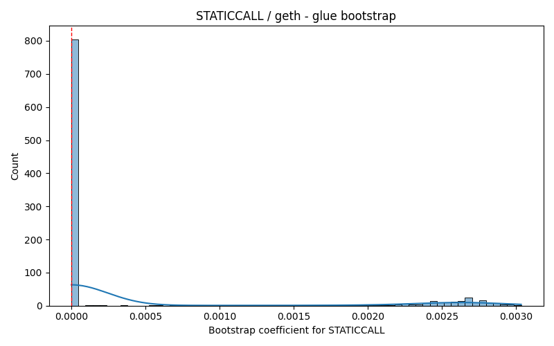


</details>

### Pure glue · geth

<details><summary><code>ISZERO</code> · nobs=154 · runtime_ms=2.52e-06 · p=1.00e-03 · R²=0.09045</summary>

```
==============================================================================
                           NNLS Regression Results                            
==============================================================================
Dep. Variable:          test_runtime_ms              R-squared:          0.090
Model:                  NNLS                    Adj. R-squared:          0.084
No. Observations:       154                               RMSE:         168.26
Df Residuals:           152                                MAE:         110.87
Df Model:               1      
==============================================================================
                      coef     std err     P-value      [0.025      0.975]
------------------------------------------------------------------------------
         const     21.6384     27.8073       0.266      0.0000     91.7568
        ISZERO      0.0000      0.0000       0.001      0.0000      0.0000
==============================================================================
Notes: Non-negative least squares with bootstrap inference (1000 iterations)
==============================================================================
```

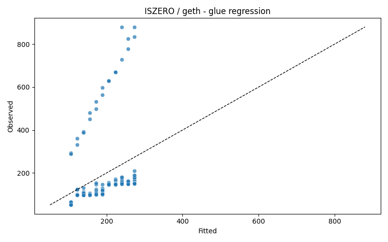

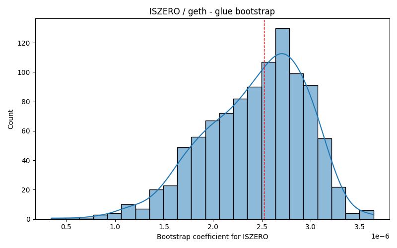

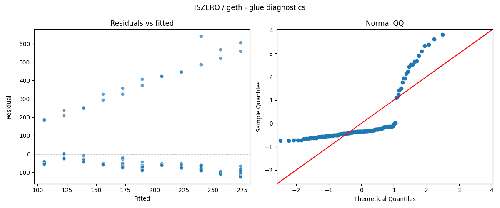

</details>

<details><summary><code>JUMPDEST</code> · nobs=154 · runtime_ms=2.029e-06 · p=1.00e-03 · R²=0.07882</summary>

```
==============================================================================
                           NNLS Regression Results                            
==============================================================================
Dep. Variable:          test_runtime_ms              R-squared:          0.079
Model:                  NNLS                    Adj. R-squared:          0.073
No. Observations:       154                               RMSE:         438.11
Df Residuals:           152                                MAE:         292.84
Df Model:               1      
==============================================================================
                      coef     std err     P-value      [0.025      0.975]
------------------------------------------------------------------------------
         const     78.3232     79.5532       0.220      0.0000    261.4530
      JUMPDEST      0.0000      0.0000       0.001      0.0000      0.0000
==============================================================================
Notes: Non-negative least squares with bootstrap inference (1000 iterations)
==============================================================================
```

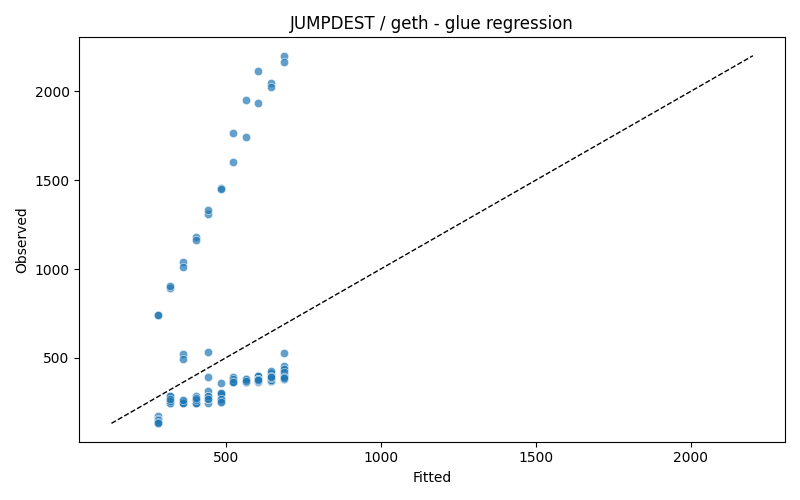

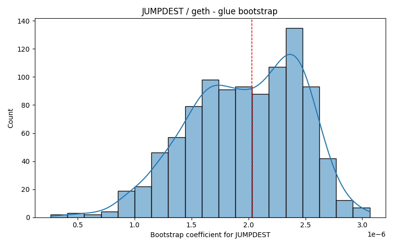

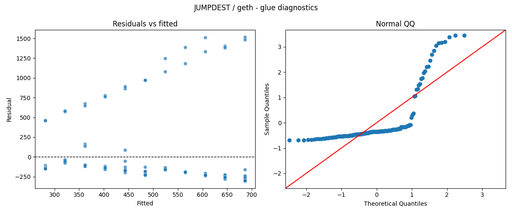

</details>

<details><summary><code>SWAP</code> · nobs=2464 · runtime_ms=2.623e-06 · p=1.00e-03 · R²=0.0813</summary>

```
==============================================================================
                           NNLS Regression Results                            
==============================================================================
Dep. Variable:          test_runtime_ms              R-squared:          0.081
Model:                  NNLS                    Adj. R-squared:          0.081
No. Observations:       2464                              RMSE:         185.65
Df Residuals:           2462                               MAE:         122.93
Df Model:               1      
==============================================================================
                      coef     std err     P-value      [0.025      0.975]
------------------------------------------------------------------------------
         const     29.9687     11.3149       0.006      8.0573     51.5814
          SWAP      0.0000      0.0000       0.001      0.0000      0.0000
==============================================================================
Notes: Non-negative least squares with bootstrap inference (1000 iterations)
==============================================================================
```

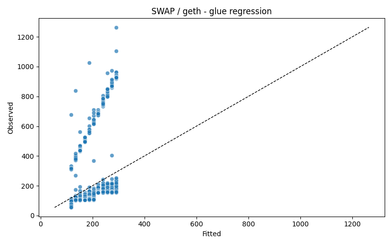

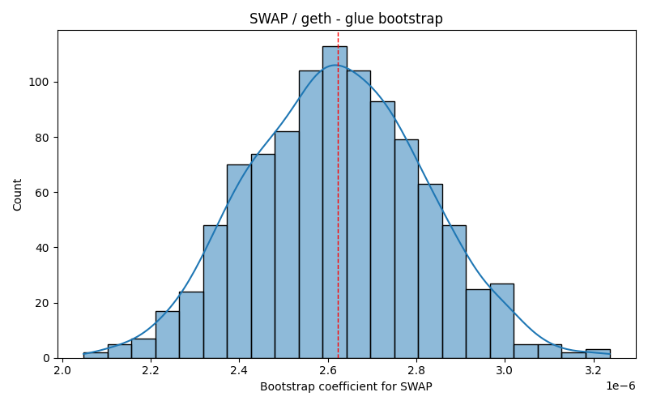


</details>

### Mixed glue (tier A) · geth

<details><summary><code>ADD</code> · nobs=154 · runtime_ms=6.36e-06 · p=1.00e-03 · R²=0.0901</summary>

```
==============================================================================
                           NNLS Regression Results                            
==============================================================================
Dep. Variable:          test_runtime_ms              R-squared:          0.090
Model:                  NNLS                    Adj. R-squared:          0.084
No. Observations:       154                               RMSE:         212.72
Df Residuals:           152                                MAE:         141.13
Df Model:               1      
==============================================================================
                      coef     std err     P-value      [0.025      0.975]
------------------------------------------------------------------------------
         const     62.7293     42.4633       0.097      0.0000    149.0842
           ADD      0.0000      0.0000       0.001      0.0000      0.0000
==============================================================================
Notes: Non-negative least squares with bootstrap inference (1000 iterations)
==============================================================================
```

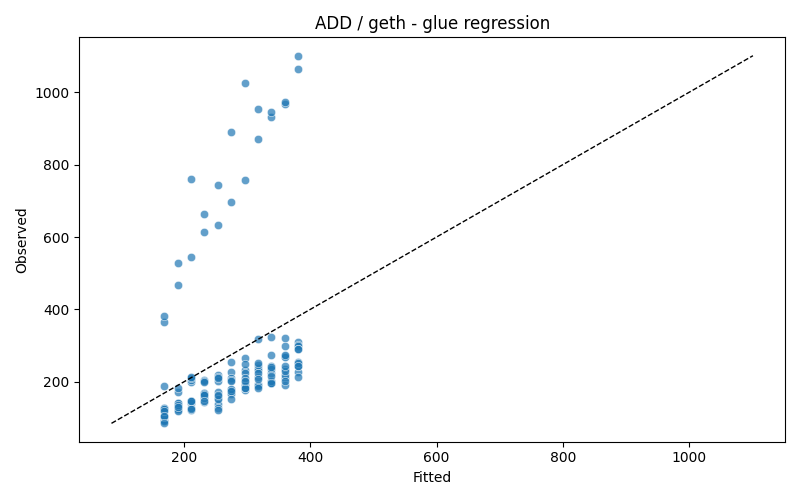

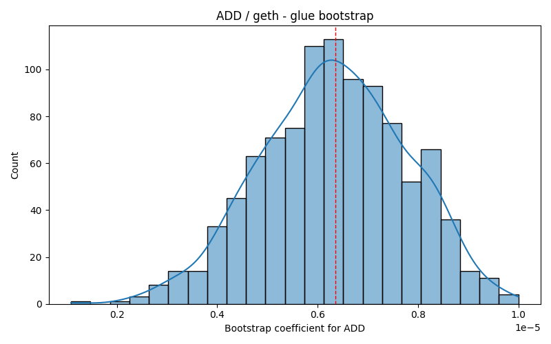

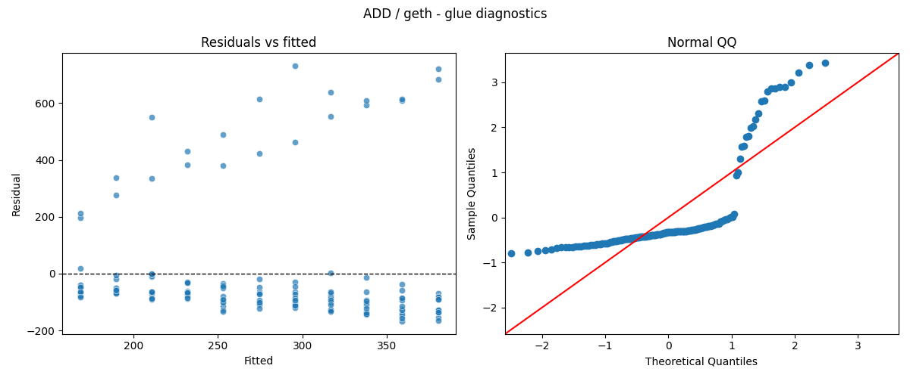

</details>

<details><summary><code>AND</code> · nobs=154 · runtime_ms=6.66e-06 · p=1.00e-03 · R²=0.09006</summary>

```
==============================================================================
                           NNLS Regression Results                            
==============================================================================
Dep. Variable:          test_runtime_ms              R-squared:          0.090
Model:                  NNLS                    Adj. R-squared:          0.084
No. Observations:       154                               RMSE:         222.80
Df Residuals:           152                                MAE:         145.85
Df Model:               1      
==============================================================================
                      coef     std err     P-value      [0.025      0.975]
------------------------------------------------------------------------------
         const     50.0817     42.0856       0.169      0.0000    142.2821
           AND      0.0000      0.0000       0.001      0.0000      0.0000
==============================================================================
Notes: Non-negative least squares with bootstrap inference (1000 iterations)
==============================================================================
```

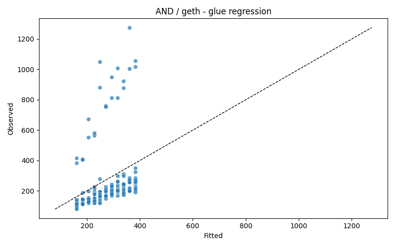

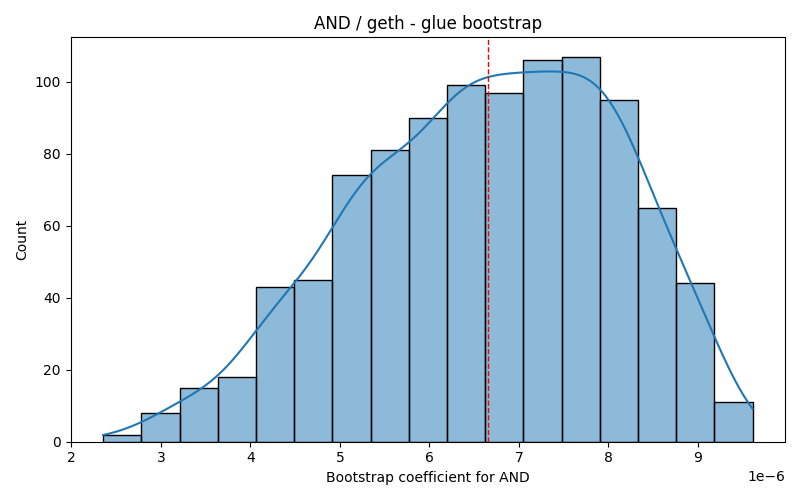

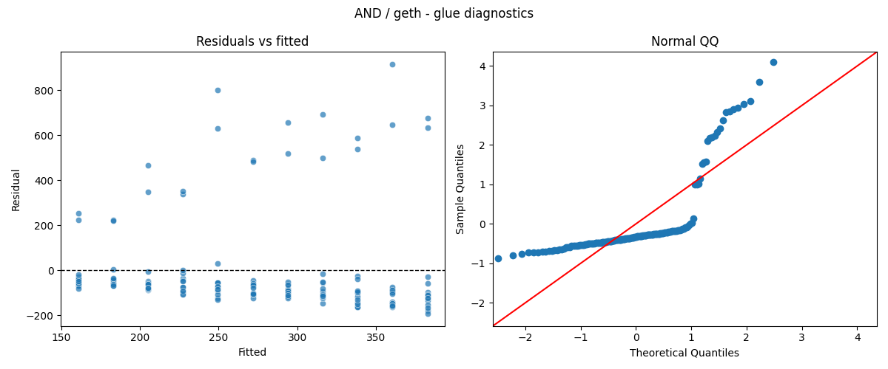

</details>

<details><summary><code>CALLDATACOPY</code> · nobs=3696 · runtime_ms=2.066e-05 · p=1.00e-03 · R²=0.2917</summary>

```
==============================================================================
                           NNLS Regression Results                            
==============================================================================
Dep. Variable:          test_runtime_ms              R-squared:          0.292
Model:                  NNLS                    Adj. R-squared:          0.292
No. Observations:       3696                              RMSE:         242.06
Df Residuals:           3694                               MAE:         137.23
Df Model:               1      
==============================================================================
                      coef     std err     P-value      [0.025      0.975]
------------------------------------------------------------------------------
         const     25.6732      4.9071       0.001     15.0331     34.8366
  CALLDATACOPY      0.0000      0.0000       0.001      0.0000      0.0000
==============================================================================
Notes: Non-negative least squares with bootstrap inference (1000 iterations)
==============================================================================
```

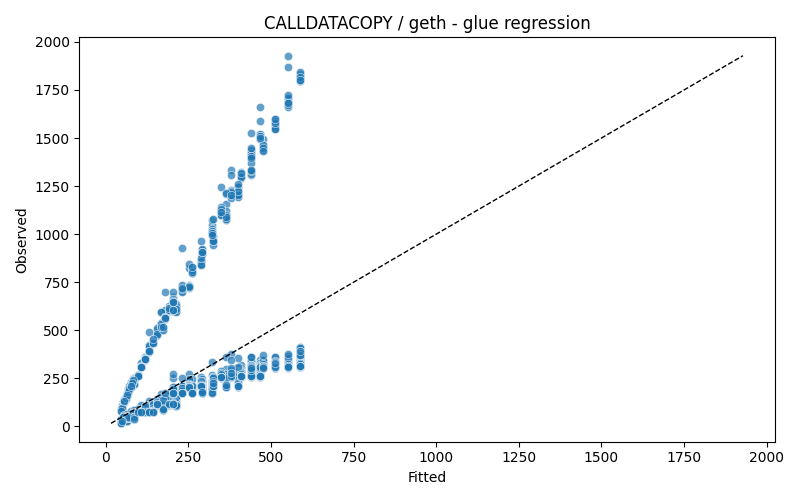

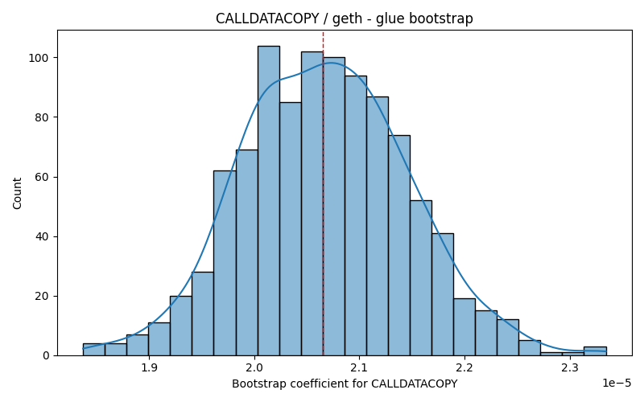

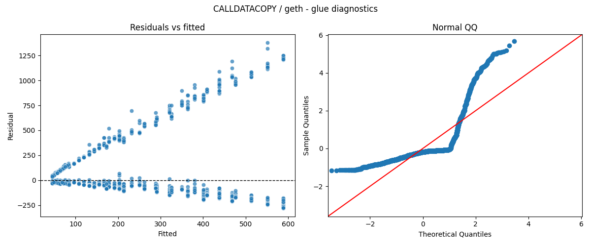

</details>

<details><summary><code>CALLDATALOAD</code> · nobs=616 · runtime_ms=7.896e-05 · p=1.00e-03 · R²=0.04215</summary>

```
==============================================================================
                           NNLS Regression Results                            
==============================================================================
Dep. Variable:          test_runtime_ms              R-squared:          0.042
Model:                  NNLS                    Adj. R-squared:          0.041
No. Observations:       616                               RMSE:           1.44
Df Residuals:           614                                MAE:           0.72
Df Model:               1      
==============================================================================
                      coef     std err     P-value      [0.025      0.975]
------------------------------------------------------------------------------
         const      2.3929      0.1835       0.001      2.0277      2.7449
  CALLDATALOAD      0.0001      0.0000       0.001      0.0000      0.0001
==============================================================================
Notes: Non-negative least squares with bootstrap inference (1000 iterations)
==============================================================================
```

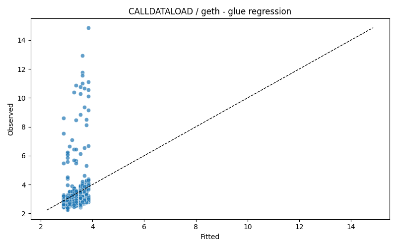

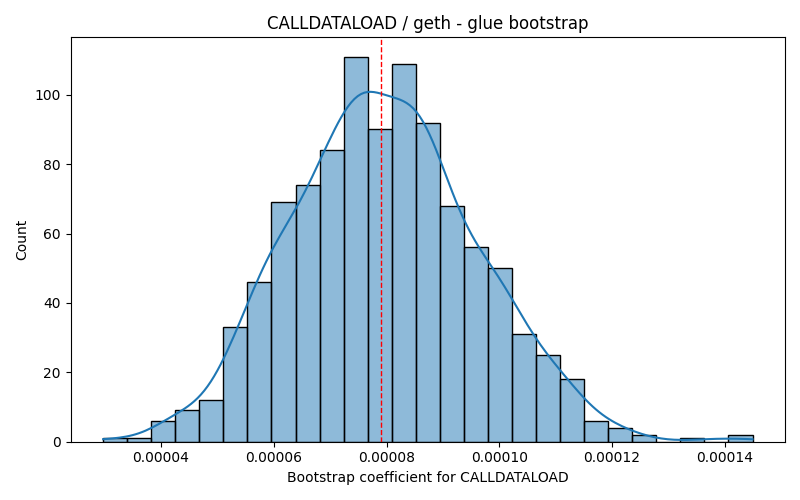

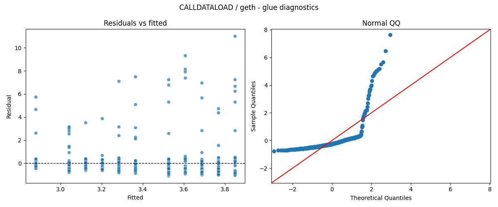

</details>

<details><summary><code>DIV</code> · nobs=154 · runtime_ms=1.571e-05 · p=1.00e-03 · R²=0.0792</summary>

```
==============================================================================
                           NNLS Regression Results                            
==============================================================================
Dep. Variable:          test_runtime_ms              R-squared:          0.079
Model:                  NNLS                    Adj. R-squared:          0.073
No. Observations:       154                               RMSE:         422.87
Df Residuals:           152                                MAE:         279.76
Df Model:               1      
==============================================================================
                      coef     std err     P-value      [0.025      0.975]
------------------------------------------------------------------------------
         const     82.9421     78.6816       0.186      0.0000    262.7112
           DIV      0.0000      0.0000       0.001      0.0000      0.0000
==============================================================================
Notes: Non-negative least squares with bootstrap inference (1000 iterations)
==============================================================================
```

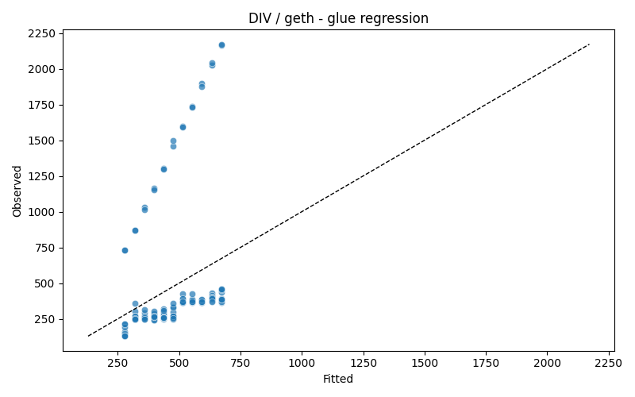

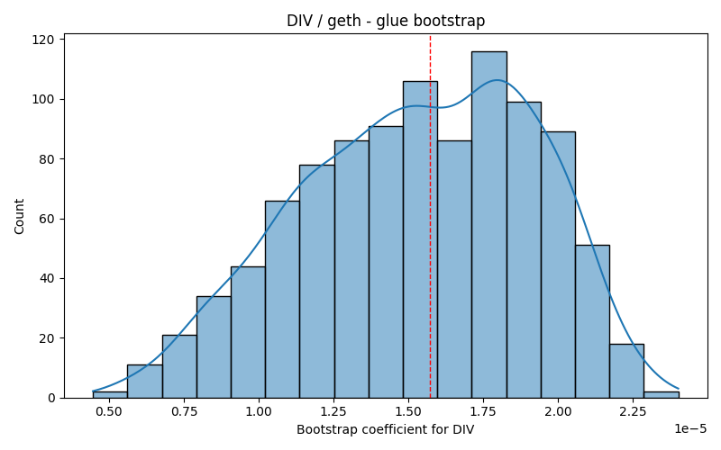

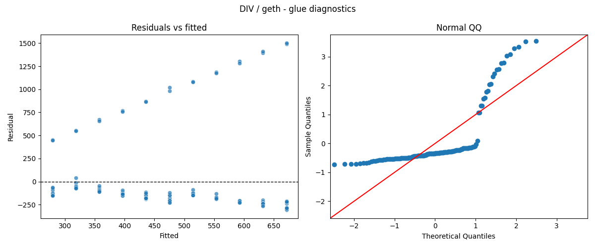

</details>

<details><summary><code>EXP</code> · nobs=154 · runtime_ms=0.0005793 · p=1.00e-03 · R²=0.08395</summary>

```
==============================================================================
                           NNLS Regression Results                            
==============================================================================
Dep. Variable:          test_runtime_ms              R-squared:          0.084
Model:                  NNLS                    Adj. R-squared:          0.078
No. Observations:       154                               RMSE:          74.94
Df Residuals:           152                                MAE:          49.60
Df Model:               1      
==============================================================================
                      coef     std err     P-value      [0.025      0.975]
------------------------------------------------------------------------------
         const     12.0541     14.1822       0.243      0.0000     45.9495
           EXP      0.0006      0.0001       0.001      0.0003      0.0008
==============================================================================
Notes: Non-negative least squares with bootstrap inference (1000 iterations)
==============================================================================
```

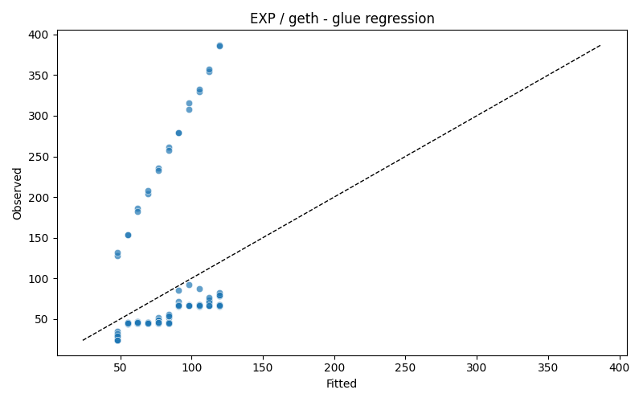

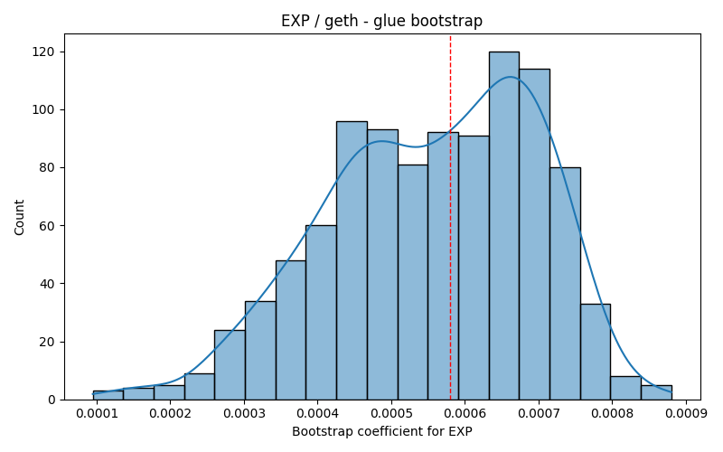

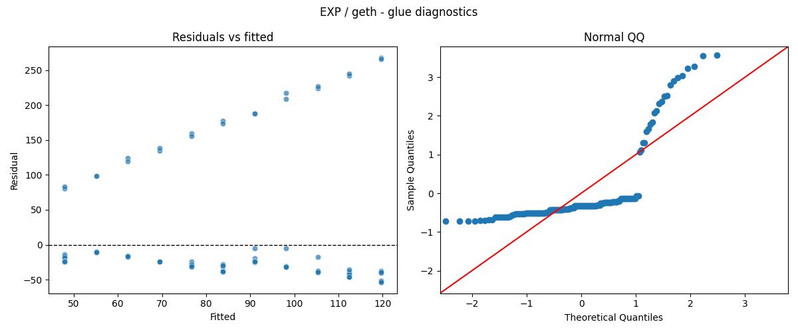

</details>

<details><summary><code>GT</code> · nobs=154 · runtime_ms=6.623e-06 · p=1.00e-03 · R²=0.09078</summary>

```
==============================================================================
                           NNLS Regression Results                            
==============================================================================
Dep. Variable:          test_runtime_ms              R-squared:          0.091
Model:                  NNLS                    Adj. R-squared:          0.085
No. Observations:       154                               RMSE:         220.61
Df Residuals:           152                                MAE:         141.09
Df Model:               1      
==============================================================================
                      coef     std err     P-value      [0.025      0.975]
------------------------------------------------------------------------------
         const     19.0692     34.8345       0.372      0.0000    111.3638
            GT      0.0000      0.0000       0.001      0.0000      0.0000
==============================================================================
Notes: Non-negative least squares with bootstrap inference (1000 iterations)
==============================================================================
```

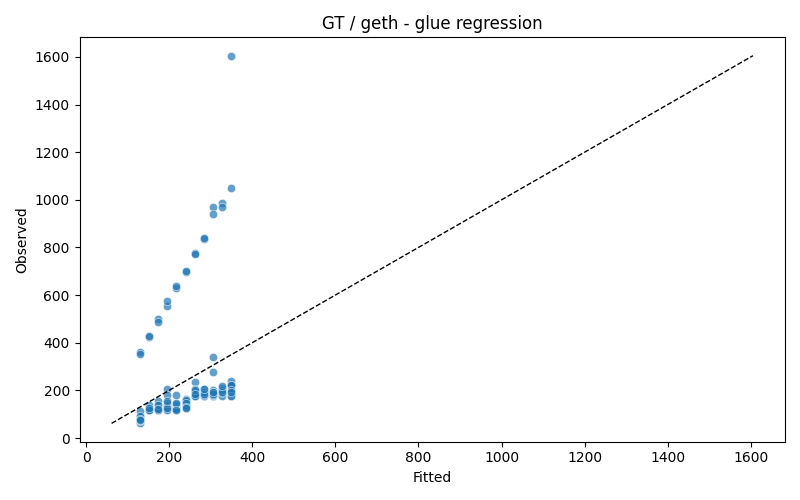

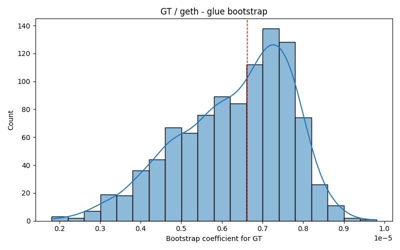

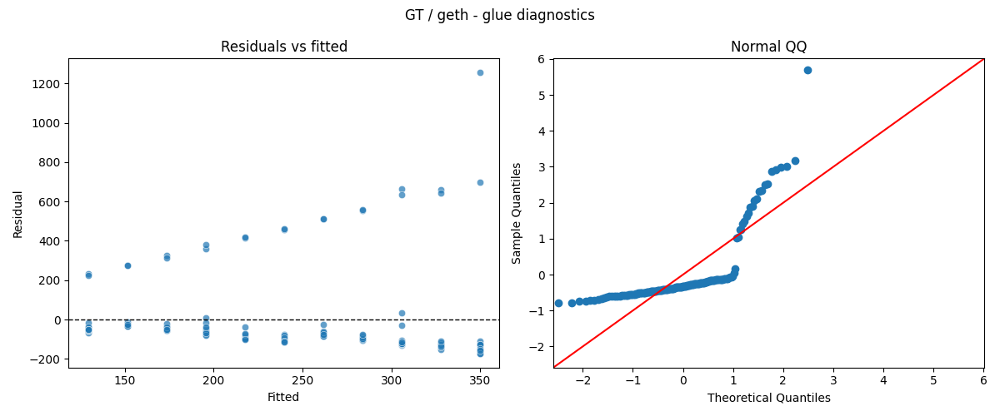

</details>

<details><summary><code>JUMPI</code> · nobs=154 · runtime_ms=9.67e-06 · p=1.00e-03 · R²=0.08979</summary>

```
==============================================================================
                           NNLS Regression Results                            
==============================================================================
Dep. Variable:          test_runtime_ms              R-squared:          0.090
Model:                  NNLS                    Adj. R-squared:          0.084
No. Observations:       154                               RMSE:         138.90
Df Residuals:           152                                MAE:          91.94
Df Model:               1      
==============================================================================
                      coef     std err     P-value      [0.025      0.975]
------------------------------------------------------------------------------
         const     17.3779     22.9625       0.277      0.0000     77.8858
         JUMPI      0.0000      0.0000       0.001      0.0000      0.0000
==============================================================================
Notes: Non-negative least squares with bootstrap inference (1000 iterations)
==============================================================================
```

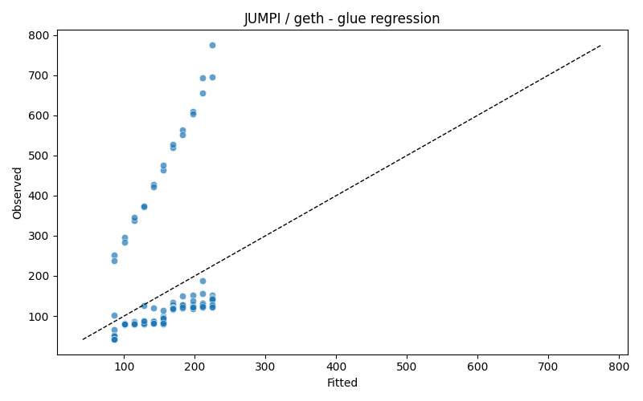

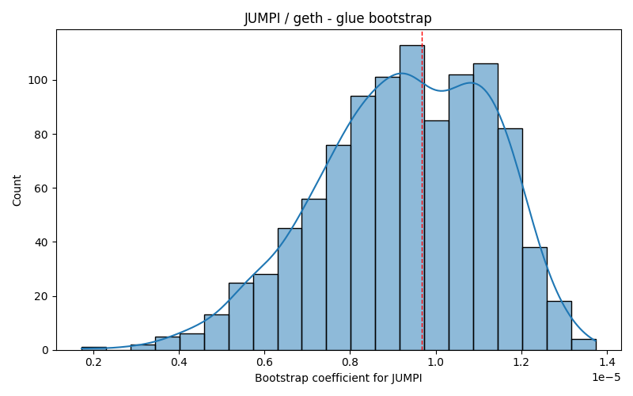

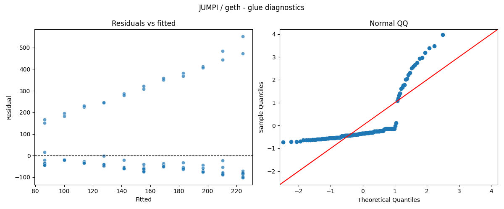

</details>

<details><summary><code>LT</code> · nobs=154 · runtime_ms=7.413e-06 · p=1.00e-03 · R²=0.104</summary>

```
==============================================================================
                           NNLS Regression Results                            
==============================================================================
Dep. Variable:          test_runtime_ms              R-squared:          0.104
Model:                  NNLS                    Adj. R-squared:          0.098
No. Observations:       154                               RMSE:         229.02
Df Residuals:           152                                MAE:         148.58
Df Model:               1      
==============================================================================
                      coef     std err     P-value      [0.025      0.975]
------------------------------------------------------------------------------
         const     26.9902     36.8934       0.294      0.0000    117.9543
            LT      0.0000      0.0000       0.001      0.0000      0.0000
==============================================================================
Notes: Non-negative least squares with bootstrap inference (1000 iterations)
==============================================================================
```

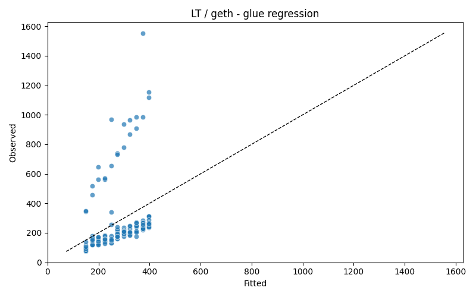

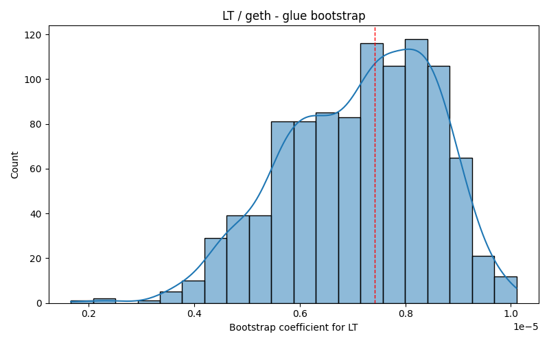

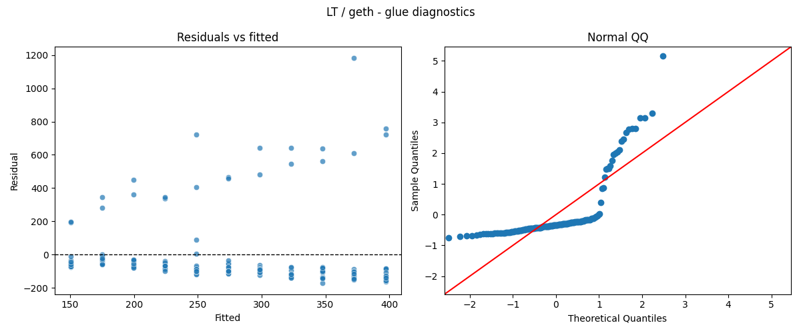

</details>

<details><summary><code>MSTORE</code> · nobs=770 · runtime_ms=1.357e-05 · p=1.00e-03 · R²=0.08411</summary>

```
==============================================================================
                           NNLS Regression Results                            
==============================================================================
Dep. Variable:          test_runtime_ms              R-squared:          0.084
Model:                  NNLS                    Adj. R-squared:          0.083
No. Observations:       770                               RMSE:         314.23
Df Residuals:           768                                MAE:         208.07
Df Model:               1      
==============================================================================
                      coef     std err     P-value      [0.025      0.975]
------------------------------------------------------------------------------
         const     43.5407     29.7192       0.086      0.0000    106.1859
        MSTORE      0.0000      0.0000       0.001      0.0000      0.0000
==============================================================================
Notes: Non-negative least squares with bootstrap inference (1000 iterations)
==============================================================================
```

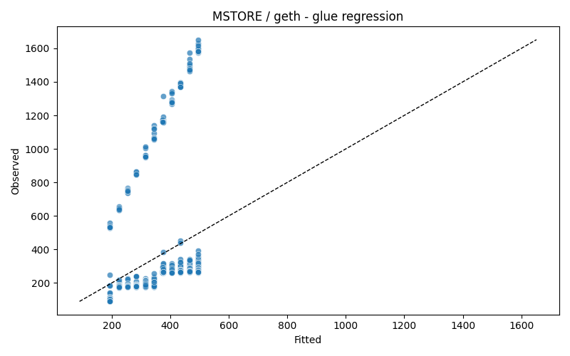

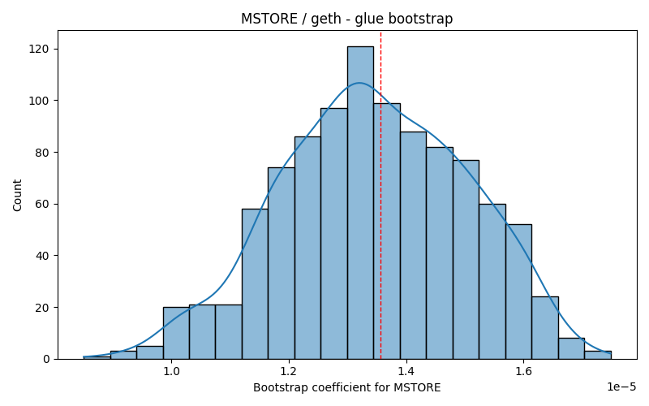

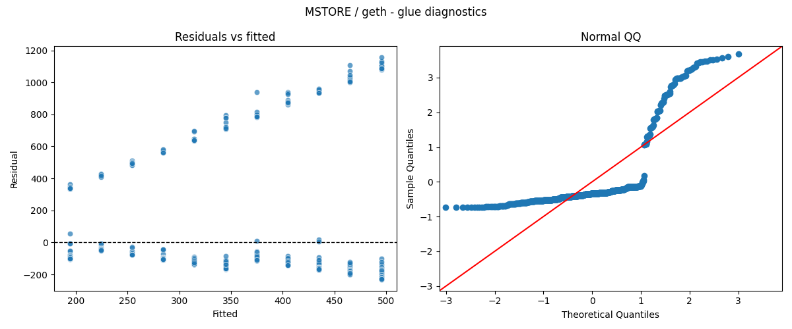

</details>

<details><summary><code>MSTORE8</code> · nobs=770 · runtime_ms=1.262e-05 · p=1.00e-03 · R²=0.08492</summary>

```
==============================================================================
                           NNLS Regression Results                            
==============================================================================
Dep. Variable:          test_runtime_ms              R-squared:          0.085
Model:                  NNLS                    Adj. R-squared:          0.084
No. Observations:       770                               RMSE:         290.68
Df Residuals:           768                                MAE:         192.28
Df Model:               1      
==============================================================================
                      coef     std err     P-value      [0.025      0.975]
------------------------------------------------------------------------------
         const     38.4594     27.9147       0.112      0.0000     96.3169
       MSTORE8      0.0000      0.0000       0.001      0.0000      0.0000
==============================================================================
Notes: Non-negative least squares with bootstrap inference (1000 iterations)
==============================================================================
```

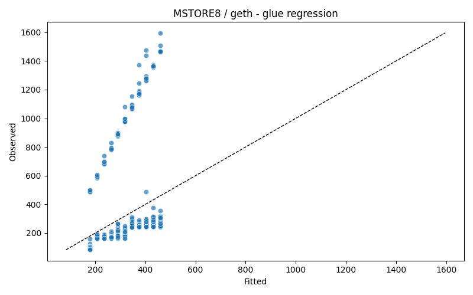

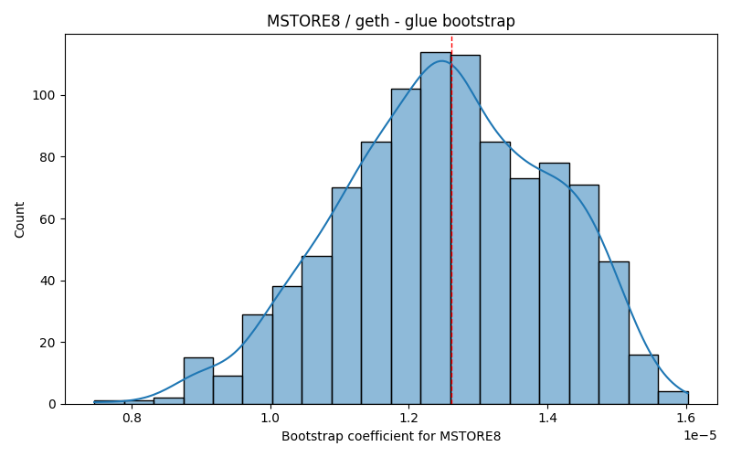

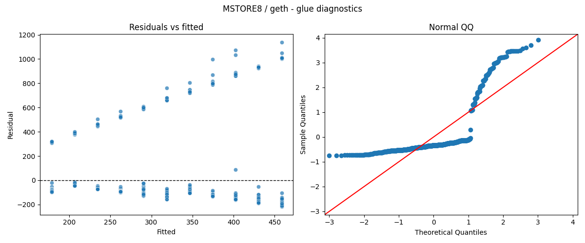

</details>

<details><summary><code>MUL</code> · nobs=154 · runtime_ms=8.233e-06 · p=1.00e-03 · R²=0.09207</summary>

```
==============================================================================
                           NNLS Regression Results                            
==============================================================================
Dep. Variable:          test_runtime_ms              R-squared:          0.092
Model:                  NNLS                    Adj. R-squared:          0.086
No. Observations:       154                               RMSE:         204.08
Df Residuals:           152                                MAE:         134.14
Df Model:               1      
==============================================================================
                      coef     std err     P-value      [0.025      0.975]
------------------------------------------------------------------------------
         const     28.3860     35.7447       0.248      0.0000    115.1851
           MUL      0.0000      0.0000       0.001      0.0000      0.0000
==============================================================================
Notes: Non-negative least squares with bootstrap inference (1000 iterations)
==============================================================================
```

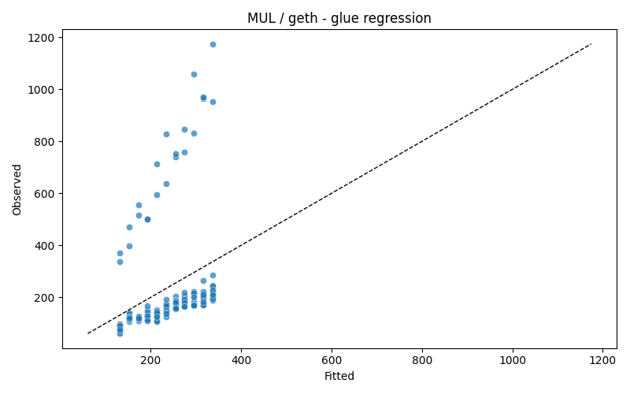

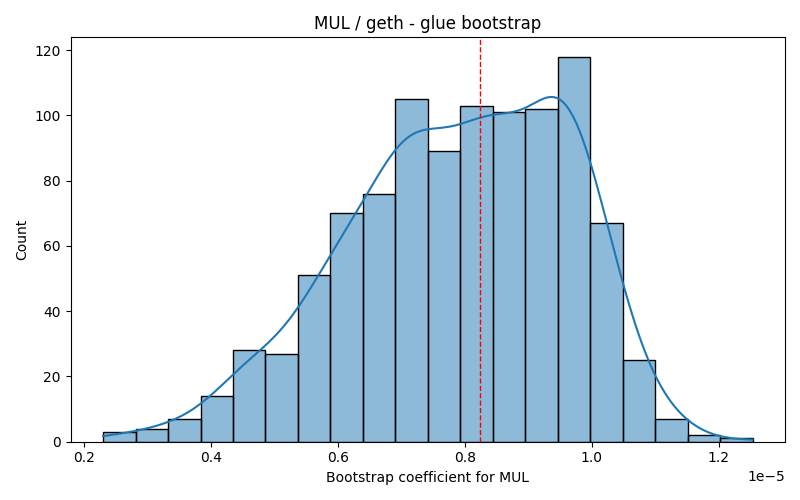

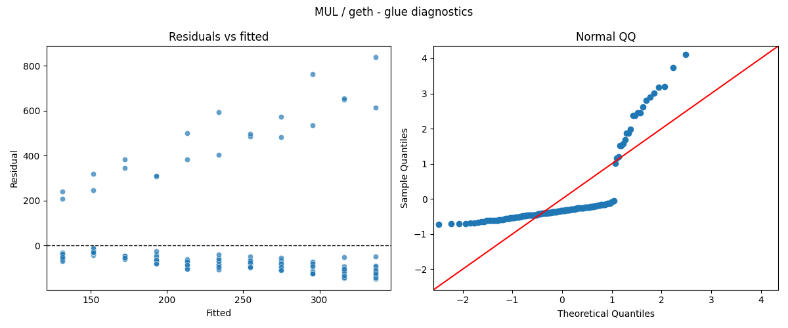

</details>

<details><summary><code>PC</code> · nobs=154 · runtime_ms=2.77e-06 · p=1.00e-03 · R²=0.09067</summary>

```
==============================================================================
                           NNLS Regression Results                            
==============================================================================
Dep. Variable:          test_runtime_ms              R-squared:          0.091
Model:                  NNLS                    Adj. R-squared:          0.085
No. Observations:       154                               RMSE:         262.31
Df Residuals:           152                                MAE:         173.47
Df Model:               1      
==============================================================================
                      coef     std err     P-value      [0.025      0.975]
------------------------------------------------------------------------------
         const     35.0151     43.0677       0.285      0.0000    140.0781
            PC      0.0000      0.0000       0.001      0.0000      0.0000
==============================================================================
Notes: Non-negative least squares with bootstrap inference (1000 iterations)
==============================================================================
```


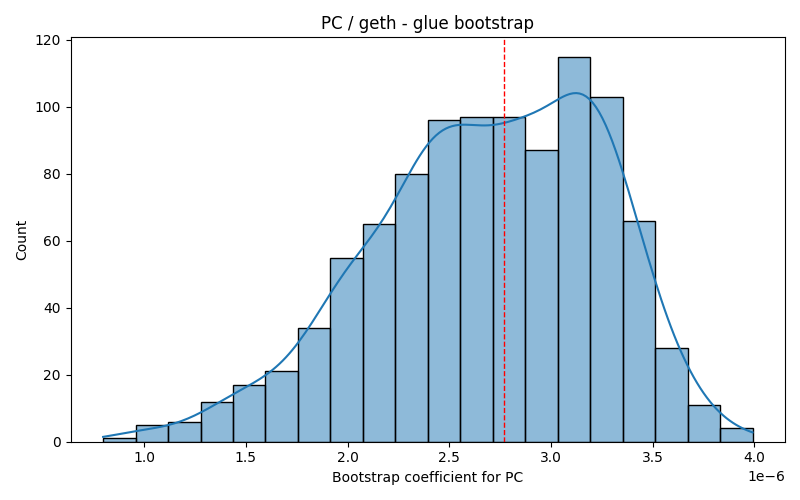

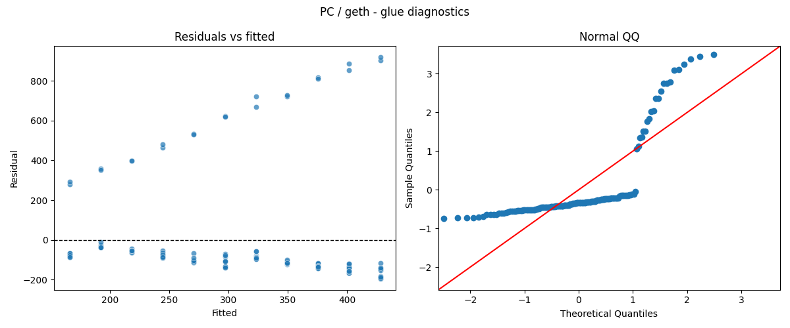

</details>

<details><summary><code>RETURNDATASIZE</code> · nobs=616 · runtime_ms=5.274e-06 · p=1.00e-03 · R²=0.09543</summary>

```
==============================================================================
                           NNLS Regression Results                            
==============================================================================
Dep. Variable:          test_runtime_ms              R-squared:          0.095
Model:                  NNLS                    Adj. R-squared:          0.094
No. Observations:       616                               RMSE:         256.36
Df Residuals:           614                                MAE:         167.83
Df Model:               1      
==============================================================================
                      coef     std err     P-value      [0.025      0.975]
------------------------------------------------------------------------------
         const     44.2393     27.7056       0.075      0.0000     99.2067
RETURNDATASIZE      0.0000      0.0000       0.001      0.0000      0.0000
==============================================================================
Notes: Non-negative least squares with bootstrap inference (1000 iterations)
==============================================================================
```

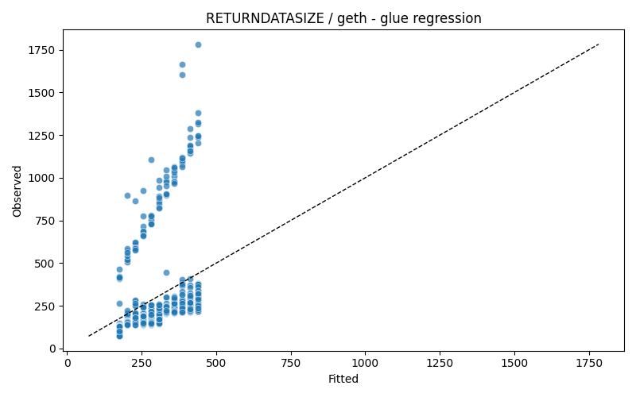

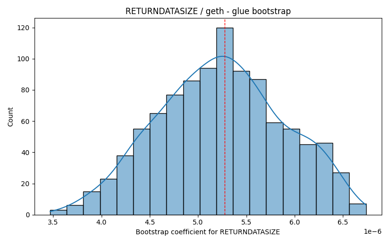

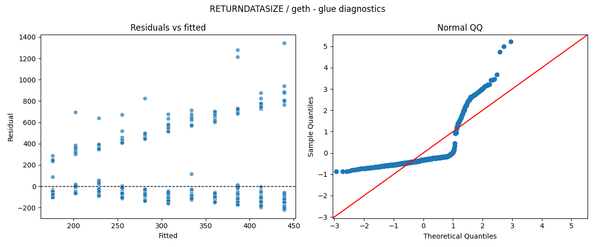

</details>

<details><summary><code>SELFBALANCE</code> · nobs=126 · runtime_ms=1.36e-05 · p=1.00e-03 · R²=0.04599</summary>

```
==============================================================================
                           NNLS Regression Results                            
==============================================================================
Dep. Variable:          test_runtime_ms              R-squared:          0.046
Model:                  NNLS                    Adj. R-squared:          0.038
No. Observations:       126                               RMSE:         624.75
Df Residuals:           124                                MAE:         423.03
Df Model:               1      
==============================================================================
                      coef     std err     P-value      [0.025      0.975]
------------------------------------------------------------------------------
         const    106.3022    156.0964       0.290      0.0000    504.4487
   SELFBALANCE      0.0000      0.0000       0.001      0.0000      0.0000
==============================================================================
Notes: Non-negative least squares with bootstrap inference (1000 iterations)
==============================================================================
```

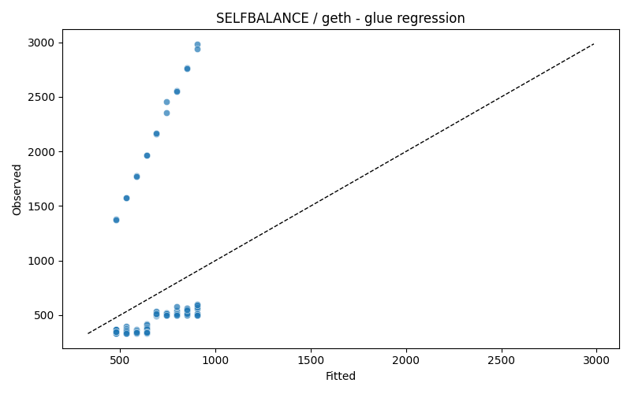

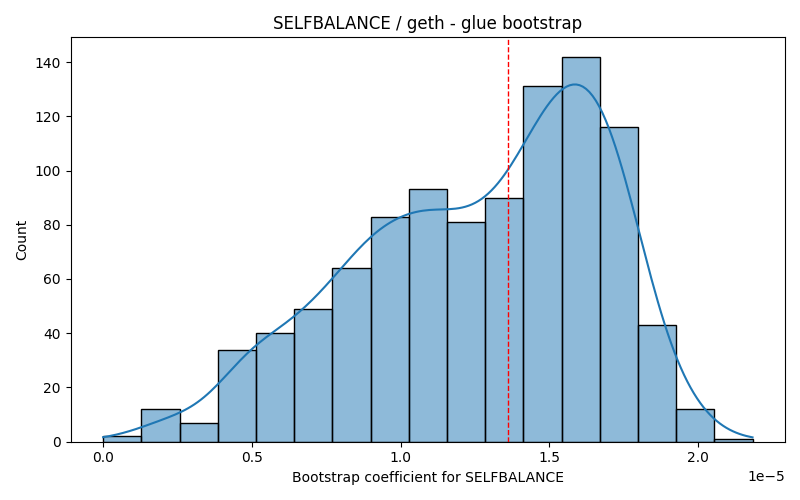

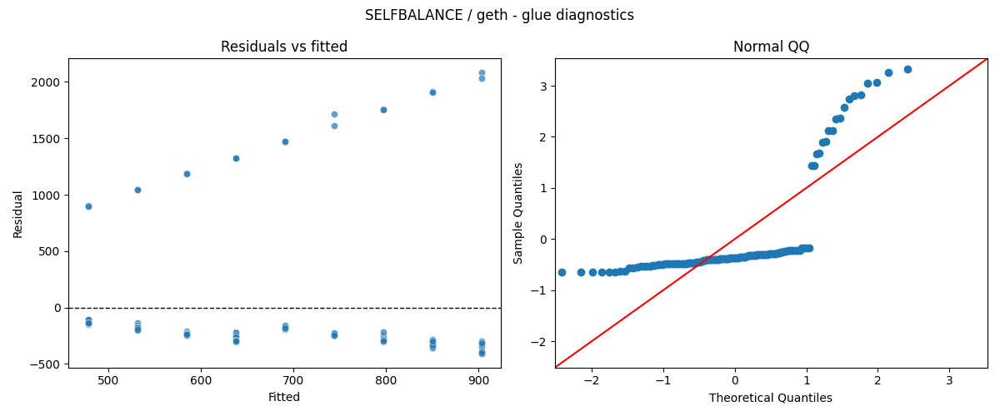

</details>

<details><summary><code>SUB</code> · nobs=154 · runtime_ms=7.052e-06 · p=1.00e-03 · R²=0.09297</summary>

```
==============================================================================
                           NNLS Regression Results                            
==============================================================================
Dep. Variable:          test_runtime_ms              R-squared:          0.093
Model:                  NNLS                    Adj. R-squared:          0.087
No. Observations:       154                               RMSE:         231.83
Df Residuals:           152                                MAE:         150.85
Df Model:               1      
==============================================================================
                      coef     std err     P-value      [0.025      0.975]
------------------------------------------------------------------------------
         const     43.5280     44.4138       0.218      0.0000    146.5379
           SUB      0.0000      0.0000       0.001      0.0000      0.0000
==============================================================================
Notes: Non-negative least squares with bootstrap inference (1000 iterations)
==============================================================================
```

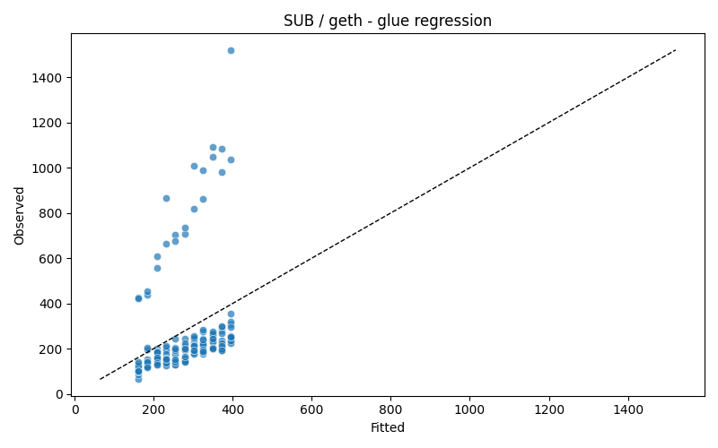

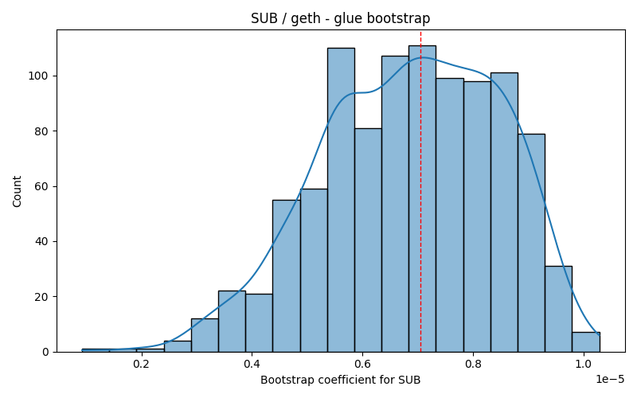

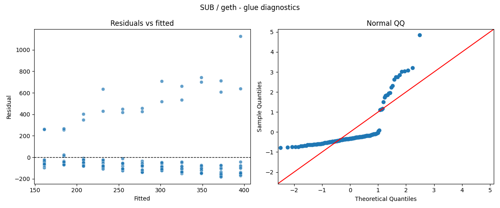

</details>

### Mixed glue (tier B) · geth

<details><summary><code>JUMP</code> · nobs=154 · runtime_ms=1.571e-05 · p=1.00e-03 · R²=0.08017</summary>

```
==============================================================================
                           NNLS Regression Results                            
==============================================================================
Dep. Variable:          test_runtime_ms              R-squared:          0.080
Model:                  NNLS                    Adj. R-squared:          0.074
No. Observations:       154                               RMSE:         197.78
Df Residuals:           152                                MAE:         130.61
Df Model:               1      
==============================================================================
                      coef     std err     P-value      [0.025      0.975]
------------------------------------------------------------------------------
         const     33.3759     35.4832       0.217      0.0000    113.9914
          JUMP      0.0000      0.0000       0.001      0.0000      0.0000
==============================================================================
Notes: Non-negative least squares with bootstrap inference (1000 iterations)
==============================================================================
```

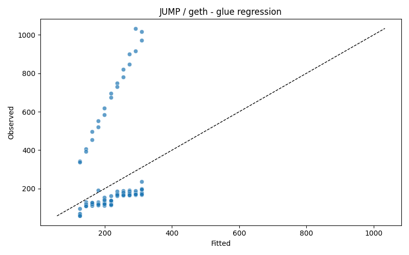

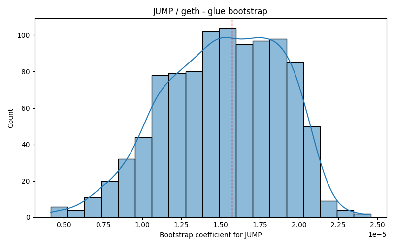

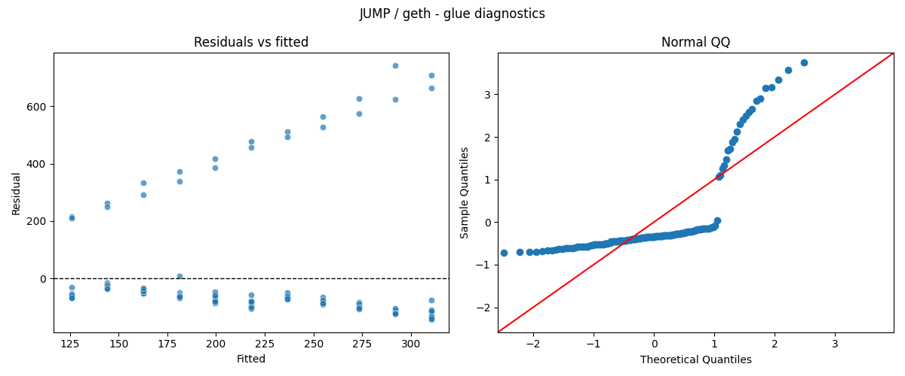

</details>

<details><summary><code>KECCAK256</code> · nobs=2464 · runtime_ms=6.382e-05 · p=1.00e-03 · R²=0.03461</summary>

```
==============================================================================
                           NNLS Regression Results                            
==============================================================================
Dep. Variable:          test_runtime_ms              R-squared:          0.035
Model:                  NNLS                    Adj. R-squared:          0.034
No. Observations:       2464                              RMSE:         669.77
Df Residuals:           2462                               MAE:         431.49
Df Model:               1      
==============================================================================
                      coef     std err     P-value      [0.025      0.975]
------------------------------------------------------------------------------
         const    532.3522     24.7172       0.001    481.0684    578.9798
     KECCAK256      0.0001      0.0000       0.001      0.0000      0.0001
==============================================================================
Notes: Non-negative least squares with bootstrap inference (1000 iterations)
==============================================================================
```

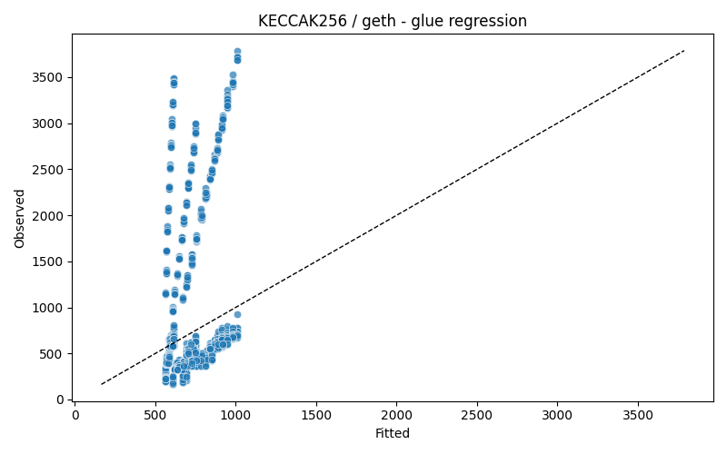

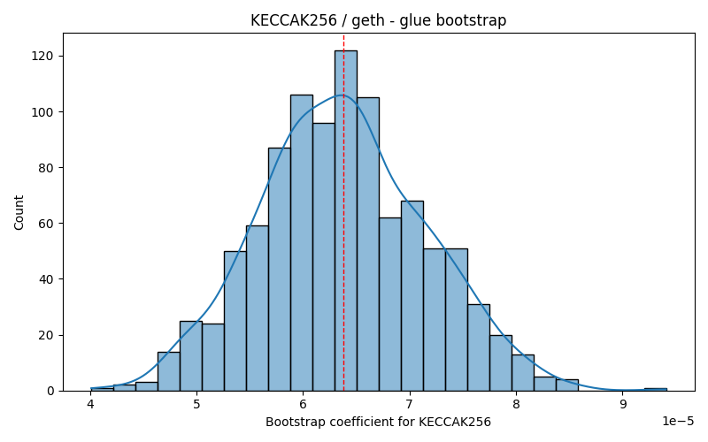

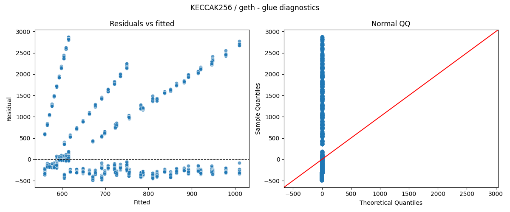

</details>

## nethermind

| glue_opcode | nobs | glue_runtime_ms | p_value | rsquared |
| --- | --- | --- | --- | --- |
| `ISZERO` | 55 | 9.727e-07 | 1.00e-03 | 0.5731 |
| `JUMPDEST` | 55 | 3.911e-07 | 1.00e-03 | 0.9064 |
| `SWAP` | 880 | 5.846e-07 | 1.00e-03 | 0.2315 |
| `CALLDATASIZE` | 3267 | 0 | 1.00e+00 | 0.969 |
| `DUP` | 3267 | 0 | 1.00e+00 | 0.969 |
| `GAS` | 3267 | 0 | 1.00e+00 | 0.969 |
| `MLOAD` | 3267 | 1.709e-06 | 1.00e-03 | 0.969 |
| `PUSH` | 3267 | 4.578e-08 | 1.00e-03 | 0.969 |
| `PUSH0` | 3267 | 0 | 1.00e+00 | 0.969 |
| `STATICCALL` | 3267 | 0.000867 | 1.00e-03 | 0.969 |
| `ADD` | 55 | 2.25e-06 | 1.00e-03 | 0.3841 |
| `AND` | 55 | 1.261e-06 | 1.00e-03 | 0.4419 |
| `CALLDATACOPY` | 1320 | 4.035e-06 | 1.00e-03 | 0.7343 |
| `CALLDATALOAD` | 220 | 2.425e-05 | 1.00e-03 | 0.09122 |
| `DIV` | 55 | 6.754e-06 | 1.00e-03 | 0.59 |
| `EXP` | 55 | 0 | 1.00e+00 | 1.11e-16 |
| `GT` | 55 | 1.442e-06 | 1.00e-03 | 0.4005 |
| `JUMPI` | 55 | 1.93e-06 | 1.00e-03 | 0.888 |
| `LT` | 55 | 1.403e-06 | 1.00e-03 | 0.679 |
| `MSTORE` | 275 | 2.106e-06 | 1.00e-03 | 0.7148 |
| `MSTORE8` | 275 | 1.938e-06 | 1.00e-03 | 0.7069 |
| `MUL` | 55 | 5.241e-06 | 1.00e-03 | 0.8583 |
| `PC` | 55 | 8.124e-07 | 1.00e-03 | 0.9232 |
| `RETURNDATASIZE` | 220 | 7.592e-07 | 1.00e-03 | 0.8785 |
| `SELFBALANCE` | 45 | 1.075e-05 | 1.00e-03 | 0.9014 |
| `SUB` | 55 | 2.522e-06 | 1.00e-03 | 0.8838 |
| `JUMP` | 55 | 5.43e-06 | 1.00e-03 | 0.8964 |
| `KECCAK256` | 880 | 0 | 1.00e+00 | 4.441e-16 |

### Cycle glue — joint fit · nethermind

<details><summary>Joint NNLS regression summary</summary>

```
==============================================================================
                           NNLS Regression Results                            
==============================================================================
Dep. Variable:          test_runtime_ms              R-squared:          0.969
Model:                  NNLS                    Adj. R-squared:          0.969
No. Observations:       3267                              RMSE:          21.32
Df Residuals:           3259                               MAE:           6.24
Df Model:               7      
==============================================================================
                      coef     std err     P-value      [0.025      0.975]
------------------------------------------------------------------------------
         const     15.3780      1.9744       0.001     10.9950     18.9085
  CALLDATASIZE      0.0000      0.0000       1.000      0.0000      0.0000
           DUP      0.0000      0.0000       1.000      0.0000      0.0000
           GAS      0.0000      0.0000       1.000      0.0000      0.0000
         MLOAD      0.0000      0.0000       0.001      0.0000      0.0000
          PUSH      0.0000      0.0000       0.001      0.0000      0.0000
         PUSH0      0.0000      0.0000       1.000      0.0000      0.0000
    STATICCALL      0.0009      0.0000       0.001      0.0008      0.0009
==============================================================================
Notes: Non-negative least squares with bootstrap inference (1000 iterations)
==============================================================================
```

</details>

<details><summary><code>CALLDATASIZE</code> · nobs=3267 · runtime_ms=0 · p=1.00e+00 · R²=0.969</summary>


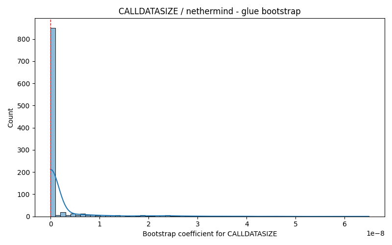


</details>

<details><summary><code>DUP</code> · nobs=3267 · runtime_ms=0 · p=1.00e+00 · R²=0.969</summary>


</details>

<details><summary><code>GAS</code> · nobs=3267 · runtime_ms=0 · p=1.00e+00 · R²=0.969</summary>

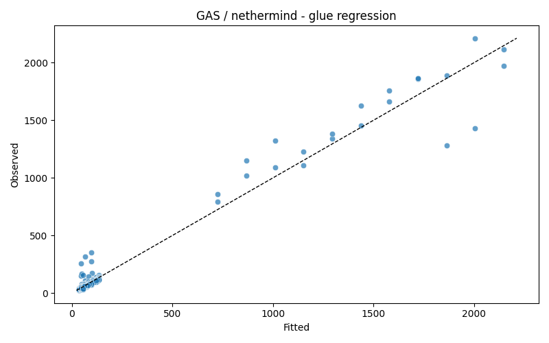

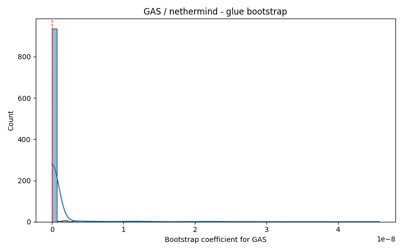


</details>

<details><summary><code>MLOAD</code> · nobs=3267 · runtime_ms=1.709e-06 · p=1.00e-03 · R²=0.969</summary>


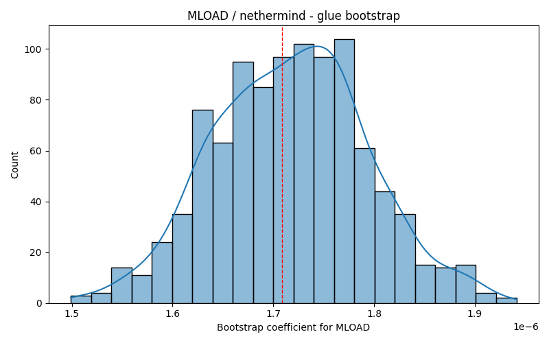


</details>

<details><summary><code>PUSH</code> · nobs=3267 · runtime_ms=4.578e-08 · p=1.00e-03 · R²=0.969</summary>


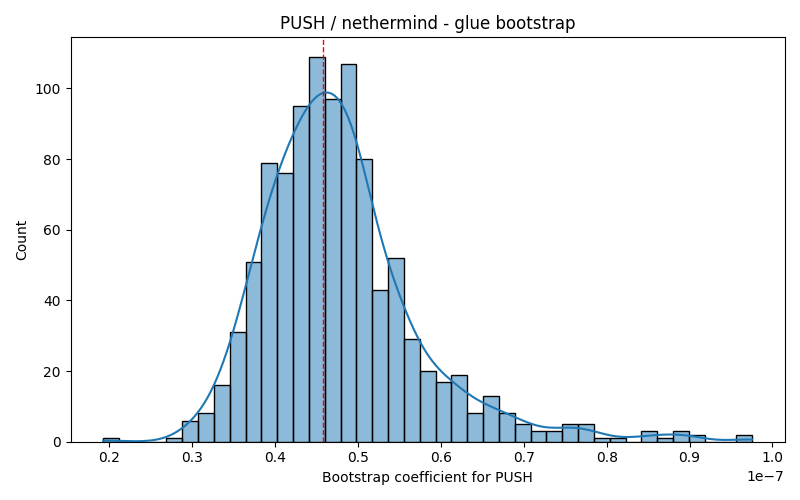

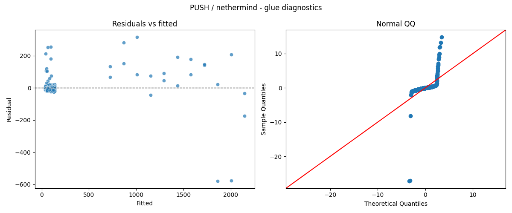

</details>

<details><summary><code>PUSH0</code> · nobs=3267 · runtime_ms=0 · p=1.00e+00 · R²=0.969</summary>

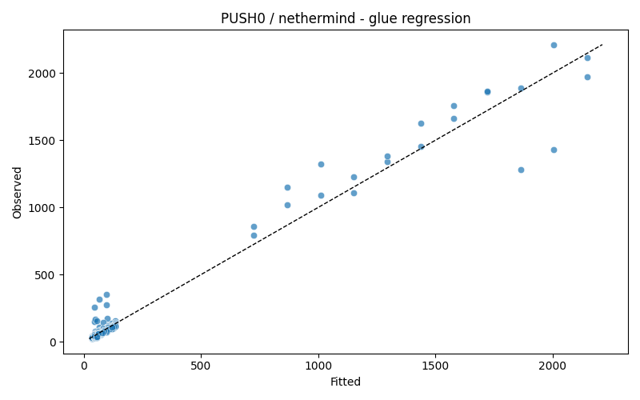


</details>

<details><summary><code>STATICCALL</code> · nobs=3267 · runtime_ms=0.000867 · p=1.00e-03 · R²=0.969</summary>

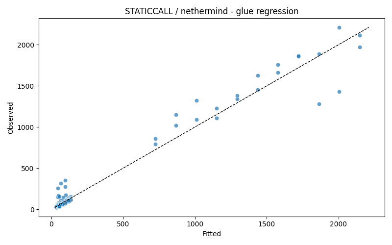

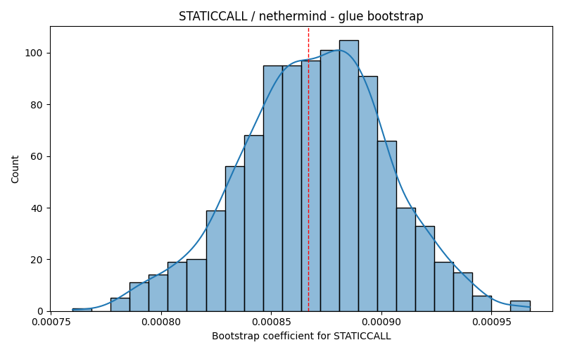


</details>

### Pure glue · nethermind

<details><summary><code>ISZERO</code> · nobs=55 · runtime_ms=9.727e-07 · p=1.00e-03 · R²=0.5731</summary>

```
==============================================================================
                           NNLS Regression Results                            
==============================================================================
Dep. Variable:          test_runtime_ms              R-squared:          0.573
Model:                  NNLS                    Adj. R-squared:          0.565
No. Observations:       55                                RMSE:          17.67
Df Residuals:           53                                 MAE:           7.49
Df Model:               1      
==============================================================================
                      coef     std err     P-value      [0.025      0.975]
------------------------------------------------------------------------------
         const     10.0939      4.8742       0.045      0.0000     18.8946
        ISZERO      0.0000      0.0000       0.001      0.0000      0.0000
==============================================================================
Notes: Non-negative least squares with bootstrap inference (1000 iterations)
==============================================================================
```

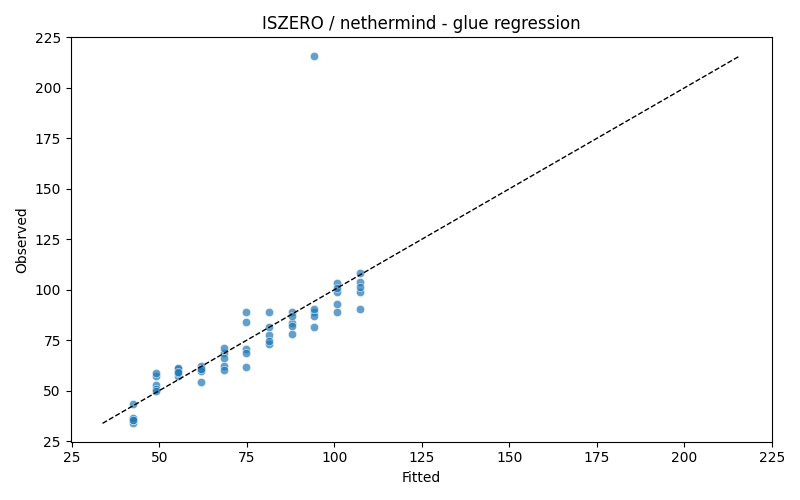

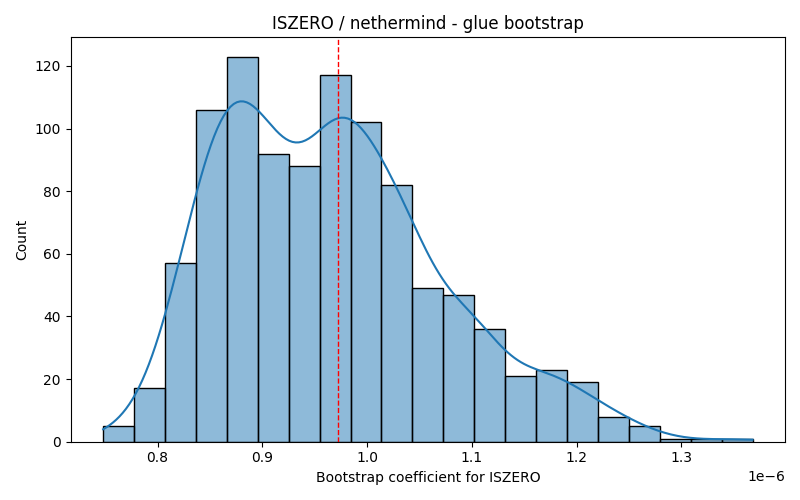

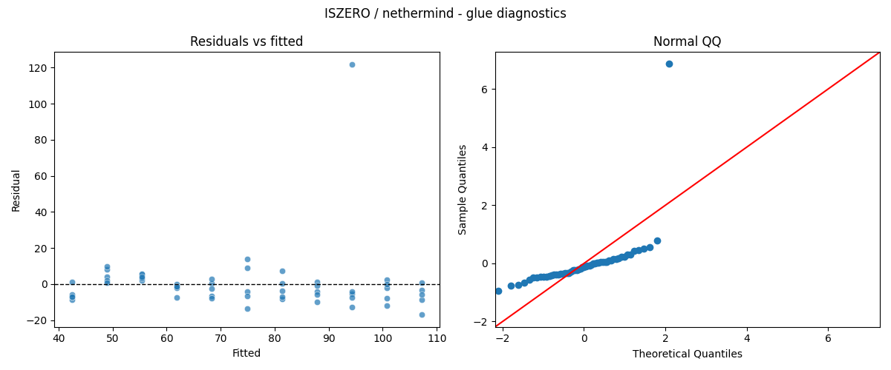

</details>

<details><summary><code>JUMPDEST</code> · nobs=55 · runtime_ms=3.911e-07 · p=1.00e-03 · R²=0.9064</summary>

```
==============================================================================
                           NNLS Regression Results                            
==============================================================================
Dep. Variable:          test_runtime_ms              R-squared:          0.906
Model:                  NNLS                    Adj. R-squared:          0.905
No. Observations:       55                                RMSE:           7.94
Df Residuals:           53                                 MAE:           6.01
Df Model:               1      
==============================================================================
                      coef     std err     P-value      [0.025      0.975]
------------------------------------------------------------------------------
         const     20.2619      4.2640       0.001     11.7444     28.2175
      JUMPDEST      0.0000      0.0000       0.001      0.0000      0.0000
==============================================================================
Notes: Non-negative least squares with bootstrap inference (1000 iterations)
==============================================================================
```

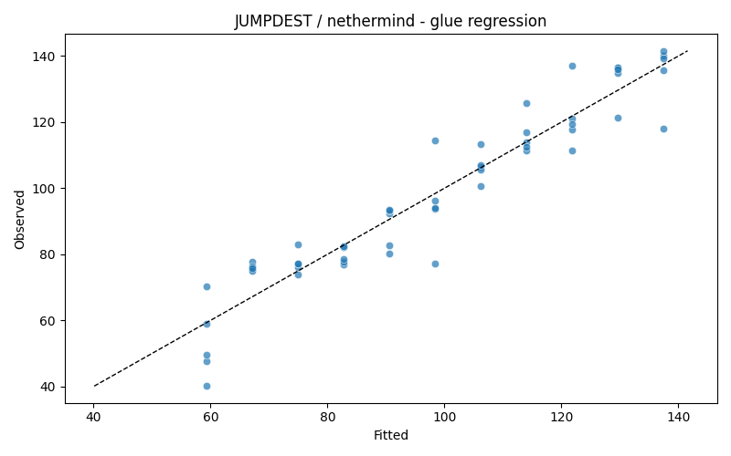

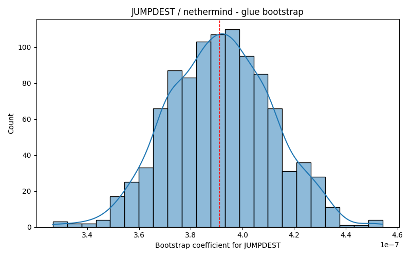

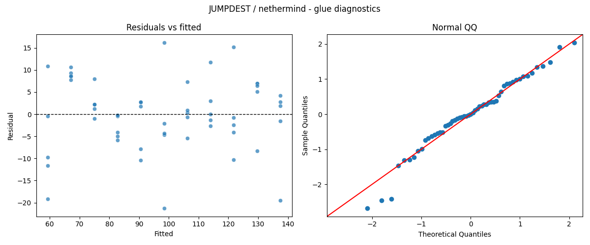

</details>

<details><summary><code>SWAP</code> · nobs=880 · runtime_ms=5.846e-07 · p=1.00e-03 · R²=0.2315</summary>

```
==============================================================================
                           NNLS Regression Results                            
==============================================================================
Dep. Variable:          test_runtime_ms              R-squared:          0.232
Model:                  NNLS                    Adj. R-squared:          0.231
No. Observations:       880                               RMSE:          22.42
Df Residuals:           878                                MAE:           8.09
Df Model:               1      
==============================================================================
                      coef     std err     P-value      [0.025      0.975]
------------------------------------------------------------------------------
         const     16.3004      2.3886       0.001     12.0586     21.1303
          SWAP      0.0000      0.0000       0.001      0.0000      0.0000
==============================================================================
Notes: Non-negative least squares with bootstrap inference (1000 iterations)
==============================================================================
```

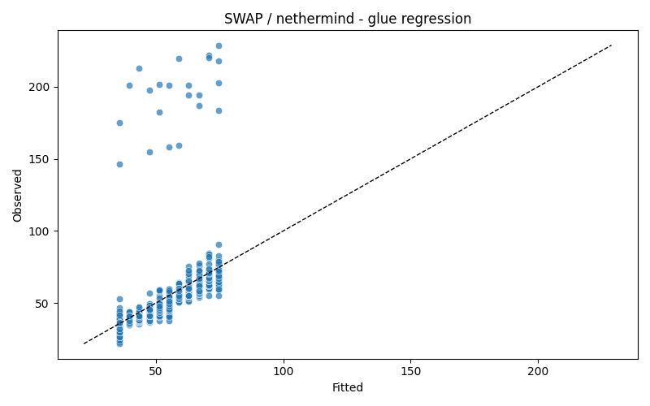

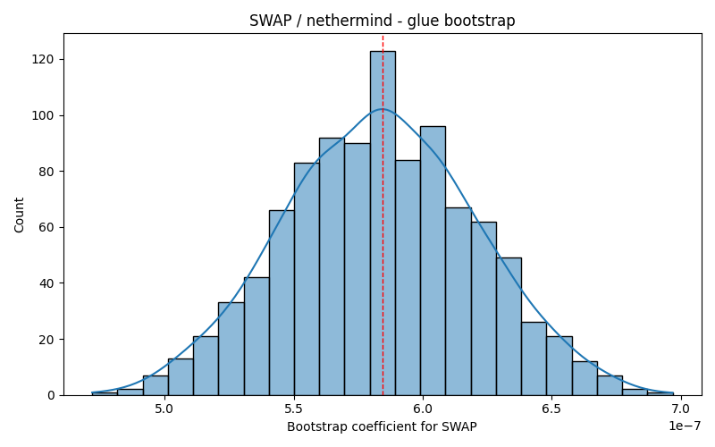

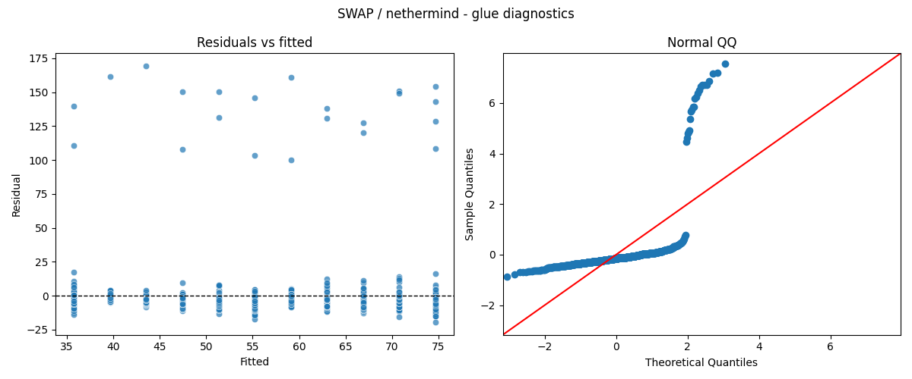

</details>

### Mixed glue (tier A) · nethermind

<details><summary><code>ADD</code> · nobs=55 · runtime_ms=2.25e-06 · p=1.00e-03 · R²=0.3841</summary>

```
==============================================================================
                           NNLS Regression Results                            
==============================================================================
Dep. Variable:          test_runtime_ms              R-squared:          0.384
Model:                  NNLS                    Adj. R-squared:          0.372
No. Observations:       55                                RMSE:          29.98
Df Residuals:           53                                 MAE:          14.35
Df Model:               1      
==============================================================================
                      coef     std err     P-value      [0.025      0.975]
------------------------------------------------------------------------------
         const     26.5125     18.2723       0.036      0.0000     69.3542
           ADD      0.0000      0.0000       0.001      0.0000      0.0000
==============================================================================
Notes: Non-negative least squares with bootstrap inference (1000 iterations)
==============================================================================
```

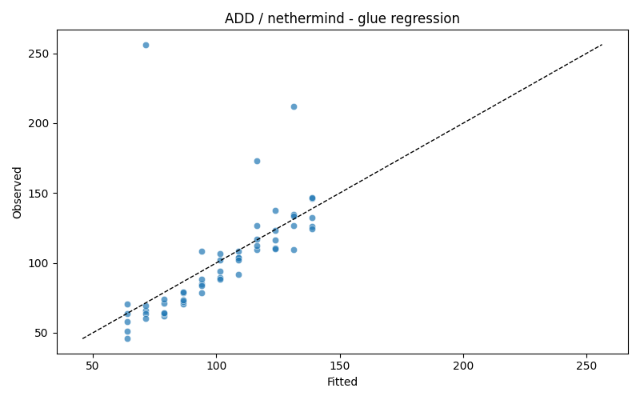

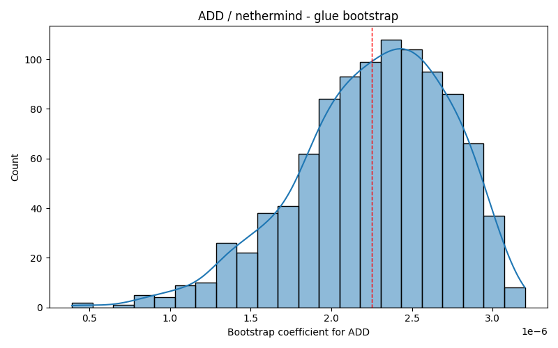

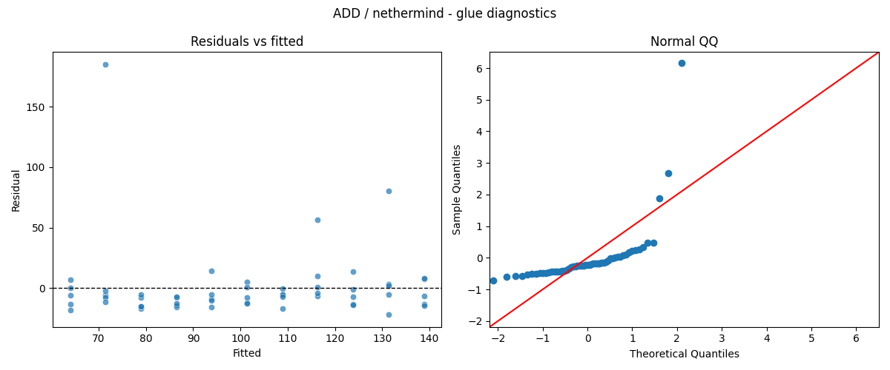

</details>

<details><summary><code>AND</code> · nobs=55 · runtime_ms=1.261e-06 · p=1.00e-03 · R²=0.4419</summary>

```
==============================================================================
                           NNLS Regression Results                            
==============================================================================
Dep. Variable:          test_runtime_ms              R-squared:          0.442
Model:                  NNLS                    Adj. R-squared:          0.431
No. Observations:       55                                RMSE:          14.91
Df Residuals:           53                                 MAE:           7.87
Df Model:               1      
==============================================================================
                      coef     std err     P-value      [0.025      0.975]
------------------------------------------------------------------------------
         const     18.2651      3.6244       0.001     11.3308     25.6557
           AND      0.0000      0.0000       0.001      0.0000      0.0000
==============================================================================
Notes: Non-negative least squares with bootstrap inference (1000 iterations)
==============================================================================
```

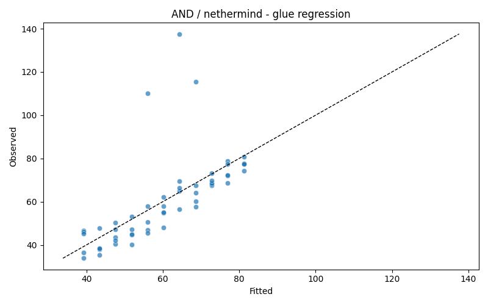

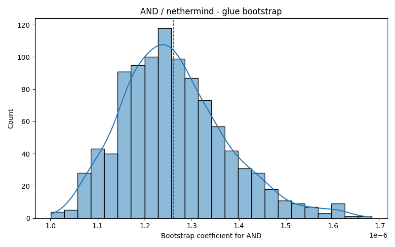

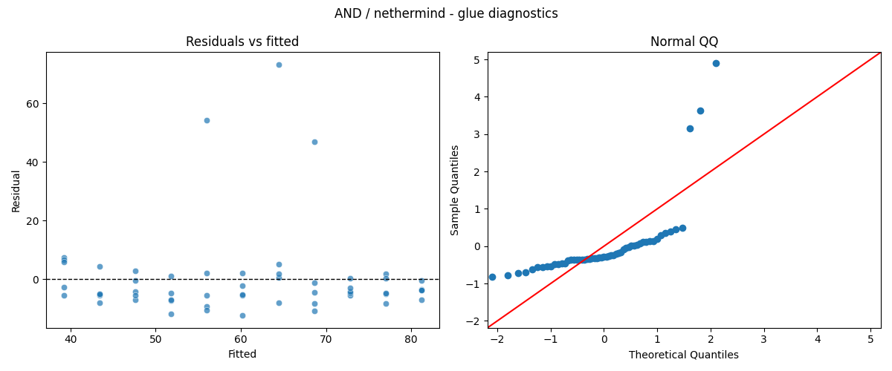

</details>

<details><summary><code>CALLDATACOPY</code> · nobs=1320 · runtime_ms=4.035e-06 · p=1.00e-03 · R²=0.7343</summary>

```
==============================================================================
                           NNLS Regression Results                            
==============================================================================
Dep. Variable:          test_runtime_ms              R-squared:          0.734
Model:                  NNLS                    Adj. R-squared:          0.734
No. Observations:       1320                              RMSE:          18.25
Df Residuals:           1318                               MAE:          14.64
Df Model:               1      
==============================================================================
                      coef     std err     P-value      [0.025      0.975]
------------------------------------------------------------------------------
         const     23.1960      0.6065       0.001     22.0601     24.4228
  CALLDATACOPY      0.0000      0.0000       0.001      0.0000      0.0000
==============================================================================
Notes: Non-negative least squares with bootstrap inference (1000 iterations)
==============================================================================
```

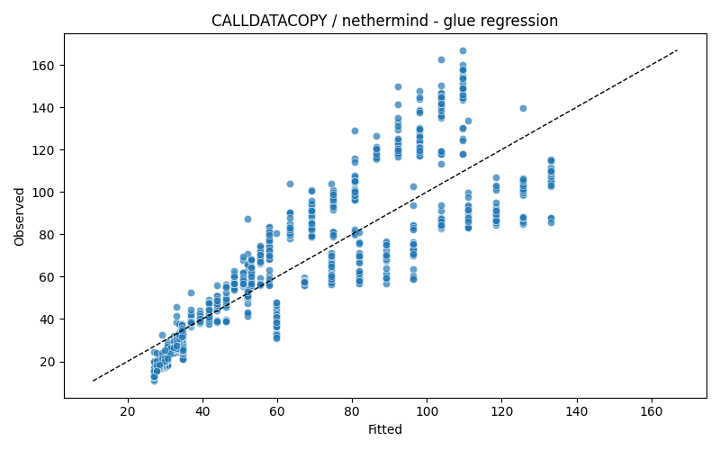

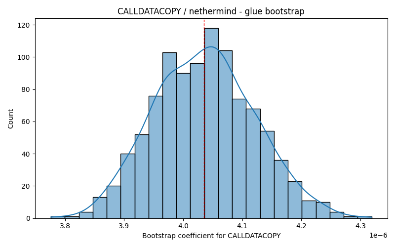

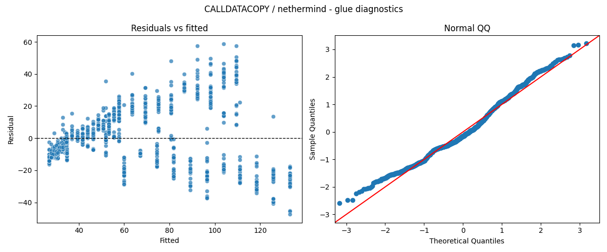

</details>

<details><summary><code>CALLDATALOAD</code> · nobs=220 · runtime_ms=2.425e-05 · p=1.00e-03 · R²=0.09122</summary>

```
==============================================================================
                           NNLS Regression Results                            
==============================================================================
Dep. Variable:          test_runtime_ms              R-squared:          0.091
Model:                  NNLS                    Adj. R-squared:          0.087
No. Observations:       220                               RMSE:           0.29
Df Residuals:           218                                MAE:           0.18
Df Model:               1      
==============================================================================
                      coef     std err     P-value      [0.025      0.975]
------------------------------------------------------------------------------
         const      2.1605      0.0590       0.001      2.0528      2.2873
  CALLDATALOAD      0.0000      0.0000       0.001      0.0000      0.0000
==============================================================================
Notes: Non-negative least squares with bootstrap inference (1000 iterations)
==============================================================================
```

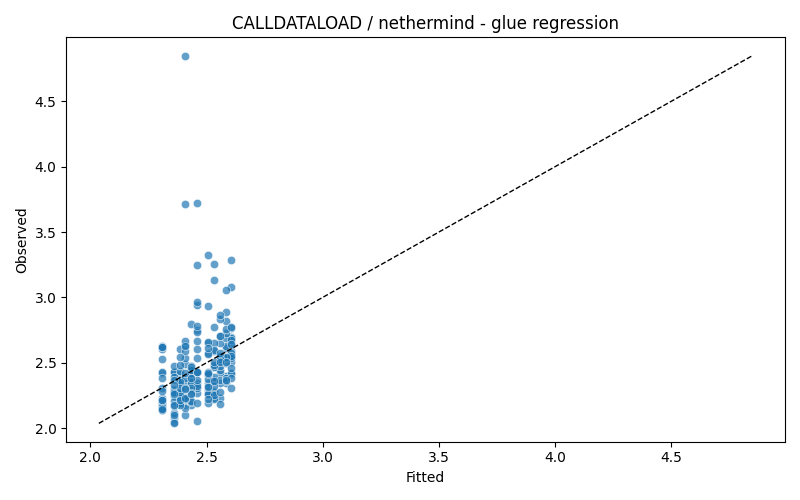

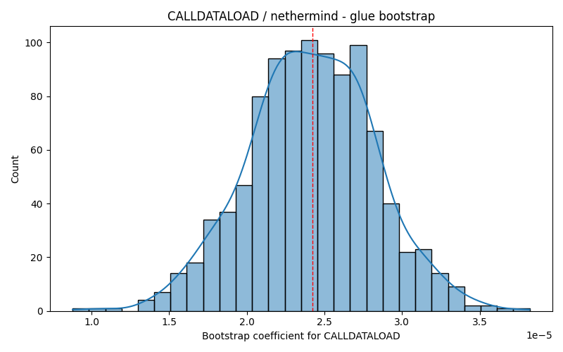

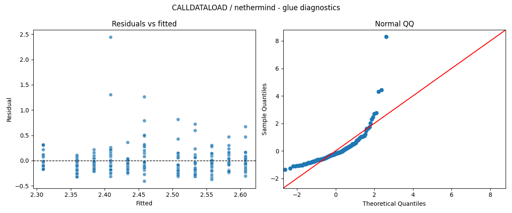

</details>

<details><summary><code>DIV</code> · nobs=55 · runtime_ms=6.754e-06 · p=1.00e-03 · R²=0.59</summary>

```
==============================================================================
                           NNLS Regression Results                            
==============================================================================
Dep. Variable:          test_runtime_ms              R-squared:          0.590
Model:                  NNLS                    Adj. R-squared:          0.582
No. Observations:       55                                RMSE:          44.44
Df Residuals:           53                                 MAE:          35.83
Df Model:               1      
==============================================================================
                      coef     std err     P-value      [0.025      0.975]
------------------------------------------------------------------------------
         const    133.7844     27.7073       0.001     79.7757    183.9380
           DIV      0.0000      0.0000       0.001      0.0000      0.0000
==============================================================================
Notes: Non-negative least squares with bootstrap inference (1000 iterations)
==============================================================================
```

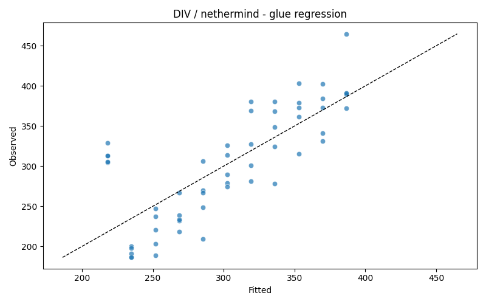

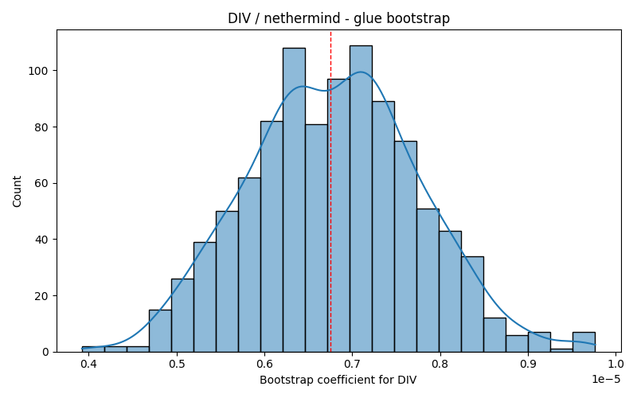

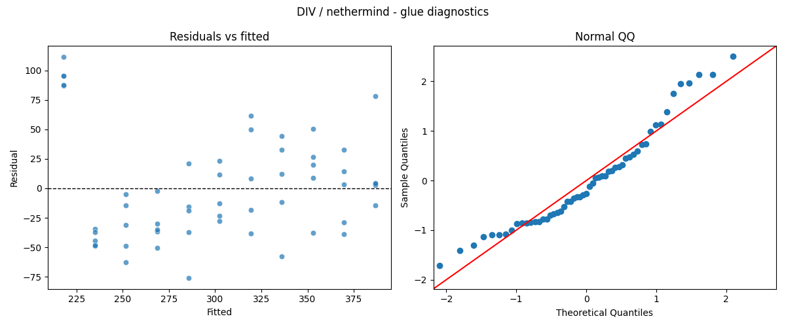

</details>

<details><summary><code>EXP</code> · nobs=55 · runtime_ms=0 · p=1.00e+00 · R²=1.11e-16</summary>

```
==============================================================================
                           NNLS Regression Results                            
==============================================================================
Dep. Variable:          test_runtime_ms              R-squared:          0.000
Model:                  NNLS                    Adj. R-squared:         -0.019
No. Observations:       55                                RMSE:          46.77
Df Residuals:           53                                 MAE:          31.18
Df Model:               1      
==============================================================================
                      coef     std err     P-value      [0.025      0.975]
------------------------------------------------------------------------------
         const    104.3712     17.7018       0.001     45.0603    118.2496
           EXP      0.0000      0.0001       1.000      0.0000      0.0004
==============================================================================
Notes: Non-negative least squares with bootstrap inference (1000 iterations)
==============================================================================
```

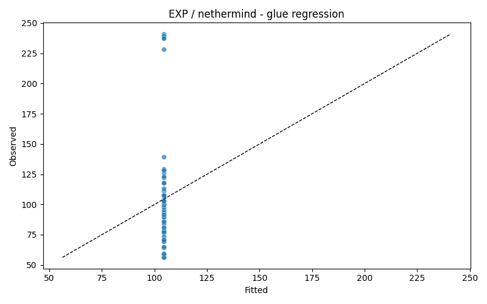

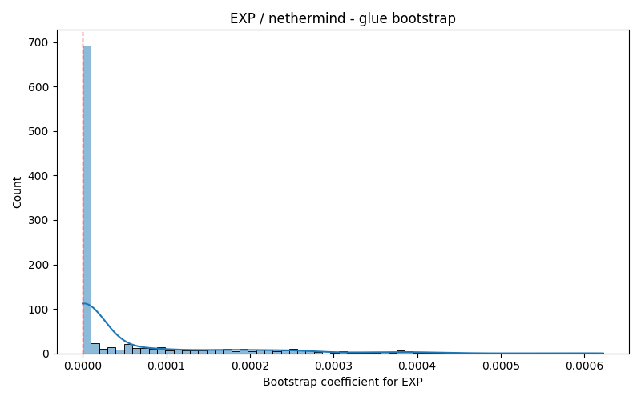

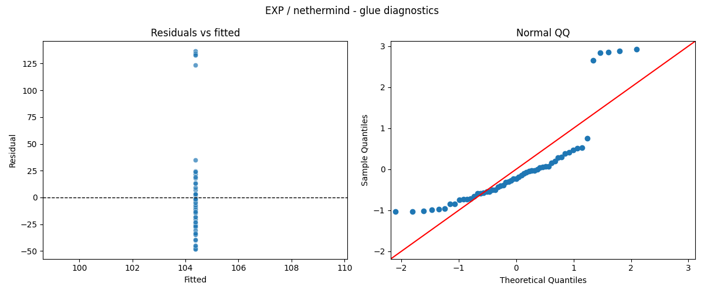

</details>

<details><summary><code>GT</code> · nobs=55 · runtime_ms=1.442e-06 · p=1.00e-03 · R²=0.4005</summary>

```
==============================================================================
                           NNLS Regression Results                            
==============================================================================
Dep. Variable:          test_runtime_ms              R-squared:          0.401
Model:                  NNLS                    Adj. R-squared:          0.389
No. Observations:       55                                RMSE:          18.56
Df Residuals:           53                                 MAE:           8.65
Df Model:               1      
==============================================================================
                      coef     std err     P-value      [0.025      0.975]
------------------------------------------------------------------------------
         const     17.8984      9.3084       0.001      5.0931     39.5460
            GT      0.0000      0.0000       0.001      0.0000      0.0000
==============================================================================
Notes: Non-negative least squares with bootstrap inference (1000 iterations)
==============================================================================
```

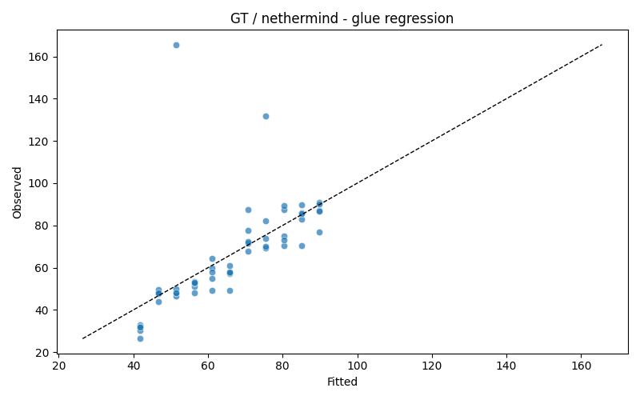

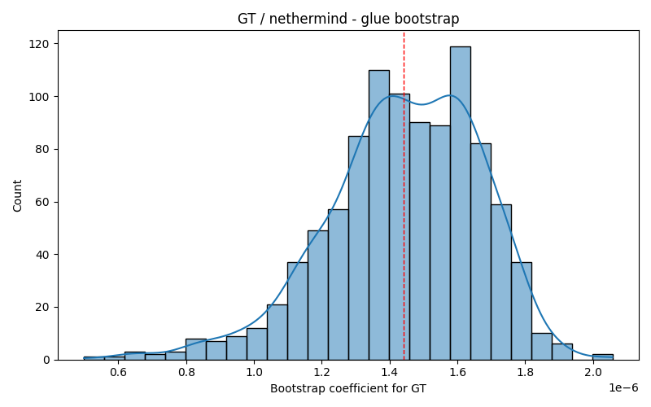


</details>

<details><summary><code>JUMPI</code> · nobs=55 · runtime_ms=1.93e-06 · p=1.00e-03 · R²=0.888</summary>

```
==============================================================================
                           NNLS Regression Results                            
==============================================================================
Dep. Variable:          test_runtime_ms              R-squared:          0.888
Model:                  NNLS                    Adj. R-squared:          0.886
No. Observations:       55                                RMSE:           3.09
Df Residuals:           53                                 MAE:           2.24
Df Model:               1      
==============================================================================
                      coef     std err     P-value      [0.025      0.975]
------------------------------------------------------------------------------
         const      7.4219      1.2290       0.001      4.9424      9.7870
         JUMPI      0.0000      0.0000       0.001      0.0000      0.0000
==============================================================================
Notes: Non-negative least squares with bootstrap inference (1000 iterations)
==============================================================================
```

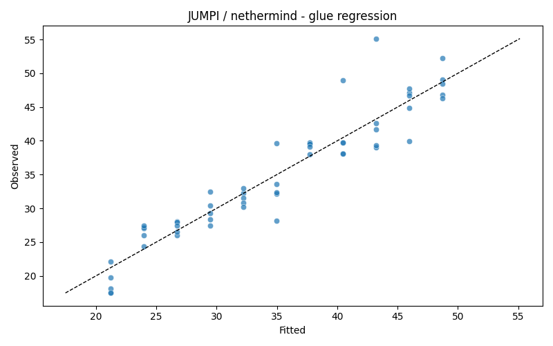

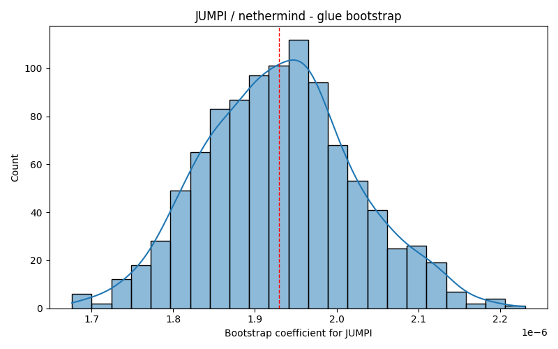

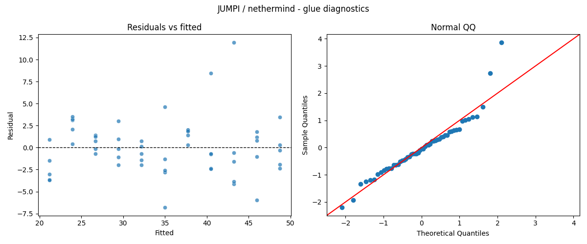

</details>

<details><summary><code>LT</code> · nobs=55 · runtime_ms=1.403e-06 · p=1.00e-03 · R²=0.679</summary>

```
==============================================================================
                           NNLS Regression Results                            
==============================================================================
Dep. Variable:          test_runtime_ms              R-squared:          0.679
Model:                  NNLS                    Adj. R-squared:          0.673
No. Observations:       55                                RMSE:          10.15
Df Residuals:           53                                 MAE:           5.32
Df Model:               1      
==============================================================================
                      coef     std err     P-value      [0.025      0.975]
------------------------------------------------------------------------------
         const     17.9643      2.6466       0.001     12.8967     22.9042
            LT      0.0000      0.0000       0.001      0.0000      0.0000
==============================================================================
Notes: Non-negative least squares with bootstrap inference (1000 iterations)
==============================================================================
```

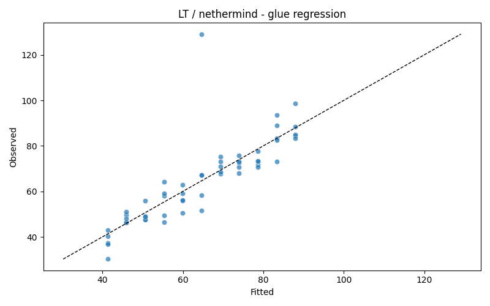

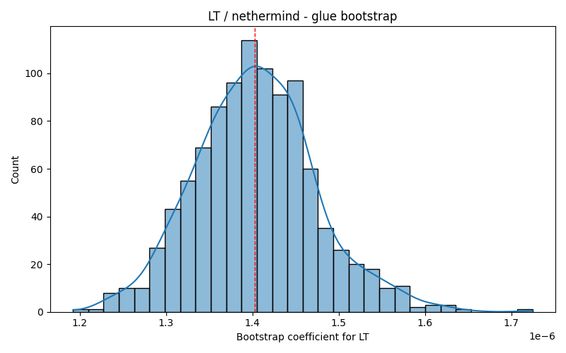

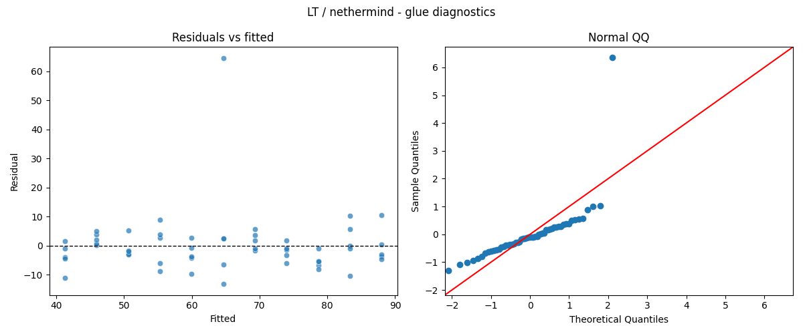

</details>

<details><summary><code>MSTORE</code> · nobs=275 · runtime_ms=2.106e-06 · p=1.00e-03 · R²=0.7148</summary>

```
==============================================================================
                           NNLS Regression Results                            
==============================================================================
Dep. Variable:          test_runtime_ms              R-squared:          0.715
Model:                  NNLS                    Adj. R-squared:          0.714
No. Observations:       275                               RMSE:           9.33
Df Residuals:           273                                MAE:           6.32
Df Model:               1      
==============================================================================
                      coef     std err     P-value      [0.025      0.975]
------------------------------------------------------------------------------
         const     17.2021      1.7374       0.001     13.8604     20.5663
        MSTORE      0.0000      0.0000       0.001      0.0000      0.0000
==============================================================================
Notes: Non-negative least squares with bootstrap inference (1000 iterations)
==============================================================================
```

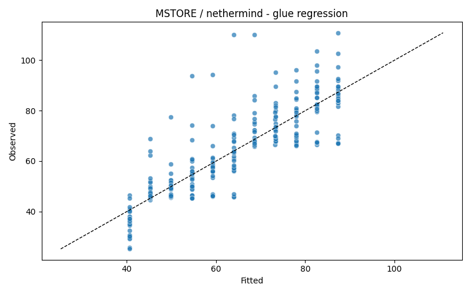

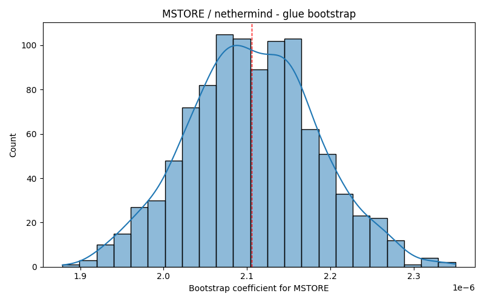

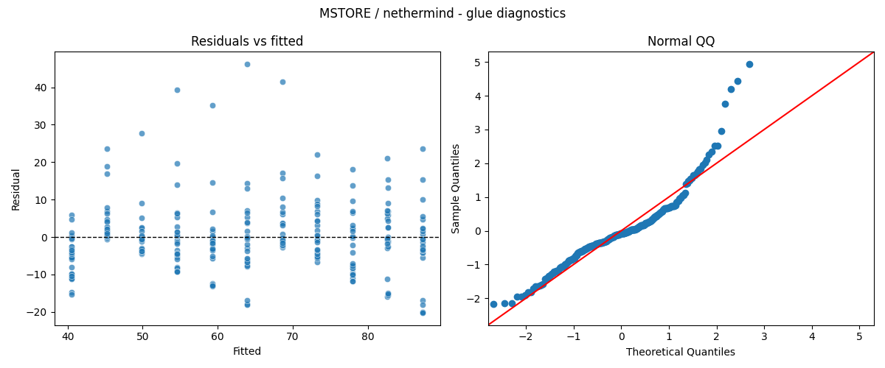

</details>

<details><summary><code>MSTORE8</code> · nobs=275 · runtime_ms=1.938e-06 · p=1.00e-03 · R²=0.7069</summary>

```
==============================================================================
                           NNLS Regression Results                            
==============================================================================
Dep. Variable:          test_runtime_ms              R-squared:          0.707
Model:                  NNLS                    Adj. R-squared:          0.706
No. Observations:       275                               RMSE:           8.76
Df Residuals:           273                                MAE:           5.68
Df Model:               1      
==============================================================================
                      coef     std err     P-value      [0.025      0.975]
------------------------------------------------------------------------------
         const     17.6273      1.9982       0.001     13.7181     21.7493
       MSTORE8      0.0000      0.0000       0.001      0.0000      0.0000
==============================================================================
Notes: Non-negative least squares with bootstrap inference (1000 iterations)
==============================================================================
```

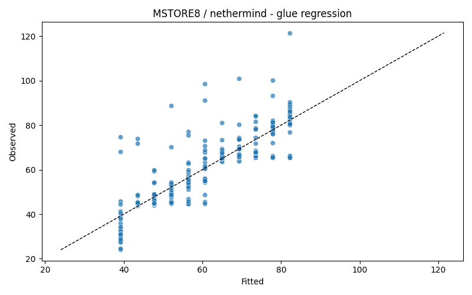

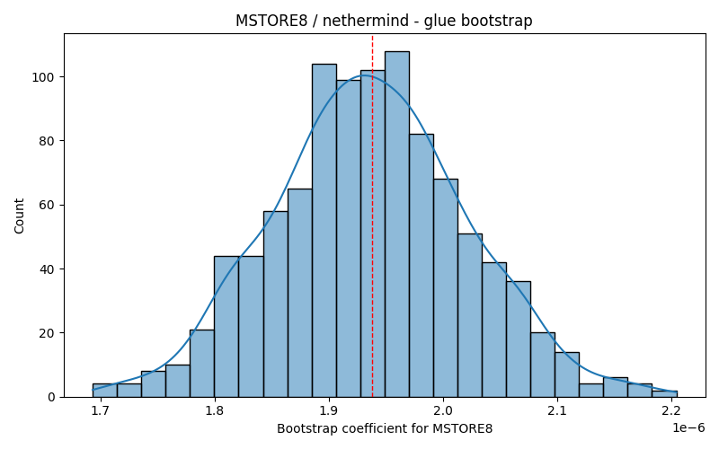

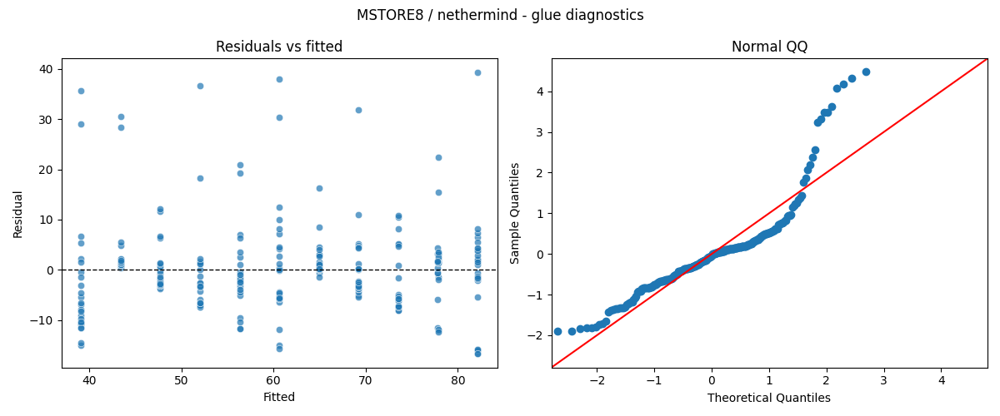

</details>

<details><summary><code>MUL</code> · nobs=55 · runtime_ms=5.241e-06 · p=1.00e-03 · R²=0.8583</summary>

```
==============================================================================
                           NNLS Regression Results                            
==============================================================================
Dep. Variable:          test_runtime_ms              R-squared:          0.858
Model:                  NNLS                    Adj. R-squared:          0.856
No. Observations:       55                                RMSE:          16.81
Df Residuals:           53                                 MAE:          12.67
Df Model:               1      
==============================================================================
                      coef     std err     P-value      [0.025      0.975]
------------------------------------------------------------------------------
         const     30.3105      7.2569       0.001     15.0773     43.7818
           MUL      0.0000      0.0000       0.001      0.0000      0.0000
==============================================================================
Notes: Non-negative least squares with bootstrap inference (1000 iterations)
==============================================================================
```

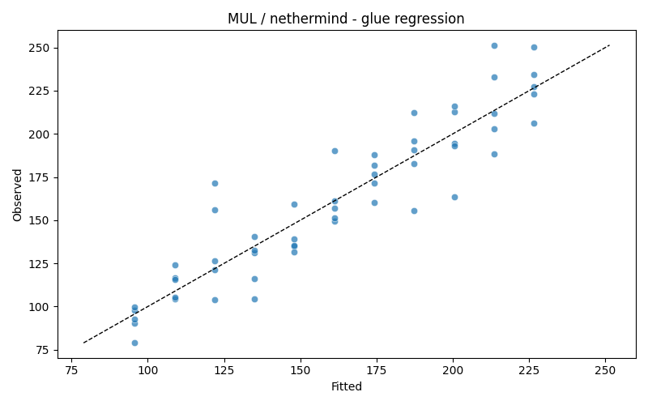

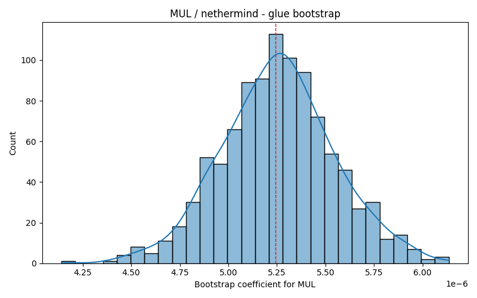

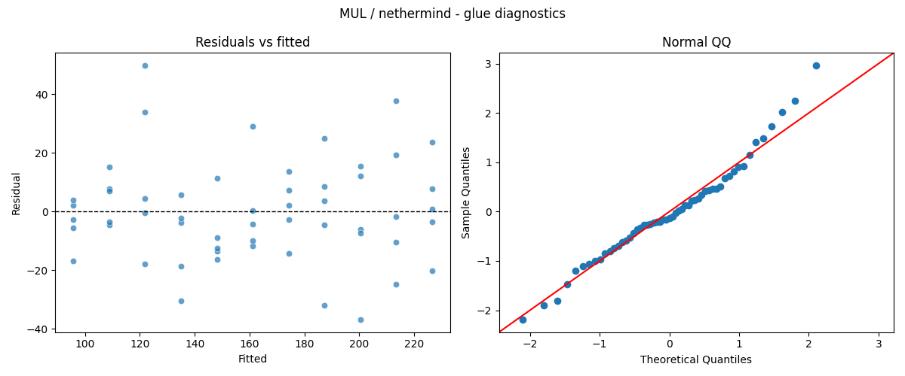

</details>

<details><summary><code>PC</code> · nobs=55 · runtime_ms=8.124e-07 · p=1.00e-03 · R²=0.9232</summary>

```
==============================================================================
                           NNLS Regression Results                            
==============================================================================
Dep. Variable:          test_runtime_ms              R-squared:          0.923
Model:                  NNLS                    Adj. R-squared:          0.922
No. Observations:       55                                RMSE:           7.00
Df Residuals:           53                                 MAE:           5.76
Df Model:               1      
==============================================================================
                      coef     std err     P-value      [0.025      0.975]
------------------------------------------------------------------------------
         const     16.3439      3.1715       0.001     10.2482     22.7767
            PC      0.0000      0.0000       0.001      0.0000      0.0000
==============================================================================
Notes: Non-negative least squares with bootstrap inference (1000 iterations)
==============================================================================
```

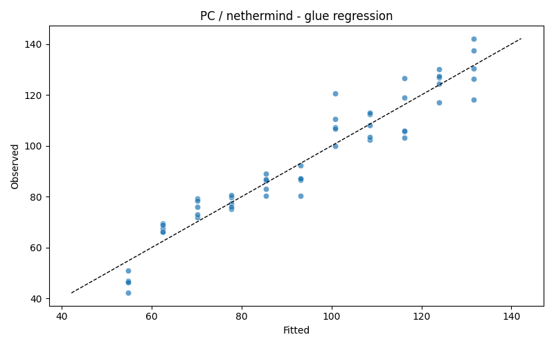

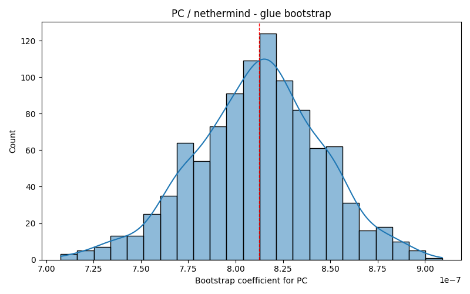

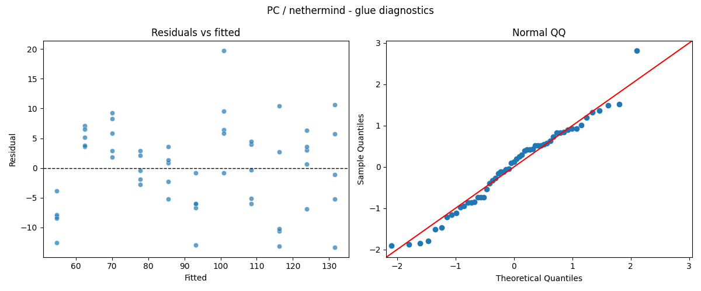

</details>

<details><summary><code>RETURNDATASIZE</code> · nobs=220 · runtime_ms=7.592e-07 · p=1.00e-03 · R²=0.8785</summary>

```
==============================================================================
                           NNLS Regression Results                            
==============================================================================
Dep. Variable:          test_runtime_ms              R-squared:          0.878
Model:                  NNLS                    Adj. R-squared:          0.878
No. Observations:       220                               RMSE:           4.46
Df Residuals:           218                                MAE:           3.31
Df Model:               1      
==============================================================================
                      coef     std err     P-value      [0.025      0.975]
------------------------------------------------------------------------------
         const     11.8930      0.8960       0.001     10.0801     13.5679
RETURNDATASIZE      0.0000      0.0000       0.001      0.0000      0.0000
==============================================================================
Notes: Non-negative least squares with bootstrap inference (1000 iterations)
==============================================================================
```

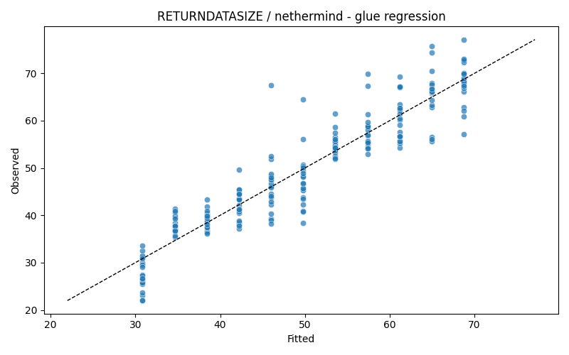

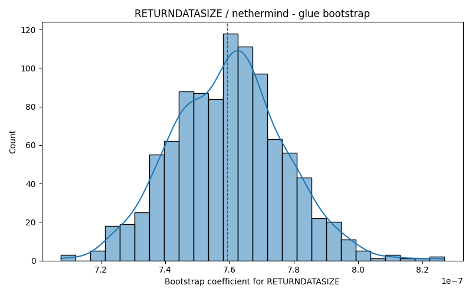

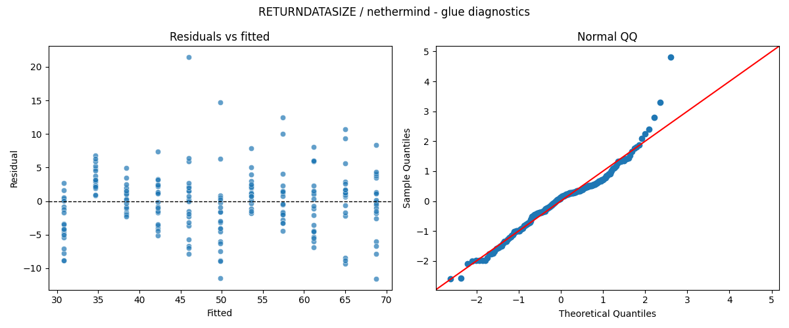

</details>

<details><summary><code>SELFBALANCE</code> · nobs=45 · runtime_ms=1.075e-05 · p=1.00e-03 · R²=0.9014</summary>

```
==============================================================================
                           NNLS Regression Results                            
==============================================================================
Dep. Variable:          test_runtime_ms              R-squared:          0.901
Model:                  NNLS                    Adj. R-squared:          0.899
No. Observations:       45                                RMSE:          35.87
Df Residuals:           43                                 MAE:          28.40
Df Model:               1      
==============================================================================
                      coef     std err     P-value      [0.025      0.975]
------------------------------------------------------------------------------
         const     69.9784     23.6039       0.003     22.9402    112.6513
   SELFBALANCE      0.0000      0.0000       0.001      0.0000      0.0000
==============================================================================
Notes: Non-negative least squares with bootstrap inference (1000 iterations)
==============================================================================
```

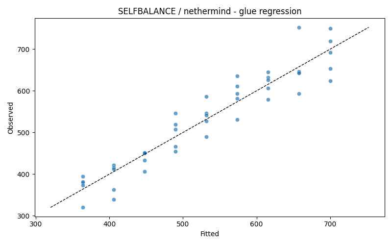

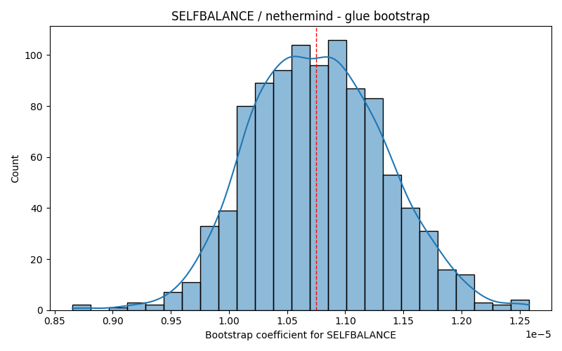

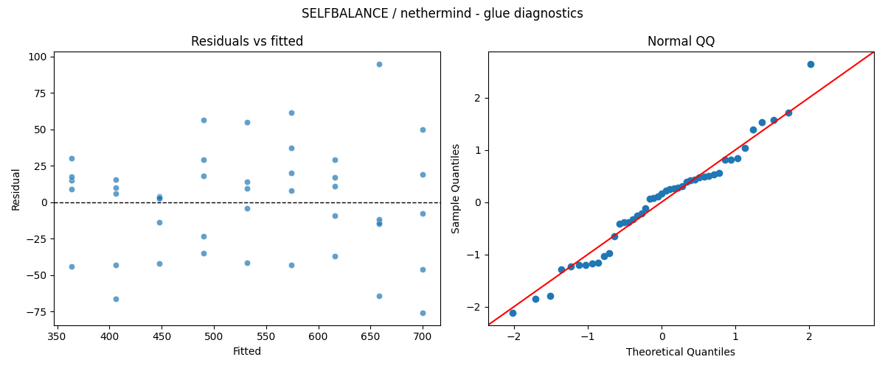

</details>

<details><summary><code>SUB</code> · nobs=55 · runtime_ms=2.522e-06 · p=1.00e-03 · R²=0.8838</summary>

```
==============================================================================
                           NNLS Regression Results                            
==============================================================================
Dep. Variable:          test_runtime_ms              R-squared:          0.884
Model:                  NNLS                    Adj. R-squared:          0.882
No. Observations:       55                                RMSE:           9.62
Df Residuals:           53                                 MAE:           7.58
Df Model:               1      
==============================================================================
                      coef     std err     P-value      [0.025      0.975]
------------------------------------------------------------------------------
         const     16.8243      3.7498       0.001      9.6989     24.9145
           SUB      0.0000      0.0000       0.001      0.0000      0.0000
==============================================================================
Notes: Non-negative least squares with bootstrap inference (1000 iterations)
==============================================================================
```

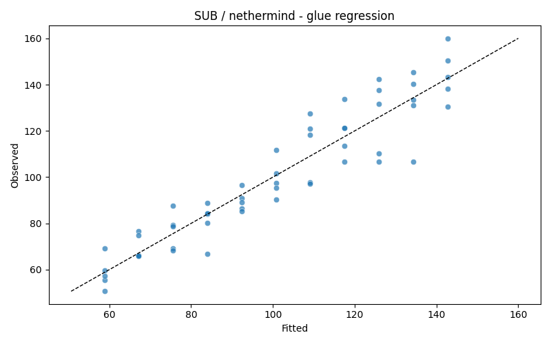

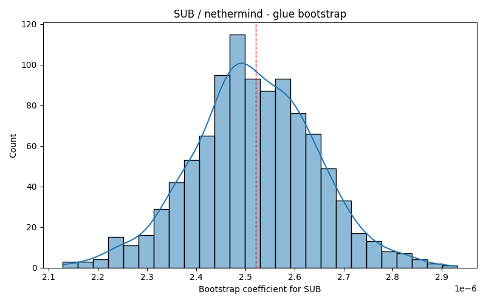

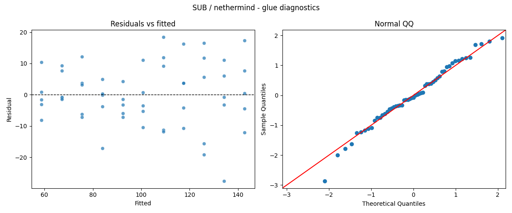

</details>

### Mixed glue (tier B) · nethermind

<details><summary><code>JUMP</code> · nobs=55 · runtime_ms=5.43e-06 · p=1.00e-03 · R²=0.8964</summary>

```
==============================================================================
                           NNLS Regression Results                            
==============================================================================
Dep. Variable:          test_runtime_ms              R-squared:          0.896
Model:                  NNLS                    Adj. R-squared:          0.894
No. Observations:       55                                RMSE:           6.86
Df Residuals:           53                                 MAE:           5.69
Df Model:               1      
==============================================================================
                      coef     std err     P-value      [0.025      0.975]
------------------------------------------------------------------------------
         const     14.0611      3.3648       0.001      7.4189     20.7166
          JUMP      0.0000      0.0000       0.001      0.0000      0.0000
==============================================================================
Notes: Non-negative least squares with bootstrap inference (1000 iterations)
==============================================================================
```

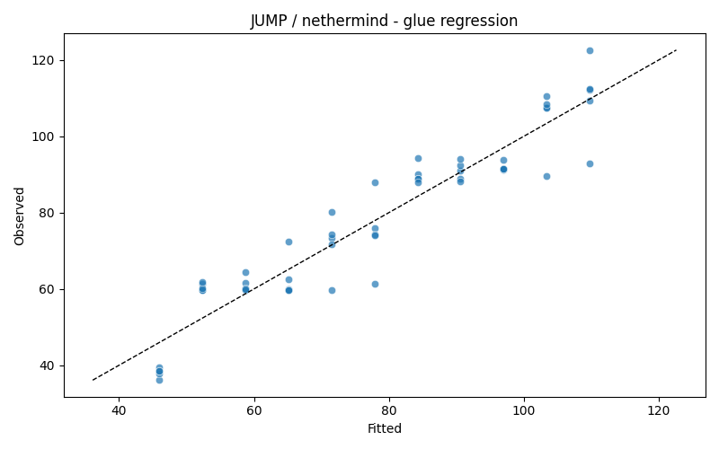

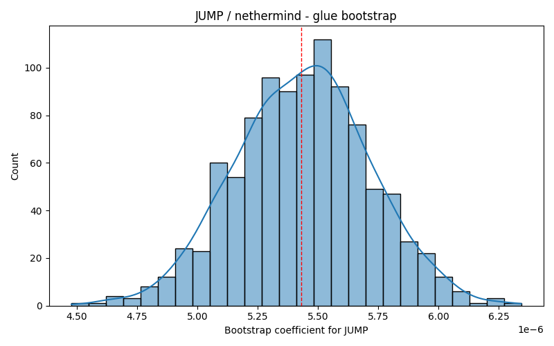

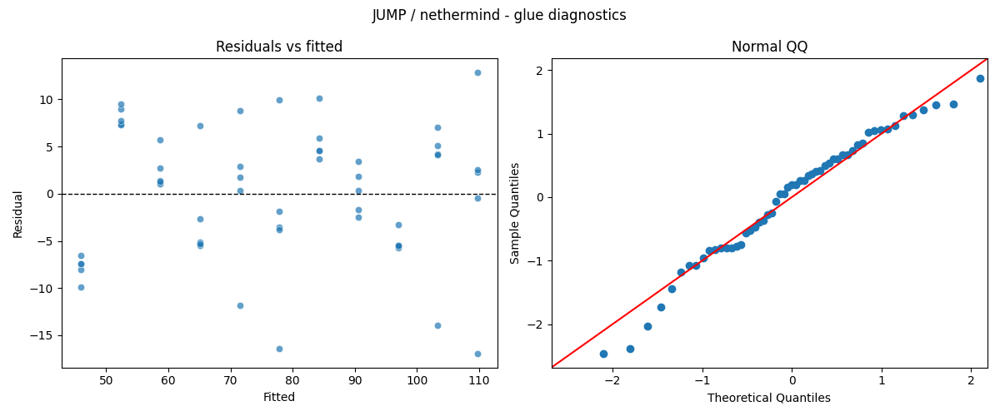

</details>

<details><summary><code>KECCAK256</code> · nobs=880 · runtime_ms=0 · p=1.00e+00 · R²=4.441e-16</summary>

```
==============================================================================
                           NNLS Regression Results                            
==============================================================================
Dep. Variable:          test_runtime_ms              R-squared:          0.000
Model:                  NNLS                    Adj. R-squared:         -0.001
No. Observations:       880                               RMSE:         293.03
Df Residuals:           878                                MAE:         240.96
Df Model:               1      
==============================================================================
                      coef     std err     P-value      [0.025      0.975]
------------------------------------------------------------------------------
         const    447.5839     10.2061       0.001    427.8402    467.1961
     KECCAK256      0.0000      0.0000       1.000      0.0000      0.0000
==============================================================================
Notes: Non-negative least squares with bootstrap inference (1000 iterations)
==============================================================================
```

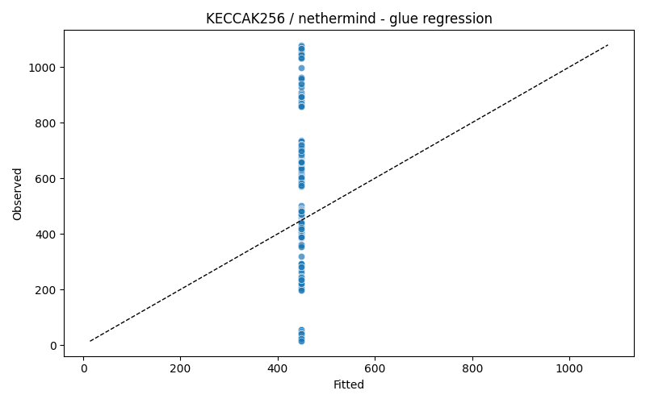


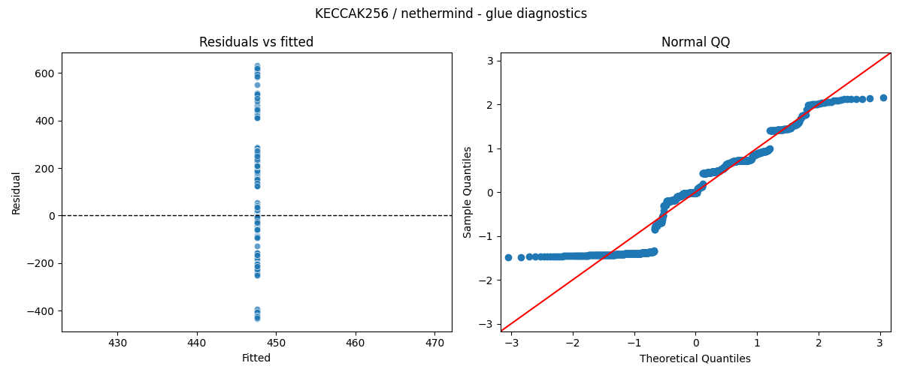

</details>

## reth

| glue_opcode | nobs | glue_runtime_ms | p_value | rsquared |
| --- | --- | --- | --- | --- |
| `ISZERO` | 22 | 3.215e-07 | 1.00e-03 | 0.8384 |
| `JUMPDEST` | 22 | 3.015e-07 | 1.00e-03 | 0.8572 |
| `SWAP` | 352 | 4.659e-07 | 1.00e-03 | 0.7369 |
| `CALLDATASIZE` | 1342 | 5.076e-07 | 1.00e-03 | 0.8294 |
| `DUP` | 1342 | 4.15e-07 | 1.00e-03 | 0.8294 |
| `GAS` | 1342 | 4.54e-07 | 1.00e-03 | 0.8294 |
| `MLOAD` | 1342 | 1.663e-06 | 1.00e-03 | 0.8294 |
| `PUSH` | 1342 | 4.456e-07 | 1.00e-03 | 0.8294 |
| `PUSH0` | 1342 | 3.127e-07 | 1.00e-03 | 0.8294 |
| `STATICCALL` | 1342 | 4.76e-05 | 1.00e-03 | 0.8294 |
| `ADD` | 22 | 8.515e-07 | 1.00e-03 | 0.8568 |
| `AND` | 22 | 9.384e-07 | 1.00e-03 | 0.8308 |
| `CALLDATACOPY` | 528 | 2.258e-06 | 1.00e-03 | 0.7909 |
| `CALLDATALOAD` | 88 | 4.315e-05 | 1.00e-03 | 0.4746 |
| `DIV` | 22 | 6.499e-06 | 1.00e-03 | 0.9048 |
| `EXP` | 22 | 0.0003891 | 1.00e-03 | 0.7245 |
| `GT` | 22 | 1.013e-06 | 1.00e-03 | 0.8534 |
| `JUMPI` | 22 | 1.071e-06 | 1.00e-03 | 0.7021 |
| `LT` | 22 | 8.317e-07 | 1.00e-03 | 0.6966 |
| `MSTORE` | 110 | 2.642e-06 | 1.00e-03 | 0.2526 |
| `MSTORE8` | 110 | 1.359e-06 | 1.00e-03 | 0.7948 |
| `MUL` | 22 | 1.275e-06 | 1.00e-03 | 0.8339 |
| `PC` | 22 | 6.204e-07 | 1.00e-03 | 0.9472 |
| `RETURNDATASIZE` | 88 | 8.878e-07 | 1.00e-03 | 0.8259 |
| `SELFBALANCE` | 18 | 3.826e-06 | 1.00e-03 | 0.8452 |
| `SUB` | 22 | 9.425e-07 | 1.00e-03 | 0.8446 |
| `JUMP` | 22 | 2.112e-06 | 1.00e-03 | 0.8218 |
| `KECCAK256` | 352 | 0 | 1.00e+00 | 0 |

### Cycle glue — joint fit · reth

<details><summary>Joint NNLS regression summary</summary>

```
==============================================================================
                           NNLS Regression Results                            
==============================================================================
Dep. Variable:          test_runtime_ms              R-squared:          0.829
Model:                  NNLS                    Adj. R-squared:          0.829
No. Observations:       1342                              RMSE:           7.65
Df Residuals:           1334                               MAE:           5.10
Df Model:               7      
==============================================================================
                      coef     std err     P-value      [0.025      0.975]
------------------------------------------------------------------------------
         const     11.6621      0.6834       0.001     10.3278     13.0174
  CALLDATASIZE      0.0000      0.0000       0.001      0.0000      0.0000
           DUP      0.0000      0.0000       0.001      0.0000      0.0000
           GAS      0.0000      0.0000       0.001      0.0000      0.0000
         MLOAD      0.0000      0.0000       0.001      0.0000      0.0000
          PUSH      0.0000      0.0000       0.001      0.0000      0.0000
         PUSH0      0.0000      0.0000       0.001      0.0000      0.0000
    STATICCALL      0.0000      0.0000       0.001      0.0000      0.0000
==============================================================================
Notes: Non-negative least squares with bootstrap inference (1000 iterations)
==============================================================================
```

</details>

<details><summary><code>CALLDATASIZE</code> · nobs=1342 · runtime_ms=5.076e-07 · p=1.00e-03 · R²=0.8294</summary>


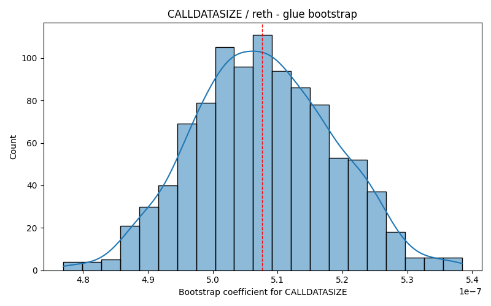

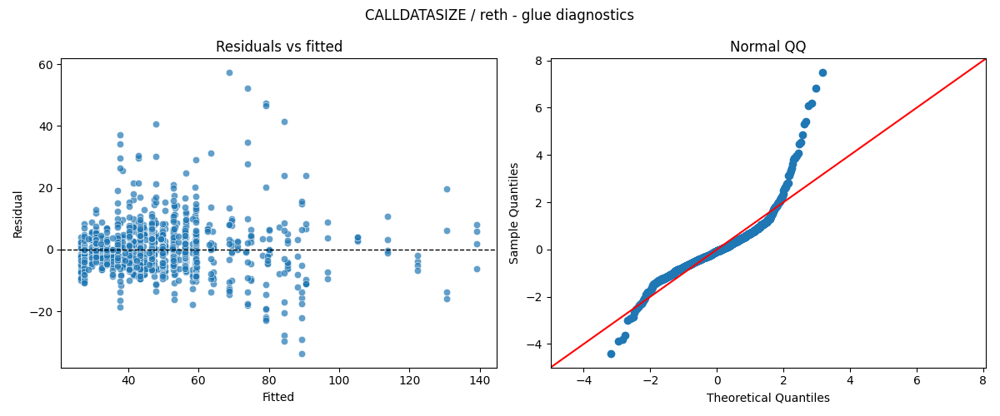

</details>

<details><summary><code>DUP</code> · nobs=1342 · runtime_ms=4.15e-07 · p=1.00e-03 · R²=0.8294</summary>


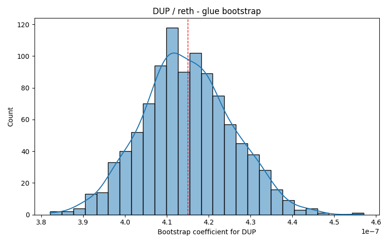


</details>

<details><summary><code>GAS</code> · nobs=1342 · runtime_ms=4.54e-07 · p=1.00e-03 · R²=0.8294</summary>


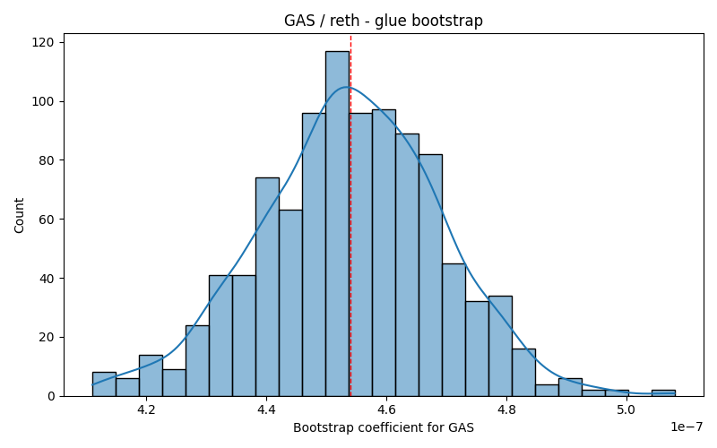


</details>

<details><summary><code>MLOAD</code> · nobs=1342 · runtime_ms=1.663e-06 · p=1.00e-03 · R²=0.8294</summary>


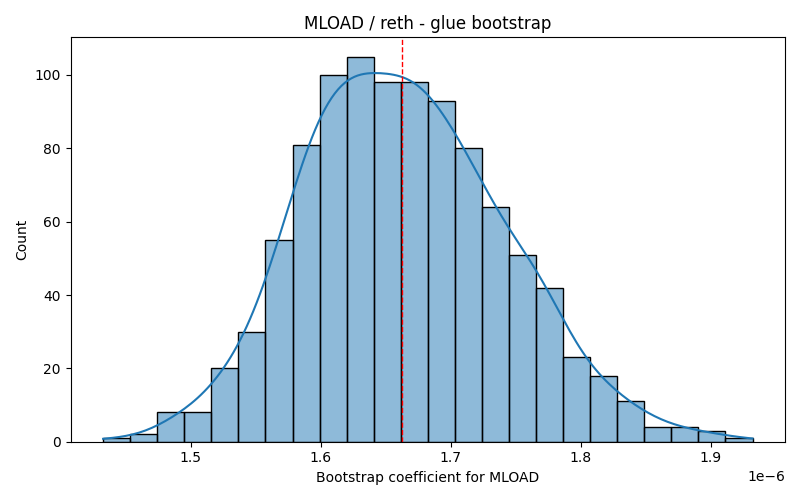

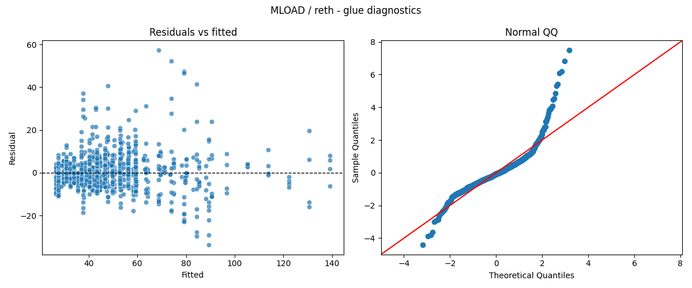

</details>

<details><summary><code>PUSH</code> · nobs=1342 · runtime_ms=4.456e-07 · p=1.00e-03 · R²=0.8294</summary>


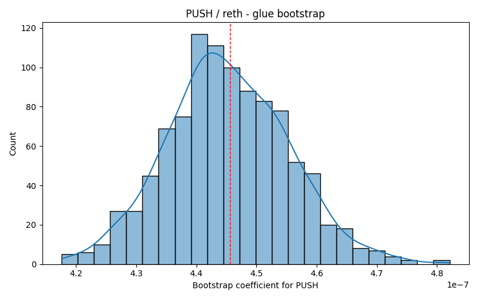


</details>

<details><summary><code>PUSH0</code> · nobs=1342 · runtime_ms=3.127e-07 · p=1.00e-03 · R²=0.8294</summary>


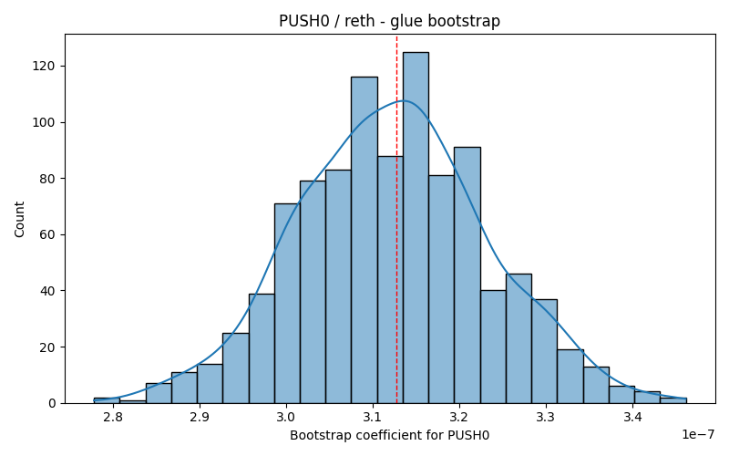


</details>

<details><summary><code>STATICCALL</code> · nobs=1342 · runtime_ms=4.76e-05 · p=1.00e-03 · R²=0.8294</summary>

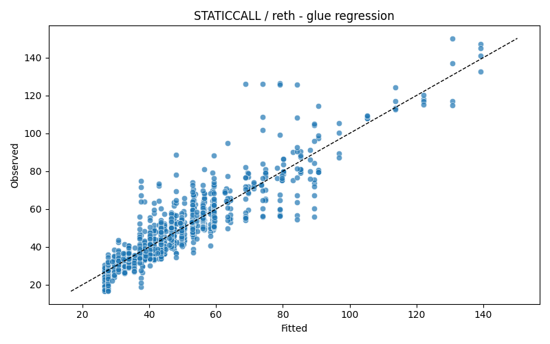

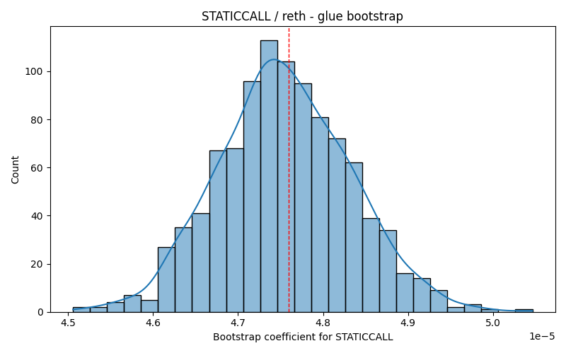


</details>

### Pure glue · reth

<details><summary><code>ISZERO</code> · nobs=22 · runtime_ms=3.215e-07 · p=1.00e-03 · R²=0.8384</summary>

```
==============================================================================
                           NNLS Regression Results                            
==============================================================================
Dep. Variable:          test_runtime_ms              R-squared:          0.838
Model:                  NNLS                    Adj. R-squared:          0.830
No. Observations:       22                                RMSE:           2.97
Df Residuals:           20                                 MAE:           2.23
Df Model:               1      
==============================================================================
                      coef     std err     P-value      [0.025      0.975]
------------------------------------------------------------------------------
         const     11.2117      2.4779       0.001      6.7695     16.3947
        ISZERO      0.0000      0.0000       0.001      0.0000      0.0000
==============================================================================
Notes: Non-negative least squares with bootstrap inference (1000 iterations)
==============================================================================
```

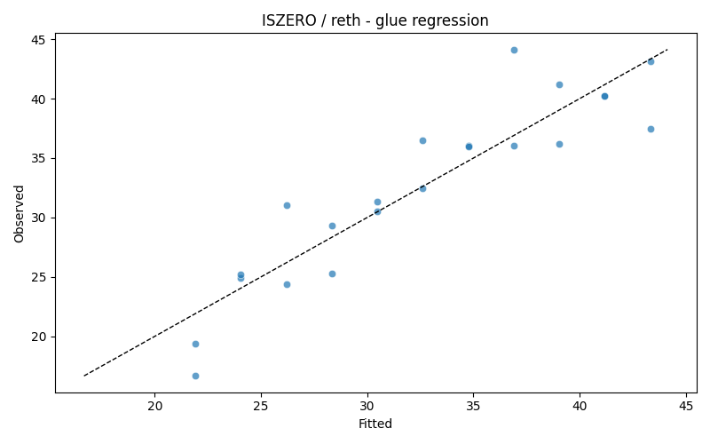

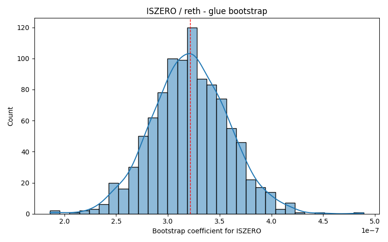

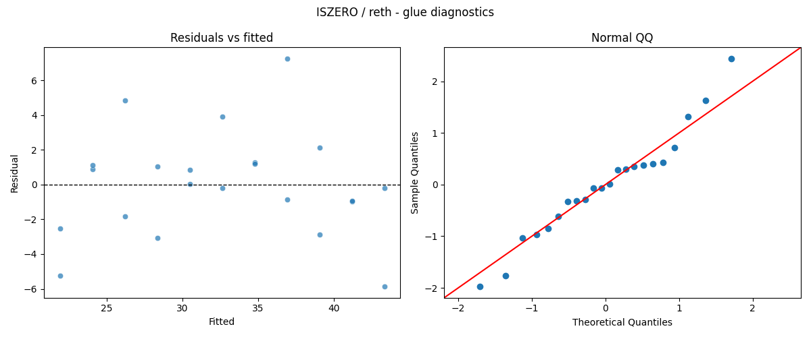

</details>

<details><summary><code>JUMPDEST</code> · nobs=22 · runtime_ms=3.015e-07 · p=1.00e-03 · R²=0.8572</summary>

```
==============================================================================
                           NNLS Regression Results                            
==============================================================================
Dep. Variable:          test_runtime_ms              R-squared:          0.857
Model:                  NNLS                    Adj. R-squared:          0.850
No. Observations:       22                                RMSE:           7.77
Df Residuals:           20                                 MAE:           5.96
Df Model:               1      
==============================================================================
                      coef     std err     P-value      [0.025      0.975]
------------------------------------------------------------------------------
         const     10.0499      5.2095       0.039      0.0000     20.5639
      JUMPDEST      0.0000      0.0000       0.001      0.0000      0.0000
==============================================================================
Notes: Non-negative least squares with bootstrap inference (1000 iterations)
==============================================================================
```

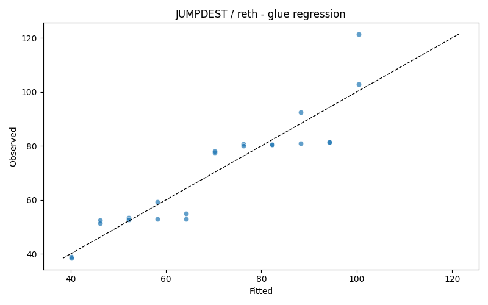

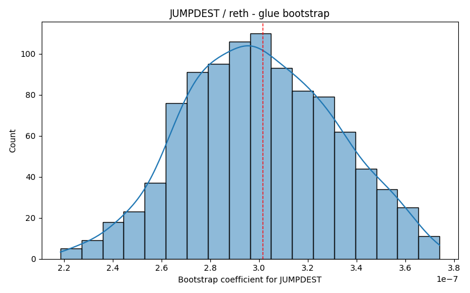

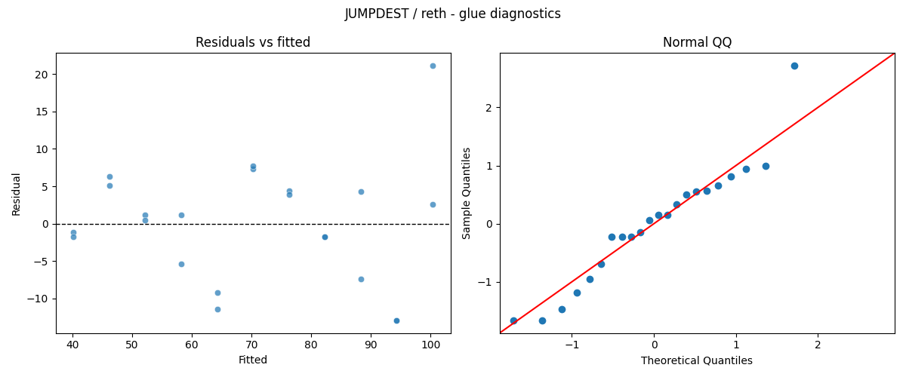

</details>

<details><summary><code>SWAP</code> · nobs=352 · runtime_ms=4.659e-07 · p=1.00e-03 · R²=0.7369</summary>

```
==============================================================================
                           NNLS Regression Results                            
==============================================================================
Dep. Variable:          test_runtime_ms              R-squared:          0.737
Model:                  NNLS                    Adj. R-squared:          0.736
No. Observations:       352                               RMSE:           5.86
Df Residuals:           350                                MAE:           4.51
Df Model:               1      
==============================================================================
                      coef     std err     P-value      [0.025      0.975]
------------------------------------------------------------------------------
         const     11.6886      0.9370       0.001      9.9277     13.5292
          SWAP      0.0000      0.0000       0.001      0.0000      0.0000
==============================================================================
Notes: Non-negative least squares with bootstrap inference (1000 iterations)
==============================================================================
```

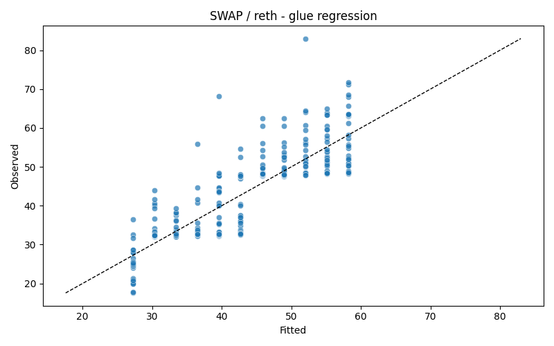

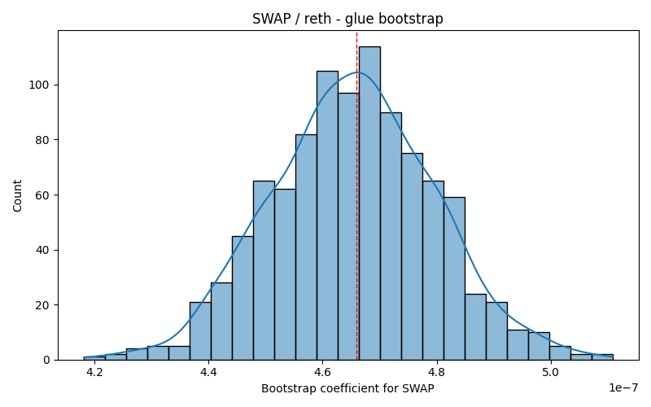

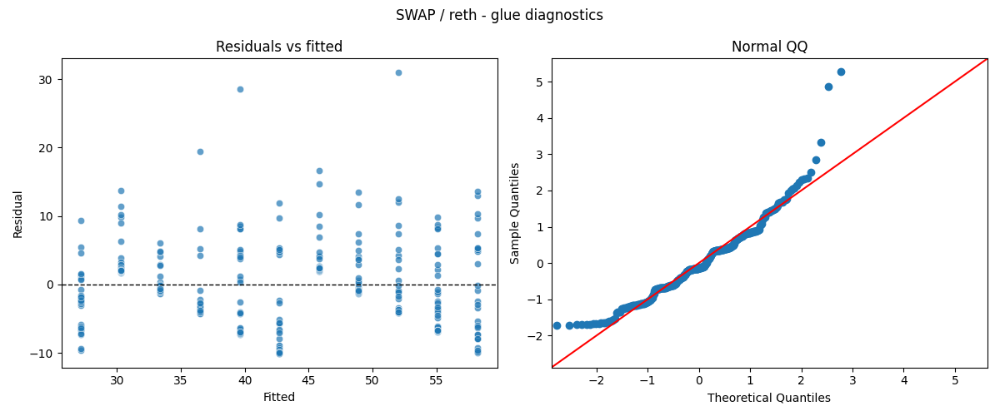

</details>

### Mixed glue (tier A) · reth

<details><summary><code>ADD</code> · nobs=22 · runtime_ms=8.515e-07 · p=1.00e-03 · R²=0.8568</summary>

```
==============================================================================
                           NNLS Regression Results                            
==============================================================================
Dep. Variable:          test_runtime_ms              R-squared:          0.857
Model:                  NNLS                    Adj. R-squared:          0.850
No. Observations:       22                                RMSE:           3.66
Df Residuals:           20                                 MAE:           3.18
Df Model:               1      
==============================================================================
                      coef     std err     P-value      [0.025      0.975]
------------------------------------------------------------------------------
         const     10.2582      2.7472       0.001      5.2778     15.6553
           ADD      0.0000      0.0000       0.001      0.0000      0.0000
==============================================================================
Notes: Non-negative least squares with bootstrap inference (1000 iterations)
==============================================================================
```

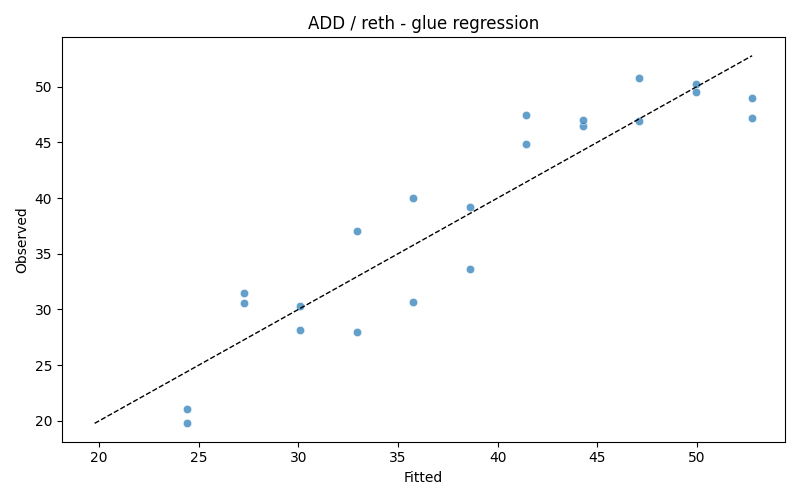

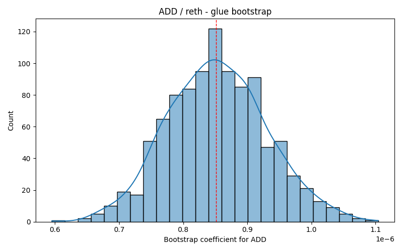

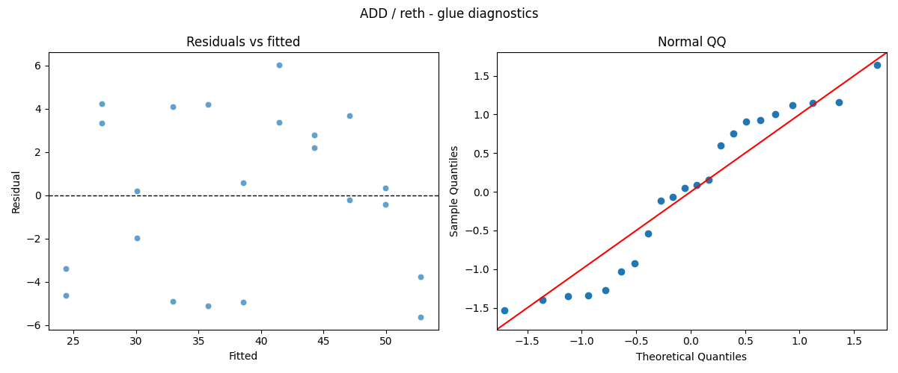

</details>

<details><summary><code>AND</code> · nobs=22 · runtime_ms=9.384e-07 · p=1.00e-03 · R²=0.8308</summary>

```
==============================================================================
                           NNLS Regression Results                            
==============================================================================
Dep. Variable:          test_runtime_ms              R-squared:          0.831
Model:                  NNLS                    Adj. R-squared:          0.822
No. Observations:       22                                RMSE:           4.46
Df Residuals:           20                                 MAE:           3.52
Df Model:               1      
==============================================================================
                      coef     std err     P-value      [0.025      0.975]
------------------------------------------------------------------------------
         const      7.9811      2.9185       0.001      2.3451     13.8158
           AND      0.0000      0.0000       0.001      0.0000      0.0000
==============================================================================
Notes: Non-negative least squares with bootstrap inference (1000 iterations)
==============================================================================
```

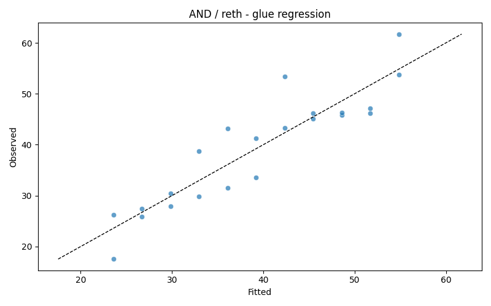

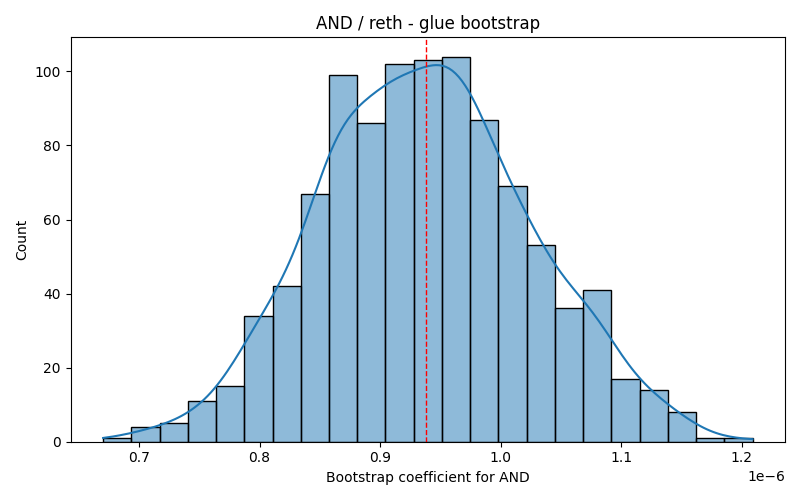

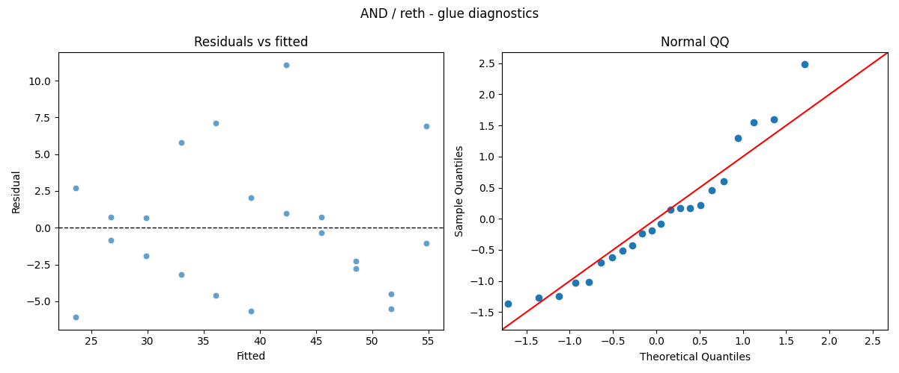

</details>

<details><summary><code>CALLDATACOPY</code> · nobs=528 · runtime_ms=2.258e-06 · p=1.00e-03 · R²=0.7909</summary>

```
==============================================================================
                           NNLS Regression Results                            
==============================================================================
Dep. Variable:          test_runtime_ms              R-squared:          0.791
Model:                  NNLS                    Adj. R-squared:          0.790
No. Observations:       528                               RMSE:           8.73
Df Residuals:           526                                MAE:           6.68
Df Model:               1      
==============================================================================
                      coef     std err     P-value      [0.025      0.975]
------------------------------------------------------------------------------
         const     12.2143      0.4623       0.001     11.2935     13.1137
  CALLDATACOPY      0.0000      0.0000       0.001      0.0000      0.0000
==============================================================================
Notes: Non-negative least squares with bootstrap inference (1000 iterations)
==============================================================================
```

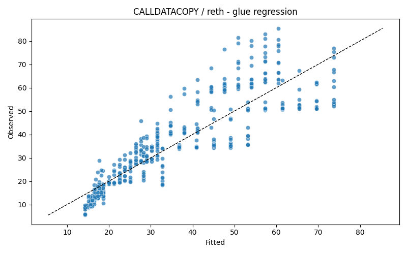

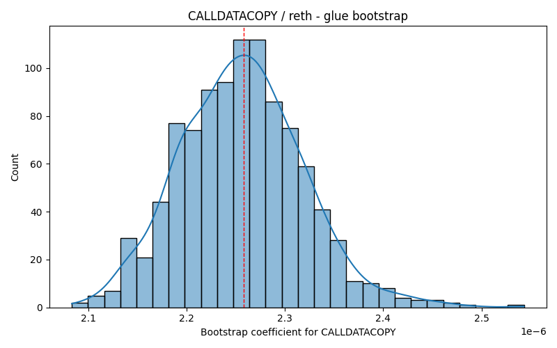

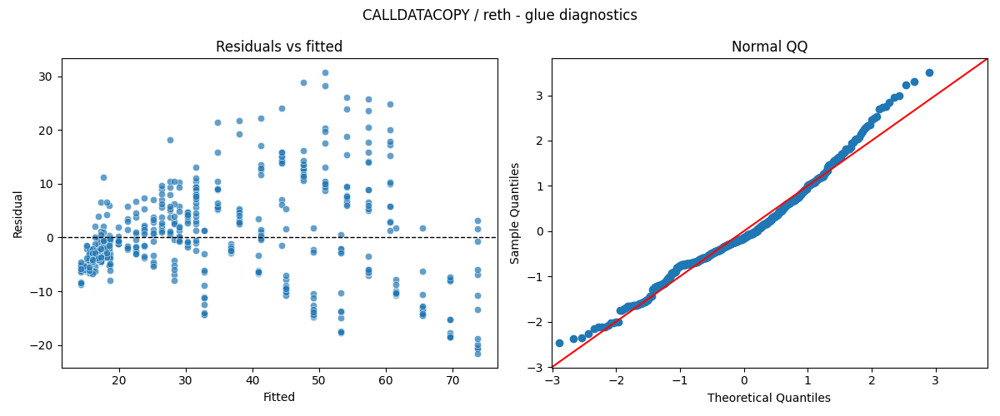

</details>

<details><summary><code>CALLDATALOAD</code> · nobs=88 · runtime_ms=4.315e-05 · p=1.00e-03 · R²=0.4746</summary>

```
==============================================================================
                           NNLS Regression Results                            
==============================================================================
Dep. Variable:          test_runtime_ms              R-squared:          0.475
Model:                  NNLS                    Adj. R-squared:          0.468
No. Observations:       88                                RMSE:           0.17
Df Residuals:           86                                 MAE:           0.14
Df Model:               1      
==============================================================================
                      coef     std err     P-value      [0.025      0.975]
------------------------------------------------------------------------------
         const      1.1650      0.0547       0.001      1.0537      1.2681
  CALLDATALOAD      0.0000      0.0000       0.001      0.0000      0.0001
==============================================================================
Notes: Non-negative least squares with bootstrap inference (1000 iterations)
==============================================================================
```

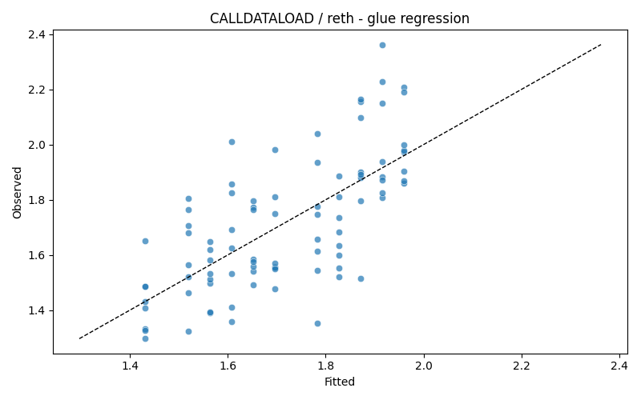

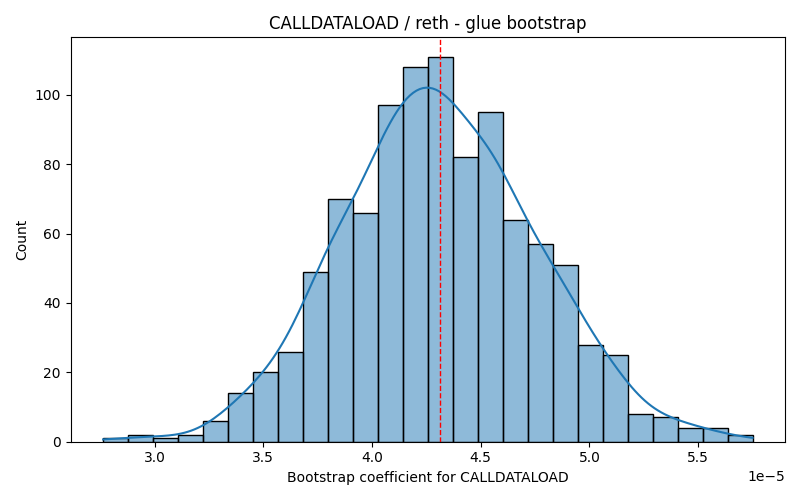

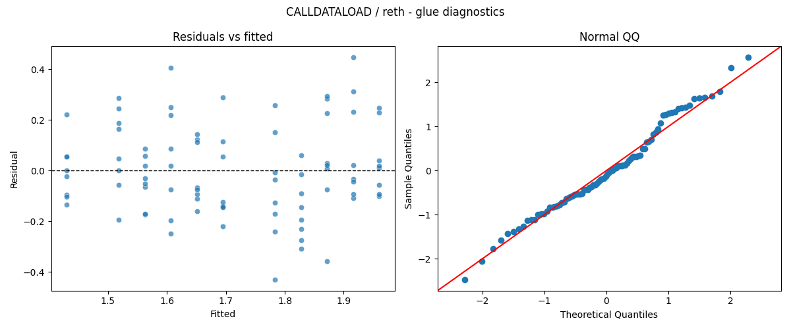

</details>

<details><summary><code>DIV</code> · nobs=22 · runtime_ms=6.499e-06 · p=1.00e-03 · R²=0.9048</summary>

```
==============================================================================
                           NNLS Regression Results                            
==============================================================================
Dep. Variable:          test_runtime_ms              R-squared:          0.905
Model:                  NNLS                    Adj. R-squared:          0.900
No. Observations:       22                                RMSE:          16.64
Df Residuals:           20                                 MAE:          13.92
Df Model:               1      
==============================================================================
                      coef     std err     P-value      [0.025      0.975]
------------------------------------------------------------------------------
         const     74.7373     11.6012       0.001     52.1073     98.3999
           DIV      0.0000      0.0000       0.001      0.0000      0.0000
==============================================================================
Notes: Non-negative least squares with bootstrap inference (1000 iterations)
==============================================================================
```

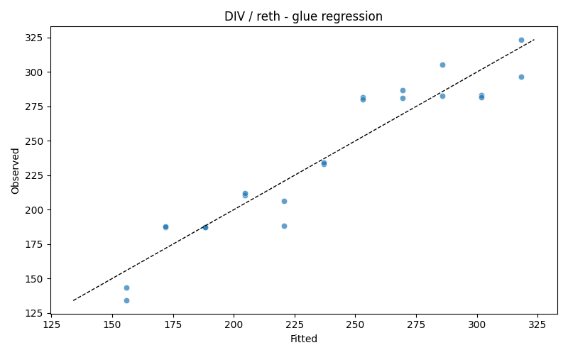

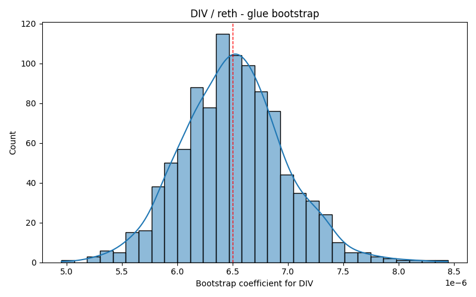

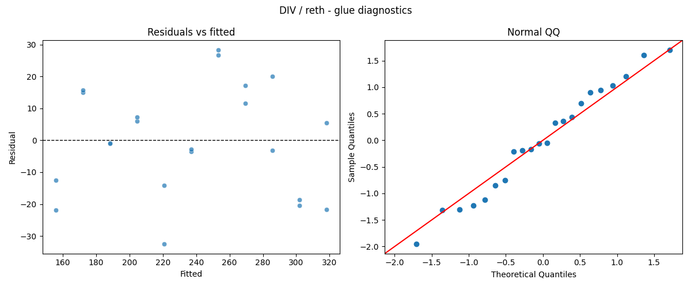

</details>

<details><summary><code>EXP</code> · nobs=22 · runtime_ms=0.0003891 · p=1.00e-03 · R²=0.7245</summary>

```
==============================================================================
                           NNLS Regression Results                            
==============================================================================
Dep. Variable:          test_runtime_ms              R-squared:          0.724
Model:                  NNLS                    Adj. R-squared:          0.711
No. Observations:       22                                RMSE:           9.40
Df Residuals:           20                                 MAE:           7.59
Df Model:               1      
==============================================================================
                      coef     std err     P-value      [0.025      0.975]
------------------------------------------------------------------------------
         const     14.2746      7.2435       0.017      1.2682     29.4290
           EXP      0.0004      0.0001       0.001      0.0003      0.0005
==============================================================================
Notes: Non-negative least squares with bootstrap inference (1000 iterations)
==============================================================================
```

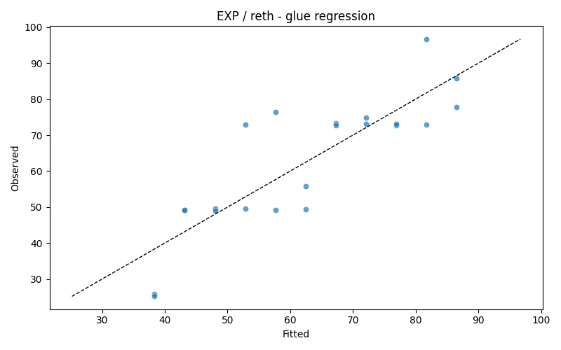

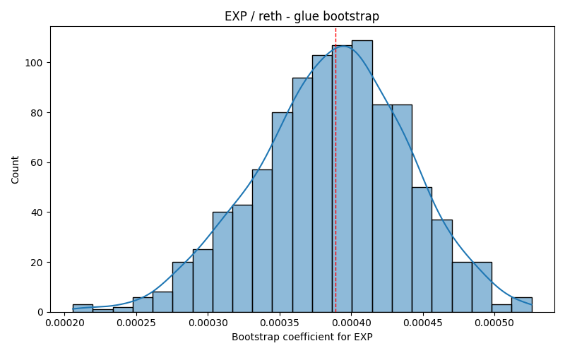

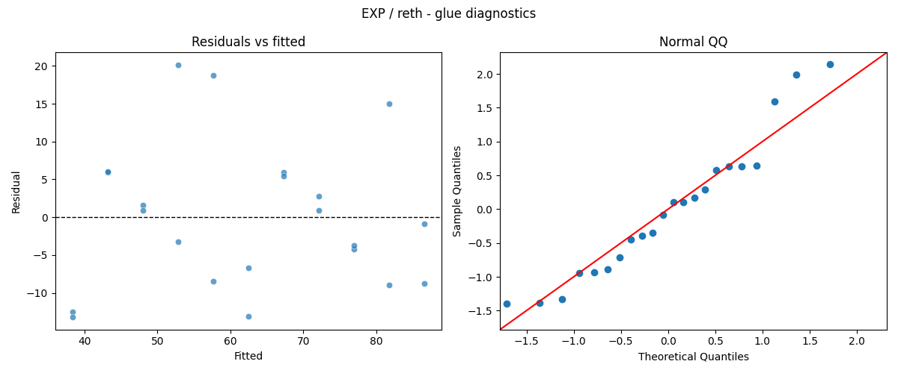

</details>

<details><summary><code>GT</code> · nobs=22 · runtime_ms=1.013e-06 · p=1.00e-03 · R²=0.8534</summary>

```
==============================================================================
                           NNLS Regression Results                            
==============================================================================
Dep. Variable:          test_runtime_ms              R-squared:          0.853
Model:                  NNLS                    Adj. R-squared:          0.846
No. Observations:       22                                RMSE:           4.42
Df Residuals:           20                                 MAE:           3.65
Df Model:               1      
==============================================================================
                      coef     std err     P-value      [0.025      0.975]
------------------------------------------------------------------------------
         const      8.3754      3.7138       0.015      0.8945     15.6311
            GT      0.0000      0.0000       0.001      0.0000      0.0000
==============================================================================
Notes: Non-negative least squares with bootstrap inference (1000 iterations)
==============================================================================
```

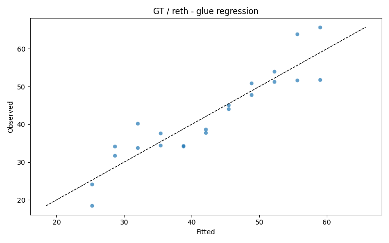

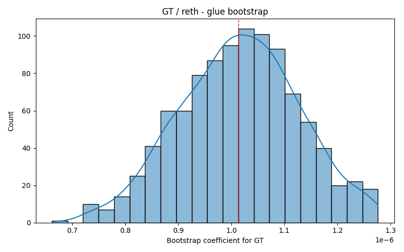

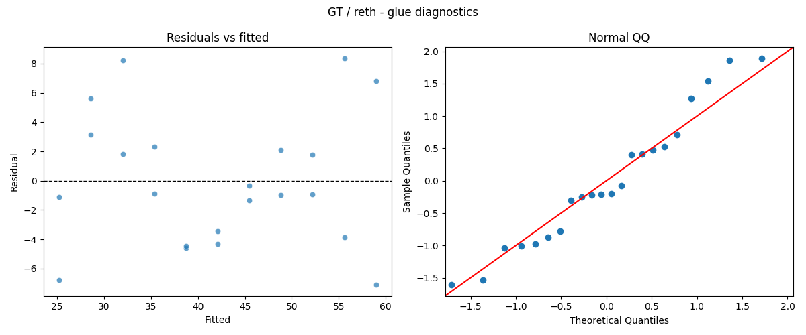

</details>

<details><summary><code>JUMPI</code> · nobs=22 · runtime_ms=1.071e-06 · p=1.00e-03 · R²=0.7021</summary>

```
==============================================================================
                           NNLS Regression Results                            
==============================================================================
Dep. Variable:          test_runtime_ms              R-squared:          0.702
Model:                  NNLS                    Adj. R-squared:          0.687
No. Observations:       22                                RMSE:           3.15
Df Residuals:           20                                 MAE:           2.43
Df Model:               1      
==============================================================================
                      coef     std err     P-value      [0.025      0.975]
------------------------------------------------------------------------------
         const      8.3365      2.2575       0.001      4.4436     12.9865
         JUMPI      0.0000      0.0000       0.001      0.0000      0.0000
==============================================================================
Notes: Non-negative least squares with bootstrap inference (1000 iterations)
==============================================================================
```

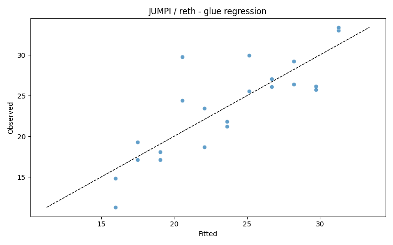

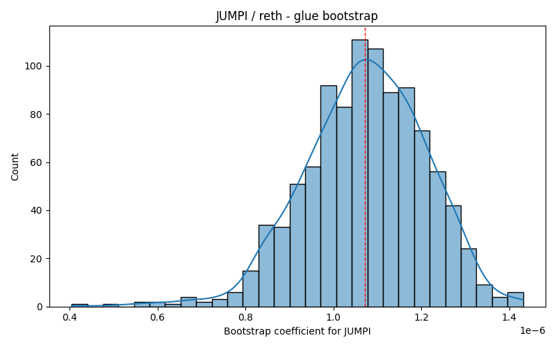

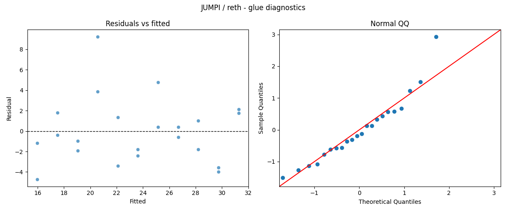

</details>

<details><summary><code>LT</code> · nobs=22 · runtime_ms=8.317e-07 · p=1.00e-03 · R²=0.6966</summary>

```
==============================================================================
                           NNLS Regression Results                            
==============================================================================
Dep. Variable:          test_runtime_ms              R-squared:          0.697
Model:                  NNLS                    Adj. R-squared:          0.681
No. Observations:       22                                RMSE:           5.78
Df Residuals:           20                                 MAE:           4.26
Df Model:               1      
==============================================================================
                      coef     std err     P-value      [0.025      0.975]
------------------------------------------------------------------------------
         const     13.4511      4.1341       0.001      5.8477     22.4818
            LT      0.0000      0.0000       0.001      0.0000      0.0000
==============================================================================
Notes: Non-negative least squares with bootstrap inference (1000 iterations)
==============================================================================
```

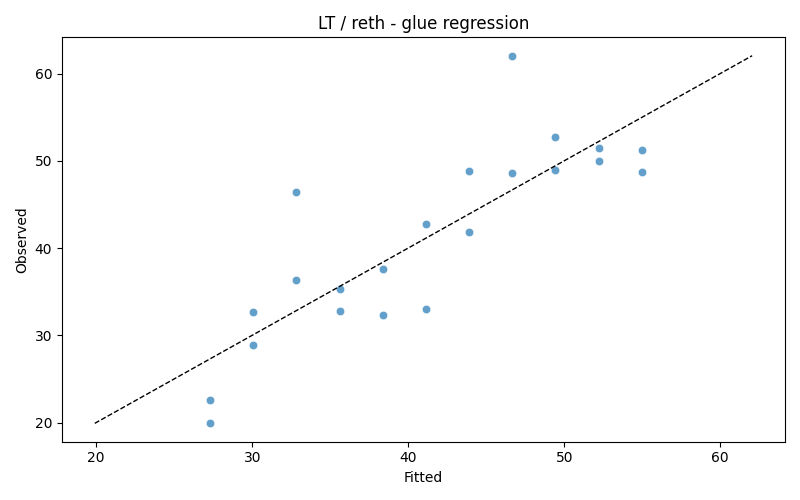

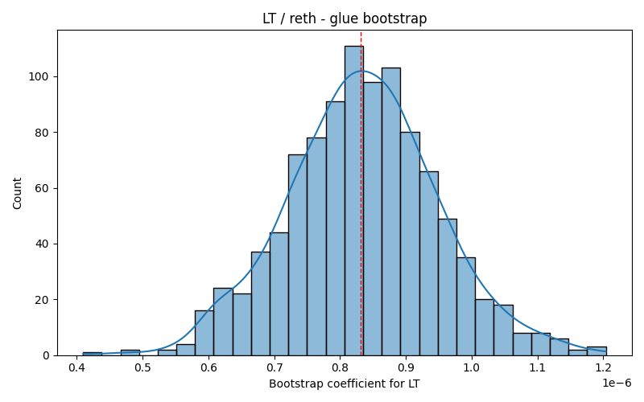

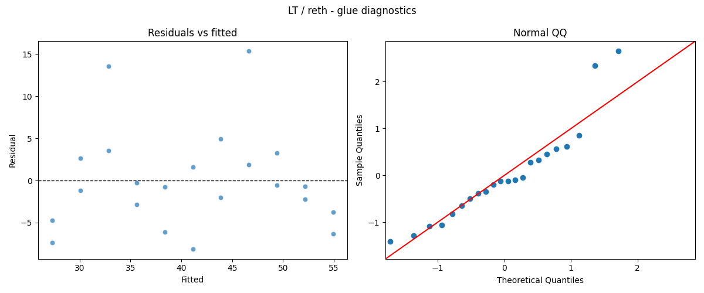

</details>

<details><summary><code>MSTORE</code> · nobs=110 · runtime_ms=2.642e-06 · p=1.00e-03 · R²=0.2526</summary>

```
==============================================================================
                           NNLS Regression Results                            
==============================================================================
Dep. Variable:          test_runtime_ms              R-squared:          0.253
Model:                  NNLS                    Adj. R-squared:          0.246
No. Observations:       110                               RMSE:          31.89
Df Residuals:           108                                MAE:          29.04
Df Model:               1      
==============================================================================
                      coef     std err     P-value      [0.025      0.975]
------------------------------------------------------------------------------
         const     23.7213      8.8242       0.002      7.6274     41.5629
        MSTORE      0.0000      0.0000       0.001      0.0000      0.0000
==============================================================================
Notes: Non-negative least squares with bootstrap inference (1000 iterations)
==============================================================================
```

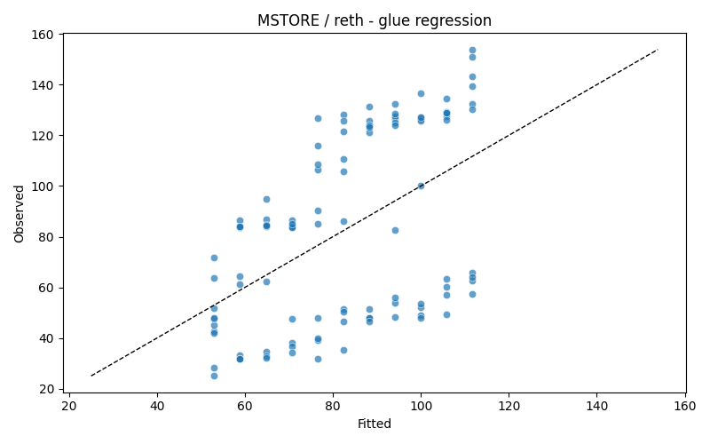

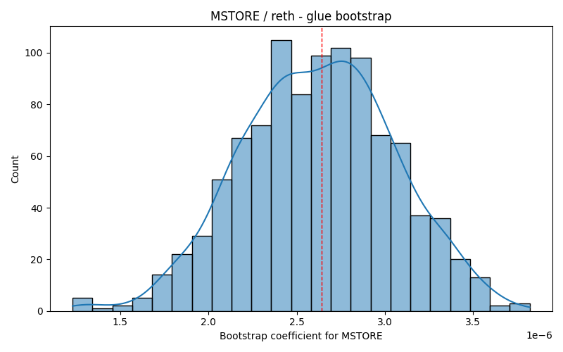

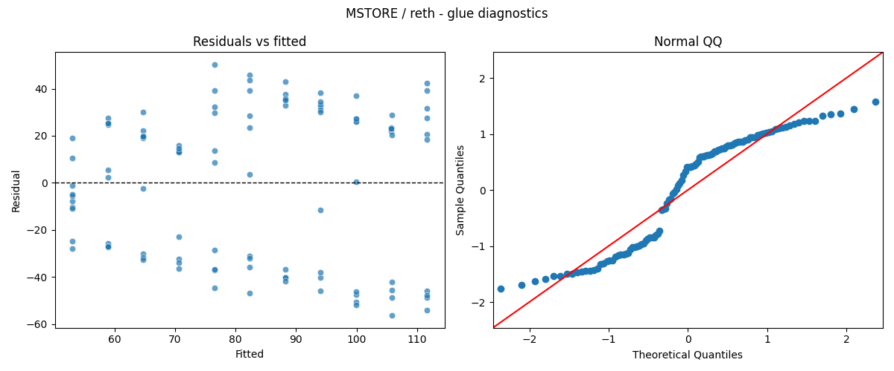

</details>

<details><summary><code>MSTORE8</code> · nobs=110 · runtime_ms=1.359e-06 · p=1.00e-03 · R²=0.7948</summary>

```
==============================================================================
                           NNLS Regression Results                            
==============================================================================
Dep. Variable:          test_runtime_ms              R-squared:          0.795
Model:                  NNLS                    Adj. R-squared:          0.793
No. Observations:       110                               RMSE:           4.85
Df Residuals:           108                                MAE:           3.76
Df Model:               1      
==============================================================================
                      coef     std err     P-value      [0.025      0.975]
------------------------------------------------------------------------------
         const     10.0395      1.4530       0.001      7.2697     12.8677
       MSTORE8      0.0000      0.0000       0.001      0.0000      0.0000
==============================================================================
Notes: Non-negative least squares with bootstrap inference (1000 iterations)
==============================================================================
```

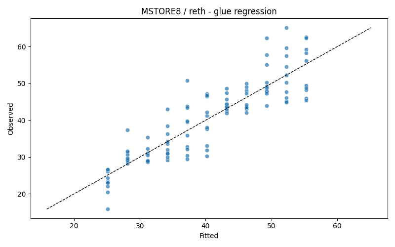

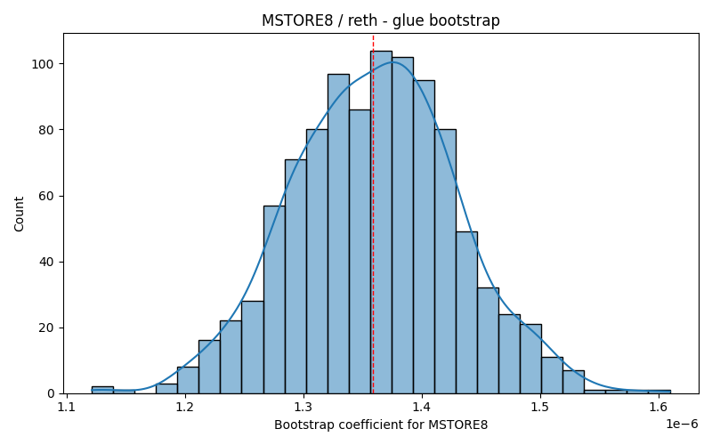

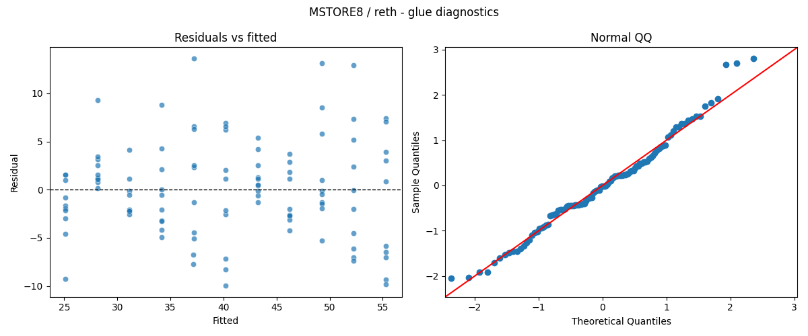

</details>

<details><summary><code>MUL</code> · nobs=22 · runtime_ms=1.275e-06 · p=1.00e-03 · R²=0.8339</summary>

```
==============================================================================
                           NNLS Regression Results                            
==============================================================================
Dep. Variable:          test_runtime_ms              R-squared:          0.834
Model:                  NNLS                    Adj. R-squared:          0.826
No. Observations:       22                                RMSE:           4.49
Df Residuals:           20                                 MAE:           3.31
Df Model:               1      
==============================================================================
                      coef     std err     P-value      [0.025      0.975]
------------------------------------------------------------------------------
         const      7.9687      2.8080       0.007      2.0482     13.9557
           MUL      0.0000      0.0000       0.001      0.0000      0.0000
==============================================================================
Notes: Non-negative least squares with bootstrap inference (1000 iterations)
==============================================================================
```

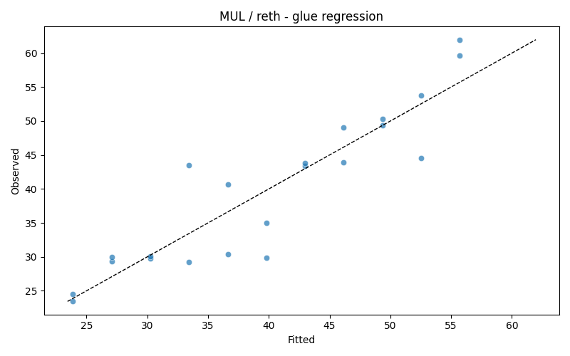

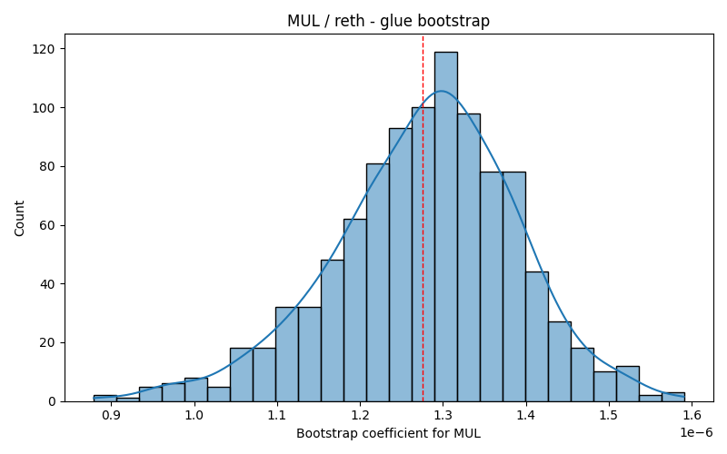

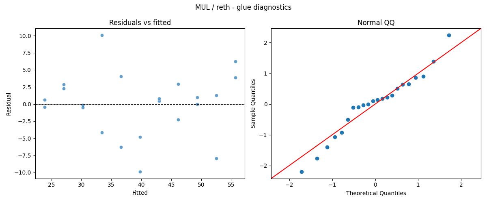

</details>

<details><summary><code>PC</code> · nobs=22 · runtime_ms=6.204e-07 · p=1.00e-03 · R²=0.9472</summary>

```
==============================================================================
                           NNLS Regression Results                            
==============================================================================
Dep. Variable:          test_runtime_ms              R-squared:          0.947
Model:                  NNLS                    Adj. R-squared:          0.945
No. Observations:       22                                RMSE:           4.38
Df Residuals:           20                                 MAE:           3.71
Df Model:               1      
==============================================================================
                      coef     std err     P-value      [0.025      0.975]
------------------------------------------------------------------------------
         const     11.5146      3.4053       0.001      5.2858     18.3215
            PC      0.0000      0.0000       0.001      0.0000      0.0000
==============================================================================
Notes: Non-negative least squares with bootstrap inference (1000 iterations)
==============================================================================
```

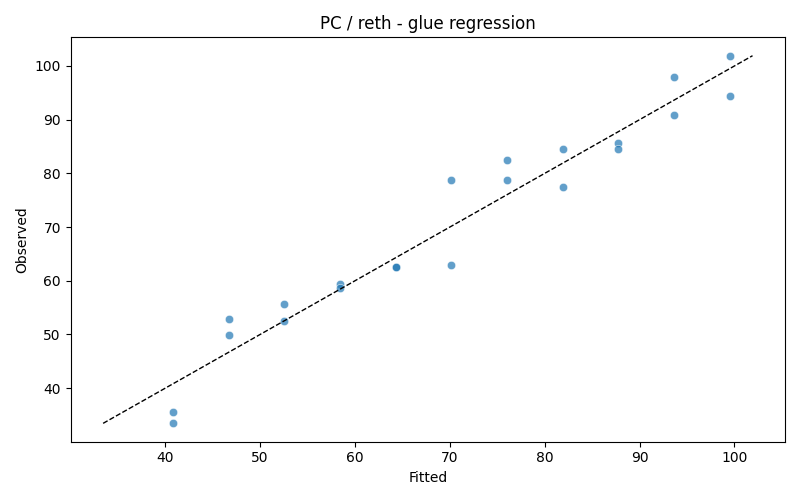

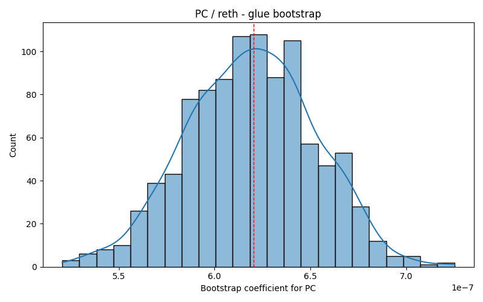

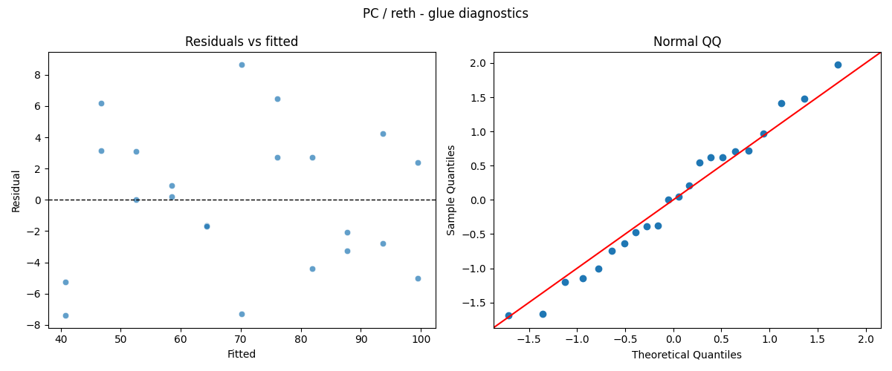

</details>

<details><summary><code>RETURNDATASIZE</code> · nobs=88 · runtime_ms=8.878e-07 · p=1.00e-03 · R²=0.8259</summary>

```
==============================================================================
                           NNLS Regression Results                            
==============================================================================
Dep. Variable:          test_runtime_ms              R-squared:          0.826
Model:                  NNLS                    Adj. R-squared:          0.824
No. Observations:       88                                RMSE:           6.44
Df Residuals:           86                                 MAE:           4.73
Df Model:               1      
==============================================================================
                      coef     std err     P-value      [0.025      0.975]
------------------------------------------------------------------------------
         const     11.7632      2.0139       0.001      7.9569     15.9194
RETURNDATASIZE      0.0000      0.0000       0.001      0.0000      0.0000
==============================================================================
Notes: Non-negative least squares with bootstrap inference (1000 iterations)
==============================================================================
```

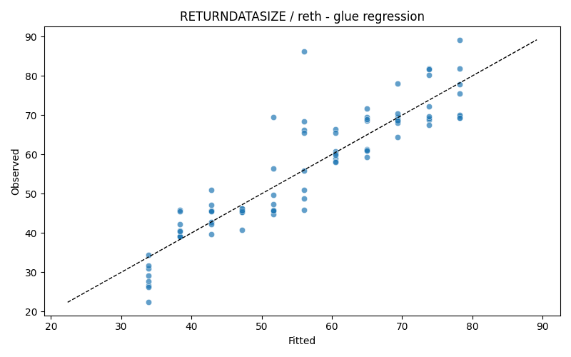

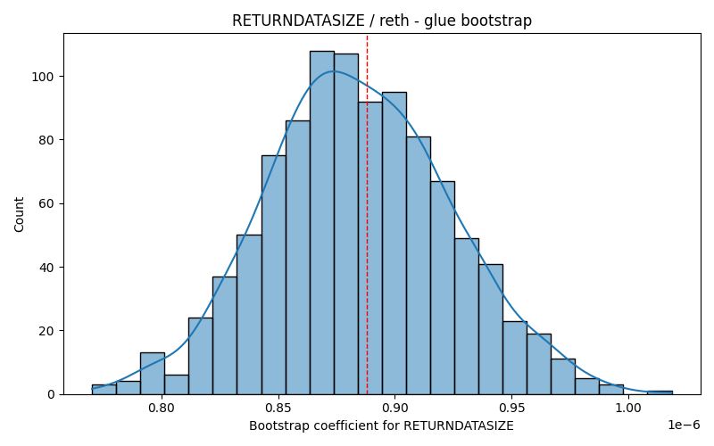

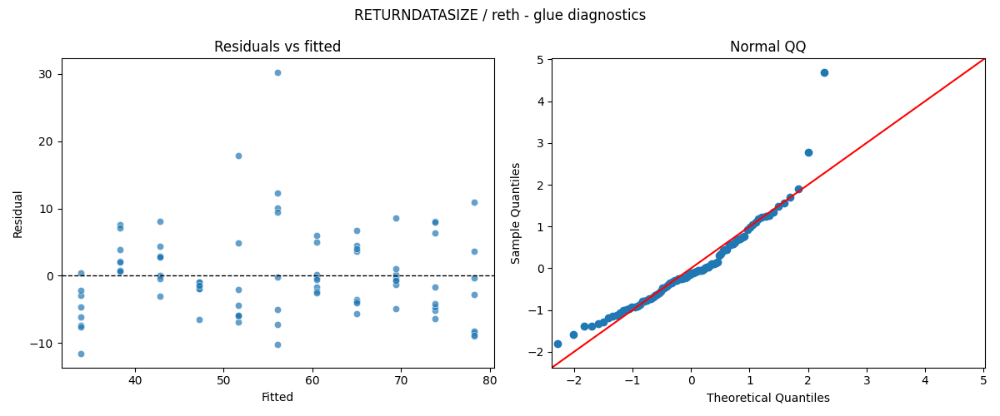

</details>

<details><summary><code>SELFBALANCE</code> · nobs=18 · runtime_ms=3.826e-06 · p=1.00e-03 · R²=0.8452</summary>

```
==============================================================================
                           NNLS Regression Results                            
==============================================================================
Dep. Variable:          test_runtime_ms              R-squared:          0.845
Model:                  NNLS                    Adj. R-squared:          0.836
No. Observations:       18                                RMSE:          16.51
Df Residuals:           16                                 MAE:          14.15
Df Model:               1      
==============================================================================
                      coef     std err     P-value      [0.025      0.975]
------------------------------------------------------------------------------
         const     55.1333     16.6946       0.002     19.7051     85.9889
   SELFBALANCE      0.0000      0.0000       0.001      0.0000      0.0000
==============================================================================
Notes: Non-negative least squares with bootstrap inference (1000 iterations)
==============================================================================
```

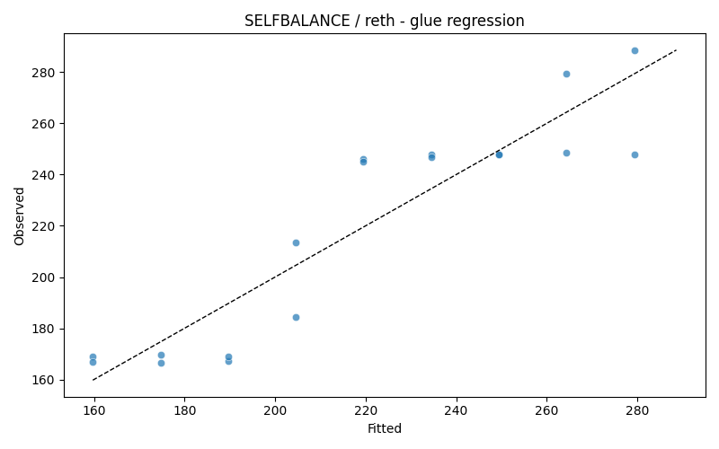

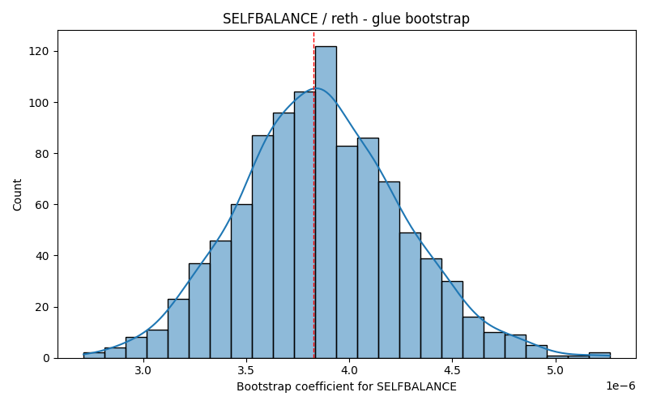


</details>

<details><summary><code>SUB</code> · nobs=22 · runtime_ms=9.425e-07 · p=1.00e-03 · R²=0.8446</summary>

```
==============================================================================
                           NNLS Regression Results                            
==============================================================================
Dep. Variable:          test_runtime_ms              R-squared:          0.845
Model:                  NNLS                    Adj. R-squared:          0.837
No. Observations:       22                                RMSE:           4.26
Df Residuals:           20                                 MAE:           3.34
Df Model:               1      
==============================================================================
                      coef     std err     P-value      [0.025      0.975]
------------------------------------------------------------------------------
         const      9.5609      3.1378       0.001      4.0523     16.3759
           SUB      0.0000      0.0000       0.001      0.0000      0.0000
==============================================================================
Notes: Non-negative least squares with bootstrap inference (1000 iterations)
==============================================================================
```

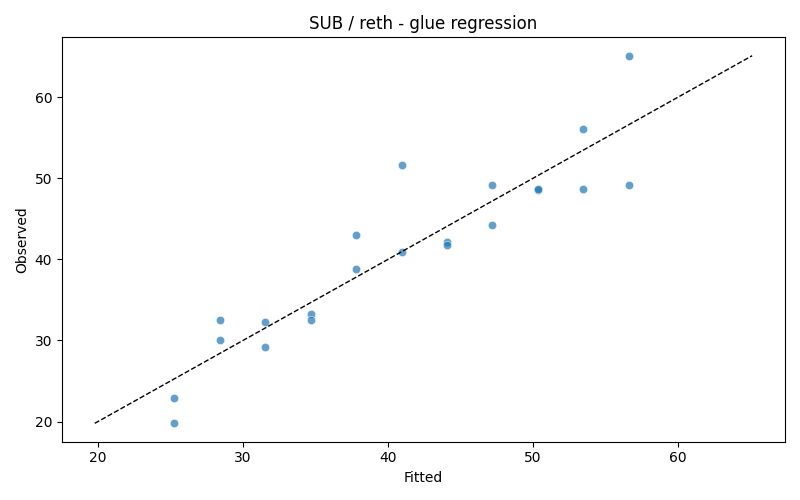

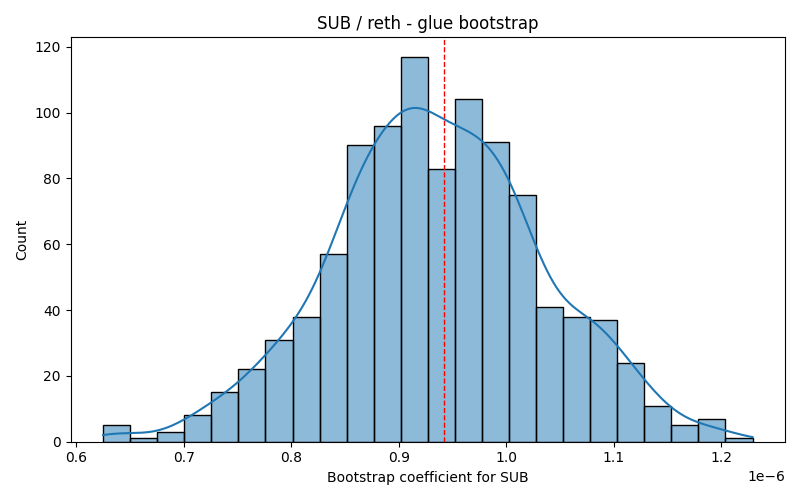

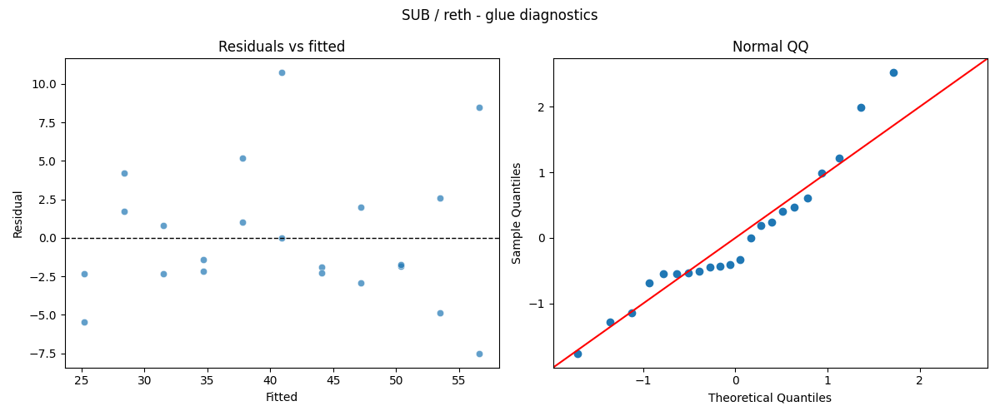

</details>

### Mixed glue (tier B) · reth

<details><summary><code>JUMP</code> · nobs=22 · runtime_ms=2.112e-06 · p=1.00e-03 · R²=0.8218</summary>

```
==============================================================================
                           NNLS Regression Results                            
==============================================================================
Dep. Variable:          test_runtime_ms              R-squared:          0.822
Model:                  NNLS                    Adj. R-squared:          0.813
No. Observations:       22                                RMSE:           3.65
Df Residuals:           20                                 MAE:           3.22
Df Model:               1      
==============================================================================
                      coef     std err     P-value      [0.025      0.975]
------------------------------------------------------------------------------
         const     10.7892      2.2311       0.001      6.0386     14.8137
          JUMP      0.0000      0.0000       0.001      0.0000      0.0000
==============================================================================
Notes: Non-negative least squares with bootstrap inference (1000 iterations)
==============================================================================
```

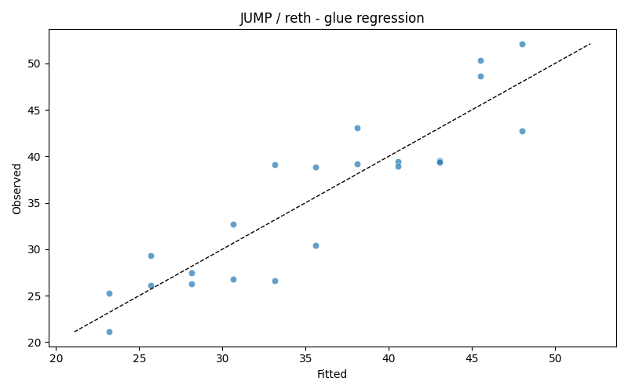

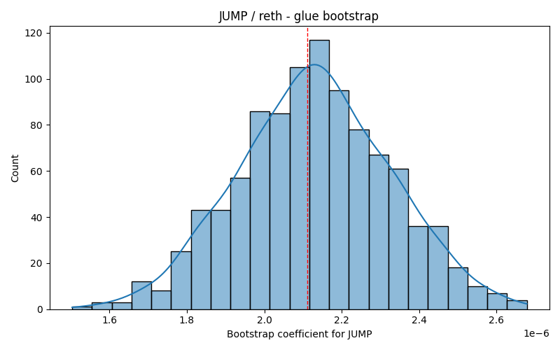

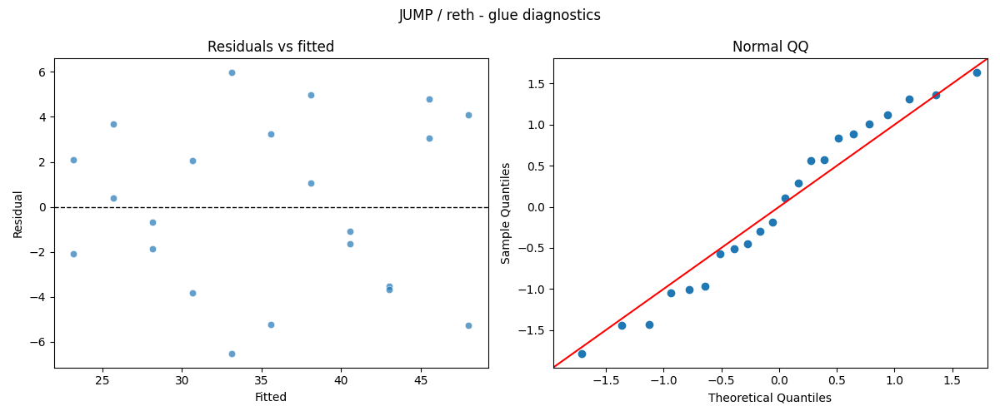

</details>

<details><summary><code>KECCAK256</code> · nobs=352 · runtime_ms=0 · p=1.00e+00 · R²=0</summary>

```
==============================================================================
                           NNLS Regression Results                            
==============================================================================
Dep. Variable:          test_runtime_ms              R-squared:          0.000
Model:                  NNLS                    Adj. R-squared:         -0.003
No. Observations:       352                               RMSE:         159.60
Df Residuals:           350                                MAE:         134.71
Df Model:               1      
==============================================================================
                      coef     std err     P-value      [0.025      0.975]
------------------------------------------------------------------------------
         const    251.3497      8.6873       0.001    235.9908    269.3556
     KECCAK256      0.0000      0.0000       1.000      0.0000      0.0000
==============================================================================
Notes: Non-negative least squares with bootstrap inference (1000 iterations)
==============================================================================
```

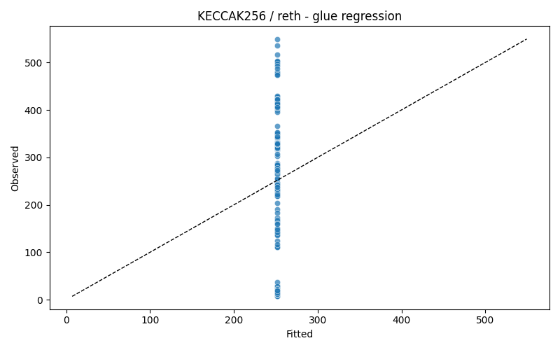


</details>
