# Glue opcodes report

Per-client NNLS fits of priced glue opcodes against their driver fixtures. Cycle-tier opcodes share one joint regression per client (shown once); pure-tier and mixed-tier opcodes each get a single-feature fit. Mixed-tier fits pre-adjust the LHS by subtracting the contribution of every priced upstream partner selected by the detector (pure ∪ cycle for `mixed_a`, plus `mixed_a` for `mixed_b`).

**Contents:** [besu](#besu) · [erigon](#erigon) · [geth](#geth) · [nethermind](#nethermind) · [reth](#reth)

## besu

| glue_opcode | nobs | glue_runtime_ms | p_value | rsquared |
| --- | --- | --- | --- | --- |
| `ISZERO` | 209 | 5.147e-06 | 1.00e-03 | 0.8807 |
| `JUMPDEST` | 209 | 2.614e-06 | 1.00e-03 | 0.8797 |
| `SWAP` | 3344 | 3.626e-06 | 1.00e-03 | 0.8523 |
| `CALLDATASIZE` | 12386 | 4.258e-06 | 1.00e-03 | 0.9304 |
| `DUP` | 12386 | 2.513e-06 | 1.00e-03 | 0.9304 |
| `GAS` | 12386 | 3.699e-06 | 1.00e-03 | 0.9304 |
| `MLOAD` | 12386 | 1.088e-05 | 1.00e-03 | 0.9304 |
| `PUSH` | 12386 | 3.193e-06 | 1.00e-03 | 0.9304 |
| `PUSH0` | 12386 | 2.504e-06 | 1.00e-03 | 0.9304 |
| `STATICCALL` | 12386 | 0.0009024 | 1.00e-03 | 0.9304 |
| `ADD` | 209 | 1.104e-05 | 1.00e-03 | 0.8732 |
| `AND` | 209 | 9.901e-06 | 1.00e-03 | 0.8819 |
| `CALLDATACOPY` | 5016 | 2.135e-05 | 1.00e-03 | 0.803 |
| `CALLDATALOAD` | 836 | 6.152e-06 | 1.32e-01 | 0.001188 |
| `DIV` | 209 | 1.72e-05 | 1.00e-03 | 0.865 |
| `EXP` | 209 | 0.001144 | 1.00e-03 | 0.8407 |
| `GT` | 209 | 3.309e-05 | 1.00e-03 | 0.8963 |
| `JUMPI` | 209 | 1e-05 | 1.00e-03 | 0.8839 |
| `LT` | 209 | 3.367e-05 | 1.00e-03 | 0.9038 |
| `MSTORE` | 1045 | 1.787e-05 | 1.00e-03 | 0.8635 |
| `MSTORE8` | 1045 | 1.244e-05 | 1.00e-03 | 0.8572 |
| `MUL` | 209 | 1.36e-05 | 1.00e-03 | 0.5932 |
| `PC` | 209 | 4.232e-06 | 1.00e-03 | 0.8665 |
| `RETURNDATASIZE` | 836 | 7.028e-06 | 1.00e-03 | 0.8596 |
| `SELFBALANCE` | 171 | 7.622e-06 | 1.00e-03 | 0.5194 |
| `SUB` | 209 | 1.098e-05 | 1.00e-03 | 0.8723 |
| `JUMP` | 209 | 4.709e-05 | 1.00e-03 | 0.8742 |
| `KECCAK256` | 3344 | 5.114e-05 | 1.00e-03 | 0.2845 |

### Cycle glue — joint fit · besu

<details><summary>Joint NNLS regression summary</summary>

```
==============================================================================
                           NNLS Regression Results                            
==============================================================================
Dep. Variable:          test_runtime_ms              R-squared:          0.930
Model:                  NNLS                    Adj. R-squared:          0.930
No. Observations:       12386                             RMSE:          39.40
Df Residuals:           12378                              MAE:          30.63
Df Model:               7      
==============================================================================
                      coef     std err     P-value      [0.025      0.975]
------------------------------------------------------------------------------
         const     77.6267      1.2742       0.001     74.9853     80.0592
  CALLDATASIZE      0.0000      0.0000       0.001      0.0000      0.0000
           DUP      0.0000      0.0000       0.001      0.0000      0.0000
           GAS      0.0000      0.0000       0.001      0.0000      0.0000
         MLOAD      0.0000      0.0000       0.001      0.0000      0.0000
          PUSH      0.0000      0.0000       0.001      0.0000      0.0000
         PUSH0      0.0000      0.0000       0.001      0.0000      0.0000
    STATICCALL      0.0009      0.0000       0.001      0.0009      0.0009
==============================================================================
Notes: Non-negative least squares with bootstrap inference (1000 iterations)
==============================================================================
```

</details>

<details><summary><code>CALLDATASIZE</code> · nobs=12386 · runtime_ms=4.258e-06 · p=1.00e-03 · R²=0.9304</summary>

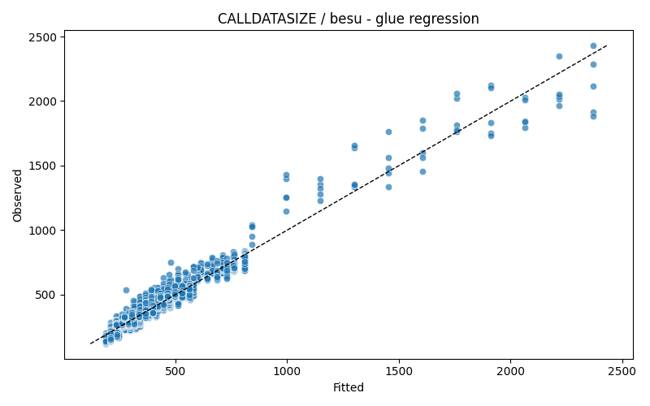

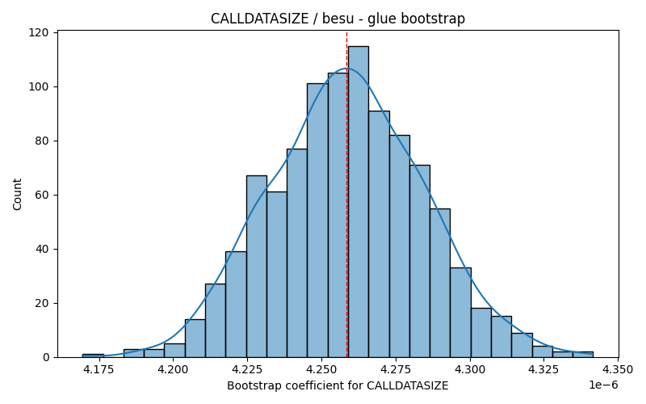


</details>

<details><summary><code>DUP</code> · nobs=12386 · runtime_ms=2.513e-06 · p=1.00e-03 · R²=0.9304</summary>


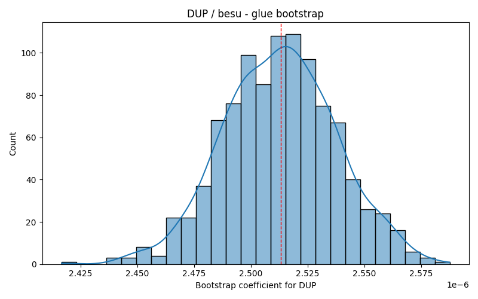


</details>

<details><summary><code>GAS</code> · nobs=12386 · runtime_ms=3.699e-06 · p=1.00e-03 · R²=0.9304</summary>


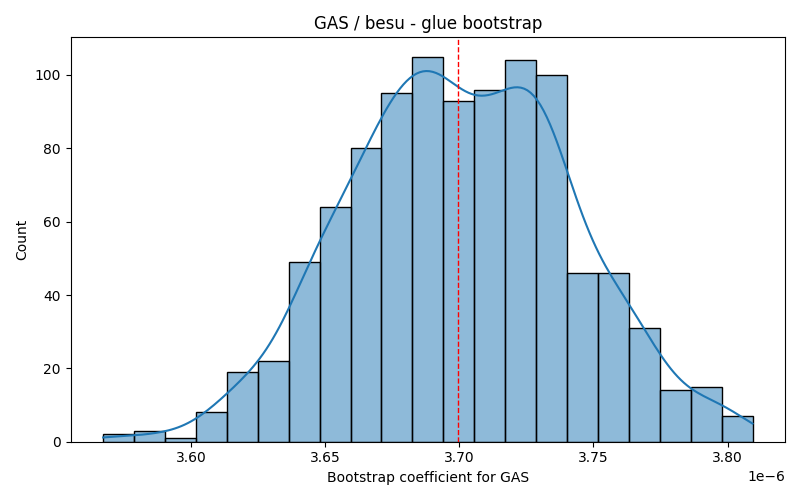

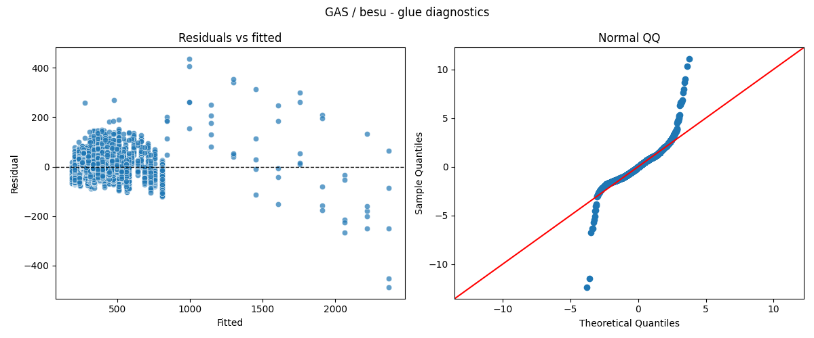

</details>

<details><summary><code>MLOAD</code> · nobs=12386 · runtime_ms=1.088e-05 · p=1.00e-03 · R²=0.9304</summary>


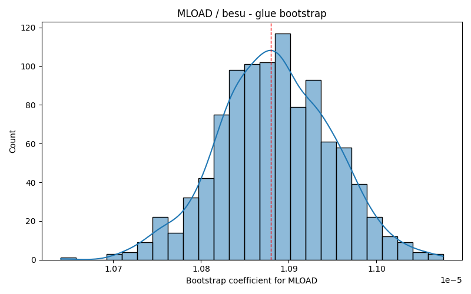


</details>

<details><summary><code>PUSH</code> · nobs=12386 · runtime_ms=3.193e-06 · p=1.00e-03 · R²=0.9304</summary>

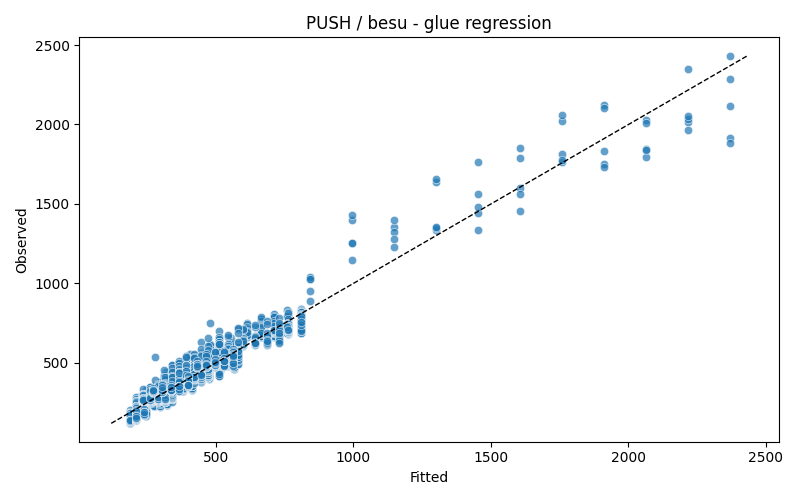

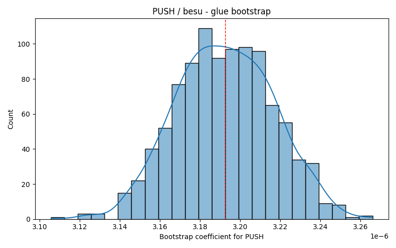


</details>

<details><summary><code>PUSH0</code> · nobs=12386 · runtime_ms=2.504e-06 · p=1.00e-03 · R²=0.9304</summary>


</details>

<details><summary><code>STATICCALL</code> · nobs=12386 · runtime_ms=0.0009024 · p=1.00e-03 · R²=0.9304</summary>

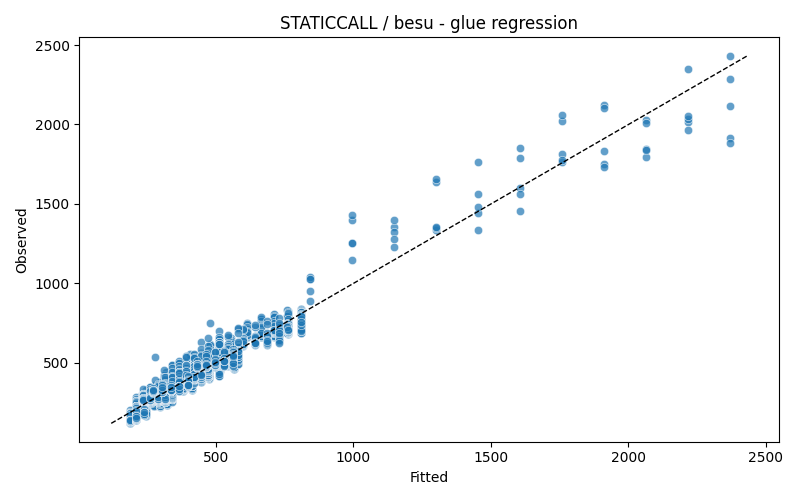

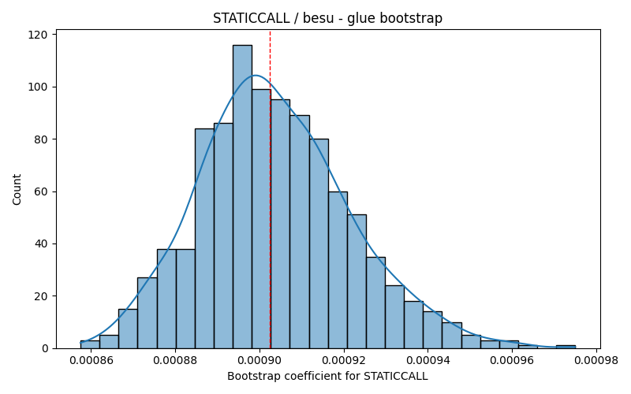

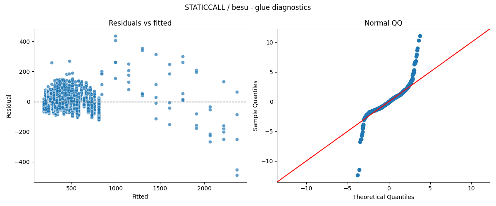

</details>

### Pure glue · besu

<details><summary><code>ISZERO</code> · nobs=209 · runtime_ms=5.147e-06 · p=1.00e-03 · R²=0.8807</summary>

```
==============================================================================
                           NNLS Regression Results                            
==============================================================================
Dep. Variable:          test_runtime_ms              R-squared:          0.881
Model:                  NNLS                    Adj. R-squared:          0.880
No. Observations:       209                               RMSE:          39.87
Df Residuals:           207                                MAE:          34.19
Df Model:               1      
==============================================================================
                      coef     std err     P-value      [0.025      0.975]
------------------------------------------------------------------------------
         const     65.8436     10.1468       0.001     47.1824     86.9741
        ISZERO      0.0000      0.0000       0.001      0.0000      0.0000
==============================================================================
Notes: Non-negative least squares with bootstrap inference (1000 iterations)
==============================================================================
```


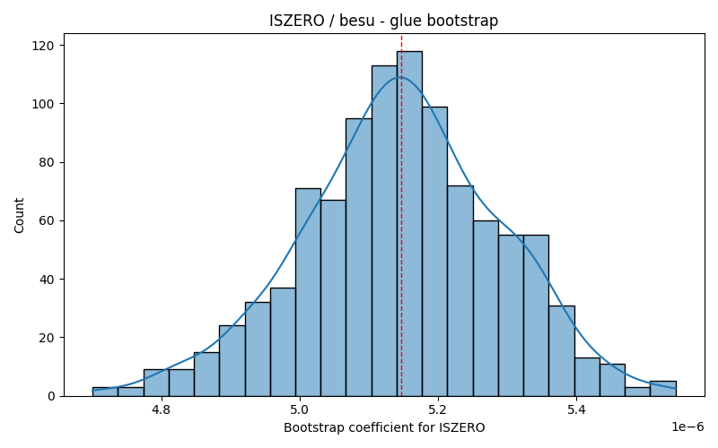

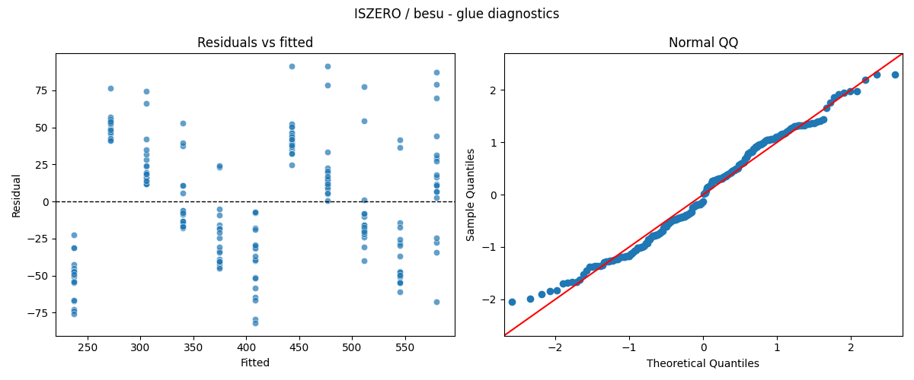

</details>

<details><summary><code>JUMPDEST</code> · nobs=209 · runtime_ms=2.614e-06 · p=1.00e-03 · R²=0.8797</summary>

```
==============================================================================
                           NNLS Regression Results                            
==============================================================================
Dep. Variable:          test_runtime_ms              R-squared:          0.880
Model:                  NNLS                    Adj. R-squared:          0.879
No. Observations:       209                               RMSE:          61.04
Df Residuals:           207                                MAE:          52.63
Df Model:               1      
==============================================================================
                      coef     std err     P-value      [0.025      0.975]
------------------------------------------------------------------------------
         const     82.0485     15.2895       0.001     52.3187    112.8273
      JUMPDEST      0.0000      0.0000       0.001      0.0000      0.0000
==============================================================================
Notes: Non-negative least squares with bootstrap inference (1000 iterations)
==============================================================================
```

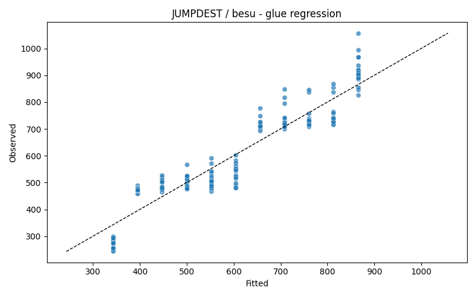

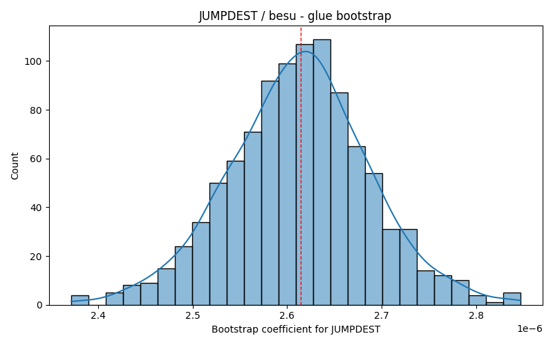

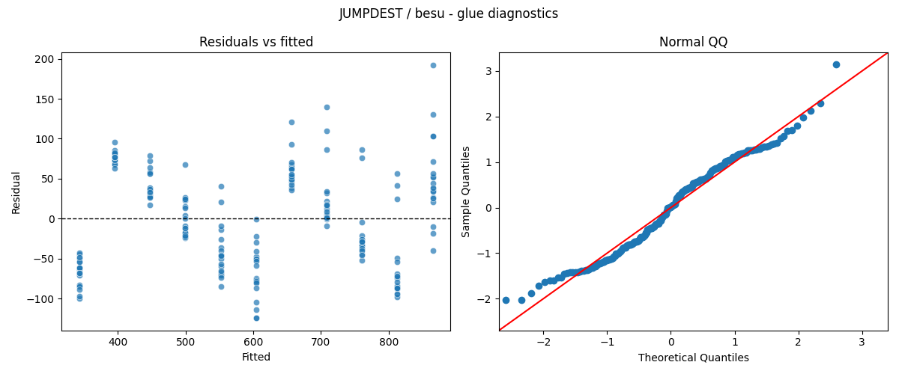

</details>

<details><summary><code>SWAP</code> · nobs=3344 · runtime_ms=3.626e-06 · p=1.00e-03 · R²=0.8523</summary>

```
==============================================================================
                           NNLS Regression Results                            
==============================================================================
Dep. Variable:          test_runtime_ms              R-squared:          0.852
Model:                  NNLS                    Adj. R-squared:          0.852
No. Observations:       3344                              RMSE:          31.77
Df Residuals:           3342                               MAE:          26.11
Df Model:               1      
==============================================================================
                      coef     std err     P-value      [0.025      0.975]
------------------------------------------------------------------------------
         const     70.5993      2.0696       0.001     66.5891     74.6447
          SWAP      0.0000      0.0000       0.001      0.0000      0.0000
==============================================================================
Notes: Non-negative least squares with bootstrap inference (1000 iterations)
==============================================================================
```

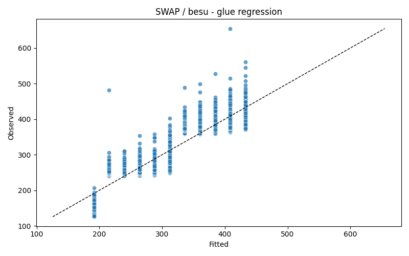

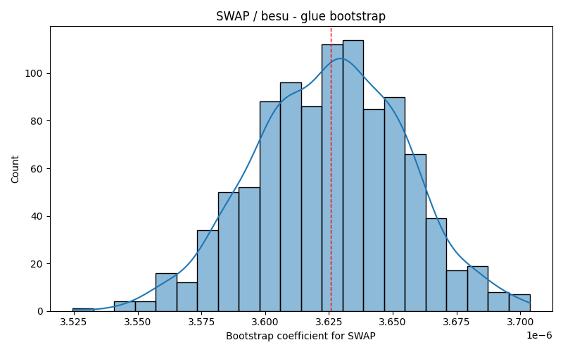


</details>

### Mixed glue (tier A) · besu

<details><summary><code>ADD</code> · nobs=209 · runtime_ms=1.104e-05 · p=1.00e-03 · R²=0.8732</summary>

```
==============================================================================
                           NNLS Regression Results                            
==============================================================================
Dep. Variable:          test_runtime_ms              R-squared:          0.873
Model:                  NNLS                    Adj. R-squared:          0.873
No. Observations:       209                               RMSE:          44.25
Df Residuals:           207                                MAE:          37.33
Df Model:               1      
==============================================================================
                      coef     std err     P-value      [0.025      0.975]
------------------------------------------------------------------------------
         const    109.1350     11.9646       0.001     86.3415    133.9903
           ADD      0.0000      0.0000       0.001      0.0000      0.0000
==============================================================================
Notes: Non-negative least squares with bootstrap inference (1000 iterations)
==============================================================================
```

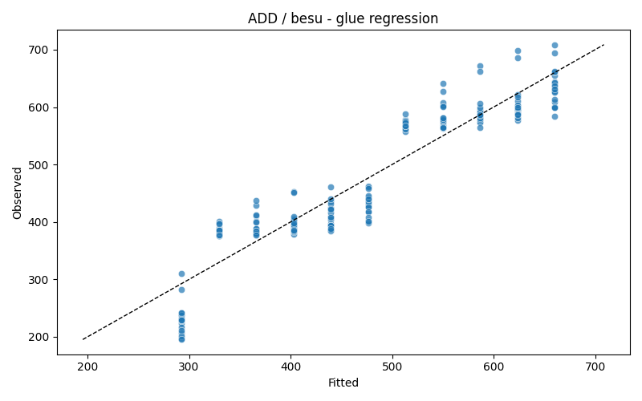

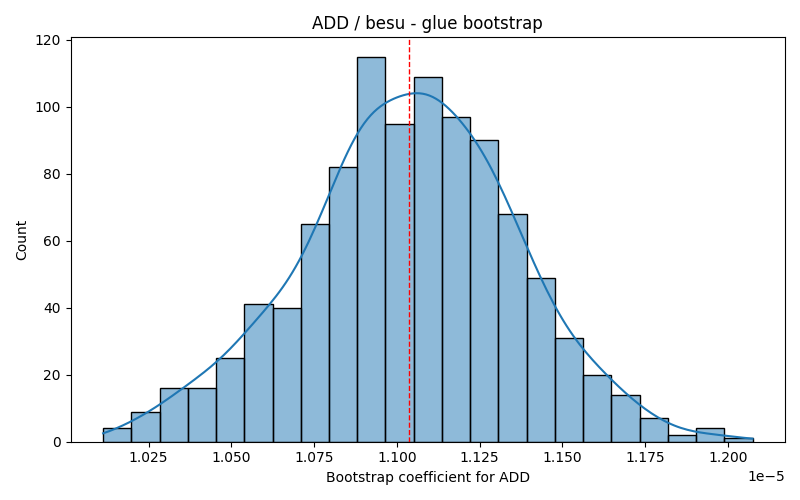


</details>

<details><summary><code>AND</code> · nobs=209 · runtime_ms=9.901e-06 · p=1.00e-03 · R²=0.8819</summary>

```
==============================================================================
                           NNLS Regression Results                            
==============================================================================
Dep. Variable:          test_runtime_ms              R-squared:          0.882
Model:                  NNLS                    Adj. R-squared:          0.881
No. Observations:       209                               RMSE:          38.14
Df Residuals:           207                                MAE:          32.50
Df Model:               1      
==============================================================================
                      coef     std err     P-value      [0.025      0.975]
------------------------------------------------------------------------------
         const     84.3374     10.1579       0.001     63.7487    104.2606
           AND      0.0000      0.0000       0.001      0.0000      0.0000
==============================================================================
Notes: Non-negative least squares with bootstrap inference (1000 iterations)
==============================================================================
```

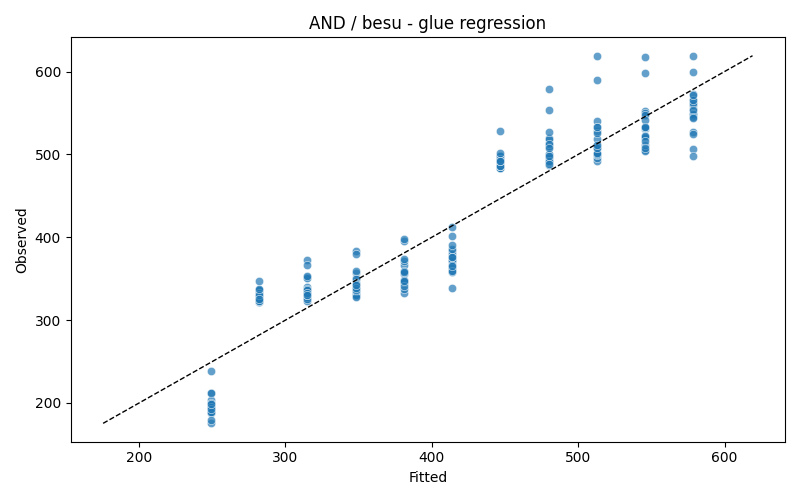

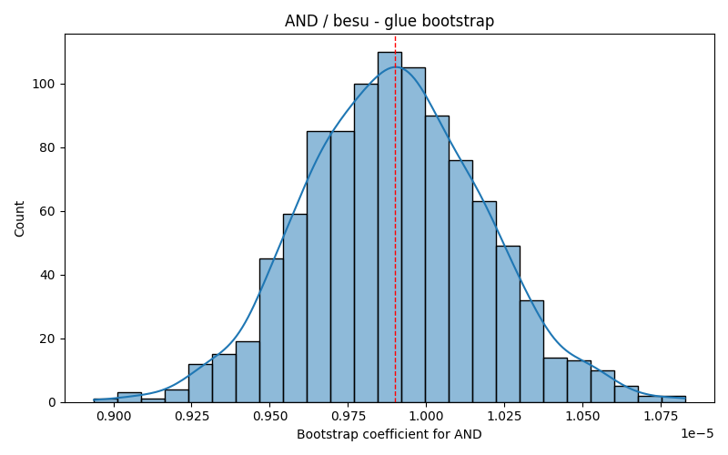

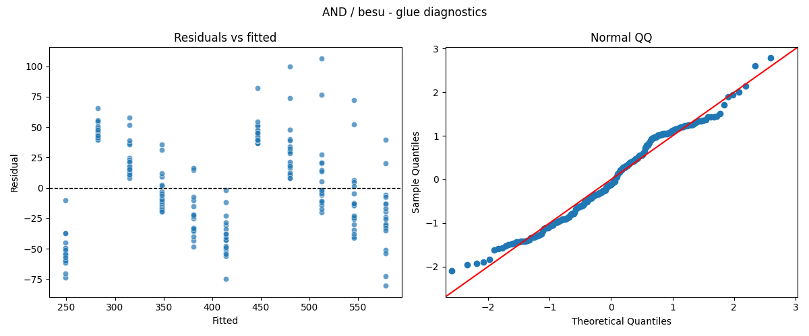

</details>

<details><summary><code>CALLDATACOPY</code> · nobs=5016 · runtime_ms=2.135e-05 · p=1.00e-03 · R²=0.803</summary>

```
==============================================================================
                           NNLS Regression Results                            
==============================================================================
Dep. Variable:          test_runtime_ms              R-squared:          0.803
Model:                  NNLS                    Adj. R-squared:          0.803
No. Observations:       5016                              RMSE:          79.52
Df Residuals:           5014                               MAE:          63.12
Df Model:               1      
==============================================================================
                      coef     std err     P-value      [0.025      0.975]
------------------------------------------------------------------------------
         const    116.4811      1.3245       0.001    113.8565    119.1188
  CALLDATACOPY      0.0000      0.0000       0.001      0.0000      0.0000
==============================================================================
Notes: Non-negative least squares with bootstrap inference (1000 iterations)
==============================================================================
```

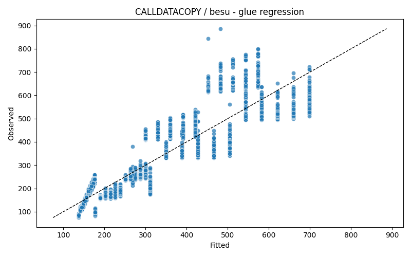

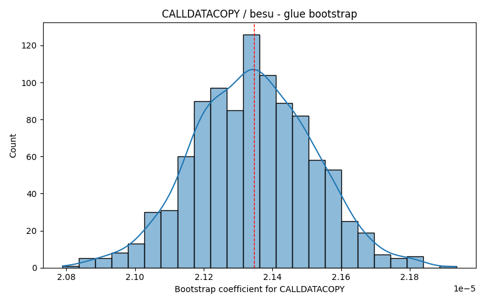

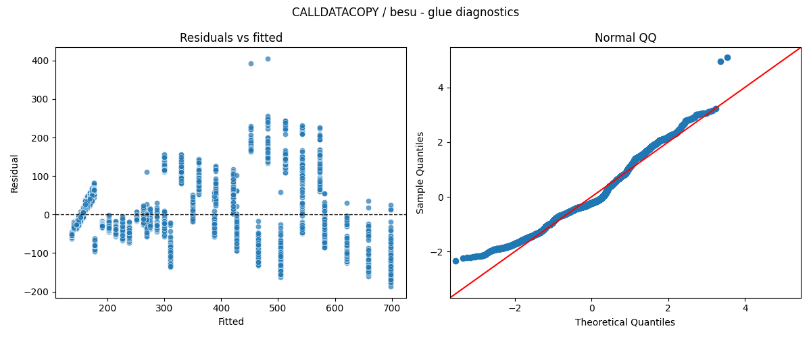

</details>

<details><summary><code>CALLDATALOAD</code> · nobs=836 · runtime_ms=6.152e-06 · p=1.32e-01 · R²=0.001188</summary>

```
==============================================================================
                           NNLS Regression Results                            
==============================================================================
Dep. Variable:          test_runtime_ms              R-squared:          0.001
Model:                  NNLS                    Adj. R-squared:         -0.000
No. Observations:       836                               RMSE:           0.68
Df Residuals:           834                                MAE:           0.45
Df Model:               1      
==============================================================================
                      coef     std err     P-value      [0.025      0.975]
------------------------------------------------------------------------------
         const      3.6633      0.0640       0.001      3.5276      3.7638
  CALLDATALOAD      0.0000      0.0000       0.132      0.0000      0.0000
==============================================================================
Notes: Non-negative least squares with bootstrap inference (1000 iterations)
==============================================================================
```

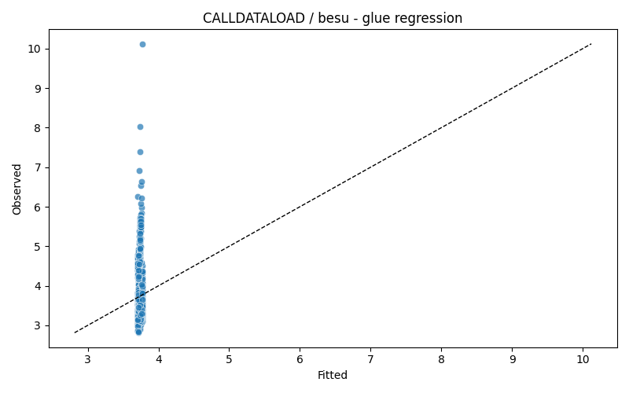

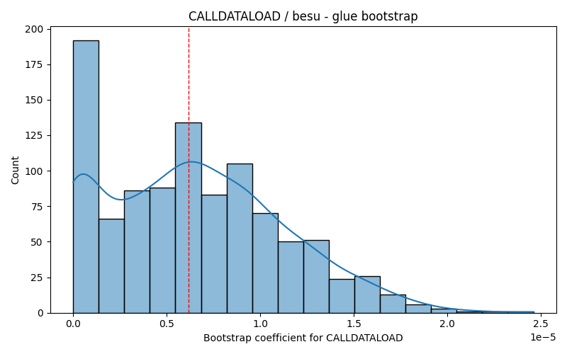

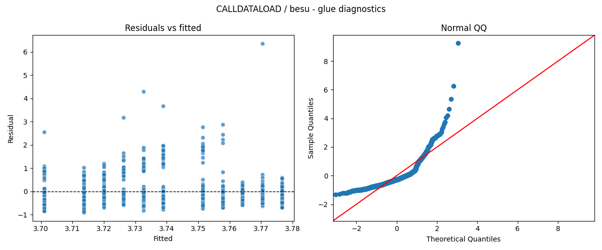

</details>

<details><summary><code>DIV</code> · nobs=209 · runtime_ms=1.72e-05 · p=1.00e-03 · R²=0.865</summary>

```
==============================================================================
                           NNLS Regression Results                            
==============================================================================
Dep. Variable:          test_runtime_ms              R-squared:          0.865
Model:                  NNLS                    Adj. R-squared:          0.864
No. Observations:       209                               RMSE:          53.64
Df Residuals:           207                                MAE:          45.01
Df Model:               1      
==============================================================================
                      coef     std err     P-value      [0.025      0.975]
------------------------------------------------------------------------------
         const    146.6535     11.5637       0.001    124.8632    168.8864
           DIV      0.0000      0.0000       0.001      0.0000      0.0000
==============================================================================
Notes: Non-negative least squares with bootstrap inference (1000 iterations)
==============================================================================
```

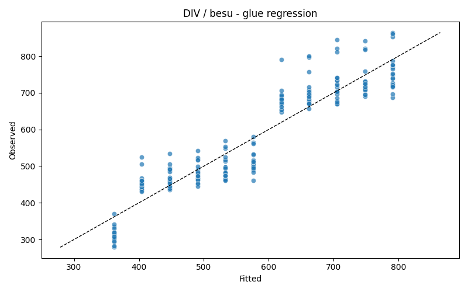

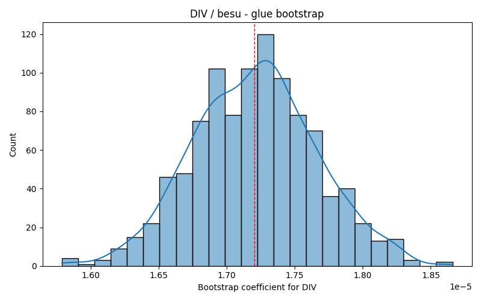

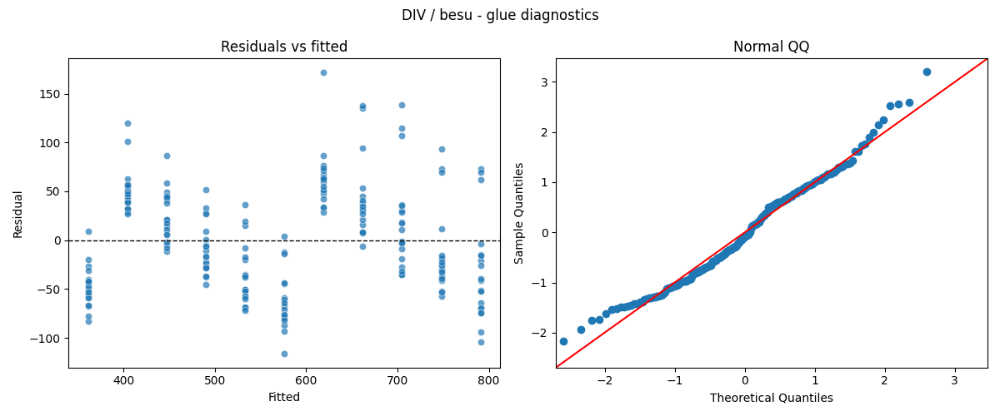

</details>

<details><summary><code>EXP</code> · nobs=209 · runtime_ms=0.001144 · p=1.00e-03 · R²=0.8407</summary>

```
==============================================================================
                           NNLS Regression Results                            
==============================================================================
Dep. Variable:          test_runtime_ms              R-squared:          0.841
Model:                  NNLS                    Adj. R-squared:          0.840
No. Observations:       209                               RMSE:          19.51
Df Residuals:           207                                MAE:          15.47
Df Model:               1      
==============================================================================
                      coef     std err     P-value      [0.025      0.975]
------------------------------------------------------------------------------
         const     81.4783      4.5652       0.001     71.7633     89.9227
           EXP      0.0011      0.0000       0.001      0.0011      0.0012
==============================================================================
Notes: Non-negative least squares with bootstrap inference (1000 iterations)
==============================================================================
```

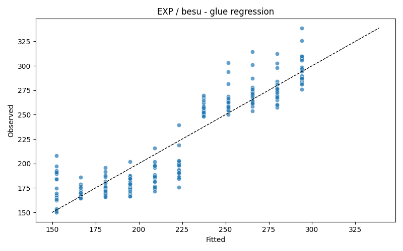

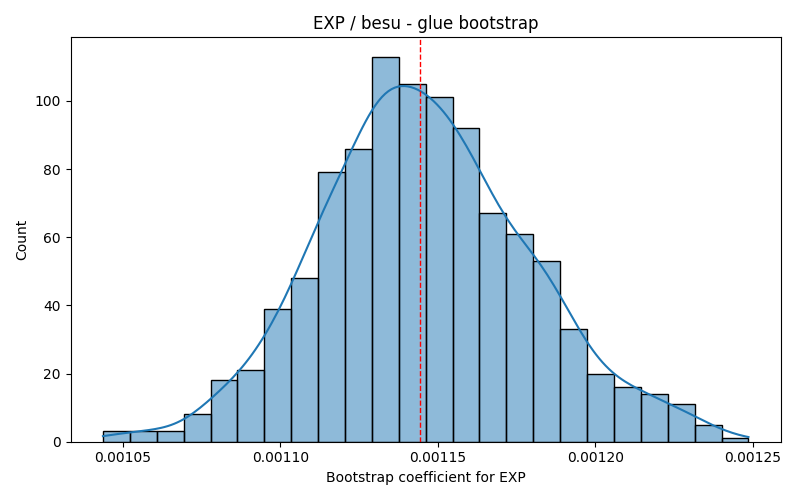

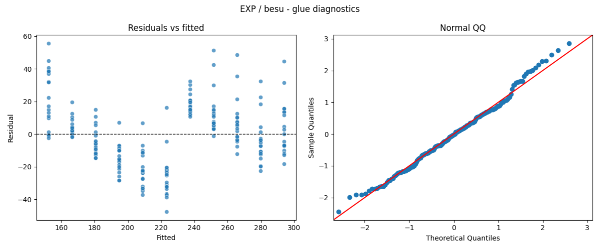

</details>

<details><summary><code>GT</code> · nobs=209 · runtime_ms=3.309e-05 · p=1.00e-03 · R²=0.8963</summary>

```
==============================================================================
                           NNLS Regression Results                            
==============================================================================
Dep. Variable:          test_runtime_ms              R-squared:          0.896
Model:                  NNLS                    Adj. R-squared:          0.896
No. Observations:       209                               RMSE:         118.43
Df Residuals:           207                                MAE:          96.07
Df Model:               1      
==============================================================================
                      coef     std err     P-value      [0.025      0.975]
------------------------------------------------------------------------------
         const    196.5390     30.4287       0.001    139.8236    257.1138
            GT      0.0000      0.0000       0.001      0.0000      0.0000
==============================================================================
Notes: Non-negative least squares with bootstrap inference (1000 iterations)
==============================================================================
```

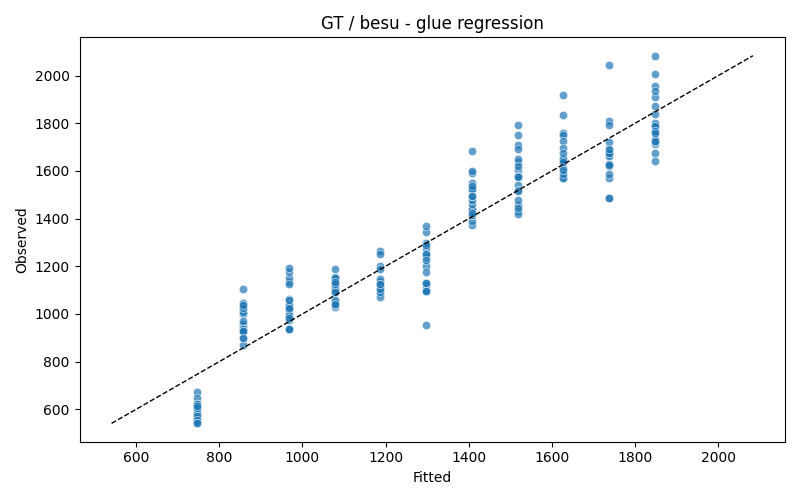

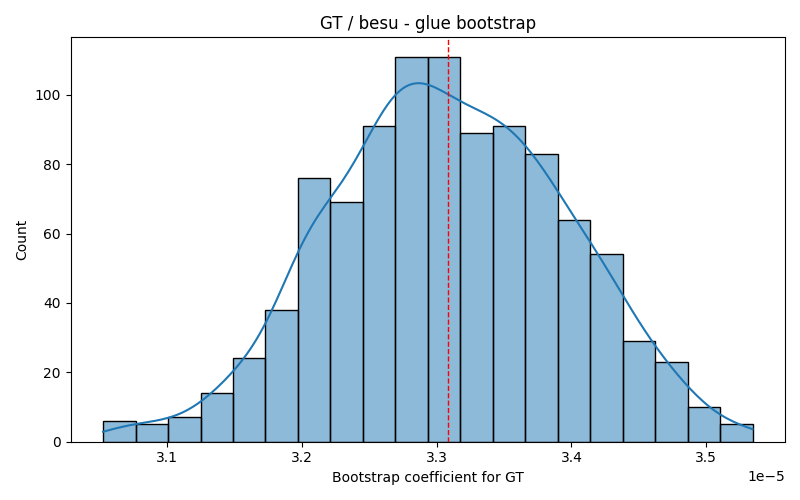

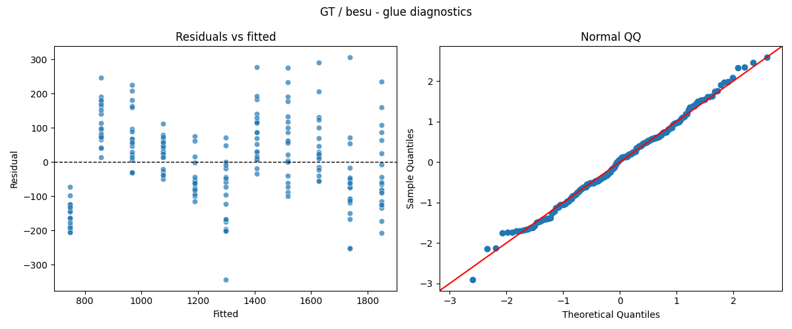

</details>

<details><summary><code>JUMPI</code> · nobs=209 · runtime_ms=1e-05 · p=1.00e-03 · R²=0.8839</summary>

```
==============================================================================
                           NNLS Regression Results                            
==============================================================================
Dep. Variable:          test_runtime_ms              R-squared:          0.884
Model:                  NNLS                    Adj. R-squared:          0.883
No. Observations:       209                               RMSE:          16.36
Df Residuals:           207                                MAE:          13.47
Df Model:               1      
==============================================================================
                      coef     std err     P-value      [0.025      0.975]
------------------------------------------------------------------------------
         const     39.7825      4.1946       0.001     31.6053     47.5400
         JUMPI      0.0000      0.0000       0.001      0.0000      0.0000
==============================================================================
Notes: Non-negative least squares with bootstrap inference (1000 iterations)
==============================================================================
```

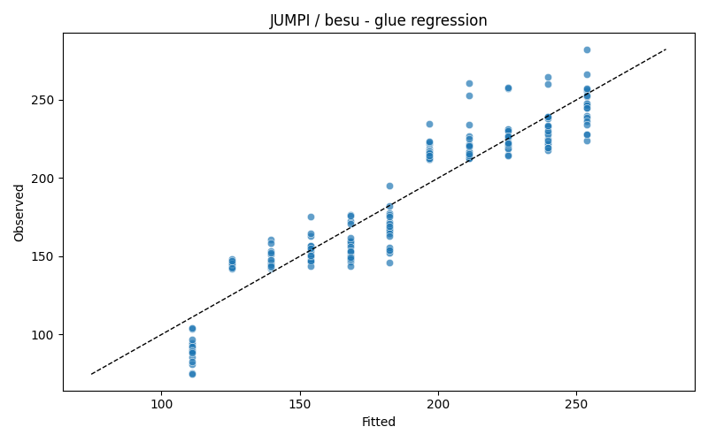

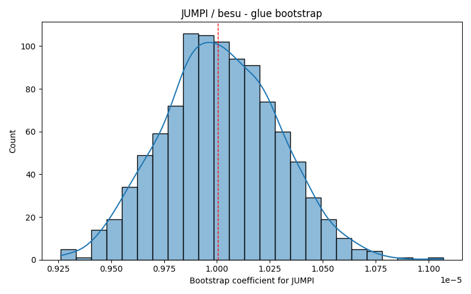

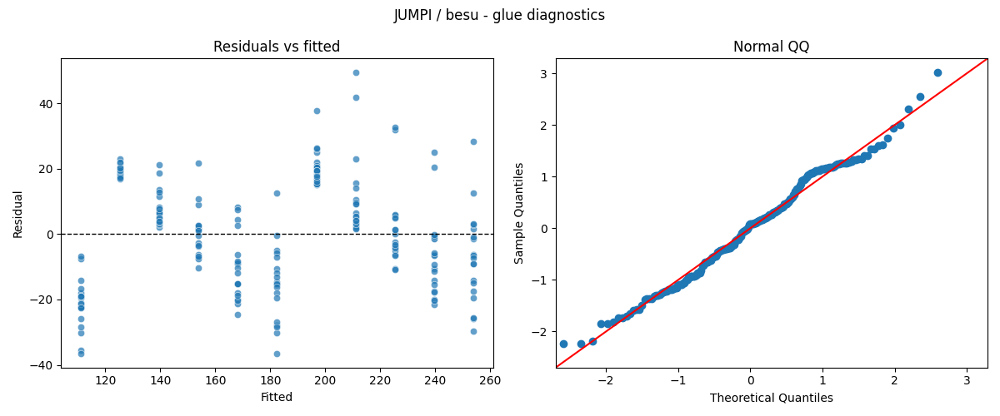

</details>

<details><summary><code>LT</code> · nobs=209 · runtime_ms=3.367e-05 · p=1.00e-03 · R²=0.9038</summary>

```
==============================================================================
                           NNLS Regression Results                            
==============================================================================
Dep. Variable:          test_runtime_ms              R-squared:          0.904
Model:                  NNLS                    Adj. R-squared:          0.903
No. Observations:       209                               RMSE:         115.65
Df Residuals:           207                                MAE:          96.16
Df Model:               1      
==============================================================================
                      coef     std err     P-value      [0.025      0.975]
------------------------------------------------------------------------------
         const    234.6105     30.6270       0.001    177.4022    297.2409
            LT      0.0000      0.0000       0.001      0.0000      0.0000
==============================================================================
Notes: Non-negative least squares with bootstrap inference (1000 iterations)
==============================================================================
```

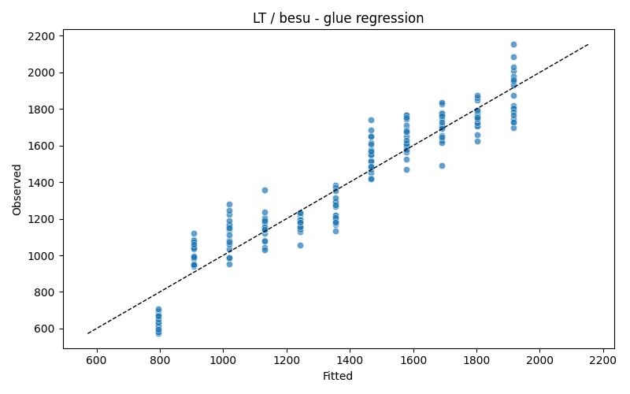

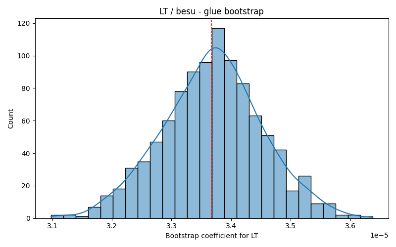

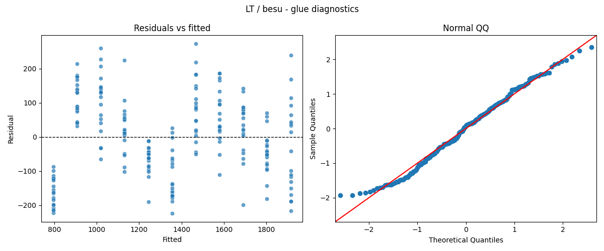

</details>

<details><summary><code>MSTORE</code> · nobs=1045 · runtime_ms=1.787e-05 · p=1.00e-03 · R²=0.8635</summary>

```
==============================================================================
                           NNLS Regression Results                            
==============================================================================
Dep. Variable:          test_runtime_ms              R-squared:          0.864
Model:                  NNLS                    Adj. R-squared:          0.863
No. Observations:       1045                              RMSE:          49.87
Df Residuals:           1043                               MAE:          41.82
Df Model:               1      
==============================================================================
                      coef     std err     P-value      [0.025      0.975]
------------------------------------------------------------------------------
         const    112.8778      5.8047       0.001    101.4312    123.4943
        MSTORE      0.0000      0.0000       0.001      0.0000      0.0000
==============================================================================
Notes: Non-negative least squares with bootstrap inference (1000 iterations)
==============================================================================
```

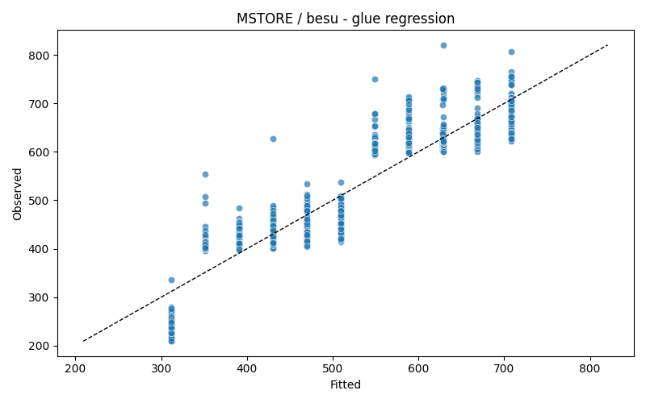

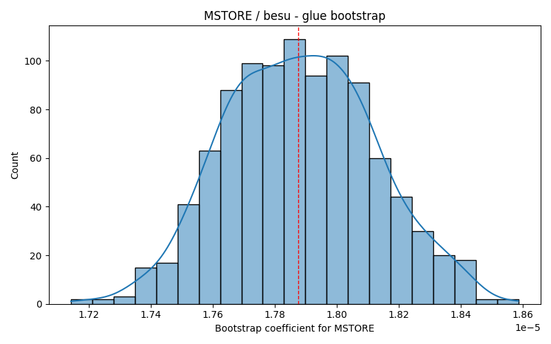

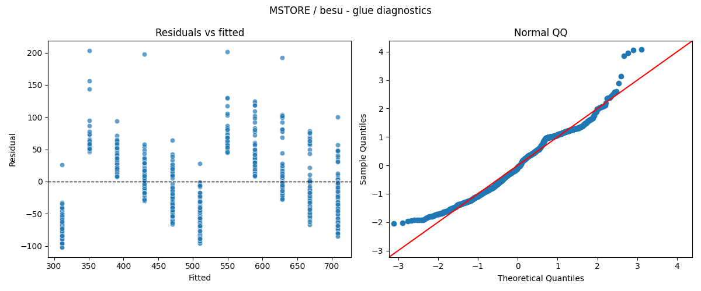

</details>

<details><summary><code>MSTORE8</code> · nobs=1045 · runtime_ms=1.244e-05 · p=1.00e-03 · R²=0.8572</summary>

```
==============================================================================
                           NNLS Regression Results                            
==============================================================================
Dep. Variable:          test_runtime_ms              R-squared:          0.857
Model:                  NNLS                    Adj. R-squared:          0.857
No. Observations:       1045                              RMSE:          35.64
Df Residuals:           1043                               MAE:          29.66
Df Model:               1      
==============================================================================
                      coef     std err     P-value      [0.025      0.975]
------------------------------------------------------------------------------
         const     79.4364      4.0476       0.001     72.0703     87.6544
       MSTORE8      0.0000      0.0000       0.001      0.0000      0.0000
==============================================================================
Notes: Non-negative least squares with bootstrap inference (1000 iterations)
==============================================================================
```

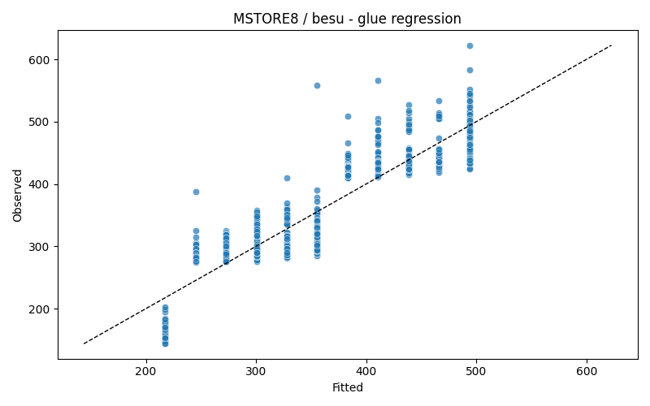

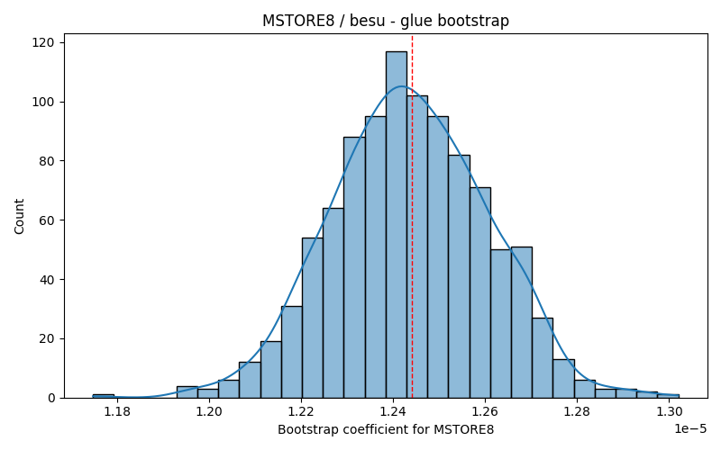

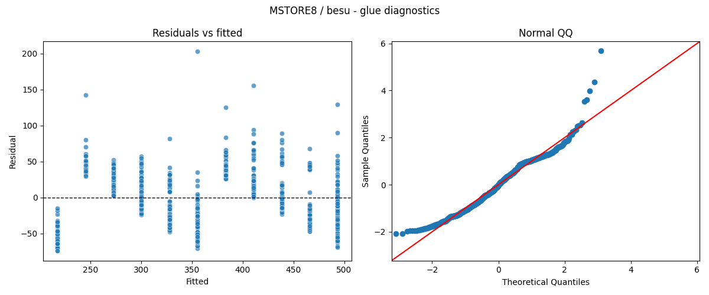

</details>

<details><summary><code>MUL</code> · nobs=209 · runtime_ms=1.36e-05 · p=1.00e-03 · R²=0.5932</summary>

```
==============================================================================
                           NNLS Regression Results                            
==============================================================================
Dep. Variable:          test_runtime_ms              R-squared:          0.593
Model:                  NNLS                    Adj. R-squared:          0.591
No. Observations:       209                               RMSE:          88.93
Df Residuals:           207                                MAE:          73.87
Df Model:               1      
==============================================================================
                      coef     std err     P-value      [0.025      0.975]
------------------------------------------------------------------------------
         const    111.9724     17.9582       0.001     78.9043    149.5942
           MUL      0.0000      0.0000       0.001      0.0000      0.0000
==============================================================================
Notes: Non-negative least squares with bootstrap inference (1000 iterations)
==============================================================================
```

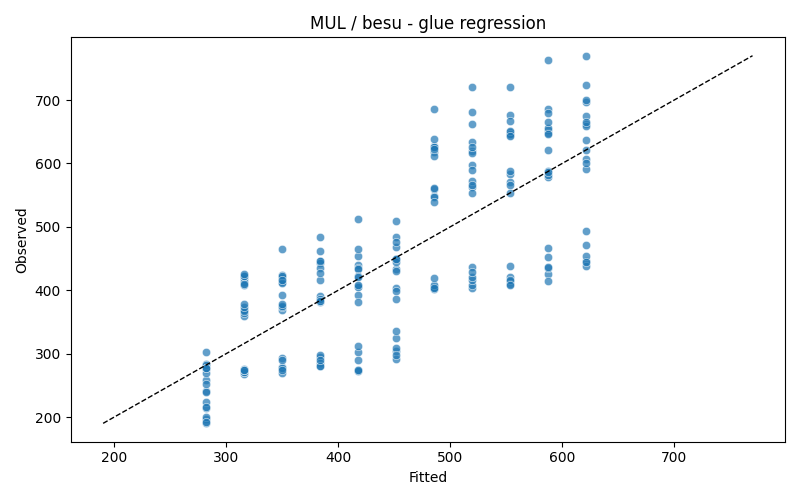

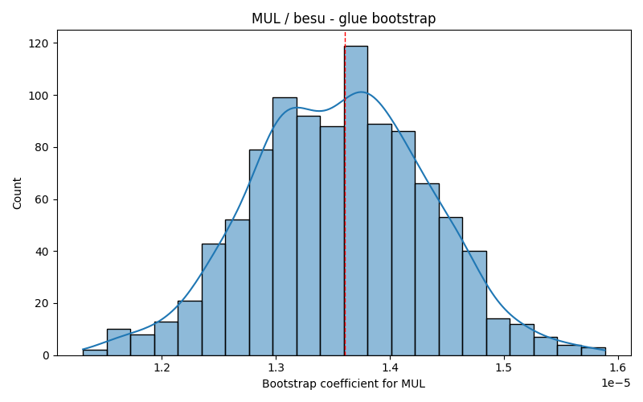

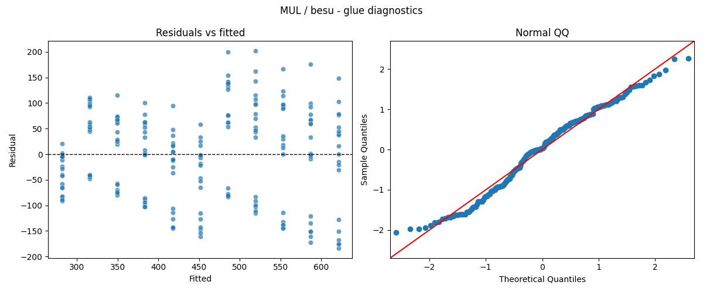

</details>

<details><summary><code>PC</code> · nobs=209 · runtime_ms=4.232e-06 · p=1.00e-03 · R²=0.8665</summary>

```
==============================================================================
                           NNLS Regression Results                            
==============================================================================
Dep. Variable:          test_runtime_ms              R-squared:          0.867
Model:                  NNLS                    Adj. R-squared:          0.866
No. Observations:       209                               RMSE:          49.66
Df Residuals:           207                                MAE:          41.80
Df Model:               1      
==============================================================================
                      coef     std err     P-value      [0.025      0.975]
------------------------------------------------------------------------------
         const    114.4773     13.1291       0.001     87.5261    140.0726
            PC      0.0000      0.0000       0.001      0.0000      0.0000
==============================================================================
Notes: Non-negative least squares with bootstrap inference (1000 iterations)
==============================================================================
```

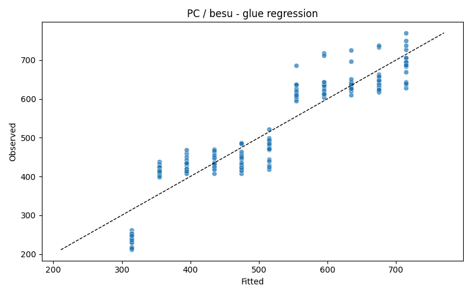


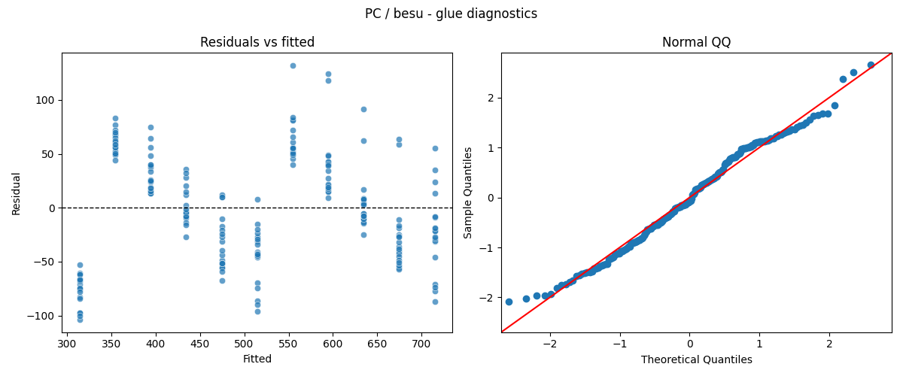

</details>

<details><summary><code>RETURNDATASIZE</code> · nobs=836 · runtime_ms=7.028e-06 · p=1.00e-03 · R²=0.8596</summary>

```
==============================================================================
                           NNLS Regression Results                            
==============================================================================
Dep. Variable:          test_runtime_ms              R-squared:          0.860
Model:                  NNLS                    Adj. R-squared:          0.859
No. Observations:       836                               RMSE:          44.85
Df Residuals:           834                                MAE:          37.00
Df Model:               1      
==============================================================================
                      coef     std err     P-value      [0.025      0.975]
------------------------------------------------------------------------------
         const     96.0762      5.7149       0.001     85.6141    107.1164
RETURNDATASIZE      0.0000      0.0000       0.001      0.0000      0.0000
==============================================================================
Notes: Non-negative least squares with bootstrap inference (1000 iterations)
==============================================================================
```

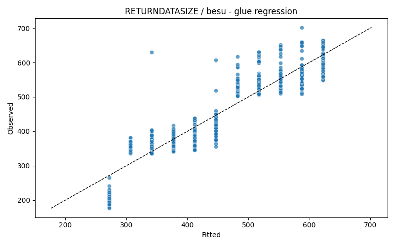

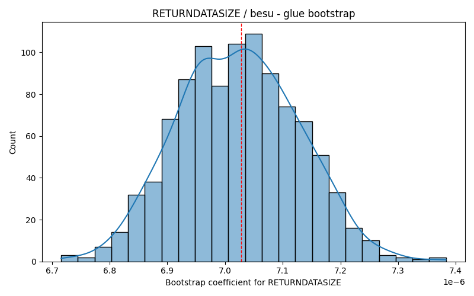

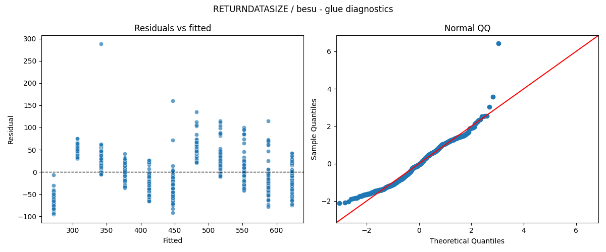

</details>

<details><summary><code>SELFBALANCE</code> · nobs=171 · runtime_ms=7.622e-06 · p=1.00e-03 · R²=0.5194</summary>

```
==============================================================================
                           NNLS Regression Results                            
==============================================================================
Dep. Variable:          test_runtime_ms              R-squared:          0.519
Model:                  NNLS                    Adj. R-squared:          0.517
No. Observations:       171                               RMSE:          73.96
Df Residuals:           169                                MAE:          58.70
Df Model:               1      
==============================================================================
                      coef     std err     P-value      [0.025      0.975]
------------------------------------------------------------------------------
         const    390.9781     24.7121       0.001    339.2143    438.1915
   SELFBALANCE      0.0000      0.0000       0.001      0.0000      0.0000
==============================================================================
Notes: Non-negative least squares with bootstrap inference (1000 iterations)
==============================================================================
```

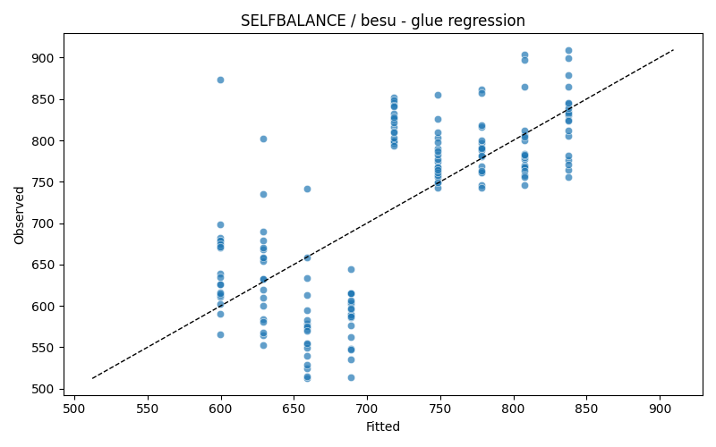

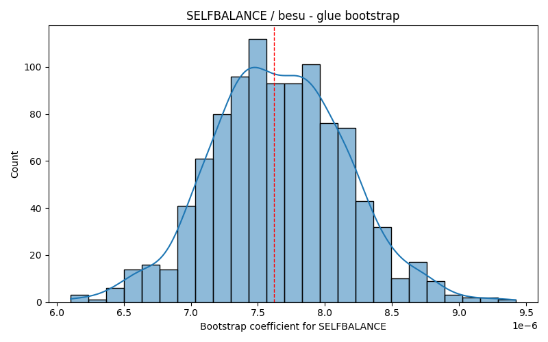

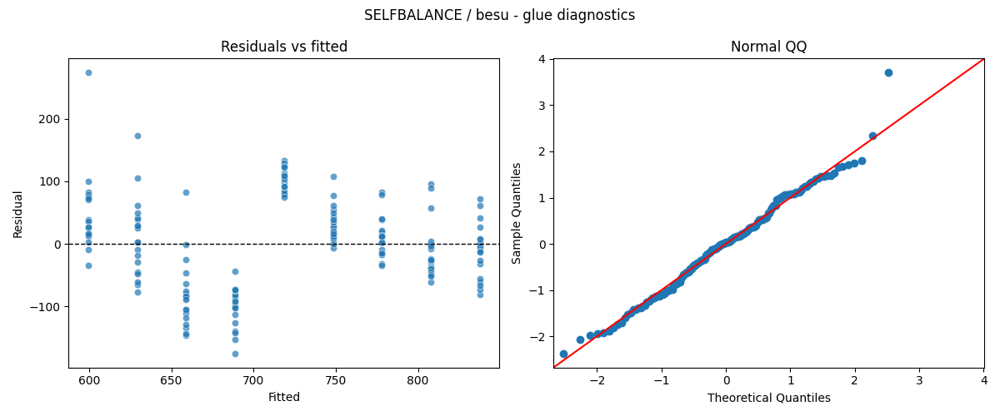

</details>

<details><summary><code>SUB</code> · nobs=209 · runtime_ms=1.098e-05 · p=1.00e-03 · R²=0.8723</summary>

```
==============================================================================
                           NNLS Regression Results                            
==============================================================================
Dep. Variable:          test_runtime_ms              R-squared:          0.872
Model:                  NNLS                    Adj. R-squared:          0.872
No. Observations:       209                               RMSE:          44.23
Df Residuals:           207                                MAE:          37.56
Df Model:               1      
==============================================================================
                      coef     std err     P-value      [0.025      0.975]
------------------------------------------------------------------------------
         const    101.4502     11.0659       0.001     79.7455    122.1850
           SUB      0.0000      0.0000       0.001      0.0000      0.0000
==============================================================================
Notes: Non-negative least squares with bootstrap inference (1000 iterations)
==============================================================================
```

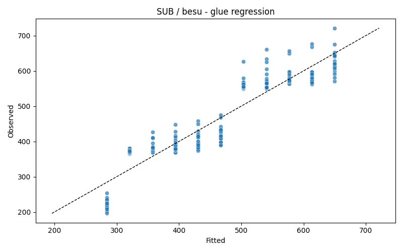

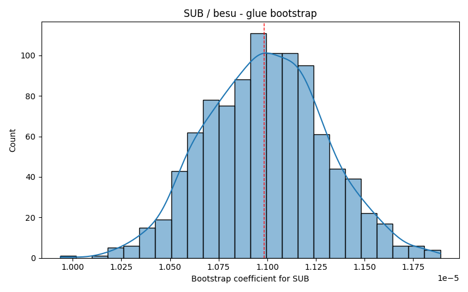


</details>

### Mixed glue (tier B) · besu

<details><summary><code>JUMP</code> · nobs=209 · runtime_ms=4.709e-05 · p=1.00e-03 · R²=0.8742</summary>

```
==============================================================================
                           NNLS Regression Results                            
==============================================================================
Dep. Variable:          test_runtime_ms              R-squared:          0.874
Model:                  NNLS                    Adj. R-squared:          0.874
No. Observations:       209                               RMSE:          66.38
Df Residuals:           207                                MAE:          56.22
Df Model:               1      
==============================================================================
                      coef     std err     P-value      [0.025      0.975]
------------------------------------------------------------------------------
         const    153.9211     17.8536       0.001    117.1269    188.7033
          JUMP      0.0000      0.0000       0.001      0.0000      0.0000
==============================================================================
Notes: Non-negative least squares with bootstrap inference (1000 iterations)
==============================================================================
```

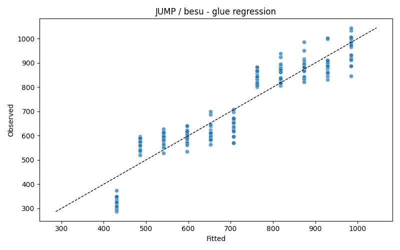

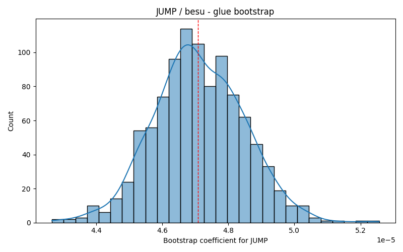

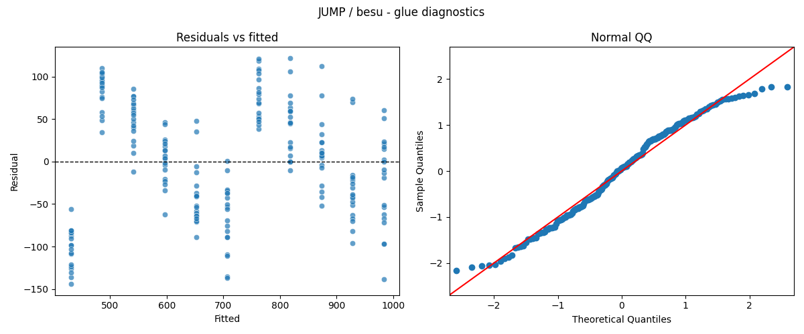

</details>

<details><summary><code>KECCAK256</code> · nobs=3344 · runtime_ms=5.114e-05 · p=1.00e-03 · R²=0.2845</summary>

```
==============================================================================
                           NNLS Regression Results                            
==============================================================================
Dep. Variable:          test_runtime_ms              R-squared:          0.284
Model:                  NNLS                    Adj. R-squared:          0.284
No. Observations:       3344                              RMSE:         161.17
Df Residuals:           3342                               MAE:         126.27
Df Model:               1      
==============================================================================
                      coef     std err     P-value      [0.025      0.975]
------------------------------------------------------------------------------
         const    505.5981      6.3691       0.001    493.0823    517.6901
     KECCAK256      0.0001      0.0000       0.001      0.0000      0.0001
==============================================================================
Notes: Non-negative least squares with bootstrap inference (1000 iterations)
==============================================================================
```

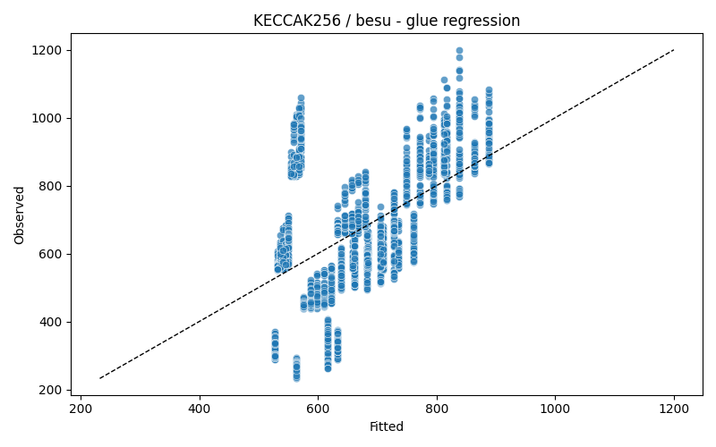

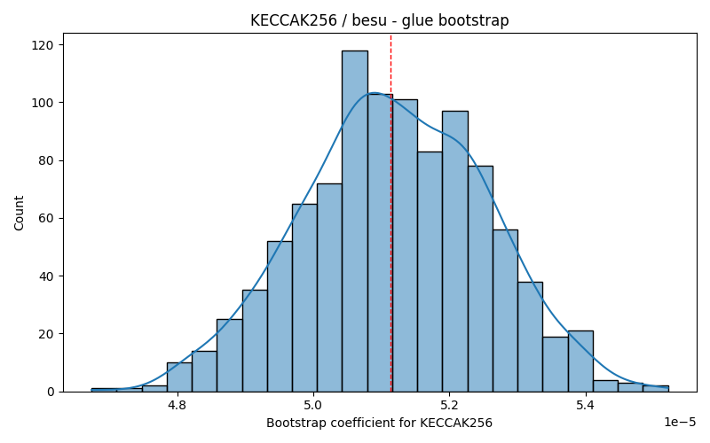

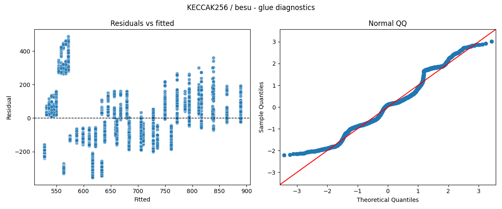

</details>

## erigon

| glue_opcode | nobs | glue_runtime_ms | p_value | rsquared |
| --- | --- | --- | --- | --- |
| `ISZERO` | 0 | n/a | n/a | n/a |
| `JUMPDEST` | 0 | n/a | n/a | n/a |
| `SWAP` | 0 | n/a | n/a | n/a |
| `CALLDATASIZE` | 22 | 0 | 1.00e+00 | 0.9821 |
| `DUP` | 22 | 19.75 | 1.00e-03 | 0.9821 |
| `GAS` | 22 | 0.0005637 | 4.68e-01 | 0.9821 |
| `MLOAD` | 22 | 0 | 1.00e+00 | 0.9821 |
| `PUSH` | 22 | 0 | 1.00e+00 | 0.9821 |
| `PUSH0` | 22 | 0 | 1.00e+00 | 0.9821 |
| `STATICCALL` | 22 | 0 | 1.00e+00 | 0.9821 |
| `ADD` | 0 | n/a | n/a | n/a |
| `AND` | 0 | n/a | n/a | n/a |
| `CALLDATACOPY` | 0 | n/a | n/a | n/a |
| `CALLDATALOAD` | 0 | n/a | n/a | n/a |
| `DIV` | 0 | n/a | n/a | n/a |
| `EXP` | 0 | n/a | n/a | n/a |
| `GT` | 0 | n/a | n/a | n/a |
| `JUMPI` | 0 | n/a | n/a | n/a |
| `LT` | 0 | n/a | n/a | n/a |
| `MSTORE` | 0 | n/a | n/a | n/a |
| `MSTORE8` | 0 | n/a | n/a | n/a |
| `MUL` | 0 | n/a | n/a | n/a |
| `PC` | 0 | n/a | n/a | n/a |
| `RETURNDATASIZE` | 0 | n/a | n/a | n/a |
| `SELFBALANCE` | 0 | n/a | n/a | n/a |
| `SUB` | 0 | n/a | n/a | n/a |
| `JUMP` | 0 | n/a | n/a | n/a |
| `KECCAK256` | 0 | n/a | n/a | n/a |

### Cycle glue — joint fit · erigon

<details><summary>Joint NNLS regression summary</summary>

```
==============================================================================
                           NNLS Regression Results                            
==============================================================================
Dep. Variable:          test_runtime_ms              R-squared:          0.982
Model:                  NNLS                    Adj. R-squared:          0.973
No. Observations:       22                                RMSE:          39.43
Df Residuals:           14                                 MAE:          32.01
Df Model:               7      
==============================================================================
                      coef     std err     P-value      [0.025      0.975]
------------------------------------------------------------------------------
         const      0.0000      0.0000       1.000      0.0000      0.0000
  CALLDATASIZE      0.0000      0.0000       1.000      0.0000      0.0000
           DUP     19.7531      7.1944       0.001      6.7054     35.3557
           GAS      0.0006      0.0003       0.468      0.0000      0.0006
         MLOAD      0.0000      0.0000       1.000      0.0000      0.0000
          PUSH      0.0000      0.0001       1.000      0.0000      0.0001
         PUSH0      0.0000      0.0000       1.000      0.0000      0.0000
    STATICCALL      0.0000      0.0002       1.000      0.0000      0.0006
==============================================================================
Notes: Non-negative least squares with bootstrap inference (1000 iterations)
==============================================================================
```

</details>

<details><summary><code>CALLDATASIZE</code> · nobs=22 · runtime_ms=0 · p=1.00e+00 · R²=0.9821</summary>

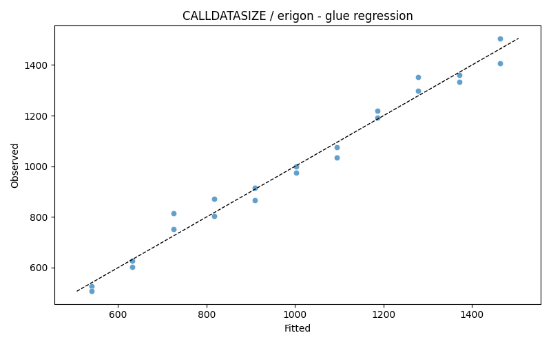

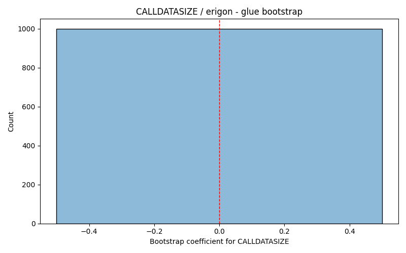


</details>

<details><summary><code>DUP</code> · nobs=22 · runtime_ms=19.75 · p=1.00e-03 · R²=0.9821</summary>

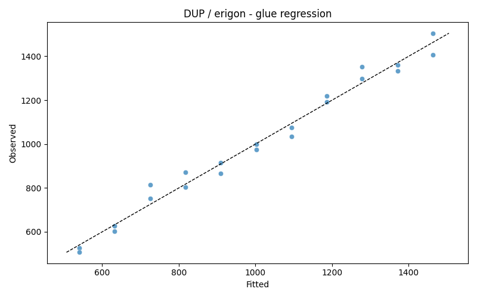

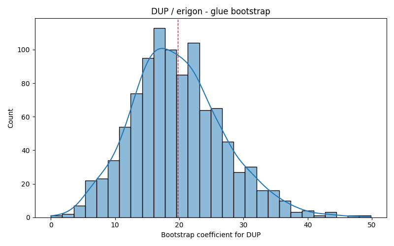


</details>

<details><summary><code>GAS</code> · nobs=22 · runtime_ms=0.0005637 · p=4.68e-01 · R²=0.9821</summary>


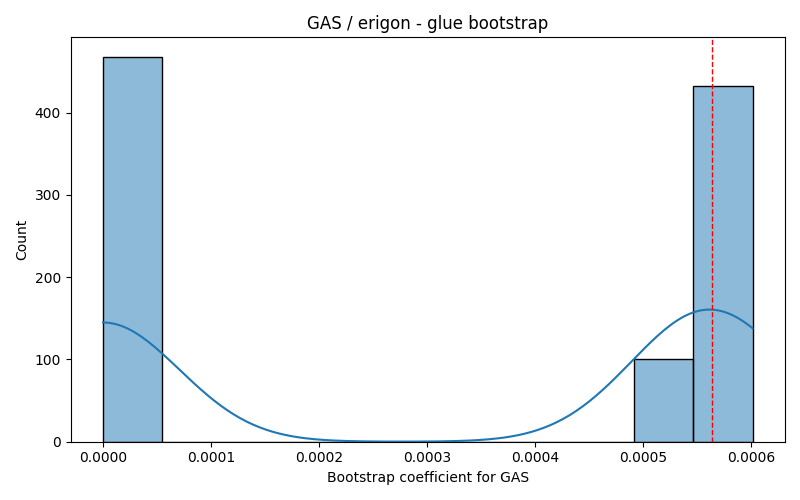


</details>

<details><summary><code>MLOAD</code> · nobs=22 · runtime_ms=0 · p=1.00e+00 · R²=0.9821</summary>

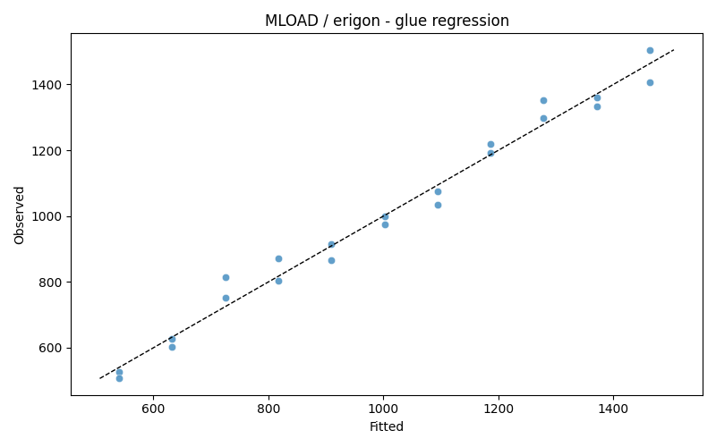


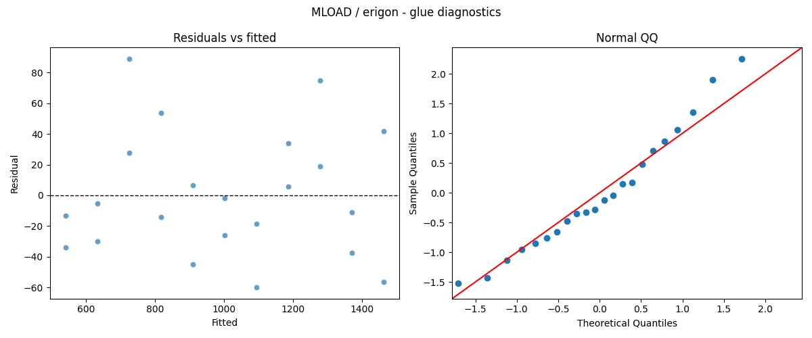

</details>

<details><summary><code>PUSH</code> · nobs=22 · runtime_ms=0 · p=1.00e+00 · R²=0.9821</summary>


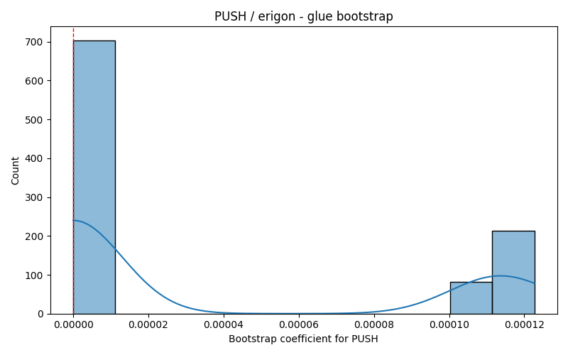


</details>

<details><summary><code>PUSH0</code> · nobs=22 · runtime_ms=0 · p=1.00e+00 · R²=0.9821</summary>


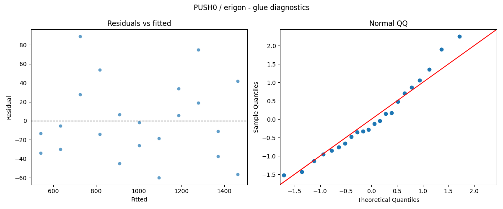

</details>

<details><summary><code>STATICCALL</code> · nobs=22 · runtime_ms=0 · p=1.00e+00 · R²=0.9821</summary>

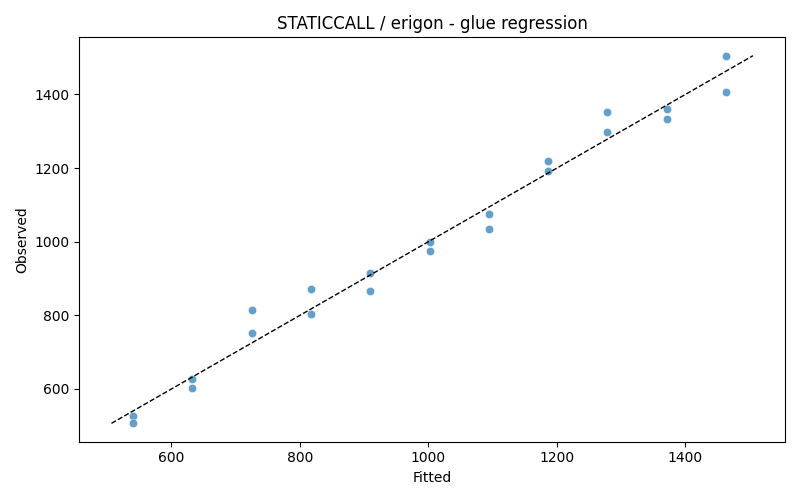

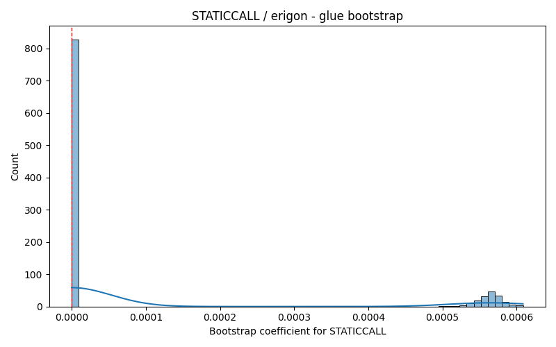

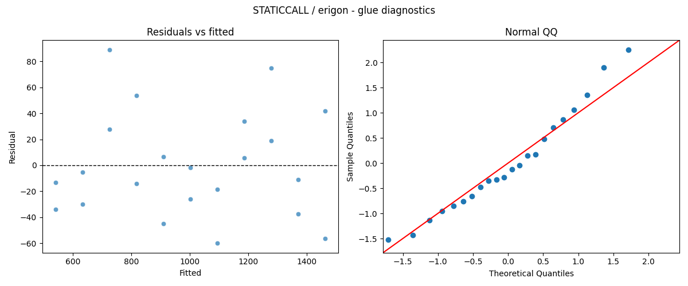

</details>

### Pure glue · erigon

<details><summary><code>ISZERO</code> · nobs=0 · runtime_ms=n/a · p=n/a · R²=n/a</summary>

</details>

<details><summary><code>JUMPDEST</code> · nobs=0 · runtime_ms=n/a · p=n/a · R²=n/a</summary>

</details>

<details><summary><code>SWAP</code> · nobs=0 · runtime_ms=n/a · p=n/a · R²=n/a</summary>

</details>

### Mixed glue (tier A) · erigon

<details><summary><code>ADD</code> · nobs=0 · runtime_ms=n/a · p=n/a · R²=n/a</summary>

</details>

<details><summary><code>AND</code> · nobs=0 · runtime_ms=n/a · p=n/a · R²=n/a</summary>

</details>

<details><summary><code>CALLDATACOPY</code> · nobs=0 · runtime_ms=n/a · p=n/a · R²=n/a</summary>

</details>

<details><summary><code>CALLDATALOAD</code> · nobs=0 · runtime_ms=n/a · p=n/a · R²=n/a</summary>

</details>

<details><summary><code>DIV</code> · nobs=0 · runtime_ms=n/a · p=n/a · R²=n/a</summary>

</details>

<details><summary><code>EXP</code> · nobs=0 · runtime_ms=n/a · p=n/a · R²=n/a</summary>

</details>

<details><summary><code>GT</code> · nobs=0 · runtime_ms=n/a · p=n/a · R²=n/a</summary>

</details>

<details><summary><code>JUMPI</code> · nobs=0 · runtime_ms=n/a · p=n/a · R²=n/a</summary>

</details>

<details><summary><code>LT</code> · nobs=0 · runtime_ms=n/a · p=n/a · R²=n/a</summary>

</details>

<details><summary><code>MSTORE</code> · nobs=0 · runtime_ms=n/a · p=n/a · R²=n/a</summary>

</details>

<details><summary><code>MSTORE8</code> · nobs=0 · runtime_ms=n/a · p=n/a · R²=n/a</summary>

</details>

<details><summary><code>MUL</code> · nobs=0 · runtime_ms=n/a · p=n/a · R²=n/a</summary>

</details>

<details><summary><code>PC</code> · nobs=0 · runtime_ms=n/a · p=n/a · R²=n/a</summary>

</details>

<details><summary><code>RETURNDATASIZE</code> · nobs=0 · runtime_ms=n/a · p=n/a · R²=n/a</summary>

</details>

<details><summary><code>SELFBALANCE</code> · nobs=0 · runtime_ms=n/a · p=n/a · R²=n/a</summary>

</details>

<details><summary><code>SUB</code> · nobs=0 · runtime_ms=n/a · p=n/a · R²=n/a</summary>

</details>

### Mixed glue (tier B) · erigon

<details><summary><code>JUMP</code> · nobs=0 · runtime_ms=n/a · p=n/a · R²=n/a</summary>

</details>

<details><summary><code>KECCAK256</code> · nobs=0 · runtime_ms=n/a · p=n/a · R²=n/a</summary>

</details>

## geth

| glue_opcode | nobs | glue_runtime_ms | p_value | rsquared |
| --- | --- | --- | --- | --- |
| `ISZERO` | 242 | 2.127e-06 | 1.00e-03 | 0.09457 |
| `JUMPDEST` | 242 | 1.722e-06 | 1.00e-03 | 0.08297 |
| `SWAP` | 3872 | 2.217e-06 | 1.00e-03 | 0.08522 |
| `CALLDATASIZE` | 14289 | 2.167e-06 | 1.00e-03 | 0.1138 |
| `DUP` | 14289 | 2.327e-06 | 1.00e-03 | 0.1138 |
| `GAS` | 14289 | 2.187e-06 | 1.00e-03 | 0.1138 |
| `MLOAD` | 14289 | 7.309e-06 | 1.00e-03 | 0.1138 |
| `PUSH` | 14289 | 3.344e-06 | 1.00e-03 | 0.1138 |
| `PUSH0` | 14289 | 2.139e-06 | 1.00e-03 | 0.1138 |
| `STATICCALL` | 14289 | 0.000189 | 1.00e-03 | 0.1138 |
| `ADD` | 242 | 5.782e-06 | 1.00e-03 | 0.1072 |
| `AND` | 242 | 5.562e-06 | 1.00e-03 | 0.09155 |
| `CALLDATACOPY` | 5808 | 1.784e-05 | 1.00e-03 | 0.3115 |
| `CALLDATALOAD` | 968 | 6.171e-05 | 1.00e-03 | 0.032 |
| `DIV` | 242 | 1.353e-05 | 1.00e-03 | 0.08612 |
| `EXP` | 242 | 0.0004861 | 1.00e-03 | 0.08687 |
| `GT` | 242 | 5.399e-06 | 1.00e-03 | 0.0888 |
| `JUMPI` | 242 | 8.125e-06 | 1.00e-03 | 0.09295 |
| `LT` | 242 | 6.352e-06 | 1.00e-03 | 0.1118 |
| `MSTORE` | 1210 | 1.134e-05 | 1.00e-03 | 0.08617 |
| `MSTORE8` | 1210 | 1.055e-05 | 1.00e-03 | 0.08723 |
| `MUL` | 242 | 6.912e-06 | 1.00e-03 | 0.09549 |
| `PC` | 242 | 2.346e-06 | 1.00e-03 | 0.09522 |
| `RETURNDATASIZE` | 968 | 4.546e-06 | 1.00e-03 | 0.1032 |
| `SELFBALANCE` | 198 | 1.133e-05 | 1.00e-03 | 0.04705 |
| `SUB` | 242 | 6.199e-06 | 1.00e-03 | 0.1042 |
| `JUMP` | 242 | 1.328e-05 | 1.00e-03 | 0.08401 |
| `KECCAK256` | 3872 | 5.42e-05 | 1.00e-03 | 0.0366 |

### Cycle glue — joint fit · geth

<details><summary>Joint NNLS regression summary</summary>

```
==============================================================================
                           NNLS Regression Results                            
==============================================================================
Dep. Variable:          test_runtime_ms              R-squared:          0.114
Model:                  NNLS                    Adj. R-squared:          0.113
No. Observations:       14289                             RMSE:         205.33
Df Residuals:           14281                              MAE:         109.75
Df Model:               7      
==============================================================================
                      coef     std err     P-value      [0.025      0.975]
------------------------------------------------------------------------------
         const     36.1644      4.8684       0.001     26.1480     46.0650
  CALLDATASIZE      0.0000      0.0000       0.001      0.0000      0.0000
           DUP      0.0000      0.0000       0.001      0.0000      0.0000
           GAS      0.0000      0.0000       0.001      0.0000      0.0000
         MLOAD      0.0000      0.0000       0.001      0.0000      0.0000
          PUSH      0.0000      0.0000       0.001      0.0000      0.0000
         PUSH0      0.0000      0.0000       0.001      0.0000      0.0000
    STATICCALL      0.0002      0.0000       0.001      0.0002      0.0002
==============================================================================
Notes: Non-negative least squares with bootstrap inference (1000 iterations)
==============================================================================
```

</details>

<details><summary><code>CALLDATASIZE</code> · nobs=14289 · runtime_ms=2.167e-06 · p=1.00e-03 · R²=0.1138</summary>

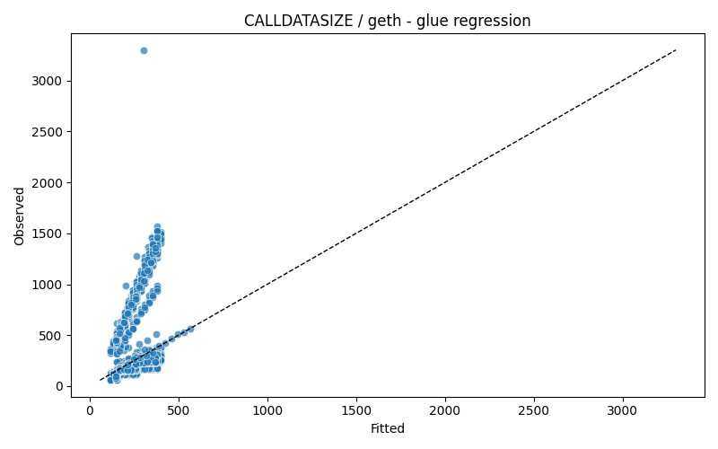

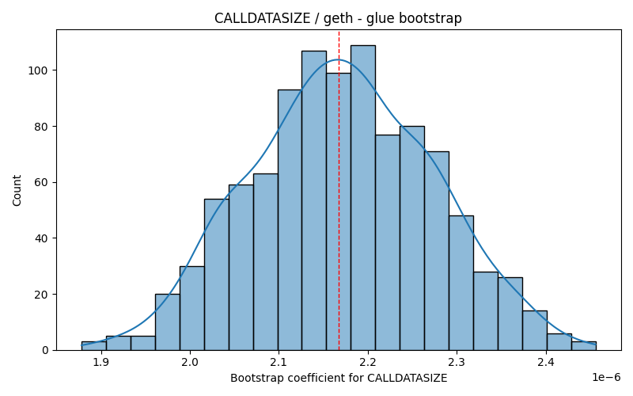

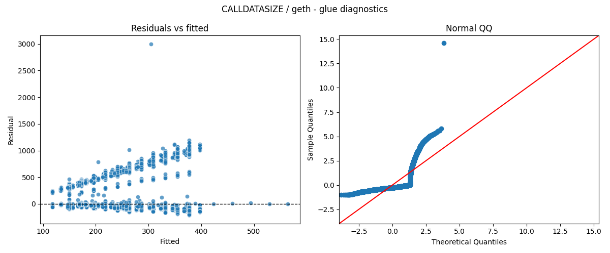

</details>

<details><summary><code>DUP</code> · nobs=14289 · runtime_ms=2.327e-06 · p=1.00e-03 · R²=0.1138</summary>

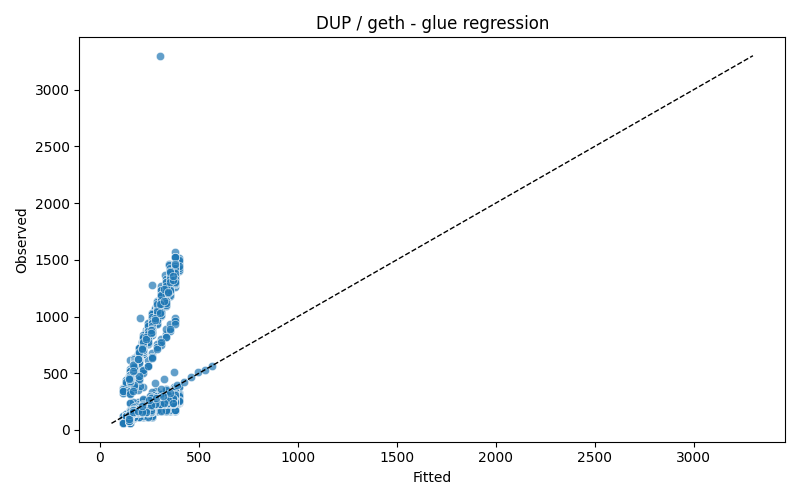

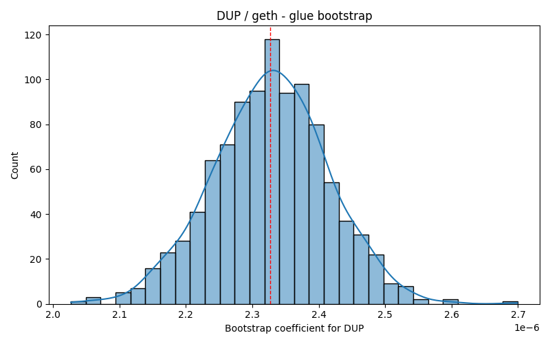

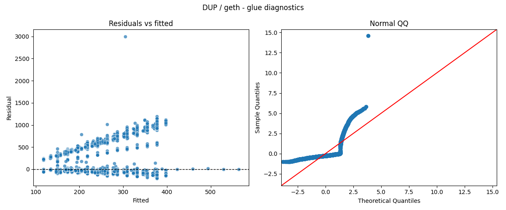

</details>

<details><summary><code>GAS</code> · nobs=14289 · runtime_ms=2.187e-06 · p=1.00e-03 · R²=0.1138</summary>


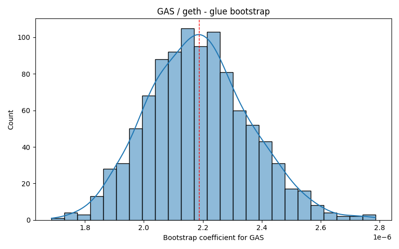


</details>

<details><summary><code>MLOAD</code> · nobs=14289 · runtime_ms=7.309e-06 · p=1.00e-03 · R²=0.1138</summary>


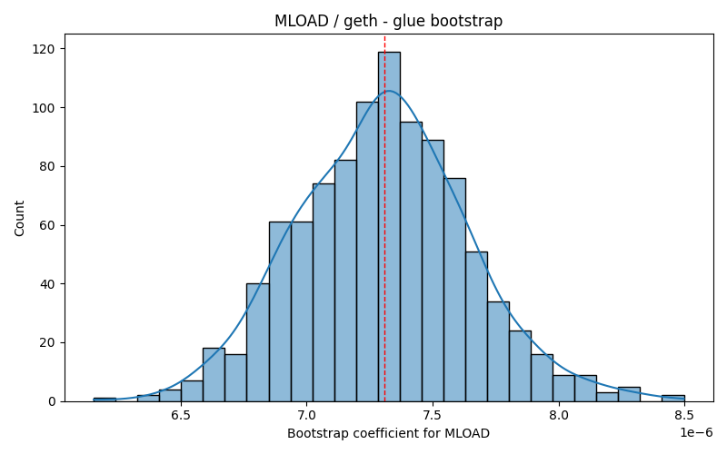


</details>

<details><summary><code>PUSH</code> · nobs=14289 · runtime_ms=3.344e-06 · p=1.00e-03 · R²=0.1138</summary>


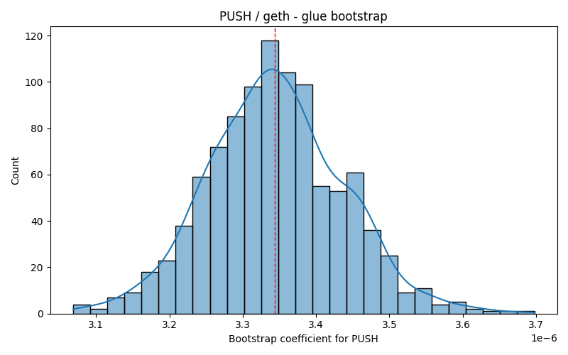


</details>

<details><summary><code>PUSH0</code> · nobs=14289 · runtime_ms=2.139e-06 · p=1.00e-03 · R²=0.1138</summary>

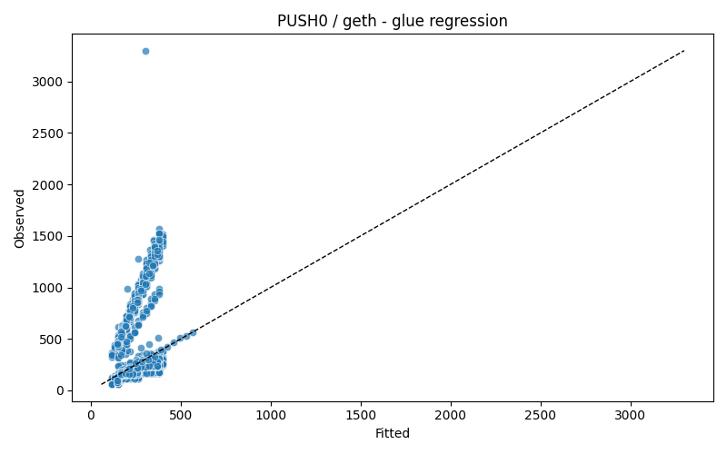

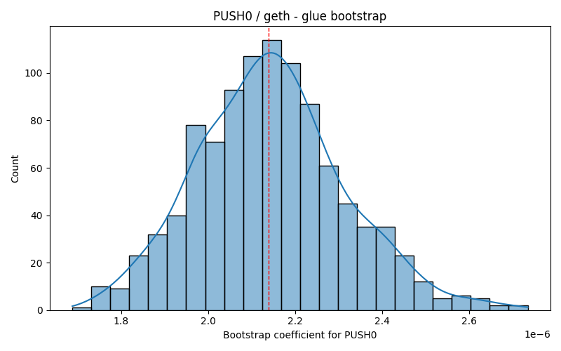


</details>

<details><summary><code>STATICCALL</code> · nobs=14289 · runtime_ms=0.000189 · p=1.00e-03 · R²=0.1138</summary>


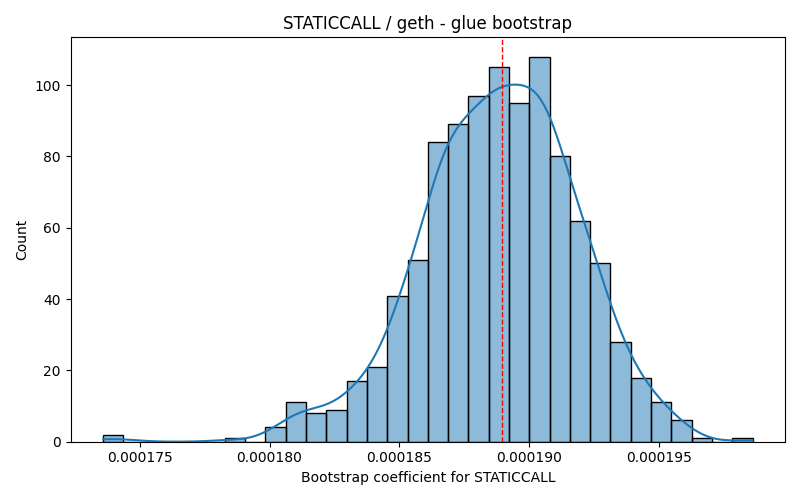

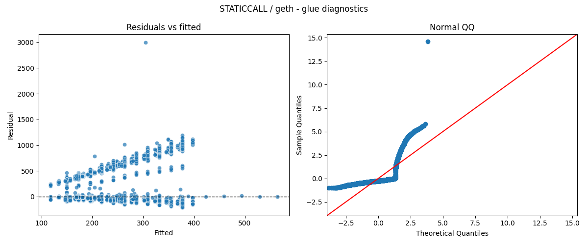

</details>

### Pure glue · geth

<details><summary><code>ISZERO</code> · nobs=242 · runtime_ms=2.127e-06 · p=1.00e-03 · R²=0.09457</summary>

```
==============================================================================
                           NNLS Regression Results                            
==============================================================================
Dep. Variable:          test_runtime_ms              R-squared:          0.095
Model:                  NNLS                    Adj. R-squared:          0.091
No. Observations:       242                               RMSE:         138.53
Df Residuals:           240                                MAE:          75.65
Df Model:               1      
==============================================================================
                      coef     std err     P-value      [0.025      0.975]
------------------------------------------------------------------------------
         const     24.7199     21.3731       0.171      0.0000     71.6096
        ISZERO      0.0000      0.0000       0.001      0.0000      0.0000
==============================================================================
Notes: Non-negative least squares with bootstrap inference (1000 iterations)
==============================================================================
```

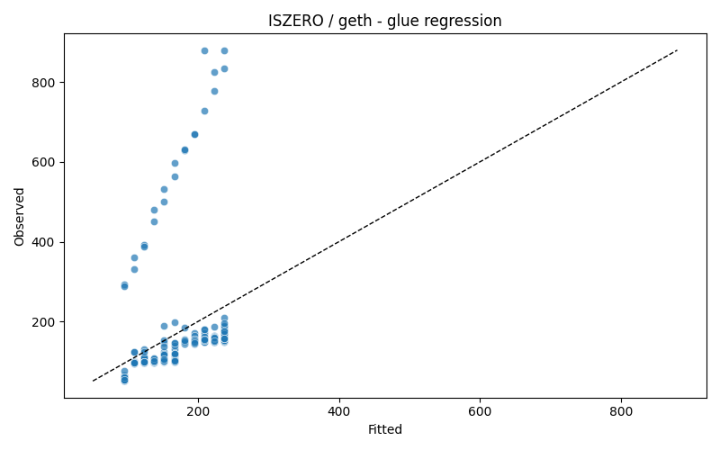

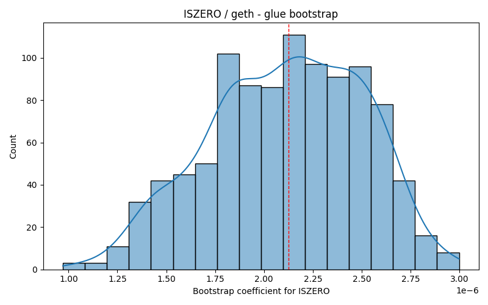

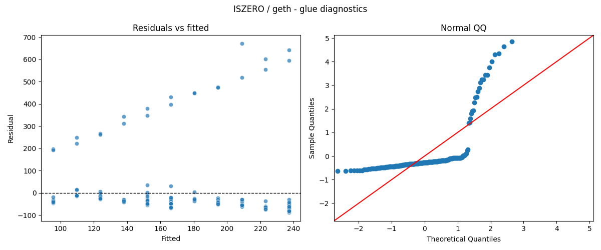

</details>

<details><summary><code>JUMPDEST</code> · nobs=242 · runtime_ms=1.722e-06 · p=1.00e-03 · R²=0.08297</summary>

```
==============================================================================
                           NNLS Regression Results                            
==============================================================================
Dep. Variable:          test_runtime_ms              R-squared:          0.083
Model:                  NNLS                    Adj. R-squared:          0.079
No. Observations:       242                               RMSE:         361.52
Df Residuals:           240                                MAE:         201.48
Df Model:               1      
==============================================================================
                      coef     std err     P-value      [0.025      0.975]
------------------------------------------------------------------------------
         const     77.2339     58.1191       0.128      0.0000    198.5799
      JUMPDEST      0.0000      0.0000       0.001      0.0000      0.0000
==============================================================================
Notes: Non-negative least squares with bootstrap inference (1000 iterations)
==============================================================================
```

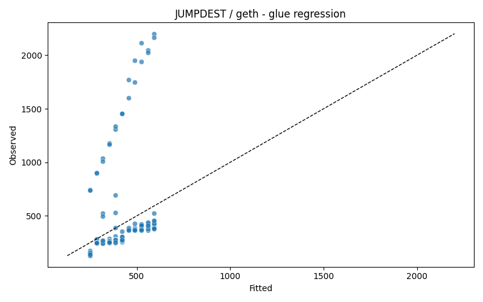

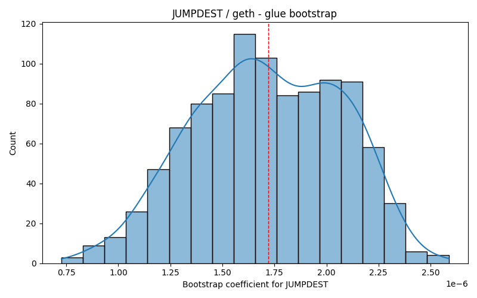

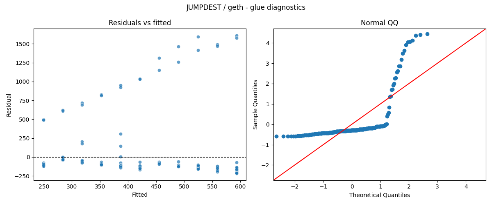

</details>

<details><summary><code>SWAP</code> · nobs=3872 · runtime_ms=2.217e-06 · p=1.00e-03 · R²=0.08522</summary>

```
==============================================================================
                           NNLS Regression Results                            
==============================================================================
Dep. Variable:          test_runtime_ms              R-squared:          0.085
Model:                  NNLS                    Adj. R-squared:          0.085
No. Observations:       3872                              RMSE:         152.93
Df Residuals:           3870                               MAE:          83.52
Df Model:               1      
==============================================================================
                      coef     std err     P-value      [0.025      0.975]
------------------------------------------------------------------------------
         const     30.7037      7.2376       0.001     16.2253     45.0151
          SWAP      0.0000      0.0000       0.001      0.0000      0.0000
==============================================================================
Notes: Non-negative least squares with bootstrap inference (1000 iterations)
==============================================================================
```

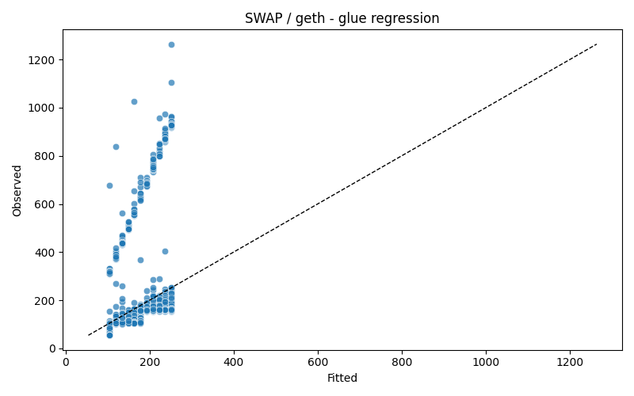

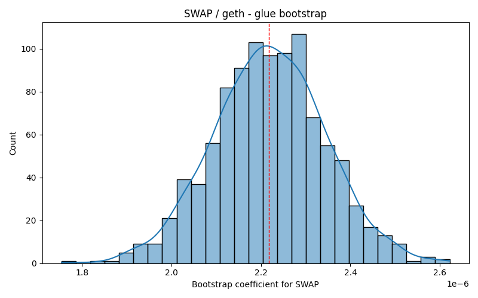

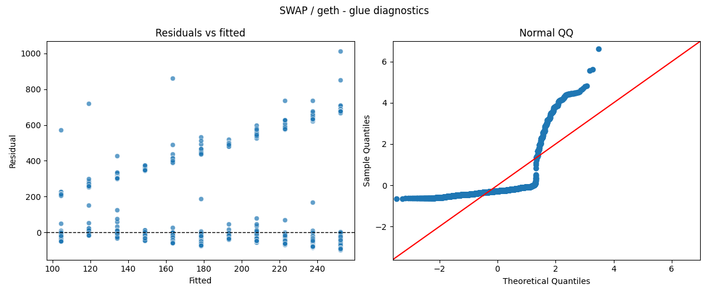

</details>

### Mixed glue (tier A) · geth

<details><summary><code>ADD</code> · nobs=242 · runtime_ms=5.782e-06 · p=1.00e-03 · R²=0.1072</summary>

```
==============================================================================
                           NNLS Regression Results                            
==============================================================================
Dep. Variable:          test_runtime_ms              R-squared:          0.107
Model:                  NNLS                    Adj. R-squared:          0.104
No. Observations:       242                               RMSE:         175.59
Df Residuals:           240                                MAE:          97.95
Df Model:               1      
==============================================================================
                      coef     std err     P-value      [0.025      0.975]
------------------------------------------------------------------------------
         const     51.9136     30.0722       0.055      0.0000    113.5020
           ADD      0.0000      0.0000       0.001      0.0000      0.0000
==============================================================================
Notes: Non-negative least squares with bootstrap inference (1000 iterations)
==============================================================================
```

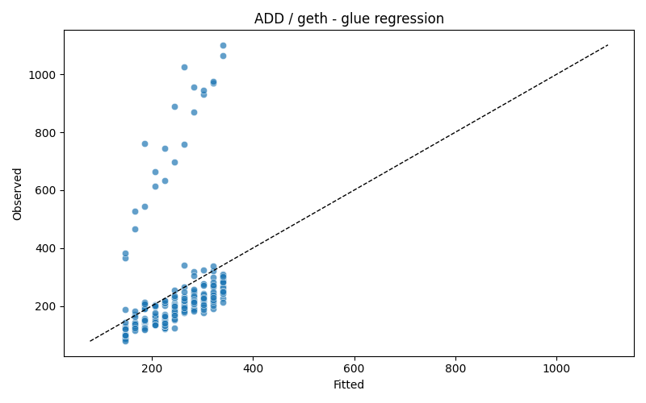

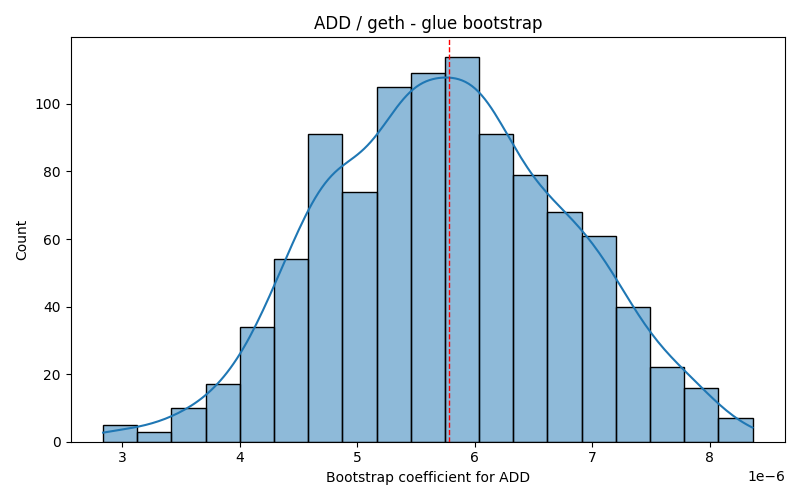

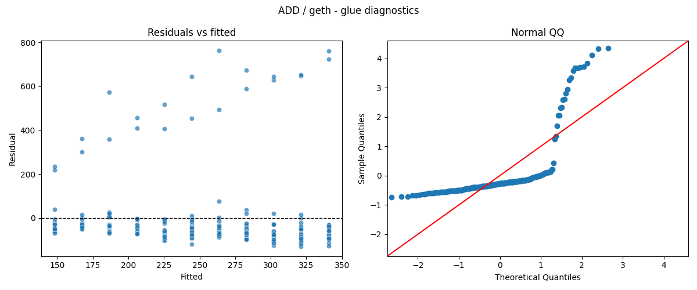

</details>

<details><summary><code>AND</code> · nobs=242 · runtime_ms=5.562e-06 · p=1.00e-03 · R²=0.09155</summary>

```
==============================================================================
                           NNLS Regression Results                            
==============================================================================
Dep. Variable:          test_runtime_ms              R-squared:          0.092
Model:                  NNLS                    Adj. R-squared:          0.088
No. Observations:       242                               RMSE:         184.42
Df Residuals:           240                                MAE:         101.07
Df Model:               1      
==============================================================================
                      coef     std err     P-value      [0.025      0.975]
------------------------------------------------------------------------------
         const     53.8877     30.7649       0.049      0.0000    113.9374
           AND      0.0000      0.0000       0.001      0.0000      0.0000
==============================================================================
Notes: Non-negative least squares with bootstrap inference (1000 iterations)
==============================================================================
```

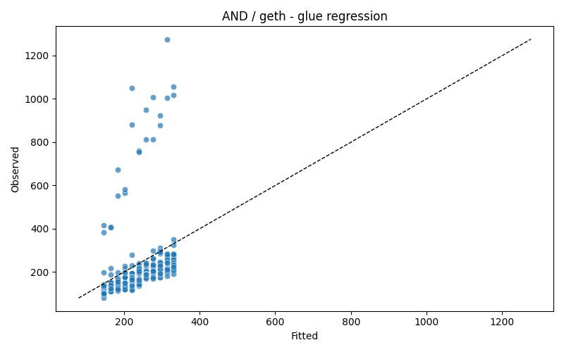

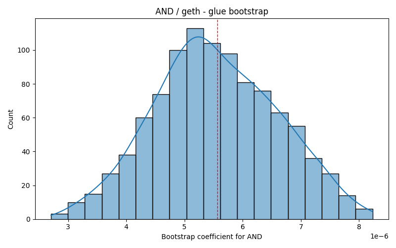

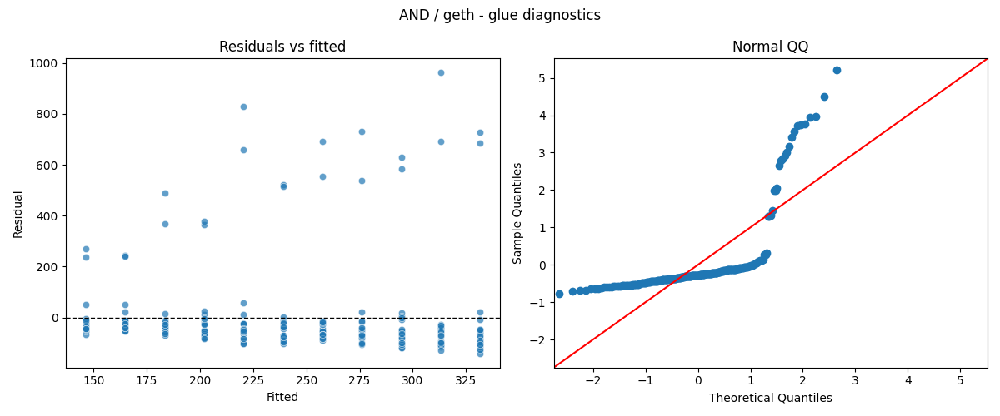

</details>

<details><summary><code>CALLDATACOPY</code> · nobs=5808 · runtime_ms=1.784e-05 · p=1.00e-03 · R²=0.3115</summary>

```
==============================================================================
                           NNLS Regression Results                            
==============================================================================
Dep. Variable:          test_runtime_ms              R-squared:          0.311
Model:                  NNLS                    Adj. R-squared:          0.311
No. Observations:       5808                              RMSE:         199.49
Df Residuals:           5806                               MAE:          93.24
Df Model:               1      
==============================================================================
                      coef     std err     P-value      [0.025      0.975]
------------------------------------------------------------------------------
         const     24.2847      3.1313       0.001     17.9384     30.3853
  CALLDATACOPY      0.0000      0.0000       0.001      0.0000      0.0000
==============================================================================
Notes: Non-negative least squares with bootstrap inference (1000 iterations)
==============================================================================
```

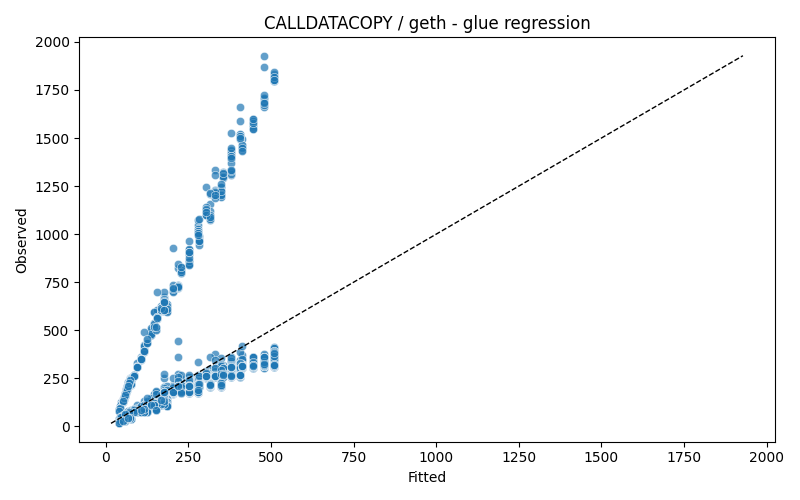

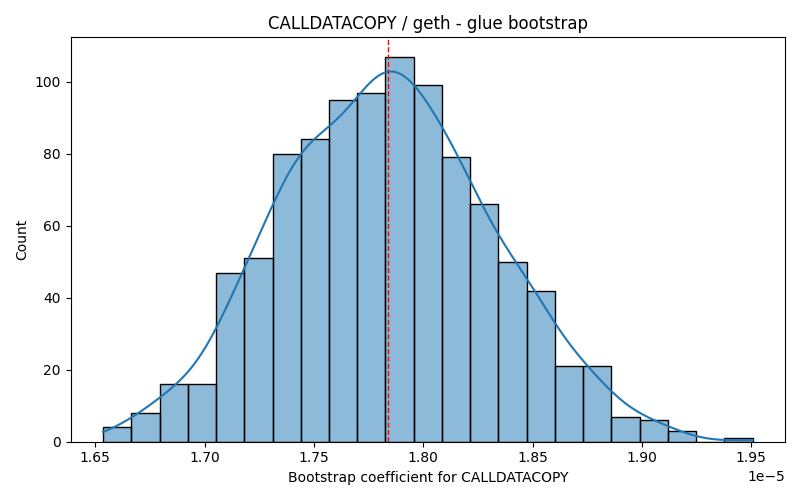

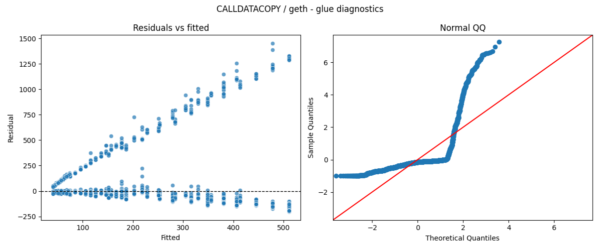

</details>

<details><summary><code>CALLDATALOAD</code> · nobs=968 · runtime_ms=6.171e-05 · p=1.00e-03 · R²=0.032</summary>

```
==============================================================================
                           NNLS Regression Results                            
==============================================================================
Dep. Variable:          test_runtime_ms              R-squared:          0.032
Model:                  NNLS                    Adj. R-squared:          0.031
No. Observations:       968                               RMSE:           1.30
Df Residuals:           966                                MAE:           0.65
Df Model:               1      
==============================================================================
                      coef     std err     P-value      [0.025      0.975]
------------------------------------------------------------------------------
         const      2.5633      0.1387       0.001      2.3039      2.8444
  CALLDATALOAD      0.0001      0.0000       0.001      0.0000      0.0001
==============================================================================
Notes: Non-negative least squares with bootstrap inference (1000 iterations)
==============================================================================
```

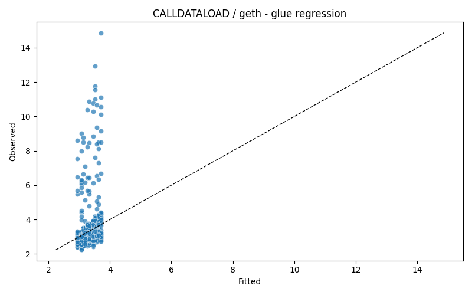

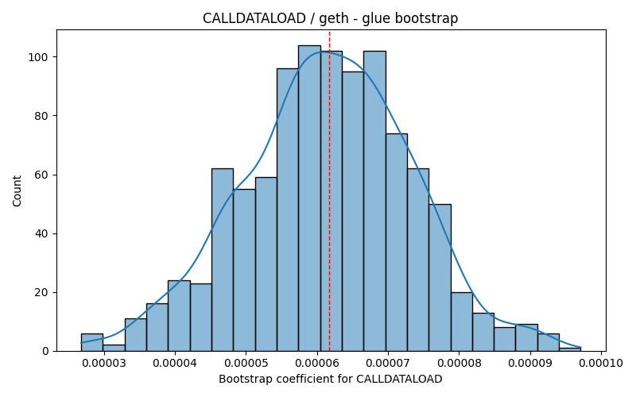

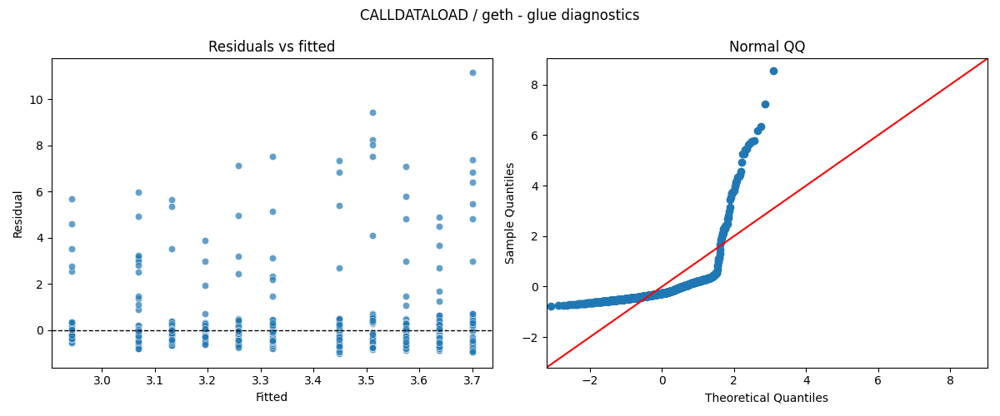

</details>

<details><summary><code>DIV</code> · nobs=242 · runtime_ms=1.353e-05 · p=1.00e-03 · R²=0.08612</summary>

```
==============================================================================
                           NNLS Regression Results                            
==============================================================================
Dep. Variable:          test_runtime_ms              R-squared:          0.086
Model:                  NNLS                    Adj. R-squared:          0.082
No. Observations:       242                               RMSE:         348.06
Df Residuals:           240                                MAE:         189.48
Df Model:               1      
==============================================================================
                      coef     std err     P-value      [0.025      0.975]
------------------------------------------------------------------------------
         const     77.1586     58.7629       0.107      0.0000    205.1425
           DIV      0.0000      0.0000       0.001      0.0000      0.0000
==============================================================================
Notes: Non-negative least squares with bootstrap inference (1000 iterations)
==============================================================================
```

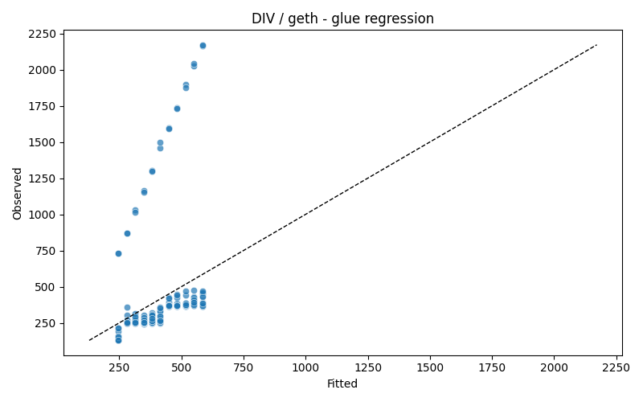

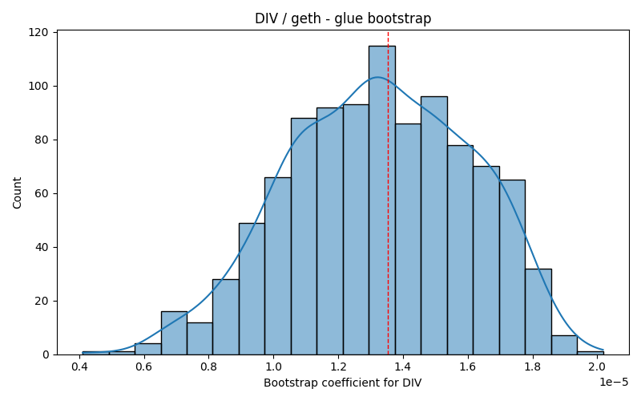

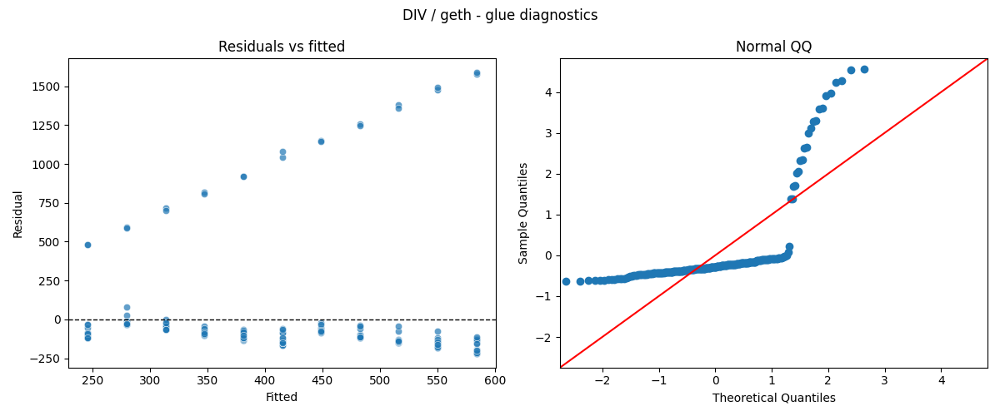

</details>

<details><summary><code>EXP</code> · nobs=242 · runtime_ms=0.0004861 · p=1.00e-03 · R²=0.08687</summary>

```
==============================================================================
                           NNLS Regression Results                            
==============================================================================
Dep. Variable:          test_runtime_ms              R-squared:          0.087
Model:                  NNLS                    Adj. R-squared:          0.083
No. Observations:       242                               RMSE:          61.72
Df Residuals:           240                                MAE:          33.69
Df Model:               1      
==============================================================================
                      coef     std err     P-value      [0.025      0.975]
------------------------------------------------------------------------------
         const     13.0418      9.7474       0.139      0.0000     33.3906
           EXP      0.0005      0.0001       0.001      0.0003      0.0006
==============================================================================
Notes: Non-negative least squares with bootstrap inference (1000 iterations)
==============================================================================
```

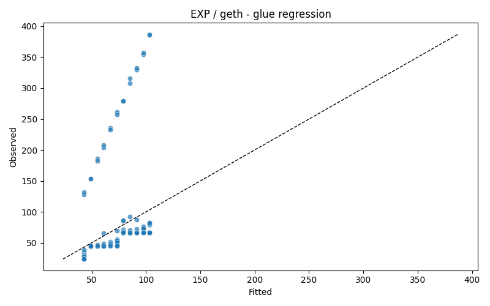

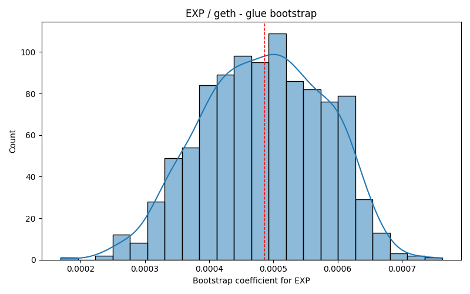

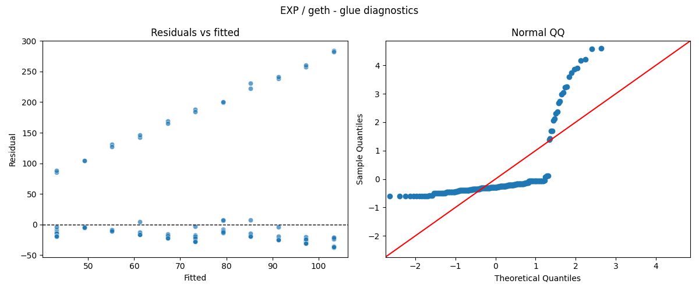

</details>

<details><summary><code>GT</code> · nobs=242 · runtime_ms=5.399e-06 · p=1.00e-03 · R²=0.0888</summary>

```
==============================================================================
                           NNLS Regression Results                            
==============================================================================
Dep. Variable:          test_runtime_ms              R-squared:          0.089
Model:                  NNLS                    Adj. R-squared:          0.085
No. Observations:       242                               RMSE:         182.02
Df Residuals:           240                                MAE:          96.92
Df Model:               1      
==============================================================================
                      coef     std err     P-value      [0.025      0.975]
------------------------------------------------------------------------------
         const     28.1884     28.8183       0.204      0.0000     93.8092
            GT      0.0000      0.0000       0.001      0.0000      0.0000
==============================================================================
Notes: Non-negative least squares with bootstrap inference (1000 iterations)
==============================================================================
```

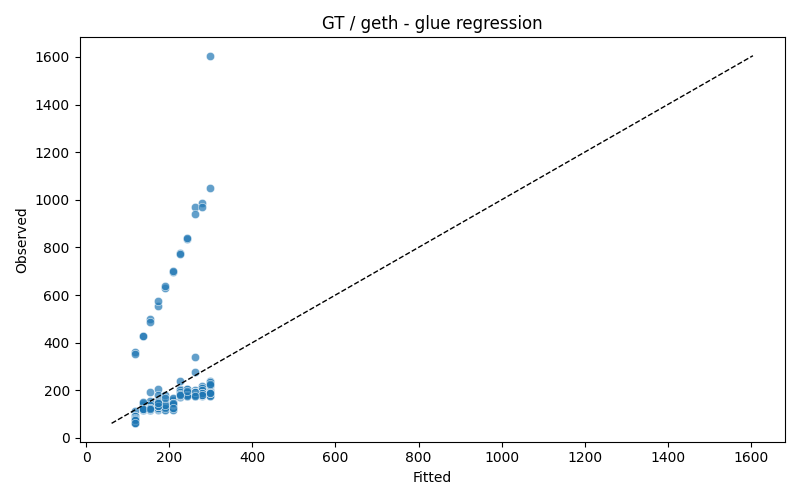


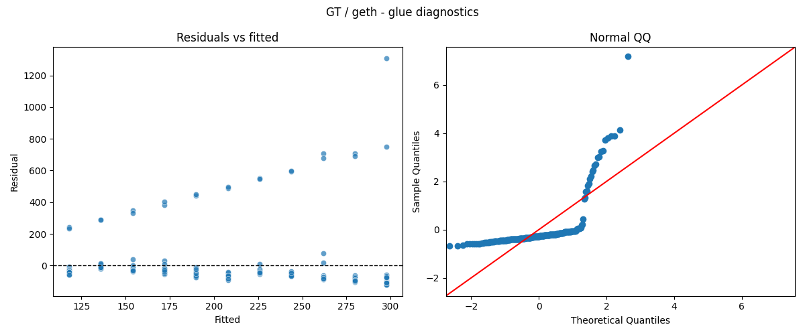

</details>

<details><summary><code>JUMPI</code> · nobs=242 · runtime_ms=8.125e-06 · p=1.00e-03 · R²=0.09295</summary>

```
==============================================================================
                           NNLS Regression Results                            
==============================================================================
Dep. Variable:          test_runtime_ms              R-squared:          0.093
Model:                  NNLS                    Adj. R-squared:          0.089
No. Observations:       242                               RMSE:         114.51
Df Residuals:           240                                MAE:          62.42
Df Model:               1      
==============================================================================
                      coef     std err     P-value      [0.025      0.975]
------------------------------------------------------------------------------
         const     19.2691     17.9675       0.186      0.0000     62.1270
         JUMPI      0.0000      0.0000       0.001      0.0000      0.0000
==============================================================================
Notes: Non-negative least squares with bootstrap inference (1000 iterations)
==============================================================================
```

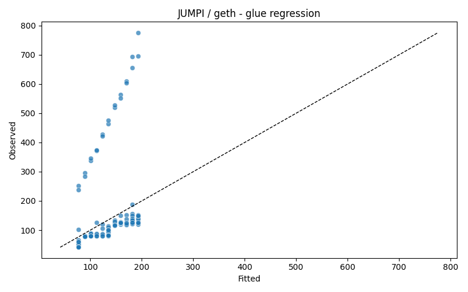

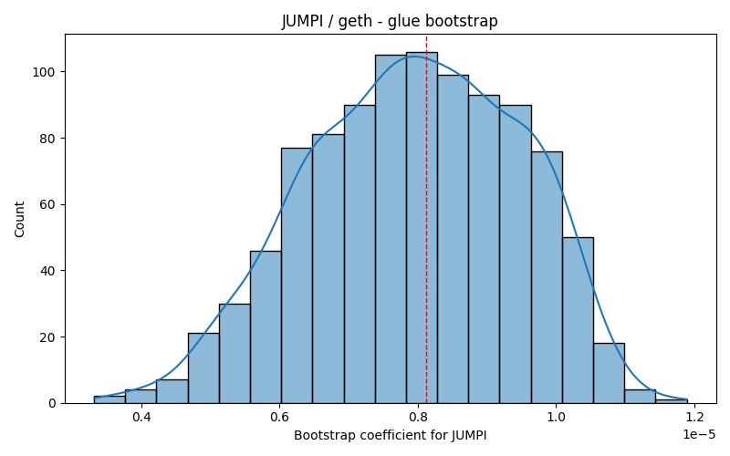

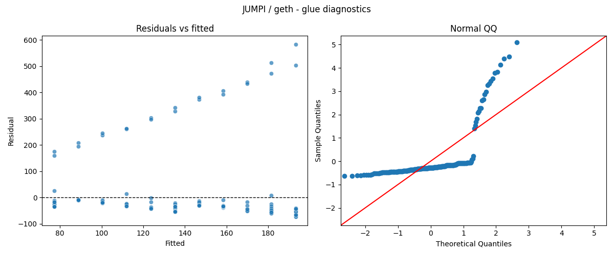

</details>

<details><summary><code>LT</code> · nobs=242 · runtime_ms=6.352e-06 · p=1.00e-03 · R²=0.1118</summary>

```
==============================================================================
                           NNLS Regression Results                            
==============================================================================
Dep. Variable:          test_runtime_ms              R-squared:          0.112
Model:                  NNLS                    Adj. R-squared:          0.108
No. Observations:       242                               RMSE:         188.42
Df Residuals:           240                                MAE:         101.14
Df Model:               1      
==============================================================================
                      coef     std err     P-value      [0.025      0.975]
------------------------------------------------------------------------------
         const     31.4278     28.7797       0.196      0.0000     96.9778
            LT      0.0000      0.0000       0.001      0.0000      0.0000
==============================================================================
Notes: Non-negative least squares with bootstrap inference (1000 iterations)
==============================================================================
```

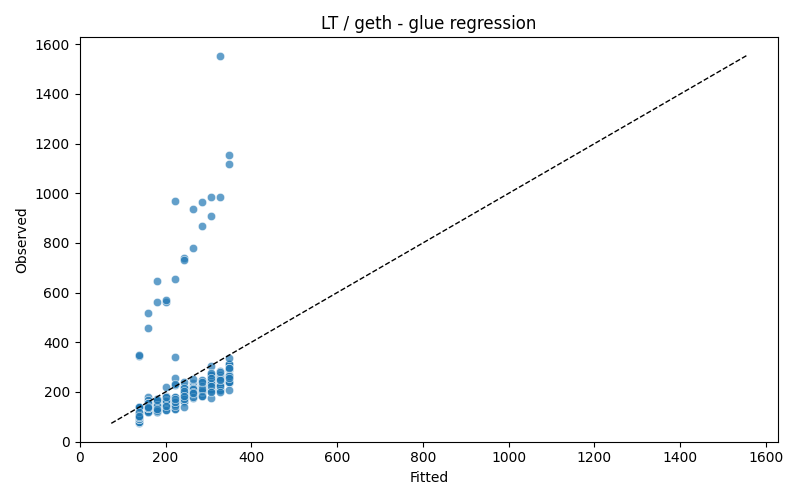

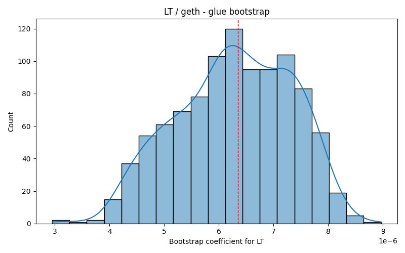

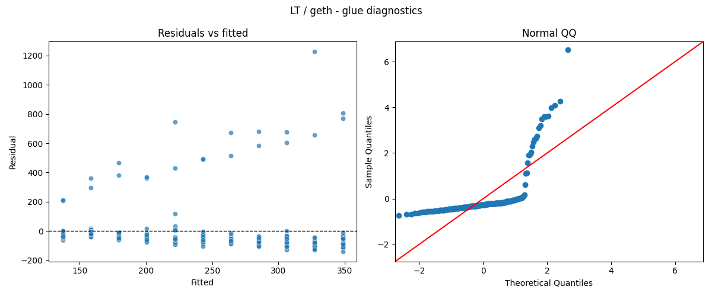

</details>

<details><summary><code>MSTORE</code> · nobs=1210 · runtime_ms=1.134e-05 · p=1.00e-03 · R²=0.08617</summary>

```
==============================================================================
                           NNLS Regression Results                            
==============================================================================
Dep. Variable:          test_runtime_ms              R-squared:          0.086
Model:                  NNLS                    Adj. R-squared:          0.085
No. Observations:       1210                              RMSE:         259.04
Df Residuals:           1208                               MAE:         141.67
Df Model:               1      
==============================================================================
                      coef     std err     P-value      [0.025      0.975]
------------------------------------------------------------------------------
         const     48.2278     22.0519       0.012      6.4558     90.5775
        MSTORE      0.0000      0.0000       0.001      0.0000      0.0000
==============================================================================
Notes: Non-negative least squares with bootstrap inference (1000 iterations)
==============================================================================
```

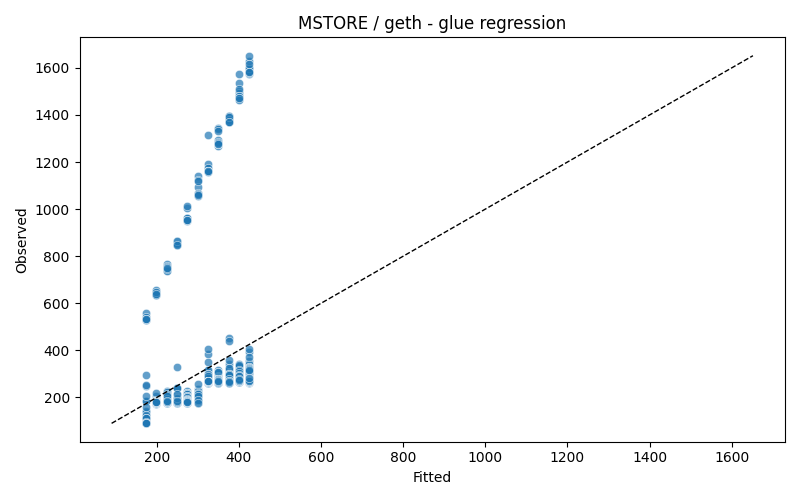

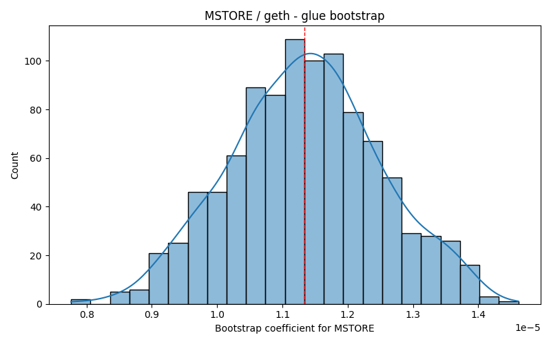

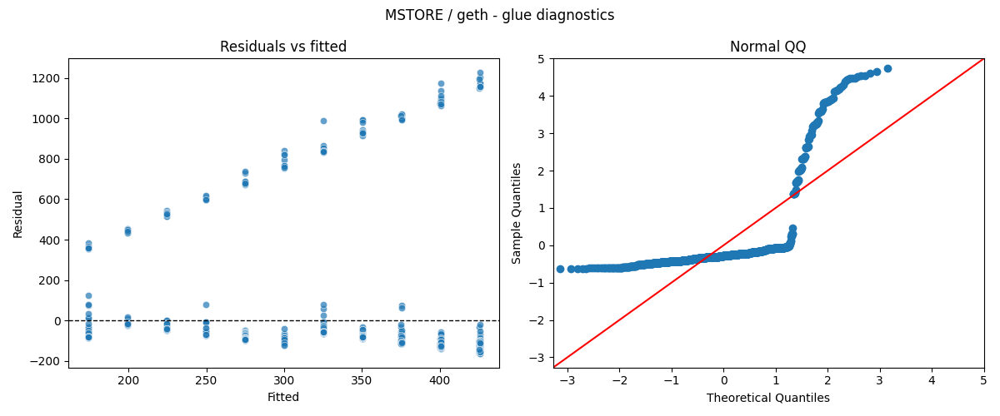

</details>

<details><summary><code>MSTORE8</code> · nobs=1210 · runtime_ms=1.055e-05 · p=1.00e-03 · R²=0.08723</summary>

```
==============================================================================
                           NNLS Regression Results                            
==============================================================================
Dep. Variable:          test_runtime_ms              R-squared:          0.087
Model:                  NNLS                    Adj. R-squared:          0.086
No. Observations:       1210                              RMSE:         239.56
Df Residuals:           1208                               MAE:         130.36
Df Model:               1      
==============================================================================
                      coef     std err     P-value      [0.025      0.975]
------------------------------------------------------------------------------
         const     42.8070     19.4411       0.017      6.1347     82.0473
       MSTORE8      0.0000      0.0000       0.001      0.0000      0.0000
==============================================================================
Notes: Non-negative least squares with bootstrap inference (1000 iterations)
==============================================================================
```

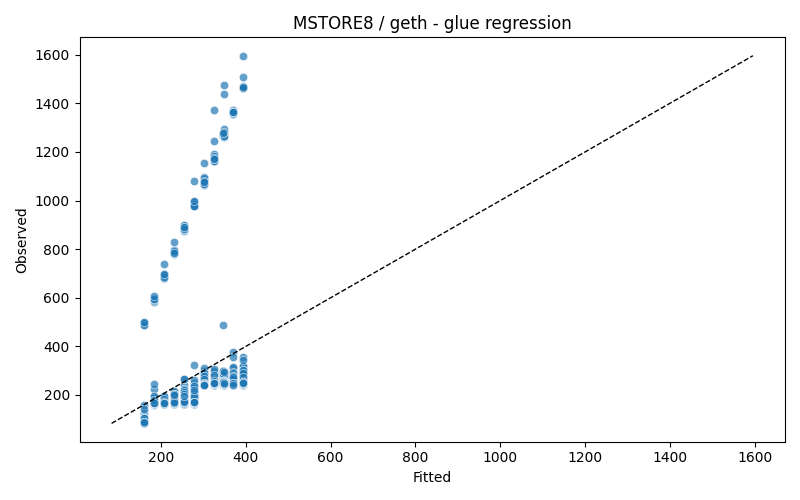

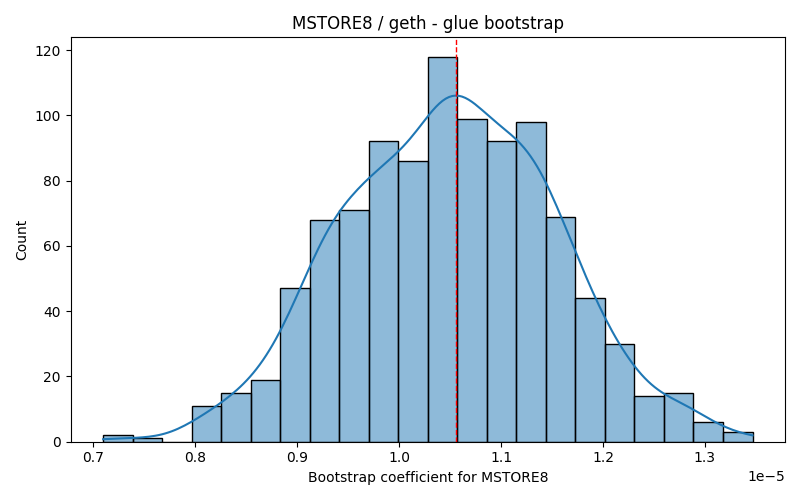

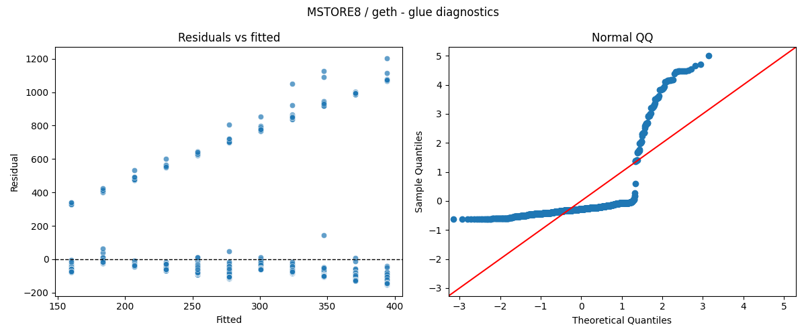

</details>

<details><summary><code>MUL</code> · nobs=242 · runtime_ms=6.912e-06 · p=1.00e-03 · R²=0.09549</summary>

```
==============================================================================
                           NNLS Regression Results                            
==============================================================================
Dep. Variable:          test_runtime_ms              R-squared:          0.095
Model:                  NNLS                    Adj. R-squared:          0.092
No. Observations:       242                               RMSE:         167.93
Df Residuals:           240                                MAE:          90.66
Df Model:               1      
==============================================================================
                      coef     std err     P-value      [0.025      0.975]
------------------------------------------------------------------------------
         const     33.1713     27.8187       0.152      0.0000     92.9512
           MUL      0.0000      0.0000       0.001      0.0000      0.0000
==============================================================================
Notes: Non-negative least squares with bootstrap inference (1000 iterations)
==============================================================================
```

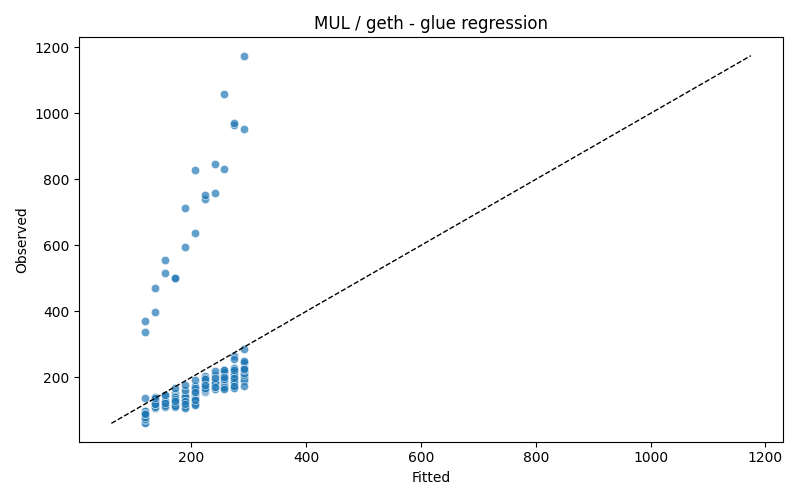

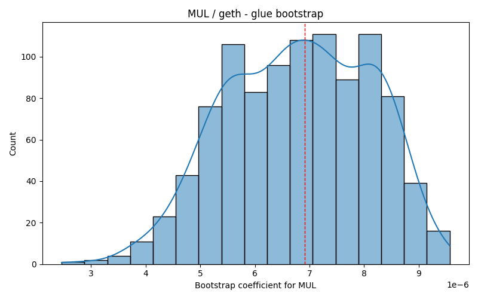

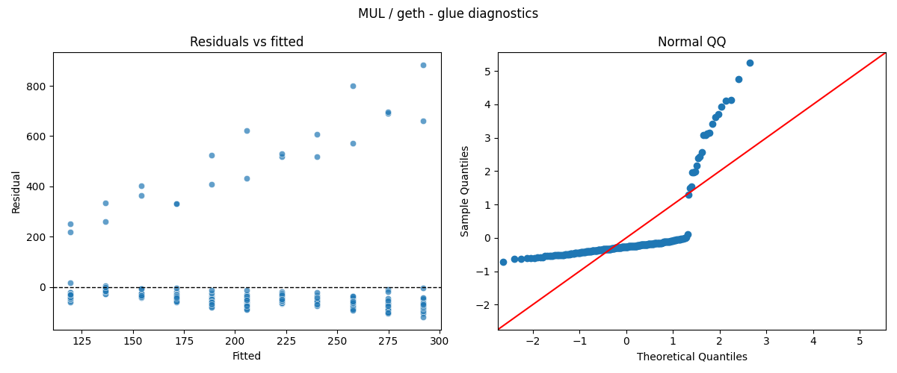

</details>

<details><summary><code>PC</code> · nobs=242 · runtime_ms=2.346e-06 · p=1.00e-03 · R²=0.09522</summary>

```
==============================================================================
                           NNLS Regression Results                            
==============================================================================
Dep. Variable:          test_runtime_ms              R-squared:          0.095
Model:                  NNLS                    Adj. R-squared:          0.091
No. Observations:       242                               RMSE:         216.18
Df Residuals:           240                                MAE:         117.36
Df Model:               1      
==============================================================================
                      coef     std err     P-value      [0.025      0.975]
------------------------------------------------------------------------------
         const     37.3326     32.4773       0.166      0.0000    108.7979
            PC      0.0000      0.0000       0.001      0.0000      0.0000
==============================================================================
Notes: Non-negative least squares with bootstrap inference (1000 iterations)
==============================================================================
```

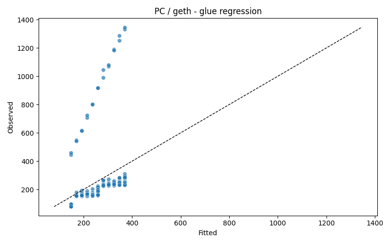

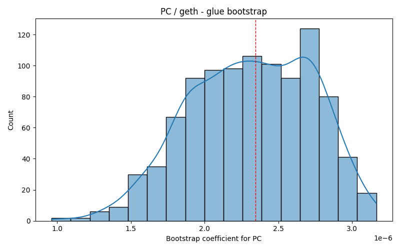


</details>

<details><summary><code>RETURNDATASIZE</code> · nobs=968 · runtime_ms=4.546e-06 · p=1.00e-03 · R²=0.1032</summary>

```
==============================================================================
                           NNLS Regression Results                            
==============================================================================
Dep. Variable:          test_runtime_ms              R-squared:          0.103
Model:                  NNLS                    Adj. R-squared:          0.102
No. Observations:       968                               RMSE:         211.59
Df Residuals:           966                                MAE:         116.73
Df Model:               1      
==============================================================================
                      coef     std err     P-value      [0.025      0.975]
------------------------------------------------------------------------------
         const     46.3002     19.2414       0.013      5.2902     82.5276
RETURNDATASIZE      0.0000      0.0000       0.001      0.0000      0.0000
==============================================================================
Notes: Non-negative least squares with bootstrap inference (1000 iterations)
==============================================================================
```

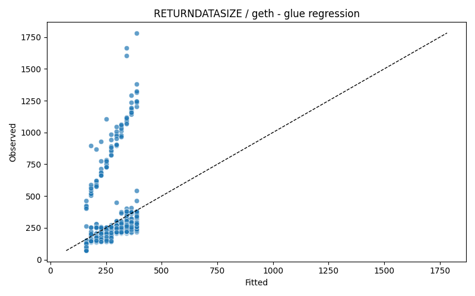


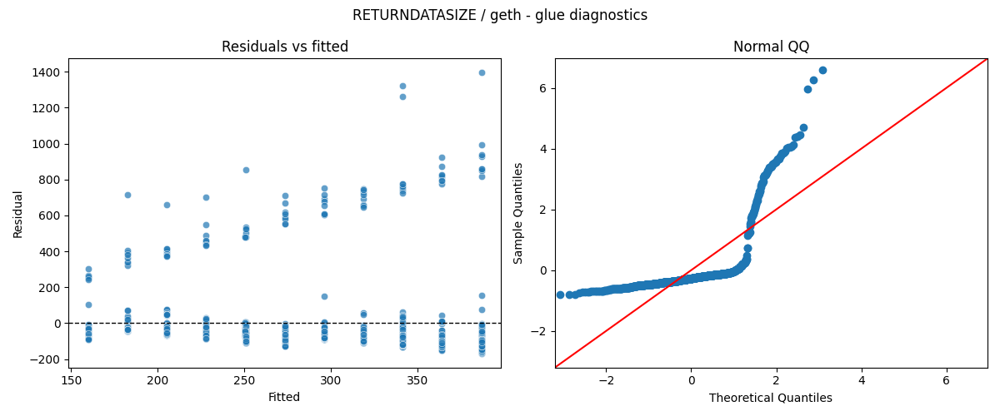

</details>

<details><summary><code>SELFBALANCE</code> · nobs=198 · runtime_ms=1.133e-05 · p=1.00e-03 · R²=0.04705</summary>

```
==============================================================================
                           NNLS Regression Results                            
==============================================================================
Dep. Variable:          test_runtime_ms              R-squared:          0.047
Model:                  NNLS                    Adj. R-squared:          0.042
No. Observations:       198                               RMSE:         514.16
Df Residuals:           196                                MAE:         285.69
Df Model:               1      
==============================================================================
                      coef     std err     P-value      [0.025      0.975]
------------------------------------------------------------------------------
         const    113.2780    114.3601       0.235      0.0000    375.3014
   SELFBALANCE      0.0000      0.0000       0.001      0.0000      0.0000
==============================================================================
Notes: Non-negative least squares with bootstrap inference (1000 iterations)
==============================================================================
```

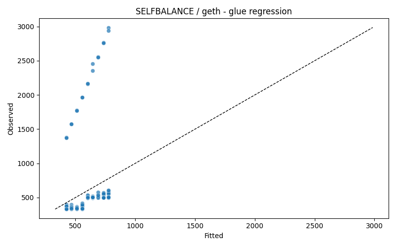

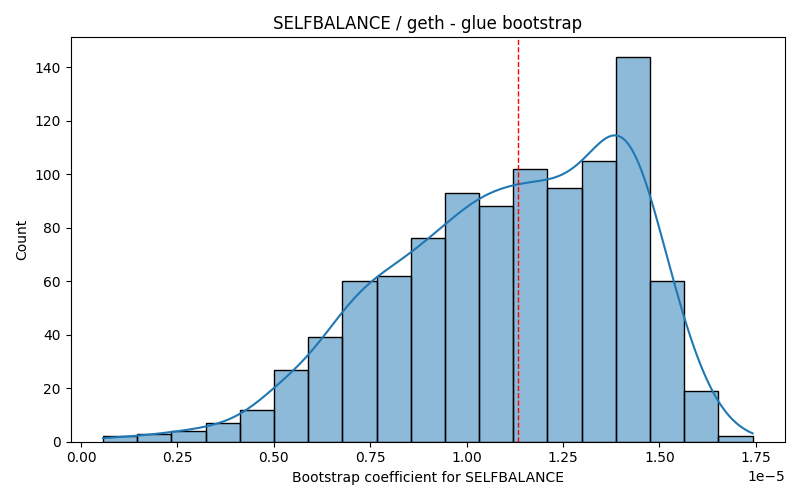

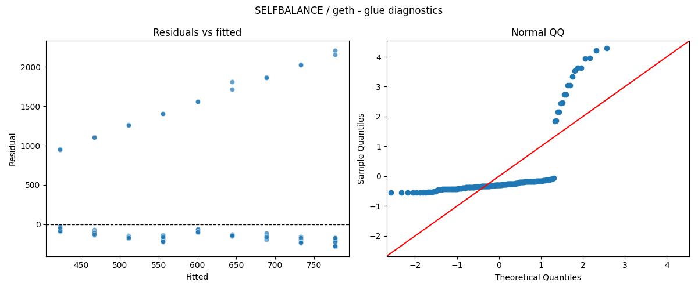

</details>

<details><summary><code>SUB</code> · nobs=242 · runtime_ms=6.199e-06 · p=1.00e-03 · R²=0.1042</summary>

```
==============================================================================
                           NNLS Regression Results                            
==============================================================================
Dep. Variable:          test_runtime_ms              R-squared:          0.104
Model:                  NNLS                    Adj. R-squared:          0.100
No. Observations:       242                               RMSE:         191.28
Df Residuals:           240                                MAE:         103.29
Df Model:               1      
==============================================================================
                      coef     std err     P-value      [0.025      0.975]
------------------------------------------------------------------------------
         const     38.6732     31.9709       0.155      0.0000    110.1932
           SUB      0.0000      0.0000       0.001      0.0000      0.0000
==============================================================================
Notes: Non-negative least squares with bootstrap inference (1000 iterations)
==============================================================================
```

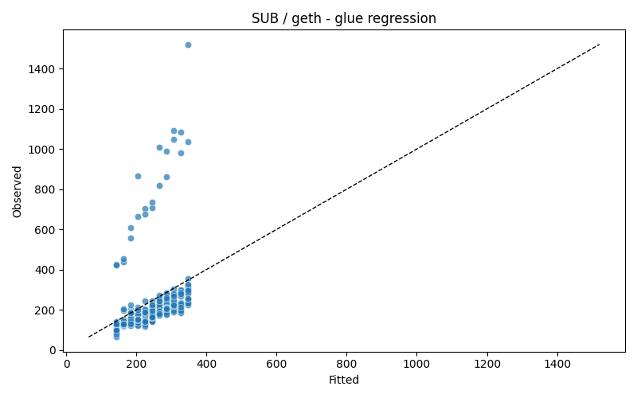

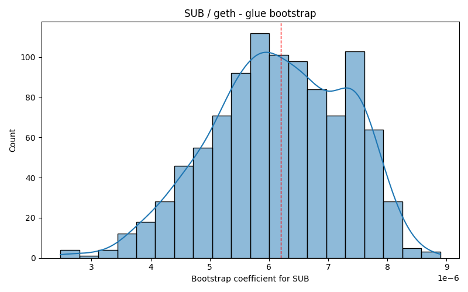

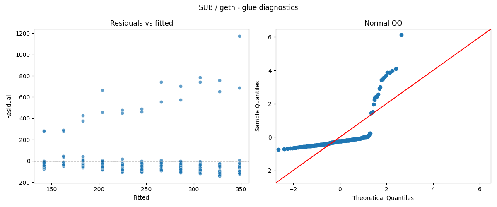

</details>

### Mixed glue (tier B) · geth

<details><summary><code>JUMP</code> · nobs=242 · runtime_ms=1.328e-05 · p=1.00e-03 · R²=0.08401</summary>

```
==============================================================================
                           NNLS Regression Results                            
==============================================================================
Dep. Variable:          test_runtime_ms              R-squared:          0.084
Model:                  NNLS                    Adj. R-squared:          0.080
No. Observations:       242                               RMSE:         162.94
Df Residuals:           240                                MAE:          88.53
Df Model:               1      
==============================================================================
                      coef     std err     P-value      [0.025      0.975]
------------------------------------------------------------------------------
         const     33.3720     26.8296       0.137      0.0000     93.2889
          JUMP      0.0000      0.0000       0.001      0.0000      0.0000
==============================================================================
Notes: Non-negative least squares with bootstrap inference (1000 iterations)
==============================================================================
```

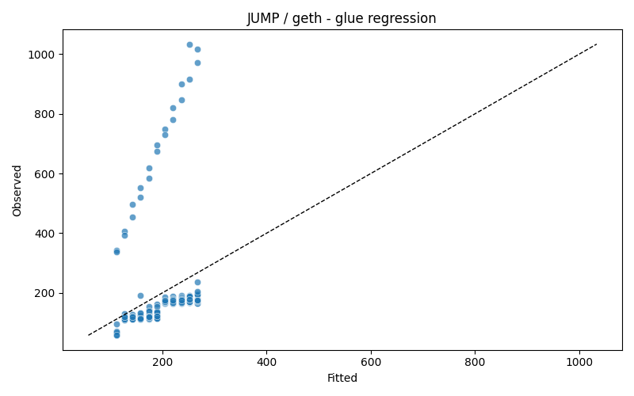


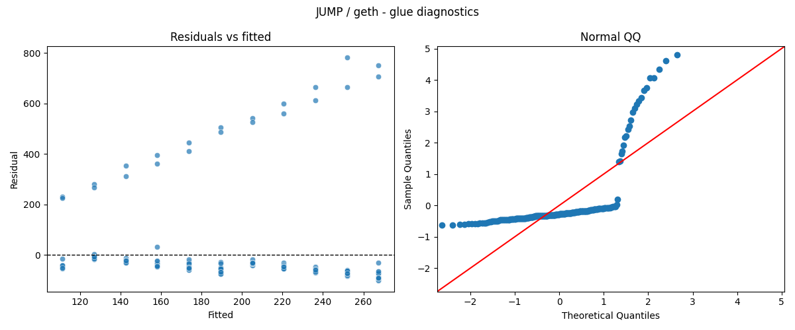

</details>

<details><summary><code>KECCAK256</code> · nobs=3872 · runtime_ms=5.42e-05 · p=1.00e-03 · R²=0.0366</summary>

```
==============================================================================
                           NNLS Regression Results                            
==============================================================================
Dep. Variable:          test_runtime_ms              R-squared:          0.037
Model:                  NNLS                    Adj. R-squared:          0.036
No. Observations:       3872                              RMSE:         552.58
Df Residuals:           3870                               MAE:         307.23
Df Model:               1      
==============================================================================
                      coef     std err     P-value      [0.025      0.975]
------------------------------------------------------------------------------
         const    471.7785     16.6451       0.001    441.4322    505.2422
     KECCAK256      0.0001      0.0000       0.001      0.0000      0.0001
==============================================================================
Notes: Non-negative least squares with bootstrap inference (1000 iterations)
==============================================================================
```

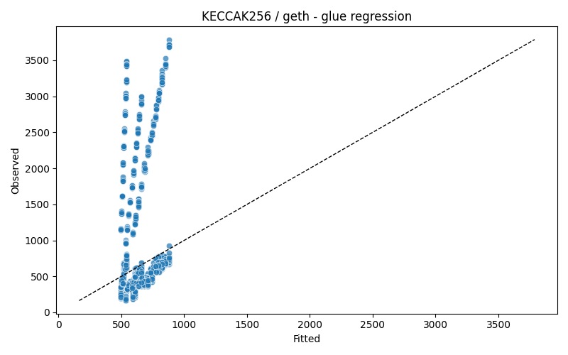

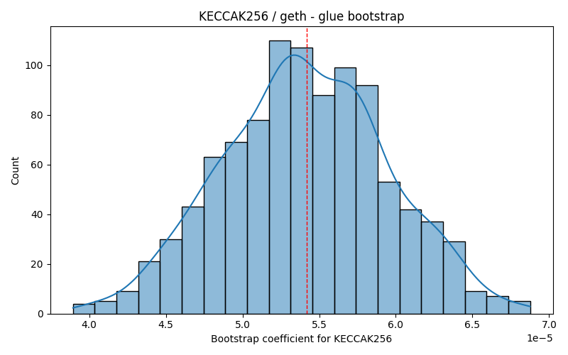

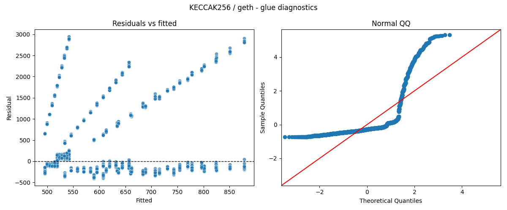

</details>

## nethermind

| glue_opcode | nobs | glue_runtime_ms | p_value | rsquared |
| --- | --- | --- | --- | --- |
| `ISZERO` | 77 | 9.053e-07 | 1.00e-03 | 0.5904 |
| `JUMPDEST` | 77 | 3.819e-07 | 1.00e-03 | 0.8792 |
| `SWAP` | 1232 | 5.493e-07 | 1.00e-03 | 0.2619 |
| `CALLDATASIZE` | 4576 | 0 | 1.00e+00 | 0.9768 |
| `DUP` | 4576 | 0 | 1.00e+00 | 0.9768 |
| `GAS` | 4576 | 0 | 1.00e+00 | 0.9768 |
| `MLOAD` | 4576 | 1.717e-06 | 1.00e-03 | 0.9768 |
| `PUSH` | 4576 | 3.524e-08 | 1.00e-03 | 0.9768 |
| `PUSH0` | 4576 | 0 | 1.00e+00 | 0.9768 |
| `STATICCALL` | 4576 | 0.0008782 | 1.00e-03 | 0.9768 |
| `ADD` | 77 | 2.249e-06 | 1.00e-03 | 0.455 |
| `AND` | 77 | 1.28e-06 | 1.00e-03 | 0.4828 |
| `CALLDATACOPY` | 1848 | 3.931e-06 | 1.00e-03 | 0.7281 |
| `CALLDATALOAD` | 308 | 2.664e-05 | 1.00e-03 | 0.1297 |
| `DIV` | 77 | 6.972e-06 | 1.00e-03 | 0.6208 |
| `EXP` | 77 | 0 | 1.00e+00 | 2.22e-16 |
| `GT` | 77 | 1.413e-06 | 1.00e-03 | 0.4531 |
| `JUMPI` | 77 | 1.832e-06 | 1.00e-03 | 0.8633 |
| `LT` | 77 | 1.33e-06 | 1.00e-03 | 0.689 |
| `MSTORE` | 385 | 2.058e-06 | 1.00e-03 | 0.714 |
| `MSTORE8` | 385 | 1.869e-06 | 1.00e-03 | 0.7046 |
| `MUL` | 77 | 5.427e-06 | 1.00e-03 | 0.8857 |
| `PC` | 77 | 7.91e-07 | 1.00e-03 | 0.9062 |
| `RETURNDATASIZE` | 308 | 7.278e-07 | 1.00e-03 | 0.8542 |
| `SELFBALANCE` | 63 | 1.064e-05 | 1.00e-03 | 0.8804 |
| `SUB` | 77 | 2.417e-06 | 1.00e-03 | 0.864 |
| `JUMP` | 77 | 4.942e-06 | 1.00e-03 | 0.8508 |
| `KECCAK256` | 1232 | 0 | 1.00e+00 | 0 |

### Cycle glue — joint fit · nethermind

<details><summary>Joint NNLS regression summary</summary>

```
==============================================================================
                           NNLS Regression Results                            
==============================================================================
Dep. Variable:          test_runtime_ms              R-squared:          0.977
Model:                  NNLS                    Adj. R-squared:          0.977
No. Observations:       4576                              RMSE:          19.23
Df Residuals:           4568                               MAE:           6.53
Df Model:               7      
==============================================================================
                      coef     std err     P-value      [0.025      0.975]
------------------------------------------------------------------------------
         const     13.6330      1.4704       0.001     10.8855     16.4302
  CALLDATASIZE      0.0000      0.0000       1.000      0.0000      0.0000
           DUP      0.0000      0.0000       1.000      0.0000      0.0000
           GAS      0.0000      0.0000       1.000      0.0000      0.0000
         MLOAD      0.0000      0.0000       0.001      0.0000      0.0000
          PUSH      0.0000      0.0000       0.001      0.0000      0.0000
         PUSH0      0.0000      0.0000       1.000      0.0000      0.0000
    STATICCALL      0.0009      0.0000       0.001      0.0008      0.0009
==============================================================================
Notes: Non-negative least squares with bootstrap inference (1000 iterations)
==============================================================================
```

</details>

<details><summary><code>CALLDATASIZE</code> · nobs=4576 · runtime_ms=0 · p=1.00e+00 · R²=0.9768</summary>

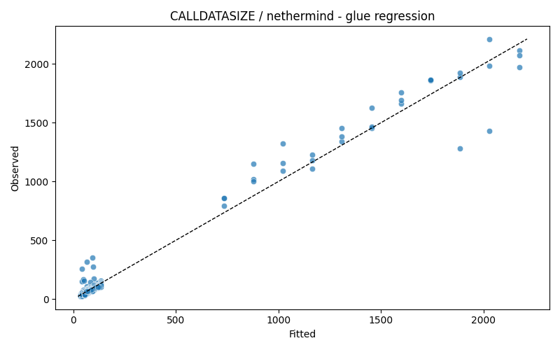

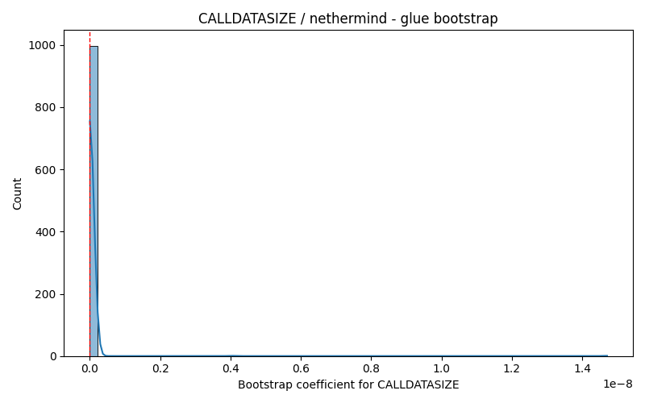


</details>

<details><summary><code>DUP</code> · nobs=4576 · runtime_ms=0 · p=1.00e+00 · R²=0.9768</summary>

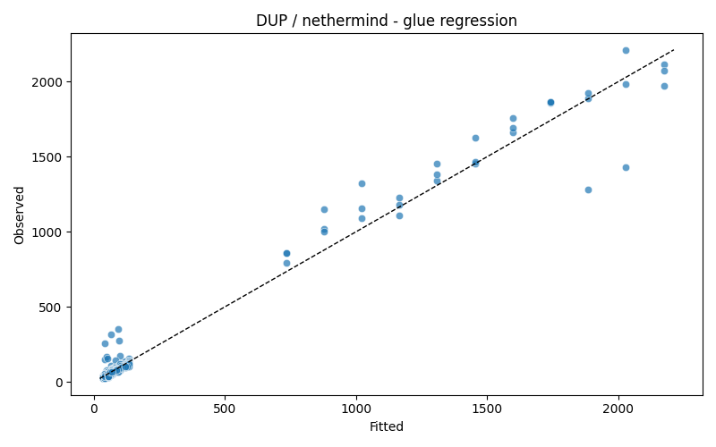

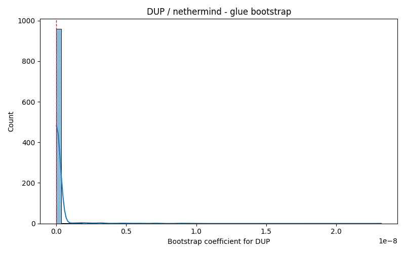


</details>

<details><summary><code>GAS</code> · nobs=4576 · runtime_ms=0 · p=1.00e+00 · R²=0.9768</summary>

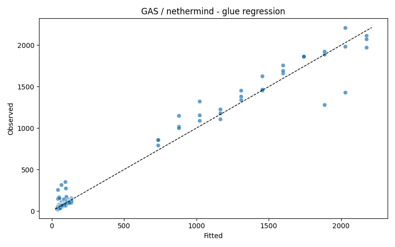


</details>

<details><summary><code>MLOAD</code> · nobs=4576 · runtime_ms=1.717e-06 · p=1.00e-03 · R²=0.9768</summary>

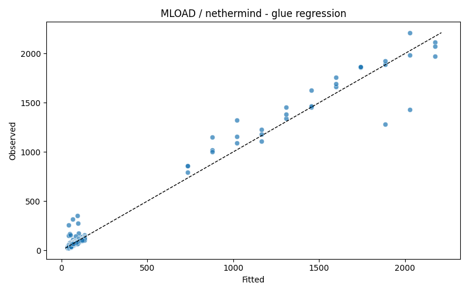

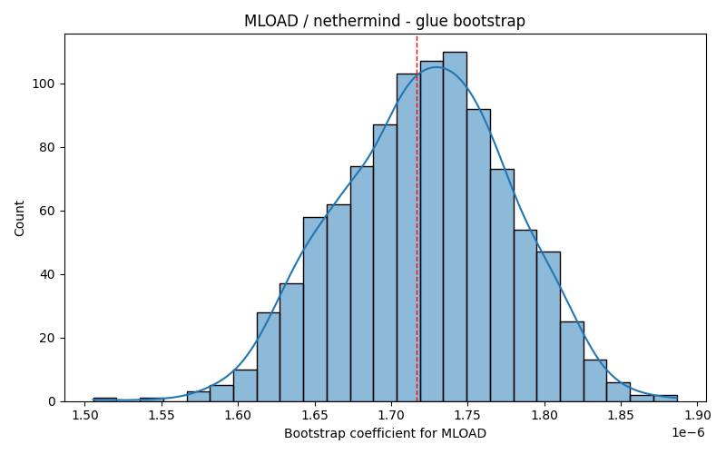


</details>

<details><summary><code>PUSH</code> · nobs=4576 · runtime_ms=3.524e-08 · p=1.00e-03 · R²=0.9768</summary>

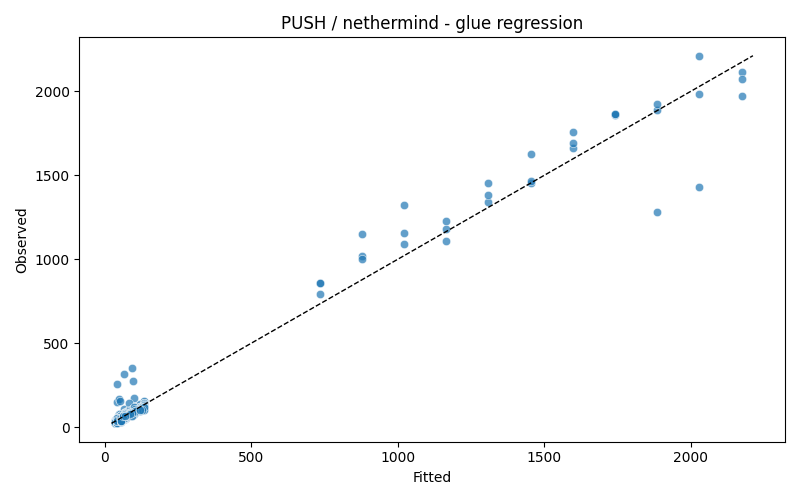

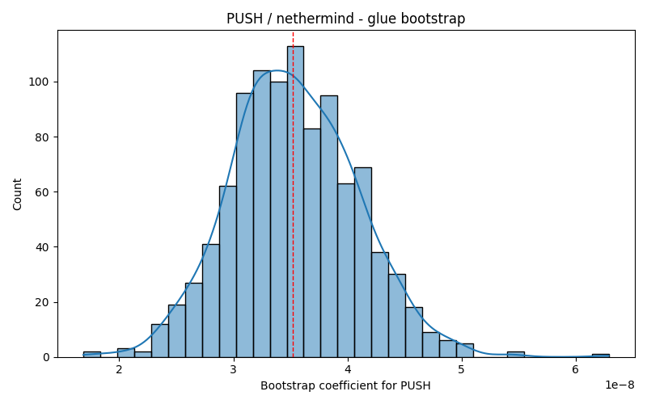


</details>

<details><summary><code>PUSH0</code> · nobs=4576 · runtime_ms=0 · p=1.00e+00 · R²=0.9768</summary>


</details>

<details><summary><code>STATICCALL</code> · nobs=4576 · runtime_ms=0.0008782 · p=1.00e-03 · R²=0.9768</summary>


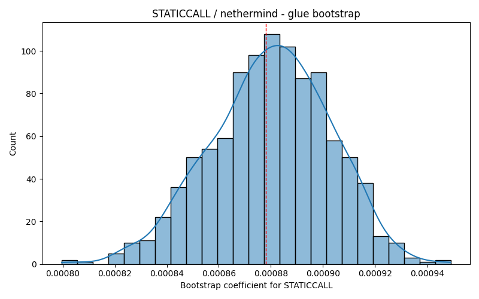

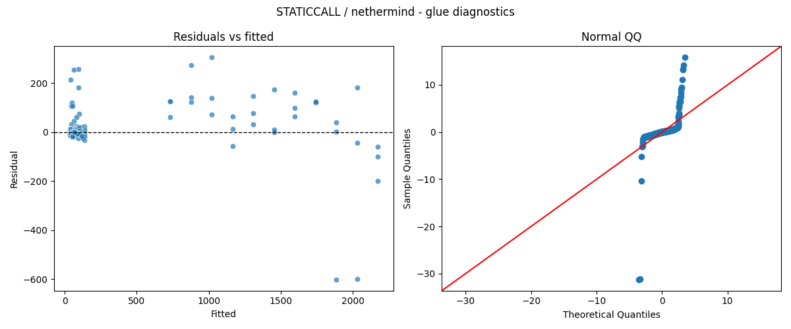

</details>

### Pure glue · nethermind

<details><summary><code>ISZERO</code> · nobs=77 · runtime_ms=9.053e-07 · p=1.00e-03 · R²=0.5904</summary>

```
==============================================================================
                           NNLS Regression Results                            
==============================================================================
Dep. Variable:          test_runtime_ms              R-squared:          0.590
Model:                  NNLS                    Adj. R-squared:          0.585
No. Observations:       77                                RMSE:          15.88
Df Residuals:           75                                 MAE:           7.14
Df Model:               1      
==============================================================================
                      coef     std err     P-value      [0.025      0.975]
------------------------------------------------------------------------------
         const     12.1047      4.4225       0.016      1.6315     19.2916
        ISZERO      0.0000      0.0000       0.001      0.0000      0.0000
==============================================================================
Notes: Non-negative least squares with bootstrap inference (1000 iterations)
==============================================================================
```

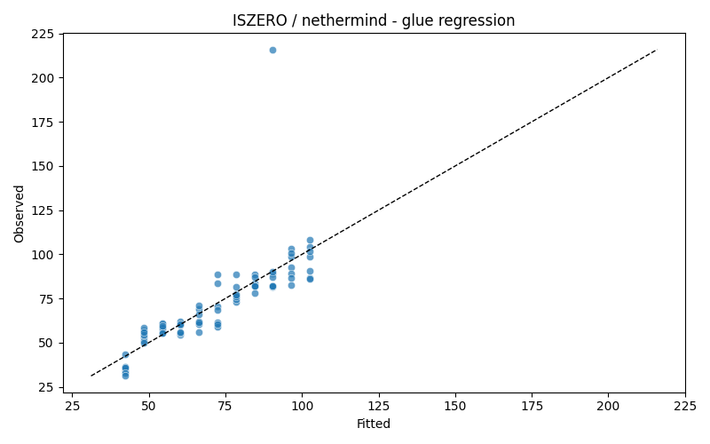

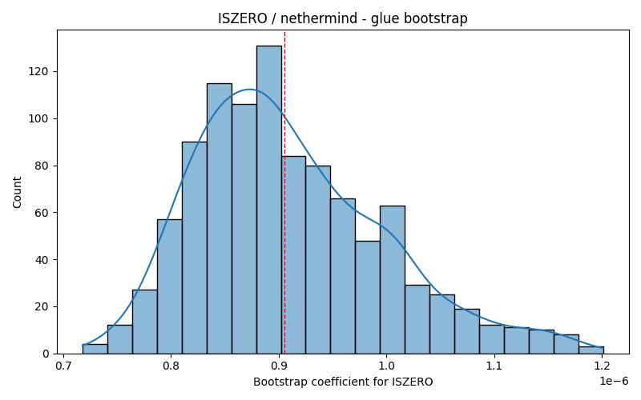

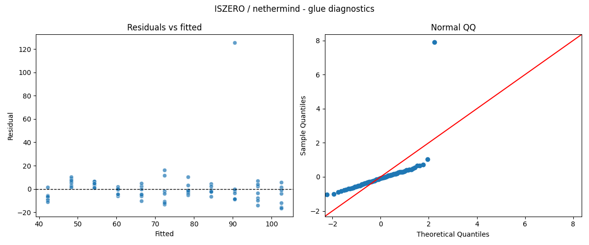

</details>

<details><summary><code>JUMPDEST</code> · nobs=77 · runtime_ms=3.819e-07 · p=1.00e-03 · R²=0.8792</summary>

```
==============================================================================
                           NNLS Regression Results                            
==============================================================================
Dep. Variable:          test_runtime_ms              R-squared:          0.879
Model:                  NNLS                    Adj. R-squared:          0.878
No. Observations:       77                                RMSE:           8.94
Df Residuals:           75                                 MAE:           7.16
Df Model:               1      
==============================================================================
                      coef     std err     P-value      [0.025      0.975]
------------------------------------------------------------------------------
         const     20.0153      3.8347       0.001     12.6329     27.2333
      JUMPDEST      0.0000      0.0000       0.001      0.0000      0.0000
==============================================================================
Notes: Non-negative least squares with bootstrap inference (1000 iterations)
==============================================================================
```

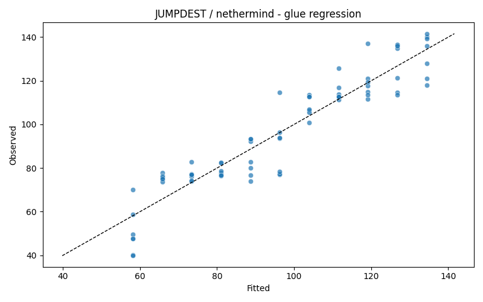

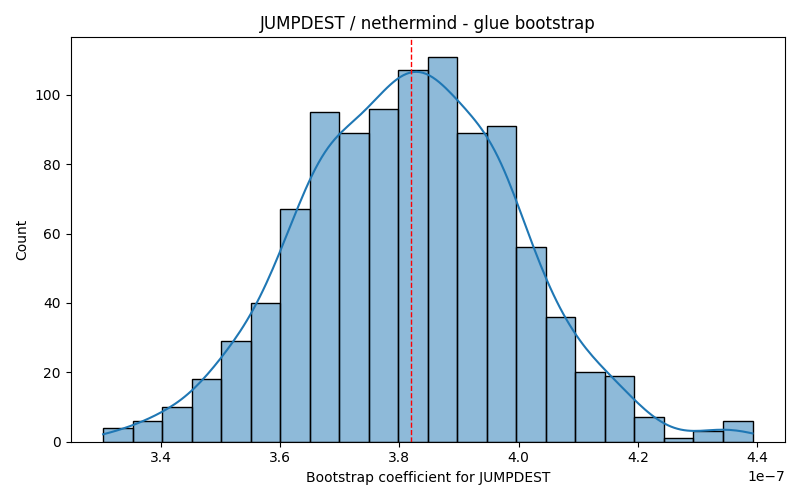

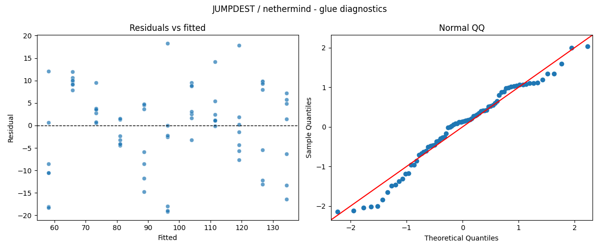

</details>

<details><summary><code>SWAP</code> · nobs=1232 · runtime_ms=5.493e-07 · p=1.00e-03 · R²=0.2619</summary>

```
==============================================================================
                           NNLS Regression Results                            
==============================================================================
Dep. Variable:          test_runtime_ms              R-squared:          0.262
Model:                  NNLS                    Adj. R-squared:          0.261
No. Observations:       1232                              RMSE:          19.42
Df Residuals:           1230                               MAE:           6.83
Df Model:               1      
==============================================================================
                      coef     std err     P-value      [0.025      0.975]
------------------------------------------------------------------------------
         const     16.5355      1.8657       0.001     12.9631     20.2880
          SWAP      0.0000      0.0000       0.001      0.0000      0.0000
==============================================================================
Notes: Non-negative least squares with bootstrap inference (1000 iterations)
==============================================================================
```

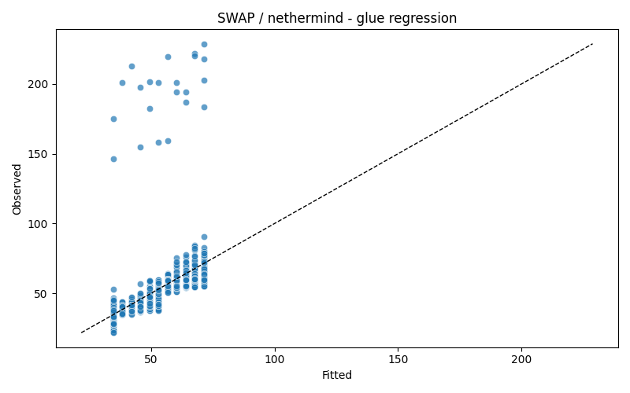

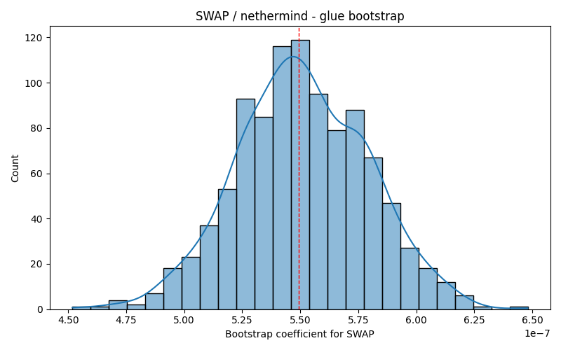

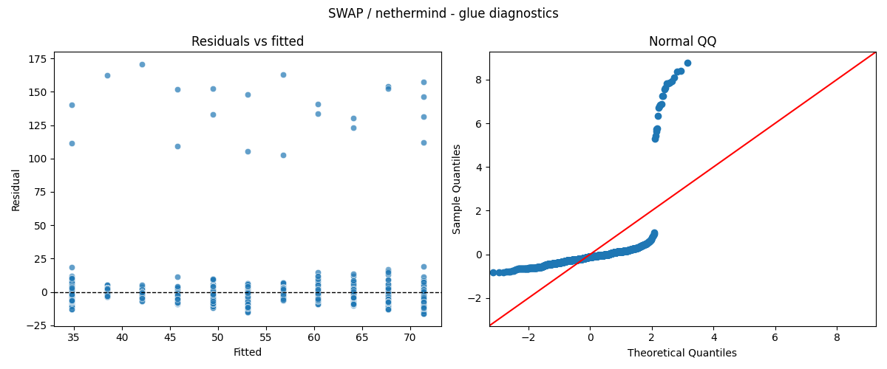

</details>

### Mixed glue (tier A) · nethermind

<details><summary><code>ADD</code> · nobs=77 · runtime_ms=2.249e-06 · p=1.00e-03 · R²=0.455</summary>

```
==============================================================================
                           NNLS Regression Results                            
==============================================================================
Dep. Variable:          test_runtime_ms              R-squared:          0.455
Model:                  NNLS                    Adj. R-squared:          0.448
No. Observations:       77                                RMSE:          25.90
Df Residuals:           75                                 MAE:          12.01
Df Model:               1      
==============================================================================
                      coef     std err     P-value      [0.025      0.975]
------------------------------------------------------------------------------
         const     24.3200     13.1980       0.008      4.0219     53.7817
           ADD      0.0000      0.0000       0.001      0.0000      0.0000
==============================================================================
Notes: Non-negative least squares with bootstrap inference (1000 iterations)
==============================================================================
```

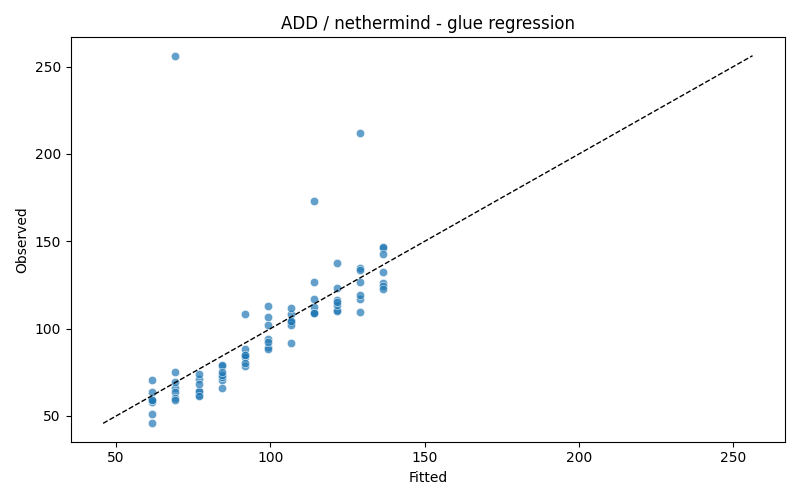

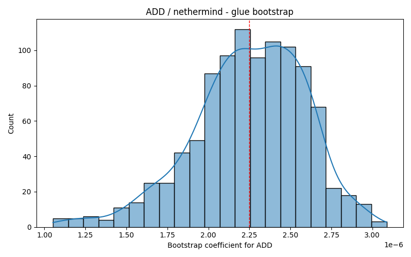

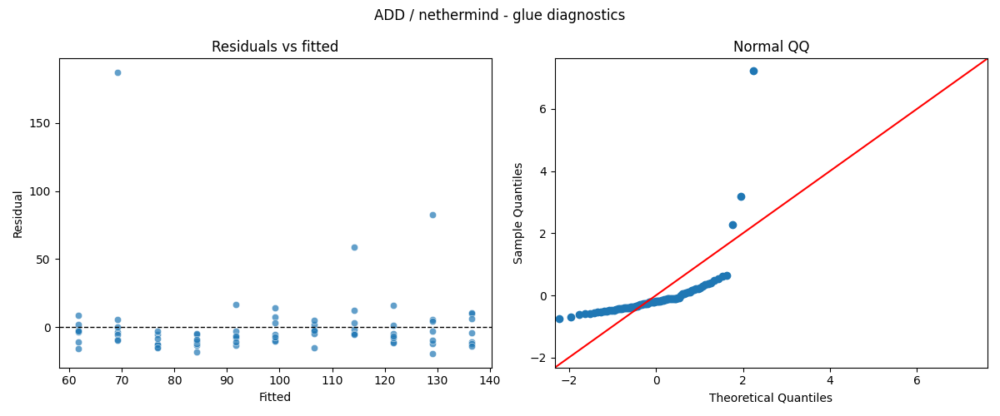

</details>

<details><summary><code>AND</code> · nobs=77 · runtime_ms=1.28e-06 · p=1.00e-03 · R²=0.4828</summary>

```
==============================================================================
                           NNLS Regression Results                            
==============================================================================
Dep. Variable:          test_runtime_ms              R-squared:          0.483
Model:                  NNLS                    Adj. R-squared:          0.476
No. Observations:       77                                RMSE:          13.94
Df Residuals:           75                                 MAE:           7.80
Df Model:               1      
==============================================================================
                      coef     std err     P-value      [0.025      0.975]
------------------------------------------------------------------------------
         const     15.8353      2.8866       0.001     10.3384     21.3907
           AND      0.0000      0.0000       0.001      0.0000      0.0000
==============================================================================
Notes: Non-negative least squares with bootstrap inference (1000 iterations)
==============================================================================
```

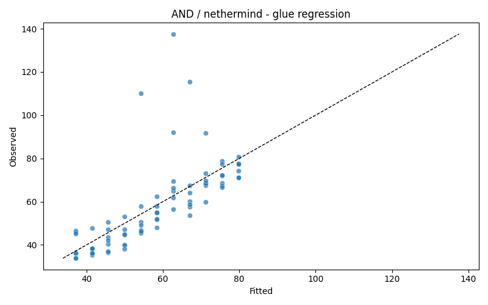

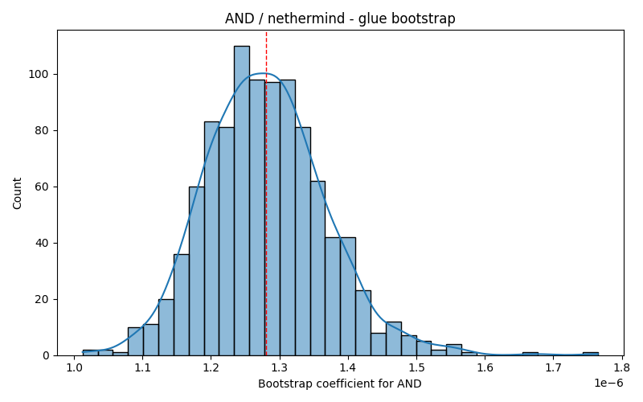

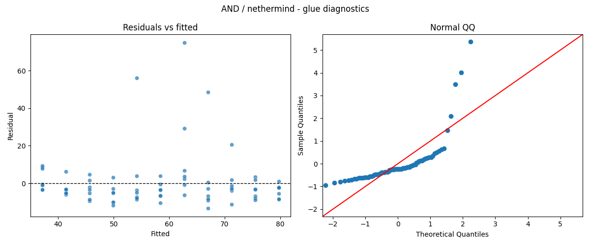

</details>

<details><summary><code>CALLDATACOPY</code> · nobs=1848 · runtime_ms=3.931e-06 · p=1.00e-03 · R²=0.7281</summary>

```
==============================================================================
                           NNLS Regression Results                            
==============================================================================
Dep. Variable:          test_runtime_ms              R-squared:          0.728
Model:                  NNLS                    Adj. R-squared:          0.728
No. Observations:       1848                              RMSE:          18.07
Df Residuals:           1846                               MAE:          14.37
Df Model:               1      
==============================================================================
                      coef     std err     P-value      [0.025      0.975]
------------------------------------------------------------------------------
         const     22.7487      0.4898       0.001     21.8316     23.7406
  CALLDATACOPY      0.0000      0.0000       0.001      0.0000      0.0000
==============================================================================
Notes: Non-negative least squares with bootstrap inference (1000 iterations)
==============================================================================
```

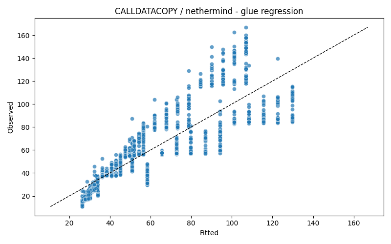

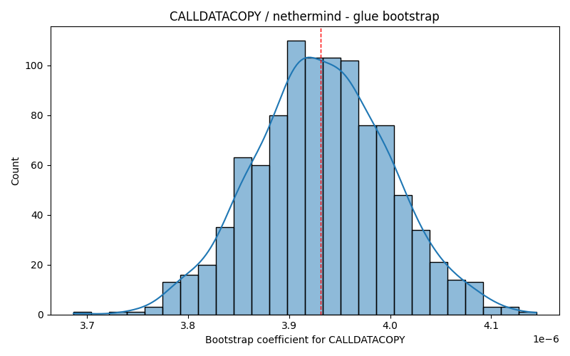

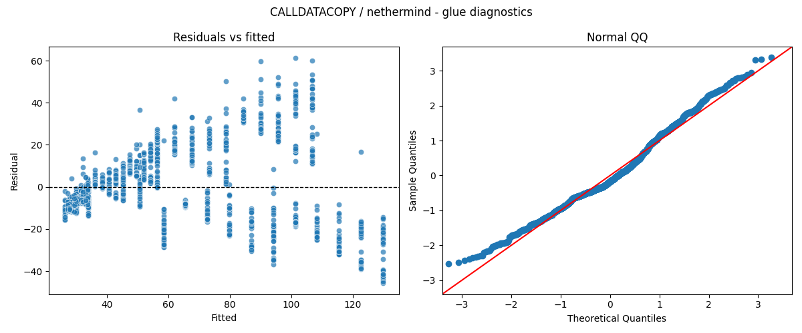

</details>

<details><summary><code>CALLDATALOAD</code> · nobs=308 · runtime_ms=2.664e-05 · p=1.00e-03 · R²=0.1297</summary>

```
==============================================================================
                           NNLS Regression Results                            
==============================================================================
Dep. Variable:          test_runtime_ms              R-squared:          0.130
Model:                  NNLS                    Adj. R-squared:          0.127
No. Observations:       308                               RMSE:           0.26
Df Residuals:           306                                MAE:           0.17
Df Model:               1      
==============================================================================
                      coef     std err     P-value      [0.025      0.975]
------------------------------------------------------------------------------
         const      2.1140      0.0452       0.001      2.0257      2.2055
  CALLDATALOAD      0.0000      0.0000       0.001      0.0000      0.0000
==============================================================================
Notes: Non-negative least squares with bootstrap inference (1000 iterations)
==============================================================================
```

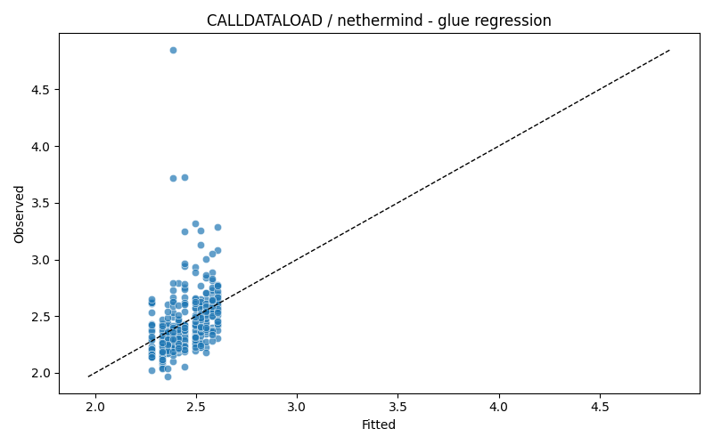

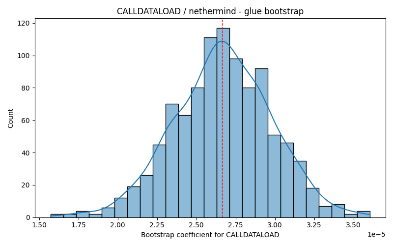

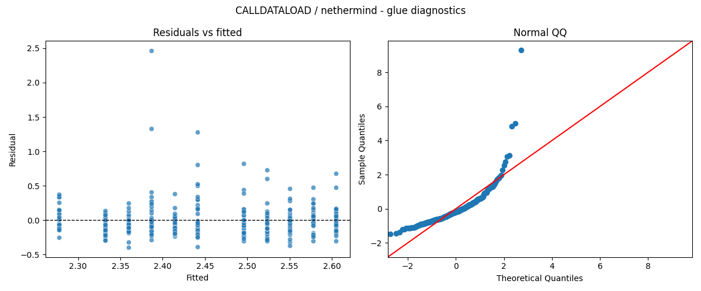

</details>

<details><summary><code>DIV</code> · nobs=77 · runtime_ms=6.972e-06 · p=1.00e-03 · R²=0.6208</summary>

```
==============================================================================
                           NNLS Regression Results                            
==============================================================================
Dep. Variable:          test_runtime_ms              R-squared:          0.621
Model:                  NNLS                    Adj. R-squared:          0.616
No. Observations:       77                                RMSE:          43.02
Df Residuals:           75                                 MAE:          33.90
Df Model:               1      
==============================================================================
                      coef     std err     P-value      [0.025      0.975]
------------------------------------------------------------------------------
         const    127.6874     23.5084       0.001     78.3255    169.8580
           DIV      0.0000      0.0000       0.001      0.0000      0.0000
==============================================================================
Notes: Non-negative least squares with bootstrap inference (1000 iterations)
==============================================================================
```

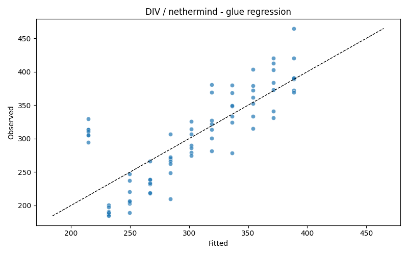

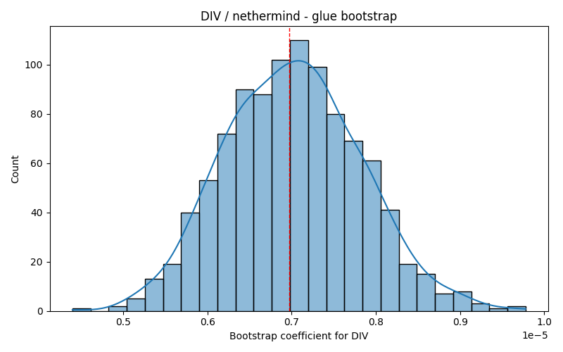

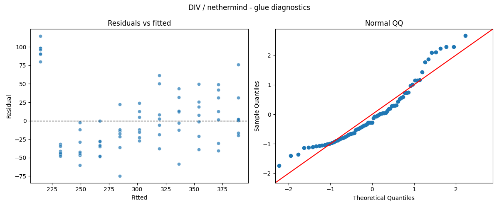

</details>

<details><summary><code>EXP</code> · nobs=77 · runtime_ms=0 · p=1.00e+00 · R²=2.22e-16</summary>

```
==============================================================================
                           NNLS Regression Results                            
==============================================================================
Dep. Variable:          test_runtime_ms              R-squared:          0.000
Model:                  NNLS                    Adj. R-squared:         -0.013
No. Observations:       77                                RMSE:          46.80
Df Residuals:           75                                 MAE:          31.45
Df Model:               1      
==============================================================================
                      coef     std err     P-value      [0.025      0.975]
------------------------------------------------------------------------------
         const    104.9988     14.5338       0.001     62.3288    115.8569
           EXP      0.0000      0.0001       1.000      0.0000      0.0003
==============================================================================
Notes: Non-negative least squares with bootstrap inference (1000 iterations)
==============================================================================
```

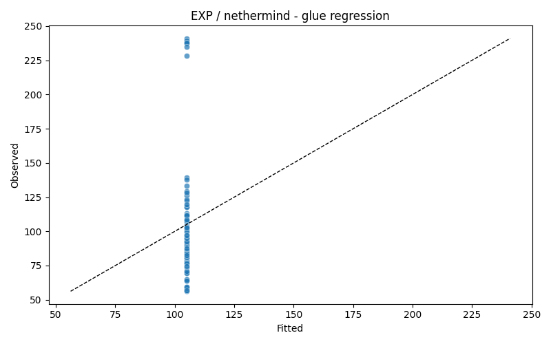

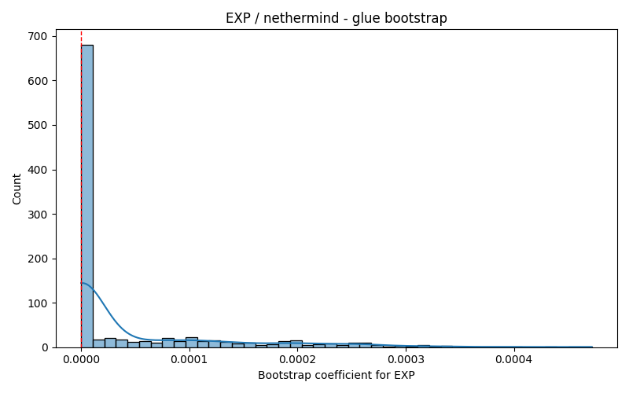

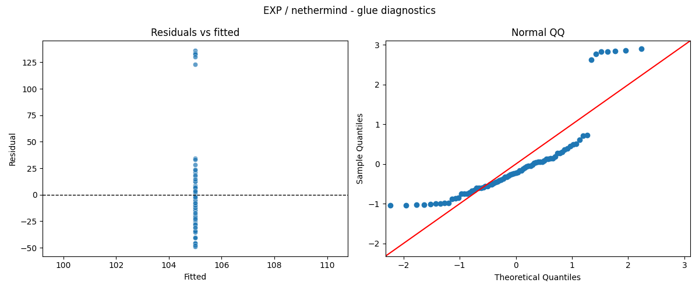

</details>

<details><summary><code>GT</code> · nobs=77 · runtime_ms=1.413e-06 · p=1.00e-03 · R²=0.4531</summary>

```
==============================================================================
                           NNLS Regression Results                            
==============================================================================
Dep. Variable:          test_runtime_ms              R-squared:          0.453
Model:                  NNLS                    Adj. R-squared:          0.446
No. Observations:       77                                RMSE:          16.34
Df Residuals:           75                                 MAE:           7.60
Df Model:               1      
==============================================================================
                      coef     std err     P-value      [0.025      0.975]
------------------------------------------------------------------------------
         const     16.7125      6.8650       0.001      6.3172     32.2293
            GT      0.0000      0.0000       0.001      0.0000      0.0000
==============================================================================
Notes: Non-negative least squares with bootstrap inference (1000 iterations)
==============================================================================
```

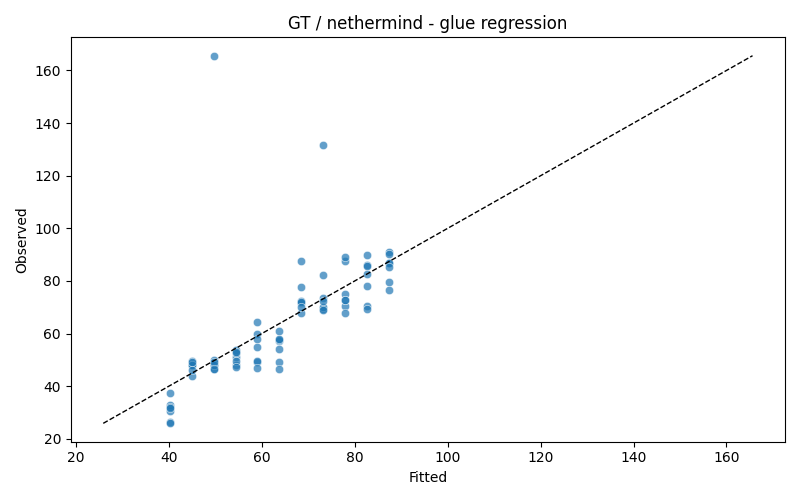

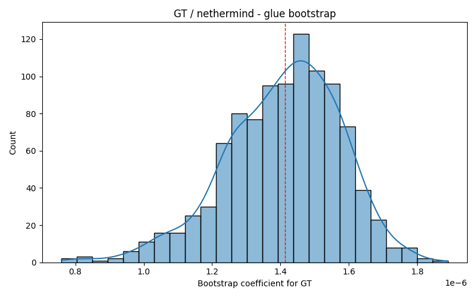

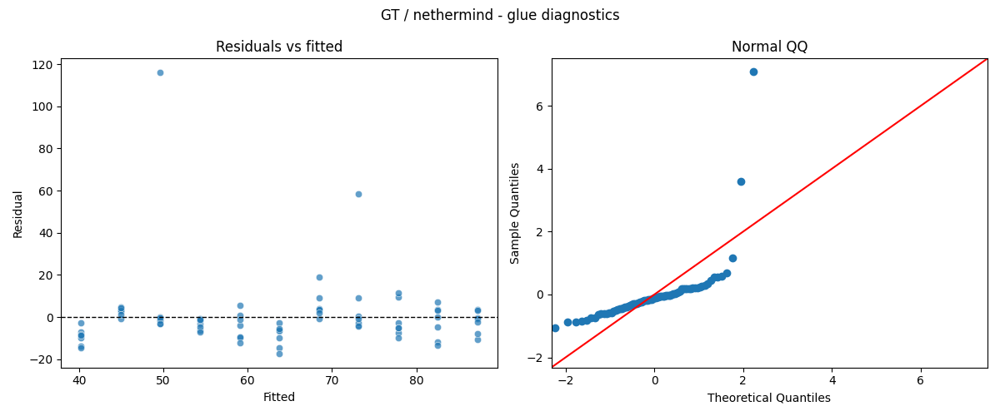

</details>

<details><summary><code>JUMPI</code> · nobs=77 · runtime_ms=1.832e-06 · p=1.00e-03 · R²=0.8633</summary>

```
==============================================================================
                           NNLS Regression Results                            
==============================================================================
Dep. Variable:          test_runtime_ms              R-squared:          0.863
Model:                  NNLS                    Adj. R-squared:          0.861
No. Observations:       77                                RMSE:           3.29
Df Residuals:           75                                 MAE:           2.44
Df Model:               1      
==============================================================================
                      coef     std err     P-value      [0.025      0.975]
------------------------------------------------------------------------------
         const      8.0400      1.1545       0.001      5.7547     10.3467
         JUMPI      0.0000      0.0000       0.001      0.0000      0.0000
==============================================================================
Notes: Non-negative least squares with bootstrap inference (1000 iterations)
==============================================================================
```

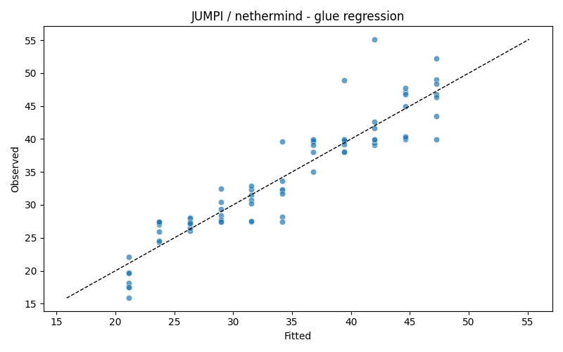

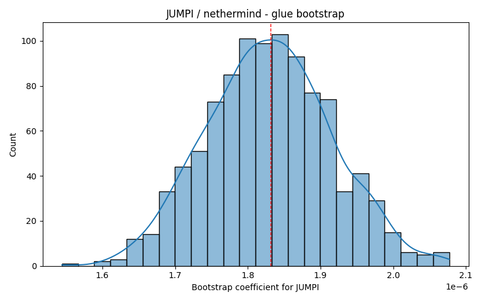

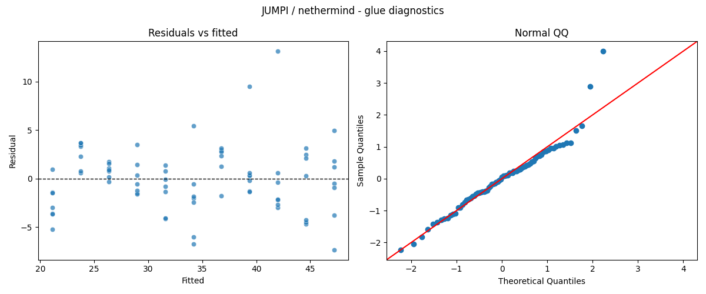

</details>

<details><summary><code>LT</code> · nobs=77 · runtime_ms=1.33e-06 · p=1.00e-03 · R²=0.689</summary>

```
==============================================================================
                           NNLS Regression Results                            
==============================================================================
Dep. Variable:          test_runtime_ms              R-squared:          0.689
Model:                  NNLS                    Adj. R-squared:          0.685
No. Observations:       77                                RMSE:           9.40
Df Residuals:           75                                 MAE:           5.34
Df Model:               1      
==============================================================================
                      coef     std err     P-value      [0.025      0.975]
------------------------------------------------------------------------------
         const     18.7095      2.3645       0.001     14.3005     23.2392
            LT      0.0000      0.0000       0.001      0.0000      0.0000
==============================================================================
Notes: Non-negative least squares with bootstrap inference (1000 iterations)
==============================================================================
```

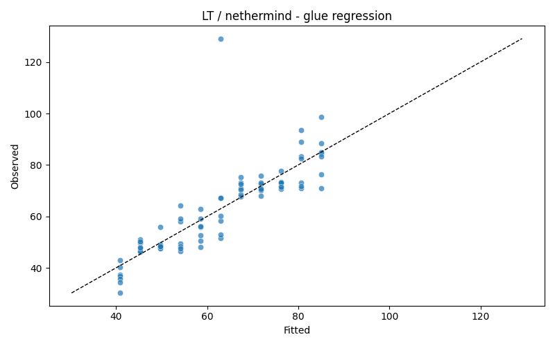

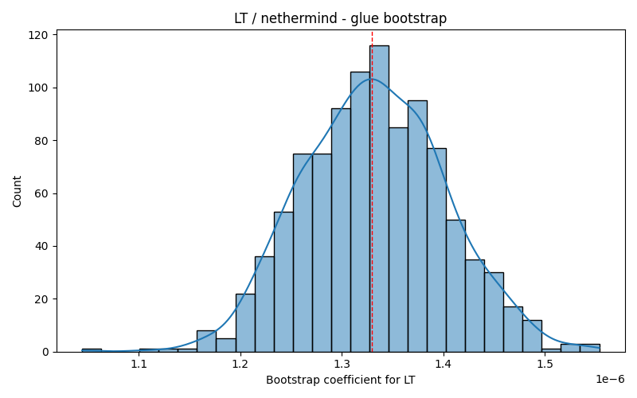

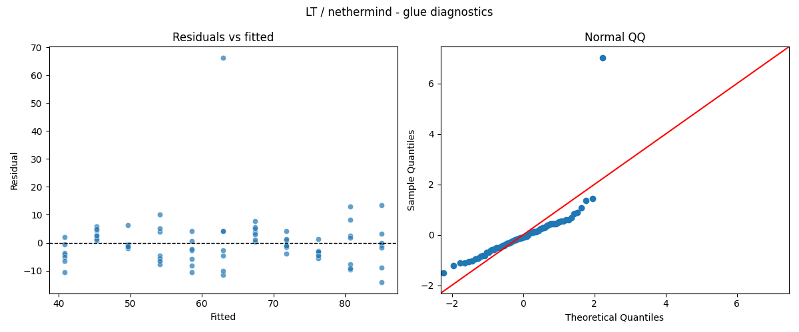

</details>

<details><summary><code>MSTORE</code> · nobs=385 · runtime_ms=2.058e-06 · p=1.00e-03 · R²=0.714</summary>

```
==============================================================================
                           NNLS Regression Results                            
==============================================================================
Dep. Variable:          test_runtime_ms              R-squared:          0.714
Model:                  NNLS                    Adj. R-squared:          0.713
No. Observations:       385                               RMSE:           9.14
Df Residuals:           383                                MAE:           6.44
Df Model:               1      
==============================================================================
                      coef     std err     P-value      [0.025      0.975]
------------------------------------------------------------------------------
         const     16.0949      1.4421       0.001     13.3743     19.0728
        MSTORE      0.0000      0.0000       0.001      0.0000      0.0000
==============================================================================
Notes: Non-negative least squares with bootstrap inference (1000 iterations)
==============================================================================
```

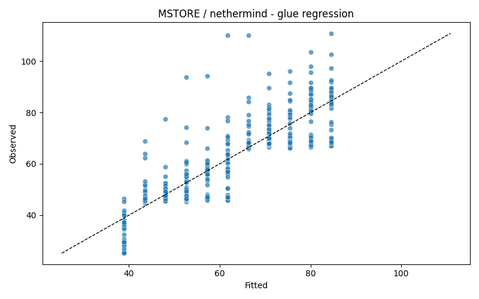

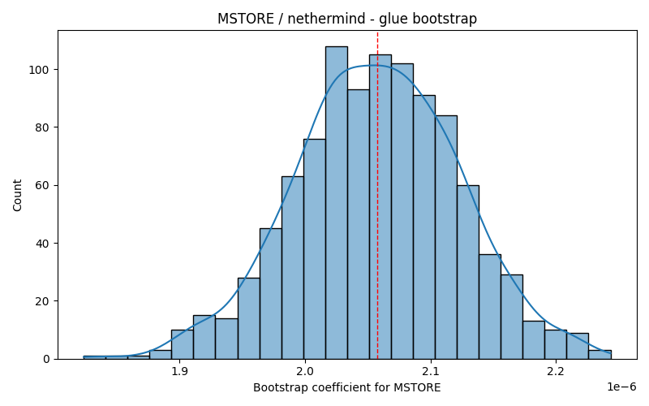

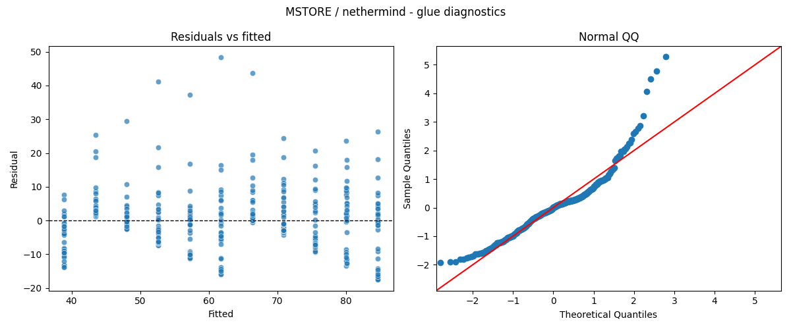

</details>

<details><summary><code>MSTORE8</code> · nobs=385 · runtime_ms=1.869e-06 · p=1.00e-03 · R²=0.7046</summary>

```
==============================================================================
                           NNLS Regression Results                            
==============================================================================
Dep. Variable:          test_runtime_ms              R-squared:          0.705
Model:                  NNLS                    Adj. R-squared:          0.704
No. Observations:       385                               RMSE:           8.49
Df Residuals:           383                                MAE:           5.85
Df Model:               1      
==============================================================================
                      coef     std err     P-value      [0.025      0.975]
------------------------------------------------------------------------------
         const     17.3398      1.6110       0.001     14.3711     20.5436
       MSTORE8      0.0000      0.0000       0.001      0.0000      0.0000
==============================================================================
Notes: Non-negative least squares with bootstrap inference (1000 iterations)
==============================================================================
```


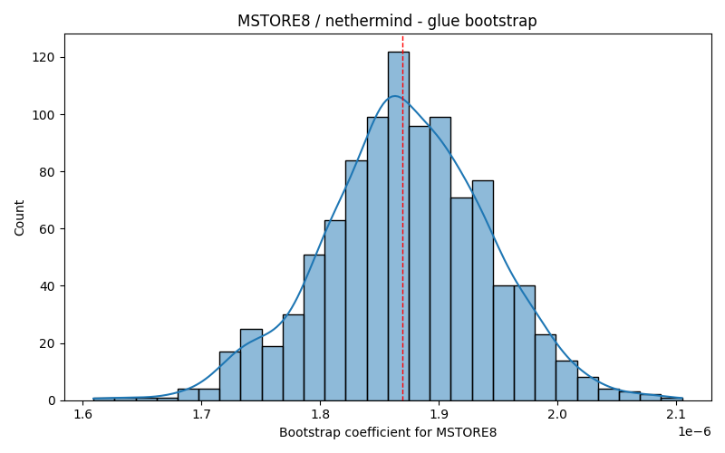

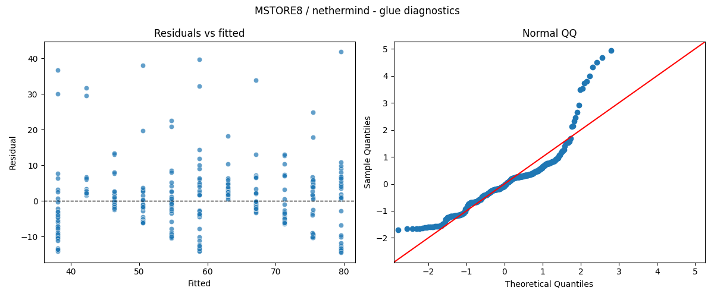

</details>

<details><summary><code>MUL</code> · nobs=77 · runtime_ms=5.427e-06 · p=1.00e-03 · R²=0.8857</summary>

```
==============================================================================
                           NNLS Regression Results                            
==============================================================================
Dep. Variable:          test_runtime_ms              R-squared:          0.886
Model:                  NNLS                    Adj. R-squared:          0.884
No. Observations:       77                                RMSE:          15.39
Df Residuals:           75                                 MAE:          11.36
Df Model:               1      
==============================================================================
                      coef     std err     P-value      [0.025      0.975]
------------------------------------------------------------------------------
         const     26.5814      5.5669       0.001     15.9157     37.8210
           MUL      0.0000      0.0000       0.001      0.0000      0.0000
==============================================================================
Notes: Non-negative least squares with bootstrap inference (1000 iterations)
==============================================================================
```

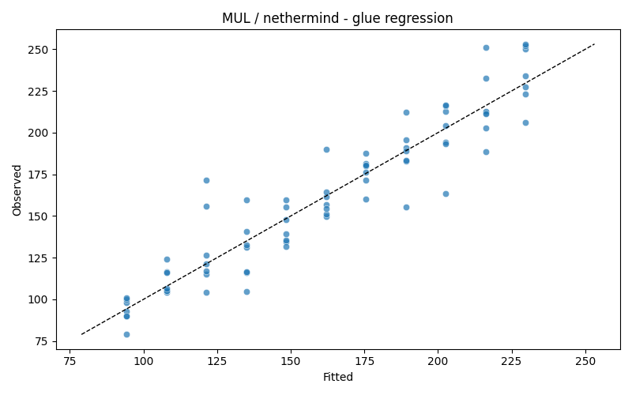

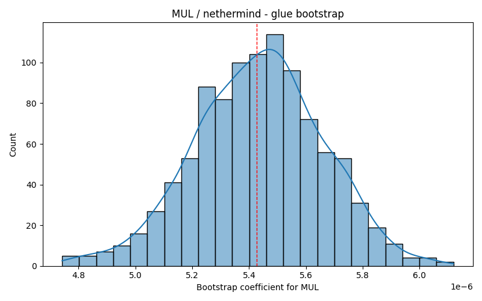

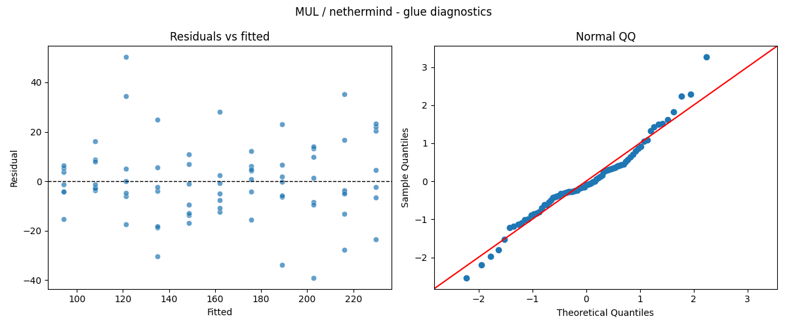

</details>

<details><summary><code>PC</code> · nobs=77 · runtime_ms=7.91e-07 · p=1.00e-03 · R²=0.9062</summary>

```
==============================================================================
                           NNLS Regression Results                            
==============================================================================
Dep. Variable:          test_runtime_ms              R-squared:          0.906
Model:                  NNLS                    Adj. R-squared:          0.905
No. Observations:       77                                RMSE:           7.61
Df Residuals:           75                                 MAE:           6.30
Df Model:               1      
==============================================================================
                      coef     std err     P-value      [0.025      0.975]
------------------------------------------------------------------------------
         const     16.8401      3.1615       0.001     10.7266     22.9441
            PC      0.0000      0.0000       0.001      0.0000      0.0000
==============================================================================
Notes: Non-negative least squares with bootstrap inference (1000 iterations)
==============================================================================
```

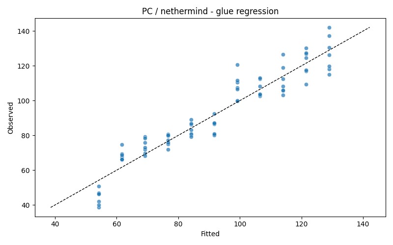

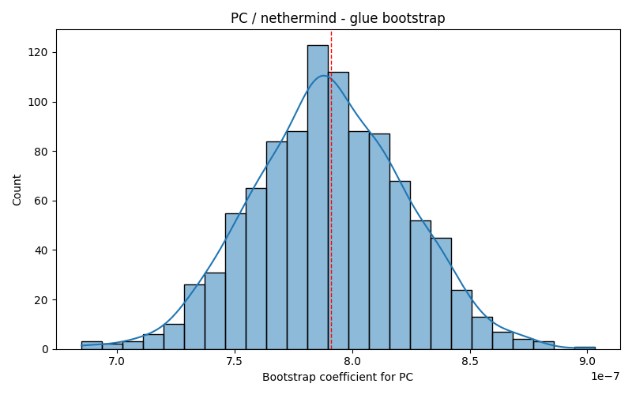

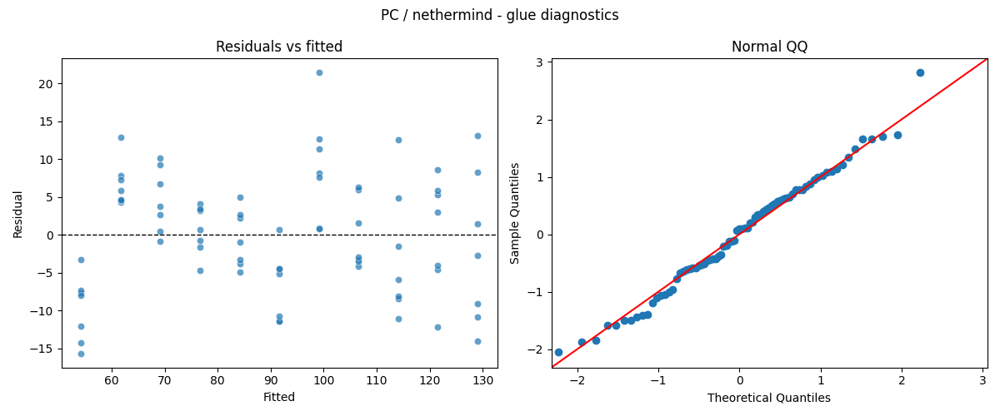

</details>

<details><summary><code>RETURNDATASIZE</code> · nobs=308 · runtime_ms=7.278e-07 · p=1.00e-03 · R²=0.8542</summary>

```
==============================================================================
                           NNLS Regression Results                            
==============================================================================
Dep. Variable:          test_runtime_ms              R-squared:          0.854
Model:                  NNLS                    Adj. R-squared:          0.854
No. Observations:       308                               RMSE:           4.75
Df Residuals:           306                                MAE:           3.64
Df Model:               1      
==============================================================================
                      coef     std err     P-value      [0.025      0.975]
------------------------------------------------------------------------------
         const     12.7824      0.8765       0.001     11.0115     14.4282
RETURNDATASIZE      0.0000      0.0000       0.001      0.0000      0.0000
==============================================================================
Notes: Non-negative least squares with bootstrap inference (1000 iterations)
==============================================================================
```


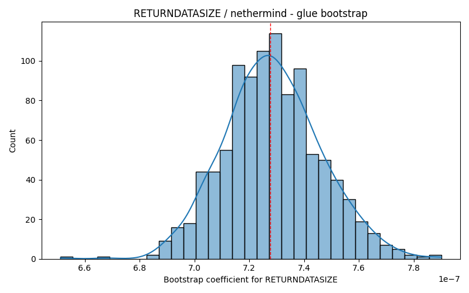

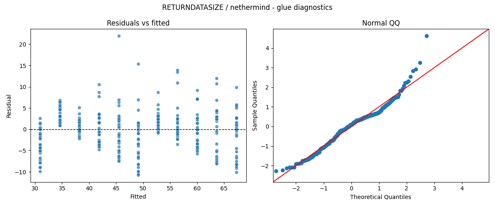

</details>

<details><summary><code>SELFBALANCE</code> · nobs=63 · runtime_ms=1.064e-05 · p=1.00e-03 · R²=0.8804</summary>

```
==============================================================================
                           NNLS Regression Results                            
==============================================================================
Dep. Variable:          test_runtime_ms              R-squared:          0.880
Model:                  NNLS                    Adj. R-squared:          0.878
No. Observations:       63                                RMSE:          39.56
Df Residuals:           61                                 MAE:          33.55
Df Model:               1      
==============================================================================
                      coef     std err     P-value      [0.025      0.975]
------------------------------------------------------------------------------
         const     61.1806     22.3079       0.007     15.5045    103.4231
   SELFBALANCE      0.0000      0.0000       0.001      0.0000      0.0000
==============================================================================
Notes: Non-negative least squares with bootstrap inference (1000 iterations)
==============================================================================
```

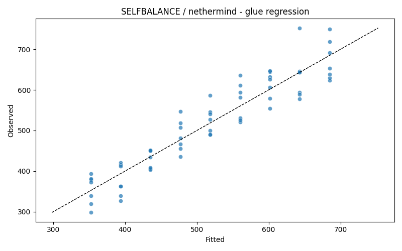

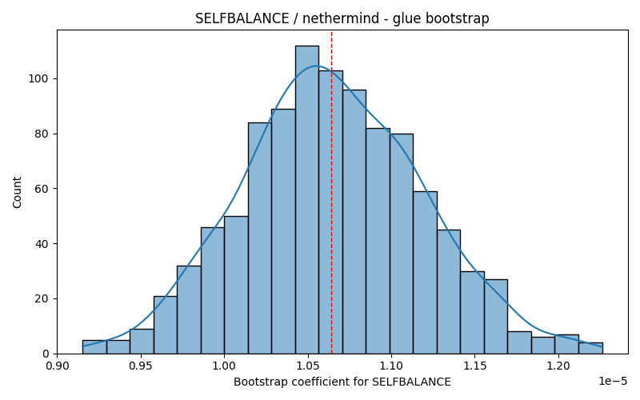

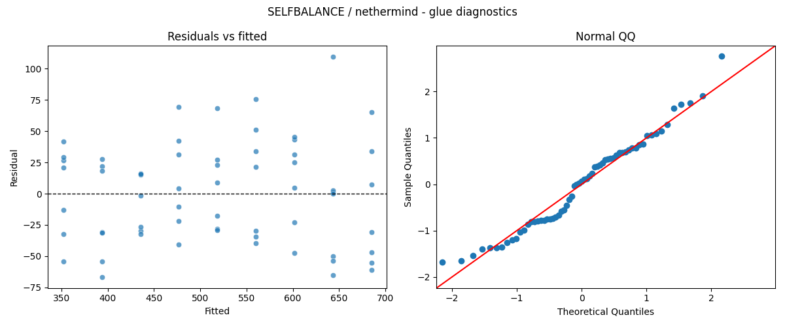

</details>

<details><summary><code>SUB</code> · nobs=77 · runtime_ms=2.417e-06 · p=1.00e-03 · R²=0.864</summary>

```
==============================================================================
                           NNLS Regression Results                            
==============================================================================
Dep. Variable:          test_runtime_ms              R-squared:          0.864
Model:                  NNLS                    Adj. R-squared:          0.862
No. Observations:       77                                RMSE:          10.10
Df Residuals:           75                                 MAE:           8.07
Df Model:               1      
==============================================================================
                      coef     std err     P-value      [0.025      0.975]
------------------------------------------------------------------------------
         const     16.9908      3.2632       0.001     10.7194     23.2836
           SUB      0.0000      0.0000       0.001      0.0000      0.0000
==============================================================================
Notes: Non-negative least squares with bootstrap inference (1000 iterations)
==============================================================================
```

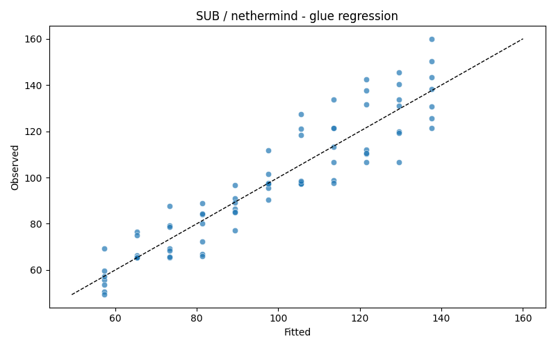

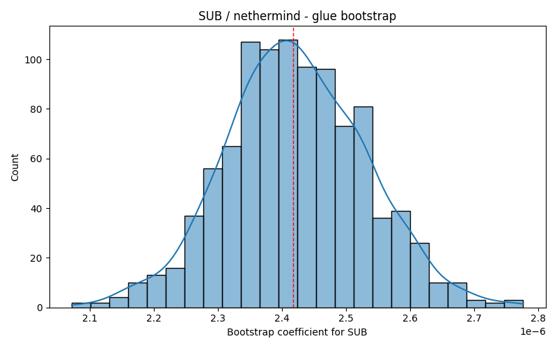

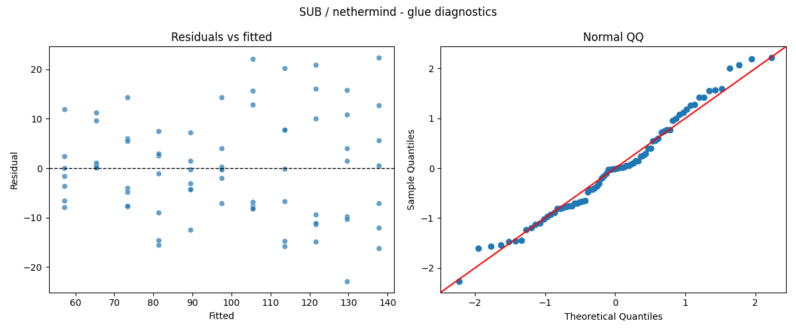

</details>

### Mixed glue (tier B) · nethermind

<details><summary><code>JUMP</code> · nobs=77 · runtime_ms=4.942e-06 · p=1.00e-03 · R²=0.8508</summary>

```
==============================================================================
                           NNLS Regression Results                            
==============================================================================
Dep. Variable:          test_runtime_ms              R-squared:          0.851
Model:                  NNLS                    Adj. R-squared:          0.849
No. Observations:       77                                RMSE:           7.69
Df Residuals:           75                                 MAE:           6.37
Df Model:               1      
==============================================================================
                      coef     std err     P-value      [0.025      0.975]
------------------------------------------------------------------------------
         const     18.2246      2.9071       0.001     12.3532     23.8827
          JUMP      0.0000      0.0000       0.001      0.0000      0.0000
==============================================================================
Notes: Non-negative least squares with bootstrap inference (1000 iterations)
==============================================================================
```

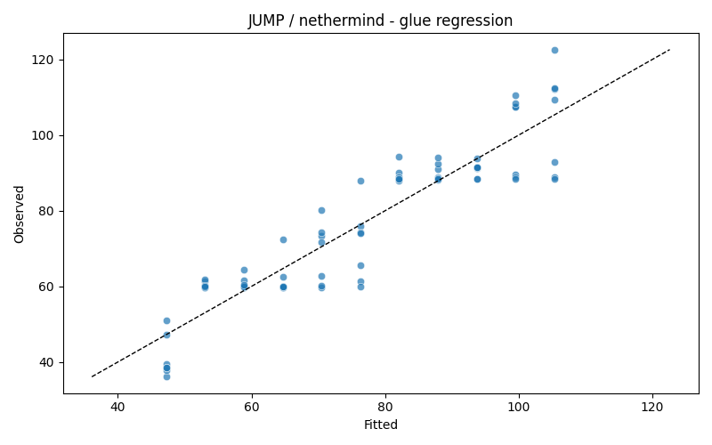


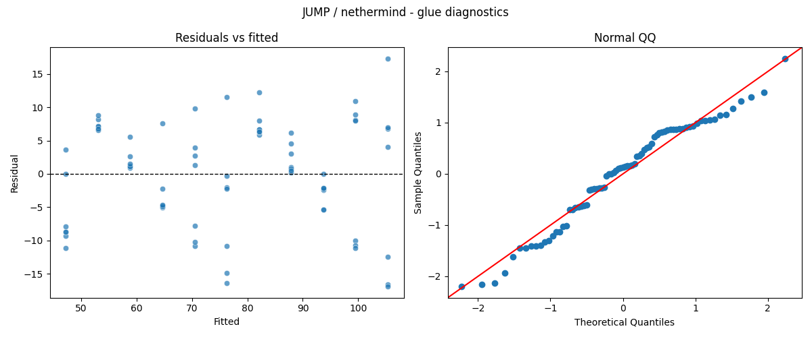

</details>

<details><summary><code>KECCAK256</code> · nobs=1232 · runtime_ms=0 · p=1.00e+00 · R²=0</summary>

```
==============================================================================
                           NNLS Regression Results                            
==============================================================================
Dep. Variable:          test_runtime_ms              R-squared:          0.000
Model:                  NNLS                    Adj. R-squared:         -0.001
No. Observations:       1232                              RMSE:         287.73
Df Residuals:           1230                               MAE:         236.67
Df Model:               1      
==============================================================================
                      coef     std err     P-value      [0.025      0.975]
------------------------------------------------------------------------------
         const    440.3980      8.2779       0.001    423.8438    456.3745
     KECCAK256      0.0000      0.0000       1.000      0.0000      0.0000
==============================================================================
Notes: Non-negative least squares with bootstrap inference (1000 iterations)
==============================================================================
```


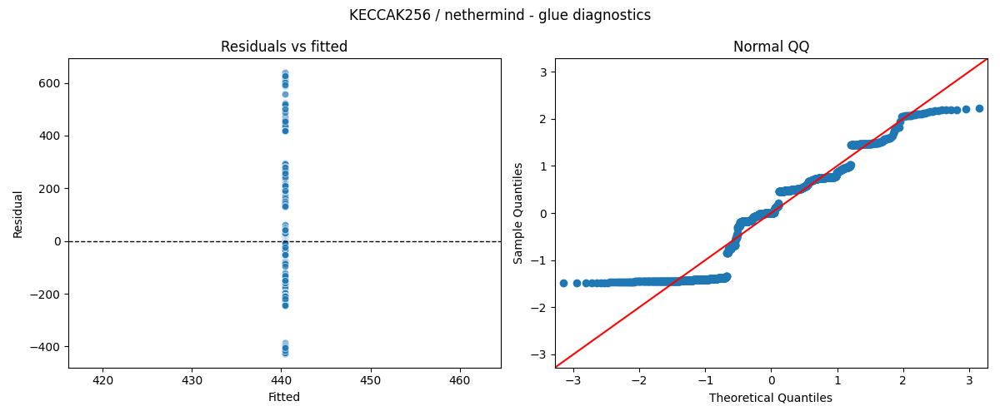

</details>

## reth

| glue_opcode | nobs | glue_runtime_ms | p_value | rsquared |
| --- | --- | --- | --- | --- |
| `ISZERO` | 33 | 3.556e-07 | 1.00e-03 | 0.8124 |
| `JUMPDEST` | 33 | 2.792e-07 | 1.00e-03 | 0.855 |
| `SWAP` | 528 | 4.602e-07 | 1.00e-03 | 0.7344 |
| `CALLDATASIZE` | 2024 | 5.05e-07 | 1.00e-03 | 0.8394 |
| `DUP` | 2024 | 4.233e-07 | 1.00e-03 | 0.8394 |
| `GAS` | 2024 | 4.569e-07 | 1.00e-03 | 0.8394 |
| `MLOAD` | 2024 | 1.684e-06 | 1.00e-03 | 0.8394 |
| `PUSH` | 2024 | 4.461e-07 | 1.00e-03 | 0.8394 |
| `PUSH0` | 2024 | 3.296e-07 | 1.00e-03 | 0.8394 |
| `STATICCALL` | 2024 | 4.718e-05 | 1.00e-03 | 0.8394 |
| `ADD` | 33 | 8.426e-07 | 1.00e-03 | 0.8389 |
| `AND` | 33 | 9.114e-07 | 1.00e-03 | 0.8462 |
| `CALLDATACOPY` | 792 | 2.269e-06 | 1.00e-03 | 0.7985 |
| `CALLDATALOAD` | 132 | 4.052e-05 | 1.00e-03 | 0.4438 |
| `DIV` | 33 | 6.574e-06 | 1.00e-03 | 0.8808 |
| `EXP` | 33 | 0.0003629 | 1.00e-03 | 0.7358 |
| `GT` | 33 | 9.995e-07 | 1.00e-03 | 0.8478 |
| `JUMPI` | 33 | 1.311e-06 | 1.00e-03 | 0.7326 |
| `LT` | 33 | 8.563e-07 | 1.00e-03 | 0.7386 |
| `MSTORE` | 165 | 2.813e-06 | 1.00e-03 | 0.2694 |
| `MSTORE8` | 165 | 1.281e-06 | 1.00e-03 | 0.7509 |
| `MUL` | 33 | 1.284e-06 | 1.00e-03 | 0.8538 |
| `PC` | 33 | 6.027e-07 | 1.00e-03 | 0.9401 |
| `RETURNDATASIZE` | 132 | 8.901e-07 | 1.00e-03 | 0.8394 |
| `SELFBALANCE` | 27 | 3.507e-06 | 1.00e-03 | 0.8073 |
| `SUB` | 33 | 9.284e-07 | 1.00e-03 | 0.8263 |
| `JUMP` | 33 | 2.159e-06 | 1.00e-03 | 0.8236 |
| `KECCAK256` | 528 | 0 | 1.00e+00 | 0 |

### Cycle glue — joint fit · reth

<details><summary>Joint NNLS regression summary</summary>

```
==============================================================================
                           NNLS Regression Results                            
==============================================================================
Dep. Variable:          test_runtime_ms              R-squared:          0.839
Model:                  NNLS                    Adj. R-squared:          0.839
No. Observations:       2024                              RMSE:           7.56
Df Residuals:           2016                               MAE:           5.11
Df Model:               7      
==============================================================================
                      coef     std err     P-value      [0.025      0.975]
------------------------------------------------------------------------------
         const     11.4572      0.5622       0.001     10.3763     12.5716
  CALLDATASIZE      0.0000      0.0000       0.001      0.0000      0.0000
           DUP      0.0000      0.0000       0.001      0.0000      0.0000
           GAS      0.0000      0.0000       0.001      0.0000      0.0000
         MLOAD      0.0000      0.0000       0.001      0.0000      0.0000
          PUSH      0.0000      0.0000       0.001      0.0000      0.0000
         PUSH0      0.0000      0.0000       0.001      0.0000      0.0000
    STATICCALL      0.0000      0.0000       0.001      0.0000      0.0000
==============================================================================
Notes: Non-negative least squares with bootstrap inference (1000 iterations)
==============================================================================
```

</details>

<details><summary><code>CALLDATASIZE</code> · nobs=2024 · runtime_ms=5.05e-07 · p=1.00e-03 · R²=0.8394</summary>

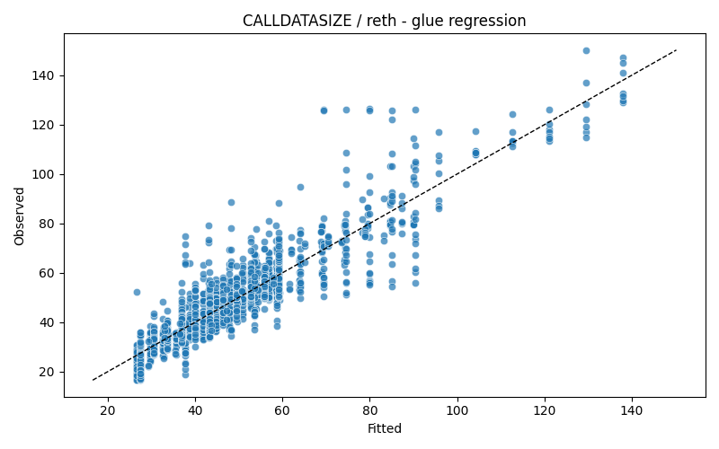

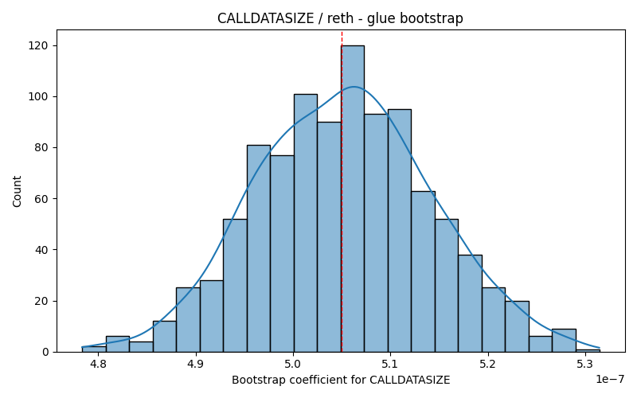


</details>

<details><summary><code>DUP</code> · nobs=2024 · runtime_ms=4.233e-07 · p=1.00e-03 · R²=0.8394</summary>


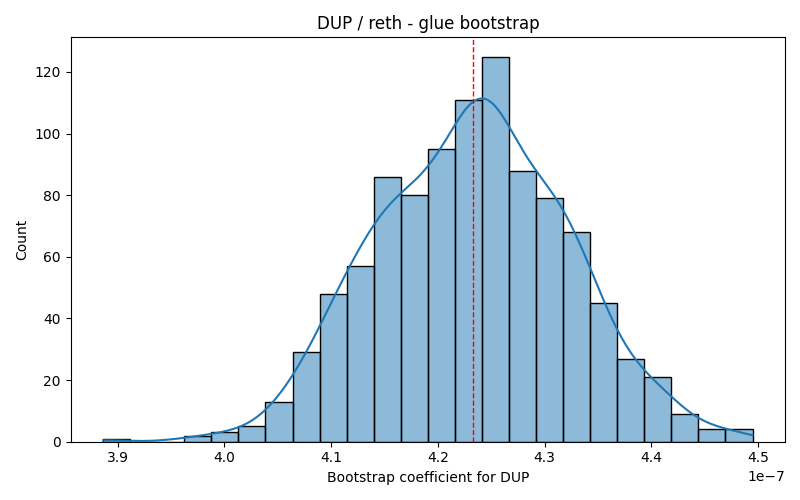


</details>

<details><summary><code>GAS</code> · nobs=2024 · runtime_ms=4.569e-07 · p=1.00e-03 · R²=0.8394</summary>


</details>

<details><summary><code>MLOAD</code> · nobs=2024 · runtime_ms=1.684e-06 · p=1.00e-03 · R²=0.8394</summary>


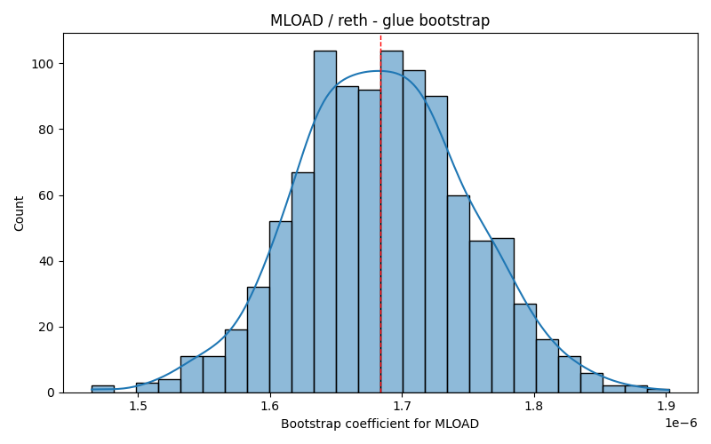


</details>

<details><summary><code>PUSH</code> · nobs=2024 · runtime_ms=4.461e-07 · p=1.00e-03 · R²=0.8394</summary>


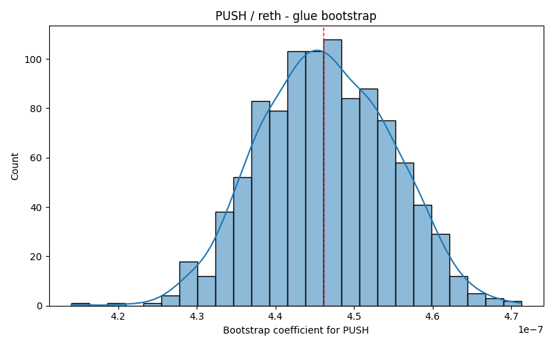


</details>

<details><summary><code>PUSH0</code> · nobs=2024 · runtime_ms=3.296e-07 · p=1.00e-03 · R²=0.8394</summary>


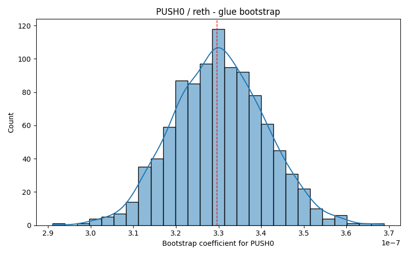


</details>

<details><summary><code>STATICCALL</code> · nobs=2024 · runtime_ms=4.718e-05 · p=1.00e-03 · R²=0.8394</summary>


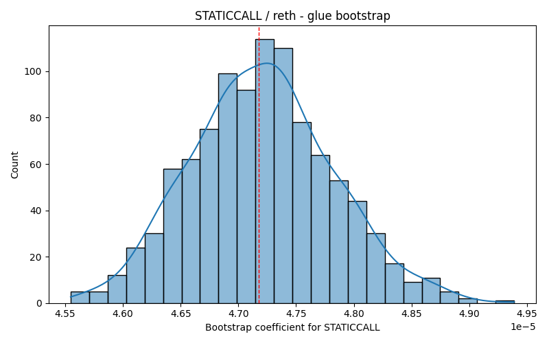

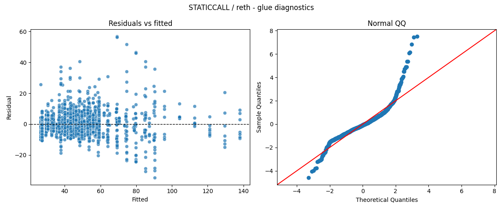

</details>

### Pure glue · reth

<details><summary><code>ISZERO</code> · nobs=33 · runtime_ms=3.556e-07 · p=1.00e-03 · R²=0.8124</summary>

```
==============================================================================
                           NNLS Regression Results                            
==============================================================================
Dep. Variable:          test_runtime_ms              R-squared:          0.812
Model:                  NNLS                    Adj. R-squared:          0.806
No. Observations:       33                                RMSE:           3.60
Df Residuals:           31                                 MAE:           2.63
Df Model:               1      
==============================================================================
                      coef     std err     P-value      [0.025      0.975]
------------------------------------------------------------------------------
         const      9.6690      2.0503       0.001      5.9590     13.9643
        ISZERO      0.0000      0.0000       0.001      0.0000      0.0000
==============================================================================
Notes: Non-negative least squares with bootstrap inference (1000 iterations)
==============================================================================
```

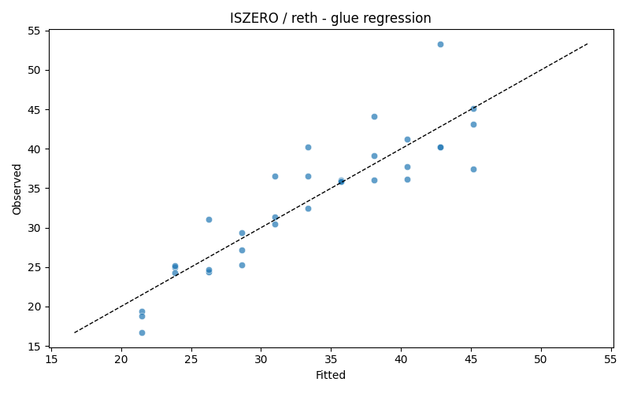

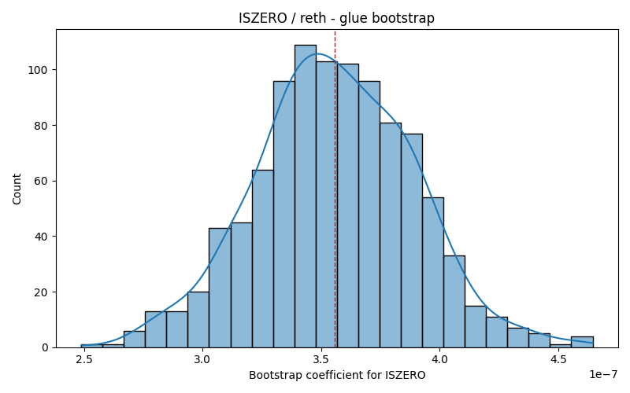

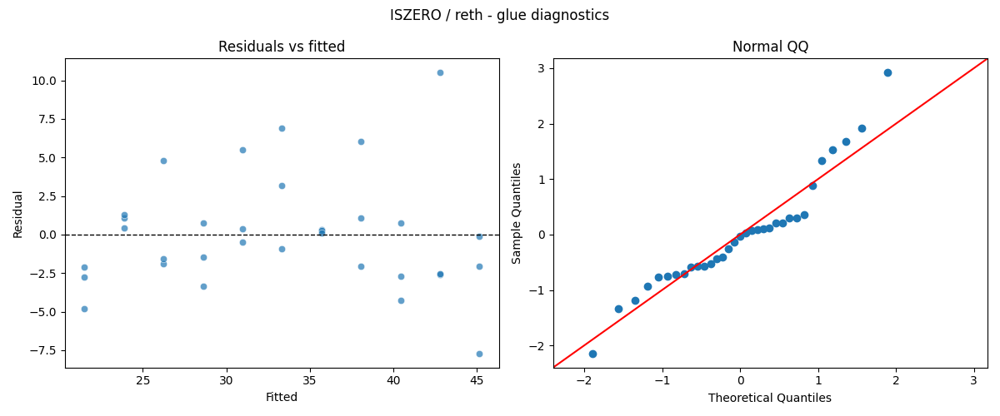

</details>

<details><summary><code>JUMPDEST</code> · nobs=33 · runtime_ms=2.792e-07 · p=1.00e-03 · R²=0.855</summary>

```
==============================================================================
                           NNLS Regression Results                            
==============================================================================
Dep. Variable:          test_runtime_ms              R-squared:          0.855
Model:                  NNLS                    Adj. R-squared:          0.850
No. Observations:       33                                RMSE:           7.26
Df Residuals:           31                                 MAE:           5.58
Df Model:               1      
==============================================================================
                      coef     std err     P-value      [0.025      0.975]
------------------------------------------------------------------------------
         const     14.0319      4.3276       0.001      4.7756     22.7630
      JUMPDEST      0.0000      0.0000       0.001      0.0000      0.0000
==============================================================================
Notes: Non-negative least squares with bootstrap inference (1000 iterations)
==============================================================================
```

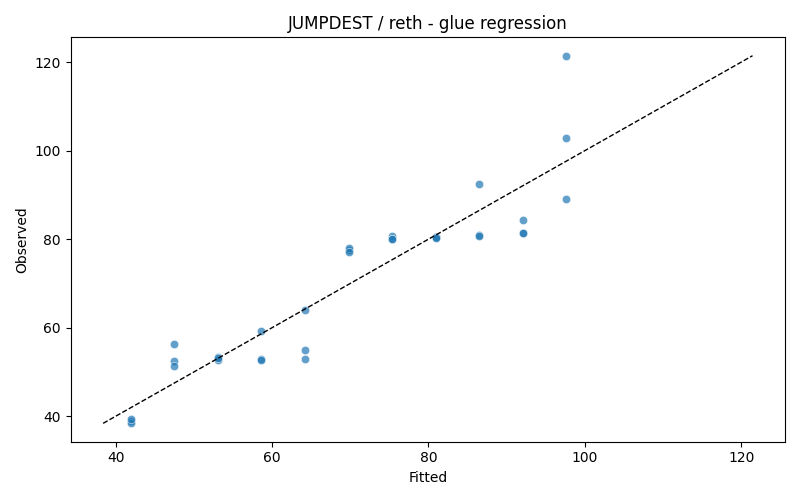

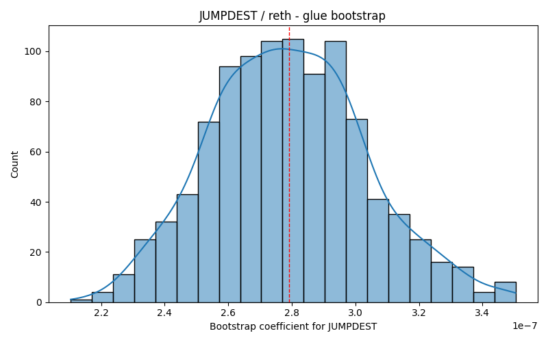

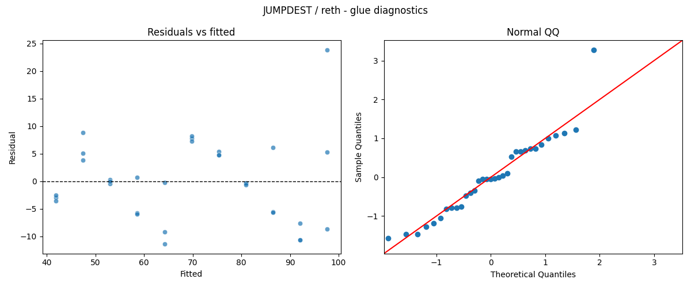

</details>

<details><summary><code>SWAP</code> · nobs=528 · runtime_ms=4.602e-07 · p=1.00e-03 · R²=0.7344</summary>

```
==============================================================================
                           NNLS Regression Results                            
==============================================================================
Dep. Variable:          test_runtime_ms              R-squared:          0.734
Model:                  NNLS                    Adj. R-squared:          0.734
No. Observations:       528                               RMSE:           5.83
Df Residuals:           526                                MAE:           4.51
Df Model:               1      
==============================================================================
                      coef     std err     P-value      [0.025      0.975]
------------------------------------------------------------------------------
         const     12.1108      0.7663       0.001     10.5470     13.5494
          SWAP      0.0000      0.0000       0.001      0.0000      0.0000
==============================================================================
Notes: Non-negative least squares with bootstrap inference (1000 iterations)
==============================================================================
```

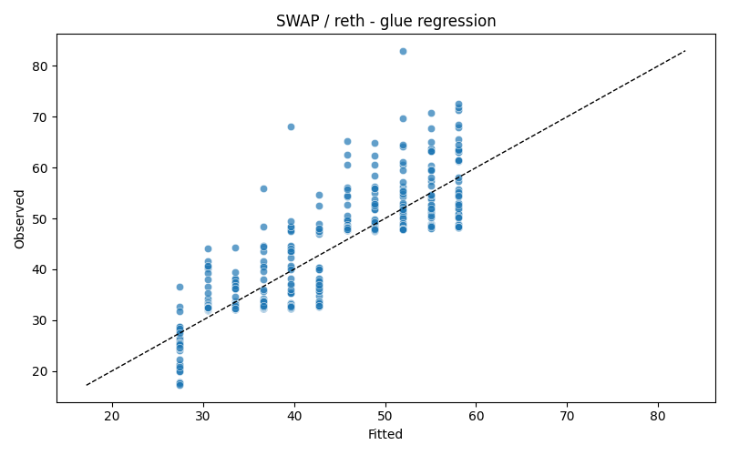

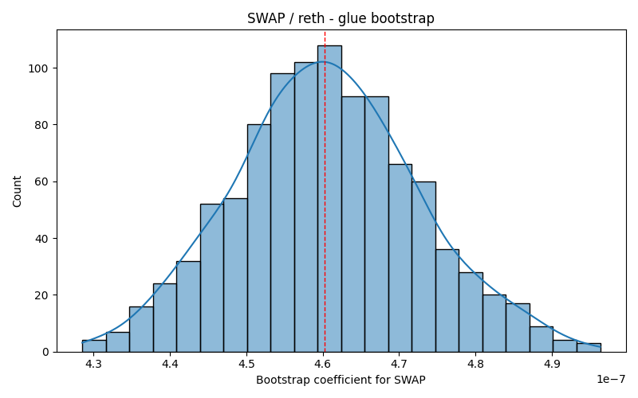

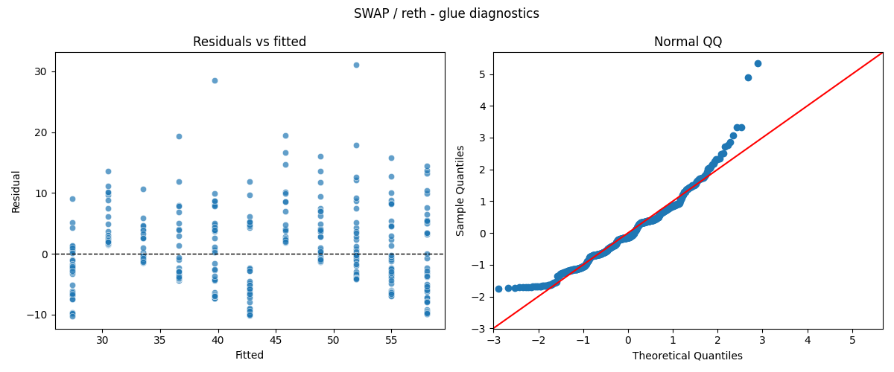

</details>

### Mixed glue (tier A) · reth

<details><summary><code>ADD</code> · nobs=33 · runtime_ms=8.426e-07 · p=1.00e-03 · R²=0.8389</summary>

```
==============================================================================
                           NNLS Regression Results                            
==============================================================================
Dep. Variable:          test_runtime_ms              R-squared:          0.839
Model:                  NNLS                    Adj. R-squared:          0.834
No. Observations:       33                                RMSE:           3.89
Df Residuals:           31                                 MAE:           3.05
Df Model:               1      
==============================================================================
                      coef     std err     P-value      [0.025      0.975]
------------------------------------------------------------------------------
         const     10.5629      1.9498       0.001      6.7968     14.2833
           ADD      0.0000      0.0000       0.001      0.0000      0.0000
==============================================================================
Notes: Non-negative least squares with bootstrap inference (1000 iterations)
==============================================================================
```

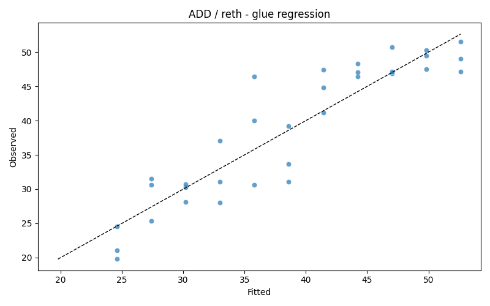

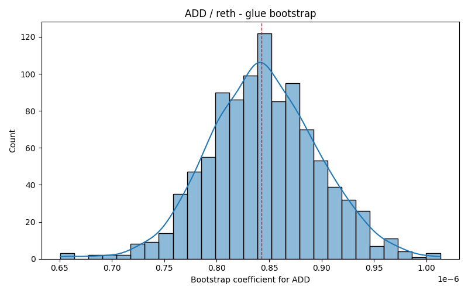

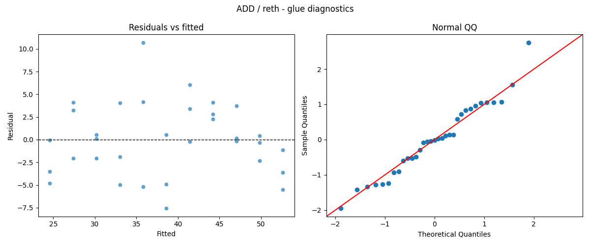

</details>

<details><summary><code>AND</code> · nobs=33 · runtime_ms=9.114e-07 · p=1.00e-03 · R²=0.8462</summary>

```
==============================================================================
                           NNLS Regression Results                            
==============================================================================
Dep. Variable:          test_runtime_ms              R-squared:          0.846
Model:                  NNLS                    Adj. R-squared:          0.841
No. Observations:       33                                RMSE:           4.09
Df Residuals:           31                                 MAE:           3.25
Df Model:               1      
==============================================================================
                      coef     std err     P-value      [0.025      0.975]
------------------------------------------------------------------------------
         const      9.0736      2.2605       0.001      4.9941     13.5799
           AND      0.0000      0.0000       0.001      0.0000      0.0000
==============================================================================
Notes: Non-negative least squares with bootstrap inference (1000 iterations)
==============================================================================
```

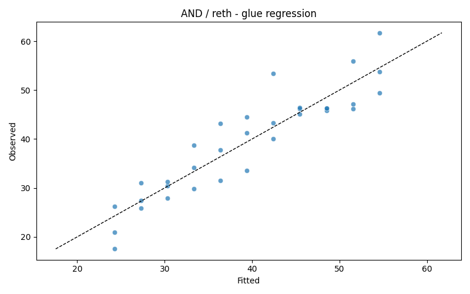

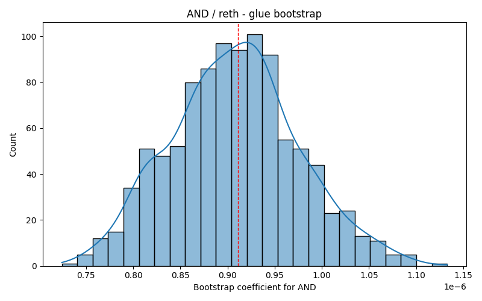

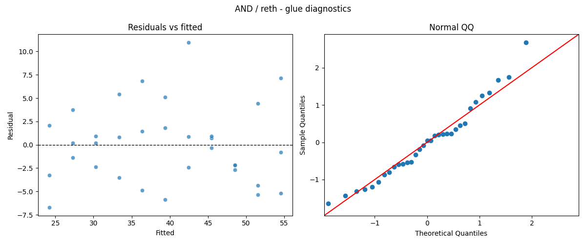

</details>

<details><summary><code>CALLDATACOPY</code> · nobs=792 · runtime_ms=2.269e-06 · p=1.00e-03 · R²=0.7985</summary>

```
==============================================================================
                           NNLS Regression Results                            
==============================================================================
Dep. Variable:          test_runtime_ms              R-squared:          0.799
Model:                  NNLS                    Adj. R-squared:          0.798
No. Observations:       792                               RMSE:           8.57
Df Residuals:           790                                MAE:           6.56
Df Model:               1      
==============================================================================
                      coef     std err     P-value      [0.025      0.975]
------------------------------------------------------------------------------
         const     12.2375      0.3829       0.001     11.4541     12.9767
  CALLDATACOPY      0.0000      0.0000       0.001      0.0000      0.0000
==============================================================================
Notes: Non-negative least squares with bootstrap inference (1000 iterations)
==============================================================================
```

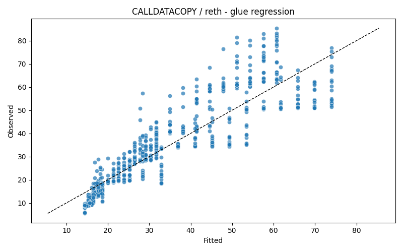

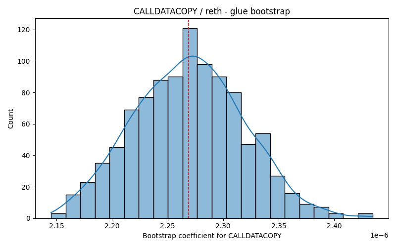

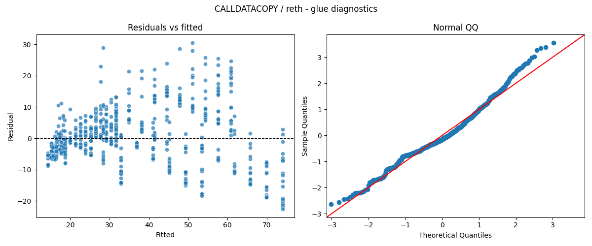

</details>

<details><summary><code>CALLDATALOAD</code> · nobs=132 · runtime_ms=4.052e-05 · p=1.00e-03 · R²=0.4438</summary>

```
==============================================================================
                           NNLS Regression Results                            
==============================================================================
Dep. Variable:          test_runtime_ms              R-squared:          0.444
Model:                  NNLS                    Adj. R-squared:          0.440
No. Observations:       132                               RMSE:           0.17
Df Residuals:           130                                MAE:           0.14
Df Model:               1      
==============================================================================
                      coef     std err     P-value      [0.025      0.975]
------------------------------------------------------------------------------
         const      1.1972      0.0470       0.001      1.1039      1.2874
  CALLDATALOAD      0.0000      0.0000       0.001      0.0000      0.0000
==============================================================================
Notes: Non-negative least squares with bootstrap inference (1000 iterations)
==============================================================================
```

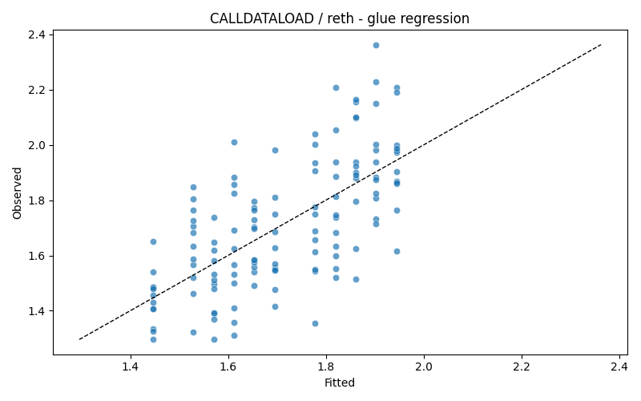

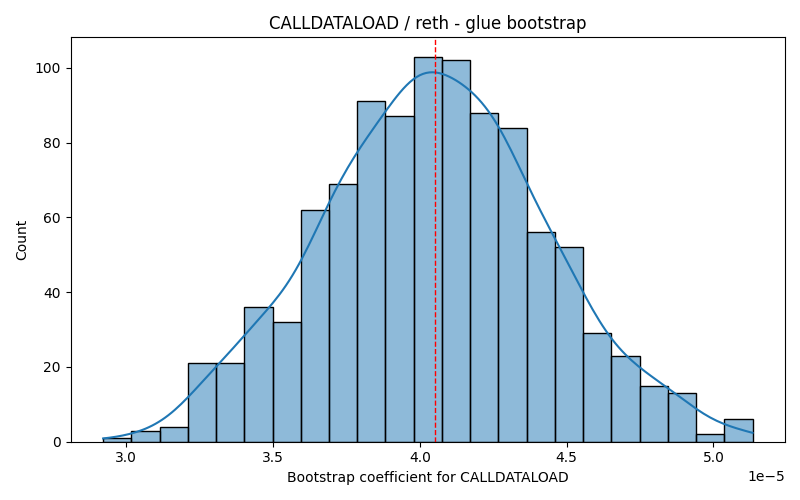

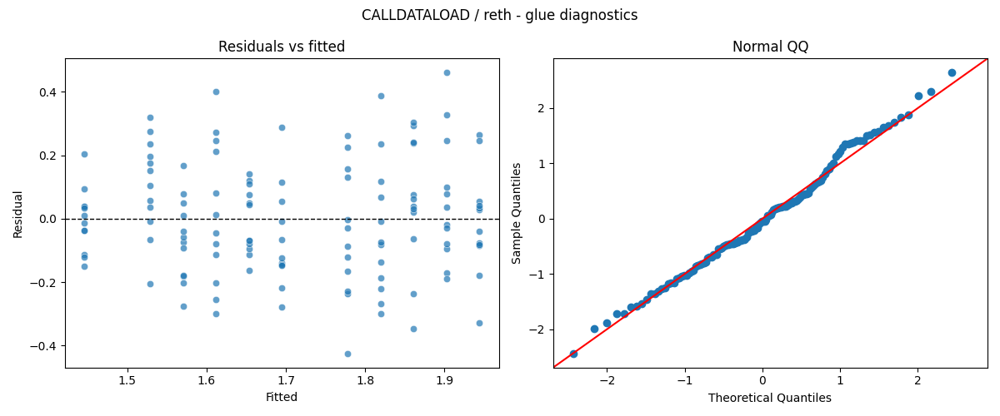

</details>

<details><summary><code>DIV</code> · nobs=33 · runtime_ms=6.574e-06 · p=1.00e-03 · R²=0.8808</summary>

```
==============================================================================
                           NNLS Regression Results                            
==============================================================================
Dep. Variable:          test_runtime_ms              R-squared:          0.881
Model:                  NNLS                    Adj. R-squared:          0.877
No. Observations:       33                                RMSE:          19.09
Df Residuals:           31                                 MAE:          15.85
Df Model:               1      
==============================================================================
                      coef     std err     P-value      [0.025      0.975]
------------------------------------------------------------------------------
         const     70.9652      9.5838       0.001     52.5956     89.5645
           DIV      0.0000      0.0000       0.001      0.0000      0.0000
==============================================================================
Notes: Non-negative least squares with bootstrap inference (1000 iterations)
==============================================================================
```

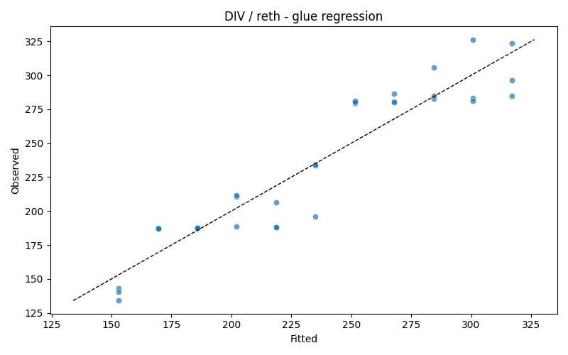

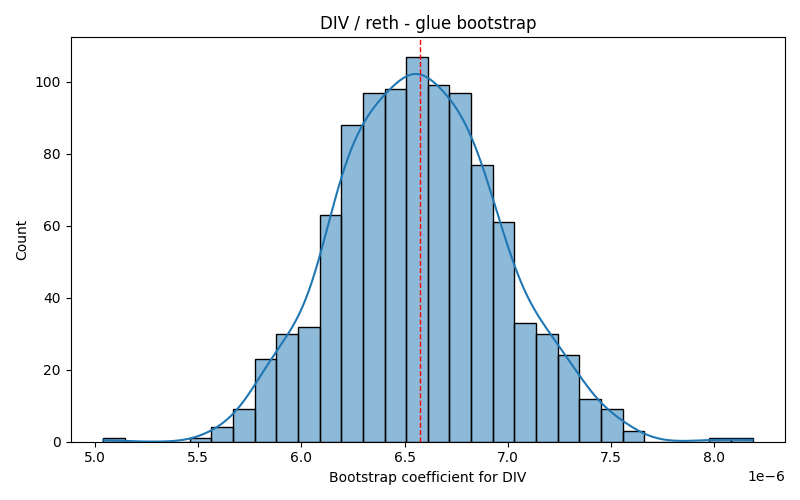

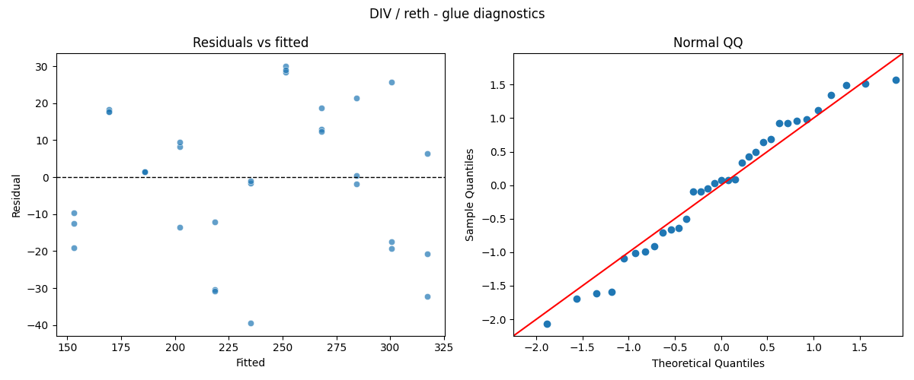

</details>

<details><summary><code>EXP</code> · nobs=33 · runtime_ms=0.0003629 · p=1.00e-03 · R²=0.7358</summary>

```
==============================================================================
                           NNLS Regression Results                            
==============================================================================
Dep. Variable:          test_runtime_ms              R-squared:          0.736
Model:                  NNLS                    Adj. R-squared:          0.727
No. Observations:       33                                RMSE:           8.51
Df Residuals:           31                                 MAE:           6.58
Df Model:               1      
==============================================================================
                      coef     std err     P-value      [0.025      0.975]
------------------------------------------------------------------------------
         const     18.0288      5.2981       0.001      8.3792     29.2257
           EXP      0.0004      0.0000       0.001      0.0003      0.0004
==============================================================================
Notes: Non-negative least squares with bootstrap inference (1000 iterations)
==============================================================================
```

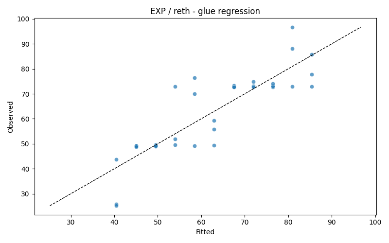

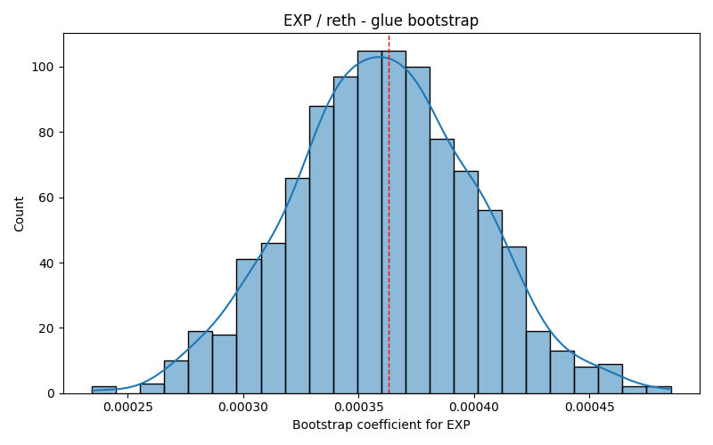

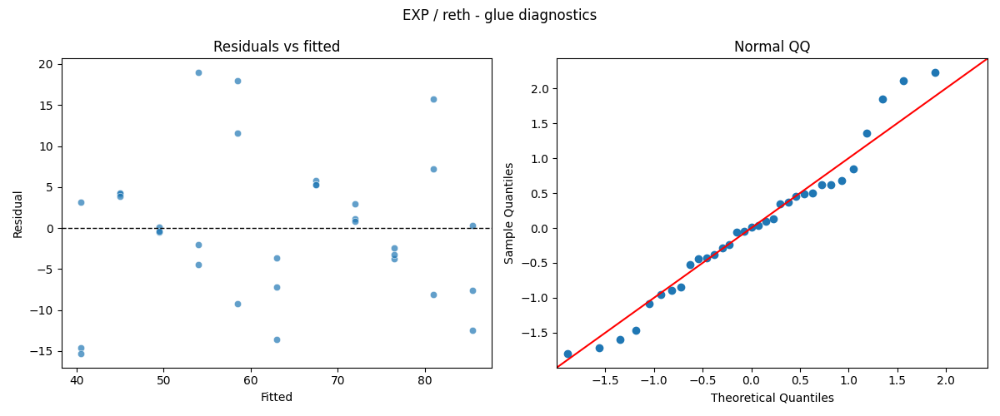

</details>

<details><summary><code>GT</code> · nobs=33 · runtime_ms=9.995e-07 · p=1.00e-03 · R²=0.8478</summary>

```
==============================================================================
                           NNLS Regression Results                            
==============================================================================
Dep. Variable:          test_runtime_ms              R-squared:          0.848
Model:                  NNLS                    Adj. R-squared:          0.843
No. Observations:       33                                RMSE:           4.46
Df Residuals:           31                                 MAE:           3.66
Df Model:               1      
==============================================================================
                      coef     std err     P-value      [0.025      0.975]
------------------------------------------------------------------------------
         const      8.7023      2.9934       0.002      2.4735     14.2542
            GT      0.0000      0.0000       0.001      0.0000      0.0000
==============================================================================
Notes: Non-negative least squares with bootstrap inference (1000 iterations)
==============================================================================
```

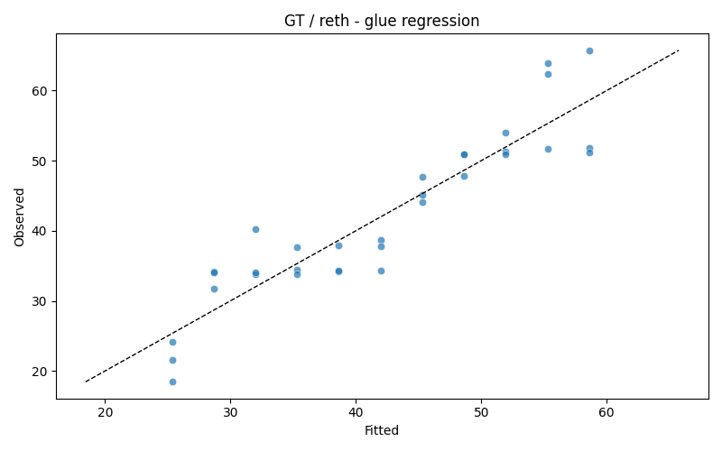

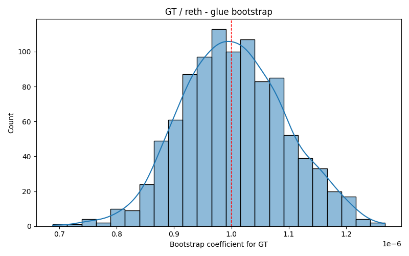

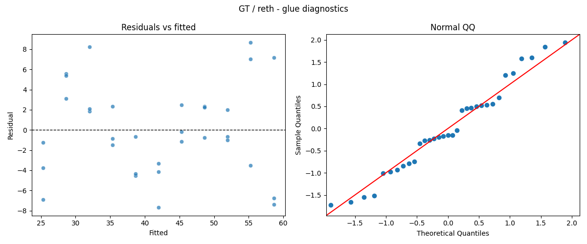

</details>

<details><summary><code>JUMPI</code> · nobs=33 · runtime_ms=1.311e-06 · p=1.00e-03 · R²=0.7326</summary>

```
==============================================================================
                           NNLS Regression Results                            
==============================================================================
Dep. Variable:          test_runtime_ms              R-squared:          0.733
Model:                  NNLS                    Adj. R-squared:          0.724
No. Observations:       33                                RMSE:           3.57
Df Residuals:           31                                 MAE:           2.44
Df Model:               1      
==============================================================================
                      coef     std err     P-value      [0.025      0.975]
------------------------------------------------------------------------------
         const      5.5593      2.0773       0.006      1.2596      9.3212
         JUMPI      0.0000      0.0000       0.001      0.0000      0.0000
==============================================================================
Notes: Non-negative least squares with bootstrap inference (1000 iterations)
==============================================================================
```

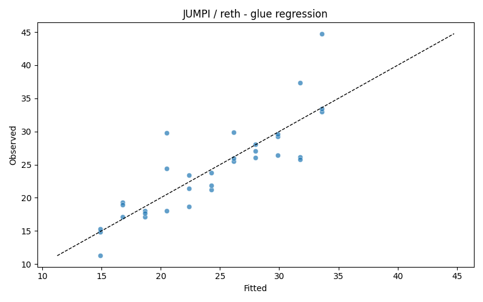

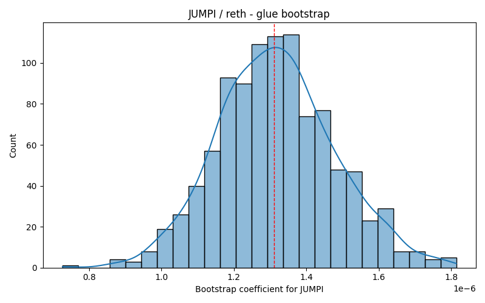

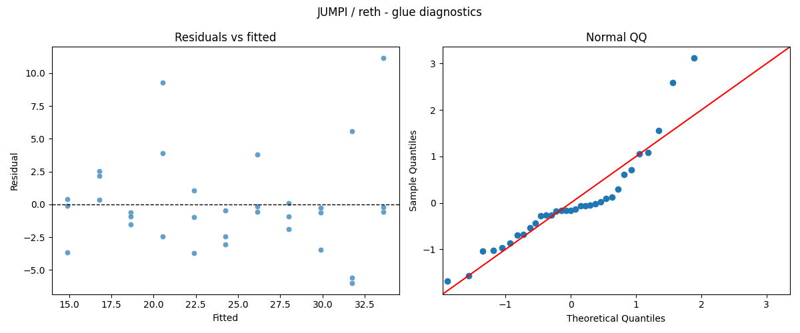

</details>

<details><summary><code>LT</code> · nobs=33 · runtime_ms=8.563e-07 · p=1.00e-03 · R²=0.7386</summary>

```
==============================================================================
                           NNLS Regression Results                            
==============================================================================
Dep. Variable:          test_runtime_ms              R-squared:          0.739
Model:                  NNLS                    Adj. R-squared:          0.730
No. Observations:       33                                RMSE:           5.36
Df Residuals:           31                                 MAE:           4.01
Df Model:               1      
==============================================================================
                      coef     std err     P-value      [0.025      0.975]
------------------------------------------------------------------------------
         const     12.7968      2.8302       0.001      8.0046     18.9650
            LT      0.0000      0.0000       0.001      0.0000      0.0000
==============================================================================
Notes: Non-negative least squares with bootstrap inference (1000 iterations)
==============================================================================
```

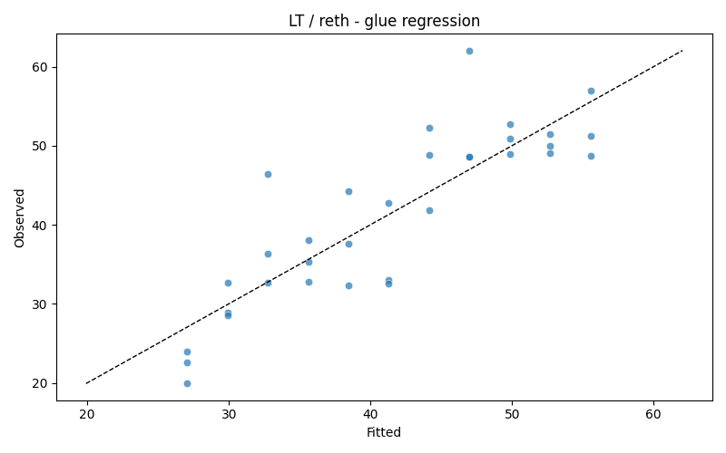

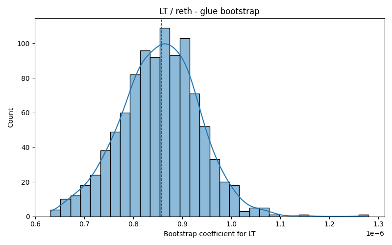

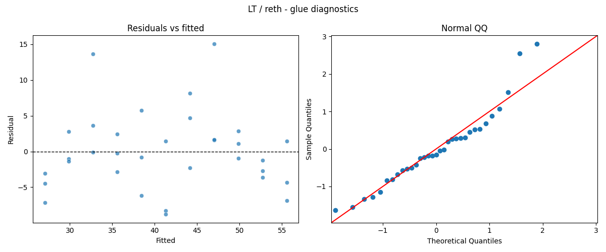

</details>

<details><summary><code>MSTORE</code> · nobs=165 · runtime_ms=2.813e-06 · p=1.00e-03 · R²=0.2694</summary>

```
==============================================================================
                           NNLS Regression Results                            
==============================================================================
Dep. Variable:          test_runtime_ms              R-squared:          0.269
Model:                  NNLS                    Adj. R-squared:          0.265
No. Observations:       165                               RMSE:          32.51
Df Residuals:           163                                MAE:          29.23
Df Model:               1      
==============================================================================
                      coef     std err     P-value      [0.025      0.975]
------------------------------------------------------------------------------
         const     19.8397      7.1528       0.002      5.8958     33.5670
        MSTORE      0.0000      0.0000       0.001      0.0000      0.0000
==============================================================================
Notes: Non-negative least squares with bootstrap inference (1000 iterations)
==============================================================================
```

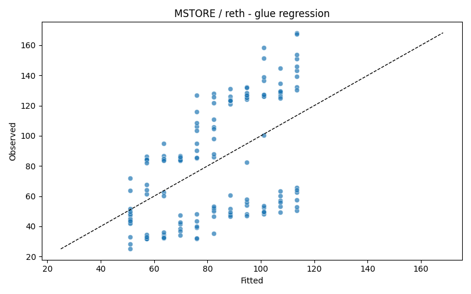

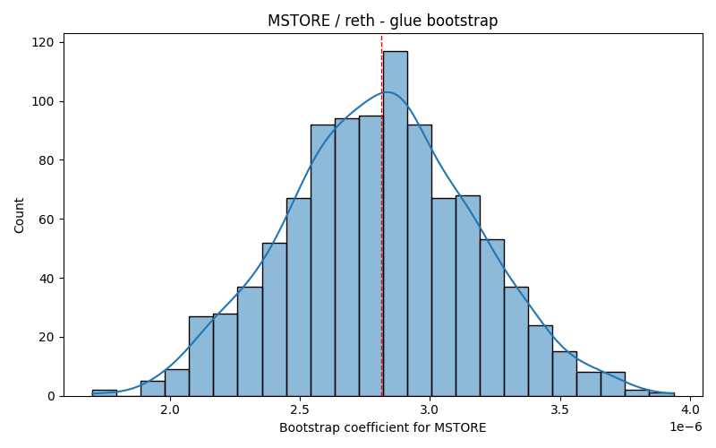


</details>

<details><summary><code>MSTORE8</code> · nobs=165 · runtime_ms=1.281e-06 · p=1.00e-03 · R²=0.7509</summary>

```
==============================================================================
                           NNLS Regression Results                            
==============================================================================
Dep. Variable:          test_runtime_ms              R-squared:          0.751
Model:                  NNLS                    Adj. R-squared:          0.749
No. Observations:       165                               RMSE:           5.18
Df Residuals:           163                                MAE:           3.97
Df Model:               1      
==============================================================================
                      coef     std err     P-value      [0.025      0.975]
------------------------------------------------------------------------------
         const     11.7509      1.3602       0.001      9.2099     14.5156
       MSTORE8      0.0000      0.0000       0.001      0.0000      0.0000
==============================================================================
Notes: Non-negative least squares with bootstrap inference (1000 iterations)
==============================================================================
```

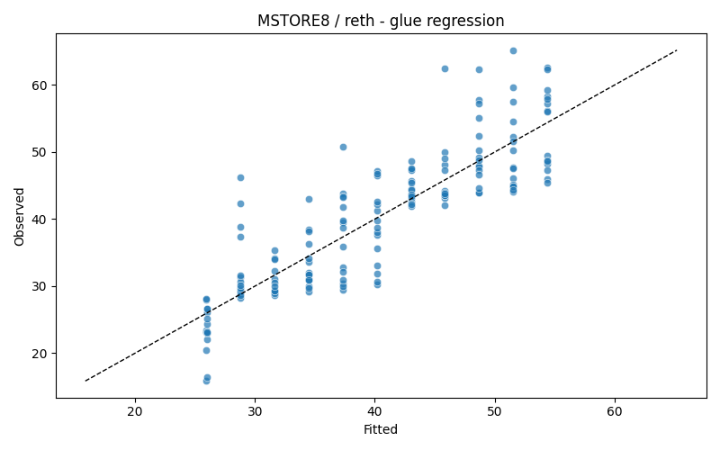

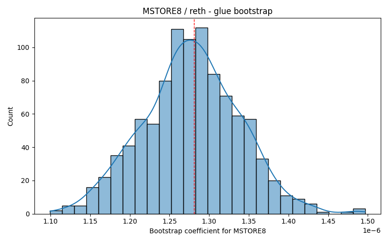

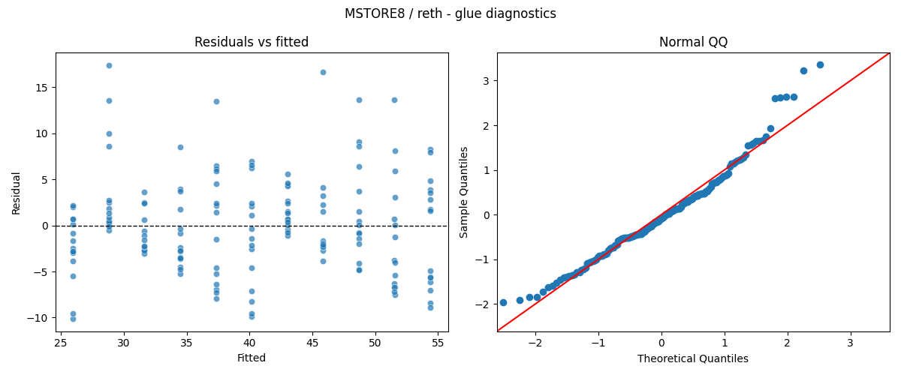

</details>

<details><summary><code>MUL</code> · nobs=33 · runtime_ms=1.284e-06 · p=1.00e-03 · R²=0.8538</summary>

```
==============================================================================
                           NNLS Regression Results                            
==============================================================================
Dep. Variable:          test_runtime_ms              R-squared:          0.854
Model:                  NNLS                    Adj. R-squared:          0.849
No. Observations:       33                                RMSE:           4.19
Df Residuals:           31                                 MAE:           3.26
Df Model:               1      
==============================================================================
                      coef     std err     P-value      [0.025      0.975]
------------------------------------------------------------------------------
         const      7.4405      2.4383       0.004      2.4176     12.2335
           MUL      0.0000      0.0000       0.001      0.0000      0.0000
==============================================================================
Notes: Non-negative least squares with bootstrap inference (1000 iterations)
==============================================================================
```

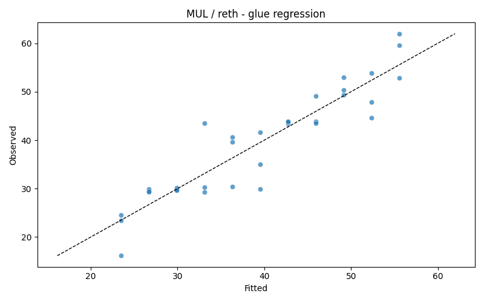

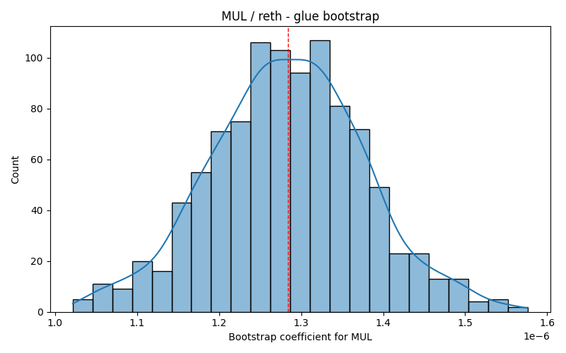

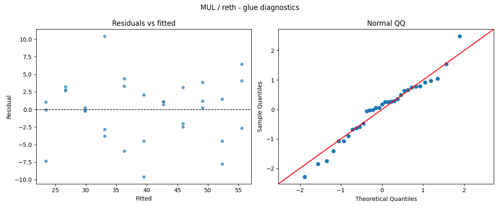

</details>

<details><summary><code>PC</code> · nobs=33 · runtime_ms=6.027e-07 · p=1.00e-03 · R²=0.9401</summary>

```
==============================================================================
                           NNLS Regression Results                            
==============================================================================
Dep. Variable:          test_runtime_ms              R-squared:          0.940
Model:                  NNLS                    Adj. R-squared:          0.938
No. Observations:       33                                RMSE:           4.55
Df Residuals:           31                                 MAE:           3.74
Df Model:               1      
==============================================================================
                      coef     std err     P-value      [0.025      0.975]
------------------------------------------------------------------------------
         const     13.4433      2.7147       0.001      8.8029     19.1573
            PC      0.0000      0.0000       0.001      0.0000      0.0000
==============================================================================
Notes: Non-negative least squares with bootstrap inference (1000 iterations)
==============================================================================
```

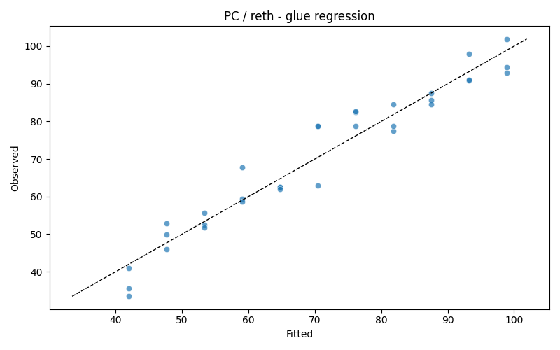

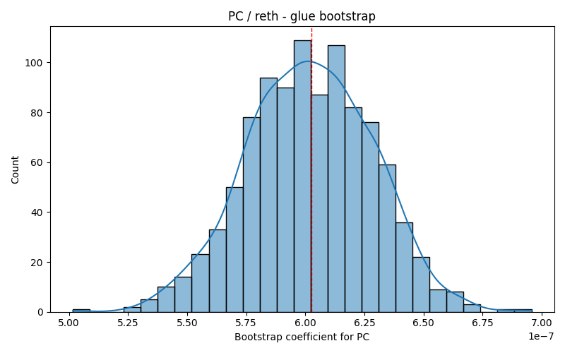

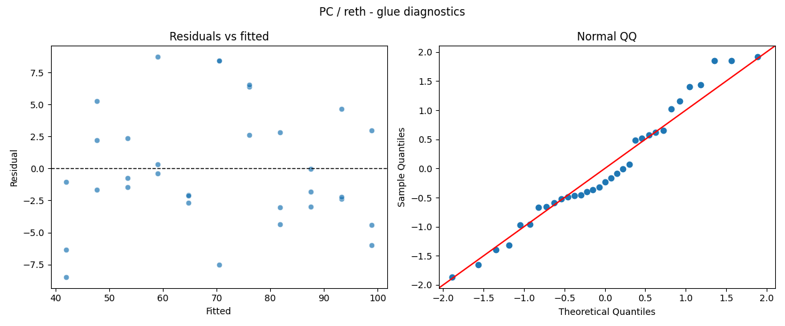

</details>

<details><summary><code>RETURNDATASIZE</code> · nobs=132 · runtime_ms=8.901e-07 · p=1.00e-03 · R²=0.8394</summary>

```
==============================================================================
                           NNLS Regression Results                            
==============================================================================
Dep. Variable:          test_runtime_ms              R-squared:          0.839
Model:                  NNLS                    Adj. R-squared:          0.838
No. Observations:       132                               RMSE:           6.15
Df Residuals:           130                                MAE:           4.58
Df Model:               1      
==============================================================================
                      coef     std err     P-value      [0.025      0.975]
------------------------------------------------------------------------------
         const     12.0596      1.5071       0.001      9.0669     14.9775
RETURNDATASIZE      0.0000      0.0000       0.001      0.0000      0.0000
==============================================================================
Notes: Non-negative least squares with bootstrap inference (1000 iterations)
==============================================================================
```

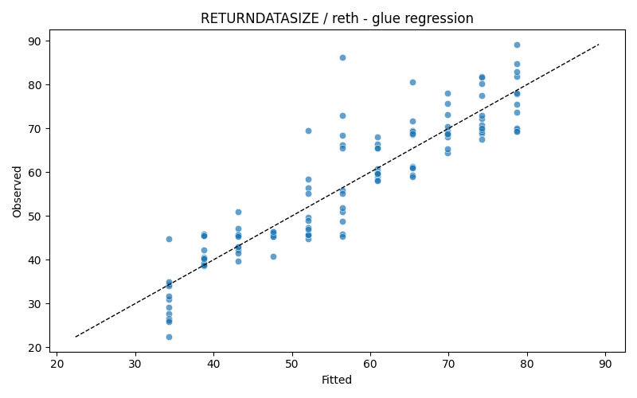

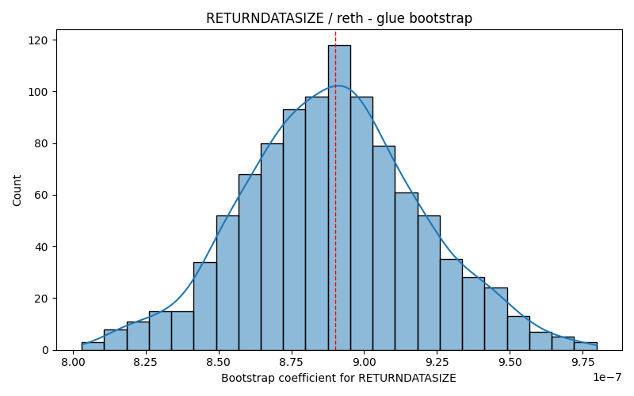

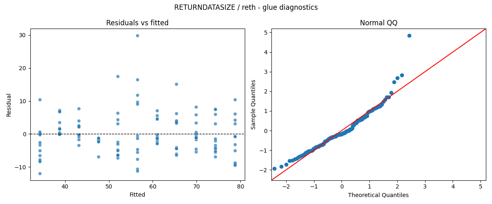

</details>

<details><summary><code>SELFBALANCE</code> · nobs=27 · runtime_ms=3.507e-06 · p=1.00e-03 · R²=0.8073</summary>

```
==============================================================================
                           NNLS Regression Results                            
==============================================================================
Dep. Variable:          test_runtime_ms              R-squared:          0.807
Model:                  NNLS                    Adj. R-squared:          0.800
No. Observations:       27                                RMSE:          17.28
Df Residuals:           25                                 MAE:          14.38
Df Model:               1      
==============================================================================
                      coef     std err     P-value      [0.025      0.975]
------------------------------------------------------------------------------
         const     69.4126     13.4121       0.001     43.1044     96.7501
   SELFBALANCE      0.0000      0.0000       0.001      0.0000      0.0000
==============================================================================
Notes: Non-negative least squares with bootstrap inference (1000 iterations)
==============================================================================
```

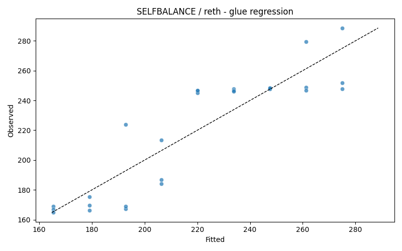

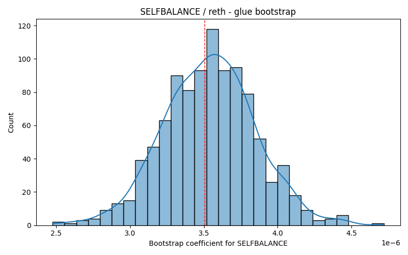

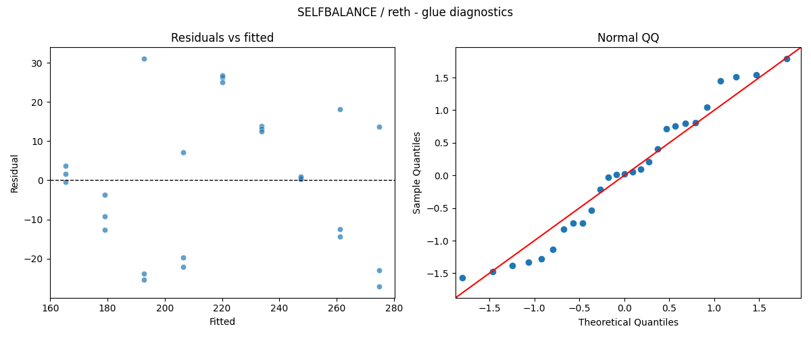

</details>

<details><summary><code>SUB</code> · nobs=33 · runtime_ms=9.284e-07 · p=1.00e-03 · R²=0.8263</summary>

```
==============================================================================
                           NNLS Regression Results                            
==============================================================================
Dep. Variable:          test_runtime_ms              R-squared:          0.826
Model:                  NNLS                    Adj. R-squared:          0.821
No. Observations:       33                                RMSE:           4.48
Df Residuals:           31                                 MAE:           3.31
Df Model:               1      
==============================================================================
                      coef     std err     P-value      [0.025      0.975]
------------------------------------------------------------------------------
         const      9.9014      2.2741       0.001      5.8552     14.8948
           SUB      0.0000      0.0000       0.001      0.0000      0.0000
==============================================================================
Notes: Non-negative least squares with bootstrap inference (1000 iterations)
==============================================================================
```

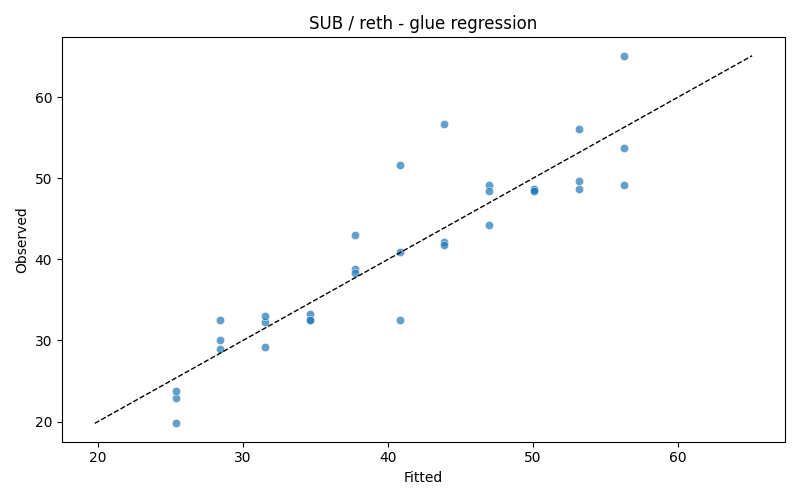

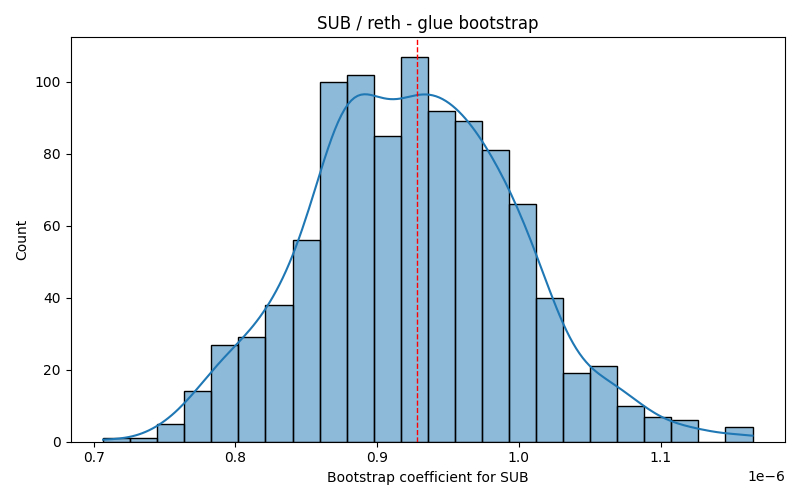


</details>

### Mixed glue (tier B) · reth

<details><summary><code>JUMP</code> · nobs=33 · runtime_ms=2.159e-06 · p=1.00e-03 · R²=0.8236</summary>

```
==============================================================================
                           NNLS Regression Results                            
==============================================================================
Dep. Variable:          test_runtime_ms              R-squared:          0.824
Model:                  NNLS                    Adj. R-squared:          0.818
No. Observations:       33                                RMSE:           3.71
Df Residuals:           31                                 MAE:           3.18
Df Model:               1      
==============================================================================
                      coef     std err     P-value      [0.025      0.975]
------------------------------------------------------------------------------
         const      9.6716      2.0548       0.001      5.3855     13.4936
          JUMP      0.0000      0.0000       0.001      0.0000      0.0000
==============================================================================
Notes: Non-negative least squares with bootstrap inference (1000 iterations)
==============================================================================
```

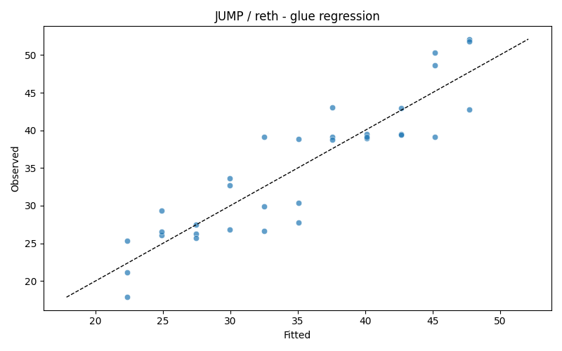

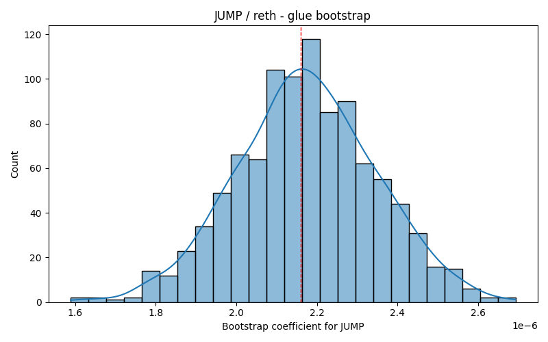

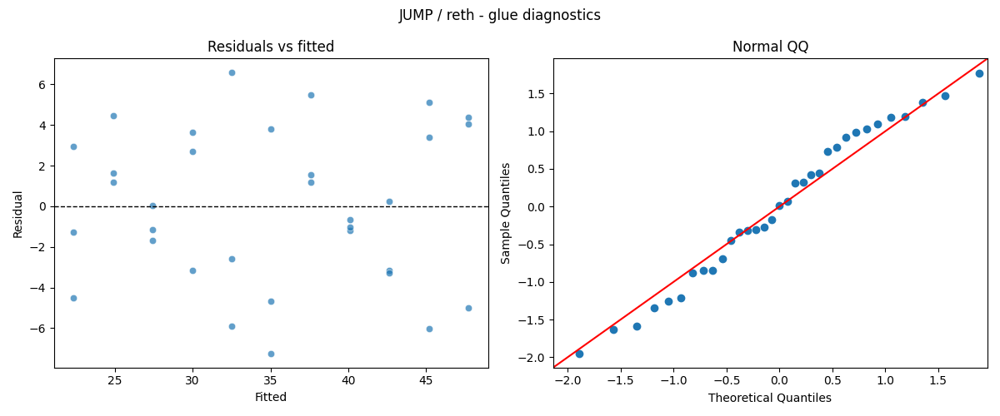

</details>

<details><summary><code>KECCAK256</code> · nobs=528 · runtime_ms=0 · p=1.00e+00 · R²=0</summary>

```
==============================================================================
                           NNLS Regression Results                            
==============================================================================
Dep. Variable:          test_runtime_ms              R-squared:          0.000
Model:                  NNLS                    Adj. R-squared:         -0.002
No. Observations:       528                               RMSE:         160.28
Df Residuals:           526                                MAE:         135.38
Df Model:               1      
==============================================================================
                      coef     std err     P-value      [0.025      0.975]
------------------------------------------------------------------------------
         const    251.7401      7.1683       0.001    238.3159    265.3744
     KECCAK256      0.0000      0.0000       1.000      0.0000      0.0000
==============================================================================
Notes: Non-negative least squares with bootstrap inference (1000 iterations)
==============================================================================
```

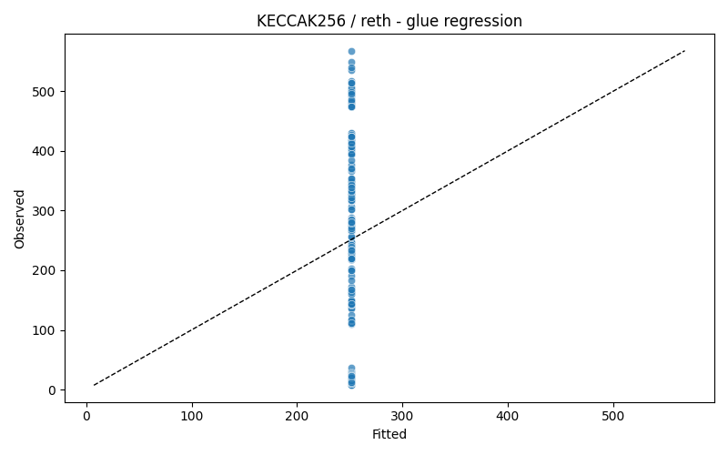


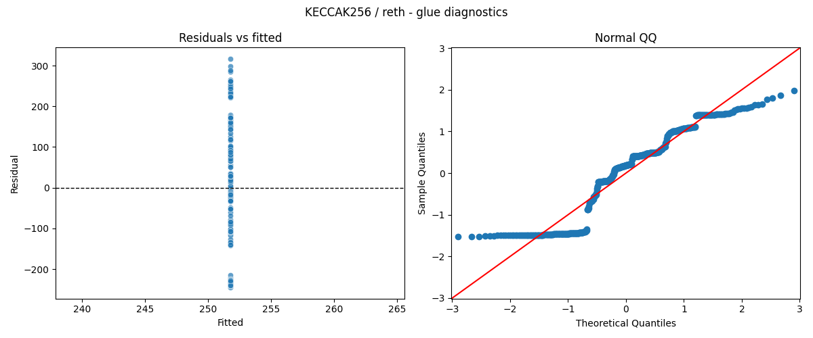

</details>
