# Runtime estimation report

Per-spec NNLS fits of `test_runtime_ms` against `opcount`, one row per (target opcode, test, model_by combo, client).

## Contents

- [SLOAD](#sload)
- [SSTORE](#sstore)
- [BALANCE](#balance)
- [CALL](#call)
- [CALLCODE](#callcode)
- [DELEGATECALL](#delegatecall)
- [EXTCODECOPY](#extcodecopy)
- [EXTCODEHASH](#extcodehash)
- [EXTCODESIZE](#extcodesize)
- [STATICCALL](#staticcall)

## SLOAD

### test_sload_bloated — combo `False`

| client | nobs | R² | target_coef (ms) | p-value | 95% CI |
| --- | --- | --- | --- | --- | --- |
| `besu` | 55 | 0.959 | 0.007525 | 1.00e-03 | [0.007077, 0.007983] |
| `erigon` | 22 | 0.9985 | 0.006149 | 1.00e-03 | [0.006047, 0.006251] |
| `geth` | 11 | 0.9761 | 0.02614 | 1.00e-03 | [0.02261, 0.02921] |
| `nethermind` | 33 | 0.8776 | 0.00368 | 1.00e-03 | [0.003274, 0.004129] |
| `reth` | 77 | 0.94 | 0.001288 | 1.00e-03 | [0.001198, 0.001369] |

<details><summary>besu — NNLS regression summary</summary>

```
==============================================================================
                           NNLS Regression Results                            
==============================================================================
Dep. Variable:          test_runtime_ms              R-squared:          0.959
Model:                  NNLS                    Adj. R-squared:          0.958
No. Observations:       55                                RMSE:          45.81
Df Residuals:           53                                 MAE:          37.76
Df Model:               1      
==============================================================================
                      coef     std err     P-value      [0.025      0.975]
------------------------------------------------------------------------------
         const    192.7524     19.5009       0.001    153.2687    230.6071
       opcount      0.0075      0.0002       0.001      0.0071      0.0080
==============================================================================
Notes: Non-negative least squares with bootstrap inference (1000 iterations)
==============================================================================
```

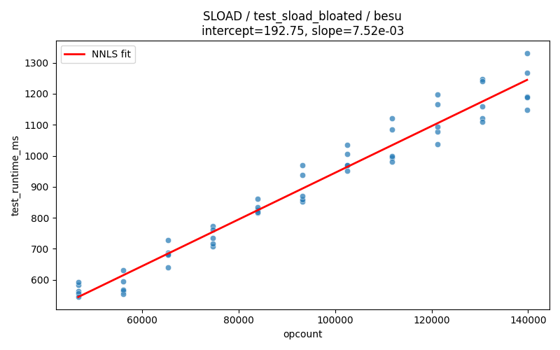

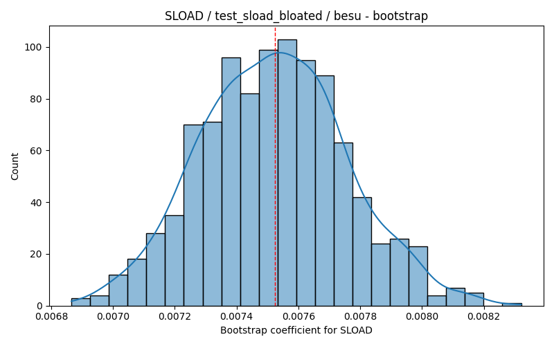

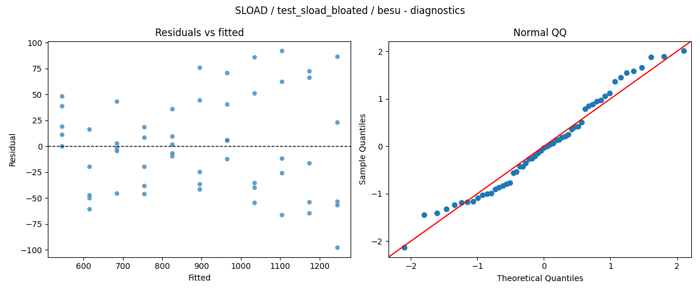

</details>

<details><summary>erigon — NNLS regression summary</summary>

```
==============================================================================
                           NNLS Regression Results                            
==============================================================================
Dep. Variable:          test_runtime_ms              R-squared:          0.998
Model:                  NNLS                    Adj. R-squared:          0.998
No. Observations:       22                                RMSE:           7.07
Df Residuals:           20                                 MAE:           5.97
Df Model:               1      
==============================================================================
                      coef     std err     P-value      [0.025      0.975]
------------------------------------------------------------------------------
         const     17.1768      4.5138       0.002      8.0090     25.4825
       opcount      0.0061      0.0001       0.001      0.0060      0.0063
==============================================================================
Notes: Non-negative least squares with bootstrap inference (1000 iterations)
==============================================================================
```


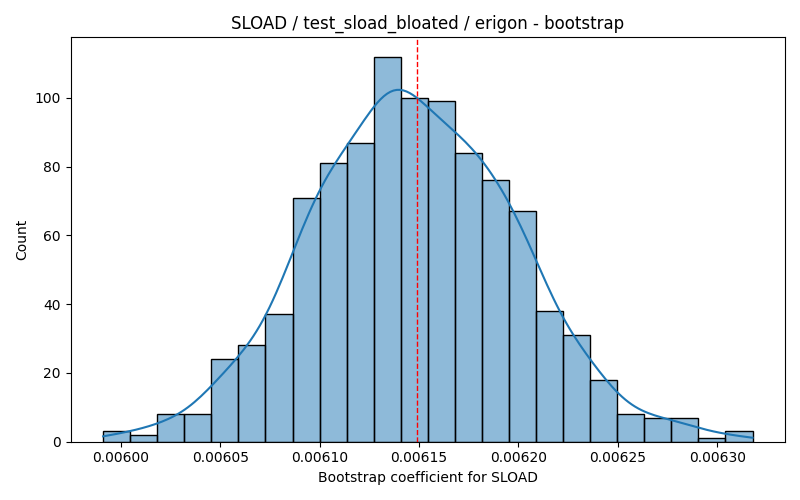

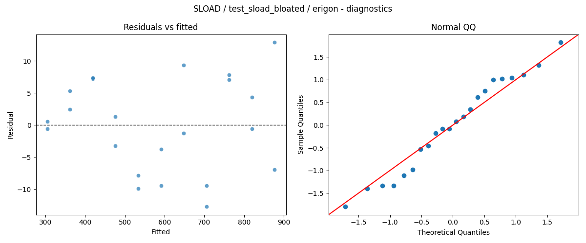

</details>

<details><summary>geth — NNLS regression summary</summary>

```
==============================================================================
                           NNLS Regression Results                            
==============================================================================
Dep. Variable:          test_runtime_ms              R-squared:          0.976
Model:                  NNLS                    Adj. R-squared:          0.973
No. Observations:       11                                RMSE:         120.31
Df Residuals:           9                                  MAE:          94.19
Df Model:               1      
==============================================================================
                      coef     std err     P-value      [0.025      0.975]
------------------------------------------------------------------------------
         const    950.4130    184.3778       0.001    661.7209   1330.9341
       opcount      0.0261      0.0018       0.001      0.0226      0.0292
==============================================================================
Notes: Non-negative least squares with bootstrap inference (1000 iterations)
==============================================================================
```

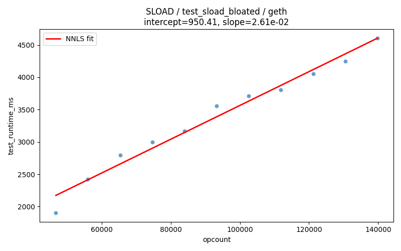

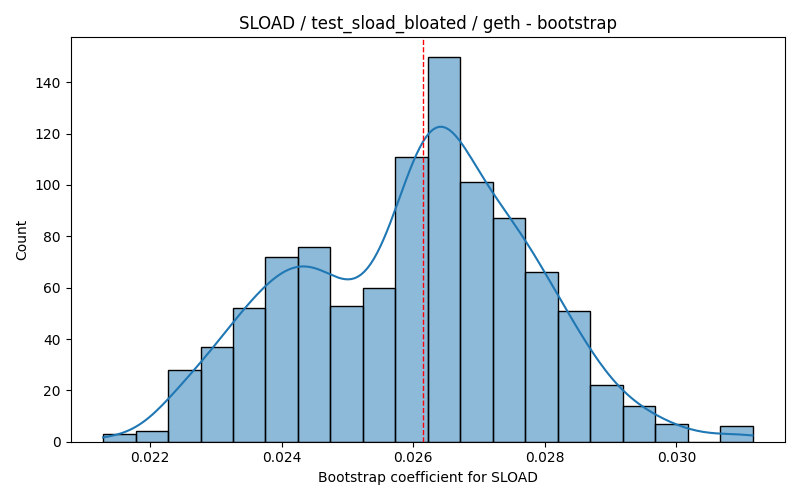

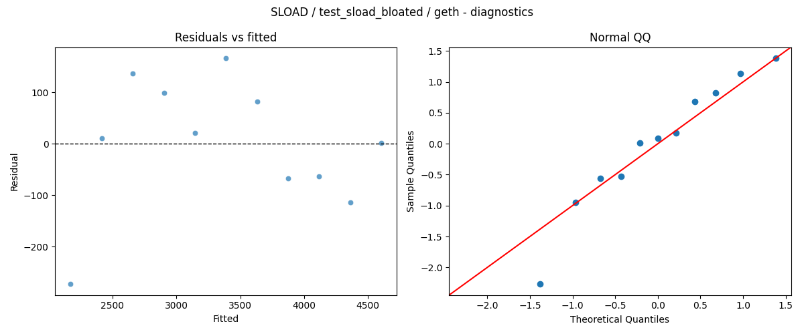

</details>

<details><summary>nethermind — NNLS regression summary</summary>

```
==============================================================================
                           NNLS Regression Results                            
==============================================================================
Dep. Variable:          test_runtime_ms              R-squared:          0.878
Model:                  NNLS                    Adj. R-squared:          0.874
No. Observations:       33                                RMSE:          40.44
Df Residuals:           31                                 MAE:          34.43
Df Model:               1      
==============================================================================
                      coef     std err     P-value      [0.025      0.975]
------------------------------------------------------------------------------
         const    116.9047     22.1419       0.001     72.1665    157.6867
       opcount      0.0037      0.0002       0.001      0.0033      0.0041
==============================================================================
Notes: Non-negative least squares with bootstrap inference (1000 iterations)
==============================================================================
```

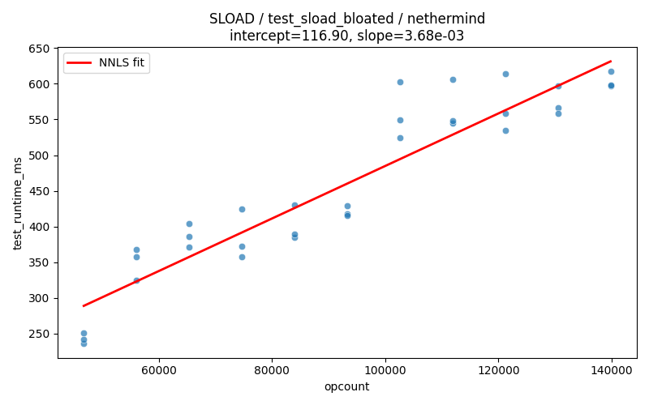

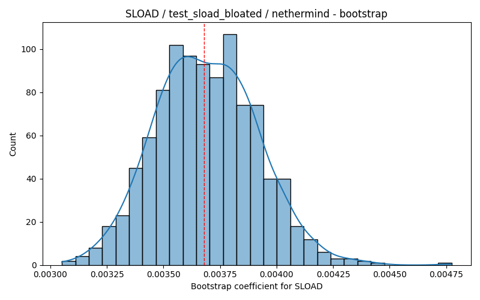

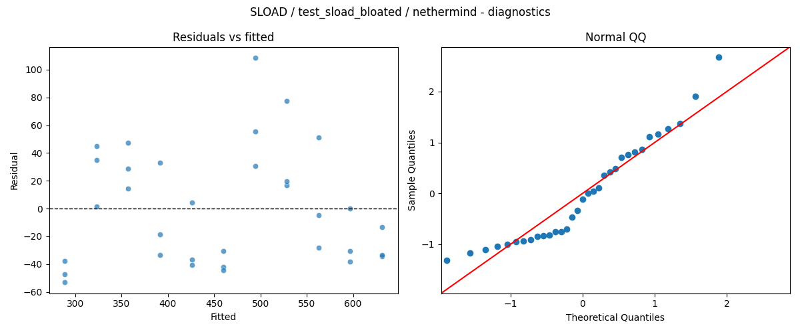

</details>

<details><summary>reth — NNLS regression summary</summary>

```
==============================================================================
                           NNLS Regression Results                            
==============================================================================
Dep. Variable:          test_runtime_ms              R-squared:          0.940
Model:                  NNLS                    Adj. R-squared:          0.939
No. Observations:       77                                RMSE:           9.57
Df Residuals:           75                                 MAE:           6.82
Df Model:               1      
==============================================================================
                      coef     std err     P-value      [0.025      0.975]
------------------------------------------------------------------------------
         const     41.3853      4.2076       0.001     33.5907     49.6077
       opcount      0.0013      0.0000       0.001      0.0012      0.0014
==============================================================================
Notes: Non-negative least squares with bootstrap inference (1000 iterations)
==============================================================================
```

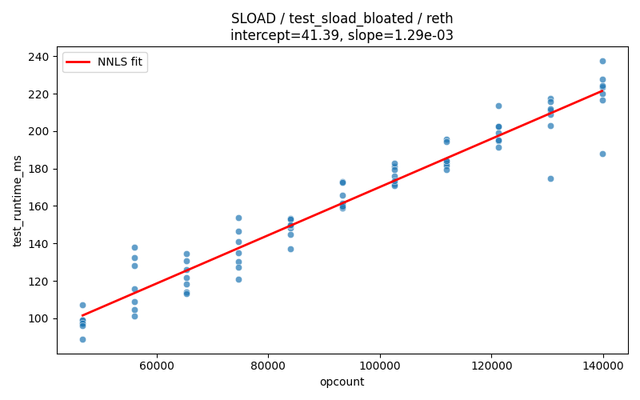

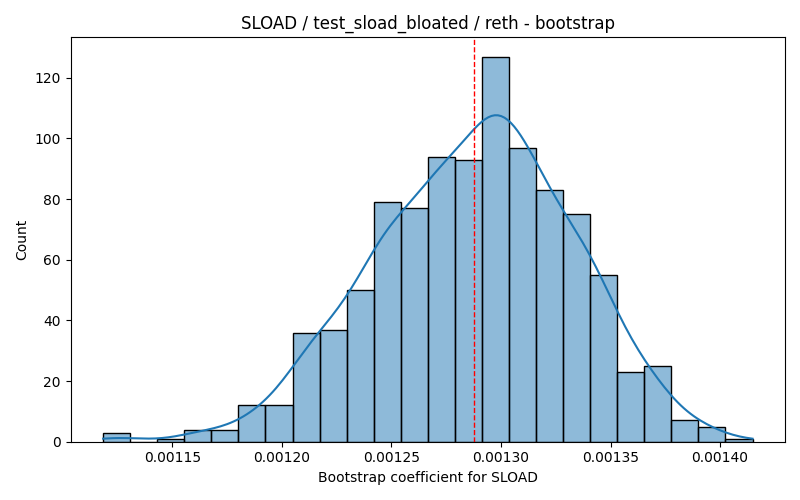

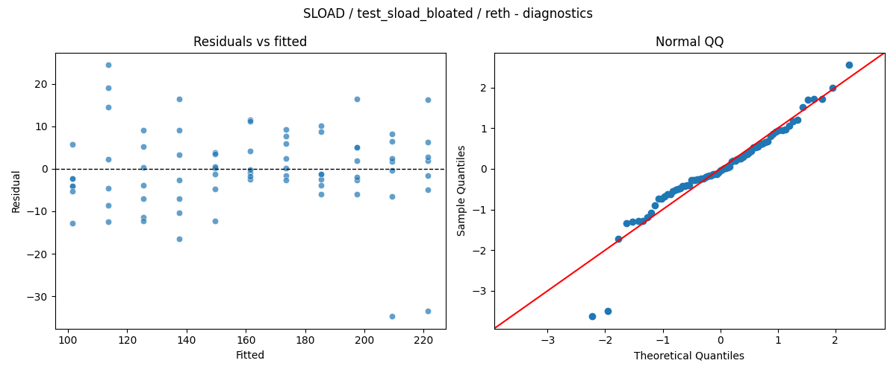

</details>

### test_sload_bloated — combo `True`

| client | nobs | R² | target_coef (ms) | p-value | 95% CI |
| --- | --- | --- | --- | --- | --- |
| `besu` | 55 | 0.9219 | 0.01621 | 1.00e-03 | [0.015, 0.01744] |
| `erigon` | 22 | 0.9914 | 0.005672 | 1.00e-03 | [0.005458, 0.00589] |
| `geth` | 11 | 0.9724 | 0.0248 | 1.00e-03 | [0.02044, 0.02797] |
| `nethermind` | 33 | 0.514 | 0.02287 | 1.00e-03 | [0.01486, 0.03117] |
| `reth` | 77 | 0.9611 | 0.001485 | 1.00e-03 | [0.001412, 0.001554] |

<details><summary>besu — NNLS regression summary</summary>

```
==============================================================================
                           NNLS Regression Results                            
==============================================================================
Dep. Variable:          test_runtime_ms              R-squared:          0.922
Model:                  NNLS                    Adj. R-squared:          0.920
No. Observations:       55                                RMSE:         138.86
Df Residuals:           53                                 MAE:         113.47
Df Model:               1      
==============================================================================
                      coef     std err     P-value      [0.025      0.975]
------------------------------------------------------------------------------
         const    517.3064     58.4549       0.001    402.0800    623.6093
       opcount      0.0162      0.0006       0.001      0.0150      0.0174
==============================================================================
Notes: Non-negative least squares with bootstrap inference (1000 iterations)
==============================================================================
```

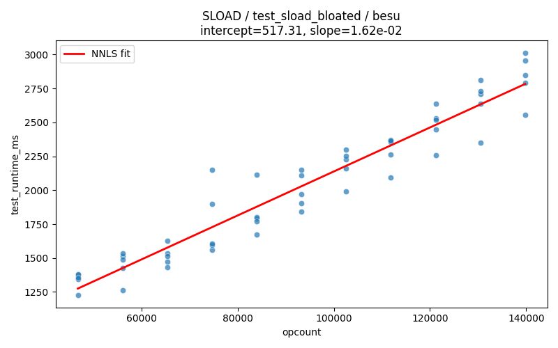

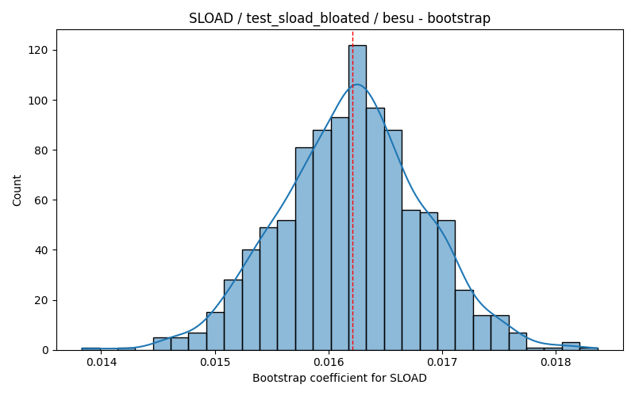

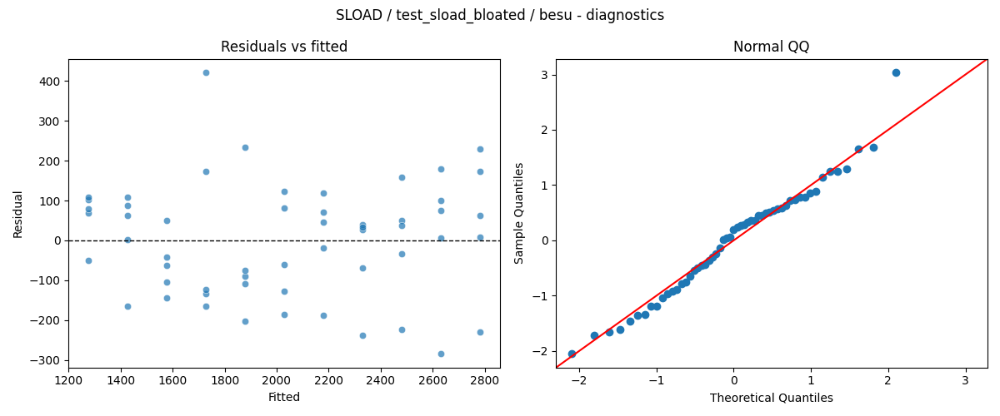

</details>

<details><summary>erigon — NNLS regression summary</summary>

```
==============================================================================
                           NNLS Regression Results                            
==============================================================================
Dep. Variable:          test_runtime_ms              R-squared:          0.991
Model:                  NNLS                    Adj. R-squared:          0.991
No. Observations:       22                                RMSE:          15.52
Df Residuals:           20                                 MAE:          12.79
Df Model:               1      
==============================================================================
                      coef     std err     P-value      [0.025      0.975]
------------------------------------------------------------------------------
         const     30.1446     11.0056       0.002      8.8464     51.7712
       opcount      0.0057      0.0001       0.001      0.0055      0.0059
==============================================================================
Notes: Non-negative least squares with bootstrap inference (1000 iterations)
==============================================================================
```

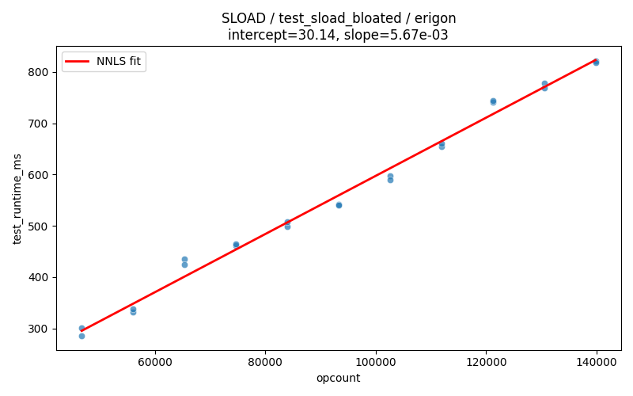

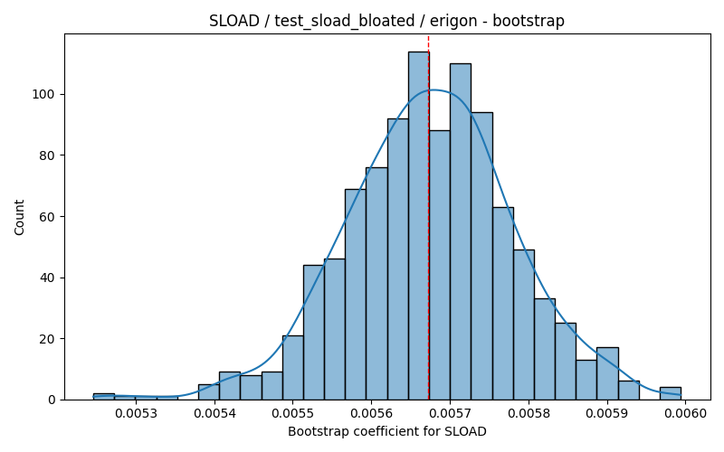

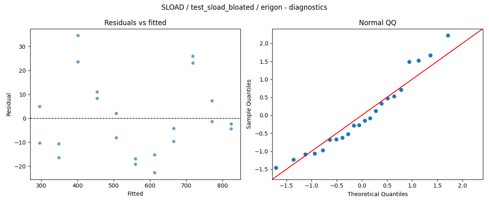

</details>

<details><summary>geth — NNLS regression summary</summary>

```
==============================================================================
                           NNLS Regression Results                            
==============================================================================
Dep. Variable:          test_runtime_ms              R-squared:          0.972
Model:                  NNLS                    Adj. R-squared:          0.969
No. Observations:       11                                RMSE:         122.88
Df Residuals:           9                                  MAE:         111.56
Df Model:               1      
==============================================================================
                      coef     std err     P-value      [0.025      0.975]
------------------------------------------------------------------------------
         const    942.6553    171.3533       0.001    700.2196   1392.5374
       opcount      0.0248      0.0018       0.001      0.0204      0.0280
==============================================================================
Notes: Non-negative least squares with bootstrap inference (1000 iterations)
==============================================================================
```

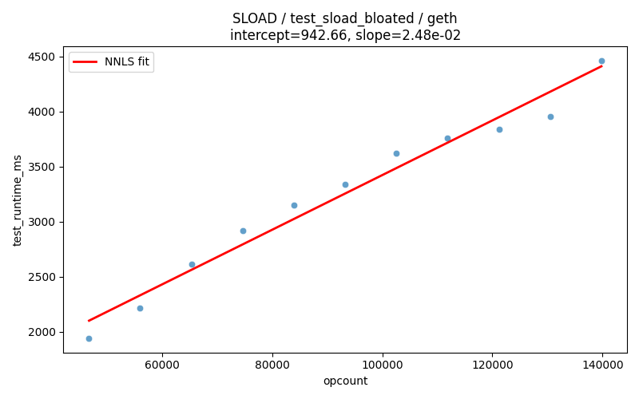

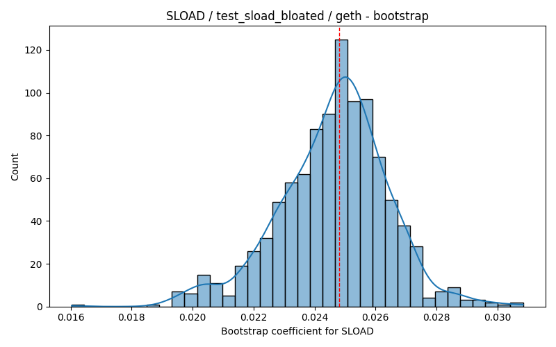

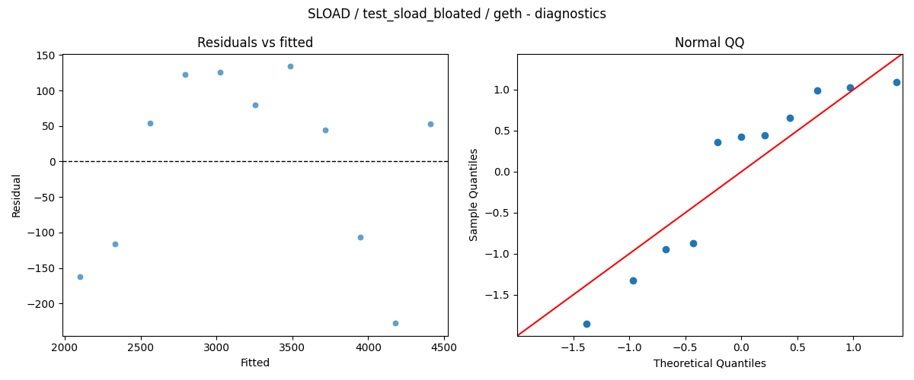

</details>

<details><summary>nethermind — NNLS regression summary</summary>

```
==============================================================================
                           NNLS Regression Results                            
==============================================================================
Dep. Variable:          test_runtime_ms              R-squared:          0.514
Model:                  NNLS                    Adj. R-squared:          0.498
No. Observations:       33                                RMSE:         654.46
Df Residuals:           31                                 MAE:         550.50
Df Model:               1      
==============================================================================
                      coef     std err     P-value      [0.025      0.975]
------------------------------------------------------------------------------
         const   1138.3886    391.3184       0.001    412.4702   1932.9505
       opcount      0.0229      0.0043       0.001      0.0149      0.0312
==============================================================================
Notes: Non-negative least squares with bootstrap inference (1000 iterations)
==============================================================================
```

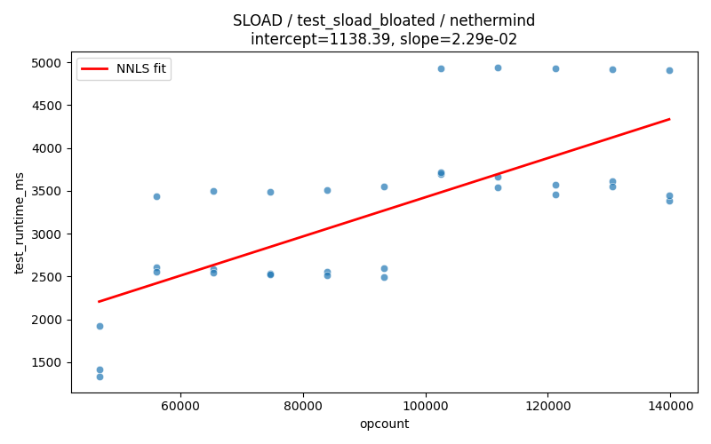

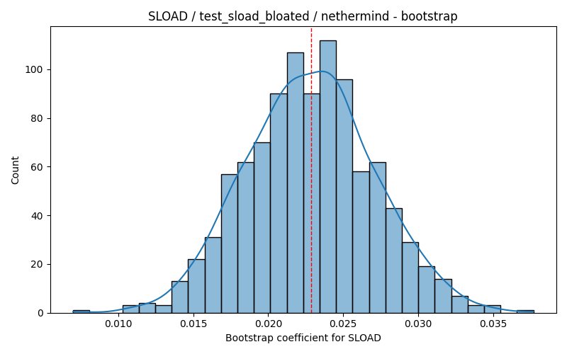

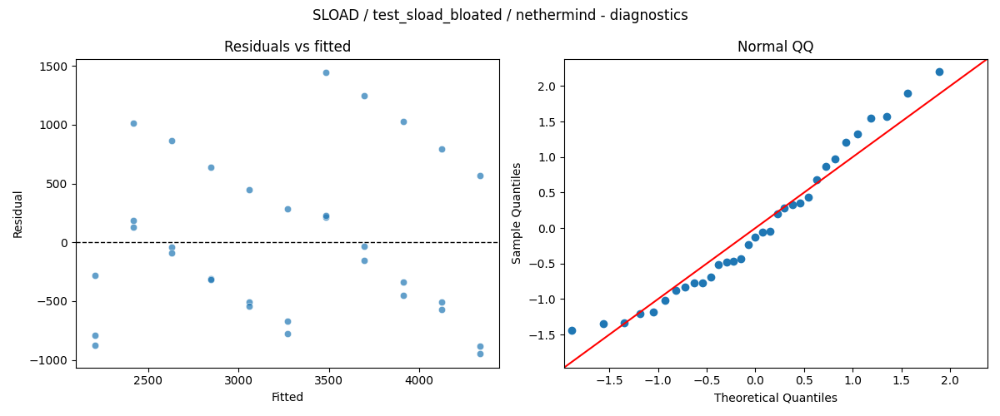

</details>

<details><summary>reth — NNLS regression summary</summary>

```
==============================================================================
                           NNLS Regression Results                            
==============================================================================
Dep. Variable:          test_runtime_ms              R-squared:          0.961
Model:                  NNLS                    Adj. R-squared:          0.961
No. Observations:       77                                RMSE:           8.79
Df Residuals:           75                                 MAE:           6.98
Df Model:               1      
==============================================================================
                      coef     std err     P-value      [0.025      0.975]
------------------------------------------------------------------------------
         const     28.2194      3.1391       0.001     22.1770     34.3964
       opcount      0.0015      0.0000       0.001      0.0014      0.0016
==============================================================================
Notes: Non-negative least squares with bootstrap inference (1000 iterations)
==============================================================================
```

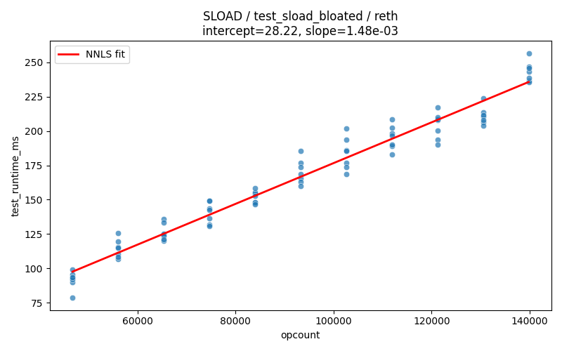

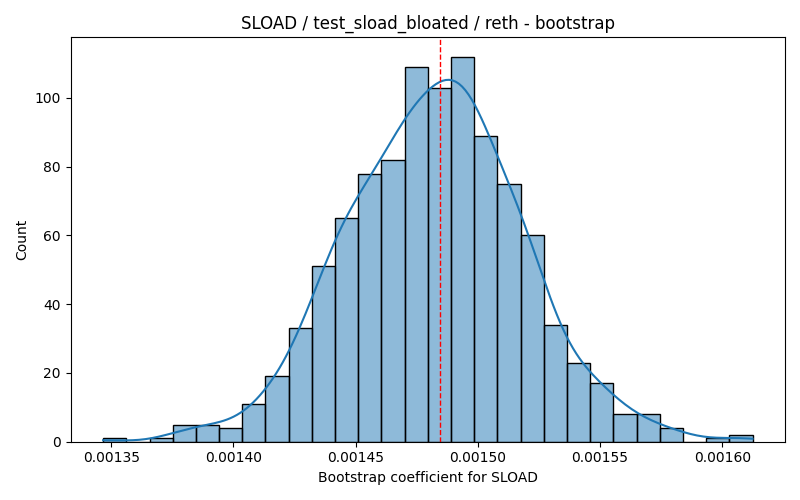

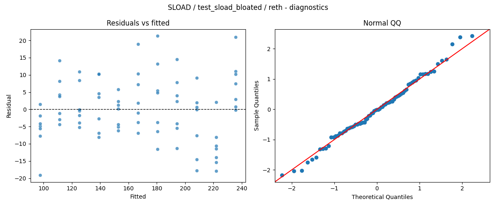

</details>

### test_storage_sload_same_key_benchmark

| client | nobs | R² | target_coef (ms) | p-value | 95% CI |
| --- | --- | --- | --- | --- | --- |
| `besu` | 110 | 0.7106 | 0.0001254 | 1.00e-03 | [0.0001124, 0.0001377] |
| `erigon` | 44 | 0.921 | 3.875e-05 | 1.00e-03 | [3.456e-05, 4.184e-05] |
| `geth` | 22 | 0.9409 | 5.321e-05 | 1.00e-03 | [4.713e-05, 5.884e-05] |
| `nethermind` | 66 | 0.8729 | 0.0001943 | 1.00e-03 | [0.0001737, 0.0002152] |
| `reth` | 154 | 0.6741 | 5.057e-06 | 1.00e-03 | [4.522e-06, 5.586e-06] |

<details><summary>besu — NNLS regression summary</summary>

```
==============================================================================
                           NNLS Regression Results                            
==============================================================================
Dep. Variable:          test_runtime_ms              R-squared:          0.711
Model:                  NNLS                    Adj. R-squared:          0.708
No. Observations:       110                               RMSE:          50.54
Df Residuals:           108                                MAE:          40.21
Df Model:               1      
==============================================================================
                      coef     std err     P-value      [0.025      0.975]
------------------------------------------------------------------------------
         const     93.0258     13.8227       0.001     68.2050    122.9869
       opcount      0.0001      0.0000       0.001      0.0001      0.0001
==============================================================================
Notes: Non-negative least squares with bootstrap inference (1000 iterations)
==============================================================================
```

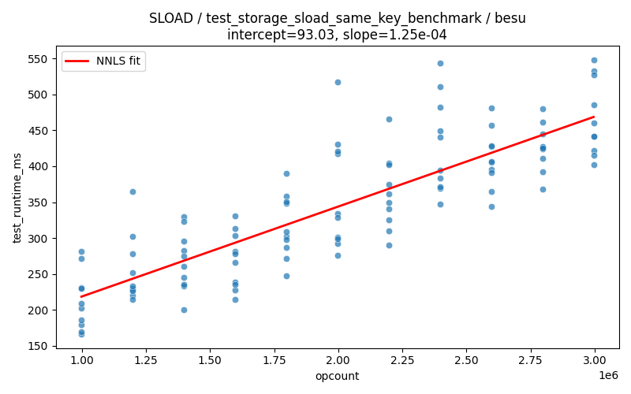

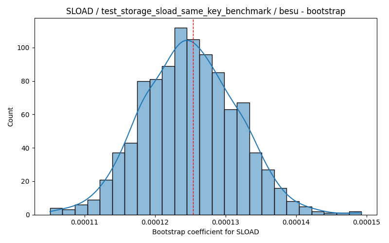

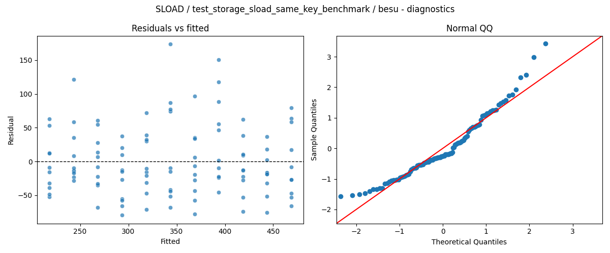

</details>

<details><summary>erigon — NNLS regression summary</summary>

```
==============================================================================
                           NNLS Regression Results                            
==============================================================================
Dep. Variable:          test_runtime_ms              R-squared:          0.921
Model:                  NNLS                    Adj. R-squared:          0.919
No. Observations:       44                                RMSE:           7.17
Df Residuals:           42                                 MAE:           5.21
Df Model:               1      
==============================================================================
                      coef     std err     P-value      [0.025      0.975]
------------------------------------------------------------------------------
         const     38.4364      4.3183       0.001     31.4599     48.1763
       opcount      0.0000      0.0000       0.001      0.0000      0.0000
==============================================================================
Notes: Non-negative least squares with bootstrap inference (1000 iterations)
==============================================================================
```

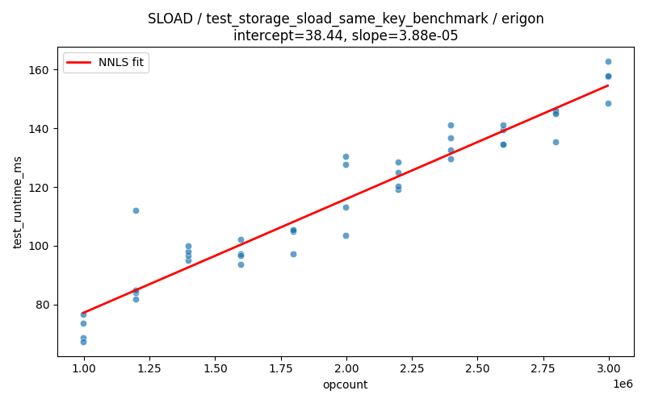

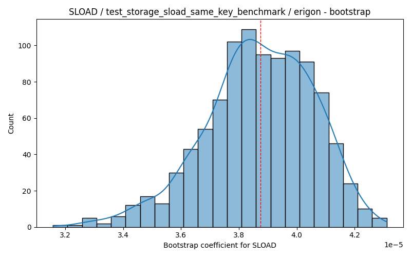

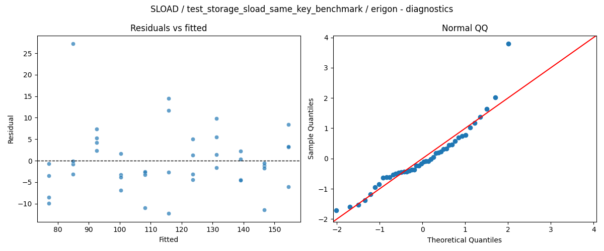

</details>

<details><summary>geth — NNLS regression summary</summary>

```
==============================================================================
                           NNLS Regression Results                            
==============================================================================
Dep. Variable:          test_runtime_ms              R-squared:          0.941
Model:                  NNLS                    Adj. R-squared:          0.938
No. Observations:       22                                RMSE:           8.43
Df Residuals:           20                                 MAE:           6.89
Df Model:               1      
==============================================================================
                      coef     std err     P-value      [0.025      0.975]
------------------------------------------------------------------------------
         const     14.5073      6.8120       0.020      0.3672     27.4049
       opcount      0.0001      0.0000       0.001      0.0000      0.0001
==============================================================================
Notes: Non-negative least squares with bootstrap inference (1000 iterations)
==============================================================================
```

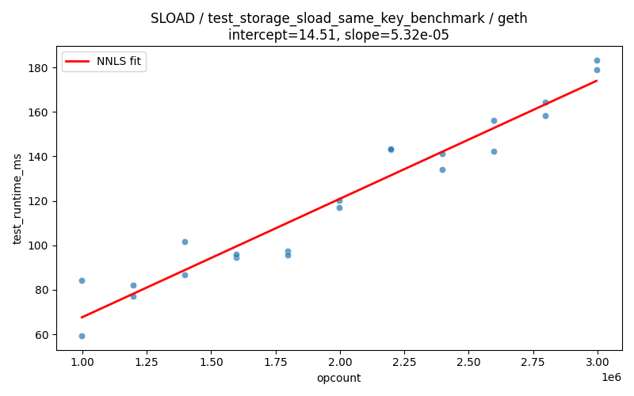

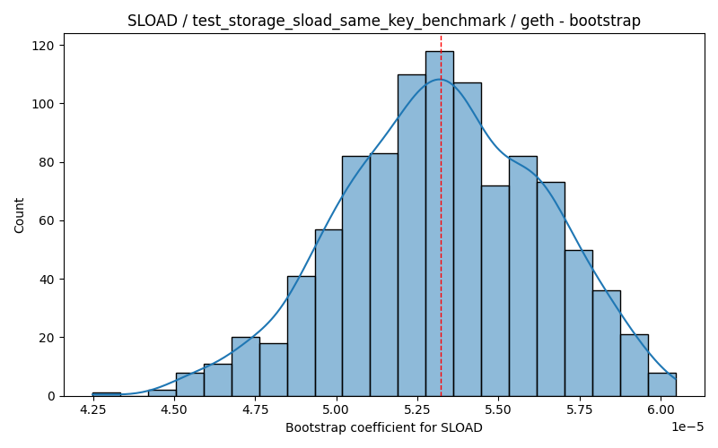

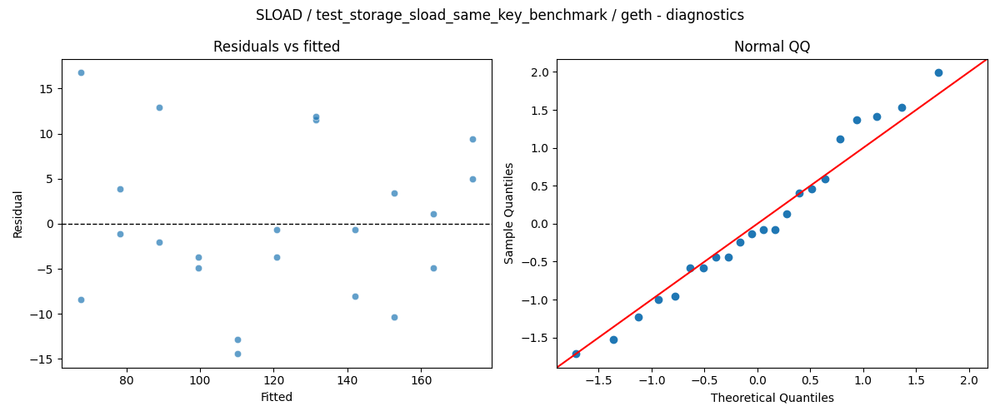

</details>

<details><summary>nethermind — NNLS regression summary</summary>

```
==============================================================================
                           NNLS Regression Results                            
==============================================================================
Dep. Variable:          test_runtime_ms              R-squared:          0.873
Model:                  NNLS                    Adj. R-squared:          0.871
No. Observations:       66                                RMSE:          46.83
Df Residuals:           64                                 MAE:          36.43
Df Model:               1      
==============================================================================
                      coef     std err     P-value      [0.025      0.975]
------------------------------------------------------------------------------
         const     68.1726     19.4672       0.001     30.1416    107.4226
       opcount      0.0002      0.0000       0.001      0.0002      0.0002
==============================================================================
Notes: Non-negative least squares with bootstrap inference (1000 iterations)
==============================================================================
```

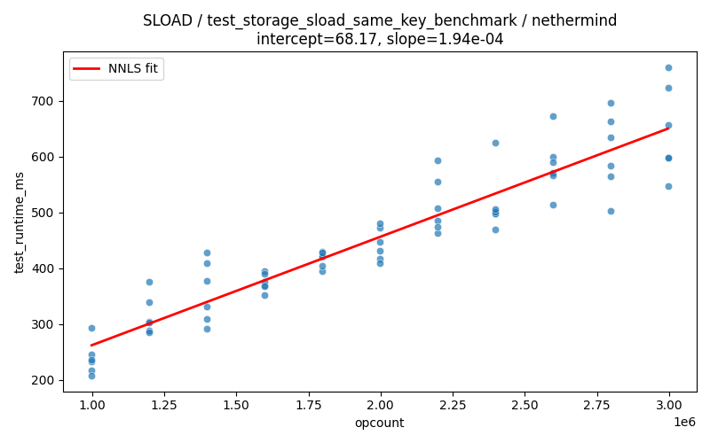

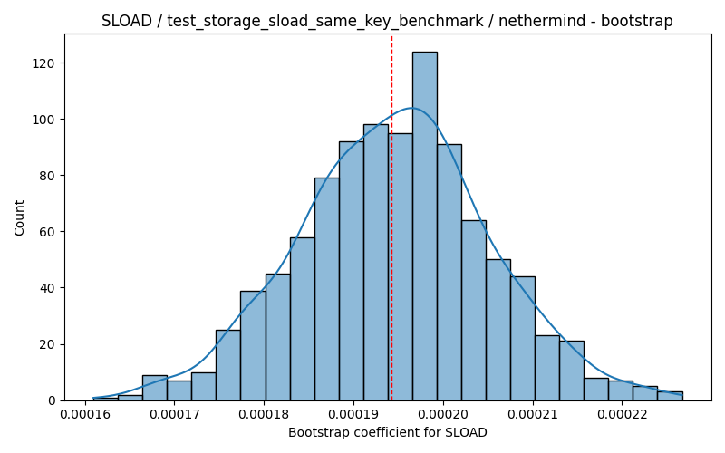

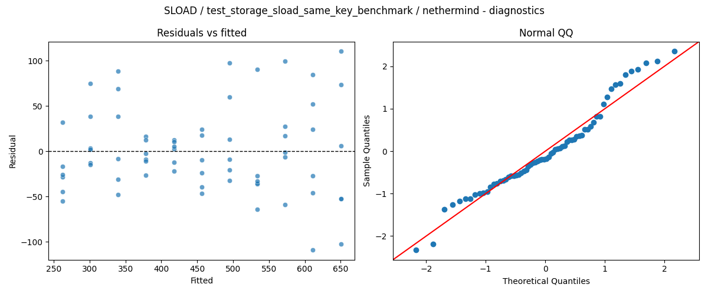

</details>

<details><summary>reth — NNLS regression summary</summary>

```
==============================================================================
                           NNLS Regression Results                            
==============================================================================
Dep. Variable:          test_runtime_ms              R-squared:          0.674
Model:                  NNLS                    Adj. R-squared:          0.672
No. Observations:       154                               RMSE:           2.22
Df Residuals:           152                                MAE:           1.56
Df Model:               1      
==============================================================================
                      coef     std err     P-value      [0.025      0.975]
------------------------------------------------------------------------------
         const      5.6258      0.5299       0.001      4.6016      6.7146
       opcount      0.0000      0.0000       0.001      0.0000      0.0000
==============================================================================
Notes: Non-negative least squares with bootstrap inference (1000 iterations)
==============================================================================
```

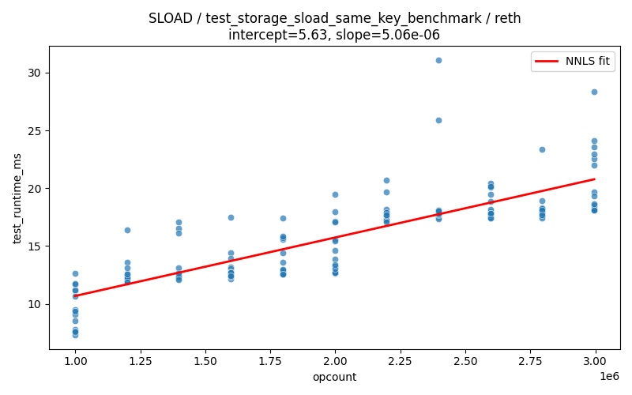

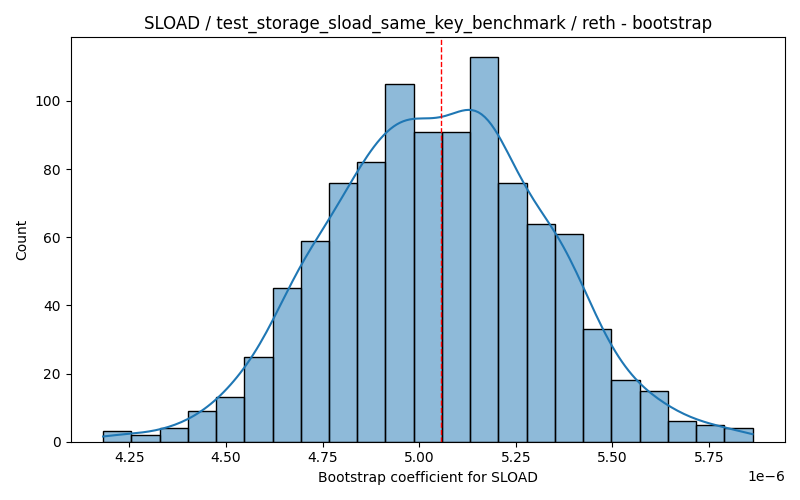

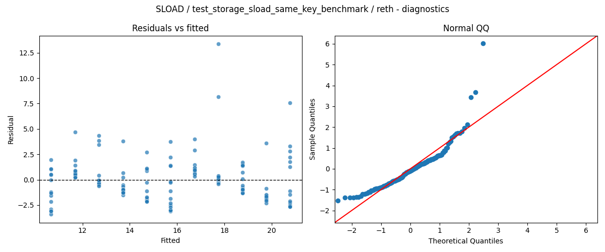

</details>

## SSTORE

### test_sstore_bloated — combo `False`

| client | nobs | R² | target_coef (ms) | p-value | 95% CI |
| --- | --- | --- | --- | --- | --- |
| `besu` | 110 | 0.8988 | 0.009425 | 1.00e-03 | [0.008633, 0.01019] |
| `erigon` | 44 | 0.9165 | 0.005015 | 1.00e-03 | [0.004445, 0.005594] |
| `geth` | 22 | 0.9913 | 0.03085 | 1.00e-03 | [0.02959, 0.03313] |
| `nethermind` | 66 | 0.926 | 0.00381 | 1.00e-03 | [0.00347, 0.004166] |
| `reth` | 154 | 0.6026 | 5.334e-05 | 4.18e-01 | [0, 0.0005679] |

<details><summary>besu — NNLS regression summary</summary>

```
==============================================================================
                           NNLS Regression Results                            
==============================================================================
Dep. Variable:          test_runtime_ms              R-squared:          0.899
Model:                  NNLS                    Adj. R-squared:          0.897
No. Observations:       110                               RMSE:         122.36
Df Residuals:           107                                MAE:          98.84
Df Model:               2      
==============================================================================
                      coef     std err     P-value      [0.025      0.975]
------------------------------------------------------------------------------
         const    500.0855     32.9374       0.001    435.3433    561.2482
       opcount      0.0094      0.0004       0.001      0.0086      0.0102
        update      0.1069      0.0182       0.001      0.0741      0.1459
==============================================================================
Notes: Non-negative least squares with bootstrap inference (1000 iterations)
==============================================================================
```

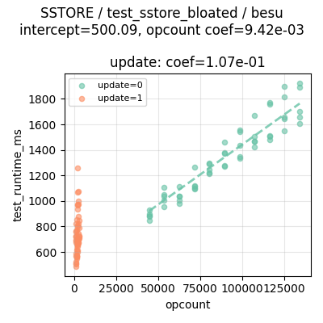

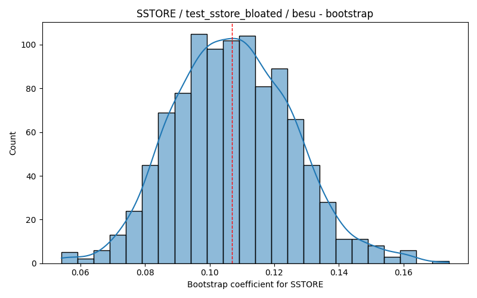

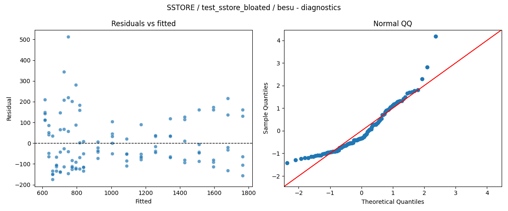

</details>

<details><summary>erigon — NNLS regression summary</summary>

```
==============================================================================
                           NNLS Regression Results                            
==============================================================================
Dep. Variable:          test_runtime_ms              R-squared:          0.916
Model:                  NNLS                    Adj. R-squared:          0.912
No. Observations:       44                                RMSE:          41.68
Df Residuals:           41                                 MAE:          32.68
Df Model:               2      
==============================================================================
                      coef     std err     P-value      [0.025      0.975]
------------------------------------------------------------------------------
         const    124.4596     29.3334       0.001     69.2006    179.7264
       opcount      0.0050      0.0003       0.001      0.0044      0.0056
        update      0.1631      0.0124       0.001      0.1397      0.1858
==============================================================================
Notes: Non-negative least squares with bootstrap inference (1000 iterations)
==============================================================================
```

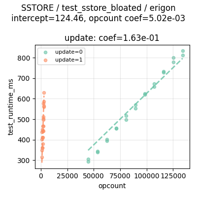

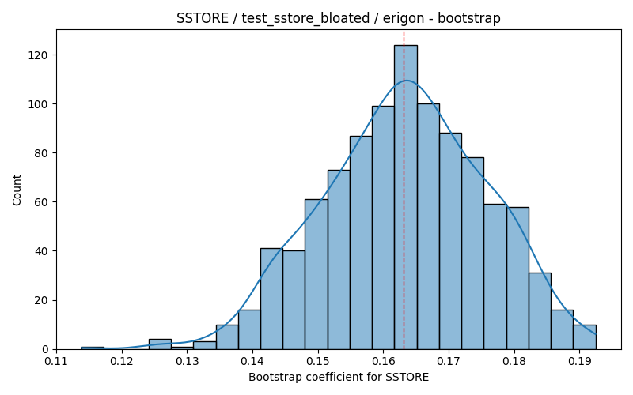

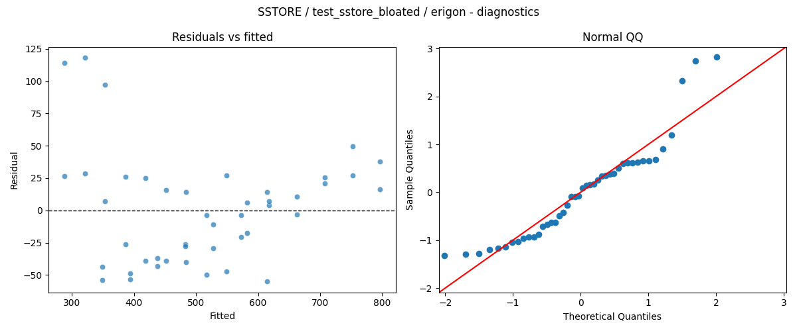

</details>

<details><summary>geth — NNLS regression summary</summary>

```
==============================================================================
                           NNLS Regression Results                            
==============================================================================
Dep. Variable:          test_runtime_ms              R-squared:          0.991
Model:                  NNLS                    Adj. R-squared:          0.990
No. Observations:       22                                RMSE:         138.74
Df Residuals:           19                                 MAE:         109.23
Df Model:               2      
==============================================================================
                      coef     std err     P-value      [0.025      0.975]
------------------------------------------------------------------------------
         const    352.1701     48.0464       0.001    212.3157    416.8789
       opcount      0.0309      0.0009       0.001      0.0296      0.0331
        update      0.0000      0.0142       1.000      0.0000      0.0537
==============================================================================
Notes: Non-negative least squares with bootstrap inference (1000 iterations)
==============================================================================
```

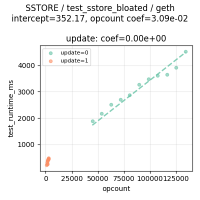

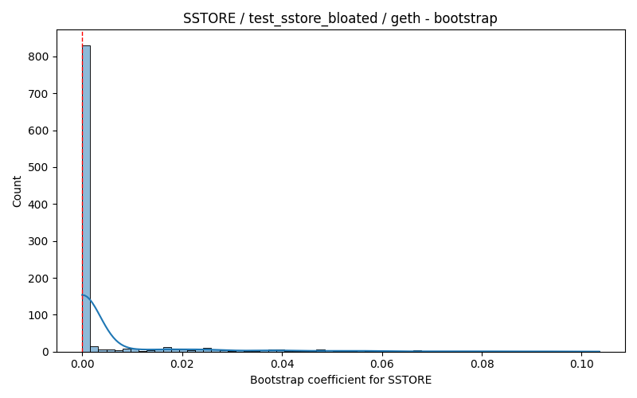

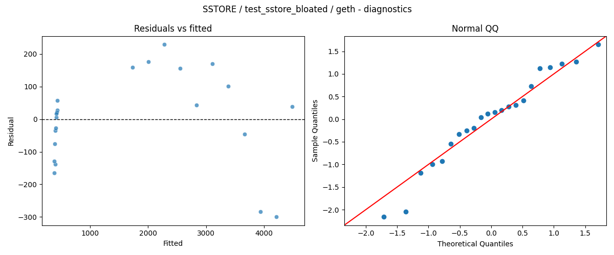

</details>

<details><summary>nethermind — NNLS regression summary</summary>

```
==============================================================================
                           NNLS Regression Results                            
==============================================================================
Dep. Variable:          test_runtime_ms              R-squared:          0.926
Model:                  NNLS                    Adj. R-squared:          0.924
No. Observations:       66                                RMSE:          36.66
Df Residuals:           63                                 MAE:          30.91
Df Model:               2      
==============================================================================
                      coef     std err     P-value      [0.025      0.975]
------------------------------------------------------------------------------
         const     95.0232     13.9423       0.001     68.1596    122.5493
       opcount      0.0038      0.0002       0.001      0.0035      0.0042
        update      0.0683      0.0071       0.001      0.0549      0.0825
==============================================================================
Notes: Non-negative least squares with bootstrap inference (1000 iterations)
==============================================================================
```

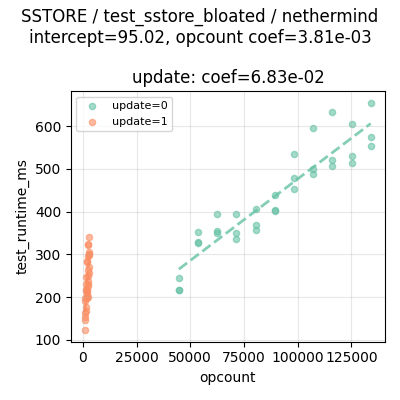

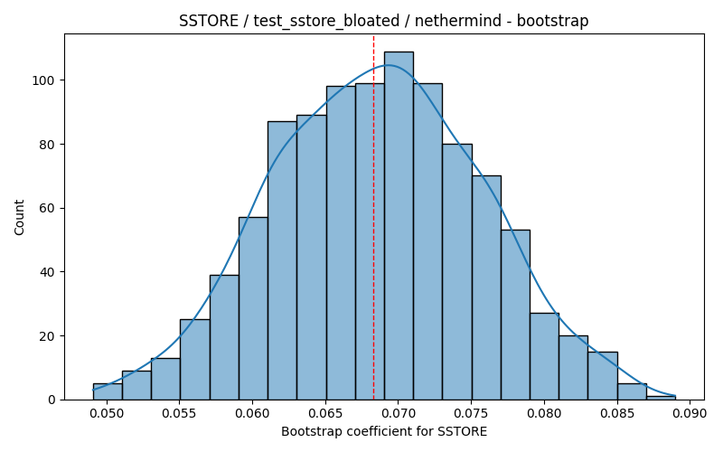

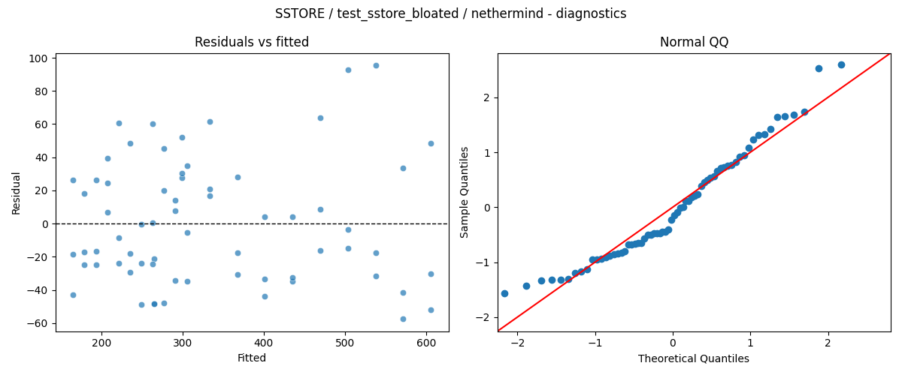

</details>

<details><summary>reth — NNLS regression summary</summary>

```
==============================================================================
                           NNLS Regression Results                            
==============================================================================
Dep. Variable:          test_runtime_ms              R-squared:          0.603
Model:                  NNLS                    Adj. R-squared:          0.597
No. Observations:       154                               RMSE:          61.27
Df Residuals:           151                                MAE:          38.50
Df Model:               2      
==============================================================================
                      coef     std err     P-value      [0.025      0.975]
------------------------------------------------------------------------------
         const    167.8591     18.6460       0.001    117.2795    184.3035
       opcount      0.0001      0.0002       0.418      0.0000      0.0006
        update      0.0729      0.0069       0.001      0.0670      0.0925
==============================================================================
Notes: Non-negative least squares with bootstrap inference (1000 iterations)
==============================================================================
```

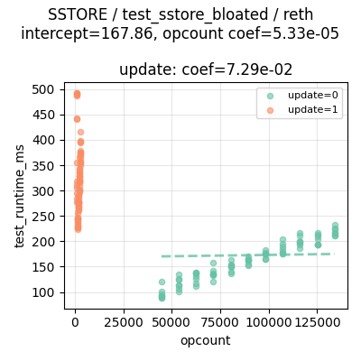

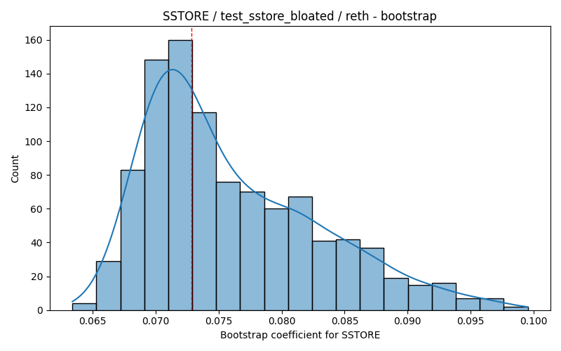

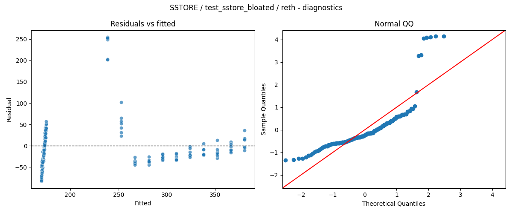

</details>

### test_sstore_bloated — combo `True`

| client | nobs | R² | target_coef (ms) | p-value | 95% CI |
| --- | --- | --- | --- | --- | --- |
| `besu` | 110 | 0.9866 | 0.0177 | 1.00e-03 | [0.01606, 0.01946] |
| `erigon` | 44 | 0.9865 | 0 | 1.00e+00 | [0, 0.001274] |
| `geth` | 22 | 0.925 | 0.03185 | 1.00e-03 | [0.03028, 0.03446] |
| `nethermind` | 66 | 0.641 | 0.02371 | 1.00e-03 | [0.01935, 0.029] |
| `reth` | 154 | 0.9953 | 0 | 1.00e+00 | [0, 0] |

<details><summary>besu — NNLS regression summary</summary>

```
==============================================================================
                           NNLS Regression Results                            
==============================================================================
Dep. Variable:          test_runtime_ms              R-squared:          0.987
Model:                  NNLS                    Adj. R-squared:          0.986
No. Observations:       110                               RMSE:         221.84
Df Residuals:           107                                MAE:         169.92
Df Model:               2      
==============================================================================
                      coef     std err     P-value      [0.025      0.975]
------------------------------------------------------------------------------
         const    721.5298     79.7986       0.001    554.2498    868.1869
       opcount      0.0177      0.0009       0.001      0.0161      0.0195
        update      0.1006      0.0015       0.001      0.0979      0.1035
==============================================================================
Notes: Non-negative least squares with bootstrap inference (1000 iterations)
==============================================================================
```

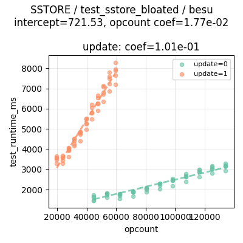

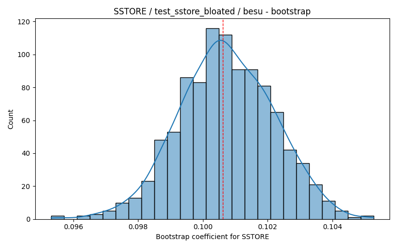

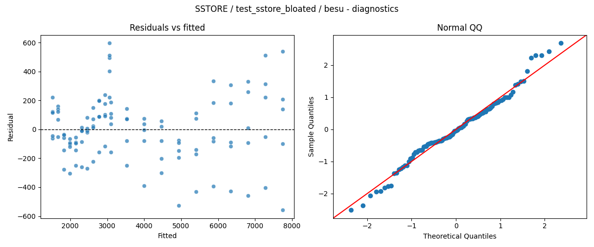

</details>

<details><summary>erigon — NNLS regression summary</summary>

```
==============================================================================
                           NNLS Regression Results                            
==============================================================================
Dep. Variable:          test_runtime_ms              R-squared:          0.987
Model:                  NNLS                    Adj. R-squared:          0.986
No. Observations:       44                                RMSE:         257.64
Df Residuals:           41                                 MAE:         198.33
Df Model:               2      
==============================================================================
                      coef     std err     P-value      [0.025      0.975]
------------------------------------------------------------------------------
         const    619.5961     63.7637       0.001    447.8440    723.2033
       opcount      0.0000      0.0004       1.000      0.0000      0.0013
        update      0.1016      0.0017       0.001      0.0990      0.1055
==============================================================================
Notes: Non-negative least squares with bootstrap inference (1000 iterations)
==============================================================================
```

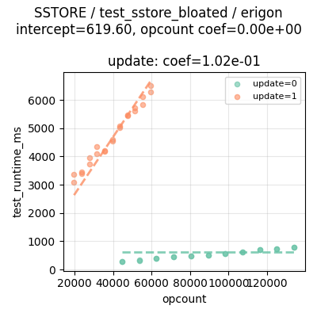

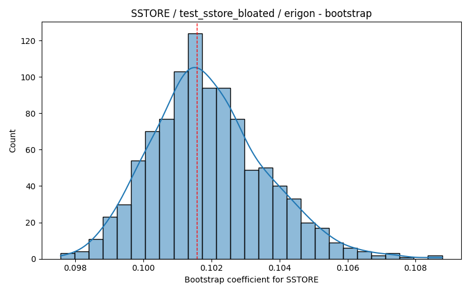

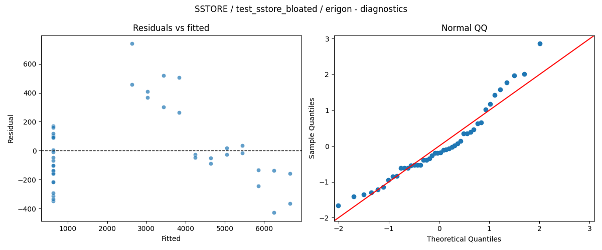

</details>

<details><summary>geth — NNLS regression summary</summary>

```
==============================================================================
                           NNLS Regression Results                            
==============================================================================
Dep. Variable:          test_runtime_ms              R-squared:          0.925
Model:                  NNLS                    Adj. R-squared:          0.917
No. Observations:       22                                RMSE:       10539.43
Df Residuals:           19                                 MAE:        6718.92
Df Model:               2      
==============================================================================
                      coef     std err     P-value      [0.025      0.975]
------------------------------------------------------------------------------
         const      0.0000      0.0000       1.000      0.0000      0.0000
       opcount      0.0319      0.0010       0.001      0.0303      0.0345
        update      1.6450      0.1251       0.001      1.3315      1.8281
==============================================================================
Notes: Non-negative least squares with bootstrap inference (1000 iterations)
==============================================================================
```

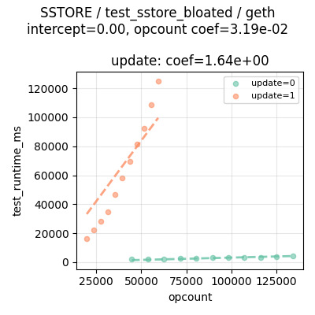

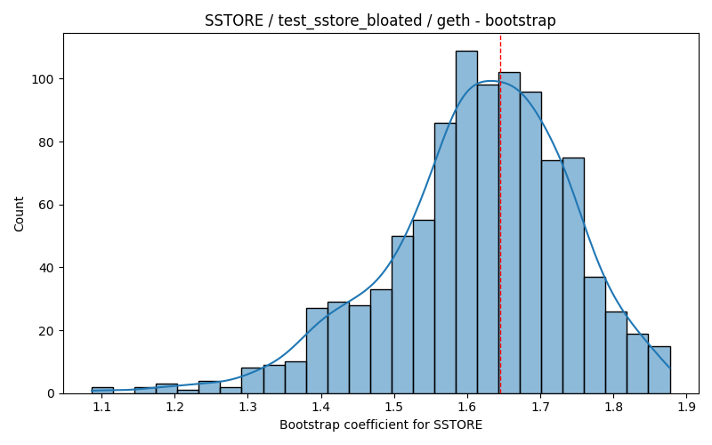

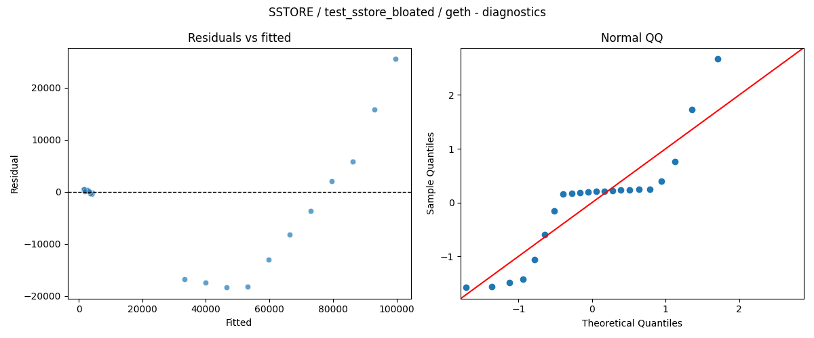

</details>

<details><summary>nethermind — NNLS regression summary</summary>

```
==============================================================================
                           NNLS Regression Results                            
==============================================================================
Dep. Variable:          test_runtime_ms              R-squared:          0.641
Model:                  NNLS                    Adj. R-squared:          0.630
No. Observations:       66                                RMSE:         490.37
Df Residuals:           63                                 MAE:         384.61
Df Model:               2      
==============================================================================
                      coef     std err     P-value      [0.025      0.975]
------------------------------------------------------------------------------
         const   1061.1745    201.6022       0.001    655.7087   1436.7287
       opcount      0.0237      0.0025       0.001      0.0194      0.0290
        update      0.0270      0.0033       0.001      0.0208      0.0337
==============================================================================
Notes: Non-negative least squares with bootstrap inference (1000 iterations)
==============================================================================
```

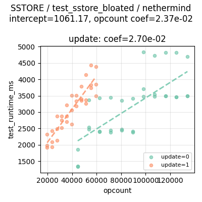

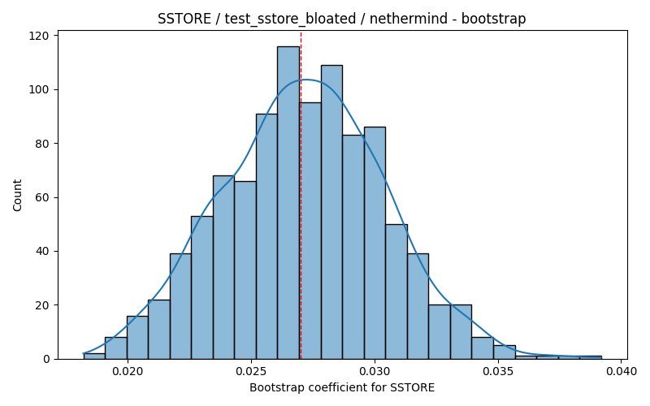

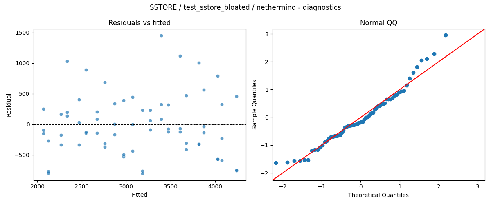

</details>

<details><summary>reth — NNLS regression summary</summary>

```
==============================================================================
                           NNLS Regression Results                            
==============================================================================
Dep. Variable:          test_runtime_ms              R-squared:          0.995
Model:                  NNLS                    Adj. R-squared:          0.995
No. Observations:       154                               RMSE:         256.17
Df Residuals:           151                                MAE:         191.57
Df Model:               2      
==============================================================================
                      coef     std err     P-value      [0.025      0.975]
------------------------------------------------------------------------------
         const    260.6719     19.1615       0.001    225.4007    299.5710
       opcount      0.0000      0.0000       1.000      0.0000      0.0000
        update      0.1712      0.0009       0.001      0.1694      0.1731
==============================================================================
Notes: Non-negative least squares with bootstrap inference (1000 iterations)
==============================================================================
```

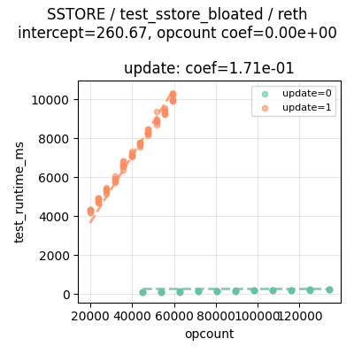

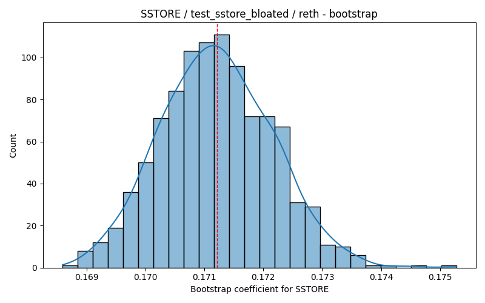

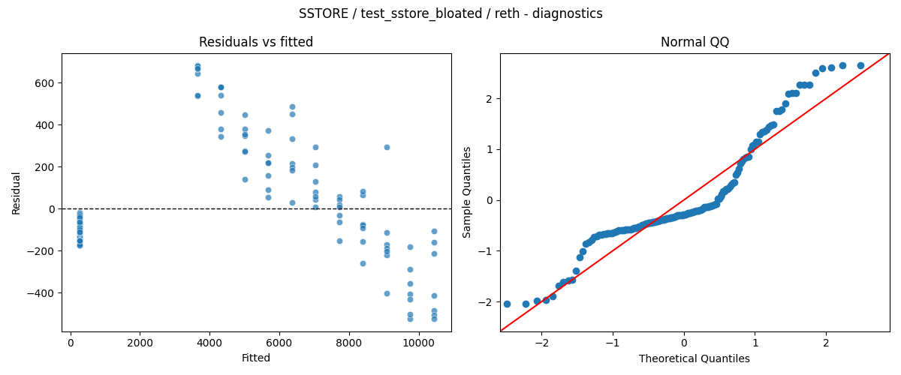

</details>

## BALANCE

### test_account_access — combo `BALANCE_AccountMode.EXISTING_CONTRACT`

| client | nobs | R² | target_coef (ms) | p-value | 95% CI |
| --- | --- | --- | --- | --- | --- |
| `besu` | 55 | 0.9522 | 0.02617 | 1.00e-03 | [0.02455, 0.02802] |
| `erigon` | 22 | 0.9086 | 0.03606 | 1.00e-03 | [0.03037, 0.04062] |
| `geth` | 11 | 0.8466 | 0.02077 | 1.00e-03 | [0.01422, 0.02933] |
| `nethermind` | 33 | 0.6697 | 0.02247 | 1.00e-03 | [0.01687, 0.02871] |
| `reth` | 77 | 0.8653 | 0.03134 | 1.00e-03 | [0.0278, 0.03443] |

<details><summary>besu — NNLS regression summary</summary>

```
==============================================================================
                           NNLS Regression Results                            
==============================================================================
Dep. Variable:          test_runtime_ms              R-squared:          0.952
Model:                  NNLS                    Adj. R-squared:          0.951
No. Observations:       55                                RMSE:         122.02
Df Residuals:           53                                 MAE:         103.50
Df Model:               1      
==============================================================================
                      coef     std err     P-value      [0.025      0.975]
------------------------------------------------------------------------------
         const    499.5714     64.7634       0.001    363.1767    607.7096
       opcount      0.0262      0.0009       0.001      0.0245      0.0280
==============================================================================
Notes: Non-negative least squares with bootstrap inference (1000 iterations)
==============================================================================
```

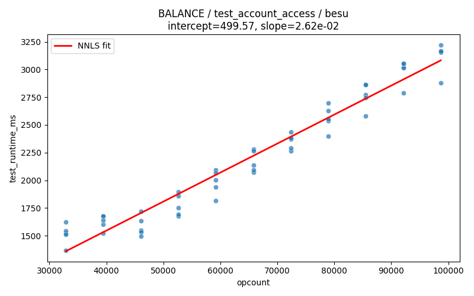

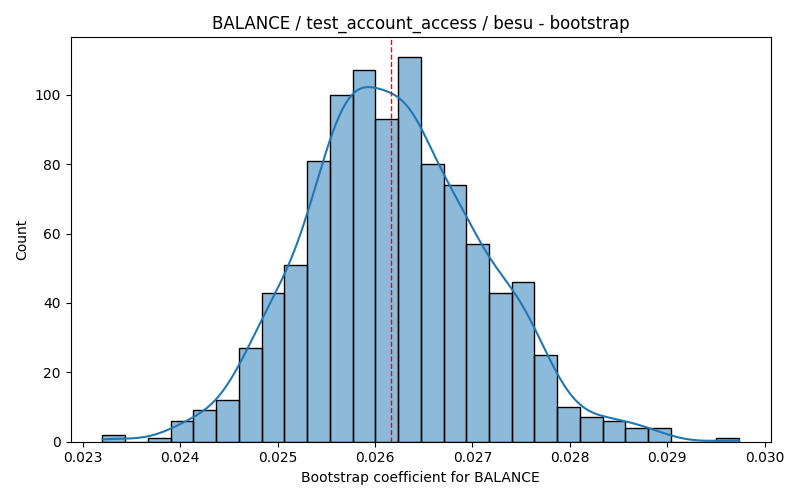

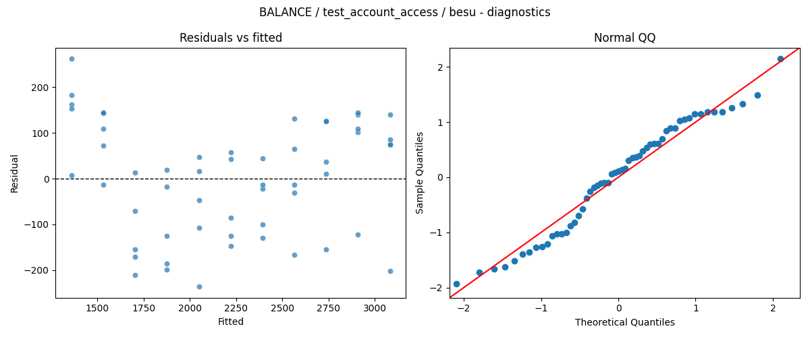

</details>

<details><summary>erigon — NNLS regression summary</summary>

```
==============================================================================
                           NNLS Regression Results                            
==============================================================================
Dep. Variable:          test_runtime_ms              R-squared:          0.909
Model:                  NNLS                    Adj. R-squared:          0.904
No. Observations:       22                                RMSE:         237.92
Df Residuals:           20                                 MAE:         205.80
Df Model:               1      
==============================================================================
                      coef     std err     P-value      [0.025      0.975]
------------------------------------------------------------------------------
         const    418.9287    188.6919       0.004    107.1421    864.5557
       opcount      0.0361      0.0026       0.001      0.0304      0.0406
==============================================================================
Notes: Non-negative least squares with bootstrap inference (1000 iterations)
==============================================================================
```

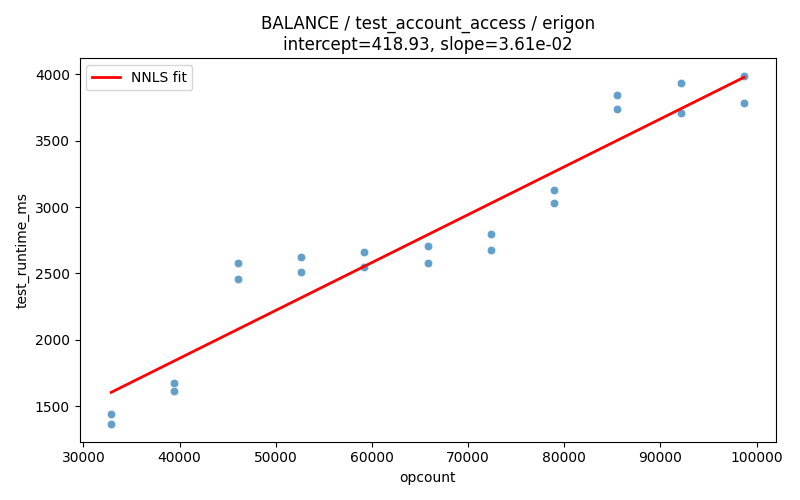

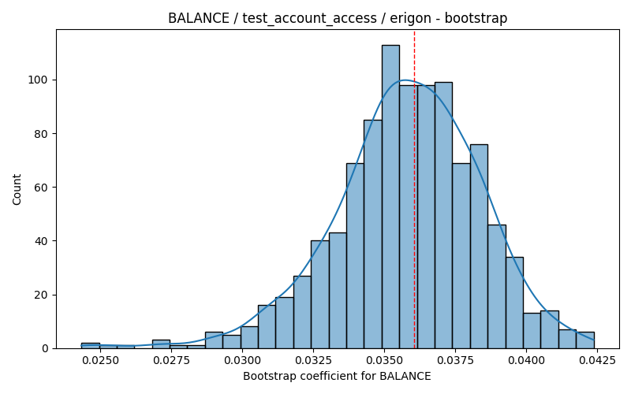

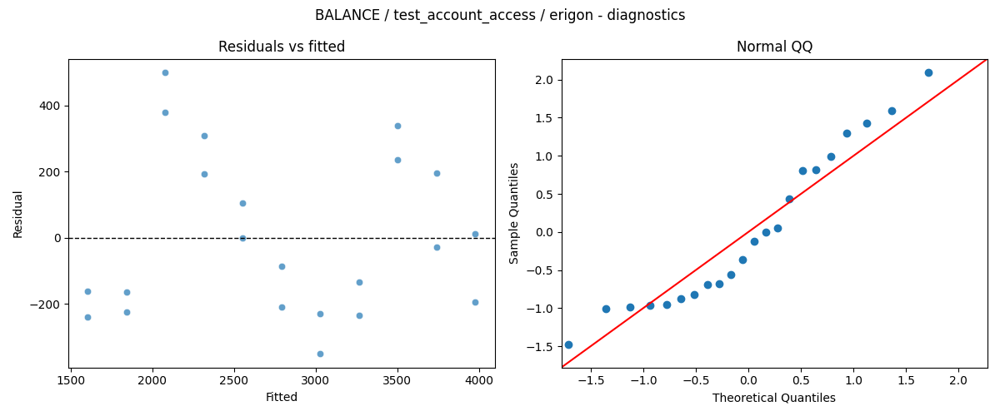

</details>

<details><summary>geth — NNLS regression summary</summary>

```
==============================================================================
                           NNLS Regression Results                            
==============================================================================
Dep. Variable:          test_runtime_ms              R-squared:          0.847
Model:                  NNLS                    Adj. R-squared:          0.830
No. Observations:       11                                RMSE:         183.92
Df Residuals:           9                                  MAE:         137.19
Df Model:               1      
==============================================================================
                      coef     std err     P-value      [0.025      0.975]
------------------------------------------------------------------------------
         const   1318.8893    267.4108       0.001    811.6690   1788.6078
       opcount      0.0208      0.0039       0.001      0.0142      0.0293
==============================================================================
Notes: Non-negative least squares with bootstrap inference (1000 iterations)
==============================================================================
```

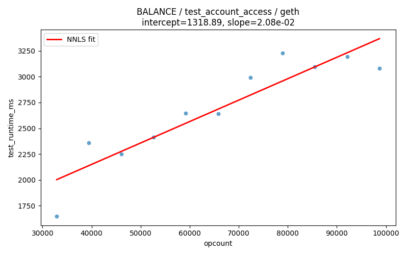

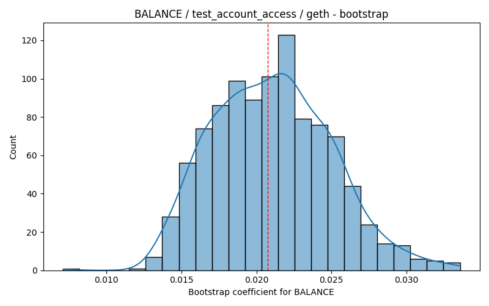

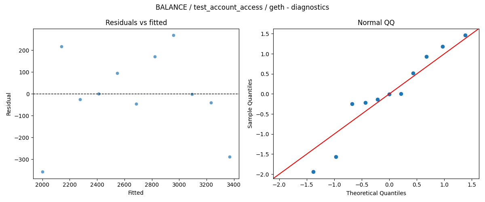

</details>

<details><summary>nethermind — NNLS regression summary</summary>

```
==============================================================================
                           NNLS Regression Results                            
==============================================================================
Dep. Variable:          test_runtime_ms              R-squared:          0.670
Model:                  NNLS                    Adj. R-squared:          0.659
No. Observations:       33                                RMSE:         328.35
Df Residuals:           31                                 MAE:         278.97
Df Model:               1      
==============================================================================
                      coef     std err     P-value      [0.025      0.975]
------------------------------------------------------------------------------
         const    843.8658    209.1036       0.001    477.3299   1266.4378
       opcount      0.0225      0.0030       0.001      0.0169      0.0287
==============================================================================
Notes: Non-negative least squares with bootstrap inference (1000 iterations)
==============================================================================
```

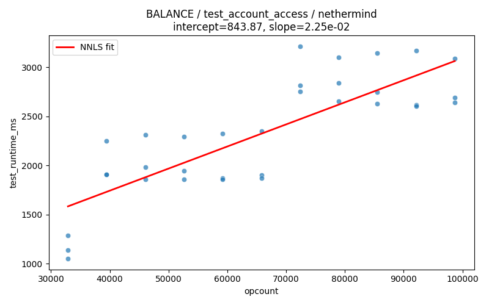

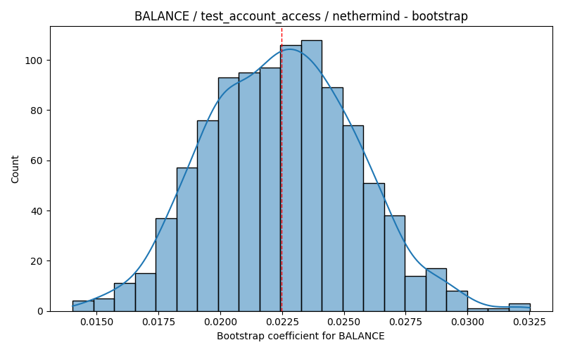

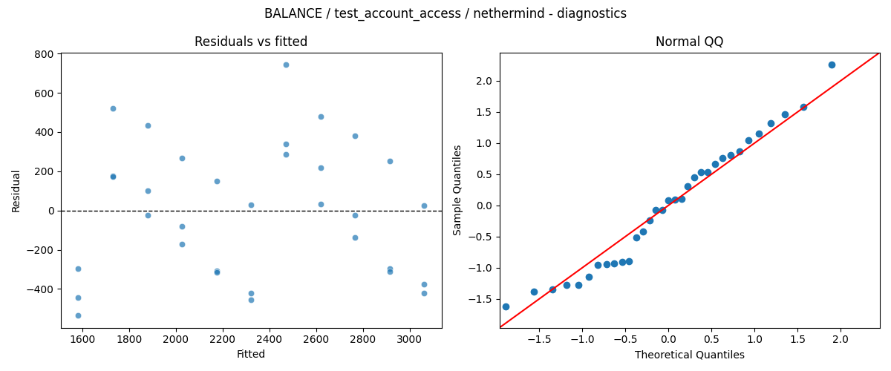

</details>

<details><summary>reth — NNLS regression summary</summary>

```
==============================================================================
                           NNLS Regression Results                            
==============================================================================
Dep. Variable:          test_runtime_ms              R-squared:          0.865
Model:                  NNLS                    Adj. R-squared:          0.863
No. Observations:       77                                RMSE:         257.31
Df Residuals:           75                                 MAE:         172.31
Df Model:               1      
==============================================================================
                      coef     std err     P-value      [0.025      0.975]
------------------------------------------------------------------------------
         const    630.8217    128.2735       0.001    410.6507    902.0435
       opcount      0.0313      0.0017       0.001      0.0278      0.0344
==============================================================================
Notes: Non-negative least squares with bootstrap inference (1000 iterations)
==============================================================================
```

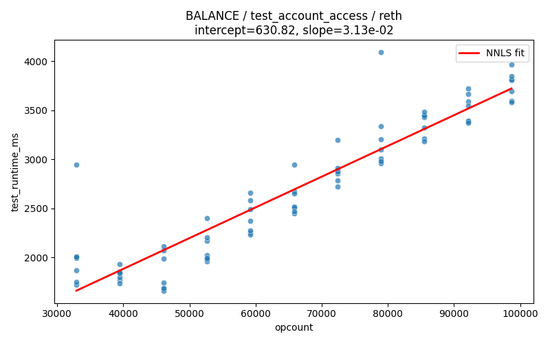

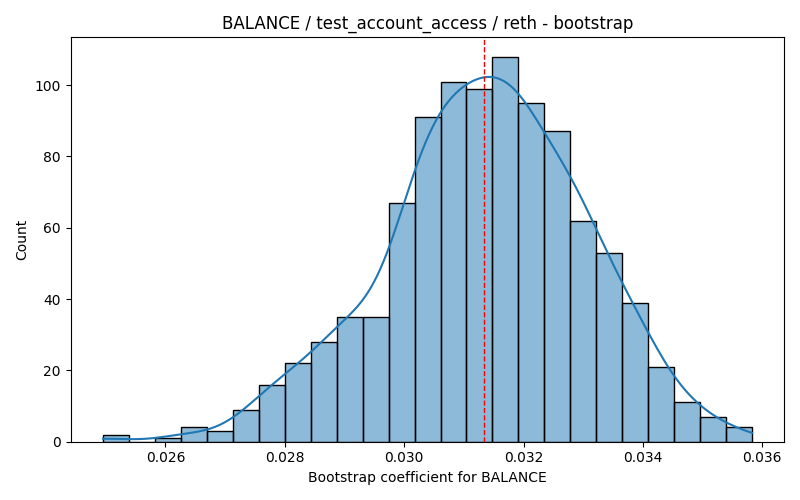

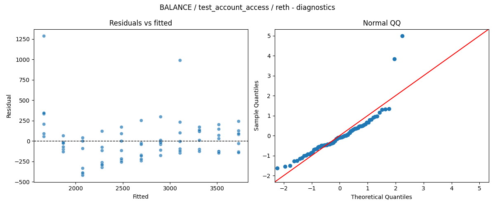

</details>

### test_account_access — combo `BALANCE_AccountMode.EXISTING_EOA`

| client | nobs | R² | target_coef (ms) | p-value | 95% CI |
| --- | --- | --- | --- | --- | --- |
| `besu` | 55 | 0.7997 | 0.009277 | 1.00e-03 | [0.007794, 0.01094] |
| `erigon` | 22 | 0.9984 | 0.009706 | 1.00e-03 | [0.009563, 0.009869] |
| `geth` | 11 | 0.9835 | 0.01615 | 1.00e-03 | [0.01483, 0.01744] |
| `nethermind` | 33 | 0.9426 | 0.003674 | 1.00e-03 | [0.003406, 0.004009] |
| `reth` | 77 | 0.9841 | 0.00111 | 1.00e-03 | [0.001078, 0.001144] |

<details><summary>besu — NNLS regression summary</summary>

```
==============================================================================
                           NNLS Regression Results                            
==============================================================================
Dep. Variable:          test_runtime_ms              R-squared:          0.800
Model:                  NNLS                    Adj. R-squared:          0.796
No. Observations:       55                                RMSE:         110.98
Df Residuals:           53                                 MAE:          89.19
Df Model:               1      
==============================================================================
                      coef     std err     P-value      [0.025      0.975]
------------------------------------------------------------------------------
         const    455.5903     71.6014       0.001    307.7592    585.7777
       opcount      0.0093      0.0008       0.001      0.0078      0.0109
==============================================================================
Notes: Non-negative least squares with bootstrap inference (1000 iterations)
==============================================================================
```

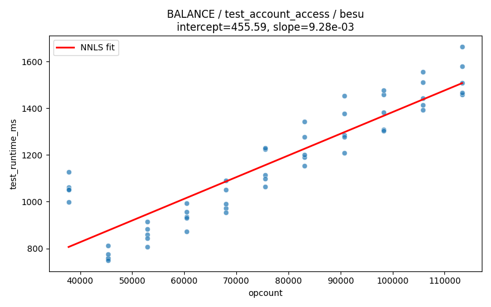

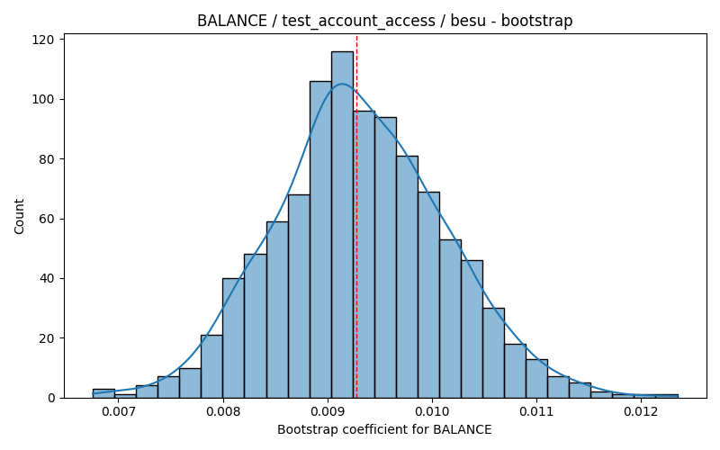

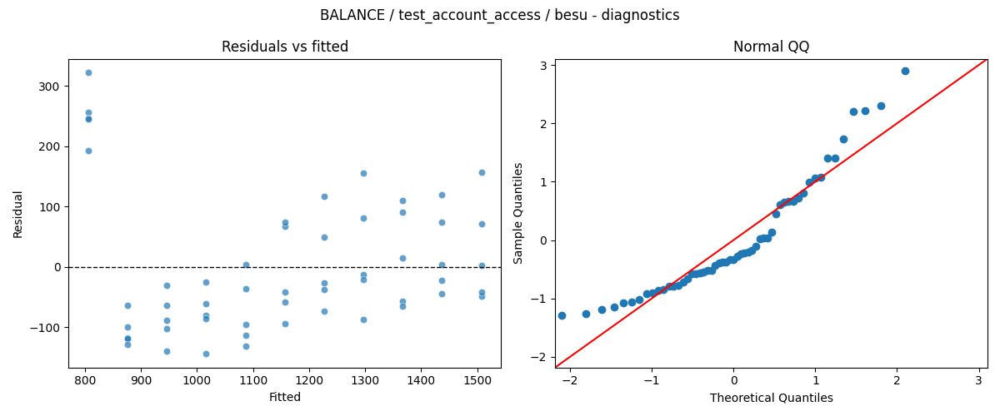

</details>

<details><summary>erigon — NNLS regression summary</summary>

```
==============================================================================
                           NNLS Regression Results                            
==============================================================================
Dep. Variable:          test_runtime_ms              R-squared:          0.998
Model:                  NNLS                    Adj. R-squared:          0.998
No. Observations:       22                                RMSE:           9.15
Df Residuals:           20                                 MAE:           7.84
Df Model:               1      
==============================================================================
                      coef     std err     P-value      [0.025      0.975]
------------------------------------------------------------------------------
         const     36.1246      5.6174       0.001     24.6167     46.5802
       opcount      0.0097      0.0001       0.001      0.0096      0.0099
==============================================================================
Notes: Non-negative least squares with bootstrap inference (1000 iterations)
==============================================================================
```

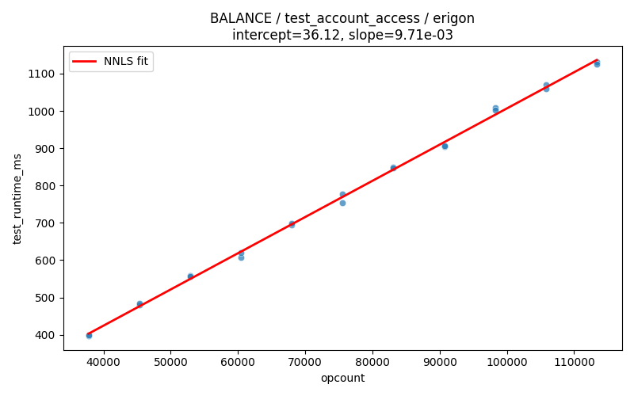

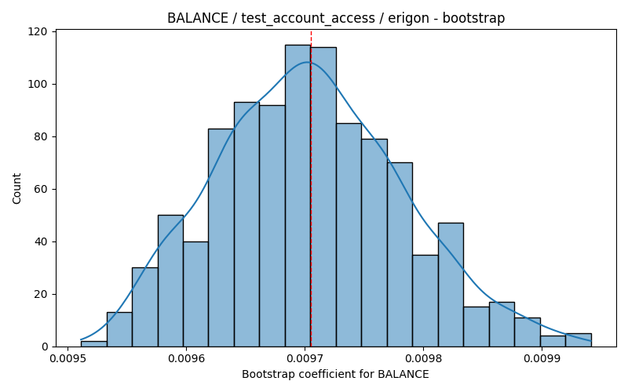

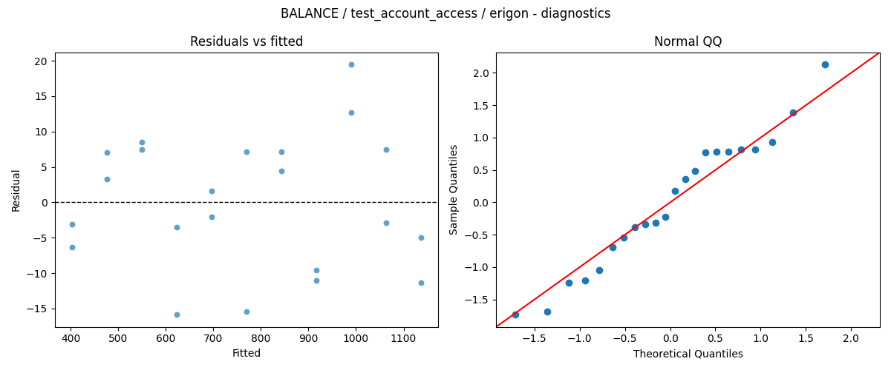

</details>

<details><summary>geth — NNLS regression summary</summary>

```
==============================================================================
                           NNLS Regression Results                            
==============================================================================
Dep. Variable:          test_runtime_ms              R-squared:          0.984
Model:                  NNLS                    Adj. R-squared:          0.982
No. Observations:       11                                RMSE:          49.93
Df Residuals:           9                                  MAE:          39.03
Df Model:               1      
==============================================================================
                      coef     std err     P-value      [0.025      0.975]
------------------------------------------------------------------------------
         const    191.4880     51.9725       0.001     93.9391    300.2587
       opcount      0.0161      0.0006       0.001      0.0148      0.0174
==============================================================================
Notes: Non-negative least squares with bootstrap inference (1000 iterations)
==============================================================================
```


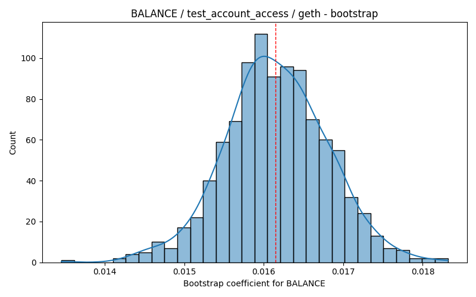

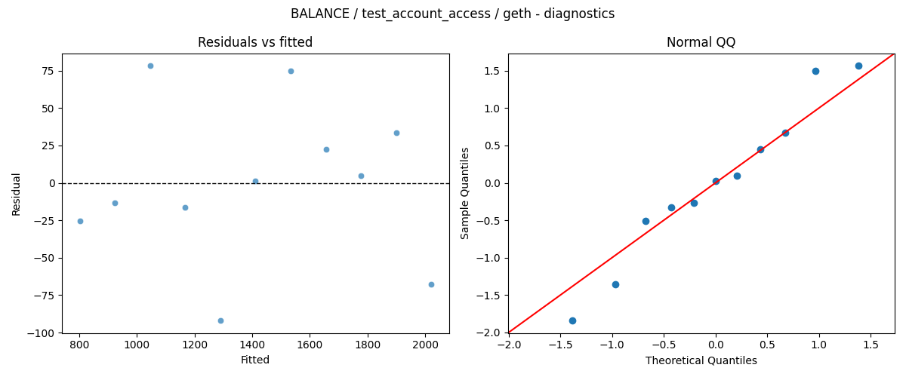

</details>

<details><summary>nethermind — NNLS regression summary</summary>

```
==============================================================================
                           NNLS Regression Results                            
==============================================================================
Dep. Variable:          test_runtime_ms              R-squared:          0.943
Model:                  NNLS                    Adj. R-squared:          0.941
No. Observations:       33                                RMSE:          21.66
Df Residuals:           31                                 MAE:          18.07
Df Model:               1      
==============================================================================
                      coef     std err     P-value      [0.025      0.975]
------------------------------------------------------------------------------
         const     83.9218     11.5161       0.001     59.8089    103.1882
       opcount      0.0037      0.0002       0.001      0.0034      0.0040
==============================================================================
Notes: Non-negative least squares with bootstrap inference (1000 iterations)
==============================================================================
```

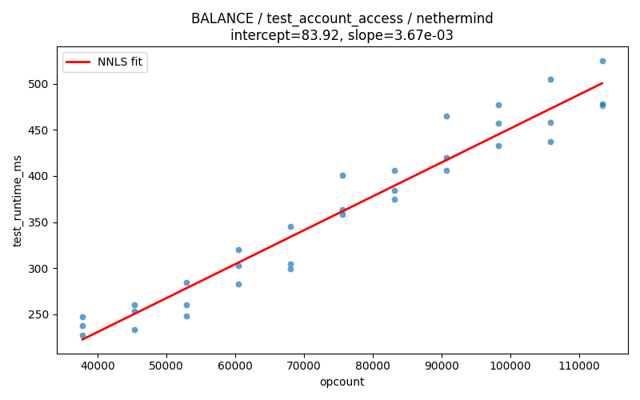

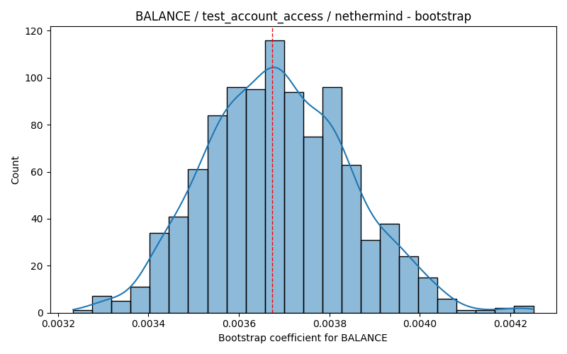

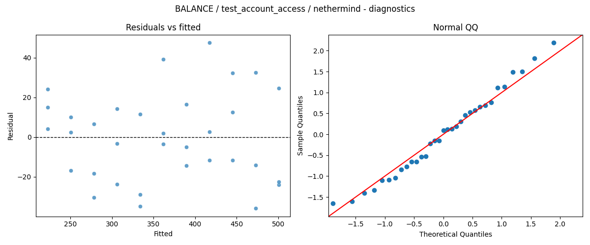

</details>

<details><summary>reth — NNLS regression summary</summary>

```
==============================================================================
                           NNLS Regression Results                            
==============================================================================
Dep. Variable:          test_runtime_ms              R-squared:          0.984
Model:                  NNLS                    Adj. R-squared:          0.984
No. Observations:       77                                RMSE:           3.37
Df Residuals:           75                                 MAE:           2.73
Df Model:               1      
==============================================================================
                      coef     std err     P-value      [0.025      0.975]
------------------------------------------------------------------------------
         const     30.8641      1.3327       0.001     28.1212     33.2814
       opcount      0.0011      0.0000       0.001      0.0011      0.0011
==============================================================================
Notes: Non-negative least squares with bootstrap inference (1000 iterations)
==============================================================================
```

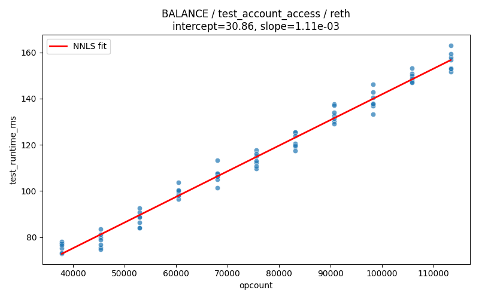

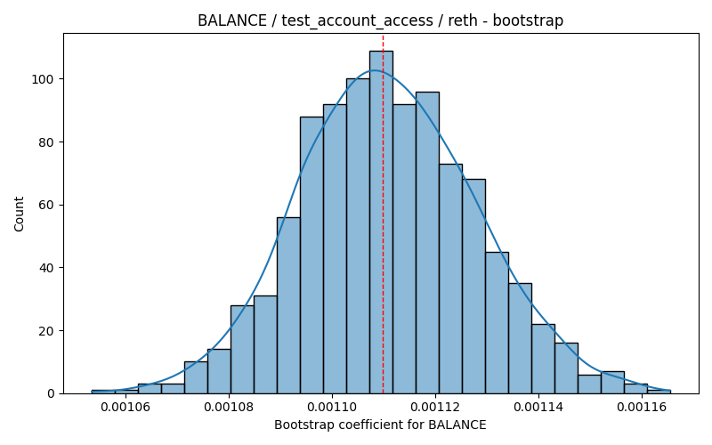

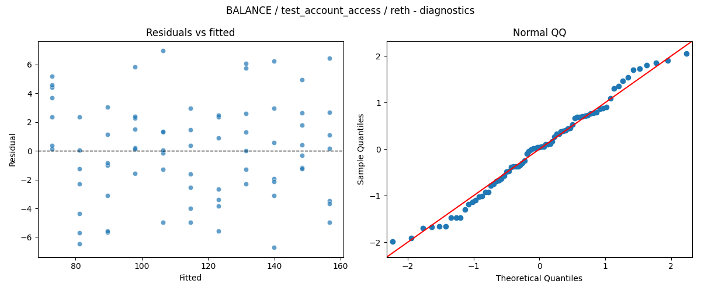

</details>

### test_account_access — combo `BALANCE_AccountMode.NON_EXISTING_ACCOUNT`

| client | nobs | R² | target_coef (ms) | p-value | 95% CI |
| --- | --- | --- | --- | --- | --- |
| `besu` | 55 | 0.9147 | 0.009689 | 1.00e-03 | [0.008833, 0.01067] |
| `erigon` | 22 | 0.9976 | 0.009089 | 1.00e-03 | [0.008897, 0.009169] |
| `geth` | 11 | 0.8601 | 0.02058 | 1.00e-03 | [0.01436, 0.02559] |
| `nethermind` | 33 | 0.9796 | 0.003899 | 1.00e-03 | [0.003687, 0.004108] |
| `reth` | 77 | 0.9725 | 0.0009503 | 1.00e-03 | [0.0009131, 0.0009904] |

<details><summary>besu — NNLS regression summary</summary>

```
==============================================================================
                           NNLS Regression Results                            
==============================================================================
Dep. Variable:          test_runtime_ms              R-squared:          0.915
Model:                  NNLS                    Adj. R-squared:          0.913
No. Observations:       55                                RMSE:          70.70
Df Residuals:           53                                 MAE:          60.01
Df Model:               1      
==============================================================================
                      coef     std err     P-value      [0.025      0.975]
------------------------------------------------------------------------------
         const    407.8921     37.0043       0.001    332.4633    476.8794
       opcount      0.0097      0.0005       0.001      0.0088      0.0107
==============================================================================
Notes: Non-negative least squares with bootstrap inference (1000 iterations)
==============================================================================
```

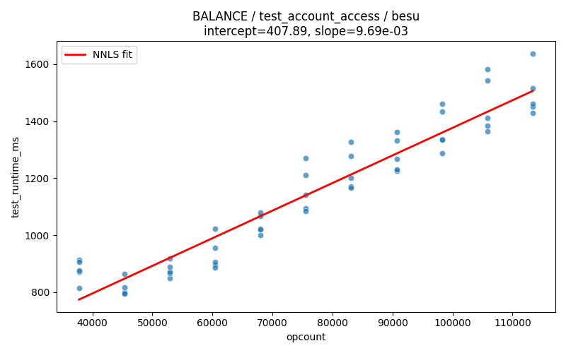

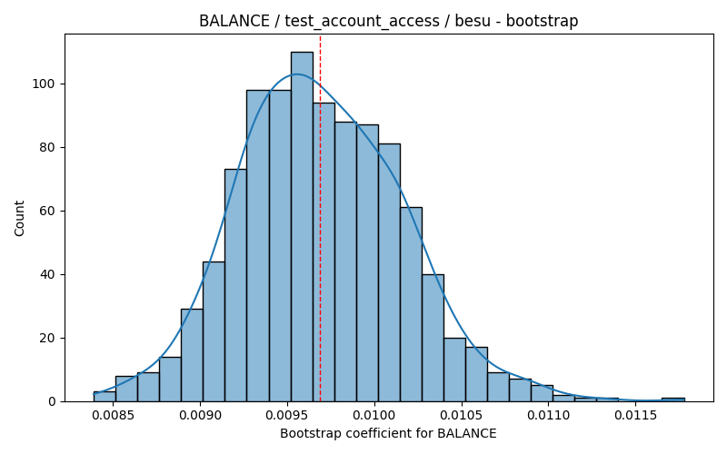

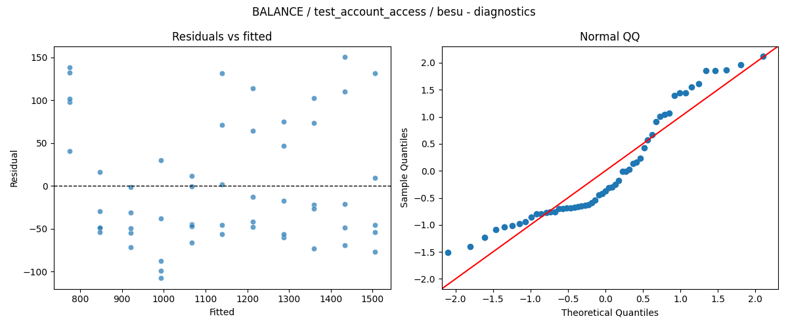

</details>

<details><summary>erigon — NNLS regression summary</summary>

```
==============================================================================
                           NNLS Regression Results                            
==============================================================================
Dep. Variable:          test_runtime_ms              R-squared:          0.998
Model:                  NNLS                    Adj. R-squared:          0.998
No. Observations:       22                                RMSE:          10.57
Df Residuals:           20                                 MAE:           8.17
Df Model:               1      
==============================================================================
                      coef     std err     P-value      [0.025      0.975]
------------------------------------------------------------------------------
         const      2.0438      5.2277       0.428      0.0000     16.6104
       opcount      0.0091      0.0001       0.001      0.0089      0.0092
==============================================================================
Notes: Non-negative least squares with bootstrap inference (1000 iterations)
==============================================================================
```

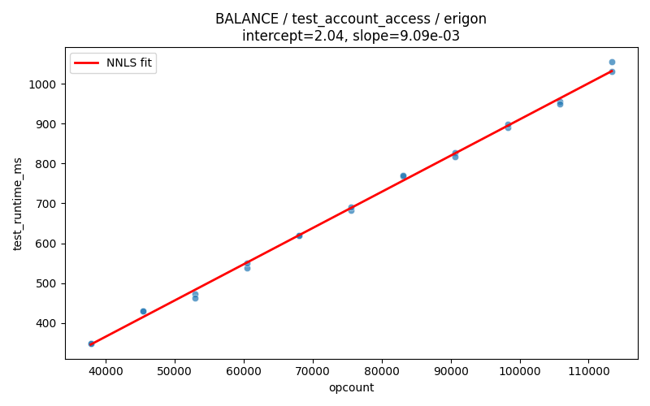

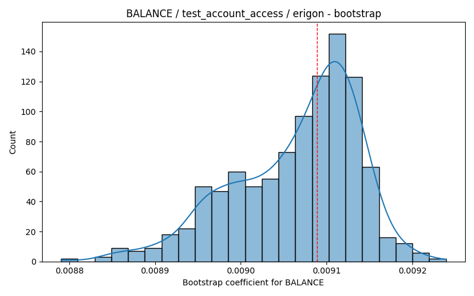

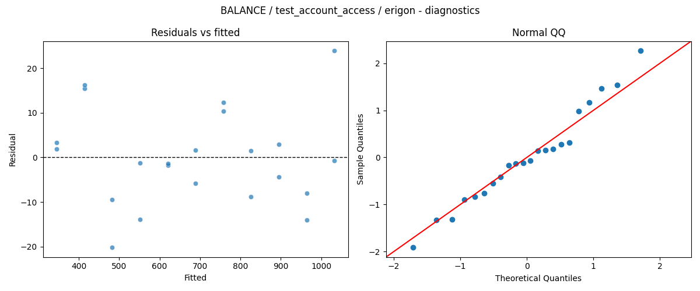

</details>

<details><summary>geth — NNLS regression summary</summary>

```
==============================================================================
                           NNLS Regression Results                            
==============================================================================
Dep. Variable:          test_runtime_ms              R-squared:          0.860
Model:                  NNLS                    Adj. R-squared:          0.845
No. Observations:       11                                RMSE:         198.35
Df Residuals:           9                                  MAE:         167.55
Df Model:               1      
==============================================================================
                      coef     std err     P-value      [0.025      0.975]
------------------------------------------------------------------------------
         const   1327.3502    269.3893       0.001    887.7775   1885.3946
       opcount      0.0206      0.0031       0.001      0.0144      0.0256
==============================================================================
Notes: Non-negative least squares with bootstrap inference (1000 iterations)
==============================================================================
```

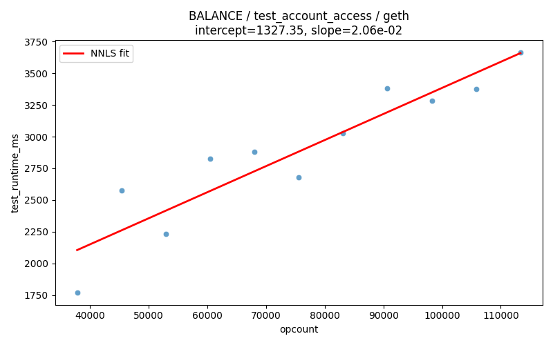

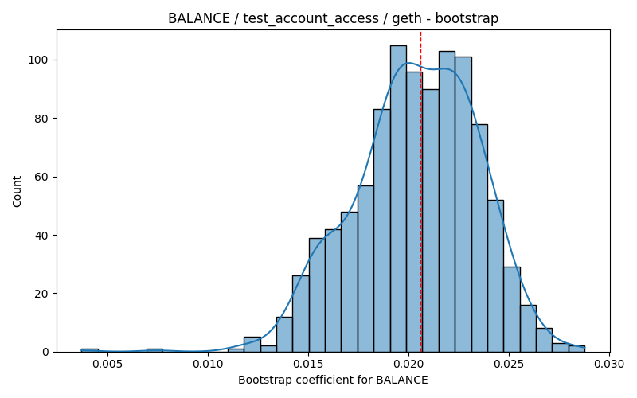

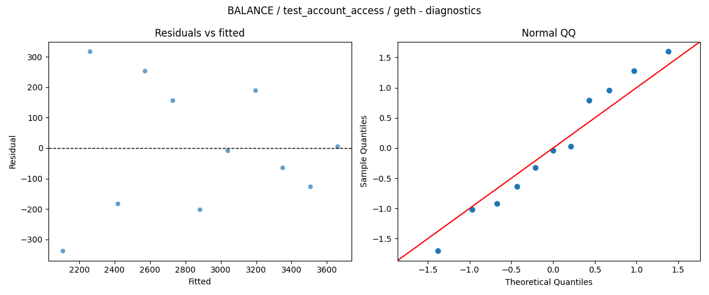

</details>

<details><summary>nethermind — NNLS regression summary</summary>

```
==============================================================================
                           NNLS Regression Results                            
==============================================================================
Dep. Variable:          test_runtime_ms              R-squared:          0.980
Model:                  NNLS                    Adj. R-squared:          0.979
No. Observations:       33                                RMSE:          13.45
Df Residuals:           31                                 MAE:          10.97
Df Model:               1      
==============================================================================
                      coef     std err     P-value      [0.025      0.975]
------------------------------------------------------------------------------
         const     64.1444      7.3029       0.001     49.5351     77.7348
       opcount      0.0039      0.0001       0.001      0.0037      0.0041
==============================================================================
Notes: Non-negative least squares with bootstrap inference (1000 iterations)
==============================================================================
```

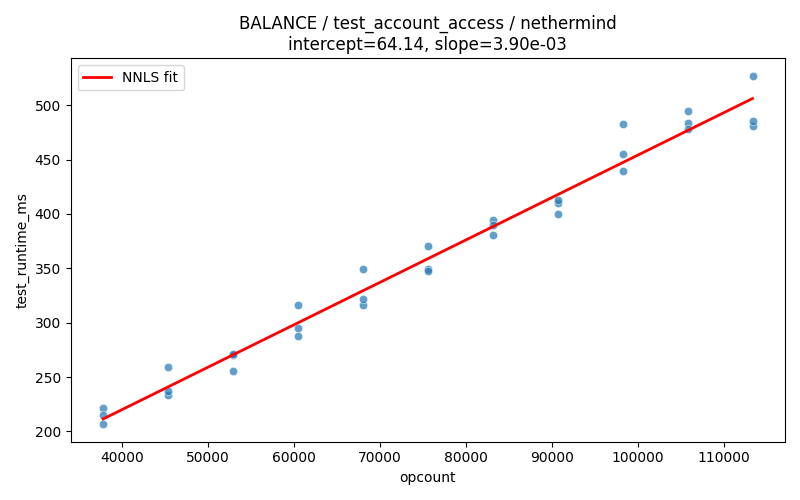

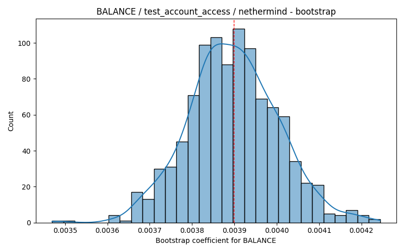

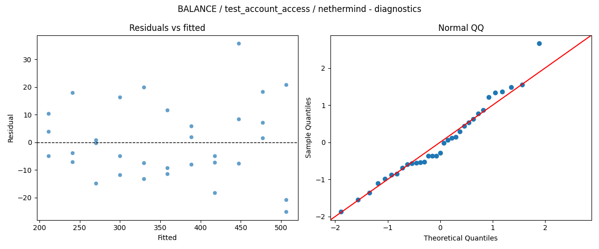

</details>

<details><summary>reth — NNLS regression summary</summary>

```
==============================================================================
                           NNLS Regression Results                            
==============================================================================
Dep. Variable:          test_runtime_ms              R-squared:          0.972
Model:                  NNLS                    Adj. R-squared:          0.972
No. Observations:       77                                RMSE:           3.82
Df Residuals:           75                                 MAE:           3.05
Df Model:               1      
==============================================================================
                      coef     std err     P-value      [0.025      0.975]
------------------------------------------------------------------------------
         const     30.0497      1.4135       0.001     27.4036     32.8902
       opcount      0.0010      0.0000       0.001      0.0009      0.0010
==============================================================================
Notes: Non-negative least squares with bootstrap inference (1000 iterations)
==============================================================================
```

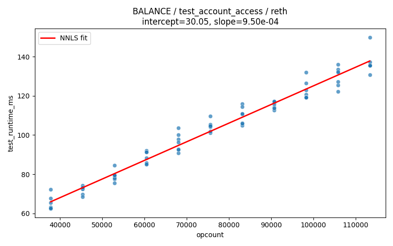

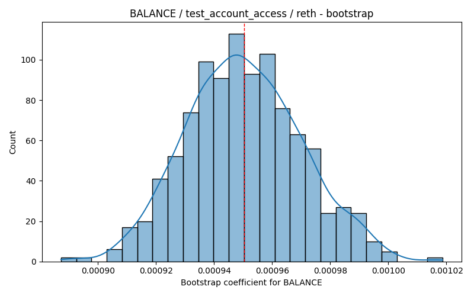

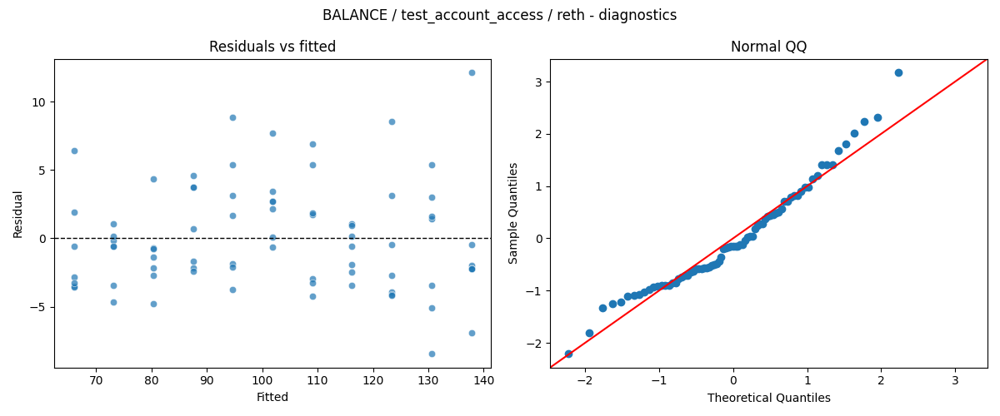

</details>

### test_ext_account_query_warm — combo `BALANCE`

| client | nobs | R² | target_coef (ms) | p-value | 95% CI |
| --- | --- | --- | --- | --- | --- |
| `besu` | 55 | 0.829 | 0.0001964 | 1.00e-03 | [0.0001715, 0.0002198] |
| `erigon` | 22 | 0.7498 | 4.548e-05 | 1.00e-03 | [3.569e-05, 5.515e-05] |
| `geth` | 11 | 0.9633 | 3.733e-05 | 1.00e-03 | [3.245e-05, 4.05e-05] |
| `nethermind` | 33 | 0.8524 | 0.0001652 | 1.00e-03 | [0.0001432, 0.0001877] |
| `reth` | 77 | 0.7725 | 7.203e-06 | 1.00e-03 | [6.164e-06, 8.237e-06] |

<details><summary>besu — NNLS regression summary</summary>

```
==============================================================================
                           NNLS Regression Results                            
==============================================================================
Dep. Variable:          test_runtime_ms              R-squared:          0.829
Model:                  NNLS                    Adj. R-squared:          0.826
No. Observations:       55                                RMSE:          52.15
Df Residuals:           53                                 MAE:          40.02
Df Model:               1      
==============================================================================
                      coef     std err     P-value      [0.025      0.975]
------------------------------------------------------------------------------
         const    104.7745     23.4723       0.001     64.1334    154.2505
       opcount      0.0002      0.0000       0.001      0.0002      0.0002
==============================================================================
Notes: Non-negative least squares with bootstrap inference (1000 iterations)
==============================================================================
```

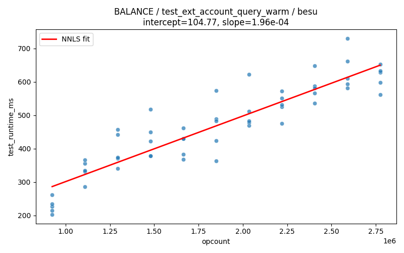

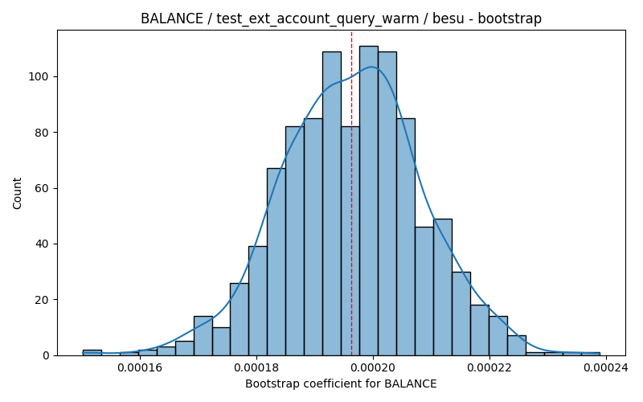

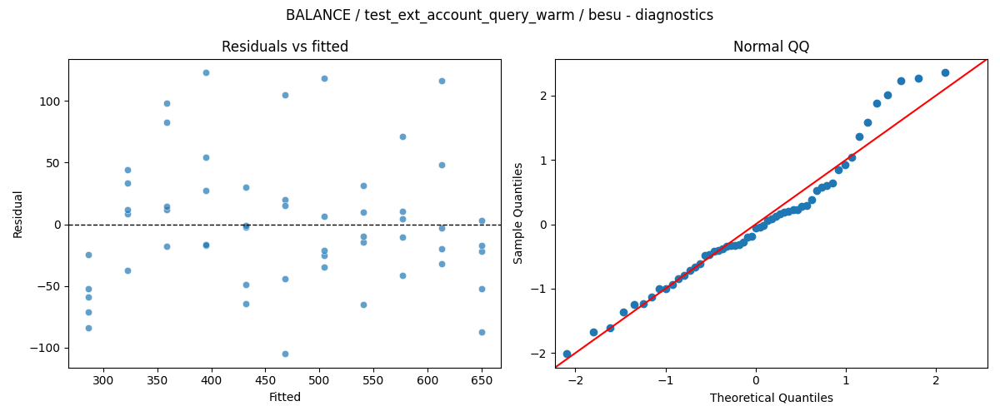

</details>

<details><summary>erigon — NNLS regression summary</summary>

```
==============================================================================
                           NNLS Regression Results                            
==============================================================================
Dep. Variable:          test_runtime_ms              R-squared:          0.750
Model:                  NNLS                    Adj. R-squared:          0.737
No. Observations:       22                                RMSE:          15.37
Df Residuals:           20                                 MAE:          10.35
Df Model:               1      
==============================================================================
                      coef     std err     P-value      [0.025      0.975]
------------------------------------------------------------------------------
         const     38.8132     10.0266       0.001     21.7631     61.7420
       opcount      0.0000      0.0000       0.001      0.0000      0.0001
==============================================================================
Notes: Non-negative least squares with bootstrap inference (1000 iterations)
==============================================================================
```

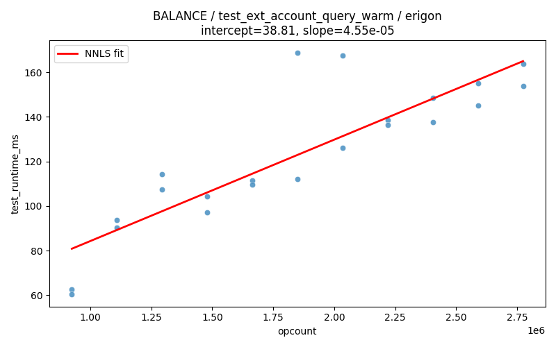

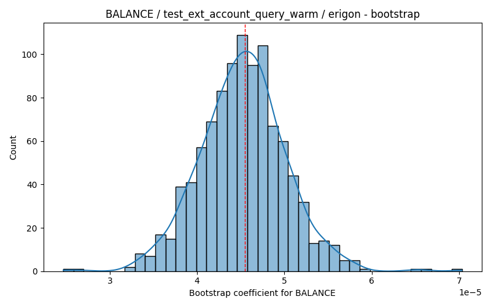

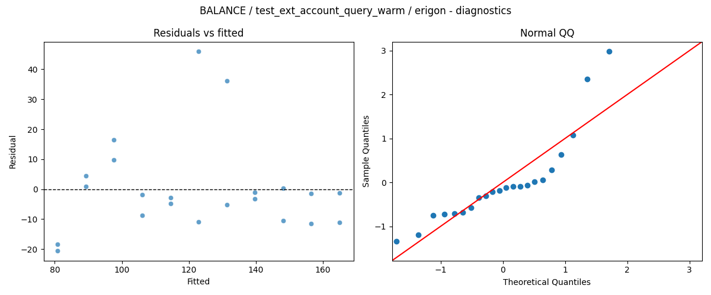

</details>

<details><summary>geth — NNLS regression summary</summary>

```
==============================================================================
                           NNLS Regression Results                            
==============================================================================
Dep. Variable:          test_runtime_ms              R-squared:          0.963
Model:                  NNLS                    Adj. R-squared:          0.959
No. Observations:       11                                RMSE:           4.26
Df Residuals:           9                                  MAE:           3.83
Df Model:               1      
==============================================================================
                      coef     std err     P-value      [0.025      0.975]
------------------------------------------------------------------------------
         const      7.3702      4.3372       0.038      0.0000     16.5402
       opcount      0.0000      0.0000       0.001      0.0000      0.0000
==============================================================================
Notes: Non-negative least squares with bootstrap inference (1000 iterations)
==============================================================================
```

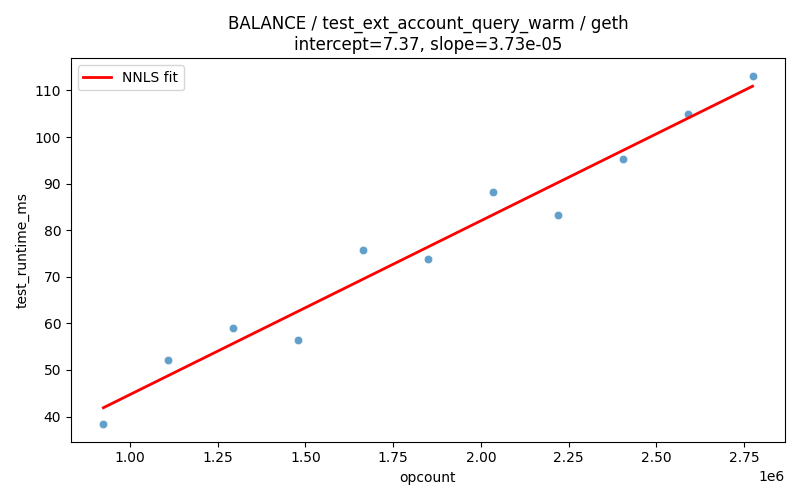

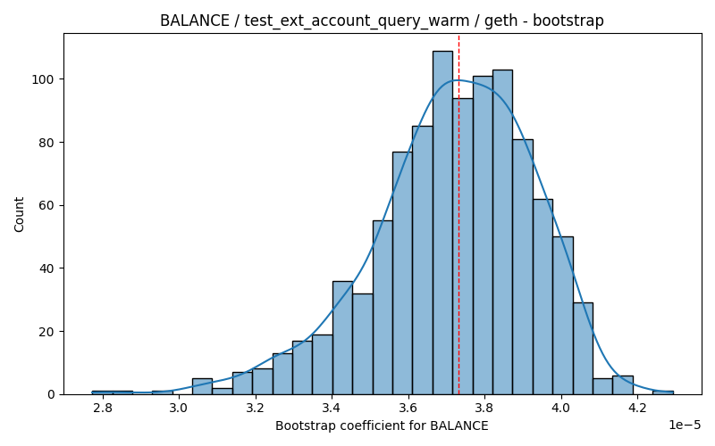

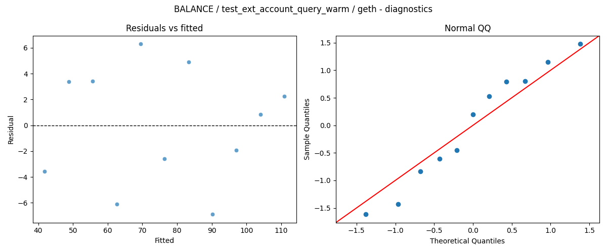

</details>

<details><summary>nethermind — NNLS regression summary</summary>

```
==============================================================================
                           NNLS Regression Results                            
==============================================================================
Dep. Variable:          test_runtime_ms              R-squared:          0.852
Model:                  NNLS                    Adj. R-squared:          0.848
No. Observations:       33                                RMSE:          40.19
Df Residuals:           31                                 MAE:          30.50
Df Model:               1      
==============================================================================
                      coef     std err     P-value      [0.025      0.975]
------------------------------------------------------------------------------
         const     91.6216     23.0323       0.001     43.6978    134.1746
       opcount      0.0002      0.0000       0.001      0.0001      0.0002
==============================================================================
Notes: Non-negative least squares with bootstrap inference (1000 iterations)
==============================================================================
```

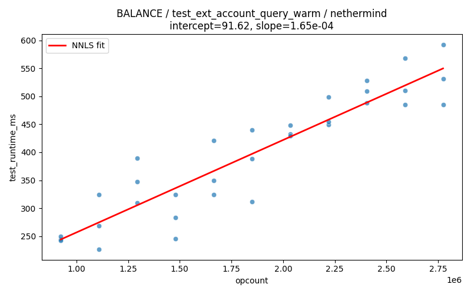

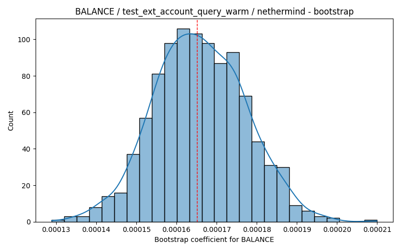

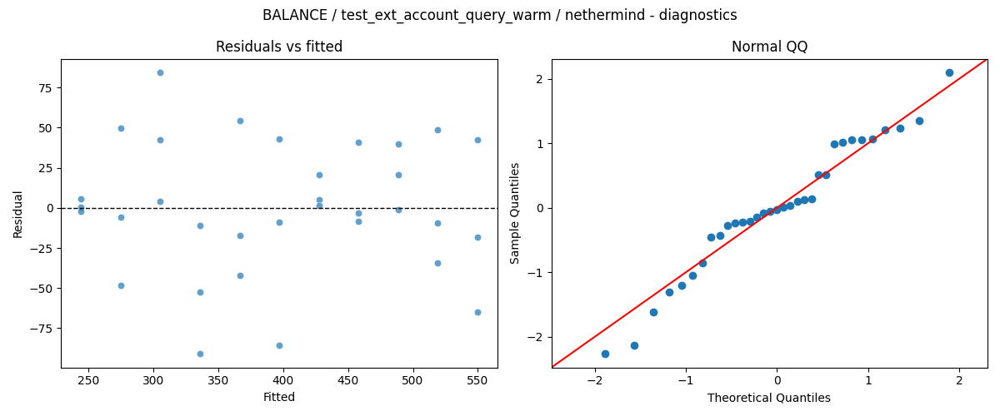

</details>

<details><summary>reth — NNLS regression summary</summary>

```
==============================================================================
                           NNLS Regression Results                            
==============================================================================
Dep. Variable:          test_runtime_ms              R-squared:          0.773
Model:                  NNLS                    Adj. R-squared:          0.770
No. Observations:       77                                RMSE:           2.29
Df Residuals:           75                                 MAE:           1.64
Df Model:               1      
==============================================================================
                      coef     std err     P-value      [0.025      0.975]
------------------------------------------------------------------------------
         const      5.2580      0.8984       0.001      3.4200      7.0722
       opcount      0.0000      0.0000       0.001      0.0000      0.0000
==============================================================================
Notes: Non-negative least squares with bootstrap inference (1000 iterations)
==============================================================================
```

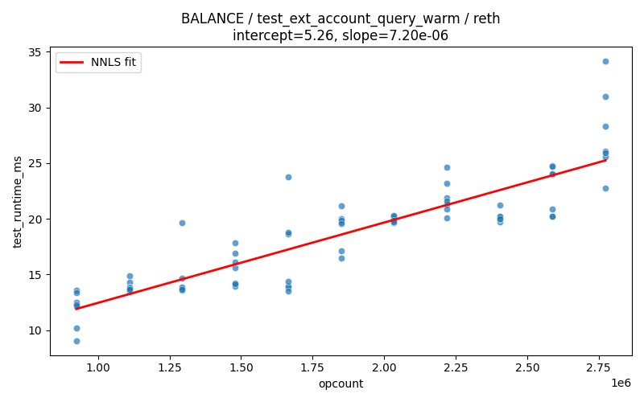

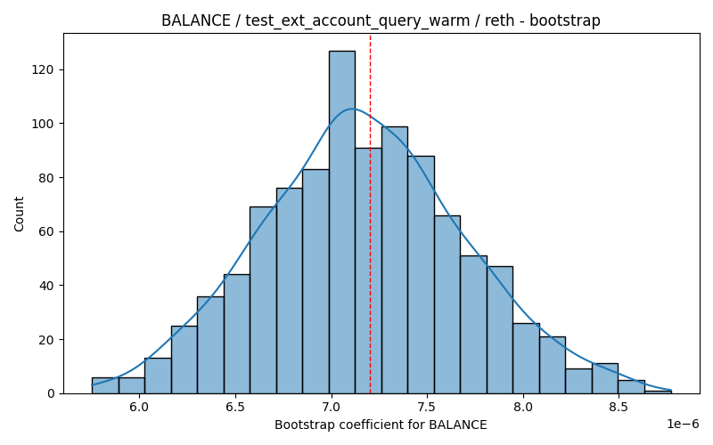

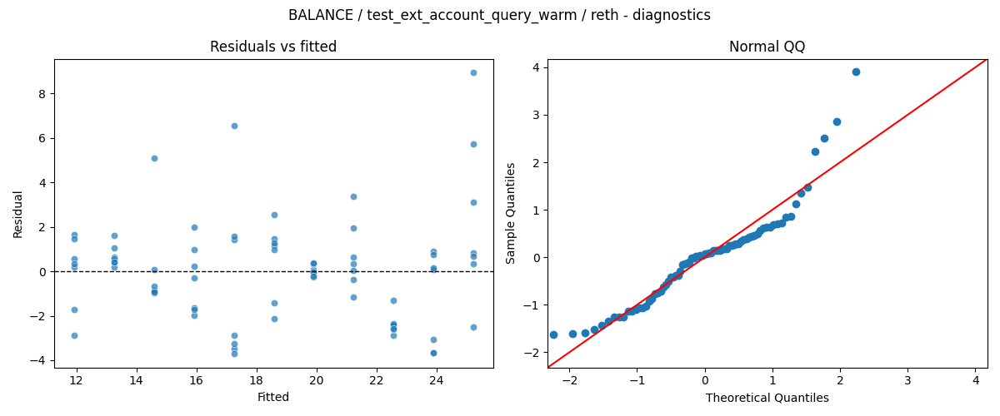

</details>

## CALL

### test_account_access — combo `CALL_AccountMode.EXISTING_CONTRACT`

| client | nobs | R² | target_coef (ms) | p-value | 95% CI |
| --- | --- | --- | --- | --- | --- |
| `besu` | 110 | 0.9492 | 0.02666 | 1.00e-03 | [0.02481, 0.02834] |
| `erigon` | 44 | 0.9016 | 0.07393 | 1.00e-03 | [0.06353, 0.08442] |
| `geth` | 22 | 0.913 | 0.03477 | 1.00e-03 | [0.02971, 0.04048] |
| `nethermind` | 66 | 0.8762 | 0.02801 | 1.00e-03 | [0.02477, 0.03136] |
| `reth` | 154 | 0.936 | 0.03126 | 1.00e-03 | [0.02838, 0.03484] |

<details><summary>besu — NNLS regression summary</summary>

```
==============================================================================
                           NNLS Regression Results                            
==============================================================================
Dep. Variable:          test_runtime_ms              R-squared:          0.949
Model:                  NNLS                    Adj. R-squared:          0.948
No. Observations:       110                               RMSE:         168.96
Df Residuals:           107                                MAE:         133.65
Df Model:               2      
==============================================================================
                      coef     std err     P-value      [0.025      0.975]
------------------------------------------------------------------------------
         const    627.0113     61.9893       0.001    508.4152    748.2472
       opcount      0.0267      0.0009       0.001      0.0248      0.0283
        update      0.0899      0.0023       0.001      0.0853      0.0944
==============================================================================
Notes: Non-negative least squares with bootstrap inference (1000 iterations)
==============================================================================
```

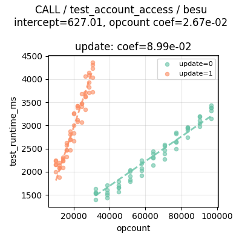

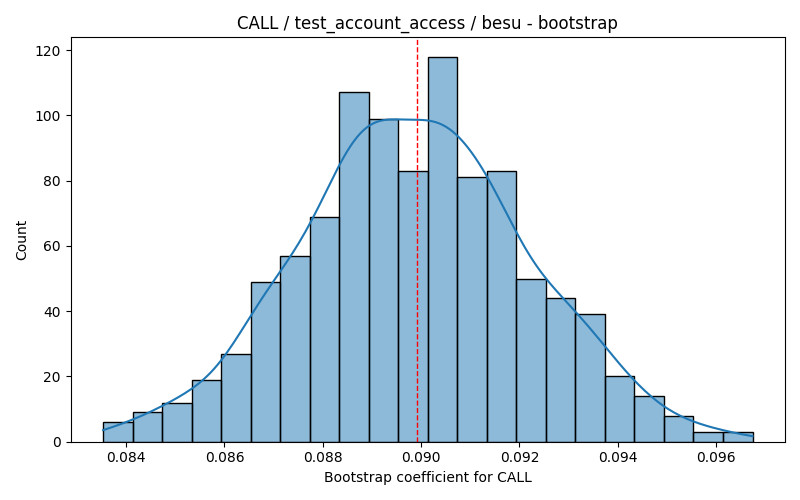

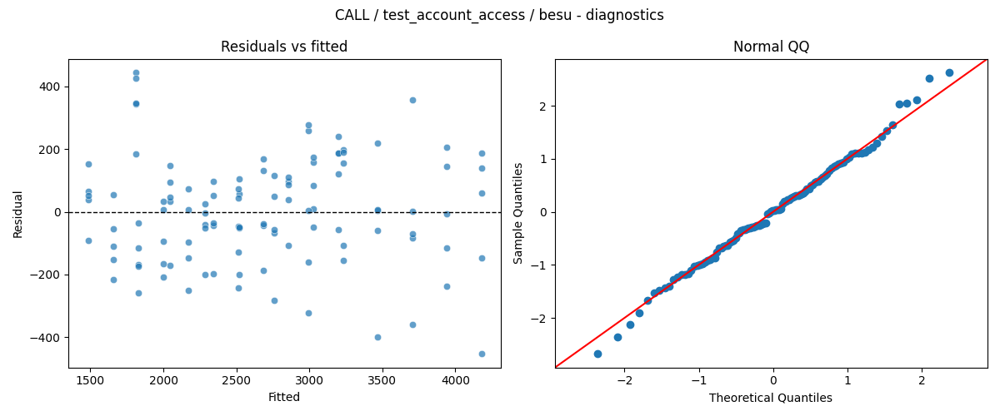

</details>

<details><summary>erigon — NNLS regression summary</summary>

```
==============================================================================
                           NNLS Regression Results                            
==============================================================================
Dep. Variable:          test_runtime_ms              R-squared:          0.902
Model:                  NNLS                    Adj. R-squared:          0.897
No. Observations:       44                                RMSE:         622.69
Df Residuals:           41                                 MAE:         514.70
Df Model:               2      
==============================================================================
                      coef     std err     P-value      [0.025      0.975]
------------------------------------------------------------------------------
         const   2440.4719    395.7874       0.001   1705.5461   3230.0537
       opcount      0.0739      0.0055       0.001      0.0635      0.0844
        update      0.2306      0.0144       0.001      0.2038      0.2589
==============================================================================
Notes: Non-negative least squares with bootstrap inference (1000 iterations)
==============================================================================
```

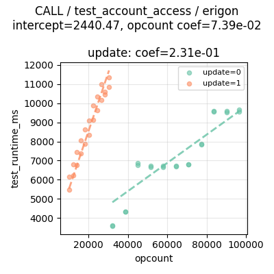

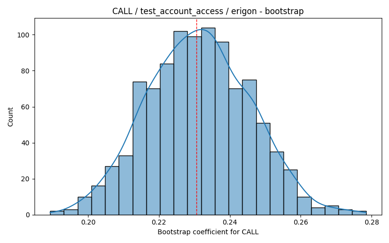

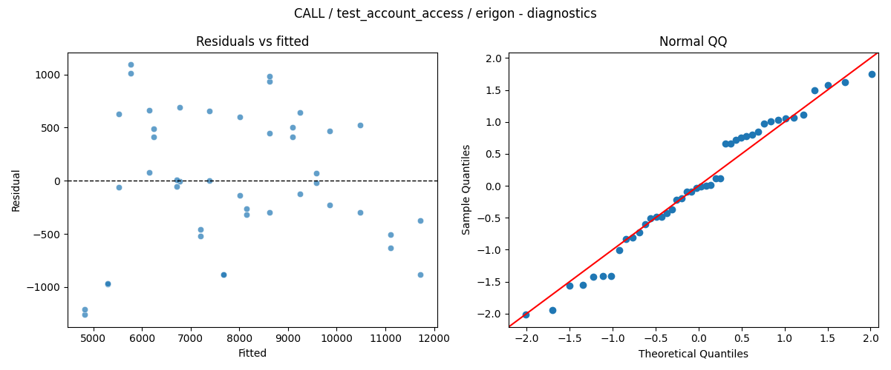

</details>

<details><summary>geth — NNLS regression summary</summary>

```
==============================================================================
                           NNLS Regression Results                            
==============================================================================
Dep. Variable:          test_runtime_ms              R-squared:          0.913
Model:                  NNLS                    Adj. R-squared:          0.904
No. Observations:       22                                RMSE:         210.60
Df Residuals:           19                                 MAE:         172.88
Df Model:               2      
==============================================================================
                      coef     std err     P-value      [0.025      0.975]
------------------------------------------------------------------------------
         const    662.2451    185.9300       0.001    312.7586   1026.8605
       opcount      0.0348      0.0028       0.001      0.0297      0.0405
        update      0.0643      0.0061       0.001      0.0529      0.0763
==============================================================================
Notes: Non-negative least squares with bootstrap inference (1000 iterations)
==============================================================================
```

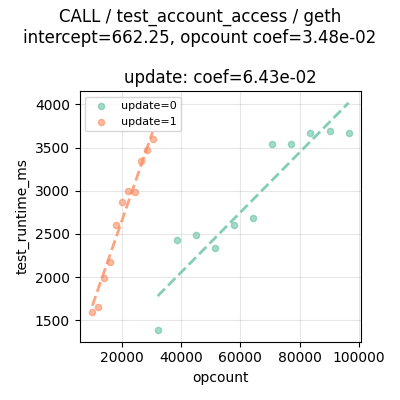

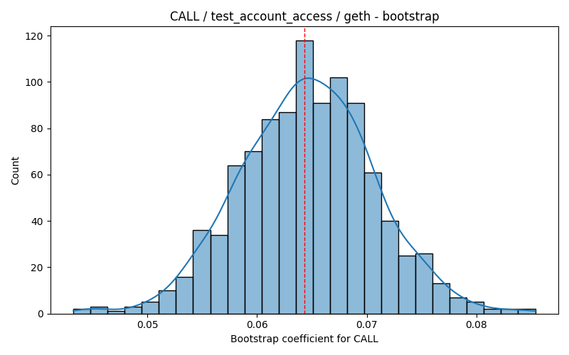

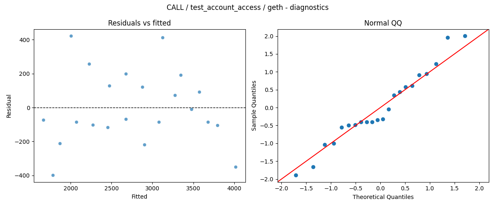

</details>

<details><summary>nethermind — NNLS regression summary</summary>

```
==============================================================================
                           NNLS Regression Results                            
==============================================================================
Dep. Variable:          test_runtime_ms              R-squared:          0.876
Model:                  NNLS                    Adj. R-squared:          0.872
No. Observations:       66                                RMSE:         245.92
Df Residuals:           63                                 MAE:         191.58
Df Model:               2      
==============================================================================
                      coef     std err     P-value      [0.025      0.975]
------------------------------------------------------------------------------
         const    570.7628    109.1885       0.001    371.1781    781.8018
       opcount      0.0280      0.0017       0.001      0.0248      0.0314
        update      0.0135      0.0037       0.001      0.0061      0.0203
==============================================================================
Notes: Non-negative least squares with bootstrap inference (1000 iterations)
==============================================================================
```

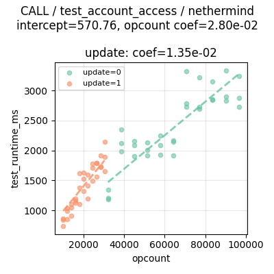

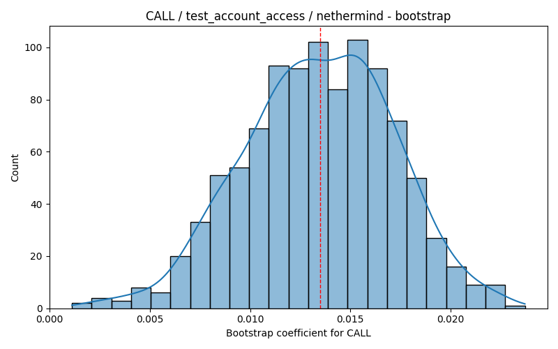

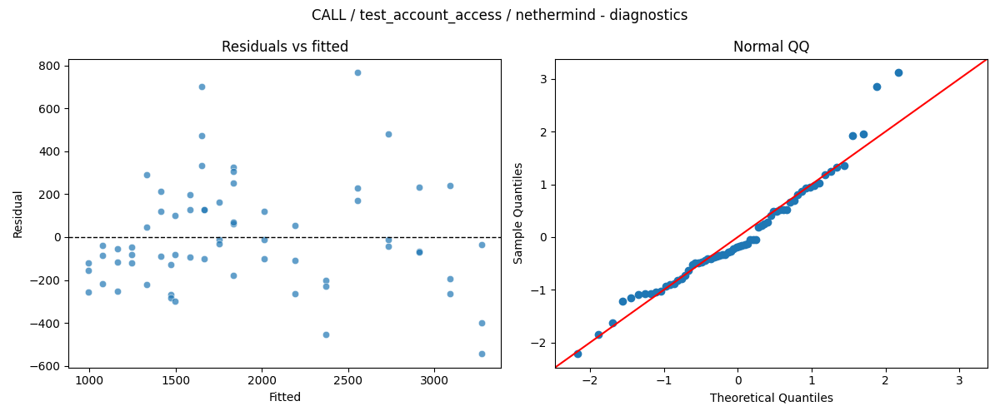

</details>

<details><summary>reth — NNLS regression summary</summary>

```
==============================================================================
                           NNLS Regression Results                            
==============================================================================
Dep. Variable:          test_runtime_ms              R-squared:          0.936
Model:                  NNLS                    Adj. R-squared:          0.935
No. Observations:       154                               RMSE:         301.99
Df Residuals:           151                                MAE:         177.04
Df Model:               2      
==============================================================================
                      coef     std err     P-value      [0.025      0.975]
------------------------------------------------------------------------------
         const    573.6958     91.3102       0.001    382.7418    739.4997
       opcount      0.0313      0.0017       0.001      0.0284      0.0348
        update      0.1395      0.0024       0.001      0.1351      0.1447
==============================================================================
Notes: Non-negative least squares with bootstrap inference (1000 iterations)
==============================================================================
```

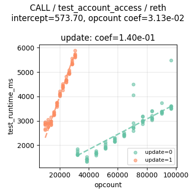

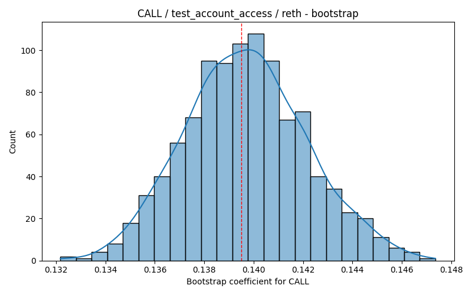

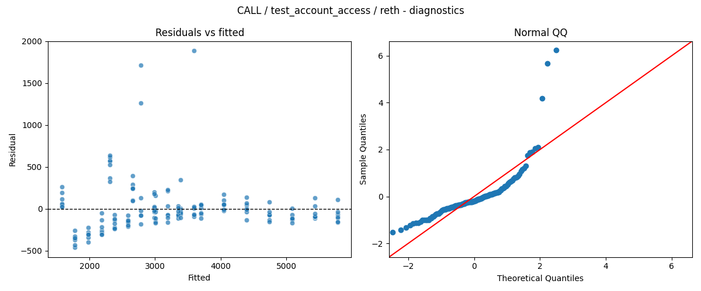

</details>

### test_account_access — combo `CALL_AccountMode.EXISTING_EOA`

| client | nobs | R² | target_coef (ms) | p-value | 95% CI |
| --- | --- | --- | --- | --- | --- |
| `besu` | 110 | 0.9424 | 0.01236 | 1.00e-03 | [0.01121, 0.0135] |
| `erigon` | 44 | 0.9717 | 0.007312 | 1.00e-03 | [0.005373, 0.009016] |
| `geth` | 22 | 0.9721 | 0.01575 | 1.00e-03 | [0.01454, 0.01727] |
| `nethermind` | 66 | 0.9324 | 0.003885 | 1.00e-03 | [0.003096, 0.004611] |
| `reth` | 154 | 0.9911 | 0 | 1.00e+00 | [0, 0] |

<details><summary>besu — NNLS regression summary</summary>

```
==============================================================================
                           NNLS Regression Results                            
==============================================================================
Dep. Variable:          test_runtime_ms              R-squared:          0.942
Model:                  NNLS                    Adj. R-squared:          0.941
No. Observations:       110                               RMSE:         118.70
Df Residuals:           107                                MAE:          99.73
Df Model:               2      
==============================================================================
                      coef     std err     P-value      [0.025      0.975]
------------------------------------------------------------------------------
         const    460.4459     46.7062       0.001    369.8710    550.9360
       opcount      0.0124      0.0006       0.001      0.0112      0.0135
        update      0.0574      0.0018       0.001      0.0539      0.0608
==============================================================================
Notes: Non-negative least squares with bootstrap inference (1000 iterations)
==============================================================================
```

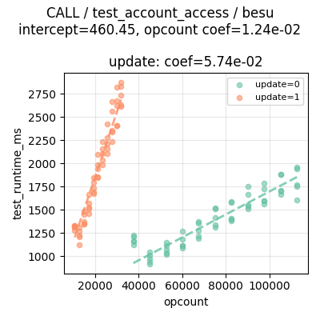

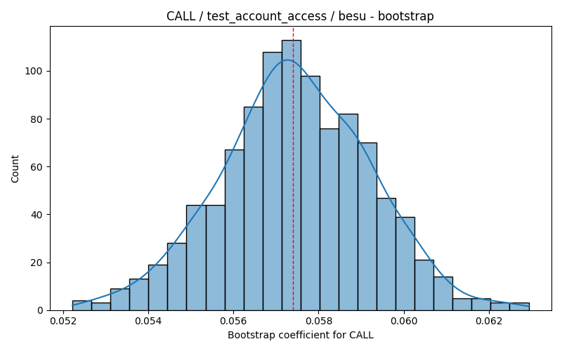

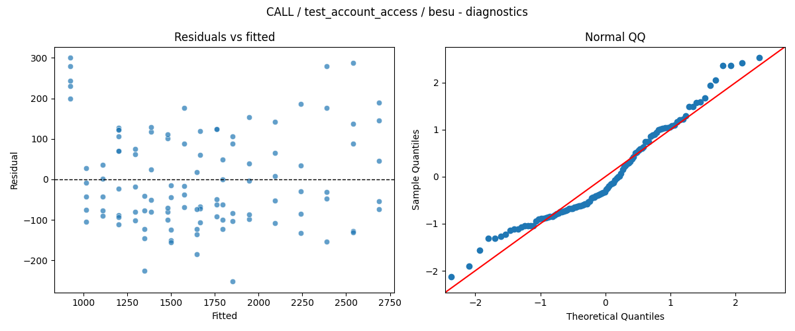

</details>

<details><summary>erigon — NNLS regression summary</summary>

```
==============================================================================
                           NNLS Regression Results                            
==============================================================================
Dep. Variable:          test_runtime_ms              R-squared:          0.972
Model:                  NNLS                    Adj. R-squared:          0.970
No. Observations:       44                                RMSE:         109.30
Df Residuals:           41                                 MAE:          80.83
Df Model:               2      
==============================================================================
                      coef     std err     P-value      [0.025      0.975]
------------------------------------------------------------------------------
         const    353.5080     77.7279       0.001    210.0547    516.7874
       opcount      0.0073      0.0009       0.001      0.0054      0.0090
        update      0.0673      0.0024       0.001      0.0625      0.0718
==============================================================================
Notes: Non-negative least squares with bootstrap inference (1000 iterations)
==============================================================================
```

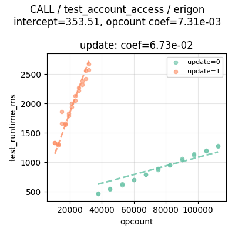

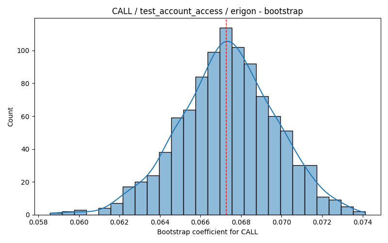

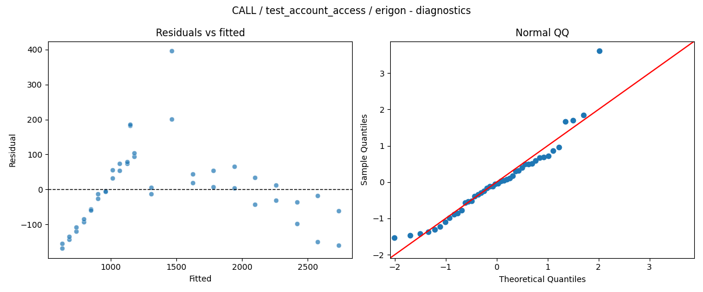

</details>

<details><summary>geth — NNLS regression summary</summary>

```
==============================================================================
                           NNLS Regression Results                            
==============================================================================
Dep. Variable:          test_runtime_ms              R-squared:          0.972
Model:                  NNLS                    Adj. R-squared:          0.969
No. Observations:       22                                RMSE:          67.99
Df Residuals:           19                                 MAE:          60.49
Df Model:               2      
==============================================================================
                      coef     std err     P-value      [0.025      0.975]
------------------------------------------------------------------------------
         const    276.9197     50.1561       0.001    177.8662    375.8254
       opcount      0.0158      0.0007       0.001      0.0145      0.0173
        update      0.0461      0.0022       0.001      0.0424      0.0513
==============================================================================
Notes: Non-negative least squares with bootstrap inference (1000 iterations)
==============================================================================
```

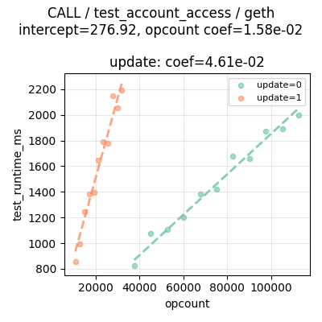

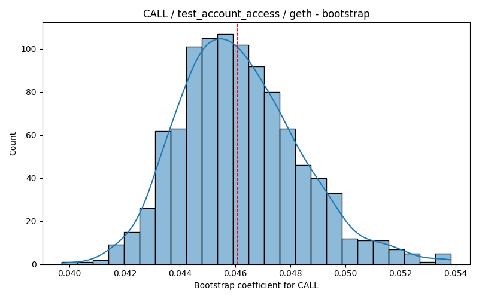

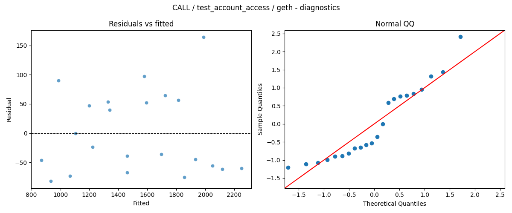

</details>

<details><summary>nethermind — NNLS regression summary</summary>

```
==============================================================================
                           NNLS Regression Results                            
==============================================================================
Dep. Variable:          test_runtime_ms              R-squared:          0.932
Model:                  NNLS                    Adj. R-squared:          0.930
No. Observations:       66                                RMSE:          82.18
Df Residuals:           63                                 MAE:          64.44
Df Model:               2      
==============================================================================
                      coef     std err     P-value      [0.025      0.975]
------------------------------------------------------------------------------
         const    166.0006     31.9015       0.001    106.5249    231.9112
       opcount      0.0039      0.0004       0.001      0.0031      0.0046
        update      0.0326      0.0014       0.001      0.0300      0.0352
==============================================================================
Notes: Non-negative least squares with bootstrap inference (1000 iterations)
==============================================================================
```

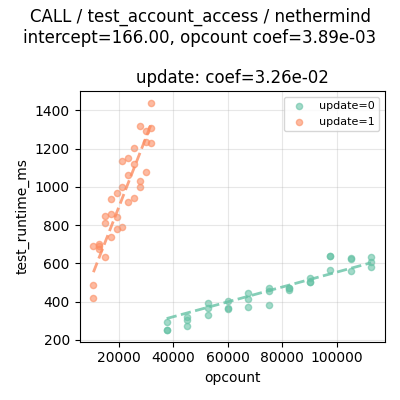

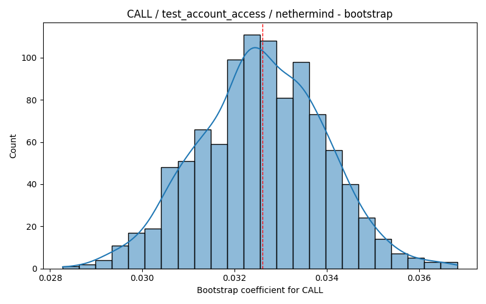

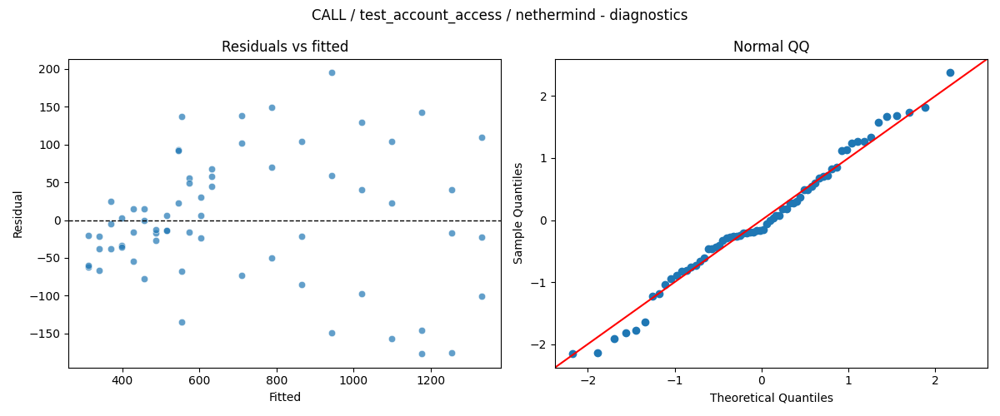

</details>

<details><summary>reth — NNLS regression summary</summary>

```
==============================================================================
                           NNLS Regression Results                            
==============================================================================
Dep. Variable:          test_runtime_ms              R-squared:          0.991
Model:                  NNLS                    Adj. R-squared:          0.991
No. Observations:       154                               RMSE:         180.62
Df Residuals:           151                                MAE:         105.35
Df Model:               2      
==============================================================================
                      coef     std err     P-value      [0.025      0.975]
------------------------------------------------------------------------------
         const    157.8472     14.0473       0.001    134.1706    187.5856
       opcount      0.0000      0.0000       1.000      0.0000      0.0000
        update      0.1638      0.0008       0.001      0.1622      0.1655
==============================================================================
Notes: Non-negative least squares with bootstrap inference (1000 iterations)
==============================================================================
```

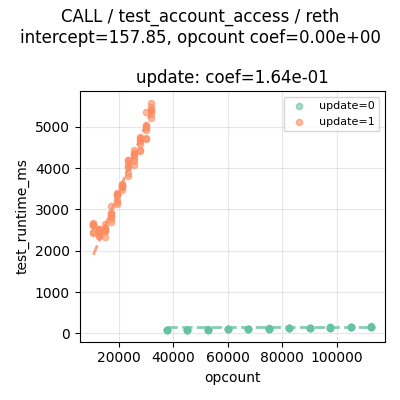

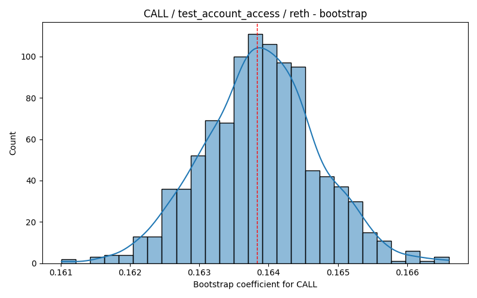

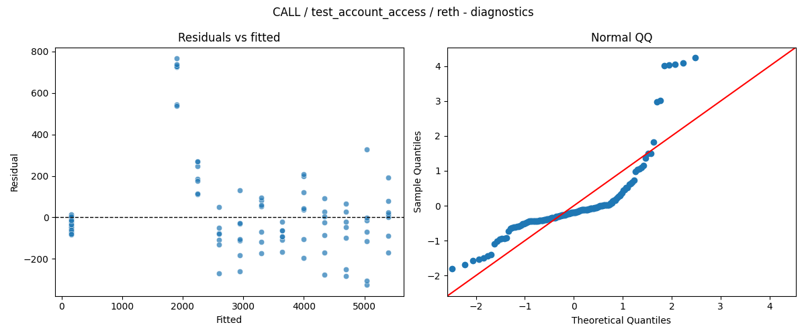

</details>

### test_account_access — combo `CALL_AccountMode.NON_EXISTING_ACCOUNT`

| client | nobs | R² | target_coef (ms) | p-value | 95% CI |
| --- | --- | --- | --- | --- | --- |
| `besu` | 110 | 0.9797 | 0.01281 | 1.00e-03 | [0.01221, 0.0136] |
| `erigon` | 44 | 0.9751 | 0.009823 | 1.00e-03 | [0.009254, 0.01029] |
| `geth` | 22 | 0.9509 | 0.0329 | 1.00e-03 | [0.03054, 0.03775] |
| `nethermind` | 66 | 0.9903 | 0.005189 | 1.00e-03 | [0.004958, 0.005461] |
| `reth` | 154 | 0.279 | 0.0006046 | 1.00e-03 | [0.0003822, 0.00081] |

<details><summary>besu — NNLS regression summary</summary>

```
==============================================================================
                           NNLS Regression Results                            
==============================================================================
Dep. Variable:          test_runtime_ms              R-squared:          0.980
Model:                  NNLS                    Adj. R-squared:          0.979
No. Observations:       110                               RMSE:          72.49
Df Residuals:           107                                MAE:          56.61
Df Model:               2      
==============================================================================
                      coef     std err     P-value      [0.025      0.975]
------------------------------------------------------------------------------
         const    392.7078     25.6966       0.001    336.1453    436.1120
       opcount      0.0128      0.0004       0.001      0.0122      0.0136
        update      0.0359      0.0216       0.043      0.0000      0.0828
==============================================================================
Notes: Non-negative least squares with bootstrap inference (1000 iterations)
==============================================================================
```

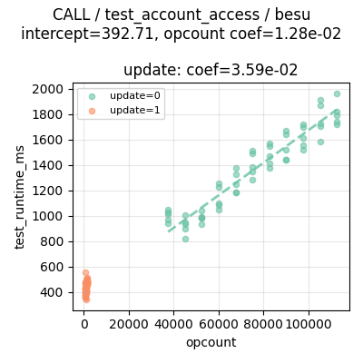

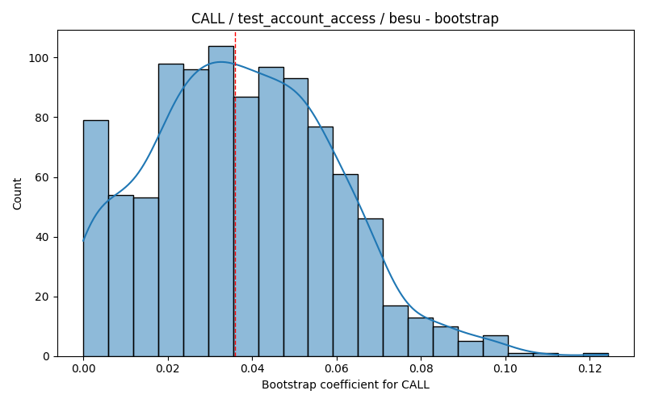

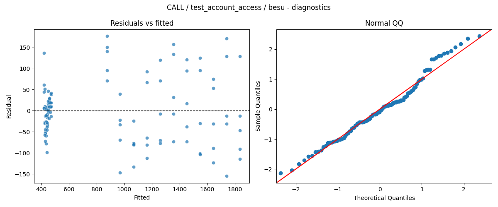

</details>

<details><summary>erigon — NNLS regression summary</summary>

```
==============================================================================
                           NNLS Regression Results                            
==============================================================================
Dep. Variable:          test_runtime_ms              R-squared:          0.975
Model:                  NNLS                    Adj. R-squared:          0.974
No. Observations:       44                                RMSE:          42.74
Df Residuals:           41                                 MAE:          32.40
Df Model:               2      
==============================================================================
                      coef     std err     P-value      [0.025      0.975]
------------------------------------------------------------------------------
         const     41.4848     21.4332       0.021      1.1355     88.8739
       opcount      0.0098      0.0003       0.001      0.0093      0.0103
        update      0.3226      0.0240       0.001      0.2750      0.3680
==============================================================================
Notes: Non-negative least squares with bootstrap inference (1000 iterations)
==============================================================================
```

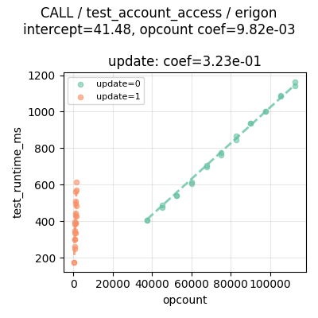

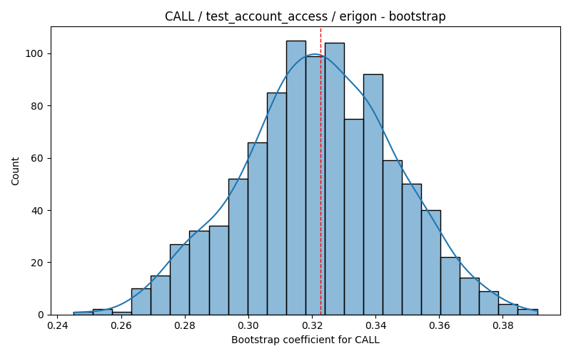

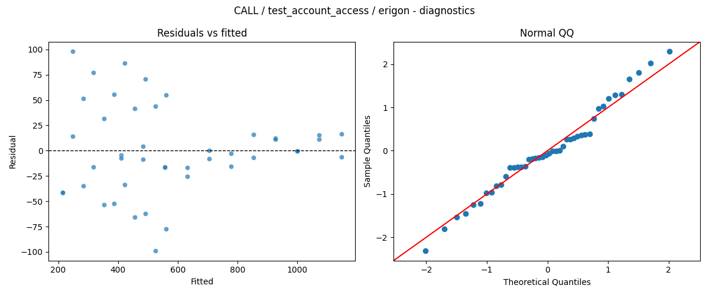

</details>

<details><summary>geth — NNLS regression summary</summary>

```
==============================================================================
                           NNLS Regression Results                            
==============================================================================
Dep. Variable:          test_runtime_ms              R-squared:          0.951
Model:                  NNLS                    Adj. R-squared:          0.946
No. Observations:       22                                RMSE:         304.06
Df Residuals:           19                                 MAE:         222.99
Df Model:               2      
==============================================================================
                      coef     std err     P-value      [0.025      0.975]
------------------------------------------------------------------------------
         const    273.8334     59.3951       0.001    185.9747    412.1992
       opcount      0.0329      0.0018       0.001      0.0305      0.0378
        update      0.0000      0.0044       1.000      0.0000      0.0000
==============================================================================
Notes: Non-negative least squares with bootstrap inference (1000 iterations)
==============================================================================
```

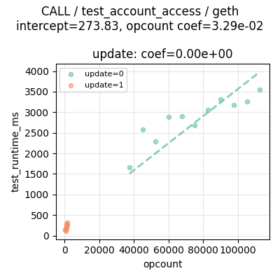

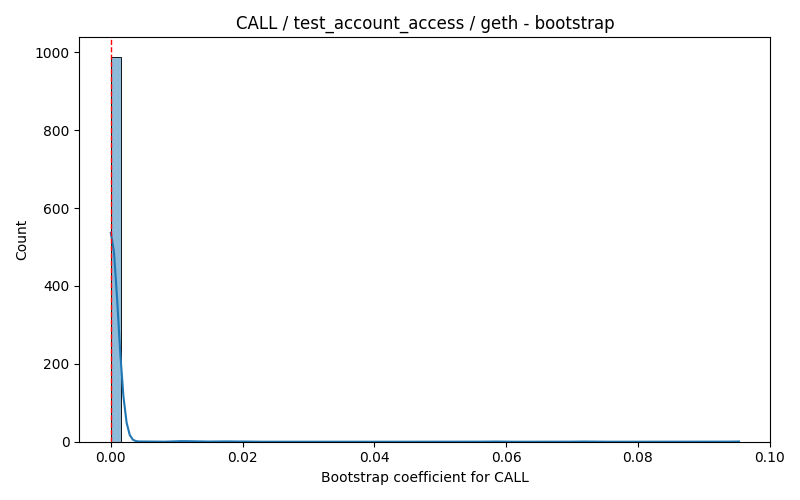

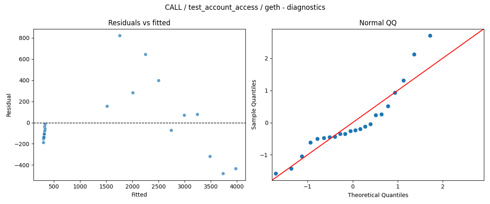

</details>

<details><summary>nethermind — NNLS regression summary</summary>

```
==============================================================================
                           NNLS Regression Results                            
==============================================================================
Dep. Variable:          test_runtime_ms              R-squared:          0.990
Model:                  NNLS                    Adj. R-squared:          0.990
No. Observations:       66                                RMSE:          20.33
Df Residuals:           63                                 MAE:          16.44
Df Model:               2      
==============================================================================
                      coef     std err     P-value      [0.025      0.975]
------------------------------------------------------------------------------
         const     62.3658      9.0657       0.001     43.3382     78.8750
       opcount      0.0052      0.0001       0.001      0.0050      0.0055
        update      0.0127      0.0080       0.084      0.0000      0.0299
==============================================================================
Notes: Non-negative least squares with bootstrap inference (1000 iterations)
==============================================================================
```

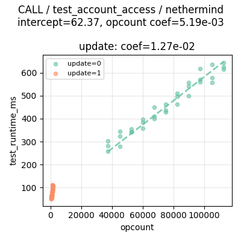

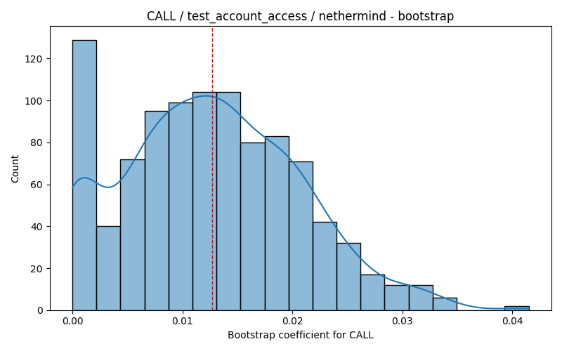

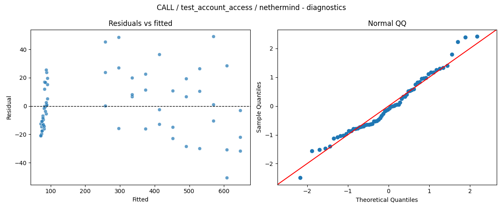

</details>

<details><summary>reth — NNLS regression summary</summary>

```
==============================================================================
                           NNLS Regression Results                            
==============================================================================
Dep. Variable:          test_runtime_ms              R-squared:          0.279
Model:                  NNLS                    Adj. R-squared:          0.269
No. Observations:       154                               RMSE:          22.11
Df Residuals:           151                                MAE:          15.29
Df Model:               2      
==============================================================================
                      coef     std err     P-value      [0.025      0.975]
------------------------------------------------------------------------------
         const     63.6021      9.0573       0.001     46.6153     81.5038
       opcount      0.0006      0.0001       0.001      0.0004      0.0008
        update      0.0350      0.0072       0.001      0.0203      0.0484
==============================================================================
Notes: Non-negative least squares with bootstrap inference (1000 iterations)
==============================================================================
```

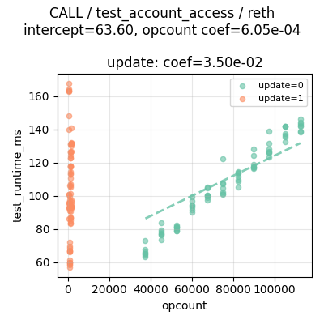

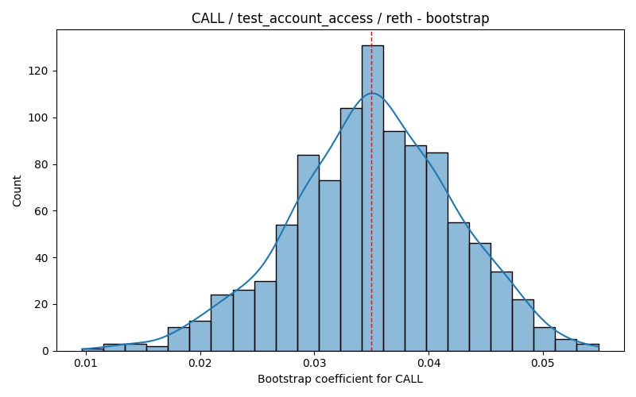

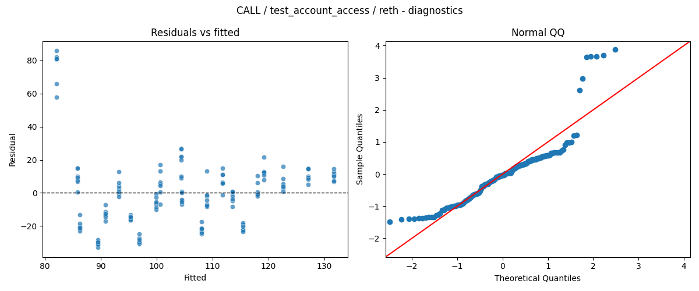

</details>

### test_ext_account_query_warm — combo `CALL`

| client | nobs | R² | target_coef (ms) | p-value | 95% CI |
| --- | --- | --- | --- | --- | --- |
| `besu` | 55 | 0.819 | 0.0006443 | 1.00e-03 | [0.0005572, 0.0007353] |
| `erigon` | 22 | 0.9583 | 0.000511 | 1.00e-03 | [0.0004661, 0.0005385] |
| `geth` | 11 | 0.9689 | 0.0001415 | 1.00e-03 | [0.0001205, 0.0001564] |
| `nethermind` | 33 | 0.9421 | 0.0007493 | 1.00e-03 | [0.0006737, 0.0008111] |
| `reth` | 77 | 0.8897 | 4.976e-05 | 1.00e-03 | [4.54e-05, 5.446e-05] |

<details><summary>besu — NNLS regression summary</summary>

```
==============================================================================
                           NNLS Regression Results                            
==============================================================================
Dep. Variable:          test_runtime_ms              R-squared:          0.819
Model:                  NNLS                    Adj. R-squared:          0.816
No. Observations:       55                                RMSE:         153.00
Df Residuals:           53                                 MAE:         133.81
Df Model:               1      
==============================================================================
                      coef     std err     P-value      [0.025      0.975]
------------------------------------------------------------------------------
         const    713.4938     68.8108       0.001    576.6656    848.4007
       opcount      0.0006      0.0000       0.001      0.0006      0.0007
==============================================================================
Notes: Non-negative least squares with bootstrap inference (1000 iterations)
==============================================================================
```

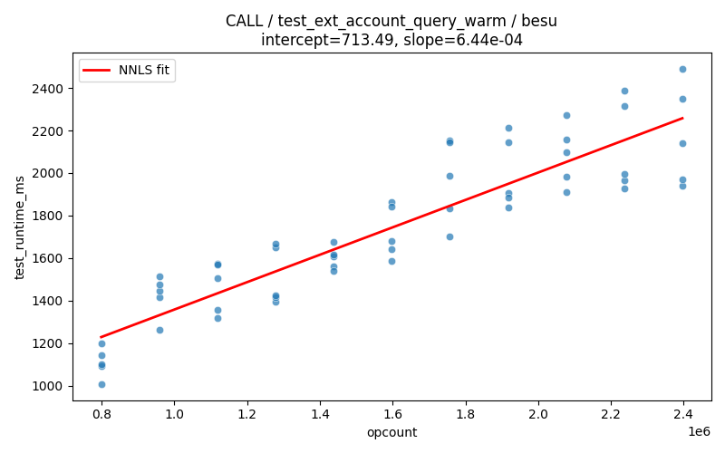

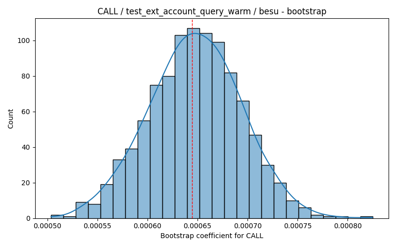

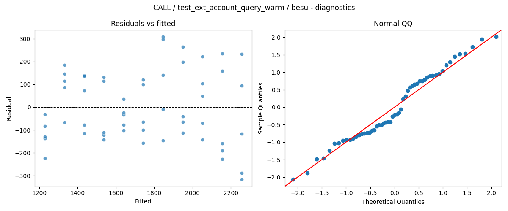

</details>

<details><summary>erigon — NNLS regression summary</summary>

```
==============================================================================
                           NNLS Regression Results                            
==============================================================================
Dep. Variable:          test_runtime_ms              R-squared:          0.958
Model:                  NNLS                    Adj. R-squared:          0.956
No. Observations:       22                                RMSE:          53.86
Df Residuals:           20                                 MAE:          39.72
Df Model:               1      
==============================================================================
                      coef     std err     P-value      [0.025      0.975]
------------------------------------------------------------------------------
         const     20.2998     26.2330       0.266      0.0000     89.5810
       opcount      0.0005      0.0000       0.001      0.0005      0.0005
==============================================================================
Notes: Non-negative least squares with bootstrap inference (1000 iterations)
==============================================================================
```


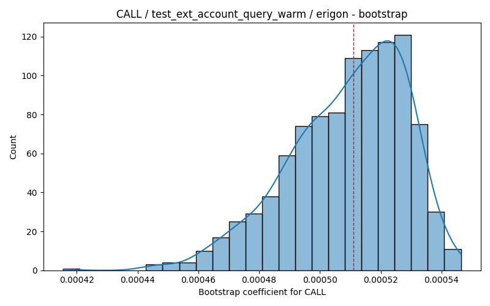

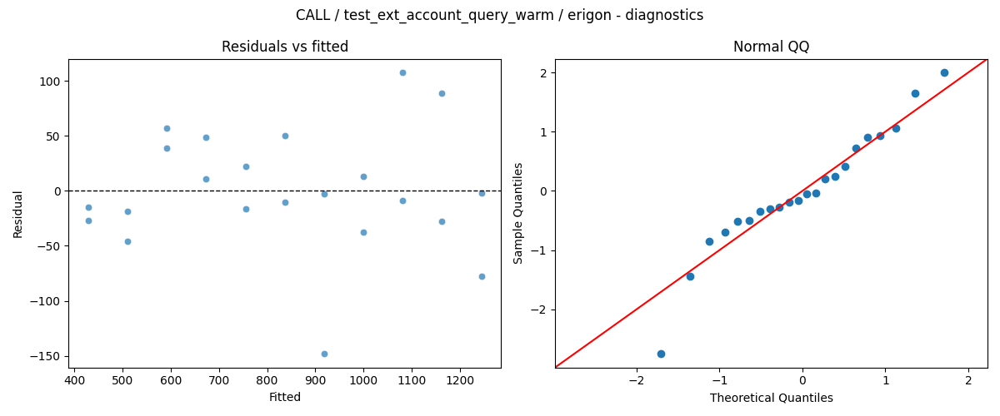

</details>

<details><summary>geth — NNLS regression summary</summary>

```
==============================================================================
                           NNLS Regression Results                            
==============================================================================
Dep. Variable:          test_runtime_ms              R-squared:          0.969
Model:                  NNLS                    Adj. R-squared:          0.965
No. Observations:       11                                RMSE:          12.80
Df Residuals:           9                                  MAE:          11.77
Df Model:               1      
==============================================================================
                      coef     std err     P-value      [0.025      0.975]
------------------------------------------------------------------------------
         const     61.1934     15.3303       0.001     34.0513     93.8230
       opcount      0.0001      0.0000       0.001      0.0001      0.0002
==============================================================================
Notes: Non-negative least squares with bootstrap inference (1000 iterations)
==============================================================================
```

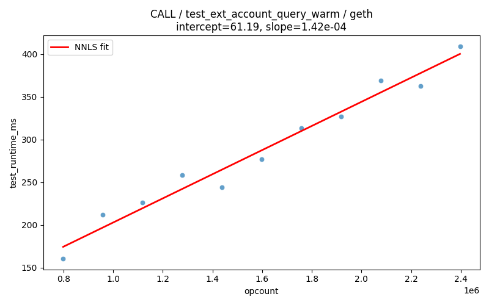

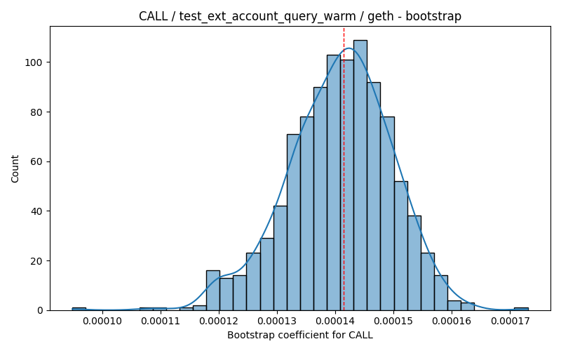

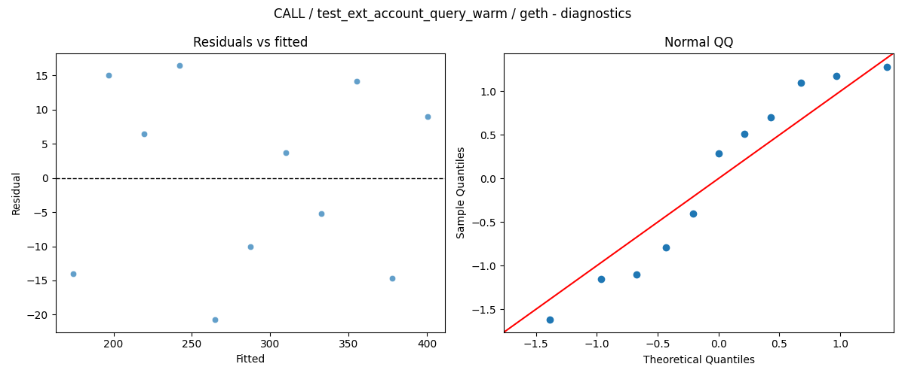

</details>

<details><summary>nethermind — NNLS regression summary</summary>

```
==============================================================================
                           NNLS Regression Results                            
==============================================================================
Dep. Variable:          test_runtime_ms              R-squared:          0.942
Model:                  NNLS                    Adj. R-squared:          0.940
No. Observations:       33                                RMSE:          93.82
Df Residuals:           31                                 MAE:          79.65
Df Model:               1      
==============================================================================
                      coef     std err     P-value      [0.025      0.975]
------------------------------------------------------------------------------
         const    324.0239     61.4034       0.001    211.5971    450.9833
       opcount      0.0007      0.0000       0.001      0.0007      0.0008
==============================================================================
Notes: Non-negative least squares with bootstrap inference (1000 iterations)
==============================================================================
```

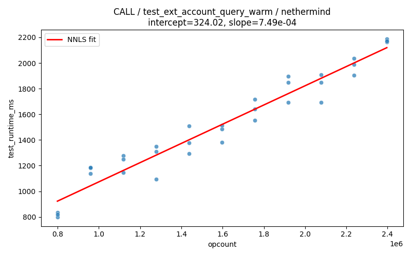

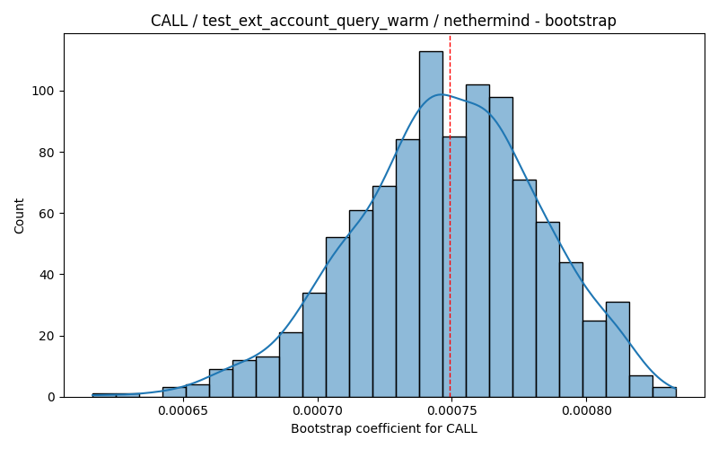

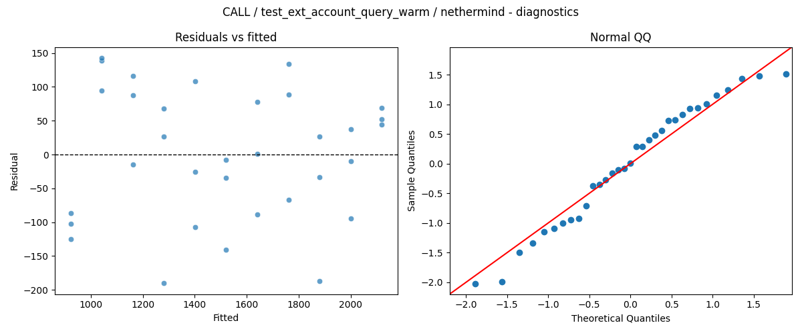

</details>

<details><summary>reth — NNLS regression summary</summary>

```
==============================================================================
                           NNLS Regression Results                            
==============================================================================
Dep. Variable:          test_runtime_ms              R-squared:          0.890
Model:                  NNLS                    Adj. R-squared:          0.888
No. Observations:       77                                RMSE:           8.85
Df Residuals:           75                                 MAE:           7.29
Df Model:               1      
==============================================================================
                      coef     std err     P-value      [0.025      0.975]
------------------------------------------------------------------------------
         const     18.7732      3.8353       0.001     11.0195     25.9540
       opcount      0.0000      0.0000       0.001      0.0000      0.0001
==============================================================================
Notes: Non-negative least squares with bootstrap inference (1000 iterations)
==============================================================================
```

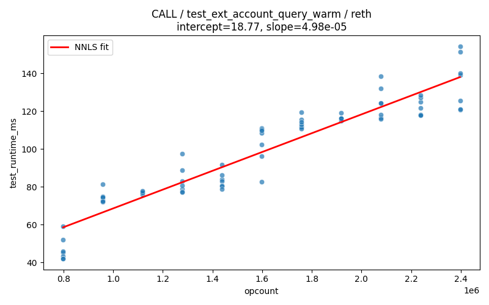

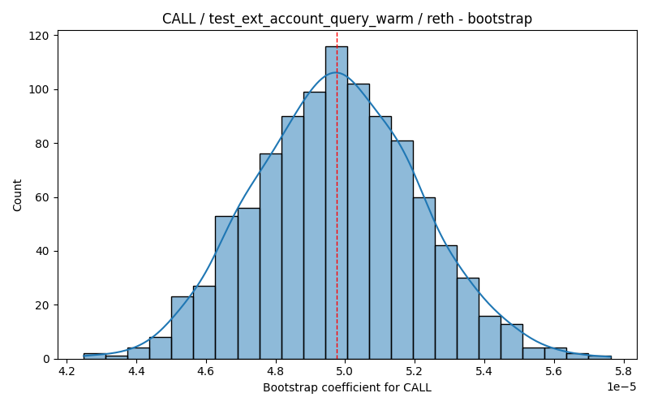

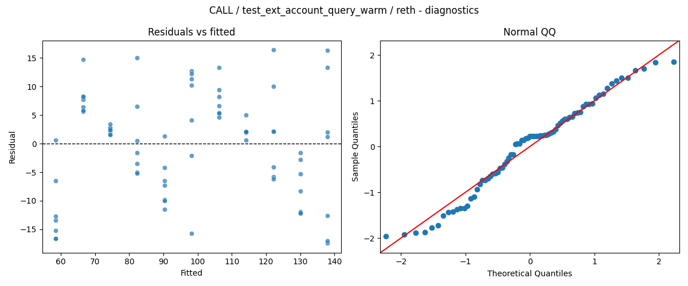

</details>

## CALLCODE

### test_account_access — combo `CALLCODE_AccountMode.EXISTING_CONTRACT`

| client | nobs | R² | target_coef (ms) | p-value | 95% CI |
| --- | --- | --- | --- | --- | --- |
| `besu` | 110 | 0.9714 | 0.03347 | 1.00e-03 | [0.03265, 0.03435] |
| `erigon` | 44 | 0.9572 | 0.1026 | 1.00e-03 | [0.098, 0.109] |
| `geth` | 22 | 0.9188 | 0.03715 | 1.00e-03 | [0.03344, 0.04389] |
| `nethermind` | 66 | 0.9091 | 0.03263 | 1.00e-03 | [0.03033, 0.03558] |
| `reth` | 154 | 0.9168 | 0.03666 | 1.00e-03 | [0.03593, 0.03735] |

<details><summary>besu — NNLS regression summary</summary>

```
==============================================================================
                           NNLS Regression Results                            
==============================================================================
Dep. Variable:          test_runtime_ms              R-squared:          0.971
Model:                  NNLS                    Adj. R-squared:          0.971
No. Observations:       110                               RMSE:         153.26
Df Residuals:           107                                MAE:         114.06
Df Model:               2      
==============================================================================
                      coef     std err     P-value      [0.025      0.975]
------------------------------------------------------------------------------
         const    111.1458     24.0740       0.001     62.1864    160.1357
       opcount      0.0335      0.0004       0.001      0.0327      0.0344
        update      0.0000      0.0000       1.000      0.0000      0.0000
==============================================================================
Notes: Non-negative least squares with bootstrap inference (1000 iterations)
==============================================================================
```

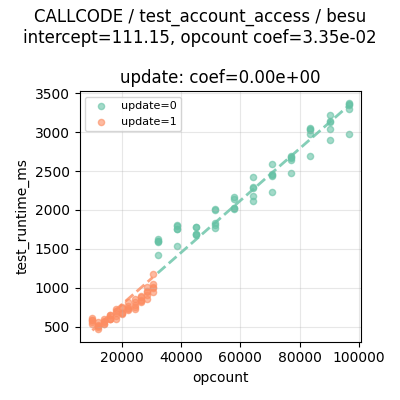


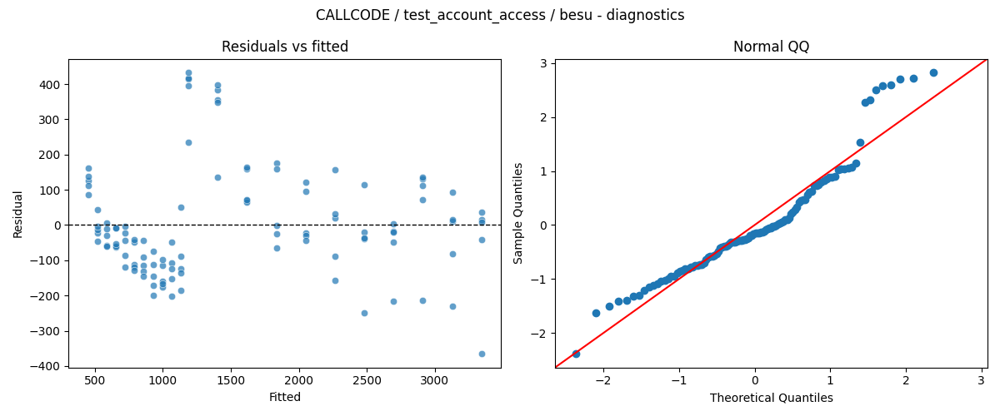

</details>

<details><summary>erigon — NNLS regression summary</summary>

```
==============================================================================
                           NNLS Regression Results                            
==============================================================================
Dep. Variable:          test_runtime_ms              R-squared:          0.957
Model:                  NNLS                    Adj. R-squared:          0.955
No. Observations:       44                                RMSE:         579.00
Df Residuals:           41                                 MAE:         399.36
Df Model:               2      
==============================================================================
                      coef     std err     P-value      [0.025      0.975]
------------------------------------------------------------------------------
         const    308.6358    107.1509       0.003    105.9338    530.0676
       opcount      0.1026      0.0028       0.001      0.0980      0.1090
        update      0.0000      0.0000       1.000      0.0000      0.0000
==============================================================================
Notes: Non-negative least squares with bootstrap inference (1000 iterations)
==============================================================================
```

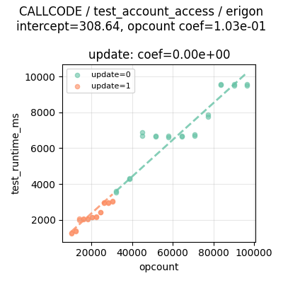


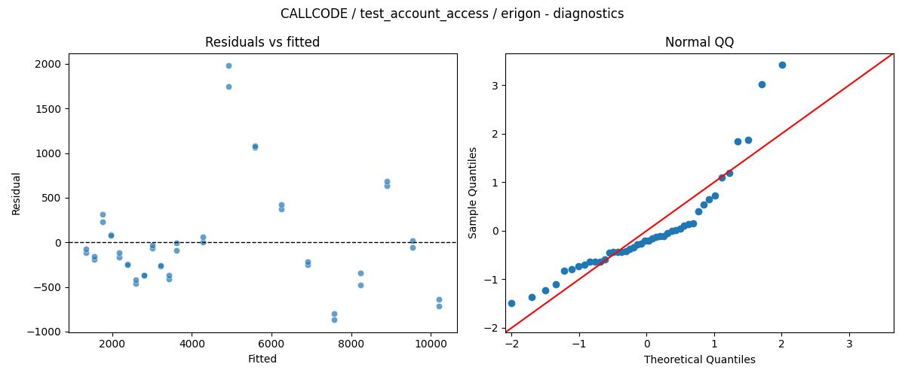

</details>

<details><summary>geth — NNLS regression summary</summary>

```
==============================================================================
                           NNLS Regression Results                            
==============================================================================
Dep. Variable:          test_runtime_ms              R-squared:          0.919
Model:                  NNLS                    Adj. R-squared:          0.910
No. Observations:       22                                RMSE:         294.74
Df Residuals:           19                                 MAE:         205.93
Df Model:               2      
==============================================================================
                      coef     std err     P-value      [0.025      0.975]
------------------------------------------------------------------------------
         const    314.6641     96.8285       0.002    106.8250    505.8023
       opcount      0.0371      0.0027       0.001      0.0334      0.0439
        update      0.0000      0.0000       1.000      0.0000      0.0000
==============================================================================
Notes: Non-negative least squares with bootstrap inference (1000 iterations)
==============================================================================
```

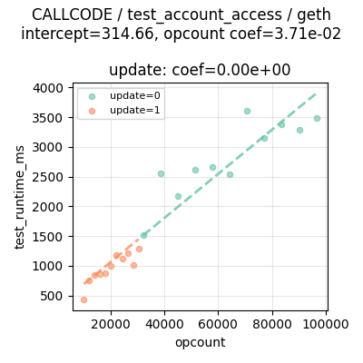


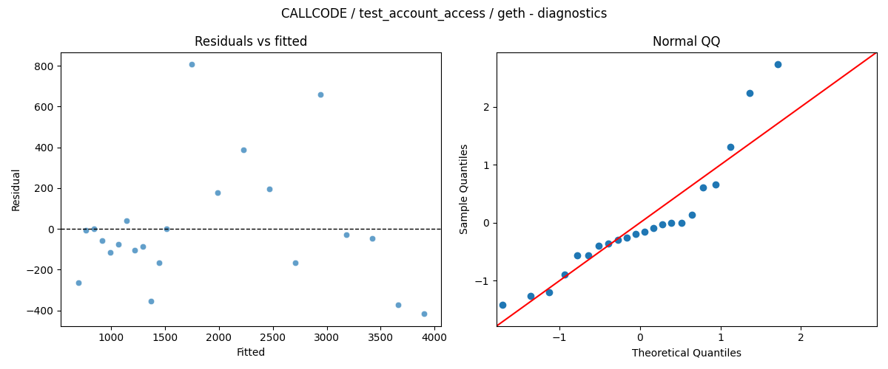

</details>

<details><summary>nethermind — NNLS regression summary</summary>

```
==============================================================================
                           NNLS Regression Results                            
==============================================================================
Dep. Variable:          test_runtime_ms              R-squared:          0.909
Model:                  NNLS                    Adj. R-squared:          0.906
No. Observations:       66                                RMSE:         275.34
Df Residuals:           63                                 MAE:         199.61
Df Model:               2      
==============================================================================
                      coef     std err     P-value      [0.025      0.975]
------------------------------------------------------------------------------
         const    227.9909     48.9237       0.001    130.4311    320.9978
       opcount      0.0326      0.0014       0.001      0.0303      0.0356
        update      0.0000      0.0000       1.000      0.0000      0.0000
==============================================================================
Notes: Non-negative least squares with bootstrap inference (1000 iterations)
==============================================================================
```

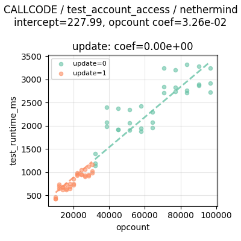


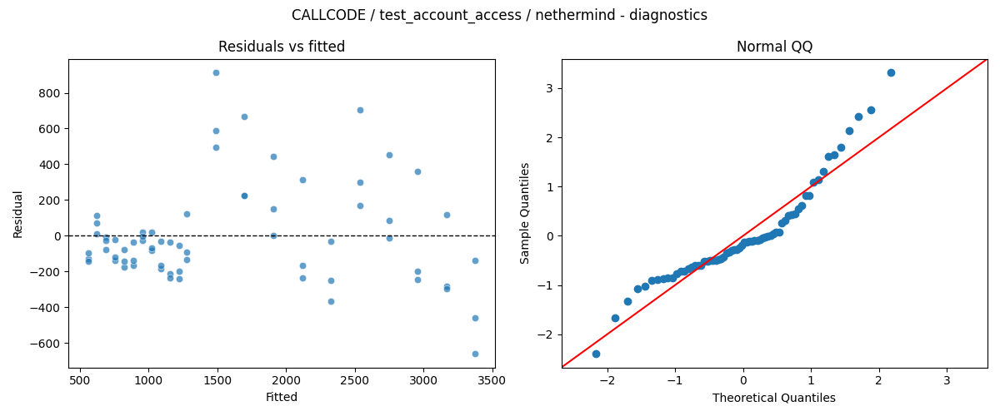

</details>

<details><summary>reth — NNLS regression summary</summary>

```
==============================================================================
                           NNLS Regression Results                            
==============================================================================
Dep. Variable:          test_runtime_ms              R-squared:          0.917
Model:                  NNLS                    Adj. R-squared:          0.916
No. Observations:       154                               RMSE:         326.96
Df Residuals:           151                                MAE:         264.03
Df Model:               2      
==============================================================================
                      coef     std err     P-value      [0.025      0.975]
------------------------------------------------------------------------------
         const      0.0000      0.0000       1.000      0.0000      0.0000
       opcount      0.0367      0.0004       0.001      0.0359      0.0374
        update      0.0000      0.0000       1.000      0.0000      0.0000
==============================================================================
Notes: Non-negative least squares with bootstrap inference (1000 iterations)
==============================================================================
```

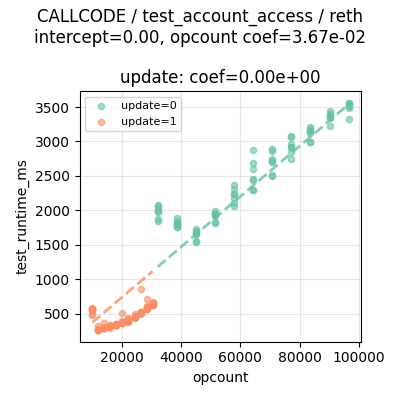


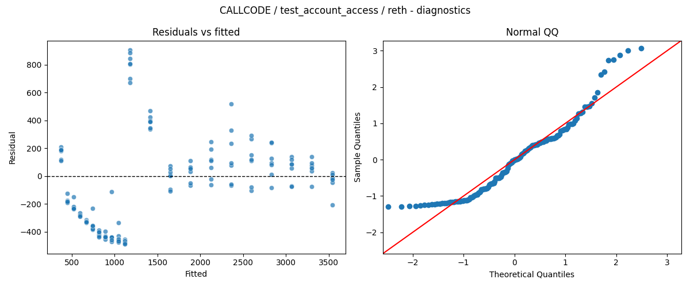

</details>

### test_account_access — combo `CALLCODE_AccountMode.EXISTING_EOA`

| client | nobs | R² | target_coef (ms) | p-value | 95% CI |
| --- | --- | --- | --- | --- | --- |
| `besu` | 110 | 0.9351 | 0.01371 | 1.00e-03 | [0.01315, 0.01433] |
| `erigon` | 44 | 0.9963 | 0.01052 | 1.00e-03 | [0.01043, 0.01061] |
| `geth` | 22 | 0.9858 | 0.01668 | 1.00e-03 | [0.01548, 0.01824] |
| `nethermind` | 66 | 0.9589 | 0.004982 | 1.00e-03 | [0.004711, 0.005371] |
| `reth` | 154 | 0.9815 | 0.001392 | 1.00e-03 | [0.001363, 0.001425] |

<details><summary>besu — NNLS regression summary</summary>

```
==============================================================================
                           NNLS Regression Results                            
==============================================================================
Dep. Variable:          test_runtime_ms              R-squared:          0.935
Model:                  NNLS                    Adj. R-squared:          0.934
No. Observations:       110                               RMSE:         115.86
Df Residuals:           107                                MAE:          81.47
Df Model:               2      
==============================================================================
                      coef     std err     P-value      [0.025      0.975]
------------------------------------------------------------------------------
         const    267.1128     16.8496       0.001    237.1228    301.2766
       opcount      0.0137      0.0003       0.001      0.0131      0.0143
        update      0.0000      0.0000       1.000      0.0000      0.0000
==============================================================================
Notes: Non-negative least squares with bootstrap inference (1000 iterations)
==============================================================================
```

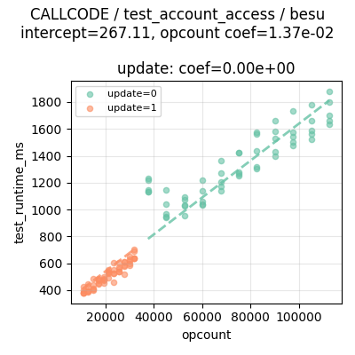


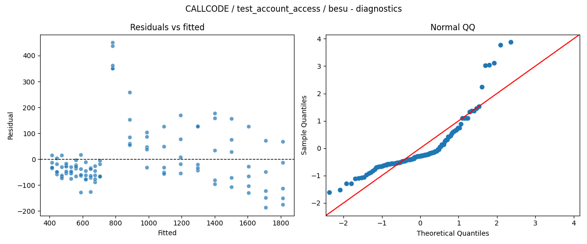

</details>

<details><summary>erigon — NNLS regression summary</summary>

```
==============================================================================
                           NNLS Regression Results                            
==============================================================================
Dep. Variable:          test_runtime_ms              R-squared:          0.996
Model:                  NNLS                    Adj. R-squared:          0.996
No. Observations:       44                                RMSE:          20.70
Df Residuals:           41                                 MAE:          15.81
Df Model:               2      
==============================================================================
                      coef     std err     P-value      [0.025      0.975]
------------------------------------------------------------------------------
         const      0.0000      0.4756       1.000      0.0000      0.0000
       opcount      0.0105      0.0000       0.001      0.0104      0.0106
        update      0.0000      0.0000       1.000      0.0000      0.0000
==============================================================================
Notes: Non-negative least squares with bootstrap inference (1000 iterations)
==============================================================================
```


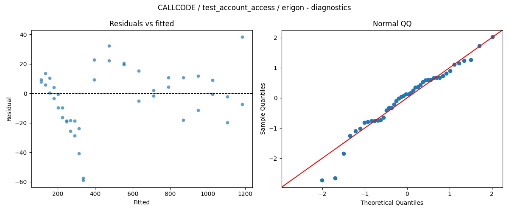

</details>

<details><summary>geth — NNLS regression summary</summary>

```
==============================================================================
                           NNLS Regression Results                            
==============================================================================
Dep. Variable:          test_runtime_ms              R-squared:          0.986
Model:                  NNLS                    Adj. R-squared:          0.984
No. Observations:       22                                RMSE:          64.12
Df Residuals:           19                                 MAE:          50.11
Df Model:               2      
==============================================================================
                      coef     std err     P-value      [0.025      0.975]
------------------------------------------------------------------------------
         const    134.4246     33.1124       0.005     52.6054    177.8896
       opcount      0.0167      0.0007       0.001      0.0155      0.0182
        update      0.0000      0.0008       1.000      0.0000      0.0028
==============================================================================
Notes: Non-negative least squares with bootstrap inference (1000 iterations)
==============================================================================
```

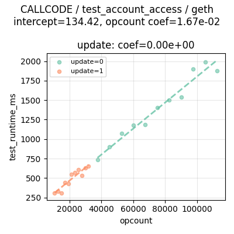

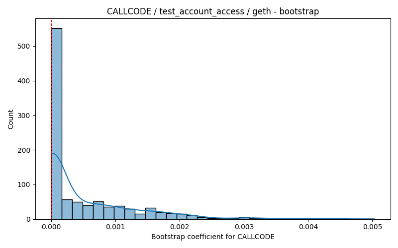

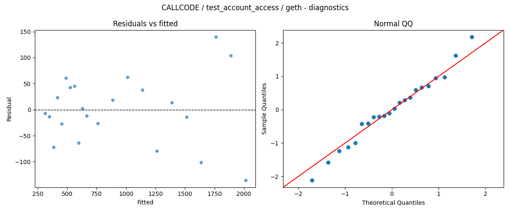

</details>

<details><summary>nethermind — NNLS regression summary</summary>

```
==============================================================================
                           NNLS Regression Results                            
==============================================================================
Dep. Variable:          test_runtime_ms              R-squared:          0.959
Model:                  NNLS                    Adj. R-squared:          0.958
No. Observations:       66                                RMSE:          33.10
Df Residuals:           63                                 MAE:          20.75
Df Model:               2      
==============================================================================
                      coef     std err     P-value      [0.025      0.975]
------------------------------------------------------------------------------
         const     75.6355      6.2566       0.001     60.9171     86.2458
       opcount      0.0050      0.0002       0.001      0.0047      0.0054
        update      0.0000      0.0001       1.000      0.0000      0.0003
==============================================================================
Notes: Non-negative least squares with bootstrap inference (1000 iterations)
==============================================================================
```

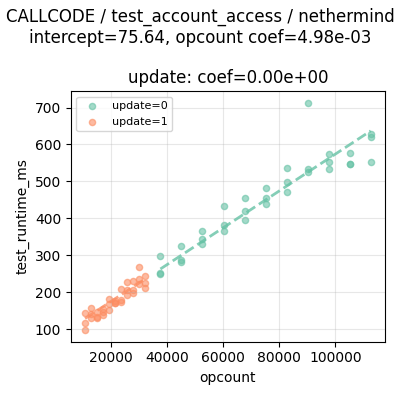

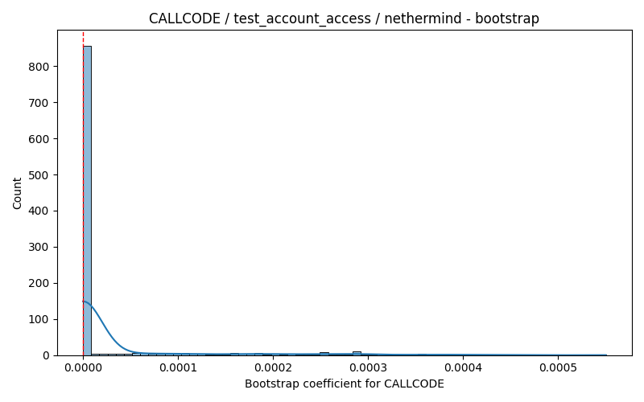

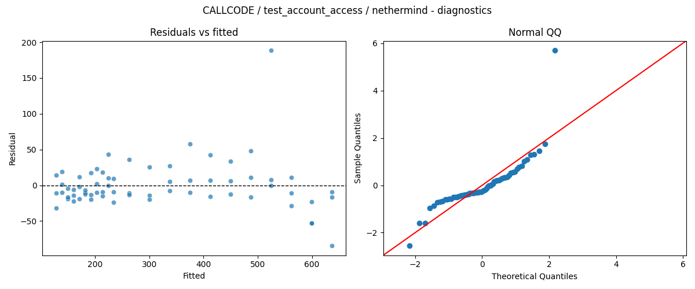

</details>

<details><summary>reth — NNLS regression summary</summary>

```
==============================================================================
                           NNLS Regression Results                            
==============================================================================
Dep. Variable:          test_runtime_ms              R-squared:          0.981
Model:                  NNLS                    Adj. R-squared:          0.981
No. Observations:       154                               RMSE:           6.13
Df Residuals:           151                                MAE:           4.77
Df Model:               2      
==============================================================================
                      coef     std err     P-value      [0.025      0.975]
------------------------------------------------------------------------------
         const      8.9740      0.7583       0.001      7.4562     10.4455
       opcount      0.0014      0.0000       0.001      0.0014      0.0014
        update      0.0000      0.0000       1.000      0.0000      0.0000
==============================================================================
Notes: Non-negative least squares with bootstrap inference (1000 iterations)
==============================================================================
```

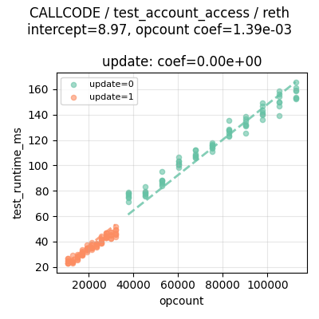


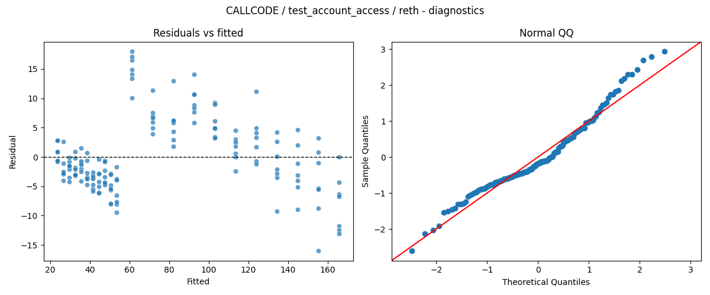

</details>

### test_account_access — combo `CALLCODE_AccountMode.NON_EXISTING_ACCOUNT`

| client | nobs | R² | target_coef (ms) | p-value | 95% CI |
| --- | --- | --- | --- | --- | --- |
| `besu` | 110 | 0.9374 | 0.01528 | 1.00e-03 | [0.01476, 0.01593] |
| `erigon` | 44 | 0.9408 | 0.009353 | 1.00e-03 | [0.008947, 0.009568] |
| `geth` | 22 | 0.916 | 0.037 | 1.00e-03 | [0.03395, 0.04034] |
| `nethermind` | 66 | 0.9678 | 0.005781 | 1.00e-03 | [0.005634, 0.005944] |
| `reth` | 154 | 0.9083 | 0.001292 | 1.00e-03 | [0.001262, 0.001321] |

<details><summary>besu — NNLS regression summary</summary>

```
==============================================================================
                           NNLS Regression Results                            
==============================================================================
Dep. Variable:          test_runtime_ms              R-squared:          0.937
Model:                  NNLS                    Adj. R-squared:          0.936
No. Observations:       110                               RMSE:         126.67
Df Residuals:           107                                MAE:         101.59
Df Model:               2      
==============================================================================
                      coef     std err     P-value      [0.025      0.975]
------------------------------------------------------------------------------
         const     65.4594     20.1235       0.001     23.2892    101.5145
       opcount      0.0153      0.0003       0.001      0.0148      0.0159
        update      0.0000      0.0000       1.000      0.0000      0.0000
==============================================================================
Notes: Non-negative least squares with bootstrap inference (1000 iterations)
==============================================================================
```

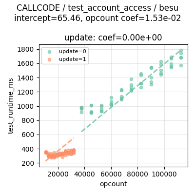


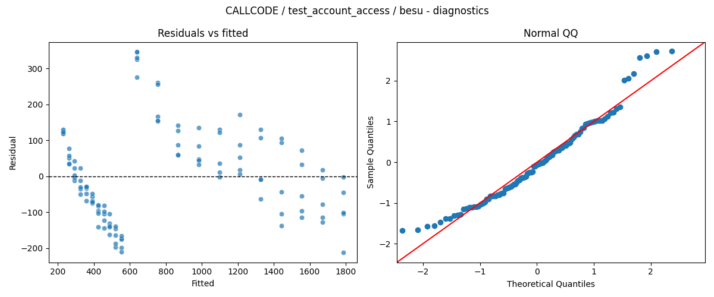

</details>

<details><summary>erigon — NNLS regression summary</summary>

```
==============================================================================
                           NNLS Regression Results                            
==============================================================================
Dep. Variable:          test_runtime_ms              R-squared:          0.941
Model:                  NNLS                    Adj. R-squared:          0.938
No. Observations:       44                                RMSE:          87.54
Df Residuals:           41                                 MAE:          70.09
Df Model:               2      
==============================================================================
                      coef     std err     P-value      [0.025      0.975]
------------------------------------------------------------------------------
         const      0.0000      0.0000       1.000      0.0000      0.0000
       opcount      0.0094      0.0002       0.001      0.0089      0.0096
        update      0.0000      0.0000       1.000      0.0000      0.0000
==============================================================================
Notes: Non-negative least squares with bootstrap inference (1000 iterations)
==============================================================================
```

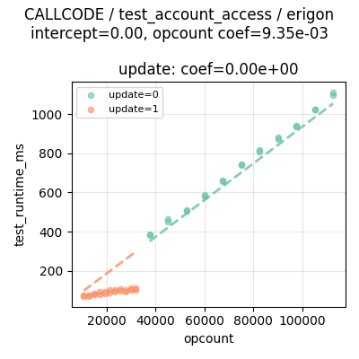


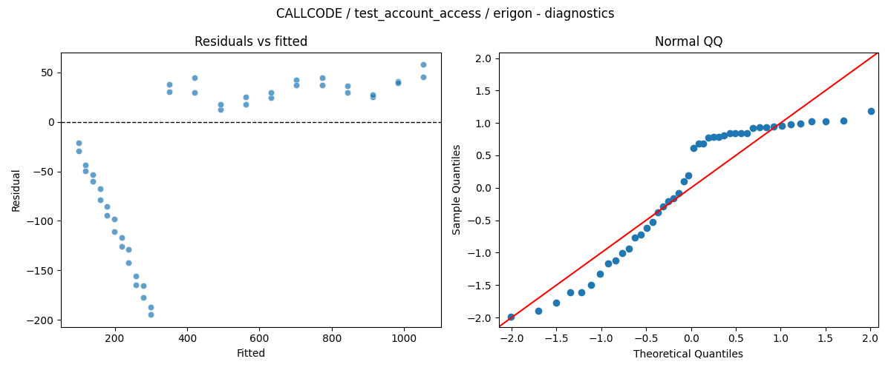

</details>

<details><summary>geth — NNLS regression summary</summary>

```
==============================================================================
                           NNLS Regression Results                            
==============================================================================
Dep. Variable:          test_runtime_ms              R-squared:          0.916
Model:                  NNLS                    Adj. R-squared:          0.907
No. Observations:       22                                RMSE:         359.45
Df Residuals:           19                                 MAE:         286.04
Df Model:               2      
==============================================================================
                      coef     std err     P-value      [0.025      0.975]
------------------------------------------------------------------------------
         const     30.1010     81.9721       0.444      0.0000    258.7199
       opcount      0.0370      0.0016       0.001      0.0339      0.0403
        update      0.0000      0.0000       1.000      0.0000      0.0000
==============================================================================
Notes: Non-negative least squares with bootstrap inference (1000 iterations)
==============================================================================
```

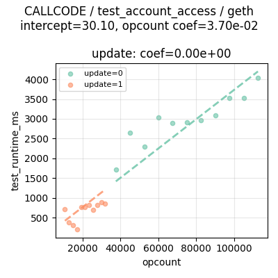


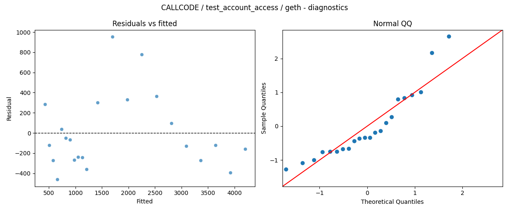

</details>

<details><summary>nethermind — NNLS regression summary</summary>

```
==============================================================================
                           NNLS Regression Results                            
==============================================================================
Dep. Variable:          test_runtime_ms              R-squared:          0.968
Model:                  NNLS                    Adj. R-squared:          0.967
No. Observations:       66                                RMSE:          34.67
Df Residuals:           63                                 MAE:          27.92
Df Model:               2      
==============================================================================
                      coef     std err     P-value      [0.025      0.975]
------------------------------------------------------------------------------
         const      0.0000      0.8381       1.000      0.0000      1.6096
       opcount      0.0058      0.0001       0.001      0.0056      0.0059
        update      0.0000      0.0000       1.000      0.0000      0.0000
==============================================================================
Notes: Non-negative least squares with bootstrap inference (1000 iterations)
==============================================================================
```

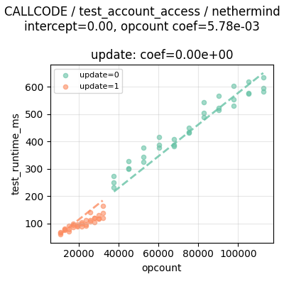


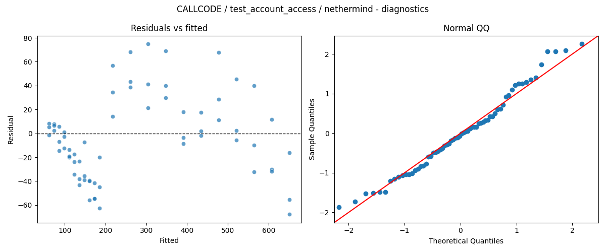

</details>

<details><summary>reth — NNLS regression summary</summary>

```
==============================================================================
                           NNLS Regression Results                            
==============================================================================
Dep. Variable:          test_runtime_ms              R-squared:          0.908
Model:                  NNLS                    Adj. R-squared:          0.907
No. Observations:       154                               RMSE:          14.97
Df Residuals:           151                                MAE:          13.07
Df Model:               2      
==============================================================================
                      coef     std err     P-value      [0.025      0.975]
------------------------------------------------------------------------------
         const      0.0000      0.0000       1.000      0.0000      0.0000
       opcount      0.0013      0.0000       0.001      0.0013      0.0013
        update      0.0000      0.0000       1.000      0.0000      0.0000
==============================================================================
Notes: Non-negative least squares with bootstrap inference (1000 iterations)
==============================================================================
```

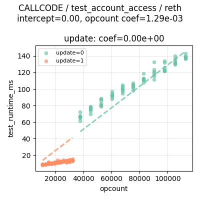


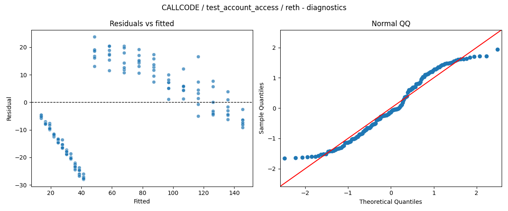

</details>

### test_ext_account_query_warm — combo `CALLCODE`

| client | nobs | R² | target_coef (ms) | p-value | 95% CI |
| --- | --- | --- | --- | --- | --- |
| `besu` | 55 | 0.8036 | 0.000626 | 1.00e-03 | [0.0005411, 0.0007065] |
| `erigon` | 22 | 0.9287 | 0.0002571 | 1.00e-03 | [0.0002174, 0.0002868] |
| `geth` | 11 | 0.986 | 0.0002099 | 1.00e-03 | [0.0001901, 0.0002249] |
| `nethermind` | 33 | 0.9506 | 0.0007733 | 1.00e-03 | [0.0007085, 0.0008435] |
| `reth` | 77 | 0.9205 | 4.636e-05 | 1.00e-03 | [4.31e-05, 4.951e-05] |

<details><summary>besu — NNLS regression summary</summary>

```
==============================================================================
                           NNLS Regression Results                            
==============================================================================
Dep. Variable:          test_runtime_ms              R-squared:          0.804
Model:                  NNLS                    Adj. R-squared:          0.800
No. Observations:       55                                RMSE:         156.34
Df Residuals:           53                                 MAE:         132.09
Df Model:               1      
==============================================================================
                      coef     std err     P-value      [0.025      0.975]
------------------------------------------------------------------------------
         const    715.1477     65.6817       0.001    590.6934    848.5832
       opcount      0.0006      0.0000       0.001      0.0005      0.0007
==============================================================================
Notes: Non-negative least squares with bootstrap inference (1000 iterations)
==============================================================================
```

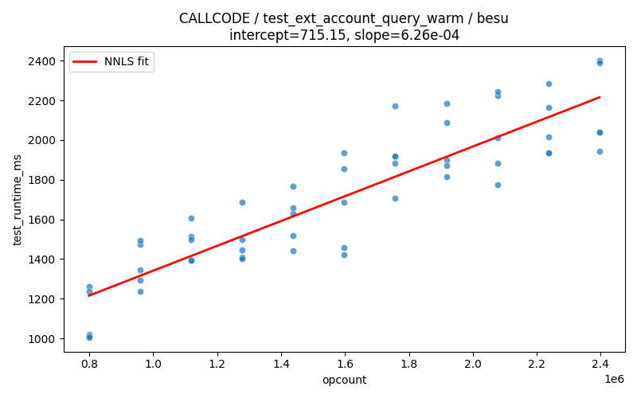

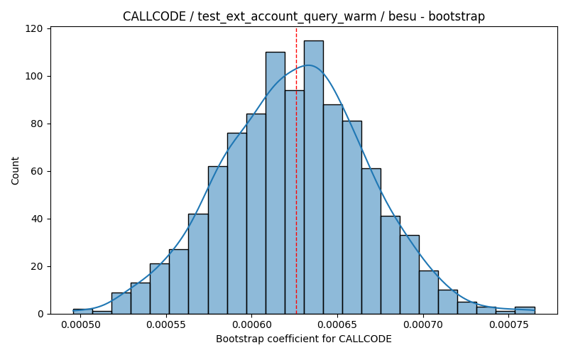

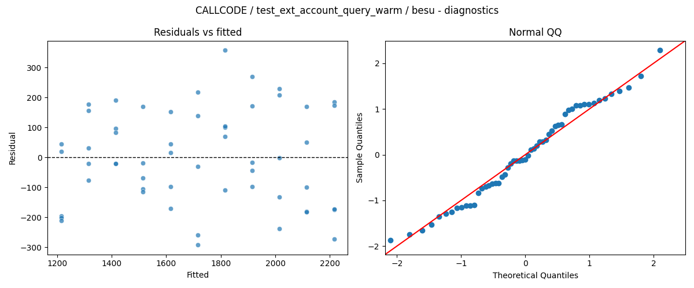

</details>

<details><summary>erigon — NNLS regression summary</summary>

```
==============================================================================
                           NNLS Regression Results                            
==============================================================================
Dep. Variable:          test_runtime_ms              R-squared:          0.929
Model:                  NNLS                    Adj. R-squared:          0.925
No. Observations:       22                                RMSE:          36.00
Df Residuals:           20                                 MAE:          29.25
Df Model:               1      
==============================================================================
                      coef     std err     P-value      [0.025      0.975]
------------------------------------------------------------------------------
         const     59.9226     26.4923       0.004     13.5182    119.9411
       opcount      0.0003      0.0000       0.001      0.0002      0.0003
==============================================================================
Notes: Non-negative least squares with bootstrap inference (1000 iterations)
==============================================================================
```

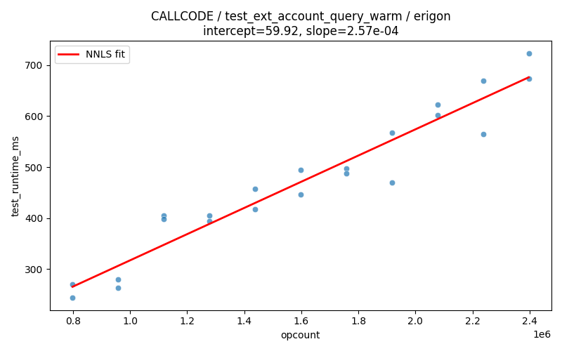

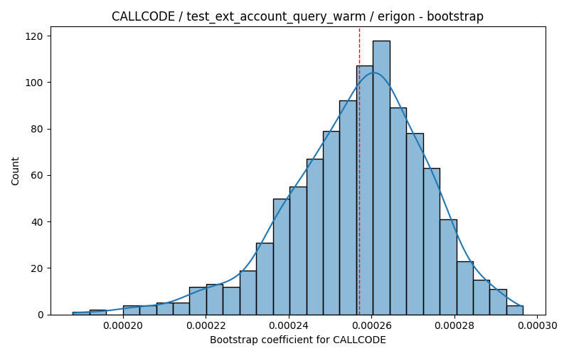

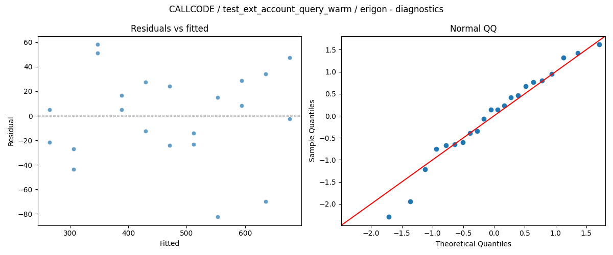

</details>

<details><summary>geth — NNLS regression summary</summary>

```
==============================================================================
                           NNLS Regression Results                            
==============================================================================
Dep. Variable:          test_runtime_ms              R-squared:          0.986
Model:                  NNLS                    Adj. R-squared:          0.984
No. Observations:       11                                RMSE:          12.65
Df Residuals:           9                                  MAE:          10.93
Df Model:               1      
==============================================================================
                      coef     std err     P-value      [0.025      0.975]
------------------------------------------------------------------------------
         const     47.1363     14.8639       0.001     24.0764     79.8864
       opcount      0.0002      0.0000       0.001      0.0002      0.0002
==============================================================================
Notes: Non-negative least squares with bootstrap inference (1000 iterations)
==============================================================================
```

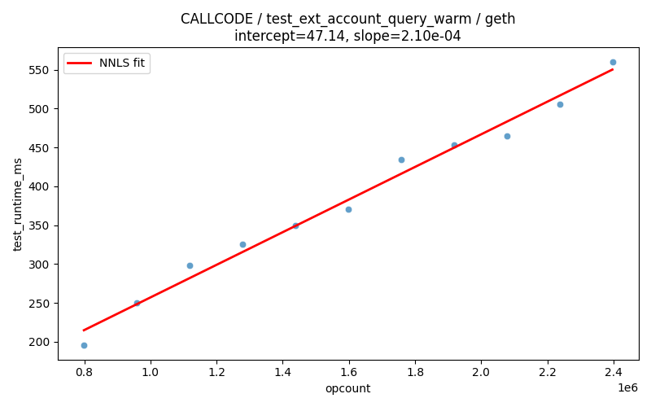

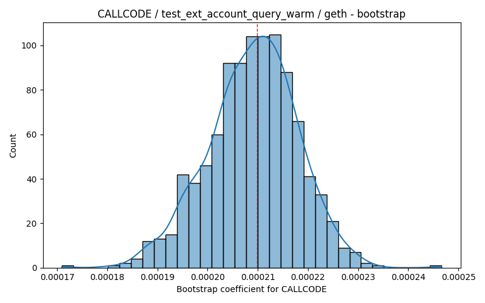

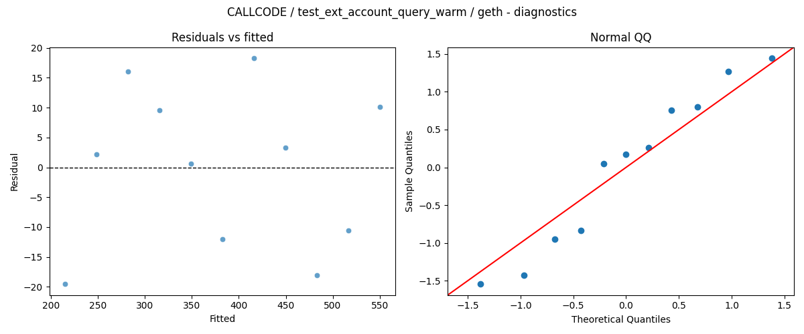

</details>

<details><summary>nethermind — NNLS regression summary</summary>

```
==============================================================================
                           NNLS Regression Results                            
==============================================================================
Dep. Variable:          test_runtime_ms              R-squared:          0.951
Model:                  NNLS                    Adj. R-squared:          0.949
No. Observations:       33                                RMSE:          89.08
Df Residuals:           31                                 MAE:          71.62
Df Model:               1      
==============================================================================
                      coef     std err     P-value      [0.025      0.975]
------------------------------------------------------------------------------
         const    267.5156     52.0485       0.001    165.1786    372.9284
       opcount      0.0008      0.0000       0.001      0.0007      0.0008
==============================================================================
Notes: Non-negative least squares with bootstrap inference (1000 iterations)
==============================================================================
```

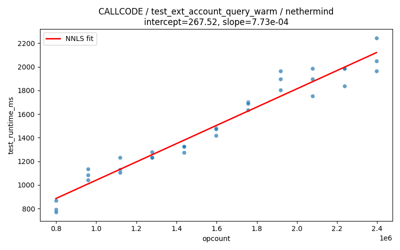

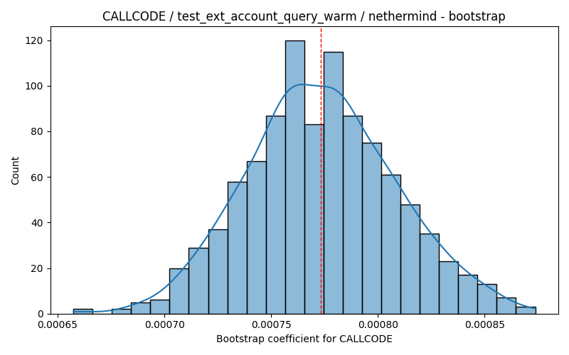

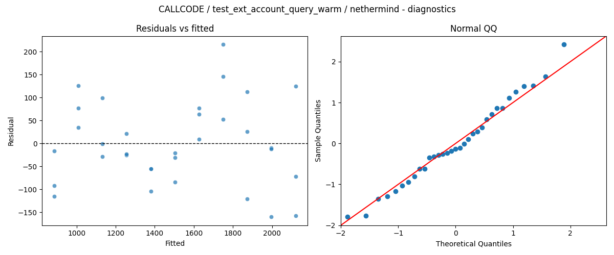

</details>

<details><summary>reth — NNLS regression summary</summary>

```
==============================================================================
                           NNLS Regression Results                            
==============================================================================
Dep. Variable:          test_runtime_ms              R-squared:          0.920
Model:                  NNLS                    Adj. R-squared:          0.919
No. Observations:       77                                RMSE:           6.89
Df Residuals:           75                                 MAE:           5.81
Df Model:               1      
==============================================================================
                      coef     std err     P-value      [0.025      0.975]
------------------------------------------------------------------------------
         const     19.3137      2.6427       0.001     14.3143     25.0136
       opcount      0.0000      0.0000       0.001      0.0000      0.0000
==============================================================================
Notes: Non-negative least squares with bootstrap inference (1000 iterations)
==============================================================================
```

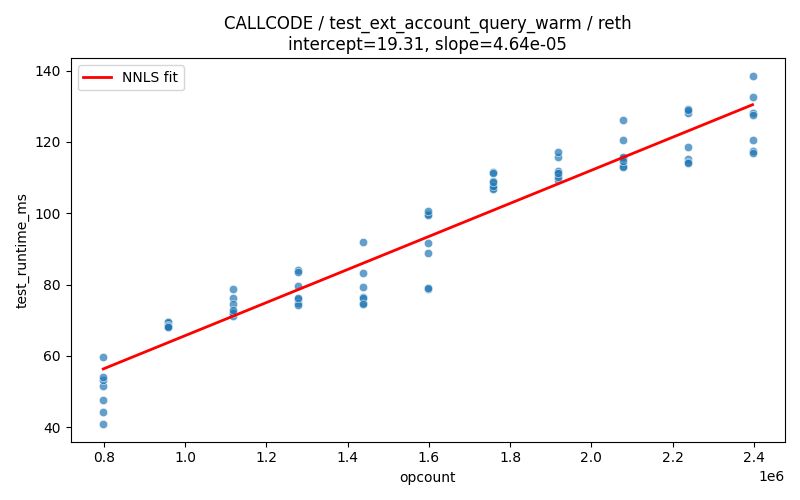

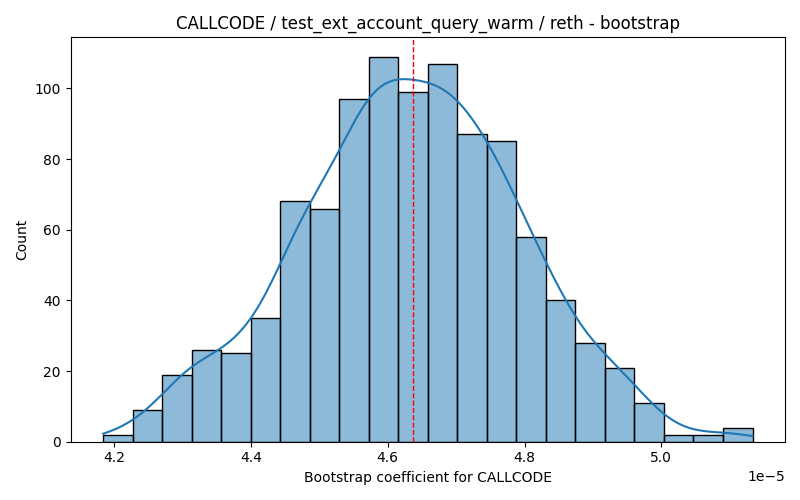

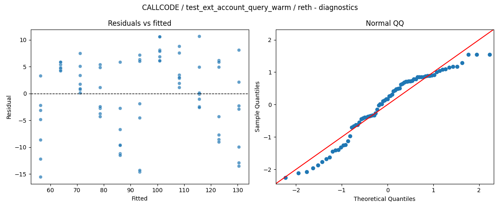

</details>

## DELEGATECALL

### test_account_access — combo `DELEGATECALL_AccountMode.EXISTING_CONTRACT`

| client | nobs | R² | target_coef (ms) | p-value | 95% CI |
| --- | --- | --- | --- | --- | --- |
| `besu` | 55 | 0.9741 | 0.02949 | 1.00e-03 | [0.02824, 0.03078] |
| `erigon` | 22 | 0.8731 | 0.08716 | 1.00e-03 | [0.0713, 0.0992] |
| `geth` | 11 | 0.8719 | 0.026 | 1.00e-03 | [0.01779, 0.03291] |
| `nethermind` | 33 | 0.7049 | 0.02527 | 1.00e-03 | [0.01945, 0.03117] |
| `reth` | 77 | 0.9505 | 0.0372 | 1.00e-03 | [0.03535, 0.03754] |

<details><summary>besu — NNLS regression summary</summary>

```
==============================================================================
                           NNLS Regression Results                            
==============================================================================
Dep. Variable:          test_runtime_ms              R-squared:          0.974
Model:                  NNLS                    Adj. R-squared:          0.974
No. Observations:       55                                RMSE:          97.96
Df Residuals:           53                                 MAE:          84.43
Df Model:               1      
==============================================================================
                      coef     std err     P-value      [0.025      0.975]
------------------------------------------------------------------------------
         const    383.4788     42.5004       0.001    290.6431    462.5673
       opcount      0.0295      0.0007       0.001      0.0282      0.0308
==============================================================================
Notes: Non-negative least squares with bootstrap inference (1000 iterations)
==============================================================================
```

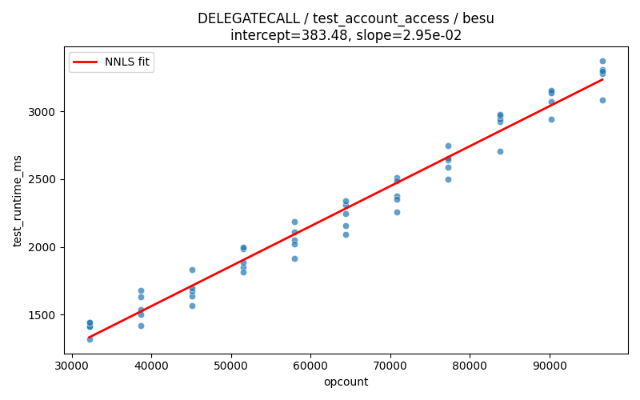

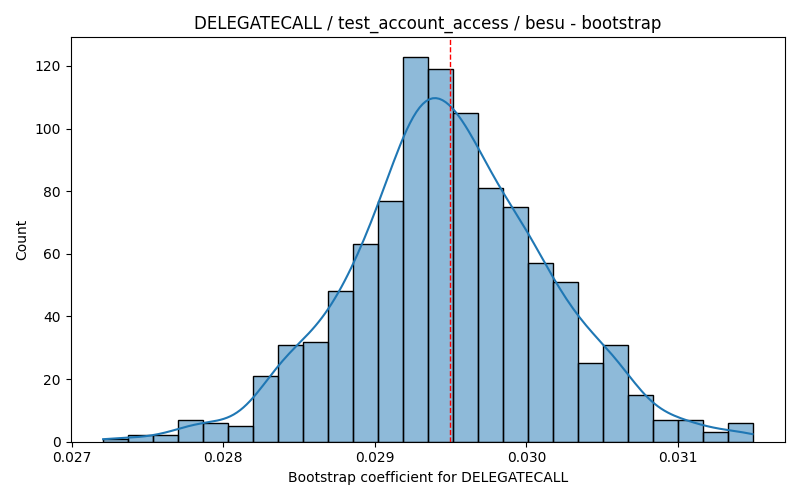

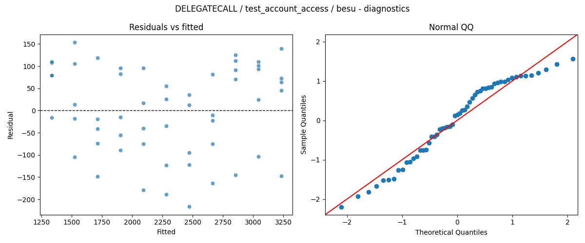

</details>

<details><summary>erigon — NNLS regression summary</summary>

```
==============================================================================
                           NNLS Regression Results                            
==============================================================================
Dep. Variable:          test_runtime_ms              R-squared:          0.873
Model:                  NNLS                    Adj. R-squared:          0.867
No. Observations:       22                                RMSE:         676.91
Df Residuals:           20                                 MAE:         583.22
Df Model:               1      
==============================================================================
                      coef     std err     P-value      [0.025      0.975]
------------------------------------------------------------------------------
         const   1458.5989    549.3701       0.001    583.4239   2739.9216
       opcount      0.0872      0.0073       0.001      0.0713      0.0992
==============================================================================
Notes: Non-negative least squares with bootstrap inference (1000 iterations)
==============================================================================
```

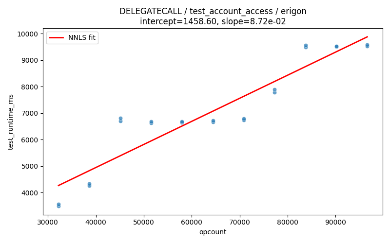

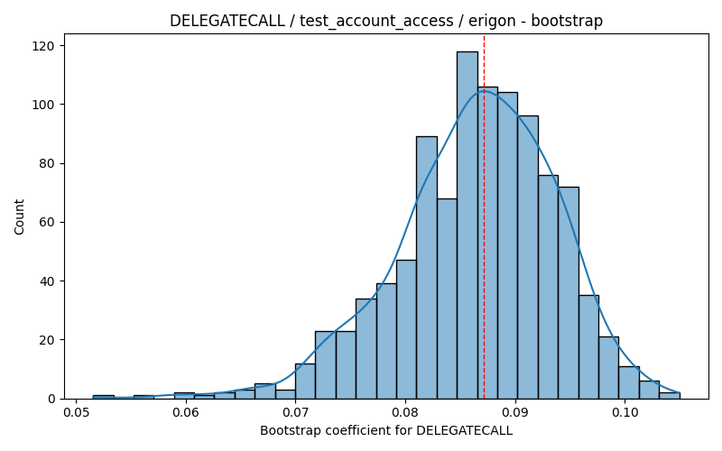

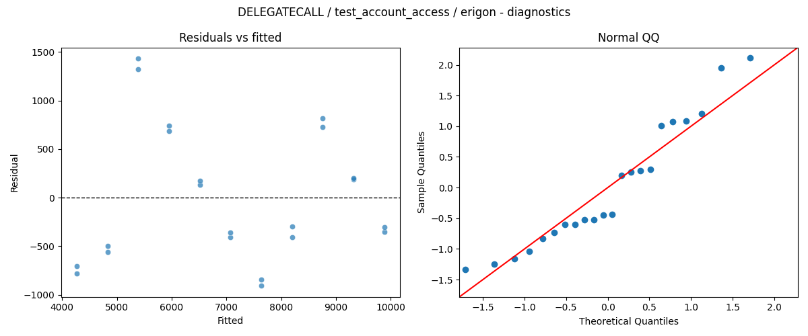

</details>

<details><summary>geth — NNLS regression summary</summary>

```
==============================================================================
                           NNLS Regression Results                            
==============================================================================
Dep. Variable:          test_runtime_ms              R-squared:          0.872
Model:                  NNLS                    Adj. R-squared:          0.858
No. Observations:       11                                RMSE:         203.05
Df Residuals:           9                                  MAE:         156.06
Df Model:               1      
==============================================================================
                      coef     std err     P-value      [0.025      0.975]
------------------------------------------------------------------------------
         const   1085.5699    310.1479       0.001    583.0561   1719.4007
       opcount      0.0260      0.0041       0.001      0.0178      0.0329
==============================================================================
Notes: Non-negative least squares with bootstrap inference (1000 iterations)
==============================================================================
```

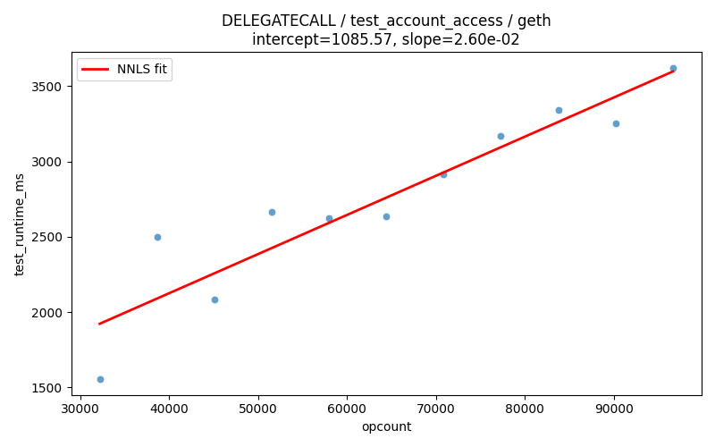

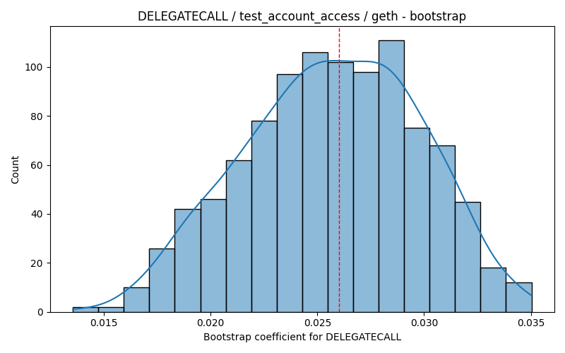

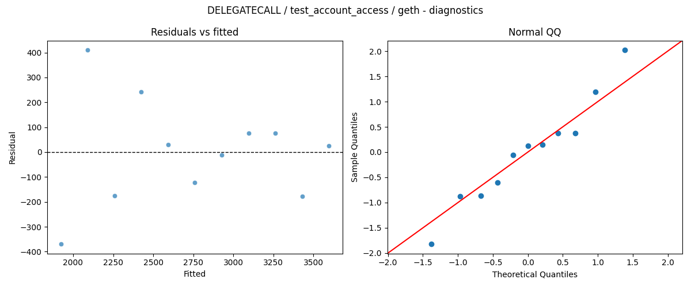

</details>

<details><summary>nethermind — NNLS regression summary</summary>

```
==============================================================================
                           NNLS Regression Results                            
==============================================================================
Dep. Variable:          test_runtime_ms              R-squared:          0.705
Model:                  NNLS                    Adj. R-squared:          0.695
No. Observations:       33                                RMSE:         333.12
Df Residuals:           31                                 MAE:         281.46
Df Model:               1      
==============================================================================
                      coef     std err     P-value      [0.025      0.975]
------------------------------------------------------------------------------
         const    782.5005    200.1354       0.001    398.6010   1203.2975
       opcount      0.0253      0.0030       0.001      0.0195      0.0312
==============================================================================
Notes: Non-negative least squares with bootstrap inference (1000 iterations)
==============================================================================
```

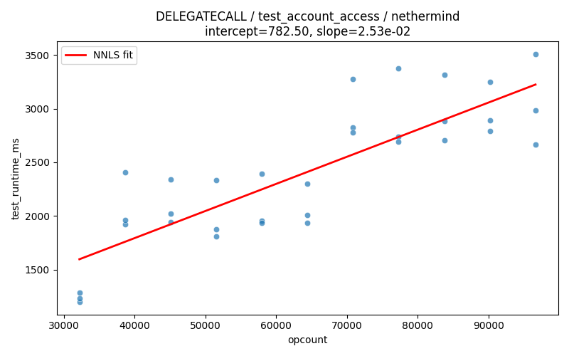

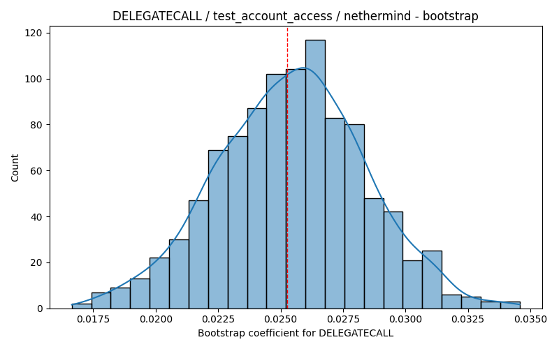

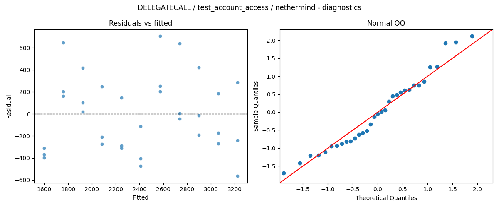

</details>

<details><summary>reth — NNLS regression summary</summary>

```
==============================================================================
                           NNLS Regression Results                            
==============================================================================
Dep. Variable:          test_runtime_ms              R-squared:          0.951
Model:                  NNLS                    Adj. R-squared:          0.950
No. Observations:       77                                RMSE:         173.13
Df Residuals:           75                                 MAE:         120.97
Df Model:               1      
==============================================================================
                      coef     std err     P-value      [0.025      0.975]
------------------------------------------------------------------------------
         const      0.0000     45.9990       1.000      0.0000    149.2214
       opcount      0.0372      0.0006       0.001      0.0354      0.0375
==============================================================================
Notes: Non-negative least squares with bootstrap inference (1000 iterations)
==============================================================================
```

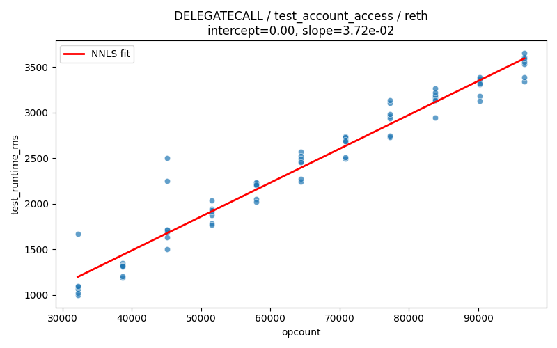

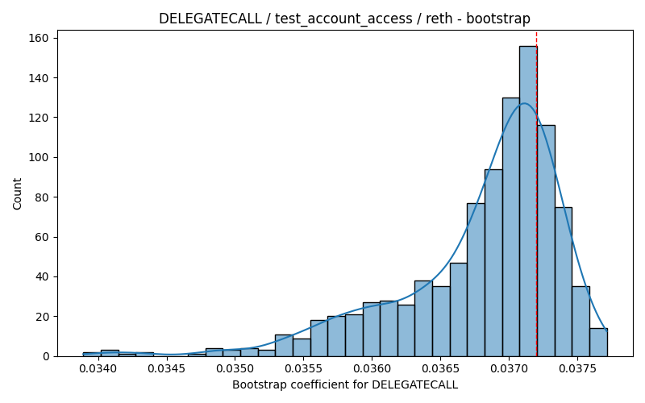

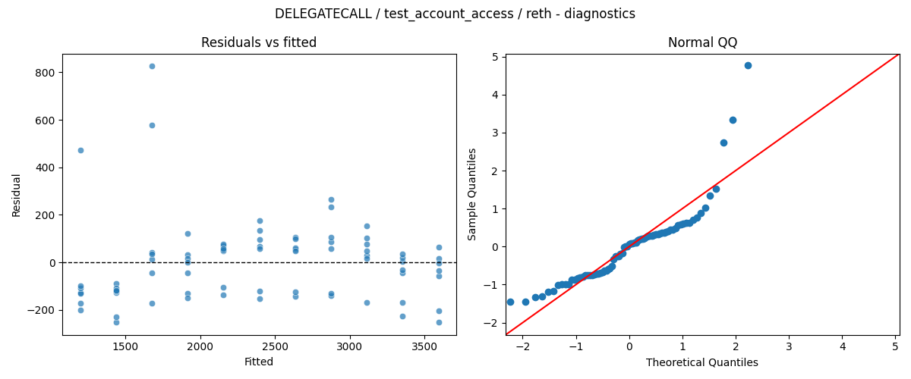

</details>

### test_account_access — combo `DELEGATECALL_AccountMode.EXISTING_EOA`

| client | nobs | R² | target_coef (ms) | p-value | 95% CI |
| --- | --- | --- | --- | --- | --- |
| `besu` | 55 | 0.8054 | 0.009503 | 1.00e-03 | [0.008102, 0.01107] |
| `erigon` | 22 | 0.9988 | 0.009922 | 1.00e-03 | [0.009804, 0.01008] |
| `geth` | 11 | 0.9749 | 0.01707 | 1.00e-03 | [0.01526, 0.01854] |
| `nethermind` | 33 | 0.9306 | 0.004663 | 1.00e-03 | [0.004295, 0.005055] |
| `reth` | 77 | 0.9741 | 0.001148 | 1.00e-03 | [0.001111, 0.001193] |

<details><summary>besu — NNLS regression summary</summary>

```
==============================================================================
                           NNLS Regression Results                            
==============================================================================
Dep. Variable:          test_runtime_ms              R-squared:          0.805
Model:                  NNLS                    Adj. R-squared:          0.802
No. Observations:       55                                RMSE:         111.05
Df Residuals:           53                                 MAE:          92.23
Df Model:               1      
==============================================================================
                      coef     std err     P-value      [0.025      0.975]
------------------------------------------------------------------------------
         const    632.9413     65.0180       0.001    500.1241    745.8385
       opcount      0.0095      0.0008       0.001      0.0081      0.0111
==============================================================================
Notes: Non-negative least squares with bootstrap inference (1000 iterations)
==============================================================================
```

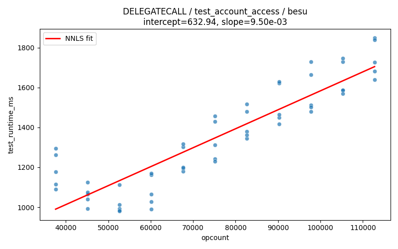

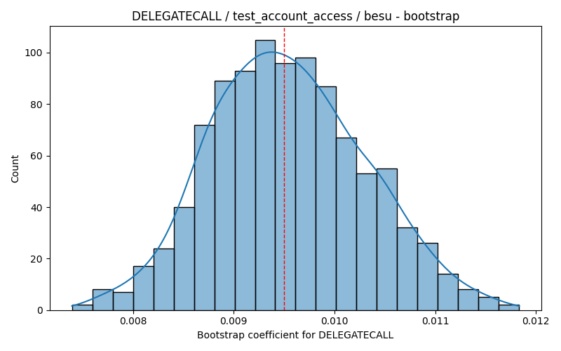

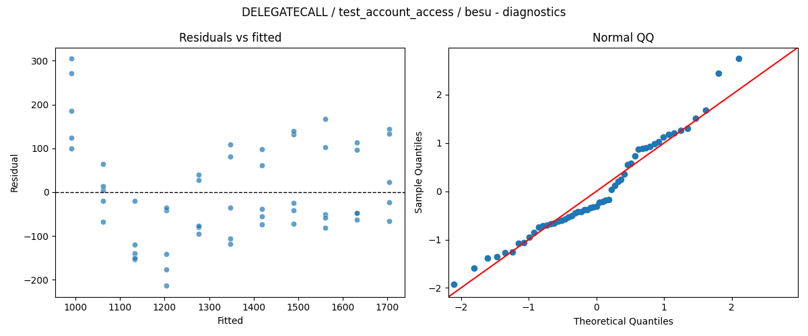

</details>

<details><summary>erigon — NNLS regression summary</summary>

```
==============================================================================
                           NNLS Regression Results                            
==============================================================================
Dep. Variable:          test_runtime_ms              R-squared:          0.999
Model:                  NNLS                    Adj. R-squared:          0.999
No. Observations:       22                                RMSE:           8.13
Df Residuals:           20                                 MAE:           7.12
Df Model:               1      
==============================================================================
                      coef     std err     P-value      [0.025      0.975]
------------------------------------------------------------------------------
         const     49.4754      5.1936       0.001     36.9033     58.4742
       opcount      0.0099      0.0001       0.001      0.0098      0.0101
==============================================================================
Notes: Non-negative least squares with bootstrap inference (1000 iterations)
==============================================================================
```

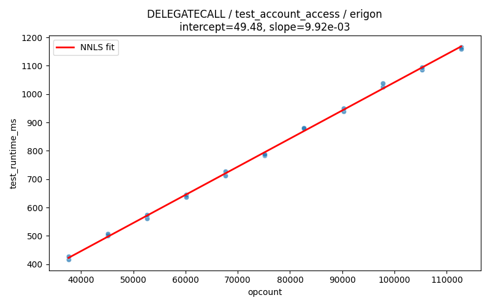

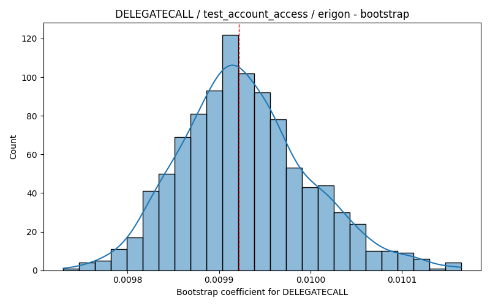

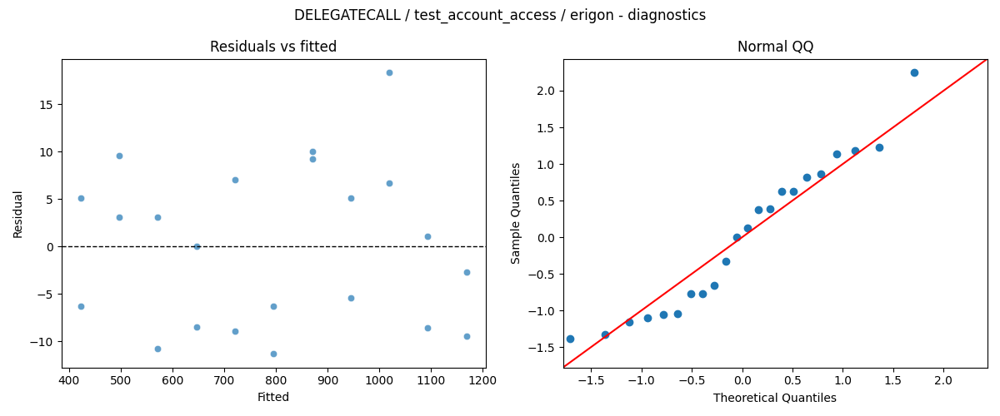

</details>

<details><summary>geth — NNLS regression summary</summary>

```
==============================================================================
                           NNLS Regression Results                            
==============================================================================
Dep. Variable:          test_runtime_ms              R-squared:          0.975
Model:                  NNLS                    Adj. R-squared:          0.972
No. Observations:       11                                RMSE:          65.09
Df Residuals:           9                                  MAE:          54.56
Df Model:               1      
==============================================================================
                      coef     std err     P-value      [0.025      0.975]
------------------------------------------------------------------------------
         const    155.2353     64.1672       0.003     64.7807    301.6784
       opcount      0.0171      0.0009       0.001      0.0153      0.0185
==============================================================================
Notes: Non-negative least squares with bootstrap inference (1000 iterations)
==============================================================================
```

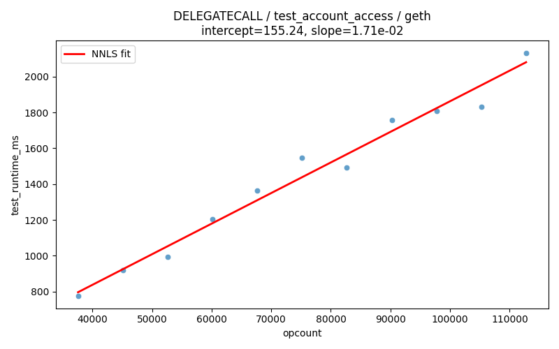

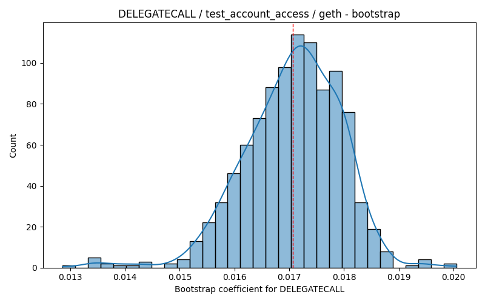

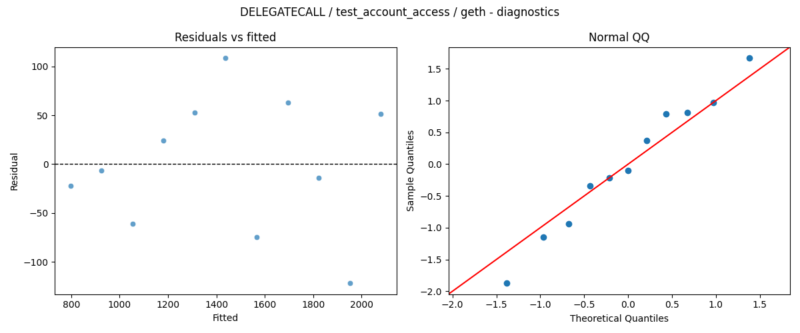

</details>

<details><summary>nethermind — NNLS regression summary</summary>

```
==============================================================================
                           NNLS Regression Results                            
==============================================================================
Dep. Variable:          test_runtime_ms              R-squared:          0.931
Model:                  NNLS                    Adj. R-squared:          0.928
No. Observations:       33                                RMSE:          30.27
Df Residuals:           31                                 MAE:          25.48
Df Model:               1      
==============================================================================
                      coef     std err     P-value      [0.025      0.975]
------------------------------------------------------------------------------
         const     97.5170     14.2814       0.001     70.4579    124.6254
       opcount      0.0047      0.0002       0.001      0.0043      0.0051
==============================================================================
Notes: Non-negative least squares with bootstrap inference (1000 iterations)
==============================================================================
```

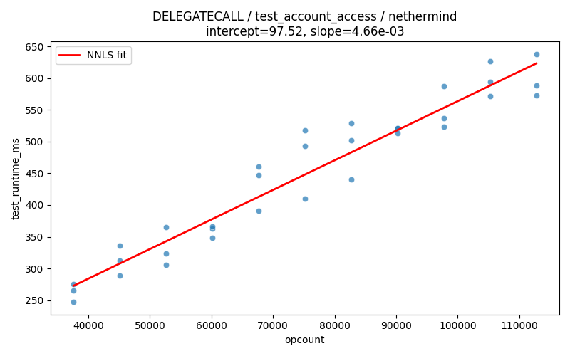

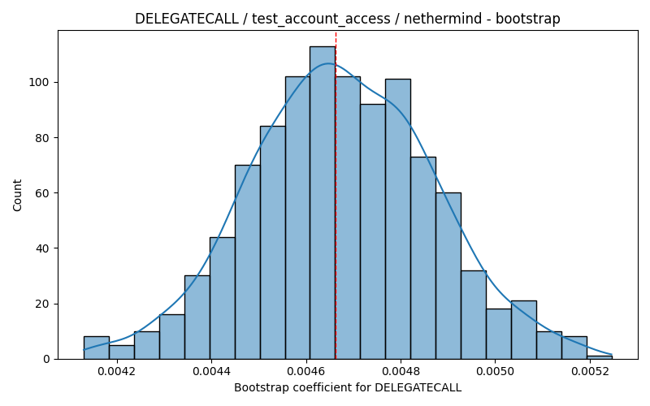

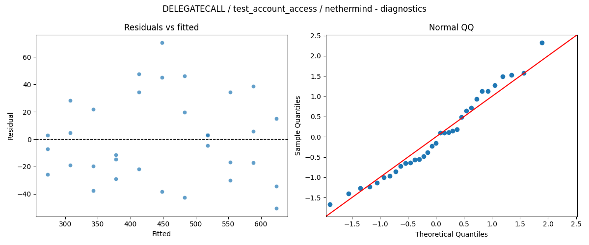

</details>

<details><summary>reth — NNLS regression summary</summary>

```
==============================================================================
                           NNLS Regression Results                            
==============================================================================
Dep. Variable:          test_runtime_ms              R-squared:          0.974
Model:                  NNLS                    Adj. R-squared:          0.974
No. Observations:       77                                RMSE:           4.45
Df Residuals:           75                                 MAE:           3.92
Df Model:               1      
==============================================================================
                      coef     std err     P-value      [0.025      0.975]
------------------------------------------------------------------------------
         const     31.0553      1.6147       0.001     27.6064     33.9014
       opcount      0.0011      0.0000       0.001      0.0011      0.0012
==============================================================================
Notes: Non-negative least squares with bootstrap inference (1000 iterations)
==============================================================================
```

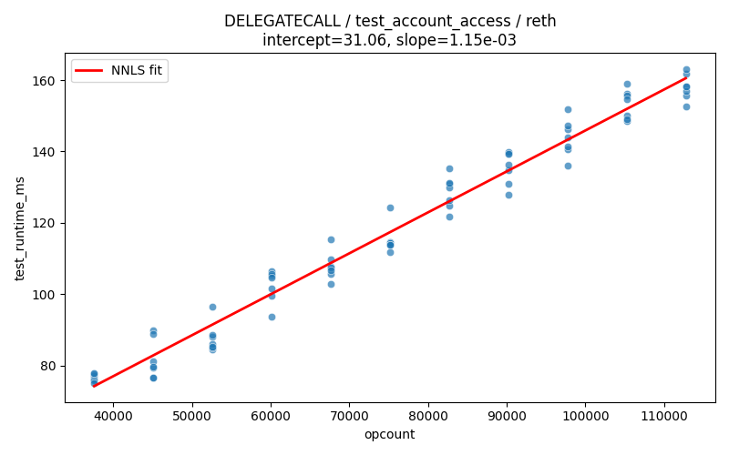

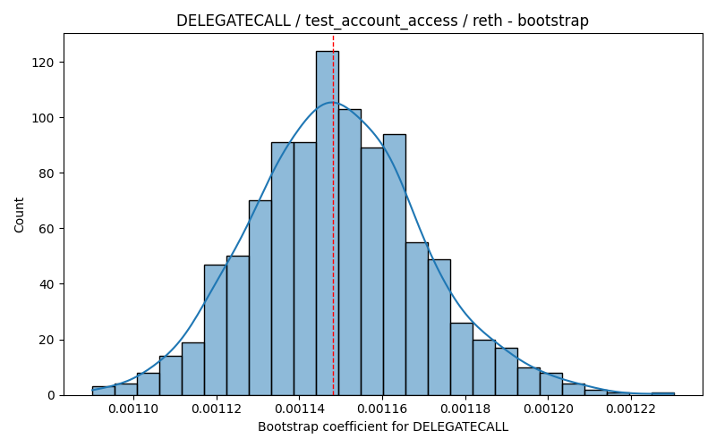

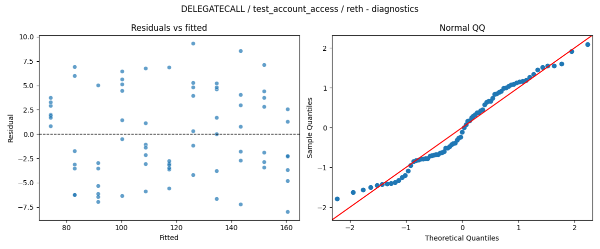

</details>

### test_account_access — combo `DELEGATECALL_AccountMode.NON_EXISTING_ACCOUNT`

| client | nobs | R² | target_coef (ms) | p-value | 95% CI |
| --- | --- | --- | --- | --- | --- |
| `besu` | 55 | 0.9376 | 0.01076 | 1.00e-03 | [0.009982, 0.01167] |
| `erigon` | 22 | 0.9988 | 0.009494 | 1.00e-03 | [0.009335, 0.009669] |
| `geth` | 11 | 0.8298 | 0.02079 | 1.00e-03 | [0.0118, 0.02693] |
| `nethermind` | 33 | 0.9584 | 0.004694 | 1.00e-03 | [0.004344, 0.00499] |
| `reth` | 77 | 0.9684 | 0.000954 | 1.00e-03 | [0.0009132, 0.000994] |

<details><summary>besu — NNLS regression summary</summary>

```
==============================================================================
                           NNLS Regression Results                            
==============================================================================
Dep. Variable:          test_runtime_ms              R-squared:          0.938
Model:                  NNLS                    Adj. R-squared:          0.936
No. Observations:       55                                RMSE:          66.02
Df Residuals:           53                                 MAE:          55.17
Df Model:               1      
==============================================================================
                      coef     std err     P-value      [0.025      0.975]
------------------------------------------------------------------------------
         const    468.7919     31.4528       0.001    395.5419    523.1528
       opcount      0.0108      0.0004       0.001      0.0100      0.0117
==============================================================================
Notes: Non-negative least squares with bootstrap inference (1000 iterations)
==============================================================================
```

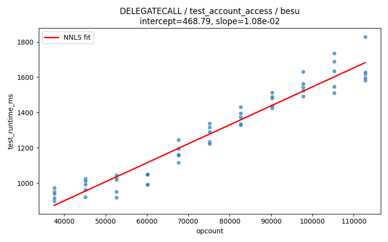

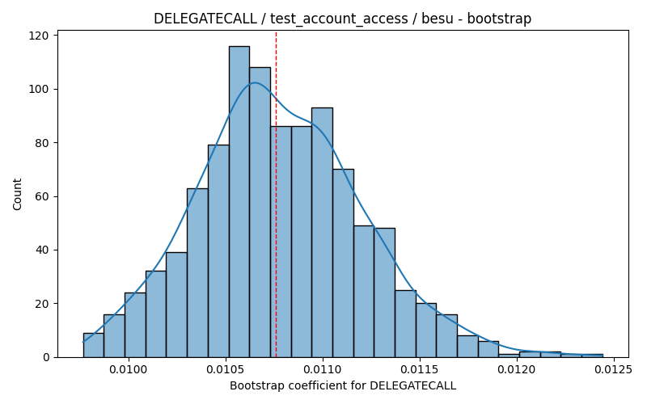

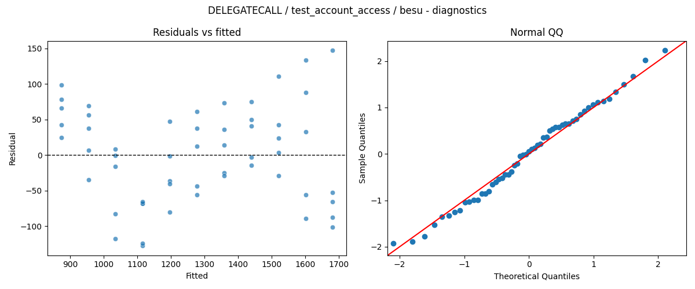

</details>

<details><summary>erigon — NNLS regression summary</summary>

```
==============================================================================
                           NNLS Regression Results                            
==============================================================================
Dep. Variable:          test_runtime_ms              R-squared:          0.999
Model:                  NNLS                    Adj. R-squared:          0.999
No. Observations:       22                                RMSE:           7.71
Df Residuals:           20                                 MAE:           5.89
Df Model:               1      
==============================================================================
                      coef     std err     P-value      [0.025      0.975]
------------------------------------------------------------------------------
         const     19.9923      7.1769       0.002      4.9046     33.7710
       opcount      0.0095      0.0001       0.001      0.0093      0.0097
==============================================================================
Notes: Non-negative least squares with bootstrap inference (1000 iterations)
==============================================================================
```


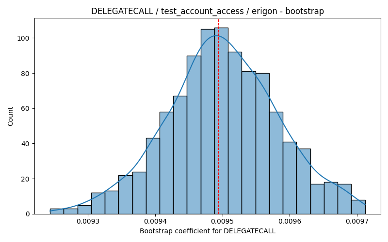

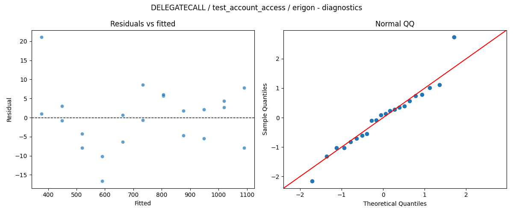

</details>

<details><summary>geth — NNLS regression summary</summary>

```
==============================================================================
                           NNLS Regression Results                            
==============================================================================
Dep. Variable:          test_runtime_ms              R-squared:          0.830
Model:                  NNLS                    Adj. R-squared:          0.811
No. Observations:       11                                RMSE:         223.87
Df Residuals:           9                                  MAE:         175.45
Df Model:               1      
==============================================================================
                      coef     std err     P-value      [0.025      0.975]
------------------------------------------------------------------------------
         const   1343.4786    344.4016       0.001    788.8822   2075.5756
       opcount      0.0208      0.0040       0.001      0.0118      0.0269
==============================================================================
Notes: Non-negative least squares with bootstrap inference (1000 iterations)
==============================================================================
```

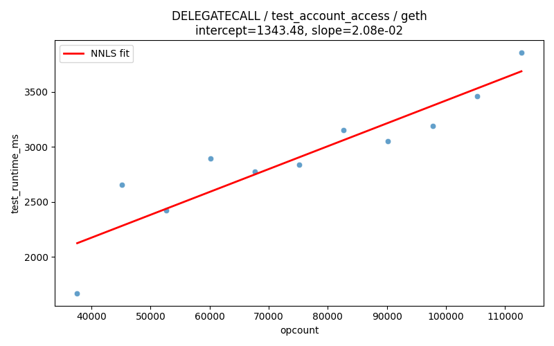

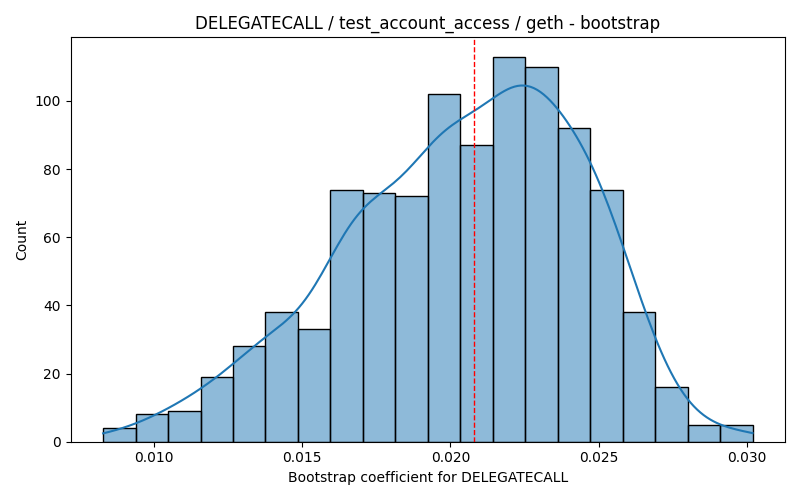

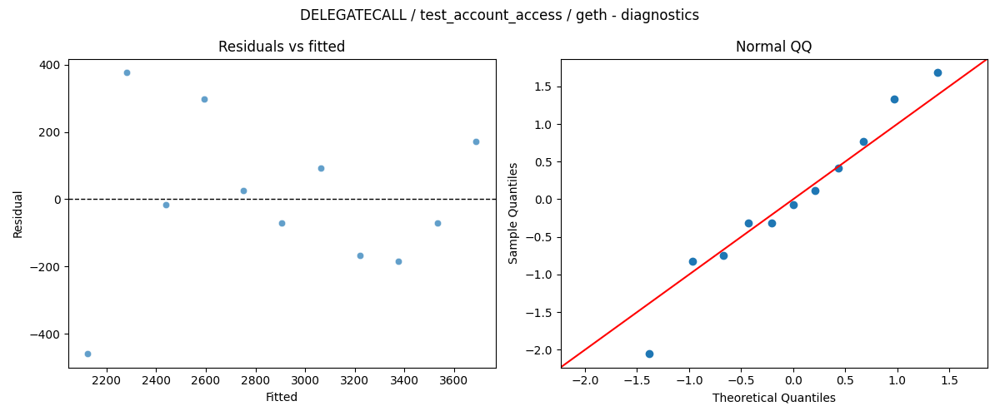

</details>

<details><summary>nethermind — NNLS regression summary</summary>

```
==============================================================================
                           NNLS Regression Results                            
==============================================================================
Dep. Variable:          test_runtime_ms              R-squared:          0.958
Model:                  NNLS                    Adj. R-squared:          0.957
No. Observations:       33                                RMSE:          23.24
Df Residuals:           31                                 MAE:          18.71
Df Model:               1      
==============================================================================
                      coef     std err     P-value      [0.025      0.975]
------------------------------------------------------------------------------
         const     90.6881     13.4349       0.001     65.9134    118.6768
       opcount      0.0047      0.0002       0.001      0.0043      0.0050
==============================================================================
Notes: Non-negative least squares with bootstrap inference (1000 iterations)
==============================================================================
```


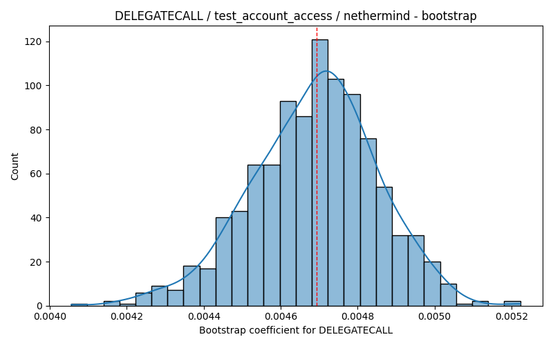

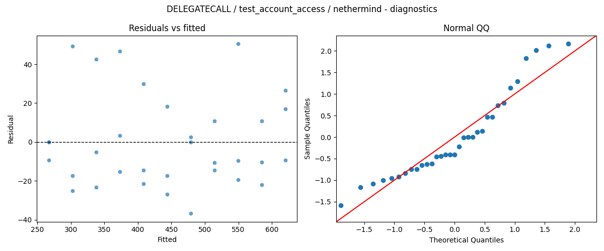

</details>

<details><summary>reth — NNLS regression summary</summary>

```
==============================================================================
                           NNLS Regression Results                            
==============================================================================
Dep. Variable:          test_runtime_ms              R-squared:          0.968
Model:                  NNLS                    Adj. R-squared:          0.968
No. Observations:       77                                RMSE:           4.10
Df Residuals:           75                                 MAE:           3.28
Df Model:               1      
==============================================================================
                      coef     std err     P-value      [0.025      0.975]
------------------------------------------------------------------------------
         const     33.1412      1.6736       0.001     29.8255     36.5058
       opcount      0.0010      0.0000       0.001      0.0009      0.0010
==============================================================================
Notes: Non-negative least squares with bootstrap inference (1000 iterations)
==============================================================================
```

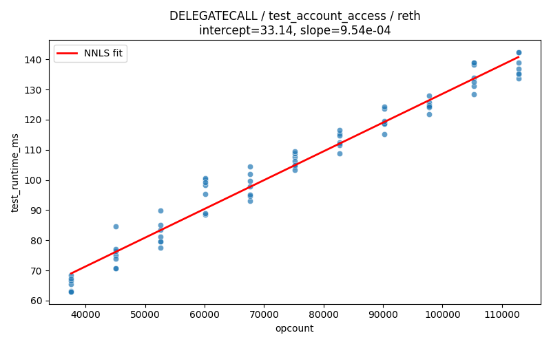

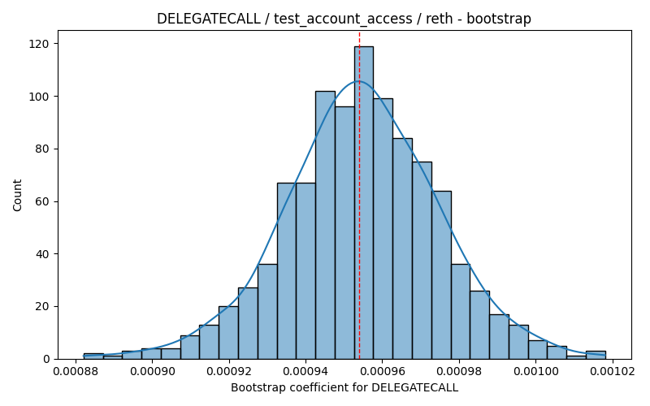

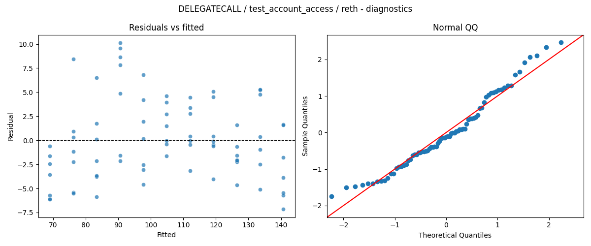

</details>

### test_ext_account_query_warm — combo `DELEGATECALL`

| client | nobs | R² | target_coef (ms) | p-value | 95% CI |
| --- | --- | --- | --- | --- | --- |
| `besu` | 55 | 0.8292 | 0.0005942 | 1.00e-03 | [0.0005145, 0.0006754] |
| `erigon` | 22 | 0.9343 | 0.0002551 | 1.00e-03 | [0.0002207, 0.0002891] |
| `geth` | 11 | 0.9825 | 0.0001732 | 1.00e-03 | [0.0001578, 0.0001882] |
| `nethermind` | 33 | 0.9335 | 0.0007225 | 1.00e-03 | [0.0006378, 0.0007838] |
| `reth` | 77 | 0.9192 | 4.477e-05 | 1.00e-03 | [4.185e-05, 4.8e-05] |

<details><summary>besu — NNLS regression summary</summary>

```
==============================================================================
                           NNLS Regression Results                            
==============================================================================
Dep. Variable:          test_runtime_ms              R-squared:          0.829
Model:                  NNLS                    Adj. R-squared:          0.826
No. Observations:       55                                RMSE:         139.59
Df Residuals:           53                                 MAE:         116.67
Df Model:               1      
==============================================================================
                      coef     std err     P-value      [0.025      0.975]
------------------------------------------------------------------------------
         const    643.5478     63.4457       0.001    520.8068    770.1992
       opcount      0.0006      0.0000       0.001      0.0005      0.0007
==============================================================================
Notes: Non-negative least squares with bootstrap inference (1000 iterations)
==============================================================================
```

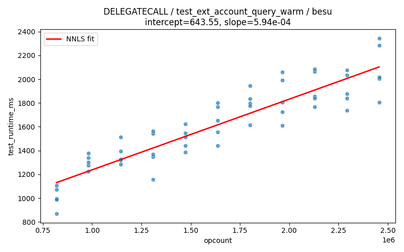

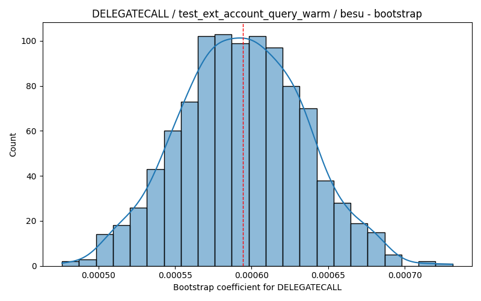

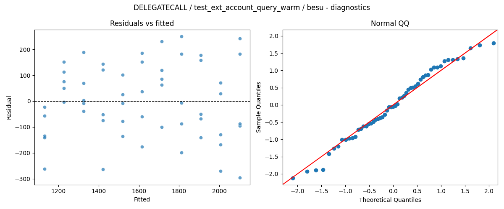

</details>

<details><summary>erigon — NNLS regression summary</summary>

```
==============================================================================
                           NNLS Regression Results                            
==============================================================================
Dep. Variable:          test_runtime_ms              R-squared:          0.934
Model:                  NNLS                    Adj. R-squared:          0.931
No. Observations:       22                                RMSE:          35.01
Df Residuals:           20                                 MAE:          27.50
Df Model:               1      
==============================================================================
                      coef     std err     P-value      [0.025      0.975]
------------------------------------------------------------------------------
         const     62.6122     25.2907       0.003     13.1408    112.6405
       opcount      0.0003      0.0000       0.001      0.0002      0.0003
==============================================================================
Notes: Non-negative least squares with bootstrap inference (1000 iterations)
==============================================================================
```

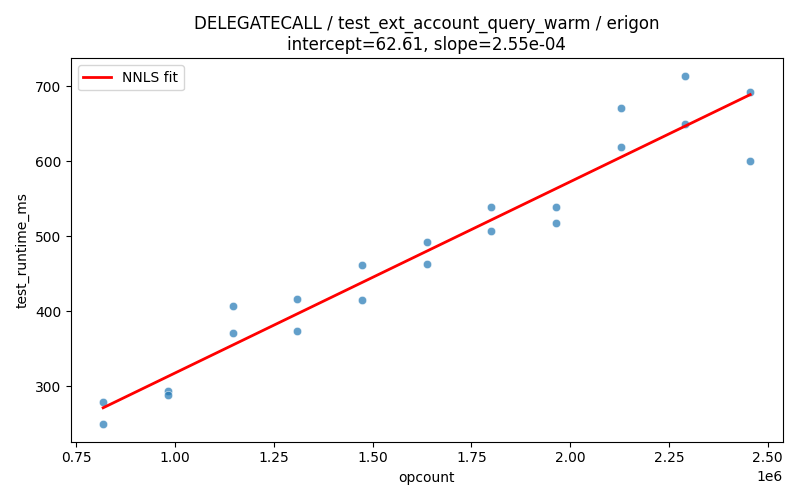

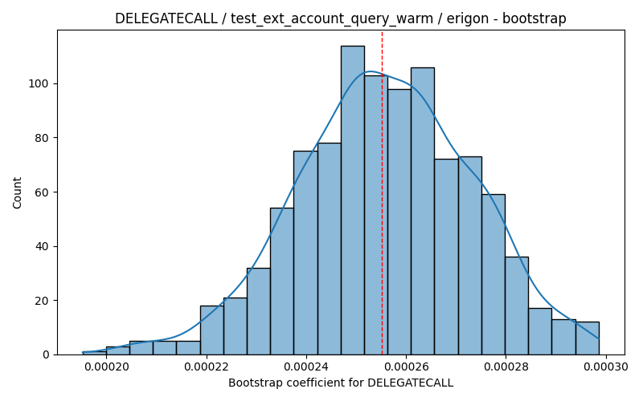

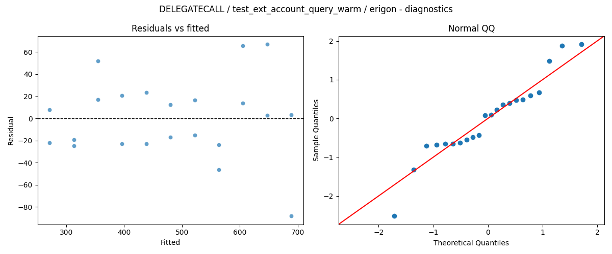

</details>

<details><summary>geth — NNLS regression summary</summary>

```
==============================================================================
                           NNLS Regression Results                            
==============================================================================
Dep. Variable:          test_runtime_ms              R-squared:          0.983
Model:                  NNLS                    Adj. R-squared:          0.981
No. Observations:       11                                RMSE:          11.96
Df Residuals:           9                                  MAE:          10.44
Df Model:               1      
==============================================================================
                      coef     std err     P-value      [0.025      0.975]
------------------------------------------------------------------------------
         const     47.3418     14.0675       0.001     20.4845     72.7605
       opcount      0.0002      0.0000       0.001      0.0002      0.0002
==============================================================================
Notes: Non-negative least squares with bootstrap inference (1000 iterations)
==============================================================================
```

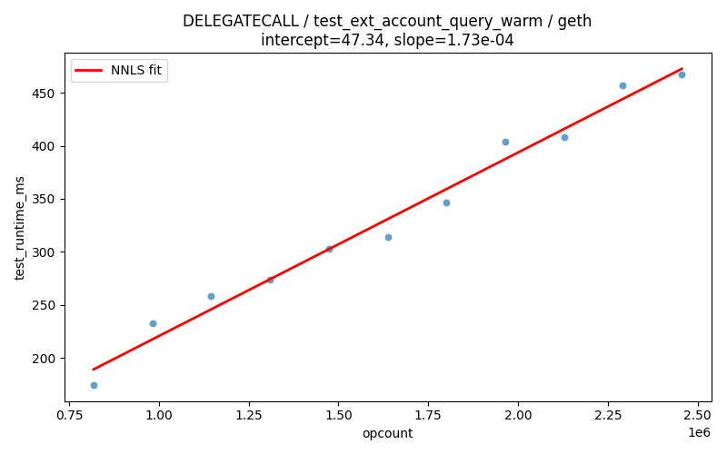

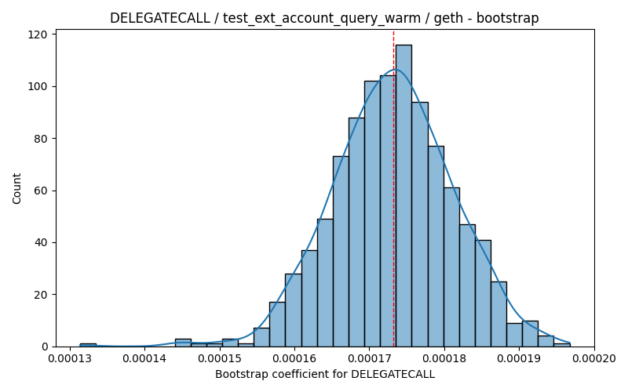

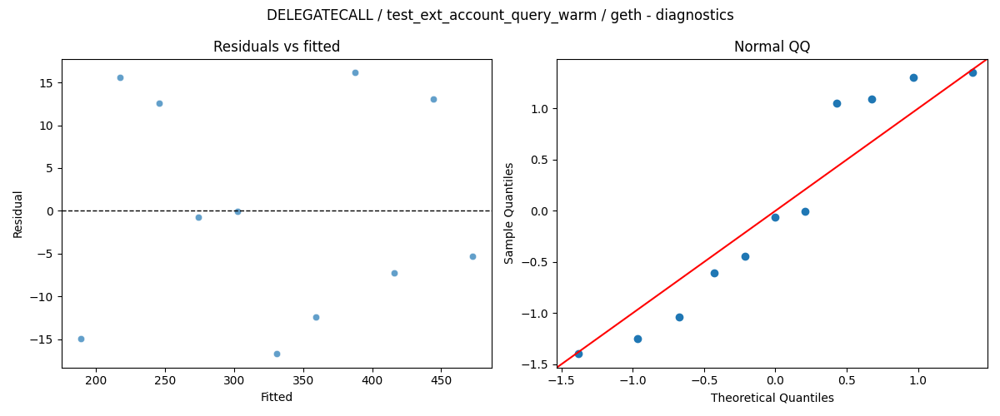

</details>

<details><summary>nethermind — NNLS regression summary</summary>

```
==============================================================================
                           NNLS Regression Results                            
==============================================================================
Dep. Variable:          test_runtime_ms              R-squared:          0.934
Model:                  NNLS                    Adj. R-squared:          0.931
No. Observations:       33                                RMSE:          99.81
Df Residuals:           31                                 MAE:          81.04
Df Model:               1      
==============================================================================
                      coef     std err     P-value      [0.025      0.975]
------------------------------------------------------------------------------
         const    309.9754     65.6100       0.001    193.8459    457.0831
       opcount      0.0007      0.0000       0.001      0.0006      0.0008
==============================================================================
Notes: Non-negative least squares with bootstrap inference (1000 iterations)
==============================================================================
```

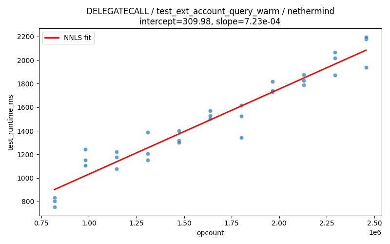

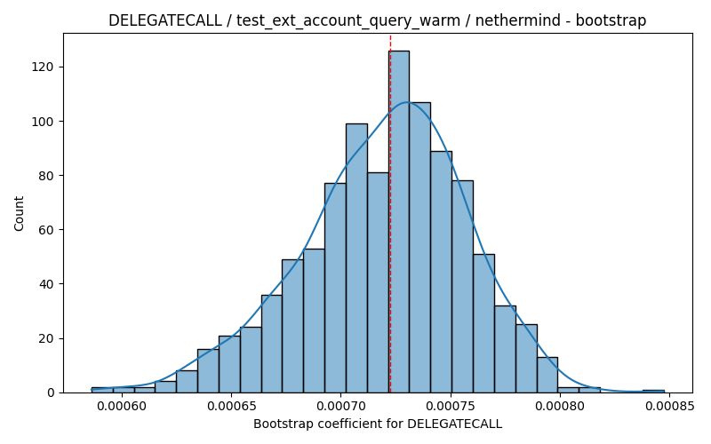

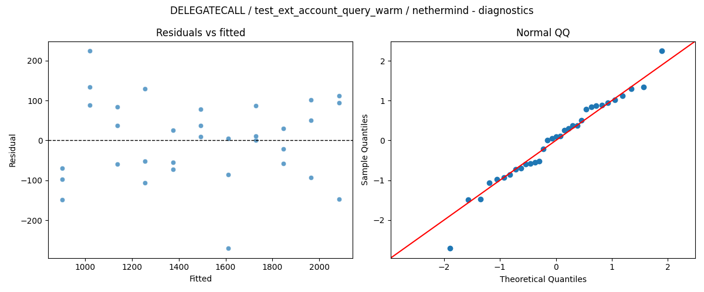

</details>

<details><summary>reth — NNLS regression summary</summary>

```
==============================================================================
                           NNLS Regression Results                            
==============================================================================
Dep. Variable:          test_runtime_ms              R-squared:          0.919
Model:                  NNLS                    Adj. R-squared:          0.918
No. Observations:       77                                RMSE:           6.87
Df Residuals:           75                                 MAE:           5.40
Df Model:               1      
==============================================================================
                      coef     std err     P-value      [0.025      0.975]
------------------------------------------------------------------------------
         const     20.7055      2.7142       0.001     15.4312     25.8243
       opcount      0.0000      0.0000       0.001      0.0000      0.0000
==============================================================================
Notes: Non-negative least squares with bootstrap inference (1000 iterations)
==============================================================================
```

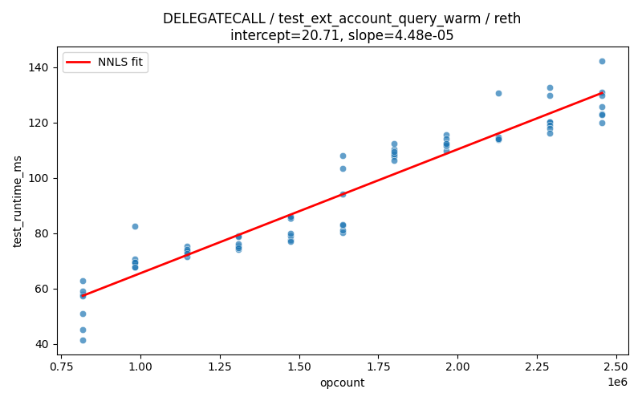

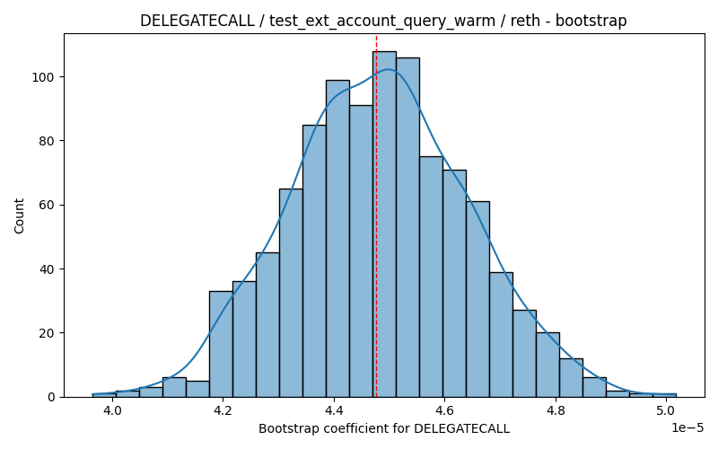

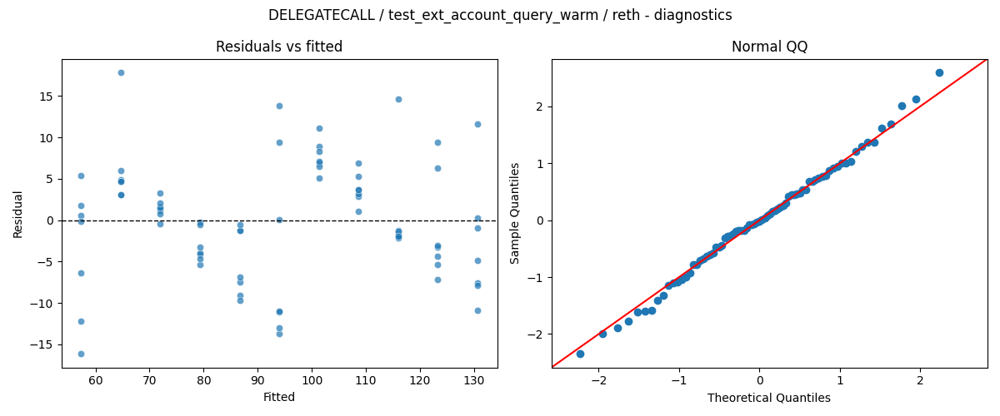

</details>

## EXTCODECOPY

### test_account_access — combo `EXTCODECOPY_AccountMode.EXISTING_CONTRACT`

| client | nobs | R² | target_coef (ms) | p-value | 95% CI |
| --- | --- | --- | --- | --- | --- |
| `besu` | 55 | 0.803 | 0.001737 | 1.00e-03 | [0.001489, 0.001994] |
| `erigon` | 22 | 0.925 | 0.0003149 | 1.00e-03 | [0.0002737, 0.000347] |
| `geth` | 11 | 0.9909 | 0.0009151 | 1.00e-03 | [0.0008429, 0.0009713] |
| `nethermind` | 33 | 0.9141 | 0.001342 | 1.00e-03 | [0.001201, 0.00146] |
| `reth` | 77 | 0.8363 | 8.491e-05 | 1.00e-03 | [7.451e-05, 9.507e-05] |

<details><summary>besu — NNLS regression summary</summary>

```
==============================================================================
                           NNLS Regression Results                            
==============================================================================
Dep. Variable:          test_runtime_ms              R-squared:          0.803
Model:                  NNLS                    Adj. R-squared:          0.799
No. Observations:       55                                RMSE:          85.00
Df Residuals:           53                                 MAE:          66.87
Df Model:               1      
==============================================================================
                      coef     std err     P-value      [0.025      0.975]
------------------------------------------------------------------------------
         const    470.5640     37.8918       0.001    400.6097    546.9839
       opcount      0.0017      0.0001       0.001      0.0015      0.0020
==============================================================================
Notes: Non-negative least squares with bootstrap inference (1000 iterations)
==============================================================================
```

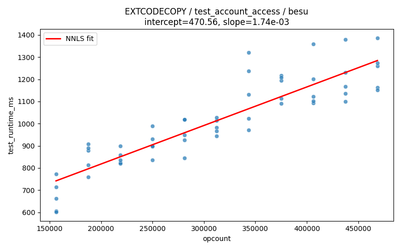

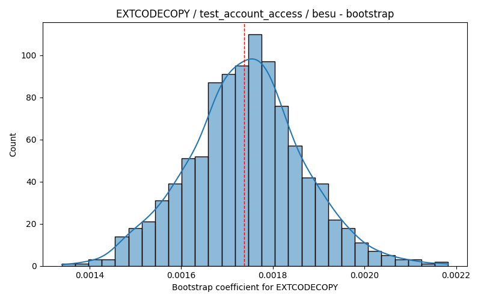

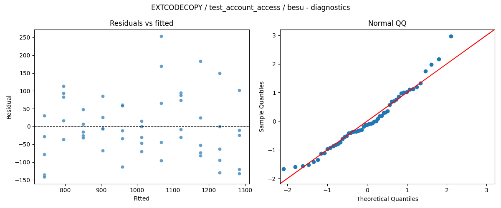

</details>

<details><summary>erigon — NNLS regression summary</summary>

```
==============================================================================
                           NNLS Regression Results                            
==============================================================================
Dep. Variable:          test_runtime_ms              R-squared:          0.925
Model:                  NNLS                    Adj. R-squared:          0.921
No. Observations:       22                                RMSE:           8.86
Df Residuals:           20                                 MAE:           7.66
Df Model:               1      
==============================================================================
                      coef     std err     P-value      [0.025      0.975]
------------------------------------------------------------------------------
         const     41.5031      6.5159       0.001     29.9834     56.4786
       opcount      0.0003      0.0000       0.001      0.0003      0.0003
==============================================================================
Notes: Non-negative least squares with bootstrap inference (1000 iterations)
==============================================================================
```

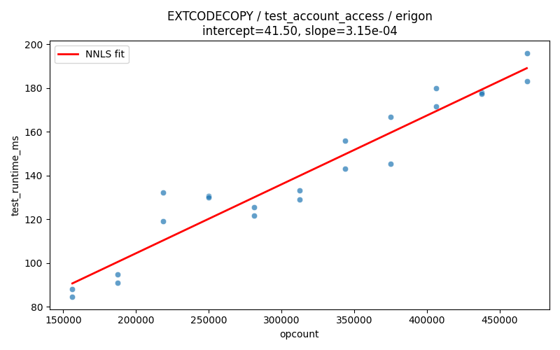

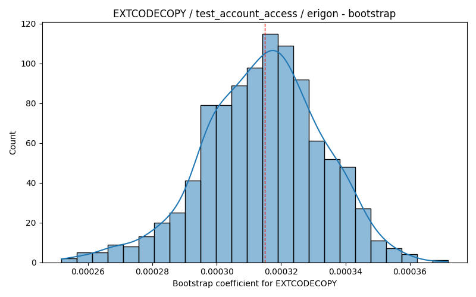

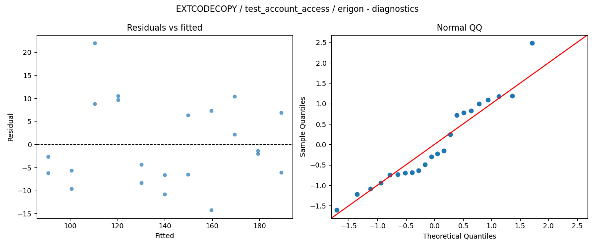

</details>

<details><summary>geth — NNLS regression summary</summary>

```
==============================================================================
                           NNLS Regression Results                            
==============================================================================
Dep. Variable:          test_runtime_ms              R-squared:          0.991
Model:                  NNLS                    Adj. R-squared:          0.990
No. Observations:       11                                RMSE:           8.65
Df Residuals:           9                                  MAE:           6.83
Df Model:               1      
==============================================================================
                      coef     std err     P-value      [0.025      0.975]
------------------------------------------------------------------------------
         const     21.6479     10.3428       0.007      4.3982     43.5355
       opcount      0.0009      0.0000       0.001      0.0008      0.0010
==============================================================================
Notes: Non-negative least squares with bootstrap inference (1000 iterations)
==============================================================================
```

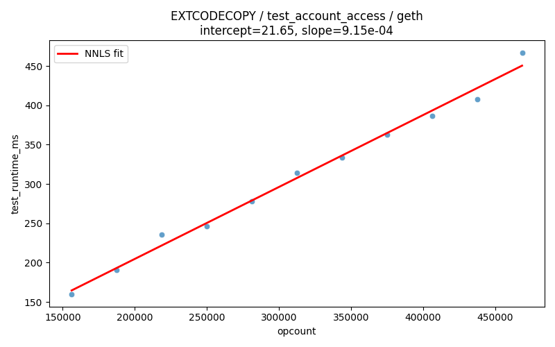

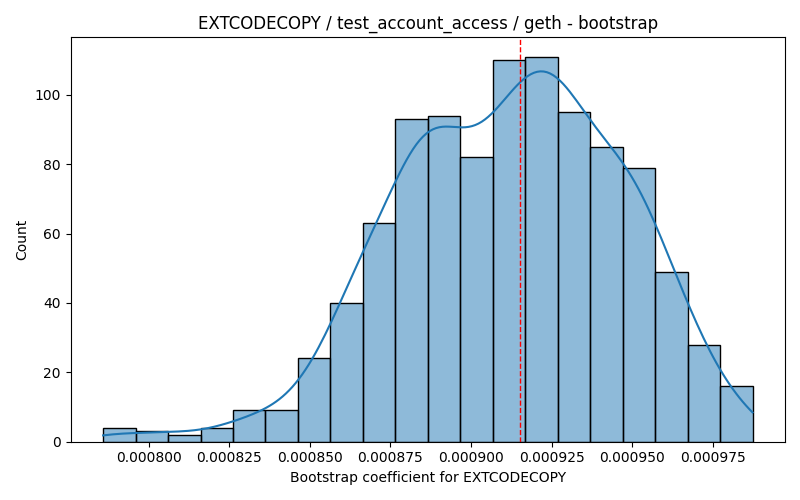

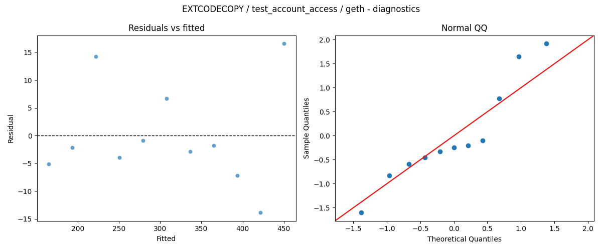

</details>

<details><summary>nethermind — NNLS regression summary</summary>

```
==============================================================================
                           NNLS Regression Results                            
==============================================================================
Dep. Variable:          test_runtime_ms              R-squared:          0.914
Model:                  NNLS                    Adj. R-squared:          0.911
No. Observations:       33                                RMSE:          40.63
Df Residuals:           31                                 MAE:          30.77
Df Model:               1      
==============================================================================
                      coef     std err     P-value      [0.025      0.975]
------------------------------------------------------------------------------
         const    176.0443     25.3664       0.001    134.6674    233.2677
       opcount      0.0013      0.0001       0.001      0.0012      0.0015
==============================================================================
Notes: Non-negative least squares with bootstrap inference (1000 iterations)
==============================================================================
```

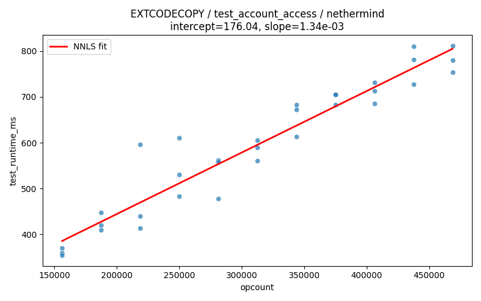

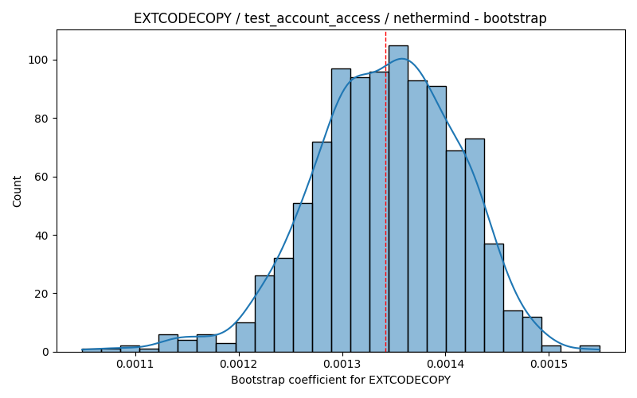

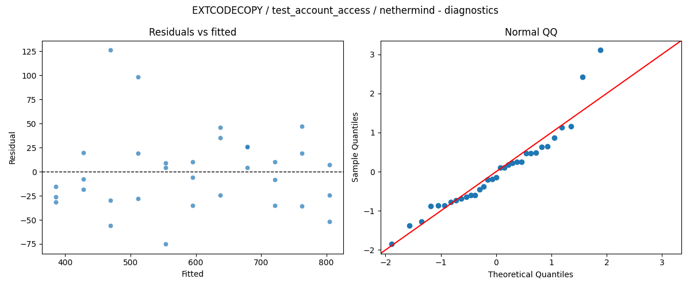

</details>

<details><summary>reth — NNLS regression summary</summary>

```
==============================================================================
                           NNLS Regression Results                            
==============================================================================
Dep. Variable:          test_runtime_ms              R-squared:          0.836
Model:                  NNLS                    Adj. R-squared:          0.834
No. Observations:       77                                RMSE:           3.71
Df Residuals:           75                                 MAE:           3.03
Df Model:               1      
==============================================================================
                      coef     std err     P-value      [0.025      0.975]
------------------------------------------------------------------------------
         const      9.3059      1.6715       0.001      6.1314     12.4585
       opcount      0.0001      0.0000       0.001      0.0001      0.0001
==============================================================================
Notes: Non-negative least squares with bootstrap inference (1000 iterations)
==============================================================================
```

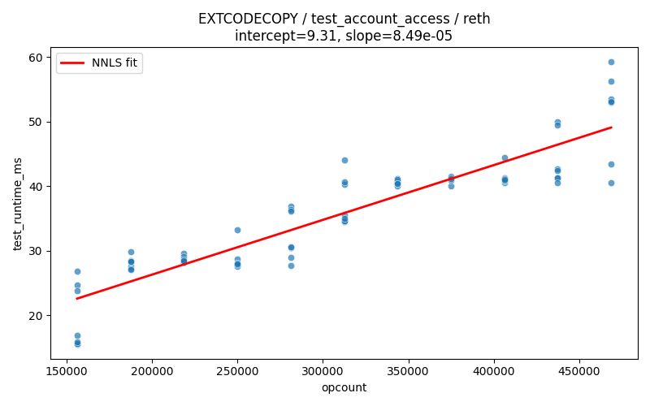

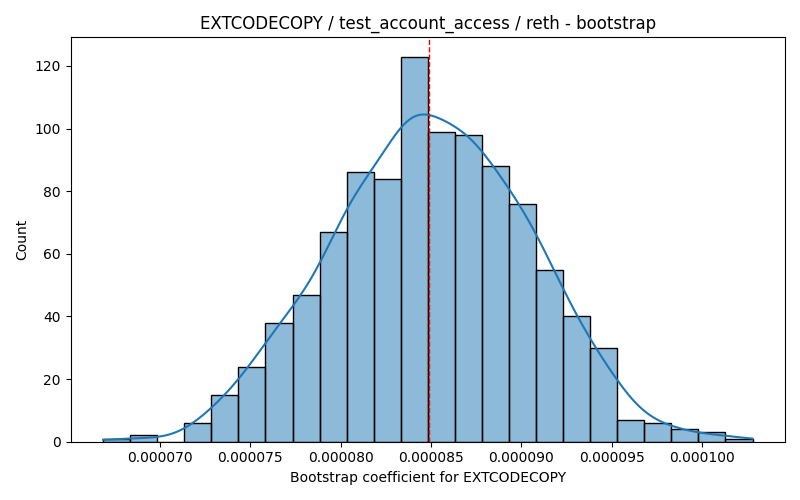

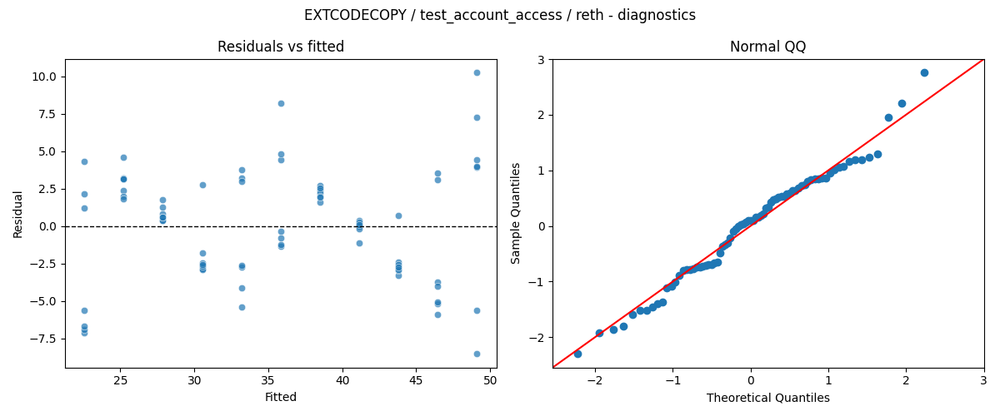

</details>

### test_account_access — combo `EXTCODECOPY_AccountMode.NON_EXISTING_ACCOUNT`

| client | nobs | R² | target_coef (ms) | p-value | 95% CI |
| --- | --- | --- | --- | --- | --- |
| `besu` | 55 | 0.8232 | 0.0004046 | 1.00e-03 | [0.0003531, 0.000456] |
| `erigon` | 22 | 0.8226 | 5.885e-05 | 1.00e-03 | [4.787e-05, 6.936e-05] |
| `geth` | 11 | 0.9967 | 0.0004146 | 1.00e-03 | [0.0003979, 0.0004185] |
| `nethermind` | 33 | 0.8472 | 0.000369 | 1.00e-03 | [0.0003067, 0.0004217] |
| `reth` | 77 | 0.7449 | 1.667e-05 | 1.00e-03 | [1.497e-05, 1.871e-05] |

<details><summary>besu — NNLS regression summary</summary>

```
==============================================================================
                           NNLS Regression Results                            
==============================================================================
Dep. Variable:          test_runtime_ms              R-squared:          0.823
Model:                  NNLS                    Adj. R-squared:          0.820
No. Observations:       55                                RMSE:          48.15
Df Residuals:           53                                 MAE:          42.95
Df Model:               1      
==============================================================================
                      coef     std err     P-value      [0.025      0.975]
------------------------------------------------------------------------------
         const    236.5725     21.9671       0.001    194.1347    282.0193
       opcount      0.0004      0.0000       0.001      0.0004      0.0005
==============================================================================
Notes: Non-negative least squares with bootstrap inference (1000 iterations)
==============================================================================
```

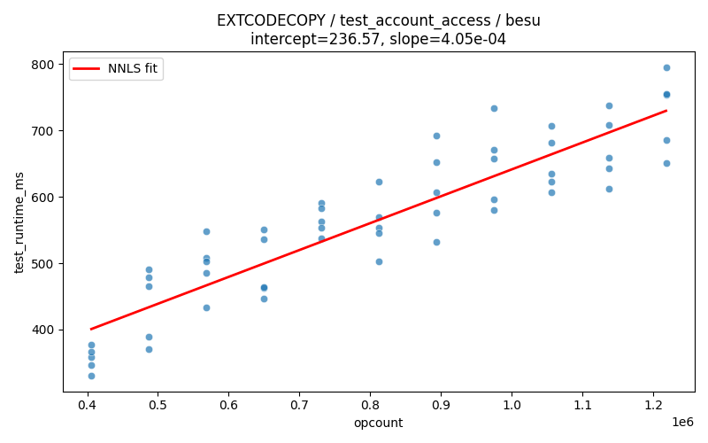

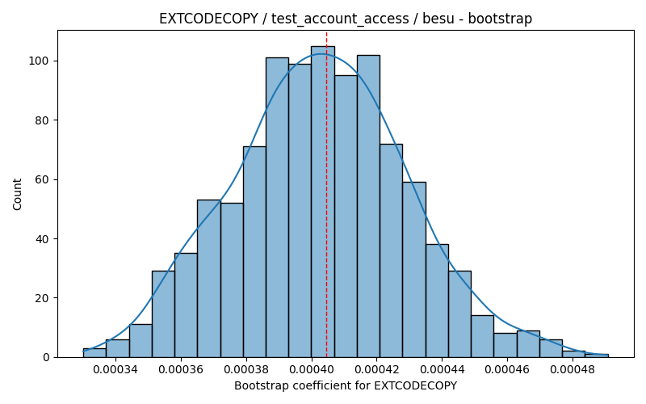

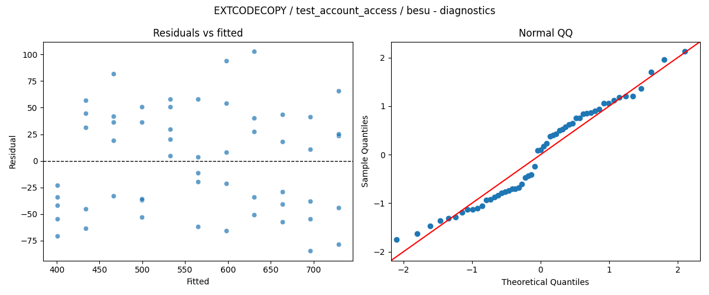

</details>

<details><summary>erigon — NNLS regression summary</summary>

```
==============================================================================
                           NNLS Regression Results                            
==============================================================================
Dep. Variable:          test_runtime_ms              R-squared:          0.823
Model:                  NNLS                    Adj. R-squared:          0.814
No. Observations:       22                                RMSE:           7.02
Df Residuals:           20                                 MAE:           5.56
Df Model:               1      
==============================================================================
                      coef     std err     P-value      [0.025      0.975]
------------------------------------------------------------------------------
         const     42.4962      4.7444       0.001     33.2416     51.8469
       opcount      0.0001      0.0000       0.001      0.0000      0.0001
==============================================================================
Notes: Non-negative least squares with bootstrap inference (1000 iterations)
==============================================================================
```

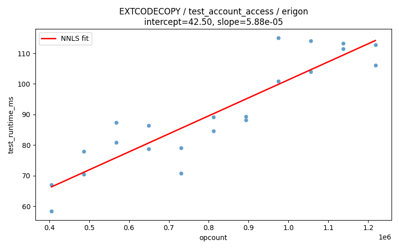

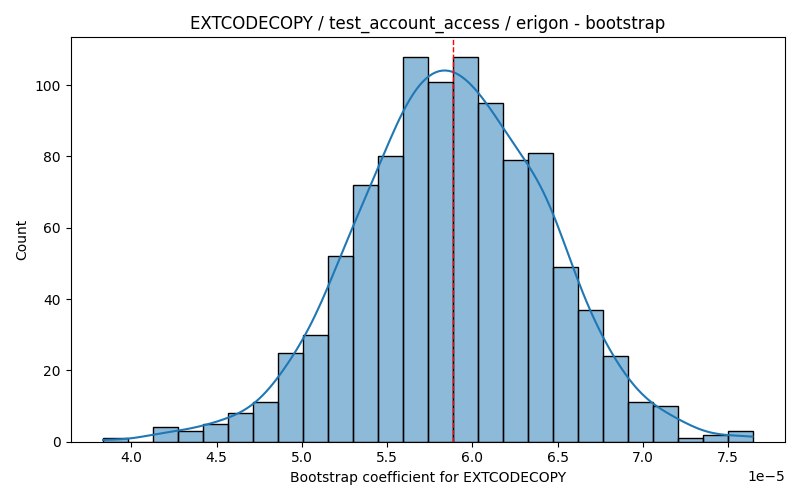

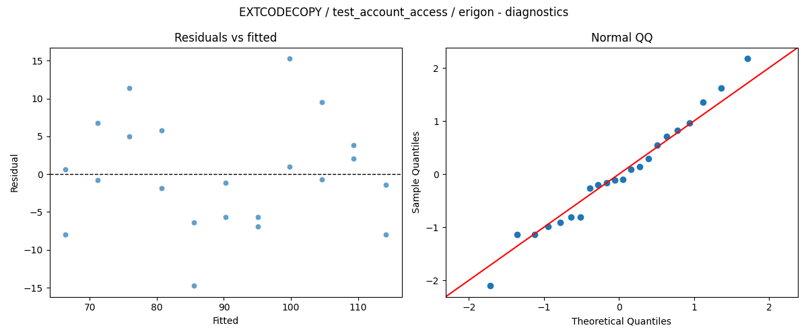

</details>

<details><summary>geth — NNLS regression summary</summary>

```
==============================================================================
                           NNLS Regression Results                            
==============================================================================
Dep. Variable:          test_runtime_ms              R-squared:          0.997
Model:                  NNLS                    Adj. R-squared:          0.996
No. Observations:       11                                RMSE:           6.15
Df Residuals:           9                                  MAE:           5.49
Df Model:               1      
==============================================================================
                      coef     std err     P-value      [0.025      0.975]
------------------------------------------------------------------------------
         const      0.0000      3.9372       1.000      0.0000     13.5951
       opcount      0.0004      0.0000       0.001      0.0004      0.0004
==============================================================================
Notes: Non-negative least squares with bootstrap inference (1000 iterations)
==============================================================================
```

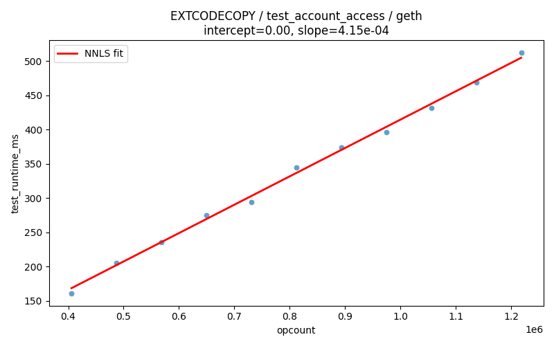

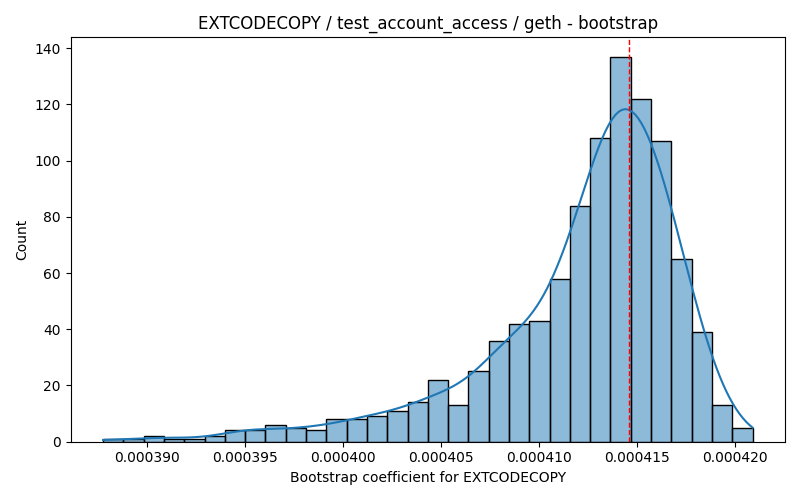

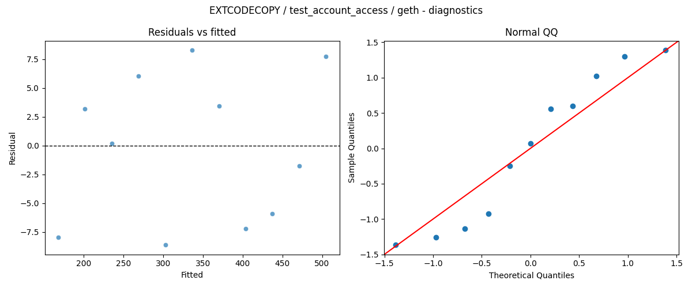

</details>

<details><summary>nethermind — NNLS regression summary</summary>

```
==============================================================================
                           NNLS Regression Results                            
==============================================================================
Dep. Variable:          test_runtime_ms              R-squared:          0.847
Model:                  NNLS                    Adj. R-squared:          0.842
No. Observations:       33                                RMSE:          40.23
Df Residuals:           31                                 MAE:          32.55
Df Model:               1      
==============================================================================
                      coef     std err     P-value      [0.025      0.975]
------------------------------------------------------------------------------
         const    120.9221     25.0748       0.001     79.6158    178.7376
       opcount      0.0004      0.0000       0.001      0.0003      0.0004
==============================================================================
Notes: Non-negative least squares with bootstrap inference (1000 iterations)
==============================================================================
```

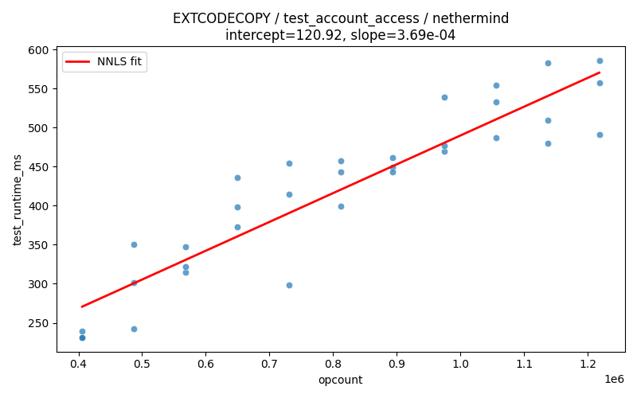

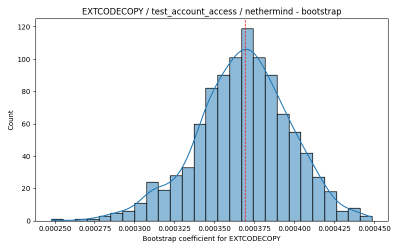

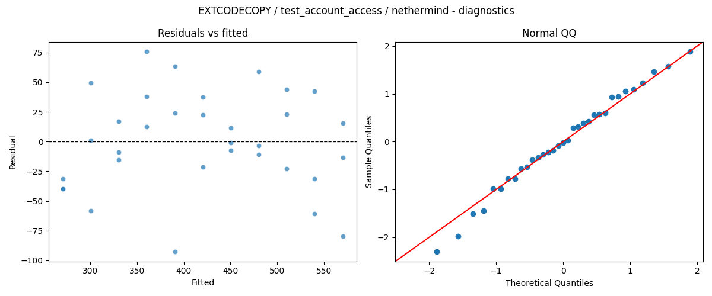

</details>

<details><summary>reth — NNLS regression summary</summary>

```
==============================================================================
                           NNLS Regression Results                            
==============================================================================
Dep. Variable:          test_runtime_ms              R-squared:          0.745
Model:                  NNLS                    Adj. R-squared:          0.742
No. Observations:       77                                RMSE:           2.50
Df Residuals:           75                                 MAE:           1.65
Df Model:               1      
==============================================================================
                      coef     std err     P-value      [0.025      0.975]
------------------------------------------------------------------------------
         const      5.8823      0.6741       0.001      4.4898      7.1146
       opcount      0.0000      0.0000       0.001      0.0000      0.0000
==============================================================================
Notes: Non-negative least squares with bootstrap inference (1000 iterations)
==============================================================================
```

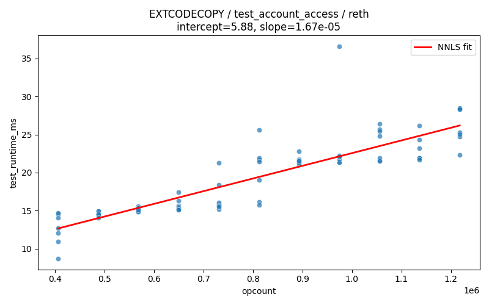

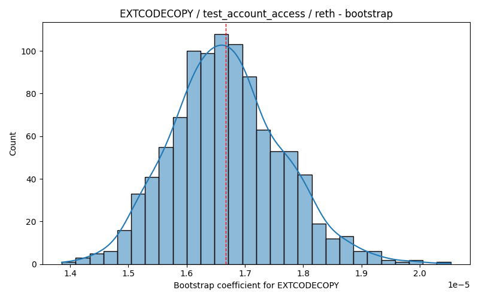

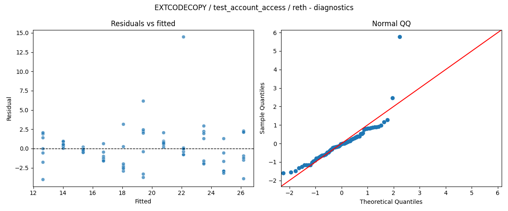

</details>

## EXTCODEHASH

### test_account_access — combo `EXTCODEHASH_AccountMode.EXISTING_CONTRACT`

| client | nobs | R² | target_coef (ms) | p-value | 95% CI |
| --- | --- | --- | --- | --- | --- |
| `besu` | 55 | 0.951 | 0.02622 | 1.00e-03 | [0.02429, 0.02813] |
| `erigon` | 22 | 0.9095 | 0.03581 | 1.00e-03 | [0.03004, 0.03997] |
| `geth` | 11 | 0.8098 | 0.02183 | 1.00e-03 | [0.01388, 0.03101] |
| `nethermind` | 33 | 0.6863 | 0.02328 | 1.00e-03 | [0.01787, 0.02903] |
| `reth` | 77 | 0.9162 | 0.03616 | 1.00e-03 | [0.03322, 0.03882] |

<details><summary>besu — NNLS regression summary</summary>

```
==============================================================================
                           NNLS Regression Results                            
==============================================================================
Dep. Variable:          test_runtime_ms              R-squared:          0.951
Model:                  NNLS                    Adj. R-squared:          0.950
No. Observations:       55                                RMSE:         123.84
Df Residuals:           53                                 MAE:         106.20
Df Model:               1      
==============================================================================
                      coef     std err     P-value      [0.025      0.975]
------------------------------------------------------------------------------
         const    477.4387     66.9939       0.001    343.5459    599.4438
       opcount      0.0262      0.0010       0.001      0.0243      0.0281
==============================================================================
Notes: Non-negative least squares with bootstrap inference (1000 iterations)
==============================================================================
```

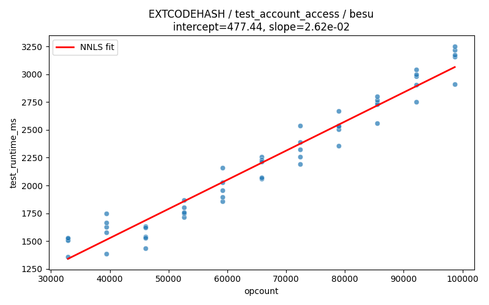

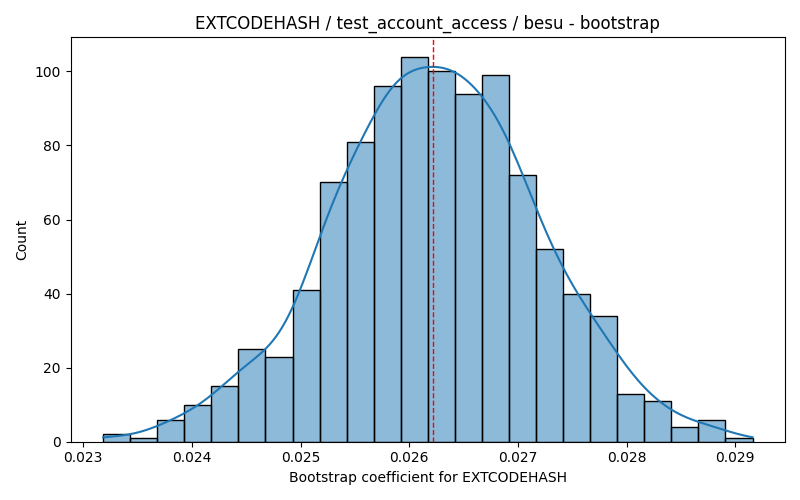

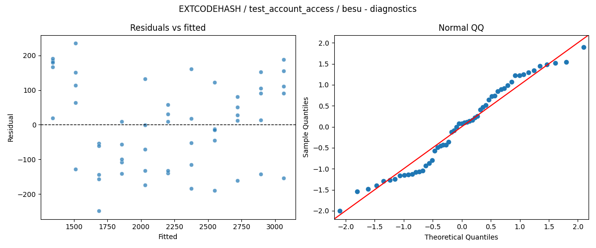

</details>

<details><summary>erigon — NNLS regression summary</summary>

```
==============================================================================
                           NNLS Regression Results                            
==============================================================================
Dep. Variable:          test_runtime_ms              R-squared:          0.910
Model:                  NNLS                    Adj. R-squared:          0.905
No. Observations:       22                                RMSE:         235.04
Df Residuals:           20                                 MAE:         196.64
Df Model:               1      
==============================================================================
                      coef     std err     P-value      [0.025      0.975]
------------------------------------------------------------------------------
         const    407.4429    187.9537       0.004     96.4887    844.8936
       opcount      0.0358      0.0025       0.001      0.0300      0.0400
==============================================================================
Notes: Non-negative least squares with bootstrap inference (1000 iterations)
==============================================================================
```


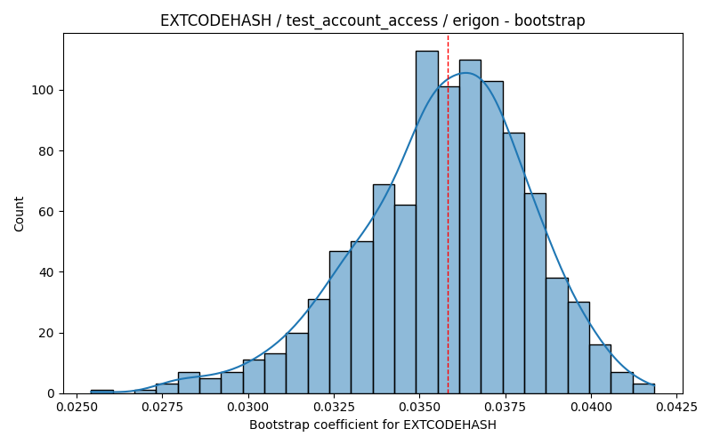

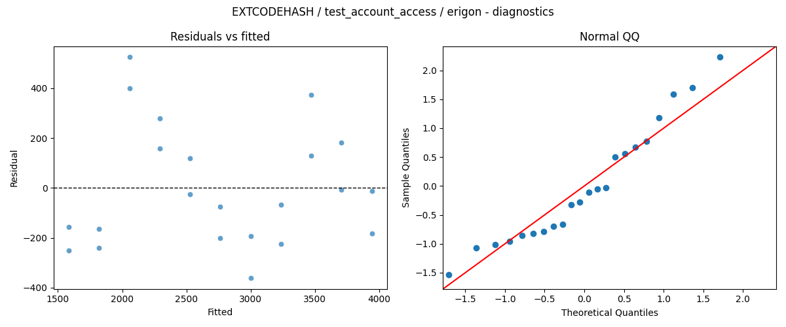

</details>

<details><summary>geth — NNLS regression summary</summary>

```
==============================================================================
                           NNLS Regression Results                            
==============================================================================
Dep. Variable:          test_runtime_ms              R-squared:          0.810
Model:                  NNLS                    Adj. R-squared:          0.789
No. Observations:       11                                RMSE:         220.15
Df Residuals:           9                                  MAE:         175.19
Df Model:               1      
==============================================================================
                      coef     std err     P-value      [0.025      0.975]
------------------------------------------------------------------------------
         const   1315.8081    332.1883       0.001    714.6559   1930.6232
       opcount      0.0218      0.0045       0.001      0.0139      0.0310
==============================================================================
Notes: Non-negative least squares with bootstrap inference (1000 iterations)
==============================================================================
```

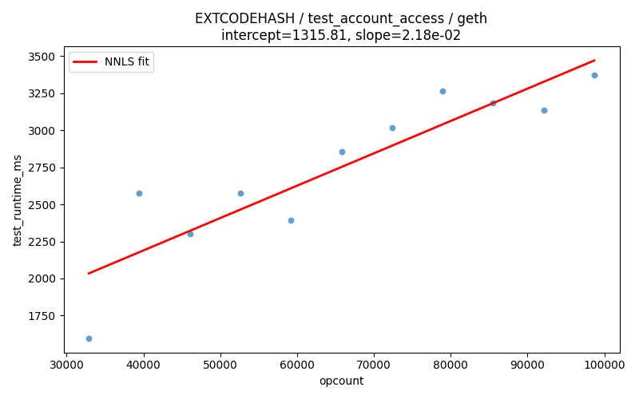

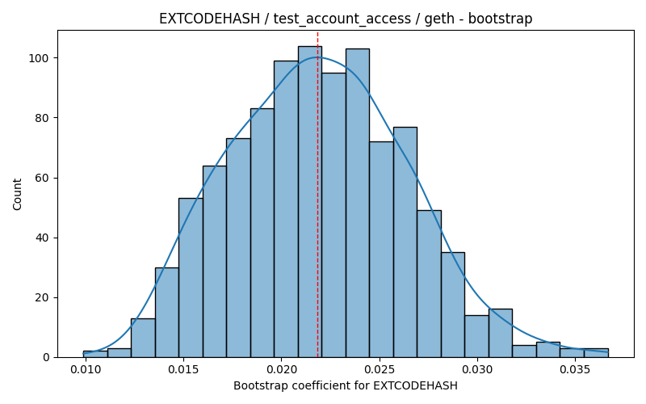

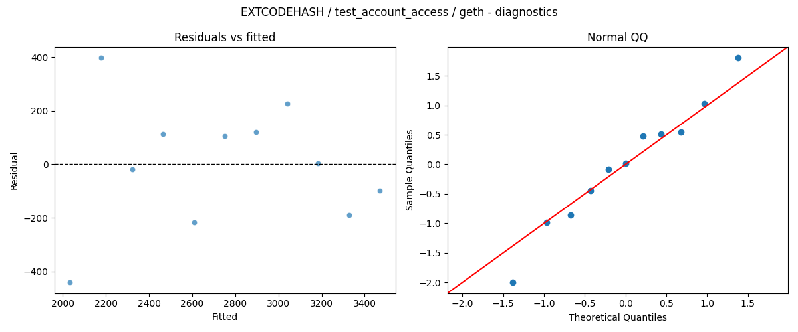

</details>

<details><summary>nethermind — NNLS regression summary</summary>

```
==============================================================================
                           NNLS Regression Results                            
==============================================================================
Dep. Variable:          test_runtime_ms              R-squared:          0.686
Model:                  NNLS                    Adj. R-squared:          0.676
No. Observations:       33                                RMSE:         327.48
Df Residuals:           31                                 MAE:         278.24
Df Model:               1      
==============================================================================
                      coef     std err     P-value      [0.025      0.975]
------------------------------------------------------------------------------
         const    817.8224    203.7374       0.001    424.1611   1224.9530
       opcount      0.0233      0.0029       0.001      0.0179      0.0290
==============================================================================
Notes: Non-negative least squares with bootstrap inference (1000 iterations)
==============================================================================
```

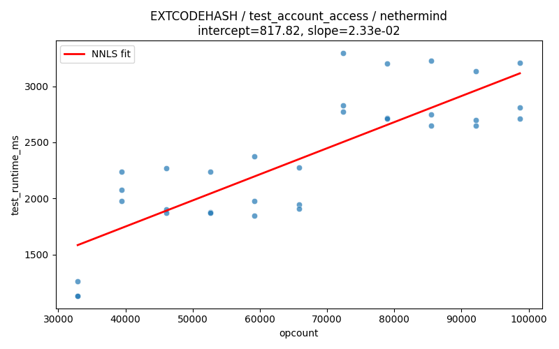

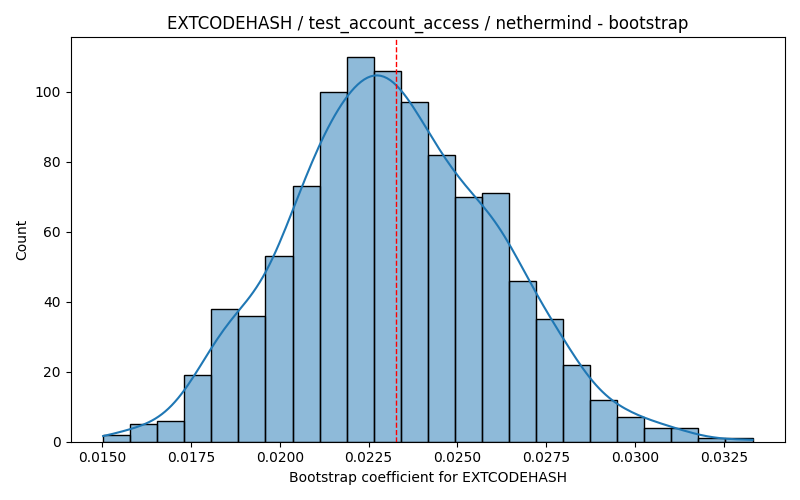

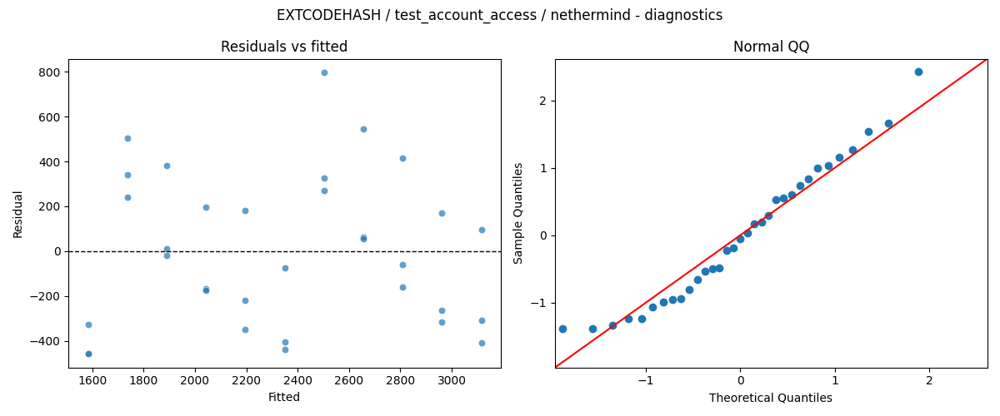

</details>

<details><summary>reth — NNLS regression summary</summary>

```
==============================================================================
                           NNLS Regression Results                            
==============================================================================
Dep. Variable:          test_runtime_ms              R-squared:          0.916
Model:                  NNLS                    Adj. R-squared:          0.915
No. Observations:       77                                RMSE:         227.58
Df Residuals:           75                                 MAE:         133.89
Df Model:               1      
==============================================================================
                      coef     std err     P-value      [0.025      0.975]
------------------------------------------------------------------------------
         const    132.5494     99.7277       0.148      0.0000    328.8126
       opcount      0.0362      0.0016       0.001      0.0332      0.0388
==============================================================================
Notes: Non-negative least squares with bootstrap inference (1000 iterations)
==============================================================================
```

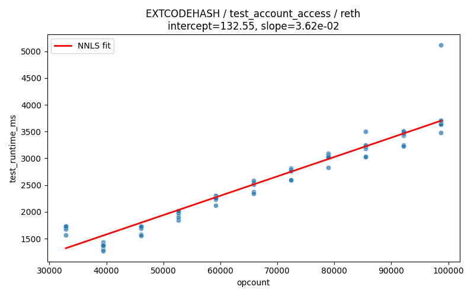

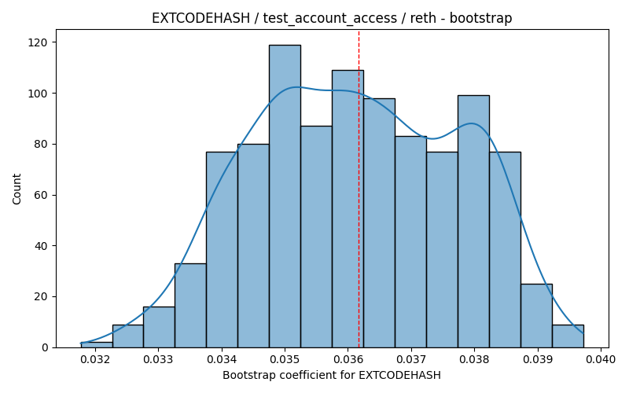

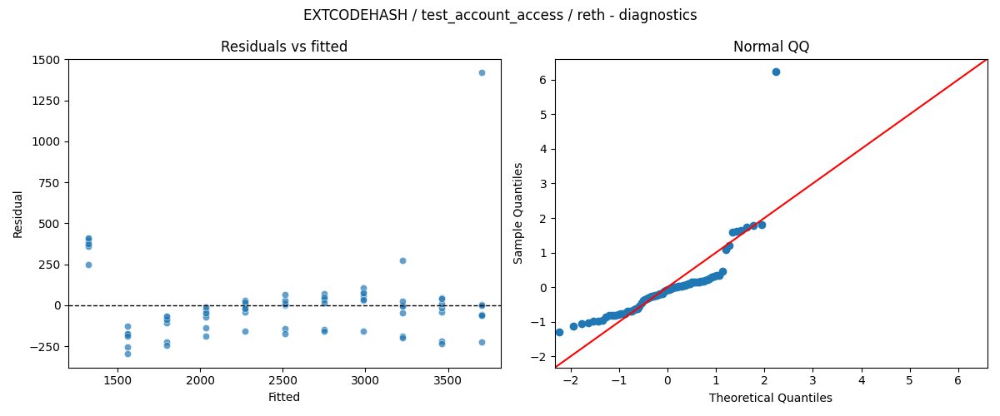

</details>

### test_account_access — combo `EXTCODEHASH_AccountMode.NON_EXISTING_ACCOUNT`

| client | nobs | R² | target_coef (ms) | p-value | 95% CI |
| --- | --- | --- | --- | --- | --- |
| `besu` | 55 | 0.9192 | 0.009882 | 1.00e-03 | [0.008977, 0.01084] |
| `erigon` | 22 | 0.9985 | 0.008666 | 1.00e-03 | [0.008542, 0.008769] |
| `geth` | 11 | 0.8253 | 0.02724 | 1.00e-03 | [0.01964, 0.03632] |
| `nethermind` | 33 | 0.953 | 0.003681 | 1.00e-03 | [0.003402, 0.00399] |
| `reth` | 77 | 0.9625 | 0.0008994 | 1.00e-03 | [0.0008563, 0.0009402] |

<details><summary>besu — NNLS regression summary</summary>

```
==============================================================================
                           NNLS Regression Results                            
==============================================================================
Dep. Variable:          test_runtime_ms              R-squared:          0.919
Model:                  NNLS                    Adj. R-squared:          0.918
No. Observations:       55                                RMSE:          70.03
Df Residuals:           53                                 MAE:          57.84
Df Model:               1      
==============================================================================
                      coef     std err     P-value      [0.025      0.975]
------------------------------------------------------------------------------
         const    415.7670     40.0737       0.001    333.6656    486.6169
       opcount      0.0099      0.0005       0.001      0.0090      0.0108
==============================================================================
Notes: Non-negative least squares with bootstrap inference (1000 iterations)
==============================================================================
```

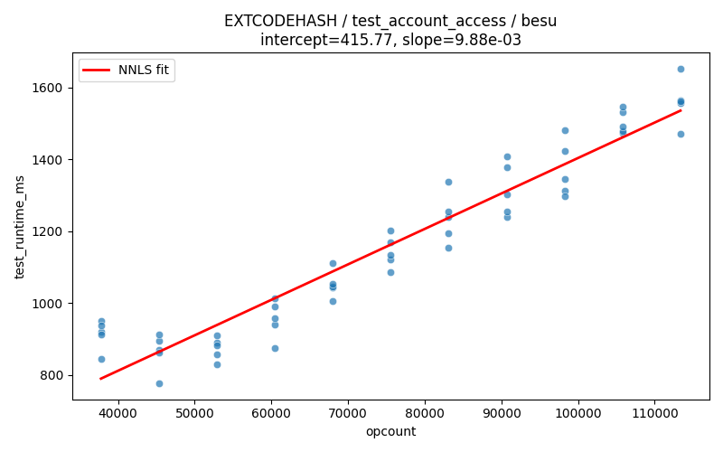

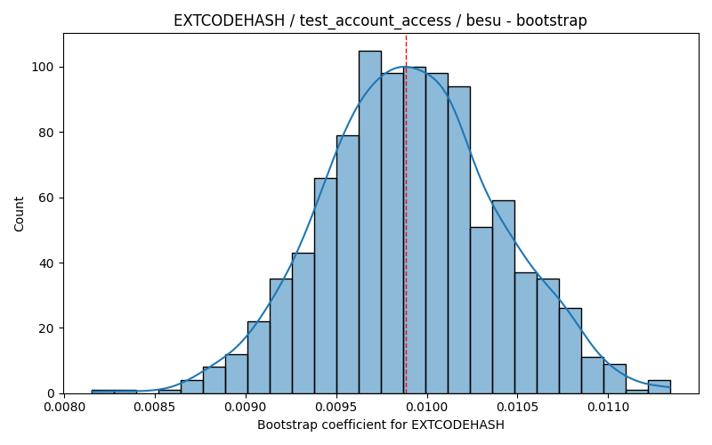

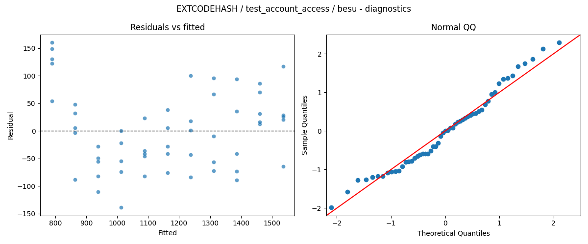

</details>

<details><summary>erigon — NNLS regression summary</summary>

```
==============================================================================
                           NNLS Regression Results                            
==============================================================================
Dep. Variable:          test_runtime_ms              R-squared:          0.998
Model:                  NNLS                    Adj. R-squared:          0.998
No. Observations:       22                                RMSE:           8.07
Df Residuals:           20                                 MAE:           7.24
Df Model:               1      
==============================================================================
                      coef     std err     P-value      [0.025      0.975]
------------------------------------------------------------------------------
         const      6.7878      5.1517       0.156      0.0000     16.6617
       opcount      0.0087      0.0001       0.001      0.0085      0.0088
==============================================================================
Notes: Non-negative least squares with bootstrap inference (1000 iterations)
==============================================================================
```

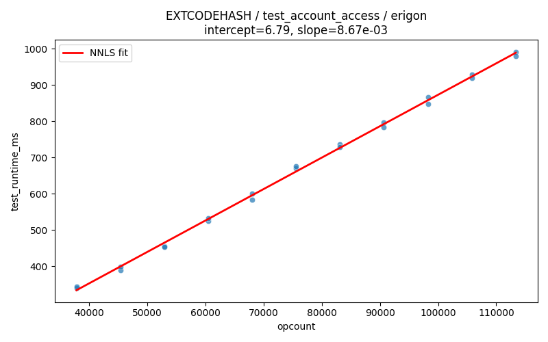

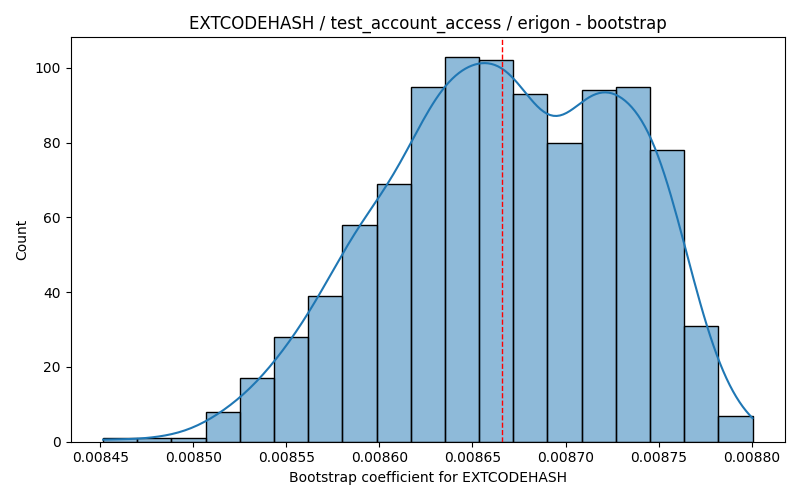

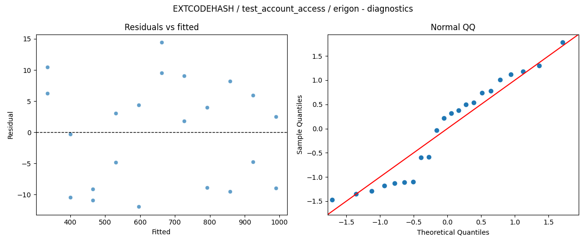

</details>

<details><summary>geth — NNLS regression summary</summary>

```
==============================================================================
                           NNLS Regression Results                            
==============================================================================
Dep. Variable:          test_runtime_ms              R-squared:          0.825
Model:                  NNLS                    Adj. R-squared:          0.806
No. Observations:       11                                RMSE:         299.60
Df Residuals:           9                                  MAE:         256.76
Df Model:               1      
==============================================================================
                      coef     std err     P-value      [0.025      0.975]
------------------------------------------------------------------------------
         const   1018.3754    401.1957       0.001    325.7695   1701.8614
       opcount      0.0272      0.0047       0.001      0.0196      0.0363
==============================================================================
Notes: Non-negative least squares with bootstrap inference (1000 iterations)
==============================================================================
```

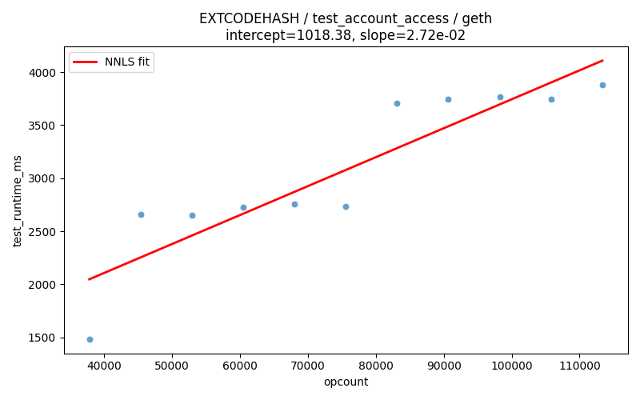

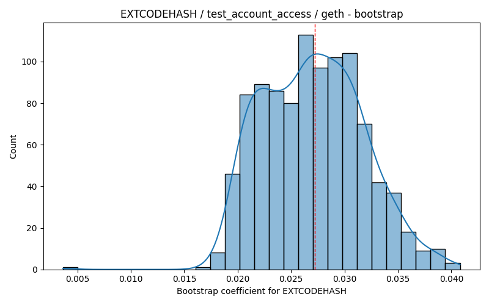

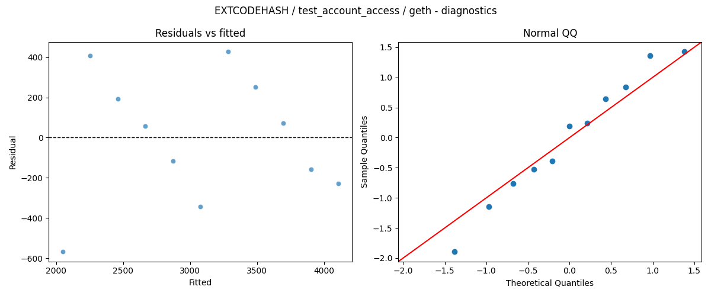

</details>

<details><summary>nethermind — NNLS regression summary</summary>

```
==============================================================================
                           NNLS Regression Results                            
==============================================================================
Dep. Variable:          test_runtime_ms              R-squared:          0.953
Model:                  NNLS                    Adj. R-squared:          0.951
No. Observations:       33                                RMSE:          19.54
Df Residuals:           31                                 MAE:          15.69
Df Model:               1      
==============================================================================
                      coef     std err     P-value      [0.025      0.975]
------------------------------------------------------------------------------
         const     82.2425     10.3607       0.001     61.4822    101.5131
       opcount      0.0037      0.0002       0.001      0.0034      0.0040
==============================================================================
Notes: Non-negative least squares with bootstrap inference (1000 iterations)
==============================================================================
```

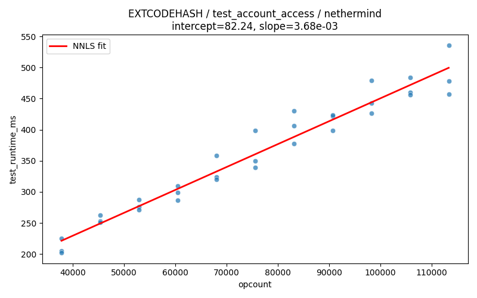

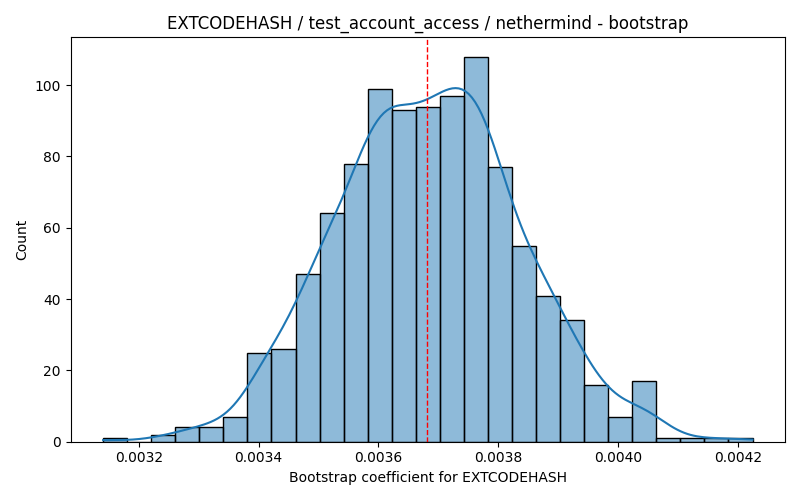

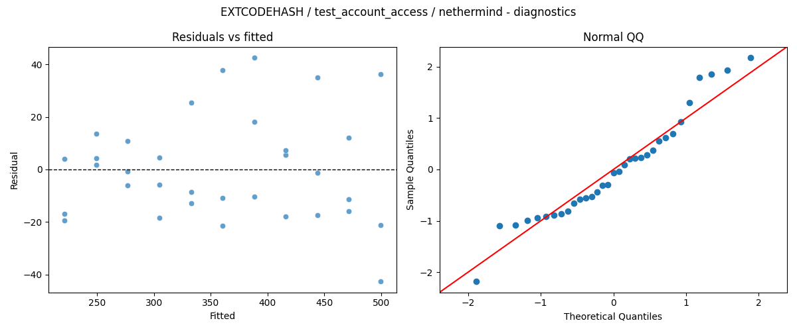

</details>

<details><summary>reth — NNLS regression summary</summary>

```
==============================================================================
                           NNLS Regression Results                            
==============================================================================
Dep. Variable:          test_runtime_ms              R-squared:          0.963
Model:                  NNLS                    Adj. R-squared:          0.962
No. Observations:       77                                RMSE:           4.24
Df Residuals:           75                                 MAE:           3.48
Df Model:               1      
==============================================================================
                      coef     std err     P-value      [0.025      0.975]
------------------------------------------------------------------------------
         const     33.2481      1.7792       0.001     29.9531     36.9140
       opcount      0.0009      0.0000       0.001      0.0009      0.0009
==============================================================================
Notes: Non-negative least squares with bootstrap inference (1000 iterations)
==============================================================================
```

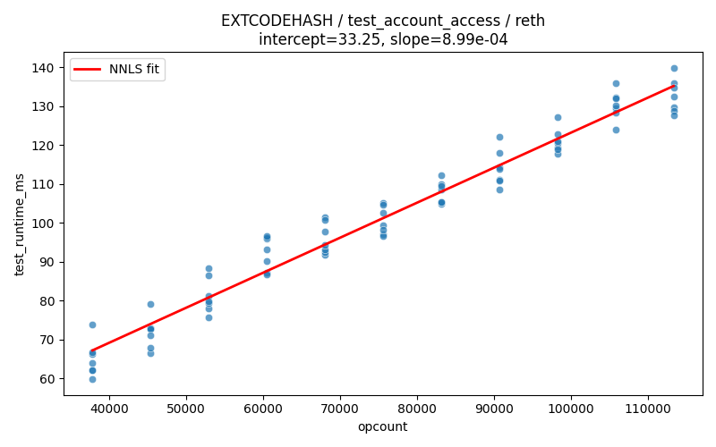

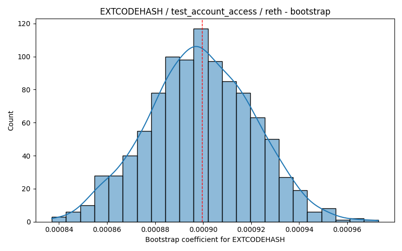

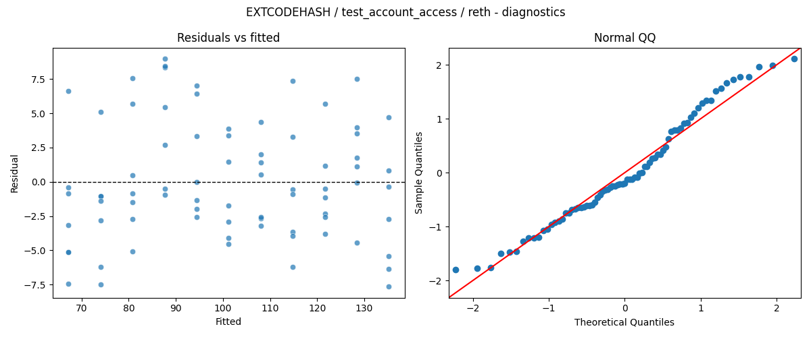

</details>

### test_ext_account_query_warm — combo `EXTCODEHASH`

| client | nobs | R² | target_coef (ms) | p-value | 95% CI |
| --- | --- | --- | --- | --- | --- |
| `besu` | 55 | 0.795 | 0.0001683 | 1.00e-03 | [0.0001469, 0.0001911] |
| `erigon` | 22 | 0.9405 | 0.0002405 | 1.00e-03 | [0.0002181, 0.0002584] |
| `geth` | 11 | 0.8978 | 5.411e-05 | 1.00e-03 | [4.219e-05, 6.002e-05] |
| `nethermind` | 33 | 0.8231 | 0.0002871 | 1.00e-03 | [0.0002337, 0.0003409] |
| `reth` | 77 | 0.6969 | 8.259e-06 | 1.00e-03 | [6.948e-06, 9.718e-06] |

<details><summary>besu — NNLS regression summary</summary>

```
==============================================================================
                           NNLS Regression Results                            
==============================================================================
Dep. Variable:          test_runtime_ms              R-squared:          0.795
Model:                  NNLS                    Adj. R-squared:          0.791
No. Observations:       55                                RMSE:          49.98
Df Residuals:           53                                 MAE:          38.25
Df Model:               1      
==============================================================================
                      coef     std err     P-value      [0.025      0.975]
------------------------------------------------------------------------------
         const    172.5511     22.4887       0.001    128.8618    217.0859
       opcount      0.0002      0.0000       0.001      0.0001      0.0002
==============================================================================
Notes: Non-negative least squares with bootstrap inference (1000 iterations)
==============================================================================
```

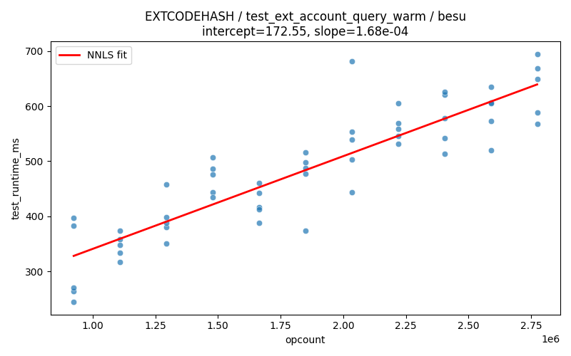

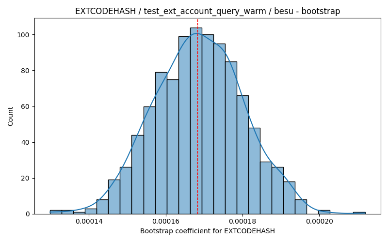

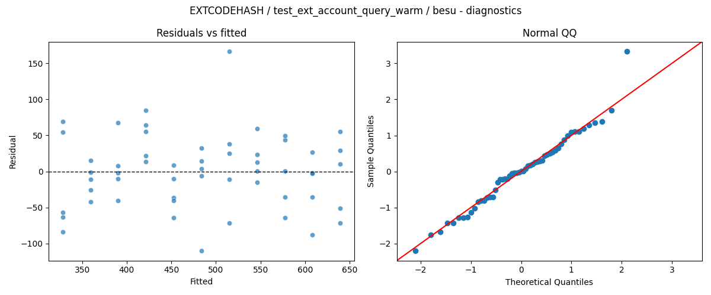

</details>

<details><summary>erigon — NNLS regression summary</summary>

```
==============================================================================
                           NNLS Regression Results                            
==============================================================================
Dep. Variable:          test_runtime_ms              R-squared:          0.940
Model:                  NNLS                    Adj. R-squared:          0.938
No. Observations:       22                                RMSE:          35.37
Df Residuals:           20                                 MAE:          26.18
Df Model:               1      
==============================================================================
                      coef     std err     P-value      [0.025      0.975]
------------------------------------------------------------------------------
         const     56.5100     17.1430       0.002     28.0417     93.0755
       opcount      0.0002      0.0000       0.001      0.0002      0.0003
==============================================================================
Notes: Non-negative least squares with bootstrap inference (1000 iterations)
==============================================================================
```

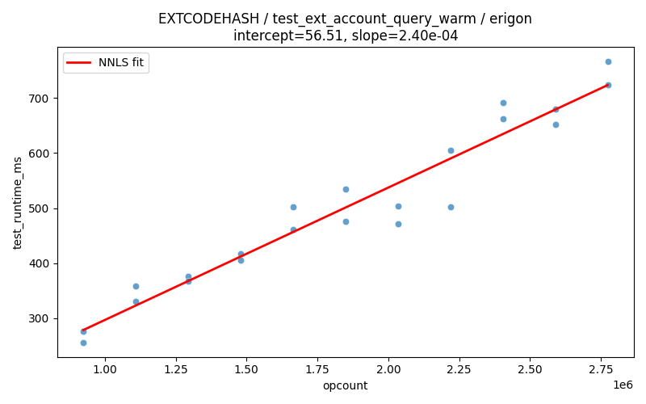

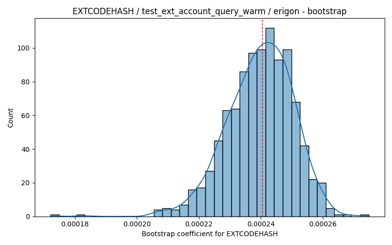

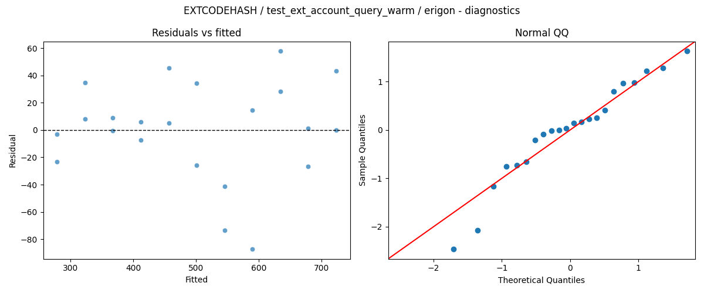

</details>

<details><summary>geth — NNLS regression summary</summary>

```
==============================================================================
                           NNLS Regression Results                            
==============================================================================
Dep. Variable:          test_runtime_ms              R-squared:          0.898
Model:                  NNLS                    Adj. R-squared:          0.886
No. Observations:       11                                RMSE:          10.68
Df Residuals:           9                                  MAE:           7.84
Df Model:               1      
==============================================================================
                      coef     std err     P-value      [0.025      0.975]
------------------------------------------------------------------------------
         const      2.7074      6.6909       0.367      0.0000     20.1802
       opcount      0.0001      0.0000       0.001      0.0000      0.0001
==============================================================================
Notes: Non-negative least squares with bootstrap inference (1000 iterations)
==============================================================================
```

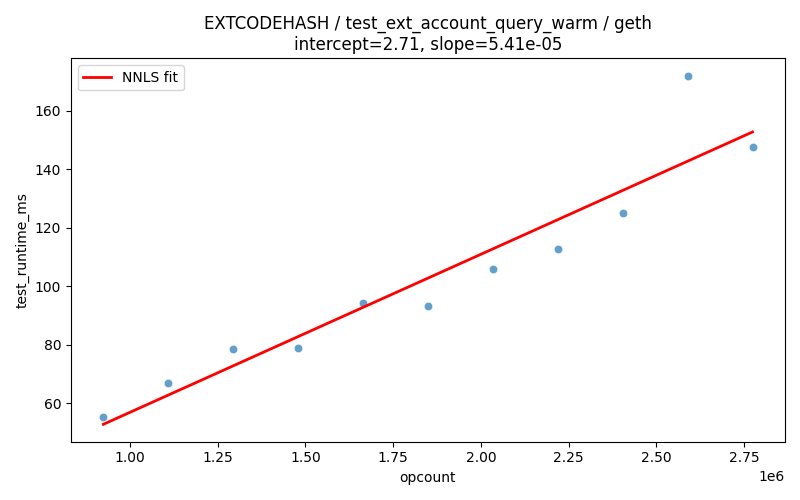

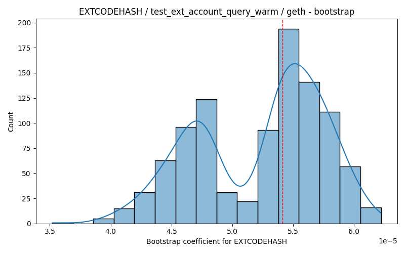

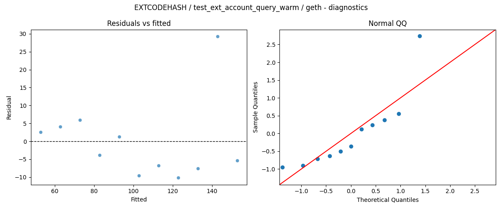

</details>

<details><summary>nethermind — NNLS regression summary</summary>

```
==============================================================================
                           NNLS Regression Results                            
==============================================================================
Dep. Variable:          test_runtime_ms              R-squared:          0.823
Model:                  NNLS                    Adj. R-squared:          0.817
No. Observations:       33                                RMSE:          77.83
Df Residuals:           31                                 MAE:          60.39
Df Model:               1      
==============================================================================
                      coef     std err     P-value      [0.025      0.975]
------------------------------------------------------------------------------
         const    165.5351     44.9596       0.001     82.4881    263.6620
       opcount      0.0003      0.0000       0.001      0.0002      0.0003
==============================================================================
Notes: Non-negative least squares with bootstrap inference (1000 iterations)
==============================================================================
```

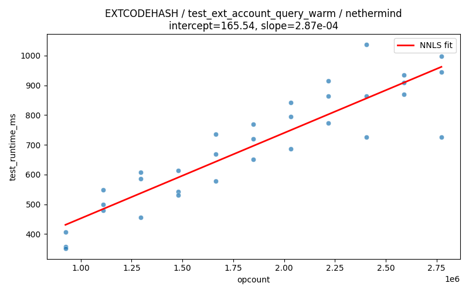

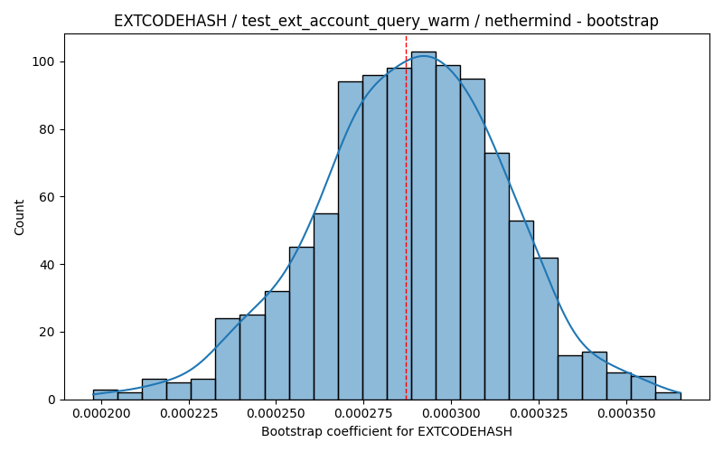

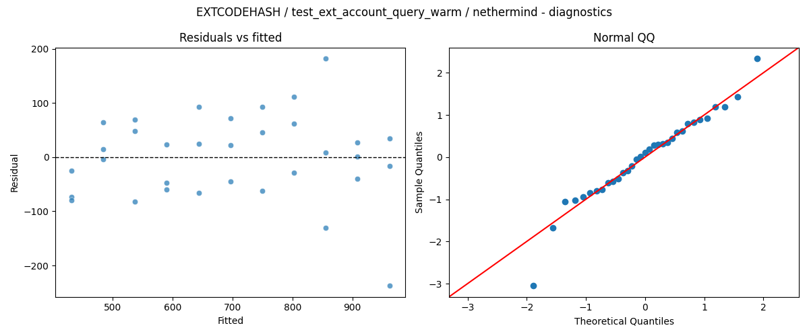

</details>

<details><summary>reth — NNLS regression summary</summary>

```
==============================================================================
                           NNLS Regression Results                            
==============================================================================
Dep. Variable:          test_runtime_ms              R-squared:          0.697
Model:                  NNLS                    Adj. R-squared:          0.693
No. Observations:       77                                RMSE:           3.19
Df Residuals:           75                                 MAE:           2.30
Df Model:               1      
==============================================================================
                      coef     std err     P-value      [0.025      0.975]
------------------------------------------------------------------------------
         const      5.8475      1.1696       0.001      3.5080      7.9997
       opcount      0.0000      0.0000       0.001      0.0000      0.0000
==============================================================================
Notes: Non-negative least squares with bootstrap inference (1000 iterations)
==============================================================================
```

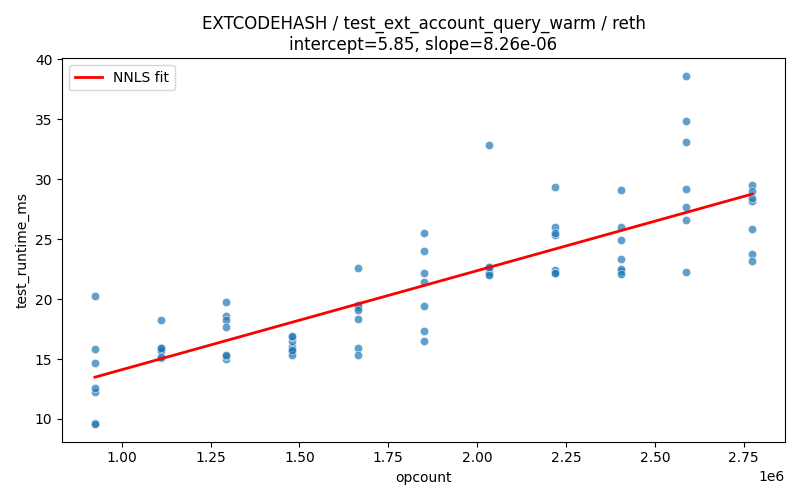

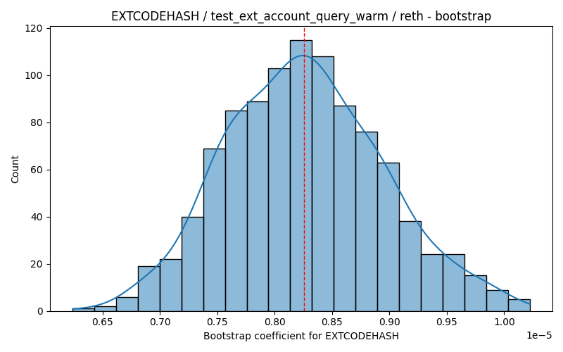

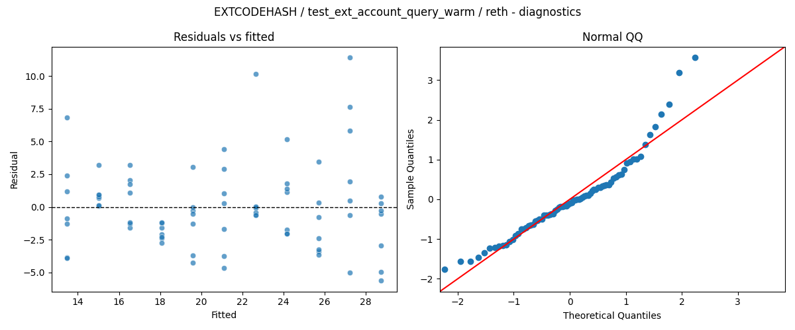

</details>

## EXTCODESIZE

### test_account_access — combo `EXTCODESIZE_AccountMode.EXISTING_CONTRACT`

| client | nobs | R² | target_coef (ms) | p-value | 95% CI |
| --- | --- | --- | --- | --- | --- |
| `besu` | 55 | 0.9515 | 0.02678 | 1.00e-03 | [0.02517, 0.02873] |
| `erigon` | 22 | 0.8688 | 0.08578 | 1.00e-03 | [0.06836, 0.09852] |
| `geth` | 11 | 0.8356 | 0.02245 | 1.00e-03 | [0.01577, 0.02973] |
| `nethermind` | 33 | 0.6952 | 0.02302 | 1.00e-03 | [0.01775, 0.02847] |
| `reth` | 77 | 0.912 | 0.03532 | 1.00e-03 | [0.03326, 0.03783] |

<details><summary>besu — NNLS regression summary</summary>

```
==============================================================================
                           NNLS Regression Results                            
==============================================================================
Dep. Variable:          test_runtime_ms              R-squared:          0.952
Model:                  NNLS                    Adj. R-squared:          0.951
No. Observations:       55                                RMSE:         125.79
Df Residuals:           53                                 MAE:         108.92
Df Model:               1      
==============================================================================
                      coef     std err     P-value      [0.025      0.975]
------------------------------------------------------------------------------
         const    420.4511     66.1428       0.001    269.7979    539.5796
       opcount      0.0268      0.0009       0.001      0.0252      0.0287
==============================================================================
Notes: Non-negative least squares with bootstrap inference (1000 iterations)
==============================================================================
```

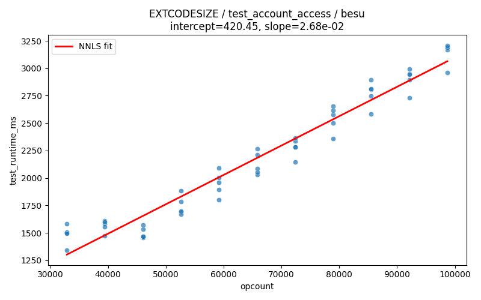

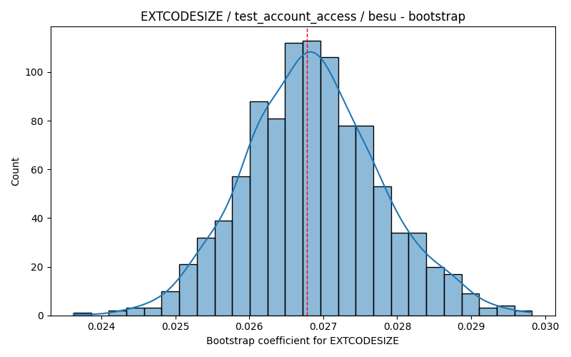

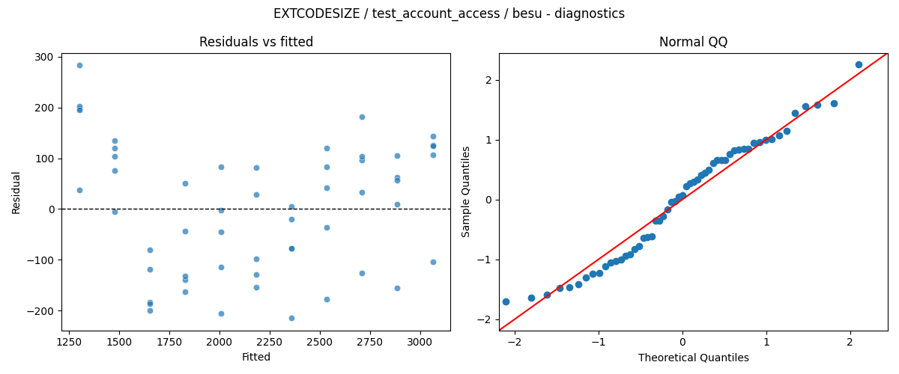

</details>

<details><summary>erigon — NNLS regression summary</summary>

```
==============================================================================
                           NNLS Regression Results                            
==============================================================================
Dep. Variable:          test_runtime_ms              R-squared:          0.869
Model:                  NNLS                    Adj. R-squared:          0.862
No. Observations:       22                                RMSE:         693.62
Df Residuals:           20                                 MAE:         597.44
Df Model:               1      
==============================================================================
                      coef     std err     P-value      [0.025      0.975]
------------------------------------------------------------------------------
         const   1509.5536    577.5307       0.001    551.2455   2909.3062
       opcount      0.0858      0.0076       0.001      0.0684      0.0985
==============================================================================
Notes: Non-negative least squares with bootstrap inference (1000 iterations)
==============================================================================
```

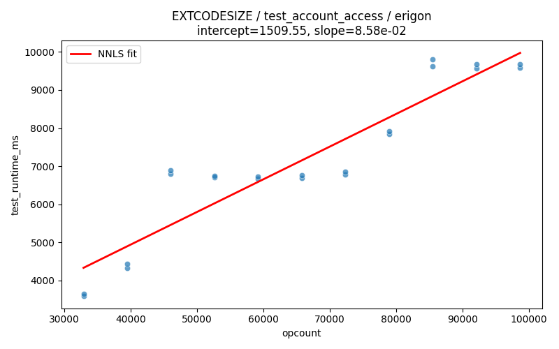

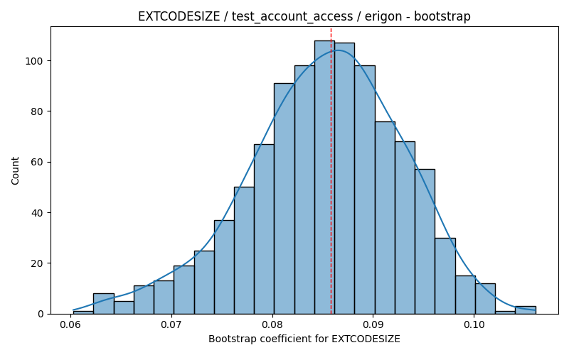

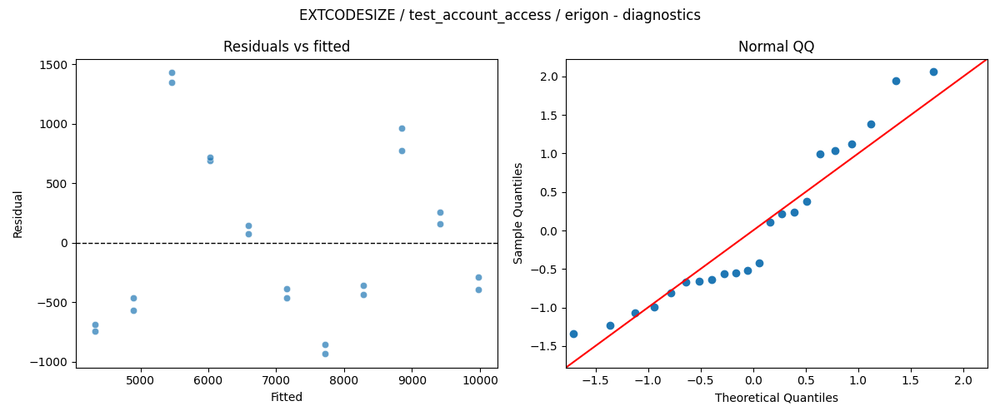

</details>

<details><summary>geth — NNLS regression summary</summary>

```
==============================================================================
                           NNLS Regression Results                            
==============================================================================
Dep. Variable:          test_runtime_ms              R-squared:          0.836
Model:                  NNLS                    Adj. R-squared:          0.817
No. Observations:       11                                RMSE:         207.25
Df Residuals:           9                                  MAE:         155.87
Df Model:               1      
==============================================================================
                      coef     std err     P-value      [0.025      0.975]
------------------------------------------------------------------------------
         const   1246.6964    317.6256       0.001    693.8854   1776.4895
       opcount      0.0225      0.0041       0.001      0.0158      0.0297
==============================================================================
Notes: Non-negative least squares with bootstrap inference (1000 iterations)
==============================================================================
```

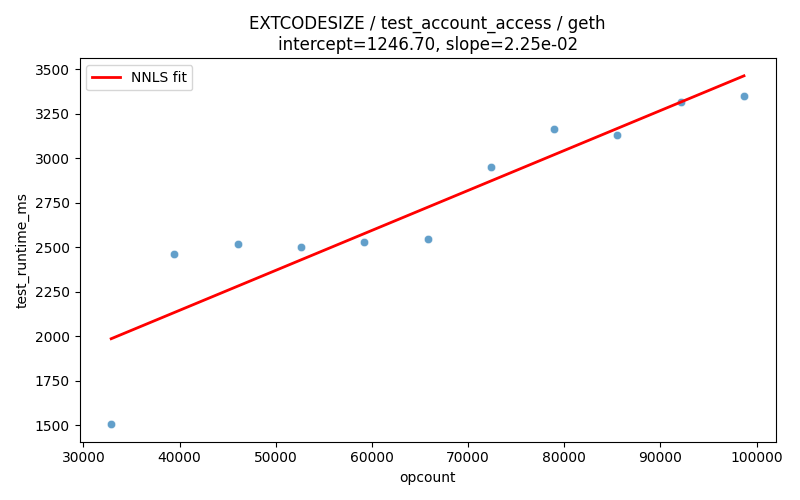

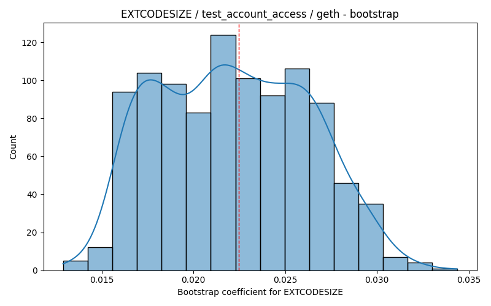

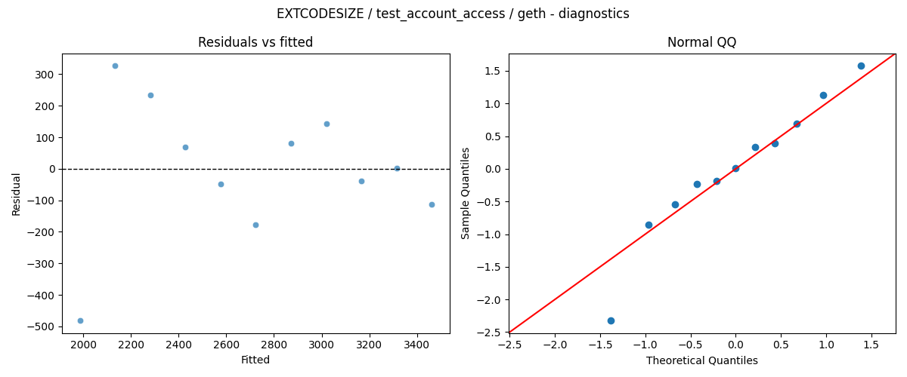

</details>

<details><summary>nethermind — NNLS regression summary</summary>

```
==============================================================================
                           NNLS Regression Results                            
==============================================================================
Dep. Variable:          test_runtime_ms              R-squared:          0.695
Model:                  NNLS                    Adj. R-squared:          0.685
No. Observations:       33                                RMSE:         317.19
Df Residuals:           31                                 MAE:         270.11
Df Model:               1      
==============================================================================
                      coef     std err     P-value      [0.025      0.975]
------------------------------------------------------------------------------
         const    823.5915    208.0883       0.001    428.9952   1222.0646
       opcount      0.0230      0.0029       0.001      0.0178      0.0285
==============================================================================
Notes: Non-negative least squares with bootstrap inference (1000 iterations)
==============================================================================
```


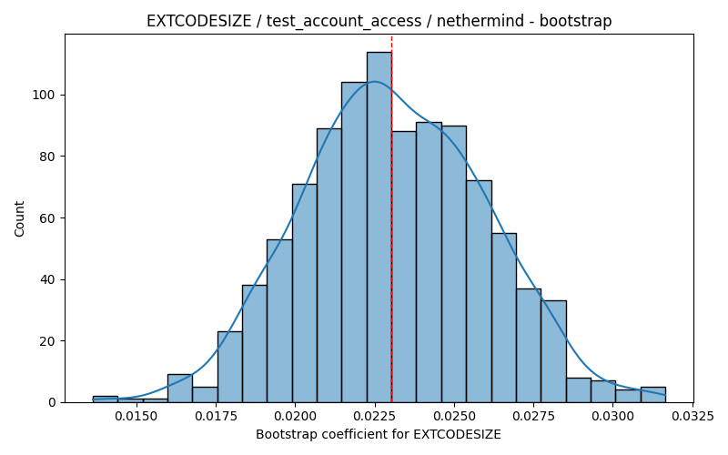

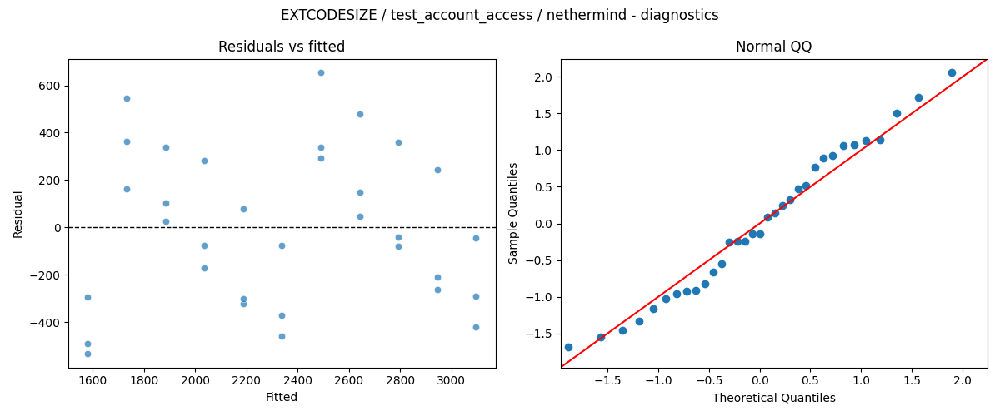

</details>

<details><summary>reth — NNLS regression summary</summary>

```
==============================================================================
                           NNLS Regression Results                            
==============================================================================
Dep. Variable:          test_runtime_ms              R-squared:          0.912
Model:                  NNLS                    Adj. R-squared:          0.911
No. Observations:       77                                RMSE:         228.26
Df Residuals:           75                                 MAE:         147.29
Df Model:               1      
==============================================================================
                      coef     std err     P-value      [0.025      0.975]
------------------------------------------------------------------------------
         const    206.7923     84.0808       0.012     32.9502    355.5998
       opcount      0.0353      0.0012       0.001      0.0333      0.0378
==============================================================================
Notes: Non-negative least squares with bootstrap inference (1000 iterations)
==============================================================================
```

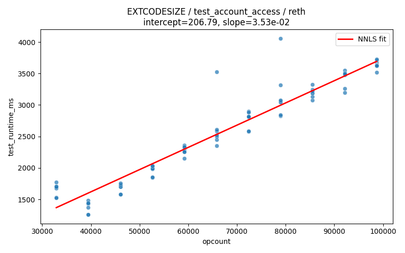

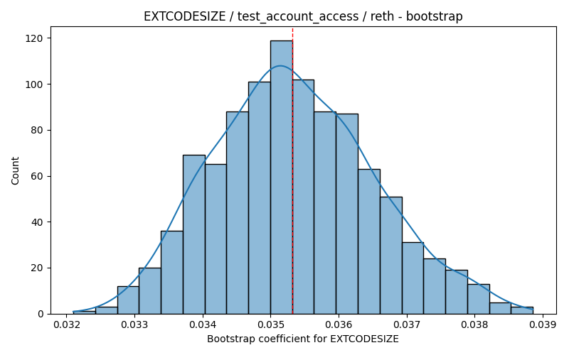

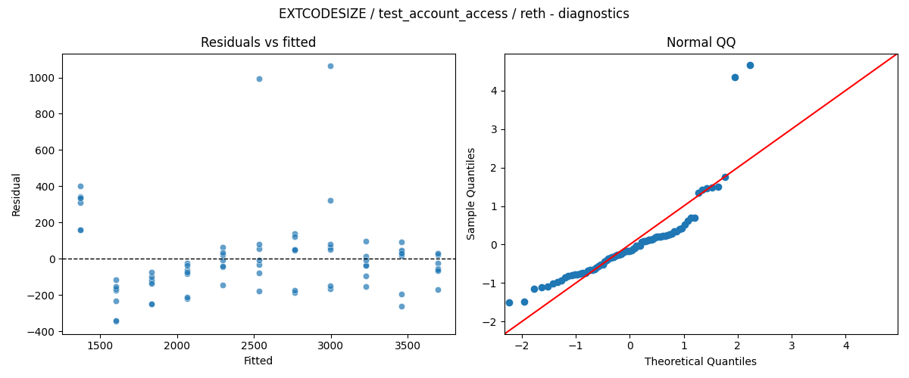

</details>

### test_account_access — combo `EXTCODESIZE_AccountMode.NON_EXISTING_ACCOUNT`

| client | nobs | R² | target_coef (ms) | p-value | 95% CI |
| --- | --- | --- | --- | --- | --- |
| `besu` | 55 | 0.8841 | 0.009198 | 1.00e-03 | [0.008237, 0.01042] |
| `erigon` | 22 | 0.9984 | 0.008874 | 1.00e-03 | [0.008687, 0.008992] |
| `geth` | 11 | 0.8619 | 0.0264 | 1.00e-03 | [0.0205, 0.03419] |
| `nethermind` | 33 | 0.9284 | 0.003828 | 1.00e-03 | [0.003421, 0.004299] |
| `reth` | 77 | 0.9775 | 0.0009304 | 1.00e-03 | [0.0008971, 0.0009593] |

<details><summary>besu — NNLS regression summary</summary>

```
==============================================================================
                           NNLS Regression Results                            
==============================================================================
Dep. Variable:          test_runtime_ms              R-squared:          0.884
Model:                  NNLS                    Adj. R-squared:          0.882
No. Observations:       55                                RMSE:          79.58
Df Residuals:           53                                 MAE:          68.40
Df Model:               1      
==============================================================================
                      coef     std err     P-value      [0.025      0.975]
------------------------------------------------------------------------------
         const    467.8742     43.6912       0.001    371.0029    542.9314
       opcount      0.0092      0.0005       0.001      0.0082      0.0104
==============================================================================
Notes: Non-negative least squares with bootstrap inference (1000 iterations)
==============================================================================
```

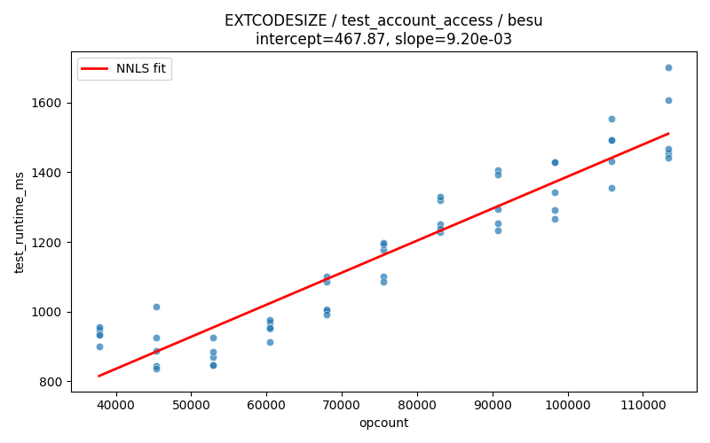

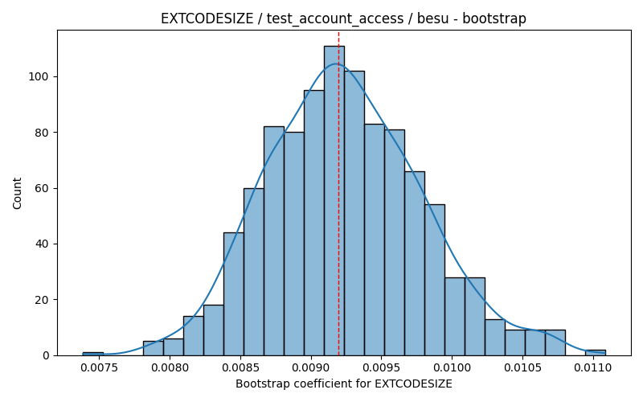

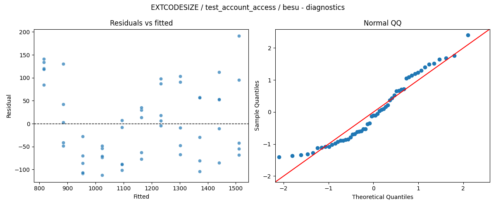

</details>

<details><summary>erigon — NNLS regression summary</summary>

```
==============================================================================
                           NNLS Regression Results                            
==============================================================================
Dep. Variable:          test_runtime_ms              R-squared:          0.998
Model:                  NNLS                    Adj. R-squared:          0.998
No. Observations:       22                                RMSE:           8.45
Df Residuals:           20                                 MAE:           6.92
Df Model:               1      
==============================================================================
                      coef     std err     P-value      [0.025      0.975]
------------------------------------------------------------------------------
         const      7.9917      5.8326       0.120      0.0000     19.8330
       opcount      0.0089      0.0001       0.001      0.0087      0.0090
==============================================================================
Notes: Non-negative least squares with bootstrap inference (1000 iterations)
==============================================================================
```


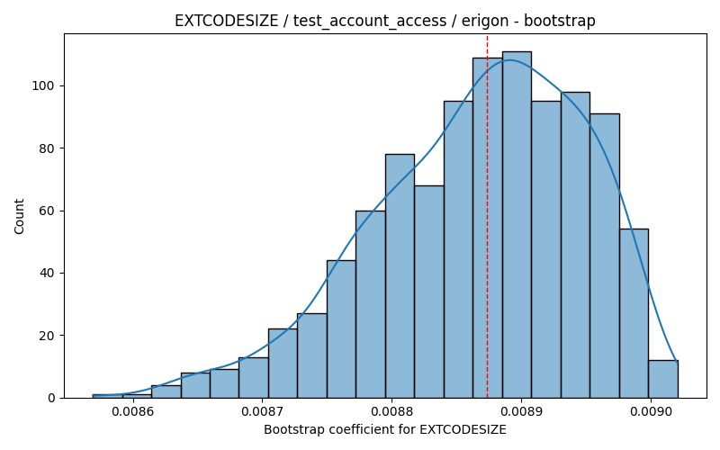

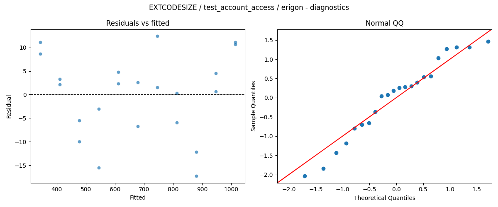

</details>

<details><summary>geth — NNLS regression summary</summary>

```
==============================================================================
                           NNLS Regression Results                            
==============================================================================
Dep. Variable:          test_runtime_ms              R-squared:          0.862
Model:                  NNLS                    Adj. R-squared:          0.847
No. Observations:       11                                RMSE:         252.62
Df Residuals:           9                                  MAE:         209.96
Df Model:               1      
==============================================================================
                      coef     std err     P-value      [0.025      0.975]
------------------------------------------------------------------------------
         const   1096.4560    304.8092       0.001    516.2530   1628.8427
       opcount      0.0264      0.0036       0.001      0.0205      0.0342
==============================================================================
Notes: Non-negative least squares with bootstrap inference (1000 iterations)
==============================================================================
```

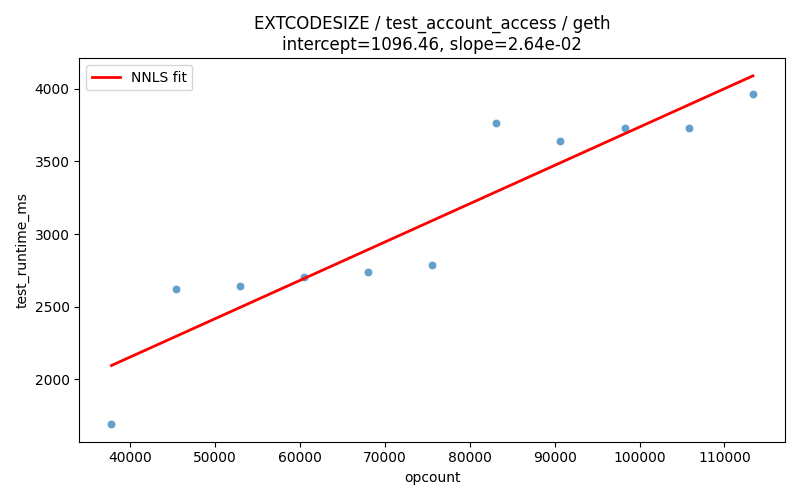

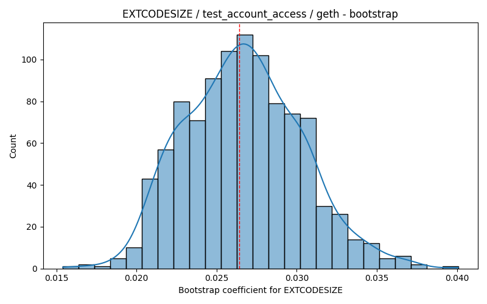

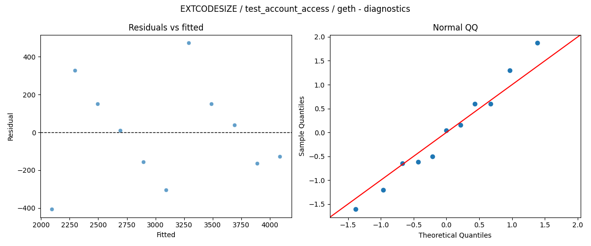

</details>

<details><summary>nethermind — NNLS regression summary</summary>

```
==============================================================================
                           NNLS Regression Results                            
==============================================================================
Dep. Variable:          test_runtime_ms              R-squared:          0.928
Model:                  NNLS                    Adj. R-squared:          0.926
No. Observations:       33                                RMSE:          25.40
Df Residuals:           31                                 MAE:          18.22
Df Model:               1      
==============================================================================
                      coef     std err     P-value      [0.025      0.975]
------------------------------------------------------------------------------
         const     75.2714     14.4292       0.001     47.0208    103.7751
       opcount      0.0038      0.0002       0.001      0.0034      0.0043
==============================================================================
Notes: Non-negative least squares with bootstrap inference (1000 iterations)
==============================================================================
```

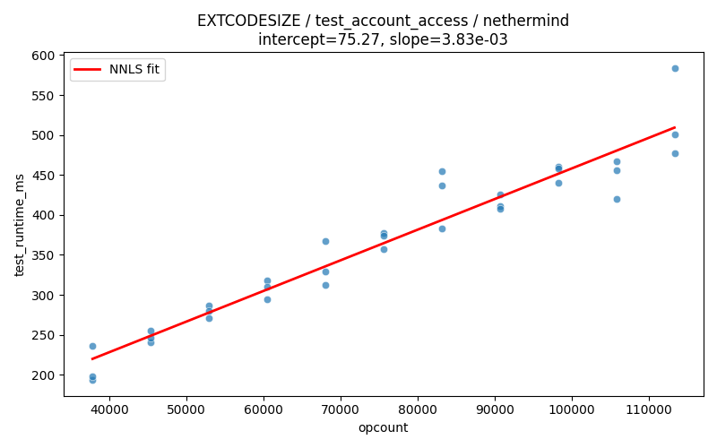

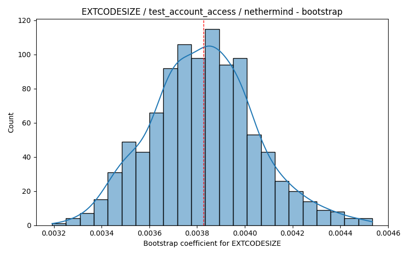

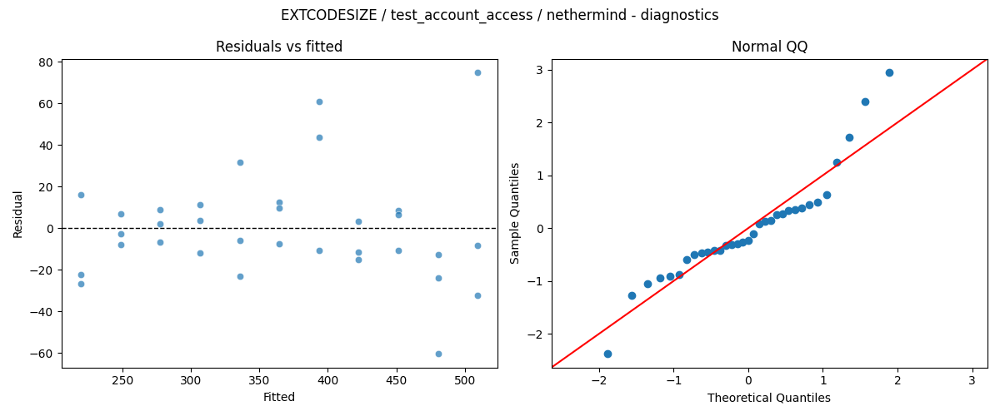

</details>

<details><summary>reth — NNLS regression summary</summary>

```
==============================================================================
                           NNLS Regression Results                            
==============================================================================
Dep. Variable:          test_runtime_ms              R-squared:          0.977
Model:                  NNLS                    Adj. R-squared:          0.977
No. Observations:       77                                RMSE:           3.37
Df Residuals:           75                                 MAE:           2.62
Df Model:               1      
==============================================================================
                      coef     std err     P-value      [0.025      0.975]
------------------------------------------------------------------------------
         const     31.6613      1.2578       0.001     29.4636     34.4152
       opcount      0.0009      0.0000       0.001      0.0009      0.0010
==============================================================================
Notes: Non-negative least squares with bootstrap inference (1000 iterations)
==============================================================================
```

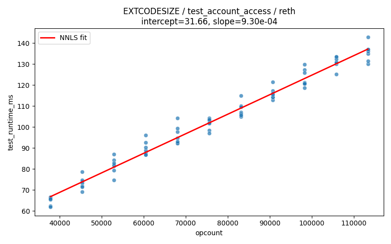

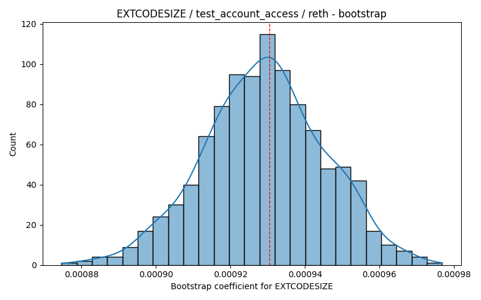

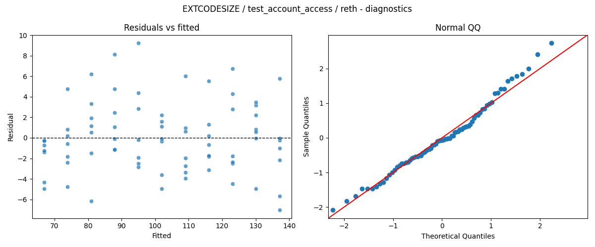

</details>

### test_ext_account_query_warm — combo `EXTCODESIZE`

| client | nobs | R² | target_coef (ms) | p-value | 95% CI |
| --- | --- | --- | --- | --- | --- |
| `besu` | 55 | 0.8489 | 0.0001723 | 1.00e-03 | [0.0001528, 0.0001887] |
| `erigon` | 22 | 0.859 | 4.688e-05 | 1.00e-03 | [3.82e-05, 5.723e-05] |
| `geth` | 11 | 0.9236 | 3.439e-05 | 1.00e-03 | [2.774e-05, 4.011e-05] |
| `nethermind` | 33 | 0.8658 | 0.0002303 | 1.00e-03 | [0.0001976, 0.0002577] |
| `reth` | 77 | 0.6513 | 5.813e-06 | 1.00e-03 | [4.863e-06, 6.847e-06] |

<details><summary>besu — NNLS regression summary</summary>

```
==============================================================================
                           NNLS Regression Results                            
==============================================================================
Dep. Variable:          test_runtime_ms              R-squared:          0.849
Model:                  NNLS                    Adj. R-squared:          0.846
No. Observations:       55                                RMSE:          42.52
Df Residuals:           53                                 MAE:          33.81
Df Model:               1      
==============================================================================
                      coef     std err     P-value      [0.025      0.975]
------------------------------------------------------------------------------
         const    164.4774     18.0973       0.001    131.0515    200.2311
       opcount      0.0002      0.0000       0.001      0.0002      0.0002
==============================================================================
Notes: Non-negative least squares with bootstrap inference (1000 iterations)
==============================================================================
```

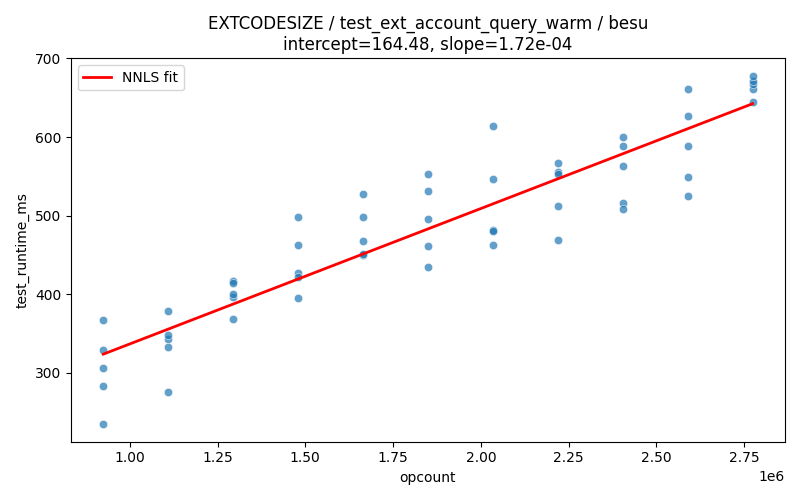

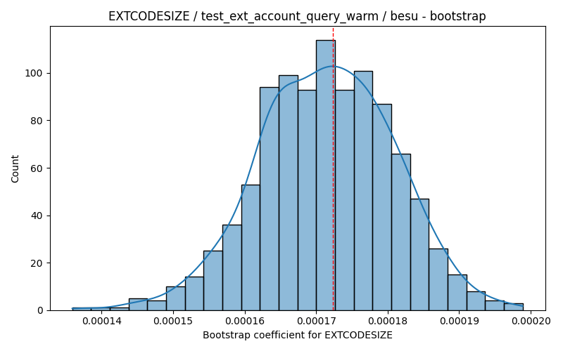

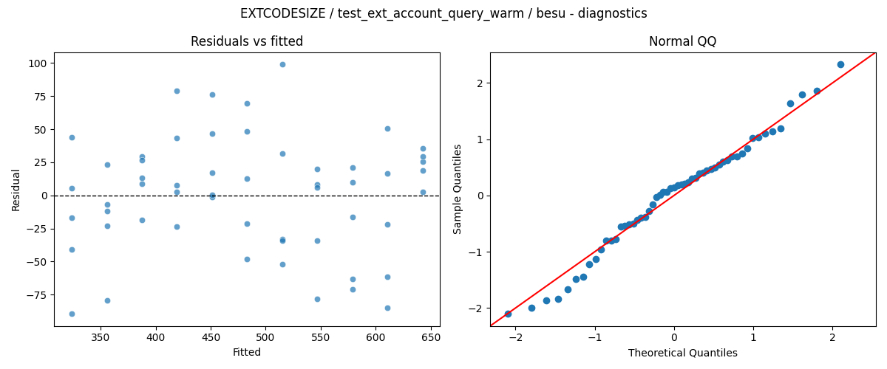

</details>

<details><summary>erigon — NNLS regression summary</summary>

```
==============================================================================
                           NNLS Regression Results                            
==============================================================================
Dep. Variable:          test_runtime_ms              R-squared:          0.859
Model:                  NNLS                    Adj. R-squared:          0.852
No. Observations:       22                                RMSE:          11.11
Df Residuals:           20                                 MAE:           6.78
Df Model:               1      
==============================================================================
                      coef     std err     P-value      [0.025      0.975]
------------------------------------------------------------------------------
         const     36.1665      7.4477       0.001     19.7517     48.3517
       opcount      0.0000      0.0000       0.001      0.0000      0.0001
==============================================================================
Notes: Non-negative least squares with bootstrap inference (1000 iterations)
==============================================================================
```

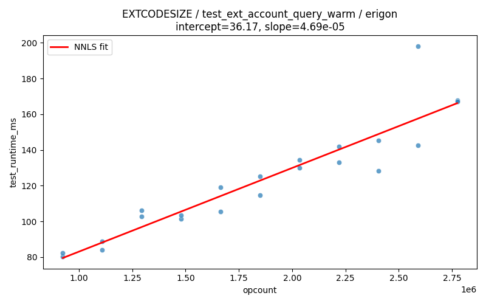

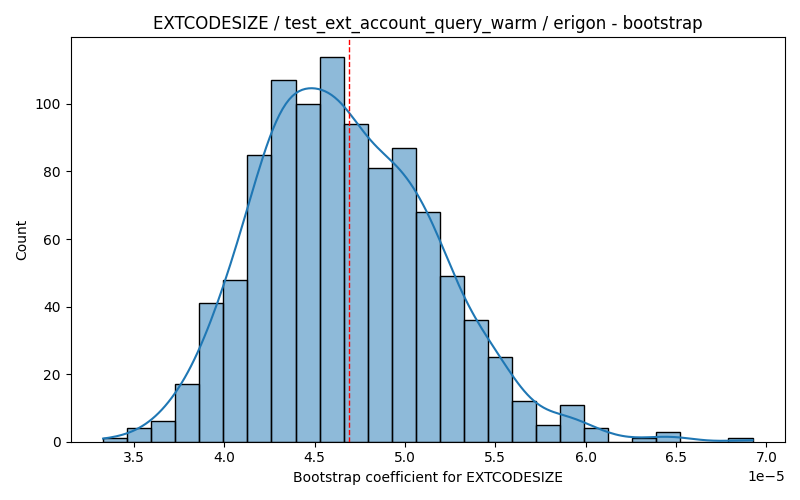

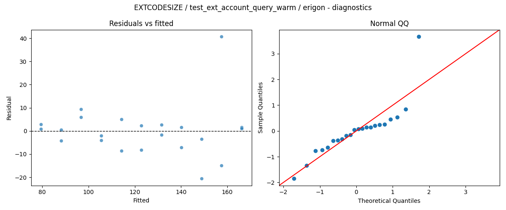

</details>

<details><summary>geth — NNLS regression summary</summary>

```
==============================================================================
                           NNLS Regression Results                            
==============================================================================
Dep. Variable:          test_runtime_ms              R-squared:          0.924
Model:                  NNLS                    Adj. R-squared:          0.915
No. Observations:       11                                RMSE:           5.78
Df Residuals:           9                                  MAE:           5.05
Df Model:               1      
==============================================================================
                      coef     std err     P-value      [0.025      0.975]
------------------------------------------------------------------------------
         const     17.9940      5.2570       0.003      6.3490     28.1396
       opcount      0.0000      0.0000       0.001      0.0000      0.0000
==============================================================================
Notes: Non-negative least squares with bootstrap inference (1000 iterations)
==============================================================================
```

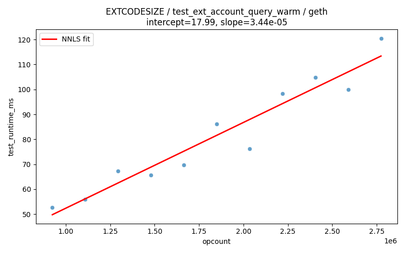

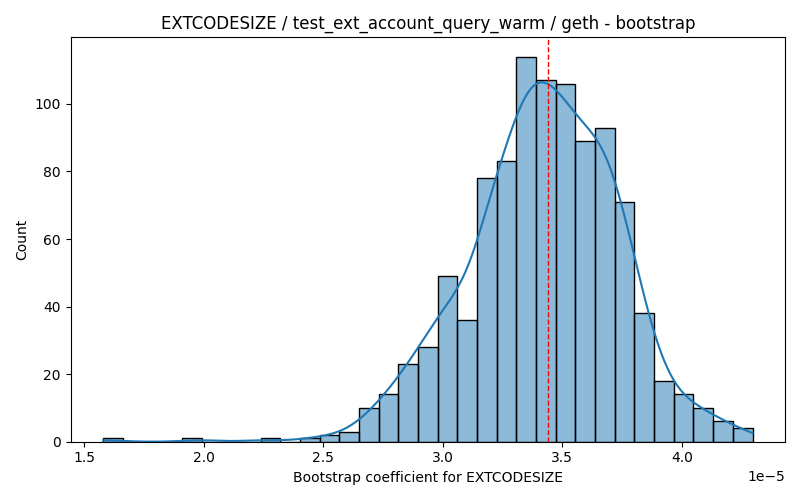

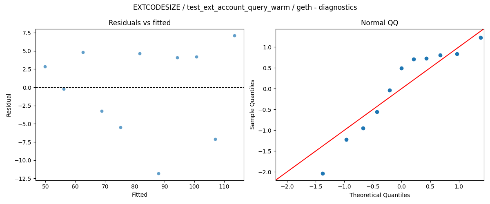

</details>

<details><summary>nethermind — NNLS regression summary</summary>

```
==============================================================================
                           NNLS Regression Results                            
==============================================================================
Dep. Variable:          test_runtime_ms              R-squared:          0.866
Model:                  NNLS                    Adj. R-squared:          0.861
No. Observations:       33                                RMSE:          53.03
Df Residuals:           31                                 MAE:          41.69
Df Model:               1      
==============================================================================
                      coef     std err     P-value      [0.025      0.975]
------------------------------------------------------------------------------
         const     80.8689     25.4848       0.001     32.5253    130.5198
       opcount      0.0002      0.0000       0.001      0.0002      0.0003
==============================================================================
Notes: Non-negative least squares with bootstrap inference (1000 iterations)
==============================================================================
```

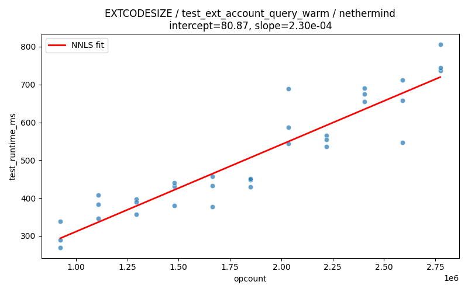

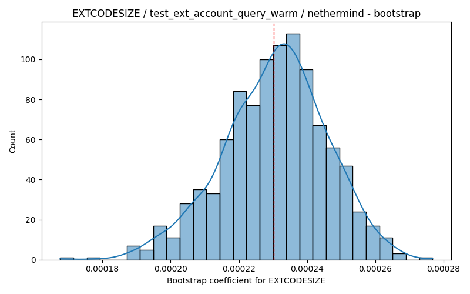

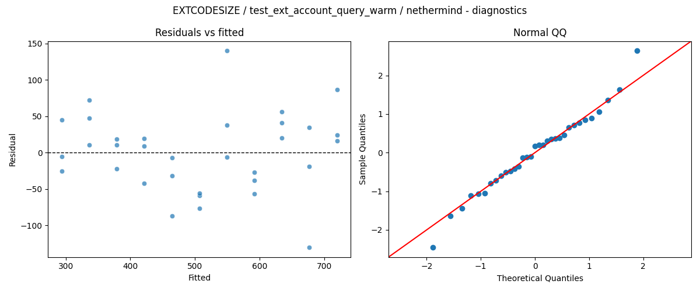

</details>

<details><summary>reth — NNLS regression summary</summary>

```
==============================================================================
                           NNLS Regression Results                            
==============================================================================
Dep. Variable:          test_runtime_ms              R-squared:          0.651
Model:                  NNLS                    Adj. R-squared:          0.647
No. Observations:       77                                RMSE:           2.49
Df Residuals:           75                                 MAE:           1.80
Df Model:               1      
==============================================================================
                      coef     std err     P-value      [0.025      0.975]
------------------------------------------------------------------------------
         const      5.0081      0.9073       0.001      3.2672      6.6980
       opcount      0.0000      0.0000       0.001      0.0000      0.0000
==============================================================================
Notes: Non-negative least squares with bootstrap inference (1000 iterations)
==============================================================================
```

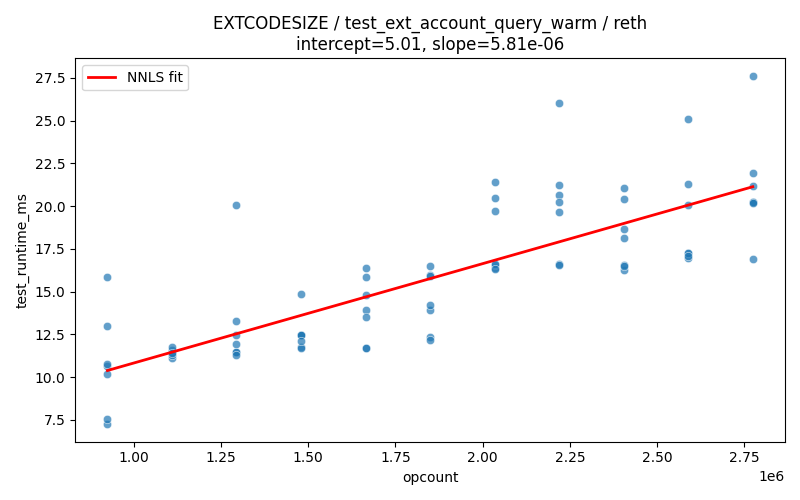

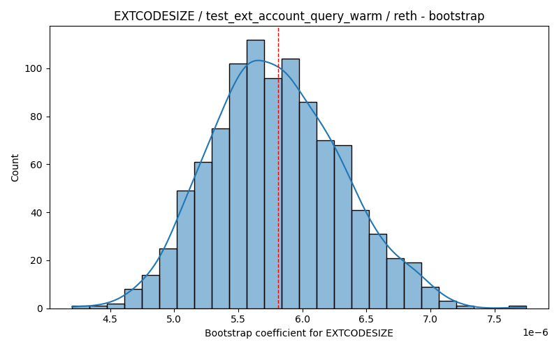

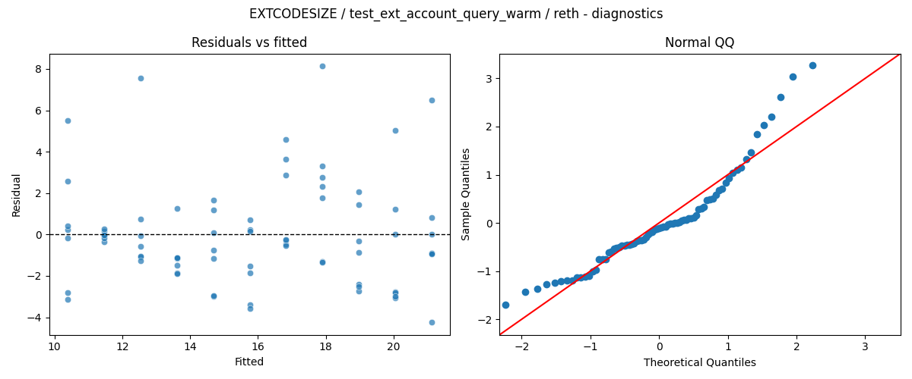

</details>

## STATICCALL

### test_account_access — combo `STATICCALL_AccountMode.EXISTING_CONTRACT`

| client | nobs | R² | target_coef (ms) | p-value | 95% CI |
| --- | --- | --- | --- | --- | --- |
| `besu` | 55 | 0.9508 | 0.02948 | 1.00e-03 | [0.02759, 0.0314] |
| `erigon` | 22 | 0.8717 | 0.08732 | 1.00e-03 | [0.07133, 0.0999] |
| `geth` | 11 | 0.7753 | 0.02214 | 1.00e-03 | [0.01371, 0.03349] |
| `nethermind` | 33 | 0.6853 | 0.02348 | 1.00e-03 | [0.01785, 0.02947] |
| `reth` | 77 | 0.9045 | 0.03472 | 1.00e-03 | [0.03215, 0.03742] |

<details><summary>besu — NNLS regression summary</summary>

```
==============================================================================
                           NNLS Regression Results                            
==============================================================================
Dep. Variable:          test_runtime_ms              R-squared:          0.951
Model:                  NNLS                    Adj. R-squared:          0.950
No. Observations:       55                                RMSE:         136.66
Df Residuals:           53                                 MAE:         113.69
Df Model:               1      
==============================================================================
                      coef     std err     P-value      [0.025      0.975]
------------------------------------------------------------------------------
         const    419.6292     67.4270       0.001    285.2816    543.6907
       opcount      0.0295      0.0010       0.001      0.0276      0.0314
==============================================================================
Notes: Non-negative least squares with bootstrap inference (1000 iterations)
==============================================================================
```

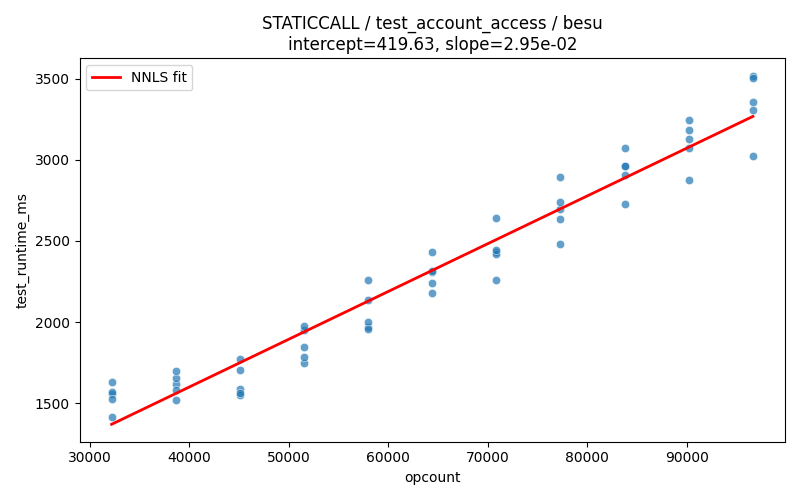

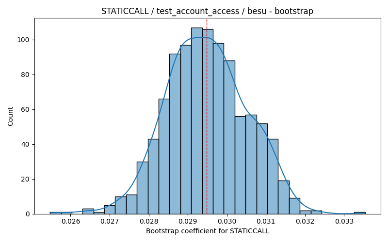

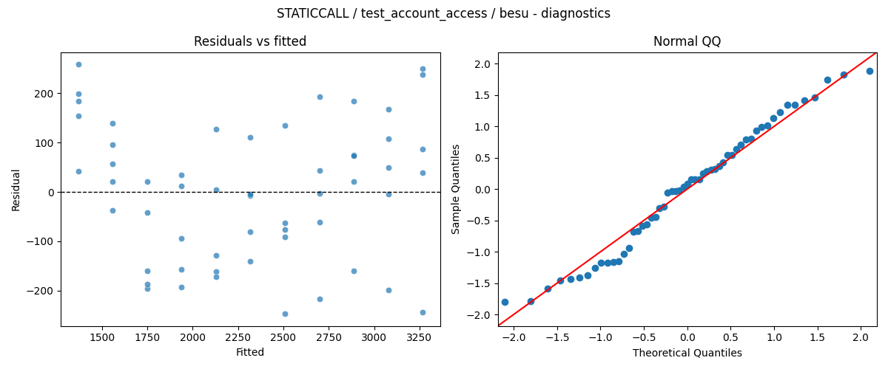

</details>

<details><summary>erigon — NNLS regression summary</summary>

```
==============================================================================
                           NNLS Regression Results                            
==============================================================================
Dep. Variable:          test_runtime_ms              R-squared:          0.872
Model:                  NNLS                    Adj. R-squared:          0.865
No. Observations:       22                                RMSE:         682.40
Df Residuals:           20                                 MAE:         590.45
Df Model:               1      
==============================================================================
                      coef     std err     P-value      [0.025      0.975]
------------------------------------------------------------------------------
         const   1451.7576    555.7359       0.001    504.4683   2651.3127
       opcount      0.0873      0.0073       0.001      0.0713      0.0999
==============================================================================
Notes: Non-negative least squares with bootstrap inference (1000 iterations)
==============================================================================
```

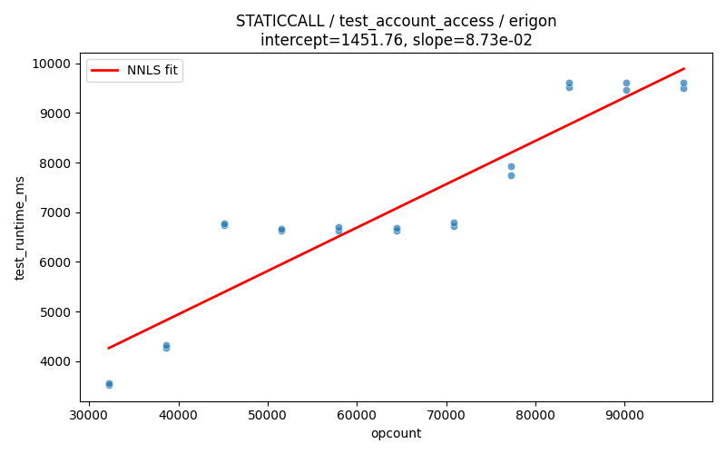

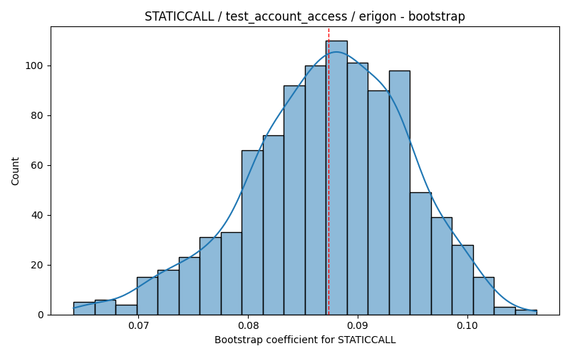

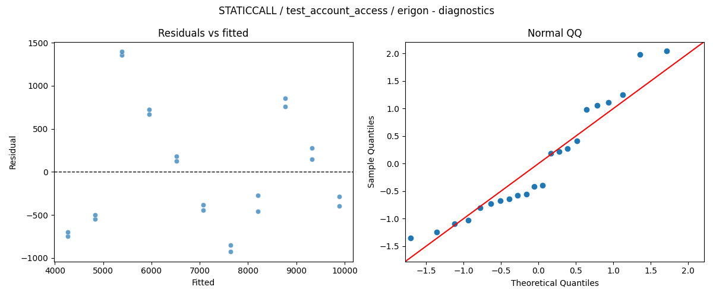

</details>

<details><summary>geth — NNLS regression summary</summary>

```
==============================================================================
                           NNLS Regression Results                            
==============================================================================
Dep. Variable:          test_runtime_ms              R-squared:          0.775
Model:                  NNLS                    Adj. R-squared:          0.750
No. Observations:       11                                RMSE:         242.74
Df Residuals:           9                                  MAE:         190.78
Df Model:               1      
==============================================================================
                      coef     std err     P-value      [0.025      0.975]
------------------------------------------------------------------------------
         const   1282.3933    385.7497       0.001    554.9597   1898.5453
       opcount      0.0221      0.0055       0.001      0.0137      0.0335
==============================================================================
Notes: Non-negative least squares with bootstrap inference (1000 iterations)
==============================================================================
```

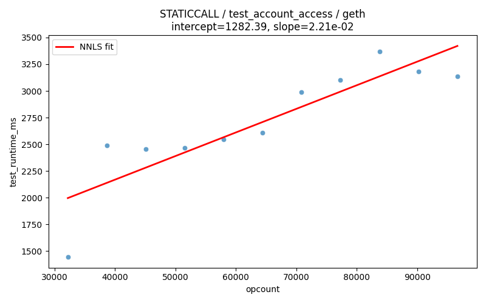

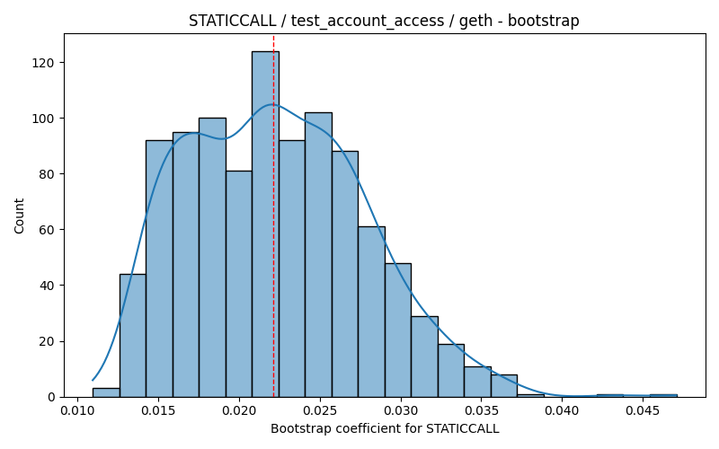

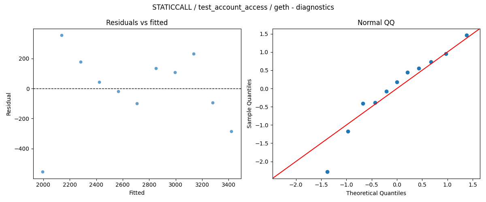

</details>

<details><summary>nethermind — NNLS regression summary</summary>

```
==============================================================================
                           NNLS Regression Results                            
==============================================================================
Dep. Variable:          test_runtime_ms              R-squared:          0.685
Model:                  NNLS                    Adj. R-squared:          0.675
No. Observations:       33                                RMSE:         324.12
Df Residuals:           31                                 MAE:         263.16
Df Model:               1      
==============================================================================
                      coef     std err     P-value      [0.025      0.975]
------------------------------------------------------------------------------
         const    906.9035    207.9978       0.001    508.3177   1288.9155
       opcount      0.0235      0.0030       0.001      0.0178      0.0295
==============================================================================
Notes: Non-negative least squares with bootstrap inference (1000 iterations)
==============================================================================
```

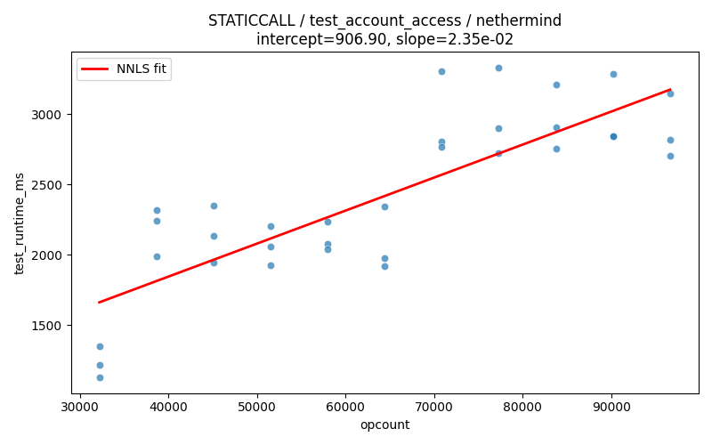

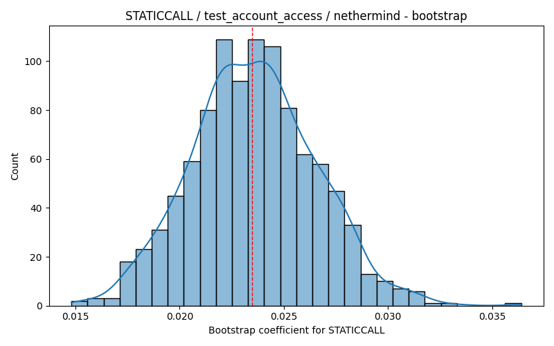

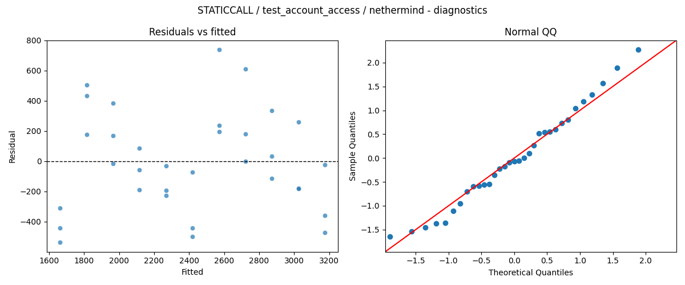

</details>

<details><summary>reth — NNLS regression summary</summary>

```
==============================================================================
                           NNLS Regression Results                            
==============================================================================
Dep. Variable:          test_runtime_ms              R-squared:          0.905
Model:                  NNLS                    Adj. R-squared:          0.903
No. Observations:       77                                RMSE:         229.79
Df Residuals:           75                                 MAE:         145.44
Df Model:               1      
==============================================================================
                      coef     std err     P-value      [0.025      0.975]
------------------------------------------------------------------------------
         const    249.1335    102.7282       0.006     33.1221    447.4027
       opcount      0.0347      0.0013       0.001      0.0321      0.0374
==============================================================================
Notes: Non-negative least squares with bootstrap inference (1000 iterations)
==============================================================================
```

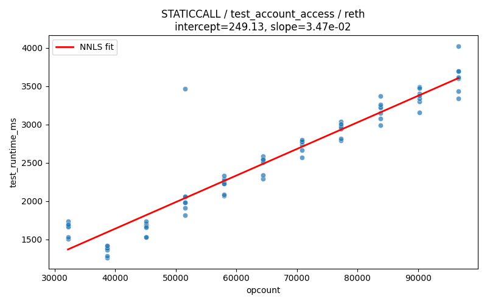

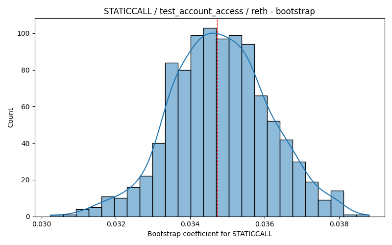

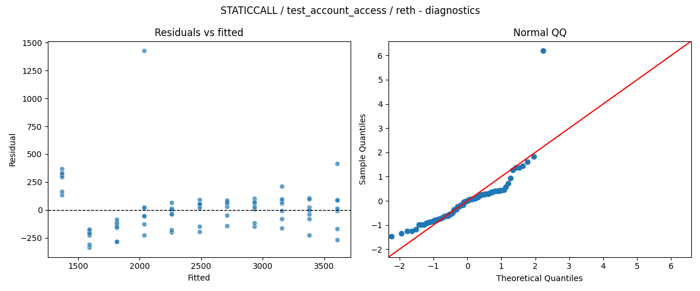

</details>

### test_account_access — combo `STATICCALL_AccountMode.EXISTING_EOA`

| client | nobs | R² | target_coef (ms) | p-value | 95% CI |
| --- | --- | --- | --- | --- | --- |
| `besu` | 55 | 0.8422 | 0.01102 | 1.00e-03 | [0.009426, 0.01264] |
| `erigon` | 22 | 0.9991 | 0.01031 | 1.00e-03 | [0.01018, 0.01043] |
| `geth` | 11 | 0.9574 | 0.01602 | 1.00e-03 | [0.0135, 0.01861] |
| `nethermind` | 33 | 0.8689 | 0.004442 | 1.00e-03 | [0.003963, 0.004886] |
| `reth` | 77 | 0.9701 | 0.001125 | 1.00e-03 | [0.001084, 0.001171] |

<details><summary>besu — NNLS regression summary</summary>

```
==============================================================================
                           NNLS Regression Results                            
==============================================================================
Dep. Variable:          test_runtime_ms              R-squared:          0.842
Model:                  NNLS                    Adj. R-squared:          0.839
No. Observations:       55                                RMSE:         113.38
Df Residuals:           53                                 MAE:          91.67
Df Model:               1      
==============================================================================
                      coef     std err     P-value      [0.025      0.975]
------------------------------------------------------------------------------
         const    558.5332     70.2555       0.001    423.1103    688.9239
       opcount      0.0110      0.0008       0.001      0.0094      0.0126
==============================================================================
Notes: Non-negative least squares with bootstrap inference (1000 iterations)
==============================================================================
```

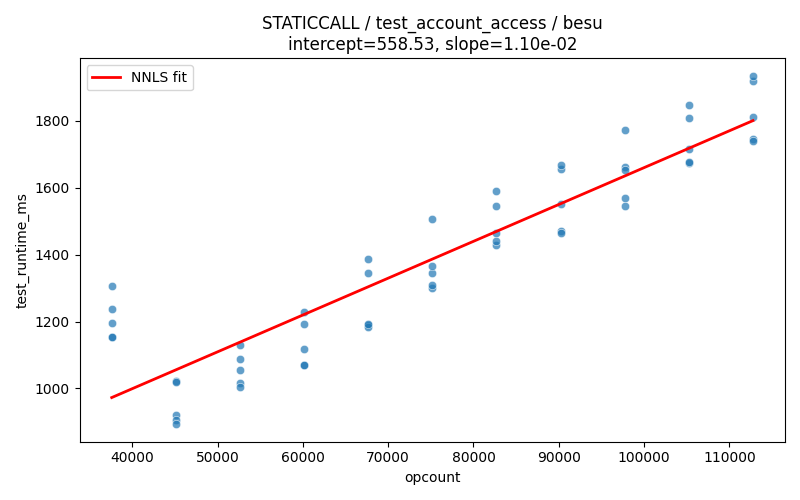

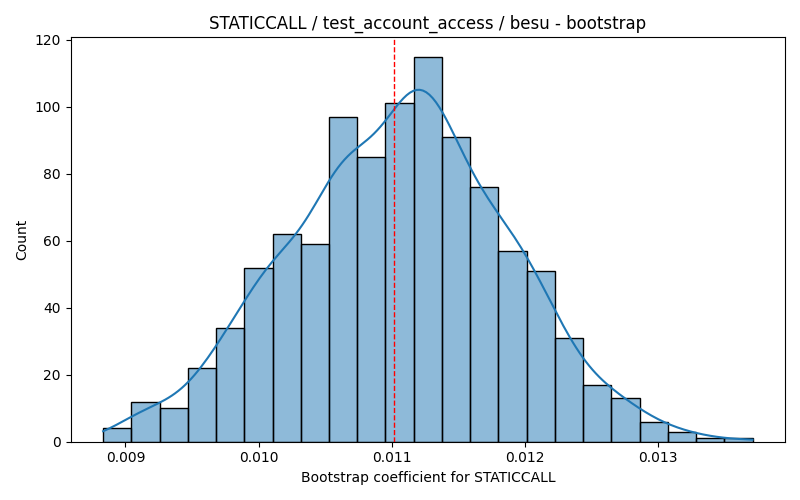

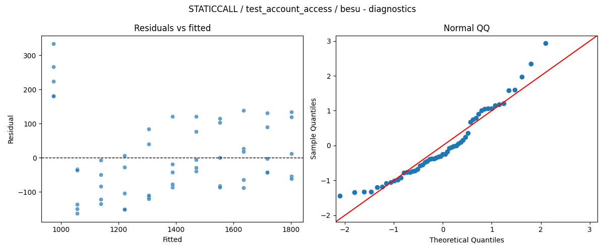

</details>

<details><summary>erigon — NNLS regression summary</summary>

```
==============================================================================
                           NNLS Regression Results                            
==============================================================================
Dep. Variable:          test_runtime_ms              R-squared:          0.999
Model:                  NNLS                    Adj. R-squared:          0.999
No. Observations:       22                                RMSE:           7.30
Df Residuals:           20                                 MAE:           5.56
Df Model:               1      
==============================================================================
                      coef     std err     P-value      [0.025      0.975]
------------------------------------------------------------------------------
         const     34.0713      4.6649       0.001     24.0687     42.7616
       opcount      0.0103      0.0001       0.001      0.0102      0.0104
==============================================================================
Notes: Non-negative least squares with bootstrap inference (1000 iterations)
==============================================================================
```


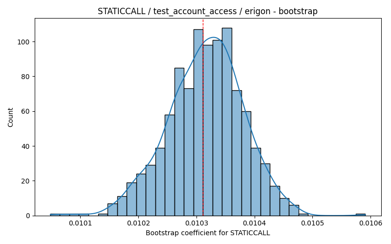

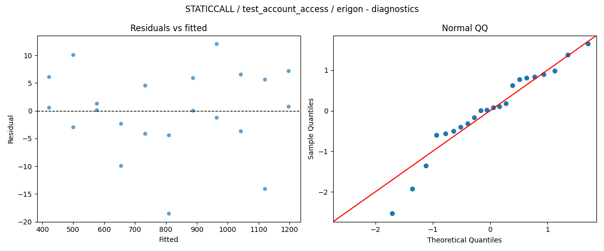

</details>

<details><summary>geth — NNLS regression summary</summary>

```
==============================================================================
                           NNLS Regression Results                            
==============================================================================
Dep. Variable:          test_runtime_ms              R-squared:          0.957
Model:                  NNLS                    Adj. R-squared:          0.953
No. Observations:       11                                RMSE:          80.27
Df Residuals:           9                                  MAE:          61.15
Df Model:               1      
==============================================================================
                      coef     std err     P-value      [0.025      0.975]
------------------------------------------------------------------------------
         const    243.2477     82.6941       0.001     87.8741    418.4564
       opcount      0.0160      0.0013       0.001      0.0135      0.0186
==============================================================================
Notes: Non-negative least squares with bootstrap inference (1000 iterations)
==============================================================================
```


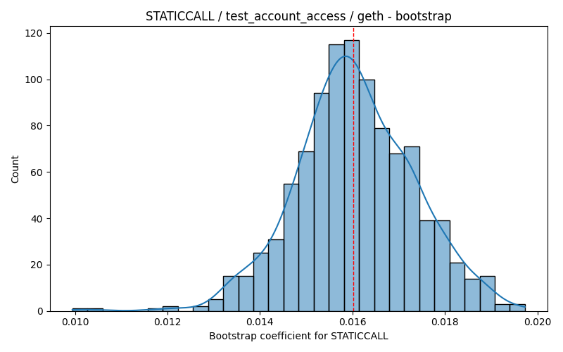

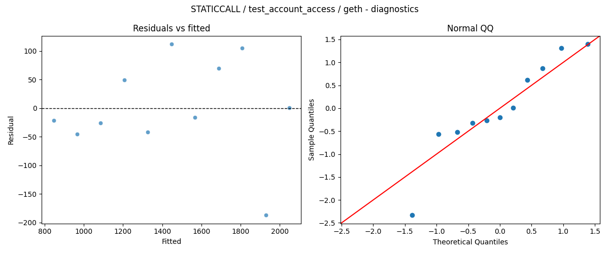

</details>

<details><summary>nethermind — NNLS regression summary</summary>

```
==============================================================================
                           NNLS Regression Results                            
==============================================================================
Dep. Variable:          test_runtime_ms              R-squared:          0.869
Model:                  NNLS                    Adj. R-squared:          0.865
No. Observations:       33                                RMSE:          41.01
Df Residuals:           31                                 MAE:          24.27
Df Model:               1      
==============================================================================
                      coef     std err     P-value      [0.025      0.975]
------------------------------------------------------------------------------
         const    119.2340     20.2984       0.001     83.6447    162.5727
       opcount      0.0044      0.0002       0.001      0.0040      0.0049
==============================================================================
Notes: Non-negative least squares with bootstrap inference (1000 iterations)
==============================================================================
```

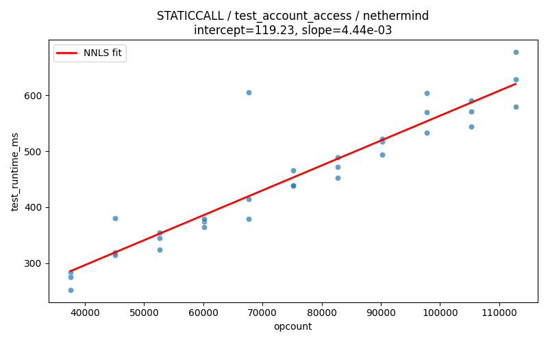

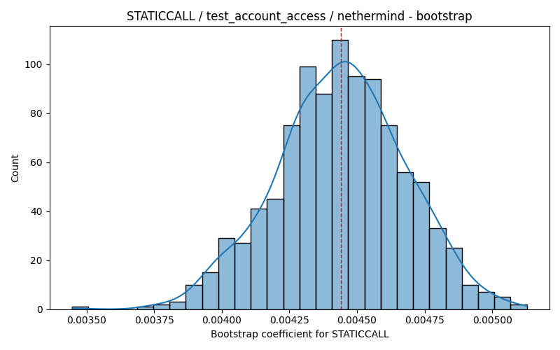

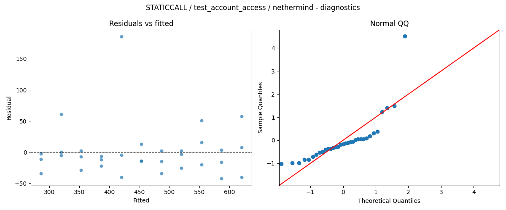

</details>

<details><summary>reth — NNLS regression summary</summary>

```
==============================================================================
                           NNLS Regression Results                            
==============================================================================
Dep. Variable:          test_runtime_ms              R-squared:          0.970
Model:                  NNLS                    Adj. R-squared:          0.970
No. Observations:       77                                RMSE:           4.69
Df Residuals:           75                                 MAE:           3.59
Df Model:               1      
==============================================================================
                      coef     std err     P-value      [0.025      0.975]
------------------------------------------------------------------------------
         const     33.0427      1.8421       0.001     29.4203     36.4952
       opcount      0.0011      0.0000       0.001      0.0011      0.0012
==============================================================================
Notes: Non-negative least squares with bootstrap inference (1000 iterations)
==============================================================================
```

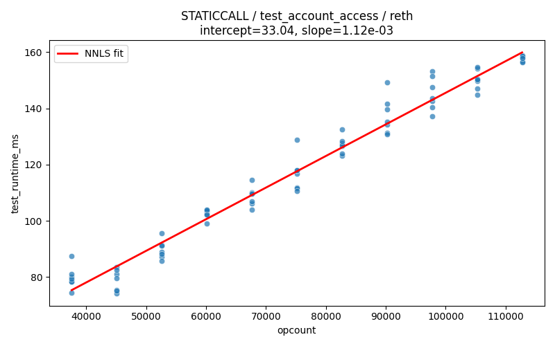

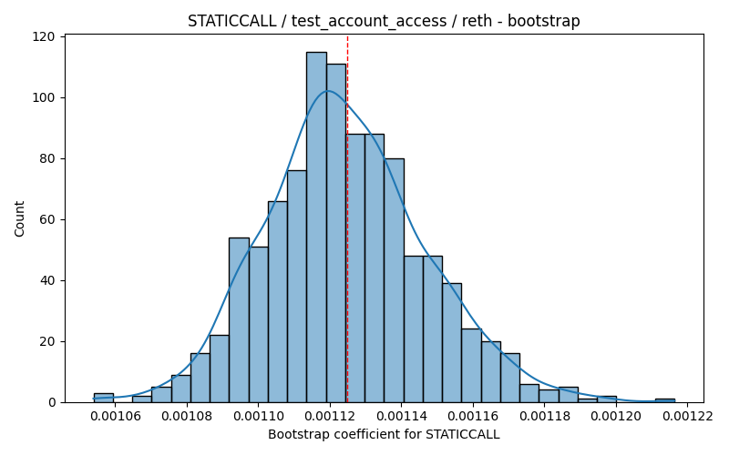

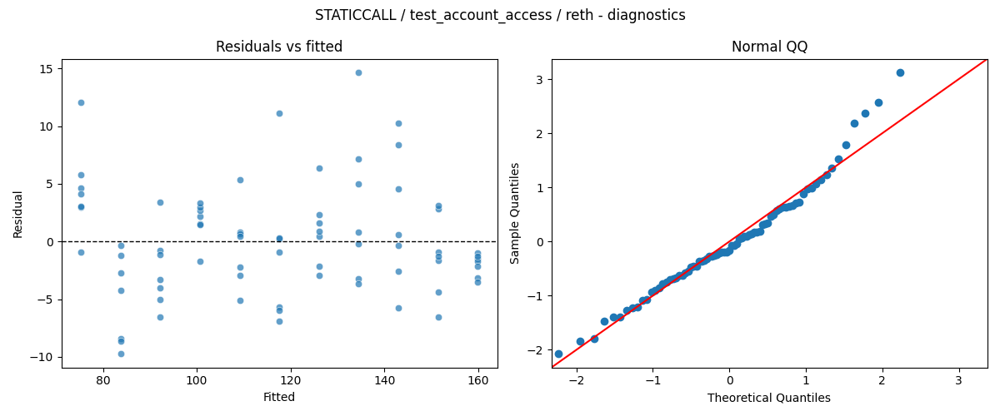

</details>

### test_account_access — combo `STATICCALL_AccountMode.NON_EXISTING_ACCOUNT`

| client | nobs | R² | target_coef (ms) | p-value | 95% CI |
| --- | --- | --- | --- | --- | --- |
| `besu` | 55 | 0.9305 | 0.01226 | 1.00e-03 | [0.01126, 0.01329] |
| `erigon` | 22 | 0.9976 | 0.01178 | 1.00e-03 | [0.01156, 0.01187] |
| `geth` | 11 | 0.8725 | 0.02355 | 1.00e-03 | [0.01585, 0.02982] |
| `nethermind` | 33 | 0.9425 | 0.004601 | 1.00e-03 | [0.004126, 0.005018] |
| `reth` | 77 | 0.9746 | 0.0009855 | 1.00e-03 | [0.0009504, 0.001024] |

<details><summary>besu — NNLS regression summary</summary>

```
==============================================================================
                           NNLS Regression Results                            
==============================================================================
Dep. Variable:          test_runtime_ms              R-squared:          0.930
Model:                  NNLS                    Adj. R-squared:          0.929
No. Observations:       55                                RMSE:          79.69
Df Residuals:           53                                 MAE:          66.86
Df Model:               1      
==============================================================================
                      coef     std err     P-value      [0.025      0.975]
------------------------------------------------------------------------------
         const    424.7585     42.3300       0.001    341.1842    500.3975
       opcount      0.0123      0.0005       0.001      0.0113      0.0133
==============================================================================
Notes: Non-negative least squares with bootstrap inference (1000 iterations)
==============================================================================
```

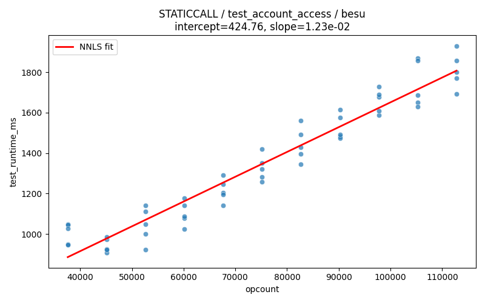

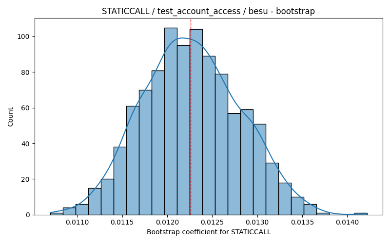

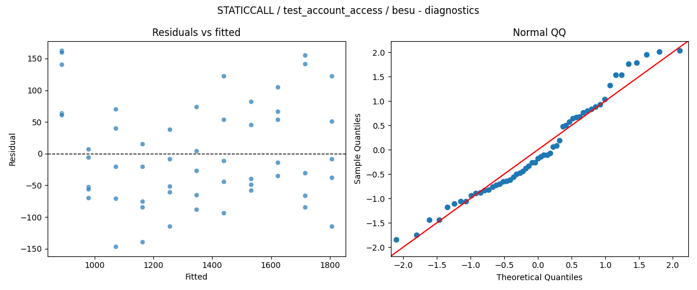

</details>

<details><summary>erigon — NNLS regression summary</summary>

```
==============================================================================
                           NNLS Regression Results                            
==============================================================================
Dep. Variable:          test_runtime_ms              R-squared:          0.998
Model:                  NNLS                    Adj. R-squared:          0.997
No. Observations:       22                                RMSE:          13.82
Df Residuals:           20                                 MAE:           9.84
Df Model:               1      
==============================================================================
                      coef     std err     P-value      [0.025      0.975]
------------------------------------------------------------------------------
         const      0.0000      3.0155       1.000      0.0000     11.2769
       opcount      0.0118      0.0001       0.001      0.0116      0.0119
==============================================================================
Notes: Non-negative least squares with bootstrap inference (1000 iterations)
==============================================================================
```


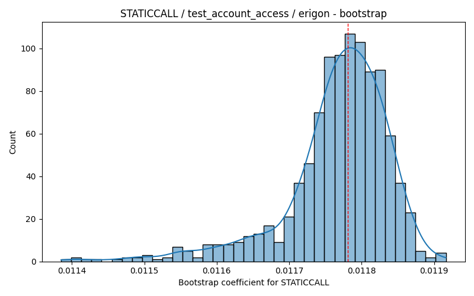

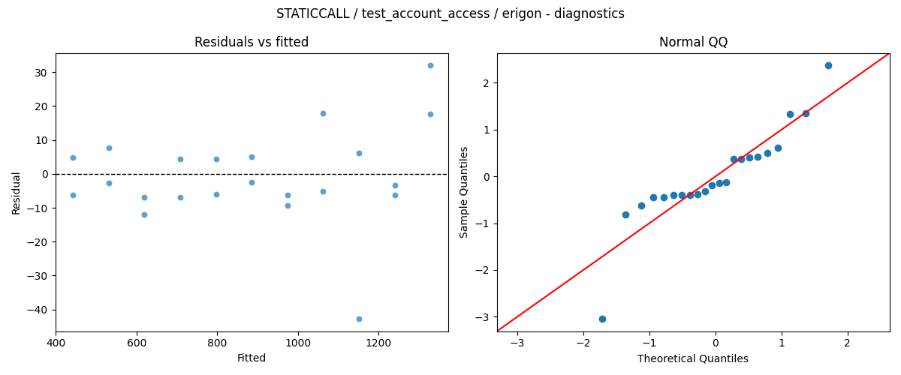

</details>

<details><summary>geth — NNLS regression summary</summary>

```
==============================================================================
                           NNLS Regression Results                            
==============================================================================
Dep. Variable:          test_runtime_ms              R-squared:          0.872
Model:                  NNLS                    Adj. R-squared:          0.858
No. Observations:       11                                RMSE:         214.11
Df Residuals:           9                                  MAE:         178.00
Df Model:               1      
==============================================================================
                      coef     std err     P-value      [0.025      0.975]
------------------------------------------------------------------------------
         const   1168.1344    309.8465       0.001    695.6480   1846.2143
       opcount      0.0236      0.0036       0.001      0.0159      0.0298
==============================================================================
Notes: Non-negative least squares with bootstrap inference (1000 iterations)
==============================================================================
```

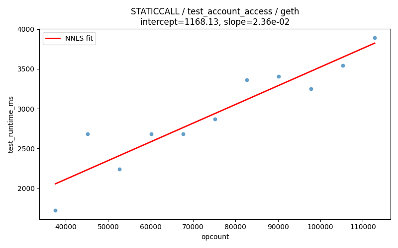

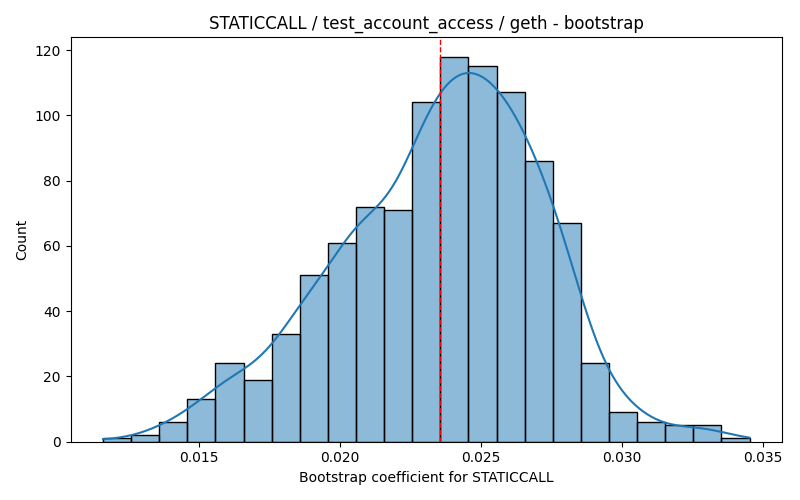

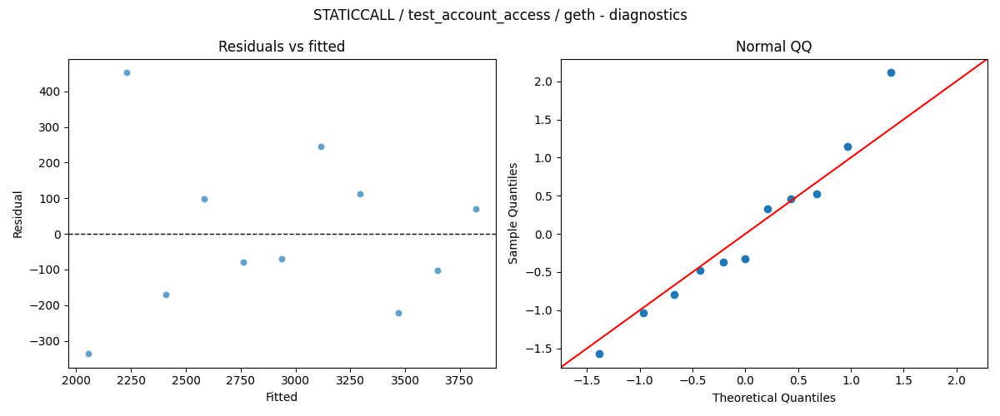

</details>

<details><summary>nethermind — NNLS regression summary</summary>

```
==============================================================================
                           NNLS Regression Results                            
==============================================================================
Dep. Variable:          test_runtime_ms              R-squared:          0.942
Model:                  NNLS                    Adj. R-squared:          0.941
No. Observations:       33                                RMSE:          27.02
Df Residuals:           31                                 MAE:          21.31
Df Model:               1      
==============================================================================
                      coef     std err     P-value      [0.025      0.975]
------------------------------------------------------------------------------
         const    116.1522     19.3703       0.001     81.6189    156.7582
       opcount      0.0046      0.0002       0.001      0.0041      0.0050
==============================================================================
Notes: Non-negative least squares with bootstrap inference (1000 iterations)
==============================================================================
```

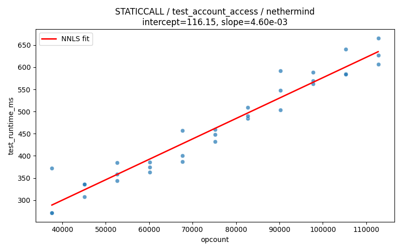

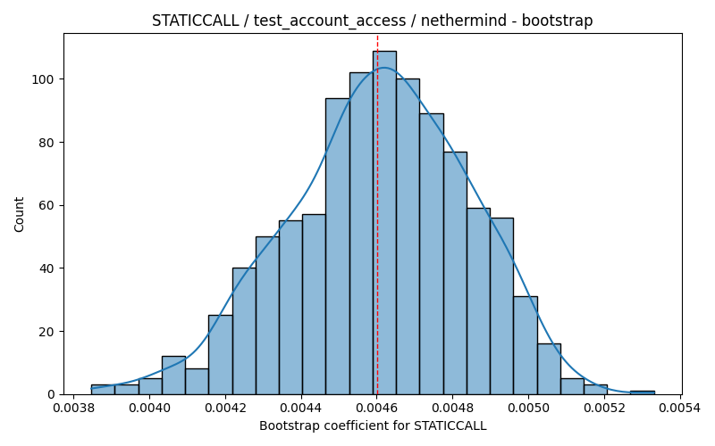

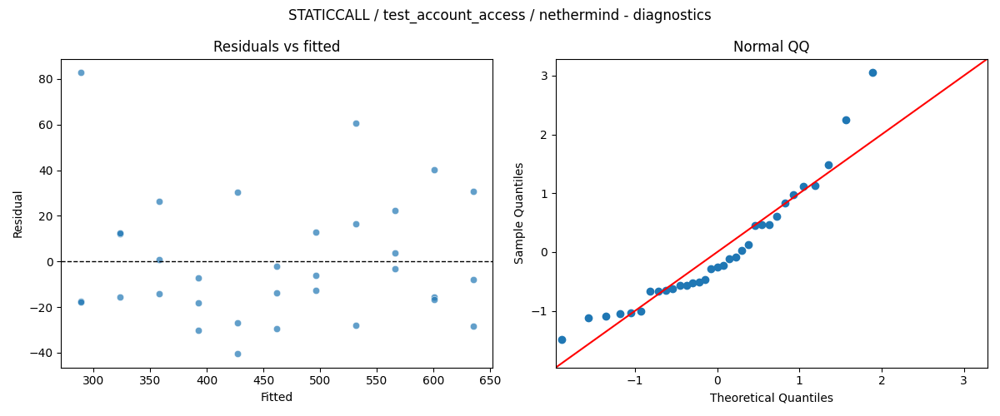

</details>

<details><summary>reth — NNLS regression summary</summary>

```
==============================================================================
                           NNLS Regression Results                            
==============================================================================
Dep. Variable:          test_runtime_ms              R-squared:          0.975
Model:                  NNLS                    Adj. R-squared:          0.974
No. Observations:       77                                RMSE:           3.78
Df Residuals:           75                                 MAE:           3.14
Df Model:               1      
==============================================================================
                      coef     std err     P-value      [0.025      0.975]
------------------------------------------------------------------------------
         const     31.7617      1.4503       0.001     28.9861     34.6324
       opcount      0.0010      0.0000       0.001      0.0010      0.0010
==============================================================================
Notes: Non-negative least squares with bootstrap inference (1000 iterations)
==============================================================================
```

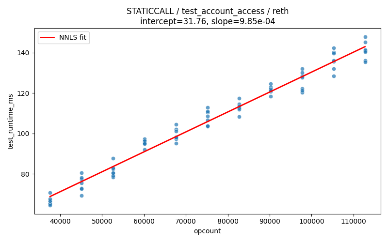

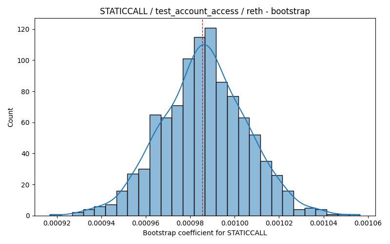

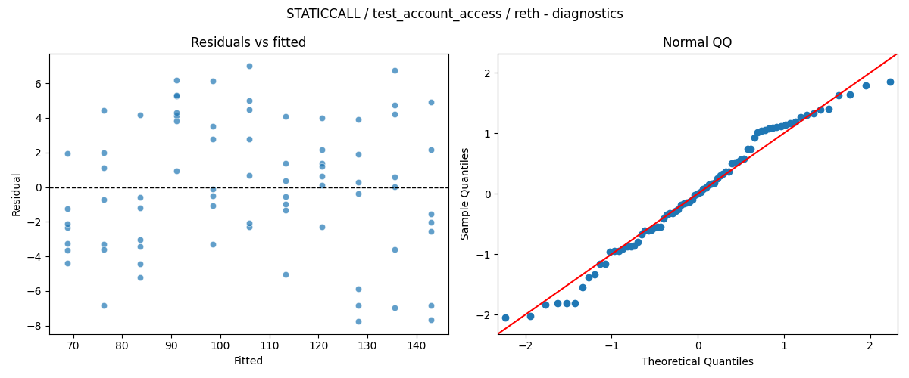

</details>

### test_ext_account_query_warm — combo `STATICCALL`

| client | nobs | R² | target_coef (ms) | p-value | 95% CI |
| --- | --- | --- | --- | --- | --- |
| `besu` | 55 | 0.837 | 0.0006584 | 1.00e-03 | [0.0005766, 0.0007411] |
| `erigon` | 22 | 0.9821 | 0.0005637 | 1.00e-03 | [0.0005277, 0.0005946] |
| `geth` | 11 | 0.9891 | 0.0002193 | 1.00e-03 | [0.0002076, 0.0002336] |
| `nethermind` | 33 | 0.8284 | 0.0006986 | 1.00e-03 | [0.0005713, 0.0008113] |
| `reth` | 77 | 0.926 | 5.024e-05 | 1.00e-03 | [4.687e-05, 5.39e-05] |

<details><summary>besu — NNLS regression summary</summary>

```
==============================================================================
                           NNLS Regression Results                            
==============================================================================
Dep. Variable:          test_runtime_ms              R-squared:          0.837
Model:                  NNLS                    Adj. R-squared:          0.834
No. Observations:       55                                RMSE:         150.37
Df Residuals:           53                                 MAE:         124.02
Df Model:               1      
==============================================================================
                      coef     std err     P-value      [0.025      0.975]
------------------------------------------------------------------------------
         const    572.1409     66.7008       0.001    444.4960    706.2872
       opcount      0.0007      0.0000       0.001      0.0006      0.0007
==============================================================================
Notes: Non-negative least squares with bootstrap inference (1000 iterations)
==============================================================================
```

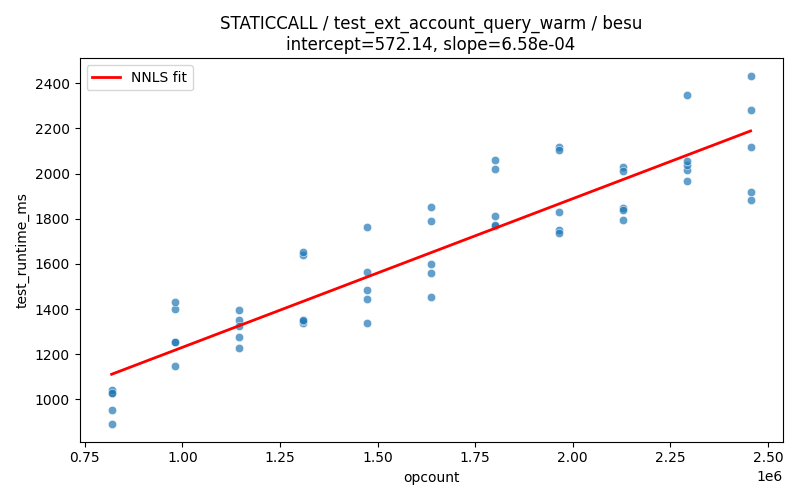

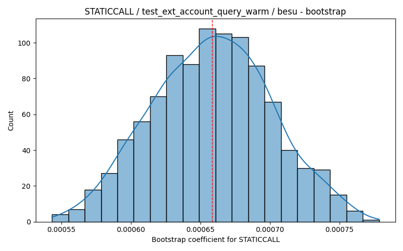

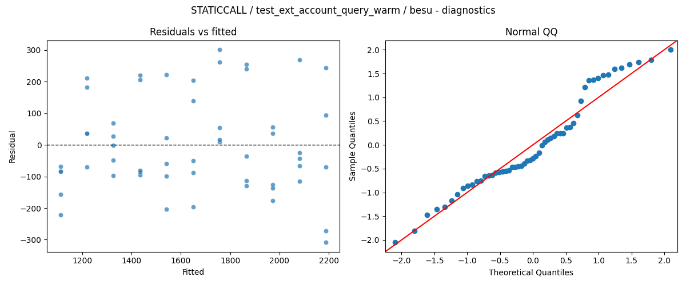

</details>

<details><summary>erigon — NNLS regression summary</summary>

```
==============================================================================
                           NNLS Regression Results                            
==============================================================================
Dep. Variable:          test_runtime_ms              R-squared:          0.982
Model:                  NNLS                    Adj. R-squared:          0.981
No. Observations:       22                                RMSE:          39.43
Df Residuals:           20                                 MAE:          32.01
Df Model:               1      
==============================================================================
                      coef     std err     P-value      [0.025      0.975]
------------------------------------------------------------------------------
         const     79.0124     28.7773       0.001     26.8215    141.4240
       opcount      0.0006      0.0000       0.001      0.0005      0.0006
==============================================================================
Notes: Non-negative least squares with bootstrap inference (1000 iterations)
==============================================================================
```

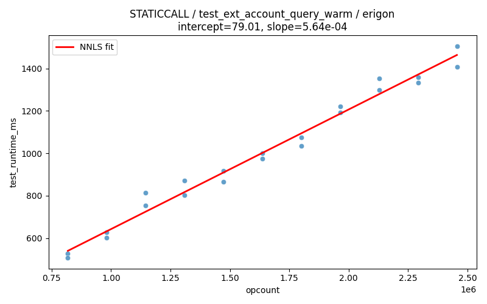

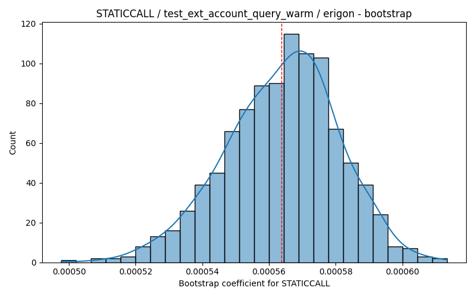

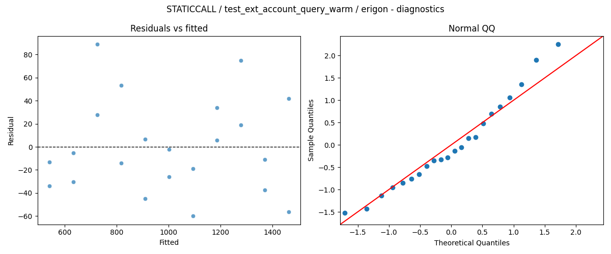

</details>

<details><summary>geth — NNLS regression summary</summary>

```
==============================================================================
                           NNLS Regression Results                            
==============================================================================
Dep. Variable:          test_runtime_ms              R-squared:          0.989
Model:                  NNLS                    Adj. R-squared:          0.988
No. Observations:       11                                RMSE:          11.89
Df Residuals:           9                                  MAE:           9.16
Df Model:               1      
==============================================================================
                      coef     std err     P-value      [0.025      0.975]
------------------------------------------------------------------------------
         const     29.2344     12.3782       0.037      0.0000     51.5006
       opcount      0.0002      0.0000       0.001      0.0002      0.0002
==============================================================================
Notes: Non-negative least squares with bootstrap inference (1000 iterations)
==============================================================================
```

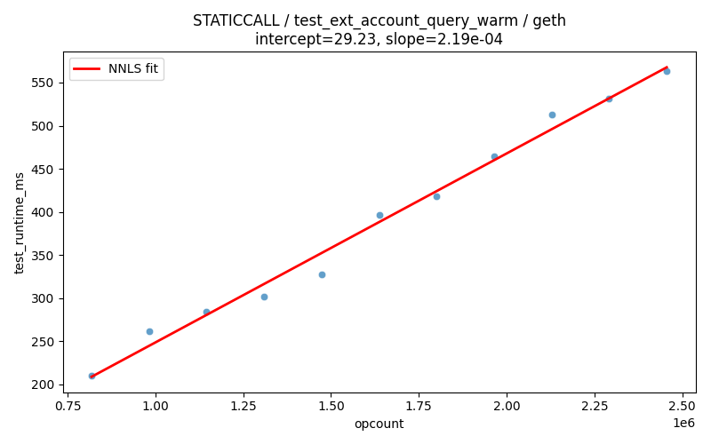

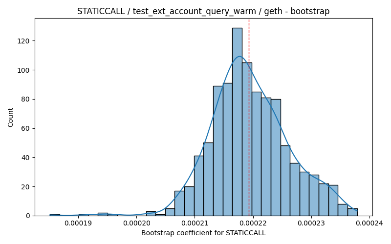

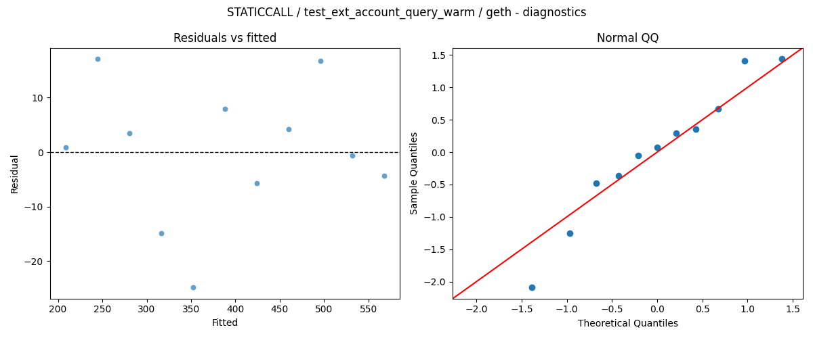

</details>

<details><summary>nethermind — NNLS regression summary</summary>

```
==============================================================================
                           NNLS Regression Results                            
==============================================================================
Dep. Variable:          test_runtime_ms              R-squared:          0.828
Model:                  NNLS                    Adj. R-squared:          0.823
No. Observations:       33                                RMSE:         164.60
Df Residuals:           31                                 MAE:         110.88
Df Model:               1      
==============================================================================
                      coef     std err     P-value      [0.025      0.975]
------------------------------------------------------------------------------
         const    344.5891     82.4208       0.001    196.9606    516.8901
       opcount      0.0007      0.0001       0.001      0.0006      0.0008
==============================================================================
Notes: Non-negative least squares with bootstrap inference (1000 iterations)
==============================================================================
```

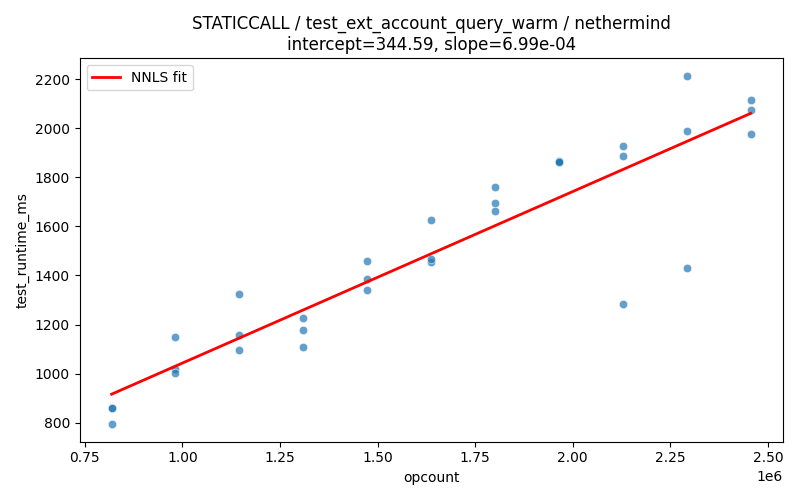

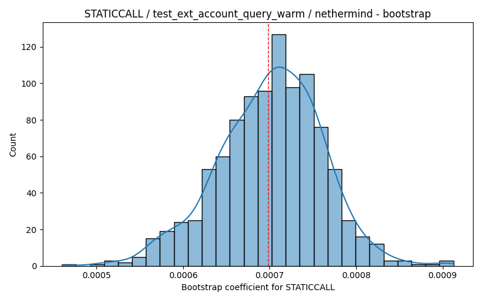

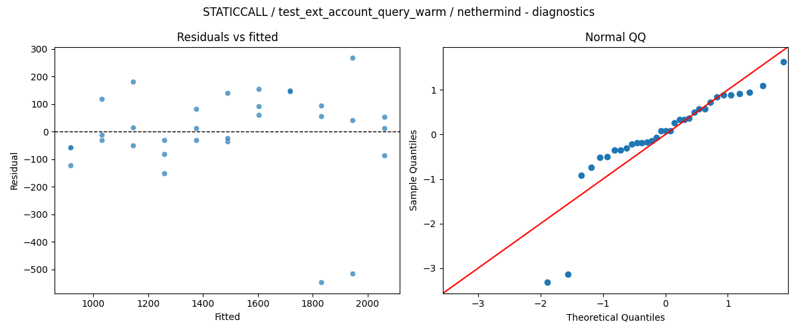

</details>

<details><summary>reth — NNLS regression summary</summary>

```
==============================================================================
                           NNLS Regression Results                            
==============================================================================
Dep. Variable:          test_runtime_ms              R-squared:          0.926
Model:                  NNLS                    Adj. R-squared:          0.925
No. Observations:       77                                RMSE:           7.36
Df Residuals:           75                                 MAE:           5.95
Df Model:               1      
==============================================================================
                      coef     std err     P-value      [0.025      0.975]
------------------------------------------------------------------------------
         const     13.8048      2.8549       0.001      7.8449     19.4557
       opcount      0.0001      0.0000       0.001      0.0000      0.0001
==============================================================================
Notes: Non-negative least squares with bootstrap inference (1000 iterations)
==============================================================================
```

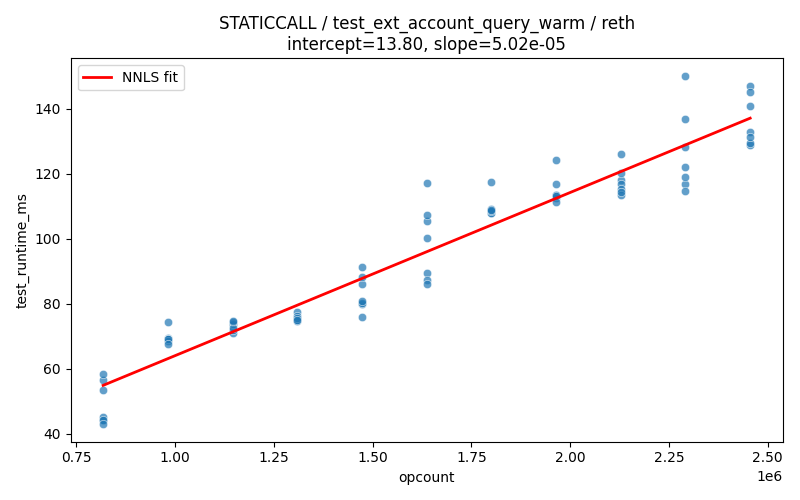

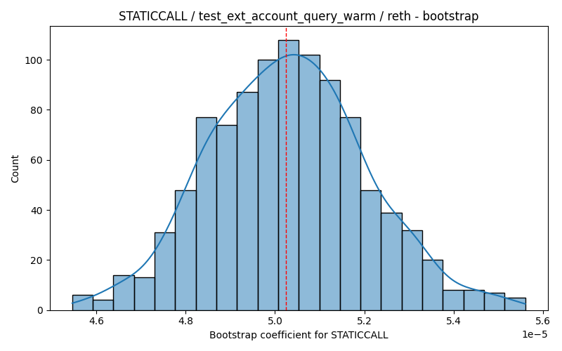

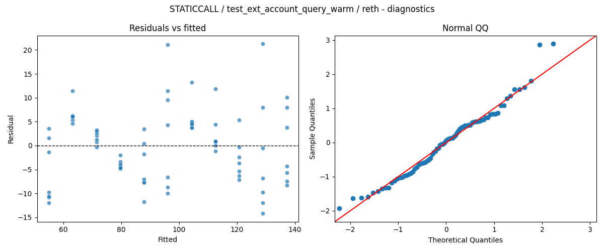

</details>
