# Glue opcodes report

Per-client NNLS fits of priced glue opcodes against their driver fixtures. Cycle-tier opcodes share one joint regression per client (shown once); pure-tier and mixed-tier opcodes each get a single-feature fit. Mixed-tier fits pre-adjust the LHS by subtracting the contribution of every priced upstream partner selected by the detector (pure ∪ cycle for `mixed_a`, plus `mixed_a` for `mixed_b`).

**Contents:** [besu](#besu) · [erigon](#erigon) · [geth](#geth) · [nethermind](#nethermind) · [reth](#reth)

## besu

| glue_opcode | nobs | glue_runtime_ms | p_value | rsquared |
| --- | --- | --- | --- | --- |
| `ISZERO` | 517 | 4.949e-06 | 1.00e-03 | 0.8503 |
| `JUMPDEST` | 517 | 2.677e-06 | 1.00e-03 | 0.8672 |
| `SWAP` | 8272 | 3.707e-06 | 1.00e-03 | 0.8341 |
| `CALLDATASIZE` | 30690 | 4.356e-06 | 1.00e-03 | 0.9232 |
| `DUP` | 30690 | 2.608e-06 | 1.00e-03 | 0.9232 |
| `GAS` | 30690 | 3.812e-06 | 1.00e-03 | 0.9232 |
| `MLOAD` | 30690 | 1.097e-05 | 1.00e-03 | 0.9232 |
| `PUSH` | 30690 | 3.16e-06 | 1.00e-03 | 0.9232 |
| `PUSH0` | 30690 | 2.607e-06 | 1.00e-03 | 0.9232 |
| `STATICCALL` | 30690 | 0.0008405 | 1.00e-03 | 0.9232 |
| `ADD` | 517 | 1.123e-05 | 1.00e-03 | 0.8322 |
| `AND` | 517 | 9.976e-06 | 1.00e-03 | 0.8624 |
| `CALLDATACOPY` | 12408 | 2.118e-05 | 1.00e-03 | 0.814 |
| `CALLDATALOAD` | 2068 | 6.597e-06 | 5.20e-02 | 0.001031 |
| `DIV` | 517 | 1.752e-05 | 1.00e-03 | 0.8562 |
| `EXP` | 517 | 0.001211 | 1.00e-03 | 0.8035 |
| `GT` | 517 | 3.247e-05 | 1.00e-03 | 0.8823 |
| `JUMPI` | 517 | 9.686e-06 | 1.00e-03 | 0.8452 |
| `LT` | 517 | 3.342e-05 | 1.00e-03 | 0.889 |
| `MSTORE` | 2585 | 1.8e-05 | 1.00e-03 | 0.8458 |
| `MSTORE8` | 2585 | 1.297e-05 | 1.00e-03 | 0.8208 |
| `MUL` | 517 | 1.276e-05 | 1.00e-03 | 0.5987 |
| `PC` | 517 | 4.32e-06 | 1.00e-03 | 0.8527 |
| `RETURNDATASIZE` | 2068 | 7.124e-06 | 1.00e-03 | 0.8439 |
| `SELFBALANCE` | 423 | 7.732e-06 | 1.00e-03 | 0.451 |
| `SUB` | 517 | 1.169e-05 | 1.00e-03 | 0.8168 |
| `JUMP` | 517 | 3.668e-05 | 1.00e-03 | 0.4317 |
| `KECCAK256` | 8272 | 5.167e-05 | 1.00e-03 | 0.2761 |

### Cycle glue — joint fit · besu

<details><summary>Joint NNLS regression summary</summary>

```
==============================================================================
                           NNLS Regression Results                            
==============================================================================
Dep. Variable:          test_runtime_ms              R-squared:          0.923
Model:                  NNLS                    Adj. R-squared:          0.923
No. Observations:       30690                             RMSE:          42.95
Df Residuals:           30682                              MAE:          32.81
Df Model:               7      
==============================================================================
                      coef     std err     P-value      [0.025      0.975]
------------------------------------------------------------------------------
         const     76.7947      0.8633       0.001     75.0863     78.3429
  CALLDATASIZE      0.0000      0.0000       0.001      0.0000      0.0000
           DUP      0.0000      0.0000       0.001      0.0000      0.0000
           GAS      0.0000      0.0000       0.001      0.0000      0.0000
         MLOAD      0.0000      0.0000       0.001      0.0000      0.0000
          PUSH      0.0000      0.0000       0.001      0.0000      0.0000
         PUSH0      0.0000      0.0000       0.001      0.0000      0.0000
    STATICCALL      0.0008      0.0000       0.001      0.0008      0.0009
==============================================================================
Notes: Non-negative least squares with bootstrap inference (1000 iterations)
==============================================================================
```

</details>

<details><summary><code>CALLDATASIZE</code> · nobs=30690 · runtime_ms=4.356e-06 · p=1.00e-03 · R²=0.9232</summary>


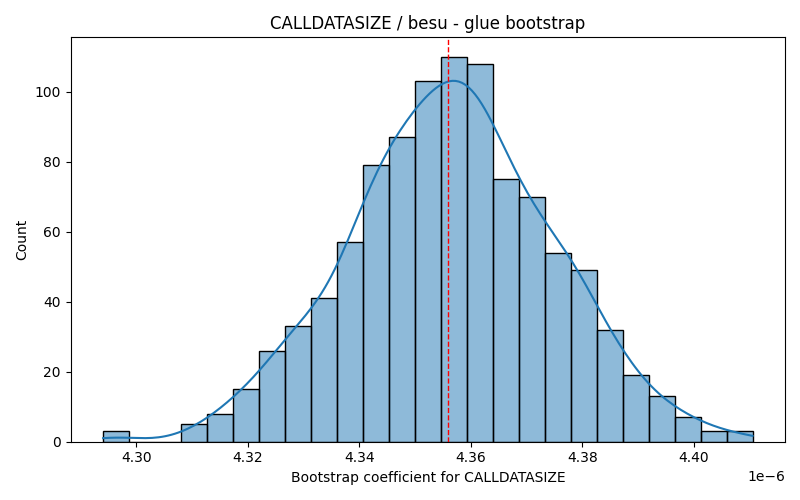

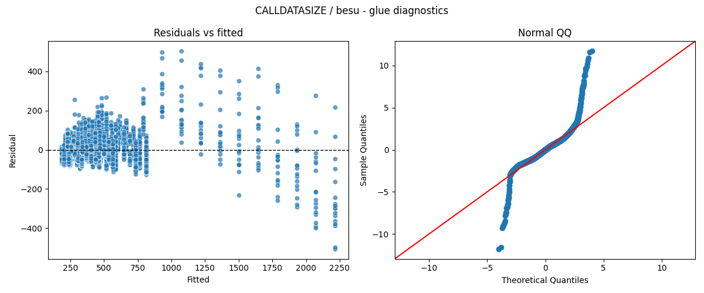

</details>

<details><summary><code>DUP</code> · nobs=30690 · runtime_ms=2.608e-06 · p=1.00e-03 · R²=0.9232</summary>


</details>

<details><summary><code>GAS</code> · nobs=30690 · runtime_ms=3.812e-06 · p=1.00e-03 · R²=0.9232</summary>

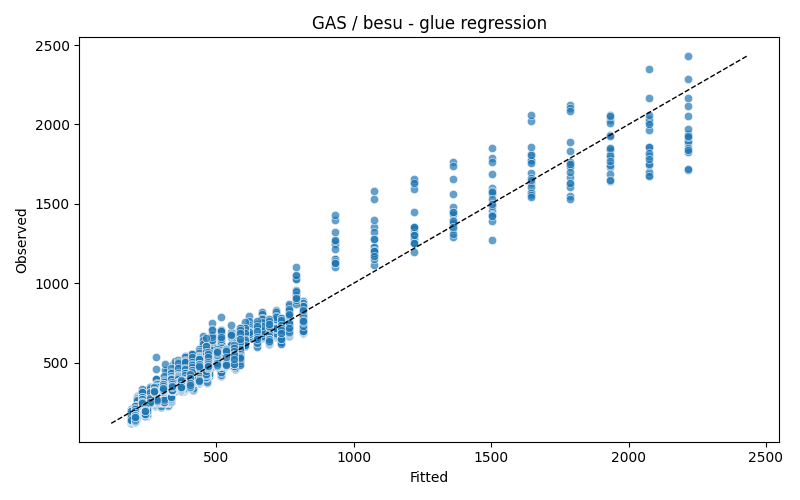

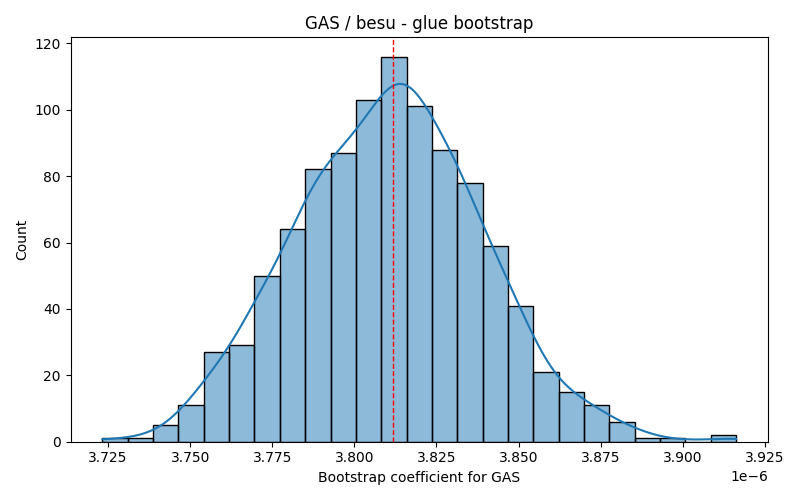


</details>

<details><summary><code>MLOAD</code> · nobs=30690 · runtime_ms=1.097e-05 · p=1.00e-03 · R²=0.9232</summary>


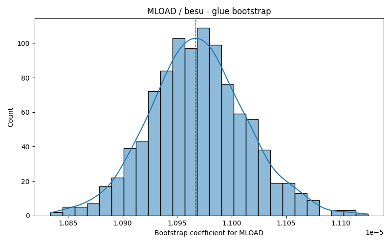


</details>

<details><summary><code>PUSH</code> · nobs=30690 · runtime_ms=3.16e-06 · p=1.00e-03 · R²=0.9232</summary>


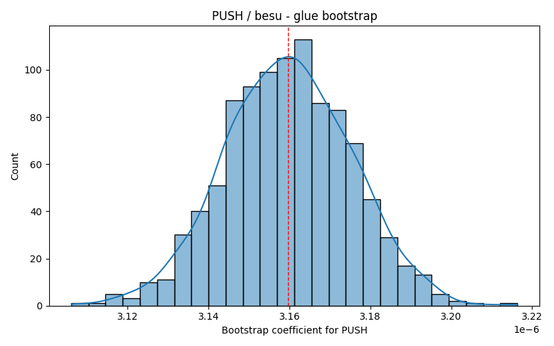


</details>

<details><summary><code>PUSH0</code> · nobs=30690 · runtime_ms=2.607e-06 · p=1.00e-03 · R²=0.9232</summary>

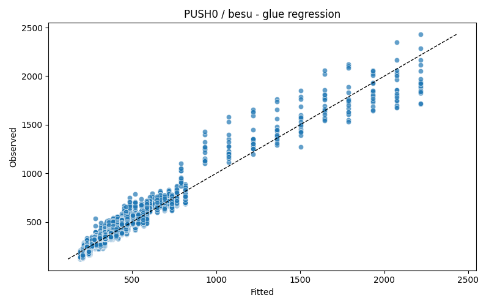

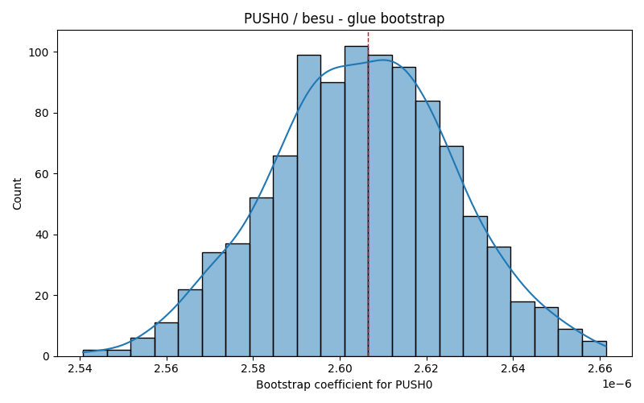


</details>

<details><summary><code>STATICCALL</code> · nobs=30690 · runtime_ms=0.0008405 · p=1.00e-03 · R²=0.9232</summary>

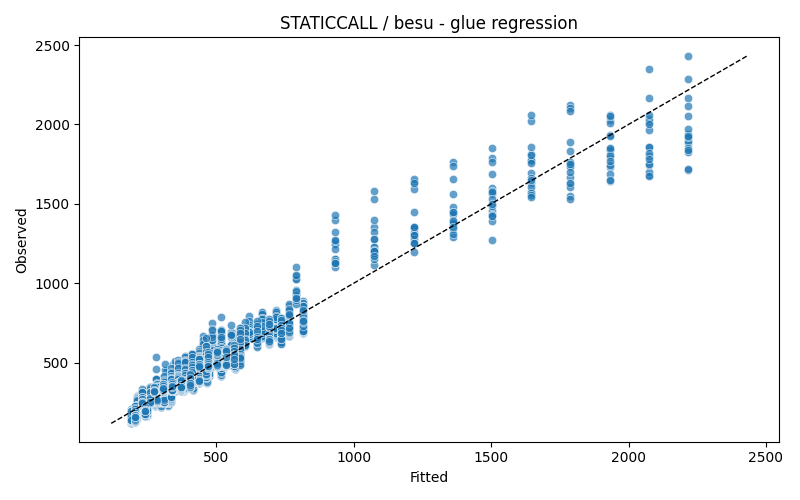

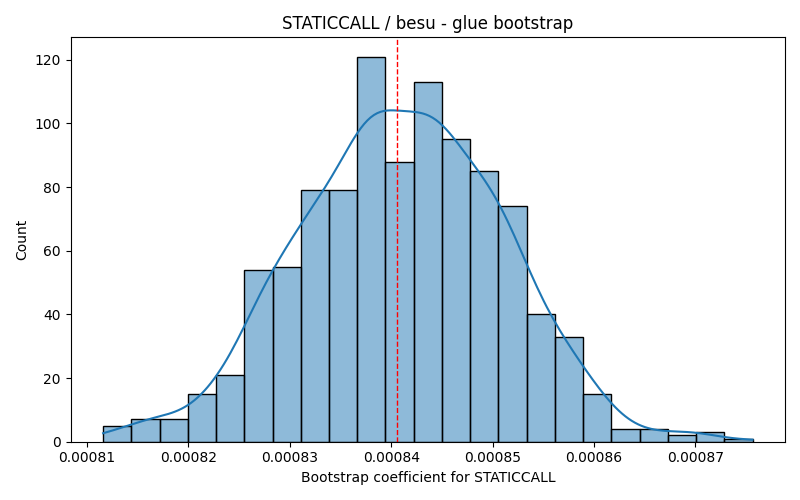

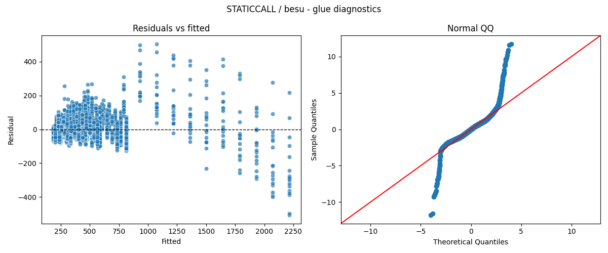

</details>

### Pure glue · besu

<details><summary><code>ISZERO</code> · nobs=517 · runtime_ms=4.949e-06 · p=1.00e-03 · R²=0.8503</summary>

```
==============================================================================
                           NNLS Regression Results                            
==============================================================================
Dep. Variable:          test_runtime_ms              R-squared:          0.850
Model:                  NNLS                    Adj. R-squared:          0.850
No. Observations:       517                               RMSE:          43.71
Df Residuals:           515                                MAE:          36.23
Df Model:               1      
==============================================================================
                      coef     std err     P-value      [0.025      0.975]
------------------------------------------------------------------------------
         const     76.2377      7.4063       0.001     60.9614     90.1720
        ISZERO      0.0000      0.0000       0.001      0.0000      0.0000
==============================================================================
Notes: Non-negative least squares with bootstrap inference (1000 iterations)
==============================================================================
```

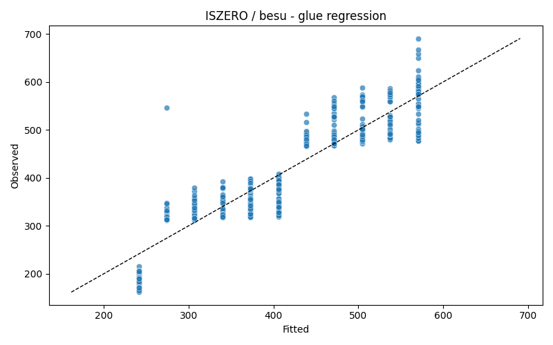

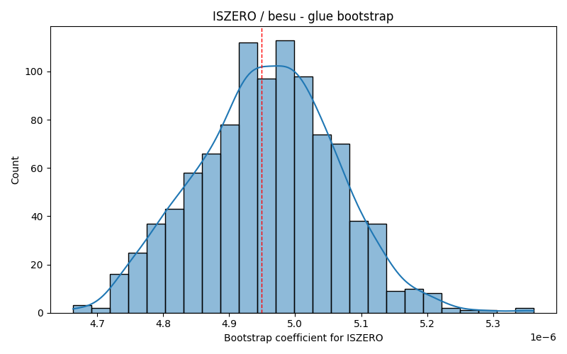

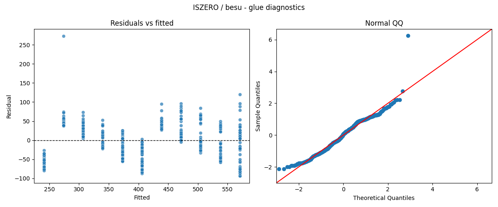

</details>

<details><summary><code>JUMPDEST</code> · nobs=517 · runtime_ms=2.677e-06 · p=1.00e-03 · R²=0.8672</summary>

```
==============================================================================
                           NNLS Regression Results                            
==============================================================================
Dep. Variable:          test_runtime_ms              R-squared:          0.867
Model:                  NNLS                    Adj. R-squared:          0.867
No. Observations:       517                               RMSE:          66.16
Df Residuals:           515                                MAE:          56.69
Df Model:               1      
==============================================================================
                      coef     std err     P-value      [0.025      0.975]
------------------------------------------------------------------------------
         const     79.2508     10.2552       0.001     60.4568    100.4381
      JUMPDEST      0.0000      0.0000       0.001      0.0000      0.0000
==============================================================================
Notes: Non-negative least squares with bootstrap inference (1000 iterations)
==============================================================================
```

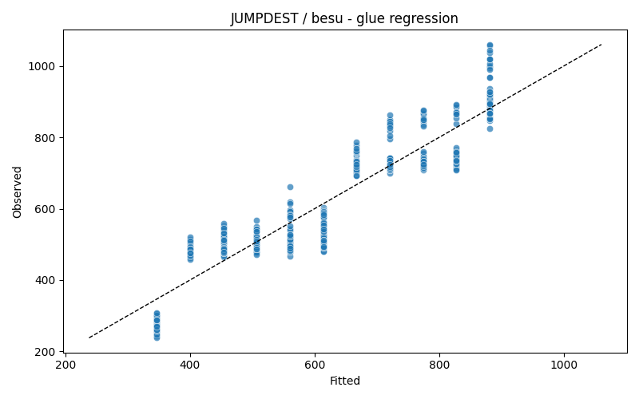

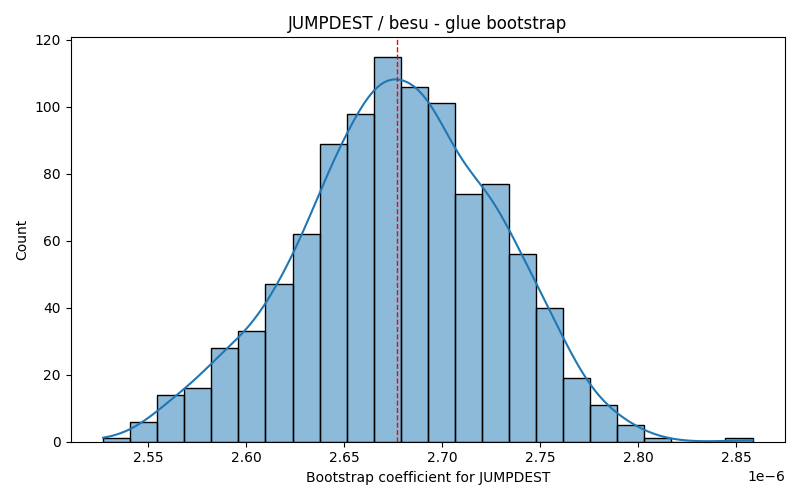

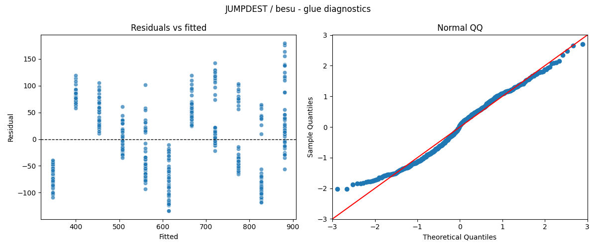

</details>

<details><summary><code>SWAP</code> · nobs=8272 · runtime_ms=3.707e-06 · p=1.00e-03 · R²=0.8341</summary>

```
==============================================================================
                           NNLS Regression Results                            
==============================================================================
Dep. Variable:          test_runtime_ms              R-squared:          0.834
Model:                  NNLS                    Adj. R-squared:          0.834
No. Observations:       8272                              RMSE:          34.81
Df Residuals:           8270                               MAE:          28.90
Df Model:               1      
==============================================================================
                      coef     std err     P-value      [0.025      0.975]
------------------------------------------------------------------------------
         const     69.7493      1.3543       0.001     66.9784     72.3720
          SWAP      0.0000      0.0000       0.001      0.0000      0.0000
==============================================================================
Notes: Non-negative least squares with bootstrap inference (1000 iterations)
==============================================================================
```

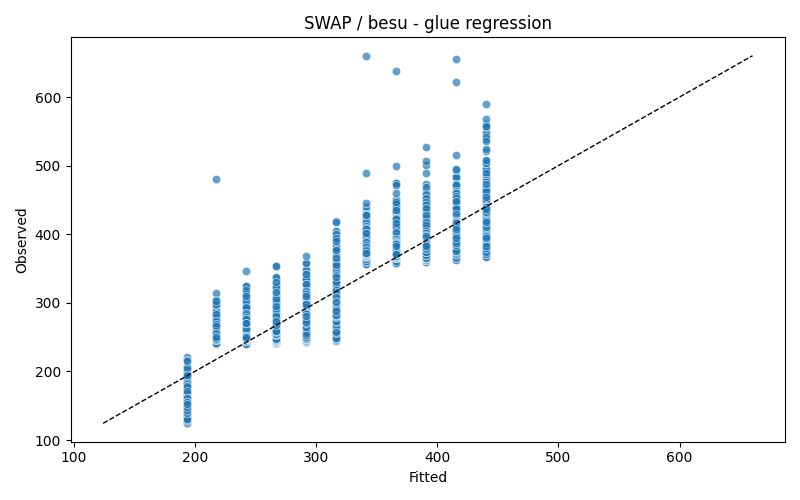

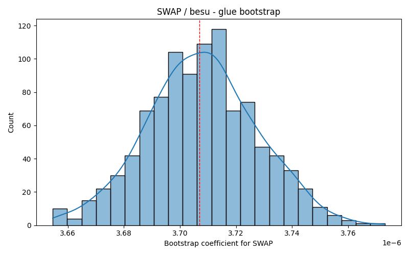

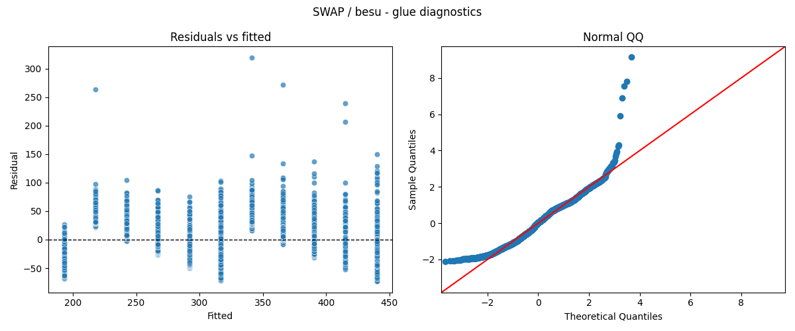

</details>

### Mixed glue (tier A) · besu

<details><summary><code>ADD</code> · nobs=517 · runtime_ms=1.123e-05 · p=1.00e-03 · R²=0.8322</summary>

```
==============================================================================
                           NNLS Regression Results                            
==============================================================================
Dep. Variable:          test_runtime_ms              R-squared:          0.832
Model:                  NNLS                    Adj. R-squared:          0.832
No. Observations:       517                               RMSE:          53.07
Df Residuals:           515                                MAE:          44.75
Df Model:               1      
==============================================================================
                      coef     std err     P-value      [0.025      0.975]
------------------------------------------------------------------------------
         const    112.3950      8.1280       0.001     96.2003    128.0851
           ADD      0.0000      0.0000       0.001      0.0000      0.0000
==============================================================================
Notes: Non-negative least squares with bootstrap inference (1000 iterations)
==============================================================================
```

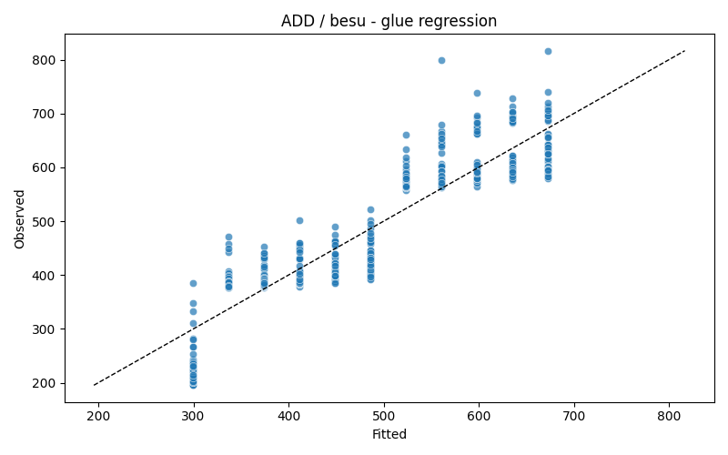

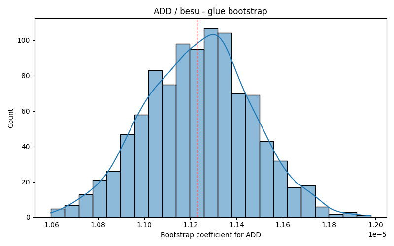

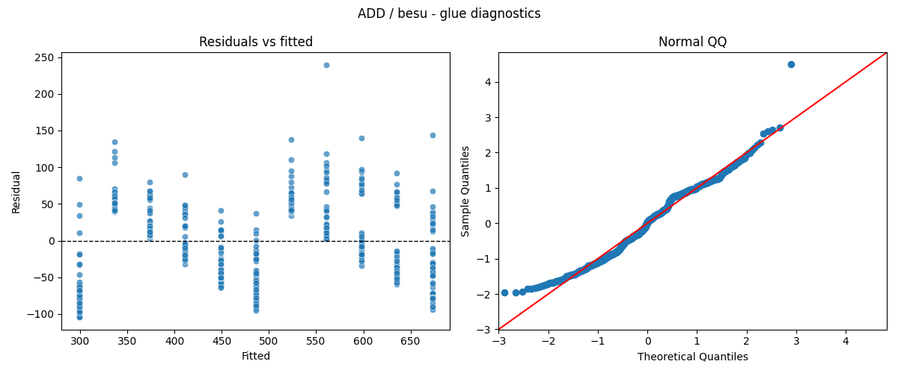

</details>

<details><summary><code>AND</code> · nobs=517 · runtime_ms=9.976e-06 · p=1.00e-03 · R²=0.8624</summary>

```
==============================================================================
                           NNLS Regression Results                            
==============================================================================
Dep. Variable:          test_runtime_ms              R-squared:          0.862
Model:                  NNLS                    Adj. R-squared:          0.862
No. Observations:       517                               RMSE:          41.95
Df Residuals:           515                                MAE:          36.01
Df Model:               1      
==============================================================================
                      coef     std err     P-value      [0.025      0.975]
------------------------------------------------------------------------------
         const     86.0276      6.2642       0.001     72.8262     97.3492
           AND      0.0000      0.0000       0.001      0.0000      0.0000
==============================================================================
Notes: Non-negative least squares with bootstrap inference (1000 iterations)
==============================================================================
```

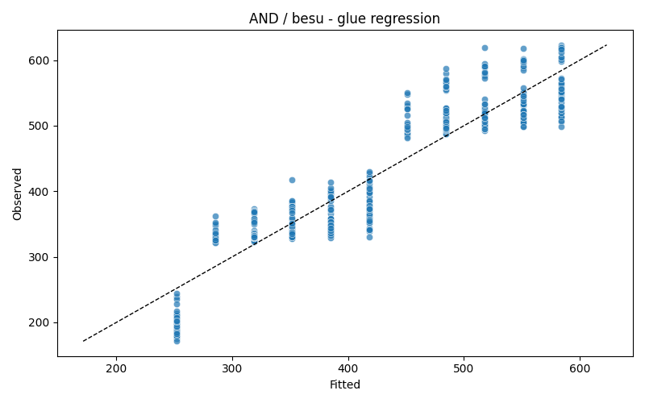

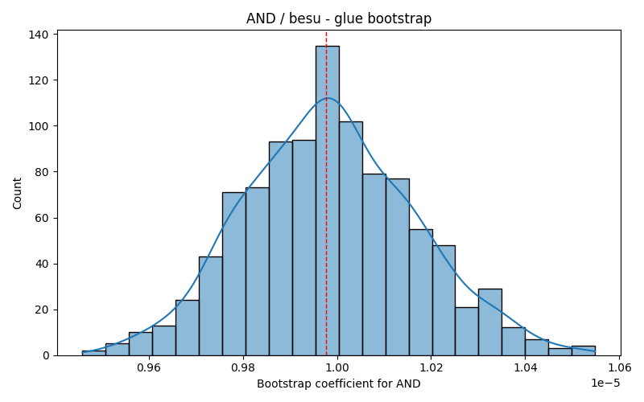

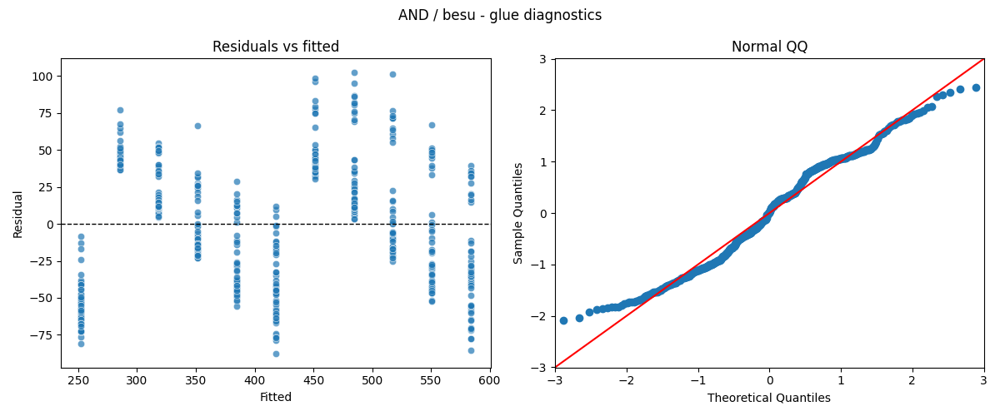

</details>

<details><summary><code>CALLDATACOPY</code> · nobs=12408 · runtime_ms=2.118e-05 · p=1.00e-03 · R²=0.814</summary>

```
==============================================================================
                           NNLS Regression Results                            
==============================================================================
Dep. Variable:          test_runtime_ms              R-squared:          0.814
Model:                  NNLS                    Adj. R-squared:          0.814
No. Observations:       12408                             RMSE:          76.16
Df Residuals:           12406                              MAE:          59.82
Df Model:               1      
==============================================================================
                      coef     std err     P-value      [0.025      0.975]
------------------------------------------------------------------------------
         const    117.1788      0.8176       0.001    115.5616    118.6782
  CALLDATACOPY      0.0000      0.0000       0.001      0.0000      0.0000
==============================================================================
Notes: Non-negative least squares with bootstrap inference (1000 iterations)
==============================================================================
```

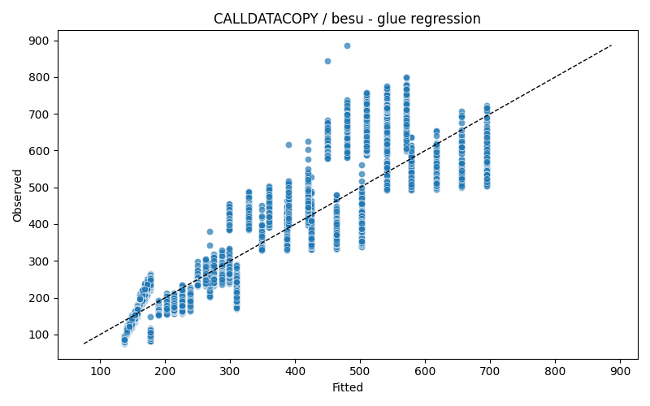

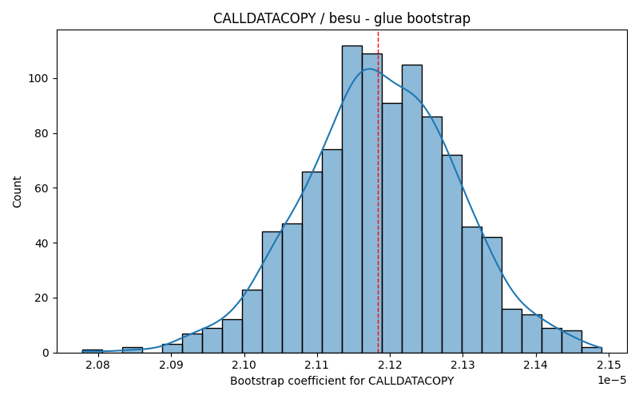

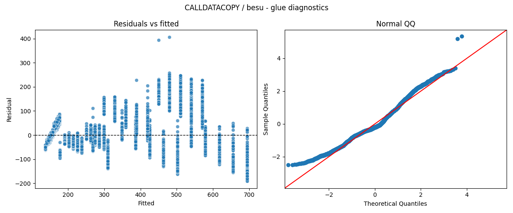

</details>

<details><summary><code>CALLDATALOAD</code> · nobs=2068 · runtime_ms=6.597e-06 · p=5.20e-02 · R²=0.001031</summary>

```
==============================================================================
                           NNLS Regression Results                            
==============================================================================
Dep. Variable:          test_runtime_ms              R-squared:          0.001
Model:                  NNLS                    Adj. R-squared:          0.001
No. Observations:       2068                              RMSE:           0.79
Df Residuals:           2066                               MAE:           0.53
Df Model:               1      
==============================================================================
                      coef     std err     P-value      [0.025      0.975]
------------------------------------------------------------------------------
         const      3.7114      0.0496       0.001      3.6194      3.8073
  CALLDATALOAD      0.0000      0.0000       0.052      0.0000      0.0000
==============================================================================
Notes: Non-negative least squares with bootstrap inference (1000 iterations)
==============================================================================
```

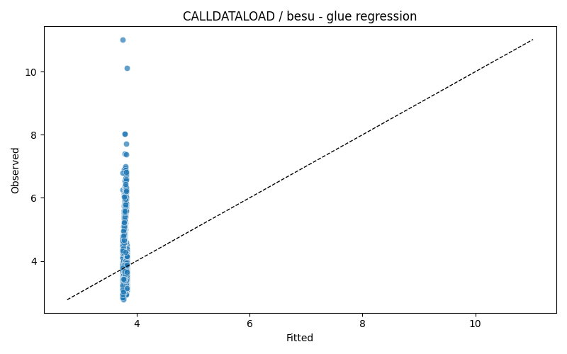

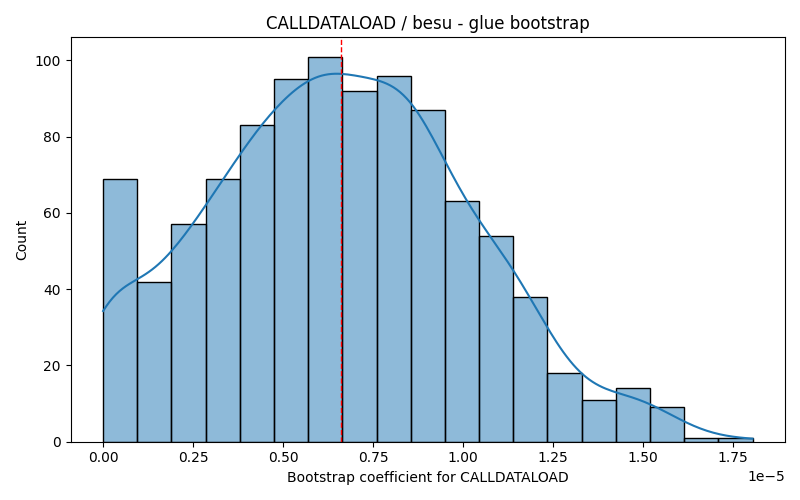

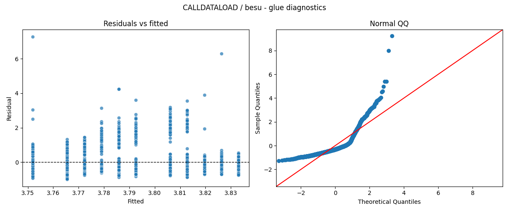

</details>

<details><summary><code>DIV</code> · nobs=517 · runtime_ms=1.752e-05 · p=1.00e-03 · R²=0.8562</summary>

```
==============================================================================
                           NNLS Regression Results                            
==============================================================================
Dep. Variable:          test_runtime_ms              R-squared:          0.856
Model:                  NNLS                    Adj. R-squared:          0.856
No. Observations:       517                               RMSE:          56.67
Df Residuals:           515                                MAE:          47.72
Df Model:               1      
==============================================================================
                      coef     std err     P-value      [0.025      0.975]
------------------------------------------------------------------------------
         const    140.2566      7.5202       0.001    125.2478    155.2903
           DIV      0.0000      0.0000       0.001      0.0000      0.0000
==============================================================================
Notes: Non-negative least squares with bootstrap inference (1000 iterations)
==============================================================================
```

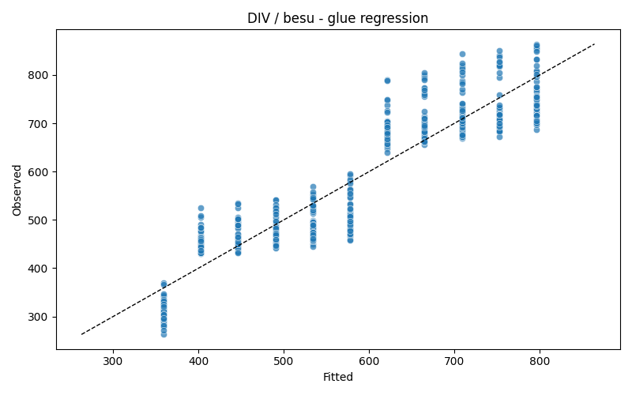

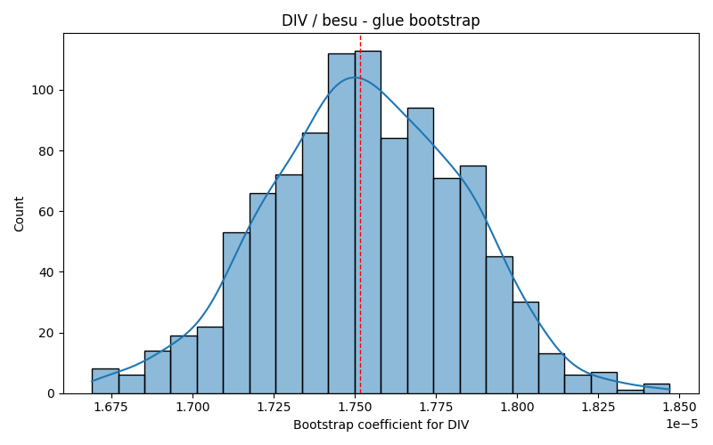

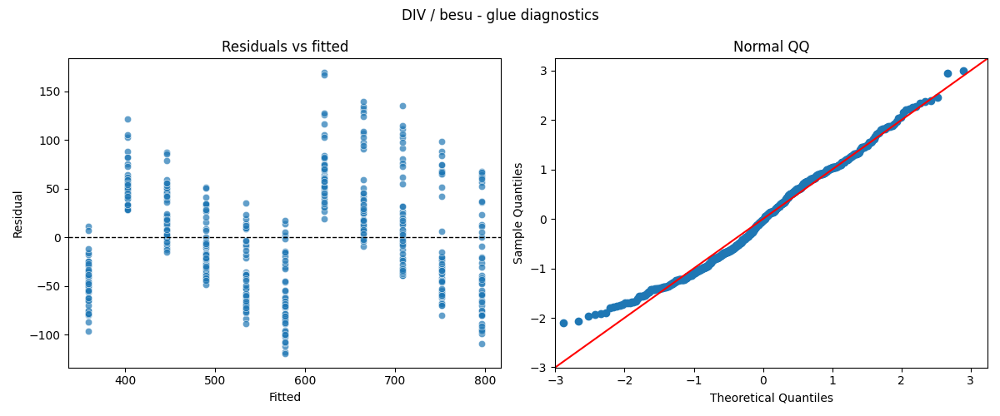

</details>

<details><summary><code>EXP</code> · nobs=517 · runtime_ms=0.001211 · p=1.00e-03 · R²=0.8035</summary>

```
==============================================================================
                           NNLS Regression Results                            
==============================================================================
Dep. Variable:          test_runtime_ms              R-squared:          0.804
Model:                  NNLS                    Adj. R-squared:          0.803
No. Observations:       517                               RMSE:          23.45
Df Residuals:           515                                MAE:          18.43
Df Model:               1      
==============================================================================
                      coef     std err     P-value      [0.025      0.975]
------------------------------------------------------------------------------
         const     83.9911      3.4134       0.001     76.9549     90.2203
           EXP      0.0012      0.0000       0.001      0.0012      0.0013
==============================================================================
Notes: Non-negative least squares with bootstrap inference (1000 iterations)
==============================================================================
```

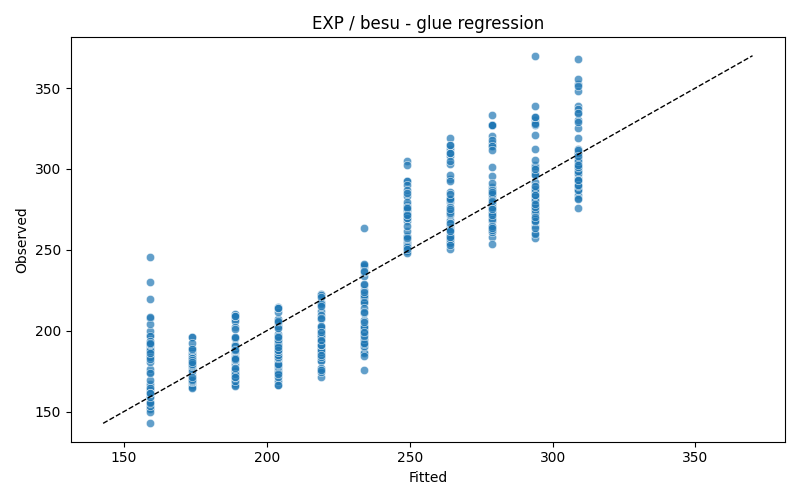

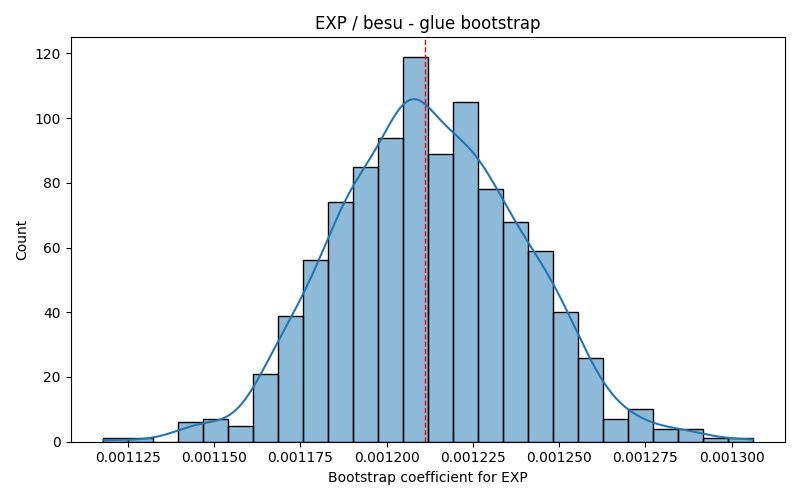

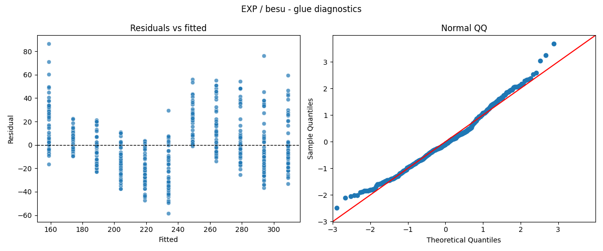

</details>

<details><summary><code>GT</code> · nobs=517 · runtime_ms=3.247e-05 · p=1.00e-03 · R²=0.8823</summary>

```
==============================================================================
                           NNLS Regression Results                            
==============================================================================
Dep. Variable:          test_runtime_ms              R-squared:          0.882
Model:                  NNLS                    Adj. R-squared:          0.882
No. Observations:       517                               RMSE:         124.82
Df Residuals:           515                                MAE:         100.28
Df Model:               1      
==============================================================================
                      coef     std err     P-value      [0.025      0.975]
------------------------------------------------------------------------------
         const    193.2204     19.7248       0.001    156.1062    233.3566
            GT      0.0000      0.0000       0.001      0.0000      0.0000
==============================================================================
Notes: Non-negative least squares with bootstrap inference (1000 iterations)
==============================================================================
```


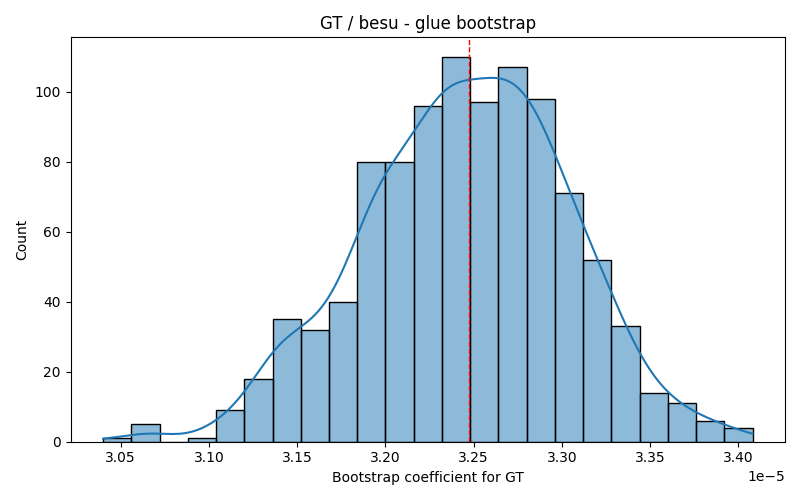

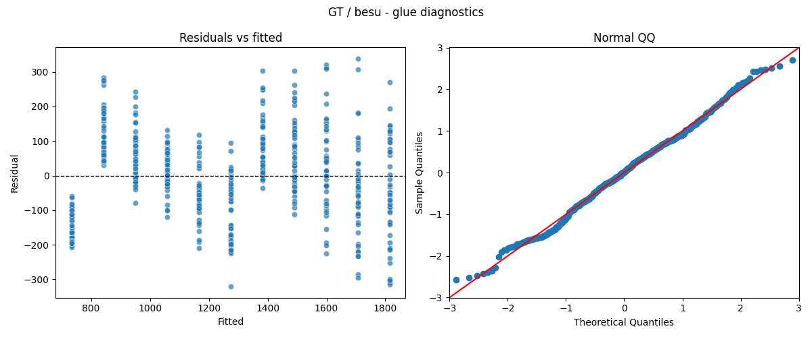

</details>

<details><summary><code>JUMPI</code> · nobs=517 · runtime_ms=9.686e-06 · p=1.00e-03 · R²=0.8452</summary>

```
==============================================================================
                           NNLS Regression Results                            
==============================================================================
Dep. Variable:          test_runtime_ms              R-squared:          0.845
Model:                  NNLS                    Adj. R-squared:          0.845
No. Observations:       517                               RMSE:          18.70
Df Residuals:           515                                MAE:          15.22
Df Model:               1      
==============================================================================
                      coef     std err     P-value      [0.025      0.975]
------------------------------------------------------------------------------
         const     36.7312      2.8576       0.001     31.1708     42.2850
         JUMPI      0.0000      0.0000       0.001      0.0000      0.0000
==============================================================================
Notes: Non-negative least squares with bootstrap inference (1000 iterations)
==============================================================================
```

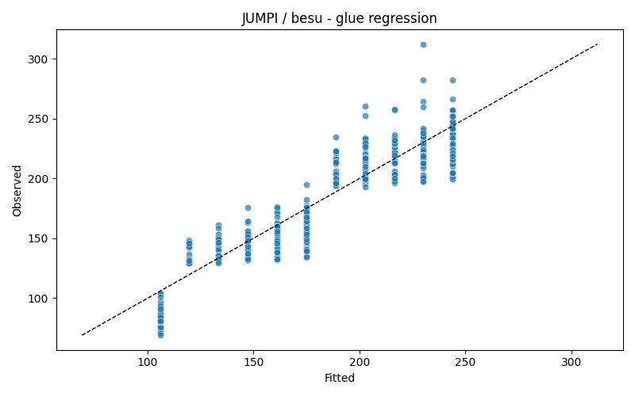

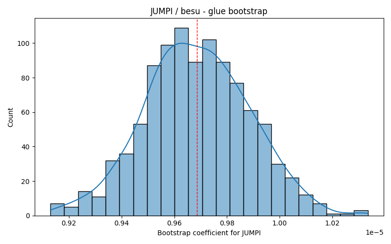

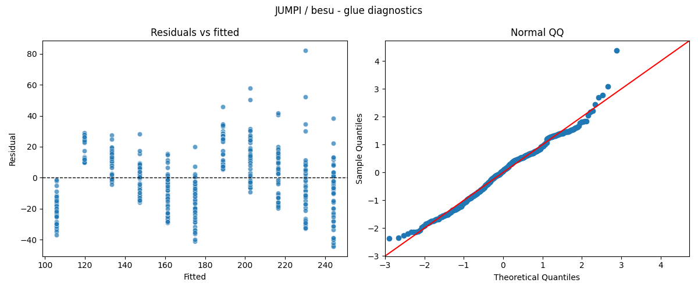

</details>

<details><summary><code>LT</code> · nobs=517 · runtime_ms=3.342e-05 · p=1.00e-03 · R²=0.889</summary>

```
==============================================================================
                           NNLS Regression Results                            
==============================================================================
Dep. Variable:          test_runtime_ms              R-squared:          0.889
Model:                  NNLS                    Adj. R-squared:          0.889
No. Observations:       517                               RMSE:         124.26
Df Residuals:           515                                MAE:         103.50
Df Model:               1      
==============================================================================
                      coef     std err     P-value      [0.025      0.975]
------------------------------------------------------------------------------
         const    221.7192     20.2164       0.001    183.8845    260.9729
            LT      0.0000      0.0000       0.001      0.0000      0.0000
==============================================================================
Notes: Non-negative least squares with bootstrap inference (1000 iterations)
==============================================================================
```

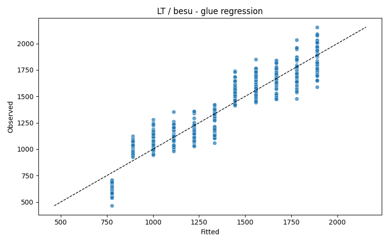

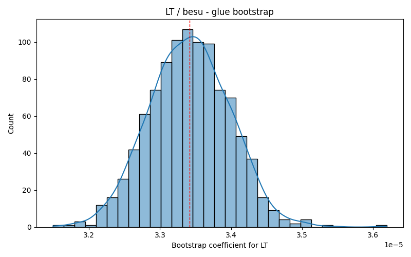

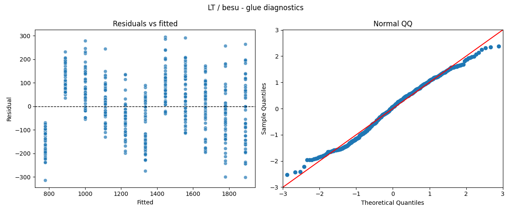

</details>

<details><summary><code>MSTORE</code> · nobs=2585 · runtime_ms=1.8e-05 · p=1.00e-03 · R²=0.8458</summary>

```
==============================================================================
                           NNLS Regression Results                            
==============================================================================
Dep. Variable:          test_runtime_ms              R-squared:          0.846
Model:                  NNLS                    Adj. R-squared:          0.846
No. Observations:       2585                              RMSE:          53.93
Df Residuals:           2583                               MAE:          45.33
Df Model:               1      
==============================================================================
                      coef     std err     P-value      [0.025      0.975]
------------------------------------------------------------------------------
         const    109.4964      3.7581       0.001    102.2045    116.7683
        MSTORE      0.0000      0.0000       0.001      0.0000      0.0000
==============================================================================
Notes: Non-negative least squares with bootstrap inference (1000 iterations)
==============================================================================
```

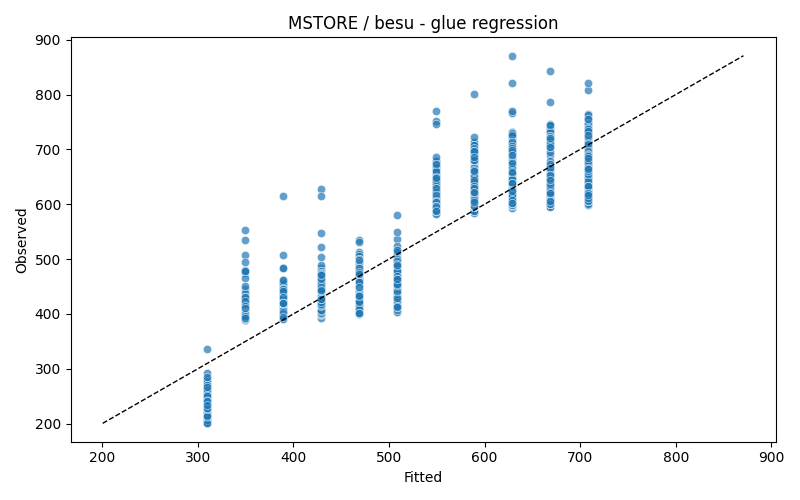

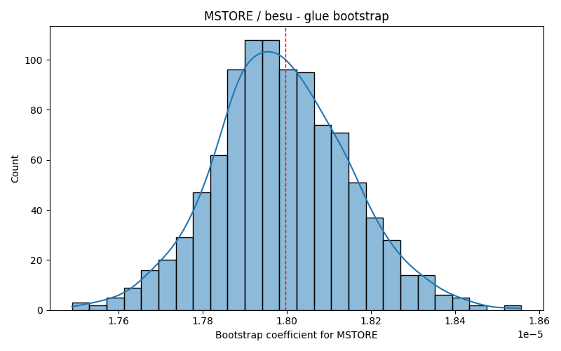

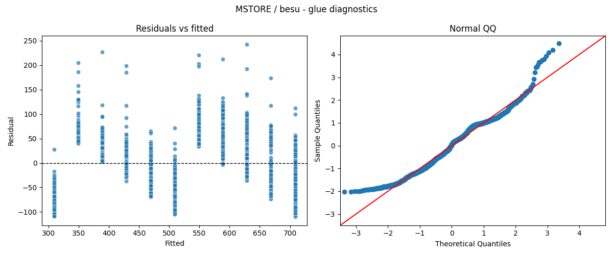

</details>

<details><summary><code>MSTORE8</code> · nobs=2585 · runtime_ms=1.297e-05 · p=1.00e-03 · R²=0.8208</summary>

```
==============================================================================
                           NNLS Regression Results                            
==============================================================================
Dep. Variable:          test_runtime_ms              R-squared:          0.821
Model:                  NNLS                    Adj. R-squared:          0.821
No. Observations:       2585                              RMSE:          42.54
Df Residuals:           2583                               MAE:          34.82
Df Model:               1      
==============================================================================
                      coef     std err     P-value      [0.025      0.975]
------------------------------------------------------------------------------
         const     79.7277      2.9721       0.001     74.0233     85.4849
       MSTORE8      0.0000      0.0000       0.001      0.0000      0.0000
==============================================================================
Notes: Non-negative least squares with bootstrap inference (1000 iterations)
==============================================================================
```

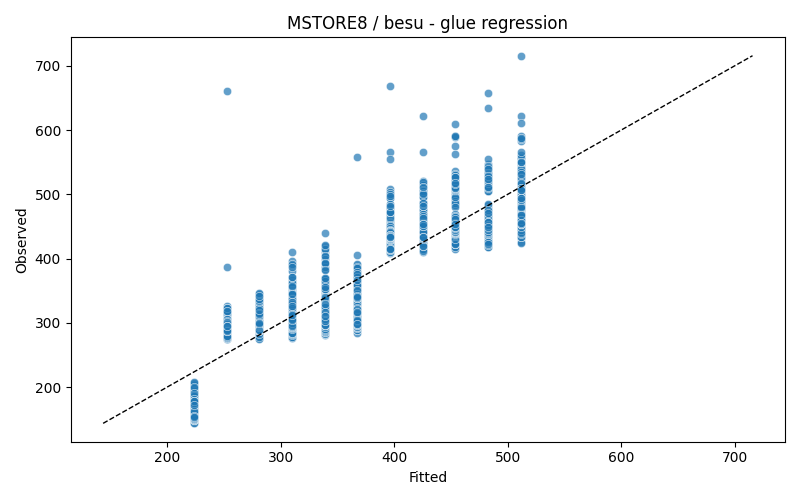

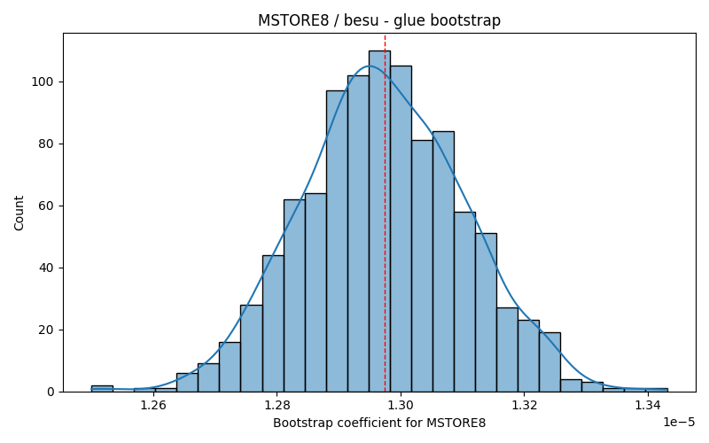

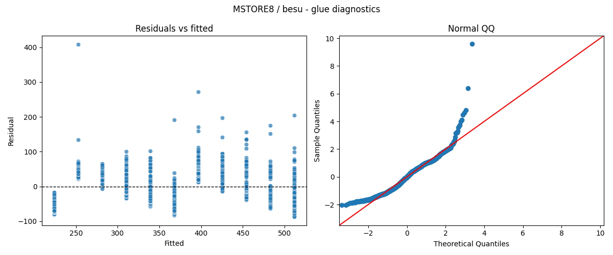

</details>

<details><summary><code>MUL</code> · nobs=517 · runtime_ms=1.276e-05 · p=1.00e-03 · R²=0.5987</summary>

```
==============================================================================
                           NNLS Regression Results                            
==============================================================================
Dep. Variable:          test_runtime_ms              R-squared:          0.599
Model:                  NNLS                    Adj. R-squared:          0.598
No. Observations:       517                               RMSE:          82.48
Df Residuals:           515                                MAE:          69.66
Df Model:               1      
==============================================================================
                      coef     std err     P-value      [0.025      0.975]
------------------------------------------------------------------------------
         const    111.4668     10.1986       0.001     91.8368    131.0512
           MUL      0.0000      0.0000       0.001      0.0000      0.0000
==============================================================================
Notes: Non-negative least squares with bootstrap inference (1000 iterations)
==============================================================================
```

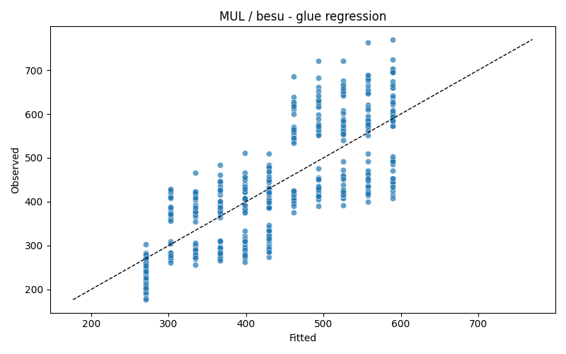

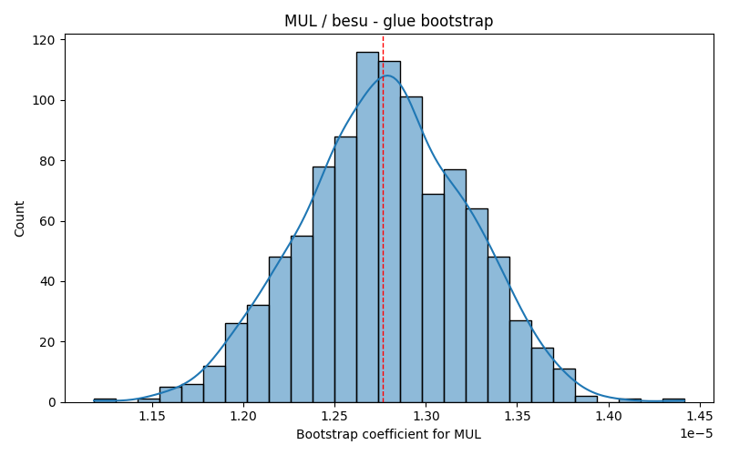

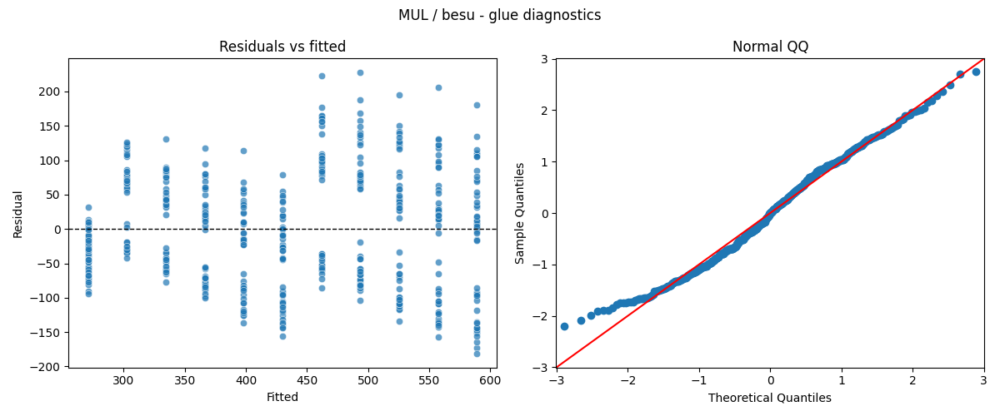

</details>

<details><summary><code>PC</code> · nobs=517 · runtime_ms=4.32e-06 · p=1.00e-03 · R²=0.8527</summary>

```
==============================================================================
                           NNLS Regression Results                            
==============================================================================
Dep. Variable:          test_runtime_ms              R-squared:          0.853
Model:                  NNLS                    Adj. R-squared:          0.852
No. Observations:       517                               RMSE:          53.69
Df Residuals:           515                                MAE:          46.09
Df Model:               1      
==============================================================================
                      coef     std err     P-value      [0.025      0.975]
------------------------------------------------------------------------------
         const    110.3377      8.8105       0.001     93.4780    128.0557
            PC      0.0000      0.0000       0.001      0.0000      0.0000
==============================================================================
Notes: Non-negative least squares with bootstrap inference (1000 iterations)
==============================================================================
```

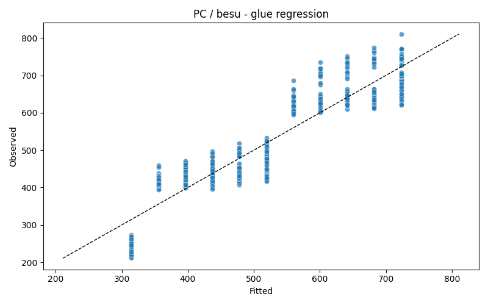

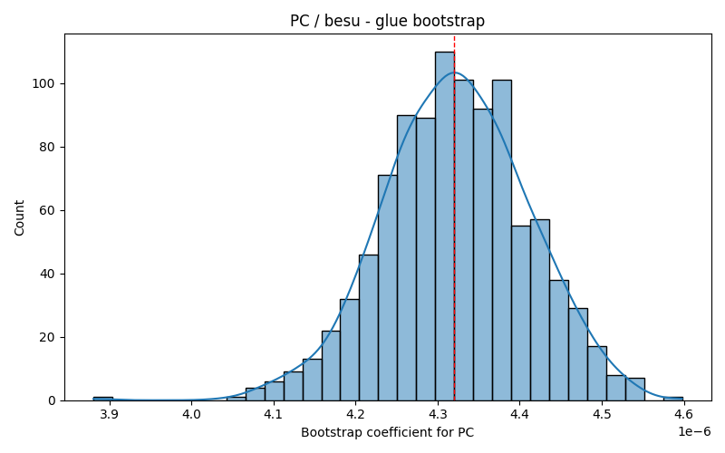

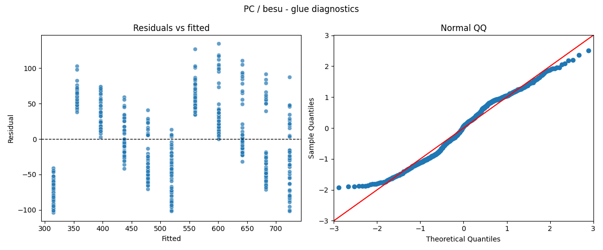

</details>

<details><summary><code>RETURNDATASIZE</code> · nobs=2068 · runtime_ms=7.124e-06 · p=1.00e-03 · R²=0.8439</summary>

```
==============================================================================
                           NNLS Regression Results                            
==============================================================================
Dep. Variable:          test_runtime_ms              R-squared:          0.844
Model:                  NNLS                    Adj. R-squared:          0.844
No. Observations:       2068                              RMSE:          48.38
Df Residuals:           2066                               MAE:          41.10
Df Model:               1      
==============================================================================
                      coef     std err     P-value      [0.025      0.975]
------------------------------------------------------------------------------
         const     94.9816      3.7217       0.001     88.0028    102.6674
RETURNDATASIZE      0.0000      0.0000       0.001      0.0000      0.0000
==============================================================================
Notes: Non-negative least squares with bootstrap inference (1000 iterations)
==============================================================================
```

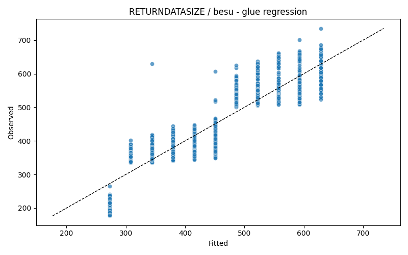

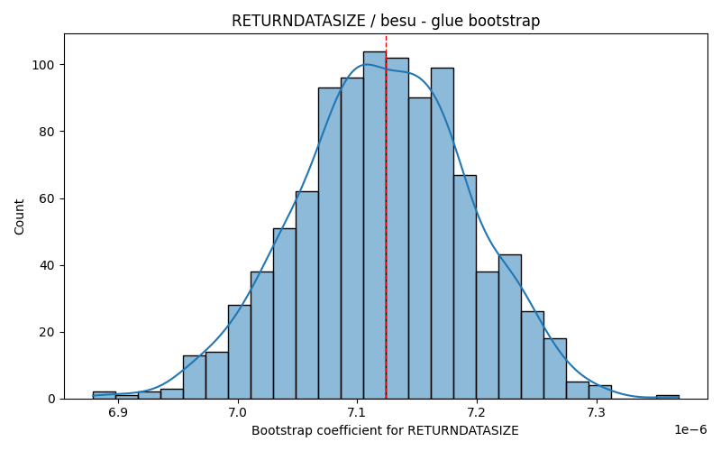

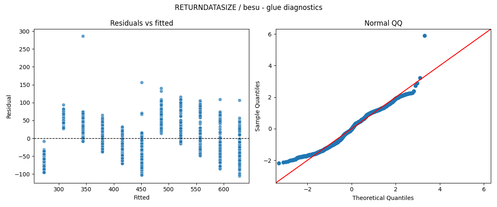

</details>

<details><summary><code>SELFBALANCE</code> · nobs=423 · runtime_ms=7.732e-06 · p=1.00e-03 · R²=0.451</summary>

```
==============================================================================
                           NNLS Regression Results                            
==============================================================================
Dep. Variable:          test_runtime_ms              R-squared:          0.451
Model:                  NNLS                    Adj. R-squared:          0.450
No. Observations:       423                               RMSE:          86.05
Df Residuals:           421                                MAE:          68.30
Df Model:               1      
==============================================================================
                      coef     std err     P-value      [0.025      0.975]
------------------------------------------------------------------------------
         const    412.1496     18.2220       0.001    374.9761    447.3248
   SELFBALANCE      0.0000      0.0000       0.001      0.0000      0.0000
==============================================================================
Notes: Non-negative least squares with bootstrap inference (1000 iterations)
==============================================================================
```

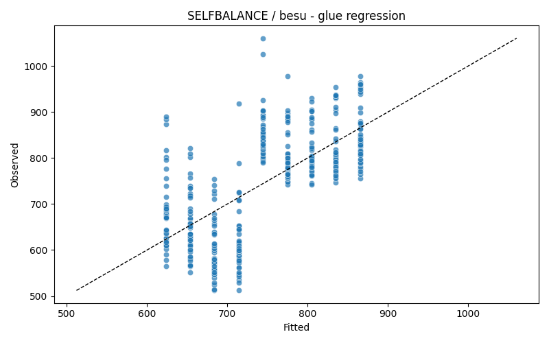

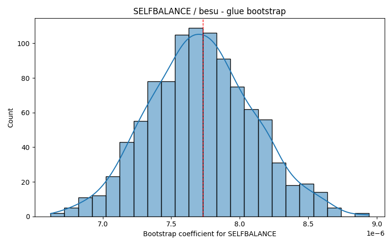

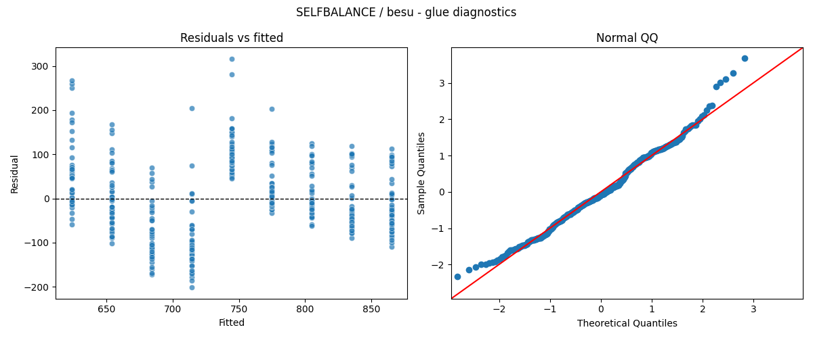

</details>

<details><summary><code>SUB</code> · nobs=517 · runtime_ms=1.169e-05 · p=1.00e-03 · R²=0.8168</summary>

```
==============================================================================
                           NNLS Regression Results                            
==============================================================================
Dep. Variable:          test_runtime_ms              R-squared:          0.817
Model:                  NNLS                    Adj. R-squared:          0.816
No. Observations:       517                               RMSE:          58.27
Df Residuals:           515                                MAE:          49.48
Df Model:               1      
==============================================================================
                      coef     std err     P-value      [0.025      0.975]
------------------------------------------------------------------------------
         const    108.2859      8.8822       0.001     91.0254    125.2426
           SUB      0.0000      0.0000       0.001      0.0000      0.0000
==============================================================================
Notes: Non-negative least squares with bootstrap inference (1000 iterations)
==============================================================================
```

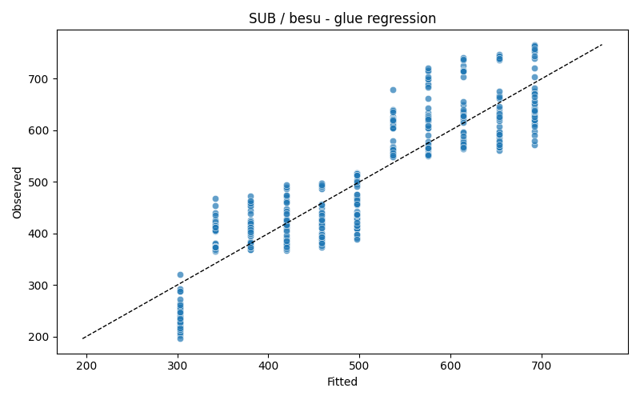

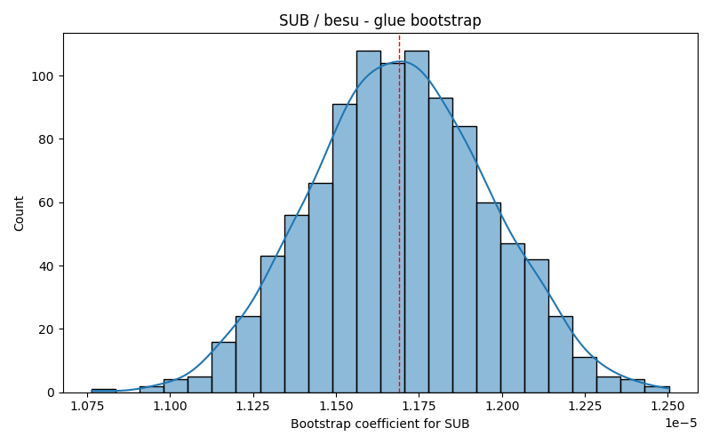

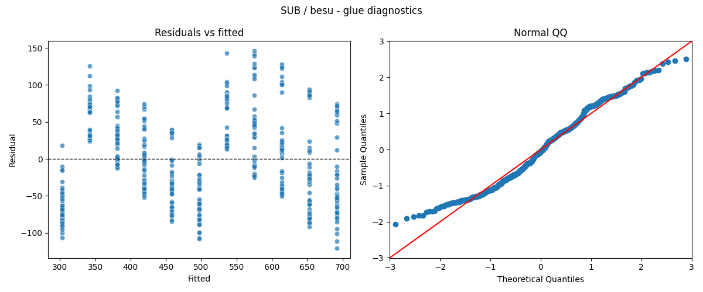

</details>

### Mixed glue (tier B) · besu

<details><summary><code>JUMP</code> · nobs=517 · runtime_ms=3.668e-05 · p=1.00e-03 · R²=0.4317</summary>

```
==============================================================================
                           NNLS Regression Results                            
==============================================================================
Dep. Variable:          test_runtime_ms              R-squared:          0.432
Model:                  NNLS                    Adj. R-squared:          0.431
No. Observations:       517                               RMSE:         156.41
Df Residuals:           515                                MAE:         142.20
Df Model:               1      
==============================================================================
                      coef     std err     P-value      [0.025      0.975]
------------------------------------------------------------------------------
         const    116.7967     21.2685       0.001     74.8854    158.3239
          JUMP      0.0000      0.0000       0.001      0.0000      0.0000
==============================================================================
Notes: Non-negative least squares with bootstrap inference (1000 iterations)
==============================================================================
```

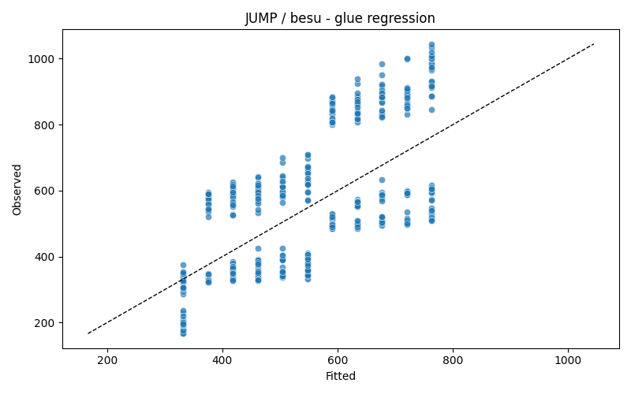

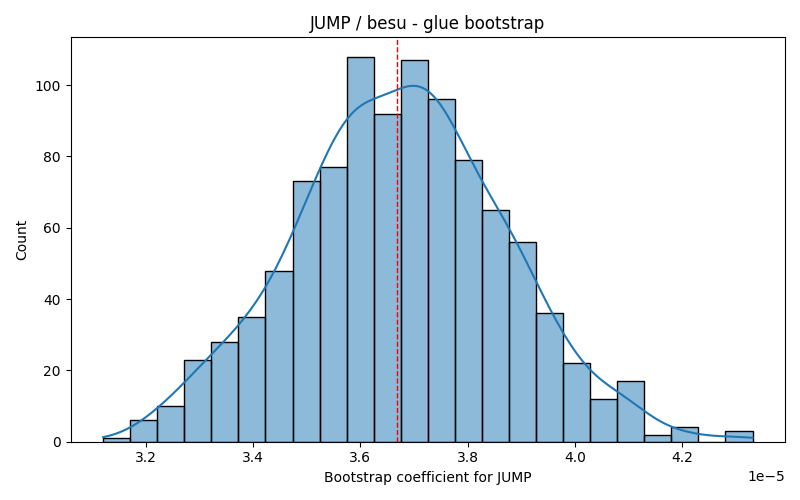

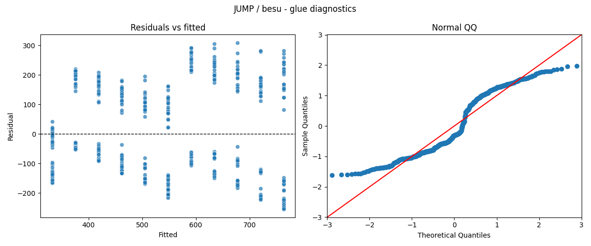

</details>

<details><summary><code>KECCAK256</code> · nobs=8272 · runtime_ms=5.167e-05 · p=1.00e-03 · R²=0.2761</summary>

```
==============================================================================
                           NNLS Regression Results                            
==============================================================================
Dep. Variable:          test_runtime_ms              R-squared:          0.276
Model:                  NNLS                    Adj. R-squared:          0.276
No. Observations:       8272                              RMSE:         166.24
Df Residuals:           8270                               MAE:         129.84
Df Model:               1      
==============================================================================
                      coef     std err     P-value      [0.025      0.975]
------------------------------------------------------------------------------
         const    510.5470      4.0382       0.001    503.1176    518.6441
     KECCAK256      0.0001      0.0000       0.001      0.0001      0.0001
==============================================================================
Notes: Non-negative least squares with bootstrap inference (1000 iterations)
==============================================================================
```

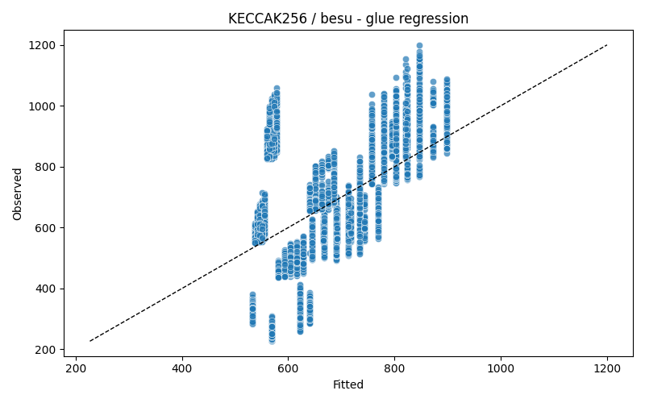

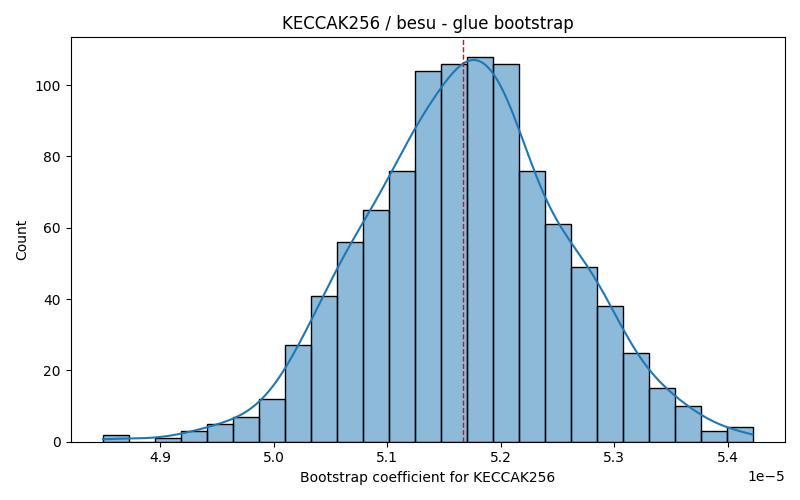

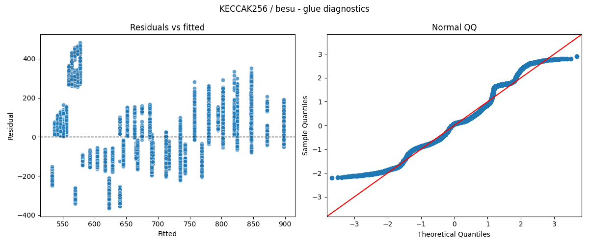

</details>

## erigon

| glue_opcode | nobs | glue_runtime_ms | p_value | rsquared |
| --- | --- | --- | --- | --- |
| `ISZERO` | 11 | 1.05e-06 | 1.00e-03 | 0.964 |
| `JUMPDEST` | 11 | 6.807e-07 | 1.00e-03 | 0.8516 |
| `SWAP` | 176 | 1.314e-06 | 1.00e-03 | 0.4985 |
| `CALLDATASIZE` | 726 | 8.684e-07 | 1.00e-03 | 0.9872 |
| `DUP` | 726 | 1.068e-06 | 1.00e-03 | 0.9872 |
| `GAS` | 726 | 8.717e-07 | 1.00e-03 | 0.9872 |
| `MLOAD` | 726 | 3.515e-06 | 1.00e-03 | 0.9872 |
| `PUSH` | 726 | 2.879e-06 | 1.00e-03 | 0.9872 |
| `PUSH0` | 726 | 8.803e-07 | 1.00e-03 | 0.9872 |
| `STATICCALL` | 726 | 0.0005677 | 1.00e-03 | 0.9872 |
| `ADD` | 11 | 3.017e-06 | 1.00e-03 | 0.9515 |
| `AND` | 11 | 3.011e-06 | 1.00e-03 | 0.9521 |
| `CALLDATACOPY` | 264 | 7.532e-06 | 1.00e-03 | 0.8441 |
| `CALLDATALOAD` | 44 | 4.573e-05 | 1.00e-02 | 0.1068 |
| `DIV` | 11 | 1.043e-05 | 1.00e-03 | 0.9212 |
| `EXP` | 11 | 0.0003826 | 1.00e-03 | 0.9772 |
| `GT` | 11 | 3.157e-06 | 1.00e-03 | 0.9667 |
| `JUMPI` | 11 | 3.863e-06 | 1.00e-03 | 0.9657 |
| `LT` | 11 | 3.334e-06 | 1.00e-03 | 0.9705 |
| `MSTORE` | 55 | 5.67e-06 | 1.00e-03 | 0.296 |
| `MSTORE8` | 55 | 5.479e-06 | 1.00e-03 | 0.9609 |
| `MUL` | 11 | 5.107e-06 | 1.00e-03 | 0.5714 |
| `PC` | 11 | 1.374e-06 | 1.00e-03 | 0.9561 |
| `RETURNDATASIZE` | 44 | 1.581e-06 | 1.00e-03 | 0.2048 |
| `SELFBALANCE` | 9 | 1.603e-06 | 1.00e-03 | 0.8916 |
| `SUB` | 11 | 3.174e-06 | 1.00e-03 | 0.9438 |
| `JUMP` | 11 | 7.344e-06 | 1.00e-03 | 0.9765 |
| `KECCAK256` | 176 | 2.21e-05 | 1.00e-03 | 0.09085 |

### Cycle glue — joint fit · erigon

<details><summary>Joint NNLS regression summary</summary>

```
==============================================================================
                           NNLS Regression Results                            
==============================================================================
Dep. Variable:          test_runtime_ms              R-squared:          0.987
Model:                  NNLS                    Adj. R-squared:          0.987
No. Observations:       726                               RMSE:          31.00
Df Residuals:           718                                MAE:          16.69
Df Model:               7      
==============================================================================
                      coef     std err     P-value      [0.025      0.975]
------------------------------------------------------------------------------
         const     33.8630      3.2713       0.001     27.7622     40.6136
  CALLDATASIZE      0.0000      0.0000       0.001      0.0000      0.0000
           DUP      0.0000      0.0000       0.001      0.0000      0.0000
           GAS      0.0000      0.0000       0.001      0.0000      0.0000
         MLOAD      0.0000      0.0000       0.001      0.0000      0.0000
          PUSH      0.0000      0.0000       0.001      0.0000      0.0000
         PUSH0      0.0000      0.0000       0.001      0.0000      0.0000
    STATICCALL      0.0006      0.0000       0.001      0.0006      0.0006
==============================================================================
Notes: Non-negative least squares with bootstrap inference (1000 iterations)
==============================================================================
```

</details>

<details><summary><code>CALLDATASIZE</code> · nobs=726 · runtime_ms=8.684e-07 · p=1.00e-03 · R²=0.9872</summary>

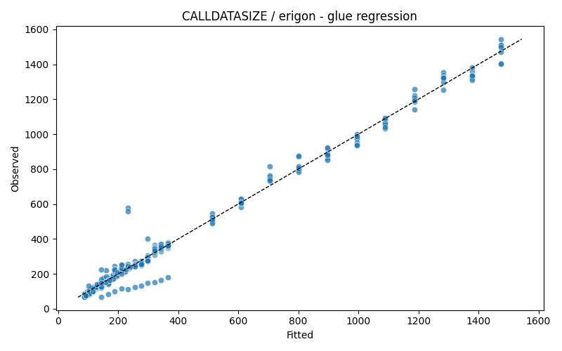

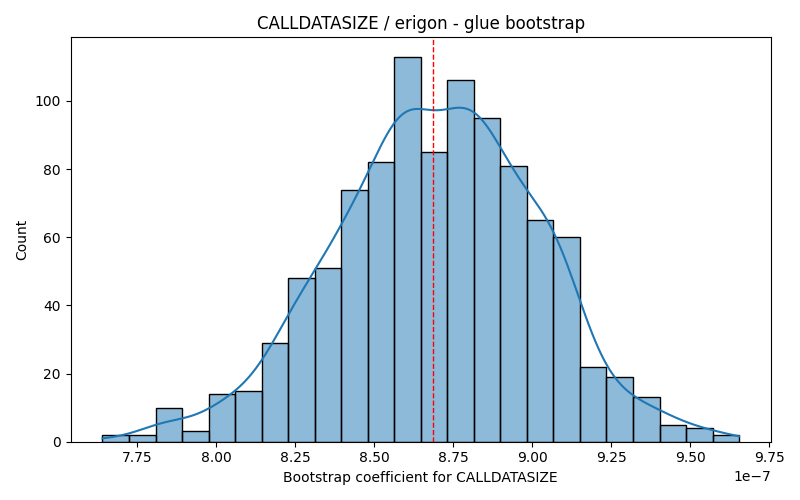


</details>

<details><summary><code>DUP</code> · nobs=726 · runtime_ms=1.068e-06 · p=1.00e-03 · R²=0.9872</summary>


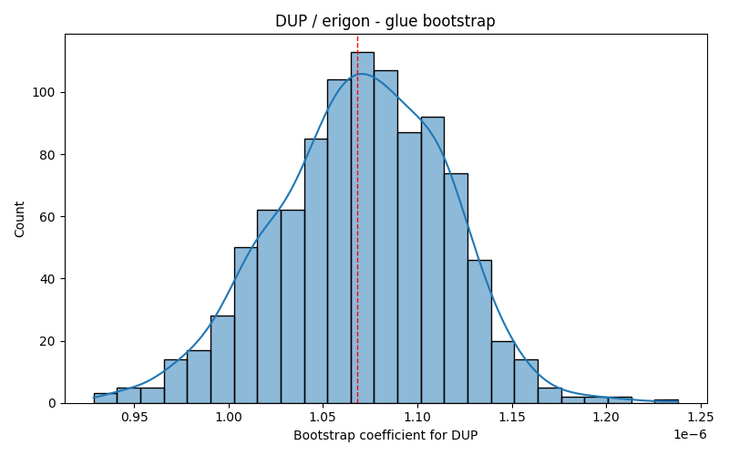


</details>

<details><summary><code>GAS</code> · nobs=726 · runtime_ms=8.717e-07 · p=1.00e-03 · R²=0.9872</summary>

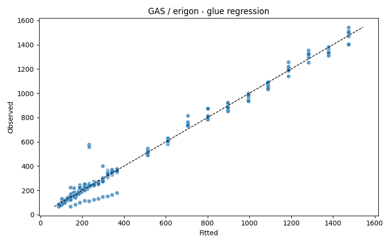

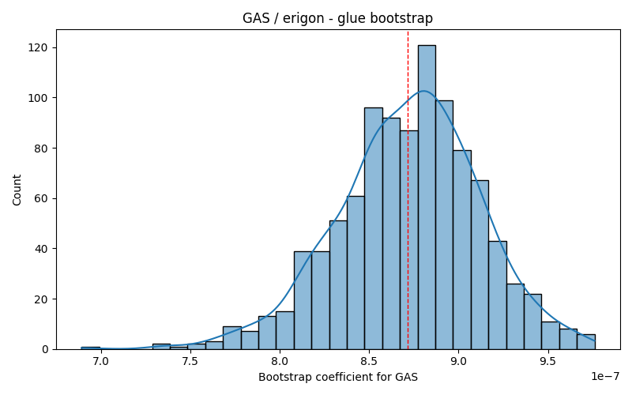


</details>

<details><summary><code>MLOAD</code> · nobs=726 · runtime_ms=3.515e-06 · p=1.00e-03 · R²=0.9872</summary>


</details>

<details><summary><code>PUSH</code> · nobs=726 · runtime_ms=2.879e-06 · p=1.00e-03 · R²=0.9872</summary>

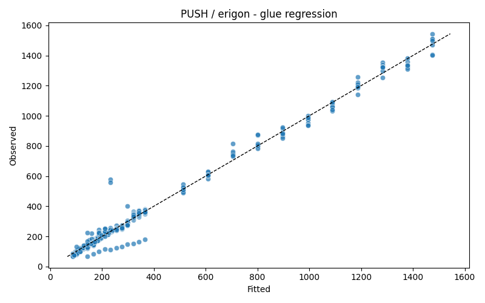

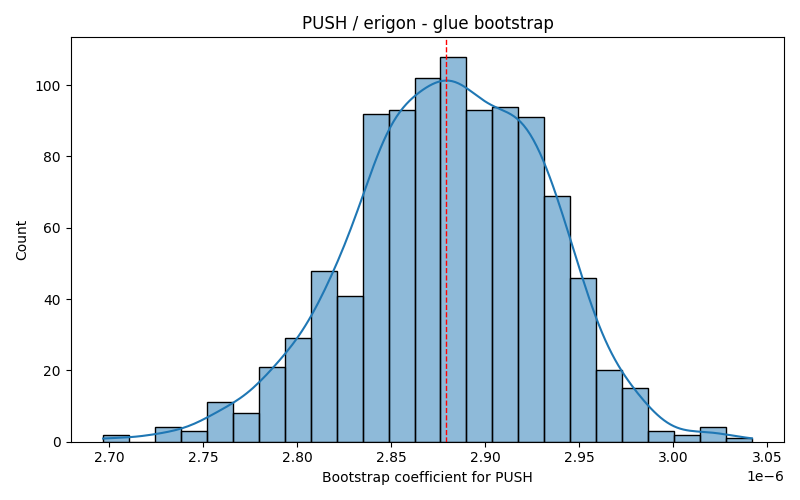

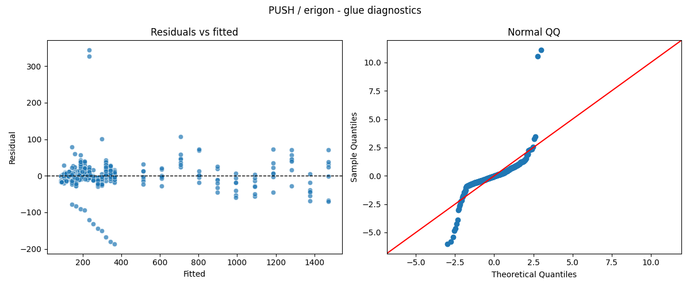

</details>

<details><summary><code>PUSH0</code> · nobs=726 · runtime_ms=8.803e-07 · p=1.00e-03 · R²=0.9872</summary>


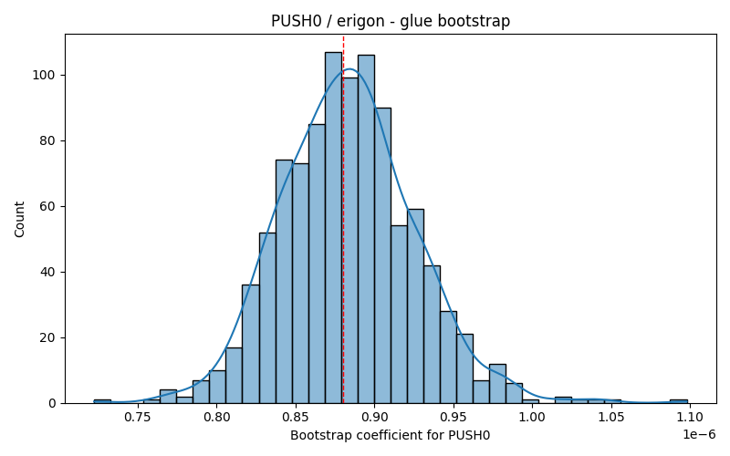

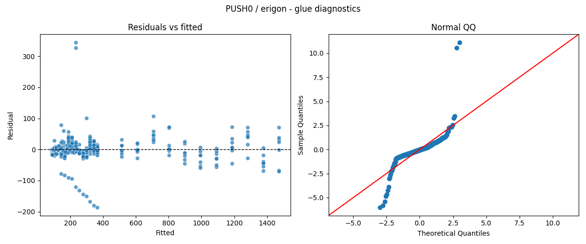

</details>

<details><summary><code>STATICCALL</code> · nobs=726 · runtime_ms=0.0005677 · p=1.00e-03 · R²=0.9872</summary>

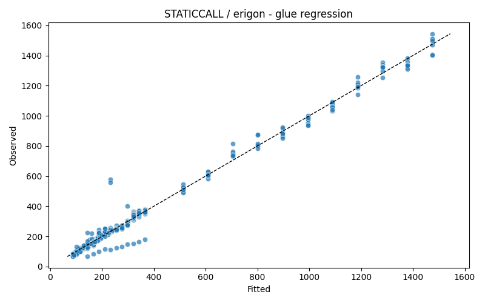

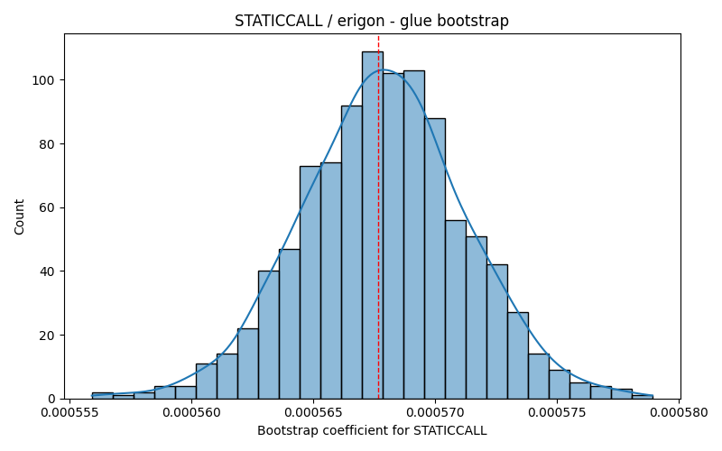

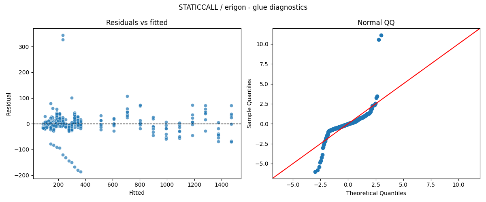

</details>

### Pure glue · erigon

<details><summary><code>ISZERO</code> · nobs=11 · runtime_ms=1.05e-06 · p=1.00e-03 · R²=0.964</summary>

```
==============================================================================
                           NNLS Regression Results                            
==============================================================================
Dep. Variable:          test_runtime_ms              R-squared:          0.964
Model:                  NNLS                    Adj. R-squared:          0.960
No. Observations:       11                                RMSE:           4.27
Df Residuals:           9                                  MAE:           3.65
Df Model:               1      
==============================================================================
                      coef     std err     P-value      [0.025      0.975]
------------------------------------------------------------------------------
         const     20.1442      6.4490       0.001      8.6870     30.7680
        ISZERO      0.0000      0.0000       0.001      0.0000      0.0000
==============================================================================
Notes: Non-negative least squares with bootstrap inference (1000 iterations)
==============================================================================
```


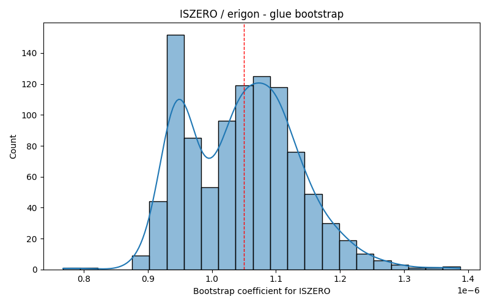


</details>

<details><summary><code>JUMPDEST</code> · nobs=11 · runtime_ms=6.807e-07 · p=1.00e-03 · R²=0.8516</summary>

```
==============================================================================
                           NNLS Regression Results                            
==============================================================================
Dep. Variable:          test_runtime_ms              R-squared:          0.852
Model:                  NNLS                    Adj. R-squared:          0.835
No. Observations:       11                                RMSE:          17.94
Df Residuals:           9                                  MAE:          14.38
Df Model:               1      
==============================================================================
                      coef     std err     P-value      [0.025      0.975]
------------------------------------------------------------------------------
         const     61.4374     26.7512       0.007      8.0740    108.6124
      JUMPDEST      0.0000      0.0000       0.001      0.0000      0.0000
==============================================================================
Notes: Non-negative least squares with bootstrap inference (1000 iterations)
==============================================================================
```


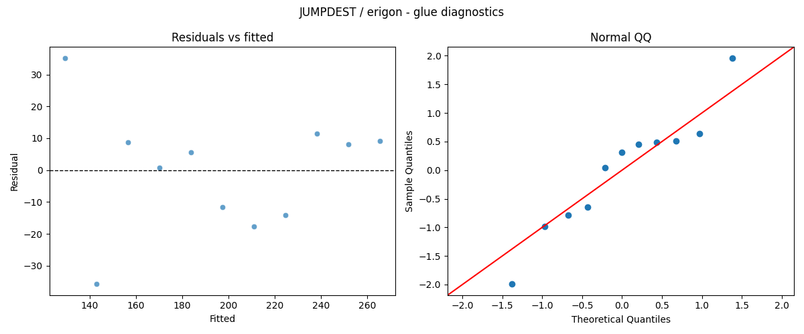

</details>

<details><summary><code>SWAP</code> · nobs=176 · runtime_ms=1.314e-06 · p=1.00e-03 · R²=0.4985</summary>

```
==============================================================================
                           NNLS Regression Results                            
==============================================================================
Dep. Variable:          test_runtime_ms              R-squared:          0.499
Model:                  NNLS                    Adj. R-squared:          0.496
No. Observations:       176                               RMSE:          27.75
Df Residuals:           174                                MAE:           6.73
Df Model:               1      
==============================================================================
                      coef     std err     P-value      [0.025      0.975]
------------------------------------------------------------------------------
         const     26.4426      4.4766       0.001     20.0823     37.0057
          SWAP      0.0000      0.0000       0.001      0.0000      0.0000
==============================================================================
Notes: Non-negative least squares with bootstrap inference (1000 iterations)
==============================================================================
```


</details>

### Mixed glue (tier A) · erigon

<details><summary><code>ADD</code> · nobs=11 · runtime_ms=3.017e-06 · p=1.00e-03 · R²=0.9515</summary>

```
==============================================================================
                           NNLS Regression Results                            
==============================================================================
Dep. Variable:          test_runtime_ms              R-squared:          0.952
Model:                  NNLS                    Adj. R-squared:          0.946
No. Observations:       11                                RMSE:           7.17
Df Residuals:           9                                  MAE:           5.45
Df Model:               1      
==============================================================================
                      coef     std err     P-value      [0.025      0.975]
------------------------------------------------------------------------------
         const     17.7429      7.6897       0.004      5.5909     35.4334
           ADD      0.0000      0.0000       0.001      0.0000      0.0000
==============================================================================
Notes: Non-negative least squares with bootstrap inference (1000 iterations)
==============================================================================
```

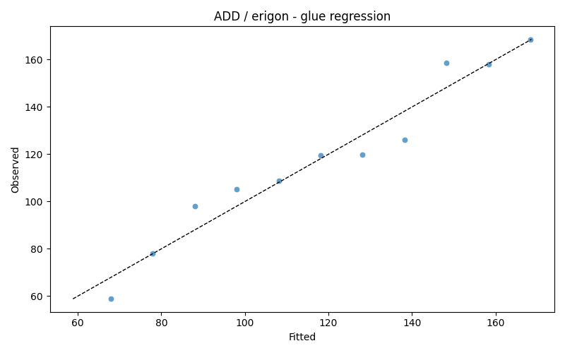

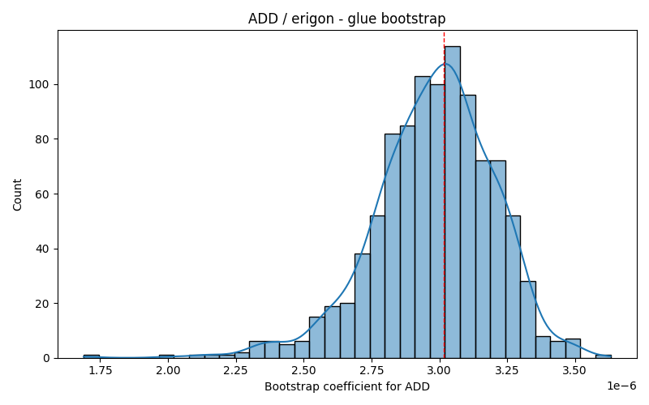

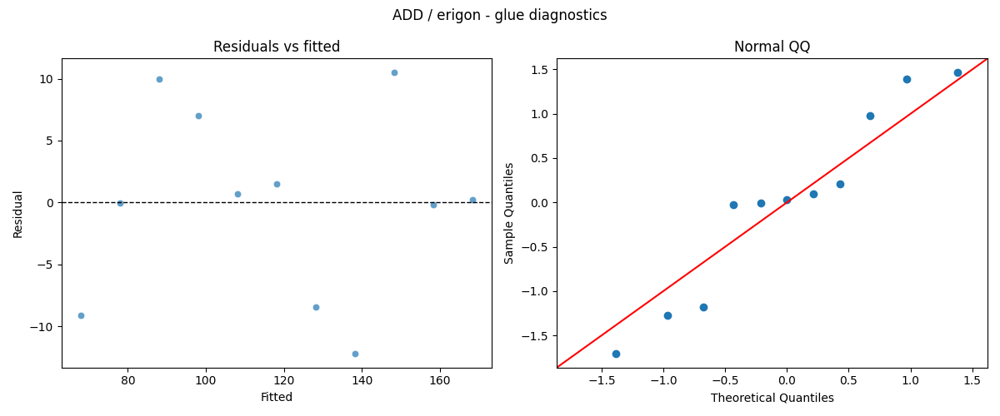

</details>

<details><summary><code>AND</code> · nobs=11 · runtime_ms=3.011e-06 · p=1.00e-03 · R²=0.9521</summary>

```
==============================================================================
                           NNLS Regression Results                            
==============================================================================
Dep. Variable:          test_runtime_ms              R-squared:          0.952
Model:                  NNLS                    Adj. R-squared:          0.947
No. Observations:       11                                RMSE:           7.11
Df Residuals:           9                                  MAE:           6.26
Df Model:               1      
==============================================================================
                      coef     std err     P-value      [0.025      0.975]
------------------------------------------------------------------------------
         const     12.7946      8.8238       0.033      0.0000     36.5648
           AND      0.0000      0.0000       0.001      0.0000      0.0000
==============================================================================
Notes: Non-negative least squares with bootstrap inference (1000 iterations)
==============================================================================
```


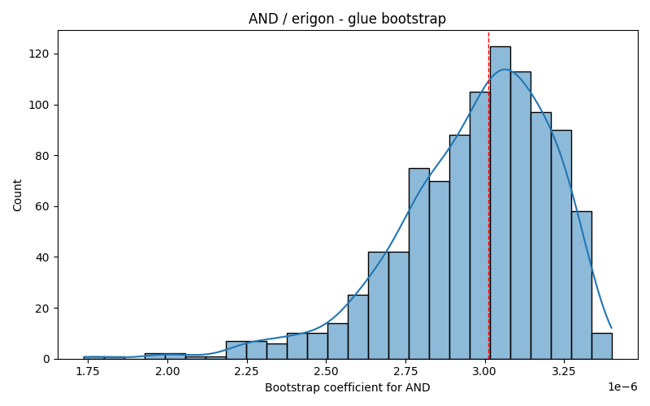


</details>

<details><summary><code>CALLDATACOPY</code> · nobs=264 · runtime_ms=7.532e-06 · p=1.00e-03 · R²=0.8441</summary>

```
==============================================================================
                           NNLS Regression Results                            
==============================================================================
Dep. Variable:          test_runtime_ms              R-squared:          0.844
Model:                  NNLS                    Adj. R-squared:          0.844
No. Observations:       264                               RMSE:          24.34
Df Residuals:           262                                MAE:           7.69
Df Model:               1      
==============================================================================
                      coef     std err     P-value      [0.025      0.975]
------------------------------------------------------------------------------
         const     20.7768      3.0871       0.001     17.0110     27.9902
  CALLDATACOPY      0.0000      0.0000       0.001      0.0000      0.0000
==============================================================================
Notes: Non-negative least squares with bootstrap inference (1000 iterations)
==============================================================================
```

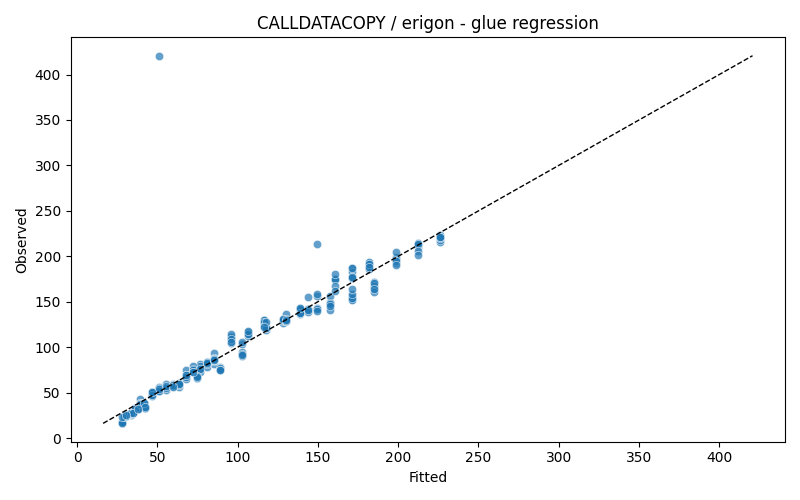


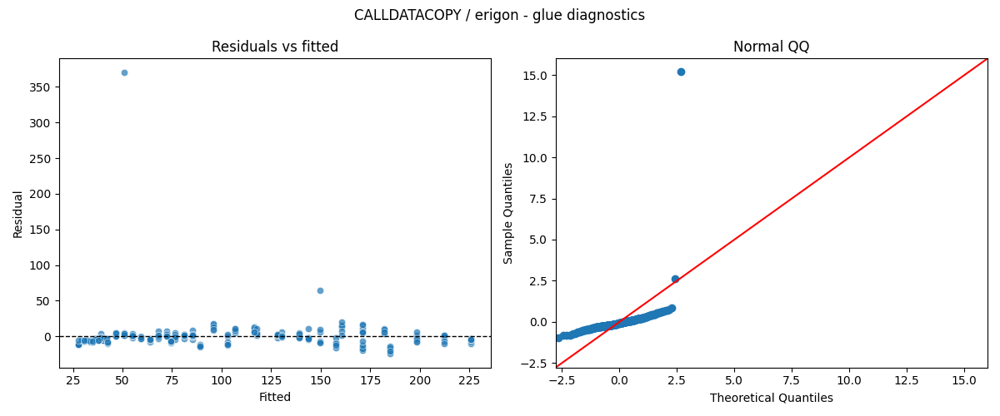

</details>

<details><summary><code>CALLDATALOAD</code> · nobs=44 · runtime_ms=4.573e-05 · p=1.00e-02 · R²=0.1068</summary>

```
==============================================================================
                           NNLS Regression Results                            
==============================================================================
Dep. Variable:          test_runtime_ms              R-squared:          0.107
Model:                  NNLS                    Adj. R-squared:          0.086
No. Observations:       44                                RMSE:           0.51
Df Residuals:           42                                 MAE:           0.41
Df Model:               1      
==============================================================================
                      coef     std err     P-value      [0.025      0.975]
------------------------------------------------------------------------------
         const      6.0597      0.2688       0.001      5.5236      6.5809
  CALLDATALOAD      0.0000      0.0000       0.010      0.0000      0.0001
==============================================================================
Notes: Non-negative least squares with bootstrap inference (1000 iterations)
==============================================================================
```


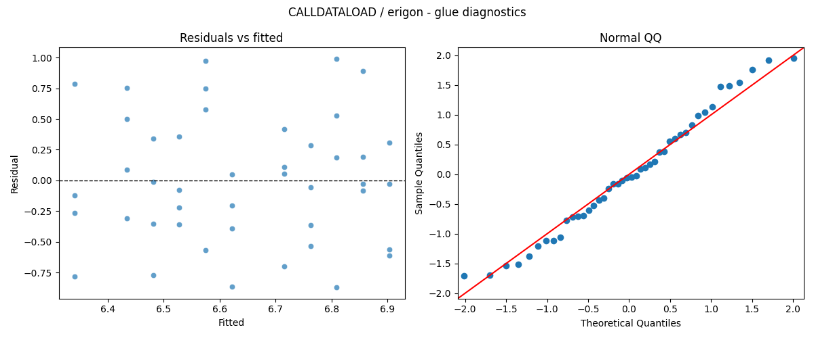

</details>

<details><summary><code>DIV</code> · nobs=11 · runtime_ms=1.043e-05 · p=1.00e-03 · R²=0.9212</summary>

```
==============================================================================
                           NNLS Regression Results                            
==============================================================================
Dep. Variable:          test_runtime_ms              R-squared:          0.921
Model:                  NNLS                    Adj. R-squared:          0.912
No. Observations:       11                                RMSE:          24.07
Df Residuals:           9                                  MAE:          21.61
Df Model:               1      
==============================================================================
                      coef     std err     P-value      [0.025      0.975]
------------------------------------------------------------------------------
         const     26.4180     25.7744       0.141      0.0000     95.1200
           DIV      0.0000      0.0000       0.001      0.0000      0.0000
==============================================================================
Notes: Non-negative least squares with bootstrap inference (1000 iterations)
==============================================================================
```

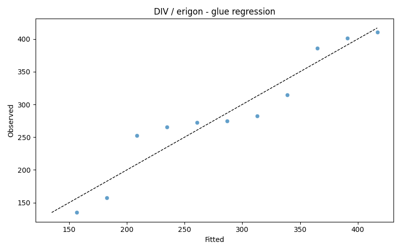

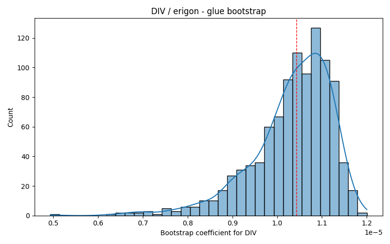

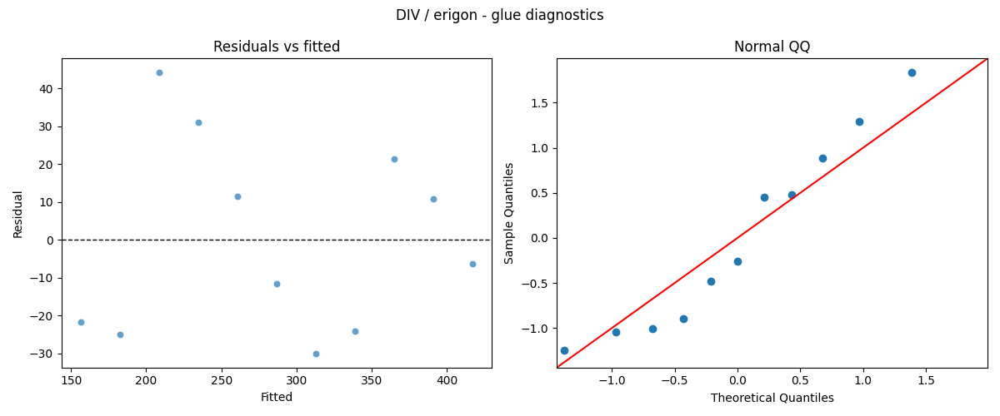

</details>

<details><summary><code>EXP</code> · nobs=11 · runtime_ms=0.0003826 · p=1.00e-03 · R²=0.9772</summary>

```
==============================================================================
                           NNLS Regression Results                            
==============================================================================
Dep. Variable:          test_runtime_ms              R-squared:          0.977
Model:                  NNLS                    Adj. R-squared:          0.975
No. Observations:       11                                RMSE:           2.29
Df Residuals:           9                                  MAE:           1.78
Df Model:               1      
==============================================================================
                      coef     std err     P-value      [0.025      0.975]
------------------------------------------------------------------------------
         const      9.8492      3.3204       0.001      4.4491     16.8999
           EXP      0.0004      0.0000       0.001      0.0003      0.0004
==============================================================================
Notes: Non-negative least squares with bootstrap inference (1000 iterations)
==============================================================================
```

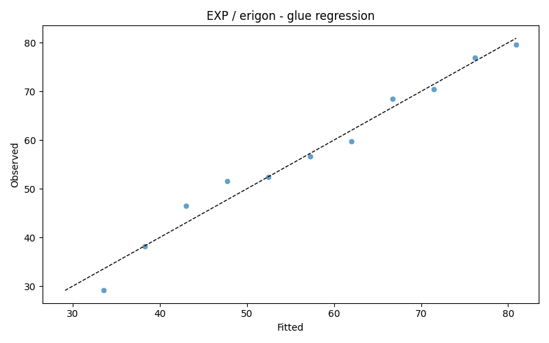


</details>

<details><summary><code>GT</code> · nobs=11 · runtime_ms=3.157e-06 · p=1.00e-03 · R²=0.9667</summary>

```
==============================================================================
                           NNLS Regression Results                            
==============================================================================
Dep. Variable:          test_runtime_ms              R-squared:          0.967
Model:                  NNLS                    Adj. R-squared:          0.963
No. Observations:       11                                RMSE:           6.17
Df Residuals:           9                                  MAE:           5.40
Df Model:               1      
==============================================================================
                      coef     std err     P-value      [0.025      0.975]
------------------------------------------------------------------------------
         const     17.5340      7.0317       0.008      4.8271     32.8672
            GT      0.0000      0.0000       0.001      0.0000      0.0000
==============================================================================
Notes: Non-negative least squares with bootstrap inference (1000 iterations)
==============================================================================
```

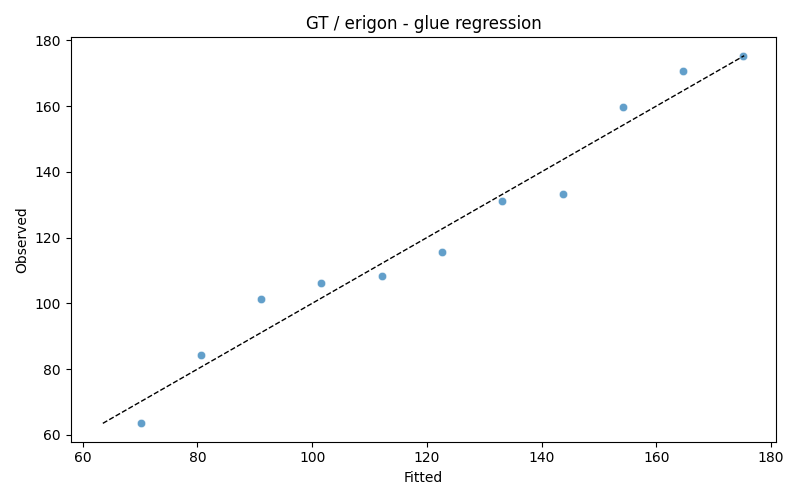

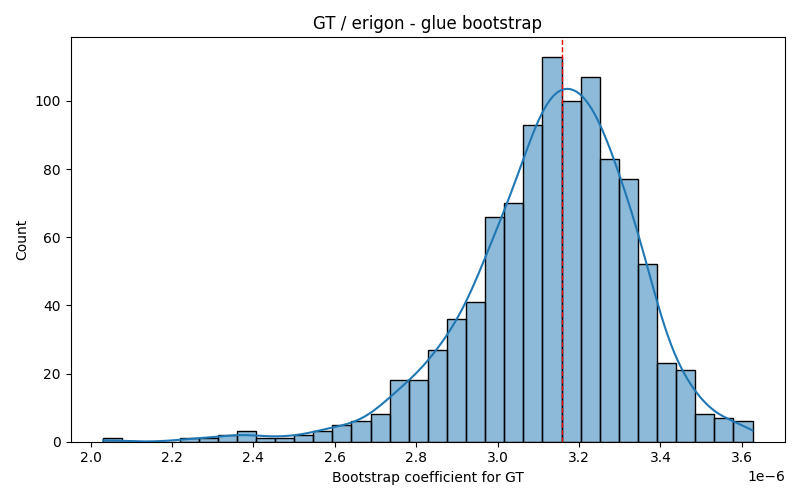

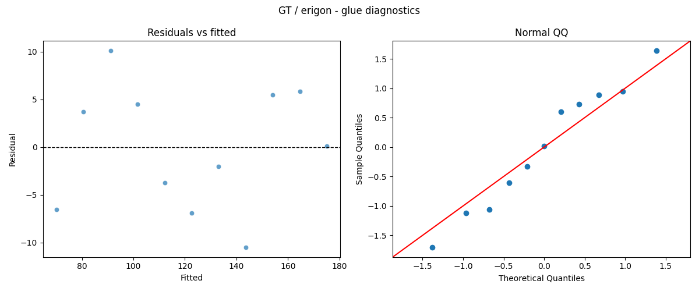

</details>

<details><summary><code>JUMPI</code> · nobs=11 · runtime_ms=3.863e-06 · p=1.00e-03 · R²=0.9657</summary>

```
==============================================================================
                           NNLS Regression Results                            
==============================================================================
Dep. Variable:          test_runtime_ms              R-squared:          0.966
Model:                  NNLS                    Adj. R-squared:          0.962
No. Observations:       11                                RMSE:           3.29
Df Residuals:           9                                  MAE:           2.94
Df Model:               1      
==============================================================================
                      coef     std err     P-value      [0.025      0.975]
------------------------------------------------------------------------------
         const     17.3781      4.5592       0.001      9.1276     26.1675
         JUMPI      0.0000      0.0000       0.001      0.0000      0.0000
==============================================================================
Notes: Non-negative least squares with bootstrap inference (1000 iterations)
==============================================================================
```

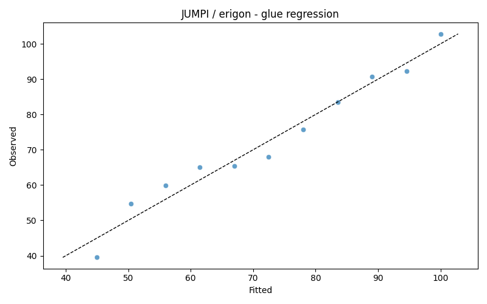

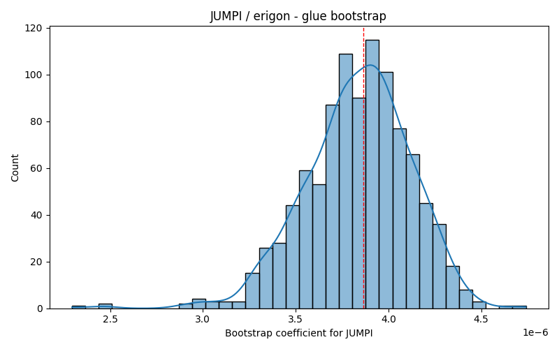

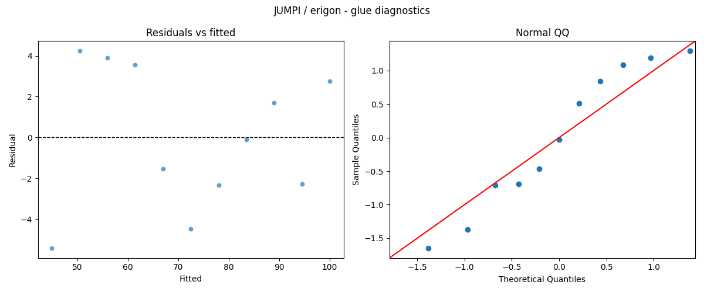

</details>

<details><summary><code>LT</code> · nobs=11 · runtime_ms=3.334e-06 · p=1.00e-03 · R²=0.9705</summary>

```
==============================================================================
                           NNLS Regression Results                            
==============================================================================
Dep. Variable:          test_runtime_ms              R-squared:          0.970
Model:                  NNLS                    Adj. R-squared:          0.967
No. Observations:       11                                RMSE:           6.12
Df Residuals:           9                                  MAE:           4.88
Df Model:               1      
==============================================================================
                      coef     std err     P-value      [0.025      0.975]
------------------------------------------------------------------------------
         const     13.6085      8.2410       0.009      1.4610     33.3197
            LT      0.0000      0.0000       0.001      0.0000      0.0000
==============================================================================
Notes: Non-negative least squares with bootstrap inference (1000 iterations)
==============================================================================
```

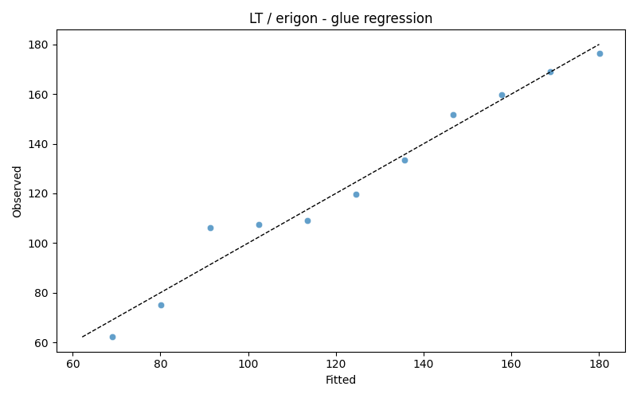

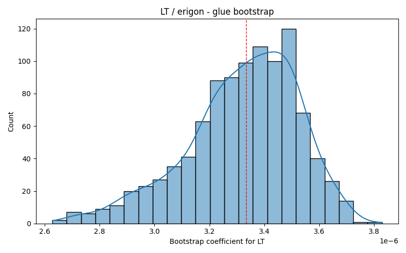


</details>

<details><summary><code>MSTORE</code> · nobs=55 · runtime_ms=5.67e-06 · p=1.00e-03 · R²=0.296</summary>

```
==============================================================================
                           NNLS Regression Results                            
==============================================================================
Dep. Variable:          test_runtime_ms              R-squared:          0.296
Model:                  NNLS                    Adj. R-squared:          0.283
No. Observations:       55                                RMSE:          61.36
Df Residuals:           53                                 MAE:          20.23
Df Model:               1      
==============================================================================
                      coef     std err     P-value      [0.025      0.975]
------------------------------------------------------------------------------
         const     42.7838     26.8247       0.001     10.1668    106.8555
        MSTORE      0.0000      0.0000       0.001      0.0000      0.0000
==============================================================================
Notes: Non-negative least squares with bootstrap inference (1000 iterations)
==============================================================================
```

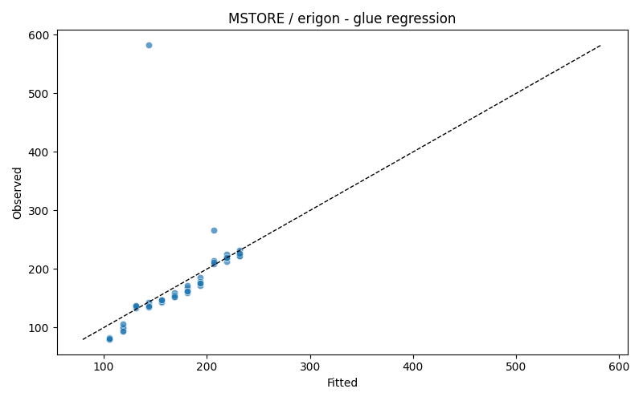

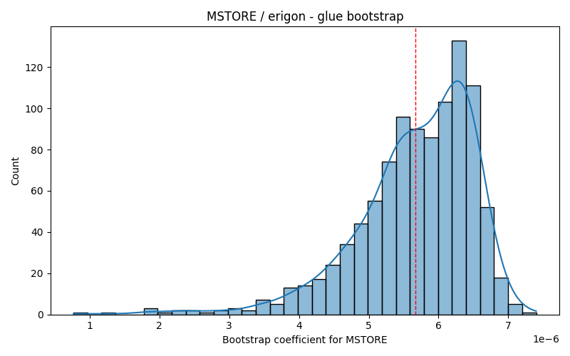


</details>

<details><summary><code>MSTORE8</code> · nobs=55 · runtime_ms=5.479e-06 · p=1.00e-03 · R²=0.9609</summary>

```
==============================================================================
                           NNLS Regression Results                            
==============================================================================
Dep. Variable:          test_runtime_ms              R-squared:          0.961
Model:                  NNLS                    Adj. R-squared:          0.960
No. Observations:       55                                RMSE:           7.76
Df Residuals:           53                                 MAE:           6.41
Df Model:               1      
==============================================================================
                      coef     std err     P-value      [0.025      0.975]
------------------------------------------------------------------------------
         const     23.0617      3.9154       0.001     16.6412     31.3397
       MSTORE8      0.0000      0.0000       0.001      0.0000      0.0000
==============================================================================
Notes: Non-negative least squares with bootstrap inference (1000 iterations)
==============================================================================
```


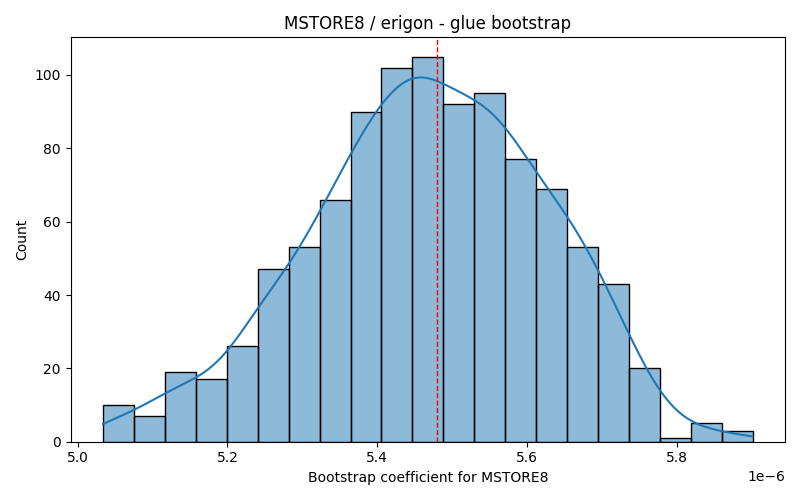


</details>

<details><summary><code>MUL</code> · nobs=11 · runtime_ms=5.107e-06 · p=1.00e-03 · R²=0.5714</summary>

```
==============================================================================
                           NNLS Regression Results                            
==============================================================================
Dep. Variable:          test_runtime_ms              R-squared:          0.571
Model:                  NNLS                    Adj. R-squared:          0.524
No. Observations:       11                                RMSE:          45.01
Df Residuals:           9                                  MAE:          28.68
Df Model:               1      
==============================================================================
                      coef     std err     P-value      [0.025      0.975]
------------------------------------------------------------------------------
         const      0.0000      8.7137       1.000      0.0000     26.6104
           MUL      0.0000      0.0000       0.001      0.0000      0.0000
==============================================================================
Notes: Non-negative least squares with bootstrap inference (1000 iterations)
==============================================================================
```

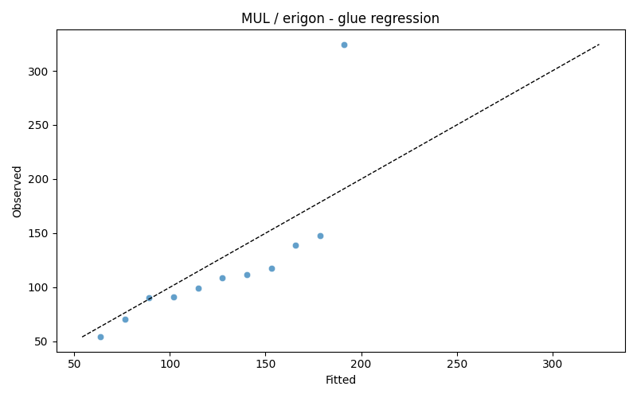


</details>

<details><summary><code>PC</code> · nobs=11 · runtime_ms=1.374e-06 · p=1.00e-03 · R²=0.9561</summary>

```
==============================================================================
                           NNLS Regression Results                            
==============================================================================
Dep. Variable:          test_runtime_ms              R-squared:          0.956
Model:                  NNLS                    Adj. R-squared:          0.951
No. Observations:       11                                RMSE:           8.80
Df Residuals:           9                                  MAE:           7.62
Df Model:               1      
==============================================================================
                      coef     std err     P-value      [0.025      0.975]
------------------------------------------------------------------------------
         const     40.4702     11.6111       0.001     13.9473     58.9936
            PC      0.0000      0.0000       0.001      0.0000      0.0000
==============================================================================
Notes: Non-negative least squares with bootstrap inference (1000 iterations)
==============================================================================
```


</details>

<details><summary><code>RETURNDATASIZE</code> · nobs=44 · runtime_ms=1.581e-06 · p=1.00e-03 · R²=0.2048</summary>

```
==============================================================================
                           NNLS Regression Results                            
==============================================================================
Dep. Variable:          test_runtime_ms              R-squared:          0.205
Model:                  NNLS                    Adj. R-squared:          0.186
No. Observations:       44                                RMSE:          49.18
Df Residuals:           42                                 MAE:          15.18
Df Model:               1      
==============================================================================
                      coef     std err     P-value      [0.025      0.975]
------------------------------------------------------------------------------
         const     41.3952     22.8111       0.001     13.6113     94.4928
RETURNDATASIZE      0.0000      0.0000       0.001      0.0000      0.0000
==============================================================================
Notes: Non-negative least squares with bootstrap inference (1000 iterations)
==============================================================================
```


</details>

<details><summary><code>SELFBALANCE</code> · nobs=9 · runtime_ms=1.603e-06 · p=1.00e-03 · R²=0.8916</summary>

```
==============================================================================
                           NNLS Regression Results                            
==============================================================================
Dep. Variable:          test_runtime_ms              R-squared:          0.892
Model:                  NNLS                    Adj. R-squared:          0.876
No. Observations:       9                                 RMSE:           5.64
Df Residuals:           7                                  MAE:           4.43
Df Model:               1      
==============================================================================
                      coef     std err     P-value      [0.025      0.975]
------------------------------------------------------------------------------
         const     18.7796      9.9079       0.019      1.9087     39.1117
   SELFBALANCE      0.0000      0.0000       0.001      0.0000      0.0000
==============================================================================
Notes: Non-negative least squares with bootstrap inference (1000 iterations)
==============================================================================
```

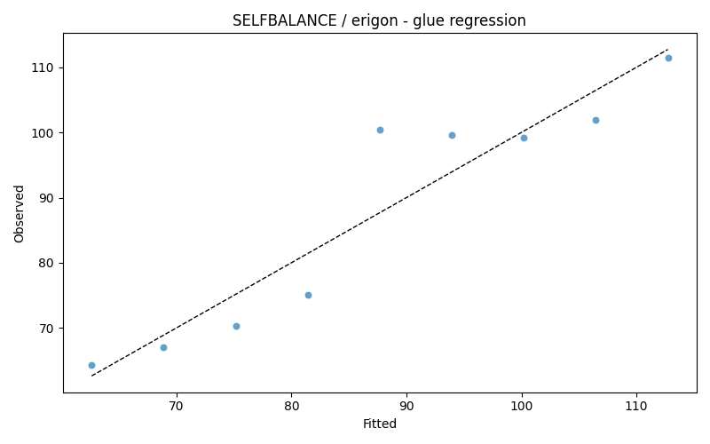


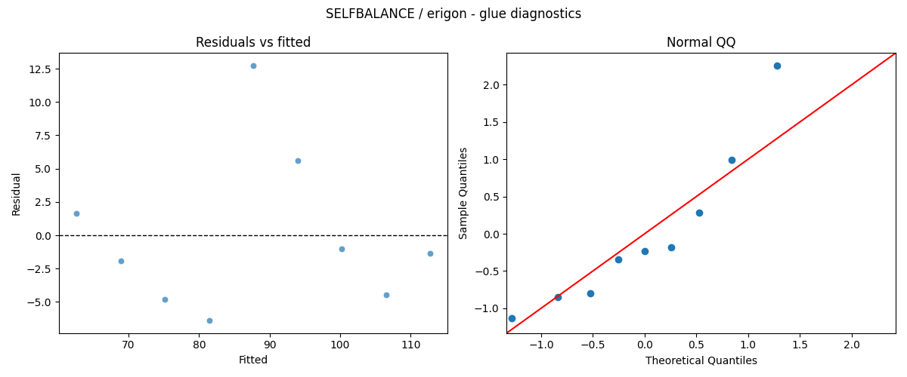

</details>

<details><summary><code>SUB</code> · nobs=11 · runtime_ms=3.174e-06 · p=1.00e-03 · R²=0.9438</summary>

```
==============================================================================
                           NNLS Regression Results                            
==============================================================================
Dep. Variable:          test_runtime_ms              R-squared:          0.944
Model:                  NNLS                    Adj. R-squared:          0.938
No. Observations:       11                                RMSE:           8.15
Df Residuals:           9                                  MAE:           6.76
Df Model:               1      
==============================================================================
                      coef     std err     P-value      [0.025      0.975]
------------------------------------------------------------------------------
         const     14.5508      8.8293       0.019      0.4339     34.8354
           SUB      0.0000      0.0000       0.001      0.0000      0.0000
==============================================================================
Notes: Non-negative least squares with bootstrap inference (1000 iterations)
==============================================================================
```

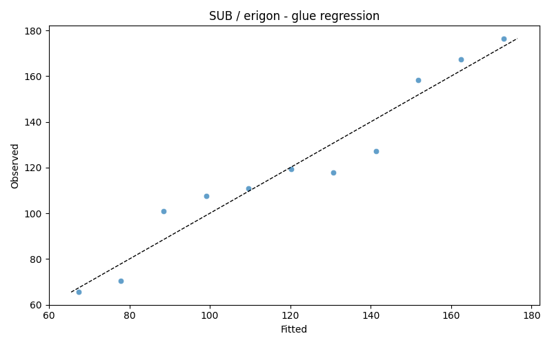


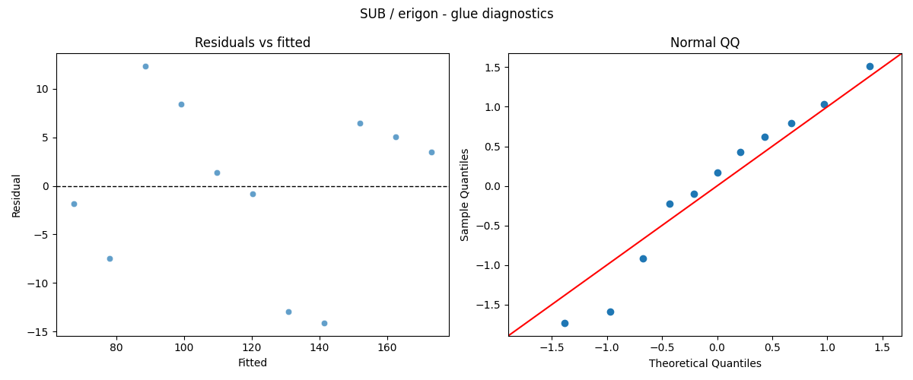

</details>

### Mixed glue (tier B) · erigon

<details><summary><code>JUMP</code> · nobs=11 · runtime_ms=7.344e-06 · p=1.00e-03 · R²=0.9765</summary>

```
==============================================================================
                           NNLS Regression Results                            
==============================================================================
Dep. Variable:          test_runtime_ms              R-squared:          0.977
Model:                  NNLS                    Adj. R-squared:          0.974
No. Observations:       11                                RMSE:           4.23
Df Residuals:           9                                  MAE:           3.13
Df Model:               1      
==============================================================================
                      coef     std err     P-value      [0.025      0.975]
------------------------------------------------------------------------------
         const     25.2680      5.7868       0.001     16.4942     38.2961
          JUMP      0.0000      0.0000       0.001      0.0000      0.0000
==============================================================================
Notes: Non-negative least squares with bootstrap inference (1000 iterations)
==============================================================================
```

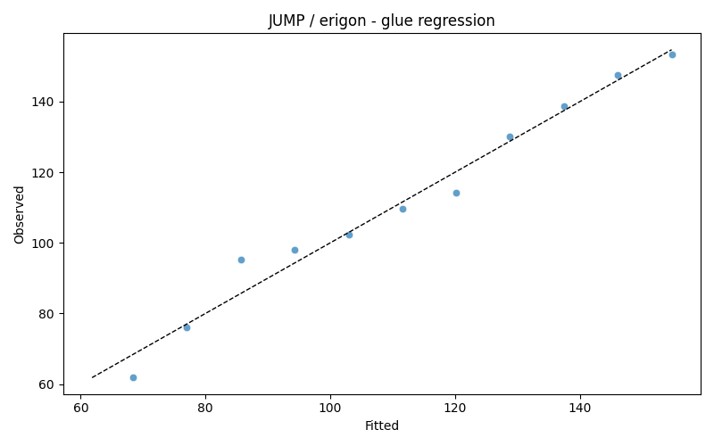


</details>

<details><summary><code>KECCAK256</code> · nobs=176 · runtime_ms=2.21e-05 · p=1.00e-03 · R²=0.09085</summary>

```
==============================================================================
                           NNLS Regression Results                            
==============================================================================
Dep. Variable:          test_runtime_ms              R-squared:          0.091
Model:                  NNLS                    Adj. R-squared:          0.086
No. Observations:       176                               RMSE:         138.93
Df Residuals:           174                                MAE:         112.73
Df Model:               1      
==============================================================================
                      coef     std err     P-value      [0.025      0.975]
------------------------------------------------------------------------------
         const    388.8019     23.0988       0.001    342.9470    431.8989
     KECCAK256      0.0000      0.0000       0.001      0.0000      0.0000
==============================================================================
Notes: Non-negative least squares with bootstrap inference (1000 iterations)
==============================================================================
```


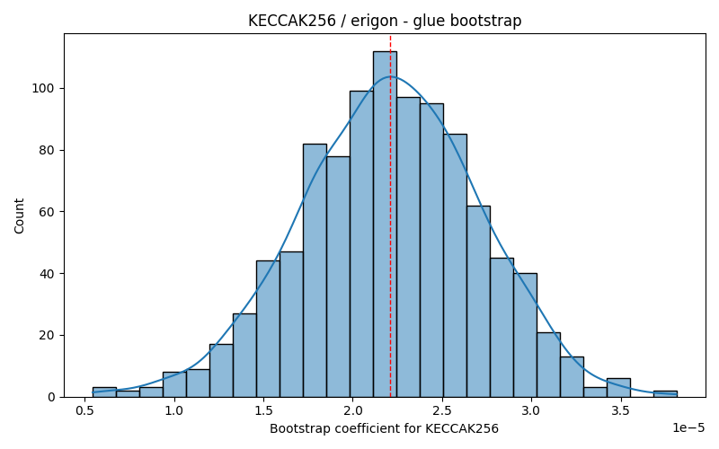

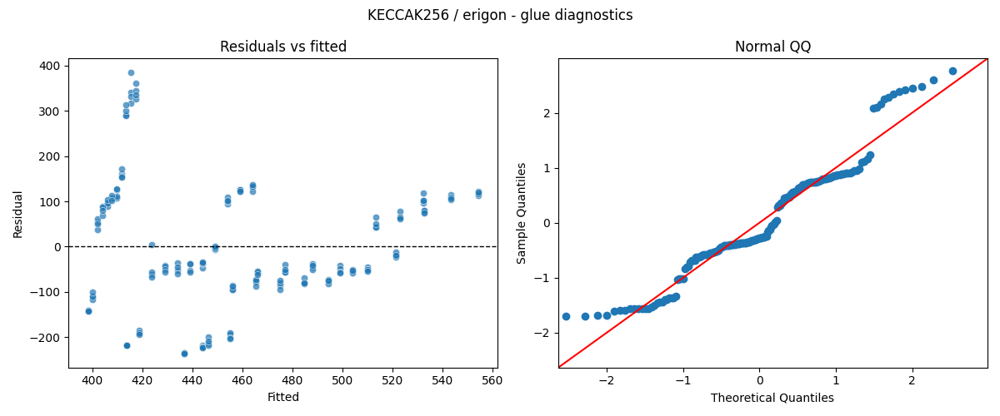

</details>

## geth

| glue_opcode | nobs | glue_runtime_ms | p_value | rsquared |
| --- | --- | --- | --- | --- |
| `ISZERO` | 682 | 1.771e-06 | 1.00e-03 | 0.1579 |
| `JUMPDEST` | 682 | 1.353e-06 | 1.00e-03 | 0.126 |
| `SWAP` | 10912 | 1.769e-06 | 1.00e-03 | 0.1325 |
| `CALLDATASIZE` | 40359 | 1.724e-06 | 1.00e-03 | 0.1817 |
| `DUP` | 40359 | 1.848e-06 | 1.00e-03 | 0.1817 |
| `GAS` | 40359 | 1.751e-06 | 1.00e-03 | 0.1817 |
| `MLOAD` | 40359 | 5.917e-06 | 1.00e-03 | 0.1817 |
| `PUSH` | 40359 | 2.699e-06 | 1.00e-03 | 0.1817 |
| `PUSH0` | 40359 | 1.703e-06 | 1.00e-03 | 0.1817 |
| `STATICCALL` | 40359 | 0.0001628 | 1.00e-03 | 0.1817 |
| `ADD` | 682 | 4.894e-06 | 1.00e-03 | 0.1773 |
| `AND` | 682 | 4.364e-06 | 1.00e-03 | 0.1344 |
| `CALLDATACOPY` | 16368 | 1.472e-05 | 1.00e-03 | 0.4437 |
| `CALLDATALOAD` | 2728 | 5.992e-05 | 1.00e-03 | 0.038 |
| `DIV` | 682 | 1.066e-05 | 1.00e-03 | 0.1318 |
| `EXP` | 682 | 0.0003913 | 1.00e-03 | 0.1375 |
| `GT` | 682 | 4.069e-06 | 1.00e-03 | 0.1256 |
| `JUMPI` | 682 | 6.619e-06 | 1.00e-03 | 0.149 |
| `LT` | 682 | 5.091e-06 | 1.00e-03 | 0.1737 |
| `MSTORE` | 3410 | 8.905e-06 | 1.00e-03 | 0.1312 |
| `MSTORE8` | 3410 | 8.219e-06 | 1.00e-03 | 0.1302 |
| `MUL` | 682 | 5.458e-06 | 1.00e-03 | 0.1456 |
| `PC` | 682 | 1.904e-06 | 1.00e-03 | 0.153 |
| `RETURNDATASIZE` | 2728 | 3.726e-06 | 1.00e-03 | 0.1629 |
| `SELFBALANCE` | 558 | 8.853e-06 | 1.00e-03 | 0.07329 |
| `SUB` | 682 | 4.707e-06 | 1.00e-03 | 0.1438 |
| `JUMP` | 682 | 1.06e-05 | 1.00e-03 | 0.1316 |
| `KECCAK256` | 10912 | 4.43e-05 | 1.00e-03 | 0.05931 |

### Cycle glue — joint fit · geth

<details><summary>Joint NNLS regression summary</summary>

```
==============================================================================
                           NNLS Regression Results                            
==============================================================================
Dep. Variable:          test_runtime_ms              R-squared:          0.182
Model:                  NNLS                    Adj. R-squared:          0.182
No. Observations:       40359                             RMSE:         127.51
Df Residuals:           40351                              MAE:          46.17
Df Model:               7      
==============================================================================
                      coef     std err     P-value      [0.025      0.975]
------------------------------------------------------------------------------
         const     38.1982      1.8210       0.001     34.5605     41.6760
  CALLDATASIZE      0.0000      0.0000       0.001      0.0000      0.0000
           DUP      0.0000      0.0000       0.001      0.0000      0.0000
           GAS      0.0000      0.0000       0.001      0.0000      0.0000
         MLOAD      0.0000      0.0000       0.001      0.0000      0.0000
          PUSH      0.0000      0.0000       0.001      0.0000      0.0000
         PUSH0      0.0000      0.0000       0.001      0.0000      0.0000
    STATICCALL      0.0002      0.0000       0.001      0.0002      0.0002
==============================================================================
Notes: Non-negative least squares with bootstrap inference (1000 iterations)
==============================================================================
```

</details>

<details><summary><code>CALLDATASIZE</code> · nobs=40359 · runtime_ms=1.724e-06 · p=1.00e-03 · R²=0.1817</summary>


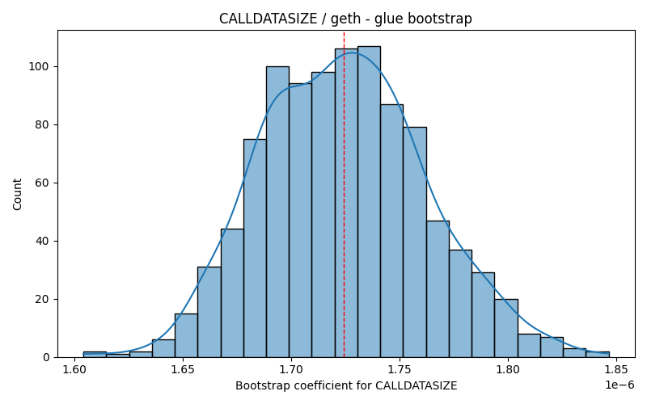

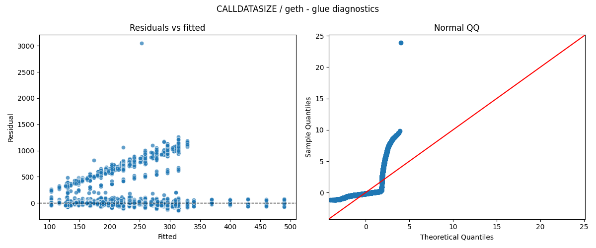

</details>

<details><summary><code>DUP</code> · nobs=40359 · runtime_ms=1.848e-06 · p=1.00e-03 · R²=0.1817</summary>


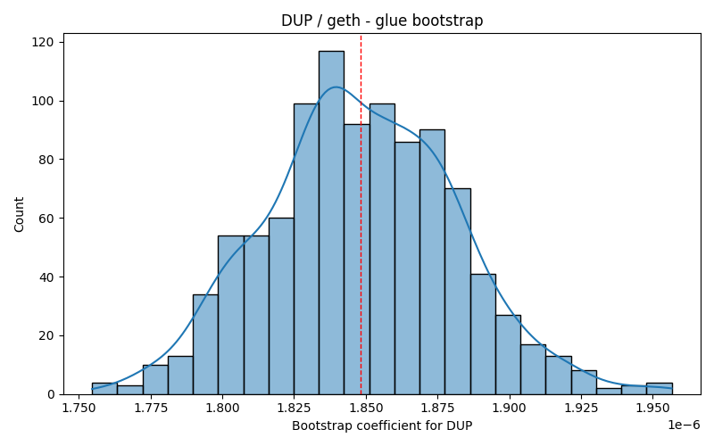


</details>

<details><summary><code>GAS</code> · nobs=40359 · runtime_ms=1.751e-06 · p=1.00e-03 · R²=0.1817</summary>


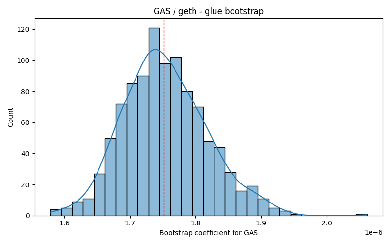


</details>

<details><summary><code>MLOAD</code> · nobs=40359 · runtime_ms=5.917e-06 · p=1.00e-03 · R²=0.1817</summary>


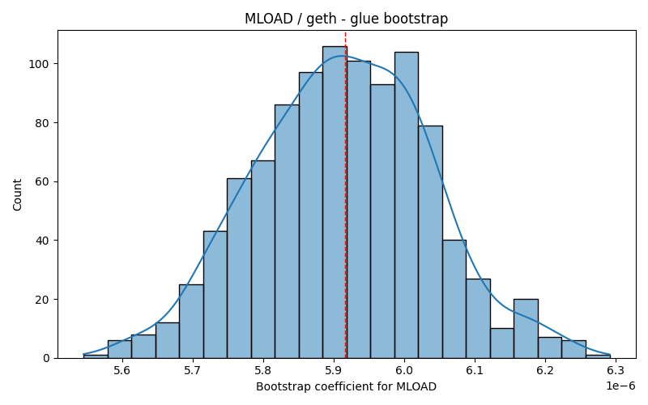


</details>

<details><summary><code>PUSH</code> · nobs=40359 · runtime_ms=2.699e-06 · p=1.00e-03 · R²=0.1817</summary>


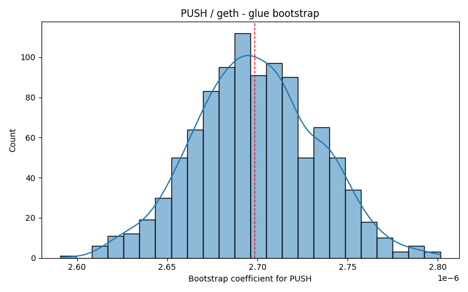

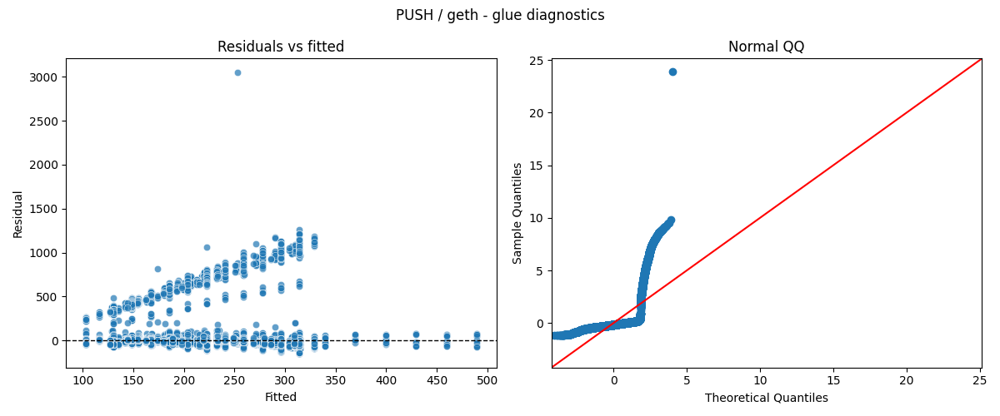

</details>

<details><summary><code>PUSH0</code> · nobs=40359 · runtime_ms=1.703e-06 · p=1.00e-03 · R²=0.1817</summary>


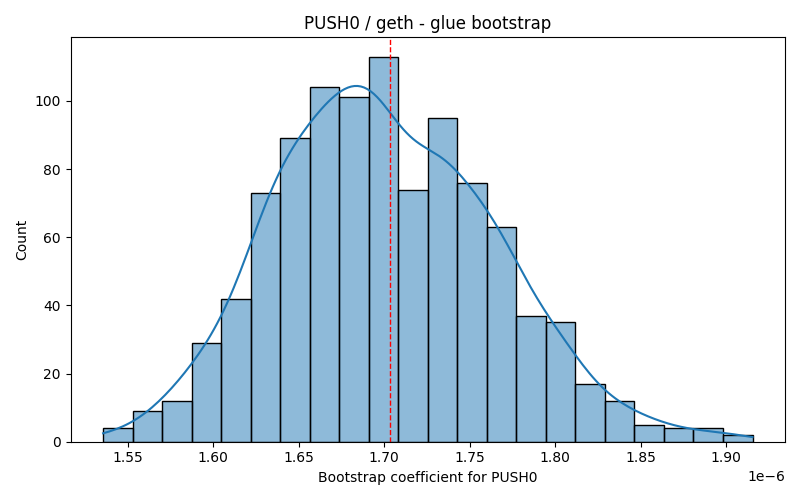


</details>

<details><summary><code>STATICCALL</code> · nobs=40359 · runtime_ms=0.0001628 · p=1.00e-03 · R²=0.1817</summary>

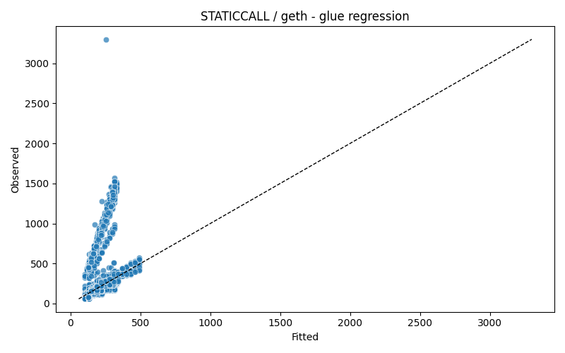

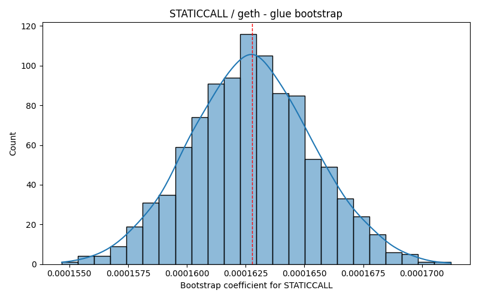


</details>

### Pure glue · geth

<details><summary><code>ISZERO</code> · nobs=682 · runtime_ms=1.771e-06 · p=1.00e-03 · R²=0.1579</summary>

```
==============================================================================
                           NNLS Regression Results                            
==============================================================================
Dep. Variable:          test_runtime_ms              R-squared:          0.158
Model:                  NNLS                    Adj. R-squared:          0.157
No. Observations:       682                               RMSE:          86.08
Df Residuals:           680                                MAE:          32.11
Df Model:               1      
==============================================================================
                      coef     std err     P-value      [0.025      0.975]
------------------------------------------------------------------------------
         const     21.7791      9.2932       0.010      2.8329     39.3914
        ISZERO      0.0000      0.0000       0.001      0.0000      0.0000
==============================================================================
Notes: Non-negative least squares with bootstrap inference (1000 iterations)
==============================================================================
```

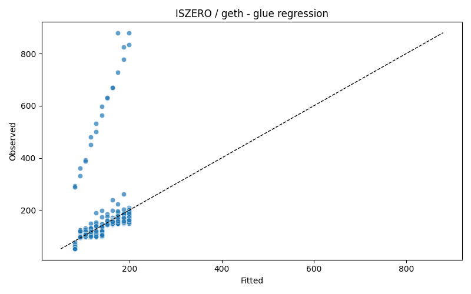

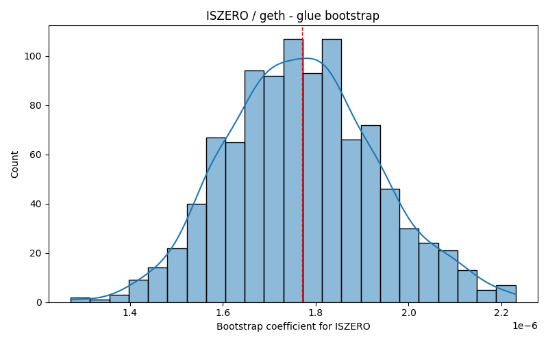

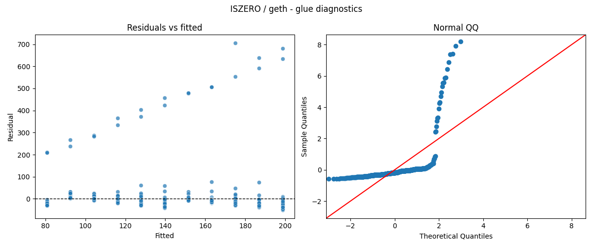

</details>

<details><summary><code>JUMPDEST</code> · nobs=682 · runtime_ms=1.353e-06 · p=1.00e-03 · R²=0.126</summary>

```
==============================================================================
                           NNLS Regression Results                            
==============================================================================
Dep. Variable:          test_runtime_ms              R-squared:          0.126
Model:                  NNLS                    Adj. R-squared:          0.125
No. Observations:       682                               RMSE:         225.00
Df Residuals:           680                                MAE:          82.52
Df Model:               1      
==============================================================================
                      coef     std err     P-value      [0.025      0.975]
------------------------------------------------------------------------------
         const     78.4267     24.7999       0.002     27.5710    125.5092
      JUMPDEST      0.0000      0.0000       0.001      0.0000      0.0000
==============================================================================
Notes: Non-negative least squares with bootstrap inference (1000 iterations)
==============================================================================
```

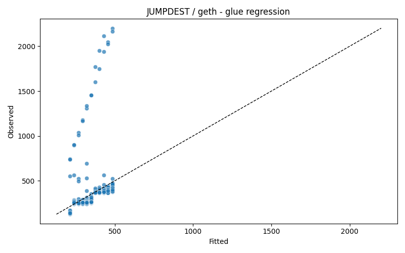

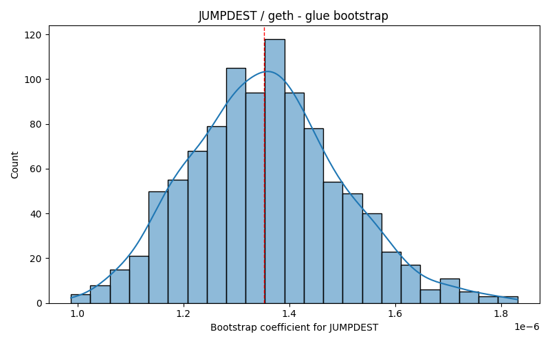

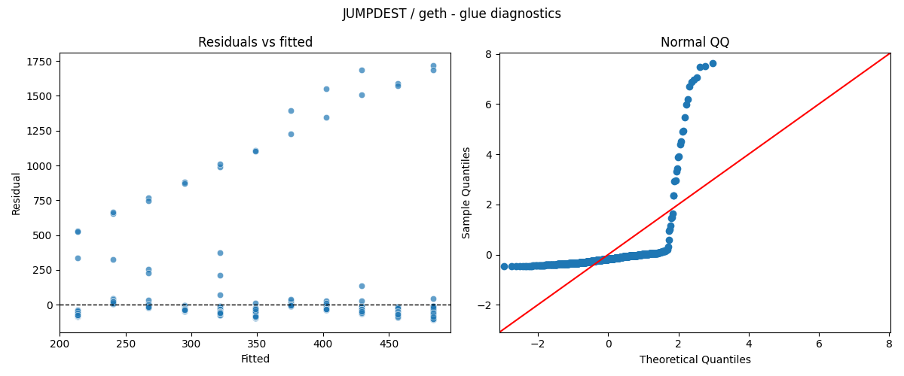

</details>

<details><summary><code>SWAP</code> · nobs=10912 · runtime_ms=1.769e-06 · p=1.00e-03 · R²=0.1325</summary>

```
==============================================================================
                           NNLS Regression Results                            
==============================================================================
Dep. Variable:          test_runtime_ms              R-squared:          0.132
Model:                  NNLS                    Adj. R-squared:          0.132
No. Observations:       10912                             RMSE:          95.28
Df Residuals:           10910                              MAE:          35.55
Df Model:               1      
==============================================================================
                      coef     std err     P-value      [0.025      0.975]
------------------------------------------------------------------------------
         const     31.2694      2.6370       0.001     26.0697     36.4844
          SWAP      0.0000      0.0000       0.001      0.0000      0.0000
==============================================================================
Notes: Non-negative least squares with bootstrap inference (1000 iterations)
==============================================================================
```

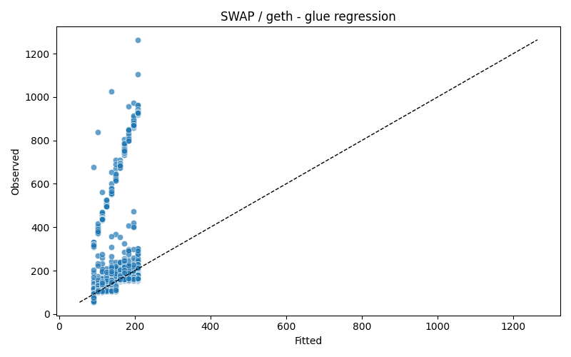

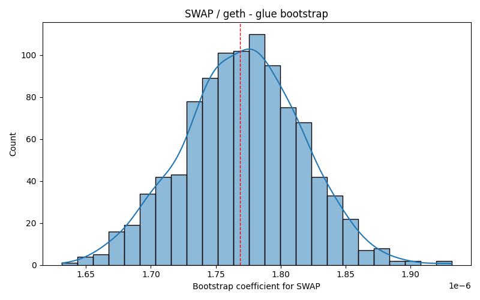

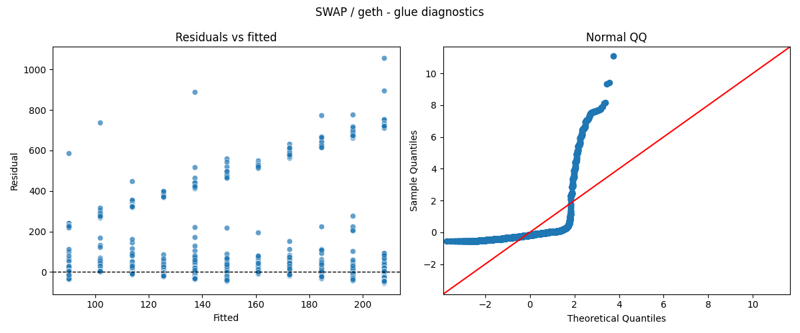

</details>

### Mixed glue (tier A) · geth

<details><summary><code>ADD</code> · nobs=682 · runtime_ms=4.894e-06 · p=1.00e-03 · R²=0.1773</summary>

```
==============================================================================
                           NNLS Regression Results                            
==============================================================================
Dep. Variable:          test_runtime_ms              R-squared:          0.177
Model:                  NNLS                    Adj. R-squared:          0.176
No. Observations:       682                               RMSE:         110.96
Df Residuals:           680                                MAE:          47.49
Df Model:               1      
==============================================================================
                      coef     std err     P-value      [0.025      0.975]
------------------------------------------------------------------------------
         const     43.8204     11.8688       0.001     21.5527     67.2700
           ADD      0.0000      0.0000       0.001      0.0000      0.0000
==============================================================================
Notes: Non-negative least squares with bootstrap inference (1000 iterations)
==============================================================================
```

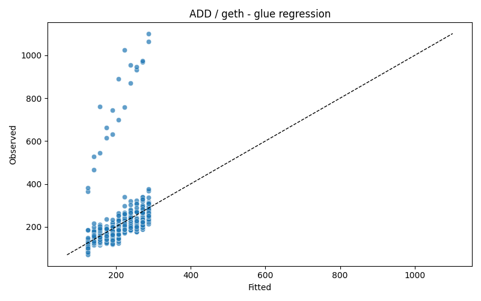

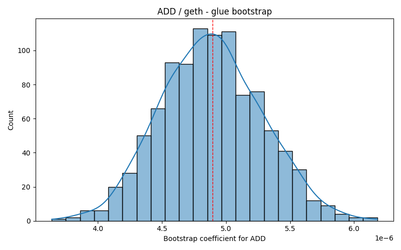

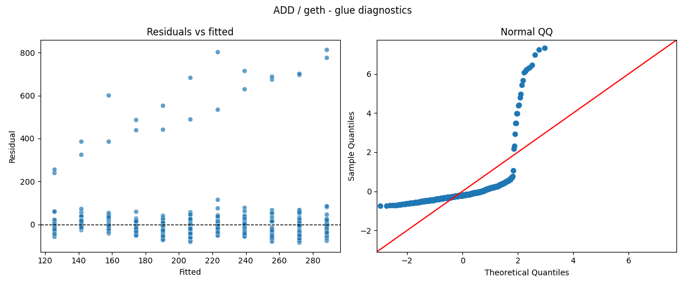

</details>

<details><summary><code>AND</code> · nobs=682 · runtime_ms=4.364e-06 · p=1.00e-03 · R²=0.1344</summary>

```
==============================================================================
                           NNLS Regression Results                            
==============================================================================
Dep. Variable:          test_runtime_ms              R-squared:          0.134
Model:                  NNLS                    Adj. R-squared:          0.133
No. Observations:       682                               RMSE:         116.56
Df Residuals:           680                                MAE:          47.59
Df Model:               1      
==============================================================================
                      coef     std err     P-value      [0.025      0.975]
------------------------------------------------------------------------------
         const     51.3760     12.0366       0.001     27.1584     76.2076
           AND      0.0000      0.0000       0.001      0.0000      0.0000
==============================================================================
Notes: Non-negative least squares with bootstrap inference (1000 iterations)
==============================================================================
```

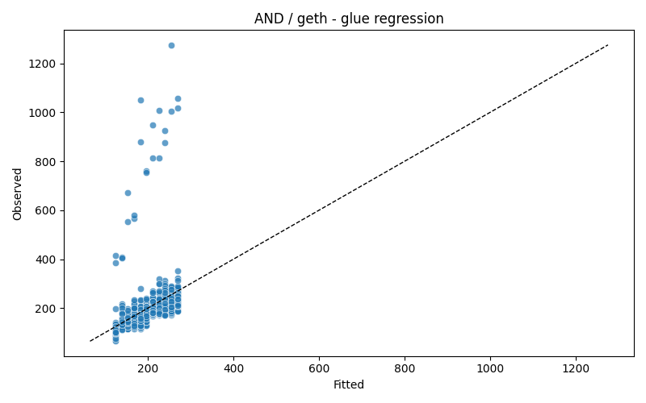

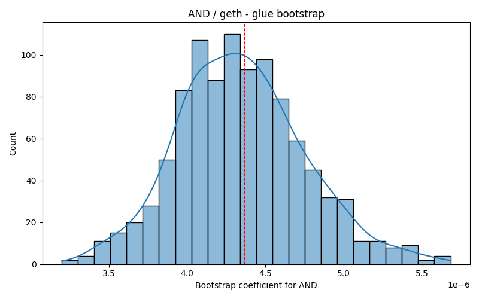

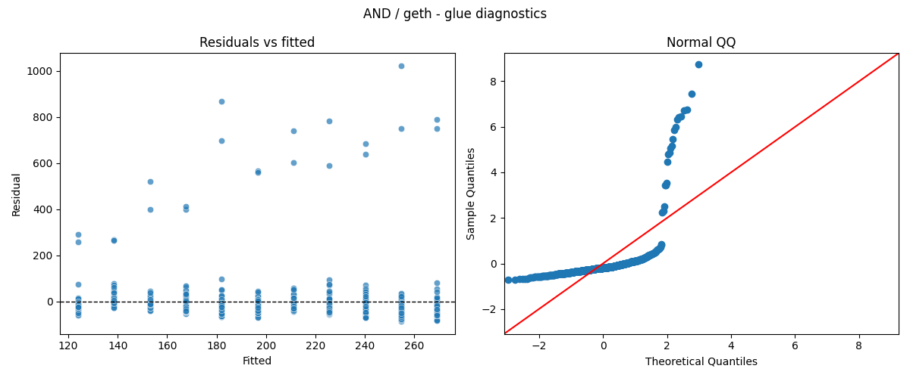

</details>

<details><summary><code>CALLDATACOPY</code> · nobs=16368 · runtime_ms=1.472e-05 · p=1.00e-03 · R²=0.4437</summary>

```
==============================================================================
                           NNLS Regression Results                            
==============================================================================
Dep. Variable:          test_runtime_ms              R-squared:          0.444
Model:                  NNLS                    Adj. R-squared:          0.444
No. Observations:       16368                             RMSE:         123.97
Df Residuals:           16366                              MAE:          40.58
Df Model:               1      
==============================================================================
                      coef     std err     P-value      [0.025      0.975]
------------------------------------------------------------------------------
         const     22.6072      1.1795       0.001     20.3659     24.9165
  CALLDATACOPY      0.0000      0.0000       0.001      0.0000      0.0000
==============================================================================
Notes: Non-negative least squares with bootstrap inference (1000 iterations)
==============================================================================
```

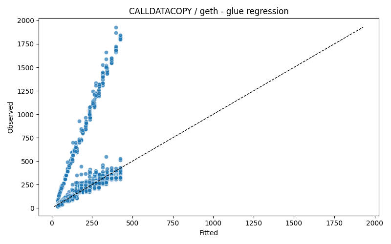

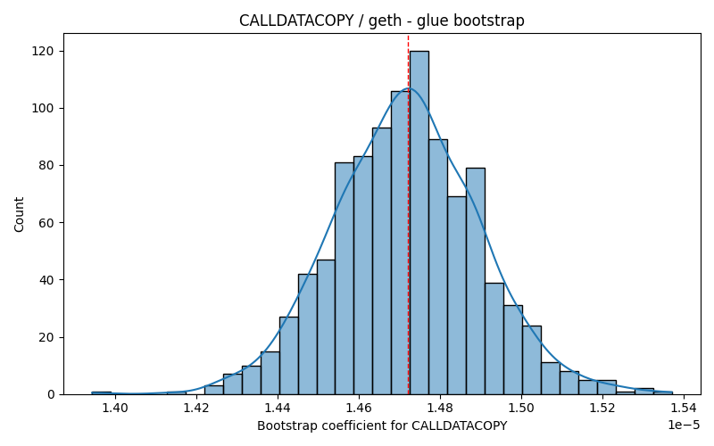

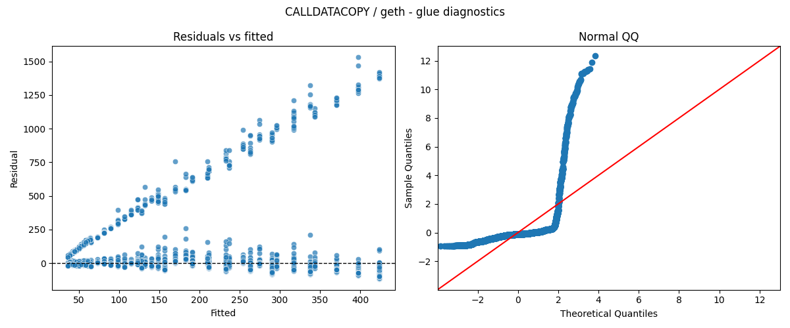

</details>

<details><summary><code>CALLDATALOAD</code> · nobs=2728 · runtime_ms=5.992e-05 · p=1.00e-03 · R²=0.038</summary>

```
==============================================================================
                           NNLS Regression Results                            
==============================================================================
Dep. Variable:          test_runtime_ms              R-squared:          0.038
Model:                  NNLS                    Adj. R-squared:          0.038
No. Observations:       2728                              RMSE:           1.16
Df Residuals:           2726                               MAE:           0.59
Df Model:               1      
==============================================================================
                      coef     std err     P-value      [0.025      0.975]
------------------------------------------------------------------------------
         const      2.5244      0.0702       0.001      2.3915      2.6657
  CALLDATALOAD      0.0001      0.0000       0.001      0.0000      0.0001
==============================================================================
Notes: Non-negative least squares with bootstrap inference (1000 iterations)
==============================================================================
```

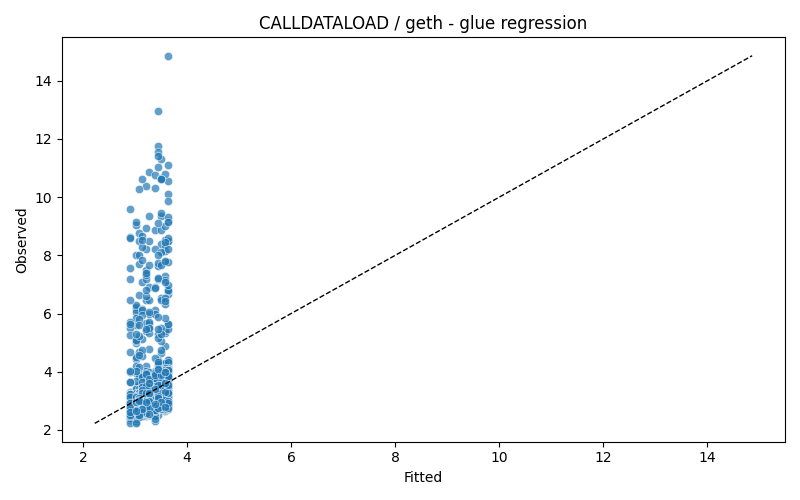

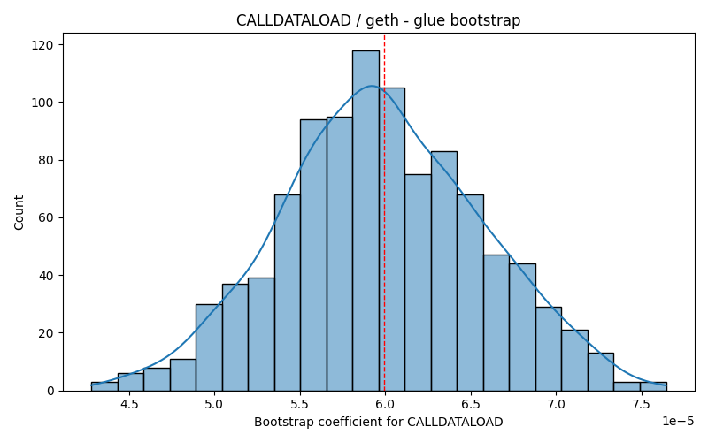

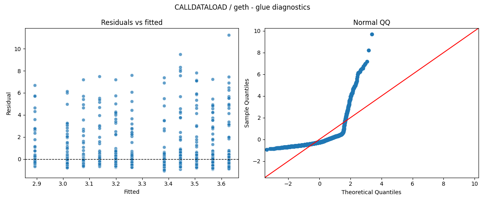

</details>

<details><summary><code>DIV</code> · nobs=682 · runtime_ms=1.066e-05 · p=1.00e-03 · R²=0.1318</summary>

```
==============================================================================
                           NNLS Regression Results                            
==============================================================================
Dep. Variable:          test_runtime_ms              R-squared:          0.132
Model:                  NNLS                    Adj. R-squared:          0.130
No. Observations:       682                               RMSE:         216.09
Df Residuals:           680                                MAE:          77.82
Df Model:               1      
==============================================================================
                      coef     std err     P-value      [0.025      0.975]
------------------------------------------------------------------------------
         const     79.3526     24.4216       0.001     27.9731    122.6969
           DIV      0.0000      0.0000       0.001      0.0000      0.0000
==============================================================================
Notes: Non-negative least squares with bootstrap inference (1000 iterations)
==============================================================================
```

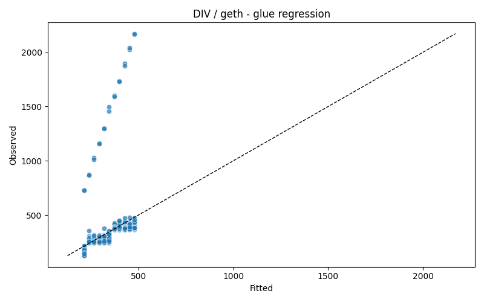

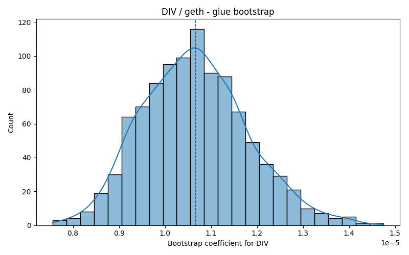

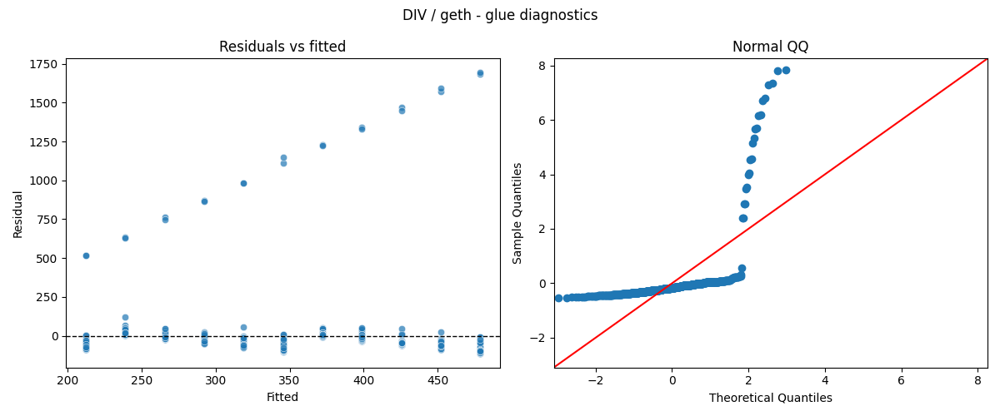

</details>

<details><summary><code>EXP</code> · nobs=682 · runtime_ms=0.0003913 · p=1.00e-03 · R²=0.1375</summary>

```
==============================================================================
                           NNLS Regression Results                            
==============================================================================
Dep. Variable:          test_runtime_ms              R-squared:          0.137
Model:                  NNLS                    Adj. R-squared:          0.136
No. Observations:       682                               RMSE:          38.38
Df Residuals:           680                                MAE:          14.58
Df Model:               1      
==============================================================================
                      coef     std err     P-value      [0.025      0.975]
------------------------------------------------------------------------------
         const     13.3767      4.2687       0.001      5.0854     21.1727
           EXP      0.0004      0.0000       0.001      0.0003      0.0005
==============================================================================
Notes: Non-negative least squares with bootstrap inference (1000 iterations)
==============================================================================
```


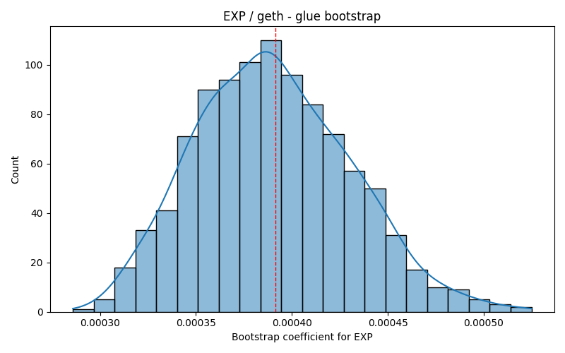

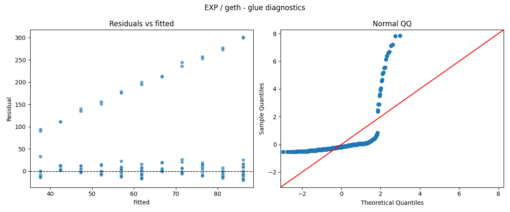

</details>

<details><summary><code>GT</code> · nobs=682 · runtime_ms=4.069e-06 · p=1.00e-03 · R²=0.1256</summary>

```
==============================================================================
                           NNLS Regression Results                            
==============================================================================
Dep. Variable:          test_runtime_ms              R-squared:          0.126
Model:                  NNLS                    Adj. R-squared:          0.124
No. Observations:       682                               RMSE:         112.99
Df Residuals:           680                                MAE:          40.61
Df Model:               1      
==============================================================================
                      coef     std err     P-value      [0.025      0.975]
------------------------------------------------------------------------------
         const     37.4659     12.4921       0.004     10.6531     60.3989
            GT      0.0000      0.0000       0.001      0.0000      0.0000
==============================================================================
Notes: Non-negative least squares with bootstrap inference (1000 iterations)
==============================================================================
```

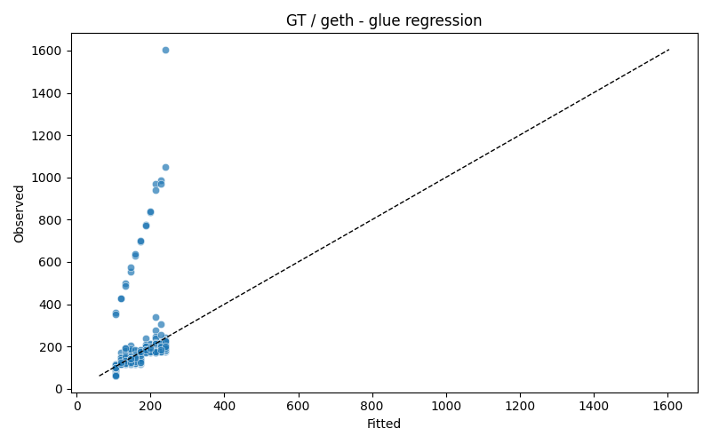

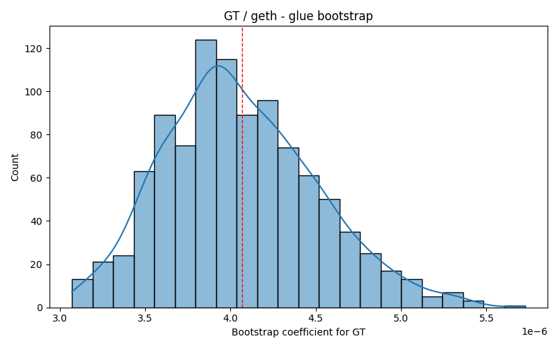

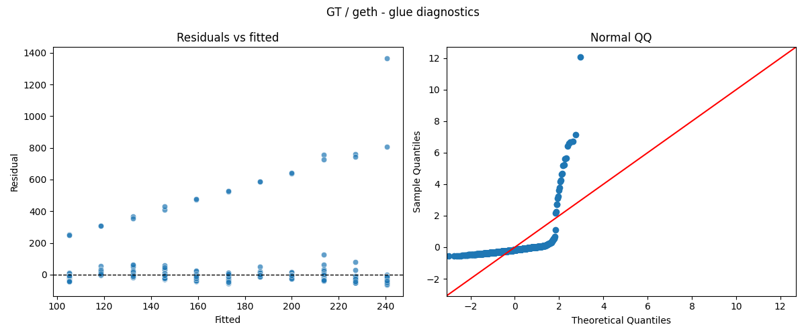

</details>

<details><summary><code>JUMPI</code> · nobs=682 · runtime_ms=6.619e-06 · p=1.00e-03 · R²=0.149</summary>

```
==============================================================================
                           NNLS Regression Results                            
==============================================================================
Dep. Variable:          test_runtime_ms              R-squared:          0.149
Model:                  NNLS                    Adj. R-squared:          0.148
No. Observations:       682                               RMSE:          71.36
Df Residuals:           680                                MAE:          27.25
Df Model:               1      
==============================================================================
                      coef     std err     P-value      [0.025      0.975]
------------------------------------------------------------------------------
         const     19.3020      7.7402       0.014      1.8763     33.0087
         JUMPI      0.0000      0.0000       0.001      0.0000      0.0000
==============================================================================
Notes: Non-negative least squares with bootstrap inference (1000 iterations)
==============================================================================
```

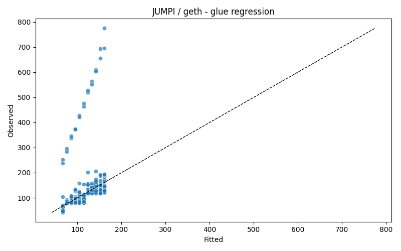

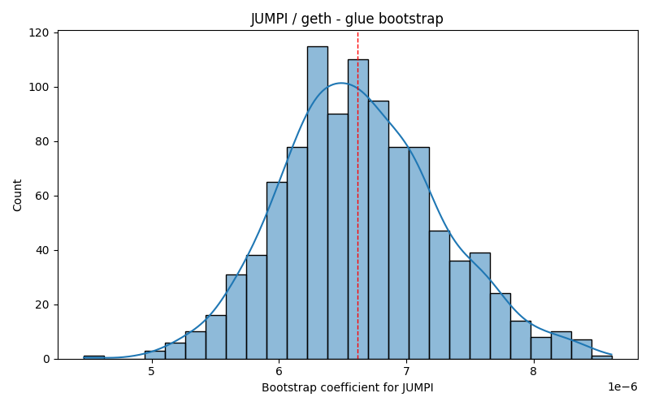

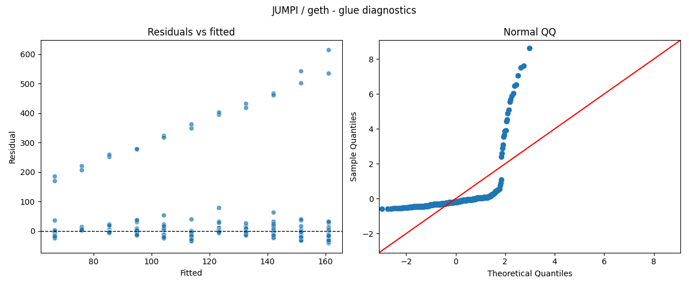

</details>

<details><summary><code>LT</code> · nobs=682 · runtime_ms=5.091e-06 · p=1.00e-03 · R²=0.1737</summary>

```
==============================================================================
                           NNLS Regression Results                            
==============================================================================
Dep. Variable:          test_runtime_ms              R-squared:          0.174
Model:                  NNLS                    Adj. R-squared:          0.172
No. Observations:       682                               RMSE:         116.88
Df Residuals:           680                                MAE:          44.26
Df Model:               1      
==============================================================================
                      coef     std err     P-value      [0.025      0.975]
------------------------------------------------------------------------------
         const     39.9371     12.6012       0.003     11.6908     63.4537
            LT      0.0000      0.0000       0.001      0.0000      0.0000
==============================================================================
Notes: Non-negative least squares with bootstrap inference (1000 iterations)
==============================================================================
```


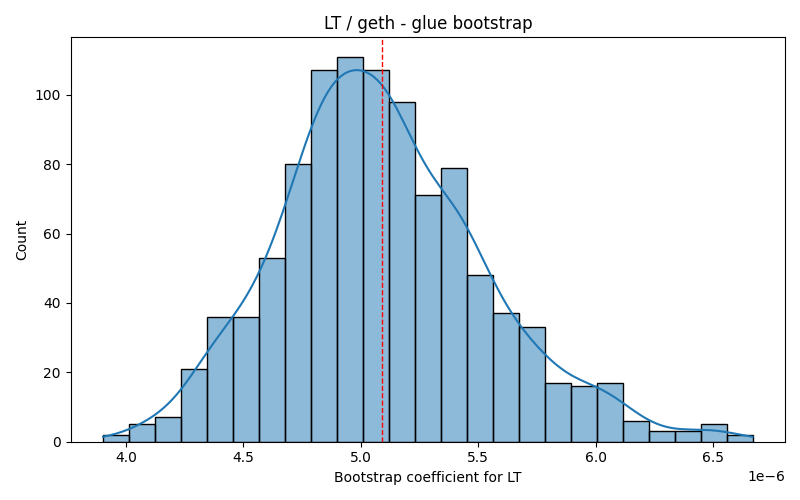

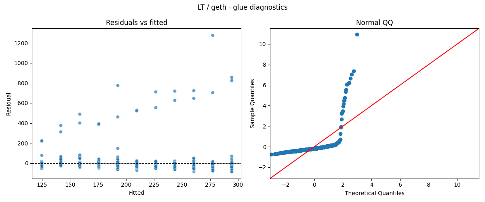

</details>

<details><summary><code>MSTORE</code> · nobs=3410 · runtime_ms=8.905e-06 · p=1.00e-03 · R²=0.1312</summary>

```
==============================================================================
                           NNLS Regression Results                            
==============================================================================
Dep. Variable:          test_runtime_ms              R-squared:          0.131
Model:                  NNLS                    Adj. R-squared:          0.131
No. Observations:       3410                              RMSE:         160.80
Df Residuals:           3408                               MAE:          58.27
Df Model:               1      
==============================================================================
                      coef     std err     P-value      [0.025      0.975]
------------------------------------------------------------------------------
         const     51.7159      7.8768       0.001     36.5875     67.8778
        MSTORE      0.0000      0.0000       0.001      0.0000      0.0000
==============================================================================
Notes: Non-negative least squares with bootstrap inference (1000 iterations)
==============================================================================
```

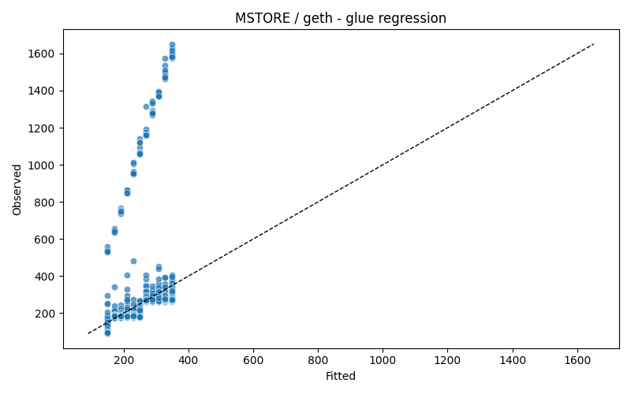

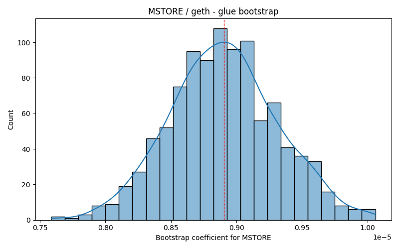

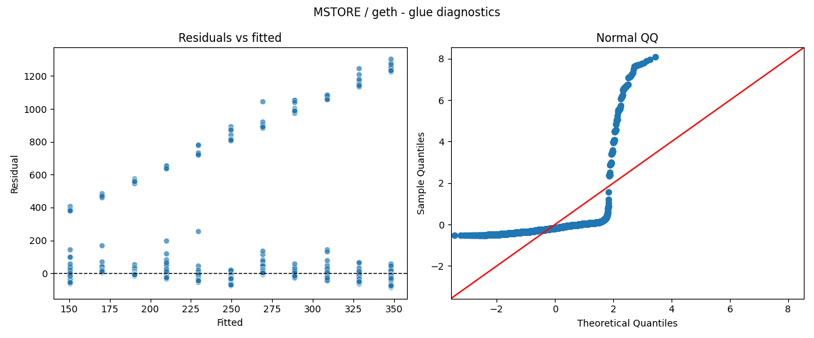

</details>

<details><summary><code>MSTORE8</code> · nobs=3410 · runtime_ms=8.219e-06 · p=1.00e-03 · R²=0.1302</summary>

```
==============================================================================
                           NNLS Regression Results                            
==============================================================================
Dep. Variable:          test_runtime_ms              R-squared:          0.130
Model:                  NNLS                    Adj. R-squared:          0.130
No. Observations:       3410                              RMSE:         149.07
Df Residuals:           3408                               MAE:          54.69
Df Model:               1      
==============================================================================
                      coef     std err     P-value      [0.025      0.975]
------------------------------------------------------------------------------
         const     48.2817      7.4334       0.001     34.1508     62.2371
       MSTORE8      0.0000      0.0000       0.001      0.0000      0.0000
==============================================================================
Notes: Non-negative least squares with bootstrap inference (1000 iterations)
==============================================================================
```

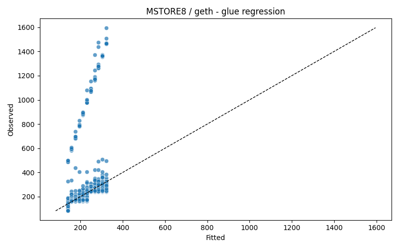

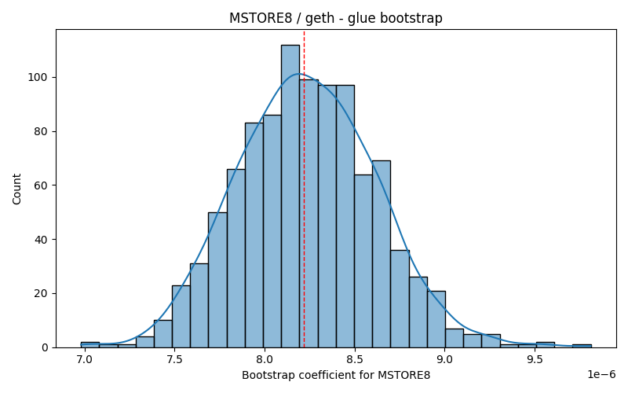

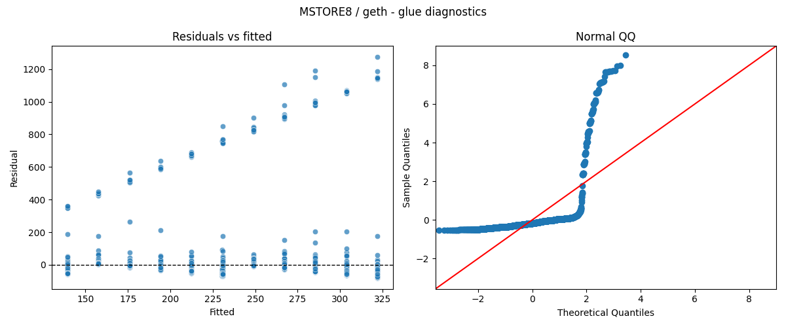

</details>

<details><summary><code>MUL</code> · nobs=682 · runtime_ms=5.458e-06 · p=1.00e-03 · R²=0.1456</summary>

```
==============================================================================
                           NNLS Regression Results                            
==============================================================================
Dep. Variable:          test_runtime_ms              R-squared:          0.146
Model:                  NNLS                    Adj. R-squared:          0.144
No. Observations:       682                               RMSE:         104.37
Df Residuals:           680                                MAE:          38.27
Df Model:               1      
==============================================================================
                      coef     std err     P-value      [0.025      0.975]
------------------------------------------------------------------------------
         const     36.3323     11.6666       0.001     13.3733     58.9430
           MUL      0.0000      0.0000       0.001      0.0000      0.0000
==============================================================================
Notes: Non-negative least squares with bootstrap inference (1000 iterations)
==============================================================================
```

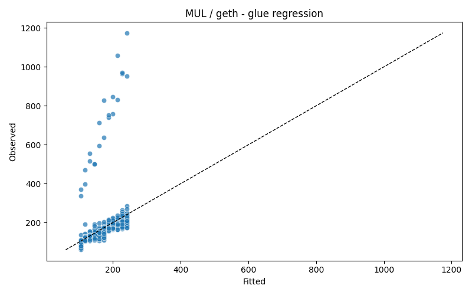

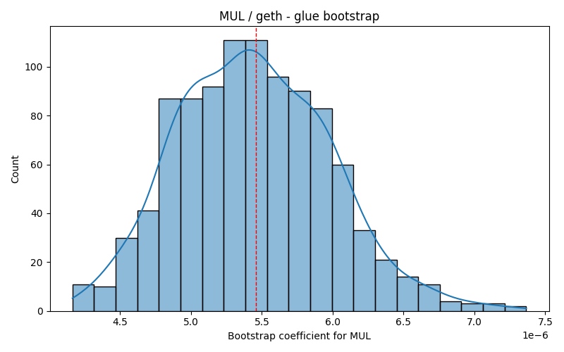

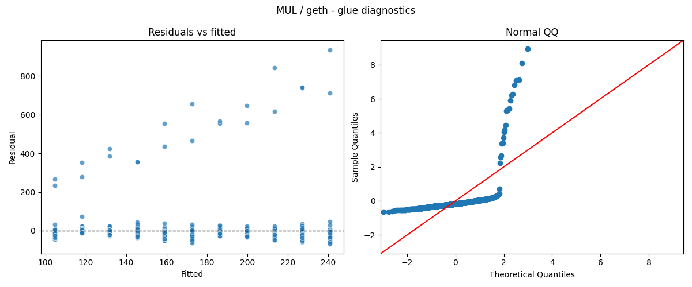

</details>

<details><summary><code>PC</code> · nobs=682 · runtime_ms=1.904e-06 · p=1.00e-03 · R²=0.153</summary>

```
==============================================================================
                           NNLS Regression Results                            
==============================================================================
Dep. Variable:          test_runtime_ms              R-squared:          0.153
Model:                  NNLS                    Adj. R-squared:          0.152
No. Observations:       682                               RMSE:         133.91
Df Residuals:           680                                MAE:          48.11
Df Model:               1      
==============================================================================
                      coef     std err     P-value      [0.025      0.975]
------------------------------------------------------------------------------
         const     38.3802     14.5509       0.006     10.1429     65.7729
            PC      0.0000      0.0000       0.001      0.0000      0.0000
==============================================================================
Notes: Non-negative least squares with bootstrap inference (1000 iterations)
==============================================================================
```

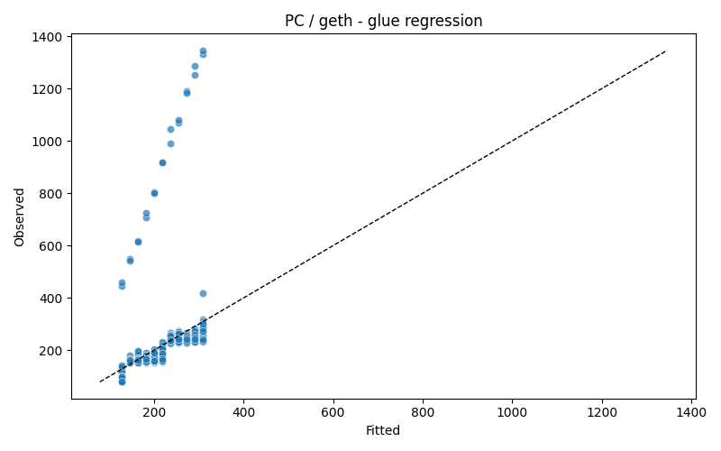

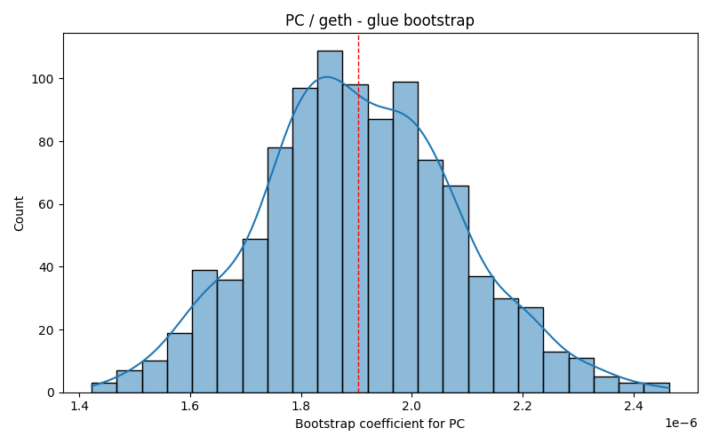

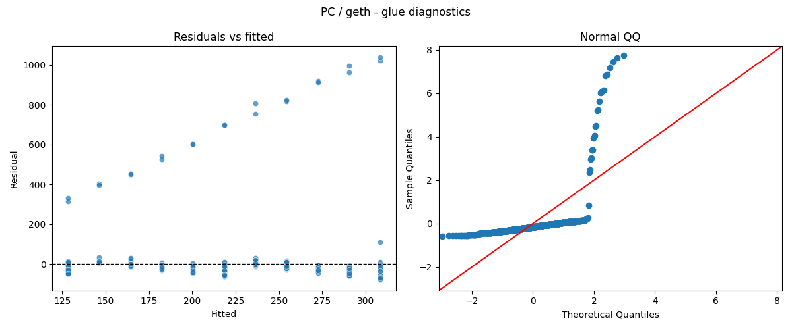

</details>

<details><summary><code>RETURNDATASIZE</code> · nobs=2728 · runtime_ms=3.726e-06 · p=1.00e-03 · R²=0.1629</summary>

```
==============================================================================
                           NNLS Regression Results                            
==============================================================================
Dep. Variable:          test_runtime_ms              R-squared:          0.163
Model:                  NNLS                    Adj. R-squared:          0.163
No. Observations:       2728                              RMSE:         133.35
Df Residuals:           2726                               MAE:          56.58
Df Model:               1      
==============================================================================
                      coef     std err     P-value      [0.025      0.975]
------------------------------------------------------------------------------
         const     49.1949      7.4592       0.001     34.5222     63.5686
RETURNDATASIZE      0.0000      0.0000       0.001      0.0000      0.0000
==============================================================================
Notes: Non-negative least squares with bootstrap inference (1000 iterations)
==============================================================================
```

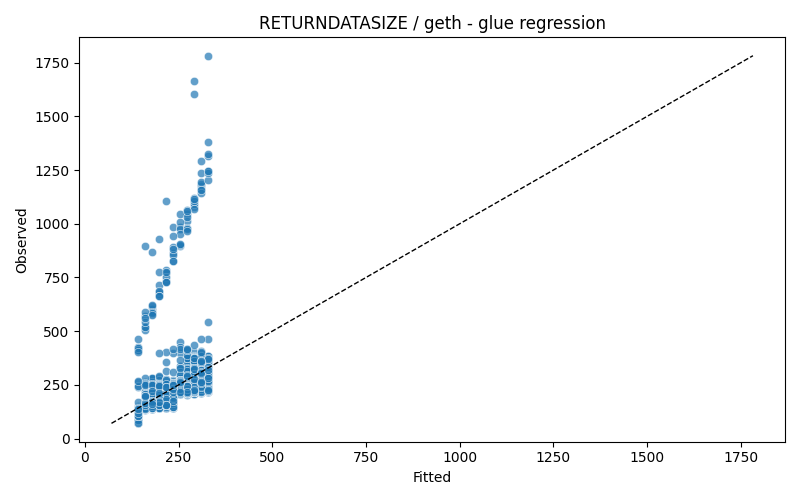

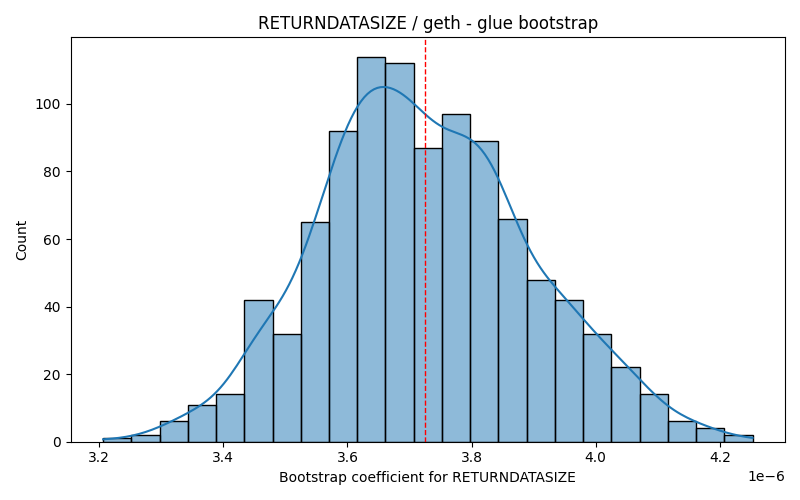

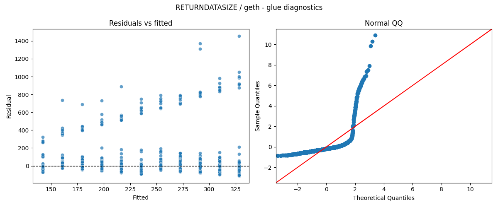

</details>

<details><summary><code>SELFBALANCE</code> · nobs=558 · runtime_ms=8.853e-06 · p=1.00e-03 · R²=0.07329</summary>

```
==============================================================================
                           NNLS Regression Results                            
==============================================================================
Dep. Variable:          test_runtime_ms              R-squared:          0.073
Model:                  NNLS                    Adj. R-squared:          0.072
No. Observations:       558                               RMSE:         317.54
Df Residuals:           556                                MAE:         110.74
Df Model:               1      
==============================================================================
                      coef     std err     P-value      [0.025      0.975]
------------------------------------------------------------------------------
         const    117.7075     50.3141       0.011     17.3622    211.1138
   SELFBALANCE      0.0000      0.0000       0.001      0.0000      0.0000
==============================================================================
Notes: Non-negative least squares with bootstrap inference (1000 iterations)
==============================================================================
```

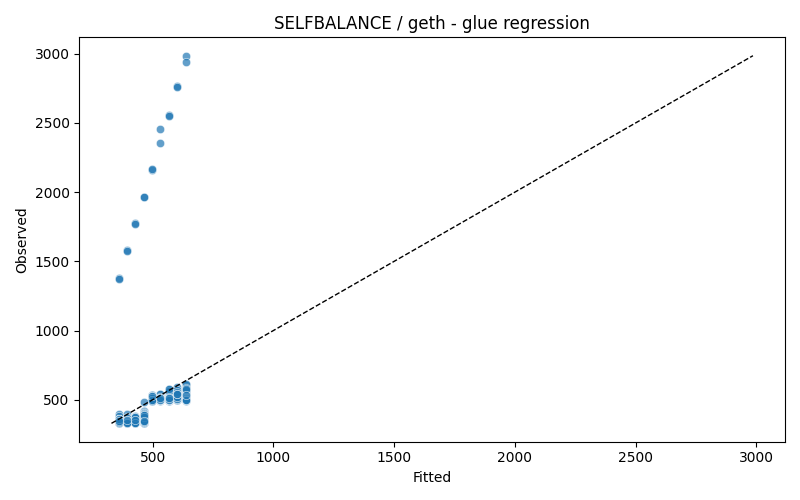

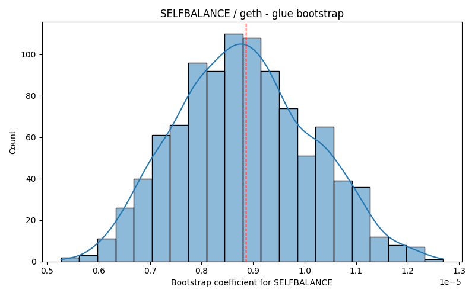

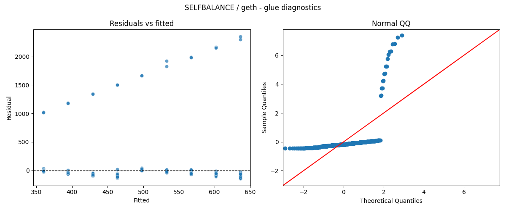

</details>

<details><summary><code>SUB</code> · nobs=682 · runtime_ms=4.707e-06 · p=1.00e-03 · R²=0.1438</summary>

```
==============================================================================
                           NNLS Regression Results                            
==============================================================================
Dep. Variable:          test_runtime_ms              R-squared:          0.144
Model:                  NNLS                    Adj. R-squared:          0.142
No. Observations:       682                               RMSE:         120.90
Df Residuals:           680                                MAE:          48.45
Df Model:               1      
==============================================================================
                      coef     std err     P-value      [0.025      0.975]
------------------------------------------------------------------------------
         const     44.8463     13.9176       0.001     16.8310     72.1902
           SUB      0.0000      0.0000       0.001      0.0000      0.0000
==============================================================================
Notes: Non-negative least squares with bootstrap inference (1000 iterations)
==============================================================================
```

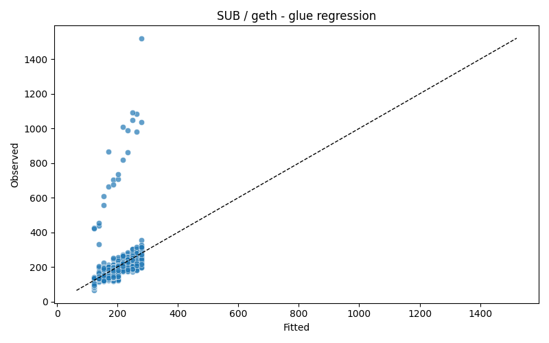

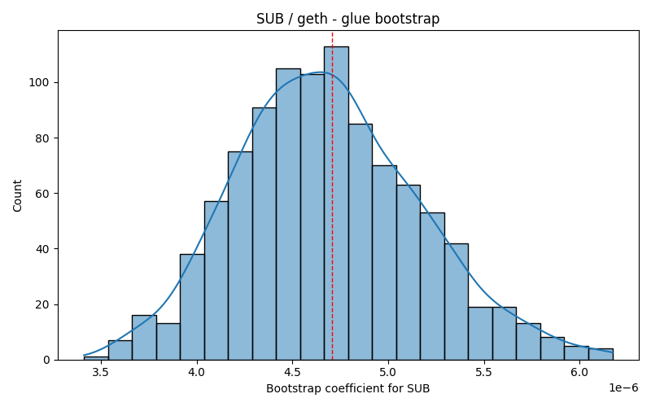

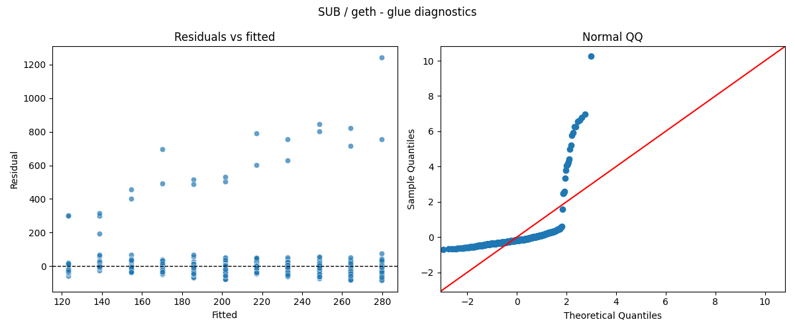

</details>

### Mixed glue (tier B) · geth

<details><summary><code>JUMP</code> · nobs=682 · runtime_ms=1.06e-05 · p=1.00e-03 · R²=0.1316</summary>

```
==============================================================================
                           NNLS Regression Results                            
==============================================================================
Dep. Variable:          test_runtime_ms              R-squared:          0.132
Model:                  NNLS                    Adj. R-squared:          0.130
No. Observations:       682                               RMSE:         101.17
Df Residuals:           680                                MAE:          37.41
Df Model:               1      
==============================================================================
                      coef     std err     P-value      [0.025      0.975]
------------------------------------------------------------------------------
         const     35.1881     11.2832       0.004     11.1365     55.8463
          JUMP      0.0000      0.0000       0.001      0.0000      0.0000
==============================================================================
Notes: Non-negative least squares with bootstrap inference (1000 iterations)
==============================================================================
```

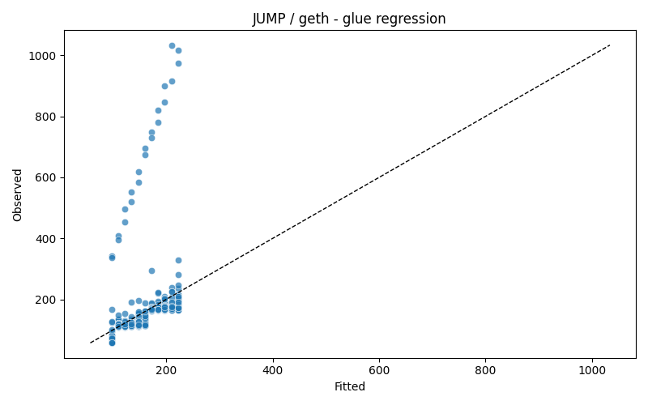

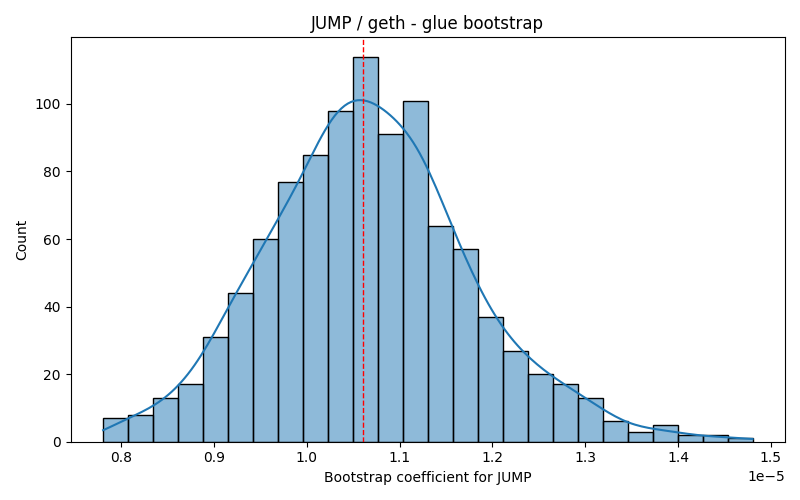

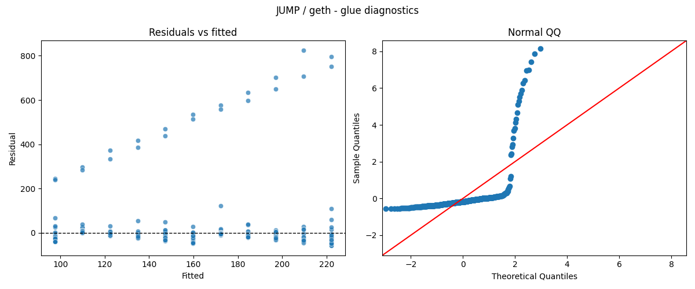

</details>

<details><summary><code>KECCAK256</code> · nobs=10912 · runtime_ms=4.43e-05 · p=1.00e-03 · R²=0.05931</summary>

```
==============================================================================
                           NNLS Regression Results                            
==============================================================================
Dep. Variable:          test_runtime_ms              R-squared:          0.059
Model:                  NNLS                    Adj. R-squared:          0.059
No. Observations:       10912                             RMSE:         350.56
Df Residuals:           10910                              MAE:         153.33
Df Model:               1      
==============================================================================
                      coef     std err     P-value      [0.025      0.975]
------------------------------------------------------------------------------
         const    398.4033      6.2542       0.001    386.4275    410.7974
     KECCAK256      0.0000      0.0000       0.001      0.0000      0.0000
==============================================================================
Notes: Non-negative least squares with bootstrap inference (1000 iterations)
==============================================================================
```

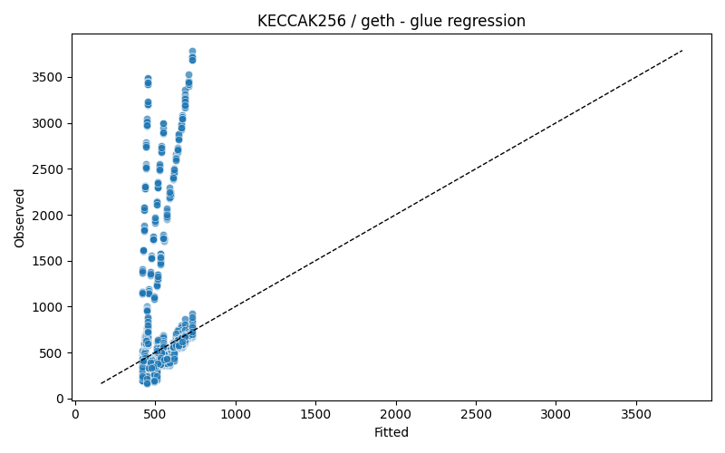

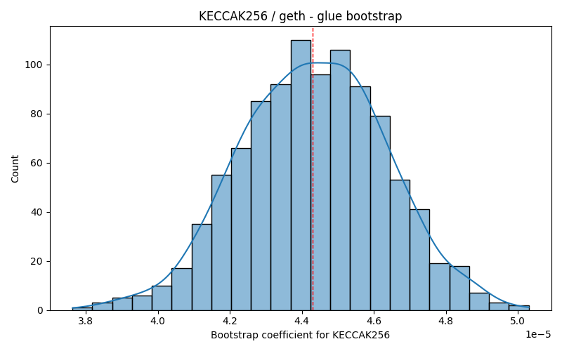

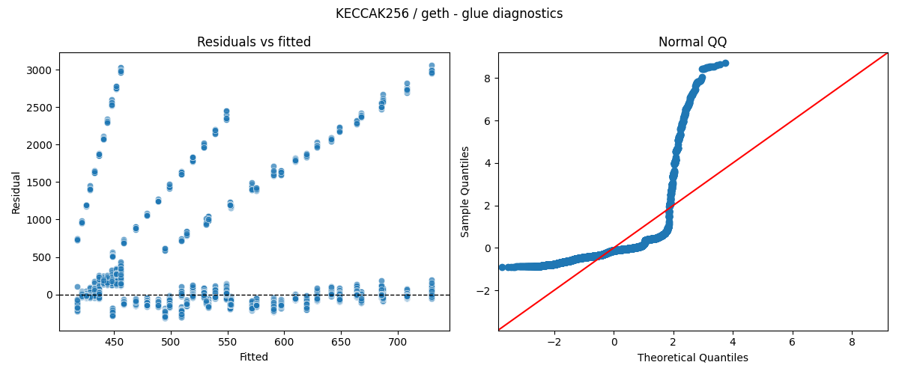

</details>

## nethermind

| glue_opcode | nobs | glue_runtime_ms | p_value | rsquared |
| --- | --- | --- | --- | --- |
| `ISZERO` | 187 | 8.827e-07 | 1.00e-03 | 0.3464 |
| `JUMPDEST` | 187 | 4.024e-07 | 1.00e-03 | 0.8365 |
| `SWAP` | 2992 | 5.459e-07 | 1.00e-03 | 0.3643 |
| `CALLDATASIZE` | 11143 | 9.956e-08 | 1.00e-03 | 0.9048 |
| `DUP` | 11143 | 6.748e-08 | 1.00e-03 | 0.9048 |
| `GAS` | 11143 | 8.667e-08 | 1.00e-03 | 0.9048 |
| `MLOAD` | 11143 | 1.478e-06 | 1.00e-03 | 0.9048 |
| `PUSH` | 11143 | 1.338e-07 | 1.00e-03 | 0.9048 |
| `PUSH0` | 11143 | 2.952e-08 | 9.00e-02 | 0.9048 |
| `STATICCALL` | 11143 | 0.0006991 | 1.00e-03 | 0.9048 |
| `ADD` | 187 | 2.419e-06 | 1.00e-03 | 0.5074 |
| `AND` | 187 | 1.269e-06 | 1.00e-03 | 0.6479 |
| `CALLDATACOPY` | 4488 | 3.958e-06 | 1.00e-03 | 0.7303 |
| `CALLDATALOAD` | 748 | 2.417e-05 | 1.00e-03 | 0.1515 |
| `DIV` | 187 | 7.256e-06 | 1.00e-03 | 0.5642 |
| `EXP` | 187 | 0 | 1.00e+00 | 0 |
| `GT` | 187 | 1.459e-06 | 1.00e-03 | 0.587 |
| `JUMPI` | 187 | 1.841e-06 | 1.00e-03 | 0.8648 |
| `LT` | 187 | 1.393e-06 | 1.00e-03 | 0.6006 |
| `MSTORE` | 935 | 2.108e-06 | 1.00e-03 | 0.6233 |
| `MSTORE8` | 935 | 1.974e-06 | 1.00e-03 | 0.8231 |
| `MUL` | 187 | 5.563e-06 | 1.00e-03 | 0.7533 |
| `PC` | 187 | 8.073e-07 | 1.00e-03 | 0.919 |
| `RETURNDATASIZE` | 748 | 7.497e-07 | 1.00e-03 | 0.8517 |
| `SELFBALANCE` | 153 | 1.054e-05 | 1.00e-03 | 0.8352 |
| `SUB` | 187 | 2.39e-06 | 1.00e-03 | 0.889 |
| `JUMP` | 187 | 5.125e-06 | 1.00e-03 | 0.7968 |
| `KECCAK256` | 2992 | 0 | 1.00e+00 | 1.11e-16 |

### Cycle glue — joint fit · nethermind

<details><summary>Joint NNLS regression summary</summary>

```
==============================================================================
                           NNLS Regression Results                            
==============================================================================
Dep. Variable:          test_runtime_ms              R-squared:          0.905
Model:                  NNLS                    Adj. R-squared:          0.905
No. Observations:       11143                             RMSE:          37.51
Df Residuals:           11135                              MAE:           8.36
Df Model:               7      
==============================================================================
                      coef     std err     P-value      [0.025      0.975]
------------------------------------------------------------------------------
         const     19.2473      1.0277       0.001     17.3057     21.3015
  CALLDATASIZE      0.0000      0.0000       0.001      0.0000      0.0000
           DUP      0.0000      0.0000       0.001      0.0000      0.0000
           GAS      0.0000      0.0000       0.001      0.0000      0.0000
         MLOAD      0.0000      0.0000       0.001      0.0000      0.0000
          PUSH      0.0000      0.0000       0.001      0.0000      0.0000
         PUSH0      0.0000      0.0000       0.090      0.0000      0.0000
    STATICCALL      0.0007      0.0000       0.001      0.0007      0.0007
==============================================================================
Notes: Non-negative least squares with bootstrap inference (1000 iterations)
==============================================================================
```

</details>

<details><summary><code>CALLDATASIZE</code> · nobs=11143 · runtime_ms=9.956e-08 · p=1.00e-03 · R²=0.9048</summary>

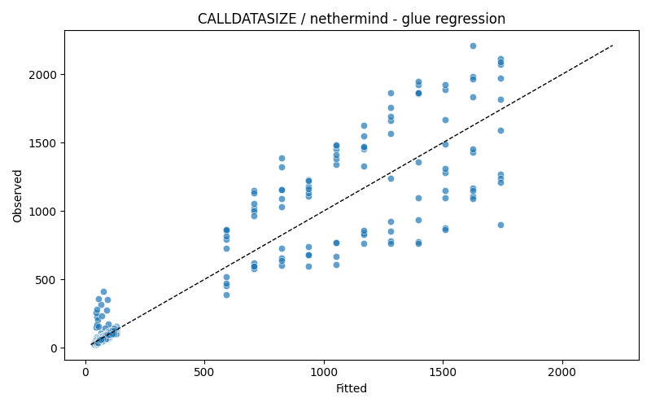

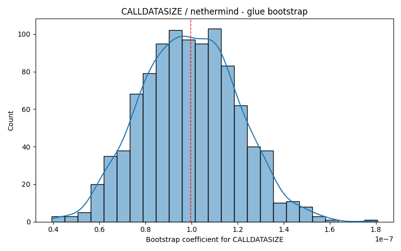

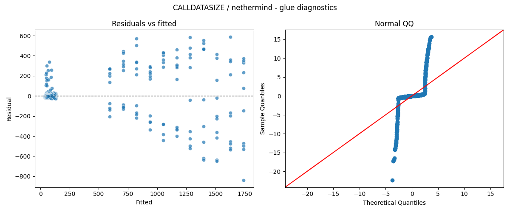

</details>

<details><summary><code>DUP</code> · nobs=11143 · runtime_ms=6.748e-08 · p=1.00e-03 · R²=0.9048</summary>

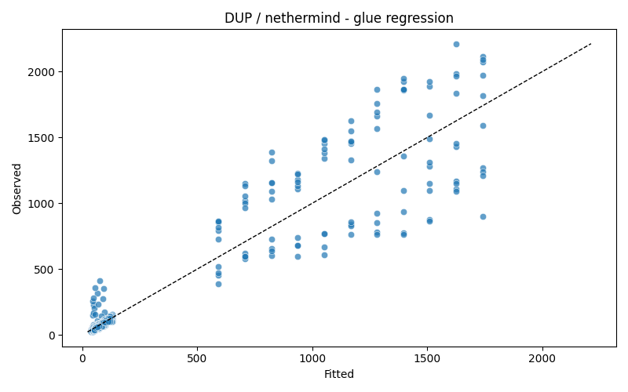

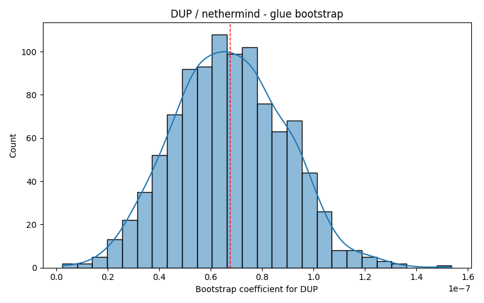


</details>

<details><summary><code>GAS</code> · nobs=11143 · runtime_ms=8.667e-08 · p=1.00e-03 · R²=0.9048</summary>


</details>

<details><summary><code>MLOAD</code> · nobs=11143 · runtime_ms=1.478e-06 · p=1.00e-03 · R²=0.9048</summary>


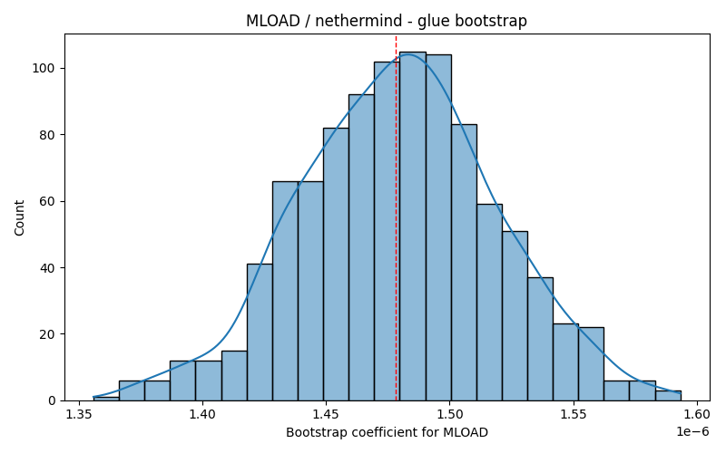


</details>

<details><summary><code>PUSH</code> · nobs=11143 · runtime_ms=1.338e-07 · p=1.00e-03 · R²=0.9048</summary>


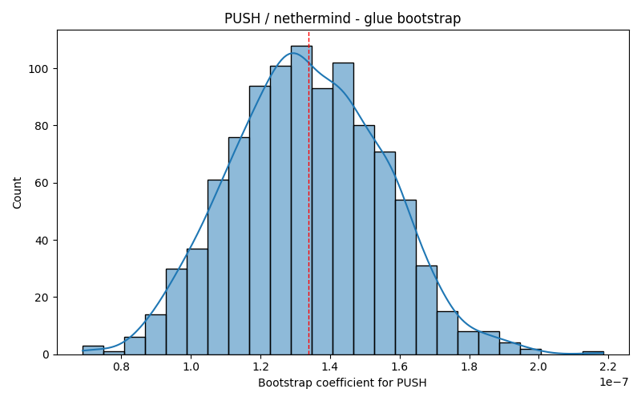


</details>

<details><summary><code>PUSH0</code> · nobs=11143 · runtime_ms=2.952e-08 · p=9.00e-02 · R²=0.9048</summary>

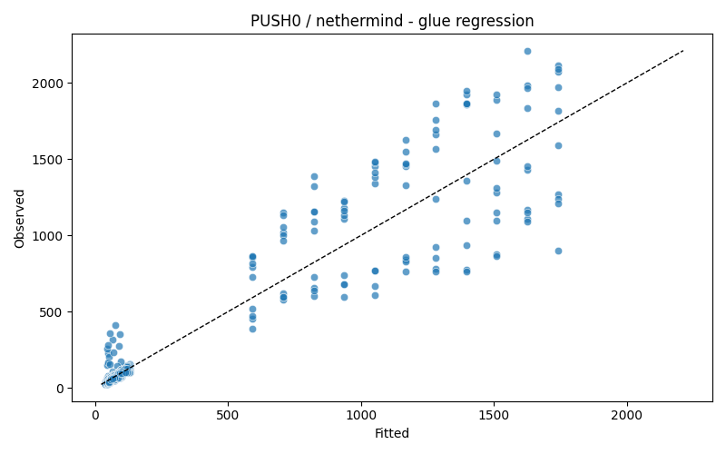

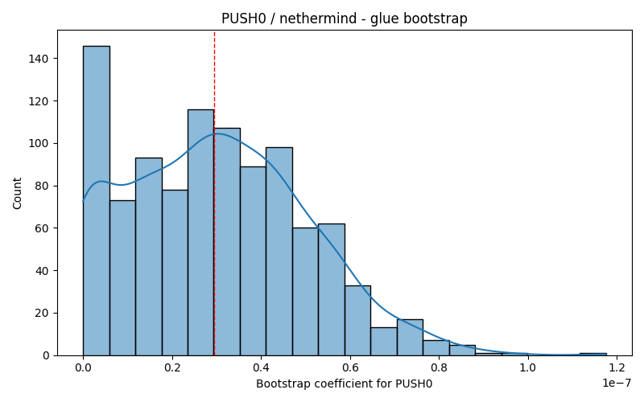


</details>

<details><summary><code>STATICCALL</code> · nobs=11143 · runtime_ms=0.0006991 · p=1.00e-03 · R²=0.9048</summary>


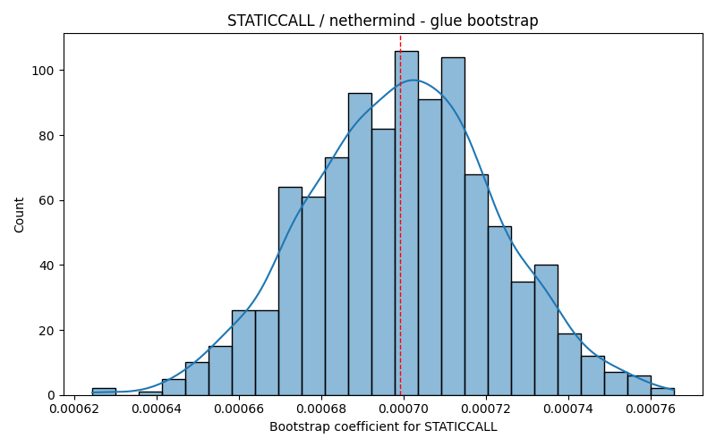

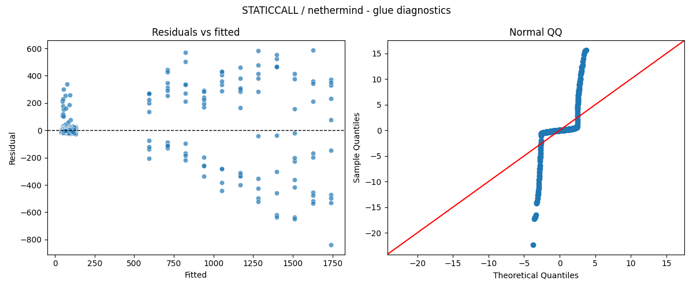

</details>

### Pure glue · nethermind

<details><summary><code>ISZERO</code> · nobs=187 · runtime_ms=8.827e-07 · p=1.00e-03 · R²=0.3464</summary>

```
==============================================================================
                           NNLS Regression Results                            
==============================================================================
Dep. Variable:          test_runtime_ms              R-squared:          0.346
Model:                  NNLS                    Adj. R-squared:          0.343
No. Observations:       187                               RMSE:          25.53
Df Residuals:           185                                MAE:          12.53
Df Model:               1      
==============================================================================
                      coef     std err     P-value      [0.025      0.975]
------------------------------------------------------------------------------
         const     18.4812      6.2852       0.001      6.0095     30.4639
        ISZERO      0.0000      0.0000       0.001      0.0000      0.0000
==============================================================================
Notes: Non-negative least squares with bootstrap inference (1000 iterations)
==============================================================================
```

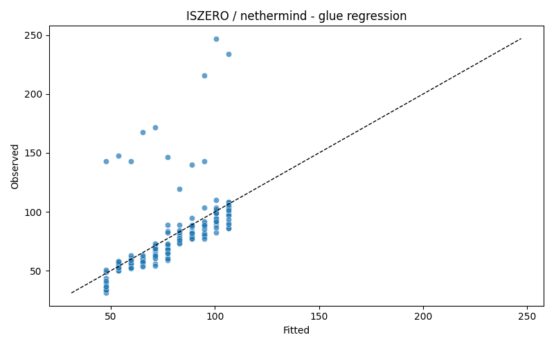

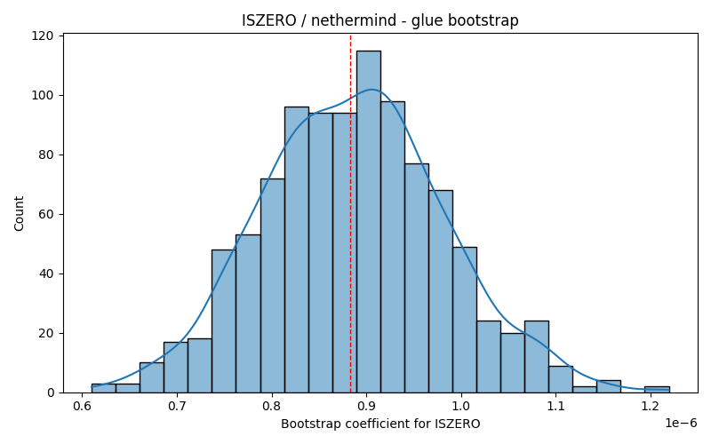

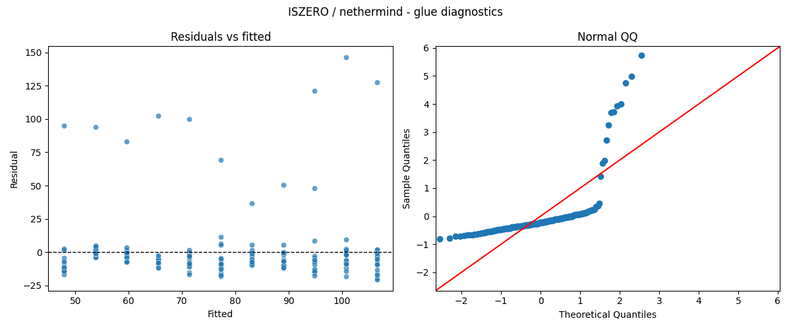

</details>

<details><summary><code>JUMPDEST</code> · nobs=187 · runtime_ms=4.024e-07 · p=1.00e-03 · R²=0.8365</summary>

```
==============================================================================
                           NNLS Regression Results                            
==============================================================================
Dep. Variable:          test_runtime_ms              R-squared:          0.836
Model:                  NNLS                    Adj. R-squared:          0.836
No. Observations:       187                               RMSE:          11.23
Df Residuals:           185                                MAE:           8.39
Df Model:               1      
==============================================================================
                      coef     std err     P-value      [0.025      0.975]
------------------------------------------------------------------------------
         const     19.2684      2.6153       0.001     14.4214     24.3565
      JUMPDEST      0.0000      0.0000       0.001      0.0000      0.0000
==============================================================================
Notes: Non-negative least squares with bootstrap inference (1000 iterations)
==============================================================================
```

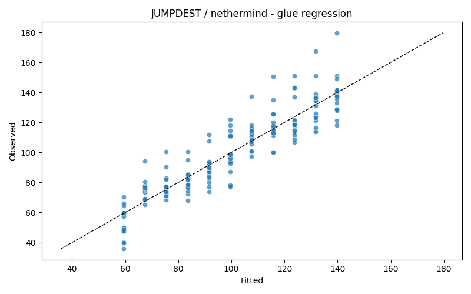

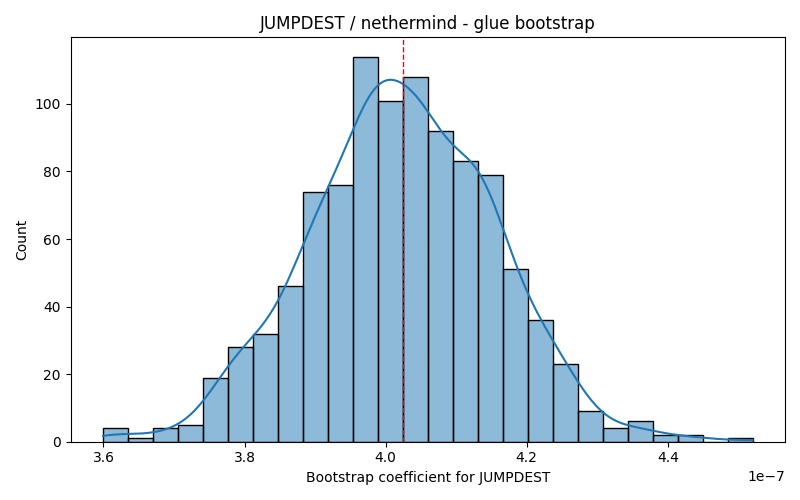

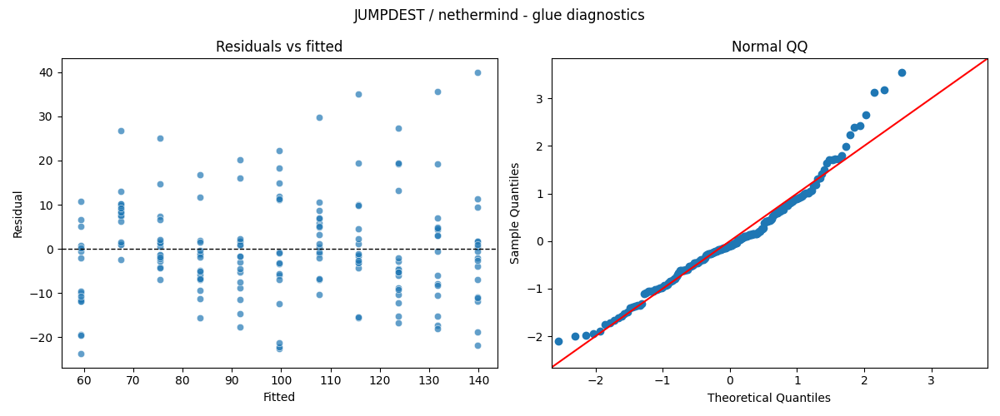

</details>

<details><summary><code>SWAP</code> · nobs=2992 · runtime_ms=5.459e-07 · p=1.00e-03 · R²=0.3643</summary>

```
==============================================================================
                           NNLS Regression Results                            
==============================================================================
Dep. Variable:          test_runtime_ms              R-squared:          0.364
Model:                  NNLS                    Adj. R-squared:          0.364
No. Observations:       2992                              RMSE:          15.18
Df Residuals:           2990                               MAE:           5.58
Df Model:               1      
==============================================================================
                      coef     std err     P-value      [0.025      0.975]
------------------------------------------------------------------------------
         const     15.8352      0.7956       0.001     14.2785     17.4085
          SWAP      0.0000      0.0000       0.001      0.0000      0.0000
==============================================================================
Notes: Non-negative least squares with bootstrap inference (1000 iterations)
==============================================================================
```

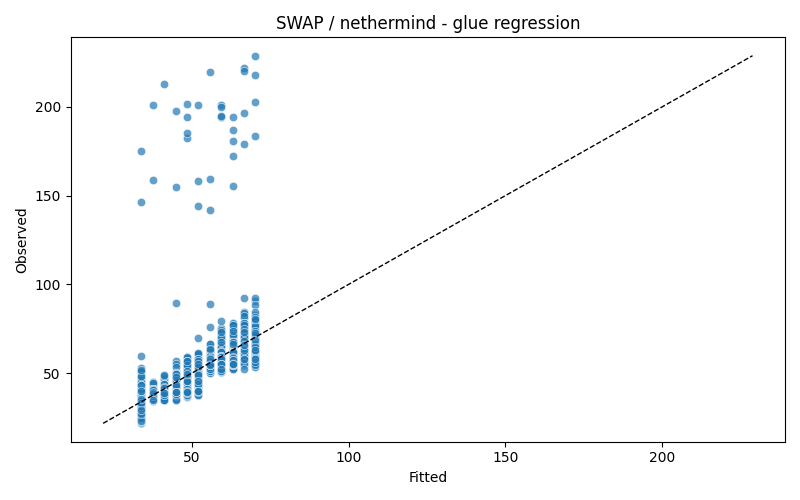

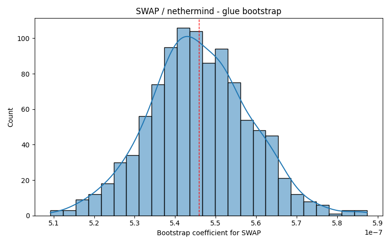

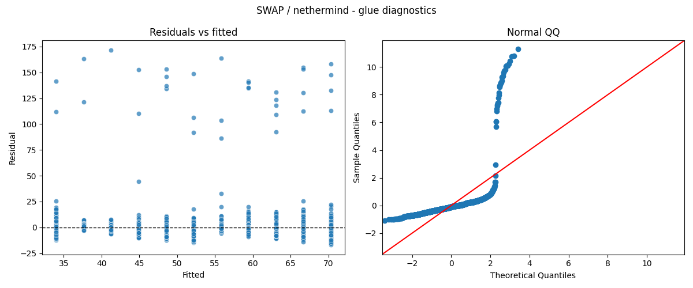

</details>

### Mixed glue (tier A) · nethermind

<details><summary><code>ADD</code> · nobs=187 · runtime_ms=2.419e-06 · p=1.00e-03 · R²=0.5074</summary>

```
==============================================================================
                           NNLS Regression Results                            
==============================================================================
Dep. Variable:          test_runtime_ms              R-squared:          0.507
Model:                  NNLS                    Adj. R-squared:          0.505
No. Observations:       187                               RMSE:          25.09
Df Residuals:           185                                MAE:          11.09
Df Model:               1      
==============================================================================
                      coef     std err     P-value      [0.025      0.975]
------------------------------------------------------------------------------
         const     19.7899      6.7494       0.001      7.8707     34.2200
           ADD      0.0000      0.0000       0.001      0.0000      0.0000
==============================================================================
Notes: Non-negative least squares with bootstrap inference (1000 iterations)
==============================================================================
```


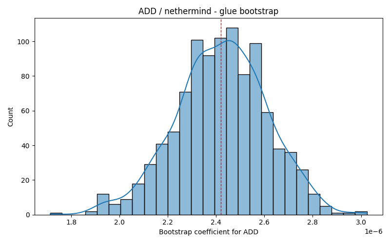

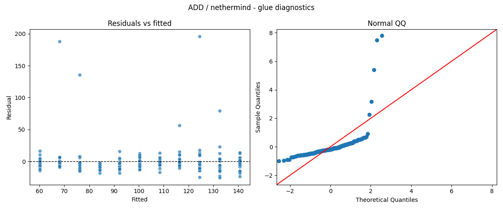

</details>

<details><summary><code>AND</code> · nobs=187 · runtime_ms=1.269e-06 · p=1.00e-03 · R²=0.6479</summary>

```
==============================================================================
                           NNLS Regression Results                            
==============================================================================
Dep. Variable:          test_runtime_ms              R-squared:          0.648
Model:                  NNLS                    Adj. R-squared:          0.646
No. Observations:       187                               RMSE:           9.84
Df Residuals:           185                                MAE:           5.23
Df Model:               1      
==============================================================================
                      coef     std err     P-value      [0.025      0.975]
------------------------------------------------------------------------------
         const     13.8966      1.4192       0.001     11.2017     16.5957
           AND      0.0000      0.0000       0.001      0.0000      0.0000
==============================================================================
Notes: Non-negative least squares with bootstrap inference (1000 iterations)
==============================================================================
```

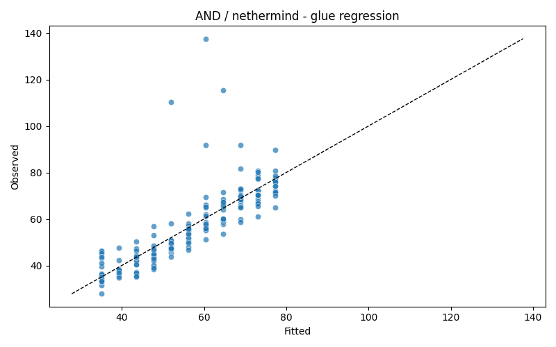


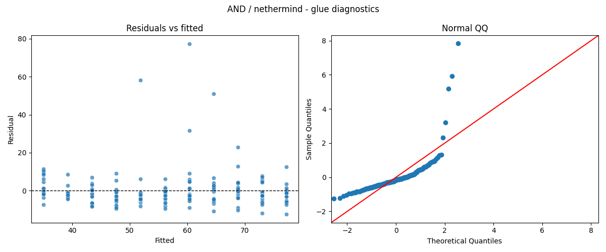

</details>

<details><summary><code>CALLDATACOPY</code> · nobs=4488 · runtime_ms=3.958e-06 · p=1.00e-03 · R²=0.7303</summary>

```
==============================================================================
                           NNLS Regression Results                            
==============================================================================
Dep. Variable:          test_runtime_ms              R-squared:          0.730
Model:                  NNLS                    Adj. R-squared:          0.730
No. Observations:       4488                              RMSE:          18.09
Df Residuals:           4486                               MAE:          14.70
Df Model:               1      
==============================================================================
                      coef     std err     P-value      [0.025      0.975]
------------------------------------------------------------------------------
         const     23.3612      0.3223       0.001     22.7137     23.9605
  CALLDATACOPY      0.0000      0.0000       0.001      0.0000      0.0000
==============================================================================
Notes: Non-negative least squares with bootstrap inference (1000 iterations)
==============================================================================
```

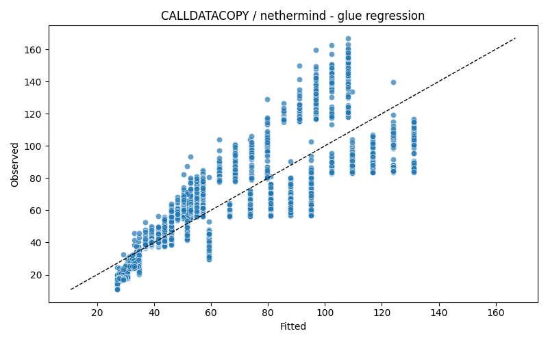

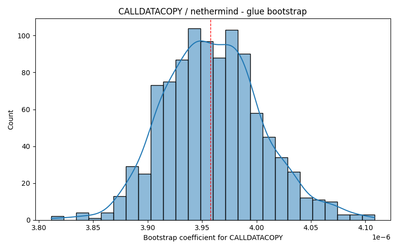

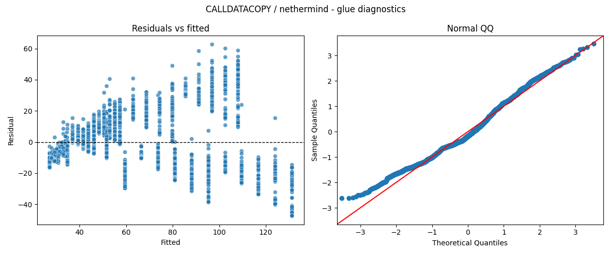

</details>

<details><summary><code>CALLDATALOAD</code> · nobs=748 · runtime_ms=2.417e-05 · p=1.00e-03 · R²=0.1515</summary>

```
==============================================================================
                           NNLS Regression Results                            
==============================================================================
Dep. Variable:          test_runtime_ms              R-squared:          0.151
Model:                  NNLS                    Adj. R-squared:          0.150
No. Observations:       748                               RMSE:           0.22
Df Residuals:           746                                MAE:           0.15
Df Model:               1      
==============================================================================
                      coef     std err     P-value      [0.025      0.975]
------------------------------------------------------------------------------
         const      2.1112      0.0260       0.001      2.0651      2.1640
  CALLDATALOAD      0.0000      0.0000       0.001      0.0000      0.0000
==============================================================================
Notes: Non-negative least squares with bootstrap inference (1000 iterations)
==============================================================================
```

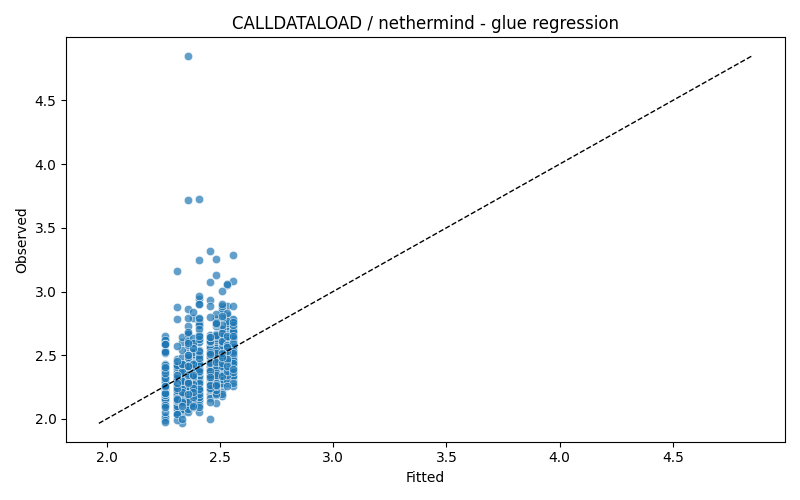

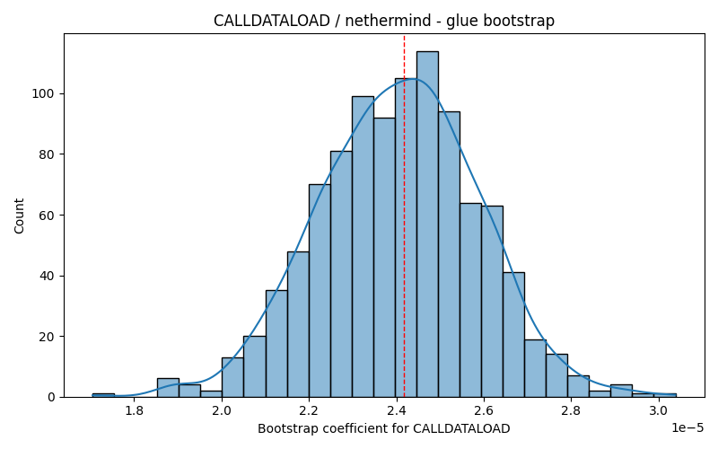

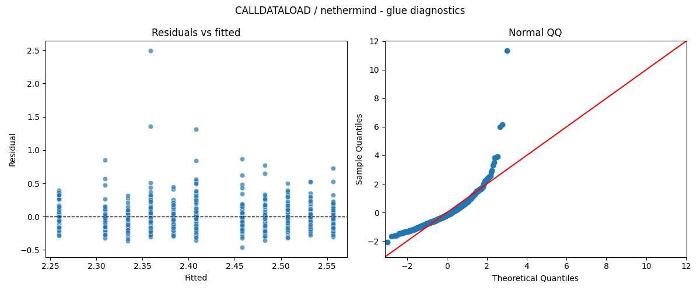

</details>

<details><summary><code>DIV</code> · nobs=187 · runtime_ms=7.256e-06 · p=1.00e-03 · R²=0.5642</summary>

```
==============================================================================
                           NNLS Regression Results                            
==============================================================================
Dep. Variable:          test_runtime_ms              R-squared:          0.564
Model:                  NNLS                    Adj. R-squared:          0.562
No. Observations:       187                               RMSE:          50.34
Df Residuals:           185                                MAE:          38.75
Df Model:               1      
==============================================================================
                      coef     std err     P-value      [0.025      0.975]
------------------------------------------------------------------------------
         const    135.0325     16.0638       0.001    102.9313    164.8035
           DIV      0.0000      0.0000       0.001      0.0000      0.0000
==============================================================================
Notes: Non-negative least squares with bootstrap inference (1000 iterations)
==============================================================================
```

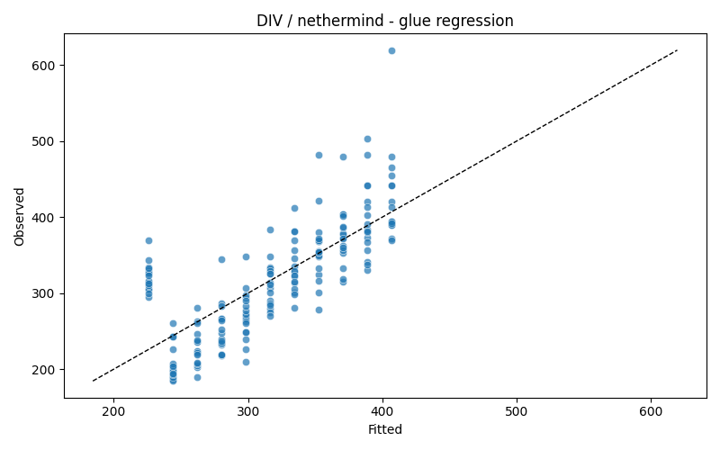

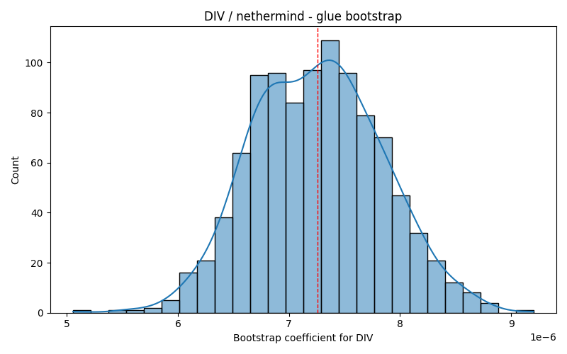

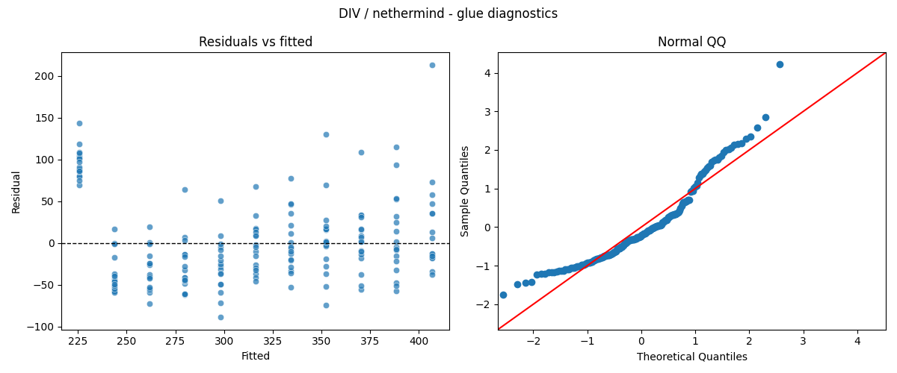

</details>

<details><summary><code>EXP</code> · nobs=187 · runtime_ms=0 · p=1.00e+00 · R²=0</summary>

```
==============================================================================
                           NNLS Regression Results                            
==============================================================================
Dep. Variable:          test_runtime_ms              R-squared:          0.000
Model:                  NNLS                    Adj. R-squared:         -0.005
No. Observations:       187                               RMSE:          47.55
Df Residuals:           185                                MAE:          32.11
Df Model:               1      
==============================================================================
                      coef     std err     P-value      [0.025      0.975]
------------------------------------------------------------------------------
         const    106.5353      8.0885       0.001     80.1032    113.6165
           EXP      0.0000      0.0000       1.000      0.0000      0.0002
==============================================================================
Notes: Non-negative least squares with bootstrap inference (1000 iterations)
==============================================================================
```

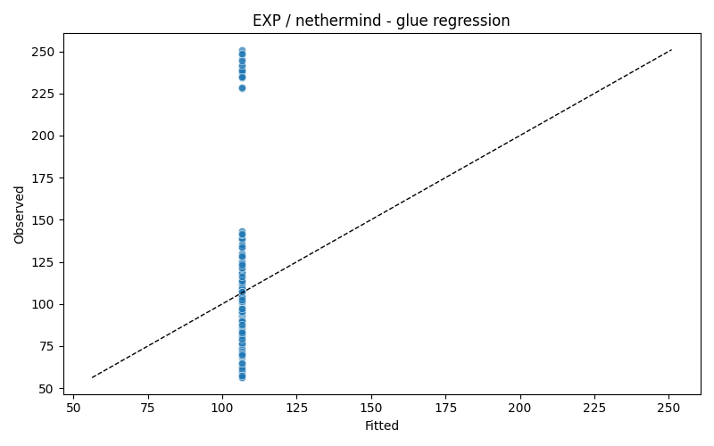

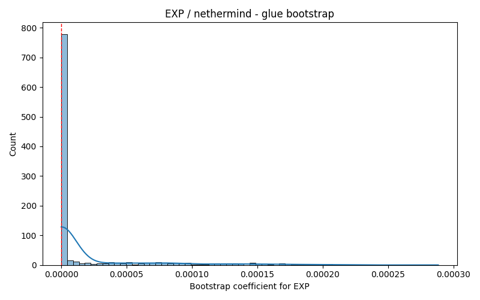

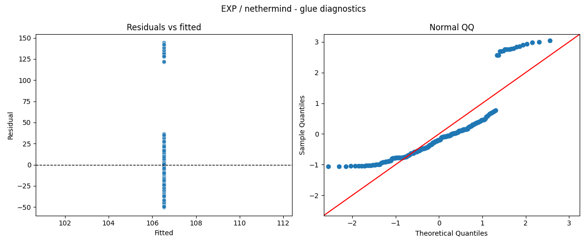

</details>

<details><summary><code>GT</code> · nobs=187 · runtime_ms=1.459e-06 · p=1.00e-03 · R²=0.587</summary>

```
==============================================================================
                           NNLS Regression Results                            
==============================================================================
Dep. Variable:          test_runtime_ms              R-squared:          0.587
Model:                  NNLS                    Adj. R-squared:          0.585
No. Observations:       187                               RMSE:          12.88
Df Residuals:           185                                MAE:           6.88
Df Model:               1      
==============================================================================
                      coef     std err     P-value      [0.025      0.975]
------------------------------------------------------------------------------
         const     15.7117      3.4364       0.001      9.7724     23.2370
            GT      0.0000      0.0000       0.001      0.0000      0.0000
==============================================================================
Notes: Non-negative least squares with bootstrap inference (1000 iterations)
==============================================================================
```

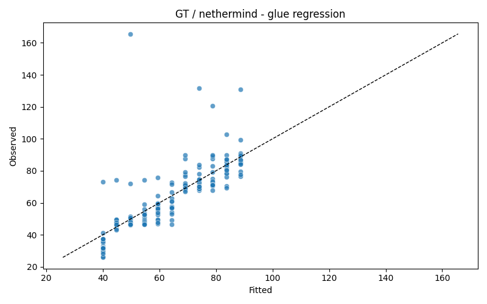

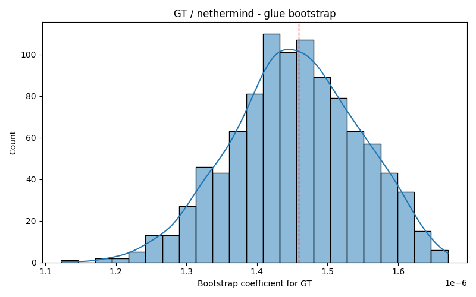

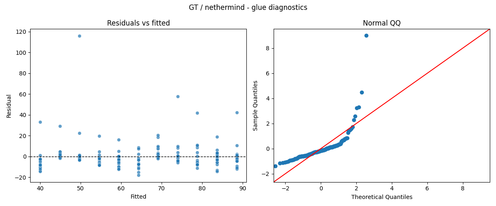

</details>

<details><summary><code>JUMPI</code> · nobs=187 · runtime_ms=1.841e-06 · p=1.00e-03 · R²=0.8648</summary>

```
==============================================================================
                           NNLS Regression Results                            
==============================================================================
Dep. Variable:          test_runtime_ms              R-squared:          0.865
Model:                  NNLS                    Adj. R-squared:          0.864
No. Observations:       187                               RMSE:           3.28
Df Residuals:           185                                MAE:           2.48
Df Model:               1      
==============================================================================
                      coef     std err     P-value      [0.025      0.975]
------------------------------------------------------------------------------
         const      8.1080      0.7359       0.001      6.7129      9.5879
         JUMPI      0.0000      0.0000       0.001      0.0000      0.0000
==============================================================================
Notes: Non-negative least squares with bootstrap inference (1000 iterations)
==============================================================================
```

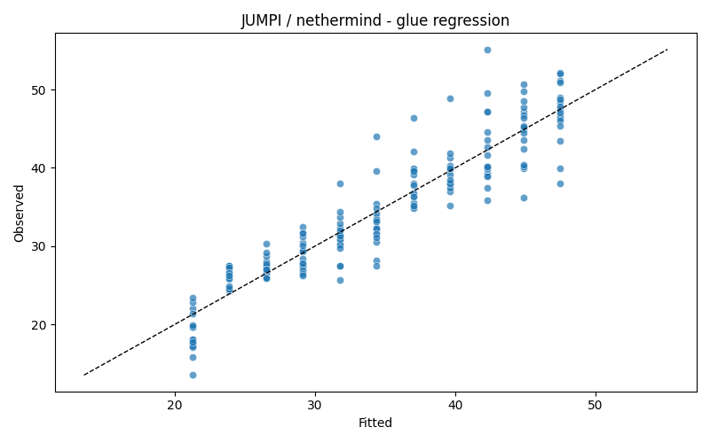

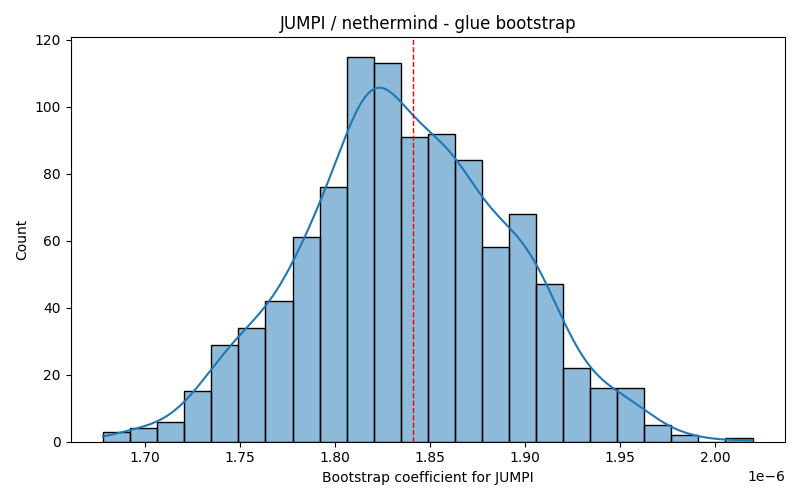

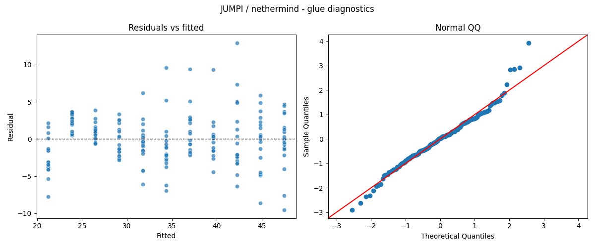

</details>

<details><summary><code>LT</code> · nobs=187 · runtime_ms=1.393e-06 · p=1.00e-03 · R²=0.6006</summary>

```
==============================================================================
                           NNLS Regression Results                            
==============================================================================
Dep. Variable:          test_runtime_ms              R-squared:          0.601
Model:                  NNLS                    Adj. R-squared:          0.598
No. Observations:       187                               RMSE:          11.96
Df Residuals:           185                                MAE:           6.60
Df Model:               1      
==============================================================================
                      coef     std err     P-value      [0.025      0.975]
------------------------------------------------------------------------------
         const     18.7209      2.6581       0.001     13.5177     24.2898
            LT      0.0000      0.0000       0.001      0.0000      0.0000
==============================================================================
Notes: Non-negative least squares with bootstrap inference (1000 iterations)
==============================================================================
```

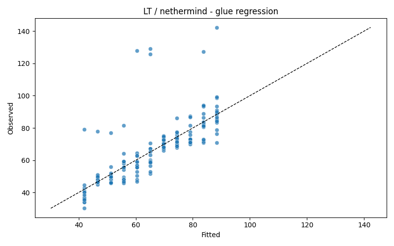

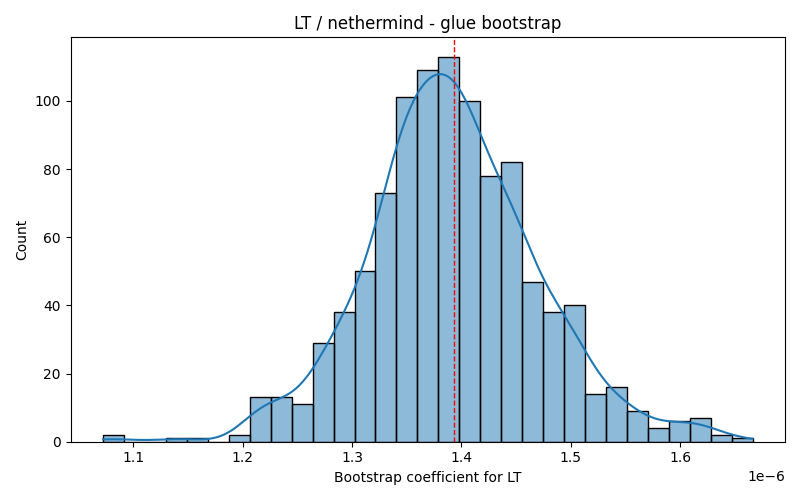

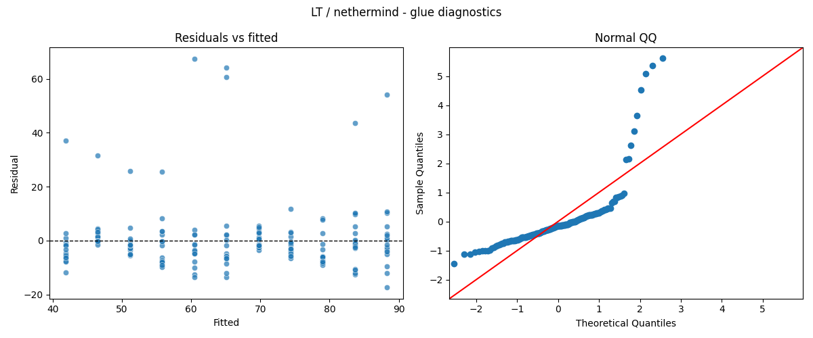

</details>

<details><summary><code>MSTORE</code> · nobs=935 · runtime_ms=2.108e-06 · p=1.00e-03 · R²=0.6233</summary>

```
==============================================================================
                           NNLS Regression Results                            
==============================================================================
Dep. Variable:          test_runtime_ms              R-squared:          0.623
Model:                  NNLS                    Adj. R-squared:          0.623
No. Observations:       935                               RMSE:          11.50
Df Residuals:           933                                MAE:           5.37
Df Model:               1      
==============================================================================
                      coef     std err     P-value      [0.025      0.975]
------------------------------------------------------------------------------
         const     14.7667      1.4829       0.001     12.0432     17.8840
        MSTORE      0.0000      0.0000       0.001      0.0000      0.0000
==============================================================================
Notes: Non-negative least squares with bootstrap inference (1000 iterations)
==============================================================================
```

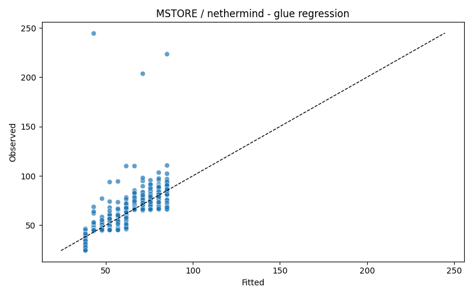

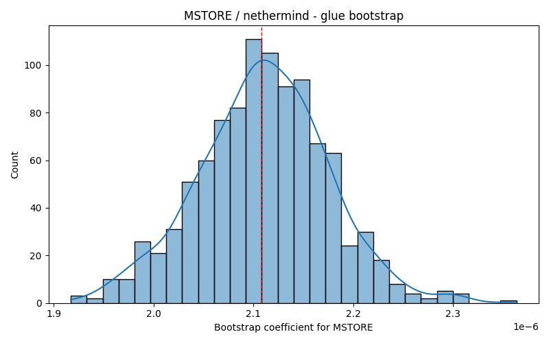

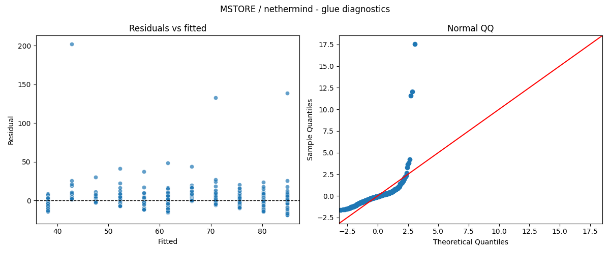

</details>

<details><summary><code>MSTORE8</code> · nobs=935 · runtime_ms=1.974e-06 · p=1.00e-03 · R²=0.8231</summary>

```
==============================================================================
                           NNLS Regression Results                            
==============================================================================
Dep. Variable:          test_runtime_ms              R-squared:          0.823
Model:                  NNLS                    Adj. R-squared:          0.823
No. Observations:       935                               RMSE:           6.42
Df Residuals:           933                                MAE:           4.44
Df Model:               1      
==============================================================================
                      coef     std err     P-value      [0.025      0.975]
------------------------------------------------------------------------------
         const     14.6501      0.7610       0.001     13.2370     16.2493
       MSTORE8      0.0000      0.0000       0.001      0.0000      0.0000
==============================================================================
Notes: Non-negative least squares with bootstrap inference (1000 iterations)
==============================================================================
```

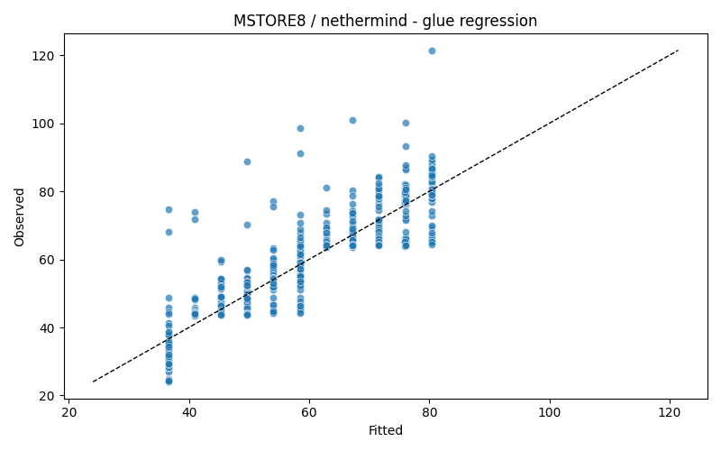

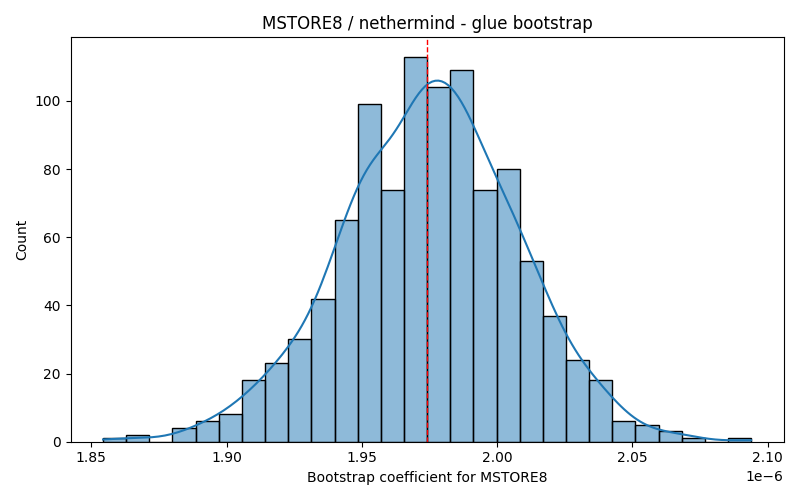

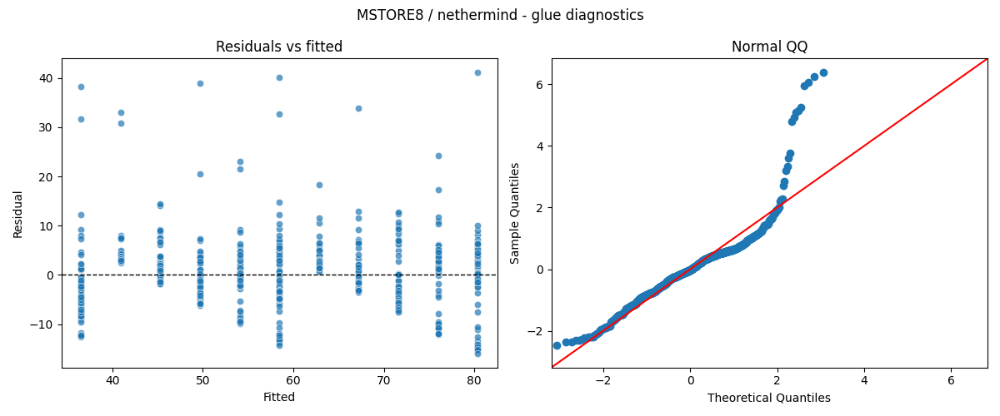

</details>

<details><summary><code>MUL</code> · nobs=187 · runtime_ms=5.563e-06 · p=1.00e-03 · R²=0.7533</summary>

```
==============================================================================
                           NNLS Regression Results                            
==============================================================================
Dep. Variable:          test_runtime_ms              R-squared:          0.753
Model:                  NNLS                    Adj. R-squared:          0.752
No. Observations:       187                               RMSE:          25.13
Df Residuals:           185                                MAE:          16.39
Df Model:               1      
==============================================================================
                      coef     std err     P-value      [0.025      0.975]
------------------------------------------------------------------------------
         const     28.5507      5.2006       0.001     18.4039     38.7296
           MUL      0.0000      0.0000       0.001      0.0000      0.0000
==============================================================================
Notes: Non-negative least squares with bootstrap inference (1000 iterations)
==============================================================================
```

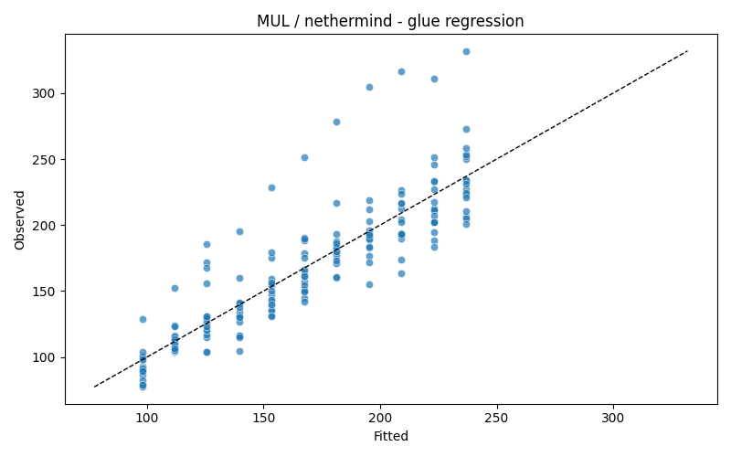

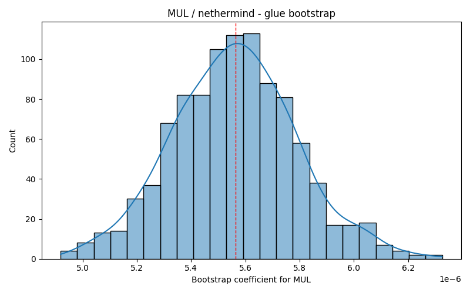

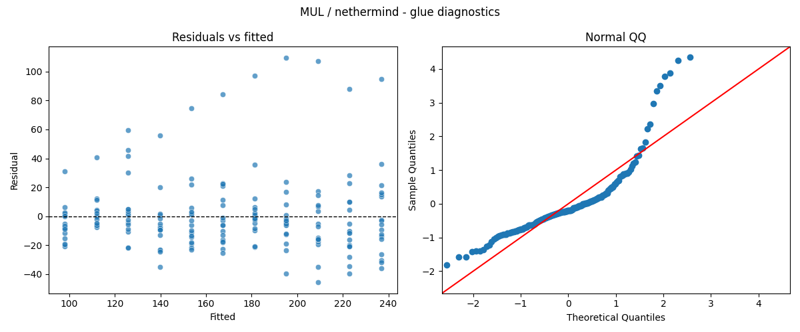

</details>

<details><summary><code>PC</code> · nobs=187 · runtime_ms=8.073e-07 · p=1.00e-03 · R²=0.919</summary>

```
==============================================================================
                           NNLS Regression Results                            
==============================================================================
Dep. Variable:          test_runtime_ms              R-squared:          0.919
Model:                  NNLS                    Adj. R-squared:          0.919
No. Observations:       187                               RMSE:           7.17
Df Residuals:           185                                MAE:           5.66
Df Model:               1      
==============================================================================
                      coef     std err     P-value      [0.025      0.975]
------------------------------------------------------------------------------
         const     16.0078      2.0116       0.001     12.4927     19.8349
            PC      0.0000      0.0000       0.001      0.0000      0.0000
==============================================================================
Notes: Non-negative least squares with bootstrap inference (1000 iterations)
==============================================================================
```

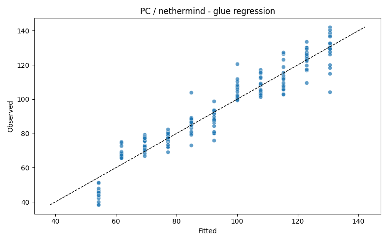

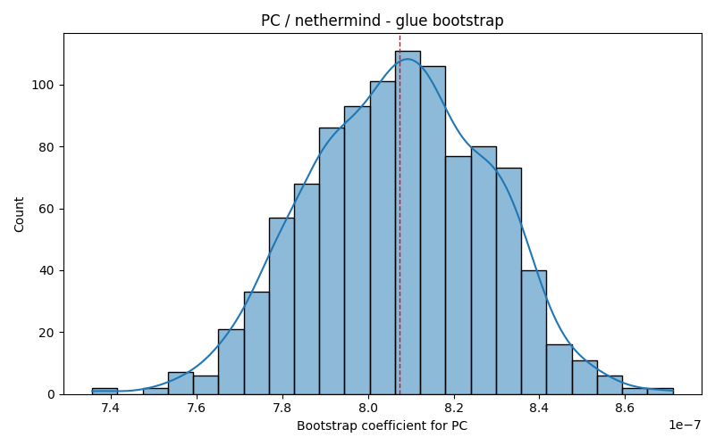

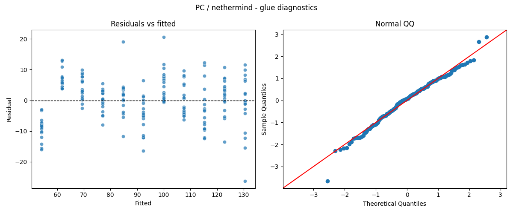

</details>

<details><summary><code>RETURNDATASIZE</code> · nobs=748 · runtime_ms=7.497e-07 · p=1.00e-03 · R²=0.8517</summary>

```
==============================================================================
                           NNLS Regression Results                            
==============================================================================
Dep. Variable:          test_runtime_ms              R-squared:          0.852
Model:                  NNLS                    Adj. R-squared:          0.851
No. Observations:       748                               RMSE:           4.94
Df Residuals:           746                                MAE:           3.63
Df Model:               1      
==============================================================================
                      coef     std err     P-value      [0.025      0.975]
------------------------------------------------------------------------------
         const     11.5037      0.5691       0.001     10.3244     12.5604
RETURNDATASIZE      0.0000      0.0000       0.001      0.0000      0.0000
==============================================================================
Notes: Non-negative least squares with bootstrap inference (1000 iterations)
==============================================================================
```

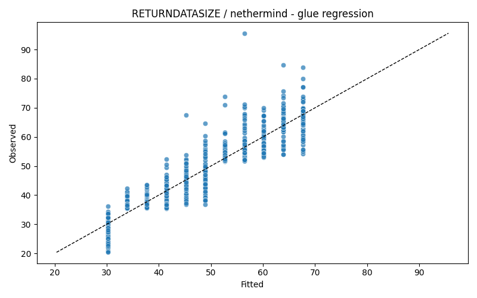

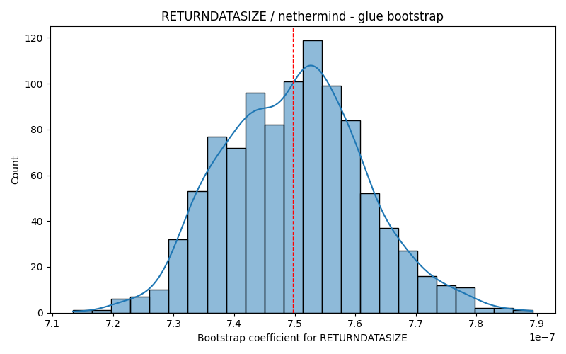

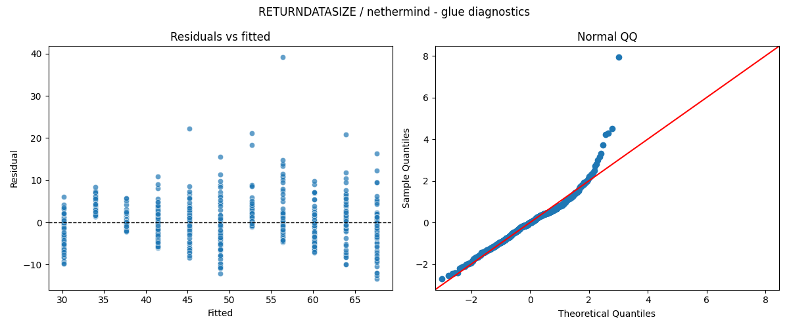

</details>

<details><summary><code>SELFBALANCE</code> · nobs=153 · runtime_ms=1.054e-05 · p=1.00e-03 · R²=0.8352</summary>

```
==============================================================================
                           NNLS Regression Results                            
==============================================================================
Dep. Variable:          test_runtime_ms              R-squared:          0.835
Model:                  NNLS                    Adj. R-squared:          0.834
No. Observations:       153                               RMSE:          47.23
Df Residuals:           151                                MAE:          36.22
Df Model:               1      
==============================================================================
                      coef     std err     P-value      [0.025      0.975]
------------------------------------------------------------------------------
         const     88.3978     18.9542       0.001     48.6205    125.0173
   SELFBALANCE      0.0000      0.0000       0.001      0.0000      0.0000
==============================================================================
Notes: Non-negative least squares with bootstrap inference (1000 iterations)
==============================================================================
```

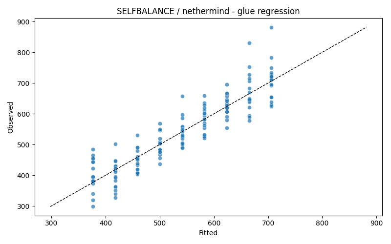

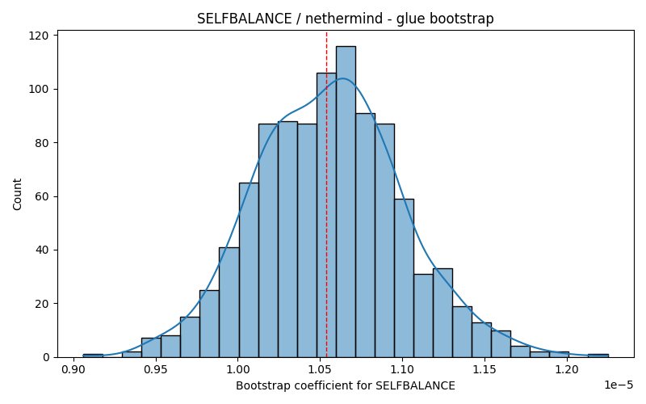

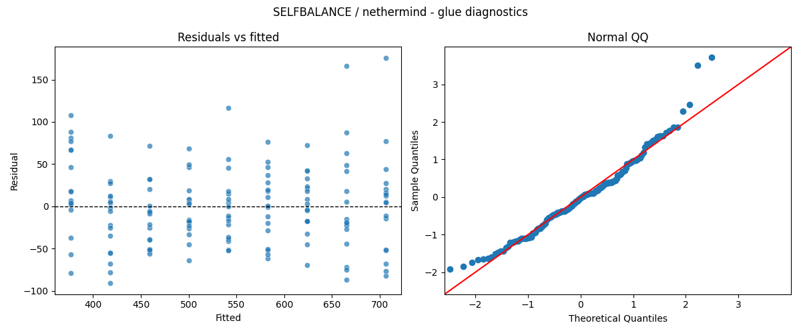

</details>

<details><summary><code>SUB</code> · nobs=187 · runtime_ms=2.39e-06 · p=1.00e-03 · R²=0.889</summary>

```
==============================================================================
                           NNLS Regression Results                            
==============================================================================
Dep. Variable:          test_runtime_ms              R-squared:          0.889
Model:                  NNLS                    Adj. R-squared:          0.888
No. Observations:       187                               RMSE:           8.89
Df Residuals:           185                                MAE:           6.25
Df Model:               1      
==============================================================================
                      coef     std err     P-value      [0.025      0.975]
------------------------------------------------------------------------------
         const     18.2569      1.6980       0.001     14.9590     21.6021
           SUB      0.0000      0.0000       0.001      0.0000      0.0000
==============================================================================
Notes: Non-negative least squares with bootstrap inference (1000 iterations)
==============================================================================
```

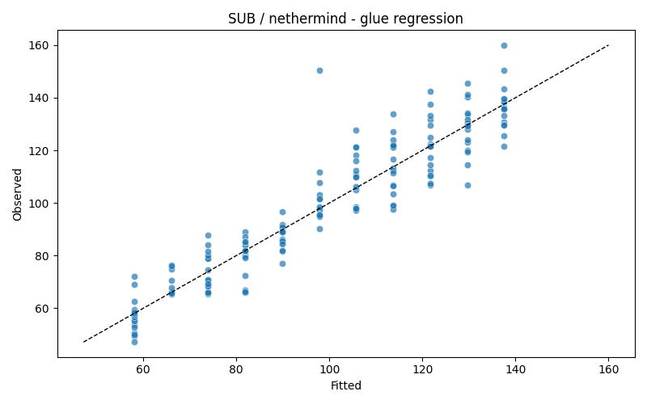

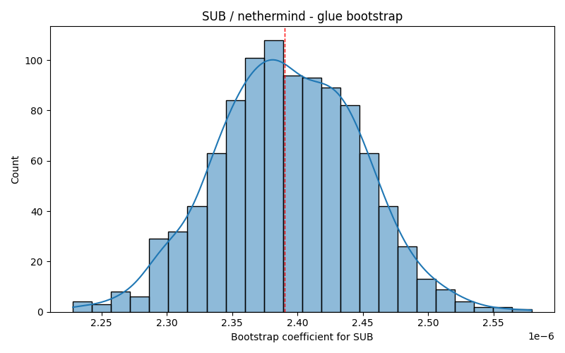

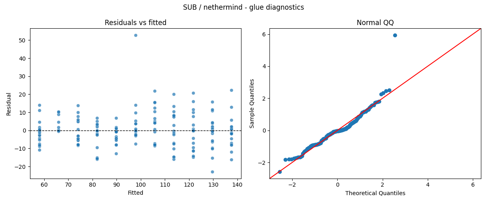

</details>

### Mixed glue (tier B) · nethermind

<details><summary><code>JUMP</code> · nobs=187 · runtime_ms=5.125e-06 · p=1.00e-03 · R²=0.7968</summary>

```
==============================================================================
                           NNLS Regression Results                            
==============================================================================
Dep. Variable:          test_runtime_ms              R-squared:          0.797
Model:                  NNLS                    Adj. R-squared:          0.796
No. Observations:       187                               RMSE:           9.62
Df Residuals:           185                                MAE:           6.37
Df Model:               1      
==============================================================================
                      coef     std err     P-value      [0.025      0.975]
------------------------------------------------------------------------------
         const     18.8214      2.7520       0.001     13.8321     24.3750
          JUMP      0.0000      0.0000       0.001      0.0000      0.0000
==============================================================================
Notes: Non-negative least squares with bootstrap inference (1000 iterations)
==============================================================================
```

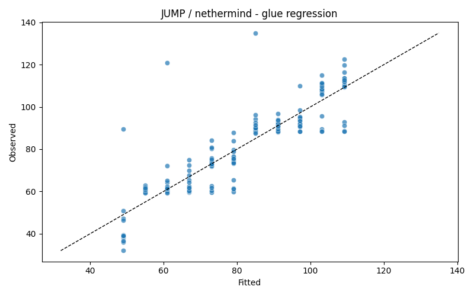

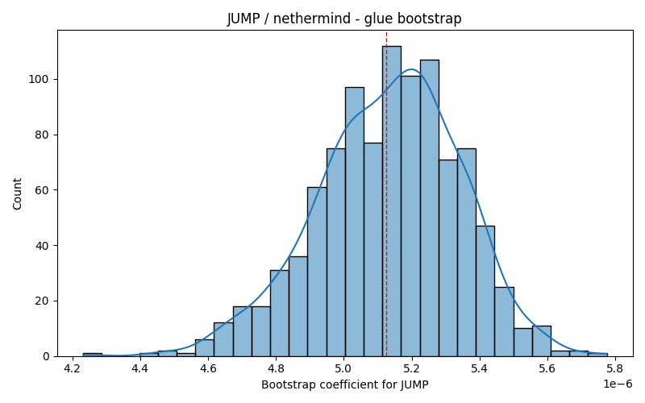

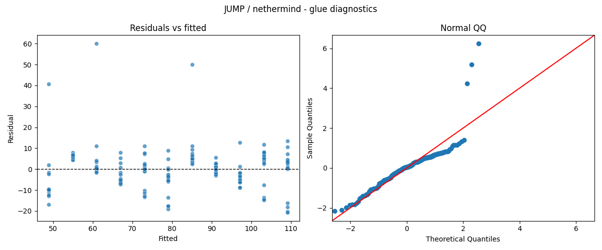

</details>

<details><summary><code>KECCAK256</code> · nobs=2992 · runtime_ms=0 · p=1.00e+00 · R²=1.11e-16</summary>

```
==============================================================================
                           NNLS Regression Results                            
==============================================================================
Dep. Variable:          test_runtime_ms              R-squared:          0.000
Model:                  NNLS                    Adj. R-squared:         -0.000
No. Observations:       2992                              RMSE:         292.68
Df Residuals:           2990                               MAE:         240.70
Df Model:               1      
==============================================================================
                      coef     std err     P-value      [0.025      0.975]
------------------------------------------------------------------------------
         const    447.5800      5.3478       0.001    437.1682    458.1730
     KECCAK256      0.0000      0.0000       1.000      0.0000      0.0000
==============================================================================
Notes: Non-negative least squares with bootstrap inference (1000 iterations)
==============================================================================
```

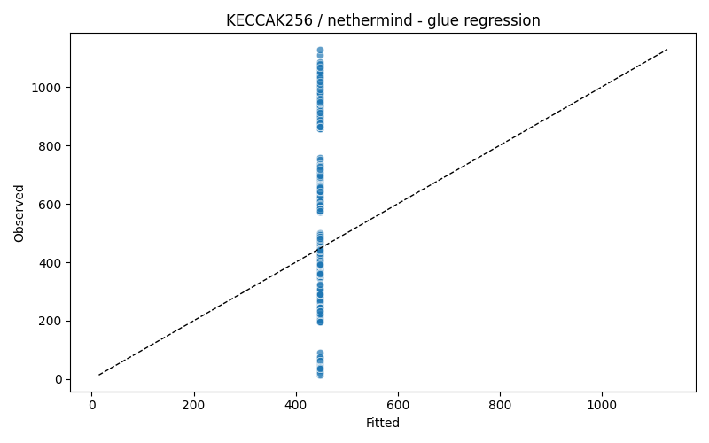


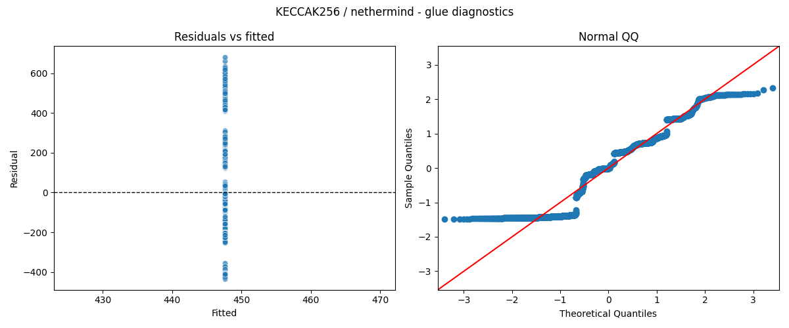

</details>

## reth

| glue_opcode | nobs | glue_runtime_ms | p_value | rsquared |
| --- | --- | --- | --- | --- |
| `ISZERO` | 88 | 4.162e-07 | 1.00e-03 | 0.7692 |
| `JUMPDEST` | 88 | 2.746e-07 | 1.00e-03 | 0.6402 |
| `SWAP` | 1408 | 4.624e-07 | 1.00e-03 | 0.5571 |
| `CALLDATASIZE` | 5390 | 5.058e-07 | 1.00e-03 | 0.8368 |
| `DUP` | 5390 | 4.215e-07 | 1.00e-03 | 0.8368 |
| `GAS` | 5390 | 4.557e-07 | 1.00e-03 | 0.8368 |
| `MLOAD` | 5390 | 1.615e-06 | 1.00e-03 | 0.8368 |
| `PUSH` | 5390 | 4.454e-07 | 1.00e-03 | 0.8368 |
| `PUSH0` | 5390 | 3.517e-07 | 1.00e-03 | 0.8368 |
| `STATICCALL` | 5390 | 4.64e-05 | 1.00e-03 | 0.8368 |
| `ADD` | 88 | 8.579e-07 | 1.00e-03 | 0.8301 |
| `AND` | 88 | 8.751e-07 | 1.00e-03 | 0.8157 |
| `CALLDATACOPY` | 2112 | 2.266e-06 | 1.00e-03 | 0.8057 |
| `CALLDATALOAD` | 352 | 4.464e-05 | 1.00e-03 | 0.4795 |
| `DIV` | 88 | 6.902e-06 | 1.00e-03 | 0.8428 |
| `EXP` | 88 | 0.0003551 | 1.00e-03 | 0.7396 |
| `GT` | 88 | 1.01e-06 | 1.00e-03 | 0.8267 |
| `JUMPI` | 88 | 1.245e-06 | 1.00e-03 | 0.7689 |
| `LT` | 88 | 9.486e-07 | 1.00e-03 | 0.7792 |
| `MSTORE` | 440 | 2.718e-06 | 1.00e-03 | 0.2647 |
| `MSTORE8` | 440 | 1.378e-06 | 1.00e-03 | 0.7667 |
| `MUL` | 88 | 1.192e-06 | 1.00e-03 | 0.785 |
| `PC` | 88 | 6.093e-07 | 1.00e-03 | 0.9385 |
| `RETURNDATASIZE` | 352 | 8.903e-07 | 1.00e-03 | 0.8426 |
| `SELFBALANCE` | 72 | 3.864e-06 | 1.00e-03 | 0.8114 |
| `SUB` | 88 | 9.043e-07 | 1.00e-03 | 0.785 |
| `JUMP` | 88 | 2.315e-06 | 1.00e-03 | 0.79 |
| `KECCAK256` | 1408 | 0 | 1.00e+00 | 2.22e-16 |

### Cycle glue — joint fit · reth

<details><summary>Joint NNLS regression summary</summary>

```
==============================================================================
                           NNLS Regression Results                            
==============================================================================
Dep. Variable:          test_runtime_ms              R-squared:          0.837
Model:                  NNLS                    Adj. R-squared:          0.837
No. Observations:       5390                              RMSE:           7.44
Df Residuals:           5382                               MAE:           5.17
Df Model:               7      
==============================================================================
                      coef     std err     P-value      [0.025      0.975]
------------------------------------------------------------------------------
         const     11.8615      0.3443       0.001     11.1432     12.5328
  CALLDATASIZE      0.0000      0.0000       0.001      0.0000      0.0000
           DUP      0.0000      0.0000       0.001      0.0000      0.0000
           GAS      0.0000      0.0000       0.001      0.0000      0.0000
         MLOAD      0.0000      0.0000       0.001      0.0000      0.0000
          PUSH      0.0000      0.0000       0.001      0.0000      0.0000
         PUSH0      0.0000      0.0000       0.001      0.0000      0.0000
    STATICCALL      0.0000      0.0000       0.001      0.0000      0.0000
==============================================================================
Notes: Non-negative least squares with bootstrap inference (1000 iterations)
==============================================================================
```

</details>

<details><summary><code>CALLDATASIZE</code> · nobs=5390 · runtime_ms=5.058e-07 · p=1.00e-03 · R²=0.8368</summary>


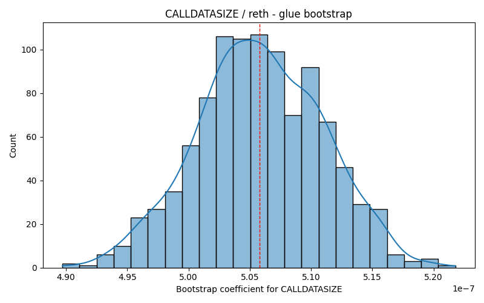

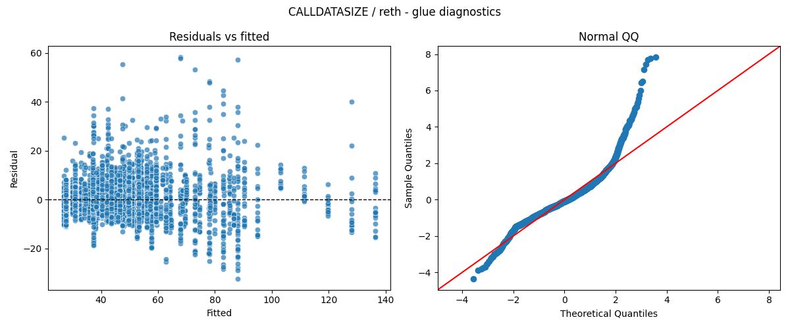

</details>

<details><summary><code>DUP</code> · nobs=5390 · runtime_ms=4.215e-07 · p=1.00e-03 · R²=0.8368</summary>


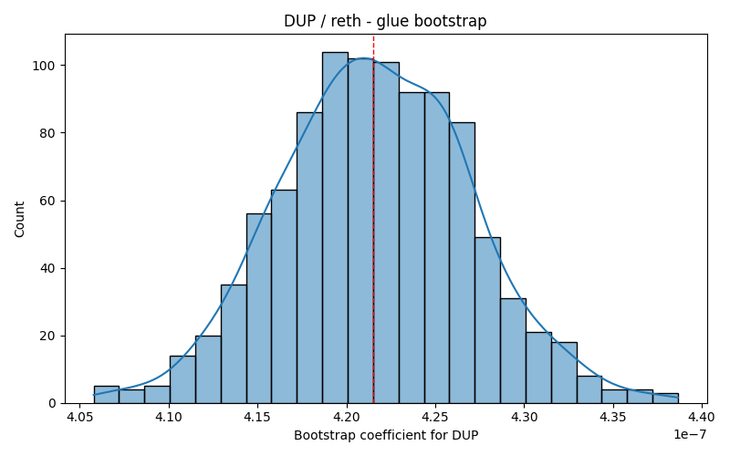


</details>

<details><summary><code>GAS</code> · nobs=5390 · runtime_ms=4.557e-07 · p=1.00e-03 · R²=0.8368</summary>


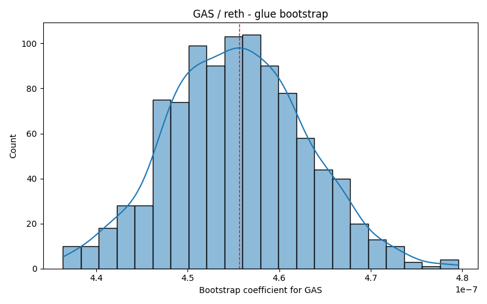

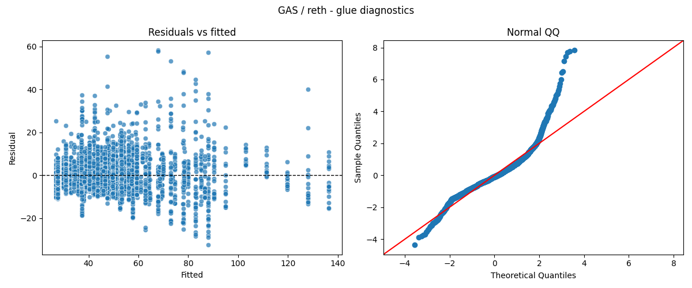

</details>

<details><summary><code>MLOAD</code> · nobs=5390 · runtime_ms=1.615e-06 · p=1.00e-03 · R²=0.8368</summary>


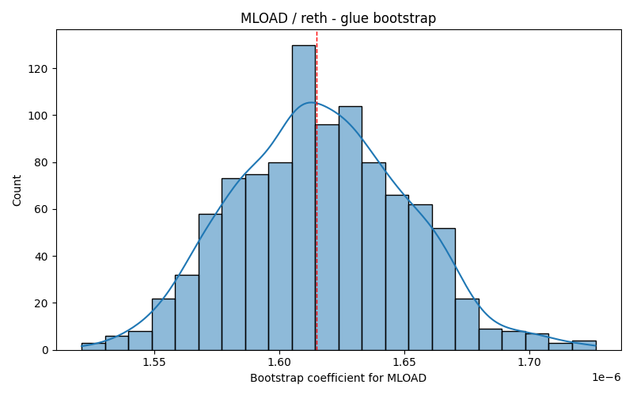


</details>

<details><summary><code>PUSH</code> · nobs=5390 · runtime_ms=4.454e-07 · p=1.00e-03 · R²=0.8368</summary>

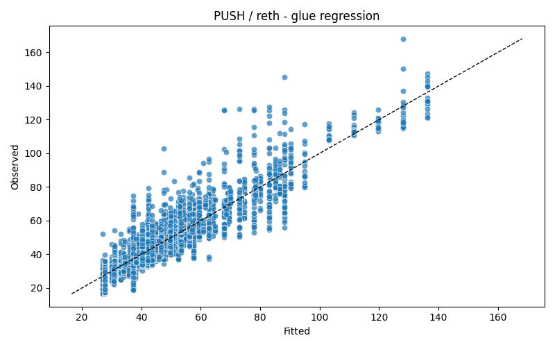

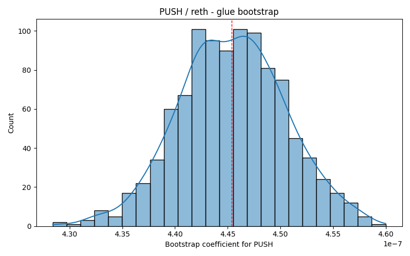


</details>

<details><summary><code>PUSH0</code> · nobs=5390 · runtime_ms=3.517e-07 · p=1.00e-03 · R²=0.8368</summary>


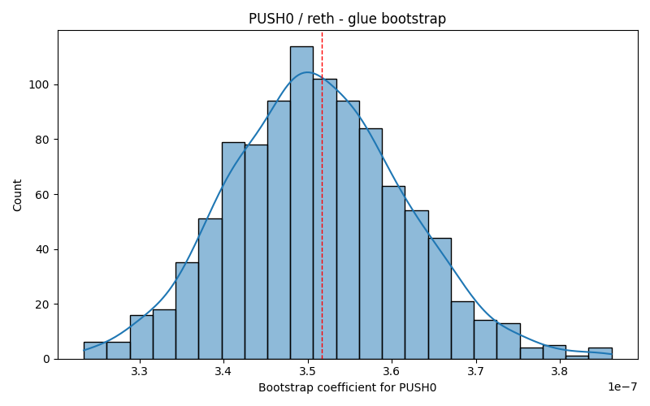


</details>

<details><summary><code>STATICCALL</code> · nobs=5390 · runtime_ms=4.64e-05 · p=1.00e-03 · R²=0.8368</summary>


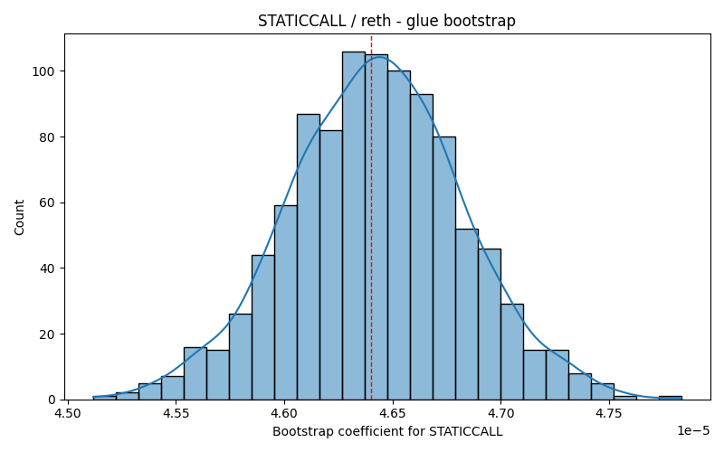

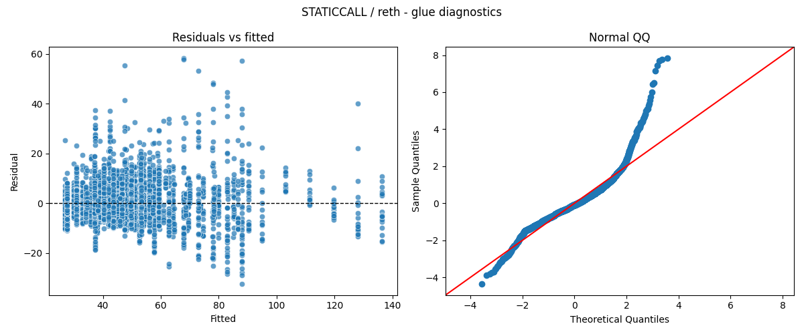

</details>

### Pure glue · reth

<details><summary><code>ISZERO</code> · nobs=88 · runtime_ms=4.162e-07 · p=1.00e-03 · R²=0.7692</summary>

```
==============================================================================
                           NNLS Regression Results                            
==============================================================================
Dep. Variable:          test_runtime_ms              R-squared:          0.769
Model:                  NNLS                    Adj. R-squared:          0.767
No. Observations:       88                                RMSE:           4.80
Df Residuals:           86                                 MAE:           3.58
Df Model:               1      
==============================================================================
                      coef     std err     P-value      [0.025      0.975]
------------------------------------------------------------------------------
         const      7.1494      1.5395       0.001      4.1446     10.0287
        ISZERO      0.0000      0.0000       0.001      0.0000      0.0000
==============================================================================
Notes: Non-negative least squares with bootstrap inference (1000 iterations)
==============================================================================
```

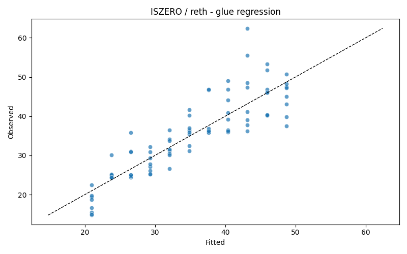

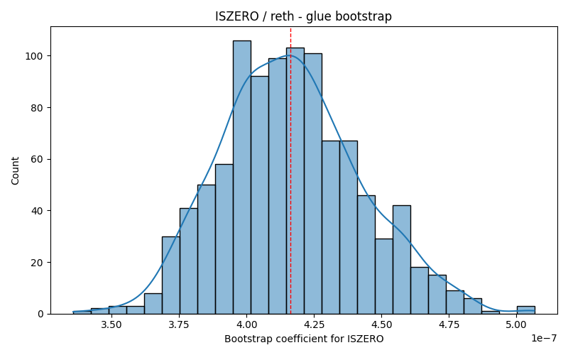

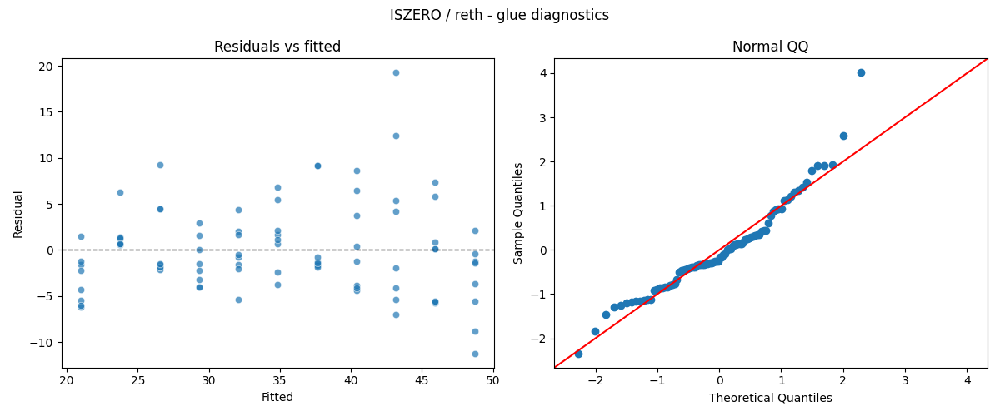

</details>

<details><summary><code>JUMPDEST</code> · nobs=88 · runtime_ms=2.746e-07 · p=1.00e-03 · R²=0.6402</summary>

```
==============================================================================
                           NNLS Regression Results                            
==============================================================================
Dep. Variable:          test_runtime_ms              R-squared:          0.640
Model:                  NNLS                    Adj. R-squared:          0.636
No. Observations:       88                                RMSE:          13.00
Df Residuals:           86                                 MAE:           9.25
Df Model:               1      
==============================================================================
                      coef     std err     P-value      [0.025      0.975]
------------------------------------------------------------------------------
         const     19.9216      4.1137       0.001     12.1337     28.3479
      JUMPDEST      0.0000      0.0000       0.001      0.0000      0.0000
==============================================================================
Notes: Non-negative least squares with bootstrap inference (1000 iterations)
==============================================================================
```

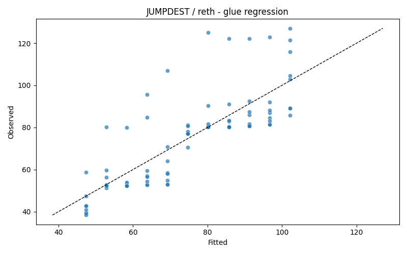

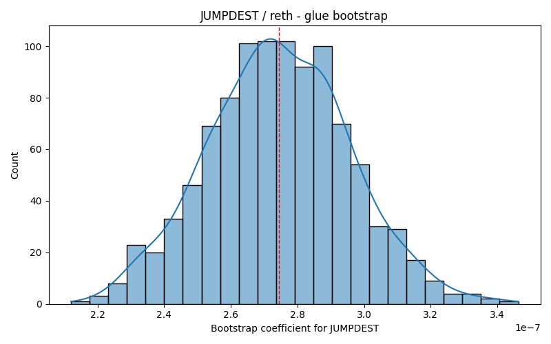

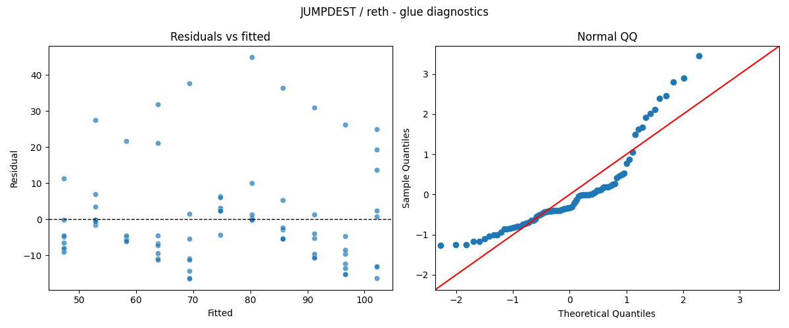

</details>

<details><summary><code>SWAP</code> · nobs=1408 · runtime_ms=4.624e-07 · p=1.00e-03 · R²=0.5571</summary>

```
==============================================================================
                           NNLS Regression Results                            
==============================================================================
Dep. Variable:          test_runtime_ms              R-squared:          0.557
Model:                  NNLS                    Adj. R-squared:          0.557
No. Observations:       1408                              RMSE:           8.68
Df Residuals:           1406                               MAE:           4.57
Df Model:               1      
==============================================================================
                      coef     std err     P-value      [0.025      0.975]
------------------------------------------------------------------------------
         const     12.1861      0.6280       0.001     10.9912     13.4769
          SWAP      0.0000      0.0000       0.001      0.0000      0.0000
==============================================================================
Notes: Non-negative least squares with bootstrap inference (1000 iterations)
==============================================================================
```

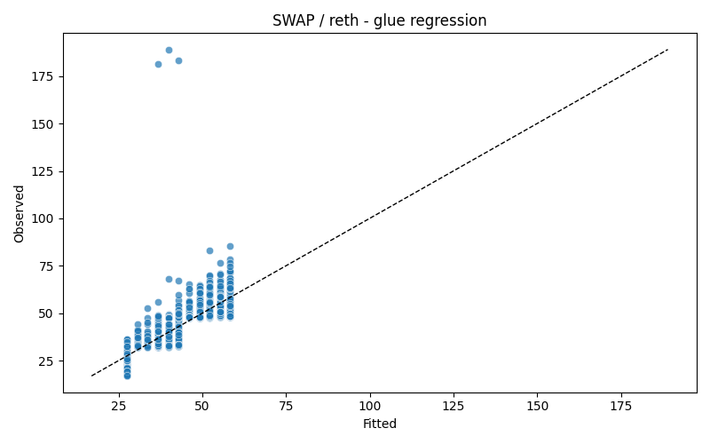

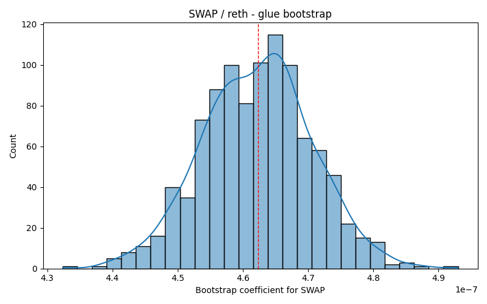

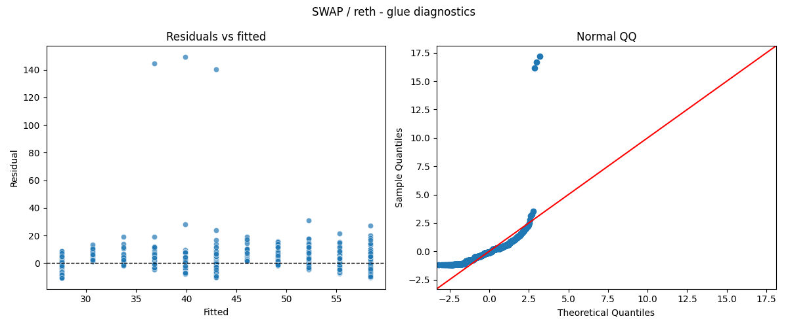

</details>

### Mixed glue (tier A) · reth

<details><summary><code>ADD</code> · nobs=88 · runtime_ms=8.579e-07 · p=1.00e-03 · R²=0.8301</summary>

```
==============================================================================
                           NNLS Regression Results                            
==============================================================================
Dep. Variable:          test_runtime_ms              R-squared:          0.830
Model:                  NNLS                    Adj. R-squared:          0.828
No. Observations:       88                                RMSE:           4.08
Df Residuals:           86                                 MAE:           3.28
Df Model:               1      
==============================================================================
                      coef     std err     P-value      [0.025      0.975]
------------------------------------------------------------------------------
         const     10.8020      1.3337       0.001      8.2509     13.3520
           ADD      0.0000      0.0000       0.001      0.0000      0.0000
==============================================================================
Notes: Non-negative least squares with bootstrap inference (1000 iterations)
==============================================================================
```

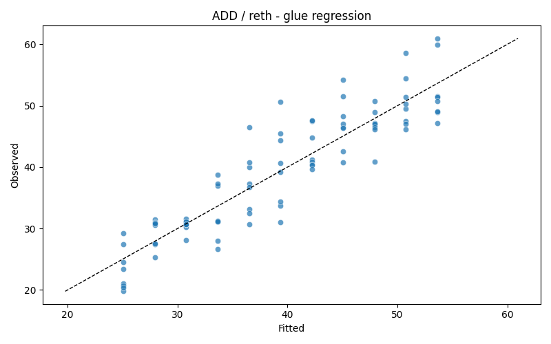

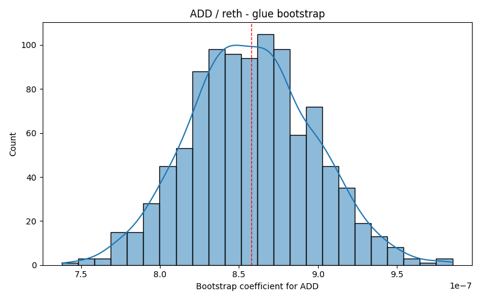

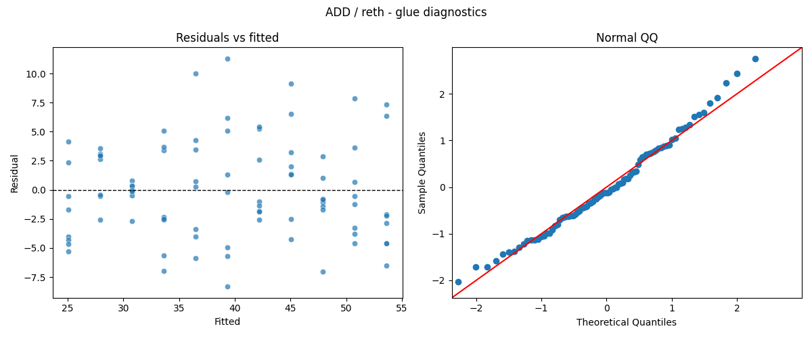

</details>

<details><summary><code>AND</code> · nobs=88 · runtime_ms=8.751e-07 · p=1.00e-03 · R²=0.8157</summary>

```
==============================================================================
                           NNLS Regression Results                            
==============================================================================
Dep. Variable:          test_runtime_ms              R-squared:          0.816
Model:                  NNLS                    Adj. R-squared:          0.814
No. Observations:       88                                RMSE:           4.38
Df Residuals:           86                                 MAE:           3.46
Df Model:               1      
==============================================================================
                      coef     std err     P-value      [0.025      0.975]
------------------------------------------------------------------------------
         const     10.3488      1.6047       0.001      7.4167     13.4951
           AND      0.0000      0.0000       0.001      0.0000      0.0000
==============================================================================
Notes: Non-negative least squares with bootstrap inference (1000 iterations)
==============================================================================
```

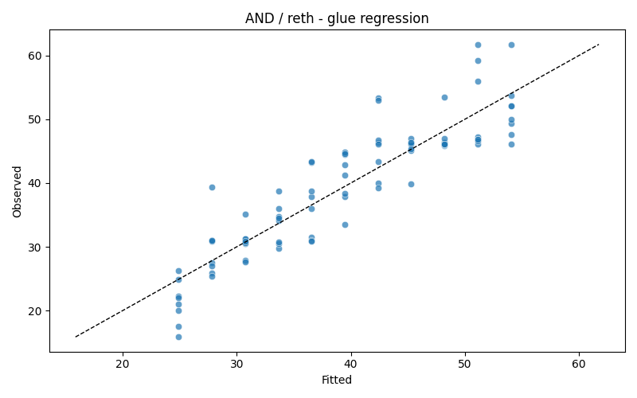

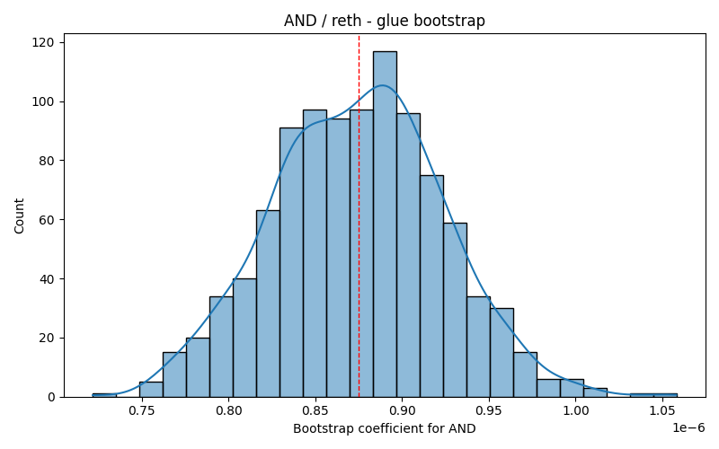

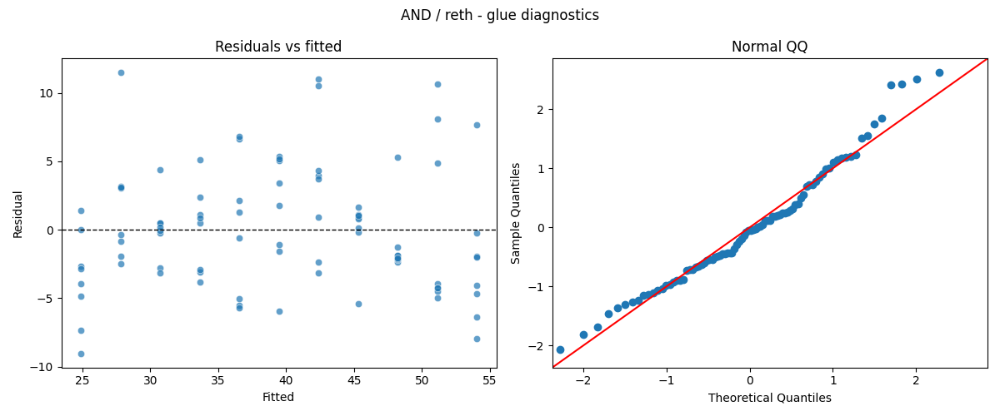

</details>

<details><summary><code>CALLDATACOPY</code> · nobs=2112 · runtime_ms=2.266e-06 · p=1.00e-03 · R²=0.8057</summary>

```
==============================================================================
                           NNLS Regression Results                            
==============================================================================
Dep. Variable:          test_runtime_ms              R-squared:          0.806
Model:                  NNLS                    Adj. R-squared:          0.806
No. Observations:       2112                              RMSE:           8.37
Df Residuals:           2110                               MAE:           6.38
Df Model:               1      
==============================================================================
                      coef     std err     P-value      [0.025      0.975]
------------------------------------------------------------------------------
         const     12.3602      0.2206       0.001     11.9340     12.8000
  CALLDATACOPY      0.0000      0.0000       0.001      0.0000      0.0000
==============================================================================
Notes: Non-negative least squares with bootstrap inference (1000 iterations)
==============================================================================
```

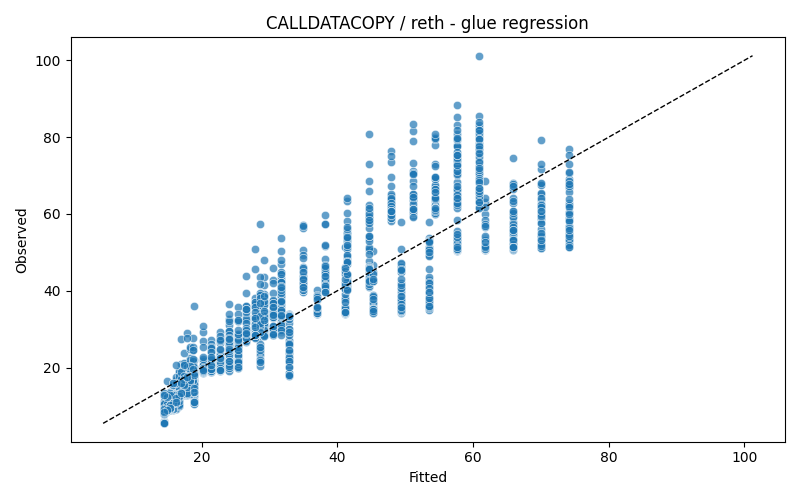

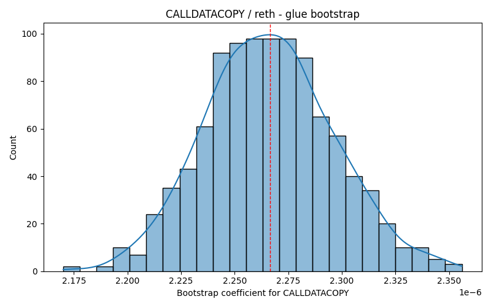

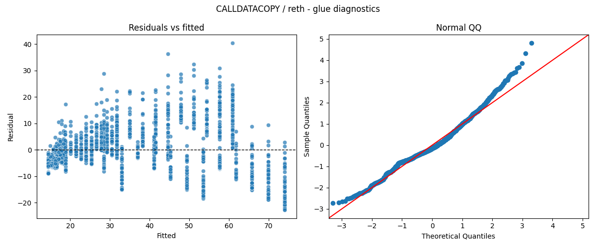

</details>

<details><summary><code>CALLDATALOAD</code> · nobs=352 · runtime_ms=4.464e-05 · p=1.00e-03 · R²=0.4795</summary>

```
==============================================================================
                           NNLS Regression Results                            
==============================================================================
Dep. Variable:          test_runtime_ms              R-squared:          0.480
Model:                  NNLS                    Adj. R-squared:          0.478
No. Observations:       352                               RMSE:           0.18
Df Residuals:           350                                MAE:           0.14
Df Model:               1      
==============================================================================
                      coef     std err     P-value      [0.025      0.975]
------------------------------------------------------------------------------
         const      1.1592      0.0292       0.001      1.1002      1.2171
  CALLDATALOAD      0.0000      0.0000       0.001      0.0000      0.0000
==============================================================================
Notes: Non-negative least squares with bootstrap inference (1000 iterations)
==============================================================================
```

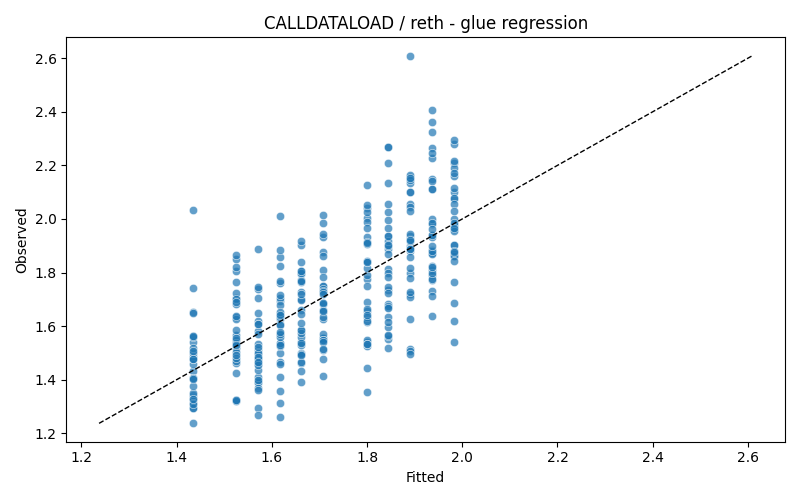

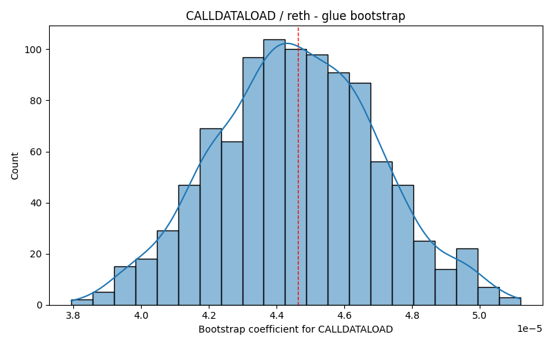


</details>

<details><summary><code>DIV</code> · nobs=88 · runtime_ms=6.902e-06 · p=1.00e-03 · R²=0.8428</summary>

```
==============================================================================
                           NNLS Regression Results                            
==============================================================================
Dep. Variable:          test_runtime_ms              R-squared:          0.843
Model:                  NNLS                    Adj. R-squared:          0.841
No. Observations:       88                                RMSE:          23.53
Df Residuals:           86                                 MAE:          19.07
Df Model:               1      
==============================================================================
                      coef     std err     P-value      [0.025      0.975]
------------------------------------------------------------------------------
         const     65.7971      8.5171       0.001     47.6644     81.6969
           DIV      0.0000      0.0000       0.001      0.0000      0.0000
==============================================================================
Notes: Non-negative least squares with bootstrap inference (1000 iterations)
==============================================================================
```

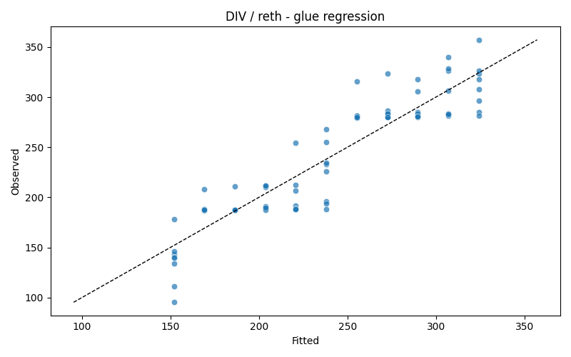

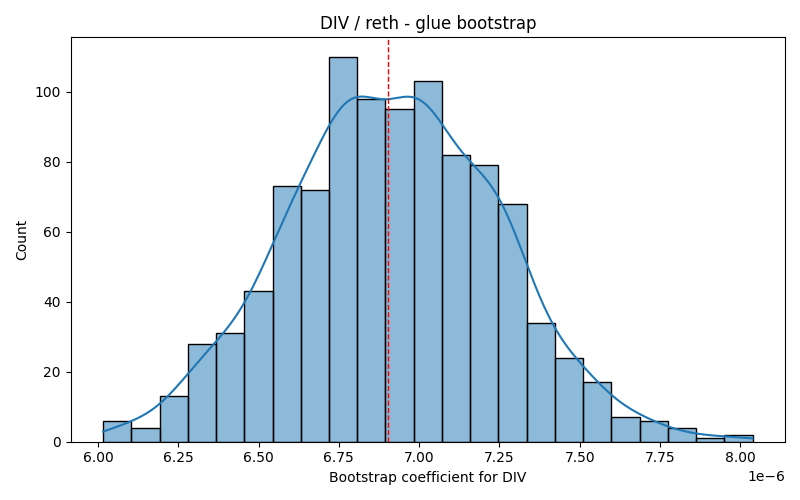

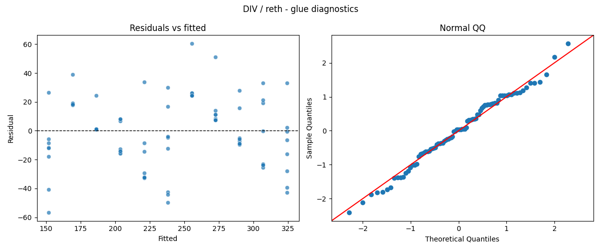

</details>

<details><summary><code>EXP</code> · nobs=88 · runtime_ms=0.0003551 · p=1.00e-03 · R²=0.7396</summary>

```
==============================================================================
                           NNLS Regression Results                            
==============================================================================
Dep. Variable:          test_runtime_ms              R-squared:          0.740
Model:                  NNLS                    Adj. R-squared:          0.737
No. Observations:       88                                RMSE:           8.25
Df Residuals:           86                                 MAE:           6.26
Df Model:               1      
==============================================================================
                      coef     std err     P-value      [0.025      0.975]
------------------------------------------------------------------------------
         const     20.3189      2.8188       0.001     14.6058     25.9602
           EXP      0.0004      0.0000       0.001      0.0003      0.0004
==============================================================================
Notes: Non-negative least squares with bootstrap inference (1000 iterations)
==============================================================================
```

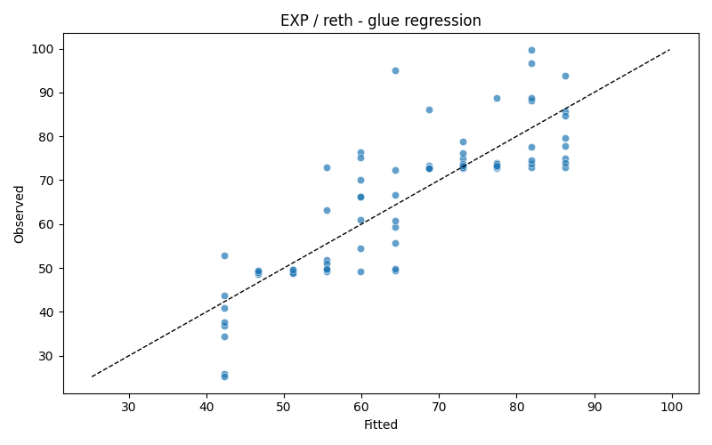

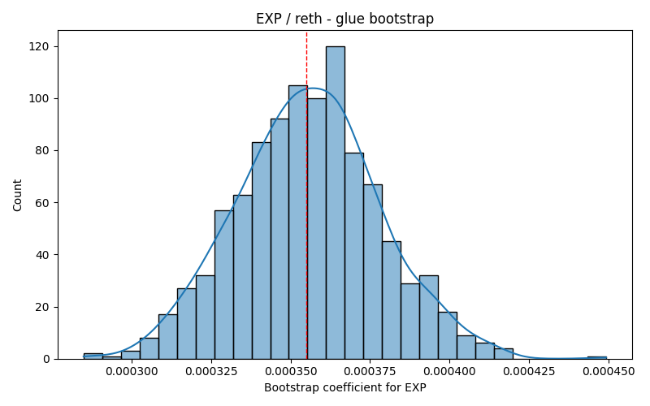

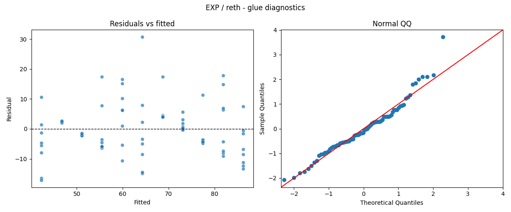

</details>

<details><summary><code>GT</code> · nobs=88 · runtime_ms=1.01e-06 · p=1.00e-03 · R²=0.8267</summary>

```
==============================================================================
                           NNLS Regression Results                            
==============================================================================
Dep. Variable:          test_runtime_ms              R-squared:          0.827
Model:                  NNLS                    Adj. R-squared:          0.825
No. Observations:       88                                RMSE:           4.87
Df Residuals:           86                                 MAE:           3.88
Df Model:               1      
==============================================================================
                      coef     std err     P-value      [0.025      0.975]
------------------------------------------------------------------------------
         const      9.6204      1.7881       0.001      6.2351     13.2097
            GT      0.0000      0.0000       0.001      0.0000      0.0000
==============================================================================
Notes: Non-negative least squares with bootstrap inference (1000 iterations)
==============================================================================
```

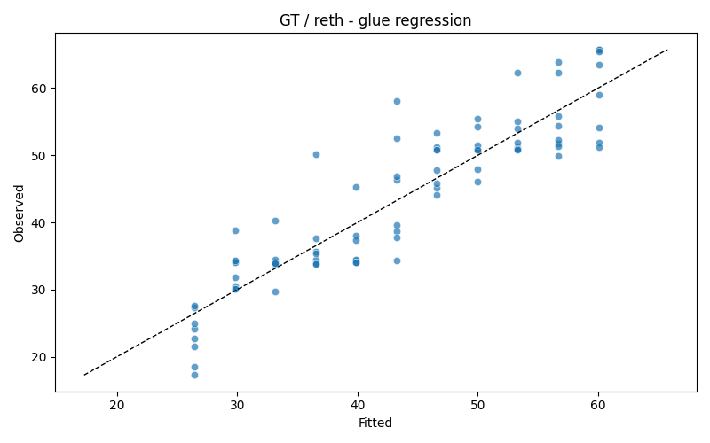

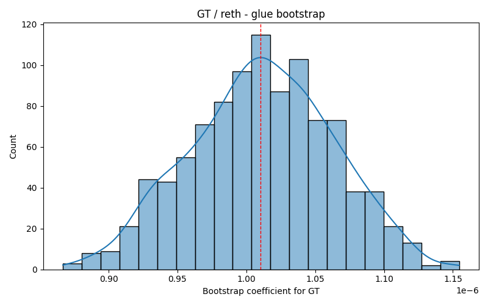

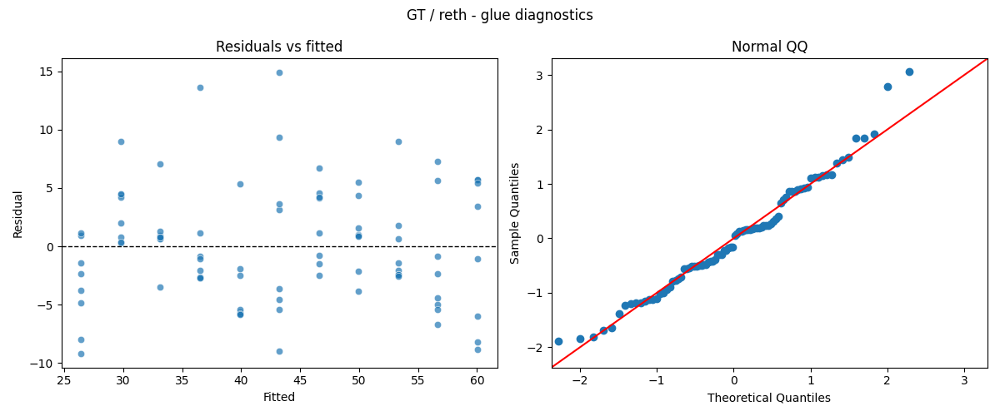

</details>

<details><summary><code>JUMPI</code> · nobs=88 · runtime_ms=1.245e-06 · p=1.00e-03 · R²=0.7689</summary>

```
==============================================================================
                           NNLS Regression Results                            
==============================================================================
Dep. Variable:          test_runtime_ms              R-squared:          0.769
Model:                  NNLS                    Adj. R-squared:          0.766
No. Observations:       88                                RMSE:           3.08
Df Residuals:           86                                 MAE:           2.34
Df Model:               1      
==============================================================================
                      coef     std err     P-value      [0.025      0.975]
------------------------------------------------------------------------------
         const      6.6687      1.0677       0.001      4.7493      8.9247
         JUMPI      0.0000      0.0000       0.001      0.0000      0.0000
==============================================================================
Notes: Non-negative least squares with bootstrap inference (1000 iterations)
==============================================================================
```

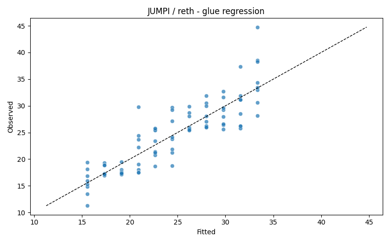

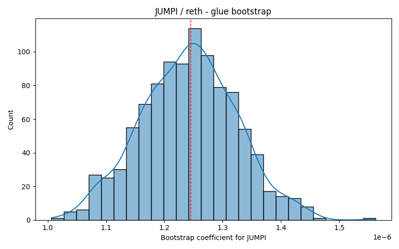

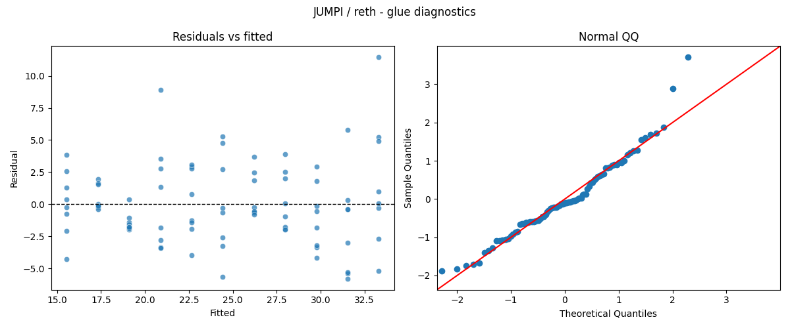

</details>

<details><summary><code>LT</code> · nobs=88 · runtime_ms=9.486e-07 · p=1.00e-03 · R²=0.7792</summary>

```
==============================================================================
                           NNLS Regression Results                            
==============================================================================
Dep. Variable:          test_runtime_ms              R-squared:          0.779
Model:                  NNLS                    Adj. R-squared:          0.777
No. Observations:       88                                RMSE:           5.32
Df Residuals:           86                                 MAE:           3.77
Df Model:               1      
==============================================================================
                      coef     std err     P-value      [0.025      0.975]
------------------------------------------------------------------------------
         const     10.4070      1.5899       0.001      7.2473     13.5636
            LT      0.0000      0.0000       0.001      0.0000      0.0000
==============================================================================
Notes: Non-negative least squares with bootstrap inference (1000 iterations)
==============================================================================
```

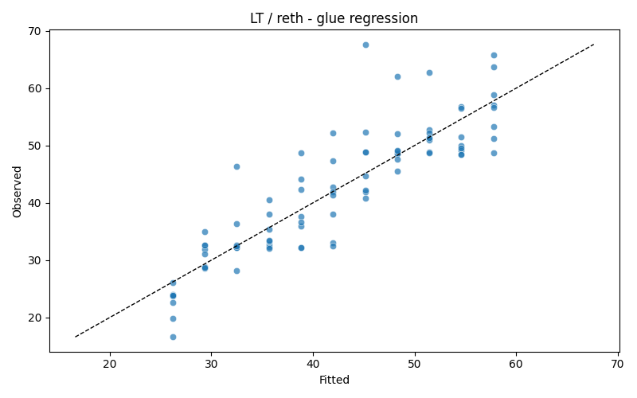

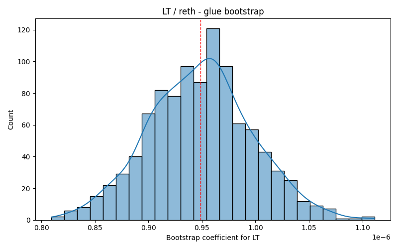

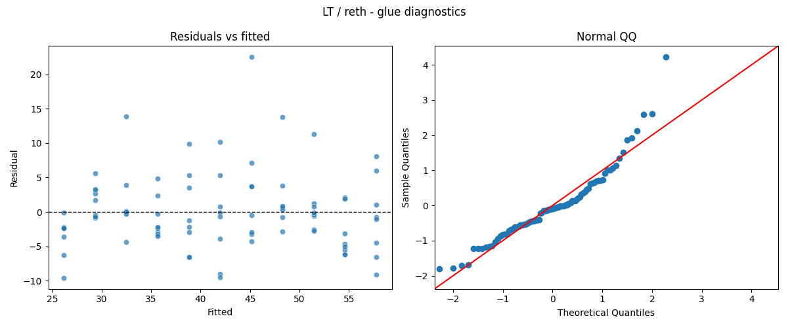

</details>

<details><summary><code>MSTORE</code> · nobs=440 · runtime_ms=2.718e-06 · p=1.00e-03 · R²=0.2647</summary>

```
==============================================================================
                           NNLS Regression Results                            
==============================================================================
Dep. Variable:          test_runtime_ms              R-squared:          0.265
Model:                  NNLS                    Adj. R-squared:          0.263
No. Observations:       440                               RMSE:          31.79
Df Residuals:           438                                MAE:          28.72
Df Model:               1      
==============================================================================
                      coef     std err     P-value      [0.025      0.975]
------------------------------------------------------------------------------
         const     21.3399      4.2917       0.001     12.5797     29.5869
        MSTORE      0.0000      0.0000       0.001      0.0000      0.0000
==============================================================================
Notes: Non-negative least squares with bootstrap inference (1000 iterations)
==============================================================================
```

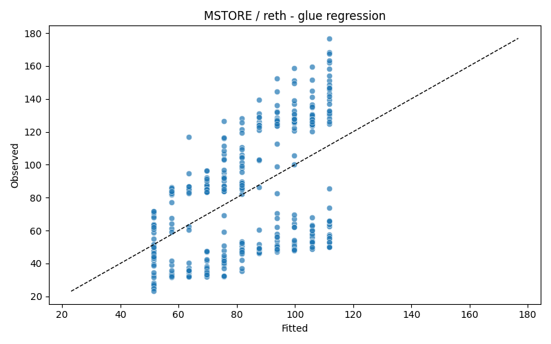

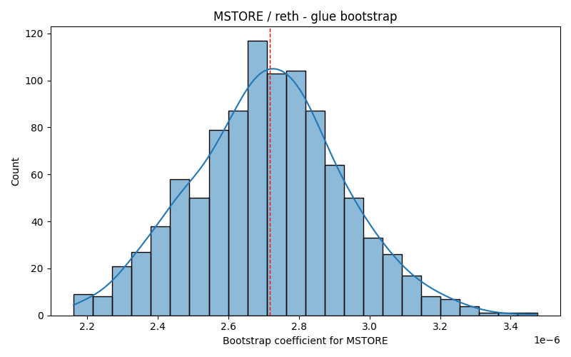

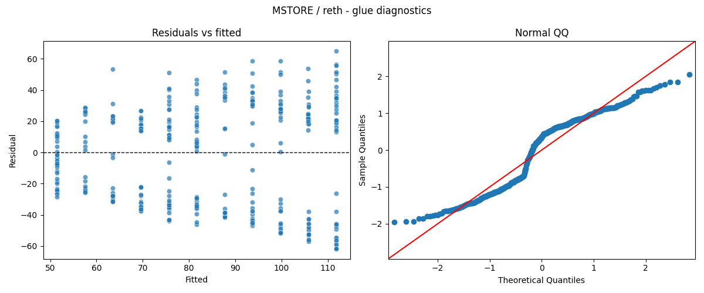

</details>

<details><summary><code>MSTORE8</code> · nobs=440 · runtime_ms=1.378e-06 · p=1.00e-03 · R²=0.7667</summary>

```
==============================================================================
                           NNLS Regression Results                            
==============================================================================
Dep. Variable:          test_runtime_ms              R-squared:          0.767
Model:                  NNLS                    Adj. R-squared:          0.766
No. Observations:       440                               RMSE:           5.33
Df Residuals:           438                                MAE:           4.03
Df Model:               1      
==============================================================================
                      coef     std err     P-value      [0.025      0.975]
------------------------------------------------------------------------------
         const      9.7389      0.8740       0.001      8.0269     11.5061
       MSTORE8      0.0000      0.0000       0.001      0.0000      0.0000
==============================================================================
Notes: Non-negative least squares with bootstrap inference (1000 iterations)
==============================================================================
```

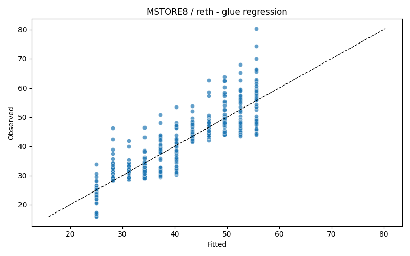

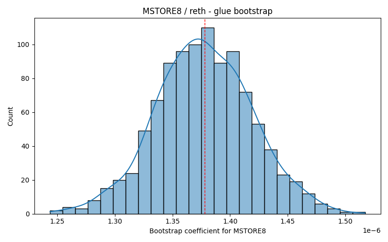

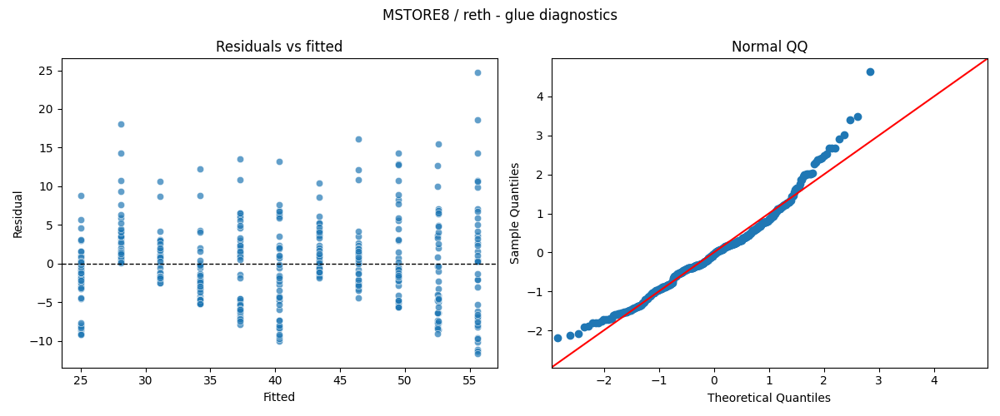

</details>

<details><summary><code>MUL</code> · nobs=88 · runtime_ms=1.192e-06 · p=1.00e-03 · R²=0.785</summary>

```
==============================================================================
                           NNLS Regression Results                            
==============================================================================
Dep. Variable:          test_runtime_ms              R-squared:          0.785
Model:                  NNLS                    Adj. R-squared:          0.783
No. Observations:       88                                RMSE:           4.93
Df Residuals:           86                                 MAE:           3.90
Df Model:               1      
==============================================================================
                      coef     std err     P-value      [0.025      0.975]
------------------------------------------------------------------------------
         const      9.1524      1.6819       0.001      5.7617     12.4315
           MUL      0.0000      0.0000       0.001      0.0000      0.0000
==============================================================================
Notes: Non-negative least squares with bootstrap inference (1000 iterations)
==============================================================================
```

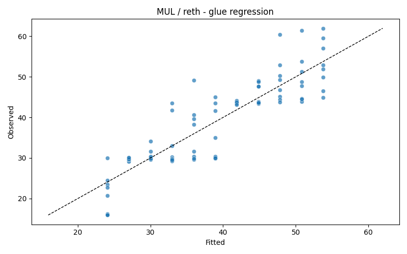

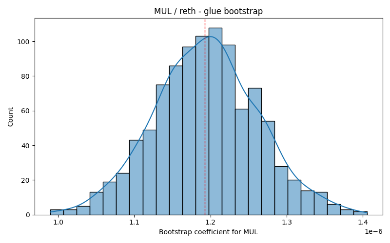

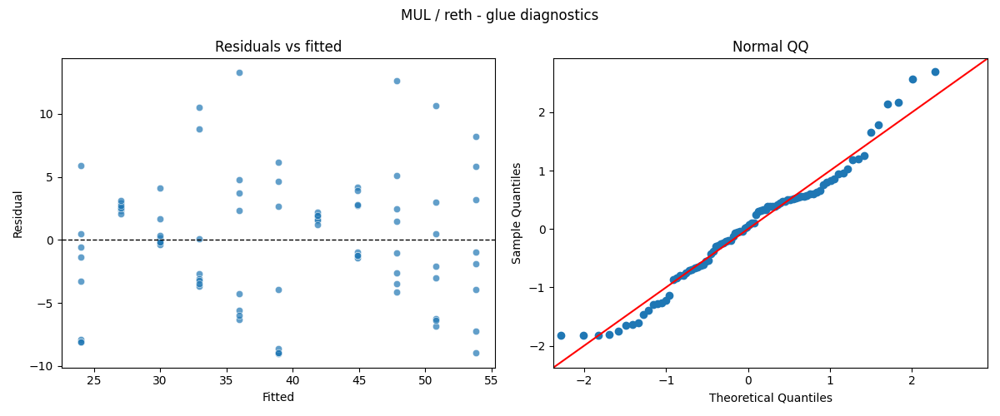

</details>

<details><summary><code>PC</code> · nobs=88 · runtime_ms=6.093e-07 · p=1.00e-03 · R²=0.9385</summary>

```
==============================================================================
                           NNLS Regression Results                            
==============================================================================
Dep. Variable:          test_runtime_ms              R-squared:          0.939
Model:                  NNLS                    Adj. R-squared:          0.938
No. Observations:       88                                RMSE:           4.66
Df Residuals:           86                                 MAE:           3.74
Df Model:               1      
==============================================================================
                      coef     std err     P-value      [0.025      0.975]
------------------------------------------------------------------------------
         const     12.2634      1.4914       0.001      9.5233     15.2761
            PC      0.0000      0.0000       0.001      0.0000      0.0000
==============================================================================
Notes: Non-negative least squares with bootstrap inference (1000 iterations)
==============================================================================
```

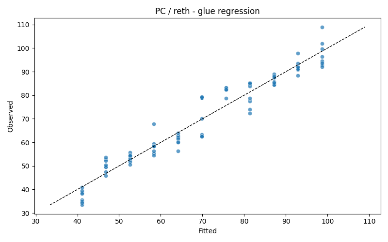

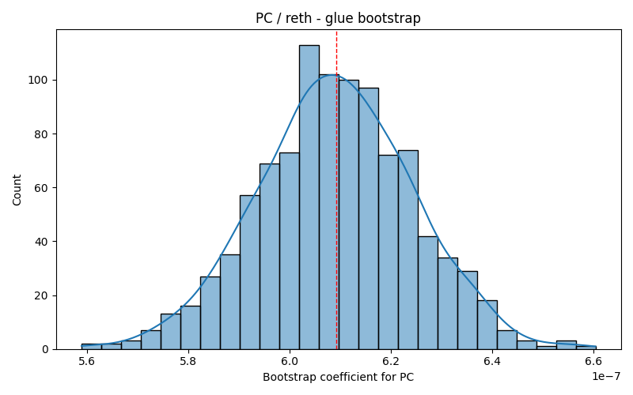

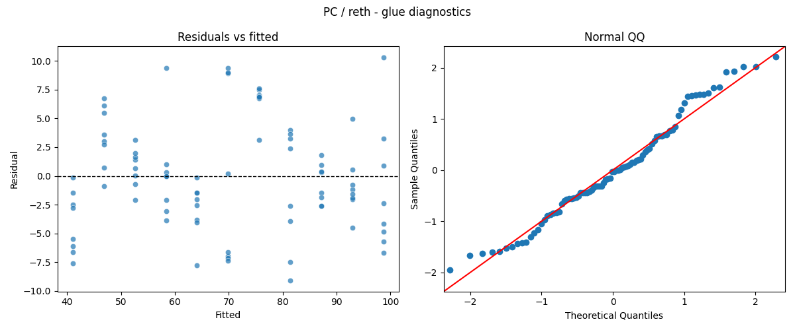

</details>

<details><summary><code>RETURNDATASIZE</code> · nobs=352 · runtime_ms=8.903e-07 · p=1.00e-03 · R²=0.8426</summary>

```
==============================================================================
                           NNLS Regression Results                            
==============================================================================
Dep. Variable:          test_runtime_ms              R-squared:          0.843
Model:                  NNLS                    Adj. R-squared:          0.842
No. Observations:       352                               RMSE:           6.08
Df Residuals:           350                                MAE:           4.67
Df Model:               1      
==============================================================================
                      coef     std err     P-value      [0.025      0.975]
------------------------------------------------------------------------------
         const     12.6363      1.0280       0.001     10.6990     14.5312
RETURNDATASIZE      0.0000      0.0000       0.001      0.0000      0.0000
==============================================================================
Notes: Non-negative least squares with bootstrap inference (1000 iterations)
==============================================================================
```

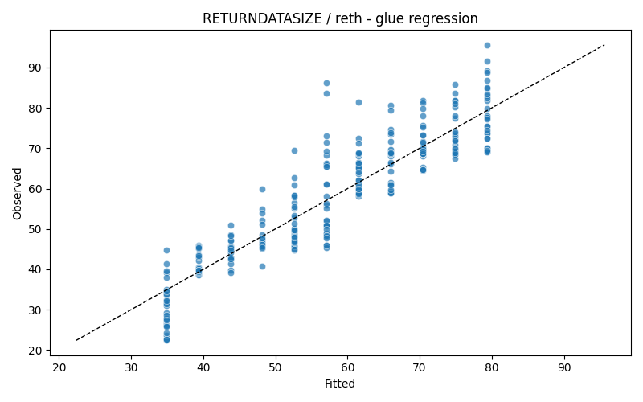

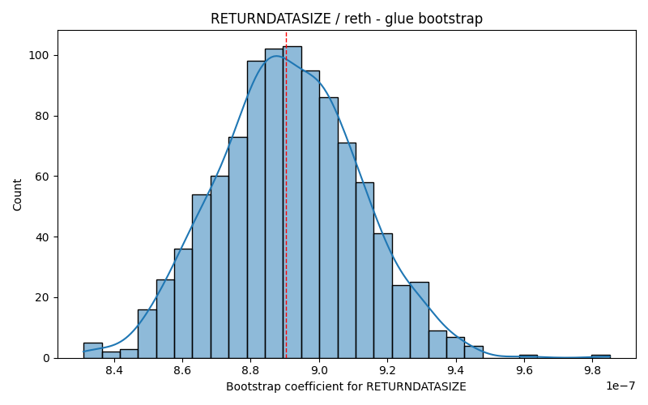

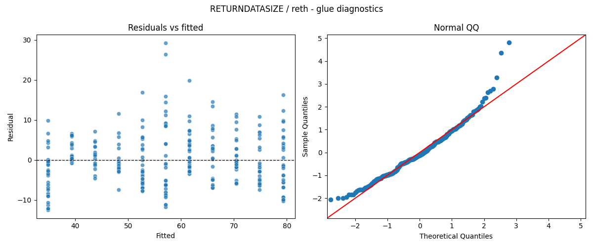

</details>

<details><summary><code>SELFBALANCE</code> · nobs=72 · runtime_ms=3.864e-06 · p=1.00e-03 · R²=0.8114</summary>

```
==============================================================================
                           NNLS Regression Results                            
==============================================================================
Dep. Variable:          test_runtime_ms              R-squared:          0.811
Model:                  NNLS                    Adj. R-squared:          0.809
No. Observations:       72                                RMSE:          18.79
Df Residuals:           70                                 MAE:          14.74
Df Model:               1      
==============================================================================
                      coef     std err     P-value      [0.025      0.975]
------------------------------------------------------------------------------
         const     56.0936      7.4486       0.001     40.9082     70.0578
   SELFBALANCE      0.0000      0.0000       0.001      0.0000      0.0000
==============================================================================
Notes: Non-negative least squares with bootstrap inference (1000 iterations)
==============================================================================
```

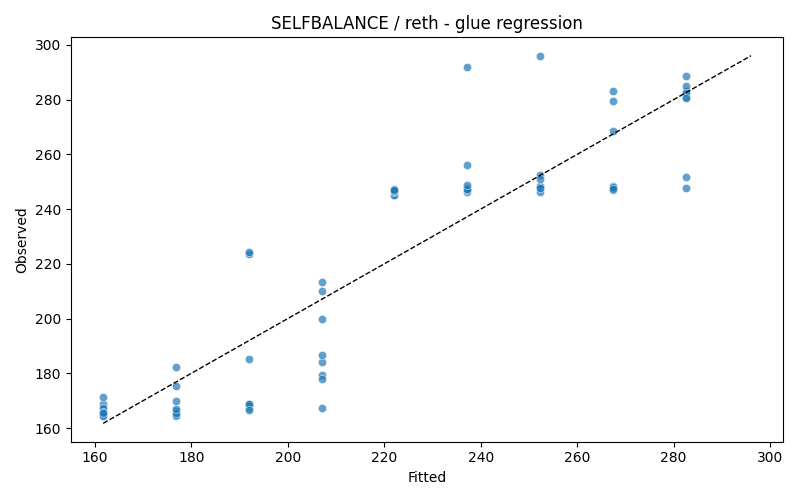

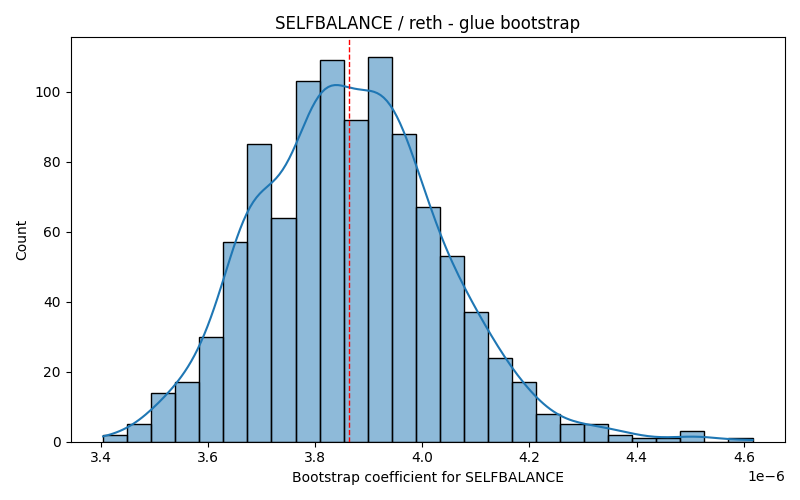

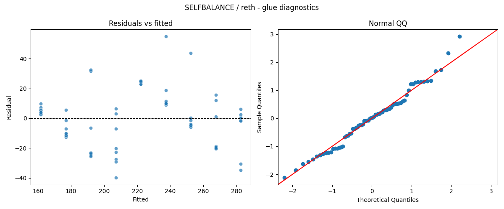

</details>

<details><summary><code>SUB</code> · nobs=88 · runtime_ms=9.043e-07 · p=1.00e-03 · R²=0.785</summary>

```
==============================================================================
                           NNLS Regression Results                            
==============================================================================
Dep. Variable:          test_runtime_ms              R-squared:          0.785
Model:                  NNLS                    Adj. R-squared:          0.782
No. Observations:       88                                RMSE:           4.98
Df Residuals:           86                                 MAE:           3.77
Df Model:               1      
==============================================================================
                      coef     std err     P-value      [0.025      0.975]
------------------------------------------------------------------------------
         const     11.1994      1.7673       0.001      7.7019     14.6824
           SUB      0.0000      0.0000       0.001      0.0000      0.0000
==============================================================================
Notes: Non-negative least squares with bootstrap inference (1000 iterations)
==============================================================================
```

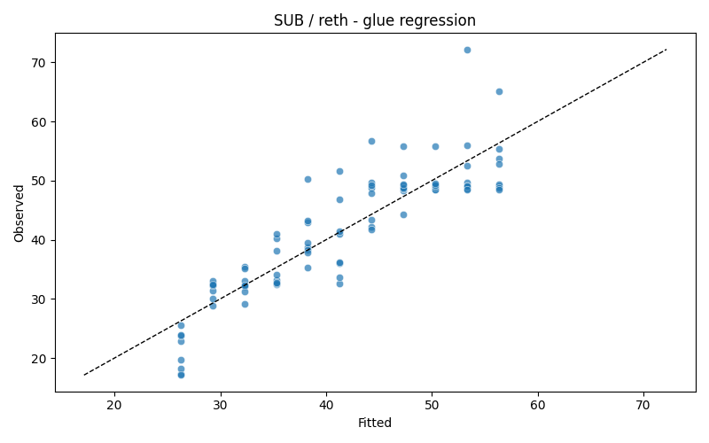

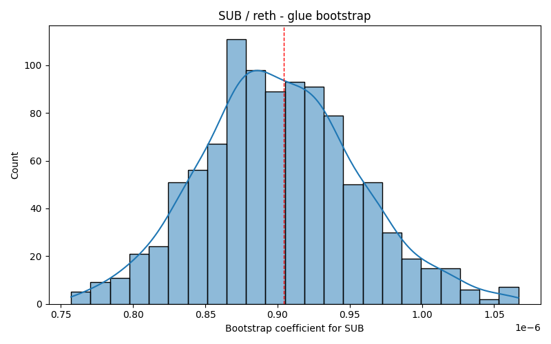

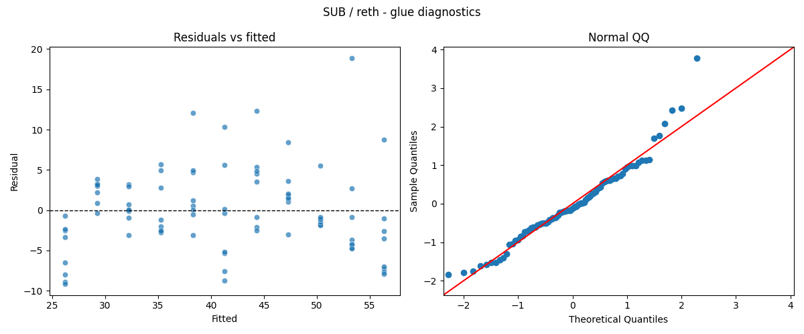

</details>

### Mixed glue (tier B) · reth

<details><summary><code>JUMP</code> · nobs=88 · runtime_ms=2.315e-06 · p=1.00e-03 · R²=0.79</summary>

```
==============================================================================
                           NNLS Regression Results                            
==============================================================================
Dep. Variable:          test_runtime_ms              R-squared:          0.790
Model:                  NNLS                    Adj. R-squared:          0.788
No. Observations:       88                                RMSE:           4.44
Df Residuals:           86                                 MAE:           3.54
Df Model:               1      
==============================================================================
                      coef     std err     P-value      [0.025      0.975]
------------------------------------------------------------------------------
         const      8.2999      1.5090       0.001      5.5057     11.4095
          JUMP      0.0000      0.0000       0.001      0.0000      0.0000
==============================================================================
Notes: Non-negative least squares with bootstrap inference (1000 iterations)
==============================================================================
```

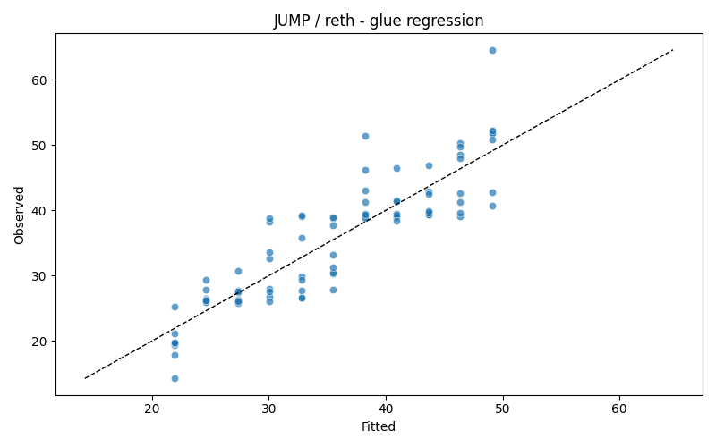

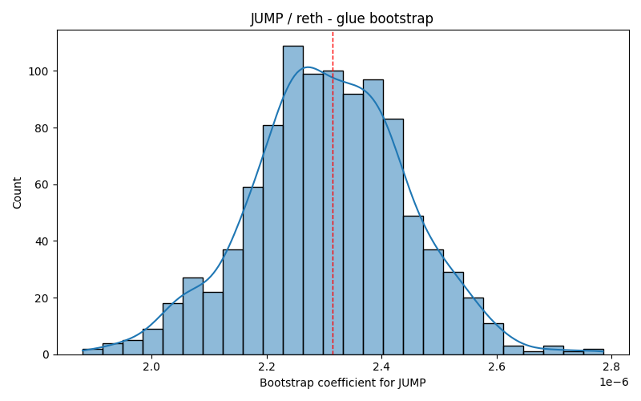


</details>

<details><summary><code>KECCAK256</code> · nobs=1408 · runtime_ms=0 · p=1.00e+00 · R²=2.22e-16</summary>

```
==============================================================================
                           NNLS Regression Results                            
==============================================================================
Dep. Variable:          test_runtime_ms              R-squared:          0.000
Model:                  NNLS                    Adj. R-squared:         -0.001
No. Observations:       1408                              RMSE:         161.33
Df Residuals:           1406                               MAE:         136.46
Df Model:               1      
==============================================================================
                      coef     std err     P-value      [0.025      0.975]
------------------------------------------------------------------------------
         const    253.3005      4.4144       0.001    244.5499    261.6626
     KECCAK256      0.0000      0.0000       1.000      0.0000      0.0000
==============================================================================
Notes: Non-negative least squares with bootstrap inference (1000 iterations)
==============================================================================
```

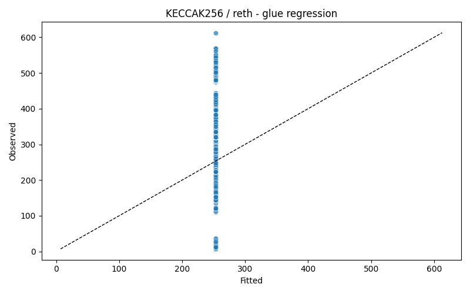

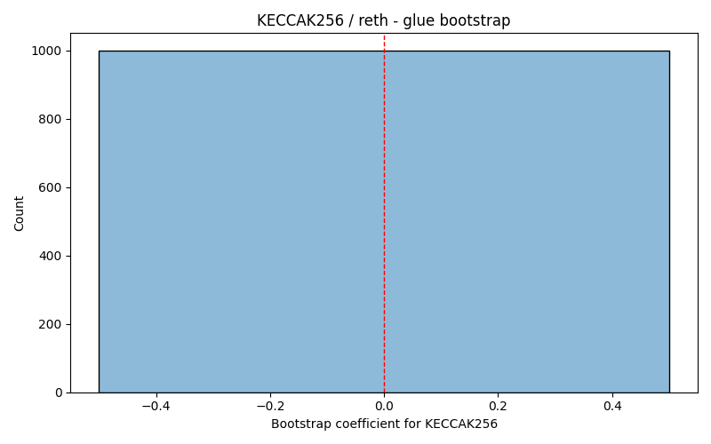

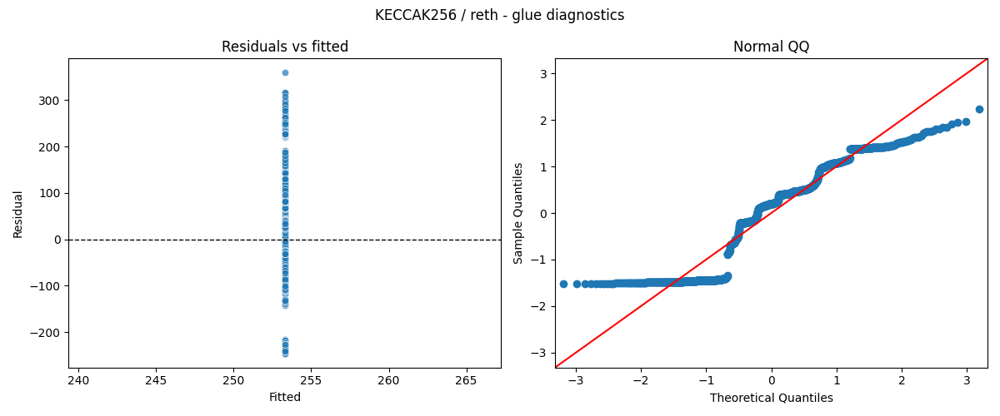

</details>
