# Runtime estimation report

Per-spec NNLS fits of `test_runtime_ms` against `opcount`, one row per (target opcode, test, model_by combo, client).

## Contents

- [SLOAD](#sload)
- [SSTORE](#sstore)
- [BALANCE](#balance)
- [CALL](#call)
- [CALLCODE](#callcode)
- [DELEGATECALL](#delegatecall)
- [EXTCODECOPY](#extcodecopy)
- [EXTCODEHASH](#extcodehash)
- [EXTCODESIZE](#extcodesize)
- [STATICCALL](#staticcall)

## SLOAD

### test_sload_bloated — combo `False`

| client | nobs | R² | target_coef (ms) | p-value | 95% CI |
| --- | --- | --- | --- | --- | --- |
| `besu` | 187 | 0.9586 | 0.007321 | 1.00e-03 | [0.007096, 0.007561] |
| `erigon` | 77 | 0.9985 | 0.006177 | 1.00e-03 | [0.00612, 0.00623] |
| `geth` | 121 | 0.8856 | 0.02684 | 1.00e-03 | [0.0251, 0.0288] |
| `nethermind` | 110 | 0.8825 | 0.003738 | 1.00e-03 | [0.00346, 0.003998] |
| `reth` | 198 | 0.9362 | 0.00129 | 1.00e-03 | [0.00124, 0.001342] |

<details><summary>besu — NNLS regression summary</summary>

```
==============================================================================
                           NNLS Regression Results                            
==============================================================================
Dep. Variable:          test_runtime_ms              R-squared:          0.959
Model:                  NNLS                    Adj. R-squared:          0.958
No. Observations:       187                               RMSE:          44.79
Df Residuals:           185                                MAE:          36.00
Df Model:               1      
==============================================================================
                      coef     std err     P-value      [0.025      0.975]
------------------------------------------------------------------------------
         const    184.5533     10.3676       0.001    164.2640    204.4099
       opcount      0.0073      0.0001       0.001      0.0071      0.0076
==============================================================================
Notes: Non-negative least squares with bootstrap inference (1000 iterations)
==============================================================================
```

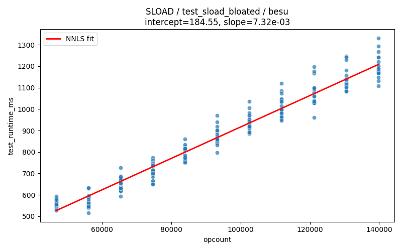

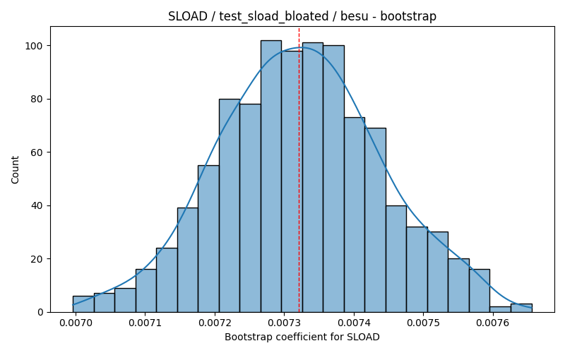

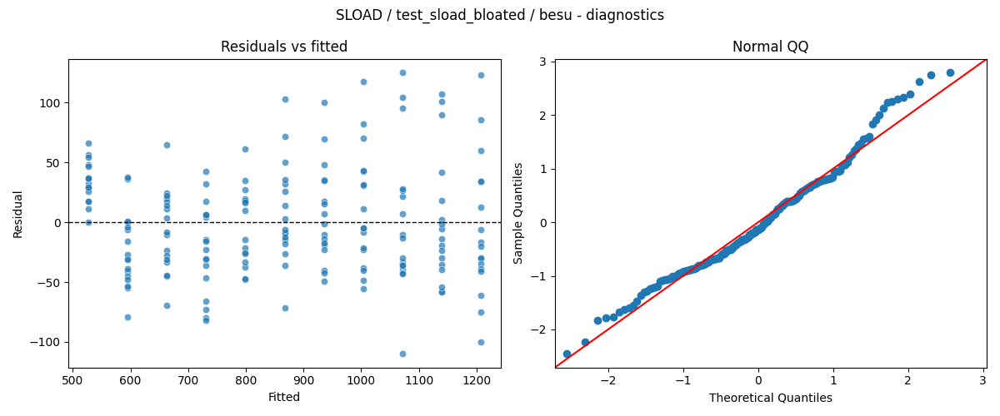

</details>

<details><summary>erigon — NNLS regression summary</summary>

```
==============================================================================
                           NNLS Regression Results                            
==============================================================================
Dep. Variable:          test_runtime_ms              R-squared:          0.998
Model:                  NNLS                    Adj. R-squared:          0.998
No. Observations:       77                                RMSE:           7.08
Df Residuals:           75                                 MAE:           5.61
Df Model:               1      
==============================================================================
                      coef     std err     P-value      [0.025      0.975]
------------------------------------------------------------------------------
         const     12.5562      2.4174       0.001      7.7121     17.2889
       opcount      0.0062      0.0000       0.001      0.0061      0.0062
==============================================================================
Notes: Non-negative least squares with bootstrap inference (1000 iterations)
==============================================================================
```

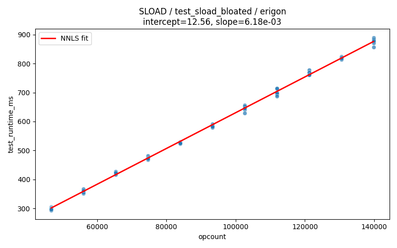

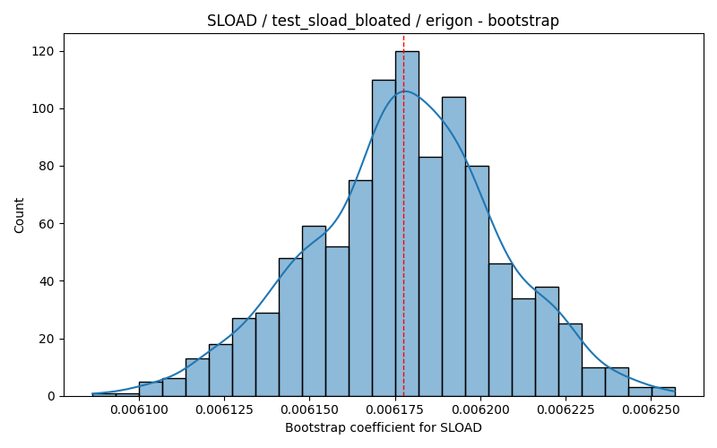

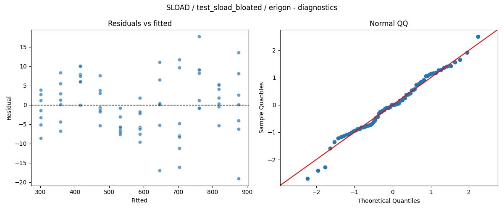

</details>

<details><summary>geth — NNLS regression summary</summary>

```
==============================================================================
                           NNLS Regression Results                            
==============================================================================
Dep. Variable:          test_runtime_ms              R-squared:          0.886
Model:                  NNLS                    Adj. R-squared:          0.885
No. Observations:       121                               RMSE:         283.97
Df Residuals:           119                                MAE:         218.88
Df Model:               1      
==============================================================================
                      coef     std err     P-value      [0.025      0.975]
------------------------------------------------------------------------------
         const    885.3114     82.8229       0.001    721.2623   1042.5915
       opcount      0.0268      0.0009       0.001      0.0251      0.0288
==============================================================================
Notes: Non-negative least squares with bootstrap inference (1000 iterations)
==============================================================================
```

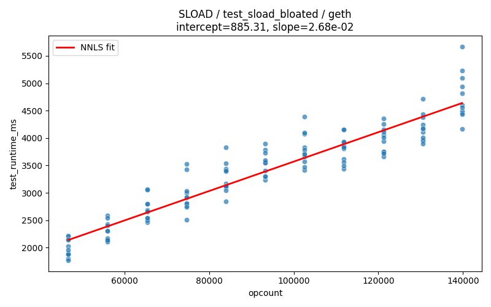

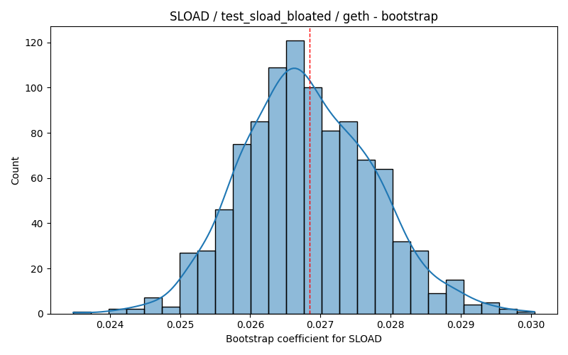

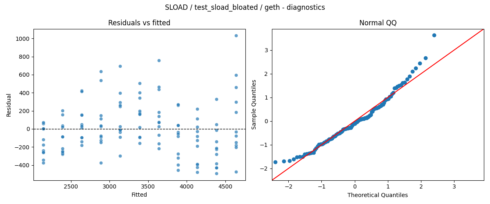

</details>

<details><summary>nethermind — NNLS regression summary</summary>

```
==============================================================================
                           NNLS Regression Results                            
==============================================================================
Dep. Variable:          test_runtime_ms              R-squared:          0.882
Model:                  NNLS                    Adj. R-squared:          0.881
No. Observations:       110                               RMSE:          40.15
Df Residuals:           108                                MAE:          33.64
Df Model:               1      
==============================================================================
                      coef     std err     P-value      [0.025      0.975]
------------------------------------------------------------------------------
         const    118.6300     13.3945       0.001     92.4056    144.6524
       opcount      0.0037      0.0001       0.001      0.0035      0.0040
==============================================================================
Notes: Non-negative least squares with bootstrap inference (1000 iterations)
==============================================================================
```

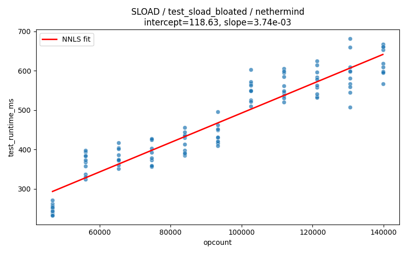

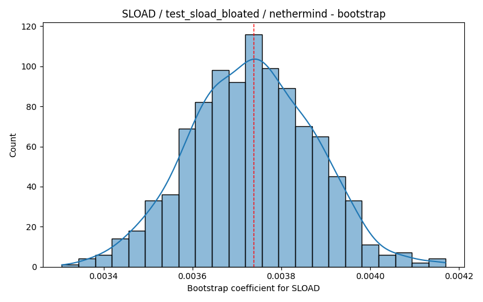

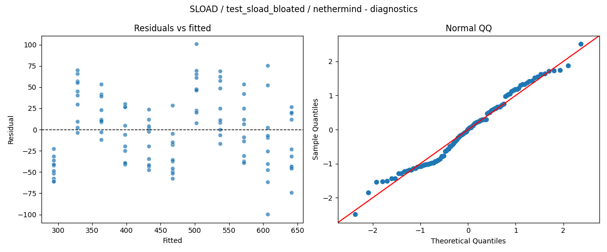

</details>

<details><summary>reth — NNLS regression summary</summary>

```
==============================================================================
                           NNLS Regression Results                            
==============================================================================
Dep. Variable:          test_runtime_ms              R-squared:          0.936
Model:                  NNLS                    Adj. R-squared:          0.936
No. Observations:       198                               RMSE:           9.91
Df Residuals:           196                                MAE:           7.29
Df Model:               1      
==============================================================================
                      coef     std err     P-value      [0.025      0.975]
------------------------------------------------------------------------------
         const     40.0635      2.5538       0.001     34.9783     44.8490
       opcount      0.0013      0.0000       0.001      0.0012      0.0013
==============================================================================
Notes: Non-negative least squares with bootstrap inference (1000 iterations)
==============================================================================
```

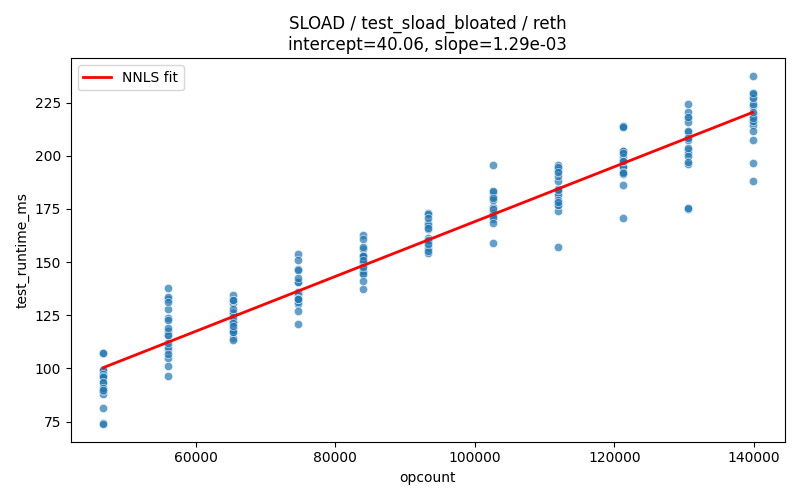

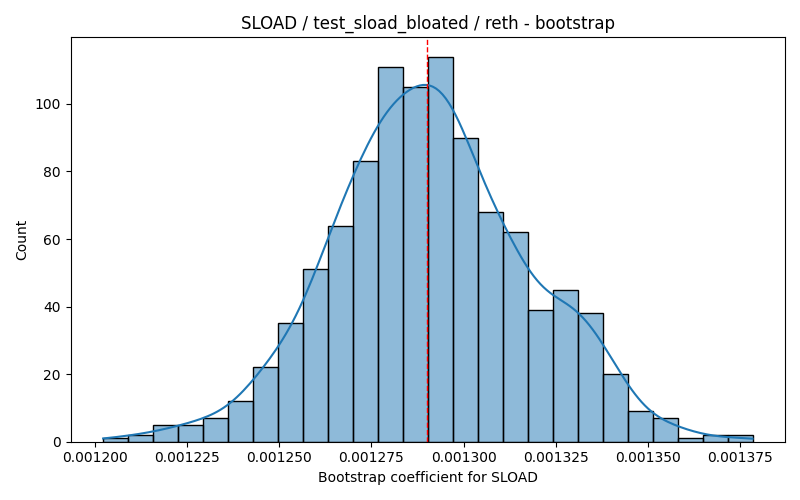

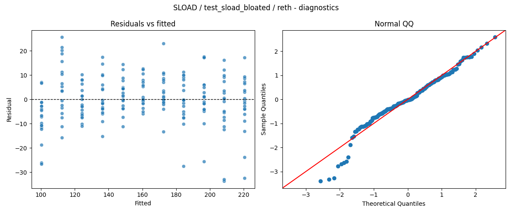

</details>

### test_sload_bloated — combo `True`

| client | nobs | R² | target_coef (ms) | p-value | 95% CI |
| --- | --- | --- | --- | --- | --- |
| `besu` | 187 | 0.9228 | 0.01675 | 1.00e-03 | [0.01607, 0.01741] |
| `erigon` | 77 | 0.9903 | 0.005653 | 1.00e-03 | [0.005529, 0.005758] |
| `geth` | 121 | 0.8692 | 0.02398 | 1.00e-03 | [0.02221, 0.0257] |
| `nethermind` | 110 | 0.5409 | 0.02466 | 1.00e-03 | [0.02043, 0.02928] |
| `reth` | 198 | 0.9615 | 0.001461 | 1.00e-03 | [0.00142, 0.00151] |

<details><summary>besu — NNLS regression summary</summary>

```
==============================================================================
                           NNLS Regression Results                            
==============================================================================
Dep. Variable:          test_runtime_ms              R-squared:          0.923
Model:                  NNLS                    Adj. R-squared:          0.922
No. Observations:       187                               RMSE:         142.55
Df Residuals:           185                                MAE:         112.58
Df Model:               1      
==============================================================================
                      coef     std err     P-value      [0.025      0.975]
------------------------------------------------------------------------------
         const    504.0412     31.4361       0.001    445.5250    564.7849
       opcount      0.0167      0.0003       0.001      0.0161      0.0174
==============================================================================
Notes: Non-negative least squares with bootstrap inference (1000 iterations)
==============================================================================
```

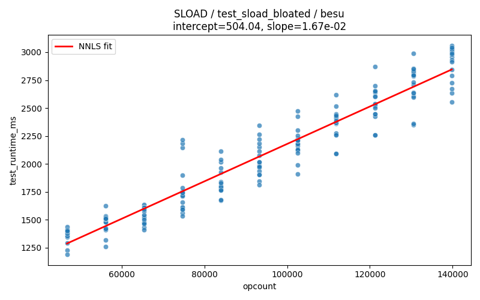

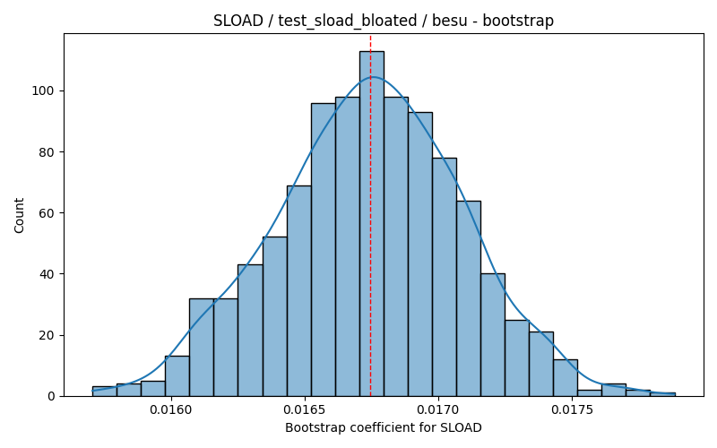

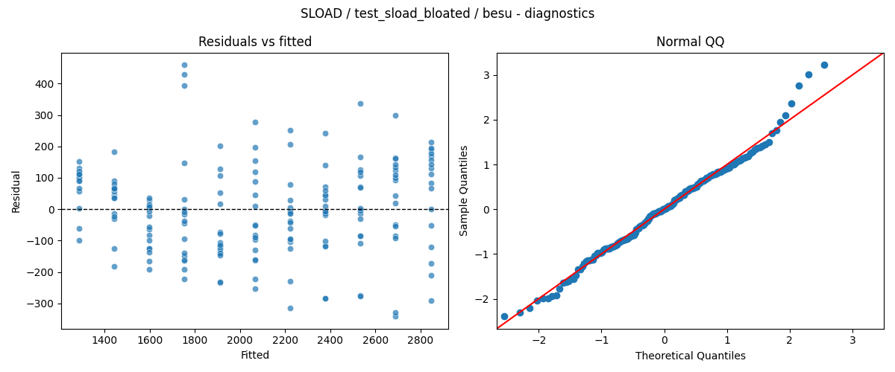

</details>

<details><summary>erigon — NNLS regression summary</summary>

```
==============================================================================
                           NNLS Regression Results                            
==============================================================================
Dep. Variable:          test_runtime_ms              R-squared:          0.990
Model:                  NNLS                    Adj. R-squared:          0.990
No. Observations:       77                                RMSE:          16.48
Df Residuals:           75                                 MAE:          13.59
Df Model:               1      
==============================================================================
                      coef     std err     P-value      [0.025      0.975]
------------------------------------------------------------------------------
         const     24.9694      5.9134       0.001     14.4341     37.3000
       opcount      0.0057      0.0001       0.001      0.0055      0.0058
==============================================================================
Notes: Non-negative least squares with bootstrap inference (1000 iterations)
==============================================================================
```

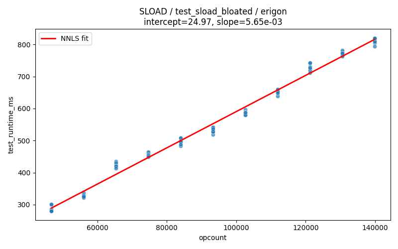

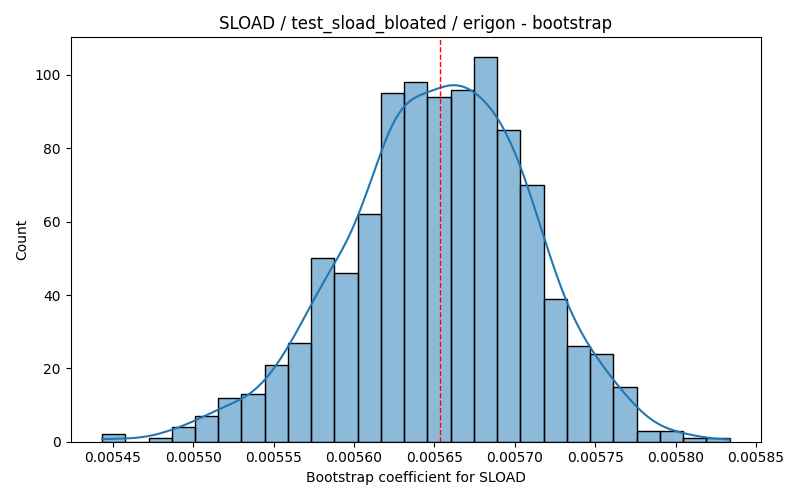

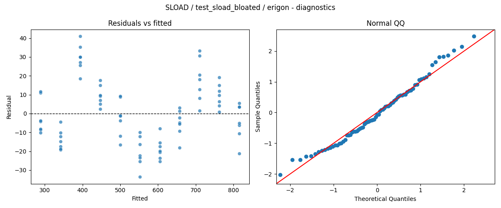

</details>

<details><summary>geth — NNLS regression summary</summary>

```
==============================================================================
                           NNLS Regression Results                            
==============================================================================
Dep. Variable:          test_runtime_ms              R-squared:          0.869
Model:                  NNLS                    Adj. R-squared:          0.868
No. Observations:       121                               RMSE:         273.85
Df Residuals:           119                                MAE:         218.99
Df Model:               1      
==============================================================================
                      coef     std err     P-value      [0.025      0.975]
------------------------------------------------------------------------------
         const   1021.9315     82.2901       0.001    872.6810   1188.3286
       opcount      0.0240      0.0009       0.001      0.0222      0.0257
==============================================================================
Notes: Non-negative least squares with bootstrap inference (1000 iterations)
==============================================================================
```

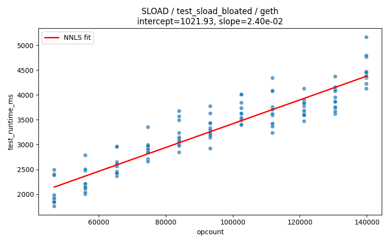

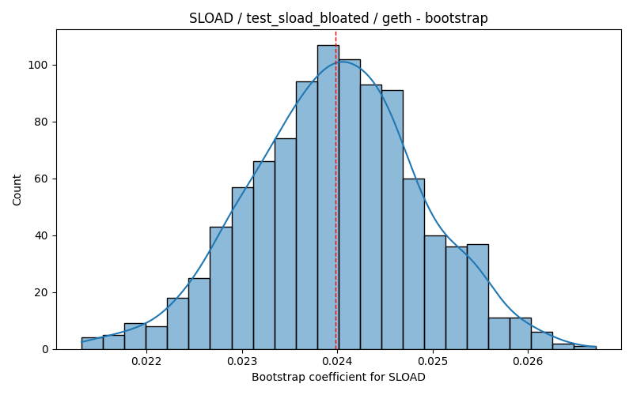

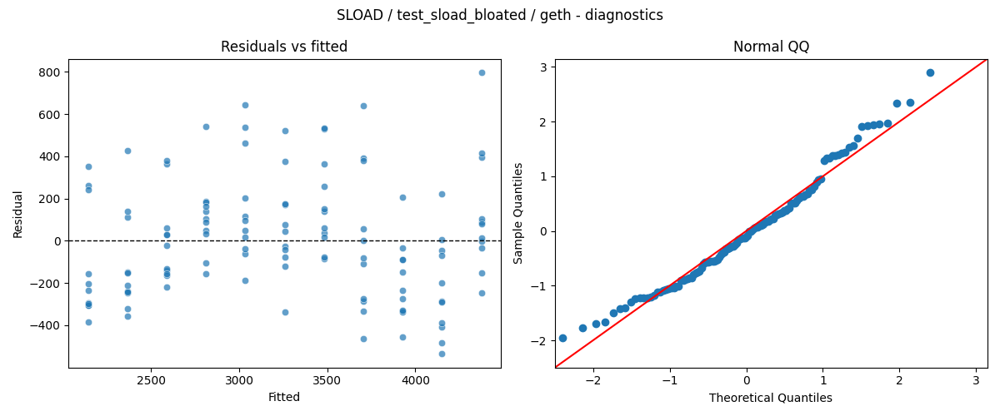

</details>

<details><summary>nethermind — NNLS regression summary</summary>

```
==============================================================================
                           NNLS Regression Results                            
==============================================================================
Dep. Variable:          test_runtime_ms              R-squared:          0.541
Model:                  NNLS                    Adj. R-squared:          0.537
No. Observations:       110                               RMSE:         668.82
Df Residuals:           108                                MAE:         568.78
Df Model:               1      
==============================================================================
                      coef     std err     P-value      [0.025      0.975]
------------------------------------------------------------------------------
         const   1232.0501    211.6533       0.001    816.5464   1644.7913
       opcount      0.0247      0.0023       0.001      0.0204      0.0293
==============================================================================
Notes: Non-negative least squares with bootstrap inference (1000 iterations)
==============================================================================
```

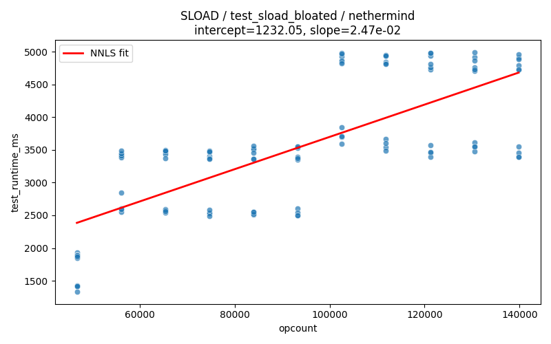

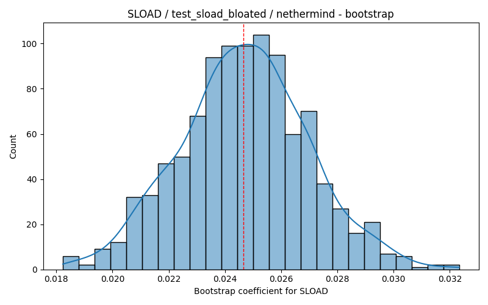

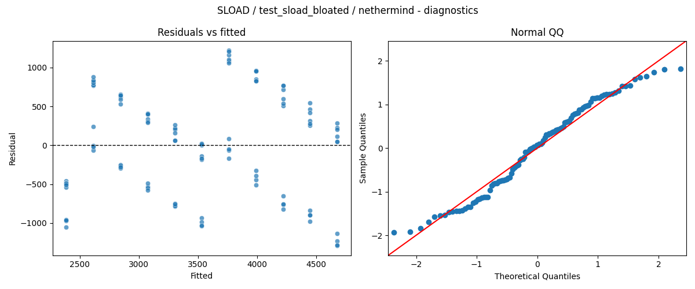

</details>

<details><summary>reth — NNLS regression summary</summary>

```
==============================================================================
                           NNLS Regression Results                            
==============================================================================
Dep. Variable:          test_runtime_ms              R-squared:          0.962
Model:                  NNLS                    Adj. R-squared:          0.961
No. Observations:       198                               RMSE:           8.60
Df Residuals:           196                                MAE:           6.91
Df Model:               1      
==============================================================================
                      coef     std err     P-value      [0.025      0.975]
------------------------------------------------------------------------------
         const     29.7710      1.9756       0.001     25.7193     33.5748
       opcount      0.0015      0.0000       0.001      0.0014      0.0015
==============================================================================
Notes: Non-negative least squares with bootstrap inference (1000 iterations)
==============================================================================
```

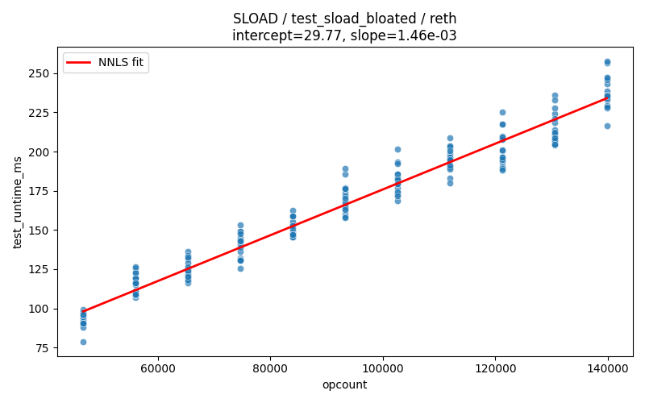

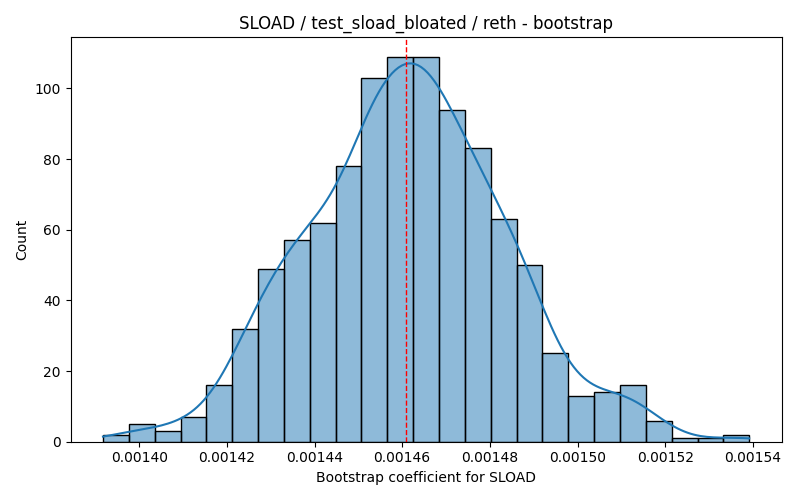

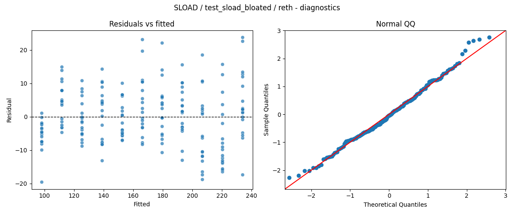

</details>

### test_storage_sload_same_key_benchmark

| client | nobs | R² | target_coef (ms) | p-value | 95% CI |
| --- | --- | --- | --- | --- | --- |
| `besu` | 374 | 0.6795 | 0.0001127 | 1.00e-03 | [0.0001057, 0.0001204] |
| `erigon` | 154 | 0.8845 | 3.964e-05 | 1.00e-03 | [3.745e-05, 4.186e-05] |
| `geth` | 242 | 0.7811 | 4.195e-05 | 1.00e-03 | [3.871e-05, 4.534e-05] |
| `nethermind` | 220 | 0.8798 | 0.000182 | 1.00e-03 | [0.0001726, 0.0001915] |
| `reth` | 396 | 0.6642 | 5.121e-06 | 1.00e-03 | [4.833e-06, 5.448e-06] |

<details><summary>besu — NNLS regression summary</summary>

```
==============================================================================
                           NNLS Regression Results                            
==============================================================================
Dep. Variable:          test_runtime_ms              R-squared:          0.680
Model:                  NNLS                    Adj. R-squared:          0.679
No. Observations:       374                               RMSE:          48.88
Df Residuals:           372                                MAE:          38.35
Df Model:               1      
==============================================================================
                      coef     std err     P-value      [0.025      0.975]
------------------------------------------------------------------------------
         const     86.0544      7.5301       0.001     71.2977    100.1266
       opcount      0.0001      0.0000       0.001      0.0001      0.0001
==============================================================================
Notes: Non-negative least squares with bootstrap inference (1000 iterations)
==============================================================================
```

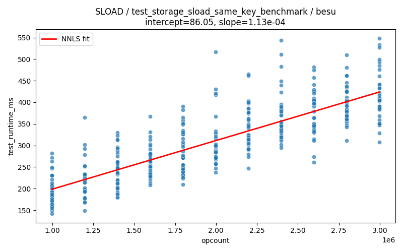

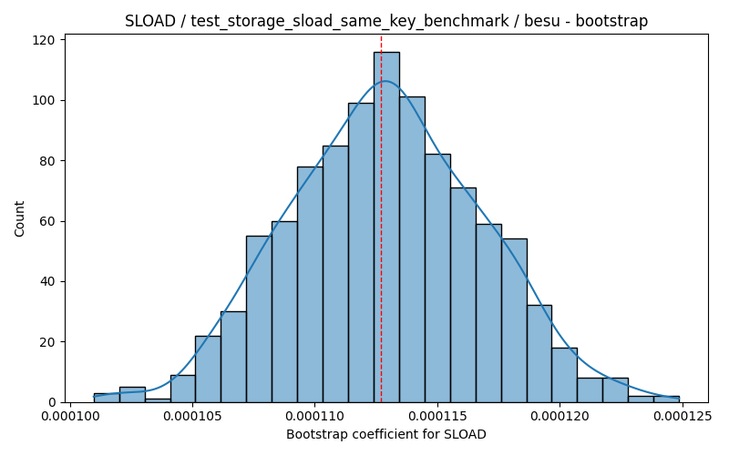

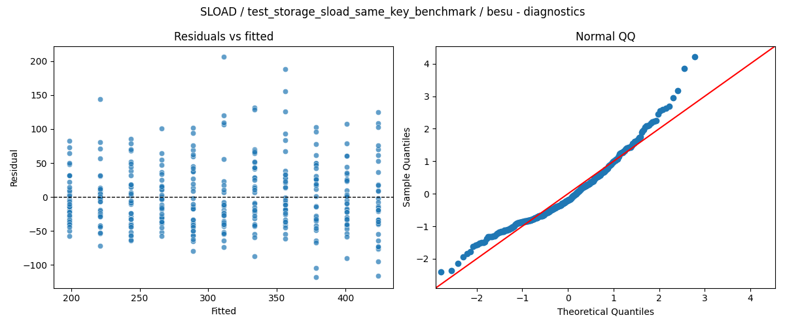

</details>

<details><summary>erigon — NNLS regression summary</summary>

```
==============================================================================
                           NNLS Regression Results                            
==============================================================================
Dep. Variable:          test_runtime_ms              R-squared:          0.884
Model:                  NNLS                    Adj. R-squared:          0.884
No. Observations:       154                               RMSE:           9.05
Df Residuals:           152                                MAE:           6.17
Df Model:               1      
==============================================================================
                      coef     std err     P-value      [0.025      0.975]
------------------------------------------------------------------------------
         const     34.2429      2.3061       0.001     29.9321     38.8016
       opcount      0.0000      0.0000       0.001      0.0000      0.0000
==============================================================================
Notes: Non-negative least squares with bootstrap inference (1000 iterations)
==============================================================================
```

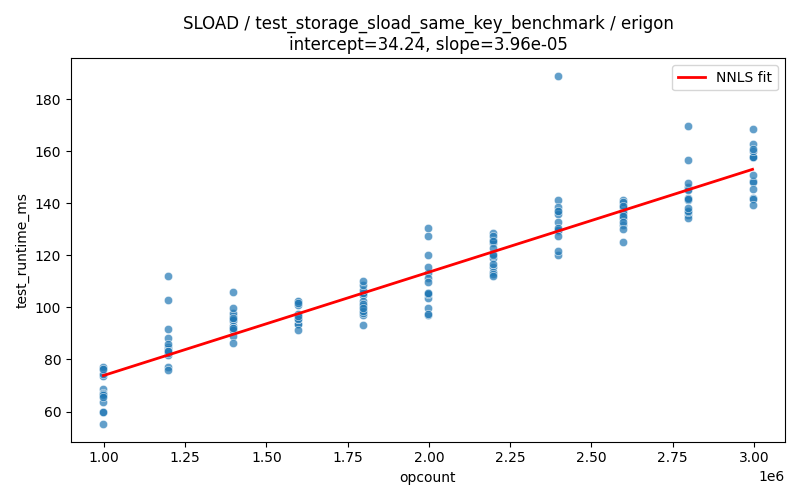

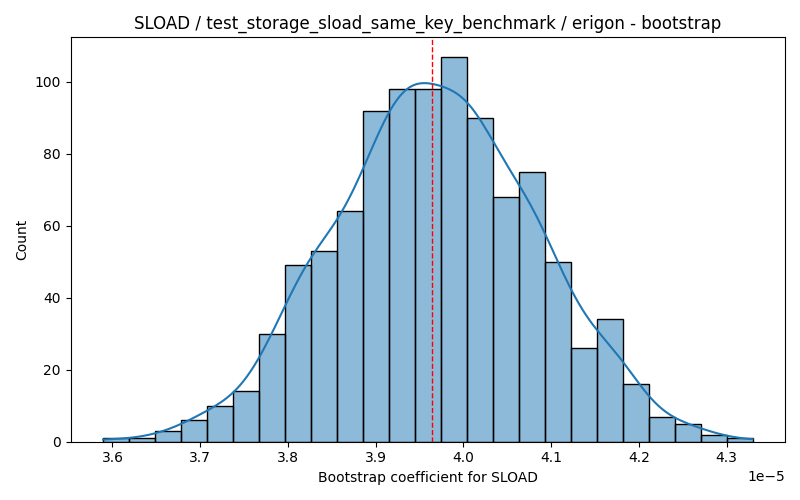

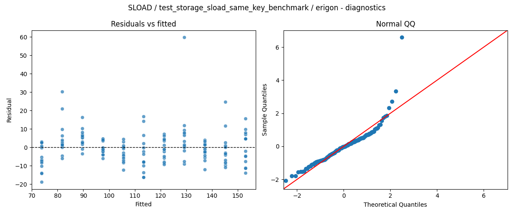

</details>

<details><summary>geth — NNLS regression summary</summary>

```
==============================================================================
                           NNLS Regression Results                            
==============================================================================
Dep. Variable:          test_runtime_ms              R-squared:          0.781
Model:                  NNLS                    Adj. R-squared:          0.780
No. Observations:       242                               RMSE:          14.02
Df Residuals:           240                                MAE:          10.87
Df Model:               1      
==============================================================================
                      coef     std err     P-value      [0.025      0.975]
------------------------------------------------------------------------------
         const     22.3594      3.0959       0.001     16.2596     28.1161
       opcount      0.0000      0.0000       0.001      0.0000      0.0000
==============================================================================
Notes: Non-negative least squares with bootstrap inference (1000 iterations)
==============================================================================
```

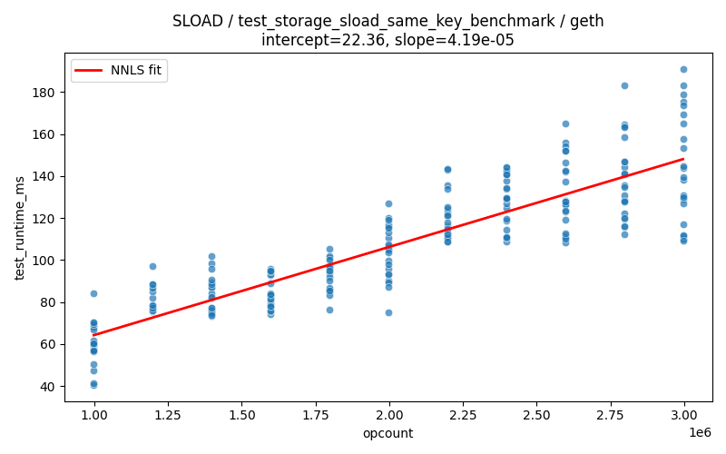

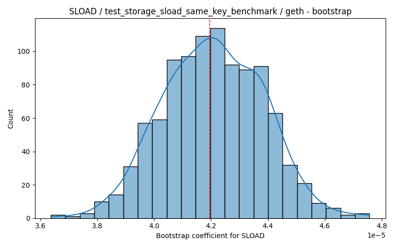

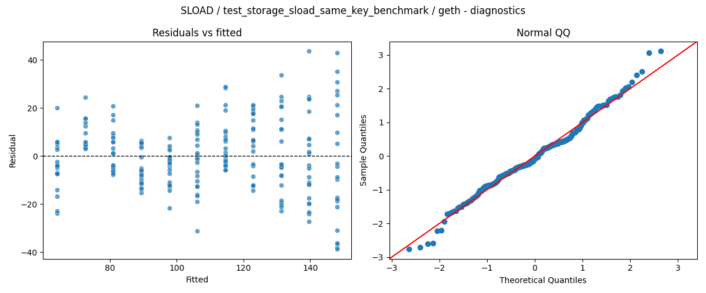

</details>

<details><summary>nethermind — NNLS regression summary</summary>

```
==============================================================================
                           NNLS Regression Results                            
==============================================================================
Dep. Variable:          test_runtime_ms              R-squared:          0.880
Model:                  NNLS                    Adj. R-squared:          0.879
No. Observations:       220                               RMSE:          42.49
Df Residuals:           218                                MAE:          33.56
Df Model:               1      
==============================================================================
                      coef     std err     P-value      [0.025      0.975]
------------------------------------------------------------------------------
         const     94.2100      9.3903       0.001     76.5998    112.0627
       opcount      0.0002      0.0000       0.001      0.0002      0.0002
==============================================================================
Notes: Non-negative least squares with bootstrap inference (1000 iterations)
==============================================================================
```

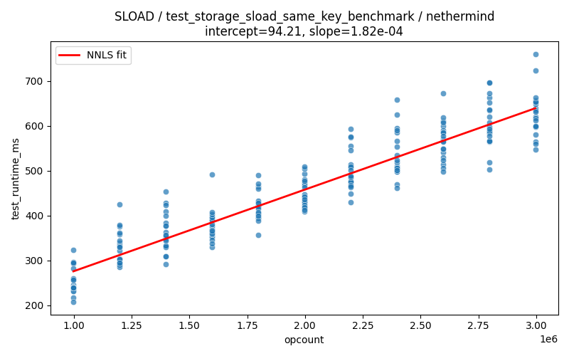

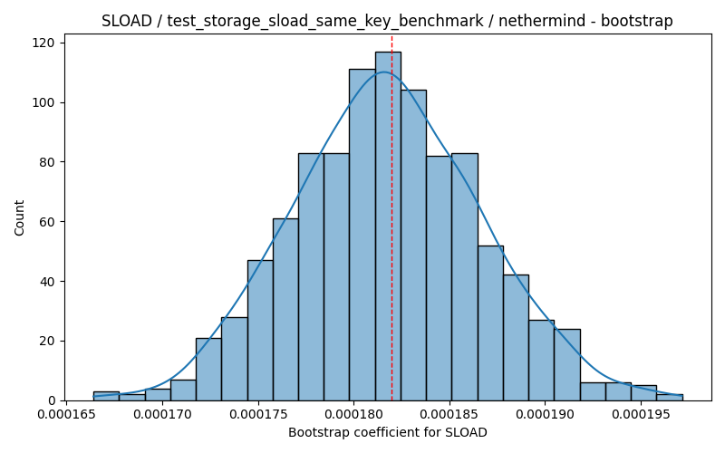

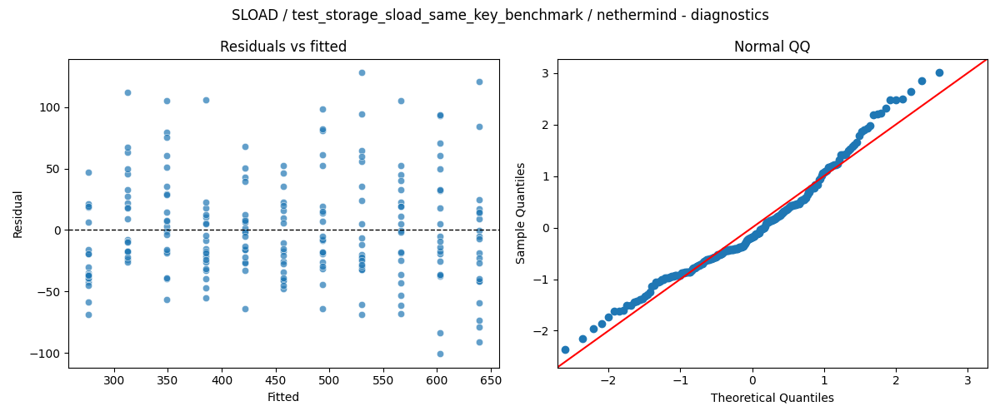

</details>

<details><summary>reth — NNLS regression summary</summary>

```
==============================================================================
                           NNLS Regression Results                            
==============================================================================
Dep. Variable:          test_runtime_ms              R-squared:          0.664
Model:                  NNLS                    Adj. R-squared:          0.663
No. Observations:       396                               RMSE:           2.30
Df Residuals:           394                                MAE:           1.59
Df Model:               1      
==============================================================================
                      coef     std err     P-value      [0.025      0.975]
------------------------------------------------------------------------------
         const      5.5558      0.3094       0.001      4.9498      6.1521
       opcount      0.0000      0.0000       0.001      0.0000      0.0000
==============================================================================
Notes: Non-negative least squares with bootstrap inference (1000 iterations)
==============================================================================
```

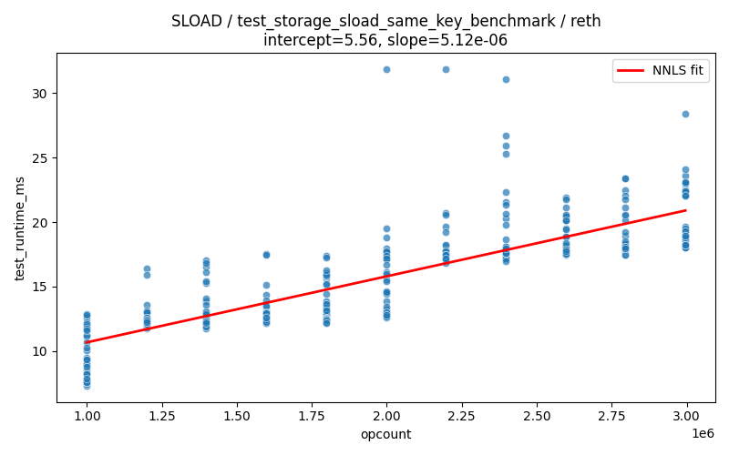

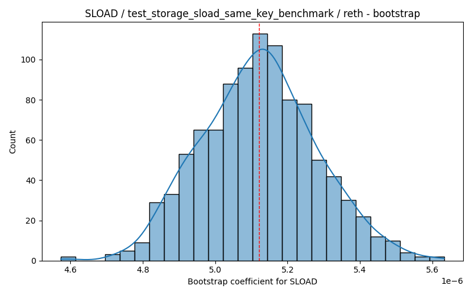

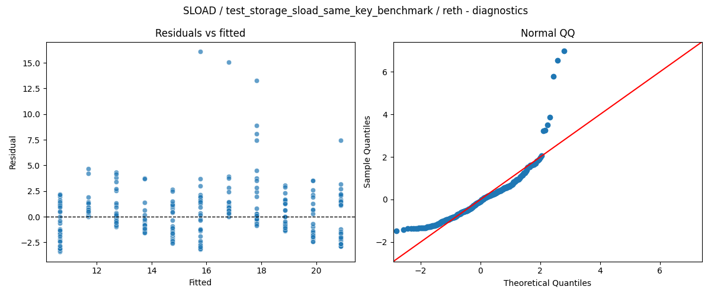

</details>

## SSTORE

### test_sstore_bloated — combo `False`

| client | nobs | R² | target_coef (ms) | p-value | 95% CI |
| --- | --- | --- | --- | --- | --- |
| `besu` | 374 | 0.866 | 0.00903 | 1.00e-03 | [0.008583, 0.00949] |
| `erigon` | 154 | 0.9289 | 0.005132 | 1.00e-03 | [0.004827, 0.005414] |
| `geth` | 242 | 0.9774 | 0.02967 | 1.00e-03 | [0.02903, 0.03039] |
| `nethermind` | 220 | 0.915 | 0.003577 | 1.00e-03 | [0.003386, 0.003773] |
| `reth` | 396 | 0.5937 | 0 | 1.00e+00 | [0, 0.0003019] |

<details><summary>besu — NNLS regression summary</summary>

```
==============================================================================
                           NNLS Regression Results                            
==============================================================================
Dep. Variable:          test_runtime_ms              R-squared:          0.866
Model:                  NNLS                    Adj. R-squared:          0.865
No. Observations:       374                               RMSE:         128.16
Df Residuals:           371                                MAE:          99.91
Df Model:               2      
==============================================================================
                      coef     std err     P-value      [0.025      0.975]
------------------------------------------------------------------------------
         const    464.1913     20.1556       0.001    424.9426    503.2979
       opcount      0.0090      0.0002       0.001      0.0086      0.0095
        update      0.1345      0.0124       0.001      0.1097      0.1589
==============================================================================
Notes: Non-negative least squares with bootstrap inference (1000 iterations)
==============================================================================
```

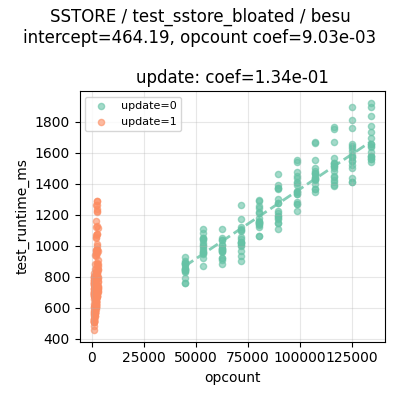

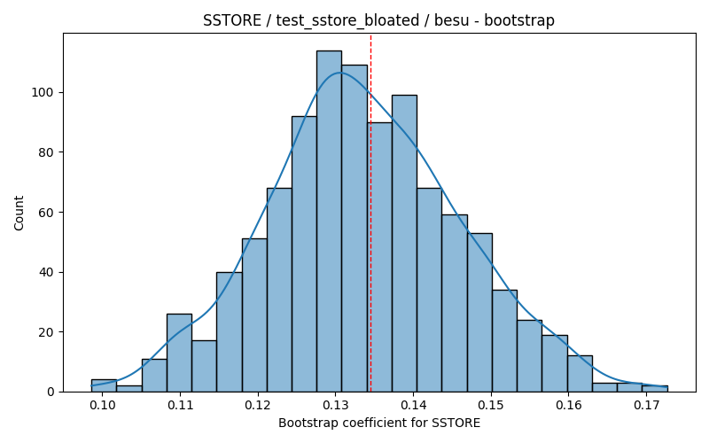

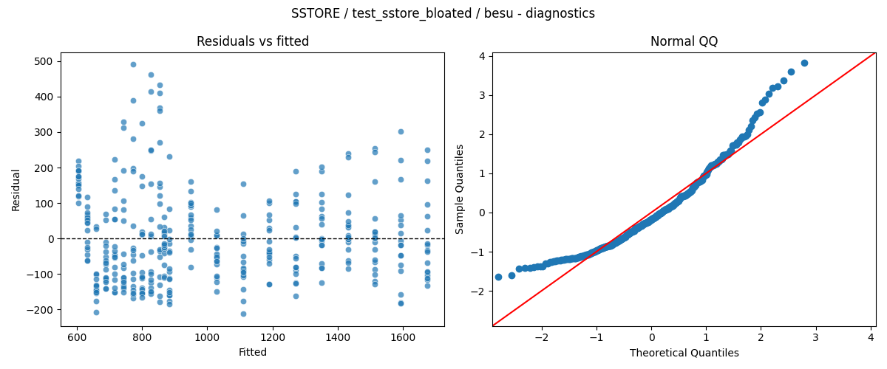

</details>

<details><summary>erigon — NNLS regression summary</summary>

```
==============================================================================
                           NNLS Regression Results                            
==============================================================================
Dep. Variable:          test_runtime_ms              R-squared:          0.929
Model:                  NNLS                    Adj. R-squared:          0.928
No. Observations:       154                               RMSE:          39.36
Df Residuals:           151                                MAE:          31.51
Df Model:               2      
==============================================================================
                      coef     std err     P-value      [0.025      0.975]
------------------------------------------------------------------------------
         const    111.2251     14.1633       0.001     82.7061    141.3760
       opcount      0.0051      0.0001       0.001      0.0048      0.0054
        update      0.1622      0.0061       0.001      0.1494      0.1742
==============================================================================
Notes: Non-negative least squares with bootstrap inference (1000 iterations)
==============================================================================
```

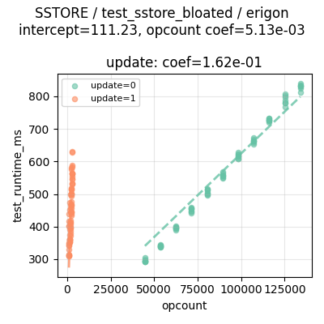

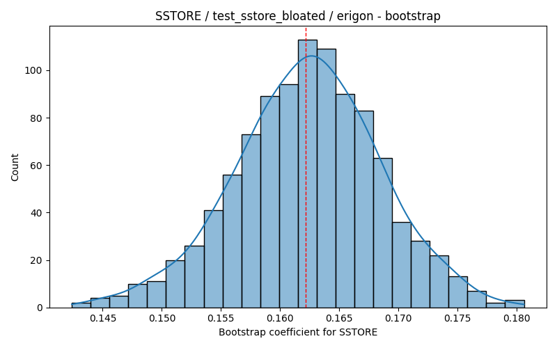

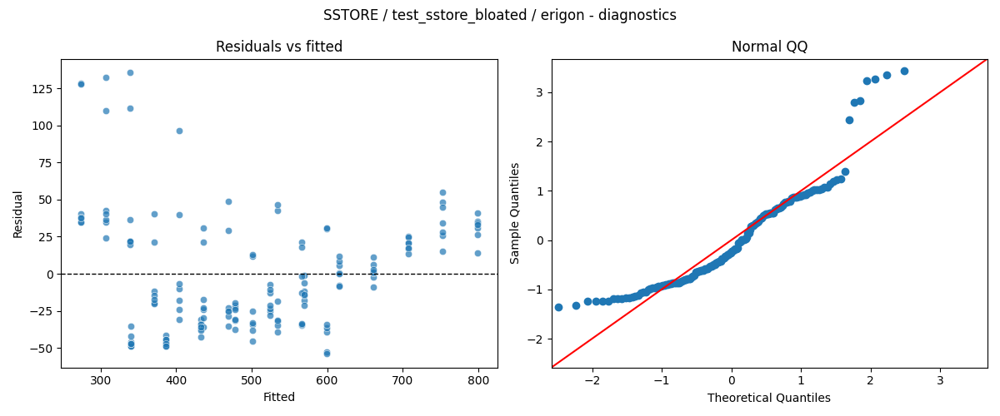

</details>

<details><summary>geth — NNLS regression summary</summary>

```
==============================================================================
                           NNLS Regression Results                            
==============================================================================
Dep. Variable:          test_runtime_ms              R-squared:          0.977
Model:                  NNLS                    Adj. R-squared:          0.977
No. Observations:       242                               RMSE:         216.98
Df Residuals:           239                                MAE:         154.64
Df Model:               2      
==============================================================================
                      coef     std err     P-value      [0.025      0.975]
------------------------------------------------------------------------------
         const    361.0939     11.1546       0.001    338.5593    382.9032
       opcount      0.0297      0.0004       0.001      0.0290      0.0304
        update      0.0000      0.0000       1.000      0.0000      0.0000
==============================================================================
Notes: Non-negative least squares with bootstrap inference (1000 iterations)
==============================================================================
```

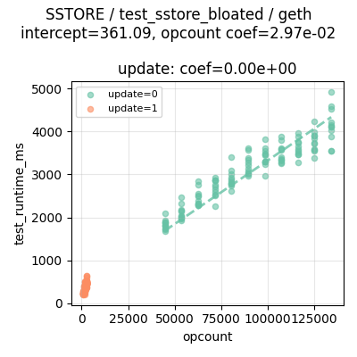

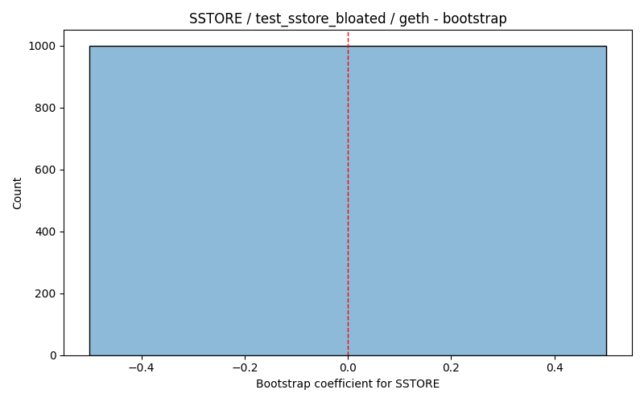

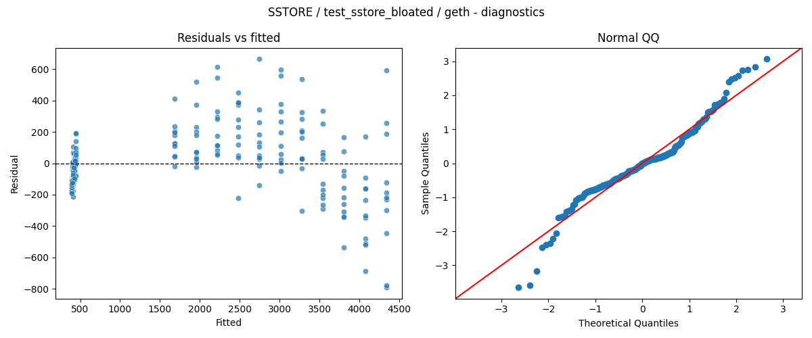

</details>

<details><summary>nethermind — NNLS regression summary</summary>

```
==============================================================================
                           NNLS Regression Results                            
==============================================================================
Dep. Variable:          test_runtime_ms              R-squared:          0.915
Model:                  NNLS                    Adj. R-squared:          0.914
No. Observations:       220                               RMSE:          37.63
Df Residuals:           217                                MAE:          31.14
Df Model:               2      
==============================================================================
                      coef     std err     P-value      [0.025      0.975]
------------------------------------------------------------------------------
         const    126.5028      8.4355       0.001    110.3722    143.4604
       opcount      0.0036      0.0001       0.001      0.0034      0.0038
        update      0.0615      0.0040       0.001      0.0534      0.0695
==============================================================================
Notes: Non-negative least squares with bootstrap inference (1000 iterations)
==============================================================================
```

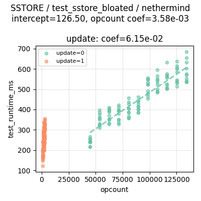

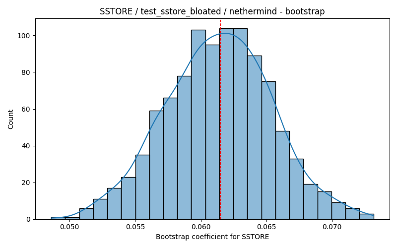

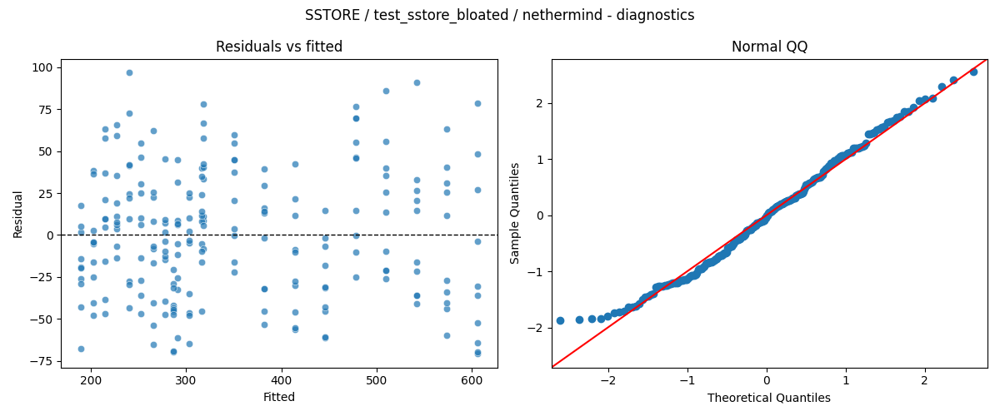

</details>

<details><summary>reth — NNLS regression summary</summary>

```
==============================================================================
                           NNLS Regression Results                            
==============================================================================
Dep. Variable:          test_runtime_ms              R-squared:          0.594
Model:                  NNLS                    Adj. R-squared:          0.592
No. Observations:       396                               RMSE:          62.24
Df Residuals:           393                                MAE:          39.42
Df Model:               2      
==============================================================================
                      coef     std err     P-value      [0.025      0.975]
------------------------------------------------------------------------------
         const    171.6437     10.0438       0.001    140.7993    179.6805
       opcount      0.0000      0.0001       1.000      0.0000      0.0003
        update      0.0707      0.0037       0.001      0.0680      0.0826
==============================================================================
Notes: Non-negative least squares with bootstrap inference (1000 iterations)
==============================================================================
```

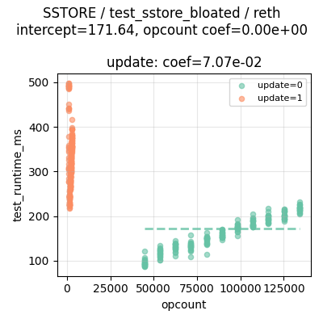

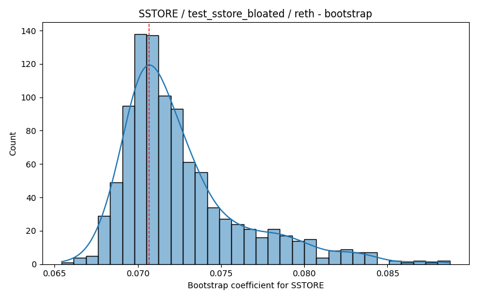

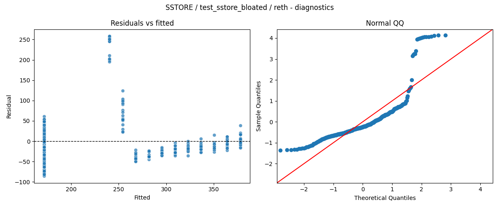

</details>

### test_sstore_bloated — combo `True`

| client | nobs | R² | target_coef (ms) | p-value | 95% CI |
| --- | --- | --- | --- | --- | --- |
| `besu` | 374 | 0.9714 | 0.01592 | 1.00e-03 | [0.01479, 0.01693] |
| `erigon` | 154 | 0.9853 | 0 | 1.00e+00 | [0, 0] |
| `geth` | 242 | 0.9243 | 0.03213 | 1.00e-03 | [0.03132, 0.03296] |
| `nethermind` | 220 | 0.6672 | 0.02596 | 1.00e-03 | [0.0234, 0.02866] |
| `reth` | 396 | 0.9954 | 0 | 1.00e+00 | [0, 0] |

<details><summary>besu — NNLS regression summary</summary>

```
==============================================================================
                           NNLS Regression Results                            
==============================================================================
Dep. Variable:          test_runtime_ms              R-squared:          0.971
Model:                  NNLS                    Adj. R-squared:          0.971
No. Observations:       374                               RMSE:         286.12
Df Residuals:           371                                MAE:         208.04
Df Model:               2      
==============================================================================
                      coef     std err     P-value      [0.025      0.975]
------------------------------------------------------------------------------
         const    884.5492     51.0969       0.001    786.1810    990.6028
       opcount      0.0159      0.0005       0.001      0.0148      0.0169
        update      0.0883      0.0011       0.001      0.0861      0.0904
==============================================================================
Notes: Non-negative least squares with bootstrap inference (1000 iterations)
==============================================================================
```

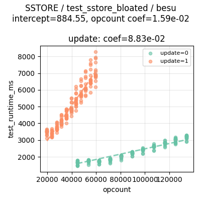

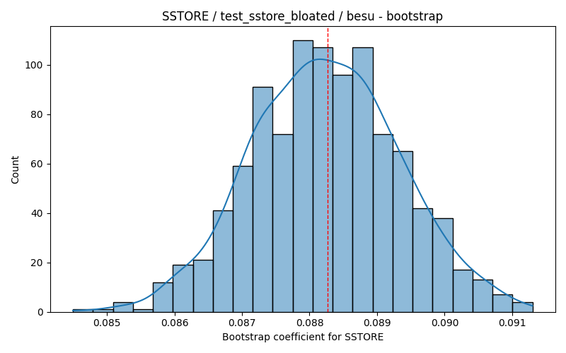

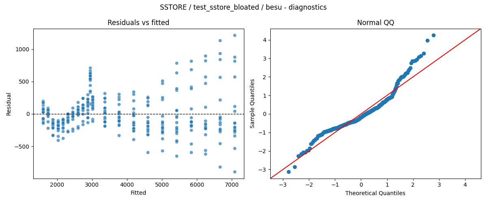

</details>

<details><summary>erigon — NNLS regression summary</summary>

```
==============================================================================
                           NNLS Regression Results                            
==============================================================================
Dep. Variable:          test_runtime_ms              R-squared:          0.985
Model:                  NNLS                    Adj. R-squared:          0.985
No. Observations:       154                               RMSE:         268.76
Df Residuals:           151                                MAE:         216.32
Df Model:               2      
==============================================================================
                      coef     std err     P-value      [0.025      0.975]
------------------------------------------------------------------------------
         const    623.2833     24.6961       0.001    575.9606    674.5331
       opcount      0.0000      0.0000       1.000      0.0000      0.0000
        update      0.1013      0.0010       0.001      0.0997      0.1036
==============================================================================
Notes: Non-negative least squares with bootstrap inference (1000 iterations)
==============================================================================
```

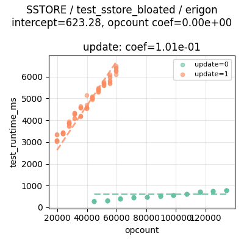

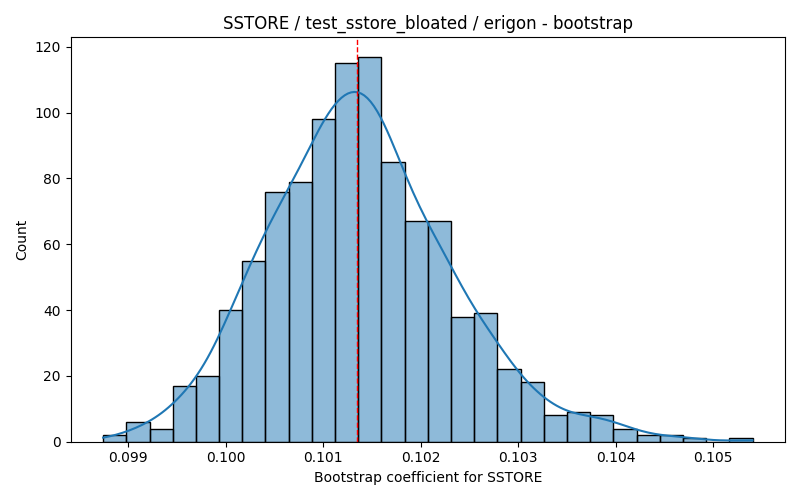

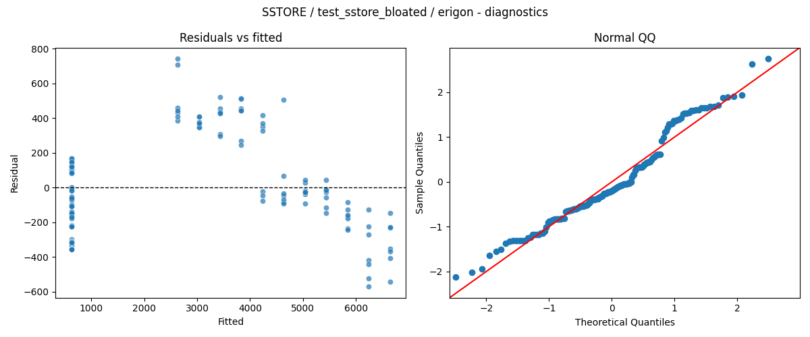

</details>

<details><summary>geth — NNLS regression summary</summary>

```
==============================================================================
                           NNLS Regression Results                            
==============================================================================
Dep. Variable:          test_runtime_ms              R-squared:          0.924
Model:                  NNLS                    Adj. R-squared:          0.924
No. Observations:       242                               RMSE:       10534.00
Df Residuals:           239                                MAE:        6747.45
Df Model:               2      
==============================================================================
                      coef     std err     P-value      [0.025      0.975]
------------------------------------------------------------------------------
         const      0.0000      0.0000       1.000      0.0000      0.0000
       opcount      0.0321      0.0004       0.001      0.0313      0.0330
        update      1.6362      0.0334       0.001      1.5636      1.6947
==============================================================================
Notes: Non-negative least squares with bootstrap inference (1000 iterations)
==============================================================================
```

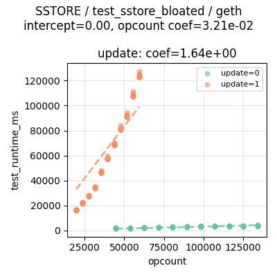

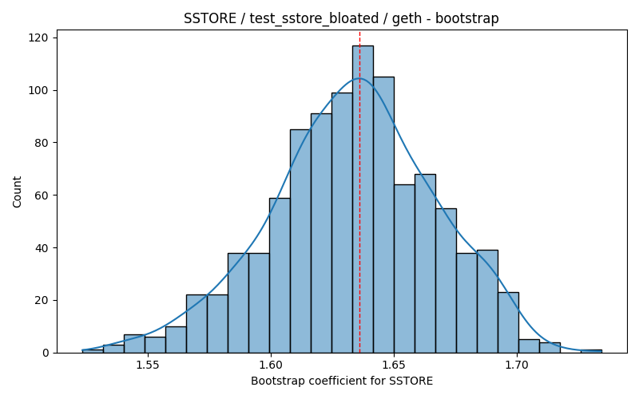

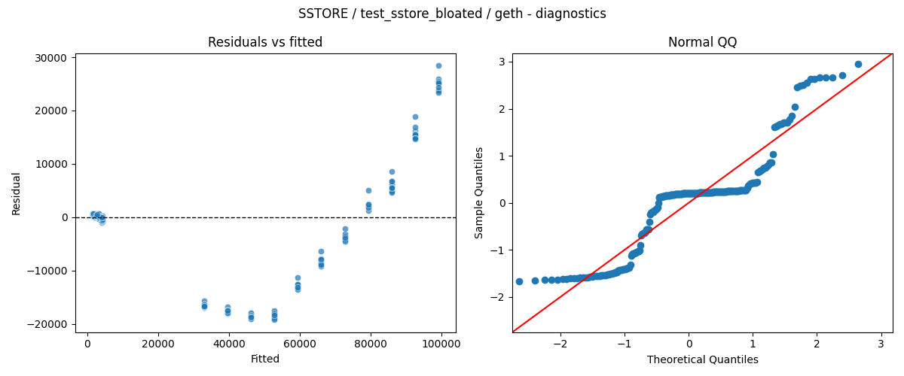

</details>

<details><summary>nethermind — NNLS regression summary</summary>

```
==============================================================================
                           NNLS Regression Results                            
==============================================================================
Dep. Variable:          test_runtime_ms              R-squared:          0.667
Model:                  NNLS                    Adj. R-squared:          0.664
No. Observations:       220                               RMSE:         500.32
Df Residuals:           217                                MAE:         400.57
Df Model:               2      
==============================================================================
                      coef     std err     P-value      [0.025      0.975]
------------------------------------------------------------------------------
         const   1099.9726    109.5053       0.001    886.5911   1309.0128
       opcount      0.0260      0.0014       0.001      0.0234      0.0287
        update      0.0271      0.0018       0.001      0.0237      0.0304
==============================================================================
Notes: Non-negative least squares with bootstrap inference (1000 iterations)
==============================================================================
```

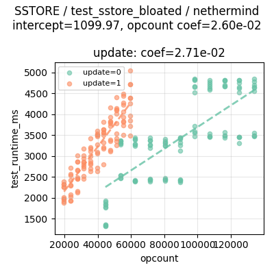

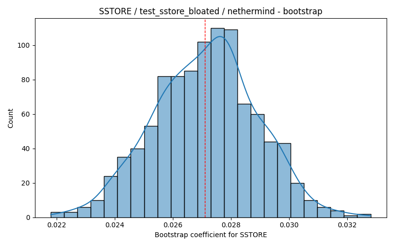

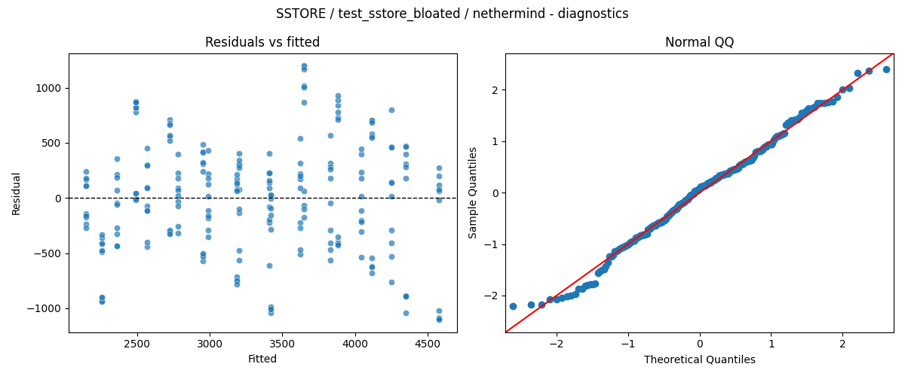

</details>

<details><summary>reth — NNLS regression summary</summary>

```
==============================================================================
                           NNLS Regression Results                            
==============================================================================
Dep. Variable:          test_runtime_ms              R-squared:          0.995
Model:                  NNLS                    Adj. R-squared:          0.995
No. Observations:       396                               RMSE:         253.33
Df Residuals:           393                                MAE:         187.42
Df Model:               2      
==============================================================================
                      coef     std err     P-value      [0.025      0.975]
------------------------------------------------------------------------------
         const    256.5986     11.3018       0.001    236.2248    280.0235
       opcount      0.0000      0.0000       1.000      0.0000      0.0000
        update      0.1714      0.0006       0.001      0.1703      0.1726
==============================================================================
Notes: Non-negative least squares with bootstrap inference (1000 iterations)
==============================================================================
```

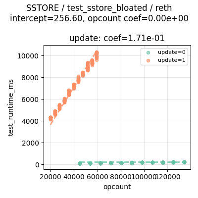

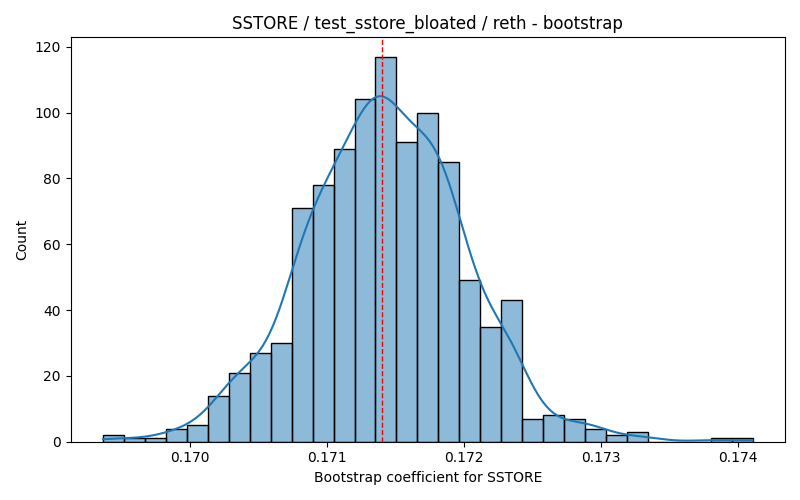

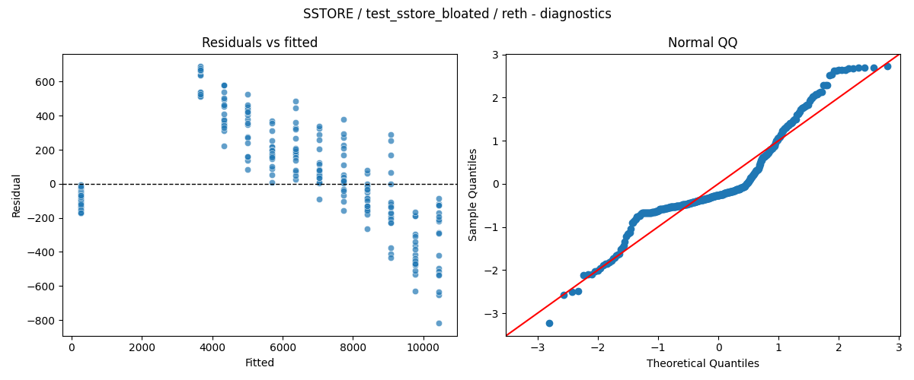

</details>

## BALANCE

### test_account_access — combo `BALANCE_AccountMode.EXISTING_EOA`

| client | nobs | R² | target_coef (ms) | p-value | 95% CI |
| --- | --- | --- | --- | --- | --- |
| `besu` | 187 | 0.8435 | 0.009711 | 1.00e-03 | [0.008969, 0.01054] |
| `erigon` | 77 | 0.9983 | 0.009729 | 1.00e-03 | [0.009643, 0.009822] |
| `geth` | 121 | 0.8375 | 0.01347 | 1.00e-03 | [0.01258, 0.01438] |
| `nethermind` | 110 | 0.9224 | 0.003702 | 1.00e-03 | [0.003513, 0.003896] |
| `reth` | 198 | 0.9796 | 0.001101 | 1.00e-03 | [0.001078, 0.001124] |

<details><summary>besu — NNLS regression summary</summary>

```
==============================================================================
                           NNLS Regression Results                            
==============================================================================
Dep. Variable:          test_runtime_ms              R-squared:          0.844
Model:                  NNLS                    Adj. R-squared:          0.843
No. Observations:       187                               RMSE:          99.96
Df Residuals:           185                                MAE:          77.01
Df Model:               1      
==============================================================================
                      coef     std err     P-value      [0.025      0.975]
------------------------------------------------------------------------------
         const    417.0917     35.7160       0.001    343.7885    483.1078
       opcount      0.0097      0.0004       0.001      0.0090      0.0105
==============================================================================
Notes: Non-negative least squares with bootstrap inference (1000 iterations)
==============================================================================
```

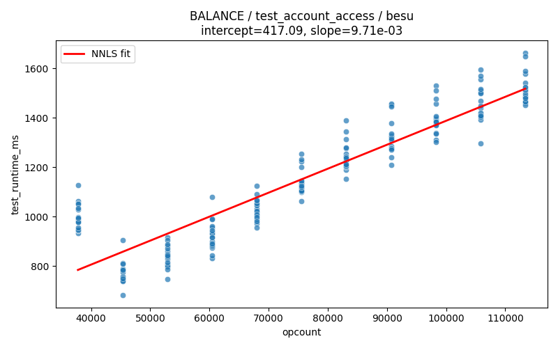

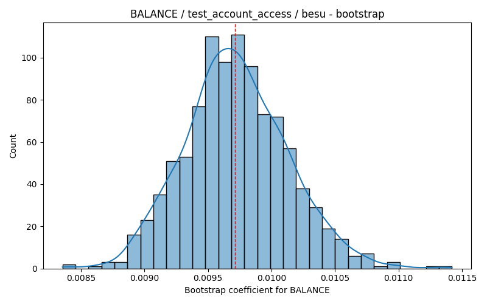

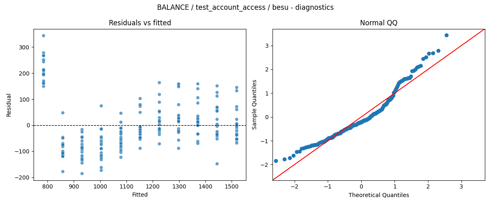

</details>

<details><summary>erigon — NNLS regression summary</summary>

```
==============================================================================
                           NNLS Regression Results                            
==============================================================================
Dep. Variable:          test_runtime_ms              R-squared:          0.998
Model:                  NNLS                    Adj. R-squared:          0.998
No. Observations:       77                                RMSE:           9.63
Df Residuals:           75                                 MAE:           7.46
Df Model:               1      
==============================================================================
                      coef     std err     P-value      [0.025      0.975]
------------------------------------------------------------------------------
         const     34.9950      3.2167       0.001     28.2975     40.9566
       opcount      0.0097      0.0000       0.001      0.0096      0.0098
==============================================================================
Notes: Non-negative least squares with bootstrap inference (1000 iterations)
==============================================================================
```


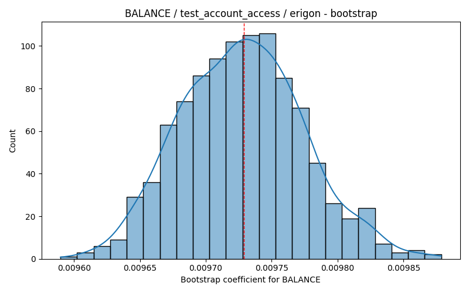

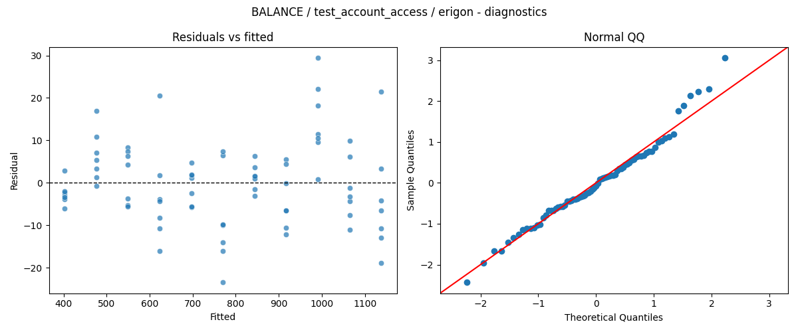

</details>

<details><summary>geth — NNLS regression summary</summary>

```
==============================================================================
                           NNLS Regression Results                            
==============================================================================
Dep. Variable:          test_runtime_ms              R-squared:          0.837
Model:                  NNLS                    Adj. R-squared:          0.836
No. Observations:       121                               RMSE:         141.83
Df Residuals:           119                                MAE:         108.81
Df Model:               1      
==============================================================================
                      coef     std err     P-value      [0.025      0.975]
------------------------------------------------------------------------------
         const    292.2660     34.8389       0.001    220.0094    355.4900
       opcount      0.0135      0.0005       0.001      0.0126      0.0144
==============================================================================
Notes: Non-negative least squares with bootstrap inference (1000 iterations)
==============================================================================
```

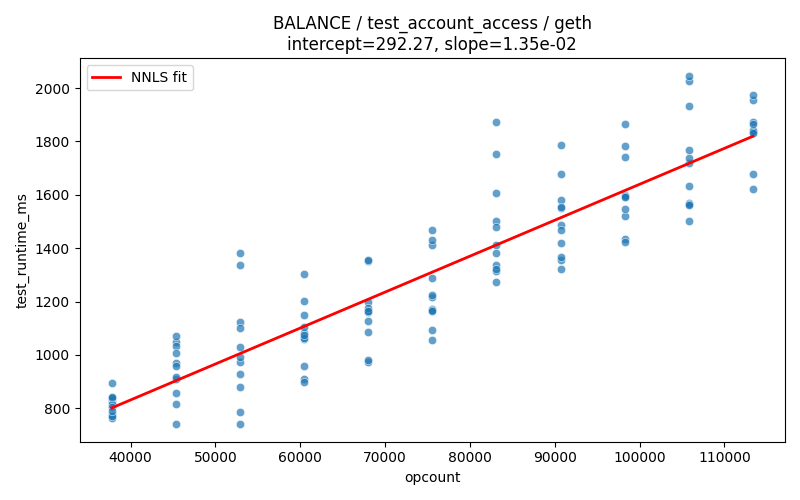

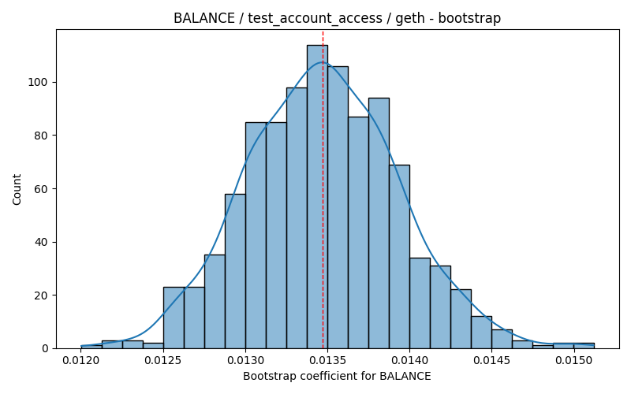

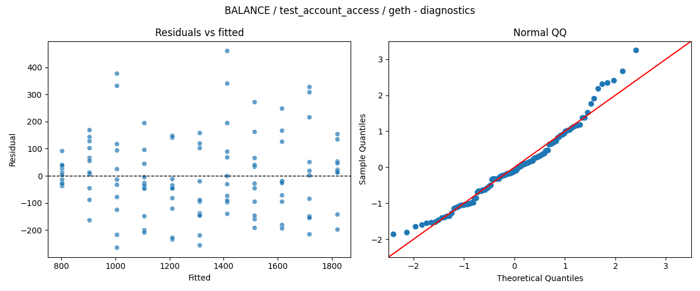

</details>

<details><summary>nethermind — NNLS regression summary</summary>

```
==============================================================================
                           NNLS Regression Results                            
==============================================================================
Dep. Variable:          test_runtime_ms              R-squared:          0.922
Model:                  NNLS                    Adj. R-squared:          0.922
No. Observations:       110                               RMSE:          25.66
Df Residuals:           108                                MAE:          18.65
Df Model:               1      
==============================================================================
                      coef     std err     P-value      [0.025      0.975]
------------------------------------------------------------------------------
         const     89.1737      7.7357       0.001     74.7746    104.3565
       opcount      0.0037      0.0001       0.001      0.0035      0.0039
==============================================================================
Notes: Non-negative least squares with bootstrap inference (1000 iterations)
==============================================================================
```

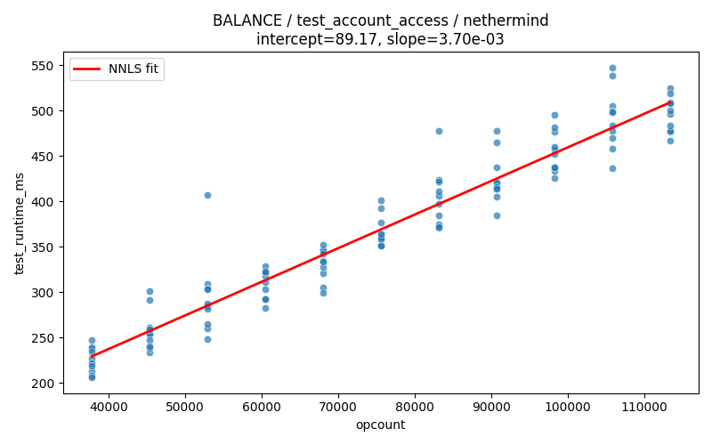

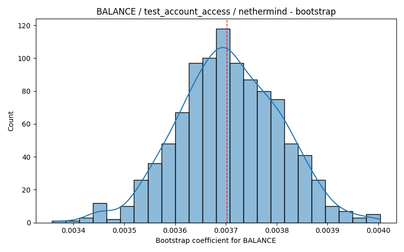

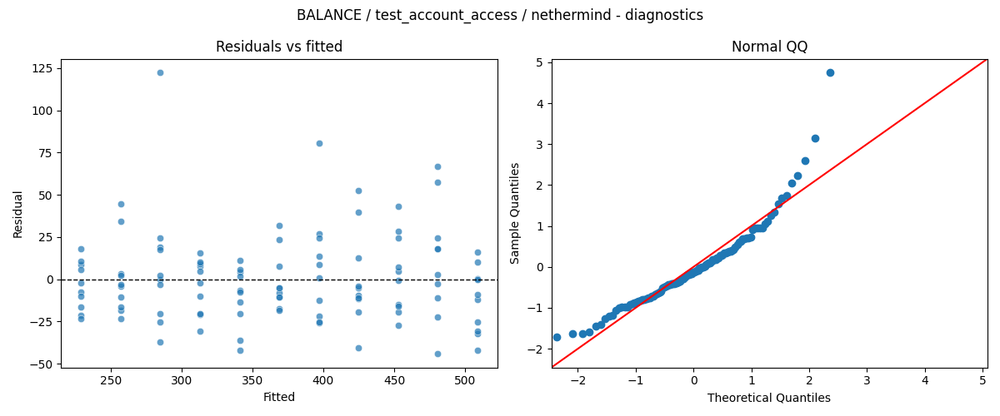

</details>

<details><summary>reth — NNLS regression summary</summary>

```
==============================================================================
                           NNLS Regression Results                            
==============================================================================
Dep. Variable:          test_runtime_ms              R-squared:          0.980
Model:                  NNLS                    Adj. R-squared:          0.980
No. Observations:       198                               RMSE:           3.79
Df Residuals:           196                                MAE:           3.00
Df Model:               1      
==============================================================================
                      coef     std err     P-value      [0.025      0.975]
------------------------------------------------------------------------------
         const     31.4821      0.9278       0.001     29.6930     33.3356
       opcount      0.0011      0.0000       0.001      0.0011      0.0011
==============================================================================
Notes: Non-negative least squares with bootstrap inference (1000 iterations)
==============================================================================
```

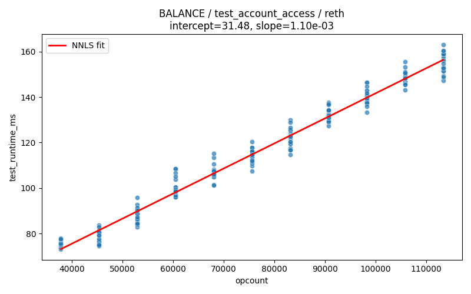

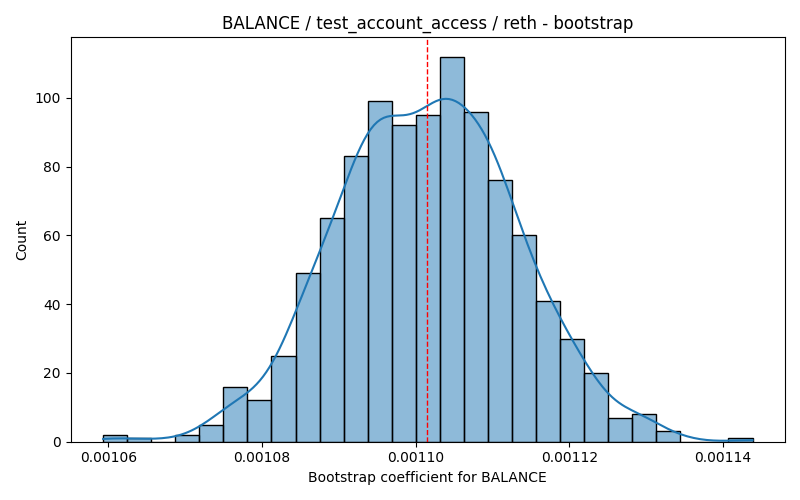

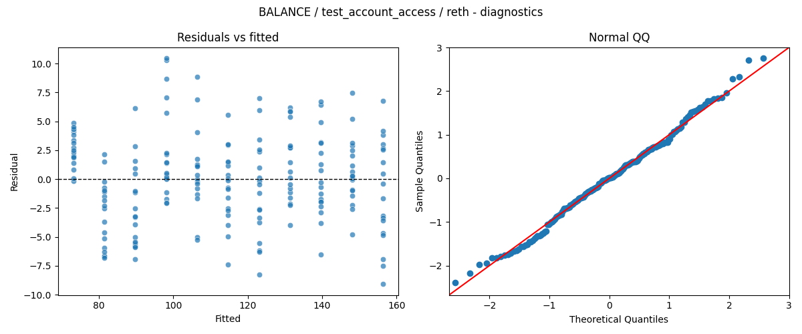

</details>

### test_account_access — combo `BALANCE_AccountMode.NON_EXISTING_ACCOUNT` — `presets[cold_account_nocode_access]`

| client | nobs | R² | target_coef (ms) | p-value | 95% CI |
| --- | --- | --- | --- | --- | --- |
| `besu` | 187 | 0.9177 | 0.01003 | 1.00e-03 | [0.009551, 0.01052] |
| `erigon` | 77 | 0.9982 | 0.009082 | 1.00e-03 | [0.008996, 0.009119] |
| `geth` | 121 | 0.723 | 0.02609 | 1.00e-03 | [0.02275, 0.02934] |
| `nethermind` | 110 | 0.9532 | 0.003833 | 1.00e-03 | [0.003676, 0.004001] |
| `reth` | 198 | 0.9706 | 0.0009305 | 1.00e-03 | [0.0009087, 0.0009547] |

<details><summary>besu — NNLS regression summary</summary>

```
==============================================================================
                           NNLS Regression Results                            
==============================================================================
Dep. Variable:          test_runtime_ms              R-squared:          0.918
Model:                  NNLS                    Adj. R-squared:          0.917
No. Observations:       187                               RMSE:          71.78
Df Residuals:           185                                MAE:          57.40
Df Model:               1      
==============================================================================
                      coef     std err     P-value      [0.025      0.975]
------------------------------------------------------------------------------
         const    366.6016     20.1728       0.001    327.0969    405.0781
       opcount      0.0100      0.0002       0.001      0.0096      0.0105
==============================================================================
Notes: Non-negative least squares with bootstrap inference (1000 iterations)
==============================================================================
```

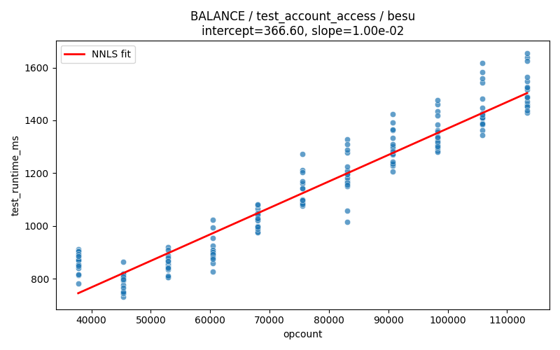

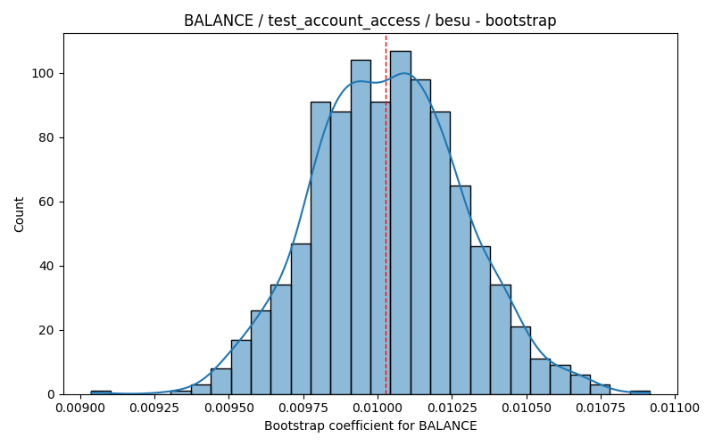

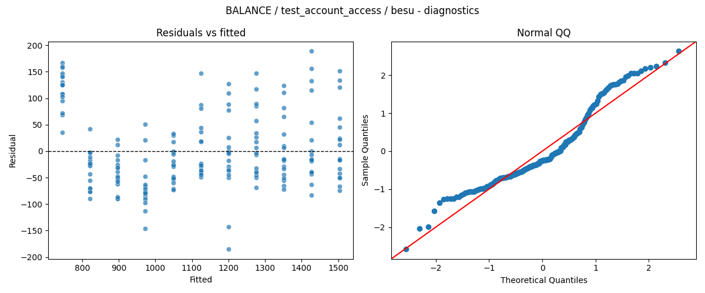

</details>

<details><summary>erigon — NNLS regression summary</summary>

```
==============================================================================
                           NNLS Regression Results                            
==============================================================================
Dep. Variable:          test_runtime_ms              R-squared:          0.998
Model:                  NNLS                    Adj. R-squared:          0.998
No. Observations:       77                                RMSE:           9.23
Df Residuals:           75                                 MAE:           7.64
Df Model:               1      
==============================================================================
                      coef     std err     P-value      [0.025      0.975]
------------------------------------------------------------------------------
         const      1.1591      2.5526       0.368      0.0000      8.3183
       opcount      0.0091      0.0000       0.001      0.0090      0.0091
==============================================================================
Notes: Non-negative least squares with bootstrap inference (1000 iterations)
==============================================================================
```

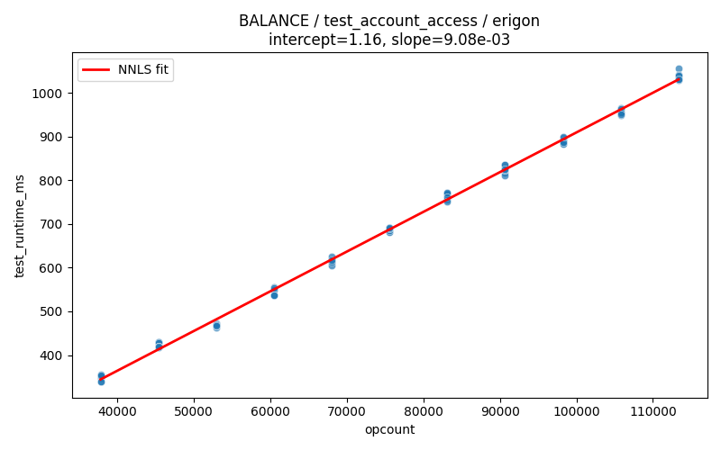

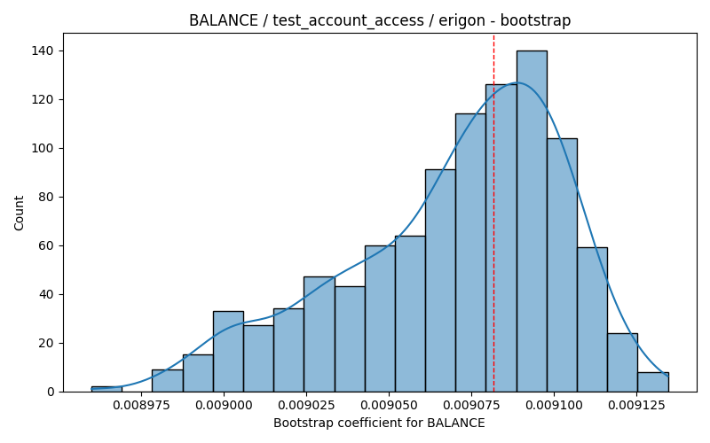

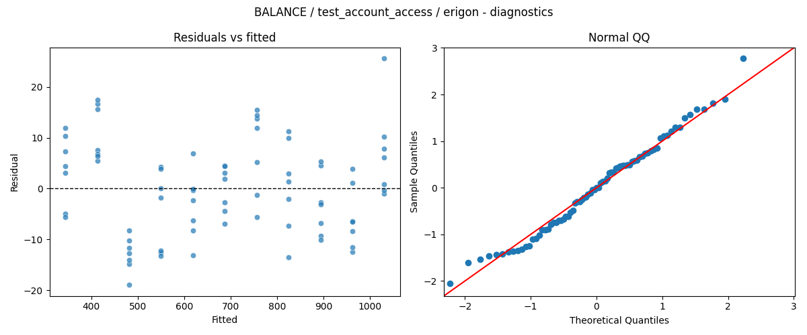

</details>

<details><summary>geth — NNLS regression summary</summary>

```
==============================================================================
                           NNLS Regression Results                            
==============================================================================
Dep. Variable:          test_runtime_ms              R-squared:          0.723
Model:                  NNLS                    Adj. R-squared:          0.721
No. Observations:       121                               RMSE:         385.99
Df Residuals:           119                                MAE:         298.98
Df Model:               1      
==============================================================================
                      coef     std err     P-value      [0.025      0.975]
------------------------------------------------------------------------------
         const   1165.2311    135.5939       0.001    901.8994   1447.4923
       opcount      0.0261      0.0017       0.001      0.0228      0.0293
==============================================================================
Notes: Non-negative least squares with bootstrap inference (1000 iterations)
==============================================================================
```

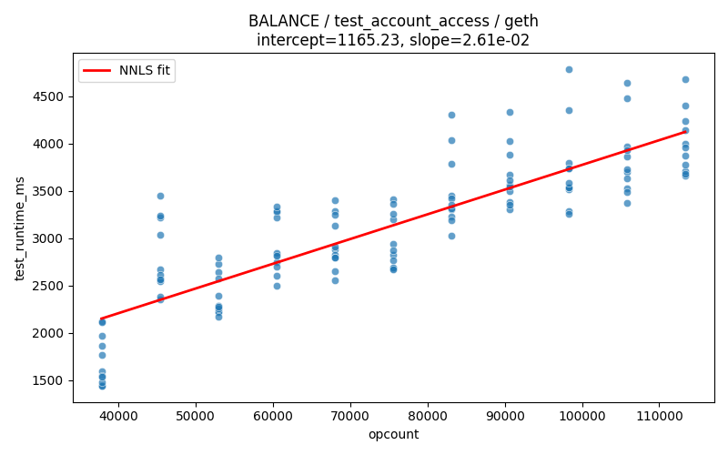

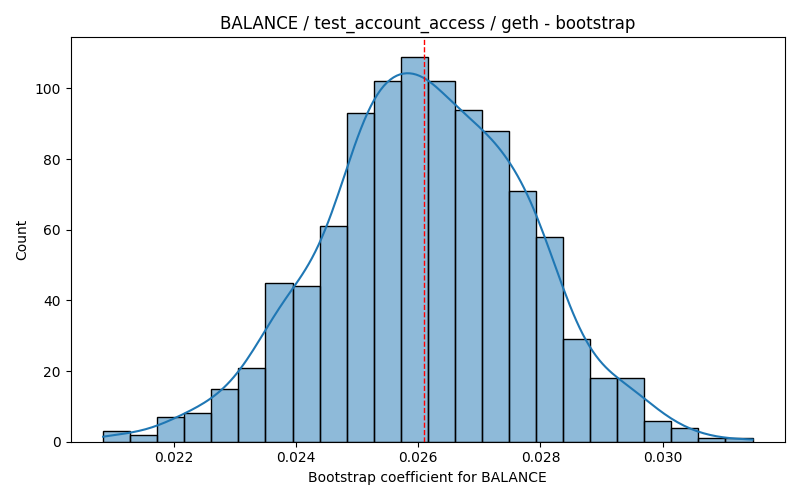

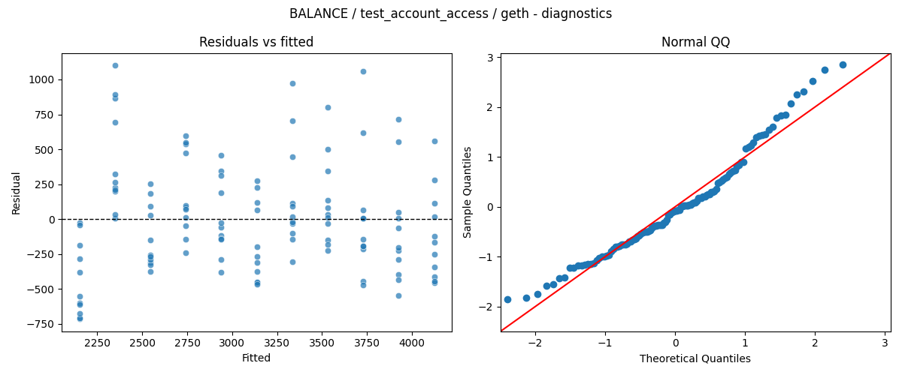

</details>

<details><summary>nethermind — NNLS regression summary</summary>

```
==============================================================================
                           NNLS Regression Results                            
==============================================================================
Dep. Variable:          test_runtime_ms              R-squared:          0.953
Model:                  NNLS                    Adj. R-squared:          0.953
No. Observations:       110                               RMSE:          20.30
Df Residuals:           108                                MAE:          17.04
Df Model:               1      
==============================================================================
                      coef     std err     P-value      [0.025      0.975]
------------------------------------------------------------------------------
         const     76.3408      6.0705       0.001     64.2307     87.3958
       opcount      0.0038      0.0001       0.001      0.0037      0.0040
==============================================================================
Notes: Non-negative least squares with bootstrap inference (1000 iterations)
==============================================================================
```

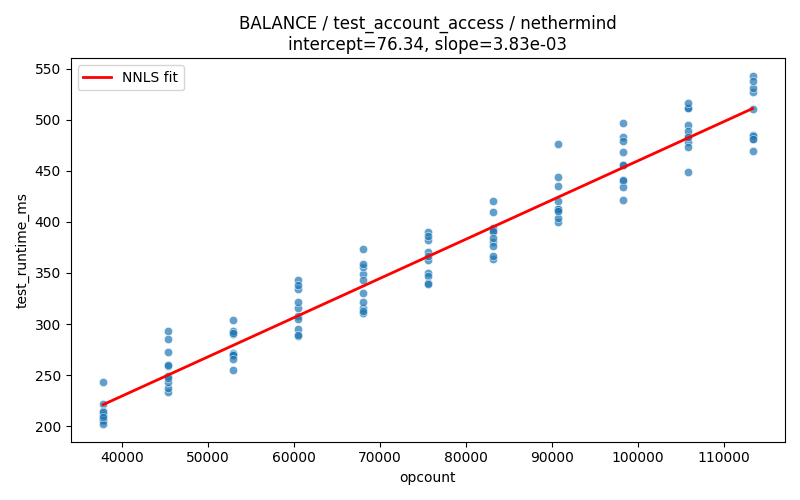

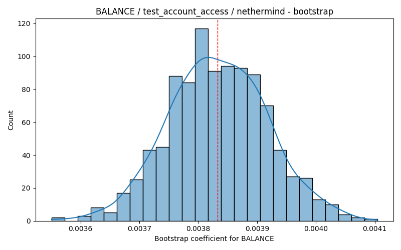

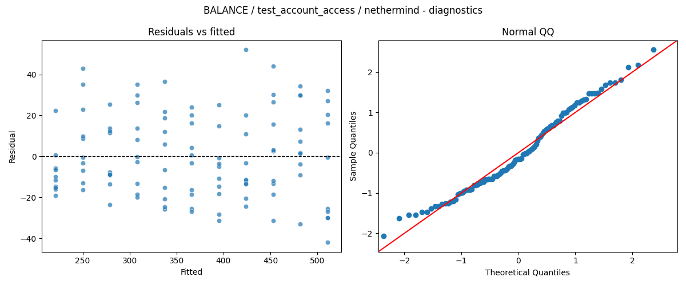

</details>

<details><summary>reth — NNLS regression summary</summary>

```
==============================================================================
                           NNLS Regression Results                            
==============================================================================
Dep. Variable:          test_runtime_ms              R-squared:          0.971
Model:                  NNLS                    Adj. R-squared:          0.970
No. Observations:       198                               RMSE:           3.87
Df Residuals:           196                                MAE:           2.98
Df Model:               1      
==============================================================================
                      coef     std err     P-value      [0.025      0.975]
------------------------------------------------------------------------------
         const     31.1136      0.9380       0.001     29.3250     32.9764
       opcount      0.0009      0.0000       0.001      0.0009      0.0010
==============================================================================
Notes: Non-negative least squares with bootstrap inference (1000 iterations)
==============================================================================
```

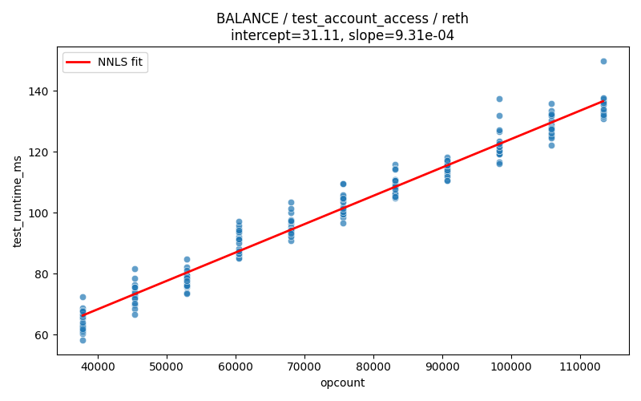

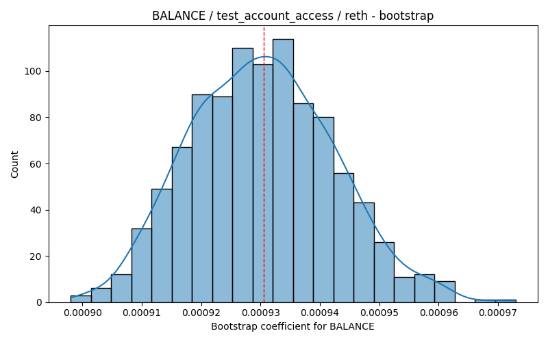

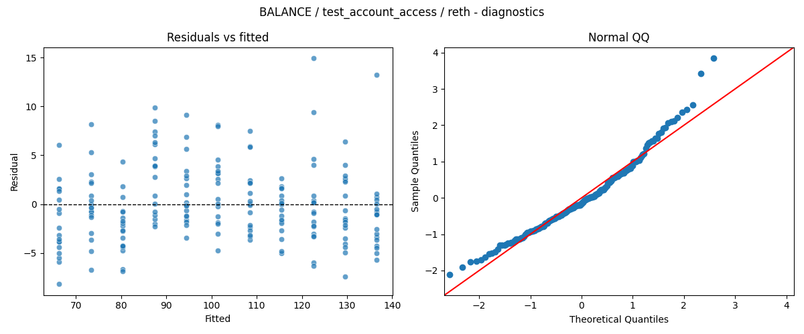

</details>

### test_account_access — combo `BALANCE_AccountMode.EXISTING_CONTRACT`

| client | nobs | R² | target_coef (ms) | p-value | 95% CI |
| --- | --- | --- | --- | --- | --- |
| `besu` | 187 | 0.9538 | 0.02634 | 1.00e-03 | [0.02544, 0.0273] |
| `erigon` | 77 | 0.9116 | 0.03569 | 1.00e-03 | [0.03298, 0.03788] |
| `geth` | 121 | 0.7417 | 0.03032 | 1.00e-03 | [0.02664, 0.03391] |
| `nethermind` | 110 | 0.6955 | 0.02379 | 1.00e-03 | [0.02085, 0.02707] |
| `reth` | 198 | 0.8499 | 0.03065 | 1.00e-03 | [0.02848, 0.03272] |

<details><summary>besu — NNLS regression summary</summary>

```
==============================================================================
                           NNLS Regression Results                            
==============================================================================
Dep. Variable:          test_runtime_ms              R-squared:          0.954
Model:                  NNLS                    Adj. R-squared:          0.954
No. Observations:       187                               RMSE:         120.66
Df Residuals:           185                                MAE:         103.48
Df Model:               1      
==============================================================================
                      coef     std err     P-value      [0.025      0.975]
------------------------------------------------------------------------------
         const    449.0513     33.7925       0.001    377.1471    512.8839
       opcount      0.0263      0.0005       0.001      0.0254      0.0273
==============================================================================
Notes: Non-negative least squares with bootstrap inference (1000 iterations)
==============================================================================
```

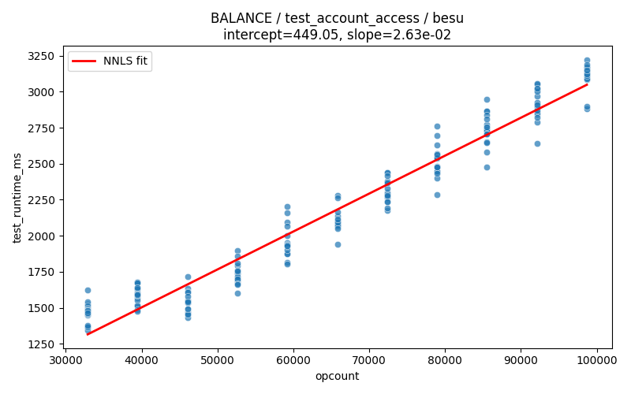

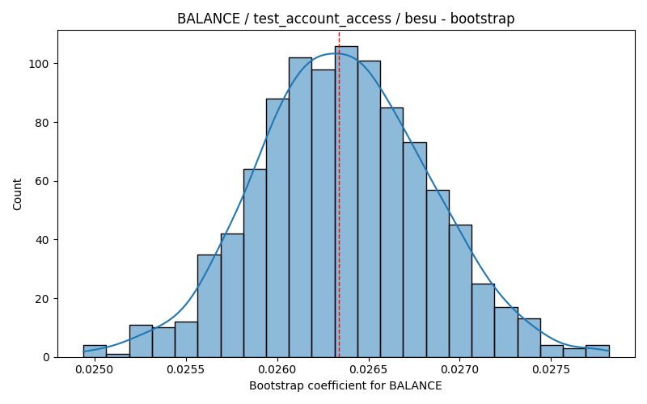

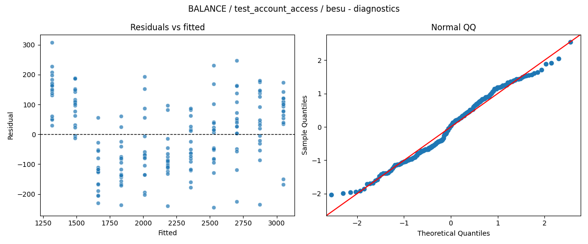

</details>

<details><summary>erigon — NNLS regression summary</summary>

```
==============================================================================
                           NNLS Regression Results                            
==============================================================================
Dep. Variable:          test_runtime_ms              R-squared:          0.912
Model:                  NNLS                    Adj. R-squared:          0.910
No. Observations:       77                                RMSE:         231.26
Df Residuals:           75                                 MAE:         197.49
Df Model:               1      
==============================================================================
                      coef     std err     P-value      [0.025      0.975]
------------------------------------------------------------------------------
         const    406.5886     95.1684       0.001    237.9350    620.6082
       opcount      0.0357      0.0013       0.001      0.0330      0.0379
==============================================================================
Notes: Non-negative least squares with bootstrap inference (1000 iterations)
==============================================================================
```

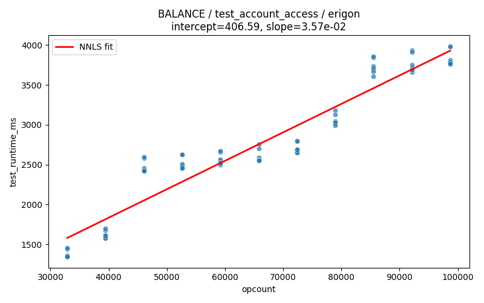

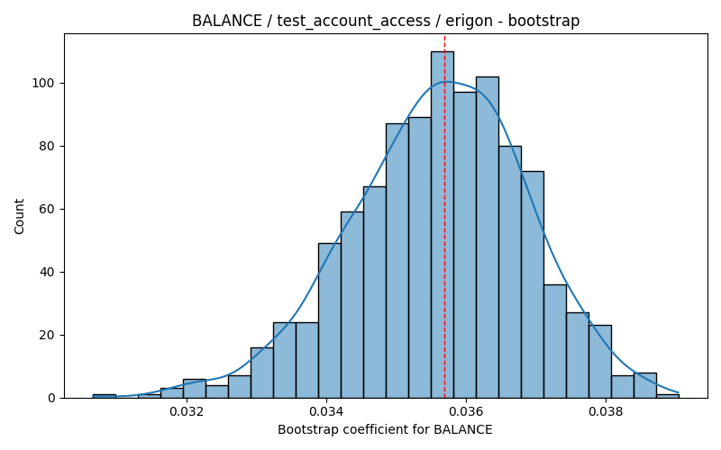

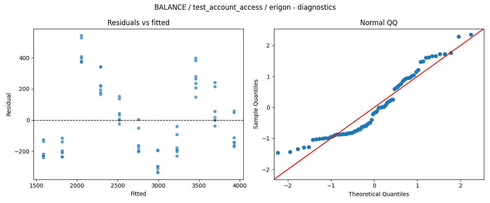

</details>

<details><summary>geth — NNLS regression summary</summary>

```
==============================================================================
                           NNLS Regression Results                            
==============================================================================
Dep. Variable:          test_runtime_ms              R-squared:          0.742
Model:                  NNLS                    Adj. R-squared:          0.740
No. Observations:       121                               RMSE:         372.23
Df Residuals:           119                                MAE:         294.70
Df Model:               1      
==============================================================================
                      coef     std err     P-value      [0.025      0.975]
------------------------------------------------------------------------------
         const    964.2831    127.6366       0.001    727.1013   1216.4707
       opcount      0.0303      0.0018       0.001      0.0266      0.0339
==============================================================================
Notes: Non-negative least squares with bootstrap inference (1000 iterations)
==============================================================================
```

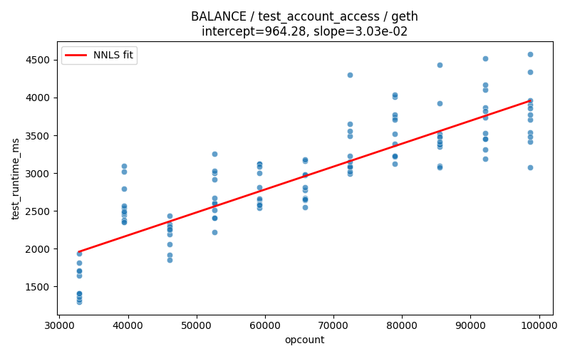

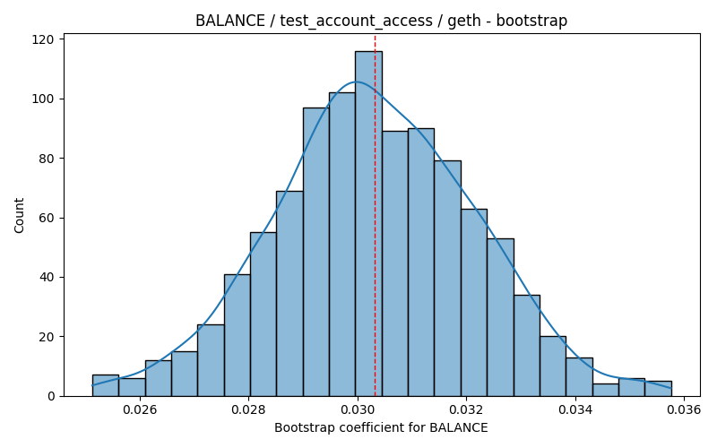

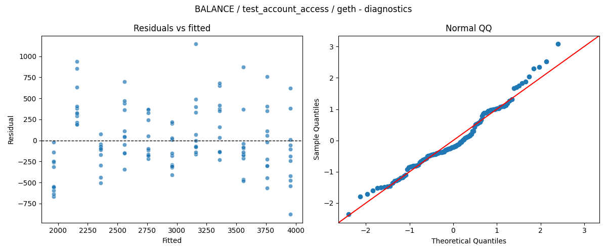

</details>

<details><summary>nethermind — NNLS regression summary</summary>

```
==============================================================================
                           NNLS Regression Results                            
==============================================================================
Dep. Variable:          test_runtime_ms              R-squared:          0.695
Model:                  NNLS                    Adj. R-squared:          0.693
No. Observations:       110                               RMSE:         327.52
Df Residuals:           108                                MAE:         274.33
Df Model:               1      
==============================================================================
                      coef     std err     P-value      [0.025      0.975]
------------------------------------------------------------------------------
         const    831.0320    108.2608       0.001    602.2743   1047.7394
       opcount      0.0238      0.0015       0.001      0.0209      0.0271
==============================================================================
Notes: Non-negative least squares with bootstrap inference (1000 iterations)
==============================================================================
```

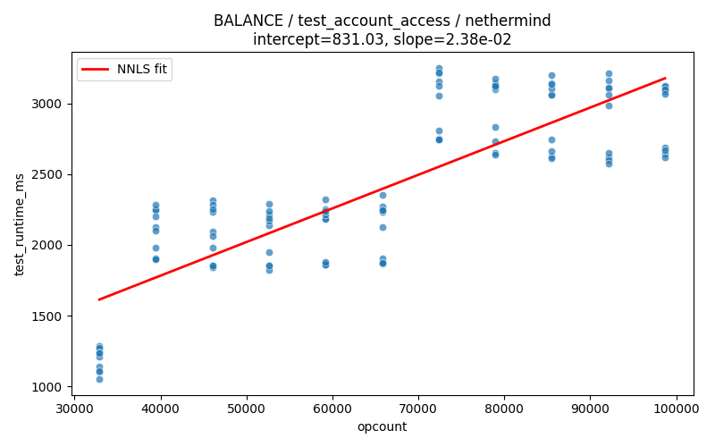

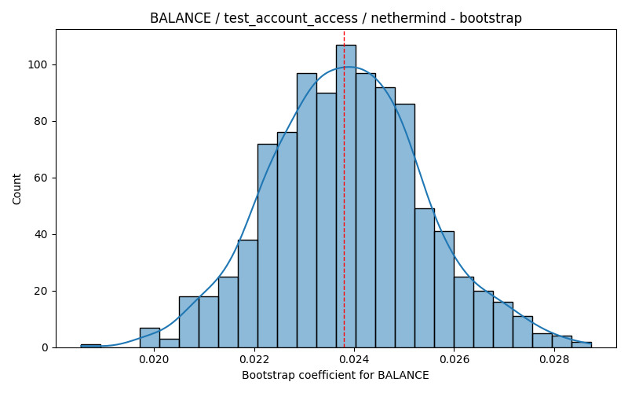

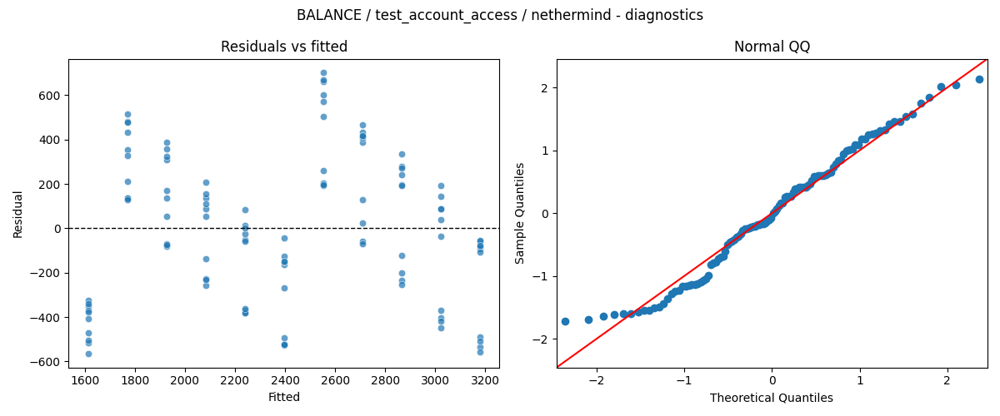

</details>

<details><summary>reth — NNLS regression summary</summary>

```
==============================================================================
                           NNLS Regression Results                            
==============================================================================
Dep. Variable:          test_runtime_ms              R-squared:          0.850
Model:                  NNLS                    Adj. R-squared:          0.849
No. Observations:       198                               RMSE:         267.97
Df Residuals:           196                                MAE:         193.60
Df Model:               1      
==============================================================================
                      coef     std err     P-value      [0.025      0.975]
------------------------------------------------------------------------------
         const    658.9266     81.9249       0.001    501.0157    817.9259
       opcount      0.0307      0.0011       0.001      0.0285      0.0327
==============================================================================
Notes: Non-negative least squares with bootstrap inference (1000 iterations)
==============================================================================
```

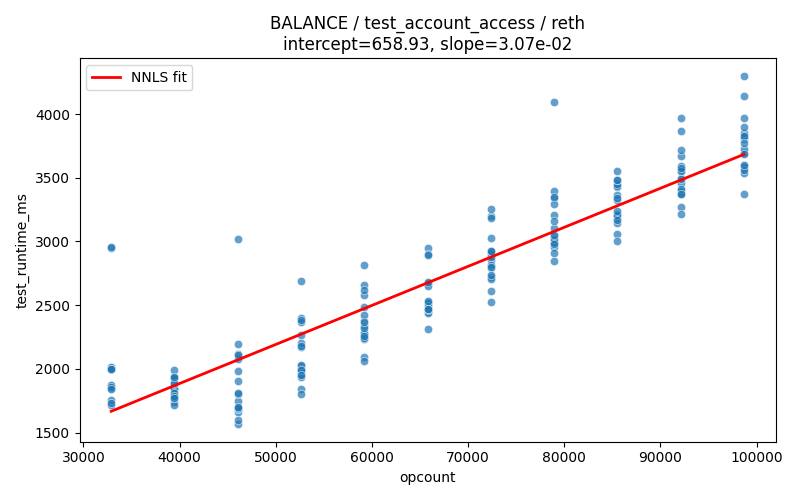

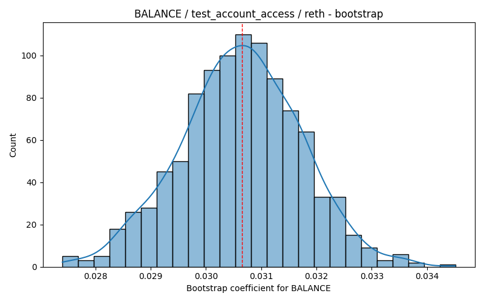

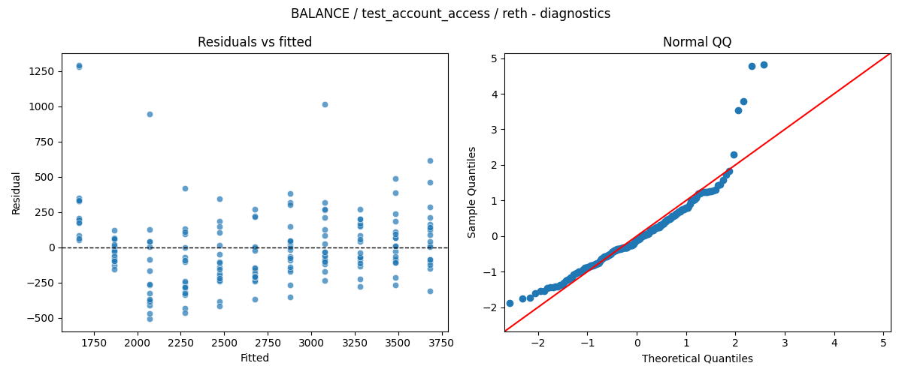

</details>

### test_account_access — combo `BALANCE_AccountMode.NON_EXISTING_ACCOUNT` — `presets[cold_account_code_access]`

| client | nobs | R² | target_coef (ms) | p-value | 95% CI |
| --- | --- | --- | --- | --- | --- |
| `besu` | 187 | 0.9177 | 0.01003 | 1.00e-03 | [0.009551, 0.01052] |
| `erigon` | 77 | 0.9982 | 0.009082 | 1.00e-03 | [0.008996, 0.009119] |
| `geth` | 121 | 0.723 | 0.02609 | 1.00e-03 | [0.02275, 0.02934] |
| `nethermind` | 110 | 0.9532 | 0.003833 | 1.00e-03 | [0.003676, 0.004001] |
| `reth` | 198 | 0.9706 | 0.0009305 | 1.00e-03 | [0.0009087, 0.0009547] |

<details><summary>besu — NNLS regression summary</summary>

```
==============================================================================
                           NNLS Regression Results                            
==============================================================================
Dep. Variable:          test_runtime_ms              R-squared:          0.918
Model:                  NNLS                    Adj. R-squared:          0.917
No. Observations:       187                               RMSE:          71.78
Df Residuals:           185                                MAE:          57.40
Df Model:               1      
==============================================================================
                      coef     std err     P-value      [0.025      0.975]
------------------------------------------------------------------------------
         const    366.6016     20.1728       0.001    327.0969    405.0781
       opcount      0.0100      0.0002       0.001      0.0096      0.0105
==============================================================================
Notes: Non-negative least squares with bootstrap inference (1000 iterations)
==============================================================================
```


</details>

<details><summary>erigon — NNLS regression summary</summary>

```
==============================================================================
                           NNLS Regression Results                            
==============================================================================
Dep. Variable:          test_runtime_ms              R-squared:          0.998
Model:                  NNLS                    Adj. R-squared:          0.998
No. Observations:       77                                RMSE:           9.23
Df Residuals:           75                                 MAE:           7.64
Df Model:               1      
==============================================================================
                      coef     std err     P-value      [0.025      0.975]
------------------------------------------------------------------------------
         const      1.1591      2.5526       0.368      0.0000      8.3183
       opcount      0.0091      0.0000       0.001      0.0090      0.0091
==============================================================================
Notes: Non-negative least squares with bootstrap inference (1000 iterations)
==============================================================================
```


</details>

<details><summary>geth — NNLS regression summary</summary>

```
==============================================================================
                           NNLS Regression Results                            
==============================================================================
Dep. Variable:          test_runtime_ms              R-squared:          0.723
Model:                  NNLS                    Adj. R-squared:          0.721
No. Observations:       121                               RMSE:         385.99
Df Residuals:           119                                MAE:         298.98
Df Model:               1      
==============================================================================
                      coef     std err     P-value      [0.025      0.975]
------------------------------------------------------------------------------
         const   1165.2311    135.5939       0.001    901.8994   1447.4923
       opcount      0.0261      0.0017       0.001      0.0228      0.0293
==============================================================================
Notes: Non-negative least squares with bootstrap inference (1000 iterations)
==============================================================================
```


</details>

<details><summary>nethermind — NNLS regression summary</summary>

```
==============================================================================
                           NNLS Regression Results                            
==============================================================================
Dep. Variable:          test_runtime_ms              R-squared:          0.953
Model:                  NNLS                    Adj. R-squared:          0.953
No. Observations:       110                               RMSE:          20.30
Df Residuals:           108                                MAE:          17.04
Df Model:               1      
==============================================================================
                      coef     std err     P-value      [0.025      0.975]
------------------------------------------------------------------------------
         const     76.3408      6.0705       0.001     64.2307     87.3958
       opcount      0.0038      0.0001       0.001      0.0037      0.0040
==============================================================================
Notes: Non-negative least squares with bootstrap inference (1000 iterations)
==============================================================================
```


</details>

<details><summary>reth — NNLS regression summary</summary>

```
==============================================================================
                           NNLS Regression Results                            
==============================================================================
Dep. Variable:          test_runtime_ms              R-squared:          0.971
Model:                  NNLS                    Adj. R-squared:          0.970
No. Observations:       198                               RMSE:           3.87
Df Residuals:           196                                MAE:           2.98
Df Model:               1      
==============================================================================
                      coef     std err     P-value      [0.025      0.975]
------------------------------------------------------------------------------
         const     31.1136      0.9380       0.001     29.3250     32.9764
       opcount      0.0009      0.0000       0.001      0.0009      0.0010
==============================================================================
Notes: Non-negative least squares with bootstrap inference (1000 iterations)
==============================================================================
```


</details>

### test_ext_account_query_warm — combo `BALANCE`

| client | nobs | R² | target_coef (ms) | p-value | 95% CI |
| --- | --- | --- | --- | --- | --- |
| `besu` | 187 | 0.8402 | 0.0001962 | 1.00e-03 | [0.0001834, 0.0002094] |
| `erigon` | 77 | 0.8514 | 4.445e-05 | 1.00e-03 | [4.031e-05, 4.874e-05] |
| `geth` | 121 | 0.8699 | 3.289e-05 | 1.00e-03 | [3.02e-05, 3.545e-05] |
| `nethermind` | 110 | 0.8531 | 0.0001788 | 1.00e-03 | [0.0001661, 0.0001915] |
| `reth` | 198 | 0.7309 | 7.01e-06 | 1.00e-03 | [6.461e-06, 7.609e-06] |

<details><summary>besu — NNLS regression summary</summary>

```
==============================================================================
                           NNLS Regression Results                            
==============================================================================
Dep. Variable:          test_runtime_ms              R-squared:          0.840
Model:                  NNLS                    Adj. R-squared:          0.839
No. Observations:       187                               RMSE:          50.04
Df Residuals:           185                                MAE:          39.01
Df Model:               1      
==============================================================================
                      coef     std err     P-value      [0.025      0.975]
------------------------------------------------------------------------------
         const    100.6996     12.8153       0.001     77.5623    126.8297
       opcount      0.0002      0.0000       0.001      0.0002      0.0002
==============================================================================
Notes: Non-negative least squares with bootstrap inference (1000 iterations)
==============================================================================
```

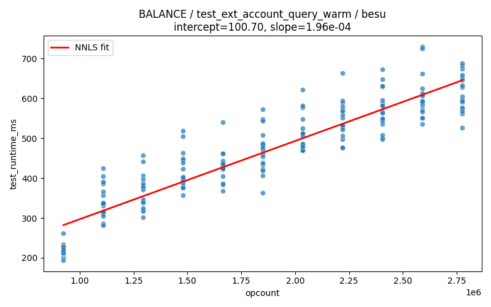

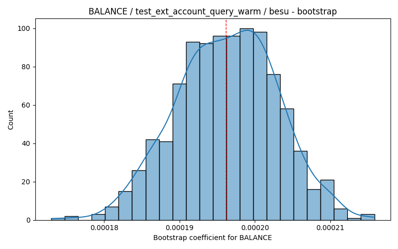

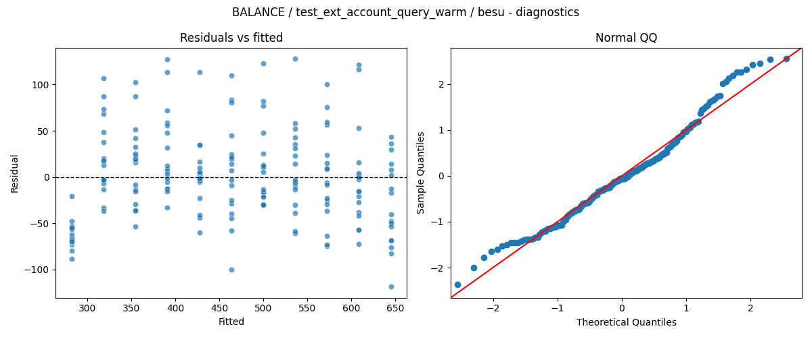

</details>

<details><summary>erigon — NNLS regression summary</summary>

```
==============================================================================
                           NNLS Regression Results                            
==============================================================================
Dep. Variable:          test_runtime_ms              R-squared:          0.851
Model:                  NNLS                    Adj. R-squared:          0.849
No. Observations:       77                                RMSE:          10.86
Df Residuals:           75                                 MAE:           7.19
Df Model:               1      
==============================================================================
                      coef     std err     P-value      [0.025      0.975]
------------------------------------------------------------------------------
         const     36.6048      4.4763       0.001     28.0392     45.6163
       opcount      0.0000      0.0000       0.001      0.0000      0.0000
==============================================================================
Notes: Non-negative least squares with bootstrap inference (1000 iterations)
==============================================================================
```

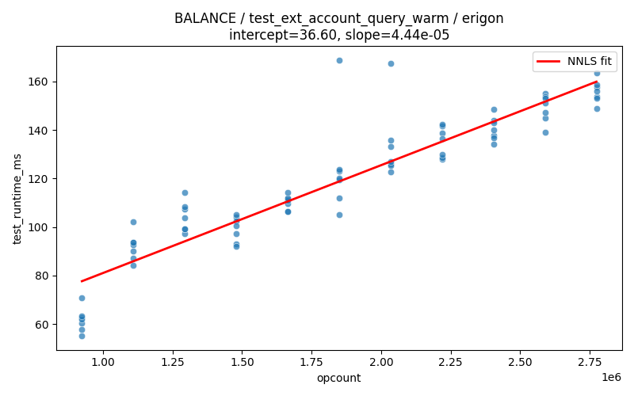

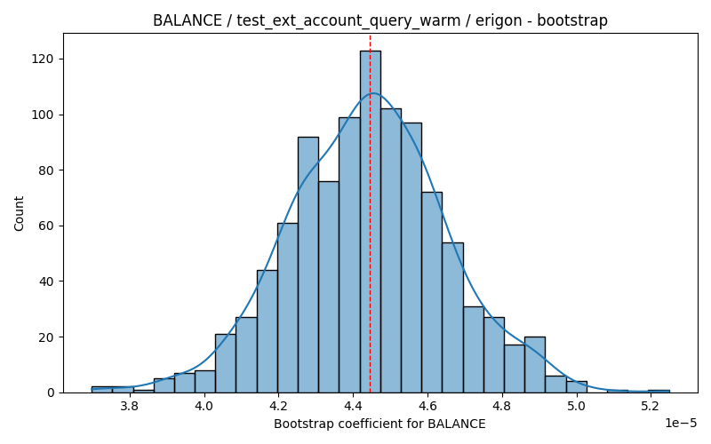

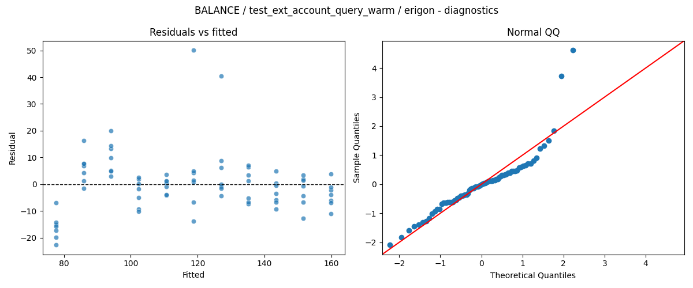

</details>

<details><summary>geth — NNLS regression summary</summary>

```
==============================================================================
                           NNLS Regression Results                            
==============================================================================
Dep. Variable:          test_runtime_ms              R-squared:          0.870
Model:                  NNLS                    Adj. R-squared:          0.869
No. Observations:       121                               RMSE:           7.44
Df Residuals:           119                                MAE:           6.15
Df Model:               1      
==============================================================================
                      coef     std err     P-value      [0.025      0.975]
------------------------------------------------------------------------------
         const      9.6483      2.5432       0.001      4.7694     14.8537
       opcount      0.0000      0.0000       0.001      0.0000      0.0000
==============================================================================
Notes: Non-negative least squares with bootstrap inference (1000 iterations)
==============================================================================
```

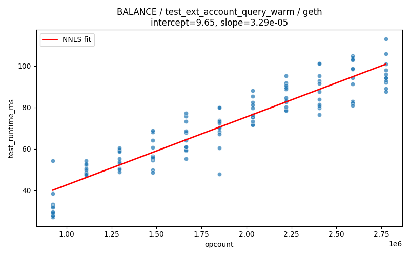

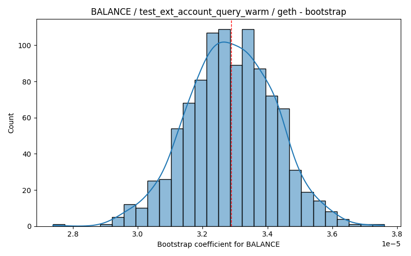

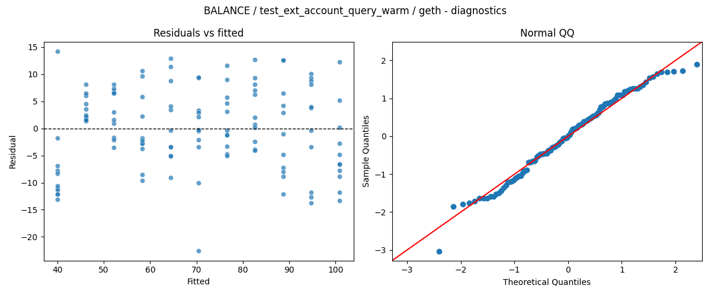

</details>

<details><summary>nethermind — NNLS regression summary</summary>

```
==============================================================================
                           NNLS Regression Results                            
==============================================================================
Dep. Variable:          test_runtime_ms              R-squared:          0.853
Model:                  NNLS                    Adj. R-squared:          0.852
No. Observations:       110                               RMSE:          43.39
Df Residuals:           108                                MAE:          32.67
Df Model:               1      
==============================================================================
                      coef     std err     P-value      [0.025      0.975]
------------------------------------------------------------------------------
         const     63.3814     13.5602       0.001     37.0735     89.0633
       opcount      0.0002      0.0000       0.001      0.0002      0.0002
==============================================================================
Notes: Non-negative least squares with bootstrap inference (1000 iterations)
==============================================================================
```

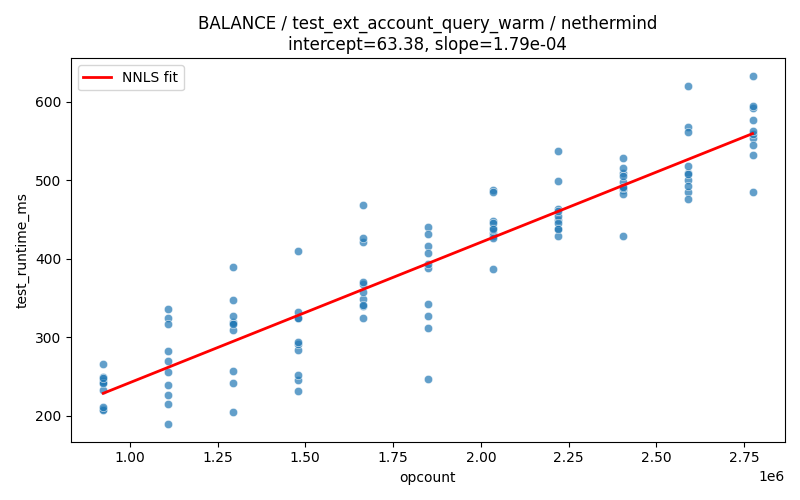

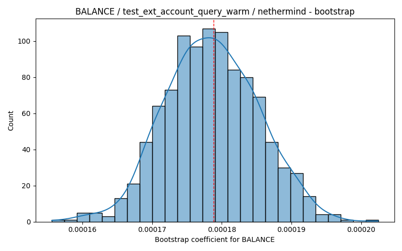

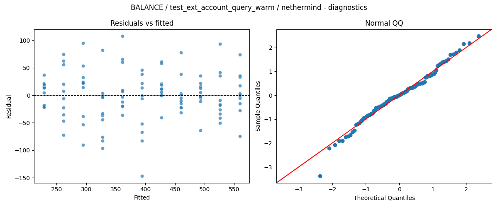

</details>

<details><summary>reth — NNLS regression summary</summary>

```
==============================================================================
                           NNLS Regression Results                            
==============================================================================
Dep. Variable:          test_runtime_ms              R-squared:          0.731
Model:                  NNLS                    Adj. R-squared:          0.730
No. Observations:       198                               RMSE:           2.49
Df Residuals:           196                                MAE:           1.77
Df Model:               1      
==============================================================================
                      coef     std err     P-value      [0.025      0.975]
------------------------------------------------------------------------------
         const      5.5943      0.5317       0.001      4.5328      6.6116
       opcount      0.0000      0.0000       0.001      0.0000      0.0000
==============================================================================
Notes: Non-negative least squares with bootstrap inference (1000 iterations)
==============================================================================
```

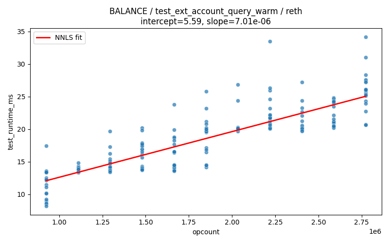

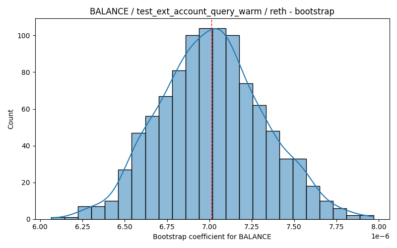

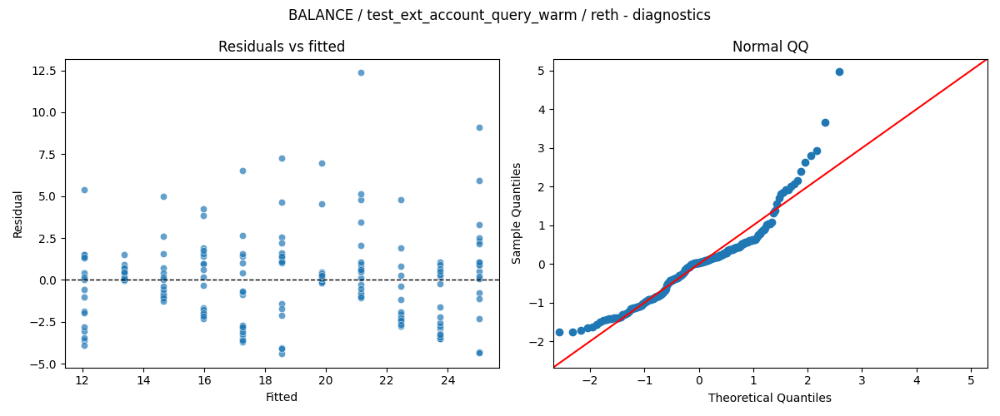

</details>

## CALL

### test_account_access — combo `CALL_AccountMode.EXISTING_EOA`

| client | nobs | R² | target_coef (ms) | p-value | 95% CI |
| --- | --- | --- | --- | --- | --- |
| `besu` | 374 | 0.9259 | 0.0122 | 1.00e-03 | [0.01164, 0.01275] |
| `erigon` | 154 | 0.9757 | 0.007671 | 1.00e-03 | [0.006802, 0.008476] |
| `geth` | 242 | 0.8903 | 0.0141 | 1.00e-03 | [0.01349, 0.01481] |
| `nethermind` | 220 | 0.9403 | 0.003777 | 1.00e-03 | [0.003348, 0.0042] |
| `reth` | 396 | 0.991 | 0 | 1.00e+00 | [0, 0] |

<details><summary>besu — NNLS regression summary</summary>

```
==============================================================================
                           NNLS Regression Results                            
==============================================================================
Dep. Variable:          test_runtime_ms              R-squared:          0.926
Model:                  NNLS                    Adj. R-squared:          0.926
No. Observations:       374                               RMSE:         120.60
Df Residuals:           371                                MAE:          96.01
Df Model:               2      
==============================================================================
                      coef     std err     P-value      [0.025      0.975]
------------------------------------------------------------------------------
         const    483.6086     24.0108       0.001    436.4480    528.8732
       opcount      0.0122      0.0003       0.001      0.0116      0.0128
        update      0.0515      0.0010       0.001      0.0496      0.0534
==============================================================================
Notes: Non-negative least squares with bootstrap inference (1000 iterations)
==============================================================================
```

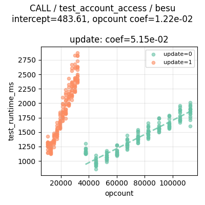

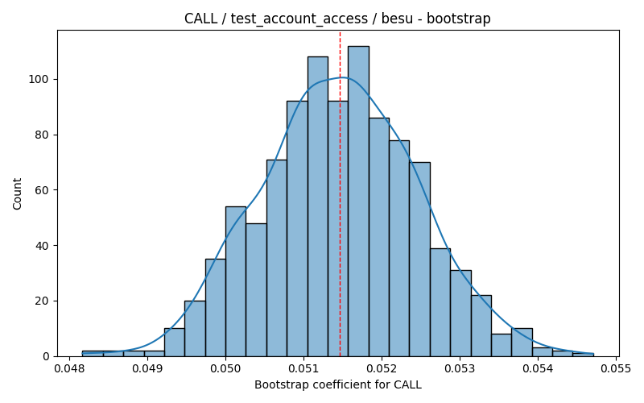

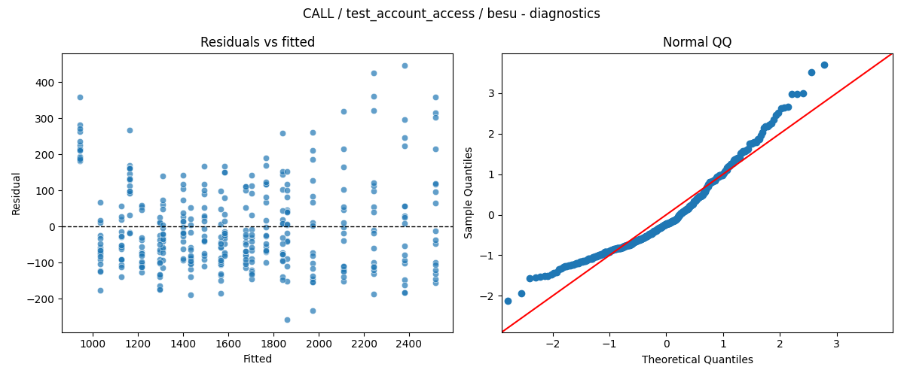

</details>

<details><summary>erigon — NNLS regression summary</summary>

```
==============================================================================
                           NNLS Regression Results                            
==============================================================================
Dep. Variable:          test_runtime_ms              R-squared:          0.976
Model:                  NNLS                    Adj. R-squared:          0.975
No. Observations:       154                               RMSE:          99.73
Df Residuals:           151                                MAE:          76.43
Df Model:               2      
==============================================================================
                      coef     std err     P-value      [0.025      0.975]
------------------------------------------------------------------------------
         const    323.0194     36.4774       0.001    252.7604    395.4272
       opcount      0.0077      0.0004       0.001      0.0068      0.0085
        update      0.0670      0.0012       0.001      0.0647      0.0693
==============================================================================
Notes: Non-negative least squares with bootstrap inference (1000 iterations)
==============================================================================
```

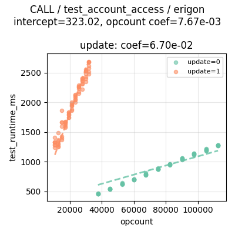

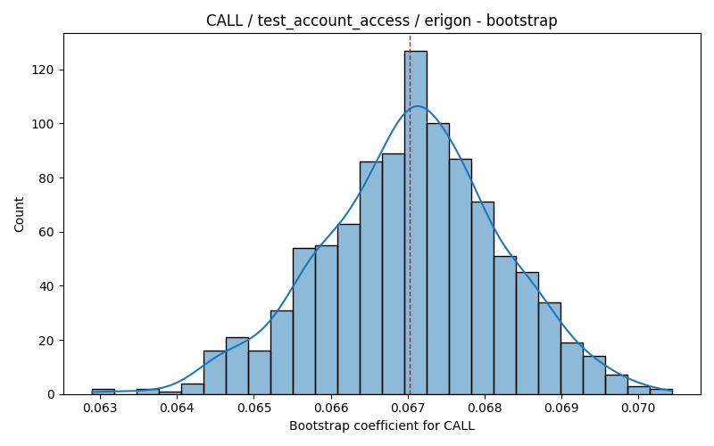

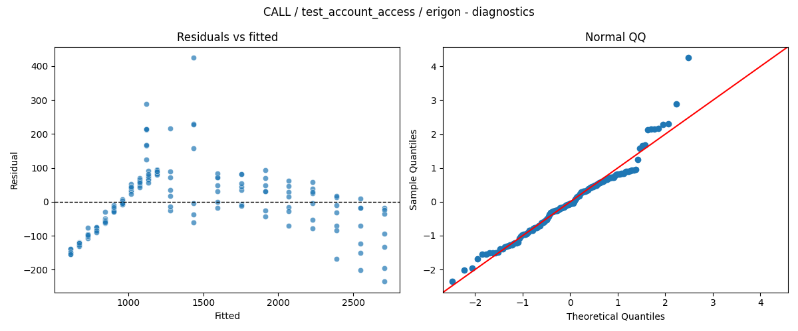

</details>

<details><summary>geth — NNLS regression summary</summary>

```
==============================================================================
                           NNLS Regression Results                            
==============================================================================
Dep. Variable:          test_runtime_ms              R-squared:          0.890
Model:                  NNLS                    Adj. R-squared:          0.889
No. Observations:       242                               RMSE:         131.36
Df Residuals:           239                                MAE:         104.31
Df Model:               2      
==============================================================================
                      coef     std err     P-value      [0.025      0.975]
------------------------------------------------------------------------------
         const    277.5134     24.1934       0.001    225.2073    322.5476
       opcount      0.0141      0.0003       0.001      0.0135      0.0148
        update      0.0439      0.0010       0.001      0.0420      0.0459
==============================================================================
Notes: Non-negative least squares with bootstrap inference (1000 iterations)
==============================================================================
```

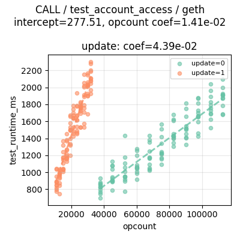

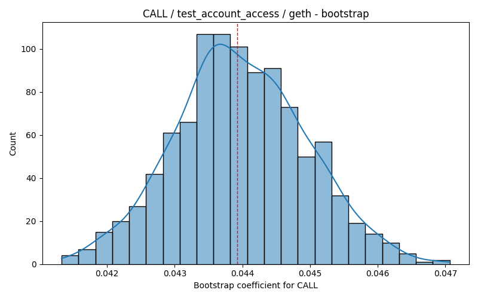

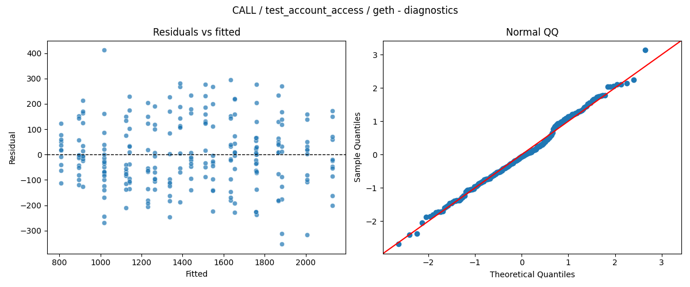

</details>

<details><summary>nethermind — NNLS regression summary</summary>

```
==============================================================================
                           NNLS Regression Results                            
==============================================================================
Dep. Variable:          test_runtime_ms              R-squared:          0.940
Model:                  NNLS                    Adj. R-squared:          0.940
No. Observations:       220                               RMSE:          80.44
Df Residuals:           217                                MAE:          62.76
Df Model:               2      
==============================================================================
                      coef     std err     P-value      [0.025      0.975]
------------------------------------------------------------------------------
         const    156.9439     17.1263       0.001    123.3223    190.1115
       opcount      0.0038      0.0002       0.001      0.0033      0.0042
        update      0.0337      0.0008       0.001      0.0321      0.0354
==============================================================================
Notes: Non-negative least squares with bootstrap inference (1000 iterations)
==============================================================================
```

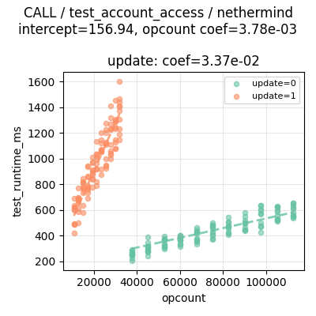

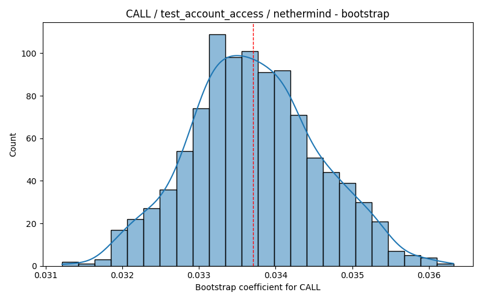

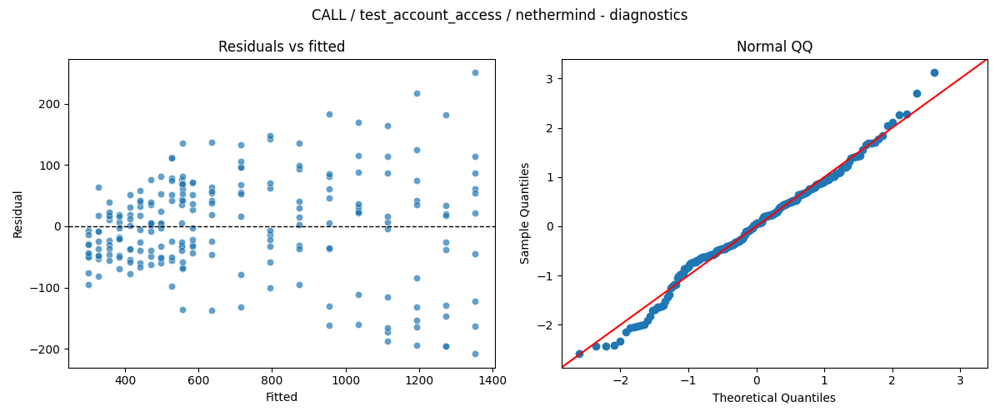

</details>

<details><summary>reth — NNLS regression summary</summary>

```
==============================================================================
                           NNLS Regression Results                            
==============================================================================
Dep. Variable:          test_runtime_ms              R-squared:          0.991
Model:                  NNLS                    Adj. R-squared:          0.991
No. Observations:       396                               RMSE:         182.35
Df Residuals:           393                                MAE:         106.22
Df Model:               2      
==============================================================================
                      coef     std err     P-value      [0.025      0.975]
------------------------------------------------------------------------------
         const    156.6439      8.3926       0.001    140.7656    173.3588
       opcount      0.0000      0.0000       1.000      0.0000      0.0000
        update      0.1641      0.0005       0.001      0.1631      0.1651
==============================================================================
Notes: Non-negative least squares with bootstrap inference (1000 iterations)
==============================================================================
```

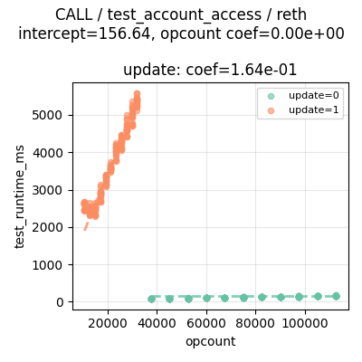

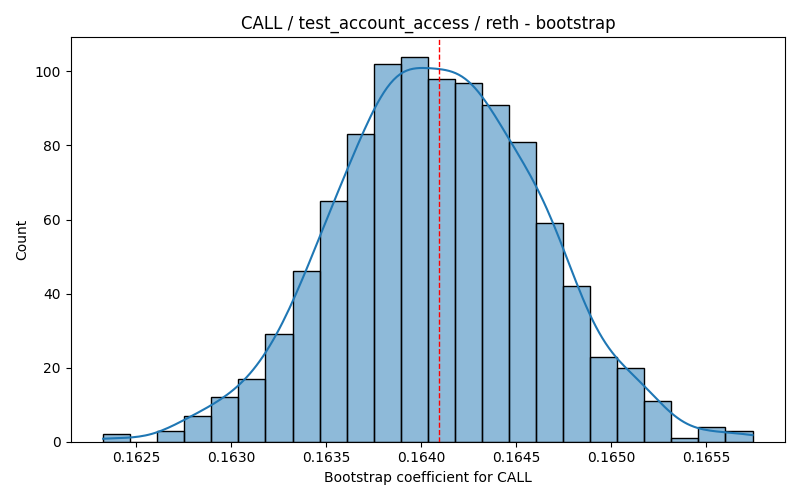

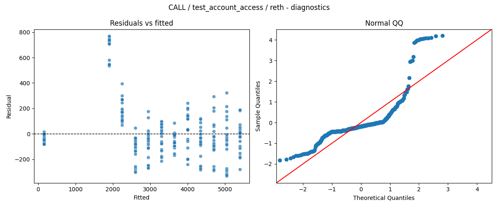

</details>

### test_account_access — combo `CALL_AccountMode.NON_EXISTING_ACCOUNT` — `presets[cold_account_nocode_access]`

| client | nobs | R² | target_coef (ms) | p-value | 95% CI |
| --- | --- | --- | --- | --- | --- |
| `besu` | 374 | 0.9835 | 0.01282 | 1.00e-03 | [0.01249, 0.01317] |
| `erigon` | 154 | 0.9792 | 0.009771 | 1.00e-03 | [0.009529, 0.01001] |
| `geth` | 242 | 0.9505 | 0.03724 | 1.00e-03 | [0.03619, 0.03837] |
| `nethermind` | 220 | 0.972 | 0.005077 | 1.00e-03 | [0.004837, 0.005328] |
| `reth` | 396 | 0.2786 | 0.000598 | 1.00e-03 | [0.0004686, 0.0007181] |

<details><summary>besu — NNLS regression summary</summary>

```
==============================================================================
                           NNLS Regression Results                            
==============================================================================
Dep. Variable:          test_runtime_ms              R-squared:          0.983
Model:                  NNLS                    Adj. R-squared:          0.983
No. Observations:       374                               RMSE:          65.49
Df Residuals:           371                                MAE:          50.62
Df Model:               2      
==============================================================================
                      coef     std err     P-value      [0.025      0.975]
------------------------------------------------------------------------------
         const    391.6893     12.9792       0.001    365.0126    415.5931
       opcount      0.0128      0.0002       0.001      0.0125      0.0132
        update      0.0341      0.0111       0.002      0.0136      0.0569
==============================================================================
Notes: Non-negative least squares with bootstrap inference (1000 iterations)
==============================================================================
```

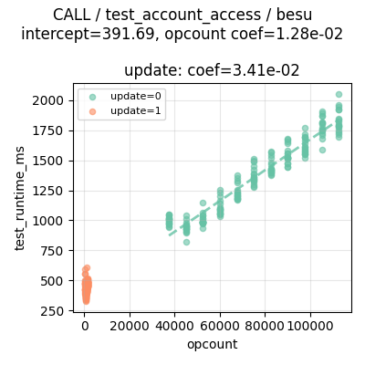

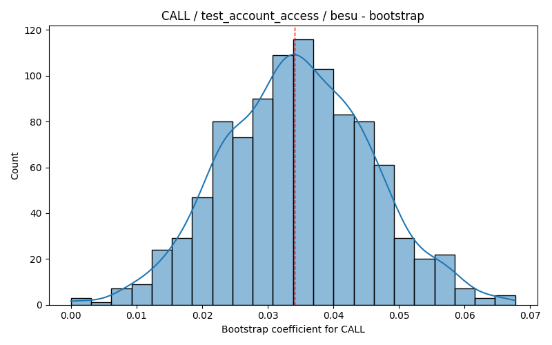

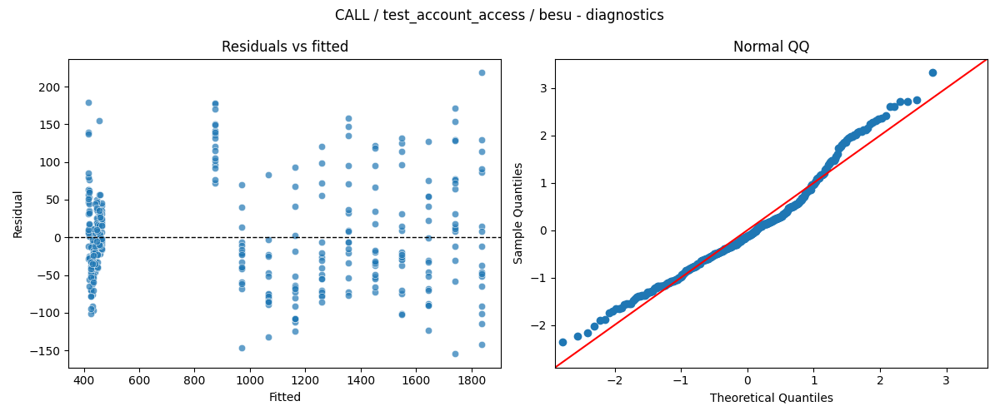

</details>

<details><summary>erigon — NNLS regression summary</summary>

```
==============================================================================
                           NNLS Regression Results                            
==============================================================================
Dep. Variable:          test_runtime_ms              R-squared:          0.979
Model:                  NNLS                    Adj. R-squared:          0.979
No. Observations:       154                               RMSE:          39.67
Df Residuals:           151                                MAE:          28.42
Df Model:               2      
==============================================================================
                      coef     std err     P-value      [0.025      0.975]
------------------------------------------------------------------------------
         const     42.0091     10.2827       0.001     22.2325     61.4354
       opcount      0.0098      0.0001       0.001      0.0095      0.0100
        update      0.3016      0.0119       0.001      0.2798      0.3238
==============================================================================
Notes: Non-negative least squares with bootstrap inference (1000 iterations)
==============================================================================
```

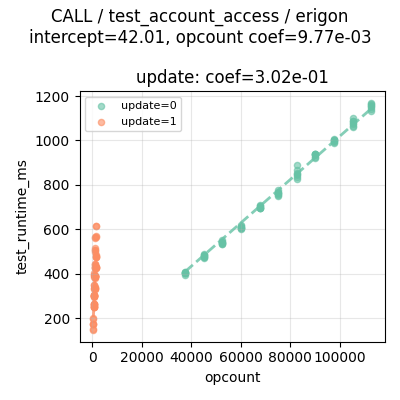

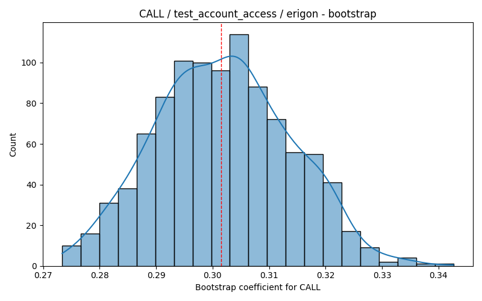

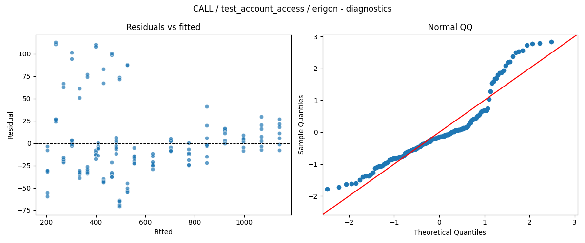

</details>

<details><summary>geth — NNLS regression summary</summary>

```
==============================================================================
                           NNLS Regression Results                            
==============================================================================
Dep. Variable:          test_runtime_ms              R-squared:          0.950
Model:                  NNLS                    Adj. R-squared:          0.950
No. Observations:       242                               RMSE:         345.64
Df Residuals:           239                                MAE:         231.45
Df Model:               2      
==============================================================================
                      coef     std err     P-value      [0.025      0.975]
------------------------------------------------------------------------------
         const    228.1775     17.5364       0.001    195.7660    264.5452
       opcount      0.0372      0.0006       0.001      0.0362      0.0384
        update      0.0000      0.0000       1.000      0.0000      0.0000
==============================================================================
Notes: Non-negative least squares with bootstrap inference (1000 iterations)
==============================================================================
```

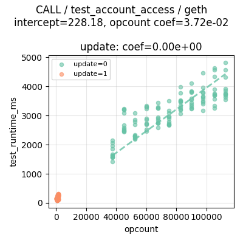

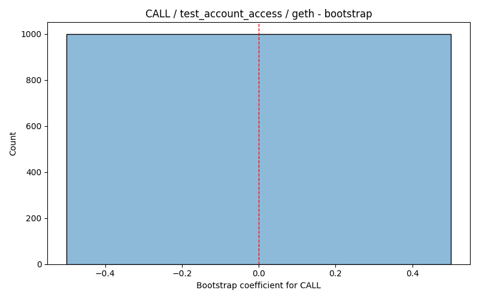

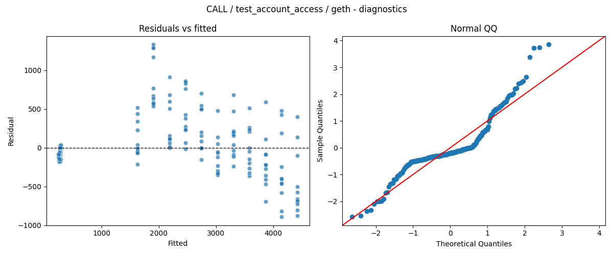

</details>

<details><summary>nethermind — NNLS regression summary</summary>

```
==============================================================================
                           NNLS Regression Results                            
==============================================================================
Dep. Variable:          test_runtime_ms              R-squared:          0.972
Model:                  NNLS                    Adj. R-squared:          0.972
No. Observations:       220                               RMSE:          33.58
Df Residuals:           217                                MAE:          25.12
Df Model:               2      
==============================================================================
                      coef     std err     P-value      [0.025      0.975]
------------------------------------------------------------------------------
         const     60.7584      7.7376       0.001     45.6705     75.9137
       opcount      0.0051      0.0001       0.001      0.0048      0.0053
        update      0.0184      0.0068       0.005      0.0048      0.0314
==============================================================================
Notes: Non-negative least squares with bootstrap inference (1000 iterations)
==============================================================================
```

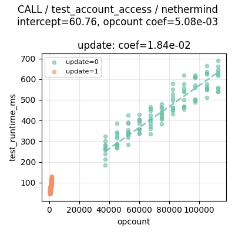

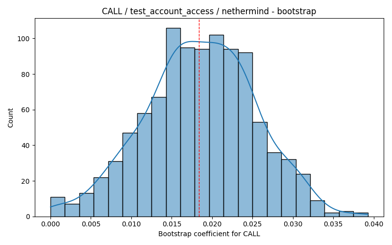

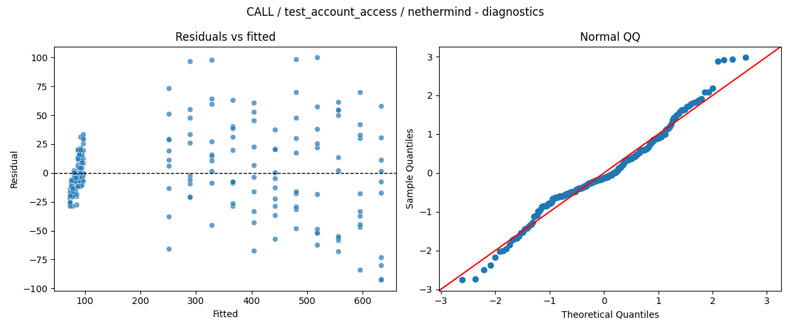

</details>

<details><summary>reth — NNLS regression summary</summary>

```
==============================================================================
                           NNLS Regression Results                            
==============================================================================
Dep. Variable:          test_runtime_ms              R-squared:          0.279
Model:                  NNLS                    Adj. R-squared:          0.275
No. Observations:       396                               RMSE:          21.91
Df Residuals:           393                                MAE:          15.17
Df Model:               2      
==============================================================================
                      coef     std err     P-value      [0.025      0.975]
------------------------------------------------------------------------------
         const     64.0840      5.4807       0.001     54.0982     75.1707
       opcount      0.0006      0.0001       0.001      0.0005      0.0007
        update      0.0343      0.0042       0.001      0.0261      0.0421
==============================================================================
Notes: Non-negative least squares with bootstrap inference (1000 iterations)
==============================================================================
```

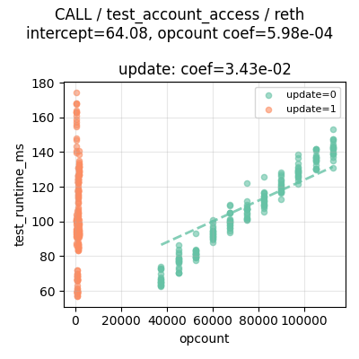

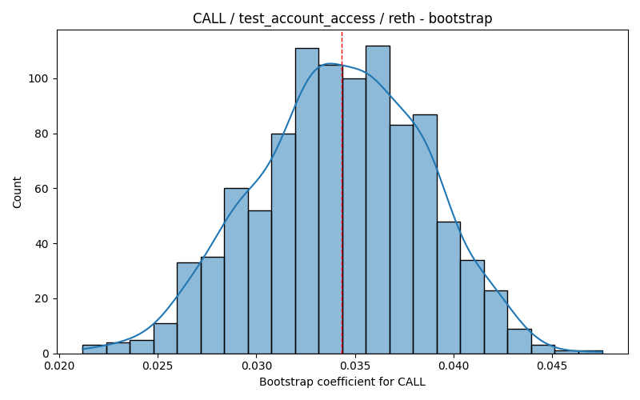

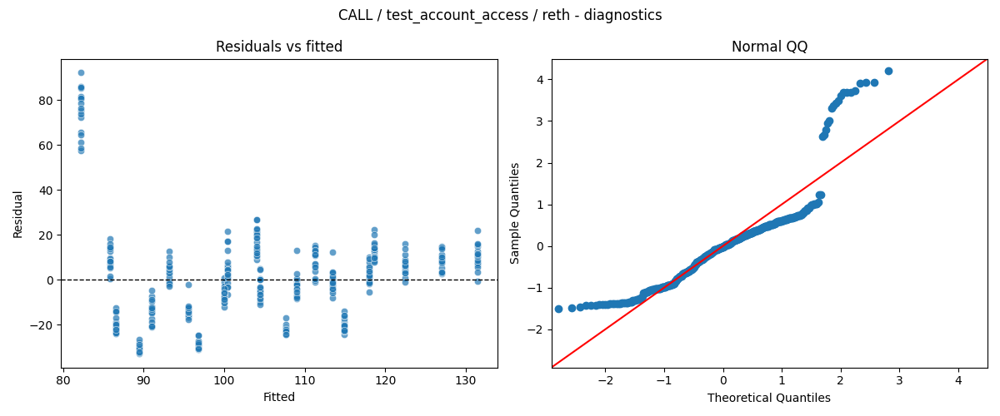

</details>

### test_account_access — combo `CALL_AccountMode.EXISTING_CONTRACT`

| client | nobs | R² | target_coef (ms) | p-value | 95% CI |
| --- | --- | --- | --- | --- | --- |
| `besu` | 374 | 0.9336 | 0.02564 | 1.00e-03 | [0.02463, 0.02667] |
| `erigon` | 154 | 0.9034 | 0.07489 | 1.00e-03 | [0.06988, 0.07966] |
| `geth` | 242 | 0.8356 | 0.03446 | 1.00e-03 | [0.03238, 0.03657] |
| `nethermind` | 220 | 0.8697 | 0.02932 | 1.00e-03 | [0.02723, 0.03145] |
| `reth` | 396 | 0.9458 | 0.03058 | 1.00e-03 | [0.0289, 0.03244] |

<details><summary>besu — NNLS regression summary</summary>

```
==============================================================================
                           NNLS Regression Results                            
==============================================================================
Dep. Variable:          test_runtime_ms              R-squared:          0.934
Model:                  NNLS                    Adj. R-squared:          0.933
No. Observations:       374                               RMSE:         184.80
Df Residuals:           371                                MAE:         147.10
Df Model:               2      
==============================================================================
                      coef     std err     P-value      [0.025      0.975]
------------------------------------------------------------------------------
         const    661.0212     35.2817       0.001    590.1969    727.5402
       opcount      0.0256      0.0005       0.001      0.0246      0.0267
        update      0.0852      0.0014       0.001      0.0827      0.0883
==============================================================================
Notes: Non-negative least squares with bootstrap inference (1000 iterations)
==============================================================================
```

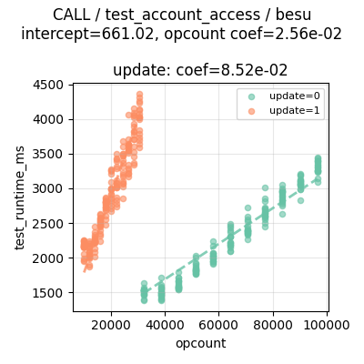

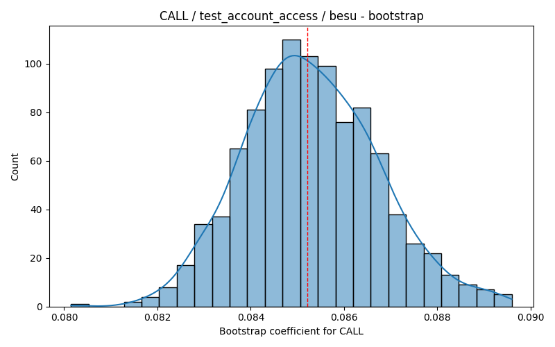

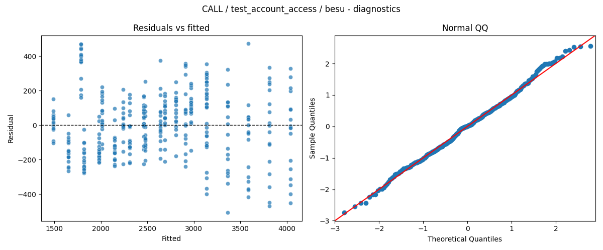

</details>

<details><summary>erigon — NNLS regression summary</summary>

```
==============================================================================
                           NNLS Regression Results                            
==============================================================================
Dep. Variable:          test_runtime_ms              R-squared:          0.903
Model:                  NNLS                    Adj. R-squared:          0.902
No. Observations:       154                               RMSE:         604.98
Df Residuals:           151                                MAE:         477.05
Df Model:               2      
==============================================================================
                      coef     std err     P-value      [0.025      0.975]
------------------------------------------------------------------------------
         const   2316.5104    189.8747       0.001   1968.1029   2686.5026
       opcount      0.0749      0.0025       0.001      0.0699      0.0797
        update      0.2252      0.0071       0.001      0.2112      0.2393
==============================================================================
Notes: Non-negative least squares with bootstrap inference (1000 iterations)
==============================================================================
```

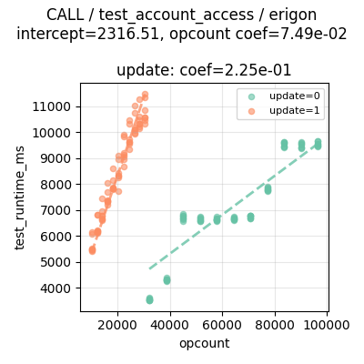

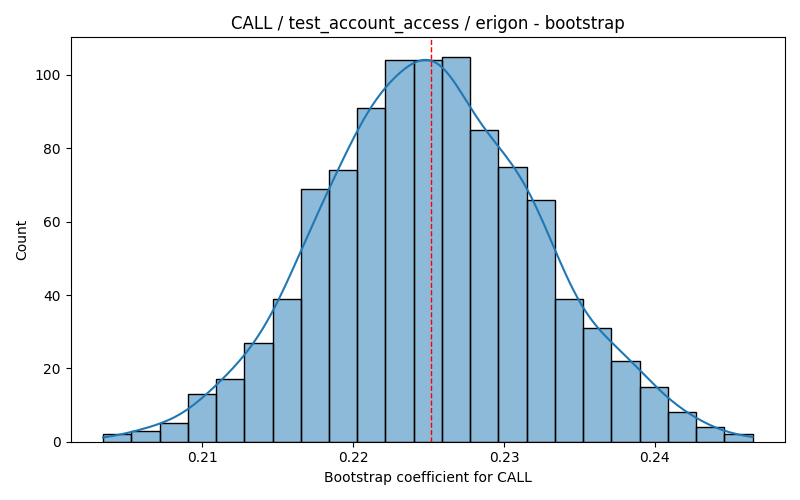

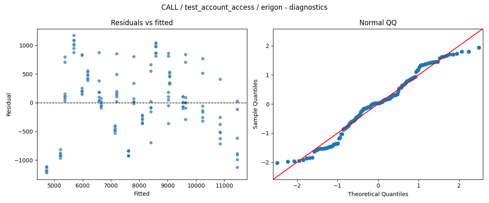

</details>

<details><summary>geth — NNLS regression summary</summary>

```
==============================================================================
                           NNLS Regression Results                            
==============================================================================
Dep. Variable:          test_runtime_ms              R-squared:          0.836
Model:                  NNLS                    Adj. R-squared:          0.834
No. Observations:       242                               RMSE:         298.06
Df Residuals:           239                                MAE:         228.71
Df Model:               2      
==============================================================================
                      coef     std err     P-value      [0.025      0.975]
------------------------------------------------------------------------------
         const    764.2821     67.3594       0.001    644.4263    905.1964
       opcount      0.0345      0.0011       0.001      0.0324      0.0366
        update      0.0539      0.0024       0.001      0.0490      0.0583
==============================================================================
Notes: Non-negative least squares with bootstrap inference (1000 iterations)
==============================================================================
```

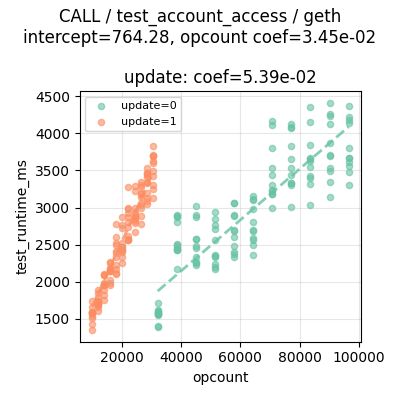

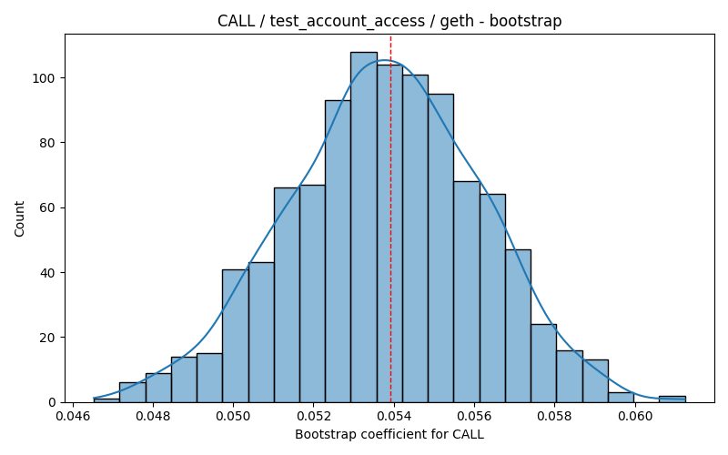

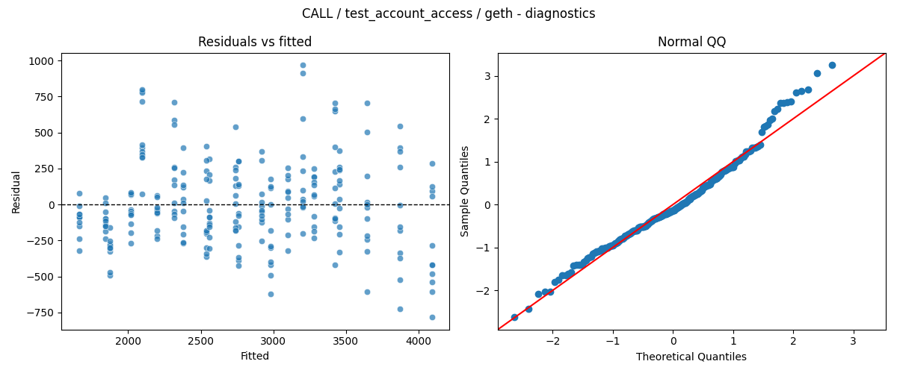

</details>

<details><summary>nethermind — NNLS regression summary</summary>

```
==============================================================================
                           NNLS Regression Results                            
==============================================================================
Dep. Variable:          test_runtime_ms              R-squared:          0.870
Model:                  NNLS                    Adj. R-squared:          0.869
No. Observations:       220                               RMSE:         263.18
Df Residuals:           217                                MAE:         201.26
Df Model:               2      
==============================================================================
                      coef     std err     P-value      [0.025      0.975]
------------------------------------------------------------------------------
         const    556.4387     63.8623       0.001    435.1603    688.9276
       opcount      0.0293      0.0010       0.001      0.0272      0.0315
        update      0.0149      0.0021       0.001      0.0106      0.0188
==============================================================================
Notes: Non-negative least squares with bootstrap inference (1000 iterations)
==============================================================================
```

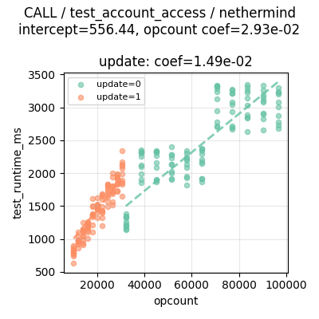

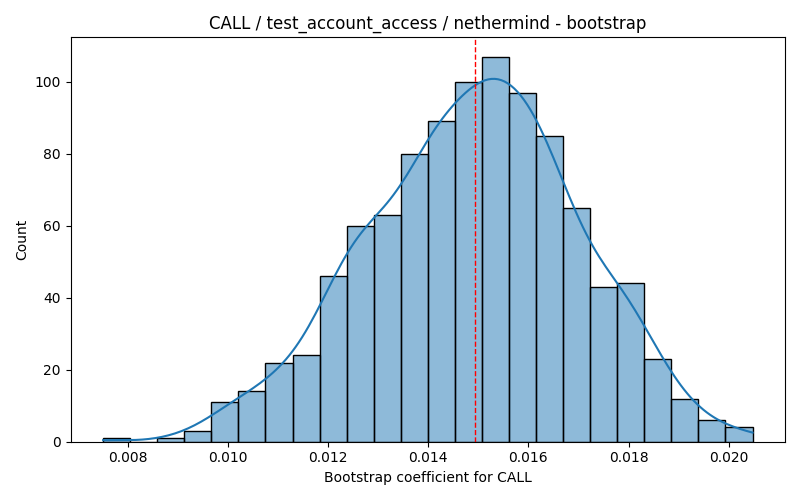

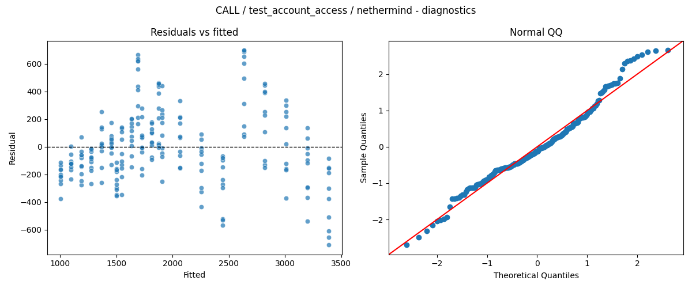

</details>

<details><summary>reth — NNLS regression summary</summary>

```
==============================================================================
                           NNLS Regression Results                            
==============================================================================
Dep. Variable:          test_runtime_ms              R-squared:          0.946
Model:                  NNLS                    Adj. R-squared:          0.945
No. Observations:       396                               RMSE:         277.66
Df Residuals:           393                                MAE:         170.05
Df Model:               2      
==============================================================================
                      coef     std err     P-value      [0.025      0.975]
------------------------------------------------------------------------------
         const    586.9352     56.0109       0.001    477.6238    691.2325
       opcount      0.0306      0.0010       0.001      0.0289      0.0324
        update      0.1396      0.0016       0.001      0.1367      0.1427
==============================================================================
Notes: Non-negative least squares with bootstrap inference (1000 iterations)
==============================================================================
```

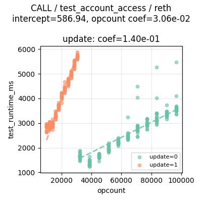

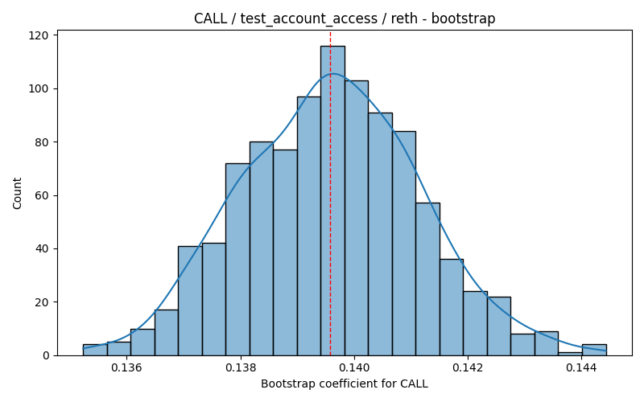

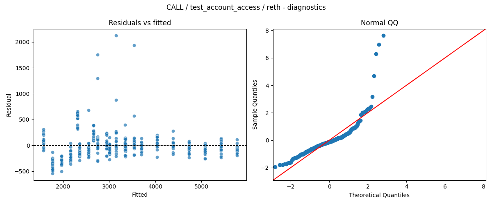

</details>

### test_account_access — combo `CALL_AccountMode.NON_EXISTING_ACCOUNT` — `presets[cold_account_code_access]`

| client | nobs | R² | target_coef (ms) | p-value | 95% CI |
| --- | --- | --- | --- | --- | --- |
| `besu` | 374 | 0.9835 | 0.01282 | 1.00e-03 | [0.01249, 0.01317] |
| `erigon` | 154 | 0.9792 | 0.009771 | 1.00e-03 | [0.009529, 0.01001] |
| `geth` | 242 | 0.9505 | 0.03724 | 1.00e-03 | [0.03619, 0.03837] |
| `nethermind` | 220 | 0.972 | 0.005077 | 1.00e-03 | [0.004837, 0.005328] |
| `reth` | 396 | 0.2786 | 0.000598 | 1.00e-03 | [0.0004686, 0.0007181] |

<details><summary>besu — NNLS regression summary</summary>

```
==============================================================================
                           NNLS Regression Results                            
==============================================================================
Dep. Variable:          test_runtime_ms              R-squared:          0.983
Model:                  NNLS                    Adj. R-squared:          0.983
No. Observations:       374                               RMSE:          65.49
Df Residuals:           371                                MAE:          50.62
Df Model:               2      
==============================================================================
                      coef     std err     P-value      [0.025      0.975]
------------------------------------------------------------------------------
         const    391.6893     12.9792       0.001    365.0126    415.5931
       opcount      0.0128      0.0002       0.001      0.0125      0.0132
        update      0.0341      0.0111       0.002      0.0136      0.0569
==============================================================================
Notes: Non-negative least squares with bootstrap inference (1000 iterations)
==============================================================================
```


</details>

<details><summary>erigon — NNLS regression summary</summary>

```
==============================================================================
                           NNLS Regression Results                            
==============================================================================
Dep. Variable:          test_runtime_ms              R-squared:          0.979
Model:                  NNLS                    Adj. R-squared:          0.979
No. Observations:       154                               RMSE:          39.67
Df Residuals:           151                                MAE:          28.42
Df Model:               2      
==============================================================================
                      coef     std err     P-value      [0.025      0.975]
------------------------------------------------------------------------------
         const     42.0091     10.2827       0.001     22.2325     61.4354
       opcount      0.0098      0.0001       0.001      0.0095      0.0100
        update      0.3016      0.0119       0.001      0.2798      0.3238
==============================================================================
Notes: Non-negative least squares with bootstrap inference (1000 iterations)
==============================================================================
```


</details>

<details><summary>geth — NNLS regression summary</summary>

```
==============================================================================
                           NNLS Regression Results                            
==============================================================================
Dep. Variable:          test_runtime_ms              R-squared:          0.950
Model:                  NNLS                    Adj. R-squared:          0.950
No. Observations:       242                               RMSE:         345.64
Df Residuals:           239                                MAE:         231.45
Df Model:               2      
==============================================================================
                      coef     std err     P-value      [0.025      0.975]
------------------------------------------------------------------------------
         const    228.1775     17.5364       0.001    195.7660    264.5452
       opcount      0.0372      0.0006       0.001      0.0362      0.0384
        update      0.0000      0.0000       1.000      0.0000      0.0000
==============================================================================
Notes: Non-negative least squares with bootstrap inference (1000 iterations)
==============================================================================
```


</details>

<details><summary>nethermind — NNLS regression summary</summary>

```
==============================================================================
                           NNLS Regression Results                            
==============================================================================
Dep. Variable:          test_runtime_ms              R-squared:          0.972
Model:                  NNLS                    Adj. R-squared:          0.972
No. Observations:       220                               RMSE:          33.58
Df Residuals:           217                                MAE:          25.12
Df Model:               2      
==============================================================================
                      coef     std err     P-value      [0.025      0.975]
------------------------------------------------------------------------------
         const     60.7584      7.7376       0.001     45.6705     75.9137
       opcount      0.0051      0.0001       0.001      0.0048      0.0053
        update      0.0184      0.0068       0.005      0.0048      0.0314
==============================================================================
Notes: Non-negative least squares with bootstrap inference (1000 iterations)
==============================================================================
```


</details>

<details><summary>reth — NNLS regression summary</summary>

```
==============================================================================
                           NNLS Regression Results                            
==============================================================================
Dep. Variable:          test_runtime_ms              R-squared:          0.279
Model:                  NNLS                    Adj. R-squared:          0.275
No. Observations:       396                               RMSE:          21.91
Df Residuals:           393                                MAE:          15.17
Df Model:               2      
==============================================================================
                      coef     std err     P-value      [0.025      0.975]
------------------------------------------------------------------------------
         const     64.0840      5.4807       0.001     54.0982     75.1707
       opcount      0.0006      0.0001       0.001      0.0005      0.0007
        update      0.0343      0.0042       0.001      0.0261      0.0421
==============================================================================
Notes: Non-negative least squares with bootstrap inference (1000 iterations)
==============================================================================
```


</details>

### test_ext_account_query_warm — combo `CALL`

| client | nobs | R² | target_coef (ms) | p-value | 95% CI |
| --- | --- | --- | --- | --- | --- |
| `besu` | 187 | 0.7946 | 0.0006022 | 1.00e-03 | [0.0005583, 0.0006481] |
| `erigon` | 77 | 0.9611 | 0.0004914 | 1.00e-03 | [0.0004687, 0.0005133] |
| `geth` | 121 | 0.865 | 0.0001328 | 1.00e-03 | [0.000124, 0.0001418] |
| `nethermind` | 110 | 0.4309 | 0.0006086 | 1.00e-03 | [0.0004734, 0.0007377] |
| `reth` | 198 | 0.9012 | 5.125e-05 | 1.00e-03 | [4.846e-05, 5.4e-05] |

<details><summary>besu — NNLS regression summary</summary>

```
==============================================================================
                           NNLS Regression Results                            
==============================================================================
Dep. Variable:          test_runtime_ms              R-squared:          0.795
Model:                  NNLS                    Adj. R-squared:          0.794
No. Observations:       187                               RMSE:         154.69
Df Residuals:           185                                MAE:         125.65
Df Model:               1      
==============================================================================
                      coef     std err     P-value      [0.025      0.975]
------------------------------------------------------------------------------
         const    711.8528     35.9142       0.001    640.6068    780.4647
       opcount      0.0006      0.0000       0.001      0.0006      0.0006
==============================================================================
Notes: Non-negative least squares with bootstrap inference (1000 iterations)
==============================================================================
```

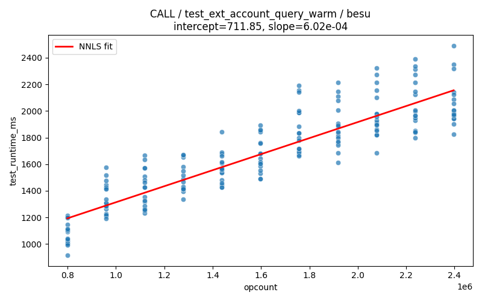

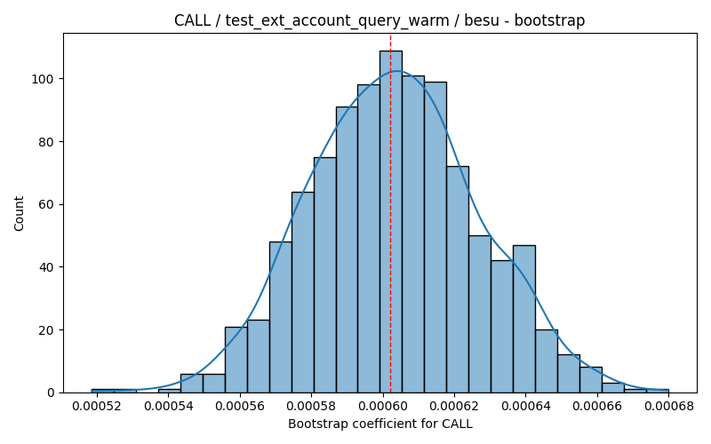

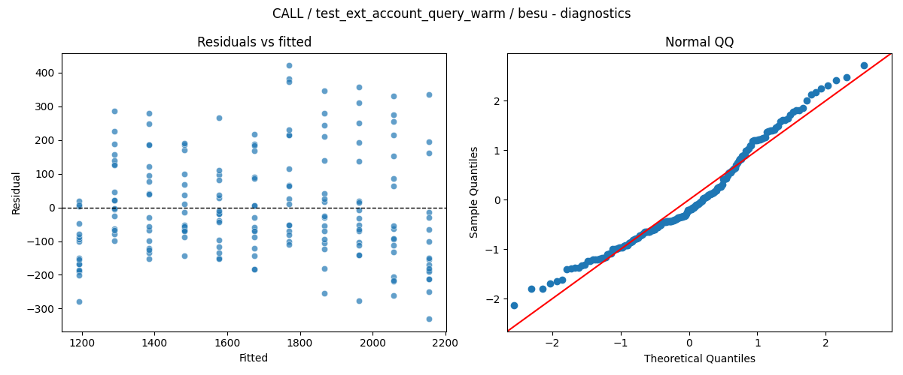

</details>

<details><summary>erigon — NNLS regression summary</summary>

```
==============================================================================
                           NNLS Regression Results                            
==============================================================================
Dep. Variable:          test_runtime_ms              R-squared:          0.961
Model:                  NNLS                    Adj. R-squared:          0.961
No. Observations:       77                                RMSE:          49.95
Df Residuals:           75                                 MAE:          36.87
Df Model:               1      
==============================================================================
                      coef     std err     P-value      [0.025      0.975]
------------------------------------------------------------------------------
         const     51.6513     18.9567       0.003     14.8783     89.2697
       opcount      0.0005      0.0000       0.001      0.0005      0.0005
==============================================================================
Notes: Non-negative least squares with bootstrap inference (1000 iterations)
==============================================================================
```

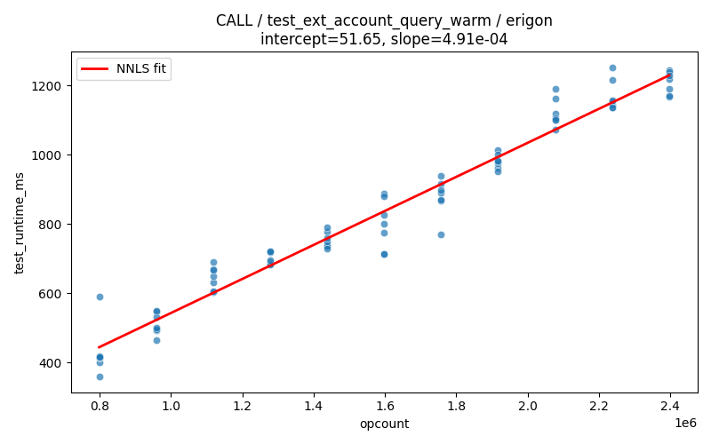

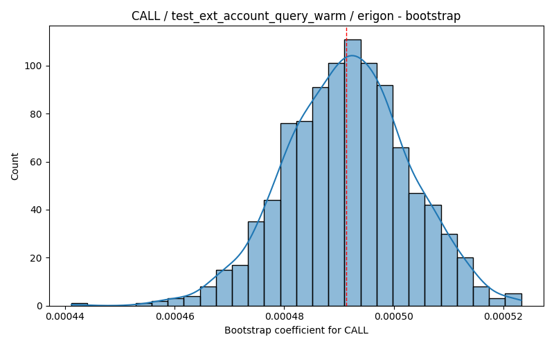

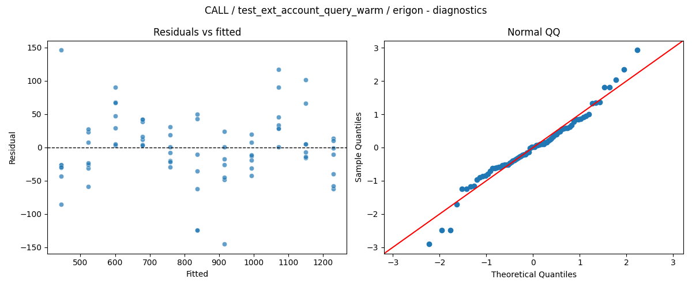

</details>

<details><summary>geth — NNLS regression summary</summary>

```
==============================================================================
                           NNLS Regression Results                            
==============================================================================
Dep. Variable:          test_runtime_ms              R-squared:          0.865
Model:                  NNLS                    Adj. R-squared:          0.864
No. Observations:       121                               RMSE:          26.51
Df Residuals:           119                                MAE:          21.55
Df Model:               1      
==============================================================================
                      coef     std err     P-value      [0.025      0.975]
------------------------------------------------------------------------------
         const     41.1520      6.9882       0.001     27.7596     54.4457
       opcount      0.0001      0.0000       0.001      0.0001      0.0001
==============================================================================
Notes: Non-negative least squares with bootstrap inference (1000 iterations)
==============================================================================
```

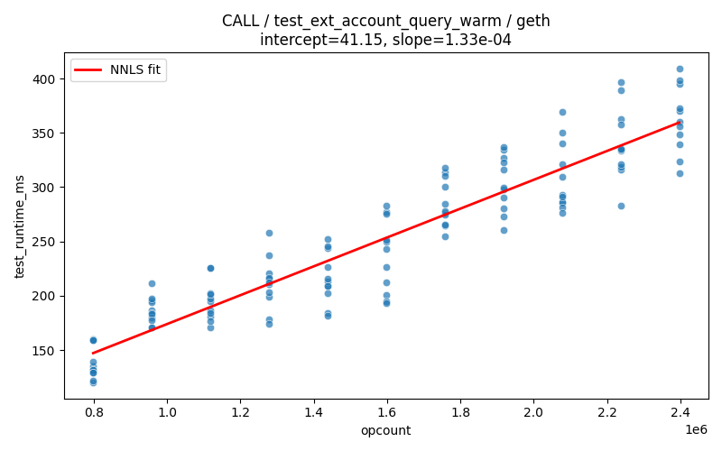

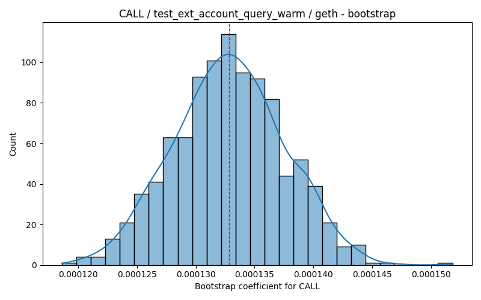

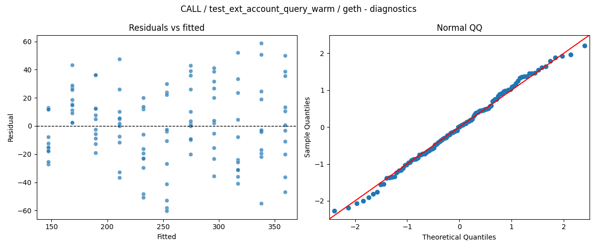

</details>

<details><summary>nethermind — NNLS regression summary</summary>

```
==============================================================================
                           NNLS Regression Results                            
==============================================================================
Dep. Variable:          test_runtime_ms              R-squared:          0.431
Model:                  NNLS                    Adj. R-squared:          0.426
No. Observations:       110                               RMSE:         353.37
Df Residuals:           108                                MAE:         322.38
Df Model:               1      
==============================================================================
                      coef     std err     P-value      [0.025      0.975]
------------------------------------------------------------------------------
         const    271.4757     98.8744       0.003     76.0392    465.0344
       opcount      0.0006      0.0001       0.001      0.0005      0.0007
==============================================================================
Notes: Non-negative least squares with bootstrap inference (1000 iterations)
==============================================================================
```

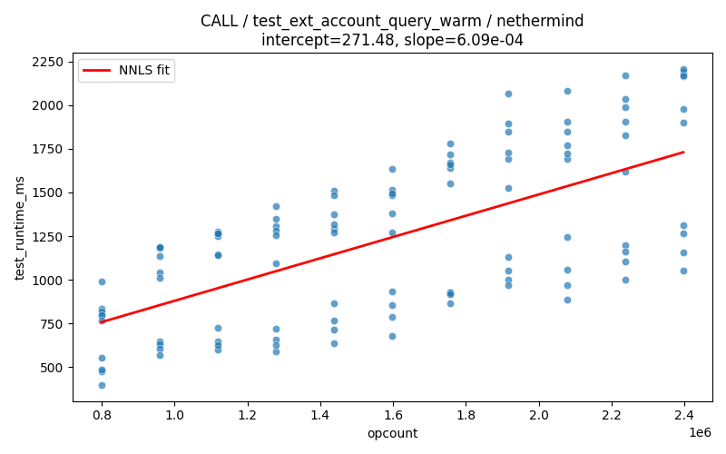


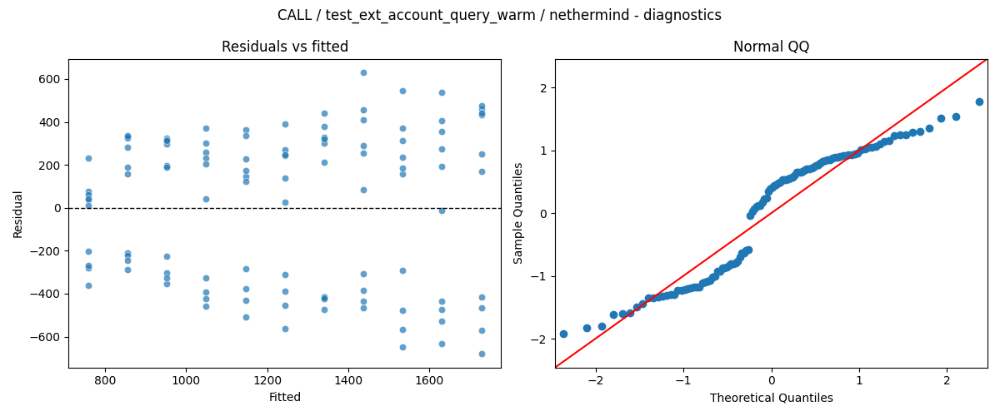

</details>

<details><summary>reth — NNLS regression summary</summary>

```
==============================================================================
                           NNLS Regression Results                            
==============================================================================
Dep. Variable:          test_runtime_ms              R-squared:          0.901
Model:                  NNLS                    Adj. R-squared:          0.901
No. Observations:       198                               RMSE:           8.58
Df Residuals:           196                                MAE:           7.12
Df Model:               1      
==============================================================================
                      coef     std err     P-value      [0.025      0.975]
------------------------------------------------------------------------------
         const     16.0225      2.3081       0.001     11.6435     20.5824
       opcount      0.0001      0.0000       0.001      0.0000      0.0001
==============================================================================
Notes: Non-negative least squares with bootstrap inference (1000 iterations)
==============================================================================
```

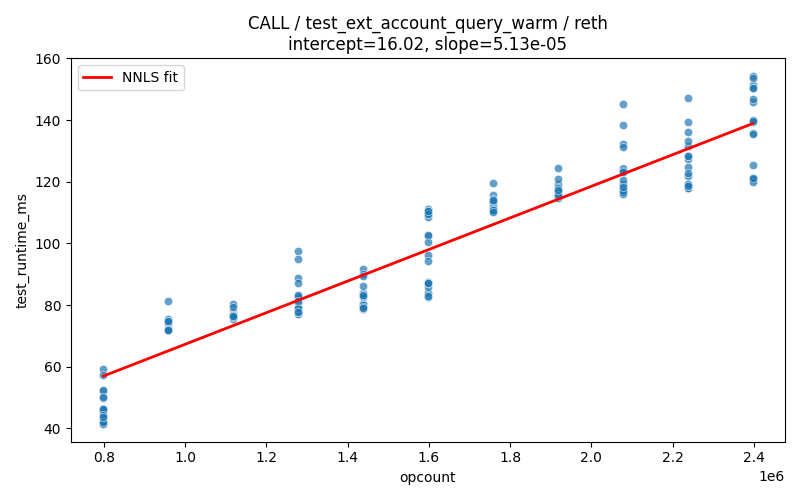

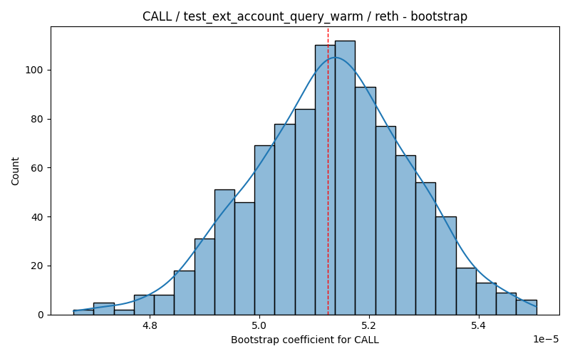

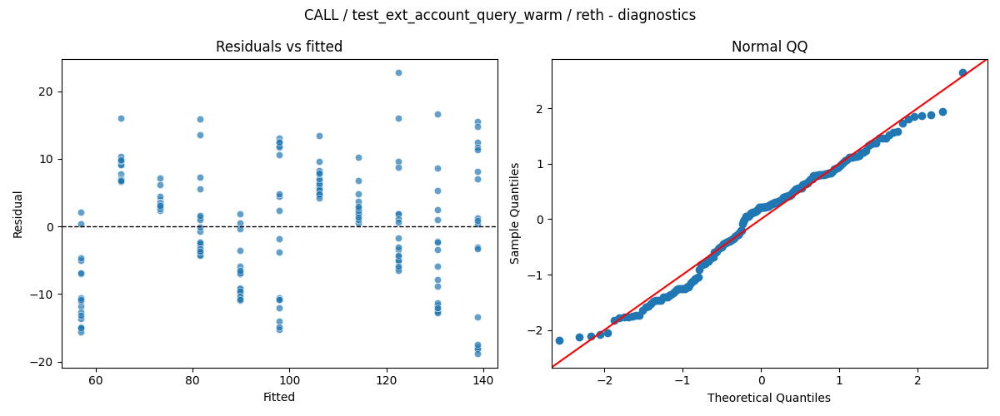

</details>

## CALLCODE

### test_account_access — combo `CALLCODE_AccountMode.EXISTING_EOA`

| client | nobs | R² | target_coef (ms) | p-value | 95% CI |
| --- | --- | --- | --- | --- | --- |
| `besu` | 374 | 0.9467 | 0.01414 | 1.00e-03 | [0.01388, 0.01441] |
| `erigon` | 154 | 0.9965 | 0.01048 | 1.00e-03 | [0.01043, 0.01052] |
| `geth` | 242 | 0.9453 | 0.01593 | 1.00e-03 | [0.01544, 0.01647] |
| `nethermind` | 220 | 0.9301 | 0.004786 | 1.00e-03 | [0.004558, 0.005059] |
| `reth` | 396 | 0.9801 | 0.001397 | 1.00e-03 | [0.001378, 0.001416] |

<details><summary>besu — NNLS regression summary</summary>

```
==============================================================================
                           NNLS Regression Results                            
==============================================================================
Dep. Variable:          test_runtime_ms              R-squared:          0.947
Model:                  NNLS                    Adj. R-squared:          0.946
No. Observations:       374                               RMSE:         107.60
Df Residuals:           371                                MAE:          72.34
Df Model:               2      
==============================================================================
                      coef     std err     P-value      [0.025      0.975]
------------------------------------------------------------------------------
         const    245.0615      8.2583       0.001    229.8040    262.1585
       opcount      0.0141      0.0001       0.001      0.0139      0.0144
        update      0.0000      0.0000       1.000      0.0000      0.0000
==============================================================================
Notes: Non-negative least squares with bootstrap inference (1000 iterations)
==============================================================================
```

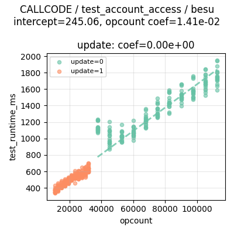


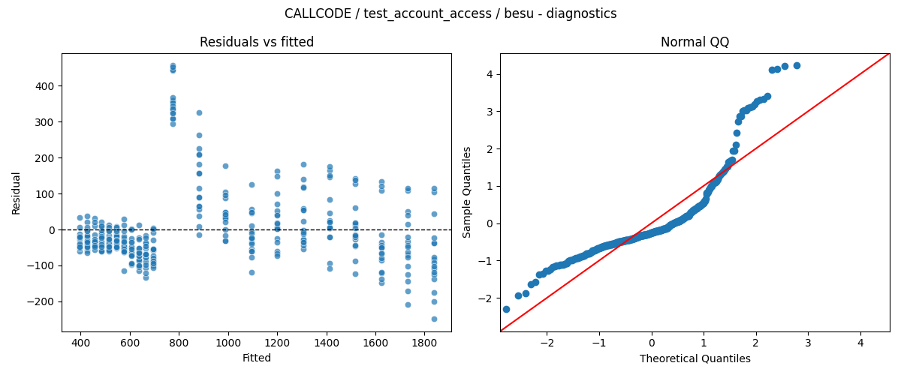

</details>

<details><summary>erigon — NNLS regression summary</summary>

```
==============================================================================
                           NNLS Regression Results                            
==============================================================================
Dep. Variable:          test_runtime_ms              R-squared:          0.996
Model:                  NNLS                    Adj. R-squared:          0.996
No. Observations:       154                               RMSE:          20.30
Df Residuals:           151                                MAE:          15.58
Df Model:               2      
==============================================================================
                      coef     std err     P-value      [0.025      0.975]
------------------------------------------------------------------------------
         const      0.0000      0.0000       1.000      0.0000      0.0000
       opcount      0.0105      0.0000       0.001      0.0104      0.0105
        update      0.0000      0.0000       1.000      0.0000      0.0000
==============================================================================
Notes: Non-negative least squares with bootstrap inference (1000 iterations)
==============================================================================
```

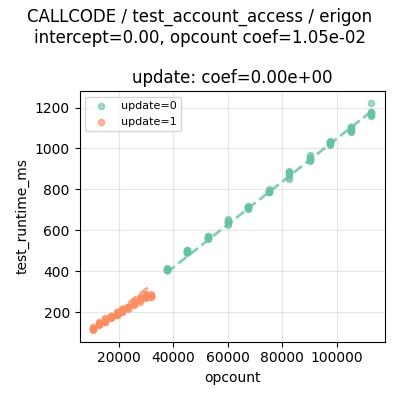


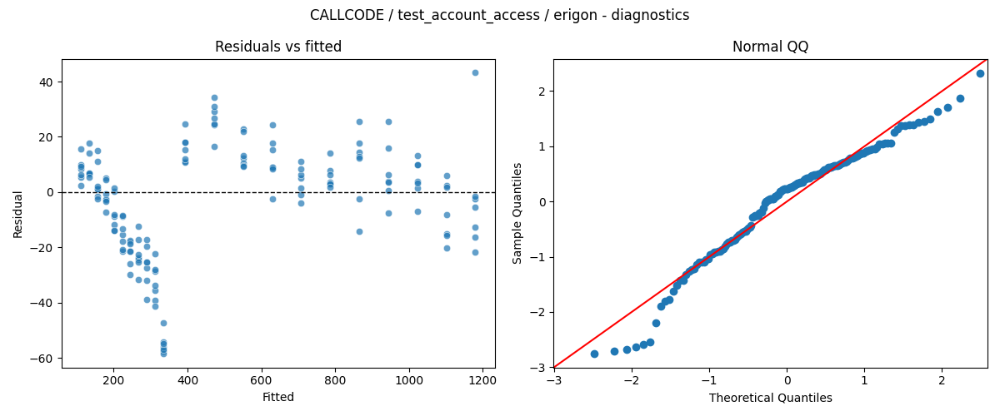

</details>

<details><summary>geth — NNLS regression summary</summary>

```
==============================================================================
                           NNLS Regression Results                            
==============================================================================
Dep. Variable:          test_runtime_ms              R-squared:          0.945
Model:                  NNLS                    Adj. R-squared:          0.945
No. Observations:       242                               RMSE:         122.87
Df Residuals:           239                                MAE:          93.56
Df Model:               2      
==============================================================================
                      coef     std err     P-value      [0.025      0.975]
------------------------------------------------------------------------------
         const    120.1849     12.7381       0.001     95.7890    144.4929
       opcount      0.0159      0.0003       0.001      0.0154      0.0165
        update      0.0000      0.0000       1.000      0.0000      0.0000
==============================================================================
Notes: Non-negative least squares with bootstrap inference (1000 iterations)
==============================================================================
```

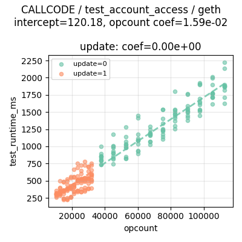


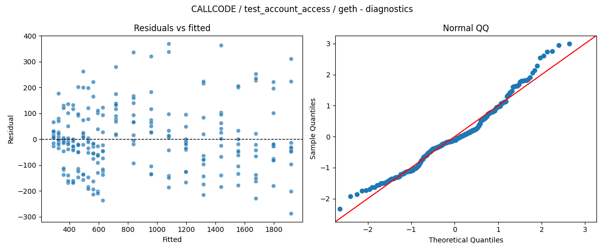

</details>

<details><summary>nethermind — NNLS regression summary</summary>

```
==============================================================================
                           NNLS Regression Results                            
==============================================================================
Dep. Variable:          test_runtime_ms              R-squared:          0.930
Model:                  NNLS                    Adj. R-squared:          0.929
No. Observations:       220                               RMSE:          42.07
Df Residuals:           217                                MAE:          30.48
Df Model:               2      
==============================================================================
                      coef     std err     P-value      [0.025      0.975]
------------------------------------------------------------------------------
         const     66.8243      4.6069       0.001     56.6327     74.7981
       opcount      0.0048      0.0001       0.001      0.0046      0.0051
        update      0.0000      0.0001       1.000      0.0000      0.0002
==============================================================================
Notes: Non-negative least squares with bootstrap inference (1000 iterations)
==============================================================================
```

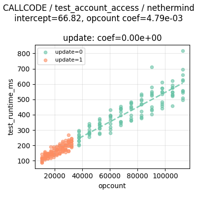

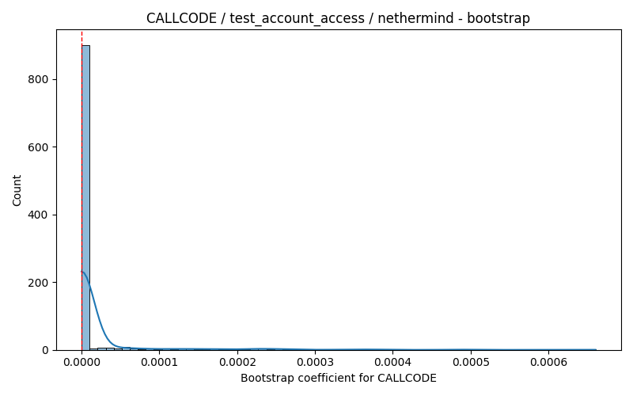

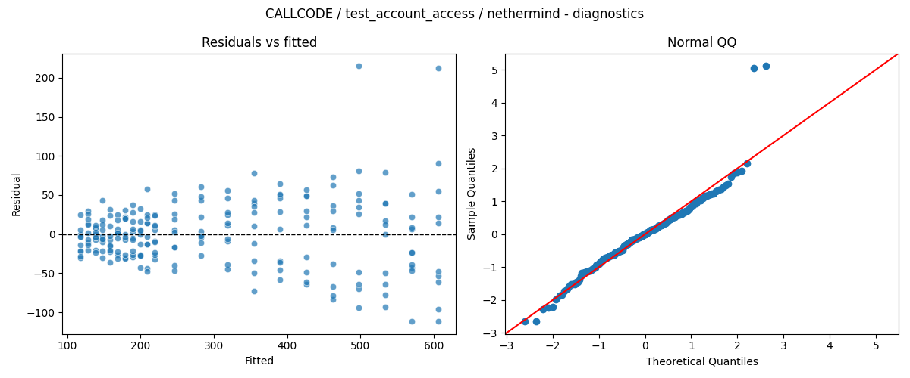

</details>

<details><summary>reth — NNLS regression summary</summary>

```
==============================================================================
                           NNLS Regression Results                            
==============================================================================
Dep. Variable:          test_runtime_ms              R-squared:          0.980
Model:                  NNLS                    Adj. R-squared:          0.980
No. Observations:       396                               RMSE:           6.38
Df Residuals:           393                                MAE:           4.93
Df Model:               2      
==============================================================================
                      coef     std err     P-value      [0.025      0.975]
------------------------------------------------------------------------------
         const      8.8439      0.4776       0.001      7.9514      9.8276
       opcount      0.0014      0.0000       0.001      0.0014      0.0014
        update      0.0000      0.0000       1.000      0.0000      0.0000
==============================================================================
Notes: Non-negative least squares with bootstrap inference (1000 iterations)
==============================================================================
```

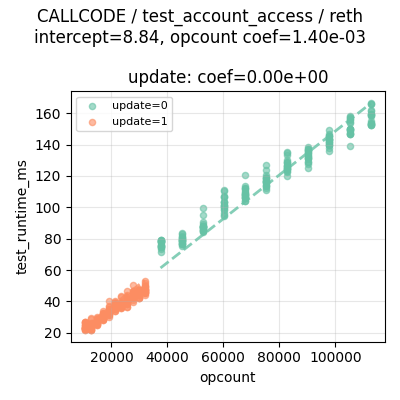


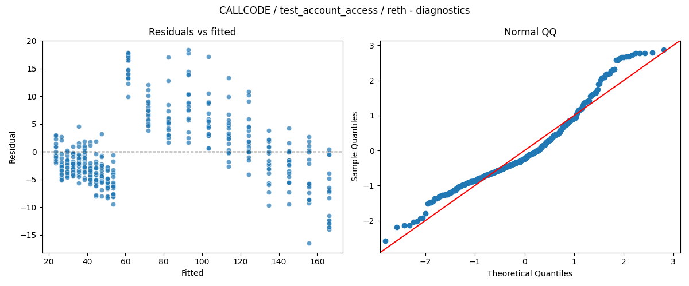

</details>

### test_account_access — combo `CALLCODE_AccountMode.NON_EXISTING_ACCOUNT` — `presets[cold_account_nocode_access]`

| client | nobs | R² | target_coef (ms) | p-value | 95% CI |
| --- | --- | --- | --- | --- | --- |
| `besu` | 374 | 0.9392 | 0.01535 | 1.00e-03 | [0.01507, 0.01566] |
| `erigon` | 154 | 0.9397 | 0.009297 | 1.00e-03 | [0.009136, 0.00942] |
| `geth` | 242 | 0.8819 | 0.03954 | 1.00e-03 | [0.03849, 0.04053] |
| `nethermind` | 220 | 0.9319 | 0.005508 | 1.00e-03 | [0.005373, 0.005638] |
| `reth` | 396 | 0.9095 | 0.001288 | 1.00e-03 | [0.001271, 0.001305] |

<details><summary>besu — NNLS regression summary</summary>

```
==============================================================================
                           NNLS Regression Results                            
==============================================================================
Dep. Variable:          test_runtime_ms              R-squared:          0.939
Model:                  NNLS                    Adj. R-squared:          0.939
No. Observations:       374                               RMSE:         125.33
Df Residuals:           371                                MAE:          99.16
Df Model:               2      
==============================================================================
                      coef     std err     P-value      [0.025      0.975]
------------------------------------------------------------------------------
         const     61.4517     11.0789       0.001     40.2237     84.6382
       opcount      0.0154      0.0002       0.001      0.0151      0.0157
        update      0.0000      0.0000       1.000      0.0000      0.0000
==============================================================================
Notes: Non-negative least squares with bootstrap inference (1000 iterations)
==============================================================================
```

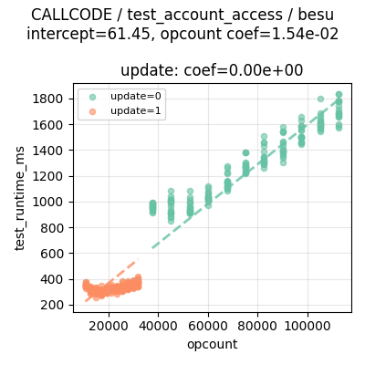


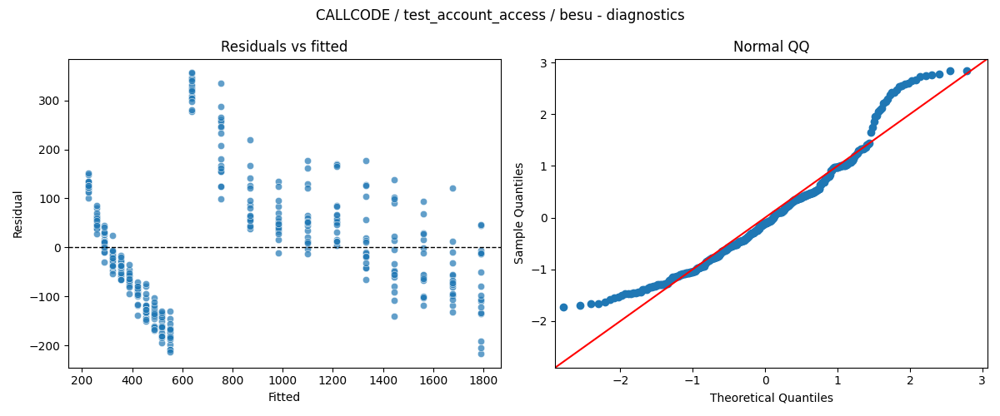

</details>

<details><summary>erigon — NNLS regression summary</summary>

```
==============================================================================
                           NNLS Regression Results                            
==============================================================================
Dep. Variable:          test_runtime_ms              R-squared:          0.940
Model:                  NNLS                    Adj. R-squared:          0.939
No. Observations:       154                               RMSE:          88.05
Df Residuals:           151                                MAE:          70.71
Df Model:               2      
==============================================================================
                      coef     std err     P-value      [0.025      0.975]
------------------------------------------------------------------------------
         const      0.0000      0.0000       1.000      0.0000      0.0000
       opcount      0.0093      0.0001       0.001      0.0091      0.0094
        update      0.0000      0.0000       1.000      0.0000      0.0000
==============================================================================
Notes: Non-negative least squares with bootstrap inference (1000 iterations)
==============================================================================
```


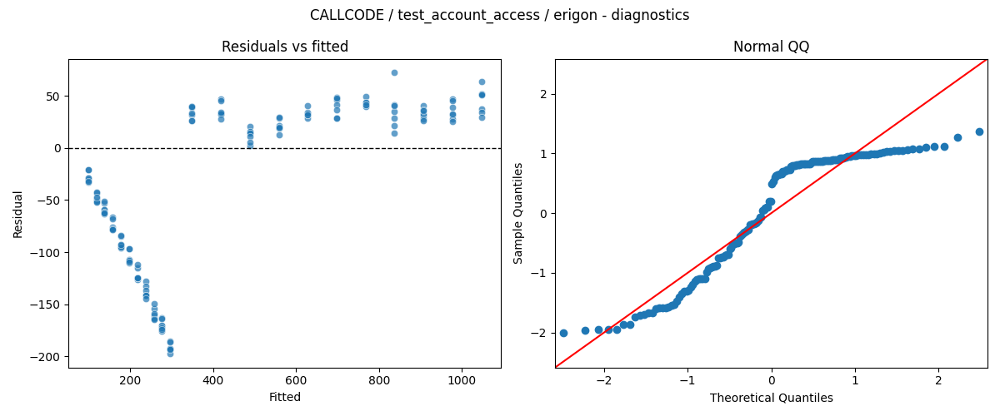

</details>

<details><summary>geth — NNLS regression summary</summary>

```
==============================================================================
                           NNLS Regression Results                            
==============================================================================
Dep. Variable:          test_runtime_ms              R-squared:          0.882
Model:                  NNLS                    Adj. R-squared:          0.881
No. Observations:       242                               RMSE:         475.38
Df Residuals:           239                                MAE:         367.15
Df Model:               2      
==============================================================================
                      coef     std err     P-value      [0.025      0.975]
------------------------------------------------------------------------------
         const      0.0000      9.0207       1.000      0.0000     29.4921
       opcount      0.0395      0.0005       0.001      0.0385      0.0405
        update      0.0000      0.0000       1.000      0.0000      0.0000
==============================================================================
Notes: Non-negative least squares with bootstrap inference (1000 iterations)
==============================================================================
```

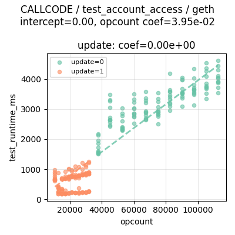


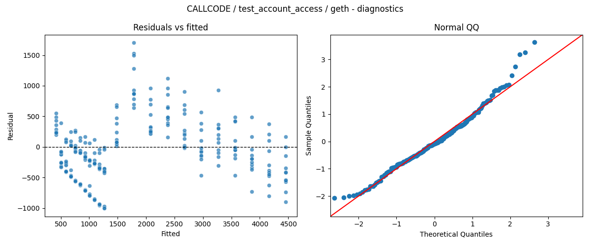

</details>

<details><summary>nethermind — NNLS regression summary</summary>

```
==============================================================================
                           NNLS Regression Results                            
==============================================================================
Dep. Variable:          test_runtime_ms              R-squared:          0.932
Model:                  NNLS                    Adj. R-squared:          0.931
No. Observations:       220                               RMSE:          49.13
Df Residuals:           217                                MAE:          38.73
Df Model:               2      
==============================================================================
                      coef     std err     P-value      [0.025      0.975]
------------------------------------------------------------------------------
         const      0.0000      0.1191       1.000      0.0000      0.0000
       opcount      0.0055      0.0001       0.001      0.0054      0.0056
        update      0.0000      0.0000       1.000      0.0000      0.0000
==============================================================================
Notes: Non-negative least squares with bootstrap inference (1000 iterations)
==============================================================================
```

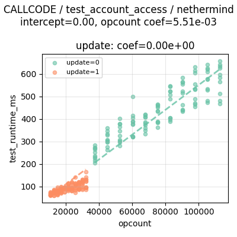

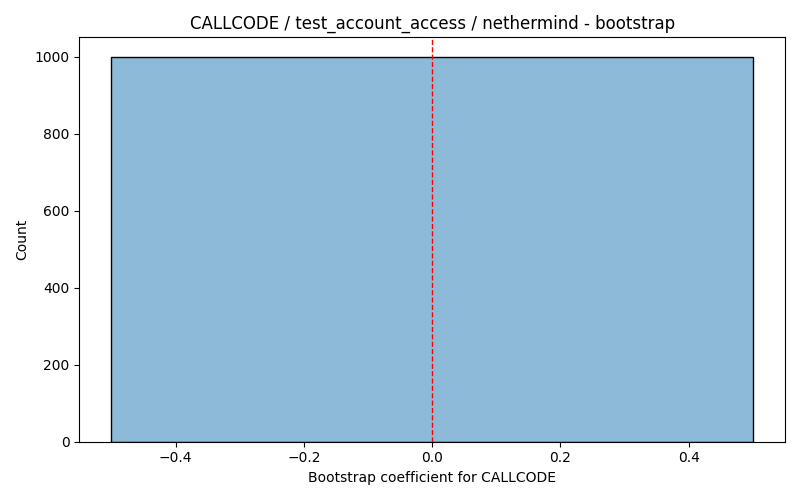

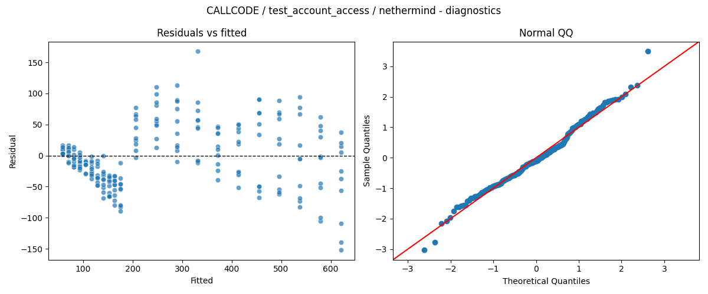

</details>

<details><summary>reth — NNLS regression summary</summary>

```
==============================================================================
                           NNLS Regression Results                            
==============================================================================
Dep. Variable:          test_runtime_ms              R-squared:          0.910
Model:                  NNLS                    Adj. R-squared:          0.909
No. Observations:       396                               RMSE:          14.80
Df Residuals:           393                                MAE:          12.89
Df Model:               2      
==============================================================================
                      coef     std err     P-value      [0.025      0.975]
------------------------------------------------------------------------------
         const      0.0000      0.0000       1.000      0.0000      0.0000
       opcount      0.0013      0.0000       0.001      0.0013      0.0013
        update      0.0000      0.0000       1.000      0.0000      0.0000
==============================================================================
Notes: Non-negative least squares with bootstrap inference (1000 iterations)
==============================================================================
```

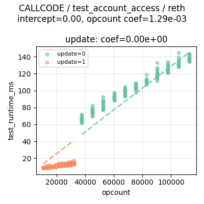


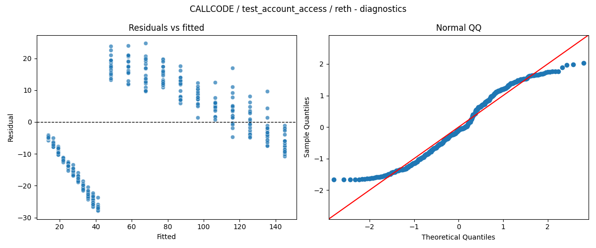

</details>

### test_account_access — combo `CALLCODE_AccountMode.EXISTING_CONTRACT`

| client | nobs | R² | target_coef (ms) | p-value | 95% CI |
| --- | --- | --- | --- | --- | --- |
| `besu` | 374 | 0.9714 | 0.03276 | 1.00e-03 | [0.03235, 0.03316] |
| `erigon` | 154 | 0.9587 | 0.1021 | 1.00e-03 | [0.0996, 0.1051] |
| `geth` | 242 | 0.9133 | 0.03897 | 1.00e-03 | [0.03752, 0.04057] |
| `nethermind` | 220 | 0.9058 | 0.03354 | 1.00e-03 | [0.03217, 0.03514] |
| `reth` | 396 | 0.9087 | 0.03684 | 1.00e-03 | [0.03641, 0.03731] |

<details><summary>besu — NNLS regression summary</summary>

```
==============================================================================
                           NNLS Regression Results                            
==============================================================================
Dep. Variable:          test_runtime_ms              R-squared:          0.971
Model:                  NNLS                    Adj. R-squared:          0.971
No. Observations:       374                               RMSE:         150.16
Df Residuals:           371                                MAE:         114.71
Df Model:               2      
==============================================================================
                      coef     std err     P-value      [0.025      0.975]
------------------------------------------------------------------------------
         const     99.8977     12.6992       0.001     75.0387    125.0248
       opcount      0.0328      0.0002       0.001      0.0323      0.0332
        update      0.0000      0.0000       1.000      0.0000      0.0000
==============================================================================
Notes: Non-negative least squares with bootstrap inference (1000 iterations)
==============================================================================
```

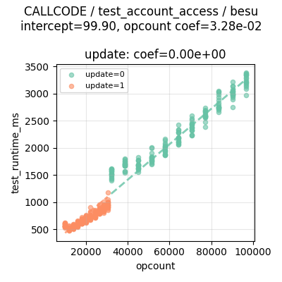


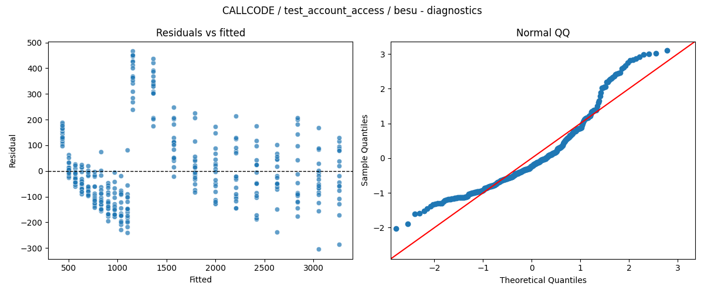

</details>

<details><summary>erigon — NNLS regression summary</summary>

```
==============================================================================
                           NNLS Regression Results                            
==============================================================================
Dep. Variable:          test_runtime_ms              R-squared:          0.959
Model:                  NNLS                    Adj. R-squared:          0.958
No. Observations:       154                               RMSE:         565.84
Df Residuals:           151                                MAE:         394.13
Df Model:               2      
==============================================================================
                      coef     std err     P-value      [0.025      0.975]
------------------------------------------------------------------------------
         const    296.6941     53.1604       0.001    189.7469    399.1606
       opcount      0.1021      0.0014       0.001      0.0996      0.1051
        update      0.0000      0.0000       1.000      0.0000      0.0000
==============================================================================
Notes: Non-negative least squares with bootstrap inference (1000 iterations)
==============================================================================
```

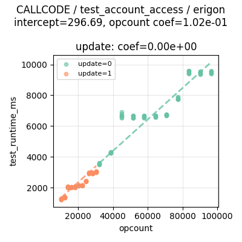

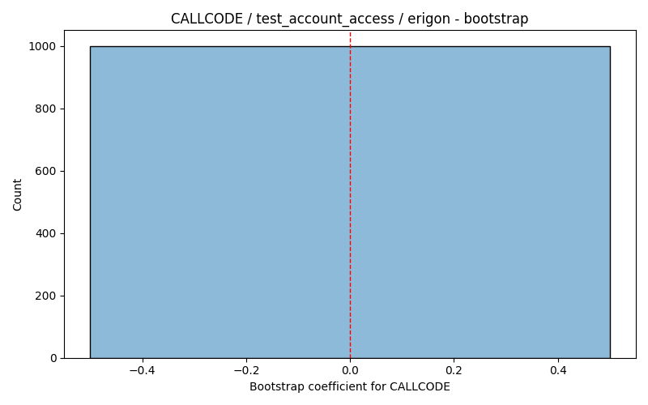

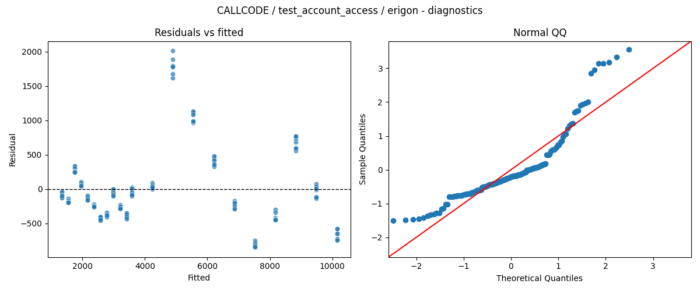

</details>

<details><summary>geth — NNLS regression summary</summary>

```
==============================================================================
                           NNLS Regression Results                            
==============================================================================
Dep. Variable:          test_runtime_ms              R-squared:          0.913
Model:                  NNLS                    Adj. R-squared:          0.913
No. Observations:       242                               RMSE:         320.52
Df Residuals:           239                                MAE:         238.61
Df Model:               2      
==============================================================================
                      coef     std err     P-value      [0.025      0.975]
------------------------------------------------------------------------------
         const    302.6313     31.0003       0.001    243.8778    366.9350
       opcount      0.0390      0.0008       0.001      0.0375      0.0406
        update      0.0000      0.0000       1.000      0.0000      0.0000
==============================================================================
Notes: Non-negative least squares with bootstrap inference (1000 iterations)
==============================================================================
```

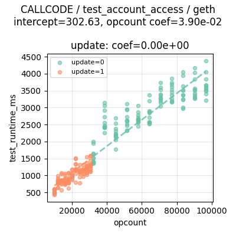


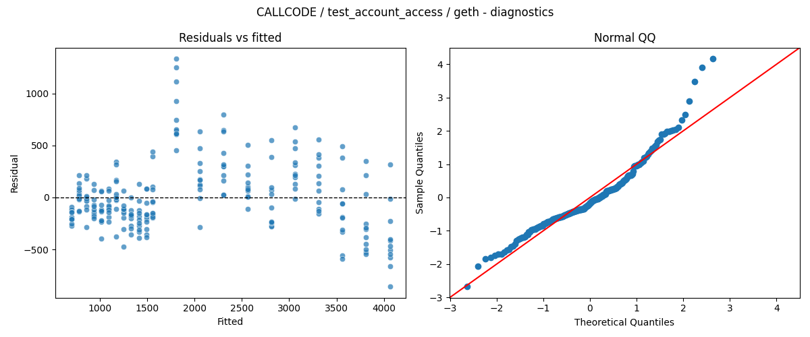

</details>

<details><summary>nethermind — NNLS regression summary</summary>

```
==============================================================================
                           NNLS Regression Results                            
==============================================================================
Dep. Variable:          test_runtime_ms              R-squared:          0.906
Model:                  NNLS                    Adj. R-squared:          0.905
No. Observations:       220                               RMSE:         288.66
Df Residuals:           217                                MAE:         207.42
Df Model:               2      
==============================================================================
                      coef     std err     P-value      [0.025      0.975]
------------------------------------------------------------------------------
         const    244.4966     27.7541       0.001    187.2366    298.0201
       opcount      0.0335      0.0008       0.001      0.0322      0.0351
        update      0.0000      0.0000       1.000      0.0000      0.0000
==============================================================================
Notes: Non-negative least squares with bootstrap inference (1000 iterations)
==============================================================================
```

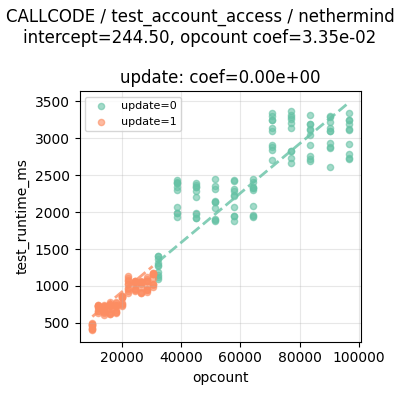


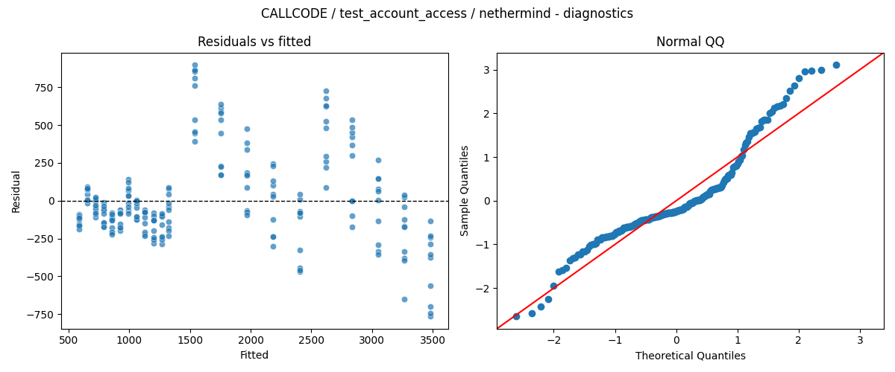

</details>

<details><summary>reth — NNLS regression summary</summary>

```
==============================================================================
                           NNLS Regression Results                            
==============================================================================
Dep. Variable:          test_runtime_ms              R-squared:          0.909
Model:                  NNLS                    Adj. R-squared:          0.908
No. Observations:       396                               RMSE:         345.61
Df Residuals:           393                                MAE:         273.55
Df Model:               2      
==============================================================================
                      coef     std err     P-value      [0.025      0.975]
------------------------------------------------------------------------------
         const      0.0000      0.0000       1.000      0.0000      0.0000
       opcount      0.0368      0.0002       0.001      0.0364      0.0373
        update      0.0000      0.0000       1.000      0.0000      0.0000
==============================================================================
Notes: Non-negative least squares with bootstrap inference (1000 iterations)
==============================================================================
```

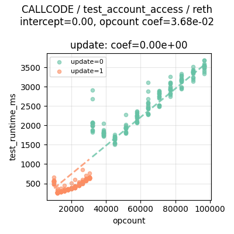


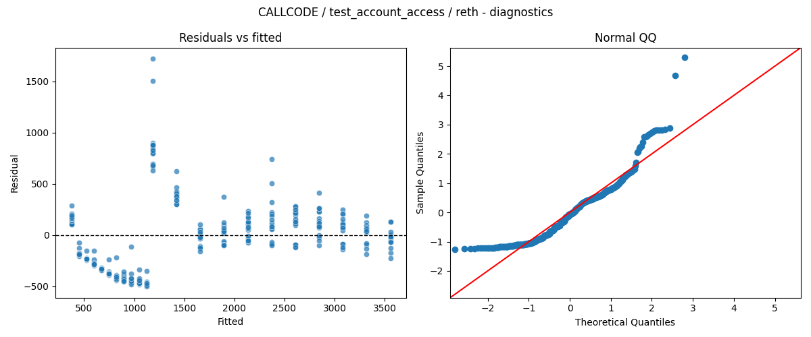

</details>

### test_account_access — combo `CALLCODE_AccountMode.NON_EXISTING_ACCOUNT` — `presets[cold_account_code_access]`

| client | nobs | R² | target_coef (ms) | p-value | 95% CI |
| --- | --- | --- | --- | --- | --- |
| `besu` | 374 | 0.9392 | 0.01535 | 1.00e-03 | [0.01507, 0.01566] |
| `erigon` | 154 | 0.9397 | 0.009297 | 1.00e-03 | [0.009136, 0.00942] |
| `geth` | 242 | 0.8819 | 0.03954 | 1.00e-03 | [0.03849, 0.04053] |
| `nethermind` | 220 | 0.9319 | 0.005508 | 1.00e-03 | [0.005373, 0.005638] |
| `reth` | 396 | 0.9095 | 0.001288 | 1.00e-03 | [0.001271, 0.001305] |

<details><summary>besu — NNLS regression summary</summary>

```
==============================================================================
                           NNLS Regression Results                            
==============================================================================
Dep. Variable:          test_runtime_ms              R-squared:          0.939
Model:                  NNLS                    Adj. R-squared:          0.939
No. Observations:       374                               RMSE:         125.33
Df Residuals:           371                                MAE:          99.16
Df Model:               2      
==============================================================================
                      coef     std err     P-value      [0.025      0.975]
------------------------------------------------------------------------------
         const     61.4517     11.0789       0.001     40.2237     84.6382
       opcount      0.0154      0.0002       0.001      0.0151      0.0157
        update      0.0000      0.0000       1.000      0.0000      0.0000
==============================================================================
Notes: Non-negative least squares with bootstrap inference (1000 iterations)
==============================================================================
```


</details>

<details><summary>erigon — NNLS regression summary</summary>

```
==============================================================================
                           NNLS Regression Results                            
==============================================================================
Dep. Variable:          test_runtime_ms              R-squared:          0.940
Model:                  NNLS                    Adj. R-squared:          0.939
No. Observations:       154                               RMSE:          88.05
Df Residuals:           151                                MAE:          70.71
Df Model:               2      
==============================================================================
                      coef     std err     P-value      [0.025      0.975]
------------------------------------------------------------------------------
         const      0.0000      0.0000       1.000      0.0000      0.0000
       opcount      0.0093      0.0001       0.001      0.0091      0.0094
        update      0.0000      0.0000       1.000      0.0000      0.0000
==============================================================================
Notes: Non-negative least squares with bootstrap inference (1000 iterations)
==============================================================================
```


</details>

<details><summary>geth — NNLS regression summary</summary>

```
==============================================================================
                           NNLS Regression Results                            
==============================================================================
Dep. Variable:          test_runtime_ms              R-squared:          0.882
Model:                  NNLS                    Adj. R-squared:          0.881
No. Observations:       242                               RMSE:         475.38
Df Residuals:           239                                MAE:         367.15
Df Model:               2      
==============================================================================
                      coef     std err     P-value      [0.025      0.975]
------------------------------------------------------------------------------
         const      0.0000      9.0207       1.000      0.0000     29.4921
       opcount      0.0395      0.0005       0.001      0.0385      0.0405
        update      0.0000      0.0000       1.000      0.0000      0.0000
==============================================================================
Notes: Non-negative least squares with bootstrap inference (1000 iterations)
==============================================================================
```


</details>

<details><summary>nethermind — NNLS regression summary</summary>

```
==============================================================================
                           NNLS Regression Results                            
==============================================================================
Dep. Variable:          test_runtime_ms              R-squared:          0.932
Model:                  NNLS                    Adj. R-squared:          0.931
No. Observations:       220                               RMSE:          49.13
Df Residuals:           217                                MAE:          38.73
Df Model:               2      
==============================================================================
                      coef     std err     P-value      [0.025      0.975]
------------------------------------------------------------------------------
         const      0.0000      0.1191       1.000      0.0000      0.0000
       opcount      0.0055      0.0001       0.001      0.0054      0.0056
        update      0.0000      0.0000       1.000      0.0000      0.0000
==============================================================================
Notes: Non-negative least squares with bootstrap inference (1000 iterations)
==============================================================================
```


</details>

<details><summary>reth — NNLS regression summary</summary>

```
==============================================================================
                           NNLS Regression Results                            
==============================================================================
Dep. Variable:          test_runtime_ms              R-squared:          0.910
Model:                  NNLS                    Adj. R-squared:          0.909
No. Observations:       396                               RMSE:          14.80
Df Residuals:           393                                MAE:          12.89
Df Model:               2      
==============================================================================
                      coef     std err     P-value      [0.025      0.975]
------------------------------------------------------------------------------
         const      0.0000      0.0000       1.000      0.0000      0.0000
       opcount      0.0013      0.0000       0.001      0.0013      0.0013
        update      0.0000      0.0000       1.000      0.0000      0.0000
==============================================================================
Notes: Non-negative least squares with bootstrap inference (1000 iterations)
==============================================================================
```


</details>

### test_ext_account_query_warm — combo `CALLCODE`

| client | nobs | R² | target_coef (ms) | p-value | 95% CI |
| --- | --- | --- | --- | --- | --- |
| `besu` | 187 | 0.8109 | 0.0006122 | 1.00e-03 | [0.0005659, 0.0006607] |
| `erigon` | 77 | 0.9428 | 0.0002626 | 1.00e-03 | [0.0002465, 0.000278] |
| `geth` | 121 | 0.863 | 0.0001808 | 1.00e-03 | [0.0001682, 0.0001943] |
| `nethermind` | 110 | 0.2475 | 0.0005551 | 1.00e-03 | [0.0003648, 0.0007142] |
| `reth` | 198 | 0.9123 | 4.766e-05 | 1.00e-03 | [4.541e-05, 4.979e-05] |

<details><summary>besu — NNLS regression summary</summary>

```
==============================================================================
                           NNLS Regression Results                            
==============================================================================
Dep. Variable:          test_runtime_ms              R-squared:          0.811
Model:                  NNLS                    Adj. R-squared:          0.810
No. Observations:       187                               RMSE:         149.35
Df Residuals:           185                                MAE:         120.65
Df Model:               1      
==============================================================================
                      coef     std err     P-value      [0.025      0.975]
------------------------------------------------------------------------------
         const    699.4983     37.2262       0.001    623.5170    775.0190
       opcount      0.0006      0.0000       0.001      0.0006      0.0007
==============================================================================
Notes: Non-negative least squares with bootstrap inference (1000 iterations)
==============================================================================
```

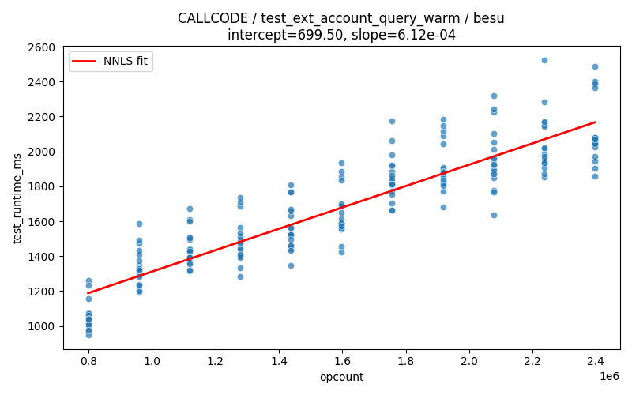

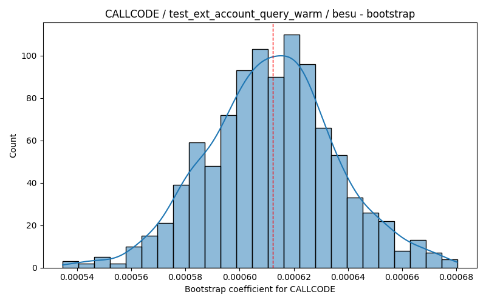

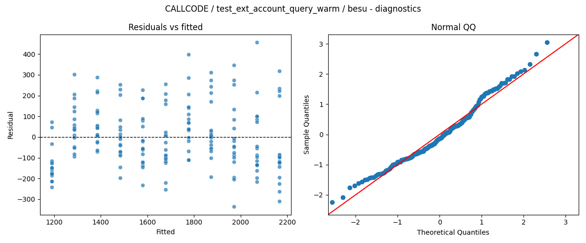

</details>

<details><summary>erigon — NNLS regression summary</summary>

```
==============================================================================
                           NNLS Regression Results                            
==============================================================================
Dep. Variable:          test_runtime_ms              R-squared:          0.943
Model:                  NNLS                    Adj. R-squared:          0.942
No. Observations:       77                                RMSE:          32.68
Df Residuals:           75                                 MAE:          25.21
Df Model:               1      
==============================================================================
                      coef     std err     P-value      [0.025      0.975]
------------------------------------------------------------------------------
         const     48.0547     12.6317       0.001     24.8077     73.5057
       opcount      0.0003      0.0000       0.001      0.0002      0.0003
==============================================================================
Notes: Non-negative least squares with bootstrap inference (1000 iterations)
==============================================================================
```

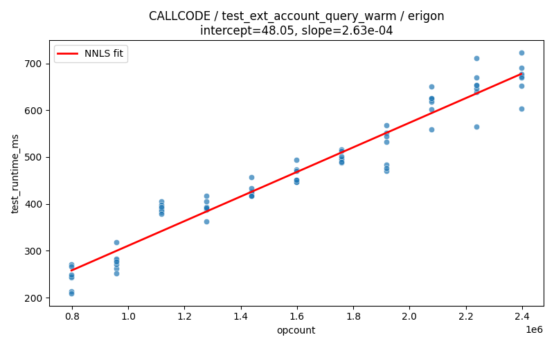

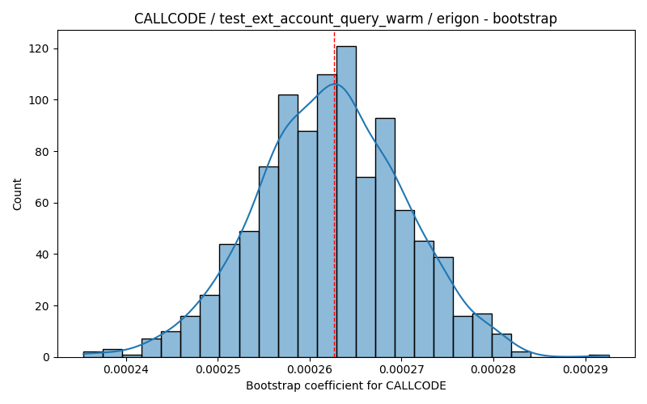

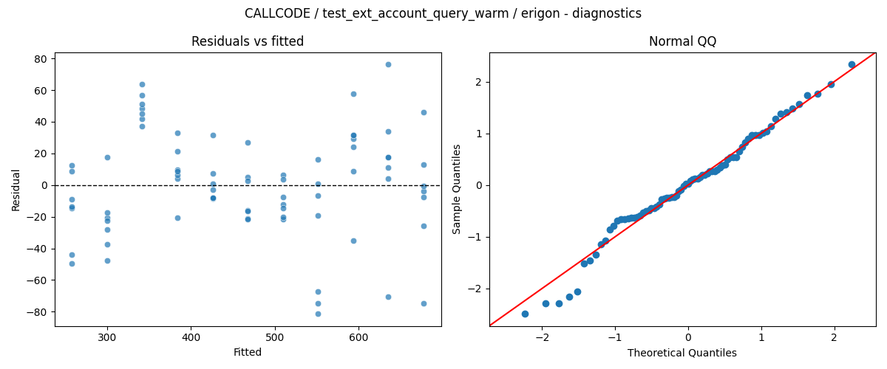

</details>

<details><summary>geth — NNLS regression summary</summary>

```
==============================================================================
                           NNLS Regression Results                            
==============================================================================
Dep. Variable:          test_runtime_ms              R-squared:          0.863
Model:                  NNLS                    Adj. R-squared:          0.862
No. Observations:       121                               RMSE:          36.40
Df Residuals:           119                                MAE:          29.05
Df Model:               1      
==============================================================================
                      coef     std err     P-value      [0.025      0.975]
------------------------------------------------------------------------------
         const     46.2435      9.9273       0.001     26.4478     65.3645
       opcount      0.0002      0.0000       0.001      0.0002      0.0002
==============================================================================
Notes: Non-negative least squares with bootstrap inference (1000 iterations)
==============================================================================
```

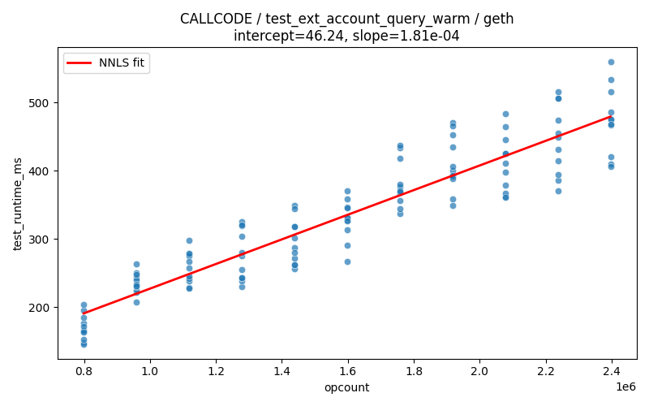

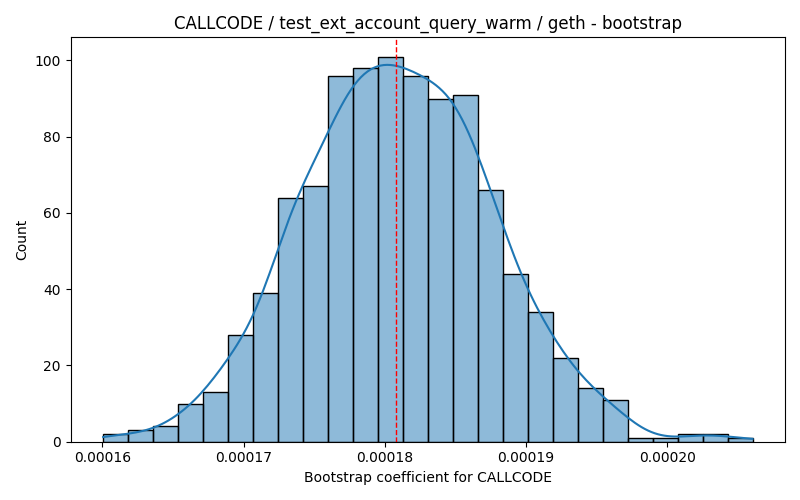

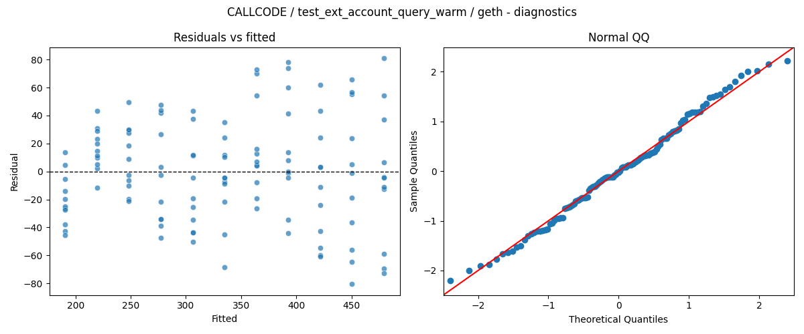

</details>

<details><summary>nethermind — NNLS regression summary</summary>

```
==============================================================================
                           NNLS Regression Results                            
==============================================================================
Dep. Variable:          test_runtime_ms              R-squared:          0.248
Model:                  NNLS                    Adj. R-squared:          0.241
No. Observations:       110                               RMSE:         488.99
Df Residuals:           108                                MAE:         457.45
Df Model:               1      
==============================================================================
                      coef     std err     P-value      [0.025      0.975]
------------------------------------------------------------------------------
         const    221.7490    130.2187       0.046      0.0000    506.7333
       opcount      0.0006      0.0001       0.001      0.0004      0.0007
==============================================================================
Notes: Non-negative least squares with bootstrap inference (1000 iterations)
==============================================================================
```

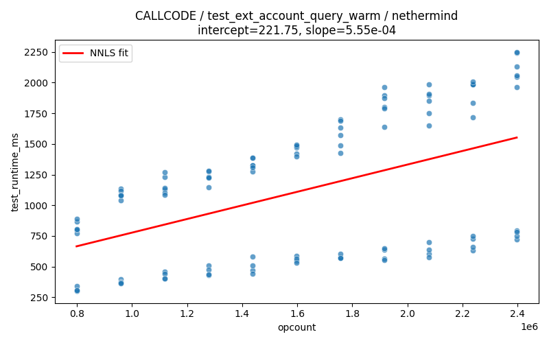

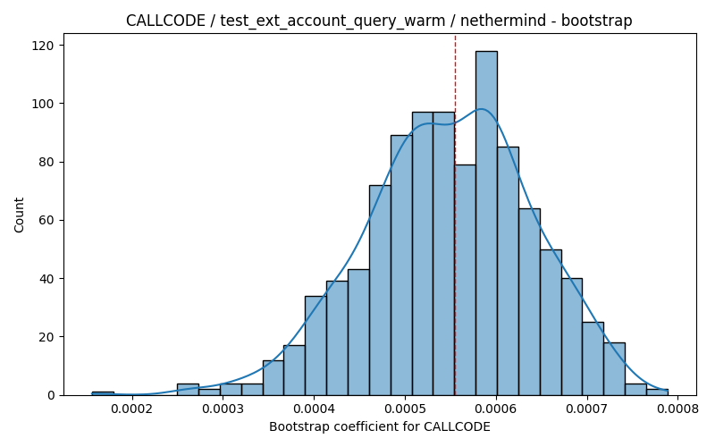

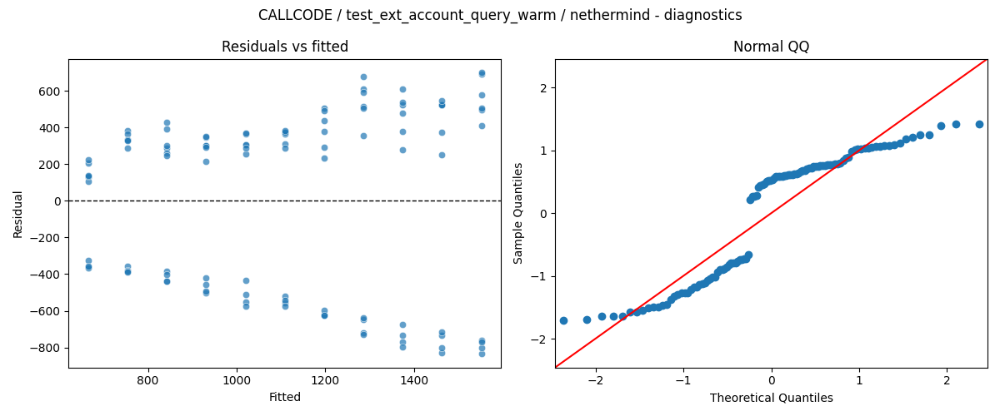

</details>

<details><summary>reth — NNLS regression summary</summary>

```
==============================================================================
                           NNLS Regression Results                            
==============================================================================
Dep. Variable:          test_runtime_ms              R-squared:          0.912
Model:                  NNLS                    Adj. R-squared:          0.912
No. Observations:       198                               RMSE:           7.47
Df Residuals:           196                                MAE:           6.19
Df Model:               1      
==============================================================================
                      coef     std err     P-value      [0.025      0.975]
------------------------------------------------------------------------------
         const     17.2824      1.8125       0.001     13.7578     21.0591
       opcount      0.0000      0.0000       0.001      0.0000      0.0000
==============================================================================
Notes: Non-negative least squares with bootstrap inference (1000 iterations)
==============================================================================
```

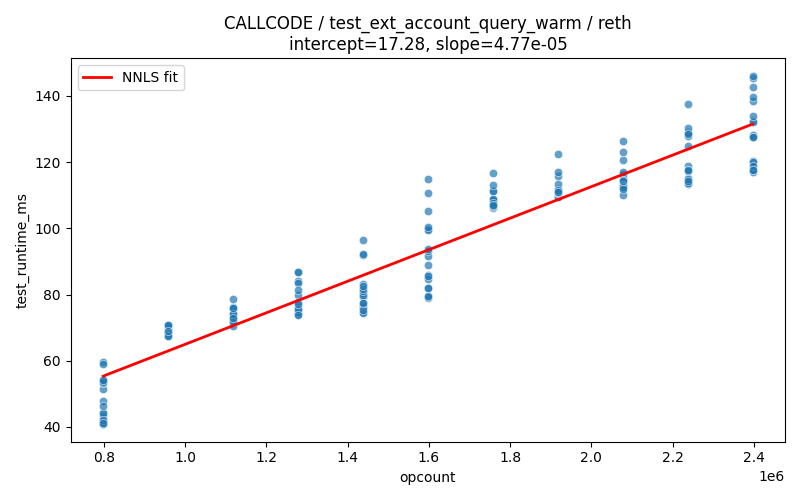

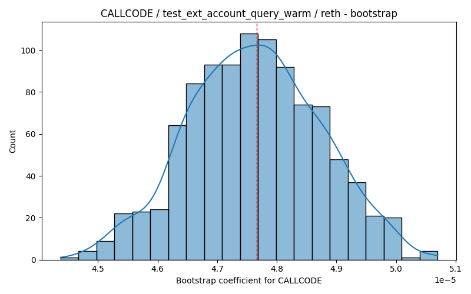

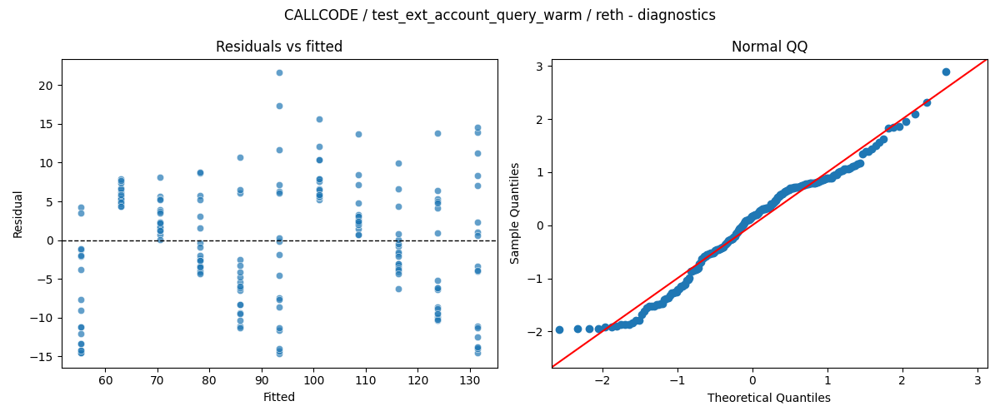

</details>

## DELEGATECALL

### test_account_access — combo `DELEGATECALL_AccountMode.EXISTING_EOA`

| client | nobs | R² | target_coef (ms) | p-value | 95% CI |
| --- | --- | --- | --- | --- | --- |
| `besu` | 187 | 0.8594 | 0.01047 | 1.00e-03 | [0.009765, 0.01115] |
| `erigon` | 77 | 0.9985 | 0.01006 | 1.00e-03 | [0.009969, 0.01016] |
| `geth` | 121 | 0.8565 | 0.01413 | 1.00e-03 | [0.01309, 0.01514] |
| `nethermind` | 110 | 0.8552 | 0.004421 | 1.00e-03 | [0.004085, 0.004736] |
| `reth` | 198 | 0.976 | 0.001142 | 1.00e-03 | [0.001119, 0.001167] |

<details><summary>besu — NNLS regression summary</summary>

```
==============================================================================
                           NNLS Regression Results                            
==============================================================================
Dep. Variable:          test_runtime_ms              R-squared:          0.859
Model:                  NNLS                    Adj. R-squared:          0.859
No. Observations:       187                               RMSE:         100.71
Df Residuals:           185                                MAE:          79.04
Df Model:               1      
==============================================================================
                      coef     std err     P-value      [0.025      0.975]
------------------------------------------------------------------------------
         const    561.5272     30.6298       0.001    502.1063    622.9718
       opcount      0.0105      0.0004       0.001      0.0098      0.0112
==============================================================================
Notes: Non-negative least squares with bootstrap inference (1000 iterations)
==============================================================================
```

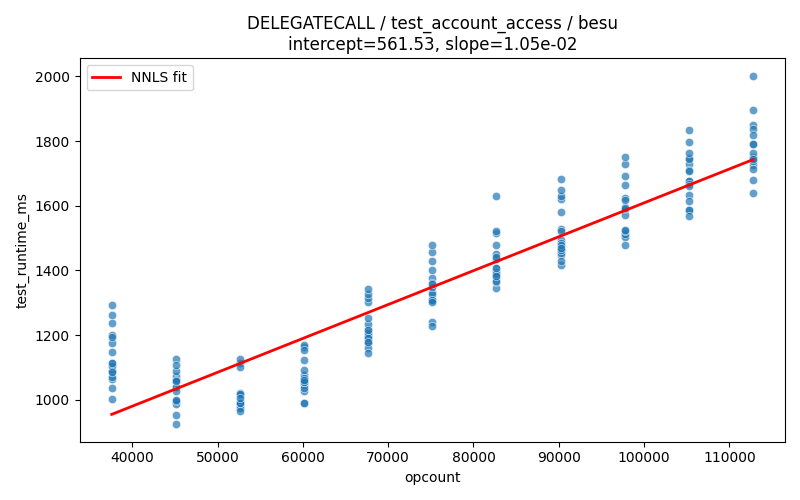

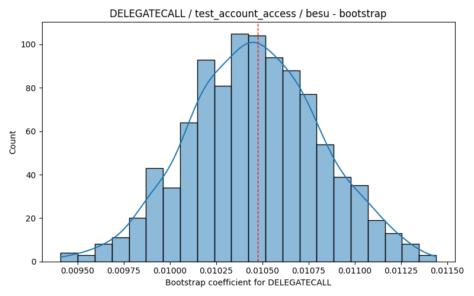

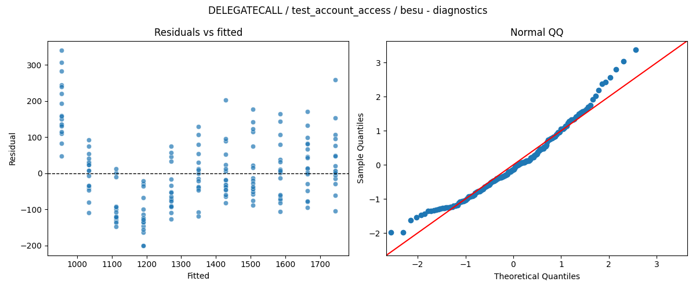

</details>

<details><summary>erigon — NNLS regression summary</summary>

```
==============================================================================
                           NNLS Regression Results                            
==============================================================================
Dep. Variable:          test_runtime_ms              R-squared:          0.998
Model:                  NNLS                    Adj. R-squared:          0.998
No. Observations:       77                                RMSE:           9.38
Df Residuals:           75                                 MAE:           7.69
Df Model:               1      
==============================================================================
                      coef     std err     P-value      [0.025      0.975]
------------------------------------------------------------------------------
         const     38.8301      3.4127       0.001     31.8257     44.9307
       opcount      0.0101      0.0000       0.001      0.0100      0.0102
==============================================================================
Notes: Non-negative least squares with bootstrap inference (1000 iterations)
==============================================================================
```


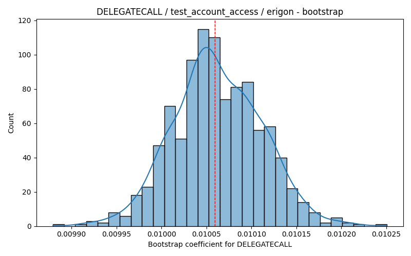

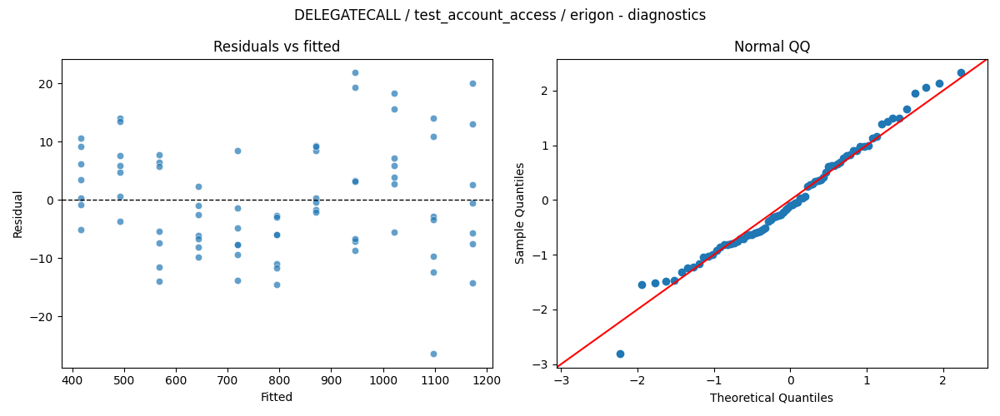

</details>

<details><summary>geth — NNLS regression summary</summary>

```
==============================================================================
                           NNLS Regression Results                            
==============================================================================
Dep. Variable:          test_runtime_ms              R-squared:          0.856
Model:                  NNLS                    Adj. R-squared:          0.855
No. Observations:       121                               RMSE:         137.48
Df Residuals:           119                                MAE:         110.13
Df Model:               1      
==============================================================================
                      coef     std err     P-value      [0.025      0.975]
------------------------------------------------------------------------------
         const    272.7031     38.6292       0.001    196.5217    350.3771
       opcount      0.0141      0.0005       0.001      0.0131      0.0151
==============================================================================
Notes: Non-negative least squares with bootstrap inference (1000 iterations)
==============================================================================
```

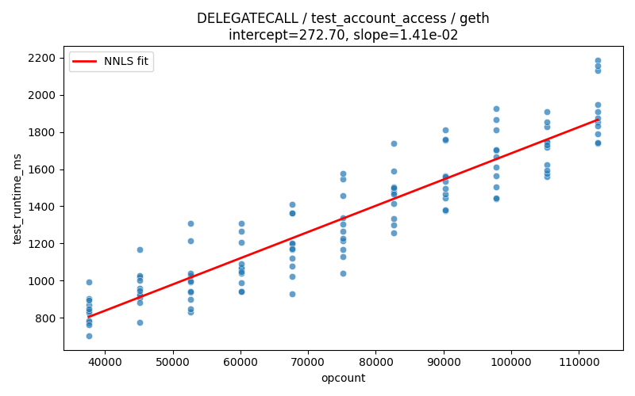

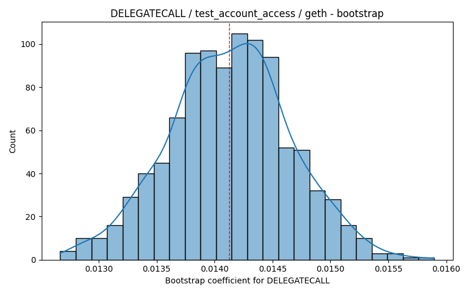

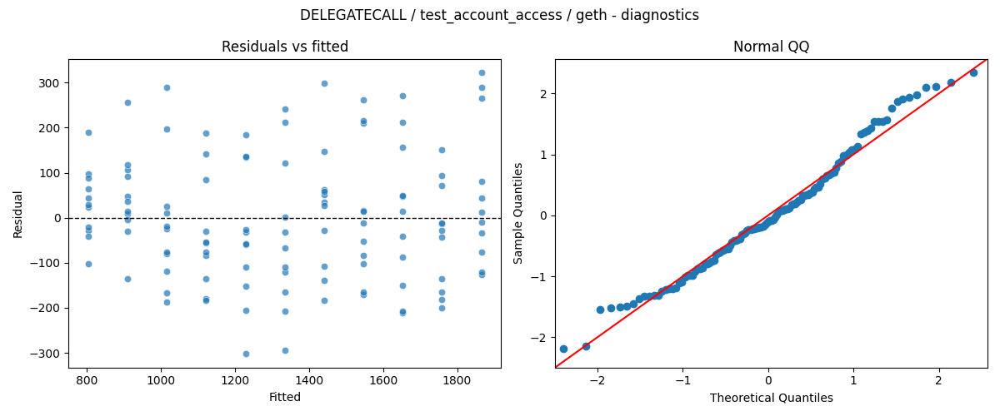

</details>

<details><summary>nethermind — NNLS regression summary</summary>

```
==============================================================================
                           NNLS Regression Results                            
==============================================================================
Dep. Variable:          test_runtime_ms              R-squared:          0.855
Model:                  NNLS                    Adj. R-squared:          0.854
No. Observations:       110                               RMSE:          43.25
Df Residuals:           108                                MAE:          33.64
Df Model:               1      
==============================================================================
                      coef     std err     P-value      [0.025      0.975]
------------------------------------------------------------------------------
         const    100.7976     12.6373       0.001     77.5741    126.0607
       opcount      0.0044      0.0002       0.001      0.0041      0.0047
==============================================================================
Notes: Non-negative least squares with bootstrap inference (1000 iterations)
==============================================================================
```

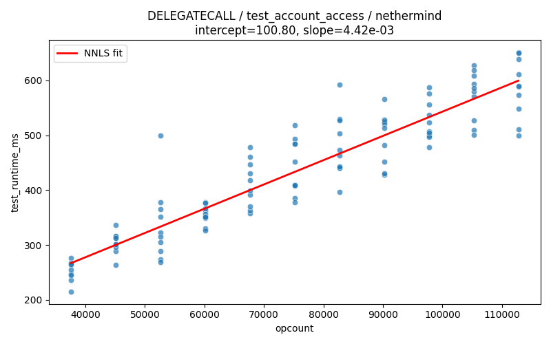

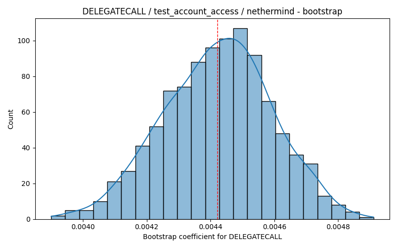

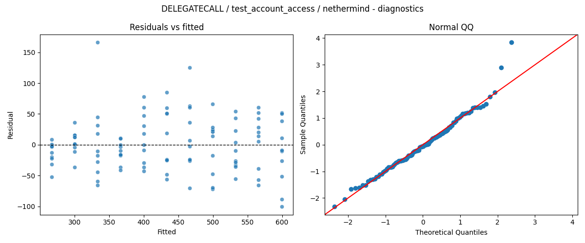

</details>

<details><summary>reth — NNLS regression summary</summary>

```
==============================================================================
                           NNLS Regression Results                            
==============================================================================
Dep. Variable:          test_runtime_ms              R-squared:          0.976
Model:                  NNLS                    Adj. R-squared:          0.976
No. Observations:       198                               RMSE:           4.26
Df Residuals:           196                                MAE:           3.42
Df Model:               1      
==============================================================================
                      coef     std err     P-value      [0.025      0.975]
------------------------------------------------------------------------------
         const     30.6901      1.0093       0.001     28.7292     32.6136
       opcount      0.0011      0.0000       0.001      0.0011      0.0012
==============================================================================
Notes: Non-negative least squares with bootstrap inference (1000 iterations)
==============================================================================
```

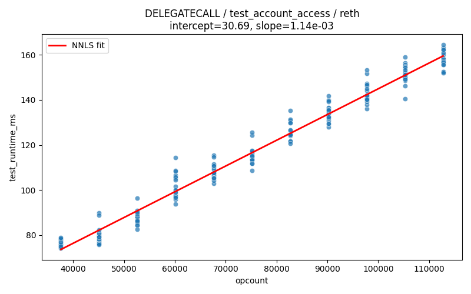

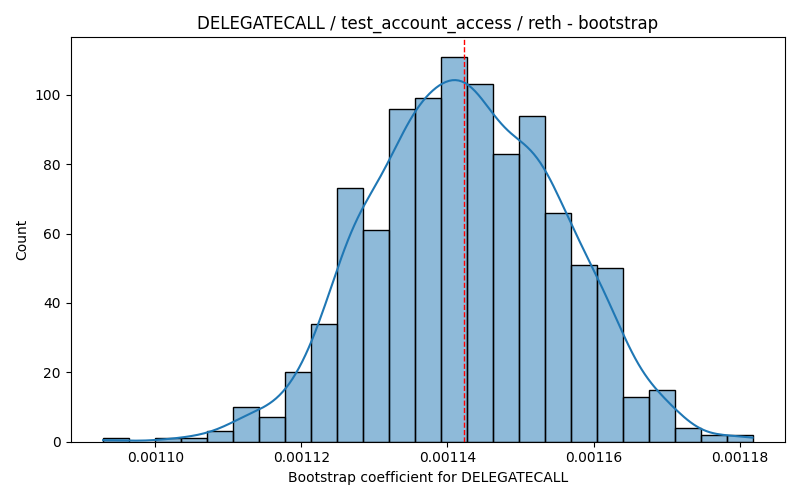

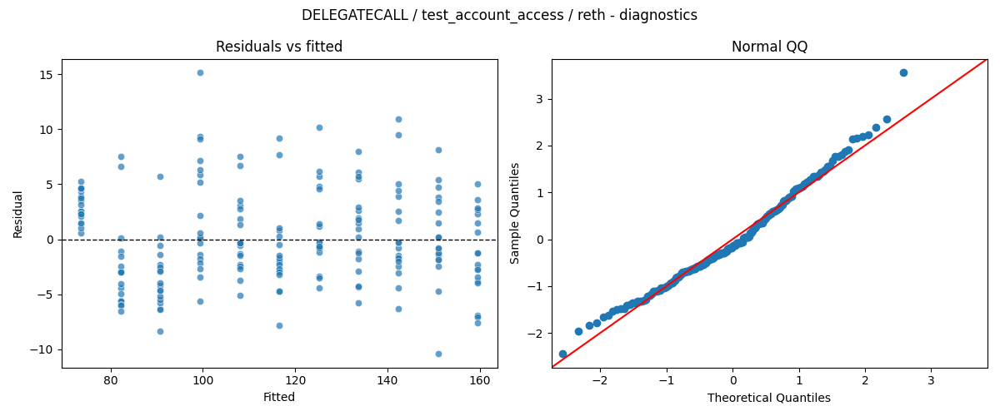

</details>

### test_account_access — combo `DELEGATECALL_AccountMode.NON_EXISTING_ACCOUNT` — `presets[cold_account_nocode_access]`

| client | nobs | R² | target_coef (ms) | p-value | 95% CI |
| --- | --- | --- | --- | --- | --- |
| `besu` | 187 | 0.9317 | 0.01098 | 1.00e-03 | [0.01055, 0.01146] |
| `erigon` | 77 | 0.9983 | 0.0095 | 1.00e-03 | [0.009415, 0.009587] |
| `geth` | 121 | 0.7155 | 0.02601 | 1.00e-03 | [0.02248, 0.02938] |
| `nethermind` | 110 | 0.8574 | 0.004428 | 1.00e-03 | [0.004088, 0.004778] |
| `reth` | 198 | 0.9711 | 0.0009599 | 1.00e-03 | [0.0009335, 0.0009839] |

<details><summary>besu — NNLS regression summary</summary>

```
==============================================================================
                           NNLS Regression Results                            
==============================================================================
Dep. Variable:          test_runtime_ms              R-squared:          0.932
Model:                  NNLS                    Adj. R-squared:          0.931
No. Observations:       187                               RMSE:          70.69
Df Residuals:           185                                MAE:          57.80
Df Model:               1      
==============================================================================
                      coef     std err     P-value      [0.025      0.975]
------------------------------------------------------------------------------
         const    445.4390     18.1968       0.001    407.1024    480.7843
       opcount      0.0110      0.0002       0.001      0.0106      0.0115
==============================================================================
Notes: Non-negative least squares with bootstrap inference (1000 iterations)
==============================================================================
```

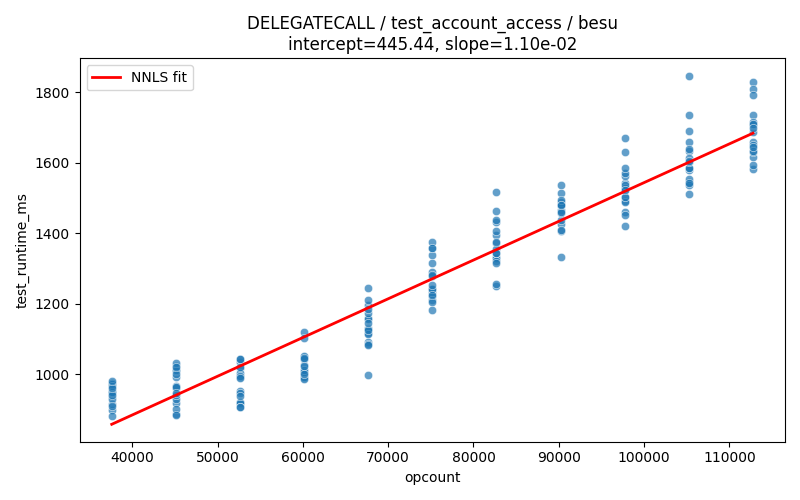

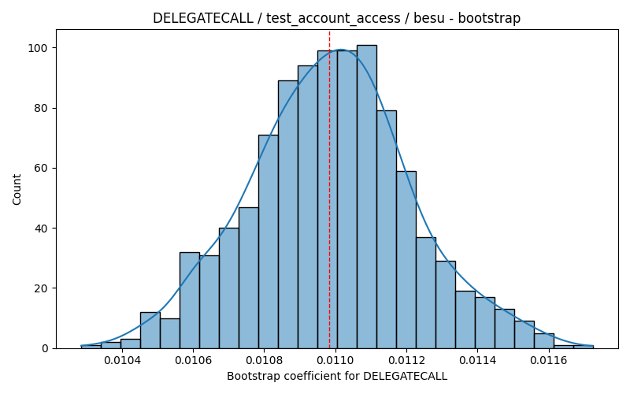

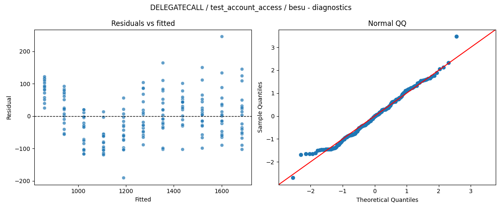

</details>

<details><summary>erigon — NNLS regression summary</summary>

```
==============================================================================
                           NNLS Regression Results                            
==============================================================================
Dep. Variable:          test_runtime_ms              R-squared:          0.998
Model:                  NNLS                    Adj. R-squared:          0.998
No. Observations:       77                                RMSE:           9.42
Df Residuals:           75                                 MAE:           7.52
Df Model:               1      
==============================================================================
                      coef     std err     P-value      [0.025      0.975]
------------------------------------------------------------------------------
         const     16.2691      3.6865       0.001      8.8228     23.3114
       opcount      0.0095      0.0000       0.001      0.0094      0.0096
==============================================================================
Notes: Non-negative least squares with bootstrap inference (1000 iterations)
==============================================================================
```


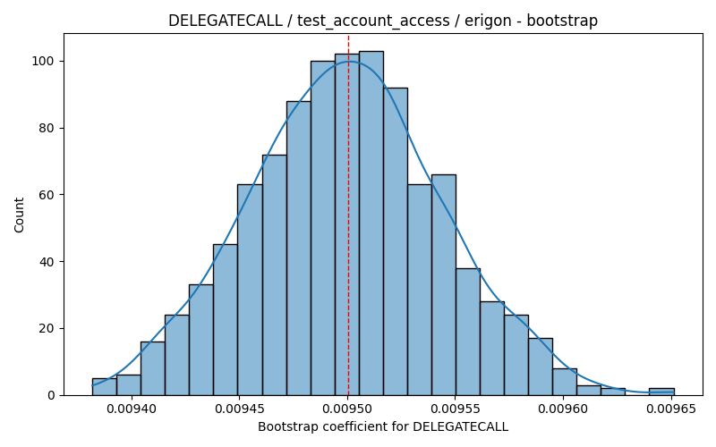

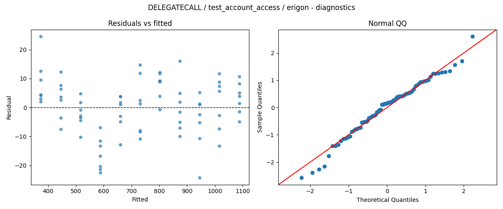

</details>

<details><summary>geth — NNLS regression summary</summary>

```
==============================================================================
                           NNLS Regression Results                            
==============================================================================
Dep. Variable:          test_runtime_ms              R-squared:          0.715
Model:                  NNLS                    Adj. R-squared:          0.713
No. Observations:       121                               RMSE:         389.89
Df Residuals:           119                                MAE:         309.16
Df Model:               1      
==============================================================================
                      coef     std err     P-value      [0.025      0.975]
------------------------------------------------------------------------------
         const   1214.5227    141.1756       0.001    952.1263   1503.4937
       opcount      0.0260      0.0018       0.001      0.0225      0.0294
==============================================================================
Notes: Non-negative least squares with bootstrap inference (1000 iterations)
==============================================================================
```


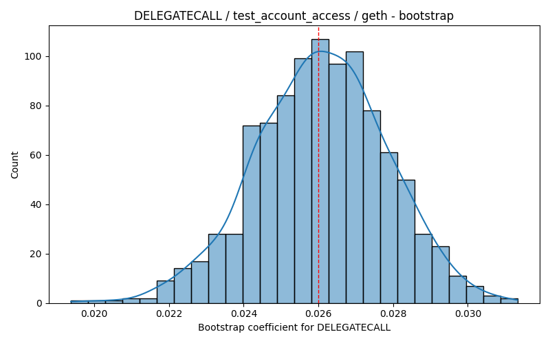

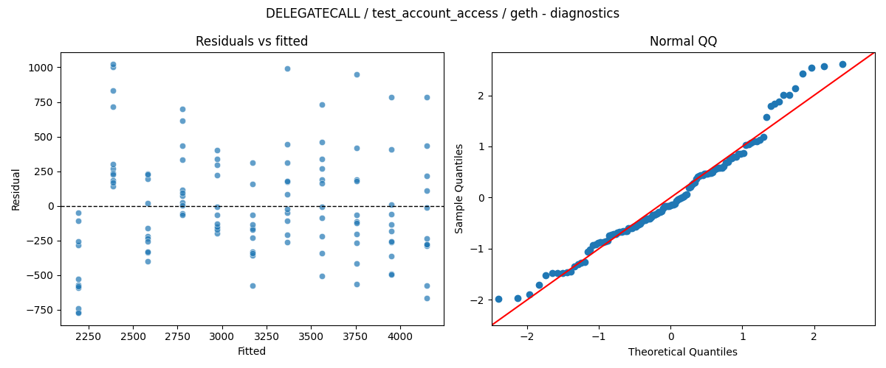

</details>

<details><summary>nethermind — NNLS regression summary</summary>

```
==============================================================================
                           NNLS Regression Results                            
==============================================================================
Dep. Variable:          test_runtime_ms              R-squared:          0.857
Model:                  NNLS                    Adj. R-squared:          0.856
No. Observations:       110                               RMSE:          42.92
Df Residuals:           108                                MAE:          35.38
Df Model:               1      
==============================================================================
                      coef     std err     P-value      [0.025      0.975]
------------------------------------------------------------------------------
         const    104.5006     12.6063       0.001     80.3223    130.1702
       opcount      0.0044      0.0002       0.001      0.0041      0.0048
==============================================================================
Notes: Non-negative least squares with bootstrap inference (1000 iterations)
==============================================================================
```

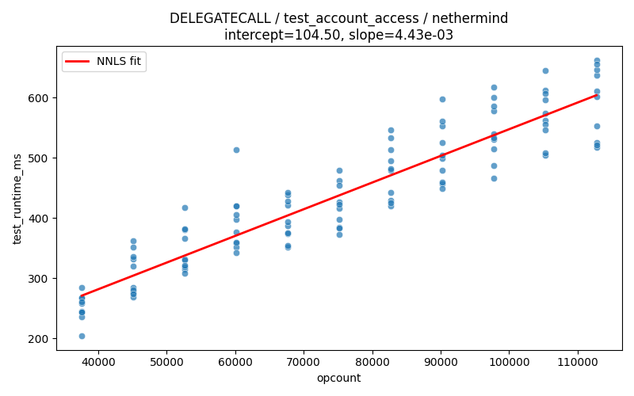

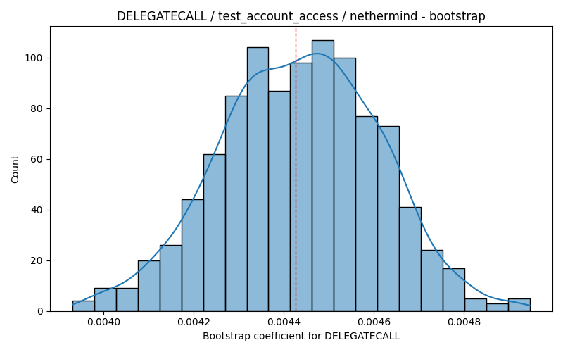

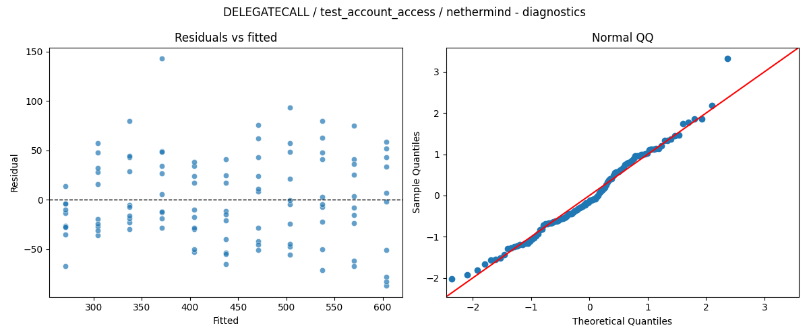

</details>

<details><summary>reth — NNLS regression summary</summary>

```
==============================================================================
                           NNLS Regression Results                            
==============================================================================
Dep. Variable:          test_runtime_ms              R-squared:          0.971
Model:                  NNLS                    Adj. R-squared:          0.971
No. Observations:       198                               RMSE:           3.94
Df Residuals:           196                                MAE:           3.12
Df Model:               1      
==============================================================================
                      coef     std err     P-value      [0.025      0.975]
------------------------------------------------------------------------------
         const     32.1369      1.0825       0.001     30.0901     34.3354
       opcount      0.0010      0.0000       0.001      0.0009      0.0010
==============================================================================
Notes: Non-negative least squares with bootstrap inference (1000 iterations)
==============================================================================
```

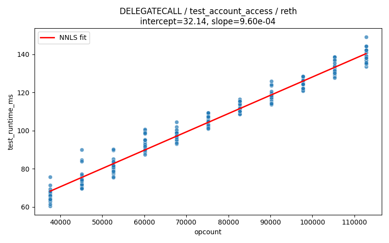

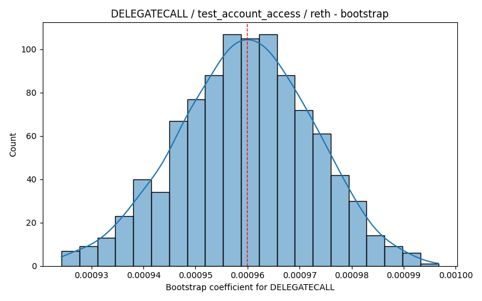

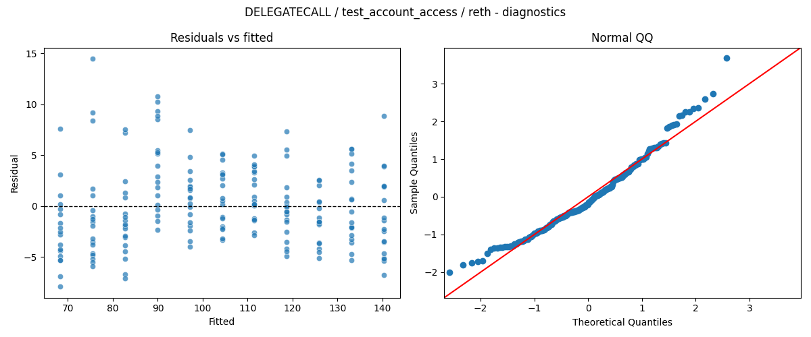

</details>

### test_account_access — combo `DELEGATECALL_AccountMode.EXISTING_CONTRACT`

| client | nobs | R² | target_coef (ms) | p-value | 95% CI |
| --- | --- | --- | --- | --- | --- |
| `besu` | 187 | 0.97 | 0.02905 | 1.00e-03 | [0.02834, 0.02984] |
| `erigon` | 77 | 0.8765 | 0.0868 | 1.00e-03 | [0.07838, 0.09299] |
| `geth` | 121 | 0.7641 | 0.02981 | 1.00e-03 | [0.02658, 0.03278] |
| `nethermind` | 110 | 0.7041 | 0.02509 | 1.00e-03 | [0.02194, 0.02825] |
| `reth` | 198 | 0.9212 | 0.03741 | 1.00e-03 | [0.0368, 0.03795] |

<details><summary>besu — NNLS regression summary</summary>

```
==============================================================================
                           NNLS Regression Results                            
==============================================================================
Dep. Variable:          test_runtime_ms              R-squared:          0.970
Model:                  NNLS                    Adj. R-squared:          0.970
No. Observations:       187                               RMSE:         104.14
Df Residuals:           185                                MAE:          87.04
Df Model:               1      
==============================================================================
                      coef     std err     P-value      [0.025      0.975]
------------------------------------------------------------------------------
         const    350.4750     26.3424       0.001    296.1435    397.0891
       opcount      0.0291      0.0004       0.001      0.0283      0.0298
==============================================================================
Notes: Non-negative least squares with bootstrap inference (1000 iterations)
==============================================================================
```

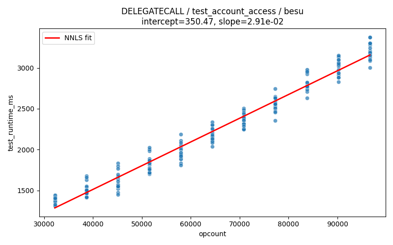

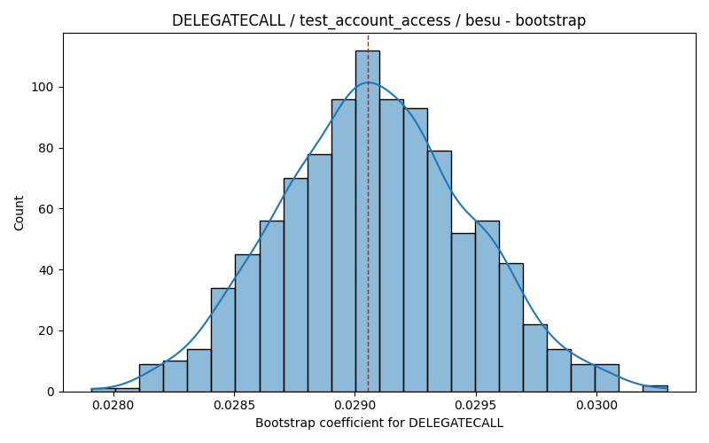

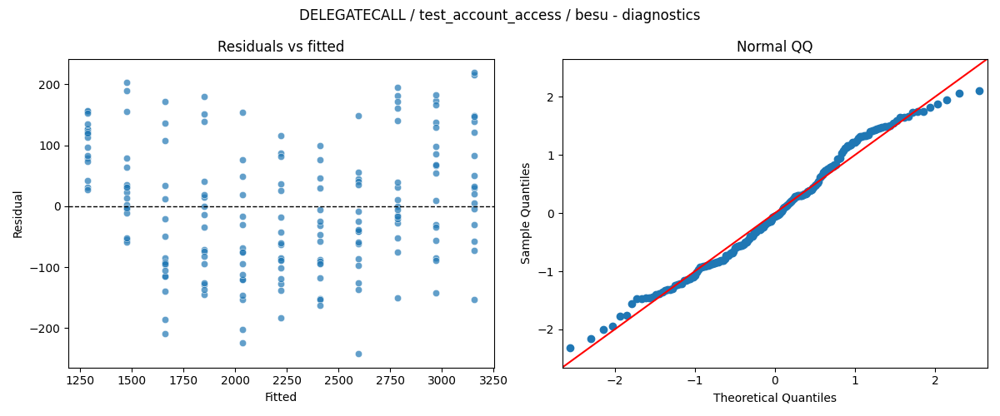

</details>

<details><summary>erigon — NNLS regression summary</summary>

```
==============================================================================
                           NNLS Regression Results                            
==============================================================================
Dep. Variable:          test_runtime_ms              R-squared:          0.876
Model:                  NNLS                    Adj. R-squared:          0.875
No. Observations:       77                                RMSE:         663.85
Df Residuals:           75                                 MAE:         571.66
Df Model:               1      
==============================================================================
                      coef     std err     P-value      [0.025      0.975]
------------------------------------------------------------------------------
         const   1429.8422    280.5348       0.001    967.2324   2064.8146
       opcount      0.0868      0.0037       0.001      0.0784      0.0930
==============================================================================
Notes: Non-negative least squares with bootstrap inference (1000 iterations)
==============================================================================
```

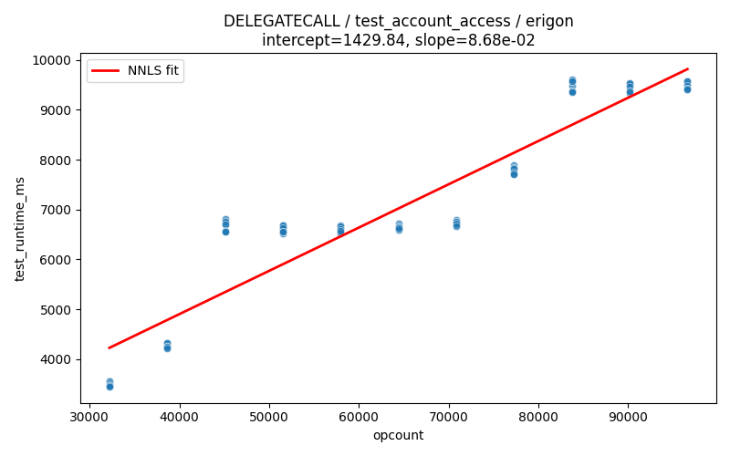

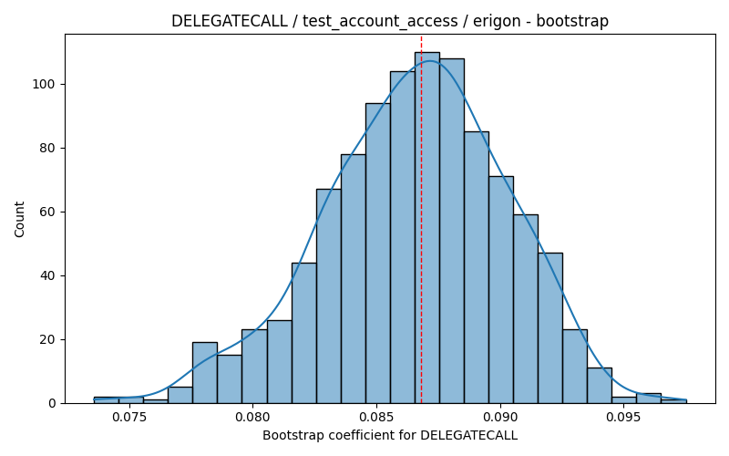

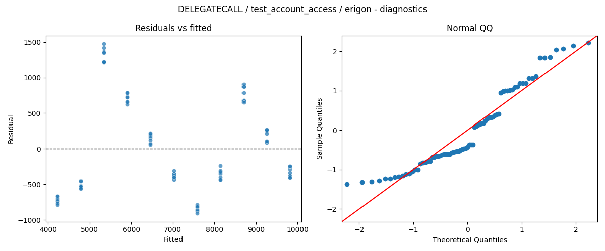

</details>

<details><summary>geth — NNLS regression summary</summary>

```
==============================================================================
                           NNLS Regression Results                            
==============================================================================
Dep. Variable:          test_runtime_ms              R-squared:          0.764
Model:                  NNLS                    Adj. R-squared:          0.762
No. Observations:       121                               RMSE:         337.42
Df Residuals:           119                                MAE:         278.00
Df Model:               1      
==============================================================================
                      coef     std err     P-value      [0.025      0.975]
------------------------------------------------------------------------------
         const    984.9682    106.8128       0.001    788.2311   1203.7678
       opcount      0.0298      0.0016       0.001      0.0266      0.0328
==============================================================================
Notes: Non-negative least squares with bootstrap inference (1000 iterations)
==============================================================================
```

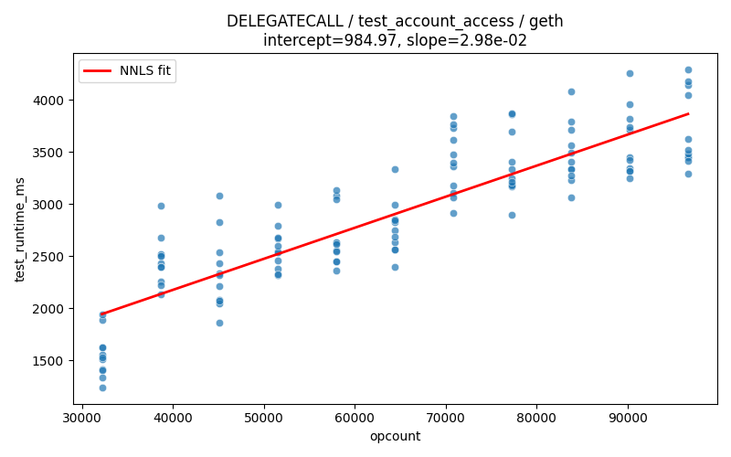

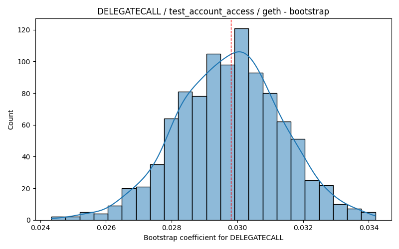

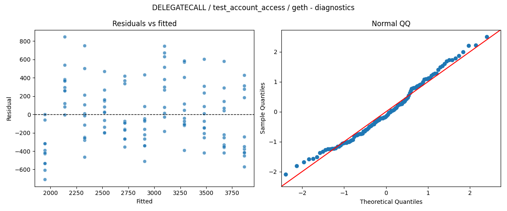

</details>

<details><summary>nethermind — NNLS regression summary</summary>

```
==============================================================================
                           NNLS Regression Results                            
==============================================================================
Dep. Variable:          test_runtime_ms              R-squared:          0.704
Model:                  NNLS                    Adj. R-squared:          0.701
No. Observations:       110                               RMSE:         331.34
Df Residuals:           108                                MAE:         279.85
Df Model:               1      
==============================================================================
                      coef     std err     P-value      [0.025      0.975]
------------------------------------------------------------------------------
         const    870.6870    112.1599       0.001    661.4481   1095.0246
       opcount      0.0251      0.0016       0.001      0.0219      0.0283
==============================================================================
Notes: Non-negative least squares with bootstrap inference (1000 iterations)
==============================================================================
```

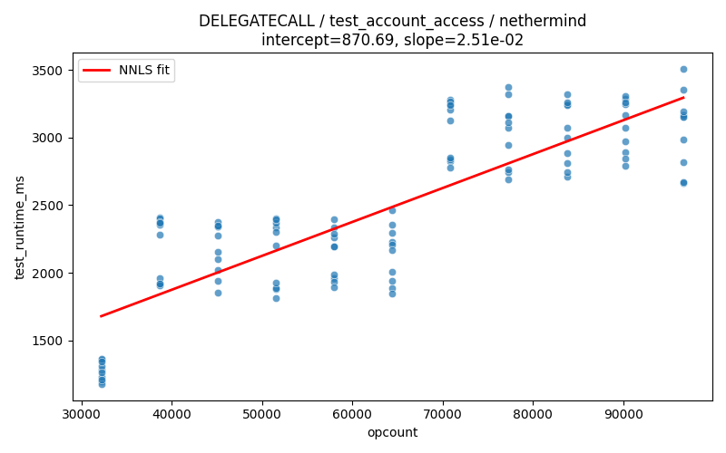

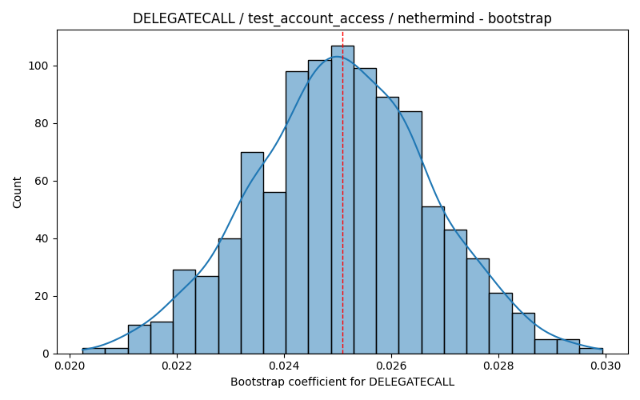

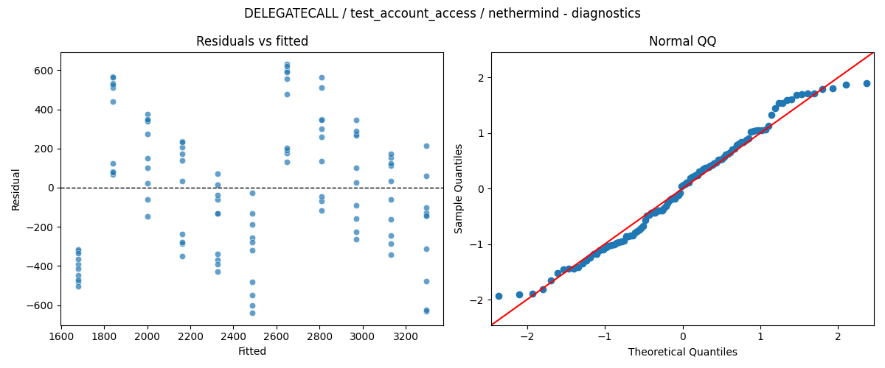

</details>

<details><summary>reth — NNLS regression summary</summary>

```
==============================================================================
                           NNLS Regression Results                            
==============================================================================
Dep. Variable:          test_runtime_ms              R-squared:          0.921
Model:                  NNLS                    Adj. R-squared:          0.921
No. Observations:       198                               RMSE:         227.75
Df Residuals:           196                                MAE:         121.16
Df Model:               1      
==============================================================================
                      coef     std err     P-value      [0.025      0.975]
------------------------------------------------------------------------------
         const      0.0000     11.5749       1.000      0.0000     41.7973
       opcount      0.0374      0.0003       0.001      0.0368      0.0379
==============================================================================
Notes: Non-negative least squares with bootstrap inference (1000 iterations)
==============================================================================
```

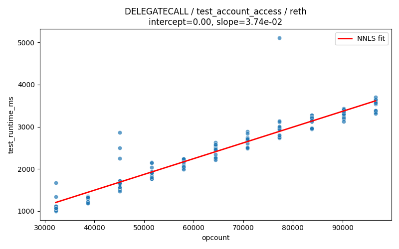

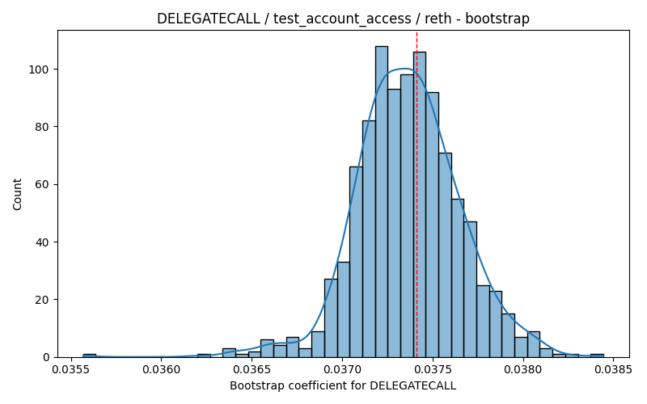

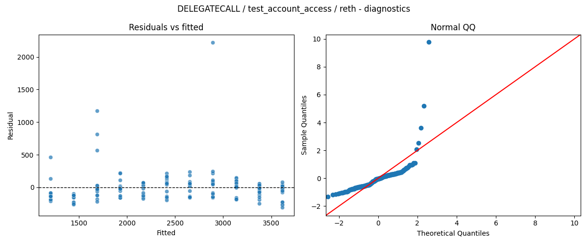

</details>

### test_account_access — combo `DELEGATECALL_AccountMode.NON_EXISTING_ACCOUNT` — `presets[cold_account_code_access]`

| client | nobs | R² | target_coef (ms) | p-value | 95% CI |
| --- | --- | --- | --- | --- | --- |
| `besu` | 187 | 0.9317 | 0.01098 | 1.00e-03 | [0.01055, 0.01146] |
| `erigon` | 77 | 0.9983 | 0.0095 | 1.00e-03 | [0.009415, 0.009587] |
| `geth` | 121 | 0.7155 | 0.02601 | 1.00e-03 | [0.02248, 0.02938] |
| `nethermind` | 110 | 0.8574 | 0.004428 | 1.00e-03 | [0.004088, 0.004778] |
| `reth` | 198 | 0.9711 | 0.0009599 | 1.00e-03 | [0.0009335, 0.0009839] |

<details><summary>besu — NNLS regression summary</summary>

```
==============================================================================
                           NNLS Regression Results                            
==============================================================================
Dep. Variable:          test_runtime_ms              R-squared:          0.932
Model:                  NNLS                    Adj. R-squared:          0.931
No. Observations:       187                               RMSE:          70.69
Df Residuals:           185                                MAE:          57.80
Df Model:               1      
==============================================================================
                      coef     std err     P-value      [0.025      0.975]
------------------------------------------------------------------------------
         const    445.4390     18.1968       0.001    407.1024    480.7843
       opcount      0.0110      0.0002       0.001      0.0106      0.0115
==============================================================================
Notes: Non-negative least squares with bootstrap inference (1000 iterations)
==============================================================================
```


</details>

<details><summary>erigon — NNLS regression summary</summary>

```
==============================================================================
                           NNLS Regression Results                            
==============================================================================
Dep. Variable:          test_runtime_ms              R-squared:          0.998
Model:                  NNLS                    Adj. R-squared:          0.998
No. Observations:       77                                RMSE:           9.42
Df Residuals:           75                                 MAE:           7.52
Df Model:               1      
==============================================================================
                      coef     std err     P-value      [0.025      0.975]
------------------------------------------------------------------------------
         const     16.2691      3.6865       0.001      8.8228     23.3114
       opcount      0.0095      0.0000       0.001      0.0094      0.0096
==============================================================================
Notes: Non-negative least squares with bootstrap inference (1000 iterations)
==============================================================================
```


</details>

<details><summary>geth — NNLS regression summary</summary>

```
==============================================================================
                           NNLS Regression Results                            
==============================================================================
Dep. Variable:          test_runtime_ms              R-squared:          0.715
Model:                  NNLS                    Adj. R-squared:          0.713
No. Observations:       121                               RMSE:         389.89
Df Residuals:           119                                MAE:         309.16
Df Model:               1      
==============================================================================
                      coef     std err     P-value      [0.025      0.975]
------------------------------------------------------------------------------
         const   1214.5227    141.1756       0.001    952.1263   1503.4937
       opcount      0.0260      0.0018       0.001      0.0225      0.0294
==============================================================================
Notes: Non-negative least squares with bootstrap inference (1000 iterations)
==============================================================================
```


</details>

<details><summary>nethermind — NNLS regression summary</summary>

```
==============================================================================
                           NNLS Regression Results                            
==============================================================================
Dep. Variable:          test_runtime_ms              R-squared:          0.857
Model:                  NNLS                    Adj. R-squared:          0.856
No. Observations:       110                               RMSE:          42.92
Df Residuals:           108                                MAE:          35.38
Df Model:               1      
==============================================================================
                      coef     std err     P-value      [0.025      0.975]
------------------------------------------------------------------------------
         const    104.5006     12.6063       0.001     80.3223    130.1702
       opcount      0.0044      0.0002       0.001      0.0041      0.0048
==============================================================================
Notes: Non-negative least squares with bootstrap inference (1000 iterations)
==============================================================================
```


</details>

<details><summary>reth — NNLS regression summary</summary>

```
==============================================================================
                           NNLS Regression Results                            
==============================================================================
Dep. Variable:          test_runtime_ms              R-squared:          0.971
Model:                  NNLS                    Adj. R-squared:          0.971
No. Observations:       198                               RMSE:           3.94
Df Residuals:           196                                MAE:           3.12
Df Model:               1      
==============================================================================
                      coef     std err     P-value      [0.025      0.975]
------------------------------------------------------------------------------
         const     32.1369      1.0825       0.001     30.0901     34.3354
       opcount      0.0010      0.0000       0.001      0.0009      0.0010
==============================================================================
Notes: Non-negative least squares with bootstrap inference (1000 iterations)
==============================================================================
```


</details>

### test_ext_account_query_warm — combo `DELEGATECALL`

| client | nobs | R² | target_coef (ms) | p-value | 95% CI |
| --- | --- | --- | --- | --- | --- |
| `besu` | 187 | 0.834 | 0.0005685 | 1.00e-03 | [0.0005277, 0.000611] |
| `erigon` | 77 | 0.9351 | 0.0002567 | 1.00e-03 | [0.0002425, 0.0002701] |
| `geth` | 121 | 0.852 | 0.0001508 | 1.00e-03 | [0.0001393, 0.0001628] |
| `nethermind` | 110 | 0.4291 | 0.0006005 | 1.00e-03 | [0.0004666, 0.0007289] |
| `reth` | 198 | 0.9092 | 4.553e-05 | 1.00e-03 | [4.335e-05, 4.766e-05] |

<details><summary>besu — NNLS regression summary</summary>

```
==============================================================================
                           NNLS Regression Results                            
==============================================================================
Dep. Variable:          test_runtime_ms              R-squared:          0.834
Model:                  NNLS                    Adj. R-squared:          0.833
No. Observations:       187                               RMSE:         131.31
Df Residuals:           185                                MAE:         103.51
Df Model:               1      
==============================================================================
                      coef     std err     P-value      [0.025      0.975]
------------------------------------------------------------------------------
         const    635.9030     32.8960       0.001    571.5035    701.3832
       opcount      0.0006      0.0000       0.001      0.0005      0.0006
==============================================================================
Notes: Non-negative least squares with bootstrap inference (1000 iterations)
==============================================================================
```

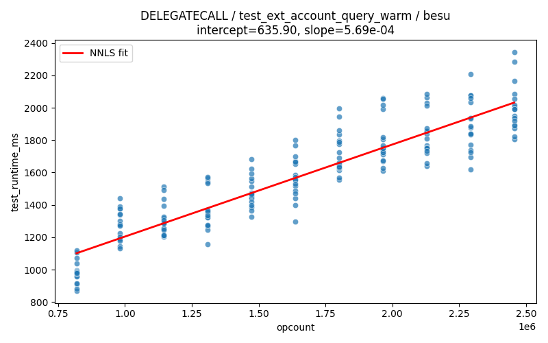

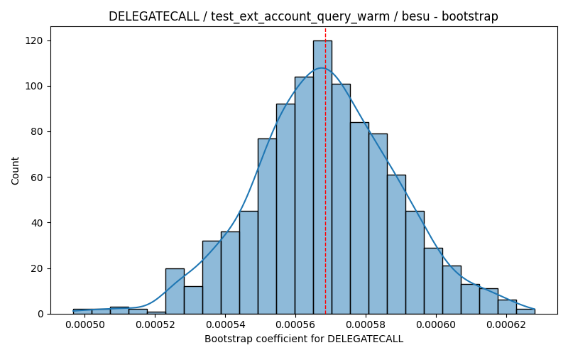

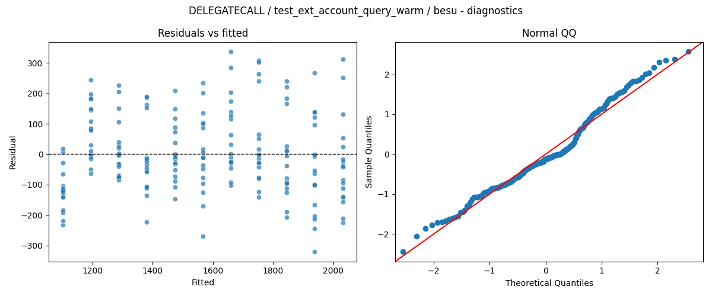

</details>

<details><summary>erigon — NNLS regression summary</summary>

```
==============================================================================
                           NNLS Regression Results                            
==============================================================================
Dep. Variable:          test_runtime_ms              R-squared:          0.935
Model:                  NNLS                    Adj. R-squared:          0.934
No. Observations:       77                                RMSE:          35.01
Df Residuals:           75                                 MAE:          24.84
Df Model:               1      
==============================================================================
                      coef     std err     P-value      [0.025      0.975]
------------------------------------------------------------------------------
         const     62.5683     11.6485       0.001     42.6102     87.5939
       opcount      0.0003      0.0000       0.001      0.0002      0.0003
==============================================================================
Notes: Non-negative least squares with bootstrap inference (1000 iterations)
==============================================================================
```

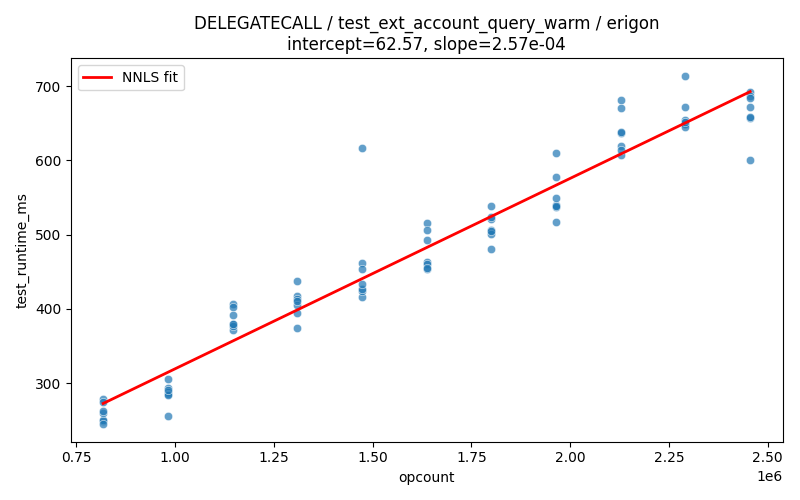

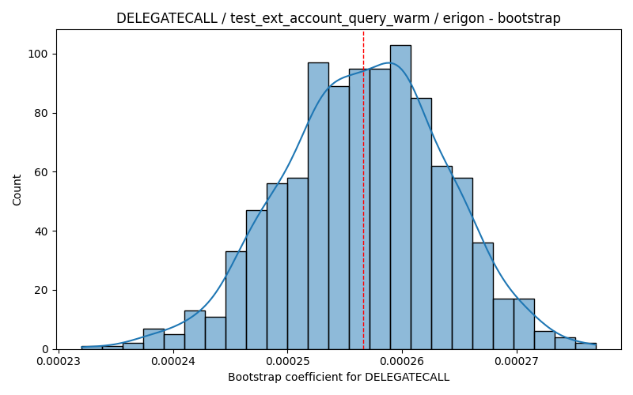

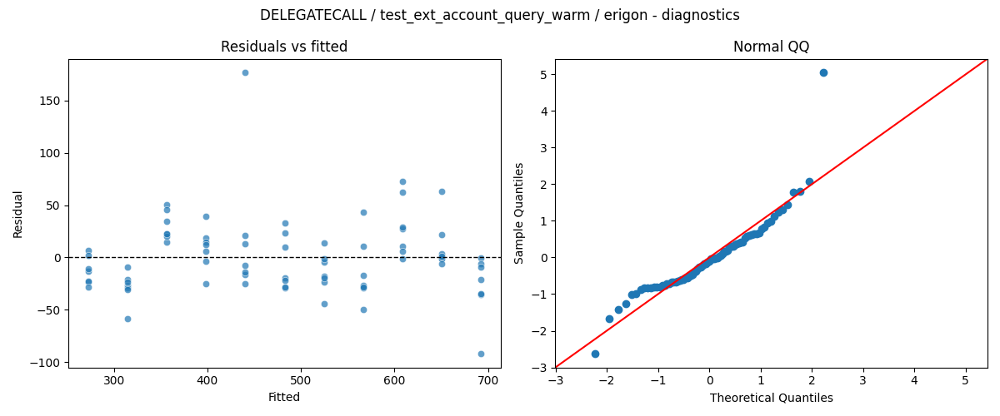

</details>

<details><summary>geth — NNLS regression summary</summary>

```
==============================================================================
                           NNLS Regression Results                            
==============================================================================
Dep. Variable:          test_runtime_ms              R-squared:          0.852
Model:                  NNLS                    Adj. R-squared:          0.851
No. Observations:       121                               RMSE:          32.54
Df Residuals:           119                                MAE:          26.40
Df Model:               1      
==============================================================================
                      coef     std err     P-value      [0.025      0.975]
------------------------------------------------------------------------------
         const     43.3351      9.0985       0.001     24.9706     61.6863
       opcount      0.0002      0.0000       0.001      0.0001      0.0002
==============================================================================
Notes: Non-negative least squares with bootstrap inference (1000 iterations)
==============================================================================
```

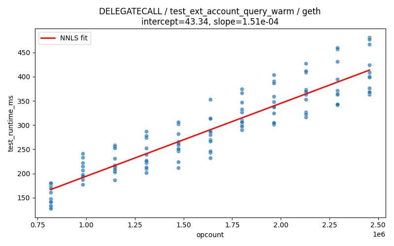

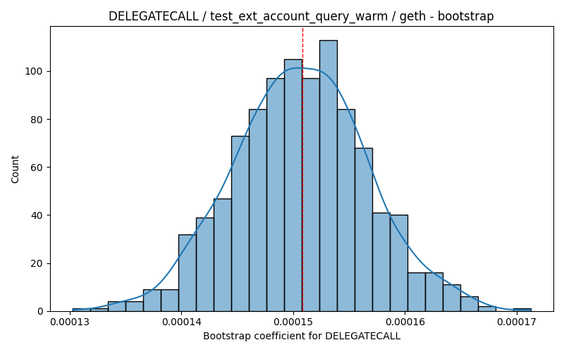

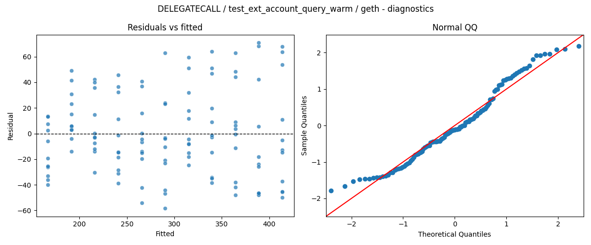

</details>

<details><summary>nethermind — NNLS regression summary</summary>

```
==============================================================================
                           NNLS Regression Results                            
==============================================================================
Dep. Variable:          test_runtime_ms              R-squared:          0.429
Model:                  NNLS                    Adj. R-squared:          0.424
No. Observations:       110                               RMSE:         358.60
Df Residuals:           108                                MAE:         328.01
Df Model:               1      
==============================================================================
                      coef     std err     P-value      [0.025      0.975]
------------------------------------------------------------------------------
         const    248.4834    101.5914       0.008     44.9889    455.3238
       opcount      0.0006      0.0001       0.001      0.0005      0.0007
==============================================================================
Notes: Non-negative least squares with bootstrap inference (1000 iterations)
==============================================================================
```

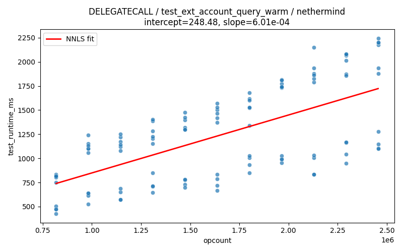

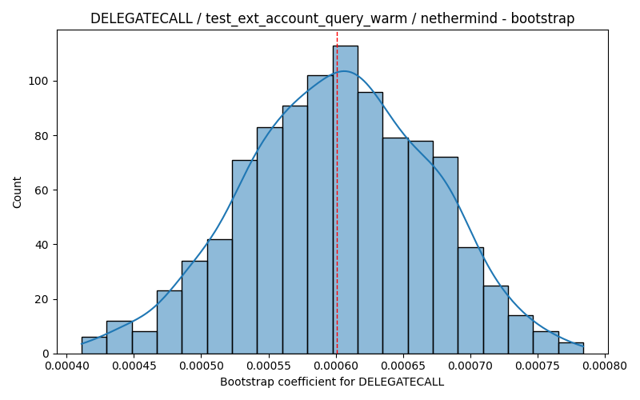

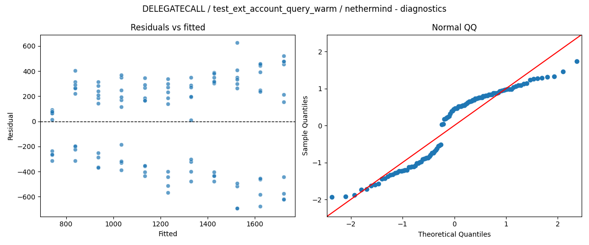

</details>

<details><summary>reth — NNLS regression summary</summary>

```
==============================================================================
                           NNLS Regression Results                            
==============================================================================
Dep. Variable:          test_runtime_ms              R-squared:          0.909
Model:                  NNLS                    Adj. R-squared:          0.909
No. Observations:       198                               RMSE:           7.45
Df Residuals:           196                                MAE:           5.93
Df Model:               1      
==============================================================================
                      coef     std err     P-value      [0.025      0.975]
------------------------------------------------------------------------------
         const     19.8418      1.8604       0.001     16.2780     23.6808
       opcount      0.0000      0.0000       0.001      0.0000      0.0000
==============================================================================
Notes: Non-negative least squares with bootstrap inference (1000 iterations)
==============================================================================
```

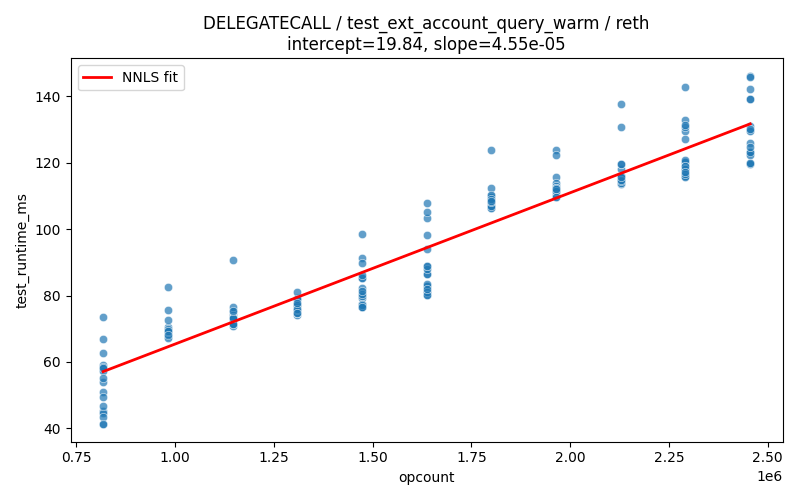

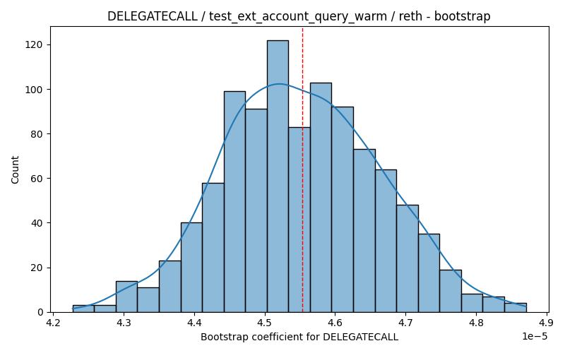

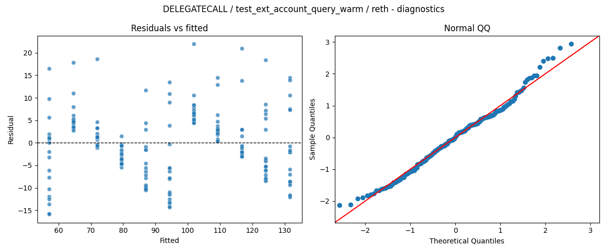

</details>

## EXTCODECOPY

### test_account_access — combo `EXTCODECOPY_AccountMode.NON_EXISTING_ACCOUNT` — `presets[cold_account_nocode_access]`

| client | nobs | R² | target_coef (ms) | p-value | 95% CI |
| --- | --- | --- | --- | --- | --- |
| `besu` | 187 | 0.8094 | 0.0004176 | 1.00e-03 | [0.0003873, 0.0004453] |
| `erigon` | 77 | 0.8352 | 6.214e-05 | 1.00e-03 | [5.58e-05, 6.794e-05] |
| `geth` | 121 | 0.92 | 0.0003446 | 1.00e-03 | [0.0003264, 0.000364] |
| `nethermind` | 110 | 0.7761 | 0.0003712 | 1.00e-03 | [0.0003365, 0.0004073] |
| `reth` | 198 | 0.6693 | 1.627e-05 | 1.00e-03 | [1.439e-05, 1.814e-05] |

<details><summary>besu — NNLS regression summary</summary>

```
==============================================================================
                           NNLS Regression Results                            
==============================================================================
Dep. Variable:          test_runtime_ms              R-squared:          0.809
Model:                  NNLS                    Adj. R-squared:          0.808
No. Observations:       187                               RMSE:          52.02
Df Residuals:           185                                MAE:          42.30
Df Model:               1      
==============================================================================
                      coef     std err     P-value      [0.025      0.975]
------------------------------------------------------------------------------
         const    196.4785     12.4886       0.001    173.0768    222.2519
       opcount      0.0004      0.0000       0.001      0.0004      0.0004
==============================================================================
Notes: Non-negative least squares with bootstrap inference (1000 iterations)
==============================================================================
```

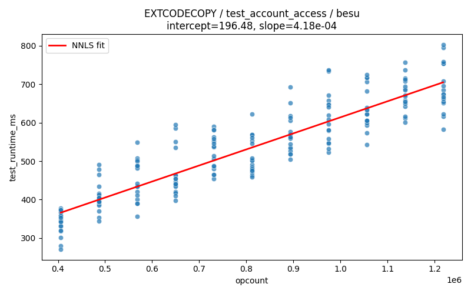

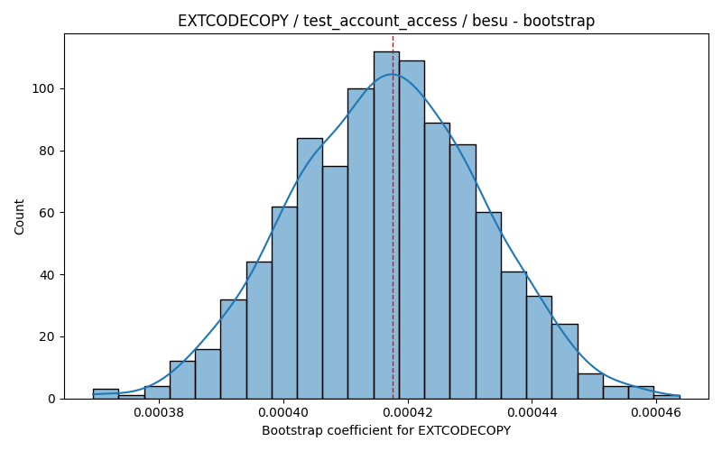

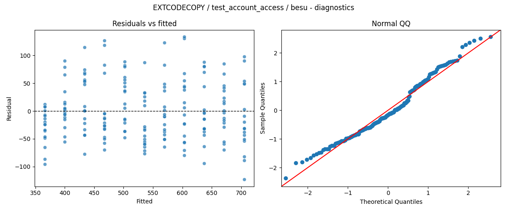

</details>

<details><summary>erigon — NNLS regression summary</summary>

```
==============================================================================
                           NNLS Regression Results                            
==============================================================================
Dep. Variable:          test_runtime_ms              R-squared:          0.835
Model:                  NNLS                    Adj. R-squared:          0.833
No. Observations:       77                                RMSE:           7.09
Df Residuals:           75                                 MAE:           5.78
Df Model:               1      
==============================================================================
                      coef     std err     P-value      [0.025      0.975]
------------------------------------------------------------------------------
         const     38.3350      2.7714       0.001     32.9804     43.8078
       opcount      0.0001      0.0000       0.001      0.0001      0.0001
==============================================================================
Notes: Non-negative least squares with bootstrap inference (1000 iterations)
==============================================================================
```

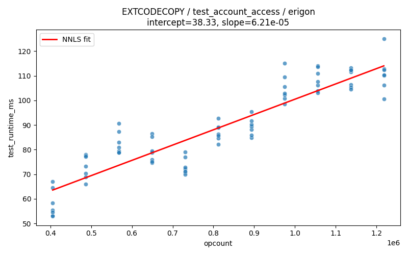

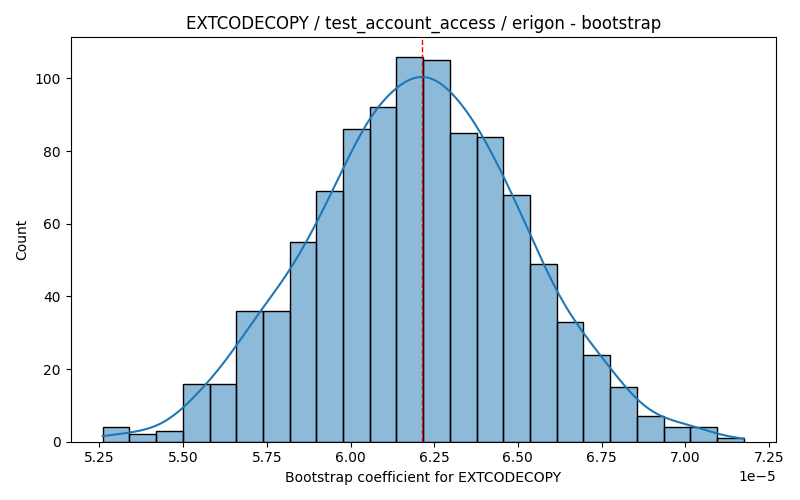

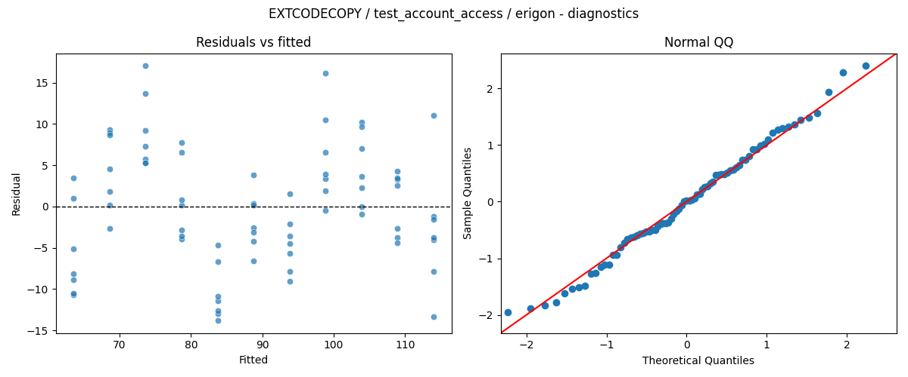

</details>

<details><summary>geth — NNLS regression summary</summary>

```
==============================================================================
                           NNLS Regression Results                            
==============================================================================
Dep. Variable:          test_runtime_ms              R-squared:          0.920
Model:                  NNLS                    Adj. R-squared:          0.919
No. Observations:       121                               RMSE:          26.09
Df Residuals:           119                                MAE:          20.49
Df Model:               1      
==============================================================================
                      coef     std err     P-value      [0.025      0.975]
------------------------------------------------------------------------------
         const     17.8492      6.8954       0.005      4.3054     30.5350
       opcount      0.0003      0.0000       0.001      0.0003      0.0004
==============================================================================
Notes: Non-negative least squares with bootstrap inference (1000 iterations)
==============================================================================
```

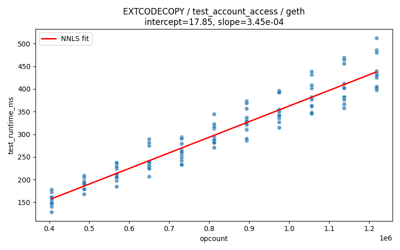

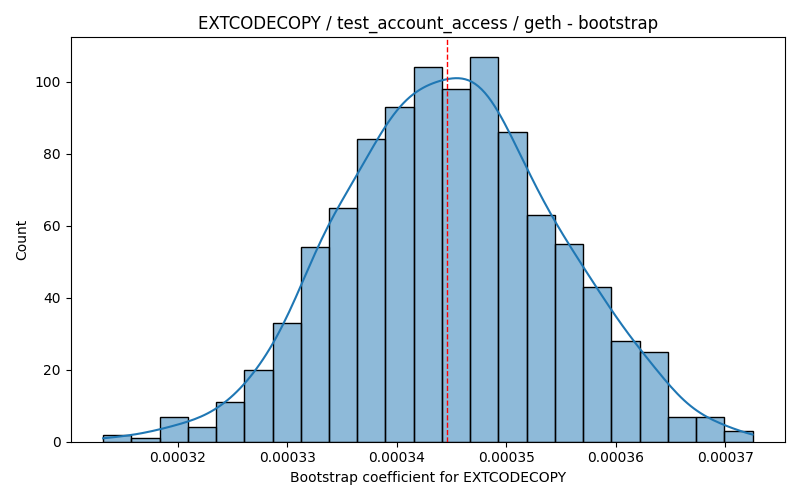

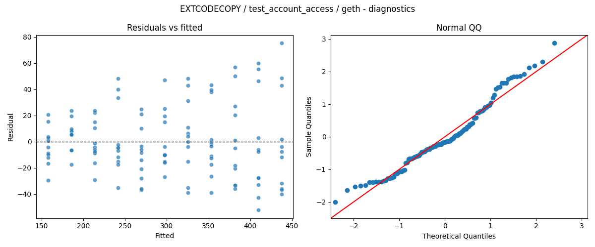

</details>

<details><summary>nethermind — NNLS regression summary</summary>

```
==============================================================================
                           NNLS Regression Results                            
==============================================================================
Dep. Variable:          test_runtime_ms              R-squared:          0.776
Model:                  NNLS                    Adj. R-squared:          0.774
No. Observations:       110                               RMSE:          51.19
Df Residuals:           108                                MAE:          40.35
Df Model:               1      
==============================================================================
                      coef     std err     P-value      [0.025      0.975]
------------------------------------------------------------------------------
         const    119.0483     13.2702       0.001     93.8861    145.3381
       opcount      0.0004      0.0000       0.001      0.0003      0.0004
==============================================================================
Notes: Non-negative least squares with bootstrap inference (1000 iterations)
==============================================================================
```

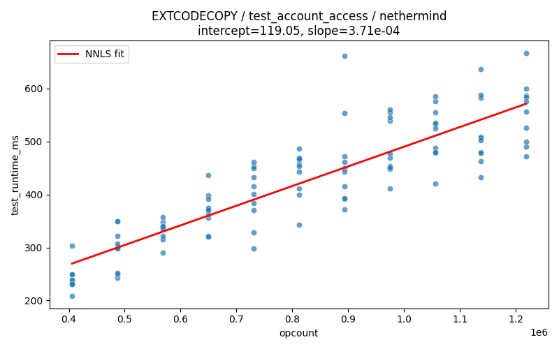

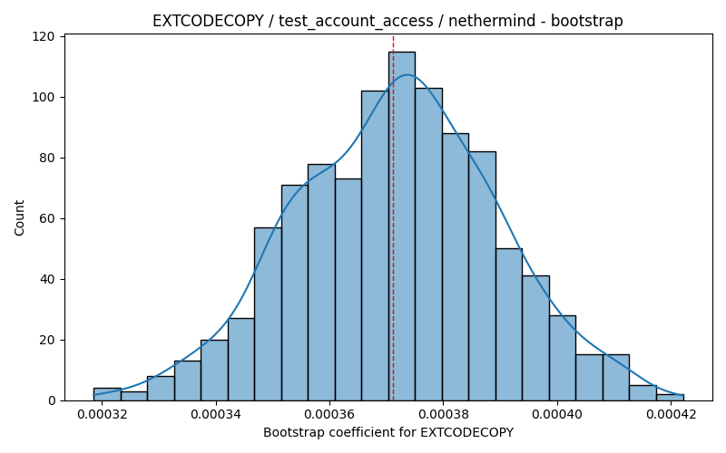

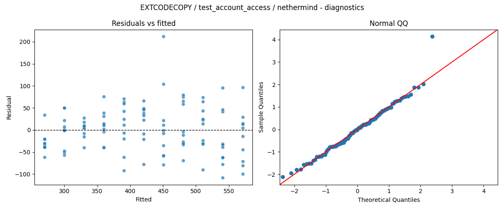

</details>

<details><summary>reth — NNLS regression summary</summary>

```
==============================================================================
                           NNLS Regression Results                            
==============================================================================
Dep. Variable:          test_runtime_ms              R-squared:          0.669
Model:                  NNLS                    Adj. R-squared:          0.668
No. Observations:       198                               RMSE:           2.94
Df Residuals:           196                                MAE:           1.94
Df Model:               1      
==============================================================================
                      coef     std err     P-value      [0.025      0.975]
------------------------------------------------------------------------------
         const      6.3516      0.8005       0.001      4.8555      7.9596
       opcount      0.0000      0.0000       0.001      0.0000      0.0000
==============================================================================
Notes: Non-negative least squares with bootstrap inference (1000 iterations)
==============================================================================
```

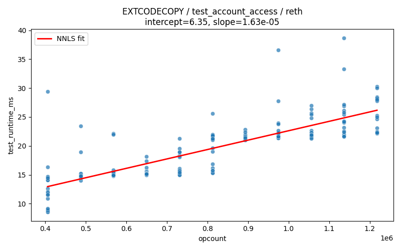

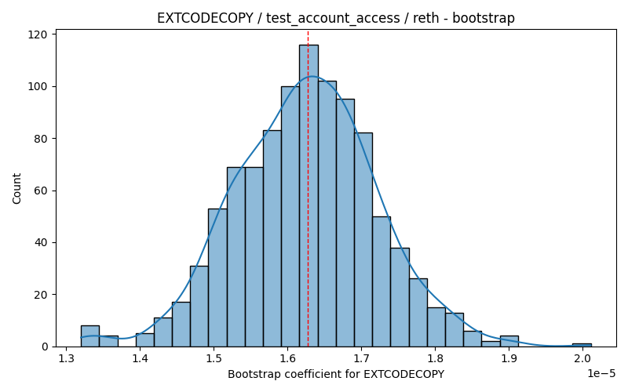

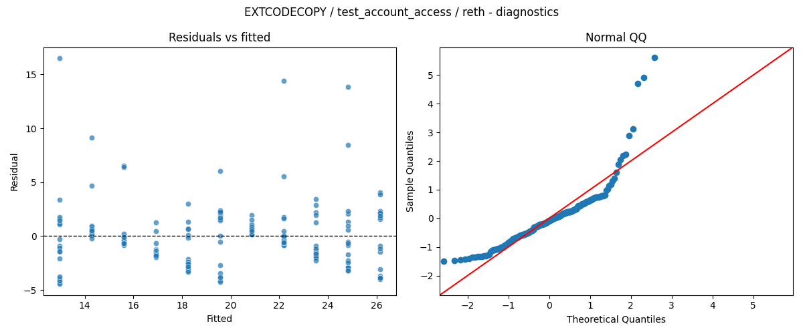

</details>

### test_account_access — combo `EXTCODECOPY_AccountMode.EXISTING_CONTRACT`

| client | nobs | R² | target_coef (ms) | p-value | 95% CI |
| --- | --- | --- | --- | --- | --- |
| `besu` | 187 | 0.8518 | 0.001868 | 1.00e-03 | [0.001754, 0.001992] |
| `erigon` | 77 | 0.9162 | 0.0002997 | 1.00e-03 | [0.0002778, 0.0003174] |
| `geth` | 121 | 0.8524 | 0.0007264 | 1.00e-03 | [0.0006701, 0.0007832] |
| `nethermind` | 110 | 0.9084 | 0.001436 | 1.00e-03 | [0.001353, 0.001517] |
| `reth` | 198 | 0.7851 | 8.381e-05 | 1.00e-03 | [7.617e-05, 9.101e-05] |

<details><summary>besu — NNLS regression summary</summary>

```
==============================================================================
                           NNLS Regression Results                            
==============================================================================
Dep. Variable:          test_runtime_ms              R-squared:          0.852
Model:                  NNLS                    Adj. R-squared:          0.851
No. Observations:       187                               RMSE:          76.97
Df Residuals:           185                                MAE:          61.34
Df Model:               1      
==============================================================================
                      coef     std err     P-value      [0.025      0.975]
------------------------------------------------------------------------------
         const    395.6866     18.5395       0.001    358.6446    433.7932
       opcount      0.0019      0.0001       0.001      0.0018      0.0020
==============================================================================
Notes: Non-negative least squares with bootstrap inference (1000 iterations)
==============================================================================
```

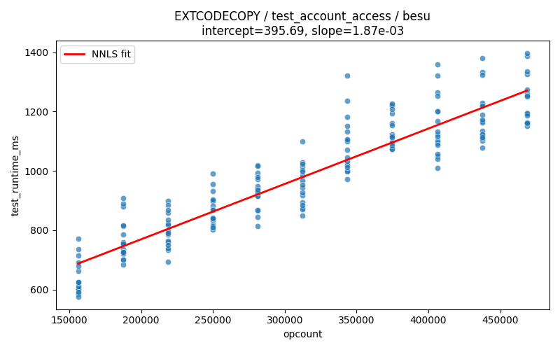

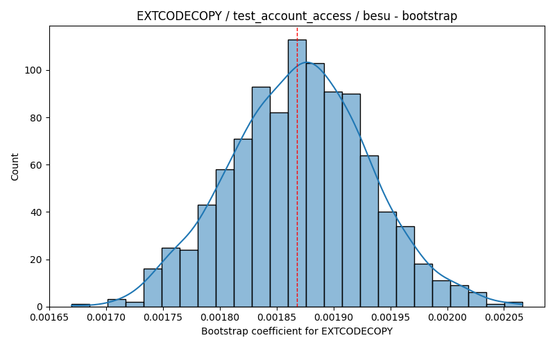

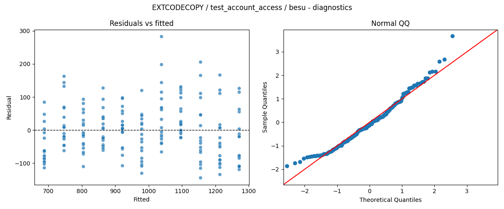

</details>

<details><summary>erigon — NNLS regression summary</summary>

```
==============================================================================
                           NNLS Regression Results                            
==============================================================================
Dep. Variable:          test_runtime_ms              R-squared:          0.916
Model:                  NNLS                    Adj. R-squared:          0.915
No. Observations:       77                                RMSE:           8.96
Df Residuals:           75                                 MAE:           7.02
Df Model:               1      
==============================================================================
                      coef     std err     P-value      [0.025      0.975]
------------------------------------------------------------------------------
         const     43.1994      3.7095       0.001     36.8168     51.1459
       opcount      0.0003      0.0000       0.001      0.0003      0.0003
==============================================================================
Notes: Non-negative least squares with bootstrap inference (1000 iterations)
==============================================================================
```

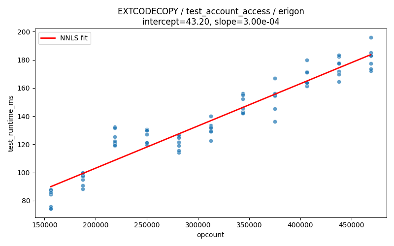

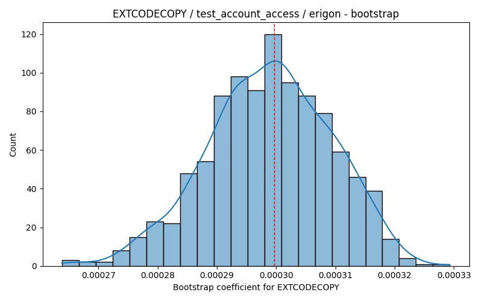

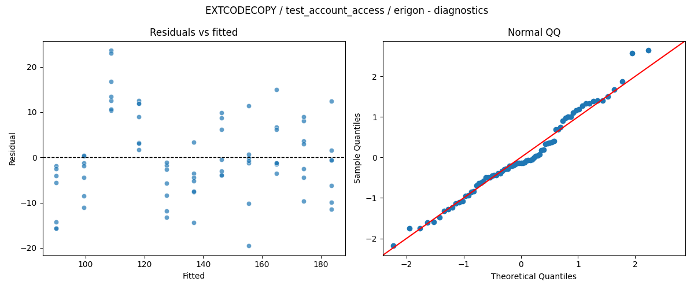

</details>

<details><summary>geth — NNLS regression summary</summary>

```
==============================================================================
                           NNLS Regression Results                            
==============================================================================
Dep. Variable:          test_runtime_ms              R-squared:          0.852
Model:                  NNLS                    Adj. R-squared:          0.851
No. Observations:       121                               RMSE:          29.87
Df Residuals:           119                                MAE:          24.26
Df Model:               1      
==============================================================================
                      coef     std err     P-value      [0.025      0.975]
------------------------------------------------------------------------------
         const     52.3144      8.3291       0.001     36.4054     68.4337
       opcount      0.0007      0.0000       0.001      0.0007      0.0008
==============================================================================
Notes: Non-negative least squares with bootstrap inference (1000 iterations)
==============================================================================
```

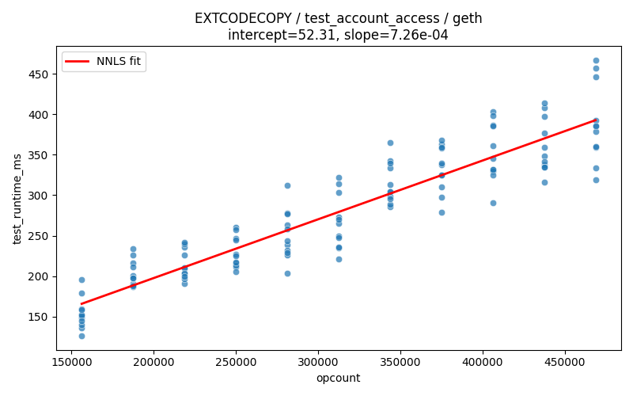

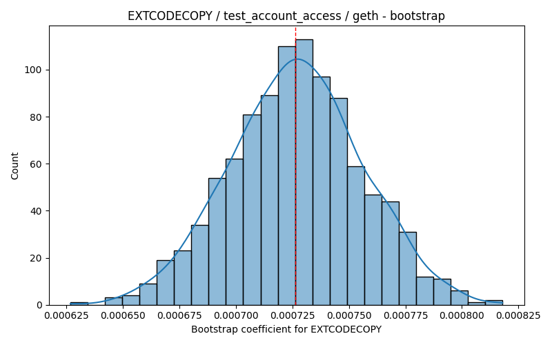

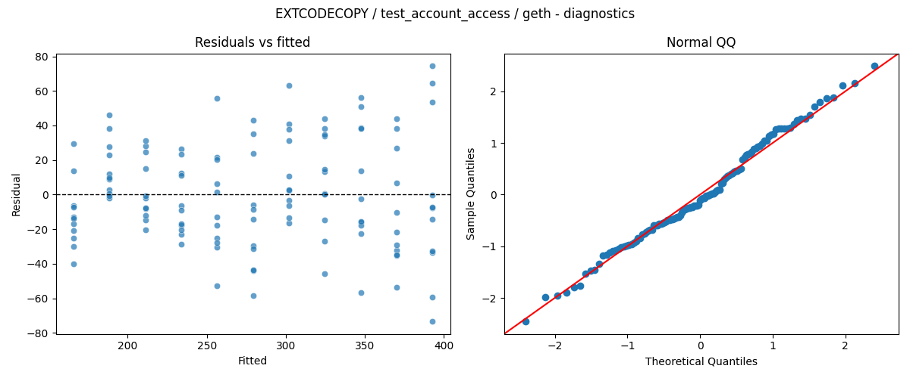

</details>

<details><summary>nethermind — NNLS regression summary</summary>

```
==============================================================================
                           NNLS Regression Results                            
==============================================================================
Dep. Variable:          test_runtime_ms              R-squared:          0.908
Model:                  NNLS                    Adj. R-squared:          0.908
No. Observations:       110                               RMSE:          45.05
Df Residuals:           108                                MAE:          32.86
Df Model:               1      
==============================================================================
                      coef     std err     P-value      [0.025      0.975]
------------------------------------------------------------------------------
         const    156.8453     13.4906       0.001    131.5722    183.3848
       opcount      0.0014      0.0000       0.001      0.0014      0.0015
==============================================================================
Notes: Non-negative least squares with bootstrap inference (1000 iterations)
==============================================================================
```

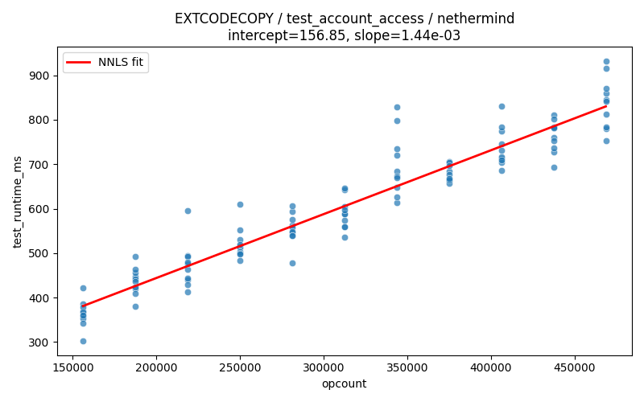

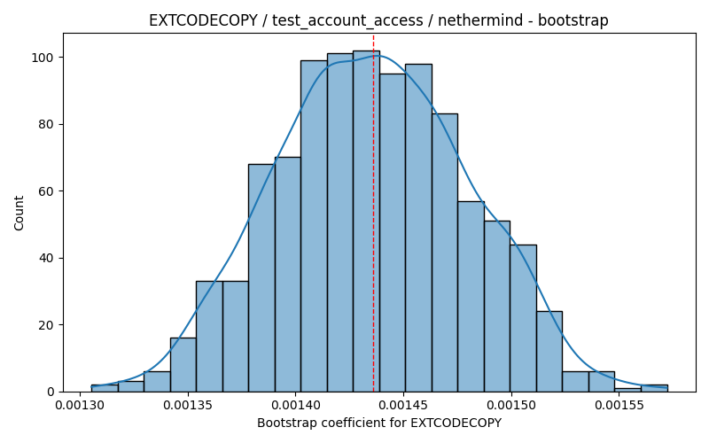

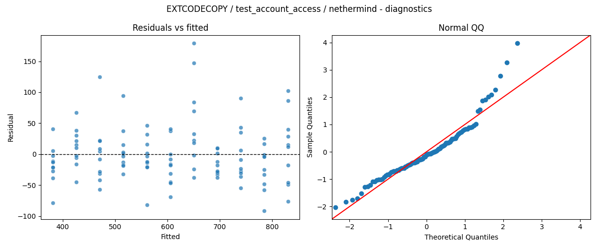

</details>

<details><summary>reth — NNLS regression summary</summary>

```
==============================================================================
                           NNLS Regression Results                            
==============================================================================
Dep. Variable:          test_runtime_ms              R-squared:          0.785
Model:                  NNLS                    Adj. R-squared:          0.784
No. Observations:       198                               RMSE:           4.33
Df Residuals:           196                                MAE:           3.40
Df Model:               1      
==============================================================================
                      coef     std err     P-value      [0.025      0.975]
------------------------------------------------------------------------------
         const      9.9475      1.1421       0.001      7.6573     12.1417
       opcount      0.0001      0.0000       0.001      0.0001      0.0001
==============================================================================
Notes: Non-negative least squares with bootstrap inference (1000 iterations)
==============================================================================
```

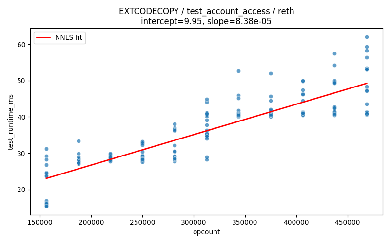

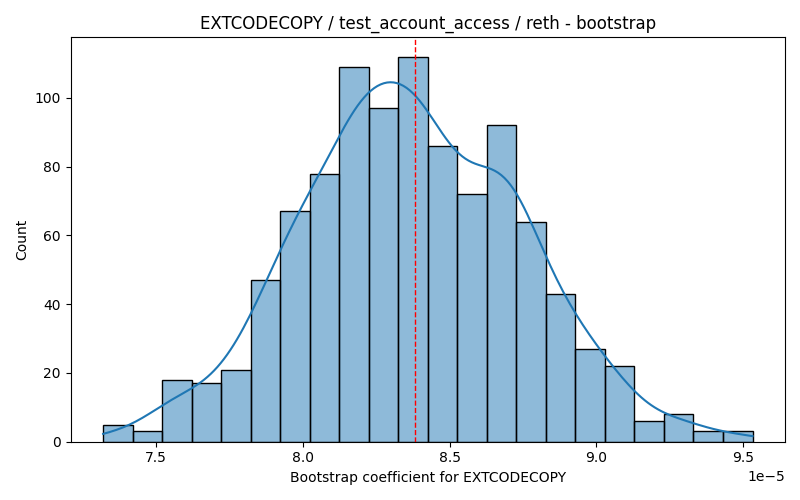

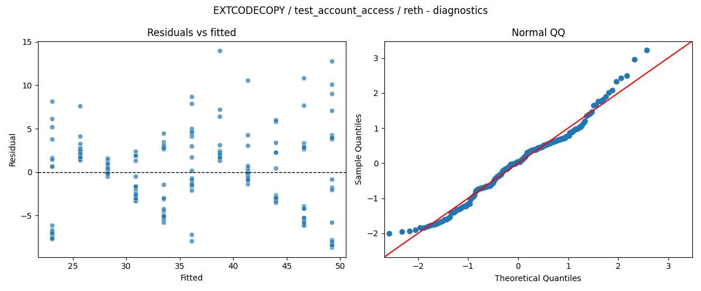

</details>

### test_account_access — combo `EXTCODECOPY_AccountMode.NON_EXISTING_ACCOUNT` — `presets[cold_account_code_access]`

| client | nobs | R² | target_coef (ms) | p-value | 95% CI |
| --- | --- | --- | --- | --- | --- |
| `besu` | 187 | 0.8094 | 0.0004176 | 1.00e-03 | [0.0003873, 0.0004453] |
| `erigon` | 77 | 0.8352 | 6.214e-05 | 1.00e-03 | [5.58e-05, 6.794e-05] |
| `geth` | 121 | 0.92 | 0.0003446 | 1.00e-03 | [0.0003264, 0.000364] |
| `nethermind` | 110 | 0.7761 | 0.0003712 | 1.00e-03 | [0.0003365, 0.0004073] |
| `reth` | 198 | 0.6693 | 1.627e-05 | 1.00e-03 | [1.439e-05, 1.814e-05] |

<details><summary>besu — NNLS regression summary</summary>

```
==============================================================================
                           NNLS Regression Results                            
==============================================================================
Dep. Variable:          test_runtime_ms              R-squared:          0.809
Model:                  NNLS                    Adj. R-squared:          0.808
No. Observations:       187                               RMSE:          52.02
Df Residuals:           185                                MAE:          42.30
Df Model:               1      
==============================================================================
                      coef     std err     P-value      [0.025      0.975]
------------------------------------------------------------------------------
         const    196.4785     12.4886       0.001    173.0768    222.2519
       opcount      0.0004      0.0000       0.001      0.0004      0.0004
==============================================================================
Notes: Non-negative least squares with bootstrap inference (1000 iterations)
==============================================================================
```


</details>

<details><summary>erigon — NNLS regression summary</summary>

```
==============================================================================
                           NNLS Regression Results                            
==============================================================================
Dep. Variable:          test_runtime_ms              R-squared:          0.835
Model:                  NNLS                    Adj. R-squared:          0.833
No. Observations:       77                                RMSE:           7.09
Df Residuals:           75                                 MAE:           5.78
Df Model:               1      
==============================================================================
                      coef     std err     P-value      [0.025      0.975]
------------------------------------------------------------------------------
         const     38.3350      2.7714       0.001     32.9804     43.8078
       opcount      0.0001      0.0000       0.001      0.0001      0.0001
==============================================================================
Notes: Non-negative least squares with bootstrap inference (1000 iterations)
==============================================================================
```


</details>

<details><summary>geth — NNLS regression summary</summary>

```
==============================================================================
                           NNLS Regression Results                            
==============================================================================
Dep. Variable:          test_runtime_ms              R-squared:          0.920
Model:                  NNLS                    Adj. R-squared:          0.919
No. Observations:       121                               RMSE:          26.09
Df Residuals:           119                                MAE:          20.49
Df Model:               1      
==============================================================================
                      coef     std err     P-value      [0.025      0.975]
------------------------------------------------------------------------------
         const     17.8492      6.8954       0.005      4.3054     30.5350
       opcount      0.0003      0.0000       0.001      0.0003      0.0004
==============================================================================
Notes: Non-negative least squares with bootstrap inference (1000 iterations)
==============================================================================
```


</details>

<details><summary>nethermind — NNLS regression summary</summary>

```
==============================================================================
                           NNLS Regression Results                            
==============================================================================
Dep. Variable:          test_runtime_ms              R-squared:          0.776
Model:                  NNLS                    Adj. R-squared:          0.774
No. Observations:       110                               RMSE:          51.19
Df Residuals:           108                                MAE:          40.35
Df Model:               1      
==============================================================================
                      coef     std err     P-value      [0.025      0.975]
------------------------------------------------------------------------------
         const    119.0483     13.2702       0.001     93.8861    145.3381
       opcount      0.0004      0.0000       0.001      0.0003      0.0004
==============================================================================
Notes: Non-negative least squares with bootstrap inference (1000 iterations)
==============================================================================
```


</details>

<details><summary>reth — NNLS regression summary</summary>

```
==============================================================================
                           NNLS Regression Results                            
==============================================================================
Dep. Variable:          test_runtime_ms              R-squared:          0.669
Model:                  NNLS                    Adj. R-squared:          0.668
No. Observations:       198                               RMSE:           2.94
Df Residuals:           196                                MAE:           1.94
Df Model:               1      
==============================================================================
                      coef     std err     P-value      [0.025      0.975]
------------------------------------------------------------------------------
         const      6.3516      0.8005       0.001      4.8555      7.9596
       opcount      0.0000      0.0000       0.001      0.0000      0.0000
==============================================================================
Notes: Non-negative least squares with bootstrap inference (1000 iterations)
==============================================================================
```


</details>

## EXTCODEHASH

### test_account_access — combo `EXTCODEHASH_AccountMode.NON_EXISTING_ACCOUNT` — `presets[cold_account_nocode_access]`

| client | nobs | R² | target_coef (ms) | p-value | 95% CI |
| --- | --- | --- | --- | --- | --- |
| `besu` | 187 | 0.9089 | 0.009869 | 1.00e-03 | [0.00936, 0.01039] |
| `erigon` | 77 | 0.9977 | 0.008622 | 1.00e-03 | [0.008523, 0.008708] |
| `geth` | 121 | 0.7061 | 0.02734 | 1.00e-03 | [0.02387, 0.03061] |
| `nethermind` | 110 | 0.9346 | 0.003941 | 1.00e-03 | [0.003739, 0.004139] |
| `reth` | 198 | 0.967 | 0.0008982 | 1.00e-03 | [0.000874, 0.0009268] |

<details><summary>besu — NNLS regression summary</summary>

```
==============================================================================
                           NNLS Regression Results                            
==============================================================================
Dep. Variable:          test_runtime_ms              R-squared:          0.909
Model:                  NNLS                    Adj. R-squared:          0.908
No. Observations:       187                               RMSE:          74.68
Df Residuals:           185                                MAE:          60.24
Df Model:               1      
==============================================================================
                      coef     std err     P-value      [0.025      0.975]
------------------------------------------------------------------------------
         const    406.0439     21.9992       0.001    360.3658    448.0383
       opcount      0.0099      0.0003       0.001      0.0094      0.0104
==============================================================================
Notes: Non-negative least squares with bootstrap inference (1000 iterations)
==============================================================================
```

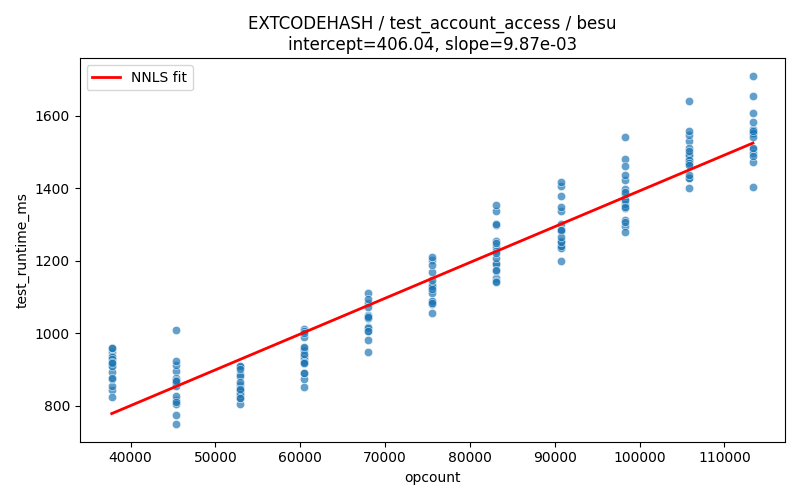

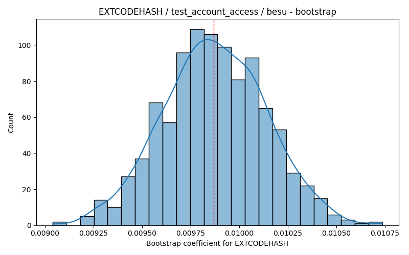

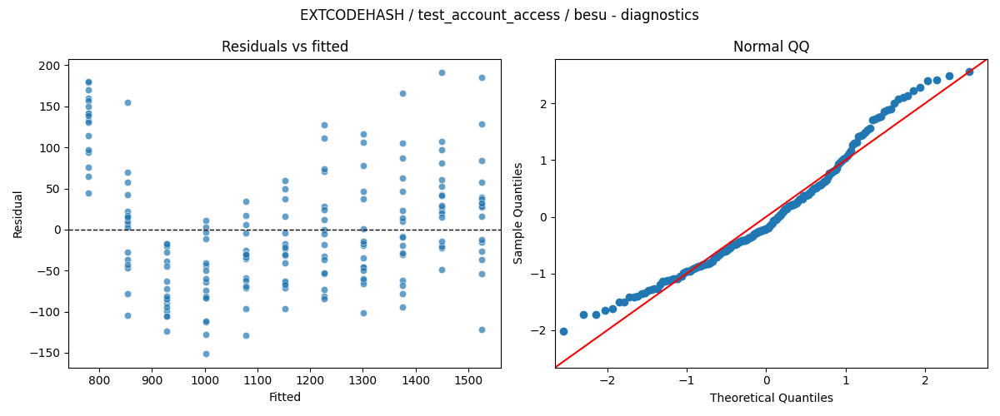

</details>

<details><summary>erigon — NNLS regression summary</summary>

```
==============================================================================
                           NNLS Regression Results                            
==============================================================================
Dep. Variable:          test_runtime_ms              R-squared:          0.998
Model:                  NNLS                    Adj. R-squared:          0.998
No. Observations:       77                                RMSE:           9.98
Df Residuals:           75                                 MAE:           8.26
Df Model:               1      
==============================================================================
                      coef     std err     P-value      [0.025      0.975]
------------------------------------------------------------------------------
         const      6.1881      3.6572       0.049      0.0000     13.9056
       opcount      0.0086      0.0000       0.001      0.0085      0.0087
==============================================================================
Notes: Non-negative least squares with bootstrap inference (1000 iterations)
==============================================================================
```

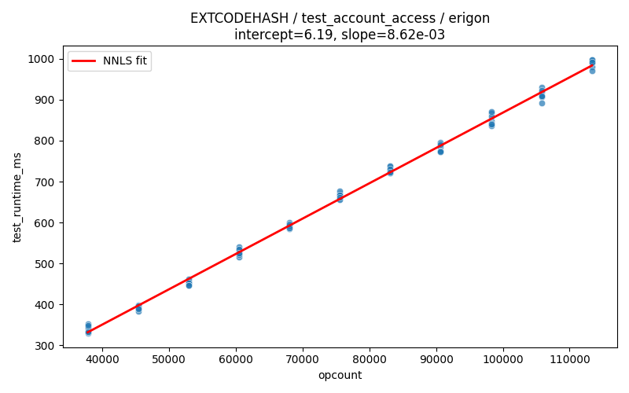

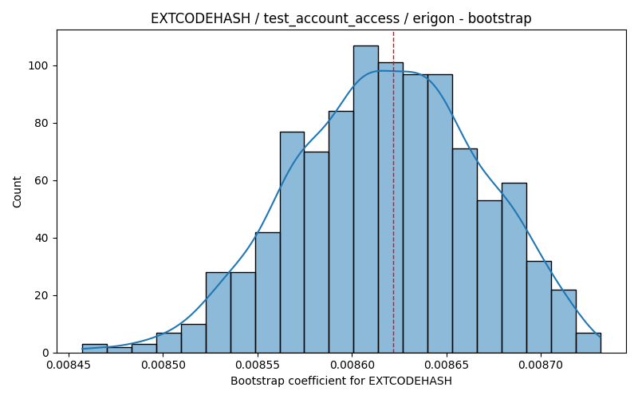

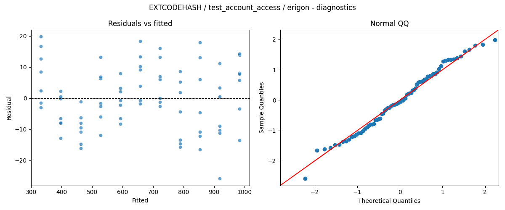

</details>

<details><summary>geth — NNLS regression summary</summary>

```
==============================================================================
                           NNLS Regression Results                            
==============================================================================
Dep. Variable:          test_runtime_ms              R-squared:          0.706
Model:                  NNLS                    Adj. R-squared:          0.704
No. Observations:       121                               RMSE:         421.62
Df Residuals:           119                                MAE:         350.41
Df Model:               1      
==============================================================================
                      coef     std err     P-value      [0.025      0.975]
------------------------------------------------------------------------------
         const   1125.3973    133.9767       0.001    865.6884   1406.0677
       opcount      0.0273      0.0017       0.001      0.0239      0.0306
==============================================================================
Notes: Non-negative least squares with bootstrap inference (1000 iterations)
==============================================================================
```

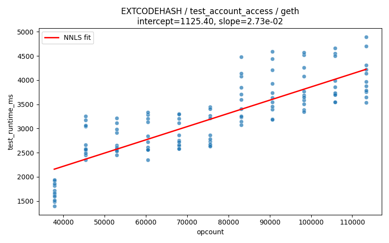

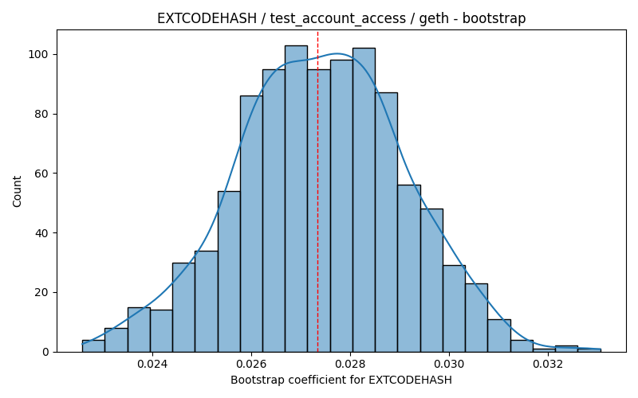

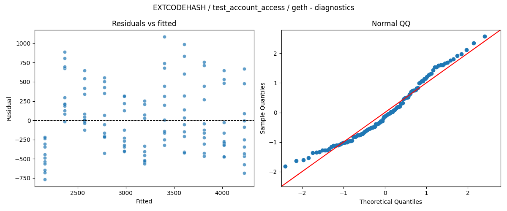

</details>

<details><summary>nethermind — NNLS regression summary</summary>

```
==============================================================================
                           NNLS Regression Results                            
==============================================================================
Dep. Variable:          test_runtime_ms              R-squared:          0.935
Model:                  NNLS                    Adj. R-squared:          0.934
No. Observations:       110                               RMSE:          24.92
Df Residuals:           108                                MAE:          19.99
Df Model:               1      
==============================================================================
                      coef     std err     P-value      [0.025      0.975]
------------------------------------------------------------------------------
         const     75.4574      7.2775       0.001     61.5792     89.9160
       opcount      0.0039      0.0001       0.001      0.0037      0.0041
==============================================================================
Notes: Non-negative least squares with bootstrap inference (1000 iterations)
==============================================================================
```

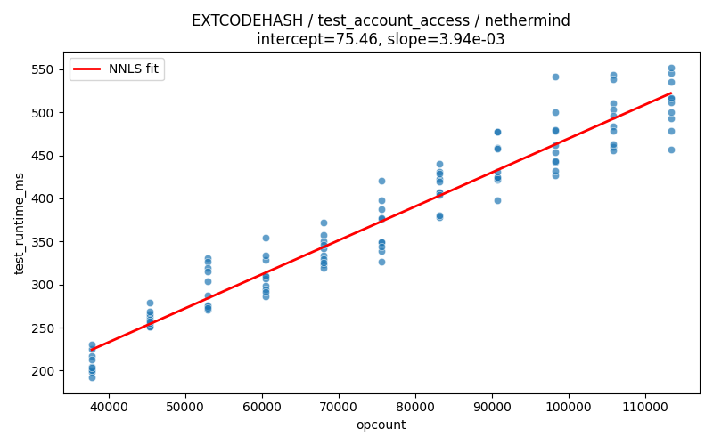

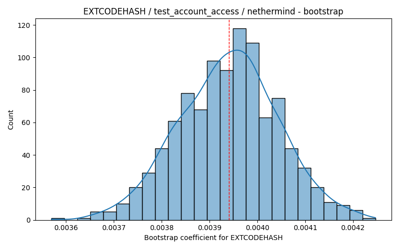

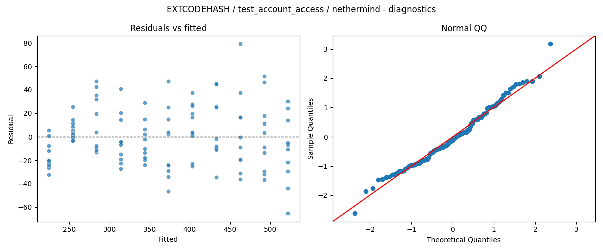

</details>

<details><summary>reth — NNLS regression summary</summary>

```
==============================================================================
                           NNLS Regression Results                            
==============================================================================
Dep. Variable:          test_runtime_ms              R-squared:          0.967
Model:                  NNLS                    Adj. R-squared:          0.967
No. Observations:       198                               RMSE:           3.97
Df Residuals:           196                                MAE:           3.18
Df Model:               1      
==============================================================================
                      coef     std err     P-value      [0.025      0.975]
------------------------------------------------------------------------------
         const     33.1025      1.0253       0.001     30.9885     35.1615
       opcount      0.0009      0.0000       0.001      0.0009      0.0009
==============================================================================
Notes: Non-negative least squares with bootstrap inference (1000 iterations)
==============================================================================
```

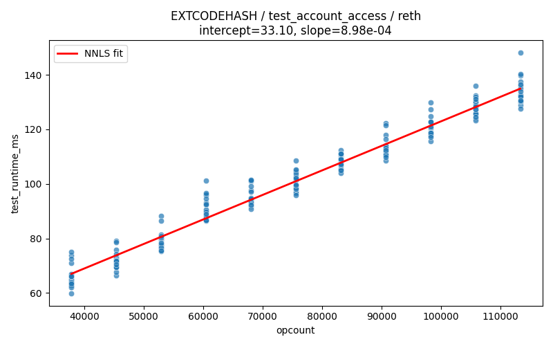

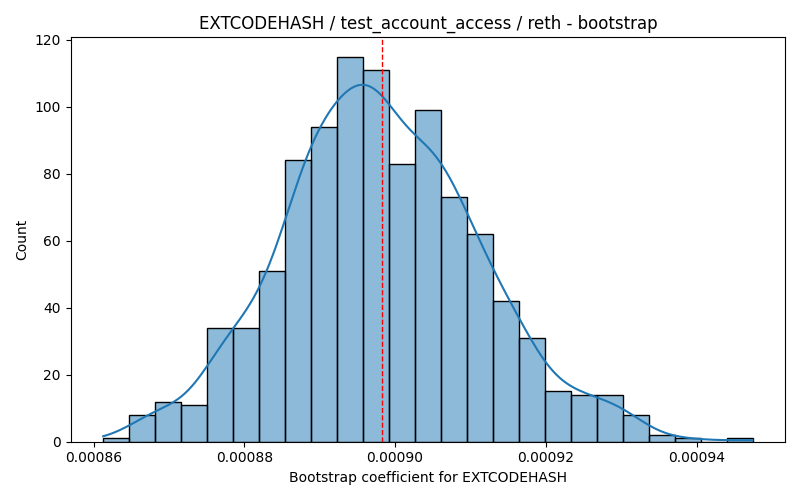

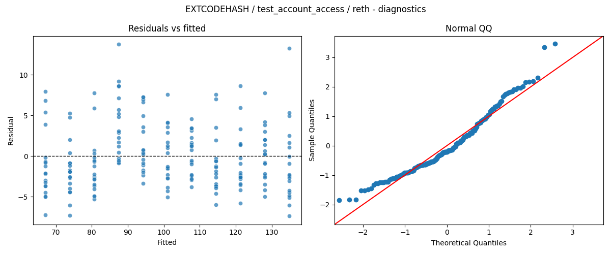

</details>

### test_account_access — combo `EXTCODEHASH_AccountMode.EXISTING_CONTRACT`

| client | nobs | R² | target_coef (ms) | p-value | 95% CI |
| --- | --- | --- | --- | --- | --- |
| `besu` | 187 | 0.9472 | 0.02618 | 1.00e-03 | [0.0252, 0.02724] |
| `erigon` | 77 | 0.9116 | 0.0355 | 1.00e-03 | [0.03284, 0.03767] |
| `geth` | 121 | 0.7382 | 0.02869 | 1.00e-03 | [0.02516, 0.03202] |
| `nethermind` | 110 | 0.711 | 0.02451 | 1.00e-03 | [0.02125, 0.02759] |
| `reth` | 198 | 0.9056 | 0.03622 | 1.00e-03 | [0.03413, 0.03846] |

<details><summary>besu — NNLS regression summary</summary>

```
==============================================================================
                           NNLS Regression Results                            
==============================================================================
Dep. Variable:          test_runtime_ms              R-squared:          0.947
Model:                  NNLS                    Adj. R-squared:          0.947
No. Observations:       187                               RMSE:         128.64
Df Residuals:           185                                MAE:         109.35
Df Model:               1      
==============================================================================
                      coef     std err     P-value      [0.025      0.975]
------------------------------------------------------------------------------
         const    434.9862     37.4548       0.001    356.7932    505.2310
       opcount      0.0262      0.0005       0.001      0.0252      0.0272
==============================================================================
Notes: Non-negative least squares with bootstrap inference (1000 iterations)
==============================================================================
```

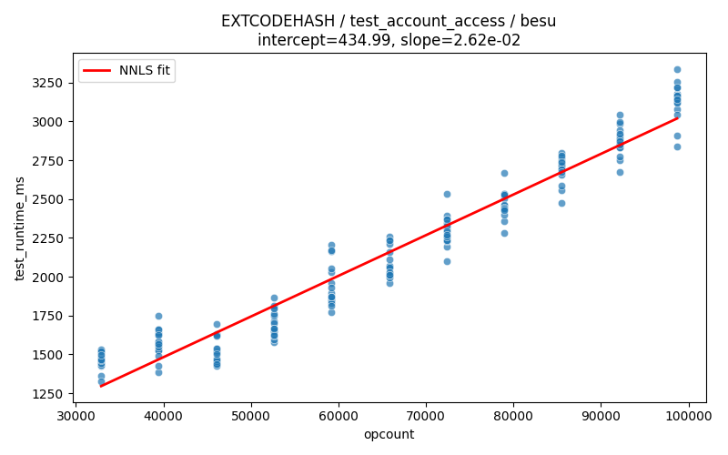

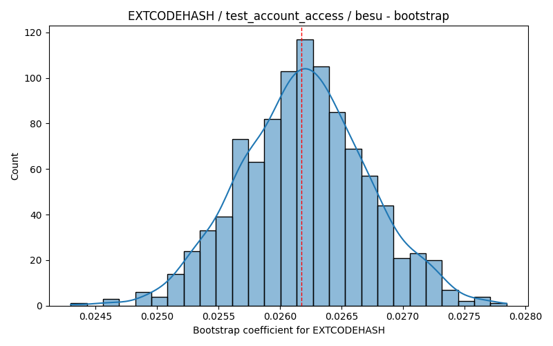

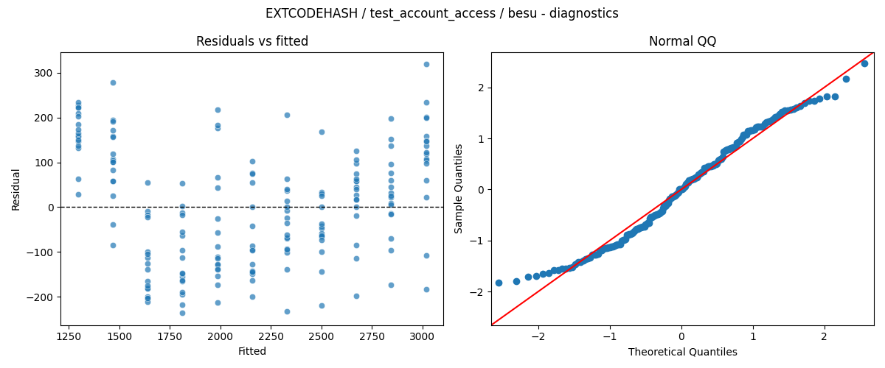

</details>

<details><summary>erigon — NNLS regression summary</summary>

```
==============================================================================
                           NNLS Regression Results                            
==============================================================================
Dep. Variable:          test_runtime_ms              R-squared:          0.912
Model:                  NNLS                    Adj. R-squared:          0.910
No. Observations:       77                                RMSE:         229.91
Df Residuals:           75                                 MAE:         193.64
Df Model:               1      
==============================================================================
                      coef     std err     P-value      [0.025      0.975]
------------------------------------------------------------------------------
         const    385.2958     92.4218       0.001    222.4076    581.6706
       opcount      0.0355      0.0012       0.001      0.0328      0.0377
==============================================================================
Notes: Non-negative least squares with bootstrap inference (1000 iterations)
==============================================================================
```

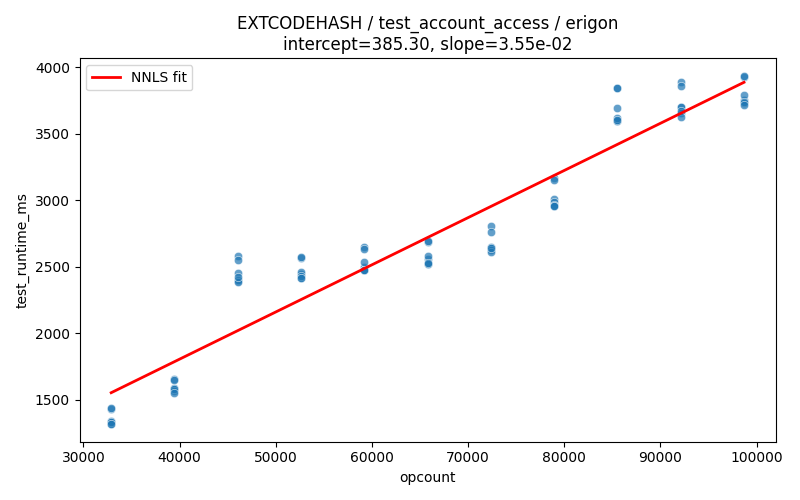

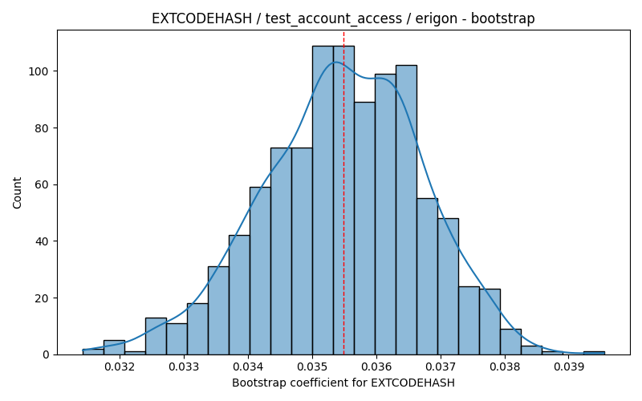

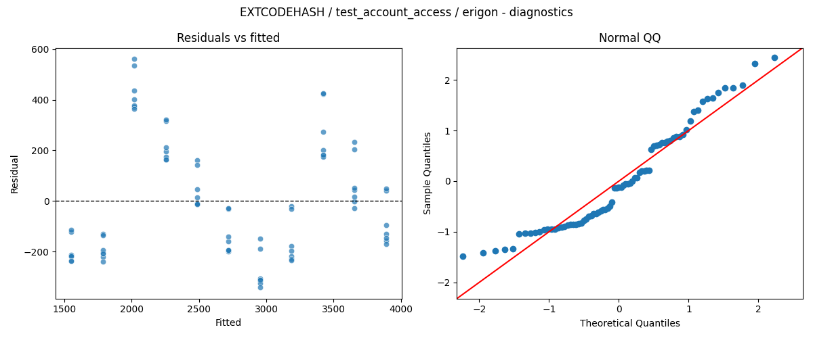

</details>

<details><summary>geth — NNLS regression summary</summary>

```
==============================================================================
                           NNLS Regression Results                            
==============================================================================
Dep. Variable:          test_runtime_ms              R-squared:          0.738
Model:                  NNLS                    Adj. R-squared:          0.736
No. Observations:       121                               RMSE:         355.49
Df Residuals:           119                                MAE:         284.32
Df Model:               1      
==============================================================================
                      coef     std err     P-value      [0.025      0.975]
------------------------------------------------------------------------------
         const   1058.4612    124.7674       0.001    822.0144   1311.5721
       opcount      0.0287      0.0018       0.001      0.0252      0.0320
==============================================================================
Notes: Non-negative least squares with bootstrap inference (1000 iterations)
==============================================================================
```

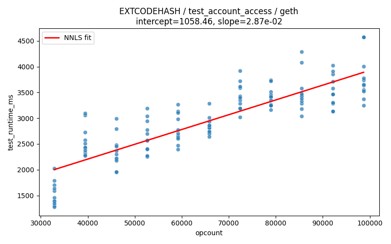

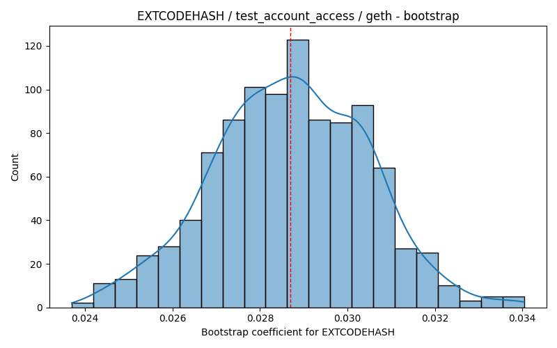

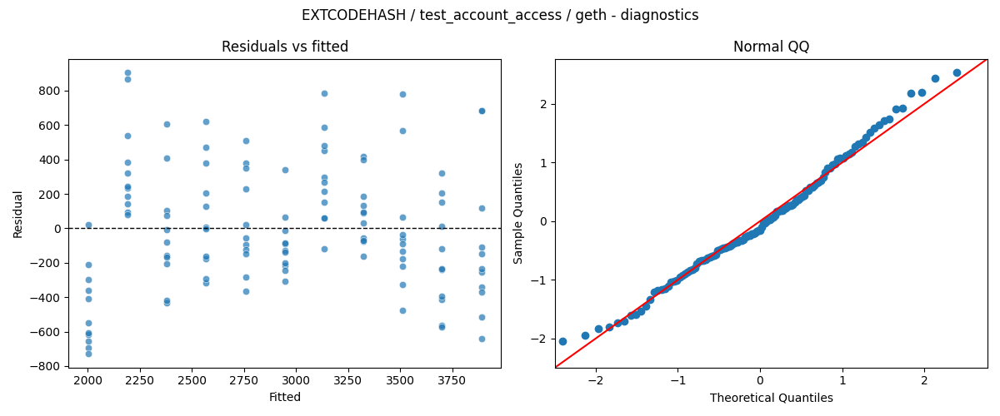

</details>

<details><summary>nethermind — NNLS regression summary</summary>

```
==============================================================================
                           NNLS Regression Results                            
==============================================================================
Dep. Variable:          test_runtime_ms              R-squared:          0.711
Model:                  NNLS                    Adj. R-squared:          0.708
No. Observations:       110                               RMSE:         325.14
Df Residuals:           108                                MAE:         271.21
Df Model:               1      
==============================================================================
                      coef     std err     P-value      [0.025      0.975]
------------------------------------------------------------------------------
         const    816.0630    109.4156       0.001    603.0245   1044.2951
       opcount      0.0245      0.0016       0.001      0.0213      0.0276
==============================================================================
Notes: Non-negative least squares with bootstrap inference (1000 iterations)
==============================================================================
```

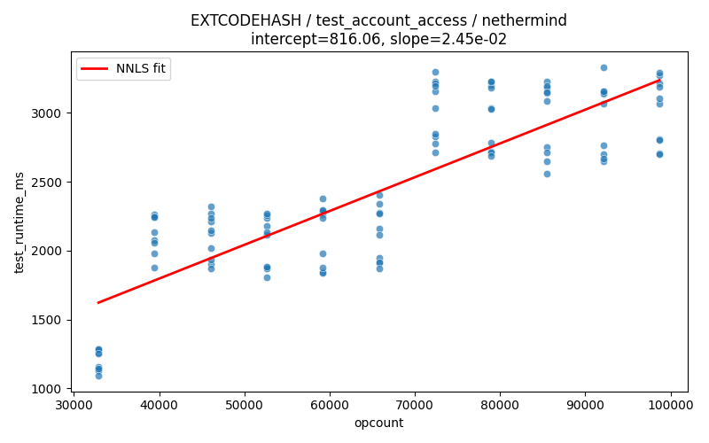

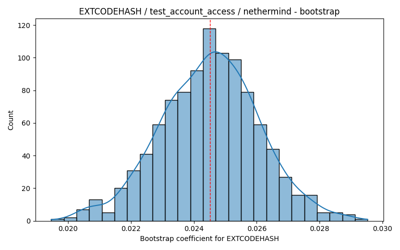

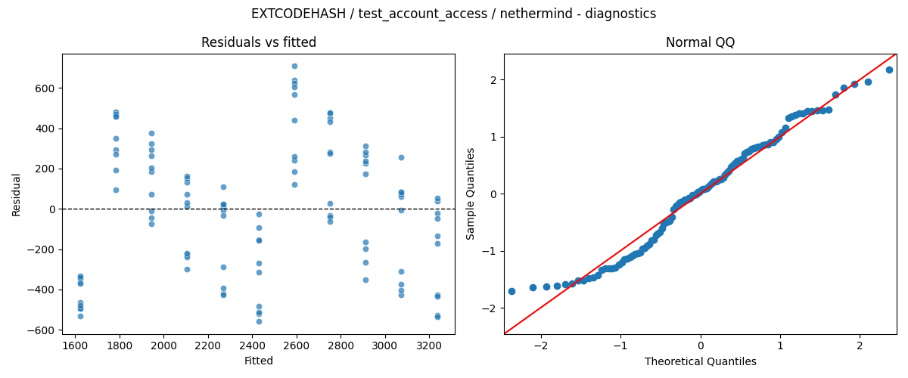

</details>

<details><summary>reth — NNLS regression summary</summary>

```
==============================================================================
                           NNLS Regression Results                            
==============================================================================
Dep. Variable:          test_runtime_ms              R-squared:          0.906
Model:                  NNLS                    Adj. R-squared:          0.905
No. Observations:       198                               RMSE:         243.29
Df Residuals:           196                                MAE:         140.29
Df Model:               1      
==============================================================================
                      coef     std err     P-value      [0.025      0.975]
------------------------------------------------------------------------------
         const    132.1924     69.5385       0.053      0.0000    264.3816
       opcount      0.0362      0.0011       0.001      0.0341      0.0385
==============================================================================
Notes: Non-negative least squares with bootstrap inference (1000 iterations)
==============================================================================
```

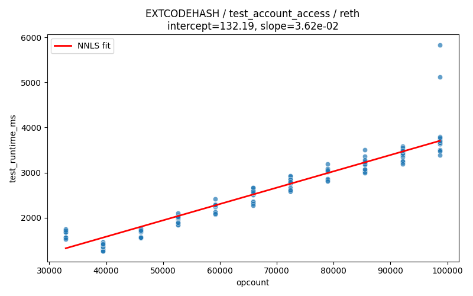

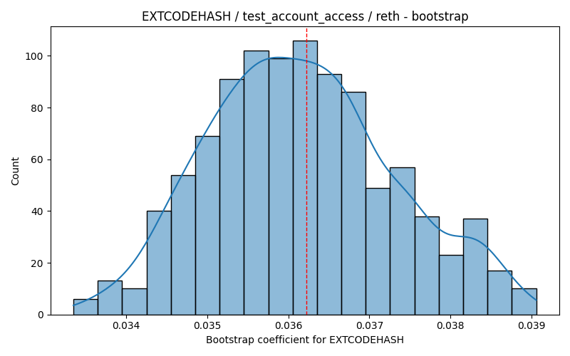

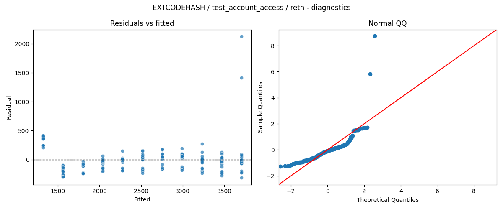

</details>

### test_account_access — combo `EXTCODEHASH_AccountMode.NON_EXISTING_ACCOUNT` — `presets[cold_account_code_access]`

| client | nobs | R² | target_coef (ms) | p-value | 95% CI |
| --- | --- | --- | --- | --- | --- |
| `besu` | 187 | 0.9089 | 0.009869 | 1.00e-03 | [0.00936, 0.01039] |
| `erigon` | 77 | 0.9977 | 0.008622 | 1.00e-03 | [0.008523, 0.008708] |
| `geth` | 121 | 0.7061 | 0.02734 | 1.00e-03 | [0.02387, 0.03061] |
| `nethermind` | 110 | 0.9346 | 0.003941 | 1.00e-03 | [0.003739, 0.004139] |
| `reth` | 198 | 0.967 | 0.0008982 | 1.00e-03 | [0.000874, 0.0009268] |

<details><summary>besu — NNLS regression summary</summary>

```
==============================================================================
                           NNLS Regression Results                            
==============================================================================
Dep. Variable:          test_runtime_ms              R-squared:          0.909
Model:                  NNLS                    Adj. R-squared:          0.908
No. Observations:       187                               RMSE:          74.68
Df Residuals:           185                                MAE:          60.24
Df Model:               1      
==============================================================================
                      coef     std err     P-value      [0.025      0.975]
------------------------------------------------------------------------------
         const    406.0439     21.9992       0.001    360.3658    448.0383
       opcount      0.0099      0.0003       0.001      0.0094      0.0104
==============================================================================
Notes: Non-negative least squares with bootstrap inference (1000 iterations)
==============================================================================
```


</details>

<details><summary>erigon — NNLS regression summary</summary>

```
==============================================================================
                           NNLS Regression Results                            
==============================================================================
Dep. Variable:          test_runtime_ms              R-squared:          0.998
Model:                  NNLS                    Adj. R-squared:          0.998
No. Observations:       77                                RMSE:           9.98
Df Residuals:           75                                 MAE:           8.26
Df Model:               1      
==============================================================================
                      coef     std err     P-value      [0.025      0.975]
------------------------------------------------------------------------------
         const      6.1881      3.6572       0.049      0.0000     13.9056
       opcount      0.0086      0.0000       0.001      0.0085      0.0087
==============================================================================
Notes: Non-negative least squares with bootstrap inference (1000 iterations)
==============================================================================
```


</details>

<details><summary>geth — NNLS regression summary</summary>

```
==============================================================================
                           NNLS Regression Results                            
==============================================================================
Dep. Variable:          test_runtime_ms              R-squared:          0.706
Model:                  NNLS                    Adj. R-squared:          0.704
No. Observations:       121                               RMSE:         421.62
Df Residuals:           119                                MAE:         350.41
Df Model:               1      
==============================================================================
                      coef     std err     P-value      [0.025      0.975]
------------------------------------------------------------------------------
         const   1125.3973    133.9767       0.001    865.6884   1406.0677
       opcount      0.0273      0.0017       0.001      0.0239      0.0306
==============================================================================
Notes: Non-negative least squares with bootstrap inference (1000 iterations)
==============================================================================
```


</details>

<details><summary>nethermind — NNLS regression summary</summary>

```
==============================================================================
                           NNLS Regression Results                            
==============================================================================
Dep. Variable:          test_runtime_ms              R-squared:          0.935
Model:                  NNLS                    Adj. R-squared:          0.934
No. Observations:       110                               RMSE:          24.92
Df Residuals:           108                                MAE:          19.99
Df Model:               1      
==============================================================================
                      coef     std err     P-value      [0.025      0.975]
------------------------------------------------------------------------------
         const     75.4574      7.2775       0.001     61.5792     89.9160
       opcount      0.0039      0.0001       0.001      0.0037      0.0041
==============================================================================
Notes: Non-negative least squares with bootstrap inference (1000 iterations)
==============================================================================
```


</details>

<details><summary>reth — NNLS regression summary</summary>

```
==============================================================================
                           NNLS Regression Results                            
==============================================================================
Dep. Variable:          test_runtime_ms              R-squared:          0.967
Model:                  NNLS                    Adj. R-squared:          0.967
No. Observations:       198                               RMSE:           3.97
Df Residuals:           196                                MAE:           3.18
Df Model:               1      
==============================================================================
                      coef     std err     P-value      [0.025      0.975]
------------------------------------------------------------------------------
         const     33.1025      1.0253       0.001     30.9885     35.1615
       opcount      0.0009      0.0000       0.001      0.0009      0.0009
==============================================================================
Notes: Non-negative least squares with bootstrap inference (1000 iterations)
==============================================================================
```


</details>

### test_ext_account_query_warm — combo `EXTCODEHASH`

| client | nobs | R² | target_coef (ms) | p-value | 95% CI |
| --- | --- | --- | --- | --- | --- |
| `besu` | 187 | 0.8243 | 0.0001818 | 1.00e-03 | [0.0001705, 0.0001943] |
| `erigon` | 77 | 0.9505 | 0.0002446 | 1.00e-03 | [0.0002343, 0.000254] |
| `geth` | 121 | 0.8068 | 4.166e-05 | 1.00e-03 | [3.737e-05, 4.608e-05] |
| `nethermind` | 110 | 0.7874 | 0.0002782 | 1.00e-03 | [0.0002515, 0.0003057] |
| `reth` | 198 | 0.6943 | 8.064e-06 | 1.00e-03 | [7.401e-06, 8.794e-06] |

<details><summary>besu — NNLS regression summary</summary>

```
==============================================================================
                           NNLS Regression Results                            
==============================================================================
Dep. Variable:          test_runtime_ms              R-squared:          0.824
Model:                  NNLS                    Adj. R-squared:          0.823
No. Observations:       187                               RMSE:          49.09
Df Residuals:           185                                MAE:          39.42
Df Model:               1      
==============================================================================
                      coef     std err     P-value      [0.025      0.975]
------------------------------------------------------------------------------
         const    133.5578     11.0238       0.001    112.0730    155.1065
       opcount      0.0002      0.0000       0.001      0.0002      0.0002
==============================================================================
Notes: Non-negative least squares with bootstrap inference (1000 iterations)
==============================================================================
```

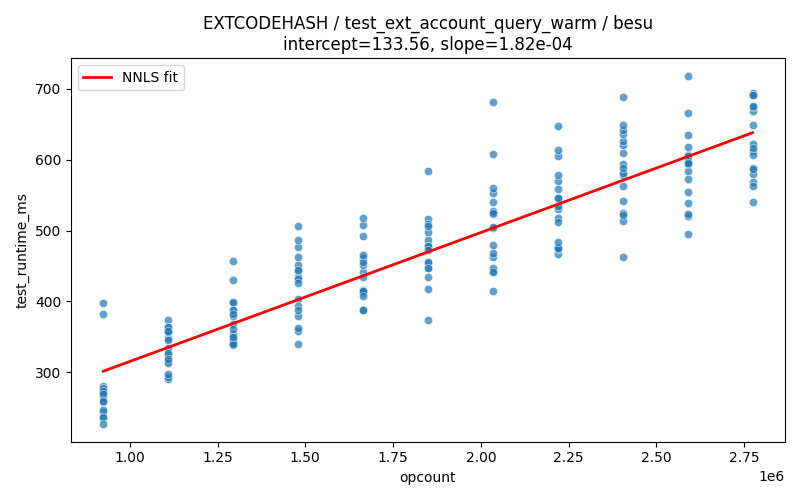

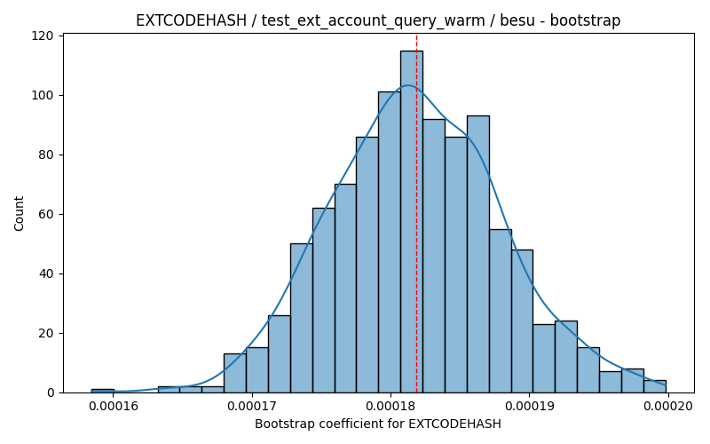

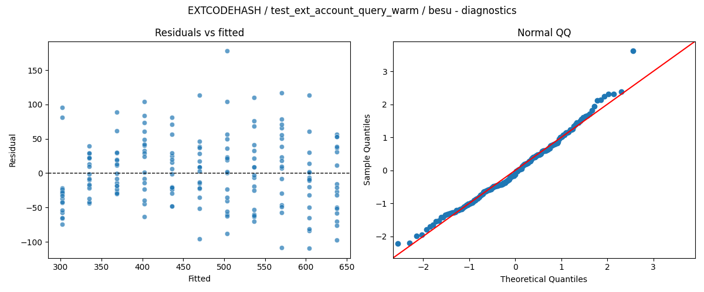

</details>

<details><summary>erigon — NNLS regression summary</summary>

```
==============================================================================
                           NNLS Regression Results                            
==============================================================================
Dep. Variable:          test_runtime_ms              R-squared:          0.951
Model:                  NNLS                    Adj. R-squared:          0.950
No. Observations:       77                                RMSE:          32.63
Df Residuals:           75                                 MAE:          24.45
Df Model:               1      
==============================================================================
                      coef     std err     P-value      [0.025      0.975]
------------------------------------------------------------------------------
         const     53.7932      9.0866       0.001     37.6708     71.7066
       opcount      0.0002      0.0000       0.001      0.0002      0.0003
==============================================================================
Notes: Non-negative least squares with bootstrap inference (1000 iterations)
==============================================================================
```

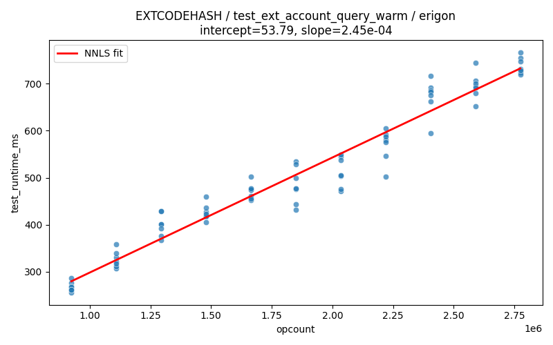

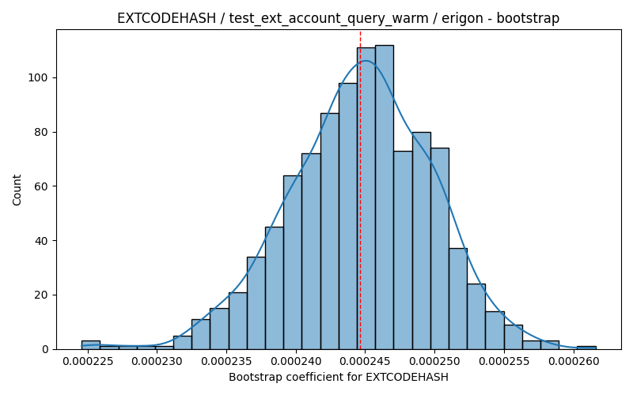

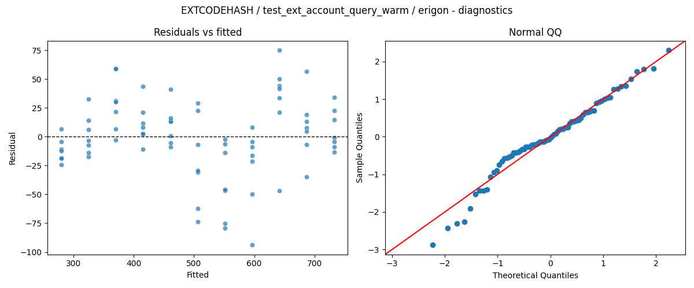

</details>

<details><summary>geth — NNLS regression summary</summary>

```
==============================================================================
                           NNLS Regression Results                            
==============================================================================
Dep. Variable:          test_runtime_ms              R-squared:          0.807
Model:                  NNLS                    Adj. R-squared:          0.805
No. Observations:       121                               RMSE:          11.92
Df Residuals:           119                                MAE:           8.42
Df Model:               1      
==============================================================================
                      coef     std err     P-value      [0.025      0.975]
------------------------------------------------------------------------------
         const     14.3716      3.5077       0.001      7.6292     20.9339
       opcount      0.0000      0.0000       0.001      0.0000      0.0000
==============================================================================
Notes: Non-negative least squares with bootstrap inference (1000 iterations)
==============================================================================
```

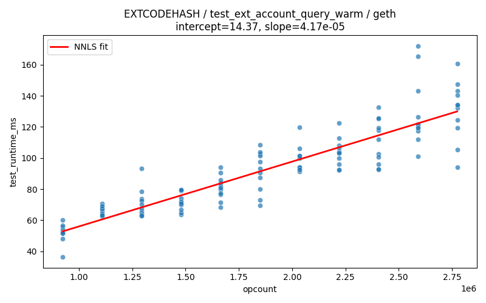

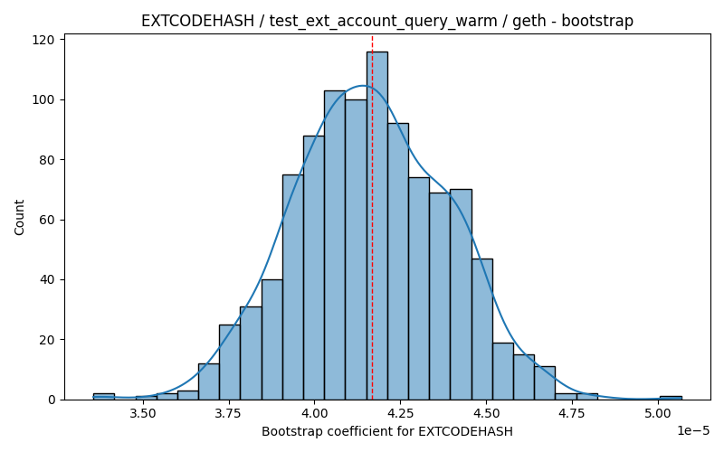

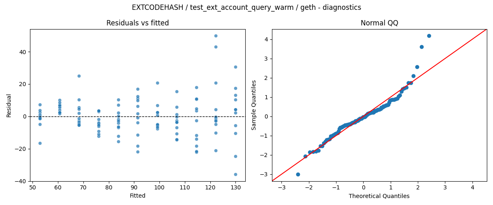

</details>

<details><summary>nethermind — NNLS regression summary</summary>

```
==============================================================================
                           NNLS Regression Results                            
==============================================================================
Dep. Variable:          test_runtime_ms              R-squared:          0.787
Model:                  NNLS                    Adj. R-squared:          0.785
No. Observations:       110                               RMSE:          84.54
Df Residuals:           108                                MAE:          62.76
Df Model:               1      
==============================================================================
                      coef     std err     P-value      [0.025      0.975]
------------------------------------------------------------------------------
         const    155.8506     22.0286       0.001    115.9012    200.3248
       opcount      0.0003      0.0000       0.001      0.0003      0.0003
==============================================================================
Notes: Non-negative least squares with bootstrap inference (1000 iterations)
==============================================================================
```

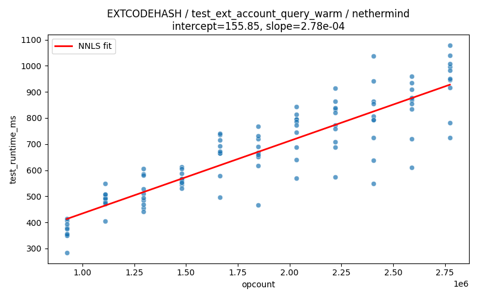

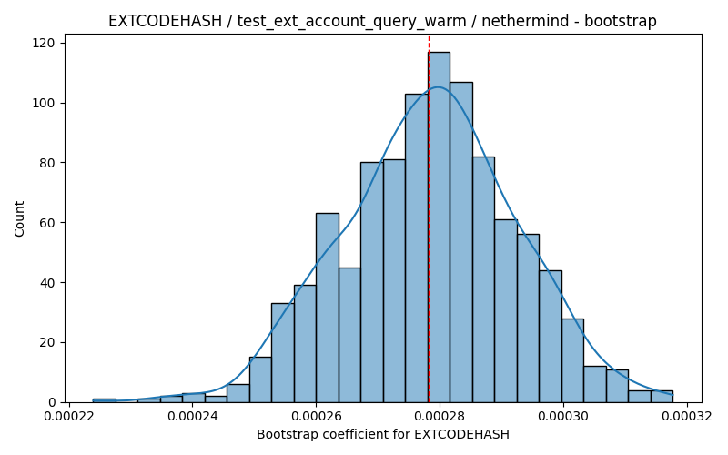

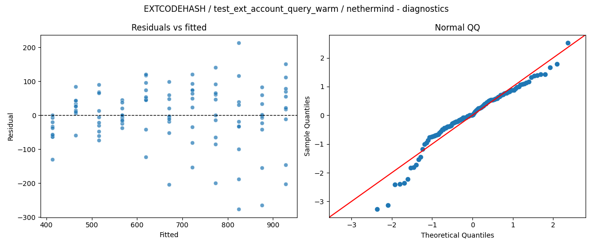

</details>

<details><summary>reth — NNLS regression summary</summary>

```
==============================================================================
                           NNLS Regression Results                            
==============================================================================
Dep. Variable:          test_runtime_ms              R-squared:          0.694
Model:                  NNLS                    Adj. R-squared:          0.693
No. Observations:       198                               RMSE:           3.13
Df Residuals:           196                                MAE:           2.11
Df Model:               1      
==============================================================================
                      coef     std err     P-value      [0.025      0.975]
------------------------------------------------------------------------------
         const      5.8088      0.6370       0.001      4.5574      6.9705
       opcount      0.0000      0.0000       0.001      0.0000      0.0000
==============================================================================
Notes: Non-negative least squares with bootstrap inference (1000 iterations)
==============================================================================
```

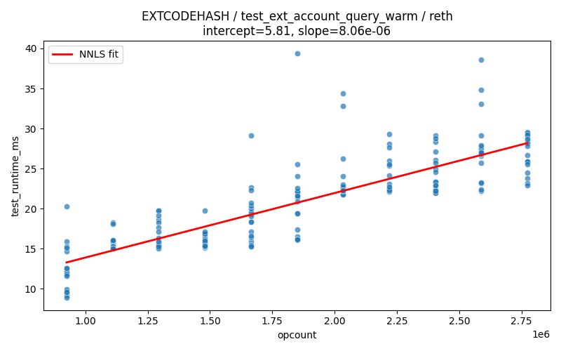

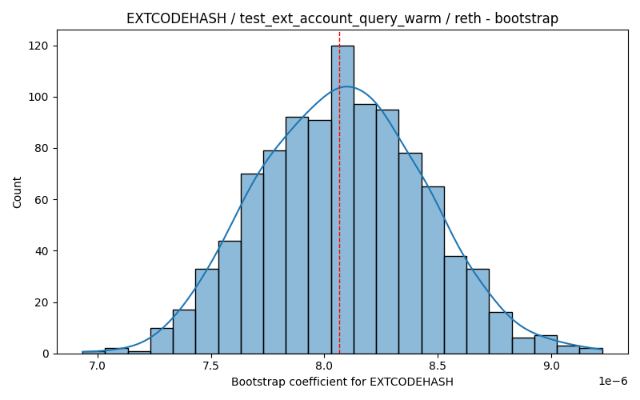

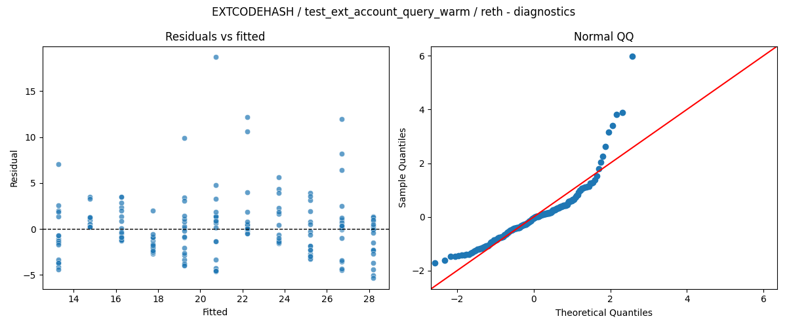

</details>

## EXTCODESIZE

### test_account_access — combo `EXTCODESIZE_AccountMode.NON_EXISTING_ACCOUNT` — `presets[cold_account_nocode_access]`

| client | nobs | R² | target_coef (ms) | p-value | 95% CI |
| --- | --- | --- | --- | --- | --- |
| `besu` | 187 | 0.8996 | 0.009773 | 1.00e-03 | [0.009246, 0.01032] |
| `erigon` | 77 | 0.9982 | 0.00886 | 1.00e-03 | [0.008778, 0.008944] |
| `geth` | 121 | 0.6934 | 0.02839 | 1.00e-03 | [0.02501, 0.03194] |
| `nethermind` | 110 | 0.942 | 0.004037 | 1.00e-03 | [0.003836, 0.004259] |
| `reth` | 198 | 0.9752 | 0.0009152 | 1.00e-03 | [0.0008918, 0.0009377] |

<details><summary>besu — NNLS regression summary</summary>

```
==============================================================================
                           NNLS Regression Results                            
==============================================================================
Dep. Variable:          test_runtime_ms              R-squared:          0.900
Model:                  NNLS                    Adj. R-squared:          0.899
No. Observations:       187                               RMSE:          78.04
Df Residuals:           185                                MAE:          63.98
Df Model:               1      
==============================================================================
                      coef     std err     P-value      [0.025      0.975]
------------------------------------------------------------------------------
         const    409.8817     23.3442       0.001    365.4679    454.3892
       opcount      0.0098      0.0003       0.001      0.0092      0.0103
==============================================================================
Notes: Non-negative least squares with bootstrap inference (1000 iterations)
==============================================================================
```

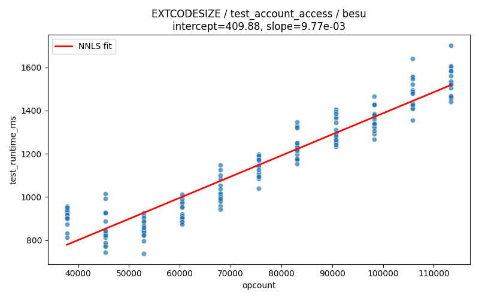

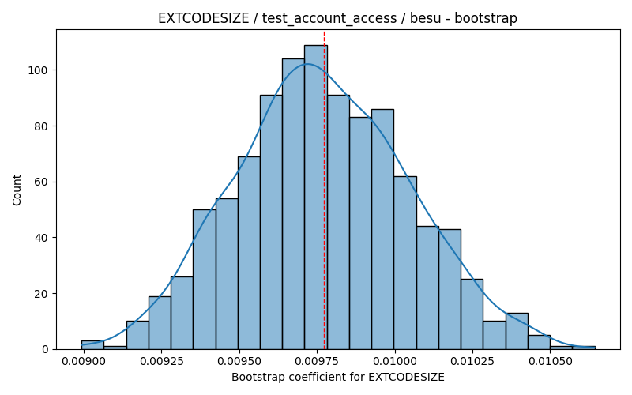

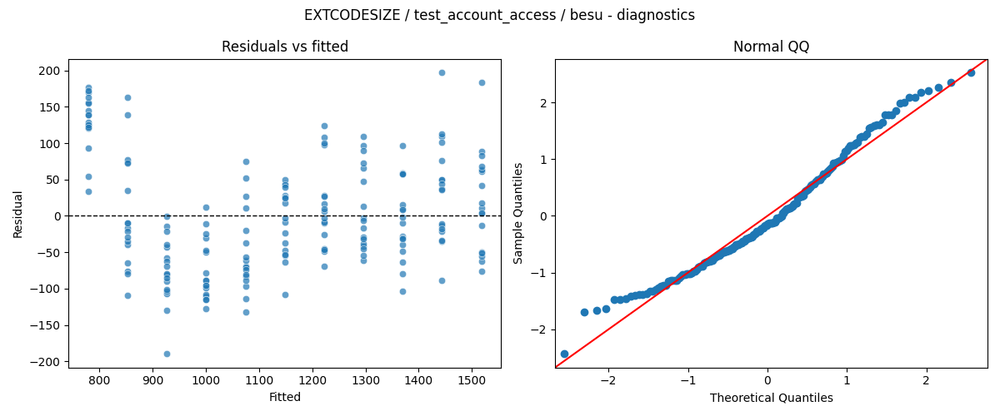

</details>

<details><summary>erigon — NNLS regression summary</summary>

```
==============================================================================
                           NNLS Regression Results                            
==============================================================================
Dep. Variable:          test_runtime_ms              R-squared:          0.998
Model:                  NNLS                    Adj. R-squared:          0.998
No. Observations:       77                                RMSE:           8.99
Df Residuals:           75                                 MAE:           7.36
Df Model:               1      
==============================================================================
                      coef     std err     P-value      [0.025      0.975]
------------------------------------------------------------------------------
         const      6.5635      3.4909       0.039      0.0000     13.4741
       opcount      0.0089      0.0000       0.001      0.0088      0.0089
==============================================================================
Notes: Non-negative least squares with bootstrap inference (1000 iterations)
==============================================================================
```


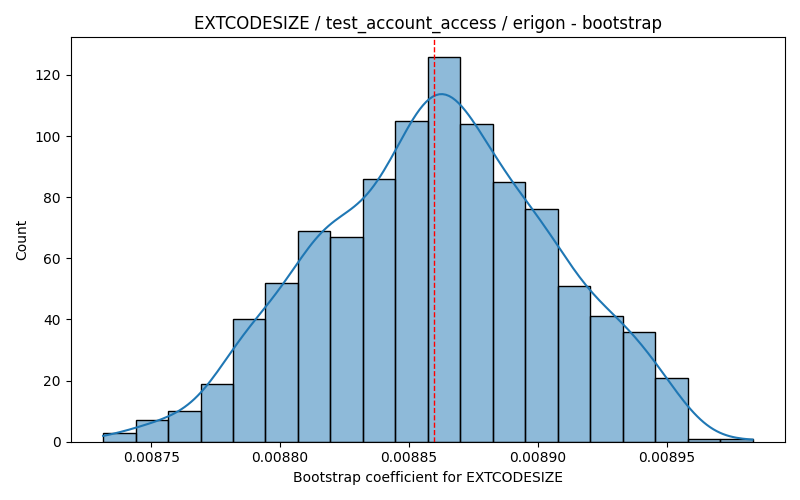

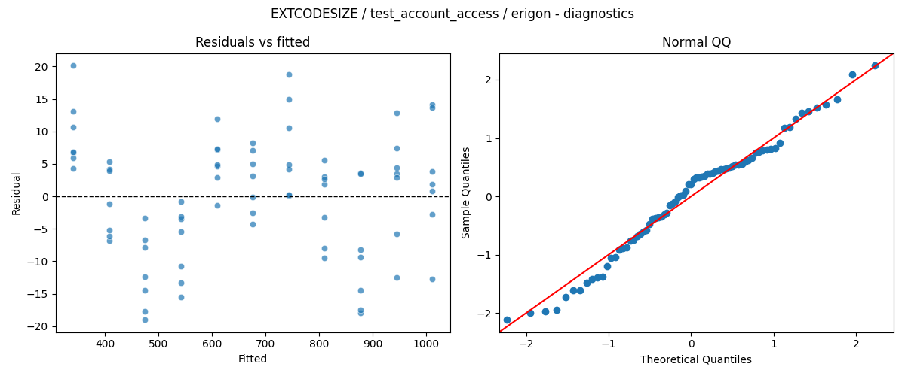

</details>

<details><summary>geth — NNLS regression summary</summary>

```
==============================================================================
                           NNLS Regression Results                            
==============================================================================
Dep. Variable:          test_runtime_ms              R-squared:          0.693
Model:                  NNLS                    Adj. R-squared:          0.691
No. Observations:       121                               RMSE:         451.25
Df Residuals:           119                                MAE:         372.00
Df Model:               1      
==============================================================================
                      coef     std err     P-value      [0.025      0.975]
------------------------------------------------------------------------------
         const   1050.6947    129.8796       0.001    795.9112   1291.6205
       opcount      0.0284      0.0018       0.001      0.0250      0.0319
==============================================================================
Notes: Non-negative least squares with bootstrap inference (1000 iterations)
==============================================================================
```

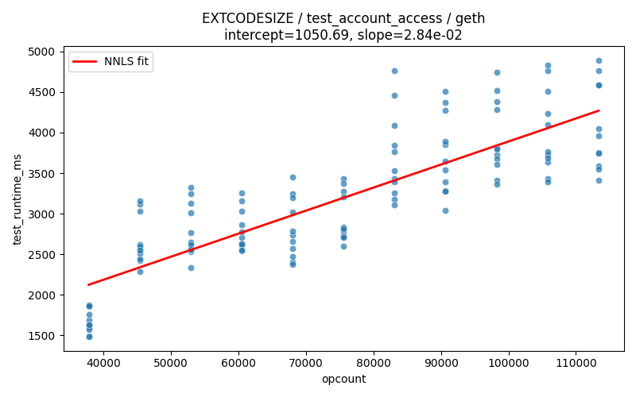

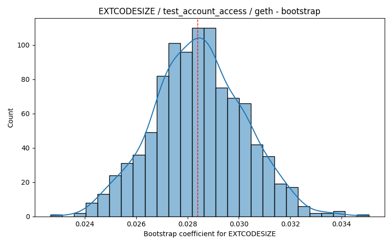

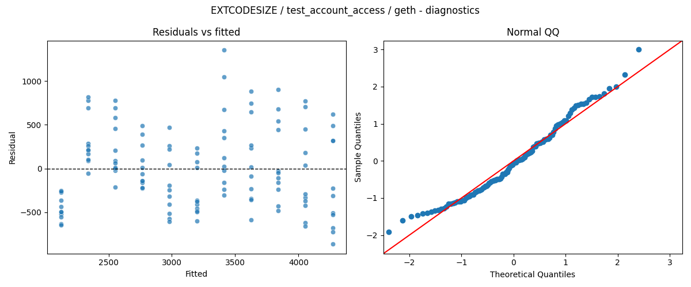

</details>

<details><summary>nethermind — NNLS regression summary</summary>

```
==============================================================================
                           NNLS Regression Results                            
==============================================================================
Dep. Variable:          test_runtime_ms              R-squared:          0.942
Model:                  NNLS                    Adj. R-squared:          0.941
No. Observations:       110                               RMSE:          23.95
Df Residuals:           108                                MAE:          19.45
Df Model:               1      
==============================================================================
                      coef     std err     P-value      [0.025      0.975]
------------------------------------------------------------------------------
         const     67.8656      7.3617       0.001     52.8836     81.9482
       opcount      0.0040      0.0001       0.001      0.0038      0.0043
==============================================================================
Notes: Non-negative least squares with bootstrap inference (1000 iterations)
==============================================================================
```

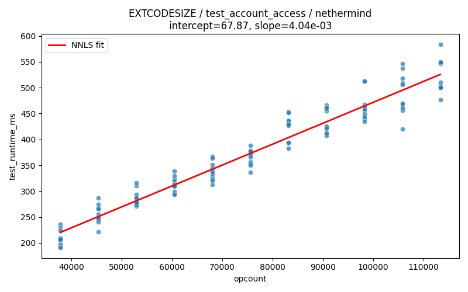

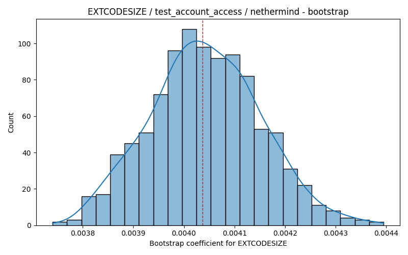

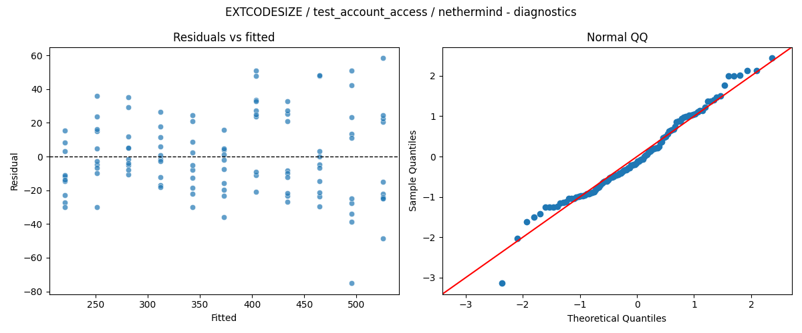

</details>

<details><summary>reth — NNLS regression summary</summary>

```
==============================================================================
                           NNLS Regression Results                            
==============================================================================
Dep. Variable:          test_runtime_ms              R-squared:          0.975
Model:                  NNLS                    Adj. R-squared:          0.975
No. Observations:       198                               RMSE:           3.48
Df Residuals:           196                                MAE:           2.78
Df Model:               1      
==============================================================================
                      coef     std err     P-value      [0.025      0.975]
------------------------------------------------------------------------------
         const     32.0566      0.8838       0.001     30.3708     33.8614
       opcount      0.0009      0.0000       0.001      0.0009      0.0009
==============================================================================
Notes: Non-negative least squares with bootstrap inference (1000 iterations)
==============================================================================
```

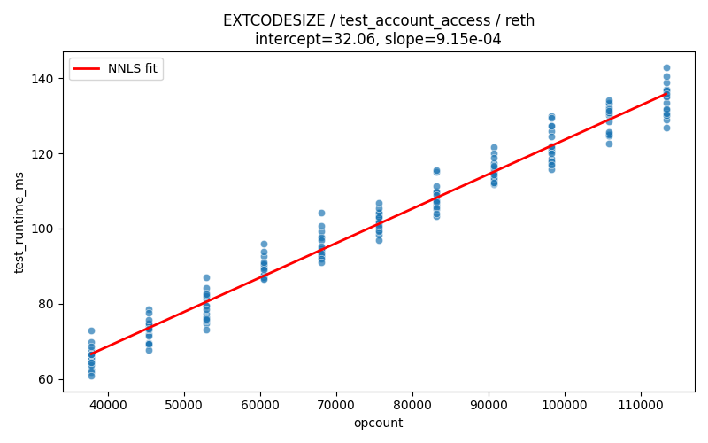

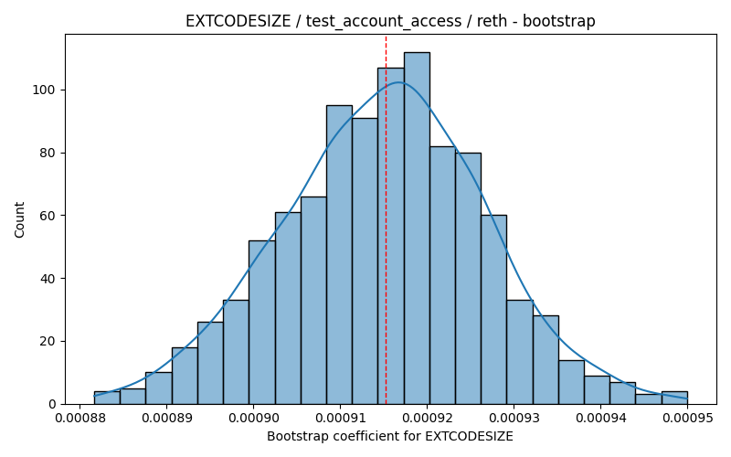

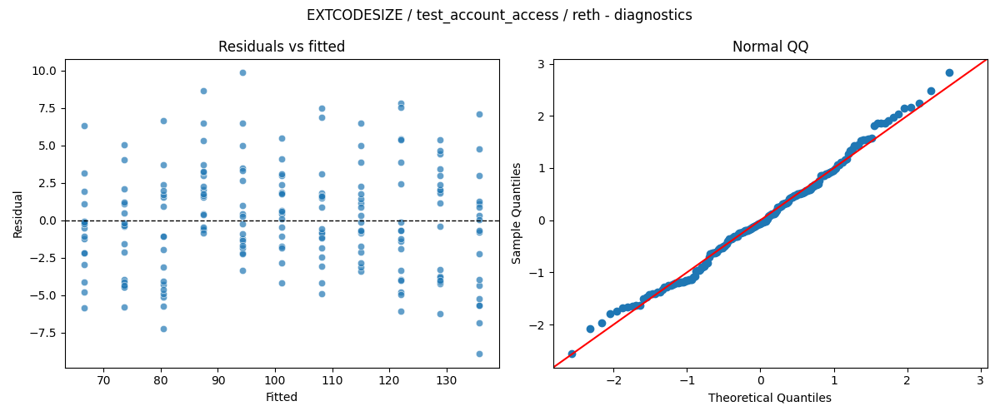

</details>

### test_account_access — combo `EXTCODESIZE_AccountMode.EXISTING_CONTRACT`

| client | nobs | R² | target_coef (ms) | p-value | 95% CI |
| --- | --- | --- | --- | --- | --- |
| `besu` | 187 | 0.9517 | 0.02661 | 1.00e-03 | [0.02568, 0.02764] |
| `erigon` | 77 | 0.8733 | 0.08523 | 1.00e-03 | [0.07647, 0.09187] |
| `geth` | 121 | 0.7241 | 0.02974 | 1.00e-03 | [0.02639, 0.03336] |
| `nethermind` | 110 | 0.7325 | 0.02467 | 1.00e-03 | [0.0218, 0.02762] |
| `reth` | 198 | 0.9189 | 0.03423 | 1.00e-03 | [0.03259, 0.03581] |

<details><summary>besu — NNLS regression summary</summary>

```
==============================================================================
                           NNLS Regression Results                            
==============================================================================
Dep. Variable:          test_runtime_ms              R-squared:          0.952
Model:                  NNLS                    Adj. R-squared:          0.951
No. Observations:       187                               RMSE:         124.76
Df Residuals:           185                                MAE:         101.59
Df Model:               1      
==============================================================================
                      coef     std err     P-value      [0.025      0.975]
------------------------------------------------------------------------------
         const    406.2287     36.7007       0.001    332.5417    474.4655
       opcount      0.0266      0.0005       0.001      0.0257      0.0276
==============================================================================
Notes: Non-negative least squares with bootstrap inference (1000 iterations)
==============================================================================
```

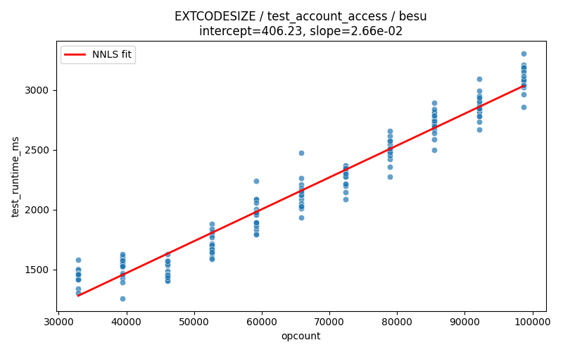

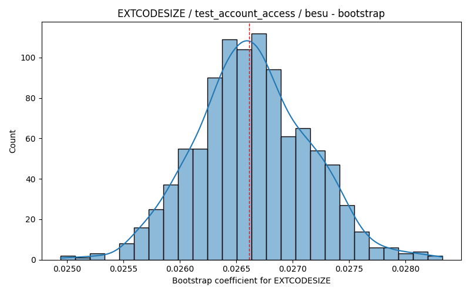

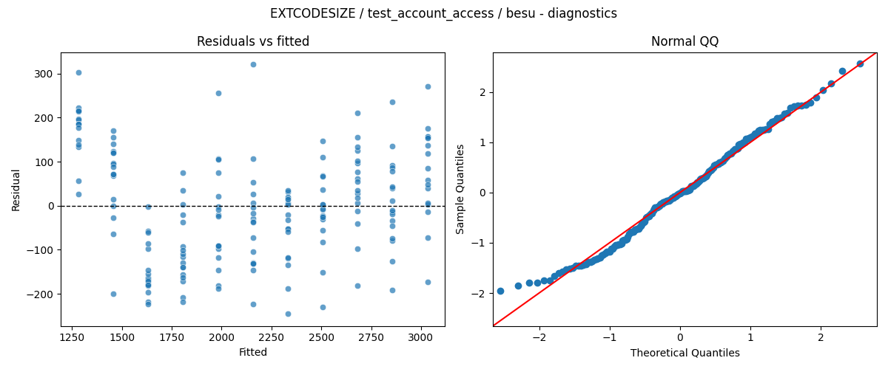

</details>

<details><summary>erigon — NNLS regression summary</summary>

```
==============================================================================
                           NNLS Regression Results                            
==============================================================================
Dep. Variable:          test_runtime_ms              R-squared:          0.873
Model:                  NNLS                    Adj. R-squared:          0.872
No. Observations:       77                                RMSE:         675.36
Df Residuals:           75                                 MAE:         580.14
Df Model:               1      
==============================================================================
                      coef     std err     P-value      [0.025      0.975]
------------------------------------------------------------------------------
         const   1495.2548    294.1203       0.001    978.1894   2177.1807
       opcount      0.0852      0.0038       0.001      0.0765      0.0919
==============================================================================
Notes: Non-negative least squares with bootstrap inference (1000 iterations)
==============================================================================
```

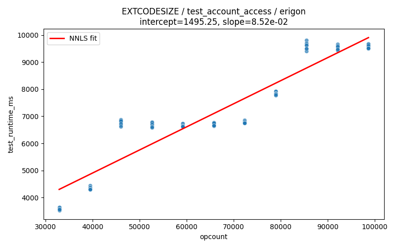

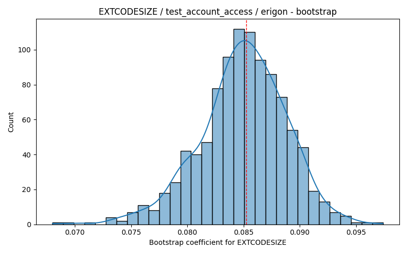

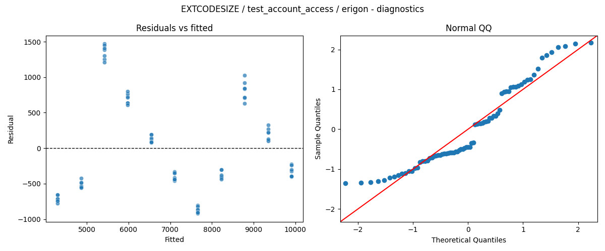

</details>

<details><summary>geth — NNLS regression summary</summary>

```
==============================================================================
                           NNLS Regression Results                            
==============================================================================
Dep. Variable:          test_runtime_ms              R-squared:          0.724
Model:                  NNLS                    Adj. R-squared:          0.722
No. Observations:       121                               RMSE:         381.90
Df Residuals:           119                                MAE:         316.20
Df Model:               1      
==============================================================================
                      coef     std err     P-value      [0.025      0.975]
------------------------------------------------------------------------------
         const   1024.6748    124.9977       0.001    785.9143   1270.3961
       opcount      0.0297      0.0018       0.001      0.0264      0.0334
==============================================================================
Notes: Non-negative least squares with bootstrap inference (1000 iterations)
==============================================================================
```

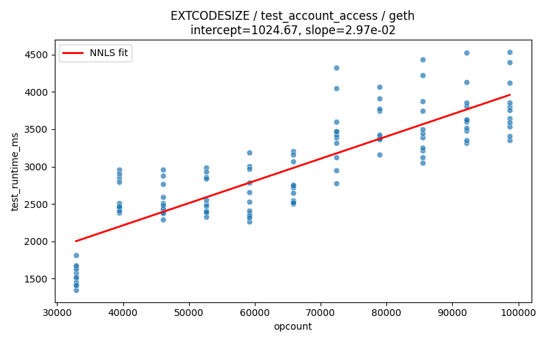

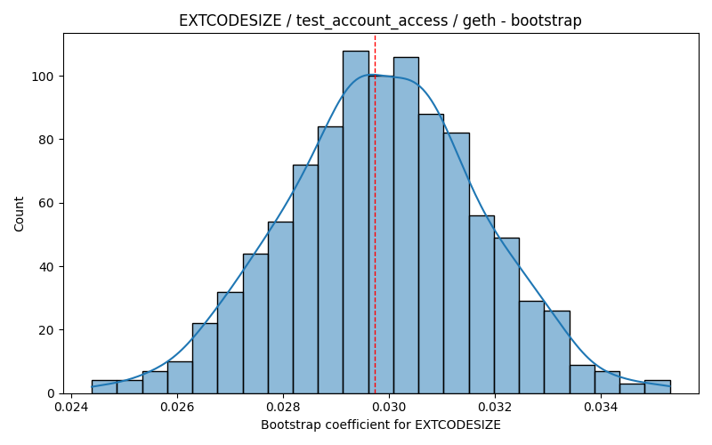

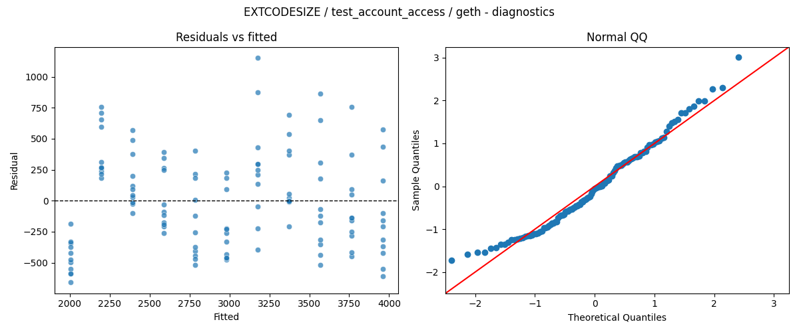

</details>

<details><summary>nethermind — NNLS regression summary</summary>

```
==============================================================================
                           NNLS Regression Results                            
==============================================================================
Dep. Variable:          test_runtime_ms              R-squared:          0.733
Model:                  NNLS                    Adj. R-squared:          0.730
No. Observations:       110                               RMSE:         310.12
Df Residuals:           108                                MAE:         258.14
Df Model:               1      
==============================================================================
                      coef     std err     P-value      [0.025      0.975]
------------------------------------------------------------------------------
         const    796.4811    101.1200       0.001    601.3166   1000.7082
       opcount      0.0247      0.0014       0.001      0.0218      0.0276
==============================================================================
Notes: Non-negative least squares with bootstrap inference (1000 iterations)
==============================================================================
```

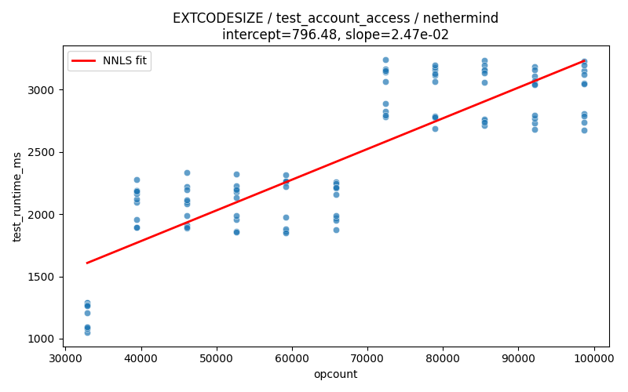

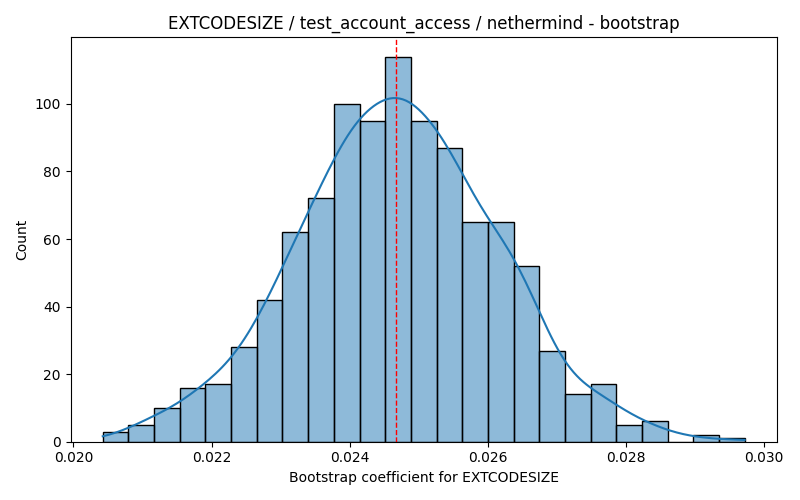

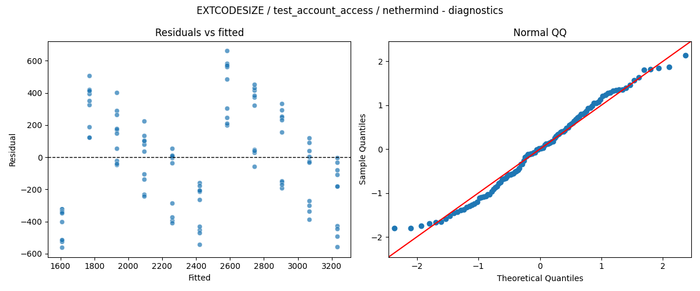

</details>

<details><summary>reth — NNLS regression summary</summary>

```
==============================================================================
                           NNLS Regression Results                            
==============================================================================
Dep. Variable:          test_runtime_ms              R-squared:          0.919
Model:                  NNLS                    Adj. R-squared:          0.919
No. Observations:       198                               RMSE:         211.50
Df Residuals:           196                                MAE:         138.19
Df Model:               1      
==============================================================================
                      coef     std err     P-value      [0.025      0.975]
------------------------------------------------------------------------------
         const    268.1957     65.1322       0.001    149.2622    404.2311
       opcount      0.0342      0.0008       0.001      0.0326      0.0358
==============================================================================
Notes: Non-negative least squares with bootstrap inference (1000 iterations)
==============================================================================
```

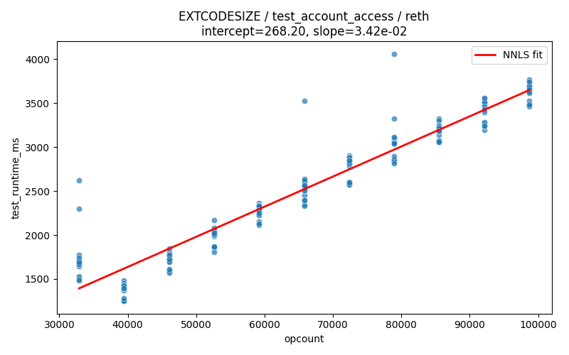

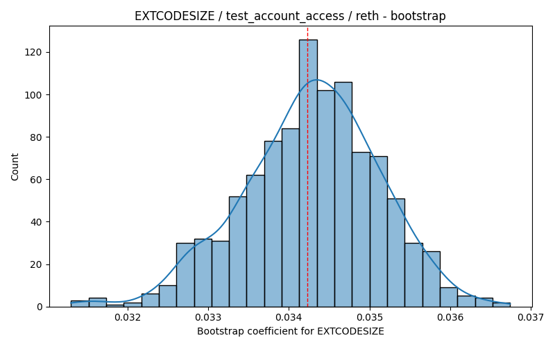

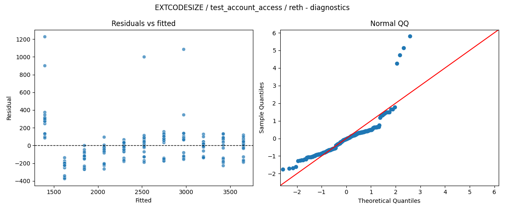

</details>

### test_account_access — combo `EXTCODESIZE_AccountMode.NON_EXISTING_ACCOUNT` — `presets[cold_account_code_access]`

| client | nobs | R² | target_coef (ms) | p-value | 95% CI |
| --- | --- | --- | --- | --- | --- |
| `besu` | 187 | 0.8996 | 0.009773 | 1.00e-03 | [0.009246, 0.01032] |
| `erigon` | 77 | 0.9982 | 0.00886 | 1.00e-03 | [0.008778, 0.008944] |
| `geth` | 121 | 0.6934 | 0.02839 | 1.00e-03 | [0.02501, 0.03194] |
| `nethermind` | 110 | 0.942 | 0.004037 | 1.00e-03 | [0.003836, 0.004259] |
| `reth` | 198 | 0.9752 | 0.0009152 | 1.00e-03 | [0.0008918, 0.0009377] |

<details><summary>besu — NNLS regression summary</summary>

```
==============================================================================
                           NNLS Regression Results                            
==============================================================================
Dep. Variable:          test_runtime_ms              R-squared:          0.900
Model:                  NNLS                    Adj. R-squared:          0.899
No. Observations:       187                               RMSE:          78.04
Df Residuals:           185                                MAE:          63.98
Df Model:               1      
==============================================================================
                      coef     std err     P-value      [0.025      0.975]
------------------------------------------------------------------------------
         const    409.8817     23.3442       0.001    365.4679    454.3892
       opcount      0.0098      0.0003       0.001      0.0092      0.0103
==============================================================================
Notes: Non-negative least squares with bootstrap inference (1000 iterations)
==============================================================================
```


</details>

<details><summary>erigon — NNLS regression summary</summary>

```
==============================================================================
                           NNLS Regression Results                            
==============================================================================
Dep. Variable:          test_runtime_ms              R-squared:          0.998
Model:                  NNLS                    Adj. R-squared:          0.998
No. Observations:       77                                RMSE:           8.99
Df Residuals:           75                                 MAE:           7.36
Df Model:               1      
==============================================================================
                      coef     std err     P-value      [0.025      0.975]
------------------------------------------------------------------------------
         const      6.5635      3.4909       0.039      0.0000     13.4741
       opcount      0.0089      0.0000       0.001      0.0088      0.0089
==============================================================================
Notes: Non-negative least squares with bootstrap inference (1000 iterations)
==============================================================================
```


</details>

<details><summary>geth — NNLS regression summary</summary>

```
==============================================================================
                           NNLS Regression Results                            
==============================================================================
Dep. Variable:          test_runtime_ms              R-squared:          0.693
Model:                  NNLS                    Adj. R-squared:          0.691
No. Observations:       121                               RMSE:         451.25
Df Residuals:           119                                MAE:         372.00
Df Model:               1      
==============================================================================
                      coef     std err     P-value      [0.025      0.975]
------------------------------------------------------------------------------
         const   1050.6947    129.8796       0.001    795.9112   1291.6205
       opcount      0.0284      0.0018       0.001      0.0250      0.0319
==============================================================================
Notes: Non-negative least squares with bootstrap inference (1000 iterations)
==============================================================================
```


</details>

<details><summary>nethermind — NNLS regression summary</summary>

```
==============================================================================
                           NNLS Regression Results                            
==============================================================================
Dep. Variable:          test_runtime_ms              R-squared:          0.942
Model:                  NNLS                    Adj. R-squared:          0.941
No. Observations:       110                               RMSE:          23.95
Df Residuals:           108                                MAE:          19.45
Df Model:               1      
==============================================================================
                      coef     std err     P-value      [0.025      0.975]
------------------------------------------------------------------------------
         const     67.8656      7.3617       0.001     52.8836     81.9482
       opcount      0.0040      0.0001       0.001      0.0038      0.0043
==============================================================================
Notes: Non-negative least squares with bootstrap inference (1000 iterations)
==============================================================================
```


</details>

<details><summary>reth — NNLS regression summary</summary>

```
==============================================================================
                           NNLS Regression Results                            
==============================================================================
Dep. Variable:          test_runtime_ms              R-squared:          0.975
Model:                  NNLS                    Adj. R-squared:          0.975
No. Observations:       198                               RMSE:           3.48
Df Residuals:           196                                MAE:           2.78
Df Model:               1      
==============================================================================
                      coef     std err     P-value      [0.025      0.975]
------------------------------------------------------------------------------
         const     32.0566      0.8838       0.001     30.3708     33.8614
       opcount      0.0009      0.0000       0.001      0.0009      0.0009
==============================================================================
Notes: Non-negative least squares with bootstrap inference (1000 iterations)
==============================================================================
```


</details>

### test_ext_account_query_warm — combo `EXTCODESIZE`

| client | nobs | R² | target_coef (ms) | p-value | 95% CI |
| --- | --- | --- | --- | --- | --- |
| `besu` | 187 | 0.8251 | 0.0001758 | 1.00e-03 | [0.0001638, 0.0001869] |
| `erigon` | 77 | 0.9044 | 4.424e-05 | 1.00e-03 | [4.026e-05, 4.873e-05] |
| `geth` | 121 | 0.7929 | 3.033e-05 | 1.00e-03 | [2.736e-05, 3.324e-05] |
| `nethermind` | 110 | 0.8582 | 0.0002069 | 1.00e-03 | [0.0001897, 0.0002231] |
| `reth` | 198 | 0.6787 | 5.634e-06 | 1.00e-03 | [5.038e-06, 6.262e-06] |

<details><summary>besu — NNLS regression summary</summary>

```
==============================================================================
                           NNLS Regression Results                            
==============================================================================
Dep. Variable:          test_runtime_ms              R-squared:          0.825
Model:                  NNLS                    Adj. R-squared:          0.824
No. Observations:       187                               RMSE:          47.33
Df Residuals:           185                                MAE:          37.52
Df Model:               1      
==============================================================================
                      coef     std err     P-value      [0.025      0.975]
------------------------------------------------------------------------------
         const    147.7029     10.7009       0.001    128.9892    168.6801
       opcount      0.0002      0.0000       0.001      0.0002      0.0002
==============================================================================
Notes: Non-negative least squares with bootstrap inference (1000 iterations)
==============================================================================
```

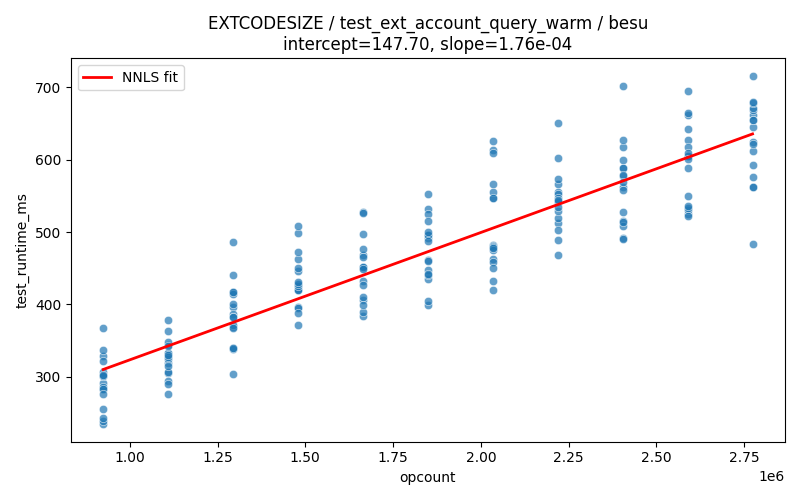

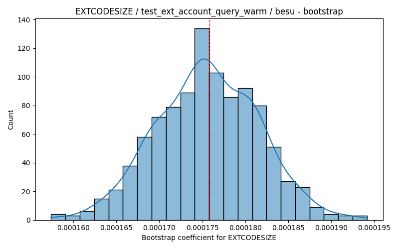

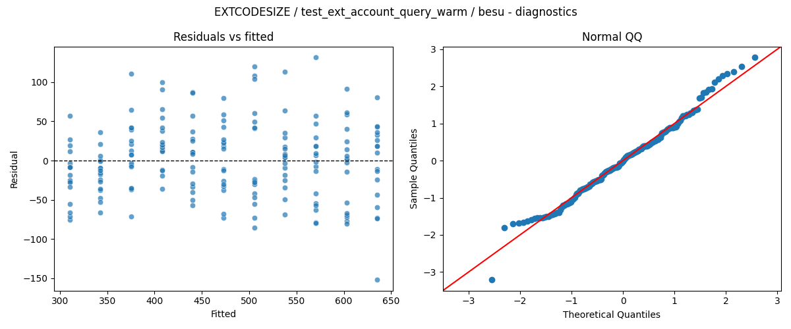

</details>

<details><summary>erigon — NNLS regression summary</summary>

```
==============================================================================
                           NNLS Regression Results                            
==============================================================================
Dep. Variable:          test_runtime_ms              R-squared:          0.904
Model:                  NNLS                    Adj. R-squared:          0.903
No. Observations:       77                                RMSE:           8.41
Df Residuals:           75                                 MAE:           5.96
Df Model:               1      
==============================================================================
                      coef     std err     P-value      [0.025      0.975]
------------------------------------------------------------------------------
         const     38.3512      3.4266       0.001     31.5107     45.0641
       opcount      0.0000      0.0000       0.001      0.0000      0.0000
==============================================================================
Notes: Non-negative least squares with bootstrap inference (1000 iterations)
==============================================================================
```

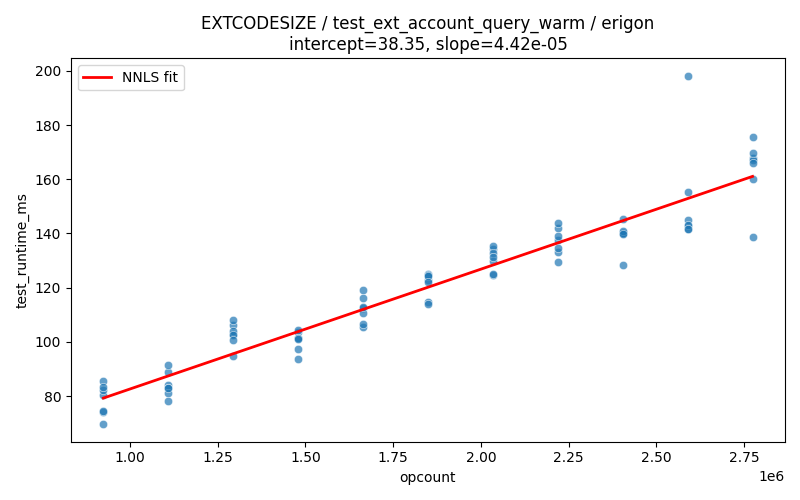

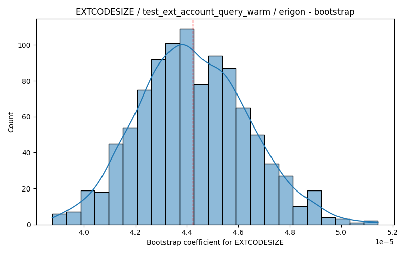

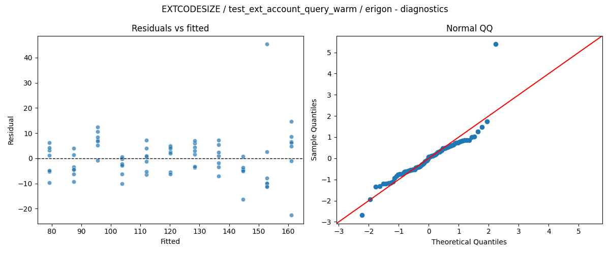

</details>

<details><summary>geth — NNLS regression summary</summary>

```
==============================================================================
                           NNLS Regression Results                            
==============================================================================
Dep. Variable:          test_runtime_ms              R-squared:          0.793
Model:                  NNLS                    Adj. R-squared:          0.791
No. Observations:       121                               RMSE:           9.06
Df Residuals:           119                                MAE:           6.87
Df Model:               1      
==============================================================================
                      coef     std err     P-value      [0.025      0.975]
------------------------------------------------------------------------------
         const     15.1706      2.6289       0.001     10.1693     20.3066
       opcount      0.0000      0.0000       0.001      0.0000      0.0000
==============================================================================
Notes: Non-negative least squares with bootstrap inference (1000 iterations)
==============================================================================
```

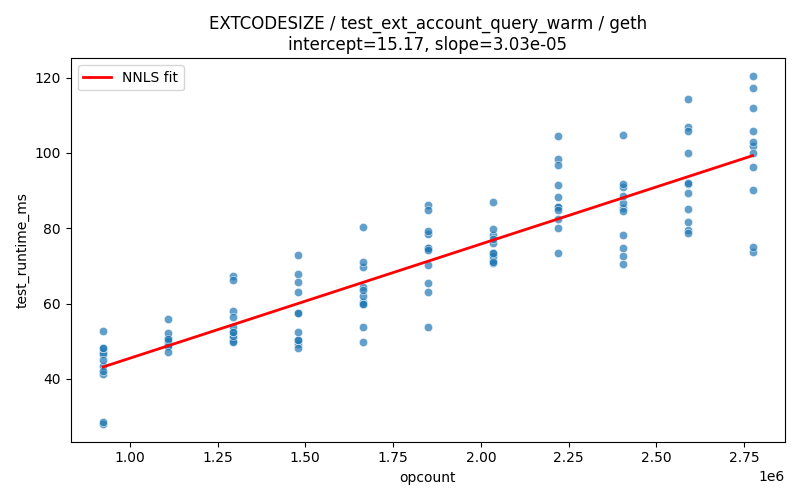

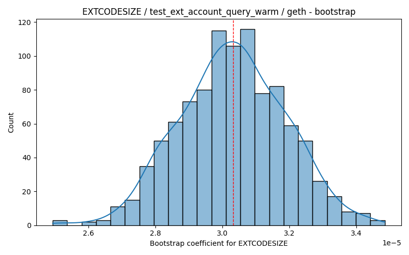

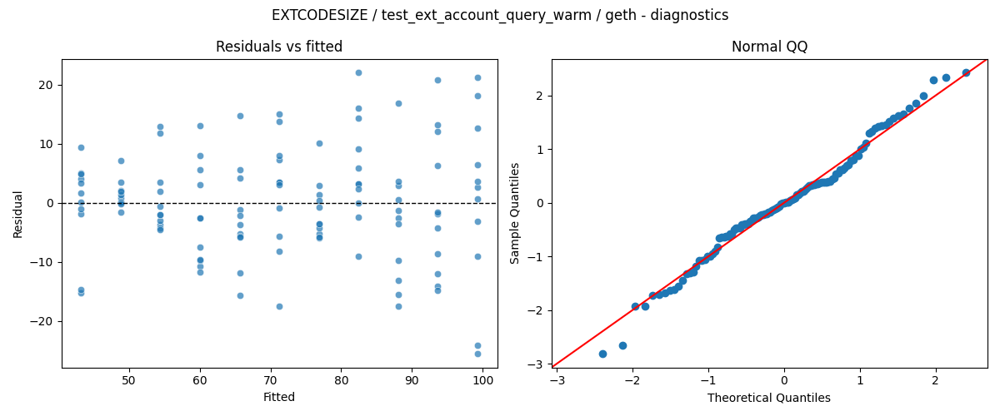

</details>

<details><summary>nethermind — NNLS regression summary</summary>

```
==============================================================================
                           NNLS Regression Results                            
==============================================================================
Dep. Variable:          test_runtime_ms              R-squared:          0.858
Model:                  NNLS                    Adj. R-squared:          0.857
No. Observations:       110                               RMSE:          49.19
Df Residuals:           108                                MAE:          38.43
Df Model:               1      
==============================================================================
                      coef     std err     P-value      [0.025      0.975]
------------------------------------------------------------------------------
         const    108.1600     14.8134       0.001     80.4698    137.7393
       opcount      0.0002      0.0000       0.001      0.0002      0.0002
==============================================================================
Notes: Non-negative least squares with bootstrap inference (1000 iterations)
==============================================================================
```

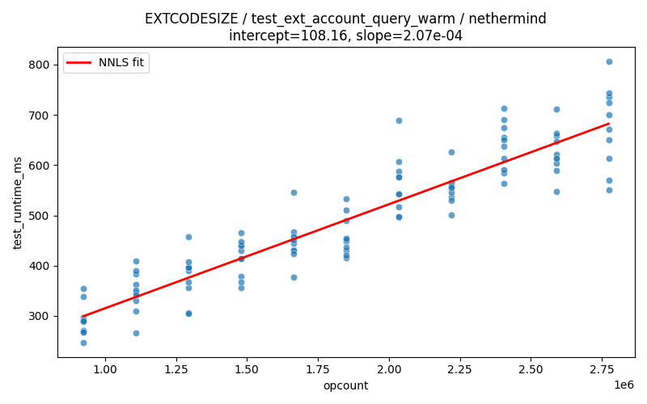

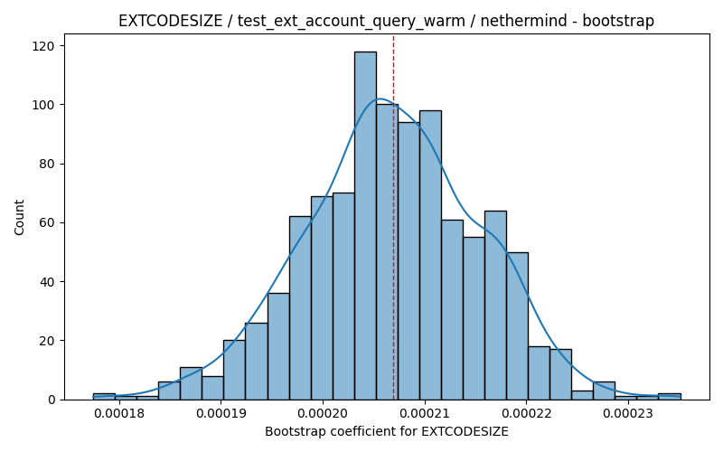

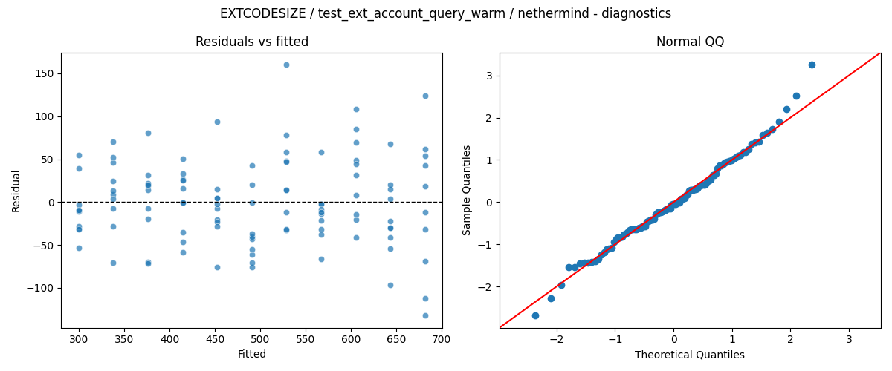

</details>

<details><summary>reth — NNLS regression summary</summary>

```
==============================================================================
                           NNLS Regression Results                            
==============================================================================
Dep. Variable:          test_runtime_ms              R-squared:          0.679
Model:                  NNLS                    Adj. R-squared:          0.677
No. Observations:       198                               RMSE:           2.27
Df Residuals:           196                                MAE:           1.65
Df Model:               1      
==============================================================================
                      coef     std err     P-value      [0.025      0.975]
------------------------------------------------------------------------------
         const      5.1097      0.5655       0.001      3.9802      6.2117
       opcount      0.0000      0.0000       0.001      0.0000      0.0000
==============================================================================
Notes: Non-negative least squares with bootstrap inference (1000 iterations)
==============================================================================
```

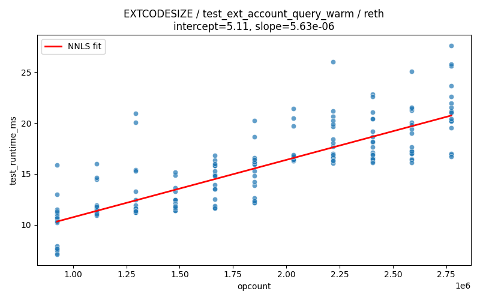

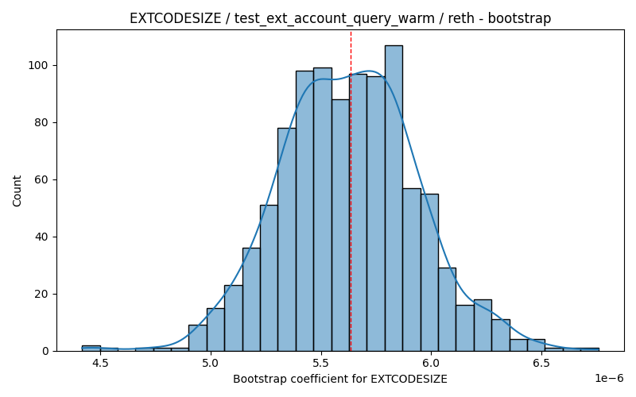

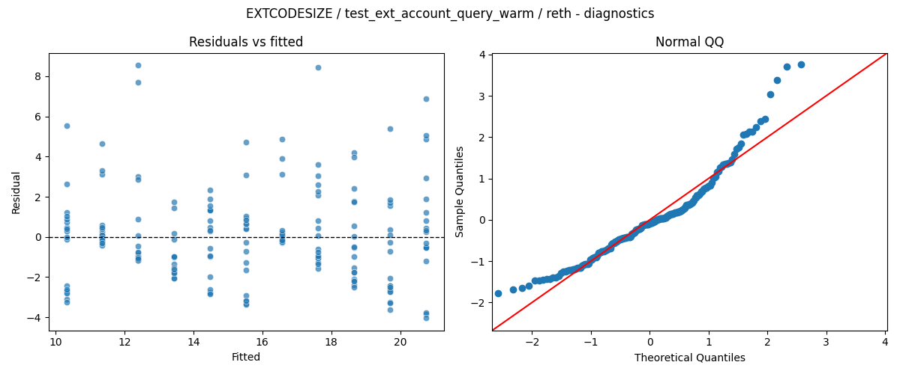

</details>

## STATICCALL

### test_account_access — combo `STATICCALL_AccountMode.EXISTING_EOA`

| client | nobs | R² | target_coef (ms) | p-value | 95% CI |
| --- | --- | --- | --- | --- | --- |
| `besu` | 187 | 0.8762 | 0.01143 | 1.00e-03 | [0.0107, 0.01224] |
| `erigon` | 77 | 0.9987 | 0.01031 | 1.00e-03 | [0.01024, 0.01039] |
| `geth` | 121 | 0.8552 | 0.01424 | 1.00e-03 | [0.01328, 0.01523] |
| `nethermind` | 110 | 0.8453 | 0.004598 | 1.00e-03 | [0.004198, 0.004965] |
| `reth` | 198 | 0.9736 | 0.001139 | 1.00e-03 | [0.001114, 0.001167] |

<details><summary>besu — NNLS regression summary</summary>

```
==============================================================================
                           NNLS Regression Results                            
==============================================================================
Dep. Variable:          test_runtime_ms              R-squared:          0.876
Model:                  NNLS                    Adj. R-squared:          0.876
No. Observations:       187                               RMSE:         102.18
Df Residuals:           185                                MAE:          78.86
Df Model:               1      
==============================================================================
                      coef     std err     P-value      [0.025      0.975]
------------------------------------------------------------------------------
         const    525.0214     34.6854       0.001    455.2762    588.8006
       opcount      0.0114      0.0004       0.001      0.0107      0.0122
==============================================================================
Notes: Non-negative least squares with bootstrap inference (1000 iterations)
==============================================================================
```

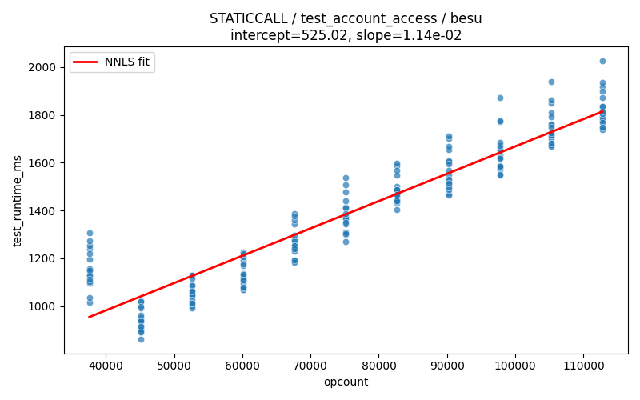

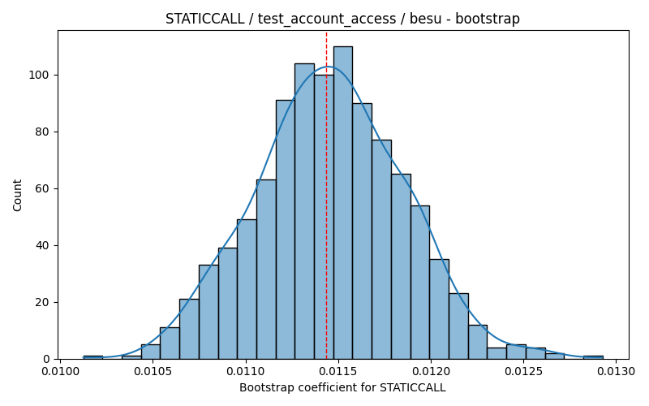

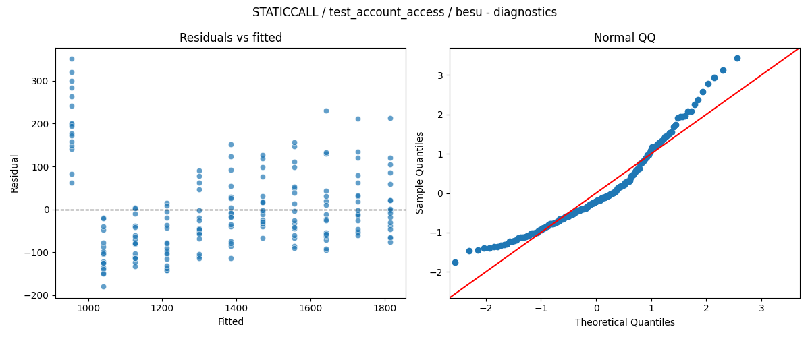

</details>

<details><summary>erigon — NNLS regression summary</summary>

```
==============================================================================
                           NNLS Regression Results                            
==============================================================================
Dep. Variable:          test_runtime_ms              R-squared:          0.999
Model:                  NNLS                    Adj. R-squared:          0.999
No. Observations:       77                                RMSE:           8.92
Df Residuals:           75                                 MAE:           7.25
Df Model:               1      
==============================================================================
                      coef     std err     P-value      [0.025      0.975]
------------------------------------------------------------------------------
         const     34.9764      2.8341       0.001     28.9018     40.2337
       opcount      0.0103      0.0000       0.001      0.0102      0.0104
==============================================================================
Notes: Non-negative least squares with bootstrap inference (1000 iterations)
==============================================================================
```

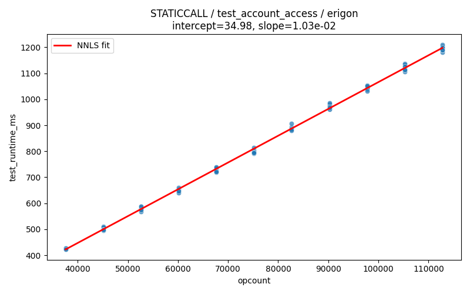

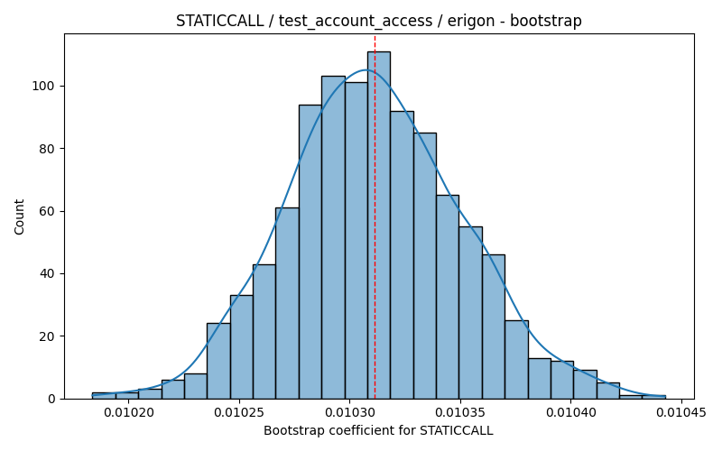

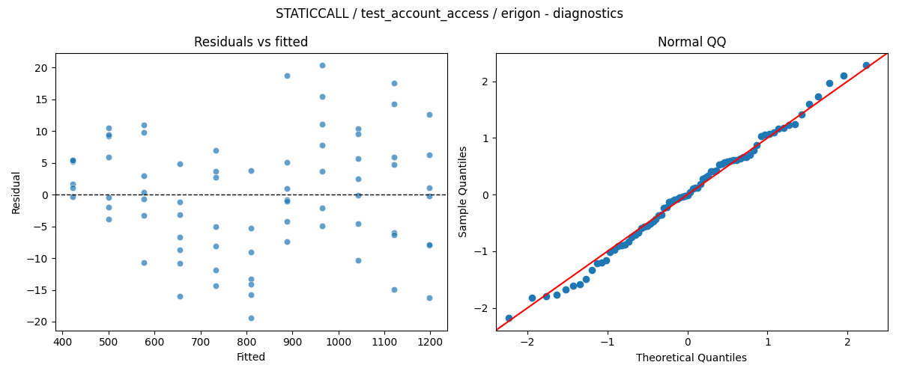

</details>

<details><summary>geth — NNLS regression summary</summary>

```
==============================================================================
                           NNLS Regression Results                            
==============================================================================
Dep. Variable:          test_runtime_ms              R-squared:          0.855
Model:                  NNLS                    Adj. R-squared:          0.854
No. Observations:       121                               RMSE:         139.30
Df Residuals:           119                                MAE:         110.48
Df Model:               1      
==============================================================================
                      coef     std err     P-value      [0.025      0.975]
------------------------------------------------------------------------------
         const    271.2098     36.8264       0.001    200.6635    343.3702
       opcount      0.0142      0.0005       0.001      0.0133      0.0152
==============================================================================
Notes: Non-negative least squares with bootstrap inference (1000 iterations)
==============================================================================
```

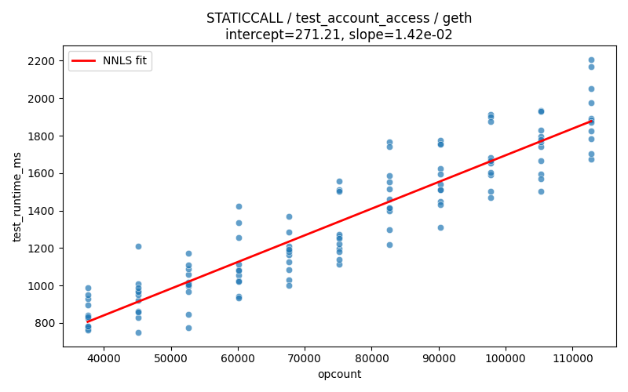

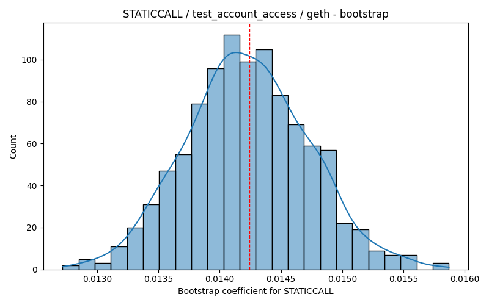

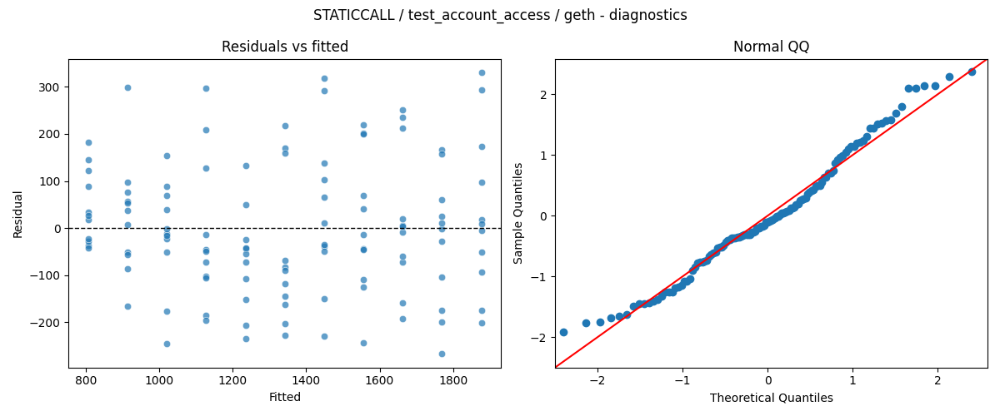

</details>

<details><summary>nethermind — NNLS regression summary</summary>

```
==============================================================================
                           NNLS Regression Results                            
==============================================================================
Dep. Variable:          test_runtime_ms              R-squared:          0.845
Model:                  NNLS                    Adj. R-squared:          0.844
No. Observations:       110                               RMSE:          46.76
Df Residuals:           108                                MAE:          36.78
Df Model:               1      
==============================================================================
                      coef     std err     P-value      [0.025      0.975]
------------------------------------------------------------------------------
         const     92.6298     13.4414       0.001     67.5154    120.0819
       opcount      0.0046      0.0002       0.001      0.0042      0.0050
==============================================================================
Notes: Non-negative least squares with bootstrap inference (1000 iterations)
==============================================================================
```

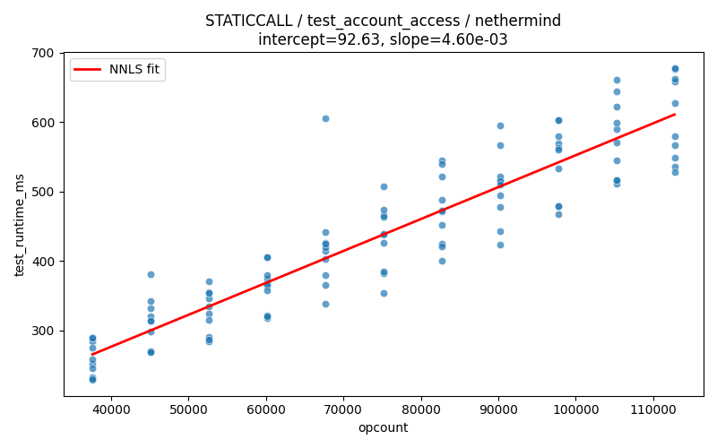

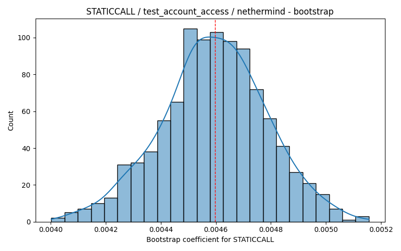

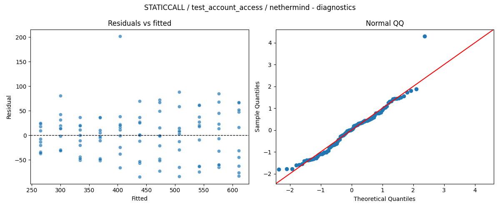

</details>

<details><summary>reth — NNLS regression summary</summary>

```
==============================================================================
                           NNLS Regression Results                            
==============================================================================
Dep. Variable:          test_runtime_ms              R-squared:          0.974
Model:                  NNLS                    Adj. R-squared:          0.974
No. Observations:       198                               RMSE:           4.46
Df Residuals:           196                                MAE:           3.50
Df Model:               1      
==============================================================================
                      coef     std err     P-value      [0.025      0.975]
------------------------------------------------------------------------------
         const     32.2509      1.0938       0.001     29.9460     34.3138
       opcount      0.0011      0.0000       0.001      0.0011      0.0012
==============================================================================
Notes: Non-negative least squares with bootstrap inference (1000 iterations)
==============================================================================
```

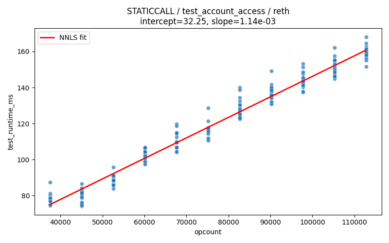

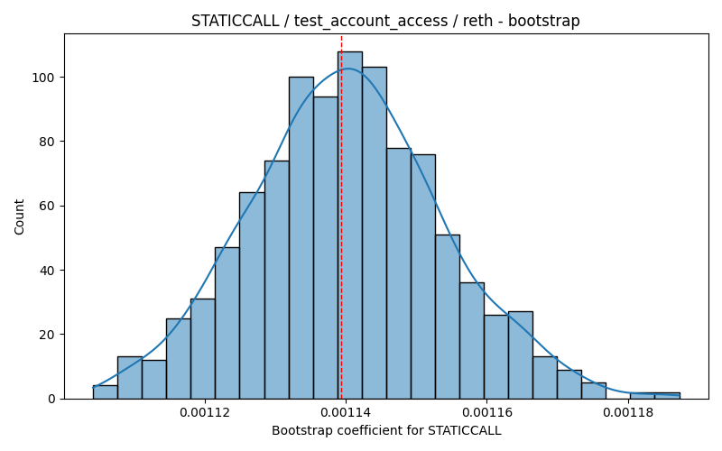

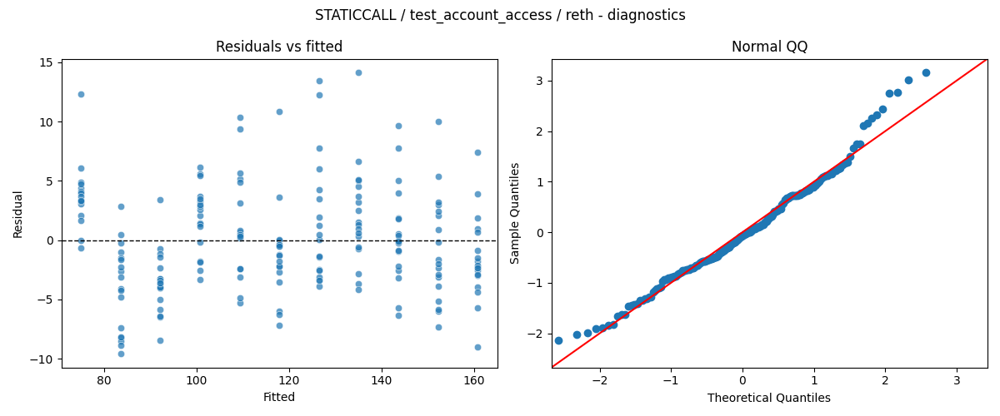

</details>

### test_account_access — combo `STATICCALL_AccountMode.NON_EXISTING_ACCOUNT` — `presets[cold_account_nocode_access]`

| client | nobs | R² | target_coef (ms) | p-value | 95% CI |
| --- | --- | --- | --- | --- | --- |
| `besu` | 187 | 0.9358 | 0.01244 | 1.00e-03 | [0.0119, 0.01297] |
| `erigon` | 77 | 0.9971 | 0.01173 | 1.00e-03 | [0.01166, 0.01178] |
| `geth` | 121 | 0.6992 | 0.02556 | 1.00e-03 | [0.02204, 0.02884] |
| `nethermind` | 110 | 0.8362 | 0.004492 | 1.00e-03 | [0.004106, 0.004859] |
| `reth` | 198 | 0.9689 | 0.0009742 | 1.00e-03 | [0.000949, 0.0009987] |

<details><summary>besu — NNLS regression summary</summary>

```
==============================================================================
                           NNLS Regression Results                            
==============================================================================
Dep. Variable:          test_runtime_ms              R-squared:          0.936
Model:                  NNLS                    Adj. R-squared:          0.935
No. Observations:       187                               RMSE:          77.42
Df Residuals:           185                                MAE:          62.93
Df Model:               1      
==============================================================================
                      coef     std err     P-value      [0.025      0.975]
------------------------------------------------------------------------------
         const    403.9732     21.5015       0.001    361.1430    445.7132
       opcount      0.0124      0.0003       0.001      0.0119      0.0130
==============================================================================
Notes: Non-negative least squares with bootstrap inference (1000 iterations)
==============================================================================
```

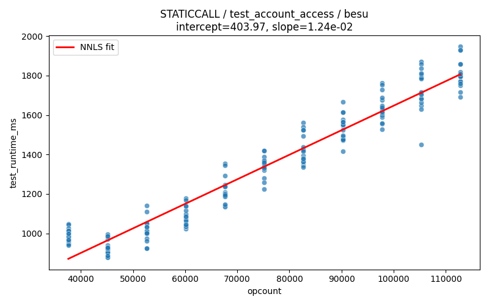

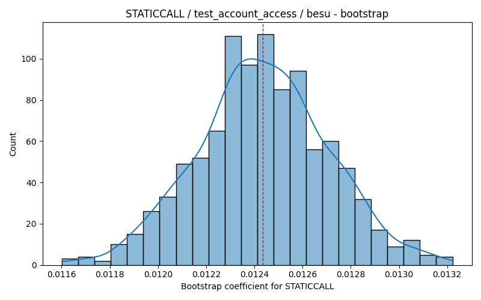

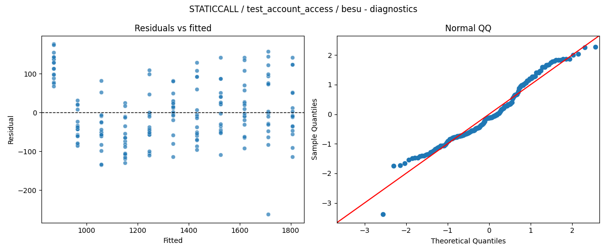

</details>

<details><summary>erigon — NNLS regression summary</summary>

```
==============================================================================
                           NNLS Regression Results                            
==============================================================================
Dep. Variable:          test_runtime_ms              R-squared:          0.997
Model:                  NNLS                    Adj. R-squared:          0.997
No. Observations:       77                                RMSE:          15.06
Df Residuals:           75                                 MAE:          12.08
Df Model:               1      
==============================================================================
                      coef     std err     P-value      [0.025      0.975]
------------------------------------------------------------------------------
         const      0.0000      0.9446       1.000      0.0000      3.2474
       opcount      0.0117      0.0000       0.001      0.0117      0.0118
==============================================================================
Notes: Non-negative least squares with bootstrap inference (1000 iterations)
==============================================================================
```


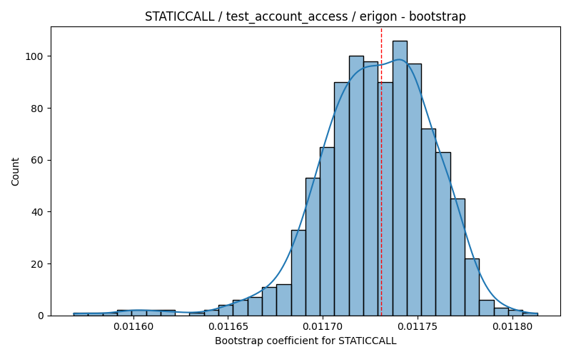

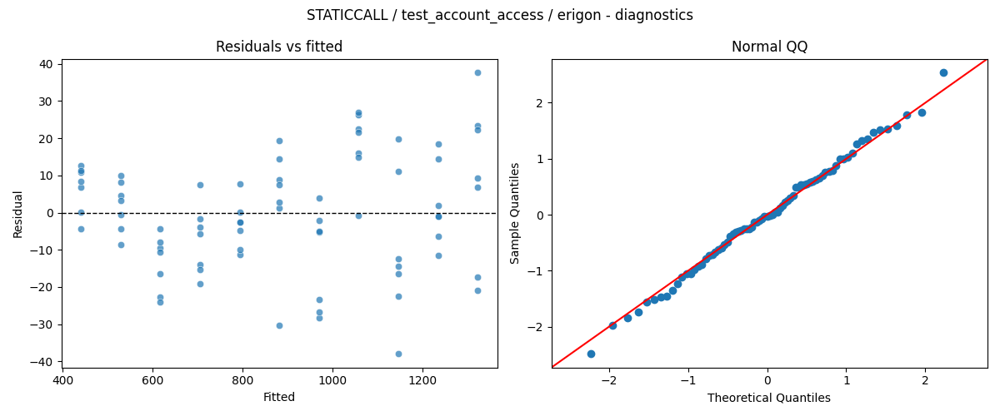

</details>

<details><summary>geth — NNLS regression summary</summary>

```
==============================================================================
                           NNLS Regression Results                            
==============================================================================
Dep. Variable:          test_runtime_ms              R-squared:          0.699
Model:                  NNLS                    Adj. R-squared:          0.697
No. Observations:       121                               RMSE:         398.47
Df Residuals:           119                                MAE:         325.07
Df Model:               1      
==============================================================================
                      coef     std err     P-value      [0.025      0.975]
------------------------------------------------------------------------------
         const   1272.0391    135.7672       0.001   1010.8608   1560.6772
       opcount      0.0256      0.0017       0.001      0.0220      0.0288
==============================================================================
Notes: Non-negative least squares with bootstrap inference (1000 iterations)
==============================================================================
```


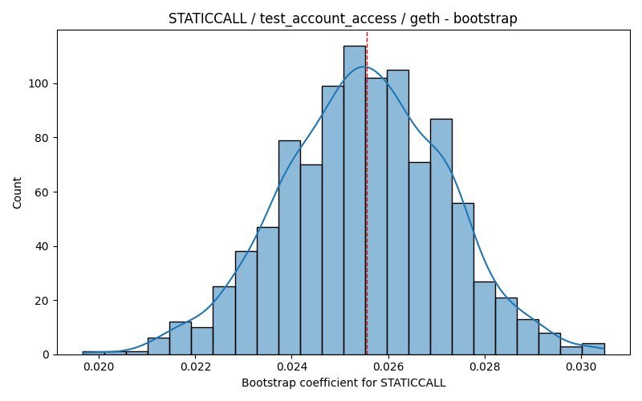

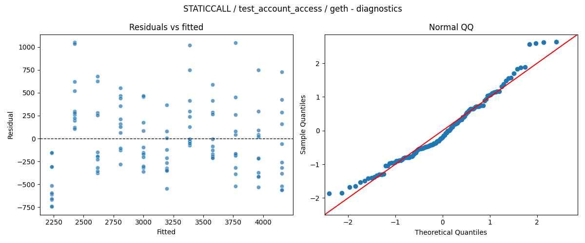

</details>

<details><summary>nethermind — NNLS regression summary</summary>

```
==============================================================================
                           NNLS Regression Results                            
==============================================================================
Dep. Variable:          test_runtime_ms              R-squared:          0.836
Model:                  NNLS                    Adj. R-squared:          0.835
No. Observations:       110                               RMSE:          47.26
Df Residuals:           108                                MAE:          37.33
Df Model:               1      
==============================================================================
                      coef     std err     P-value      [0.025      0.975]
------------------------------------------------------------------------------
         const    110.0148     13.6715       0.001     84.6376    139.1663
       opcount      0.0045      0.0002       0.001      0.0041      0.0049
==============================================================================
Notes: Non-negative least squares with bootstrap inference (1000 iterations)
==============================================================================
```

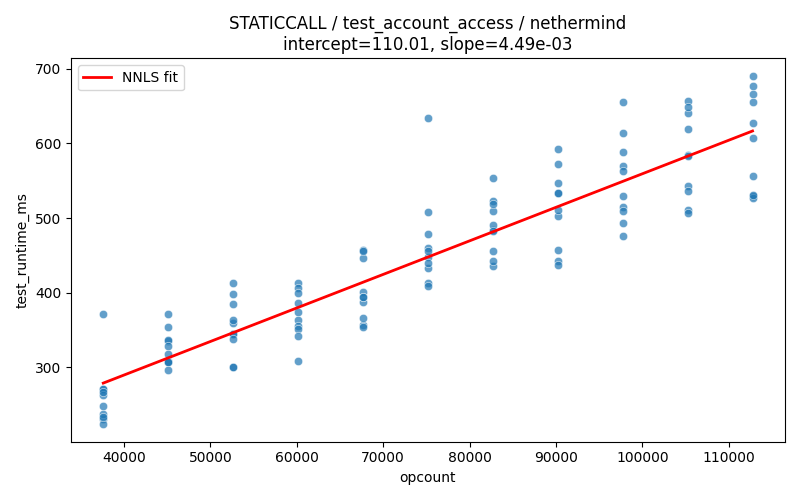

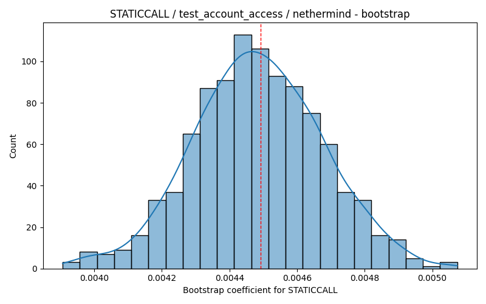

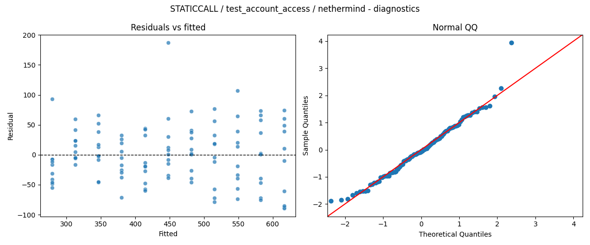

</details>

<details><summary>reth — NNLS regression summary</summary>

```
==============================================================================
                           NNLS Regression Results                            
==============================================================================
Dep. Variable:          test_runtime_ms              R-squared:          0.969
Model:                  NNLS                    Adj. R-squared:          0.969
No. Observations:       198                               RMSE:           4.15
Df Residuals:           196                                MAE:           3.38
Df Model:               1      
==============================================================================
                      coef     std err     P-value      [0.025      0.975]
------------------------------------------------------------------------------
         const     32.4535      1.0248       0.001     30.5032     34.5422
       opcount      0.0010      0.0000       0.001      0.0009      0.0010
==============================================================================
Notes: Non-negative least squares with bootstrap inference (1000 iterations)
==============================================================================
```

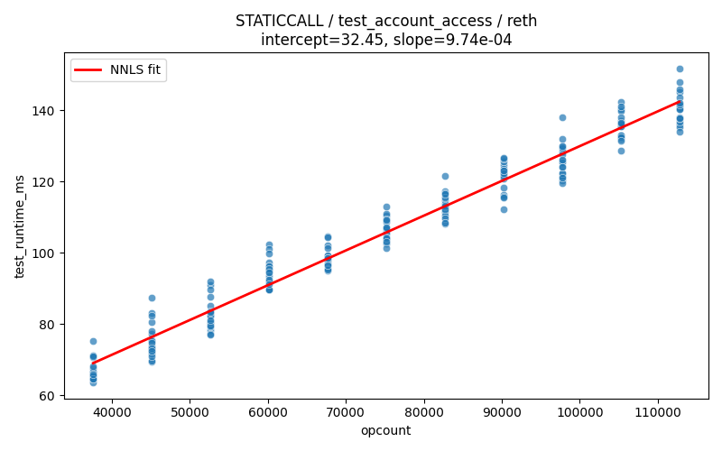

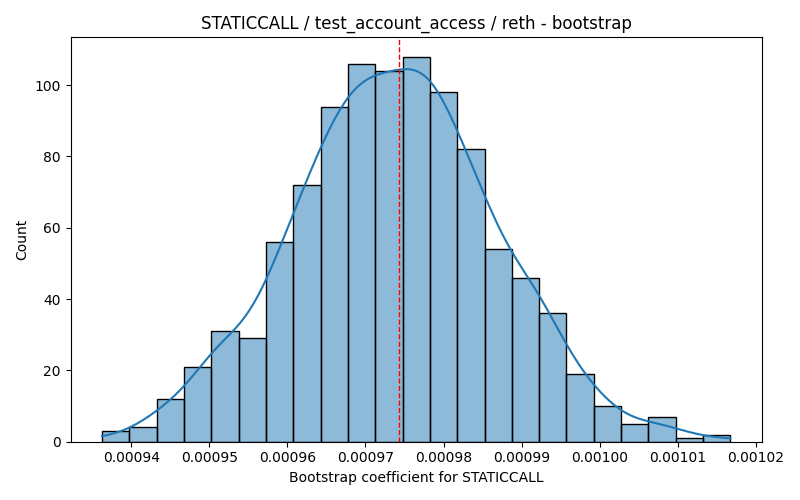

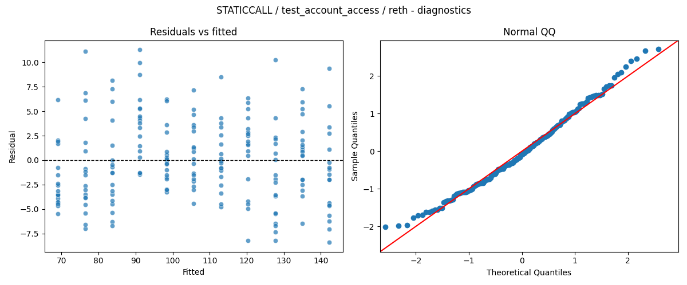

</details>

### test_account_access — combo `STATICCALL_AccountMode.EXISTING_CONTRACT`

| client | nobs | R² | target_coef (ms) | p-value | 95% CI |
| --- | --- | --- | --- | --- | --- |
| `besu` | 187 | 0.9508 | 0.0294 | 1.00e-03 | [0.02831, 0.03047] |
| `erigon` | 77 | 0.8767 | 0.08731 | 1.00e-03 | [0.07964, 0.09407] |
| `geth` | 121 | 0.7119 | 0.02993 | 1.00e-03 | [0.02595, 0.03376] |
| `nethermind` | 110 | 0.7152 | 0.02522 | 1.00e-03 | [0.02193, 0.02842] |
| `reth` | 198 | 0.8415 | 0.0368 | 1.00e-03 | [0.034, 0.03949] |

<details><summary>besu — NNLS regression summary</summary>

```
==============================================================================
                           NNLS Regression Results                            
==============================================================================
Dep. Variable:          test_runtime_ms              R-squared:          0.951
Model:                  NNLS                    Adj. R-squared:          0.951
No. Observations:       187                               RMSE:         136.20
Df Residuals:           185                                MAE:         112.97
Df Model:               1      
==============================================================================
                      coef     std err     P-value      [0.025      0.975]
------------------------------------------------------------------------------
         const    379.9065     38.5647       0.001    307.9242    452.1064
       opcount      0.0294      0.0006       0.001      0.0283      0.0305
==============================================================================
Notes: Non-negative least squares with bootstrap inference (1000 iterations)
==============================================================================
```

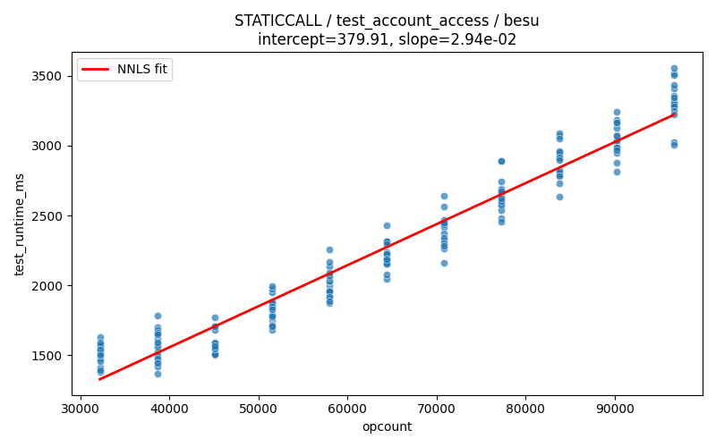

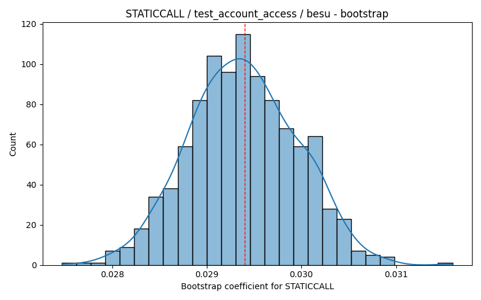

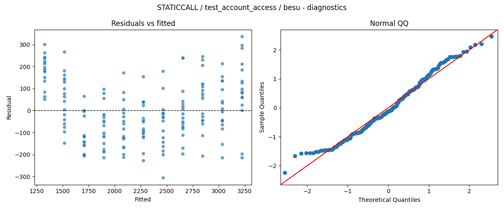

</details>

<details><summary>erigon — NNLS regression summary</summary>

```
==============================================================================
                           NNLS Regression Results                            
==============================================================================
Dep. Variable:          test_runtime_ms              R-squared:          0.877
Model:                  NNLS                    Adj. R-squared:          0.875
No. Observations:       77                                RMSE:         667.01
Df Residuals:           75                                 MAE:         572.44
Df Model:               1      
==============================================================================
                      coef     std err     P-value      [0.025      0.975]
------------------------------------------------------------------------------
         const   1408.5864    279.4173       0.001    919.6970   2025.2641
       opcount      0.0873      0.0036       0.001      0.0796      0.0941
==============================================================================
Notes: Non-negative least squares with bootstrap inference (1000 iterations)
==============================================================================
```

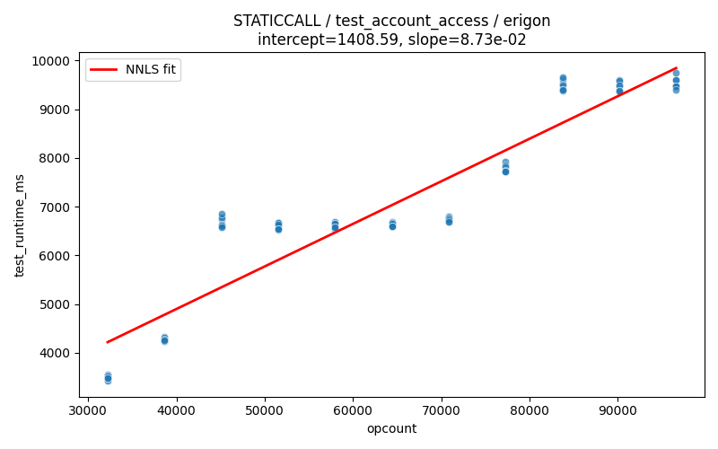

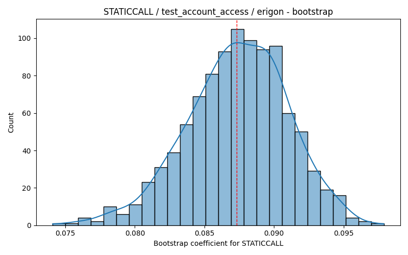

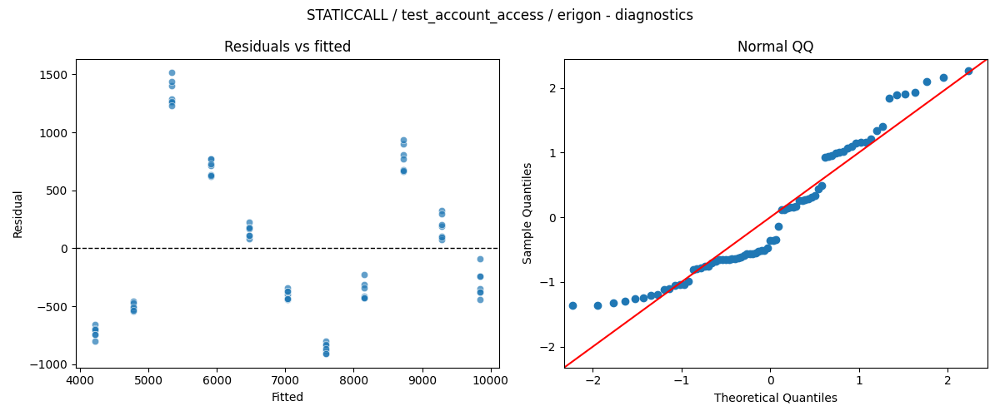

</details>

<details><summary>geth — NNLS regression summary</summary>

```
==============================================================================
                           NNLS Regression Results                            
==============================================================================
Dep. Variable:          test_runtime_ms              R-squared:          0.712
Model:                  NNLS                    Adj. R-squared:          0.710
No. Observations:       121                               RMSE:         387.82
Df Residuals:           119                                MAE:         318.66
Df Model:               1      
==============================================================================
                      coef     std err     P-value      [0.025      0.975]
------------------------------------------------------------------------------
         const   1046.5429    129.5581       0.001    785.1074   1311.0152
       opcount      0.0299      0.0020       0.001      0.0259      0.0338
==============================================================================
Notes: Non-negative least squares with bootstrap inference (1000 iterations)
==============================================================================
```


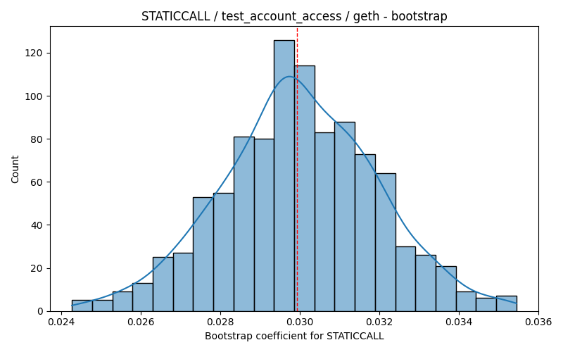

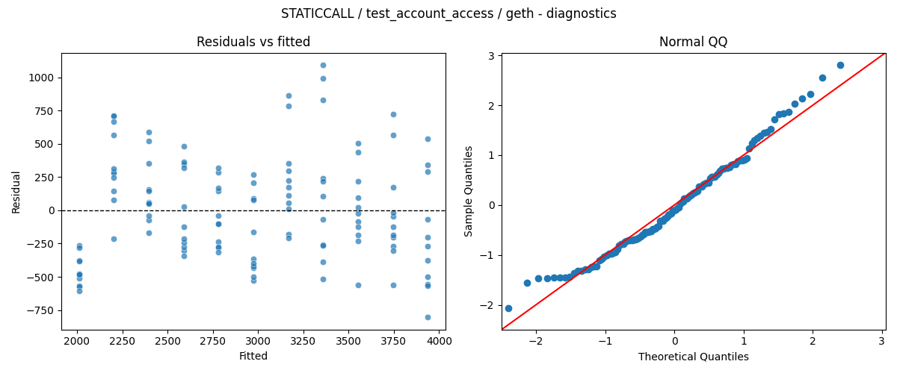

</details>

<details><summary>nethermind — NNLS regression summary</summary>

```
==============================================================================
                           NNLS Regression Results                            
==============================================================================
Dep. Variable:          test_runtime_ms              R-squared:          0.715
Model:                  NNLS                    Adj. R-squared:          0.713
No. Observations:       110                               RMSE:         324.19
Df Residuals:           108                                MAE:         278.94
Df Model:               1      
==============================================================================
                      coef     std err     P-value      [0.025      0.975]
------------------------------------------------------------------------------
         const    866.4745    112.5760       0.001    654.6600   1099.5440
       opcount      0.0252      0.0016       0.001      0.0219      0.0284
==============================================================================
Notes: Non-negative least squares with bootstrap inference (1000 iterations)
==============================================================================
```

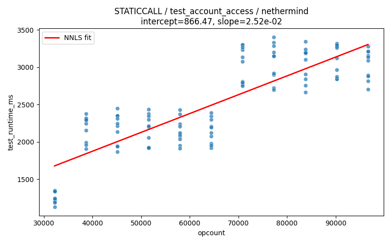

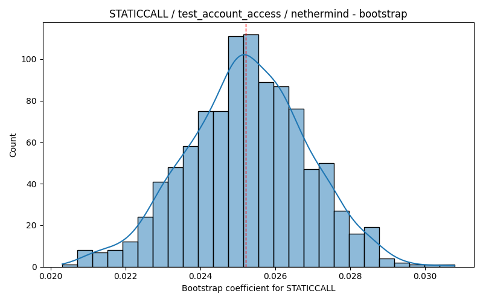

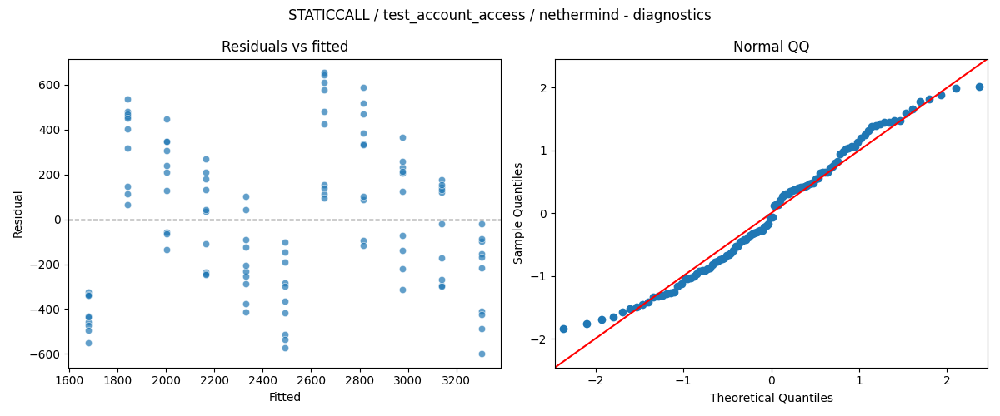

</details>

<details><summary>reth — NNLS regression summary</summary>

```
==============================================================================
                           NNLS Regression Results                            
==============================================================================
Dep. Variable:          test_runtime_ms              R-squared:          0.841
Model:                  NNLS                    Adj. R-squared:          0.841
No. Observations:       198                               RMSE:         325.36
Df Residuals:           196                                MAE:         170.81
Df Model:               1      
==============================================================================
                      coef     std err     P-value      [0.025      0.975]
------------------------------------------------------------------------------
         const    150.4022     85.5580       0.048      0.0000    332.8922
       opcount      0.0368      0.0014       0.001      0.0340      0.0395
==============================================================================
Notes: Non-negative least squares with bootstrap inference (1000 iterations)
==============================================================================
```

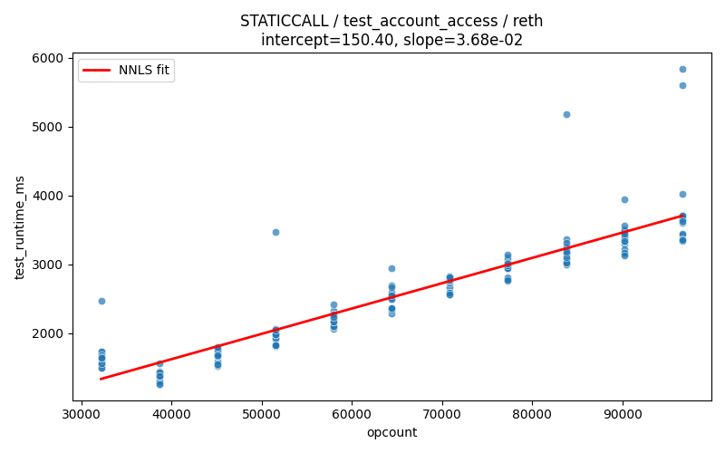

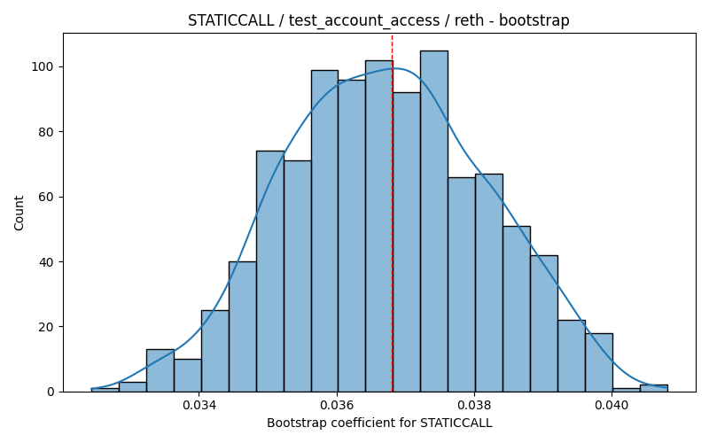

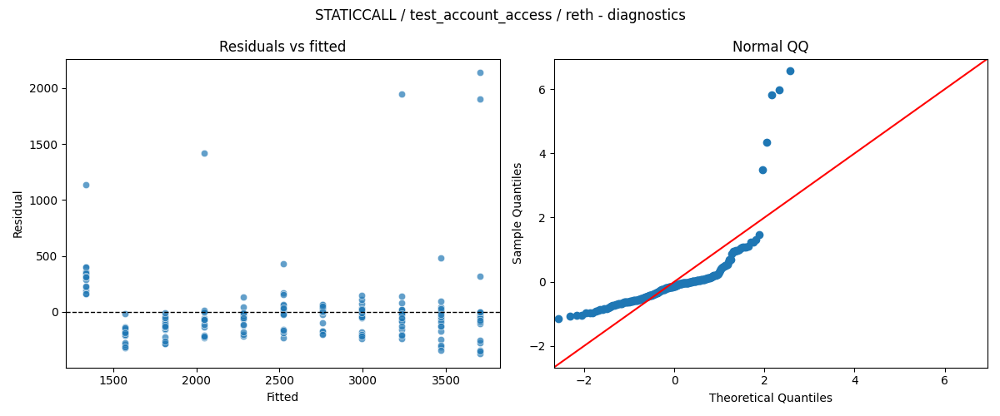

</details>

### test_account_access — combo `STATICCALL_AccountMode.NON_EXISTING_ACCOUNT` — `presets[cold_account_code_access]`

| client | nobs | R² | target_coef (ms) | p-value | 95% CI |
| --- | --- | --- | --- | --- | --- |
| `besu` | 187 | 0.9358 | 0.01244 | 1.00e-03 | [0.0119, 0.01297] |
| `erigon` | 77 | 0.9971 | 0.01173 | 1.00e-03 | [0.01166, 0.01178] |
| `geth` | 121 | 0.6992 | 0.02556 | 1.00e-03 | [0.02204, 0.02884] |
| `nethermind` | 110 | 0.8362 | 0.004492 | 1.00e-03 | [0.004106, 0.004859] |
| `reth` | 198 | 0.9689 | 0.0009742 | 1.00e-03 | [0.000949, 0.0009987] |

<details><summary>besu — NNLS regression summary</summary>

```
==============================================================================
                           NNLS Regression Results                            
==============================================================================
Dep. Variable:          test_runtime_ms              R-squared:          0.936
Model:                  NNLS                    Adj. R-squared:          0.935
No. Observations:       187                               RMSE:          77.42
Df Residuals:           185                                MAE:          62.93
Df Model:               1      
==============================================================================
                      coef     std err     P-value      [0.025      0.975]
------------------------------------------------------------------------------
         const    403.9732     21.5015       0.001    361.1430    445.7132
       opcount      0.0124      0.0003       0.001      0.0119      0.0130
==============================================================================
Notes: Non-negative least squares with bootstrap inference (1000 iterations)
==============================================================================
```


</details>

<details><summary>erigon — NNLS regression summary</summary>

```
==============================================================================
                           NNLS Regression Results                            
==============================================================================
Dep. Variable:          test_runtime_ms              R-squared:          0.997
Model:                  NNLS                    Adj. R-squared:          0.997
No. Observations:       77                                RMSE:          15.06
Df Residuals:           75                                 MAE:          12.08
Df Model:               1      
==============================================================================
                      coef     std err     P-value      [0.025      0.975]
------------------------------------------------------------------------------
         const      0.0000      0.9446       1.000      0.0000      3.2474
       opcount      0.0117      0.0000       0.001      0.0117      0.0118
==============================================================================
Notes: Non-negative least squares with bootstrap inference (1000 iterations)
==============================================================================
```


</details>

<details><summary>geth — NNLS regression summary</summary>

```
==============================================================================
                           NNLS Regression Results                            
==============================================================================
Dep. Variable:          test_runtime_ms              R-squared:          0.699
Model:                  NNLS                    Adj. R-squared:          0.697
No. Observations:       121                               RMSE:         398.47
Df Residuals:           119                                MAE:         325.07
Df Model:               1      
==============================================================================
                      coef     std err     P-value      [0.025      0.975]
------------------------------------------------------------------------------
         const   1272.0391    135.7672       0.001   1010.8608   1560.6772
       opcount      0.0256      0.0017       0.001      0.0220      0.0288
==============================================================================
Notes: Non-negative least squares with bootstrap inference (1000 iterations)
==============================================================================
```


</details>

<details><summary>nethermind — NNLS regression summary</summary>

```
==============================================================================
                           NNLS Regression Results                            
==============================================================================
Dep. Variable:          test_runtime_ms              R-squared:          0.836
Model:                  NNLS                    Adj. R-squared:          0.835
No. Observations:       110                               RMSE:          47.26
Df Residuals:           108                                MAE:          37.33
Df Model:               1      
==============================================================================
                      coef     std err     P-value      [0.025      0.975]
------------------------------------------------------------------------------
         const    110.0148     13.6715       0.001     84.6376    139.1663
       opcount      0.0045      0.0002       0.001      0.0041      0.0049
==============================================================================
Notes: Non-negative least squares with bootstrap inference (1000 iterations)
==============================================================================
```


</details>

<details><summary>reth — NNLS regression summary</summary>

```
==============================================================================
                           NNLS Regression Results                            
==============================================================================
Dep. Variable:          test_runtime_ms              R-squared:          0.969
Model:                  NNLS                    Adj. R-squared:          0.969
No. Observations:       198                               RMSE:           4.15
Df Residuals:           196                                MAE:           3.38
Df Model:               1      
==============================================================================
                      coef     std err     P-value      [0.025      0.975]
------------------------------------------------------------------------------
         const     32.4535      1.0248       0.001     30.5032     34.5422
       opcount      0.0010      0.0000       0.001      0.0009      0.0010
==============================================================================
Notes: Non-negative least squares with bootstrap inference (1000 iterations)
==============================================================================
```


</details>

### test_ext_account_query_warm — combo `STATICCALL`

| client | nobs | R² | target_coef (ms) | p-value | 95% CI |
| --- | --- | --- | --- | --- | --- |
| `besu` | 187 | 0.7946 | 0.0005843 | 1.00e-03 | [0.0005442, 0.0006324] |
| `erigon` | 77 | 0.9842 | 0.0005749 | 1.00e-03 | [0.0005593, 0.0005925] |
| `geth` | 121 | 0.8417 | 0.0001834 | 1.00e-03 | [0.0001677, 0.0001986] |
| `nethermind` | 110 | 0.3827 | 0.0005379 | 1.00e-03 | [0.0004189, 0.000657] |
| `reth` | 198 | 0.905 | 4.859e-05 | 1.00e-03 | [4.639e-05, 5.067e-05] |

<details><summary>besu — NNLS regression summary</summary>

```
==============================================================================
                           NNLS Regression Results                            
==============================================================================
Dep. Variable:          test_runtime_ms              R-squared:          0.795
Model:                  NNLS                    Adj. R-squared:          0.793
No. Observations:       187                               RMSE:         153.80
Df Residuals:           185                                MAE:         121.21
Df Model:               1      
==============================================================================
                      coef     std err     P-value      [0.025      0.975]
------------------------------------------------------------------------------
         const    593.3265     34.4576       0.001    522.4645    657.7600
       opcount      0.0006      0.0000       0.001      0.0005      0.0006
==============================================================================
Notes: Non-negative least squares with bootstrap inference (1000 iterations)
==============================================================================
```

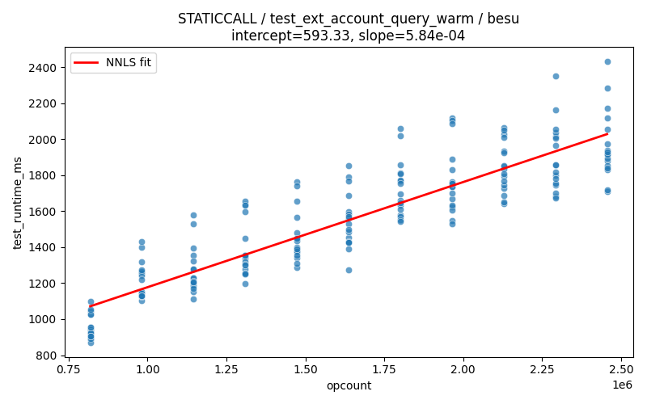

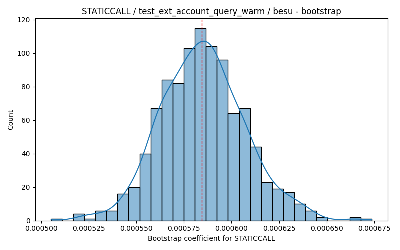

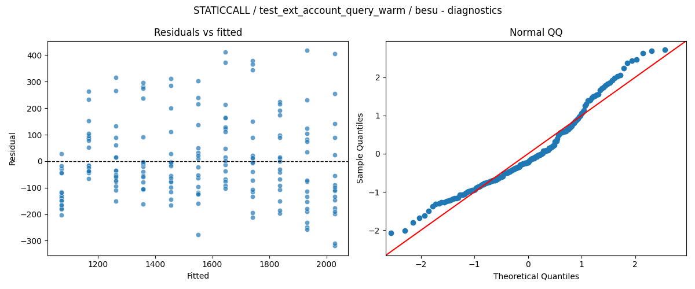

</details>

<details><summary>erigon — NNLS regression summary</summary>

```
==============================================================================
                           NNLS Regression Results                            
==============================================================================
Dep. Variable:          test_runtime_ms              R-squared:          0.984
Model:                  NNLS                    Adj. R-squared:          0.984
No. Observations:       77                                RMSE:          37.67
Df Residuals:           75                                 MAE:          30.62
Df Model:               1      
==============================================================================
                      coef     std err     P-value      [0.025      0.975]
------------------------------------------------------------------------------
         const     54.6965     13.1217       0.001     27.2264     80.3706
       opcount      0.0006      0.0000       0.001      0.0006      0.0006
==============================================================================
Notes: Non-negative least squares with bootstrap inference (1000 iterations)
==============================================================================
```

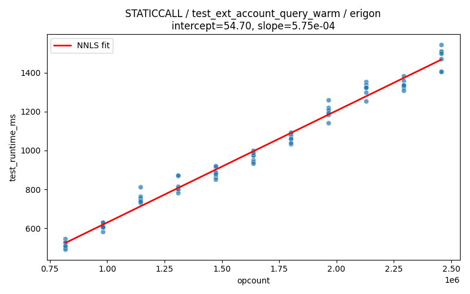

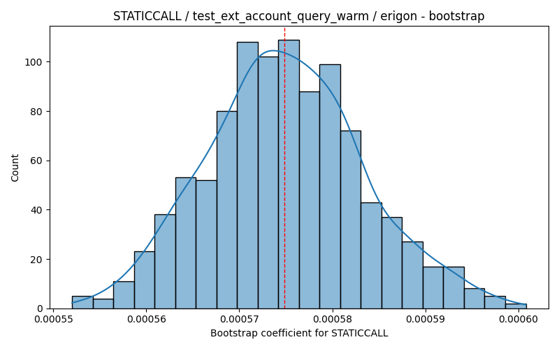

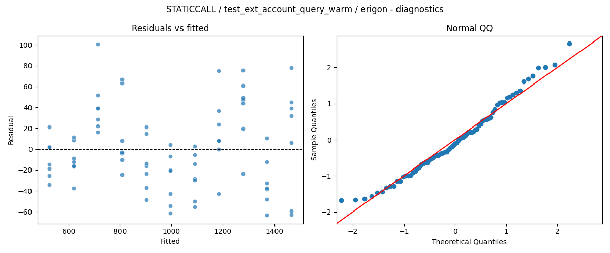

</details>

<details><summary>geth — NNLS regression summary</summary>

```
==============================================================================
                           NNLS Regression Results                            
==============================================================================
Dep. Variable:          test_runtime_ms              R-squared:          0.842
Model:                  NNLS                    Adj. R-squared:          0.840
No. Observations:       121                               RMSE:          41.17
Df Residuals:           119                                MAE:          34.41
Df Model:               1      
==============================================================================
                      coef     std err     P-value      [0.025      0.975]
------------------------------------------------------------------------------
         const     39.2320     11.3261       0.001     17.4296     61.7635
       opcount      0.0002      0.0000       0.001      0.0002      0.0002
==============================================================================
Notes: Non-negative least squares with bootstrap inference (1000 iterations)
==============================================================================
```

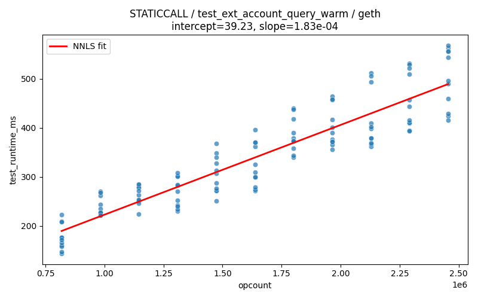

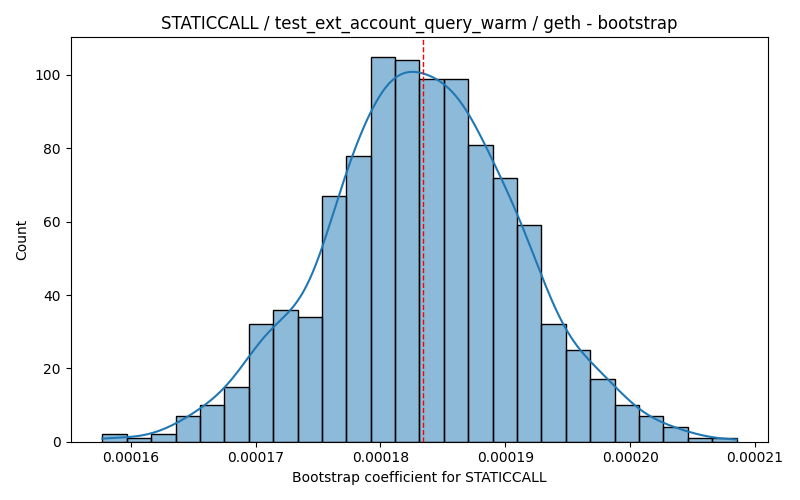

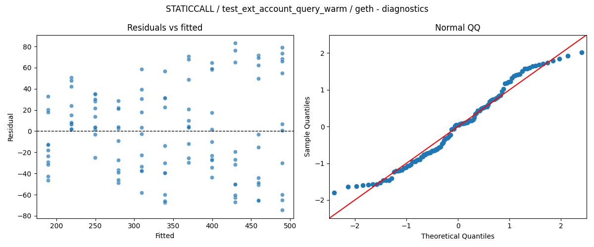

</details>

<details><summary>nethermind — NNLS regression summary</summary>

```
==============================================================================
                           NNLS Regression Results                            
==============================================================================
Dep. Variable:          test_runtime_ms              R-squared:          0.383
Model:                  NNLS                    Adj. R-squared:          0.377
No. Observations:       110                               RMSE:         353.67
Df Residuals:           108                                MAE:         317.83
Df Model:               1      
==============================================================================
                      coef     std err     P-value      [0.025      0.975]
------------------------------------------------------------------------------
         const    313.5444     93.4829       0.001    130.6239    489.7247
       opcount      0.0005      0.0001       0.001      0.0004      0.0007
==============================================================================
Notes: Non-negative least squares with bootstrap inference (1000 iterations)
==============================================================================
```

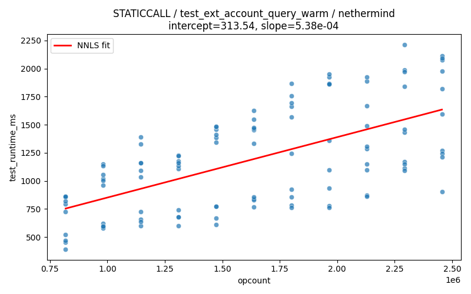

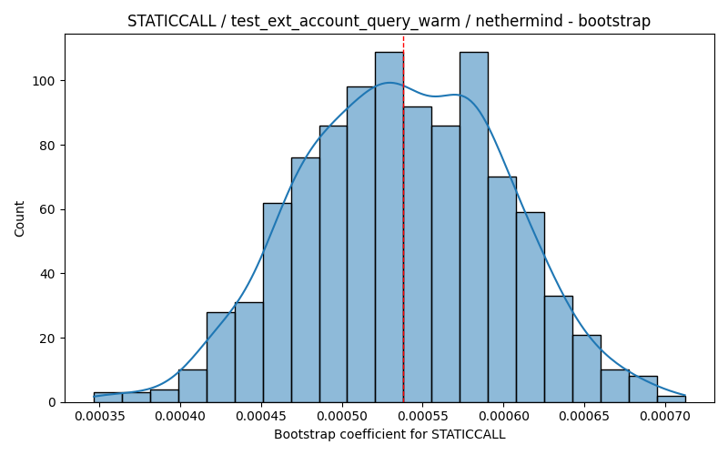

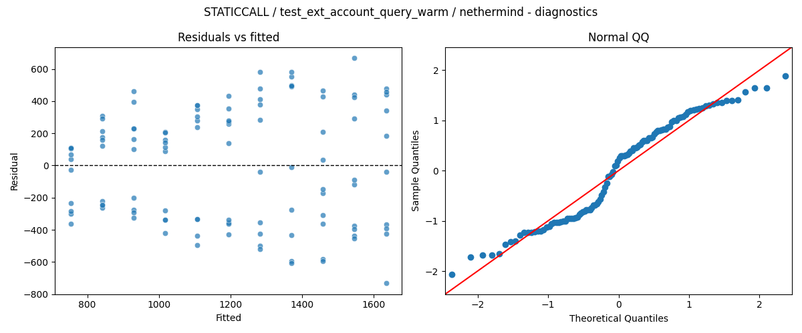

</details>

<details><summary>reth — NNLS regression summary</summary>

```
==============================================================================
                           NNLS Regression Results                            
==============================================================================
Dep. Variable:          test_runtime_ms              R-squared:          0.905
Model:                  NNLS                    Adj. R-squared:          0.905
No. Observations:       198                               RMSE:           8.15
Df Residuals:           196                                MAE:           6.34
Df Model:               1      
==============================================================================
                      coef     std err     P-value      [0.025      0.975]
------------------------------------------------------------------------------
         const     15.6580      1.7825       0.001     12.3540     19.2347
       opcount      0.0000      0.0000       0.001      0.0000      0.0001
==============================================================================
Notes: Non-negative least squares with bootstrap inference (1000 iterations)
==============================================================================
```

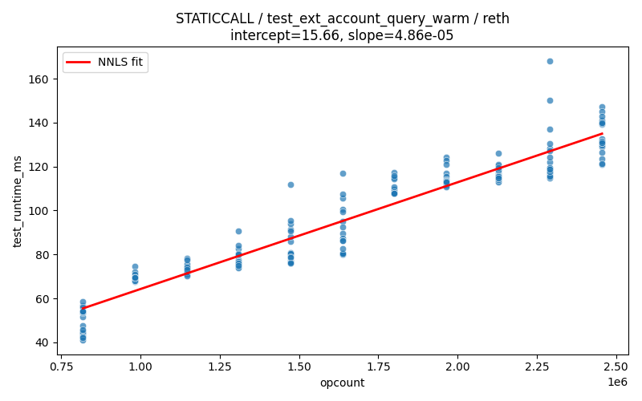

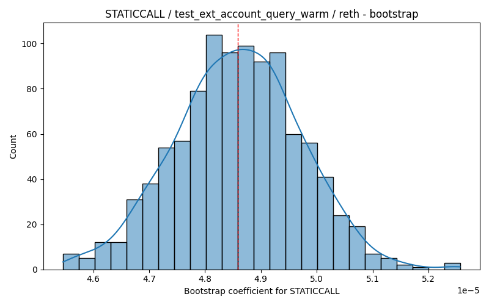

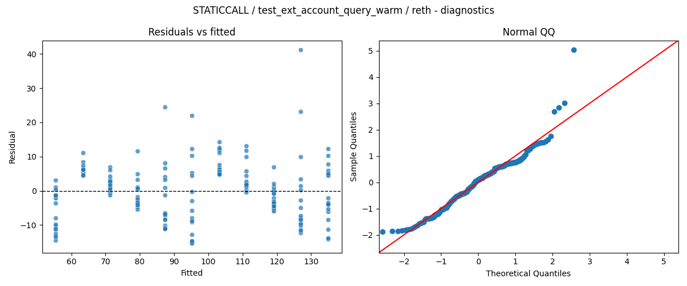

</details>
