# Glue opcodes report

Per-client NNLS fits of priced glue opcodes against their driver fixtures. Cycle-tier opcodes share one joint regression per client (shown once); pure-tier and mixed-tier opcodes each get a single-feature fit. Mixed-tier fits pre-adjust the LHS by subtracting the contribution of every priced upstream partner selected by the detector (pure ∪ cycle for `mixed_a`, plus `mixed_a` for `mixed_b`).

**Contents:** [besu](#besu) · [erigon](#erigon) · [geth](#geth) · [nethermind](#nethermind) · [reth](#reth)

## besu

| glue_opcode | nobs | glue_runtime_ms | p_value | rsquared |
| --- | --- | --- | --- | --- |
| `ISZERO` | 605 | 4.927e-06 | 1.00e-03 | 0.8493 |
| `JUMPDEST` | 605 | 2.667e-06 | 1.00e-03 | 0.8645 |
| `SWAP` | 9680 | 3.714e-06 | 1.00e-03 | 0.8272 |
| `CALLDATASIZE` | 35915 | 4.359e-06 | 1.00e-03 | 0.9235 |
| `DUP` | 35915 | 2.609e-06 | 1.00e-03 | 0.9235 |
| `GAS` | 35915 | 3.815e-06 | 1.00e-03 | 0.9235 |
| `MLOAD` | 35915 | 1.102e-05 | 1.00e-03 | 0.9235 |
| `PUSH` | 35915 | 3.139e-06 | 1.00e-03 | 0.9235 |
| `PUSH0` | 35915 | 2.612e-06 | 1.00e-03 | 0.9235 |
| `STATICCALL` | 35915 | 0.0008414 | 1.00e-03 | 0.9235 |
| `ADD` | 605 | 1.128e-05 | 1.00e-03 | 0.8368 |
| `AND` | 605 | 9.992e-06 | 1.00e-03 | 0.864 |
| `CALLDATACOPY` | 14520 | 2.115e-05 | 1.00e-03 | 0.8131 |
| `CALLDATALOAD` | 2420 | 6.686e-06 | 2.90e-02 | 0.001038 |
| `DIV` | 605 | 1.752e-05 | 1.00e-03 | 0.8587 |
| `EXP` | 605 | 0.001223 | 1.00e-03 | 0.8086 |
| `GT` | 605 | 3.239e-05 | 1.00e-03 | 0.8814 |
| `JUMPI` | 605 | 9.577e-06 | 1.00e-03 | 0.8427 |
| `LT` | 605 | 3.354e-05 | 1.00e-03 | 0.8913 |
| `MSTORE` | 3025 | 1.797e-05 | 1.00e-03 | 0.8476 |
| `MSTORE8` | 3025 | 1.3e-05 | 1.00e-03 | 0.8236 |
| `MUL` | 605 | 1.231e-05 | 1.00e-03 | 0.5785 |
| `PC` | 605 | 4.325e-06 | 1.00e-03 | 0.8536 |
| `RETURNDATASIZE` | 2420 | 7.121e-06 | 1.00e-03 | 0.8452 |
| `SELFBALANCE` | 495 | 7.924e-06 | 1.00e-03 | 0.4408 |
| `SUB` | 605 | 1.177e-05 | 1.00e-03 | 0.8214 |
| `JUMP` | 605 | 3.551e-05 | 1.00e-03 | 0.4291 |
| `KECCAK256` | 9680 | 5.177e-05 | 1.00e-03 | 0.2772 |

### Cycle glue — joint fit · besu

<details><summary>Joint NNLS regression summary</summary>

```
==============================================================================
                           NNLS Regression Results                            
==============================================================================
Dep. Variable:          test_runtime_ms              R-squared:          0.923
Model:                  NNLS                    Adj. R-squared:          0.923
No. Observations:       35915                             RMSE:          42.97
Df Residuals:           35907                              MAE:          32.78
Df Model:               7      
==============================================================================
                      coef     std err     P-value      [0.025      0.975]
------------------------------------------------------------------------------
         const     76.6410      0.8396       0.001     75.0734     78.3432
  CALLDATASIZE      0.0000      0.0000       0.001      0.0000      0.0000
           DUP      0.0000      0.0000       0.001      0.0000      0.0000
           GAS      0.0000      0.0000       0.001      0.0000      0.0000
         MLOAD      0.0000      0.0000       0.001      0.0000      0.0000
          PUSH      0.0000      0.0000       0.001      0.0000      0.0000
         PUSH0      0.0000      0.0000       0.001      0.0000      0.0000
    STATICCALL      0.0008      0.0000       0.001      0.0008      0.0009
==============================================================================
Notes: Non-negative least squares with bootstrap inference (1000 iterations)
==============================================================================
```

</details>

<details><summary><code>CALLDATASIZE</code> · nobs=35915 · runtime_ms=4.359e-06 · p=1.00e-03 · R²=0.9235</summary>

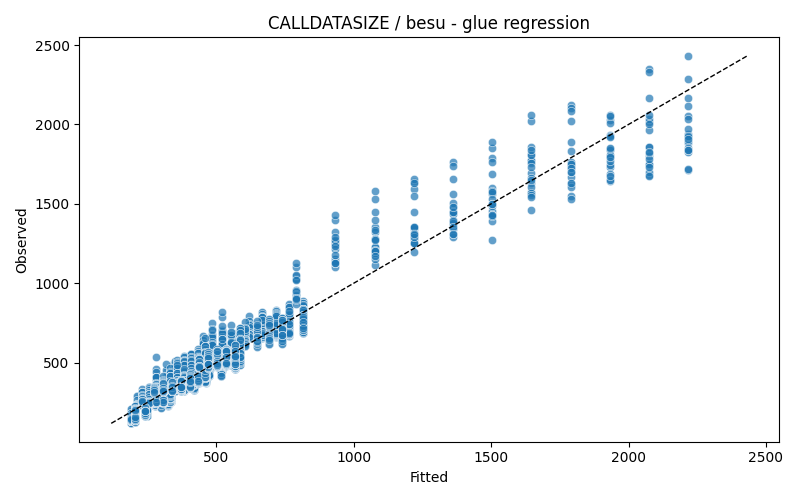

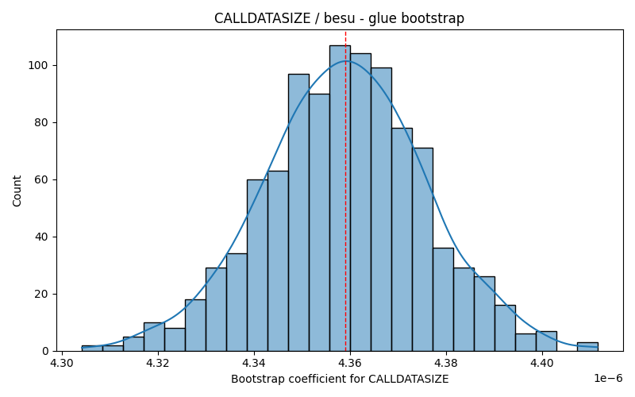

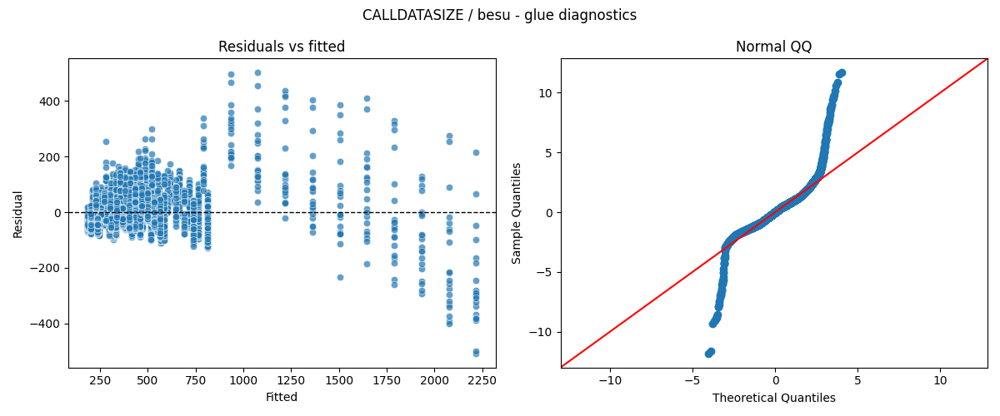

</details>

<details><summary><code>DUP</code> · nobs=35915 · runtime_ms=2.609e-06 · p=1.00e-03 · R²=0.9235</summary>


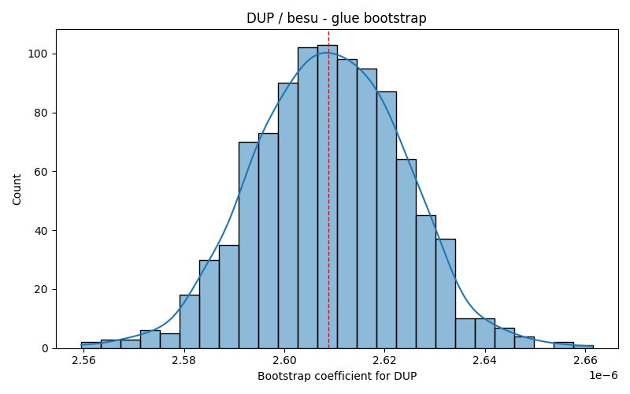

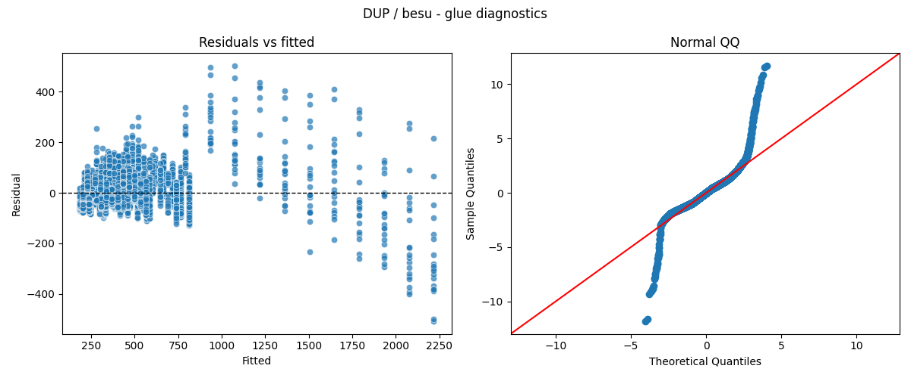

</details>

<details><summary><code>GAS</code> · nobs=35915 · runtime_ms=3.815e-06 · p=1.00e-03 · R²=0.9235</summary>


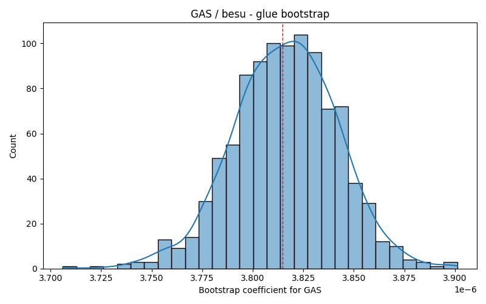


</details>

<details><summary><code>MLOAD</code> · nobs=35915 · runtime_ms=1.102e-05 · p=1.00e-03 · R²=0.9235</summary>


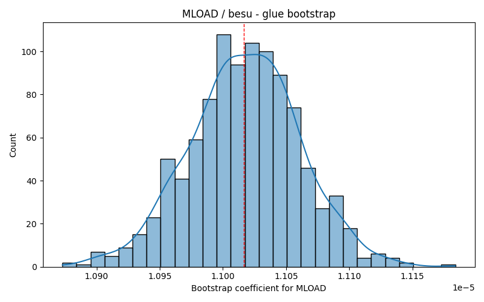


</details>

<details><summary><code>PUSH</code> · nobs=35915 · runtime_ms=3.139e-06 · p=1.00e-03 · R²=0.9235</summary>


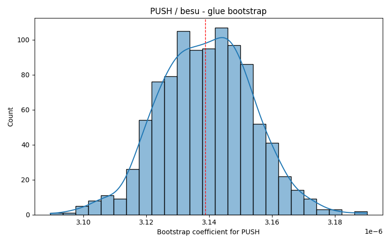


</details>

<details><summary><code>PUSH0</code> · nobs=35915 · runtime_ms=2.612e-06 · p=1.00e-03 · R²=0.9235</summary>

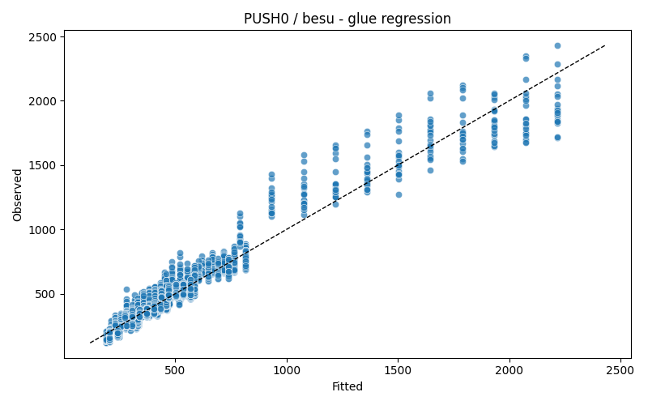

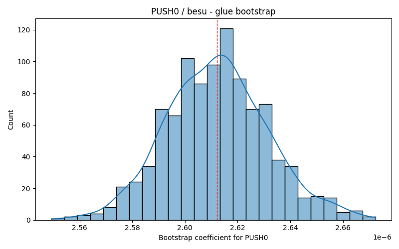


</details>

<details><summary><code>STATICCALL</code> · nobs=35915 · runtime_ms=0.0008414 · p=1.00e-03 · R²=0.9235</summary>


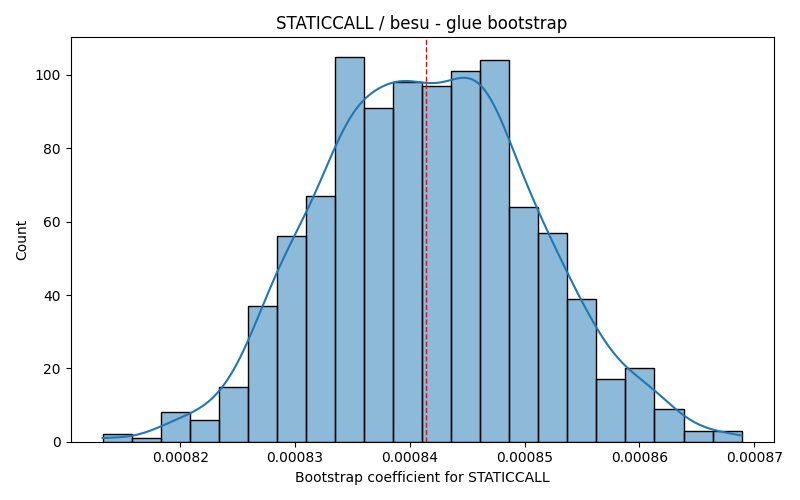


</details>

### Pure glue · besu

<details><summary><code>ISZERO</code> · nobs=605 · runtime_ms=4.927e-06 · p=1.00e-03 · R²=0.8493</summary>

```
==============================================================================
                           NNLS Regression Results                            
==============================================================================
Dep. Variable:          test_runtime_ms              R-squared:          0.849
Model:                  NNLS                    Adj. R-squared:          0.849
No. Observations:       605                               RMSE:          43.69
Df Residuals:           603                                MAE:          36.28
Df Model:               1      
==============================================================================
                      coef     std err     P-value      [0.025      0.975]
------------------------------------------------------------------------------
         const     76.8743      6.8025       0.001     63.5441     89.7544
        ISZERO      0.0000      0.0000       0.001      0.0000      0.0000
==============================================================================
Notes: Non-negative least squares with bootstrap inference (1000 iterations)
==============================================================================
```

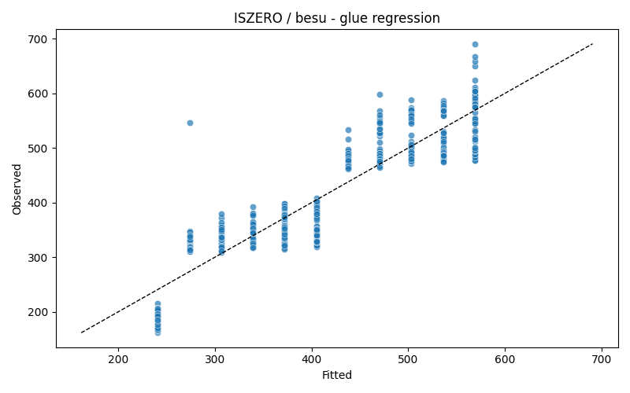

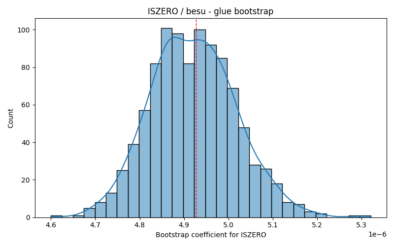

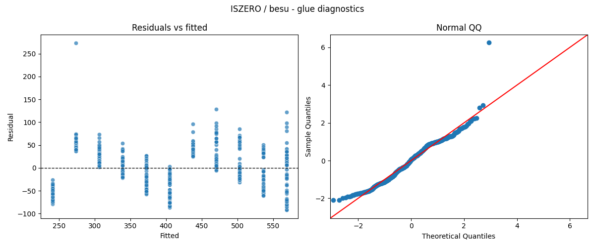

</details>

<details><summary><code>JUMPDEST</code> · nobs=605 · runtime_ms=2.667e-06 · p=1.00e-03 · R²=0.8645</summary>

```
==============================================================================
                           NNLS Regression Results                            
==============================================================================
Dep. Variable:          test_runtime_ms              R-squared:          0.864
Model:                  NNLS                    Adj. R-squared:          0.864
No. Observations:       605                               RMSE:          66.68
Df Residuals:           603                                MAE:          56.66
Df Model:               1      
==============================================================================
                      coef     std err     P-value      [0.025      0.975]
------------------------------------------------------------------------------
         const     82.6615      9.6017       0.001     64.9683    101.7530
      JUMPDEST      0.0000      0.0000       0.001      0.0000      0.0000
==============================================================================
Notes: Non-negative least squares with bootstrap inference (1000 iterations)
==============================================================================
```

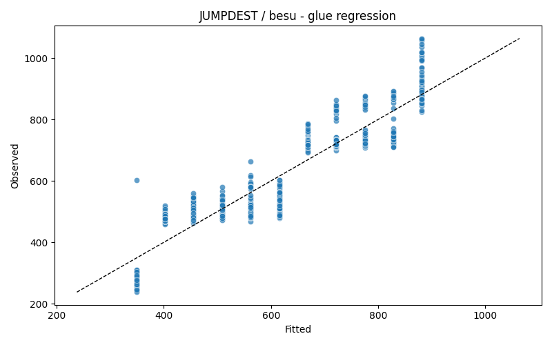

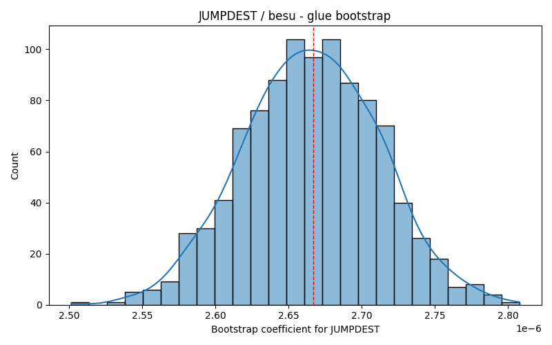

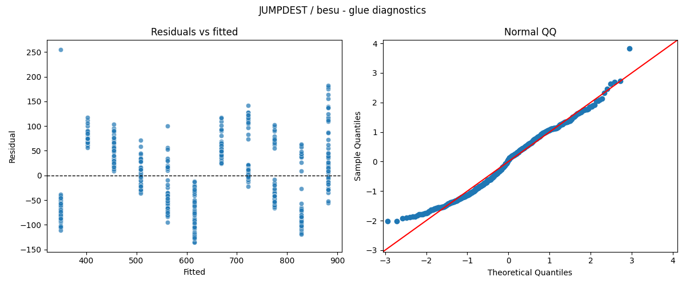

</details>

<details><summary><code>SWAP</code> · nobs=9680 · runtime_ms=3.714e-06 · p=1.00e-03 · R²=0.8272</summary>

```
==============================================================================
                           NNLS Regression Results                            
==============================================================================
Dep. Variable:          test_runtime_ms              R-squared:          0.827
Model:                  NNLS                    Adj. R-squared:          0.827
No. Observations:       9680                              RMSE:          35.74
Df Residuals:           9678                               MAE:          28.95
Df Model:               1      
==============================================================================
                      coef     std err     P-value      [0.025      0.975]
------------------------------------------------------------------------------
         const     70.1997      1.2693       0.001     67.8129     72.5181
          SWAP      0.0000      0.0000       0.001      0.0000      0.0000
==============================================================================
Notes: Non-negative least squares with bootstrap inference (1000 iterations)
==============================================================================
```

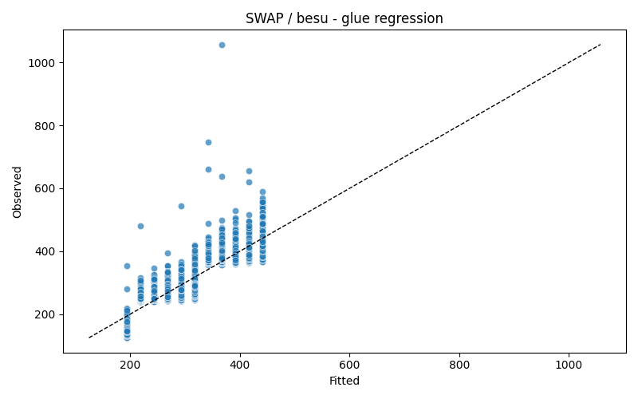


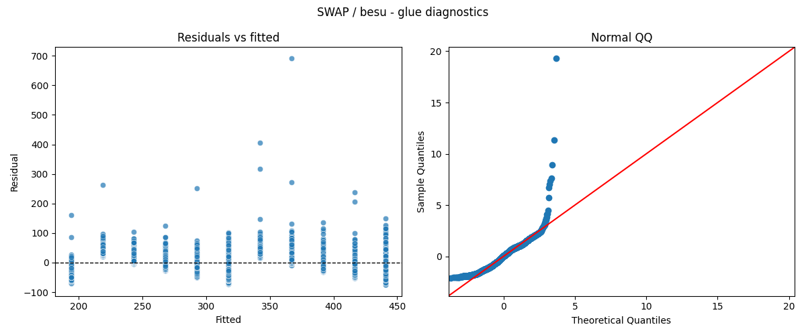

</details>

### Mixed glue (tier A) · besu

<details><summary><code>ADD</code> · nobs=605 · runtime_ms=1.128e-05 · p=1.00e-03 · R²=0.8368</summary>

```
==============================================================================
                           NNLS Regression Results                            
==============================================================================
Dep. Variable:          test_runtime_ms              R-squared:          0.837
Model:                  NNLS                    Adj. R-squared:          0.837
No. Observations:       605                               RMSE:          52.43
Df Residuals:           603                                MAE:          44.31
Df Model:               1      
==============================================================================
                      coef     std err     P-value      [0.025      0.975]
------------------------------------------------------------------------------
         const    110.6704      7.8885       0.001     94.6249    126.5731
           ADD      0.0000      0.0000       0.001      0.0000      0.0000
==============================================================================
Notes: Non-negative least squares with bootstrap inference (1000 iterations)
==============================================================================
```

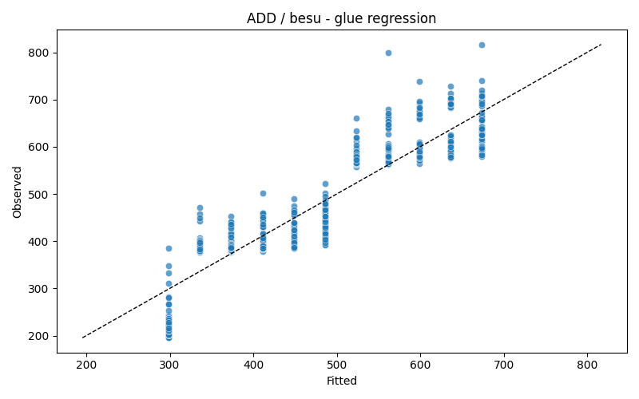

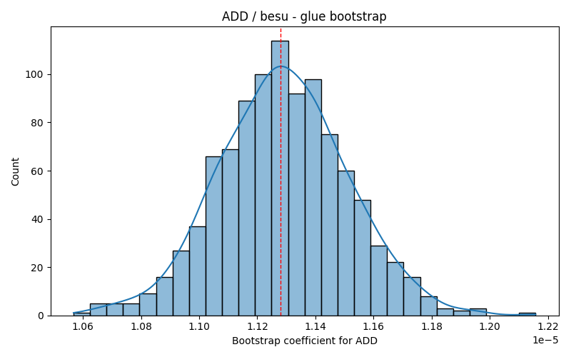

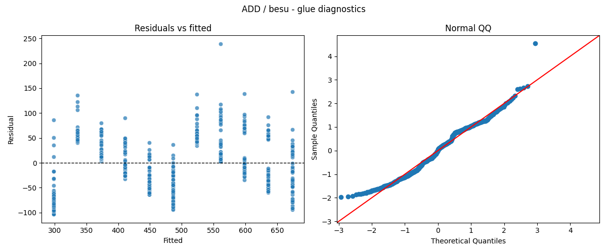

</details>

<details><summary><code>AND</code> · nobs=605 · runtime_ms=9.992e-06 · p=1.00e-03 · R²=0.864</summary>

```
==============================================================================
                           NNLS Regression Results                            
==============================================================================
Dep. Variable:          test_runtime_ms              R-squared:          0.864
Model:                  NNLS                    Adj. R-squared:          0.864
No. Observations:       605                               RMSE:          41.73
Df Residuals:           603                                MAE:          35.80
Df Model:               1      
==============================================================================
                      coef     std err     P-value      [0.025      0.975]
------------------------------------------------------------------------------
         const     86.1456      6.2065       0.001     73.9924     97.6776
           AND      0.0000      0.0000       0.001      0.0000      0.0000
==============================================================================
Notes: Non-negative least squares with bootstrap inference (1000 iterations)
==============================================================================
```

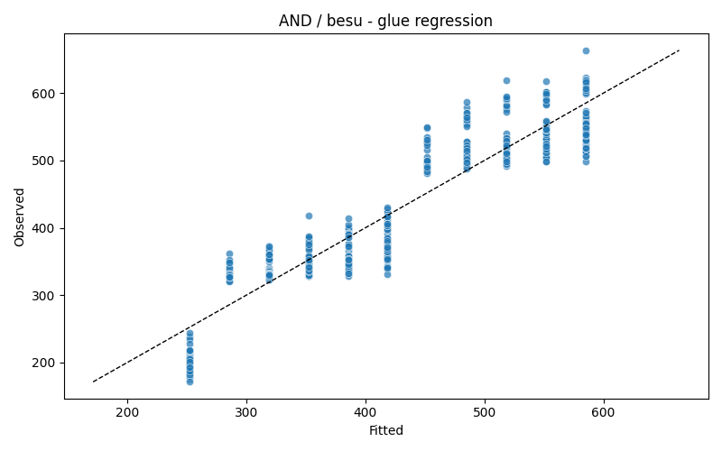

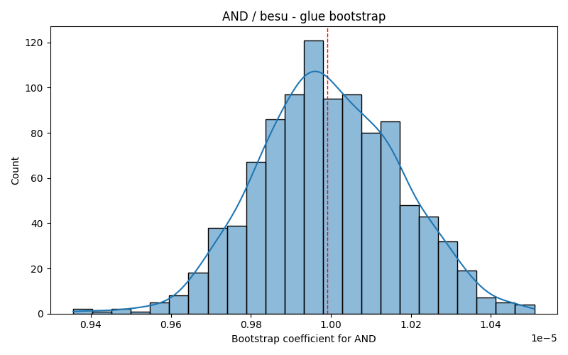

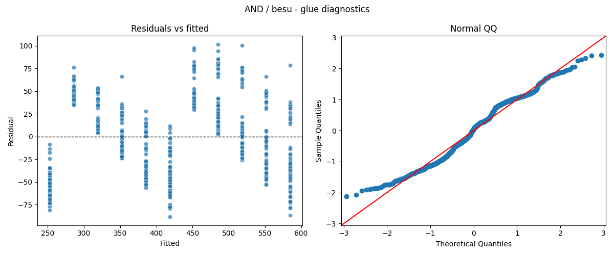

</details>

<details><summary><code>CALLDATACOPY</code> · nobs=14520 · runtime_ms=2.115e-05 · p=1.00e-03 · R²=0.8131</summary>

```
==============================================================================
                           NNLS Regression Results                            
==============================================================================
Dep. Variable:          test_runtime_ms              R-squared:          0.813
Model:                  NNLS                    Adj. R-squared:          0.813
No. Observations:       14520                             RMSE:          76.24
Df Residuals:           14518                              MAE:          59.88
Df Model:               1      
==============================================================================
                      coef     std err     P-value      [0.025      0.975]
------------------------------------------------------------------------------
         const    118.0181      0.7809       0.001    116.4955    119.5607
  CALLDATACOPY      0.0000      0.0000       0.001      0.0000      0.0000
==============================================================================
Notes: Non-negative least squares with bootstrap inference (1000 iterations)
==============================================================================
```

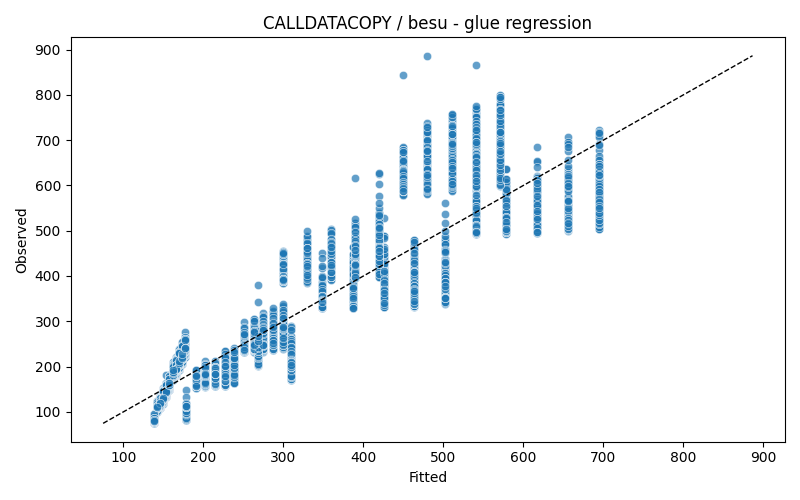

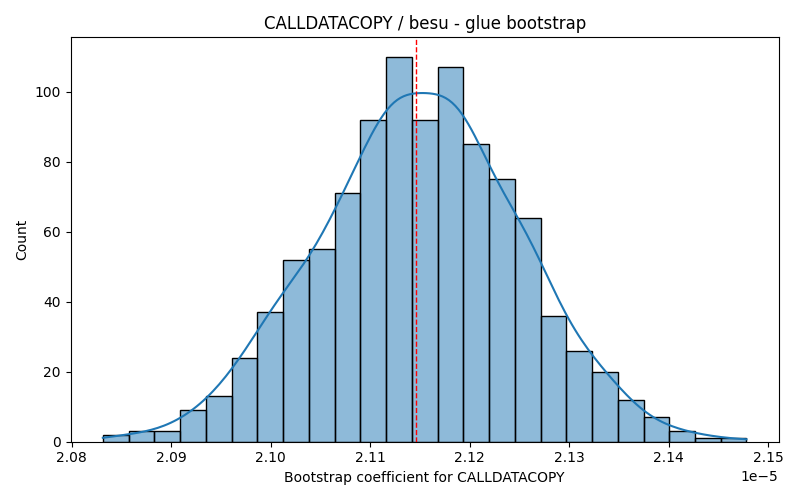

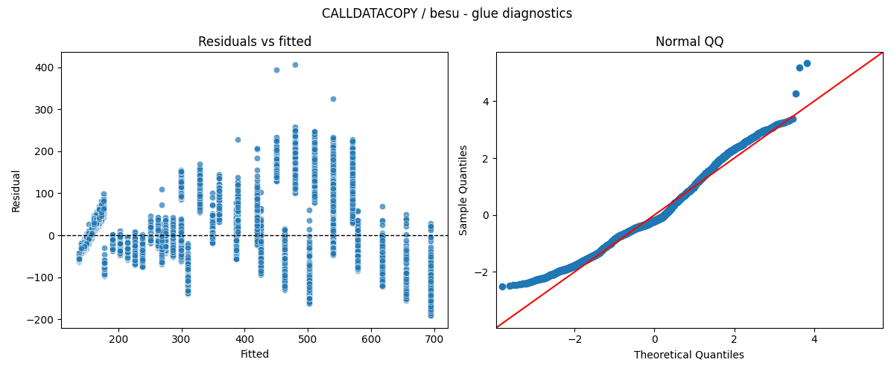

</details>

<details><summary><code>CALLDATALOAD</code> · nobs=2420 · runtime_ms=6.686e-06 · p=2.90e-02 · R²=0.001038</summary>

```
==============================================================================
                           NNLS Regression Results                            
==============================================================================
Dep. Variable:          test_runtime_ms              R-squared:          0.001
Model:                  NNLS                    Adj. R-squared:          0.001
No. Observations:       2420                              RMSE:           0.80
Df Residuals:           2418                               MAE:           0.54
Df Model:               1      
==============================================================================
                      coef     std err     P-value      [0.025      0.975]
------------------------------------------------------------------------------
         const      3.7206      0.0491       0.001      3.6237      3.8117
  CALLDATALOAD      0.0000      0.0000       0.029      0.0000      0.0000
==============================================================================
Notes: Non-negative least squares with bootstrap inference (1000 iterations)
==============================================================================
```

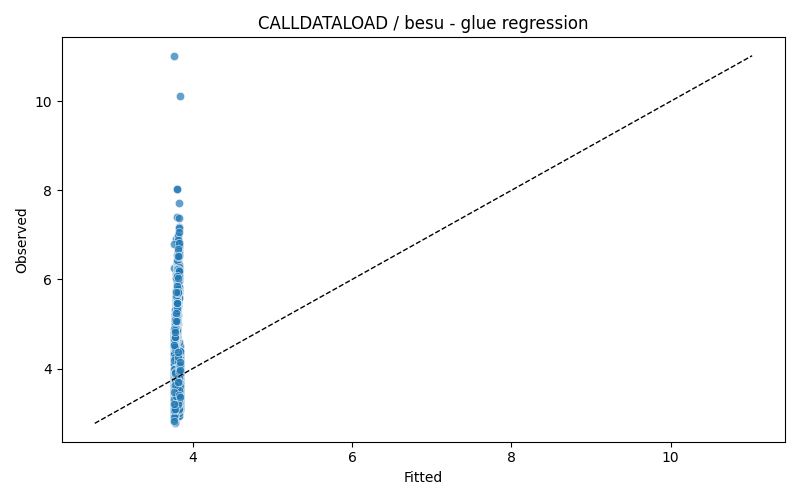

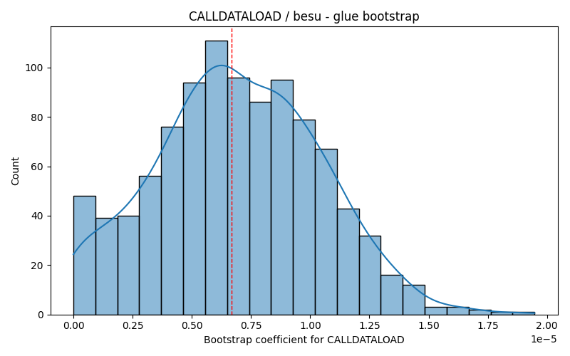

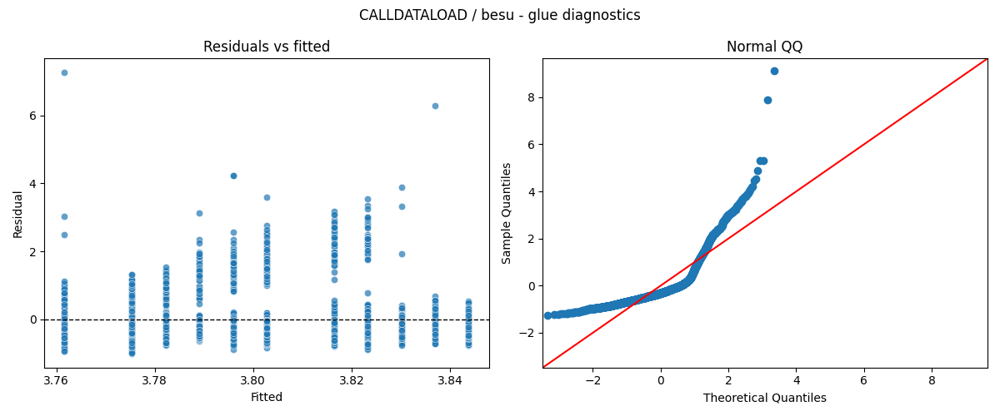

</details>

<details><summary><code>DIV</code> · nobs=605 · runtime_ms=1.752e-05 · p=1.00e-03 · R²=0.8587</summary>

```
==============================================================================
                           NNLS Regression Results                            
==============================================================================
Dep. Variable:          test_runtime_ms              R-squared:          0.859
Model:                  NNLS                    Adj. R-squared:          0.858
No. Observations:       605                               RMSE:          56.10
Df Residuals:           603                                MAE:          47.32
Df Model:               1      
==============================================================================
                      coef     std err     P-value      [0.025      0.975]
------------------------------------------------------------------------------
         const    140.1357      7.1378       0.001    126.5640    154.6535
           DIV      0.0000      0.0000       0.001      0.0000      0.0000
==============================================================================
Notes: Non-negative least squares with bootstrap inference (1000 iterations)
==============================================================================
```

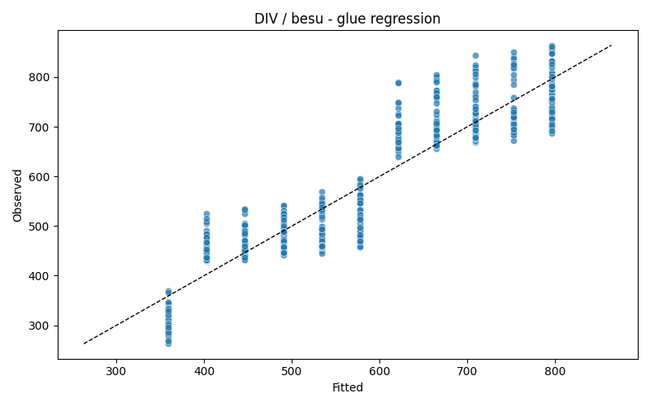

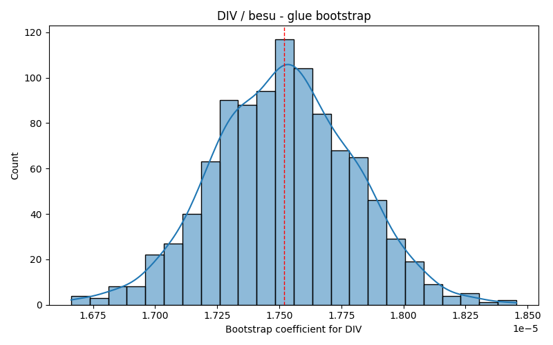

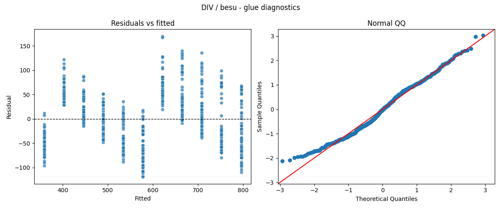

</details>

<details><summary><code>EXP</code> · nobs=605 · runtime_ms=0.001223 · p=1.00e-03 · R²=0.8086</summary>

```
==============================================================================
                           NNLS Regression Results                            
==============================================================================
Dep. Variable:          test_runtime_ms              R-squared:          0.809
Model:                  NNLS                    Adj. R-squared:          0.808
No. Observations:       605                               RMSE:          23.29
Df Residuals:           603                                MAE:          18.41
Df Model:               1      
==============================================================================
                      coef     std err     P-value      [0.025      0.975]
------------------------------------------------------------------------------
         const     83.9670      2.9600       0.001     78.1397     89.6689
           EXP      0.0012      0.0000       0.001      0.0012      0.0013
==============================================================================
Notes: Non-negative least squares with bootstrap inference (1000 iterations)
==============================================================================
```


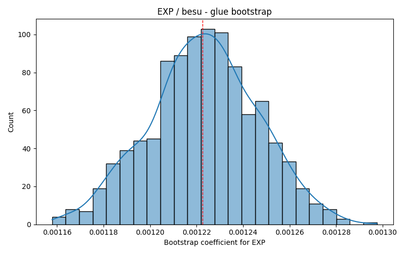

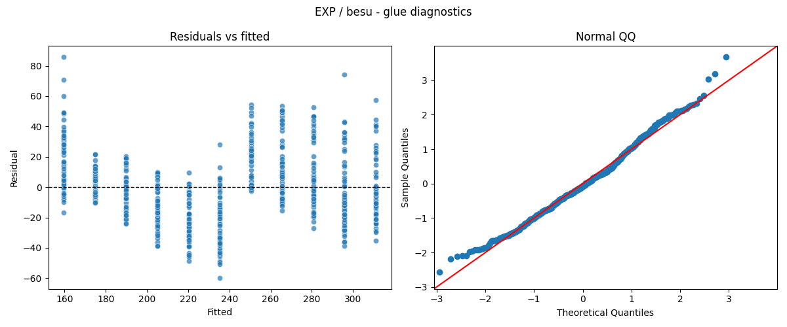

</details>

<details><summary><code>GT</code> · nobs=605 · runtime_ms=3.239e-05 · p=1.00e-03 · R²=0.8814</summary>

```
==============================================================================
                           NNLS Regression Results                            
==============================================================================
Dep. Variable:          test_runtime_ms              R-squared:          0.881
Model:                  NNLS                    Adj. R-squared:          0.881
No. Observations:       605                               RMSE:         125.07
Df Residuals:           603                                MAE:         100.58
Df Model:               1      
==============================================================================
                      coef     std err     P-value      [0.025      0.975]
------------------------------------------------------------------------------
         const    194.7667     17.6046       0.001    160.3879    229.1126
            GT      0.0000      0.0000       0.001      0.0000      0.0000
==============================================================================
Notes: Non-negative least squares with bootstrap inference (1000 iterations)
==============================================================================
```

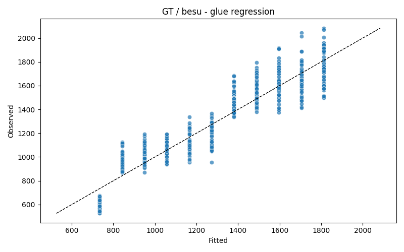

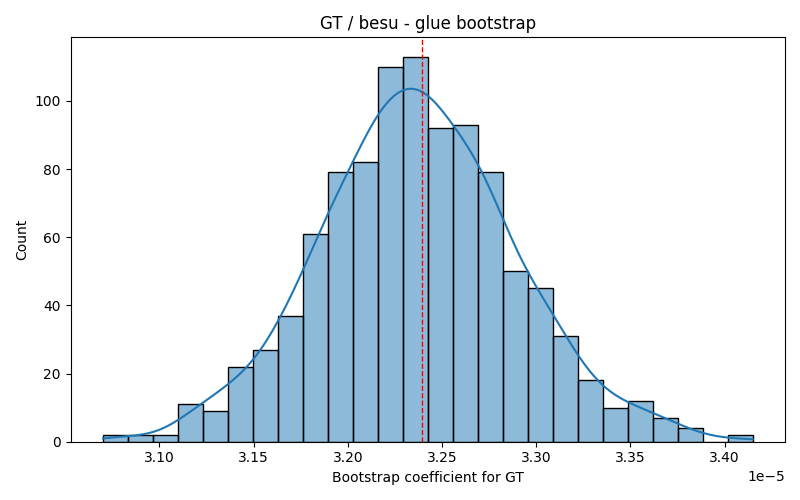

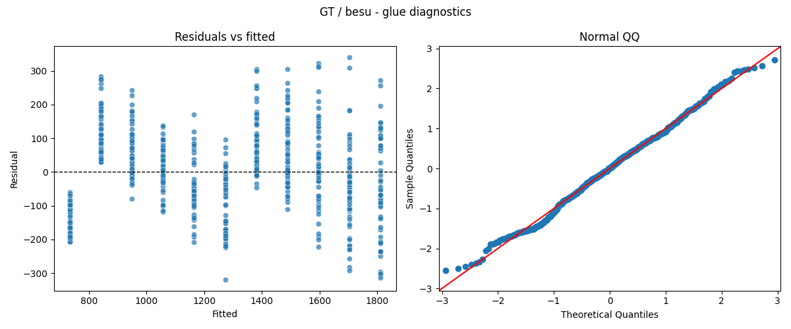

</details>

<details><summary><code>JUMPI</code> · nobs=605 · runtime_ms=9.577e-06 · p=1.00e-03 · R²=0.8427</summary>

```
==============================================================================
                           NNLS Regression Results                            
==============================================================================
Dep. Variable:          test_runtime_ms              R-squared:          0.843
Model:                  NNLS                    Adj. R-squared:          0.842
No. Observations:       605                               RMSE:          18.67
Df Residuals:           603                                MAE:          15.29
Df Model:               1      
==============================================================================
                      coef     std err     P-value      [0.025      0.975]
------------------------------------------------------------------------------
         const     37.2598      2.6079       0.001     32.1431     42.3689
         JUMPI      0.0000      0.0000       0.001      0.0000      0.0000
==============================================================================
Notes: Non-negative least squares with bootstrap inference (1000 iterations)
==============================================================================
```

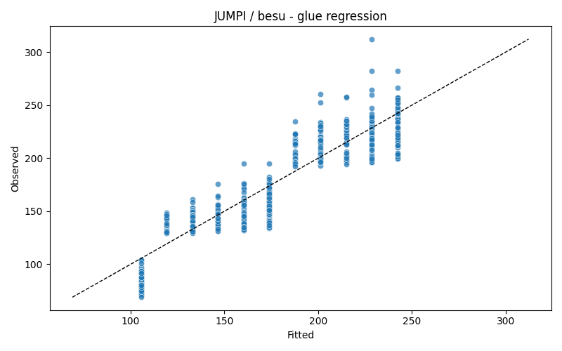

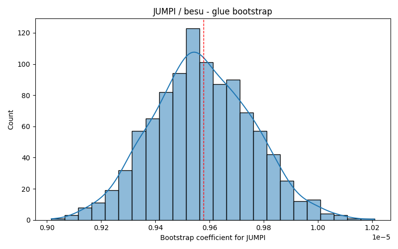

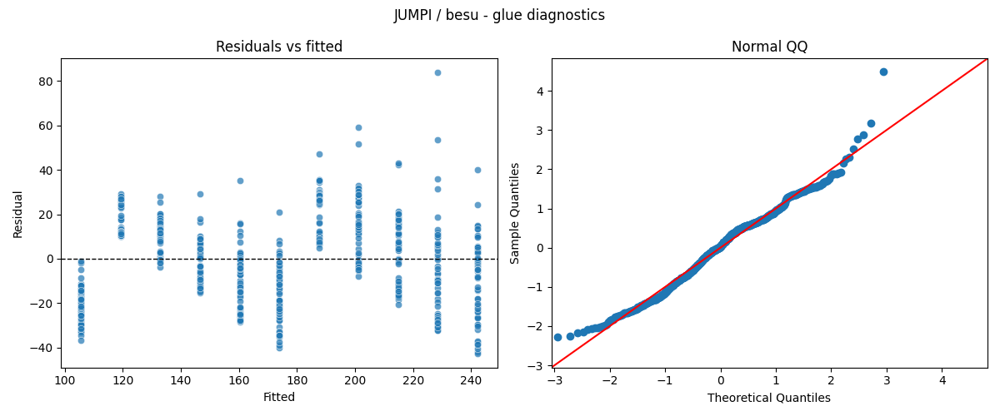

</details>

<details><summary><code>LT</code> · nobs=605 · runtime_ms=3.354e-05 · p=1.00e-03 · R²=0.8913</summary>

```
==============================================================================
                           NNLS Regression Results                            
==============================================================================
Dep. Variable:          test_runtime_ms              R-squared:          0.891
Model:                  NNLS                    Adj. R-squared:          0.891
No. Observations:       605                               RMSE:         123.29
Df Residuals:           603                                MAE:         102.70
Df Model:               1      
==============================================================================
                      coef     std err     P-value      [0.025      0.975]
------------------------------------------------------------------------------
         const    215.1618     18.2396       0.001    178.8367    249.7513
            LT      0.0000      0.0000       0.001      0.0000      0.0000
==============================================================================
Notes: Non-negative least squares with bootstrap inference (1000 iterations)
==============================================================================
```

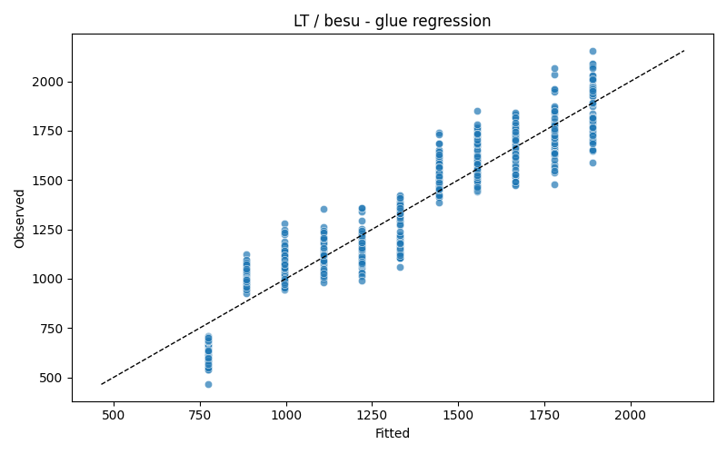

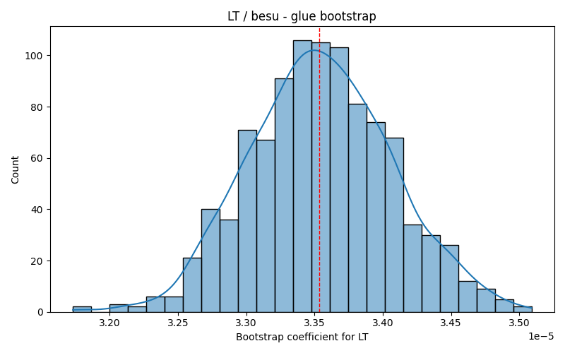

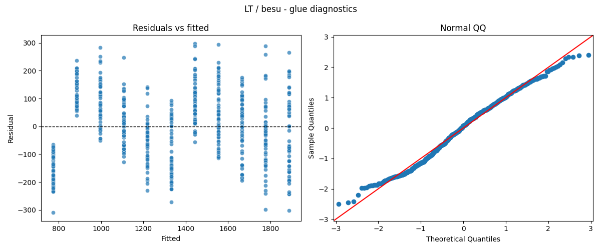

</details>

<details><summary><code>MSTORE</code> · nobs=3025 · runtime_ms=1.797e-05 · p=1.00e-03 · R²=0.8476</summary>

```
==============================================================================
                           NNLS Regression Results                            
==============================================================================
Dep. Variable:          test_runtime_ms              R-squared:          0.848
Model:                  NNLS                    Adj. R-squared:          0.848
No. Observations:       3025                              RMSE:          53.48
Df Residuals:           3023                               MAE:          44.96
Df Model:               1      
==============================================================================
                      coef     std err     P-value      [0.025      0.975]
------------------------------------------------------------------------------
         const    109.5553      3.5670       0.001    102.6569    116.6413
        MSTORE      0.0000      0.0000       0.001      0.0000      0.0000
==============================================================================
Notes: Non-negative least squares with bootstrap inference (1000 iterations)
==============================================================================
```

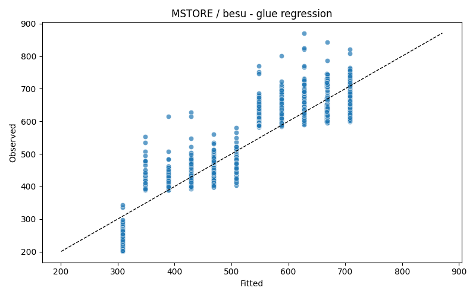

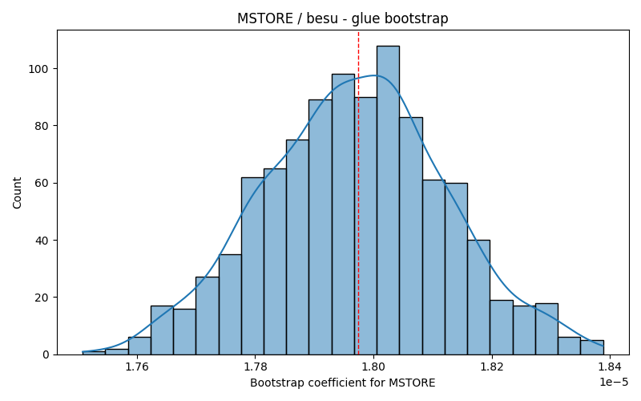


</details>

<details><summary><code>MSTORE8</code> · nobs=3025 · runtime_ms=1.3e-05 · p=1.00e-03 · R²=0.8236</summary>

```
==============================================================================
                           NNLS Regression Results                            
==============================================================================
Dep. Variable:          test_runtime_ms              R-squared:          0.824
Model:                  NNLS                    Adj. R-squared:          0.823
No. Observations:       3025                              RMSE:          42.24
Df Residuals:           3023                               MAE:          34.58
Df Model:               1      
==============================================================================
                      coef     std err     P-value      [0.025      0.975]
------------------------------------------------------------------------------
         const     80.1942      2.6536       0.001     74.9755     85.1428
       MSTORE8      0.0000      0.0000       0.001      0.0000      0.0000
==============================================================================
Notes: Non-negative least squares with bootstrap inference (1000 iterations)
==============================================================================
```

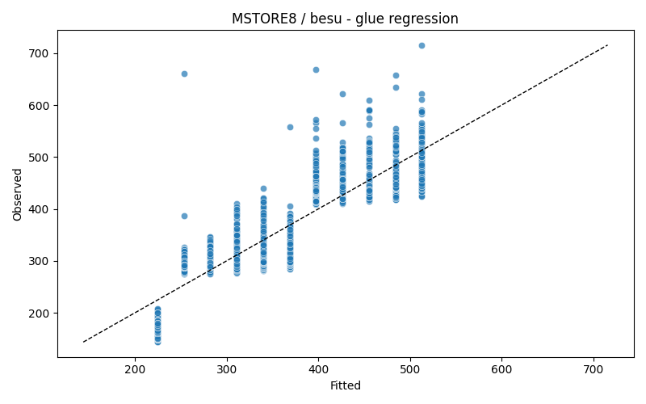

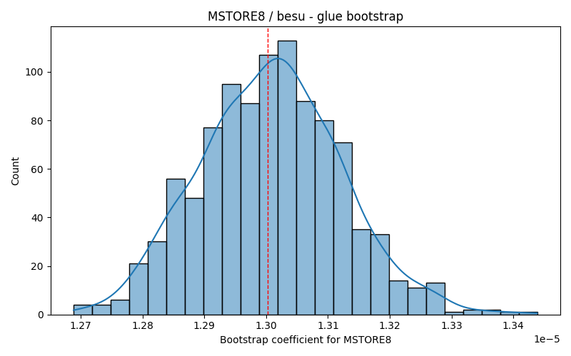

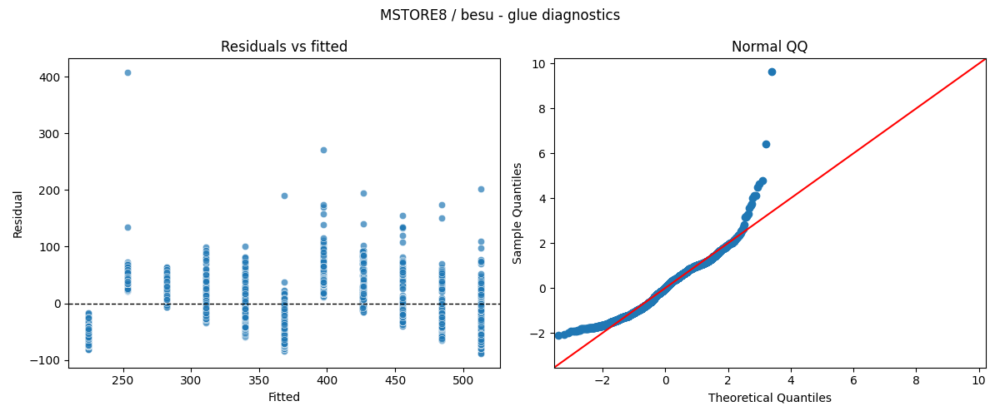

</details>

<details><summary><code>MUL</code> · nobs=605 · runtime_ms=1.231e-05 · p=1.00e-03 · R²=0.5785</summary>

```
==============================================================================
                           NNLS Regression Results                            
==============================================================================
Dep. Variable:          test_runtime_ms              R-squared:          0.578
Model:                  NNLS                    Adj. R-squared:          0.578
No. Observations:       605                               RMSE:          82.94
Df Residuals:           603                                MAE:          70.49
Df Model:               1      
==============================================================================
                      coef     std err     P-value      [0.025      0.975]
------------------------------------------------------------------------------
         const    114.9668      9.4915       0.001     95.6383    133.8496
           MUL      0.0000      0.0000       0.001      0.0000      0.0000
==============================================================================
Notes: Non-negative least squares with bootstrap inference (1000 iterations)
==============================================================================
```

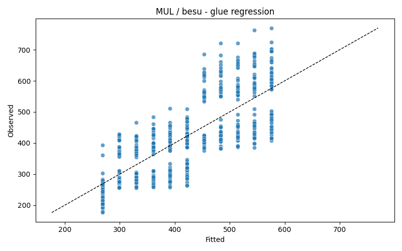

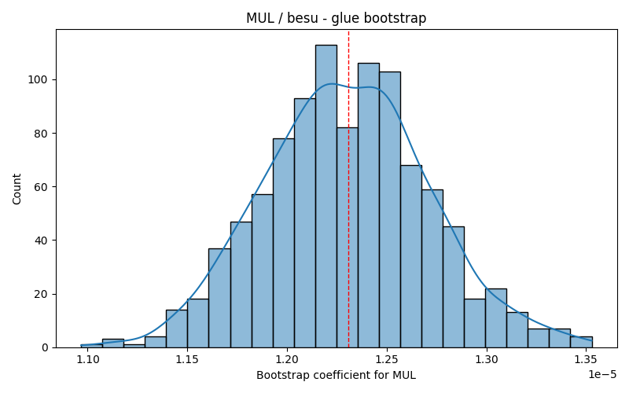

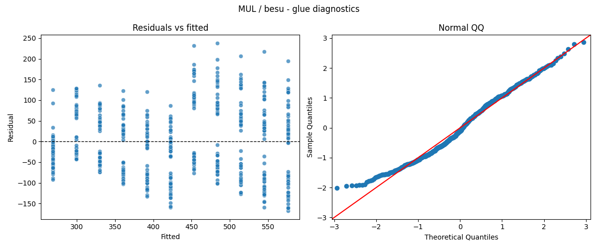

</details>

<details><summary><code>PC</code> · nobs=605 · runtime_ms=4.325e-06 · p=1.00e-03 · R²=0.8536</summary>

```
==============================================================================
                           NNLS Regression Results                            
==============================================================================
Dep. Variable:          test_runtime_ms              R-squared:          0.854
Model:                  NNLS                    Adj. R-squared:          0.853
No. Observations:       605                               RMSE:          53.55
Df Residuals:           603                                MAE:          45.97
Df Model:               1      
==============================================================================
                      coef     std err     P-value      [0.025      0.975]
------------------------------------------------------------------------------
         const    110.2865      7.6094       0.001     95.7023    125.9416
            PC      0.0000      0.0000       0.001      0.0000      0.0000
==============================================================================
Notes: Non-negative least squares with bootstrap inference (1000 iterations)
==============================================================================
```

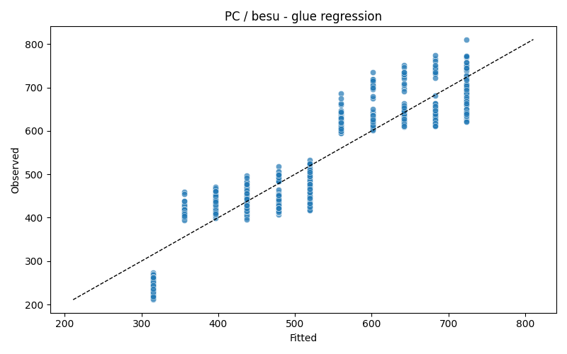

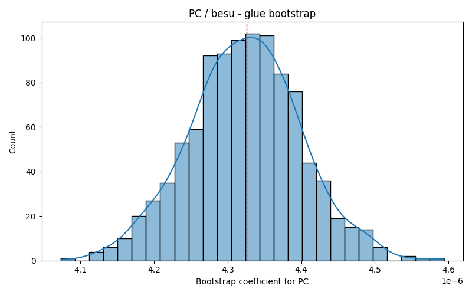

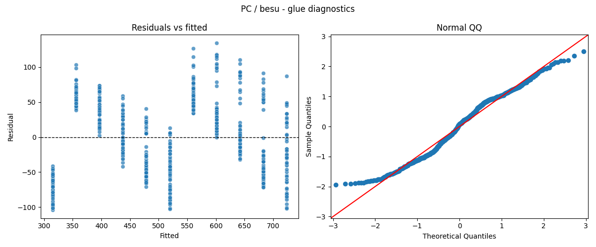

</details>

<details><summary><code>RETURNDATASIZE</code> · nobs=2420 · runtime_ms=7.121e-06 · p=1.00e-03 · R²=0.8452</summary>

```
==============================================================================
                           NNLS Regression Results                            
==============================================================================
Dep. Variable:          test_runtime_ms              R-squared:          0.845
Model:                  NNLS                    Adj. R-squared:          0.845
No. Observations:       2420                              RMSE:          48.12
Df Residuals:           2418                               MAE:          40.83
Df Model:               1      
==============================================================================
                      coef     std err     P-value      [0.025      0.975]
------------------------------------------------------------------------------
         const     94.5801      3.4454       0.001     88.1799    101.5682
RETURNDATASIZE      0.0000      0.0000       0.001      0.0000      0.0000
==============================================================================
Notes: Non-negative least squares with bootstrap inference (1000 iterations)
==============================================================================
```

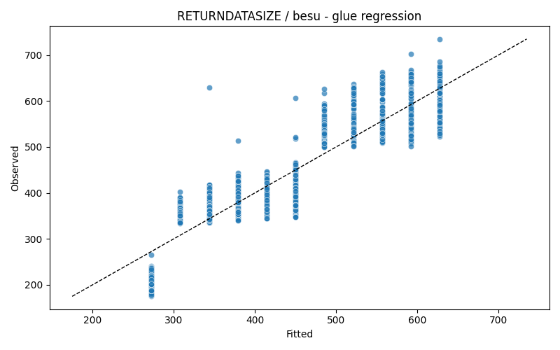

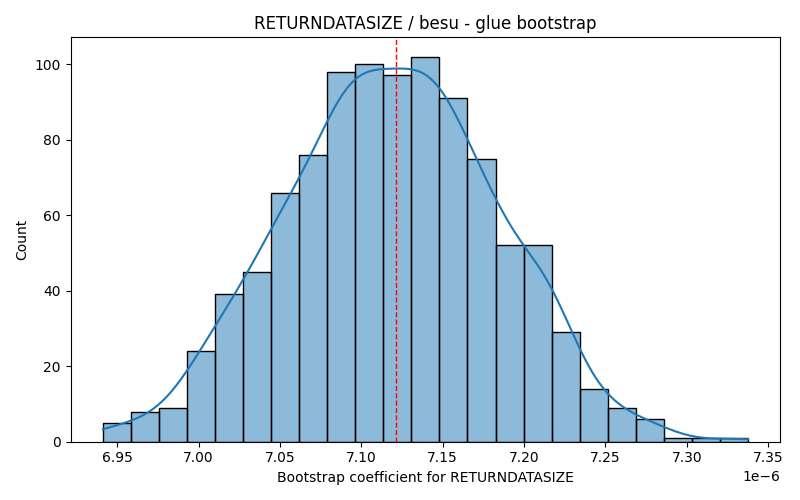

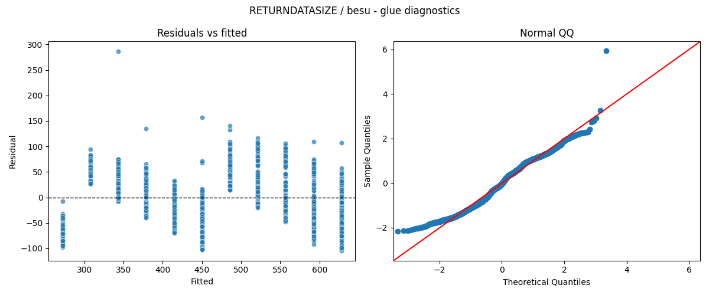

</details>

<details><summary><code>SELFBALANCE</code> · nobs=495 · runtime_ms=7.924e-06 · p=1.00e-03 · R²=0.4408</summary>

```
==============================================================================
                           NNLS Regression Results                            
==============================================================================
Dep. Variable:          test_runtime_ms              R-squared:          0.441
Model:                  NNLS                    Adj. R-squared:          0.440
No. Observations:       495                               RMSE:          90.03
Df Residuals:           493                                MAE:          70.98
Df Model:               1      
==============================================================================
                      coef     std err     P-value      [0.025      0.975]
------------------------------------------------------------------------------
         const    409.5788     16.4262       0.001    376.5011    440.0670
   SELFBALANCE      0.0000      0.0000       0.001      0.0000      0.0000
==============================================================================
Notes: Non-negative least squares with bootstrap inference (1000 iterations)
==============================================================================
```

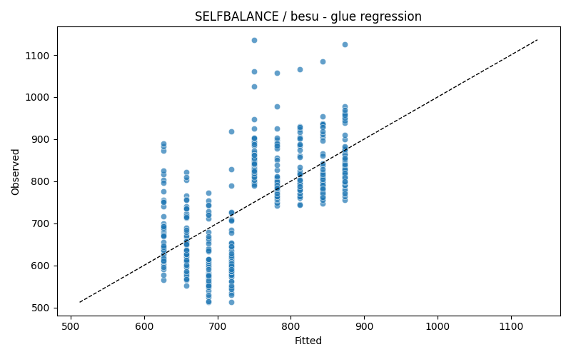

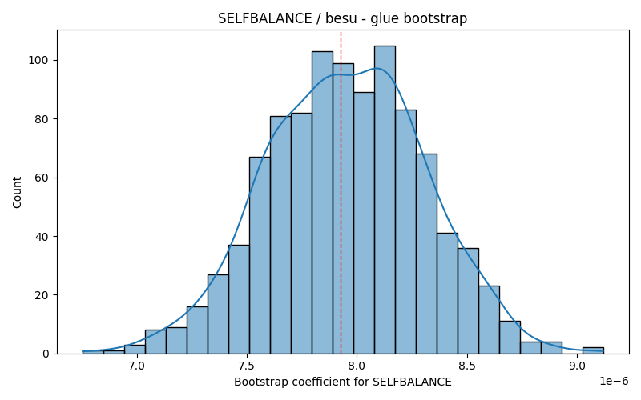

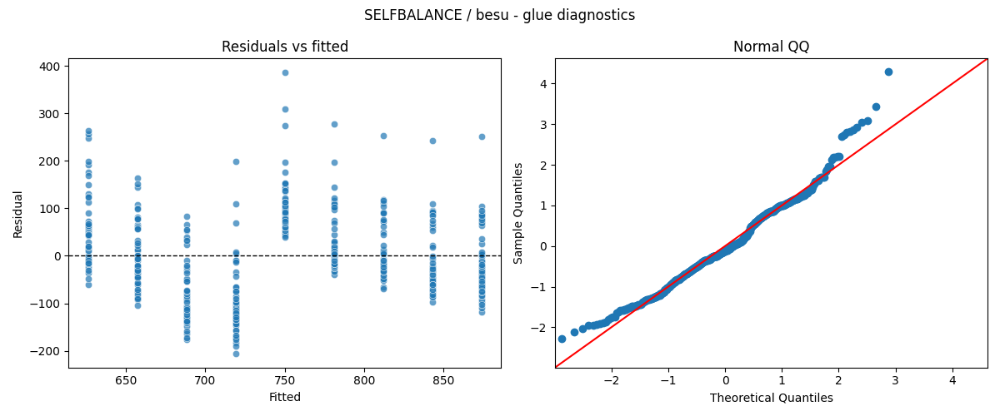

</details>

<details><summary><code>SUB</code> · nobs=605 · runtime_ms=1.177e-05 · p=1.00e-03 · R²=0.8214</summary>

```
==============================================================================
                           NNLS Regression Results                            
==============================================================================
Dep. Variable:          test_runtime_ms              R-squared:          0.821
Model:                  NNLS                    Adj. R-squared:          0.821
No. Observations:       605                               RMSE:          57.74
Df Residuals:           603                                MAE:          49.01
Df Model:               1      
==============================================================================
                      coef     std err     P-value      [0.025      0.975]
------------------------------------------------------------------------------
         const    108.7856      8.0391       0.001     93.5391    123.9957
           SUB      0.0000      0.0000       0.001      0.0000      0.0000
==============================================================================
Notes: Non-negative least squares with bootstrap inference (1000 iterations)
==============================================================================
```

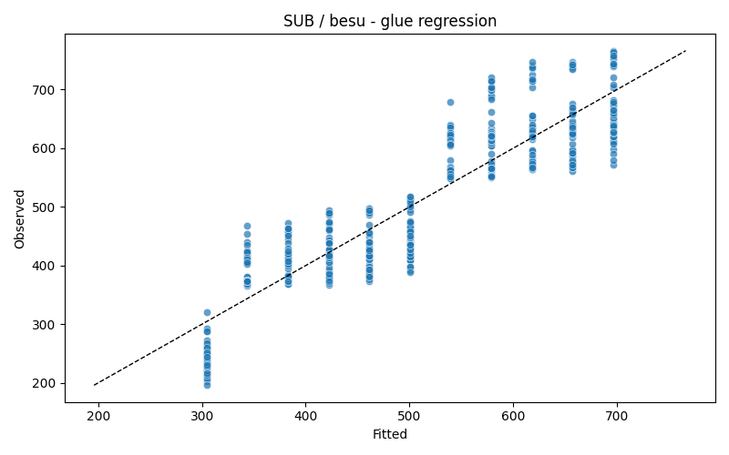

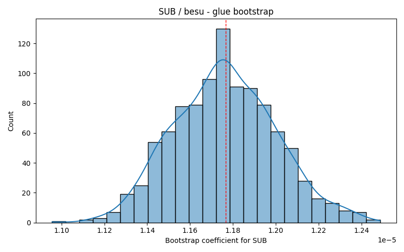

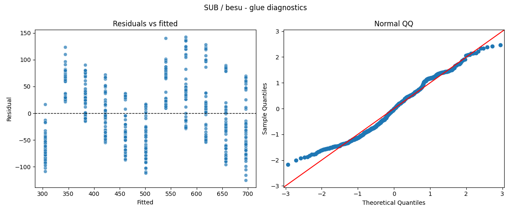

</details>

### Mixed glue (tier B) · besu

<details><summary><code>JUMP</code> · nobs=605 · runtime_ms=3.551e-05 · p=1.00e-03 · R²=0.4291</summary>

```
==============================================================================
                           NNLS Regression Results                            
==============================================================================
Dep. Variable:          test_runtime_ms              R-squared:          0.429
Model:                  NNLS                    Adj. R-squared:          0.428
No. Observations:       605                               RMSE:         152.22
Df Residuals:           603                                MAE:         134.84
Df Model:               1      
==============================================================================
                      coef     std err     P-value      [0.025      0.975]
------------------------------------------------------------------------------
         const    112.6508     17.7830       0.001     78.3767    146.0921
          JUMP      0.0000      0.0000       0.001      0.0000      0.0000
==============================================================================
Notes: Non-negative least squares with bootstrap inference (1000 iterations)
==============================================================================
```

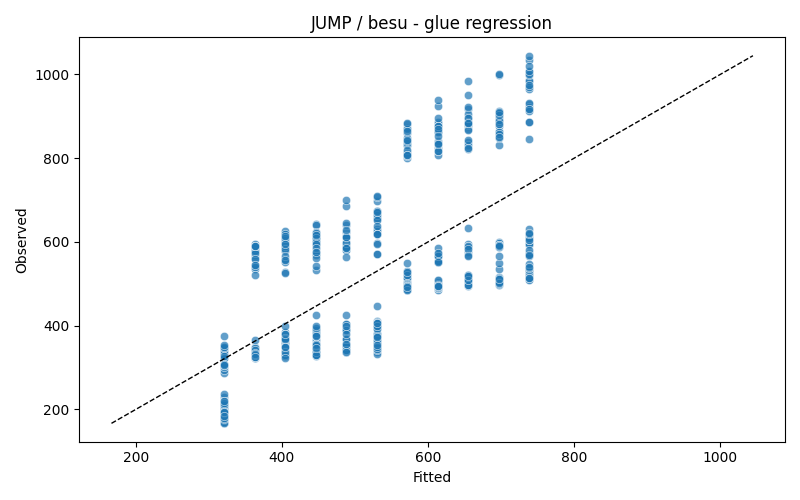

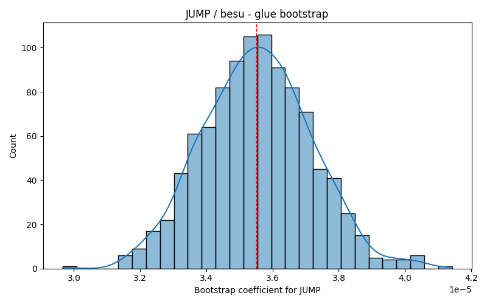

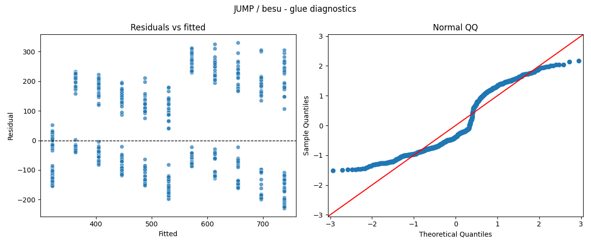

</details>

<details><summary><code>KECCAK256</code> · nobs=9680 · runtime_ms=5.177e-05 · p=1.00e-03 · R²=0.2772</summary>

```
==============================================================================
                           NNLS Regression Results                            
==============================================================================
Dep. Variable:          test_runtime_ms              R-squared:          0.277
Model:                  NNLS                    Adj. R-squared:          0.277
No. Observations:       9680                              RMSE:         166.13
Df Residuals:           9678                               MAE:         129.79
Df Model:               1      
==============================================================================
                      coef     std err     P-value      [0.025      0.975]
------------------------------------------------------------------------------
         const    510.8934      3.5904       0.001    504.5354    518.0023
     KECCAK256      0.0001      0.0000       0.001      0.0001      0.0001
==============================================================================
Notes: Non-negative least squares with bootstrap inference (1000 iterations)
==============================================================================
```

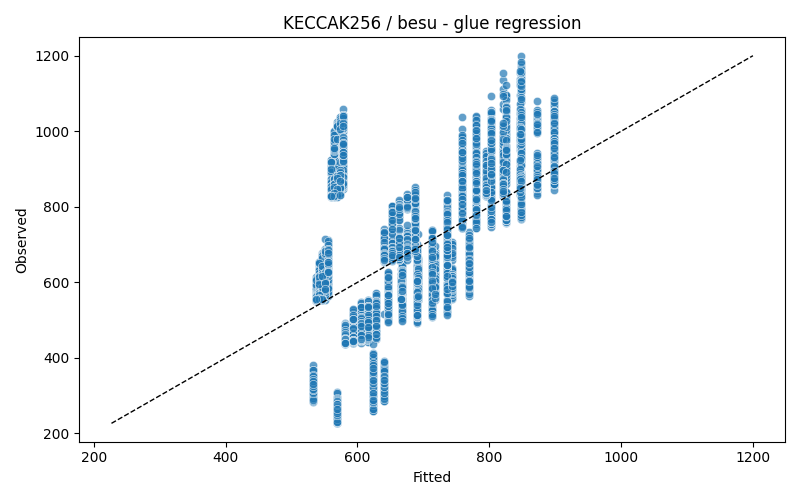

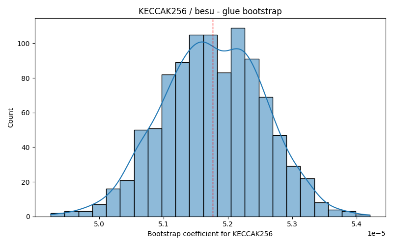

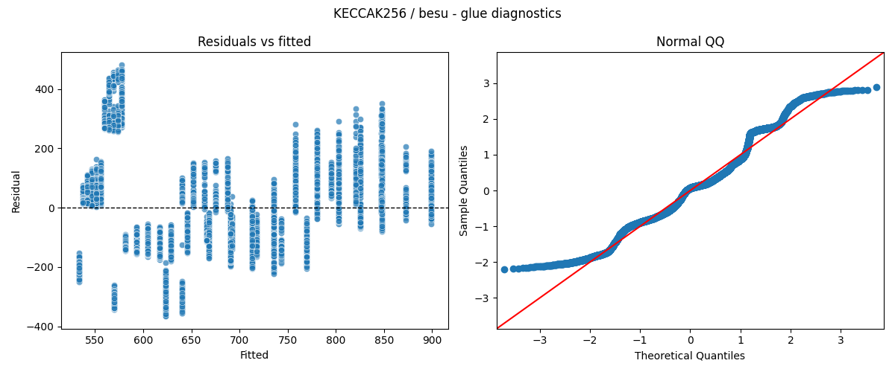

</details>

## erigon

| glue_opcode | nobs | glue_runtime_ms | p_value | rsquared |
| --- | --- | --- | --- | --- |
| `ISZERO` | 11 | 1.05e-06 | 1.00e-03 | 0.964 |
| `JUMPDEST` | 11 | 6.807e-07 | 1.00e-03 | 0.8516 |
| `SWAP` | 176 | 1.314e-06 | 1.00e-03 | 0.4985 |
| `CALLDATASIZE` | 737 | 8.695e-07 | 1.00e-03 | 0.9882 |
| `DUP` | 737 | 1.069e-06 | 1.00e-03 | 0.9882 |
| `GAS` | 737 | 8.728e-07 | 1.00e-03 | 0.9882 |
| `MLOAD` | 737 | 3.513e-06 | 1.00e-03 | 0.9882 |
| `PUSH` | 737 | 2.88e-06 | 1.00e-03 | 0.9882 |
| `PUSH0` | 737 | 8.814e-07 | 1.00e-03 | 0.9882 |
| `STATICCALL` | 737 | 0.0005662 | 1.00e-03 | 0.9882 |
| `ADD` | 11 | 3.017e-06 | 1.00e-03 | 0.9515 |
| `AND` | 11 | 3.011e-06 | 1.00e-03 | 0.9521 |
| `CALLDATACOPY` | 264 | 7.532e-06 | 1.00e-03 | 0.8441 |
| `CALLDATALOAD` | 44 | 4.573e-05 | 1.00e-02 | 0.1068 |
| `DIV` | 11 | 1.043e-05 | 1.00e-03 | 0.9212 |
| `EXP` | 11 | 0.0003826 | 1.00e-03 | 0.9772 |
| `GT` | 11 | 3.157e-06 | 1.00e-03 | 0.9667 |
| `JUMPI` | 11 | 3.863e-06 | 1.00e-03 | 0.9657 |
| `LT` | 11 | 3.334e-06 | 1.00e-03 | 0.9705 |
| `MSTORE` | 55 | 5.67e-06 | 1.00e-03 | 0.296 |
| `MSTORE8` | 55 | 5.479e-06 | 1.00e-03 | 0.9609 |
| `MUL` | 11 | 5.107e-06 | 1.00e-03 | 0.5714 |
| `PC` | 11 | 1.374e-06 | 1.00e-03 | 0.9561 |
| `RETURNDATASIZE` | 44 | 1.581e-06 | 1.00e-03 | 0.2048 |
| `SELFBALANCE` | 9 | 1.603e-06 | 1.00e-03 | 0.8916 |
| `SUB` | 11 | 3.174e-06 | 1.00e-03 | 0.9438 |
| `JUMP` | 11 | 7.344e-06 | 1.00e-03 | 0.9765 |
| `KECCAK256` | 176 | 2.21e-05 | 1.00e-03 | 0.09085 |

### Cycle glue — joint fit · erigon

<details><summary>Joint NNLS regression summary</summary>

```
==============================================================================
                           NNLS Regression Results                            
==============================================================================
Dep. Variable:          test_runtime_ms              R-squared:          0.988
Model:                  NNLS                    Adj. R-squared:          0.988
No. Observations:       737                               RMSE:          31.18
Df Residuals:           729                                MAE:          16.95
Df Model:               7      
==============================================================================
                      coef     std err     P-value      [0.025      0.975]
------------------------------------------------------------------------------
         const     33.8961      3.3081       0.001     27.7877     40.0705
  CALLDATASIZE      0.0000      0.0000       0.001      0.0000      0.0000
           DUP      0.0000      0.0000       0.001      0.0000      0.0000
           GAS      0.0000      0.0000       0.001      0.0000      0.0000
         MLOAD      0.0000      0.0000       0.001      0.0000      0.0000
          PUSH      0.0000      0.0000       0.001      0.0000      0.0000
         PUSH0      0.0000      0.0000       0.001      0.0000      0.0000
    STATICCALL      0.0006      0.0000       0.001      0.0006      0.0006
==============================================================================
Notes: Non-negative least squares with bootstrap inference (1000 iterations)
==============================================================================
```

</details>

<details><summary><code>CALLDATASIZE</code> · nobs=737 · runtime_ms=8.695e-07 · p=1.00e-03 · R²=0.9882</summary>

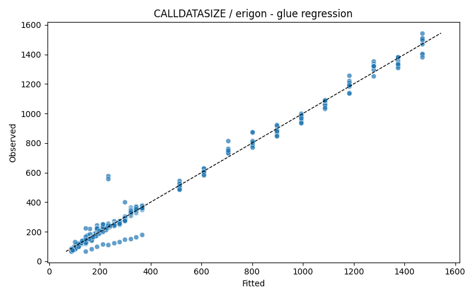

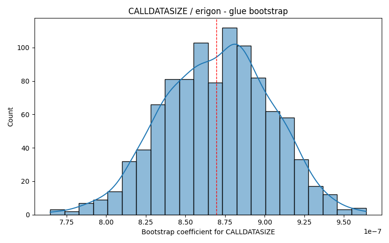


</details>

<details><summary><code>DUP</code> · nobs=737 · runtime_ms=1.069e-06 · p=1.00e-03 · R²=0.9882</summary>


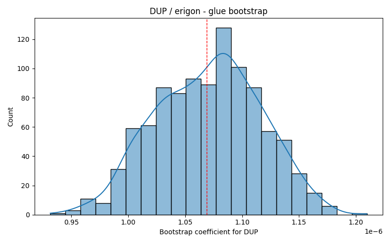


</details>

<details><summary><code>GAS</code> · nobs=737 · runtime_ms=8.728e-07 · p=1.00e-03 · R²=0.9882</summary>

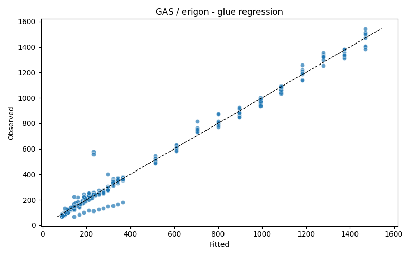

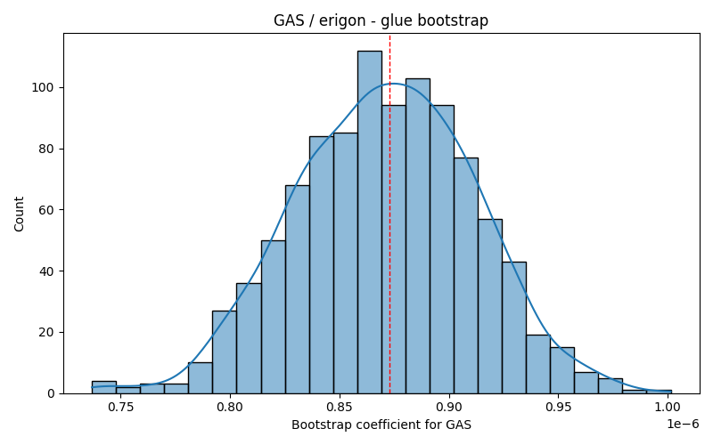

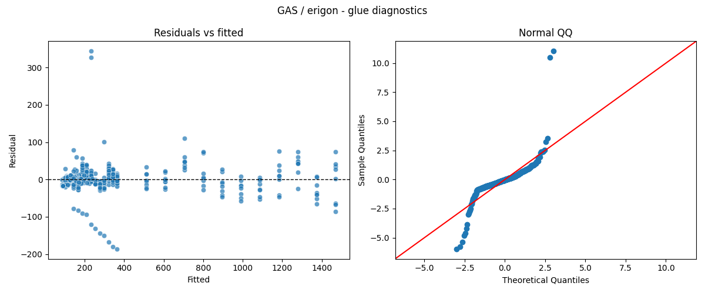

</details>

<details><summary><code>MLOAD</code> · nobs=737 · runtime_ms=3.513e-06 · p=1.00e-03 · R²=0.9882</summary>

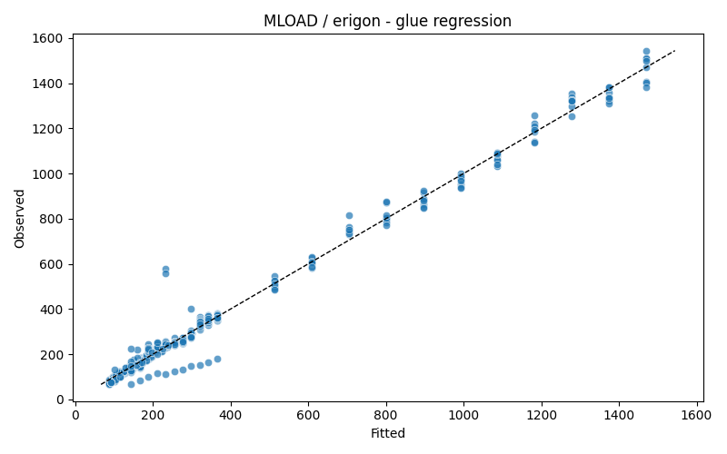

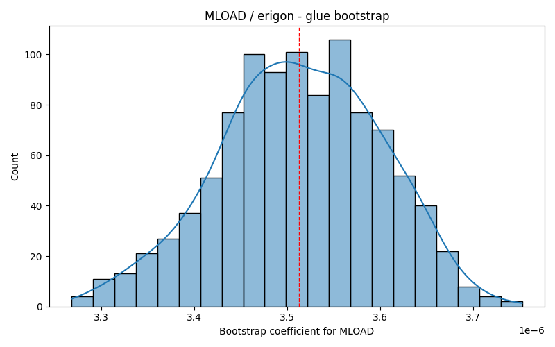

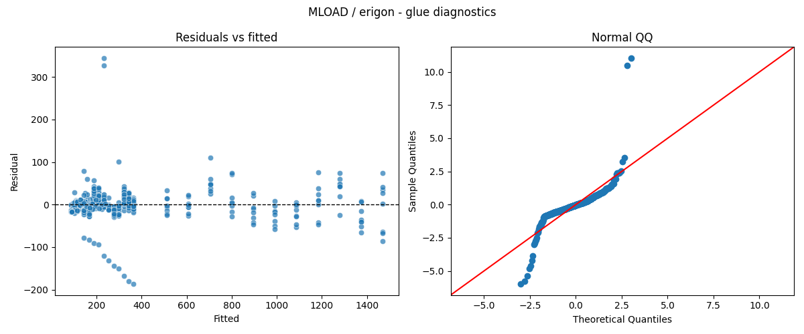

</details>

<details><summary><code>PUSH</code> · nobs=737 · runtime_ms=2.88e-06 · p=1.00e-03 · R²=0.9882</summary>

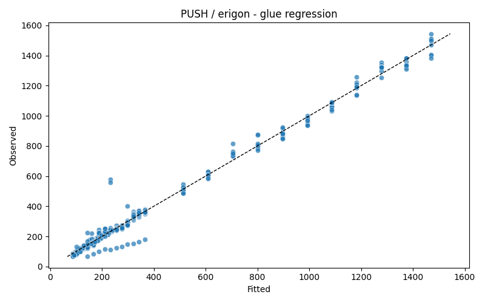

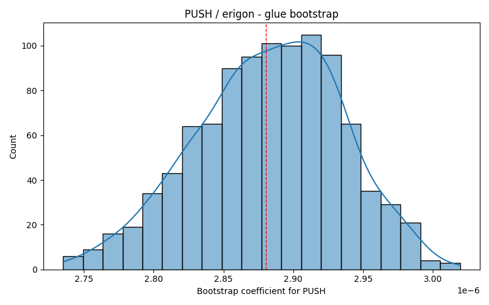


</details>

<details><summary><code>PUSH0</code> · nobs=737 · runtime_ms=8.814e-07 · p=1.00e-03 · R²=0.9882</summary>

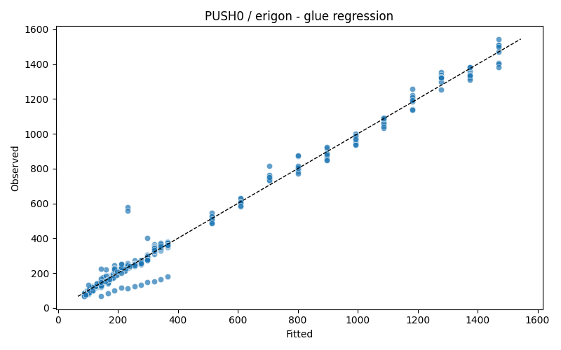

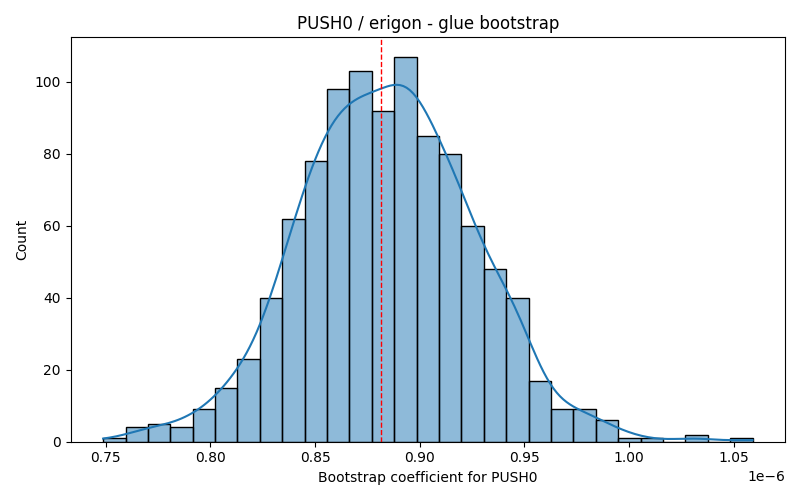


</details>

<details><summary><code>STATICCALL</code> · nobs=737 · runtime_ms=0.0005662 · p=1.00e-03 · R²=0.9882</summary>

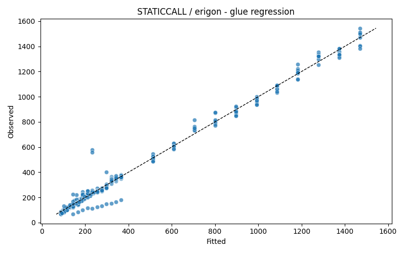

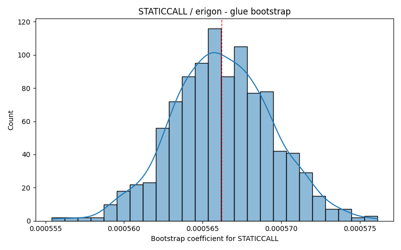


</details>

### Pure glue · erigon

<details><summary><code>ISZERO</code> · nobs=11 · runtime_ms=1.05e-06 · p=1.00e-03 · R²=0.964</summary>

```
==============================================================================
                           NNLS Regression Results                            
==============================================================================
Dep. Variable:          test_runtime_ms              R-squared:          0.964
Model:                  NNLS                    Adj. R-squared:          0.960
No. Observations:       11                                RMSE:           4.27
Df Residuals:           9                                  MAE:           3.65
Df Model:               1      
==============================================================================
                      coef     std err     P-value      [0.025      0.975]
------------------------------------------------------------------------------
         const     20.1442      6.4490       0.001      8.6870     30.7680
        ISZERO      0.0000      0.0000       0.001      0.0000      0.0000
==============================================================================
Notes: Non-negative least squares with bootstrap inference (1000 iterations)
==============================================================================
```

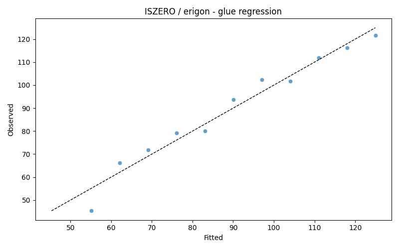


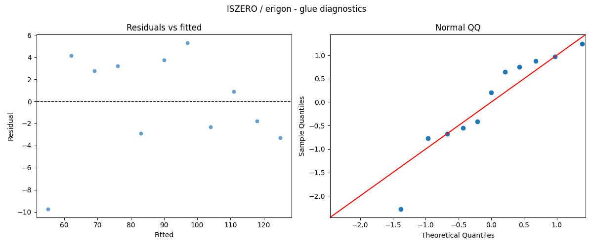

</details>

<details><summary><code>JUMPDEST</code> · nobs=11 · runtime_ms=6.807e-07 · p=1.00e-03 · R²=0.8516</summary>

```
==============================================================================
                           NNLS Regression Results                            
==============================================================================
Dep. Variable:          test_runtime_ms              R-squared:          0.852
Model:                  NNLS                    Adj. R-squared:          0.835
No. Observations:       11                                RMSE:          17.94
Df Residuals:           9                                  MAE:          14.38
Df Model:               1      
==============================================================================
                      coef     std err     P-value      [0.025      0.975]
------------------------------------------------------------------------------
         const     61.4374     26.7512       0.007      8.0740    108.6124
      JUMPDEST      0.0000      0.0000       0.001      0.0000      0.0000
==============================================================================
Notes: Non-negative least squares with bootstrap inference (1000 iterations)
==============================================================================
```

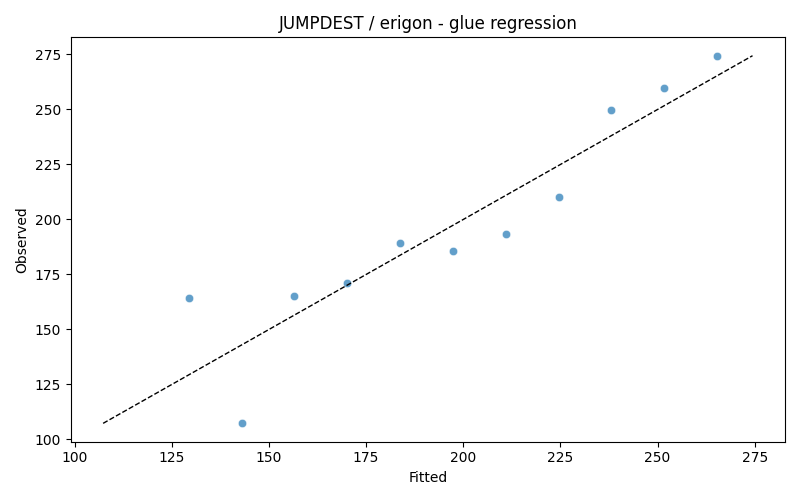

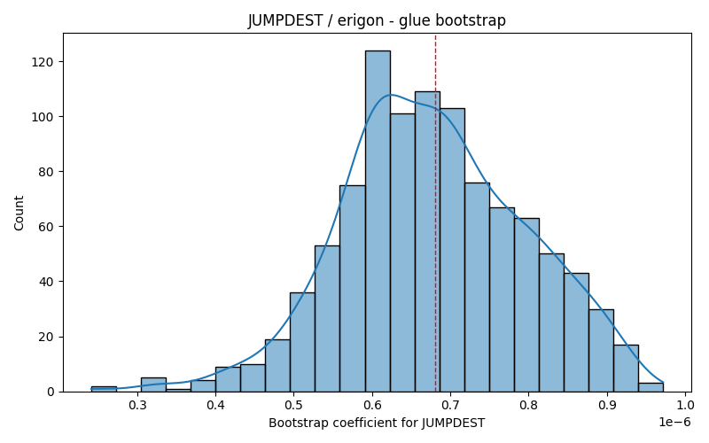


</details>

<details><summary><code>SWAP</code> · nobs=176 · runtime_ms=1.314e-06 · p=1.00e-03 · R²=0.4985</summary>

```
==============================================================================
                           NNLS Regression Results                            
==============================================================================
Dep. Variable:          test_runtime_ms              R-squared:          0.499
Model:                  NNLS                    Adj. R-squared:          0.496
No. Observations:       176                               RMSE:          27.75
Df Residuals:           174                                MAE:           6.73
Df Model:               1      
==============================================================================
                      coef     std err     P-value      [0.025      0.975]
------------------------------------------------------------------------------
         const     26.4426      4.4766       0.001     20.0823     37.0057
          SWAP      0.0000      0.0000       0.001      0.0000      0.0000
==============================================================================
Notes: Non-negative least squares with bootstrap inference (1000 iterations)
==============================================================================
```


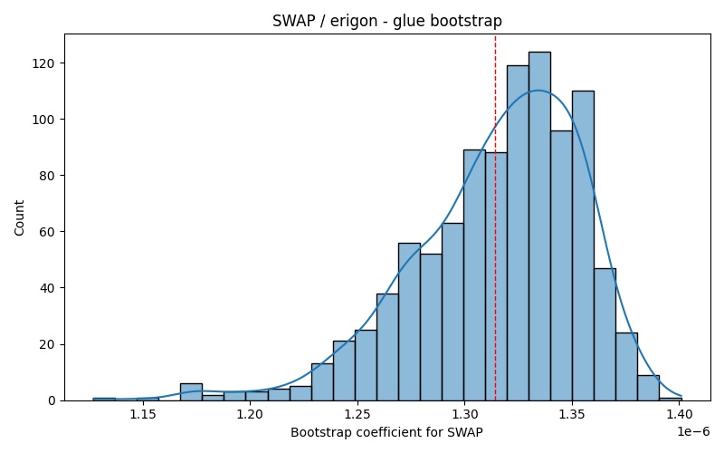

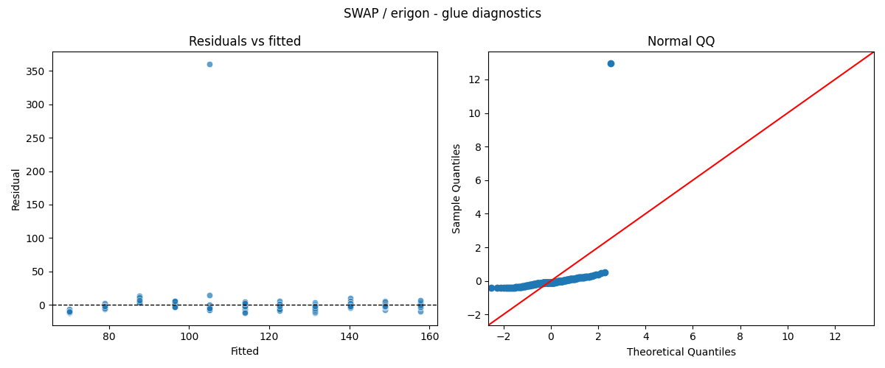

</details>

### Mixed glue (tier A) · erigon

<details><summary><code>ADD</code> · nobs=11 · runtime_ms=3.017e-06 · p=1.00e-03 · R²=0.9515</summary>

```
==============================================================================
                           NNLS Regression Results                            
==============================================================================
Dep. Variable:          test_runtime_ms              R-squared:          0.952
Model:                  NNLS                    Adj. R-squared:          0.946
No. Observations:       11                                RMSE:           7.17
Df Residuals:           9                                  MAE:           5.45
Df Model:               1      
==============================================================================
                      coef     std err     P-value      [0.025      0.975]
------------------------------------------------------------------------------
         const     17.7429      7.6897       0.004      5.5909     35.4334
           ADD      0.0000      0.0000       0.001      0.0000      0.0000
==============================================================================
Notes: Non-negative least squares with bootstrap inference (1000 iterations)
==============================================================================
```


</details>

<details><summary><code>AND</code> · nobs=11 · runtime_ms=3.011e-06 · p=1.00e-03 · R²=0.9521</summary>

```
==============================================================================
                           NNLS Regression Results                            
==============================================================================
Dep. Variable:          test_runtime_ms              R-squared:          0.952
Model:                  NNLS                    Adj. R-squared:          0.947
No. Observations:       11                                RMSE:           7.11
Df Residuals:           9                                  MAE:           6.26
Df Model:               1      
==============================================================================
                      coef     std err     P-value      [0.025      0.975]
------------------------------------------------------------------------------
         const     12.7946      8.8238       0.033      0.0000     36.5648
           AND      0.0000      0.0000       0.001      0.0000      0.0000
==============================================================================
Notes: Non-negative least squares with bootstrap inference (1000 iterations)
==============================================================================
```

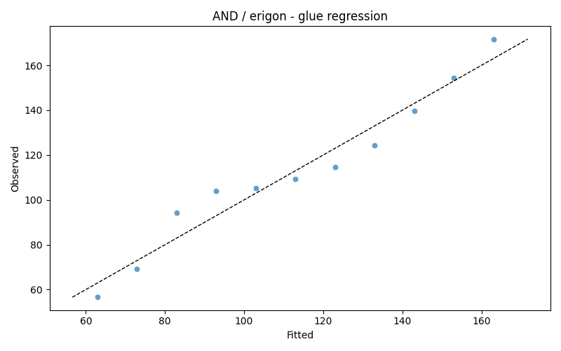


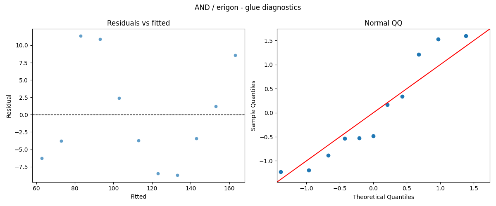

</details>

<details><summary><code>CALLDATACOPY</code> · nobs=264 · runtime_ms=7.532e-06 · p=1.00e-03 · R²=0.8441</summary>

```
==============================================================================
                           NNLS Regression Results                            
==============================================================================
Dep. Variable:          test_runtime_ms              R-squared:          0.844
Model:                  NNLS                    Adj. R-squared:          0.844
No. Observations:       264                               RMSE:          24.34
Df Residuals:           262                                MAE:           7.69
Df Model:               1      
==============================================================================
                      coef     std err     P-value      [0.025      0.975]
------------------------------------------------------------------------------
         const     20.7768      3.0871       0.001     17.0110     27.9902
  CALLDATACOPY      0.0000      0.0000       0.001      0.0000      0.0000
==============================================================================
Notes: Non-negative least squares with bootstrap inference (1000 iterations)
==============================================================================
```


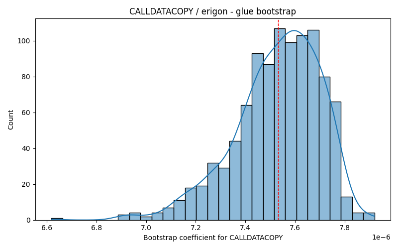


</details>

<details><summary><code>CALLDATALOAD</code> · nobs=44 · runtime_ms=4.573e-05 · p=1.00e-02 · R²=0.1068</summary>

```
==============================================================================
                           NNLS Regression Results                            
==============================================================================
Dep. Variable:          test_runtime_ms              R-squared:          0.107
Model:                  NNLS                    Adj. R-squared:          0.086
No. Observations:       44                                RMSE:           0.51
Df Residuals:           42                                 MAE:           0.41
Df Model:               1      
==============================================================================
                      coef     std err     P-value      [0.025      0.975]
------------------------------------------------------------------------------
         const      6.0597      0.2688       0.001      5.5236      6.5809
  CALLDATALOAD      0.0000      0.0000       0.010      0.0000      0.0001
==============================================================================
Notes: Non-negative least squares with bootstrap inference (1000 iterations)
==============================================================================
```

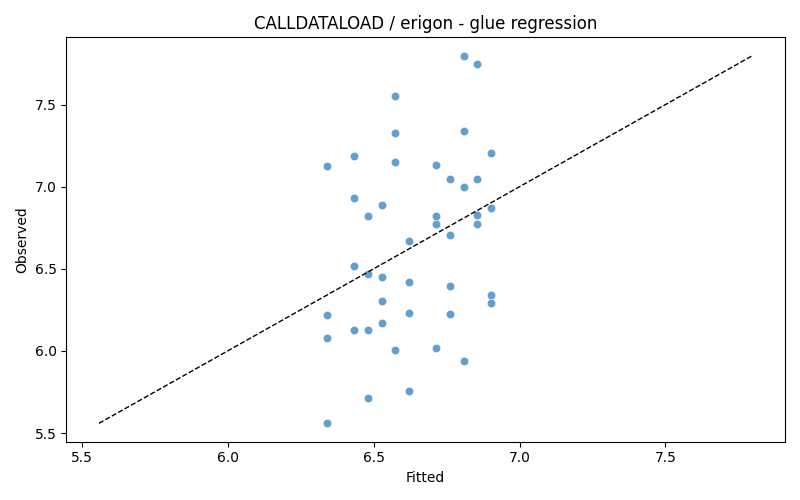

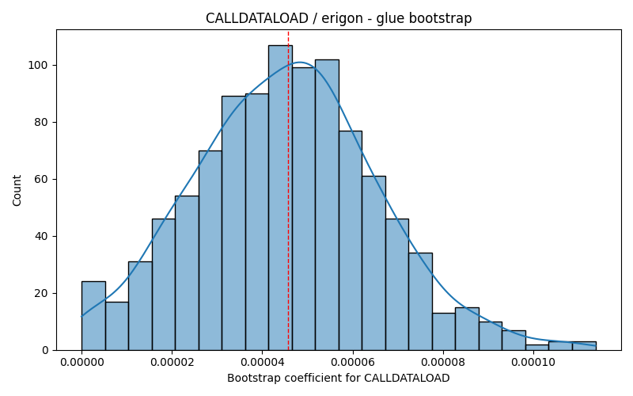


</details>

<details><summary><code>DIV</code> · nobs=11 · runtime_ms=1.043e-05 · p=1.00e-03 · R²=0.9212</summary>

```
==============================================================================
                           NNLS Regression Results                            
==============================================================================
Dep. Variable:          test_runtime_ms              R-squared:          0.921
Model:                  NNLS                    Adj. R-squared:          0.912
No. Observations:       11                                RMSE:          24.07
Df Residuals:           9                                  MAE:          21.61
Df Model:               1      
==============================================================================
                      coef     std err     P-value      [0.025      0.975]
------------------------------------------------------------------------------
         const     26.4180     25.7744       0.141      0.0000     95.1200
           DIV      0.0000      0.0000       0.001      0.0000      0.0000
==============================================================================
Notes: Non-negative least squares with bootstrap inference (1000 iterations)
==============================================================================
```


</details>

<details><summary><code>EXP</code> · nobs=11 · runtime_ms=0.0003826 · p=1.00e-03 · R²=0.9772</summary>

```
==============================================================================
                           NNLS Regression Results                            
==============================================================================
Dep. Variable:          test_runtime_ms              R-squared:          0.977
Model:                  NNLS                    Adj. R-squared:          0.975
No. Observations:       11                                RMSE:           2.29
Df Residuals:           9                                  MAE:           1.78
Df Model:               1      
==============================================================================
                      coef     std err     P-value      [0.025      0.975]
------------------------------------------------------------------------------
         const      9.8492      3.3204       0.001      4.4491     16.8999
           EXP      0.0004      0.0000       0.001      0.0003      0.0004
==============================================================================
Notes: Non-negative least squares with bootstrap inference (1000 iterations)
==============================================================================
```


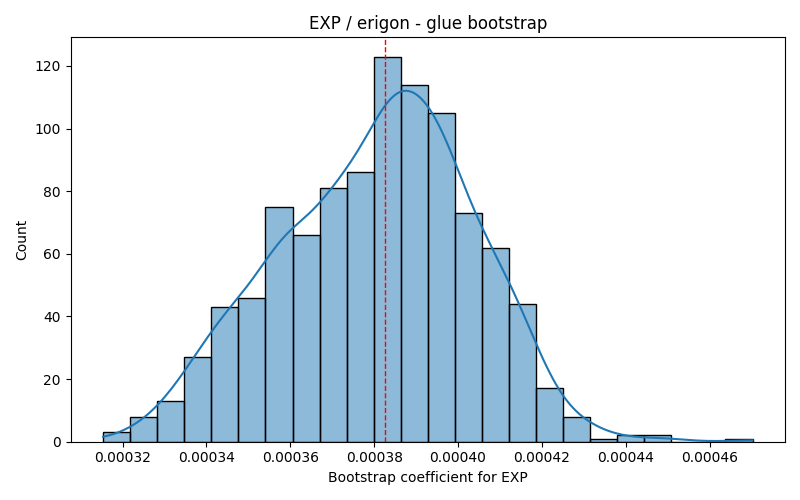

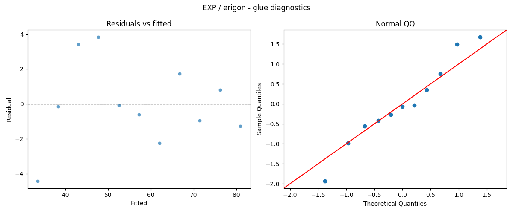

</details>

<details><summary><code>GT</code> · nobs=11 · runtime_ms=3.157e-06 · p=1.00e-03 · R²=0.9667</summary>

```
==============================================================================
                           NNLS Regression Results                            
==============================================================================
Dep. Variable:          test_runtime_ms              R-squared:          0.967
Model:                  NNLS                    Adj. R-squared:          0.963
No. Observations:       11                                RMSE:           6.17
Df Residuals:           9                                  MAE:           5.40
Df Model:               1      
==============================================================================
                      coef     std err     P-value      [0.025      0.975]
------------------------------------------------------------------------------
         const     17.5340      7.0317       0.008      4.8271     32.8672
            GT      0.0000      0.0000       0.001      0.0000      0.0000
==============================================================================
Notes: Non-negative least squares with bootstrap inference (1000 iterations)
==============================================================================
```


</details>

<details><summary><code>JUMPI</code> · nobs=11 · runtime_ms=3.863e-06 · p=1.00e-03 · R²=0.9657</summary>

```
==============================================================================
                           NNLS Regression Results                            
==============================================================================
Dep. Variable:          test_runtime_ms              R-squared:          0.966
Model:                  NNLS                    Adj. R-squared:          0.962
No. Observations:       11                                RMSE:           3.29
Df Residuals:           9                                  MAE:           2.94
Df Model:               1      
==============================================================================
                      coef     std err     P-value      [0.025      0.975]
------------------------------------------------------------------------------
         const     17.3781      4.5592       0.001      9.1276     26.1675
         JUMPI      0.0000      0.0000       0.001      0.0000      0.0000
==============================================================================
Notes: Non-negative least squares with bootstrap inference (1000 iterations)
==============================================================================
```


</details>

<details><summary><code>LT</code> · nobs=11 · runtime_ms=3.334e-06 · p=1.00e-03 · R²=0.9705</summary>

```
==============================================================================
                           NNLS Regression Results                            
==============================================================================
Dep. Variable:          test_runtime_ms              R-squared:          0.970
Model:                  NNLS                    Adj. R-squared:          0.967
No. Observations:       11                                RMSE:           6.12
Df Residuals:           9                                  MAE:           4.88
Df Model:               1      
==============================================================================
                      coef     std err     P-value      [0.025      0.975]
------------------------------------------------------------------------------
         const     13.6085      8.2410       0.009      1.4610     33.3197
            LT      0.0000      0.0000       0.001      0.0000      0.0000
==============================================================================
Notes: Non-negative least squares with bootstrap inference (1000 iterations)
==============================================================================
```


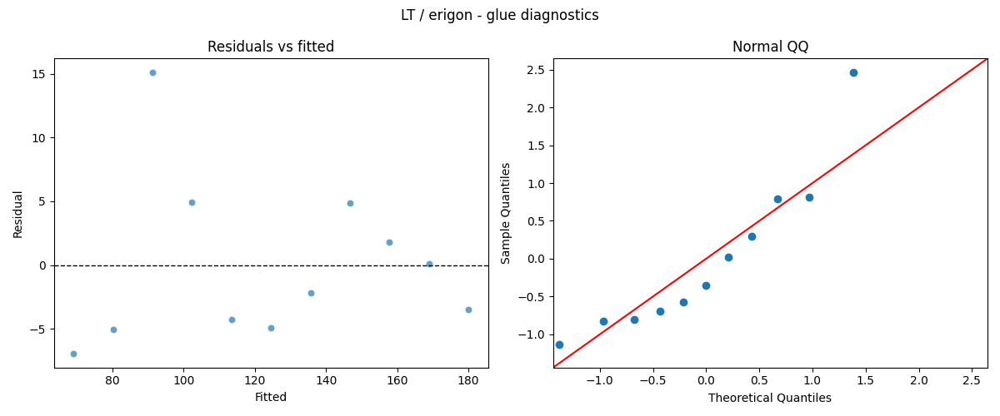

</details>

<details><summary><code>MSTORE</code> · nobs=55 · runtime_ms=5.67e-06 · p=1.00e-03 · R²=0.296</summary>

```
==============================================================================
                           NNLS Regression Results                            
==============================================================================
Dep. Variable:          test_runtime_ms              R-squared:          0.296
Model:                  NNLS                    Adj. R-squared:          0.283
No. Observations:       55                                RMSE:          61.36
Df Residuals:           53                                 MAE:          20.23
Df Model:               1      
==============================================================================
                      coef     std err     P-value      [0.025      0.975]
------------------------------------------------------------------------------
         const     42.7838     26.8247       0.001     10.1668    106.8555
        MSTORE      0.0000      0.0000       0.001      0.0000      0.0000
==============================================================================
Notes: Non-negative least squares with bootstrap inference (1000 iterations)
==============================================================================
```


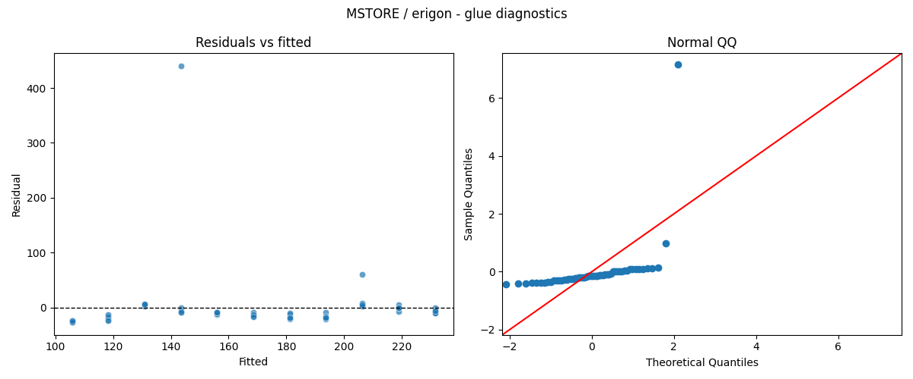

</details>

<details><summary><code>MSTORE8</code> · nobs=55 · runtime_ms=5.479e-06 · p=1.00e-03 · R²=0.9609</summary>

```
==============================================================================
                           NNLS Regression Results                            
==============================================================================
Dep. Variable:          test_runtime_ms              R-squared:          0.961
Model:                  NNLS                    Adj. R-squared:          0.960
No. Observations:       55                                RMSE:           7.76
Df Residuals:           53                                 MAE:           6.41
Df Model:               1      
==============================================================================
                      coef     std err     P-value      [0.025      0.975]
------------------------------------------------------------------------------
         const     23.0617      3.9154       0.001     16.6412     31.3397
       MSTORE8      0.0000      0.0000       0.001      0.0000      0.0000
==============================================================================
Notes: Non-negative least squares with bootstrap inference (1000 iterations)
==============================================================================
```

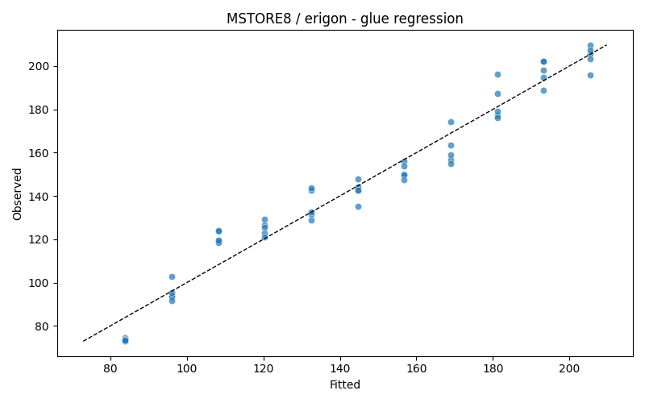


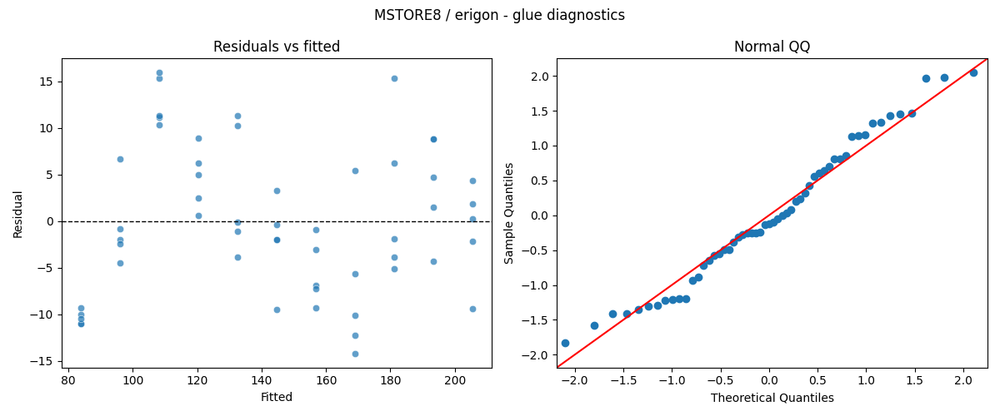

</details>

<details><summary><code>MUL</code> · nobs=11 · runtime_ms=5.107e-06 · p=1.00e-03 · R²=0.5714</summary>

```
==============================================================================
                           NNLS Regression Results                            
==============================================================================
Dep. Variable:          test_runtime_ms              R-squared:          0.571
Model:                  NNLS                    Adj. R-squared:          0.524
No. Observations:       11                                RMSE:          45.01
Df Residuals:           9                                  MAE:          28.68
Df Model:               1      
==============================================================================
                      coef     std err     P-value      [0.025      0.975]
------------------------------------------------------------------------------
         const      0.0000      8.7137       1.000      0.0000     26.6104
           MUL      0.0000      0.0000       0.001      0.0000      0.0000
==============================================================================
Notes: Non-negative least squares with bootstrap inference (1000 iterations)
==============================================================================
```


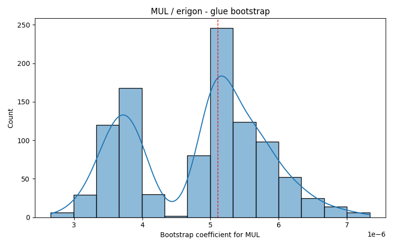

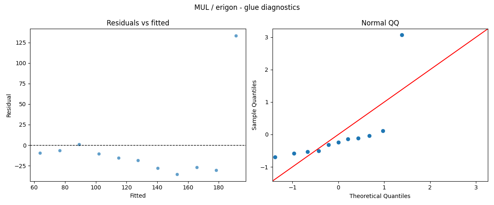

</details>

<details><summary><code>PC</code> · nobs=11 · runtime_ms=1.374e-06 · p=1.00e-03 · R²=0.9561</summary>

```
==============================================================================
                           NNLS Regression Results                            
==============================================================================
Dep. Variable:          test_runtime_ms              R-squared:          0.956
Model:                  NNLS                    Adj. R-squared:          0.951
No. Observations:       11                                RMSE:           8.80
Df Residuals:           9                                  MAE:           7.62
Df Model:               1      
==============================================================================
                      coef     std err     P-value      [0.025      0.975]
------------------------------------------------------------------------------
         const     40.4702     11.6111       0.001     13.9473     58.9936
            PC      0.0000      0.0000       0.001      0.0000      0.0000
==============================================================================
Notes: Non-negative least squares with bootstrap inference (1000 iterations)
==============================================================================
```

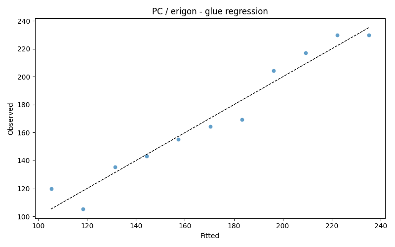

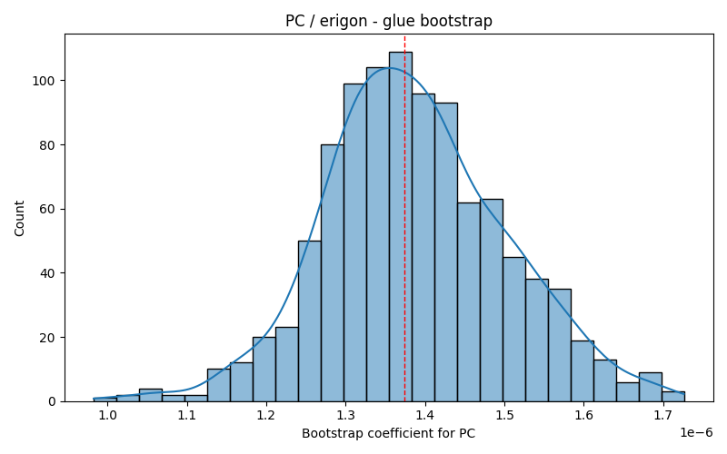

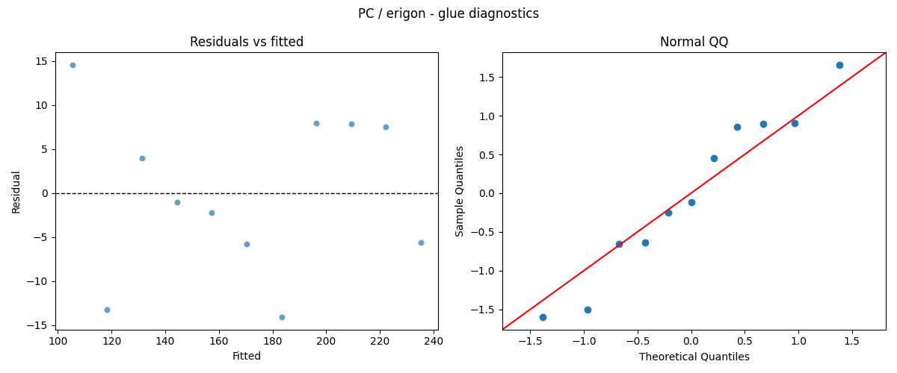

</details>

<details><summary><code>RETURNDATASIZE</code> · nobs=44 · runtime_ms=1.581e-06 · p=1.00e-03 · R²=0.2048</summary>

```
==============================================================================
                           NNLS Regression Results                            
==============================================================================
Dep. Variable:          test_runtime_ms              R-squared:          0.205
Model:                  NNLS                    Adj. R-squared:          0.186
No. Observations:       44                                RMSE:          49.18
Df Residuals:           42                                 MAE:          15.18
Df Model:               1      
==============================================================================
                      coef     std err     P-value      [0.025      0.975]
------------------------------------------------------------------------------
         const     41.3952     22.8111       0.001     13.6113     94.4928
RETURNDATASIZE      0.0000      0.0000       0.001      0.0000      0.0000
==============================================================================
Notes: Non-negative least squares with bootstrap inference (1000 iterations)
==============================================================================
```

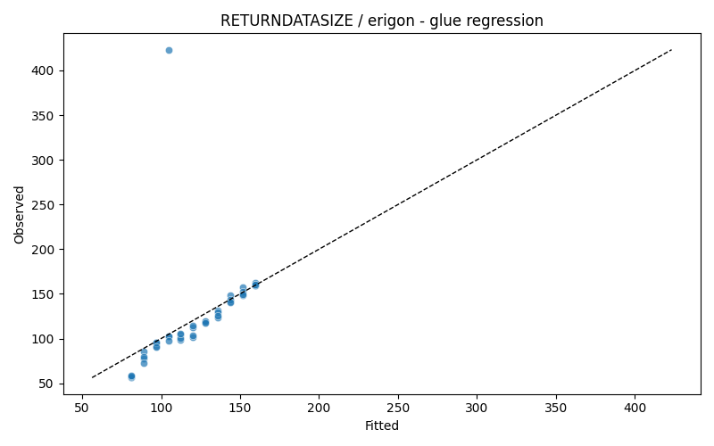

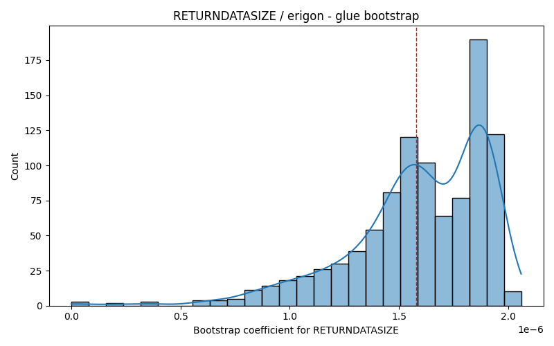

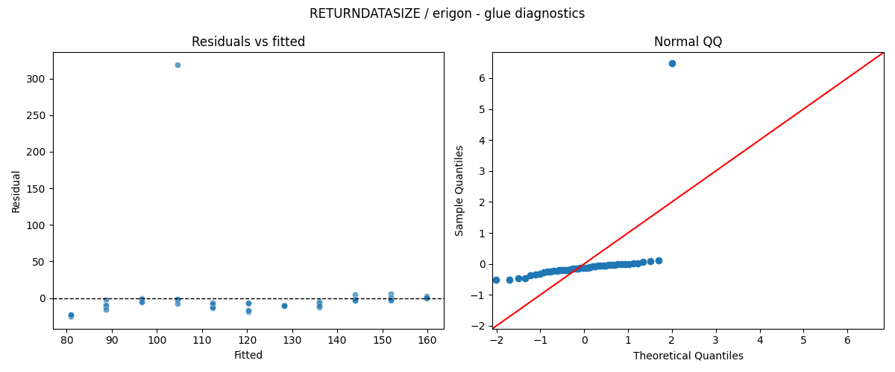

</details>

<details><summary><code>SELFBALANCE</code> · nobs=9 · runtime_ms=1.603e-06 · p=1.00e-03 · R²=0.8916</summary>

```
==============================================================================
                           NNLS Regression Results                            
==============================================================================
Dep. Variable:          test_runtime_ms              R-squared:          0.892
Model:                  NNLS                    Adj. R-squared:          0.876
No. Observations:       9                                 RMSE:           5.64
Df Residuals:           7                                  MAE:           4.43
Df Model:               1      
==============================================================================
                      coef     std err     P-value      [0.025      0.975]
------------------------------------------------------------------------------
         const     18.7796      9.9079       0.019      1.9087     39.1117
   SELFBALANCE      0.0000      0.0000       0.001      0.0000      0.0000
==============================================================================
Notes: Non-negative least squares with bootstrap inference (1000 iterations)
==============================================================================
```


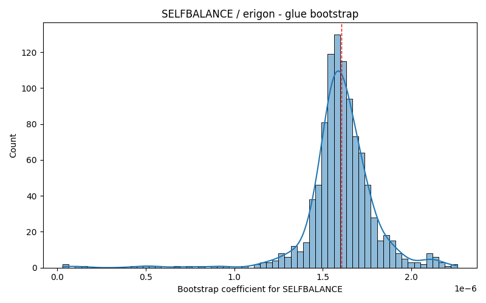


</details>

<details><summary><code>SUB</code> · nobs=11 · runtime_ms=3.174e-06 · p=1.00e-03 · R²=0.9438</summary>

```
==============================================================================
                           NNLS Regression Results                            
==============================================================================
Dep. Variable:          test_runtime_ms              R-squared:          0.944
Model:                  NNLS                    Adj. R-squared:          0.938
No. Observations:       11                                RMSE:           8.15
Df Residuals:           9                                  MAE:           6.76
Df Model:               1      
==============================================================================
                      coef     std err     P-value      [0.025      0.975]
------------------------------------------------------------------------------
         const     14.5508      8.8293       0.019      0.4339     34.8354
           SUB      0.0000      0.0000       0.001      0.0000      0.0000
==============================================================================
Notes: Non-negative least squares with bootstrap inference (1000 iterations)
==============================================================================
```


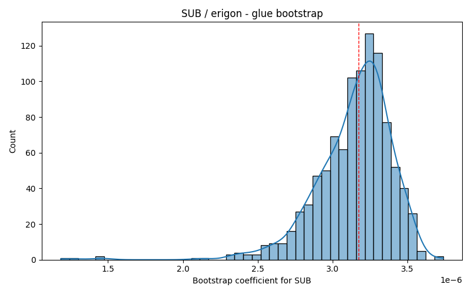


</details>

### Mixed glue (tier B) · erigon

<details><summary><code>JUMP</code> · nobs=11 · runtime_ms=7.344e-06 · p=1.00e-03 · R²=0.9765</summary>

```
==============================================================================
                           NNLS Regression Results                            
==============================================================================
Dep. Variable:          test_runtime_ms              R-squared:          0.977
Model:                  NNLS                    Adj. R-squared:          0.974
No. Observations:       11                                RMSE:           4.23
Df Residuals:           9                                  MAE:           3.13
Df Model:               1      
==============================================================================
                      coef     std err     P-value      [0.025      0.975]
------------------------------------------------------------------------------
         const     25.2680      5.7868       0.001     16.4942     38.2961
          JUMP      0.0000      0.0000       0.001      0.0000      0.0000
==============================================================================
Notes: Non-negative least squares with bootstrap inference (1000 iterations)
==============================================================================
```


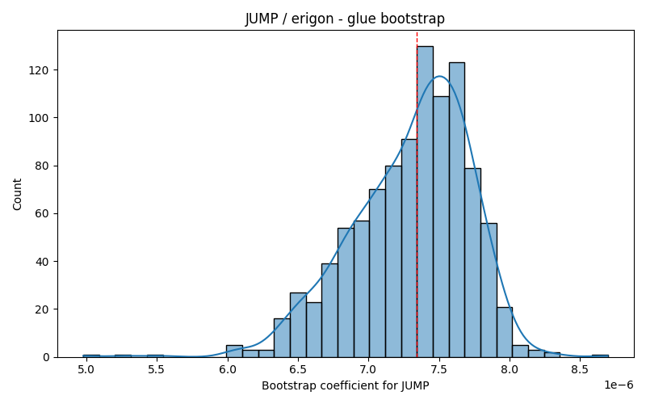

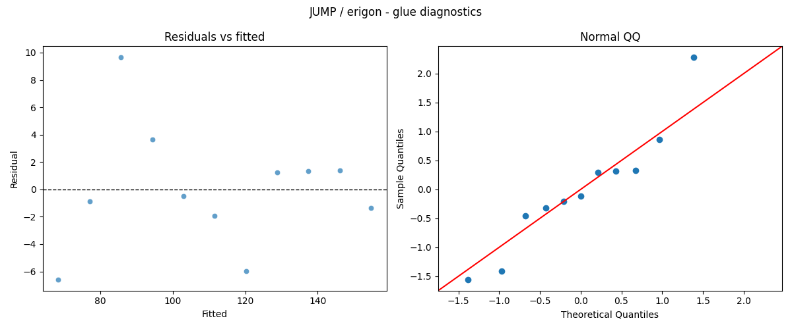

</details>

<details><summary><code>KECCAK256</code> · nobs=176 · runtime_ms=2.21e-05 · p=1.00e-03 · R²=0.09085</summary>

```
==============================================================================
                           NNLS Regression Results                            
==============================================================================
Dep. Variable:          test_runtime_ms              R-squared:          0.091
Model:                  NNLS                    Adj. R-squared:          0.086
No. Observations:       176                               RMSE:         138.93
Df Residuals:           174                                MAE:         112.73
Df Model:               1      
==============================================================================
                      coef     std err     P-value      [0.025      0.975]
------------------------------------------------------------------------------
         const    388.8019     23.0988       0.001    342.9470    431.8989
     KECCAK256      0.0000      0.0000       0.001      0.0000      0.0000
==============================================================================
Notes: Non-negative least squares with bootstrap inference (1000 iterations)
==============================================================================
```

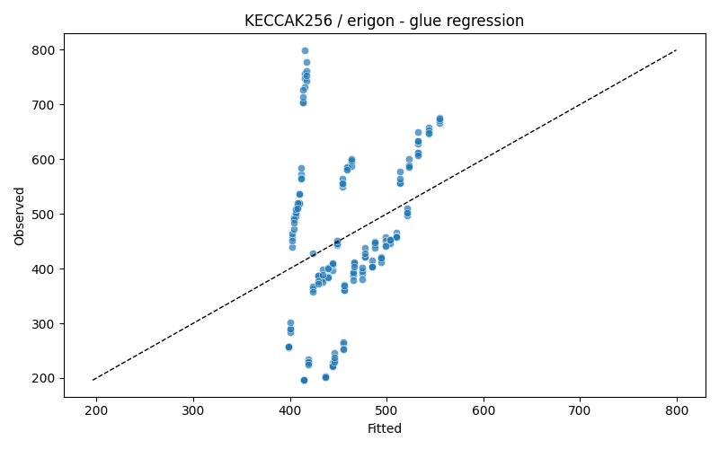


</details>

## geth

| glue_opcode | nobs | glue_runtime_ms | p_value | rsquared |
| --- | --- | --- | --- | --- |
| `ISZERO` | 814 | 1.726e-06 | 1.00e-03 | 0.1739 |
| `JUMPDEST` | 814 | 1.319e-06 | 1.00e-03 | 0.1389 |
| `SWAP` | 13024 | 1.735e-06 | 1.00e-03 | 0.1475 |
| `CALLDATASIZE` | 48169 | 1.686e-06 | 1.00e-03 | 0.2016 |
| `DUP` | 48169 | 1.809e-06 | 1.00e-03 | 0.2016 |
| `GAS` | 48169 | 1.718e-06 | 1.00e-03 | 0.2016 |
| `MLOAD` | 48169 | 5.803e-06 | 1.00e-03 | 0.2016 |
| `PUSH` | 48169 | 2.646e-06 | 1.00e-03 | 0.2016 |
| `PUSH0` | 48169 | 1.669e-06 | 1.00e-03 | 0.2016 |
| `STATICCALL` | 48169 | 0.0001619 | 1.00e-03 | 0.2016 |
| `ADD` | 814 | 4.754e-06 | 1.00e-03 | 0.1925 |
| `AND` | 814 | 4.27e-06 | 1.00e-03 | 0.1484 |
| `CALLDATACOPY` | 19536 | 1.447e-05 | 1.00e-03 | 0.4765 |
| `CALLDATALOAD` | 3256 | 5.874e-05 | 1.00e-03 | 0.03652 |
| `DIV` | 814 | 1.051e-05 | 1.00e-03 | 0.1483 |
| `EXP` | 814 | 0.0003808 | 1.00e-03 | 0.1509 |
| `GT` | 814 | 4.016e-06 | 1.00e-03 | 0.1419 |
| `JUMPI` | 814 | 6.442e-06 | 1.00e-03 | 0.1633 |
| `LT` | 814 | 4.969e-06 | 1.00e-03 | 0.1911 |
| `MSTORE` | 4070 | 8.688e-06 | 1.00e-03 | 0.1451 |
| `MSTORE8` | 4070 | 8.016e-06 | 1.00e-03 | 0.144 |
| `MUL` | 814 | 5.31e-06 | 1.00e-03 | 0.1599 |
| `PC` | 814 | 1.86e-06 | 1.00e-03 | 0.1694 |
| `RETURNDATASIZE` | 3256 | 3.646e-06 | 1.00e-03 | 0.1787 |
| `SELFBALANCE` | 666 | 8.666e-06 | 1.00e-03 | 0.08237 |
| `SUB` | 814 | 4.575e-06 | 1.00e-03 | 0.1571 |
| `JUMP` | 814 | 1.032e-05 | 1.00e-03 | 0.1453 |
| `KECCAK256` | 13024 | 4.336e-05 | 1.00e-03 | 0.06575 |

### Cycle glue — joint fit · geth

<details><summary>Joint NNLS regression summary</summary>

```
==============================================================================
                           NNLS Regression Results                            
==============================================================================
Dep. Variable:          test_runtime_ms              R-squared:          0.202
Model:                  NNLS                    Adj. R-squared:          0.201
No. Observations:       48169                             RMSE:         117.40
Df Residuals:           48161                              MAE:          40.99
Df Model:               7      
==============================================================================
                      coef     std err     P-value      [0.025      0.975]
------------------------------------------------------------------------------
         const     38.2458      1.5816       0.001     35.1255     41.3635
  CALLDATASIZE      0.0000      0.0000       0.001      0.0000      0.0000
           DUP      0.0000      0.0000       0.001      0.0000      0.0000
           GAS      0.0000      0.0000       0.001      0.0000      0.0000
         MLOAD      0.0000      0.0000       0.001      0.0000      0.0000
          PUSH      0.0000      0.0000       0.001      0.0000      0.0000
         PUSH0      0.0000      0.0000       0.001      0.0000      0.0000
    STATICCALL      0.0002      0.0000       0.001      0.0002      0.0002
==============================================================================
Notes: Non-negative least squares with bootstrap inference (1000 iterations)
==============================================================================
```

</details>

<details><summary><code>CALLDATASIZE</code> · nobs=48169 · runtime_ms=1.686e-06 · p=1.00e-03 · R²=0.2016</summary>

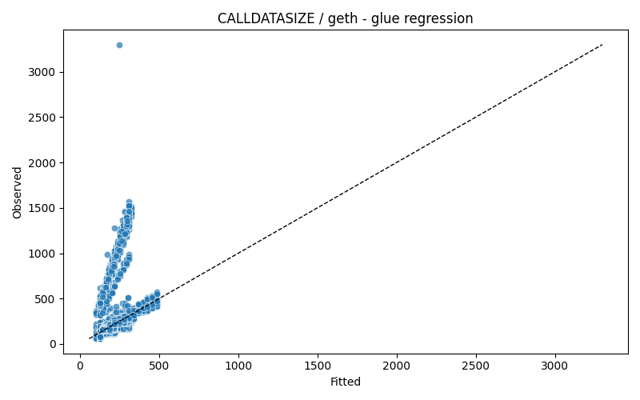

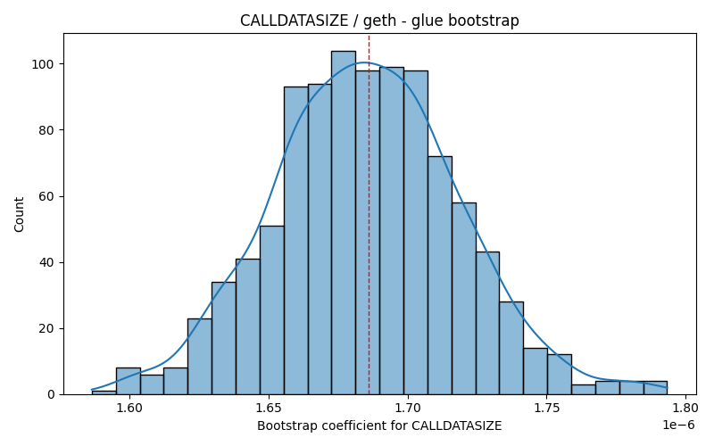


</details>

<details><summary><code>DUP</code> · nobs=48169 · runtime_ms=1.809e-06 · p=1.00e-03 · R²=0.2016</summary>


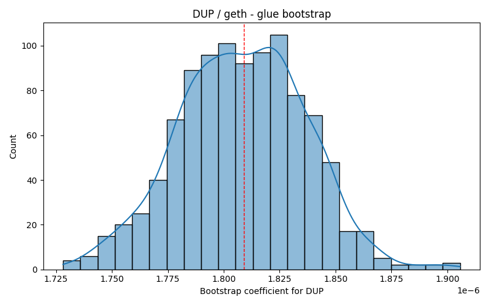


</details>

<details><summary><code>GAS</code> · nobs=48169 · runtime_ms=1.718e-06 · p=1.00e-03 · R²=0.2016</summary>


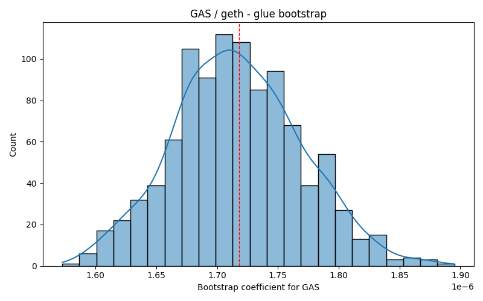

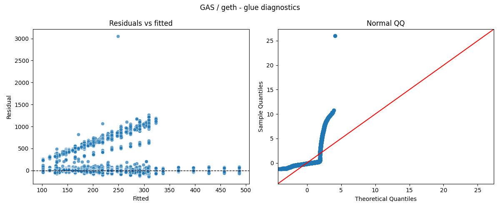

</details>

<details><summary><code>MLOAD</code> · nobs=48169 · runtime_ms=5.803e-06 · p=1.00e-03 · R²=0.2016</summary>


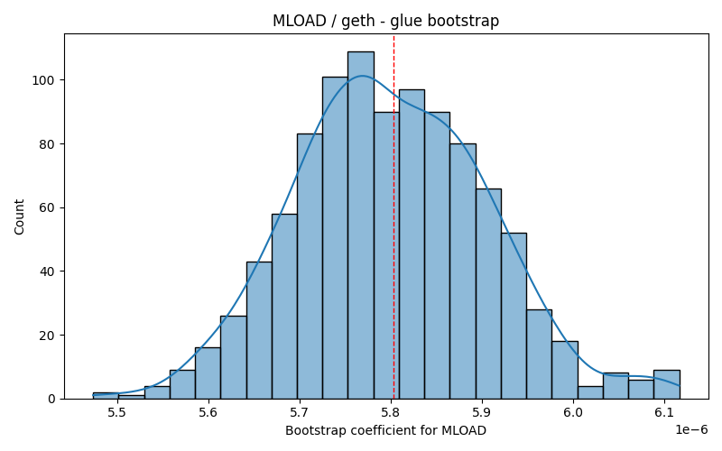


</details>

<details><summary><code>PUSH</code> · nobs=48169 · runtime_ms=2.646e-06 · p=1.00e-03 · R²=0.2016</summary>


</details>

<details><summary><code>PUSH0</code> · nobs=48169 · runtime_ms=1.669e-06 · p=1.00e-03 · R²=0.2016</summary>

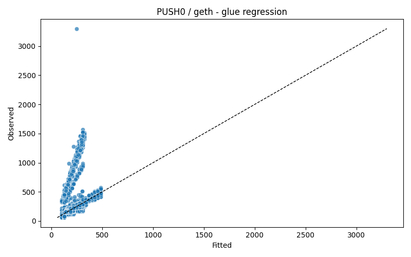

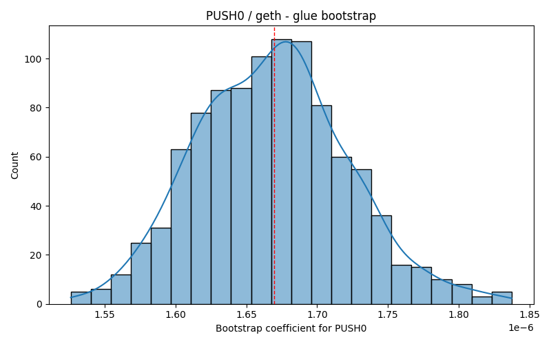


</details>

<details><summary><code>STATICCALL</code> · nobs=48169 · runtime_ms=0.0001619 · p=1.00e-03 · R²=0.2016</summary>


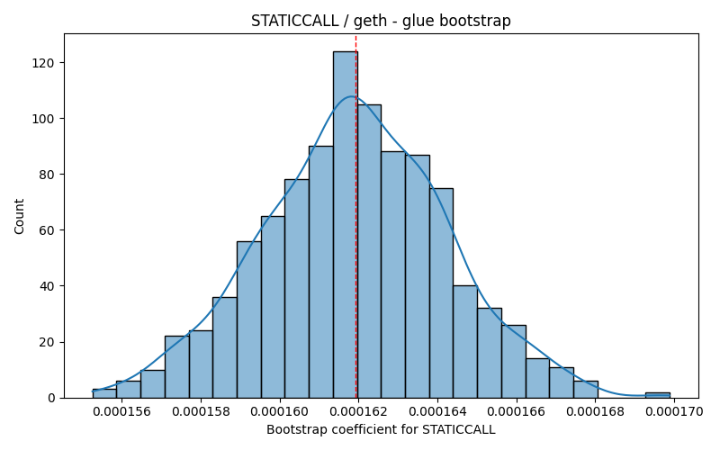


</details>

### Pure glue · geth

<details><summary><code>ISZERO</code> · nobs=814 · runtime_ms=1.726e-06 · p=1.00e-03 · R²=0.1739</summary>

```
==============================================================================
                           NNLS Regression Results                            
==============================================================================
Dep. Variable:          test_runtime_ms              R-squared:          0.174
Model:                  NNLS                    Adj. R-squared:          0.173
No. Observations:       814                               RMSE:          79.19
Df Residuals:           812                                MAE:          28.19
Df Model:               1      
==============================================================================
                      coef     std err     P-value      [0.025      0.975]
------------------------------------------------------------------------------
         const     22.4642      8.0779       0.006      4.9940     37.1854
        ISZERO      0.0000      0.0000       0.001      0.0000      0.0000
==============================================================================
Notes: Non-negative least squares with bootstrap inference (1000 iterations)
==============================================================================
```

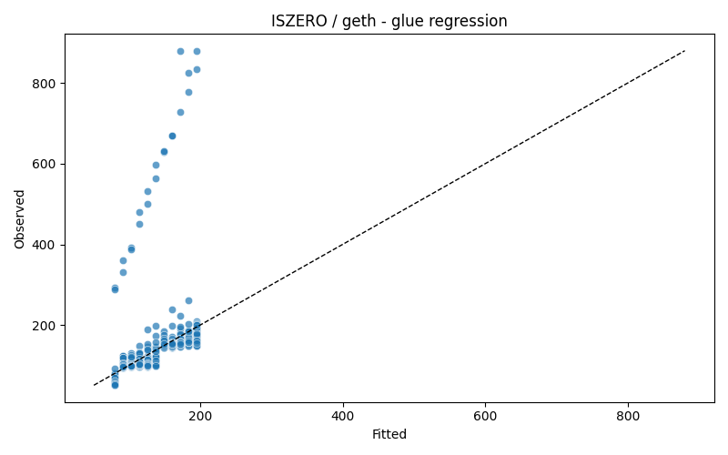

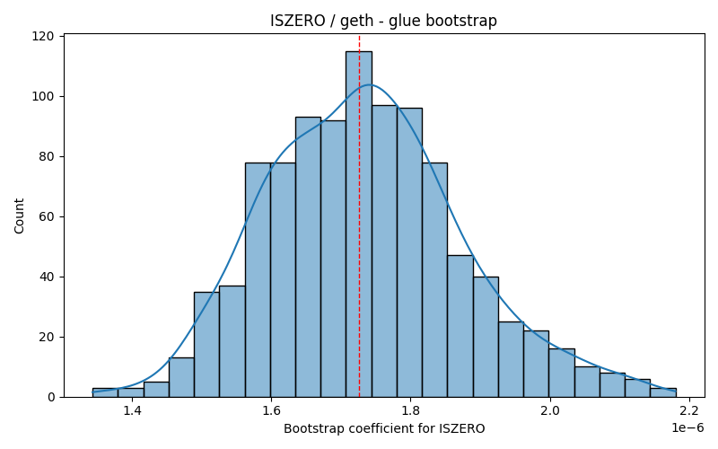

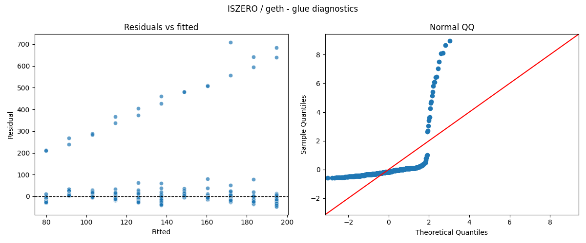

</details>

<details><summary><code>JUMPDEST</code> · nobs=814 · runtime_ms=1.319e-06 · p=1.00e-03 · R²=0.1389</summary>

```
==============================================================================
                           NNLS Regression Results                            
==============================================================================
Dep. Variable:          test_runtime_ms              R-squared:          0.139
Model:                  NNLS                    Adj. R-squared:          0.138
No. Observations:       814                               RMSE:         207.35
Df Residuals:           812                                MAE:          72.50
Df Model:               1      
==============================================================================
                      coef     std err     P-value      [0.025      0.975]
------------------------------------------------------------------------------
         const     79.5562     21.0087       0.001     34.4532    117.2927
      JUMPDEST      0.0000      0.0000       0.001      0.0000      0.0000
==============================================================================
Notes: Non-negative least squares with bootstrap inference (1000 iterations)
==============================================================================
```

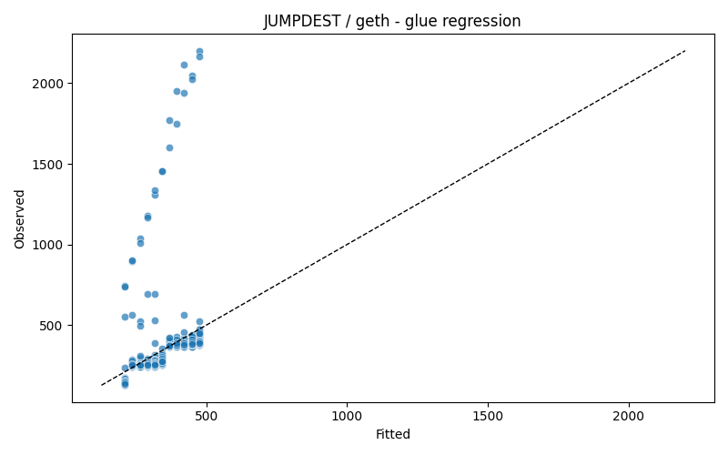

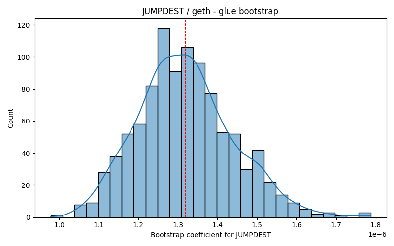


</details>

<details><summary><code>SWAP</code> · nobs=13024 · runtime_ms=1.735e-06 · p=1.00e-03 · R²=0.1475</summary>

```
==============================================================================
                           NNLS Regression Results                            
==============================================================================
Dep. Variable:          test_runtime_ms              R-squared:          0.148
Model:                  NNLS                    Adj. R-squared:          0.147
No. Observations:       13024                             RMSE:          87.77
Df Residuals:           13022                              MAE:          31.52
Df Model:               1      
==============================================================================
                      coef     std err     P-value      [0.025      0.975]
------------------------------------------------------------------------------
         const     31.0801      2.2304       0.001     26.3709     35.3767
          SWAP      0.0000      0.0000       0.001      0.0000      0.0000
==============================================================================
Notes: Non-negative least squares with bootstrap inference (1000 iterations)
==============================================================================
```

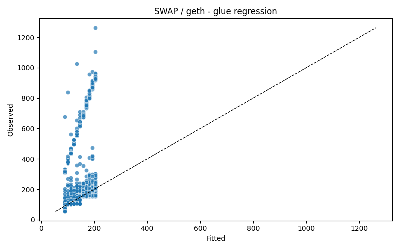

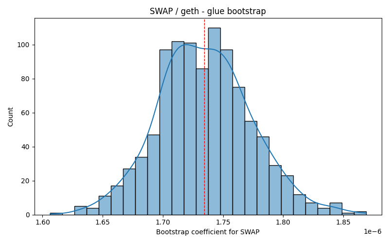

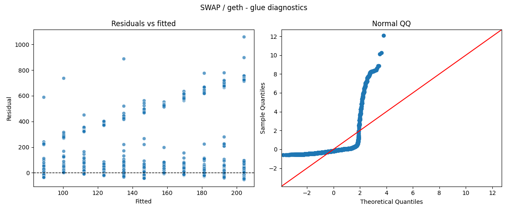

</details>

### Mixed glue (tier A) · geth

<details><summary><code>ADD</code> · nobs=814 · runtime_ms=4.754e-06 · p=1.00e-03 · R²=0.1925</summary>

```
==============================================================================
                           NNLS Regression Results                            
==============================================================================
Dep. Variable:          test_runtime_ms              R-squared:          0.193
Model:                  NNLS                    Adj. R-squared:          0.192
No. Observations:       814                               RMSE:         102.48
Df Residuals:           812                                MAE:          42.48
Df Model:               1      
==============================================================================
                      coef     std err     P-value      [0.025      0.975]
------------------------------------------------------------------------------
         const     44.0025     10.4774       0.001     21.5994     62.5164
           ADD      0.0000      0.0000       0.001      0.0000      0.0000
==============================================================================
Notes: Non-negative least squares with bootstrap inference (1000 iterations)
==============================================================================
```

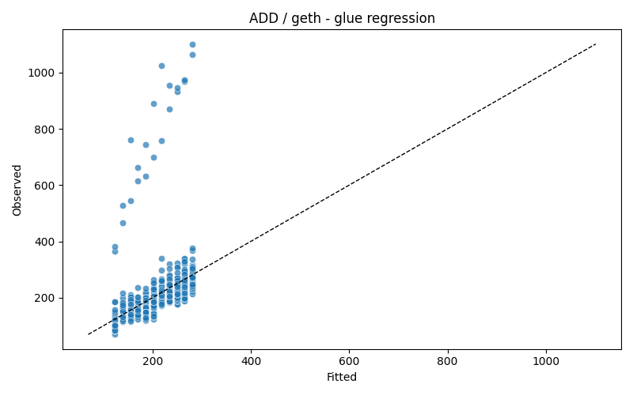

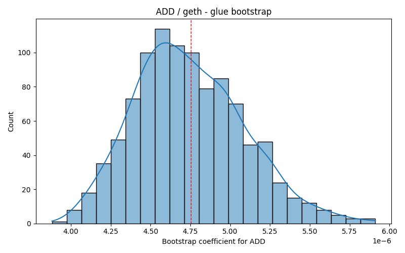


</details>

<details><summary><code>AND</code> · nobs=814 · runtime_ms=4.27e-06 · p=1.00e-03 · R²=0.1484</summary>

```
==============================================================================
                           NNLS Regression Results                            
==============================================================================
Dep. Variable:          test_runtime_ms              R-squared:          0.148
Model:                  NNLS                    Adj. R-squared:          0.147
No. Observations:       814                               RMSE:         107.64
Df Residuals:           812                                MAE:          43.02
Df Model:               1      
==============================================================================
                      coef     std err     P-value      [0.025      0.975]
------------------------------------------------------------------------------
         const     50.9218     10.4304       0.001     30.1825     70.0470
           AND      0.0000      0.0000       0.001      0.0000      0.0000
==============================================================================
Notes: Non-negative least squares with bootstrap inference (1000 iterations)
==============================================================================
```

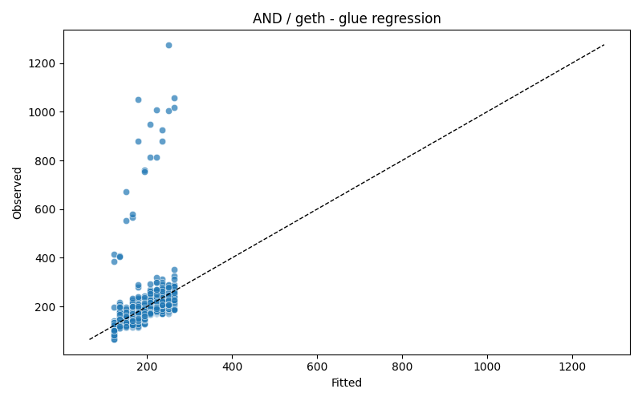

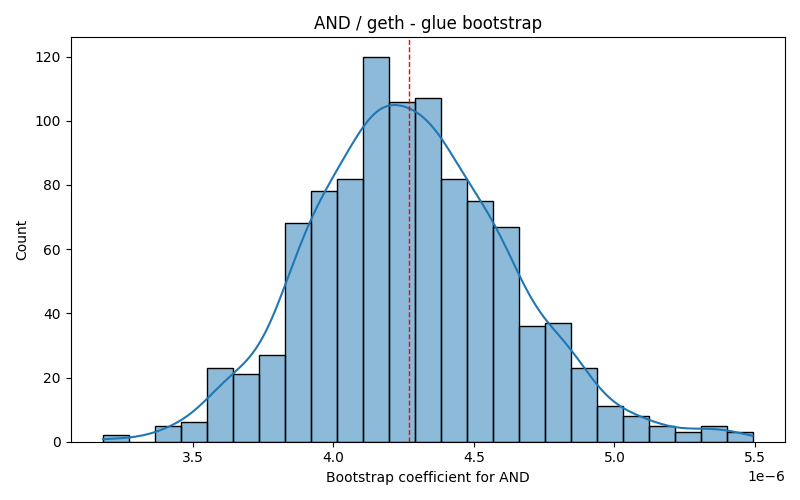

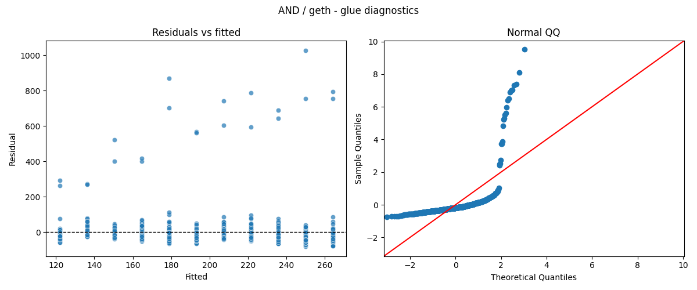

</details>

<details><summary><code>CALLDATACOPY</code> · nobs=19536 · runtime_ms=1.447e-05 · p=1.00e-03 · R²=0.4765</summary>

```
==============================================================================
                           NNLS Regression Results                            
==============================================================================
Dep. Variable:          test_runtime_ms              R-squared:          0.476
Model:                  NNLS                    Adj. R-squared:          0.476
No. Observations:       19536                             RMSE:         114.07
Df Residuals:           19534                              MAE:          36.19
Df Model:               1      
==============================================================================
                      coef     std err     P-value      [0.025      0.975]
------------------------------------------------------------------------------
         const     22.3871      0.9587       0.001     20.5778     24.2888
  CALLDATACOPY      0.0000      0.0000       0.001      0.0000      0.0000
==============================================================================
Notes: Non-negative least squares with bootstrap inference (1000 iterations)
==============================================================================
```

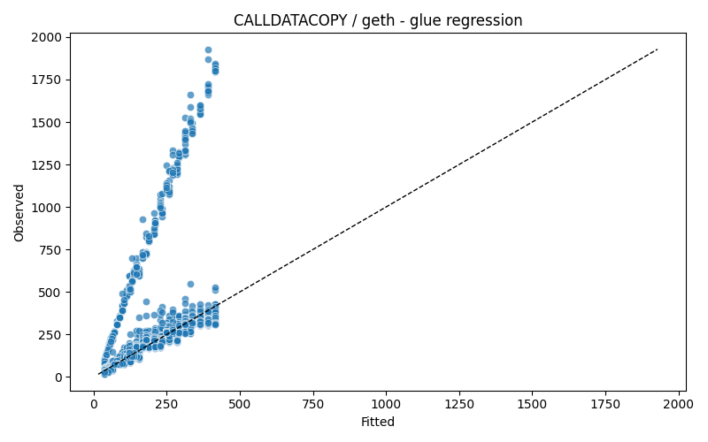

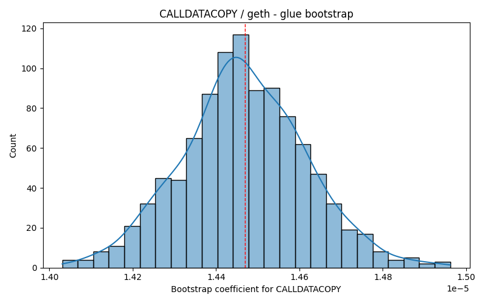

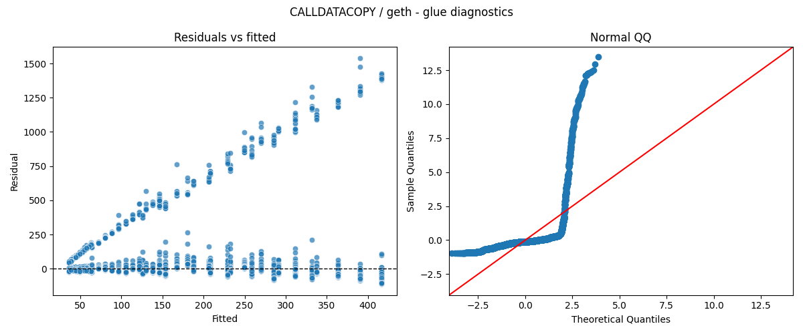

</details>

<details><summary><code>CALLDATALOAD</code> · nobs=3256 · runtime_ms=5.874e-05 · p=1.00e-03 · R²=0.03652</summary>

```
==============================================================================
                           NNLS Regression Results                            
==============================================================================
Dep. Variable:          test_runtime_ms              R-squared:          0.037
Model:                  NNLS                    Adj. R-squared:          0.036
No. Observations:       3256                              RMSE:           1.16
Df Residuals:           3254                               MAE:           0.59
Df Model:               1      
==============================================================================
                      coef     std err     P-value      [0.025      0.975]
------------------------------------------------------------------------------
         const      2.5381      0.0641       0.001      2.4180      2.6608
  CALLDATALOAD      0.0001      0.0000       0.001      0.0000      0.0001
==============================================================================
Notes: Non-negative least squares with bootstrap inference (1000 iterations)
==============================================================================
```

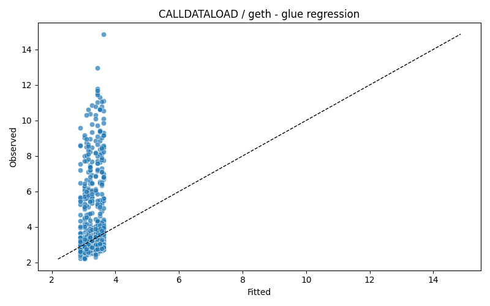

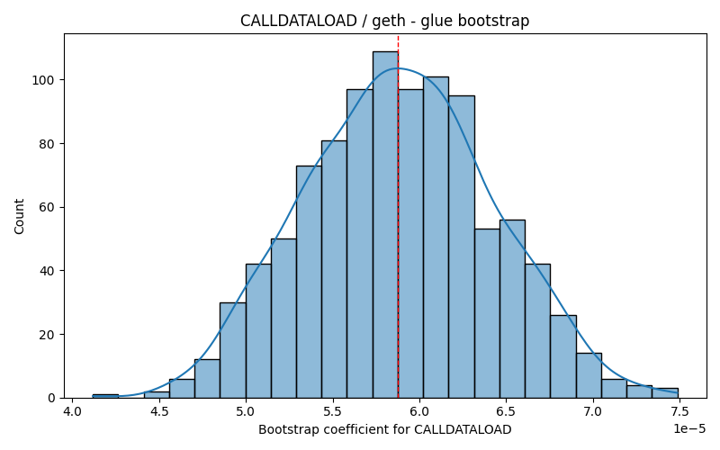

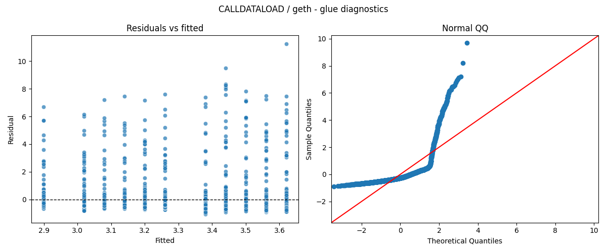

</details>

<details><summary><code>DIV</code> · nobs=814 · runtime_ms=1.051e-05 · p=1.00e-03 · R²=0.1483</summary>

```
==============================================================================
                           NNLS Regression Results                            
==============================================================================
Dep. Variable:          test_runtime_ms              R-squared:          0.148
Model:                  NNLS                    Adj. R-squared:          0.147
No. Observations:       814                               RMSE:         198.81
Df Residuals:           812                                MAE:          69.02
Df Model:               1      
==============================================================================
                      coef     std err     P-value      [0.025      0.975]
------------------------------------------------------------------------------
         const     77.8447     19.9663       0.001     42.5623    118.0845
           DIV      0.0000      0.0000       0.001      0.0000      0.0000
==============================================================================
Notes: Non-negative least squares with bootstrap inference (1000 iterations)
==============================================================================
```

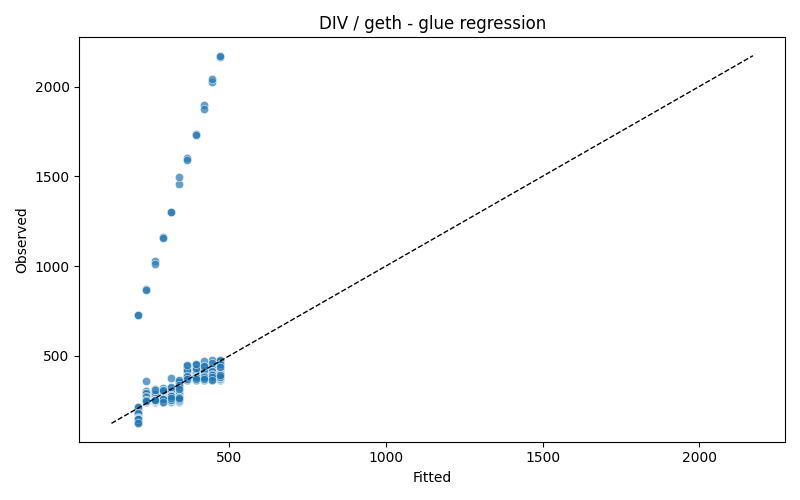

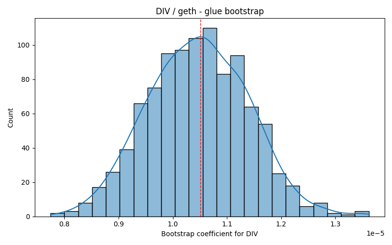

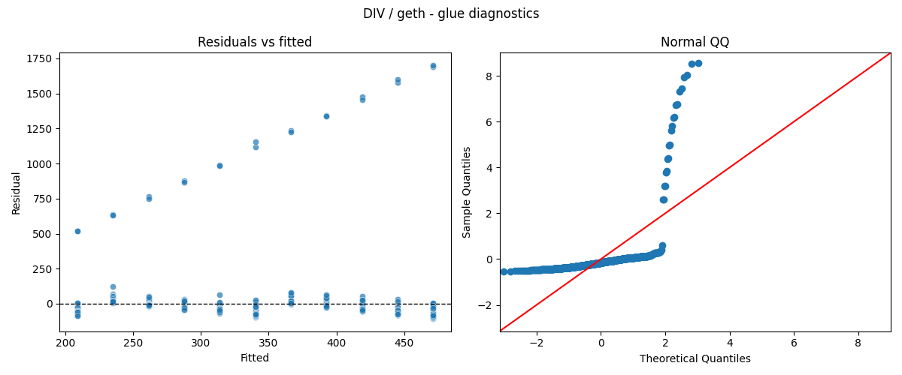

</details>

<details><summary><code>EXP</code> · nobs=814 · runtime_ms=0.0003808 · p=1.00e-03 · R²=0.1509</summary>

```
==============================================================================
                           NNLS Regression Results                            
==============================================================================
Dep. Variable:          test_runtime_ms              R-squared:          0.151
Model:                  NNLS                    Adj. R-squared:          0.150
No. Observations:       814                               RMSE:          35.37
Df Residuals:           812                                MAE:          13.04
Df Model:               1      
==============================================================================
                      coef     std err     P-value      [0.025      0.975]
------------------------------------------------------------------------------
         const     13.6217      3.6863       0.001      6.3441     20.6959
           EXP      0.0004      0.0000       0.001      0.0003      0.0004
==============================================================================
Notes: Non-negative least squares with bootstrap inference (1000 iterations)
==============================================================================
```

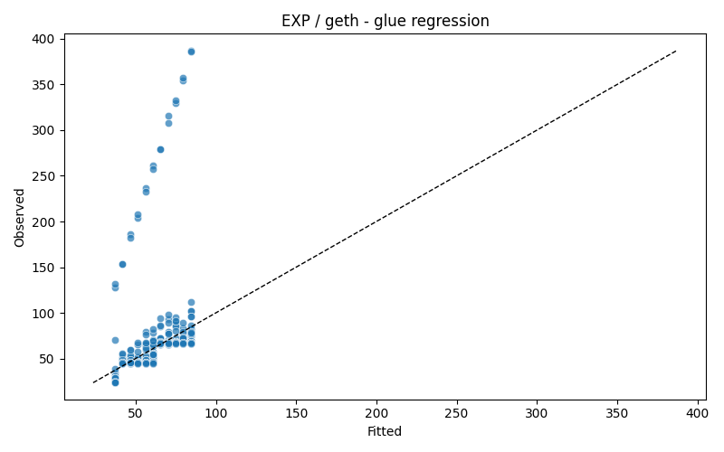

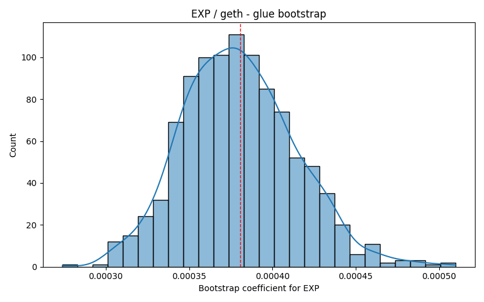

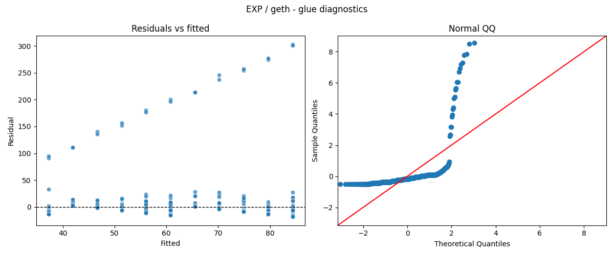

</details>

<details><summary><code>GT</code> · nobs=814 · runtime_ms=4.016e-06 · p=1.00e-03 · R²=0.1419</summary>

```
==============================================================================
                           NNLS Regression Results                            
==============================================================================
Dep. Variable:          test_runtime_ms              R-squared:          0.142
Model:                  NNLS                    Adj. R-squared:          0.141
No. Observations:       814                               RMSE:         103.96
Df Residuals:           812                                MAE:          35.88
Df Model:               1      
==============================================================================
                      coef     std err     P-value      [0.025      0.975]
------------------------------------------------------------------------------
         const     36.2434     11.2069       0.005     14.0400     56.8871
            GT      0.0000      0.0000       0.001      0.0000      0.0000
==============================================================================
Notes: Non-negative least squares with bootstrap inference (1000 iterations)
==============================================================================
```

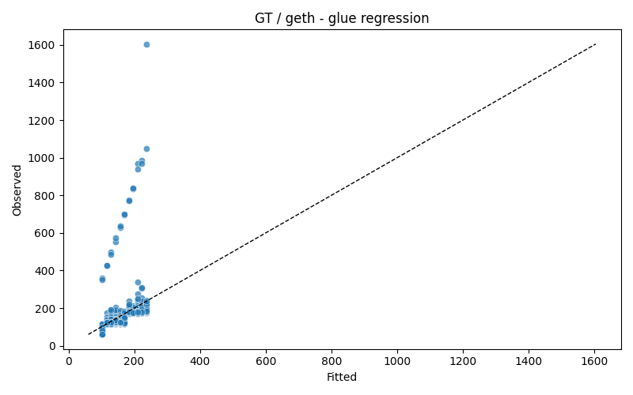

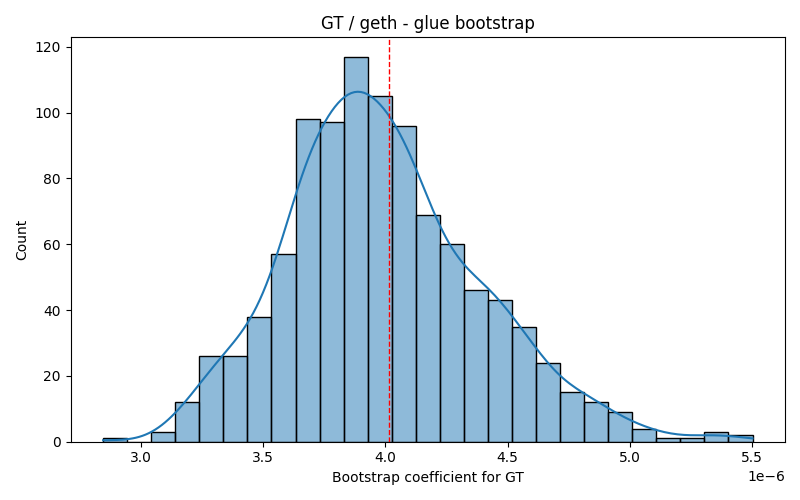

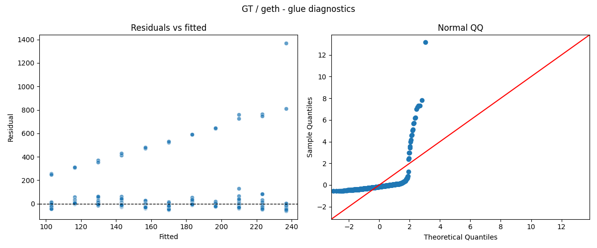

</details>

<details><summary><code>JUMPI</code> · nobs=814 · runtime_ms=6.442e-06 · p=1.00e-03 · R²=0.1633</summary>

```
==============================================================================
                           NNLS Regression Results                            
==============================================================================
Dep. Variable:          test_runtime_ms              R-squared:          0.163
Model:                  NNLS                    Adj. R-squared:          0.162
No. Observations:       814                               RMSE:          65.79
Df Residuals:           812                                MAE:          24.17
Df Model:               1      
==============================================================================
                      coef     std err     P-value      [0.025      0.975]
------------------------------------------------------------------------------
         const     19.9941      6.6889       0.001      5.8156     31.8678
         JUMPI      0.0000      0.0000       0.001      0.0000      0.0000
==============================================================================
Notes: Non-negative least squares with bootstrap inference (1000 iterations)
==============================================================================
```


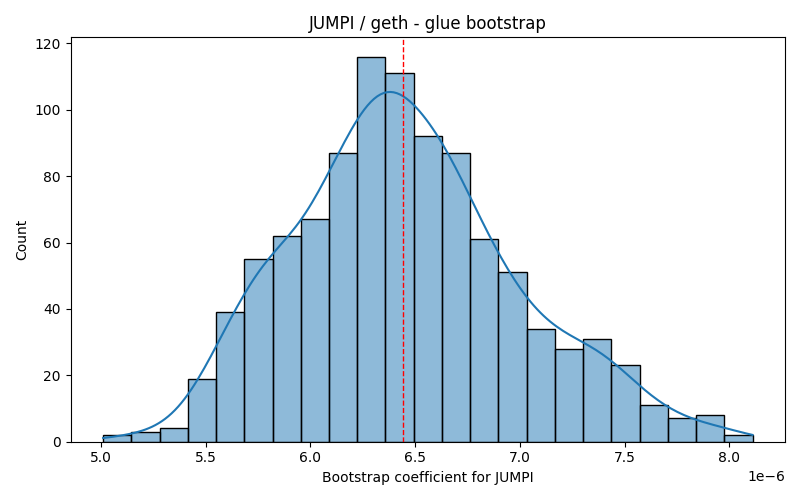


</details>

<details><summary><code>LT</code> · nobs=814 · runtime_ms=4.969e-06 · p=1.00e-03 · R²=0.1911</summary>

```
==============================================================================
                           NNLS Regression Results                            
==============================================================================
Dep. Variable:          test_runtime_ms              R-squared:          0.191
Model:                  NNLS                    Adj. R-squared:          0.190
No. Observations:       814                               RMSE:         107.60
Df Residuals:           812                                MAE:          39.65
Df Model:               1      
==============================================================================
                      coef     std err     P-value      [0.025      0.975]
------------------------------------------------------------------------------
         const     41.7539     10.6816       0.001     19.7917     60.8918
            LT      0.0000      0.0000       0.001      0.0000      0.0000
==============================================================================
Notes: Non-negative least squares with bootstrap inference (1000 iterations)
==============================================================================
```

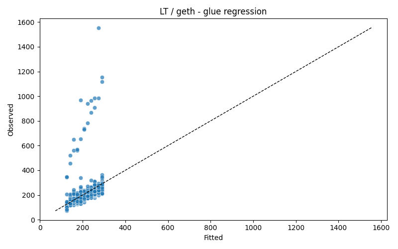

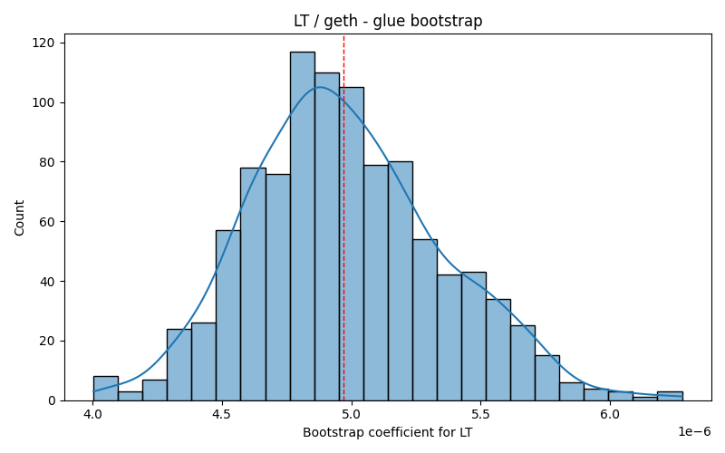

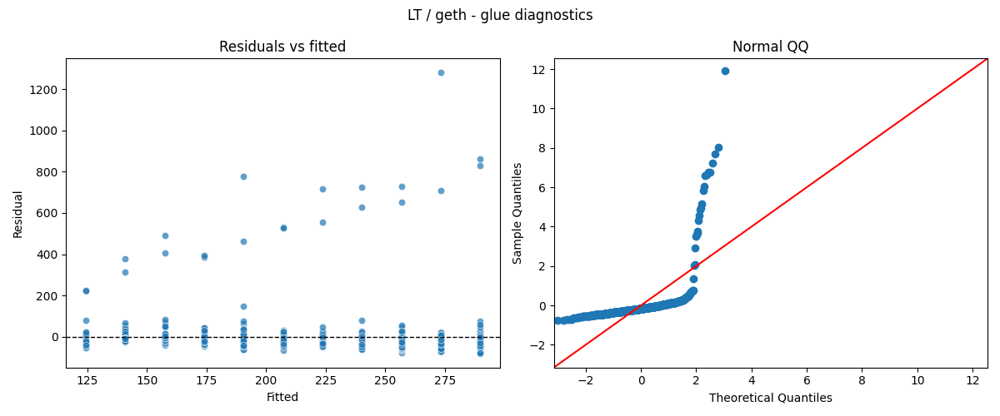

</details>

<details><summary><code>MSTORE</code> · nobs=4070 · runtime_ms=8.688e-06 · p=1.00e-03 · R²=0.1451</summary>

```
==============================================================================
                           NNLS Regression Results                            
==============================================================================
Dep. Variable:          test_runtime_ms              R-squared:          0.145
Model:                  NNLS                    Adj. R-squared:          0.145
No. Observations:       4070                              RMSE:         148.01
Df Residuals:           4068                               MAE:          51.51
Df Model:               1      
==============================================================================
                      coef     std err     P-value      [0.025      0.975]
------------------------------------------------------------------------------
         const     52.5388      6.6135       0.001     39.4816     65.4000
        MSTORE      0.0000      0.0000       0.001      0.0000      0.0000
==============================================================================
Notes: Non-negative least squares with bootstrap inference (1000 iterations)
==============================================================================
```

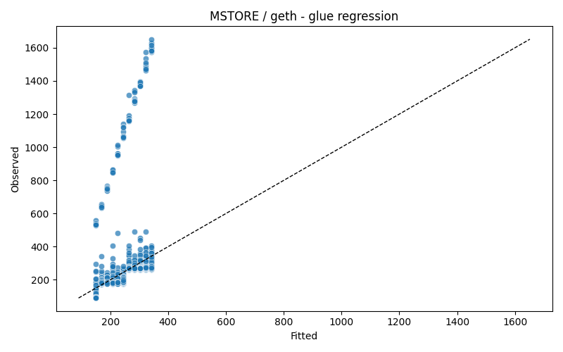

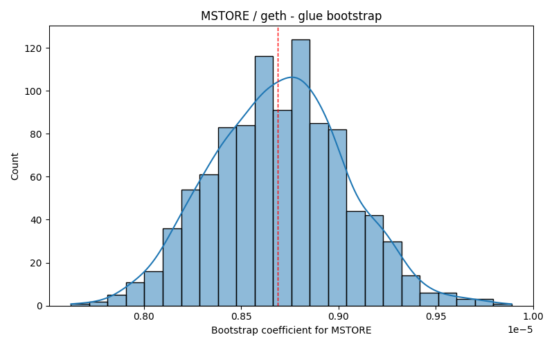

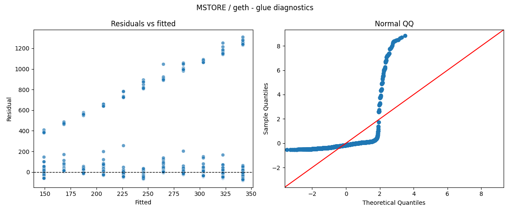

</details>

<details><summary><code>MSTORE8</code> · nobs=4070 · runtime_ms=8.016e-06 · p=1.00e-03 · R²=0.144</summary>

```
==============================================================================
                           NNLS Regression Results                            
==============================================================================
Dep. Variable:          test_runtime_ms              R-squared:          0.144
Model:                  NNLS                    Adj. R-squared:          0.144
No. Observations:       4070                              RMSE:         137.16
Df Residuals:           4068                               MAE:          48.08
Df Model:               1      
==============================================================================
                      coef     std err     P-value      [0.025      0.975]
------------------------------------------------------------------------------
         const     48.6953      6.1456       0.001     36.2203     60.6195
       MSTORE8      0.0000      0.0000       0.001      0.0000      0.0000
==============================================================================
Notes: Non-negative least squares with bootstrap inference (1000 iterations)
==============================================================================
```

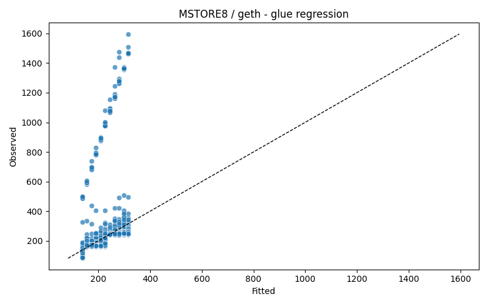

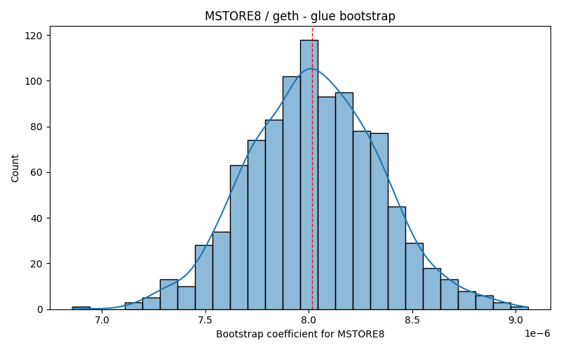

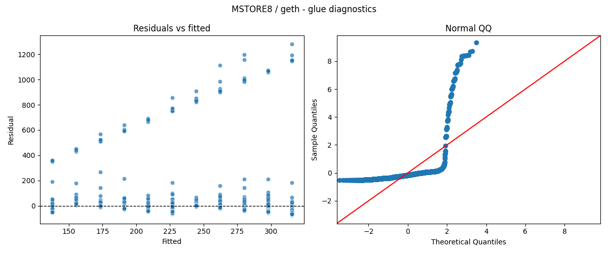

</details>

<details><summary><code>MUL</code> · nobs=814 · runtime_ms=5.31e-06 · p=1.00e-03 · R²=0.1599</summary>

```
==============================================================================
                           NNLS Regression Results                            
==============================================================================
Dep. Variable:          test_runtime_ms              R-squared:          0.160
Model:                  NNLS                    Adj. R-squared:          0.159
No. Observations:       814                               RMSE:          96.07
Df Residuals:           812                                MAE:          33.88
Df Model:               1      
==============================================================================
                      coef     std err     P-value      [0.025      0.975]
------------------------------------------------------------------------------
         const     37.0884     10.0407       0.001     16.6841     56.5790
           MUL      0.0000      0.0000       0.001      0.0000      0.0000
==============================================================================
Notes: Non-negative least squares with bootstrap inference (1000 iterations)
==============================================================================
```


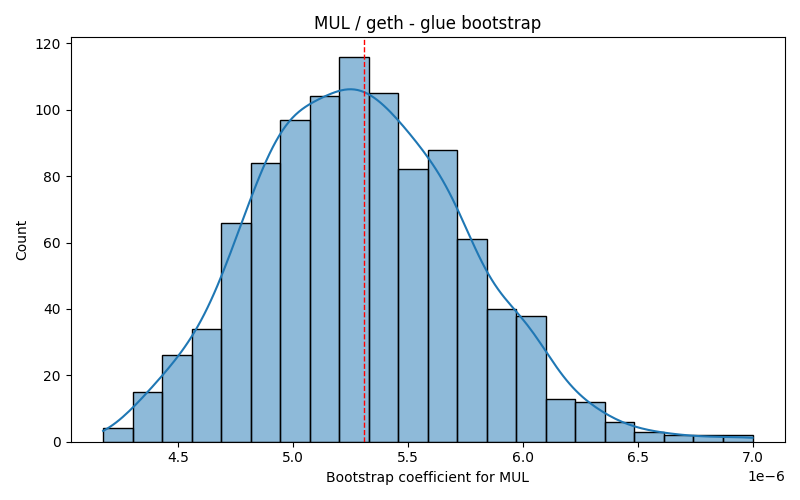

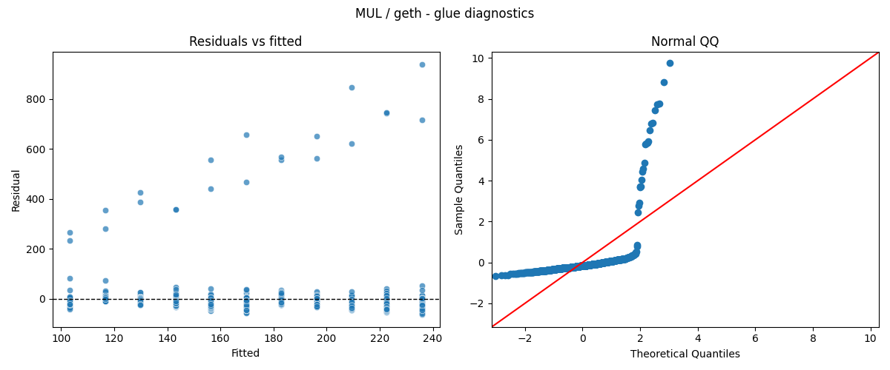

</details>

<details><summary><code>PC</code> · nobs=814 · runtime_ms=1.86e-06 · p=1.00e-03 · R²=0.1694</summary>

```
==============================================================================
                           NNLS Regression Results                            
==============================================================================
Dep. Variable:          test_runtime_ms              R-squared:          0.169
Model:                  NNLS                    Adj. R-squared:          0.168
No. Observations:       814                               RMSE:         123.18
Df Residuals:           812                                MAE:          42.23
Df Model:               1      
==============================================================================
                      coef     std err     P-value      [0.025      0.975]
------------------------------------------------------------------------------
         const     38.9362     12.9343       0.005     10.5720     63.2195
            PC      0.0000      0.0000       0.001      0.0000      0.0000
==============================================================================
Notes: Non-negative least squares with bootstrap inference (1000 iterations)
==============================================================================
```

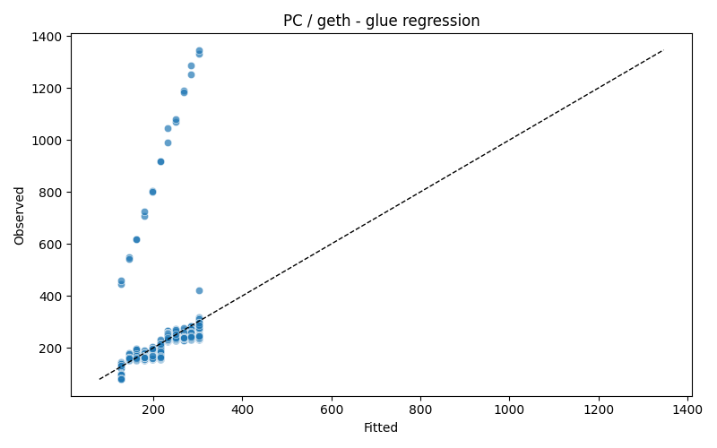


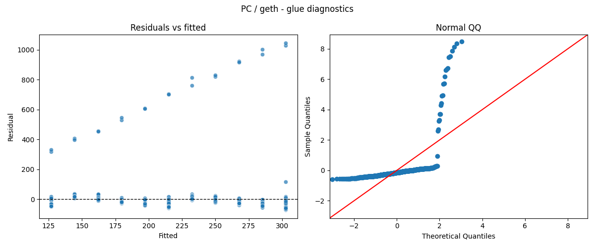

</details>

<details><summary><code>RETURNDATASIZE</code> · nobs=3256 · runtime_ms=3.646e-06 · p=1.00e-03 · R²=0.1787</summary>

```
==============================================================================
                           NNLS Regression Results                            
==============================================================================
Dep. Variable:          test_runtime_ms              R-squared:          0.179
Model:                  NNLS                    Adj. R-squared:          0.178
No. Observations:       3256                              RMSE:         123.38
Df Residuals:           3254                               MAE:          51.78
Df Model:               1      
==============================================================================
                      coef     std err     P-value      [0.025      0.975]
------------------------------------------------------------------------------
         const     50.3384      6.5483       0.001     36.8506     62.5998
RETURNDATASIZE      0.0000      0.0000       0.001      0.0000      0.0000
==============================================================================
Notes: Non-negative least squares with bootstrap inference (1000 iterations)
==============================================================================
```

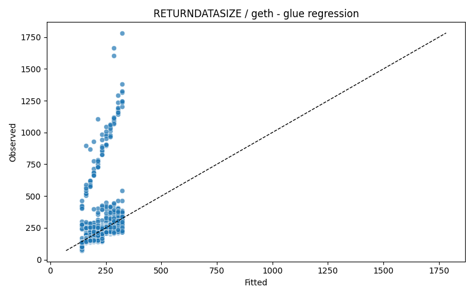

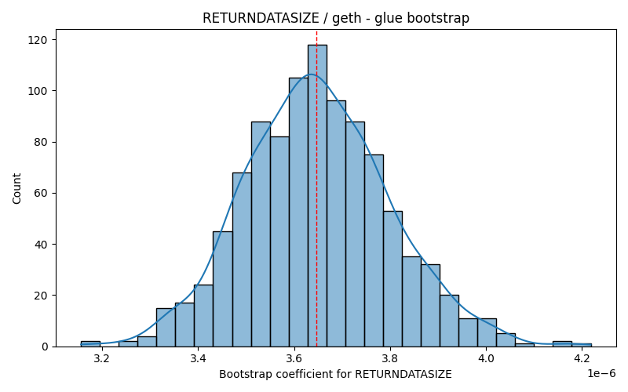

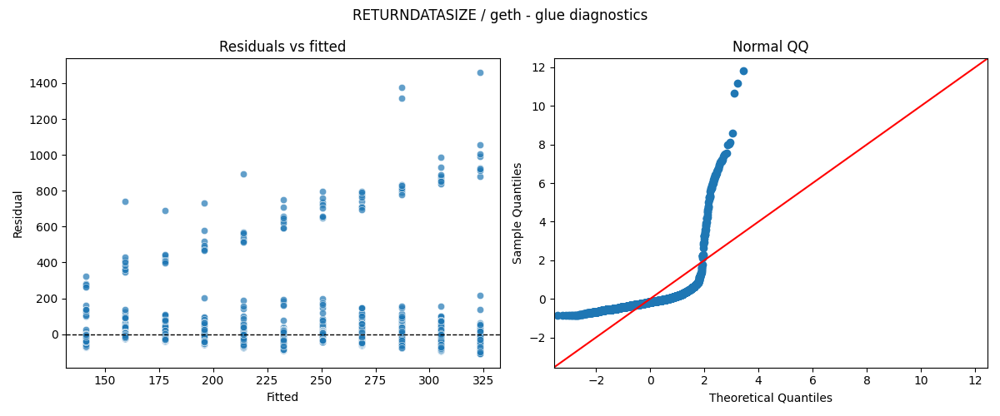

</details>

<details><summary><code>SELFBALANCE</code> · nobs=666 · runtime_ms=8.666e-06 · p=1.00e-03 · R²=0.08237</summary>

```
==============================================================================
                           NNLS Regression Results                            
==============================================================================
Dep. Variable:          test_runtime_ms              R-squared:          0.082
Model:                  NNLS                    Adj. R-squared:          0.081
No. Observations:       666                               RMSE:         291.77
Df Residuals:           664                                MAE:          95.82
Df Model:               1      
==============================================================================
                      coef     std err     P-value      [0.025      0.975]
------------------------------------------------------------------------------
         const    117.0232     44.7021       0.009     26.6838    203.3182
   SELFBALANCE      0.0000      0.0000       0.001      0.0000      0.0000
==============================================================================
Notes: Non-negative least squares with bootstrap inference (1000 iterations)
==============================================================================
```

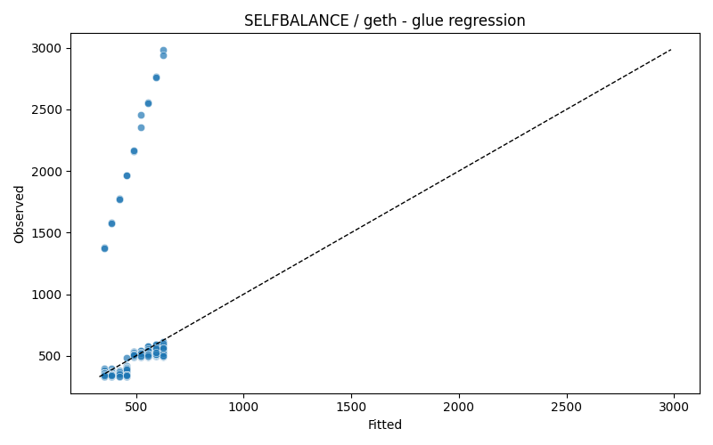

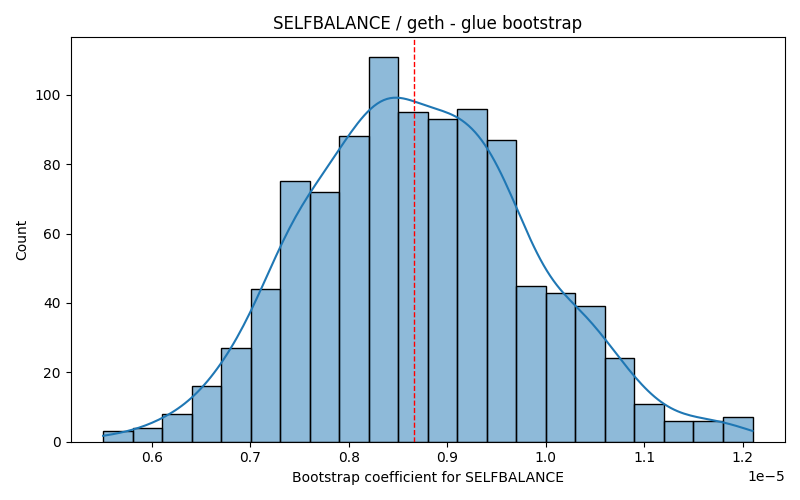

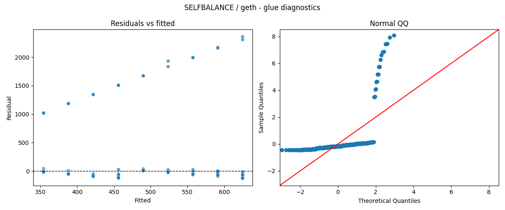

</details>

<details><summary><code>SUB</code> · nobs=814 · runtime_ms=4.575e-06 · p=1.00e-03 · R²=0.1571</summary>

```
==============================================================================
                           NNLS Regression Results                            
==============================================================================
Dep. Variable:          test_runtime_ms              R-squared:          0.157
Model:                  NNLS                    Adj. R-squared:          0.156
No. Observations:       814                               RMSE:         111.55
Df Residuals:           812                                MAE:          43.43
Df Model:               1      
==============================================================================
                      coef     std err     P-value      [0.025      0.975]
------------------------------------------------------------------------------
         const     44.7800     11.7390       0.001     21.7592     67.4713
           SUB      0.0000      0.0000       0.001      0.0000      0.0000
==============================================================================
Notes: Non-negative least squares with bootstrap inference (1000 iterations)
==============================================================================
```


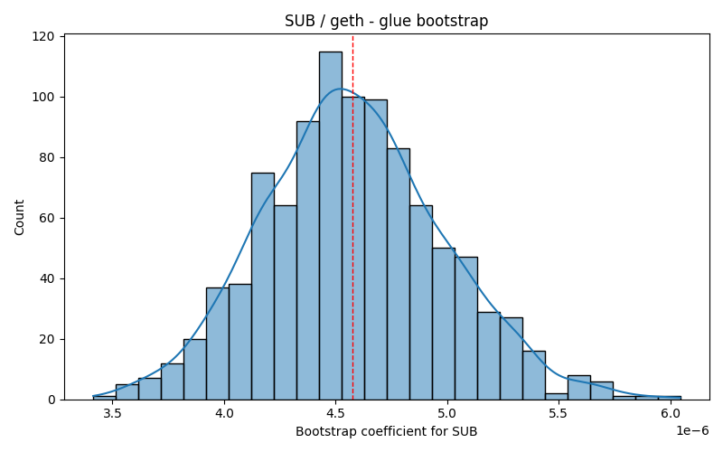

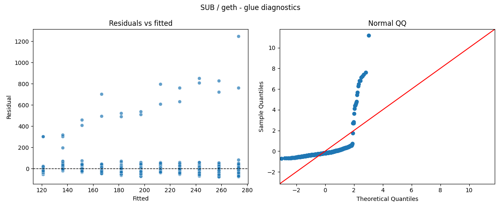

</details>

### Mixed glue (tier B) · geth

<details><summary><code>JUMP</code> · nobs=814 · runtime_ms=1.032e-05 · p=1.00e-03 · R²=0.1453</summary>

```
==============================================================================
                           NNLS Regression Results                            
==============================================================================
Dep. Variable:          test_runtime_ms              R-squared:          0.145
Model:                  NNLS                    Adj. R-squared:          0.144
No. Observations:       814                               RMSE:          93.04
Df Residuals:           812                                MAE:          32.99
Df Model:               1      
==============================================================================
                      coef     std err     P-value      [0.025      0.975]
------------------------------------------------------------------------------
         const     36.1761      9.5510       0.001     15.4089     53.4007
          JUMP      0.0000      0.0000       0.001      0.0000      0.0000
==============================================================================
Notes: Non-negative least squares with bootstrap inference (1000 iterations)
==============================================================================
```

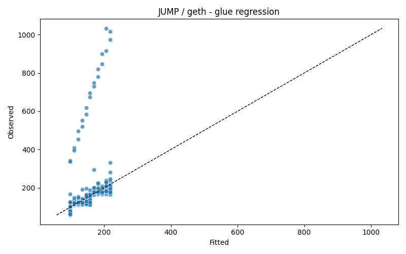

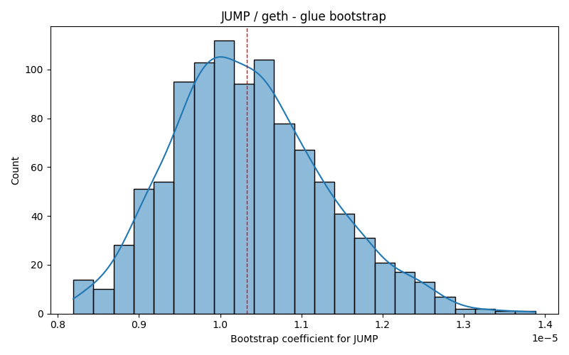

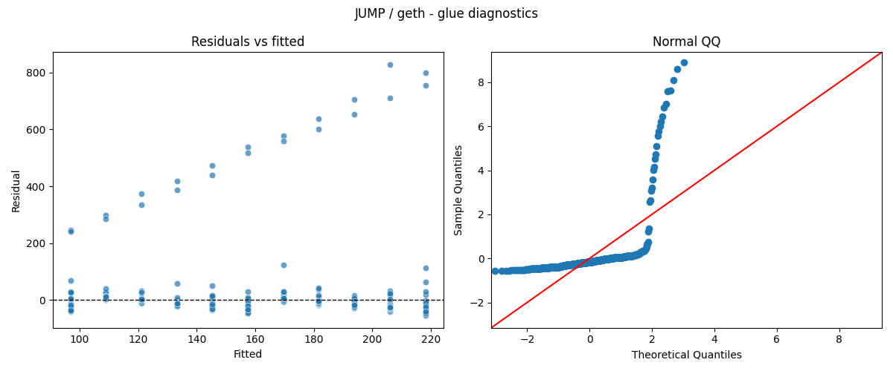

</details>

<details><summary><code>KECCAK256</code> · nobs=13024 · runtime_ms=4.336e-05 · p=1.00e-03 · R²=0.06575</summary>

```
==============================================================================
                           NNLS Regression Results                            
==============================================================================
Dep. Variable:          test_runtime_ms              R-squared:          0.066
Model:                  NNLS                    Adj. R-squared:          0.066
No. Observations:       13024                             RMSE:         324.79
Df Residuals:           13022                              MAE:         140.60
Df Model:               1      
==============================================================================
                      coef     std err     P-value      [0.025      0.975]
------------------------------------------------------------------------------
         const    392.6178      5.1520       0.001    382.5018    402.0916
     KECCAK256      0.0000      0.0000       0.001      0.0000      0.0000
==============================================================================
Notes: Non-negative least squares with bootstrap inference (1000 iterations)
==============================================================================
```

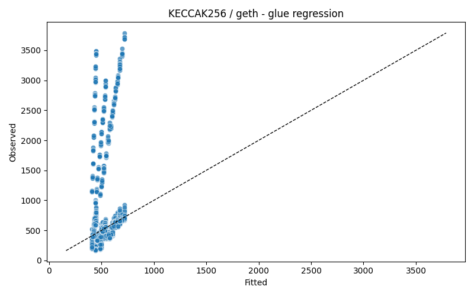

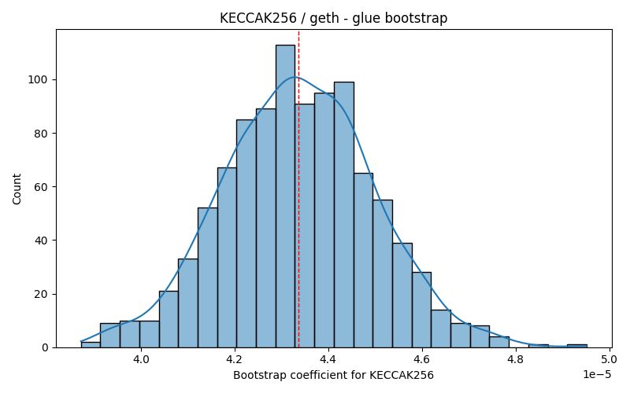

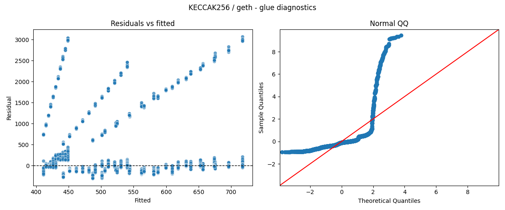

</details>

## nethermind

| glue_opcode | nobs | glue_runtime_ms | p_value | rsquared |
| --- | --- | --- | --- | --- |
| `ISZERO` | 231 | 8.703e-07 | 1.00e-03 | 0.3816 |
| `JUMPDEST` | 231 | 4.07e-07 | 1.00e-03 | 0.7954 |
| `SWAP` | 3696 | 5.461e-07 | 1.00e-03 | 0.3849 |
| `CALLDATASIZE` | 13750 | 1.097e-07 | 1.00e-03 | 0.9068 |
| `DUP` | 13750 | 7.565e-08 | 1.00e-03 | 0.9068 |
| `GAS` | 13750 | 9.593e-08 | 1.00e-03 | 0.9068 |
| `MLOAD` | 13750 | 1.485e-06 | 1.00e-03 | 0.9068 |
| `PUSH` | 13750 | 1.45e-07 | 1.00e-03 | 0.9068 |
| `PUSH0` | 13750 | 3.794e-08 | 3.30e-02 | 0.9068 |
| `STATICCALL` | 13750 | 0.0006924 | 1.00e-03 | 0.9068 |
| `ADD` | 231 | 2.313e-06 | 1.00e-03 | 0.4738 |
| `AND` | 231 | 1.29e-06 | 1.00e-03 | 0.6841 |
| `CALLDATACOPY` | 5544 | 3.937e-06 | 1.00e-03 | 0.7254 |
| `CALLDATALOAD` | 924 | 2.205e-05 | 1.00e-03 | 0.04432 |
| `DIV` | 231 | 7.313e-06 | 1.00e-03 | 0.5812 |
| `EXP` | 231 | 0 | 1.00e+00 | 2.22e-16 |
| `GT` | 231 | 1.451e-06 | 1.00e-03 | 0.6191 |
| `JUMPI` | 231 | 1.8e-06 | 1.00e-03 | 0.8521 |
| `LT` | 231 | 1.393e-06 | 1.00e-03 | 0.6317 |
| `MSTORE` | 1155 | 2.116e-06 | 1.00e-03 | 0.6573 |
| `MSTORE8` | 1155 | 1.975e-06 | 1.00e-03 | 0.7619 |
| `MUL` | 231 | 5.517e-06 | 1.00e-03 | 0.7752 |
| `PC` | 231 | 8.014e-07 | 1.00e-03 | 0.9123 |
| `RETURNDATASIZE` | 924 | 7.59e-07 | 1.00e-03 | 0.8545 |
| `SELFBALANCE` | 189 | 1.031e-05 | 1.00e-03 | 0.8314 |
| `SUB` | 231 | 2.389e-06 | 1.00e-03 | 0.8975 |
| `JUMP` | 231 | 5.179e-06 | 1.00e-03 | 0.8117 |
| `KECCAK256` | 3696 | 0 | 1.00e+00 | -2.22e-16 |

### Cycle glue — joint fit · nethermind

<details><summary>Joint NNLS regression summary</summary>

```
==============================================================================
                           NNLS Regression Results                            
==============================================================================
Dep. Variable:          test_runtime_ms              R-squared:          0.907
Model:                  NNLS                    Adj. R-squared:          0.907
No. Observations:       13750                             RMSE:          34.75
Df Residuals:           13742                              MAE:           7.94
Df Model:               7      
==============================================================================
                      coef     std err     P-value      [0.025      0.975]
------------------------------------------------------------------------------
         const     18.7058      0.8816       0.001     17.0935     20.5893
  CALLDATASIZE      0.0000      0.0000       0.001      0.0000      0.0000
           DUP      0.0000      0.0000       0.001      0.0000      0.0000
           GAS      0.0000      0.0000       0.001      0.0000      0.0000
         MLOAD      0.0000      0.0000       0.001      0.0000      0.0000
          PUSH      0.0000      0.0000       0.001      0.0000      0.0000
         PUSH0      0.0000      0.0000       0.033      0.0000      0.0000
    STATICCALL      0.0007      0.0000       0.001      0.0007      0.0007
==============================================================================
Notes: Non-negative least squares with bootstrap inference (1000 iterations)
==============================================================================
```

</details>

<details><summary><code>CALLDATASIZE</code> · nobs=13750 · runtime_ms=1.097e-07 · p=1.00e-03 · R²=0.9068</summary>

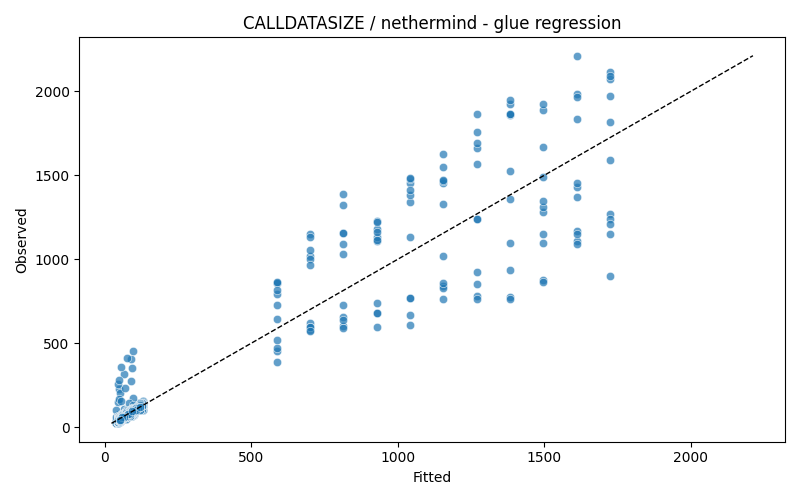

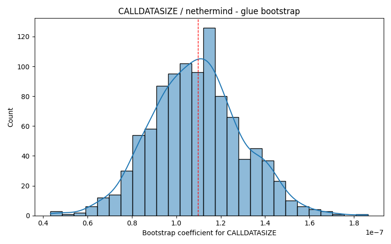

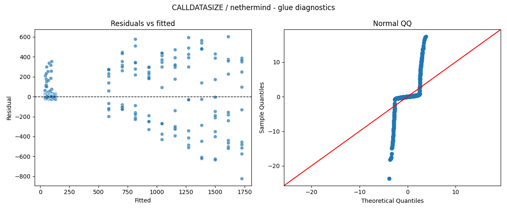

</details>

<details><summary><code>DUP</code> · nobs=13750 · runtime_ms=7.565e-08 · p=1.00e-03 · R²=0.9068</summary>


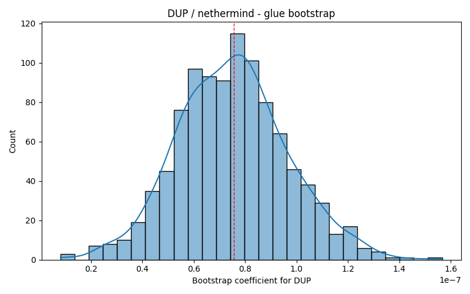


</details>

<details><summary><code>GAS</code> · nobs=13750 · runtime_ms=9.593e-08 · p=1.00e-03 · R²=0.9068</summary>

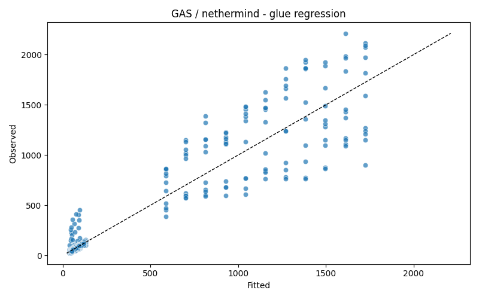

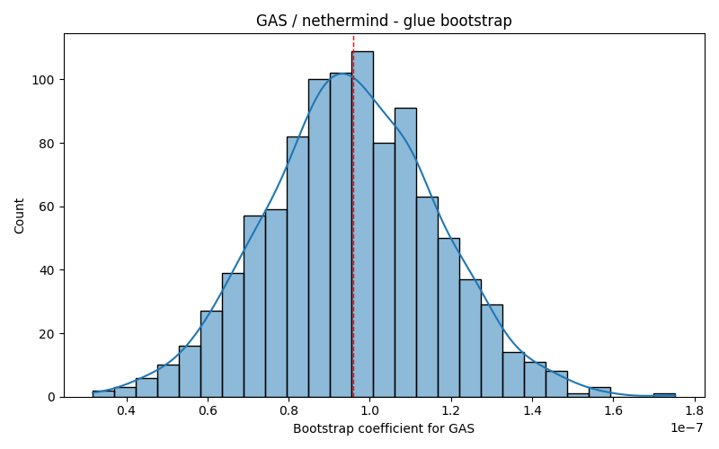


</details>

<details><summary><code>MLOAD</code> · nobs=13750 · runtime_ms=1.485e-06 · p=1.00e-03 · R²=0.9068</summary>

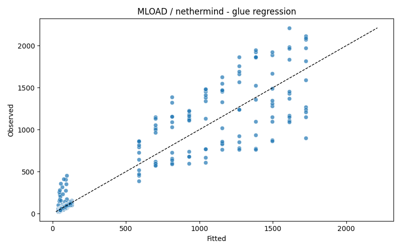

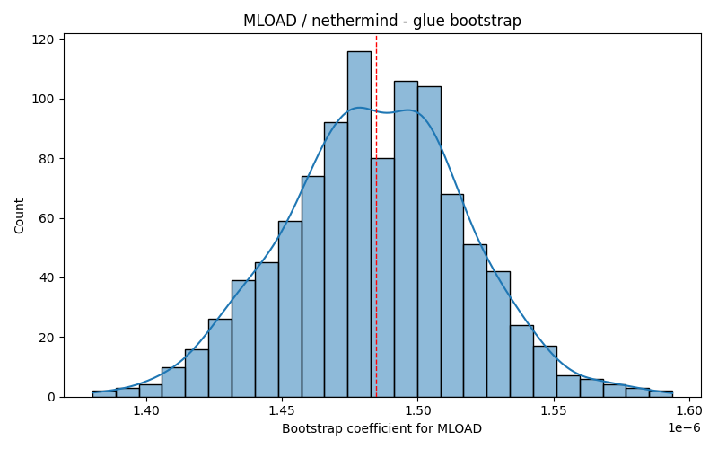


</details>

<details><summary><code>PUSH</code> · nobs=13750 · runtime_ms=1.45e-07 · p=1.00e-03 · R²=0.9068</summary>


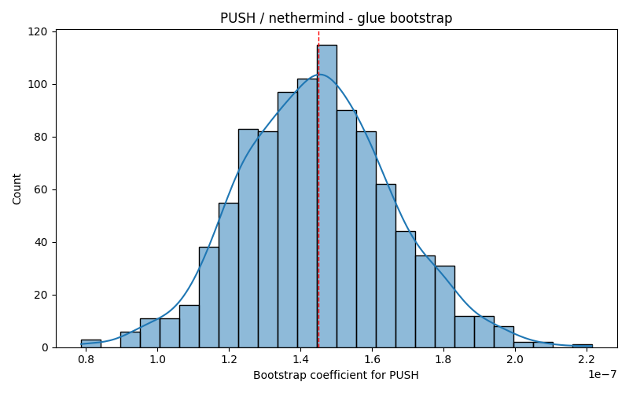

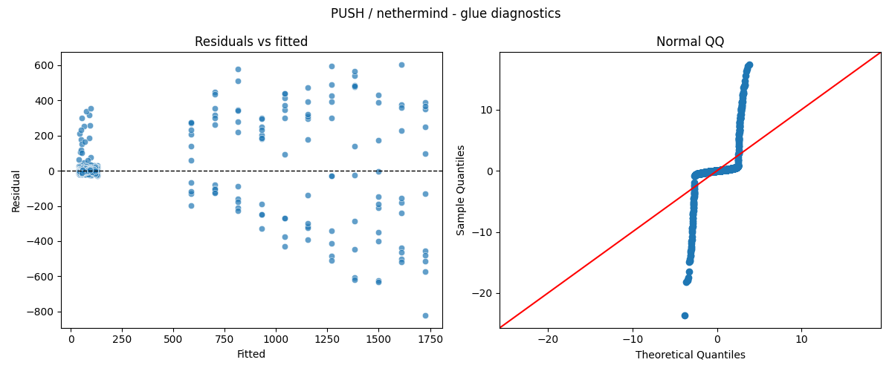

</details>

<details><summary><code>PUSH0</code> · nobs=13750 · runtime_ms=3.794e-08 · p=3.30e-02 · R²=0.9068</summary>


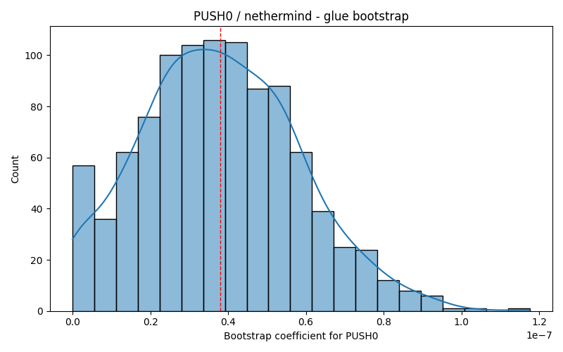


</details>

<details><summary><code>STATICCALL</code> · nobs=13750 · runtime_ms=0.0006924 · p=1.00e-03 · R²=0.9068</summary>


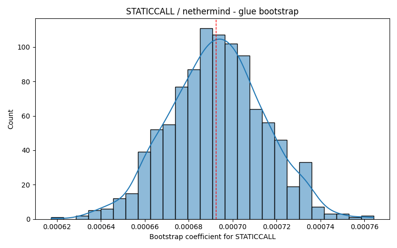


</details>

### Pure glue · nethermind

<details><summary><code>ISZERO</code> · nobs=231 · runtime_ms=8.703e-07 · p=1.00e-03 · R²=0.3816</summary>

```
==============================================================================
                           NNLS Regression Results                            
==============================================================================
Dep. Variable:          test_runtime_ms              R-squared:          0.382
Model:                  NNLS                    Adj. R-squared:          0.379
No. Observations:       231                               RMSE:          23.33
Df Residuals:           229                                MAE:          10.83
Df Model:               1      
==============================================================================
                      coef     std err     P-value      [0.025      0.975]
------------------------------------------------------------------------------
         const     17.8551      5.3513       0.001      6.8065     28.3618
        ISZERO      0.0000      0.0000       0.001      0.0000      0.0000
==============================================================================
Notes: Non-negative least squares with bootstrap inference (1000 iterations)
==============================================================================
```

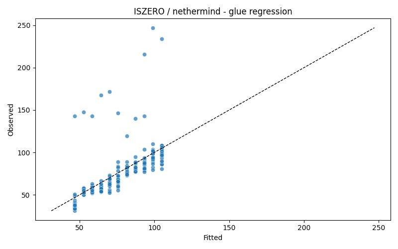

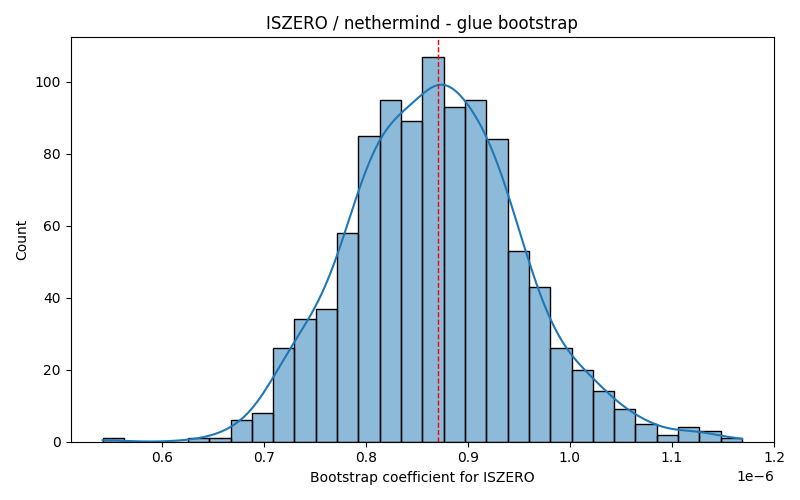

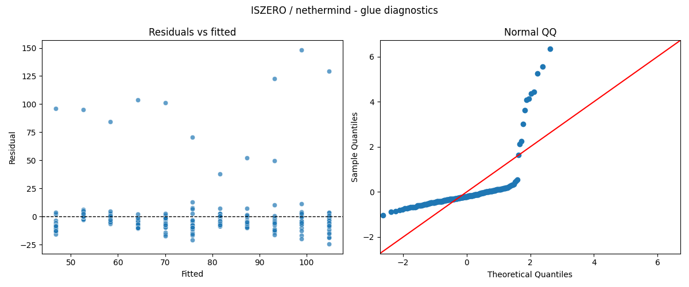

</details>

<details><summary><code>JUMPDEST</code> · nobs=231 · runtime_ms=4.07e-07 · p=1.00e-03 · R²=0.7954</summary>

```
==============================================================================
                           NNLS Regression Results                            
==============================================================================
Dep. Variable:          test_runtime_ms              R-squared:          0.795
Model:                  NNLS                    Adj. R-squared:          0.794
No. Observations:       231                               RMSE:          13.04
Df Residuals:           229                                MAE:           9.57
Df Model:               1      
==============================================================================
                      coef     std err     P-value      [0.025      0.975]
------------------------------------------------------------------------------
         const     19.0730      2.6775       0.001     13.7406     24.3362
      JUMPDEST      0.0000      0.0000       0.001      0.0000      0.0000
==============================================================================
Notes: Non-negative least squares with bootstrap inference (1000 iterations)
==============================================================================
```

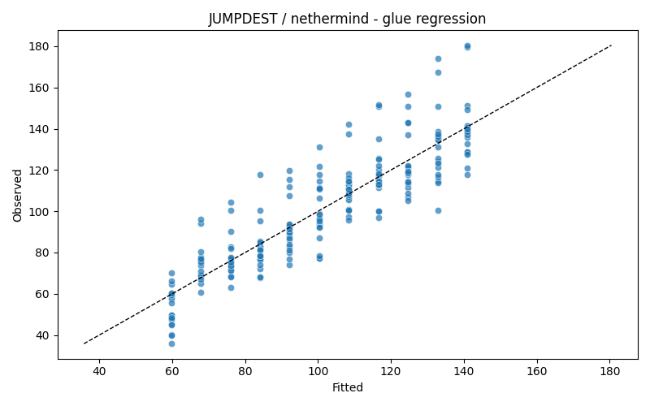

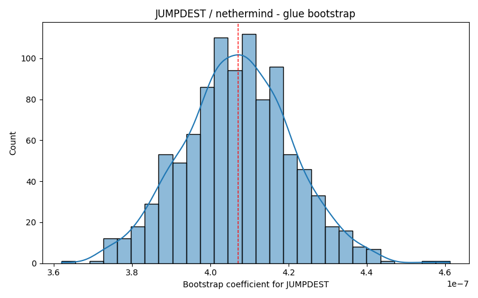

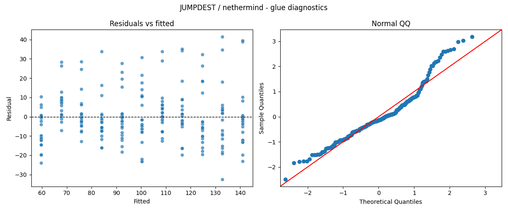

</details>

<details><summary><code>SWAP</code> · nobs=3696 · runtime_ms=5.461e-07 · p=1.00e-03 · R²=0.3849</summary>

```
==============================================================================
                           NNLS Regression Results                            
==============================================================================
Dep. Variable:          test_runtime_ms              R-squared:          0.385
Model:                  NNLS                    Adj. R-squared:          0.385
No. Observations:       3696                              RMSE:          14.54
Df Residuals:           3694                               MAE:           5.29
Df Model:               1      
==============================================================================
                      coef     std err     P-value      [0.025      0.975]
------------------------------------------------------------------------------
         const     15.3657      0.7288       0.001     14.0095     16.7915
          SWAP      0.0000      0.0000       0.001      0.0000      0.0000
==============================================================================
Notes: Non-negative least squares with bootstrap inference (1000 iterations)
==============================================================================
```

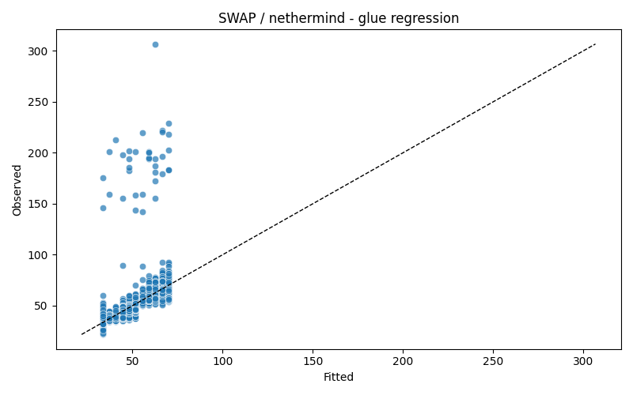

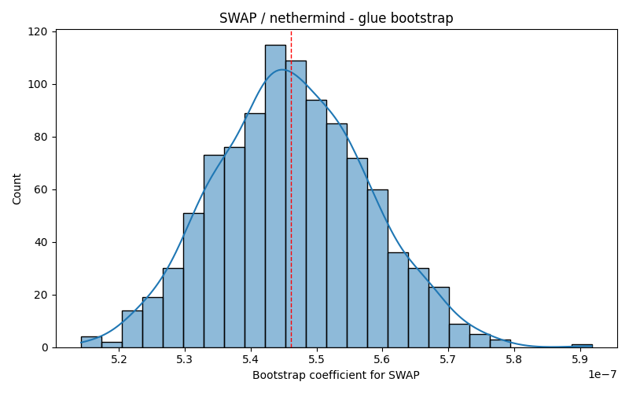

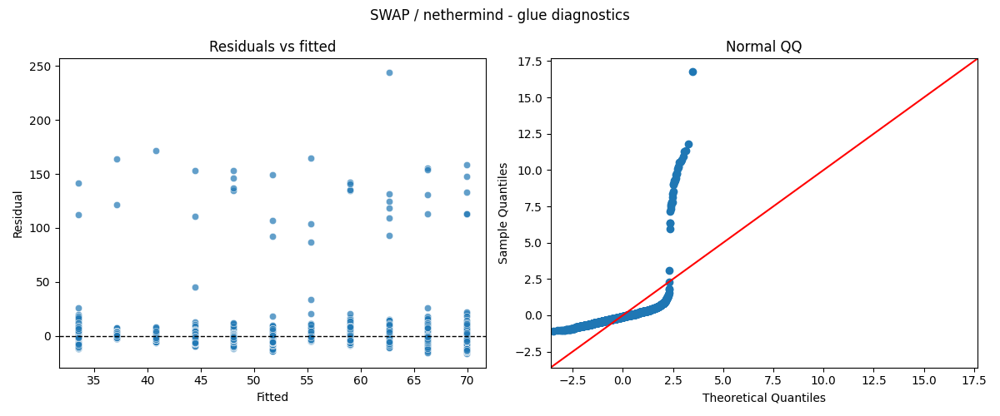

</details>

### Mixed glue (tier A) · nethermind

<details><summary><code>ADD</code> · nobs=231 · runtime_ms=2.313e-06 · p=1.00e-03 · R²=0.4738</summary>

```
==============================================================================
                           NNLS Regression Results                            
==============================================================================
Dep. Variable:          test_runtime_ms              R-squared:          0.474
Model:                  NNLS                    Adj. R-squared:          0.471
No. Observations:       231                               RMSE:          25.65
Df Residuals:           229                                MAE:          11.63
Df Model:               1      
==============================================================================
                      coef     std err     P-value      [0.025      0.975]
------------------------------------------------------------------------------
         const     23.5518      6.7248       0.001     12.0813     37.9284
           ADD      0.0000      0.0000       0.001      0.0000      0.0000
==============================================================================
Notes: Non-negative least squares with bootstrap inference (1000 iterations)
==============================================================================
```

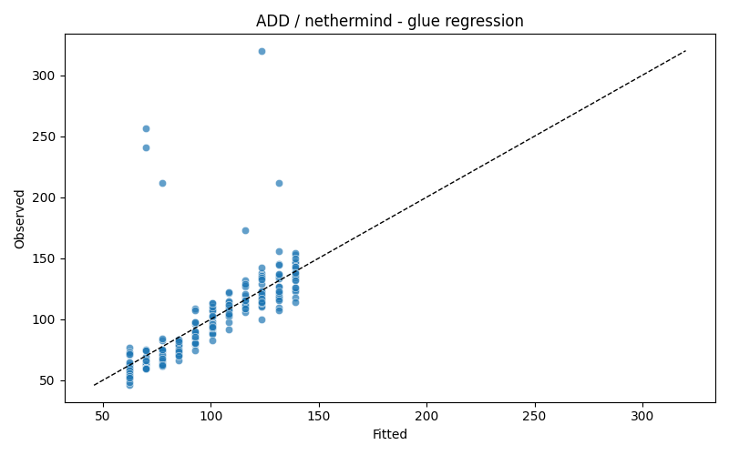

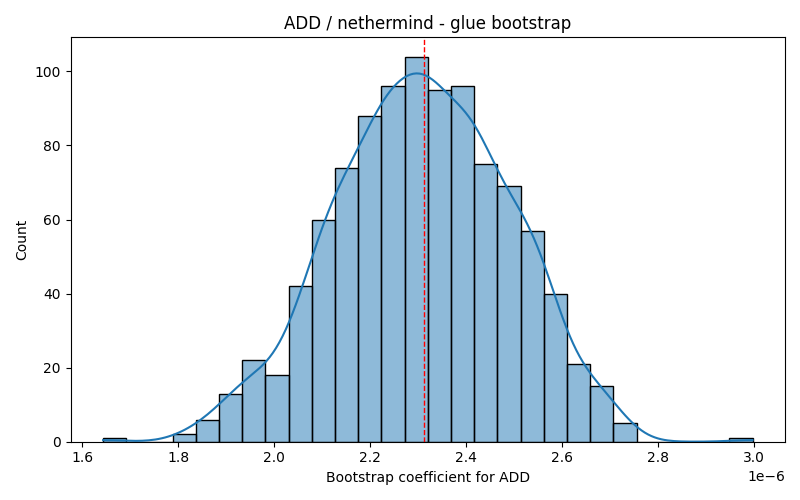

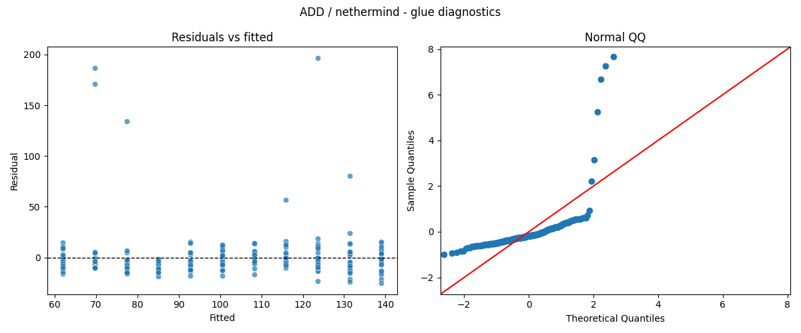

</details>

<details><summary><code>AND</code> · nobs=231 · runtime_ms=1.29e-06 · p=1.00e-03 · R²=0.6841</summary>

```
==============================================================================
                           NNLS Regression Results                            
==============================================================================
Dep. Variable:          test_runtime_ms              R-squared:          0.684
Model:                  NNLS                    Adj. R-squared:          0.683
No. Observations:       231                               RMSE:           9.23
Df Residuals:           229                                MAE:           5.06
Df Model:               1      
==============================================================================
                      coef     std err     P-value      [0.025      0.975]
------------------------------------------------------------------------------
         const     13.0181      1.3289       0.001     10.4182     15.8019
           AND      0.0000      0.0000       0.001      0.0000      0.0000
==============================================================================
Notes: Non-negative least squares with bootstrap inference (1000 iterations)
==============================================================================
```

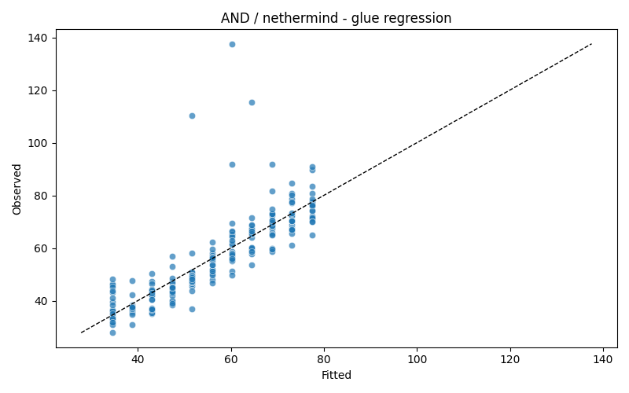

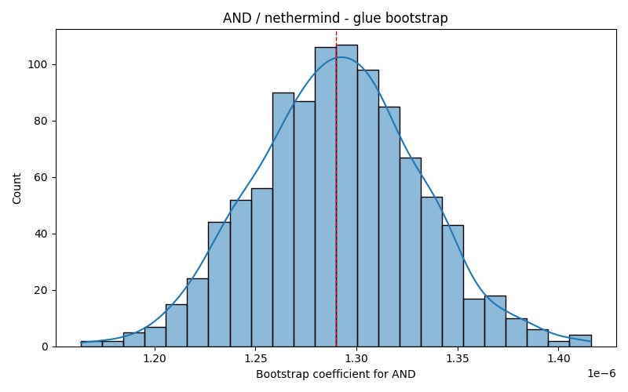

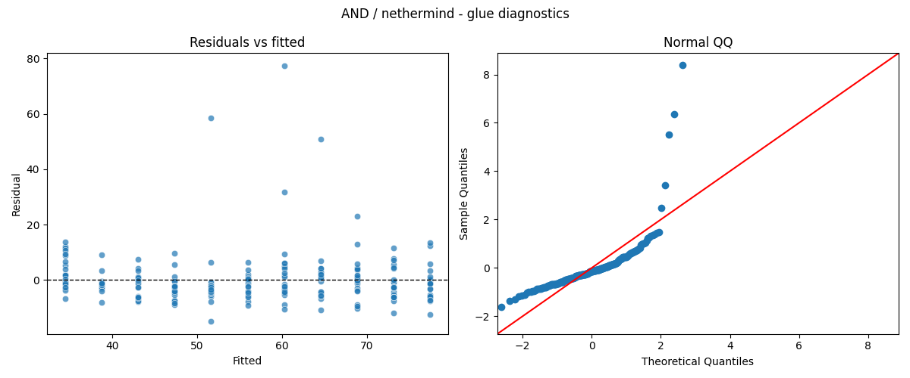

</details>

<details><summary><code>CALLDATACOPY</code> · nobs=5544 · runtime_ms=3.937e-06 · p=1.00e-03 · R²=0.7254</summary>

```
==============================================================================
                           NNLS Regression Results                            
==============================================================================
Dep. Variable:          test_runtime_ms              R-squared:          0.725
Model:                  NNLS                    Adj. R-squared:          0.725
No. Observations:       5544                              RMSE:          18.21
Df Residuals:           5542                               MAE:          14.80
Df Model:               1      
==============================================================================
                      coef     std err     P-value      [0.025      0.975]
------------------------------------------------------------------------------
         const     23.6125      0.3020       0.001     22.9976     24.1882
  CALLDATACOPY      0.0000      0.0000       0.001      0.0000      0.0000
==============================================================================
Notes: Non-negative least squares with bootstrap inference (1000 iterations)
==============================================================================
```


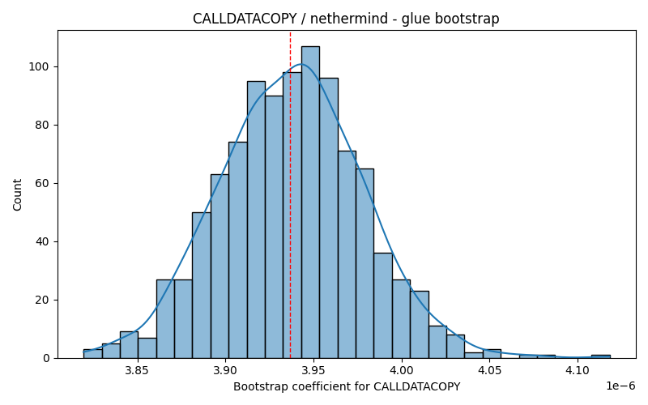

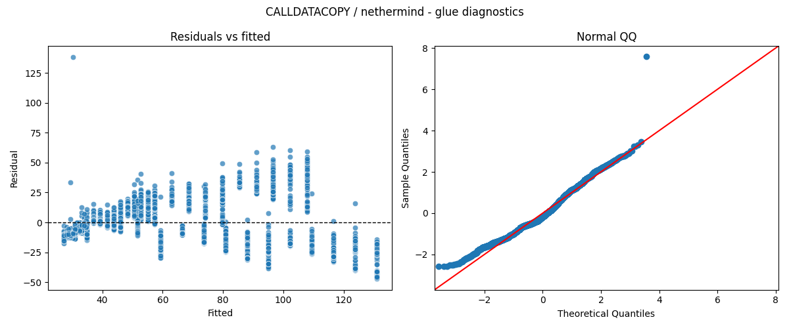

</details>

<details><summary><code>CALLDATALOAD</code> · nobs=924 · runtime_ms=2.205e-05 · p=1.00e-03 · R²=0.04432</summary>

```
==============================================================================
                           NNLS Regression Results                            
==============================================================================
Dep. Variable:          test_runtime_ms              R-squared:          0.044
Model:                  NNLS                    Adj. R-squared:          0.043
No. Observations:       924                               RMSE:           0.39
Df Residuals:           922                                MAE:           0.16
Df Model:               1      
==============================================================================
                      coef     std err     P-value      [0.025      0.975]
------------------------------------------------------------------------------
         const      2.1413      0.0314       0.001      2.0899      2.2110
  CALLDATALOAD      0.0000      0.0000       0.001      0.0000      0.0000
==============================================================================
Notes: Non-negative least squares with bootstrap inference (1000 iterations)
==============================================================================
```

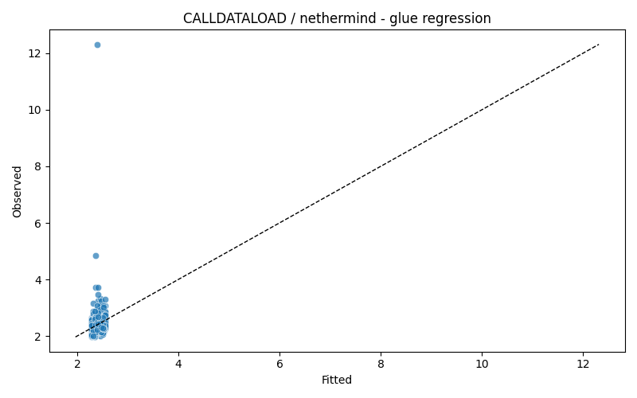

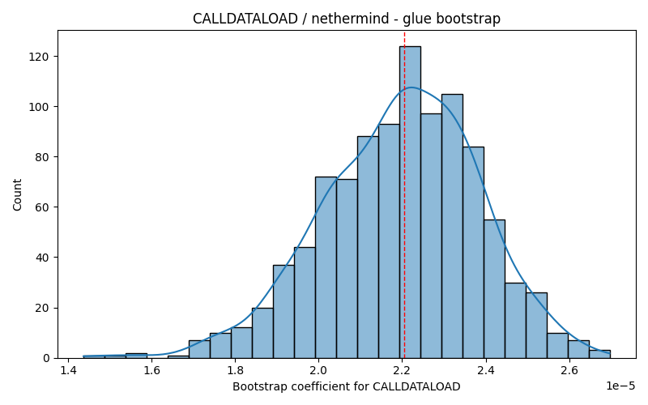

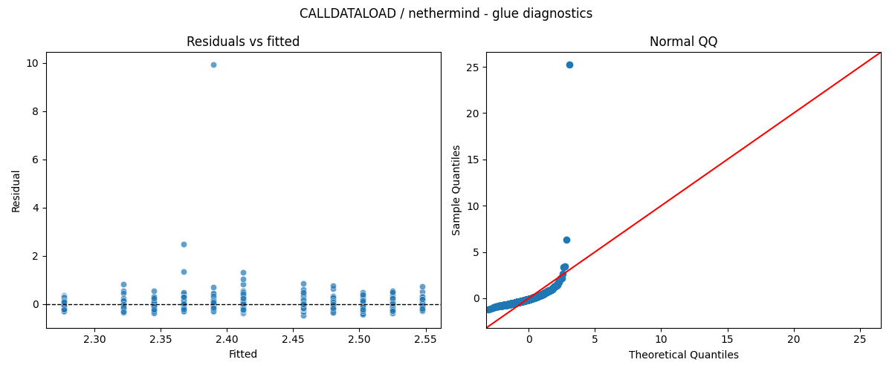

</details>

<details><summary><code>DIV</code> · nobs=231 · runtime_ms=7.313e-06 · p=1.00e-03 · R²=0.5812</summary>

```
==============================================================================
                           NNLS Regression Results                            
==============================================================================
Dep. Variable:          test_runtime_ms              R-squared:          0.581
Model:                  NNLS                    Adj. R-squared:          0.579
No. Observations:       231                               RMSE:          49.01
Df Residuals:           229                                MAE:          37.73
Df Model:               1      
==============================================================================
                      coef     std err     P-value      [0.025      0.975]
------------------------------------------------------------------------------
         const    132.6593     14.3342       0.001    104.3457    160.4254
           DIV      0.0000      0.0000       0.001      0.0000      0.0000
==============================================================================
Notes: Non-negative least squares with bootstrap inference (1000 iterations)
==============================================================================
```

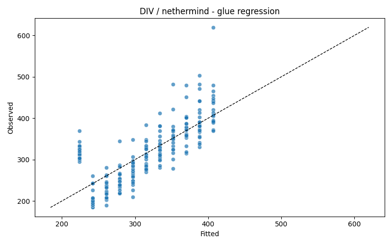


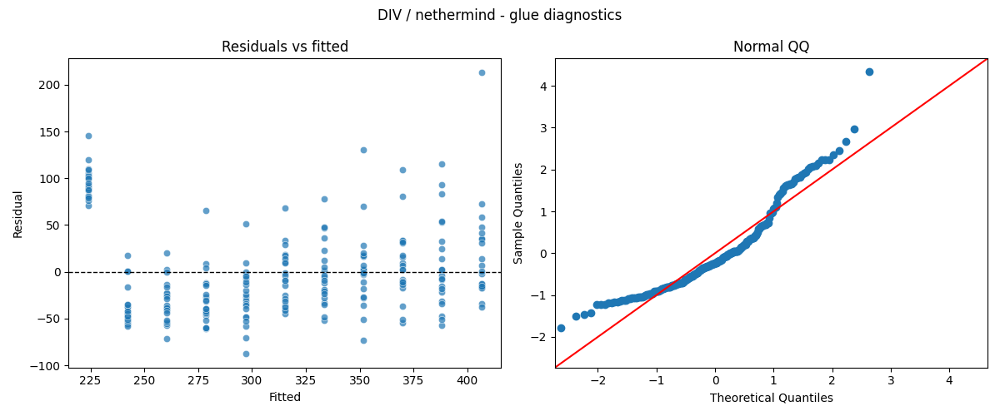

</details>

<details><summary><code>EXP</code> · nobs=231 · runtime_ms=0 · p=1.00e+00 · R²=2.22e-16</summary>

```
==============================================================================
                           NNLS Regression Results                            
==============================================================================
Dep. Variable:          test_runtime_ms              R-squared:          0.000
Model:                  NNLS                    Adj. R-squared:         -0.004
No. Observations:       231                               RMSE:          47.54
Df Residuals:           229                                MAE:          32.27
Df Model:               1      
==============================================================================
                      coef     std err     P-value      [0.025      0.975]
------------------------------------------------------------------------------
         const    107.1136      7.8732       0.001     81.9650    113.5883
           EXP      0.0000      0.0000       1.000      0.0000      0.0002
==============================================================================
Notes: Non-negative least squares with bootstrap inference (1000 iterations)
==============================================================================
```

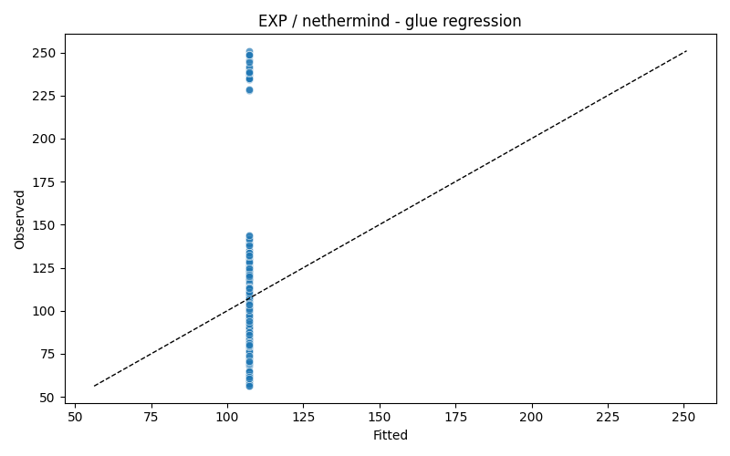

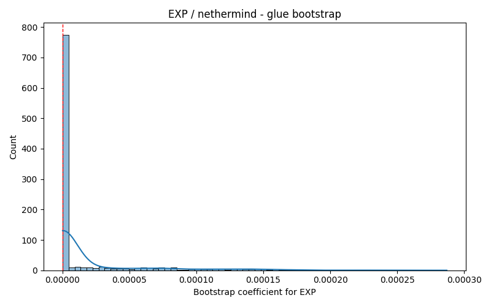

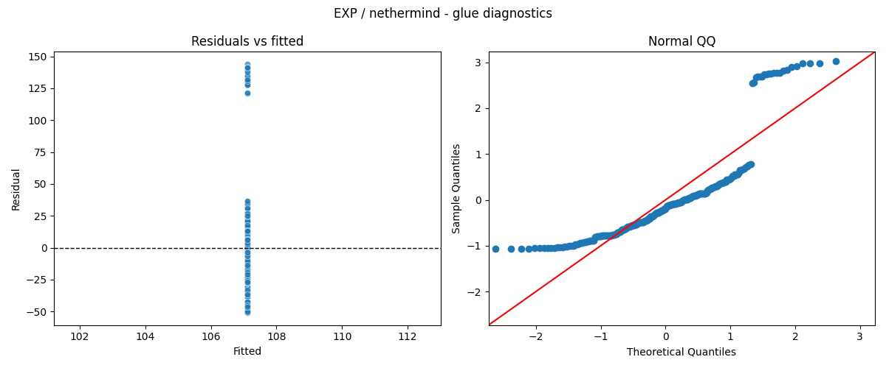

</details>

<details><summary><code>GT</code> · nobs=231 · runtime_ms=1.451e-06 · p=1.00e-03 · R²=0.6191</summary>

```
==============================================================================
                           NNLS Regression Results                            
==============================================================================
Dep. Variable:          test_runtime_ms              R-squared:          0.619
Model:                  NNLS                    Adj. R-squared:          0.617
No. Observations:       231                               RMSE:          11.98
Df Residuals:           229                                MAE:           6.48
Df Model:               1      
==============================================================================
                      coef     std err     P-value      [0.025      0.975]
------------------------------------------------------------------------------
         const     15.4726      2.7869       0.001     10.5925     21.1957
            GT      0.0000      0.0000       0.001      0.0000      0.0000
==============================================================================
Notes: Non-negative least squares with bootstrap inference (1000 iterations)
==============================================================================
```

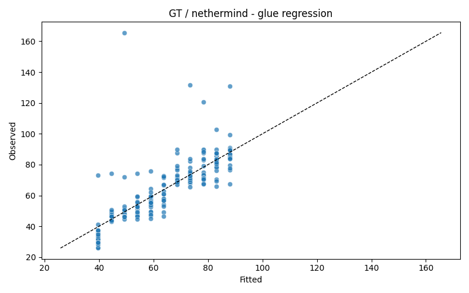

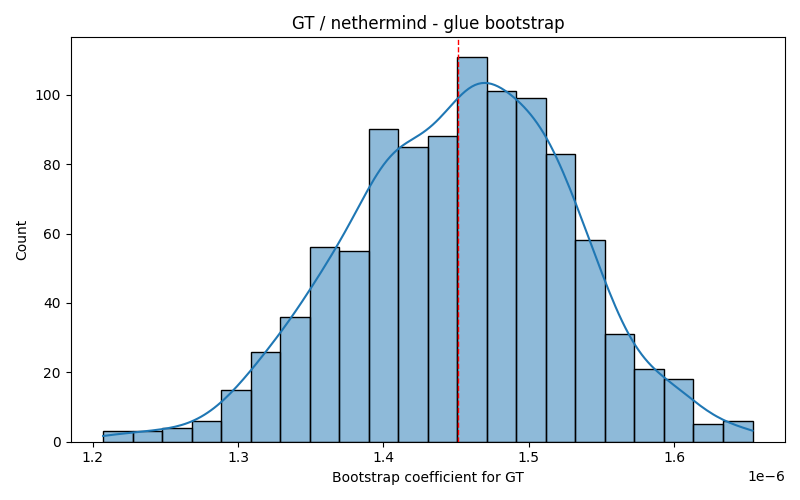

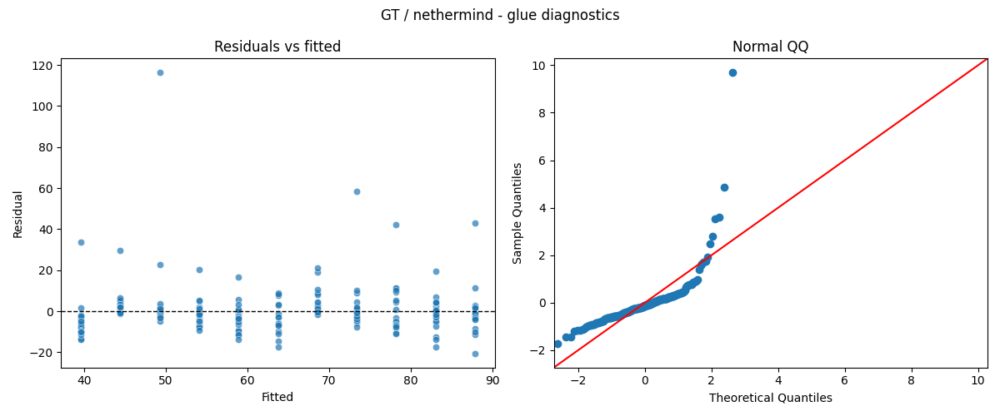

</details>

<details><summary><code>JUMPI</code> · nobs=231 · runtime_ms=1.8e-06 · p=1.00e-03 · R²=0.8521</summary>

```
==============================================================================
                           NNLS Regression Results                            
==============================================================================
Dep. Variable:          test_runtime_ms              R-squared:          0.852
Model:                  NNLS                    Adj. R-squared:          0.851
No. Observations:       231                               RMSE:           3.38
Df Residuals:           229                                MAE:           2.56
Df Model:               1      
==============================================================================
                      coef     std err     P-value      [0.025      0.975]
------------------------------------------------------------------------------
         const      8.5688      0.7177       0.001      7.1436     10.0174
         JUMPI      0.0000      0.0000       0.001      0.0000      0.0000
==============================================================================
Notes: Non-negative least squares with bootstrap inference (1000 iterations)
==============================================================================
```

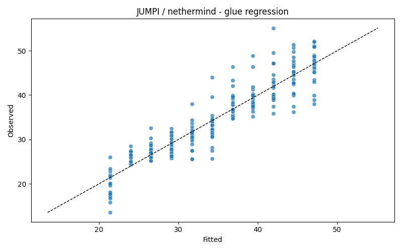

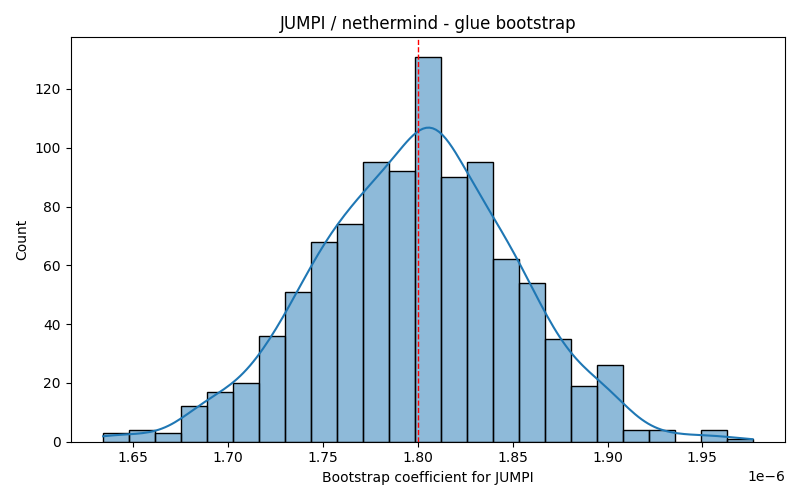

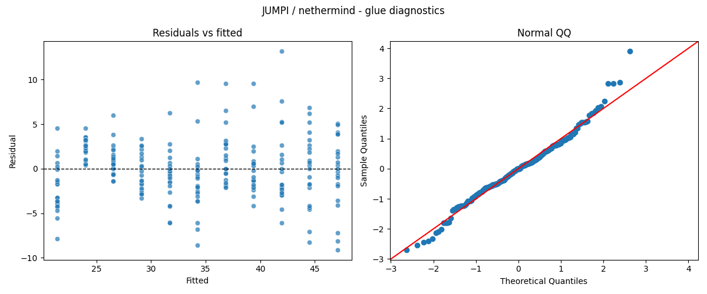

</details>

<details><summary><code>LT</code> · nobs=231 · runtime_ms=1.393e-06 · p=1.00e-03 · R²=0.6317</summary>

```
==============================================================================
                           NNLS Regression Results                            
==============================================================================
Dep. Variable:          test_runtime_ms              R-squared:          0.632
Model:                  NNLS                    Adj. R-squared:          0.630
No. Observations:       231                               RMSE:          11.19
Df Residuals:           229                                MAE:           6.19
Df Model:               1      
==============================================================================
                      coef     std err     P-value      [0.025      0.975]
------------------------------------------------------------------------------
         const     18.3344      2.1243       0.001     13.9588     22.3043
            LT      0.0000      0.0000       0.001      0.0000      0.0000
==============================================================================
Notes: Non-negative least squares with bootstrap inference (1000 iterations)
==============================================================================
```

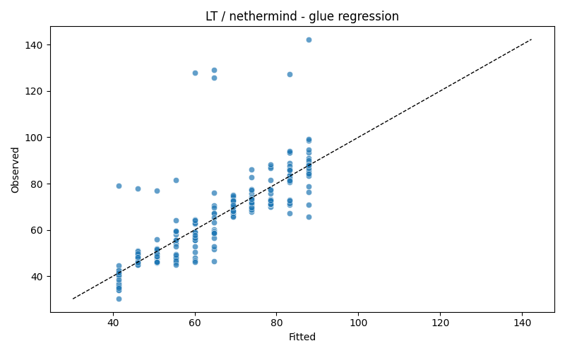

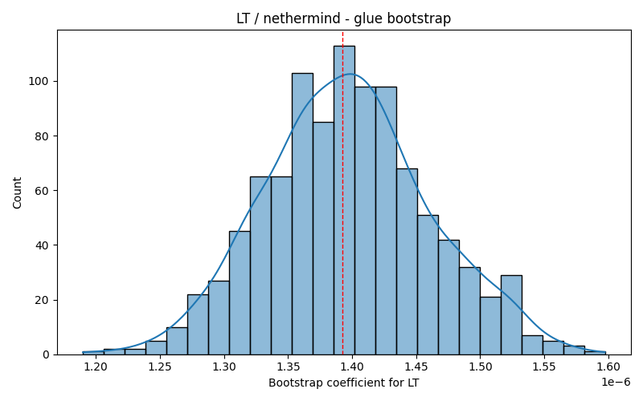

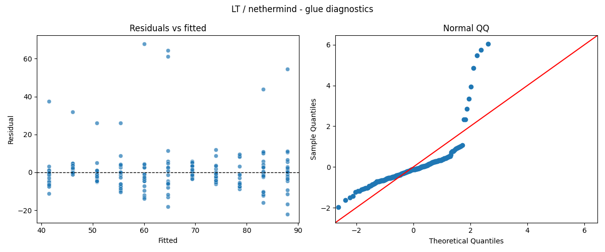

</details>

<details><summary><code>MSTORE</code> · nobs=1155 · runtime_ms=2.116e-06 · p=1.00e-03 · R²=0.6573</summary>

```
==============================================================================
                           NNLS Regression Results                            
==============================================================================
Dep. Variable:          test_runtime_ms              R-squared:          0.657
Model:                  NNLS                    Adj. R-squared:          0.657
No. Observations:       1155                              RMSE:          10.72
Df Residuals:           1153                               MAE:           5.21
Df Model:               1      
==============================================================================
                      coef     std err     P-value      [0.025      0.975]
------------------------------------------------------------------------------
         const     14.3434      1.1737       0.001     12.1677     16.9127
        MSTORE      0.0000      0.0000       0.001      0.0000      0.0000
==============================================================================
Notes: Non-negative least squares with bootstrap inference (1000 iterations)
==============================================================================
```

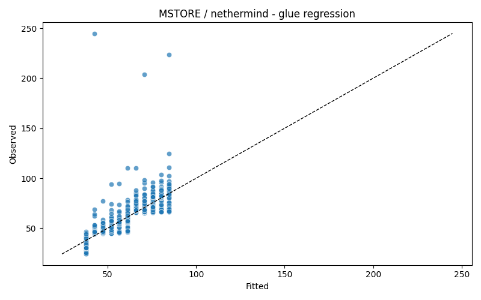

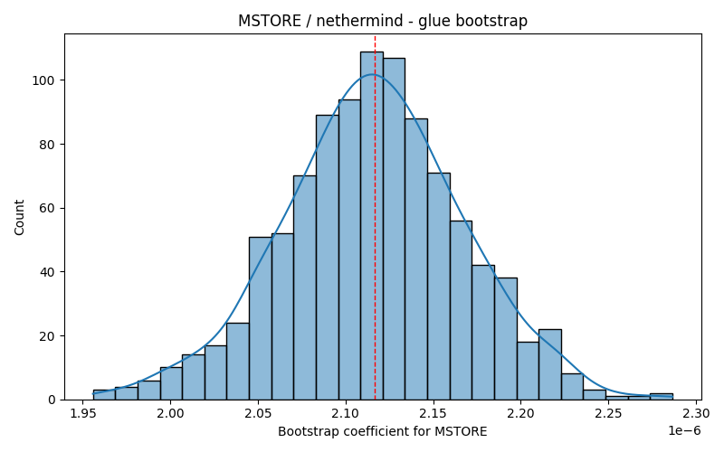

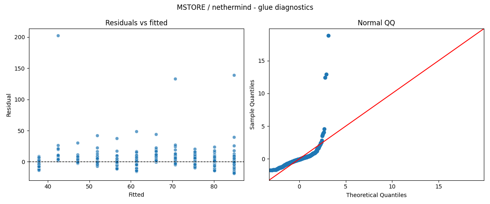

</details>

<details><summary><code>MSTORE8</code> · nobs=1155 · runtime_ms=1.975e-06 · p=1.00e-03 · R²=0.7619</summary>

```
==============================================================================
                           NNLS Regression Results                            
==============================================================================
Dep. Variable:          test_runtime_ms              R-squared:          0.762
Model:                  NNLS                    Adj. R-squared:          0.762
No. Observations:       1155                              RMSE:           7.75
Df Residuals:           1153                               MAE:           4.59
Df Model:               1      
==============================================================================
                      coef     std err     P-value      [0.025      0.975]
------------------------------------------------------------------------------
         const     14.7936      0.8355       0.001     13.2741     16.4643
       MSTORE8      0.0000      0.0000       0.001      0.0000      0.0000
==============================================================================
Notes: Non-negative least squares with bootstrap inference (1000 iterations)
==============================================================================
```

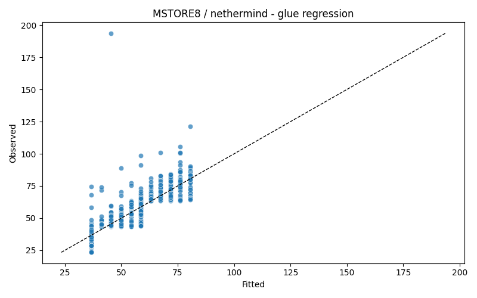


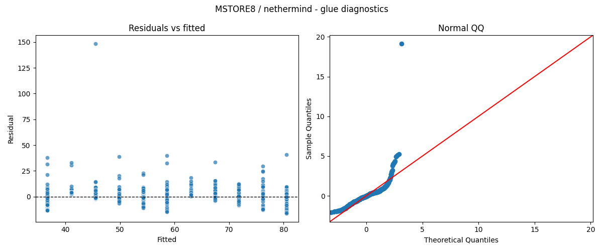

</details>

<details><summary><code>MUL</code> · nobs=231 · runtime_ms=5.517e-06 · p=1.00e-03 · R²=0.7752</summary>

```
==============================================================================
                           NNLS Regression Results                            
==============================================================================
Dep. Variable:          test_runtime_ms              R-squared:          0.775
Model:                  NNLS                    Adj. R-squared:          0.774
No. Observations:       231                               RMSE:          23.45
Df Residuals:           229                                MAE:          15.10
Df Model:               1      
==============================================================================
                      coef     std err     P-value      [0.025      0.975]
------------------------------------------------------------------------------
         const     27.8914      4.4025       0.001     18.9689     36.7008
           MUL      0.0000      0.0000       0.001      0.0000      0.0000
==============================================================================
Notes: Non-negative least squares with bootstrap inference (1000 iterations)
==============================================================================
```

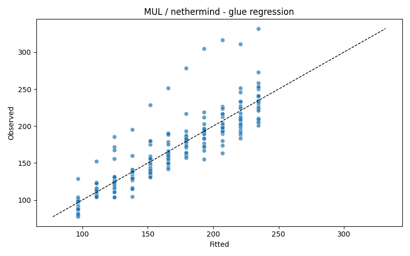

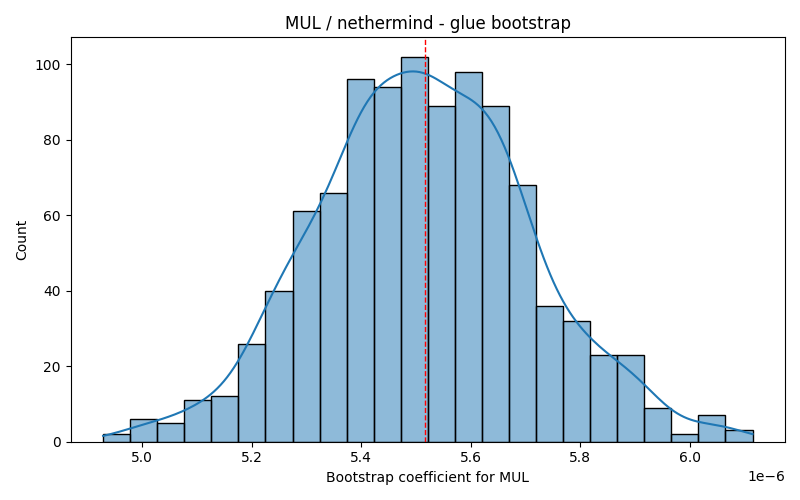

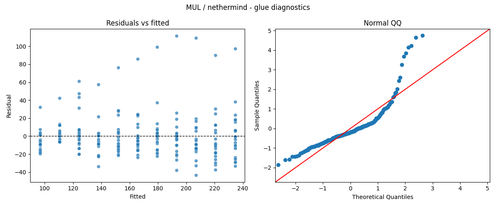

</details>

<details><summary><code>PC</code> · nobs=231 · runtime_ms=8.014e-07 · p=1.00e-03 · R²=0.9123</summary>

```
==============================================================================
                           NNLS Regression Results                            
==============================================================================
Dep. Variable:          test_runtime_ms              R-squared:          0.912
Model:                  NNLS                    Adj. R-squared:          0.912
No. Observations:       231                               RMSE:           7.43
Df Residuals:           229                                MAE:           5.77
Df Model:               1      
==============================================================================
                      coef     std err     P-value      [0.025      0.975]
------------------------------------------------------------------------------
         const     16.5396      1.8713       0.001     13.0618     20.2903
            PC      0.0000      0.0000       0.001      0.0000      0.0000
==============================================================================
Notes: Non-negative least squares with bootstrap inference (1000 iterations)
==============================================================================
```

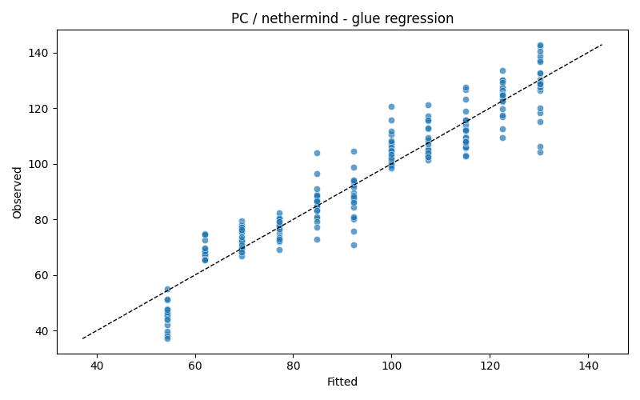

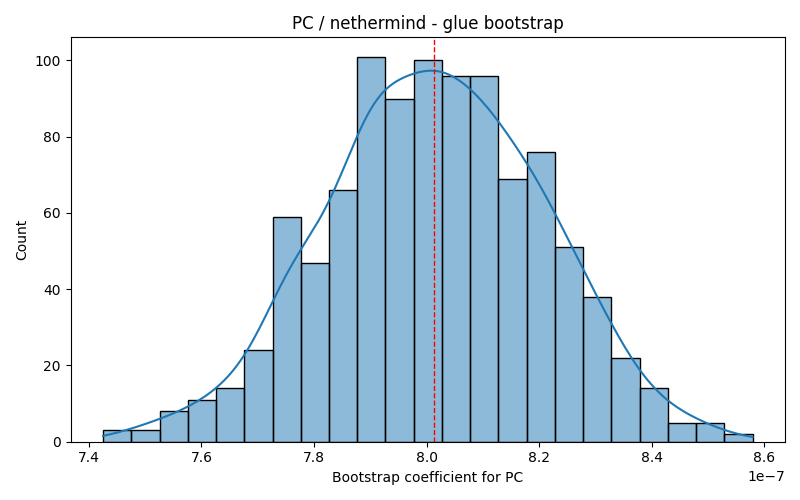

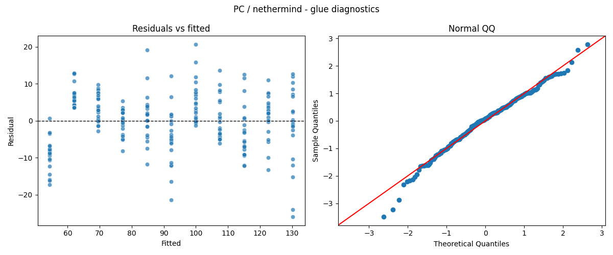

</details>

<details><summary><code>RETURNDATASIZE</code> · nobs=924 · runtime_ms=7.59e-07 · p=1.00e-03 · R²=0.8545</summary>

```
==============================================================================
                           NNLS Regression Results                            
==============================================================================
Dep. Variable:          test_runtime_ms              R-squared:          0.855
Model:                  NNLS                    Adj. R-squared:          0.854
No. Observations:       924                               RMSE:           4.94
Df Residuals:           922                                MAE:           3.64
Df Model:               1      
==============================================================================
                      coef     std err     P-value      [0.025      0.975]
------------------------------------------------------------------------------
         const     10.9681      0.5071       0.001      9.9943     11.9485
RETURNDATASIZE      0.0000      0.0000       0.001      0.0000      0.0000
==============================================================================
Notes: Non-negative least squares with bootstrap inference (1000 iterations)
==============================================================================
```

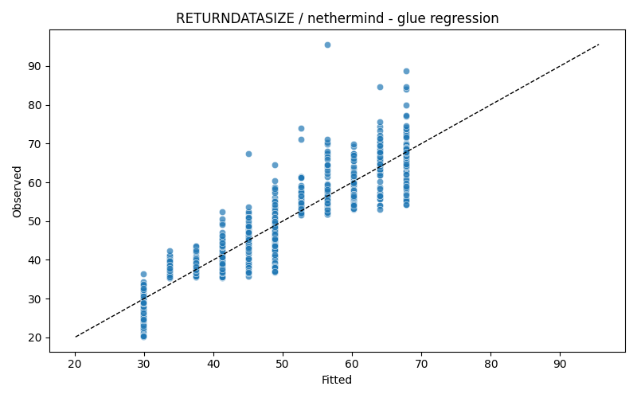

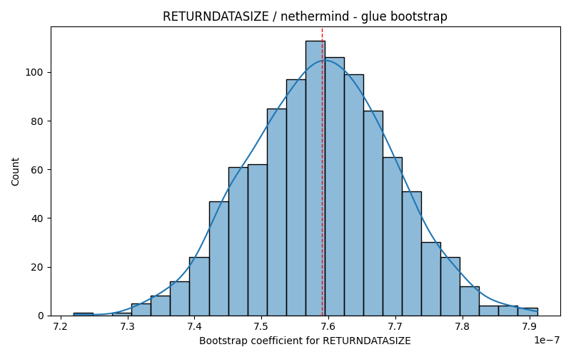

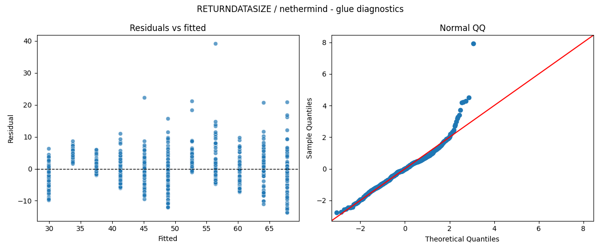

</details>

<details><summary><code>SELFBALANCE</code> · nobs=189 · runtime_ms=1.031e-05 · p=1.00e-03 · R²=0.8314</summary>

```
==============================================================================
                           NNLS Regression Results                            
==============================================================================
Dep. Variable:          test_runtime_ms              R-squared:          0.831
Model:                  NNLS                    Adj. R-squared:          0.831
No. Observations:       189                               RMSE:          46.81
Df Residuals:           187                                MAE:          36.48
Df Model:               1      
==============================================================================
                      coef     std err     P-value      [0.025      0.975]
------------------------------------------------------------------------------
         const     97.5575     16.3710       0.001     65.0514    126.5343
   SELFBALANCE      0.0000      0.0000       0.001      0.0000      0.0000
==============================================================================
Notes: Non-negative least squares with bootstrap inference (1000 iterations)
==============================================================================
```

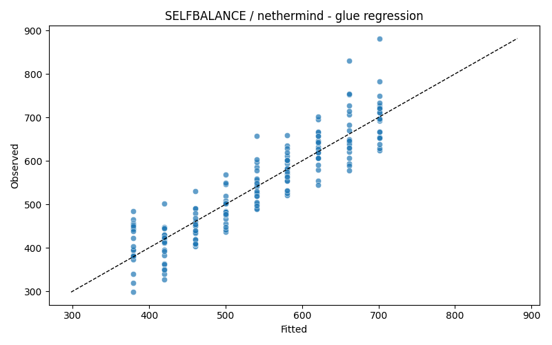

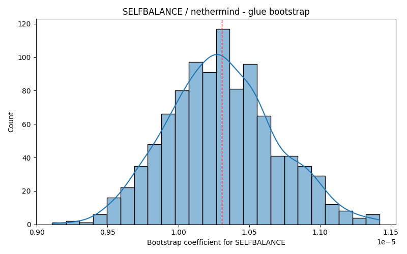

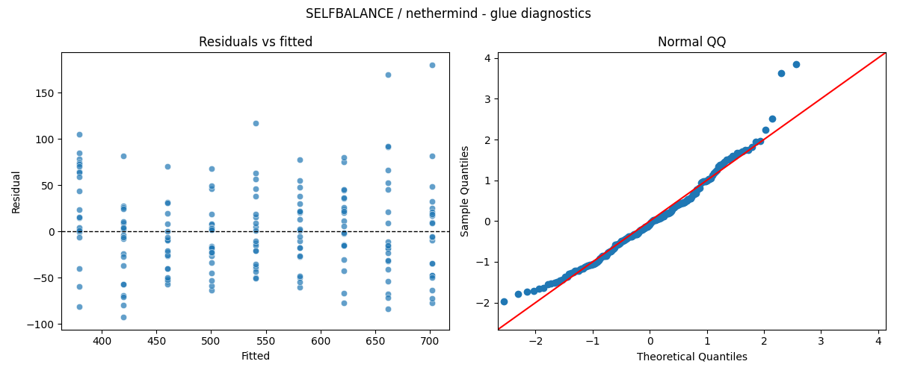

</details>

<details><summary><code>SUB</code> · nobs=231 · runtime_ms=2.389e-06 · p=1.00e-03 · R²=0.8975</summary>

```
==============================================================================
                           NNLS Regression Results                            
==============================================================================
Dep. Variable:          test_runtime_ms              R-squared:          0.898
Model:                  NNLS                    Adj. R-squared:          0.897
No. Observations:       231                               RMSE:           8.50
Df Residuals:           229                                MAE:           6.00
Df Model:               1      
==============================================================================
                      coef     std err     P-value      [0.025      0.975]
------------------------------------------------------------------------------
         const     18.5861      1.4889       0.001     15.7945     21.6831
           SUB      0.0000      0.0000       0.001      0.0000      0.0000
==============================================================================
Notes: Non-negative least squares with bootstrap inference (1000 iterations)
==============================================================================
```

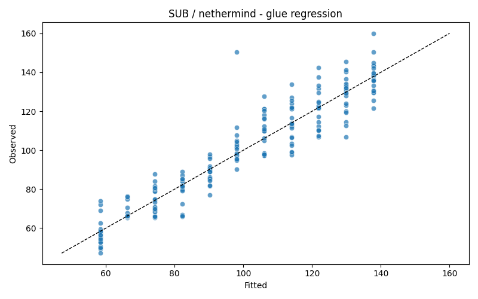

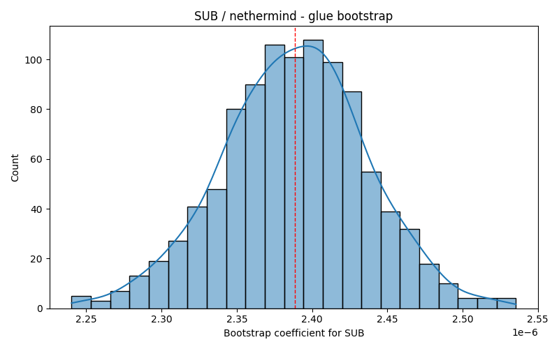

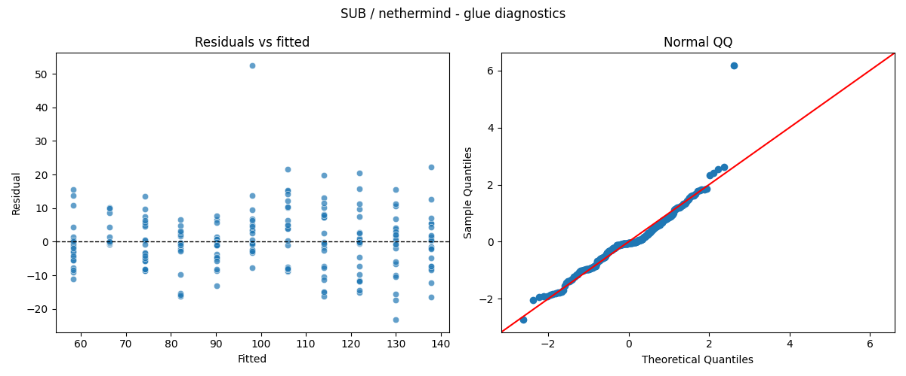

</details>

### Mixed glue (tier B) · nethermind

<details><summary><code>JUMP</code> · nobs=231 · runtime_ms=5.179e-06 · p=1.00e-03 · R²=0.8117</summary>

```
==============================================================================
                           NNLS Regression Results                            
==============================================================================
Dep. Variable:          test_runtime_ms              R-squared:          0.812
Model:                  NNLS                    Adj. R-squared:          0.811
No. Observations:       231                               RMSE:           9.27
Df Residuals:           229                                MAE:           6.30
Df Model:               1      
==============================================================================
                      coef     std err     P-value      [0.025      0.975]
------------------------------------------------------------------------------
         const     18.4014      2.3331       0.001     14.0914     23.0818
          JUMP      0.0000      0.0000       0.001      0.0000      0.0000
==============================================================================
Notes: Non-negative least squares with bootstrap inference (1000 iterations)
==============================================================================
```

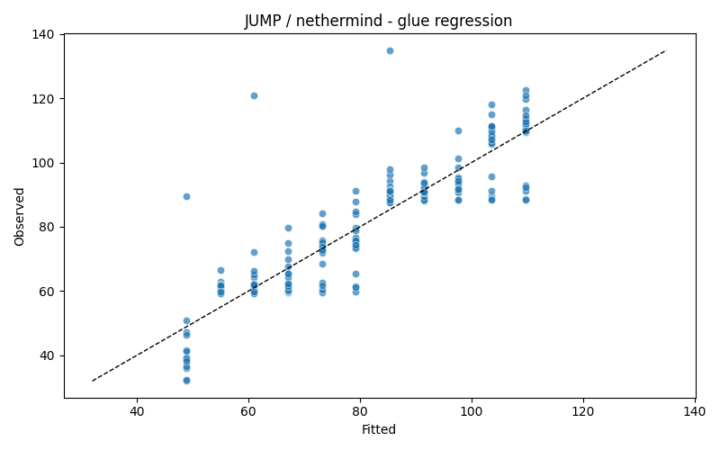

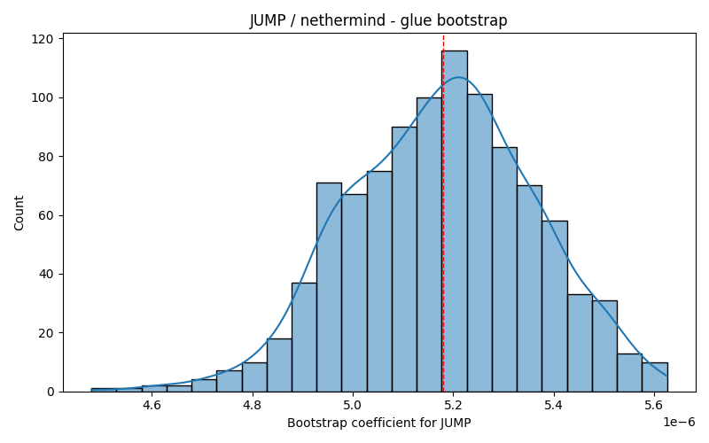

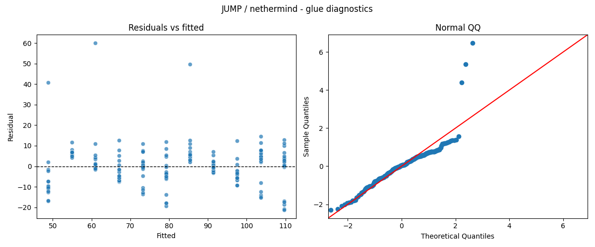

</details>

<details><summary><code>KECCAK256</code> · nobs=3696 · runtime_ms=0 · p=1.00e+00 · R²=-2.22e-16</summary>

```
==============================================================================
                           NNLS Regression Results                            
==============================================================================
Dep. Variable:          test_runtime_ms              R-squared:         -0.000
Model:                  NNLS                    Adj. R-squared:         -0.000
No. Observations:       3696                              RMSE:         292.52
Df Residuals:           3694                               MAE:         240.51
Df Model:               1      
==============================================================================
                      coef     std err     P-value      [0.025      0.975]
------------------------------------------------------------------------------
         const    447.5042      4.8507       0.001    437.6062    457.0439
     KECCAK256      0.0000      0.0000       1.000      0.0000      0.0000
==============================================================================
Notes: Non-negative least squares with bootstrap inference (1000 iterations)
==============================================================================
```

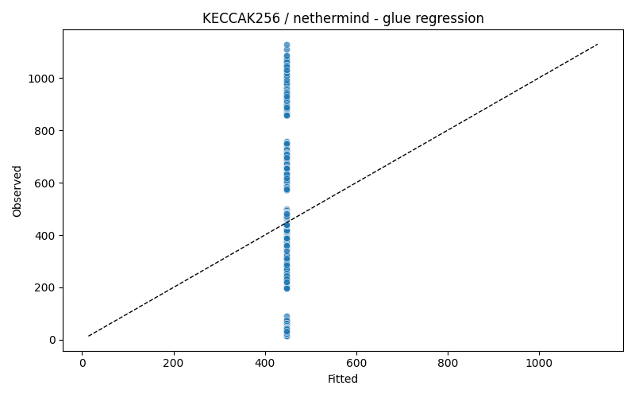


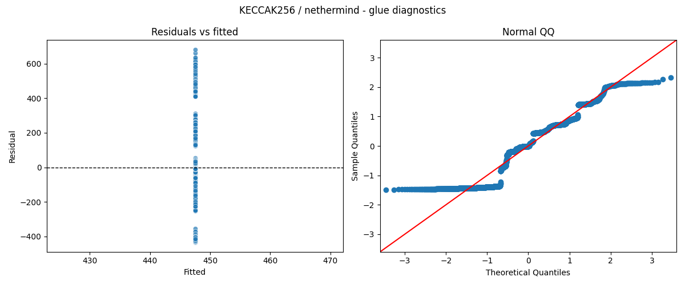

</details>

## reth

| glue_opcode | nobs | glue_runtime_ms | p_value | rsquared |
| --- | --- | --- | --- | --- |
| `ISZERO` | 110 | 4.137e-07 | 1.00e-03 | 0.7735 |
| `JUMPDEST` | 110 | 2.725e-07 | 1.00e-03 | 0.658 |
| `SWAP` | 1760 | 4.629e-07 | 1.00e-03 | 0.5914 |
| `CALLDATASIZE` | 6721 | 5.008e-07 | 1.00e-03 | 0.833 |
| `DUP` | 6721 | 4.209e-07 | 1.00e-03 | 0.833 |
| `GAS` | 6721 | 4.568e-07 | 1.00e-03 | 0.833 |
| `MLOAD` | 6721 | 1.635e-06 | 1.00e-03 | 0.833 |
| `PUSH` | 6721 | 4.45e-07 | 1.00e-03 | 0.833 |
| `PUSH0` | 6721 | 3.498e-07 | 1.00e-03 | 0.833 |
| `STATICCALL` | 6721 | 4.639e-05 | 1.00e-03 | 0.833 |
| `ADD` | 110 | 8.898e-07 | 1.00e-03 | 0.7922 |
| `AND` | 110 | 8.456e-07 | 1.00e-03 | 0.8095 |
| `CALLDATACOPY` | 2640 | 2.261e-06 | 1.00e-03 | 0.7991 |
| `CALLDATALOAD` | 440 | 4.399e-05 | 1.00e-03 | 0.4867 |
| `DIV` | 110 | 7.007e-06 | 1.00e-03 | 0.8453 |
| `EXP` | 110 | 0.0003514 | 1.00e-03 | 0.7586 |
| `GT` | 110 | 1.016e-06 | 1.00e-03 | 0.8123 |
| `JUMPI` | 110 | 1.227e-06 | 1.00e-03 | 0.7741 |
| `LT` | 110 | 9.286e-07 | 1.00e-03 | 0.779 |
| `MSTORE` | 550 | 2.747e-06 | 1.00e-03 | 0.2694 |
| `MSTORE8` | 550 | 1.367e-06 | 1.00e-03 | 0.7566 |
| `MUL` | 110 | 1.156e-06 | 1.00e-03 | 0.7837 |
| `PC` | 110 | 6.096e-07 | 1.00e-03 | 0.9295 |
| `RETURNDATASIZE` | 440 | 8.978e-07 | 1.00e-03 | 0.8507 |
| `SELFBALANCE` | 90 | 3.852e-06 | 1.00e-03 | 0.8101 |
| `SUB` | 110 | 9.43e-07 | 1.00e-03 | 0.761 |
| `JUMP` | 110 | 2.316e-06 | 1.00e-03 | 0.7978 |
| `KECCAK256` | 1760 | 0 | 1.00e+00 | 0 |

### Cycle glue — joint fit · reth

<details><summary>Joint NNLS regression summary</summary>

```
==============================================================================
                           NNLS Regression Results                            
==============================================================================
Dep. Variable:          test_runtime_ms              R-squared:          0.833
Model:                  NNLS                    Adj. R-squared:          0.833
No. Observations:       6721                              RMSE:           7.46
Df Residuals:           6713                               MAE:           5.17
Df Model:               7      
==============================================================================
                      coef     std err     P-value      [0.025      0.975]
------------------------------------------------------------------------------
         const     11.7942      0.3038       0.001     11.2060     12.3981
  CALLDATASIZE      0.0000      0.0000       0.001      0.0000      0.0000
           DUP      0.0000      0.0000       0.001      0.0000      0.0000
           GAS      0.0000      0.0000       0.001      0.0000      0.0000
         MLOAD      0.0000      0.0000       0.001      0.0000      0.0000
          PUSH      0.0000      0.0000       0.001      0.0000      0.0000
         PUSH0      0.0000      0.0000       0.001      0.0000      0.0000
    STATICCALL      0.0000      0.0000       0.001      0.0000      0.0000
==============================================================================
Notes: Non-negative least squares with bootstrap inference (1000 iterations)
==============================================================================
```

</details>

<details><summary><code>CALLDATASIZE</code> · nobs=6721 · runtime_ms=5.008e-07 · p=1.00e-03 · R²=0.833</summary>


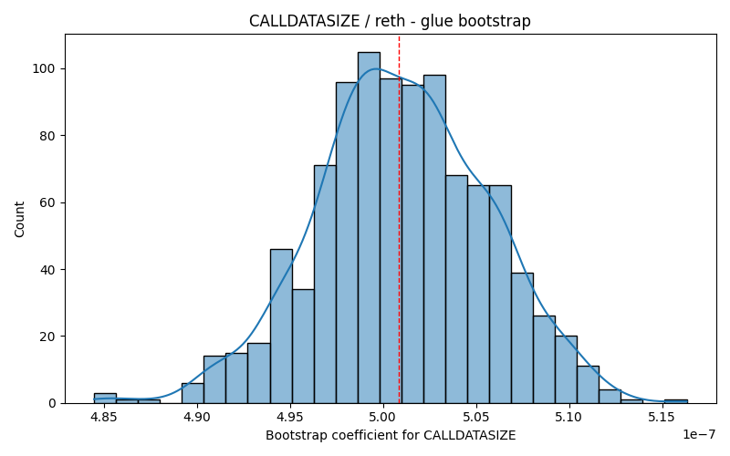

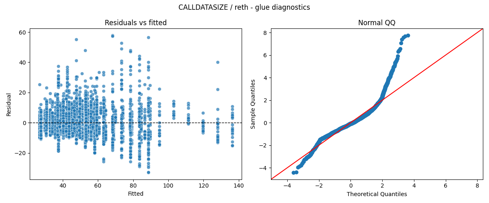

</details>

<details><summary><code>DUP</code> · nobs=6721 · runtime_ms=4.209e-07 · p=1.00e-03 · R²=0.833</summary>


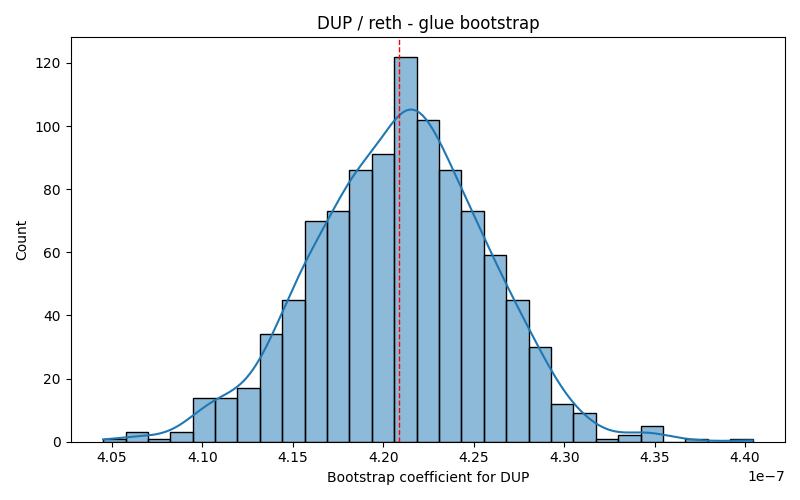

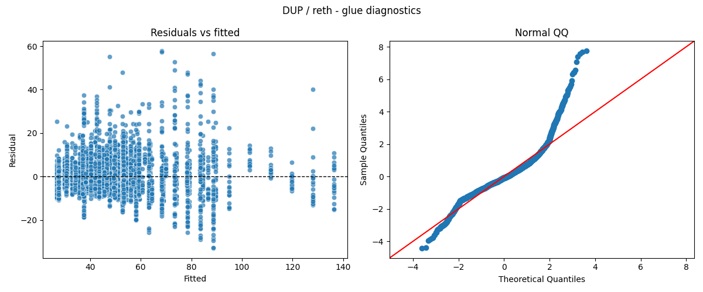

</details>

<details><summary><code>GAS</code> · nobs=6721 · runtime_ms=4.568e-07 · p=1.00e-03 · R²=0.833</summary>

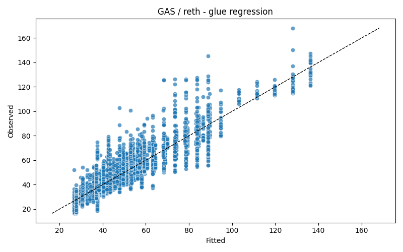

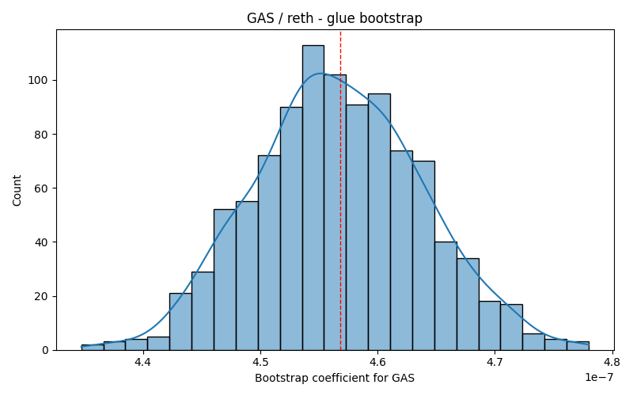


</details>

<details><summary><code>MLOAD</code> · nobs=6721 · runtime_ms=1.635e-06 · p=1.00e-03 · R²=0.833</summary>

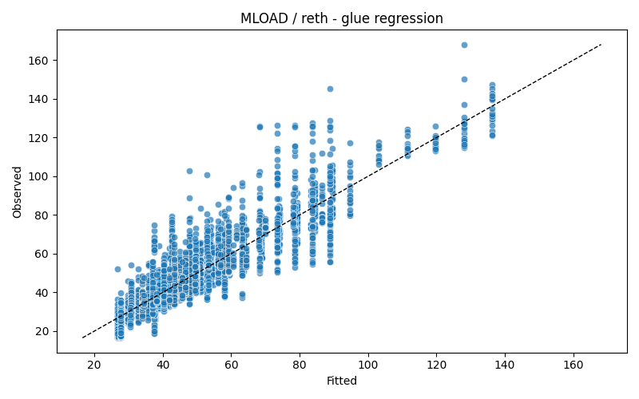

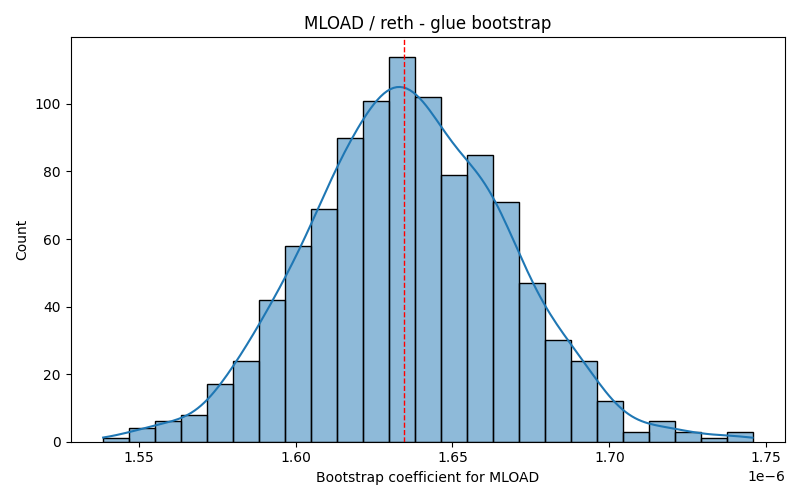

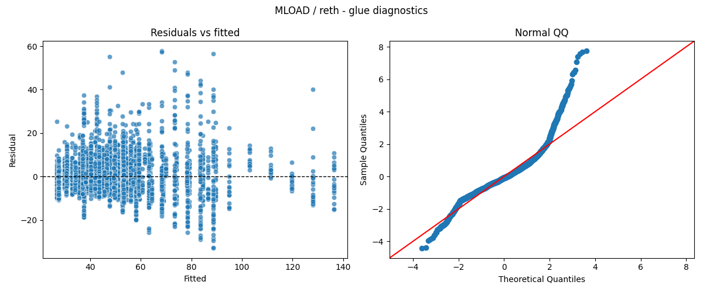

</details>

<details><summary><code>PUSH</code> · nobs=6721 · runtime_ms=4.45e-07 · p=1.00e-03 · R²=0.833</summary>


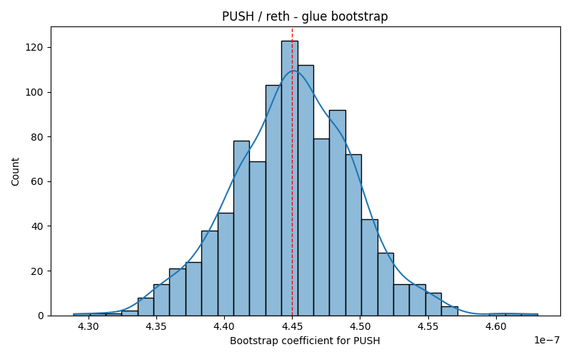


</details>

<details><summary><code>PUSH0</code> · nobs=6721 · runtime_ms=3.498e-07 · p=1.00e-03 · R²=0.833</summary>

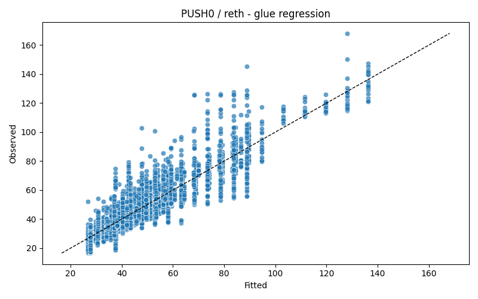

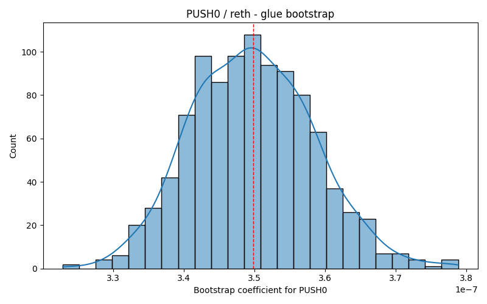


</details>

<details><summary><code>STATICCALL</code> · nobs=6721 · runtime_ms=4.639e-05 · p=1.00e-03 · R²=0.833</summary>

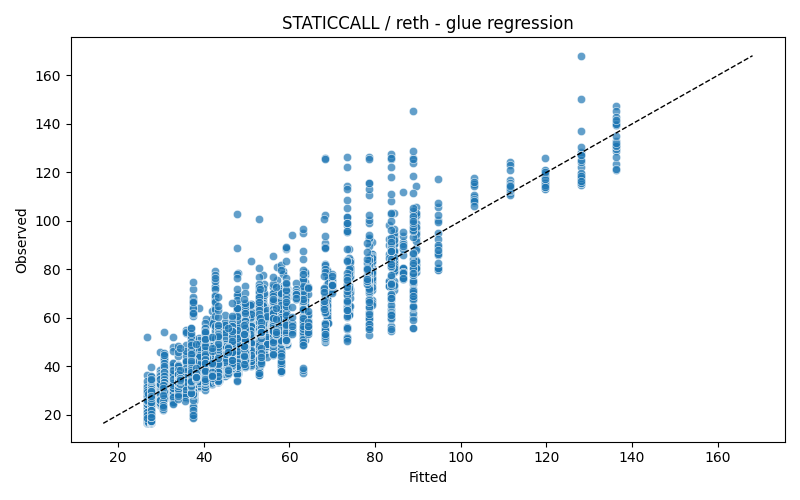

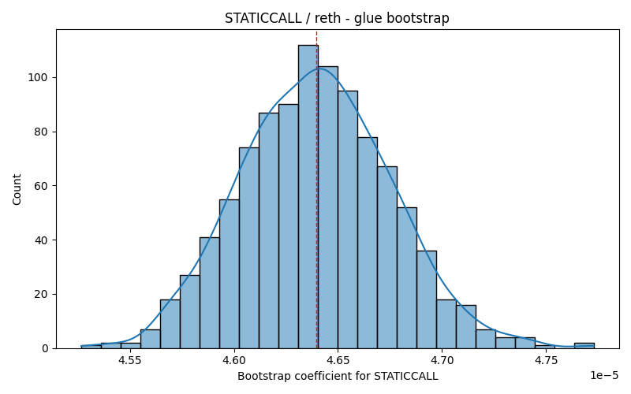

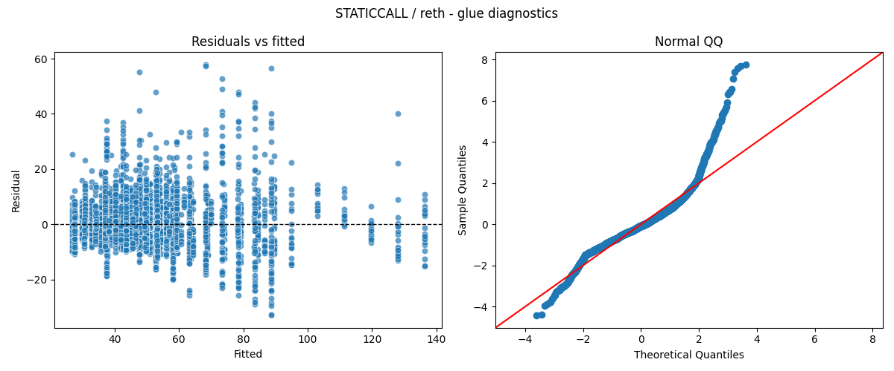

</details>

### Pure glue · reth

<details><summary><code>ISZERO</code> · nobs=110 · runtime_ms=4.137e-07 · p=1.00e-03 · R²=0.7735</summary>

```
==============================================================================
                           NNLS Regression Results                            
==============================================================================
Dep. Variable:          test_runtime_ms              R-squared:          0.773
Model:                  NNLS                    Adj. R-squared:          0.771
No. Observations:       110                               RMSE:           4.71
Df Residuals:           108                                MAE:           3.55
Df Model:               1      
==============================================================================
                      coef     std err     P-value      [0.025      0.975]
------------------------------------------------------------------------------
         const      7.3257      1.3606       0.001      4.6782     10.0519
        ISZERO      0.0000      0.0000       0.001      0.0000      0.0000
==============================================================================
Notes: Non-negative least squares with bootstrap inference (1000 iterations)
==============================================================================
```

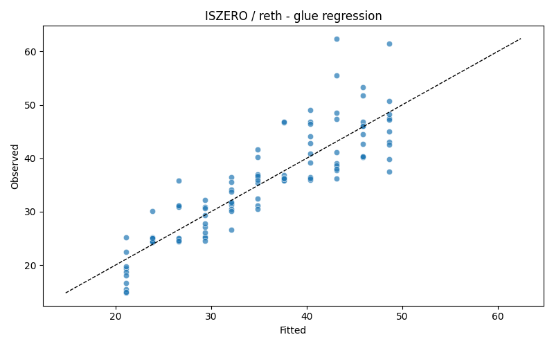

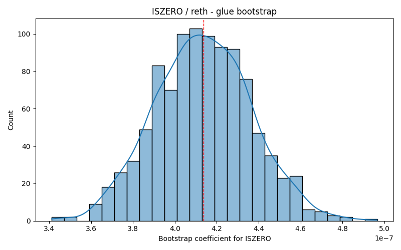

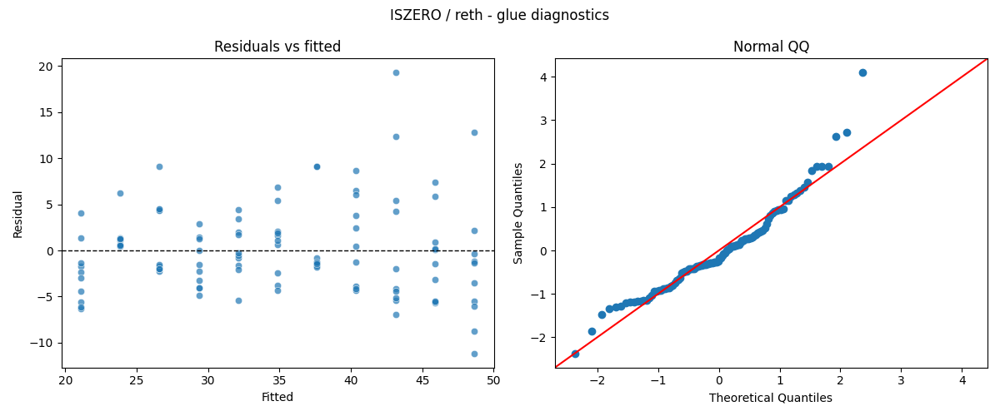

</details>

<details><summary><code>JUMPDEST</code> · nobs=110 · runtime_ms=2.725e-07 · p=1.00e-03 · R²=0.658</summary>

```
==============================================================================
                           NNLS Regression Results                            
==============================================================================
Dep. Variable:          test_runtime_ms              R-squared:          0.658
Model:                  NNLS                    Adj. R-squared:          0.655
No. Observations:       110                               RMSE:          12.41
Df Residuals:           108                                MAE:           8.78
Df Model:               1      
==============================================================================
                      coef     std err     P-value      [0.025      0.975]
------------------------------------------------------------------------------
         const     18.9437      3.5139       0.001     11.9029     25.7808
      JUMPDEST      0.0000      0.0000       0.001      0.0000      0.0000
==============================================================================
Notes: Non-negative least squares with bootstrap inference (1000 iterations)
==============================================================================
```

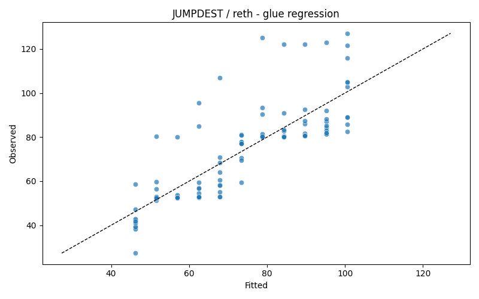

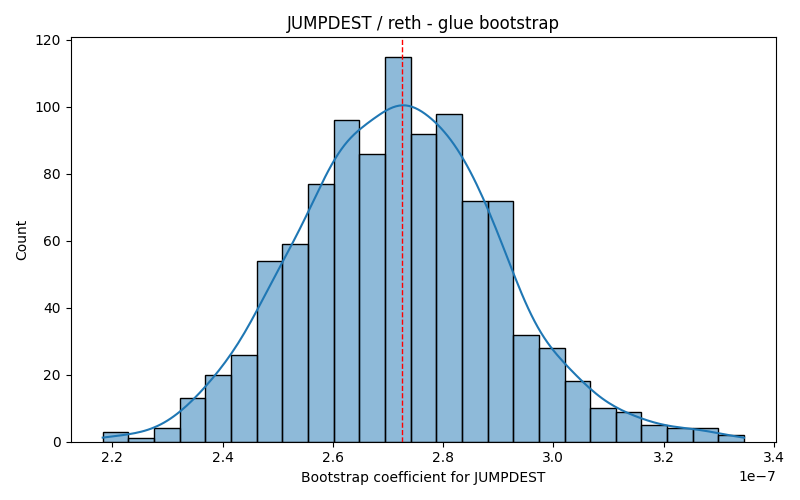

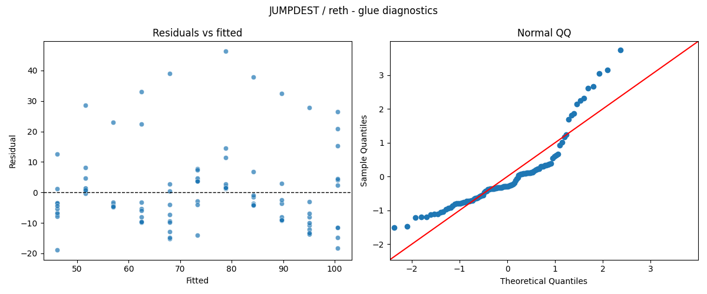

</details>

<details><summary><code>SWAP</code> · nobs=1760 · runtime_ms=4.629e-07 · p=1.00e-03 · R²=0.5914</summary>

```
==============================================================================
                           NNLS Regression Results                            
==============================================================================
Dep. Variable:          test_runtime_ms              R-squared:          0.591
Model:                  NNLS                    Adj. R-squared:          0.591
No. Observations:       1760                              RMSE:           8.10
Df Residuals:           1758                               MAE:           4.46
Df Model:               1      
==============================================================================
                      coef     std err     P-value      [0.025      0.975]
------------------------------------------------------------------------------
         const     12.0803      0.5111       0.001     11.1047     13.0662
          SWAP      0.0000      0.0000       0.001      0.0000      0.0000
==============================================================================
Notes: Non-negative least squares with bootstrap inference (1000 iterations)
==============================================================================
```

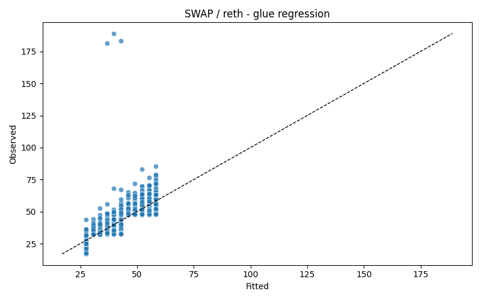

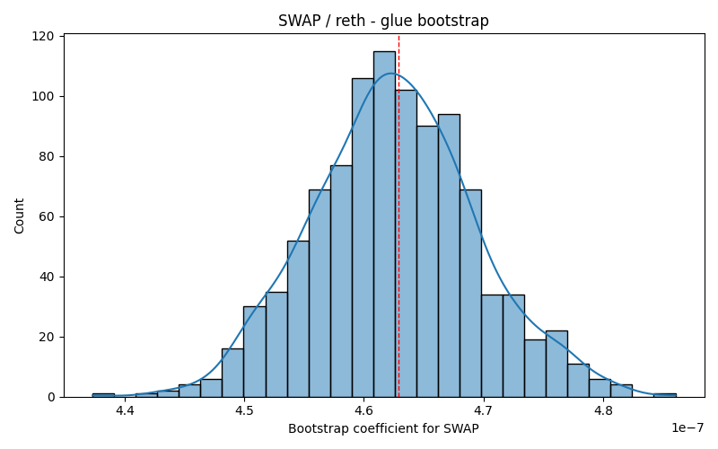

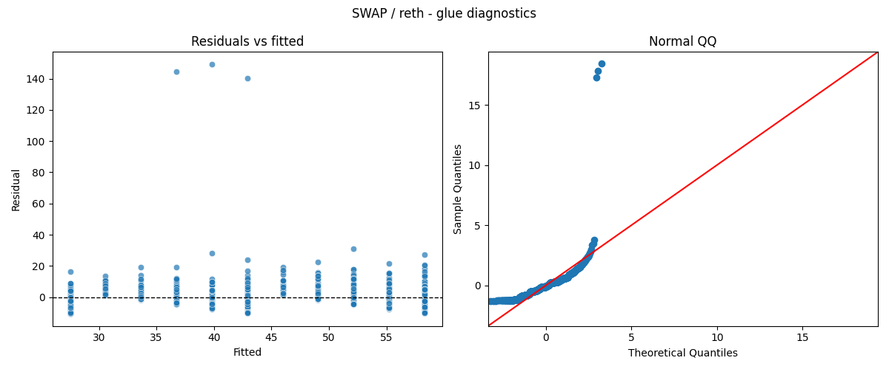

</details>

### Mixed glue (tier A) · reth

<details><summary><code>ADD</code> · nobs=110 · runtime_ms=8.898e-07 · p=1.00e-03 · R²=0.7922</summary>

```
==============================================================================
                           NNLS Regression Results                            
==============================================================================
Dep. Variable:          test_runtime_ms              R-squared:          0.792
Model:                  NNLS                    Adj. R-squared:          0.790
No. Observations:       110                               RMSE:           4.80
Df Residuals:           108                                MAE:           3.61
Df Model:               1      
==============================================================================
                      coef     std err     P-value      [0.025      0.975]
------------------------------------------------------------------------------
         const      9.8982      1.2085       0.001      7.5397     12.2593
           ADD      0.0000      0.0000       0.001      0.0000      0.0000
==============================================================================
Notes: Non-negative least squares with bootstrap inference (1000 iterations)
==============================================================================
```

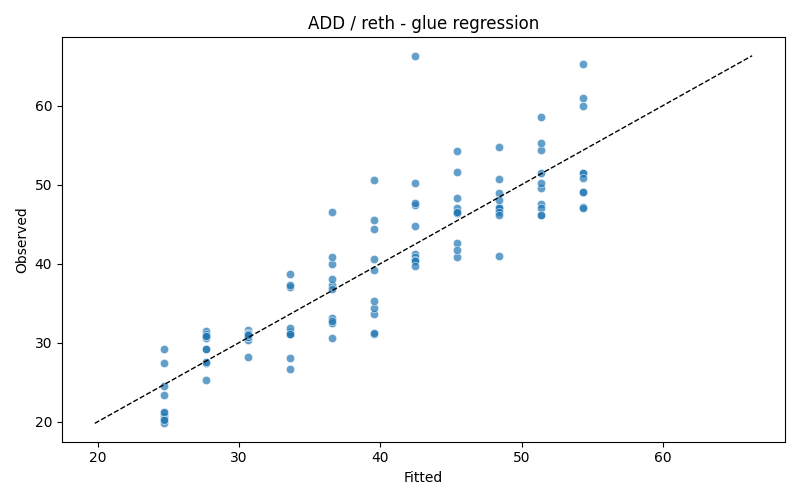

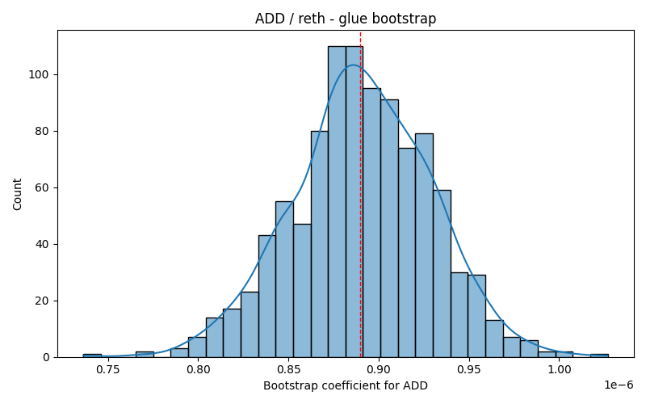

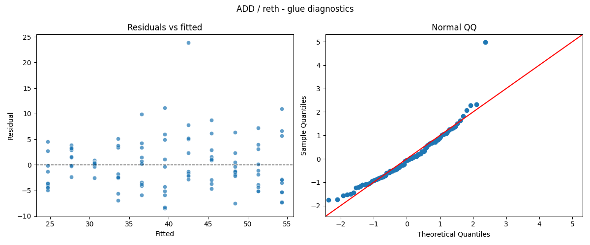

</details>

<details><summary><code>AND</code> · nobs=110 · runtime_ms=8.456e-07 · p=1.00e-03 · R²=0.8095</summary>

```
==============================================================================
                           NNLS Regression Results                            
==============================================================================
Dep. Variable:          test_runtime_ms              R-squared:          0.810
Model:                  NNLS                    Adj. R-squared:          0.808
No. Observations:       110                               RMSE:           4.32
Df Residuals:           108                                MAE:           3.37
Df Model:               1      
==============================================================================
                      coef     std err     P-value      [0.025      0.975]
------------------------------------------------------------------------------
         const     11.1237      1.4317       0.001      8.3654     13.8544
           AND      0.0000      0.0000       0.001      0.0000      0.0000
==============================================================================
Notes: Non-negative least squares with bootstrap inference (1000 iterations)
==============================================================================
```

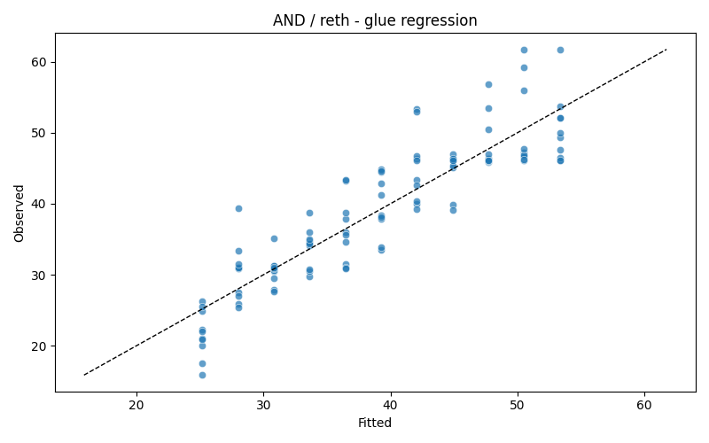

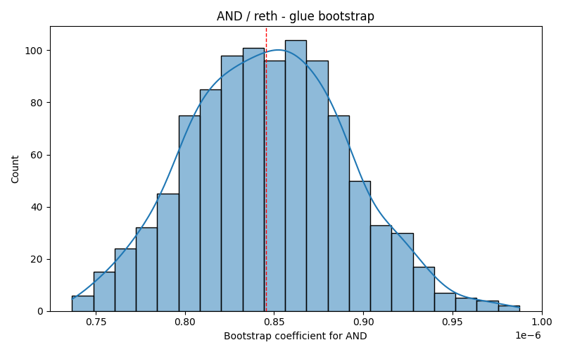

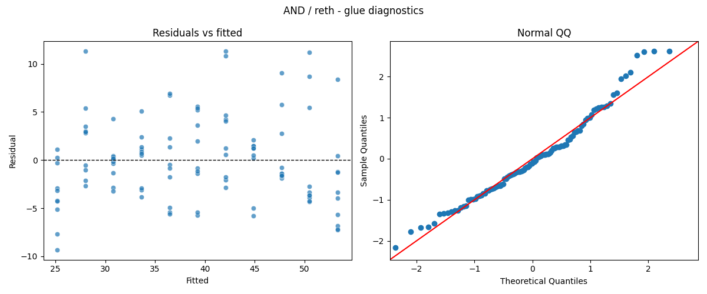

</details>

<details><summary><code>CALLDATACOPY</code> · nobs=2640 · runtime_ms=2.261e-06 · p=1.00e-03 · R²=0.7991</summary>

```
==============================================================================
                           NNLS Regression Results                            
==============================================================================
Dep. Variable:          test_runtime_ms              R-squared:          0.799
Model:                  NNLS                    Adj. R-squared:          0.799
No. Observations:       2640                              RMSE:           8.53
Df Residuals:           2638                               MAE:           6.45
Df Model:               1      
==============================================================================
                      coef     std err     P-value      [0.025      0.975]
------------------------------------------------------------------------------
         const     12.3778      0.2029       0.001     11.9957     12.7924
  CALLDATACOPY      0.0000      0.0000       0.001      0.0000      0.0000
==============================================================================
Notes: Non-negative least squares with bootstrap inference (1000 iterations)
==============================================================================
```

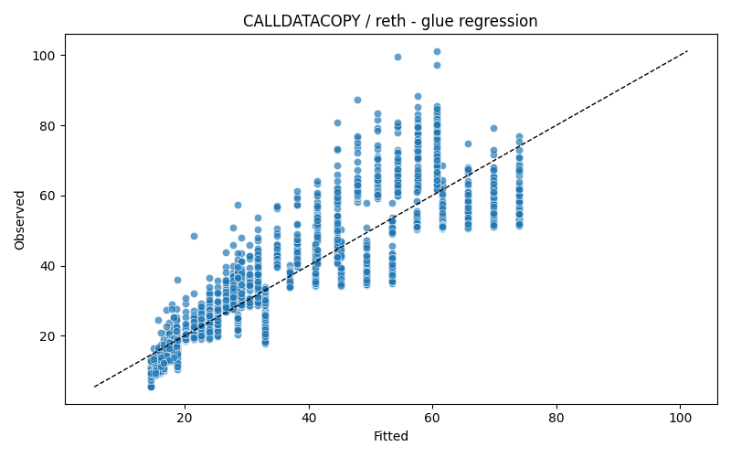

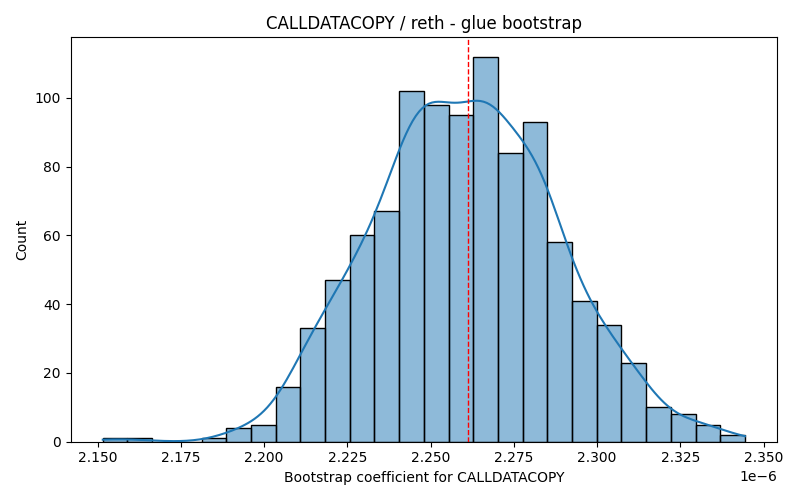

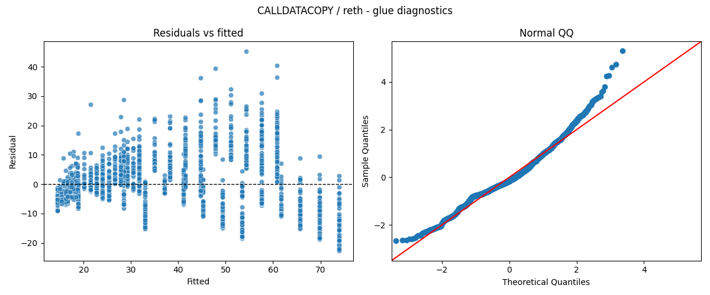

</details>

<details><summary><code>CALLDATALOAD</code> · nobs=440 · runtime_ms=4.399e-05 · p=1.00e-03 · R²=0.4867</summary>

```
==============================================================================
                           NNLS Regression Results                            
==============================================================================
Dep. Variable:          test_runtime_ms              R-squared:          0.487
Model:                  NNLS                    Adj. R-squared:          0.486
No. Observations:       440                               RMSE:           0.17
Df Residuals:           438                                MAE:           0.14
Df Model:               1      
==============================================================================
                      coef     std err     P-value      [0.025      0.975]
------------------------------------------------------------------------------
         const      1.1630      0.0273       0.001      1.1134      1.2179
  CALLDATALOAD      0.0000      0.0000       0.001      0.0000      0.0000
==============================================================================
Notes: Non-negative least squares with bootstrap inference (1000 iterations)
==============================================================================
```

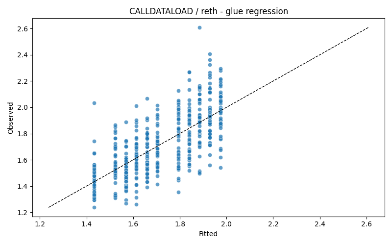

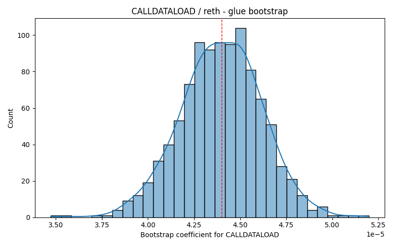

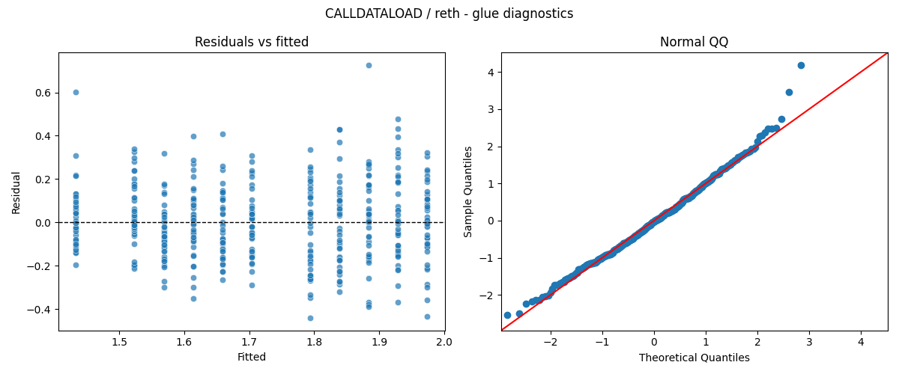

</details>

<details><summary><code>DIV</code> · nobs=110 · runtime_ms=7.007e-06 · p=1.00e-03 · R²=0.8453</summary>

```
==============================================================================
                           NNLS Regression Results                            
==============================================================================
Dep. Variable:          test_runtime_ms              R-squared:          0.845
Model:                  NNLS                    Adj. R-squared:          0.844
No. Observations:       110                               RMSE:          23.67
Df Residuals:           108                                MAE:          19.31
Df Model:               1      
==============================================================================
                      coef     std err     P-value      [0.025      0.975]
------------------------------------------------------------------------------
         const     61.9841      7.4745       0.001     46.9405     76.1790
           DIV      0.0000      0.0000       0.001      0.0000      0.0000
==============================================================================
Notes: Non-negative least squares with bootstrap inference (1000 iterations)
==============================================================================
```

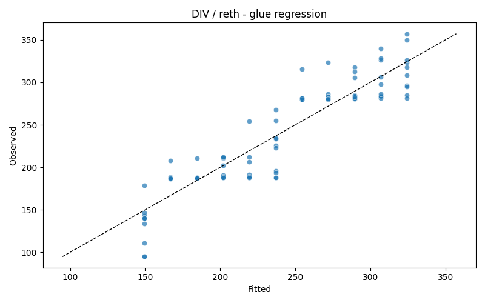

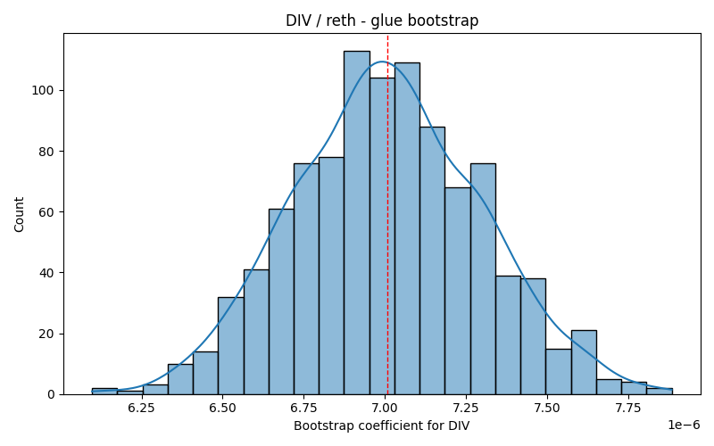

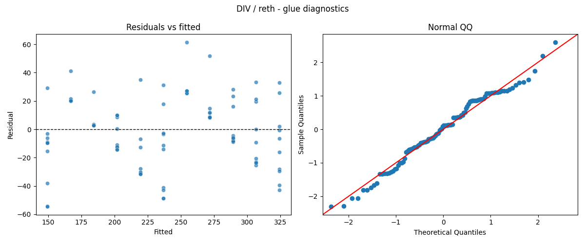

</details>

<details><summary><code>EXP</code> · nobs=110 · runtime_ms=0.0003514 · p=1.00e-03 · R²=0.7586</summary>

```
==============================================================================
                           NNLS Regression Results                            
==============================================================================
Dep. Variable:          test_runtime_ms              R-squared:          0.759
Model:                  NNLS                    Adj. R-squared:          0.756
No. Observations:       110                               RMSE:           7.76
Df Residuals:           108                                MAE:           5.80
Df Model:               1      
==============================================================================
                      coef     std err     P-value      [0.025      0.975]
------------------------------------------------------------------------------
         const     20.5237      2.3847       0.001     15.9380     25.2128
           EXP      0.0004      0.0000       0.001      0.0003      0.0004
==============================================================================
Notes: Non-negative least squares with bootstrap inference (1000 iterations)
==============================================================================
```

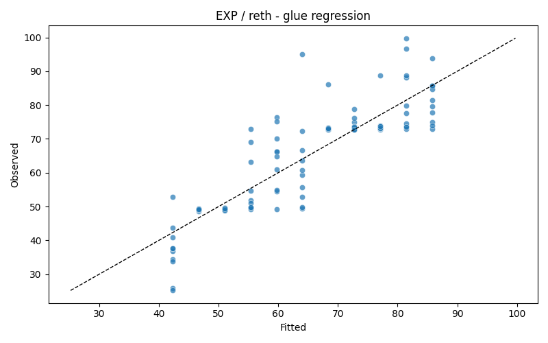

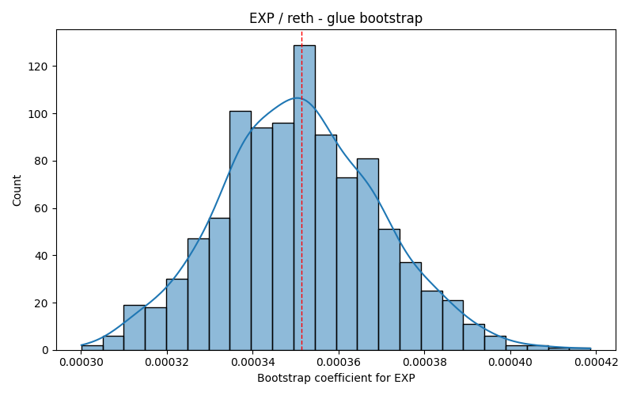

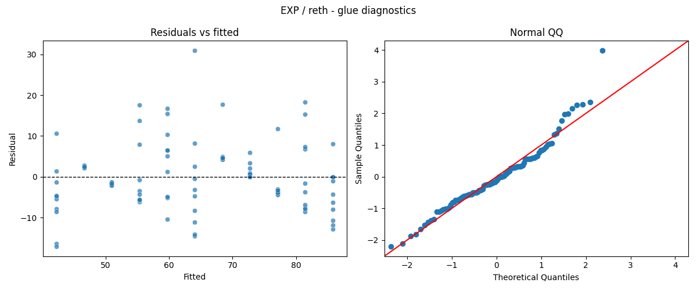

</details>

<details><summary><code>GT</code> · nobs=110 · runtime_ms=1.016e-06 · p=1.00e-03 · R²=0.8123</summary>

```
==============================================================================
                           NNLS Regression Results                            
==============================================================================
Dep. Variable:          test_runtime_ms              R-squared:          0.812
Model:                  NNLS                    Adj. R-squared:          0.811
No. Observations:       110                               RMSE:           5.14
Df Residuals:           108                                MAE:           4.02
Df Model:               1      
==============================================================================
                      coef     std err     P-value      [0.025      0.975]
------------------------------------------------------------------------------
         const      9.5334      1.4897       0.001      6.6872     12.3774
            GT      0.0000      0.0000       0.001      0.0000      0.0000
==============================================================================
Notes: Non-negative least squares with bootstrap inference (1000 iterations)
==============================================================================
```

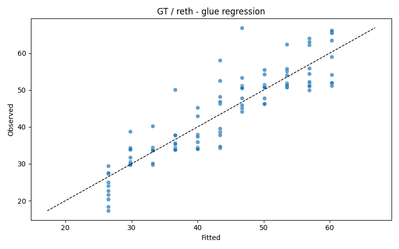

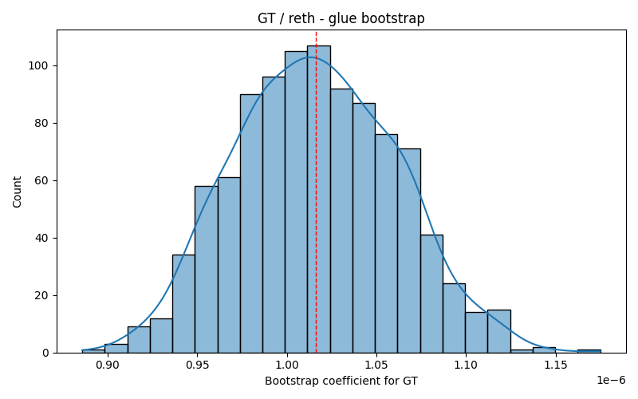

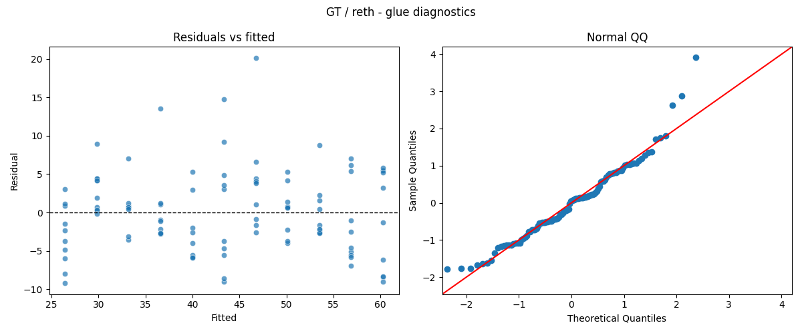

</details>

<details><summary><code>JUMPI</code> · nobs=110 · runtime_ms=1.227e-06 · p=1.00e-03 · R²=0.7741</summary>

```
==============================================================================
                           NNLS Regression Results                            
==============================================================================
Dep. Variable:          test_runtime_ms              R-squared:          0.774
Model:                  NNLS                    Adj. R-squared:          0.772
No. Observations:       110                               RMSE:           2.99
Df Residuals:           108                                MAE:           2.27
Df Model:               1      
==============================================================================
                      coef     std err     P-value      [0.025      0.975]
------------------------------------------------------------------------------
         const      6.8656      0.9264       0.001      5.0546      8.6375
         JUMPI      0.0000      0.0000       0.001      0.0000      0.0000
==============================================================================
Notes: Non-negative least squares with bootstrap inference (1000 iterations)
==============================================================================
```

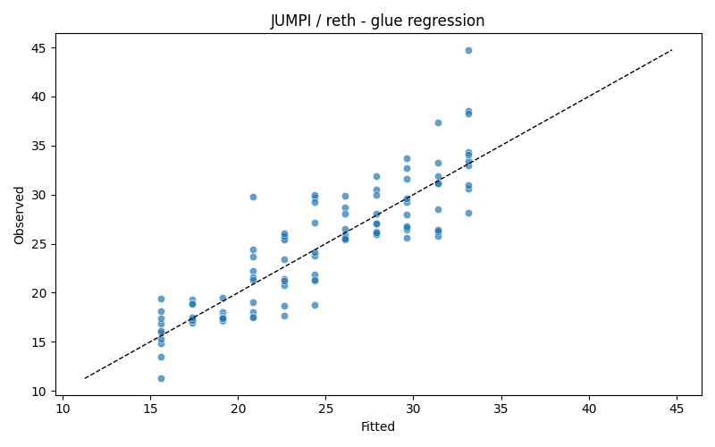

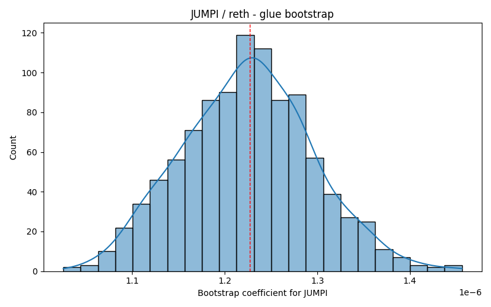

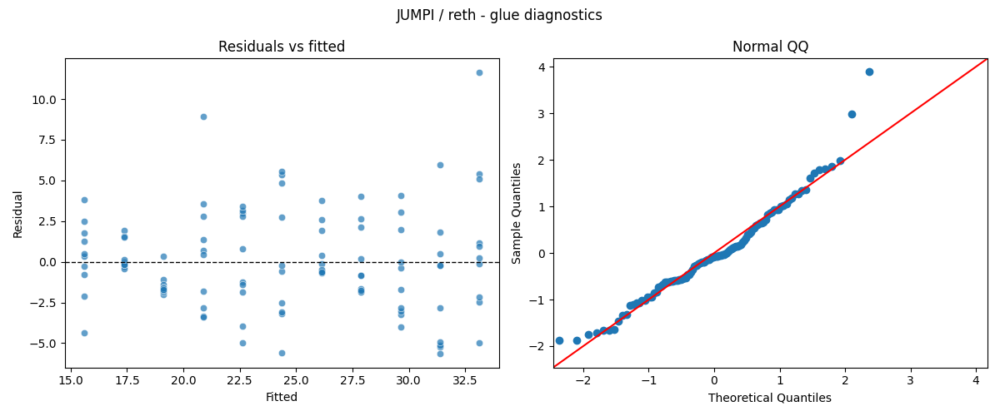

</details>

<details><summary><code>LT</code> · nobs=110 · runtime_ms=9.286e-07 · p=1.00e-03 · R²=0.779</summary>

```
==============================================================================
                           NNLS Regression Results                            
==============================================================================
Dep. Variable:          test_runtime_ms              R-squared:          0.779
Model:                  NNLS                    Adj. R-squared:          0.777
No. Observations:       110                               RMSE:           5.21
Df Residuals:           108                                MAE:           3.71
Df Model:               1      
==============================================================================
                      coef     std err     P-value      [0.025      0.975]
------------------------------------------------------------------------------
         const     10.6847      1.4821       0.001      7.8174     13.4365
            LT      0.0000      0.0000       0.001      0.0000      0.0000
==============================================================================
Notes: Non-negative least squares with bootstrap inference (1000 iterations)
==============================================================================
```

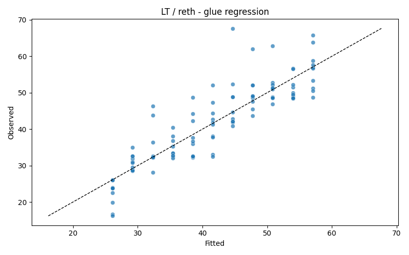

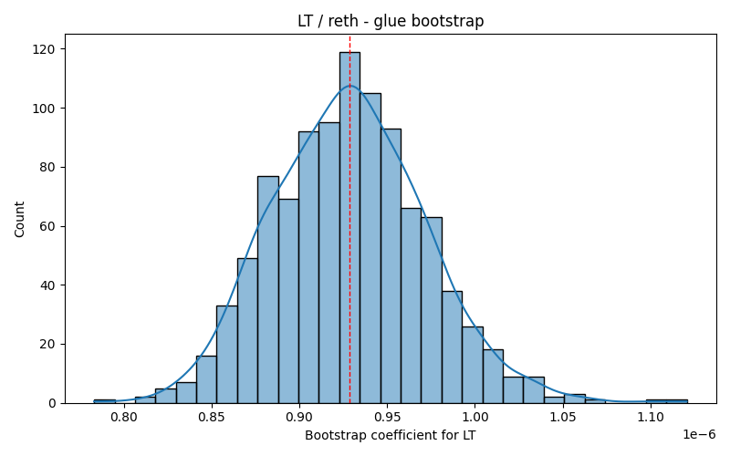

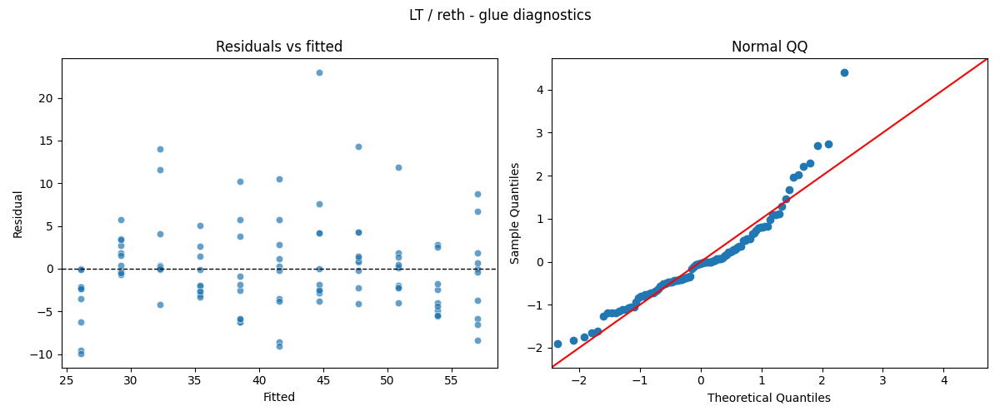

</details>

<details><summary><code>MSTORE</code> · nobs=550 · runtime_ms=2.747e-06 · p=1.00e-03 · R²=0.2694</summary>

```
==============================================================================
                           NNLS Regression Results                            
==============================================================================
Dep. Variable:          test_runtime_ms              R-squared:          0.269
Model:                  NNLS                    Adj. R-squared:          0.268
No. Observations:       550                               RMSE:          31.75
Df Residuals:           548                                MAE:          28.76
Df Model:               1      
==============================================================================
                      coef     std err     P-value      [0.025      0.975]
------------------------------------------------------------------------------
         const     20.7882      4.1227       0.001     13.0660     29.1222
        MSTORE      0.0000      0.0000       0.001      0.0000      0.0000
==============================================================================
Notes: Non-negative least squares with bootstrap inference (1000 iterations)
==============================================================================
```

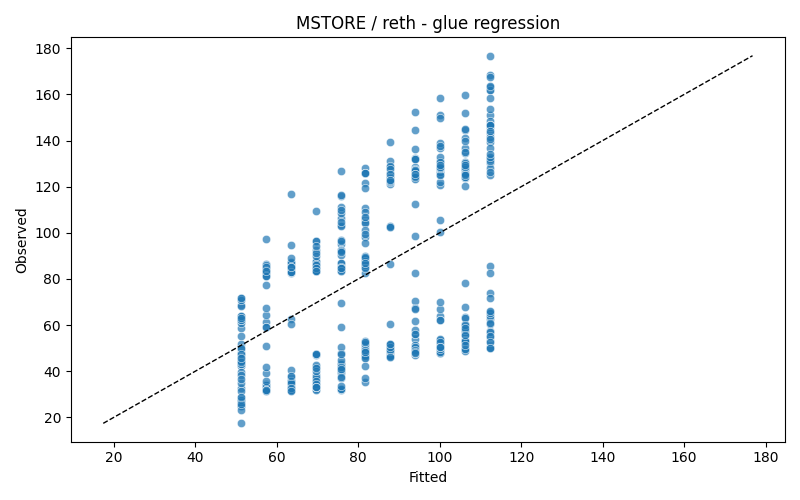

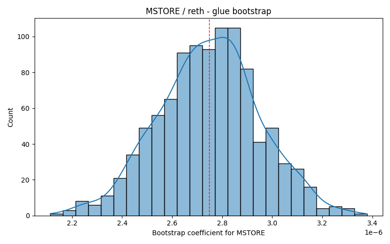

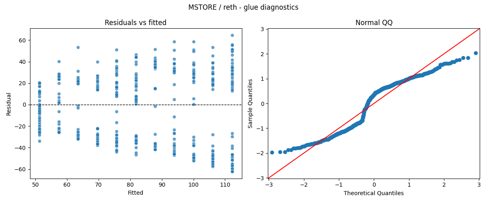

</details>

<details><summary><code>MSTORE8</code> · nobs=550 · runtime_ms=1.367e-06 · p=1.00e-03 · R²=0.7566</summary>

```
==============================================================================
                           NNLS Regression Results                            
==============================================================================
Dep. Variable:          test_runtime_ms              R-squared:          0.757
Model:                  NNLS                    Adj. R-squared:          0.756
No. Observations:       550                               RMSE:           5.44
Df Residuals:           548                                MAE:           4.09
Df Model:               1      
==============================================================================
                      coef     std err     P-value      [0.025      0.975]
------------------------------------------------------------------------------
         const     10.0917      0.8042       0.001      8.5121     11.6835
       MSTORE8      0.0000      0.0000       0.001      0.0000      0.0000
==============================================================================
Notes: Non-negative least squares with bootstrap inference (1000 iterations)
==============================================================================
```

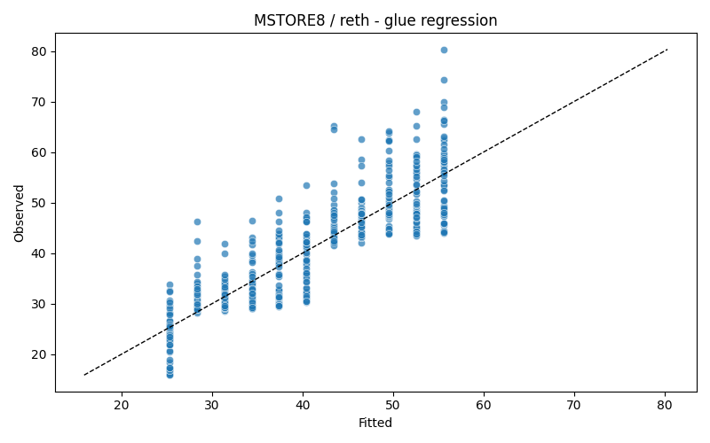


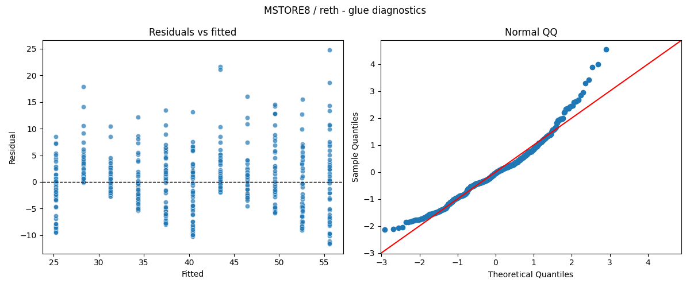

</details>

<details><summary><code>MUL</code> · nobs=110 · runtime_ms=1.156e-06 · p=1.00e-03 · R²=0.7837</summary>

```
==============================================================================
                           NNLS Regression Results                            
==============================================================================
Dep. Variable:          test_runtime_ms              R-squared:          0.784
Model:                  NNLS                    Adj. R-squared:          0.782
No. Observations:       110                               RMSE:           4.80
Df Residuals:           108                                MAE:           3.77
Df Model:               1      
==============================================================================
                      coef     std err     P-value      [0.025      0.975]
------------------------------------------------------------------------------
         const      9.7671      1.4787       0.001      6.8699     12.5368
           MUL      0.0000      0.0000       0.001      0.0000      0.0000
==============================================================================
Notes: Non-negative least squares with bootstrap inference (1000 iterations)
==============================================================================
```

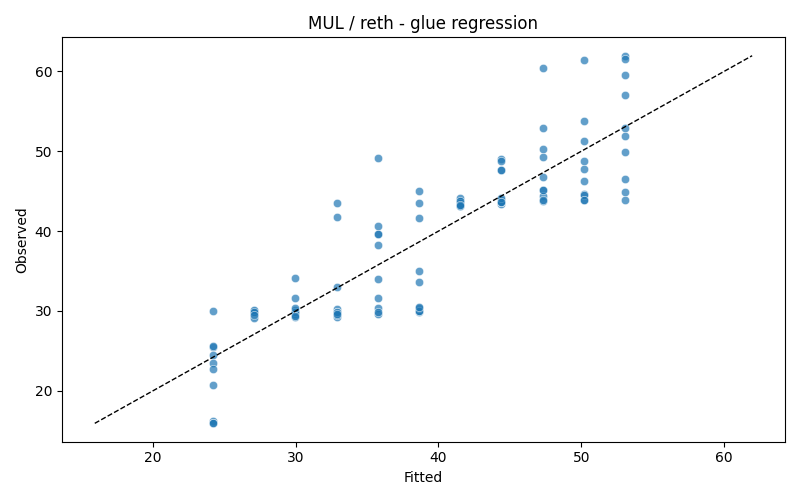

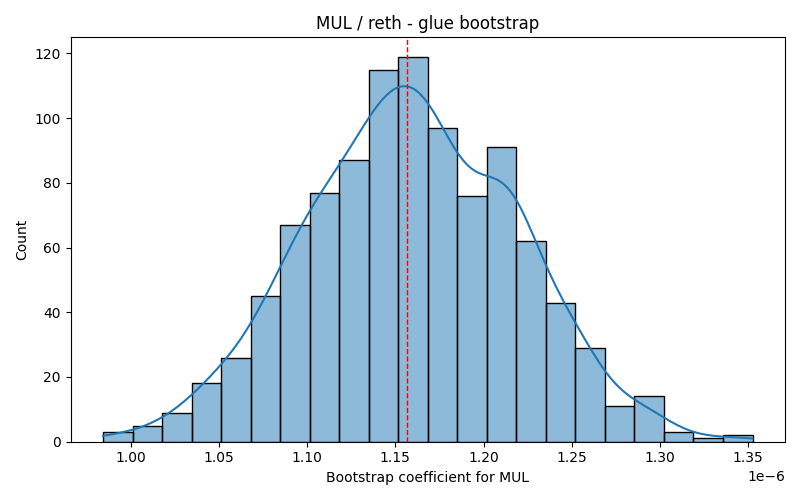

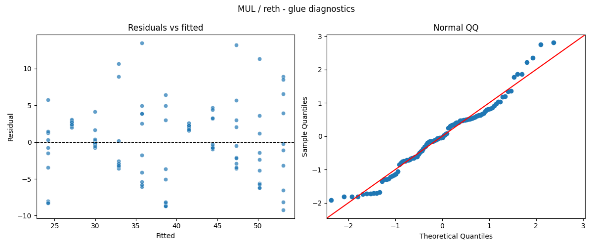

</details>

<details><summary><code>PC</code> · nobs=110 · runtime_ms=6.096e-07 · p=1.00e-03 · R²=0.9295</summary>

```
==============================================================================
                           NNLS Regression Results                            
==============================================================================
Dep. Variable:          test_runtime_ms              R-squared:          0.929
Model:                  NNLS                    Adj. R-squared:          0.929
No. Observations:       110                               RMSE:           5.02
Df Residuals:           108                                MAE:           4.01
Df Model:               1      
==============================================================================
                      coef     std err     P-value      [0.025      0.975]
------------------------------------------------------------------------------
         const     12.5852      1.6913       0.001      9.2947     15.9467
            PC      0.0000      0.0000       0.001      0.0000      0.0000
==============================================================================
Notes: Non-negative least squares with bootstrap inference (1000 iterations)
==============================================================================
```

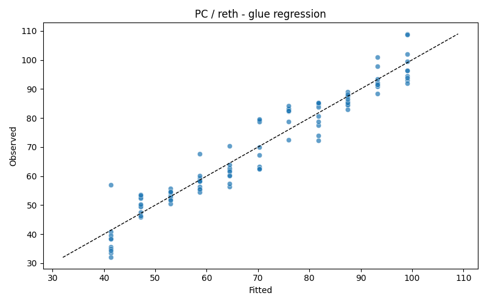

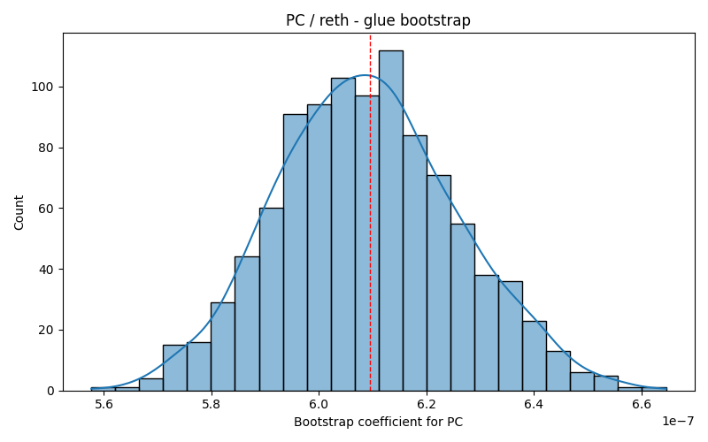

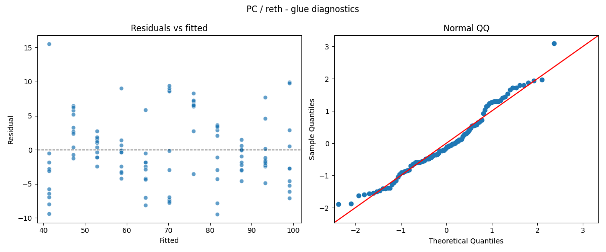

</details>

<details><summary><code>RETURNDATASIZE</code> · nobs=440 · runtime_ms=8.978e-07 · p=1.00e-03 · R²=0.8507</summary>

```
==============================================================================
                           NNLS Regression Results                            
==============================================================================
Dep. Variable:          test_runtime_ms              R-squared:          0.851
Model:                  NNLS                    Adj. R-squared:          0.850
No. Observations:       440                               RMSE:           5.94
Df Residuals:           438                                MAE:           4.56
Df Model:               1      
==============================================================================
                      coef     std err     P-value      [0.025      0.975]
------------------------------------------------------------------------------
         const     12.1517      0.8997       0.001     10.3737     13.9125
RETURNDATASIZE      0.0000      0.0000       0.001      0.0000      0.0000
==============================================================================
Notes: Non-negative least squares with bootstrap inference (1000 iterations)
==============================================================================
```

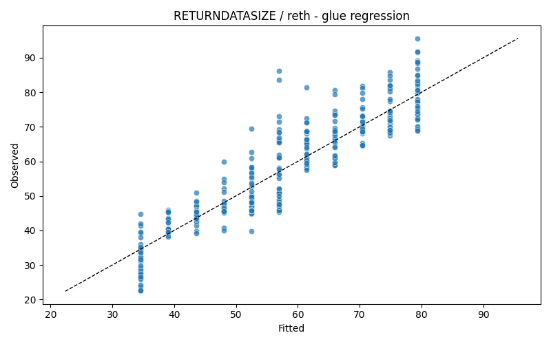

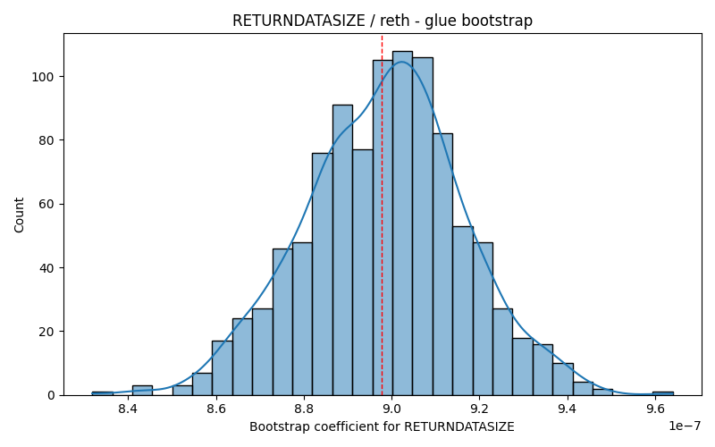

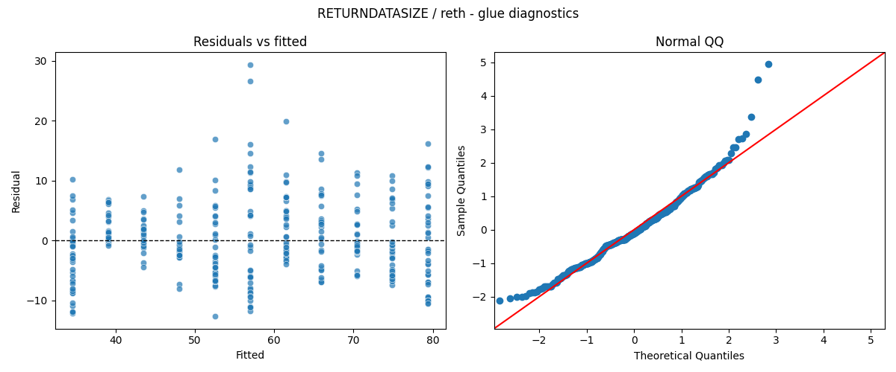

</details>

<details><summary><code>SELFBALANCE</code> · nobs=90 · runtime_ms=3.852e-06 · p=1.00e-03 · R²=0.8101</summary>

```
==============================================================================
                           NNLS Regression Results                            
==============================================================================
Dep. Variable:          test_runtime_ms              R-squared:          0.810
Model:                  NNLS                    Adj. R-squared:          0.808
No. Observations:       90                                RMSE:          18.81
Df Residuals:           88                                 MAE:          14.93
Df Model:               1      
==============================================================================
                      coef     std err     P-value      [0.025      0.975]
------------------------------------------------------------------------------
         const     55.8248      6.7831       0.001     43.3871     69.9433
   SELFBALANCE      0.0000      0.0000       0.001      0.0000      0.0000
==============================================================================
Notes: Non-negative least squares with bootstrap inference (1000 iterations)
==============================================================================
```

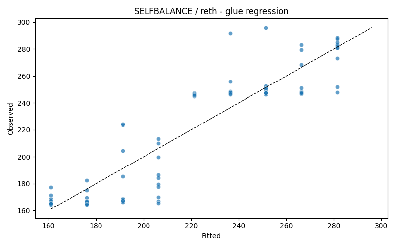

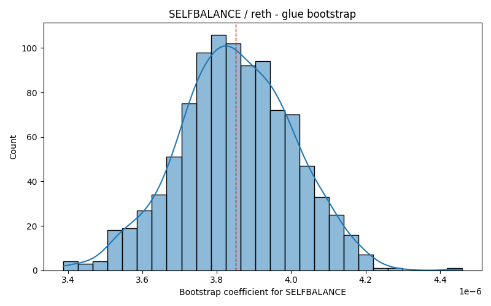

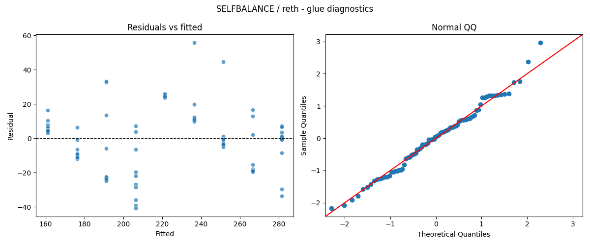

</details>

<details><summary><code>SUB</code> · nobs=110 · runtime_ms=9.43e-07 · p=1.00e-03 · R²=0.761</summary>

```
==============================================================================
                           NNLS Regression Results                            
==============================================================================
Dep. Variable:          test_runtime_ms              R-squared:          0.761
Model:                  NNLS                    Adj. R-squared:          0.759
No. Observations:       110                               RMSE:           5.56
Df Residuals:           108                                MAE:           4.19
Df Model:               1      
==============================================================================
                      coef     std err     P-value      [0.025      0.975]
------------------------------------------------------------------------------
         const     10.3493      1.7013       0.001      6.9150     13.5564
           SUB      0.0000      0.0000       0.001      0.0000      0.0000
==============================================================================
Notes: Non-negative least squares with bootstrap inference (1000 iterations)
==============================================================================
```

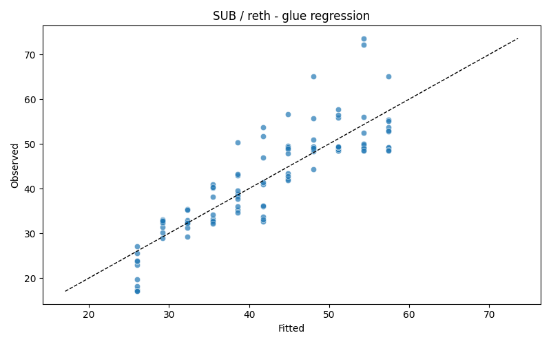


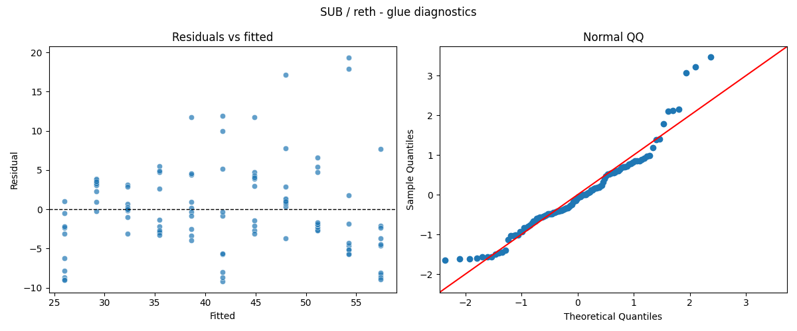

</details>

### Mixed glue (tier B) · reth

<details><summary><code>JUMP</code> · nobs=110 · runtime_ms=2.316e-06 · p=1.00e-03 · R²=0.7978</summary>

```
==============================================================================
                           NNLS Regression Results                            
==============================================================================
Dep. Variable:          test_runtime_ms              R-squared:          0.798
Model:                  NNLS                    Adj. R-squared:          0.796
No. Observations:       110                               RMSE:           4.33
Df Residuals:           108                                MAE:           3.41
Df Model:               1      
==============================================================================
                      coef     std err     P-value      [0.025      0.975]
------------------------------------------------------------------------------
         const      8.3866      1.3522       0.001      5.8163     11.0684
          JUMP      0.0000      0.0000       0.001      0.0000      0.0000
==============================================================================
Notes: Non-negative least squares with bootstrap inference (1000 iterations)
==============================================================================
```

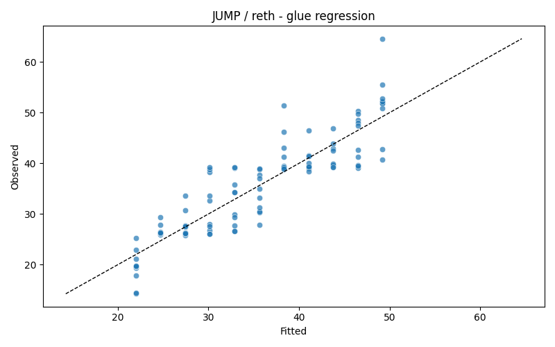

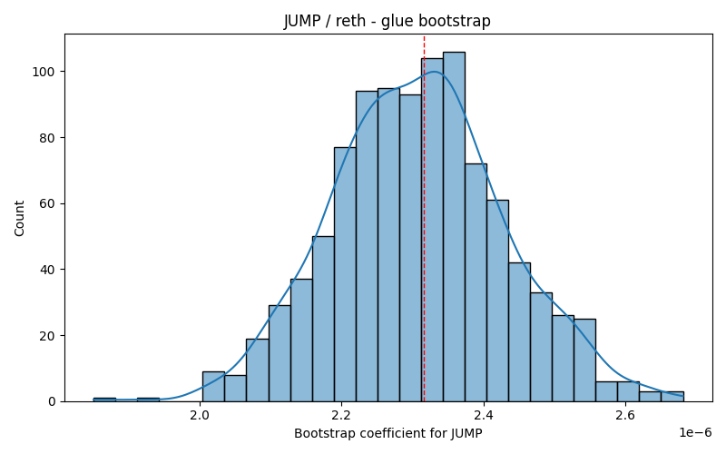

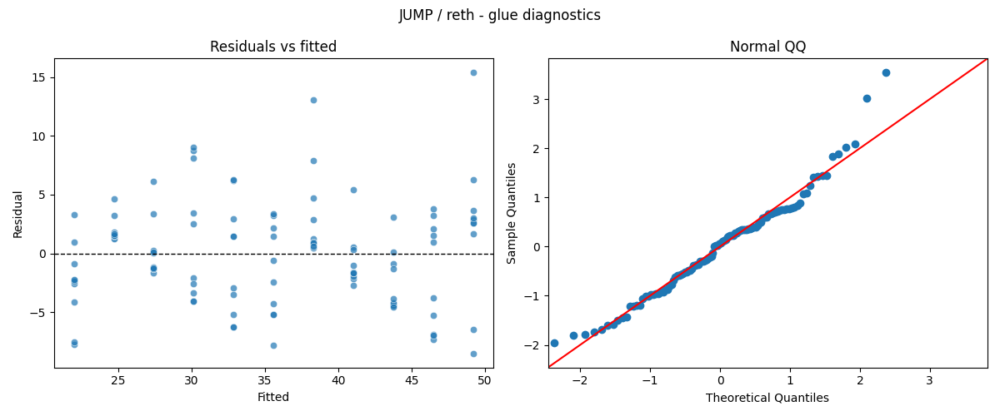

</details>

<details><summary><code>KECCAK256</code> · nobs=1760 · runtime_ms=0 · p=1.00e+00 · R²=0</summary>

```
==============================================================================
                           NNLS Regression Results                            
==============================================================================
Dep. Variable:          test_runtime_ms              R-squared:          0.000
Model:                  NNLS                    Adj. R-squared:         -0.001
No. Observations:       1760                              RMSE:         161.46
Df Residuals:           1758                               MAE:         136.44
Df Model:               1      
==============================================================================
                      coef     std err     P-value      [0.025      0.975]
------------------------------------------------------------------------------
         const    253.5426      3.8390       0.001    246.2434    261.1943
     KECCAK256      0.0000      0.0000       1.000      0.0000      0.0000
==============================================================================
Notes: Non-negative least squares with bootstrap inference (1000 iterations)
==============================================================================
```

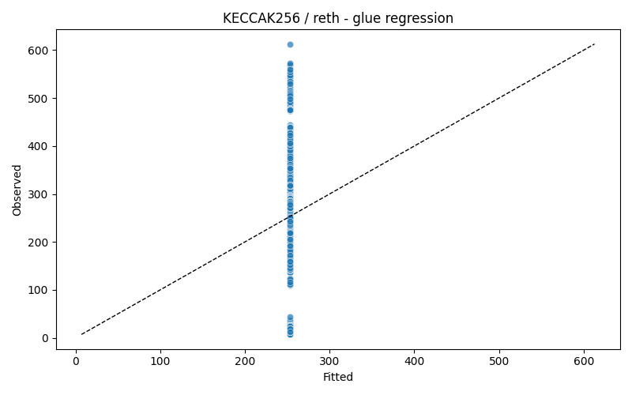


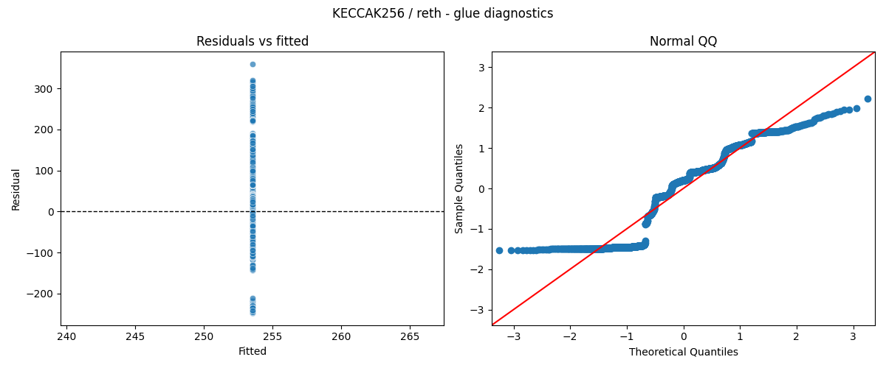

</details>
