# Runtime estimation report

Per-spec NNLS fits of `test_runtime_ms` against `opcount`, one row per (target opcode, test, model_by combo, client).

## Contents

- [SLOAD](#sload)
- [SSTORE](#sstore)
- [BALANCE](#balance)
- [CALL](#call)
- [CALLCODE](#callcode)
- [DELEGATECALL](#delegatecall)
- [EXTCODECOPY](#extcodecopy)
- [EXTCODEHASH](#extcodehash)
- [EXTCODESIZE](#extcodesize)
- [STATICCALL](#staticcall)

## SLOAD

### test_sload_bloated — combo `False`

| client | nobs | R² | target_coef (ms) | p-value | 95% CI |
| --- | --- | --- | --- | --- | --- |
| `besu` | 220 | 0.9609 | 0.007326 | 1.00e-03 | [0.007132, 0.00754] |
| `erigon` | 88 | 0.9983 | 0.006177 | 1.00e-03 | [0.006115, 0.006229] |
| `geth` | 143 | 0.878 | 0.02633 | 1.00e-03 | [0.02457, 0.02814] |
| `nethermind` | 121 | 0.7572 | 0.003862 | 1.00e-03 | [0.003434, 0.004295] |
| `reth` | 231 | 0.9313 | 0.001273 | 1.00e-03 | [0.001222, 0.001323] |

<details><summary>besu — NNLS regression summary</summary>

```
==============================================================================
                           NNLS Regression Results                            
==============================================================================
Dep. Variable:          test_runtime_ms              R-squared:          0.961
Model:                  NNLS                    Adj. R-squared:          0.961
No. Observations:       220                               RMSE:          43.52
Df Residuals:           218                                MAE:          34.91
Df Model:               1      
==============================================================================
                      coef     std err     P-value      [0.025      0.975]
------------------------------------------------------------------------------
         const    183.1580      9.0259       0.001    164.5981    200.3700
       opcount      0.0073      0.0001       0.001      0.0071      0.0075
==============================================================================
Notes: Non-negative least squares with bootstrap inference (1000 iterations)
==============================================================================
```


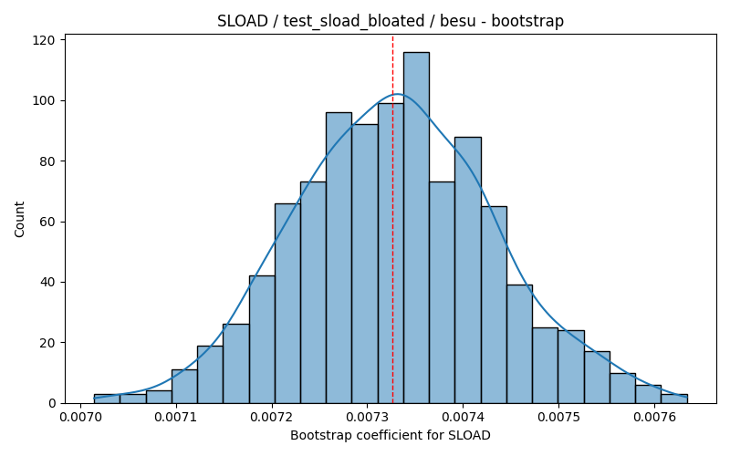

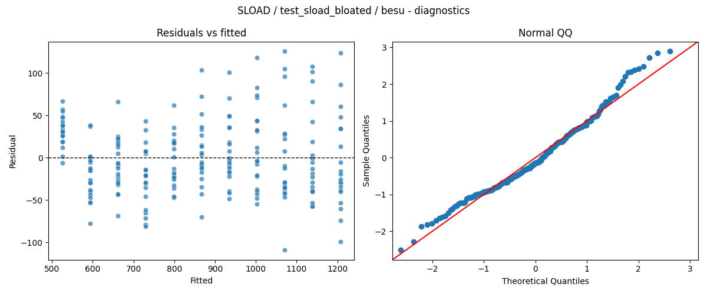

</details>

<details><summary>erigon — NNLS regression summary</summary>

```
==============================================================================
                           NNLS Regression Results                            
==============================================================================
Dep. Variable:          test_runtime_ms              R-squared:          0.998
Model:                  NNLS                    Adj. R-squared:          0.998
No. Observations:       88                                RMSE:           7.58
Df Residuals:           86                                 MAE:           5.97
Df Model:               1      
==============================================================================
                      coef     std err     P-value      [0.025      0.975]
------------------------------------------------------------------------------
         const     12.0193      2.4839       0.001      7.2915     16.9751
       opcount      0.0062      0.0000       0.001      0.0061      0.0062
==============================================================================
Notes: Non-negative least squares with bootstrap inference (1000 iterations)
==============================================================================
```

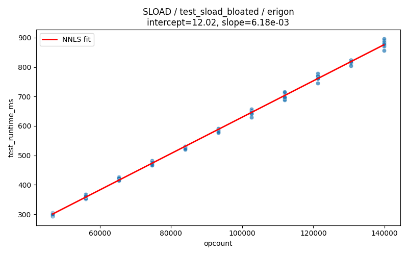

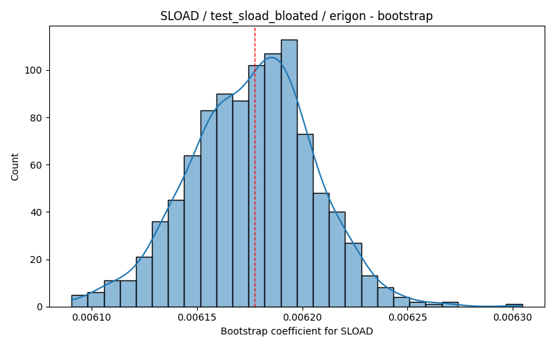

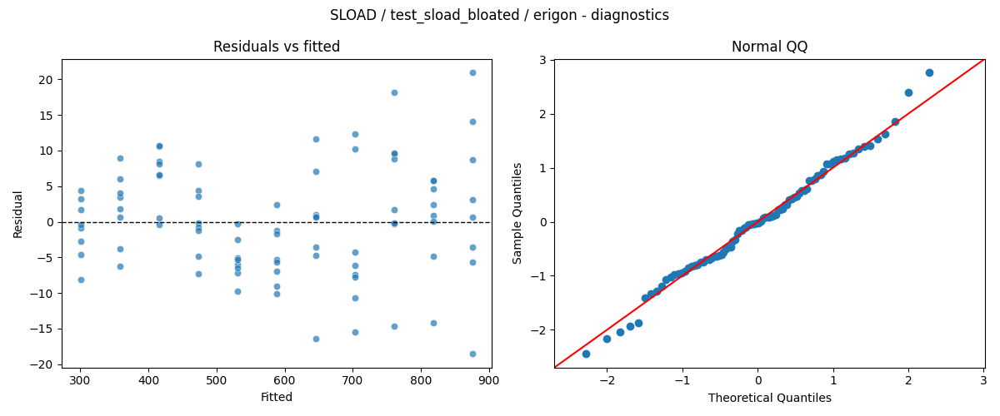

</details>

<details><summary>geth — NNLS regression summary</summary>

```
==============================================================================
                           NNLS Regression Results                            
==============================================================================
Dep. Variable:          test_runtime_ms              R-squared:          0.878
Model:                  NNLS                    Adj. R-squared:          0.877
No. Observations:       143                               RMSE:         288.80
Df Residuals:           141                                MAE:         220.66
Df Model:               1      
==============================================================================
                      coef     std err     P-value      [0.025      0.975]
------------------------------------------------------------------------------
         const    898.4033     78.5855       0.001    750.3801   1052.0338
       opcount      0.0263      0.0009       0.001      0.0246      0.0281
==============================================================================
Notes: Non-negative least squares with bootstrap inference (1000 iterations)
==============================================================================
```

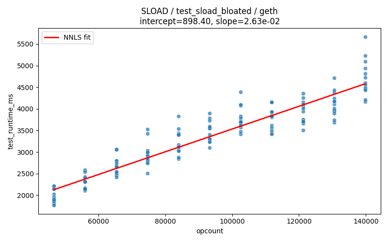

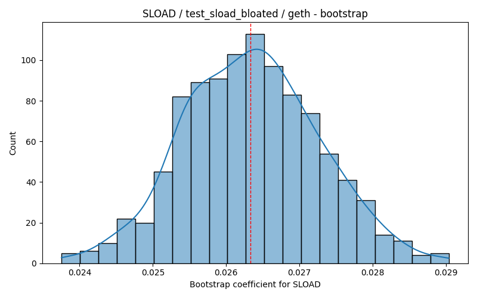

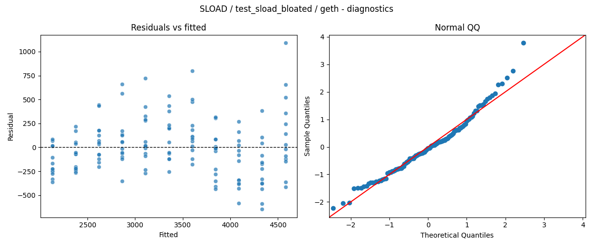

</details>

<details><summary>nethermind — NNLS regression summary</summary>

```
==============================================================================
                           NNLS Regression Results                            
==============================================================================
Dep. Variable:          test_runtime_ms              R-squared:          0.757
Model:                  NNLS                    Adj. R-squared:          0.755
No. Observations:       121                               RMSE:          64.37
Df Residuals:           119                                MAE:          46.24
Df Model:               1      
==============================================================================
                      coef     std err     P-value      [0.025      0.975]
------------------------------------------------------------------------------
         const    122.1356     20.6463       0.001     83.4288    164.1656
       opcount      0.0039      0.0002       0.001      0.0034      0.0043
==============================================================================
Notes: Non-negative least squares with bootstrap inference (1000 iterations)
==============================================================================
```

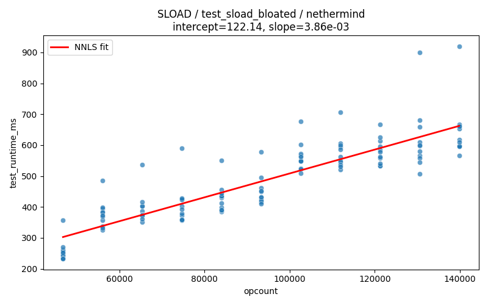

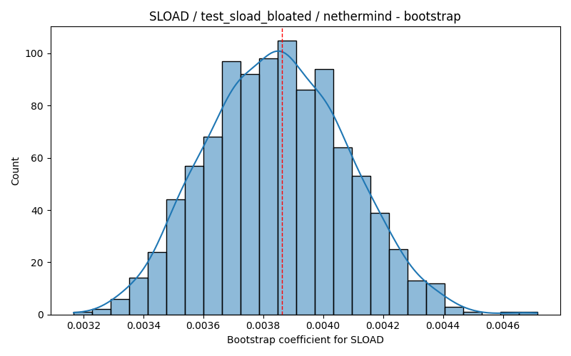

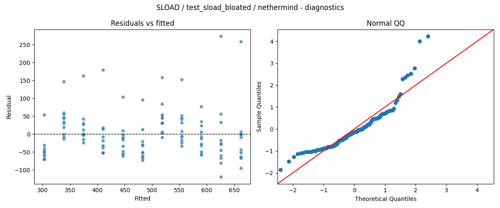

</details>

<details><summary>reth — NNLS regression summary</summary>

```
==============================================================================
                           NNLS Regression Results                            
==============================================================================
Dep. Variable:          test_runtime_ms              R-squared:          0.931
Model:                  NNLS                    Adj. R-squared:          0.931
No. Observations:       231                               RMSE:          10.18
Df Residuals:           229                                MAE:           7.60
Df Model:               1      
==============================================================================
                      coef     std err     P-value      [0.025      0.975]
------------------------------------------------------------------------------
         const     41.2985      2.5035       0.001     36.4170     46.1372
       opcount      0.0013      0.0000       0.001      0.0012      0.0013
==============================================================================
Notes: Non-negative least squares with bootstrap inference (1000 iterations)
==============================================================================
```

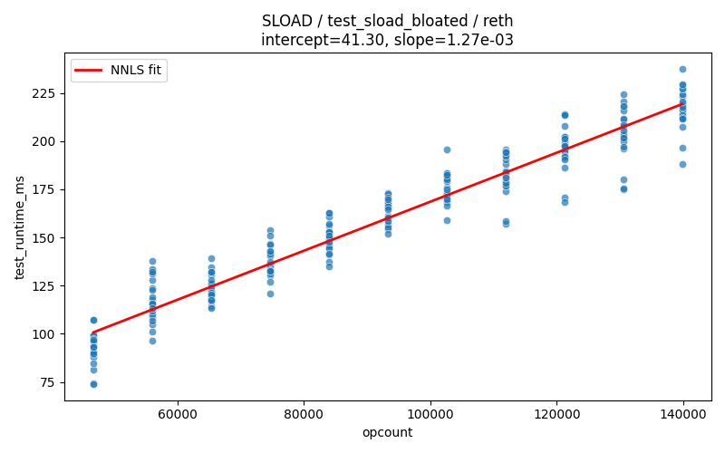

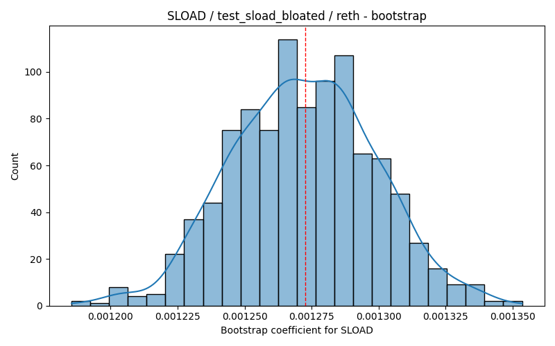

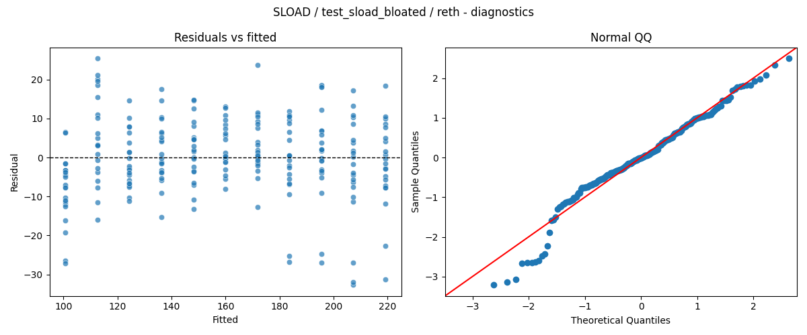

</details>

### test_sload_bloated — combo `True`

| client | nobs | R² | target_coef (ms) | p-value | 95% CI |
| --- | --- | --- | --- | --- | --- |
| `besu` | 220 | 0.9216 | 0.01666 | 1.00e-03 | [0.01604, 0.01726] |
| `erigon` | 88 | 0.9904 | 0.005655 | 1.00e-03 | [0.00555, 0.00576] |
| `geth` | 143 | 0.8718 | 0.02421 | 1.00e-03 | [0.02268, 0.02574] |
| `nethermind` | 121 | 0.5376 | 0.02528 | 1.00e-03 | [0.02079, 0.02925] |
| `reth` | 231 | 0.9607 | 0.001471 | 1.00e-03 | [0.001428, 0.001515] |

<details><summary>besu — NNLS regression summary</summary>

```
==============================================================================
                           NNLS Regression Results                            
==============================================================================
Dep. Variable:          test_runtime_ms              R-squared:          0.922
Model:                  NNLS                    Adj. R-squared:          0.921
No. Observations:       220                               RMSE:         143.02
Df Residuals:           218                                MAE:         113.93
Df Model:               1      
==============================================================================
                      coef     std err     P-value      [0.025      0.975]
------------------------------------------------------------------------------
         const    499.6720     28.6024       0.001    443.6589    556.6847
       opcount      0.0167      0.0003       0.001      0.0160      0.0173
==============================================================================
Notes: Non-negative least squares with bootstrap inference (1000 iterations)
==============================================================================
```

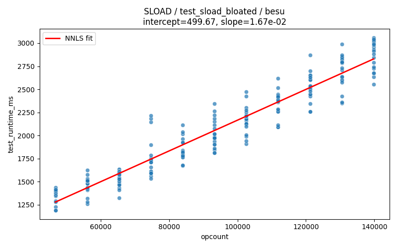

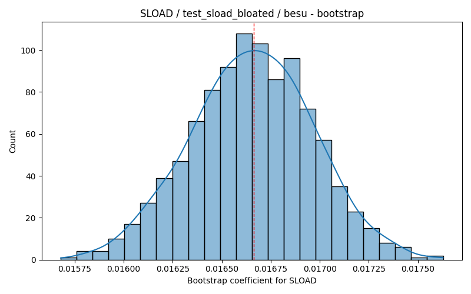

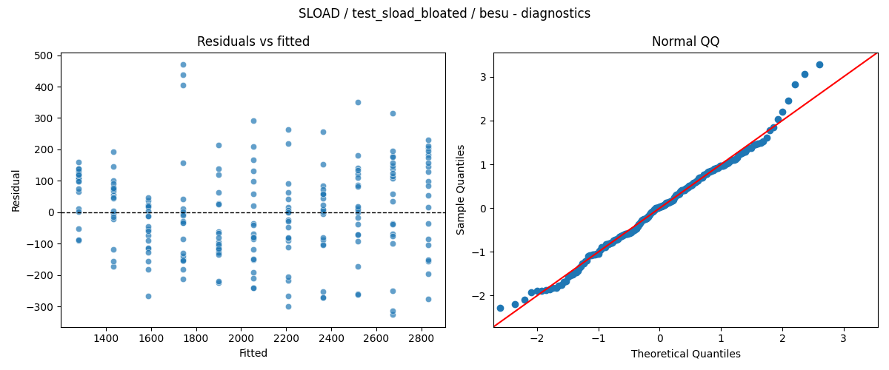

</details>

<details><summary>erigon — NNLS regression summary</summary>

```
==============================================================================
                           NNLS Regression Results                            
==============================================================================
Dep. Variable:          test_runtime_ms              R-squared:          0.990
Model:                  NNLS                    Adj. R-squared:          0.990
No. Observations:       88                                RMSE:          16.38
Df Residuals:           86                                 MAE:          13.57
Df Model:               1      
==============================================================================
                      coef     std err     P-value      [0.025      0.975]
------------------------------------------------------------------------------
         const     24.0823      5.5293       0.001     13.1302     35.2460
       opcount      0.0057      0.0001       0.001      0.0056      0.0058
==============================================================================
Notes: Non-negative least squares with bootstrap inference (1000 iterations)
==============================================================================
```

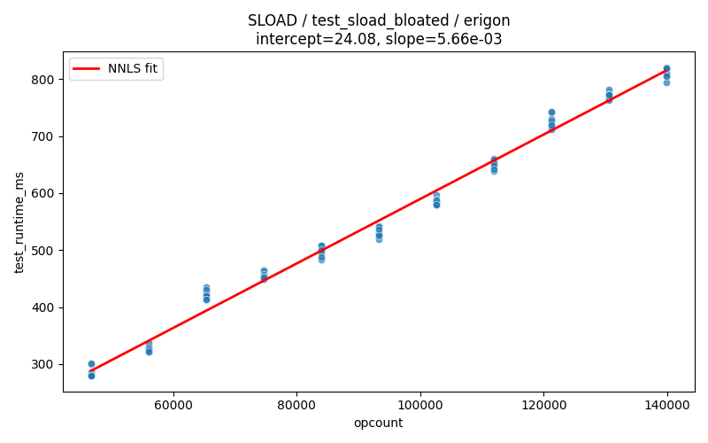

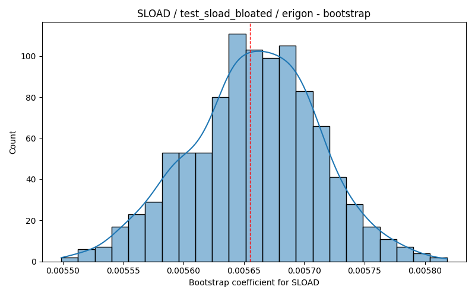

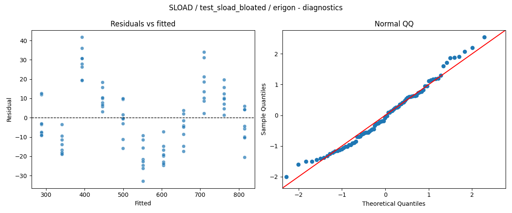

</details>

<details><summary>geth — NNLS regression summary</summary>

```
==============================================================================
                           NNLS Regression Results                            
==============================================================================
Dep. Variable:          test_runtime_ms              R-squared:          0.872
Model:                  NNLS                    Adj. R-squared:          0.871
No. Observations:       143                               RMSE:         273.31
Df Residuals:           141                                MAE:         220.10
Df Model:               1      
==============================================================================
                      coef     std err     P-value      [0.025      0.975]
------------------------------------------------------------------------------
         const    976.3644     73.6782       0.001    835.0215   1124.0487
       opcount      0.0242      0.0008       0.001      0.0227      0.0257
==============================================================================
Notes: Non-negative least squares with bootstrap inference (1000 iterations)
==============================================================================
```

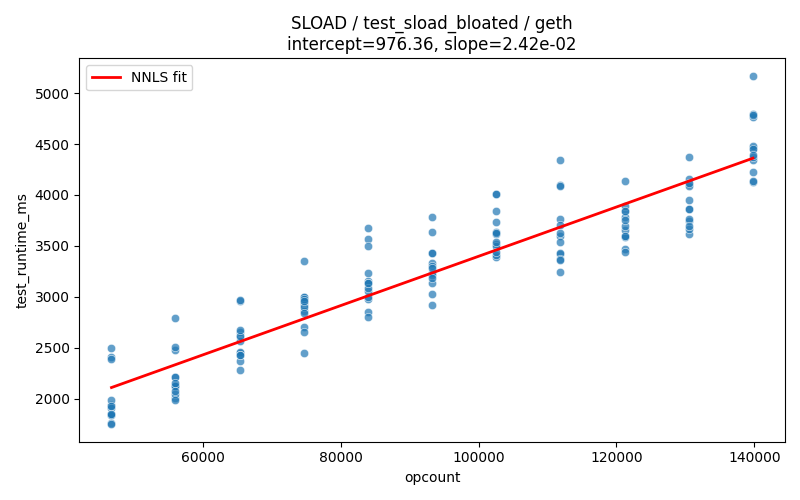

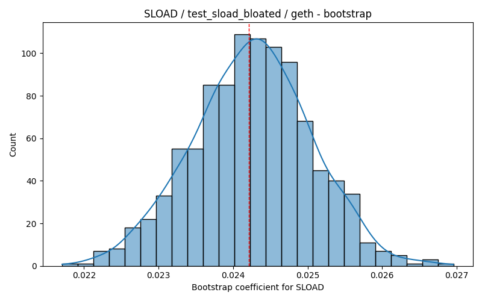

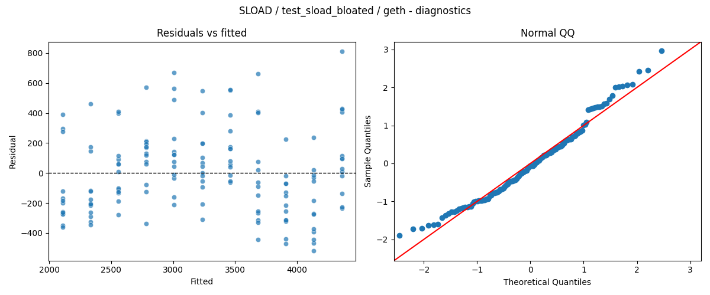

</details>

<details><summary>nethermind — NNLS regression summary</summary>

```
==============================================================================
                           NNLS Regression Results                            
==============================================================================
Dep. Variable:          test_runtime_ms              R-squared:          0.538
Model:                  NNLS                    Adj. R-squared:          0.534
No. Observations:       121                               RMSE:         690.02
Df Residuals:           119                                MAE:         583.93
Df Model:               1      
==============================================================================
                      coef     std err     P-value      [0.025      0.975]
------------------------------------------------------------------------------
         const   1243.6457    206.8533       0.001    875.5281   1656.0781
       opcount      0.0253      0.0022       0.001      0.0208      0.0293
==============================================================================
Notes: Non-negative least squares with bootstrap inference (1000 iterations)
==============================================================================
```

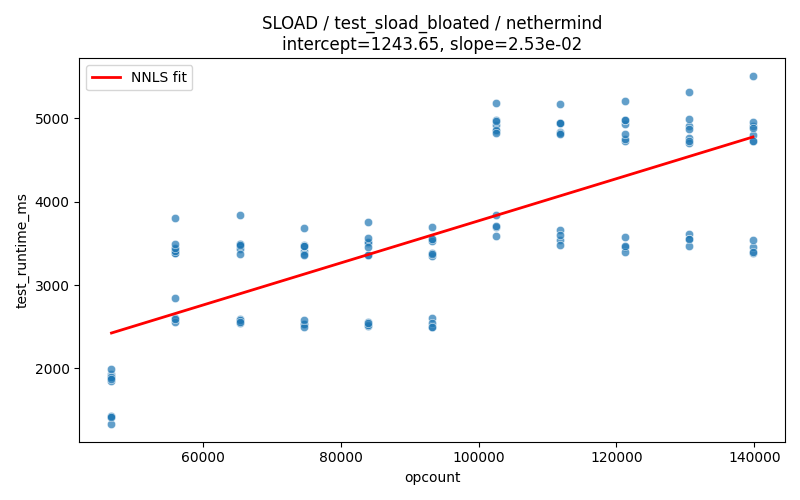

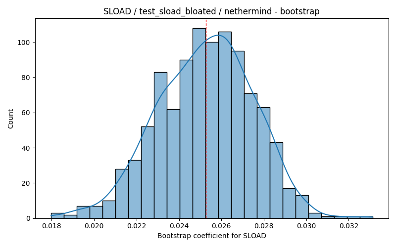

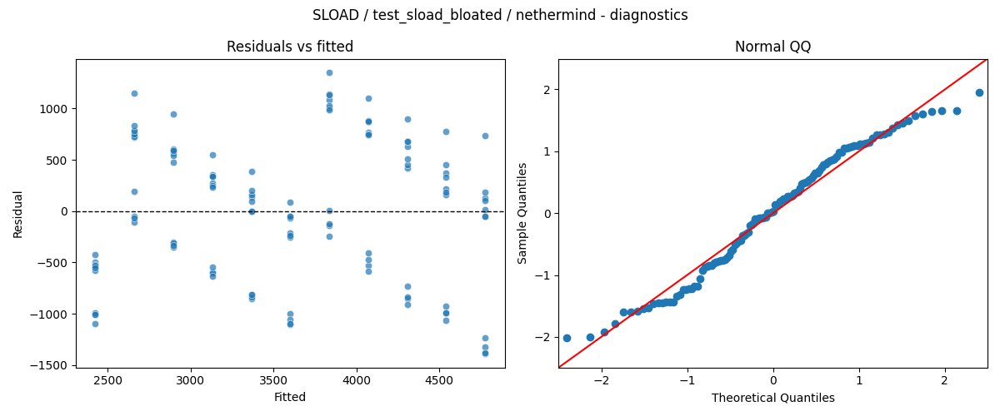

</details>

<details><summary>reth — NNLS regression summary</summary>

```
==============================================================================
                           NNLS Regression Results                            
==============================================================================
Dep. Variable:          test_runtime_ms              R-squared:          0.961
Model:                  NNLS                    Adj. R-squared:          0.960
No. Observations:       231                               RMSE:           8.76
Df Residuals:           229                                MAE:           6.95
Df Model:               1      
==============================================================================
                      coef     std err     P-value      [0.025      0.975]
------------------------------------------------------------------------------
         const     28.8557      1.8974       0.001     25.1046     32.7767
       opcount      0.0015      0.0000       0.001      0.0014      0.0015
==============================================================================
Notes: Non-negative least squares with bootstrap inference (1000 iterations)
==============================================================================
```

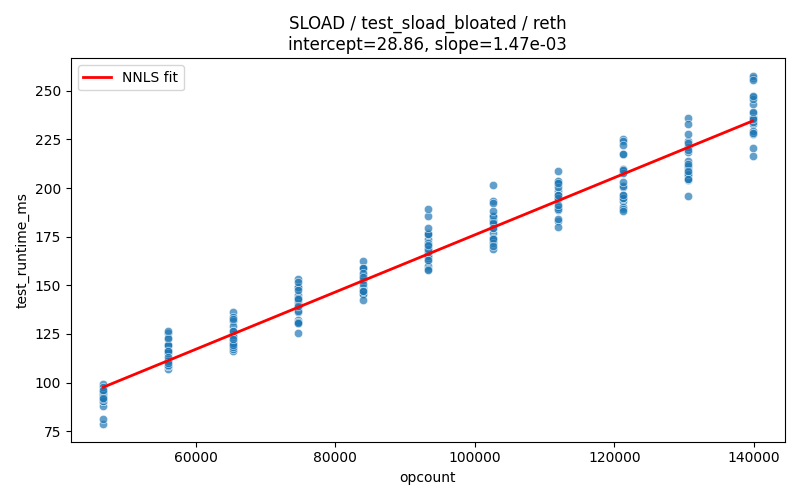

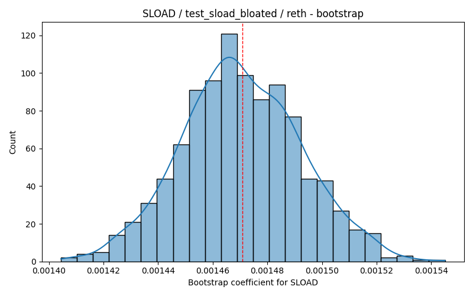

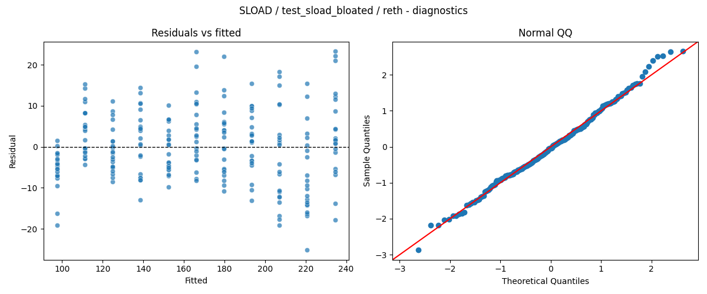

</details>

### test_storage_sload_same_key_benchmark

| client | nobs | R² | target_coef (ms) | p-value | 95% CI |
| --- | --- | --- | --- | --- | --- |
| `besu` | 440 | 0.6864 | 0.000112 | 1.00e-03 | [0.0001051, 0.000119] |
| `erigon` | 176 | 0.8858 | 3.935e-05 | 1.00e-03 | [3.721e-05, 4.159e-05] |
| `geth` | 286 | 0.8033 | 4.232e-05 | 1.00e-03 | [3.96e-05, 4.517e-05] |
| `nethermind` | 242 | 0.8075 | 0.0001886 | 1.00e-03 | [0.0001767, 0.0002013] |
| `reth` | 462 | 0.6635 | 5.129e-06 | 1.00e-03 | [4.819e-06, 5.434e-06] |

<details><summary>besu — NNLS regression summary</summary>

```
==============================================================================
                           NNLS Regression Results                            
==============================================================================
Dep. Variable:          test_runtime_ms              R-squared:          0.686
Model:                  NNLS                    Adj. R-squared:          0.686
No. Observations:       440                               RMSE:          47.83
Df Residuals:           438                                MAE:          37.52
Df Model:               1      
==============================================================================
                      coef     std err     P-value      [0.025      0.975]
------------------------------------------------------------------------------
         const     86.0385      6.7961       0.001     72.9080     99.3854
       opcount      0.0001      0.0000       0.001      0.0001      0.0001
==============================================================================
Notes: Non-negative least squares with bootstrap inference (1000 iterations)
==============================================================================
```

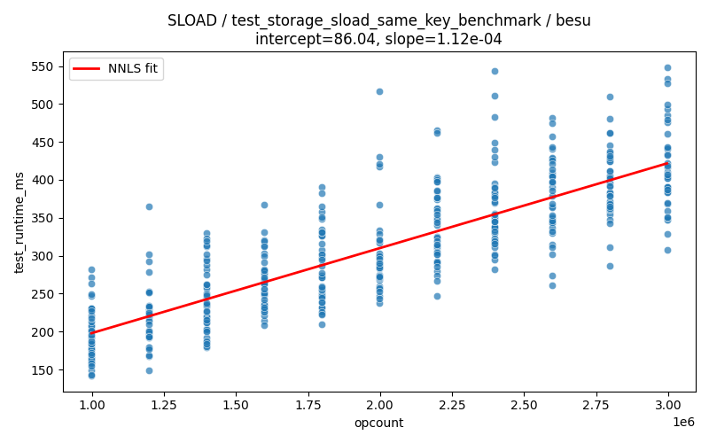

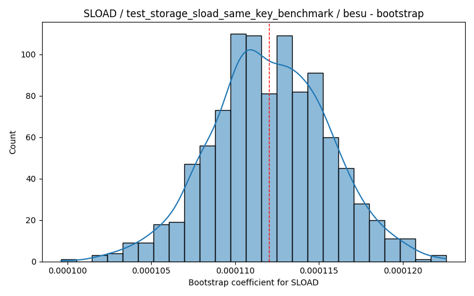

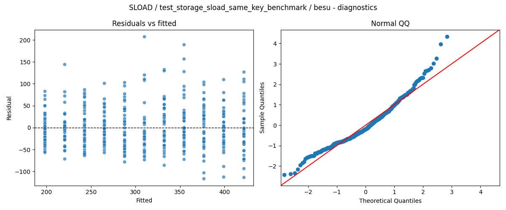

</details>

<details><summary>erigon — NNLS regression summary</summary>

```
==============================================================================
                           NNLS Regression Results                            
==============================================================================
Dep. Variable:          test_runtime_ms              R-squared:          0.886
Model:                  NNLS                    Adj. R-squared:          0.885
No. Observations:       176                               RMSE:           8.93
Df Residuals:           174                                MAE:           6.22
Df Model:               1      
==============================================================================
                      coef     std err     P-value      [0.025      0.975]
------------------------------------------------------------------------------
         const     34.1826      2.1908       0.001     29.7398     38.4821
       opcount      0.0000      0.0000       0.001      0.0000      0.0000
==============================================================================
Notes: Non-negative least squares with bootstrap inference (1000 iterations)
==============================================================================
```

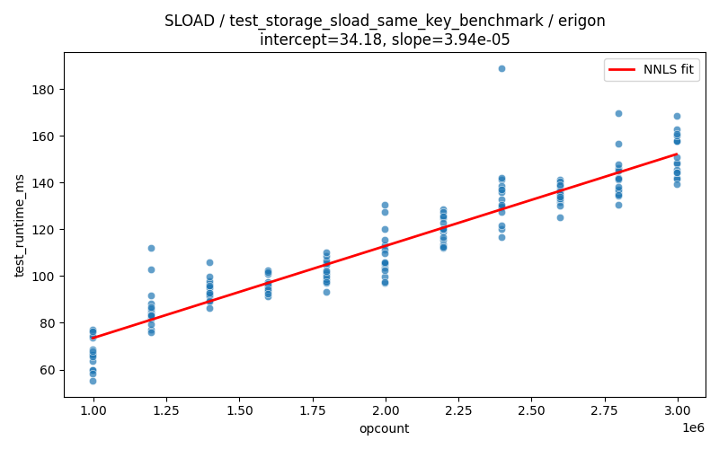

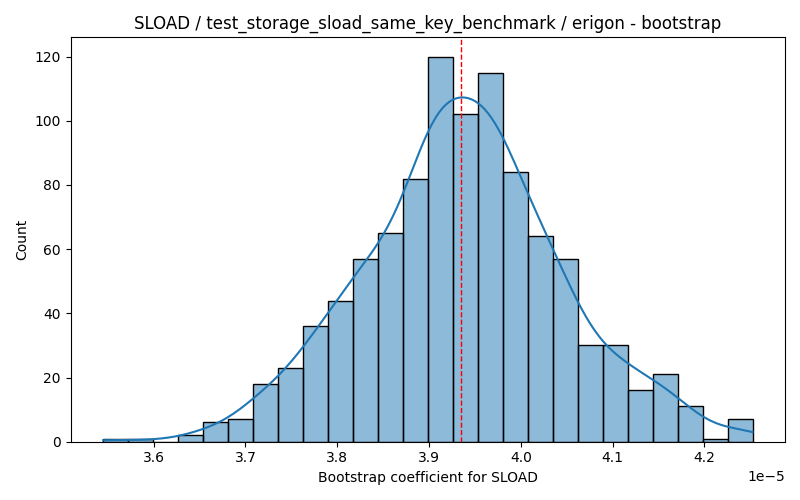

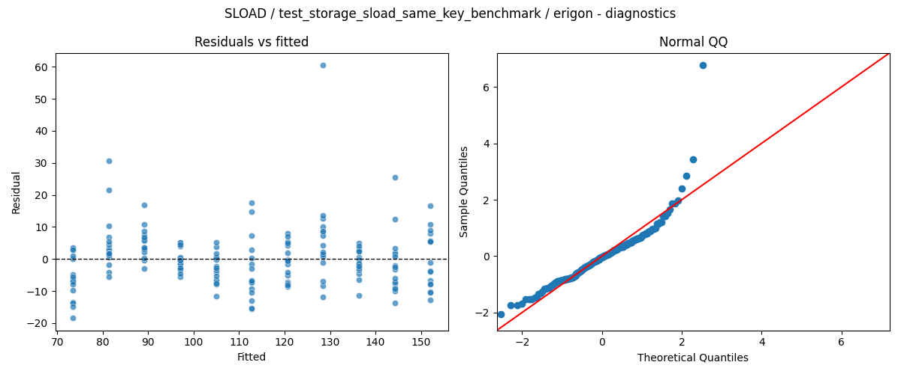

</details>

<details><summary>geth — NNLS regression summary</summary>

```
==============================================================================
                           NNLS Regression Results                            
==============================================================================
Dep. Variable:          test_runtime_ms              R-squared:          0.803
Model:                  NNLS                    Adj. R-squared:          0.803
No. Observations:       286                               RMSE:          13.23
Df Residuals:           284                                MAE:          10.18
Df Model:               1      
==============================================================================
                      coef     std err     P-value      [0.025      0.975]
------------------------------------------------------------------------------
         const     21.4585      2.5855       0.001     16.4118     26.3820
       opcount      0.0000      0.0000       0.001      0.0000      0.0000
==============================================================================
Notes: Non-negative least squares with bootstrap inference (1000 iterations)
==============================================================================
```

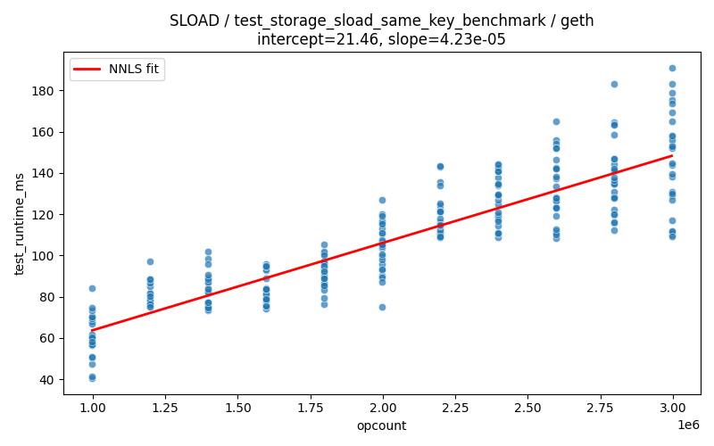

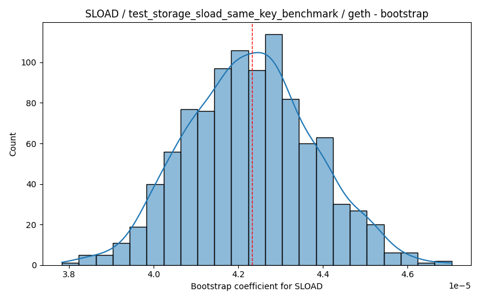

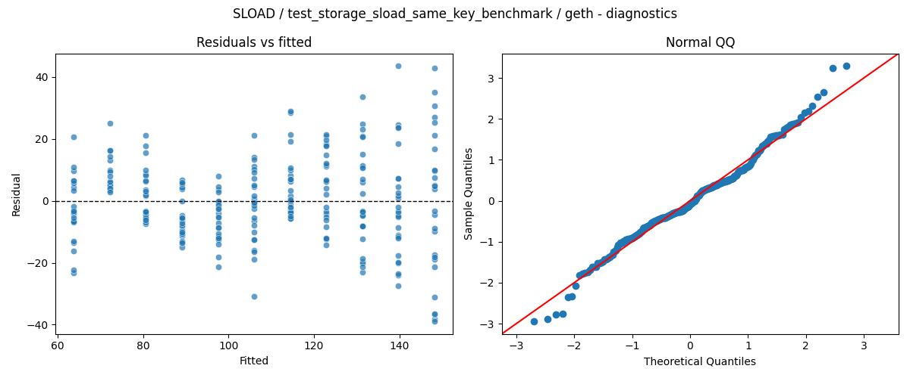

</details>

<details><summary>nethermind — NNLS regression summary</summary>

```
==============================================================================
                           NNLS Regression Results                            
==============================================================================
Dep. Variable:          test_runtime_ms              R-squared:          0.808
Model:                  NNLS                    Adj. R-squared:          0.807
No. Observations:       242                               RMSE:          58.16
Df Residuals:           240                                MAE:          42.77
Df Model:               1      
==============================================================================
                      coef     std err     P-value      [0.025      0.975]
------------------------------------------------------------------------------
         const     92.1088     11.4352       0.001     70.6716    114.7213
       opcount      0.0002      0.0000       0.001      0.0002      0.0002
==============================================================================
Notes: Non-negative least squares with bootstrap inference (1000 iterations)
==============================================================================
```

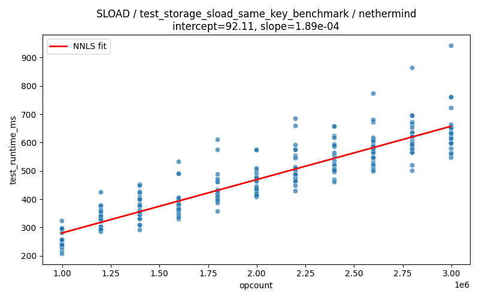

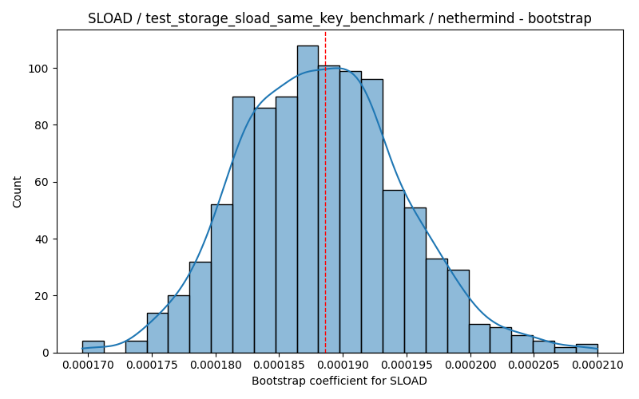

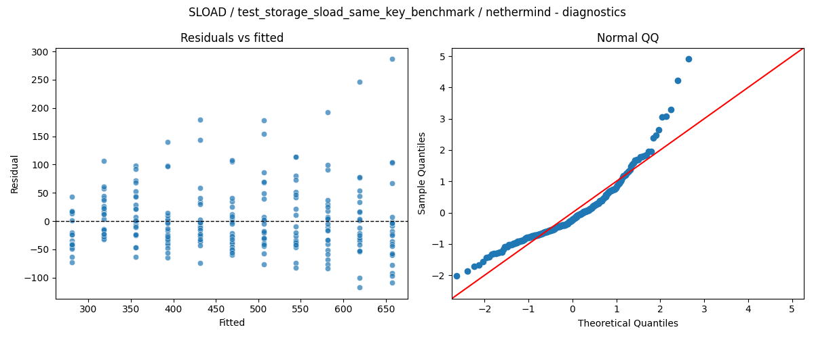

</details>

<details><summary>reth — NNLS regression summary</summary>

```
==============================================================================
                           NNLS Regression Results                            
==============================================================================
Dep. Variable:          test_runtime_ms              R-squared:          0.663
Model:                  NNLS                    Adj. R-squared:          0.663
No. Observations:       462                               RMSE:           2.31
Df Residuals:           460                                MAE:           1.61
Df Model:               1      
==============================================================================
                      coef     std err     P-value      [0.025      0.975]
------------------------------------------------------------------------------
         const      5.5573      0.3215       0.001      4.9461      6.1880
       opcount      0.0000      0.0000       0.001      0.0000      0.0000
==============================================================================
Notes: Non-negative least squares with bootstrap inference (1000 iterations)
==============================================================================
```

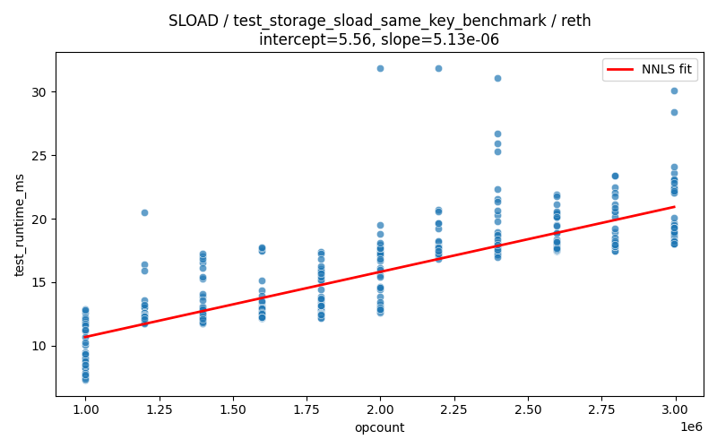

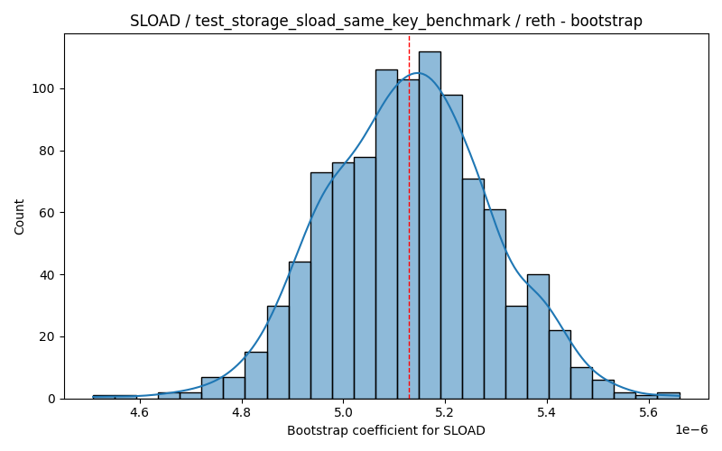

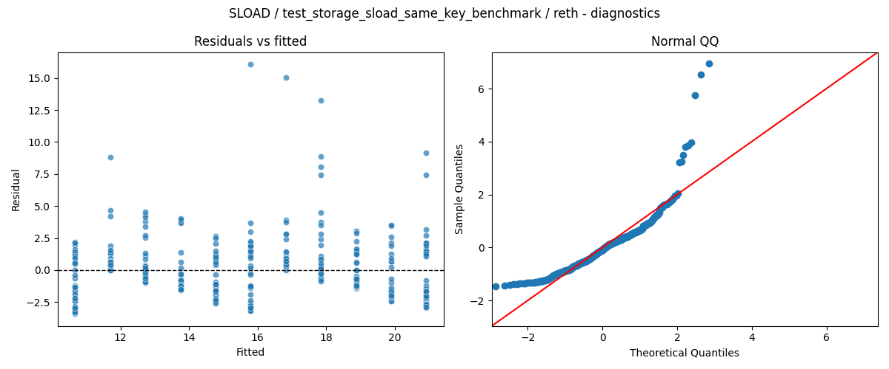

</details>

## SSTORE

### test_sstore_bloated — combo `False`

| client | nobs | R² | target_coef (ms) | p-value | 95% CI |
| --- | --- | --- | --- | --- | --- |
| `besu` | 440 | 0.8642 | 0.009056 | 1.00e-03 | [0.008655, 0.009494] |
| `erigon` | 176 | 0.9318 | 0.00515 | 1.00e-03 | [0.004873, 0.005386] |
| `geth` | 286 | 0.9755 | 0.0293 | 1.00e-03 | [0.02863, 0.02998] |
| `nethermind` | 242 | 0.8585 | 0.00365 | 1.00e-03 | [0.003371, 0.003914] |
| `reth` | 462 | 0.5944 | 0 | 1.00e+00 | [0, 0.0002794] |

<details><summary>besu — NNLS regression summary</summary>

```
==============================================================================
                           NNLS Regression Results                            
==============================================================================
Dep. Variable:          test_runtime_ms              R-squared:          0.864
Model:                  NNLS                    Adj. R-squared:          0.864
No. Observations:       440                               RMSE:         128.93
Df Residuals:           437                                MAE:         101.80
Df Model:               2      
==============================================================================
                      coef     std err     P-value      [0.025      0.975]
------------------------------------------------------------------------------
         const    459.3327     19.2332       0.001    421.8230    494.7360
       opcount      0.0091      0.0002       0.001      0.0087      0.0095
        update      0.1371      0.0114       0.001      0.1163      0.1608
==============================================================================
Notes: Non-negative least squares with bootstrap inference (1000 iterations)
==============================================================================
```

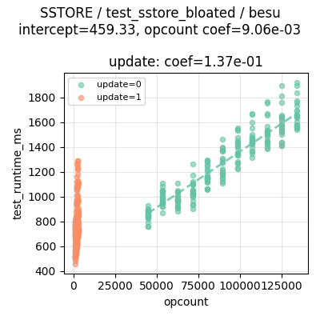

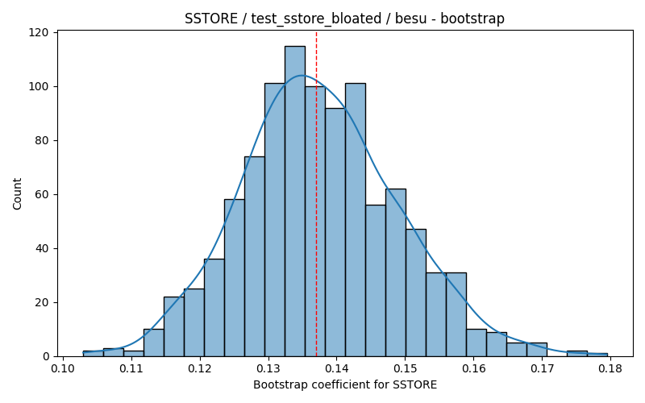

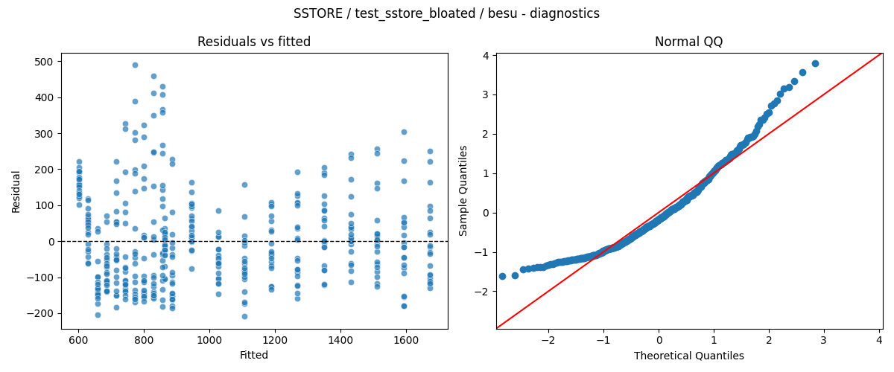

</details>

<details><summary>erigon — NNLS regression summary</summary>

```
==============================================================================
                           NNLS Regression Results                            
==============================================================================
Dep. Variable:          test_runtime_ms              R-squared:          0.932
Model:                  NNLS                    Adj. R-squared:          0.931
No. Observations:       176                               RMSE:          38.68
Df Residuals:           173                                MAE:          31.05
Df Model:               2      
==============================================================================
                      coef     std err     P-value      [0.025      0.975]
------------------------------------------------------------------------------
         const    109.0811     12.9054       0.001     85.2795    136.1531
       opcount      0.0051      0.0001       0.001      0.0049      0.0054
        update      0.1617      0.0056       0.001      0.1495      0.1718
==============================================================================
Notes: Non-negative least squares with bootstrap inference (1000 iterations)
==============================================================================
```

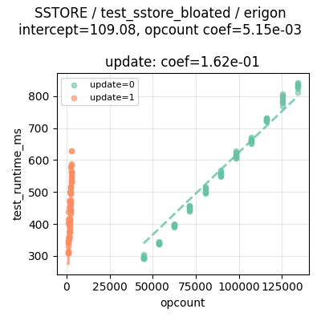

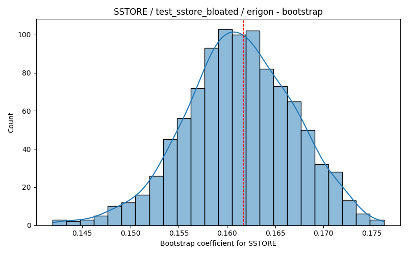

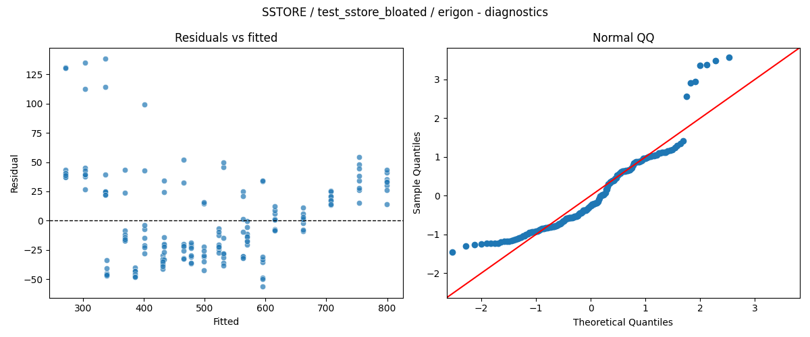

</details>

<details><summary>geth — NNLS regression summary</summary>

```
==============================================================================
                           NNLS Regression Results                            
==============================================================================
Dep. Variable:          test_runtime_ms              R-squared:          0.975
Model:                  NNLS                    Adj. R-squared:          0.975
No. Observations:       286                               RMSE:         223.28
Df Residuals:           283                                MAE:         158.66
Df Model:               2      
==============================================================================
                      coef     std err     P-value      [0.025      0.975]
------------------------------------------------------------------------------
         const    366.2066     10.8951       0.001    346.2344    388.7617
       opcount      0.0293      0.0003       0.001      0.0286      0.0300
        update      0.0000      0.0000       1.000      0.0000      0.0000
==============================================================================
Notes: Non-negative least squares with bootstrap inference (1000 iterations)
==============================================================================
```

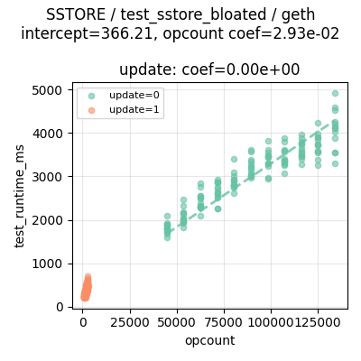


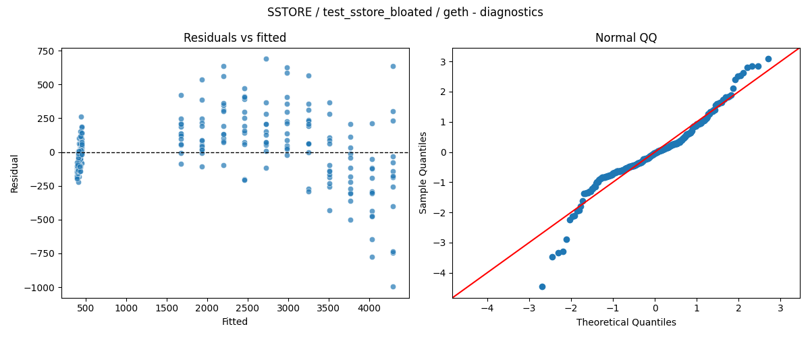

</details>

<details><summary>nethermind — NNLS regression summary</summary>

```
==============================================================================
                           NNLS Regression Results                            
==============================================================================
Dep. Variable:          test_runtime_ms              R-squared:          0.859
Model:                  NNLS                    Adj. R-squared:          0.857
No. Observations:       242                               RMSE:          51.33
Df Residuals:           239                                MAE:          38.07
Df Model:               2      
==============================================================================
                      coef     std err     P-value      [0.025      0.975]
------------------------------------------------------------------------------
         const    132.5067     10.7758       0.001    112.8622    154.8093
       opcount      0.0037      0.0001       0.001      0.0034      0.0039
        update      0.0621      0.0050       0.001      0.0522      0.0717
==============================================================================
Notes: Non-negative least squares with bootstrap inference (1000 iterations)
==============================================================================
```

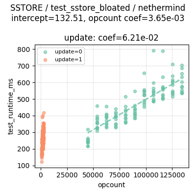

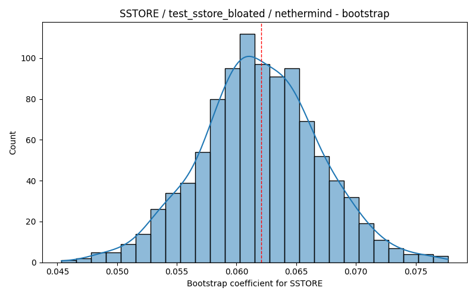

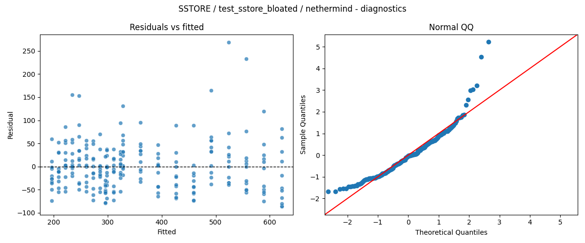

</details>

<details><summary>reth — NNLS regression summary</summary>

```
==============================================================================
                           NNLS Regression Results                            
==============================================================================
Dep. Variable:          test_runtime_ms              R-squared:          0.594
Model:                  NNLS                    Adj. R-squared:          0.593
No. Observations:       462                               RMSE:          62.07
Df Residuals:           459                                MAE:          39.28
Df Model:               2      
==============================================================================
                      coef     std err     P-value      [0.025      0.975]
------------------------------------------------------------------------------
         const    171.6915      9.2839       0.001    142.7676    178.5432
       opcount      0.0000      0.0001       1.000      0.0000      0.0003
        update      0.0706      0.0033       0.001      0.0683      0.0815
==============================================================================
Notes: Non-negative least squares with bootstrap inference (1000 iterations)
==============================================================================
```

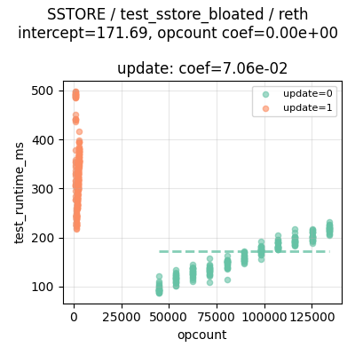

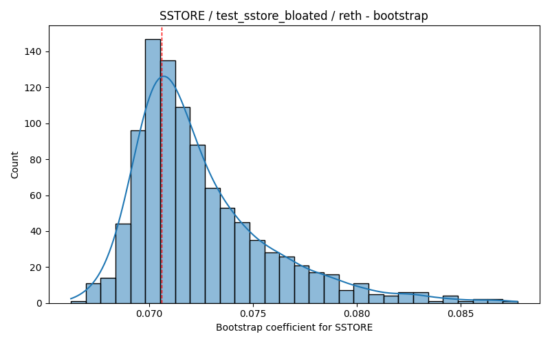

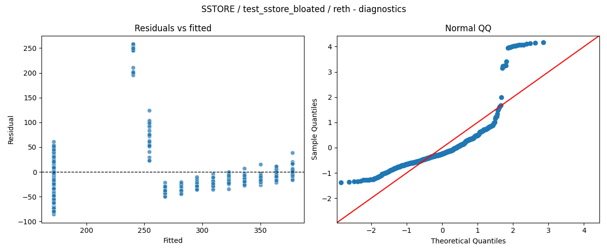

</details>

### test_sstore_bloated — combo `True`

| client | nobs | R² | target_coef (ms) | p-value | 95% CI |
| --- | --- | --- | --- | --- | --- |
| `besu` | 440 | 0.9703 | 0.01577 | 1.00e-03 | [0.01482, 0.01669] |
| `erigon` | 176 | 0.9851 | 0 | 1.00e+00 | [0, 0] |
| `geth` | 286 | 0.9244 | 0.03179 | 1.00e-03 | [0.03113, 0.03248] |
| `nethermind` | 242 | 0.628 | 0.02667 | 1.00e-03 | [0.02382, 0.02953] |
| `reth` | 462 | 0.9953 | 0 | 1.00e+00 | [0, 0] |

<details><summary>besu — NNLS regression summary</summary>

```
==============================================================================
                           NNLS Regression Results                            
==============================================================================
Dep. Variable:          test_runtime_ms              R-squared:          0.970
Model:                  NNLS                    Adj. R-squared:          0.970
No. Observations:       440                               RMSE:         288.32
Df Residuals:           437                                MAE:         204.08
Df Model:               2      
==============================================================================
                      coef     std err     P-value      [0.025      0.975]
------------------------------------------------------------------------------
         const    890.8695     45.6342       0.001    800.9453    979.9627
       opcount      0.0158      0.0005       0.001      0.0148      0.0167
        update      0.0873      0.0010       0.001      0.0853      0.0893
==============================================================================
Notes: Non-negative least squares with bootstrap inference (1000 iterations)
==============================================================================
```

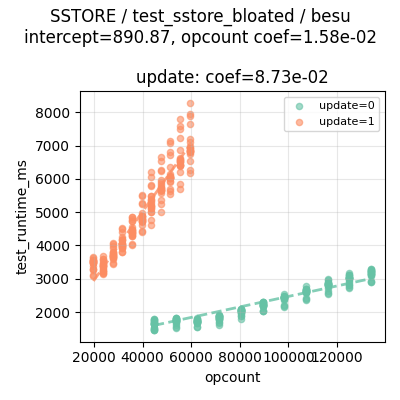

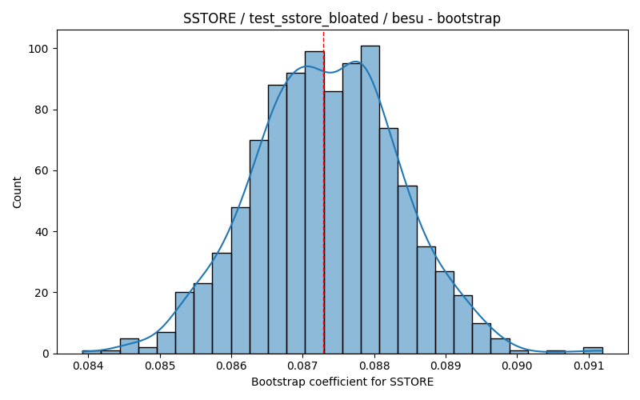

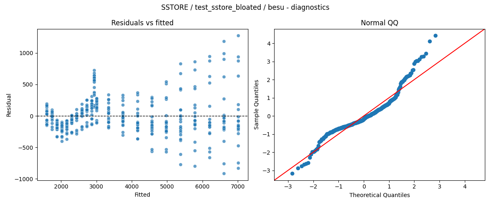

</details>

<details><summary>erigon — NNLS regression summary</summary>

```
==============================================================================
                           NNLS Regression Results                            
==============================================================================
Dep. Variable:          test_runtime_ms              R-squared:          0.985
Model:                  NNLS                    Adj. R-squared:          0.985
No. Observations:       176                               RMSE:         270.81
Df Residuals:           173                                MAE:         220.69
Df Model:               2      
==============================================================================
                      coef     std err     P-value      [0.025      0.975]
------------------------------------------------------------------------------
         const    623.8325     22.6645       0.001    581.9642    671.5688
       opcount      0.0000      0.0000       1.000      0.0000      0.0000
        update      0.1014      0.0009       0.001      0.0997      0.1033
==============================================================================
Notes: Non-negative least squares with bootstrap inference (1000 iterations)
==============================================================================
```

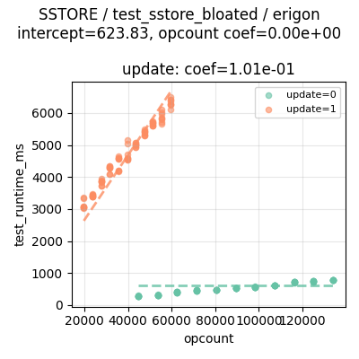

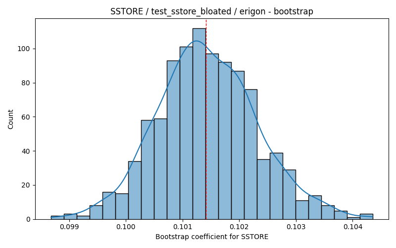

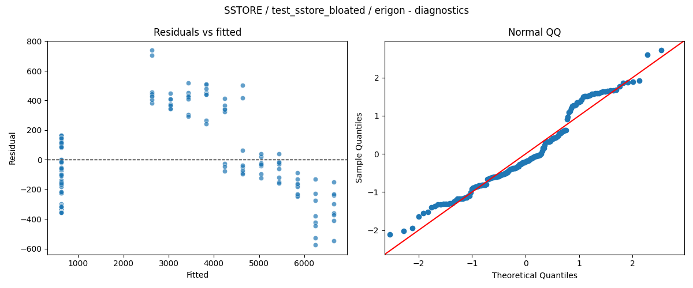

</details>

<details><summary>geth — NNLS regression summary</summary>

```
==============================================================================
                           NNLS Regression Results                            
==============================================================================
Dep. Variable:          test_runtime_ms              R-squared:          0.924
Model:                  NNLS                    Adj. R-squared:          0.924
No. Observations:       286                               RMSE:       10518.94
Df Residuals:           283                                MAE:        6734.35
Df Model:               2      
==============================================================================
                      coef     std err     P-value      [0.025      0.975]
------------------------------------------------------------------------------
         const      0.0000      0.0000       1.000      0.0000      0.0000
       opcount      0.0318      0.0003       0.001      0.0311      0.0325
        update      1.6338      0.0307       0.001      1.5692      1.6881
==============================================================================
Notes: Non-negative least squares with bootstrap inference (1000 iterations)
==============================================================================
```

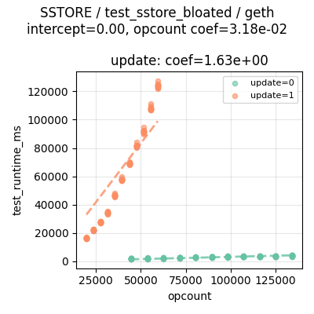

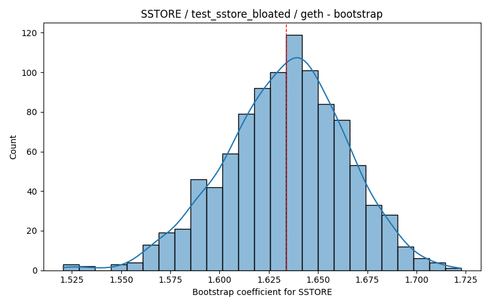

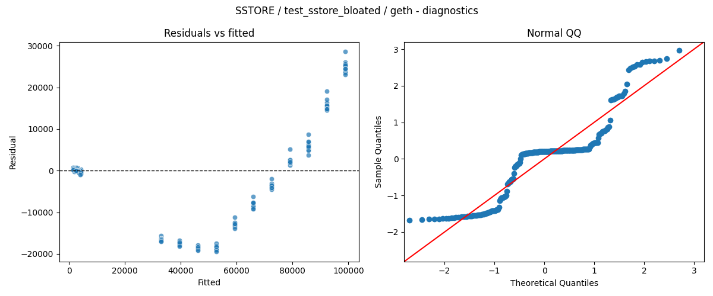

</details>

<details><summary>nethermind — NNLS regression summary</summary>

```
==============================================================================
                           NNLS Regression Results                            
==============================================================================
Dep. Variable:          test_runtime_ms              R-squared:          0.628
Model:                  NNLS                    Adj. R-squared:          0.625
No. Observations:       242                               RMSE:         562.77
Df Residuals:           239                                MAE:         439.61
Df Model:               2      
==============================================================================
                      coef     std err     P-value      [0.025      0.975]
------------------------------------------------------------------------------
         const   1100.7763    117.5086       0.001    879.5113   1331.1271
       opcount      0.0267      0.0014       0.001      0.0238      0.0295
        update      0.0289      0.0021       0.001      0.0246      0.0330
==============================================================================
Notes: Non-negative least squares with bootstrap inference (1000 iterations)
==============================================================================
```

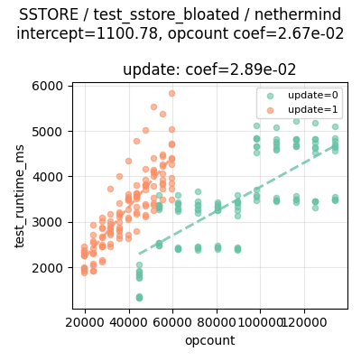

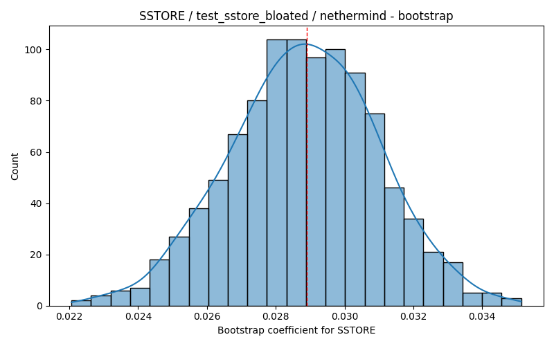

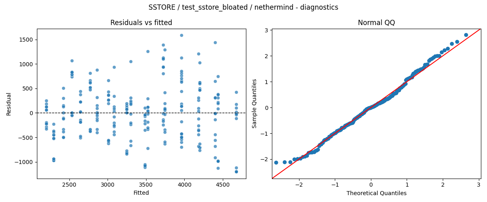

</details>

<details><summary>reth — NNLS regression summary</summary>

```
==============================================================================
                           NNLS Regression Results                            
==============================================================================
Dep. Variable:          test_runtime_ms              R-squared:          0.995
Model:                  NNLS                    Adj. R-squared:          0.995
No. Observations:       462                               RMSE:         255.47
Df Residuals:           459                                MAE:         190.40
Df Model:               2      
==============================================================================
                      coef     std err     P-value      [0.025      0.975]
------------------------------------------------------------------------------
         const    257.9016     11.1754       0.001    238.9941    281.1578
       opcount      0.0000      0.0000       1.000      0.0000      0.0000
        update      0.1712      0.0005       0.001      0.1702      0.1723
==============================================================================
Notes: Non-negative least squares with bootstrap inference (1000 iterations)
==============================================================================
```

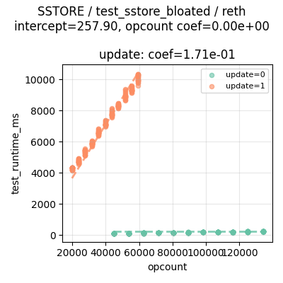

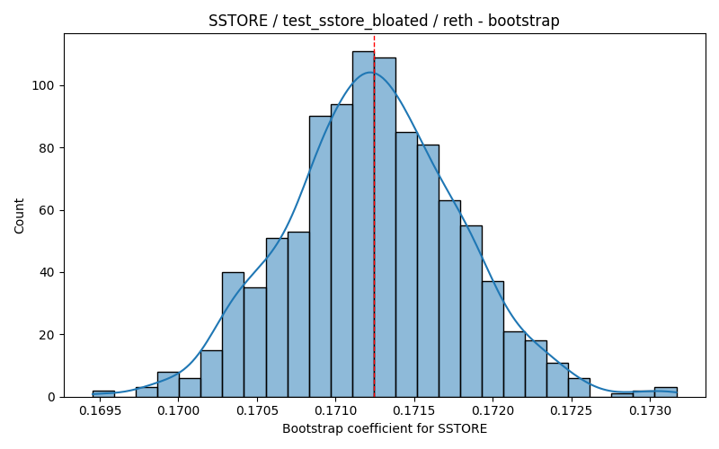

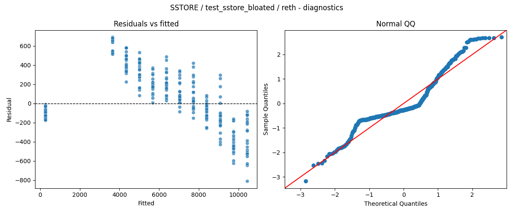

</details>

## BALANCE

### test_account_access — combo `BALANCE_AccountMode.EXISTING_EOA`

| client | nobs | R² | target_coef (ms) | p-value | 95% CI |
| --- | --- | --- | --- | --- | --- |
| `besu` | 220 | 0.8439 | 0.009788 | 1.00e-03 | [0.009112, 0.01048] |
| `erigon` | 88 | 0.9984 | 0.009728 | 1.00e-03 | [0.009647, 0.009814] |
| `geth` | 143 | 0.8489 | 0.01341 | 1.00e-03 | [0.01261, 0.01423] |
| `nethermind` | 121 | 0.8927 | 0.003754 | 1.00e-03 | [0.003528, 0.003995] |
| `reth` | 231 | 0.9776 | 0.001101 | 1.00e-03 | [0.00108, 0.001122] |

<details><summary>besu — NNLS regression summary</summary>

```
==============================================================================
                           NNLS Regression Results                            
==============================================================================
Dep. Variable:          test_runtime_ms              R-squared:          0.844
Model:                  NNLS                    Adj. R-squared:          0.843
No. Observations:       220                               RMSE:         100.59
Df Residuals:           218                                MAE:          77.27
Df Model:               1      
==============================================================================
                      coef     std err     P-value      [0.025      0.975]
------------------------------------------------------------------------------
         const    412.1867     31.1130       0.001    349.0371    468.3747
       opcount      0.0098      0.0004       0.001      0.0091      0.0105
==============================================================================
Notes: Non-negative least squares with bootstrap inference (1000 iterations)
==============================================================================
```

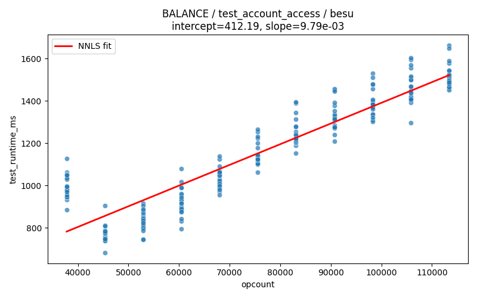

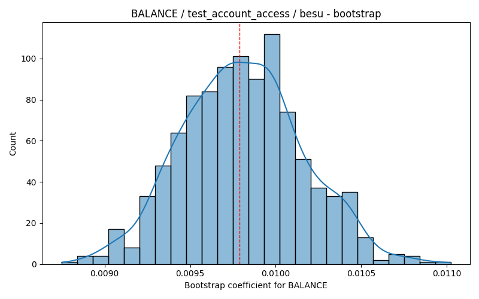

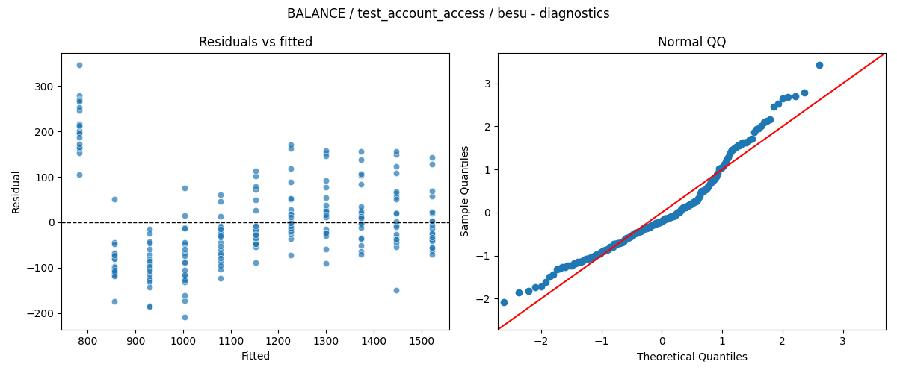

</details>

<details><summary>erigon — NNLS regression summary</summary>

```
==============================================================================
                           NNLS Regression Results                            
==============================================================================
Dep. Variable:          test_runtime_ms              R-squared:          0.998
Model:                  NNLS                    Adj. R-squared:          0.998
No. Observations:       88                                RMSE:           9.34
Df Residuals:           86                                 MAE:           7.24
Df Model:               1      
==============================================================================
                      coef     std err     P-value      [0.025      0.975]
------------------------------------------------------------------------------
         const     34.9186      3.0275       0.001     28.7994     40.4719
       opcount      0.0097      0.0000       0.001      0.0096      0.0098
==============================================================================
Notes: Non-negative least squares with bootstrap inference (1000 iterations)
==============================================================================
```

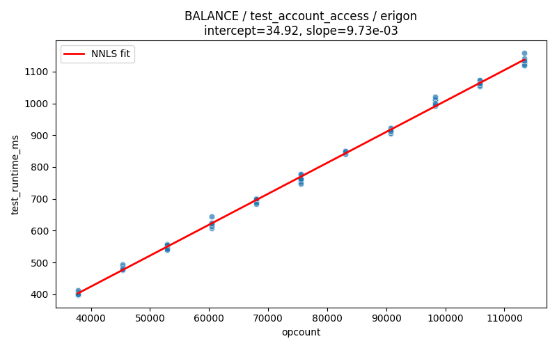

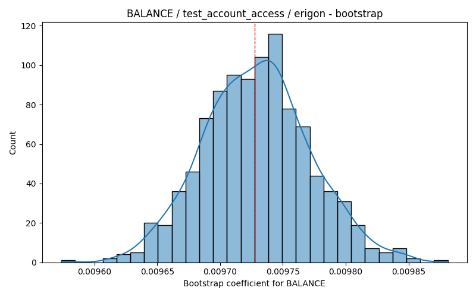

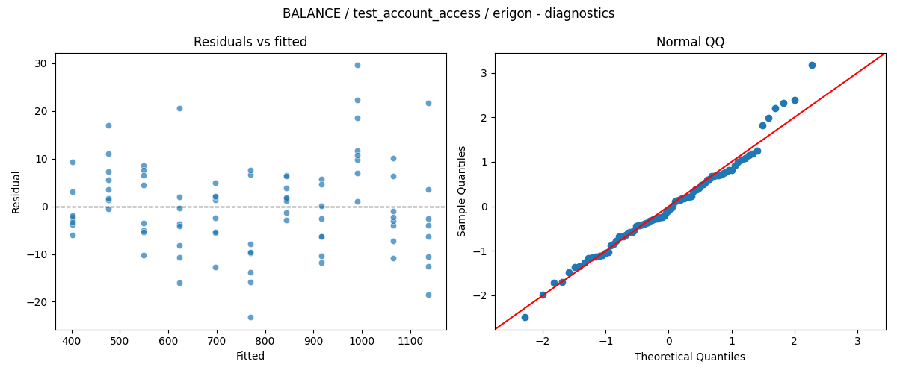

</details>

<details><summary>geth — NNLS regression summary</summary>

```
==============================================================================
                           NNLS Regression Results                            
==============================================================================
Dep. Variable:          test_runtime_ms              R-squared:          0.849
Model:                  NNLS                    Adj. R-squared:          0.848
No. Observations:       143                               RMSE:         135.25
Df Residuals:           141                                MAE:         103.48
Df Model:               1      
==============================================================================
                      coef     std err     P-value      [0.025      0.975]
------------------------------------------------------------------------------
         const    290.8767     31.0484       0.001    228.1476    350.4705
       opcount      0.0134      0.0004       0.001      0.0126      0.0142
==============================================================================
Notes: Non-negative least squares with bootstrap inference (1000 iterations)
==============================================================================
```

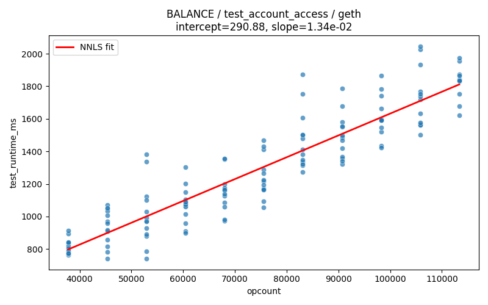

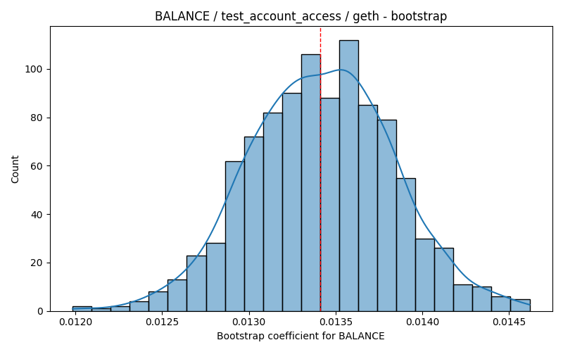

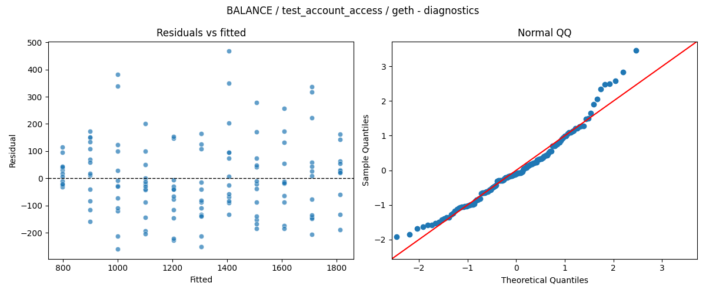

</details>

<details><summary>nethermind — NNLS regression summary</summary>

```
==============================================================================
                           NNLS Regression Results                            
==============================================================================
Dep. Variable:          test_runtime_ms              R-squared:          0.893
Model:                  NNLS                    Adj. R-squared:          0.892
No. Observations:       121                               RMSE:          31.11
Df Residuals:           119                                MAE:          22.99
Df Model:               1      
==============================================================================
                      coef     std err     P-value      [0.025      0.975]
------------------------------------------------------------------------------
         const     90.6688      9.1709       0.001     72.9776    109.0510
       opcount      0.0038      0.0001       0.001      0.0035      0.0040
==============================================================================
Notes: Non-negative least squares with bootstrap inference (1000 iterations)
==============================================================================
```

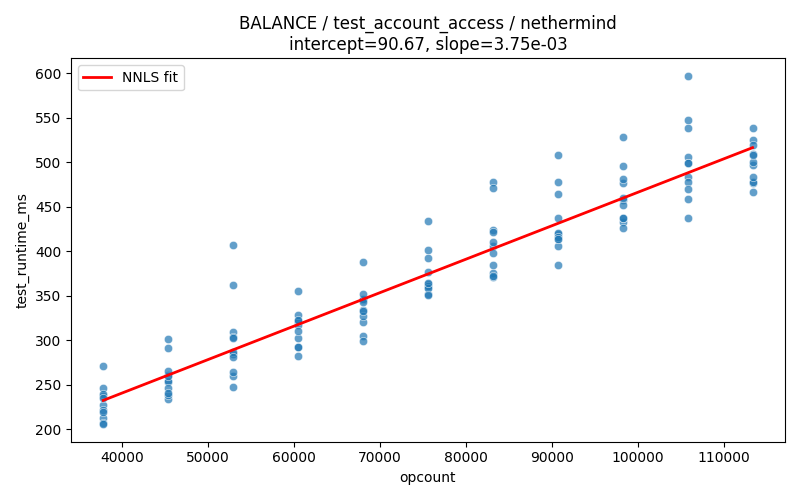

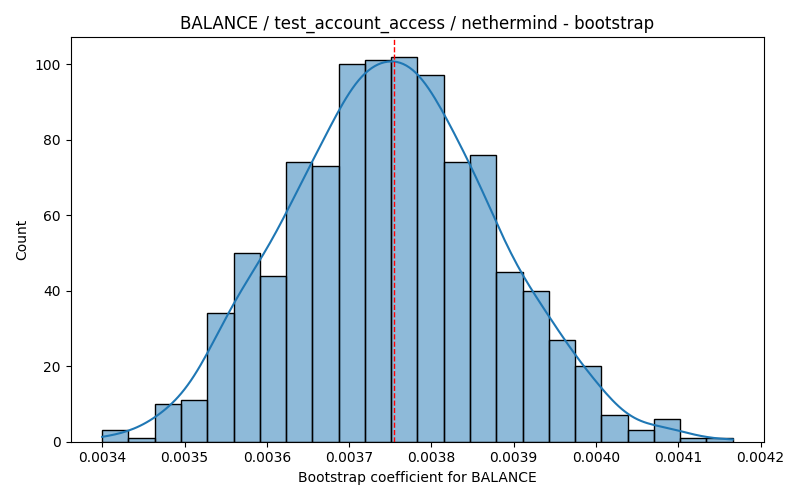

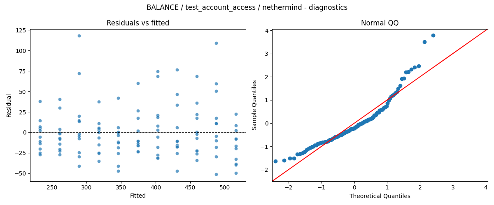

</details>

<details><summary>reth — NNLS regression summary</summary>

```
==============================================================================
                           NNLS Regression Results                            
==============================================================================
Dep. Variable:          test_runtime_ms              R-squared:          0.978
Model:                  NNLS                    Adj. R-squared:          0.977
No. Observations:       231                               RMSE:           3.98
Df Residuals:           229                                MAE:           3.11
Df Model:               1      
==============================================================================
                      coef     std err     P-value      [0.025      0.975]
------------------------------------------------------------------------------
         const     31.5903      0.8826       0.001     29.9351     33.3293
       opcount      0.0011      0.0000       0.001      0.0011      0.0011
==============================================================================
Notes: Non-negative least squares with bootstrap inference (1000 iterations)
==============================================================================
```

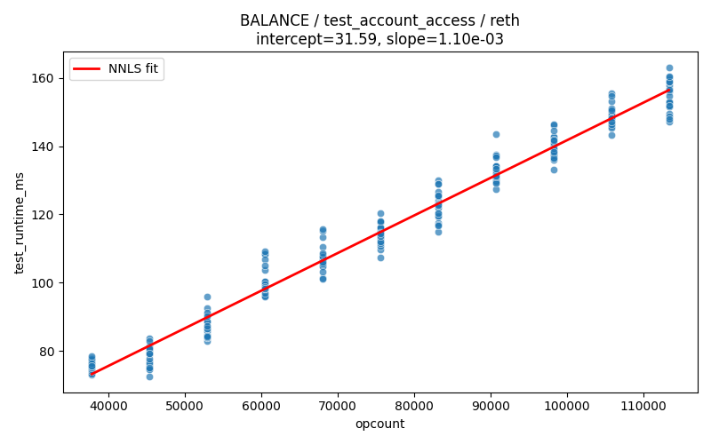

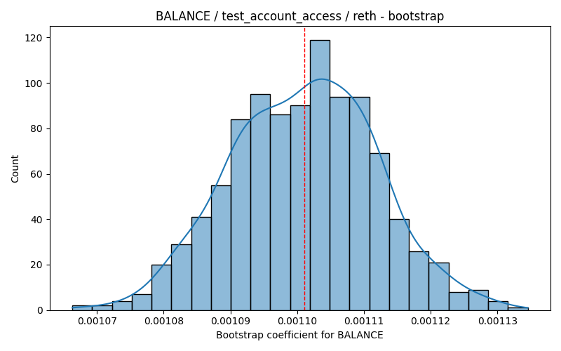

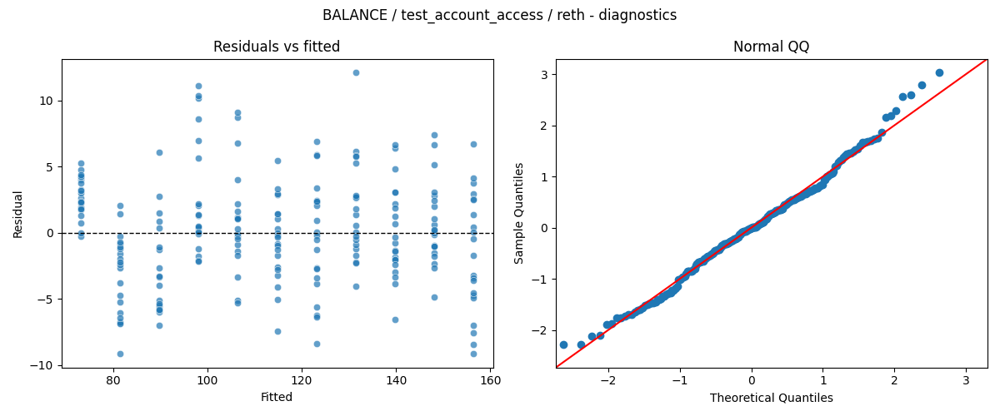

</details>

### test_account_access — combo `BALANCE_AccountMode.NON_EXISTING_ACCOUNT` — `presets[cold_account_nocode_access]`

| client | nobs | R² | target_coef (ms) | p-value | 95% CI |
| --- | --- | --- | --- | --- | --- |
| `besu` | 220 | 0.9212 | 0.01006 | 1.00e-03 | [0.009638, 0.0105] |
| `erigon` | 88 | 0.9981 | 0.009054 | 1.00e-03 | [0.008974, 0.009106] |
| `geth` | 143 | 0.734 | 0.02613 | 1.00e-03 | [0.02339, 0.02877] |
| `nethermind` | 121 | 0.8796 | 0.00387 | 1.00e-03 | [0.003634, 0.004109] |
| `reth` | 231 | 0.9698 | 0.0009278 | 1.00e-03 | [0.0009054, 0.0009482] |

<details><summary>besu — NNLS regression summary</summary>

```
==============================================================================
                           NNLS Regression Results                            
==============================================================================
Dep. Variable:          test_runtime_ms              R-squared:          0.921
Model:                  NNLS                    Adj. R-squared:          0.921
No. Observations:       220                               RMSE:          70.32
Df Residuals:           218                                MAE:          56.04
Df Model:               1      
==============================================================================
                      coef     std err     P-value      [0.025      0.975]
------------------------------------------------------------------------------
         const    363.5833     18.2297       0.001    327.8072    397.2433
       opcount      0.0101      0.0002       0.001      0.0096      0.0105
==============================================================================
Notes: Non-negative least squares with bootstrap inference (1000 iterations)
==============================================================================
```

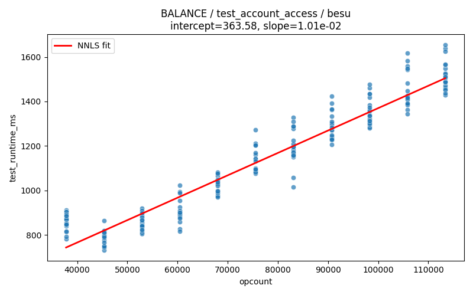

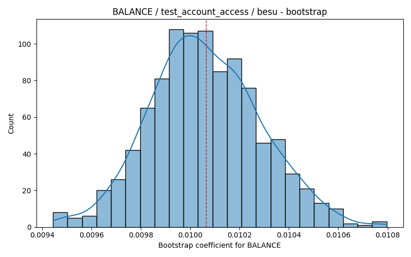

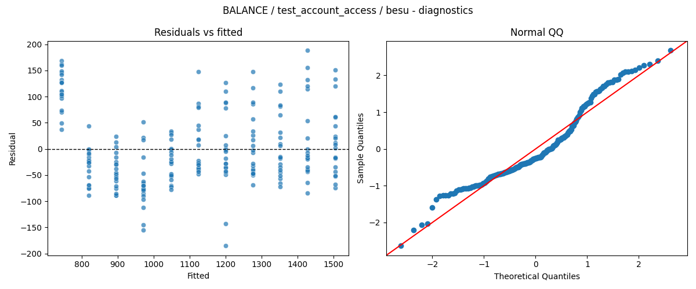

</details>

<details><summary>erigon — NNLS regression summary</summary>

```
==============================================================================
                           NNLS Regression Results                            
==============================================================================
Dep. Variable:          test_runtime_ms              R-squared:          0.998
Model:                  NNLS                    Adj. R-squared:          0.998
No. Observations:       88                                RMSE:           9.37
Df Residuals:           86                                 MAE:           7.77
Df Model:               1      
==============================================================================
                      coef     std err     P-value      [0.025      0.975]
------------------------------------------------------------------------------
         const      3.0136      2.7624       0.212      0.0000      9.2026
       opcount      0.0091      0.0000       0.001      0.0090      0.0091
==============================================================================
Notes: Non-negative least squares with bootstrap inference (1000 iterations)
==============================================================================
```

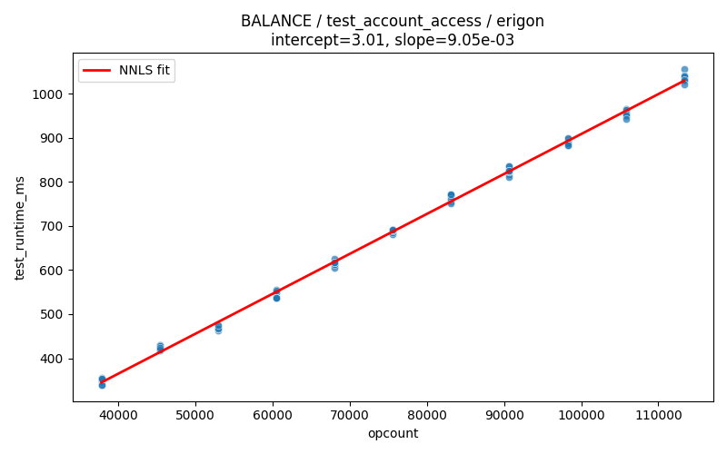

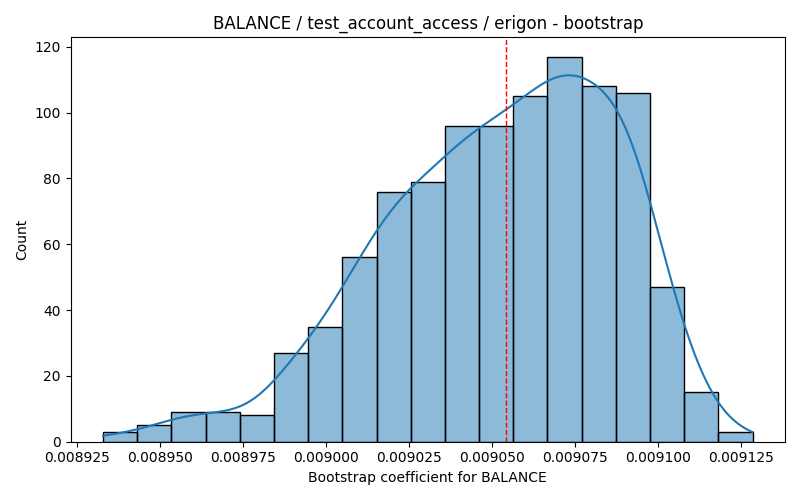

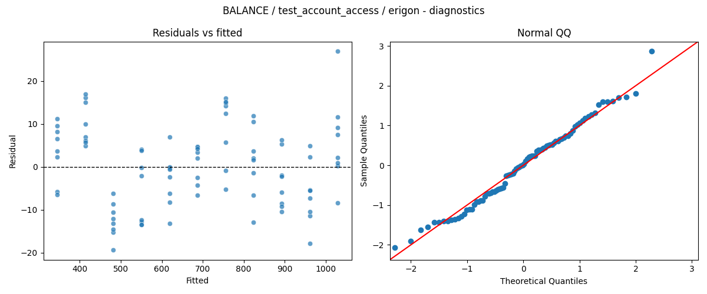

</details>

<details><summary>geth — NNLS regression summary</summary>

```
==============================================================================
                           NNLS Regression Results                            
==============================================================================
Dep. Variable:          test_runtime_ms              R-squared:          0.734
Model:                  NNLS                    Adj. R-squared:          0.732
No. Observations:       143                               RMSE:         375.98
Df Residuals:           141                                MAE:         291.98
Df Model:               1      
==============================================================================
                      coef     std err     P-value      [0.025      0.975]
------------------------------------------------------------------------------
         const   1123.9812    114.0462       0.001    906.3459   1353.6910
       opcount      0.0261      0.0014       0.001      0.0234      0.0288
==============================================================================
Notes: Non-negative least squares with bootstrap inference (1000 iterations)
==============================================================================
```


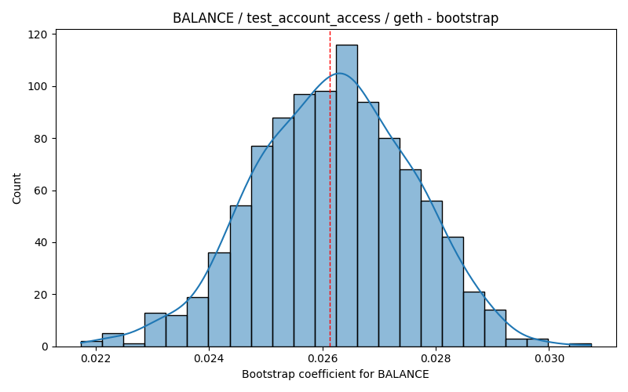

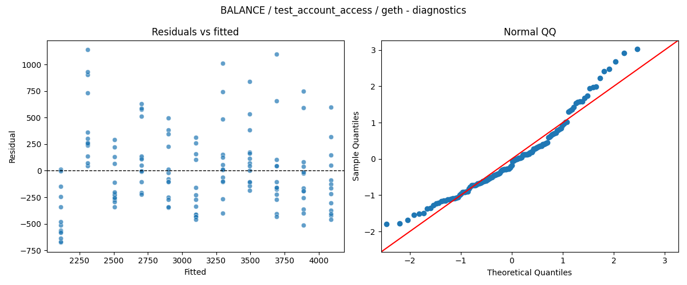

</details>

<details><summary>nethermind — NNLS regression summary</summary>

```
==============================================================================
                           NNLS Regression Results                            
==============================================================================
Dep. Variable:          test_runtime_ms              R-squared:          0.880
Model:                  NNLS                    Adj. R-squared:          0.879
No. Observations:       121                               RMSE:          34.22
Df Residuals:           119                                MAE:          24.54
Df Model:               1      
==============================================================================
                      coef     std err     P-value      [0.025      0.975]
------------------------------------------------------------------------------
         const     81.6528      9.0616       0.001     65.8988     99.9782
       opcount      0.0039      0.0001       0.001      0.0036      0.0041
==============================================================================
Notes: Non-negative least squares with bootstrap inference (1000 iterations)
==============================================================================
```

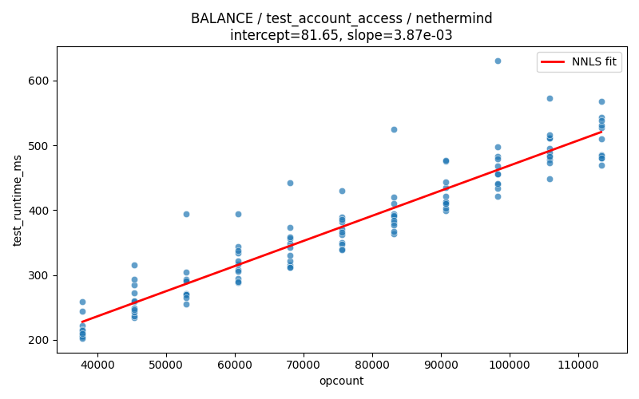

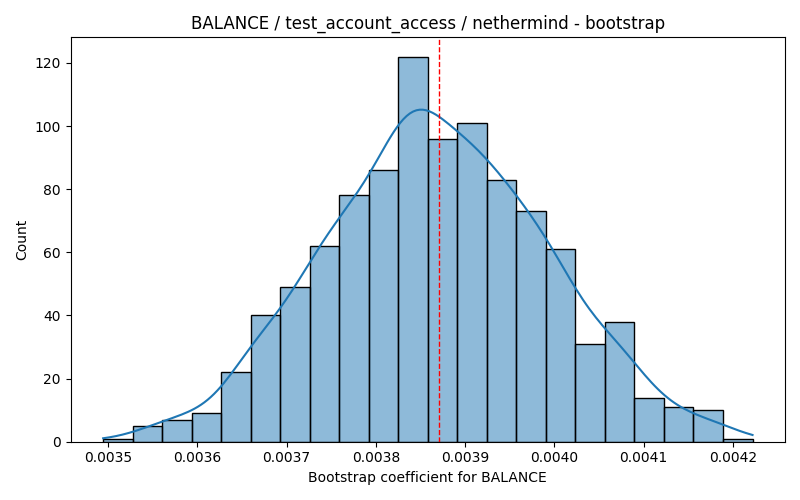

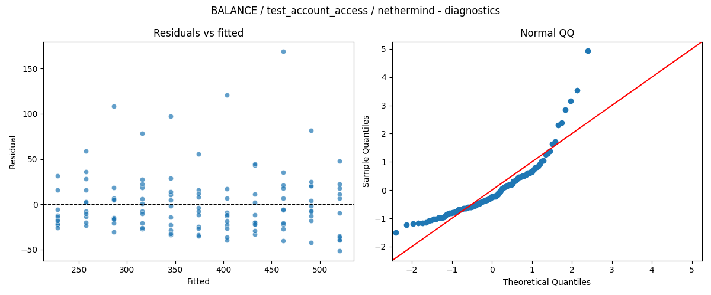

</details>

<details><summary>reth — NNLS regression summary</summary>

```
==============================================================================
                           NNLS Regression Results                            
==============================================================================
Dep. Variable:          test_runtime_ms              R-squared:          0.970
Model:                  NNLS                    Adj. R-squared:          0.970
No. Observations:       231                               RMSE:           3.91
Df Residuals:           229                                MAE:           3.02
Df Model:               1      
==============================================================================
                      coef     std err     P-value      [0.025      0.975]
------------------------------------------------------------------------------
         const     31.3038      0.8745       0.001     29.6882     33.0597
       opcount      0.0009      0.0000       0.001      0.0009      0.0009
==============================================================================
Notes: Non-negative least squares with bootstrap inference (1000 iterations)
==============================================================================
```

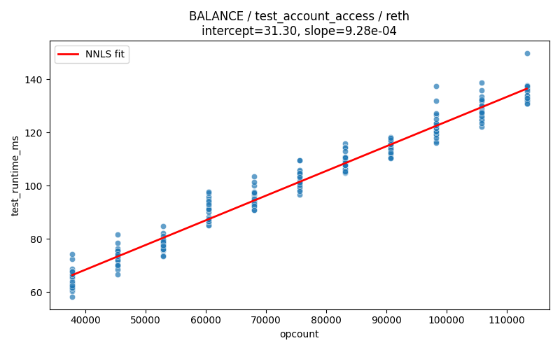

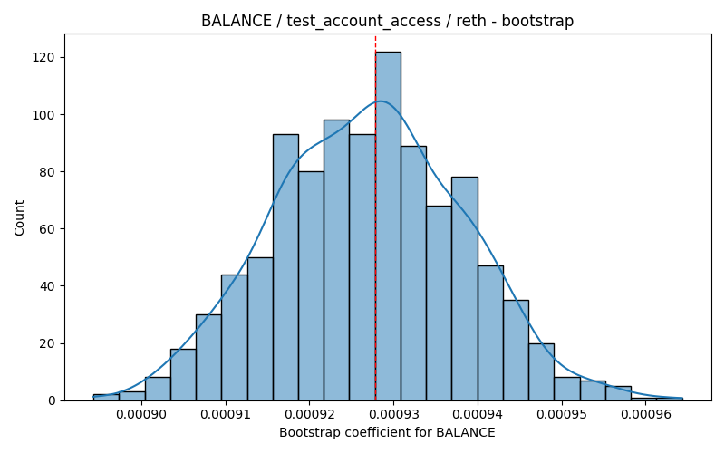

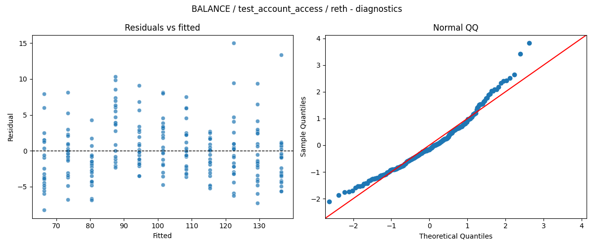

</details>

### test_account_access — combo `BALANCE_AccountMode.EXISTING_CONTRACT`

| client | nobs | R² | target_coef (ms) | p-value | 95% CI |
| --- | --- | --- | --- | --- | --- |
| `besu` | 220 | 0.9523 | 0.02629 | 1.00e-03 | [0.02544, 0.02724] |
| `erigon` | 88 | 0.912 | 0.0356 | 1.00e-03 | [0.03348, 0.03763] |
| `geth` | 143 | 0.7409 | 0.02986 | 1.00e-03 | [0.02653, 0.03343] |
| `nethermind` | 121 | 0.664 | 0.02441 | 1.00e-03 | [0.02105, 0.02769] |
| `reth` | 231 | 0.8536 | 0.03063 | 1.00e-03 | [0.0288, 0.03241] |

<details><summary>besu — NNLS regression summary</summary>

```
==============================================================================
                           NNLS Regression Results                            
==============================================================================
Dep. Variable:          test_runtime_ms              R-squared:          0.952
Model:                  NNLS                    Adj. R-squared:          0.952
No. Observations:       220                               RMSE:         122.41
Df Residuals:           218                                MAE:         104.09
Df Model:               1      
==============================================================================
                      coef     std err     P-value      [0.025      0.975]
------------------------------------------------------------------------------
         const    445.7327     32.1549       0.001    378.7240    503.1481
       opcount      0.0263      0.0005       0.001      0.0254      0.0272
==============================================================================
Notes: Non-negative least squares with bootstrap inference (1000 iterations)
==============================================================================
```

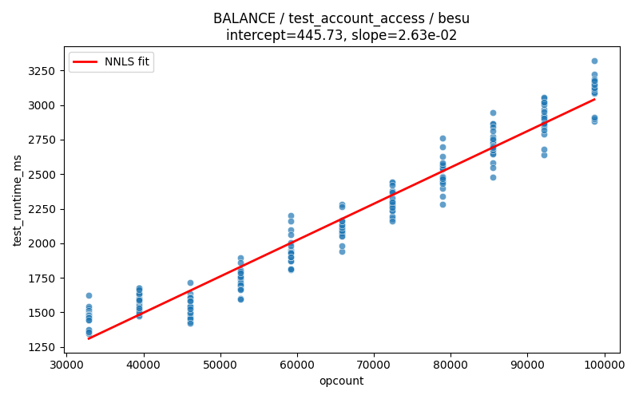

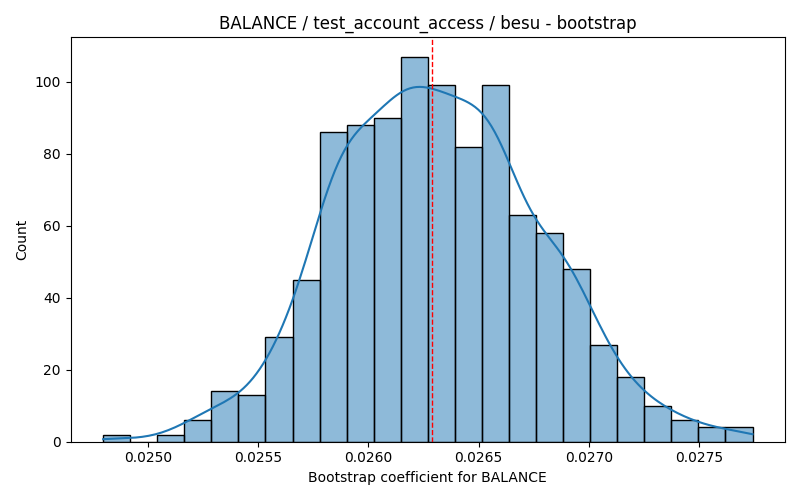

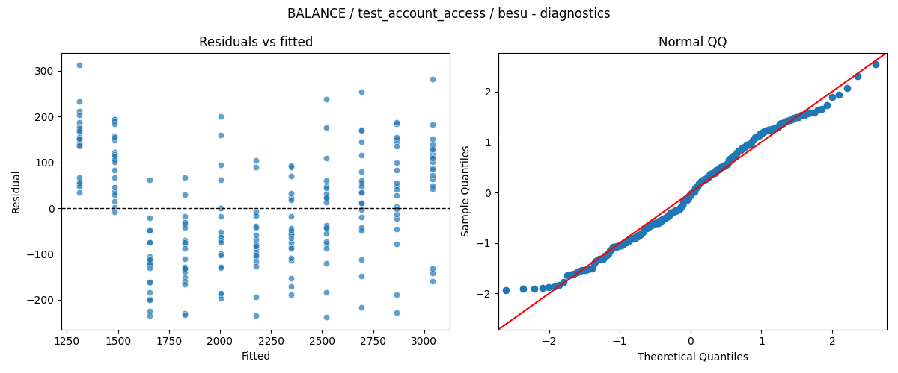

</details>

<details><summary>erigon — NNLS regression summary</summary>

```
==============================================================================
                           NNLS Regression Results                            
==============================================================================
Dep. Variable:          test_runtime_ms              R-squared:          0.912
Model:                  NNLS                    Adj. R-squared:          0.911
No. Observations:       88                                RMSE:         230.13
Df Residuals:           86                                 MAE:         196.86
Df Model:               1      
==============================================================================
                      coef     std err     P-value      [0.025      0.975]
------------------------------------------------------------------------------
         const    405.6572     80.9469       0.001    245.7471    562.9196
       opcount      0.0356      0.0011       0.001      0.0335      0.0376
==============================================================================
Notes: Non-negative least squares with bootstrap inference (1000 iterations)
==============================================================================
```

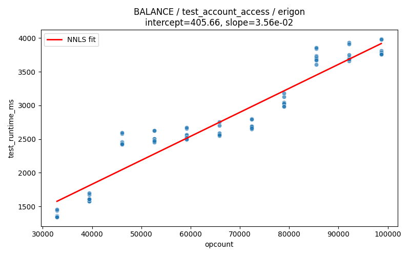

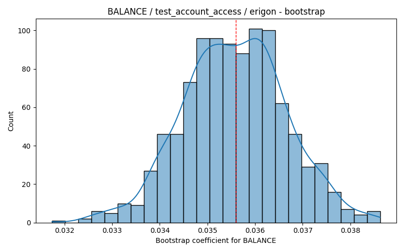

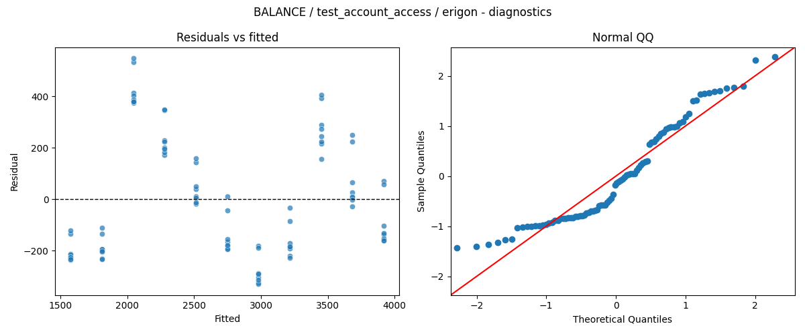

</details>

<details><summary>geth — NNLS regression summary</summary>

```
==============================================================================
                           NNLS Regression Results                            
==============================================================================
Dep. Variable:          test_runtime_ms              R-squared:          0.741
Model:                  NNLS                    Adj. R-squared:          0.739
No. Observations:       143                               RMSE:         367.35
Df Residuals:           141                                MAE:         287.57
Df Model:               1      
==============================================================================
                      coef     std err     P-value      [0.025      0.975]
------------------------------------------------------------------------------
         const    950.9332    118.7275       0.001    715.6586   1195.2785
       opcount      0.0299      0.0017       0.001      0.0265      0.0334
==============================================================================
Notes: Non-negative least squares with bootstrap inference (1000 iterations)
==============================================================================
```

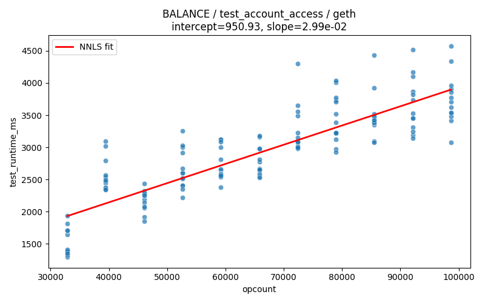

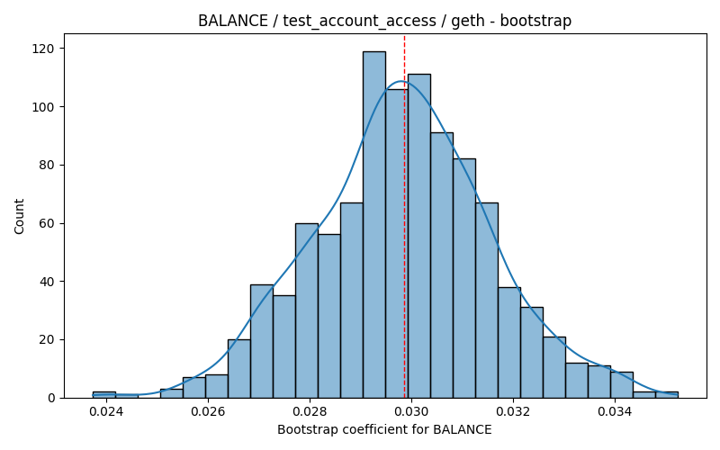

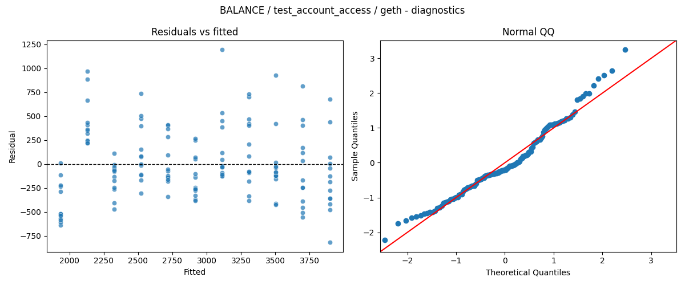

</details>

<details><summary>nethermind — NNLS regression summary</summary>

```
==============================================================================
                           NNLS Regression Results                            
==============================================================================
Dep. Variable:          test_runtime_ms              R-squared:          0.664
Model:                  NNLS                    Adj. R-squared:          0.661
No. Observations:       121                               RMSE:         361.29
Df Residuals:           119                                MAE:         299.13
Df Model:               1      
==============================================================================
                      coef     std err     P-value      [0.025      0.975]
------------------------------------------------------------------------------
         const    837.1848    113.3983       0.001    630.4072   1071.7606
       opcount      0.0244      0.0017       0.001      0.0211      0.0277
==============================================================================
Notes: Non-negative least squares with bootstrap inference (1000 iterations)
==============================================================================
```

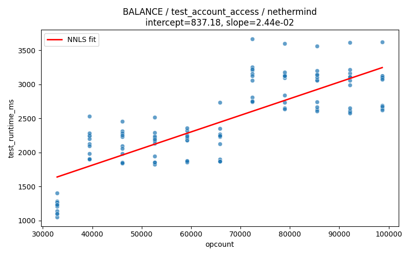

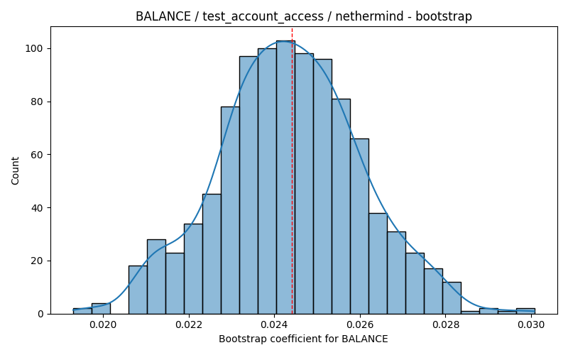

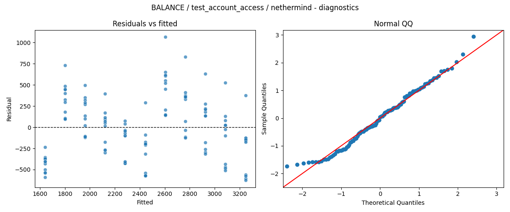

</details>

<details><summary>reth — NNLS regression summary</summary>

```
==============================================================================
                           NNLS Regression Results                            
==============================================================================
Dep. Variable:          test_runtime_ms              R-squared:          0.854
Model:                  NNLS                    Adj. R-squared:          0.853
No. Observations:       231                               RMSE:         263.89
Df Residuals:           229                                MAE:         195.43
Df Model:               1      
==============================================================================
                      coef     std err     P-value      [0.025      0.975]
------------------------------------------------------------------------------
         const    659.4150     68.7060       0.001    519.1593    798.1629
       opcount      0.0306      0.0009       0.001      0.0288      0.0324
==============================================================================
Notes: Non-negative least squares with bootstrap inference (1000 iterations)
==============================================================================
```

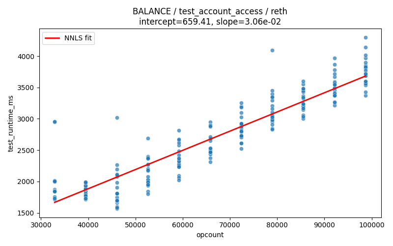

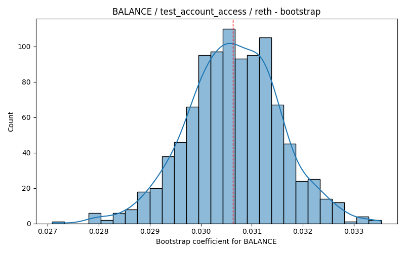

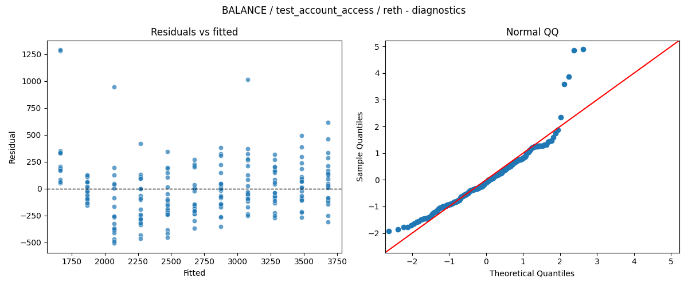

</details>

### test_account_access — combo `BALANCE_AccountMode.NON_EXISTING_ACCOUNT` — `presets[cold_account_code_access]`

| client | nobs | R² | target_coef (ms) | p-value | 95% CI |
| --- | --- | --- | --- | --- | --- |
| `besu` | 220 | 0.9212 | 0.01006 | 1.00e-03 | [0.009638, 0.0105] |
| `erigon` | 88 | 0.9981 | 0.009054 | 1.00e-03 | [0.008974, 0.009106] |
| `geth` | 143 | 0.734 | 0.02613 | 1.00e-03 | [0.02339, 0.02877] |
| `nethermind` | 121 | 0.8796 | 0.00387 | 1.00e-03 | [0.003634, 0.004109] |
| `reth` | 231 | 0.9698 | 0.0009278 | 1.00e-03 | [0.0009054, 0.0009482] |

<details><summary>besu — NNLS regression summary</summary>

```
==============================================================================
                           NNLS Regression Results                            
==============================================================================
Dep. Variable:          test_runtime_ms              R-squared:          0.921
Model:                  NNLS                    Adj. R-squared:          0.921
No. Observations:       220                               RMSE:          70.32
Df Residuals:           218                                MAE:          56.04
Df Model:               1      
==============================================================================
                      coef     std err     P-value      [0.025      0.975]
------------------------------------------------------------------------------
         const    363.5833     18.2297       0.001    327.8072    397.2433
       opcount      0.0101      0.0002       0.001      0.0096      0.0105
==============================================================================
Notes: Non-negative least squares with bootstrap inference (1000 iterations)
==============================================================================
```


</details>

<details><summary>erigon — NNLS regression summary</summary>

```
==============================================================================
                           NNLS Regression Results                            
==============================================================================
Dep. Variable:          test_runtime_ms              R-squared:          0.998
Model:                  NNLS                    Adj. R-squared:          0.998
No. Observations:       88                                RMSE:           9.37
Df Residuals:           86                                 MAE:           7.77
Df Model:               1      
==============================================================================
                      coef     std err     P-value      [0.025      0.975]
------------------------------------------------------------------------------
         const      3.0136      2.7624       0.212      0.0000      9.2026
       opcount      0.0091      0.0000       0.001      0.0090      0.0091
==============================================================================
Notes: Non-negative least squares with bootstrap inference (1000 iterations)
==============================================================================
```


</details>

<details><summary>geth — NNLS regression summary</summary>

```
==============================================================================
                           NNLS Regression Results                            
==============================================================================
Dep. Variable:          test_runtime_ms              R-squared:          0.734
Model:                  NNLS                    Adj. R-squared:          0.732
No. Observations:       143                               RMSE:         375.98
Df Residuals:           141                                MAE:         291.98
Df Model:               1      
==============================================================================
                      coef     std err     P-value      [0.025      0.975]
------------------------------------------------------------------------------
         const   1123.9812    114.0462       0.001    906.3459   1353.6910
       opcount      0.0261      0.0014       0.001      0.0234      0.0288
==============================================================================
Notes: Non-negative least squares with bootstrap inference (1000 iterations)
==============================================================================
```


</details>

<details><summary>nethermind — NNLS regression summary</summary>

```
==============================================================================
                           NNLS Regression Results                            
==============================================================================
Dep. Variable:          test_runtime_ms              R-squared:          0.880
Model:                  NNLS                    Adj. R-squared:          0.879
No. Observations:       121                               RMSE:          34.22
Df Residuals:           119                                MAE:          24.54
Df Model:               1      
==============================================================================
                      coef     std err     P-value      [0.025      0.975]
------------------------------------------------------------------------------
         const     81.6528      9.0616       0.001     65.8988     99.9782
       opcount      0.0039      0.0001       0.001      0.0036      0.0041
==============================================================================
Notes: Non-negative least squares with bootstrap inference (1000 iterations)
==============================================================================
```


</details>

<details><summary>reth — NNLS regression summary</summary>

```
==============================================================================
                           NNLS Regression Results                            
==============================================================================
Dep. Variable:          test_runtime_ms              R-squared:          0.970
Model:                  NNLS                    Adj. R-squared:          0.970
No. Observations:       231                               RMSE:           3.91
Df Residuals:           229                                MAE:           3.02
Df Model:               1      
==============================================================================
                      coef     std err     P-value      [0.025      0.975]
------------------------------------------------------------------------------
         const     31.3038      0.8745       0.001     29.6882     33.0597
       opcount      0.0009      0.0000       0.001      0.0009      0.0009
==============================================================================
Notes: Non-negative least squares with bootstrap inference (1000 iterations)
==============================================================================
```


</details>

### test_ext_account_query_warm — combo `BALANCE`

| client | nobs | R² | target_coef (ms) | p-value | 95% CI |
| --- | --- | --- | --- | --- | --- |
| `besu` | 220 | 0.8374 | 0.0001954 | 1.00e-03 | [0.0001833, 0.0002077] |
| `erigon` | 88 | 0.8551 | 4.442e-05 | 1.00e-03 | [4.074e-05, 4.781e-05] |
| `geth` | 143 | 0.8439 | 3.267e-05 | 1.00e-03 | [3.021e-05, 3.512e-05] |
| `nethermind` | 121 | 0.8392 | 0.0001772 | 1.00e-03 | [0.0001649, 0.0001892] |
| `reth` | 231 | 0.7207 | 7.029e-06 | 1.00e-03 | [6.464e-06, 7.631e-06] |

<details><summary>besu — NNLS regression summary</summary>

```
==============================================================================
                           NNLS Regression Results                            
==============================================================================
Dep. Variable:          test_runtime_ms              R-squared:          0.837
Model:                  NNLS                    Adj. R-squared:          0.837
No. Observations:       220                               RMSE:          50.35
Df Residuals:           218                                MAE:          39.11
Df Model:               1      
==============================================================================
                      coef     std err     P-value      [0.025      0.975]
------------------------------------------------------------------------------
         const    101.5130     12.1477       0.001     78.5675    125.4124
       opcount      0.0002      0.0000       0.001      0.0002      0.0002
==============================================================================
Notes: Non-negative least squares with bootstrap inference (1000 iterations)
==============================================================================
```

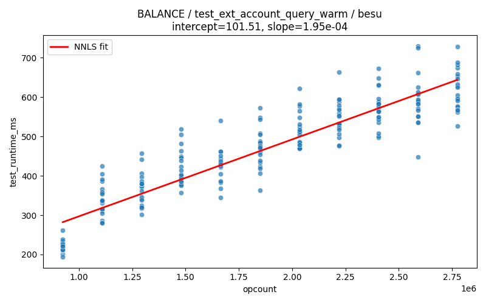

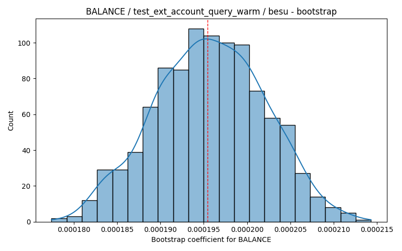

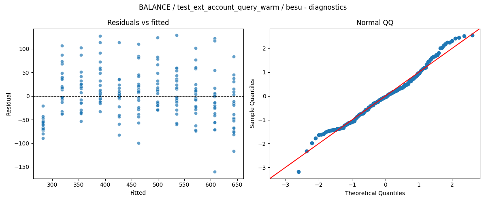

</details>

<details><summary>erigon — NNLS regression summary</summary>

```
==============================================================================
                           NNLS Regression Results                            
==============================================================================
Dep. Variable:          test_runtime_ms              R-squared:          0.855
Model:                  NNLS                    Adj. R-squared:          0.853
No. Observations:       88                                RMSE:          10.69
Df Residuals:           86                                 MAE:           7.31
Df Model:               1      
==============================================================================
                      coef     std err     P-value      [0.025      0.975]
------------------------------------------------------------------------------
         const     35.7422      3.8823       0.001     28.5883     43.9201
       opcount      0.0000      0.0000       0.001      0.0000      0.0000
==============================================================================
Notes: Non-negative least squares with bootstrap inference (1000 iterations)
==============================================================================
```

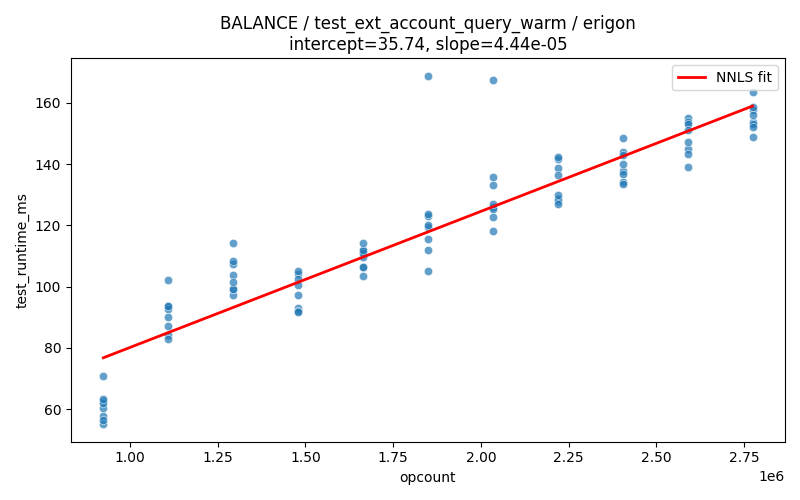

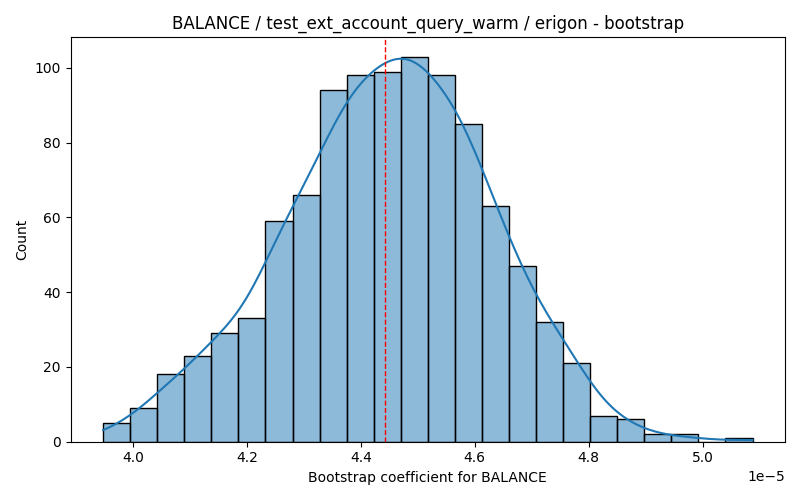

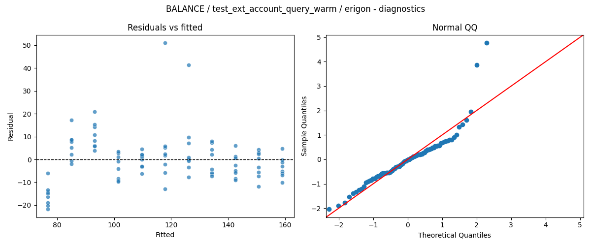

</details>

<details><summary>geth — NNLS regression summary</summary>

```
==============================================================================
                           NNLS Regression Results                            
==============================================================================
Dep. Variable:          test_runtime_ms              R-squared:          0.844
Model:                  NNLS                    Adj. R-squared:          0.843
No. Observations:       143                               RMSE:           8.22
Df Residuals:           141                                MAE:           6.65
Df Model:               1      
==============================================================================
                      coef     std err     P-value      [0.025      0.975]
------------------------------------------------------------------------------
         const      9.9111      2.3256       0.001      5.6593     14.3854
       opcount      0.0000      0.0000       0.001      0.0000      0.0000
==============================================================================
Notes: Non-negative least squares with bootstrap inference (1000 iterations)
==============================================================================
```

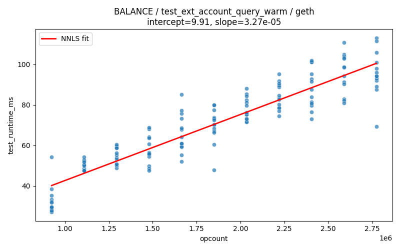

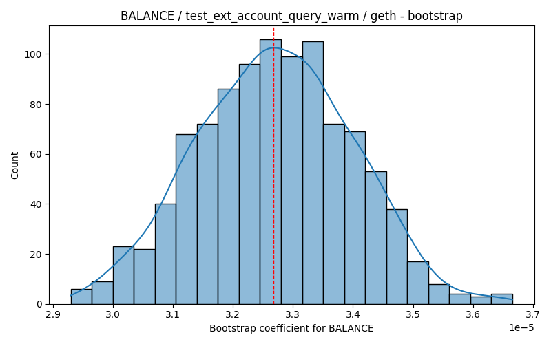

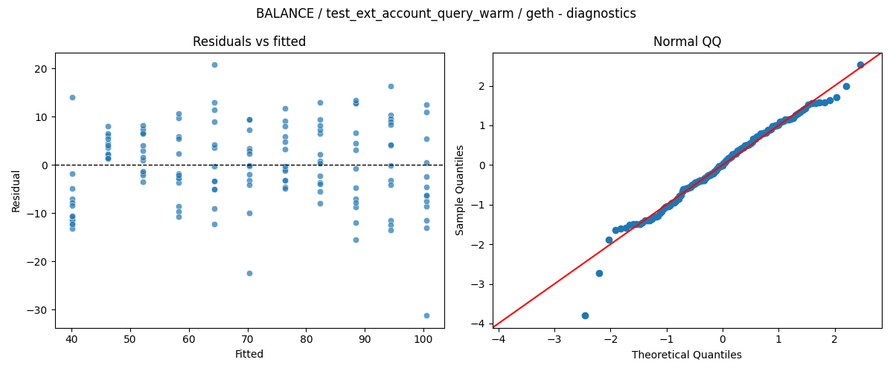

</details>

<details><summary>nethermind — NNLS regression summary</summary>

```
==============================================================================
                           NNLS Regression Results                            
==============================================================================
Dep. Variable:          test_runtime_ms              R-squared:          0.839
Model:                  NNLS                    Adj. R-squared:          0.838
No. Observations:       121                               RMSE:          45.34
Df Residuals:           119                                MAE:          34.33
Df Model:               1      
==============================================================================
                      coef     std err     P-value      [0.025      0.975]
------------------------------------------------------------------------------
         const     69.6934     12.3846       0.001     43.7040     93.6813
       opcount      0.0002      0.0000       0.001      0.0002      0.0002
==============================================================================
Notes: Non-negative least squares with bootstrap inference (1000 iterations)
==============================================================================
```

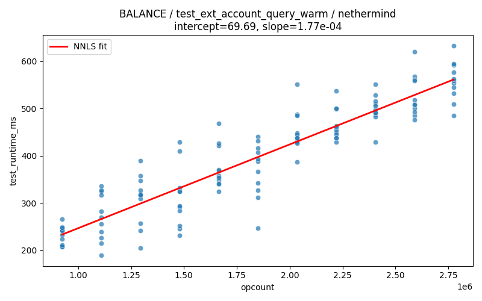

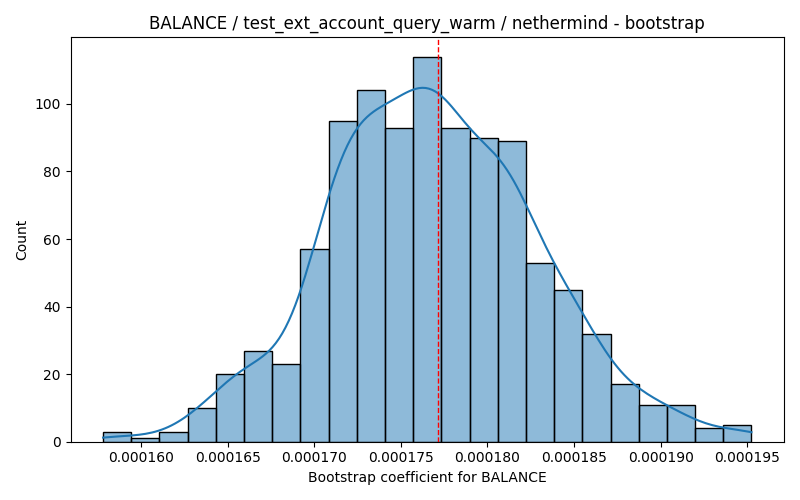

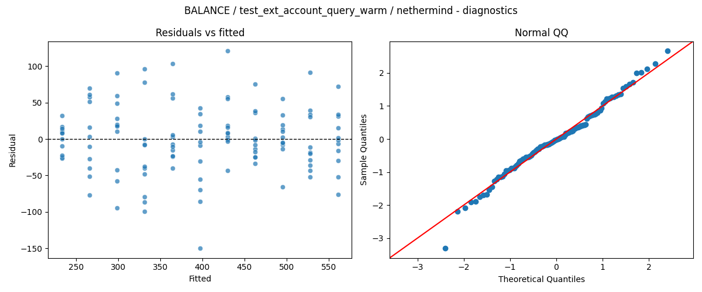

</details>

<details><summary>reth — NNLS regression summary</summary>

```
==============================================================================
                           NNLS Regression Results                            
==============================================================================
Dep. Variable:          test_runtime_ms              R-squared:          0.721
Model:                  NNLS                    Adj. R-squared:          0.720
No. Observations:       231                               RMSE:           2.56
Df Residuals:           229                                MAE:           1.81
Df Model:               1      
==============================================================================
                      coef     std err     P-value      [0.025      0.975]
------------------------------------------------------------------------------
         const      5.6122      0.5276       0.001      4.5627      6.6130
       opcount      0.0000      0.0000       0.001      0.0000      0.0000
==============================================================================
Notes: Non-negative least squares with bootstrap inference (1000 iterations)
==============================================================================
```

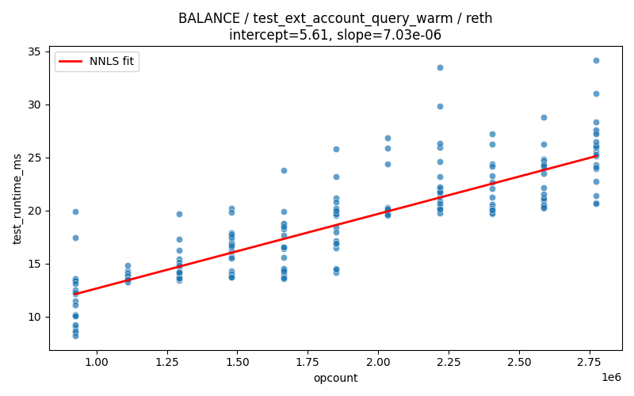

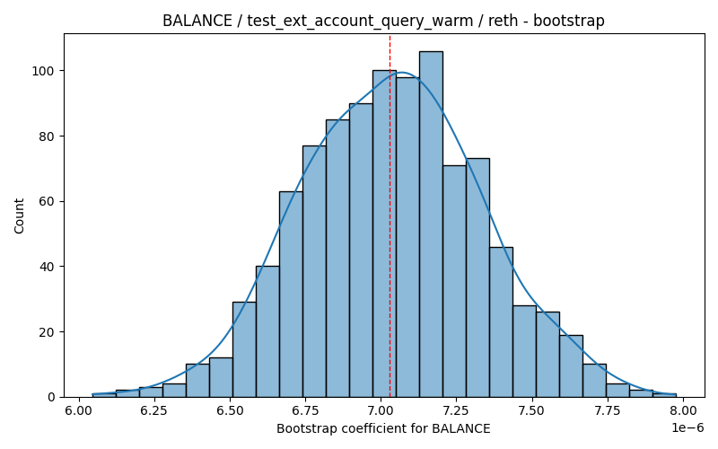

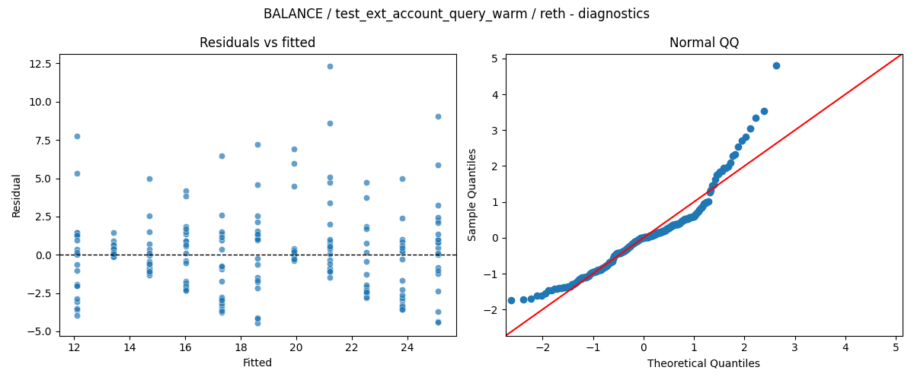

</details>

## CALL

### test_account_access — combo `CALL_AccountMode.EXISTING_EOA`

| client | nobs | R² | target_coef (ms) | p-value | 95% CI |
| --- | --- | --- | --- | --- | --- |
| `besu` | 440 | 0.9269 | 0.0122 | 1.00e-03 | [0.01172, 0.01271] |
| `erigon` | 176 | 0.977 | 0.007748 | 1.00e-03 | [0.006943, 0.008461] |
| `geth` | 286 | 0.8892 | 0.01398 | 1.00e-03 | [0.01336, 0.01457] |
| `nethermind` | 242 | 0.9347 | 0.003717 | 1.00e-03 | [0.003292, 0.004158] |
| `reth` | 462 | 0.991 | 0 | 1.00e+00 | [0, 0] |

<details><summary>besu — NNLS regression summary</summary>

```
==============================================================================
                           NNLS Regression Results                            
==============================================================================
Dep. Variable:          test_runtime_ms              R-squared:          0.927
Model:                  NNLS                    Adj. R-squared:          0.927
No. Observations:       440                               RMSE:         118.45
Df Residuals:           437                                MAE:          93.92
Df Model:               2      
==============================================================================
                      coef     std err     P-value      [0.025      0.975]
------------------------------------------------------------------------------
         const    487.6695     21.1589       0.001    446.7155    530.3267
       opcount      0.0122      0.0003       0.001      0.0117      0.0127
        update      0.0509      0.0009       0.001      0.0491      0.0526
==============================================================================
Notes: Non-negative least squares with bootstrap inference (1000 iterations)
==============================================================================
```

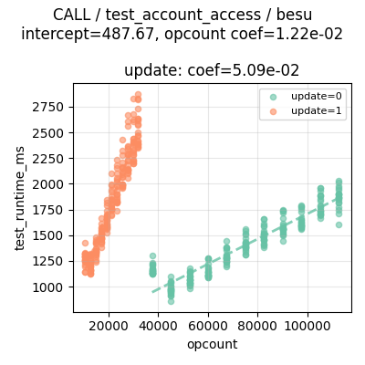

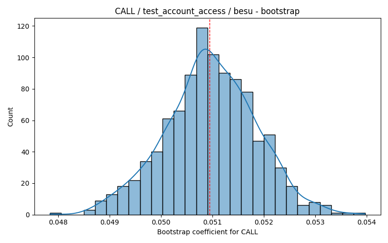

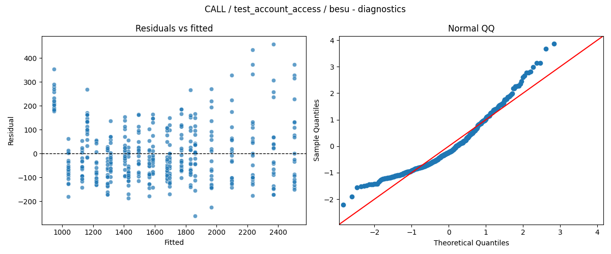

</details>

<details><summary>erigon — NNLS regression summary</summary>

```
==============================================================================
                           NNLS Regression Results                            
==============================================================================
Dep. Variable:          test_runtime_ms              R-squared:          0.977
Model:                  NNLS                    Adj. R-squared:          0.977
No. Observations:       176                               RMSE:          97.70
Df Residuals:           173                                MAE:          75.08
Df Model:               2      
==============================================================================
                      coef     std err     P-value      [0.025      0.975]
------------------------------------------------------------------------------
         const    316.3195     33.1654       0.001    254.9714    383.2665
       opcount      0.0077      0.0004       0.001      0.0069      0.0085
        update      0.0675      0.0011       0.001      0.0653      0.0696
==============================================================================
Notes: Non-negative least squares with bootstrap inference (1000 iterations)
==============================================================================
```

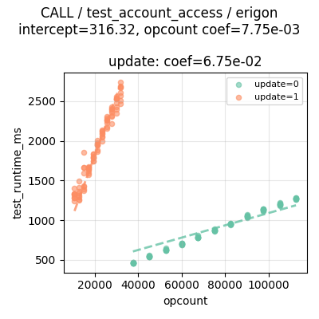

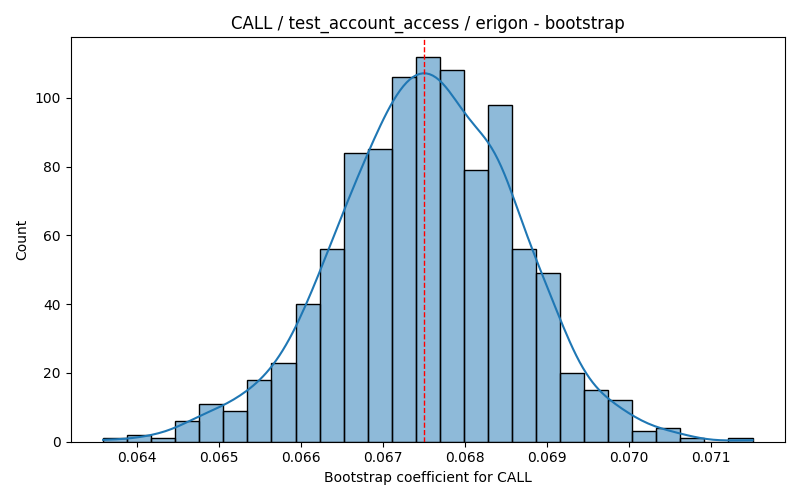

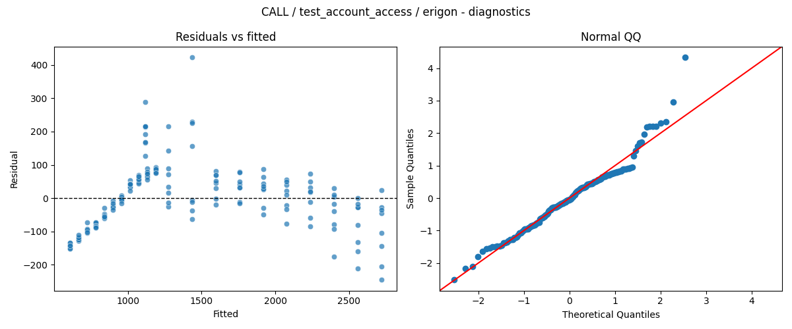

</details>

<details><summary>geth — NNLS regression summary</summary>

```
==============================================================================
                           NNLS Regression Results                            
==============================================================================
Dep. Variable:          test_runtime_ms              R-squared:          0.889
Model:                  NNLS                    Adj. R-squared:          0.888
No. Observations:       286                               RMSE:         131.06
Df Residuals:           283                                MAE:         103.89
Df Model:               2      
==============================================================================
                      coef     std err     P-value      [0.025      0.975]
------------------------------------------------------------------------------
         const    278.2037     22.6537       0.001    235.0553    322.8059
       opcount      0.0140      0.0003       0.001      0.0134      0.0146
        update      0.0436      0.0009       0.001      0.0417      0.0453
==============================================================================
Notes: Non-negative least squares with bootstrap inference (1000 iterations)
==============================================================================
```

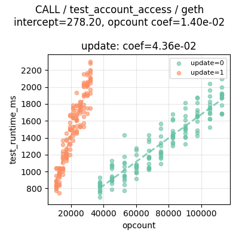

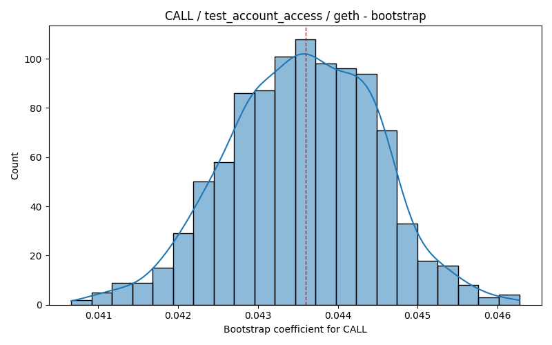

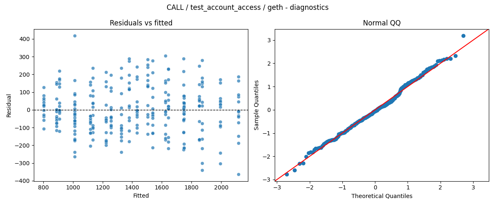

</details>

<details><summary>nethermind — NNLS regression summary</summary>

```
==============================================================================
                           NNLS Regression Results                            
==============================================================================
Dep. Variable:          test_runtime_ms              R-squared:          0.935
Model:                  NNLS                    Adj. R-squared:          0.934
No. Observations:       242                               RMSE:          84.74
Df Residuals:           239                                MAE:          65.16
Df Model:               2      
==============================================================================
                      coef     std err     P-value      [0.025      0.975]
------------------------------------------------------------------------------
         const    167.4325     17.9815       0.001    135.0229    201.7693
       opcount      0.0037      0.0002       0.001      0.0033      0.0042
        update      0.0338      0.0008       0.001      0.0322      0.0354
==============================================================================
Notes: Non-negative least squares with bootstrap inference (1000 iterations)
==============================================================================
```

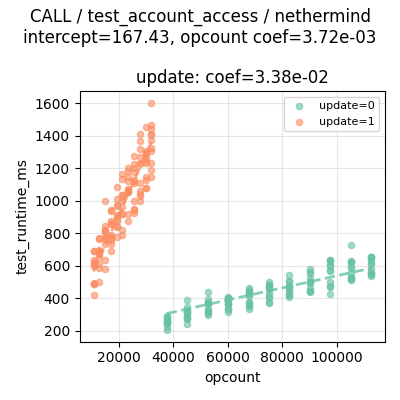

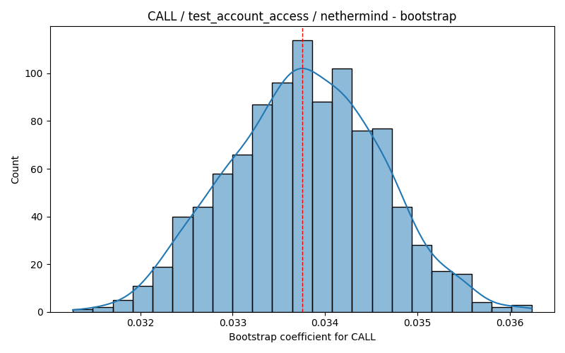

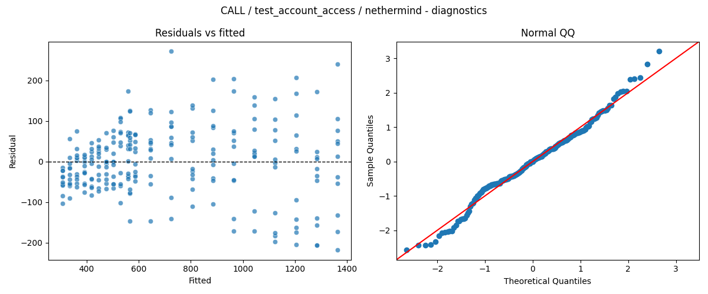

</details>

<details><summary>reth — NNLS regression summary</summary>

```
==============================================================================
                           NNLS Regression Results                            
==============================================================================
Dep. Variable:          test_runtime_ms              R-squared:          0.991
Model:                  NNLS                    Adj. R-squared:          0.991
No. Observations:       462                               RMSE:         181.98
Df Residuals:           459                                MAE:         106.56
Df Model:               2      
==============================================================================
                      coef     std err     P-value      [0.025      0.975]
------------------------------------------------------------------------------
         const    155.8656      7.8760       0.001    141.1273    172.4512
       opcount      0.0000      0.0000       1.000      0.0000      0.0000
        update      0.1641      0.0005       0.001      0.1632      0.1651
==============================================================================
Notes: Non-negative least squares with bootstrap inference (1000 iterations)
==============================================================================
```

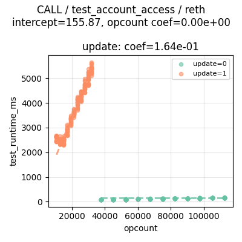

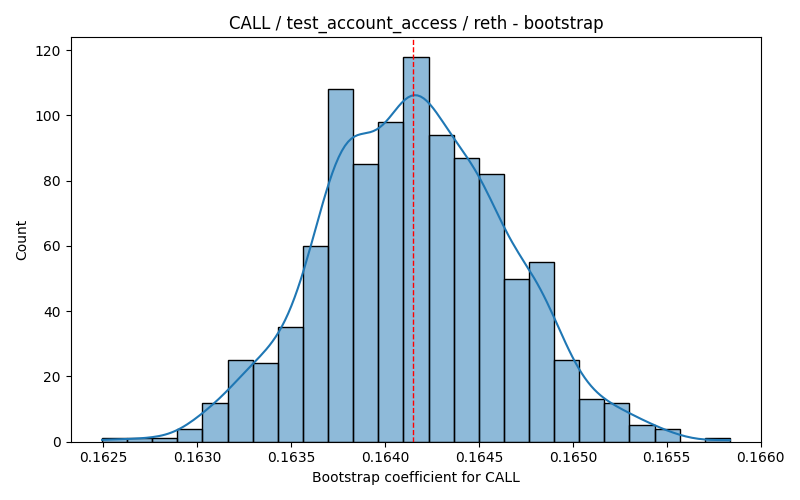

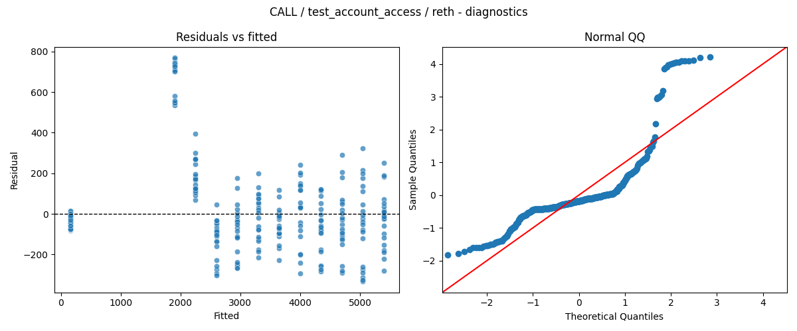

</details>

### test_account_access — combo `CALL_AccountMode.NON_EXISTING_ACCOUNT` — `presets[cold_account_nocode_access]`

| client | nobs | R² | target_coef (ms) | p-value | 95% CI |
| --- | --- | --- | --- | --- | --- |
| `besu` | 440 | 0.983 | 0.0128 | 1.00e-03 | [0.01248, 0.01316] |
| `erigon` | 176 | 0.9807 | 0.009774 | 1.00e-03 | [0.009555, 0.009994] |
| `geth` | 286 | 0.9484 | 0.03663 | 1.00e-03 | [0.0356, 0.03776] |
| `nethermind` | 242 | 0.9689 | 0.005152 | 1.00e-03 | [0.004929, 0.005375] |
| `reth` | 462 | 0.2824 | 0.0006015 | 1.00e-03 | [0.0004813, 0.0007162] |

<details><summary>besu — NNLS regression summary</summary>

```
==============================================================================
                           NNLS Regression Results                            
==============================================================================
Dep. Variable:          test_runtime_ms              R-squared:          0.983
Model:                  NNLS                    Adj. R-squared:          0.983
No. Observations:       440                               RMSE:          66.35
Df Residuals:           437                                MAE:          51.38
Df Model:               2      
==============================================================================
                      coef     std err     P-value      [0.025      0.975]
------------------------------------------------------------------------------
         const    392.5198     12.5933       0.001    366.0613    415.4496
       opcount      0.0128      0.0002       0.001      0.0125      0.0132
        update      0.0327      0.0105       0.001      0.0140      0.0552
==============================================================================
Notes: Non-negative least squares with bootstrap inference (1000 iterations)
==============================================================================
```

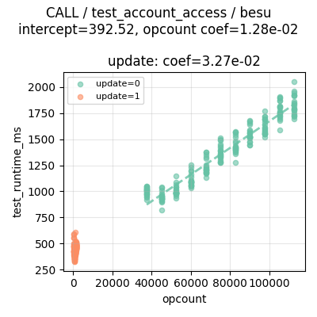

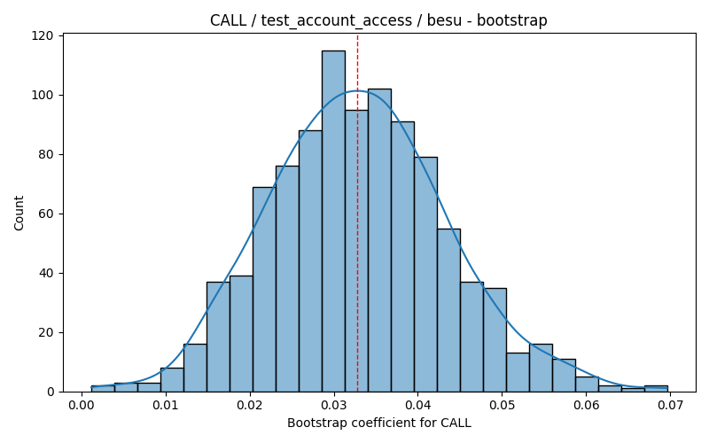

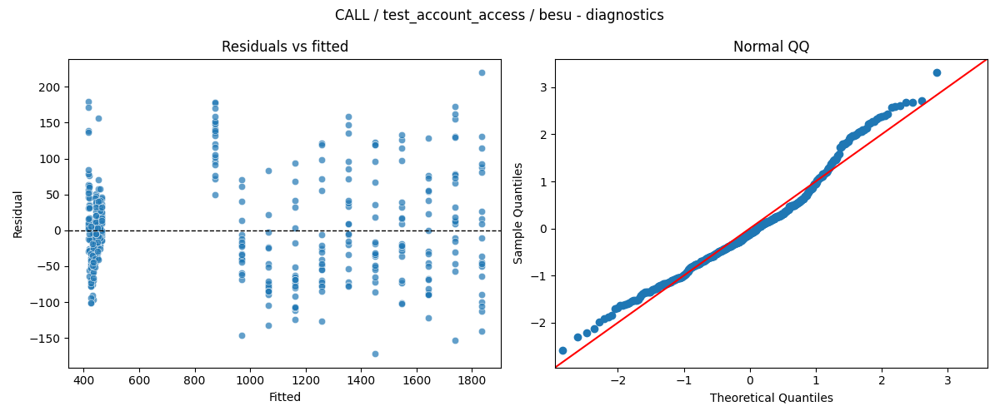

</details>

<details><summary>erigon — NNLS regression summary</summary>

```
==============================================================================
                           NNLS Regression Results                            
==============================================================================
Dep. Variable:          test_runtime_ms              R-squared:          0.981
Model:                  NNLS                    Adj. R-squared:          0.980
No. Observations:       176                               RMSE:          38.37
Df Residuals:           173                                MAE:          27.02
Df Model:               2      
==============================================================================
                      coef     std err     P-value      [0.025      0.975]
------------------------------------------------------------------------------
         const     41.4925      9.1439       0.001     23.3789     59.1969
       opcount      0.0098      0.0001       0.001      0.0096      0.0100
        update      0.2983      0.0106       0.001      0.2775      0.3190
==============================================================================
Notes: Non-negative least squares with bootstrap inference (1000 iterations)
==============================================================================
```

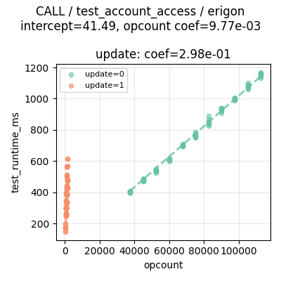

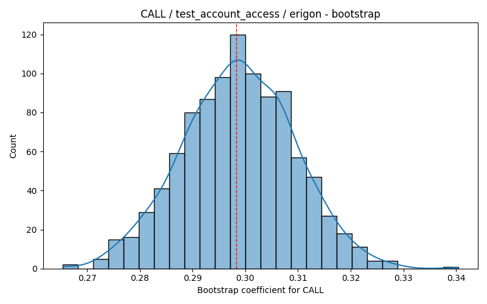

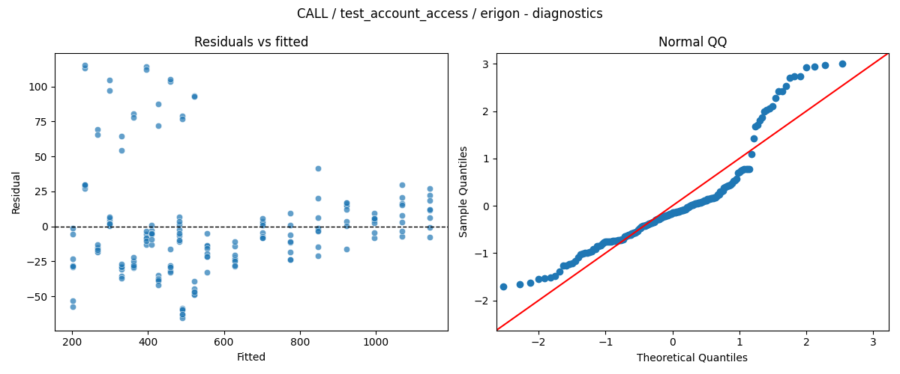

</details>

<details><summary>geth — NNLS regression summary</summary>

```
==============================================================================
                           NNLS Regression Results                            
==============================================================================
Dep. Variable:          test_runtime_ms              R-squared:          0.948
Model:                  NNLS                    Adj. R-squared:          0.948
No. Observations:       286                               RMSE:         347.44
Df Residuals:           283                                MAE:         232.63
Df Model:               2      
==============================================================================
                      coef     std err     P-value      [0.025      0.975]
------------------------------------------------------------------------------
         const    228.0434     15.5256       0.001    197.3091    258.8898
       opcount      0.0366      0.0006       0.001      0.0356      0.0378
        update      0.0000      0.0000       1.000      0.0000      0.0000
==============================================================================
Notes: Non-negative least squares with bootstrap inference (1000 iterations)
==============================================================================
```

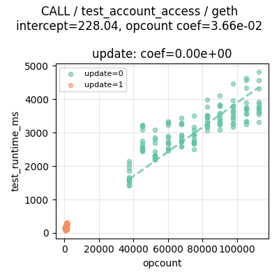


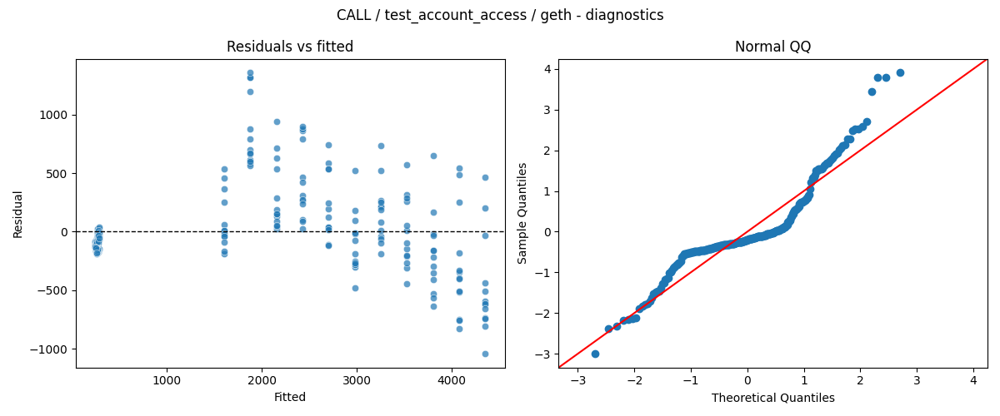

</details>

<details><summary>nethermind — NNLS regression summary</summary>

```
==============================================================================
                           NNLS Regression Results                            
==============================================================================
Dep. Variable:          test_runtime_ms              R-squared:          0.969
Model:                  NNLS                    Adj. R-squared:          0.969
No. Observations:       242                               RMSE:          35.86
Df Residuals:           239                                MAE:          26.84
Df Model:               2      
==============================================================================
                      coef     std err     P-value      [0.025      0.975]
------------------------------------------------------------------------------
         const     60.9130      7.0849       0.001     48.6033     75.3910
       opcount      0.0052      0.0001       0.001      0.0049      0.0054
        update      0.0200      0.0064       0.001      0.0064      0.0313
==============================================================================
Notes: Non-negative least squares with bootstrap inference (1000 iterations)
==============================================================================
```

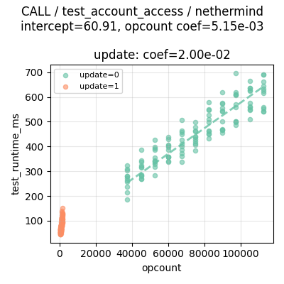

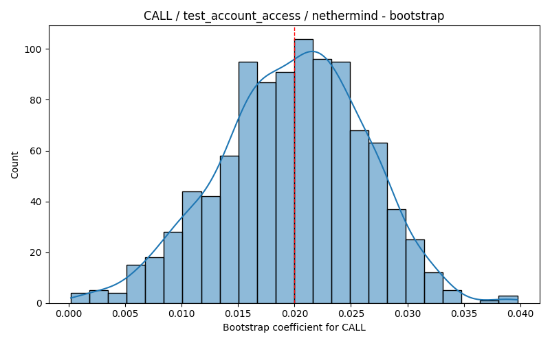

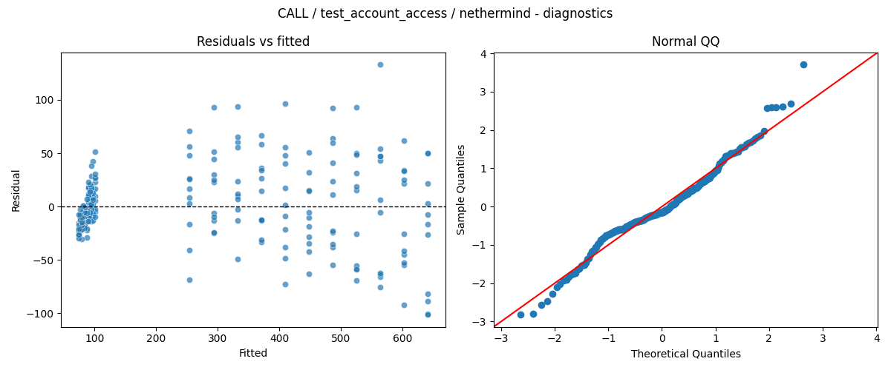

</details>

<details><summary>reth — NNLS regression summary</summary>

```
==============================================================================
                           NNLS Regression Results                            
==============================================================================
Dep. Variable:          test_runtime_ms              R-squared:          0.282
Model:                  NNLS                    Adj. R-squared:          0.279
No. Observations:       462                               RMSE:          21.82
Df Residuals:           459                                MAE:          15.15
Df Model:               2      
==============================================================================
                      coef     std err     P-value      [0.025      0.975]
------------------------------------------------------------------------------
         const     63.7944      4.9713       0.001     54.2059     73.6941
       opcount      0.0006      0.0001       0.001      0.0005      0.0007
        update      0.0346      0.0039       0.001      0.0268      0.0418
==============================================================================
Notes: Non-negative least squares with bootstrap inference (1000 iterations)
==============================================================================
```

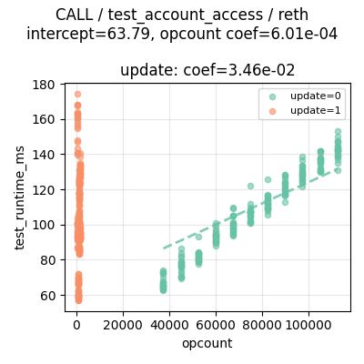

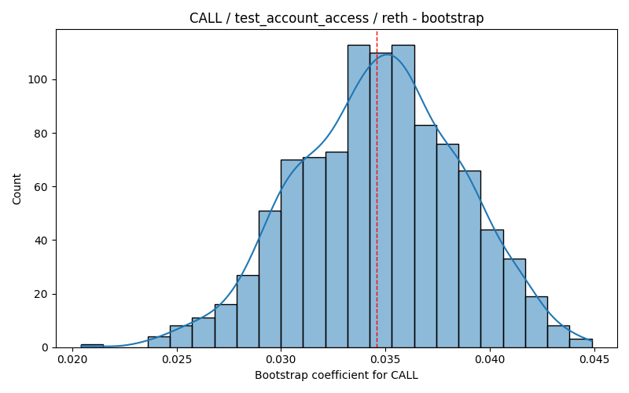

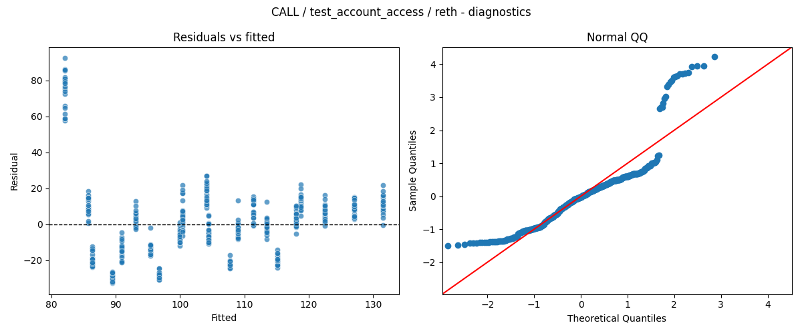

</details>

### test_account_access — combo `CALL_AccountMode.EXISTING_CONTRACT`

| client | nobs | R² | target_coef (ms) | p-value | 95% CI |
| --- | --- | --- | --- | --- | --- |
| `besu` | 440 | 0.9337 | 0.02554 | 1.00e-03 | [0.02459, 0.02652] |
| `erigon` | 176 | 0.9052 | 0.07498 | 1.00e-03 | [0.06999, 0.08006] |
| `geth` | 286 | 0.8354 | 0.034 | 1.00e-03 | [0.03216, 0.03592] |
| `nethermind` | 242 | 0.8461 | 0.02998 | 1.00e-03 | [0.02796, 0.03211] |
| `reth` | 462 | 0.9487 | 0.03042 | 1.00e-03 | [0.02894, 0.03202] |

<details><summary>besu — NNLS regression summary</summary>

```
==============================================================================
                           NNLS Regression Results                            
==============================================================================
Dep. Variable:          test_runtime_ms              R-squared:          0.934
Model:                  NNLS                    Adj. R-squared:          0.933
No. Observations:       440                               RMSE:         184.01
Df Residuals:           437                                MAE:         146.51
Df Model:               2      
==============================================================================
                      coef     std err     P-value      [0.025      0.975]
------------------------------------------------------------------------------
         const    660.1127     31.5665       0.001    597.3977    722.2326
       opcount      0.0255      0.0005       0.001      0.0246      0.0265
        update      0.0849      0.0013       0.001      0.0825      0.0875
==============================================================================
Notes: Non-negative least squares with bootstrap inference (1000 iterations)
==============================================================================
```

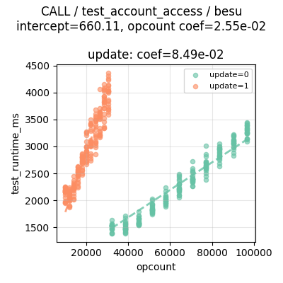

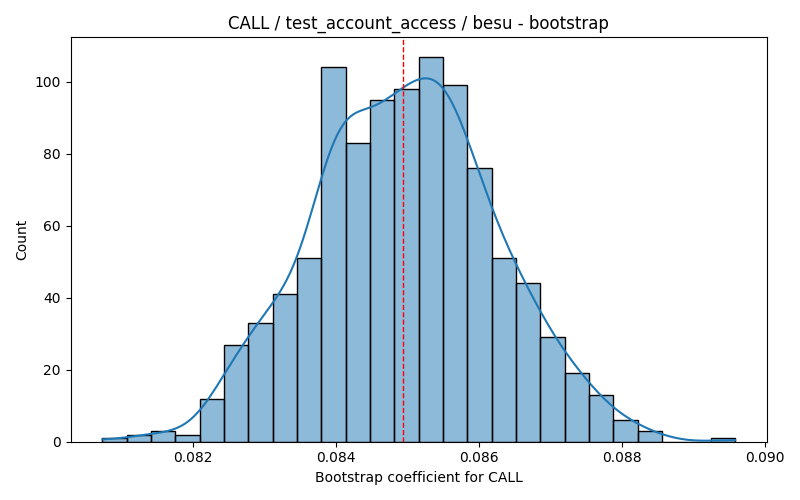

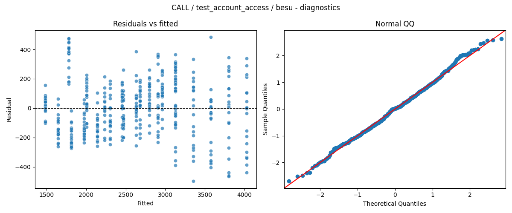

</details>

<details><summary>erigon — NNLS regression summary</summary>

```
==============================================================================
                           NNLS Regression Results                            
==============================================================================
Dep. Variable:          test_runtime_ms              R-squared:          0.905
Model:                  NNLS                    Adj. R-squared:          0.904
No. Observations:       176                               RMSE:         597.80
Df Residuals:           173                                MAE:         469.11
Df Model:               2      
==============================================================================
                      coef     std err     P-value      [0.025      0.975]
------------------------------------------------------------------------------
         const   2301.1883    183.7671       0.001   1932.0118   2651.5296
       opcount      0.0750      0.0025       0.001      0.0700      0.0801
        update      0.2246      0.0068       0.001      0.2115      0.2380
==============================================================================
Notes: Non-negative least squares with bootstrap inference (1000 iterations)
==============================================================================
```

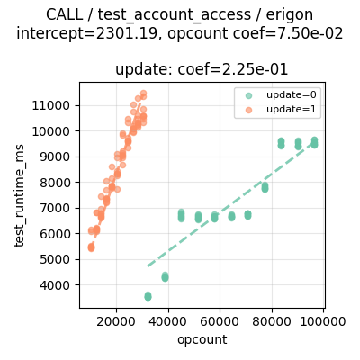

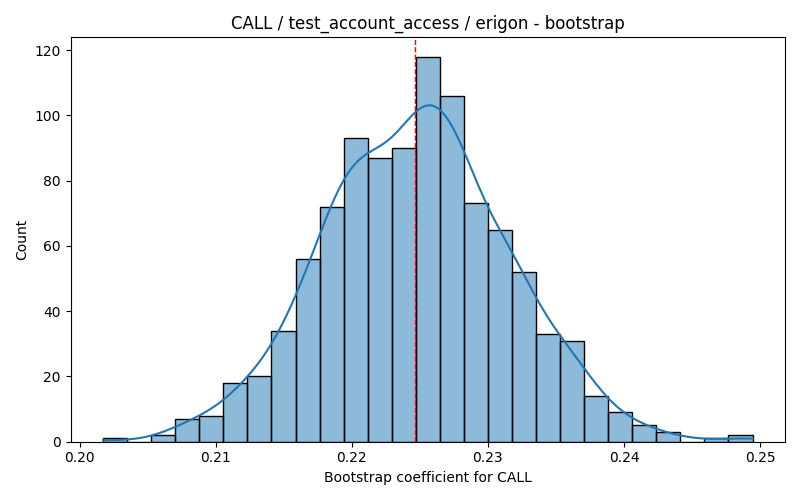

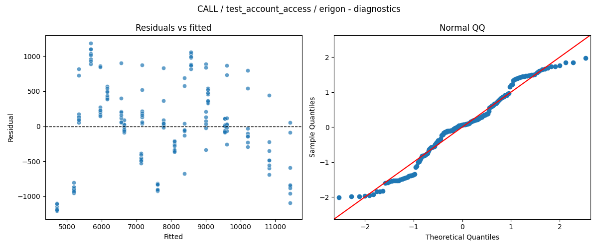

</details>

<details><summary>geth — NNLS regression summary</summary>

```
==============================================================================
                           NNLS Regression Results                            
==============================================================================
Dep. Variable:          test_runtime_ms              R-squared:          0.835
Model:                  NNLS                    Adj. R-squared:          0.834
No. Observations:       286                               RMSE:         294.35
Df Residuals:           283                                MAE:         227.25
Df Model:               2      
==============================================================================
                      coef     std err     P-value      [0.025      0.975]
------------------------------------------------------------------------------
         const    759.6169     59.4234       0.001    645.3705    879.4219
       opcount      0.0340      0.0010       0.001      0.0322      0.0359
        update      0.0534      0.0021       0.001      0.0492      0.0574
==============================================================================
Notes: Non-negative least squares with bootstrap inference (1000 iterations)
==============================================================================
```

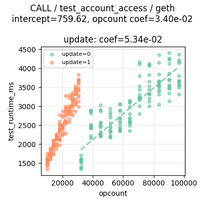

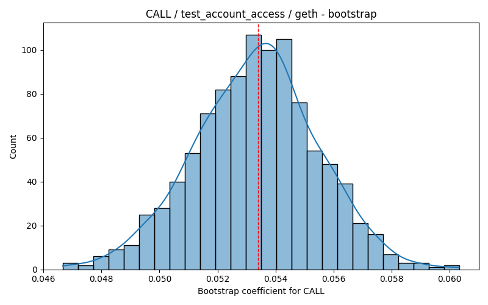

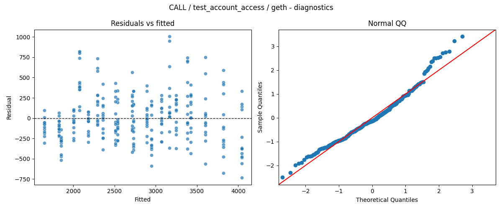

</details>

<details><summary>nethermind — NNLS regression summary</summary>

```
==============================================================================
                           NNLS Regression Results                            
==============================================================================
Dep. Variable:          test_runtime_ms              R-squared:          0.846
Model:                  NNLS                    Adj. R-squared:          0.845
No. Observations:       242                               RMSE:         294.98
Df Residuals:           239                                MAE:         222.72
Df Model:               2      
==============================================================================
                      coef     std err     P-value      [0.025      0.975]
------------------------------------------------------------------------------
         const    555.6285     63.9648       0.001    436.5013    686.8053
       opcount      0.0300      0.0011       0.001      0.0280      0.0321
        update      0.0159      0.0023       0.001      0.0113      0.0201
==============================================================================
Notes: Non-negative least squares with bootstrap inference (1000 iterations)
==============================================================================
```

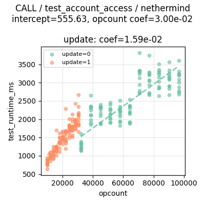

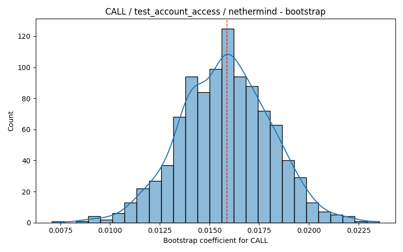

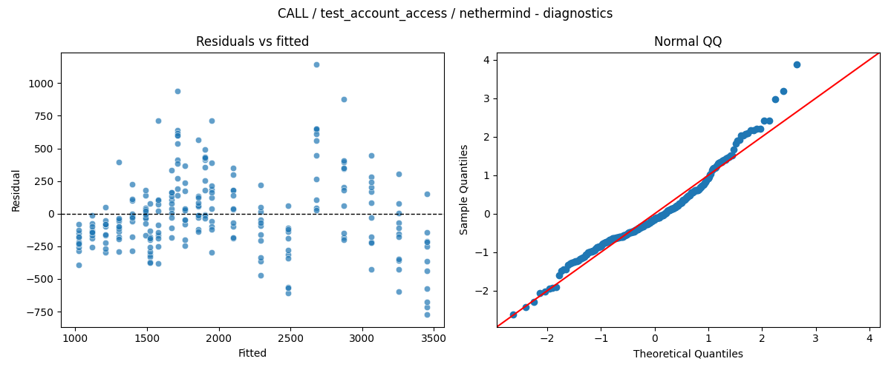

</details>

<details><summary>reth — NNLS regression summary</summary>

```
==============================================================================
                           NNLS Regression Results                            
==============================================================================
Dep. Variable:          test_runtime_ms              R-squared:          0.949
Model:                  NNLS                    Adj. R-squared:          0.949
No. Observations:       462                               RMSE:         270.08
Df Residuals:           459                                MAE:         169.66
Df Model:               2      
==============================================================================
                      coef     std err     P-value      [0.025      0.975]
------------------------------------------------------------------------------
         const    589.3314     47.7374       0.001    493.0001    679.4726
       opcount      0.0304      0.0008       0.001      0.0289      0.0320
        update      0.1397      0.0014       0.001      0.1372      0.1424
==============================================================================
Notes: Non-negative least squares with bootstrap inference (1000 iterations)
==============================================================================
```

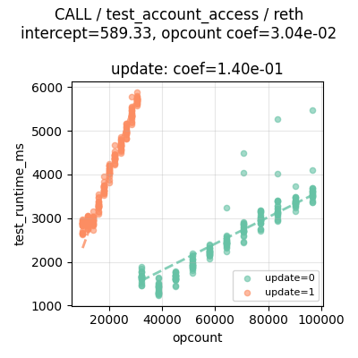

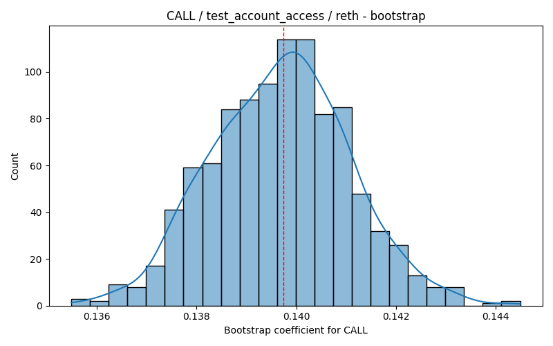

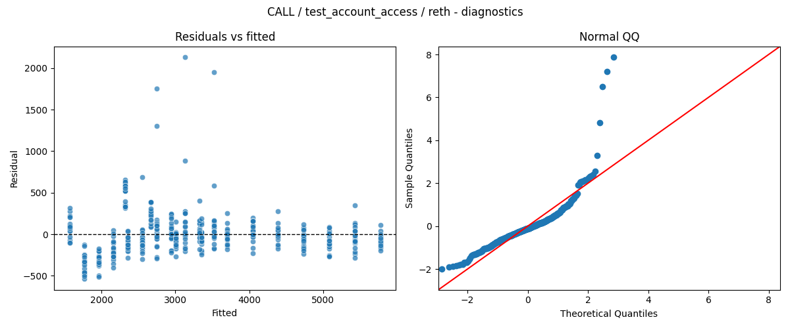

</details>

### test_account_access — combo `CALL_AccountMode.NON_EXISTING_ACCOUNT` — `presets[cold_account_code_access]`

| client | nobs | R² | target_coef (ms) | p-value | 95% CI |
| --- | --- | --- | --- | --- | --- |
| `besu` | 440 | 0.983 | 0.0128 | 1.00e-03 | [0.01248, 0.01316] |
| `erigon` | 176 | 0.9807 | 0.009774 | 1.00e-03 | [0.009555, 0.009994] |
| `geth` | 286 | 0.9484 | 0.03663 | 1.00e-03 | [0.0356, 0.03776] |
| `nethermind` | 242 | 0.9689 | 0.005152 | 1.00e-03 | [0.004929, 0.005375] |
| `reth` | 462 | 0.2824 | 0.0006015 | 1.00e-03 | [0.0004813, 0.0007162] |

<details><summary>besu — NNLS regression summary</summary>

```
==============================================================================
                           NNLS Regression Results                            
==============================================================================
Dep. Variable:          test_runtime_ms              R-squared:          0.983
Model:                  NNLS                    Adj. R-squared:          0.983
No. Observations:       440                               RMSE:          66.35
Df Residuals:           437                                MAE:          51.38
Df Model:               2      
==============================================================================
                      coef     std err     P-value      [0.025      0.975]
------------------------------------------------------------------------------
         const    392.5198     12.5933       0.001    366.0613    415.4496
       opcount      0.0128      0.0002       0.001      0.0125      0.0132
        update      0.0327      0.0105       0.001      0.0140      0.0552
==============================================================================
Notes: Non-negative least squares with bootstrap inference (1000 iterations)
==============================================================================
```


</details>

<details><summary>erigon — NNLS regression summary</summary>

```
==============================================================================
                           NNLS Regression Results                            
==============================================================================
Dep. Variable:          test_runtime_ms              R-squared:          0.981
Model:                  NNLS                    Adj. R-squared:          0.980
No. Observations:       176                               RMSE:          38.37
Df Residuals:           173                                MAE:          27.02
Df Model:               2      
==============================================================================
                      coef     std err     P-value      [0.025      0.975]
------------------------------------------------------------------------------
         const     41.4925      9.1439       0.001     23.3789     59.1969
       opcount      0.0098      0.0001       0.001      0.0096      0.0100
        update      0.2983      0.0106       0.001      0.2775      0.3190
==============================================================================
Notes: Non-negative least squares with bootstrap inference (1000 iterations)
==============================================================================
```


</details>

<details><summary>geth — NNLS regression summary</summary>

```
==============================================================================
                           NNLS Regression Results                            
==============================================================================
Dep. Variable:          test_runtime_ms              R-squared:          0.948
Model:                  NNLS                    Adj. R-squared:          0.948
No. Observations:       286                               RMSE:         347.44
Df Residuals:           283                                MAE:         232.63
Df Model:               2      
==============================================================================
                      coef     std err     P-value      [0.025      0.975]
------------------------------------------------------------------------------
         const    228.0434     15.5256       0.001    197.3091    258.8898
       opcount      0.0366      0.0006       0.001      0.0356      0.0378
        update      0.0000      0.0000       1.000      0.0000      0.0000
==============================================================================
Notes: Non-negative least squares with bootstrap inference (1000 iterations)
==============================================================================
```


</details>

<details><summary>nethermind — NNLS regression summary</summary>

```
==============================================================================
                           NNLS Regression Results                            
==============================================================================
Dep. Variable:          test_runtime_ms              R-squared:          0.969
Model:                  NNLS                    Adj. R-squared:          0.969
No. Observations:       242                               RMSE:          35.86
Df Residuals:           239                                MAE:          26.84
Df Model:               2      
==============================================================================
                      coef     std err     P-value      [0.025      0.975]
------------------------------------------------------------------------------
         const     60.9130      7.0849       0.001     48.6033     75.3910
       opcount      0.0052      0.0001       0.001      0.0049      0.0054
        update      0.0200      0.0064       0.001      0.0064      0.0313
==============================================================================
Notes: Non-negative least squares with bootstrap inference (1000 iterations)
==============================================================================
```


</details>

<details><summary>reth — NNLS regression summary</summary>

```
==============================================================================
                           NNLS Regression Results                            
==============================================================================
Dep. Variable:          test_runtime_ms              R-squared:          0.282
Model:                  NNLS                    Adj. R-squared:          0.279
No. Observations:       462                               RMSE:          21.82
Df Residuals:           459                                MAE:          15.15
Df Model:               2      
==============================================================================
                      coef     std err     P-value      [0.025      0.975]
------------------------------------------------------------------------------
         const     63.7944      4.9713       0.001     54.2059     73.6941
       opcount      0.0006      0.0001       0.001      0.0005      0.0007
        update      0.0346      0.0039       0.001      0.0268      0.0418
==============================================================================
Notes: Non-negative least squares with bootstrap inference (1000 iterations)
==============================================================================
```


</details>

### test_ext_account_query_warm — combo `CALL`

| client | nobs | R² | target_coef (ms) | p-value | 95% CI |
| --- | --- | --- | --- | --- | --- |
| `besu` | 220 | 0.7856 | 0.0005998 | 1.00e-03 | [0.0005569, 0.0006406] |
| `erigon` | 88 | 0.963 | 0.00049 | 1.00e-03 | [0.0004697, 0.0005109] |
| `geth` | 143 | 0.873 | 0.0001318 | 1.00e-03 | [0.000124, 0.0001395] |
| `nethermind` | 121 | 0.4141 | 0.0005889 | 1.00e-03 | [0.0004578, 0.0007146] |
| `reth` | 231 | 0.8972 | 5.114e-05 | 1.00e-03 | [4.854e-05, 5.373e-05] |

<details><summary>besu — NNLS regression summary</summary>

```
==============================================================================
                           NNLS Regression Results                            
==============================================================================
Dep. Variable:          test_runtime_ms              R-squared:          0.786
Model:                  NNLS                    Adj. R-squared:          0.785
No. Observations:       220                               RMSE:         158.30
Df Residuals:           218                                MAE:         129.35
Df Model:               1      
==============================================================================
                      coef     std err     P-value      [0.025      0.975]
------------------------------------------------------------------------------
         const    717.5071     34.4526       0.001    653.7517    785.1942
       opcount      0.0006      0.0000       0.001      0.0006      0.0006
==============================================================================
Notes: Non-negative least squares with bootstrap inference (1000 iterations)
==============================================================================
```

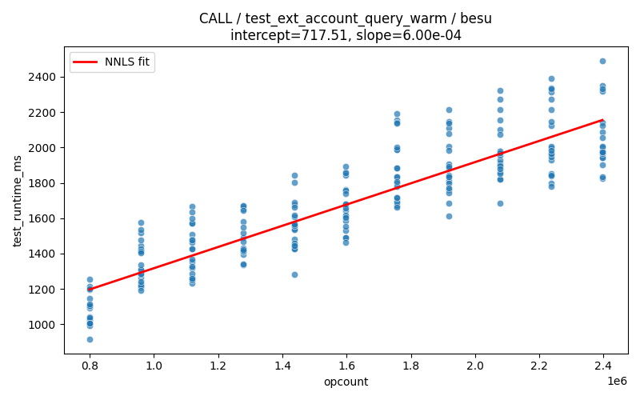

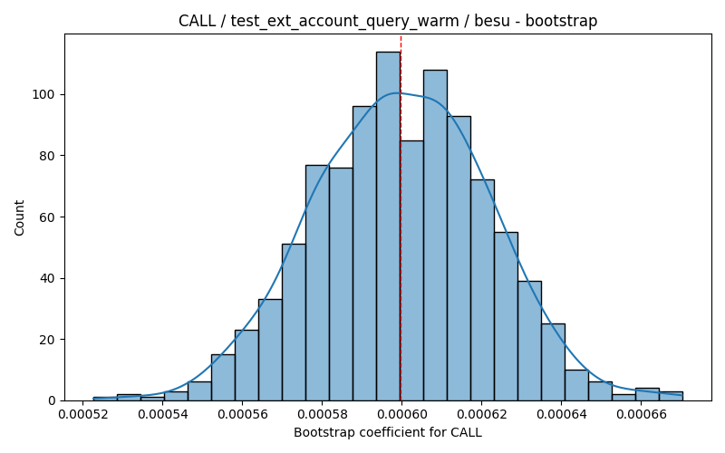

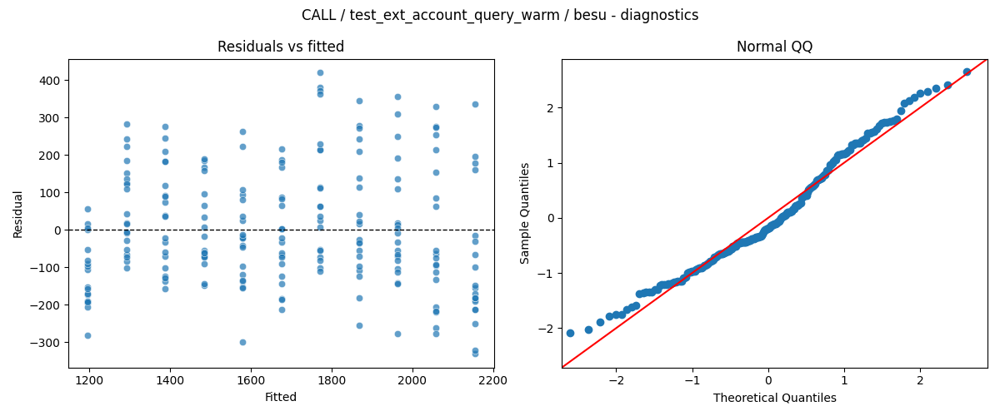

</details>

<details><summary>erigon — NNLS regression summary</summary>

```
==============================================================================
                           NNLS Regression Results                            
==============================================================================
Dep. Variable:          test_runtime_ms              R-squared:          0.963
Model:                  NNLS                    Adj. R-squared:          0.963
No. Observations:       88                                RMSE:          48.57
Df Residuals:           86                                 MAE:          36.56
Df Model:               1      
==============================================================================
                      coef     std err     P-value      [0.025      0.975]
------------------------------------------------------------------------------
         const     51.6826     18.2715       0.001     16.7687     86.1675
       opcount      0.0005      0.0000       0.001      0.0005      0.0005
==============================================================================
Notes: Non-negative least squares with bootstrap inference (1000 iterations)
==============================================================================
```

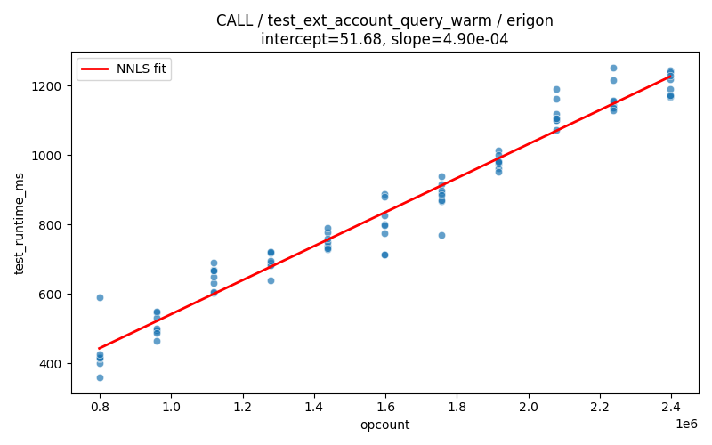

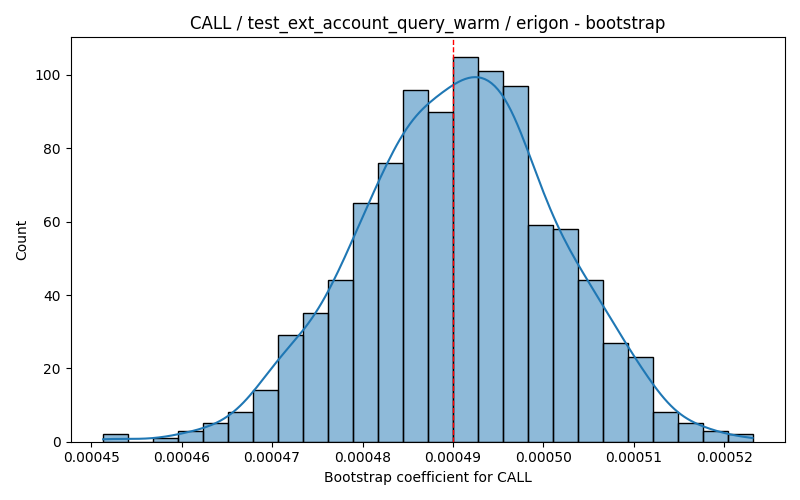

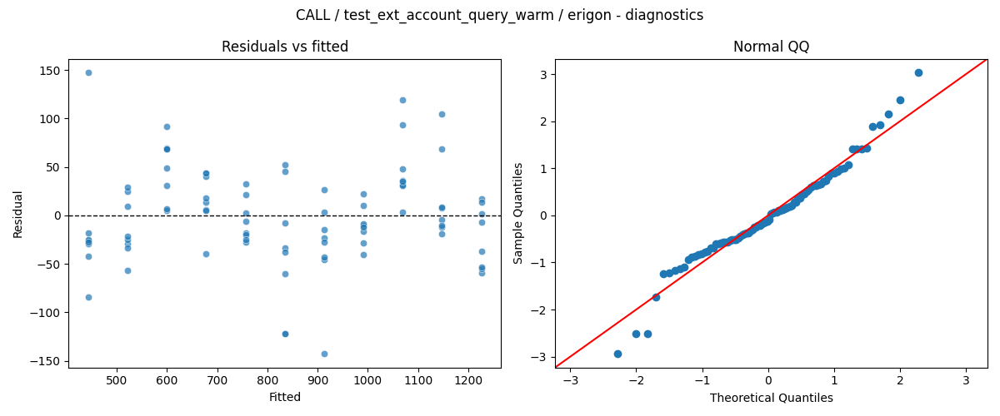

</details>

<details><summary>geth — NNLS regression summary</summary>

```
==============================================================================
                           NNLS Regression Results                            
==============================================================================
Dep. Variable:          test_runtime_ms              R-squared:          0.873
Model:                  NNLS                    Adj. R-squared:          0.872
No. Observations:       143                               RMSE:          25.39
Df Residuals:           141                                MAE:          20.63
Df Model:               1      
==============================================================================
                      coef     std err     P-value      [0.025      0.975]
------------------------------------------------------------------------------
         const     42.5619      6.2115       0.001     30.9290     55.0606
       opcount      0.0001      0.0000       0.001      0.0001      0.0001
==============================================================================
Notes: Non-negative least squares with bootstrap inference (1000 iterations)
==============================================================================
```

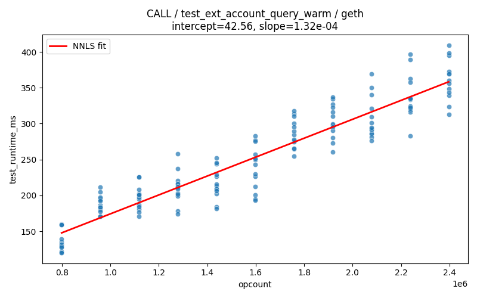

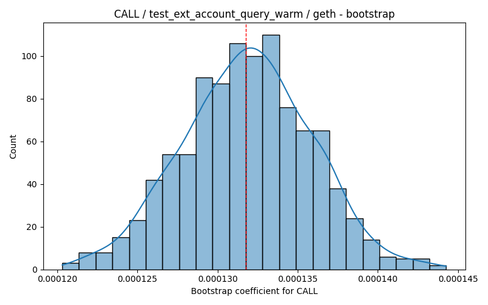

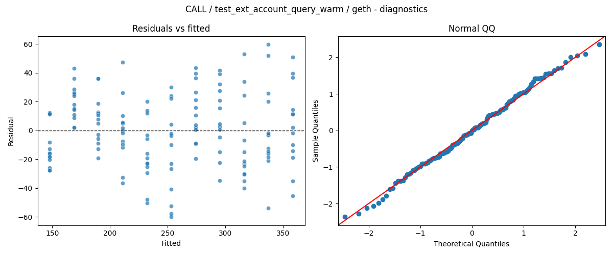

</details>

<details><summary>nethermind — NNLS regression summary</summary>

```
==============================================================================
                           NNLS Regression Results                            
==============================================================================
Dep. Variable:          test_runtime_ms              R-squared:          0.414
Model:                  NNLS                    Adj. R-squared:          0.409
No. Observations:       121                               RMSE:         353.92
Df Residuals:           119                                MAE:         324.00
Df Model:               1      
==============================================================================
                      coef     std err     P-value      [0.025      0.975]
------------------------------------------------------------------------------
         const    274.5211     95.6691       0.002     94.1495    460.6394
       opcount      0.0006      0.0001       0.001      0.0005      0.0007
==============================================================================
Notes: Non-negative least squares with bootstrap inference (1000 iterations)
==============================================================================
```

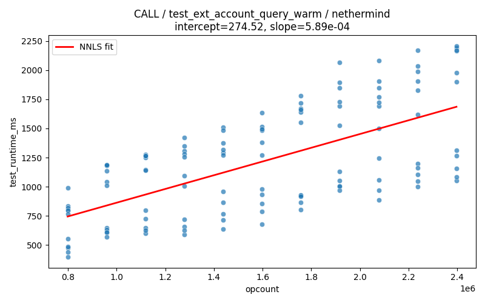

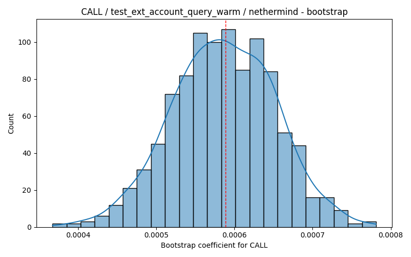

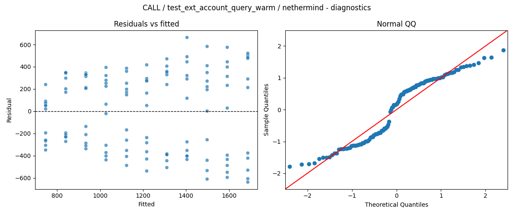

</details>

<details><summary>reth — NNLS regression summary</summary>

```
==============================================================================
                           NNLS Regression Results                            
==============================================================================
Dep. Variable:          test_runtime_ms              R-squared:          0.897
Model:                  NNLS                    Adj. R-squared:          0.897
No. Observations:       231                               RMSE:           8.75
Df Residuals:           229                                MAE:           7.22
Df Model:               1      
==============================================================================
                      coef     std err     P-value      [0.025      0.975]
------------------------------------------------------------------------------
         const     16.1454      2.0591       0.001     12.1542     20.2955
       opcount      0.0001      0.0000       0.001      0.0000      0.0001
==============================================================================
Notes: Non-negative least squares with bootstrap inference (1000 iterations)
==============================================================================
```

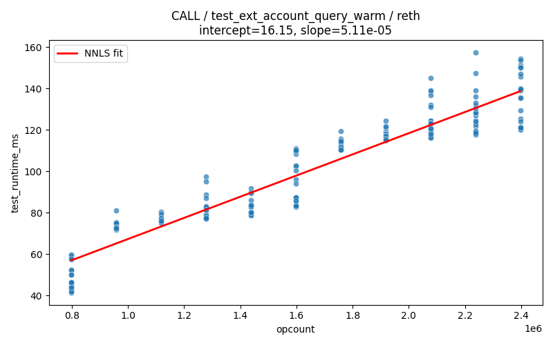

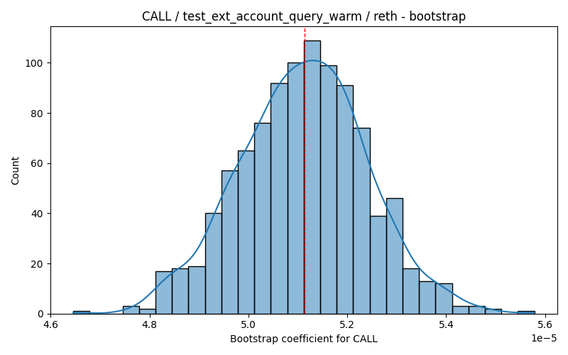

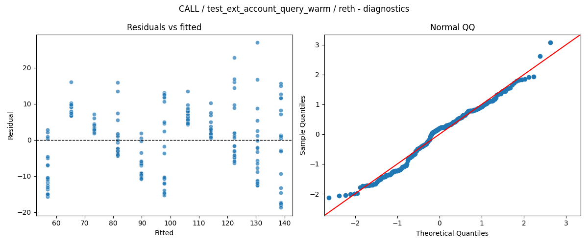

</details>

## CALLCODE

### test_account_access — combo `CALLCODE_AccountMode.EXISTING_EOA`

| client | nobs | R² | target_coef (ms) | p-value | 95% CI |
| --- | --- | --- | --- | --- | --- |
| `besu` | 440 | 0.9482 | 0.01421 | 1.00e-03 | [0.01398, 0.01447] |
| `erigon` | 176 | 0.9965 | 0.01048 | 1.00e-03 | [0.01044, 0.01052] |
| `geth` | 286 | 0.9477 | 0.01592 | 1.00e-03 | [0.01548, 0.0164] |
| `nethermind` | 242 | 0.9335 | 0.004779 | 1.00e-03 | [0.004564, 0.005021] |
| `reth` | 462 | 0.9799 | 0.001398 | 1.00e-03 | [0.001381, 0.001416] |

<details><summary>besu — NNLS regression summary</summary>

```
==============================================================================
                           NNLS Regression Results                            
==============================================================================
Dep. Variable:          test_runtime_ms              R-squared:          0.948
Model:                  NNLS                    Adj. R-squared:          0.948
No. Observations:       440                               RMSE:         106.54
Df Residuals:           437                                MAE:          71.67
Df Model:               2      
==============================================================================
                      coef     std err     P-value      [0.025      0.975]
------------------------------------------------------------------------------
         const    243.5113      7.4308       0.001    230.1227    258.0948
       opcount      0.0142      0.0001       0.001      0.0140      0.0145
        update      0.0000      0.0000       1.000      0.0000      0.0000
==============================================================================
Notes: Non-negative least squares with bootstrap inference (1000 iterations)
==============================================================================
```

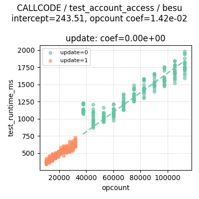


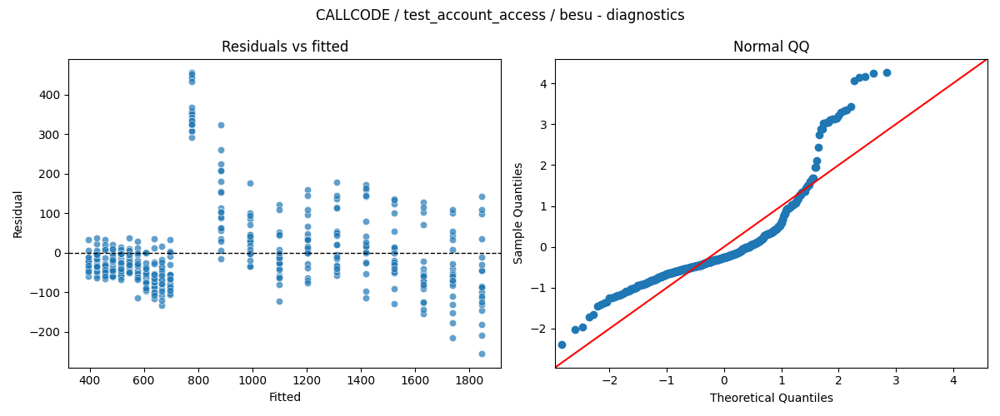

</details>

<details><summary>erigon — NNLS regression summary</summary>

```
==============================================================================
                           NNLS Regression Results                            
==============================================================================
Dep. Variable:          test_runtime_ms              R-squared:          0.996
Model:                  NNLS                    Adj. R-squared:          0.996
No. Observations:       176                               RMSE:          20.31
Df Residuals:           173                                MAE:          15.57
Df Model:               2      
==============================================================================
                      coef     std err     P-value      [0.025      0.975]
------------------------------------------------------------------------------
         const      0.0000      0.0000       1.000      0.0000      0.0000
       opcount      0.0105      0.0000       0.001      0.0104      0.0105
        update      0.0000      0.0000       1.000      0.0000      0.0000
==============================================================================
Notes: Non-negative least squares with bootstrap inference (1000 iterations)
==============================================================================
```

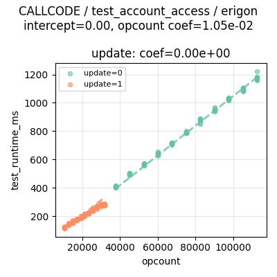


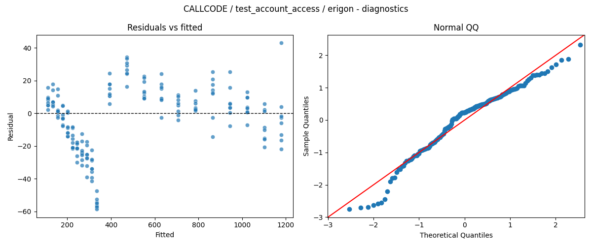

</details>

<details><summary>geth — NNLS regression summary</summary>

```
==============================================================================
                           NNLS Regression Results                            
==============================================================================
Dep. Variable:          test_runtime_ms              R-squared:          0.948
Model:                  NNLS                    Adj. R-squared:          0.947
No. Observations:       286                               RMSE:         120.00
Df Residuals:           283                                MAE:          90.67
Df Model:               2      
==============================================================================
                      coef     std err     P-value      [0.025      0.975]
------------------------------------------------------------------------------
         const    115.3246     11.7933       0.001     91.7804    139.8111
       opcount      0.0159      0.0002       0.001      0.0155      0.0164
        update      0.0000      0.0000       1.000      0.0000      0.0000
==============================================================================
Notes: Non-negative least squares with bootstrap inference (1000 iterations)
==============================================================================
```

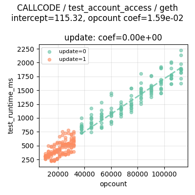


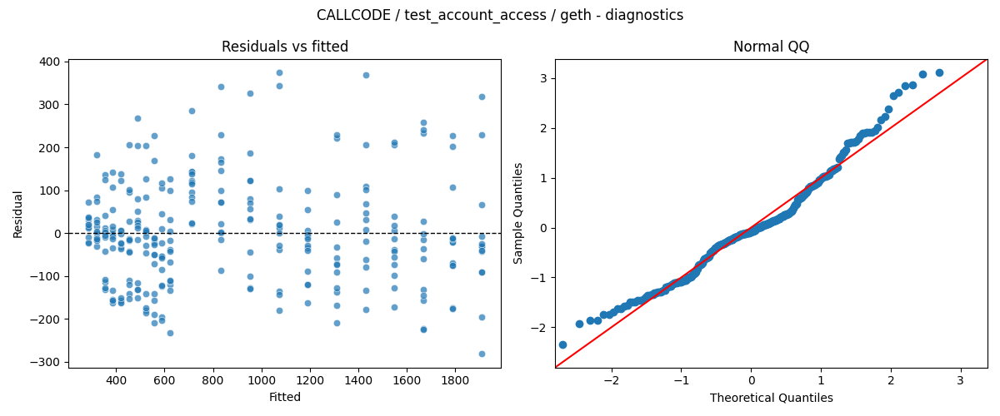

</details>

<details><summary>nethermind — NNLS regression summary</summary>

```
==============================================================================
                           NNLS Regression Results                            
==============================================================================
Dep. Variable:          test_runtime_ms              R-squared:          0.933
Model:                  NNLS                    Adj. R-squared:          0.933
No. Observations:       242                               RMSE:          40.92
Df Residuals:           239                                MAE:          29.76
Df Model:               2      
==============================================================================
                      coef     std err     P-value      [0.025      0.975]
------------------------------------------------------------------------------
         const     68.4845      4.2390       0.001     59.0321     76.0412
       opcount      0.0048      0.0001       0.001      0.0046      0.0050
        update      0.0000      0.0000       1.000      0.0000      0.0001
==============================================================================
Notes: Non-negative least squares with bootstrap inference (1000 iterations)
==============================================================================
```

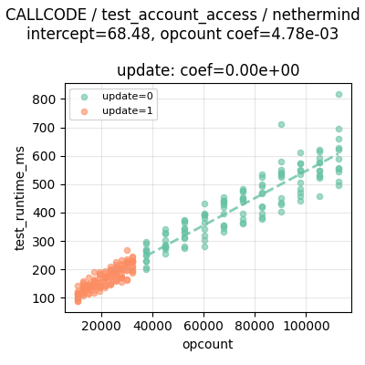

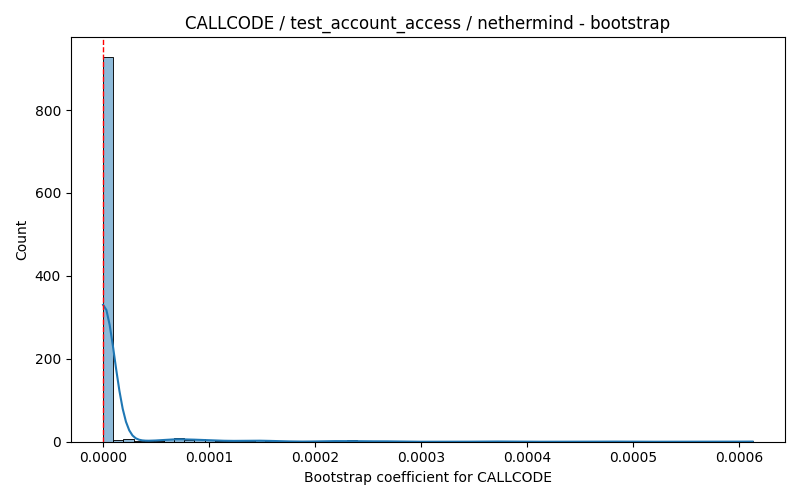

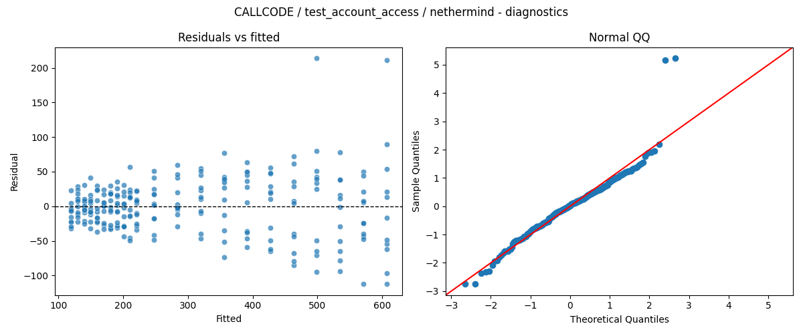

</details>

<details><summary>reth — NNLS regression summary</summary>

```
==============================================================================
                           NNLS Regression Results                            
==============================================================================
Dep. Variable:          test_runtime_ms              R-squared:          0.980
Model:                  NNLS                    Adj. R-squared:          0.980
No. Observations:       462                               RMSE:           6.42
Df Residuals:           459                                MAE:           4.97
Df Model:               2      
==============================================================================
                      coef     std err     P-value      [0.025      0.975]
------------------------------------------------------------------------------
         const      8.8183      0.4323       0.001      7.9733      9.6562
       opcount      0.0014      0.0000       0.001      0.0014      0.0014
        update      0.0000      0.0000       1.000      0.0000      0.0000
==============================================================================
Notes: Non-negative least squares with bootstrap inference (1000 iterations)
==============================================================================
```

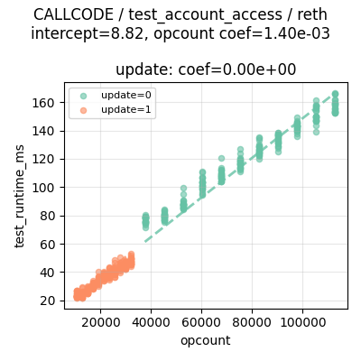


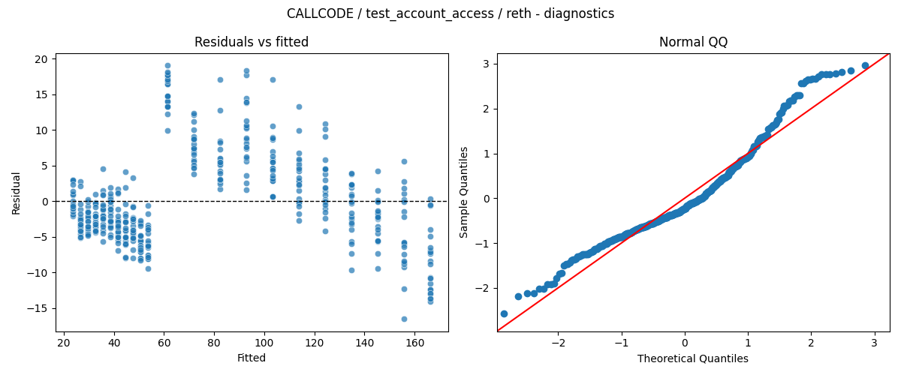

</details>

### test_account_access — combo `CALLCODE_AccountMode.NON_EXISTING_ACCOUNT` — `presets[cold_account_nocode_access]`

| client | nobs | R² | target_coef (ms) | p-value | 95% CI |
| --- | --- | --- | --- | --- | --- |
| `besu` | 440 | 0.9404 | 0.01542 | 1.00e-03 | [0.01516, 0.0157] |
| `erigon` | 176 | 0.9395 | 0.009288 | 1.00e-03 | [0.009122, 0.009407] |
| `geth` | 286 | 0.881 | 0.03904 | 1.00e-03 | [0.03818, 0.03999] |
| `nethermind` | 242 | 0.9292 | 0.005554 | 1.00e-03 | [0.005426, 0.005694] |
| `reth` | 462 | 0.9103 | 0.001288 | 1.00e-03 | [0.001272, 0.001303] |

<details><summary>besu — NNLS regression summary</summary>

```
==============================================================================
                           NNLS Regression Results                            
==============================================================================
Dep. Variable:          test_runtime_ms              R-squared:          0.940
Model:                  NNLS                    Adj. R-squared:          0.940
No. Observations:       440                               RMSE:         124.50
Df Residuals:           437                                MAE:          98.89
Df Model:               2      
==============================================================================
                      coef     std err     P-value      [0.025      0.975]
------------------------------------------------------------------------------
         const     59.2232     10.2008       0.001     38.8268     79.2409
       opcount      0.0154      0.0001       0.001      0.0152      0.0157
        update      0.0000      0.0000       1.000      0.0000      0.0000
==============================================================================
Notes: Non-negative least squares with bootstrap inference (1000 iterations)
==============================================================================
```

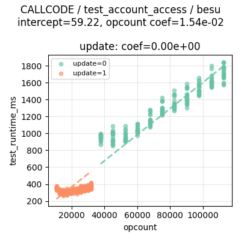


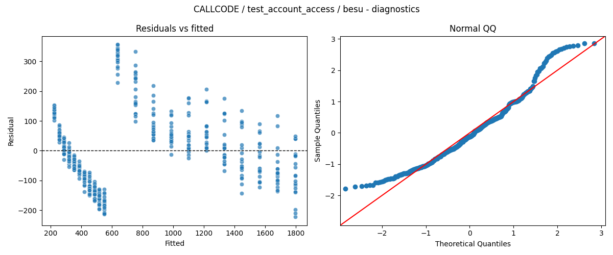

</details>

<details><summary>erigon — NNLS regression summary</summary>

```
==============================================================================
                           NNLS Regression Results                            
==============================================================================
Dep. Variable:          test_runtime_ms              R-squared:          0.939
Model:                  NNLS                    Adj. R-squared:          0.939
No. Observations:       176                               RMSE:          88.20
Df Residuals:           173                                MAE:          70.78
Df Model:               2      
==============================================================================
                      coef     std err     P-value      [0.025      0.975]
------------------------------------------------------------------------------
         const      0.0000      0.0000       1.000      0.0000      0.0000
       opcount      0.0093      0.0001       0.001      0.0091      0.0094
        update      0.0000      0.0000       1.000      0.0000      0.0000
==============================================================================
Notes: Non-negative least squares with bootstrap inference (1000 iterations)
==============================================================================
```

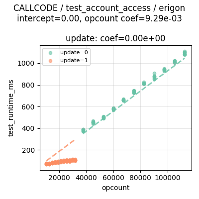


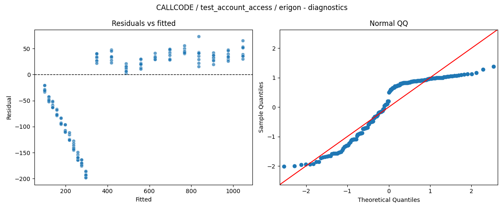

</details>

<details><summary>geth — NNLS regression summary</summary>

```
==============================================================================
                           NNLS Regression Results                            
==============================================================================
Dep. Variable:          test_runtime_ms              R-squared:          0.881
Model:                  NNLS                    Adj. R-squared:          0.880
No. Observations:       286                               RMSE:         474.70
Df Residuals:           283                                MAE:         368.30
Df Model:               2      
==============================================================================
                      coef     std err     P-value      [0.025      0.975]
------------------------------------------------------------------------------
         const      0.0000      2.3878       1.000      0.0000      1.1455
       opcount      0.0390      0.0005       0.001      0.0382      0.0400
        update      0.0000      0.0000       1.000      0.0000      0.0000
==============================================================================
Notes: Non-negative least squares with bootstrap inference (1000 iterations)
==============================================================================
```

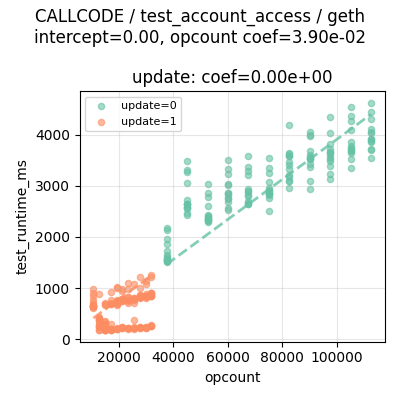


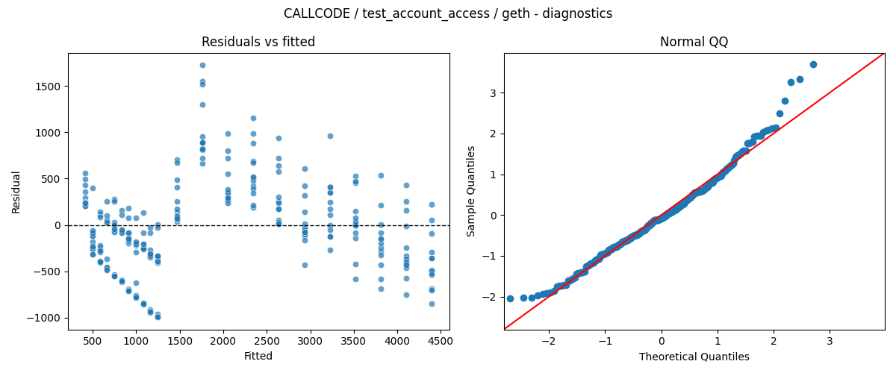

</details>

<details><summary>nethermind — NNLS regression summary</summary>

```
==============================================================================
                           NNLS Regression Results                            
==============================================================================
Dep. Variable:          test_runtime_ms              R-squared:          0.929
Model:                  NNLS                    Adj. R-squared:          0.929
No. Observations:       242                               RMSE:          50.60
Df Residuals:           239                                MAE:          40.09
Df Model:               2      
==============================================================================
                      coef     std err     P-value      [0.025      0.975]
------------------------------------------------------------------------------
         const      0.0000      0.1645       1.000      0.0000      0.0000
       opcount      0.0056      0.0001       0.001      0.0054      0.0057
        update      0.0000      0.0000       1.000      0.0000      0.0000
==============================================================================
Notes: Non-negative least squares with bootstrap inference (1000 iterations)
==============================================================================
```

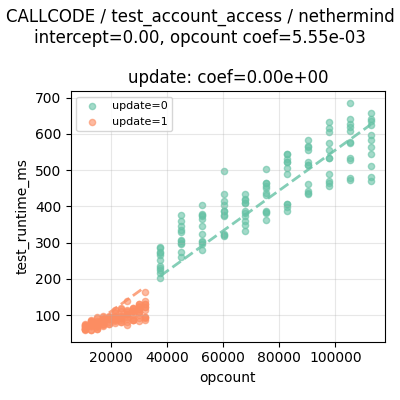


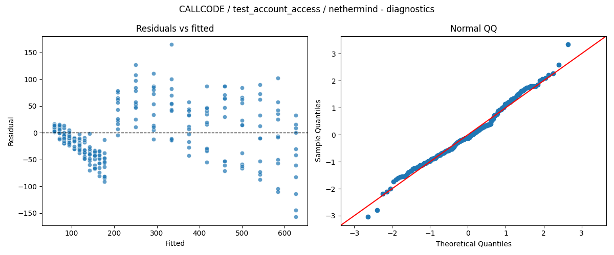

</details>

<details><summary>reth — NNLS regression summary</summary>

```
==============================================================================
                           NNLS Regression Results                            
==============================================================================
Dep. Variable:          test_runtime_ms              R-squared:          0.910
Model:                  NNLS                    Adj. R-squared:          0.910
No. Observations:       462                               RMSE:          14.76
Df Residuals:           459                                MAE:          12.83
Df Model:               2      
==============================================================================
                      coef     std err     P-value      [0.025      0.975]
------------------------------------------------------------------------------
         const      0.0000      0.0000       1.000      0.0000      0.0000
       opcount      0.0013      0.0000       0.001      0.0013      0.0013
        update      0.0000      0.0000       1.000      0.0000      0.0000
==============================================================================
Notes: Non-negative least squares with bootstrap inference (1000 iterations)
==============================================================================
```

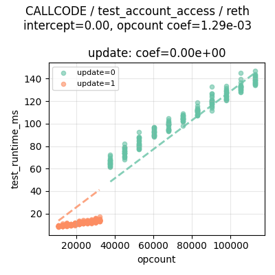


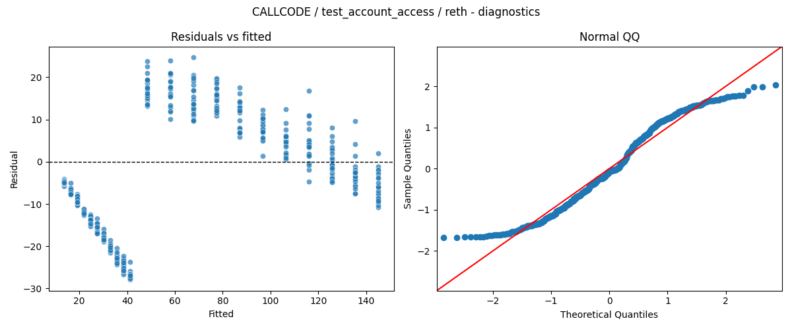

</details>

### test_account_access — combo `CALLCODE_AccountMode.EXISTING_CONTRACT`

| client | nobs | R² | target_coef (ms) | p-value | 95% CI |
| --- | --- | --- | --- | --- | --- |
| `besu` | 440 | 0.9716 | 0.03271 | 1.00e-03 | [0.03231, 0.03312] |
| `erigon` | 176 | 0.9587 | 0.102 | 1.00e-03 | [0.09962, 0.1048] |
| `geth` | 286 | 0.9157 | 0.03888 | 1.00e-03 | [0.03753, 0.0404] |
| `nethermind` | 242 | 0.8931 | 0.03411 | 1.00e-03 | [0.03256, 0.03581] |
| `reth` | 462 | 0.9096 | 0.03687 | 1.00e-03 | [0.03644, 0.03728] |

<details><summary>besu — NNLS regression summary</summary>

```
==============================================================================
                           NNLS Regression Results                            
==============================================================================
Dep. Variable:          test_runtime_ms              R-squared:          0.972
Model:                  NNLS                    Adj. R-squared:          0.971
No. Observations:       440                               RMSE:         149.35
Df Residuals:           437                                MAE:         114.46
Df Model:               2      
==============================================================================
                      coef     std err     P-value      [0.025      0.975]
------------------------------------------------------------------------------
         const     98.6662     11.8523       0.001     76.8560    123.7818
       opcount      0.0327      0.0002       0.001      0.0323      0.0331
        update      0.0000      0.0000       1.000      0.0000      0.0000
==============================================================================
Notes: Non-negative least squares with bootstrap inference (1000 iterations)
==============================================================================
```

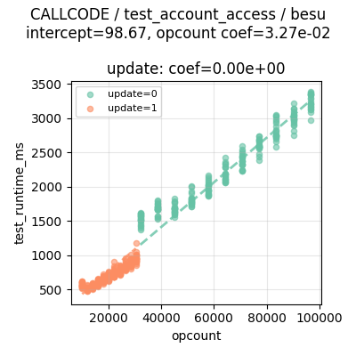


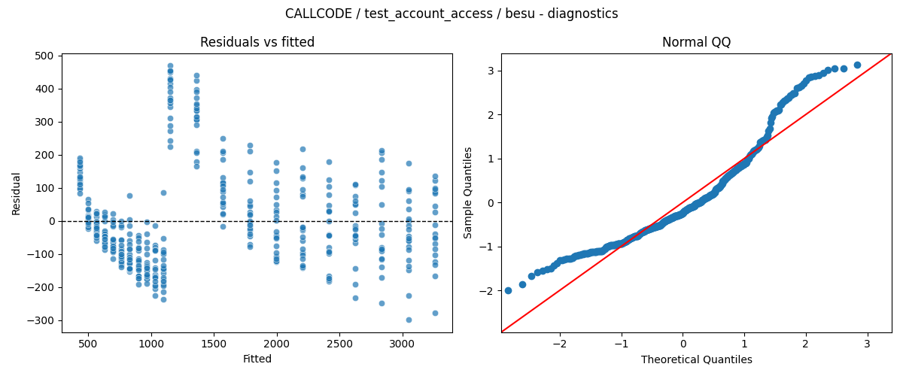

</details>

<details><summary>erigon — NNLS regression summary</summary>

```
==============================================================================
                           NNLS Regression Results                            
==============================================================================
Dep. Variable:          test_runtime_ms              R-squared:          0.959
Model:                  NNLS                    Adj. R-squared:          0.958
No. Observations:       176                               RMSE:         565.02
Df Residuals:           173                                MAE:         394.00
Df Model:               2      
==============================================================================
                      coef     std err     P-value      [0.025      0.975]
------------------------------------------------------------------------------
         const    297.0926     53.3182       0.001    193.8142    403.4675
       opcount      0.1020      0.0013       0.001      0.0996      0.1048
        update      0.0000      0.0000       1.000      0.0000      0.0000
==============================================================================
Notes: Non-negative least squares with bootstrap inference (1000 iterations)
==============================================================================
```

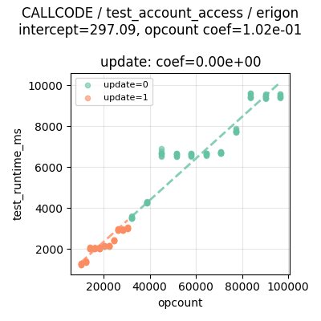


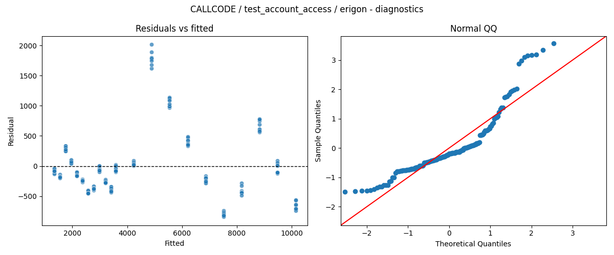

</details>

<details><summary>geth — NNLS regression summary</summary>

```
==============================================================================
                           NNLS Regression Results                            
==============================================================================
Dep. Variable:          test_runtime_ms              R-squared:          0.916
Model:                  NNLS                    Adj. R-squared:          0.915
No. Observations:       286                               RMSE:         314.82
Df Residuals:           283                                MAE:         233.90
Df Model:               2      
==============================================================================
                      coef     std err     P-value      [0.025      0.975]
------------------------------------------------------------------------------
         const    286.2980     28.9089       0.001    230.3452    344.0009
       opcount      0.0389      0.0007       0.001      0.0375      0.0404
        update      0.0000      0.0000       1.000      0.0000      0.0000
==============================================================================
Notes: Non-negative least squares with bootstrap inference (1000 iterations)
==============================================================================
```

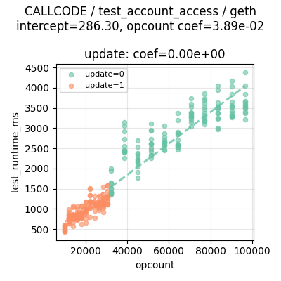


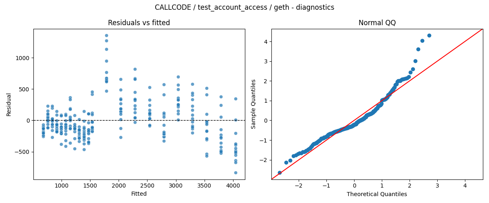

</details>

<details><summary>nethermind — NNLS regression summary</summary>

```
==============================================================================
                           NNLS Regression Results                            
==============================================================================
Dep. Variable:          test_runtime_ms              R-squared:          0.893
Model:                  NNLS                    Adj. R-squared:          0.892
No. Observations:       242                               RMSE:         315.12
Df Residuals:           239                                MAE:         234.17
Df Model:               2      
==============================================================================
                      coef     std err     P-value      [0.025      0.975]
------------------------------------------------------------------------------
         const    259.4065     30.8404       0.001    200.7917    319.3444
       opcount      0.0341      0.0009       0.001      0.0326      0.0358
        update      0.0000      0.0000       1.000      0.0000      0.0000
==============================================================================
Notes: Non-negative least squares with bootstrap inference (1000 iterations)
==============================================================================
```

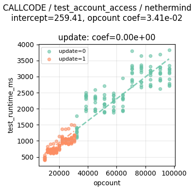


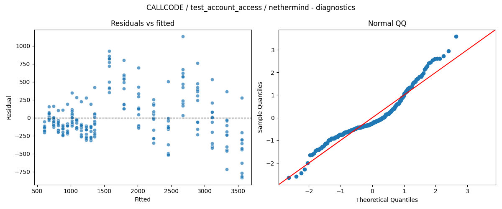

</details>

<details><summary>reth — NNLS regression summary</summary>

```
==============================================================================
                           NNLS Regression Results                            
==============================================================================
Dep. Variable:          test_runtime_ms              R-squared:          0.910
Model:                  NNLS                    Adj. R-squared:          0.909
No. Observations:       462                               RMSE:         344.07
Df Residuals:           459                                MAE:         273.28
Df Model:               2      
==============================================================================
                      coef     std err     P-value      [0.025      0.975]
------------------------------------------------------------------------------
         const      0.0000      0.0000       1.000      0.0000      0.0000
       opcount      0.0369      0.0002       0.001      0.0364      0.0373
        update      0.0000      0.0000       1.000      0.0000      0.0000
==============================================================================
Notes: Non-negative least squares with bootstrap inference (1000 iterations)
==============================================================================
```

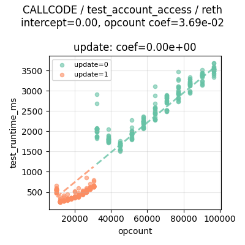


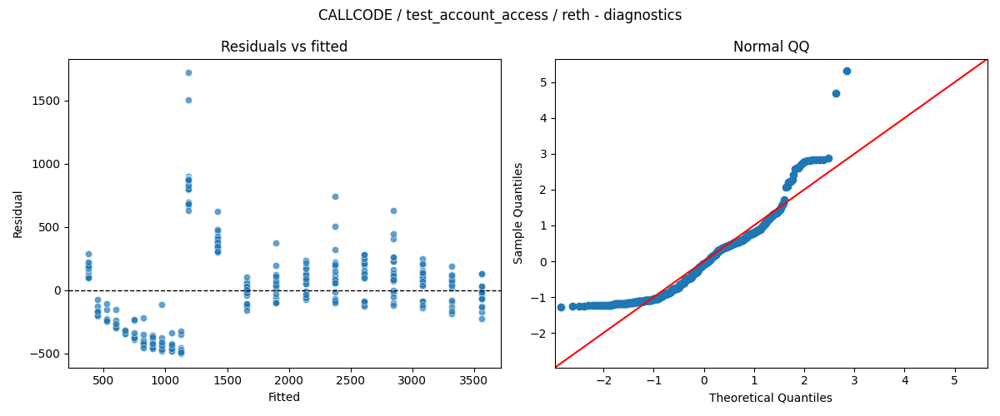

</details>

### test_account_access — combo `CALLCODE_AccountMode.NON_EXISTING_ACCOUNT` — `presets[cold_account_code_access]`

| client | nobs | R² | target_coef (ms) | p-value | 95% CI |
| --- | --- | --- | --- | --- | --- |
| `besu` | 440 | 0.9404 | 0.01542 | 1.00e-03 | [0.01516, 0.0157] |
| `erigon` | 176 | 0.9395 | 0.009288 | 1.00e-03 | [0.009122, 0.009407] |
| `geth` | 286 | 0.881 | 0.03904 | 1.00e-03 | [0.03818, 0.03999] |
| `nethermind` | 242 | 0.9292 | 0.005554 | 1.00e-03 | [0.005426, 0.005694] |
| `reth` | 462 | 0.9103 | 0.001288 | 1.00e-03 | [0.001272, 0.001303] |

<details><summary>besu — NNLS regression summary</summary>

```
==============================================================================
                           NNLS Regression Results                            
==============================================================================
Dep. Variable:          test_runtime_ms              R-squared:          0.940
Model:                  NNLS                    Adj. R-squared:          0.940
No. Observations:       440                               RMSE:         124.50
Df Residuals:           437                                MAE:          98.89
Df Model:               2      
==============================================================================
                      coef     std err     P-value      [0.025      0.975]
------------------------------------------------------------------------------
         const     59.2232     10.2008       0.001     38.8268     79.2409
       opcount      0.0154      0.0001       0.001      0.0152      0.0157
        update      0.0000      0.0000       1.000      0.0000      0.0000
==============================================================================
Notes: Non-negative least squares with bootstrap inference (1000 iterations)
==============================================================================
```


</details>

<details><summary>erigon — NNLS regression summary</summary>

```
==============================================================================
                           NNLS Regression Results                            
==============================================================================
Dep. Variable:          test_runtime_ms              R-squared:          0.939
Model:                  NNLS                    Adj. R-squared:          0.939
No. Observations:       176                               RMSE:          88.20
Df Residuals:           173                                MAE:          70.78
Df Model:               2      
==============================================================================
                      coef     std err     P-value      [0.025      0.975]
------------------------------------------------------------------------------
         const      0.0000      0.0000       1.000      0.0000      0.0000
       opcount      0.0093      0.0001       0.001      0.0091      0.0094
        update      0.0000      0.0000       1.000      0.0000      0.0000
==============================================================================
Notes: Non-negative least squares with bootstrap inference (1000 iterations)
==============================================================================
```


</details>

<details><summary>geth — NNLS regression summary</summary>

```
==============================================================================
                           NNLS Regression Results                            
==============================================================================
Dep. Variable:          test_runtime_ms              R-squared:          0.881
Model:                  NNLS                    Adj. R-squared:          0.880
No. Observations:       286                               RMSE:         474.70
Df Residuals:           283                                MAE:         368.30
Df Model:               2      
==============================================================================
                      coef     std err     P-value      [0.025      0.975]
------------------------------------------------------------------------------
         const      0.0000      2.3878       1.000      0.0000      1.1455
       opcount      0.0390      0.0005       0.001      0.0382      0.0400
        update      0.0000      0.0000       1.000      0.0000      0.0000
==============================================================================
Notes: Non-negative least squares with bootstrap inference (1000 iterations)
==============================================================================
```


</details>

<details><summary>nethermind — NNLS regression summary</summary>

```
==============================================================================
                           NNLS Regression Results                            
==============================================================================
Dep. Variable:          test_runtime_ms              R-squared:          0.929
Model:                  NNLS                    Adj. R-squared:          0.929
No. Observations:       242                               RMSE:          50.60
Df Residuals:           239                                MAE:          40.09
Df Model:               2      
==============================================================================
                      coef     std err     P-value      [0.025      0.975]
------------------------------------------------------------------------------
         const      0.0000      0.1645       1.000      0.0000      0.0000
       opcount      0.0056      0.0001       0.001      0.0054      0.0057
        update      0.0000      0.0000       1.000      0.0000      0.0000
==============================================================================
Notes: Non-negative least squares with bootstrap inference (1000 iterations)
==============================================================================
```


</details>

<details><summary>reth — NNLS regression summary</summary>

```
==============================================================================
                           NNLS Regression Results                            
==============================================================================
Dep. Variable:          test_runtime_ms              R-squared:          0.910
Model:                  NNLS                    Adj. R-squared:          0.910
No. Observations:       462                               RMSE:          14.76
Df Residuals:           459                                MAE:          12.83
Df Model:               2      
==============================================================================
                      coef     std err     P-value      [0.025      0.975]
------------------------------------------------------------------------------
         const      0.0000      0.0000       1.000      0.0000      0.0000
       opcount      0.0013      0.0000       0.001      0.0013      0.0013
        update      0.0000      0.0000       1.000      0.0000      0.0000
==============================================================================
Notes: Non-negative least squares with bootstrap inference (1000 iterations)
==============================================================================
```


</details>

### test_ext_account_query_warm — combo `CALLCODE`

| client | nobs | R² | target_coef (ms) | p-value | 95% CI |
| --- | --- | --- | --- | --- | --- |
| `besu` | 220 | 0.8106 | 0.0006166 | 1.00e-03 | [0.0005751, 0.0006603] |
| `erigon` | 88 | 0.9415 | 0.0002618 | 1.00e-03 | [0.0002463, 0.0002761] |
| `geth` | 143 | 0.8755 | 0.0001798 | 1.00e-03 | [0.0001687, 0.0001919] |
| `nethermind` | 121 | 0.2381 | 0.0005374 | 1.00e-03 | [0.0003391, 0.0006961] |
| `reth` | 231 | 0.9142 | 4.828e-05 | 1.00e-03 | [4.634e-05, 5.028e-05] |

<details><summary>besu — NNLS regression summary</summary>

```
==============================================================================
                           NNLS Regression Results                            
==============================================================================
Dep. Variable:          test_runtime_ms              R-squared:          0.811
Model:                  NNLS                    Adj. R-squared:          0.810
No. Observations:       220                               RMSE:         150.60
Df Residuals:           218                                MAE:         122.27
Df Model:               1      
==============================================================================
                      coef     std err     P-value      [0.025      0.975]
------------------------------------------------------------------------------
         const    694.5435     34.3302       0.001    628.2126    760.2438
       opcount      0.0006      0.0000       0.001      0.0006      0.0007
==============================================================================
Notes: Non-negative least squares with bootstrap inference (1000 iterations)
==============================================================================
```

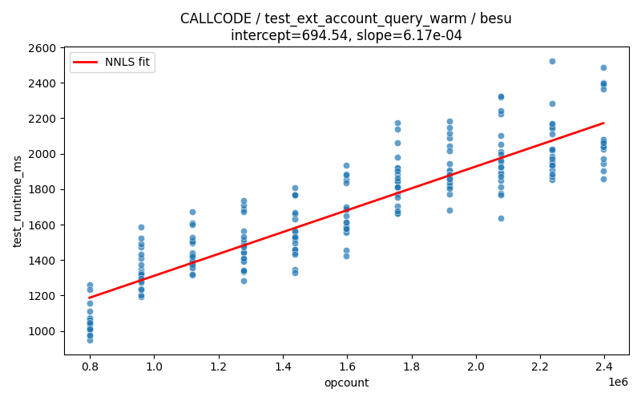

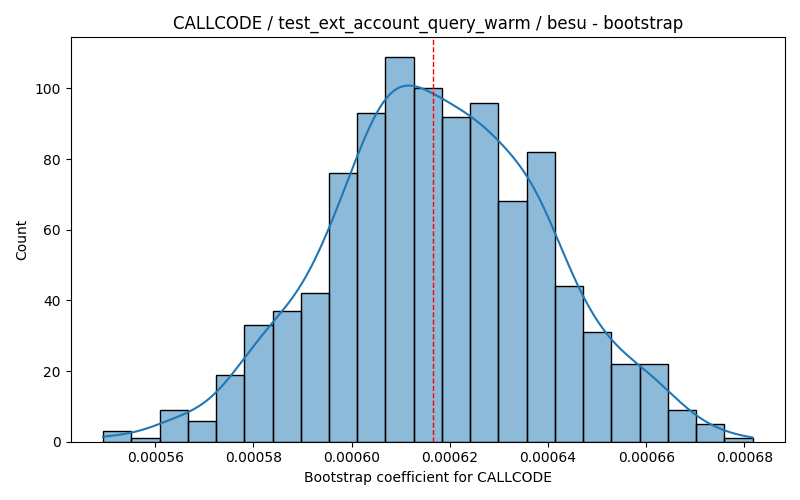

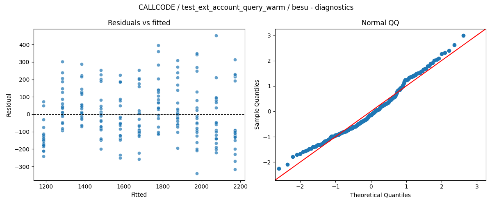

</details>

<details><summary>erigon — NNLS regression summary</summary>

```
==============================================================================
                           NNLS Regression Results                            
==============================================================================
Dep. Variable:          test_runtime_ms              R-squared:          0.942
Model:                  NNLS                    Adj. R-squared:          0.941
No. Observations:       88                                RMSE:          32.96
Df Residuals:           86                                 MAE:          25.70
Df Model:               1      
==============================================================================
                      coef     std err     P-value      [0.025      0.975]
------------------------------------------------------------------------------
         const     48.3568     11.9179       0.001     25.9524     72.1968
       opcount      0.0003      0.0000       0.001      0.0002      0.0003
==============================================================================
Notes: Non-negative least squares with bootstrap inference (1000 iterations)
==============================================================================
```

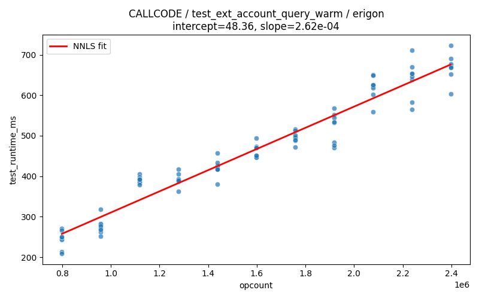

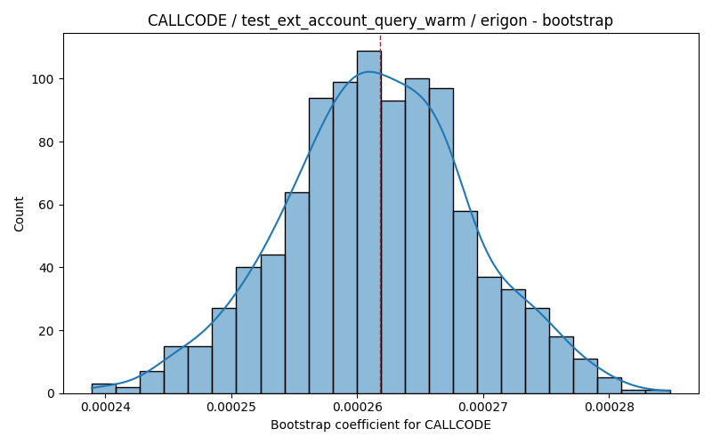

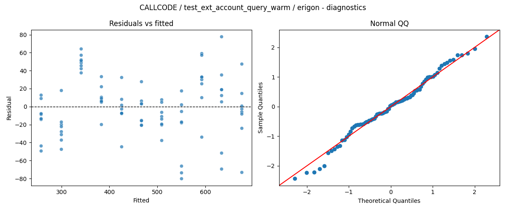

</details>

<details><summary>geth — NNLS regression summary</summary>

```
==============================================================================
                           NNLS Regression Results                            
==============================================================================
Dep. Variable:          test_runtime_ms              R-squared:          0.875
Model:                  NNLS                    Adj. R-squared:          0.875
No. Observations:       143                               RMSE:          34.26
Df Residuals:           141                                MAE:          26.91
Df Model:               1      
==============================================================================
                      coef     std err     P-value      [0.025      0.975]
------------------------------------------------------------------------------
         const     46.3543      8.9331       0.001     28.2470     62.6481
       opcount      0.0002      0.0000       0.001      0.0002      0.0002
==============================================================================
Notes: Non-negative least squares with bootstrap inference (1000 iterations)
==============================================================================
```

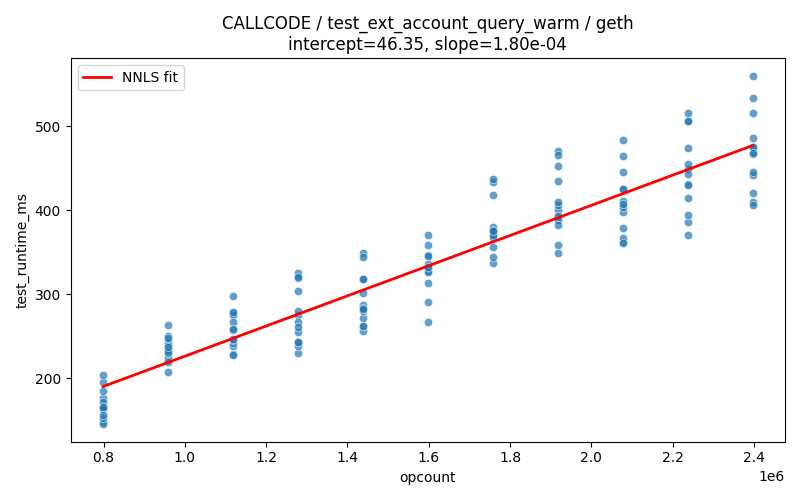

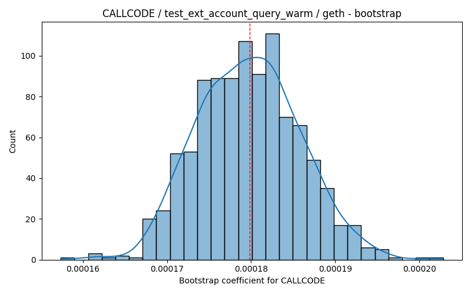

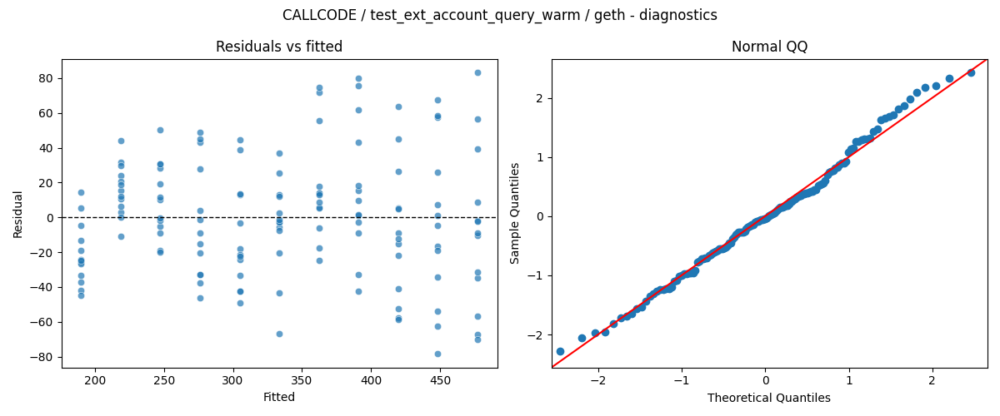

</details>

<details><summary>nethermind — NNLS regression summary</summary>

```
==============================================================================
                           NNLS Regression Results                            
==============================================================================
Dep. Variable:          test_runtime_ms              R-squared:          0.238
Model:                  NNLS                    Adj. R-squared:          0.232
No. Observations:       121                               RMSE:         485.73
Df Residuals:           119                                MAE:         459.79
Df Model:               1      
==============================================================================
                      coef     std err     P-value      [0.025      0.975]
------------------------------------------------------------------------------
         const    209.7703    133.0860       0.056      0.0000    507.9352
       opcount      0.0005      0.0001       0.001      0.0003      0.0007
==============================================================================
Notes: Non-negative least squares with bootstrap inference (1000 iterations)
==============================================================================
```

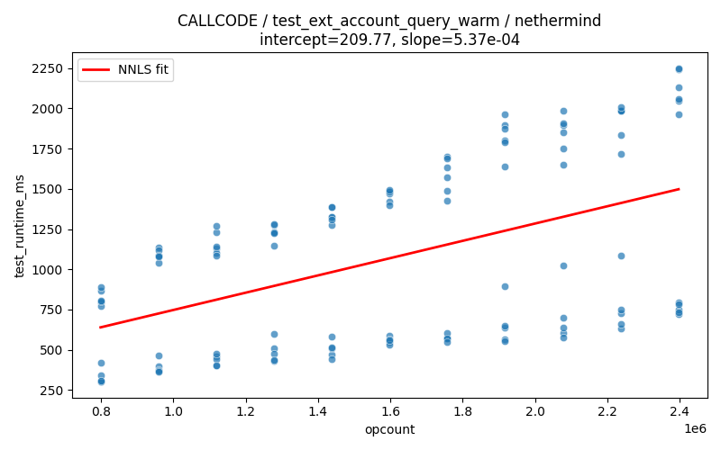

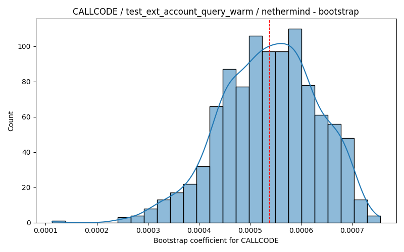

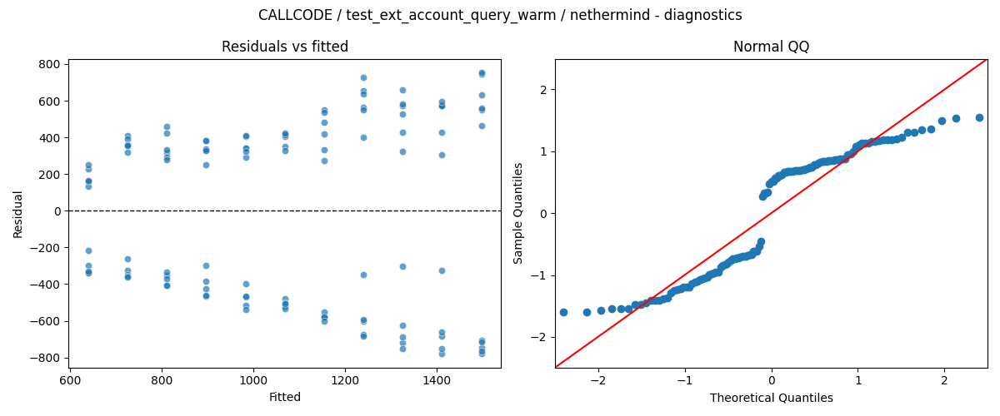

</details>

<details><summary>reth — NNLS regression summary</summary>

```
==============================================================================
                           NNLS Regression Results                            
==============================================================================
Dep. Variable:          test_runtime_ms              R-squared:          0.914
Model:                  NNLS                    Adj. R-squared:          0.914
No. Observations:       231                               RMSE:           7.47
Df Residuals:           229                                MAE:           6.23
Df Model:               1      
==============================================================================
                      coef     std err     P-value      [0.025      0.975]
------------------------------------------------------------------------------
         const     16.1839      1.7042       0.001     13.0478     19.3923
       opcount      0.0000      0.0000       0.001      0.0000      0.0001
==============================================================================
Notes: Non-negative least squares with bootstrap inference (1000 iterations)
==============================================================================
```

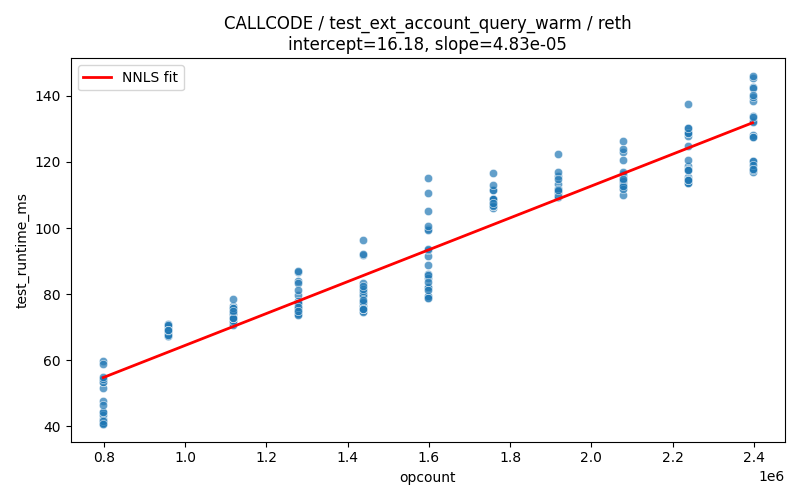

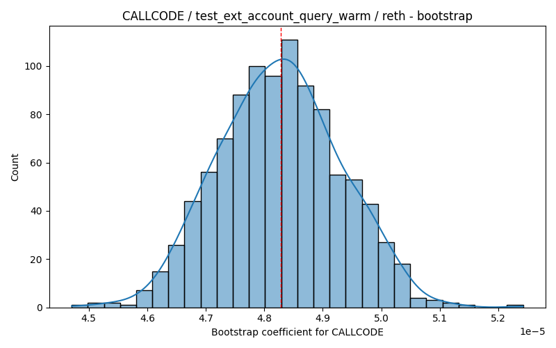

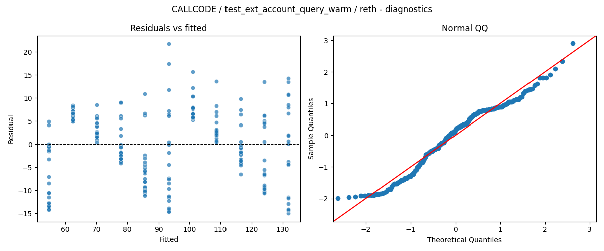

</details>

## DELEGATECALL

### test_account_access — combo `DELEGATECALL_AccountMode.EXISTING_EOA`

| client | nobs | R² | target_coef (ms) | p-value | 95% CI |
| --- | --- | --- | --- | --- | --- |
| `besu` | 220 | 0.8599 | 0.0105 | 1.00e-03 | [0.009883, 0.01112] |
| `erigon` | 88 | 0.9984 | 0.01004 | 1.00e-03 | [0.00996, 0.01013] |
| `geth` | 143 | 0.8669 | 0.01407 | 1.00e-03 | [0.01324, 0.01494] |
| `nethermind` | 121 | 0.848 | 0.004474 | 1.00e-03 | [0.004127, 0.004784] |
| `reth` | 231 | 0.9771 | 0.001144 | 1.00e-03 | [0.001121, 0.001166] |

<details><summary>besu — NNLS regression summary</summary>

```
==============================================================================
                           NNLS Regression Results                            
==============================================================================
Dep. Variable:          test_runtime_ms              R-squared:          0.860
Model:                  NNLS                    Adj. R-squared:          0.859
No. Observations:       220                               RMSE:         100.72
Df Residuals:           218                                MAE:          79.86
Df Model:               1      
==============================================================================
                      coef     std err     P-value      [0.025      0.975]
------------------------------------------------------------------------------
         const    563.9073     27.2286       0.001    512.3318    616.0632
       opcount      0.0105      0.0003       0.001      0.0099      0.0111
==============================================================================
Notes: Non-negative least squares with bootstrap inference (1000 iterations)
==============================================================================
```

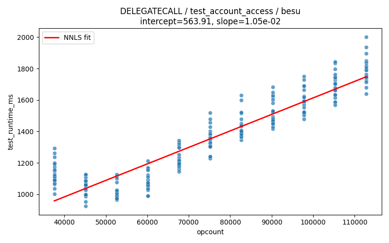

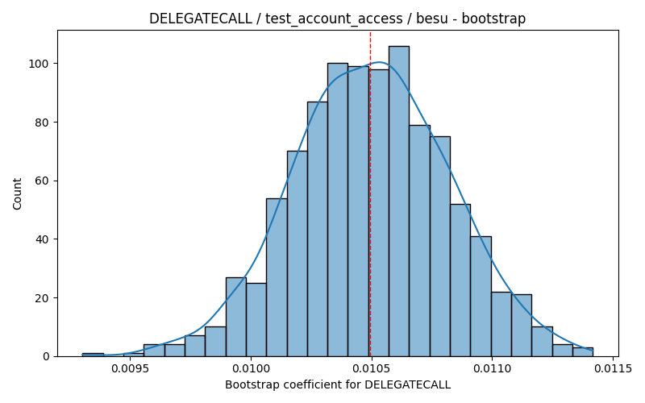

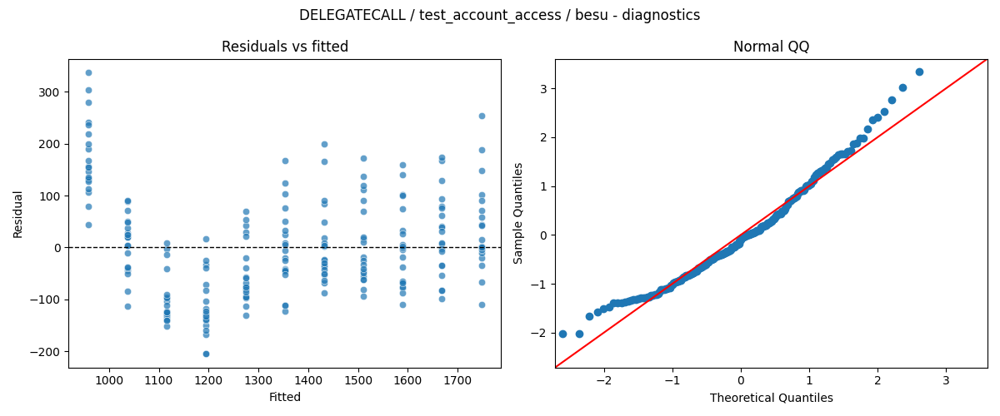

</details>

<details><summary>erigon — NNLS regression summary</summary>

```
==============================================================================
                           NNLS Regression Results                            
==============================================================================
Dep. Variable:          test_runtime_ms              R-squared:          0.998
Model:                  NNLS                    Adj. R-squared:          0.998
No. Observations:       88                                RMSE:           9.53
Df Residuals:           86                                 MAE:           7.70
Df Model:               1      
==============================================================================
                      coef     std err     P-value      [0.025      0.975]
------------------------------------------------------------------------------
         const     39.3711      3.1164       0.001     32.7519     44.7050
       opcount      0.0100      0.0000       0.001      0.0100      0.0101
==============================================================================
Notes: Non-negative least squares with bootstrap inference (1000 iterations)
==============================================================================
```


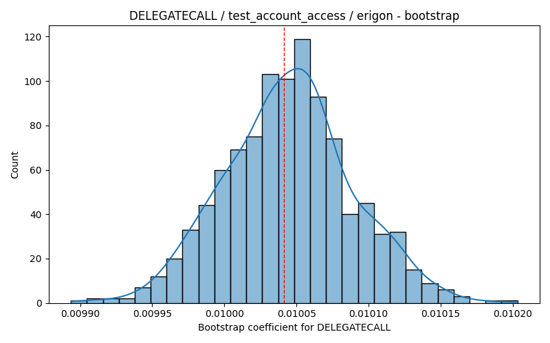

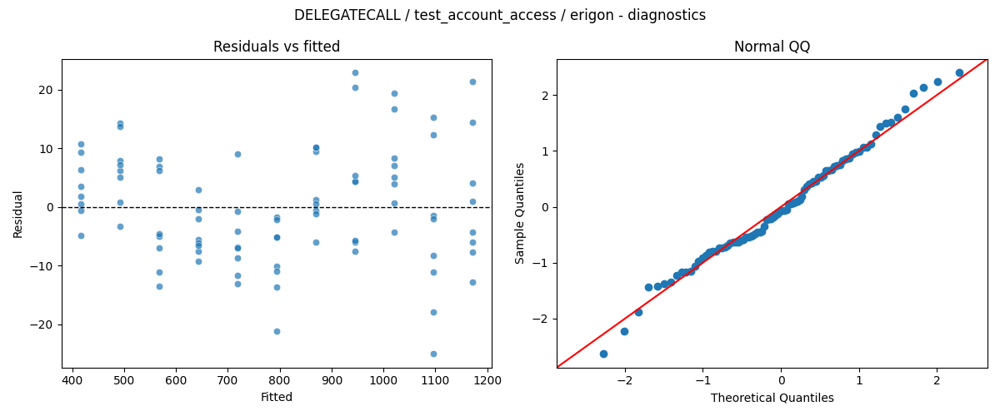

</details>

<details><summary>geth — NNLS regression summary</summary>

```
==============================================================================
                           NNLS Regression Results                            
==============================================================================
Dep. Variable:          test_runtime_ms              R-squared:          0.867
Model:                  NNLS                    Adj. R-squared:          0.866
No. Observations:       143                               RMSE:         131.04
Df Residuals:           141                                MAE:         102.43
Df Model:               1      
==============================================================================
                      coef     std err     P-value      [0.025      0.975]
------------------------------------------------------------------------------
         const    268.5727     30.2451       0.001    207.7056    326.9727
       opcount      0.0141      0.0004       0.001      0.0132      0.0149
==============================================================================
Notes: Non-negative least squares with bootstrap inference (1000 iterations)
==============================================================================
```

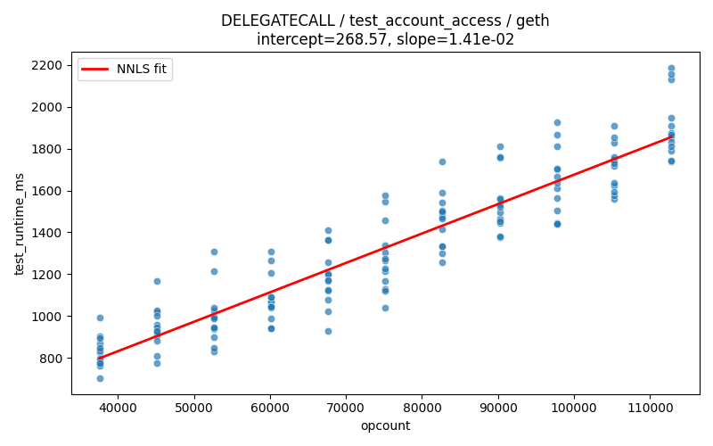

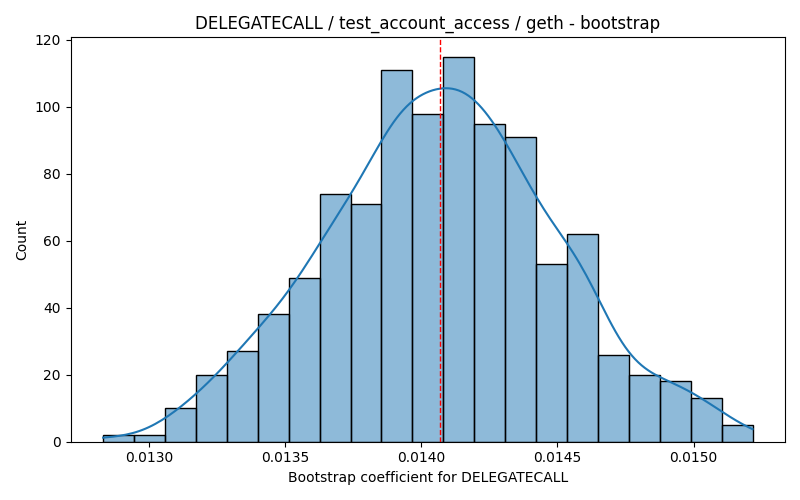

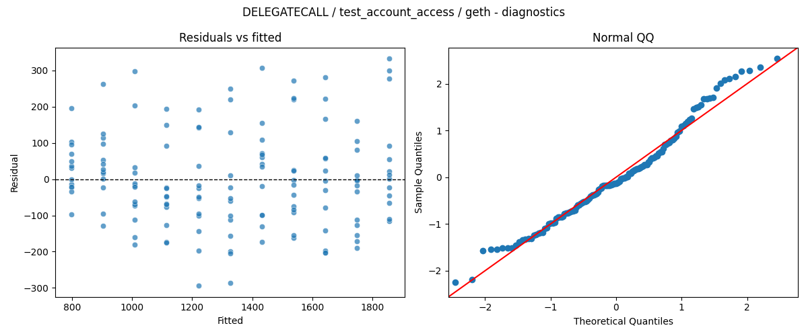

</details>

<details><summary>nethermind — NNLS regression summary</summary>

```
==============================================================================
                           NNLS Regression Results                            
==============================================================================
Dep. Variable:          test_runtime_ms              R-squared:          0.848
Model:                  NNLS                    Adj. R-squared:          0.847
No. Observations:       121                               RMSE:          45.03
Df Residuals:           119                                MAE:          35.07
Df Model:               1      
==============================================================================
                      coef     std err     P-value      [0.025      0.975]
------------------------------------------------------------------------------
         const    101.3728     11.9295       0.001     79.3388    124.8542
       opcount      0.0045      0.0002       0.001      0.0041      0.0048
==============================================================================
Notes: Non-negative least squares with bootstrap inference (1000 iterations)
==============================================================================
```

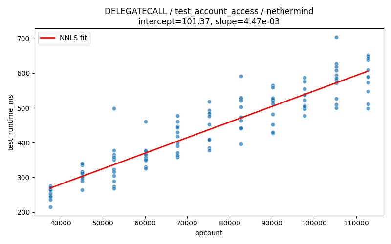


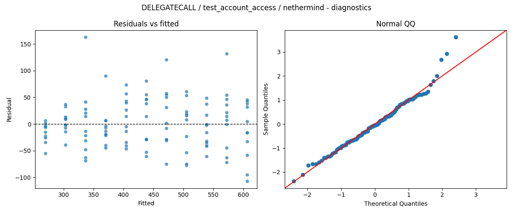

</details>

<details><summary>reth — NNLS regression summary</summary>

```
==============================================================================
                           NNLS Regression Results                            
==============================================================================
Dep. Variable:          test_runtime_ms              R-squared:          0.977
Model:                  NNLS                    Adj. R-squared:          0.977
No. Observations:       231                               RMSE:           4.16
Df Residuals:           229                                MAE:           3.35
Df Model:               1      
==============================================================================
                      coef     std err     P-value      [0.025      0.975]
------------------------------------------------------------------------------
         const     30.5220      0.9205       0.001     28.8021     32.4023
       opcount      0.0011      0.0000       0.001      0.0011      0.0012
==============================================================================
Notes: Non-negative least squares with bootstrap inference (1000 iterations)
==============================================================================
```

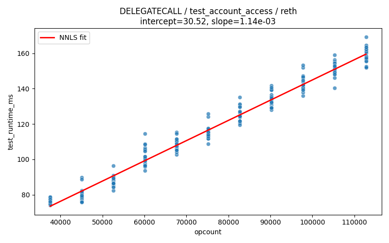

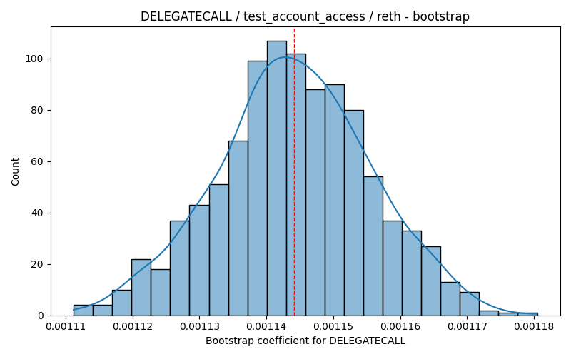

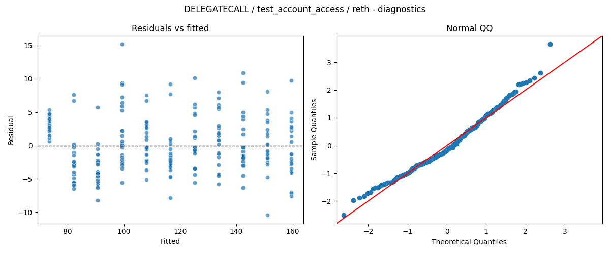

</details>

### test_account_access — combo `DELEGATECALL_AccountMode.NON_EXISTING_ACCOUNT` — `presets[cold_account_nocode_access]`

| client | nobs | R² | target_coef (ms) | p-value | 95% CI |
| --- | --- | --- | --- | --- | --- |
| `besu` | 220 | 0.9318 | 0.01109 | 1.00e-03 | [0.01073, 0.01154] |
| `erigon` | 88 | 0.9982 | 0.009479 | 1.00e-03 | [0.009404, 0.009564] |
| `geth` | 143 | 0.7181 | 0.02564 | 1.00e-03 | [0.02257, 0.02869] |
| `nethermind` | 121 | 0.8556 | 0.004555 | 1.00e-03 | [0.004229, 0.004896] |
| `reth` | 231 | 0.9714 | 0.0009535 | 1.00e-03 | [0.0009305, 0.000976] |

<details><summary>besu — NNLS regression summary</summary>

```
==============================================================================
                           NNLS Regression Results                            
==============================================================================
Dep. Variable:          test_runtime_ms              R-squared:          0.932
Model:                  NNLS                    Adj. R-squared:          0.931
No. Observations:       220                               RMSE:          71.36
Df Residuals:           218                                MAE:          58.59
Df Model:               1      
==============================================================================
                      coef     std err     P-value      [0.025      0.975]
------------------------------------------------------------------------------
         const    437.5540     16.9793       0.001    402.7116    468.6108
       opcount      0.0111      0.0002       0.001      0.0107      0.0115
==============================================================================
Notes: Non-negative least squares with bootstrap inference (1000 iterations)
==============================================================================
```

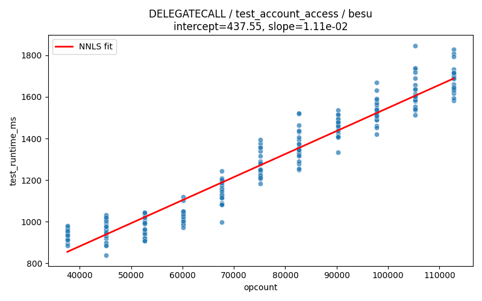

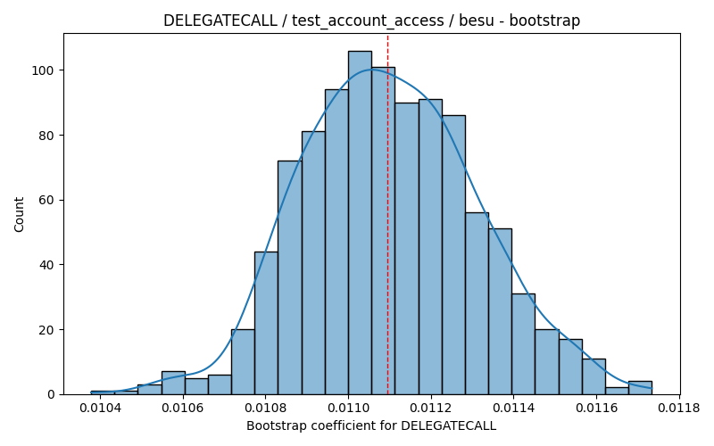

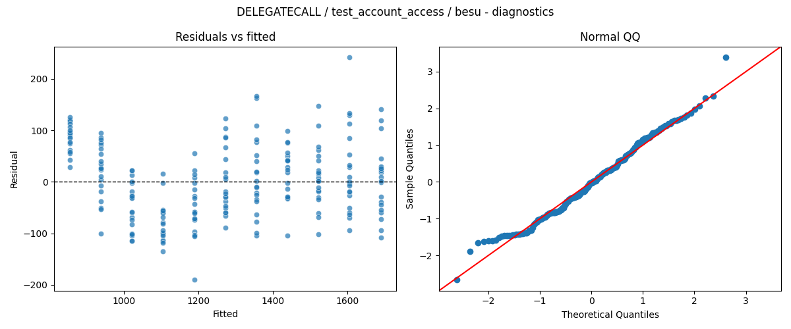

</details>

<details><summary>erigon — NNLS regression summary</summary>

```
==============================================================================
                           NNLS Regression Results                            
==============================================================================
Dep. Variable:          test_runtime_ms              R-squared:          0.998
Model:                  NNLS                    Adj. R-squared:          0.998
No. Observations:       88                                RMSE:           9.65
Df Residuals:           86                                 MAE:           7.89
Df Model:               1      
==============================================================================
                      coef     std err     P-value      [0.025      0.975]
------------------------------------------------------------------------------
         const     17.1193      3.3831       0.001      9.7848     22.9203
       opcount      0.0095      0.0000       0.001      0.0094      0.0096
==============================================================================
Notes: Non-negative least squares with bootstrap inference (1000 iterations)
==============================================================================
```

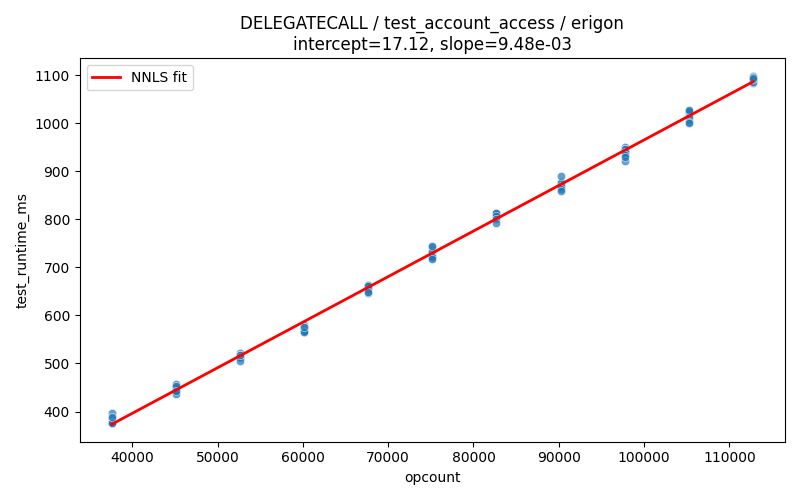

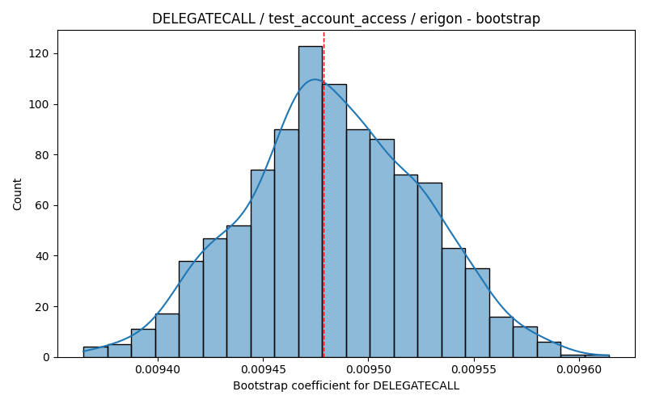

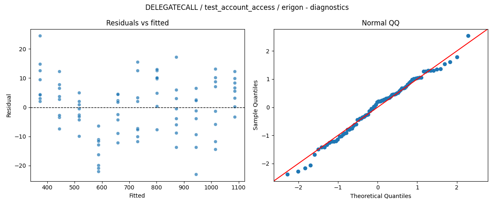

</details>

<details><summary>geth — NNLS regression summary</summary>

```
==============================================================================
                           NNLS Regression Results                            
==============================================================================
Dep. Variable:          test_runtime_ms              R-squared:          0.718
Model:                  NNLS                    Adj. R-squared:          0.716
No. Observations:       143                               RMSE:         381.91
Df Residuals:           141                                MAE:         300.82
Df Model:               1      
==============================================================================
                      coef     std err     P-value      [0.025      0.975]
------------------------------------------------------------------------------
         const   1206.4173    126.2718       0.001    979.1644   1456.2550
       opcount      0.0256      0.0016       0.001      0.0226      0.0287
==============================================================================
Notes: Non-negative least squares with bootstrap inference (1000 iterations)
==============================================================================
```

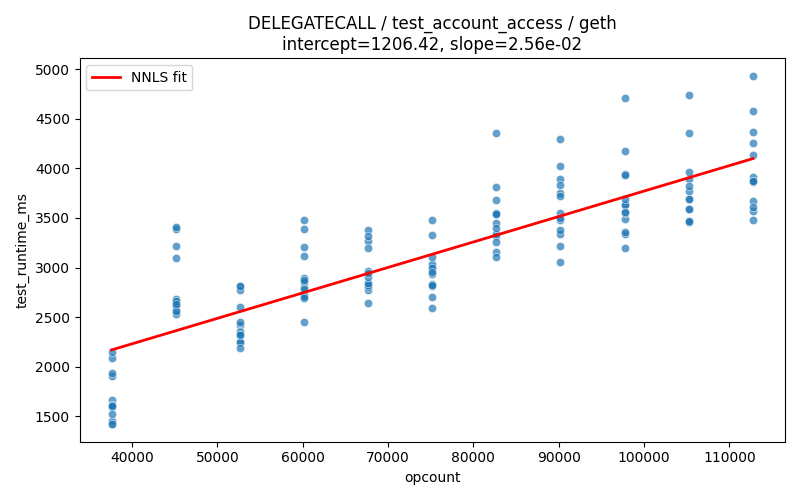

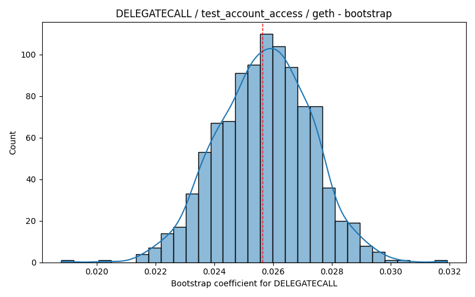

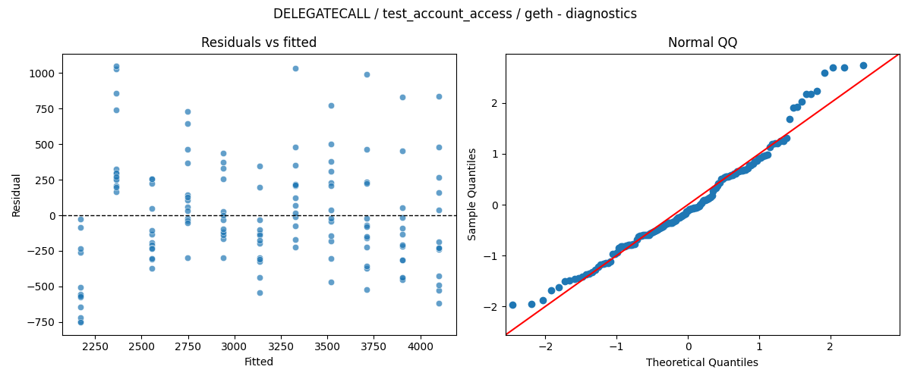

</details>

<details><summary>nethermind — NNLS regression summary</summary>

```
==============================================================================
                           NNLS Regression Results                            
==============================================================================
Dep. Variable:          test_runtime_ms              R-squared:          0.856
Model:                  NNLS                    Adj. R-squared:          0.854
No. Observations:       121                               RMSE:          44.49
Df Residuals:           119                                MAE:          37.06
Df Model:               1      
==============================================================================
                      coef     std err     P-value      [0.025      0.975]
------------------------------------------------------------------------------
         const     98.7764     11.9649       0.001     75.7522    122.0105
       opcount      0.0046      0.0002       0.001      0.0042      0.0049
==============================================================================
Notes: Non-negative least squares with bootstrap inference (1000 iterations)
==============================================================================
```

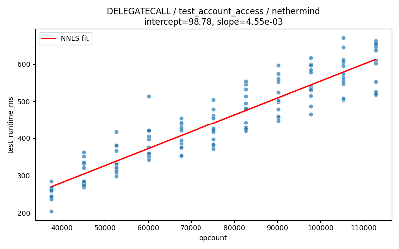

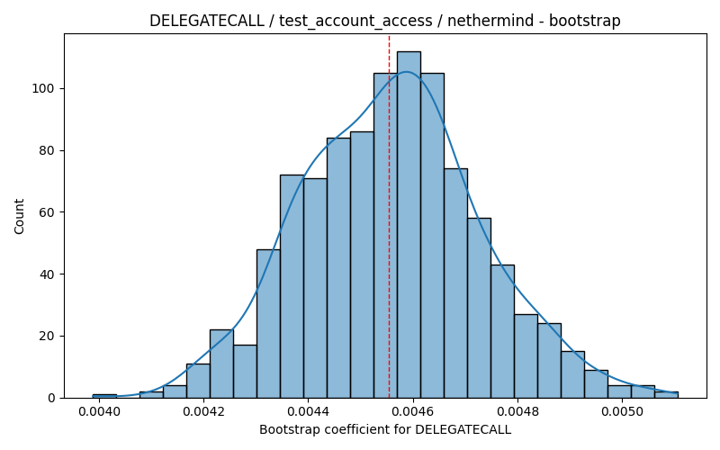

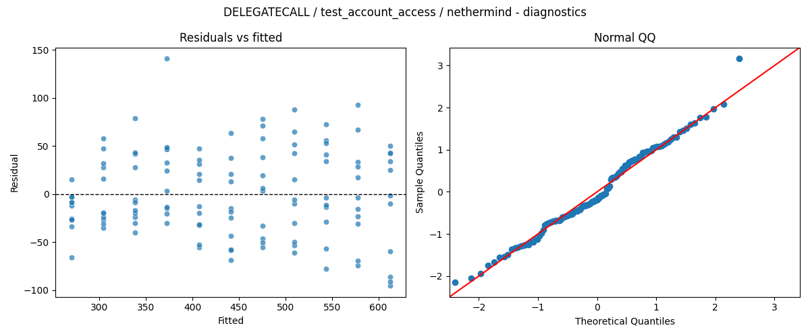

</details>

<details><summary>reth — NNLS regression summary</summary>

```
==============================================================================
                           NNLS Regression Results                            
==============================================================================
Dep. Variable:          test_runtime_ms              R-squared:          0.971
Model:                  NNLS                    Adj. R-squared:          0.971
No. Observations:       231                               RMSE:           3.89
Df Residuals:           229                                MAE:           3.11
Df Model:               1      
==============================================================================
                      coef     std err     P-value      [0.025      0.975]
------------------------------------------------------------------------------
         const     32.4745      0.9423       0.001     30.6226     34.4173
       opcount      0.0010      0.0000       0.001      0.0009      0.0010
==============================================================================
Notes: Non-negative least squares with bootstrap inference (1000 iterations)
==============================================================================
```

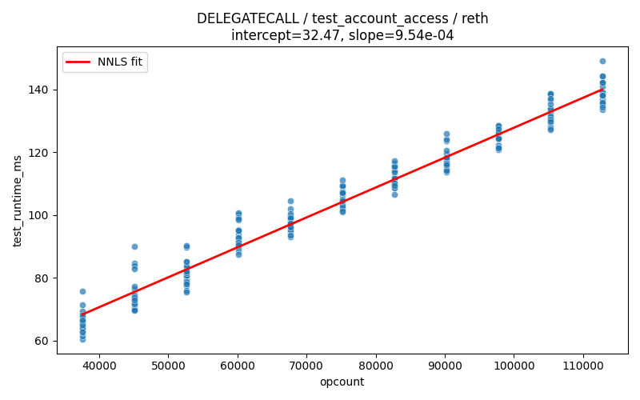

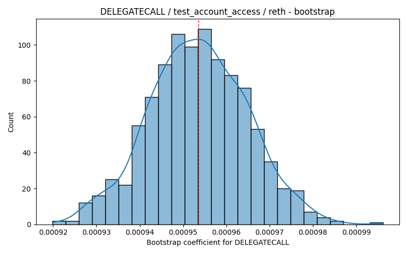

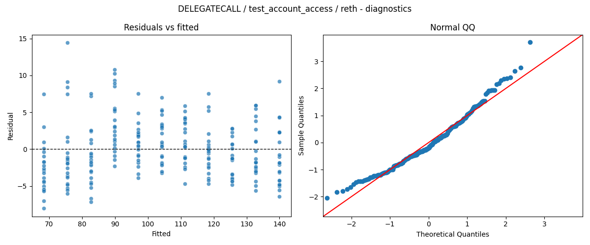

</details>

### test_account_access — combo `DELEGATECALL_AccountMode.EXISTING_CONTRACT`

| client | nobs | R² | target_coef (ms) | p-value | 95% CI |
| --- | --- | --- | --- | --- | --- |
| `besu` | 220 | 0.9689 | 0.02882 | 1.00e-03 | [0.02816, 0.02952] |
| `erigon` | 88 | 0.8772 | 0.08674 | 1.00e-03 | [0.07946, 0.0931] |
| `geth` | 143 | 0.7695 | 0.0297 | 1.00e-03 | [0.02694, 0.03266] |
| `nethermind` | 121 | 0.6837 | 0.02562 | 1.00e-03 | [0.0223, 0.02874] |
| `reth` | 231 | 0.9221 | 0.03742 | 1.00e-03 | [0.03682, 0.03788] |

<details><summary>besu — NNLS regression summary</summary>

```
==============================================================================
                           NNLS Regression Results                            
==============================================================================
Dep. Variable:          test_runtime_ms              R-squared:          0.969
Model:                  NNLS                    Adj. R-squared:          0.969
No. Observations:       220                               RMSE:         105.26
Df Residuals:           218                                MAE:          87.90
Df Model:               1      
==============================================================================
                      coef     std err     P-value      [0.025      0.975]
------------------------------------------------------------------------------
         const    362.6309     23.5855       0.001    317.3374    407.5882
       opcount      0.0288      0.0004       0.001      0.0282      0.0295
==============================================================================
Notes: Non-negative least squares with bootstrap inference (1000 iterations)
==============================================================================
```

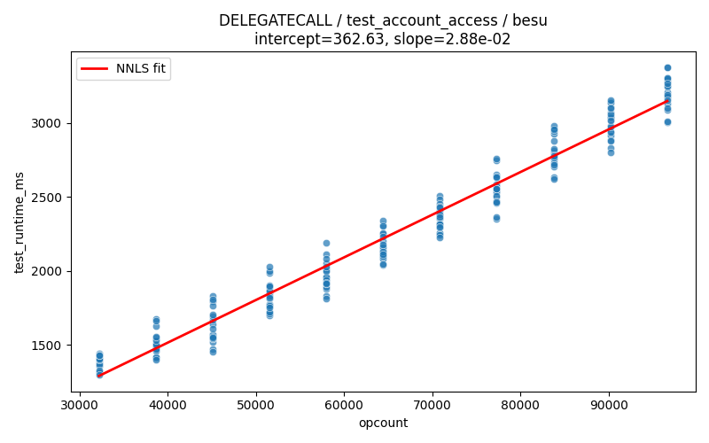

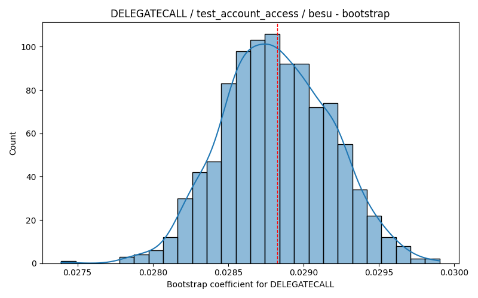

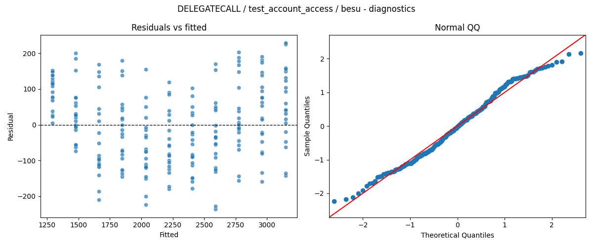

</details>

<details><summary>erigon — NNLS regression summary</summary>

```
==============================================================================
                           NNLS Regression Results                            
==============================================================================
Dep. Variable:          test_runtime_ms              R-squared:          0.877
Model:                  NNLS                    Adj. R-squared:          0.876
No. Observations:       88                                RMSE:         661.16
Df Residuals:           86                                 MAE:         569.18
Df Model:               1      
==============================================================================
                      coef     std err     P-value      [0.025      0.975]
------------------------------------------------------------------------------
         const   1426.0724    256.0491       0.001    965.2976   1977.0967
       opcount      0.0867      0.0034       0.001      0.0795      0.0931
==============================================================================
Notes: Non-negative least squares with bootstrap inference (1000 iterations)
==============================================================================
```

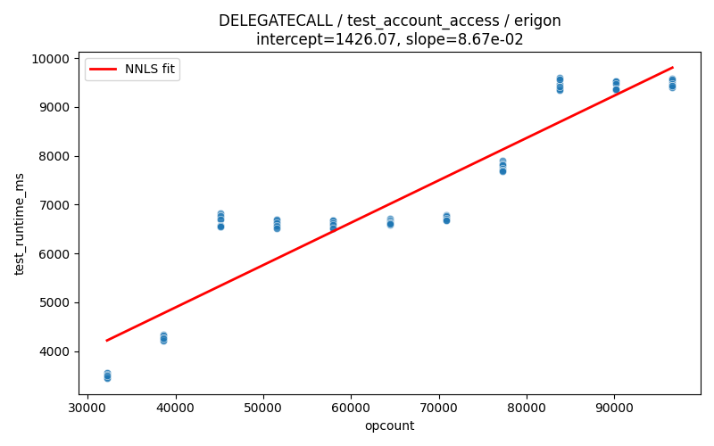

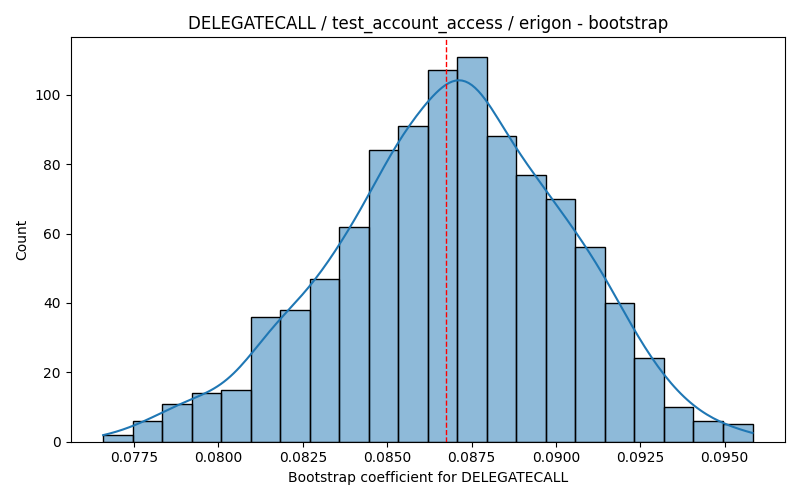

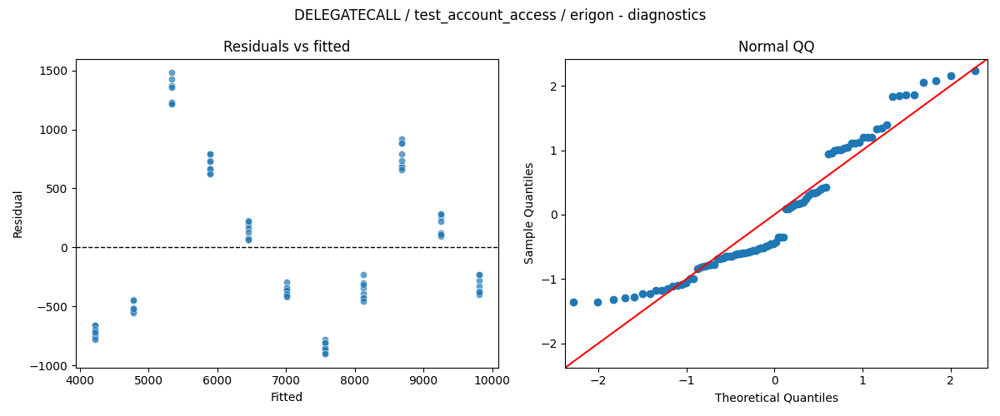

</details>

<details><summary>geth — NNLS regression summary</summary>

```
==============================================================================
                           NNLS Regression Results                            
==============================================================================
Dep. Variable:          test_runtime_ms              R-squared:          0.770
Model:                  NNLS                    Adj. R-squared:          0.768
No. Observations:       143                               RMSE:         331.12
Df Residuals:           141                                MAE:         270.28
Df Model:               1      
==============================================================================
                      coef     std err     P-value      [0.025      0.975]
------------------------------------------------------------------------------
         const    963.4770    102.2200       0.001    762.0510   1160.1400
       opcount      0.0297      0.0015       0.001      0.0269      0.0327
==============================================================================
Notes: Non-negative least squares with bootstrap inference (1000 iterations)
==============================================================================
```

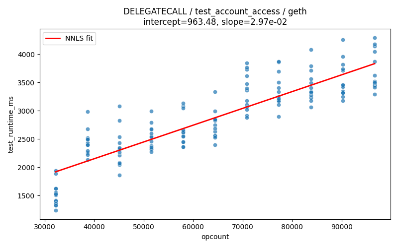

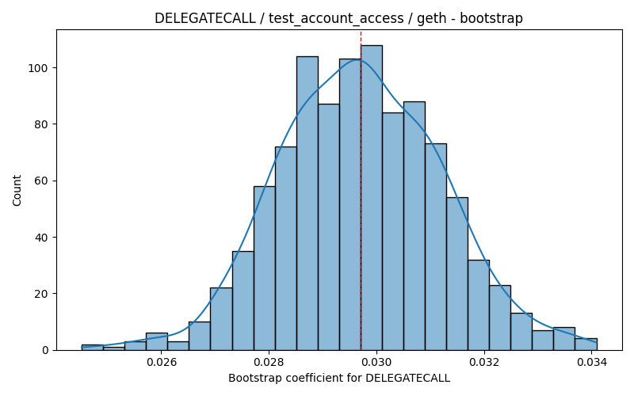

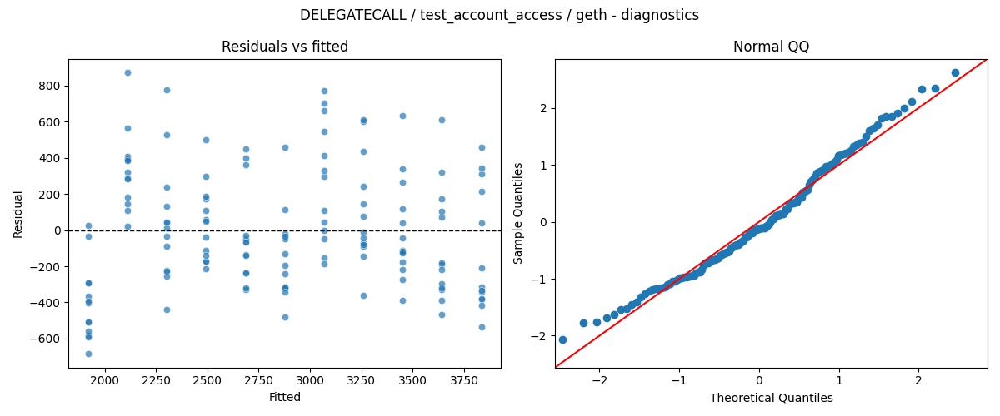

</details>

<details><summary>nethermind — NNLS regression summary</summary>

```
==============================================================================
                           NNLS Regression Results                            
==============================================================================
Dep. Variable:          test_runtime_ms              R-squared:          0.684
Model:                  NNLS                    Adj. R-squared:          0.681
No. Observations:       121                               RMSE:         355.01
Df Residuals:           119                                MAE:         296.67
Df Model:               1      
==============================================================================
                      coef     std err     P-value      [0.025      0.975]
------------------------------------------------------------------------------
         const    881.1062    113.4991       0.001    659.8155   1098.6995
       opcount      0.0256      0.0017       0.001      0.0223      0.0287
==============================================================================
Notes: Non-negative least squares with bootstrap inference (1000 iterations)
==============================================================================
```

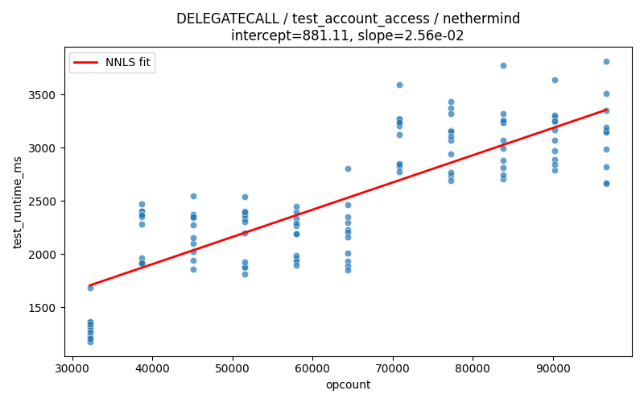

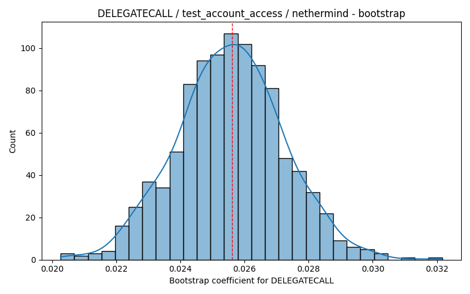

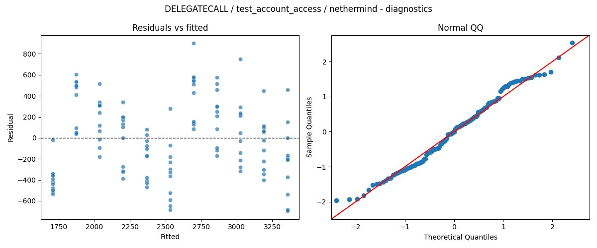

</details>

<details><summary>reth — NNLS regression summary</summary>

```
==============================================================================
                           NNLS Regression Results                            
==============================================================================
Dep. Variable:          test_runtime_ms              R-squared:          0.922
Model:                  NNLS                    Adj. R-squared:          0.922
No. Observations:       231                               RMSE:         225.16
Df Residuals:           229                                MAE:         122.87
Df Model:               1      
==============================================================================
                      coef     std err     P-value      [0.025      0.975]
------------------------------------------------------------------------------
         const      0.0000     12.6385       1.000      0.0000     46.8236
       opcount      0.0374      0.0003       0.001      0.0368      0.0379
==============================================================================
Notes: Non-negative least squares with bootstrap inference (1000 iterations)
==============================================================================
```

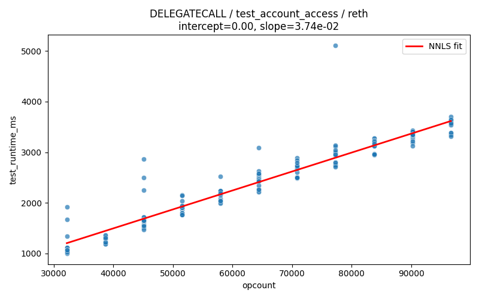

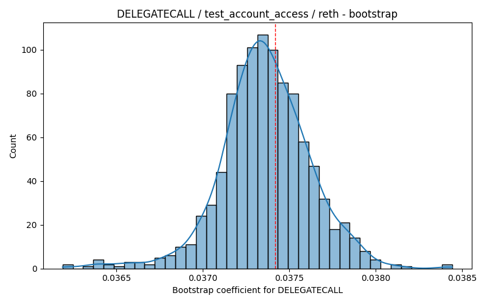

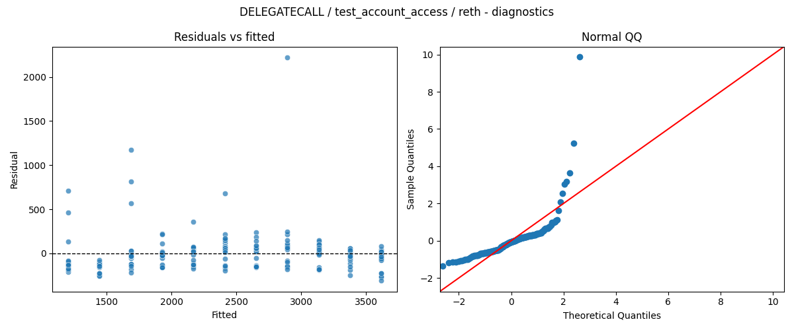

</details>

### test_account_access — combo `DELEGATECALL_AccountMode.NON_EXISTING_ACCOUNT` — `presets[cold_account_code_access]`

| client | nobs | R² | target_coef (ms) | p-value | 95% CI |
| --- | --- | --- | --- | --- | --- |
| `besu` | 220 | 0.9318 | 0.01109 | 1.00e-03 | [0.01073, 0.01154] |
| `erigon` | 88 | 0.9982 | 0.009479 | 1.00e-03 | [0.009404, 0.009564] |
| `geth` | 143 | 0.7181 | 0.02564 | 1.00e-03 | [0.02257, 0.02869] |
| `nethermind` | 121 | 0.8556 | 0.004555 | 1.00e-03 | [0.004229, 0.004896] |
| `reth` | 231 | 0.9714 | 0.0009535 | 1.00e-03 | [0.0009305, 0.000976] |

<details><summary>besu — NNLS regression summary</summary>

```
==============================================================================
                           NNLS Regression Results                            
==============================================================================
Dep. Variable:          test_runtime_ms              R-squared:          0.932
Model:                  NNLS                    Adj. R-squared:          0.931
No. Observations:       220                               RMSE:          71.36
Df Residuals:           218                                MAE:          58.59
Df Model:               1      
==============================================================================
                      coef     std err     P-value      [0.025      0.975]
------------------------------------------------------------------------------
         const    437.5540     16.9793       0.001    402.7116    468.6108
       opcount      0.0111      0.0002       0.001      0.0107      0.0115
==============================================================================
Notes: Non-negative least squares with bootstrap inference (1000 iterations)
==============================================================================
```


</details>

<details><summary>erigon — NNLS regression summary</summary>

```
==============================================================================
                           NNLS Regression Results                            
==============================================================================
Dep. Variable:          test_runtime_ms              R-squared:          0.998
Model:                  NNLS                    Adj. R-squared:          0.998
No. Observations:       88                                RMSE:           9.65
Df Residuals:           86                                 MAE:           7.89
Df Model:               1      
==============================================================================
                      coef     std err     P-value      [0.025      0.975]
------------------------------------------------------------------------------
         const     17.1193      3.3831       0.001      9.7848     22.9203
       opcount      0.0095      0.0000       0.001      0.0094      0.0096
==============================================================================
Notes: Non-negative least squares with bootstrap inference (1000 iterations)
==============================================================================
```


</details>

<details><summary>geth — NNLS regression summary</summary>

```
==============================================================================
                           NNLS Regression Results                            
==============================================================================
Dep. Variable:          test_runtime_ms              R-squared:          0.718
Model:                  NNLS                    Adj. R-squared:          0.716
No. Observations:       143                               RMSE:         381.91
Df Residuals:           141                                MAE:         300.82
Df Model:               1      
==============================================================================
                      coef     std err     P-value      [0.025      0.975]
------------------------------------------------------------------------------
         const   1206.4173    126.2718       0.001    979.1644   1456.2550
       opcount      0.0256      0.0016       0.001      0.0226      0.0287
==============================================================================
Notes: Non-negative least squares with bootstrap inference (1000 iterations)
==============================================================================
```


</details>

<details><summary>nethermind — NNLS regression summary</summary>

```
==============================================================================
                           NNLS Regression Results                            
==============================================================================
Dep. Variable:          test_runtime_ms              R-squared:          0.856
Model:                  NNLS                    Adj. R-squared:          0.854
No. Observations:       121                               RMSE:          44.49
Df Residuals:           119                                MAE:          37.06
Df Model:               1      
==============================================================================
                      coef     std err     P-value      [0.025      0.975]
------------------------------------------------------------------------------
         const     98.7764     11.9649       0.001     75.7522    122.0105
       opcount      0.0046      0.0002       0.001      0.0042      0.0049
==============================================================================
Notes: Non-negative least squares with bootstrap inference (1000 iterations)
==============================================================================
```


</details>

<details><summary>reth — NNLS regression summary</summary>

```
==============================================================================
                           NNLS Regression Results                            
==============================================================================
Dep. Variable:          test_runtime_ms              R-squared:          0.971
Model:                  NNLS                    Adj. R-squared:          0.971
No. Observations:       231                               RMSE:           3.89
Df Residuals:           229                                MAE:           3.11
Df Model:               1      
==============================================================================
                      coef     std err     P-value      [0.025      0.975]
------------------------------------------------------------------------------
         const     32.4745      0.9423       0.001     30.6226     34.4173
       opcount      0.0010      0.0000       0.001      0.0009      0.0010
==============================================================================
Notes: Non-negative least squares with bootstrap inference (1000 iterations)
==============================================================================
```


</details>

### test_ext_account_query_warm — combo `DELEGATECALL`

| client | nobs | R² | target_coef (ms) | p-value | 95% CI |
| --- | --- | --- | --- | --- | --- |
| `besu` | 220 | 0.8268 | 0.000563 | 1.00e-03 | [0.0005274, 0.0005963] |
| `erigon` | 88 | 0.9401 | 0.0002579 | 1.00e-03 | [0.0002448, 0.0002711] |
| `geth` | 143 | 0.8676 | 0.0001506 | 1.00e-03 | [0.0001405, 0.0001616] |
| `nethermind` | 121 | 0.4291 | 0.0005948 | 1.00e-03 | [0.000468, 0.0007158] |
| `reth` | 231 | 0.9122 | 4.59e-05 | 1.00e-03 | [4.395e-05, 4.787e-05] |

<details><summary>besu — NNLS regression summary</summary>

```
==============================================================================
                           NNLS Regression Results                            
==============================================================================
Dep. Variable:          test_runtime_ms              R-squared:          0.827
Model:                  NNLS                    Adj. R-squared:          0.826
No. Observations:       220                               RMSE:         133.42
Df Residuals:           218                                MAE:         105.49
Df Model:               1      
==============================================================================
                      coef     std err     P-value      [0.025      0.975]
------------------------------------------------------------------------------
         const    644.9317     29.2337       0.001    592.4685    707.4979
       opcount      0.0006      0.0000       0.001      0.0005      0.0006
==============================================================================
Notes: Non-negative least squares with bootstrap inference (1000 iterations)
==============================================================================
```

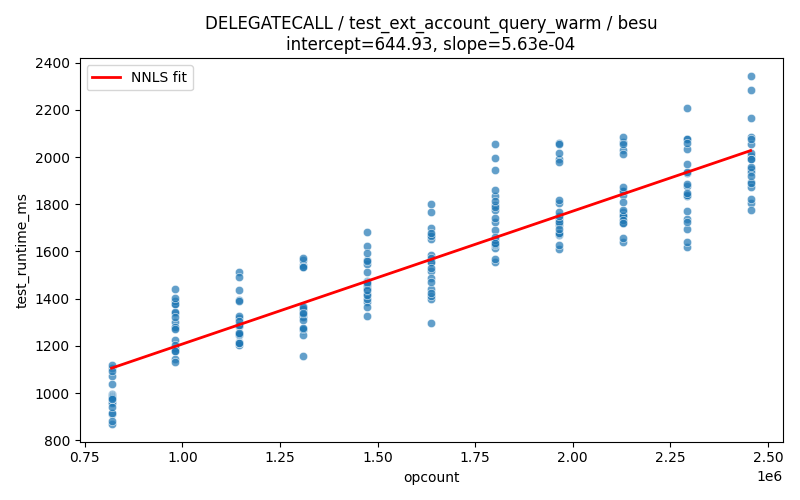

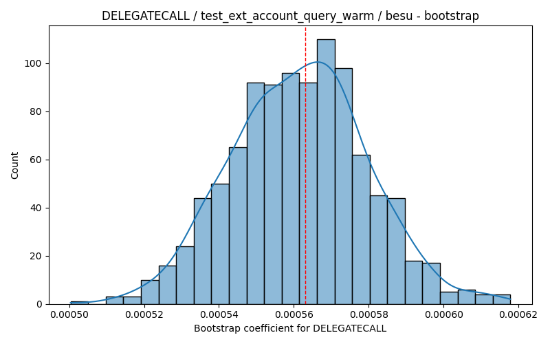

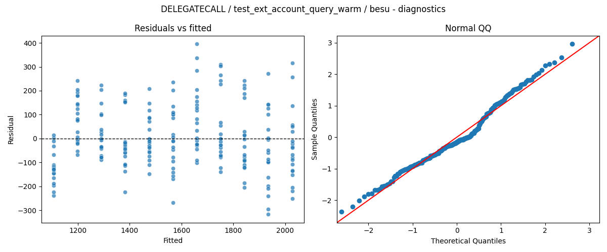

</details>

<details><summary>erigon — NNLS regression summary</summary>

```
==============================================================================
                           NNLS Regression Results                            
==============================================================================
Dep. Variable:          test_runtime_ms              R-squared:          0.940
Model:                  NNLS                    Adj. R-squared:          0.939
No. Observations:       88                                RMSE:          33.71
Df Residuals:           86                                 MAE:          23.93
Df Model:               1      
==============================================================================
                      coef     std err     P-value      [0.025      0.975]
------------------------------------------------------------------------------
         const     59.4710     11.2526       0.001     37.9912     82.5364
       opcount      0.0003      0.0000       0.001      0.0002      0.0003
==============================================================================
Notes: Non-negative least squares with bootstrap inference (1000 iterations)
==============================================================================
```

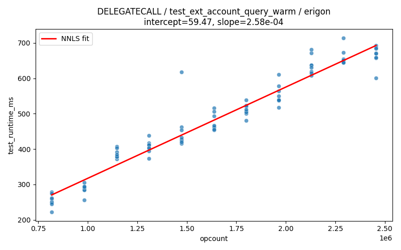

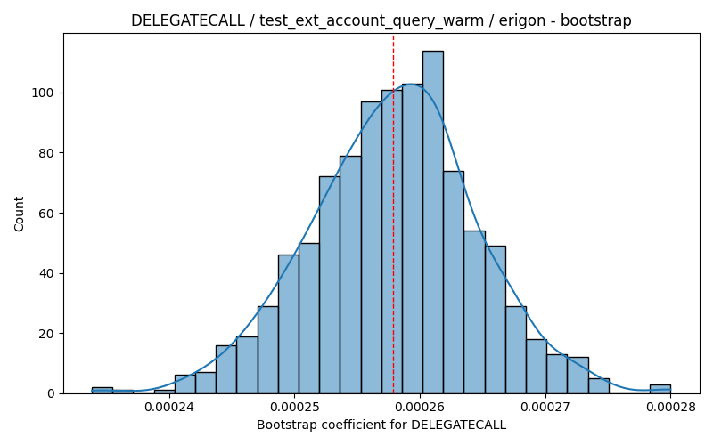

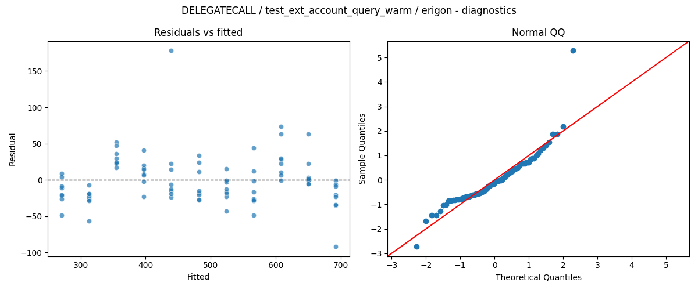

</details>

<details><summary>geth — NNLS regression summary</summary>

```
==============================================================================
                           NNLS Regression Results                            
==============================================================================
Dep. Variable:          test_runtime_ms              R-squared:          0.868
Model:                  NNLS                    Adj. R-squared:          0.867
No. Observations:       143                               RMSE:          30.45
Df Residuals:           141                                MAE:          23.94
Df Model:               1      
==============================================================================
                      coef     std err     P-value      [0.025      0.975]
------------------------------------------------------------------------------
         const     42.0651      8.0563       0.001     25.7598     57.6904
       opcount      0.0002      0.0000       0.001      0.0001      0.0002
==============================================================================
Notes: Non-negative least squares with bootstrap inference (1000 iterations)
==============================================================================
```

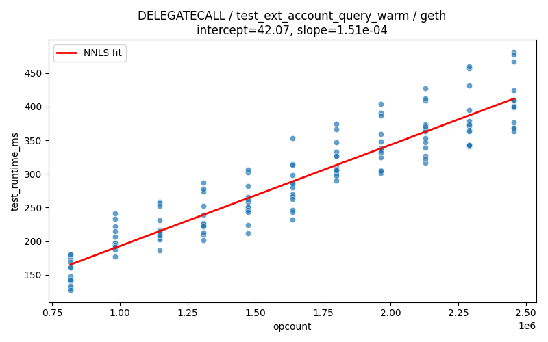

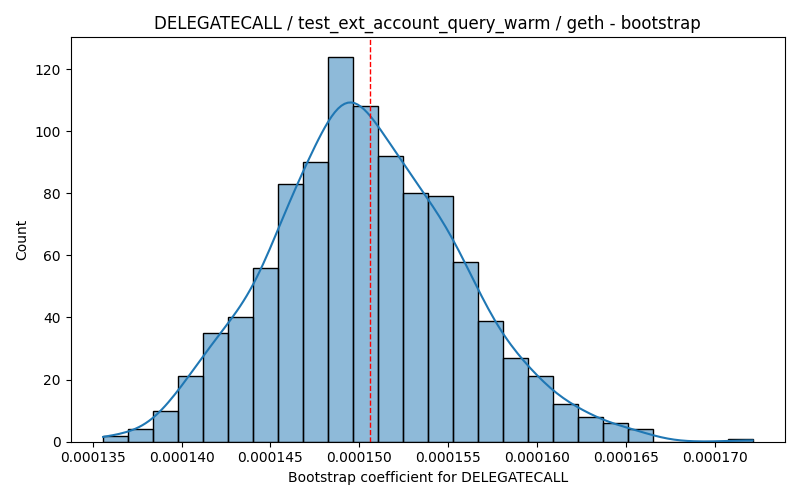

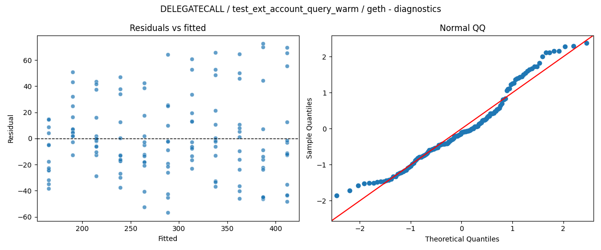

</details>

<details><summary>nethermind — NNLS regression summary</summary>

```
==============================================================================
                           NNLS Regression Results                            
==============================================================================
Dep. Variable:          test_runtime_ms              R-squared:          0.429
Model:                  NNLS                    Adj. R-squared:          0.424
No. Observations:       121                               RMSE:         355.19
Df Residuals:           119                                MAE:         323.04
Df Model:               1      
==============================================================================
                      coef     std err     P-value      [0.025      0.975]
------------------------------------------------------------------------------
         const    237.2460     92.4778       0.002     59.4412    424.9633
       opcount      0.0006      0.0001       0.001      0.0005      0.0007
==============================================================================
Notes: Non-negative least squares with bootstrap inference (1000 iterations)
==============================================================================
```

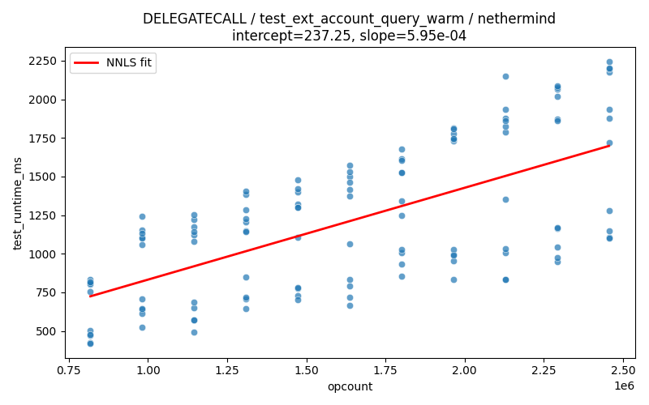

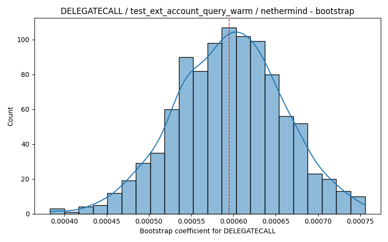

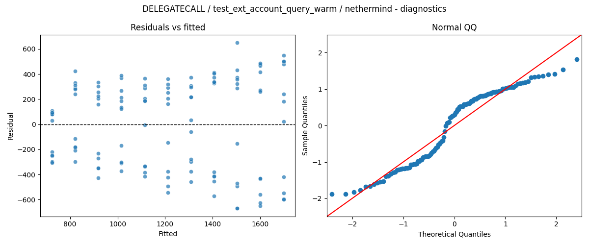

</details>

<details><summary>reth — NNLS regression summary</summary>

```
==============================================================================
                           NNLS Regression Results                            
==============================================================================
Dep. Variable:          test_runtime_ms              R-squared:          0.912
Model:                  NNLS                    Adj. R-squared:          0.912
No. Observations:       231                               RMSE:           7.37
Df Residuals:           229                                MAE:           5.89
Df Model:               1      
==============================================================================
                      coef     std err     P-value      [0.025      0.975]
------------------------------------------------------------------------------
         const     19.4713      1.6926       0.001     16.1282     22.7361
       opcount      0.0000      0.0000       0.001      0.0000      0.0000
==============================================================================
Notes: Non-negative least squares with bootstrap inference (1000 iterations)
==============================================================================
```

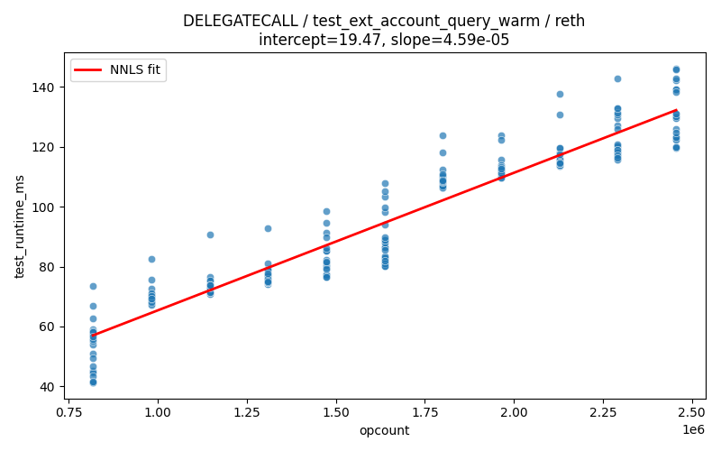

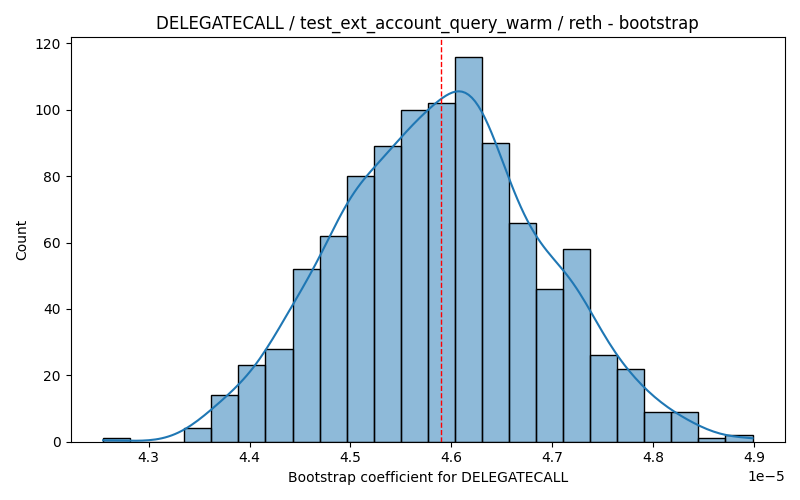

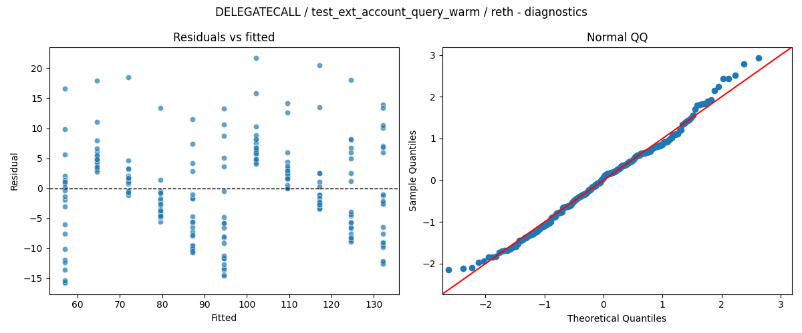

</details>

## EXTCODECOPY

### test_account_access — combo `EXTCODECOPY_AccountMode.NON_EXISTING_ACCOUNT` — `presets[cold_account_nocode_access]`

| client | nobs | R² | target_coef (ms) | p-value | 95% CI |
| --- | --- | --- | --- | --- | --- |
| `besu` | 220 | 0.8091 | 0.0004148 | 1.00e-03 | [0.0003855, 0.0004408] |
| `erigon` | 88 | 0.8379 | 6.215e-05 | 1.00e-03 | [5.637e-05, 6.769e-05] |
| `geth` | 143 | 0.9274 | 0.0003433 | 1.00e-03 | [0.0003265, 0.0003611] |
| `nethermind` | 121 | 0.7747 | 0.0003729 | 1.00e-03 | [0.0003365, 0.0004099] |
| `reth` | 231 | 0.6896 | 1.628e-05 | 1.00e-03 | [1.471e-05, 1.783e-05] |

<details><summary>besu — NNLS regression summary</summary>

```
==============================================================================
                           NNLS Regression Results                            
==============================================================================
Dep. Variable:          test_runtime_ms              R-squared:          0.809
Model:                  NNLS                    Adj. R-squared:          0.808
No. Observations:       220                               RMSE:          51.73
Df Residuals:           218                                MAE:          41.87
Df Model:               1      
==============================================================================
                      coef     std err     P-value      [0.025      0.975]
------------------------------------------------------------------------------
         const    198.7262     11.3088       0.001    177.7666    222.4054
       opcount      0.0004      0.0000       0.001      0.0004      0.0004
==============================================================================
Notes: Non-negative least squares with bootstrap inference (1000 iterations)
==============================================================================
```

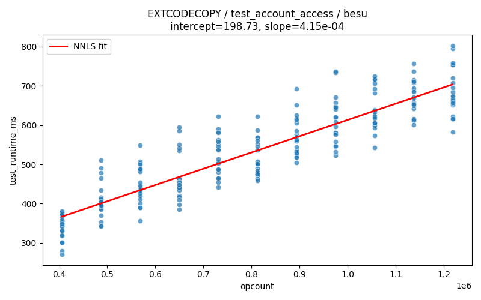

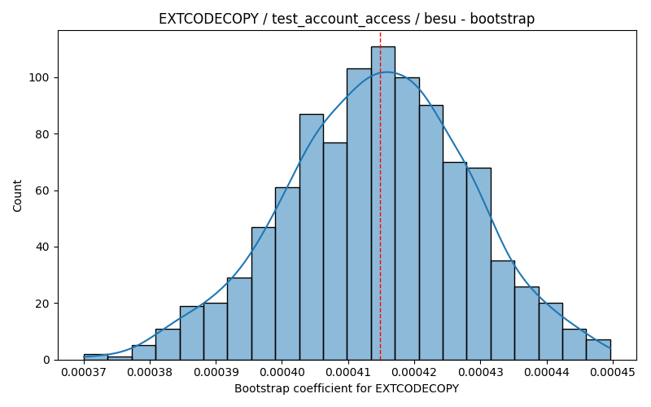

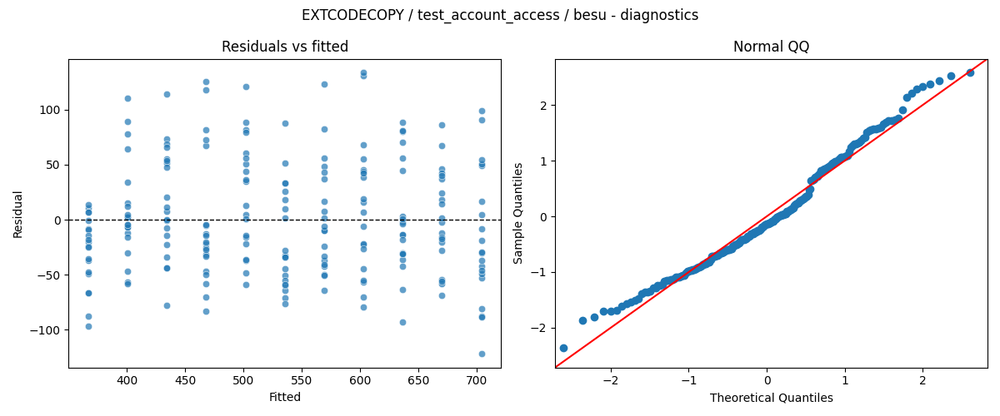

</details>

<details><summary>erigon — NNLS regression summary</summary>

```
==============================================================================
                           NNLS Regression Results                            
==============================================================================
Dep. Variable:          test_runtime_ms              R-squared:          0.838
Model:                  NNLS                    Adj. R-squared:          0.836
No. Observations:       88                                RMSE:           7.02
Df Residuals:           86                                 MAE:           5.81
Df Model:               1      
==============================================================================
                      coef     std err     P-value      [0.025      0.975]
------------------------------------------------------------------------------
         const     38.0648      2.5336       0.001     33.2685     43.1253
       opcount      0.0001      0.0000       0.001      0.0001      0.0001
==============================================================================
Notes: Non-negative least squares with bootstrap inference (1000 iterations)
==============================================================================
```

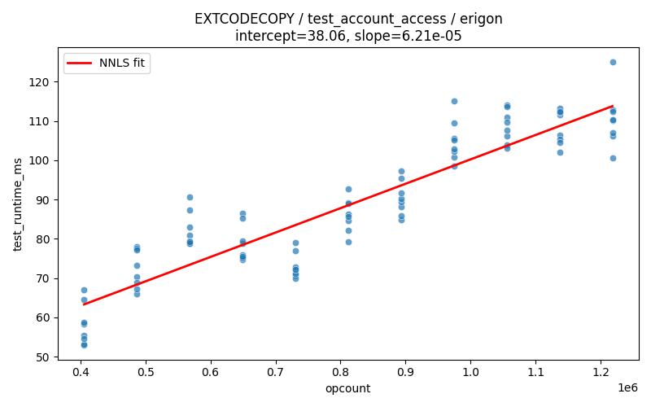

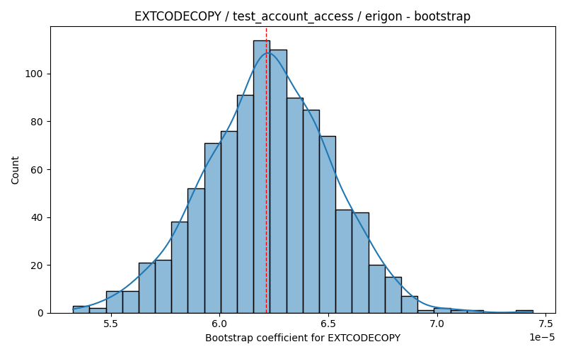

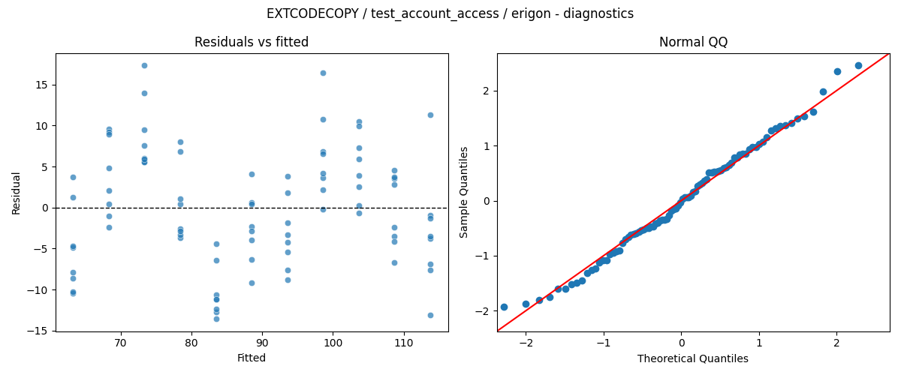

</details>

<details><summary>geth — NNLS regression summary</summary>

```
==============================================================================
                           NNLS Regression Results                            
==============================================================================
Dep. Variable:          test_runtime_ms              R-squared:          0.927
Model:                  NNLS                    Adj. R-squared:          0.927
No. Observations:       143                               RMSE:          24.66
Df Residuals:           141                                MAE:          19.04
Df Model:               1      
==============================================================================
                      coef     std err     P-value      [0.025      0.975]
------------------------------------------------------------------------------
         const     17.3436      6.1829       0.003      4.7115     29.3180
       opcount      0.0003      0.0000       0.001      0.0003      0.0004
==============================================================================
Notes: Non-negative least squares with bootstrap inference (1000 iterations)
==============================================================================
```

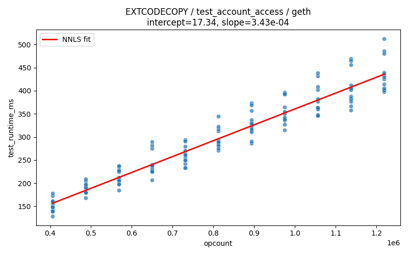

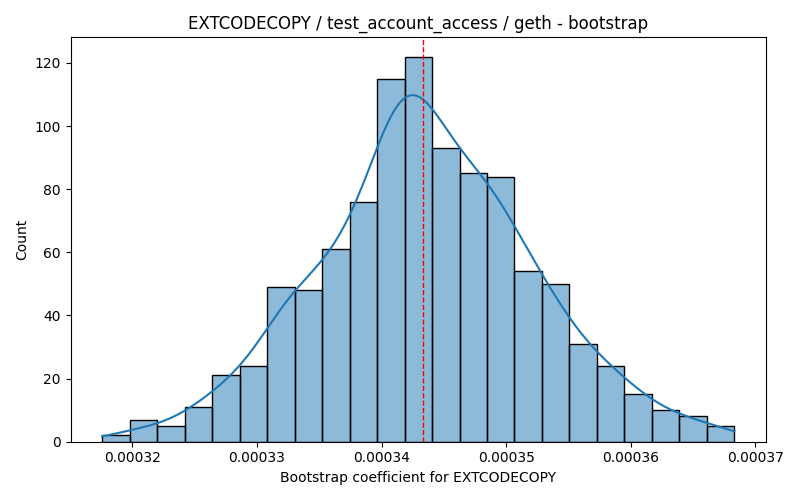

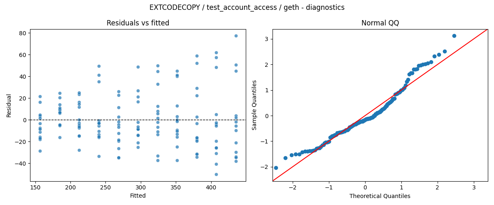

</details>

<details><summary>nethermind — NNLS regression summary</summary>

```
==============================================================================
                           NNLS Regression Results                            
==============================================================================
Dep. Variable:          test_runtime_ms              R-squared:          0.775
Model:                  NNLS                    Adj. R-squared:          0.773
No. Observations:       121                               RMSE:          51.63
Df Residuals:           119                                MAE:          40.79
Df Model:               1      
==============================================================================
                      coef     std err     P-value      [0.025      0.975]
------------------------------------------------------------------------------
         const    121.8498     13.5547       0.001     95.7070    148.8672
       opcount      0.0004      0.0000       0.001      0.0003      0.0004
==============================================================================
Notes: Non-negative least squares with bootstrap inference (1000 iterations)
==============================================================================
```


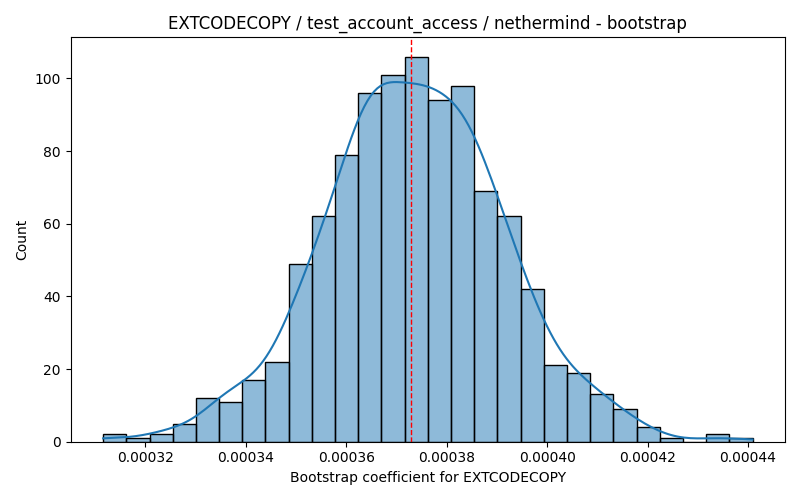

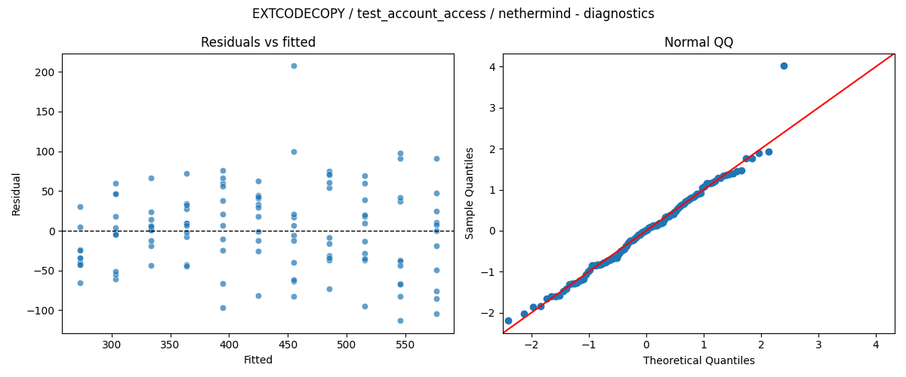

</details>

<details><summary>reth — NNLS regression summary</summary>

```
==============================================================================
                           NNLS Regression Results                            
==============================================================================
Dep. Variable:          test_runtime_ms              R-squared:          0.690
Model:                  NNLS                    Adj. R-squared:          0.688
No. Observations:       231                               RMSE:           2.80
Df Residuals:           229                                MAE:           1.87
Df Model:               1      
==============================================================================
                      coef     std err     P-value      [0.025      0.975]
------------------------------------------------------------------------------
         const      6.3003      0.6968       0.001      5.0217      7.6585
       opcount      0.0000      0.0000       0.001      0.0000      0.0000
==============================================================================
Notes: Non-negative least squares with bootstrap inference (1000 iterations)
==============================================================================
```

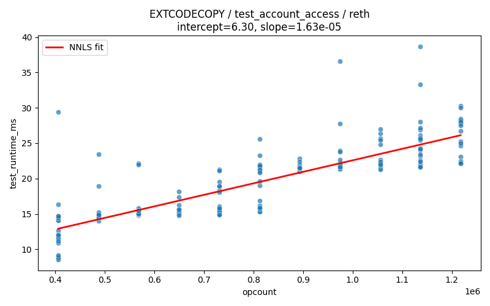

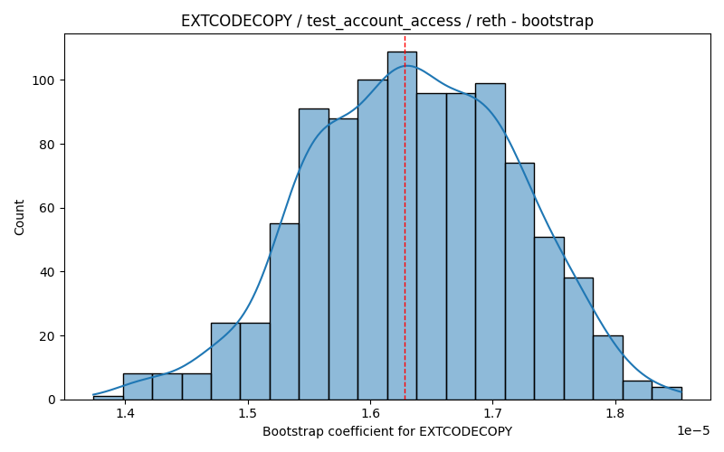

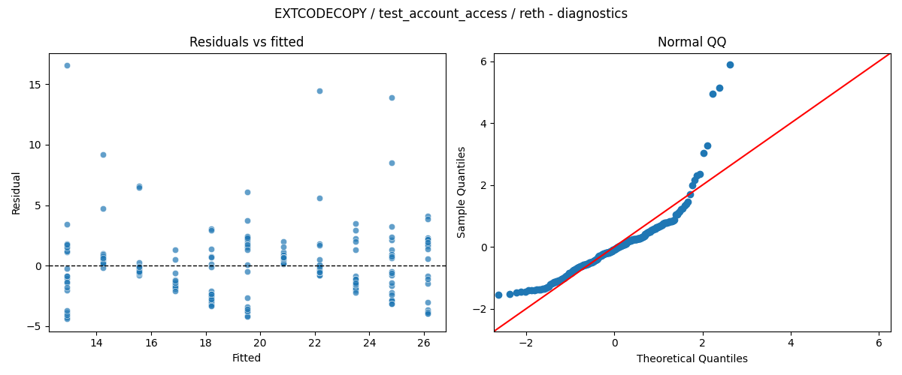

</details>

### test_account_access — combo `EXTCODECOPY_AccountMode.EXISTING_CONTRACT`

| client | nobs | R² | target_coef (ms) | p-value | 95% CI |
| --- | --- | --- | --- | --- | --- |
| `besu` | 220 | 0.8536 | 0.001879 | 1.00e-03 | [0.001781, 0.001992] |
| `erigon` | 88 | 0.916 | 0.0003009 | 1.00e-03 | [0.0002812, 0.0003185] |
| `geth` | 143 | 0.8631 | 0.0007197 | 1.00e-03 | [0.0006711, 0.0007705] |
| `nethermind` | 121 | 0.8773 | 0.001449 | 1.00e-03 | [0.001358, 0.001542] |
| `reth` | 231 | 0.7719 | 8.204e-05 | 1.00e-03 | [7.563e-05, 8.892e-05] |

<details><summary>besu — NNLS regression summary</summary>

```
==============================================================================
                           NNLS Regression Results                            
==============================================================================
Dep. Variable:          test_runtime_ms              R-squared:          0.854
Model:                  NNLS                    Adj. R-squared:          0.853
No. Observations:       220                               RMSE:          76.88
Df Residuals:           218                                MAE:          60.95
Df Model:               1      
==============================================================================
                      coef     std err     P-value      [0.025      0.975]
------------------------------------------------------------------------------
         const    392.1164     16.5407       0.001    357.3569    424.1060
       opcount      0.0019      0.0001       0.001      0.0018      0.0020
==============================================================================
Notes: Non-negative least squares with bootstrap inference (1000 iterations)
==============================================================================
```

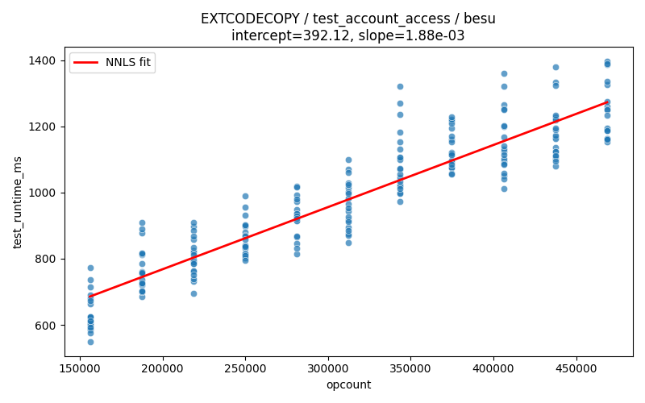


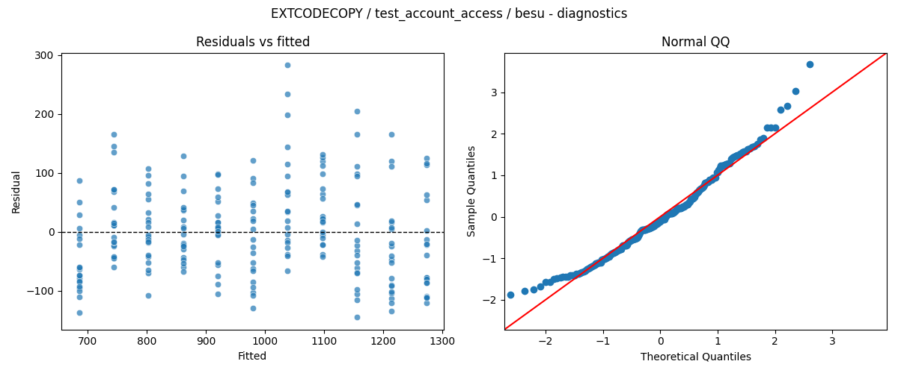

</details>

<details><summary>erigon — NNLS regression summary</summary>

```
==============================================================================
                           NNLS Regression Results                            
==============================================================================
Dep. Variable:          test_runtime_ms              R-squared:          0.916
Model:                  NNLS                    Adj. R-squared:          0.915
No. Observations:       88                                RMSE:           9.00
Df Residuals:           86                                 MAE:           7.11
Df Model:               1      
==============================================================================
                      coef     std err     P-value      [0.025      0.975]
------------------------------------------------------------------------------
         const     42.3729      3.5147       0.001     35.8220     49.8095
       opcount      0.0003      0.0000       0.001      0.0003      0.0003
==============================================================================
Notes: Non-negative least squares with bootstrap inference (1000 iterations)
==============================================================================
```

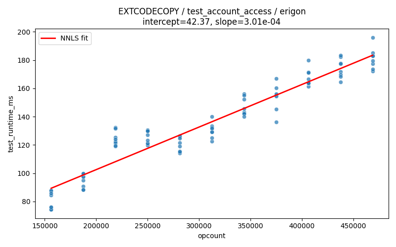

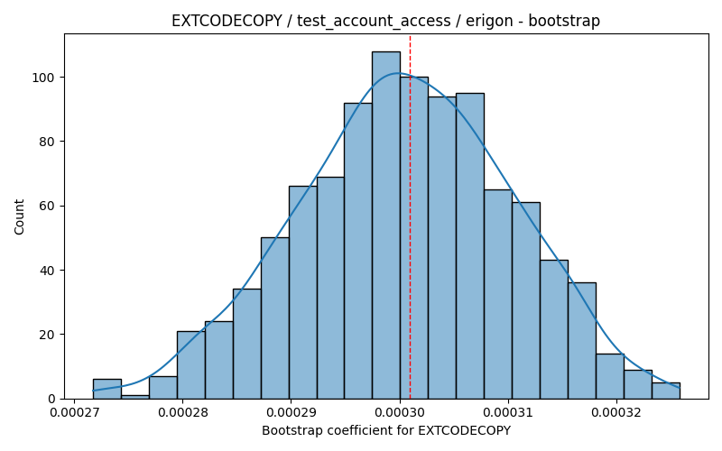

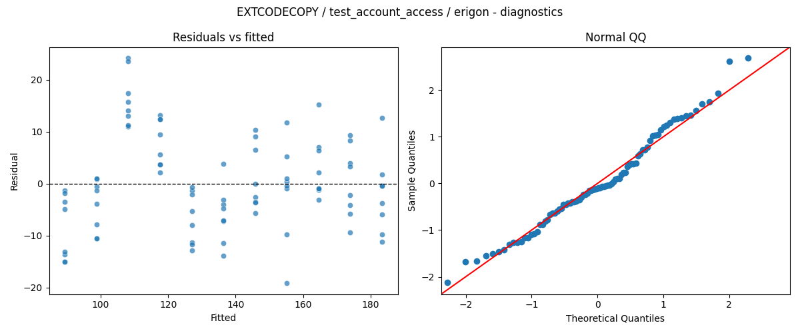

</details>

<details><summary>geth — NNLS regression summary</summary>

```
==============================================================================
                           NNLS Regression Results                            
==============================================================================
Dep. Variable:          test_runtime_ms              R-squared:          0.863
Model:                  NNLS                    Adj. R-squared:          0.862
No. Observations:       143                               RMSE:          28.32
Df Residuals:           141                                MAE:          22.67
Df Model:               1      
==============================================================================
                      coef     std err     P-value      [0.025      0.975]
------------------------------------------------------------------------------
         const     52.8511      7.2408       0.001     38.2524     67.0909
       opcount      0.0007      0.0000       0.001      0.0007      0.0008
==============================================================================
Notes: Non-negative least squares with bootstrap inference (1000 iterations)
==============================================================================
```

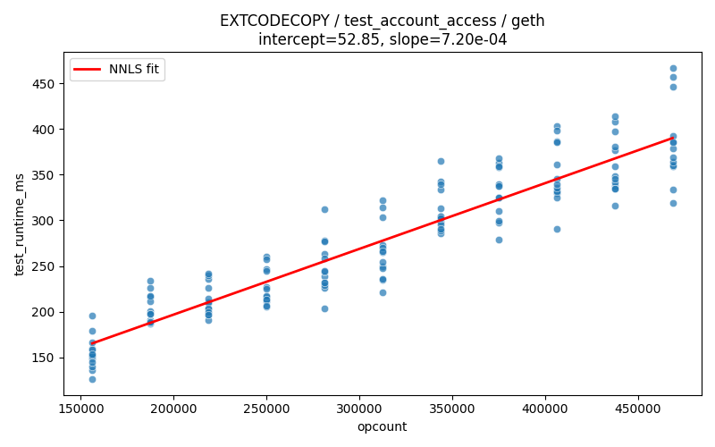

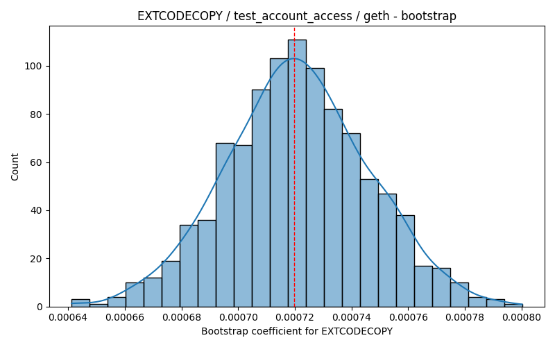

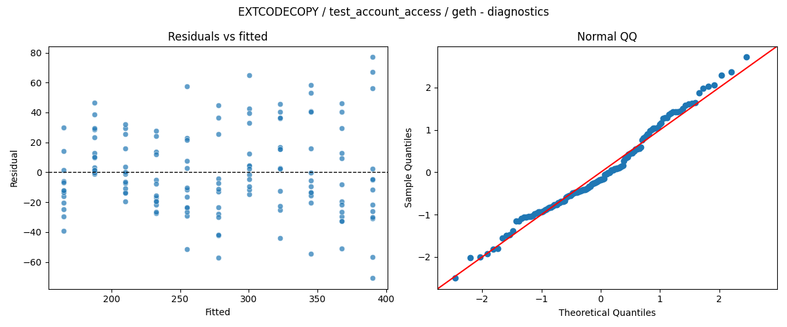

</details>

<details><summary>nethermind — NNLS regression summary</summary>

```
==============================================================================
                           NNLS Regression Results                            
==============================================================================
Dep. Variable:          test_runtime_ms              R-squared:          0.877
Model:                  NNLS                    Adj. R-squared:          0.876
No. Observations:       121                               RMSE:          53.54
Df Residuals:           119                                MAE:          39.02
Df Model:               1      
==============================================================================
                      coef     std err     P-value      [0.025      0.975]
------------------------------------------------------------------------------
         const    160.2420     14.1640       0.001    132.3932    187.6227
       opcount      0.0014      0.0000       0.001      0.0014      0.0015
==============================================================================
Notes: Non-negative least squares with bootstrap inference (1000 iterations)
==============================================================================
```

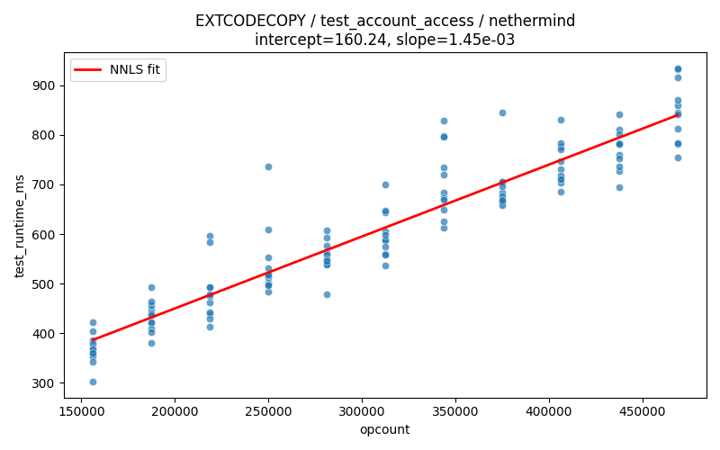

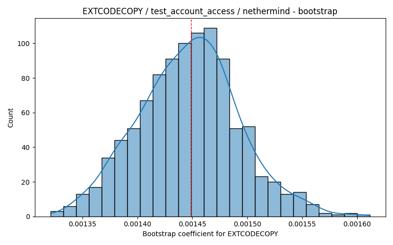

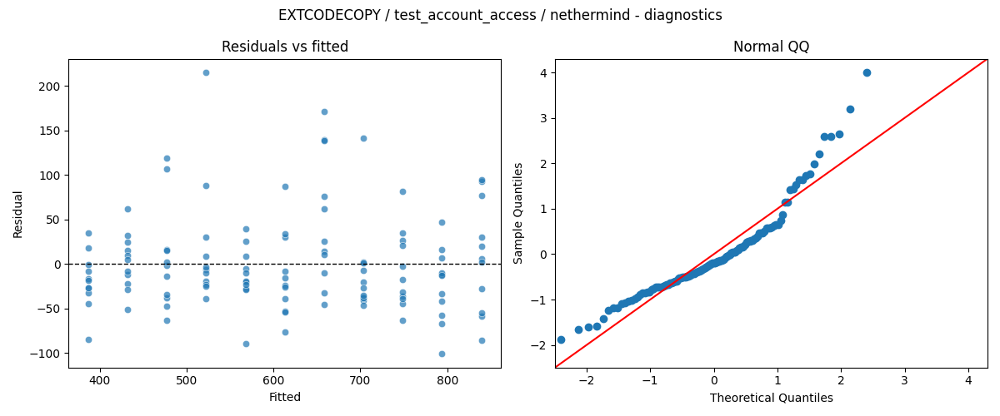

</details>

<details><summary>reth — NNLS regression summary</summary>

```
==============================================================================
                           NNLS Regression Results                            
==============================================================================
Dep. Variable:          test_runtime_ms              R-squared:          0.772
Model:                  NNLS                    Adj. R-squared:          0.771
No. Observations:       231                               RMSE:           4.41
Df Residuals:           229                                MAE:           3.43
Df Model:               1      
==============================================================================
                      coef     std err     P-value      [0.025      0.975]
------------------------------------------------------------------------------
         const     10.5753      1.0737       0.001      8.3675     12.5604
       opcount      0.0001      0.0000       0.001      0.0001      0.0001
==============================================================================
Notes: Non-negative least squares with bootstrap inference (1000 iterations)
==============================================================================
```

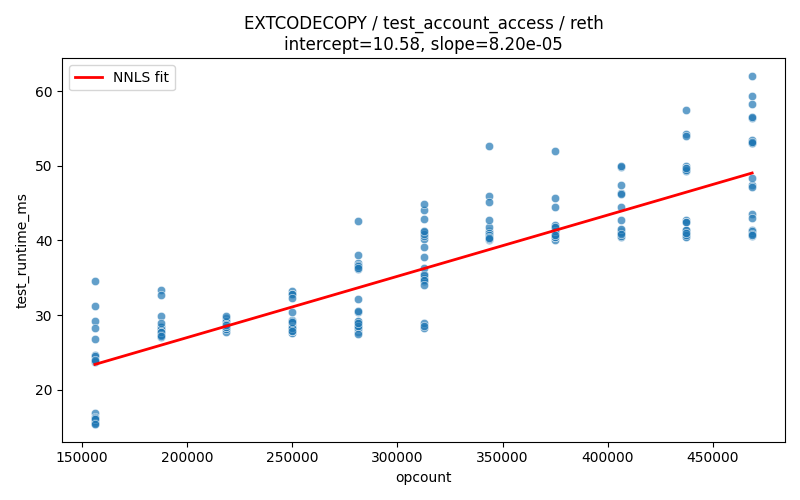

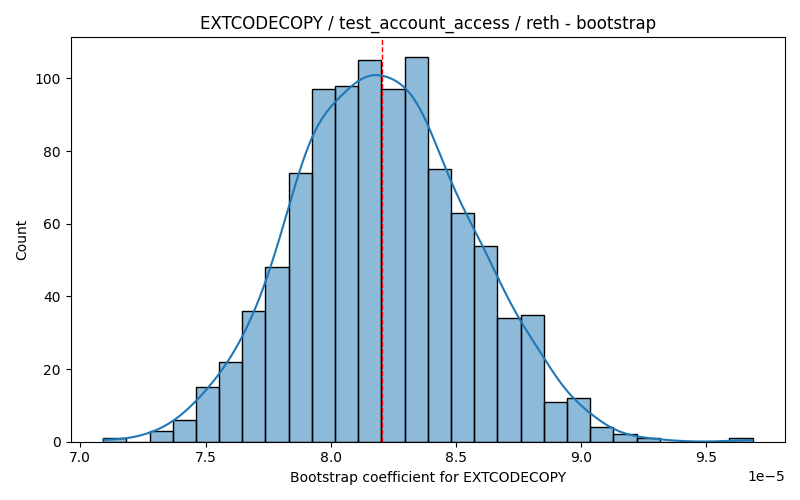

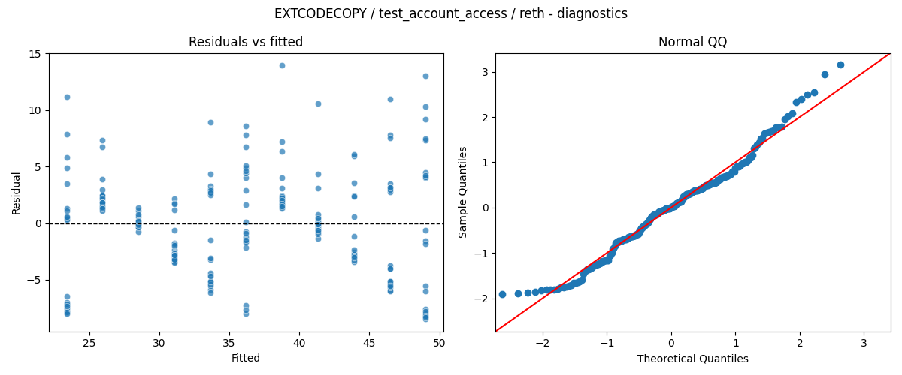

</details>

### test_account_access — combo `EXTCODECOPY_AccountMode.NON_EXISTING_ACCOUNT` — `presets[cold_account_code_access]`

| client | nobs | R² | target_coef (ms) | p-value | 95% CI |
| --- | --- | --- | --- | --- | --- |
| `besu` | 220 | 0.8091 | 0.0004148 | 1.00e-03 | [0.0003855, 0.0004408] |
| `erigon` | 88 | 0.8379 | 6.215e-05 | 1.00e-03 | [5.637e-05, 6.769e-05] |
| `geth` | 143 | 0.9274 | 0.0003433 | 1.00e-03 | [0.0003265, 0.0003611] |
| `nethermind` | 121 | 0.7747 | 0.0003729 | 1.00e-03 | [0.0003365, 0.0004099] |
| `reth` | 231 | 0.6896 | 1.628e-05 | 1.00e-03 | [1.471e-05, 1.783e-05] |

<details><summary>besu — NNLS regression summary</summary>

```
==============================================================================
                           NNLS Regression Results                            
==============================================================================
Dep. Variable:          test_runtime_ms              R-squared:          0.809
Model:                  NNLS                    Adj. R-squared:          0.808
No. Observations:       220                               RMSE:          51.73
Df Residuals:           218                                MAE:          41.87
Df Model:               1      
==============================================================================
                      coef     std err     P-value      [0.025      0.975]
------------------------------------------------------------------------------
         const    198.7262     11.3088       0.001    177.7666    222.4054
       opcount      0.0004      0.0000       0.001      0.0004      0.0004
==============================================================================
Notes: Non-negative least squares with bootstrap inference (1000 iterations)
==============================================================================
```


</details>

<details><summary>erigon — NNLS regression summary</summary>

```
==============================================================================
                           NNLS Regression Results                            
==============================================================================
Dep. Variable:          test_runtime_ms              R-squared:          0.838
Model:                  NNLS                    Adj. R-squared:          0.836
No. Observations:       88                                RMSE:           7.02
Df Residuals:           86                                 MAE:           5.81
Df Model:               1      
==============================================================================
                      coef     std err     P-value      [0.025      0.975]
------------------------------------------------------------------------------
         const     38.0648      2.5336       0.001     33.2685     43.1253
       opcount      0.0001      0.0000       0.001      0.0001      0.0001
==============================================================================
Notes: Non-negative least squares with bootstrap inference (1000 iterations)
==============================================================================
```


</details>

<details><summary>geth — NNLS regression summary</summary>

```
==============================================================================
                           NNLS Regression Results                            
==============================================================================
Dep. Variable:          test_runtime_ms              R-squared:          0.927
Model:                  NNLS                    Adj. R-squared:          0.927
No. Observations:       143                               RMSE:          24.66
Df Residuals:           141                                MAE:          19.04
Df Model:               1      
==============================================================================
                      coef     std err     P-value      [0.025      0.975]
------------------------------------------------------------------------------
         const     17.3436      6.1829       0.003      4.7115     29.3180
       opcount      0.0003      0.0000       0.001      0.0003      0.0004
==============================================================================
Notes: Non-negative least squares with bootstrap inference (1000 iterations)
==============================================================================
```


</details>

<details><summary>nethermind — NNLS regression summary</summary>

```
==============================================================================
                           NNLS Regression Results                            
==============================================================================
Dep. Variable:          test_runtime_ms              R-squared:          0.775
Model:                  NNLS                    Adj. R-squared:          0.773
No. Observations:       121                               RMSE:          51.63
Df Residuals:           119                                MAE:          40.79
Df Model:               1      
==============================================================================
                      coef     std err     P-value      [0.025      0.975]
------------------------------------------------------------------------------
         const    121.8498     13.5547       0.001     95.7070    148.8672
       opcount      0.0004      0.0000       0.001      0.0003      0.0004
==============================================================================
Notes: Non-negative least squares with bootstrap inference (1000 iterations)
==============================================================================
```


</details>

<details><summary>reth — NNLS regression summary</summary>

```
==============================================================================
                           NNLS Regression Results                            
==============================================================================
Dep. Variable:          test_runtime_ms              R-squared:          0.690
Model:                  NNLS                    Adj. R-squared:          0.688
No. Observations:       231                               RMSE:           2.80
Df Residuals:           229                                MAE:           1.87
Df Model:               1      
==============================================================================
                      coef     std err     P-value      [0.025      0.975]
------------------------------------------------------------------------------
         const      6.3003      0.6968       0.001      5.0217      7.6585
       opcount      0.0000      0.0000       0.001      0.0000      0.0000
==============================================================================
Notes: Non-negative least squares with bootstrap inference (1000 iterations)
==============================================================================
```


</details>

## EXTCODEHASH

### test_account_access — combo `EXTCODEHASH_AccountMode.NON_EXISTING_ACCOUNT` — `presets[cold_account_nocode_access]`

| client | nobs | R² | target_coef (ms) | p-value | 95% CI |
| --- | --- | --- | --- | --- | --- |
| `besu` | 220 | 0.9062 | 0.009891 | 1.00e-03 | [0.009398, 0.01045] |
| `erigon` | 88 | 0.9977 | 0.008629 | 1.00e-03 | [0.008545, 0.008704] |
| `geth` | 143 | 0.7136 | 0.02726 | 1.00e-03 | [0.02427, 0.03039] |
| `nethermind` | 121 | 0.8574 | 0.004144 | 1.00e-03 | [0.003832, 0.004498] |
| `reth` | 231 | 0.9666 | 0.0008958 | 1.00e-03 | [0.0008757, 0.0009195] |

<details><summary>besu — NNLS regression summary</summary>

```
==============================================================================
                           NNLS Regression Results                            
==============================================================================
Dep. Variable:          test_runtime_ms              R-squared:          0.906
Model:                  NNLS                    Adj. R-squared:          0.906
No. Observations:       220                               RMSE:          76.07
Df Residuals:           218                                MAE:          61.53
Df Model:               1      
==============================================================================
                      coef     std err     P-value      [0.025      0.975]
------------------------------------------------------------------------------
         const    404.2965     21.6967       0.001    358.7082    444.4561
       opcount      0.0099      0.0003       0.001      0.0094      0.0104
==============================================================================
Notes: Non-negative least squares with bootstrap inference (1000 iterations)
==============================================================================
```

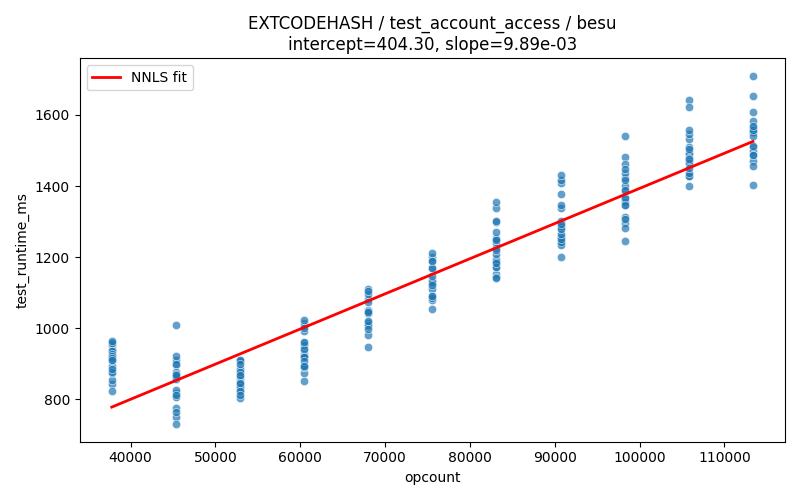

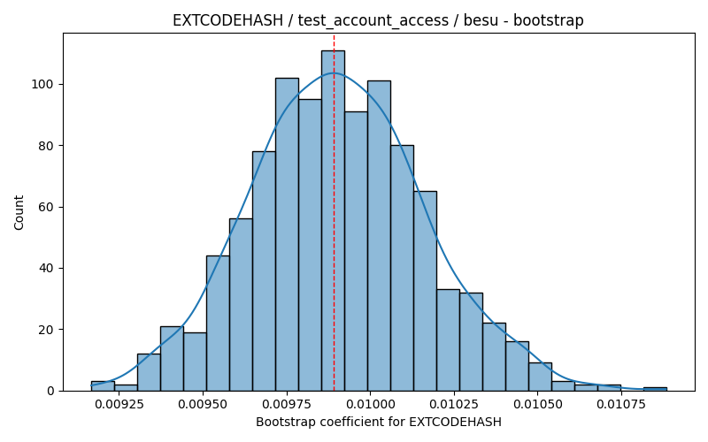

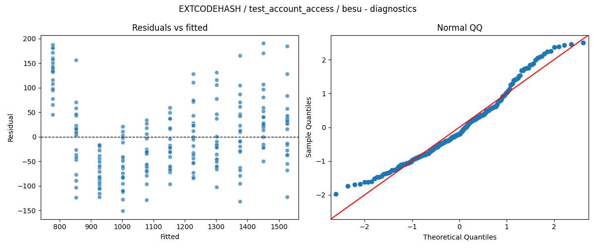

</details>

<details><summary>erigon — NNLS regression summary</summary>

```
==============================================================================
                           NNLS Regression Results                            
==============================================================================
Dep. Variable:          test_runtime_ms              R-squared:          0.998
Model:                  NNLS                    Adj. R-squared:          0.998
No. Observations:       88                                RMSE:           9.88
Df Residuals:           86                                 MAE:           8.20
Df Model:               1      
==============================================================================
                      coef     std err     P-value      [0.025      0.975]
------------------------------------------------------------------------------
         const      5.1417      3.3699       0.077      0.0000     11.7713
       opcount      0.0086      0.0000       0.001      0.0085      0.0087
==============================================================================
Notes: Non-negative least squares with bootstrap inference (1000 iterations)
==============================================================================
```


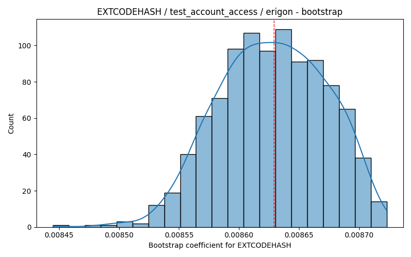

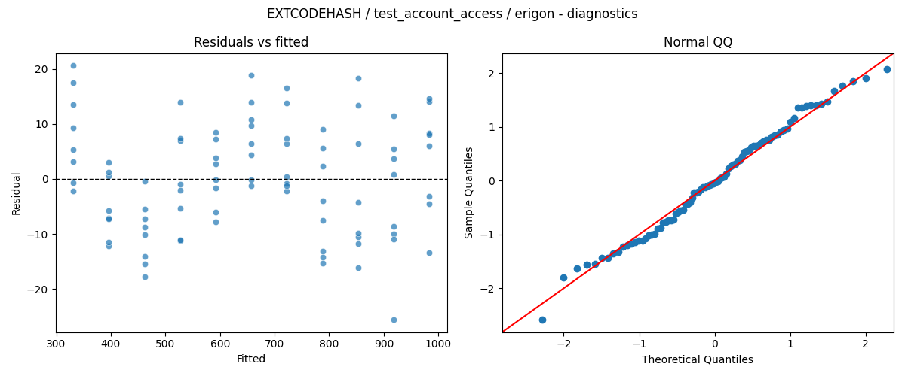

</details>

<details><summary>geth — NNLS regression summary</summary>

```
==============================================================================
                           NNLS Regression Results                            
==============================================================================
Dep. Variable:          test_runtime_ms              R-squared:          0.714
Model:                  NNLS                    Adj. R-squared:          0.712
No. Observations:       143                               RMSE:         412.73
Df Residuals:           141                                MAE:         338.70
Df Model:               1      
==============================================================================
                      coef     std err     P-value      [0.025      0.975]
------------------------------------------------------------------------------
         const   1099.2638    119.7706       0.001    859.7303   1340.5340
       opcount      0.0273      0.0015       0.001      0.0243      0.0304
==============================================================================
Notes: Non-negative least squares with bootstrap inference (1000 iterations)
==============================================================================
```

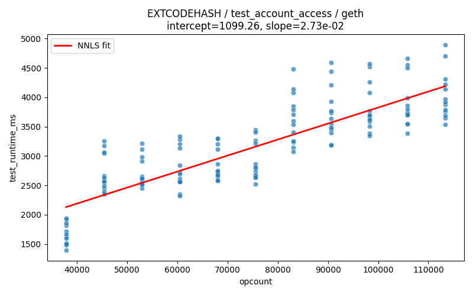

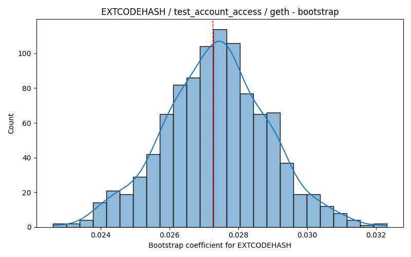

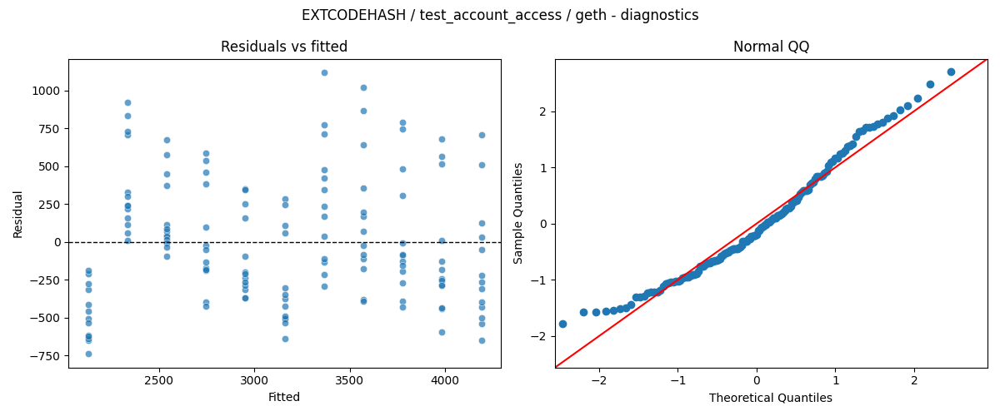

</details>

<details><summary>nethermind — NNLS regression summary</summary>

```
==============================================================================
                           NNLS Regression Results                            
==============================================================================
Dep. Variable:          test_runtime_ms              R-squared:          0.857
Model:                  NNLS                    Adj. R-squared:          0.856
No. Observations:       121                               RMSE:          40.39
Df Residuals:           119                                MAE:          27.79
Df Model:               1      
==============================================================================
                      coef     std err     P-value      [0.025      0.975]
------------------------------------------------------------------------------
         const     68.8887     10.8155       0.001     47.1846     89.9147
       opcount      0.0041      0.0002       0.001      0.0038      0.0045
==============================================================================
Notes: Non-negative least squares with bootstrap inference (1000 iterations)
==============================================================================
```

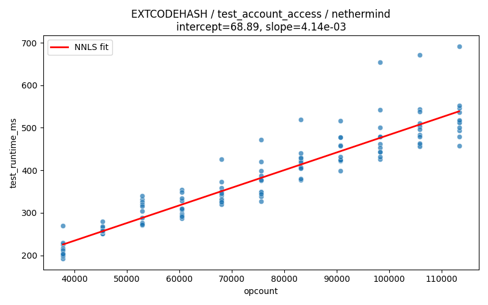

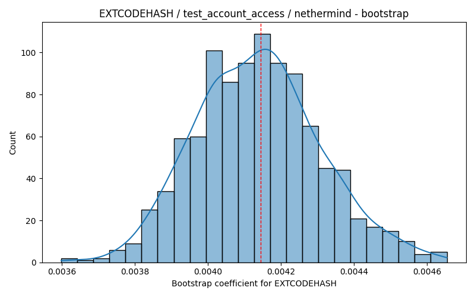

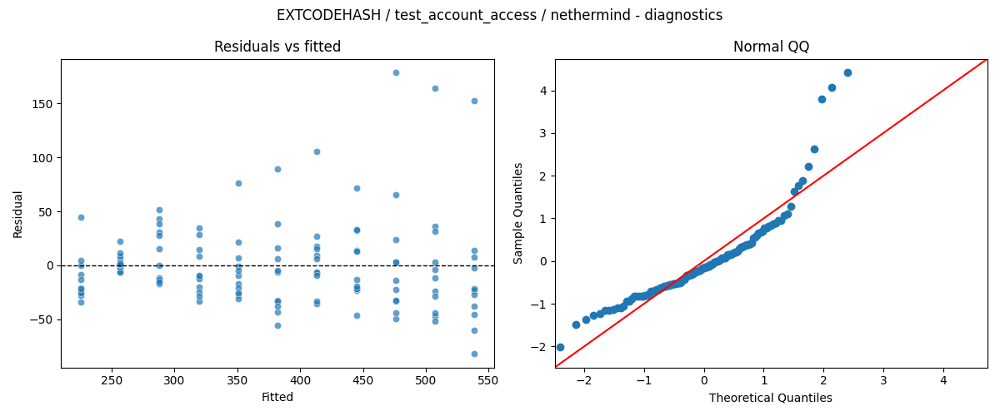

</details>

<details><summary>reth — NNLS regression summary</summary>

```
==============================================================================
                           NNLS Regression Results                            
==============================================================================
Dep. Variable:          test_runtime_ms              R-squared:          0.967
Model:                  NNLS                    Adj. R-squared:          0.966
No. Observations:       231                               RMSE:           3.98
Df Residuals:           229                                MAE:           3.19
Df Model:               1      
==============================================================================
                      coef     std err     P-value      [0.025      0.975]
------------------------------------------------------------------------------
         const     33.3011      0.8975       0.001     31.4536     34.9401
       opcount      0.0009      0.0000       0.001      0.0009      0.0009
==============================================================================
Notes: Non-negative least squares with bootstrap inference (1000 iterations)
==============================================================================
```

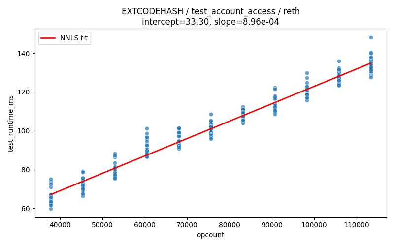

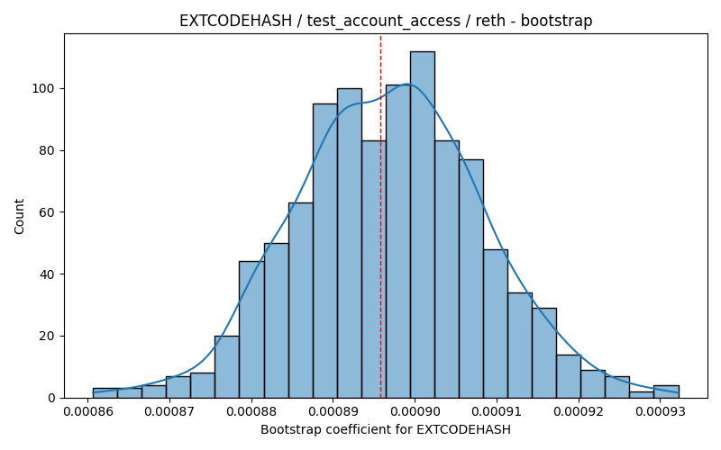

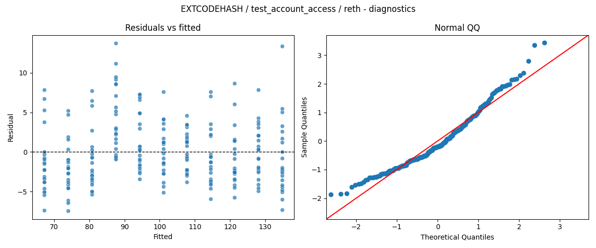

</details>

### test_account_access — combo `EXTCODEHASH_AccountMode.EXISTING_CONTRACT`

| client | nobs | R² | target_coef (ms) | p-value | 95% CI |
| --- | --- | --- | --- | --- | --- |
| `besu` | 220 | 0.9467 | 0.02616 | 1.00e-03 | [0.02537, 0.02713] |
| `erigon` | 88 | 0.9124 | 0.03543 | 1.00e-03 | [0.03324, 0.03743] |
| `geth` | 143 | 0.7302 | 0.02818 | 1.00e-03 | [0.02507, 0.03131] |
| `nethermind` | 121 | 0.6949 | 0.02507 | 1.00e-03 | [0.02204, 0.02806] |
| `reth` | 231 | 0.9102 | 0.03606 | 1.00e-03 | [0.03411, 0.03816] |

<details><summary>besu — NNLS regression summary</summary>

```
==============================================================================
                           NNLS Regression Results                            
==============================================================================
Dep. Variable:          test_runtime_ms              R-squared:          0.947
Model:                  NNLS                    Adj. R-squared:          0.946
No. Observations:       220                               RMSE:         129.16
Df Residuals:           218                                MAE:         110.58
Df Model:               1      
==============================================================================
                      coef     std err     P-value      [0.025      0.975]
------------------------------------------------------------------------------
         const    428.3542     33.1969       0.001    357.4544    485.3670
       opcount      0.0262      0.0005       0.001      0.0254      0.0271
==============================================================================
Notes: Non-negative least squares with bootstrap inference (1000 iterations)
==============================================================================
```

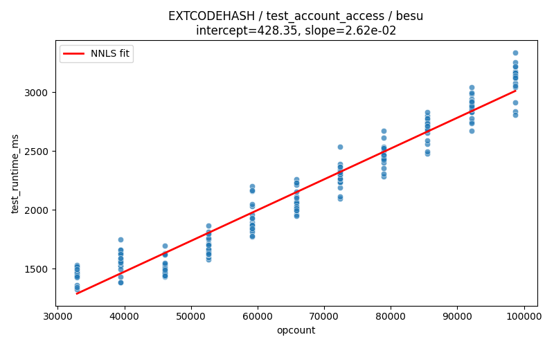

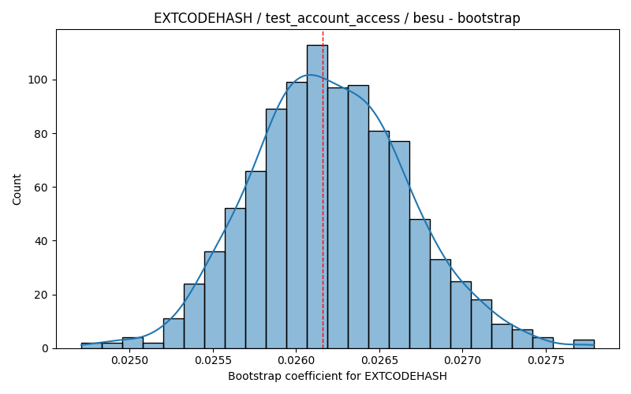

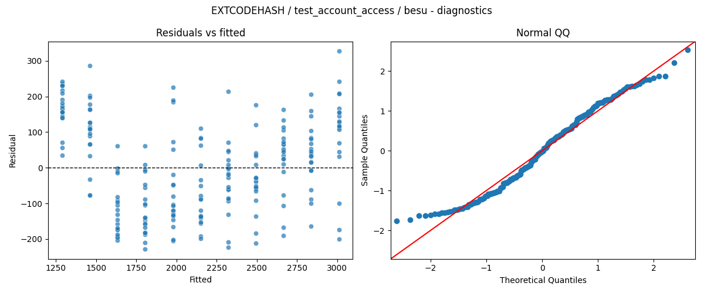

</details>

<details><summary>erigon — NNLS regression summary</summary>

```
==============================================================================
                           NNLS Regression Results                            
==============================================================================
Dep. Variable:          test_runtime_ms              R-squared:          0.912
Model:                  NNLS                    Adj. R-squared:          0.911
No. Observations:       88                                RMSE:         228.48
Df Residuals:           86                                 MAE:         192.10
Df Model:               1      
==============================================================================
                      coef     std err     P-value      [0.025      0.975]
------------------------------------------------------------------------------
         const    381.5910     85.2968       0.001    231.5171    547.2392
       opcount      0.0354      0.0011       0.001      0.0332      0.0374
==============================================================================
Notes: Non-negative least squares with bootstrap inference (1000 iterations)
==============================================================================
```

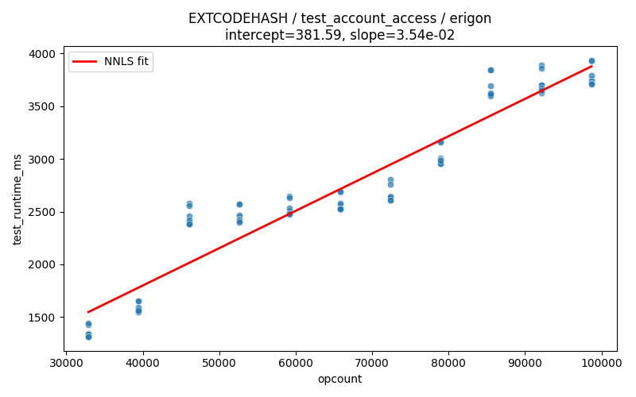

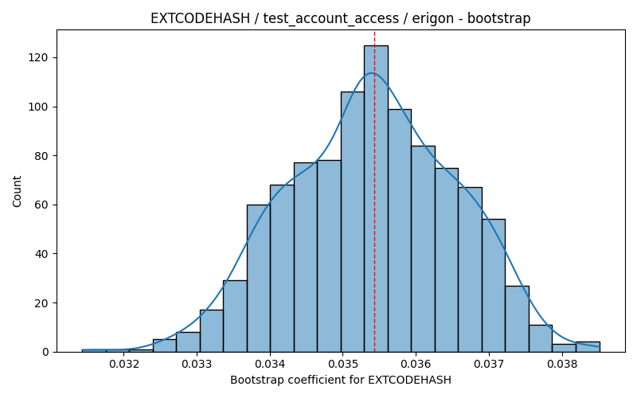

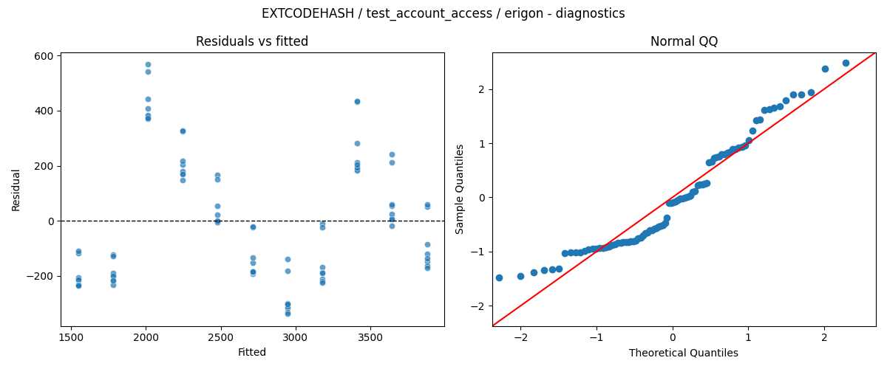

</details>

<details><summary>geth — NNLS regression summary</summary>

```
==============================================================================
                           NNLS Regression Results                            
==============================================================================
Dep. Variable:          test_runtime_ms              R-squared:          0.730
Model:                  NNLS                    Adj. R-squared:          0.728
No. Observations:       143                               RMSE:         356.30
Df Residuals:           141                                MAE:         286.57
Df Model:               1      
==============================================================================
                      coef     std err     P-value      [0.025      0.975]
------------------------------------------------------------------------------
         const   1054.8791    116.1575       0.001    834.2288   1285.2217
       opcount      0.0282      0.0016       0.001      0.0251      0.0313
==============================================================================
Notes: Non-negative least squares with bootstrap inference (1000 iterations)
==============================================================================
```

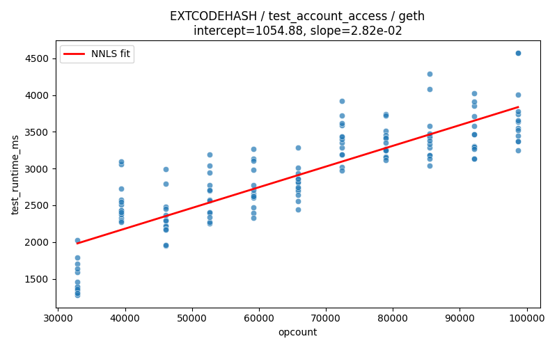

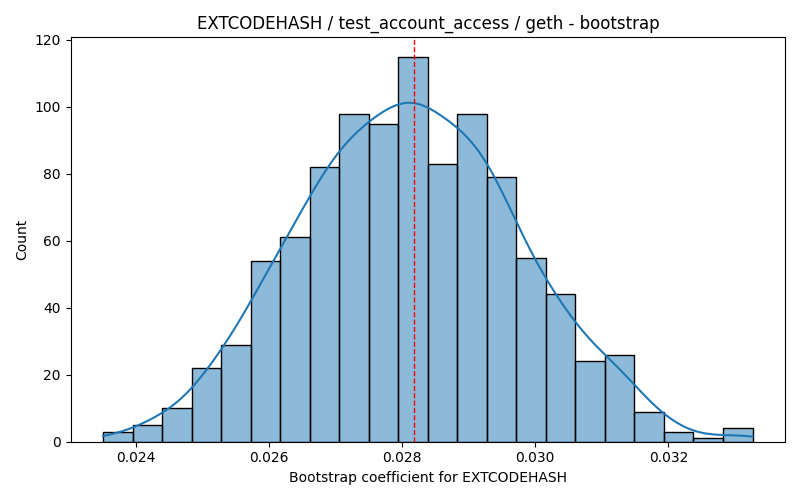

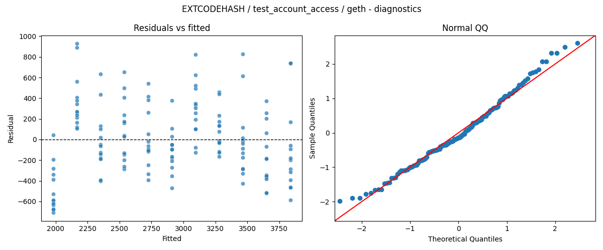

</details>

<details><summary>nethermind — NNLS regression summary</summary>

```
==============================================================================
                           NNLS Regression Results                            
==============================================================================
Dep. Variable:          test_runtime_ms              R-squared:          0.695
Model:                  NNLS                    Adj. R-squared:          0.692
No. Observations:       121                               RMSE:         345.68
Df Residuals:           119                                MAE:         286.82
Df Model:               1      
==============================================================================
                      coef     std err     P-value      [0.025      0.975]
------------------------------------------------------------------------------
         const    821.7590    104.3517       0.001    610.9947   1027.3511
       opcount      0.0251      0.0015       0.001      0.0220      0.0281
==============================================================================
Notes: Non-negative least squares with bootstrap inference (1000 iterations)
==============================================================================
```

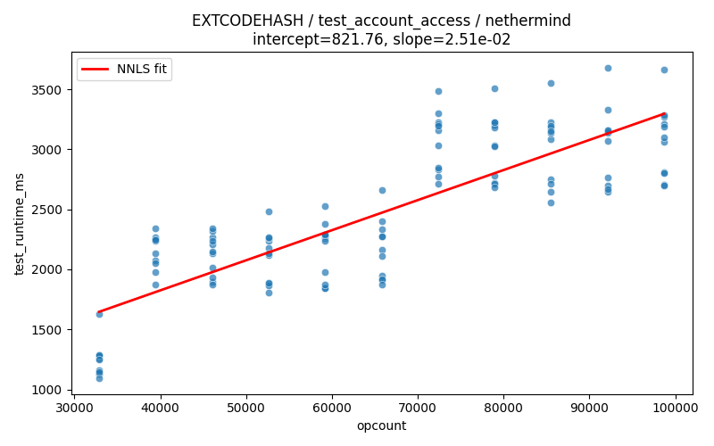

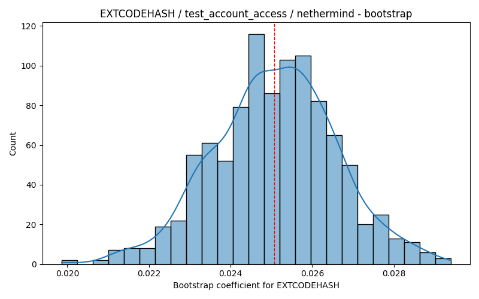

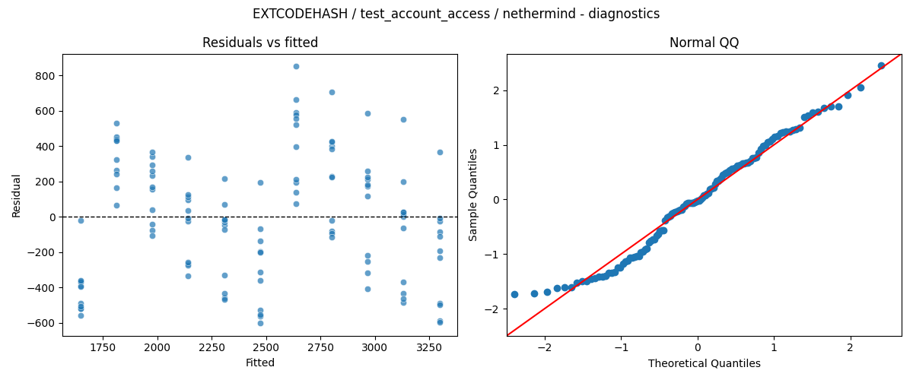

</details>

<details><summary>reth — NNLS regression summary</summary>

```
==============================================================================
                           NNLS Regression Results                            
==============================================================================
Dep. Variable:          test_runtime_ms              R-squared:          0.910
Model:                  NNLS                    Adj. R-squared:          0.910
No. Observations:       231                               RMSE:         235.61
Df Residuals:           229                                MAE:         140.15
Df Model:               1      
==============================================================================
                      coef     std err     P-value      [0.025      0.975]
------------------------------------------------------------------------------
         const    143.1467     66.7426       0.020      4.5080    266.6722
       opcount      0.0361      0.0011       0.001      0.0341      0.0382
==============================================================================
Notes: Non-negative least squares with bootstrap inference (1000 iterations)
==============================================================================
```

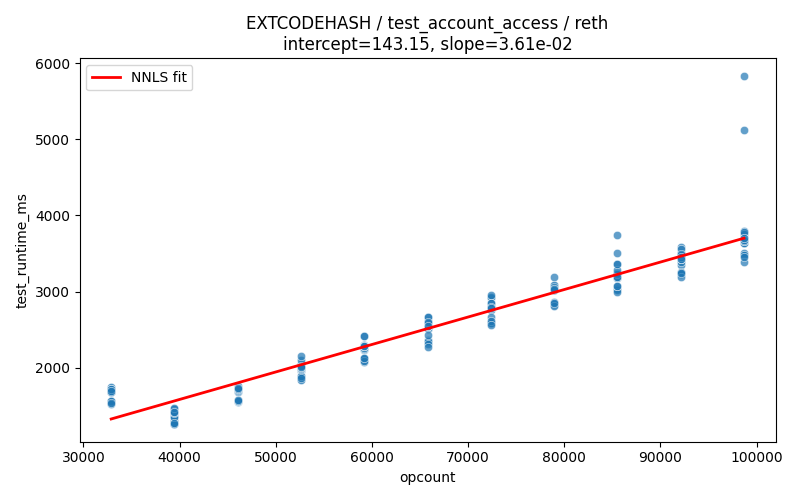

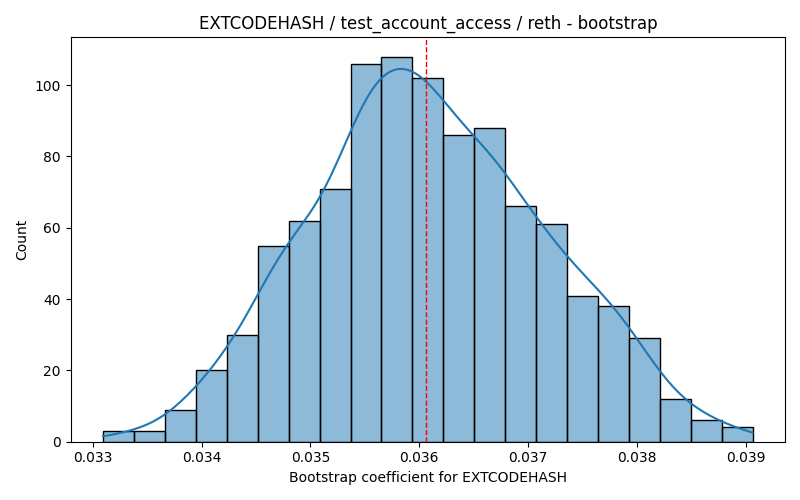

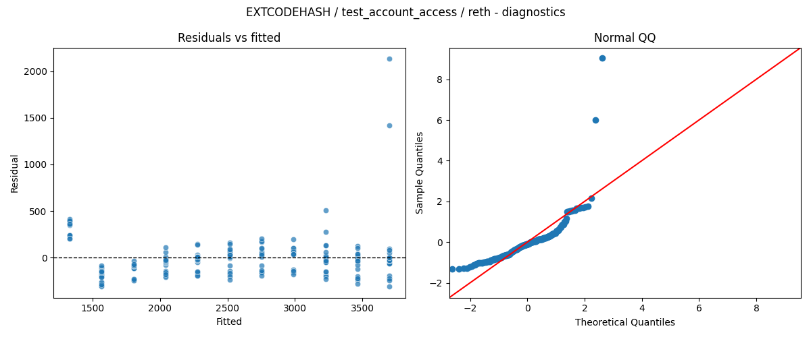

</details>

### test_account_access — combo `EXTCODEHASH_AccountMode.NON_EXISTING_ACCOUNT` — `presets[cold_account_code_access]`

| client | nobs | R² | target_coef (ms) | p-value | 95% CI |
| --- | --- | --- | --- | --- | --- |
| `besu` | 220 | 0.9062 | 0.009891 | 1.00e-03 | [0.009398, 0.01045] |
| `erigon` | 88 | 0.9977 | 0.008629 | 1.00e-03 | [0.008545, 0.008704] |
| `geth` | 143 | 0.7136 | 0.02726 | 1.00e-03 | [0.02427, 0.03039] |
| `nethermind` | 121 | 0.8574 | 0.004144 | 1.00e-03 | [0.003832, 0.004498] |
| `reth` | 231 | 0.9666 | 0.0008958 | 1.00e-03 | [0.0008757, 0.0009195] |

<details><summary>besu — NNLS regression summary</summary>

```
==============================================================================
                           NNLS Regression Results                            
==============================================================================
Dep. Variable:          test_runtime_ms              R-squared:          0.906
Model:                  NNLS                    Adj. R-squared:          0.906
No. Observations:       220                               RMSE:          76.07
Df Residuals:           218                                MAE:          61.53
Df Model:               1      
==============================================================================
                      coef     std err     P-value      [0.025      0.975]
------------------------------------------------------------------------------
         const    404.2965     21.6967       0.001    358.7082    444.4561
       opcount      0.0099      0.0003       0.001      0.0094      0.0104
==============================================================================
Notes: Non-negative least squares with bootstrap inference (1000 iterations)
==============================================================================
```


</details>

<details><summary>erigon — NNLS regression summary</summary>

```
==============================================================================
                           NNLS Regression Results                            
==============================================================================
Dep. Variable:          test_runtime_ms              R-squared:          0.998
Model:                  NNLS                    Adj. R-squared:          0.998
No. Observations:       88                                RMSE:           9.88
Df Residuals:           86                                 MAE:           8.20
Df Model:               1      
==============================================================================
                      coef     std err     P-value      [0.025      0.975]
------------------------------------------------------------------------------
         const      5.1417      3.3699       0.077      0.0000     11.7713
       opcount      0.0086      0.0000       0.001      0.0085      0.0087
==============================================================================
Notes: Non-negative least squares with bootstrap inference (1000 iterations)
==============================================================================
```


</details>

<details><summary>geth — NNLS regression summary</summary>

```
==============================================================================
                           NNLS Regression Results                            
==============================================================================
Dep. Variable:          test_runtime_ms              R-squared:          0.714
Model:                  NNLS                    Adj. R-squared:          0.712
No. Observations:       143                               RMSE:         412.73
Df Residuals:           141                                MAE:         338.70
Df Model:               1      
==============================================================================
                      coef     std err     P-value      [0.025      0.975]
------------------------------------------------------------------------------
         const   1099.2638    119.7706       0.001    859.7303   1340.5340
       opcount      0.0273      0.0015       0.001      0.0243      0.0304
==============================================================================
Notes: Non-negative least squares with bootstrap inference (1000 iterations)
==============================================================================
```


</details>

<details><summary>nethermind — NNLS regression summary</summary>

```
==============================================================================
                           NNLS Regression Results                            
==============================================================================
Dep. Variable:          test_runtime_ms              R-squared:          0.857
Model:                  NNLS                    Adj. R-squared:          0.856
No. Observations:       121                               RMSE:          40.39
Df Residuals:           119                                MAE:          27.79
Df Model:               1      
==============================================================================
                      coef     std err     P-value      [0.025      0.975]
------------------------------------------------------------------------------
         const     68.8887     10.8155       0.001     47.1846     89.9147
       opcount      0.0041      0.0002       0.001      0.0038      0.0045
==============================================================================
Notes: Non-negative least squares with bootstrap inference (1000 iterations)
==============================================================================
```


</details>

<details><summary>reth — NNLS regression summary</summary>

```
==============================================================================
                           NNLS Regression Results                            
==============================================================================
Dep. Variable:          test_runtime_ms              R-squared:          0.967
Model:                  NNLS                    Adj. R-squared:          0.966
No. Observations:       231                               RMSE:           3.98
Df Residuals:           229                                MAE:           3.19
Df Model:               1      
==============================================================================
                      coef     std err     P-value      [0.025      0.975]
------------------------------------------------------------------------------
         const     33.3011      0.8975       0.001     31.4536     34.9401
       opcount      0.0009      0.0000       0.001      0.0009      0.0009
==============================================================================
Notes: Non-negative least squares with bootstrap inference (1000 iterations)
==============================================================================
```


</details>

### test_ext_account_query_warm — combo `EXTCODEHASH`

| client | nobs | R² | target_coef (ms) | p-value | 95% CI |
| --- | --- | --- | --- | --- | --- |
| `besu` | 220 | 0.8222 | 0.0001831 | 1.00e-03 | [0.0001716, 0.0001937] |
| `erigon` | 88 | 0.9467 | 0.0002454 | 1.00e-03 | [0.0002352, 0.000255] |
| `geth` | 143 | 0.8223 | 4.115e-05 | 1.00e-03 | [3.768e-05, 4.465e-05] |
| `nethermind` | 121 | 0.7717 | 0.0002919 | 1.00e-03 | [0.0002643, 0.0003208] |
| `reth` | 231 | 0.6699 | 8.214e-06 | 1.00e-03 | [7.634e-06, 8.873e-06] |

<details><summary>besu — NNLS regression summary</summary>

```
==============================================================================
                           NNLS Regression Results                            
==============================================================================
Dep. Variable:          test_runtime_ms              R-squared:          0.822
Model:                  NNLS                    Adj. R-squared:          0.821
No. Observations:       220                               RMSE:          49.80
Df Residuals:           218                                MAE:          40.21
Df Model:               1      
==============================================================================
                      coef     std err     P-value      [0.025      0.975]
------------------------------------------------------------------------------
         const    132.4489     10.2022       0.001    112.9482    153.8552
       opcount      0.0002      0.0000       0.001      0.0002      0.0002
==============================================================================
Notes: Non-negative least squares with bootstrap inference (1000 iterations)
==============================================================================
```

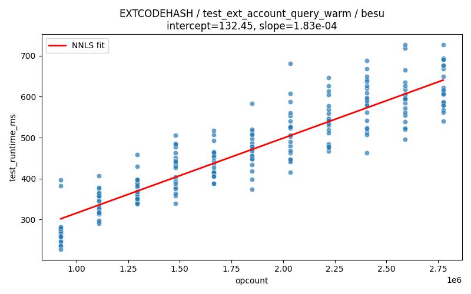

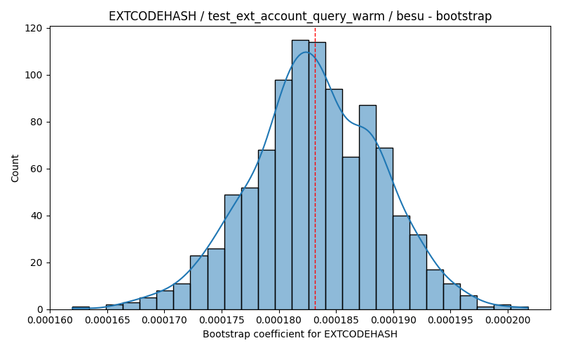

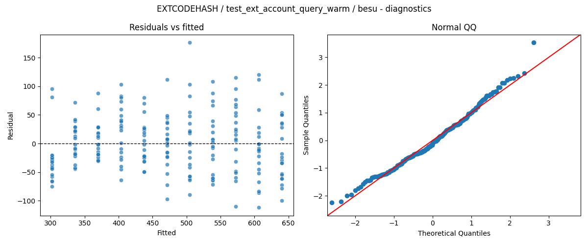

</details>

<details><summary>erigon — NNLS regression summary</summary>

```
==============================================================================
                           NNLS Regression Results                            
==============================================================================
Dep. Variable:          test_runtime_ms              R-squared:          0.947
Model:                  NNLS                    Adj. R-squared:          0.946
No. Observations:       88                                RMSE:          34.04
Df Residuals:           86                                 MAE:          25.62
Df Model:               1      
==============================================================================
                      coef     std err     P-value      [0.025      0.975]
------------------------------------------------------------------------------
         const     49.3656      9.1337       0.001     31.9454     67.6766
       opcount      0.0002      0.0000       0.001      0.0002      0.0003
==============================================================================
Notes: Non-negative least squares with bootstrap inference (1000 iterations)
==============================================================================
```

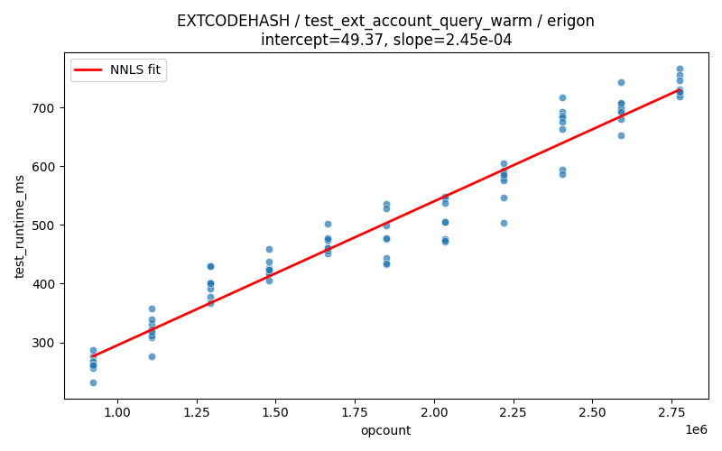

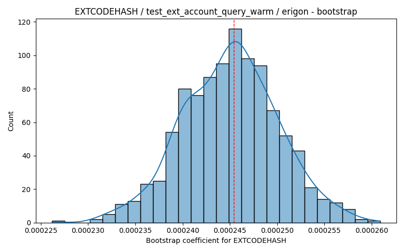

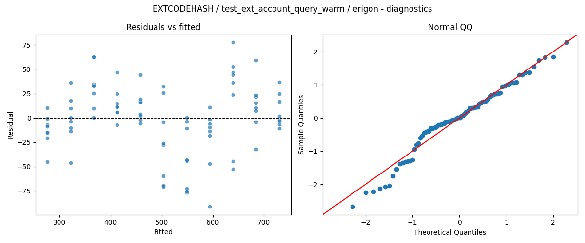

</details>

<details><summary>geth — NNLS regression summary</summary>

```
==============================================================================
                           NNLS Regression Results                            
==============================================================================
Dep. Variable:          test_runtime_ms              R-squared:          0.822
Model:                  NNLS                    Adj. R-squared:          0.821
No. Observations:       143                               RMSE:          11.19
Df Residuals:           141                                MAE:           7.79
Df Model:               1      
==============================================================================
                      coef     std err     P-value      [0.025      0.975]
------------------------------------------------------------------------------
         const     15.0885      2.8826       0.001      9.6053     20.6412
       opcount      0.0000      0.0000       0.001      0.0000      0.0000
==============================================================================
Notes: Non-negative least squares with bootstrap inference (1000 iterations)
==============================================================================
```

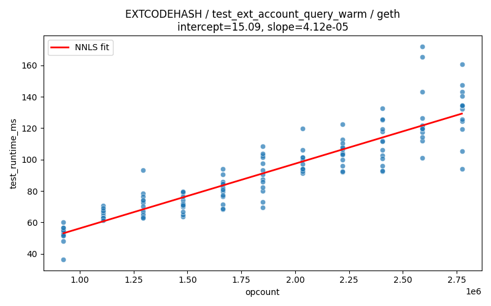

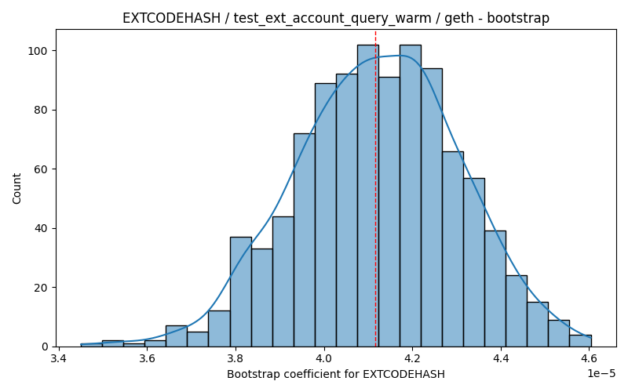

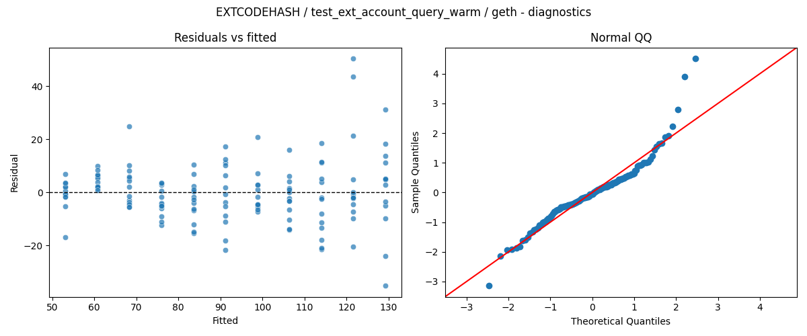

</details>

<details><summary>nethermind — NNLS regression summary</summary>

```
==============================================================================
                           NNLS Regression Results                            
==============================================================================
Dep. Variable:          test_runtime_ms              R-squared:          0.772
Model:                  NNLS                    Adj. R-squared:          0.770
No. Observations:       121                               RMSE:          92.84
Df Residuals:           119                                MAE:          68.99
Df Model:               1      
==============================================================================
                      coef     std err     P-value      [0.025      0.975]
------------------------------------------------------------------------------
         const    137.2419     23.3748       0.001     90.3395    181.3270
       opcount      0.0003      0.0000       0.001      0.0003      0.0003
==============================================================================
Notes: Non-negative least squares with bootstrap inference (1000 iterations)
==============================================================================
```

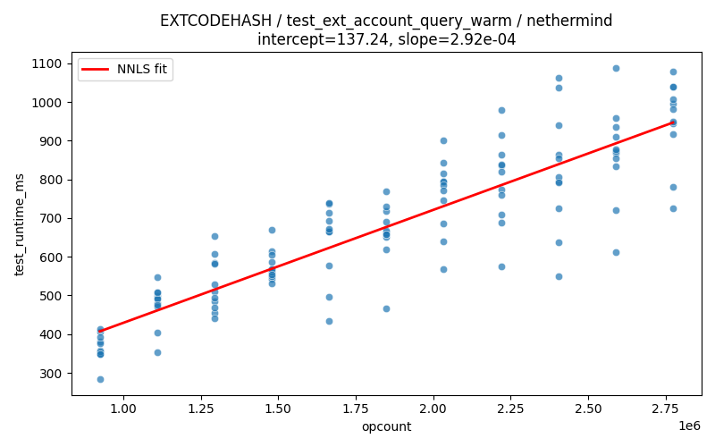

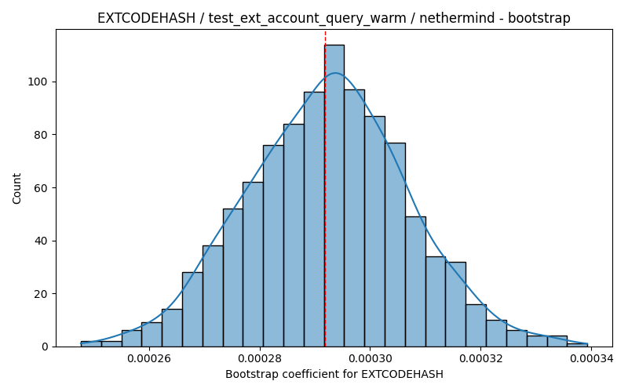

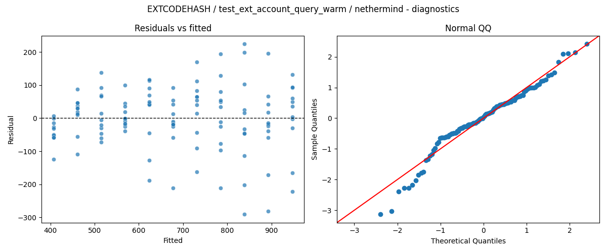

</details>

<details><summary>reth — NNLS regression summary</summary>

```
==============================================================================
                           NNLS Regression Results                            
==============================================================================
Dep. Variable:          test_runtime_ms              R-squared:          0.670
Model:                  NNLS                    Adj. R-squared:          0.668
No. Observations:       231                               RMSE:           3.37
Df Residuals:           229                                MAE:           2.30
Df Model:               1      
==============================================================================
                      coef     std err     P-value      [0.025      0.975]
------------------------------------------------------------------------------
         const      5.7508      0.5823       0.001      4.5598      6.8624
       opcount      0.0000      0.0000       0.001      0.0000      0.0000
==============================================================================
Notes: Non-negative least squares with bootstrap inference (1000 iterations)
==============================================================================
```

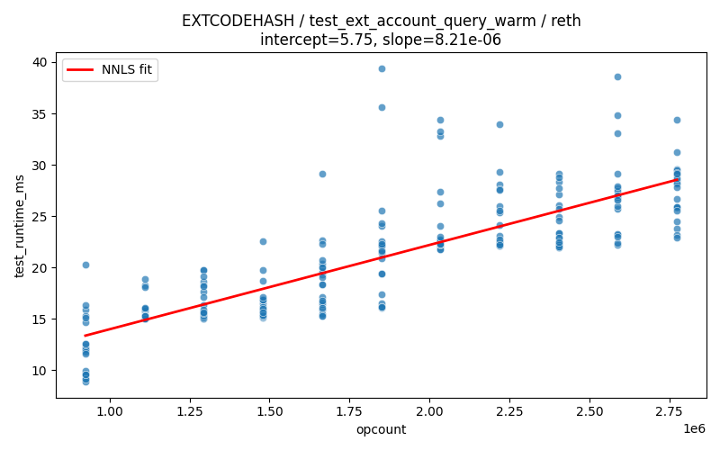

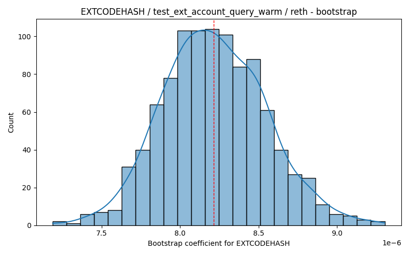

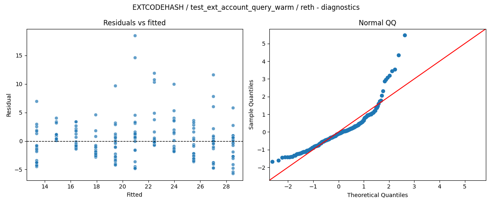

</details>

## EXTCODESIZE

### test_account_access — combo `EXTCODESIZE_AccountMode.NON_EXISTING_ACCOUNT` — `presets[cold_account_nocode_access]`

| client | nobs | R² | target_coef (ms) | p-value | 95% CI |
| --- | --- | --- | --- | --- | --- |
| `besu` | 220 | 0.8944 | 0.009856 | 1.00e-03 | [0.009381, 0.01034] |
| `erigon` | 88 | 0.9981 | 0.008844 | 1.00e-03 | [0.00876, 0.008928] |
| `geth` | 143 | 0.6871 | 0.02754 | 1.00e-03 | [0.02438, 0.03081] |
| `nethermind` | 121 | 0.8798 | 0.004087 | 1.00e-03 | [0.003816, 0.004367] |
| `reth` | 231 | 0.9734 | 0.0009174 | 1.00e-03 | [0.0008974, 0.0009386] |

<details><summary>besu — NNLS regression summary</summary>

```
==============================================================================
                           NNLS Regression Results                            
==============================================================================
Dep. Variable:          test_runtime_ms              R-squared:          0.894
Model:                  NNLS                    Adj. R-squared:          0.894
No. Observations:       220                               RMSE:          80.93
Df Residuals:           218                                MAE:          65.78
Df Model:               1      
==============================================================================
                      coef     std err     P-value      [0.025      0.975]
------------------------------------------------------------------------------
         const    404.6832     22.0181       0.001    362.0960    445.8926
       opcount      0.0099      0.0003       0.001      0.0094      0.0103
==============================================================================
Notes: Non-negative least squares with bootstrap inference (1000 iterations)
==============================================================================
```

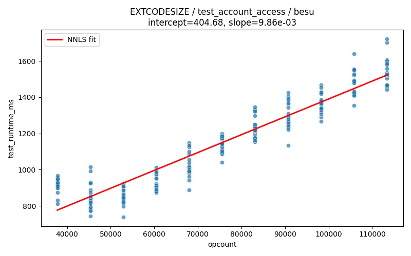

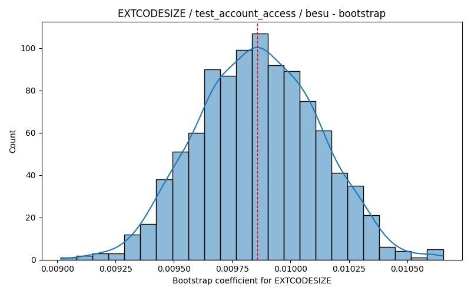

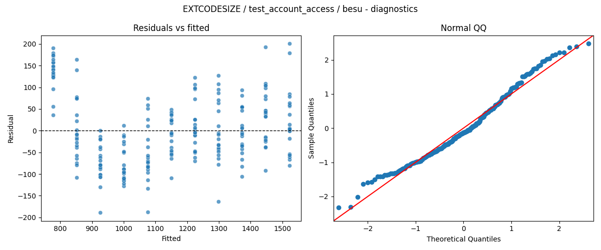

</details>

<details><summary>erigon — NNLS regression summary</summary>

```
==============================================================================
                           NNLS Regression Results                            
==============================================================================
Dep. Variable:          test_runtime_ms              R-squared:          0.998
Model:                  NNLS                    Adj. R-squared:          0.998
No. Observations:       88                                RMSE:           9.32
Df Residuals:           86                                 MAE:           7.71
Df Model:               1      
==============================================================================
                      coef     std err     P-value      [0.025      0.975]
------------------------------------------------------------------------------
         const      7.4762      3.4566       0.027      0.0000     13.8241
       opcount      0.0088      0.0000       0.001      0.0088      0.0089
==============================================================================
Notes: Non-negative least squares with bootstrap inference (1000 iterations)
==============================================================================
```


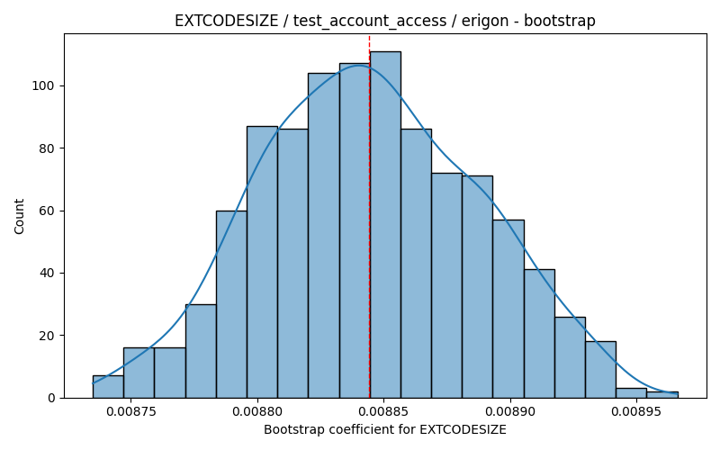

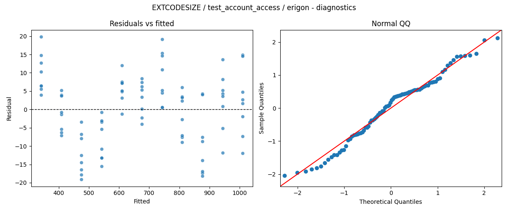

</details>

<details><summary>geth — NNLS regression summary</summary>

```
==============================================================================
                           NNLS Regression Results                            
==============================================================================
Dep. Variable:          test_runtime_ms              R-squared:          0.687
Model:                  NNLS                    Adj. R-squared:          0.685
No. Observations:       143                               RMSE:         444.16
Df Residuals:           141                                MAE:         365.21
Df Model:               1      
==============================================================================
                      coef     std err     P-value      [0.025      0.975]
------------------------------------------------------------------------------
         const   1062.8792    122.4620       0.001    831.8876   1308.8291
       opcount      0.0275      0.0016       0.001      0.0244      0.0308
==============================================================================
Notes: Non-negative least squares with bootstrap inference (1000 iterations)
==============================================================================
```

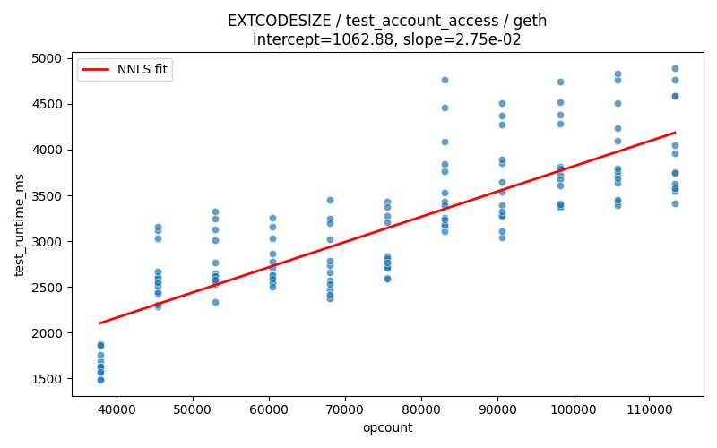

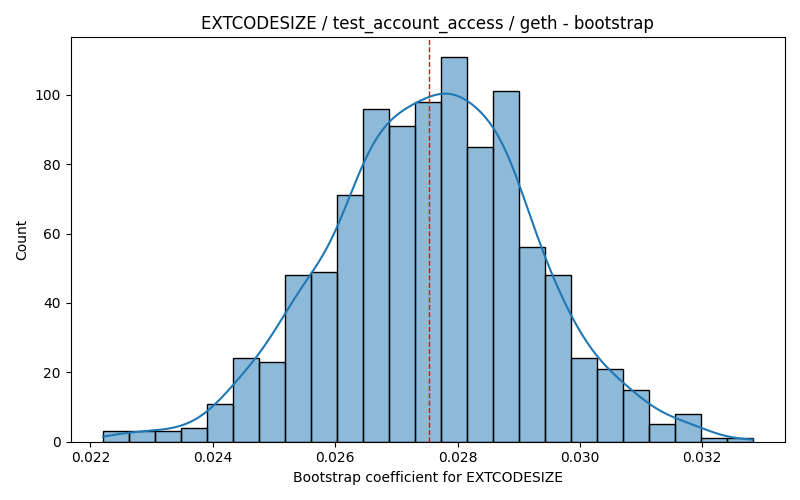

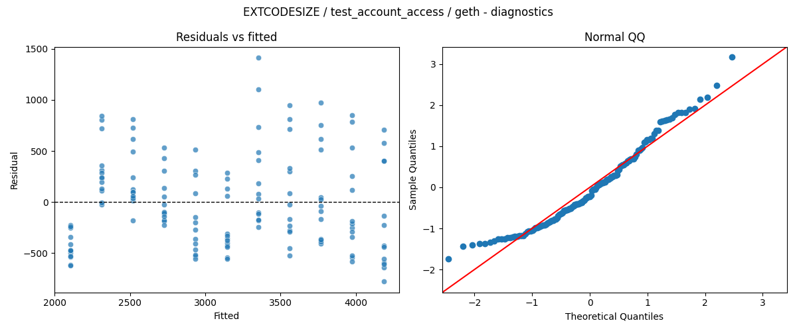

</details>

<details><summary>nethermind — NNLS regression summary</summary>

```
==============================================================================
                           NNLS Regression Results                            
==============================================================================
Dep. Variable:          test_runtime_ms              R-squared:          0.880
Model:                  NNLS                    Adj. R-squared:          0.879
No. Observations:       121                               RMSE:          36.11
Df Residuals:           119                                MAE:          26.76
Df Model:               1      
==============================================================================
                      coef     std err     P-value      [0.025      0.975]
------------------------------------------------------------------------------
         const     72.3869     10.0061       0.001     53.0111     91.9174
       opcount      0.0041      0.0001       0.001      0.0038      0.0044
==============================================================================
Notes: Non-negative least squares with bootstrap inference (1000 iterations)
==============================================================================
```

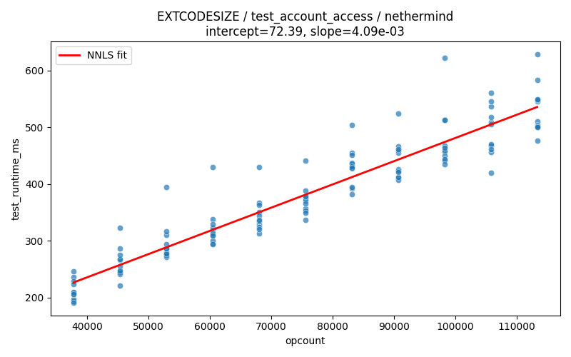

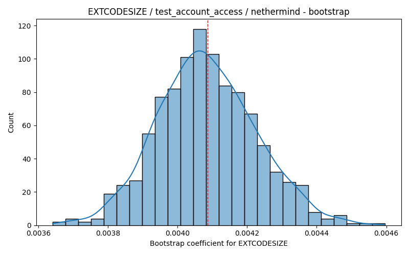

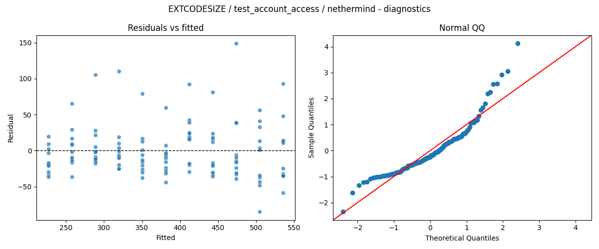

</details>

<details><summary>reth — NNLS regression summary</summary>

```
==============================================================================
                           NNLS Regression Results                            
==============================================================================
Dep. Variable:          test_runtime_ms              R-squared:          0.973
Model:                  NNLS                    Adj. R-squared:          0.973
No. Observations:       231                               RMSE:           3.62
Df Residuals:           229                                MAE:           2.87
Df Model:               1      
==============================================================================
                      coef     std err     P-value      [0.025      0.975]
------------------------------------------------------------------------------
         const     32.0384      0.7754       0.001     30.5309     33.6103
       opcount      0.0009      0.0000       0.001      0.0009      0.0009
==============================================================================
Notes: Non-negative least squares with bootstrap inference (1000 iterations)
==============================================================================
```

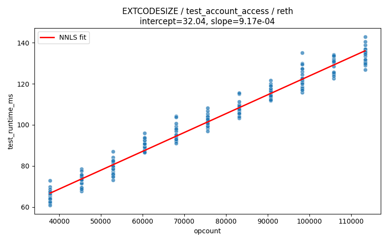

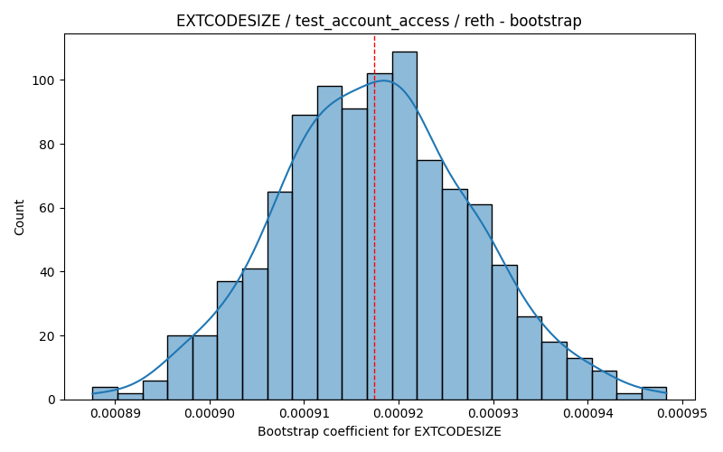

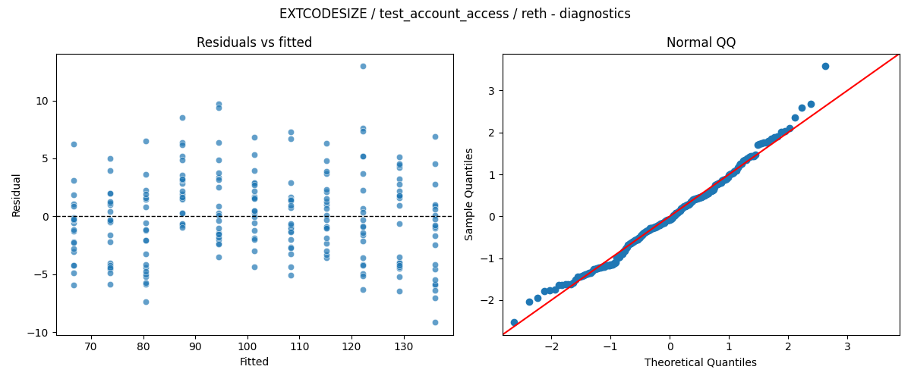

</details>

### test_account_access — combo `EXTCODESIZE_AccountMode.EXISTING_CONTRACT`

| client | nobs | R² | target_coef (ms) | p-value | 95% CI |
| --- | --- | --- | --- | --- | --- |
| `besu` | 220 | 0.9515 | 0.02661 | 1.00e-03 | [0.02575, 0.02746] |
| `erigon` | 88 | 0.8736 | 0.08515 | 1.00e-03 | [0.07813, 0.09143] |
| `geth` | 143 | 0.7288 | 0.02977 | 1.00e-03 | [0.02674, 0.03315] |
| `nethermind` | 121 | 0.7101 | 0.02501 | 1.00e-03 | [0.0222, 0.02784] |
| `reth` | 231 | 0.9242 | 0.03425 | 1.00e-03 | [0.0328, 0.03583] |

<details><summary>besu — NNLS regression summary</summary>

```
==============================================================================
                           NNLS Regression Results                            
==============================================================================
Dep. Variable:          test_runtime_ms              R-squared:          0.951
Model:                  NNLS                    Adj. R-squared:          0.951
No. Observations:       220                               RMSE:         125.03
Df Residuals:           218                                MAE:         101.93
Df Model:               1      
==============================================================================
                      coef     std err     P-value      [0.025      0.975]
------------------------------------------------------------------------------
         const    398.8820     32.3743       0.001    332.2905    457.7372
       opcount      0.0266      0.0004       0.001      0.0258      0.0275
==============================================================================
Notes: Non-negative least squares with bootstrap inference (1000 iterations)
==============================================================================
```

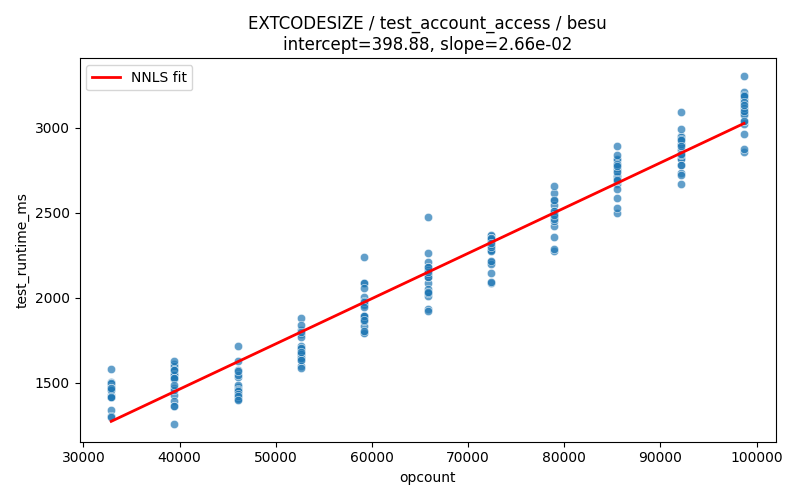

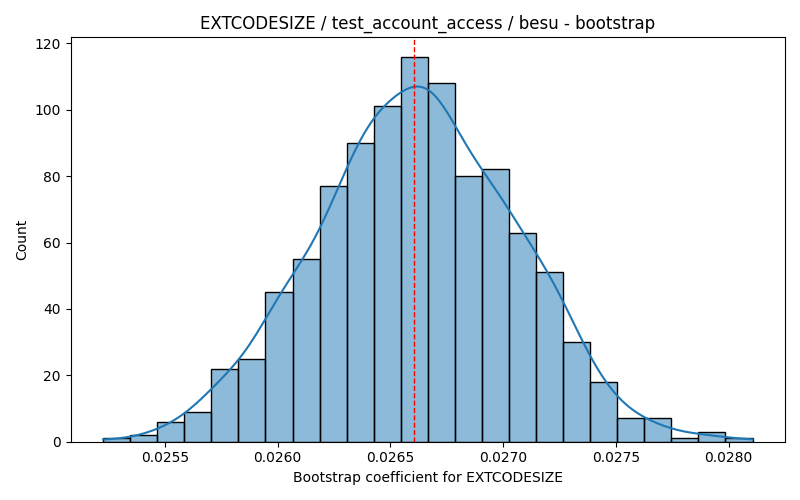

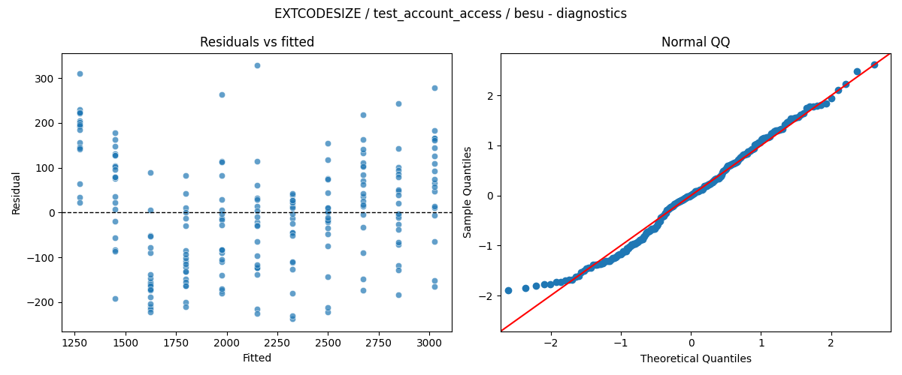

</details>

<details><summary>erigon — NNLS regression summary</summary>

```
==============================================================================
                           NNLS Regression Results                            
==============================================================================
Dep. Variable:          test_runtime_ms              R-squared:          0.874
Model:                  NNLS                    Adj. R-squared:          0.872
No. Observations:       88                                RMSE:         673.96
Df Residuals:           86                                 MAE:         578.36
Df Model:               1      
==============================================================================
                      coef     std err     P-value      [0.025      0.975]
------------------------------------------------------------------------------
         const   1491.9898    260.5231       0.001   1010.1762   2034.5474
       opcount      0.0852      0.0034       0.001      0.0781      0.0914
==============================================================================
Notes: Non-negative least squares with bootstrap inference (1000 iterations)
==============================================================================
```

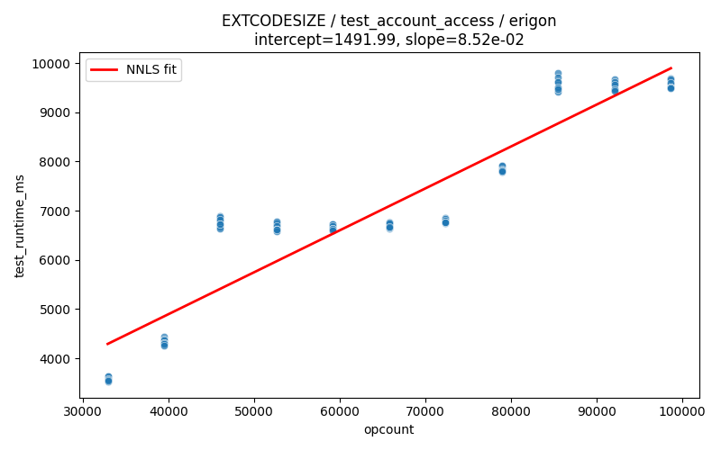

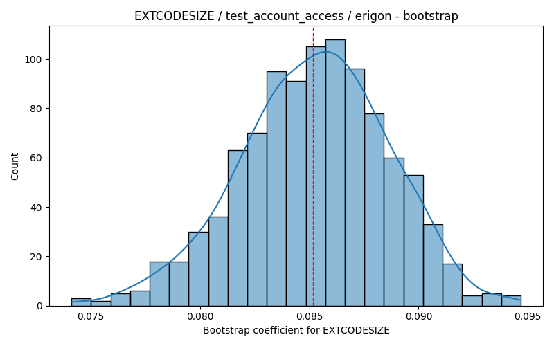

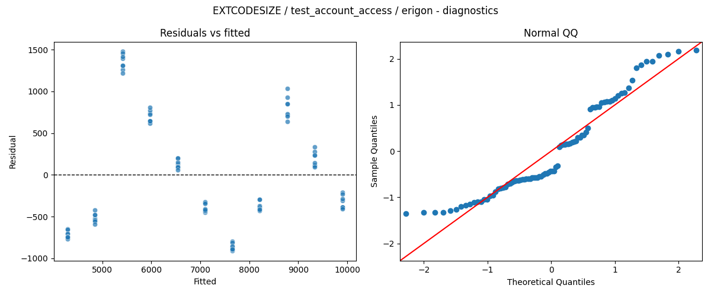

</details>

<details><summary>geth — NNLS regression summary</summary>

```
==============================================================================
                           NNLS Regression Results                            
==============================================================================
Dep. Variable:          test_runtime_ms              R-squared:          0.729
Model:                  NNLS                    Adj. R-squared:          0.727
No. Observations:       143                               RMSE:         377.76
Df Residuals:           141                                MAE:         309.50
Df Model:               1      
==============================================================================
                      coef     std err     P-value      [0.025      0.975]
------------------------------------------------------------------------------
         const    976.5748    111.4088       0.001    762.6670   1195.7109
       opcount      0.0298      0.0016       0.001      0.0267      0.0331
==============================================================================
Notes: Non-negative least squares with bootstrap inference (1000 iterations)
==============================================================================
```

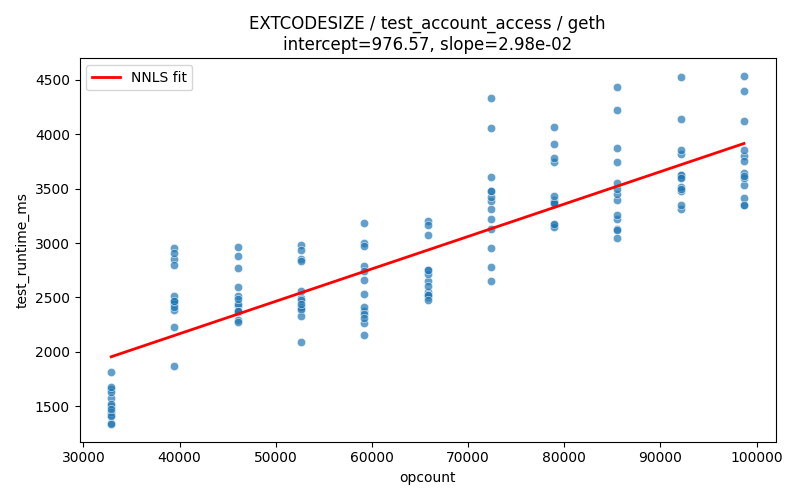

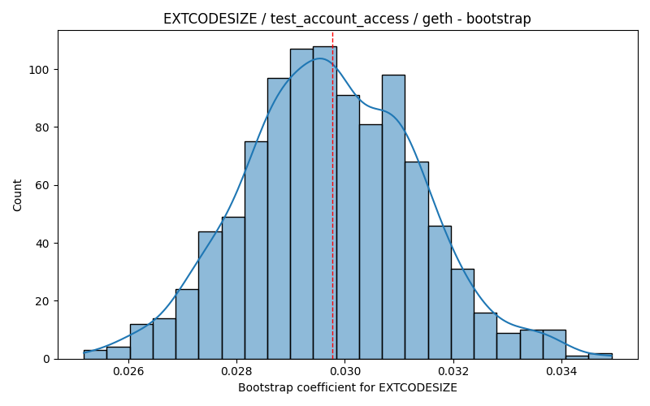

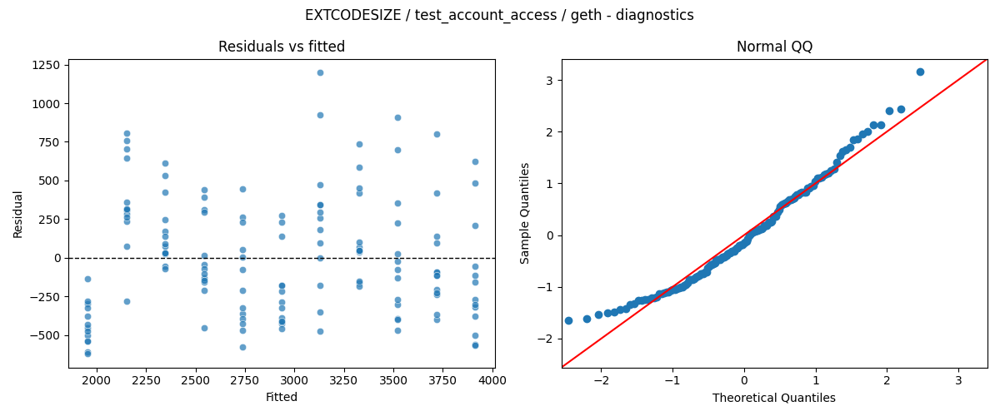

</details>

<details><summary>nethermind — NNLS regression summary</summary>

```
==============================================================================
                           NNLS Regression Results                            
==============================================================================
Dep. Variable:          test_runtime_ms              R-squared:          0.710
Model:                  NNLS                    Adj. R-squared:          0.708
No. Observations:       121                               RMSE:         332.46
Df Residuals:           119                                MAE:         273.59
Df Model:               1      
==============================================================================
                      coef     std err     P-value      [0.025      0.975]
------------------------------------------------------------------------------
         const    813.8322    101.1915       0.001    626.4912   1015.1970
       opcount      0.0250      0.0015       0.001      0.0222      0.0278
==============================================================================
Notes: Non-negative least squares with bootstrap inference (1000 iterations)
==============================================================================
```

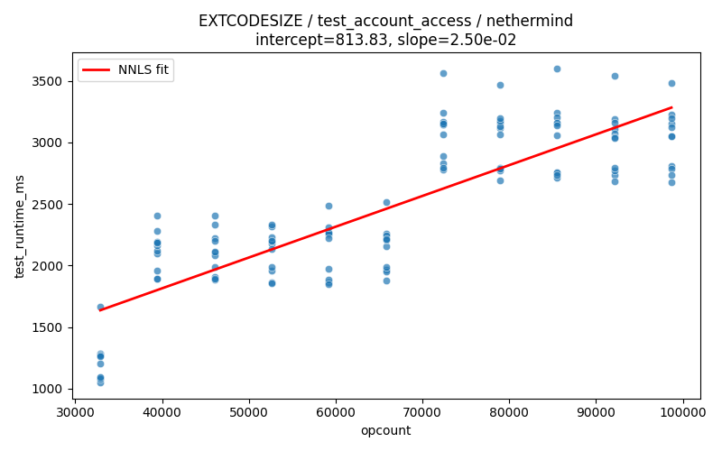

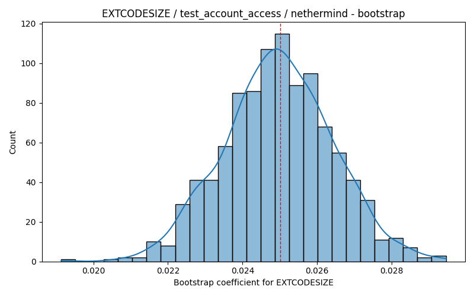

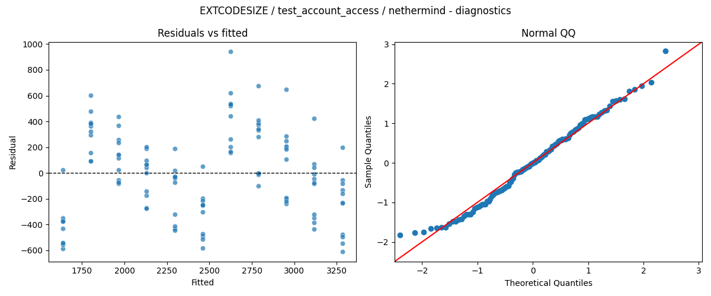

</details>

<details><summary>reth — NNLS regression summary</summary>

```
==============================================================================
                           NNLS Regression Results                            
==============================================================================
Dep. Variable:          test_runtime_ms              R-squared:          0.924
Model:                  NNLS                    Adj. R-squared:          0.924
No. Observations:       231                               RMSE:         204.11
Df Residuals:           229                                MAE:         135.80
Df Model:               1      
==============================================================================
                      coef     std err     P-value      [0.025      0.975]
------------------------------------------------------------------------------
         const    262.3365     58.5127       0.001    147.2206    372.9756
       opcount      0.0343      0.0008       0.001      0.0328      0.0358
==============================================================================
Notes: Non-negative least squares with bootstrap inference (1000 iterations)
==============================================================================
```

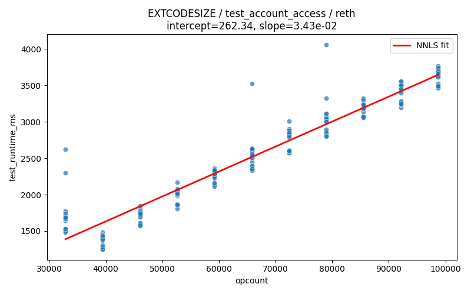

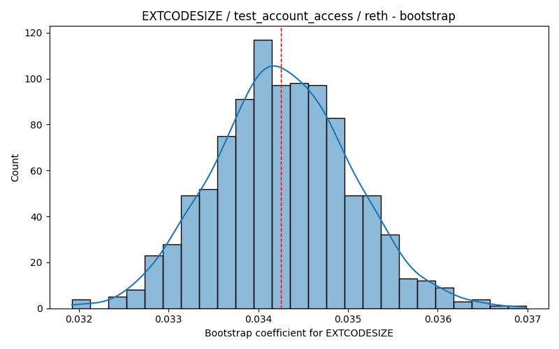

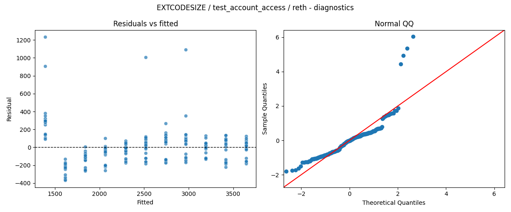

</details>

### test_account_access — combo `EXTCODESIZE_AccountMode.NON_EXISTING_ACCOUNT` — `presets[cold_account_code_access]`

| client | nobs | R² | target_coef (ms) | p-value | 95% CI |
| --- | --- | --- | --- | --- | --- |
| `besu` | 220 | 0.8944 | 0.009856 | 1.00e-03 | [0.009381, 0.01034] |
| `erigon` | 88 | 0.9981 | 0.008844 | 1.00e-03 | [0.00876, 0.008928] |
| `geth` | 143 | 0.6871 | 0.02754 | 1.00e-03 | [0.02438, 0.03081] |
| `nethermind` | 121 | 0.8798 | 0.004087 | 1.00e-03 | [0.003816, 0.004367] |
| `reth` | 231 | 0.9734 | 0.0009174 | 1.00e-03 | [0.0008974, 0.0009386] |

<details><summary>besu — NNLS regression summary</summary>

```
==============================================================================
                           NNLS Regression Results                            
==============================================================================
Dep. Variable:          test_runtime_ms              R-squared:          0.894
Model:                  NNLS                    Adj. R-squared:          0.894
No. Observations:       220                               RMSE:          80.93
Df Residuals:           218                                MAE:          65.78
Df Model:               1      
==============================================================================
                      coef     std err     P-value      [0.025      0.975]
------------------------------------------------------------------------------
         const    404.6832     22.0181       0.001    362.0960    445.8926
       opcount      0.0099      0.0003       0.001      0.0094      0.0103
==============================================================================
Notes: Non-negative least squares with bootstrap inference (1000 iterations)
==============================================================================
```


</details>

<details><summary>erigon — NNLS regression summary</summary>

```
==============================================================================
                           NNLS Regression Results                            
==============================================================================
Dep. Variable:          test_runtime_ms              R-squared:          0.998
Model:                  NNLS                    Adj. R-squared:          0.998
No. Observations:       88                                RMSE:           9.32
Df Residuals:           86                                 MAE:           7.71
Df Model:               1      
==============================================================================
                      coef     std err     P-value      [0.025      0.975]
------------------------------------------------------------------------------
         const      7.4762      3.4566       0.027      0.0000     13.8241
       opcount      0.0088      0.0000       0.001      0.0088      0.0089
==============================================================================
Notes: Non-negative least squares with bootstrap inference (1000 iterations)
==============================================================================
```


</details>

<details><summary>geth — NNLS regression summary</summary>

```
==============================================================================
                           NNLS Regression Results                            
==============================================================================
Dep. Variable:          test_runtime_ms              R-squared:          0.687
Model:                  NNLS                    Adj. R-squared:          0.685
No. Observations:       143                               RMSE:         444.16
Df Residuals:           141                                MAE:         365.21
Df Model:               1      
==============================================================================
                      coef     std err     P-value      [0.025      0.975]
------------------------------------------------------------------------------
         const   1062.8792    122.4620       0.001    831.8876   1308.8291
       opcount      0.0275      0.0016       0.001      0.0244      0.0308
==============================================================================
Notes: Non-negative least squares with bootstrap inference (1000 iterations)
==============================================================================
```


</details>

<details><summary>nethermind — NNLS regression summary</summary>

```
==============================================================================
                           NNLS Regression Results                            
==============================================================================
Dep. Variable:          test_runtime_ms              R-squared:          0.880
Model:                  NNLS                    Adj. R-squared:          0.879
No. Observations:       121                               RMSE:          36.11
Df Residuals:           119                                MAE:          26.76
Df Model:               1      
==============================================================================
                      coef     std err     P-value      [0.025      0.975]
------------------------------------------------------------------------------
         const     72.3869     10.0061       0.001     53.0111     91.9174
       opcount      0.0041      0.0001       0.001      0.0038      0.0044
==============================================================================
Notes: Non-negative least squares with bootstrap inference (1000 iterations)
==============================================================================
```


</details>

<details><summary>reth — NNLS regression summary</summary>

```
==============================================================================
                           NNLS Regression Results                            
==============================================================================
Dep. Variable:          test_runtime_ms              R-squared:          0.973
Model:                  NNLS                    Adj. R-squared:          0.973
No. Observations:       231                               RMSE:           3.62
Df Residuals:           229                                MAE:           2.87
Df Model:               1      
==============================================================================
                      coef     std err     P-value      [0.025      0.975]
------------------------------------------------------------------------------
         const     32.0384      0.7754       0.001     30.5309     33.6103
       opcount      0.0009      0.0000       0.001      0.0009      0.0009
==============================================================================
Notes: Non-negative least squares with bootstrap inference (1000 iterations)
==============================================================================
```


</details>

### test_ext_account_query_warm — combo `EXTCODESIZE`

| client | nobs | R² | target_coef (ms) | p-value | 95% CI |
| --- | --- | --- | --- | --- | --- |
| `besu` | 220 | 0.8135 | 0.0001757 | 1.00e-03 | [0.0001656, 0.0001868] |
| `erigon` | 88 | 0.9113 | 4.433e-05 | 1.00e-03 | [4.116e-05, 4.794e-05] |
| `geth` | 143 | 0.8099 | 3.01e-05 | 1.00e-03 | [2.765e-05, 3.262e-05] |
| `nethermind` | 121 | 0.8187 | 0.0002035 | 1.00e-03 | [0.0001862, 0.0002216] |
| `reth` | 231 | 0.6789 | 5.592e-06 | 1.00e-03 | [5.034e-06, 6.137e-06] |

<details><summary>besu — NNLS regression summary</summary>

```
==============================================================================
                           NNLS Regression Results                            
==============================================================================
Dep. Variable:          test_runtime_ms              R-squared:          0.813
Model:                  NNLS                    Adj. R-squared:          0.813
No. Observations:       220                               RMSE:          49.19
Df Residuals:           218                                MAE:          39.04
Df Model:               1      
==============================================================================
                      coef     std err     P-value      [0.025      0.975]
------------------------------------------------------------------------------
         const    147.1876      9.7339       0.001    129.1594    166.0006
       opcount      0.0002      0.0000       0.001      0.0002      0.0002
==============================================================================
Notes: Non-negative least squares with bootstrap inference (1000 iterations)
==============================================================================
```

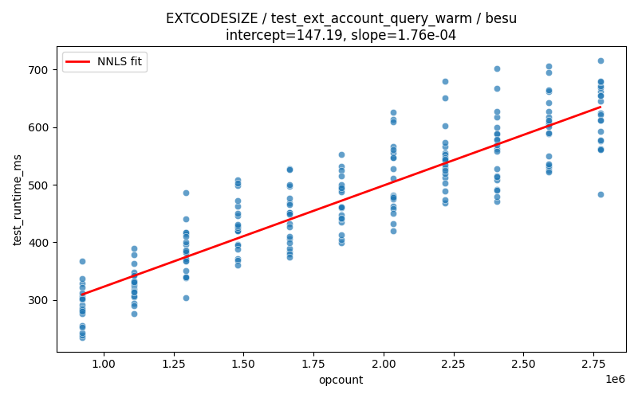

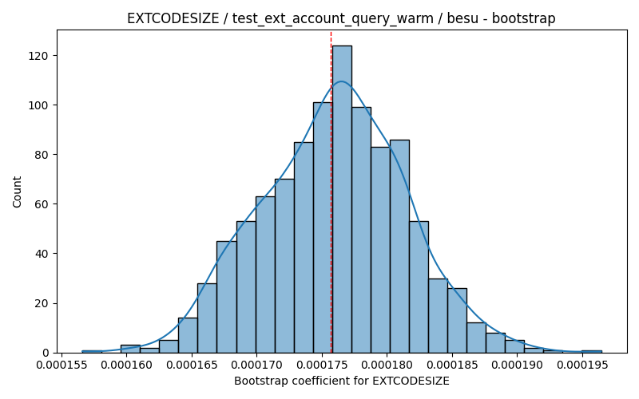

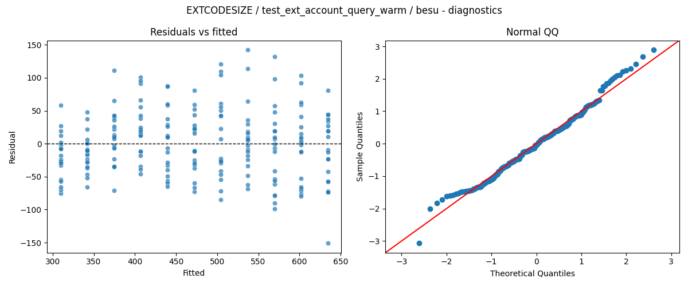

</details>

<details><summary>erigon — NNLS regression summary</summary>

```
==============================================================================
                           NNLS Regression Results                            
==============================================================================
Dep. Variable:          test_runtime_ms              R-squared:          0.911
Model:                  NNLS                    Adj. R-squared:          0.910
No. Observations:       88                                RMSE:           8.09
Df Residuals:           86                                 MAE:           5.76
Df Model:               1      
==============================================================================
                      coef     std err     P-value      [0.025      0.975]
------------------------------------------------------------------------------
         const     37.9348      2.8343       0.001     32.2102     43.3059
       opcount      0.0000      0.0000       0.001      0.0000      0.0000
==============================================================================
Notes: Non-negative least squares with bootstrap inference (1000 iterations)
==============================================================================
```

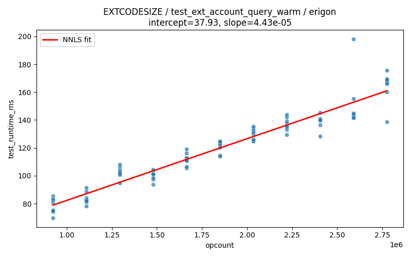

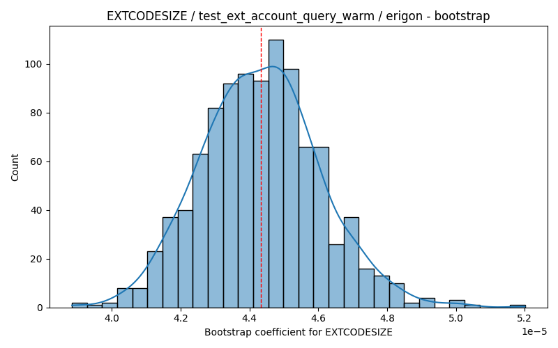

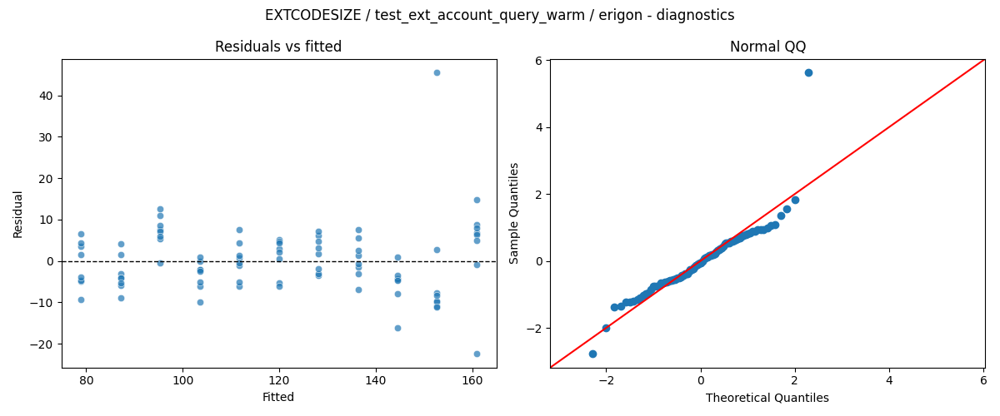

</details>

<details><summary>geth — NNLS regression summary</summary>

```
==============================================================================
                           NNLS Regression Results                            
==============================================================================
Dep. Variable:          test_runtime_ms              R-squared:          0.810
Model:                  NNLS                    Adj. R-squared:          0.809
No. Observations:       143                               RMSE:           8.53
Df Residuals:           141                                MAE:           6.37
Df Model:               1      
==============================================================================
                      coef     std err     P-value      [0.025      0.975]
------------------------------------------------------------------------------
         const     15.4571      2.1608       0.001     11.2480     19.5254
       opcount      0.0000      0.0000       0.001      0.0000      0.0000
==============================================================================
Notes: Non-negative least squares with bootstrap inference (1000 iterations)
==============================================================================
```

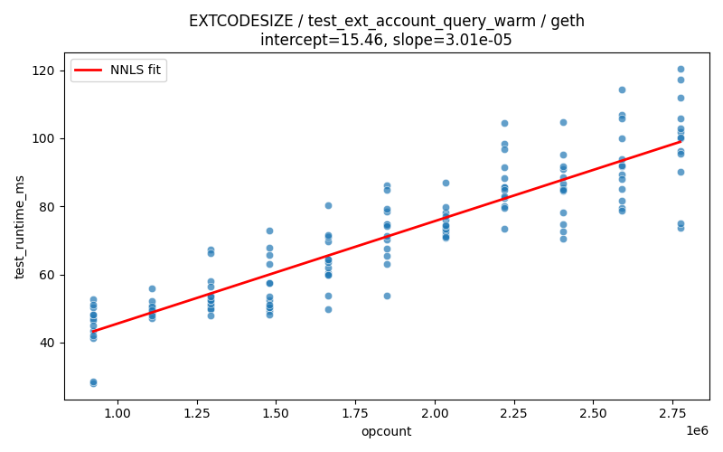

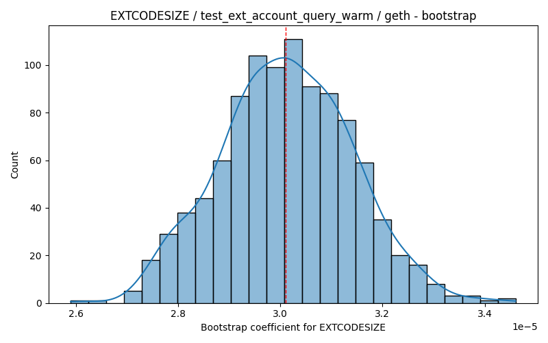

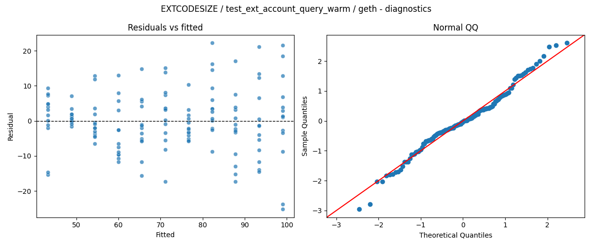

</details>

<details><summary>nethermind — NNLS regression summary</summary>

```
==============================================================================
                           NNLS Regression Results                            
==============================================================================
Dep. Variable:          test_runtime_ms              R-squared:          0.819
Model:                  NNLS                    Adj. R-squared:          0.817
No. Observations:       121                               RMSE:          56.00
Df Residuals:           119                                MAE:          43.46
Df Model:               1      
==============================================================================
                      coef     std err     P-value      [0.025      0.975]
------------------------------------------------------------------------------
         const    119.5933     15.6231       0.001     87.9079    150.0628
       opcount      0.0002      0.0000       0.001      0.0002      0.0002
==============================================================================
Notes: Non-negative least squares with bootstrap inference (1000 iterations)
==============================================================================
```

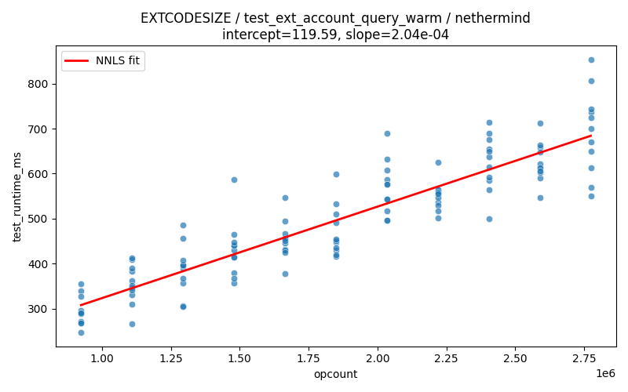

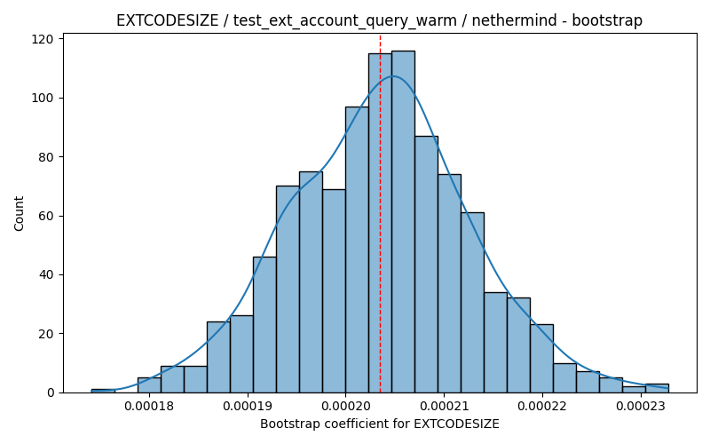

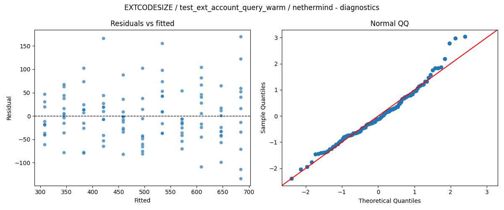

</details>

<details><summary>reth — NNLS regression summary</summary>

```
==============================================================================
                           NNLS Regression Results                            
==============================================================================
Dep. Variable:          test_runtime_ms              R-squared:          0.679
Model:                  NNLS                    Adj. R-squared:          0.678
No. Observations:       231                               RMSE:           2.25
Df Residuals:           229                                MAE:           1.65
Df Model:               1      
==============================================================================
                      coef     std err     P-value      [0.025      0.975]
------------------------------------------------------------------------------
         const      5.2257      0.5179       0.001      4.2392      6.1988
       opcount      0.0000      0.0000       0.001      0.0000      0.0000
==============================================================================
Notes: Non-negative least squares with bootstrap inference (1000 iterations)
==============================================================================
```

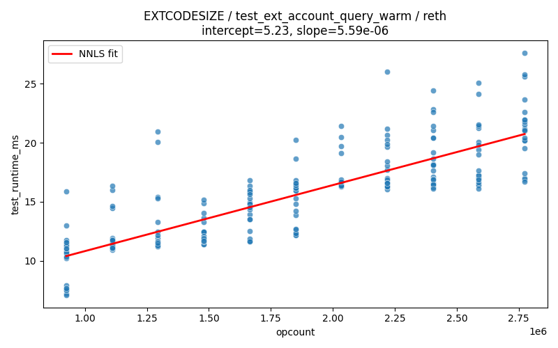

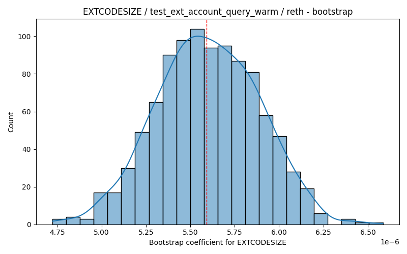

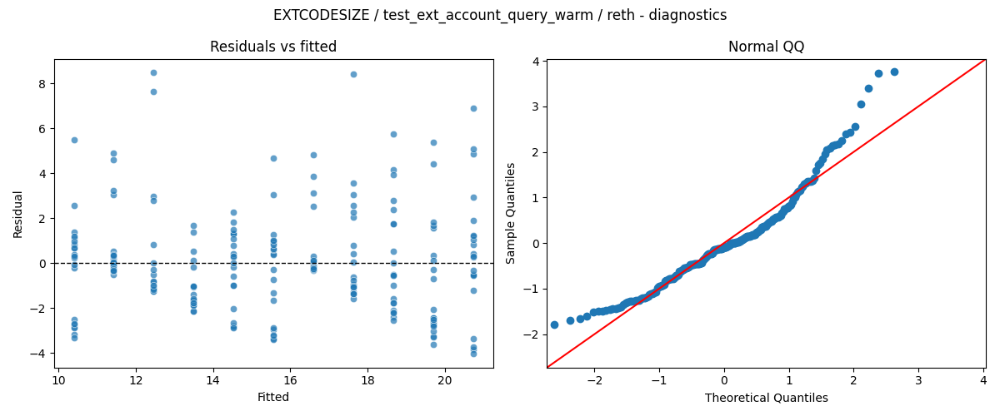

</details>

## STATICCALL

### test_account_access — combo `STATICCALL_AccountMode.EXISTING_EOA`

| client | nobs | R² | target_coef (ms) | p-value | 95% CI |
| --- | --- | --- | --- | --- | --- |
| `besu` | 220 | 0.8744 | 0.01146 | 1.00e-03 | [0.01075, 0.01215] |
| `erigon` | 88 | 0.9987 | 0.01032 | 1.00e-03 | [0.01025, 0.01039] |
| `geth` | 143 | 0.869 | 0.01429 | 1.00e-03 | [0.01346, 0.01522] |
| `nethermind` | 121 | 0.8508 | 0.004616 | 1.00e-03 | [0.004287, 0.004936] |
| `reth` | 231 | 0.9748 | 0.001134 | 1.00e-03 | [0.001114, 0.00116] |

<details><summary>besu — NNLS regression summary</summary>

```
==============================================================================
                           NNLS Regression Results                            
==============================================================================
Dep. Variable:          test_runtime_ms              R-squared:          0.874
Model:                  NNLS                    Adj. R-squared:          0.874
No. Observations:       220                               RMSE:         103.25
Df Residuals:           218                                MAE:          80.45
Df Model:               1      
==============================================================================
                      coef     std err     P-value      [0.025      0.975]
------------------------------------------------------------------------------
         const    523.5586     30.5603       0.001    463.7908    582.6077
       opcount      0.0115      0.0004       0.001      0.0108      0.0122
==============================================================================
Notes: Non-negative least squares with bootstrap inference (1000 iterations)
==============================================================================
```

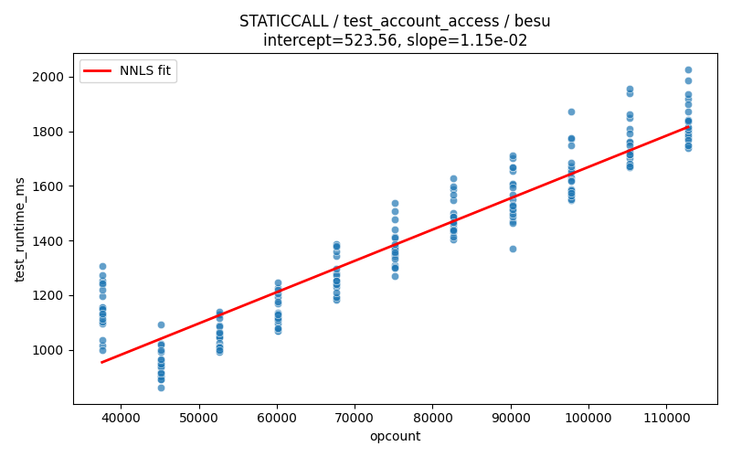

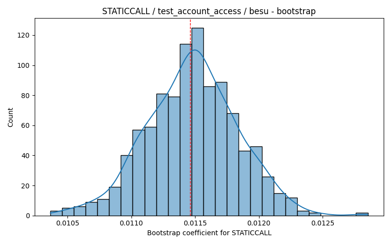

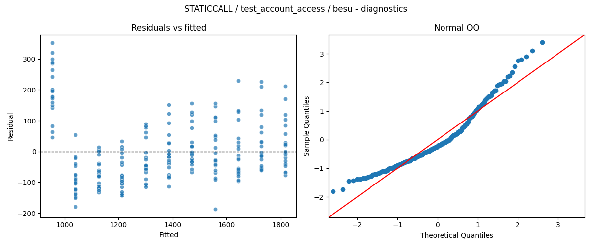

</details>

<details><summary>erigon — NNLS regression summary</summary>

```
==============================================================================
                           NNLS Regression Results                            
==============================================================================
Dep. Variable:          test_runtime_ms              R-squared:          0.999
Model:                  NNLS                    Adj. R-squared:          0.999
No. Observations:       88                                RMSE:           8.84
Df Residuals:           86                                 MAE:           7.20
Df Model:               1      
==============================================================================
                      coef     std err     P-value      [0.025      0.975]
------------------------------------------------------------------------------
         const     35.0884      2.6861       0.001     29.5157     39.9840
       opcount      0.0103      0.0000       0.001      0.0102      0.0104
==============================================================================
Notes: Non-negative least squares with bootstrap inference (1000 iterations)
==============================================================================
```


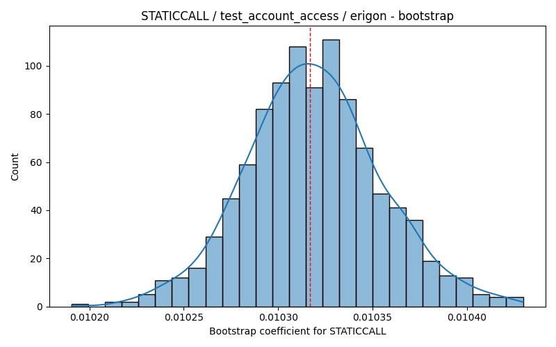

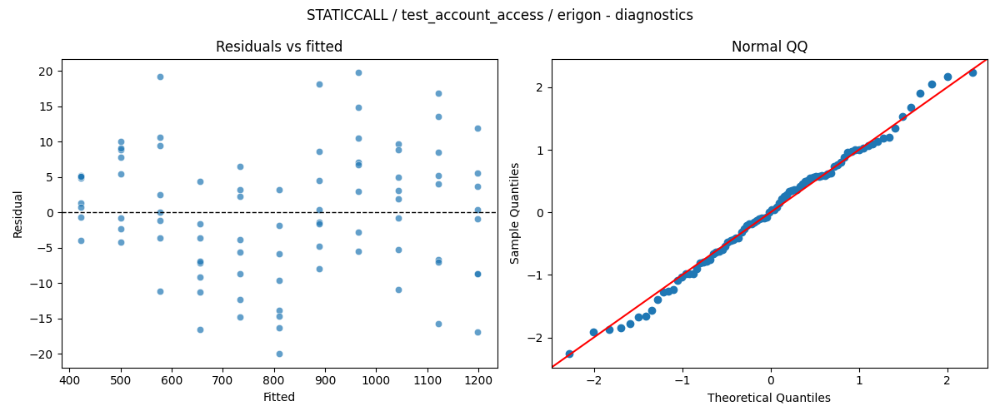

</details>

<details><summary>geth — NNLS regression summary</summary>

```
==============================================================================
                           NNLS Regression Results                            
==============================================================================
Dep. Variable:          test_runtime_ms              R-squared:          0.869
Model:                  NNLS                    Adj. R-squared:          0.868
No. Observations:       143                               RMSE:         131.94
Df Residuals:           141                                MAE:         102.98
Df Model:               1      
==============================================================================
                      coef     std err     P-value      [0.025      0.975]
------------------------------------------------------------------------------
         const    259.1226     33.1917       0.001    190.2408    322.1345
       opcount      0.0143      0.0004       0.001      0.0135      0.0152
==============================================================================
Notes: Non-negative least squares with bootstrap inference (1000 iterations)
==============================================================================
```

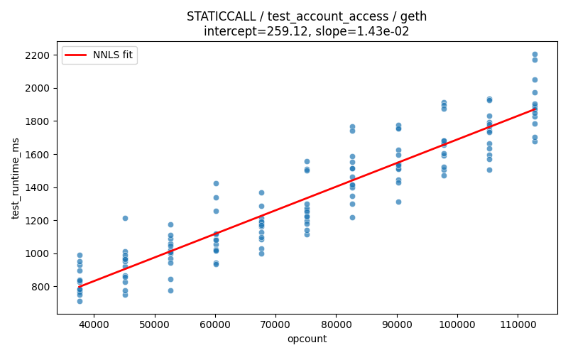

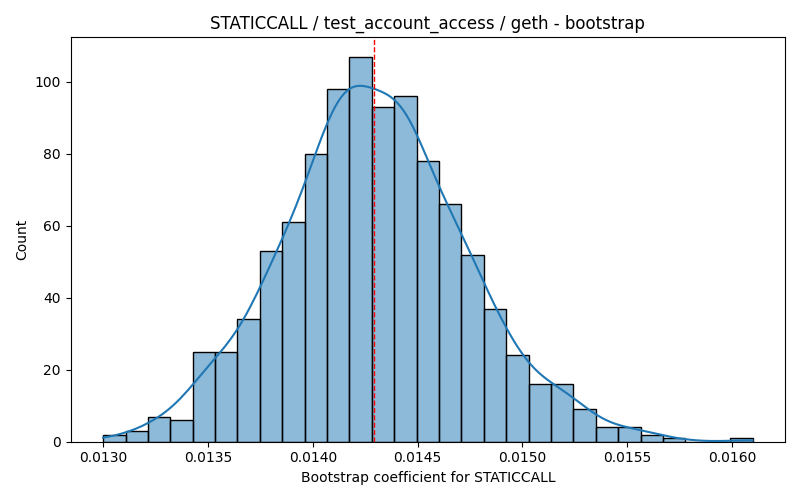

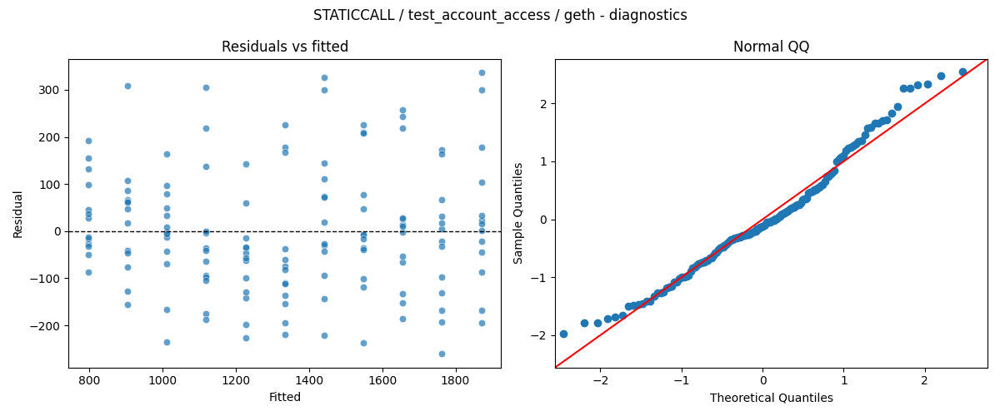

</details>

<details><summary>nethermind — NNLS regression summary</summary>

```
==============================================================================
                           NNLS Regression Results                            
==============================================================================
Dep. Variable:          test_runtime_ms              R-squared:          0.851
Model:                  NNLS                    Adj. R-squared:          0.850
No. Observations:       121                               RMSE:          45.96
Df Residuals:           119                                MAE:          36.06
Df Model:               1      
==============================================================================
                      coef     std err     P-value      [0.025      0.975]
------------------------------------------------------------------------------
         const     93.0192     11.7432       0.001     69.3405    116.1841
       opcount      0.0046      0.0002       0.001      0.0043      0.0049
==============================================================================
Notes: Non-negative least squares with bootstrap inference (1000 iterations)
==============================================================================
```

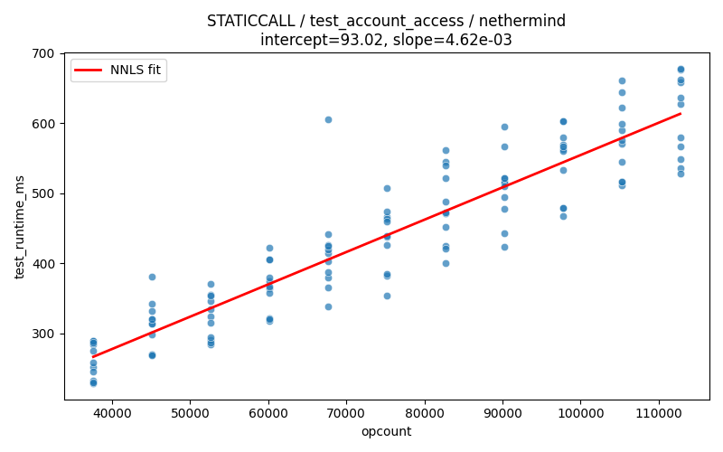

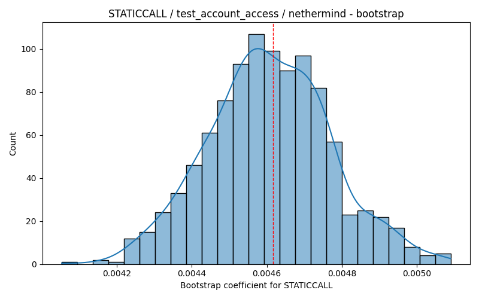

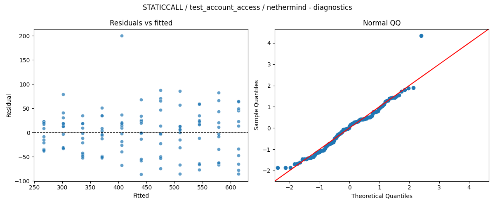

</details>

<details><summary>reth — NNLS regression summary</summary>

```
==============================================================================
                           NNLS Regression Results                            
==============================================================================
Dep. Variable:          test_runtime_ms              R-squared:          0.975
Model:                  NNLS                    Adj. R-squared:          0.975
No. Observations:       231                               RMSE:           4.34
Df Residuals:           229                                MAE:           3.42
Df Model:               1      
==============================================================================
                      coef     std err     P-value      [0.025      0.975]
------------------------------------------------------------------------------
         const     32.5095      0.9529       0.001     30.5202     34.1678
       opcount      0.0011      0.0000       0.001      0.0011      0.0012
==============================================================================
Notes: Non-negative least squares with bootstrap inference (1000 iterations)
==============================================================================
```

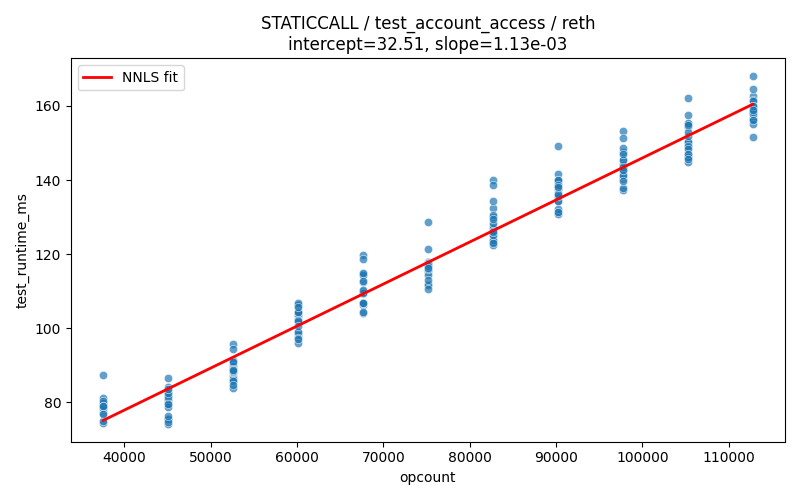

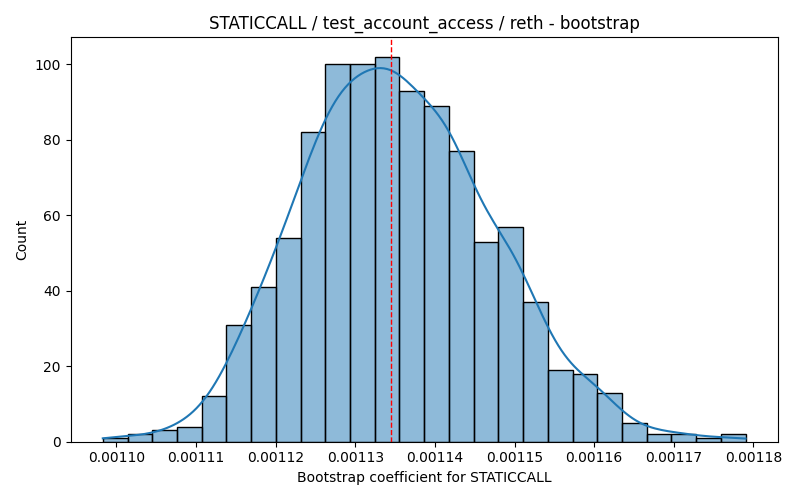

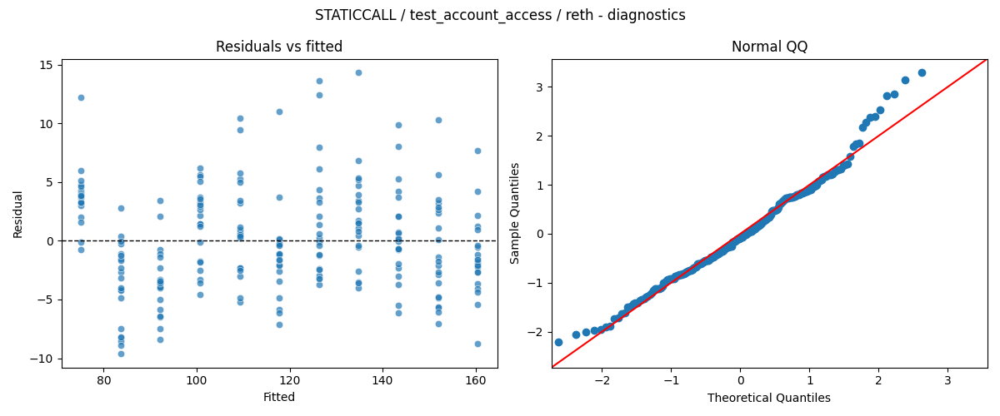

</details>

### test_account_access — combo `STATICCALL_AccountMode.NON_EXISTING_ACCOUNT` — `presets[cold_account_nocode_access]`

| client | nobs | R² | target_coef (ms) | p-value | 95% CI |
| --- | --- | --- | --- | --- | --- |
| `besu` | 220 | 0.9334 | 0.01238 | 1.00e-03 | [0.01192, 0.01287] |
| `erigon` | 88 | 0.9971 | 0.01173 | 1.00e-03 | [0.01167, 0.01178] |
| `geth` | 143 | 0.6982 | 0.02522 | 1.00e-03 | [0.02231, 0.02864] |
| `nethermind` | 121 | 0.8275 | 0.004556 | 1.00e-03 | [0.004193, 0.00494] |
| `reth` | 231 | 0.9701 | 0.0009735 | 1.00e-03 | [0.0009488, 0.0009959] |

<details><summary>besu — NNLS regression summary</summary>

```
==============================================================================
                           NNLS Regression Results                            
==============================================================================
Dep. Variable:          test_runtime_ms              R-squared:          0.933
Model:                  NNLS                    Adj. R-squared:          0.933
No. Observations:       220                               RMSE:          78.62
Df Residuals:           218                                MAE:          64.65
Df Model:               1      
==============================================================================
                      coef     std err     P-value      [0.025      0.975]
------------------------------------------------------------------------------
         const    408.7964     19.4810       0.001    369.7119    446.5795
       opcount      0.0124      0.0002       0.001      0.0119      0.0129
==============================================================================
Notes: Non-negative least squares with bootstrap inference (1000 iterations)
==============================================================================
```

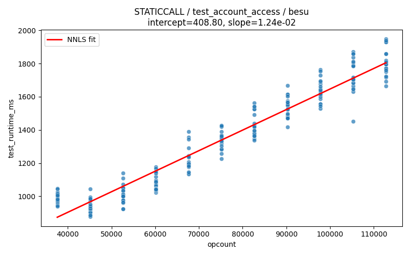

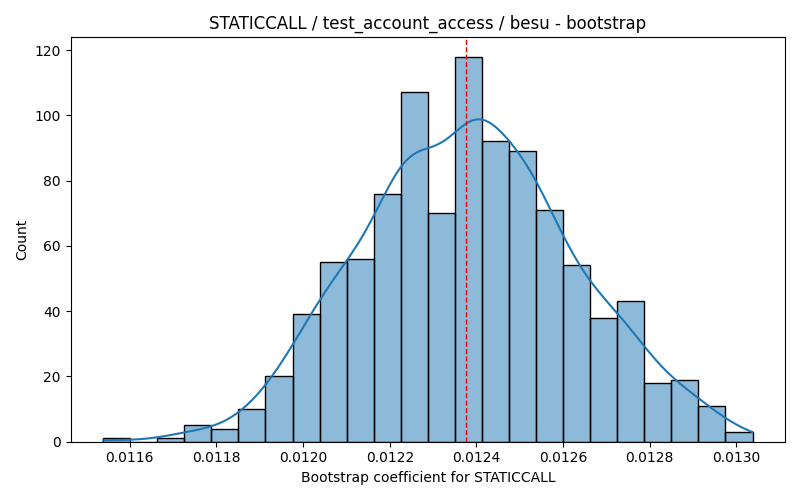

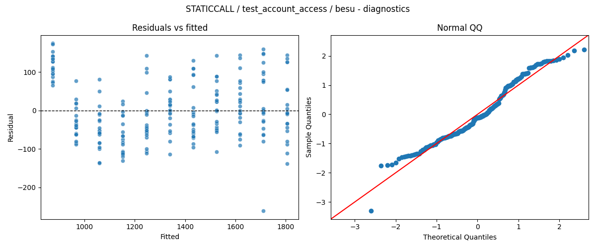

</details>

<details><summary>erigon — NNLS regression summary</summary>

```
==============================================================================
                           NNLS Regression Results                            
==============================================================================
Dep. Variable:          test_runtime_ms              R-squared:          0.997
Model:                  NNLS                    Adj. R-squared:          0.997
No. Observations:       88                                RMSE:          15.14
Df Residuals:           86                                 MAE:          12.21
Df Model:               1      
==============================================================================
                      coef     std err     P-value      [0.025      0.975]
------------------------------------------------------------------------------
         const      0.0000      0.5671       1.000      0.0000      1.4799
       opcount      0.0117      0.0000       0.001      0.0117      0.0118
==============================================================================
Notes: Non-negative least squares with bootstrap inference (1000 iterations)
==============================================================================
```


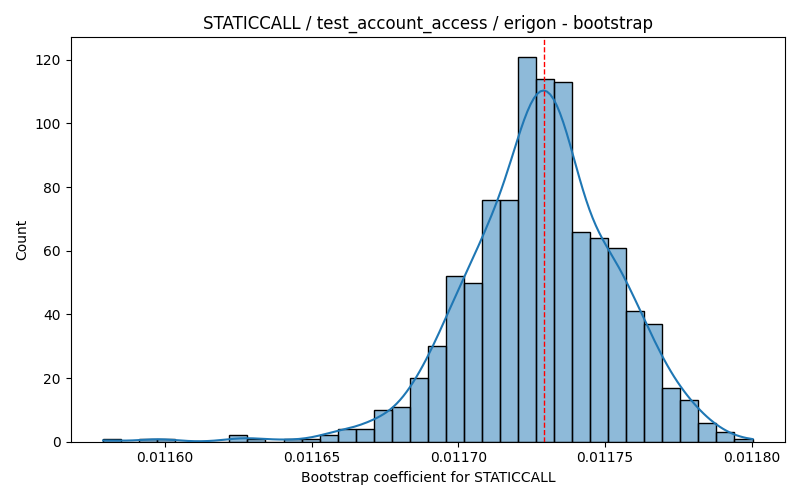

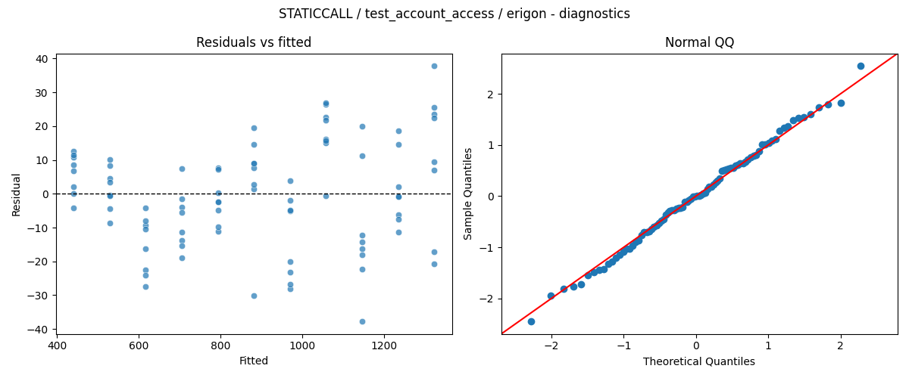

</details>

<details><summary>geth — NNLS regression summary</summary>

```
==============================================================================
                           NNLS Regression Results                            
==============================================================================
Dep. Variable:          test_runtime_ms              R-squared:          0.698
Model:                  NNLS                    Adj. R-squared:          0.696
No. Observations:       143                               RMSE:         394.28
Df Residuals:           141                                MAE:         318.34
Df Model:               1      
==============================================================================
                      coef     std err     P-value      [0.025      0.975]
------------------------------------------------------------------------------
         const   1250.2171    127.5241       0.001    995.3896   1485.0057
       opcount      0.0252      0.0016       0.001      0.0223      0.0286
==============================================================================
Notes: Non-negative least squares with bootstrap inference (1000 iterations)
==============================================================================
```

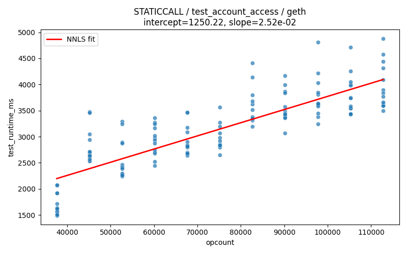

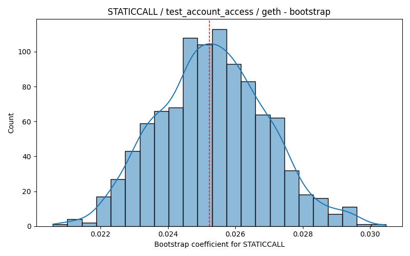

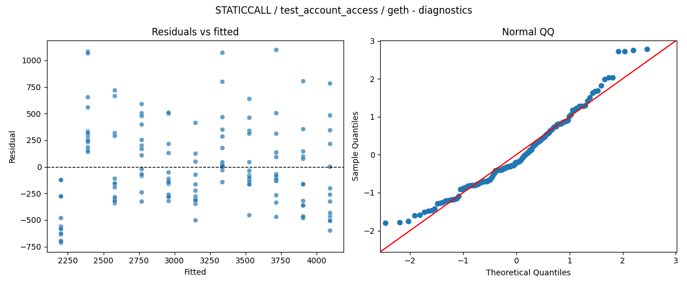

</details>

<details><summary>nethermind — NNLS regression summary</summary>

```
==============================================================================
                           NNLS Regression Results                            
==============================================================================
Dep. Variable:          test_runtime_ms              R-squared:          0.827
Model:                  NNLS                    Adj. R-squared:          0.826
No. Observations:       121                               RMSE:          49.45
Df Residuals:           119                                MAE:          39.65
Df Model:               1      
==============================================================================
                      coef     std err     P-value      [0.025      0.975]
------------------------------------------------------------------------------
         const    110.8511     14.0638       0.001     82.5396    139.1953
       opcount      0.0046      0.0002       0.001      0.0042      0.0049
==============================================================================
Notes: Non-negative least squares with bootstrap inference (1000 iterations)
==============================================================================
```

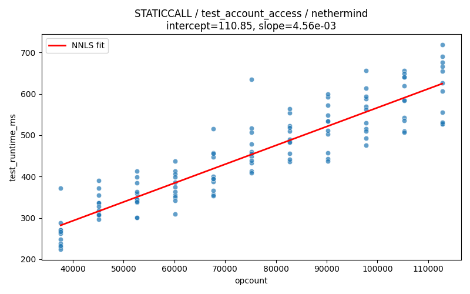

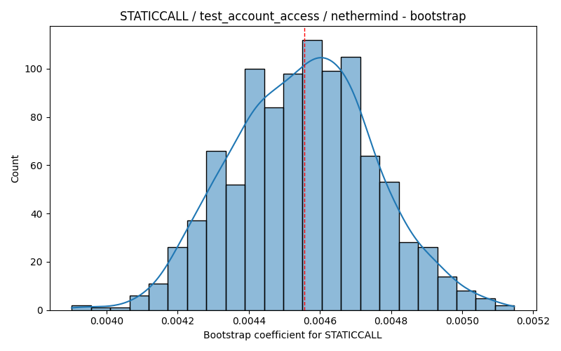

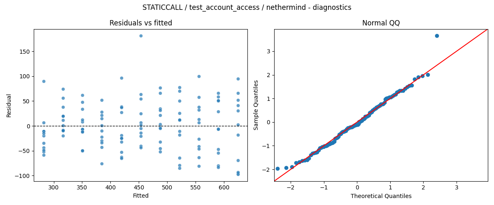

</details>

<details><summary>reth — NNLS regression summary</summary>

```
==============================================================================
                           NNLS Regression Results                            
==============================================================================
Dep. Variable:          test_runtime_ms              R-squared:          0.970
Model:                  NNLS                    Adj. R-squared:          0.970
No. Observations:       231                               RMSE:           4.06
Df Residuals:           229                                MAE:           3.28
Df Model:               1      
==============================================================================
                      coef     std err     P-value      [0.025      0.975]
------------------------------------------------------------------------------
         const     32.3511      0.9246       0.001     30.6575     34.2443
       opcount      0.0010      0.0000       0.001      0.0009      0.0010
==============================================================================
Notes: Non-negative least squares with bootstrap inference (1000 iterations)
==============================================================================
```

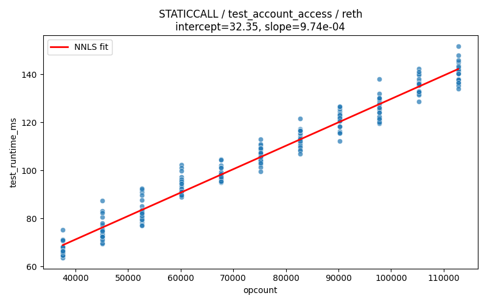

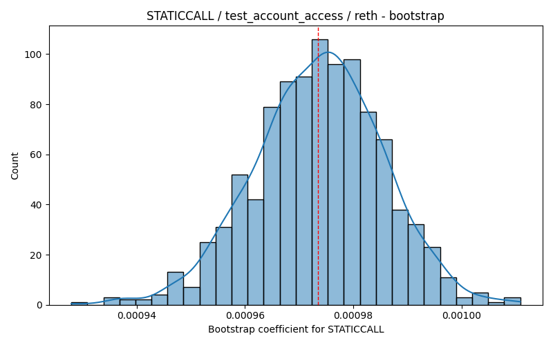

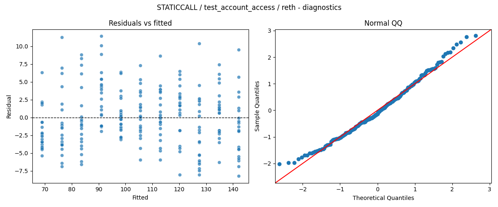

</details>

### test_account_access — combo `STATICCALL_AccountMode.EXISTING_CONTRACT`

| client | nobs | R² | target_coef (ms) | p-value | 95% CI |
| --- | --- | --- | --- | --- | --- |
| `besu` | 220 | 0.9497 | 0.02921 | 1.00e-03 | [0.02814, 0.03023] |
| `erigon` | 88 | 0.8778 | 0.08728 | 1.00e-03 | [0.08014, 0.09336] |
| `geth` | 143 | 0.7275 | 0.02997 | 1.00e-03 | [0.02684, 0.03324] |
| `nethermind` | 121 | 0.6895 | 0.02559 | 1.00e-03 | [0.02254, 0.02869] |
| `reth` | 231 | 0.8546 | 0.03654 | 1.00e-03 | [0.03423, 0.03903] |

<details><summary>besu — NNLS regression summary</summary>

```
==============================================================================
                           NNLS Regression Results                            
==============================================================================
Dep. Variable:          test_runtime_ms              R-squared:          0.950
Model:                  NNLS                    Adj. R-squared:          0.950
No. Observations:       220                               RMSE:         136.86
Df Residuals:           218                                MAE:         113.45
Df Model:               1      
==============================================================================
                      coef     std err     P-value      [0.025      0.975]
------------------------------------------------------------------------------
         const    385.3506     35.4028       0.001    315.1357    454.1788
       opcount      0.0292      0.0005       0.001      0.0281      0.0302
==============================================================================
Notes: Non-negative least squares with bootstrap inference (1000 iterations)
==============================================================================
```

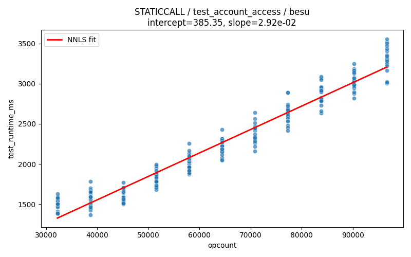

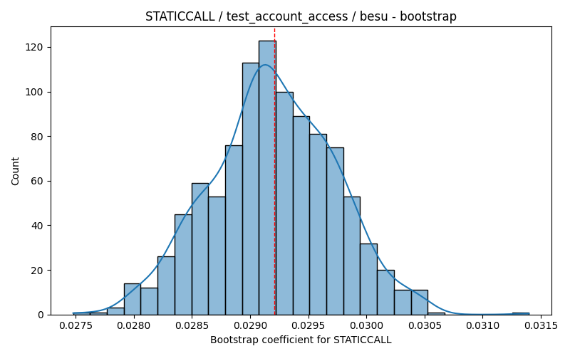

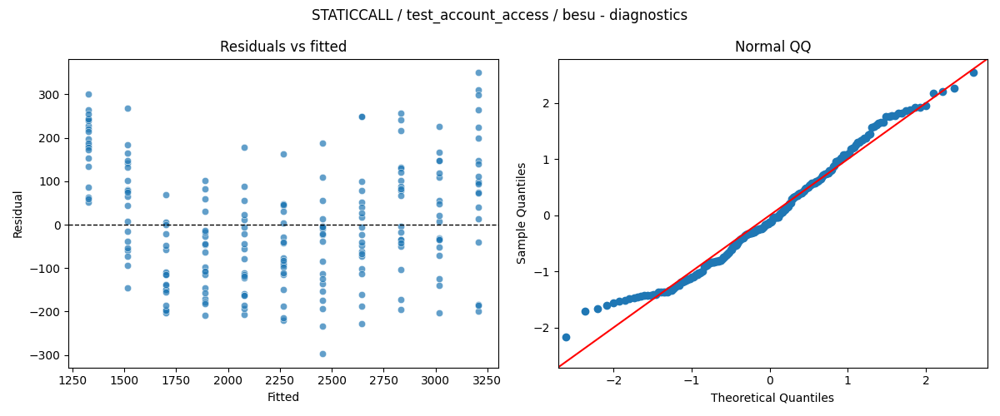

</details>

<details><summary>erigon — NNLS regression summary</summary>

```
==============================================================================
                           NNLS Regression Results                            
==============================================================================
Dep. Variable:          test_runtime_ms              R-squared:          0.878
Model:                  NNLS                    Adj. R-squared:          0.876
No. Observations:       88                                RMSE:         663.29
Df Residuals:           86                                 MAE:         567.53
Df Model:               1      
==============================================================================
                      coef     std err     P-value      [0.025      0.975]
------------------------------------------------------------------------------
         const   1405.3585    257.1767       0.001    965.0706   1954.8624
       opcount      0.0873      0.0034       0.001      0.0801      0.0934
==============================================================================
Notes: Non-negative least squares with bootstrap inference (1000 iterations)
==============================================================================
```

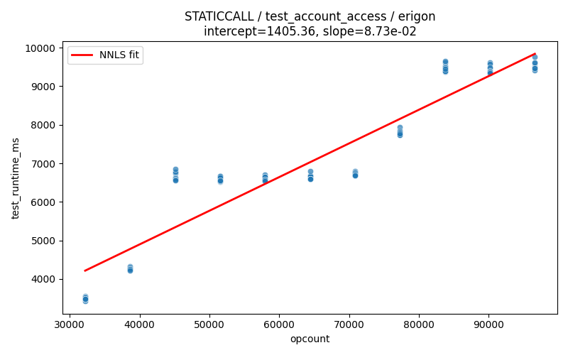

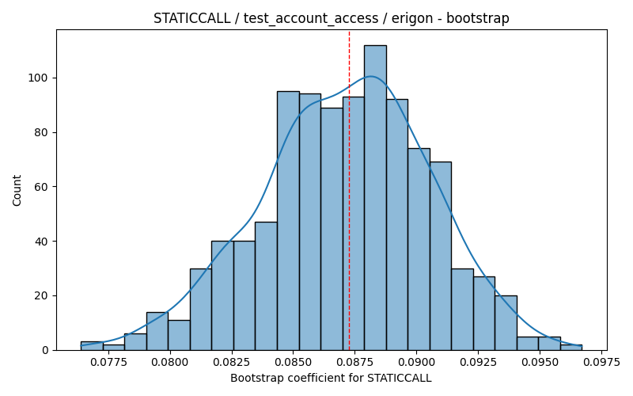

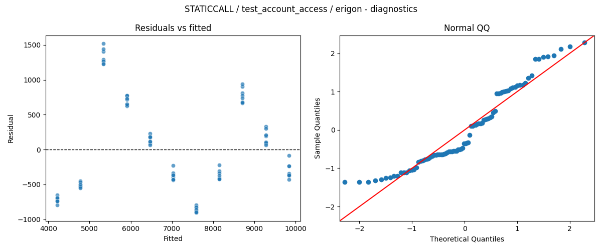

</details>

<details><summary>geth — NNLS regression summary</summary>

```
==============================================================================
                           NNLS Regression Results                            
==============================================================================
Dep. Variable:          test_runtime_ms              R-squared:          0.728
Model:                  NNLS                    Adj. R-squared:          0.726
No. Observations:       143                               RMSE:         373.71
Df Residuals:           141                                MAE:         302.77
Df Model:               1      
==============================================================================
                      coef     std err     P-value      [0.025      0.975]
------------------------------------------------------------------------------
         const   1014.0145    110.1123       0.001    796.2134   1225.8012
       opcount      0.0300      0.0017       0.001      0.0268      0.0332
==============================================================================
Notes: Non-negative least squares with bootstrap inference (1000 iterations)
==============================================================================
```

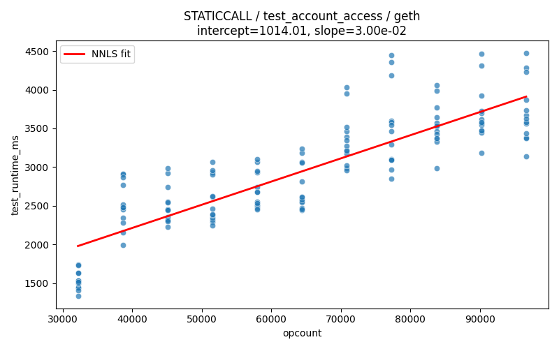

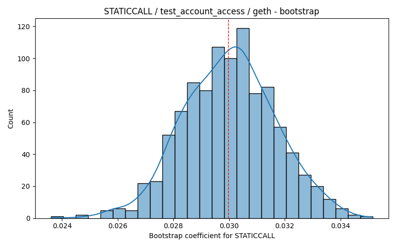

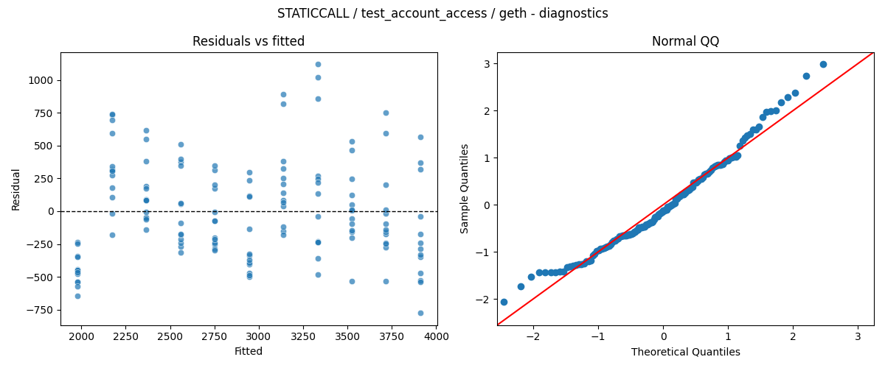

</details>

<details><summary>nethermind — NNLS regression summary</summary>

```
==============================================================================
                           NNLS Regression Results                            
==============================================================================
Dep. Variable:          test_runtime_ms              R-squared:          0.689
Model:                  NNLS                    Adj. R-squared:          0.687
No. Observations:       121                               RMSE:         349.81
Df Residuals:           119                                MAE:         296.45
Df Model:               1      
==============================================================================
                      coef     std err     P-value      [0.025      0.975]
------------------------------------------------------------------------------
         const    883.0337    106.6545       0.001    680.0064   1099.2854
       opcount      0.0256      0.0016       0.001      0.0225      0.0287
==============================================================================
Notes: Non-negative least squares with bootstrap inference (1000 iterations)
==============================================================================
```

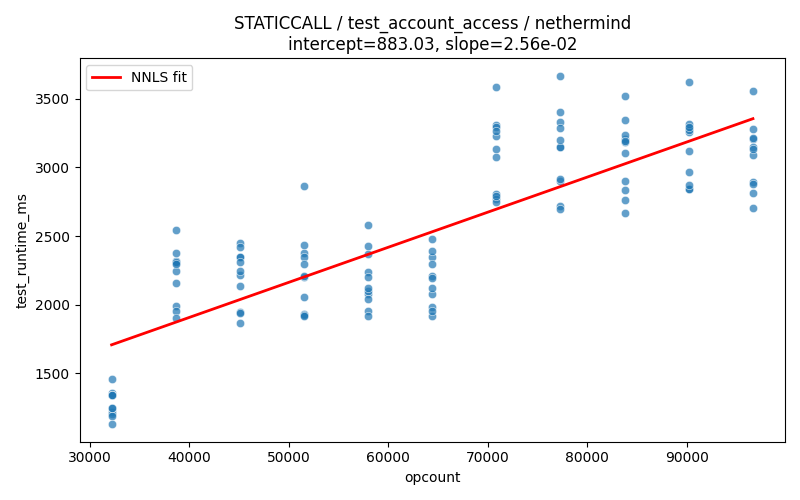

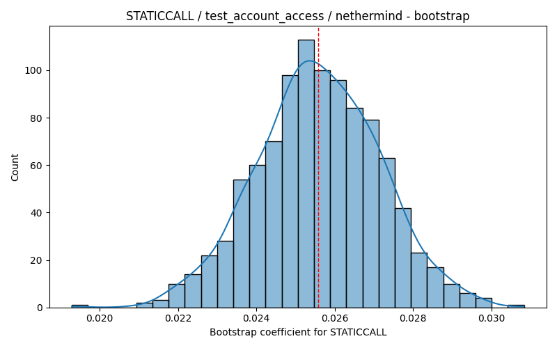

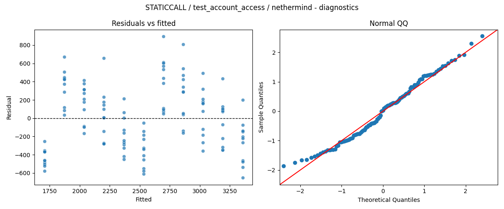

</details>

<details><summary>reth — NNLS regression summary</summary>

```
==============================================================================
                           NNLS Regression Results                            
==============================================================================
Dep. Variable:          test_runtime_ms              R-squared:          0.855
Model:                  NNLS                    Adj. R-squared:          0.854
No. Observations:       231                               RMSE:         307.01
Df Residuals:           229                                MAE:         162.46
Df Model:               1      
==============================================================================
                      coef     std err     P-value      [0.025      0.975]
------------------------------------------------------------------------------
         const    159.8758     75.8322       0.021      6.9634    309.5726
       opcount      0.0365      0.0012       0.001      0.0342      0.0390
==============================================================================
Notes: Non-negative least squares with bootstrap inference (1000 iterations)
==============================================================================
```

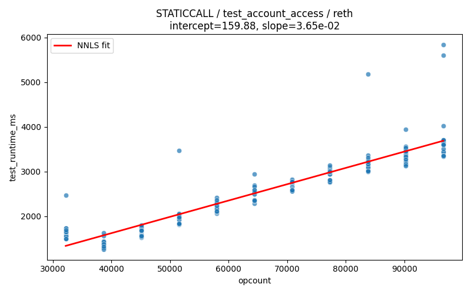

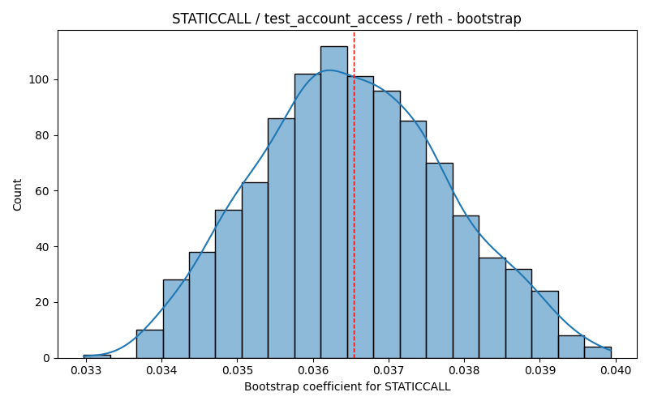

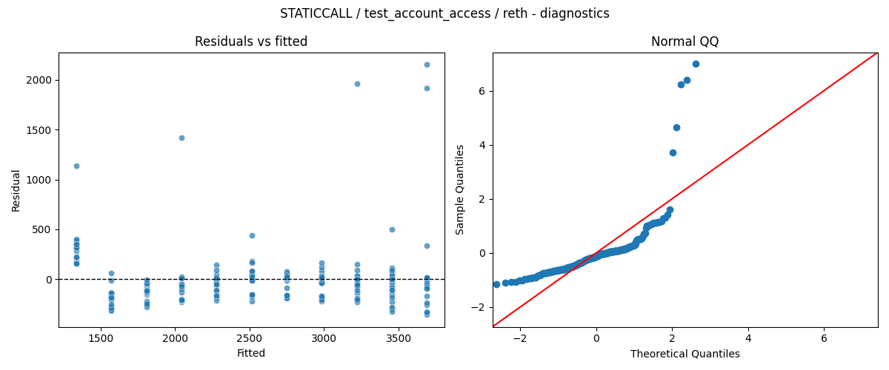

</details>

### test_account_access — combo `STATICCALL_AccountMode.NON_EXISTING_ACCOUNT` — `presets[cold_account_code_access]`

| client | nobs | R² | target_coef (ms) | p-value | 95% CI |
| --- | --- | --- | --- | --- | --- |
| `besu` | 220 | 0.9334 | 0.01238 | 1.00e-03 | [0.01192, 0.01287] |
| `erigon` | 88 | 0.9971 | 0.01173 | 1.00e-03 | [0.01167, 0.01178] |
| `geth` | 143 | 0.6982 | 0.02522 | 1.00e-03 | [0.02231, 0.02864] |
| `nethermind` | 121 | 0.8275 | 0.004556 | 1.00e-03 | [0.004193, 0.00494] |
| `reth` | 231 | 0.9701 | 0.0009735 | 1.00e-03 | [0.0009488, 0.0009959] |

<details><summary>besu — NNLS regression summary</summary>

```
==============================================================================
                           NNLS Regression Results                            
==============================================================================
Dep. Variable:          test_runtime_ms              R-squared:          0.933
Model:                  NNLS                    Adj. R-squared:          0.933
No. Observations:       220                               RMSE:          78.62
Df Residuals:           218                                MAE:          64.65
Df Model:               1      
==============================================================================
                      coef     std err     P-value      [0.025      0.975]
------------------------------------------------------------------------------
         const    408.7964     19.4810       0.001    369.7119    446.5795
       opcount      0.0124      0.0002       0.001      0.0119      0.0129
==============================================================================
Notes: Non-negative least squares with bootstrap inference (1000 iterations)
==============================================================================
```


</details>

<details><summary>erigon — NNLS regression summary</summary>

```
==============================================================================
                           NNLS Regression Results                            
==============================================================================
Dep. Variable:          test_runtime_ms              R-squared:          0.997
Model:                  NNLS                    Adj. R-squared:          0.997
No. Observations:       88                                RMSE:          15.14
Df Residuals:           86                                 MAE:          12.21
Df Model:               1      
==============================================================================
                      coef     std err     P-value      [0.025      0.975]
------------------------------------------------------------------------------
         const      0.0000      0.5671       1.000      0.0000      1.4799
       opcount      0.0117      0.0000       0.001      0.0117      0.0118
==============================================================================
Notes: Non-negative least squares with bootstrap inference (1000 iterations)
==============================================================================
```


</details>

<details><summary>geth — NNLS regression summary</summary>

```
==============================================================================
                           NNLS Regression Results                            
==============================================================================
Dep. Variable:          test_runtime_ms              R-squared:          0.698
Model:                  NNLS                    Adj. R-squared:          0.696
No. Observations:       143                               RMSE:         394.28
Df Residuals:           141                                MAE:         318.34
Df Model:               1      
==============================================================================
                      coef     std err     P-value      [0.025      0.975]
------------------------------------------------------------------------------
         const   1250.2171    127.5241       0.001    995.3896   1485.0057
       opcount      0.0252      0.0016       0.001      0.0223      0.0286
==============================================================================
Notes: Non-negative least squares with bootstrap inference (1000 iterations)
==============================================================================
```


</details>

<details><summary>nethermind — NNLS regression summary</summary>

```
==============================================================================
                           NNLS Regression Results                            
==============================================================================
Dep. Variable:          test_runtime_ms              R-squared:          0.827
Model:                  NNLS                    Adj. R-squared:          0.826
No. Observations:       121                               RMSE:          49.45
Df Residuals:           119                                MAE:          39.65
Df Model:               1      
==============================================================================
                      coef     std err     P-value      [0.025      0.975]
------------------------------------------------------------------------------
         const    110.8511     14.0638       0.001     82.5396    139.1953
       opcount      0.0046      0.0002       0.001      0.0042      0.0049
==============================================================================
Notes: Non-negative least squares with bootstrap inference (1000 iterations)
==============================================================================
```


</details>

<details><summary>reth — NNLS regression summary</summary>

```
==============================================================================
                           NNLS Regression Results                            
==============================================================================
Dep. Variable:          test_runtime_ms              R-squared:          0.970
Model:                  NNLS                    Adj. R-squared:          0.970
No. Observations:       231                               RMSE:           4.06
Df Residuals:           229                                MAE:           3.28
Df Model:               1      
==============================================================================
                      coef     std err     P-value      [0.025      0.975]
------------------------------------------------------------------------------
         const     32.3511      0.9246       0.001     30.6575     34.2443
       opcount      0.0010      0.0000       0.001      0.0009      0.0010
==============================================================================
Notes: Non-negative least squares with bootstrap inference (1000 iterations)
==============================================================================
```


</details>

### test_ext_account_query_warm — combo `STATICCALL`

| client | nobs | R² | target_coef (ms) | p-value | 95% CI |
| --- | --- | --- | --- | --- | --- |
| `besu` | 220 | 0.7929 | 0.0005794 | 1.00e-03 | [0.0005403, 0.0006187] |
| `erigon` | 88 | 0.9838 | 0.0005747 | 1.00e-03 | [0.0005579, 0.0005905] |
| `geth` | 143 | 0.8568 | 0.000182 | 1.00e-03 | [0.0001685, 0.0001955] |
| `nethermind` | 121 | 0.3931 | 0.0005341 | 1.00e-03 | [0.0004269, 0.0006483] |
| `reth` | 231 | 0.9112 | 4.871e-05 | 1.00e-03 | [4.668e-05, 5.08e-05] |

<details><summary>besu — NNLS regression summary</summary>

```
==============================================================================
                           NNLS Regression Results                            
==============================================================================
Dep. Variable:          test_runtime_ms              R-squared:          0.793
Model:                  NNLS                    Adj. R-squared:          0.792
No. Observations:       220                               RMSE:         153.29
Df Residuals:           218                                MAE:         121.15
Df Model:               1      
==============================================================================
                      coef     std err     P-value      [0.025      0.975]
------------------------------------------------------------------------------
         const    603.4007     31.3869       0.001    543.5734    666.1019
       opcount      0.0006      0.0000       0.001      0.0005      0.0006
==============================================================================
Notes: Non-negative least squares with bootstrap inference (1000 iterations)
==============================================================================
```

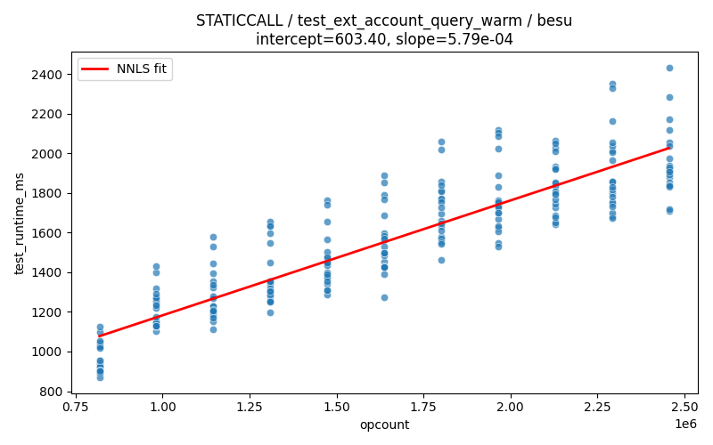

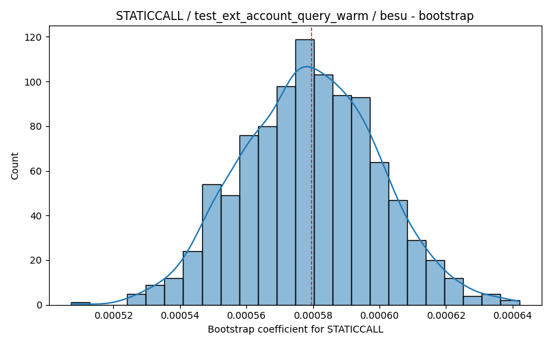

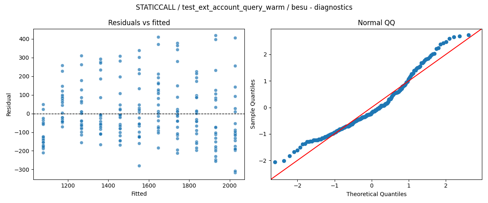

</details>

<details><summary>erigon — NNLS regression summary</summary>

```
==============================================================================
                           NNLS Regression Results                            
==============================================================================
Dep. Variable:          test_runtime_ms              R-squared:          0.984
Model:                  NNLS                    Adj. R-squared:          0.984
No. Observations:       88                                RMSE:          38.22
Df Residuals:           86                                 MAE:          31.21
Df Model:               1      
==============================================================================
                      coef     std err     P-value      [0.025      0.975]
------------------------------------------------------------------------------
         const     52.3701     13.1349       0.001     27.9141     79.3193
       opcount      0.0006      0.0000       0.001      0.0006      0.0006
==============================================================================
Notes: Non-negative least squares with bootstrap inference (1000 iterations)
==============================================================================
```

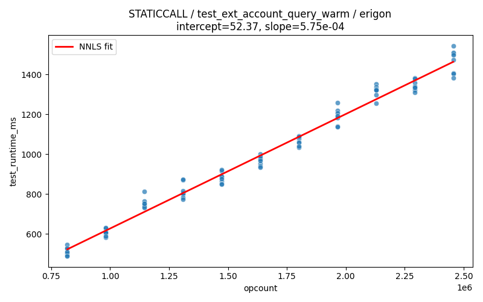

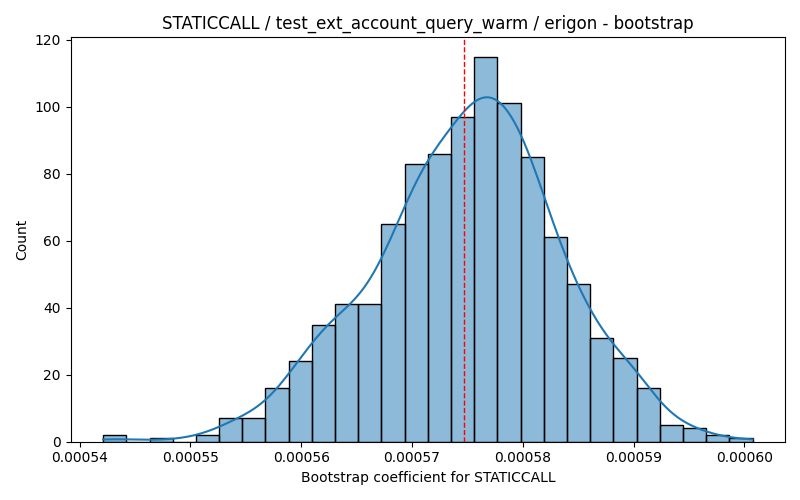

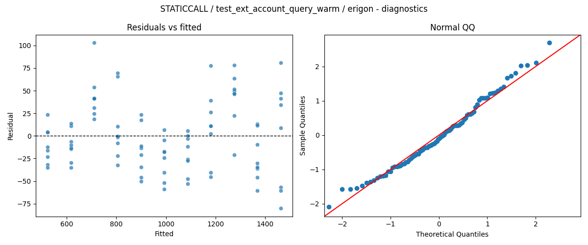

</details>

<details><summary>geth — NNLS regression summary</summary>

```
==============================================================================
                           NNLS Regression Results                            
==============================================================================
Dep. Variable:          test_runtime_ms              R-squared:          0.857
Model:                  NNLS                    Adj. R-squared:          0.856
No. Observations:       143                               RMSE:          38.51
Df Residuals:           141                                MAE:          31.17
Df Model:               1      
==============================================================================
                      coef     std err     P-value      [0.025      0.975]
------------------------------------------------------------------------------
         const     39.5679      9.9741       0.001     20.0628     59.3078
       opcount      0.0002      0.0000       0.001      0.0002      0.0002
==============================================================================
Notes: Non-negative least squares with bootstrap inference (1000 iterations)
==============================================================================
```

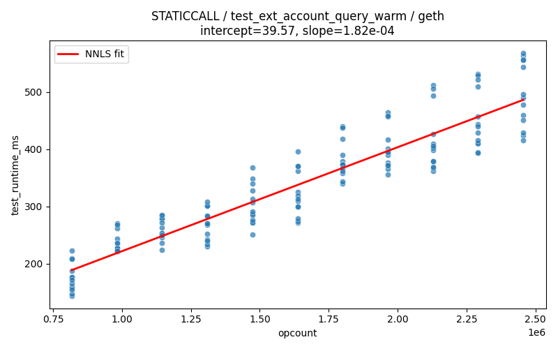

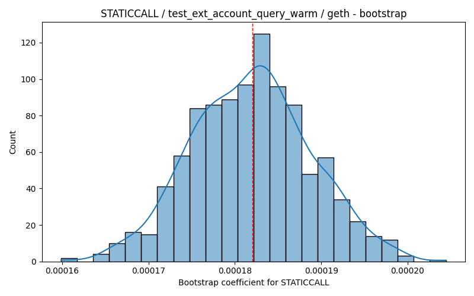

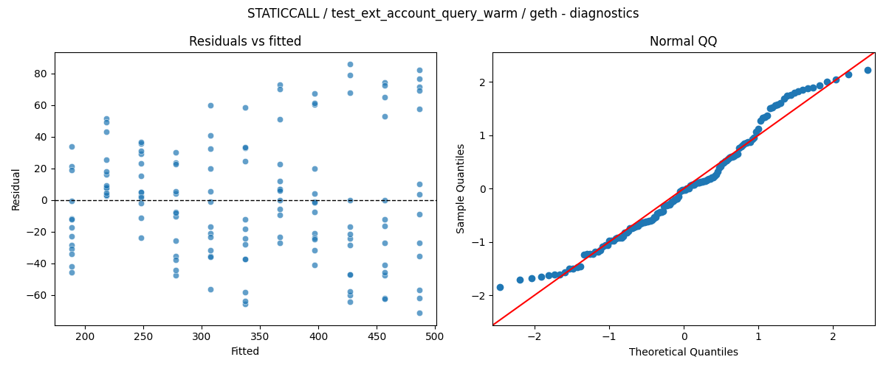

</details>

<details><summary>nethermind — NNLS regression summary</summary>

```
==============================================================================
                           NNLS Regression Results                            
==============================================================================
Dep. Variable:          test_runtime_ms              R-squared:          0.393
Model:                  NNLS                    Adj. R-squared:          0.388
No. Observations:       121                               RMSE:         343.57
Df Residuals:           119                                MAE:         305.23
Df Model:               1      
==============================================================================
                      coef     std err     P-value      [0.025      0.975]
------------------------------------------------------------------------------
         const    308.0004     86.3792       0.001    141.1891    471.8621
       opcount      0.0005      0.0001       0.001      0.0004      0.0006
==============================================================================
Notes: Non-negative least squares with bootstrap inference (1000 iterations)
==============================================================================
```

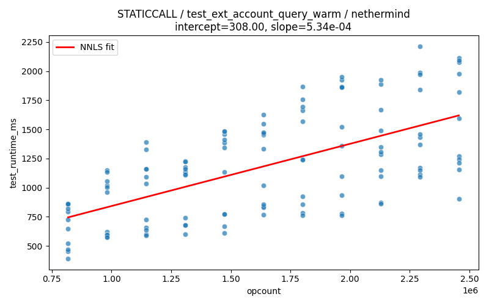

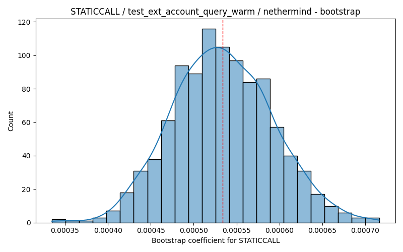

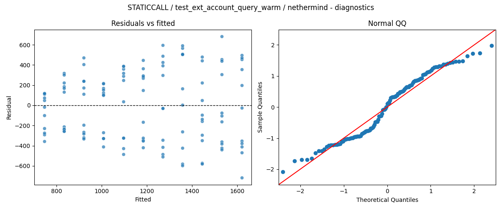

</details>

<details><summary>reth — NNLS regression summary</summary>

```
==============================================================================
                           NNLS Regression Results                            
==============================================================================
Dep. Variable:          test_runtime_ms              R-squared:          0.911
Model:                  NNLS                    Adj. R-squared:          0.911
No. Observations:       231                               RMSE:           7.87
Df Residuals:           229                                MAE:           6.14
Df Model:               1      
==============================================================================
                      coef     std err     P-value      [0.025      0.975]
------------------------------------------------------------------------------
         const     15.4036      1.7224       0.001     12.0647     18.6911
       opcount      0.0000      0.0000       0.001      0.0000      0.0001
==============================================================================
Notes: Non-negative least squares with bootstrap inference (1000 iterations)
==============================================================================
```

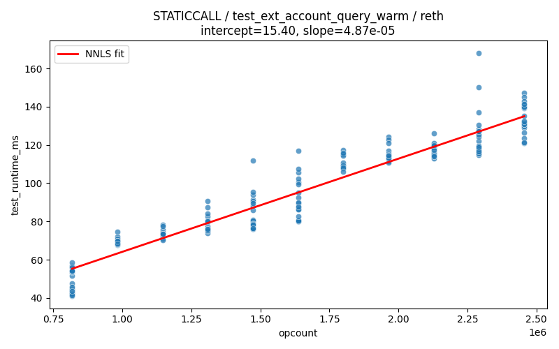

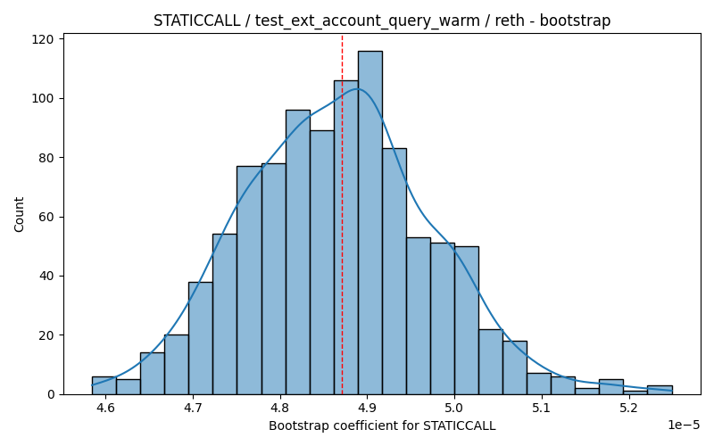

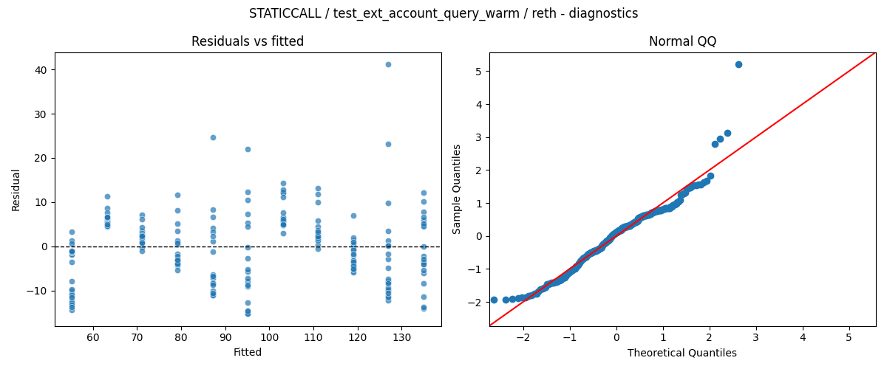

</details>
