# Runtime estimation report

Per-spec NNLS fits of `test_runtime_ms` against `opcount`, one row per (target opcode, test, model_by combo, client).

## Contents

- [SLOAD](#sload)
- [SSTORE](#sstore)
- [BALANCE](#balance)
- [CALL](#call)
- [CALLCODE](#callcode)
- [DELEGATECALL](#delegatecall)
- [EXTCODECOPY](#extcodecopy)
- [EXTCODEHASH](#extcodehash)
- [EXTCODESIZE](#extcodesize)
- [STATICCALL](#staticcall)

## SLOAD

### test_sload_bloated — combo `False`

| client | nobs | R² | target_coef (ms) | p-value | 95% CI |
| --- | --- | --- | --- | --- | --- |
| `besu` | 1309 | 0.9138 | 0.007498 | 1.00e-03 | [0.007367, 0.007632] |
| `erigon` | 385 | 0.9897 | 0.00614 | 1.00e-03 | [0.006072, 0.006204] |
| `ethrex` | 1276 | 0.8766 | 0.007967 | 1.00e-03 | [0.007897, 0.008035] |
| `geth` | 924 | 0.8375 | 0.0265 | 1.00e-03 | [0.02566, 0.02726] |
| `nethermind` | 495 | 0.8422 | 0.003727 | 1.00e-03 | [0.003587, 0.00388] |
| `reth` | 385 | 0.9442 | 0.001274 | 1.00e-03 | [0.00124, 0.001309] |

<details><summary>besu — NNLS regression summary</summary>

```
==============================================================================
                           NNLS Regression Results                            
==============================================================================
Dep. Variable:          test_runtime_ms              R-squared:          0.914
Model:                  NNLS                    Adj. R-squared:          0.914
No. Observations:       1309                              RMSE:          67.78
Df Residuals:           1307                               MAE:          53.07
Df Model:               1      
==============================================================================
                      coef     std err     P-value      [0.025      0.975]
------------------------------------------------------------------------------
         const    181.5119      5.3889       0.001    170.3107    192.0417
       opcount      0.0075      0.0001       0.001      0.0074      0.0076
==============================================================================
Notes: Non-negative least squares with bootstrap inference (1000 iterations)
==============================================================================
```

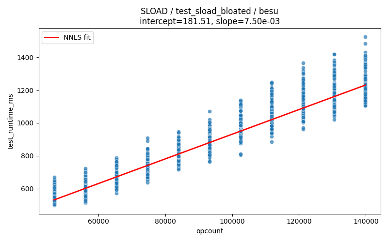

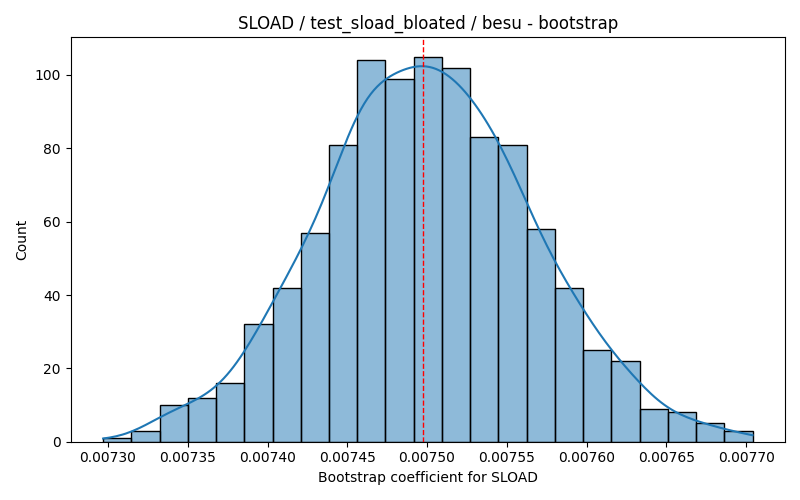

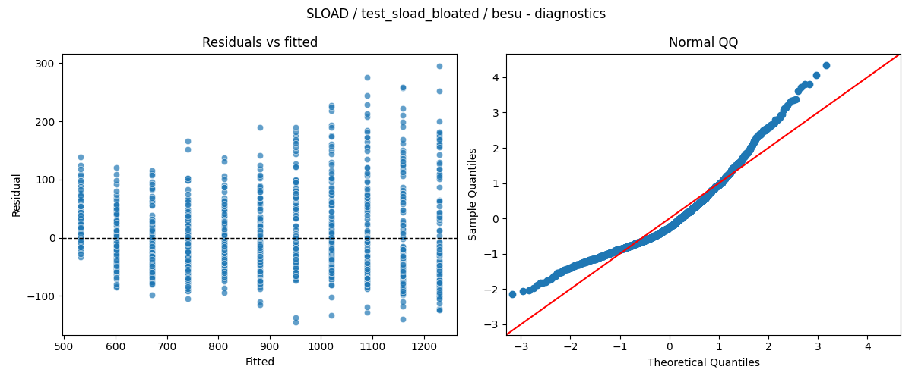

</details>

<details><summary>erigon — NNLS regression summary</summary>

```
==============================================================================
                           NNLS Regression Results                            
==============================================================================
Dep. Variable:          test_runtime_ms              R-squared:          0.990
Model:                  NNLS                    Adj. R-squared:          0.990
No. Observations:       385                               RMSE:          18.45
Df Residuals:           383                                MAE:          14.50
Df Model:               1      
==============================================================================
                      coef     std err     P-value      [0.025      0.975]
------------------------------------------------------------------------------
         const     10.5575      2.8634       0.001      5.1524     16.2255
       opcount      0.0061      0.0000       0.001      0.0061      0.0062
==============================================================================
Notes: Non-negative least squares with bootstrap inference (1000 iterations)
==============================================================================
```

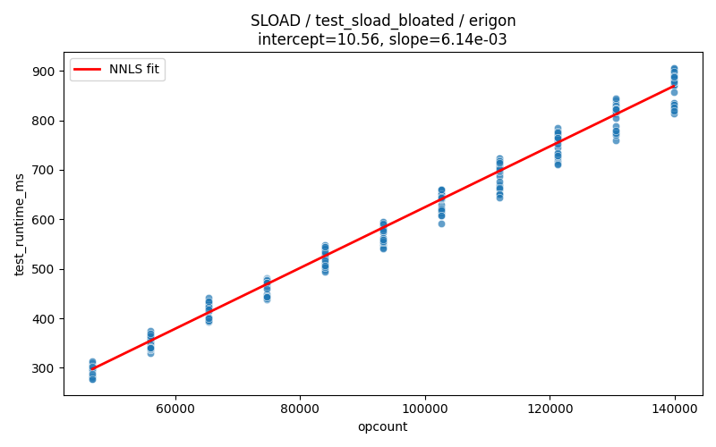

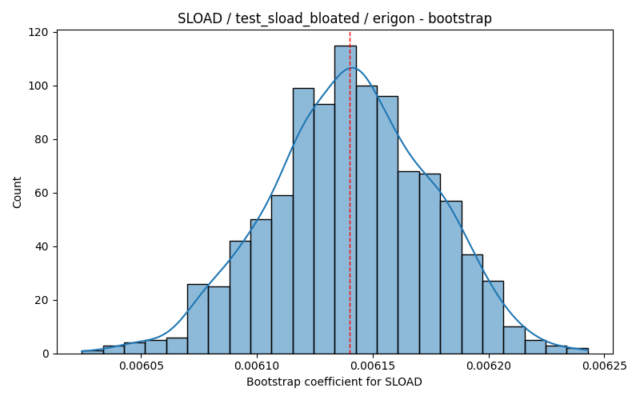

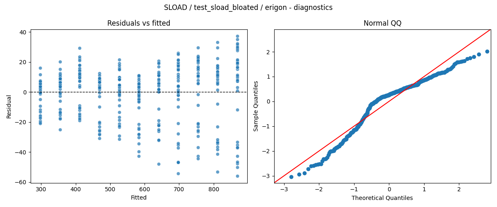

</details>

<details><summary>ethrex — NNLS regression summary</summary>

```
==============================================================================
                           NNLS Regression Results                            
==============================================================================
Dep. Variable:          test_runtime_ms              R-squared:          0.877
Model:                  NNLS                    Adj. R-squared:          0.877
No. Observations:       1276                              RMSE:         117.59
Df Residuals:           1274                               MAE:         101.53
Df Model:               1      
==============================================================================
                      coef     std err     P-value      [0.025      0.975]
------------------------------------------------------------------------------
         const      0.0000      0.0000       1.000      0.0000      0.0000
       opcount      0.0080      0.0000       0.001      0.0079      0.0080
==============================================================================
Notes: Non-negative least squares with bootstrap inference (1000 iterations)
==============================================================================
```

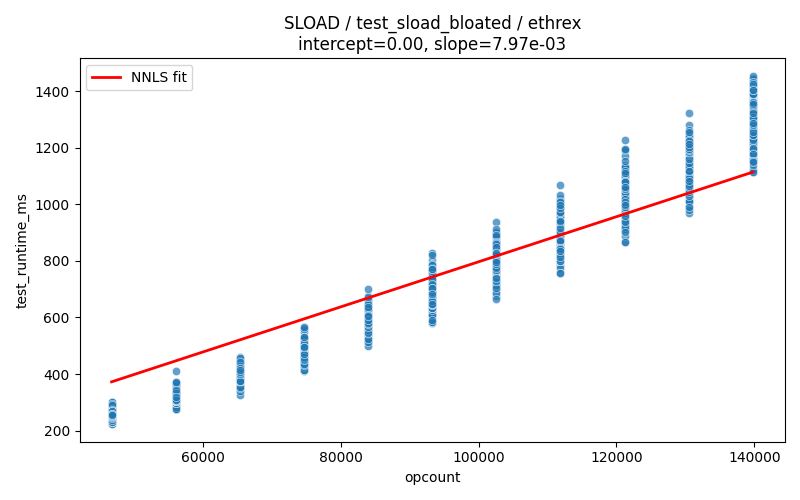

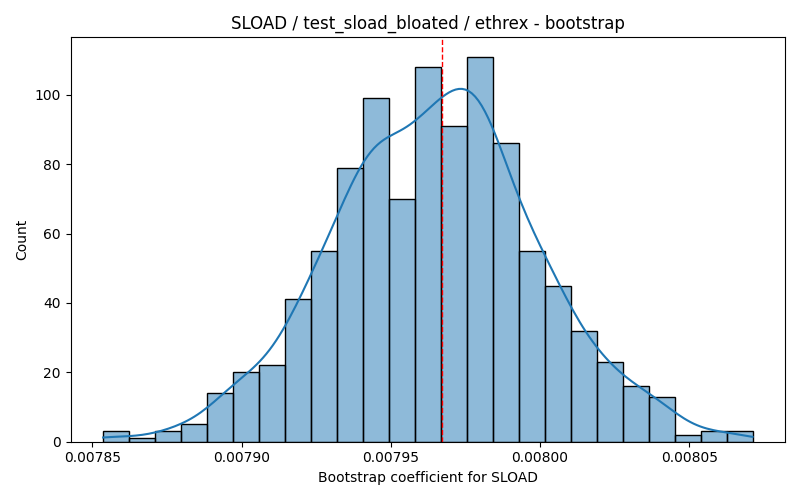

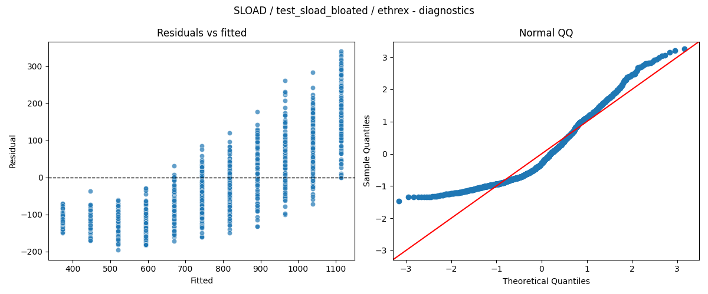

</details>

<details><summary>geth — NNLS regression summary</summary>

```
==============================================================================
                           NNLS Regression Results                            
==============================================================================
Dep. Variable:          test_runtime_ms              R-squared:          0.838
Model:                  NNLS                    Adj. R-squared:          0.837
No. Observations:       924                               RMSE:         343.48
Df Residuals:           922                                MAE:         280.24
Df Model:               1      
==============================================================================
                      coef     std err     P-value      [0.025      0.975]
------------------------------------------------------------------------------
         const    979.2168     35.4480       0.001    915.2065   1054.5866
       opcount      0.0265      0.0004       0.001      0.0257      0.0273
==============================================================================
Notes: Non-negative least squares with bootstrap inference (1000 iterations)
==============================================================================
```

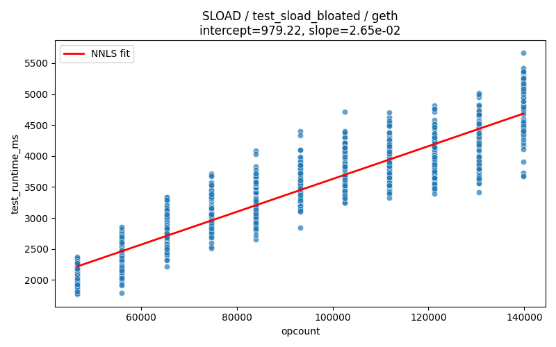

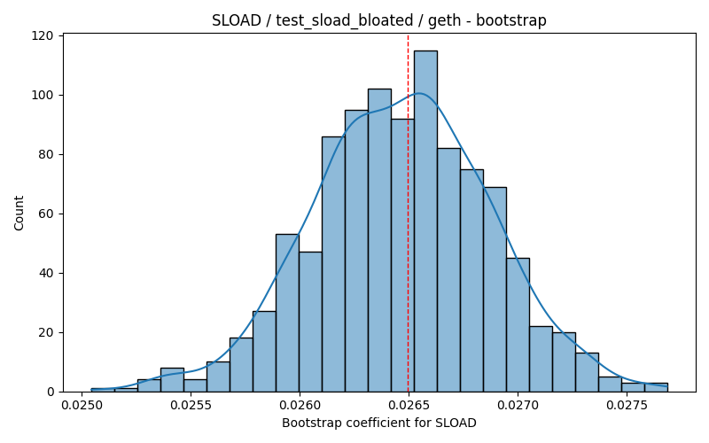

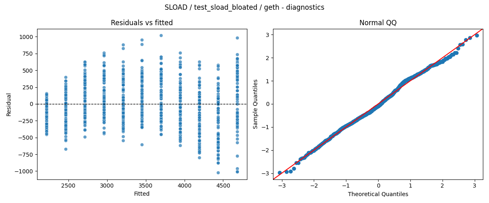

</details>

<details><summary>nethermind — NNLS regression summary</summary>

```
==============================================================================
                           NNLS Regression Results                            
==============================================================================
Dep. Variable:          test_runtime_ms              R-squared:          0.842
Model:                  NNLS                    Adj. R-squared:          0.842
No. Observations:       495                               RMSE:          47.48
Df Residuals:           493                                MAE:          36.28
Df Model:               1      
==============================================================================
                      coef     std err     P-value      [0.025      0.975]
------------------------------------------------------------------------------
         const    127.2057      7.1684       0.001    112.7790    140.7046
       opcount      0.0037      0.0001       0.001      0.0036      0.0039
==============================================================================
Notes: Non-negative least squares with bootstrap inference (1000 iterations)
==============================================================================
```

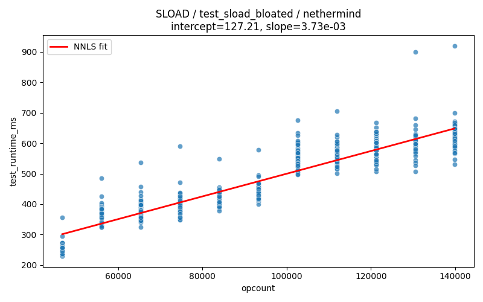

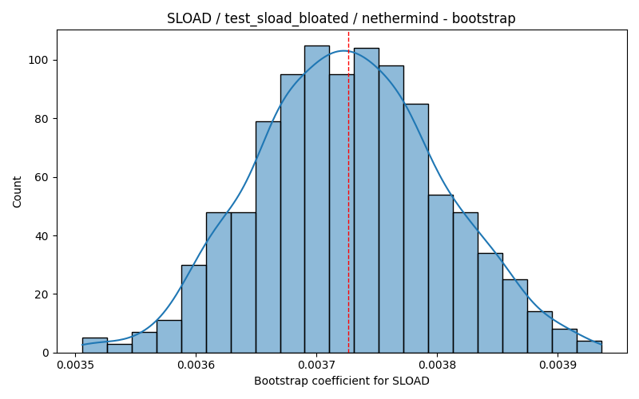

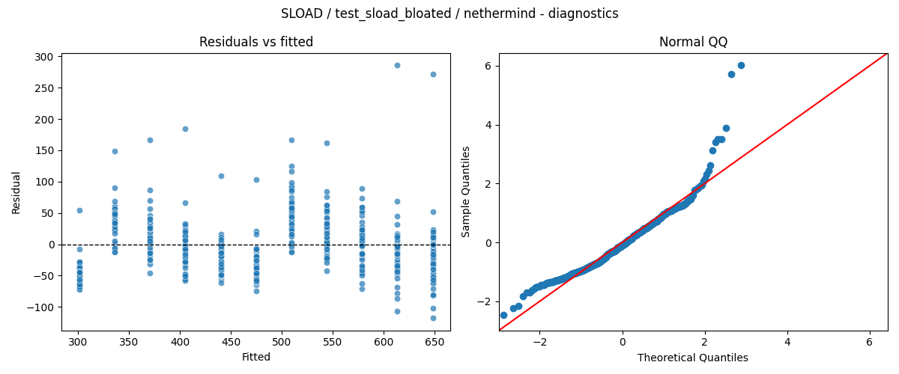

</details>

<details><summary>reth — NNLS regression summary</summary>

```
==============================================================================
                           NNLS Regression Results                            
==============================================================================
Dep. Variable:          test_runtime_ms              R-squared:          0.944
Model:                  NNLS                    Adj. R-squared:          0.944
No. Observations:       385                               RMSE:           9.12
Df Residuals:           383                                MAE:           6.83
Df Model:               1      
==============================================================================
                      coef     std err     P-value      [0.025      0.975]
------------------------------------------------------------------------------
         const     40.5005      1.7180       0.001     37.1931     43.8597
       opcount      0.0013      0.0000       0.001      0.0012      0.0013
==============================================================================
Notes: Non-negative least squares with bootstrap inference (1000 iterations)
==============================================================================
```

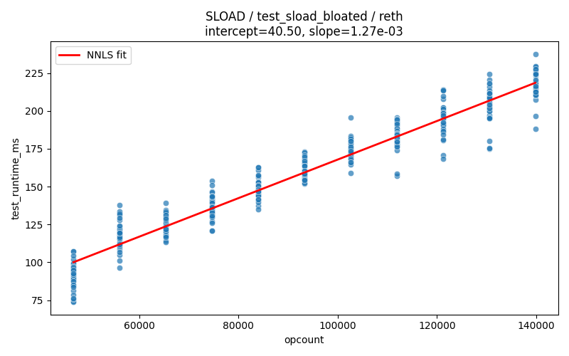

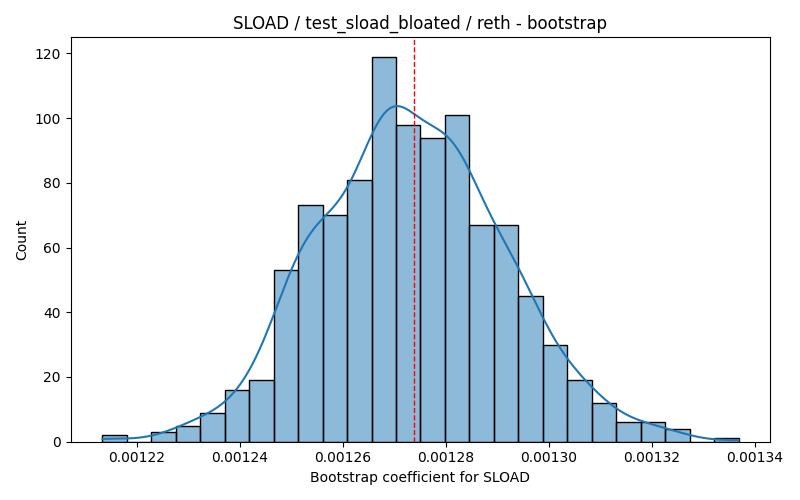

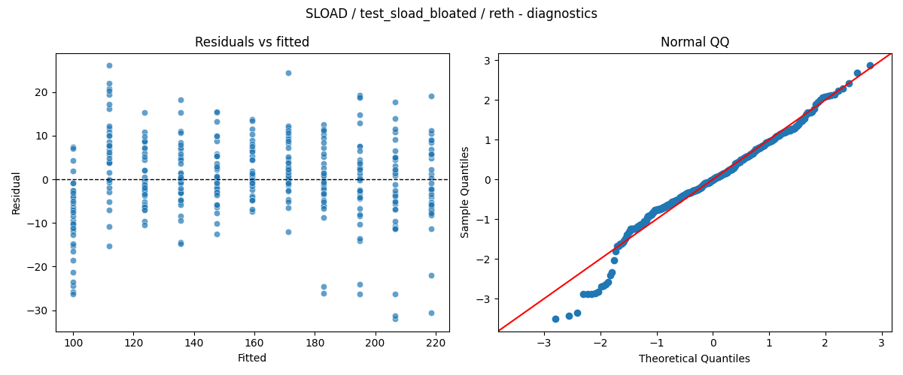

</details>

### test_sload_bloated — combo `True`

| client | nobs | R² | target_coef (ms) | p-value | 95% CI |
| --- | --- | --- | --- | --- | --- |
| `besu` | 1309 | 0.9109 | 0.01653 | 1.00e-03 | [0.01624, 0.01683] |
| `erigon` | 385 | 0.9819 | 0.005648 | 1.00e-03 | [0.005572, 0.005719] |
| `ethrex` | 1276 | 0.9907 | 0.03472 | 1.00e-03 | [0.03454, 0.03491] |
| `geth` | 924 | 0.8264 | 0.02514 | 1.00e-03 | [0.0244, 0.0259] |
| `nethermind` | 495 | 0.6257 | 0.02619 | 1.00e-03 | [0.02442, 0.02814] |
| `reth` | 385 | 0.968 | 0.001469 | 1.00e-03 | [0.001441, 0.001498] |

<details><summary>besu — NNLS regression summary</summary>

```
==============================================================================
                           NNLS Regression Results                            
==============================================================================
Dep. Variable:          test_runtime_ms              R-squared:          0.911
Model:                  NNLS                    Adj. R-squared:          0.911
No. Observations:       1309                              RMSE:         152.20
Df Residuals:           1307                               MAE:         124.08
Df Model:               1      
==============================================================================
                      coef     std err     P-value      [0.025      0.975]
------------------------------------------------------------------------------
         const    475.2435     12.6688       0.001    447.7458    499.7322
       opcount      0.0165      0.0001       0.001      0.0162      0.0168
==============================================================================
Notes: Non-negative least squares with bootstrap inference (1000 iterations)
==============================================================================
```

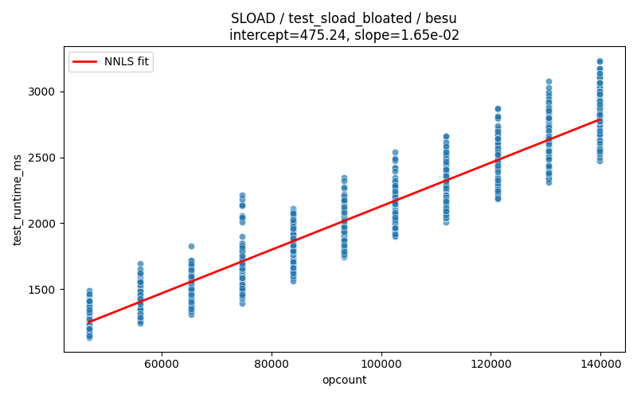

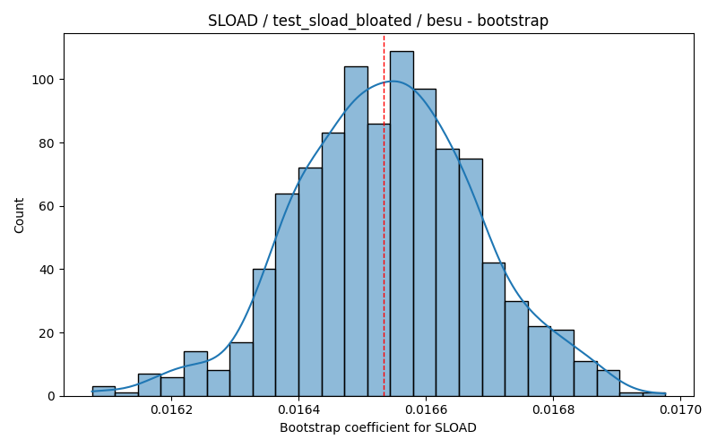

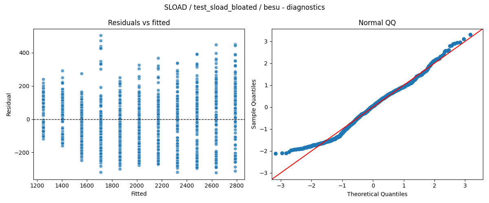

</details>

<details><summary>erigon — NNLS regression summary</summary>

```
==============================================================================
                           NNLS Regression Results                            
==============================================================================
Dep. Variable:          test_runtime_ms              R-squared:          0.982
Model:                  NNLS                    Adj. R-squared:          0.982
No. Observations:       385                               RMSE:          22.60
Df Residuals:           383                                MAE:          18.16
Df Model:               1      
==============================================================================
                      coef     std err     P-value      [0.025      0.975]
------------------------------------------------------------------------------
         const     20.8455      3.3281       0.001     14.4536     27.4064
       opcount      0.0056      0.0000       0.001      0.0056      0.0057
==============================================================================
Notes: Non-negative least squares with bootstrap inference (1000 iterations)
==============================================================================
```

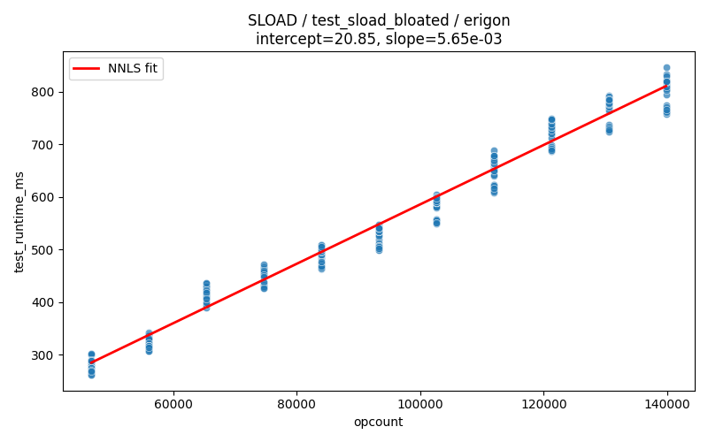

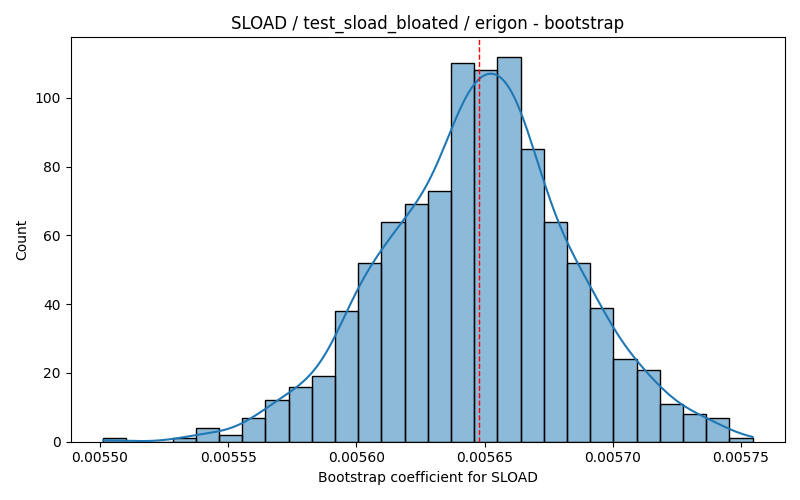

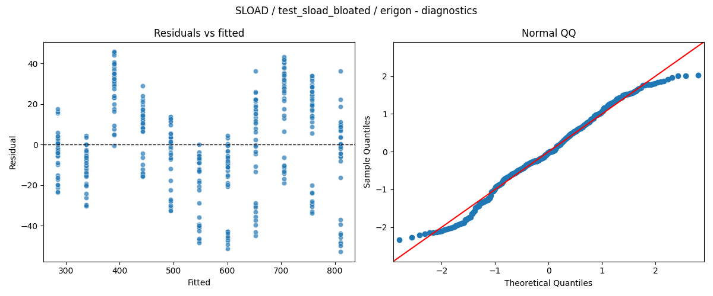

</details>

<details><summary>ethrex — NNLS regression summary</summary>

```
==============================================================================
                           NNLS Regression Results                            
==============================================================================
Dep. Variable:          test_runtime_ms              R-squared:          0.991
Model:                  NNLS                    Adj. R-squared:          0.991
No. Observations:       1276                              RMSE:          99.06
Df Residuals:           1274                               MAE:          70.54
Df Model:               1      
==============================================================================
                      coef     std err     P-value      [0.025      0.975]
------------------------------------------------------------------------------
         const    132.0780      7.9238       0.001    115.5766    146.4569
       opcount      0.0347      0.0001       0.001      0.0345      0.0349
==============================================================================
Notes: Non-negative least squares with bootstrap inference (1000 iterations)
==============================================================================
```

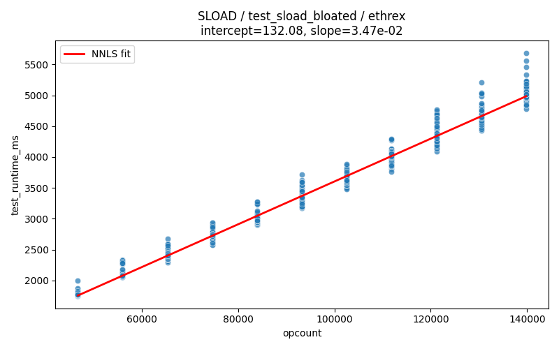

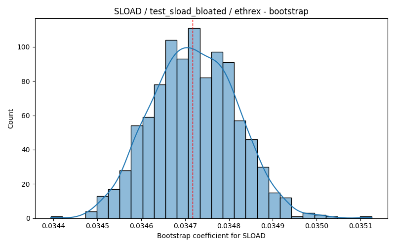

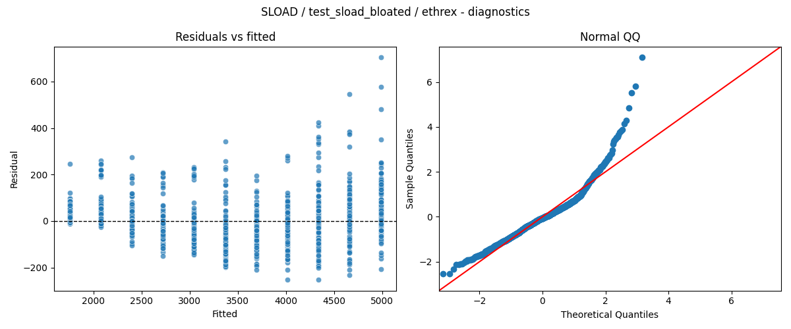

</details>

<details><summary>geth — NNLS regression summary</summary>

```
==============================================================================
                           NNLS Regression Results                            
==============================================================================
Dep. Variable:          test_runtime_ms              R-squared:          0.826
Model:                  NNLS                    Adj. R-squared:          0.826
No. Observations:       924                               RMSE:         339.12
Df Residuals:           922                                MAE:         280.15
Df Model:               1      
==============================================================================
                      coef     std err     P-value      [0.025      0.975]
------------------------------------------------------------------------------
         const   1006.2228     34.5681       0.001    939.4876   1071.9356
       opcount      0.0251      0.0004       0.001      0.0244      0.0259
==============================================================================
Notes: Non-negative least squares with bootstrap inference (1000 iterations)
==============================================================================
```

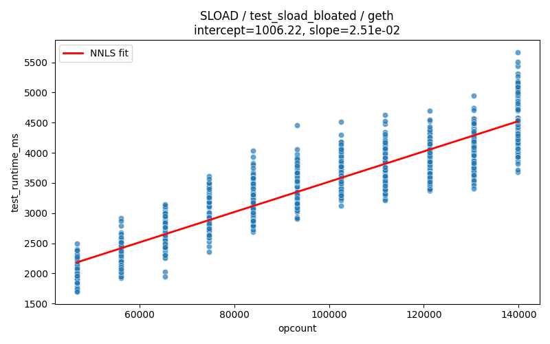

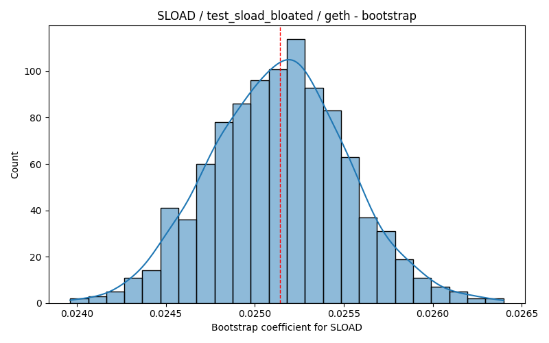

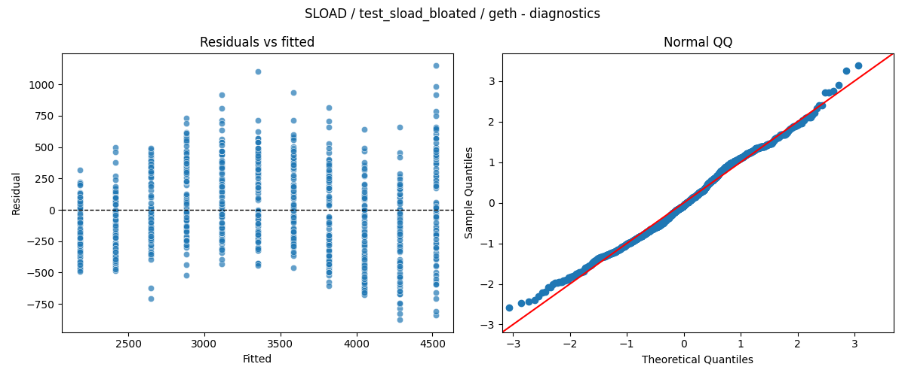

</details>

<details><summary>nethermind — NNLS regression summary</summary>

```
==============================================================================
                           NNLS Regression Results                            
==============================================================================
Dep. Variable:          test_runtime_ms              R-squared:          0.626
Model:                  NNLS                    Adj. R-squared:          0.625
No. Observations:       495                               RMSE:         596.20
Df Residuals:           493                                MAE:         487.91
Df Model:               1      
==============================================================================
                      coef     std err     P-value      [0.025      0.975]
------------------------------------------------------------------------------
         const   1264.2502     92.5957       0.001   1069.3691   1436.4830
       opcount      0.0262      0.0010       0.001      0.0244      0.0281
==============================================================================
Notes: Non-negative least squares with bootstrap inference (1000 iterations)
==============================================================================
```

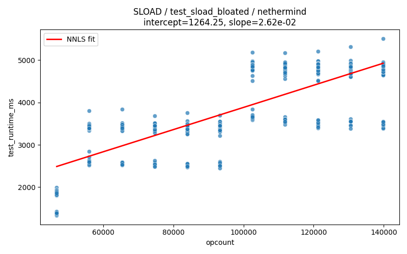

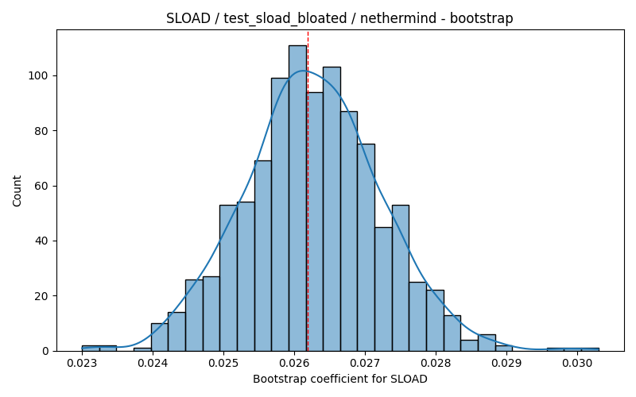

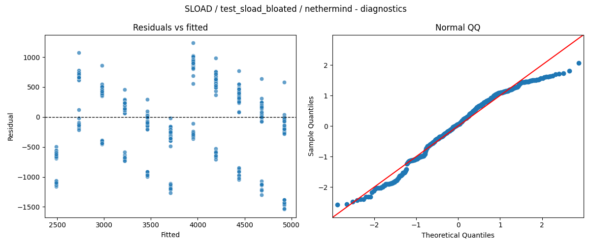

</details>

<details><summary>reth — NNLS regression summary</summary>

```
==============================================================================
                           NNLS Regression Results                            
==============================================================================
Dep. Variable:          test_runtime_ms              R-squared:          0.968
Model:                  NNLS                    Adj. R-squared:          0.968
No. Observations:       385                               RMSE:           7.86
Df Residuals:           383                                MAE:           6.15
Df Model:               1      
==============================================================================
                      coef     std err     P-value      [0.025      0.975]
------------------------------------------------------------------------------
         const     28.5304      1.2610       0.001     26.0491     31.0534
       opcount      0.0015      0.0000       0.001      0.0014      0.0015
==============================================================================
Notes: Non-negative least squares with bootstrap inference (1000 iterations)
==============================================================================
```

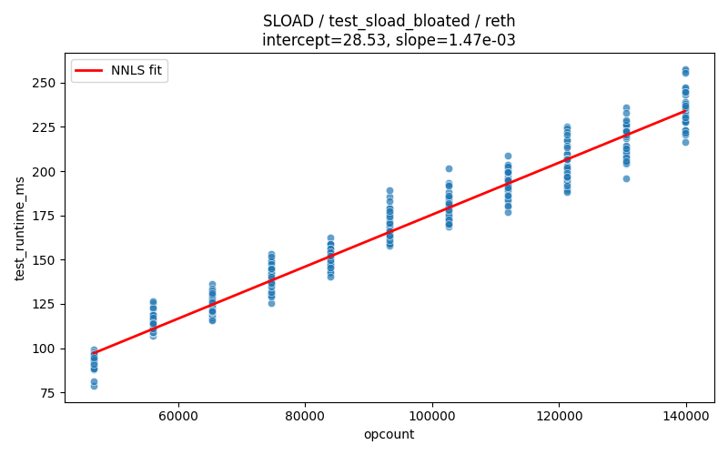

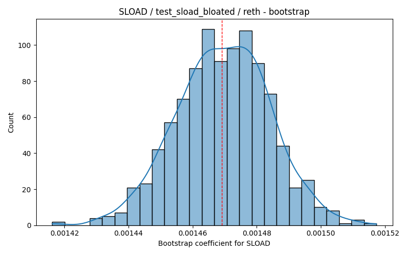

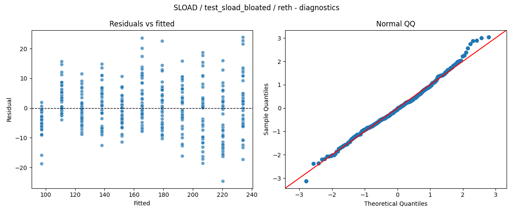

</details>

### test_storage_sload_same_key_benchmark

| client | nobs | R² | target_coef (ms) | p-value | 95% CI |
| --- | --- | --- | --- | --- | --- |
| `besu` | 2618 | 0.3295 | 0.0001046 | 1.00e-03 | [9.941e-05, 0.0001104] |
| `erigon` | 770 | 0.8719 | 3.779e-05 | 1.00e-03 | [3.677e-05, 3.882e-05] |
| `ethrex` | 2552 | 0.8908 | 1.936e-05 | 1.00e-03 | [1.91e-05, 1.965e-05] |
| `geth` | 1848 | 0.8058 | 4.281e-05 | 1.00e-03 | [4.174e-05, 4.388e-05] |
| `nethermind` | 990 | 0.7446 | 0.0001596 | 1.00e-03 | [0.000154, 0.0001654] |
| `reth` | 770 | 0.6845 | 5.109e-06 | 1.00e-03 | [4.864e-06, 5.35e-06] |

<details><summary>besu — NNLS regression summary</summary>

```
==============================================================================
                           NNLS Regression Results                            
==============================================================================
Dep. Variable:          test_runtime_ms              R-squared:          0.330
Model:                  NNLS                    Adj. R-squared:          0.329
No. Observations:       2618                              RMSE:          94.21
Df Residuals:           2616                               MAE:          71.71
Df Model:               1      
==============================================================================
                      coef     std err     P-value      [0.025      0.975]
------------------------------------------------------------------------------
         const    128.6434      5.9162       0.001    116.8540    139.7946
       opcount      0.0001      0.0000       0.001      0.0001      0.0001
==============================================================================
Notes: Non-negative least squares with bootstrap inference (1000 iterations)
==============================================================================
```

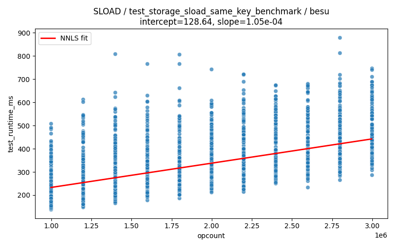

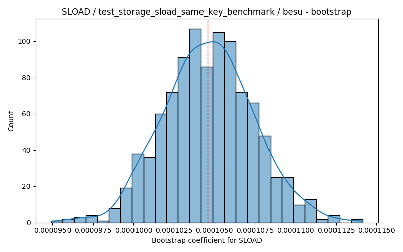

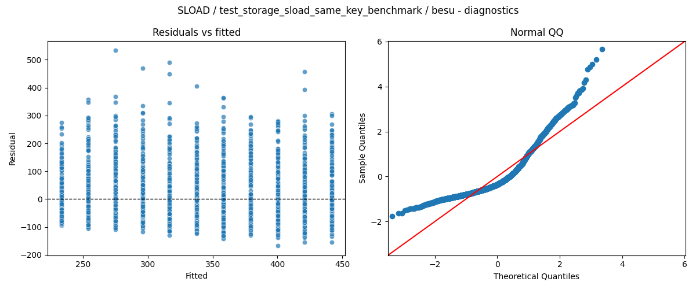

</details>

<details><summary>erigon — NNLS regression summary</summary>

```
==============================================================================
                           NNLS Regression Results                            
==============================================================================
Dep. Variable:          test_runtime_ms              R-squared:          0.872
Model:                  NNLS                    Adj. R-squared:          0.872
No. Observations:       770                               RMSE:           9.15
Df Residuals:           768                                MAE:           6.14
Df Model:               1      
==============================================================================
                      coef     std err     P-value      [0.025      0.975]
------------------------------------------------------------------------------
         const     34.4282      1.0520       0.001     32.3924     36.3418
       opcount      0.0000      0.0000       0.001      0.0000      0.0000
==============================================================================
Notes: Non-negative least squares with bootstrap inference (1000 iterations)
==============================================================================
```

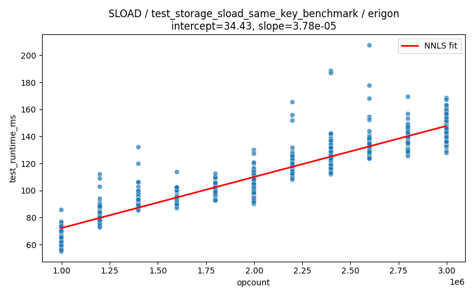

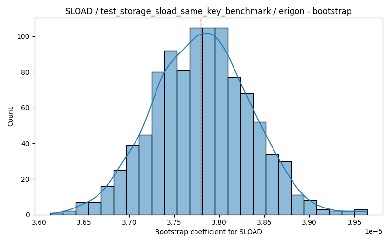

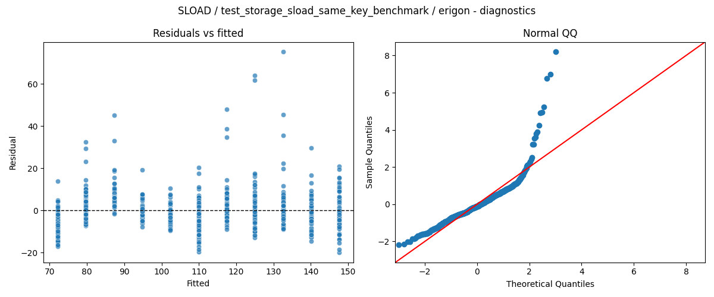

</details>

<details><summary>ethrex — NNLS regression summary</summary>

```
==============================================================================
                           NNLS Regression Results                            
==============================================================================
Dep. Variable:          test_runtime_ms              R-squared:          0.891
Model:                  NNLS                    Adj. R-squared:          0.891
No. Observations:       2552                              RMSE:           4.28
Df Residuals:           2550                               MAE:           3.05
Df Model:               1      
==============================================================================
                      coef     std err     P-value      [0.025      0.975]
------------------------------------------------------------------------------
         const     12.0572      0.2623       0.001     11.5384     12.5710
       opcount      0.0000      0.0000       0.001      0.0000      0.0000
==============================================================================
Notes: Non-negative least squares with bootstrap inference (1000 iterations)
==============================================================================
```

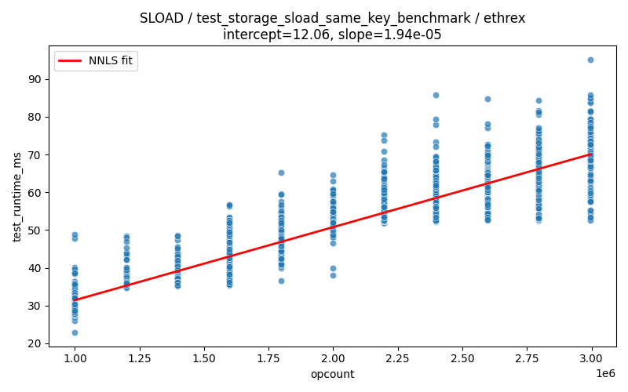

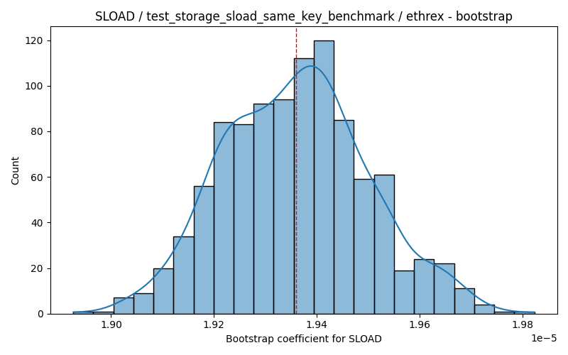

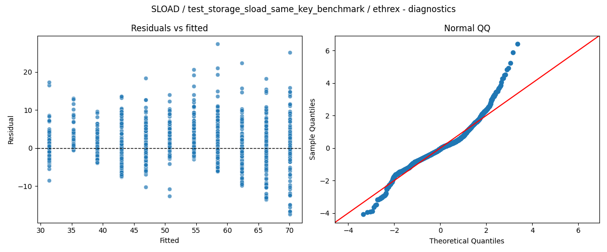

</details>

<details><summary>geth — NNLS regression summary</summary>

```
==============================================================================
                           NNLS Regression Results                            
==============================================================================
Dep. Variable:          test_runtime_ms              R-squared:          0.806
Model:                  NNLS                    Adj. R-squared:          0.806
No. Observations:       1848                              RMSE:          13.27
Df Residuals:           1846                               MAE:          10.07
Df Model:               1      
==============================================================================
                      coef     std err     P-value      [0.025      0.975]
------------------------------------------------------------------------------
         const     22.0474      0.9425       0.001     20.1270     23.9428
       opcount      0.0000      0.0000       0.001      0.0000      0.0000
==============================================================================
Notes: Non-negative least squares with bootstrap inference (1000 iterations)
==============================================================================
```

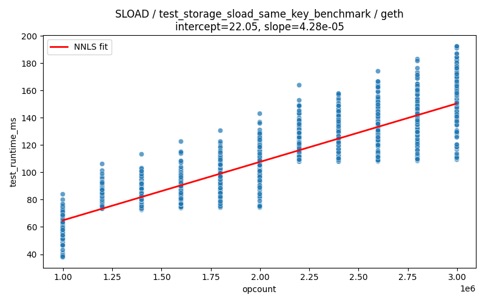

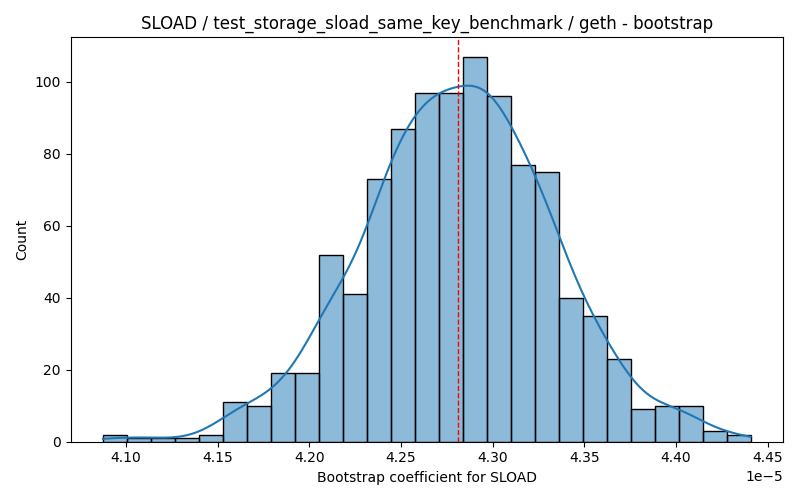

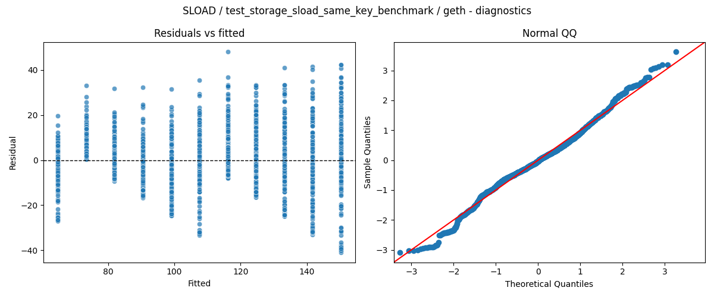

</details>

<details><summary>nethermind — NNLS regression summary</summary>

```
==============================================================================
                           NNLS Regression Results                            
==============================================================================
Dep. Variable:          test_runtime_ms              R-squared:          0.745
Model:                  NNLS                    Adj. R-squared:          0.744
No. Observations:       990                               RMSE:          59.05
Df Residuals:           988                                MAE:          45.29
Df Model:               1      
==============================================================================
                      coef     std err     P-value      [0.025      0.975]
------------------------------------------------------------------------------
         const     88.2308      5.5471       0.001     77.6318     99.4607
       opcount      0.0002      0.0000       0.001      0.0002      0.0002
==============================================================================
Notes: Non-negative least squares with bootstrap inference (1000 iterations)
==============================================================================
```

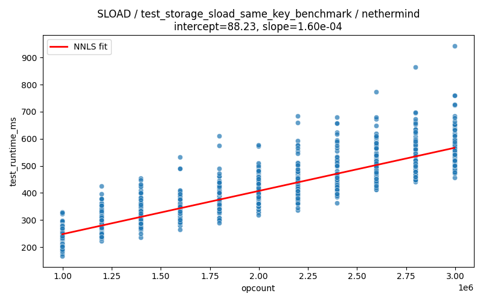

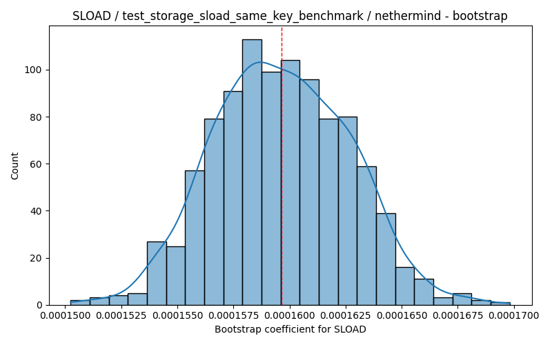

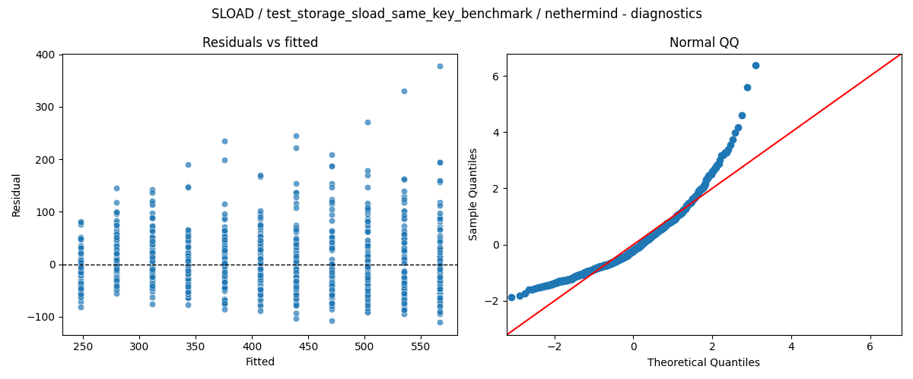

</details>

<details><summary>reth — NNLS regression summary</summary>

```
==============================================================================
                           NNLS Regression Results                            
==============================================================================
Dep. Variable:          test_runtime_ms              R-squared:          0.684
Model:                  NNLS                    Adj. R-squared:          0.684
No. Observations:       770                               RMSE:           2.19
Df Residuals:           768                                MAE:           1.55
Df Model:               1      
==============================================================================
                      coef     std err     P-value      [0.025      0.975]
------------------------------------------------------------------------------
         const      5.6148      0.2515       0.001      5.1318      6.1172
       opcount      0.0000      0.0000       0.001      0.0000      0.0000
==============================================================================
Notes: Non-negative least squares with bootstrap inference (1000 iterations)
==============================================================================
```

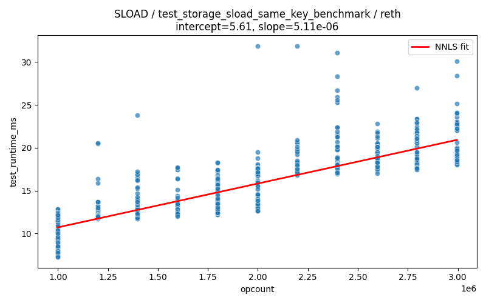

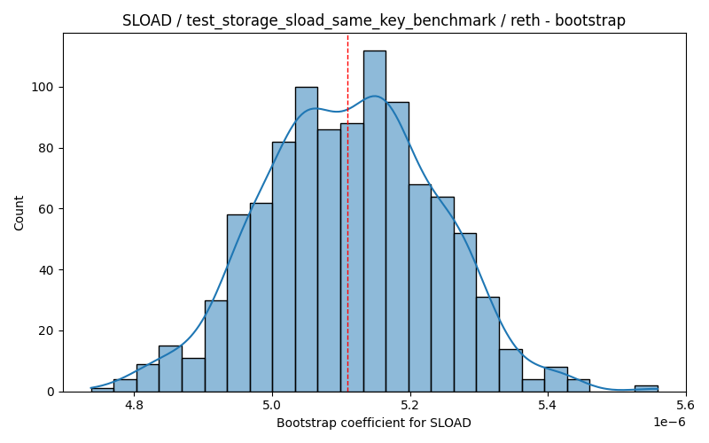

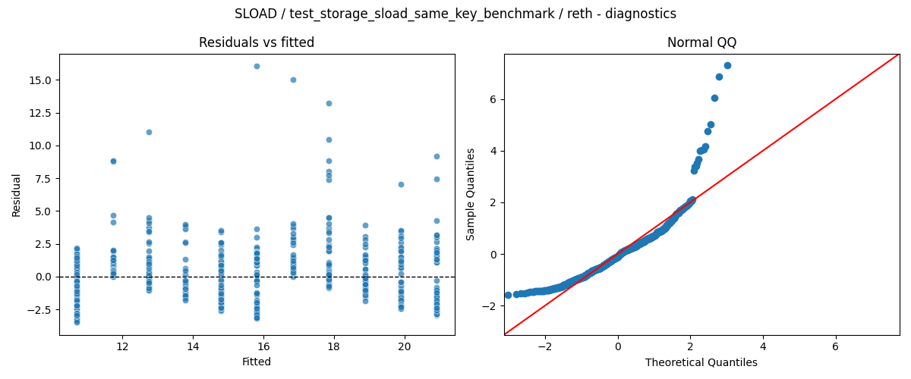

</details>

## SSTORE

### test_sstore_bloated — combo `False` — `presets[cold_storage_sstore_access]`

| client | nobs | R² | target_coef (ms) | p-value | 95% CI |
| --- | --- | --- | --- | --- | --- |
| `besu` | 1309 | 0.8651 | 0.00912 | 1.00e-03 | [0.008929, 0.009333] |
| `erigon` | 385 | 0.9877 | 0.00604 | 1.00e-03 | [0.005966, 0.006114] |
| `ethrex` | 1276 | 0.8764 | 0.007743 | 1.00e-03 | [0.007676, 0.007807] |
| `geth` | 924 | 0.8341 | 0.0247 | 1.00e-03 | [0.02391, 0.02551] |
| `nethermind` | 495 | 0.8263 | 0.003574 | 1.00e-03 | [0.003429, 0.003713] |
| `reth` | 385 | 0.9519 | 0.001293 | 1.00e-03 | [0.001264, 0.001321] |

<details><summary>besu — NNLS regression summary</summary>

```
==============================================================================
                           NNLS Regression Results                            
==============================================================================
Dep. Variable:          test_runtime_ms              R-squared:          0.865
Model:                  NNLS                    Adj. R-squared:          0.865
No. Observations:       1309                              RMSE:         101.76
Df Residuals:           1307                               MAE:          77.72
Df Model:               1      
==============================================================================
                      coef     std err     P-value      [0.025      0.975]
------------------------------------------------------------------------------
         const    427.8718      8.4557       0.001    410.7524    443.2652
       opcount      0.0091      0.0001       0.001      0.0089      0.0093
==============================================================================
Notes: Non-negative least squares with bootstrap inference (1000 iterations)
==============================================================================
```

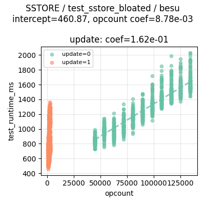

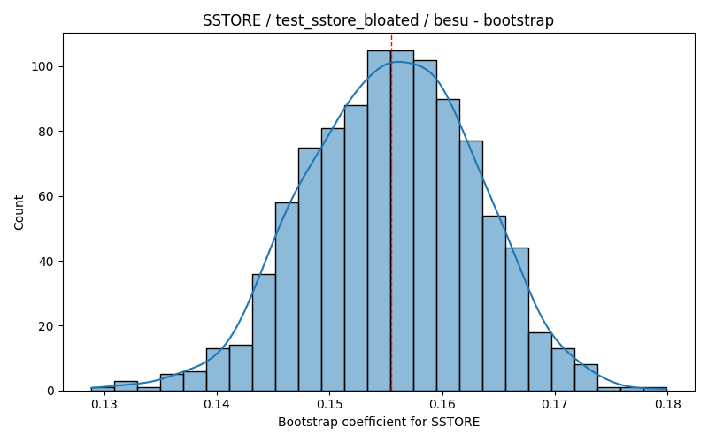

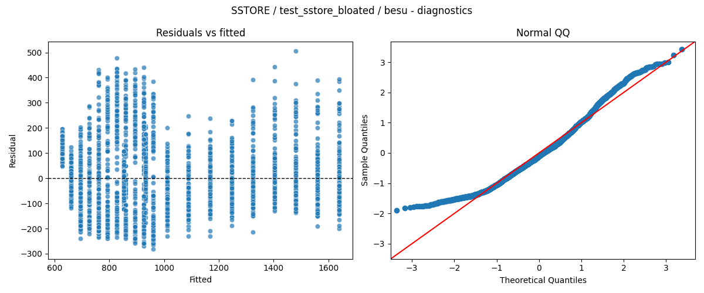

</details>

<details><summary>erigon — NNLS regression summary</summary>

```
==============================================================================
                           NNLS Regression Results                            
==============================================================================
Dep. Variable:          test_runtime_ms              R-squared:          0.988
Model:                  NNLS                    Adj. R-squared:          0.988
No. Observations:       385                               RMSE:          19.03
Df Residuals:           383                                MAE:          15.00
Df Model:               1      
==============================================================================
                      coef     std err     P-value      [0.025      0.975]
------------------------------------------------------------------------------
         const     15.1046      3.0595       0.001      9.2840     21.2263
       opcount      0.0060      0.0000       0.001      0.0060      0.0061
==============================================================================
Notes: Non-negative least squares with bootstrap inference (1000 iterations)
==============================================================================
```

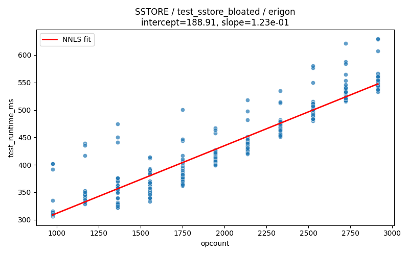

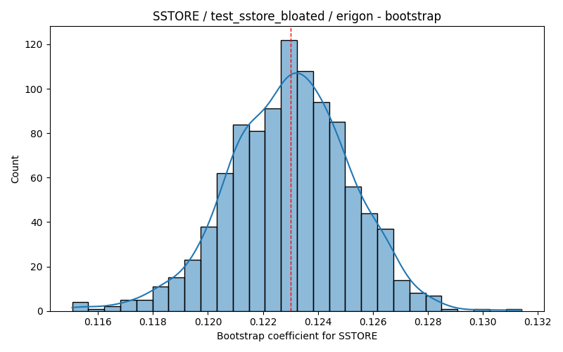

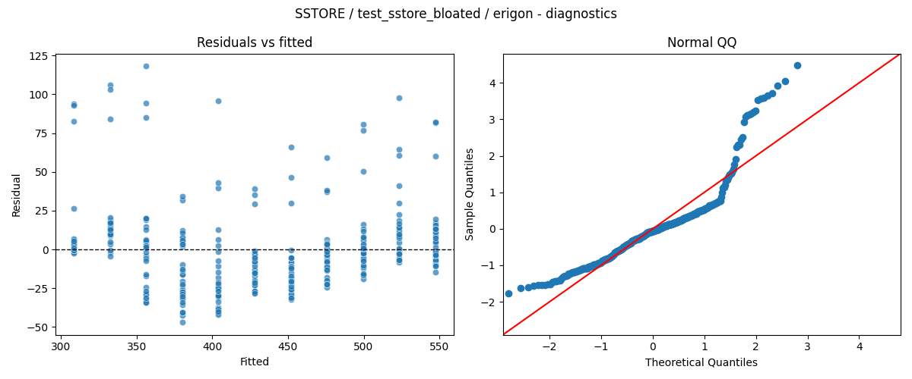

</details>

<details><summary>ethrex — NNLS regression summary</summary>

```
==============================================================================
                           NNLS Regression Results                            
==============================================================================
Dep. Variable:          test_runtime_ms              R-squared:          0.876
Model:                  NNLS                    Adj. R-squared:          0.876
No. Observations:       1276                              RMSE:         109.83
Df Residuals:           1274                               MAE:          94.60
Df Model:               1      
==============================================================================
                      coef     std err     P-value      [0.025      0.975]
------------------------------------------------------------------------------
         const      0.0000      0.0000       1.000      0.0000      0.0000
       opcount      0.0077      0.0000       0.001      0.0077      0.0078
==============================================================================
Notes: Non-negative least squares with bootstrap inference (1000 iterations)
==============================================================================
```

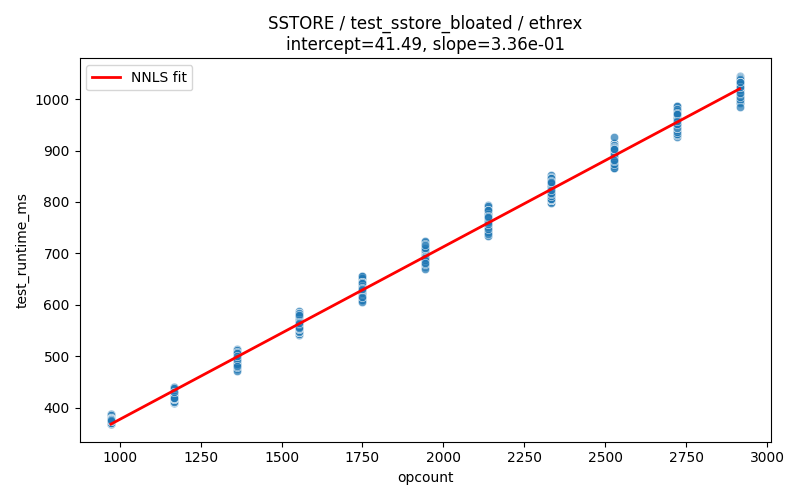

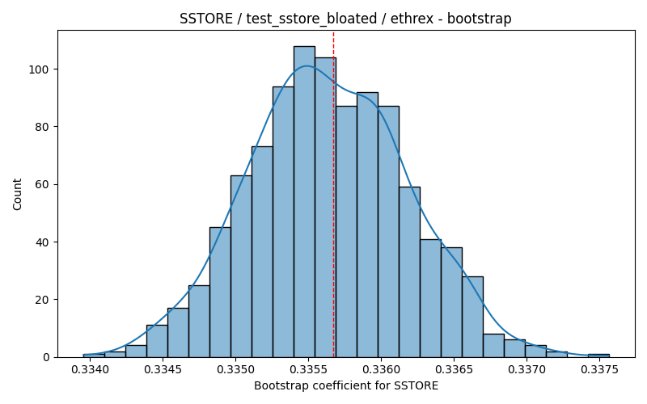

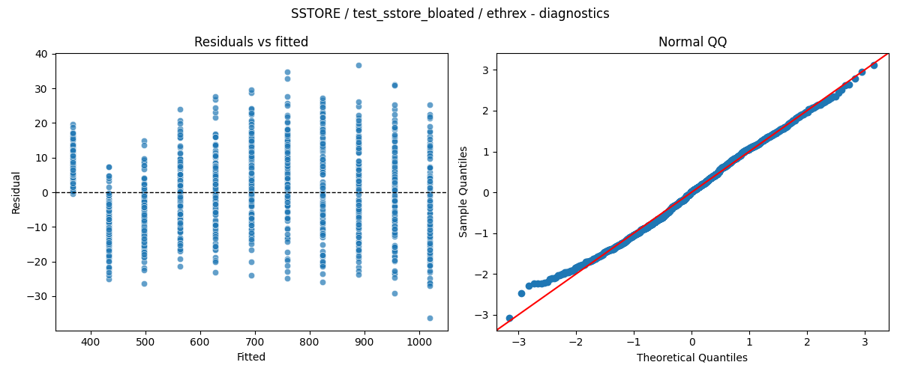

</details>

<details><summary>geth — NNLS regression summary</summary>

```
==============================================================================
                           NNLS Regression Results                            
==============================================================================
Dep. Variable:          test_runtime_ms              R-squared:          0.834
Model:                  NNLS                    Adj. R-squared:          0.834
No. Observations:       924                               RMSE:         311.33
Df Residuals:           922                                MAE:         253.49
Df Model:               1      
==============================================================================
                      coef     std err     P-value      [0.025      0.975]
------------------------------------------------------------------------------
         const    929.6400     31.7687       0.001    868.4708    992.2260
       opcount      0.0247      0.0004       0.001      0.0239      0.0255
==============================================================================
Notes: Non-negative least squares with bootstrap inference (1000 iterations)
==============================================================================
```

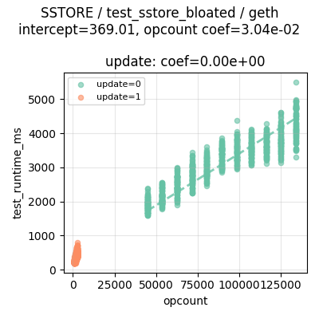

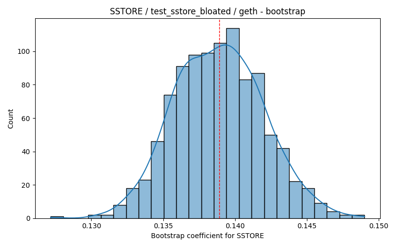

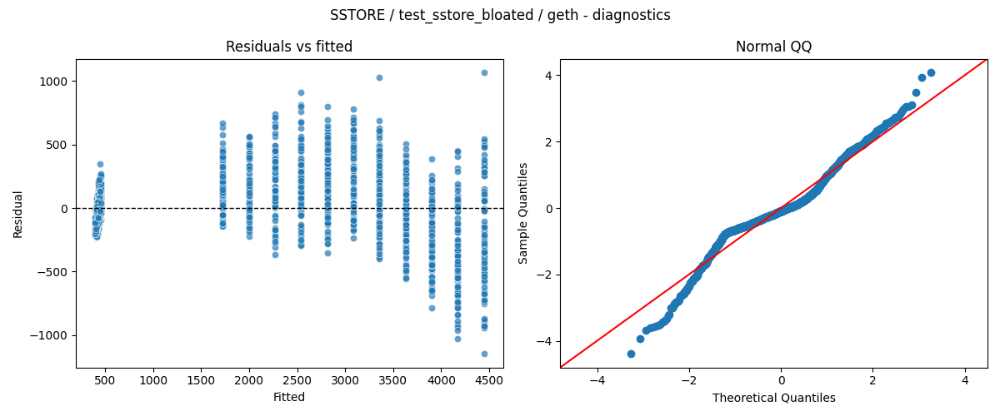

</details>

<details><summary>nethermind — NNLS regression summary</summary>

```
==============================================================================
                           NNLS Regression Results                            
==============================================================================
Dep. Variable:          test_runtime_ms              R-squared:          0.826
Model:                  NNLS                    Adj. R-squared:          0.826
No. Observations:       495                               RMSE:          46.31
Df Residuals:           493                                MAE:          36.41
Df Model:               1      
==============================================================================
                      coef     std err     P-value      [0.025      0.975]
------------------------------------------------------------------------------
         const    132.1880      6.7411       0.001    119.5118    145.5135
       opcount      0.0036      0.0001       0.001      0.0034      0.0037
==============================================================================
Notes: Non-negative least squares with bootstrap inference (1000 iterations)
==============================================================================
```

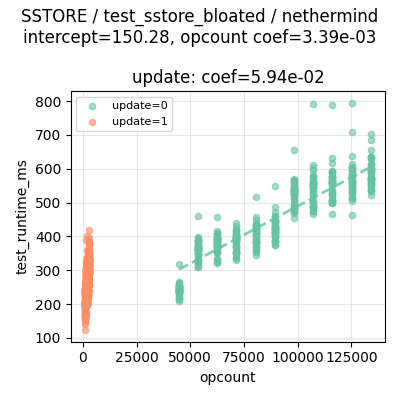

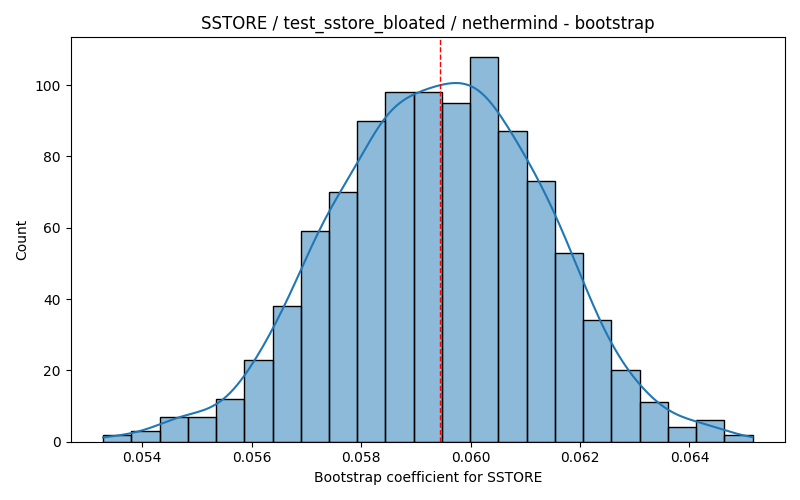

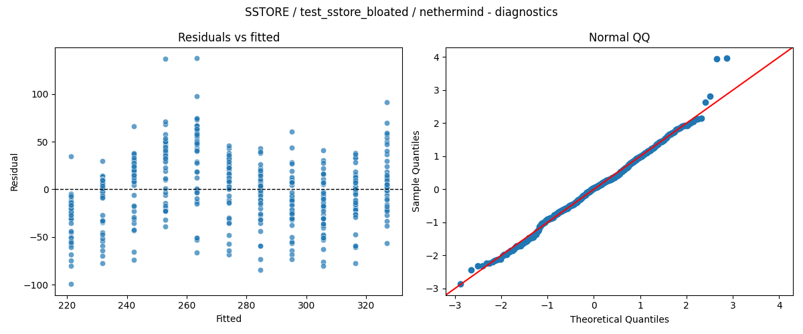

</details>

<details><summary>reth — NNLS regression summary</summary>

```
==============================================================================
                           NNLS Regression Results                            
==============================================================================
Dep. Variable:          test_runtime_ms              R-squared:          0.952
Model:                  NNLS                    Adj. R-squared:          0.952
No. Observations:       385                               RMSE:           8.22
Df Residuals:           383                                MAE:           6.41
Df Model:               1      
==============================================================================
                      coef     std err     P-value      [0.025      0.975]
------------------------------------------------------------------------------
         const     42.9763      1.4342       0.001     40.2407     45.9493
       opcount      0.0013      0.0000       0.001      0.0013      0.0013
==============================================================================
Notes: Non-negative least squares with bootstrap inference (1000 iterations)
==============================================================================
```

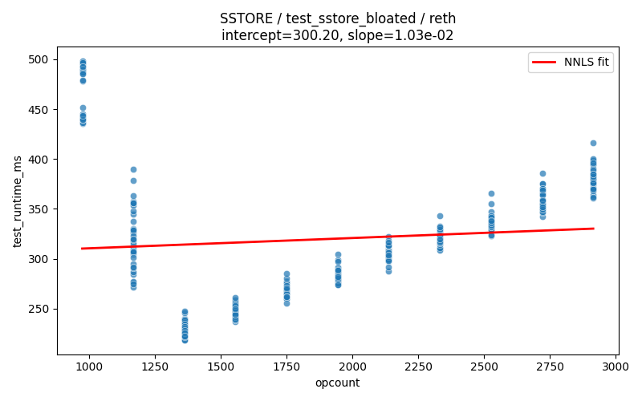

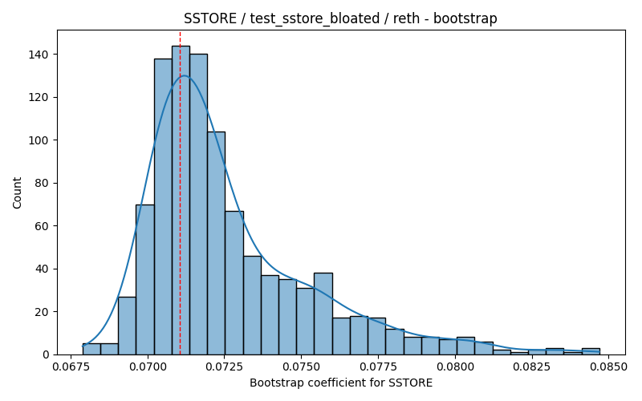

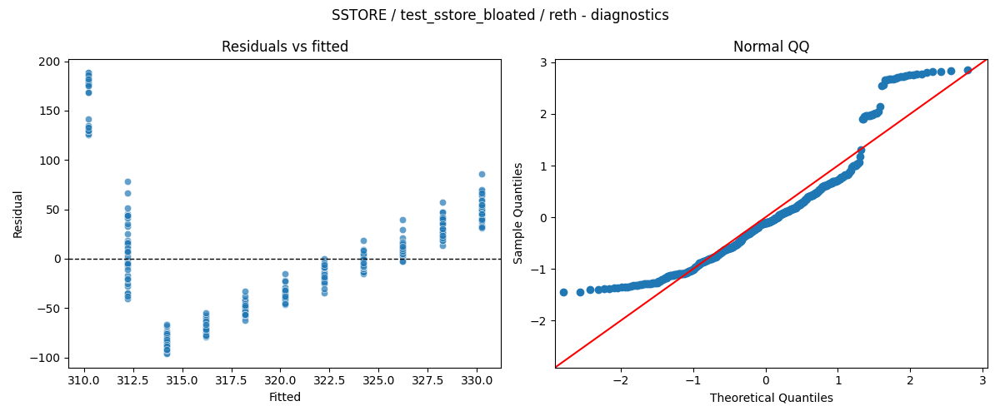

</details>

### test_sstore_bloated — combo `True` — `presets[cold_storage_sstore_access]`

| client | nobs | R² | target_coef (ms) | p-value | 95% CI |
| --- | --- | --- | --- | --- | --- |
| `besu` | 1309 | 0.9064 | 0.01718 | 1.00e-03 | [0.01686, 0.01748] |
| `erigon` | 385 | 0.9776 | 0.00569 | 1.00e-03 | [0.005608, 0.005767] |
| `ethrex` | 1276 | 0.9901 | 0.03422 | 1.00e-03 | [0.03403, 0.03441] |
| `geth` | 924 | 0.8392 | 0.02389 | 1.00e-03 | [0.02325, 0.02458] |
| `nethermind` | 495 | 0.6373 | 0.02689 | 1.00e-03 | [0.02491, 0.02865] |
| `reth` | 385 | 0.9704 | 0.001502 | 1.00e-03 | [0.001475, 0.001528] |

<details><summary>besu — NNLS regression summary</summary>

```
==============================================================================
                           NNLS Regression Results                            
==============================================================================
Dep. Variable:          test_runtime_ms              R-squared:          0.906
Model:                  NNLS                    Adj. R-squared:          0.906
No. Observations:       1309                              RMSE:         156.08
Df Residuals:           1307                               MAE:         128.01
Df Model:               1      
==============================================================================
                      coef     std err     P-value      [0.025      0.975]
------------------------------------------------------------------------------
         const    697.7484     14.9339       0.001    669.5270    728.4766
       opcount      0.0172      0.0002       0.001      0.0169      0.0175
==============================================================================
Notes: Non-negative least squares with bootstrap inference (1000 iterations)
==============================================================================
```

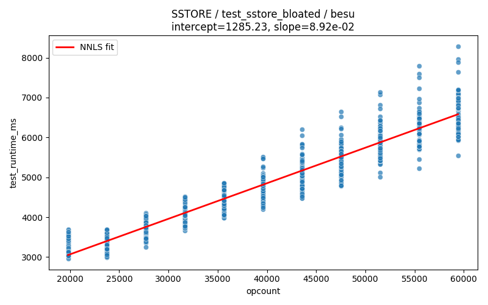

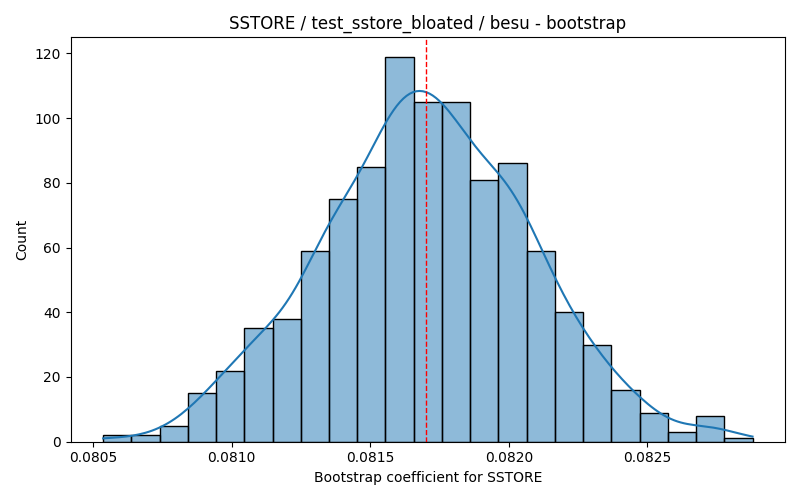

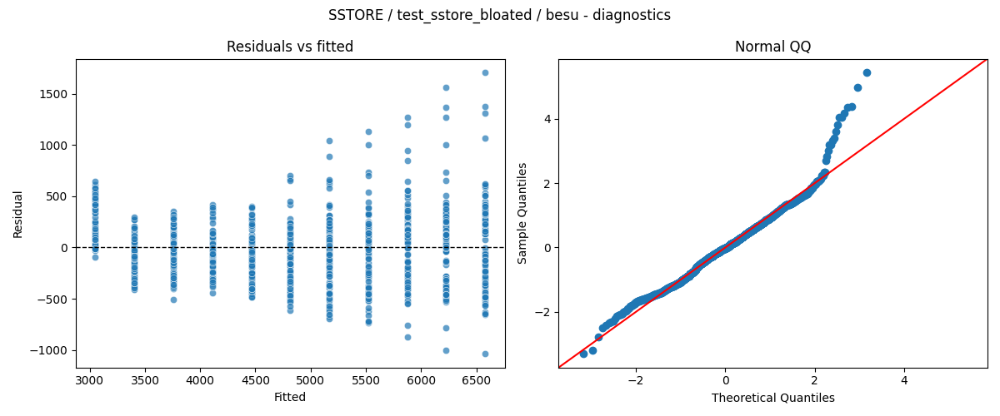

</details>

<details><summary>erigon — NNLS regression summary</summary>

```
==============================================================================
                           NNLS Regression Results                            
==============================================================================
Dep. Variable:          test_runtime_ms              R-squared:          0.978
Model:                  NNLS                    Adj. R-squared:          0.978
No. Observations:       385                               RMSE:          24.35
Df Residuals:           383                                MAE:          19.21
Df Model:               1      
==============================================================================
                      coef     std err     P-value      [0.025      0.975]
------------------------------------------------------------------------------
         const     19.5645      3.5182       0.001     12.8968     26.4945
       opcount      0.0057      0.0000       0.001      0.0056      0.0058
==============================================================================
Notes: Non-negative least squares with bootstrap inference (1000 iterations)
==============================================================================
```

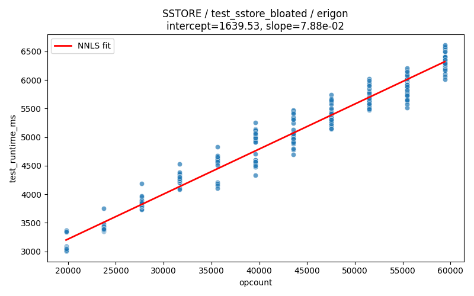

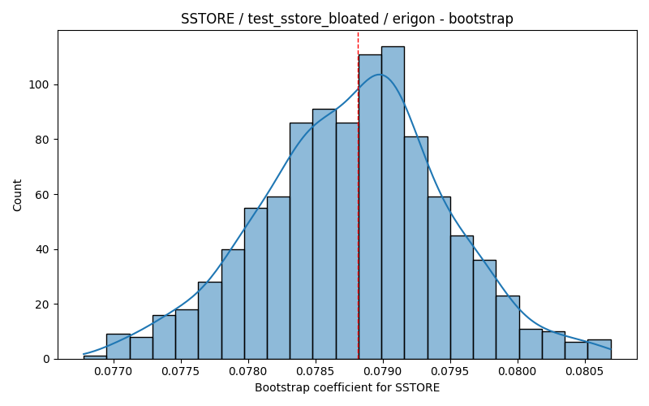

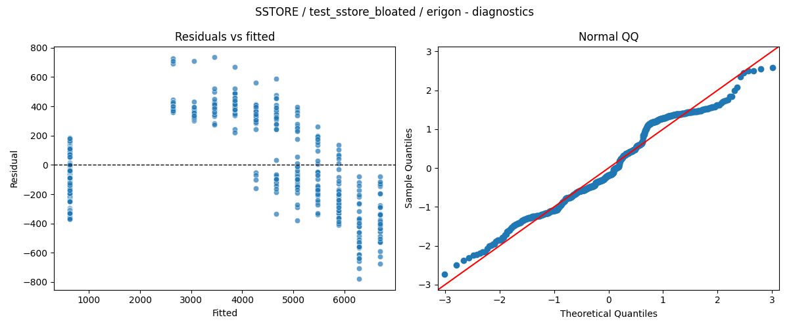

</details>

<details><summary>ethrex — NNLS regression summary</summary>

```
==============================================================================
                           NNLS Regression Results                            
==============================================================================
Dep. Variable:          test_runtime_ms              R-squared:          0.990
Model:                  NNLS                    Adj. R-squared:          0.990
No. Observations:       1276                              RMSE:          96.92
Df Residuals:           1274                               MAE:          71.19
Df Model:               1      
==============================================================================
                      coef     std err     P-value      [0.025      0.975]
------------------------------------------------------------------------------
         const    191.1129      7.3935       0.001    176.0599    205.5740
       opcount      0.0342      0.0001       0.001      0.0340      0.0344
==============================================================================
Notes: Non-negative least squares with bootstrap inference (1000 iterations)
==============================================================================
```

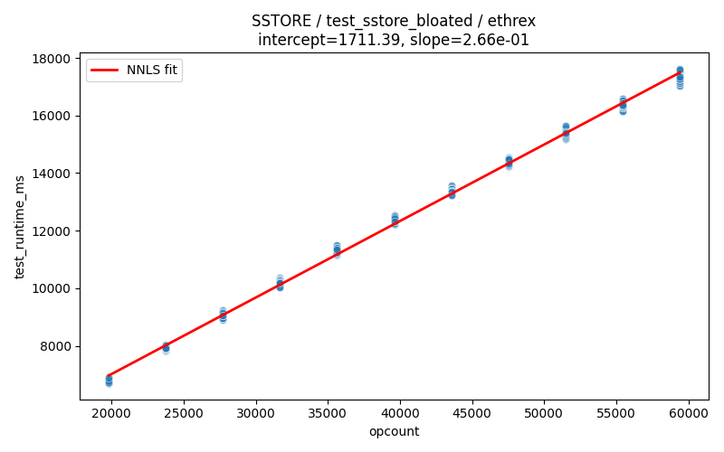

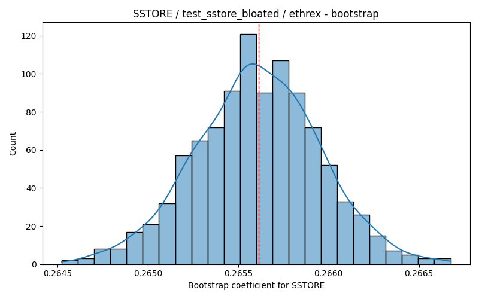

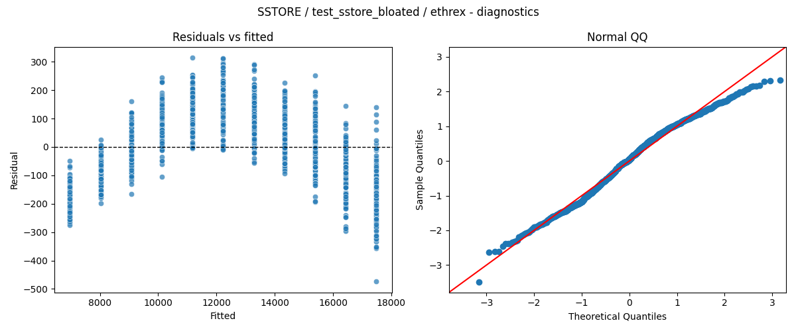

</details>

<details><summary>geth — NNLS regression summary</summary>

```
==============================================================================
                           NNLS Regression Results                            
==============================================================================
Dep. Variable:          test_runtime_ms              R-squared:          0.839
Model:                  NNLS                    Adj. R-squared:          0.839
No. Observations:       924                               RMSE:         295.60
Df Residuals:           922                                MAE:         240.85
Df Model:               1      
==============================================================================
                      coef     std err     P-value      [0.025      0.975]
------------------------------------------------------------------------------
         const    922.1617     29.4658       0.001    861.6593    977.1017
       opcount      0.0239      0.0003       0.001      0.0232      0.0246
==============================================================================
Notes: Non-negative least squares with bootstrap inference (1000 iterations)
==============================================================================
```

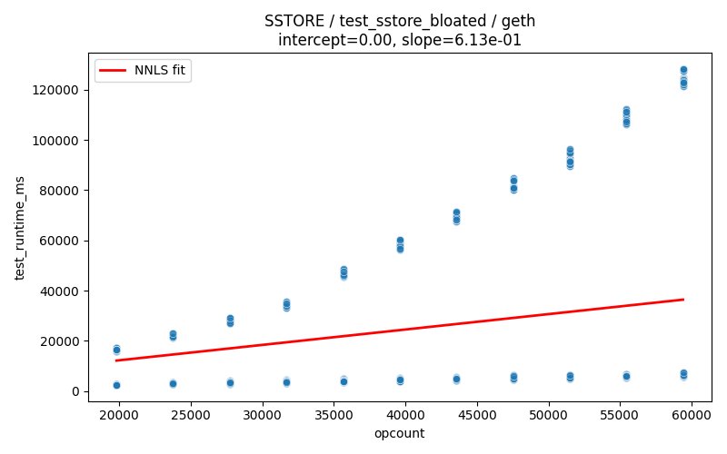

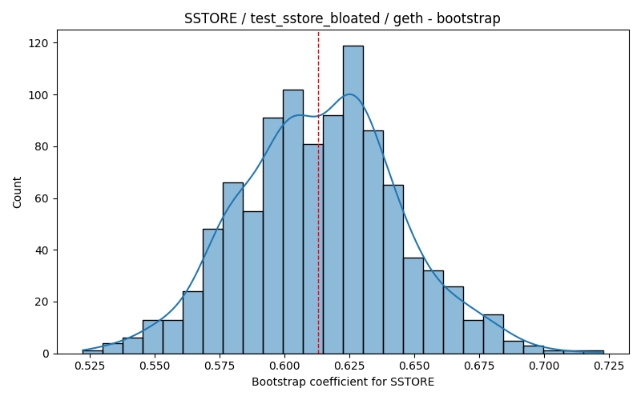

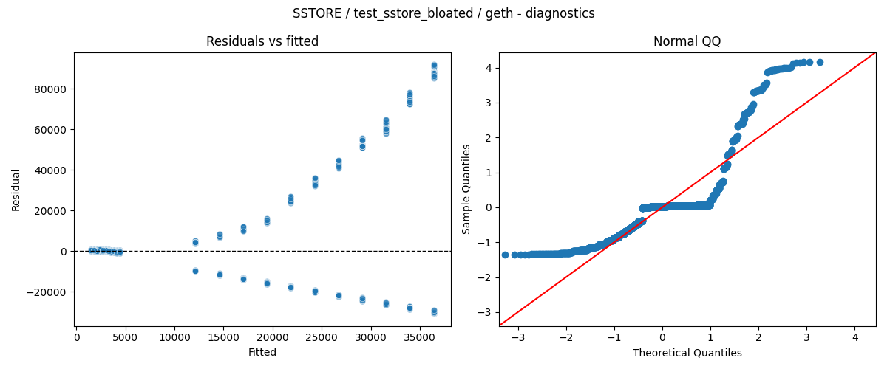

</details>

<details><summary>nethermind — NNLS regression summary</summary>

```
==============================================================================
                           NNLS Regression Results                            
==============================================================================
Dep. Variable:          test_runtime_ms              R-squared:          0.637
Model:                  NNLS                    Adj. R-squared:          0.637
No. Observations:       495                               RMSE:         573.29
Df Residuals:           493                                MAE:         471.48
Df Model:               1      
==============================================================================
                      coef     std err     P-value      [0.025      0.975]
------------------------------------------------------------------------------
         const   1189.9452     87.9413       0.001   1029.7194   1378.7981
       opcount      0.0269      0.0009       0.001      0.0249      0.0286
==============================================================================
Notes: Non-negative least squares with bootstrap inference (1000 iterations)
==============================================================================
```

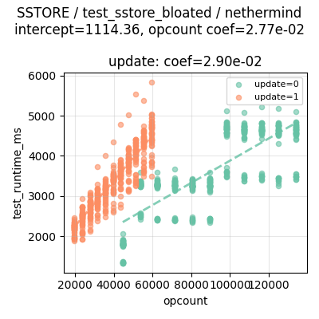

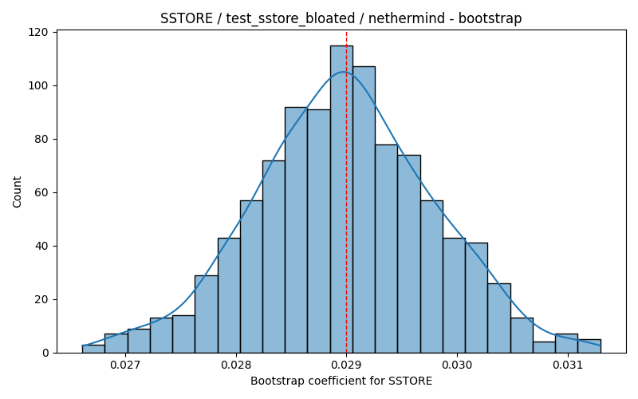

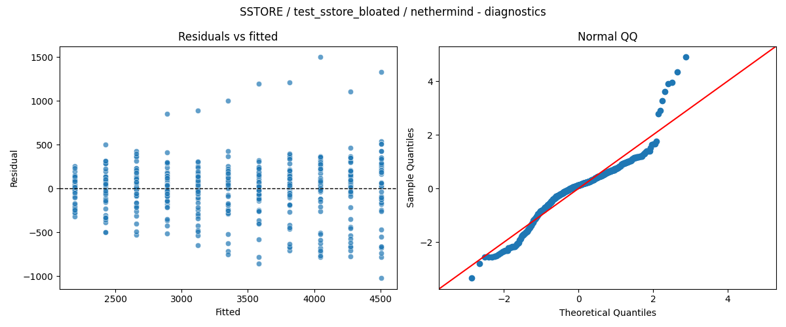

</details>

<details><summary>reth — NNLS regression summary</summary>

```
==============================================================================
                           NNLS Regression Results                            
==============================================================================
Dep. Variable:          test_runtime_ms              R-squared:          0.970
Model:                  NNLS                    Adj. R-squared:          0.970
No. Observations:       385                               RMSE:           7.42
Df Residuals:           383                                MAE:           5.76
Df Model:               1      
==============================================================================
                      coef     std err     P-value      [0.025      0.975]
------------------------------------------------------------------------------
         const     28.0819      1.1822       0.001     25.8472     30.5123
       opcount      0.0015      0.0000       0.001      0.0015      0.0015
==============================================================================
Notes: Non-negative least squares with bootstrap inference (1000 iterations)
==============================================================================
```

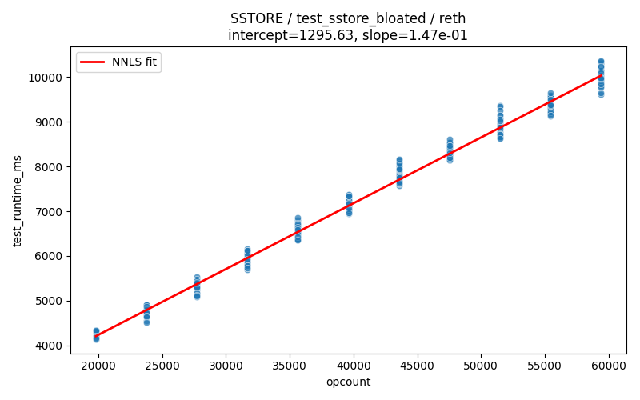

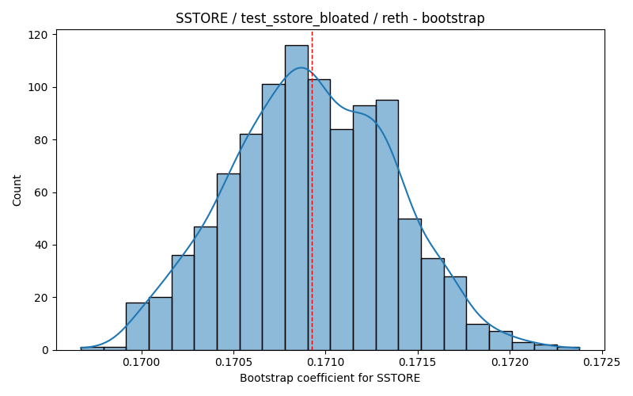

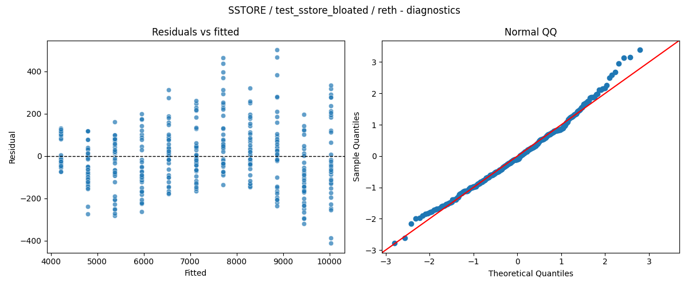

</details>

### test_sstore_bloated — combo `False` — `presets[cold_storage_sstore_write]`

| client | nobs | R² | target_coef (ms) | p-value | 95% CI |
| --- | --- | --- | --- | --- | --- |
| `besu` | 1309 | 0.2164 | 0.1555 | 1.00e-03 | [0.1405, 0.1693] |
| `erigon` | 385 | 0.8919 | 0.123 | 1.00e-03 | [0.1184, 0.127] |
| `ethrex` | 1276 | 0.9967 | 0.3357 | 1.00e-03 | [0.3346, 0.3367] |
| `geth` | 924 | 0.6767 | 0.1389 | 1.00e-03 | [0.133, 0.1452] |
| `nethermind` | 495 | 0.481 | 0.05435 | 1.00e-03 | [0.04954, 0.05875] |
| `reth` | 385 | 0.009102 | 0.0103 | 6.90e-02 | [0, 0.02555] |

<details><summary>besu — NNLS regression summary</summary>

```
==============================================================================
                           NNLS Regression Results                            
==============================================================================
Dep. Variable:          test_runtime_ms              R-squared:          0.216
Model:                  NNLS                    Adj. R-squared:          0.216
No. Observations:       1309                              RMSE:         181.68
Df Residuals:           1307                               MAE:         157.00
Df Model:               1      
==============================================================================
                      coef     std err     P-value      [0.025      0.975]
------------------------------------------------------------------------------
         const    493.9234     13.0353       0.001    468.7647    518.2745
       opcount      0.1555      0.0074       0.001      0.1405      0.1693
==============================================================================
Notes: Non-negative least squares with bootstrap inference (1000 iterations)
==============================================================================
```


</details>

<details><summary>erigon — NNLS regression summary</summary>

```
==============================================================================
                           NNLS Regression Results                            
==============================================================================
Dep. Variable:          test_runtime_ms              R-squared:          0.892
Model:                  NNLS                    Adj. R-squared:          0.892
No. Observations:       385                               RMSE:          26.30
Df Residuals:           383                                MAE:          17.64
Df Model:               1      
==============================================================================
                      coef     std err     P-value      [0.025      0.975]
------------------------------------------------------------------------------
         const    188.9068      4.7506       0.001    179.8246    198.6234
       opcount      0.1230      0.0022       0.001      0.1184      0.1270
==============================================================================
Notes: Non-negative least squares with bootstrap inference (1000 iterations)
==============================================================================
```


</details>

<details><summary>ethrex — NNLS regression summary</summary>

```
==============================================================================
                           NNLS Regression Results                            
==============================================================================
Dep. Variable:          test_runtime_ms              R-squared:          0.997
Model:                  NNLS                    Adj. R-squared:          0.997
No. Observations:       1276                              RMSE:          11.78
Df Residuals:           1274                               MAE:           9.71
Df Model:               1      
==============================================================================
                      coef     std err     P-value      [0.025      0.975]
------------------------------------------------------------------------------
         const     41.4936      1.0501       0.001     39.5296     43.5061
       opcount      0.3357      0.0005       0.001      0.3346      0.3367
==============================================================================
Notes: Non-negative least squares with bootstrap inference (1000 iterations)
==============================================================================
```


</details>

<details><summary>geth — NNLS regression summary</summary>

```
==============================================================================
                           NNLS Regression Results                            
==============================================================================
Dep. Variable:          test_runtime_ms              R-squared:          0.677
Model:                  NNLS                    Adj. R-squared:          0.676
No. Observations:       924                               RMSE:          58.96
Df Residuals:           922                                MAE:          42.77
Df Model:               1      
==============================================================================
                      coef     std err     P-value      [0.025      0.975]
------------------------------------------------------------------------------
         const    106.5386      5.6871       0.001     95.8516    117.4632
       opcount      0.1389      0.0031       0.001      0.1330      0.1452
==============================================================================
Notes: Non-negative least squares with bootstrap inference (1000 iterations)
==============================================================================
```


</details>

<details><summary>nethermind — NNLS regression summary</summary>

```
==============================================================================
                           NNLS Regression Results                            
==============================================================================
Dep. Variable:          test_runtime_ms              R-squared:          0.481
Model:                  NNLS                    Adj. R-squared:          0.480
No. Observations:       495                               RMSE:          34.68
Df Residuals:           493                                MAE:          27.08
Df Model:               1      
==============================================================================
                      coef     std err     P-value      [0.025      0.975]
------------------------------------------------------------------------------
         const    168.3997      5.0535       0.001    159.0739    178.6490
       opcount      0.0544      0.0023       0.001      0.0495      0.0587
==============================================================================
Notes: Non-negative least squares with bootstrap inference (1000 iterations)
==============================================================================
```


</details>

<details><summary>reth — NNLS regression summary</summary>

```
==============================================================================
                           NNLS Regression Results                            
==============================================================================
Dep. Variable:          test_runtime_ms              R-squared:          0.009
Model:                  NNLS                    Adj. R-squared:          0.007
No. Observations:       385                               RMSE:          66.02
Df Residuals:           383                                MAE:          49.57
Df Model:               1      
==============================================================================
                      coef     std err     P-value      [0.025      0.975]
------------------------------------------------------------------------------
         const    300.1972     15.9784       0.001    266.2758    325.2953
       opcount      0.0103      0.0068       0.069      0.0000      0.0256
==============================================================================
Notes: Non-negative least squares with bootstrap inference (1000 iterations)
==============================================================================
```


</details>

### test_sstore_bloated — combo `True` — `presets[cold_storage_sstore_write]`

| client | nobs | R² | target_coef (ms) | p-value | 95% CI |
| --- | --- | --- | --- | --- | --- |
| `besu` | 1309 | 0.9266 | 0.08915 | 1.00e-03 | [0.08763, 0.09059] |
| `erigon` | 385 | 0.9687 | 0.07882 | 1.00e-03 | [0.07738, 0.08016] |
| `ethrex` | 1276 | 0.9983 | 0.2656 | 1.00e-03 | [0.2649, 0.2663] |
| `geth` | 924 | 0.1092 | 0.6129 | 1.00e-03 | [0.555, 0.6766] |
| `nethermind` | 495 | 0.8507 | 0.05839 | 1.00e-03 | [0.05625, 0.06054] |
| `reth` | 385 | 0.9936 | 0.1471 | 1.00e-03 | [0.1459, 0.1482] |

<details><summary>besu — NNLS regression summary</summary>

```
==============================================================================
                           NNLS Regression Results                            
==============================================================================
Dep. Variable:          test_runtime_ms              R-squared:          0.927
Model:                  NNLS                    Adj. R-squared:          0.927
No. Observations:       1309                              RMSE:         314.20
Df Residuals:           1307                               MAE:         241.48
Df Model:               1      
==============================================================================
                      coef     std err     P-value      [0.025      0.975]
------------------------------------------------------------------------------
         const   1285.2330     28.6869       0.001   1231.6895   1343.6423
       opcount      0.0892      0.0008       0.001      0.0876      0.0906
==============================================================================
Notes: Non-negative least squares with bootstrap inference (1000 iterations)
==============================================================================
```


</details>

<details><summary>erigon — NNLS regression summary</summary>

```
==============================================================================
                           NNLS Regression Results                            
==============================================================================
Dep. Variable:          test_runtime_ms              R-squared:          0.969
Model:                  NNLS                    Adj. R-squared:          0.969
No. Observations:       385                               RMSE:         177.28
Df Residuals:           383                                MAE:         150.04
Df Model:               1      
==============================================================================
                      coef     std err     P-value      [0.025      0.975]
------------------------------------------------------------------------------
         const   1639.5286     26.7492       0.001   1586.2627   1694.1324
       opcount      0.0788      0.0007       0.001      0.0774      0.0802
==============================================================================
Notes: Non-negative least squares with bootstrap inference (1000 iterations)
==============================================================================
```


</details>

<details><summary>ethrex — NNLS regression summary</summary>

```
==============================================================================
                           NNLS Regression Results                            
==============================================================================
Dep. Variable:          test_runtime_ms              R-squared:          0.998
Model:                  NNLS                    Adj. R-squared:          0.998
No. Observations:       1276                              RMSE:         135.26
Df Residuals:           1274                               MAE:         112.79
Df Model:               1      
==============================================================================
                      coef     std err     P-value      [0.025      0.975]
------------------------------------------------------------------------------
         const   1711.3946     13.9160       0.001   1684.8319   1741.1084
       opcount      0.2656      0.0003       0.001      0.2649      0.2663
==============================================================================
Notes: Non-negative least squares with bootstrap inference (1000 iterations)
==============================================================================
```


</details>

<details><summary>geth — NNLS regression summary</summary>

```
==============================================================================
                           NNLS Regression Results                            
==============================================================================
Dep. Variable:          test_runtime_ms              R-squared:          0.109
Model:                  NNLS                    Adj. R-squared:          0.108
No. Observations:       924                               RMSE:       31429.65
Df Residuals:           922                                MAE:       25539.01
Df Model:               1      
==============================================================================
                      coef     std err     P-value      [0.025      0.975]
------------------------------------------------------------------------------
         const      0.0000      0.0000       1.000      0.0000      0.0000
       opcount      0.6129      0.0303       0.001      0.5550      0.6766
==============================================================================
Notes: Non-negative least squares with bootstrap inference (1000 iterations)
==============================================================================
```


</details>

<details><summary>nethermind — NNLS regression summary</summary>

```
==============================================================================
                           NNLS Regression Results                            
==============================================================================
Dep. Variable:          test_runtime_ms              R-squared:          0.851
Model:                  NNLS                    Adj. R-squared:          0.850
No. Observations:       495                               RMSE:         306.39
Df Residuals:           493                                MAE:         214.65
Df Model:               1      
==============================================================================
                      coef     std err     P-value      [0.025      0.975]
------------------------------------------------------------------------------
         const   1038.7764     38.9606       0.001    958.4077   1112.0565
       opcount      0.0584      0.0011       0.001      0.0562      0.0605
==============================================================================
Notes: Non-negative least squares with bootstrap inference (1000 iterations)
==============================================================================
```


</details>

<details><summary>reth — NNLS regression summary</summary>

```
==============================================================================
                           NNLS Regression Results                            
==============================================================================
Dep. Variable:          test_runtime_ms              R-squared:          0.994
Model:                  NNLS                    Adj. R-squared:          0.994
No. Observations:       385                               RMSE:         148.21
Df Residuals:           383                                MAE:         116.82
Df Model:               1      
==============================================================================
                      coef     std err     P-value      [0.025      0.975]
------------------------------------------------------------------------------
         const   1295.6276     22.0009       0.001   1251.0703   1339.7389
       opcount      0.1471      0.0006       0.001      0.1459      0.1482
==============================================================================
Notes: Non-negative least squares with bootstrap inference (1000 iterations)
==============================================================================
```


</details>

## BALANCE

### test_account_access — combo `BALANCE_AccountMode.EXISTING_EOA`

| client | nobs | R² | target_coef (ms) | p-value | 95% CI |
| --- | --- | --- | --- | --- | --- |
| `besu` | 1309 | 0.7395 | 0.01043 | 1.00e-03 | [0.01003, 0.01078] |
| `erigon` | 385 | 0.979 | 0.009524 | 1.00e-03 | [0.009376, 0.009663] |
| `ethrex` | 1276 | 0.9738 | 0.02424 | 1.00e-03 | [0.02398, 0.02452] |
| `geth` | 924 | 0.7415 | 0.01137 | 1.00e-03 | [0.01093, 0.01175] |
| `nethermind` | 495 | 0.9256 | 0.003739 | 1.00e-03 | [0.003648, 0.003834] |
| `reth` | 385 | 0.9759 | 0.001094 | 1.00e-03 | [0.001077, 0.001112] |

<details><summary>besu — NNLS regression summary</summary>

```
==============================================================================
                           NNLS Regression Results                            
==============================================================================
Dep. Variable:          test_runtime_ms              R-squared:          0.739
Model:                  NNLS                    Adj. R-squared:          0.739
No. Observations:       1309                              RMSE:         147.91
Df Residuals:           1307                               MAE:         125.53
Df Model:               1      
==============================================================================
                      coef     std err     P-value      [0.025      0.975]
------------------------------------------------------------------------------
         const    419.1427     15.1827       0.001    391.3513    451.9063
       opcount      0.0104      0.0002       0.001      0.0100      0.0108
==============================================================================
Notes: Non-negative least squares with bootstrap inference (1000 iterations)
==============================================================================
```

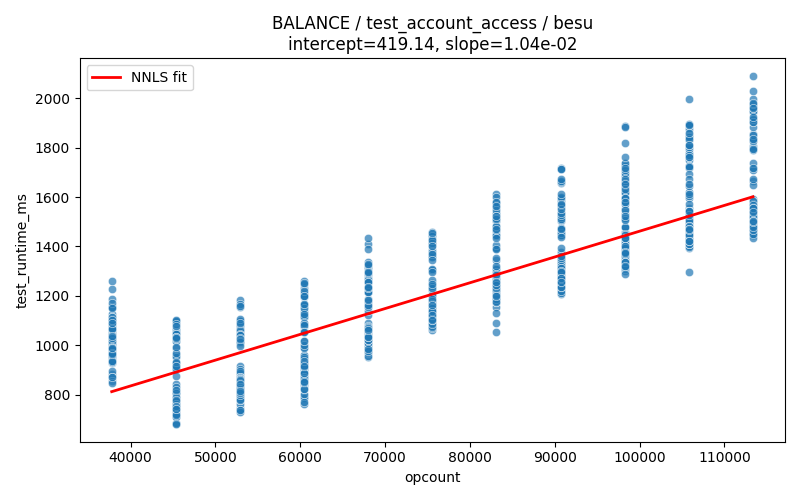

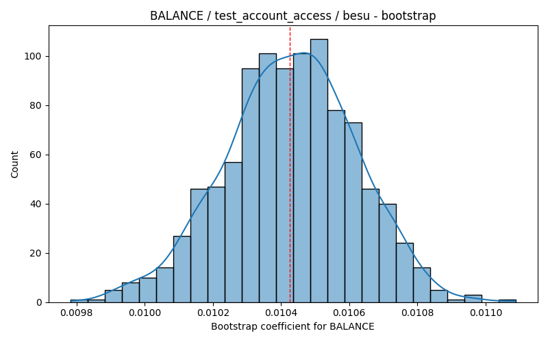

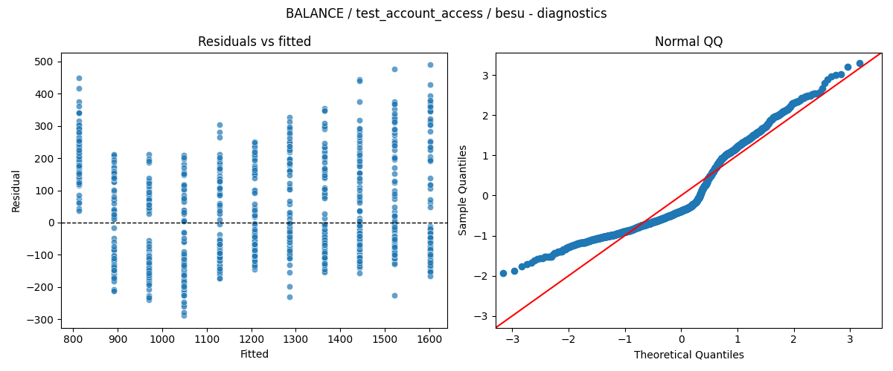

</details>

<details><summary>erigon — NNLS regression summary</summary>

```
==============================================================================
                           NNLS Regression Results                            
==============================================================================
Dep. Variable:          test_runtime_ms              R-squared:          0.979
Model:                  NNLS                    Adj. R-squared:          0.979
No. Observations:       385                               RMSE:          33.30
Df Residuals:           383                                MAE:          26.57
Df Model:               1      
==============================================================================
                      coef     std err     P-value      [0.025      0.975]
------------------------------------------------------------------------------
         const     33.1032      4.9528       0.001     23.4071     42.8236
       opcount      0.0095      0.0001       0.001      0.0094      0.0097
==============================================================================
Notes: Non-negative least squares with bootstrap inference (1000 iterations)
==============================================================================
```

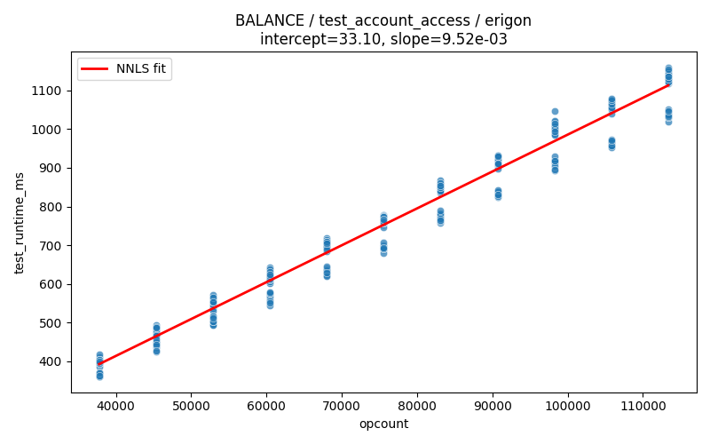

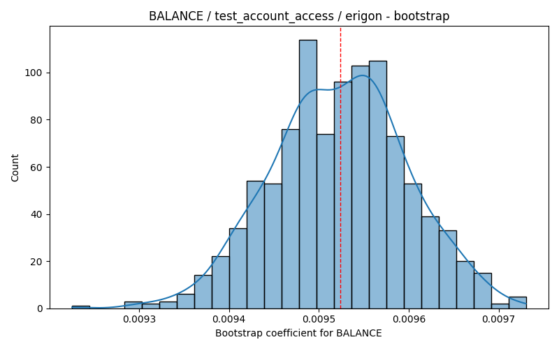

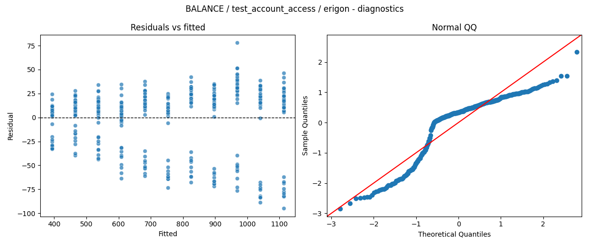

</details>

<details><summary>ethrex — NNLS regression summary</summary>

```
==============================================================================
                           NNLS Regression Results                            
==============================================================================
Dep. Variable:          test_runtime_ms              R-squared:          0.974
Model:                  NNLS                    Adj. R-squared:          0.974
No. Observations:       1276                              RMSE:          95.00
Df Residuals:           1274                               MAE:          83.61
Df Model:               1      
==============================================================================
                      coef     std err     P-value      [0.025      0.975]
------------------------------------------------------------------------------
         const    386.3556     11.3031       0.001    363.5877    407.8926
       opcount      0.0242      0.0001       0.001      0.0240      0.0245
==============================================================================
Notes: Non-negative least squares with bootstrap inference (1000 iterations)
==============================================================================
```

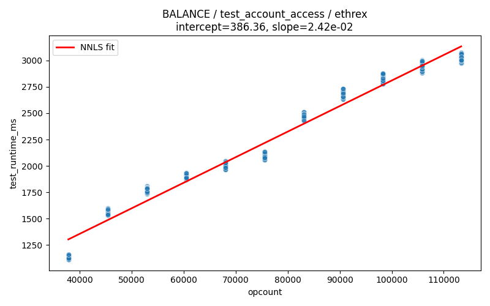

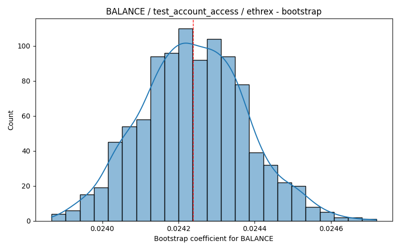

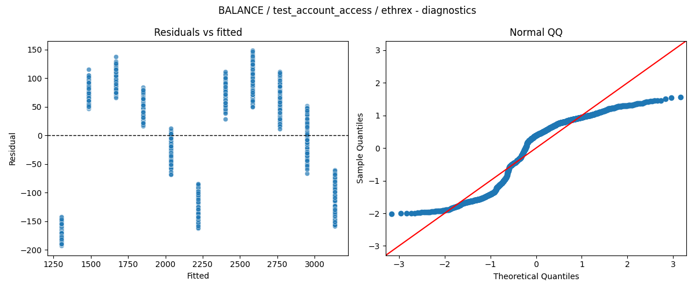

</details>

<details><summary>geth — NNLS regression summary</summary>

```
==============================================================================
                           NNLS Regression Results                            
==============================================================================
Dep. Variable:          test_runtime_ms              R-squared:          0.742
Model:                  NNLS                    Adj. R-squared:          0.741
No. Observations:       924                               RMSE:         160.42
Df Residuals:           922                                MAE:         128.18
Df Model:               1      
==============================================================================
                      coef     std err     P-value      [0.025      0.975]
------------------------------------------------------------------------------
         const    355.2248     14.9310       0.001    327.5482    385.8251
       opcount      0.0114      0.0002       0.001      0.0109      0.0118
==============================================================================
Notes: Non-negative least squares with bootstrap inference (1000 iterations)
==============================================================================
```

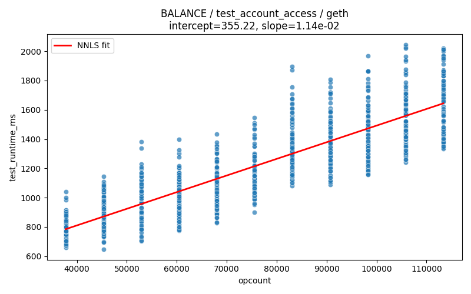

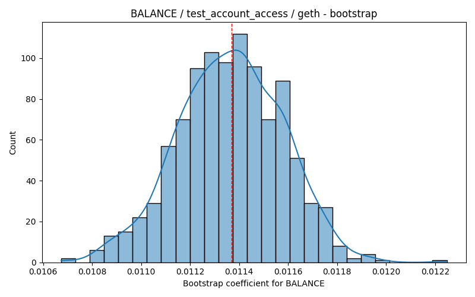

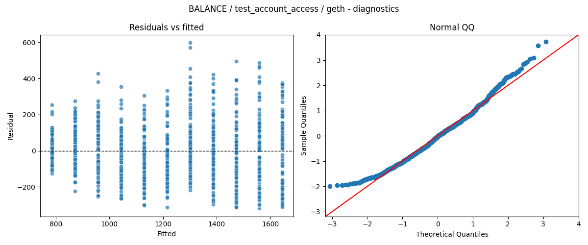

</details>

<details><summary>nethermind — NNLS regression summary</summary>

```
==============================================================================
                           NNLS Regression Results                            
==============================================================================
Dep. Variable:          test_runtime_ms              R-squared:          0.926
Model:                  NNLS                    Adj. R-squared:          0.925
No. Observations:       495                               RMSE:          25.33
Df Residuals:           493                                MAE:          18.89
Df Model:               1      
==============================================================================
                      coef     std err     P-value      [0.025      0.975]
------------------------------------------------------------------------------
         const     88.2341      3.4567       0.001     81.1326     94.5216
       opcount      0.0037      0.0000       0.001      0.0036      0.0038
==============================================================================
Notes: Non-negative least squares with bootstrap inference (1000 iterations)
==============================================================================
```

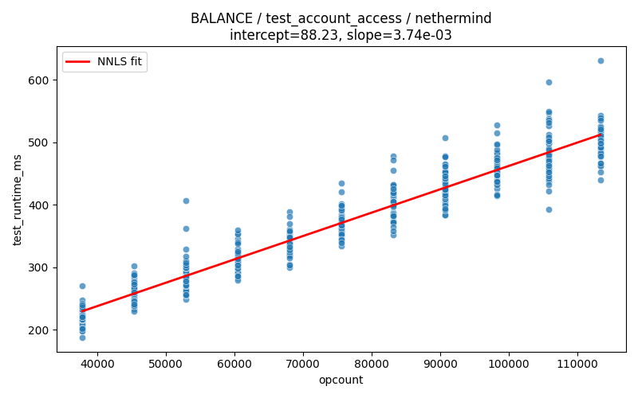

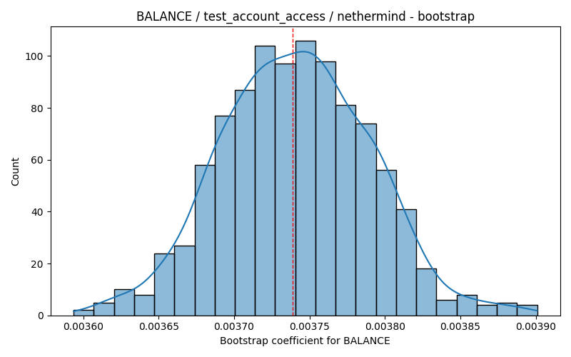

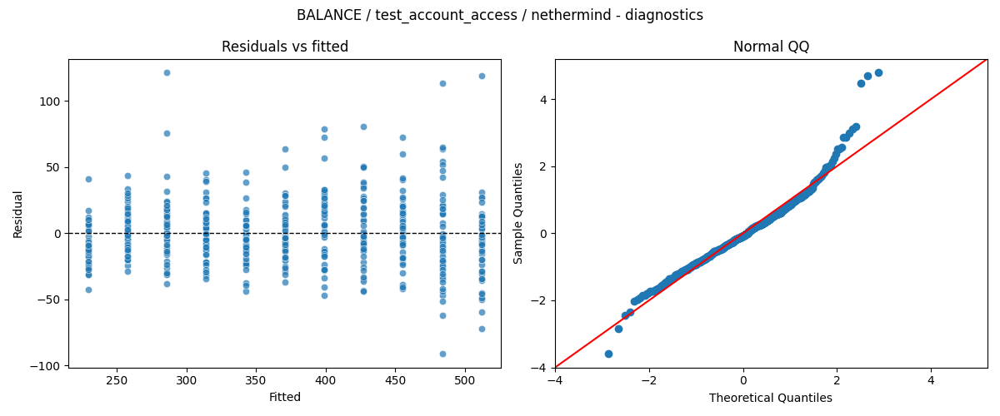

</details>

<details><summary>reth — NNLS regression summary</summary>

```
==============================================================================
                           NNLS Regression Results                            
==============================================================================
Dep. Variable:          test_runtime_ms              R-squared:          0.976
Model:                  NNLS                    Adj. R-squared:          0.976
No. Observations:       385                               RMSE:           4.11
Df Residuals:           383                                MAE:           3.15
Df Model:               1      
==============================================================================
                      coef     std err     P-value      [0.025      0.975]
------------------------------------------------------------------------------
         const     31.5585      0.7297       0.001     30.0479     32.9879
       opcount      0.0011      0.0000       0.001      0.0011      0.0011
==============================================================================
Notes: Non-negative least squares with bootstrap inference (1000 iterations)
==============================================================================
```

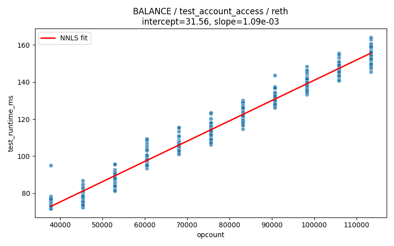

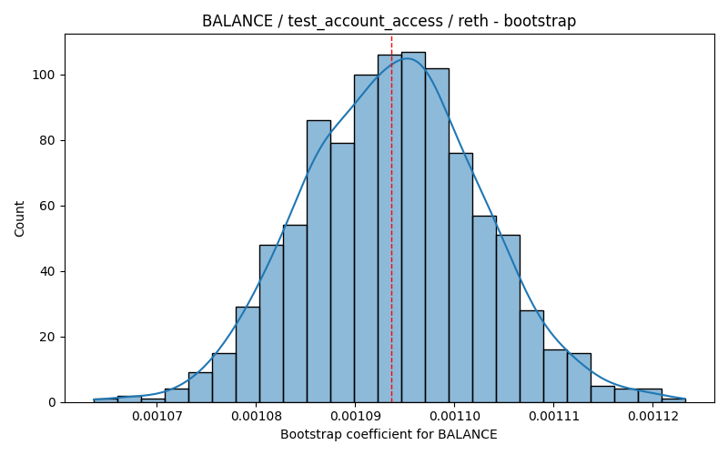

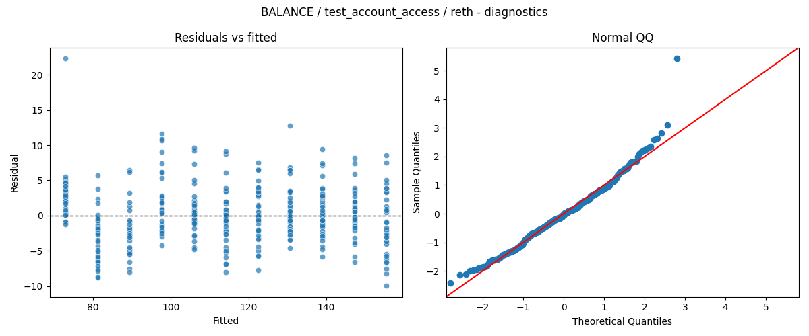

</details>

### test_account_access — combo `BALANCE_AccountMode.NON_EXISTING_ACCOUNT` — `presets[cold_account_nocode_access]`

| client | nobs | R² | target_coef (ms) | p-value | 95% CI |
| --- | --- | --- | --- | --- | --- |
| `besu` | 1309 | 0.8047 | 0.01045 | 1.00e-03 | [0.01017, 0.01076] |
| `erigon` | 385 | 0.9748 | 0.00882 | 1.00e-03 | [0.008668, 0.008879] |
| `ethrex` | 1276 | 0.9959 | 0.002651 | 1.00e-03 | [0.002648, 0.002654] |
| `geth` | 924 | 0.6671 | 0.02444 | 1.00e-03 | [0.02322, 0.0257] |
| `nethermind` | 495 | 0.9279 | 0.003741 | 1.00e-03 | [0.003655, 0.003831] |
| `reth` | 385 | 0.9713 | 0.0009217 | 1.00e-03 | [0.0009055, 0.0009385] |

<details><summary>besu — NNLS regression summary</summary>

```
==============================================================================
                           NNLS Regression Results                            
==============================================================================
Dep. Variable:          test_runtime_ms              R-squared:          0.805
Model:                  NNLS                    Adj. R-squared:          0.805
No. Observations:       1309                              RMSE:         123.07
Df Residuals:           1307                               MAE:         103.74
Df Model:               1      
==============================================================================
                      coef     std err     P-value      [0.025      0.975]
------------------------------------------------------------------------------
         const    382.6974     10.8774       0.001    359.9586    403.1756
       opcount      0.0105      0.0001       0.001      0.0102      0.0108
==============================================================================
Notes: Non-negative least squares with bootstrap inference (1000 iterations)
==============================================================================
```

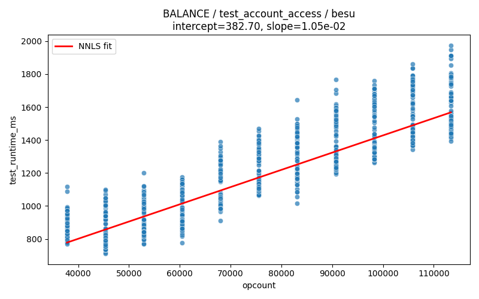

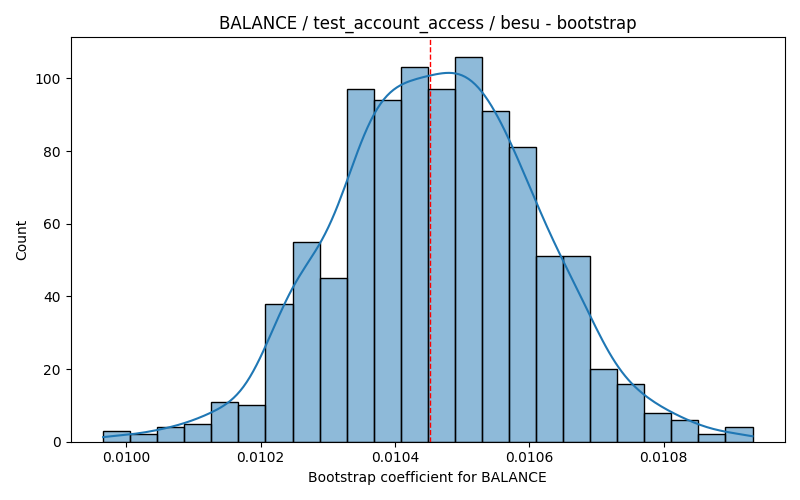

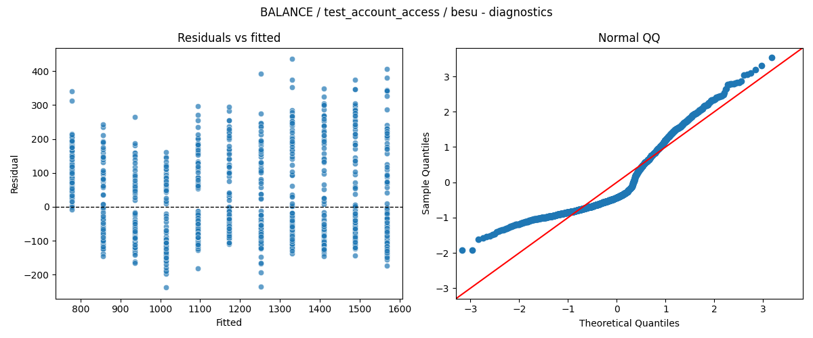

</details>

<details><summary>erigon — NNLS regression summary</summary>

```
==============================================================================
                           NNLS Regression Results                            
==============================================================================
Dep. Variable:          test_runtime_ms              R-squared:          0.975
Model:                  NNLS                    Adj. R-squared:          0.975
No. Observations:       385                               RMSE:          33.89
Df Residuals:           383                                MAE:          27.29
Df Model:               1      
==============================================================================
                      coef     std err     P-value      [0.025      0.975]
------------------------------------------------------------------------------
         const      1.1123      3.2724       0.417      0.0000     11.2052
       opcount      0.0088      0.0001       0.001      0.0087      0.0089
==============================================================================
Notes: Non-negative least squares with bootstrap inference (1000 iterations)
==============================================================================
```


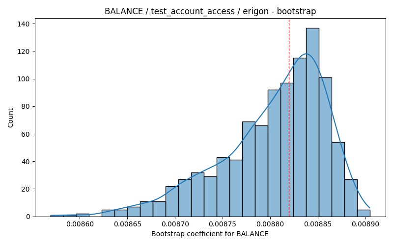

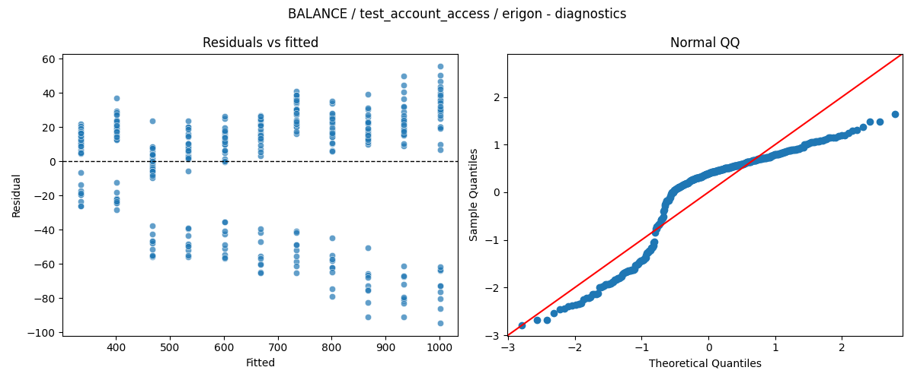

</details>

<details><summary>ethrex — NNLS regression summary</summary>

```
==============================================================================
                           NNLS Regression Results                            
==============================================================================
Dep. Variable:          test_runtime_ms              R-squared:          0.996
Model:                  NNLS                    Adj. R-squared:          0.996
No. Observations:       1276                              RMSE:           4.14
Df Residuals:           1274                               MAE:           3.25
Df Model:               1      
==============================================================================
                      coef     std err     P-value      [0.025      0.975]
------------------------------------------------------------------------------
         const      0.0000      0.0000       1.000      0.0000      0.0000
       opcount      0.0027      0.0000       0.001      0.0026      0.0027
==============================================================================
Notes: Non-negative least squares with bootstrap inference (1000 iterations)
==============================================================================
```

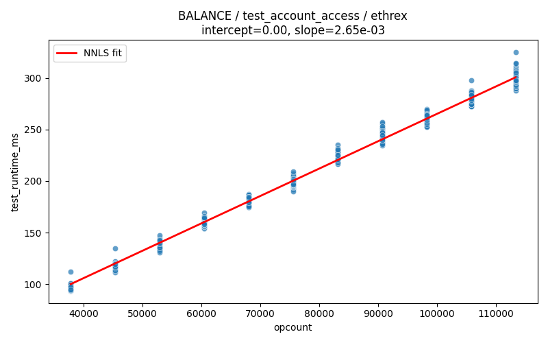

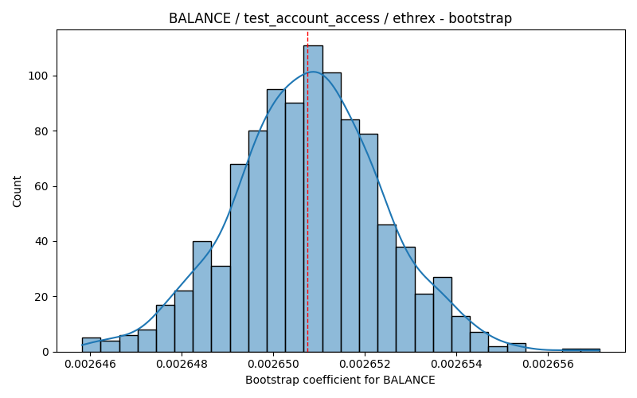

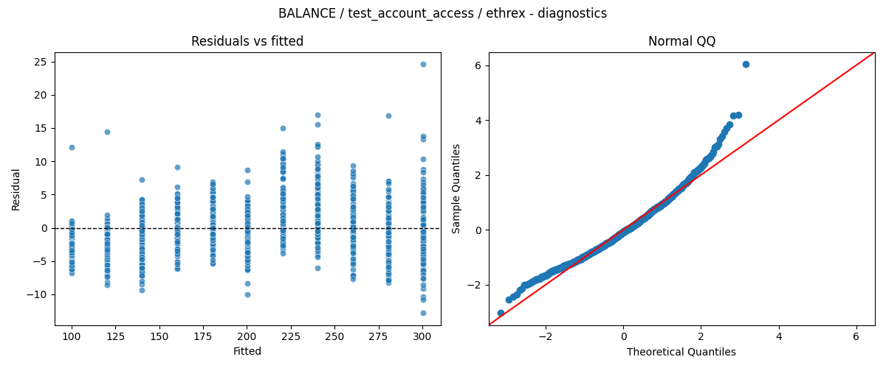

</details>

<details><summary>geth — NNLS regression summary</summary>

```
==============================================================================
                           NNLS Regression Results                            
==============================================================================
Dep. Variable:          test_runtime_ms              R-squared:          0.667
Model:                  NNLS                    Adj. R-squared:          0.667
No. Observations:       924                               RMSE:         412.62
Df Residuals:           922                                MAE:         336.44
Df Model:               1      
==============================================================================
                      coef     std err     P-value      [0.025      0.975]
------------------------------------------------------------------------------
         const   1311.6438     51.6863       0.001   1210.2874   1409.3262
       opcount      0.0244      0.0006       0.001      0.0232      0.0257
==============================================================================
Notes: Non-negative least squares with bootstrap inference (1000 iterations)
==============================================================================
```

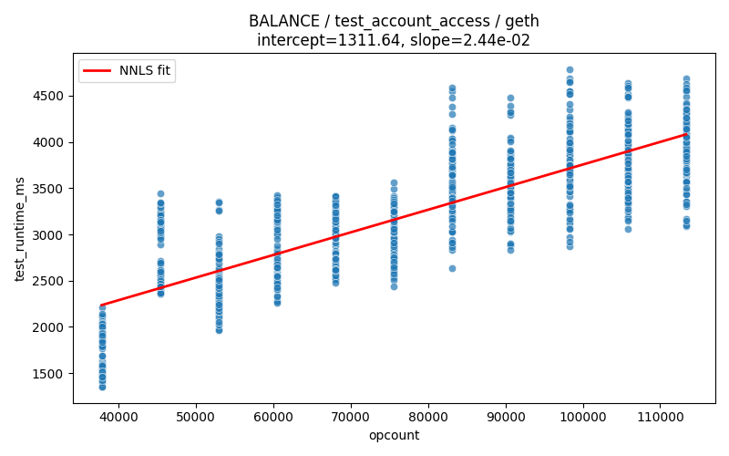

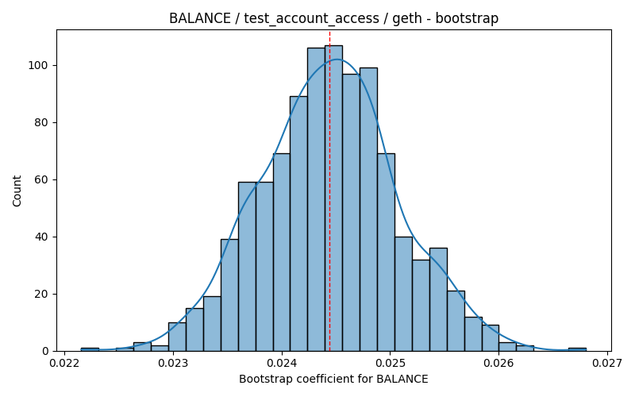

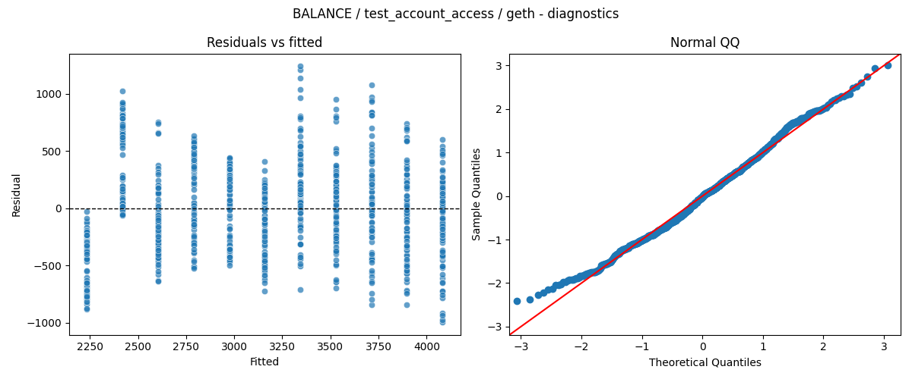

</details>

<details><summary>nethermind — NNLS regression summary</summary>

```
==============================================================================
                           NNLS Regression Results                            
==============================================================================
Dep. Variable:          test_runtime_ms              R-squared:          0.928
Model:                  NNLS                    Adj. R-squared:          0.928
No. Observations:       495                               RMSE:          24.93
Df Residuals:           493                                MAE:          18.72
Df Model:               1      
==============================================================================
                      coef     std err     P-value      [0.025      0.975]
------------------------------------------------------------------------------
         const     88.6750      3.3531       0.001     82.0857     95.4463
       opcount      0.0037      0.0000       0.001      0.0037      0.0038
==============================================================================
Notes: Non-negative least squares with bootstrap inference (1000 iterations)
==============================================================================
```

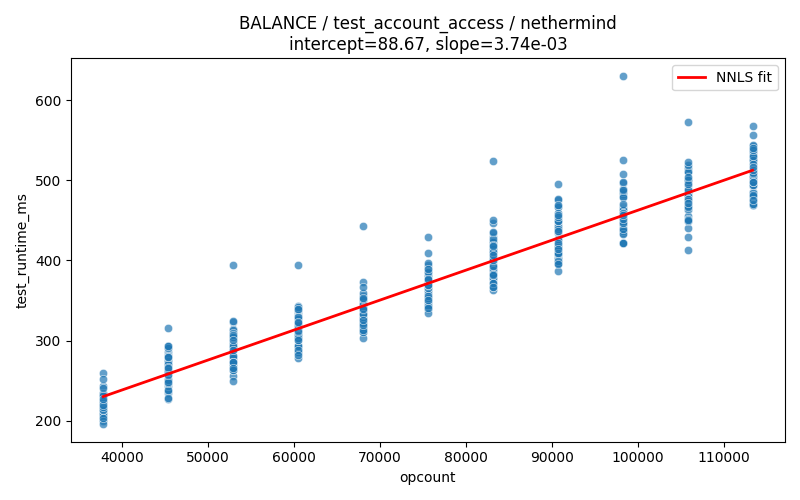

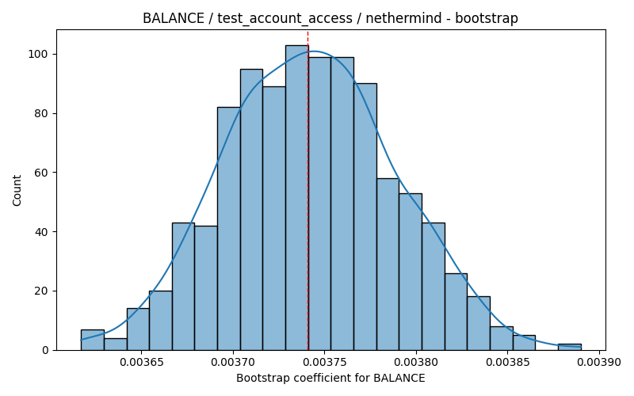

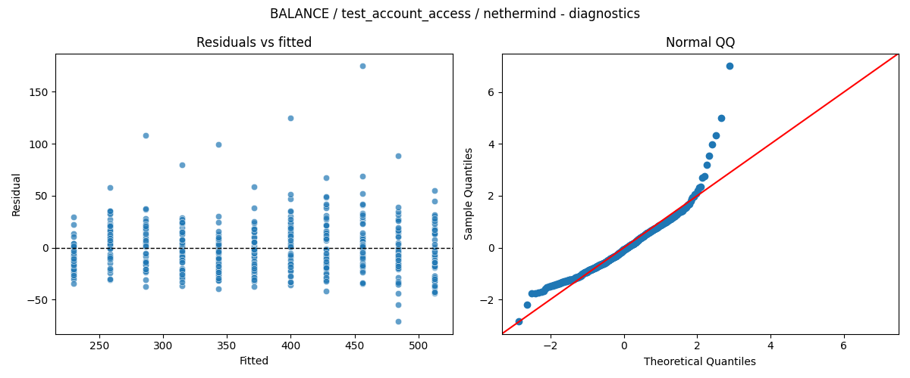

</details>

<details><summary>reth — NNLS regression summary</summary>

```
==============================================================================
                           NNLS Regression Results                            
==============================================================================
Dep. Variable:          test_runtime_ms              R-squared:          0.971
Model:                  NNLS                    Adj. R-squared:          0.971
No. Observations:       385                               RMSE:           3.79
Df Residuals:           383                                MAE:           2.91
Df Model:               1      
==============================================================================
                      coef     std err     P-value      [0.025      0.975]
------------------------------------------------------------------------------
         const     31.2939      0.6786       0.001     29.9914     32.6168
       opcount      0.0009      0.0000       0.001      0.0009      0.0009
==============================================================================
Notes: Non-negative least squares with bootstrap inference (1000 iterations)
==============================================================================
```

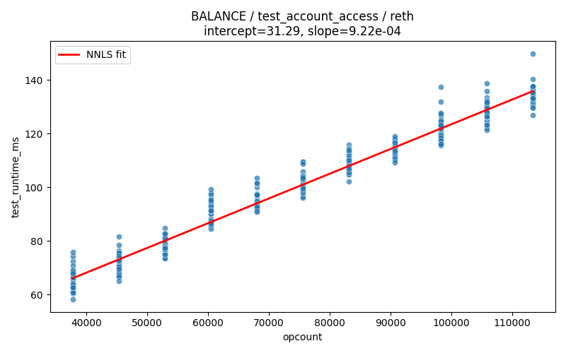

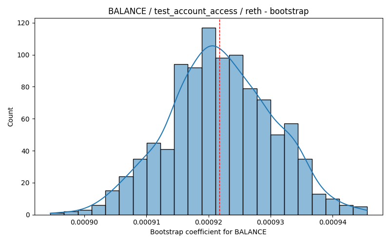

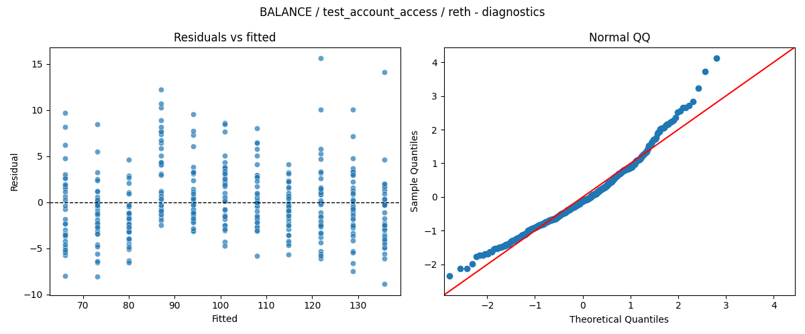

</details>

### test_account_access — combo `BALANCE_AccountMode.EXISTING_CONTRACT`

| client | nobs | R² | target_coef (ms) | p-value | 95% CI |
| --- | --- | --- | --- | --- | --- |
| `besu` | 1309 | 0.8436 | 0.02665 | 1.00e-03 | [0.02606, 0.0272] |
| `erigon` | 385 | 0.9118 | 0.03494 | 1.00e-03 | [0.03389, 0.03595] |
| `ethrex` | 1276 | 0.9719 | 0.02488 | 1.00e-03 | [0.02457, 0.02517] |
| `geth` | 924 | 0.6869 | 0.02795 | 1.00e-03 | [0.02665, 0.02929] |
| `nethermind` | 495 | 0.7339 | 0.02524 | 1.00e-03 | [0.0238, 0.02668] |
| `reth` | 385 | 0.8299 | 0.02954 | 1.00e-03 | [0.02805, 0.03107] |

<details><summary>besu — NNLS regression summary</summary>

```
==============================================================================
                           NNLS Regression Results                            
==============================================================================
Dep. Variable:          test_runtime_ms              R-squared:          0.844
Model:                  NNLS                    Adj. R-squared:          0.844
No. Observations:       1309                              RMSE:         238.71
Df Residuals:           1307                               MAE:         194.66
Df Model:               1      
==============================================================================
                      coef     std err     P-value      [0.025      0.975]
------------------------------------------------------------------------------
         const    493.5007     18.4743       0.001    458.6316    530.3460
       opcount      0.0266      0.0003       0.001      0.0261      0.0272
==============================================================================
Notes: Non-negative least squares with bootstrap inference (1000 iterations)
==============================================================================
```

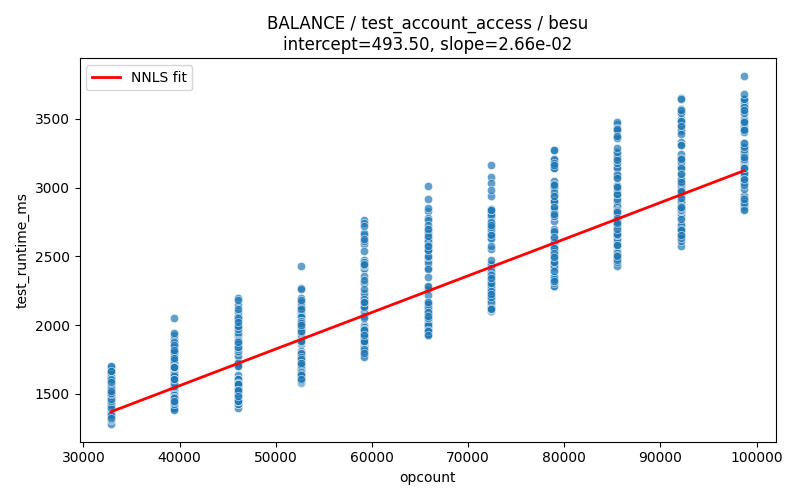

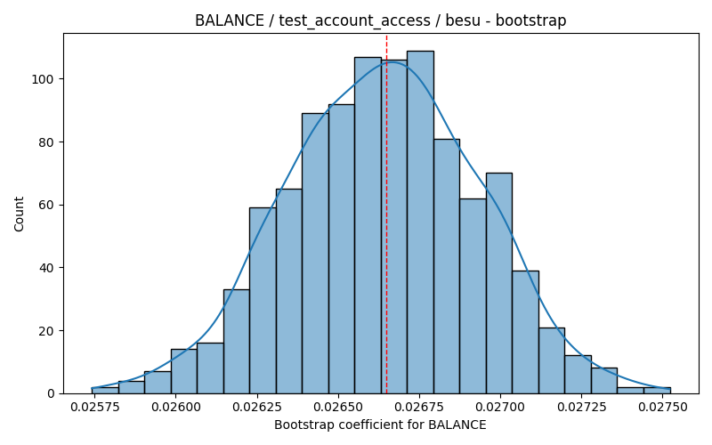

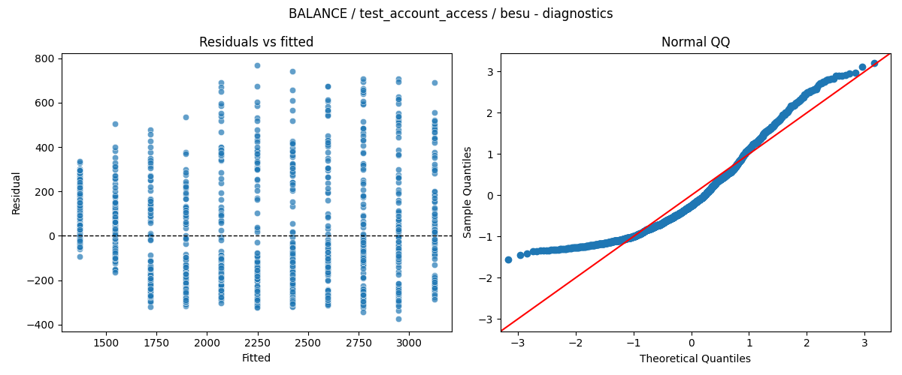

</details>

<details><summary>erigon — NNLS regression summary</summary>

```
==============================================================================
                           NNLS Regression Results                            
==============================================================================
Dep. Variable:          test_runtime_ms              R-squared:          0.912
Model:                  NNLS                    Adj. R-squared:          0.912
No. Observations:       385                               RMSE:         226.06
Df Residuals:           383                                MAE:         194.13
Df Model:               1      
==============================================================================
                      coef     std err     P-value      [0.025      0.975]
------------------------------------------------------------------------------
         const    397.0701     39.8873       0.001    325.1516    478.0063
       opcount      0.0349      0.0005       0.001      0.0339      0.0360
==============================================================================
Notes: Non-negative least squares with bootstrap inference (1000 iterations)
==============================================================================
```

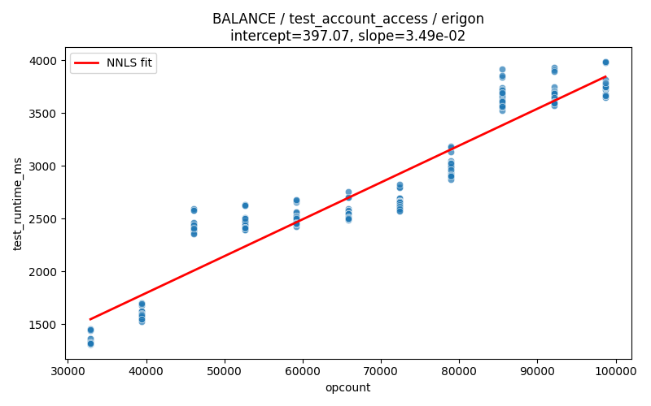

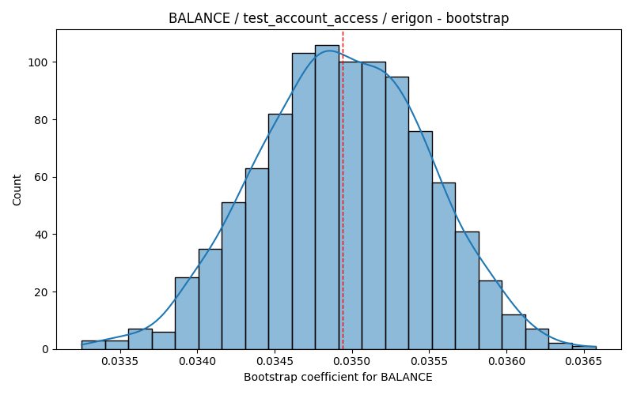

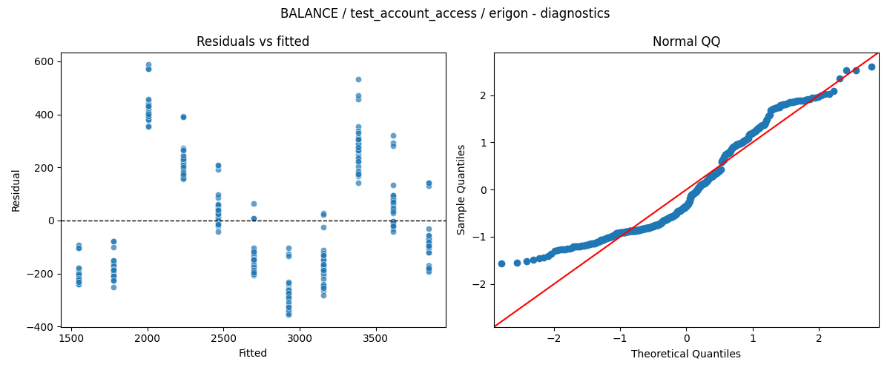

</details>

<details><summary>ethrex — NNLS regression summary</summary>

```
==============================================================================
                           NNLS Regression Results                            
==============================================================================
Dep. Variable:          test_runtime_ms              R-squared:          0.972
Model:                  NNLS                    Adj. R-squared:          0.972
No. Observations:       1276                              RMSE:          88.02
Df Residuals:           1274                               MAE:          75.54
Df Model:               1      
==============================================================================
                      coef     std err     P-value      [0.025      0.975]
------------------------------------------------------------------------------
         const    371.5945     11.0629       0.001    350.4685    395.3877
       opcount      0.0249      0.0001       0.001      0.0246      0.0252
==============================================================================
Notes: Non-negative least squares with bootstrap inference (1000 iterations)
==============================================================================
```

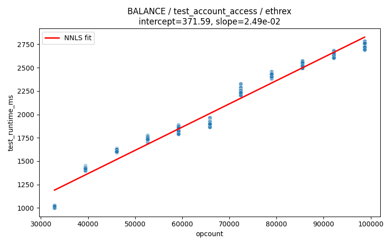

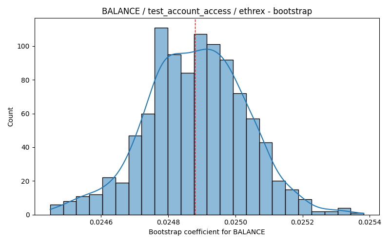

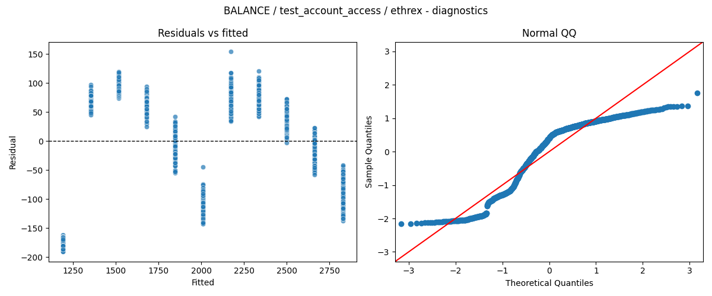

</details>

<details><summary>geth — NNLS regression summary</summary>

```
==============================================================================
                           NNLS Regression Results                            
==============================================================================
Dep. Variable:          test_runtime_ms              R-squared:          0.687
Model:                  NNLS                    Adj. R-squared:          0.687
No. Observations:       924                               RMSE:         392.64
Df Residuals:           922                                MAE:         325.49
Df Model:               1      
==============================================================================
                      coef     std err     P-value      [0.025      0.975]
------------------------------------------------------------------------------
         const   1121.5786     47.6194       0.001   1030.2539   1215.6419
       opcount      0.0280      0.0007       0.001      0.0267      0.0293
==============================================================================
Notes: Non-negative least squares with bootstrap inference (1000 iterations)
==============================================================================
```

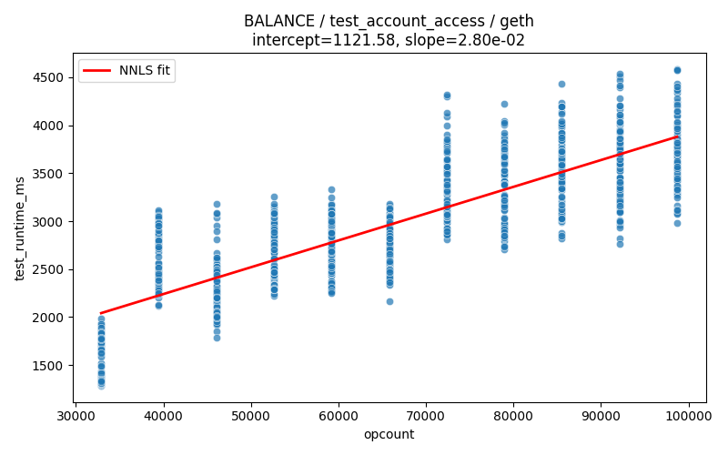

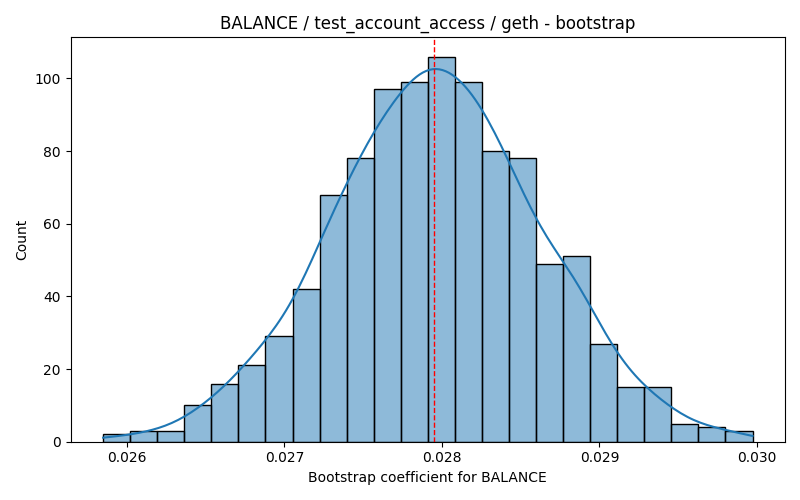


</details>

<details><summary>nethermind — NNLS regression summary</summary>

```
==============================================================================
                           NNLS Regression Results                            
==============================================================================
Dep. Variable:          test_runtime_ms              R-squared:          0.734
Model:                  NNLS                    Adj. R-squared:          0.733
No. Observations:       495                               RMSE:         316.27
Df Residuals:           493                                MAE:         262.22
Df Model:               1      
==============================================================================
                      coef     std err     P-value      [0.025      0.975]
------------------------------------------------------------------------------
         const    808.7354     51.2936       0.001    711.3016    909.4901
       opcount      0.0252      0.0007       0.001      0.0238      0.0267
==============================================================================
Notes: Non-negative least squares with bootstrap inference (1000 iterations)
==============================================================================
```

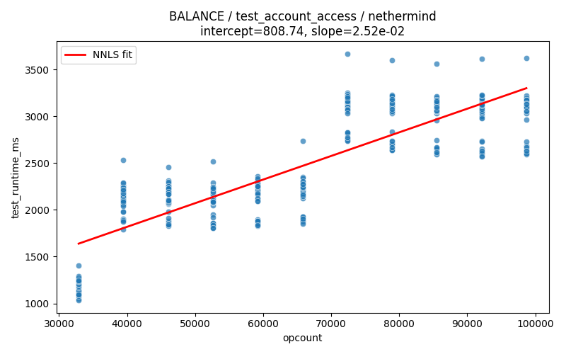

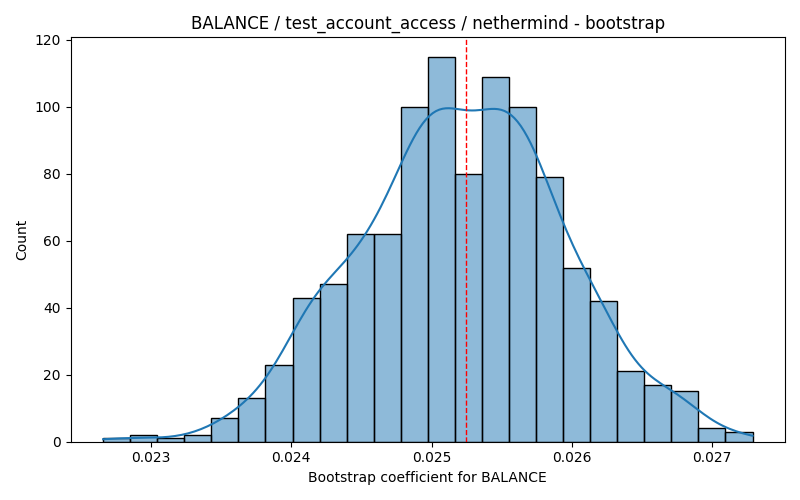

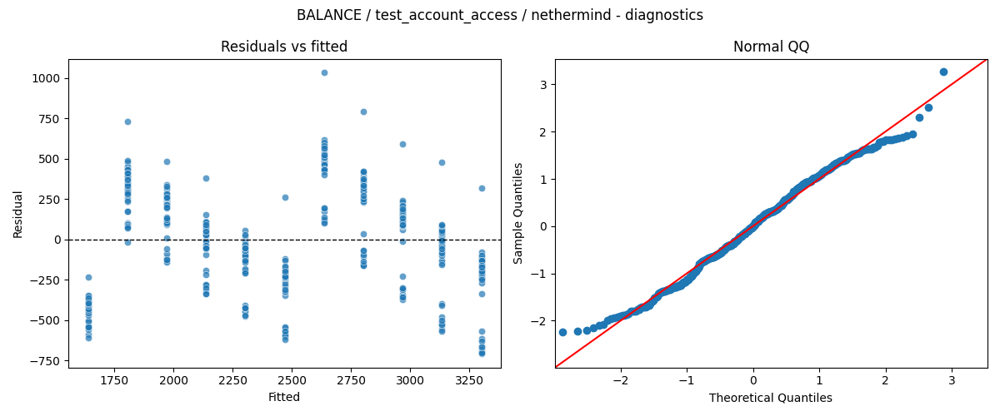

</details>

<details><summary>reth — NNLS regression summary</summary>

```
==============================================================================
                           NNLS Regression Results                            
==============================================================================
Dep. Variable:          test_runtime_ms              R-squared:          0.830
Model:                  NNLS                    Adj. R-squared:          0.829
No. Observations:       385                               RMSE:         278.26
Df Residuals:           383                                MAE:         204.98
Df Model:               1      
==============================================================================
                      coef     std err     P-value      [0.025      0.975]
------------------------------------------------------------------------------
         const    688.9974     59.4052       0.001    574.0644    803.1839
       opcount      0.0295      0.0008       0.001      0.0281      0.0311
==============================================================================
Notes: Non-negative least squares with bootstrap inference (1000 iterations)
==============================================================================
```

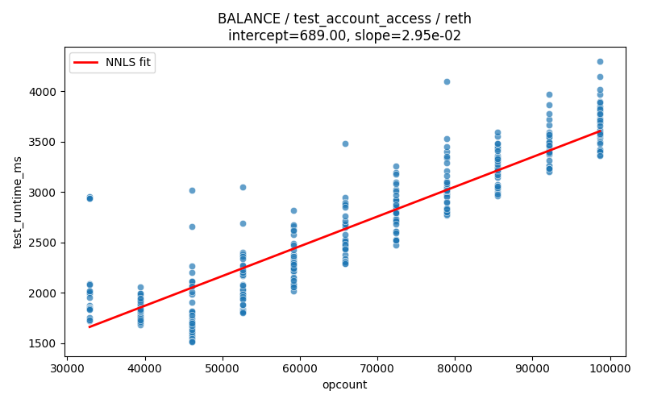

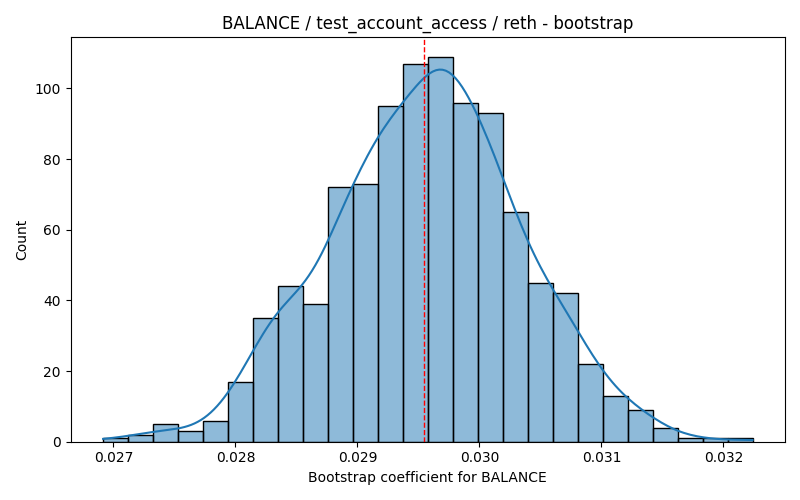

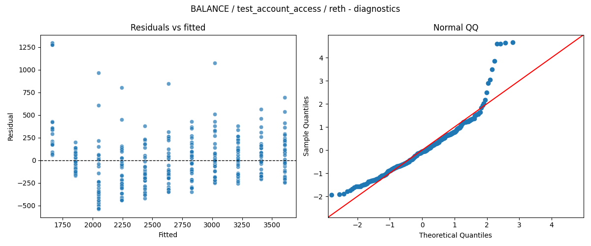

</details>

### test_account_access — combo `BALANCE_AccountMode.NON_EXISTING_ACCOUNT` — `presets[cold_account_code_access]`

| client | nobs | R² | target_coef (ms) | p-value | 95% CI |
| --- | --- | --- | --- | --- | --- |
| `besu` | 1309 | 0.8047 | 0.01045 | 1.00e-03 | [0.01017, 0.01076] |
| `erigon` | 385 | 0.9748 | 0.00882 | 1.00e-03 | [0.008668, 0.008879] |
| `ethrex` | 1276 | 0.9959 | 0.002651 | 1.00e-03 | [0.002648, 0.002654] |
| `geth` | 924 | 0.6671 | 0.02444 | 1.00e-03 | [0.02322, 0.0257] |
| `nethermind` | 495 | 0.9279 | 0.003741 | 1.00e-03 | [0.003655, 0.003831] |
| `reth` | 385 | 0.9713 | 0.0009217 | 1.00e-03 | [0.0009055, 0.0009385] |

<details><summary>besu — NNLS regression summary</summary>

```
==============================================================================
                           NNLS Regression Results                            
==============================================================================
Dep. Variable:          test_runtime_ms              R-squared:          0.805
Model:                  NNLS                    Adj. R-squared:          0.805
No. Observations:       1309                              RMSE:         123.07
Df Residuals:           1307                               MAE:         103.74
Df Model:               1      
==============================================================================
                      coef     std err     P-value      [0.025      0.975]
------------------------------------------------------------------------------
         const    382.6974     10.8774       0.001    359.9586    403.1756
       opcount      0.0105      0.0001       0.001      0.0102      0.0108
==============================================================================
Notes: Non-negative least squares with bootstrap inference (1000 iterations)
==============================================================================
```


</details>

<details><summary>erigon — NNLS regression summary</summary>

```
==============================================================================
                           NNLS Regression Results                            
==============================================================================
Dep. Variable:          test_runtime_ms              R-squared:          0.975
Model:                  NNLS                    Adj. R-squared:          0.975
No. Observations:       385                               RMSE:          33.89
Df Residuals:           383                                MAE:          27.29
Df Model:               1      
==============================================================================
                      coef     std err     P-value      [0.025      0.975]
------------------------------------------------------------------------------
         const      1.1123      3.2724       0.417      0.0000     11.2052
       opcount      0.0088      0.0001       0.001      0.0087      0.0089
==============================================================================
Notes: Non-negative least squares with bootstrap inference (1000 iterations)
==============================================================================
```


</details>

<details><summary>ethrex — NNLS regression summary</summary>

```
==============================================================================
                           NNLS Regression Results                            
==============================================================================
Dep. Variable:          test_runtime_ms              R-squared:          0.996
Model:                  NNLS                    Adj. R-squared:          0.996
No. Observations:       1276                              RMSE:           4.14
Df Residuals:           1274                               MAE:           3.25
Df Model:               1      
==============================================================================
                      coef     std err     P-value      [0.025      0.975]
------------------------------------------------------------------------------
         const      0.0000      0.0000       1.000      0.0000      0.0000
       opcount      0.0027      0.0000       0.001      0.0026      0.0027
==============================================================================
Notes: Non-negative least squares with bootstrap inference (1000 iterations)
==============================================================================
```


</details>

<details><summary>geth — NNLS regression summary</summary>

```
==============================================================================
                           NNLS Regression Results                            
==============================================================================
Dep. Variable:          test_runtime_ms              R-squared:          0.667
Model:                  NNLS                    Adj. R-squared:          0.667
No. Observations:       924                               RMSE:         412.62
Df Residuals:           922                                MAE:         336.44
Df Model:               1      
==============================================================================
                      coef     std err     P-value      [0.025      0.975]
------------------------------------------------------------------------------
         const   1311.6438     51.6863       0.001   1210.2874   1409.3262
       opcount      0.0244      0.0006       0.001      0.0232      0.0257
==============================================================================
Notes: Non-negative least squares with bootstrap inference (1000 iterations)
==============================================================================
```


</details>

<details><summary>nethermind — NNLS regression summary</summary>

```
==============================================================================
                           NNLS Regression Results                            
==============================================================================
Dep. Variable:          test_runtime_ms              R-squared:          0.928
Model:                  NNLS                    Adj. R-squared:          0.928
No. Observations:       495                               RMSE:          24.93
Df Residuals:           493                                MAE:          18.72
Df Model:               1      
==============================================================================
                      coef     std err     P-value      [0.025      0.975]
------------------------------------------------------------------------------
         const     88.6750      3.3531       0.001     82.0857     95.4463
       opcount      0.0037      0.0000       0.001      0.0037      0.0038
==============================================================================
Notes: Non-negative least squares with bootstrap inference (1000 iterations)
==============================================================================
```


</details>

<details><summary>reth — NNLS regression summary</summary>

```
==============================================================================
                           NNLS Regression Results                            
==============================================================================
Dep. Variable:          test_runtime_ms              R-squared:          0.971
Model:                  NNLS                    Adj. R-squared:          0.971
No. Observations:       385                               RMSE:           3.79
Df Residuals:           383                                MAE:           2.91
Df Model:               1      
==============================================================================
                      coef     std err     P-value      [0.025      0.975]
------------------------------------------------------------------------------
         const     31.2939      0.6786       0.001     29.9914     32.6168
       opcount      0.0009      0.0000       0.001      0.0009      0.0009
==============================================================================
Notes: Non-negative least squares with bootstrap inference (1000 iterations)
==============================================================================
```


</details>

### test_ext_account_query_warm — combo `BALANCE`

| client | nobs | R² | target_coef (ms) | p-value | 95% CI |
| --- | --- | --- | --- | --- | --- |
| `besu` | 1309 | 0.652 | 0.0001631 | 1.00e-03 | [0.0001563, 0.0001698] |
| `erigon` | 385 | 0.8859 | 4.43e-05 | 1.00e-03 | [4.269e-05, 4.599e-05] |
| `ethrex` | 1276 | 0.872 | 1.203e-05 | 1.00e-03 | [1.177e-05, 1.228e-05] |
| `geth` | 924 | 0.8005 | 3.169e-05 | 1.00e-03 | [3.06e-05, 3.282e-05] |
| `nethermind` | 495 | 0.6278 | 0.0001369 | 1.00e-03 | [0.0001277, 0.000146] |
| `reth` | 385 | 0.7248 | 7.132e-06 | 1.00e-03 | [6.667e-06, 7.589e-06] |

<details><summary>besu — NNLS regression summary</summary>

```
==============================================================================
                           NNLS Regression Results                            
==============================================================================
Dep. Variable:          test_runtime_ms              R-squared:          0.652
Model:                  NNLS                    Adj. R-squared:          0.652
No. Observations:       1309                              RMSE:          69.69
Df Residuals:           1307                               MAE:          51.95
Df Model:               1      
==============================================================================
                      coef     std err     P-value      [0.025      0.975]
------------------------------------------------------------------------------
         const    164.3143      7.0829       0.001    151.0553    178.0803
       opcount      0.0002      0.0000       0.001      0.0002      0.0002
==============================================================================
Notes: Non-negative least squares with bootstrap inference (1000 iterations)
==============================================================================
```

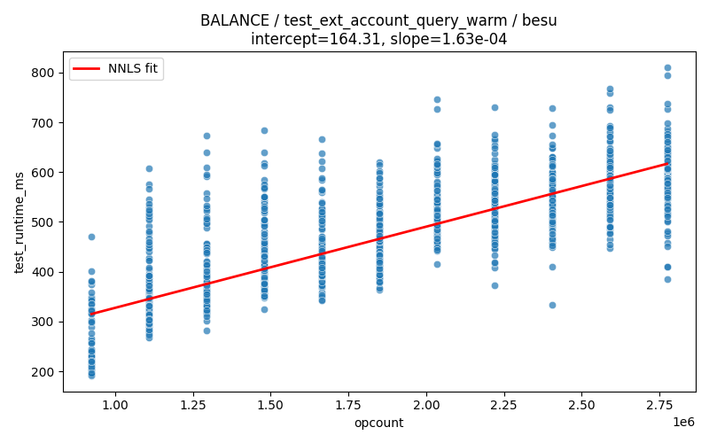

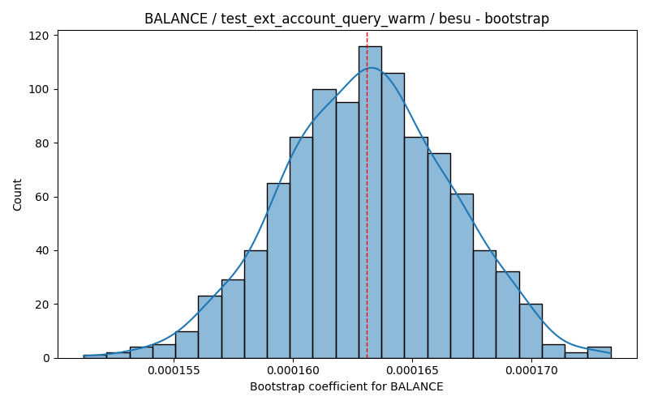

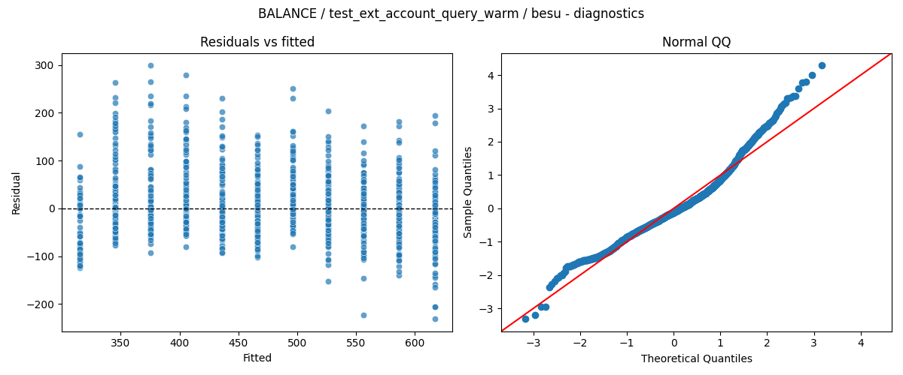

</details>

<details><summary>erigon — NNLS regression summary</summary>

```
==============================================================================
                           NNLS Regression Results                            
==============================================================================
Dep. Variable:          test_runtime_ms              R-squared:          0.886
Model:                  NNLS                    Adj. R-squared:          0.886
No. Observations:       385                               RMSE:           9.30
Df Residuals:           383                                MAE:           6.76
Df Model:               1      
==============================================================================
                      coef     std err     P-value      [0.025      0.975]
------------------------------------------------------------------------------
         const     34.3217      1.6790       0.001     31.0782     37.8113
       opcount      0.0000      0.0000       0.001      0.0000      0.0000
==============================================================================
Notes: Non-negative least squares with bootstrap inference (1000 iterations)
==============================================================================
```

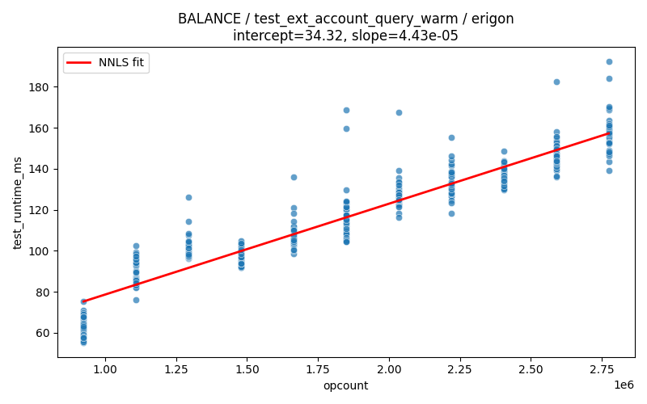

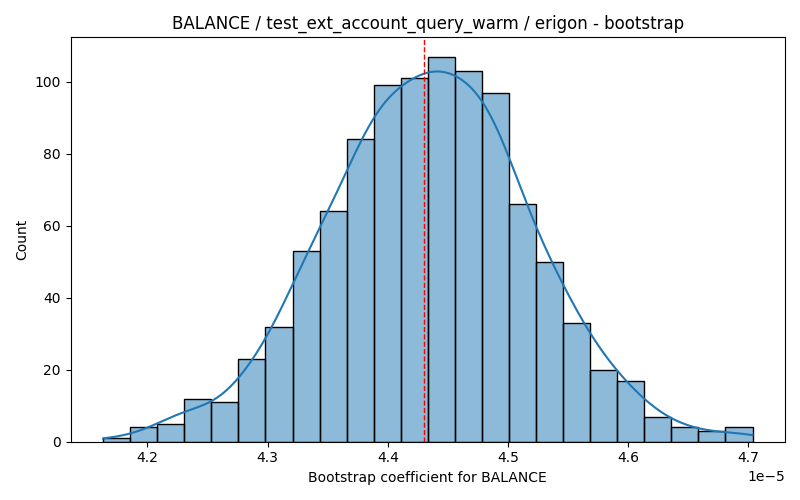

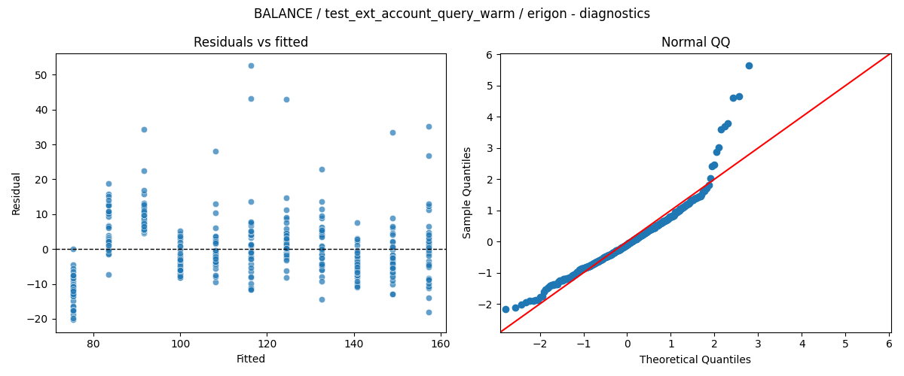

</details>

<details><summary>ethrex — NNLS regression summary</summary>

```
==============================================================================
                           NNLS Regression Results                            
==============================================================================
Dep. Variable:          test_runtime_ms              R-squared:          0.872
Model:                  NNLS                    Adj. R-squared:          0.872
No. Observations:       1276                              RMSE:           2.70
Df Residuals:           1274                               MAE:           1.97
Df Model:               1      
==============================================================================
                      coef     std err     P-value      [0.025      0.975]
------------------------------------------------------------------------------
         const      5.7942      0.2445       0.001      5.3313      6.2946
       opcount      0.0000      0.0000       0.001      0.0000      0.0000
==============================================================================
Notes: Non-negative least squares with bootstrap inference (1000 iterations)
==============================================================================
```

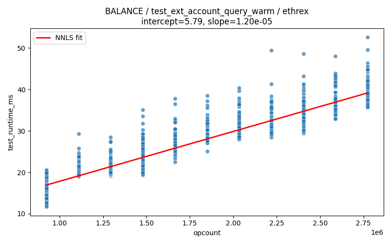

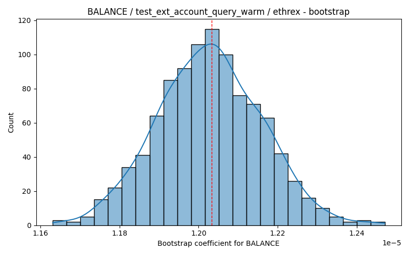

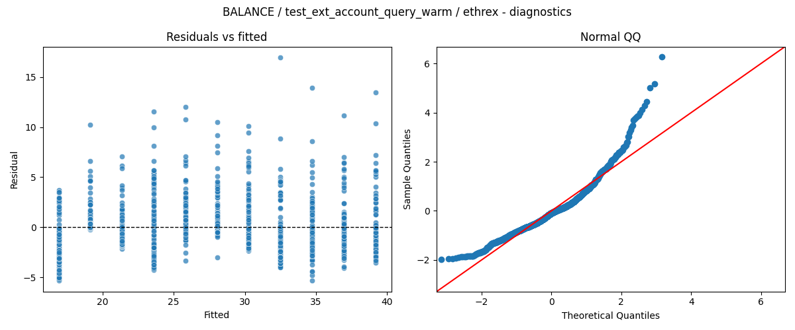

</details>

<details><summary>geth — NNLS regression summary</summary>

```
==============================================================================
                           NNLS Regression Results                            
==============================================================================
Dep. Variable:          test_runtime_ms              R-squared:          0.800
Model:                  NNLS                    Adj. R-squared:          0.800
No. Observations:       924                               RMSE:           9.25
Df Residuals:           922                                MAE:           7.25
Df Model:               1      
==============================================================================
                      coef     std err     P-value      [0.025      0.975]
------------------------------------------------------------------------------
         const     11.9191      1.0308       0.001      9.8487     13.9831
       opcount      0.0000      0.0000       0.001      0.0000      0.0000
==============================================================================
Notes: Non-negative least squares with bootstrap inference (1000 iterations)
==============================================================================
```

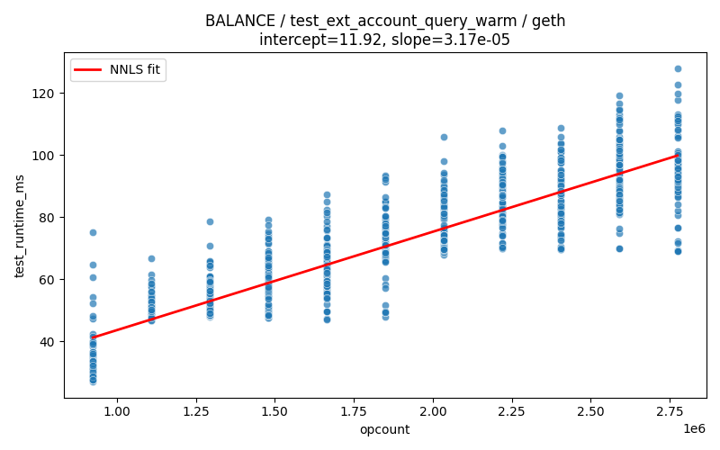

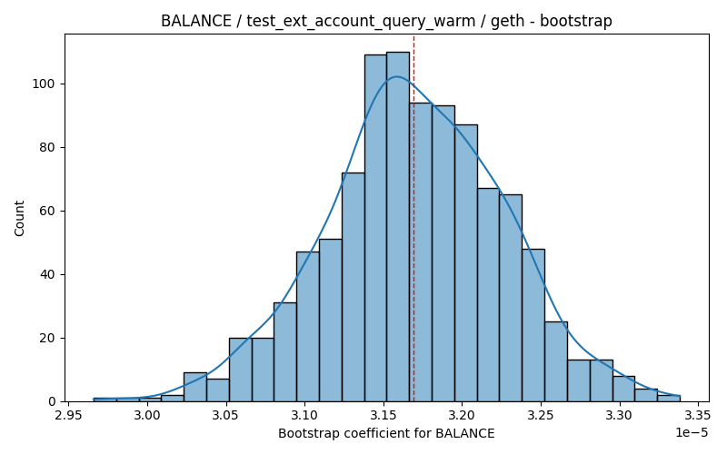

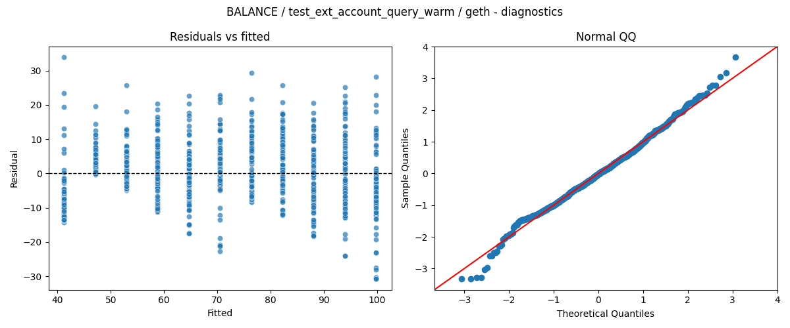

</details>

<details><summary>nethermind — NNLS regression summary</summary>

```
==============================================================================
                           NNLS Regression Results                            
==============================================================================
Dep. Variable:          test_runtime_ms              R-squared:          0.628
Model:                  NNLS                    Adj. R-squared:          0.627
No. Observations:       495                               RMSE:          61.66
Df Residuals:           493                                MAE:          50.56
Df Model:               1      
==============================================================================
                      coef     std err     P-value      [0.025      0.975]
------------------------------------------------------------------------------
         const     87.5009      8.4001       0.001     71.1287    103.5118
       opcount      0.0001      0.0000       0.001      0.0001      0.0001
==============================================================================
Notes: Non-negative least squares with bootstrap inference (1000 iterations)
==============================================================================
```

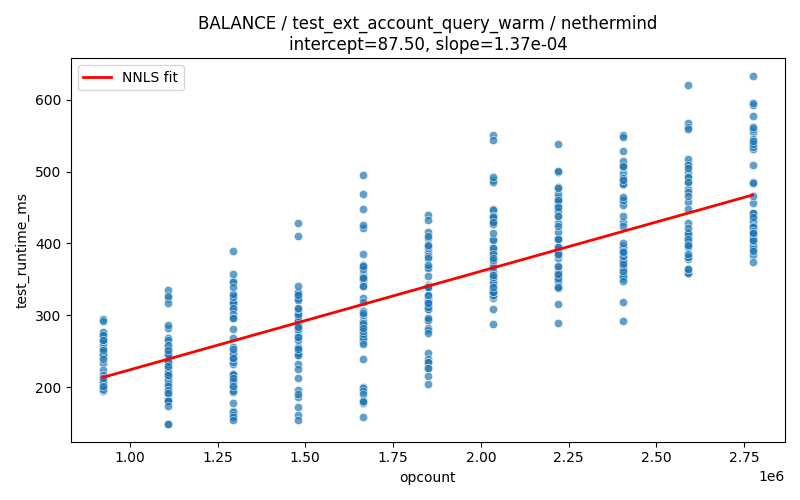

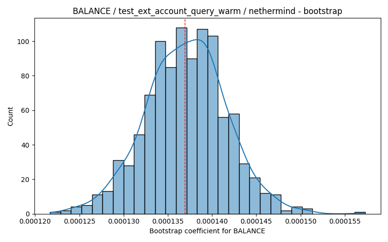

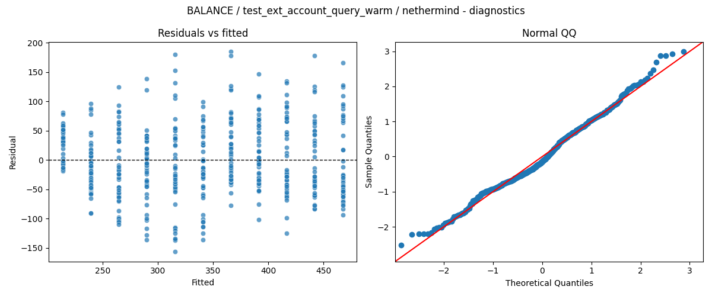

</details>

<details><summary>reth — NNLS regression summary</summary>

```
==============================================================================
                           NNLS Regression Results                            
==============================================================================
Dep. Variable:          test_runtime_ms              R-squared:          0.725
Model:                  NNLS                    Adj. R-squared:          0.724
No. Observations:       385                               RMSE:           2.57
Df Residuals:           383                                MAE:           1.83
Df Model:               1      
==============================================================================
                      coef     std err     P-value      [0.025      0.975]
------------------------------------------------------------------------------
         const      5.5412      0.4057       0.001      4.7657      6.3379
       opcount      0.0000      0.0000       0.001      0.0000      0.0000
==============================================================================
Notes: Non-negative least squares with bootstrap inference (1000 iterations)
==============================================================================
```

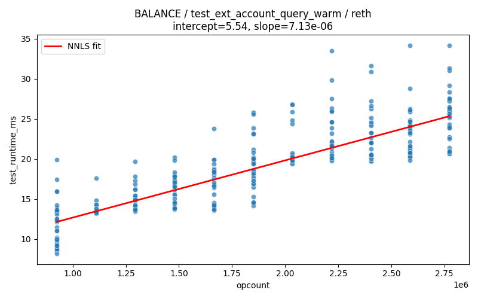

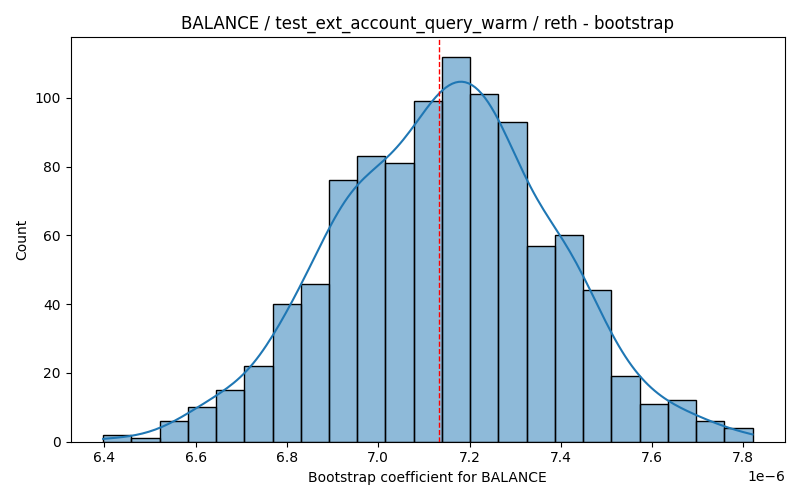

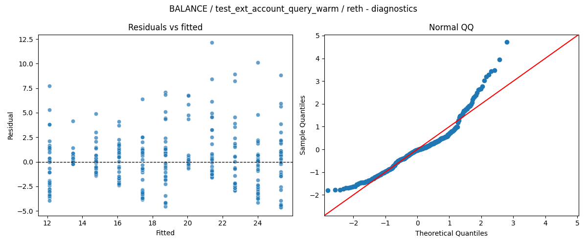

</details>

## CALL

### test_account_access — combo `CALL_AccountMode.EXISTING_EOA` — `presets[cold_account_nocode_access]`

| client | nobs | R² | target_coef (ms) | p-value | 95% CI |
| --- | --- | --- | --- | --- | --- |
| `besu` | 1309 | 0.7318 | 0.01186 | 1.00e-03 | [0.01149, 0.01229] |
| `erigon` | 385 | 0.9837 | 0.01079 | 1.00e-03 | [0.01066, 0.01093] |
| `ethrex` | 1276 | 0.9718 | 0.02444 | 1.00e-03 | [0.0242, 0.02472] |
| `geth` | 924 | 0.7439 | 0.01153 | 1.00e-03 | [0.01108, 0.01196] |
| `nethermind` | 495 | 0.8844 | 0.004265 | 1.00e-03 | [0.004118, 0.004405] |
| `reth` | 385 | 0.9757 | 0.001131 | 1.00e-03 | [0.001114, 0.001149] |

<details><summary>besu — NNLS regression summary</summary>

```
==============================================================================
                           NNLS Regression Results                            
==============================================================================
Dep. Variable:          test_runtime_ms              R-squared:          0.732
Model:                  NNLS                    Adj. R-squared:          0.732
No. Observations:       1309                              RMSE:         170.55
Df Residuals:           1307                               MAE:         145.96
Df Model:               1      
==============================================================================
                      coef     std err     P-value      [0.025      0.975]
------------------------------------------------------------------------------
         const    584.2307     16.3619       0.001    550.1667    615.3130
       opcount      0.0119      0.0002       0.001      0.0115      0.0123
==============================================================================
Notes: Non-negative least squares with bootstrap inference (1000 iterations)
==============================================================================
```

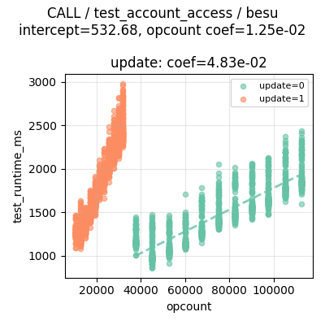

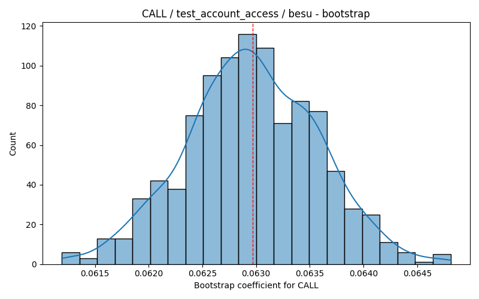

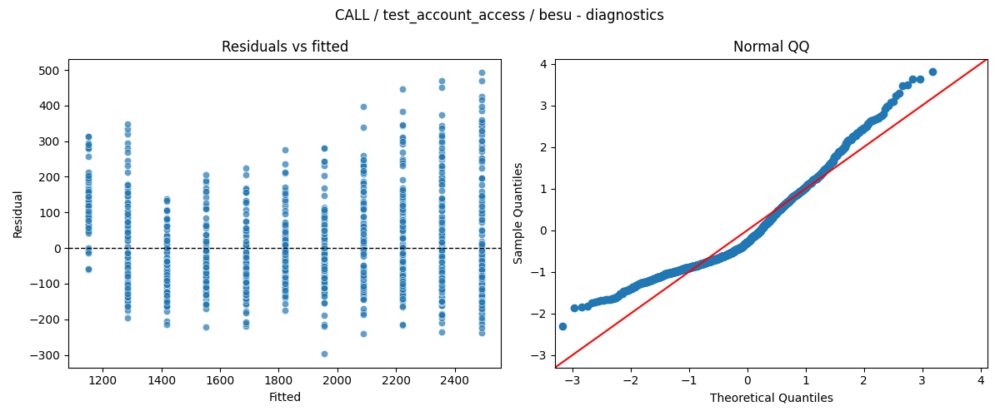

</details>

<details><summary>erigon — NNLS regression summary</summary>

```
==============================================================================
                           NNLS Regression Results                            
==============================================================================
Dep. Variable:          test_runtime_ms              R-squared:          0.984
Model:                  NNLS                    Adj. R-squared:          0.984
No. Observations:       385                               RMSE:          32.99
Df Residuals:           383                                MAE:          25.32
Df Model:               1      
==============================================================================
                      coef     std err     P-value      [0.025      0.975]
------------------------------------------------------------------------------
         const     46.2314      4.5450       0.001     37.1423     54.4980
       opcount      0.0108      0.0001       0.001      0.0107      0.0109
==============================================================================
Notes: Non-negative least squares with bootstrap inference (1000 iterations)
==============================================================================
```

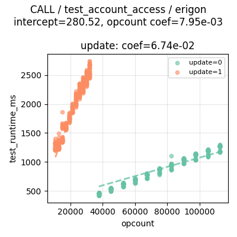

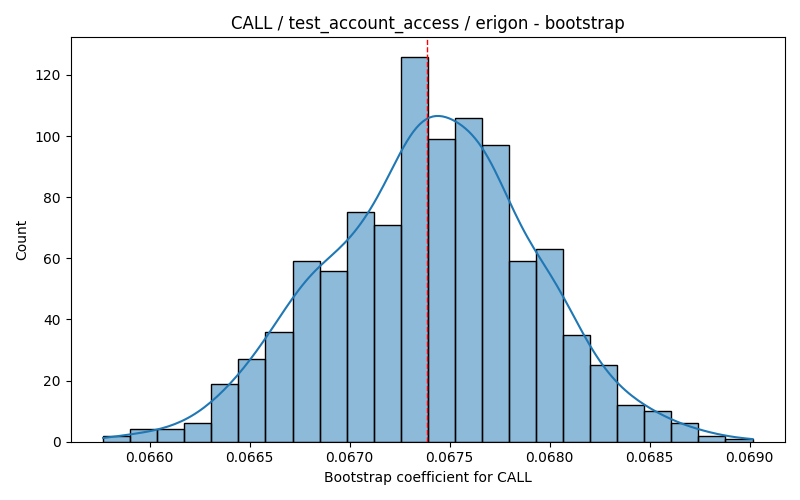

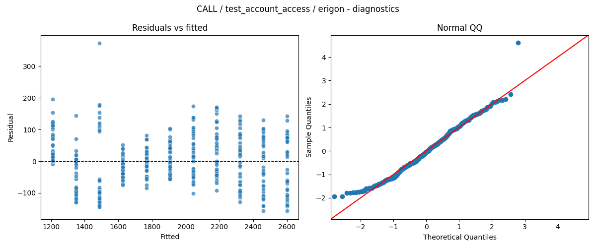

</details>

<details><summary>ethrex — NNLS regression summary</summary>

```
==============================================================================
                           NNLS Regression Results                            
==============================================================================
Dep. Variable:          test_runtime_ms              R-squared:          0.972
Model:                  NNLS                    Adj. R-squared:          0.972
No. Observations:       1276                              RMSE:          98.95
Df Residuals:           1274                               MAE:          86.03
Df Model:               1      
==============================================================================
                      coef     std err     P-value      [0.025      0.975]
------------------------------------------------------------------------------
         const    393.5987     10.8613       0.001    371.1077    413.9246
       opcount      0.0244      0.0001       0.001      0.0242      0.0247
==============================================================================
Notes: Non-negative least squares with bootstrap inference (1000 iterations)
==============================================================================
```

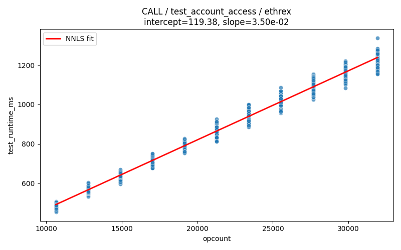

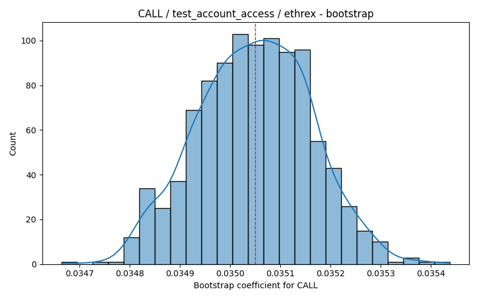

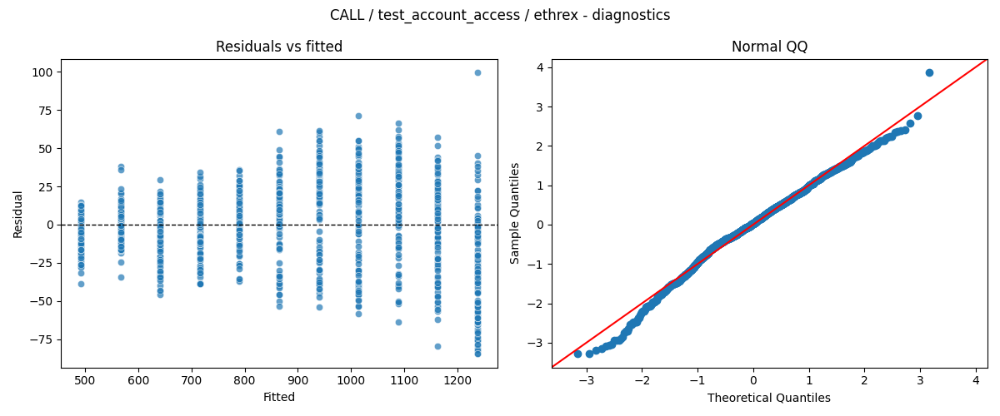

</details>

<details><summary>geth — NNLS regression summary</summary>

```
==============================================================================
                           NNLS Regression Results                            
==============================================================================
Dep. Variable:          test_runtime_ms              R-squared:          0.744
Model:                  NNLS                    Adj. R-squared:          0.744
No. Observations:       924                               RMSE:         160.61
Df Residuals:           922                                MAE:         127.64
Df Model:               1      
==============================================================================
                      coef     std err     P-value      [0.025      0.975]
------------------------------------------------------------------------------
         const    367.4440     15.1776       0.001    337.2976    397.4947
       opcount      0.0115      0.0002       0.001      0.0111      0.0120
==============================================================================
Notes: Non-negative least squares with bootstrap inference (1000 iterations)
==============================================================================
```

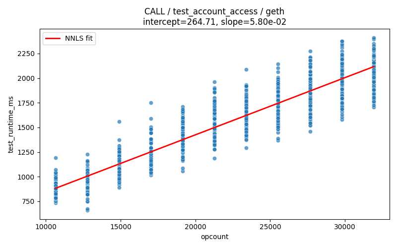

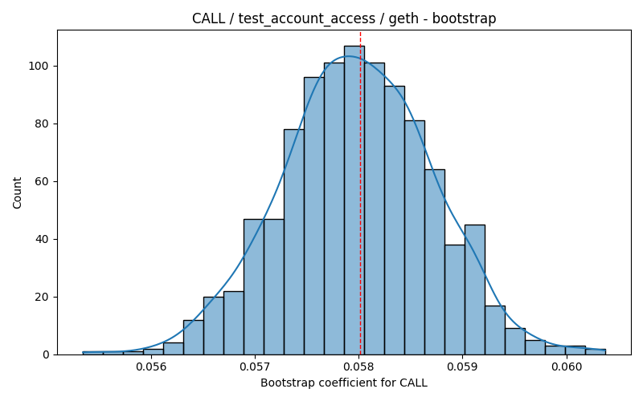

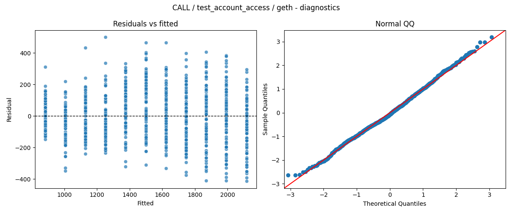

</details>

<details><summary>nethermind — NNLS regression summary</summary>

```
==============================================================================
                           NNLS Regression Results                            
==============================================================================
Dep. Variable:          test_runtime_ms              R-squared:          0.884
Model:                  NNLS                    Adj. R-squared:          0.884
No. Observations:       495                               RMSE:          36.61
Df Residuals:           493                                MAE:          26.68
Df Model:               1      
==============================================================================
                      coef     std err     P-value      [0.025      0.975]
------------------------------------------------------------------------------
         const     91.2650      5.0926       0.001     81.3614    101.5097
       opcount      0.0043      0.0001       0.001      0.0041      0.0044
==============================================================================
Notes: Non-negative least squares with bootstrap inference (1000 iterations)
==============================================================================
```

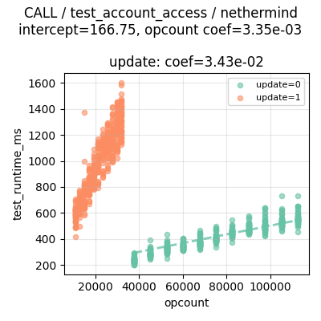

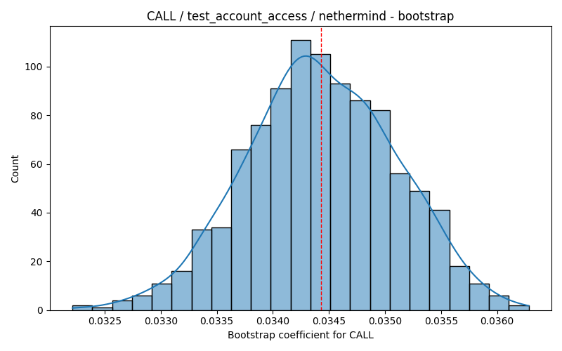

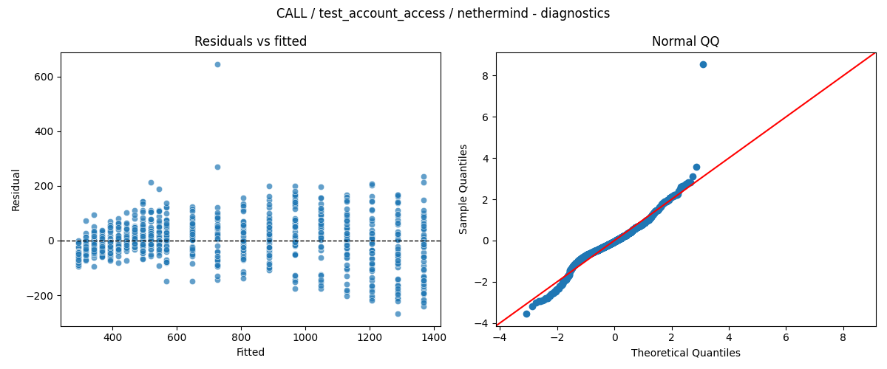

</details>

<details><summary>reth — NNLS regression summary</summary>

```
==============================================================================
                           NNLS Regression Results                            
==============================================================================
Dep. Variable:          test_runtime_ms              R-squared:          0.976
Model:                  NNLS                    Adj. R-squared:          0.976
No. Observations:       385                               RMSE:           4.24
Df Residuals:           383                                MAE:           3.52
Df Model:               1      
==============================================================================
                      coef     std err     P-value      [0.025      0.975]
------------------------------------------------------------------------------
         const     32.7122      0.7139       0.001     31.3076     34.1068
       opcount      0.0011      0.0000       0.001      0.0011      0.0011
==============================================================================
Notes: Non-negative least squares with bootstrap inference (1000 iterations)
==============================================================================
```

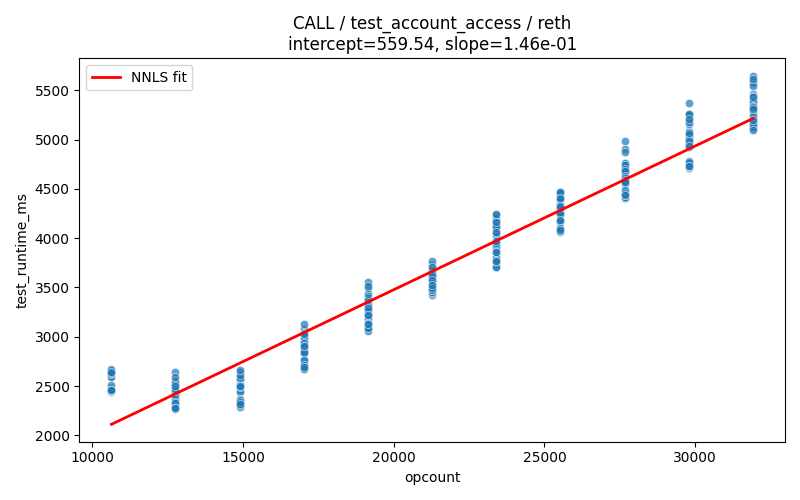

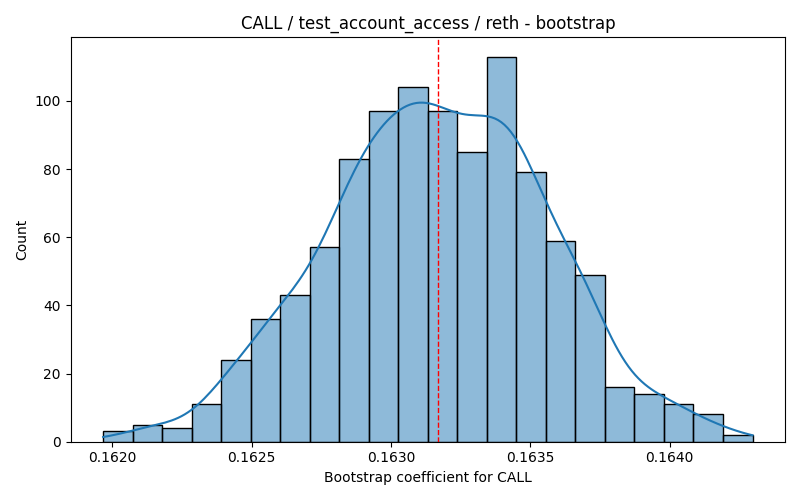

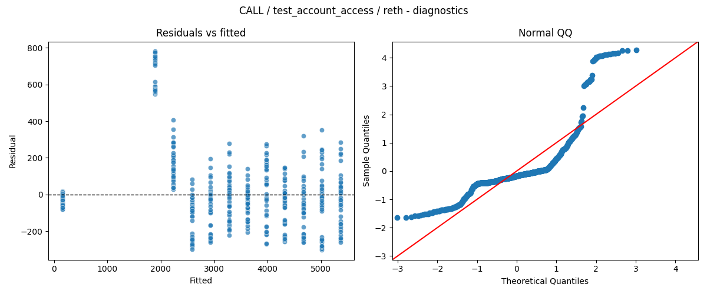

</details>

### test_account_access — combo `CALL_AccountMode.NON_EXISTING_ACCOUNT` — `presets[cold_account_nocode_access]`

| client | nobs | R² | target_coef (ms) | p-value | 95% CI |
| --- | --- | --- | --- | --- | --- |
| `besu` | 1309 | 0.7638 | 0.0128 | 1.00e-03 | [0.01242, 0.01322] |
| `erigon` | 385 | 0.9766 | 0.009818 | 1.00e-03 | [0.009665, 0.009973] |
| `ethrex` | 1276 | 0.9965 | 0.002685 | 1.00e-03 | [0.002676, 0.002694] |
| `geth` | 924 | 0.6721 | 0.02467 | 1.00e-03 | [0.02339, 0.02585] |
| `nethermind` | 495 | 0.8826 | 0.004254 | 1.00e-03 | [0.004125, 0.004392] |
| `reth` | 385 | 0.9682 | 0.0009782 | 1.00e-03 | [0.0009612, 0.0009958] |

<details><summary>besu — NNLS regression summary</summary>

```
==============================================================================
                           NNLS Regression Results                            
==============================================================================
Dep. Variable:          test_runtime_ms              R-squared:          0.764
Model:                  NNLS                    Adj. R-squared:          0.764
No. Observations:       1309                              RMSE:         168.96
Df Residuals:           1307                               MAE:         142.59
Df Model:               1      
==============================================================================
                      coef     std err     P-value      [0.025      0.975]
------------------------------------------------------------------------------
         const    467.4691     14.8894       0.001    436.5636    494.5893
       opcount      0.0128      0.0002       0.001      0.0124      0.0132
==============================================================================
Notes: Non-negative least squares with bootstrap inference (1000 iterations)
==============================================================================
```

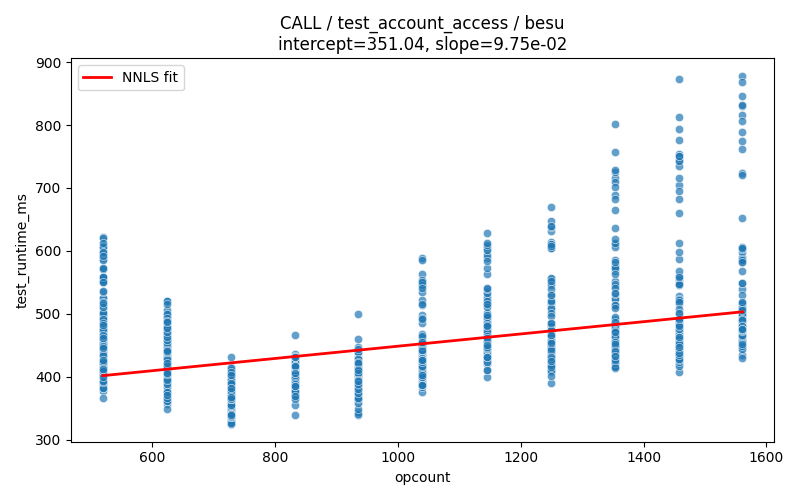

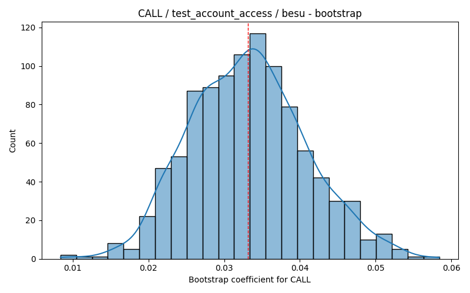

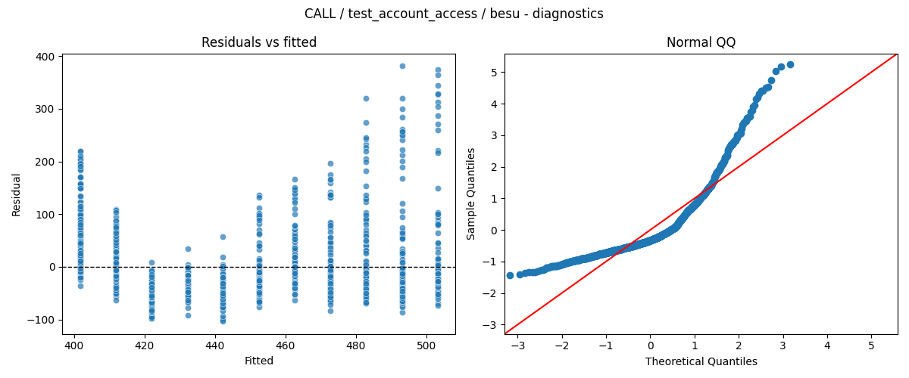

</details>

<details><summary>erigon — NNLS regression summary</summary>

```
==============================================================================
                           NNLS Regression Results                            
==============================================================================
Dep. Variable:          test_runtime_ms              R-squared:          0.977
Model:                  NNLS                    Adj. R-squared:          0.977
No. Observations:       385                               RMSE:          36.06
Df Residuals:           383                                MAE:          28.55
Df Model:               1      
==============================================================================
                      coef     std err     P-value      [0.025      0.975]
------------------------------------------------------------------------------
         const     12.9705      5.3234       0.005      2.1947     23.5624
       opcount      0.0098      0.0001       0.001      0.0097      0.0100
==============================================================================
Notes: Non-negative least squares with bootstrap inference (1000 iterations)
==============================================================================
```

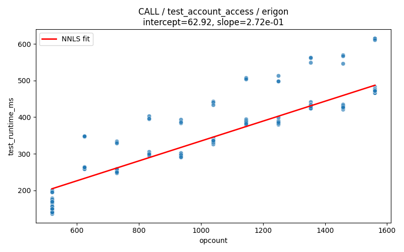

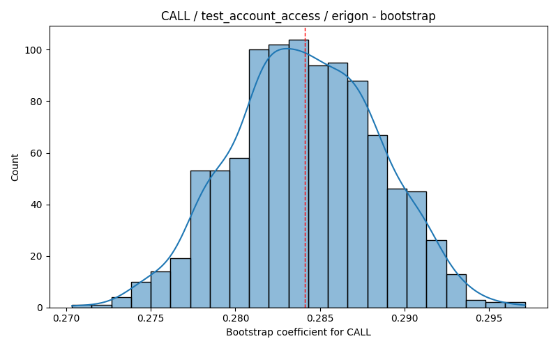

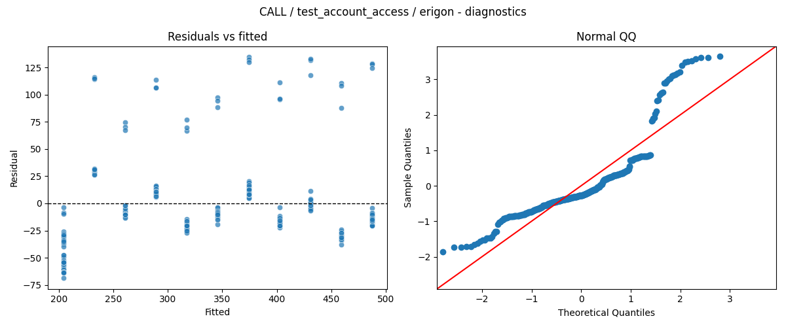

</details>

<details><summary>ethrex — NNLS regression summary</summary>

```
==============================================================================
                           NNLS Regression Results                            
==============================================================================
Dep. Variable:          test_runtime_ms              R-squared:          0.997
Model:                  NNLS                    Adj. R-squared:          0.997
No. Observations:       1276                              RMSE:           3.77
Df Residuals:           1274                               MAE:           2.89
Df Model:               1      
==============================================================================
                      coef     std err     P-value      [0.025      0.975]
------------------------------------------------------------------------------
         const      1.7612      0.3467       0.001      1.1370      2.4318
       opcount      0.0027      0.0000       0.001      0.0027      0.0027
==============================================================================
Notes: Non-negative least squares with bootstrap inference (1000 iterations)
==============================================================================
```

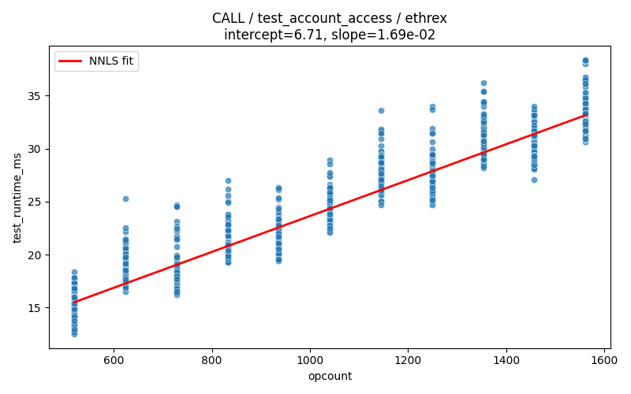

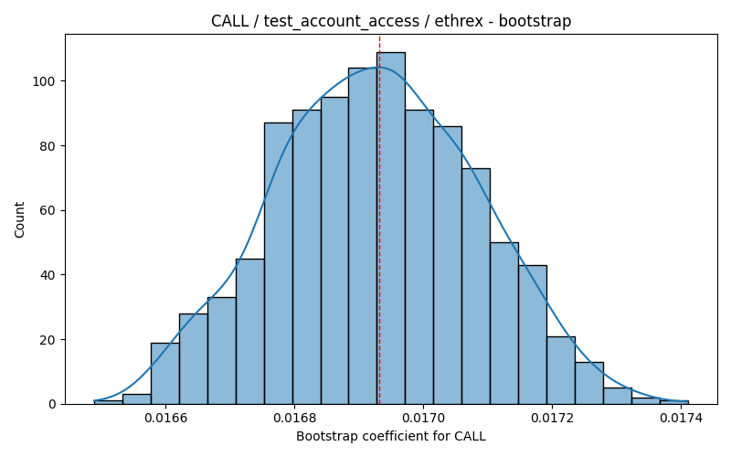

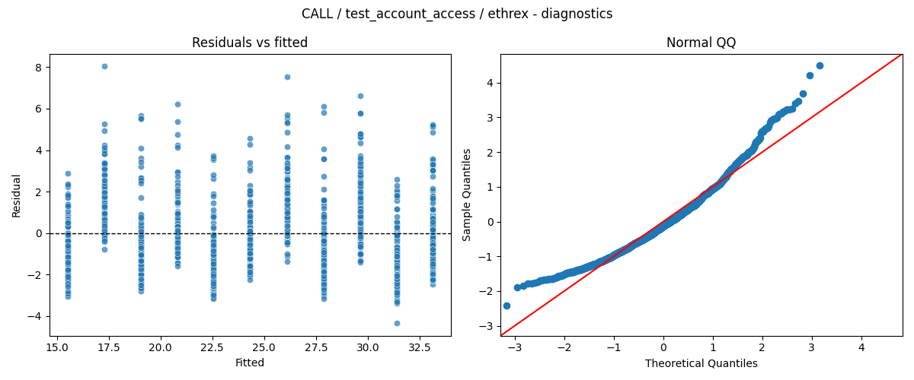

</details>

<details><summary>geth — NNLS regression summary</summary>

```
==============================================================================
                           NNLS Regression Results                            
==============================================================================
Dep. Variable:          test_runtime_ms              R-squared:          0.672
Model:                  NNLS                    Adj. R-squared:          0.672
No. Observations:       924                               RMSE:         409.28
Df Residuals:           922                                MAE:         337.90
Df Model:               1      
==============================================================================
                      coef     std err     P-value      [0.025      0.975]
------------------------------------------------------------------------------
         const   1323.7341     50.6528       0.001   1225.7321   1422.7002
       opcount      0.0247      0.0006       0.001      0.0234      0.0259
==============================================================================
Notes: Non-negative least squares with bootstrap inference (1000 iterations)
==============================================================================
```

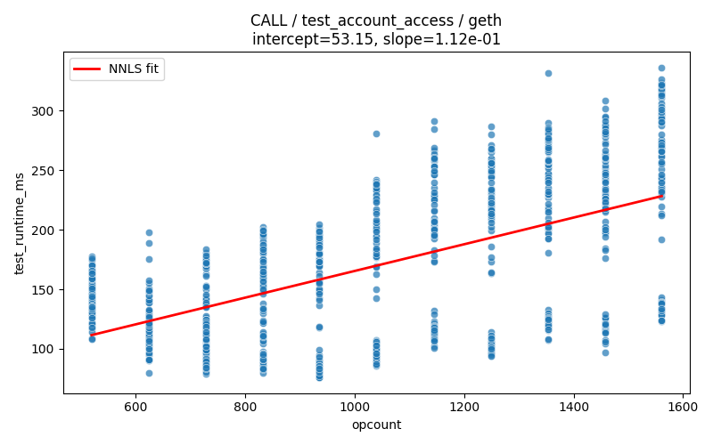

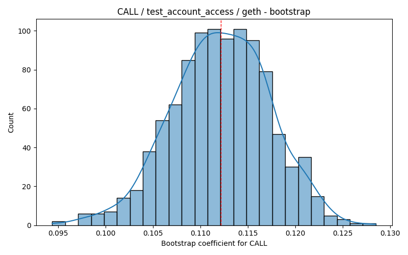

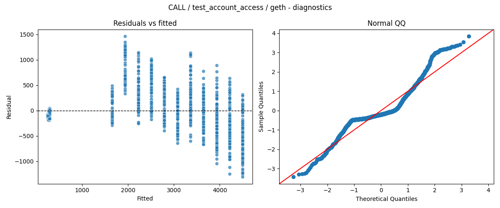

</details>

<details><summary>nethermind — NNLS regression summary</summary>

```
==============================================================================
                           NNLS Regression Results                            
==============================================================================
Dep. Variable:          test_runtime_ms              R-squared:          0.883
Model:                  NNLS                    Adj. R-squared:          0.882
No. Observations:       495                               RMSE:          36.83
Df Residuals:           493                                MAE:          27.51
Df Model:               1      
==============================================================================
                      coef     std err     P-value      [0.025      0.975]
------------------------------------------------------------------------------
         const    100.2001      4.7317       0.001     90.7551    109.4332
       opcount      0.0043      0.0001       0.001      0.0041      0.0044
==============================================================================
Notes: Non-negative least squares with bootstrap inference (1000 iterations)
==============================================================================
```

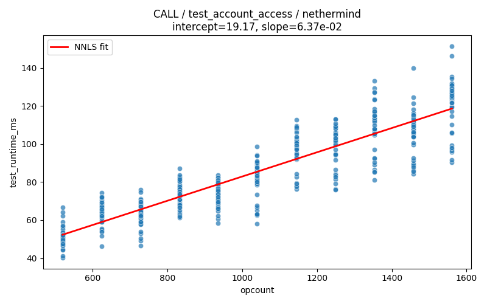

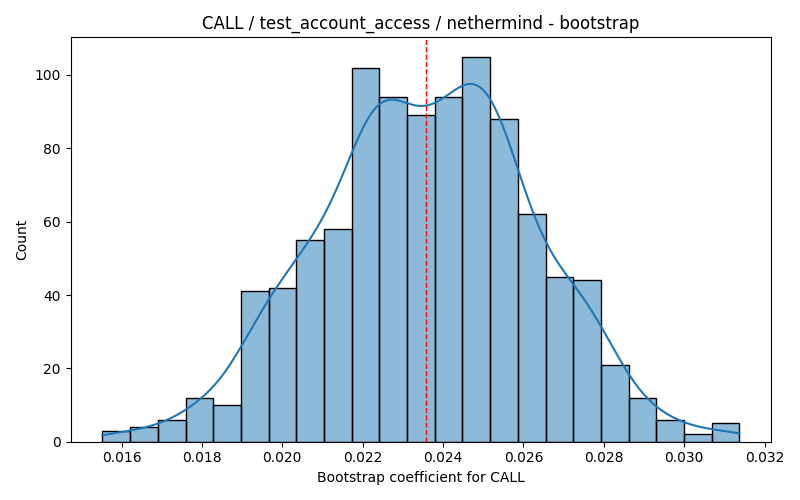

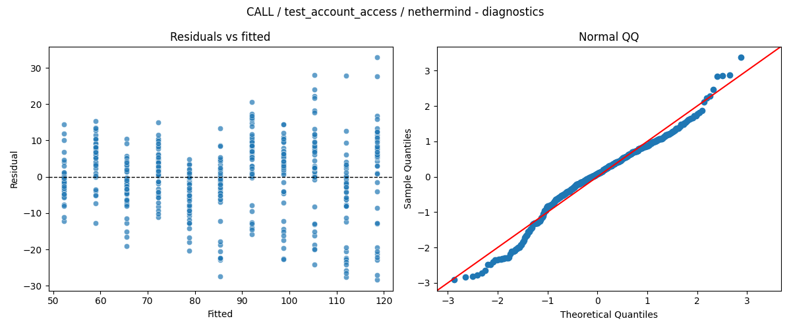

</details>

<details><summary>reth — NNLS regression summary</summary>

```
==============================================================================
                           NNLS Regression Results                            
==============================================================================
Dep. Variable:          test_runtime_ms              R-squared:          0.968
Model:                  NNLS                    Adj. R-squared:          0.968
No. Observations:       385                               RMSE:           4.21
Df Residuals:           383                                MAE:           3.33
Df Model:               1      
==============================================================================
                      coef     std err     P-value      [0.025      0.975]
------------------------------------------------------------------------------
         const     31.7479      0.6996       0.001     30.4281     33.0930
       opcount      0.0010      0.0000       0.001      0.0010      0.0010
==============================================================================
Notes: Non-negative least squares with bootstrap inference (1000 iterations)
==============================================================================
```

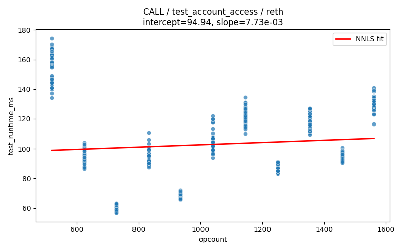

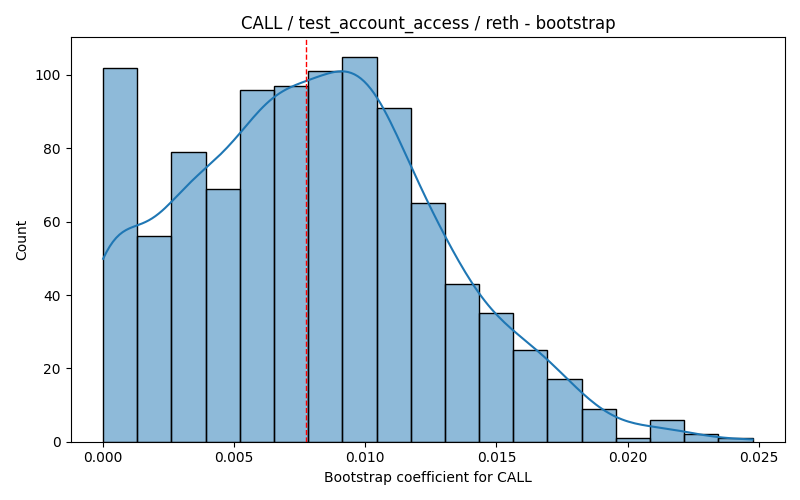

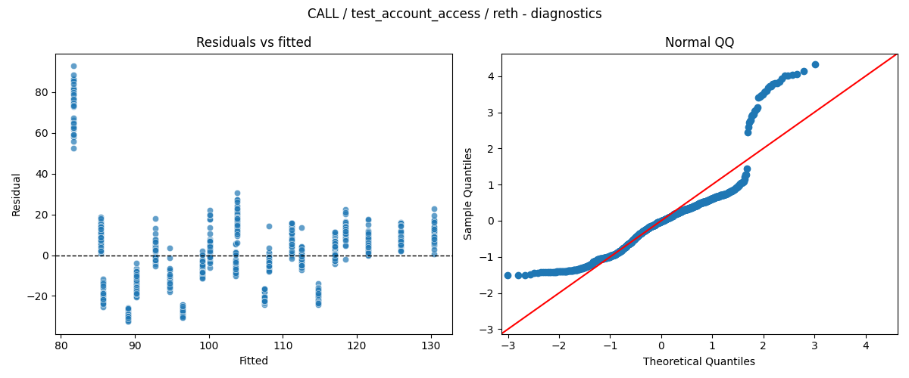

</details>

### test_account_access — combo `CALL_AccountMode.EXISTING_CONTRACT` — `presets[cold_account_code_access]`

| client | nobs | R² | target_coef (ms) | p-value | 95% CI |
| --- | --- | --- | --- | --- | --- |
| `besu` | 1309 | 0.8787 | 0.02935 | 1.00e-03 | [0.02882, 0.02993] |
| `erigon` | 385 | 0.8774 | 0.08625 | 1.00e-03 | [0.08314, 0.08927] |
| `ethrex` | 1276 | 0.9707 | 0.02594 | 1.00e-03 | [0.02565, 0.02624] |
| `geth` | 924 | 0.6862 | 0.03071 | 1.00e-03 | [0.0292, 0.03207] |
| `nethermind` | 495 | 0.73 | 0.02552 | 1.00e-03 | [0.02413, 0.027] |
| `reth` | 385 | 0.8697 | 0.03577 | 1.00e-03 | [0.03429, 0.03743] |

<details><summary>besu — NNLS regression summary</summary>

```
==============================================================================
                           NNLS Regression Results                            
==============================================================================
Dep. Variable:          test_runtime_ms              R-squared:          0.879
Model:                  NNLS                    Adj. R-squared:          0.879
No. Observations:       1309                              RMSE:         221.93
Df Residuals:           1307                               MAE:         185.05
Df Model:               1      
==============================================================================
                      coef     std err     P-value      [0.025      0.975]
------------------------------------------------------------------------------
         const    451.4472     18.1003       0.001    416.2301    484.7498
       opcount      0.0294      0.0003       0.001      0.0288      0.0299
==============================================================================
Notes: Non-negative least squares with bootstrap inference (1000 iterations)
==============================================================================
```

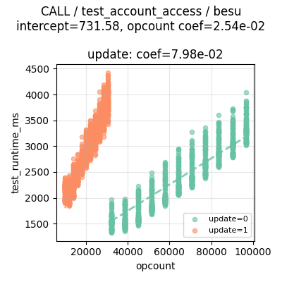

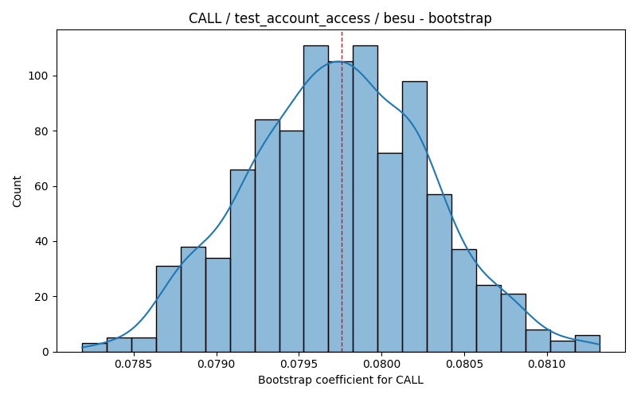

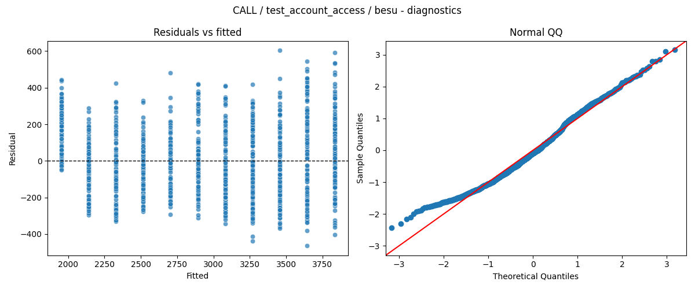

</details>

<details><summary>erigon — NNLS regression summary</summary>

```
==============================================================================
                           NNLS Regression Results                            
==============================================================================
Dep. Variable:          test_runtime_ms              R-squared:          0.877
Model:                  NNLS                    Adj. R-squared:          0.877
No. Observations:       385                               RMSE:         656.08
Df Residuals:           383                                MAE:         564.22
Df Model:               1      
==============================================================================
                      coef     std err     P-value      [0.025      0.975]
------------------------------------------------------------------------------
         const   1450.3595    121.6760       0.001   1231.9682   1701.2969
       opcount      0.0862      0.0016       0.001      0.0831      0.0893
==============================================================================
Notes: Non-negative least squares with bootstrap inference (1000 iterations)
==============================================================================
```


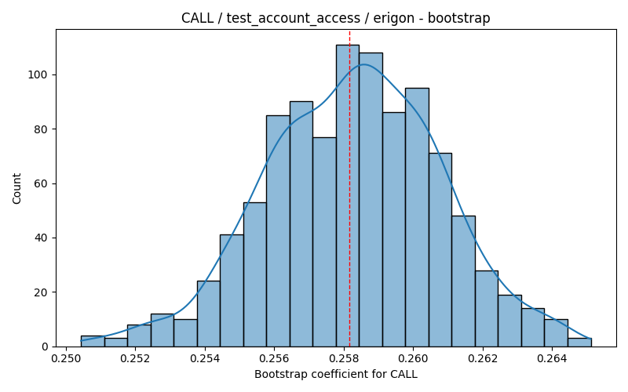

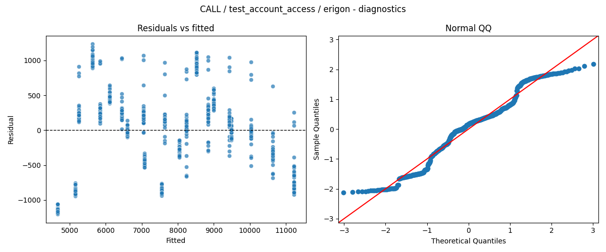

</details>

<details><summary>ethrex — NNLS regression summary</summary>

```
==============================================================================
                           NNLS Regression Results                            
==============================================================================
Dep. Variable:          test_runtime_ms              R-squared:          0.971
Model:                  NNLS                    Adj. R-squared:          0.971
No. Observations:       1276                              RMSE:          91.77
Df Residuals:           1274                               MAE:          79.82
Df Model:               1      
==============================================================================
                      coef     std err     P-value      [0.025      0.975]
------------------------------------------------------------------------------
         const    339.0758     10.6962       0.001    317.7002    359.5042
       opcount      0.0259      0.0002       0.001      0.0257      0.0262
==============================================================================
Notes: Non-negative least squares with bootstrap inference (1000 iterations)
==============================================================================
```

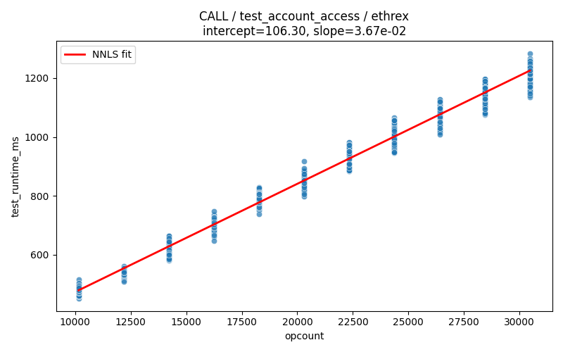

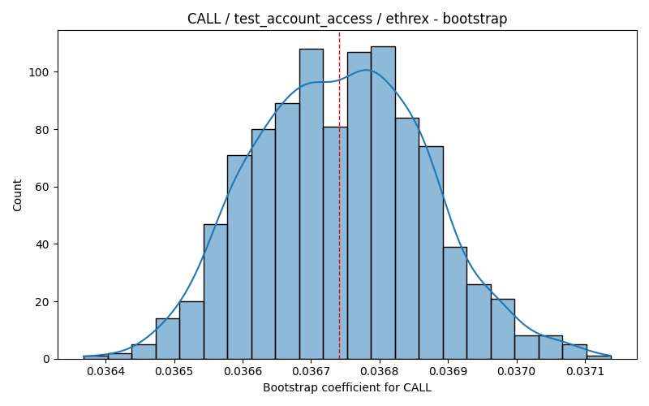

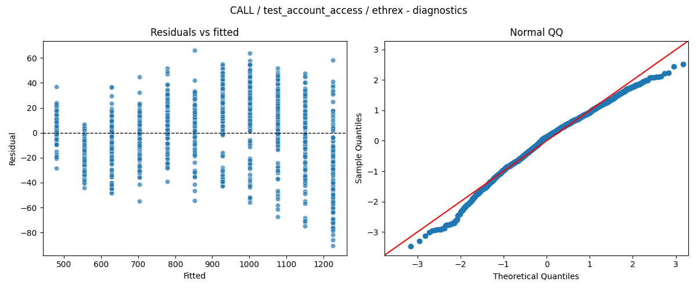

</details>

<details><summary>geth — NNLS regression summary</summary>

```
==============================================================================
                           NNLS Regression Results                            
==============================================================================
Dep. Variable:          test_runtime_ms              R-squared:          0.686
Model:                  NNLS                    Adj. R-squared:          0.686
No. Observations:       924                               RMSE:         422.54
Df Residuals:           922                                MAE:         353.00
Df Model:               1      
==============================================================================
                      coef     std err     P-value      [0.025      0.975]
------------------------------------------------------------------------------
         const   1050.9518     47.8568       0.001    963.8133   1149.0273
       opcount      0.0307      0.0007       0.001      0.0292      0.0321
==============================================================================
Notes: Non-negative least squares with bootstrap inference (1000 iterations)
==============================================================================
```

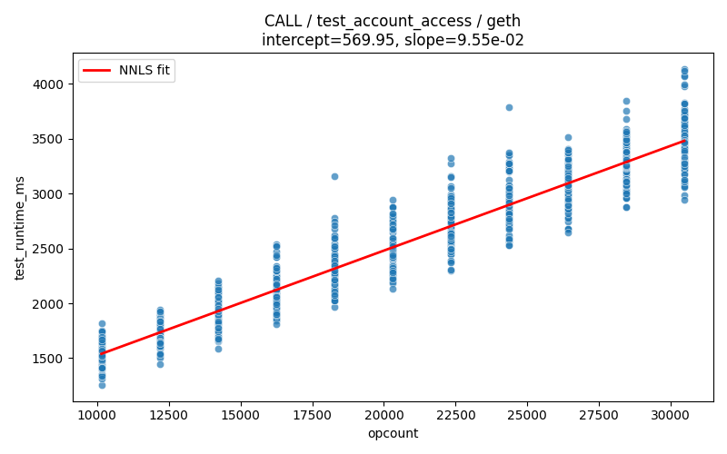

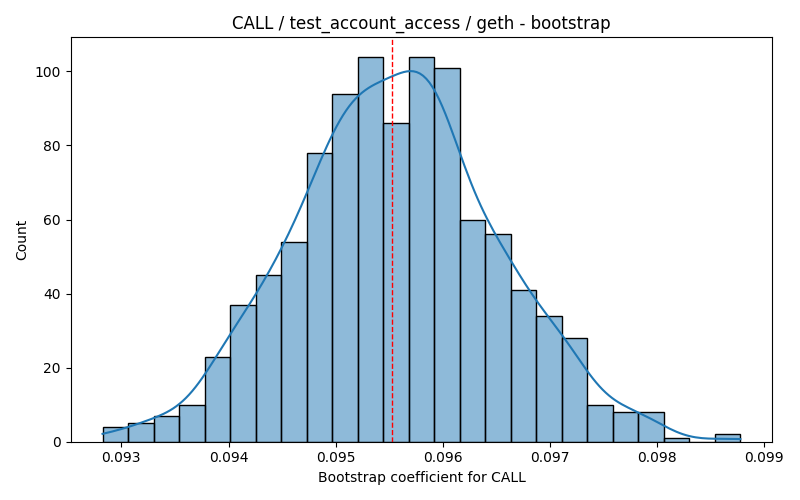

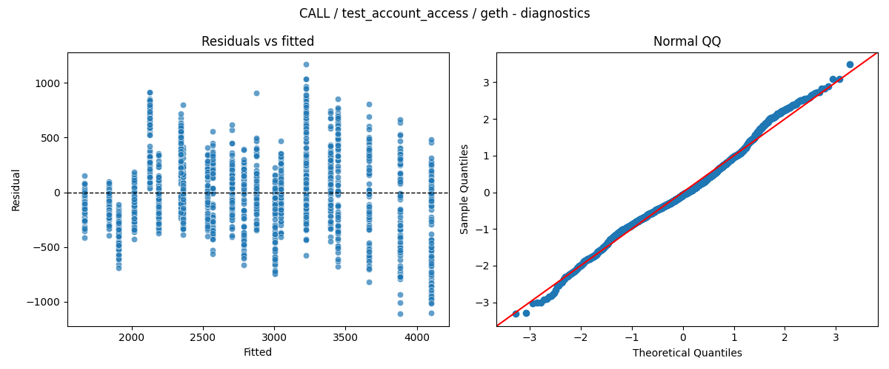

</details>

<details><summary>nethermind — NNLS regression summary</summary>

```
==============================================================================
                           NNLS Regression Results                            
==============================================================================
Dep. Variable:          test_runtime_ms              R-squared:          0.730
Model:                  NNLS                    Adj. R-squared:          0.729
No. Observations:       495                               RMSE:         315.90
Df Residuals:           493                                MAE:         262.27
Df Model:               1      
==============================================================================
                      coef     std err     P-value      [0.025      0.975]
------------------------------------------------------------------------------
         const    892.9453     51.9018       0.001    787.4776    990.7206
       opcount      0.0255      0.0007       0.001      0.0241      0.0270
==============================================================================
Notes: Non-negative least squares with bootstrap inference (1000 iterations)
==============================================================================
```

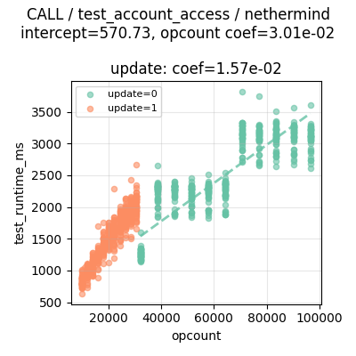

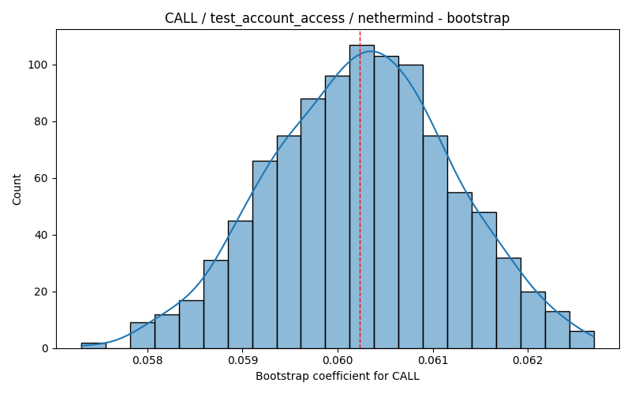

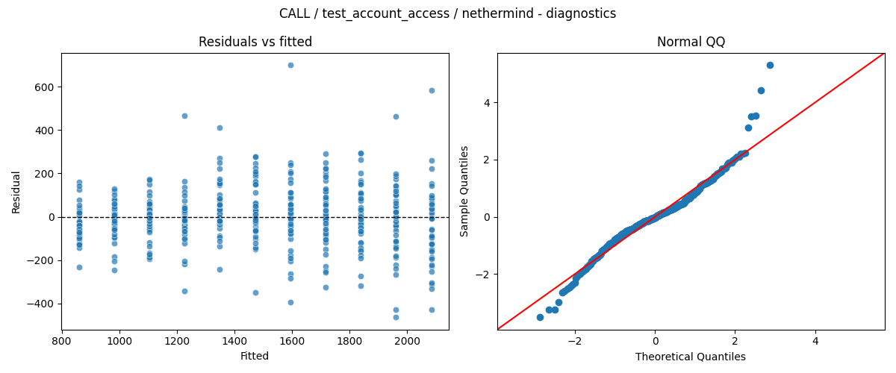

</details>

<details><summary>reth — NNLS regression summary</summary>

```
==============================================================================
                           NNLS Regression Results                            
==============================================================================
Dep. Variable:          test_runtime_ms              R-squared:          0.870
Model:                  NNLS                    Adj. R-squared:          0.869
No. Observations:       385                               RMSE:         281.76
Df Residuals:           383                                MAE:         172.25
Df Model:               1      
==============================================================================
                      coef     std err     P-value      [0.025      0.975]
------------------------------------------------------------------------------
         const    174.3380     50.1554       0.001     75.4999    269.9158
       opcount      0.0358      0.0008       0.001      0.0343      0.0374
==============================================================================
Notes: Non-negative least squares with bootstrap inference (1000 iterations)
==============================================================================
```

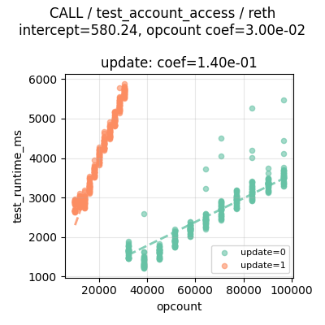

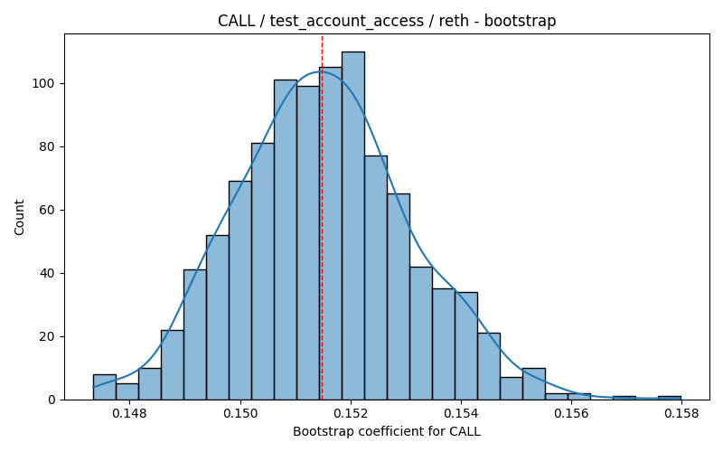

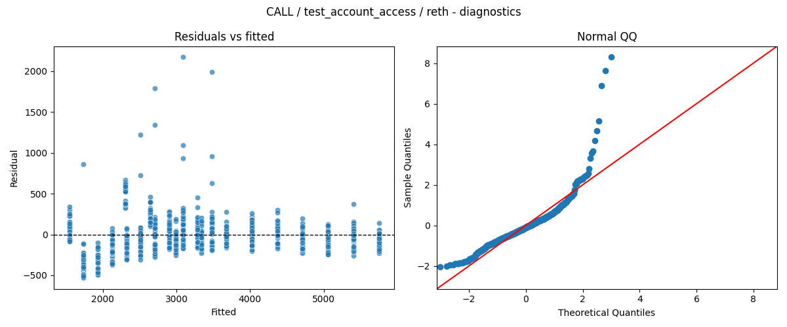

</details>

### test_account_access — combo `CALL_AccountMode.NON_EXISTING_ACCOUNT` — `presets[cold_account_code_access]`

| client | nobs | R² | target_coef (ms) | p-value | 95% CI |
| --- | --- | --- | --- | --- | --- |
| `besu` | 1309 | 0.7638 | 0.0128 | 1.00e-03 | [0.01242, 0.01322] |
| `erigon` | 385 | 0.9766 | 0.009818 | 1.00e-03 | [0.009665, 0.009973] |
| `ethrex` | 1276 | 0.9965 | 0.002685 | 1.00e-03 | [0.002676, 0.002694] |
| `geth` | 924 | 0.6721 | 0.02467 | 1.00e-03 | [0.02339, 0.02585] |
| `nethermind` | 495 | 0.8826 | 0.004254 | 1.00e-03 | [0.004125, 0.004392] |
| `reth` | 385 | 0.9682 | 0.0009782 | 1.00e-03 | [0.0009612, 0.0009958] |

<details><summary>besu — NNLS regression summary</summary>

```
==============================================================================
                           NNLS Regression Results                            
==============================================================================
Dep. Variable:          test_runtime_ms              R-squared:          0.764
Model:                  NNLS                    Adj. R-squared:          0.764
No. Observations:       1309                              RMSE:         168.96
Df Residuals:           1307                               MAE:         142.59
Df Model:               1      
==============================================================================
                      coef     std err     P-value      [0.025      0.975]
------------------------------------------------------------------------------
         const    467.4691     14.8894       0.001    436.5636    494.5893
       opcount      0.0128      0.0002       0.001      0.0124      0.0132
==============================================================================
Notes: Non-negative least squares with bootstrap inference (1000 iterations)
==============================================================================
```


</details>

<details><summary>erigon — NNLS regression summary</summary>

```
==============================================================================
                           NNLS Regression Results                            
==============================================================================
Dep. Variable:          test_runtime_ms              R-squared:          0.977
Model:                  NNLS                    Adj. R-squared:          0.977
No. Observations:       385                               RMSE:          36.06
Df Residuals:           383                                MAE:          28.55
Df Model:               1      
==============================================================================
                      coef     std err     P-value      [0.025      0.975]
------------------------------------------------------------------------------
         const     12.9705      5.3234       0.005      2.1947     23.5624
       opcount      0.0098      0.0001       0.001      0.0097      0.0100
==============================================================================
Notes: Non-negative least squares with bootstrap inference (1000 iterations)
==============================================================================
```


</details>

<details><summary>ethrex — NNLS regression summary</summary>

```
==============================================================================
                           NNLS Regression Results                            
==============================================================================
Dep. Variable:          test_runtime_ms              R-squared:          0.997
Model:                  NNLS                    Adj. R-squared:          0.997
No. Observations:       1276                              RMSE:           3.77
Df Residuals:           1274                               MAE:           2.89
Df Model:               1      
==============================================================================
                      coef     std err     P-value      [0.025      0.975]
------------------------------------------------------------------------------
         const      1.7612      0.3467       0.001      1.1370      2.4318
       opcount      0.0027      0.0000       0.001      0.0027      0.0027
==============================================================================
Notes: Non-negative least squares with bootstrap inference (1000 iterations)
==============================================================================
```


</details>

<details><summary>geth — NNLS regression summary</summary>

```
==============================================================================
                           NNLS Regression Results                            
==============================================================================
Dep. Variable:          test_runtime_ms              R-squared:          0.672
Model:                  NNLS                    Adj. R-squared:          0.672
No. Observations:       924                               RMSE:         409.28
Df Residuals:           922                                MAE:         337.90
Df Model:               1      
==============================================================================
                      coef     std err     P-value      [0.025      0.975]
------------------------------------------------------------------------------
         const   1323.7341     50.6528       0.001   1225.7321   1422.7002
       opcount      0.0247      0.0006       0.001      0.0234      0.0259
==============================================================================
Notes: Non-negative least squares with bootstrap inference (1000 iterations)
==============================================================================
```


</details>

<details><summary>nethermind — NNLS regression summary</summary>

```
==============================================================================
                           NNLS Regression Results                            
==============================================================================
Dep. Variable:          test_runtime_ms              R-squared:          0.883
Model:                  NNLS                    Adj. R-squared:          0.882
No. Observations:       495                               RMSE:          36.83
Df Residuals:           493                                MAE:          27.51
Df Model:               1      
==============================================================================
                      coef     std err     P-value      [0.025      0.975]
------------------------------------------------------------------------------
         const    100.2001      4.7317       0.001     90.7551    109.4332
       opcount      0.0043      0.0001       0.001      0.0041      0.0044
==============================================================================
Notes: Non-negative least squares with bootstrap inference (1000 iterations)
==============================================================================
```


</details>

<details><summary>reth — NNLS regression summary</summary>

```
==============================================================================
                           NNLS Regression Results                            
==============================================================================
Dep. Variable:          test_runtime_ms              R-squared:          0.968
Model:                  NNLS                    Adj. R-squared:          0.968
No. Observations:       385                               RMSE:           4.21
Df Residuals:           383                                MAE:           3.33
Df Model:               1      
==============================================================================
                      coef     std err     P-value      [0.025      0.975]
------------------------------------------------------------------------------
         const     31.7479      0.6996       0.001     30.4281     33.0930
       opcount      0.0010      0.0000       0.001      0.0010      0.0010
==============================================================================
Notes: Non-negative least squares with bootstrap inference (1000 iterations)
==============================================================================
```


</details>

### test_account_access — combo `CALL_AccountMode.EXISTING_EOA` — `presets[cold_account_nocode_write]`

| client | nobs | R² | target_coef (ms) | p-value | 95% CI |
| --- | --- | --- | --- | --- | --- |
| `besu` | 1309 | 0.9152 | 0.06297 | 1.00e-03 | [0.06174, 0.06414] |
| `erigon` | 385 | 0.9675 | 0.06533 | 1.00e-03 | [0.06406, 0.06671] |
| `ethrex` | 1276 | 0.9882 | 0.03505 | 1.00e-03 | [0.03483, 0.03526] |
| `geth` | 924 | 0.8619 | 0.05802 | 1.00e-03 | [0.05658, 0.05934] |
| `nethermind` | 495 | 0.8561 | 0.03443 | 1.00e-03 | [0.03312, 0.03567] |
| `reth` | 385 | 0.9512 | 0.1459 | 1.00e-03 | [0.1421, 0.1501] |

<details><summary>besu — NNLS regression summary</summary>

```
==============================================================================
                           NNLS Regression Results                            
==============================================================================
Dep. Variable:          test_runtime_ms              R-squared:          0.915
Model:                  NNLS                    Adj. R-squared:          0.915
No. Observations:       1309                              RMSE:         128.97
Df Residuals:           1307                               MAE:         105.30
Df Model:               1      
==============================================================================
                      coef     std err     P-value      [0.025      0.975]
------------------------------------------------------------------------------
         const    481.1329     12.6272       0.001    457.3199    505.7491
       opcount      0.0630      0.0006       0.001      0.0617      0.0641
==============================================================================
Notes: Non-negative least squares with bootstrap inference (1000 iterations)
==============================================================================
```


</details>

<details><summary>erigon — NNLS regression summary</summary>

```
==============================================================================
                           NNLS Regression Results                            
==============================================================================
Dep. Variable:          test_runtime_ms              R-squared:          0.968
Model:                  NNLS                    Adj. R-squared:          0.967
No. Observations:       385                               RMSE:          80.54
Df Residuals:           383                                MAE:          65.89
Df Model:               1      
==============================================================================
                      coef     std err     P-value      [0.025      0.975]
------------------------------------------------------------------------------
         const    514.7561     15.0139       0.001    485.1889    543.1176
       opcount      0.0653      0.0007       0.001      0.0641      0.0667
==============================================================================
Notes: Non-negative least squares with bootstrap inference (1000 iterations)
==============================================================================
```


</details>

<details><summary>ethrex — NNLS regression summary</summary>

```
==============================================================================
                           NNLS Regression Results                            
==============================================================================
Dep. Variable:          test_runtime_ms              R-squared:          0.988
Model:                  NNLS                    Adj. R-squared:          0.988
No. Observations:       1276                              RMSE:          25.74
Df Residuals:           1274                               MAE:          20.04
Df Model:               1      
==============================================================================
                      coef     std err     P-value      [0.025      0.975]
------------------------------------------------------------------------------
         const    119.3805      2.0401       0.001    115.5538    123.4210
       opcount      0.0350      0.0001       0.001      0.0348      0.0353
==============================================================================
Notes: Non-negative least squares with bootstrap inference (1000 iterations)
==============================================================================
```


</details>

<details><summary>geth — NNLS regression summary</summary>

```
==============================================================================
                           NNLS Regression Results                            
==============================================================================
Dep. Variable:          test_runtime_ms              R-squared:          0.862
Model:                  NNLS                    Adj. R-squared:          0.862
No. Observations:       924                               RMSE:         156.30
Df Residuals:           922                                MAE:         124.83
Df Model:               1      
==============================================================================
                      coef     std err     P-value      [0.025      0.975]
------------------------------------------------------------------------------
         const    264.7113     14.7216       0.001    236.6182    294.1380
       opcount      0.0580      0.0007       0.001      0.0566      0.0593
==============================================================================
Notes: Non-negative least squares with bootstrap inference (1000 iterations)
==============================================================================
```


</details>

<details><summary>nethermind — NNLS regression summary</summary>

```
==============================================================================
                           NNLS Regression Results                            
==============================================================================
Dep. Variable:          test_runtime_ms              R-squared:          0.856
Model:                  NNLS                    Adj. R-squared:          0.856
No. Observations:       495                               RMSE:          94.99
Df Residuals:           493                                MAE:          72.02
Df Model:               1      
==============================================================================
                      coef     std err     P-value      [0.025      0.975]
------------------------------------------------------------------------------
         const    242.2098     13.3179       0.001    217.0335    268.5697
       opcount      0.0344      0.0007       0.001      0.0331      0.0357
==============================================================================
Notes: Non-negative least squares with bootstrap inference (1000 iterations)
==============================================================================
```


</details>

<details><summary>reth — NNLS regression summary</summary>

```
==============================================================================
                           NNLS Regression Results                            
==============================================================================
Dep. Variable:          test_runtime_ms              R-squared:          0.951
Model:                  NNLS                    Adj. R-squared:          0.951
No. Observations:       385                               RMSE:         222.29
Df Residuals:           383                                MAE:         173.87
Df Model:               1      
==============================================================================
                      coef     std err     P-value      [0.025      0.975]
------------------------------------------------------------------------------
         const    559.5401     50.0434       0.001    457.0460    651.2636
       opcount      0.1459      0.0021       0.001      0.1421      0.1501
==============================================================================
Notes: Non-negative least squares with bootstrap inference (1000 iterations)
==============================================================================
```


</details>

### test_account_access — combo `CALL_AccountMode.NON_EXISTING_ACCOUNT` — `presets[cold_account_nocode_write]`

| client | nobs | R² | target_coef (ms) | p-value | 95% CI |
| --- | --- | --- | --- | --- | --- |
| `besu` | 1309 | 0.1642 | 0.09746 | 1.00e-03 | [0.0832, 0.1118] |
| `erigon` | 385 | 0.856 | 0.2718 | 1.00e-03 | [0.2596, 0.2842] |
| `ethrex` | 1276 | 0.9066 | 0.01693 | 1.00e-03 | [0.01663, 0.01723] |
| `geth` | 924 | 0.3262 | 0.1122 | 1.00e-03 | [0.1018, 0.1216] |
| `nethermind` | 495 | 0.8228 | 0.06369 | 1.00e-03 | [0.06096, 0.06638] |
| `reth` | 385 | 0.00897 | 0.007728 | 7.30e-02 | [0, 0.0176] |

<details><summary>besu — NNLS regression summary</summary>

```
==============================================================================
                           NNLS Regression Results                            
==============================================================================
Dep. Variable:          test_runtime_ms              R-squared:          0.164
Model:                  NNLS                    Adj. R-squared:          0.164
No. Observations:       1309                              RMSE:          72.41
Df Residuals:           1307                               MAE:          51.61
Df Model:               1      
==============================================================================
                      coef     std err     P-value      [0.025      0.975]
------------------------------------------------------------------------------
         const    351.0368      7.6820       0.001    336.0850    365.9444
       opcount      0.0975      0.0075       0.001      0.0832      0.1118
==============================================================================
Notes: Non-negative least squares with bootstrap inference (1000 iterations)
==============================================================================
```


</details>

<details><summary>erigon — NNLS regression summary</summary>

```
==============================================================================
                           NNLS Regression Results                            
==============================================================================
Dep. Variable:          test_runtime_ms              R-squared:          0.856
Model:                  NNLS                    Adj. R-squared:          0.856
No. Observations:       385                               RMSE:          36.71
Df Residuals:           383                                MAE:          24.99
Df Model:               1      
==============================================================================
                      coef     std err     P-value      [0.025      0.975]
------------------------------------------------------------------------------
         const     62.9228      6.8756       0.001     49.7913     76.3779
       opcount      0.2718      0.0064       0.001      0.2596      0.2842
==============================================================================
Notes: Non-negative least squares with bootstrap inference (1000 iterations)
==============================================================================
```


</details>

<details><summary>ethrex — NNLS regression summary</summary>

```
==============================================================================
                           NNLS Regression Results                            
==============================================================================
Dep. Variable:          test_runtime_ms              R-squared:          0.907
Model:                  NNLS                    Adj. R-squared:          0.907
No. Observations:       1276                              RMSE:           1.79
Df Residuals:           1274                               MAE:           1.39
Df Model:               1      
==============================================================================
                      coef     std err     P-value      [0.025      0.975]
------------------------------------------------------------------------------
         const      6.7121      0.1679       0.001      6.4020      7.0452
       opcount      0.0169      0.0002       0.001      0.0166      0.0172
==============================================================================
Notes: Non-negative least squares with bootstrap inference (1000 iterations)
==============================================================================
```


</details>

<details><summary>geth — NNLS regression summary</summary>

```
==============================================================================
                           NNLS Regression Results                            
==============================================================================
Dep. Variable:          test_runtime_ms              R-squared:          0.326
Model:                  NNLS                    Adj. R-squared:          0.325
No. Observations:       924                               RMSE:          53.09
Df Residuals:           922                                MAE:          44.64
Df Model:               1      
==============================================================================
                      coef     std err     P-value      [0.025      0.975]
------------------------------------------------------------------------------
         const     53.1499      4.8781       0.001     44.0483     63.0268
       opcount      0.1122      0.0051       0.001      0.1018      0.1216
==============================================================================
Notes: Non-negative least squares with bootstrap inference (1000 iterations)
==============================================================================
```


</details>

<details><summary>nethermind — NNLS regression summary</summary>

```
==============================================================================
                           NNLS Regression Results                            
==============================================================================
Dep. Variable:          test_runtime_ms              R-squared:          0.823
Model:                  NNLS                    Adj. R-squared:          0.822
No. Observations:       495                               RMSE:           9.73
Df Residuals:           493                                MAE:           7.36
Df Model:               1      
==============================================================================
                      coef     std err     P-value      [0.025      0.975]
------------------------------------------------------------------------------
         const     19.1674      1.2796       0.001     16.6534     21.7205
       opcount      0.0637      0.0014       0.001      0.0610      0.0664
==============================================================================
Notes: Non-negative least squares with bootstrap inference (1000 iterations)
==============================================================================
```


</details>

<details><summary>reth — NNLS regression summary</summary>

```
==============================================================================
                           NNLS Regression Results                            
==============================================================================
Dep. Variable:          test_runtime_ms              R-squared:          0.009
Model:                  NNLS                    Adj. R-squared:          0.006
No. Observations:       385                               RMSE:          26.75
Df Residuals:           383                                MAE:          21.21
Df Model:               1      
==============================================================================
                      coef     std err     P-value      [0.025      0.975]
------------------------------------------------------------------------------
         const     94.9365      5.9482       0.001     82.3488    105.2066
       opcount      0.0077      0.0048       0.073      0.0000      0.0176
==============================================================================
Notes: Non-negative least squares with bootstrap inference (1000 iterations)
==============================================================================
```


</details>

### test_account_access — combo `CALL_AccountMode.EXISTING_CONTRACT` — `presets[cold_account_code_write]`

| client | nobs | R² | target_coef (ms) | p-value | 95% CI |
| --- | --- | --- | --- | --- | --- |
| `besu` | 1309 | 0.9064 | 0.09262 | 1.00e-03 | [0.09074, 0.09442] |
| `erigon` | 385 | 0.9683 | 0.2582 | 1.00e-03 | [0.2529, 0.2633] |
| `ethrex` | 1276 | 0.9879 | 0.03674 | 1.00e-03 | [0.03652, 0.03699] |
| `geth` | 924 | 0.9125 | 0.09552 | 1.00e-03 | [0.09376, 0.09744] |
| `nethermind` | 495 | 0.8959 | 0.06023 | 1.00e-03 | [0.05838, 0.06208] |
| `reth` | 385 | 0.9723 | 0.1515 | 1.00e-03 | [0.1487, 0.1546] |

<details><summary>besu — NNLS regression summary</summary>

```
==============================================================================
                           NNLS Regression Results                            
==============================================================================
Dep. Variable:          test_runtime_ms              R-squared:          0.906
Model:                  NNLS                    Adj. R-squared:          0.906
No. Observations:       1309                              RMSE:         191.11
Df Residuals:           1307                               MAE:         157.35
Df Model:               1      
==============================================================================
                      coef     std err     P-value      [0.025      0.975]
------------------------------------------------------------------------------
         const   1011.6510     18.2798       0.001    975.1305   1049.2577
       opcount      0.0926      0.0009       0.001      0.0907      0.0944
==============================================================================
Notes: Non-negative least squares with bootstrap inference (1000 iterations)
==============================================================================
```


</details>

<details><summary>erigon — NNLS regression summary</summary>

```
==============================================================================
                           NNLS Regression Results                            
==============================================================================
Dep. Variable:          test_runtime_ms              R-squared:          0.968
Model:                  NNLS                    Adj. R-squared:          0.968
No. Observations:       385                               RMSE:         300.21
Df Residuals:           383                                MAE:         212.99
Df Model:               1      
==============================================================================
                      coef     std err     P-value      [0.025      0.975]
------------------------------------------------------------------------------
         const   3067.8914     46.7165       0.001   2980.2018   3163.7050
       opcount      0.2582      0.0025       0.001      0.2529      0.2633
==============================================================================
Notes: Non-negative least squares with bootstrap inference (1000 iterations)
==============================================================================
```


</details>

<details><summary>ethrex — NNLS regression summary</summary>

```
==============================================================================
                           NNLS Regression Results                            
==============================================================================
Dep. Variable:          test_runtime_ms              R-squared:          0.988
Model:                  NNLS                    Adj. R-squared:          0.988
No. Observations:       1276                              RMSE:          26.08
Df Residuals:           1274                               MAE:          20.82
Df Model:               1      
==============================================================================
                      coef     std err     P-value      [0.025      0.975]
------------------------------------------------------------------------------
         const    106.3023      2.2382       0.001    101.9687    110.4417
       opcount      0.0367      0.0001       0.001      0.0365      0.0370
==============================================================================
Notes: Non-negative least squares with bootstrap inference (1000 iterations)
==============================================================================
```


</details>

<details><summary>geth — NNLS regression summary</summary>

```
==============================================================================
                           NNLS Regression Results                            
==============================================================================
Dep. Variable:          test_runtime_ms              R-squared:          0.913
Model:                  NNLS                    Adj. R-squared:          0.912
No. Observations:       924                               RMSE:         189.96
Df Residuals:           922                                MAE:         147.69
Df Model:               1      
==============================================================================
                      coef     std err     P-value      [0.025      0.975]
------------------------------------------------------------------------------
         const    569.9480     17.8024       0.001    534.3950    603.3680
       opcount      0.0955      0.0009       0.001      0.0938      0.0974
==============================================================================
Notes: Non-negative least squares with bootstrap inference (1000 iterations)
==============================================================================
```


</details>

<details><summary>nethermind — NNLS regression summary</summary>

```
==============================================================================
                           NNLS Regression Results                            
==============================================================================
Dep. Variable:          test_runtime_ms              R-squared:          0.896
Model:                  NNLS                    Adj. R-squared:          0.896
No. Observations:       495                               RMSE:         131.89
Df Residuals:           493                                MAE:          93.90
Df Model:               1      
==============================================================================
                      coef     std err     P-value      [0.025      0.975]
------------------------------------------------------------------------------
         const    248.5904     17.0858       0.001    215.4496    284.0454
       opcount      0.0602      0.0009       0.001      0.0584      0.0621
==============================================================================
Notes: Non-negative least squares with bootstrap inference (1000 iterations)
==============================================================================
```


</details>

<details><summary>reth — NNLS regression summary</summary>

```
==============================================================================
                           NNLS Regression Results                            
==============================================================================
Dep. Variable:          test_runtime_ms              R-squared:          0.972
Model:                  NNLS                    Adj. R-squared:          0.972
No. Observations:       385                               RMSE:         164.31
Df Residuals:           383                                MAE:         130.85
Df Model:               1      
==============================================================================
                      coef     std err     P-value      [0.025      0.975]
------------------------------------------------------------------------------
         const    986.0372     37.1140       0.001    910.6976   1053.7821
       opcount      0.1515      0.0016       0.001      0.1487      0.1546
==============================================================================
Notes: Non-negative least squares with bootstrap inference (1000 iterations)
==============================================================================
```


</details>

### test_account_access — combo `CALL_AccountMode.NON_EXISTING_ACCOUNT` — `presets[cold_account_code_write]`

| client | nobs | R² | target_coef (ms) | p-value | 95% CI |
| --- | --- | --- | --- | --- | --- |
| `besu` | 1309 | 0.1642 | 0.09746 | 1.00e-03 | [0.0832, 0.1118] |
| `erigon` | 385 | 0.856 | 0.2718 | 1.00e-03 | [0.2596, 0.2842] |
| `ethrex` | 1276 | 0.9066 | 0.01693 | 1.00e-03 | [0.01663, 0.01723] |
| `geth` | 924 | 0.3262 | 0.1122 | 1.00e-03 | [0.1018, 0.1216] |
| `nethermind` | 495 | 0.8228 | 0.06369 | 1.00e-03 | [0.06096, 0.06638] |
| `reth` | 385 | 0.00897 | 0.007728 | 7.30e-02 | [0, 0.0176] |

<details><summary>besu — NNLS regression summary</summary>

```
==============================================================================
                           NNLS Regression Results                            
==============================================================================
Dep. Variable:          test_runtime_ms              R-squared:          0.164
Model:                  NNLS                    Adj. R-squared:          0.164
No. Observations:       1309                              RMSE:          72.41
Df Residuals:           1307                               MAE:          51.61
Df Model:               1      
==============================================================================
                      coef     std err     P-value      [0.025      0.975]
------------------------------------------------------------------------------
         const    351.0368      7.6820       0.001    336.0850    365.9444
       opcount      0.0975      0.0075       0.001      0.0832      0.1118
==============================================================================
Notes: Non-negative least squares with bootstrap inference (1000 iterations)
==============================================================================
```


</details>

<details><summary>erigon — NNLS regression summary</summary>

```
==============================================================================
                           NNLS Regression Results                            
==============================================================================
Dep. Variable:          test_runtime_ms              R-squared:          0.856
Model:                  NNLS                    Adj. R-squared:          0.856
No. Observations:       385                               RMSE:          36.71
Df Residuals:           383                                MAE:          24.99
Df Model:               1      
==============================================================================
                      coef     std err     P-value      [0.025      0.975]
------------------------------------------------------------------------------
         const     62.9228      6.8756       0.001     49.7913     76.3779
       opcount      0.2718      0.0064       0.001      0.2596      0.2842
==============================================================================
Notes: Non-negative least squares with bootstrap inference (1000 iterations)
==============================================================================
```


</details>

<details><summary>ethrex — NNLS regression summary</summary>

```
==============================================================================
                           NNLS Regression Results                            
==============================================================================
Dep. Variable:          test_runtime_ms              R-squared:          0.907
Model:                  NNLS                    Adj. R-squared:          0.907
No. Observations:       1276                              RMSE:           1.79
Df Residuals:           1274                               MAE:           1.39
Df Model:               1      
==============================================================================
                      coef     std err     P-value      [0.025      0.975]
------------------------------------------------------------------------------
         const      6.7121      0.1679       0.001      6.4020      7.0452
       opcount      0.0169      0.0002       0.001      0.0166      0.0172
==============================================================================
Notes: Non-negative least squares with bootstrap inference (1000 iterations)
==============================================================================
```


</details>

<details><summary>geth — NNLS regression summary</summary>

```
==============================================================================
                           NNLS Regression Results                            
==============================================================================
Dep. Variable:          test_runtime_ms              R-squared:          0.326
Model:                  NNLS                    Adj. R-squared:          0.325
No. Observations:       924                               RMSE:          53.09
Df Residuals:           922                                MAE:          44.64
Df Model:               1      
==============================================================================
                      coef     std err     P-value      [0.025      0.975]
------------------------------------------------------------------------------
         const     53.1499      4.8781       0.001     44.0483     63.0268
       opcount      0.1122      0.0051       0.001      0.1018      0.1216
==============================================================================
Notes: Non-negative least squares with bootstrap inference (1000 iterations)
==============================================================================
```


</details>

<details><summary>nethermind — NNLS regression summary</summary>

```
==============================================================================
                           NNLS Regression Results                            
==============================================================================
Dep. Variable:          test_runtime_ms              R-squared:          0.823
Model:                  NNLS                    Adj. R-squared:          0.822
No. Observations:       495                               RMSE:           9.73
Df Residuals:           493                                MAE:           7.36
Df Model:               1      
==============================================================================
                      coef     std err     P-value      [0.025      0.975]
------------------------------------------------------------------------------
         const     19.1674      1.2796       0.001     16.6534     21.7205
       opcount      0.0637      0.0014       0.001      0.0610      0.0664
==============================================================================
Notes: Non-negative least squares with bootstrap inference (1000 iterations)
==============================================================================
```


</details>

<details><summary>reth — NNLS regression summary</summary>

```
==============================================================================
                           NNLS Regression Results                            
==============================================================================
Dep. Variable:          test_runtime_ms              R-squared:          0.009
Model:                  NNLS                    Adj. R-squared:          0.006
No. Observations:       385                               RMSE:          26.75
Df Residuals:           383                                MAE:          21.21
Df Model:               1      
==============================================================================
                      coef     std err     P-value      [0.025      0.975]
------------------------------------------------------------------------------
         const     94.9365      5.9482       0.001     82.3488    105.2066
       opcount      0.0077      0.0048       0.073      0.0000      0.0176
==============================================================================
Notes: Non-negative least squares with bootstrap inference (1000 iterations)
==============================================================================
```


</details>

### test_ext_account_query_warm — combo `CALL`

| client | nobs | R² | target_coef (ms) | p-value | 95% CI |
| --- | --- | --- | --- | --- | --- |
| `besu` | 1309 | 0.7137 | 0.0005321 | 1.00e-03 | [0.0005145, 0.0005522] |
| `erigon` | 385 | 0.9618 | 0.0004792 | 1.00e-03 | [0.0004691, 0.0004886] |
| `ethrex` | 1276 | 0.8867 | 7.653e-05 | 1.00e-03 | [7.487e-05, 7.812e-05] |
| `geth` | 924 | 0.8476 | 0.0001315 | 1.00e-03 | [0.0001279, 0.0001351] |
| `nethermind` | 495 | 0.3082 | 0.0003968 | 1.00e-03 | [0.0003438, 0.0004525] |
| `reth` | 385 | 0.8968 | 5.016e-05 | 1.00e-03 | [4.82e-05, 5.2e-05] |

<details><summary>besu — NNLS regression summary</summary>

```
==============================================================================
                           NNLS Regression Results                            
==============================================================================
Dep. Variable:          test_runtime_ms              R-squared:          0.714
Model:                  NNLS                    Adj. R-squared:          0.714
No. Observations:       1309                              RMSE:         170.25
Df Residuals:           1307                               MAE:         130.47
Df Model:               1      
==============================================================================
                      coef     std err     P-value      [0.025      0.975]
------------------------------------------------------------------------------
         const    701.9851     14.3235       0.001    672.6666    728.2922
       opcount      0.0005      0.0000       0.001      0.0005      0.0006
==============================================================================
Notes: Non-negative least squares with bootstrap inference (1000 iterations)
==============================================================================
```

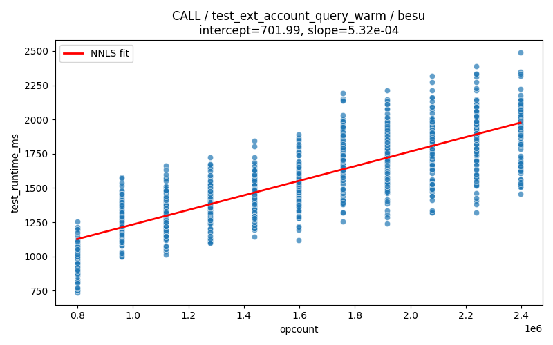

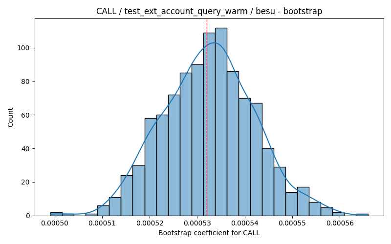

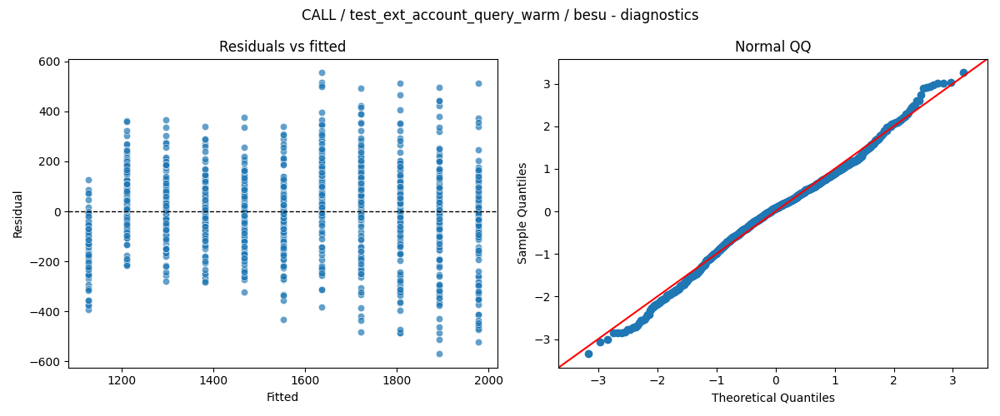

</details>

<details><summary>erigon — NNLS regression summary</summary>

```
==============================================================================
                           NNLS Regression Results                            
==============================================================================
Dep. Variable:          test_runtime_ms              R-squared:          0.962
Model:                  NNLS                    Adj. R-squared:          0.962
No. Observations:       385                               RMSE:          48.27
Df Residuals:           383                                MAE:          36.81
Df Model:               1      
==============================================================================
                      coef     std err     P-value      [0.025      0.975]
------------------------------------------------------------------------------
         const     61.3608      8.2288       0.001     45.7279     78.7715
       opcount      0.0005      0.0000       0.001      0.0005      0.0005
==============================================================================
Notes: Non-negative least squares with bootstrap inference (1000 iterations)
==============================================================================
```

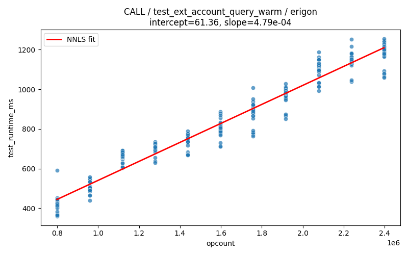

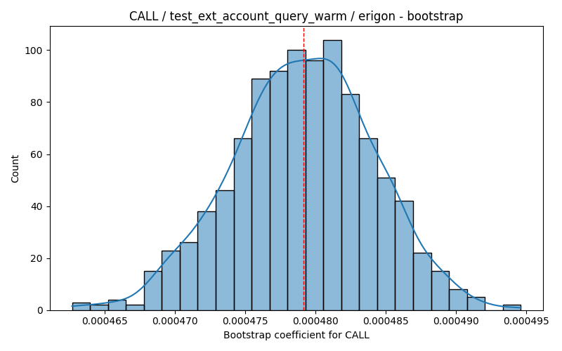

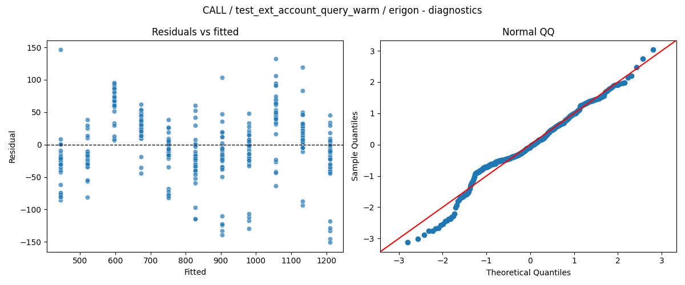

</details>

<details><summary>ethrex — NNLS regression summary</summary>

```
==============================================================================
                           NNLS Regression Results                            
==============================================================================
Dep. Variable:          test_runtime_ms              R-squared:          0.887
Model:                  NNLS                    Adj. R-squared:          0.887
No. Observations:       1276                              RMSE:          13.82
Df Residuals:           1274                               MAE:          10.94
Df Model:               1      
==============================================================================
                      coef     std err     P-value      [0.025      0.975]
------------------------------------------------------------------------------
         const     35.8765      1.2391       0.001     33.5363     38.3046
       opcount      0.0001      0.0000       0.001      0.0001      0.0001
==============================================================================
Notes: Non-negative least squares with bootstrap inference (1000 iterations)
==============================================================================
```

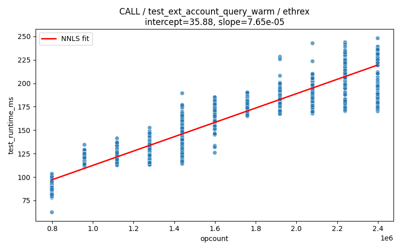

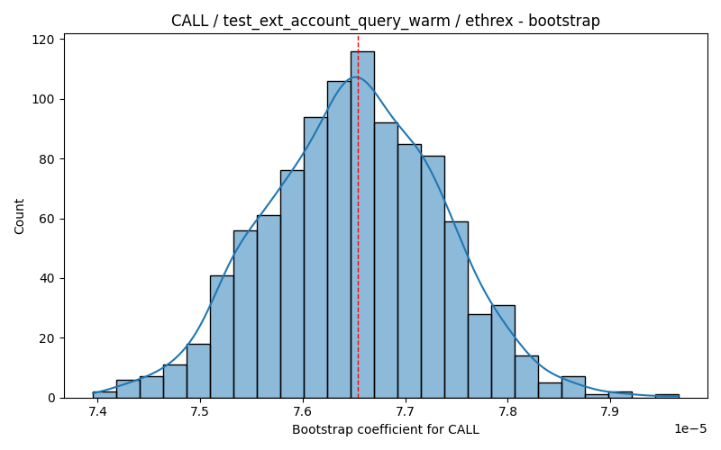

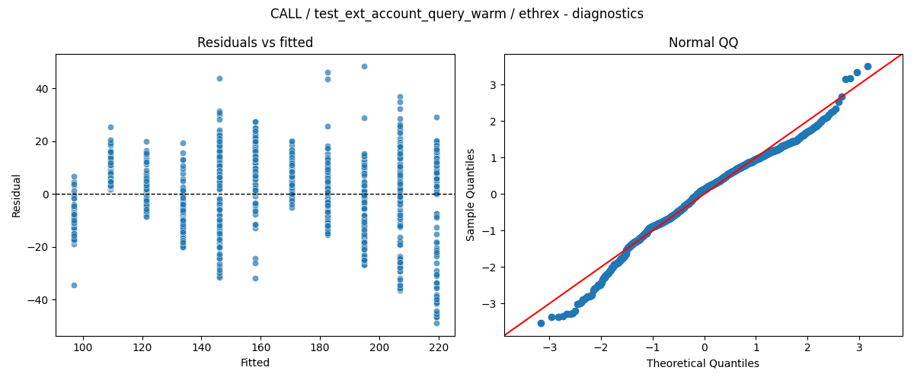

</details>

<details><summary>geth — NNLS regression summary</summary>

```
==============================================================================
                           NNLS Regression Results                            
==============================================================================
Dep. Variable:          test_runtime_ms              R-squared:          0.848
Model:                  NNLS                    Adj. R-squared:          0.847
No. Observations:       924                               RMSE:          28.17
Df Residuals:           922                                MAE:          22.21
Df Model:               1      
==============================================================================
                      coef     std err     P-value      [0.025      0.975]
------------------------------------------------------------------------------
         const     45.6999      2.7853       0.001     39.9861     51.0087
       opcount      0.0001      0.0000       0.001      0.0001      0.0001
==============================================================================
Notes: Non-negative least squares with bootstrap inference (1000 iterations)
==============================================================================
```

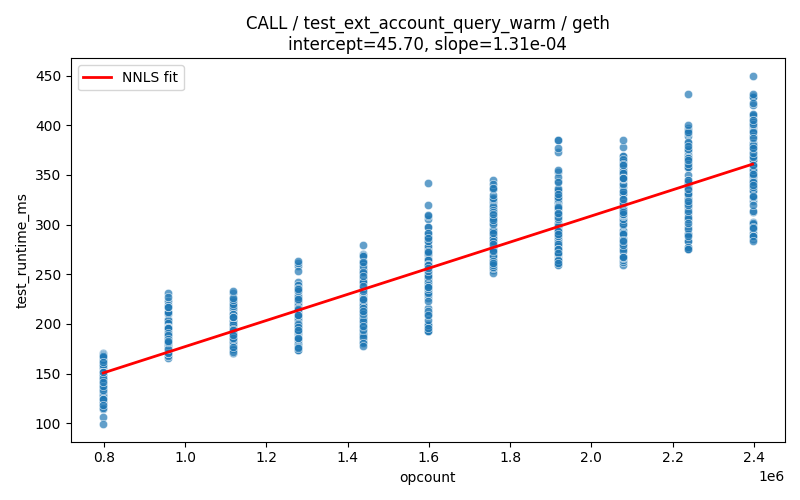

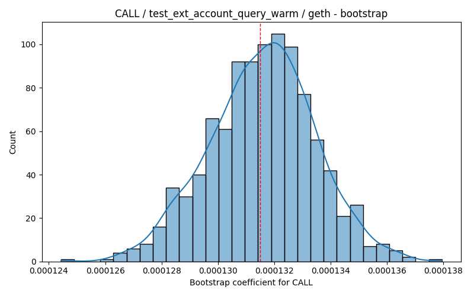

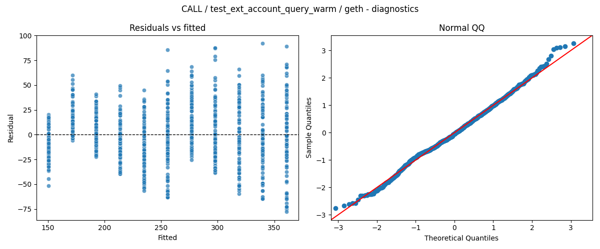

</details>

<details><summary>nethermind — NNLS regression summary</summary>

```
==============================================================================
                           NNLS Regression Results                            
==============================================================================
Dep. Variable:          test_runtime_ms              R-squared:          0.308
Model:                  NNLS                    Adj. R-squared:          0.307
No. Observations:       495                               RMSE:         300.36
Df Residuals:           493                                MAE:         210.38
Df Model:               1      
==============================================================================
                      coef     std err     P-value      [0.025      0.975]
------------------------------------------------------------------------------
         const    193.6208     39.1130       0.001    116.3820    268.4463
       opcount      0.0004      0.0000       0.001      0.0003      0.0005
==============================================================================
Notes: Non-negative least squares with bootstrap inference (1000 iterations)
==============================================================================
```

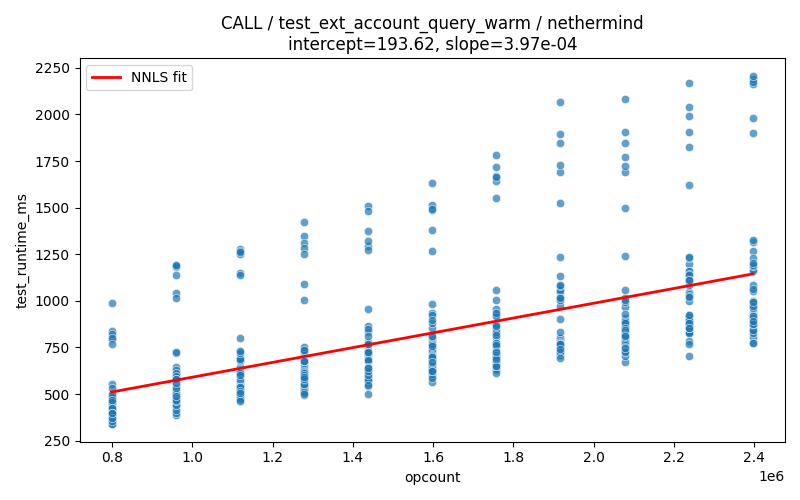

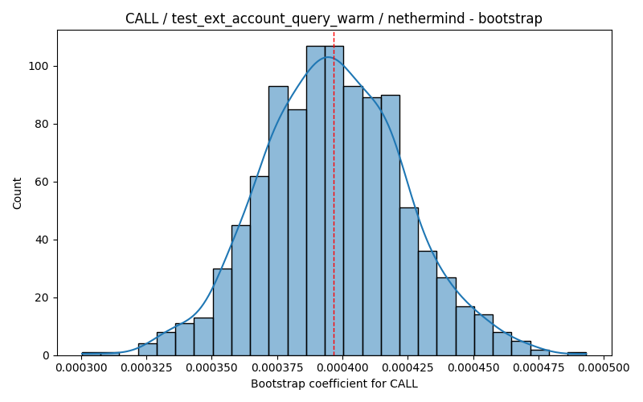

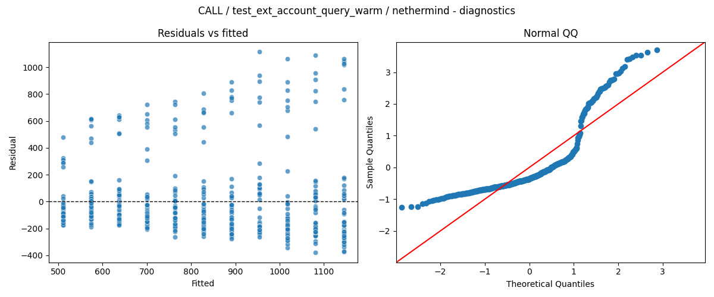

</details>

<details><summary>reth — NNLS regression summary</summary>

```
==============================================================================
                           NNLS Regression Results                            
==============================================================================
Dep. Variable:          test_runtime_ms              R-squared:          0.897
Model:                  NNLS                    Adj. R-squared:          0.897
No. Observations:       385                               RMSE:           8.60
Df Residuals:           383                                MAE:           7.14
Df Model:               1      
==============================================================================
                      coef     std err     P-value      [0.025      0.975]
------------------------------------------------------------------------------
         const     17.5374      1.6002       0.001     14.5622     20.7968
       opcount      0.0001      0.0000       0.001      0.0000      0.0001
==============================================================================
Notes: Non-negative least squares with bootstrap inference (1000 iterations)
==============================================================================
```

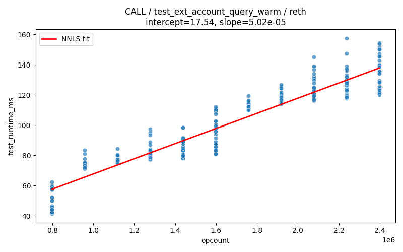

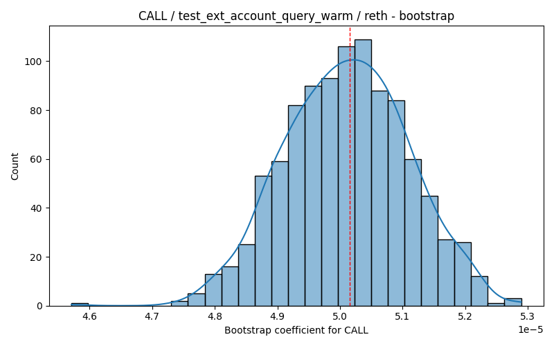

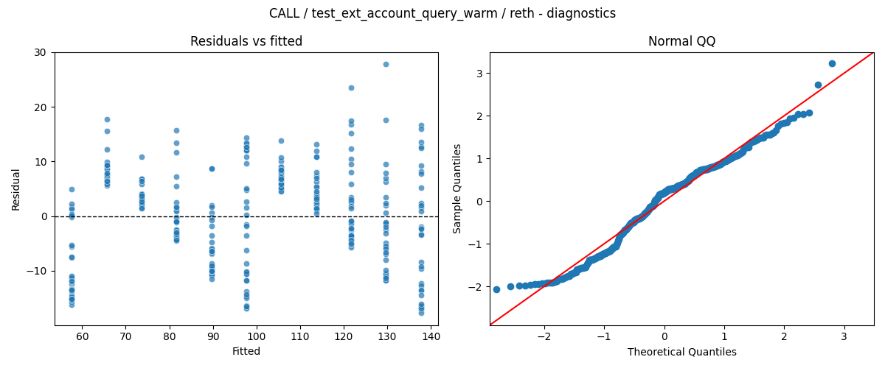

</details>

## CALLCODE

### test_account_access — combo `CALLCODE_AccountMode.EXISTING_EOA` — `presets[cold_account_nocode_access]`

| client | nobs | R² | target_coef (ms) | p-value | 95% CI |
| --- | --- | --- | --- | --- | --- |
| `besu` | 1309 | 0.7312 | 0.01148 | 1.00e-03 | [0.0111, 0.01188] |
| `erigon` | 385 | 0.9824 | 0.009942 | 1.00e-03 | [0.0098, 0.01008] |
| `ethrex` | 1276 | 0.9737 | 0.02427 | 1.00e-03 | [0.02401, 0.02454] |
| `geth` | 924 | 0.7563 | 0.01182 | 1.00e-03 | [0.0114, 0.01224] |
| `nethermind` | 495 | 0.8587 | 0.004081 | 1.00e-03 | [0.003921, 0.004234] |
| `reth` | 385 | 0.9745 | 0.001125 | 1.00e-03 | [0.001105, 0.001144] |

<details><summary>besu — NNLS regression summary</summary>

```
==============================================================================
                           NNLS Regression Results                            
==============================================================================
Dep. Variable:          test_runtime_ms              R-squared:          0.731
Model:                  NNLS                    Adj. R-squared:          0.731
No. Observations:       1309                              RMSE:         165.35
Df Residuals:           1307                               MAE:         140.94
Df Model:               1      
==============================================================================
                      coef     std err     P-value      [0.025      0.975]
------------------------------------------------------------------------------
         const    557.3539     15.0553       0.001    527.8393    586.5225
       opcount      0.0115      0.0002       0.001      0.0111      0.0119
==============================================================================
Notes: Non-negative least squares with bootstrap inference (1000 iterations)
==============================================================================
```

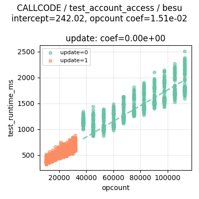


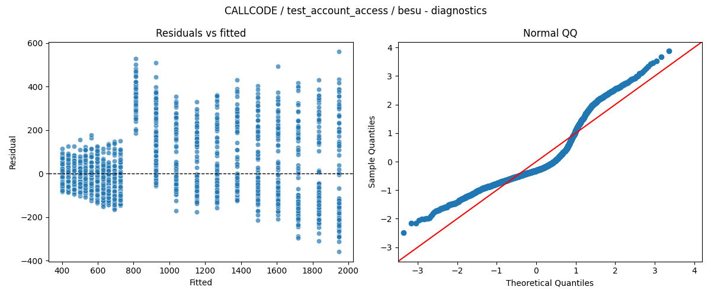

</details>

<details><summary>erigon — NNLS regression summary</summary>

```
==============================================================================
                           NNLS Regression Results                            
==============================================================================
Dep. Variable:          test_runtime_ms              R-squared:          0.982
Model:                  NNLS                    Adj. R-squared:          0.982
No. Observations:       385                               RMSE:          31.62
Df Residuals:           383                                MAE:          25.03
Df Model:               1      
==============================================================================
                      coef     std err     P-value      [0.025      0.975]
------------------------------------------------------------------------------
         const     31.8726      4.6203       0.001     23.2619     41.2258
       opcount      0.0099      0.0001       0.001      0.0098      0.0101
==============================================================================
Notes: Non-negative least squares with bootstrap inference (1000 iterations)
==============================================================================
```

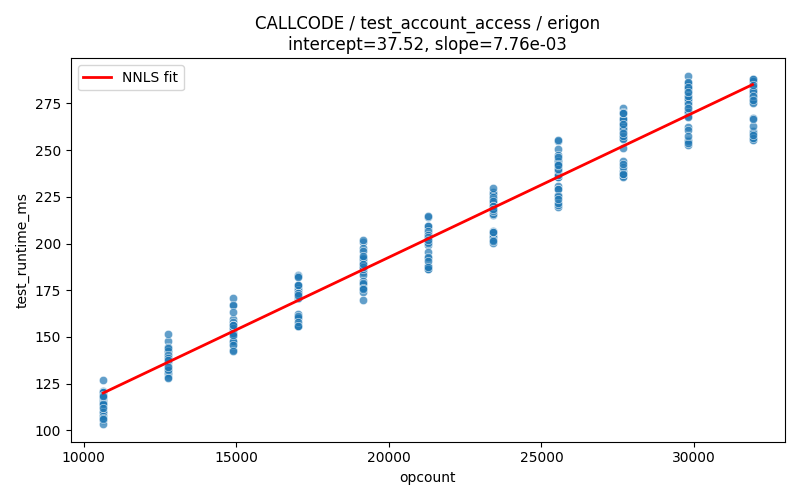

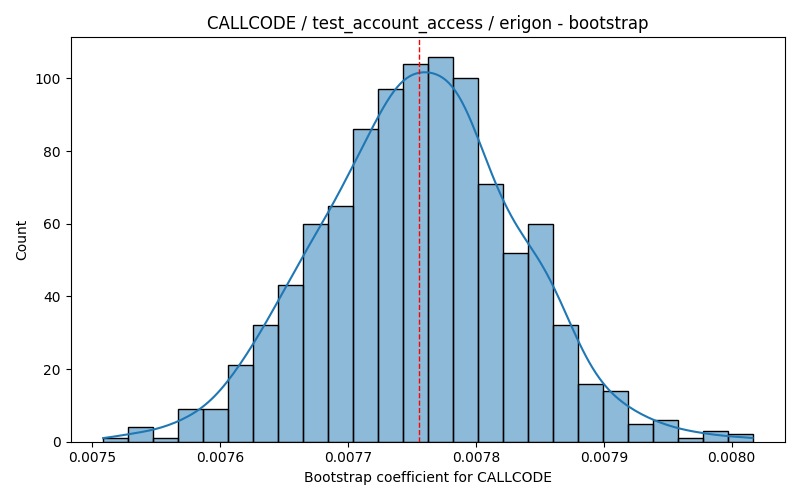

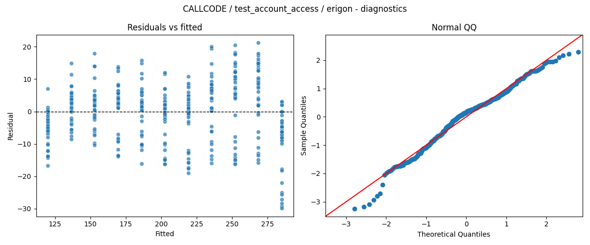

</details>

<details><summary>ethrex — NNLS regression summary</summary>

```
==============================================================================
                           NNLS Regression Results                            
==============================================================================
Dep. Variable:          test_runtime_ms              R-squared:          0.974
Model:                  NNLS                    Adj. R-squared:          0.974
No. Observations:       1276                              RMSE:          94.75
Df Residuals:           1274                               MAE:          83.05
Df Model:               1      
==============================================================================
                      coef     std err     P-value      [0.025      0.975]
------------------------------------------------------------------------------
         const    401.9386     10.9215       0.001    380.1820    423.1661
       opcount      0.0243      0.0001       0.001      0.0240      0.0245
==============================================================================
Notes: Non-negative least squares with bootstrap inference (1000 iterations)
==============================================================================
```

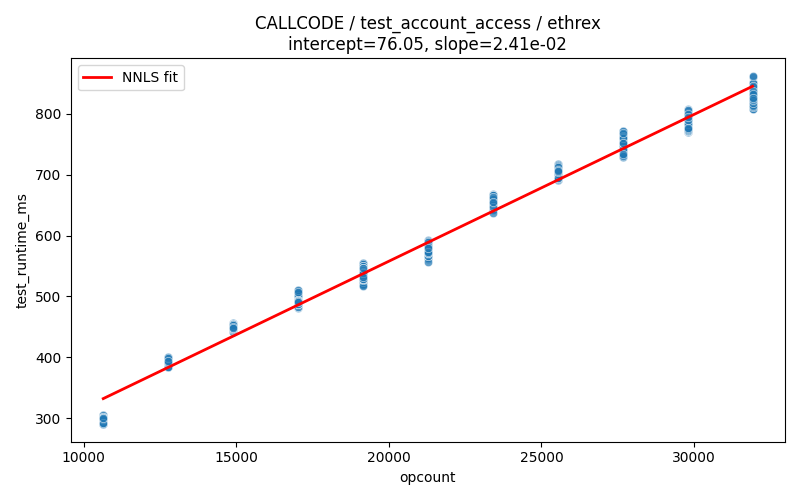

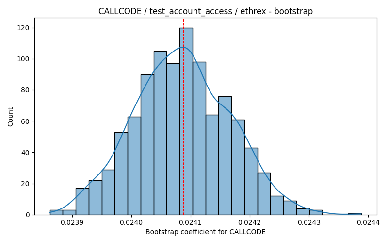

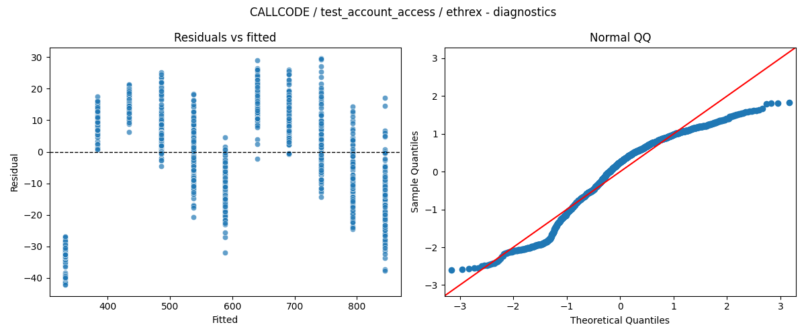

</details>

<details><summary>geth — NNLS regression summary</summary>

```
==============================================================================
                           NNLS Regression Results                            
==============================================================================
Dep. Variable:          test_runtime_ms              R-squared:          0.756
Model:                  NNLS                    Adj. R-squared:          0.756
No. Observations:       924                               RMSE:         159.38
Df Residuals:           922                                MAE:         125.43
Df Model:               1      
==============================================================================
                      coef     std err     P-value      [0.025      0.975]
------------------------------------------------------------------------------
         const    354.5439     15.1504       0.001    324.9459    383.6189
       opcount      0.0118      0.0002       0.001      0.0114      0.0122
==============================================================================
Notes: Non-negative least squares with bootstrap inference (1000 iterations)
==============================================================================
```

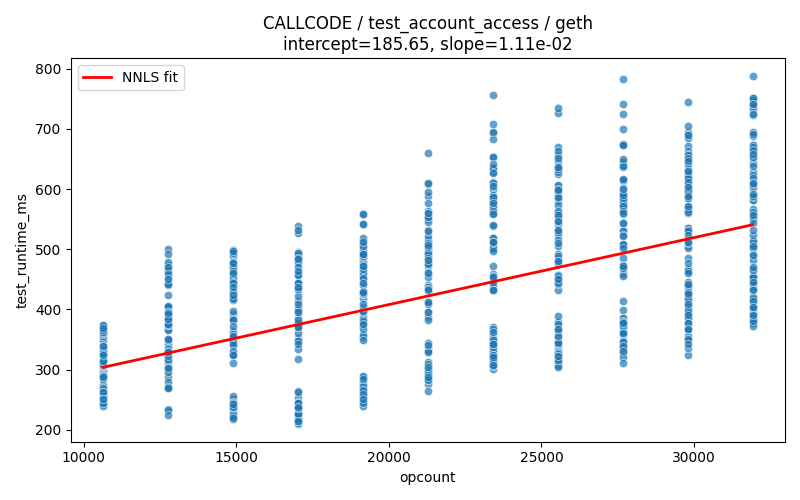


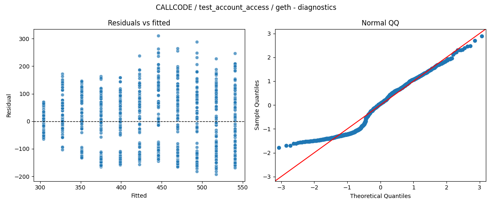

</details>

<details><summary>nethermind — NNLS regression summary</summary>

```
==============================================================================
                           NNLS Regression Results                            
==============================================================================
Dep. Variable:          test_runtime_ms              R-squared:          0.859
Model:                  NNLS                    Adj. R-squared:          0.858
No. Observations:       495                               RMSE:          39.31
Df Residuals:           493                                MAE:          27.44
Df Model:               1      
==============================================================================
                      coef     std err     P-value      [0.025      0.975]
------------------------------------------------------------------------------
         const     89.8148      5.4179       0.001     79.2847    100.6015
       opcount      0.0041      0.0001       0.001      0.0039      0.0042
==============================================================================
Notes: Non-negative least squares with bootstrap inference (1000 iterations)
==============================================================================
```

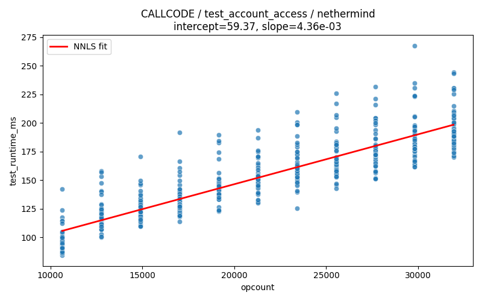

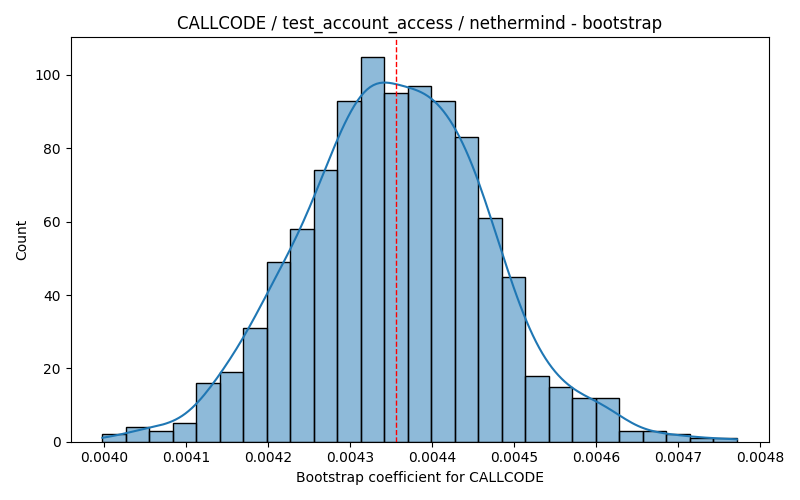

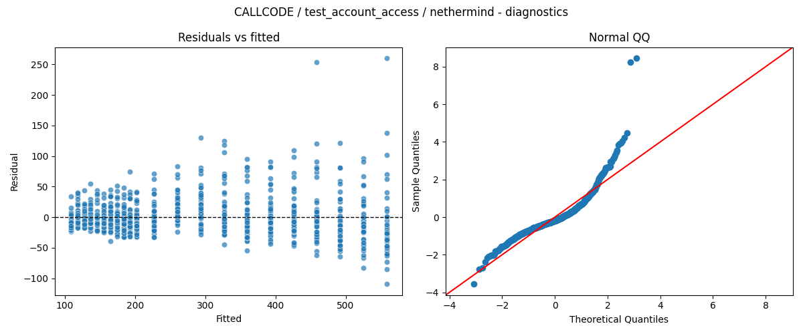

</details>

<details><summary>reth — NNLS regression summary</summary>

```
==============================================================================
                           NNLS Regression Results                            
==============================================================================
Dep. Variable:          test_runtime_ms              R-squared:          0.975
Model:                  NNLS                    Adj. R-squared:          0.974
No. Observations:       385                               RMSE:           4.32
Df Residuals:           383                                MAE:           3.45
Df Model:               1      
==============================================================================
                      coef     std err     P-value      [0.025      0.975]
------------------------------------------------------------------------------
         const     31.9970      0.8024       0.001     30.4408     33.6327
       opcount      0.0011      0.0000       0.001      0.0011      0.0011
==============================================================================
Notes: Non-negative least squares with bootstrap inference (1000 iterations)
==============================================================================
```

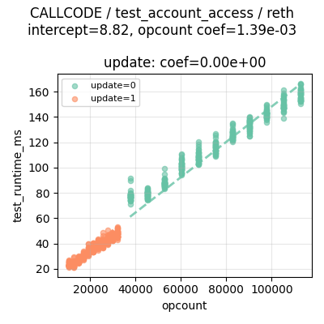

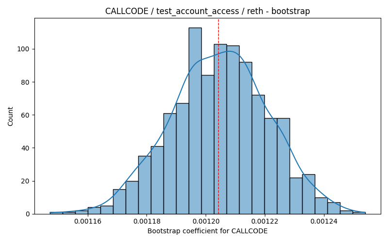

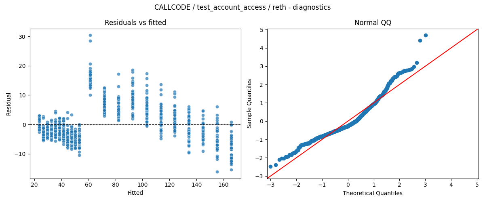

</details>

### test_account_access — combo `CALLCODE_AccountMode.NON_EXISTING_ACCOUNT` — `presets[cold_account_nocode_access]`

| client | nobs | R² | target_coef (ms) | p-value | 95% CI |
| --- | --- | --- | --- | --- | --- |
| `besu` | 1309 | 0.7459 | 0.01156 | 1.00e-03 | [0.01118, 0.01197] |
| `erigon` | 385 | 0.973 | 0.009254 | 1.00e-03 | [0.009086, 0.009414] |
| `ethrex` | 1276 | 0.996 | 0.002684 | 1.00e-03 | [0.002673, 0.002694] |
| `geth` | 924 | 0.6738 | 0.02545 | 1.00e-03 | [0.02422, 0.02676] |
| `nethermind` | 495 | 0.8592 | 0.004009 | 1.00e-03 | [0.003857, 0.004147] |
| `reth` | 385 | 0.9747 | 0.0009639 | 1.00e-03 | [0.0009475, 0.000981] |

<details><summary>besu — NNLS regression summary</summary>

```
==============================================================================
                           NNLS Regression Results                            
==============================================================================
Dep. Variable:          test_runtime_ms              R-squared:          0.746
Model:                  NNLS                    Adj. R-squared:          0.746
No. Observations:       1309                              RMSE:         160.27
Df Residuals:           1307                               MAE:         134.29
Df Model:               1      
==============================================================================
                      coef     std err     P-value      [0.025      0.975]
------------------------------------------------------------------------------
         const    472.1190     13.7242       0.001    444.4571    499.0164
       opcount      0.0116      0.0002       0.001      0.0112      0.0120
==============================================================================
Notes: Non-negative least squares with bootstrap inference (1000 iterations)
==============================================================================
```

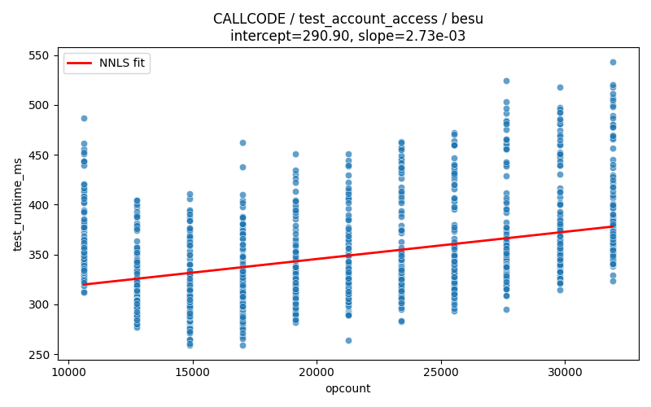


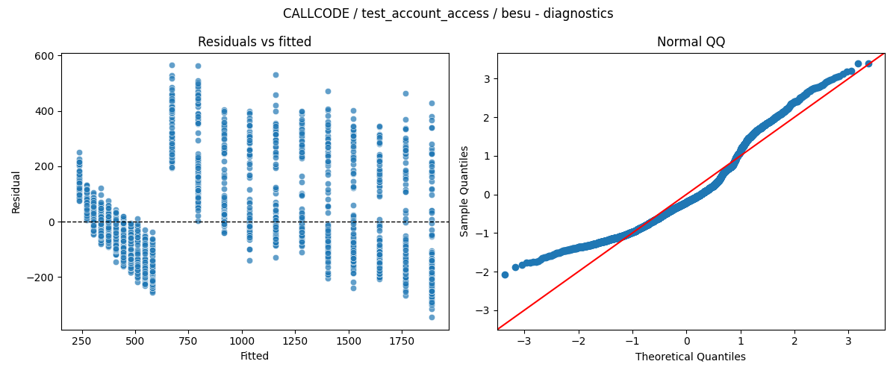

</details>

<details><summary>erigon — NNLS regression summary</summary>

```
==============================================================================
                           NNLS Regression Results                            
==============================================================================
Dep. Variable:          test_runtime_ms              R-squared:          0.973
Model:                  NNLS                    Adj. R-squared:          0.973
No. Observations:       385                               RMSE:          36.63
Df Residuals:           383                                MAE:          28.61
Df Model:               1      
==============================================================================
                      coef     std err     P-value      [0.025      0.975]
------------------------------------------------------------------------------
         const     15.7113      5.2080       0.004      5.5190     25.9648
       opcount      0.0093      0.0001       0.001      0.0091      0.0094
==============================================================================
Notes: Non-negative least squares with bootstrap inference (1000 iterations)
==============================================================================
```

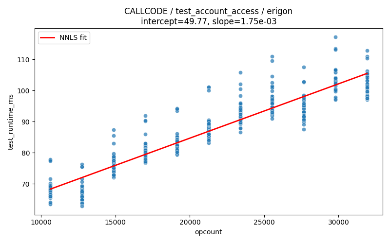


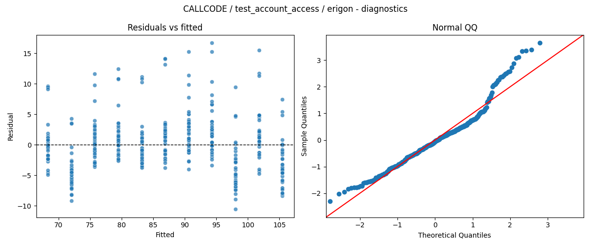

</details>

<details><summary>ethrex — NNLS regression summary</summary>

```
==============================================================================
                           NNLS Regression Results                            
==============================================================================
Dep. Variable:          test_runtime_ms              R-squared:          0.996
Model:                  NNLS                    Adj. R-squared:          0.996
No. Observations:       1276                              RMSE:           4.03
Df Residuals:           1274                               MAE:           3.11
Df Model:               1      
==============================================================================
                      coef     std err     P-value      [0.025      0.975]
------------------------------------------------------------------------------
         const      2.0225      0.3642       0.001      1.3187      2.7618
       opcount      0.0027      0.0000       0.001      0.0027      0.0027
==============================================================================
Notes: Non-negative least squares with bootstrap inference (1000 iterations)
==============================================================================
```

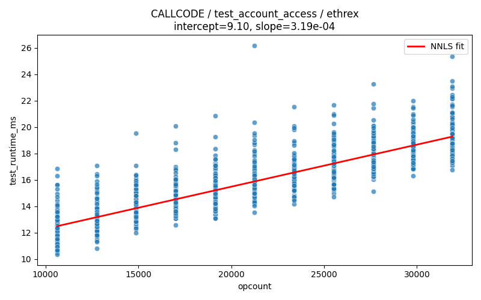

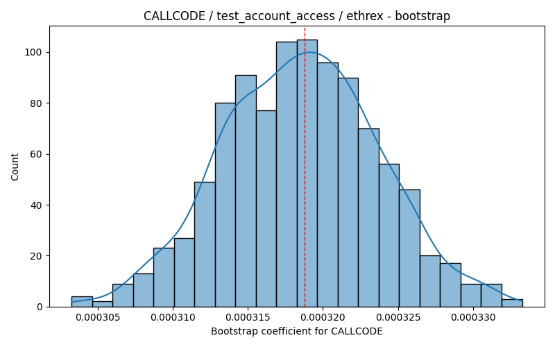

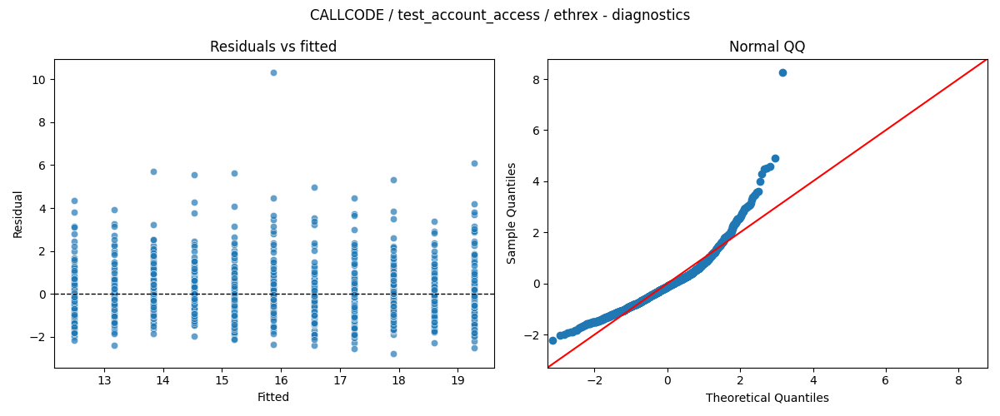

</details>

<details><summary>geth — NNLS regression summary</summary>

```
==============================================================================
                           NNLS Regression Results                            
==============================================================================
Dep. Variable:          test_runtime_ms              R-squared:          0.674
Model:                  NNLS                    Adj. R-squared:          0.673
No. Observations:       924                               RMSE:         420.51
Df Residuals:           922                                MAE:         348.19
Df Model:               1      
==============================================================================
                      coef     std err     P-value      [0.025      0.975]
------------------------------------------------------------------------------
         const   1306.9415     50.3879       0.001   1208.1894   1404.3430
       opcount      0.0255      0.0006       0.001      0.0242      0.0268
==============================================================================
Notes: Non-negative least squares with bootstrap inference (1000 iterations)
==============================================================================
```

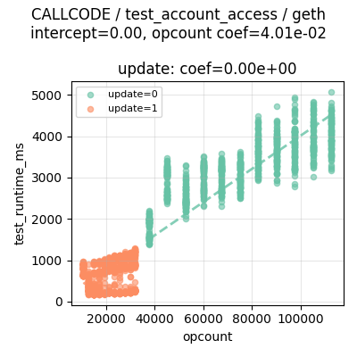

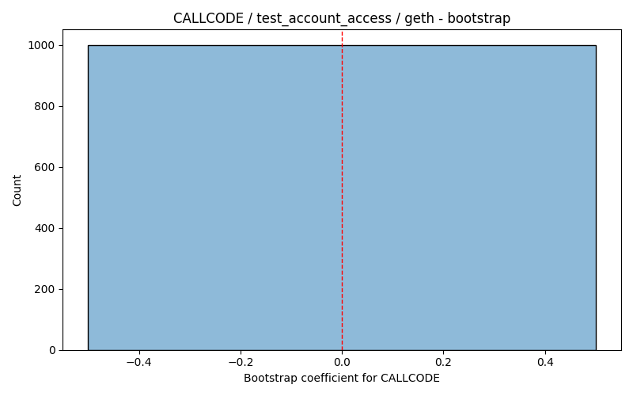

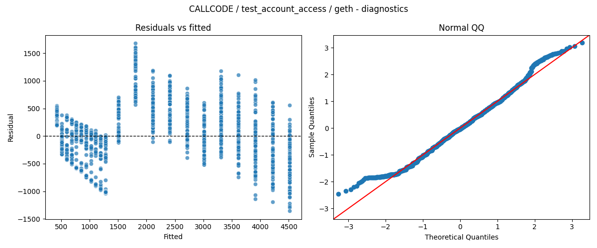

</details>

<details><summary>nethermind — NNLS regression summary</summary>

```
==============================================================================
                           NNLS Regression Results                            
==============================================================================
Dep. Variable:          test_runtime_ms              R-squared:          0.859
Model:                  NNLS                    Adj. R-squared:          0.859
No. Observations:       495                               RMSE:          38.53
Df Residuals:           493                                MAE:          28.52
Df Model:               1      
==============================================================================
                      coef     std err     P-value      [0.025      0.975]
------------------------------------------------------------------------------
         const     97.1142      5.2836       0.001     87.0971    108.4978
       opcount      0.0040      0.0001       0.001      0.0039      0.0041
==============================================================================
Notes: Non-negative least squares with bootstrap inference (1000 iterations)
==============================================================================
```

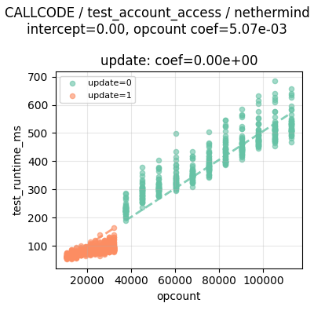


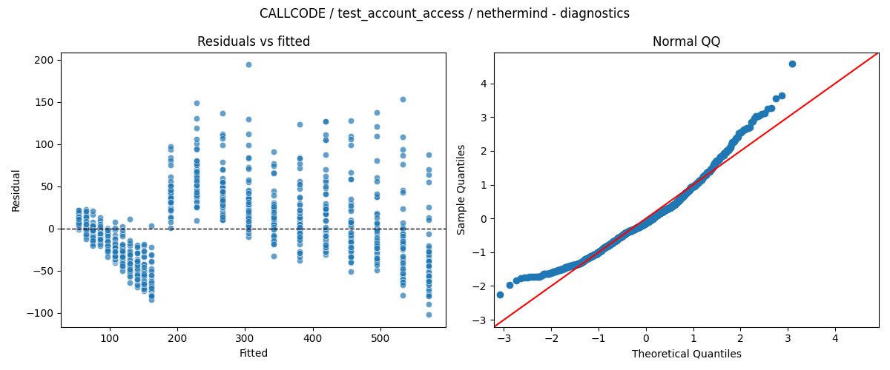

</details>

<details><summary>reth — NNLS regression summary</summary>

```
==============================================================================
                           NNLS Regression Results                            
==============================================================================
Dep. Variable:          test_runtime_ms              R-squared:          0.975
Model:                  NNLS                    Adj. R-squared:          0.975
No. Observations:       385                               RMSE:           3.69
Df Residuals:           383                                MAE:           2.90
Df Model:               1      
==============================================================================
                      coef     std err     P-value      [0.025      0.975]
------------------------------------------------------------------------------
         const     31.4611      0.6373       0.001     30.2214     32.7519
       opcount      0.0010      0.0000       0.001      0.0009      0.0010
==============================================================================
Notes: Non-negative least squares with bootstrap inference (1000 iterations)
==============================================================================
```

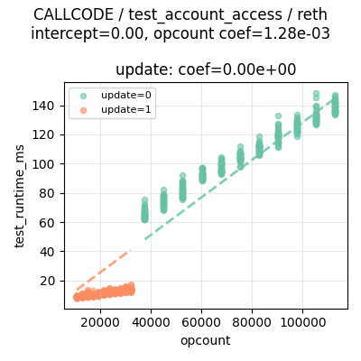

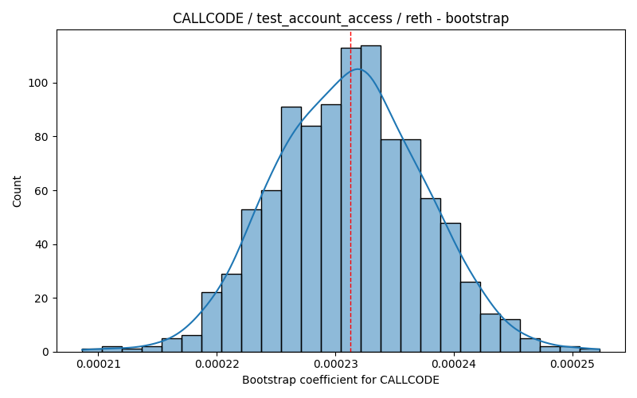

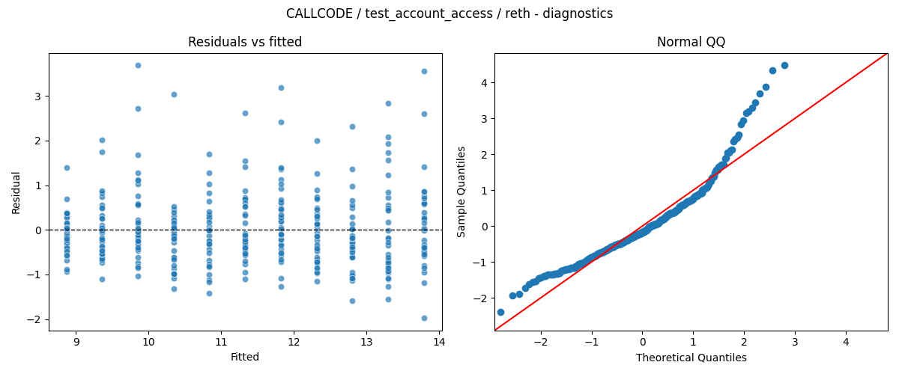

</details>

### test_account_access — combo `CALLCODE_AccountMode.EXISTING_CONTRACT` — `presets[cold_account_code_access]`

| client | nobs | R² | target_coef (ms) | p-value | 95% CI |
| --- | --- | --- | --- | --- | --- |
| `besu` | 1309 | 0.8679 | 0.02786 | 1.00e-03 | [0.02729, 0.0284] |
| `erigon` | 385 | 0.8758 | 0.08606 | 1.00e-03 | [0.08299, 0.08915] |
| `ethrex` | 1276 | 0.9733 | 0.02596 | 1.00e-03 | [0.02567, 0.02626] |
| `geth` | 924 | 0.6684 | 0.02774 | 1.00e-03 | [0.02631, 0.02903] |
| `nethermind` | 495 | 0.7147 | 0.02519 | 1.00e-03 | [0.02367, 0.02673] |
| `reth` | 385 | 0.8434 | 0.02883 | 1.00e-03 | [0.02739, 0.03016] |

<details><summary>besu — NNLS regression summary</summary>

```
==============================================================================
                           NNLS Regression Results                            
==============================================================================
Dep. Variable:          test_runtime_ms              R-squared:          0.868
Model:                  NNLS                    Adj. R-squared:          0.868
No. Observations:       1309                              RMSE:         221.25
Df Residuals:           1307                               MAE:         184.40
Df Model:               1      
==============================================================================
                      coef     std err     P-value      [0.025      0.975]
------------------------------------------------------------------------------
         const    534.9320     18.3000       0.001    499.2809    571.6678
       opcount      0.0279      0.0003       0.001      0.0273      0.0284
==============================================================================
Notes: Non-negative least squares with bootstrap inference (1000 iterations)
==============================================================================
```

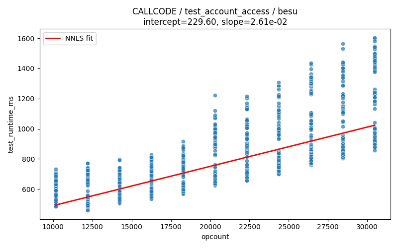


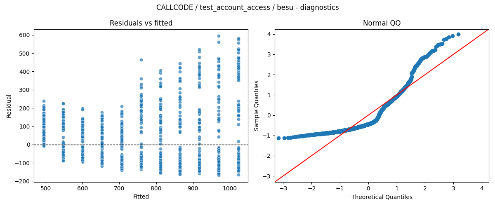

</details>

<details><summary>erigon — NNLS regression summary</summary>

```
==============================================================================
                           NNLS Regression Results                            
==============================================================================
Dep. Variable:          test_runtime_ms              R-squared:          0.876
Model:                  NNLS                    Adj. R-squared:          0.875
No. Observations:       385                               RMSE:         659.52
Df Residuals:           383                                MAE:         568.92
Df Model:               1      
==============================================================================
                      coef     std err     P-value      [0.025      0.975]
------------------------------------------------------------------------------
         const   1432.4973    119.4692       0.001   1200.4364   1670.8613
       opcount      0.0861      0.0016       0.001      0.0830      0.0891
==============================================================================
Notes: Non-negative least squares with bootstrap inference (1000 iterations)
==============================================================================
```

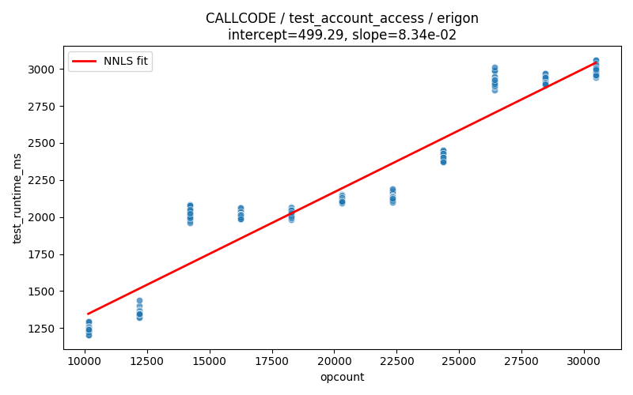


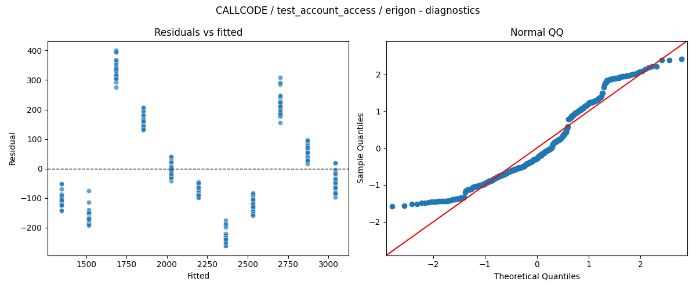

</details>

<details><summary>ethrex — NNLS regression summary</summary>

```
==============================================================================
                           NNLS Regression Results                            
==============================================================================
Dep. Variable:          test_runtime_ms              R-squared:          0.973
Model:                  NNLS                    Adj. R-squared:          0.973
No. Observations:       1276                              RMSE:          87.51
Df Residuals:           1274                               MAE:          75.83
Df Model:               1      
==============================================================================
                      coef     std err     P-value      [0.025      0.975]
------------------------------------------------------------------------------
         const    335.3627     10.8275       0.001    314.0843    356.8191
       opcount      0.0260      0.0002       0.001      0.0257      0.0263
==============================================================================
Notes: Non-negative least squares with bootstrap inference (1000 iterations)
==============================================================================
```

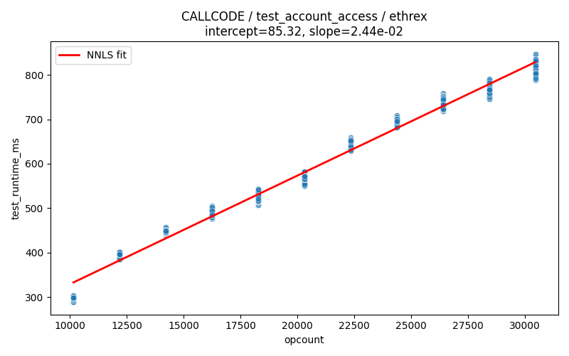

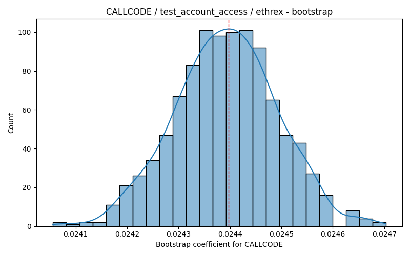

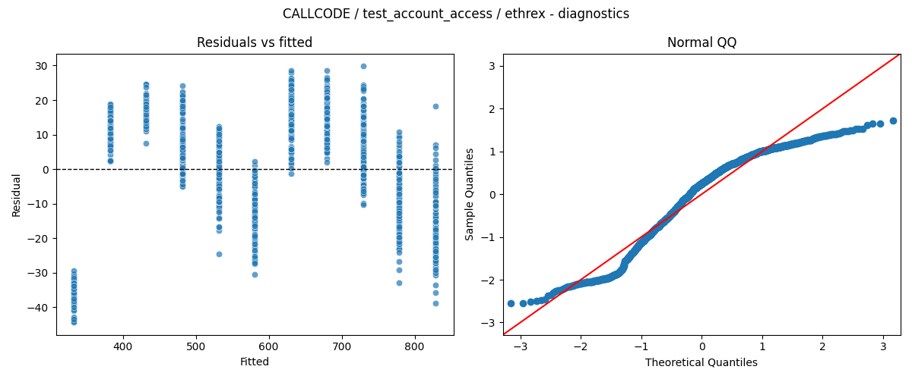

</details>

<details><summary>geth — NNLS regression summary</summary>

```
==============================================================================
                           NNLS Regression Results                            
==============================================================================
Dep. Variable:          test_runtime_ms              R-squared:          0.668
Model:                  NNLS                    Adj. R-squared:          0.668
No. Observations:       924                               RMSE:         397.53
Df Residuals:           922                                MAE:         330.83
Df Model:               1      
==============================================================================
                      coef     std err     P-value      [0.025      0.975]
------------------------------------------------------------------------------
         const   1166.6874     48.4822       0.001   1080.2236   1271.7687
       opcount      0.0277      0.0007       0.001      0.0263      0.0290
==============================================================================
Notes: Non-negative least squares with bootstrap inference (1000 iterations)
==============================================================================
```

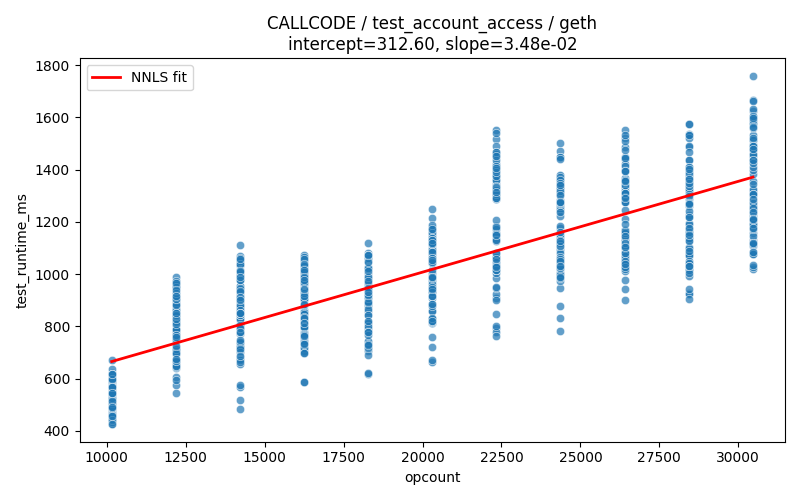


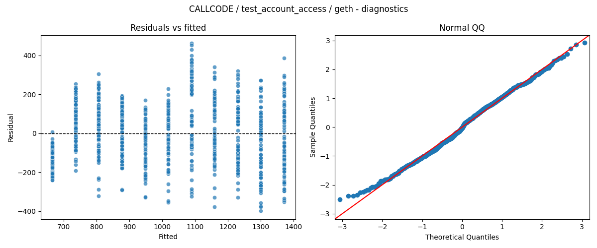

</details>

<details><summary>nethermind — NNLS regression summary</summary>

```
==============================================================================
                           NNLS Regression Results                            
==============================================================================
Dep. Variable:          test_runtime_ms              R-squared:          0.715
Model:                  NNLS                    Adj. R-squared:          0.714
No. Observations:       495                               RMSE:         323.88
Df Residuals:           493                                MAE:         270.35
Df Model:               1      
==============================================================================
                      coef     std err     P-value      [0.025      0.975]
------------------------------------------------------------------------------
         const    933.8353     52.4948       0.001    824.3992   1036.1637
       opcount      0.0252      0.0008       0.001      0.0237      0.0267
==============================================================================
Notes: Non-negative least squares with bootstrap inference (1000 iterations)
==============================================================================
```

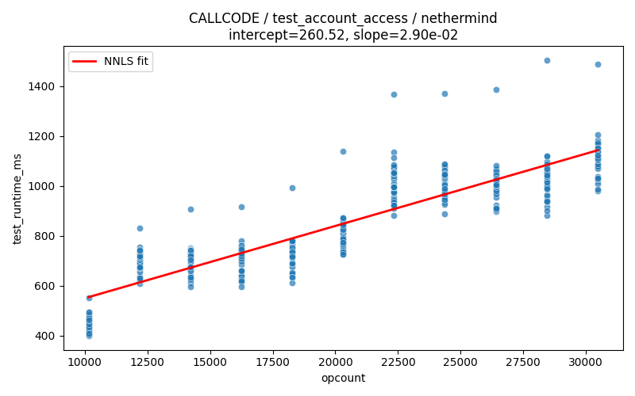

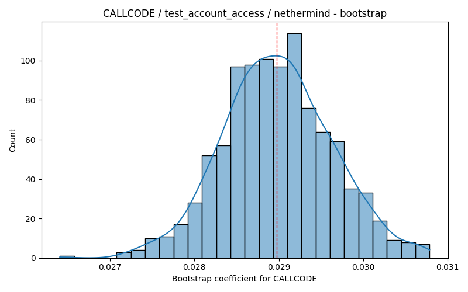

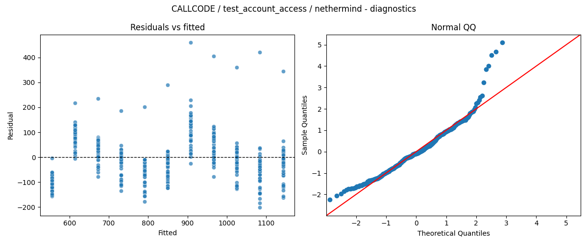

</details>

<details><summary>reth — NNLS regression summary</summary>

```
==============================================================================
                           NNLS Regression Results                            
==============================================================================
Dep. Variable:          test_runtime_ms              R-squared:          0.843
Model:                  NNLS                    Adj. R-squared:          0.843
No. Observations:       385                               RMSE:         252.76
Df Residuals:           383                                MAE:         183.15
Df Model:               1      
==============================================================================
                      coef     std err     P-value      [0.025      0.975]
------------------------------------------------------------------------------
         const    662.3625     55.9562       0.001    560.4832    771.2269
       opcount      0.0288      0.0007       0.001      0.0274      0.0302
==============================================================================
Notes: Non-negative least squares with bootstrap inference (1000 iterations)
==============================================================================
```

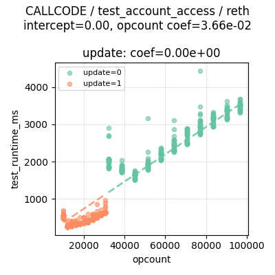

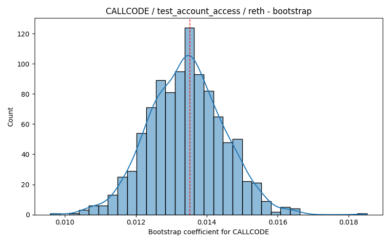

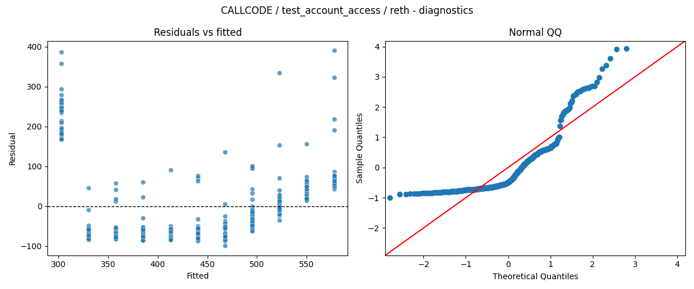

</details>

### test_account_access — combo `CALLCODE_AccountMode.NON_EXISTING_ACCOUNT` — `presets[cold_account_code_access]`

| client | nobs | R² | target_coef (ms) | p-value | 95% CI |
| --- | --- | --- | --- | --- | --- |
| `besu` | 1309 | 0.7459 | 0.01156 | 1.00e-03 | [0.01118, 0.01197] |
| `erigon` | 385 | 0.973 | 0.009254 | 1.00e-03 | [0.009086, 0.009414] |
| `ethrex` | 1276 | 0.996 | 0.002684 | 1.00e-03 | [0.002673, 0.002694] |
| `geth` | 924 | 0.6738 | 0.02545 | 1.00e-03 | [0.02422, 0.02676] |
| `nethermind` | 495 | 0.8592 | 0.004009 | 1.00e-03 | [0.003857, 0.004147] |
| `reth` | 385 | 0.9747 | 0.0009639 | 1.00e-03 | [0.0009475, 0.000981] |

<details><summary>besu — NNLS regression summary</summary>

```
==============================================================================
                           NNLS Regression Results                            
==============================================================================
Dep. Variable:          test_runtime_ms              R-squared:          0.746
Model:                  NNLS                    Adj. R-squared:          0.746
No. Observations:       1309                              RMSE:         160.27
Df Residuals:           1307                               MAE:         134.29
Df Model:               1      
==============================================================================
                      coef     std err     P-value      [0.025      0.975]
------------------------------------------------------------------------------
         const    472.1190     13.7242       0.001    444.4571    499.0164
       opcount      0.0116      0.0002       0.001      0.0112      0.0120
==============================================================================
Notes: Non-negative least squares with bootstrap inference (1000 iterations)
==============================================================================
```


</details>

<details><summary>erigon — NNLS regression summary</summary>

```
==============================================================================
                           NNLS Regression Results                            
==============================================================================
Dep. Variable:          test_runtime_ms              R-squared:          0.973
Model:                  NNLS                    Adj. R-squared:          0.973
No. Observations:       385                               RMSE:          36.63
Df Residuals:           383                                MAE:          28.61
Df Model:               1      
==============================================================================
                      coef     std err     P-value      [0.025      0.975]
------------------------------------------------------------------------------
         const     15.7113      5.2080       0.004      5.5190     25.9648
       opcount      0.0093      0.0001       0.001      0.0091      0.0094
==============================================================================
Notes: Non-negative least squares with bootstrap inference (1000 iterations)
==============================================================================
```


</details>

<details><summary>ethrex — NNLS regression summary</summary>

```
==============================================================================
                           NNLS Regression Results                            
==============================================================================
Dep. Variable:          test_runtime_ms              R-squared:          0.996
Model:                  NNLS                    Adj. R-squared:          0.996
No. Observations:       1276                              RMSE:           4.03
Df Residuals:           1274                               MAE:           3.11
Df Model:               1      
==============================================================================
                      coef     std err     P-value      [0.025      0.975]
------------------------------------------------------------------------------
         const      2.0225      0.3642       0.001      1.3187      2.7618
       opcount      0.0027      0.0000       0.001      0.0027      0.0027
==============================================================================
Notes: Non-negative least squares with bootstrap inference (1000 iterations)
==============================================================================
```


</details>

<details><summary>geth — NNLS regression summary</summary>

```
==============================================================================
                           NNLS Regression Results                            
==============================================================================
Dep. Variable:          test_runtime_ms              R-squared:          0.674
Model:                  NNLS                    Adj. R-squared:          0.673
No. Observations:       924                               RMSE:         420.51
Df Residuals:           922                                MAE:         348.19
Df Model:               1      
==============================================================================
                      coef     std err     P-value      [0.025      0.975]
------------------------------------------------------------------------------
         const   1306.9415     50.3879       0.001   1208.1894   1404.3430
       opcount      0.0255      0.0006       0.001      0.0242      0.0268
==============================================================================
Notes: Non-negative least squares with bootstrap inference (1000 iterations)
==============================================================================
```


</details>

<details><summary>nethermind — NNLS regression summary</summary>

```
==============================================================================
                           NNLS Regression Results                            
==============================================================================
Dep. Variable:          test_runtime_ms              R-squared:          0.859
Model:                  NNLS                    Adj. R-squared:          0.859
No. Observations:       495                               RMSE:          38.53
Df Residuals:           493                                MAE:          28.52
Df Model:               1      
==============================================================================
                      coef     std err     P-value      [0.025      0.975]
------------------------------------------------------------------------------
         const     97.1142      5.2836       0.001     87.0971    108.4978
       opcount      0.0040      0.0001       0.001      0.0039      0.0041
==============================================================================
Notes: Non-negative least squares with bootstrap inference (1000 iterations)
==============================================================================
```


</details>

<details><summary>reth — NNLS regression summary</summary>

```
==============================================================================
                           NNLS Regression Results                            
==============================================================================
Dep. Variable:          test_runtime_ms              R-squared:          0.975
Model:                  NNLS                    Adj. R-squared:          0.975
No. Observations:       385                               RMSE:           3.69
Df Residuals:           383                                MAE:           2.90
Df Model:               1      
==============================================================================
                      coef     std err     P-value      [0.025      0.975]
------------------------------------------------------------------------------
         const     31.4611      0.6373       0.001     30.2214     32.7519
       opcount      0.0010      0.0000       0.001      0.0009      0.0010
==============================================================================
Notes: Non-negative least squares with bootstrap inference (1000 iterations)
==============================================================================
```


</details>

### test_account_access — combo `CALLCODE_AccountMode.EXISTING_EOA` — `presets[cold_account_nocode_write]`

| client | nobs | R² | target_coef (ms) | p-value | 95% CI |
| --- | --- | --- | --- | --- | --- |
| `besu` | 1309 | 0.7033 | 0.01271 | 1.00e-03 | [0.01225, 0.01315] |
| `erigon` | 385 | 0.9698 | 0.007756 | 1.00e-03 | [0.007607, 0.007905] |
| `ethrex` | 1276 | 0.9901 | 0.02409 | 1.00e-03 | [0.02393, 0.02424] |
| `geth` | 924 | 0.3281 | 0.01113 | 1.00e-03 | [0.01022, 0.01205] |
| `nethermind` | 495 | 0.7646 | 0.004356 | 1.00e-03 | [0.004138, 0.004593] |
| `reth` | 385 | 0.9331 | 0.001204 | 1.00e-03 | [0.001172, 0.001236] |

<details><summary>besu — NNLS regression summary</summary>

```
==============================================================================
                           NNLS Regression Results                            
==============================================================================
Dep. Variable:          test_runtime_ms              R-squared:          0.703
Model:                  NNLS                    Adj. R-squared:          0.703
No. Observations:       1309                              RMSE:          55.56
Df Residuals:           1307                               MAE:          43.29
Df Model:               1      
==============================================================================
                      coef     std err     P-value      [0.025      0.975]
------------------------------------------------------------------------------
         const    253.3695      4.5653       0.001    244.8021    262.2272
       opcount      0.0127      0.0002       0.001      0.0123      0.0131
==============================================================================
Notes: Non-negative least squares with bootstrap inference (1000 iterations)
==============================================================================
```


</details>

<details><summary>erigon — NNLS regression summary</summary>

```
==============================================================================
                           NNLS Regression Results                            
==============================================================================
Dep. Variable:          test_runtime_ms              R-squared:          0.970
Model:                  NNLS                    Adj. R-squared:          0.970
No. Observations:       385                               RMSE:           9.21
Df Residuals:           383                                MAE:           7.25
Df Model:               1      
==============================================================================
                      coef     std err     P-value      [0.025      0.975]
------------------------------------------------------------------------------
         const     37.5154      1.4813       0.001     34.6318     40.5595
       opcount      0.0078      0.0001       0.001      0.0076      0.0079
==============================================================================
Notes: Non-negative least squares with bootstrap inference (1000 iterations)
==============================================================================
```


</details>

<details><summary>ethrex — NNLS regression summary</summary>

```
==============================================================================
                           NNLS Regression Results                            
==============================================================================
Dep. Variable:          test_runtime_ms              R-squared:          0.990
Model:                  NNLS                    Adj. R-squared:          0.990
No. Observations:       1276                              RMSE:          16.19
Df Residuals:           1274                               MAE:          13.49
Df Model:               1      
==============================================================================
                      coef     std err     P-value      [0.025      0.975]
------------------------------------------------------------------------------
         const     76.0541      1.8990       0.001     72.3855     79.7789
       opcount      0.0241      0.0001       0.001      0.0239      0.0242
==============================================================================
Notes: Non-negative least squares with bootstrap inference (1000 iterations)
==============================================================================
```


</details>

<details><summary>geth — NNLS regression summary</summary>

```
==============================================================================
                           NNLS Regression Results                            
==============================================================================
Dep. Variable:          test_runtime_ms              R-squared:          0.328
Model:                  NNLS                    Adj. R-squared:          0.327
No. Observations:       924                               RMSE:         107.14
Df Residuals:           922                                MAE:          91.35
Df Model:               1      
==============================================================================
                      coef     std err     P-value      [0.025      0.975]
------------------------------------------------------------------------------
         const    185.6472      9.5166       0.001    166.3484    202.8730
       opcount      0.0111      0.0005       0.001      0.0102      0.0121
==============================================================================
Notes: Non-negative least squares with bootstrap inference (1000 iterations)
==============================================================================
```


</details>

<details><summary>nethermind — NNLS regression summary</summary>

```
==============================================================================
                           NNLS Regression Results                            
==============================================================================
Dep. Variable:          test_runtime_ms              R-squared:          0.765
Model:                  NNLS                    Adj. R-squared:          0.764
No. Observations:       495                               RMSE:          16.26
Df Residuals:           493                                MAE:          12.04
Df Model:               1      
==============================================================================
                      coef     std err     P-value      [0.025      0.975]
------------------------------------------------------------------------------
         const     59.3713      2.3311       0.001     54.7241     63.9389
       opcount      0.0044      0.0001       0.001      0.0041      0.0046
==============================================================================
Notes: Non-negative least squares with bootstrap inference (1000 iterations)
==============================================================================
```


</details>

<details><summary>reth — NNLS regression summary</summary>

```
==============================================================================
                           NNLS Regression Results                            
==============================================================================
Dep. Variable:          test_runtime_ms              R-squared:          0.933
Model:                  NNLS                    Adj. R-squared:          0.933
No. Observations:       385                               RMSE:           2.17
Df Residuals:           383                                MAE:           1.70
Df Model:               1      
==============================================================================
                      coef     std err     P-value      [0.025      0.975]
------------------------------------------------------------------------------
         const      9.8704      0.3551       0.001      9.1862     10.5831
       opcount      0.0012      0.0000       0.001      0.0012      0.0012
==============================================================================
Notes: Non-negative least squares with bootstrap inference (1000 iterations)
==============================================================================
```


</details>

### test_account_access — combo `CALLCODE_AccountMode.NON_EXISTING_ACCOUNT` — `presets[cold_account_nocode_write]`

| client | nobs | R² | target_coef (ms) | p-value | 95% CI |
| --- | --- | --- | --- | --- | --- |
| `besu` | 1309 | 0.1383 | 0.00273 | 1.00e-03 | [0.002327, 0.003152] |
| `erigon` | 385 | 0.8692 | 0.001745 | 1.00e-03 | [0.001678, 0.00181] |
| `ethrex` | 1276 | 0.748 | 0.0003188 | 1.00e-03 | [0.0003085, 0.0003289] |
| `geth` | 924 | 0.03288 | 0.009354 | 1.00e-03 | [0.006047, 0.01261] |
| `nethermind` | 495 | 0.4898 | 0.001634 | 1.00e-03 | [0.001487, 0.001792] |
| `reth` | 385 | 0.7824 | 0.0002313 | 1.00e-03 | [0.0002191, 0.0002427] |

<details><summary>besu — NNLS regression summary</summary>

```
==============================================================================
                           NNLS Regression Results                            
==============================================================================
Dep. Variable:          test_runtime_ms              R-squared:          0.138
Model:                  NNLS                    Adj. R-squared:          0.138
No. Observations:       1309                              RMSE:          45.87
Df Residuals:           1307                               MAE:          36.88
Df Model:               1      
==============================================================================
                      coef     std err     P-value      [0.025      0.975]
------------------------------------------------------------------------------
         const    290.9028      4.4027       0.001    282.0466    299.4015
       opcount      0.0027      0.0002       0.001      0.0023      0.0032
==============================================================================
Notes: Non-negative least squares with bootstrap inference (1000 iterations)
==============================================================================
```


</details>

<details><summary>erigon — NNLS regression summary</summary>

```
==============================================================================
                           NNLS Regression Results                            
==============================================================================
Dep. Variable:          test_runtime_ms              R-squared:          0.869
Model:                  NNLS                    Adj. R-squared:          0.869
No. Observations:       385                               RMSE:           4.56
Df Residuals:           383                                MAE:           3.38
Df Model:               1      
==============================================================================
                      coef     std err     P-value      [0.025      0.975]
------------------------------------------------------------------------------
         const     49.7736      0.7383       0.001     48.3929     51.2473
       opcount      0.0017      0.0000       0.001      0.0017      0.0018
==============================================================================
Notes: Non-negative least squares with bootstrap inference (1000 iterations)
==============================================================================
```


</details>

<details><summary>ethrex — NNLS regression summary</summary>

```
==============================================================================
                           NNLS Regression Results                            
==============================================================================
Dep. Variable:          test_runtime_ms              R-squared:          0.748
Model:                  NNLS                    Adj. R-squared:          0.748
No. Observations:       1276                              RMSE:           1.25
Df Residuals:           1274                               MAE:           0.90
Df Model:               1      
==============================================================================
                      coef     std err     P-value      [0.025      0.975]
------------------------------------------------------------------------------
         const      9.1003      0.1133       0.001      8.8771      9.3184
       opcount      0.0003      0.0000       0.001      0.0003      0.0003
==============================================================================
Notes: Non-negative least squares with bootstrap inference (1000 iterations)
==============================================================================
```


</details>

<details><summary>geth — NNLS regression summary</summary>

```
==============================================================================
                           NNLS Regression Results                            
==============================================================================
Dep. Variable:          test_runtime_ms              R-squared:          0.033
Model:                  NNLS                    Adj. R-squared:          0.032
No. Observations:       924                               RMSE:         341.48
Df Residuals:           922                                MAE:         319.04
Df Model:               1      
==============================================================================
                      coef     std err     P-value      [0.025      0.975]
------------------------------------------------------------------------------
         const    375.1342     34.8880       0.001    306.1100    443.7781
       opcount      0.0094      0.0017       0.001      0.0060      0.0126
==============================================================================
Notes: Non-negative least squares with bootstrap inference (1000 iterations)
==============================================================================
```


</details>

<details><summary>nethermind — NNLS regression summary</summary>

```
==============================================================================
                           NNLS Regression Results                            
==============================================================================
Dep. Variable:          test_runtime_ms              R-squared:          0.490
Model:                  NNLS                    Adj. R-squared:          0.489
No. Observations:       495                               RMSE:          11.22
Df Residuals:           493                                MAE:           8.28
Df Model:               1      
==============================================================================
                      coef     std err     P-value      [0.025      0.975]
------------------------------------------------------------------------------
         const     46.4232      1.4939       0.001     43.5284     49.1704
       opcount      0.0016      0.0001       0.001      0.0015      0.0018
==============================================================================
Notes: Non-negative least squares with bootstrap inference (1000 iterations)
==============================================================================
```


</details>

<details><summary>reth — NNLS regression summary</summary>

```
==============================================================================
                           NNLS Regression Results                            
==============================================================================
Dep. Variable:          test_runtime_ms              R-squared:          0.782
Model:                  NNLS                    Adj. R-squared:          0.782
No. Observations:       385                               RMSE:           0.82
Df Residuals:           383                                MAE:           0.60
Df Model:               1      
==============================================================================
                      coef     std err     P-value      [0.025      0.975]
------------------------------------------------------------------------------
         const      6.4138      0.1305       0.001      6.1714      6.6713
       opcount      0.0002      0.0000       0.001      0.0002      0.0002
==============================================================================
Notes: Non-negative least squares with bootstrap inference (1000 iterations)
==============================================================================
```


</details>

### test_account_access — combo `CALLCODE_AccountMode.EXISTING_CONTRACT` — `presets[cold_account_code_write]`

| client | nobs | R² | target_coef (ms) | p-value | 95% CI |
| --- | --- | --- | --- | --- | --- |
| `besu` | 1309 | 0.5586 | 0.02605 | 1.00e-03 | [0.02466, 0.02739] |
| `erigon` | 385 | 0.9125 | 0.08343 | 1.00e-03 | [0.08094, 0.08575] |
| `ethrex` | 1276 | 0.9879 | 0.0244 | 1.00e-03 | [0.02419, 0.02458] |
| `geth` | 924 | 0.6653 | 0.03475 | 1.00e-03 | [0.03317, 0.03628] |
| `nethermind` | 495 | 0.811 | 0.02897 | 1.00e-03 | [0.02773, 0.03026] |
| `reth` | 385 | 0.4356 | 0.01353 | 1.00e-03 | [0.01137, 0.01551] |

<details><summary>besu — NNLS regression summary</summary>

```
==============================================================================
                           NNLS Regression Results                            
==============================================================================
Dep. Variable:          test_runtime_ms              R-squared:          0.559
Model:                  NNLS                    Adj. R-squared:          0.558
No. Observations:       1309                              RMSE:         148.77
Df Residuals:           1307                               MAE:         118.21
Df Model:               1      
==============================================================================
                      coef     std err     P-value      [0.025      0.975]
------------------------------------------------------------------------------
         const    229.5992     12.2471       0.001    206.1157    253.8806
       opcount      0.0261      0.0007       0.001      0.0247      0.0274
==============================================================================
Notes: Non-negative least squares with bootstrap inference (1000 iterations)
==============================================================================
```


</details>

<details><summary>erigon — NNLS regression summary</summary>

```
==============================================================================
                           NNLS Regression Results                            
==============================================================================
Dep. Variable:          test_runtime_ms              R-squared:          0.912
Model:                  NNLS                    Adj. R-squared:          0.912
No. Observations:       385                               RMSE:         165.95
Df Residuals:           383                                MAE:         138.00
Df Model:               1      
==============================================================================
                      coef     std err     P-value      [0.025      0.975]
------------------------------------------------------------------------------
         const    499.2945     28.6663       0.001    446.6319    557.0655
       opcount      0.0834      0.0012       0.001      0.0809      0.0857
==============================================================================
Notes: Non-negative least squares with bootstrap inference (1000 iterations)
==============================================================================
```


</details>

<details><summary>ethrex — NNLS regression summary</summary>

```
==============================================================================
                           NNLS Regression Results                            
==============================================================================
Dep. Variable:          test_runtime_ms              R-squared:          0.988
Model:                  NNLS                    Adj. R-squared:          0.988
No. Observations:       1276                              RMSE:          17.36
Df Residuals:           1274                               MAE:          14.57
Df Model:               1      
==============================================================================
                      coef     std err     P-value      [0.025      0.975]
------------------------------------------------------------------------------
         const     85.3157      2.1997       0.001     81.3638     89.8701
       opcount      0.0244      0.0001       0.001      0.0242      0.0246
==============================================================================
Notes: Non-negative least squares with bootstrap inference (1000 iterations)
==============================================================================
```


</details>

<details><summary>geth — NNLS regression summary</summary>

```
==============================================================================
                           NNLS Regression Results                            
==============================================================================
Dep. Variable:          test_runtime_ms              R-squared:          0.665
Model:                  NNLS                    Adj. R-squared:          0.665
No. Observations:       924                               RMSE:         158.32
Df Residuals:           922                                MAE:         132.28
Df Model:               1      
==============================================================================
                      coef     std err     P-value      [0.025      0.975]
------------------------------------------------------------------------------
         const    312.5975     16.0575       0.001    282.1813    343.4286
       opcount      0.0348      0.0008       0.001      0.0332      0.0363
==============================================================================
Notes: Non-negative least squares with bootstrap inference (1000 iterations)
==============================================================================
```


</details>

<details><summary>nethermind — NNLS regression summary</summary>

```
==============================================================================
                           NNLS Regression Results                            
==============================================================================
Dep. Variable:          test_runtime_ms              R-squared:          0.811
Model:                  NNLS                    Adj. R-squared:          0.811
No. Observations:       495                               RMSE:          89.82
Df Residuals:           493                                MAE:          67.59
Df Model:               1      
==============================================================================
                      coef     std err     P-value      [0.025      0.975]
------------------------------------------------------------------------------
         const    260.5209     13.6212       0.001    234.2269    288.0980
       opcount      0.0290      0.0006       0.001      0.0277      0.0303
==============================================================================
Notes: Non-negative least squares with bootstrap inference (1000 iterations)
==============================================================================
```


</details>

<details><summary>reth — NNLS regression summary</summary>

```
==============================================================================
                           NNLS Regression Results                            
==============================================================================
Dep. Variable:          test_runtime_ms              R-squared:          0.436
Model:                  NNLS                    Adj. R-squared:          0.434
No. Observations:       385                               RMSE:          98.87
Df Residuals:           383                                MAE:          75.70
Df Model:               1      
==============================================================================
                      coef     std err     P-value      [0.025      0.975]
------------------------------------------------------------------------------
         const    165.4968     24.6310       0.001    120.5189    215.0889
       opcount      0.0135      0.0011       0.001      0.0114      0.0155
==============================================================================
Notes: Non-negative least squares with bootstrap inference (1000 iterations)
==============================================================================
```


</details>

### test_account_access — combo `CALLCODE_AccountMode.NON_EXISTING_ACCOUNT` — `presets[cold_account_code_write]`

| client | nobs | R² | target_coef (ms) | p-value | 95% CI |
| --- | --- | --- | --- | --- | --- |
| `besu` | 1309 | 0.1383 | 0.00273 | 1.00e-03 | [0.002327, 0.003152] |
| `erigon` | 385 | 0.8692 | 0.001745 | 1.00e-03 | [0.001678, 0.00181] |
| `ethrex` | 1276 | 0.748 | 0.0003188 | 1.00e-03 | [0.0003085, 0.0003289] |
| `geth` | 924 | 0.03288 | 0.009354 | 1.00e-03 | [0.006047, 0.01261] |
| `nethermind` | 495 | 0.4898 | 0.001634 | 1.00e-03 | [0.001487, 0.001792] |
| `reth` | 385 | 0.7824 | 0.0002313 | 1.00e-03 | [0.0002191, 0.0002427] |

<details><summary>besu — NNLS regression summary</summary>

```
==============================================================================
                           NNLS Regression Results                            
==============================================================================
Dep. Variable:          test_runtime_ms              R-squared:          0.138
Model:                  NNLS                    Adj. R-squared:          0.138
No. Observations:       1309                              RMSE:          45.87
Df Residuals:           1307                               MAE:          36.88
Df Model:               1      
==============================================================================
                      coef     std err     P-value      [0.025      0.975]
------------------------------------------------------------------------------
         const    290.9028      4.4027       0.001    282.0466    299.4015
       opcount      0.0027      0.0002       0.001      0.0023      0.0032
==============================================================================
Notes: Non-negative least squares with bootstrap inference (1000 iterations)
==============================================================================
```


</details>

<details><summary>erigon — NNLS regression summary</summary>

```
==============================================================================
                           NNLS Regression Results                            
==============================================================================
Dep. Variable:          test_runtime_ms              R-squared:          0.869
Model:                  NNLS                    Adj. R-squared:          0.869
No. Observations:       385                               RMSE:           4.56
Df Residuals:           383                                MAE:           3.38
Df Model:               1      
==============================================================================
                      coef     std err     P-value      [0.025      0.975]
------------------------------------------------------------------------------
         const     49.7736      0.7383       0.001     48.3929     51.2473
       opcount      0.0017      0.0000       0.001      0.0017      0.0018
==============================================================================
Notes: Non-negative least squares with bootstrap inference (1000 iterations)
==============================================================================
```


</details>

<details><summary>ethrex — NNLS regression summary</summary>

```
==============================================================================
                           NNLS Regression Results                            
==============================================================================
Dep. Variable:          test_runtime_ms              R-squared:          0.748
Model:                  NNLS                    Adj. R-squared:          0.748
No. Observations:       1276                              RMSE:           1.25
Df Residuals:           1274                               MAE:           0.90
Df Model:               1      
==============================================================================
                      coef     std err     P-value      [0.025      0.975]
------------------------------------------------------------------------------
         const      9.1003      0.1133       0.001      8.8771      9.3184
       opcount      0.0003      0.0000       0.001      0.0003      0.0003
==============================================================================
Notes: Non-negative least squares with bootstrap inference (1000 iterations)
==============================================================================
```


</details>

<details><summary>geth — NNLS regression summary</summary>

```
==============================================================================
                           NNLS Regression Results                            
==============================================================================
Dep. Variable:          test_runtime_ms              R-squared:          0.033
Model:                  NNLS                    Adj. R-squared:          0.032
No. Observations:       924                               RMSE:         341.48
Df Residuals:           922                                MAE:         319.04
Df Model:               1      
==============================================================================
                      coef     std err     P-value      [0.025      0.975]
------------------------------------------------------------------------------
         const    375.1342     34.8880       0.001    306.1100    443.7781
       opcount      0.0094      0.0017       0.001      0.0060      0.0126
==============================================================================
Notes: Non-negative least squares with bootstrap inference (1000 iterations)
==============================================================================
```


</details>

<details><summary>nethermind — NNLS regression summary</summary>

```
==============================================================================
                           NNLS Regression Results                            
==============================================================================
Dep. Variable:          test_runtime_ms              R-squared:          0.490
Model:                  NNLS                    Adj. R-squared:          0.489
No. Observations:       495                               RMSE:          11.22
Df Residuals:           493                                MAE:           8.28
Df Model:               1      
==============================================================================
                      coef     std err     P-value      [0.025      0.975]
------------------------------------------------------------------------------
         const     46.4232      1.4939       0.001     43.5284     49.1704
       opcount      0.0016      0.0001       0.001      0.0015      0.0018
==============================================================================
Notes: Non-negative least squares with bootstrap inference (1000 iterations)
==============================================================================
```


</details>

<details><summary>reth — NNLS regression summary</summary>

```
==============================================================================
                           NNLS Regression Results                            
==============================================================================
Dep. Variable:          test_runtime_ms              R-squared:          0.782
Model:                  NNLS                    Adj. R-squared:          0.782
No. Observations:       385                               RMSE:           0.82
Df Residuals:           383                                MAE:           0.60
Df Model:               1      
==============================================================================
                      coef     std err     P-value      [0.025      0.975]
------------------------------------------------------------------------------
         const      6.4138      0.1305       0.001      6.1714      6.6713
       opcount      0.0002      0.0000       0.001      0.0002      0.0002
==============================================================================
Notes: Non-negative least squares with bootstrap inference (1000 iterations)
==============================================================================
```


</details>

### test_ext_account_query_warm — combo `CALLCODE`

| client | nobs | R² | target_coef (ms) | p-value | 95% CI |
| --- | --- | --- | --- | --- | --- |
| `besu` | 1309 | 0.7399 | 0.0005427 | 1.00e-03 | [0.000524, 0.0005609] |
| `erigon` | 385 | 0.9564 | 0.000265 | 1.00e-03 | [0.0002595, 0.0002701] |
| `ethrex` | 1276 | 0.8359 | 7.012e-05 | 1.00e-03 | [6.82e-05, 7.192e-05] |
| `geth` | 924 | 0.8754 | 0.0001804 | 1.00e-03 | [0.0001759, 0.0001849] |
| `nethermind` | 495 | 0.1442 | 0.0002902 | 1.00e-03 | [0.0002271, 0.0003493] |
| `reth` | 385 | 0.9149 | 4.745e-05 | 1.00e-03 | [4.589e-05, 4.893e-05] |

<details><summary>besu — NNLS regression summary</summary>

```
==============================================================================
                           NNLS Regression Results                            
==============================================================================
Dep. Variable:          test_runtime_ms              R-squared:          0.740
Model:                  NNLS                    Adj. R-squared:          0.740
No. Observations:       1309                              RMSE:         162.54
Df Residuals:           1307                               MAE:         123.97
Df Model:               1      
==============================================================================
                      coef     std err     P-value      [0.025      0.975]
------------------------------------------------------------------------------
         const    699.2000     14.5721       0.001    671.2256    727.9643
       opcount      0.0005      0.0000       0.001      0.0005      0.0006
==============================================================================
Notes: Non-negative least squares with bootstrap inference (1000 iterations)
==============================================================================
```

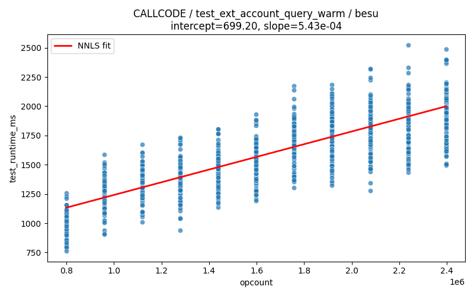

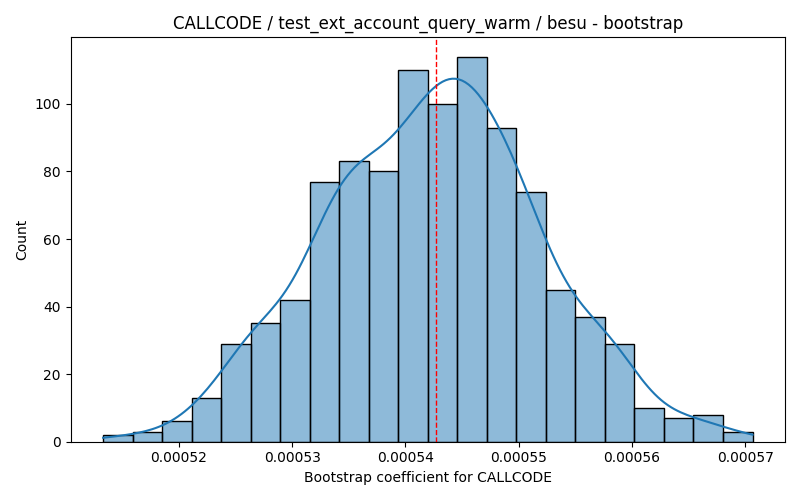

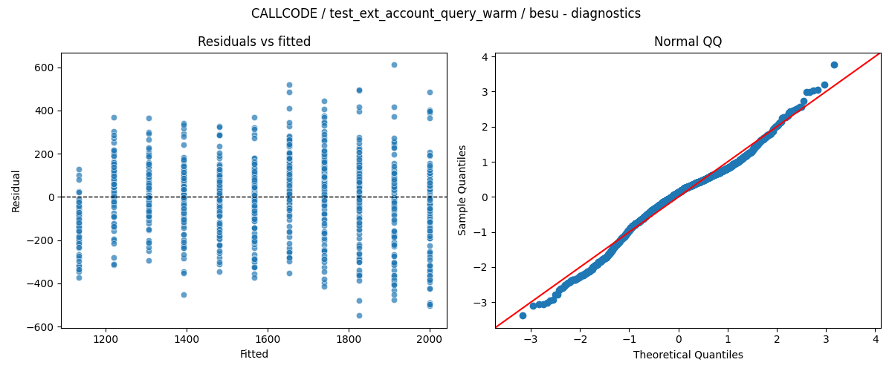

</details>

<details><summary>erigon — NNLS regression summary</summary>

```
==============================================================================
                           NNLS Regression Results                            
==============================================================================
Dep. Variable:          test_runtime_ms              R-squared:          0.956
Model:                  NNLS                    Adj. R-squared:          0.956
No. Observations:       385                               RMSE:          28.57
Df Residuals:           383                                MAE:          22.60
Df Model:               1      
==============================================================================
                      coef     std err     P-value      [0.025      0.975]
------------------------------------------------------------------------------
         const     44.8863      4.6238       0.001     36.5289     54.2089
       opcount      0.0003      0.0000       0.001      0.0003      0.0003
==============================================================================
Notes: Non-negative least squares with bootstrap inference (1000 iterations)
==============================================================================
```

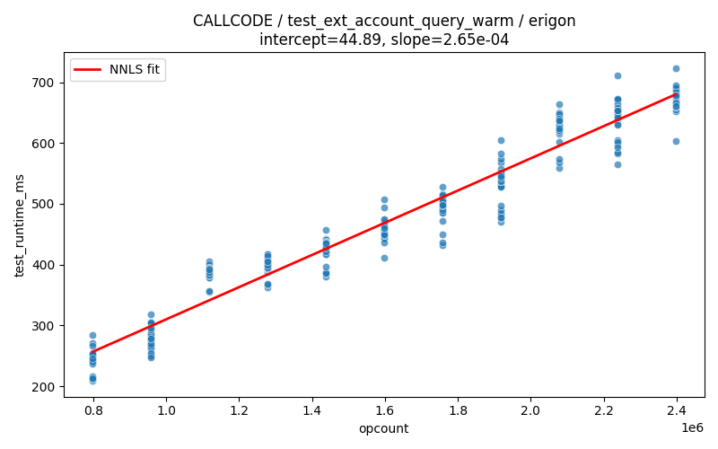

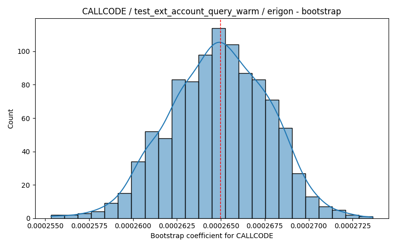

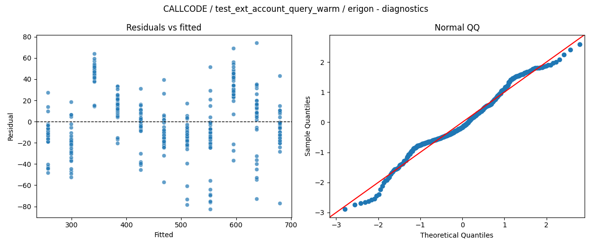

</details>

<details><summary>ethrex — NNLS regression summary</summary>

```
==============================================================================
                           NNLS Regression Results                            
==============================================================================
Dep. Variable:          test_runtime_ms              R-squared:          0.836
Model:                  NNLS                    Adj. R-squared:          0.836
No. Observations:       1276                              RMSE:          15.70
Df Residuals:           1274                               MAE:          12.93
Df Model:               1      
==============================================================================
                      coef     std err     P-value      [0.025      0.975]
------------------------------------------------------------------------------
         const     37.9061      1.4735       0.001     35.1148     40.6783
       opcount      0.0001      0.0000       0.001      0.0001      0.0001
==============================================================================
Notes: Non-negative least squares with bootstrap inference (1000 iterations)
==============================================================================
```

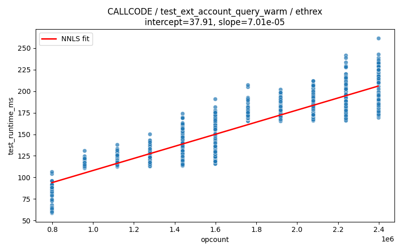

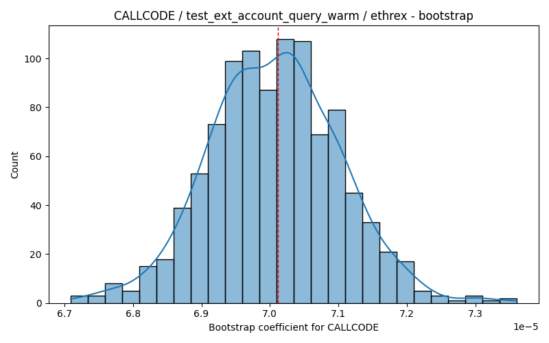

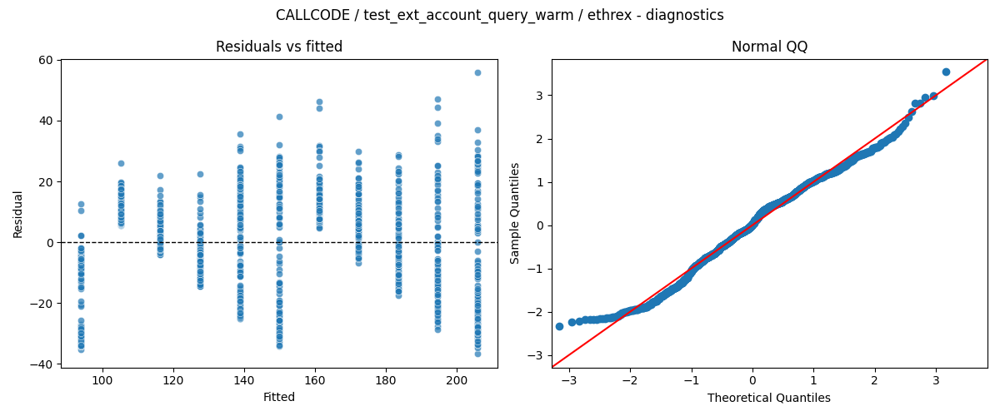

</details>

<details><summary>geth — NNLS regression summary</summary>

```
==============================================================================
                           NNLS Regression Results                            
==============================================================================
Dep. Variable:          test_runtime_ms              R-squared:          0.875
Model:                  NNLS                    Adj. R-squared:          0.875
No. Observations:       924                               RMSE:          34.39
Df Residuals:           922                                MAE:          26.94
Df Model:               1      
==============================================================================
                      coef     std err     P-value      [0.025      0.975]
------------------------------------------------------------------------------
         const     47.5405      3.4230       0.001     40.6847     54.2546
       opcount      0.0002      0.0000       0.001      0.0002      0.0002
==============================================================================
Notes: Non-negative least squares with bootstrap inference (1000 iterations)
==============================================================================
```

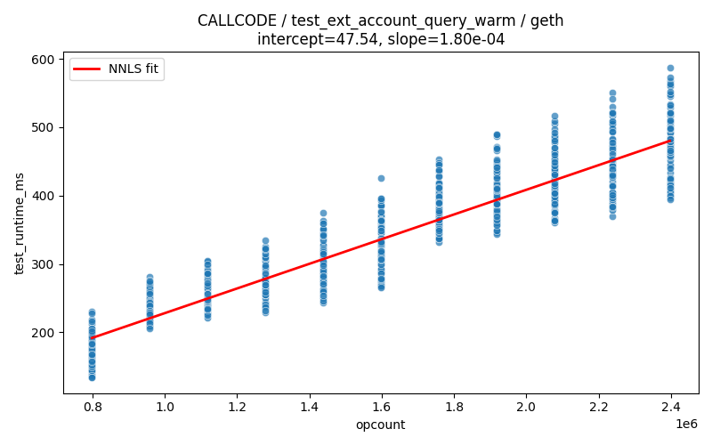

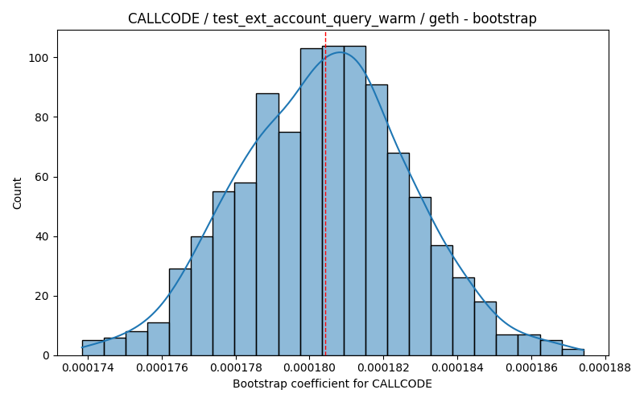

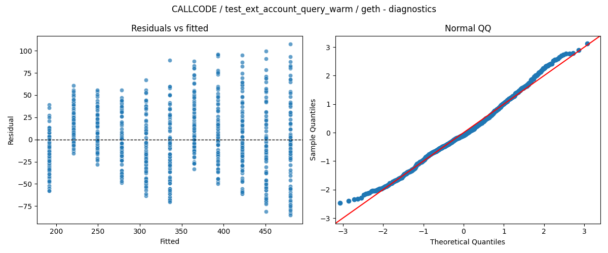

</details>

<details><summary>nethermind — NNLS regression summary</summary>

```
==============================================================================
                           NNLS Regression Results                            
==============================================================================
Dep. Variable:          test_runtime_ms              R-squared:          0.144
Model:                  NNLS                    Adj. R-squared:          0.142
No. Observations:       495                               RMSE:         357.16
Df Residuals:           493                                MAE:         234.15
Df Model:               1      
==============================================================================
                      coef     std err     P-value      [0.025      0.975]
------------------------------------------------------------------------------
         const    162.7597     46.3635       0.001     73.1417    253.1773
       opcount      0.0003      0.0000       0.001      0.0002      0.0003
==============================================================================
Notes: Non-negative least squares with bootstrap inference (1000 iterations)
==============================================================================
```

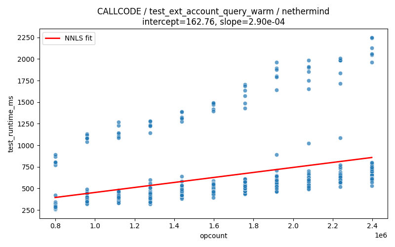

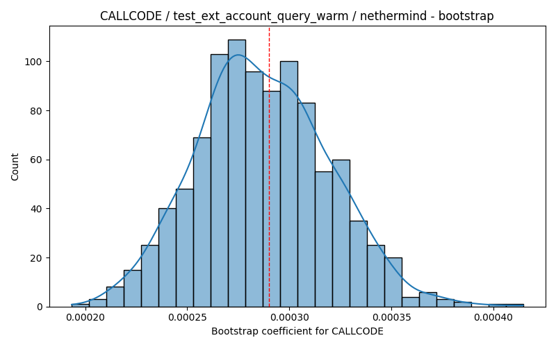

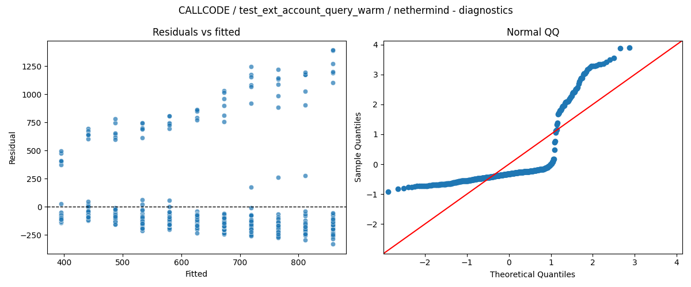

</details>

<details><summary>reth — NNLS regression summary</summary>

```
==============================================================================
                           NNLS Regression Results                            
==============================================================================
Dep. Variable:          test_runtime_ms              R-squared:          0.915
Model:                  NNLS                    Adj. R-squared:          0.915
No. Observations:       385                               RMSE:           7.31
Df Residuals:           383                                MAE:           6.04
Df Model:               1      
==============================================================================
                      coef     std err     P-value      [0.025      0.975]
------------------------------------------------------------------------------
         const     17.6782      1.2930       0.001     15.2747     20.1805
       opcount      0.0000      0.0000       0.001      0.0000      0.0000
==============================================================================
Notes: Non-negative least squares with bootstrap inference (1000 iterations)
==============================================================================
```

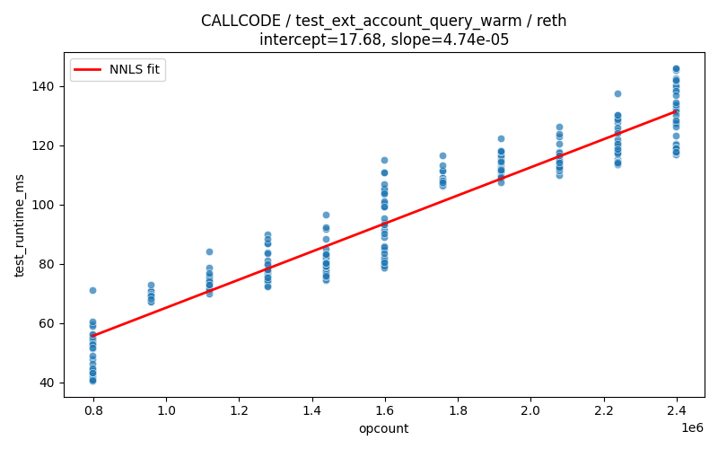

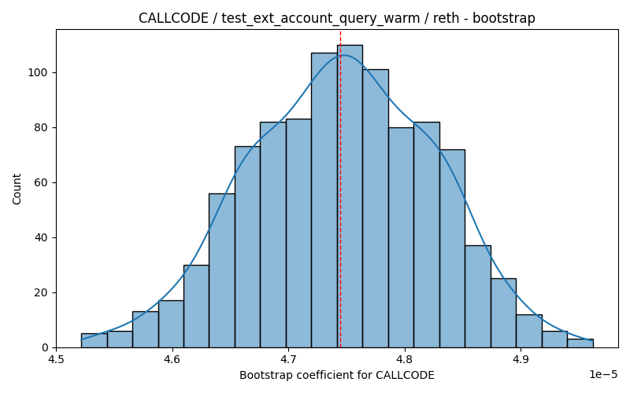

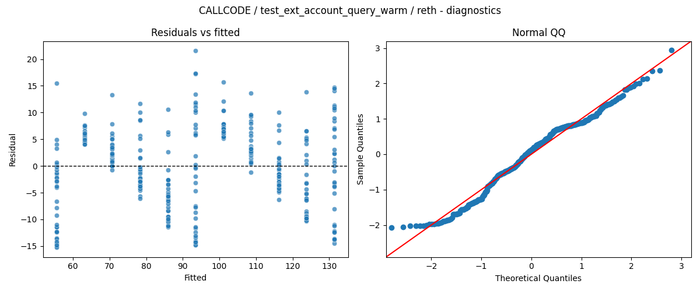

</details>

## DELEGATECALL

### test_account_access — combo `DELEGATECALL_AccountMode.EXISTING_EOA`

| client | nobs | R² | target_coef (ms) | p-value | 95% CI |
| --- | --- | --- | --- | --- | --- |
| `besu` | 1309 | 0.7368 | 0.01147 | 1.00e-03 | [0.01107, 0.01188] |
| `erigon` | 385 | 0.9821 | 0.009785 | 1.00e-03 | [0.009653, 0.009924] |
| `ethrex` | 1276 | 0.9742 | 0.02457 | 1.00e-03 | [0.02433, 0.02483] |
| `geth` | 924 | 0.7572 | 0.01162 | 1.00e-03 | [0.01122, 0.01205] |
| `nethermind` | 495 | 0.8708 | 0.004207 | 1.00e-03 | [0.004074, 0.00435] |
| `reth` | 385 | 0.9753 | 0.001139 | 1.00e-03 | [0.001121, 0.001158] |

<details><summary>besu — NNLS regression summary</summary>

```
==============================================================================
                           NNLS Regression Results                            
==============================================================================
Dep. Variable:          test_runtime_ms              R-squared:          0.737
Model:                  NNLS                    Adj. R-squared:          0.737
No. Observations:       1309                              RMSE:         162.96
Df Residuals:           1307                               MAE:         137.63
Df Model:               1      
==============================================================================
                      coef     std err     P-value      [0.025      0.975]
------------------------------------------------------------------------------
         const    546.2025     15.0764       0.001    515.5135    575.8387
       opcount      0.0115      0.0002       0.001      0.0111      0.0119
==============================================================================
Notes: Non-negative least squares with bootstrap inference (1000 iterations)
==============================================================================
```

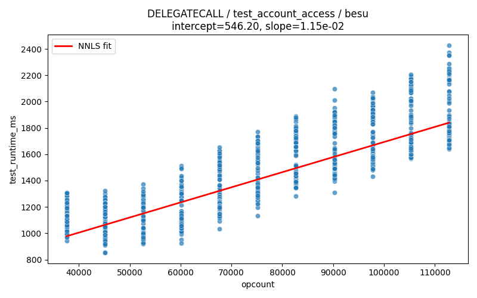

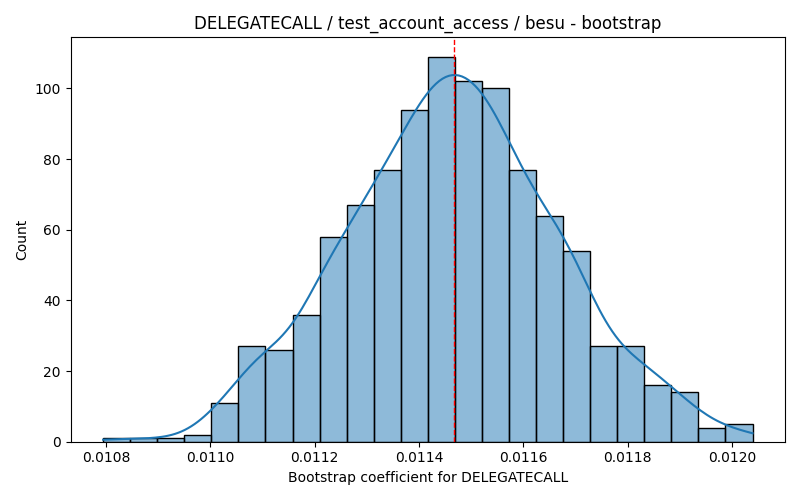

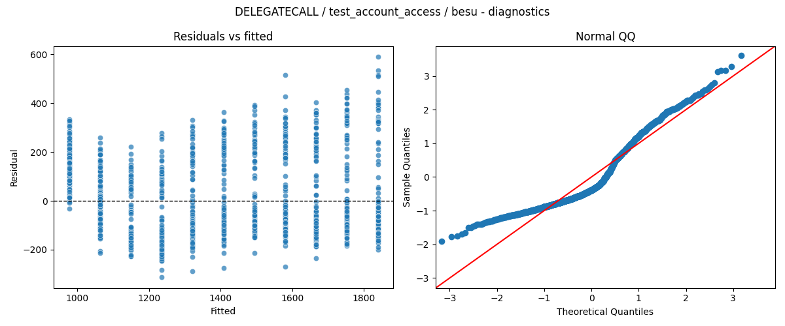

</details>

<details><summary>erigon — NNLS regression summary</summary>

```
==============================================================================
                           NNLS Regression Results                            
==============================================================================
Dep. Variable:          test_runtime_ms              R-squared:          0.982
Model:                  NNLS                    Adj. R-squared:          0.982
No. Observations:       385                               RMSE:          31.42
Df Residuals:           383                                MAE:          24.64
Df Model:               1      
==============================================================================
                      coef     std err     P-value      [0.025      0.975]
------------------------------------------------------------------------------
         const     43.0965      4.5022       0.001     33.9865     51.8409
       opcount      0.0098      0.0001       0.001      0.0097      0.0099
==============================================================================
Notes: Non-negative least squares with bootstrap inference (1000 iterations)
==============================================================================
```

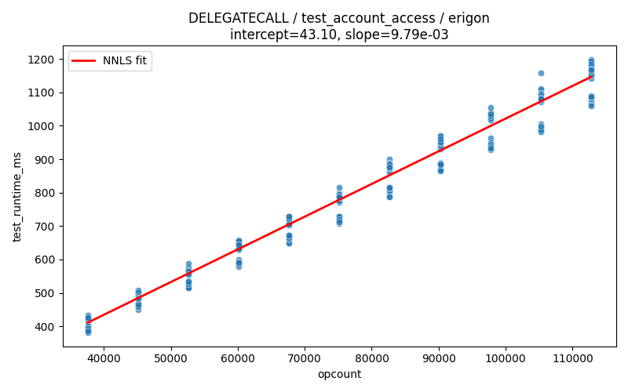

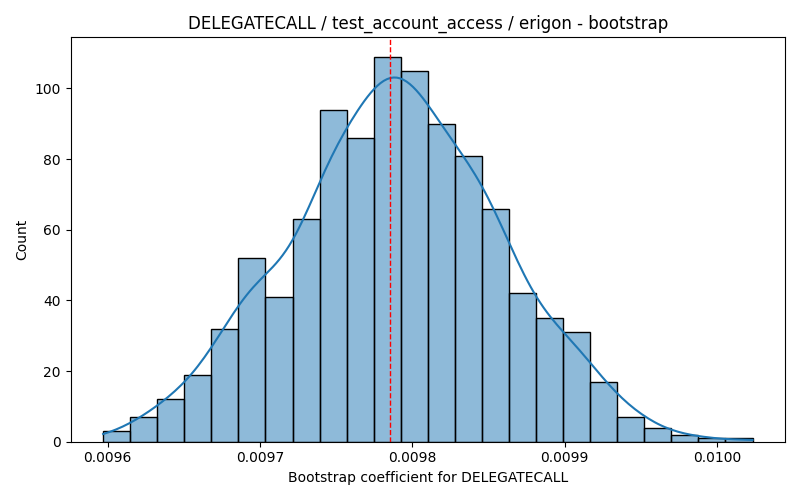

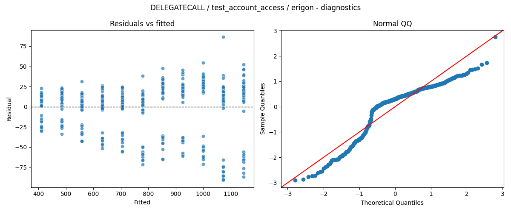

</details>

<details><summary>ethrex — NNLS regression summary</summary>

```
==============================================================================
                           NNLS Regression Results                            
==============================================================================
Dep. Variable:          test_runtime_ms              R-squared:          0.974
Model:                  NNLS                    Adj. R-squared:          0.974
No. Observations:       1276                              RMSE:          95.00
Df Residuals:           1274                               MAE:          83.34
Df Model:               1      
==============================================================================
                      coef     std err     P-value      [0.025      0.975]
------------------------------------------------------------------------------
         const    381.8418     10.5821       0.001    360.0265    401.6717
       opcount      0.0246      0.0001       0.001      0.0243      0.0248
==============================================================================
Notes: Non-negative least squares with bootstrap inference (1000 iterations)
==============================================================================
```

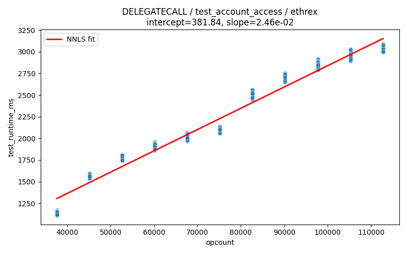

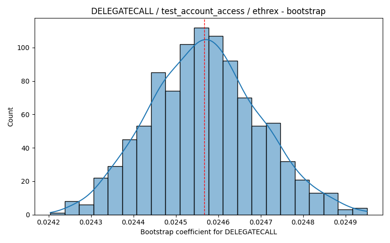

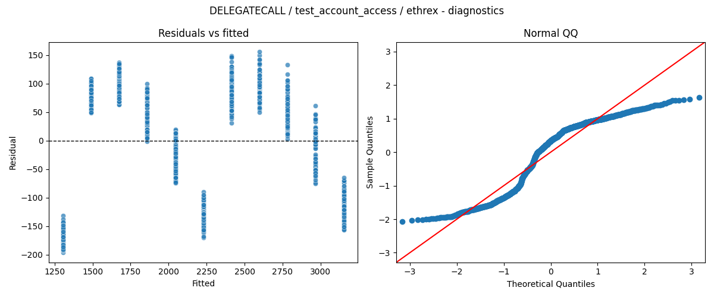

</details>

<details><summary>geth — NNLS regression summary</summary>

```
==============================================================================
                           NNLS Regression Results                            
==============================================================================
Dep. Variable:          test_runtime_ms              R-squared:          0.757
Model:                  NNLS                    Adj. R-squared:          0.757
No. Observations:       924                               RMSE:         156.45
Df Residuals:           922                                MAE:         123.89
Df Model:               1      
==============================================================================
                      coef     std err     P-value      [0.025      0.975]
------------------------------------------------------------------------------
         const    362.5714     14.4883       0.001    331.4356    389.8346
       opcount      0.0116      0.0002       0.001      0.0112      0.0121
==============================================================================
Notes: Non-negative least squares with bootstrap inference (1000 iterations)
==============================================================================
```

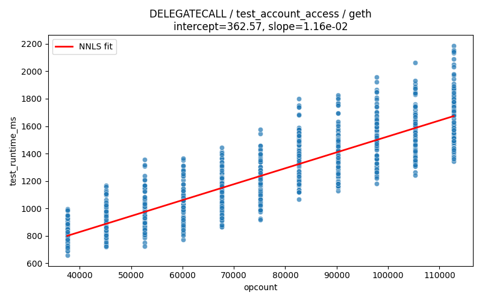

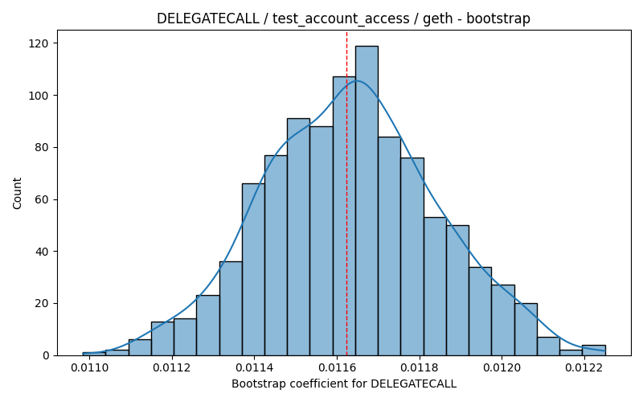

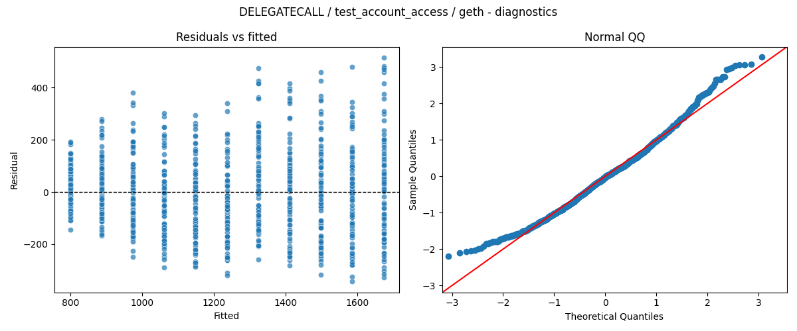

</details>

<details><summary>nethermind — NNLS regression summary</summary>

```
==============================================================================
                           NNLS Regression Results                            
==============================================================================
Dep. Variable:          test_runtime_ms              R-squared:          0.871
Model:                  NNLS                    Adj. R-squared:          0.871
No. Observations:       495                               RMSE:          38.52
Df Residuals:           493                                MAE:          26.73
Df Model:               1      
==============================================================================
                      coef     std err     P-value      [0.025      0.975]
------------------------------------------------------------------------------
         const     93.5353      5.0352       0.001     84.2576    103.0399
       opcount      0.0042      0.0001       0.001      0.0041      0.0044
==============================================================================
Notes: Non-negative least squares with bootstrap inference (1000 iterations)
==============================================================================
```

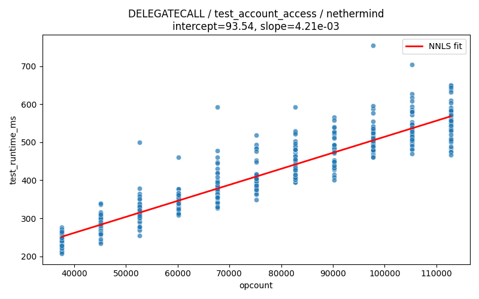

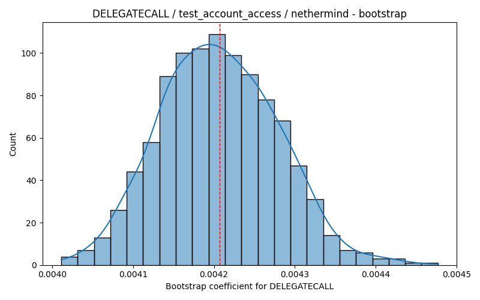

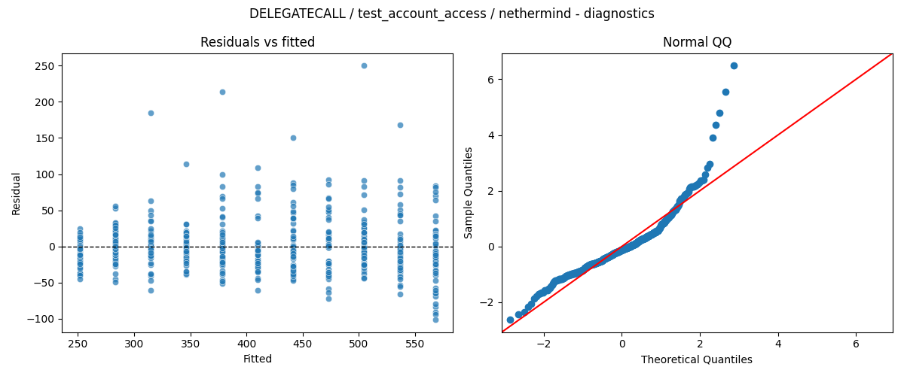

</details>

<details><summary>reth — NNLS regression summary</summary>

```
==============================================================================
                           NNLS Regression Results                            
==============================================================================
Dep. Variable:          test_runtime_ms              R-squared:          0.975
Model:                  NNLS                    Adj. R-squared:          0.975
No. Observations:       385                               RMSE:           4.31
Df Residuals:           383                                MAE:           3.42
Df Model:               1      
==============================================================================
                      coef     std err     P-value      [0.025      0.975]
------------------------------------------------------------------------------
         const     30.7814      0.7916       0.001     29.2547     32.4180
       opcount      0.0011      0.0000       0.001      0.0011      0.0012
==============================================================================
Notes: Non-negative least squares with bootstrap inference (1000 iterations)
==============================================================================
```

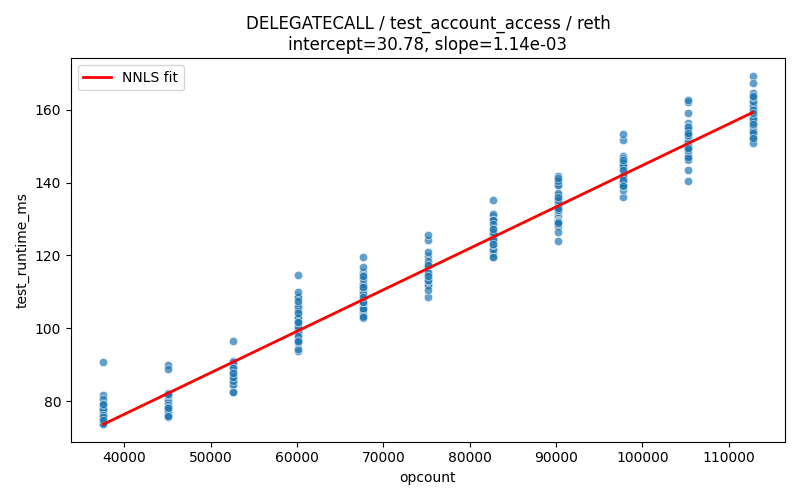

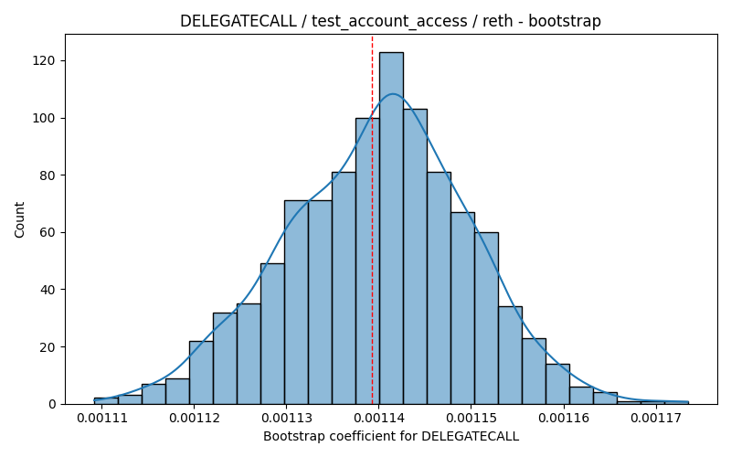

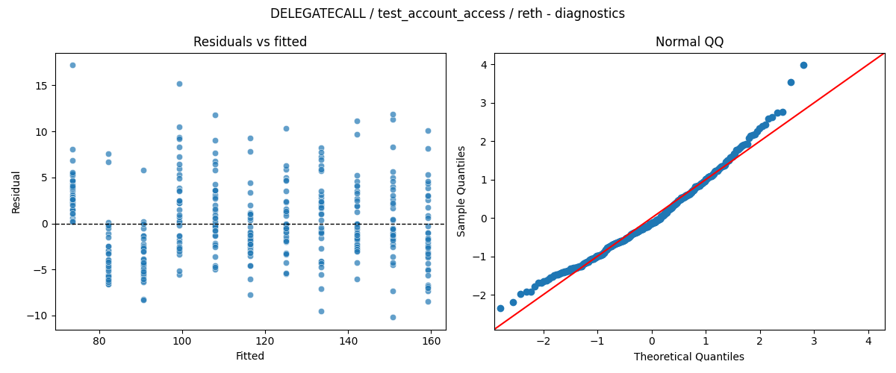

</details>

### test_account_access — combo `DELEGATECALL_AccountMode.NON_EXISTING_ACCOUNT` — `presets[cold_account_nocode_access]`

| client | nobs | R² | target_coef (ms) | p-value | 95% CI |
| --- | --- | --- | --- | --- | --- |
| `besu` | 1309 | 0.7599 | 0.0116 | 1.00e-03 | [0.01128, 0.01197] |
| `erigon` | 385 | 0.9774 | 0.009228 | 1.00e-03 | [0.009085, 0.009374] |
| `ethrex` | 1276 | 0.9961 | 0.002711 | 1.00e-03 | [0.002705, 0.002714] |
| `geth` | 924 | 0.6751 | 0.02505 | 1.00e-03 | [0.02377, 0.02625] |
| `nethermind` | 495 | 0.8773 | 0.004159 | 1.00e-03 | [0.004021, 0.004305] |
| `reth` | 385 | 0.9718 | 0.0009586 | 1.00e-03 | [0.0009412, 0.0009761] |

<details><summary>besu — NNLS regression summary</summary>

```
==============================================================================
                           NNLS Regression Results                            
==============================================================================
Dep. Variable:          test_runtime_ms              R-squared:          0.760
Model:                  NNLS                    Adj. R-squared:          0.760
No. Observations:       1309                              RMSE:         155.03
Df Residuals:           1307                               MAE:         127.67
Df Model:               1      
==============================================================================
                      coef     std err     P-value      [0.025      0.975]
------------------------------------------------------------------------------
         const    468.1673     12.8029       0.001    442.4996    491.9188
       opcount      0.0116      0.0002       0.001      0.0113      0.0120
==============================================================================
Notes: Non-negative least squares with bootstrap inference (1000 iterations)
==============================================================================
```

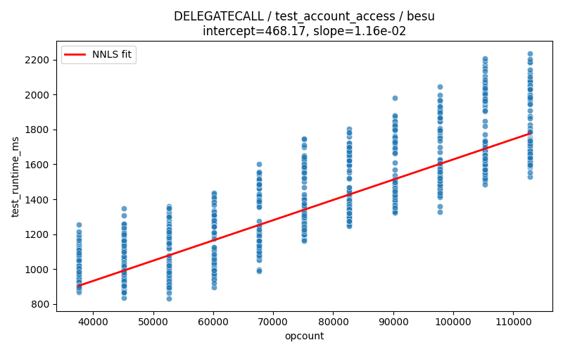

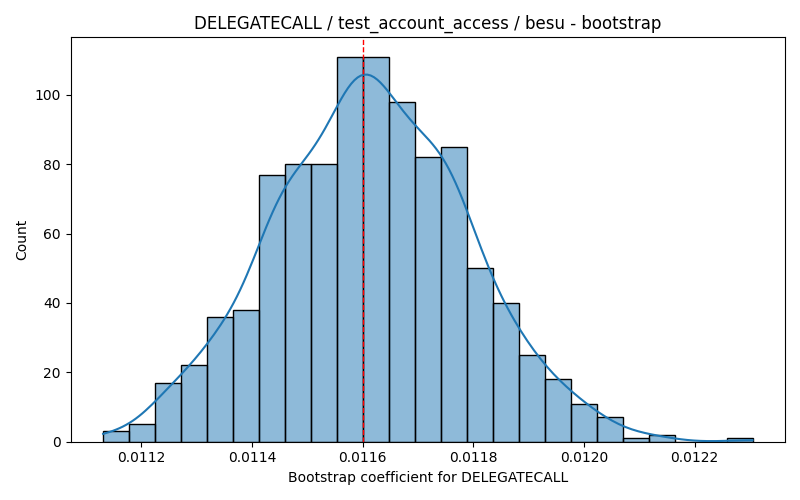

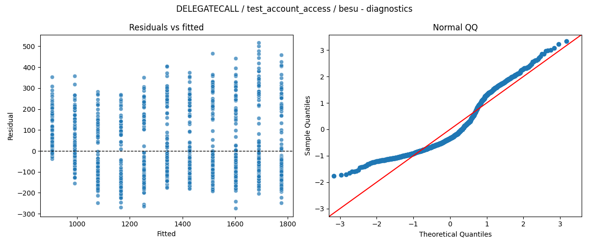

</details>

<details><summary>erigon — NNLS regression summary</summary>

```
==============================================================================
                           NNLS Regression Results                            
==============================================================================
Dep. Variable:          test_runtime_ms              R-squared:          0.977
Model:                  NNLS                    Adj. R-squared:          0.977
No. Observations:       385                               RMSE:          33.39
Df Residuals:           383                                MAE:          26.82
Df Model:               1      
==============================================================================
                      coef     std err     P-value      [0.025      0.975]
------------------------------------------------------------------------------
         const     16.4287      4.8811       0.001      6.8214     25.8445
       opcount      0.0092      0.0001       0.001      0.0091      0.0094
==============================================================================
Notes: Non-negative least squares with bootstrap inference (1000 iterations)
==============================================================================
```

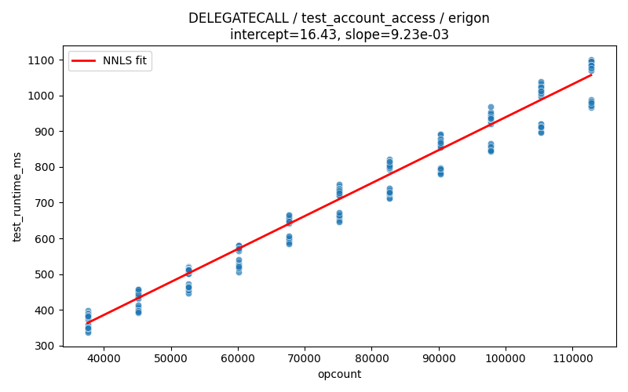

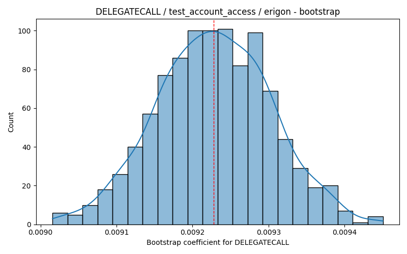

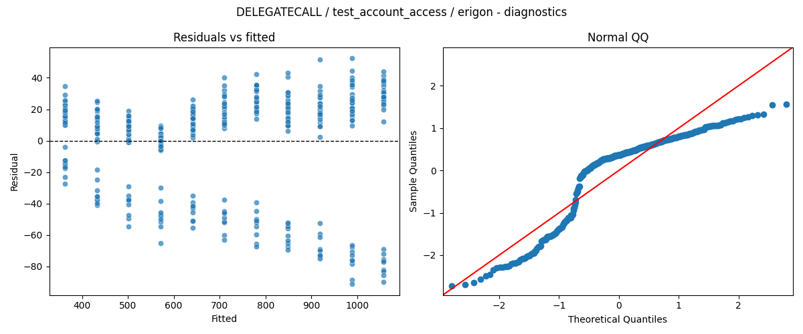

</details>

<details><summary>ethrex — NNLS regression summary</summary>

```
==============================================================================
                           NNLS Regression Results                            
==============================================================================
Dep. Variable:          test_runtime_ms              R-squared:          0.996
Model:                  NNLS                    Adj. R-squared:          0.996
No. Observations:       1276                              RMSE:           4.03
Df Residuals:           1274                               MAE:           3.13
Df Model:               1      
==============================================================================
                      coef     std err     P-value      [0.025      0.975]
------------------------------------------------------------------------------
         const      0.0000      0.1143       1.000      0.0000      0.4248
       opcount      0.0027      0.0000       0.001      0.0027      0.0027
==============================================================================
Notes: Non-negative least squares with bootstrap inference (1000 iterations)
==============================================================================
```

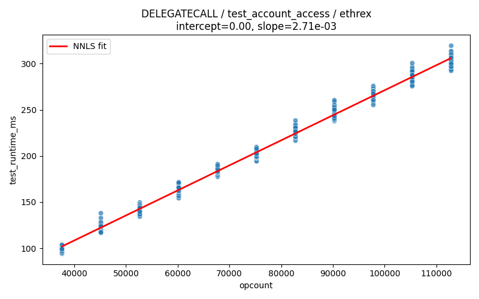

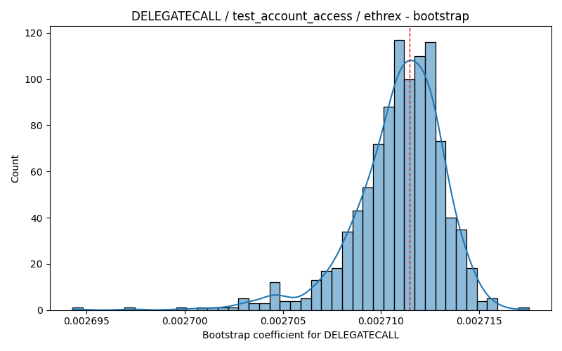

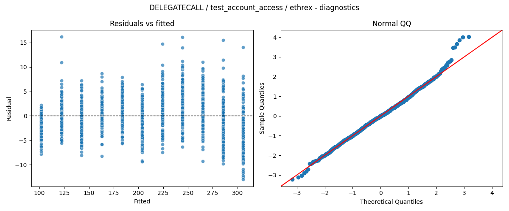

</details>

<details><summary>geth — NNLS regression summary</summary>

```
==============================================================================
                           NNLS Regression Results                            
==============================================================================
Dep. Variable:          test_runtime_ms              R-squared:          0.675
Model:                  NNLS                    Adj. R-squared:          0.675
No. Observations:       924                               RMSE:         413.05
Df Residuals:           922                                MAE:         337.30
Df Model:               1      
==============================================================================
                      coef     std err     P-value      [0.025      0.975]
------------------------------------------------------------------------------
         const   1319.7540     50.3969       0.001   1220.5770   1420.6075
       opcount      0.0250      0.0006       0.001      0.0238      0.0262
==============================================================================
Notes: Non-negative least squares with bootstrap inference (1000 iterations)
==============================================================================
```

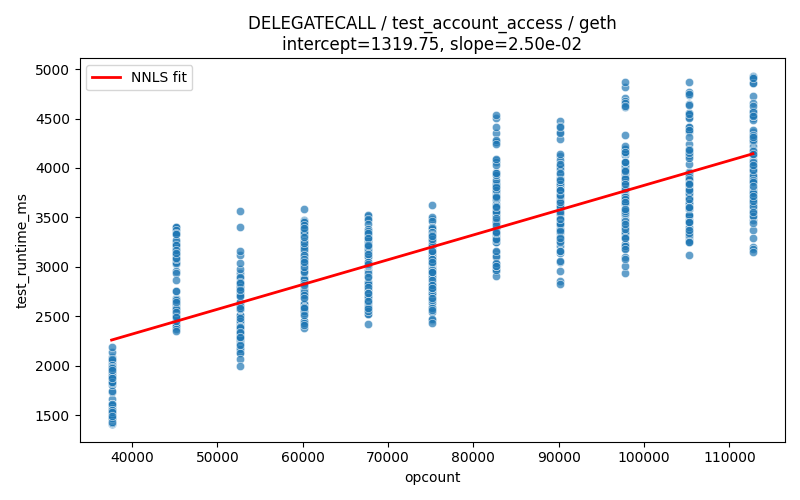

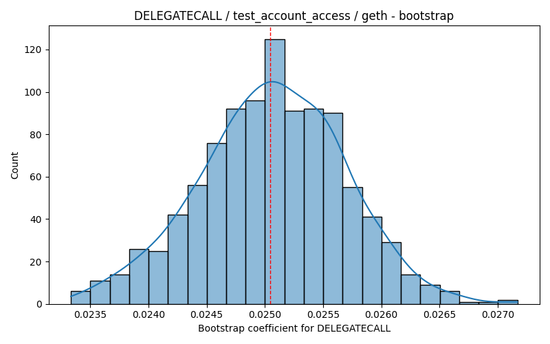

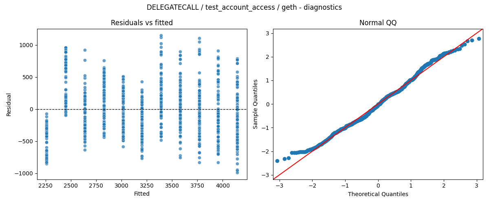

</details>

<details><summary>nethermind — NNLS regression summary</summary>

```
==============================================================================
                           NNLS Regression Results                            
==============================================================================
Dep. Variable:          test_runtime_ms              R-squared:          0.877
Model:                  NNLS                    Adj. R-squared:          0.877
No. Observations:       495                               RMSE:          36.97
Df Residuals:           493                                MAE:          27.24
Df Model:               1      
==============================================================================
                      coef     std err     P-value      [0.025      0.975]
------------------------------------------------------------------------------
         const    100.0209      5.0988       0.001     89.5399    110.0219
       opcount      0.0042      0.0001       0.001      0.0040      0.0043
==============================================================================
Notes: Non-negative least squares with bootstrap inference (1000 iterations)
==============================================================================
```

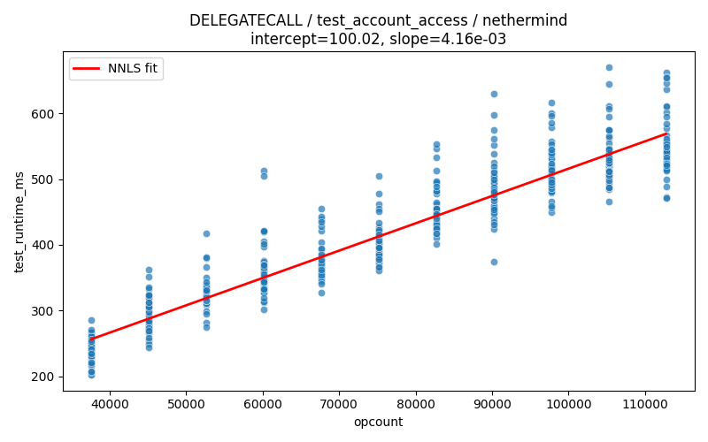

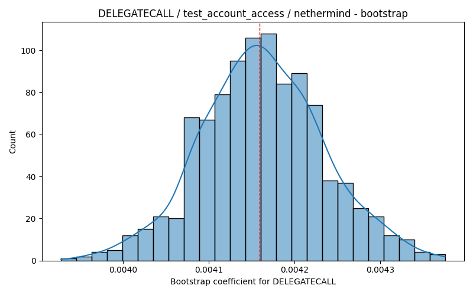

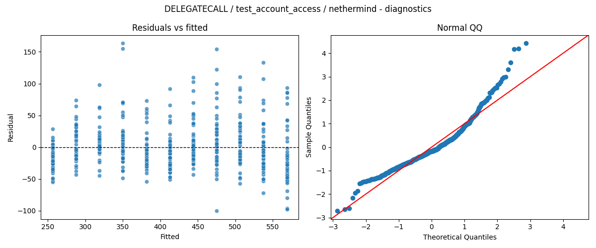

</details>

<details><summary>reth — NNLS regression summary</summary>

```
==============================================================================
                           NNLS Regression Results                            
==============================================================================
Dep. Variable:          test_runtime_ms              R-squared:          0.972
Model:                  NNLS                    Adj. R-squared:          0.972
No. Observations:       385                               RMSE:           3.88
Df Residuals:           383                                MAE:           3.12
Df Model:               1      
==============================================================================
                      coef     std err     P-value      [0.025      0.975]
------------------------------------------------------------------------------
         const     31.6685      0.7186       0.001     30.1811     33.1737
       opcount      0.0010      0.0000       0.001      0.0009      0.0010
==============================================================================
Notes: Non-negative least squares with bootstrap inference (1000 iterations)
==============================================================================
```

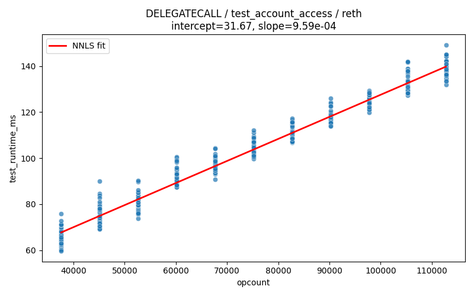

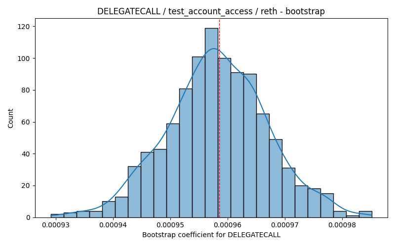

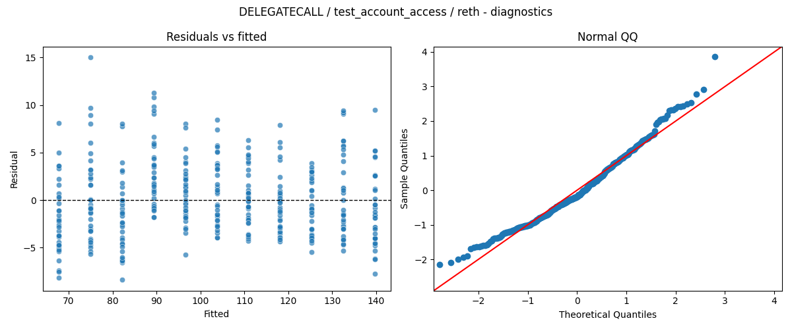

</details>

### test_account_access — combo `DELEGATECALL_AccountMode.EXISTING_CONTRACT`

| client | nobs | R² | target_coef (ms) | p-value | 95% CI |
| --- | --- | --- | --- | --- | --- |
| `besu` | 1309 | 0.8673 | 0.02936 | 1.00e-03 | [0.02877, 0.02996] |
| `erigon` | 385 | 0.8779 | 0.0862 | 1.00e-03 | [0.08279, 0.08934] |
| `ethrex` | 1276 | 0.9715 | 0.02592 | 1.00e-03 | [0.02565, 0.02621] |
| `geth` | 924 | 0.6791 | 0.02816 | 1.00e-03 | [0.02676, 0.02951] |
| `nethermind` | 495 | 0.7271 | 0.02562 | 1.00e-03 | [0.0242, 0.02708] |
| `reth` | 385 | 0.8908 | 0.03745 | 1.00e-03 | [0.03705, 0.03792] |

<details><summary>besu — NNLS regression summary</summary>

```
==============================================================================
                           NNLS Regression Results                            
==============================================================================
Dep. Variable:          test_runtime_ms              R-squared:          0.867
Model:                  NNLS                    Adj. R-squared:          0.867
No. Observations:       1309                              RMSE:         233.99
Df Residuals:           1307                               MAE:         190.37
Df Model:               1      
==============================================================================
                      coef     std err     P-value      [0.025      0.975]
------------------------------------------------------------------------------
         const    397.9038     18.5807       0.001    362.7444    435.4647
       opcount      0.0294      0.0003       0.001      0.0288      0.0300
==============================================================================
Notes: Non-negative least squares with bootstrap inference (1000 iterations)
==============================================================================
```

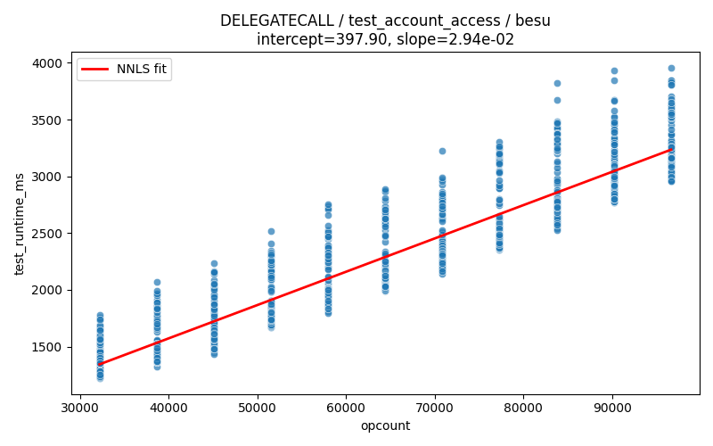

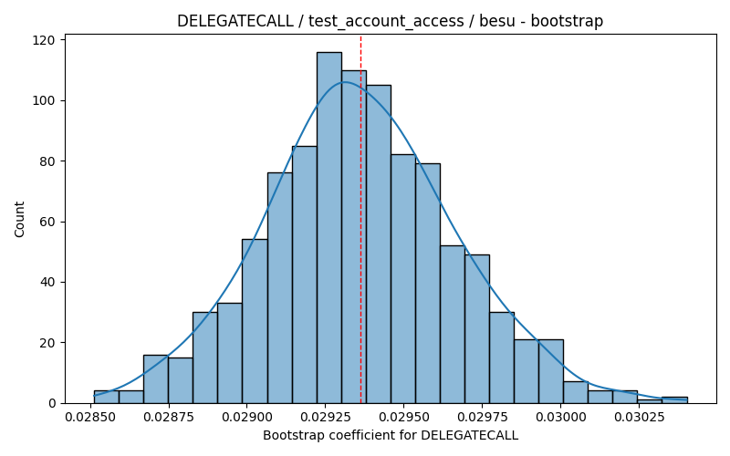

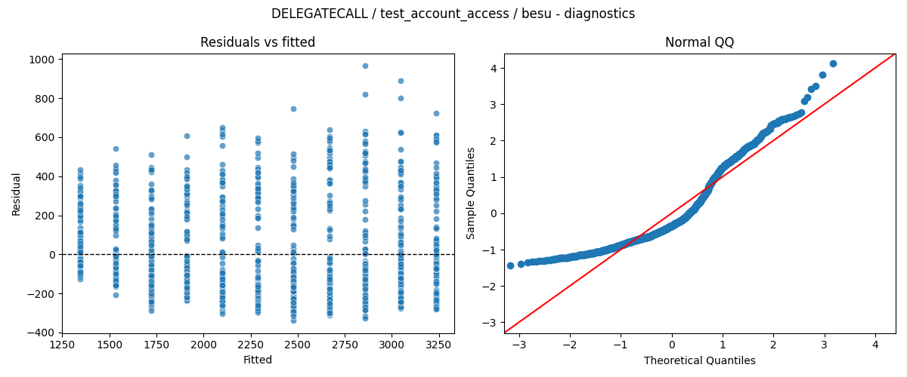

</details>

<details><summary>erigon — NNLS regression summary</summary>

```
==============================================================================
                           NNLS Regression Results                            
==============================================================================
Dep. Variable:          test_runtime_ms              R-squared:          0.878
Model:                  NNLS                    Adj. R-squared:          0.878
No. Observations:       385                               RMSE:         654.86
Df Residuals:           383                                MAE:         564.34
Df Model:               1      
==============================================================================
                      coef     std err     P-value      [0.025      0.975]
------------------------------------------------------------------------------
         const   1417.9871    122.3013       0.001   1184.1975   1679.4517
       opcount      0.0862      0.0016       0.001      0.0828      0.0893
==============================================================================
Notes: Non-negative least squares with bootstrap inference (1000 iterations)
==============================================================================
```

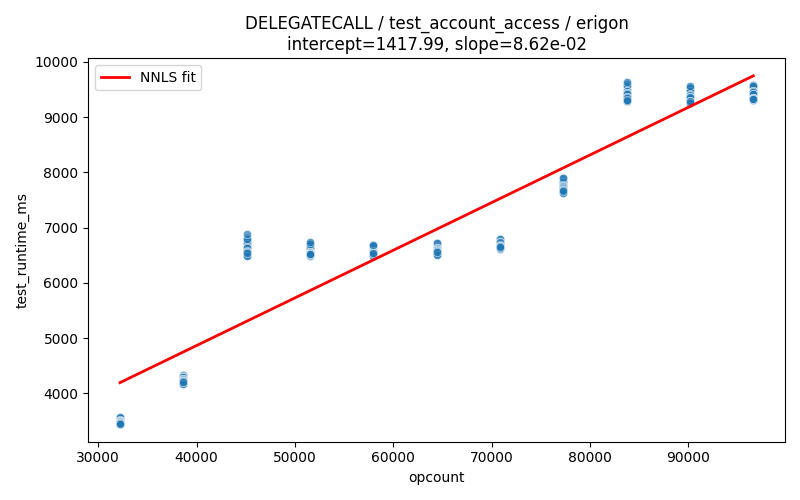

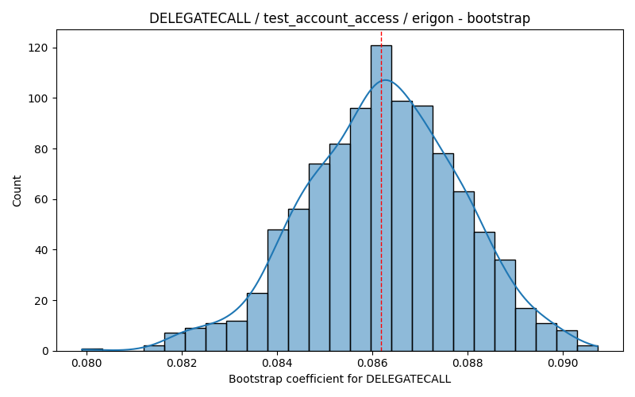

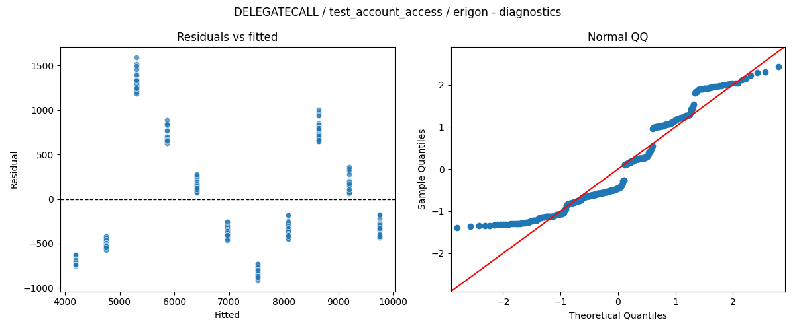

</details>

<details><summary>ethrex — NNLS regression summary</summary>

```
==============================================================================
                           NNLS Regression Results                            
==============================================================================
Dep. Variable:          test_runtime_ms              R-squared:          0.971
Model:                  NNLS                    Adj. R-squared:          0.971
No. Observations:       1276                              RMSE:          90.50
Df Residuals:           1274                               MAE:          79.12
Df Model:               1      
==============================================================================
                      coef     std err     P-value      [0.025      0.975]
------------------------------------------------------------------------------
         const    336.7562     10.6157       0.001    315.3956    357.0134
       opcount      0.0259      0.0001       0.001      0.0256      0.0262
==============================================================================
Notes: Non-negative least squares with bootstrap inference (1000 iterations)
==============================================================================
```

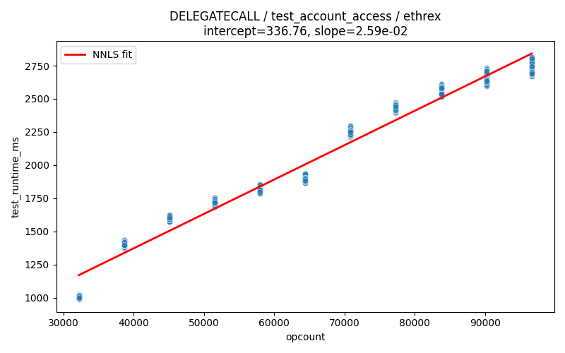

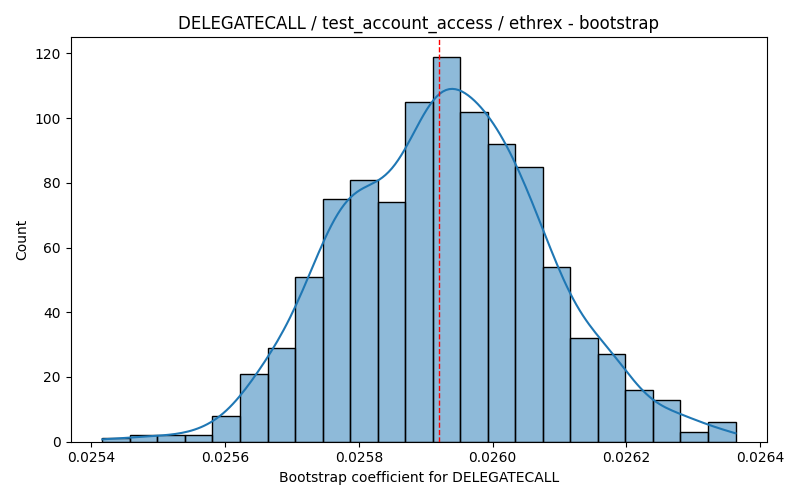

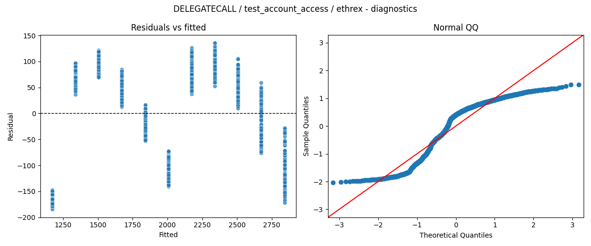

</details>

<details><summary>geth — NNLS regression summary</summary>

```
==============================================================================
                           NNLS Regression Results                            
==============================================================================
Dep. Variable:          test_runtime_ms              R-squared:          0.679
Model:                  NNLS                    Adj. R-squared:          0.679
No. Observations:       924                               RMSE:         394.26
Df Residuals:           922                                MAE:         327.09
Df Model:               1      
==============================================================================
                      coef     std err     P-value      [0.025      0.975]
------------------------------------------------------------------------------
         const   1134.5252     47.1074       0.001   1045.2706   1228.2181
       opcount      0.0282      0.0007       0.001      0.0268      0.0295
==============================================================================
Notes: Non-negative least squares with bootstrap inference (1000 iterations)
==============================================================================
```

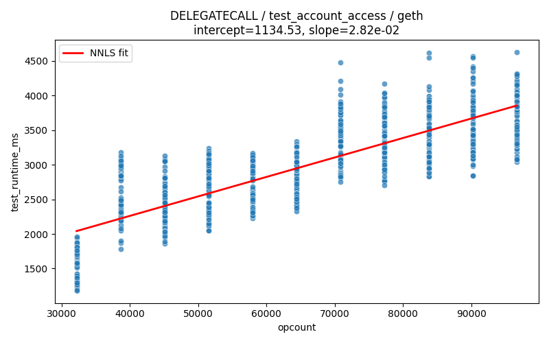

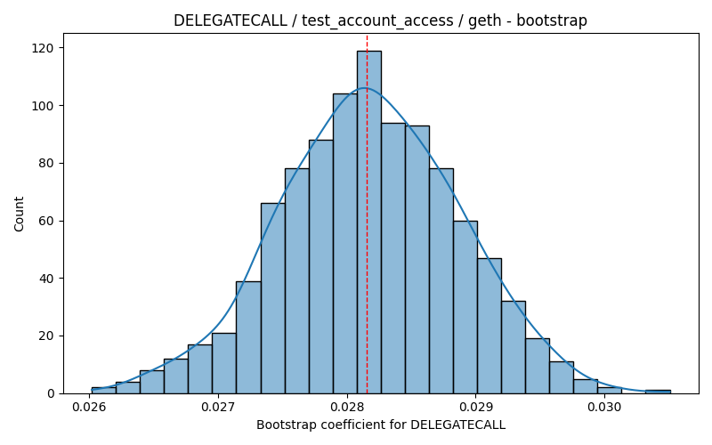

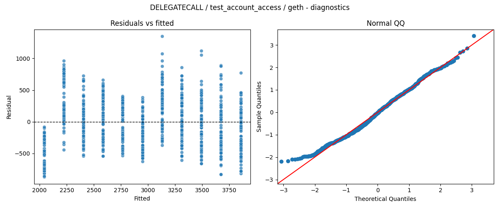

</details>

<details><summary>nethermind — NNLS regression summary</summary>

```
==============================================================================
                           NNLS Regression Results                            
==============================================================================
Dep. Variable:          test_runtime_ms              R-squared:          0.727
Model:                  NNLS                    Adj. R-squared:          0.727
No. Observations:       495                               RMSE:         319.73
Df Residuals:           493                                MAE:         265.81
Df Model:               1      
==============================================================================
                      coef     std err     P-value      [0.025      0.975]
------------------------------------------------------------------------------
         const    899.6157     51.5743       0.001    801.9520    999.1061
       opcount      0.0256      0.0007       0.001      0.0242      0.0271
==============================================================================
Notes: Non-negative least squares with bootstrap inference (1000 iterations)
==============================================================================
```

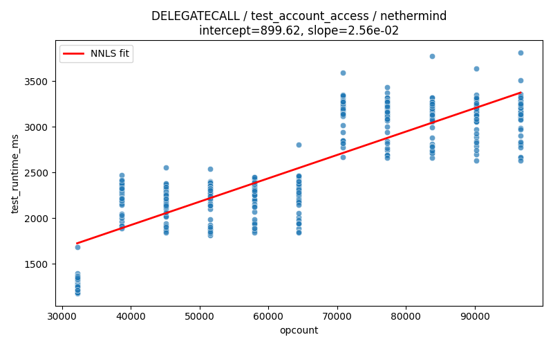

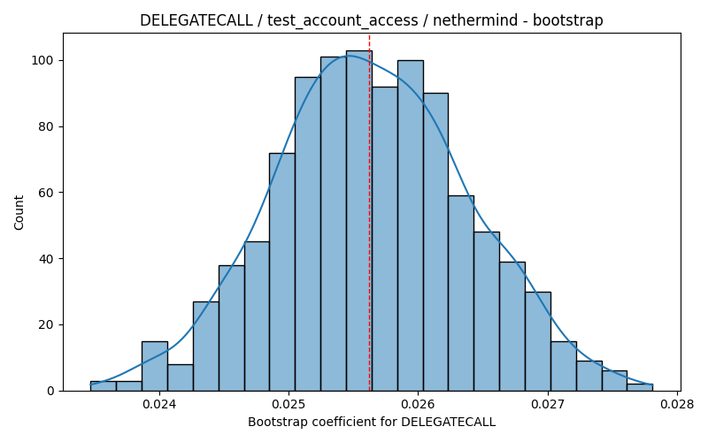

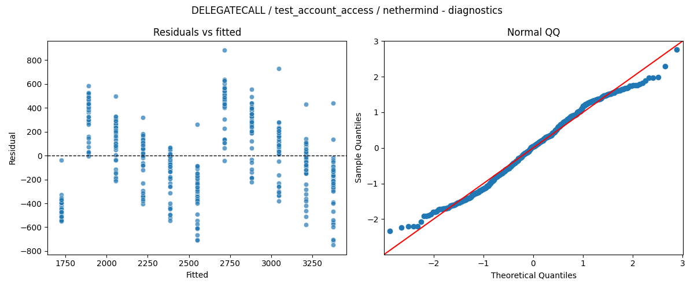

</details>

<details><summary>reth — NNLS regression summary</summary>

```
==============================================================================
                           NNLS Regression Results                            
==============================================================================
Dep. Variable:          test_runtime_ms              R-squared:          0.891
Model:                  NNLS                    Adj. R-squared:          0.891
No. Observations:       385                               RMSE:         275.85
Df Residuals:           383                                MAE:         147.93
Df Model:               1      
==============================================================================
                      coef     std err     P-value      [0.025      0.975]
------------------------------------------------------------------------------
         const      0.0000      2.4230       1.000      0.0000      0.0000
       opcount      0.0374      0.0002       0.001      0.0370      0.0379
==============================================================================
Notes: Non-negative least squares with bootstrap inference (1000 iterations)
==============================================================================
```

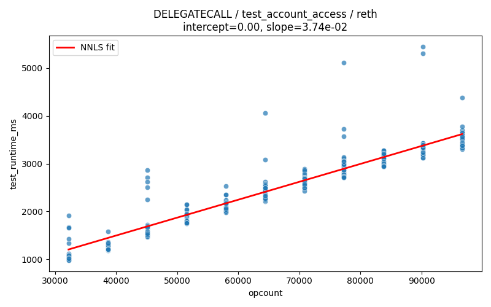

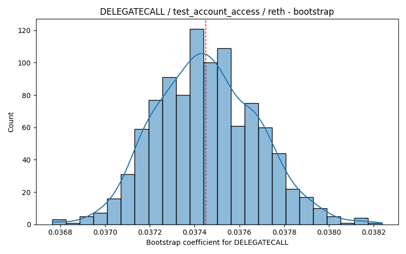

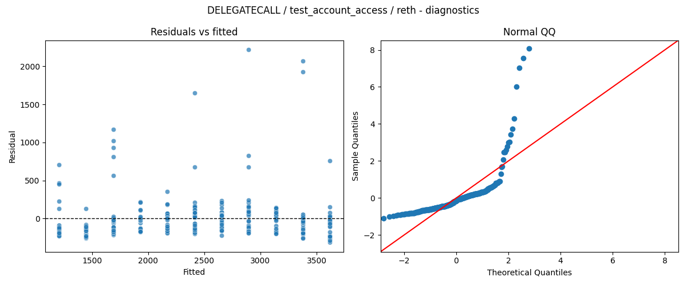

</details>

### test_account_access — combo `DELEGATECALL_AccountMode.NON_EXISTING_ACCOUNT` — `presets[cold_account_code_access]`

| client | nobs | R² | target_coef (ms) | p-value | 95% CI |
| --- | --- | --- | --- | --- | --- |
| `besu` | 1309 | 0.7599 | 0.0116 | 1.00e-03 | [0.01128, 0.01197] |
| `erigon` | 385 | 0.9774 | 0.009228 | 1.00e-03 | [0.009085, 0.009374] |
| `ethrex` | 1276 | 0.9961 | 0.002711 | 1.00e-03 | [0.002705, 0.002714] |
| `geth` | 924 | 0.6751 | 0.02505 | 1.00e-03 | [0.02377, 0.02625] |
| `nethermind` | 495 | 0.8773 | 0.004159 | 1.00e-03 | [0.004021, 0.004305] |
| `reth` | 385 | 0.9718 | 0.0009586 | 1.00e-03 | [0.0009412, 0.0009761] |

<details><summary>besu — NNLS regression summary</summary>

```
==============================================================================
                           NNLS Regression Results                            
==============================================================================
Dep. Variable:          test_runtime_ms              R-squared:          0.760
Model:                  NNLS                    Adj. R-squared:          0.760
No. Observations:       1309                              RMSE:         155.03
Df Residuals:           1307                               MAE:         127.67
Df Model:               1      
==============================================================================
                      coef     std err     P-value      [0.025      0.975]
------------------------------------------------------------------------------
         const    468.1673     12.8029       0.001    442.4996    491.9188
       opcount      0.0116      0.0002       0.001      0.0113      0.0120
==============================================================================
Notes: Non-negative least squares with bootstrap inference (1000 iterations)
==============================================================================
```


</details>

<details><summary>erigon — NNLS regression summary</summary>

```
==============================================================================
                           NNLS Regression Results                            
==============================================================================
Dep. Variable:          test_runtime_ms              R-squared:          0.977
Model:                  NNLS                    Adj. R-squared:          0.977
No. Observations:       385                               RMSE:          33.39
Df Residuals:           383                                MAE:          26.82
Df Model:               1      
==============================================================================
                      coef     std err     P-value      [0.025      0.975]
------------------------------------------------------------------------------
         const     16.4287      4.8811       0.001      6.8214     25.8445
       opcount      0.0092      0.0001       0.001      0.0091      0.0094
==============================================================================
Notes: Non-negative least squares with bootstrap inference (1000 iterations)
==============================================================================
```


</details>

<details><summary>ethrex — NNLS regression summary</summary>

```
==============================================================================
                           NNLS Regression Results                            
==============================================================================
Dep. Variable:          test_runtime_ms              R-squared:          0.996
Model:                  NNLS                    Adj. R-squared:          0.996
No. Observations:       1276                              RMSE:           4.03
Df Residuals:           1274                               MAE:           3.13
Df Model:               1      
==============================================================================
                      coef     std err     P-value      [0.025      0.975]
------------------------------------------------------------------------------
         const      0.0000      0.1143       1.000      0.0000      0.4248
       opcount      0.0027      0.0000       0.001      0.0027      0.0027
==============================================================================
Notes: Non-negative least squares with bootstrap inference (1000 iterations)
==============================================================================
```


</details>

<details><summary>geth — NNLS regression summary</summary>

```
==============================================================================
                           NNLS Regression Results                            
==============================================================================
Dep. Variable:          test_runtime_ms              R-squared:          0.675
Model:                  NNLS                    Adj. R-squared:          0.675
No. Observations:       924                               RMSE:         413.05
Df Residuals:           922                                MAE:         337.30
Df Model:               1      
==============================================================================
                      coef     std err     P-value      [0.025      0.975]
------------------------------------------------------------------------------
         const   1319.7540     50.3969       0.001   1220.5770   1420.6075
       opcount      0.0250      0.0006       0.001      0.0238      0.0262
==============================================================================
Notes: Non-negative least squares with bootstrap inference (1000 iterations)
==============================================================================
```


</details>

<details><summary>nethermind — NNLS regression summary</summary>

```
==============================================================================
                           NNLS Regression Results                            
==============================================================================
Dep. Variable:          test_runtime_ms              R-squared:          0.877
Model:                  NNLS                    Adj. R-squared:          0.877
No. Observations:       495                               RMSE:          36.97
Df Residuals:           493                                MAE:          27.24
Df Model:               1      
==============================================================================
                      coef     std err     P-value      [0.025      0.975]
------------------------------------------------------------------------------
         const    100.0209      5.0988       0.001     89.5399    110.0219
       opcount      0.0042      0.0001       0.001      0.0040      0.0043
==============================================================================
Notes: Non-negative least squares with bootstrap inference (1000 iterations)
==============================================================================
```


</details>

<details><summary>reth — NNLS regression summary</summary>

```
==============================================================================
                           NNLS Regression Results                            
==============================================================================
Dep. Variable:          test_runtime_ms              R-squared:          0.972
Model:                  NNLS                    Adj. R-squared:          0.972
No. Observations:       385                               RMSE:           3.88
Df Residuals:           383                                MAE:           3.12
Df Model:               1      
==============================================================================
                      coef     std err     P-value      [0.025      0.975]
------------------------------------------------------------------------------
         const     31.6685      0.7186       0.001     30.1811     33.1737
       opcount      0.0010      0.0000       0.001      0.0009      0.0010
==============================================================================
Notes: Non-negative least squares with bootstrap inference (1000 iterations)
==============================================================================
```


</details>

### test_ext_account_query_warm — combo `DELEGATECALL`

| client | nobs | R² | target_coef (ms) | p-value | 95% CI |
| --- | --- | --- | --- | --- | --- |
| `besu` | 1309 | 0.7502 | 0.0005008 | 1.00e-03 | [0.0004842, 0.0005156] |
| `erigon` | 385 | 0.9561 | 0.0002581 | 1.00e-03 | [0.0002526, 0.0002636] |
| `ethrex` | 1276 | 0.8345 | 6.988e-05 | 1.00e-03 | [6.811e-05, 7.174e-05] |
| `geth` | 924 | 0.8822 | 0.0001556 | 1.00e-03 | [0.0001517, 0.0001595] |
| `nethermind` | 495 | 0.3014 | 0.0003792 | 1.00e-03 | [0.0003291, 0.0004312] |
| `reth` | 385 | 0.9124 | 4.631e-05 | 1.00e-03 | [4.486e-05, 4.787e-05] |

<details><summary>besu — NNLS regression summary</summary>

```
==============================================================================
                           NNLS Regression Results                            
==============================================================================
Dep. Variable:          test_runtime_ms              R-squared:          0.750
Model:                  NNLS                    Adj. R-squared:          0.750
No. Observations:       1309                              RMSE:         149.60
Df Residuals:           1307                               MAE:         113.45
Df Model:               1      
==============================================================================
                      coef     std err     P-value      [0.025      0.975]
------------------------------------------------------------------------------
         const    645.9375     12.3576       0.001    622.7517    670.6851
       opcount      0.0005      0.0000       0.001      0.0005      0.0005
==============================================================================
Notes: Non-negative least squares with bootstrap inference (1000 iterations)
==============================================================================
```

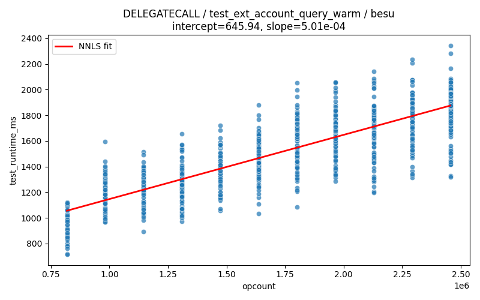

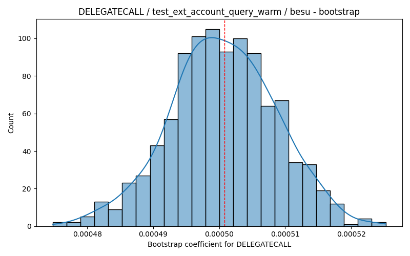

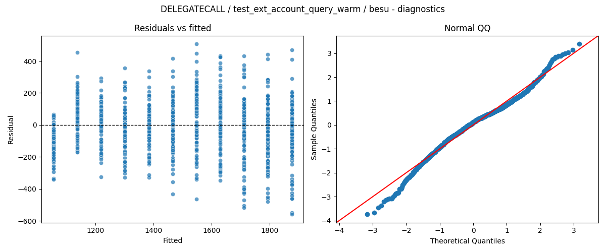

</details>

<details><summary>erigon — NNLS regression summary</summary>

```
==============================================================================
                           NNLS Regression Results                            
==============================================================================
Dep. Variable:          test_runtime_ms              R-squared:          0.956
Model:                  NNLS                    Adj. R-squared:          0.956
No. Observations:       385                               RMSE:          28.63
Df Residuals:           383                                MAE:          21.78
Df Model:               1      
==============================================================================
                      coef     std err     P-value      [0.025      0.975]
------------------------------------------------------------------------------
         const     53.8204      4.5260       0.001     44.7733     62.7949
       opcount      0.0003      0.0000       0.001      0.0003      0.0003
==============================================================================
Notes: Non-negative least squares with bootstrap inference (1000 iterations)
==============================================================================
```

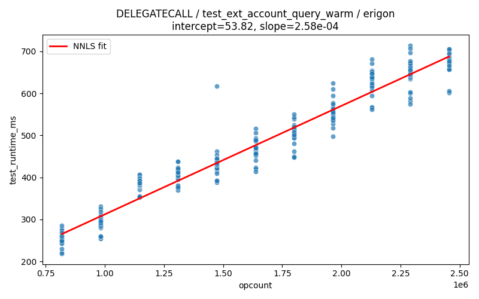

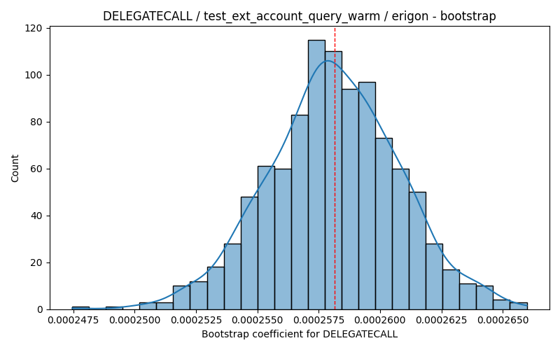

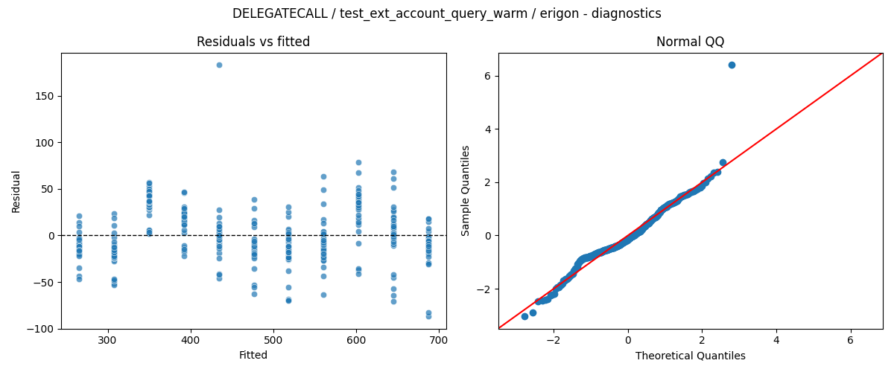

</details>

<details><summary>ethrex — NNLS regression summary</summary>

```
==============================================================================
                           NNLS Regression Results                            
==============================================================================
Dep. Variable:          test_runtime_ms              R-squared:          0.834
Model:                  NNLS                    Adj. R-squared:          0.834
No. Observations:       1276                              RMSE:          16.11
Df Residuals:           1274                               MAE:          13.28
Df Model:               1      
==============================================================================
                      coef     std err     P-value      [0.025      0.975]
------------------------------------------------------------------------------
         const     34.7114      1.5412       0.001     31.5777     37.6762
       opcount      0.0001      0.0000       0.001      0.0001      0.0001
==============================================================================
Notes: Non-negative least squares with bootstrap inference (1000 iterations)
==============================================================================
```

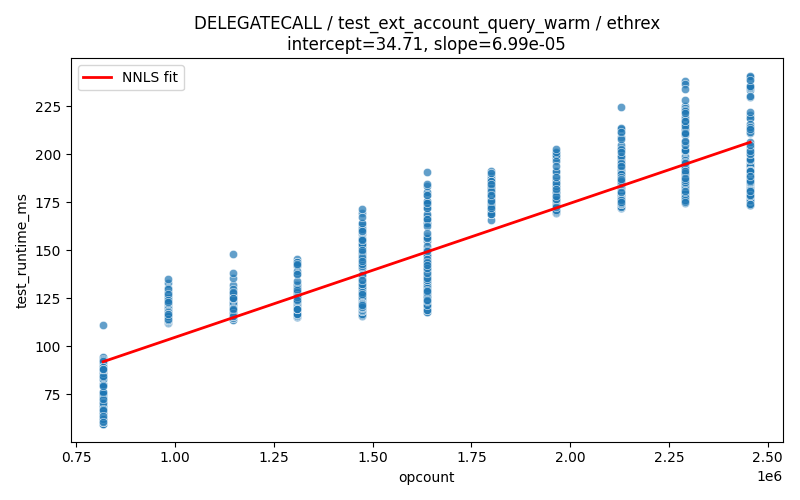

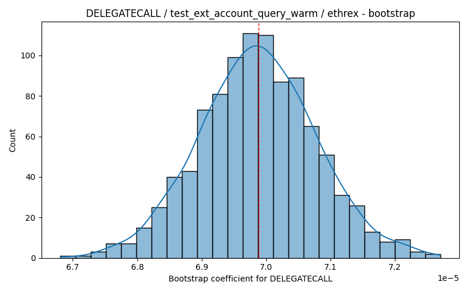

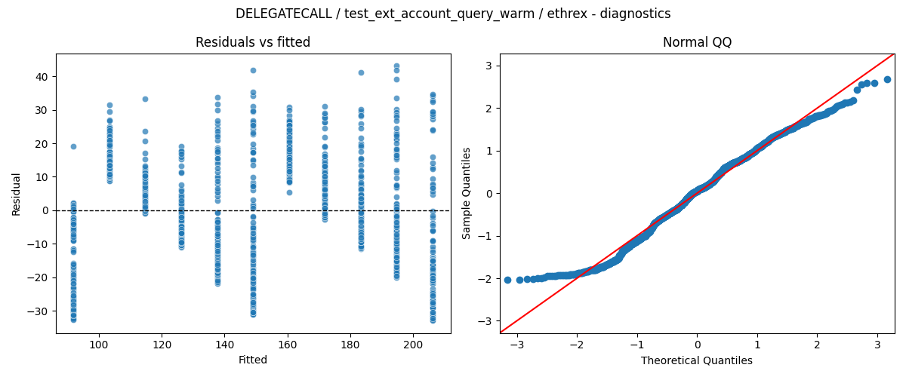

</details>

<details><summary>geth — NNLS regression summary</summary>

```
==============================================================================
                           NNLS Regression Results                            
==============================================================================
Dep. Variable:          test_runtime_ms              R-squared:          0.882
Model:                  NNLS                    Adj. R-squared:          0.882
No. Observations:       924                               RMSE:          29.44
Df Residuals:           922                                MAE:          23.26
Df Model:               1      
==============================================================================
                      coef     std err     P-value      [0.025      0.975]
------------------------------------------------------------------------------
         const     37.2975      2.9507       0.001     31.5319     42.8065
       opcount      0.0002      0.0000       0.001      0.0002      0.0002
==============================================================================
Notes: Non-negative least squares with bootstrap inference (1000 iterations)
==============================================================================
```

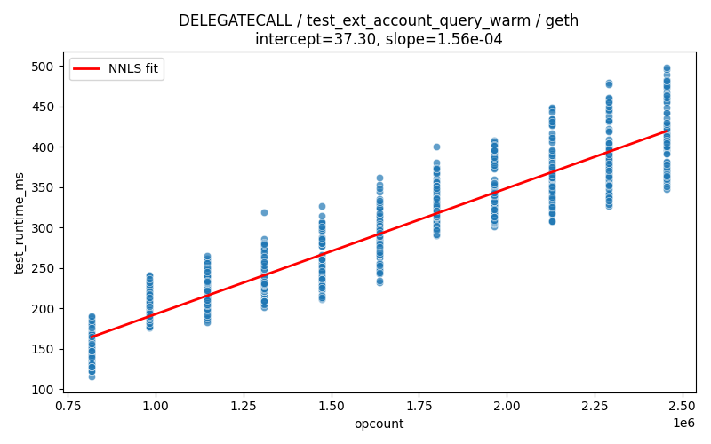

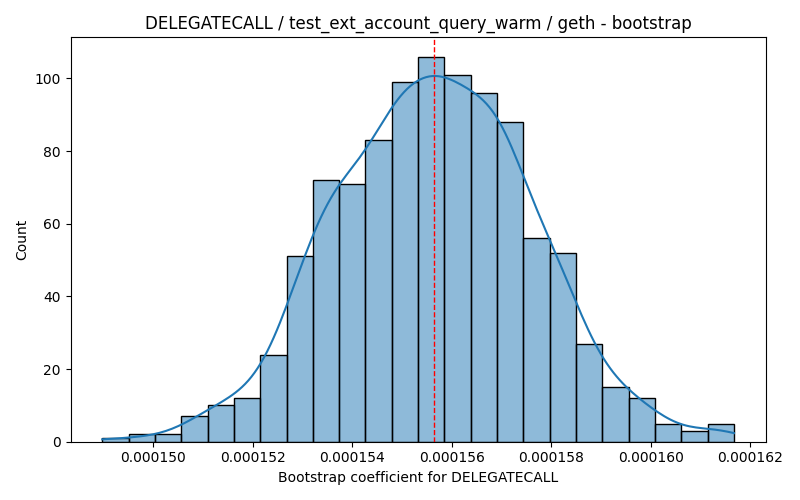

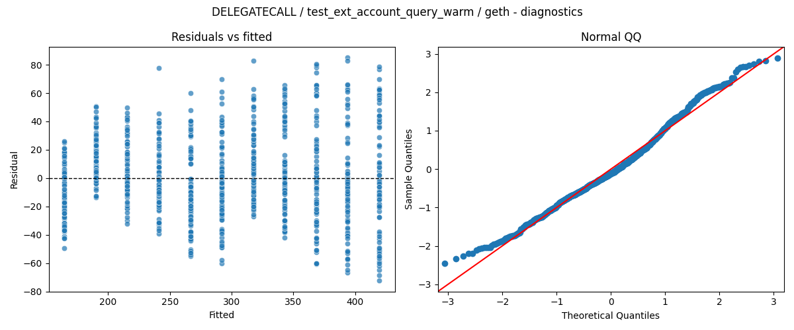

</details>

<details><summary>nethermind — NNLS regression summary</summary>

```
==============================================================================
                           NNLS Regression Results                            
==============================================================================
Dep. Variable:          test_runtime_ms              R-squared:          0.301
Model:                  NNLS                    Adj. R-squared:          0.300
No. Observations:       495                               RMSE:         298.90
Df Residuals:           493                                MAE:         211.54
Df Model:               1      
==============================================================================
                      coef     std err     P-value      [0.025      0.975]
------------------------------------------------------------------------------
         const    209.4062     37.1160       0.001    137.3132    281.2303
       opcount      0.0004      0.0000       0.001      0.0003      0.0004
==============================================================================
Notes: Non-negative least squares with bootstrap inference (1000 iterations)
==============================================================================
```

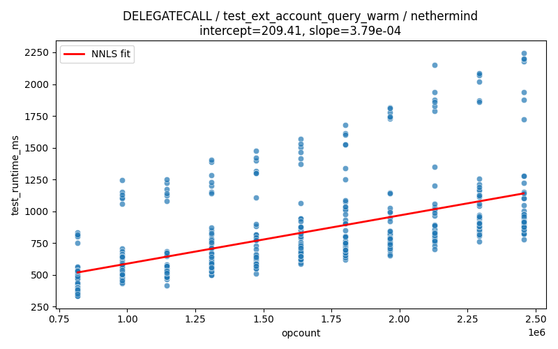

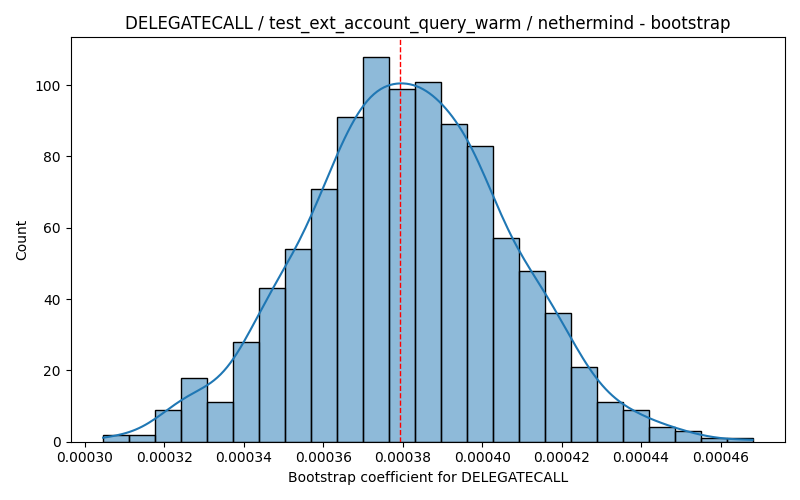

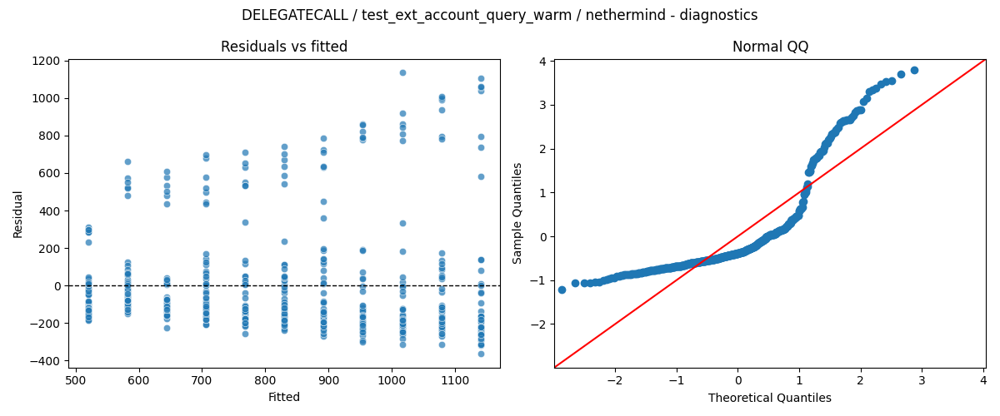

</details>

<details><summary>reth — NNLS regression summary</summary>

```
==============================================================================
                           NNLS Regression Results                            
==============================================================================
Dep. Variable:          test_runtime_ms              R-squared:          0.912
Model:                  NNLS                    Adj. R-squared:          0.912
No. Observations:       385                               RMSE:           7.43
Df Residuals:           383                                MAE:           6.04
Df Model:               1      
==============================================================================
                      coef     std err     P-value      [0.025      0.975]
------------------------------------------------------------------------------
         const     18.4976      1.3195       0.001     15.9180     21.1127
       opcount      0.0000      0.0000       0.001      0.0000      0.0000
==============================================================================
Notes: Non-negative least squares with bootstrap inference (1000 iterations)
==============================================================================
```

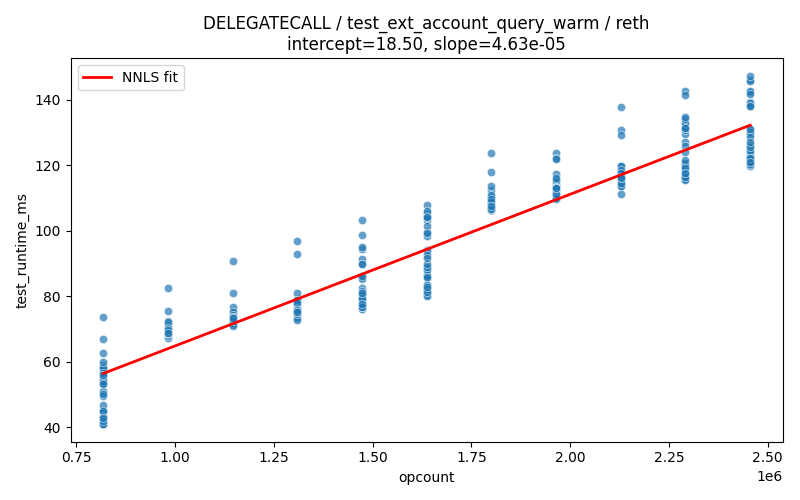

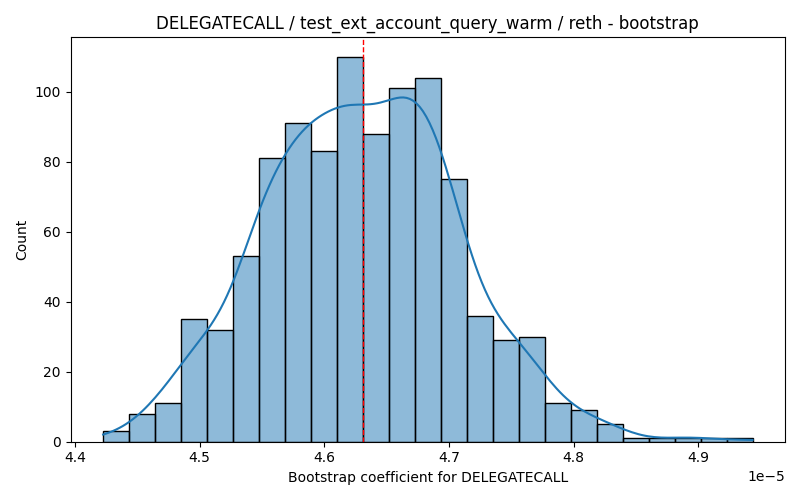

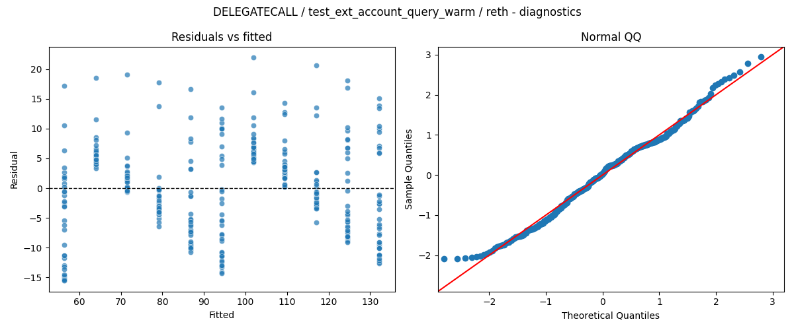

</details>

## EXTCODECOPY

### test_account_access — combo `EXTCODECOPY_AccountMode.NON_EXISTING_ACCOUNT` — `presets[cold_account_nocode_access]`

| client | nobs | R² | target_coef (ms) | p-value | 95% CI |
| --- | --- | --- | --- | --- | --- |
| `besu` | 1309 | 0.6228 | 0.000379 | 1.00e-03 | [0.0003632, 0.0003935] |
| `erigon` | 385 | 0.8541 | 6.221e-05 | 1.00e-03 | [5.947e-05, 6.463e-05] |
| `ethrex` | 1276 | 0.8046 | 2.756e-05 | 1.00e-03 | [2.677e-05, 2.837e-05] |
| `geth` | 924 | 0.9339 | 0.0003416 | 1.00e-03 | [0.0003357, 0.0003473] |
| `nethermind` | 495 | 0.8028 | 0.0003551 | 1.00e-03 | [0.0003414, 0.0003693] |
| `reth` | 385 | 0.708 | 1.668e-05 | 1.00e-03 | [1.541e-05, 1.782e-05] |

<details><summary>besu — NNLS regression summary</summary>

```
==============================================================================
                           NNLS Regression Results                            
==============================================================================
Dep. Variable:          test_runtime_ms              R-squared:          0.623
Model:                  NNLS                    Adj. R-squared:          0.622
No. Observations:       1309                              RMSE:          75.73
Df Residuals:           1307                               MAE:          55.94
Df Model:               1      
==============================================================================
                      coef     std err     P-value      [0.025      0.975]
------------------------------------------------------------------------------
         const    236.2689      6.9789       0.001    223.7825    250.1242
       opcount      0.0004      0.0000       0.001      0.0004      0.0004
==============================================================================
Notes: Non-negative least squares with bootstrap inference (1000 iterations)
==============================================================================
```

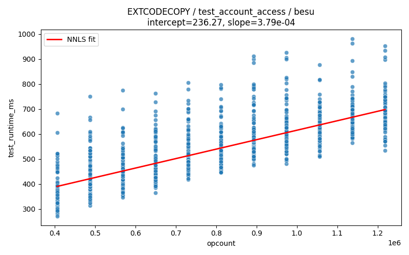

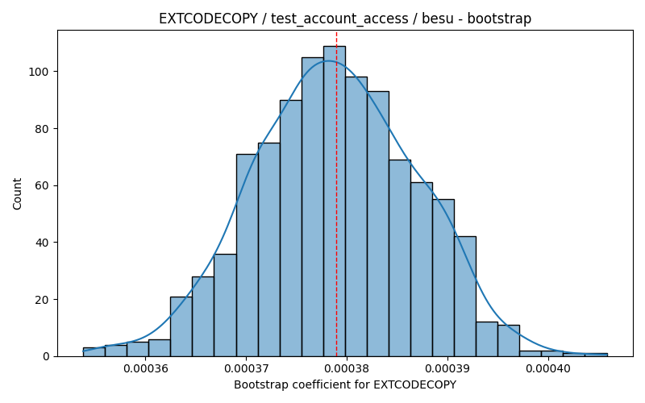

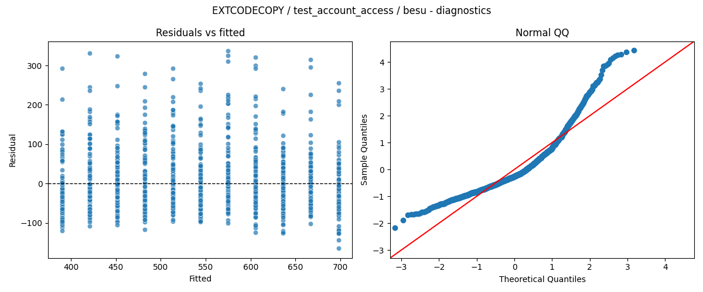

</details>

<details><summary>erigon — NNLS regression summary</summary>

```
==============================================================================
                           NNLS Regression Results                            
==============================================================================
Dep. Variable:          test_runtime_ms              R-squared:          0.854
Model:                  NNLS                    Adj. R-squared:          0.854
No. Observations:       385                               RMSE:           6.60
Df Residuals:           383                                MAE:           5.39
Df Model:               1      
==============================================================================
                      coef     std err     P-value      [0.025      0.975]
------------------------------------------------------------------------------
         const     36.4926      1.1370       0.001     34.3023     38.9082
       opcount      0.0001      0.0000       0.001      0.0001      0.0001
==============================================================================
Notes: Non-negative least squares with bootstrap inference (1000 iterations)
==============================================================================
```

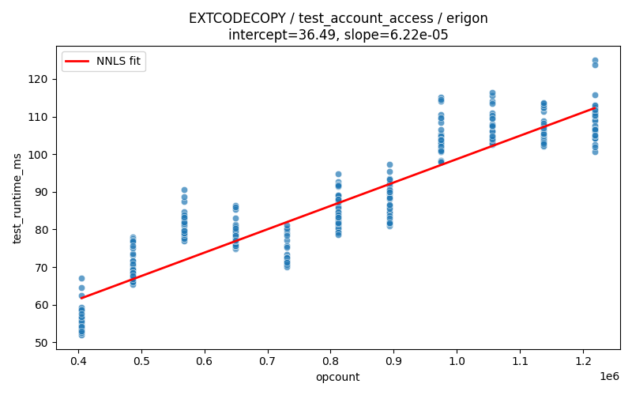

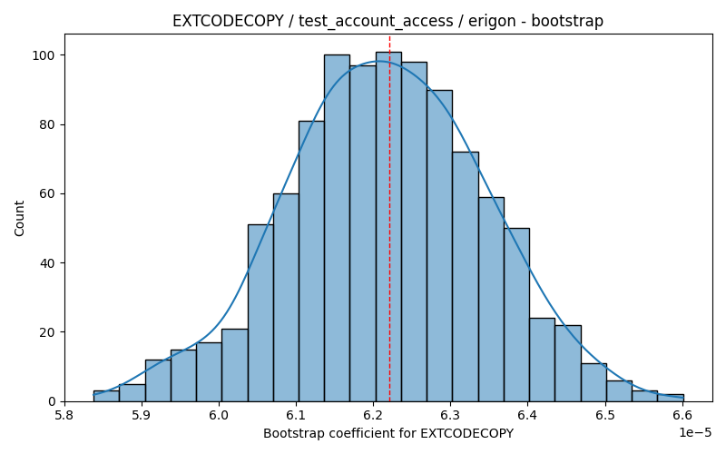

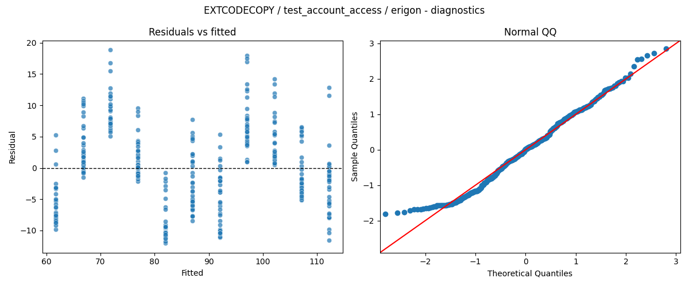

</details>

<details><summary>ethrex — NNLS regression summary</summary>

```
==============================================================================
                           NNLS Regression Results                            
==============================================================================
Dep. Variable:          test_runtime_ms              R-squared:          0.805
Model:                  NNLS                    Adj. R-squared:          0.804
No. Observations:       1276                              RMSE:           3.49
Df Residuals:           1274                               MAE:           2.58
Df Model:               1      
==============================================================================
                      coef     std err     P-value      [0.025      0.975]
------------------------------------------------------------------------------
         const      8.2971      0.3104       0.001      7.6915      8.9064
       opcount      0.0000      0.0000       0.001      0.0000      0.0000
==============================================================================
Notes: Non-negative least squares with bootstrap inference (1000 iterations)
==============================================================================
```

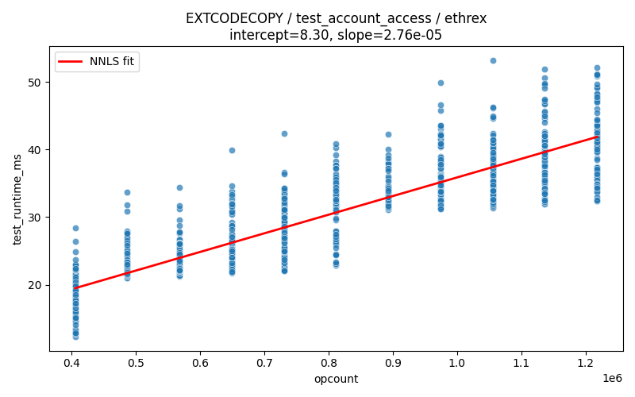

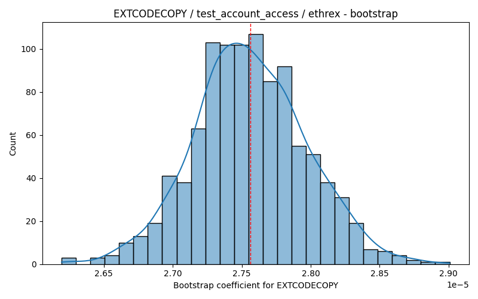

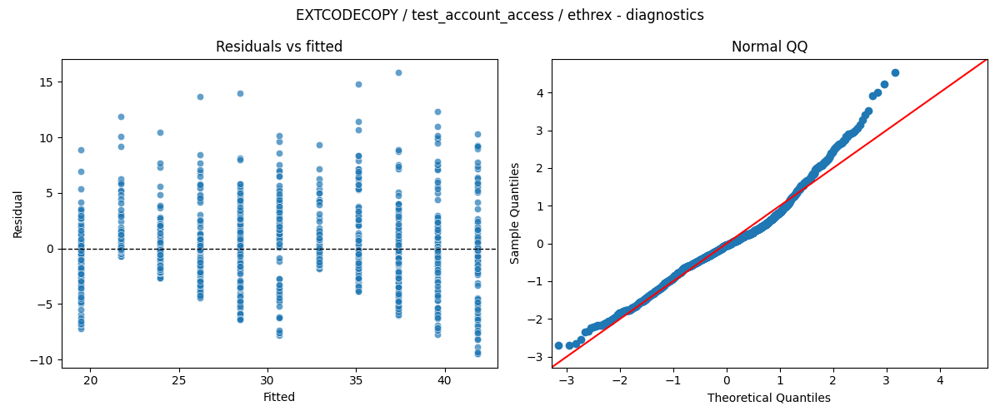

</details>

<details><summary>geth — NNLS regression summary</summary>

```
==============================================================================
                           NNLS Regression Results                            
==============================================================================
Dep. Variable:          test_runtime_ms              R-squared:          0.934
Model:                  NNLS                    Adj. R-squared:          0.934
No. Observations:       924                               RMSE:          23.32
Df Residuals:           922                                MAE:          18.32
Df Model:               1      
==============================================================================
                      coef     std err     P-value      [0.025      0.975]
------------------------------------------------------------------------------
         const     17.1068      2.2698       0.001     12.8862     21.4784
       opcount      0.0003      0.0000       0.001      0.0003      0.0003
==============================================================================
Notes: Non-negative least squares with bootstrap inference (1000 iterations)
==============================================================================
```

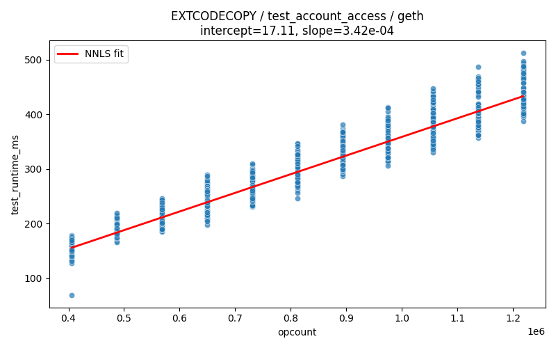

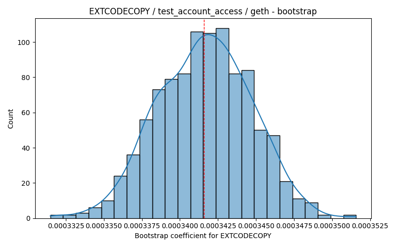

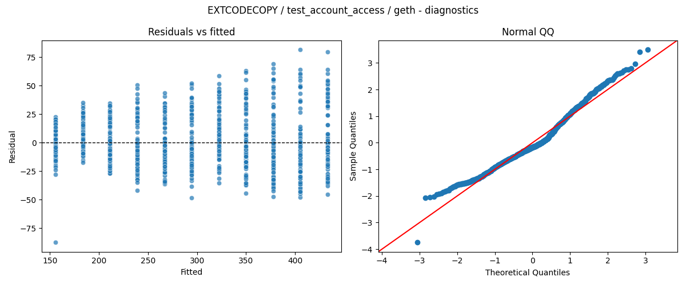

</details>

<details><summary>nethermind — NNLS regression summary</summary>

```
==============================================================================
                           NNLS Regression Results                            
==============================================================================
Dep. Variable:          test_runtime_ms              R-squared:          0.803
Model:                  NNLS                    Adj. R-squared:          0.802
No. Observations:       495                               RMSE:          45.19
Df Residuals:           493                                MAE:          32.87
Df Model:               1      
==============================================================================
                      coef     std err     P-value      [0.025      0.975]
------------------------------------------------------------------------------
         const    123.1844      5.6306       0.001    111.7990    133.8933
       opcount      0.0004      0.0000       0.001      0.0003      0.0004
==============================================================================
Notes: Non-negative least squares with bootstrap inference (1000 iterations)
==============================================================================
```

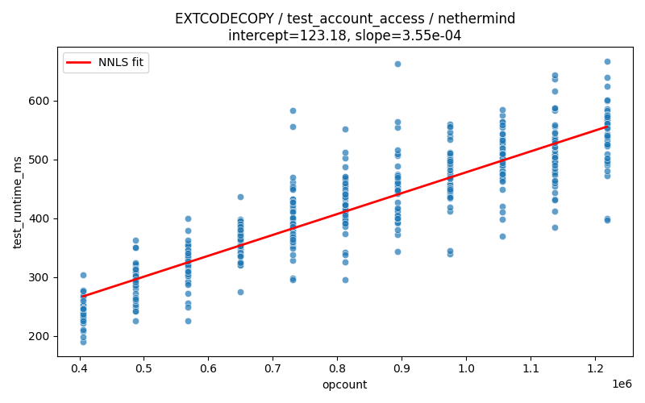

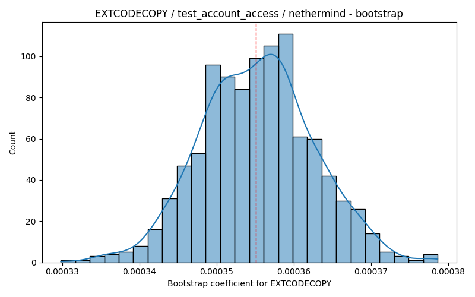

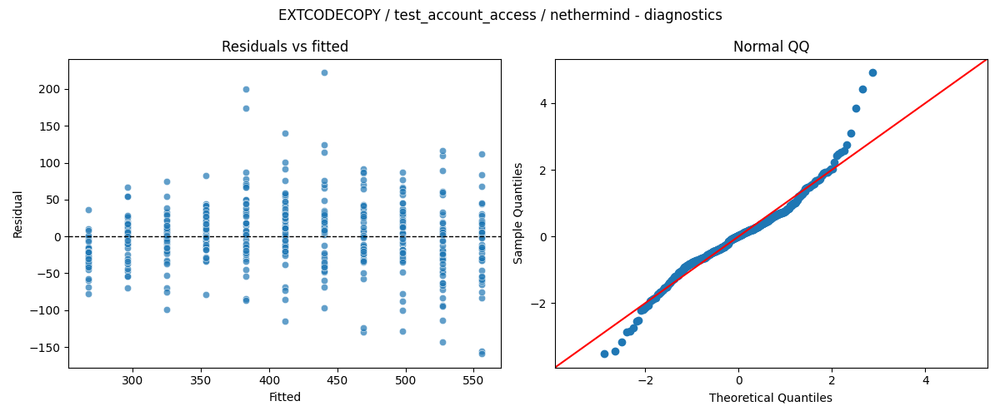

</details>

<details><summary>reth — NNLS regression summary</summary>

```
==============================================================================
                           NNLS Regression Results                            
==============================================================================
Dep. Variable:          test_runtime_ms              R-squared:          0.708
Model:                  NNLS                    Adj. R-squared:          0.707
No. Observations:       385                               RMSE:           2.75
Df Residuals:           383                                MAE:           1.90
Df Model:               1      
==============================================================================
                      coef     std err     P-value      [0.025      0.975]
------------------------------------------------------------------------------
         const      5.9448      0.4941       0.001      5.0647      6.9848
       opcount      0.0000      0.0000       0.001      0.0000      0.0000
==============================================================================
Notes: Non-negative least squares with bootstrap inference (1000 iterations)
==============================================================================
```

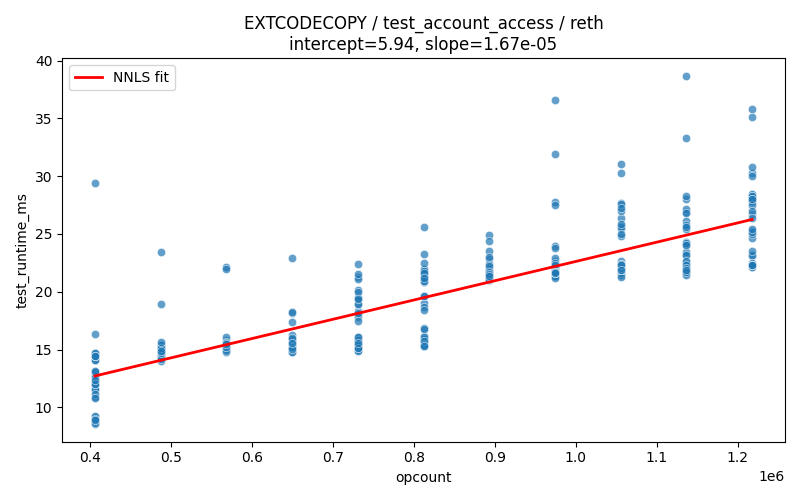

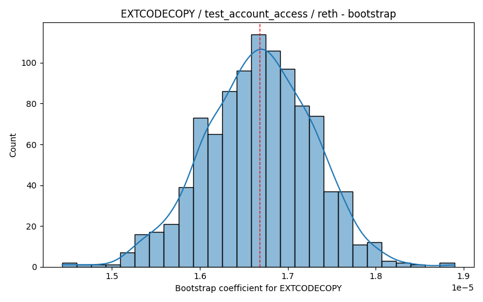

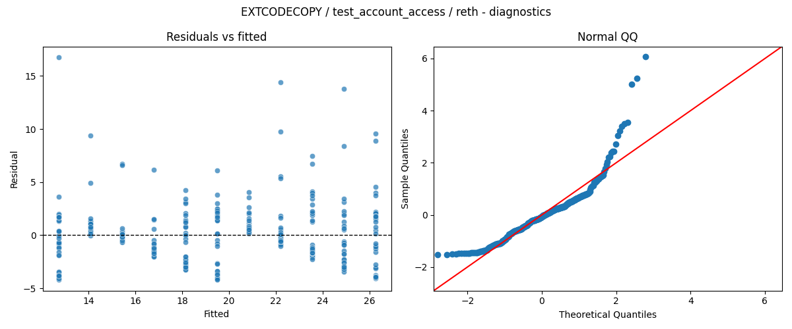

</details>

### test_account_access — combo `EXTCODECOPY_AccountMode.EXISTING_CONTRACT`

| client | nobs | R² | target_coef (ms) | p-value | 95% CI |
| --- | --- | --- | --- | --- | --- |
| `besu` | 1309 | 0.6931 | 0.001798 | 1.00e-03 | [0.001736, 0.001863] |
| `erigon` | 385 | 0.9249 | 0.0003083 | 1.00e-03 | [0.0002995, 0.0003166] |
| `ethrex` | 1276 | 0.8673 | 0.0001787 | 1.00e-03 | [0.0001747, 0.0001826] |
| `geth` | 924 | 0.8692 | 0.0007338 | 1.00e-03 | [0.0007143, 0.0007516] |
| `nethermind` | 495 | 0.9042 | 0.001383 | 1.00e-03 | [0.001342, 0.001422] |
| `reth` | 385 | 0.7804 | 8.088e-05 | 1.00e-03 | [7.573e-05, 8.601e-05] |

<details><summary>besu — NNLS regression summary</summary>

```
==============================================================================
                           NNLS Regression Results                            
==============================================================================
Dep. Variable:          test_runtime_ms              R-squared:          0.693
Model:                  NNLS                    Adj. R-squared:          0.693
No. Observations:       1309                              RMSE:         118.21
Df Residuals:           1307                               MAE:          88.46
Df Model:               1      
==============================================================================
                      coef     std err     P-value      [0.025      0.975]
------------------------------------------------------------------------------
         const    436.4434     10.8784       0.001    414.7137    456.2850
       opcount      0.0018      0.0000       0.001      0.0017      0.0019
==============================================================================
Notes: Non-negative least squares with bootstrap inference (1000 iterations)
==============================================================================
```

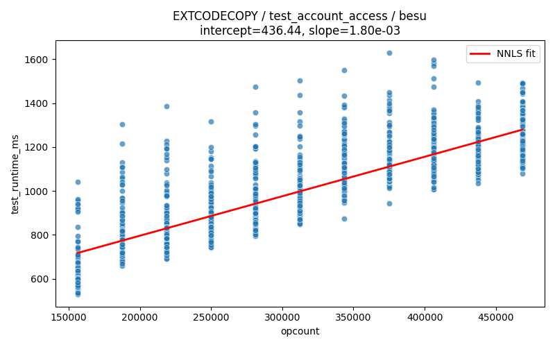

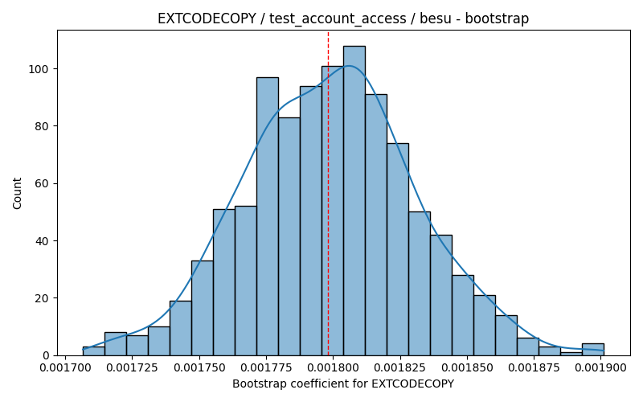

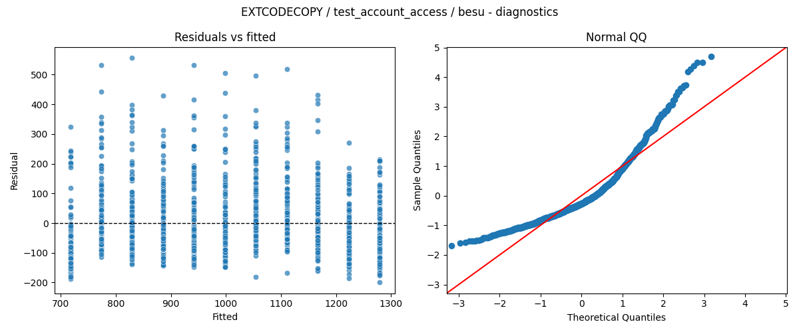

</details>

<details><summary>erigon — NNLS regression summary</summary>

```
==============================================================================
                           NNLS Regression Results                            
==============================================================================
Dep. Variable:          test_runtime_ms              R-squared:          0.925
Model:                  NNLS                    Adj. R-squared:          0.925
No. Observations:       385                               RMSE:           8.68
Df Residuals:           383                                MAE:           6.96
Df Model:               1      
==============================================================================
                      coef     std err     P-value      [0.025      0.975]
------------------------------------------------------------------------------
         const     38.5760      1.5750       0.001     35.5187     41.8715
       opcount      0.0003      0.0000       0.001      0.0003      0.0003
==============================================================================
Notes: Non-negative least squares with bootstrap inference (1000 iterations)
==============================================================================
```

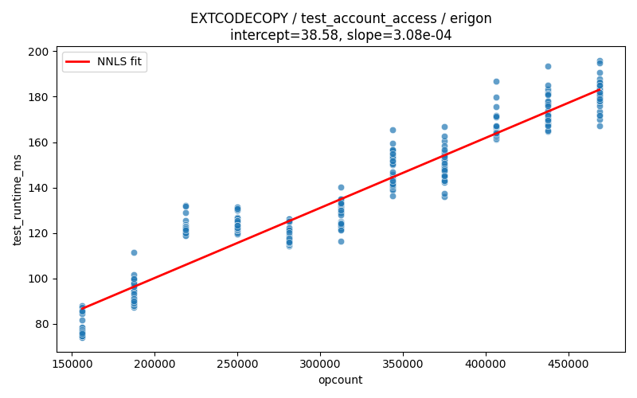

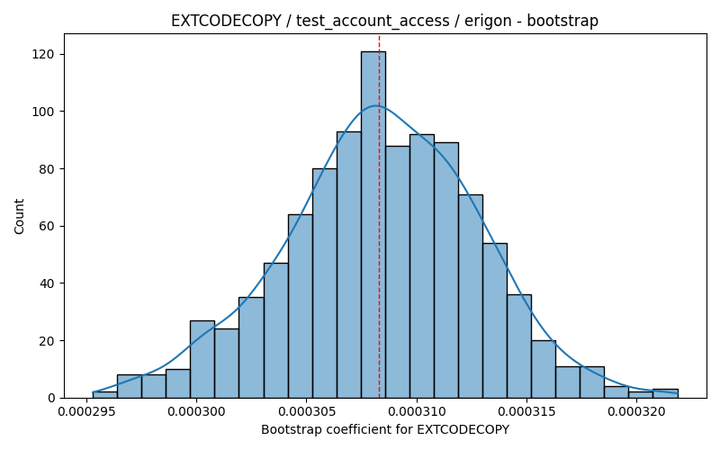

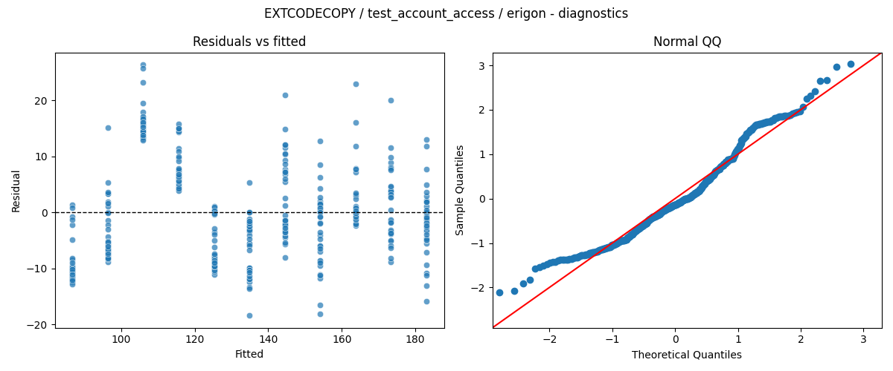

</details>

<details><summary>ethrex — NNLS regression summary</summary>

```
==============================================================================
                           NNLS Regression Results                            
==============================================================================
Dep. Variable:          test_runtime_ms              R-squared:          0.867
Model:                  NNLS                    Adj. R-squared:          0.867
No. Observations:       1276                              RMSE:           6.90
Df Residuals:           1274                               MAE:           4.97
Df Model:               1      
==============================================================================
                      coef     std err     P-value      [0.025      0.975]
------------------------------------------------------------------------------
         const     18.4031      0.5713       0.001     17.2623     19.5516
       opcount      0.0002      0.0000       0.001      0.0002      0.0002
==============================================================================
Notes: Non-negative least squares with bootstrap inference (1000 iterations)
==============================================================================
```

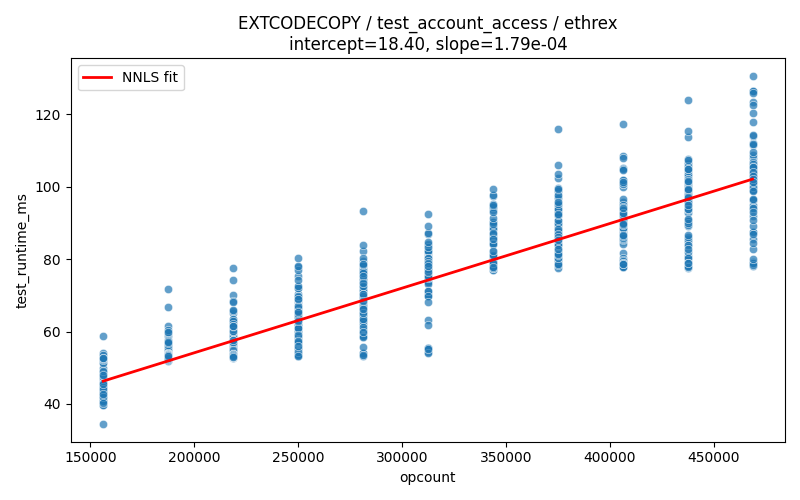

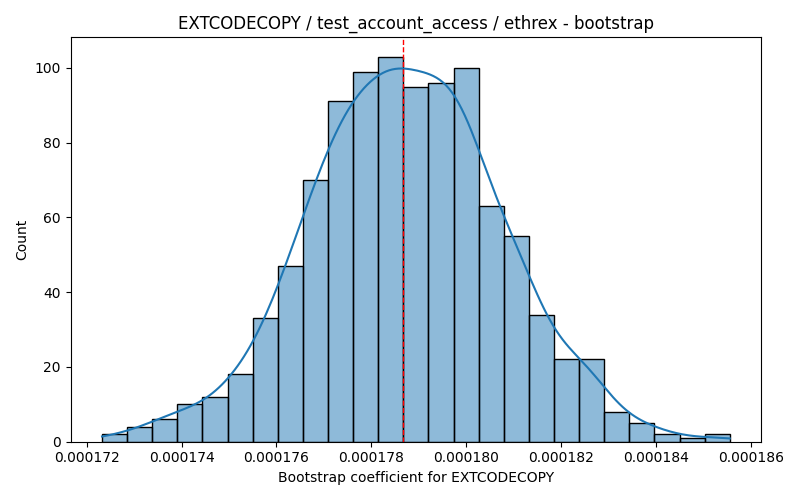

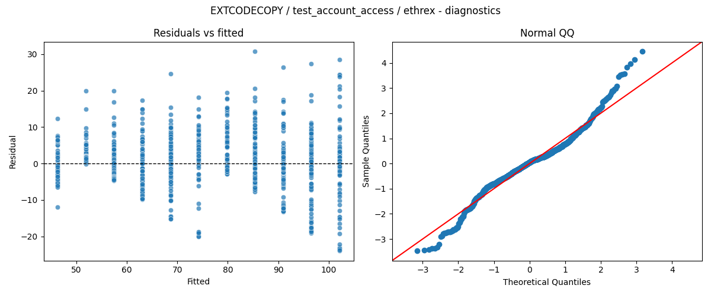

</details>

<details><summary>geth — NNLS regression summary</summary>

```
==============================================================================
                           NNLS Regression Results                            
==============================================================================
Dep. Variable:          test_runtime_ms              R-squared:          0.869
Model:                  NNLS                    Adj. R-squared:          0.869
No. Observations:       924                               RMSE:          28.12
Df Residuals:           922                                MAE:          22.50
Df Model:               1      
==============================================================================
                      coef     std err     P-value      [0.025      0.975]
------------------------------------------------------------------------------
         const     47.8812      2.8066       0.001     42.8144     53.2872
       opcount      0.0007      0.0000       0.001      0.0007      0.0008
==============================================================================
Notes: Non-negative least squares with bootstrap inference (1000 iterations)
==============================================================================
```

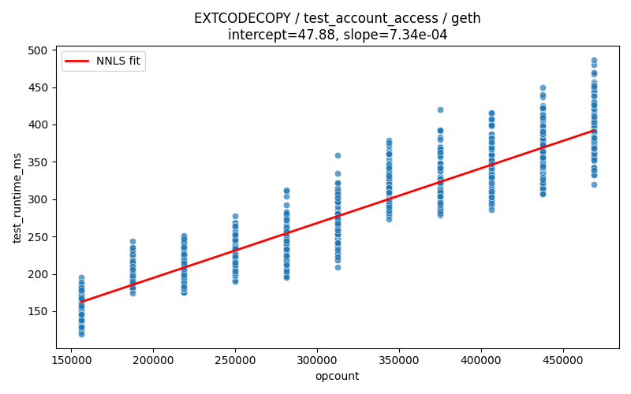

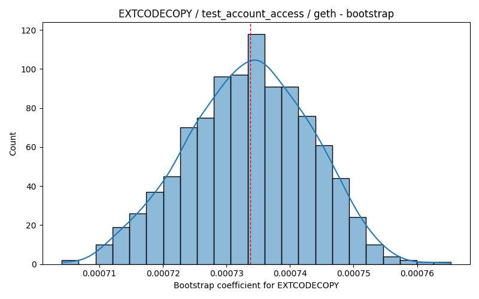

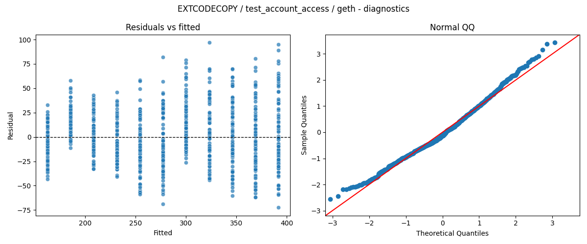

</details>

<details><summary>nethermind — NNLS regression summary</summary>

```
==============================================================================
                           NNLS Regression Results                            
==============================================================================
Dep. Variable:          test_runtime_ms              R-squared:          0.904
Model:                  NNLS                    Adj. R-squared:          0.904
No. Observations:       495                               RMSE:          44.47
Df Residuals:           493                                MAE:          33.14
Df Model:               1      
==============================================================================
                      coef     std err     P-value      [0.025      0.975]
------------------------------------------------------------------------------
         const    165.7509      6.1604       0.001    154.2767    177.7688
       opcount      0.0014      0.0000       0.001      0.0013      0.0014
==============================================================================
Notes: Non-negative least squares with bootstrap inference (1000 iterations)
==============================================================================
```

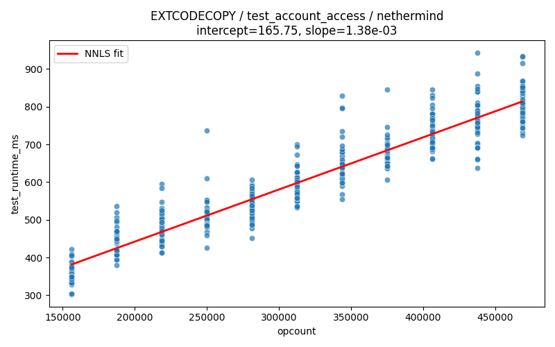

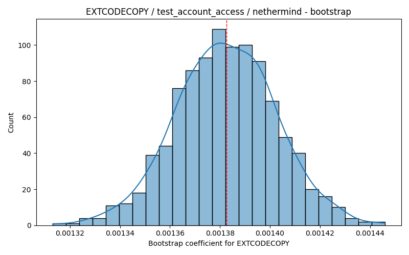

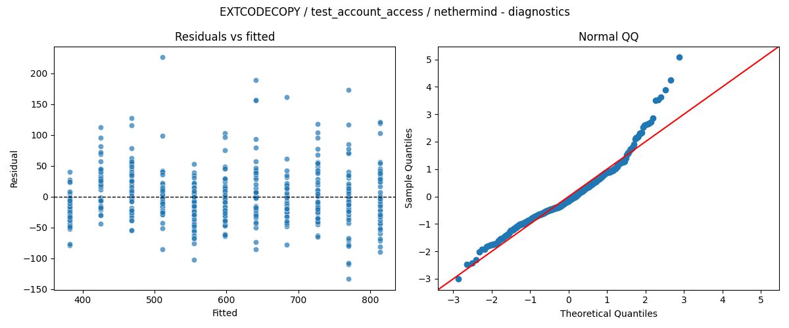

</details>

<details><summary>reth — NNLS regression summary</summary>

```
==============================================================================
                           NNLS Regression Results                            
==============================================================================
Dep. Variable:          test_runtime_ms              R-squared:          0.780
Model:                  NNLS                    Adj. R-squared:          0.780
No. Observations:       385                               RMSE:           4.24
Df Residuals:           383                                MAE:           3.30
Df Model:               1      
==============================================================================
                      coef     std err     P-value      [0.025      0.975]
------------------------------------------------------------------------------
         const     10.7186      0.7794       0.001      9.1734     12.2146
       opcount      0.0001      0.0000       0.001      0.0001      0.0001
==============================================================================
Notes: Non-negative least squares with bootstrap inference (1000 iterations)
==============================================================================
```

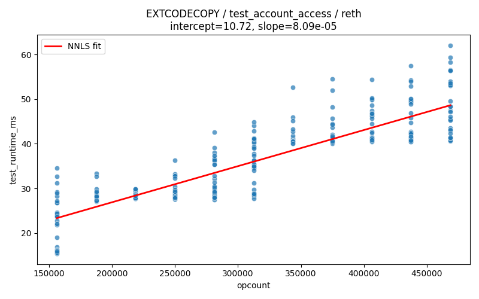

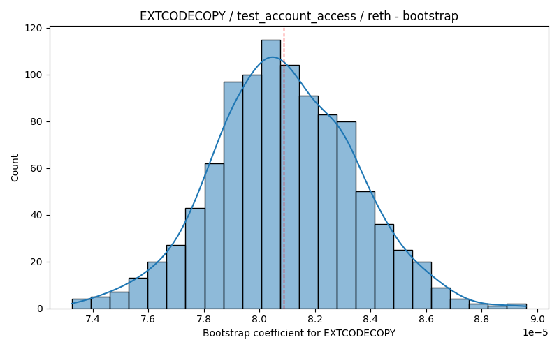

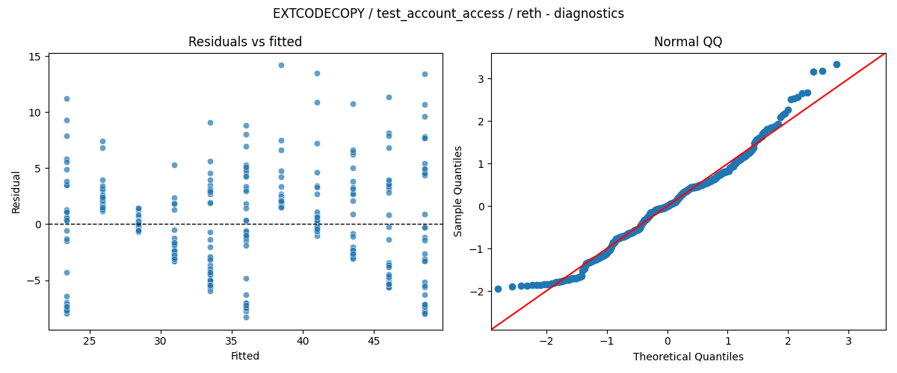

</details>

### test_account_access — combo `EXTCODECOPY_AccountMode.NON_EXISTING_ACCOUNT` — `presets[cold_account_code_access]`

| client | nobs | R² | target_coef (ms) | p-value | 95% CI |
| --- | --- | --- | --- | --- | --- |
| `besu` | 1309 | 0.6228 | 0.000379 | 1.00e-03 | [0.0003632, 0.0003935] |
| `erigon` | 385 | 0.8541 | 6.221e-05 | 1.00e-03 | [5.947e-05, 6.463e-05] |
| `ethrex` | 1276 | 0.8046 | 2.756e-05 | 1.00e-03 | [2.677e-05, 2.837e-05] |
| `geth` | 924 | 0.9339 | 0.0003416 | 1.00e-03 | [0.0003357, 0.0003473] |
| `nethermind` | 495 | 0.8028 | 0.0003551 | 1.00e-03 | [0.0003414, 0.0003693] |
| `reth` | 385 | 0.708 | 1.668e-05 | 1.00e-03 | [1.541e-05, 1.782e-05] |

<details><summary>besu — NNLS regression summary</summary>

```
==============================================================================
                           NNLS Regression Results                            
==============================================================================
Dep. Variable:          test_runtime_ms              R-squared:          0.623
Model:                  NNLS                    Adj. R-squared:          0.622
No. Observations:       1309                              RMSE:          75.73
Df Residuals:           1307                               MAE:          55.94
Df Model:               1      
==============================================================================
                      coef     std err     P-value      [0.025      0.975]
------------------------------------------------------------------------------
         const    236.2689      6.9789       0.001    223.7825    250.1242
       opcount      0.0004      0.0000       0.001      0.0004      0.0004
==============================================================================
Notes: Non-negative least squares with bootstrap inference (1000 iterations)
==============================================================================
```


</details>

<details><summary>erigon — NNLS regression summary</summary>

```
==============================================================================
                           NNLS Regression Results                            
==============================================================================
Dep. Variable:          test_runtime_ms              R-squared:          0.854
Model:                  NNLS                    Adj. R-squared:          0.854
No. Observations:       385                               RMSE:           6.60
Df Residuals:           383                                MAE:           5.39
Df Model:               1      
==============================================================================
                      coef     std err     P-value      [0.025      0.975]
------------------------------------------------------------------------------
         const     36.4926      1.1370       0.001     34.3023     38.9082
       opcount      0.0001      0.0000       0.001      0.0001      0.0001
==============================================================================
Notes: Non-negative least squares with bootstrap inference (1000 iterations)
==============================================================================
```


</details>

<details><summary>ethrex — NNLS regression summary</summary>

```
==============================================================================
                           NNLS Regression Results                            
==============================================================================
Dep. Variable:          test_runtime_ms              R-squared:          0.805
Model:                  NNLS                    Adj. R-squared:          0.804
No. Observations:       1276                              RMSE:           3.49
Df Residuals:           1274                               MAE:           2.58
Df Model:               1      
==============================================================================
                      coef     std err     P-value      [0.025      0.975]
------------------------------------------------------------------------------
         const      8.2971      0.3104       0.001      7.6915      8.9064
       opcount      0.0000      0.0000       0.001      0.0000      0.0000
==============================================================================
Notes: Non-negative least squares with bootstrap inference (1000 iterations)
==============================================================================
```


</details>

<details><summary>geth — NNLS regression summary</summary>

```
==============================================================================
                           NNLS Regression Results                            
==============================================================================
Dep. Variable:          test_runtime_ms              R-squared:          0.934
Model:                  NNLS                    Adj. R-squared:          0.934
No. Observations:       924                               RMSE:          23.32
Df Residuals:           922                                MAE:          18.32
Df Model:               1      
==============================================================================
                      coef     std err     P-value      [0.025      0.975]
------------------------------------------------------------------------------
         const     17.1068      2.2698       0.001     12.8862     21.4784
       opcount      0.0003      0.0000       0.001      0.0003      0.0003
==============================================================================
Notes: Non-negative least squares with bootstrap inference (1000 iterations)
==============================================================================
```


</details>

<details><summary>nethermind — NNLS regression summary</summary>

```
==============================================================================
                           NNLS Regression Results                            
==============================================================================
Dep. Variable:          test_runtime_ms              R-squared:          0.803
Model:                  NNLS                    Adj. R-squared:          0.802
No. Observations:       495                               RMSE:          45.19
Df Residuals:           493                                MAE:          32.87
Df Model:               1      
==============================================================================
                      coef     std err     P-value      [0.025      0.975]
------------------------------------------------------------------------------
         const    123.1844      5.6306       0.001    111.7990    133.8933
       opcount      0.0004      0.0000       0.001      0.0003      0.0004
==============================================================================
Notes: Non-negative least squares with bootstrap inference (1000 iterations)
==============================================================================
```


</details>

<details><summary>reth — NNLS regression summary</summary>

```
==============================================================================
                           NNLS Regression Results                            
==============================================================================
Dep. Variable:          test_runtime_ms              R-squared:          0.708
Model:                  NNLS                    Adj. R-squared:          0.707
No. Observations:       385                               RMSE:           2.75
Df Residuals:           383                                MAE:           1.90
Df Model:               1      
==============================================================================
                      coef     std err     P-value      [0.025      0.975]
------------------------------------------------------------------------------
         const      5.9448      0.4941       0.001      5.0647      6.9848
       opcount      0.0000      0.0000       0.001      0.0000      0.0000
==============================================================================
Notes: Non-negative least squares with bootstrap inference (1000 iterations)
==============================================================================
```


</details>

## EXTCODEHASH

### test_account_access — combo `EXTCODEHASH_AccountMode.NON_EXISTING_ACCOUNT` — `presets[cold_account_nocode_access]`

| client | nobs | R² | target_coef (ms) | p-value | 95% CI |
| --- | --- | --- | --- | --- | --- |
| `besu` | 1309 | 0.7814 | 0.01024 | 1.00e-03 | [0.009936, 0.01054] |
| `erigon` | 385 | 0.9713 | 0.008341 | 1.00e-03 | [0.008179, 0.008457] |
| `ethrex` | 1276 | 0.9966 | 0.002646 | 1.00e-03 | [0.002643, 0.002649] |
| `geth` | 924 | 0.6695 | 0.02671 | 1.00e-03 | [0.0254, 0.02797] |
| `nethermind` | 495 | 0.9114 | 0.003964 | 1.00e-03 | [0.00385, 0.004084] |
| `reth` | 385 | 0.9705 | 0.0009006 | 1.00e-03 | [0.0008849, 0.0009169] |

<details><summary>besu — NNLS regression summary</summary>

```
==============================================================================
                           NNLS Regression Results                            
==============================================================================
Dep. Variable:          test_runtime_ms              R-squared:          0.781
Model:                  NNLS                    Adj. R-squared:          0.781
No. Observations:       1309                              RMSE:         129.42
Df Residuals:           1307                               MAE:         110.54
Df Model:               1      
==============================================================================
                      coef     std err     P-value      [0.025      0.975]
------------------------------------------------------------------------------
         const    427.5180     11.6235       0.001    403.9812    450.4045
       opcount      0.0102      0.0002       0.001      0.0099      0.0105
==============================================================================
Notes: Non-negative least squares with bootstrap inference (1000 iterations)
==============================================================================
```

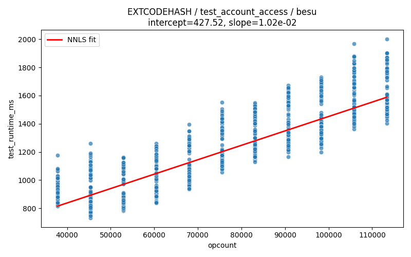

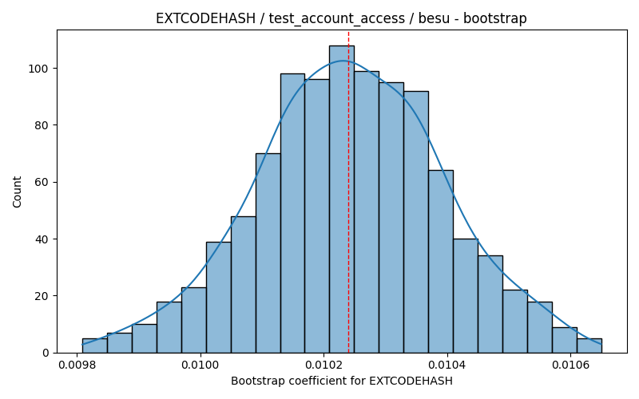

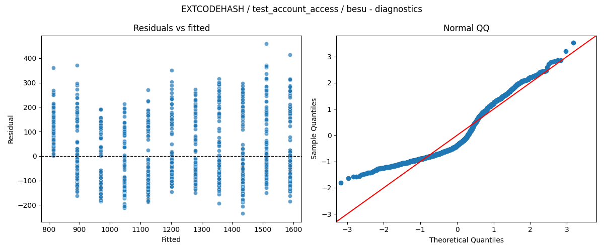

</details>

<details><summary>erigon — NNLS regression summary</summary>

```
==============================================================================
                           NNLS Regression Results                            
==============================================================================
Dep. Variable:          test_runtime_ms              R-squared:          0.971
Model:                  NNLS                    Adj. R-squared:          0.971
No. Observations:       385                               RMSE:          34.27
Df Residuals:           383                                MAE:          27.69
Df Model:               1      
==============================================================================
                      coef     std err     P-value      [0.025      0.975]
------------------------------------------------------------------------------
         const      6.2900      4.7093       0.103      0.0000     16.9126
       opcount      0.0083      0.0001       0.001      0.0082      0.0085
==============================================================================
Notes: Non-negative least squares with bootstrap inference (1000 iterations)
==============================================================================
```

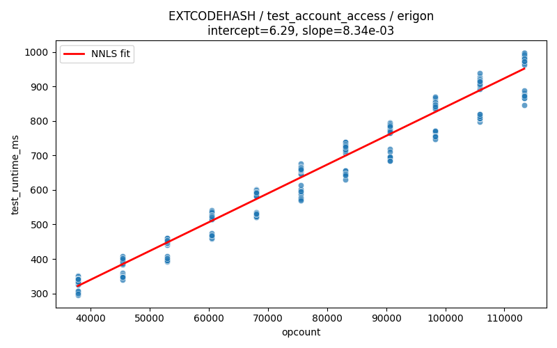

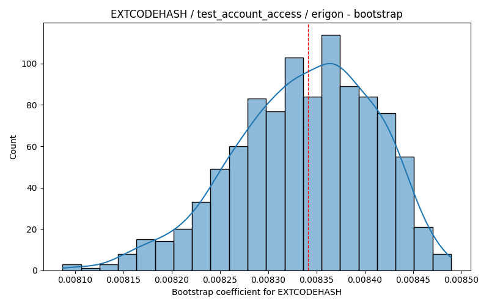

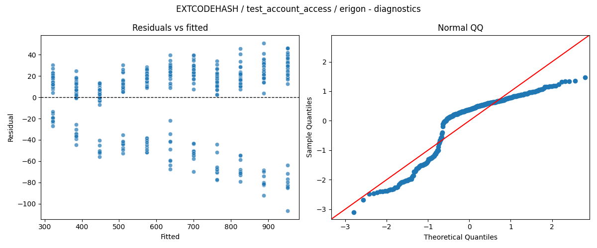

</details>

<details><summary>ethrex — NNLS regression summary</summary>

```
==============================================================================
                           NNLS Regression Results                            
==============================================================================
Dep. Variable:          test_runtime_ms              R-squared:          0.997
Model:                  NNLS                    Adj. R-squared:          0.997
No. Observations:       1276                              RMSE:           3.75
Df Residuals:           1274                               MAE:           2.98
Df Model:               1      
==============================================================================
                      coef     std err     P-value      [0.025      0.975]
------------------------------------------------------------------------------
         const      0.0000      0.0000       1.000      0.0000      0.0000
       opcount      0.0026      0.0000       0.001      0.0026      0.0026
==============================================================================
Notes: Non-negative least squares with bootstrap inference (1000 iterations)
==============================================================================
```

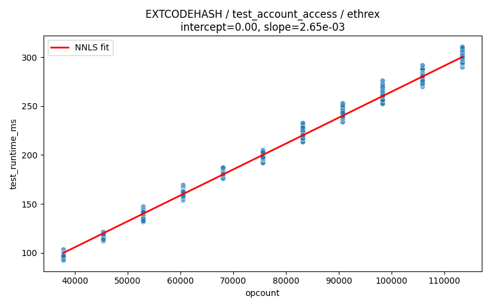

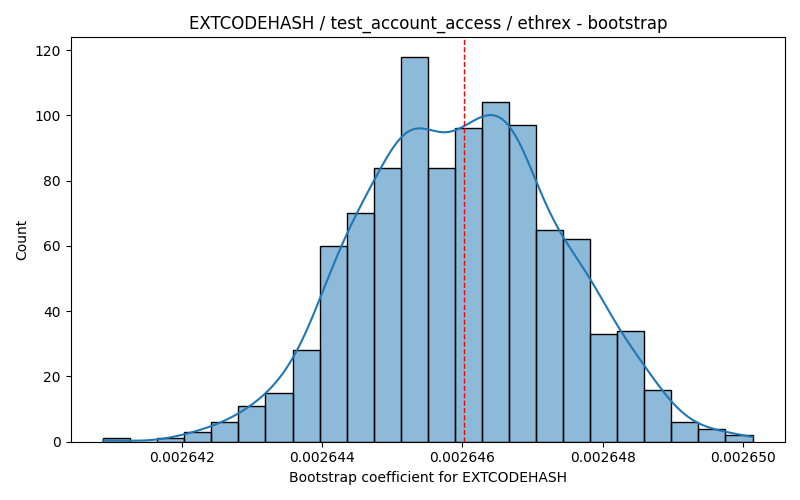

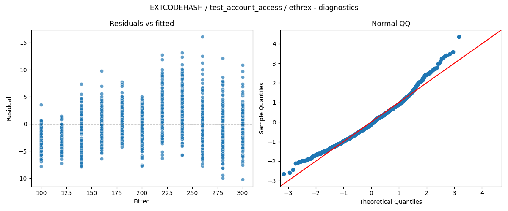

</details>

<details><summary>geth — NNLS regression summary</summary>

```
==============================================================================
                           NNLS Regression Results                            
==============================================================================
Dep. Variable:          test_runtime_ms              R-squared:          0.670
Model:                  NNLS                    Adj. R-squared:          0.669
No. Observations:       924                               RMSE:         448.51
Df Residuals:           922                                MAE:         372.57
Df Model:               1      
==============================================================================
                      coef     std err     P-value      [0.025      0.975]
------------------------------------------------------------------------------
         const   1209.5593     52.7106       0.001   1109.2492   1309.9437
       opcount      0.0267      0.0007       0.001      0.0254      0.0280
==============================================================================
Notes: Non-negative least squares with bootstrap inference (1000 iterations)
==============================================================================
```

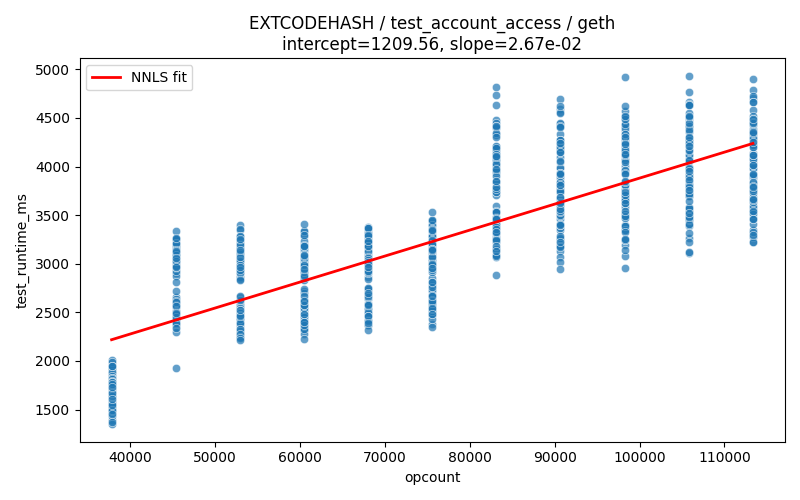

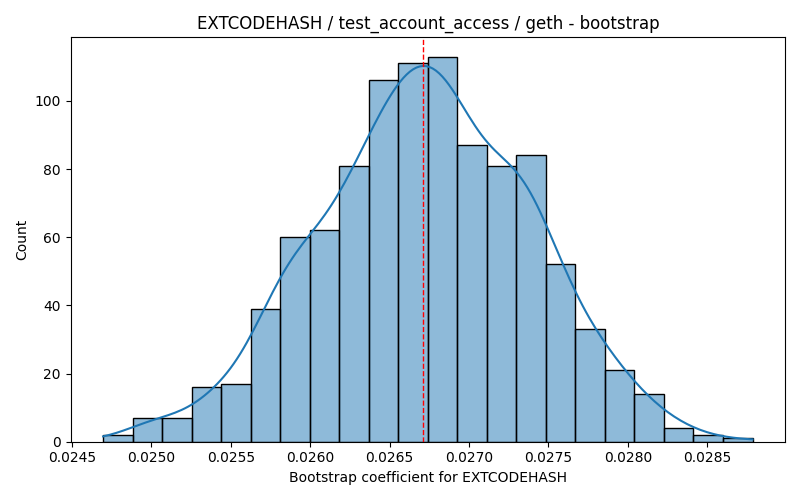

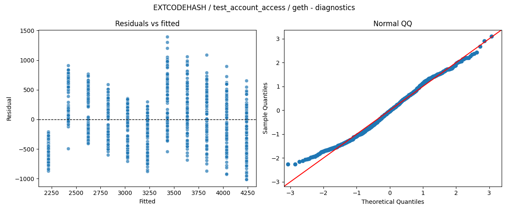

</details>

<details><summary>nethermind — NNLS regression summary</summary>

```
==============================================================================
                           NNLS Regression Results                            
==============================================================================
Dep. Variable:          test_runtime_ms              R-squared:          0.911
Model:                  NNLS                    Adj. R-squared:          0.911
No. Observations:       495                               RMSE:          29.54
Df Residuals:           493                                MAE:          21.23
Df Model:               1      
==============================================================================
                      coef     std err     P-value      [0.025      0.975]
------------------------------------------------------------------------------
         const     79.2684      4.0244       0.001     71.7199     86.9695
       opcount      0.0040      0.0001       0.001      0.0038      0.0041
==============================================================================
Notes: Non-negative least squares with bootstrap inference (1000 iterations)
==============================================================================
```

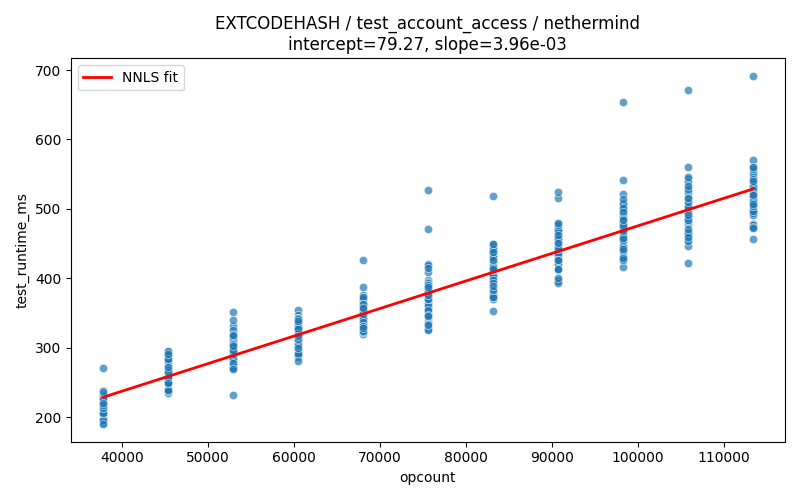

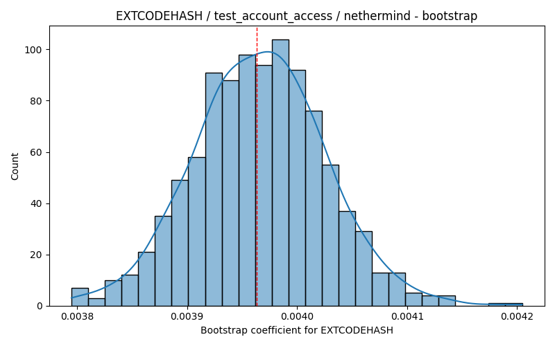

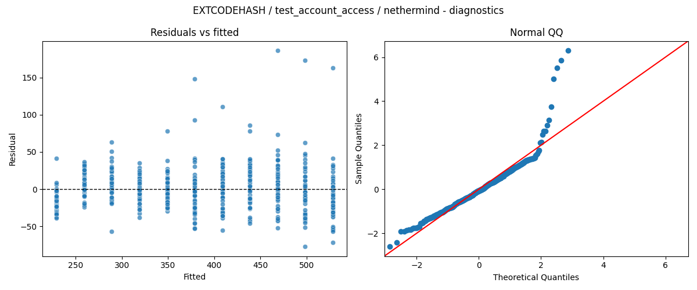

</details>

<details><summary>reth — NNLS regression summary</summary>

```
==============================================================================
                           NNLS Regression Results                            
==============================================================================
Dep. Variable:          test_runtime_ms              R-squared:          0.970
Model:                  NNLS                    Adj. R-squared:          0.970
No. Observations:       385                               RMSE:           3.75
Df Residuals:           383                                MAE:           2.98
Df Model:               1      
==============================================================================
                      coef     std err     P-value      [0.025      0.975]
------------------------------------------------------------------------------
         const     32.7925      0.6781       0.001     31.4496     34.0950
       opcount      0.0009      0.0000       0.001      0.0009      0.0009
==============================================================================
Notes: Non-negative least squares with bootstrap inference (1000 iterations)
==============================================================================
```

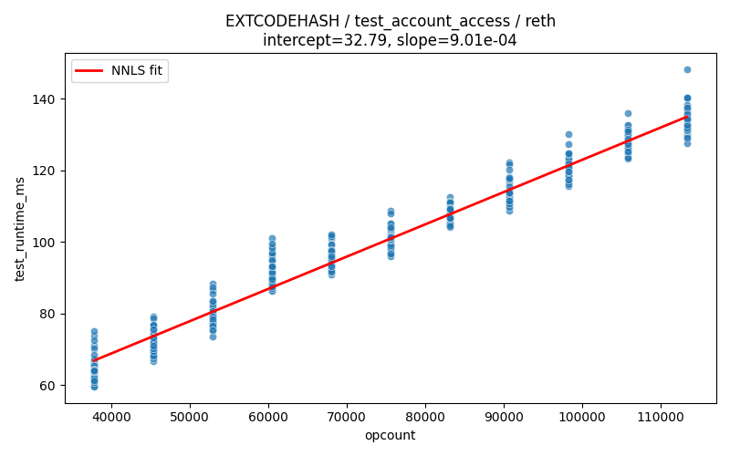

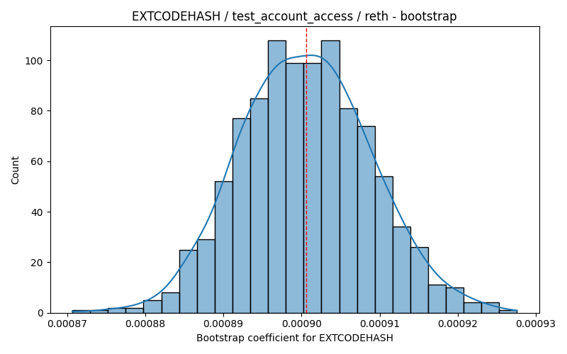

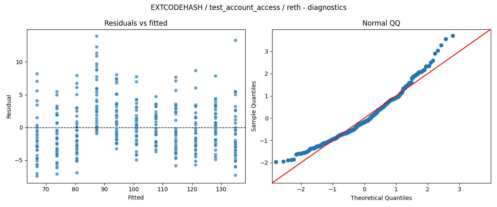

</details>

### test_account_access — combo `EXTCODEHASH_AccountMode.EXISTING_CONTRACT`

| client | nobs | R² | target_coef (ms) | p-value | 95% CI |
| --- | --- | --- | --- | --- | --- |
| `besu` | 1309 | 0.8515 | 0.02718 | 1.00e-03 | [0.02662, 0.02777] |
| `erigon` | 385 | 0.9122 | 0.03463 | 1.00e-03 | [0.03351, 0.03563] |
| `ethrex` | 1276 | 0.9726 | 0.02509 | 1.00e-03 | [0.0248, 0.02533] |
| `geth` | 924 | 0.6761 | 0.02813 | 1.00e-03 | [0.02675, 0.02949] |
| `nethermind` | 495 | 0.7359 | 0.02542 | 1.00e-03 | [0.02409, 0.02676] |
| `reth` | 385 | 0.896 | 0.03556 | 1.00e-03 | [0.03401, 0.03712] |

<details><summary>besu — NNLS regression summary</summary>

```
==============================================================================
                           NNLS Regression Results                            
==============================================================================
Dep. Variable:          test_runtime_ms              R-squared:          0.851
Model:                  NNLS                    Adj. R-squared:          0.851
No. Observations:       1309                              RMSE:         236.15
Df Residuals:           1307                               MAE:         194.88
Df Model:               1      
==============================================================================
                      coef     std err     P-value      [0.025      0.975]
------------------------------------------------------------------------------
         const    425.7045     18.6591       0.001    388.2644    461.1441
       opcount      0.0272      0.0003       0.001      0.0266      0.0278
==============================================================================
Notes: Non-negative least squares with bootstrap inference (1000 iterations)
==============================================================================
```

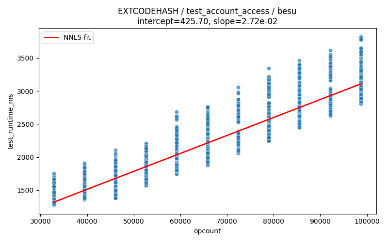

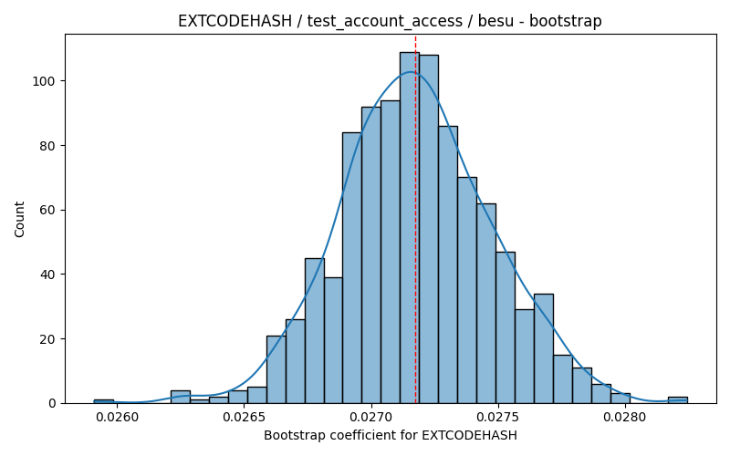

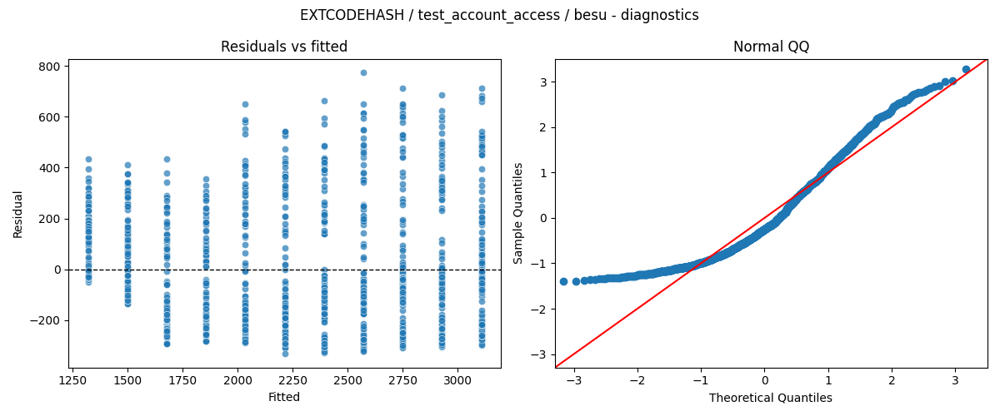

</details>

<details><summary>erigon — NNLS regression summary</summary>

```
==============================================================================
                           NNLS Regression Results                            
==============================================================================
Dep. Variable:          test_runtime_ms              R-squared:          0.912
Model:                  NNLS                    Adj. R-squared:          0.912
No. Observations:       385                               RMSE:         223.48
Df Residuals:           383                                MAE:         191.96
Df Model:               1      
==============================================================================
                      coef     std err     P-value      [0.025      0.975]
------------------------------------------------------------------------------
         const    382.5978     39.7611       0.001    307.0729    464.3145
       opcount      0.0346      0.0005       0.001      0.0335      0.0356
==============================================================================
Notes: Non-negative least squares with bootstrap inference (1000 iterations)
==============================================================================
```

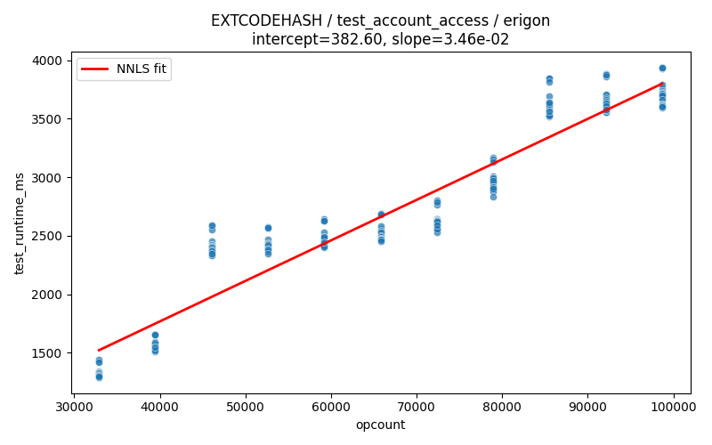

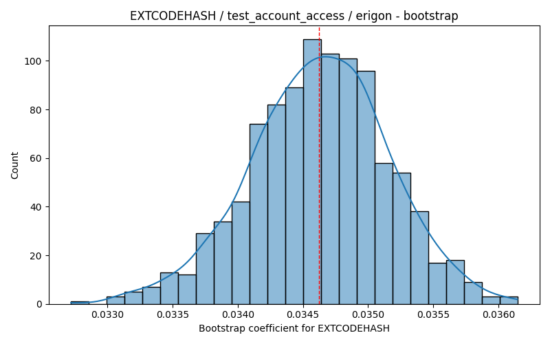

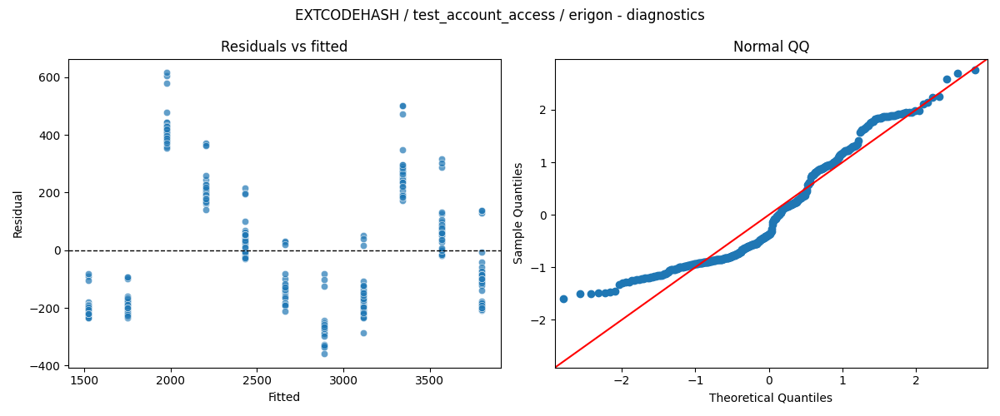

</details>

<details><summary>ethrex — NNLS regression summary</summary>

```
==============================================================================
                           NNLS Regression Results                            
==============================================================================
Dep. Variable:          test_runtime_ms              R-squared:          0.973
Model:                  NNLS                    Adj. R-squared:          0.973
No. Observations:       1276                              RMSE:          87.54
Df Residuals:           1274                               MAE:          75.21
Df Model:               1      
==============================================================================
                      coef     std err     P-value      [0.025      0.975]
------------------------------------------------------------------------------
         const    362.2373     10.3952       0.001    343.2319    384.0113
       opcount      0.0251      0.0001       0.001      0.0248      0.0253
==============================================================================
Notes: Non-negative least squares with bootstrap inference (1000 iterations)
==============================================================================
```

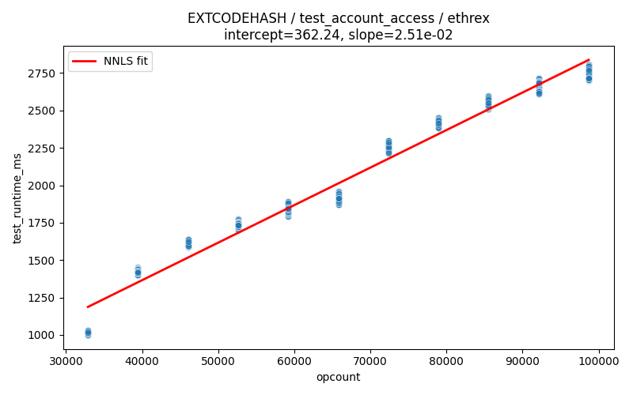

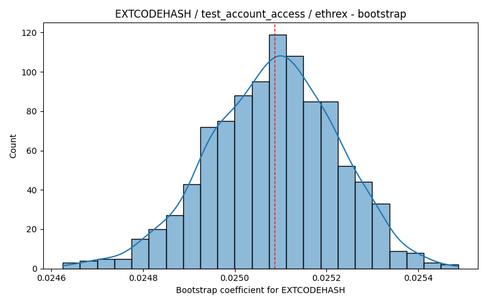

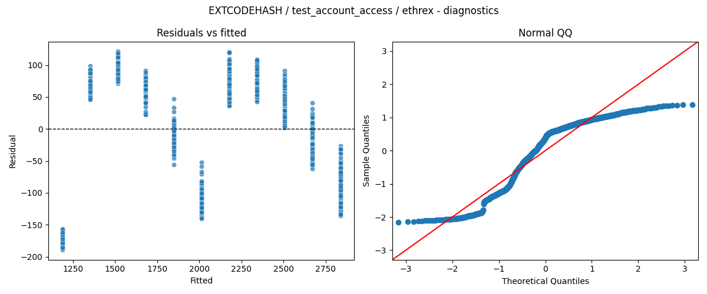

</details>

<details><summary>geth — NNLS regression summary</summary>

```
==============================================================================
                           NNLS Regression Results                            
==============================================================================
Dep. Variable:          test_runtime_ms              R-squared:          0.676
Model:                  NNLS                    Adj. R-squared:          0.676
No. Observations:       924                               RMSE:         405.12
Df Residuals:           922                                MAE:         336.22
Df Model:               1      
==============================================================================
                      coef     std err     P-value      [0.025      0.975]
------------------------------------------------------------------------------
         const   1128.0355     47.5941       0.001   1033.8519   1222.3582
       opcount      0.0281      0.0007       0.001      0.0267      0.0295
==============================================================================
Notes: Non-negative least squares with bootstrap inference (1000 iterations)
==============================================================================
```

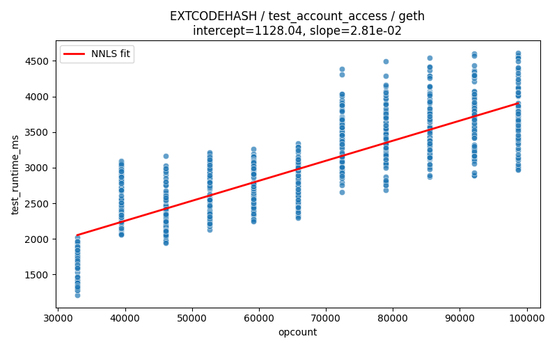

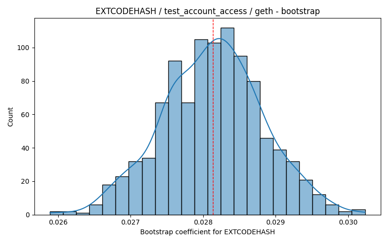


</details>

<details><summary>nethermind — NNLS regression summary</summary>

```
==============================================================================
                           NNLS Regression Results                            
==============================================================================
Dep. Variable:          test_runtime_ms              R-squared:          0.736
Model:                  NNLS                    Adj. R-squared:          0.735
No. Observations:       495                               RMSE:         316.80
Df Residuals:           493                                MAE:         266.65
Df Model:               1      
==============================================================================
                      coef     std err     P-value      [0.025      0.975]
------------------------------------------------------------------------------
         const    819.4173     49.9283       0.001    722.9480    912.5473
       opcount      0.0254      0.0007       0.001      0.0241      0.0268
==============================================================================
Notes: Non-negative least squares with bootstrap inference (1000 iterations)
==============================================================================
```

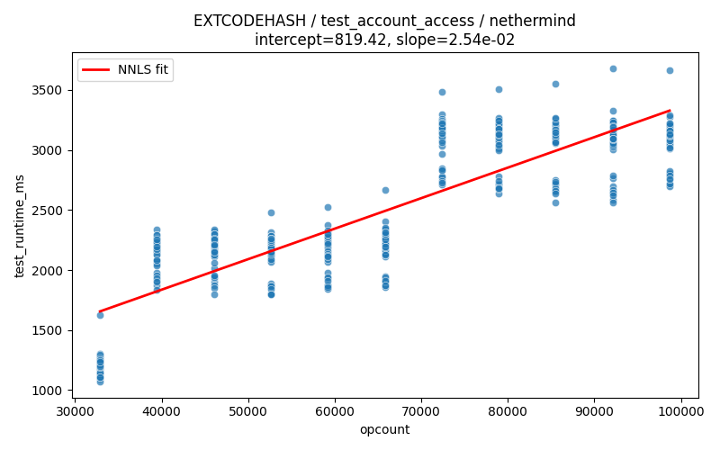

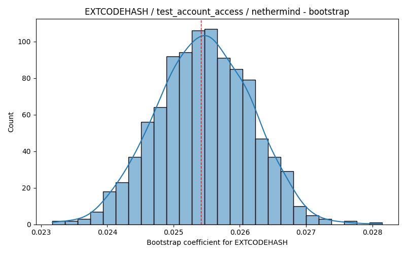

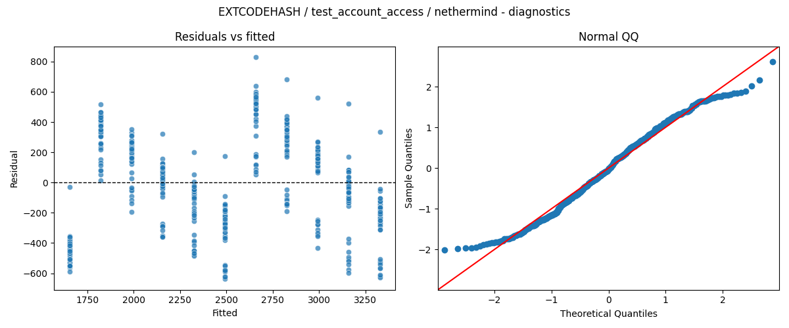

</details>

<details><summary>reth — NNLS regression summary</summary>

```
==============================================================================
                           NNLS Regression Results                            
==============================================================================
Dep. Variable:          test_runtime_ms              R-squared:          0.896
Model:                  NNLS                    Adj. R-squared:          0.896
No. Observations:       385                               RMSE:         252.04
Df Residuals:           383                                MAE:         154.54
Df Model:               1      
==============================================================================
                      coef     std err     P-value      [0.025      0.975]
------------------------------------------------------------------------------
         const    161.9723     50.8374       0.002     63.9355    260.4102
       opcount      0.0356      0.0008       0.001      0.0340      0.0371
==============================================================================
Notes: Non-negative least squares with bootstrap inference (1000 iterations)
==============================================================================
```

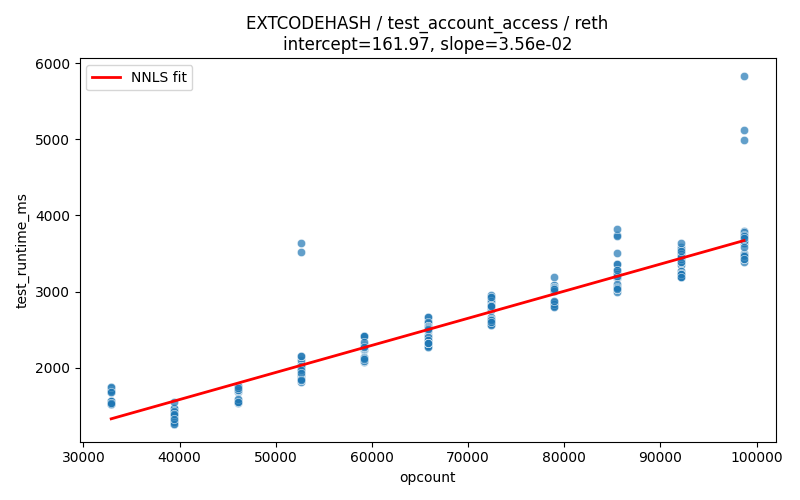

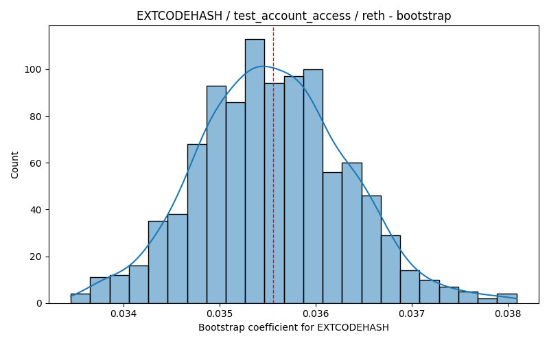

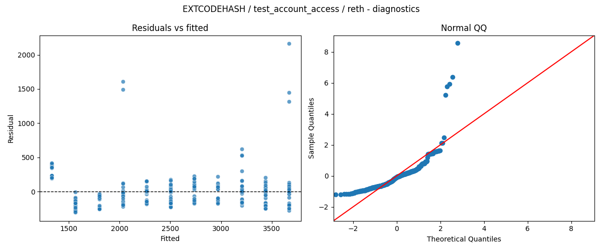

</details>

### test_account_access — combo `EXTCODEHASH_AccountMode.NON_EXISTING_ACCOUNT` — `presets[cold_account_code_access]`

| client | nobs | R² | target_coef (ms) | p-value | 95% CI |
| --- | --- | --- | --- | --- | --- |
| `besu` | 1309 | 0.7814 | 0.01024 | 1.00e-03 | [0.009936, 0.01054] |
| `erigon` | 385 | 0.9713 | 0.008341 | 1.00e-03 | [0.008179, 0.008457] |
| `ethrex` | 1276 | 0.9966 | 0.002646 | 1.00e-03 | [0.002643, 0.002649] |
| `geth` | 924 | 0.6695 | 0.02671 | 1.00e-03 | [0.0254, 0.02797] |
| `nethermind` | 495 | 0.9114 | 0.003964 | 1.00e-03 | [0.00385, 0.004084] |
| `reth` | 385 | 0.9705 | 0.0009006 | 1.00e-03 | [0.0008849, 0.0009169] |

<details><summary>besu — NNLS regression summary</summary>

```
==============================================================================
                           NNLS Regression Results                            
==============================================================================
Dep. Variable:          test_runtime_ms              R-squared:          0.781
Model:                  NNLS                    Adj. R-squared:          0.781
No. Observations:       1309                              RMSE:         129.42
Df Residuals:           1307                               MAE:         110.54
Df Model:               1      
==============================================================================
                      coef     std err     P-value      [0.025      0.975]
------------------------------------------------------------------------------
         const    427.5180     11.6235       0.001    403.9812    450.4045
       opcount      0.0102      0.0002       0.001      0.0099      0.0105
==============================================================================
Notes: Non-negative least squares with bootstrap inference (1000 iterations)
==============================================================================
```


</details>

<details><summary>erigon — NNLS regression summary</summary>

```
==============================================================================
                           NNLS Regression Results                            
==============================================================================
Dep. Variable:          test_runtime_ms              R-squared:          0.971
Model:                  NNLS                    Adj. R-squared:          0.971
No. Observations:       385                               RMSE:          34.27
Df Residuals:           383                                MAE:          27.69
Df Model:               1      
==============================================================================
                      coef     std err     P-value      [0.025      0.975]
------------------------------------------------------------------------------
         const      6.2900      4.7093       0.103      0.0000     16.9126
       opcount      0.0083      0.0001       0.001      0.0082      0.0085
==============================================================================
Notes: Non-negative least squares with bootstrap inference (1000 iterations)
==============================================================================
```


</details>

<details><summary>ethrex — NNLS regression summary</summary>

```
==============================================================================
                           NNLS Regression Results                            
==============================================================================
Dep. Variable:          test_runtime_ms              R-squared:          0.997
Model:                  NNLS                    Adj. R-squared:          0.997
No. Observations:       1276                              RMSE:           3.75
Df Residuals:           1274                               MAE:           2.98
Df Model:               1      
==============================================================================
                      coef     std err     P-value      [0.025      0.975]
------------------------------------------------------------------------------
         const      0.0000      0.0000       1.000      0.0000      0.0000
       opcount      0.0026      0.0000       0.001      0.0026      0.0026
==============================================================================
Notes: Non-negative least squares with bootstrap inference (1000 iterations)
==============================================================================
```


</details>

<details><summary>geth — NNLS regression summary</summary>

```
==============================================================================
                           NNLS Regression Results                            
==============================================================================
Dep. Variable:          test_runtime_ms              R-squared:          0.670
Model:                  NNLS                    Adj. R-squared:          0.669
No. Observations:       924                               RMSE:         448.51
Df Residuals:           922                                MAE:         372.57
Df Model:               1      
==============================================================================
                      coef     std err     P-value      [0.025      0.975]
------------------------------------------------------------------------------
         const   1209.5593     52.7106       0.001   1109.2492   1309.9437
       opcount      0.0267      0.0007       0.001      0.0254      0.0280
==============================================================================
Notes: Non-negative least squares with bootstrap inference (1000 iterations)
==============================================================================
```


</details>

<details><summary>nethermind — NNLS regression summary</summary>

```
==============================================================================
                           NNLS Regression Results                            
==============================================================================
Dep. Variable:          test_runtime_ms              R-squared:          0.911
Model:                  NNLS                    Adj. R-squared:          0.911
No. Observations:       495                               RMSE:          29.54
Df Residuals:           493                                MAE:          21.23
Df Model:               1      
==============================================================================
                      coef     std err     P-value      [0.025      0.975]
------------------------------------------------------------------------------
         const     79.2684      4.0244       0.001     71.7199     86.9695
       opcount      0.0040      0.0001       0.001      0.0038      0.0041
==============================================================================
Notes: Non-negative least squares with bootstrap inference (1000 iterations)
==============================================================================
```


</details>

<details><summary>reth — NNLS regression summary</summary>

```
==============================================================================
                           NNLS Regression Results                            
==============================================================================
Dep. Variable:          test_runtime_ms              R-squared:          0.970
Model:                  NNLS                    Adj. R-squared:          0.970
No. Observations:       385                               RMSE:           3.75
Df Residuals:           383                                MAE:           2.98
Df Model:               1      
==============================================================================
                      coef     std err     P-value      [0.025      0.975]
------------------------------------------------------------------------------
         const     32.7925      0.6781       0.001     31.4496     34.0950
       opcount      0.0009      0.0000       0.001      0.0009      0.0009
==============================================================================
Notes: Non-negative least squares with bootstrap inference (1000 iterations)
==============================================================================
```


</details>

### test_ext_account_query_warm — combo `EXTCODEHASH`

| client | nobs | R² | target_coef (ms) | p-value | 95% CI |
| --- | --- | --- | --- | --- | --- |
| `besu` | 1309 | 0.6296 | 0.0001516 | 1.00e-03 | [0.0001444, 0.0001581] |
| `erigon` | 385 | 0.8992 | 0.0002698 | 1.00e-03 | [0.0002611, 0.0002787] |
| `ethrex` | 1276 | 0.7792 | 1.039e-05 | 1.00e-03 | [1.006e-05, 1.074e-05] |
| `geth` | 924 | 0.813 | 4.183e-05 | 1.00e-03 | [4.053e-05, 4.317e-05] |
| `nethermind` | 495 | 0.5283 | 0.0002223 | 1.00e-03 | [0.0002051, 0.0002429] |
| `reth` | 385 | 0.6739 | 7.994e-06 | 1.00e-03 | [7.513e-06, 8.518e-06] |

<details><summary>besu — NNLS regression summary</summary>

```
==============================================================================
                           NNLS Regression Results                            
==============================================================================
Dep. Variable:          test_runtime_ms              R-squared:          0.630
Model:                  NNLS                    Adj. R-squared:          0.629
No. Observations:       1309                              RMSE:          67.98
Df Residuals:           1307                               MAE:          50.83
Df Model:               1      
==============================================================================
                      coef     std err     P-value      [0.025      0.975]
------------------------------------------------------------------------------
         const    194.9734      7.1942       0.001    181.4326    209.8176
       opcount      0.0002      0.0000       0.001      0.0001      0.0002
==============================================================================
Notes: Non-negative least squares with bootstrap inference (1000 iterations)
==============================================================================
```

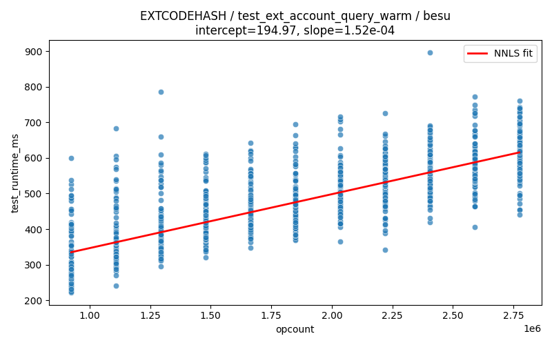

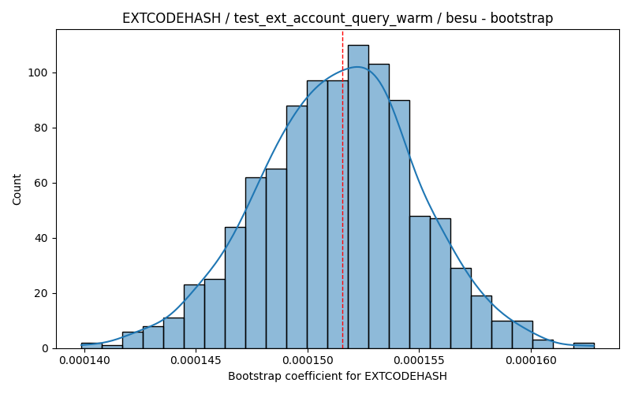

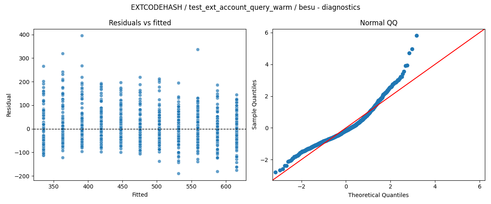

</details>

<details><summary>erigon — NNLS regression summary</summary>

```
==============================================================================
                           NNLS Regression Results                            
==============================================================================
Dep. Variable:          test_runtime_ms              R-squared:          0.899
Model:                  NNLS                    Adj. R-squared:          0.899
No. Observations:       385                               RMSE:          52.82
Df Residuals:           383                                MAE:          44.08
Df Model:               1      
==============================================================================
                      coef     std err     P-value      [0.025      0.975]
------------------------------------------------------------------------------
         const     46.5862      7.4540       0.001     31.8652     61.5710
       opcount      0.0003      0.0000       0.001      0.0003      0.0003
==============================================================================
Notes: Non-negative least squares with bootstrap inference (1000 iterations)
==============================================================================
```

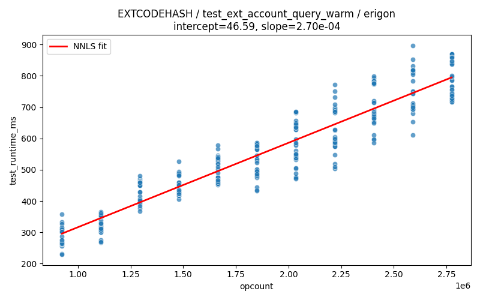

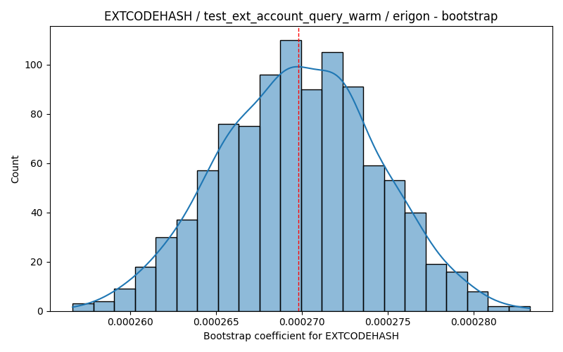

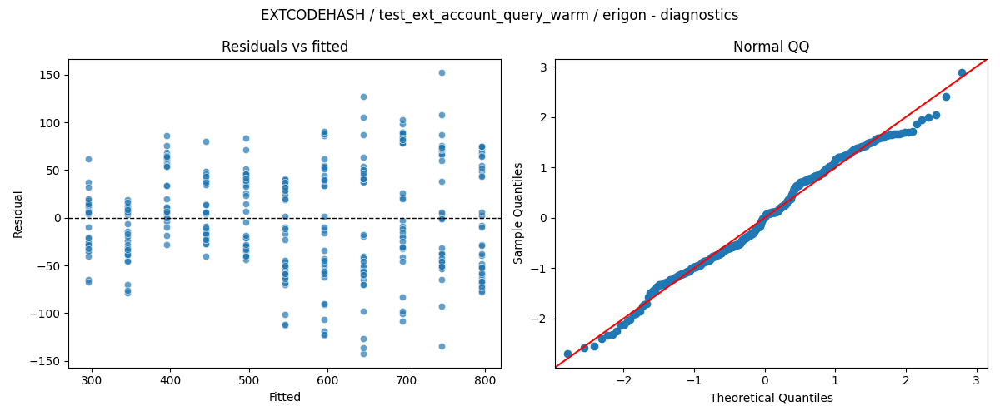

</details>

<details><summary>ethrex — NNLS regression summary</summary>

```
==============================================================================
                           NNLS Regression Results                            
==============================================================================
Dep. Variable:          test_runtime_ms              R-squared:          0.779
Model:                  NNLS                    Adj. R-squared:          0.779
No. Observations:       1276                              RMSE:           3.24
Df Residuals:           1274                               MAE:           2.46
Df Model:               1      
==============================================================================
                      coef     std err     P-value      [0.025      0.975]
------------------------------------------------------------------------------
         const      7.1714      0.2862       0.001      6.5865      7.7496
       opcount      0.0000      0.0000       0.001      0.0000      0.0000
==============================================================================
Notes: Non-negative least squares with bootstrap inference (1000 iterations)
==============================================================================
```

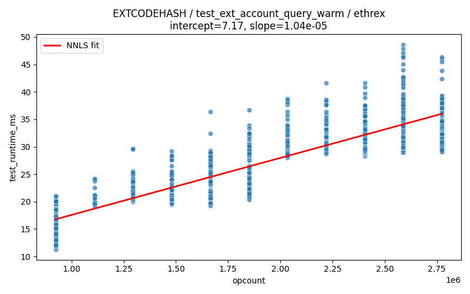

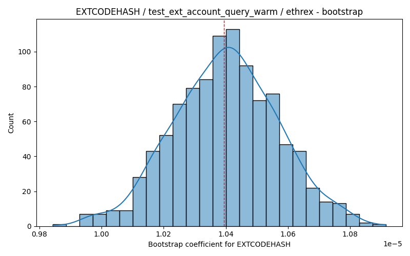

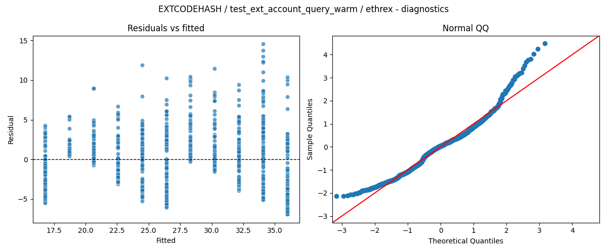

</details>

<details><summary>geth — NNLS regression summary</summary>

```
==============================================================================
                           NNLS Regression Results                            
==============================================================================
Dep. Variable:          test_runtime_ms              R-squared:          0.813
Model:                  NNLS                    Adj. R-squared:          0.813
No. Observations:       924                               RMSE:          11.73
Df Residuals:           922                                MAE:           8.62
Df Model:               1      
==============================================================================
                      coef     std err     P-value      [0.025      0.975]
------------------------------------------------------------------------------
         const     15.8684      1.1328       0.001     13.6119     18.0080
       opcount      0.0000      0.0000       0.001      0.0000      0.0000
==============================================================================
Notes: Non-negative least squares with bootstrap inference (1000 iterations)
==============================================================================
```

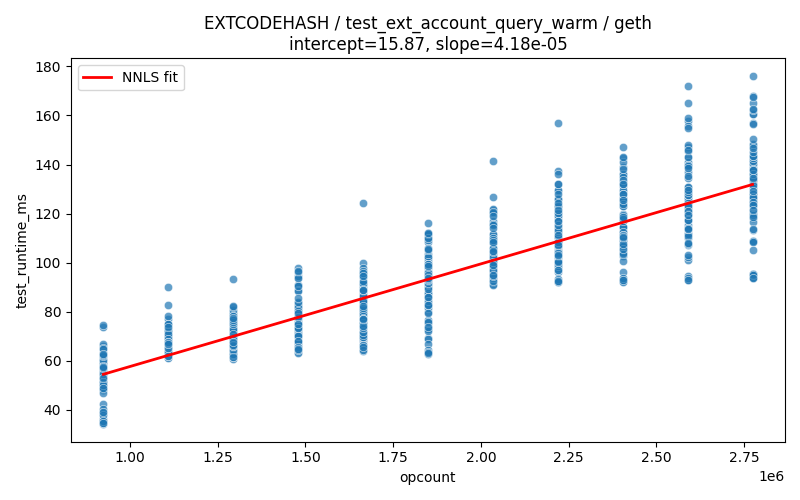

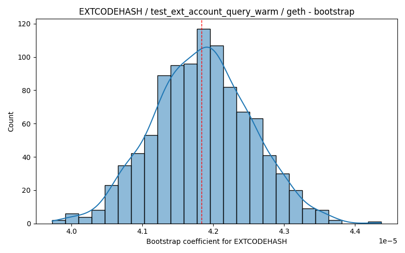

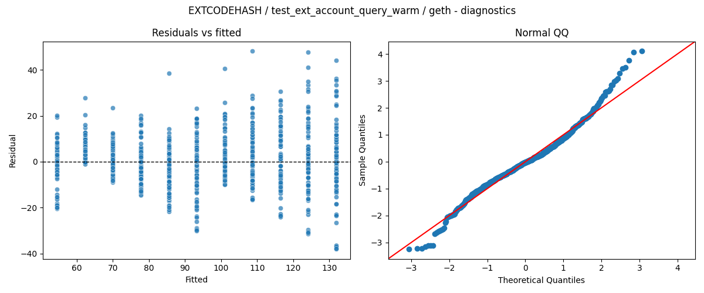

</details>

<details><summary>nethermind — NNLS regression summary</summary>

```
==============================================================================
                           NNLS Regression Results                            
==============================================================================
Dep. Variable:          test_runtime_ms              R-squared:          0.528
Model:                  NNLS                    Adj. R-squared:          0.527
No. Observations:       495                               RMSE:         122.81
Df Residuals:           493                                MAE:         102.73
Df Model:               1      
==============================================================================
                      coef     std err     P-value      [0.025      0.975]
------------------------------------------------------------------------------
         const    130.8864     15.6831       0.001     97.3086    160.0554
       opcount      0.0002      0.0000       0.001      0.0002      0.0002
==============================================================================
Notes: Non-negative least squares with bootstrap inference (1000 iterations)
==============================================================================
```

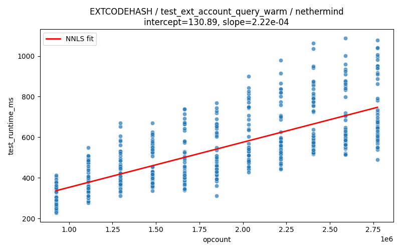

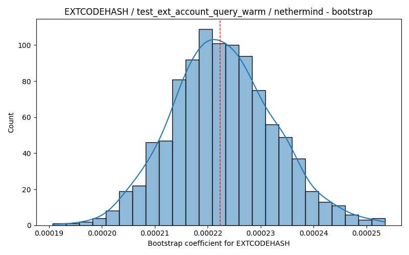

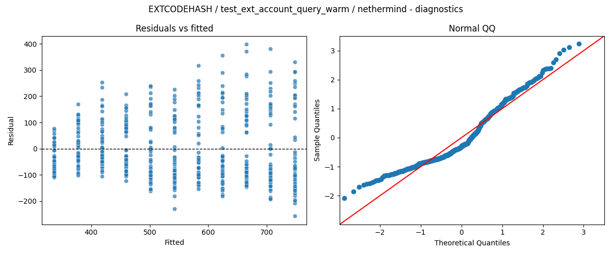

</details>

<details><summary>reth — NNLS regression summary</summary>

```
==============================================================================
                           NNLS Regression Results                            
==============================================================================
Dep. Variable:          test_runtime_ms              R-squared:          0.674
Model:                  NNLS                    Adj. R-squared:          0.673
No. Observations:       385                               RMSE:           3.25
Df Residuals:           383                                MAE:           2.24
Df Model:               1      
==============================================================================
                      coef     std err     P-value      [0.025      0.975]
------------------------------------------------------------------------------
         const      6.0721      0.4773       0.001      5.1408      7.0560
       opcount      0.0000      0.0000       0.001      0.0000      0.0000
==============================================================================
Notes: Non-negative least squares with bootstrap inference (1000 iterations)
==============================================================================
```

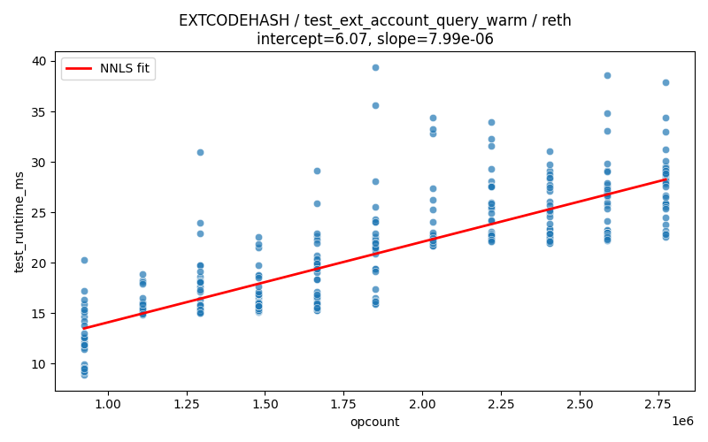

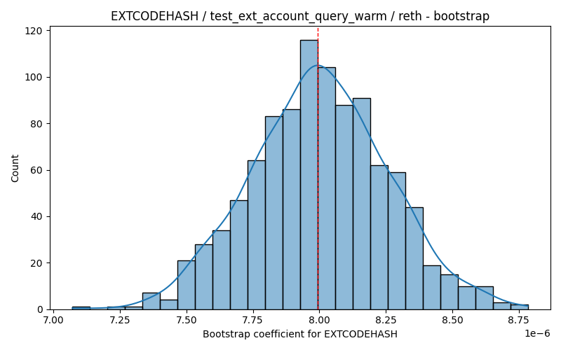

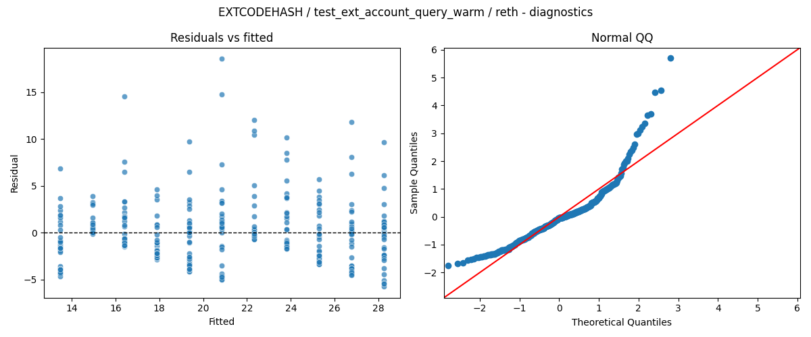

</details>

## EXTCODESIZE

### test_account_access — combo `EXTCODESIZE_AccountMode.NON_EXISTING_ACCOUNT` — `presets[cold_account_nocode_access]`

| client | nobs | R² | target_coef (ms) | p-value | 95% CI |
| --- | --- | --- | --- | --- | --- |
| `besu` | 1309 | 0.7774 | 0.01018 | 1.00e-03 | [0.009884, 0.0105] |
| `erigon` | 385 | 0.9712 | 0.008578 | 1.00e-03 | [0.008408, 0.008699] |
| `ethrex` | 1276 | 0.9961 | 0.002646 | 1.00e-03 | [0.002643, 0.002649] |
| `geth` | 924 | 0.6773 | 0.02713 | 1.00e-03 | [0.02591, 0.02841] |
| `nethermind` | 495 | 0.9267 | 0.003987 | 1.00e-03 | [0.003894, 0.004094] |
| `reth` | 385 | 0.9749 | 0.0009229 | 1.00e-03 | [0.0009077, 0.0009398] |

<details><summary>besu — NNLS regression summary</summary>

```
==============================================================================
                           NNLS Regression Results                            
==============================================================================
Dep. Variable:          test_runtime_ms              R-squared:          0.777
Model:                  NNLS                    Adj. R-squared:          0.777
No. Observations:       1309                              RMSE:         130.16
Df Residuals:           1307                               MAE:         110.44
Df Model:               1      
==============================================================================
                      coef     std err     P-value      [0.025      0.975]
------------------------------------------------------------------------------
         const    431.1873     12.0702       0.001    406.7929    455.1830
       opcount      0.0102      0.0002       0.001      0.0099      0.0105
==============================================================================
Notes: Non-negative least squares with bootstrap inference (1000 iterations)
==============================================================================
```

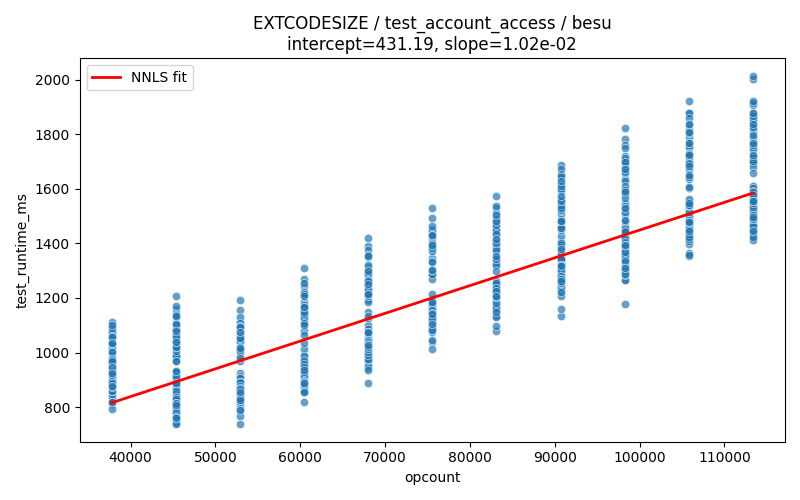

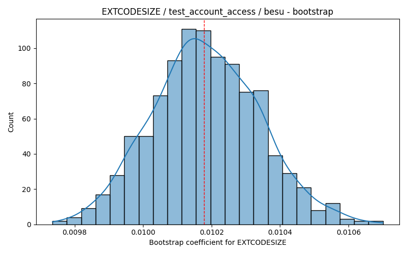

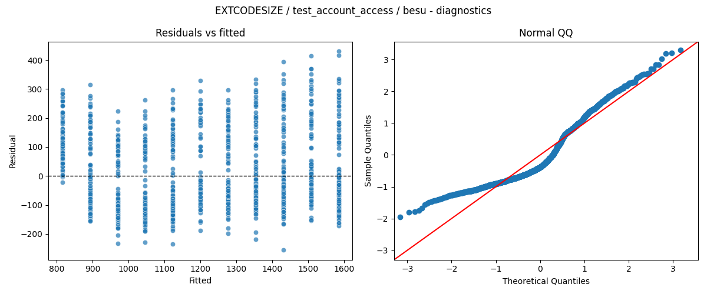

</details>

<details><summary>erigon — NNLS regression summary</summary>

```
==============================================================================
                           NNLS Regression Results                            
==============================================================================
Dep. Variable:          test_runtime_ms              R-squared:          0.971
Model:                  NNLS                    Adj. R-squared:          0.971
No. Observations:       385                               RMSE:          35.33
Df Residuals:           383                                MAE:          28.13
Df Model:               1      
==============================================================================
                      coef     std err     P-value      [0.025      0.975]
------------------------------------------------------------------------------
         const      6.2999      4.8768       0.122      0.0000     17.5189
       opcount      0.0086      0.0001       0.001      0.0084      0.0087
==============================================================================
Notes: Non-negative least squares with bootstrap inference (1000 iterations)
==============================================================================
```

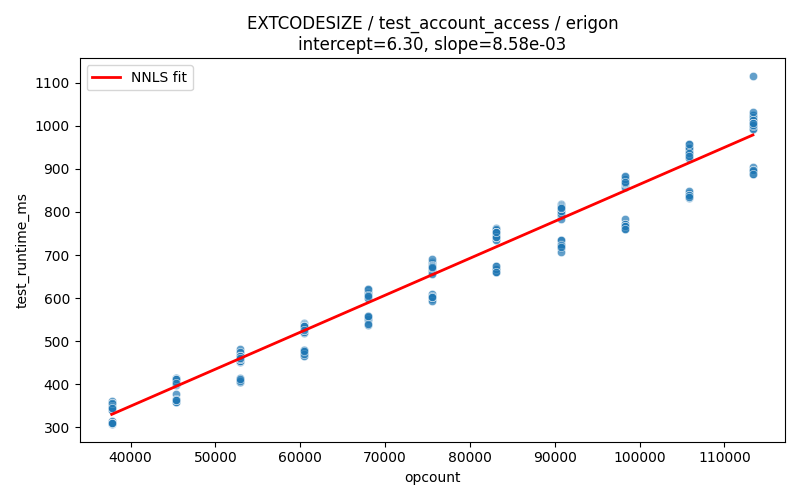

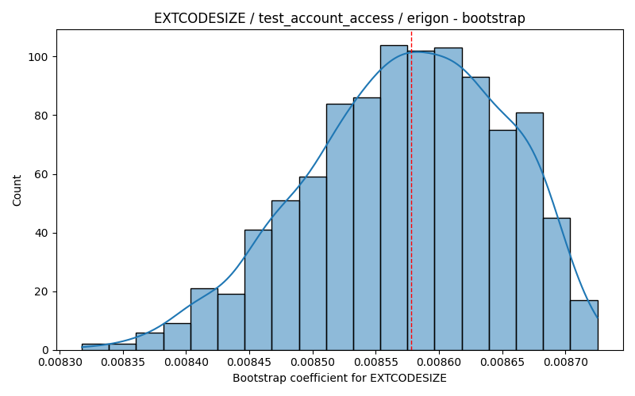

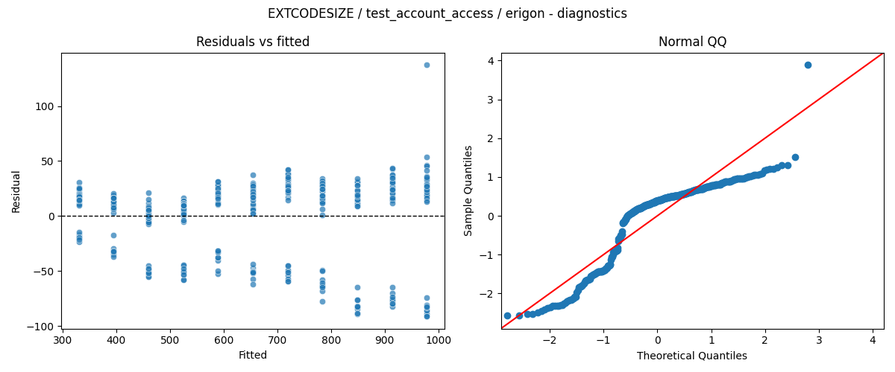

</details>

<details><summary>ethrex — NNLS regression summary</summary>

```
==============================================================================
                           NNLS Regression Results                            
==============================================================================
Dep. Variable:          test_runtime_ms              R-squared:          0.996
Model:                  NNLS                    Adj. R-squared:          0.996
No. Observations:       1276                              RMSE:           3.97
Df Residuals:           1274                               MAE:           3.05
Df Model:               1      
==============================================================================
                      coef     std err     P-value      [0.025      0.975]
------------------------------------------------------------------------------
         const      0.0000      0.0000       1.000      0.0000      0.0000
       opcount      0.0026      0.0000       0.001      0.0026      0.0026
==============================================================================
Notes: Non-negative least squares with bootstrap inference (1000 iterations)
==============================================================================
```

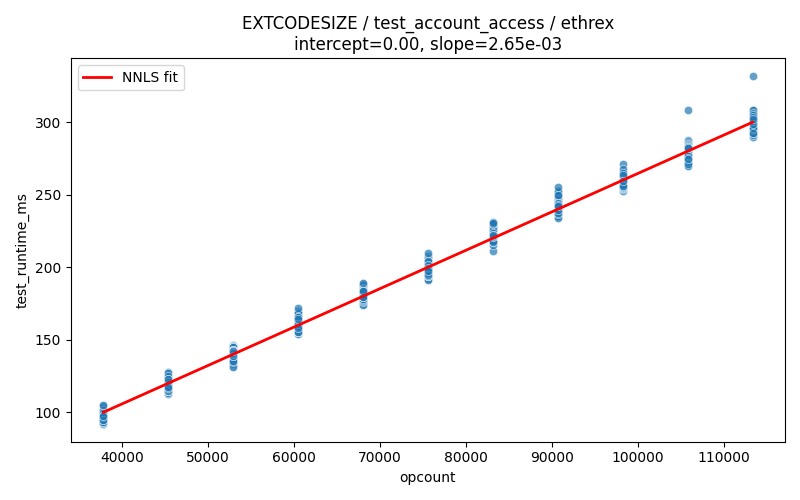

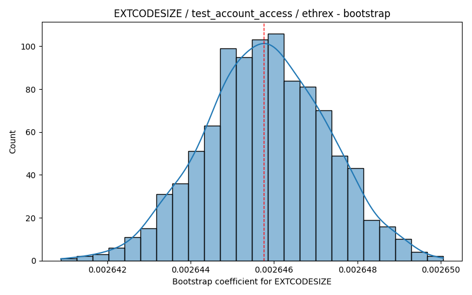

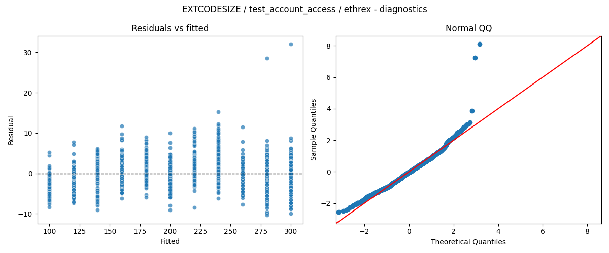

</details>

<details><summary>geth — NNLS regression summary</summary>

```
==============================================================================
                           NNLS Regression Results                            
==============================================================================
Dep. Variable:          test_runtime_ms              R-squared:          0.677
Model:                  NNLS                    Adj. R-squared:          0.677
No. Observations:       924                               RMSE:         447.56
Df Residuals:           922                                MAE:         373.87
Df Model:               1      
==============================================================================
                      coef     std err     P-value      [0.025      0.975]
------------------------------------------------------------------------------
         const   1180.8220     50.0275       0.001   1079.0681   1275.4907
       opcount      0.0271      0.0006       0.001      0.0259      0.0284
==============================================================================
Notes: Non-negative least squares with bootstrap inference (1000 iterations)
==============================================================================
```

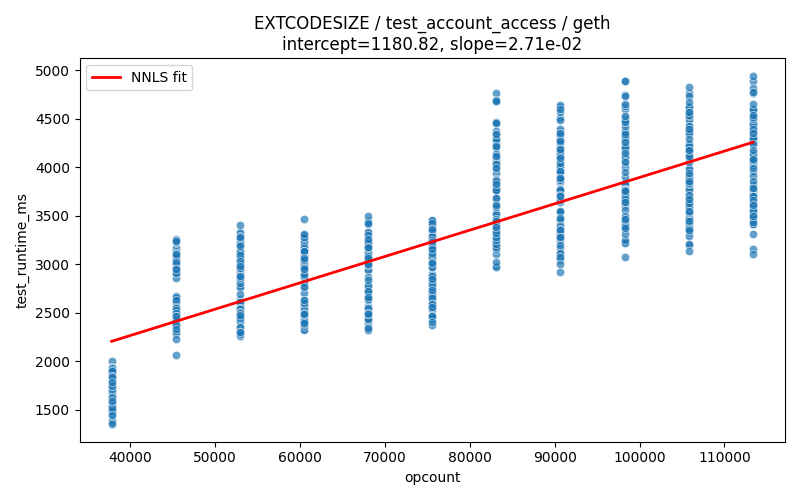

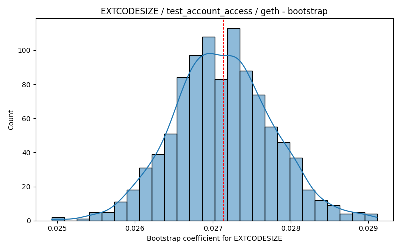

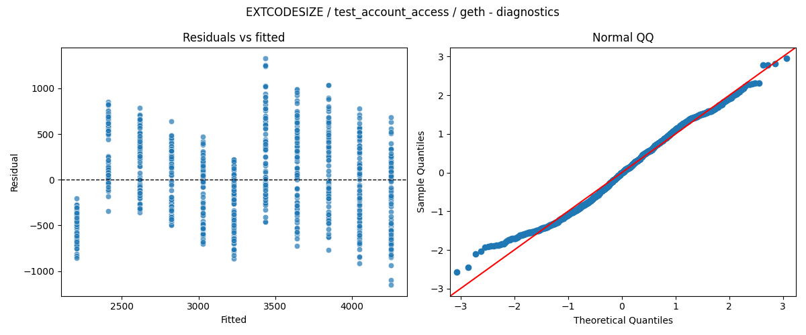

</details>

<details><summary>nethermind — NNLS regression summary</summary>

```
==============================================================================
                           NNLS Regression Results                            
==============================================================================
Dep. Variable:          test_runtime_ms              R-squared:          0.927
Model:                  NNLS                    Adj. R-squared:          0.927
No. Observations:       495                               RMSE:          26.81
Df Residuals:           493                                MAE:          19.78
Df Model:               1      
==============================================================================
                      coef     std err     P-value      [0.025      0.975]
------------------------------------------------------------------------------
         const     76.6371      3.6898       0.001     69.1175     83.4446
       opcount      0.0040      0.0001       0.001      0.0039      0.0041
==============================================================================
Notes: Non-negative least squares with bootstrap inference (1000 iterations)
==============================================================================
```

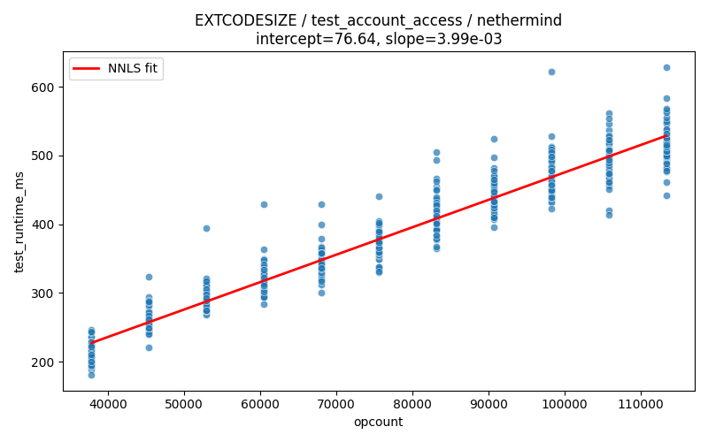

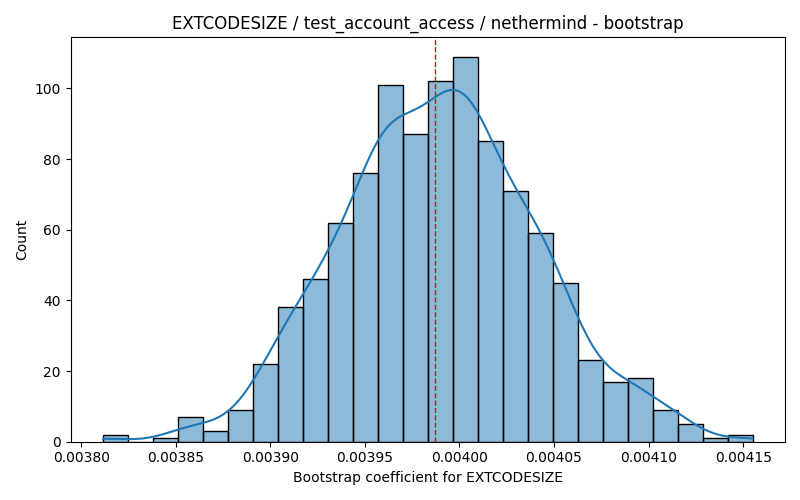

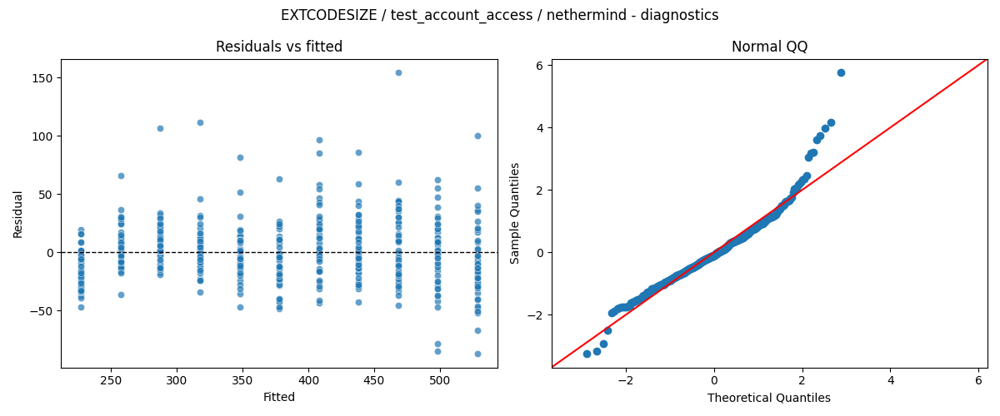

</details>

<details><summary>reth — NNLS regression summary</summary>

```
==============================================================================
                           NNLS Regression Results                            
==============================================================================
Dep. Variable:          test_runtime_ms              R-squared:          0.975
Model:                  NNLS                    Adj. R-squared:          0.975
No. Observations:       385                               RMSE:           3.54
Df Residuals:           383                                MAE:           2.80
Df Model:               1      
==============================================================================
                      coef     std err     P-value      [0.025      0.975]
------------------------------------------------------------------------------
         const     31.3417      0.6120       0.001     30.0873     32.5223
       opcount      0.0009      0.0000       0.001      0.0009      0.0009
==============================================================================
Notes: Non-negative least squares with bootstrap inference (1000 iterations)
==============================================================================
```

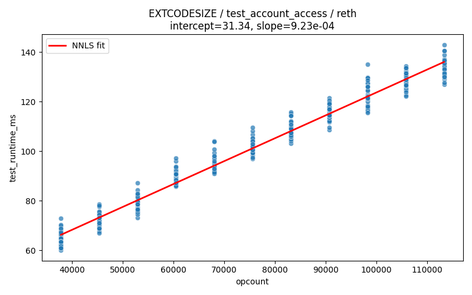

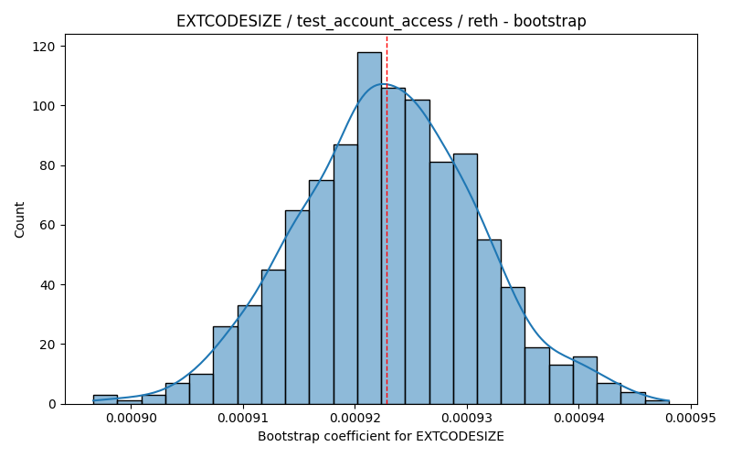

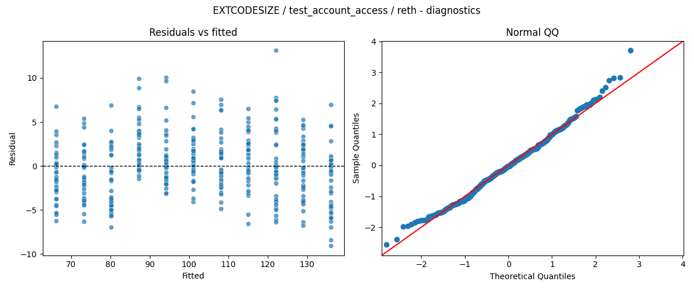

</details>

### test_account_access — combo `EXTCODESIZE_AccountMode.EXISTING_CONTRACT`

| client | nobs | R² | target_coef (ms) | p-value | 95% CI |
| --- | --- | --- | --- | --- | --- |
| `besu` | 1309 | 0.8546 | 0.02728 | 1.00e-03 | [0.02673, 0.02787] |
| `erigon` | 385 | 0.8769 | 0.08473 | 1.00e-03 | [0.08153, 0.08758] |
| `ethrex` | 1276 | 0.9711 | 0.02553 | 1.00e-03 | [0.02523, 0.02581] |
| `geth` | 924 | 0.6811 | 0.02894 | 1.00e-03 | [0.02763, 0.03035] |
| `nethermind` | 495 | 0.7469 | 0.02512 | 1.00e-03 | [0.02381, 0.02648] |
| `reth` | 385 | 0.9187 | 0.03444 | 1.00e-03 | [0.0332, 0.03561] |

<details><summary>besu — NNLS regression summary</summary>

```
==============================================================================
                           NNLS Regression Results                            
==============================================================================
Dep. Variable:          test_runtime_ms              R-squared:          0.855
Model:                  NNLS                    Adj. R-squared:          0.855
No. Observations:       1309                              RMSE:         234.10
Df Residuals:           1307                               MAE:         191.09
Df Model:               1      
==============================================================================
                      coef     std err     P-value      [0.025      0.975]
------------------------------------------------------------------------------
         const    415.0875     18.3915       0.001    377.7531    450.1869
       opcount      0.0273      0.0003       0.001      0.0267      0.0279
==============================================================================
Notes: Non-negative least squares with bootstrap inference (1000 iterations)
==============================================================================
```

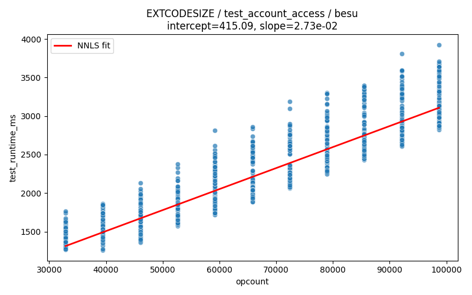

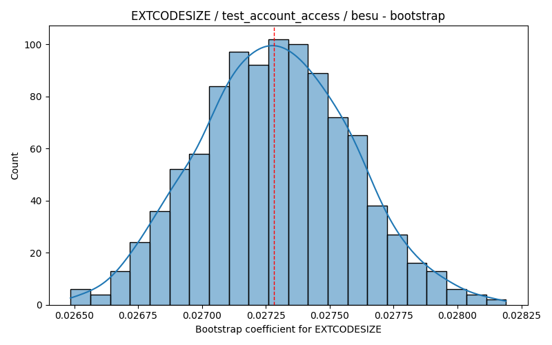

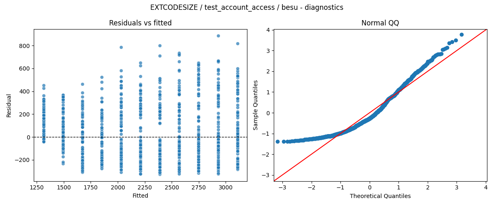

</details>

<details><summary>erigon — NNLS regression summary</summary>

```
==============================================================================
                           NNLS Regression Results                            
==============================================================================
Dep. Variable:          test_runtime_ms              R-squared:          0.877
Model:                  NNLS                    Adj. R-squared:          0.877
No. Observations:       385                               RMSE:         660.63
Df Residuals:           383                                MAE:         570.01
Df Model:               1      
==============================================================================
                      coef     std err     P-value      [0.025      0.975]
------------------------------------------------------------------------------
         const   1463.8164    117.7754       0.001   1248.7803   1716.2744
       opcount      0.0847      0.0015       0.001      0.0815      0.0876
==============================================================================
Notes: Non-negative least squares with bootstrap inference (1000 iterations)
==============================================================================
```

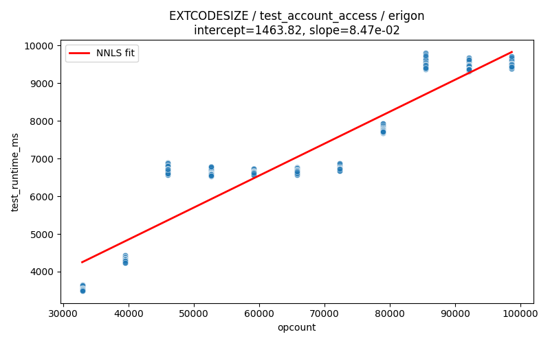

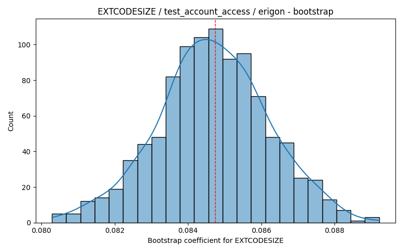

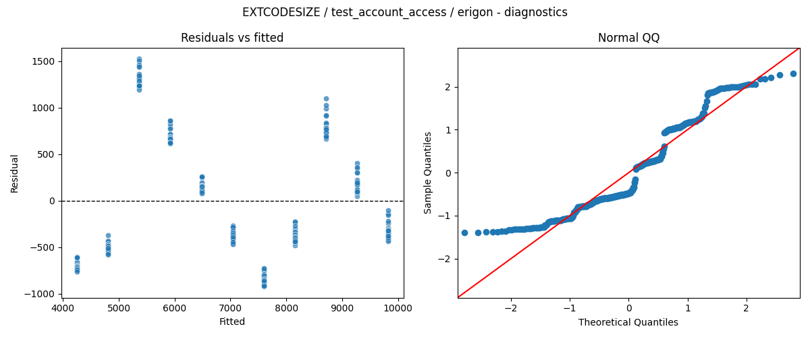

</details>

<details><summary>ethrex — NNLS regression summary</summary>

```
==============================================================================
                           NNLS Regression Results                            
==============================================================================
Dep. Variable:          test_runtime_ms              R-squared:          0.971
Model:                  NNLS                    Adj. R-squared:          0.971
No. Observations:       1276                              RMSE:          91.68
Df Residuals:           1274                               MAE:          79.74
Df Model:               1      
==============================================================================
                      coef     std err     P-value      [0.025      0.975]
------------------------------------------------------------------------------
         const    350.6747     10.6228       0.001    330.5243    371.7681
       opcount      0.0255      0.0001       0.001      0.0252      0.0258
==============================================================================
Notes: Non-negative least squares with bootstrap inference (1000 iterations)
==============================================================================
```

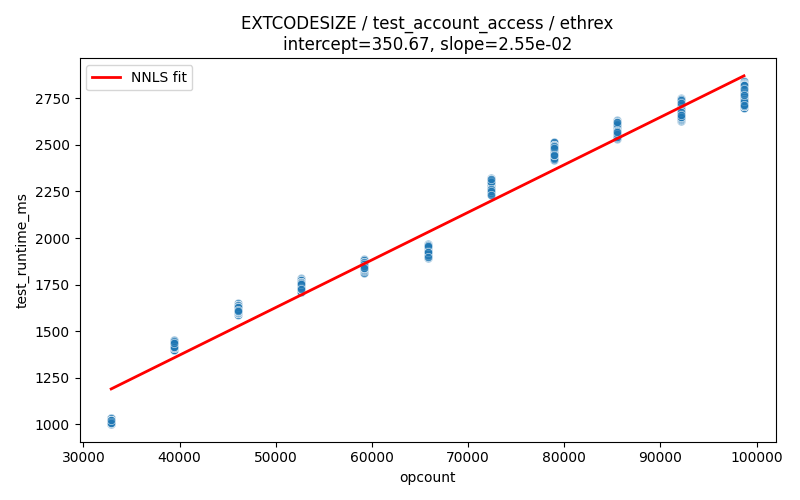


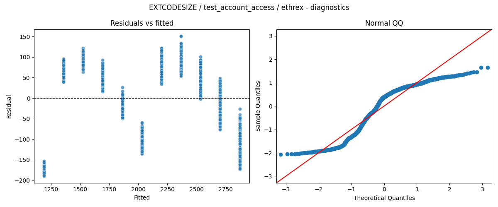

</details>

<details><summary>geth — NNLS regression summary</summary>

```
==============================================================================
                           NNLS Regression Results                            
==============================================================================
Dep. Variable:          test_runtime_ms              R-squared:          0.681
Model:                  NNLS                    Adj. R-squared:          0.681
No. Observations:       924                               RMSE:         412.08
Df Residuals:           922                                MAE:         343.23
Df Model:               1      
==============================================================================
                      coef     std err     P-value      [0.025      0.975]
------------------------------------------------------------------------------
         const   1100.6106     48.4269       0.001   1005.7373   1194.1882
       opcount      0.0289      0.0007       0.001      0.0276      0.0304
==============================================================================
Notes: Non-negative least squares with bootstrap inference (1000 iterations)
==============================================================================
```

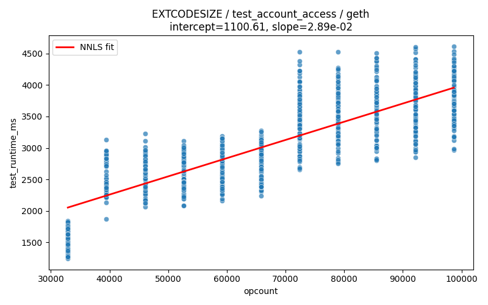

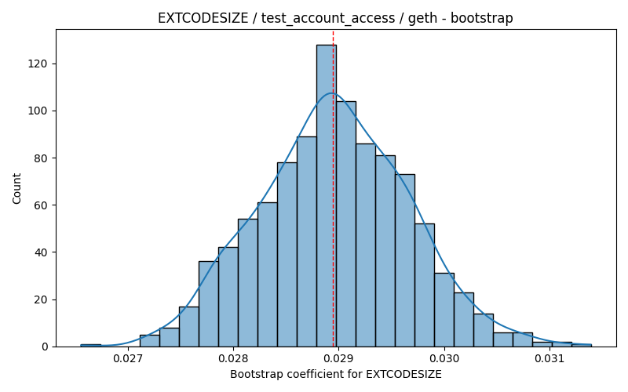

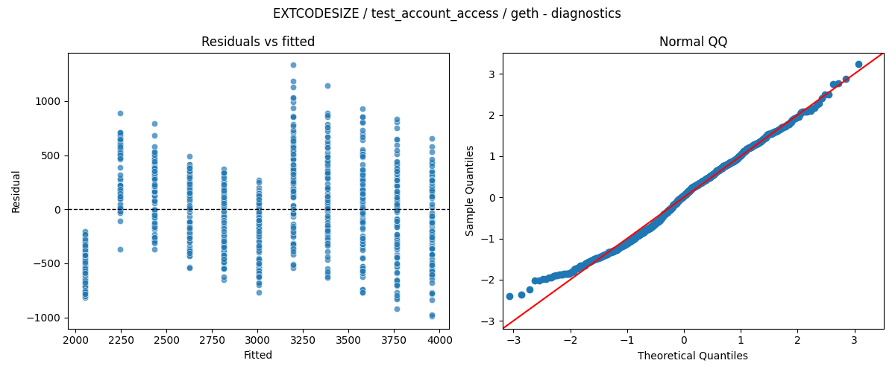

</details>

<details><summary>nethermind — NNLS regression summary</summary>

```
==============================================================================
                           NNLS Regression Results                            
==============================================================================
Dep. Variable:          test_runtime_ms              R-squared:          0.747
Model:                  NNLS                    Adj. R-squared:          0.746
No. Observations:       495                               RMSE:         304.20
Df Residuals:           493                                MAE:         254.38
Df Model:               1      
==============================================================================
                      coef     std err     P-value      [0.025      0.975]
------------------------------------------------------------------------------
         const    814.7618     50.1103       0.001    716.9679    912.2274
       opcount      0.0251      0.0007       0.001      0.0238      0.0265
==============================================================================
Notes: Non-negative least squares with bootstrap inference (1000 iterations)
==============================================================================
```

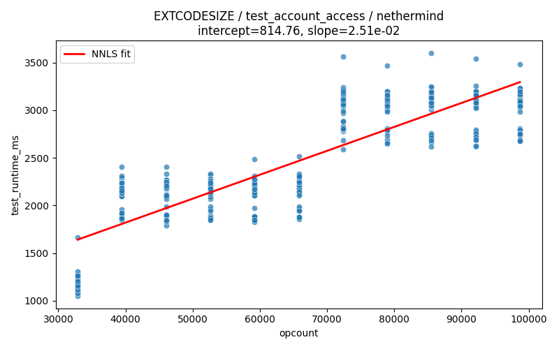

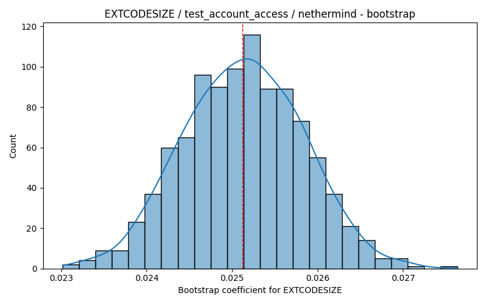

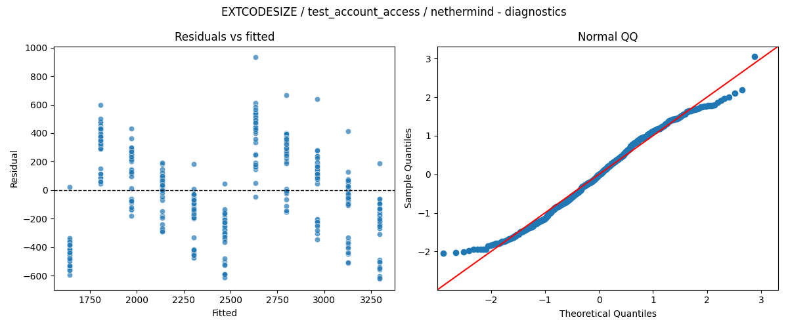

</details>

<details><summary>reth — NNLS regression summary</summary>

```
==============================================================================
                           NNLS Regression Results                            
==============================================================================
Dep. Variable:          test_runtime_ms              R-squared:          0.919
Model:                  NNLS                    Adj. R-squared:          0.919
No. Observations:       385                               RMSE:         213.11
Df Residuals:           383                                MAE:         141.91
Df Model:               1      
==============================================================================
                      coef     std err     P-value      [0.025      0.975]
------------------------------------------------------------------------------
         const    230.6103     45.7777       0.001    145.1182    326.1791
       opcount      0.0344      0.0006       0.001      0.0332      0.0356
==============================================================================
Notes: Non-negative least squares with bootstrap inference (1000 iterations)
==============================================================================
```

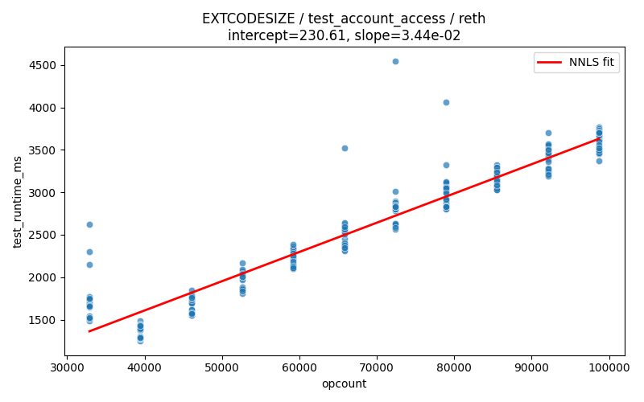

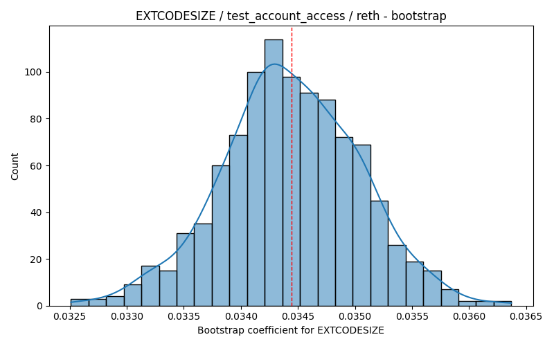

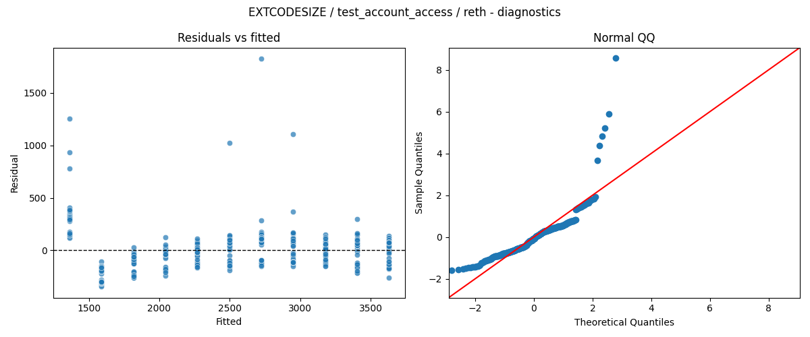

</details>

### test_account_access — combo `EXTCODESIZE_AccountMode.NON_EXISTING_ACCOUNT` — `presets[cold_account_code_access]`

| client | nobs | R² | target_coef (ms) | p-value | 95% CI |
| --- | --- | --- | --- | --- | --- |
| `besu` | 1309 | 0.7774 | 0.01018 | 1.00e-03 | [0.009884, 0.0105] |
| `erigon` | 385 | 0.9712 | 0.008578 | 1.00e-03 | [0.008408, 0.008699] |
| `ethrex` | 1276 | 0.9961 | 0.002646 | 1.00e-03 | [0.002643, 0.002649] |
| `geth` | 924 | 0.6773 | 0.02713 | 1.00e-03 | [0.02591, 0.02841] |
| `nethermind` | 495 | 0.9267 | 0.003987 | 1.00e-03 | [0.003894, 0.004094] |
| `reth` | 385 | 0.9749 | 0.0009229 | 1.00e-03 | [0.0009077, 0.0009398] |

<details><summary>besu — NNLS regression summary</summary>

```
==============================================================================
                           NNLS Regression Results                            
==============================================================================
Dep. Variable:          test_runtime_ms              R-squared:          0.777
Model:                  NNLS                    Adj. R-squared:          0.777
No. Observations:       1309                              RMSE:         130.16
Df Residuals:           1307                               MAE:         110.44
Df Model:               1      
==============================================================================
                      coef     std err     P-value      [0.025      0.975]
------------------------------------------------------------------------------
         const    431.1873     12.0702       0.001    406.7929    455.1830
       opcount      0.0102      0.0002       0.001      0.0099      0.0105
==============================================================================
Notes: Non-negative least squares with bootstrap inference (1000 iterations)
==============================================================================
```


</details>

<details><summary>erigon — NNLS regression summary</summary>

```
==============================================================================
                           NNLS Regression Results                            
==============================================================================
Dep. Variable:          test_runtime_ms              R-squared:          0.971
Model:                  NNLS                    Adj. R-squared:          0.971
No. Observations:       385                               RMSE:          35.33
Df Residuals:           383                                MAE:          28.13
Df Model:               1      
==============================================================================
                      coef     std err     P-value      [0.025      0.975]
------------------------------------------------------------------------------
         const      6.2999      4.8768       0.122      0.0000     17.5189
       opcount      0.0086      0.0001       0.001      0.0084      0.0087
==============================================================================
Notes: Non-negative least squares with bootstrap inference (1000 iterations)
==============================================================================
```


</details>

<details><summary>ethrex — NNLS regression summary</summary>

```
==============================================================================
                           NNLS Regression Results                            
==============================================================================
Dep. Variable:          test_runtime_ms              R-squared:          0.996
Model:                  NNLS                    Adj. R-squared:          0.996
No. Observations:       1276                              RMSE:           3.97
Df Residuals:           1274                               MAE:           3.05
Df Model:               1      
==============================================================================
                      coef     std err     P-value      [0.025      0.975]
------------------------------------------------------------------------------
         const      0.0000      0.0000       1.000      0.0000      0.0000
       opcount      0.0026      0.0000       0.001      0.0026      0.0026
==============================================================================
Notes: Non-negative least squares with bootstrap inference (1000 iterations)
==============================================================================
```


</details>

<details><summary>geth — NNLS regression summary</summary>

```
==============================================================================
                           NNLS Regression Results                            
==============================================================================
Dep. Variable:          test_runtime_ms              R-squared:          0.677
Model:                  NNLS                    Adj. R-squared:          0.677
No. Observations:       924                               RMSE:         447.56
Df Residuals:           922                                MAE:         373.87
Df Model:               1      
==============================================================================
                      coef     std err     P-value      [0.025      0.975]
------------------------------------------------------------------------------
         const   1180.8220     50.0275       0.001   1079.0681   1275.4907
       opcount      0.0271      0.0006       0.001      0.0259      0.0284
==============================================================================
Notes: Non-negative least squares with bootstrap inference (1000 iterations)
==============================================================================
```


</details>

<details><summary>nethermind — NNLS regression summary</summary>

```
==============================================================================
                           NNLS Regression Results                            
==============================================================================
Dep. Variable:          test_runtime_ms              R-squared:          0.927
Model:                  NNLS                    Adj. R-squared:          0.927
No. Observations:       495                               RMSE:          26.81
Df Residuals:           493                                MAE:          19.78
Df Model:               1      
==============================================================================
                      coef     std err     P-value      [0.025      0.975]
------------------------------------------------------------------------------
         const     76.6371      3.6898       0.001     69.1175     83.4446
       opcount      0.0040      0.0001       0.001      0.0039      0.0041
==============================================================================
Notes: Non-negative least squares with bootstrap inference (1000 iterations)
==============================================================================
```


</details>

<details><summary>reth — NNLS regression summary</summary>

```
==============================================================================
                           NNLS Regression Results                            
==============================================================================
Dep. Variable:          test_runtime_ms              R-squared:          0.975
Model:                  NNLS                    Adj. R-squared:          0.975
No. Observations:       385                               RMSE:           3.54
Df Residuals:           383                                MAE:           2.80
Df Model:               1      
==============================================================================
                      coef     std err     P-value      [0.025      0.975]
------------------------------------------------------------------------------
         const     31.3417      0.6120       0.001     30.0873     32.5223
       opcount      0.0009      0.0000       0.001      0.0009      0.0009
==============================================================================
Notes: Non-negative least squares with bootstrap inference (1000 iterations)
==============================================================================
```


</details>

### test_ext_account_query_warm — combo `EXTCODESIZE`

| client | nobs | R² | target_coef (ms) | p-value | 95% CI |
| --- | --- | --- | --- | --- | --- |
| `besu` | 1309 | 0.6269 | 0.0001483 | 1.00e-03 | [0.0001418, 0.0001551] |
| `erigon` | 385 | 0.94 | 4.457e-05 | 1.00e-03 | [4.337e-05, 4.582e-05] |
| `ethrex` | 1276 | 0.7967 | 1.085e-05 | 1.00e-03 | [1.054e-05, 1.118e-05] |
| `geth` | 924 | 0.7763 | 3.085e-05 | 1.00e-03 | [2.967e-05, 3.192e-05] |
| `nethermind` | 495 | 0.6886 | 0.0001806 | 1.00e-03 | [0.0001689, 0.0001919] |
| `reth` | 385 | 0.6203 | 5.635e-06 | 1.00e-03 | [5.201e-06, 6.088e-06] |

<details><summary>besu — NNLS regression summary</summary>

```
==============================================================================
                           NNLS Regression Results                            
==============================================================================
Dep. Variable:          test_runtime_ms              R-squared:          0.627
Model:                  NNLS                    Adj. R-squared:          0.627
No. Observations:       1309                              RMSE:          66.91
Df Residuals:           1307                               MAE:          50.46
Df Model:               1      
==============================================================================
                      coef     std err     P-value      [0.025      0.975]
------------------------------------------------------------------------------
         const    200.7088      7.1034       0.001    187.1502    213.9615
       opcount      0.0001      0.0000       0.001      0.0001      0.0002
==============================================================================
Notes: Non-negative least squares with bootstrap inference (1000 iterations)
==============================================================================
```

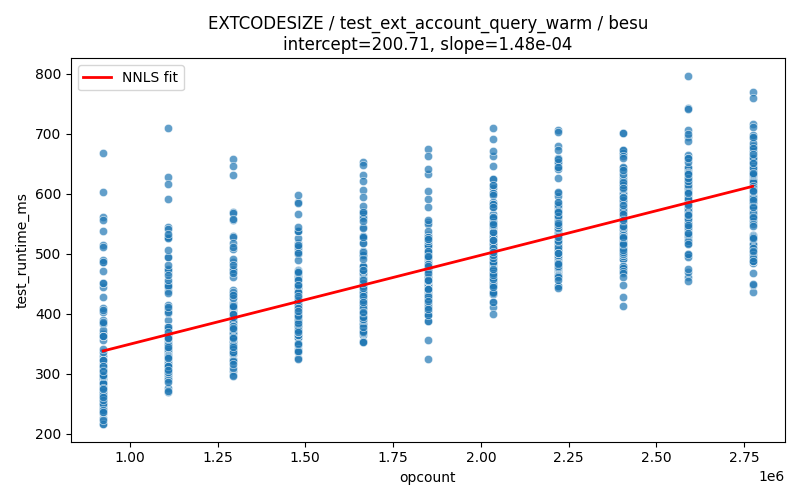

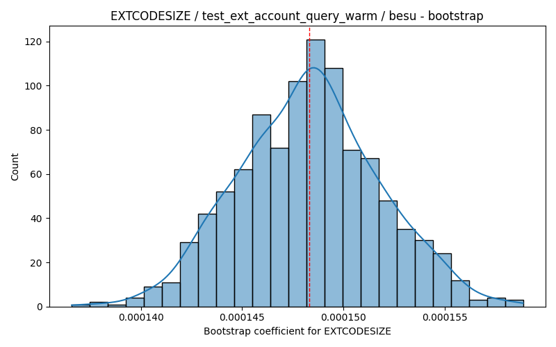

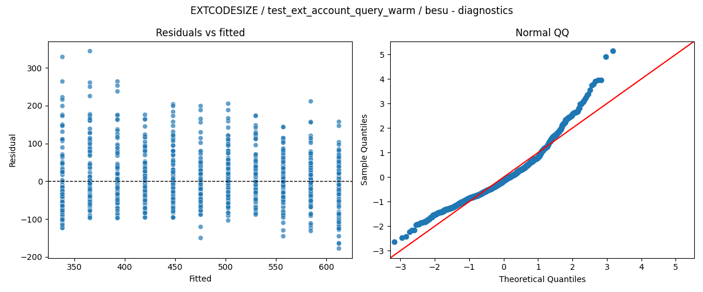

</details>

<details><summary>erigon — NNLS regression summary</summary>

```
==============================================================================
                           NNLS Regression Results                            
==============================================================================
Dep. Variable:          test_runtime_ms              R-squared:          0.940
Model:                  NNLS                    Adj. R-squared:          0.940
No. Observations:       385                               RMSE:           6.59
Df Residuals:           383                                MAE:           4.93
Df Model:               1      
==============================================================================
                      coef     std err     P-value      [0.025      0.975]
------------------------------------------------------------------------------
         const     36.7388      1.0680       0.001     34.7428     38.9120
       opcount      0.0000      0.0000       0.001      0.0000      0.0000
==============================================================================
Notes: Non-negative least squares with bootstrap inference (1000 iterations)
==============================================================================
```

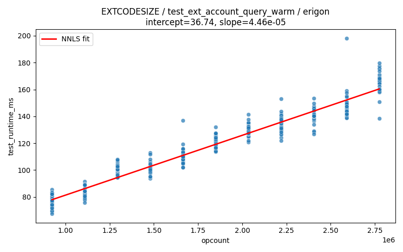

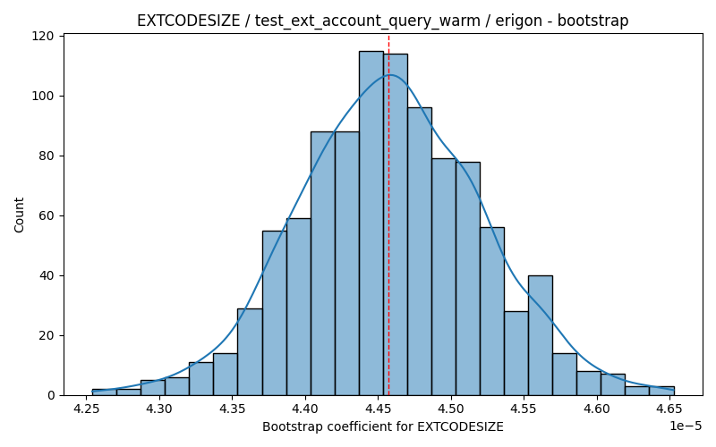

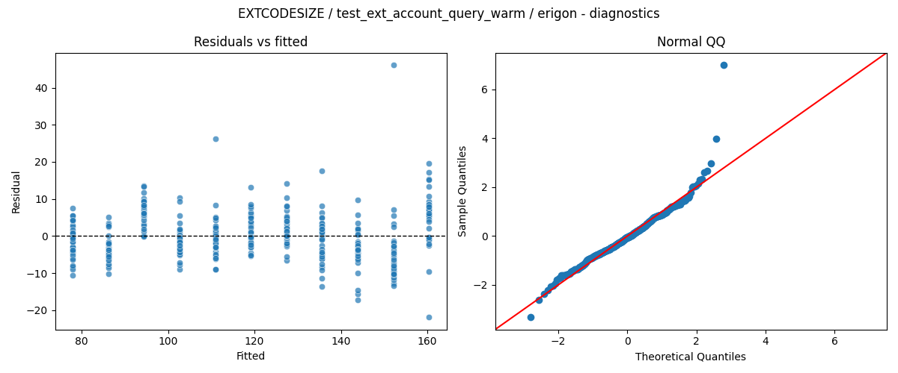

</details>

<details><summary>ethrex — NNLS regression summary</summary>

```
==============================================================================
                           NNLS Regression Results                            
==============================================================================
Dep. Variable:          test_runtime_ms              R-squared:          0.797
Model:                  NNLS                    Adj. R-squared:          0.797
No. Observations:       1276                              RMSE:           3.21
Df Residuals:           1274                               MAE:           2.40
Df Model:               1      
==============================================================================
                      coef     std err     P-value      [0.025      0.975]
------------------------------------------------------------------------------
         const      7.2826      0.2901       0.001      6.7279      7.8271
       opcount      0.0000      0.0000       0.001      0.0000      0.0000
==============================================================================
Notes: Non-negative least squares with bootstrap inference (1000 iterations)
==============================================================================
```

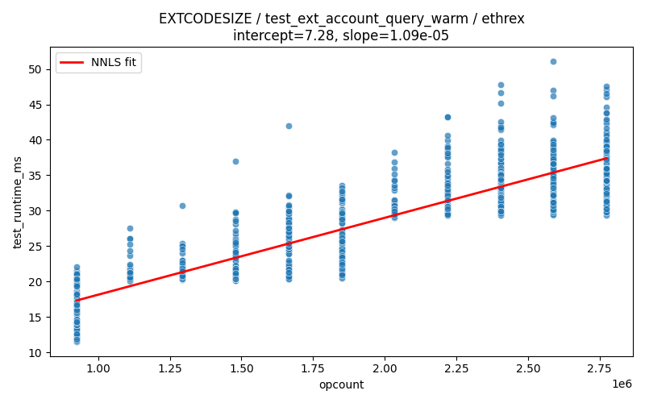

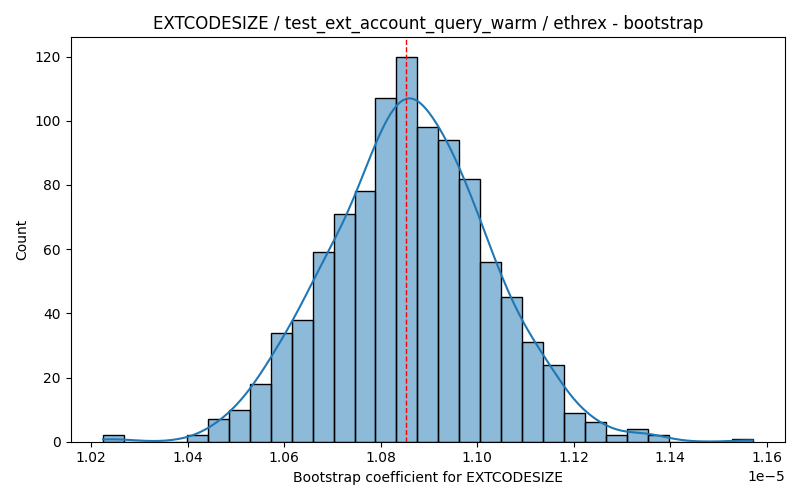

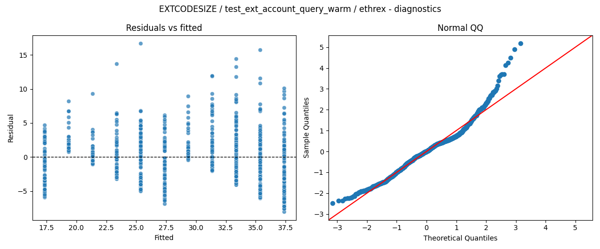

</details>

<details><summary>geth — NNLS regression summary</summary>

```
==============================================================================
                           NNLS Regression Results                            
==============================================================================
Dep. Variable:          test_runtime_ms              R-squared:          0.776
Model:                  NNLS                    Adj. R-squared:          0.776
No. Observations:       924                               RMSE:           9.69
Df Residuals:           922                                MAE:           7.27
Df Model:               1      
==============================================================================
                      coef     std err     P-value      [0.025      0.975]
------------------------------------------------------------------------------
         const     14.7234      0.9335       0.001     12.9744     16.6608
       opcount      0.0000      0.0000       0.001      0.0000      0.0000
==============================================================================
Notes: Non-negative least squares with bootstrap inference (1000 iterations)
==============================================================================
```

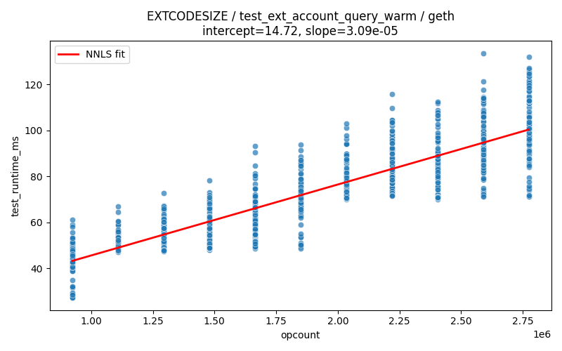

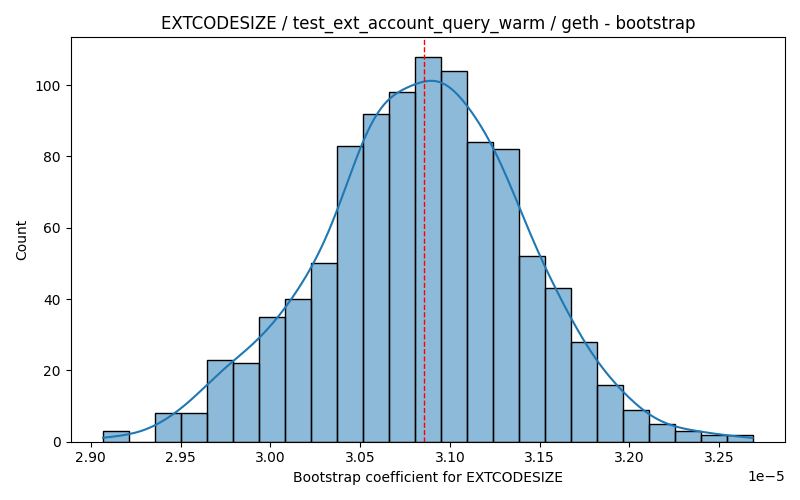

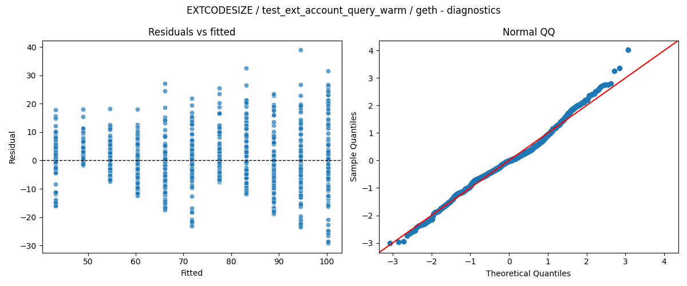

</details>

<details><summary>nethermind — NNLS regression summary</summary>

```
==============================================================================
                           NNLS Regression Results                            
==============================================================================
Dep. Variable:          test_runtime_ms              R-squared:          0.689
Model:                  NNLS                    Adj. R-squared:          0.688
No. Observations:       495                               RMSE:          71.04
Df Residuals:           493                                MAE:          56.53
Df Model:               1      
==============================================================================
                      coef     std err     P-value      [0.025      0.975]
------------------------------------------------------------------------------
         const     87.3010     10.0556       0.001     67.3414    107.3850
       opcount      0.0002      0.0000       0.001      0.0002      0.0002
==============================================================================
Notes: Non-negative least squares with bootstrap inference (1000 iterations)
==============================================================================
```

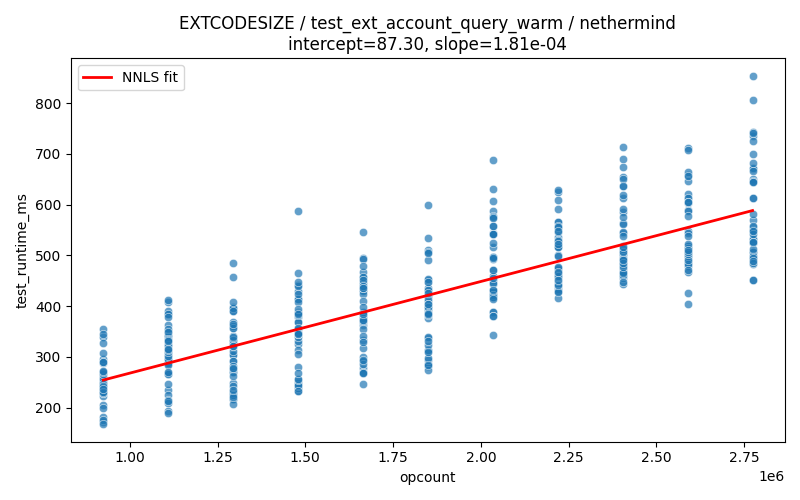

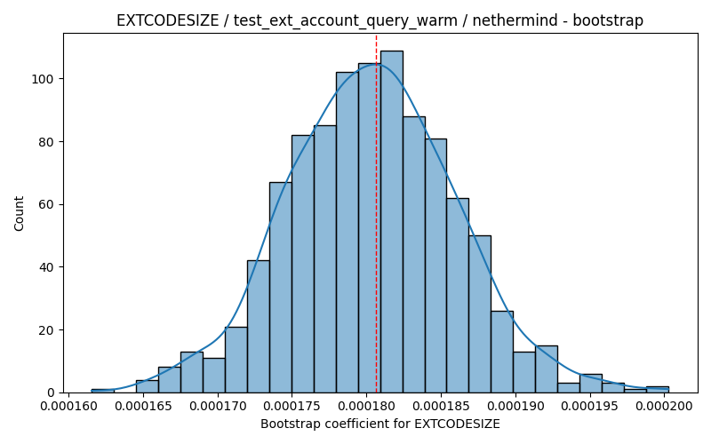

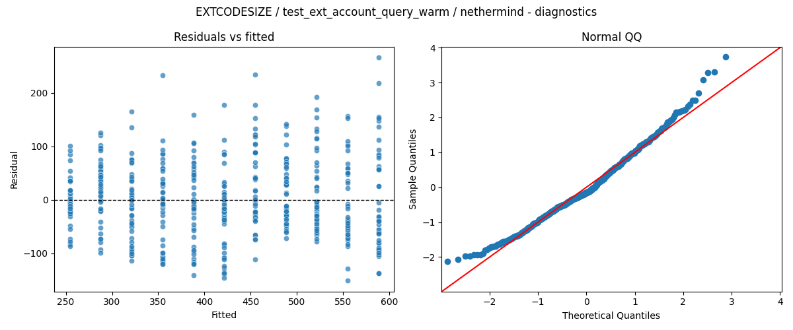

</details>

<details><summary>reth — NNLS regression summary</summary>

```
==============================================================================
                           NNLS Regression Results                            
==============================================================================
Dep. Variable:          test_runtime_ms              R-squared:          0.620
Model:                  NNLS                    Adj. R-squared:          0.619
No. Observations:       385                               RMSE:           2.58
Df Residuals:           383                                MAE:           1.76
Df Model:               1      
==============================================================================
                      coef     std err     P-value      [0.025      0.975]
------------------------------------------------------------------------------
         const      5.3591      0.4198       0.001      4.5223      6.1815
       opcount      0.0000      0.0000       0.001      0.0000      0.0000
==============================================================================
Notes: Non-negative least squares with bootstrap inference (1000 iterations)
==============================================================================
```

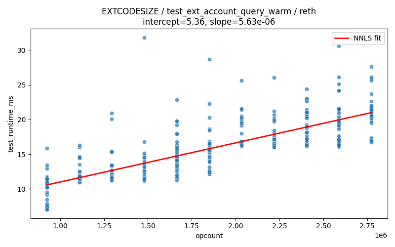

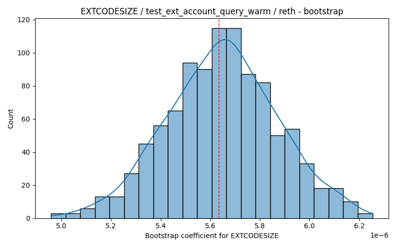

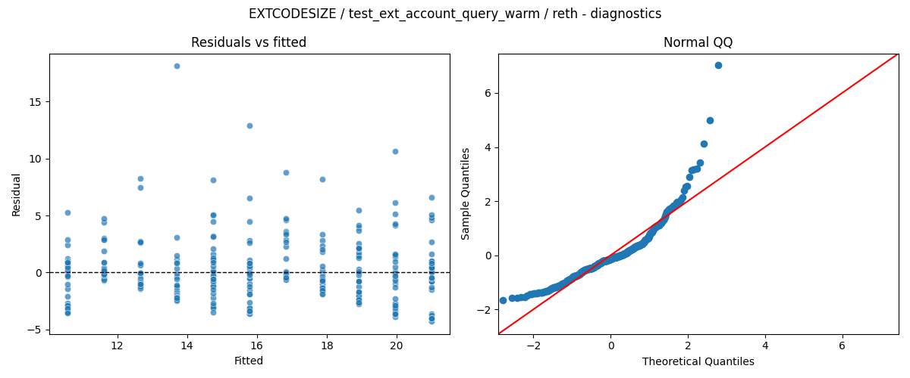

</details>

## STATICCALL

### test_account_access — combo `STATICCALL_AccountMode.EXISTING_EOA`

| client | nobs | R² | target_coef (ms) | p-value | 95% CI |
| --- | --- | --- | --- | --- | --- |
| `besu` | 1309 | 0.7349 | 0.01218 | 1.00e-03 | [0.01178, 0.01259] |
| `erigon` | 385 | 0.9848 | 0.01006 | 1.00e-03 | [0.009946, 0.01019] |
| `ethrex` | 1276 | 0.973 | 0.02472 | 1.00e-03 | [0.02445, 0.02499] |
| `geth` | 924 | 0.7558 | 0.01165 | 1.00e-03 | [0.01123, 0.01209] |
| `nethermind` | 495 | 0.8881 | 0.004299 | 1.00e-03 | [0.004174, 0.004439] |
| `reth` | 385 | 0.9748 | 0.001133 | 1.00e-03 | [0.001113, 0.001153] |

<details><summary>besu — NNLS regression summary</summary>

```
==============================================================================
                           NNLS Regression Results                            
==============================================================================
Dep. Variable:          test_runtime_ms              R-squared:          0.735
Model:                  NNLS                    Adj. R-squared:          0.735
No. Observations:       1309                              RMSE:         173.97
Df Residuals:           1307                               MAE:         148.74
Df Model:               1      
==============================================================================
                      coef     std err     P-value      [0.025      0.975]
------------------------------------------------------------------------------
         const    540.4194     15.8803       0.001    511.0124    571.9607
       opcount      0.0122      0.0002       0.001      0.0118      0.0126
==============================================================================
Notes: Non-negative least squares with bootstrap inference (1000 iterations)
==============================================================================
```

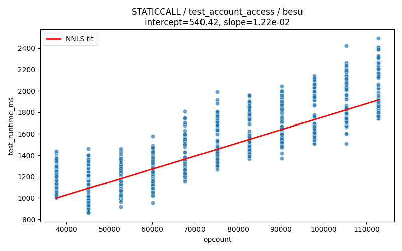

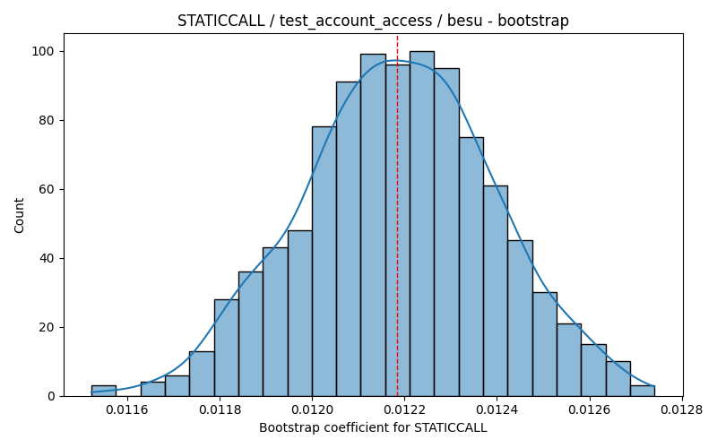


</details>

<details><summary>erigon — NNLS regression summary</summary>

```
==============================================================================
                           NNLS Regression Results                            
==============================================================================
Dep. Variable:          test_runtime_ms              R-squared:          0.985
Model:                  NNLS                    Adj. R-squared:          0.985
No. Observations:       385                               RMSE:          29.74
Df Residuals:           383                                MAE:          23.78
Df Model:               1      
==============================================================================
                      coef     std err     P-value      [0.025      0.975]
------------------------------------------------------------------------------
         const     38.2489      4.3176       0.001     28.8452     46.2702
       opcount      0.0101      0.0001       0.001      0.0099      0.0102
==============================================================================
Notes: Non-negative least squares with bootstrap inference (1000 iterations)
==============================================================================
```

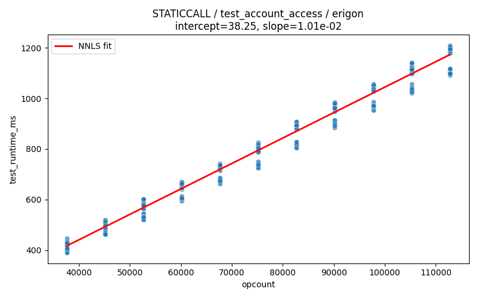

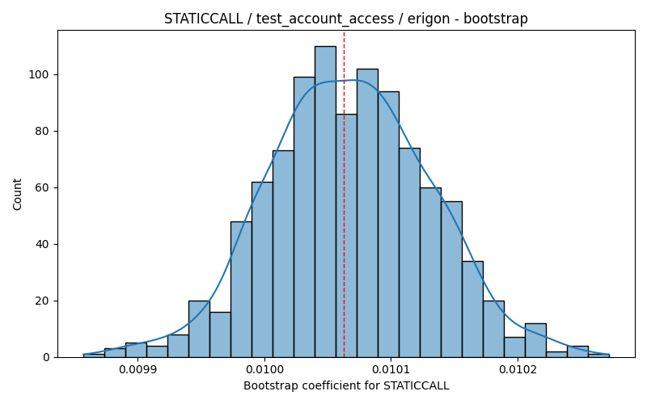

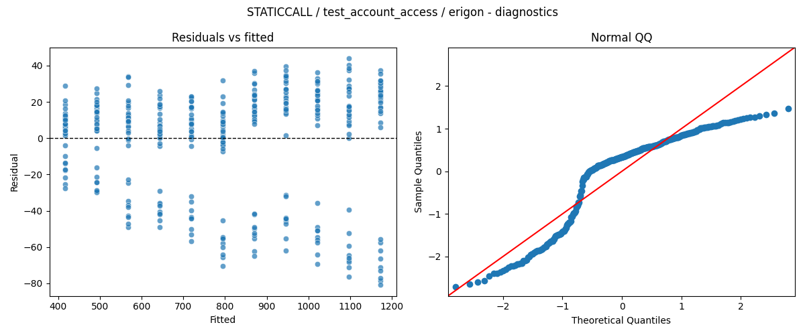

</details>

<details><summary>ethrex — NNLS regression summary</summary>

```
==============================================================================
                           NNLS Regression Results                            
==============================================================================
Dep. Variable:          test_runtime_ms              R-squared:          0.973
Model:                  NNLS                    Adj. R-squared:          0.973
No. Observations:       1276                              RMSE:          97.83
Df Residuals:           1274                               MAE:          87.00
Df Model:               1      
==============================================================================
                      coef     std err     P-value      [0.025      0.975]
------------------------------------------------------------------------------
         const    370.9902     10.7854       0.001    350.1455    392.4267
       opcount      0.0247      0.0001       0.001      0.0245      0.0250
==============================================================================
Notes: Non-negative least squares with bootstrap inference (1000 iterations)
==============================================================================
```

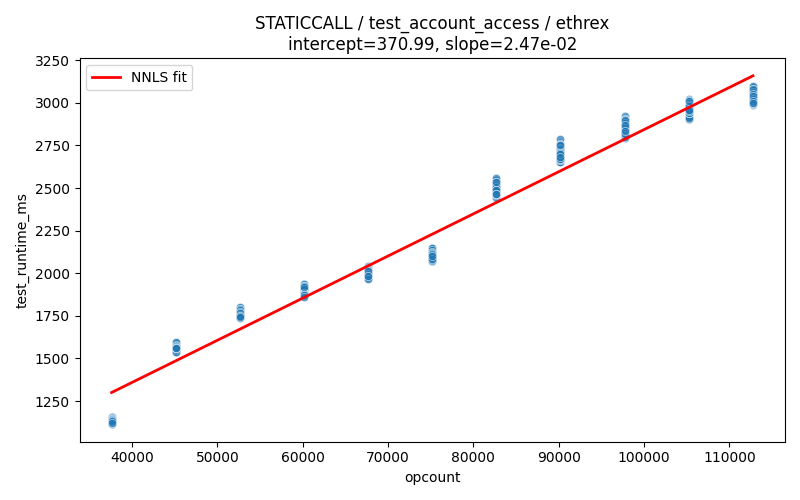

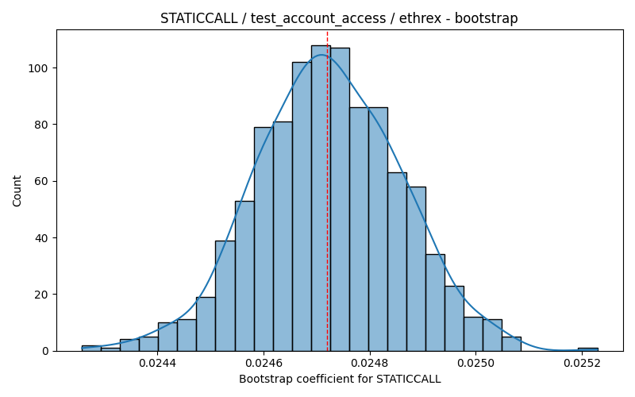

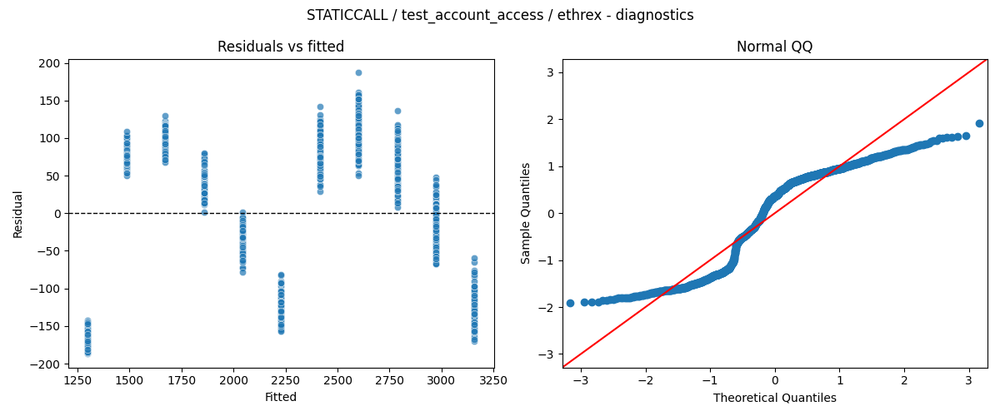

</details>

<details><summary>geth — NNLS regression summary</summary>

```
==============================================================================
                           NNLS Regression Results                            
==============================================================================
Dep. Variable:          test_runtime_ms              R-squared:          0.756
Model:                  NNLS                    Adj. R-squared:          0.756
No. Observations:       924                               RMSE:         157.48
Df Residuals:           922                                MAE:         125.80
Df Model:               1      
==============================================================================
                      coef     std err     P-value      [0.025      0.975]
------------------------------------------------------------------------------
         const    368.6378     14.5513       0.001    339.7842    398.3557
       opcount      0.0117      0.0002       0.001      0.0112      0.0121
==============================================================================
Notes: Non-negative least squares with bootstrap inference (1000 iterations)
==============================================================================
```

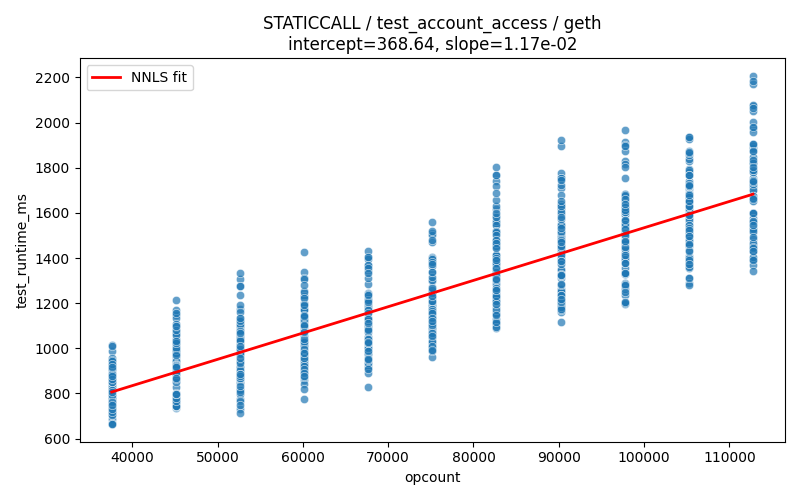

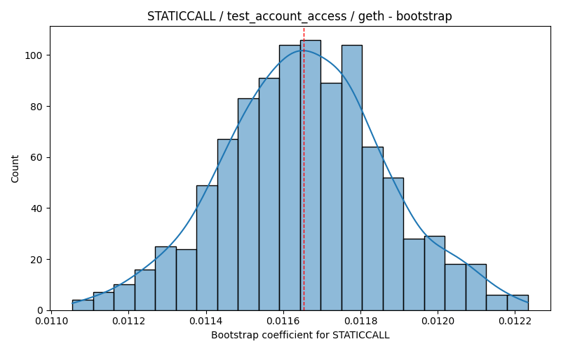

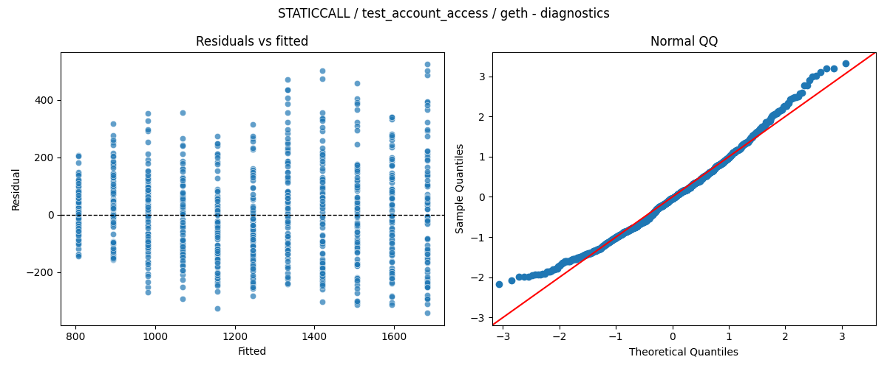

</details>

<details><summary>nethermind — NNLS regression summary</summary>

```
==============================================================================
                           NNLS Regression Results                            
==============================================================================
Dep. Variable:          test_runtime_ms              R-squared:          0.888
Model:                  NNLS                    Adj. R-squared:          0.888
No. Observations:       495                               RMSE:          36.28
Df Residuals:           493                                MAE:          26.68
Df Model:               1      
==============================================================================
                      coef     std err     P-value      [0.025      0.975]
------------------------------------------------------------------------------
         const     89.2515      4.6884       0.001     79.3591     98.1795
       opcount      0.0043      0.0001       0.001      0.0042      0.0044
==============================================================================
Notes: Non-negative least squares with bootstrap inference (1000 iterations)
==============================================================================
```

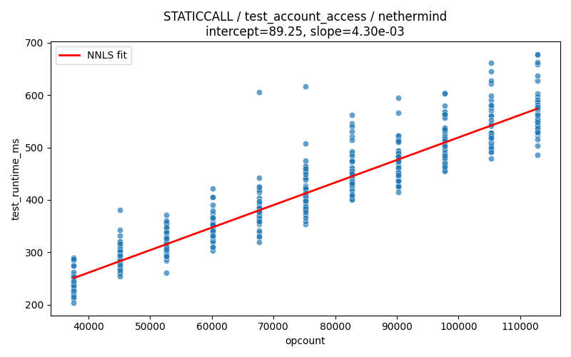

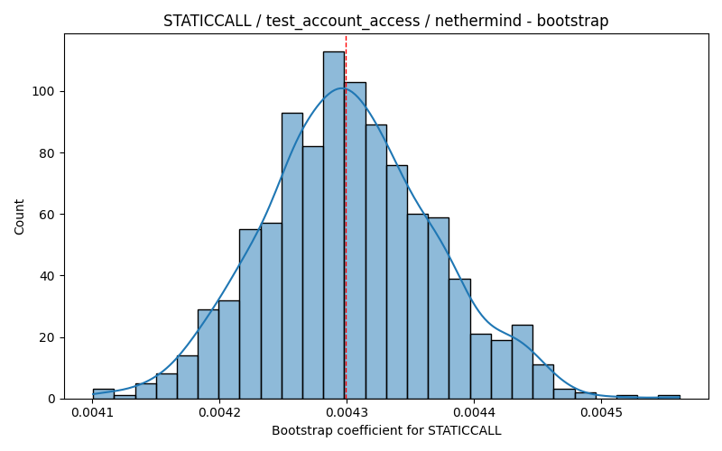

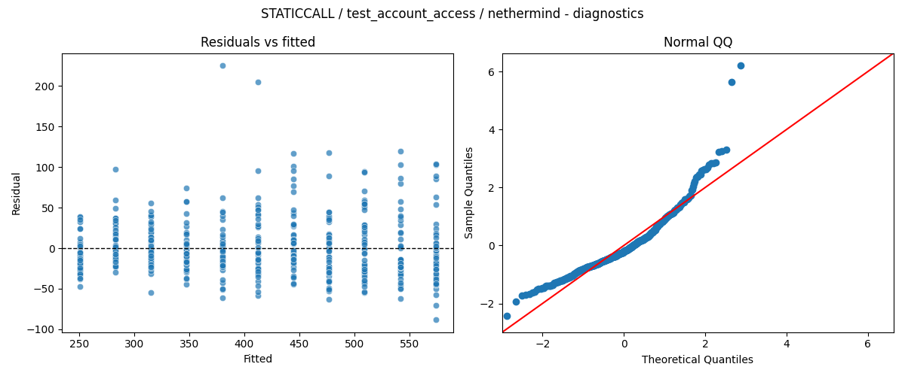

</details>

<details><summary>reth — NNLS regression summary</summary>

```
==============================================================================
                           NNLS Regression Results                            
==============================================================================
Dep. Variable:          test_runtime_ms              R-squared:          0.975
Model:                  NNLS                    Adj. R-squared:          0.975
No. Observations:       385                               RMSE:           4.33
Df Residuals:           383                                MAE:           3.39
Df Model:               1      
==============================================================================
                      coef     std err     P-value      [0.025      0.975]
------------------------------------------------------------------------------
         const     32.0872      0.8030       0.001     30.5283     33.6789
       opcount      0.0011      0.0000       0.001      0.0011      0.0012
==============================================================================
Notes: Non-negative least squares with bootstrap inference (1000 iterations)
==============================================================================
```

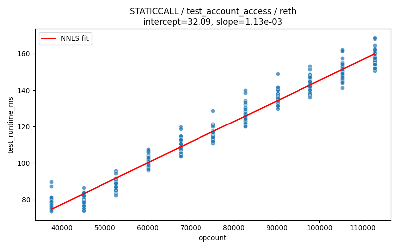

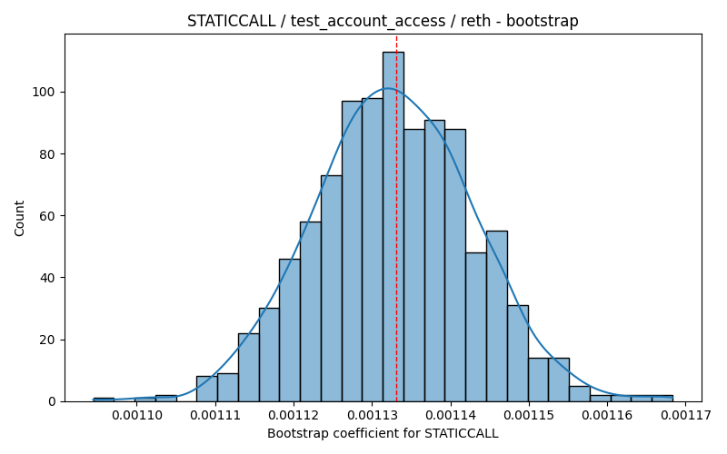

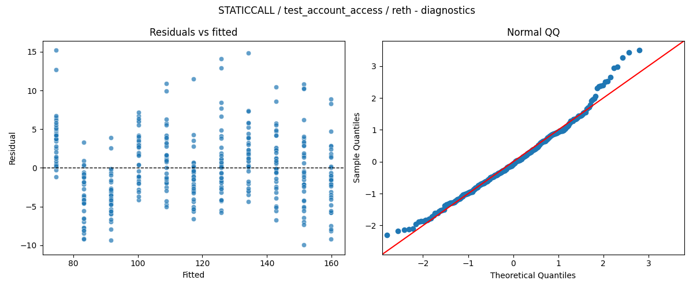

</details>

### test_account_access — combo `STATICCALL_AccountMode.NON_EXISTING_ACCOUNT` — `presets[cold_account_nocode_access]`

| client | nobs | R² | target_coef (ms) | p-value | 95% CI |
| --- | --- | --- | --- | --- | --- |
| `besu` | 1309 | 0.7777 | 0.01264 | 1.00e-03 | [0.01225, 0.01301] |
| `erigon` | 385 | 0.9851 | 0.01147 | 1.00e-03 | [0.01138, 0.01151] |
| `ethrex` | 1276 | 0.9961 | 0.0027 | 1.00e-03 | [0.00269, 0.002709] |
| `geth` | 924 | 0.6729 | 0.02479 | 1.00e-03 | [0.02364, 0.026] |
| `nethermind` | 495 | 0.8743 | 0.004223 | 1.00e-03 | [0.004078, 0.004366] |
| `reth` | 385 | 0.9716 | 0.000975 | 1.00e-03 | [0.0009574, 0.0009917] |

<details><summary>besu — NNLS regression summary</summary>

```
==============================================================================
                           NNLS Regression Results                            
==============================================================================
Dep. Variable:          test_runtime_ms              R-squared:          0.778
Model:                  NNLS                    Adj. R-squared:          0.777
No. Observations:       1309                              RMSE:         160.67
Df Residuals:           1307                               MAE:         135.24
Df Model:               1      
==============================================================================
                      coef     std err     P-value      [0.025      0.975]
------------------------------------------------------------------------------
         const    455.3163     14.1412       0.001    428.0218    483.2052
       opcount      0.0126      0.0002       0.001      0.0123      0.0130
==============================================================================
Notes: Non-negative least squares with bootstrap inference (1000 iterations)
==============================================================================
```

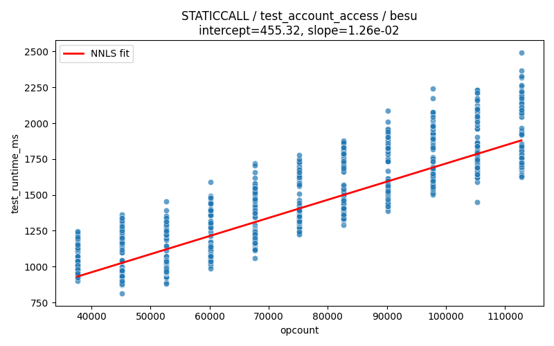

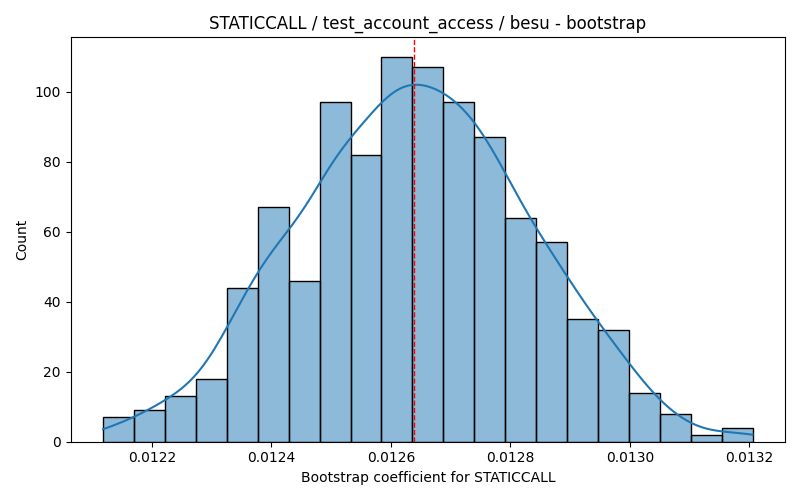


</details>

<details><summary>erigon — NNLS regression summary</summary>

```
==============================================================================
                           NNLS Regression Results                            
==============================================================================
Dep. Variable:          test_runtime_ms              R-squared:          0.985
Model:                  NNLS                    Adj. R-squared:          0.985
No. Observations:       385                               RMSE:          33.75
Df Residuals:           383                                MAE:          26.79
Df Model:               1      
==============================================================================
                      coef     std err     P-value      [0.025      0.975]
------------------------------------------------------------------------------
         const      0.0000      1.3507       1.000      0.0000      4.2974
       opcount      0.0115      0.0000       0.001      0.0114      0.0115
==============================================================================
Notes: Non-negative least squares with bootstrap inference (1000 iterations)
==============================================================================
```


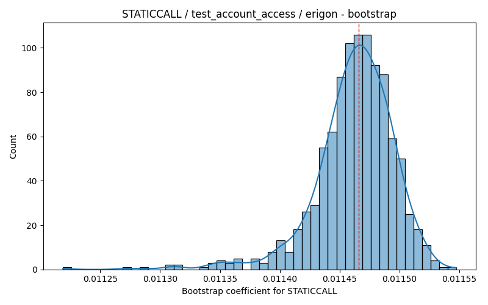

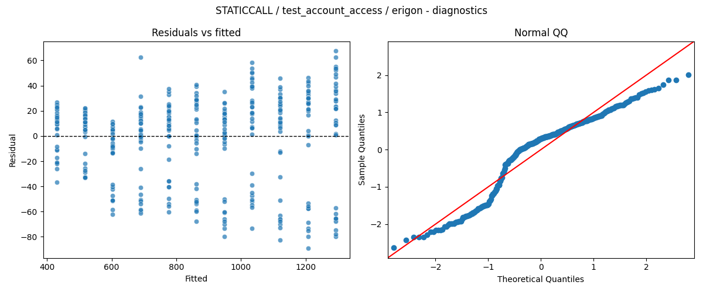

</details>

<details><summary>ethrex — NNLS regression summary</summary>

```
==============================================================================
                           NNLS Regression Results                            
==============================================================================
Dep. Variable:          test_runtime_ms              R-squared:          0.996
Model:                  NNLS                    Adj. R-squared:          0.996
No. Observations:       1276                              RMSE:           3.99
Df Residuals:           1274                               MAE:           3.04
Df Model:               1      
==============================================================================
                      coef     std err     P-value      [0.025      0.975]
------------------------------------------------------------------------------
         const      0.6114      0.3586       0.040      0.0000      1.3407
       opcount      0.0027      0.0000       0.001      0.0027      0.0027
==============================================================================
Notes: Non-negative least squares with bootstrap inference (1000 iterations)
==============================================================================
```

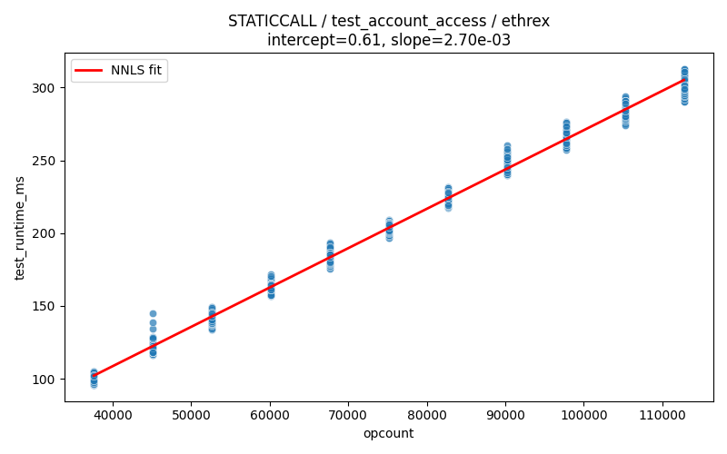

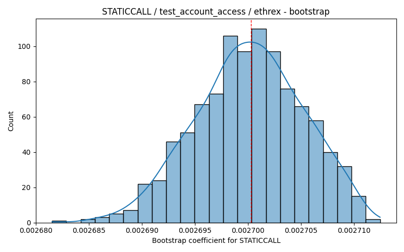

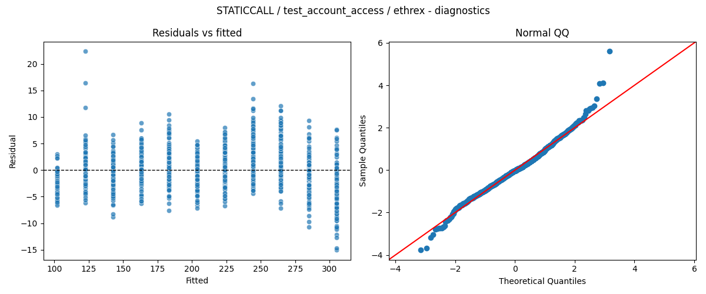

</details>

<details><summary>geth — NNLS regression summary</summary>

```
==============================================================================
                           NNLS Regression Results                            
==============================================================================
Dep. Variable:          test_runtime_ms              R-squared:          0.673
Model:                  NNLS                    Adj. R-squared:          0.673
No. Observations:       924                               RMSE:         410.91
Df Residuals:           922                                MAE:         336.14
Df Model:               1      
==============================================================================
                      coef     std err     P-value      [0.025      0.975]
------------------------------------------------------------------------------
         const   1372.6315     48.1363       0.001   1276.3188   1468.6422
       opcount      0.0248      0.0006       0.001      0.0236      0.0260
==============================================================================
Notes: Non-negative least squares with bootstrap inference (1000 iterations)
==============================================================================
```

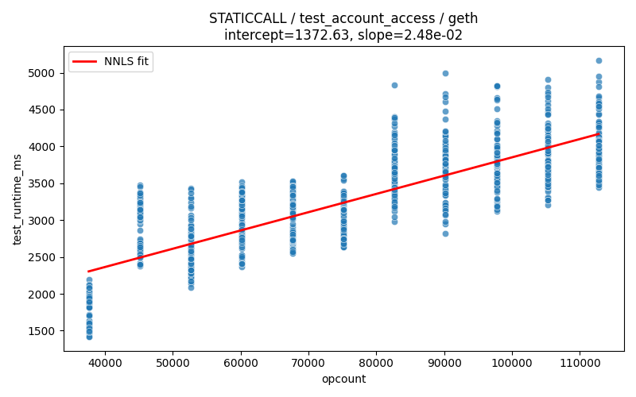

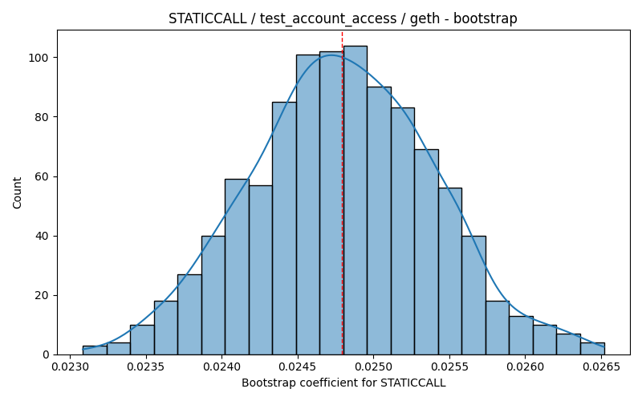

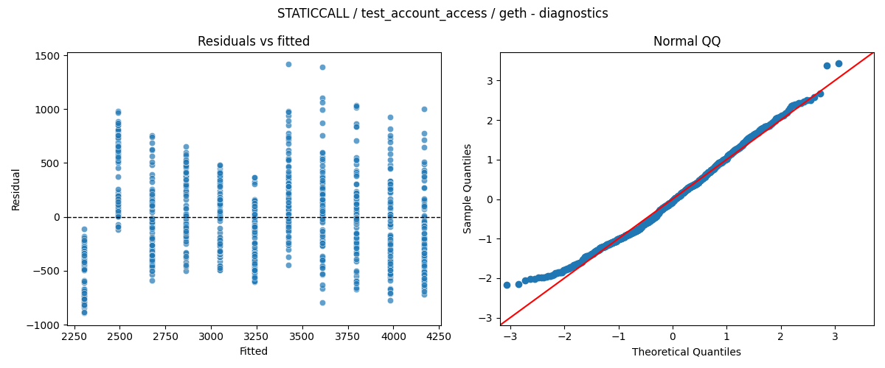

</details>

<details><summary>nethermind — NNLS regression summary</summary>

```
==============================================================================
                           NNLS Regression Results                            
==============================================================================
Dep. Variable:          test_runtime_ms              R-squared:          0.874
Model:                  NNLS                    Adj. R-squared:          0.874
No. Observations:       495                               RMSE:          38.07
Df Residuals:           493                                MAE:          27.82
Df Model:               1      
==============================================================================
                      coef     std err     P-value      [0.025      0.975]
------------------------------------------------------------------------------
         const    104.3567      5.3718       0.001     94.0045    114.9323
       opcount      0.0042      0.0001       0.001      0.0041      0.0044
==============================================================================
Notes: Non-negative least squares with bootstrap inference (1000 iterations)
==============================================================================
```

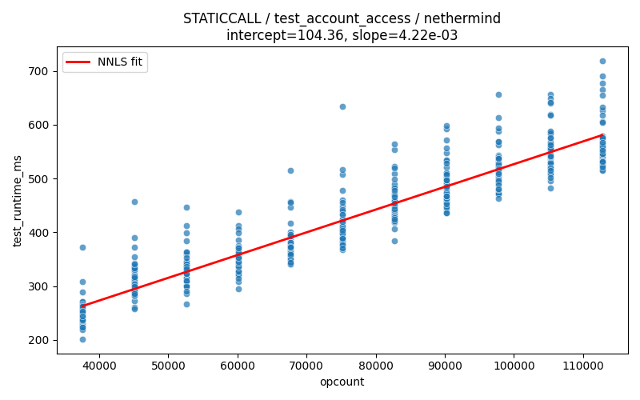

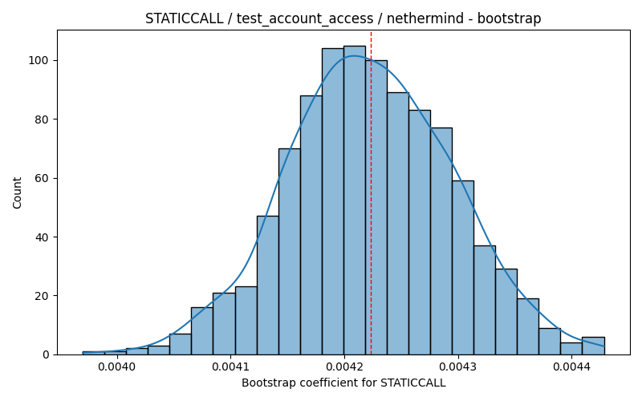

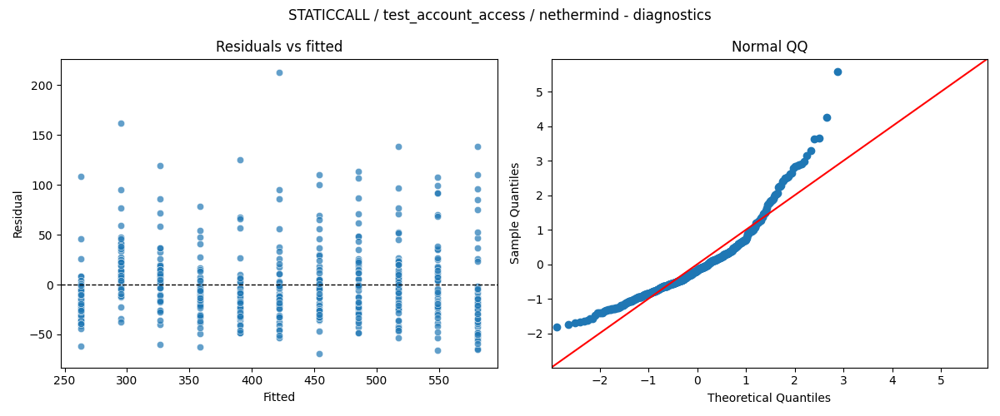

</details>

<details><summary>reth — NNLS regression summary</summary>

```
==============================================================================
                           NNLS Regression Results                            
==============================================================================
Dep. Variable:          test_runtime_ms              R-squared:          0.972
Model:                  NNLS                    Adj. R-squared:          0.972
No. Observations:       385                               RMSE:           3.96
Df Residuals:           383                                MAE:           3.17
Df Model:               1      
==============================================================================
                      coef     std err     P-value      [0.025      0.975]
------------------------------------------------------------------------------
         const     31.5376      0.6860       0.001     30.2271     32.9646
       opcount      0.0010      0.0000       0.001      0.0010      0.0010
==============================================================================
Notes: Non-negative least squares with bootstrap inference (1000 iterations)
==============================================================================
```

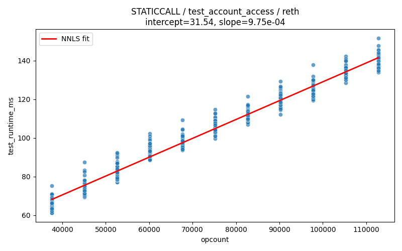

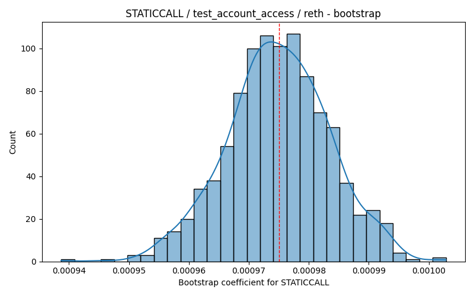

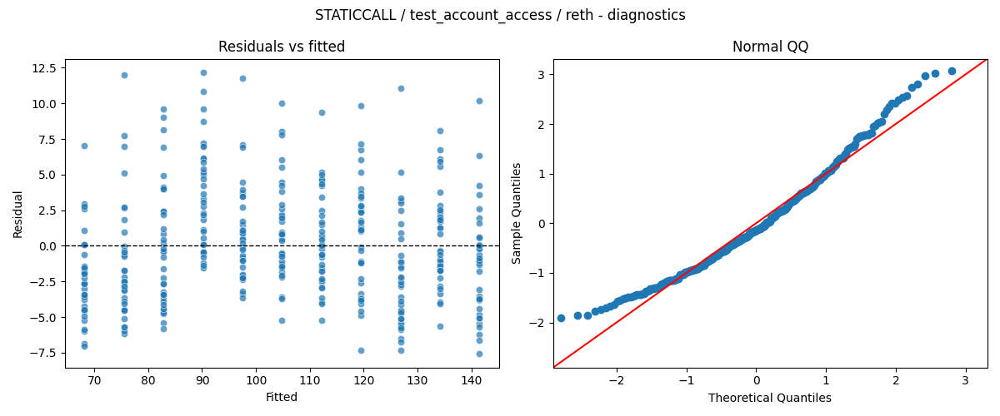

</details>

### test_account_access — combo `STATICCALL_AccountMode.EXISTING_CONTRACT`

| client | nobs | R² | target_coef (ms) | p-value | 95% CI |
| --- | --- | --- | --- | --- | --- |
| `besu` | 1309 | 0.8675 | 0.02926 | 1.00e-03 | [0.02868, 0.02977] |
| `erigon` | 385 | 0.878 | 0.08656 | 1.00e-03 | [0.08328, 0.08974] |
| `ethrex` | 1276 | 0.972 | 0.02588 | 1.00e-03 | [0.02559, 0.02613] |
| `geth` | 924 | 0.6947 | 0.02941 | 1.00e-03 | [0.028, 0.03076] |
| `nethermind` | 495 | 0.7448 | 0.02549 | 1.00e-03 | [0.02413, 0.02681] |
| `reth` | 385 | 0.8731 | 0.03595 | 1.00e-03 | [0.03439, 0.03775] |

<details><summary>besu — NNLS regression summary</summary>

```
==============================================================================
                           NNLS Regression Results                            
==============================================================================
Dep. Variable:          test_runtime_ms              R-squared:          0.868
Model:                  NNLS                    Adj. R-squared:          0.867
No. Observations:       1309                              RMSE:         232.96
Df Residuals:           1307                               MAE:         194.25
Df Model:               1      
==============================================================================
                      coef     std err     P-value      [0.025      0.975]
------------------------------------------------------------------------------
         const    442.9823     18.4656       0.001    408.1048    479.2095
       opcount      0.0293      0.0003       0.001      0.0287      0.0298
==============================================================================
Notes: Non-negative least squares with bootstrap inference (1000 iterations)
==============================================================================
```

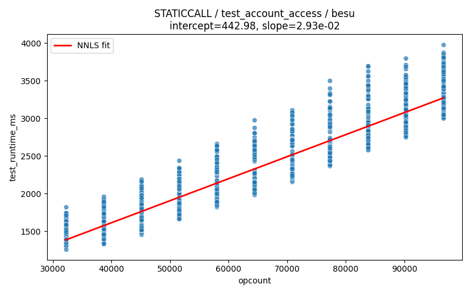

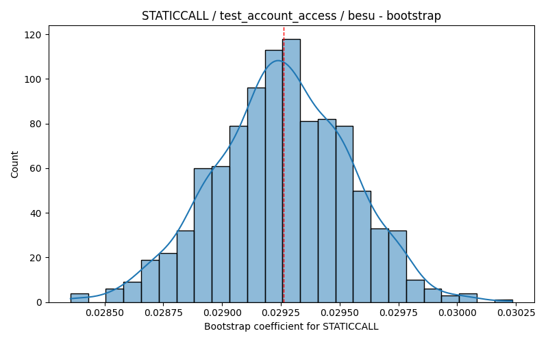

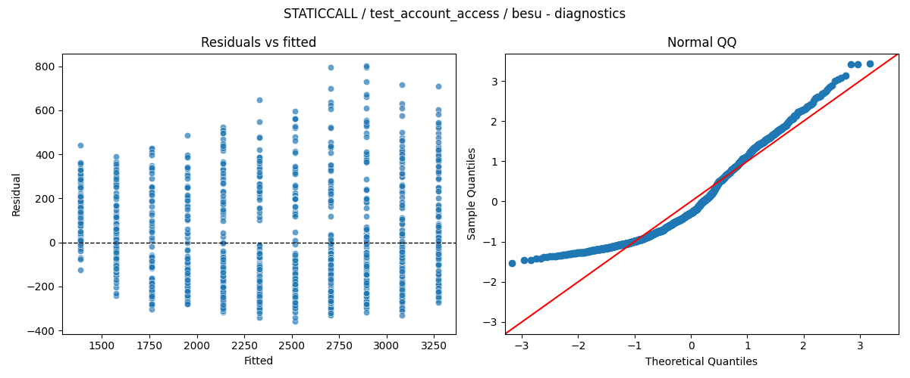

</details>

<details><summary>erigon — NNLS regression summary</summary>

```
==============================================================================
                           NNLS Regression Results                            
==============================================================================
Dep. Variable:          test_runtime_ms              R-squared:          0.878
Model:                  NNLS                    Adj. R-squared:          0.878
No. Observations:       385                               RMSE:         657.25
Df Residuals:           383                                MAE:         565.77
Df Model:               1      
==============================================================================
                      coef     std err     P-value      [0.025      0.975]
------------------------------------------------------------------------------
         const   1397.5976    126.3791       0.001   1158.3445   1646.3718
       opcount      0.0866      0.0016       0.001      0.0833      0.0897
==============================================================================
Notes: Non-negative least squares with bootstrap inference (1000 iterations)
==============================================================================
```

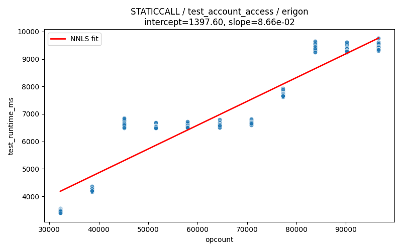

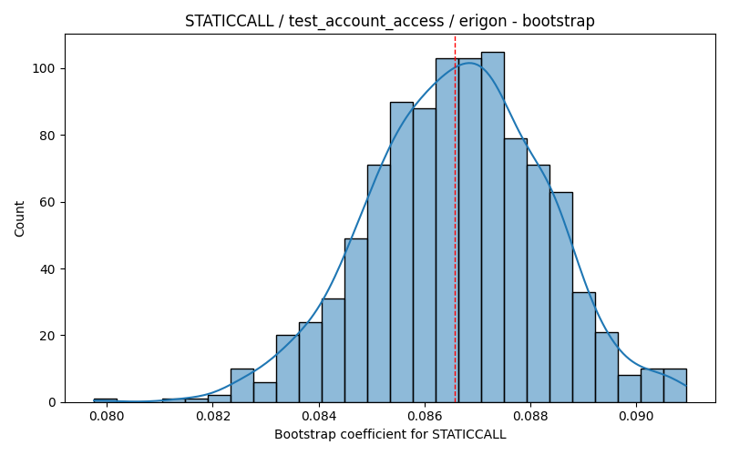

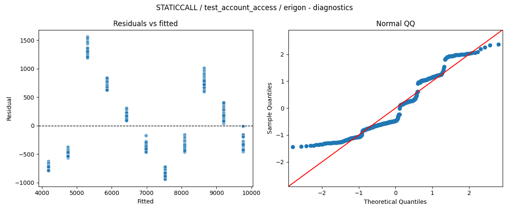

</details>

<details><summary>ethrex — NNLS regression summary</summary>

```
==============================================================================
                           NNLS Regression Results                            
==============================================================================
Dep. Variable:          test_runtime_ms              R-squared:          0.972
Model:                  NNLS                    Adj. R-squared:          0.972
No. Observations:       1276                              RMSE:          89.46
Df Residuals:           1274                               MAE:          78.01
Df Model:               1      
==============================================================================
                      coef     std err     P-value      [0.025      0.975]
------------------------------------------------------------------------------
         const    339.6156      9.9903       0.001    321.4037    359.7800
       opcount      0.0259      0.0001       0.001      0.0256      0.0261
==============================================================================
Notes: Non-negative least squares with bootstrap inference (1000 iterations)
==============================================================================
```

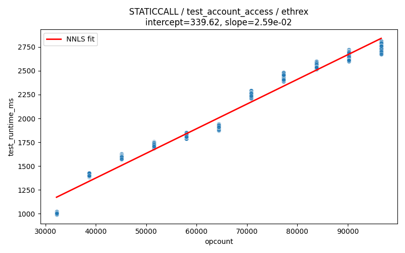

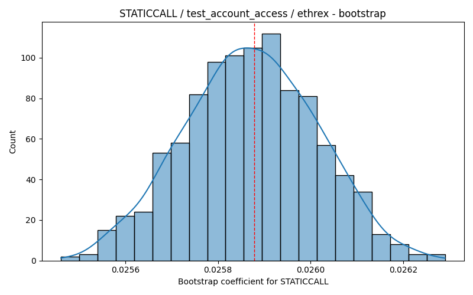

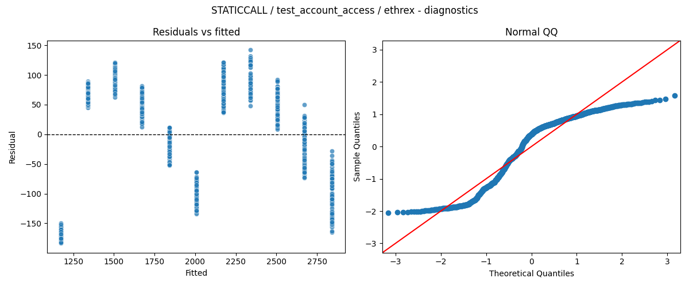

</details>

<details><summary>geth — NNLS regression summary</summary>

```
==============================================================================
                           NNLS Regression Results                            
==============================================================================
Dep. Variable:          test_runtime_ms              R-squared:          0.695
Model:                  NNLS                    Adj. R-squared:          0.694
No. Observations:       924                               RMSE:         397.13
Df Residuals:           922                                MAE:         328.43
Df Model:               1      
==============================================================================
                      coef     std err     P-value      [0.025      0.975]
------------------------------------------------------------------------------
         const   1104.9516     47.4309       0.001   1014.2960   1196.4505
       opcount      0.0294      0.0007       0.001      0.0280      0.0308
==============================================================================
Notes: Non-negative least squares with bootstrap inference (1000 iterations)
==============================================================================
```

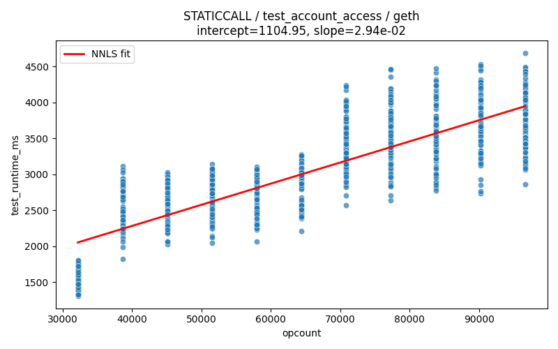

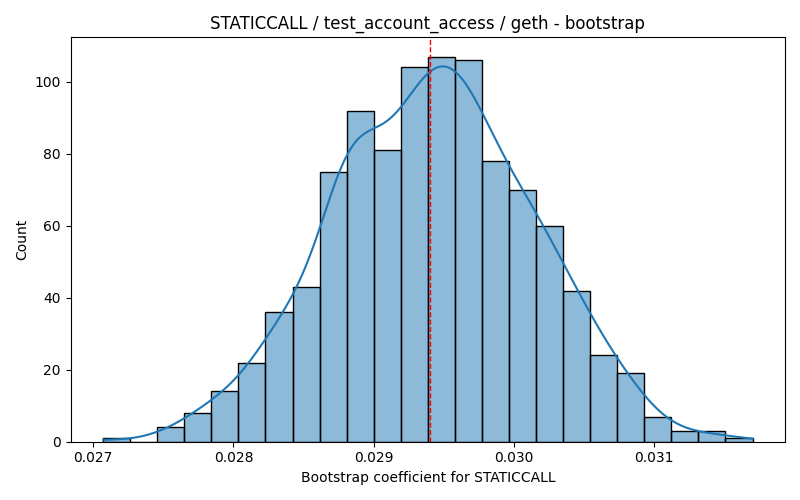

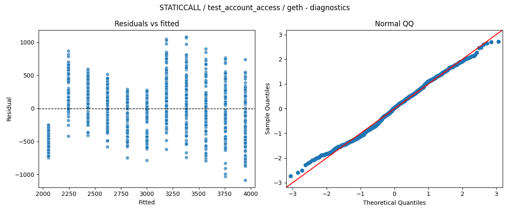

</details>

<details><summary>nethermind — NNLS regression summary</summary>

```
==============================================================================
                           NNLS Regression Results                            
==============================================================================
Dep. Variable:          test_runtime_ms              R-squared:          0.745
Model:                  NNLS                    Adj. R-squared:          0.744
No. Observations:       495                               RMSE:         303.94
Df Residuals:           493                                MAE:         256.60
Df Model:               1      
==============================================================================
                      coef     std err     P-value      [0.025      0.975]
------------------------------------------------------------------------------
         const    890.0507     49.3551       0.001    799.1035    993.3621
       opcount      0.0255      0.0007       0.001      0.0241      0.0268
==============================================================================
Notes: Non-negative least squares with bootstrap inference (1000 iterations)
==============================================================================
```

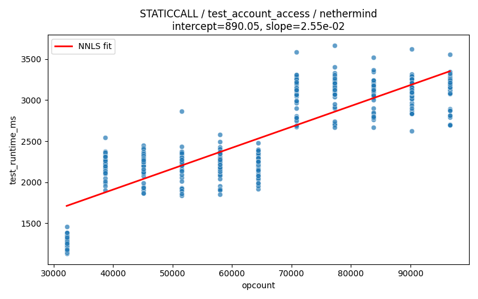

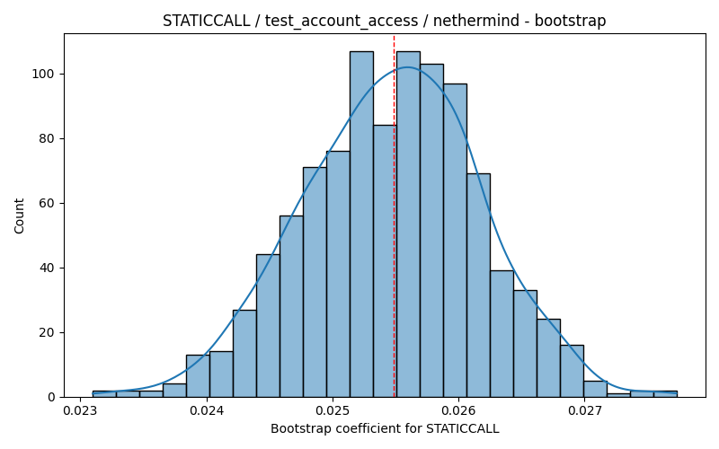

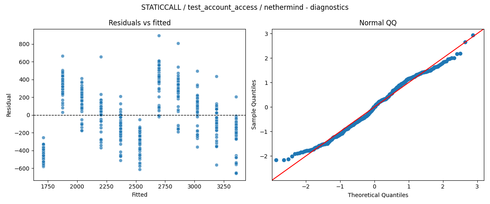

</details>

<details><summary>reth — NNLS regression summary</summary>

```
==============================================================================
                           NNLS Regression Results                            
==============================================================================
Dep. Variable:          test_runtime_ms              R-squared:          0.873
Model:                  NNLS                    Adj. R-squared:          0.873
No. Observations:       385                               RMSE:         279.15
Df Residuals:           383                                MAE:         162.09
Df Model:               1      
==============================================================================
                      coef     std err     P-value      [0.025      0.975]
------------------------------------------------------------------------------
         const    165.3758     53.1355       0.002     63.3237    262.7344
       opcount      0.0359      0.0009       0.001      0.0344      0.0377
==============================================================================
Notes: Non-negative least squares with bootstrap inference (1000 iterations)
==============================================================================
```

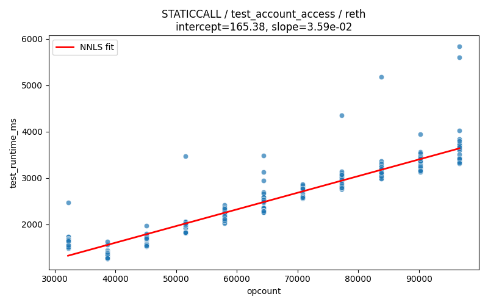

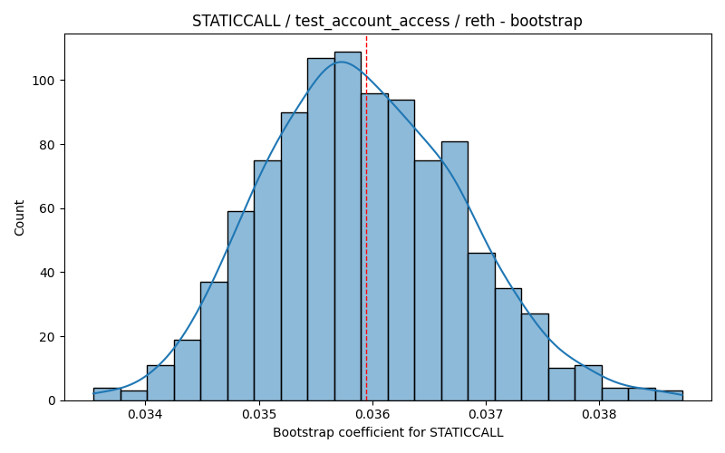

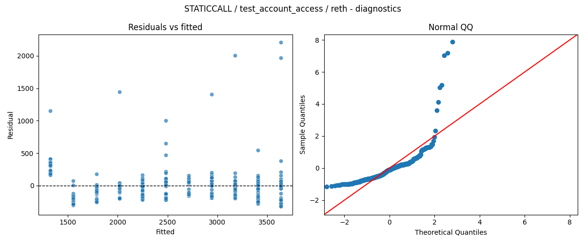

</details>

### test_account_access — combo `STATICCALL_AccountMode.NON_EXISTING_ACCOUNT` — `presets[cold_account_code_access]`

| client | nobs | R² | target_coef (ms) | p-value | 95% CI |
| --- | --- | --- | --- | --- | --- |
| `besu` | 1309 | 0.7777 | 0.01264 | 1.00e-03 | [0.01225, 0.01301] |
| `erigon` | 385 | 0.9851 | 0.01147 | 1.00e-03 | [0.01138, 0.01151] |
| `ethrex` | 1276 | 0.9961 | 0.0027 | 1.00e-03 | [0.00269, 0.002709] |
| `geth` | 924 | 0.6729 | 0.02479 | 1.00e-03 | [0.02364, 0.026] |
| `nethermind` | 495 | 0.8743 | 0.004223 | 1.00e-03 | [0.004078, 0.004366] |
| `reth` | 385 | 0.9716 | 0.000975 | 1.00e-03 | [0.0009574, 0.0009917] |

<details><summary>besu — NNLS regression summary</summary>

```
==============================================================================
                           NNLS Regression Results                            
==============================================================================
Dep. Variable:          test_runtime_ms              R-squared:          0.778
Model:                  NNLS                    Adj. R-squared:          0.777
No. Observations:       1309                              RMSE:         160.67
Df Residuals:           1307                               MAE:         135.24
Df Model:               1      
==============================================================================
                      coef     std err     P-value      [0.025      0.975]
------------------------------------------------------------------------------
         const    455.3163     14.1412       0.001    428.0218    483.2052
       opcount      0.0126      0.0002       0.001      0.0123      0.0130
==============================================================================
Notes: Non-negative least squares with bootstrap inference (1000 iterations)
==============================================================================
```


</details>

<details><summary>erigon — NNLS regression summary</summary>

```
==============================================================================
                           NNLS Regression Results                            
==============================================================================
Dep. Variable:          test_runtime_ms              R-squared:          0.985
Model:                  NNLS                    Adj. R-squared:          0.985
No. Observations:       385                               RMSE:          33.75
Df Residuals:           383                                MAE:          26.79
Df Model:               1      
==============================================================================
                      coef     std err     P-value      [0.025      0.975]
------------------------------------------------------------------------------
         const      0.0000      1.3507       1.000      0.0000      4.2974
       opcount      0.0115      0.0000       0.001      0.0114      0.0115
==============================================================================
Notes: Non-negative least squares with bootstrap inference (1000 iterations)
==============================================================================
```


</details>

<details><summary>ethrex — NNLS regression summary</summary>

```
==============================================================================
                           NNLS Regression Results                            
==============================================================================
Dep. Variable:          test_runtime_ms              R-squared:          0.996
Model:                  NNLS                    Adj. R-squared:          0.996
No. Observations:       1276                              RMSE:           3.99
Df Residuals:           1274                               MAE:           3.04
Df Model:               1      
==============================================================================
                      coef     std err     P-value      [0.025      0.975]
------------------------------------------------------------------------------
         const      0.6114      0.3586       0.040      0.0000      1.3407
       opcount      0.0027      0.0000       0.001      0.0027      0.0027
==============================================================================
Notes: Non-negative least squares with bootstrap inference (1000 iterations)
==============================================================================
```


</details>

<details><summary>geth — NNLS regression summary</summary>

```
==============================================================================
                           NNLS Regression Results                            
==============================================================================
Dep. Variable:          test_runtime_ms              R-squared:          0.673
Model:                  NNLS                    Adj. R-squared:          0.673
No. Observations:       924                               RMSE:         410.91
Df Residuals:           922                                MAE:         336.14
Df Model:               1      
==============================================================================
                      coef     std err     P-value      [0.025      0.975]
------------------------------------------------------------------------------
         const   1372.6315     48.1363       0.001   1276.3188   1468.6422
       opcount      0.0248      0.0006       0.001      0.0236      0.0260
==============================================================================
Notes: Non-negative least squares with bootstrap inference (1000 iterations)
==============================================================================
```


</details>

<details><summary>nethermind — NNLS regression summary</summary>

```
==============================================================================
                           NNLS Regression Results                            
==============================================================================
Dep. Variable:          test_runtime_ms              R-squared:          0.874
Model:                  NNLS                    Adj. R-squared:          0.874
No. Observations:       495                               RMSE:          38.07
Df Residuals:           493                                MAE:          27.82
Df Model:               1      
==============================================================================
                      coef     std err     P-value      [0.025      0.975]
------------------------------------------------------------------------------
         const    104.3567      5.3718       0.001     94.0045    114.9323
       opcount      0.0042      0.0001       0.001      0.0041      0.0044
==============================================================================
Notes: Non-negative least squares with bootstrap inference (1000 iterations)
==============================================================================
```


</details>

<details><summary>reth — NNLS regression summary</summary>

```
==============================================================================
                           NNLS Regression Results                            
==============================================================================
Dep. Variable:          test_runtime_ms              R-squared:          0.972
Model:                  NNLS                    Adj. R-squared:          0.972
No. Observations:       385                               RMSE:           3.96
Df Residuals:           383                                MAE:           3.17
Df Model:               1      
==============================================================================
                      coef     std err     P-value      [0.025      0.975]
------------------------------------------------------------------------------
         const     31.5376      0.6860       0.001     30.2271     32.9646
       opcount      0.0010      0.0000       0.001      0.0010      0.0010
==============================================================================
Notes: Non-negative least squares with bootstrap inference (1000 iterations)
==============================================================================
```


</details>

### test_ext_account_query_warm — combo `STATICCALL`

| client | nobs | R² | target_coef (ms) | p-value | 95% CI |
| --- | --- | --- | --- | --- | --- |
| `besu` | 1309 | 0.7294 | 0.0005061 | 1.00e-03 | [0.0004893, 0.0005232] |
| `erigon` | 385 | 0.9844 | 0.0005747 | 1.00e-03 | [0.000568, 0.0005818] |
| `ethrex` | 1276 | 0.839 | 6.894e-05 | 1.00e-03 | [6.711e-05, 7.071e-05] |
| `geth` | 924 | 0.8768 | 0.0001806 | 1.00e-03 | [0.000176, 0.0001852] |
| `nethermind` | 495 | 0.3255 | 0.0003841 | 1.00e-03 | [0.0003397, 0.0004314] |
| `reth` | 385 | 0.9095 | 4.776e-05 | 1.00e-03 | [4.612e-05, 4.936e-05] |

<details><summary>besu — NNLS regression summary</summary>

```
==============================================================================
                           NNLS Regression Results                            
==============================================================================
Dep. Variable:          test_runtime_ms              R-squared:          0.729
Model:                  NNLS                    Adj. R-squared:          0.729
No. Observations:       1309                              RMSE:         159.56
Df Residuals:           1307                               MAE:         120.39
Df Model:               1      
==============================================================================
                      coef     std err     P-value      [0.025      0.975]
------------------------------------------------------------------------------
         const    613.2866     13.8197       0.001    586.1386    639.5257
       opcount      0.0005      0.0000       0.001      0.0005      0.0005
==============================================================================
Notes: Non-negative least squares with bootstrap inference (1000 iterations)
==============================================================================
```

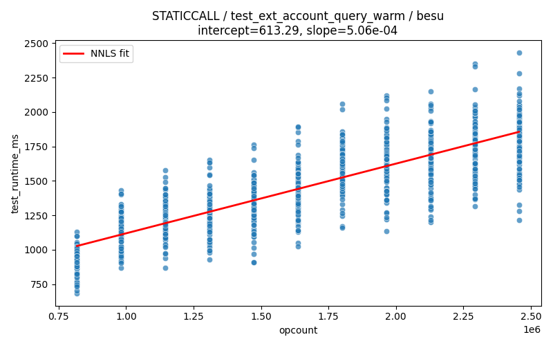

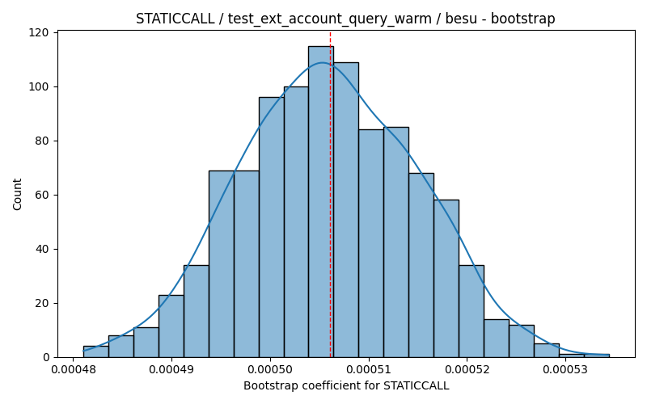

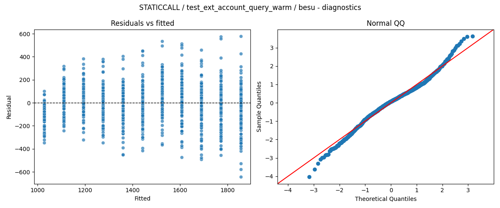

</details>

<details><summary>erigon — NNLS regression summary</summary>

```
==============================================================================
                           NNLS Regression Results                            
==============================================================================
Dep. Variable:          test_runtime_ms              R-squared:          0.984
Model:                  NNLS                    Adj. R-squared:          0.984
No. Observations:       385                               RMSE:          37.44
Df Residuals:           383                                MAE:          28.75
Df Model:               1      
==============================================================================
                      coef     std err     P-value      [0.025      0.975]
------------------------------------------------------------------------------
         const     52.3661      5.8428       0.001     40.4674     64.0147
       opcount      0.0006      0.0000       0.001      0.0006      0.0006
==============================================================================
Notes: Non-negative least squares with bootstrap inference (1000 iterations)
==============================================================================
```

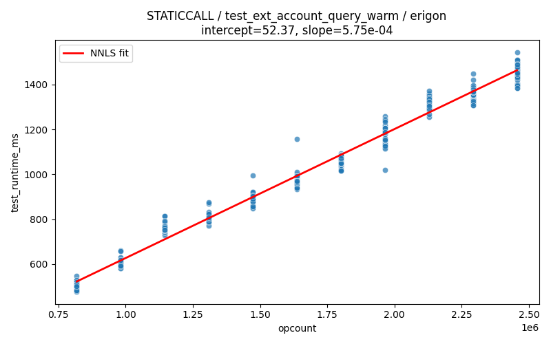

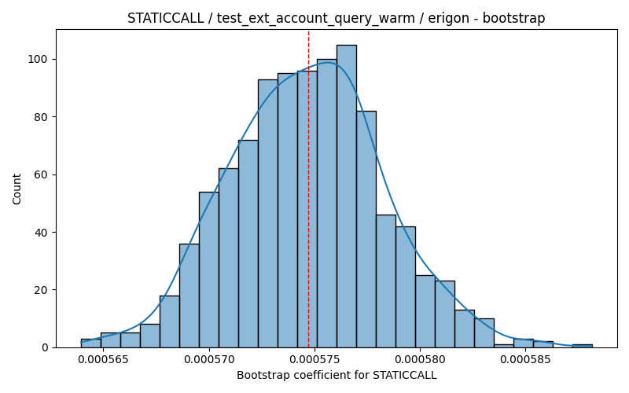

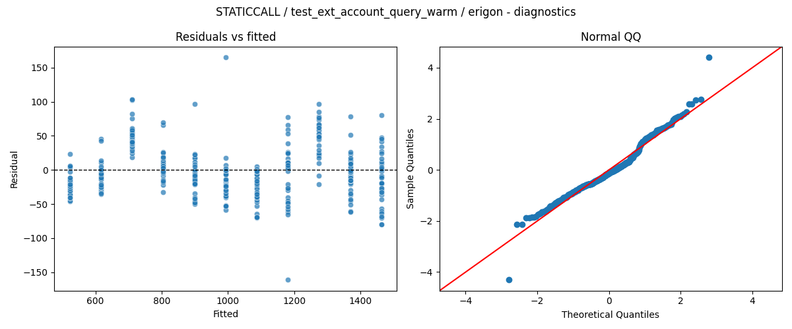

</details>

<details><summary>ethrex — NNLS regression summary</summary>

```
==============================================================================
                           NNLS Regression Results                            
==============================================================================
Dep. Variable:          test_runtime_ms              R-squared:          0.839
Model:                  NNLS                    Adj. R-squared:          0.839
No. Observations:       1276                              RMSE:          15.63
Df Residuals:           1274                               MAE:          13.11
Df Model:               1      
==============================================================================
                      coef     std err     P-value      [0.025      0.975]
------------------------------------------------------------------------------
         const     32.6803      1.5907       0.001     29.5557     35.8112
       opcount      0.0001      0.0000       0.001      0.0001      0.0001
==============================================================================
Notes: Non-negative least squares with bootstrap inference (1000 iterations)
==============================================================================
```

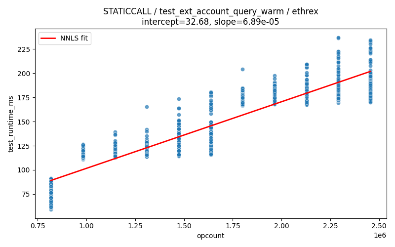

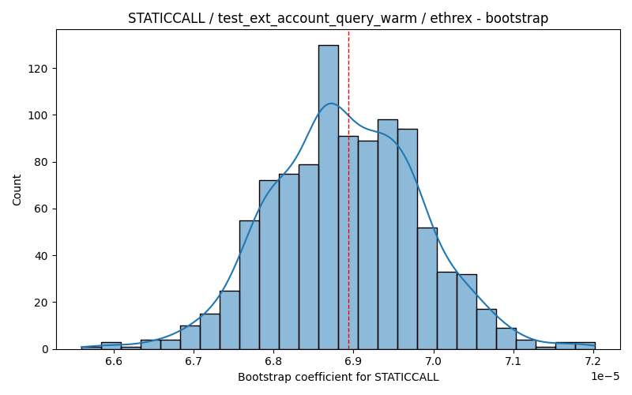

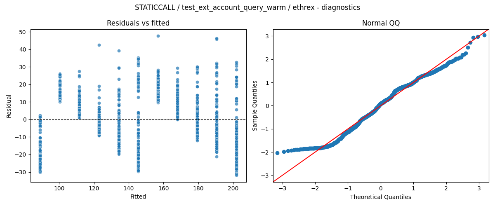

</details>

<details><summary>geth — NNLS regression summary</summary>

```
==============================================================================
                           NNLS Regression Results                            
==============================================================================
Dep. Variable:          test_runtime_ms              R-squared:          0.877
Model:                  NNLS                    Adj. R-squared:          0.877
No. Observations:       924                               RMSE:          35.04
Df Residuals:           922                                MAE:          27.67
Df Model:               1      
==============================================================================
                      coef     std err     P-value      [0.025      0.975]
------------------------------------------------------------------------------
         const     44.0400      3.4450       0.001     37.5255     50.8391
       opcount      0.0002      0.0000       0.001      0.0002      0.0002
==============================================================================
Notes: Non-negative least squares with bootstrap inference (1000 iterations)
==============================================================================
```

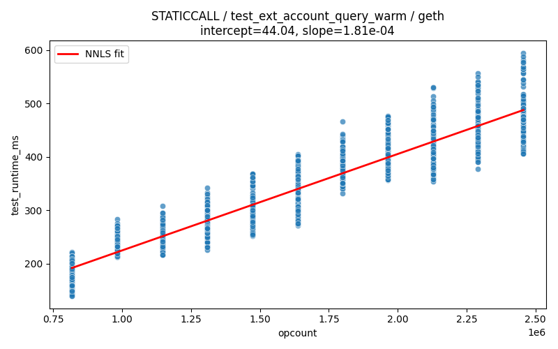

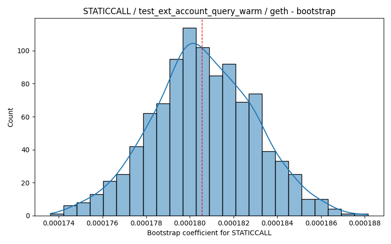


</details>

<details><summary>nethermind — NNLS regression summary</summary>

```
==============================================================================
                           NNLS Regression Results                            
==============================================================================
Dep. Variable:          test_runtime_ms              R-squared:          0.326
Model:                  NNLS                    Adj. R-squared:          0.324
No. Observations:       495                               RMSE:         286.19
Df Residuals:           493                                MAE:         201.08
Df Model:               1      
==============================================================================
                      coef     std err     P-value      [0.025      0.975]
------------------------------------------------------------------------------
         const    183.4230     35.8189       0.001    115.4719    251.7662
       opcount      0.0004      0.0000       0.001      0.0003      0.0004
==============================================================================
Notes: Non-negative least squares with bootstrap inference (1000 iterations)
==============================================================================
```

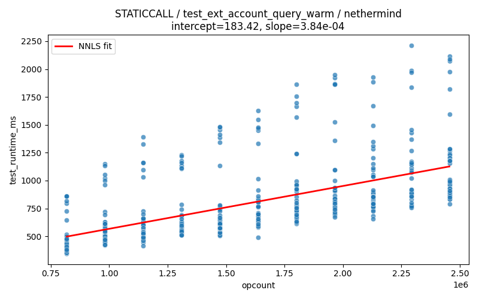

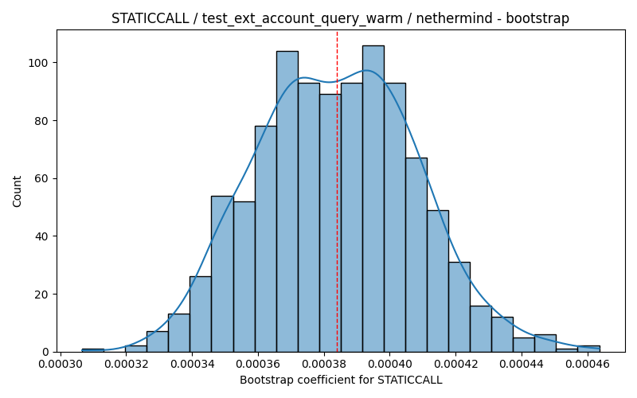

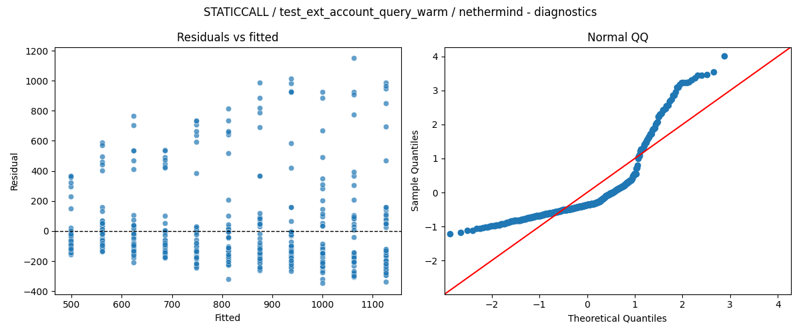

</details>

<details><summary>reth — NNLS regression summary</summary>

```
==============================================================================
                           NNLS Regression Results                            
==============================================================================
Dep. Variable:          test_runtime_ms              R-squared:          0.910
Model:                  NNLS                    Adj. R-squared:          0.909
No. Observations:       385                               RMSE:           7.80
Df Residuals:           383                                MAE:           6.11
Df Model:               1      
==============================================================================
                      coef     std err     P-value      [0.025      0.975]
------------------------------------------------------------------------------
         const     16.6217      1.3945       0.001     13.8397     19.3387
       opcount      0.0000      0.0000       0.001      0.0000      0.0000
==============================================================================
Notes: Non-negative least squares with bootstrap inference (1000 iterations)
==============================================================================
```

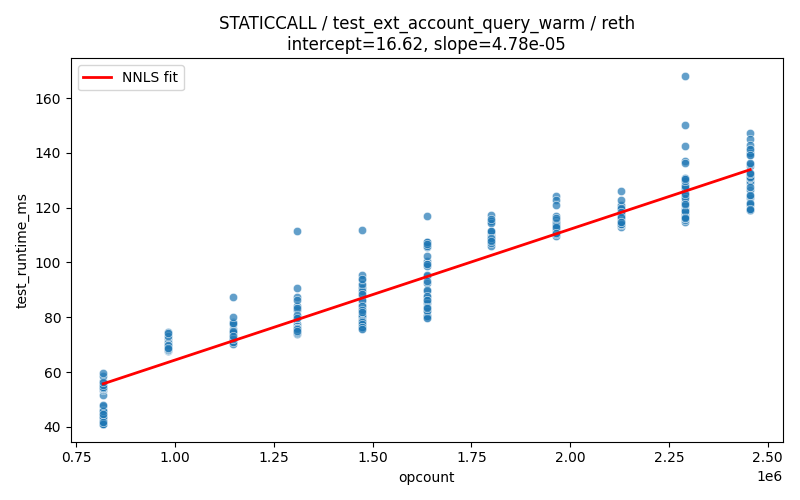


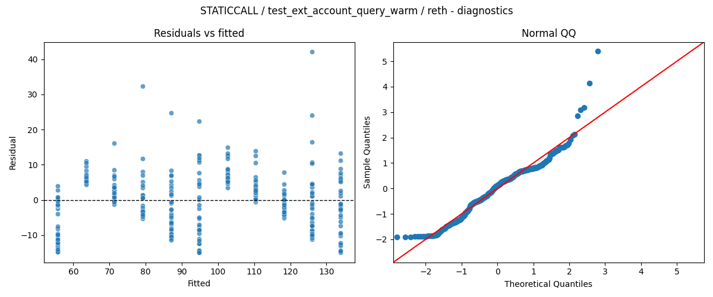

</details>
