# Glue opcodes report

Per-client NNLS fits of priced glue opcodes against their driver fixtures. Cycle-tier opcodes share one joint regression per client (shown once); pure-tier and mixed-tier opcodes each get a single-feature fit. Mixed-tier fits pre-adjust the LHS by subtracting the contribution of every priced upstream partner selected by the detector (pure ∪ cycle for `mixed_a`, plus `mixed_a` for `mixed_b`).

**Contents:** [besu](#besu) · [erigon](#erigon) · [geth](#geth) · [nethermind](#nethermind) · [reth](#reth)

## besu

| glue_opcode | nobs | glue_runtime_ms | p_value | rsquared |
| --- | --- | --- | --- | --- |
| `ISZERO` | 209 | 4.554e-06 | 1.00e-03 | 0.6071 |
| `JUMPDEST` | 209 | 1.777e-06 | 1.00e-03 | 0.1816 |
| `SWAP` | 3344 | 4.107e-06 | 1.00e-03 | 0.8899 |
| `CALLDATASIZE` | 12529 | 3.819e-06 | 1.00e-03 | 0.8408 |
| `DUP` | 12529 | 2.09e-06 | 1.00e-03 | 0.8408 |
| `GAS` | 12529 | 3.327e-06 | 1.00e-03 | 0.8408 |
| `MLOAD` | 12529 | 1.089e-05 | 1.00e-03 | 0.8408 |
| `PUSH` | 12529 | 2.605e-06 | 1.00e-03 | 0.8408 |
| `PUSH0` | 12529 | 1.91e-06 | 1.00e-03 | 0.8408 |
| `STATICCALL` | 12529 | 0.0008625 | 1.00e-03 | 0.8408 |
| `ADD` | 209 | 1.106e-05 | 1.00e-03 | 0.677 |
| `AND` | 209 | 1.034e-05 | 1.00e-03 | 0.3187 |
| `CALLDATACOPY` | 5016 | 1.844e-05 | 1.00e-03 | 0.6769 |
| `CALLDATALOAD` | 836 | 3.47e-06 | 2.54e-01 | 0.0002604 |
| `DIV` | 209 | 1.711e-05 | 1.00e-03 | 0.7104 |
| `EXP` | 209 | 0.001258 | 1.00e-03 | 0.7268 |
| `GT` | 209 | 2.082e-05 | 1.00e-03 | 0.139 |
| `JUMPI` | 209 | 7.601e-06 | 1.00e-03 | 0.3357 |
| `LT` | 209 | 2.092e-05 | 1.00e-03 | 0.1364 |
| `MSTORE` | 1045 | 1.897e-05 | 1.00e-03 | 0.8271 |
| `MSTORE8` | 1045 | 1.25e-05 | 1.00e-03 | 0.5651 |
| `MUL` | 209 | 1.2e-05 | 1.00e-03 | 0.7927 |
| `PC` | 209 | 3.947e-06 | 1.00e-03 | 0.52 |
| `RETURNDATASIZE` | 836 | 6.335e-06 | 1.00e-03 | 0.4443 |
| `SELFBALANCE` | 171 | 8.649e-06 | 1.00e-03 | 0.4911 |
| `SUB` | 209 | 1.171e-05 | 1.00e-03 | 0.6343 |
| `JUMP` | 209 | 3.891e-05 | 1.00e-03 | 0.6384 |
| `KECCAK256` | 3344 | 4.473e-05 | 1.00e-03 | 0.1917 |

### Cycle glue — joint fit · besu

<details><summary>Joint NNLS regression summary</summary>

```
==============================================================================
                           NNLS Regression Results                            
==============================================================================
Dep. Variable:          test_runtime_ms              R-squared:          0.841
Model:                  NNLS                    Adj. R-squared:          0.841
No. Observations:       12529                             RMSE:          83.78
Df Residuals:           12521                              MAE:          73.69
Df Model:               7      
==============================================================================
                      coef     std err     P-value      [0.025      0.975]
------------------------------------------------------------------------------
         const     61.0600      2.2524       0.001     56.5153     65.6682
  CALLDATASIZE      0.0000      0.0000       0.001      0.0000      0.0000
           DUP      0.0000      0.0000       0.001      0.0000      0.0000
           GAS      0.0000      0.0000       0.001      0.0000      0.0000
         MLOAD      0.0000      0.0000       0.001      0.0000      0.0000
          PUSH      0.0000      0.0000       0.001      0.0000      0.0000
         PUSH0      0.0000      0.0000       0.001      0.0000      0.0000
    STATICCALL      0.0009      0.0000       0.001      0.0008      0.0009
==============================================================================
Notes: Non-negative least squares with bootstrap inference (1000 iterations)
==============================================================================
```

</details>

<details><summary><code>CALLDATASIZE</code> · nobs=12529 · runtime_ms=3.819e-06 · p=1.00e-03 · R²=0.8408</summary>

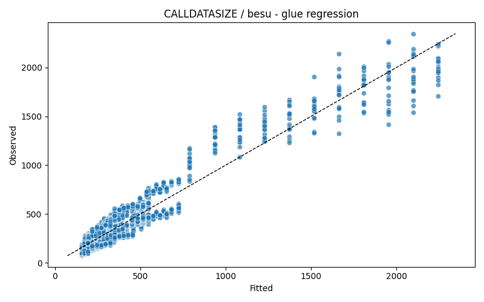

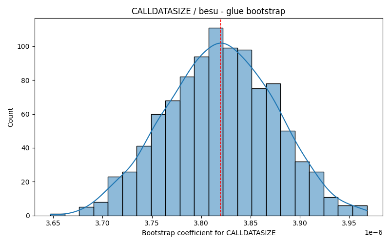


</details>

<details><summary><code>DUP</code> · nobs=12529 · runtime_ms=2.09e-06 · p=1.00e-03 · R²=0.8408</summary>


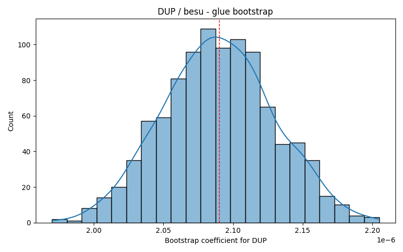


</details>

<details><summary><code>GAS</code> · nobs=12529 · runtime_ms=3.327e-06 · p=1.00e-03 · R²=0.8408</summary>


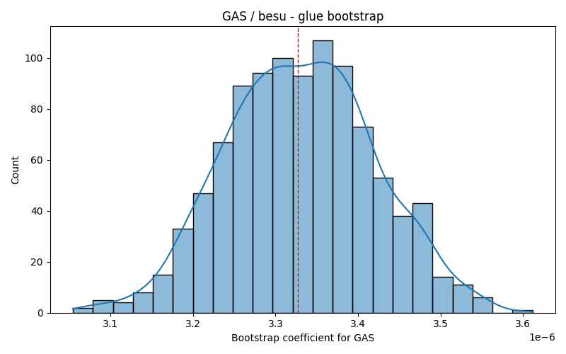


</details>

<details><summary><code>MLOAD</code> · nobs=12529 · runtime_ms=1.089e-05 · p=1.00e-03 · R²=0.8408</summary>


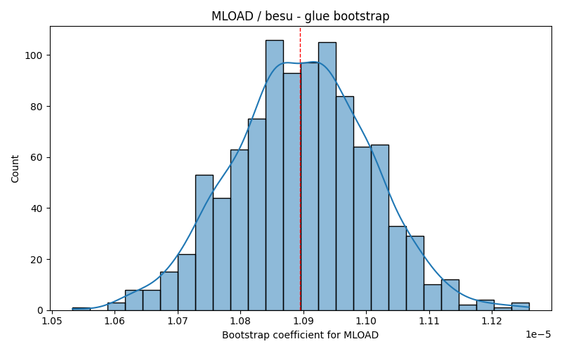


</details>

<details><summary><code>PUSH</code> · nobs=12529 · runtime_ms=2.605e-06 · p=1.00e-03 · R²=0.8408</summary>


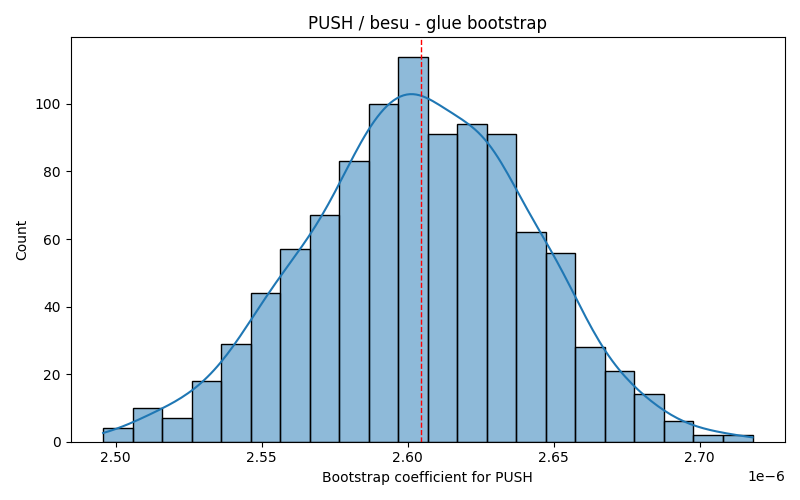

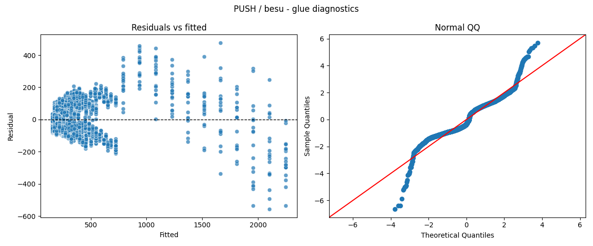

</details>

<details><summary><code>PUSH0</code> · nobs=12529 · runtime_ms=1.91e-06 · p=1.00e-03 · R²=0.8408</summary>


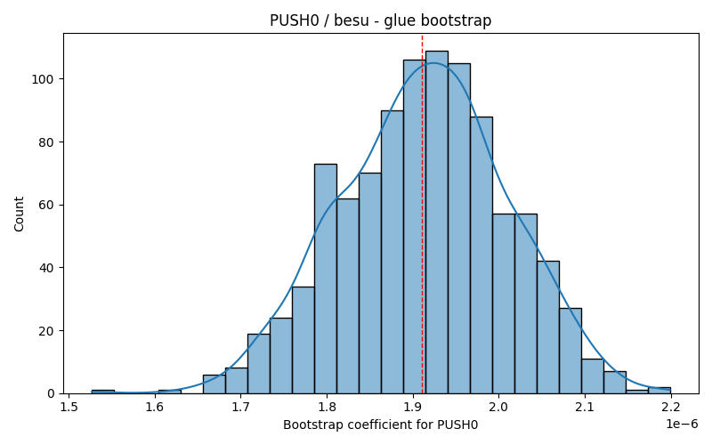


</details>

<details><summary><code>STATICCALL</code> · nobs=12529 · runtime_ms=0.0008625 · p=1.00e-03 · R²=0.8408</summary>


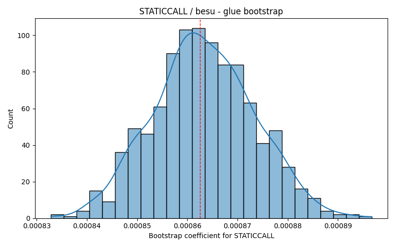


</details>

### Pure glue · besu

<details><summary><code>ISZERO</code> · nobs=209 · runtime_ms=4.554e-06 · p=1.00e-03 · R²=0.6071</summary>

```
==============================================================================
                           NNLS Regression Results                            
==============================================================================
Dep. Variable:          test_runtime_ms              R-squared:          0.607
Model:                  NNLS                    Adj. R-squared:          0.605
No. Observations:       209                               RMSE:          77.13
Df Residuals:           207                                MAE:          70.75
Df Model:               1      
==============================================================================
                      coef     std err     P-value      [0.025      0.975]
------------------------------------------------------------------------------
         const     57.0918     16.1020       0.001     25.6335     89.1923
        ISZERO      0.0000      0.0000       0.001      0.0000      0.0000
==============================================================================
Notes: Non-negative least squares with bootstrap inference (1000 iterations)
==============================================================================
```

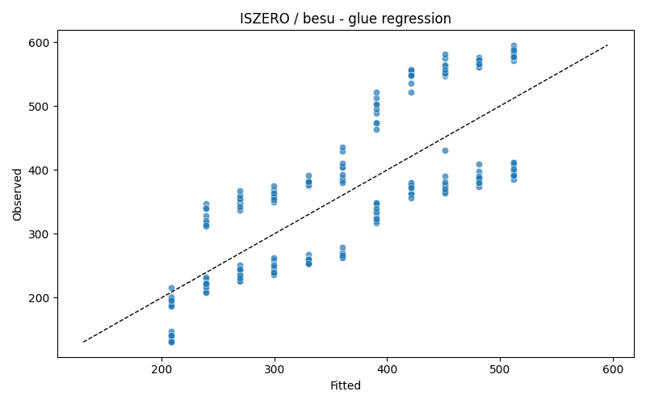

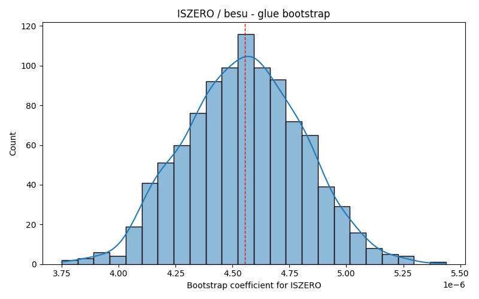

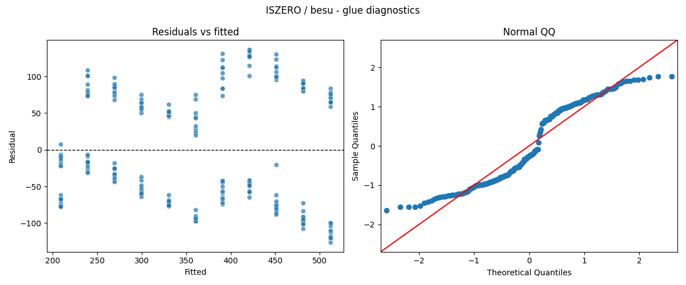

</details>

<details><summary><code>JUMPDEST</code> · nobs=209 · runtime_ms=1.777e-06 · p=1.00e-03 · R²=0.1816</summary>

```
==============================================================================
                           NNLS Regression Results                            
==============================================================================
Dep. Variable:          test_runtime_ms              R-squared:          0.182
Model:                  NNLS                    Adj. R-squared:          0.178
No. Observations:       209                               RMSE:         238.21
Df Residuals:           207                                MAE:         226.45
Df Model:               1      
==============================================================================
                      coef     std err     P-value      [0.025      0.975]
------------------------------------------------------------------------------
         const     66.8183     44.2356       0.082      0.0000    160.7976
      JUMPDEST      0.0000      0.0000       0.001      0.0000      0.0000
==============================================================================
Notes: Non-negative least squares with bootstrap inference (1000 iterations)
==============================================================================
```

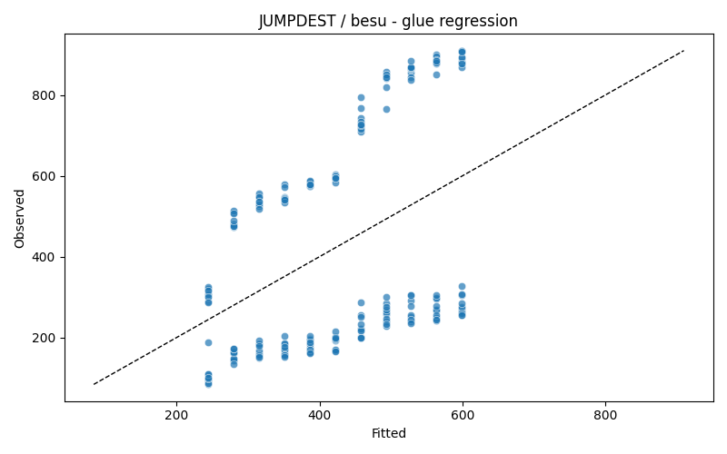

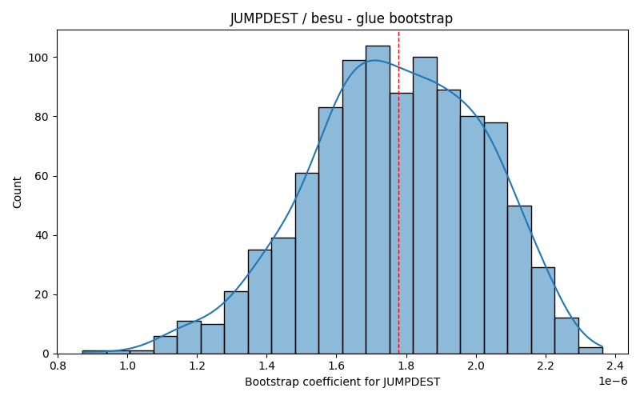

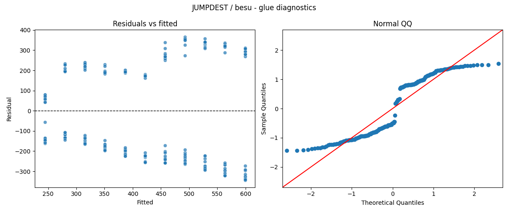

</details>

<details><summary><code>SWAP</code> · nobs=3344 · runtime_ms=4.107e-06 · p=1.00e-03 · R²=0.8899</summary>

```
==============================================================================
                           NNLS Regression Results                            
==============================================================================
Dep. Variable:          test_runtime_ms              R-squared:          0.890
Model:                  NNLS                    Adj. R-squared:          0.890
No. Observations:       3344                              RMSE:          30.41
Df Residuals:           3342                               MAE:          25.05
Df Model:               1      
==============================================================================
                      coef     std err     P-value      [0.025      0.975]
------------------------------------------------------------------------------
         const     57.2611      1.9440       0.001     53.4439     61.1938
          SWAP      0.0000      0.0000       0.001      0.0000      0.0000
==============================================================================
Notes: Non-negative least squares with bootstrap inference (1000 iterations)
==============================================================================
```

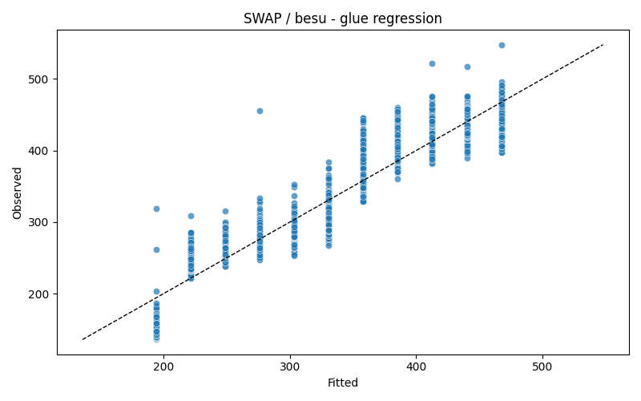

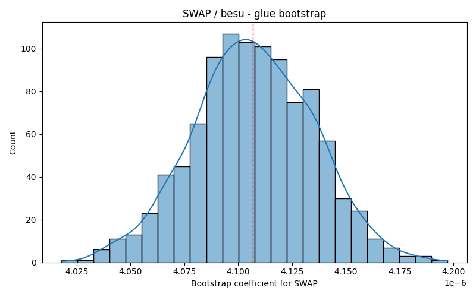

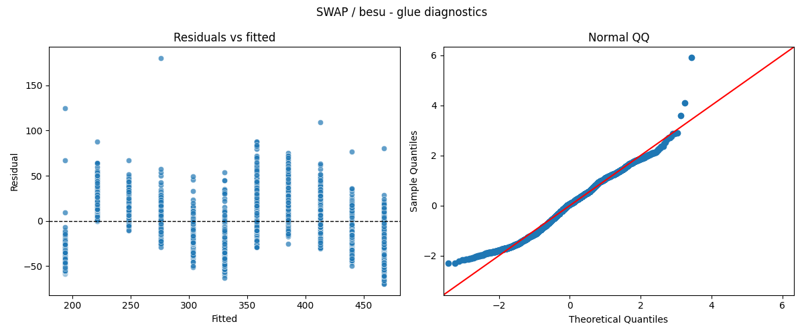

</details>

### Mixed glue (tier A) · besu

<details><summary><code>ADD</code> · nobs=209 · runtime_ms=1.106e-05 · p=1.00e-03 · R²=0.677</summary>

```
==============================================================================
                           NNLS Regression Results                            
==============================================================================
Dep. Variable:          test_runtime_ms              R-squared:          0.677
Model:                  NNLS                    Adj. R-squared:          0.675
No. Observations:       209                               RMSE:          80.38
Df Residuals:           207                                MAE:          72.14
Df Model:               1      
==============================================================================
                      coef     std err     P-value      [0.025      0.975]
------------------------------------------------------------------------------
         const     88.3798     17.2563       0.001     53.8621    121.0893
           ADD      0.0000      0.0000       0.001      0.0000      0.0000
==============================================================================
Notes: Non-negative least squares with bootstrap inference (1000 iterations)
==============================================================================
```

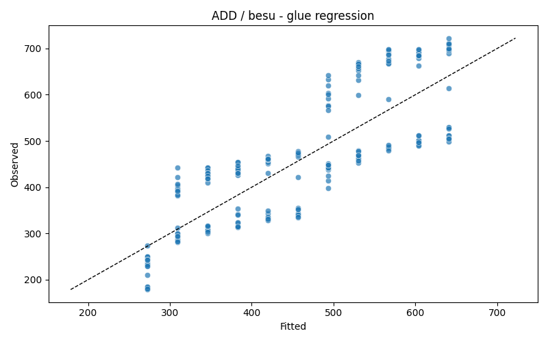

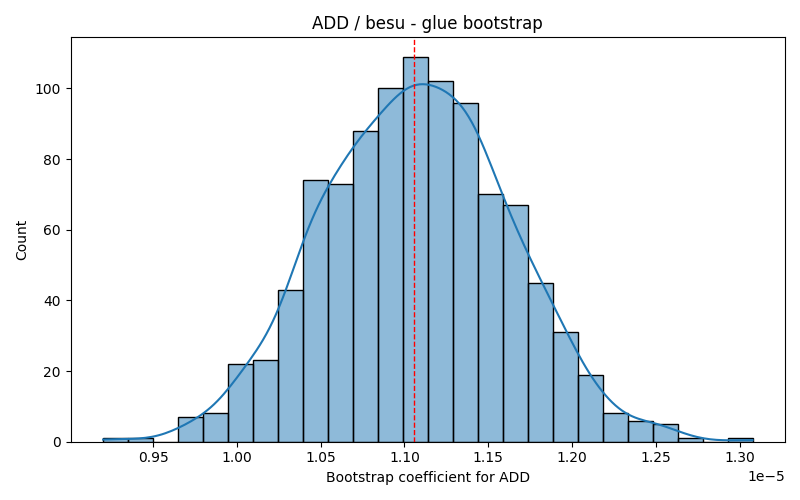

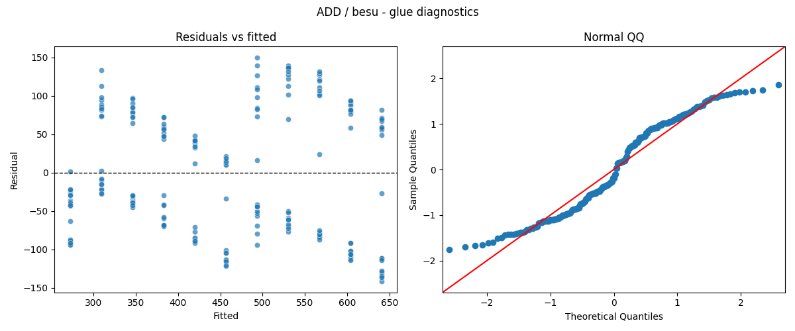

</details>

<details><summary><code>AND</code> · nobs=209 · runtime_ms=1.034e-05 · p=1.00e-03 · R²=0.3187</summary>

```
==============================================================================
                           NNLS Regression Results                            
==============================================================================
Dep. Variable:          test_runtime_ms              R-squared:          0.319
Model:                  NNLS                    Adj. R-squared:          0.315
No. Observations:       209                               RMSE:         159.07
Df Residuals:           207                                MAE:         150.33
Df Model:               1      
==============================================================================
                      coef     std err     P-value      [0.025      0.975]
------------------------------------------------------------------------------
         const     79.9400     30.9524       0.006     17.5700    135.8907
           AND      0.0000      0.0000       0.001      0.0000      0.0000
==============================================================================
Notes: Non-negative least squares with bootstrap inference (1000 iterations)
==============================================================================
```

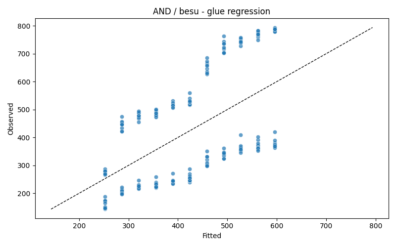

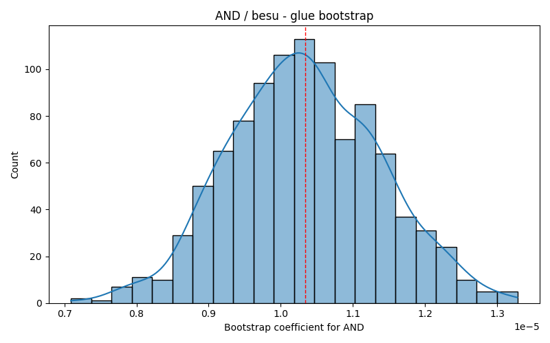

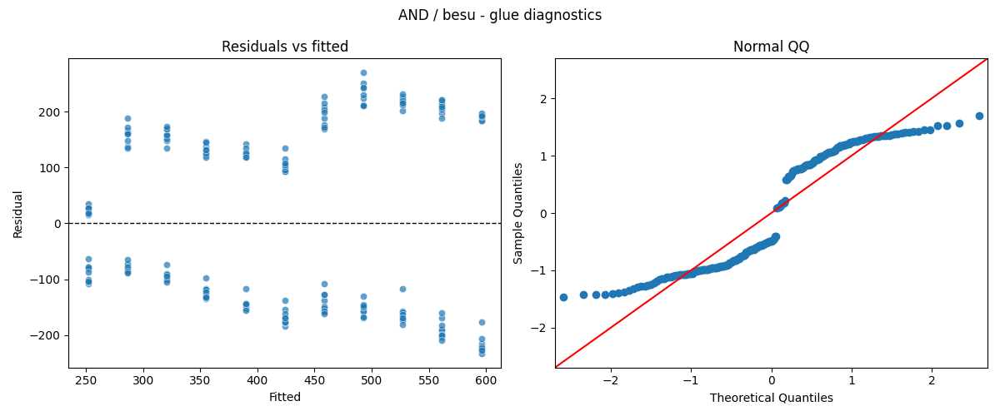

</details>

<details><summary><code>CALLDATACOPY</code> · nobs=5016 · runtime_ms=1.844e-05 · p=1.00e-03 · R²=0.6769</summary>

```
==============================================================================
                           NNLS Regression Results                            
==============================================================================
Dep. Variable:          test_runtime_ms              R-squared:          0.677
Model:                  NNLS                    Adj. R-squared:          0.677
No. Observations:       5016                              RMSE:          95.81
Df Residuals:           5014                               MAE:          65.88
Df Model:               1      
==============================================================================
                      coef     std err     P-value      [0.025      0.975]
------------------------------------------------------------------------------
         const    122.5158      1.4862       0.001    119.7932    125.5419
  CALLDATACOPY      0.0000      0.0000       0.001      0.0000      0.0000
==============================================================================
Notes: Non-negative least squares with bootstrap inference (1000 iterations)
==============================================================================
```

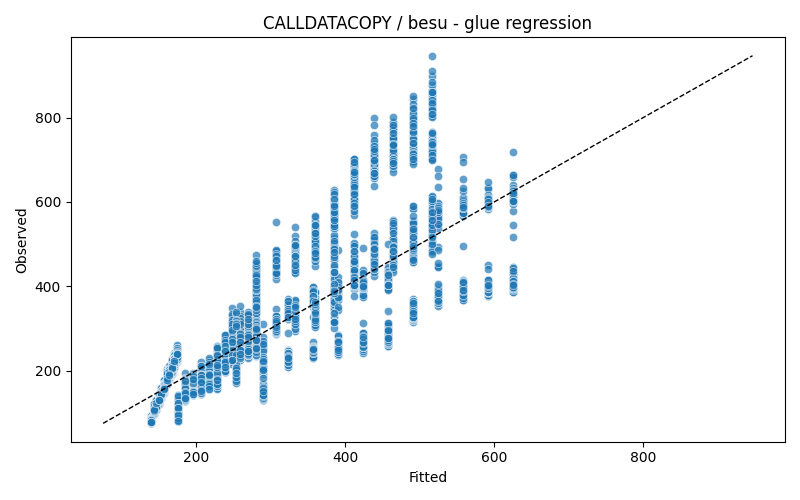


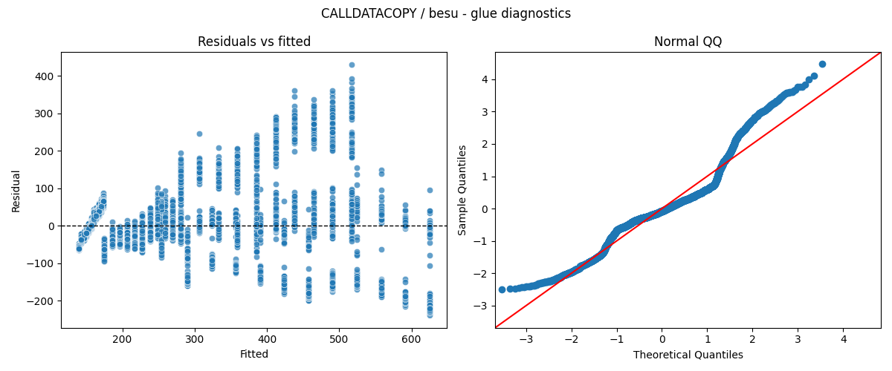

</details>

<details><summary><code>CALLDATALOAD</code> · nobs=836 · runtime_ms=3.47e-06 · p=2.54e-01 · R²=0.0002604</summary>

```
==============================================================================
                           NNLS Regression Results                            
==============================================================================
Dep. Variable:          test_runtime_ms              R-squared:          0.000
Model:                  NNLS                    Adj. R-squared:         -0.001
No. Observations:       836                               RMSE:           0.83
Df Residuals:           834                                MAE:           0.55
Df Model:               1      
==============================================================================
                      coef     std err     P-value      [0.025      0.975]
------------------------------------------------------------------------------
         const      3.9221      0.0663       0.001      3.7706      4.0135
  CALLDATALOAD      0.0000      0.0000       0.254      0.0000      0.0000
==============================================================================
Notes: Non-negative least squares with bootstrap inference (1000 iterations)
==============================================================================
```

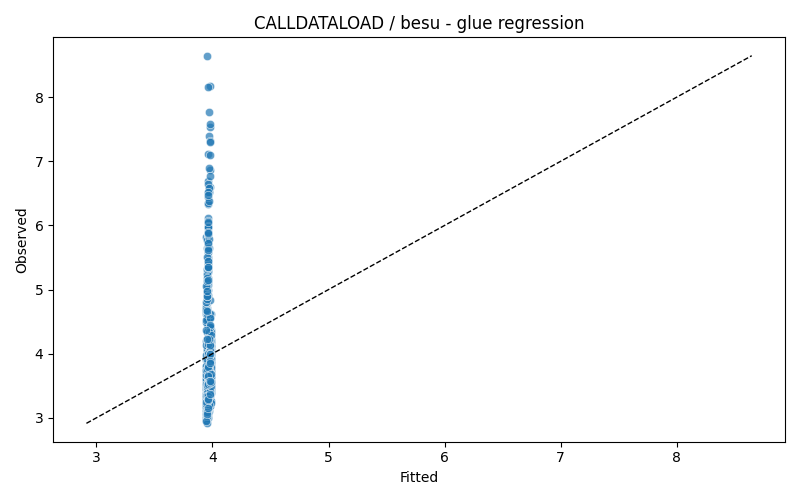

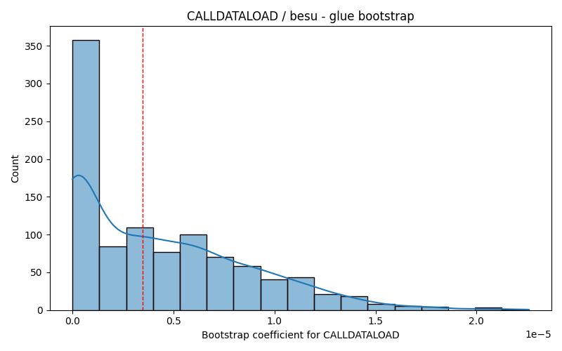

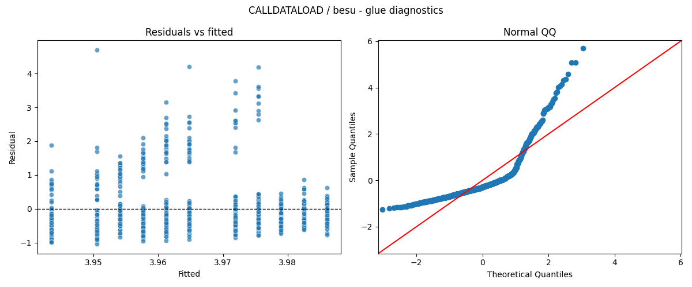

</details>

<details><summary><code>DIV</code> · nobs=209 · runtime_ms=1.711e-05 · p=1.00e-03 · R²=0.7104</summary>

```
==============================================================================
                           NNLS Regression Results                            
==============================================================================
Dep. Variable:          test_runtime_ms              R-squared:          0.710
Model:                  NNLS                    Adj. R-squared:          0.709
No. Observations:       209                               RMSE:          86.24
Df Residuals:           207                                MAE:          75.51
Df Model:               1      
==============================================================================
                      coef     std err     P-value      [0.025      0.975]
------------------------------------------------------------------------------
         const    121.3050     16.7709       0.001     87.3118    154.0527
           DIV      0.0000      0.0000       0.001      0.0000      0.0000
==============================================================================
Notes: Non-negative least squares with bootstrap inference (1000 iterations)
==============================================================================
```

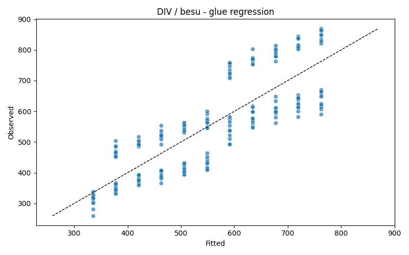

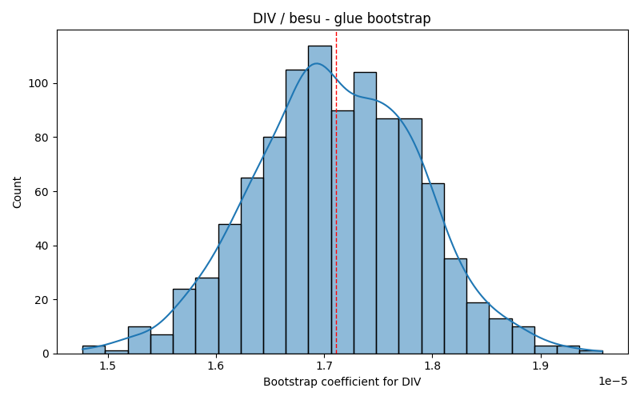

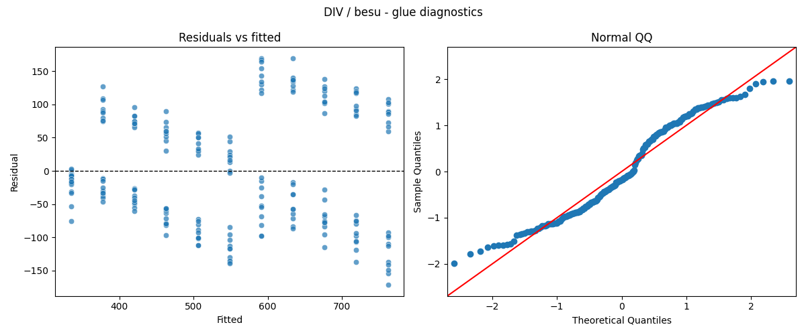

</details>

<details><summary><code>EXP</code> · nobs=209 · runtime_ms=0.001258 · p=1.00e-03 · R²=0.7268</summary>

```
==============================================================================
                           NNLS Regression Results                            
==============================================================================
Dep. Variable:          test_runtime_ms              R-squared:          0.727
Model:                  NNLS                    Adj. R-squared:          0.725
No. Observations:       209                               RMSE:          30.19
Df Residuals:           207                                MAE:          22.80
Df Model:               1      
==============================================================================
                      coef     std err     P-value      [0.025      0.975]
------------------------------------------------------------------------------
         const     95.7063      8.2471       0.001     79.4702    111.8254
           EXP      0.0013      0.0001       0.001      0.0011      0.0014
==============================================================================
Notes: Non-negative least squares with bootstrap inference (1000 iterations)
==============================================================================
```

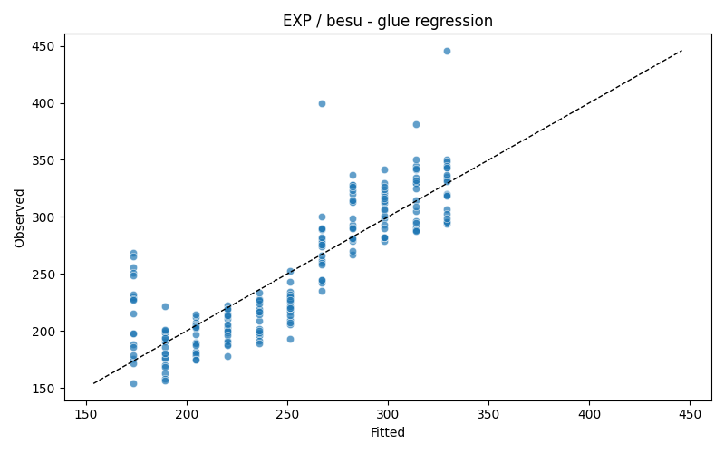

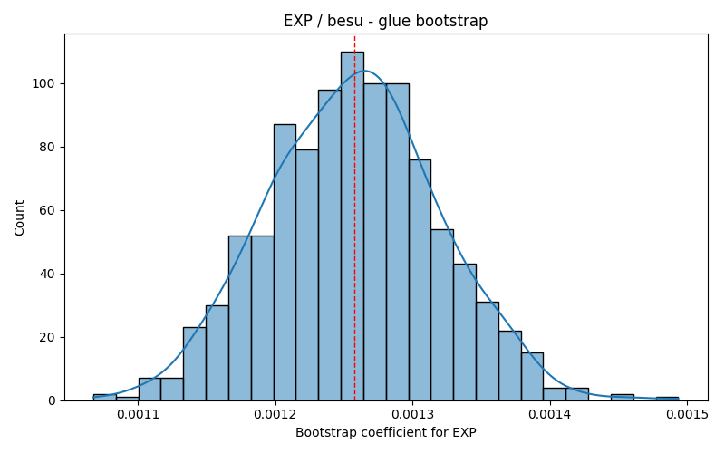

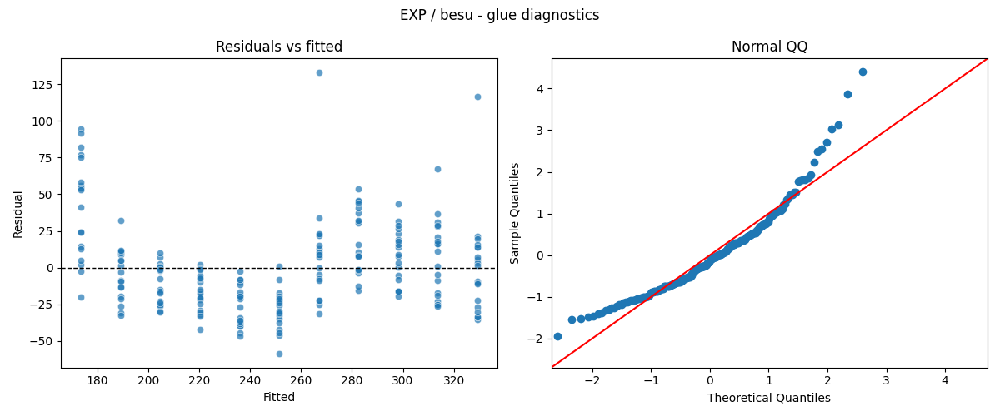

</details>

<details><summary><code>GT</code> · nobs=209 · runtime_ms=2.082e-05 · p=1.00e-03 · R²=0.139</summary>

```
==============================================================================
                           NNLS Regression Results                            
==============================================================================
Dep. Variable:          test_runtime_ms              R-squared:          0.139
Model:                  NNLS                    Adj. R-squared:          0.135
No. Observations:       209                               RMSE:         545.38
Df Residuals:           207                                MAE:         520.75
Df Model:               1      
==============================================================================
                      coef     std err     P-value      [0.025      0.975]
------------------------------------------------------------------------------
         const     99.5860     93.7818       0.177      0.0000    327.0247
            GT      0.0000      0.0000       0.001      0.0000      0.0000
==============================================================================
Notes: Non-negative least squares with bootstrap inference (1000 iterations)
==============================================================================
```

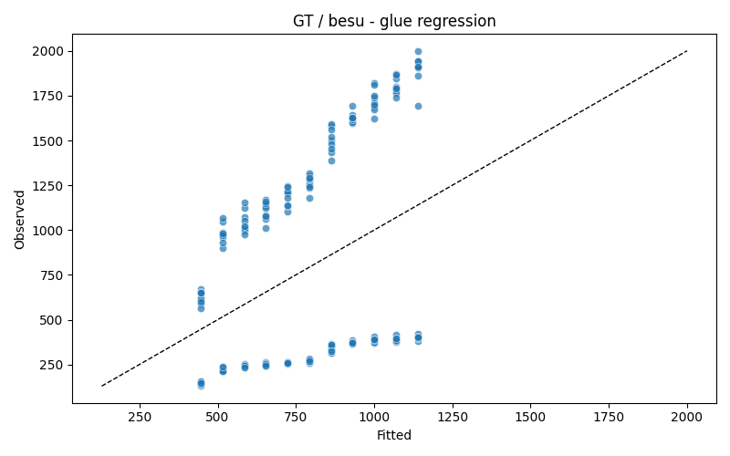

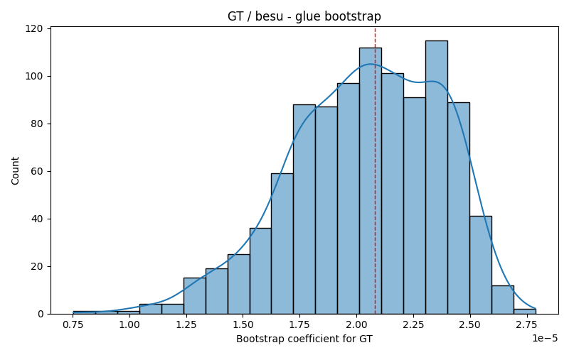

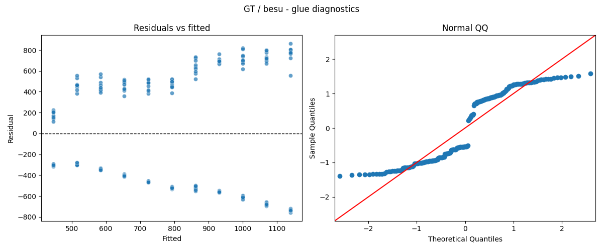

</details>

<details><summary><code>JUMPI</code> · nobs=209 · runtime_ms=7.601e-06 · p=1.00e-03 · R²=0.3357</summary>

```
==============================================================================
                           NNLS Regression Results                            
==============================================================================
Dep. Variable:          test_runtime_ms              R-squared:          0.336
Model:                  NNLS                    Adj. R-squared:          0.332
No. Observations:       209                               RMSE:          48.24
Df Residuals:           207                                MAE:          45.50
Df Model:               1      
==============================================================================
                      coef     std err     P-value      [0.025      0.975]
------------------------------------------------------------------------------
         const     25.8683      9.7751       0.004      7.3543     44.4315
         JUMPI      0.0000      0.0000       0.001      0.0000      0.0000
==============================================================================
Notes: Non-negative least squares with bootstrap inference (1000 iterations)
==============================================================================
```

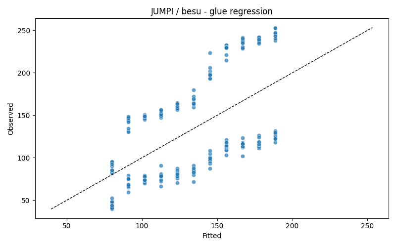

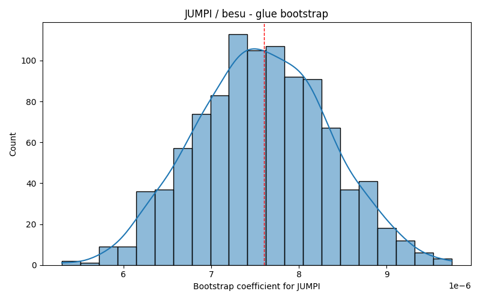


</details>

<details><summary><code>LT</code> · nobs=209 · runtime_ms=2.092e-05 · p=1.00e-03 · R²=0.1364</summary>

```
==============================================================================
                           NNLS Regression Results                            
==============================================================================
Dep. Variable:          test_runtime_ms              R-squared:          0.136
Model:                  NNLS                    Adj. R-squared:          0.132
No. Observations:       209                               RMSE:         554.16
Df Residuals:           207                                MAE:         528.78
Df Model:               1      
==============================================================================
                      coef     std err     P-value      [0.025      0.975]
------------------------------------------------------------------------------
         const    152.2206    104.3178       0.090      0.0000    373.2934
            LT      0.0000      0.0000       0.001      0.0000      0.0000
==============================================================================
Notes: Non-negative least squares with bootstrap inference (1000 iterations)
==============================================================================
```

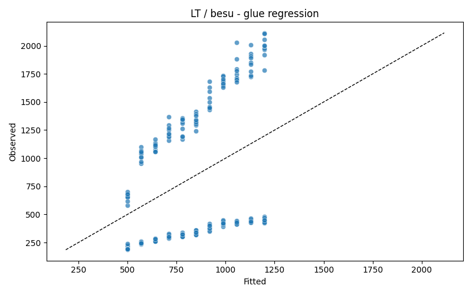

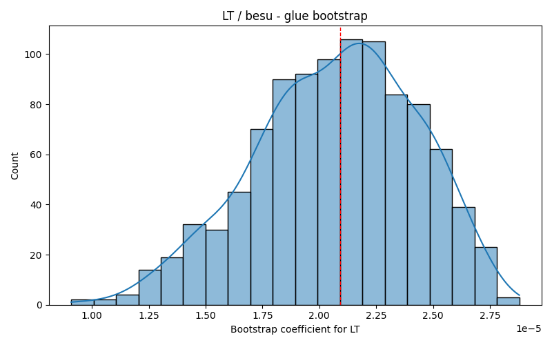

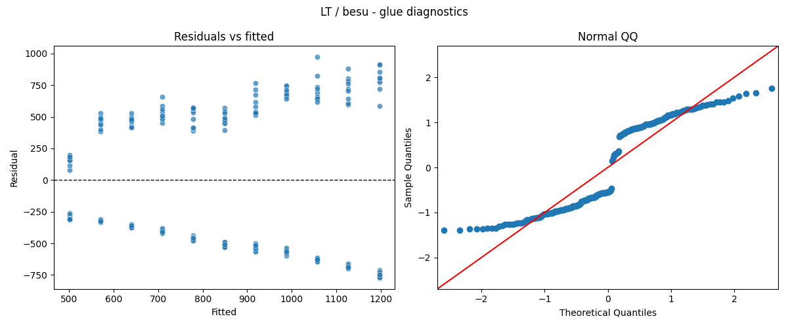

</details>

<details><summary><code>MSTORE</code> · nobs=1045 · runtime_ms=1.897e-05 · p=1.00e-03 · R²=0.8271</summary>

```
==============================================================================
                           NNLS Regression Results                            
==============================================================================
Dep. Variable:          test_runtime_ms              R-squared:          0.827
Model:                  NNLS                    Adj. R-squared:          0.827
No. Observations:       1045                              RMSE:          60.86
Df Residuals:           1043                               MAE:          51.49
Df Model:               1      
==============================================================================
                      coef     std err     P-value      [0.025      0.975]
------------------------------------------------------------------------------
         const     88.4311      6.0674       0.001     75.9587     99.8913
        MSTORE      0.0000      0.0000       0.001      0.0000      0.0000
==============================================================================
Notes: Non-negative least squares with bootstrap inference (1000 iterations)
==============================================================================
```

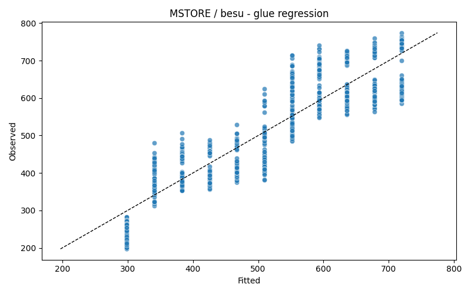

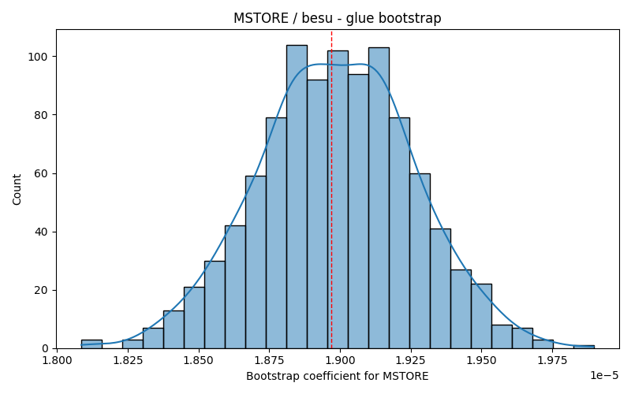

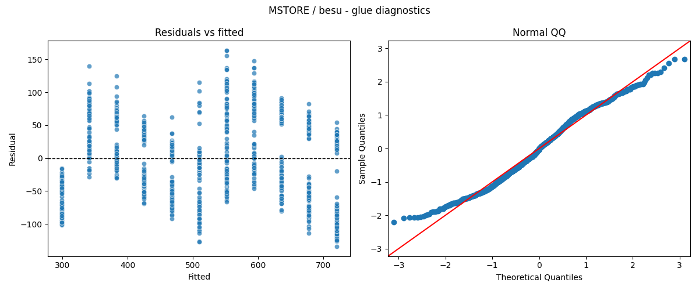

</details>

<details><summary><code>MSTORE8</code> · nobs=1045 · runtime_ms=1.25e-05 · p=1.00e-03 · R²=0.5651</summary>

```
==============================================================================
                           NNLS Regression Results                            
==============================================================================
Dep. Variable:          test_runtime_ms              R-squared:          0.565
Model:                  NNLS                    Adj. R-squared:          0.565
No. Observations:       1045                              RMSE:          76.95
Df Residuals:           1043                               MAE:          70.70
Df Model:               1      
==============================================================================
                      coef     std err     P-value      [0.025      0.975]
------------------------------------------------------------------------------
         const     56.1709      6.8937       0.001     42.3357     69.3580
       MSTORE8      0.0000      0.0000       0.001      0.0000      0.0000
==============================================================================
Notes: Non-negative least squares with bootstrap inference (1000 iterations)
==============================================================================
```

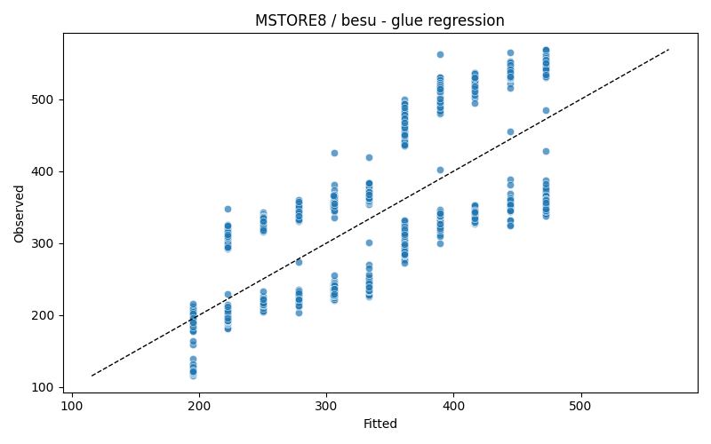

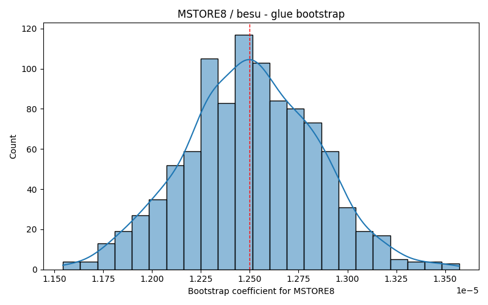

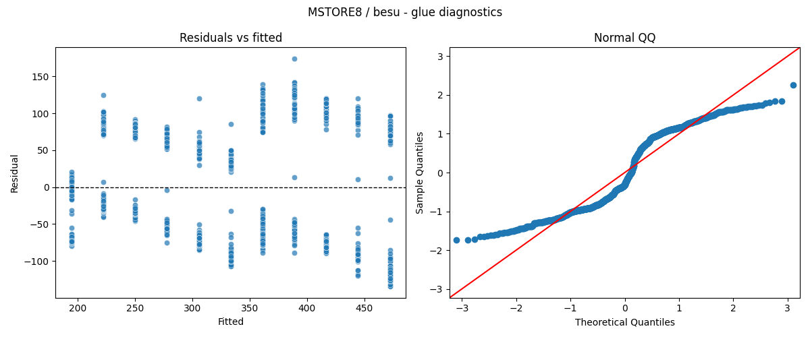

</details>

<details><summary><code>MUL</code> · nobs=209 · runtime_ms=1.2e-05 · p=1.00e-03 · R²=0.7927</summary>

```
==============================================================================
                           NNLS Regression Results                            
==============================================================================
Dep. Variable:          test_runtime_ms              R-squared:          0.793
Model:                  NNLS                    Adj. R-squared:          0.792
No. Observations:       209                               RMSE:          48.47
Df Residuals:           207                                MAE:          31.71
Df Model:               1      
==============================================================================
                      coef     std err     P-value      [0.025      0.975]
------------------------------------------------------------------------------
         const     97.3306      9.6296       0.001     78.7669    115.2278
           MUL      0.0000      0.0000       0.001      0.0000      0.0000
==============================================================================
Notes: Non-negative least squares with bootstrap inference (1000 iterations)
==============================================================================
```

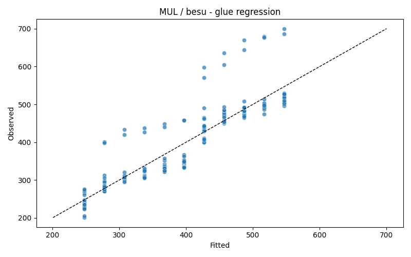

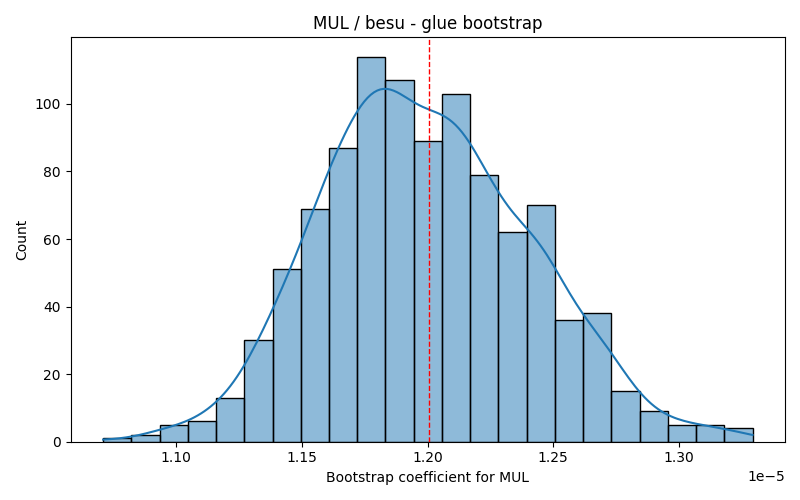

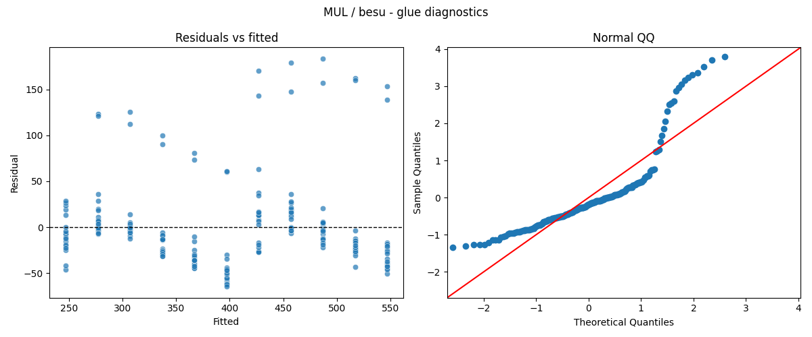

</details>

<details><summary><code>PC</code> · nobs=209 · runtime_ms=3.947e-06 · p=1.00e-03 · R²=0.52</summary>

```
==============================================================================
                           NNLS Regression Results                            
==============================================================================
Dep. Variable:          test_runtime_ms              R-squared:          0.520
Model:                  NNLS                    Adj. R-squared:          0.518
No. Observations:       209                               RMSE:         113.37
Df Residuals:           207                                MAE:         104.30
Df Model:               1      
==============================================================================
                      coef     std err     P-value      [0.025      0.975]
------------------------------------------------------------------------------
         const     85.9372     24.4861       0.001     37.1709    132.6852
            PC      0.0000      0.0000       0.001      0.0000      0.0000
==============================================================================
Notes: Non-negative least squares with bootstrap inference (1000 iterations)
==============================================================================
```

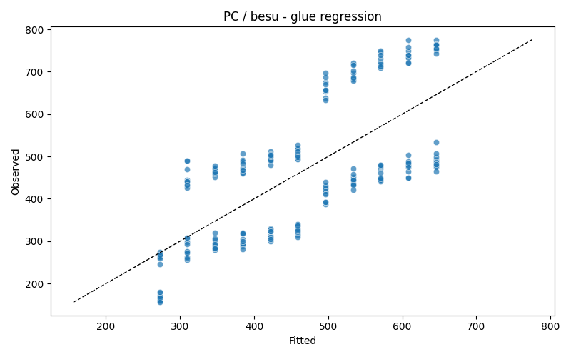

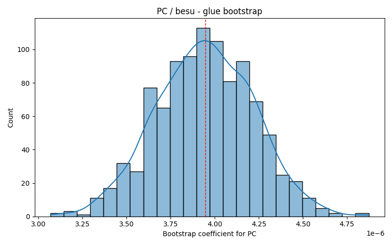

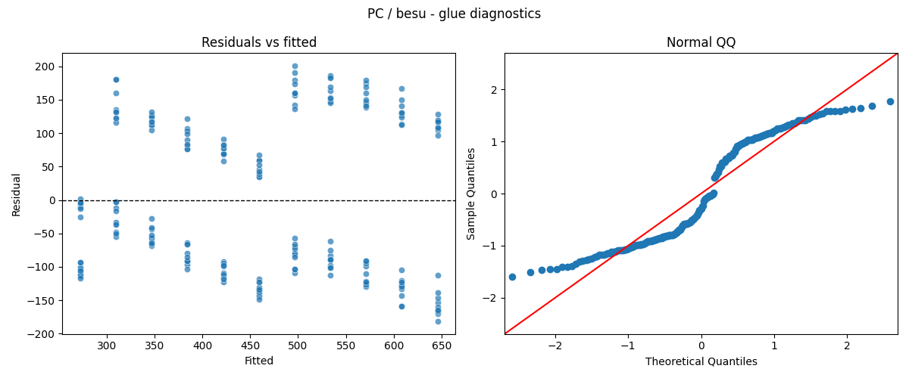

</details>

<details><summary><code>RETURNDATASIZE</code> · nobs=836 · runtime_ms=6.335e-06 · p=1.00e-03 · R²=0.4443</summary>

```
==============================================================================
                           NNLS Regression Results                            
==============================================================================
Dep. Variable:          test_runtime_ms              R-squared:          0.444
Model:                  NNLS                    Adj. R-squared:          0.444
No. Observations:       836                               RMSE:         111.86
Df Residuals:           834                                MAE:         103.12
Df Model:               1      
==============================================================================
                      coef     std err     P-value      [0.025      0.975]
------------------------------------------------------------------------------
         const     64.7961     11.2659       0.001     41.8157     86.9209
RETURNDATASIZE      0.0000      0.0000       0.001      0.0000      0.0000
==============================================================================
Notes: Non-negative least squares with bootstrap inference (1000 iterations)
==============================================================================
```

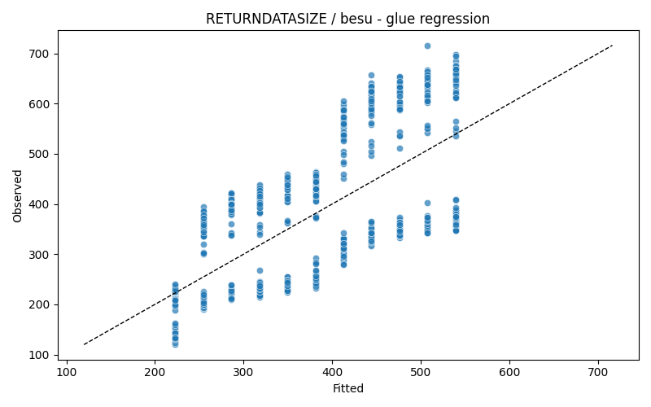

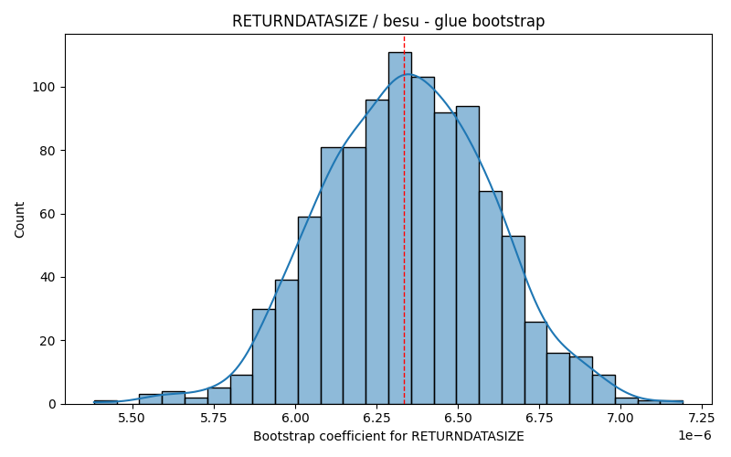

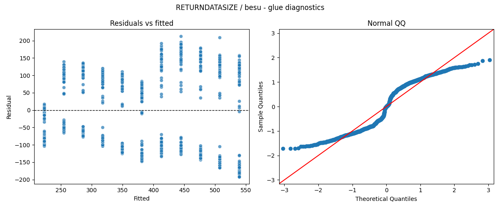

</details>

<details><summary><code>SELFBALANCE</code> · nobs=171 · runtime_ms=8.649e-06 · p=1.00e-03 · R²=0.4911</summary>

```
==============================================================================
                           NNLS Regression Results                            
==============================================================================
Dep. Variable:          test_runtime_ms              R-squared:          0.491
Model:                  NNLS                    Adj. R-squared:          0.488
No. Observations:       171                               RMSE:          88.81
Df Residuals:           169                                MAE:          75.18
Df Model:               1      
==============================================================================
                      coef     std err     P-value      [0.025      0.975]
------------------------------------------------------------------------------
         const    384.3785     28.9748       0.001    321.6451    437.7210
   SELFBALANCE      0.0000      0.0000       0.001      0.0000      0.0000
==============================================================================
Notes: Non-negative least squares with bootstrap inference (1000 iterations)
==============================================================================
```

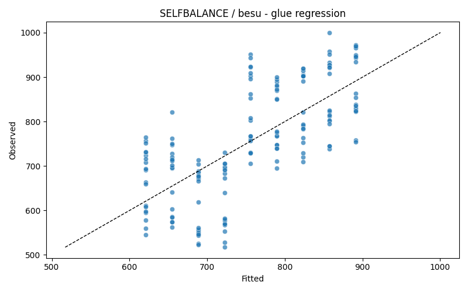


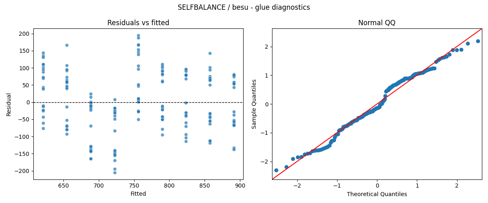

</details>

<details><summary><code>SUB</code> · nobs=209 · runtime_ms=1.171e-05 · p=1.00e-03 · R²=0.6343</summary>

```
==============================================================================
                           NNLS Regression Results                            
==============================================================================
Dep. Variable:          test_runtime_ms              R-squared:          0.634
Model:                  NNLS                    Adj. R-squared:          0.633
No. Observations:       209                               RMSE:          93.60
Df Residuals:           207                                MAE:          85.09
Df Model:               1      
==============================================================================
                      coef     std err     P-value      [0.025      0.975]
------------------------------------------------------------------------------
         const     85.7925     19.6805       0.001     47.5033    123.6295
           SUB      0.0000      0.0000       0.001      0.0000      0.0000
==============================================================================
Notes: Non-negative least squares with bootstrap inference (1000 iterations)
==============================================================================
```

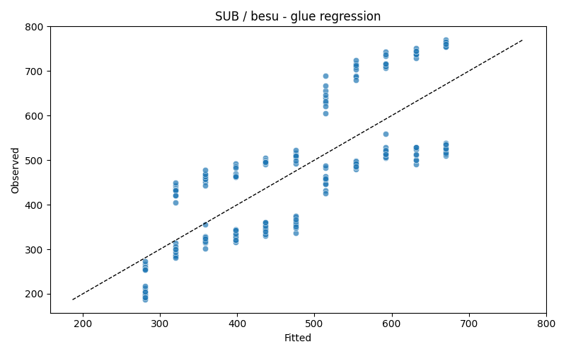

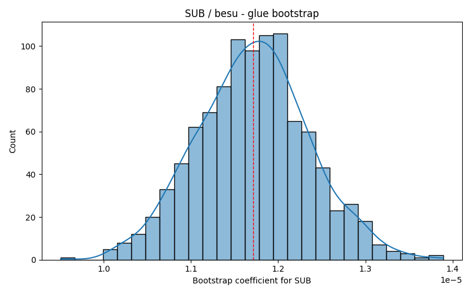

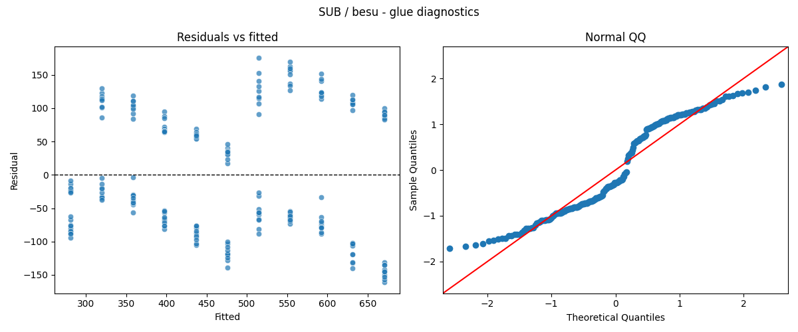

</details>

### Mixed glue (tier B) · besu

<details><summary><code>JUMP</code> · nobs=209 · runtime_ms=3.891e-05 · p=1.00e-03 · R²=0.6384</summary>

```
==============================================================================
                           NNLS Regression Results                            
==============================================================================
Dep. Variable:          test_runtime_ms              R-squared:          0.638
Model:                  NNLS                    Adj. R-squared:          0.637
No. Observations:       209                               RMSE:         108.83
Df Residuals:           207                                MAE:          97.17
Df Model:               1      
==============================================================================
                      coef     std err     P-value      [0.025      0.975]
------------------------------------------------------------------------------
         const     96.3977     22.5553       0.001     52.6645    139.7997
          JUMP      0.0000      0.0000       0.001      0.0000      0.0000
==============================================================================
Notes: Non-negative least squares with bootstrap inference (1000 iterations)
==============================================================================
```

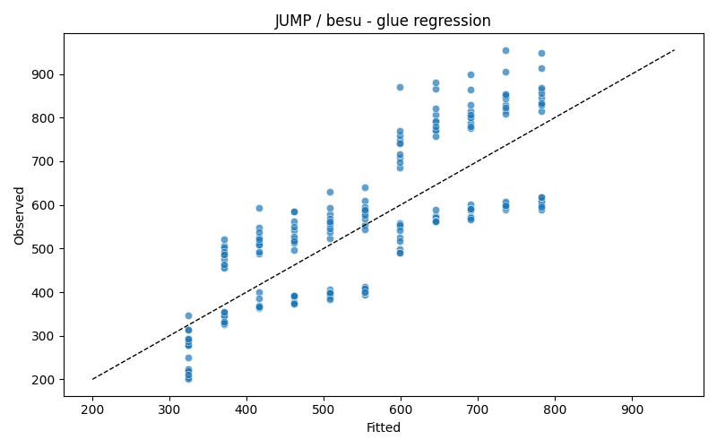

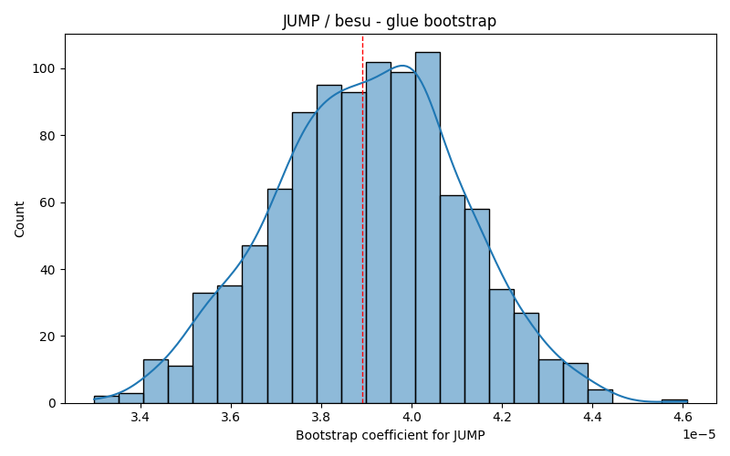

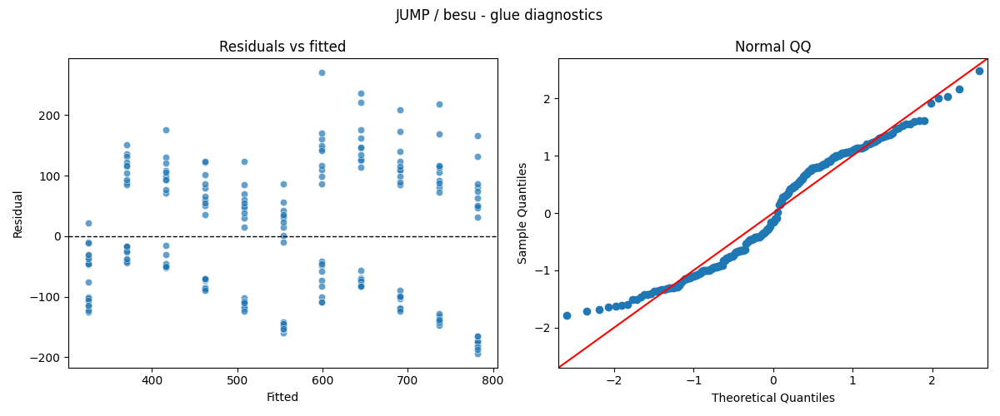

</details>

<details><summary><code>KECCAK256</code> · nobs=3344 · runtime_ms=4.473e-05 · p=1.00e-03 · R²=0.1917</summary>

```
==============================================================================
                           NNLS Regression Results                            
==============================================================================
Dep. Variable:          test_runtime_ms              R-squared:          0.192
Model:                  NNLS                    Adj. R-squared:          0.191
No. Observations:       3344                              RMSE:         182.49
Df Residuals:           3342                               MAE:         146.79
Df Model:               1      
==============================================================================
                      coef     std err     P-value      [0.025      0.975]
------------------------------------------------------------------------------
         const    558.1838      6.8603       0.001    544.2150    571.5914
     KECCAK256      0.0000      0.0000       0.001      0.0000      0.0000
==============================================================================
Notes: Non-negative least squares with bootstrap inference (1000 iterations)
==============================================================================
```

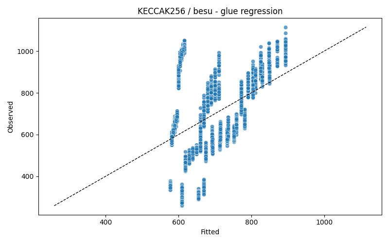

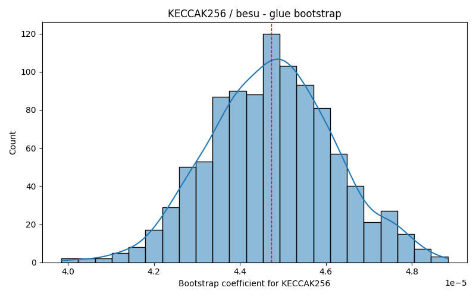

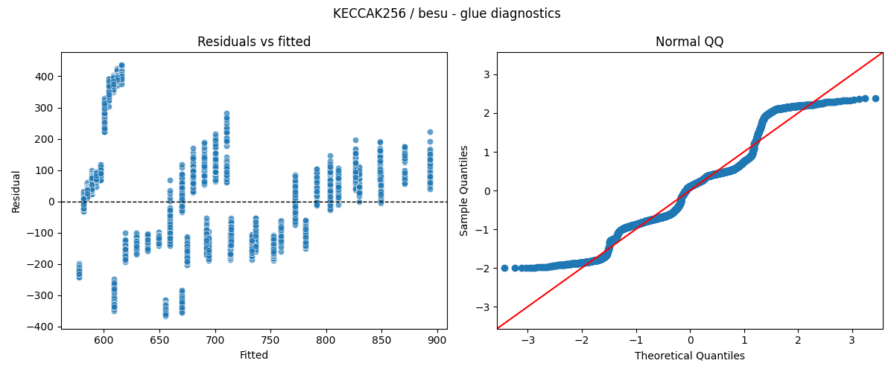

</details>

## erigon

| glue_opcode | nobs | glue_runtime_ms | p_value | rsquared |
| --- | --- | --- | --- | --- |
| `ISZERO` | 110 | 9.974e-07 | 1.00e-03 | 0.9289 |
| `JUMPDEST` | 110 | 8.24e-07 | 1.00e-03 | 0.7701 |
| `SWAP` | 1760 | 1.222e-06 | 1.00e-03 | 0.8057 |
| `CALLDATASIZE` | 6611 | 8.16e-07 | 1.00e-03 | 0.9492 |
| `DUP` | 6611 | 1.032e-06 | 1.00e-03 | 0.9492 |
| `GAS` | 6611 | 8.294e-07 | 1.00e-03 | 0.9492 |
| `MLOAD` | 6611 | 3.301e-06 | 1.00e-03 | 0.9492 |
| `PUSH` | 6611 | 2.612e-06 | 1.00e-03 | 0.9492 |
| `PUSH0` | 6611 | 9.388e-07 | 1.00e-03 | 0.9492 |
| `STATICCALL` | 6611 | 0.000555 | 1.00e-03 | 0.9492 |
| `ADD` | 110 | 2.747e-06 | 1.00e-03 | 0.9326 |
| `AND` | 110 | 2.728e-06 | 1.00e-03 | 0.9438 |
| `CALLDATACOPY` | 2640 | 7.028e-06 | 1.00e-03 | 0.8502 |
| `CALLDATALOAD` | 440 | 0 | 1.00e+00 | 0 |
| `DIV` | 110 | 9.12e-06 | 1.00e-03 | 0.6636 |
| `EXP` | 110 | 0.0003322 | 1.00e-03 | 0.9244 |
| `GT` | 110 | 2.949e-06 | 1.00e-03 | 0.9372 |
| `JUMPI` | 110 | 3.497e-06 | 1.00e-03 | 0.892 |
| `LT` | 110 | 2.659e-06 | 1.00e-03 | 0.7323 |
| `MSTORE` | 550 | 5.691e-06 | 1.00e-03 | 0.7338 |
| `MSTORE8` | 550 | 4.85e-06 | 1.00e-03 | 0.4206 |
| `MUL` | 110 | 3.867e-06 | 1.00e-03 | 0.576 |
| `PC` | 110 | 1.524e-06 | 1.00e-03 | 0.4855 |
| `RETURNDATASIZE` | 440 | 1.804e-06 | 1.00e-03 | 0.8523 |
| `SELFBALANCE` | 90 | 1.346e-06 | 1.00e-03 | 0.8855 |
| `SUB` | 110 | 2.744e-06 | 1.00e-03 | 0.9308 |
| `JUMP` | 110 | 7.151e-06 | 1.00e-03 | 0.9385 |
| `KECCAK256` | 1760 | 2.016e-05 | 1.00e-03 | 0.0891 |

### Cycle glue — joint fit · erigon

<details><summary>Joint NNLS regression summary</summary>

```
==============================================================================
                           NNLS Regression Results                            
==============================================================================
Dep. Variable:          test_runtime_ms              R-squared:          0.949
Model:                  NNLS                    Adj. R-squared:          0.949
No. Observations:       6611                              RMSE:          30.50
Df Residuals:           6603                               MAE:          15.42
Df Model:               7      
==============================================================================
                      coef     std err     P-value      [0.025      0.975]
------------------------------------------------------------------------------
         const     25.9998      1.1187       0.001     24.0757     28.2583
  CALLDATASIZE      0.0000      0.0000       0.001      0.0000      0.0000
           DUP      0.0000      0.0000       0.001      0.0000      0.0000
           GAS      0.0000      0.0000       0.001      0.0000      0.0000
         MLOAD      0.0000      0.0000       0.001      0.0000      0.0000
          PUSH      0.0000      0.0000       0.001      0.0000      0.0000
         PUSH0      0.0000      0.0000       0.001      0.0000      0.0000
    STATICCALL      0.0006      0.0000       0.001      0.0006      0.0006
==============================================================================
Notes: Non-negative least squares with bootstrap inference (1000 iterations)
==============================================================================
```

</details>

<details><summary><code>CALLDATASIZE</code> · nobs=6611 · runtime_ms=8.16e-07 · p=1.00e-03 · R²=0.9492</summary>


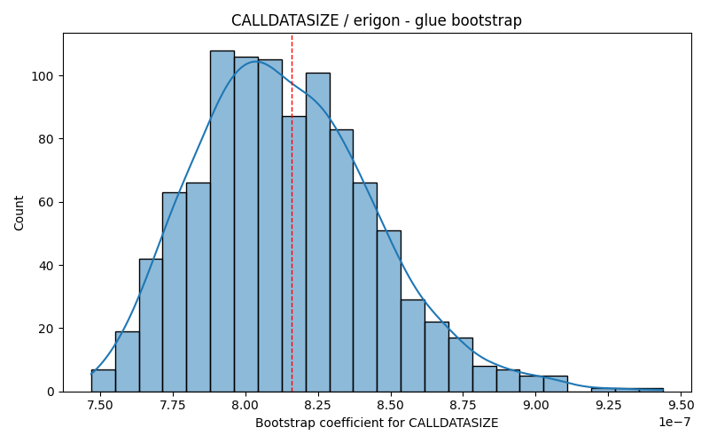

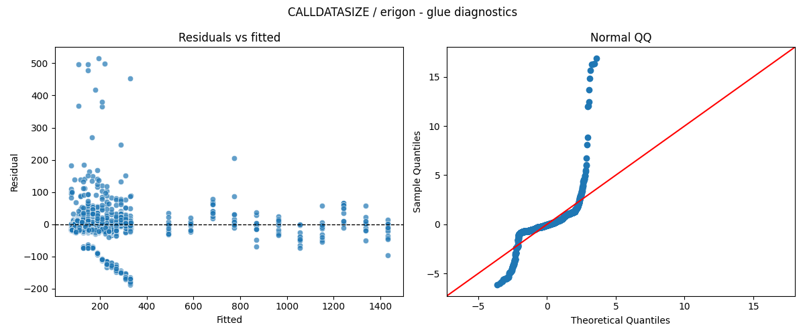

</details>

<details><summary><code>DUP</code> · nobs=6611 · runtime_ms=1.032e-06 · p=1.00e-03 · R²=0.9492</summary>

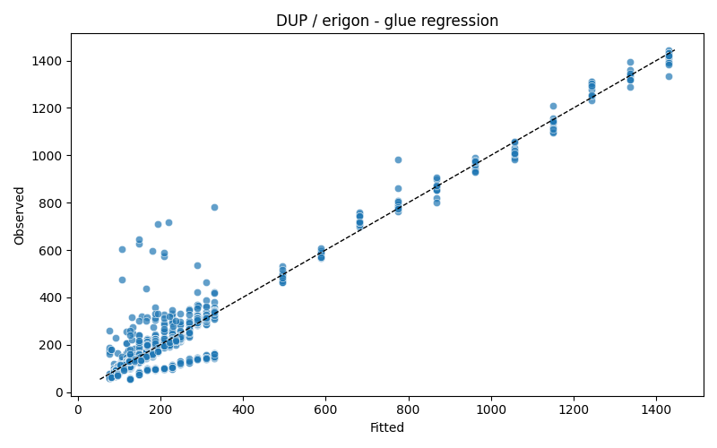

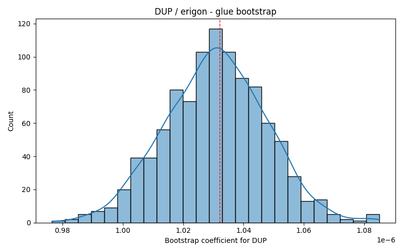


</details>

<details><summary><code>GAS</code> · nobs=6611 · runtime_ms=8.294e-07 · p=1.00e-03 · R²=0.9492</summary>


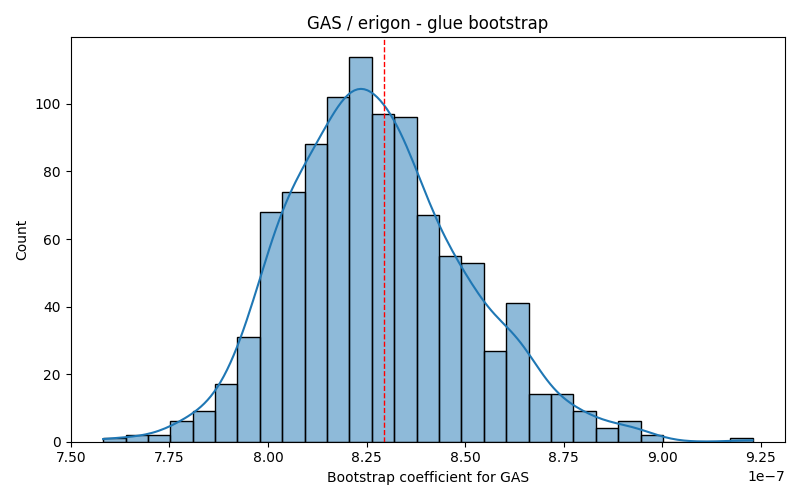


</details>

<details><summary><code>MLOAD</code> · nobs=6611 · runtime_ms=3.301e-06 · p=1.00e-03 · R²=0.9492</summary>


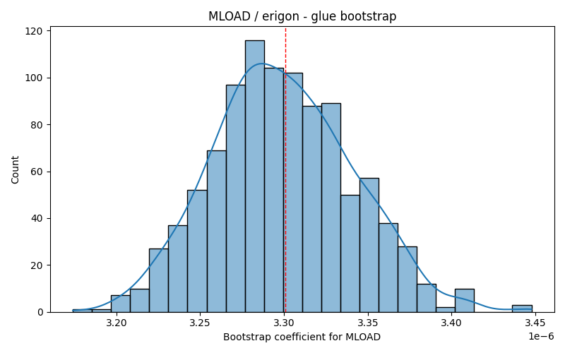

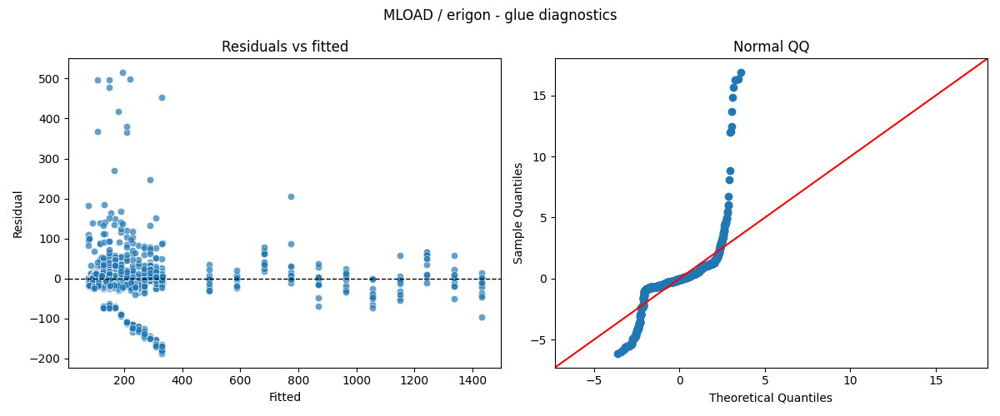

</details>

<details><summary><code>PUSH</code> · nobs=6611 · runtime_ms=2.612e-06 · p=1.00e-03 · R²=0.9492</summary>

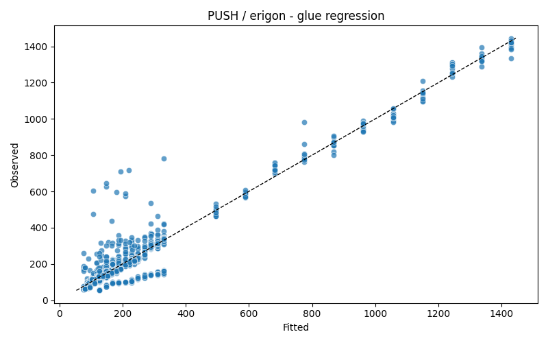

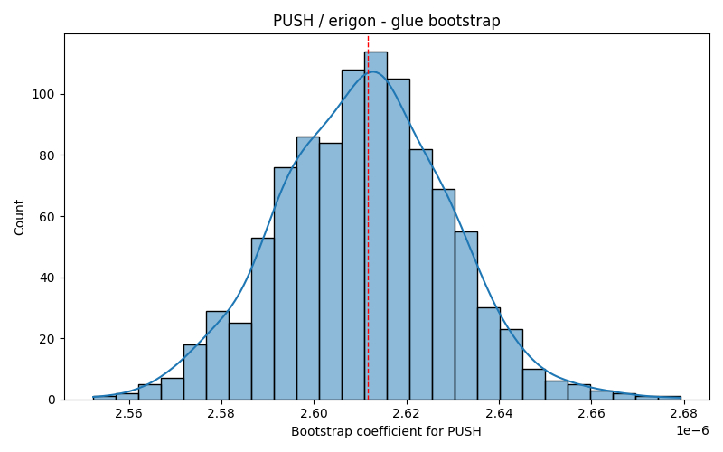

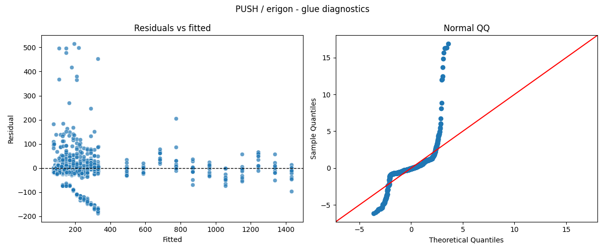

</details>

<details><summary><code>PUSH0</code> · nobs=6611 · runtime_ms=9.388e-07 · p=1.00e-03 · R²=0.9492</summary>

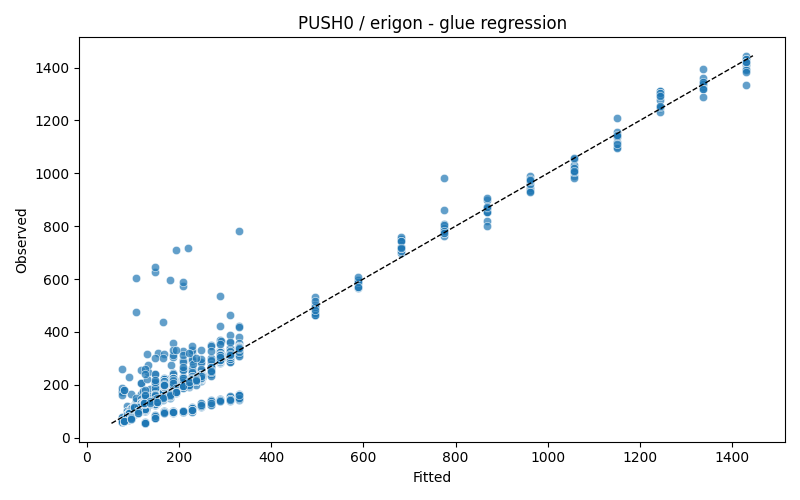

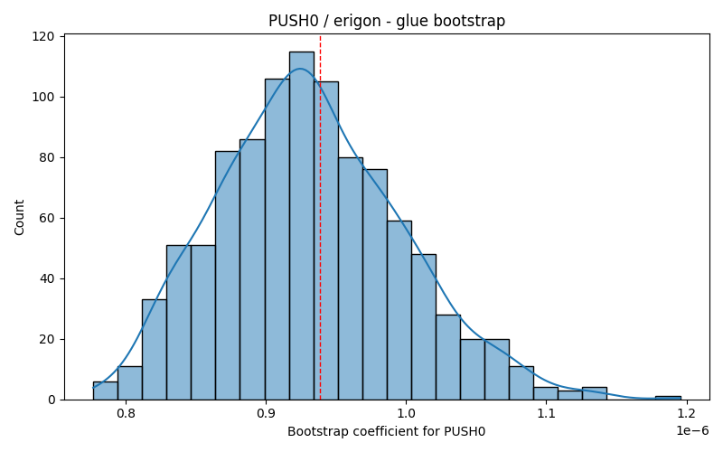


</details>

<details><summary><code>STATICCALL</code> · nobs=6611 · runtime_ms=0.000555 · p=1.00e-03 · R²=0.9492</summary>

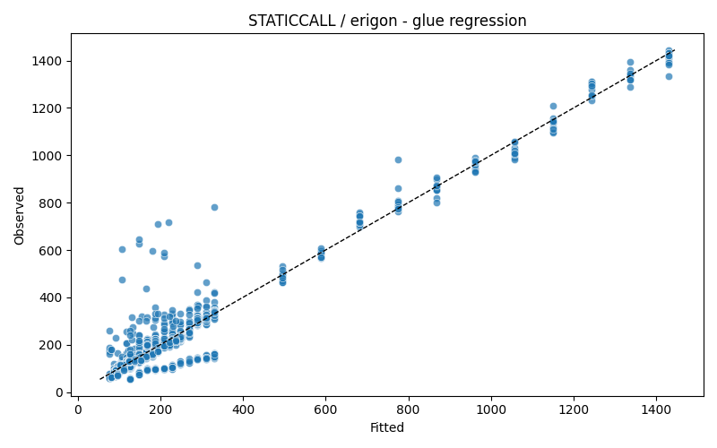

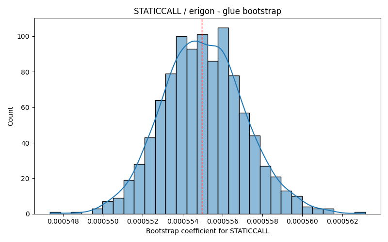

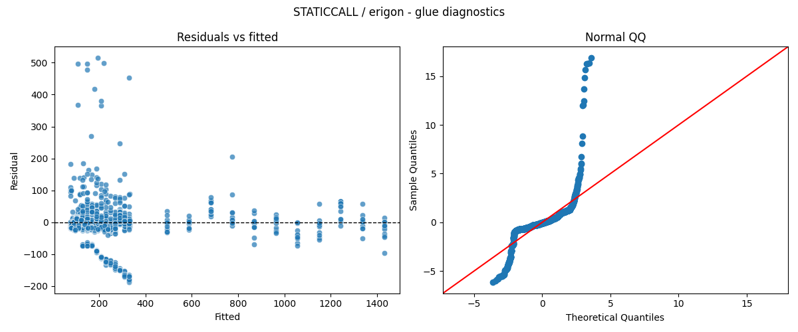

</details>

### Pure glue · erigon

<details><summary><code>ISZERO</code> · nobs=110 · runtime_ms=9.974e-07 · p=1.00e-03 · R²=0.9289</summary>

```
==============================================================================
                           NNLS Regression Results                            
==============================================================================
Dep. Variable:          test_runtime_ms              R-squared:          0.929
Model:                  NNLS                    Adj. R-squared:          0.928
No. Observations:       110                               RMSE:           5.81
Df Residuals:           108                                MAE:           4.85
Df Model:               1      
==============================================================================
                      coef     std err     P-value      [0.025      0.975]
------------------------------------------------------------------------------
         const     16.2152      2.4523       0.001     11.6882     21.2675
        ISZERO      0.0000      0.0000       0.001      0.0000      0.0000
==============================================================================
Notes: Non-negative least squares with bootstrap inference (1000 iterations)
==============================================================================
```

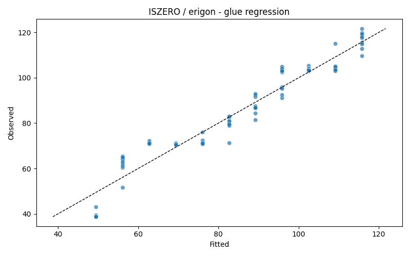

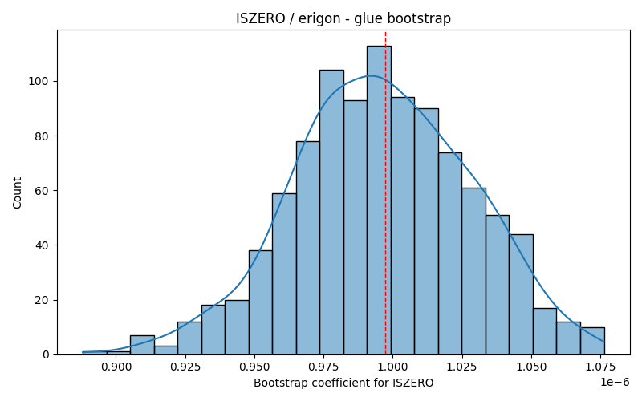

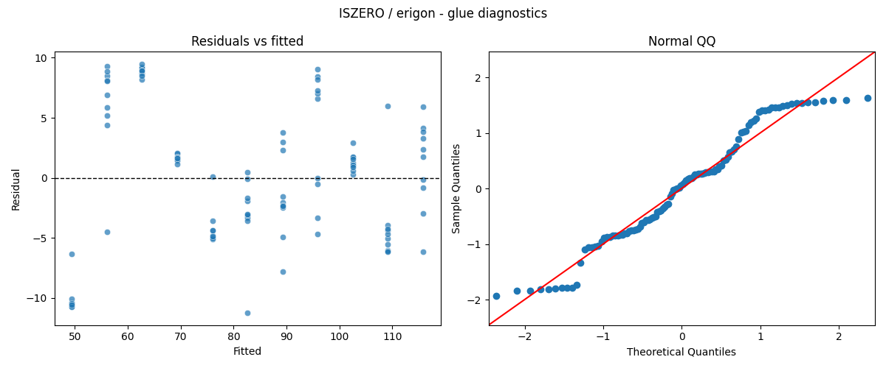

</details>

<details><summary><code>JUMPDEST</code> · nobs=110 · runtime_ms=8.24e-07 · p=1.00e-03 · R²=0.7701</summary>

```
==============================================================================
                           NNLS Regression Results                            
==============================================================================
Dep. Variable:          test_runtime_ms              R-squared:          0.770
Model:                  NNLS                    Adj. R-squared:          0.768
No. Observations:       110                               RMSE:          28.43
Df Residuals:           108                                MAE:          14.38
Df Model:               1      
==============================================================================
                      coef     std err     P-value      [0.025      0.975]
------------------------------------------------------------------------------
         const     10.4154      7.3231       0.117      0.0000     24.2844
      JUMPDEST      0.0000      0.0000       0.001      0.0000      0.0000
==============================================================================
Notes: Non-negative least squares with bootstrap inference (1000 iterations)
==============================================================================
```

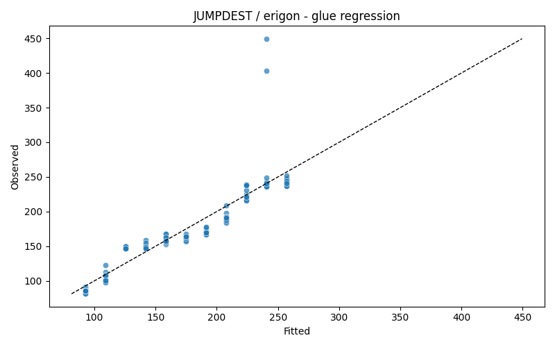

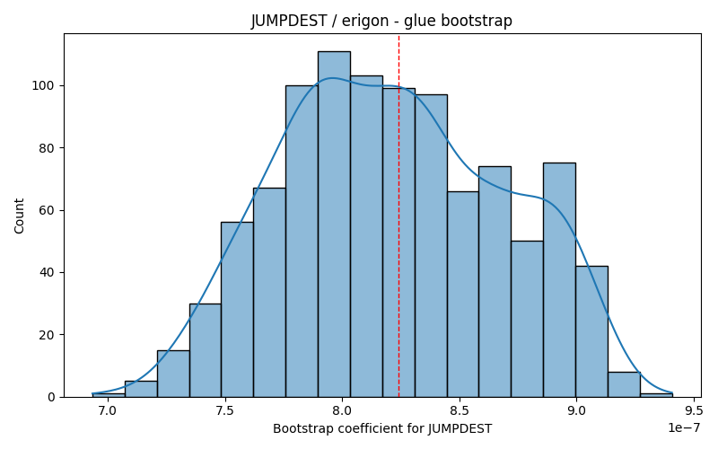


</details>

<details><summary><code>SWAP</code> · nobs=1760 · runtime_ms=1.222e-06 · p=1.00e-03 · R²=0.8057</summary>

```
==============================================================================
                           NNLS Regression Results                            
==============================================================================
Dep. Variable:          test_runtime_ms              R-squared:          0.806
Model:                  NNLS                    Adj. R-squared:          0.806
No. Observations:       1760                              RMSE:          12.63
Df Residuals:           1758                               MAE:           5.68
Df Model:               1      
==============================================================================
                      coef     std err     P-value      [0.025      0.975]
------------------------------------------------------------------------------
         const     22.5391      0.9469       0.001     20.7614     24.3703
          SWAP      0.0000      0.0000       0.001      0.0000      0.0000
==============================================================================
Notes: Non-negative least squares with bootstrap inference (1000 iterations)
==============================================================================
```

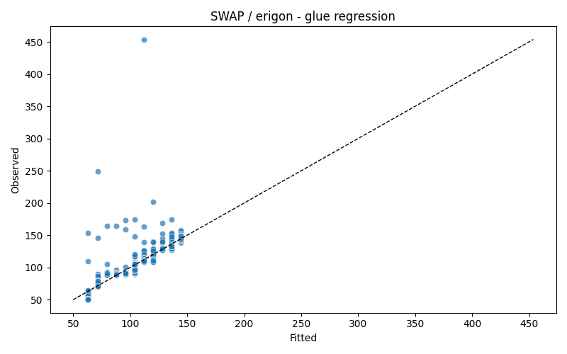

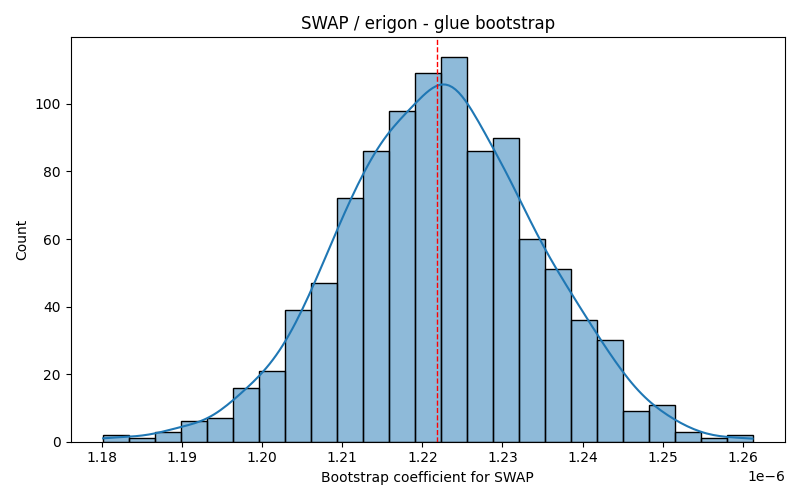

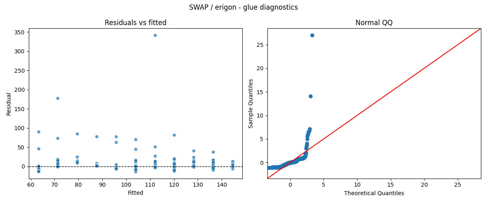

</details>

### Mixed glue (tier A) · erigon

<details><summary><code>ADD</code> · nobs=110 · runtime_ms=2.747e-06 · p=1.00e-03 · R²=0.9326</summary>

```
==============================================================================
                           NNLS Regression Results                            
==============================================================================
Dep. Variable:          test_runtime_ms              R-squared:          0.933
Model:                  NNLS                    Adj. R-squared:          0.932
No. Observations:       110                               RMSE:           7.77
Df Residuals:           108                                MAE:           6.55
Df Model:               1      
==============================================================================
                      coef     std err     P-value      [0.025      0.975]
------------------------------------------------------------------------------
         const     16.2115      2.7503       0.001     10.8367     21.7777
           ADD      0.0000      0.0000       0.001      0.0000      0.0000
==============================================================================
Notes: Non-negative least squares with bootstrap inference (1000 iterations)
==============================================================================
```

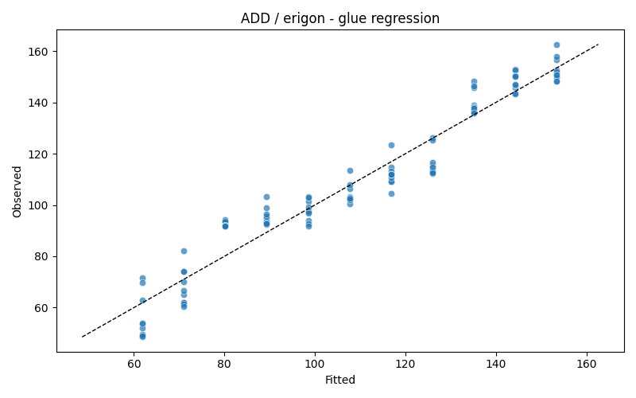

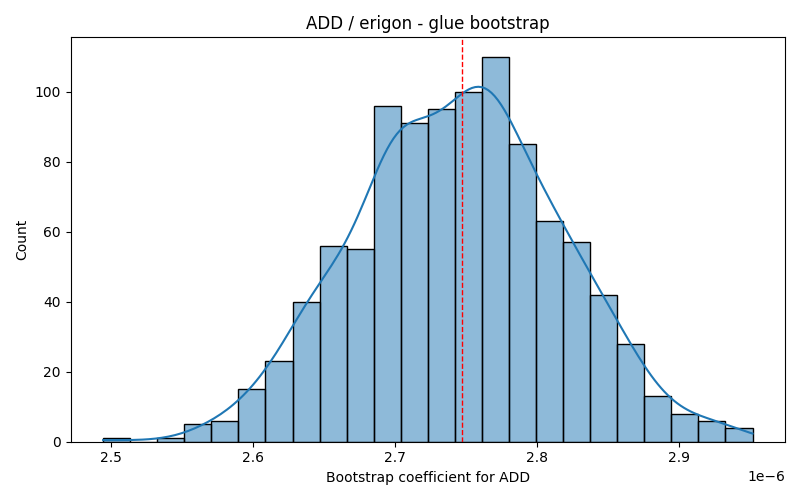

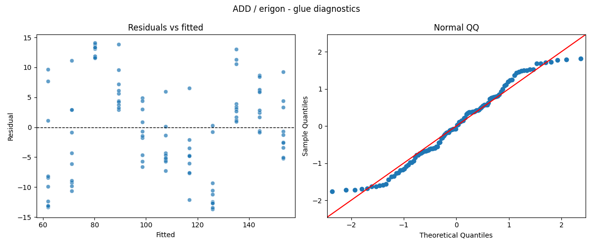

</details>

<details><summary><code>AND</code> · nobs=110 · runtime_ms=2.728e-06 · p=1.00e-03 · R²=0.9438</summary>

```
==============================================================================
                           NNLS Regression Results                            
==============================================================================
Dep. Variable:          test_runtime_ms              R-squared:          0.944
Model:                  NNLS                    Adj. R-squared:          0.943
No. Observations:       110                               RMSE:           7.01
Df Residuals:           108                                MAE:           5.64
Df Model:               1      
==============================================================================
                      coef     std err     P-value      [0.025      0.975]
------------------------------------------------------------------------------
         const     14.3694      2.5705       0.001      9.7919     19.8456
           AND      0.0000      0.0000       0.001      0.0000      0.0000
==============================================================================
Notes: Non-negative least squares with bootstrap inference (1000 iterations)
==============================================================================
```

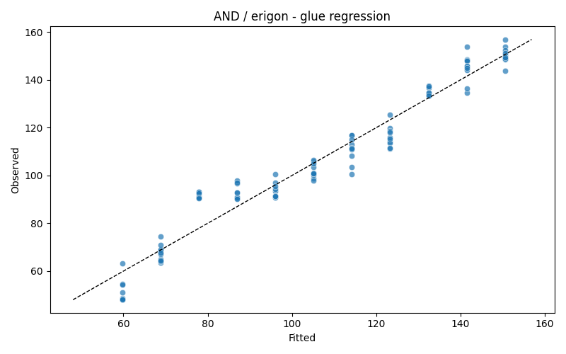

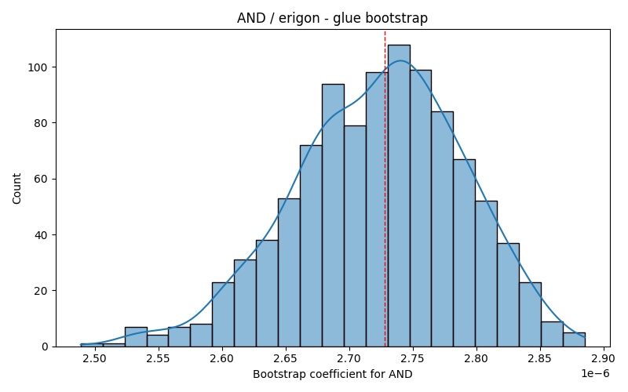

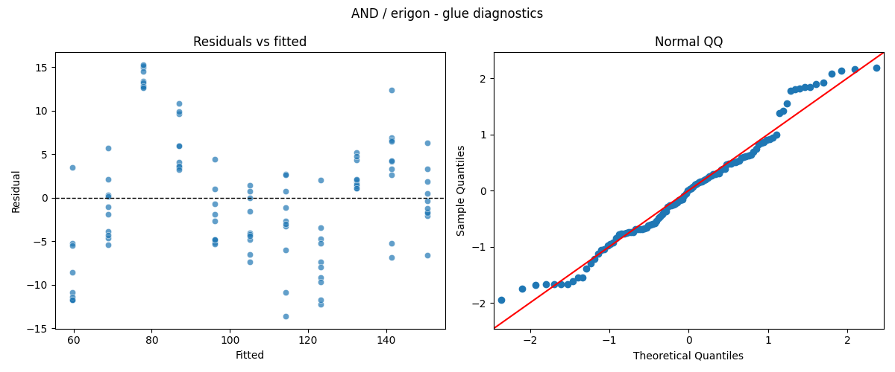

</details>

<details><summary><code>CALLDATACOPY</code> · nobs=2640 · runtime_ms=7.028e-06 · p=1.00e-03 · R²=0.8502</summary>

```
==============================================================================
                           NNLS Regression Results                            
==============================================================================
Dep. Variable:          test_runtime_ms              R-squared:          0.850
Model:                  NNLS                    Adj. R-squared:          0.850
No. Observations:       2640                              RMSE:          22.19
Df Residuals:           2638                               MAE:           7.81
Df Model:               1      
==============================================================================
                      coef     std err     P-value      [0.025      0.975]
------------------------------------------------------------------------------
         const     16.8055      0.4978       0.001     15.9133     17.8173
  CALLDATACOPY      0.0000      0.0000       0.001      0.0000      0.0000
==============================================================================
Notes: Non-negative least squares with bootstrap inference (1000 iterations)
==============================================================================
```

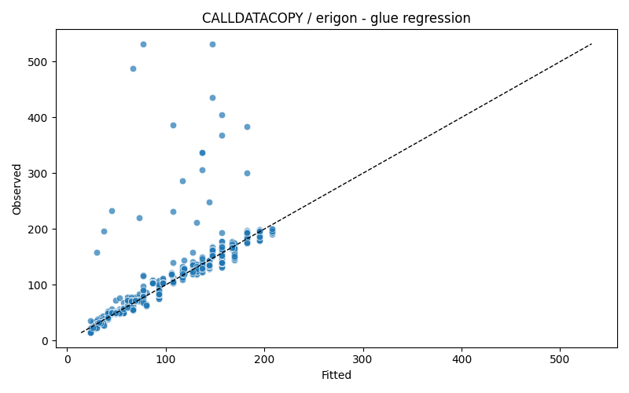


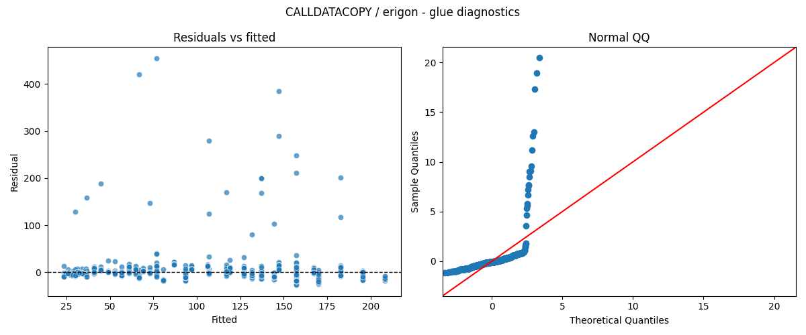

</details>

<details><summary><code>CALLDATALOAD</code> · nobs=440 · runtime_ms=0 · p=1.00e+00 · R²=0</summary>

```
==============================================================================
                           NNLS Regression Results                            
==============================================================================
Dep. Variable:          test_runtime_ms              R-squared:          0.000
Model:                  NNLS                    Adj. R-squared:         -0.002
No. Observations:       440                               RMSE:           9.20
Df Residuals:           438                                MAE:           1.01
Df Model:               1      
==============================================================================
                      coef     std err     P-value      [0.025      0.975]
------------------------------------------------------------------------------
         const      6.9574      0.5717       0.001      6.0129      7.8818
  CALLDATALOAD      0.0000      0.0000       1.000      0.0000      0.0000
==============================================================================
Notes: Non-negative least squares with bootstrap inference (1000 iterations)
==============================================================================
```

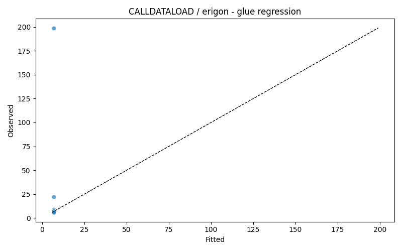

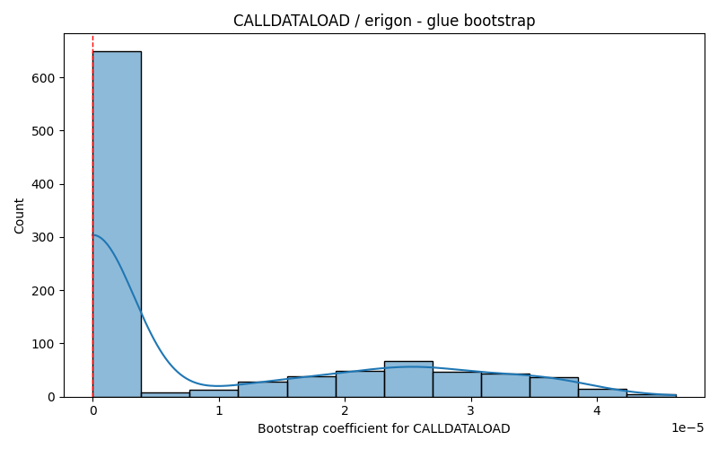

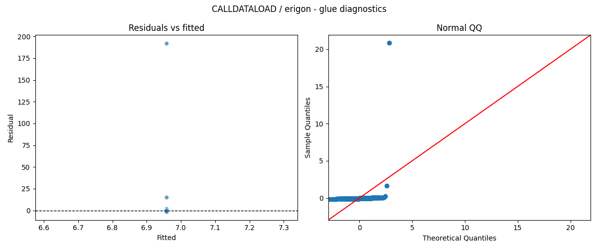

</details>

<details><summary><code>DIV</code> · nobs=110 · runtime_ms=9.12e-06 · p=1.00e-03 · R²=0.6636</summary>

```
==============================================================================
                           NNLS Regression Results                            
==============================================================================
Dep. Variable:          test_runtime_ms              R-squared:          0.664
Model:                  NNLS                    Adj. R-squared:          0.661
No. Observations:       110                               RMSE:          51.25
Df Residuals:           108                                MAE:          26.48
Df Model:               1      
==============================================================================
                      coef     std err     P-value      [0.025      0.975]
------------------------------------------------------------------------------
         const     30.1797     16.0232       0.003      5.8980     66.4300
           DIV      0.0000      0.0000       0.001      0.0000      0.0000
==============================================================================
Notes: Non-negative least squares with bootstrap inference (1000 iterations)
==============================================================================
```

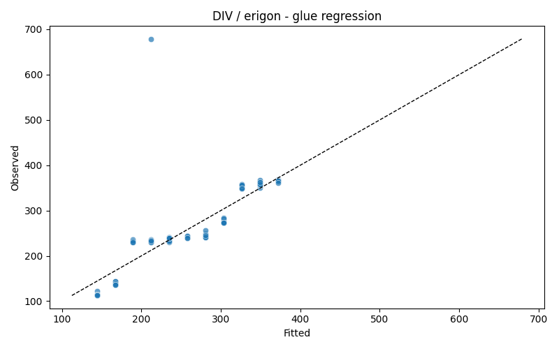

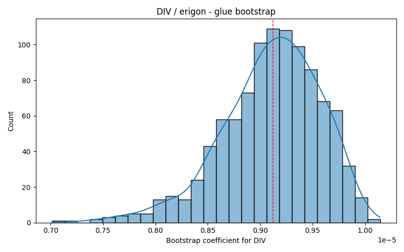

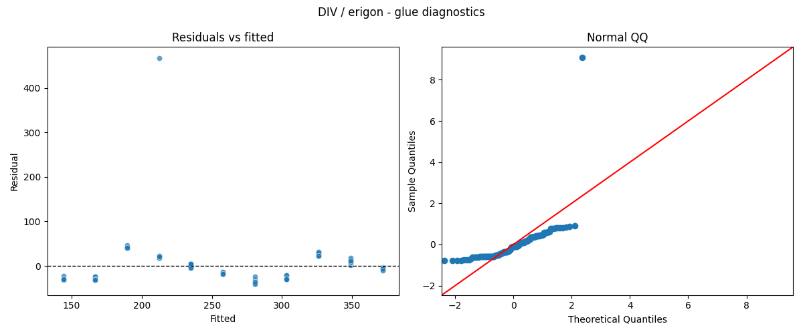

</details>

<details><summary><code>EXP</code> · nobs=110 · runtime_ms=0.0003322 · p=1.00e-03 · R²=0.9244</summary>

```
==============================================================================
                           NNLS Regression Results                            
==============================================================================
Dep. Variable:          test_runtime_ms              R-squared:          0.924
Model:                  NNLS                    Adj. R-squared:          0.924
No. Observations:       110                               RMSE:           3.72
Df Residuals:           108                                MAE:           3.06
Df Model:               1      
==============================================================================
                      coef     std err     P-value      [0.025      0.975]
------------------------------------------------------------------------------
         const     12.2194      1.4274       0.001      9.5087     15.3226
           EXP      0.0003      0.0000       0.001      0.0003      0.0004
==============================================================================
Notes: Non-negative least squares with bootstrap inference (1000 iterations)
==============================================================================
```

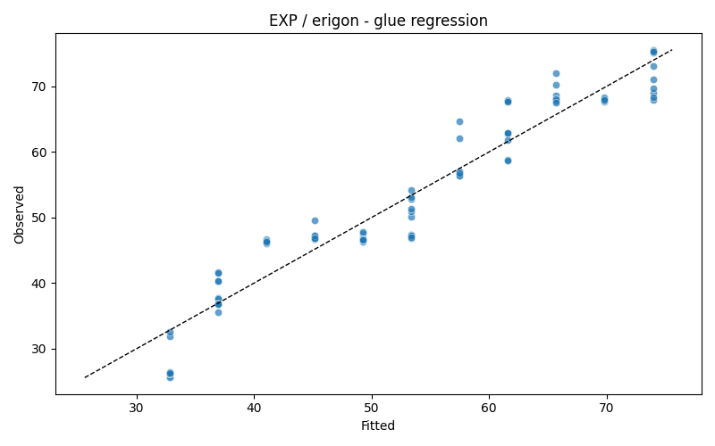

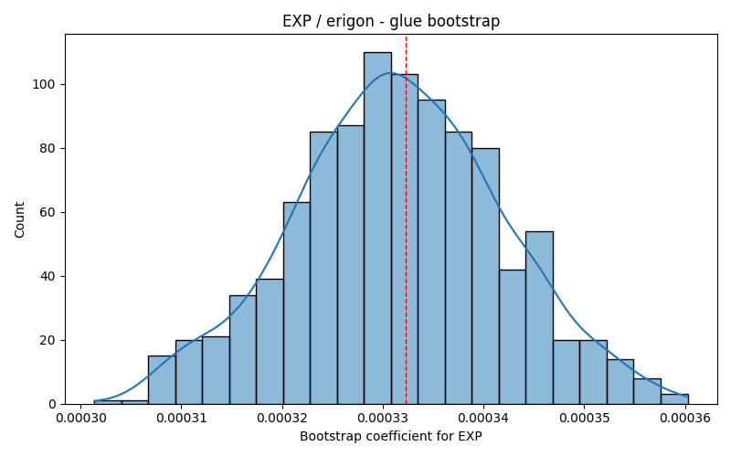

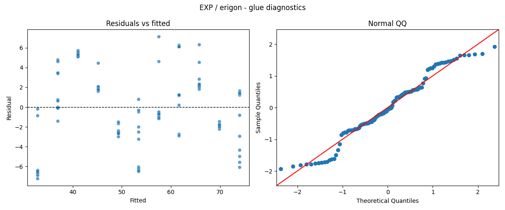

</details>

<details><summary><code>GT</code> · nobs=110 · runtime_ms=2.949e-06 · p=1.00e-03 · R²=0.9372</summary>

```
==============================================================================
                           NNLS Regression Results                            
==============================================================================
Dep. Variable:          test_runtime_ms              R-squared:          0.937
Model:                  NNLS                    Adj. R-squared:          0.937
No. Observations:       110                               RMSE:           8.04
Df Residuals:           108                                MAE:           6.19
Df Model:               1      
==============================================================================
                      coef     std err     P-value      [0.025      0.975]
------------------------------------------------------------------------------
         const     14.9221      3.1671       0.001      8.8536     21.3091
            GT      0.0000      0.0000       0.001      0.0000      0.0000
==============================================================================
Notes: Non-negative least squares with bootstrap inference (1000 iterations)
==============================================================================
```

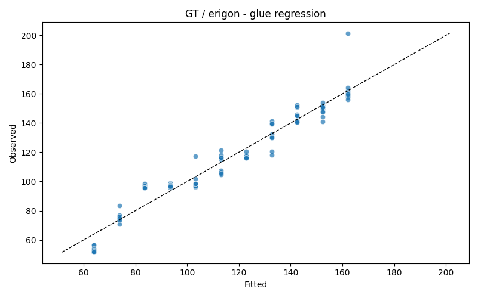

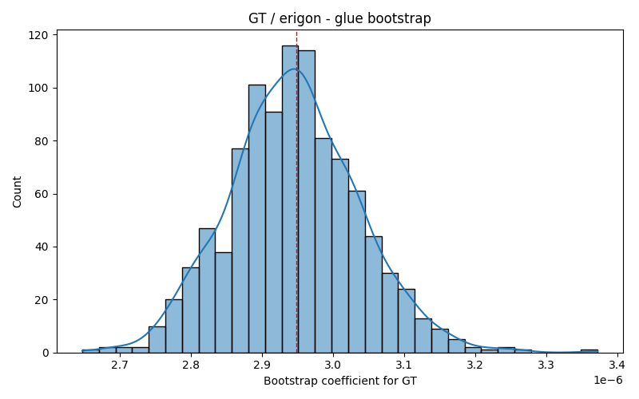

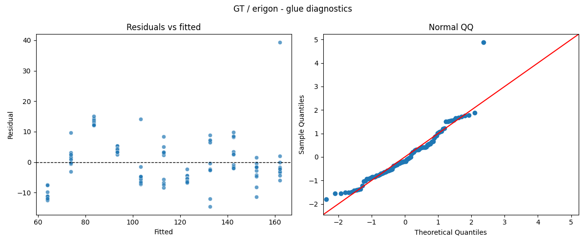

</details>

<details><summary><code>JUMPI</code> · nobs=110 · runtime_ms=3.497e-06 · p=1.00e-03 · R²=0.892</summary>

```
==============================================================================
                           NNLS Regression Results                            
==============================================================================
Dep. Variable:          test_runtime_ms              R-squared:          0.892
Model:                  NNLS                    Adj. R-squared:          0.891
No. Observations:       110                               RMSE:           5.49
Df Residuals:           108                                MAE:           4.54
Df Model:               1      
==============================================================================
                      coef     std err     P-value      [0.025      0.975]
------------------------------------------------------------------------------
         const     17.0639      2.3536       0.001     12.8901     21.8635
         JUMPI      0.0000      0.0000       0.001      0.0000      0.0000
==============================================================================
Notes: Non-negative least squares with bootstrap inference (1000 iterations)
==============================================================================
```

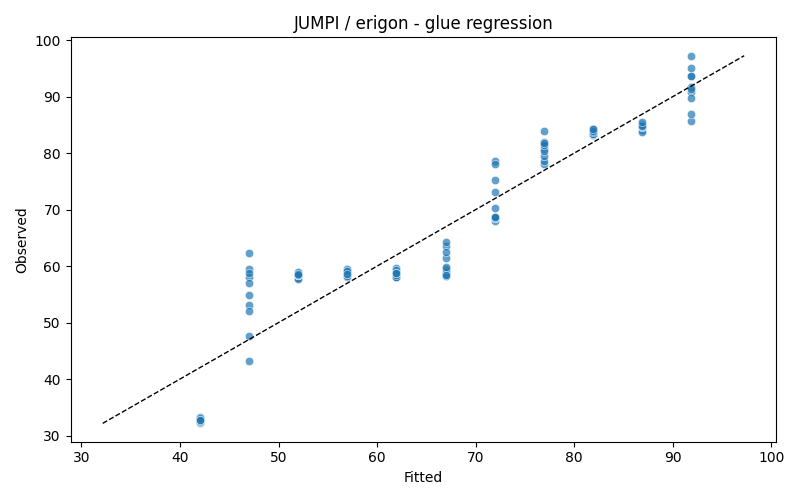

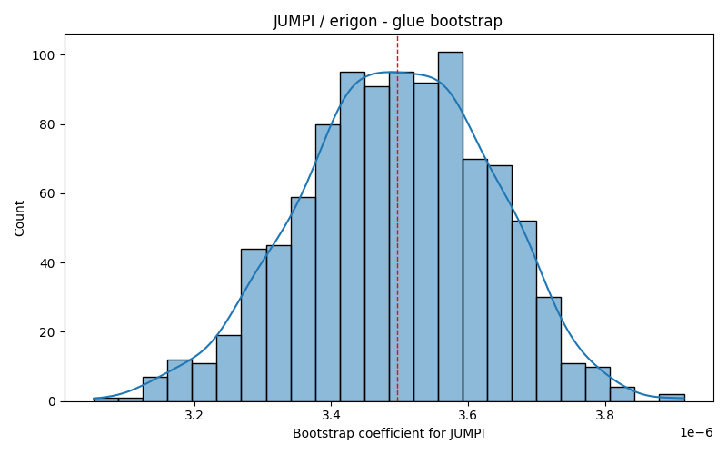

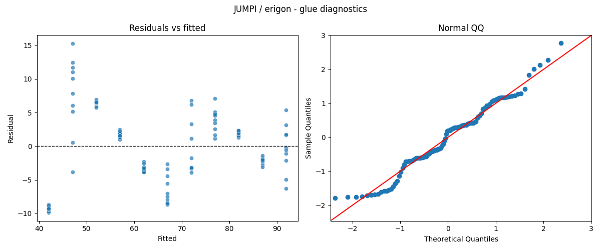

</details>

<details><summary><code>LT</code> · nobs=110 · runtime_ms=2.659e-06 · p=1.00e-03 · R²=0.7323</summary>

```
==============================================================================
                           NNLS Regression Results                            
==============================================================================
Dep. Variable:          test_runtime_ms              R-squared:          0.732
Model:                  NNLS                    Adj. R-squared:          0.730
No. Observations:       110                               RMSE:          16.92
Df Residuals:           108                                MAE:           8.18
Df Model:               1      
==============================================================================
                      coef     std err     P-value      [0.025      0.975]
------------------------------------------------------------------------------
         const     25.3381      5.9111       0.001     15.5514     38.7634
            LT      0.0000      0.0000       0.001      0.0000      0.0000
==============================================================================
Notes: Non-negative least squares with bootstrap inference (1000 iterations)
==============================================================================
```

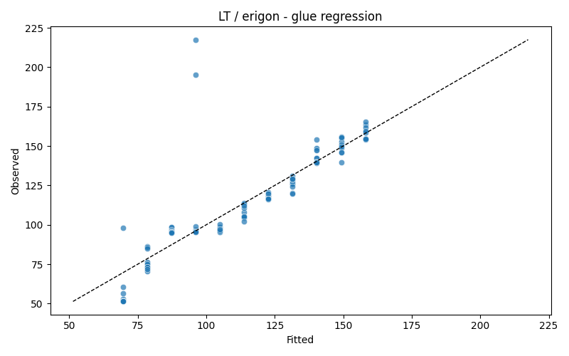

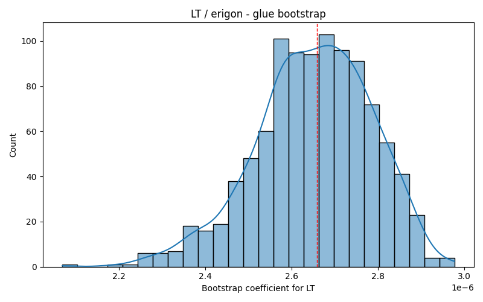

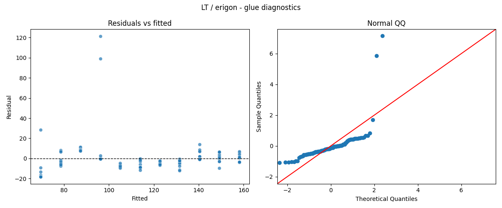

</details>

<details><summary><code>MSTORE</code> · nobs=550 · runtime_ms=5.691e-06 · p=1.00e-03 · R²=0.7338</summary>

```
==============================================================================
                           NNLS Regression Results                            
==============================================================================
Dep. Variable:          test_runtime_ms              R-squared:          0.734
Model:                  NNLS                    Adj. R-squared:          0.733
No. Observations:       550                               RMSE:          24.05
Df Residuals:           548                                MAE:          10.61
Df Model:               1      
==============================================================================
                      coef     std err     P-value      [0.025      0.975]
------------------------------------------------------------------------------
         const     21.7984      3.2693       0.001     15.5516     28.6622
        MSTORE      0.0000      0.0000       0.001      0.0000      0.0000
==============================================================================
Notes: Non-negative least squares with bootstrap inference (1000 iterations)
==============================================================================
```

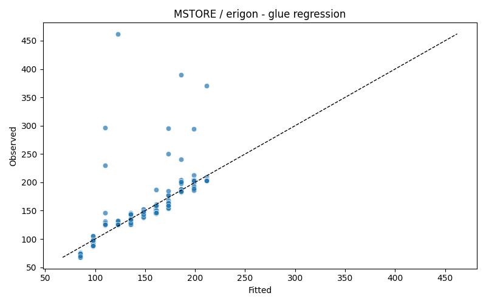

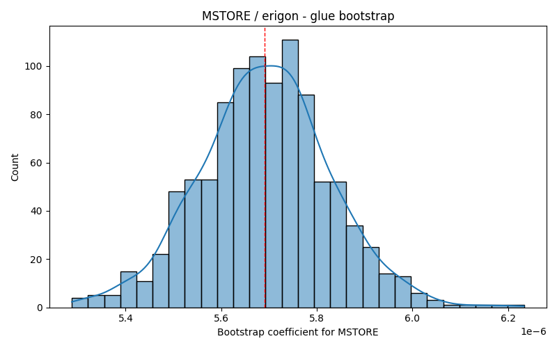

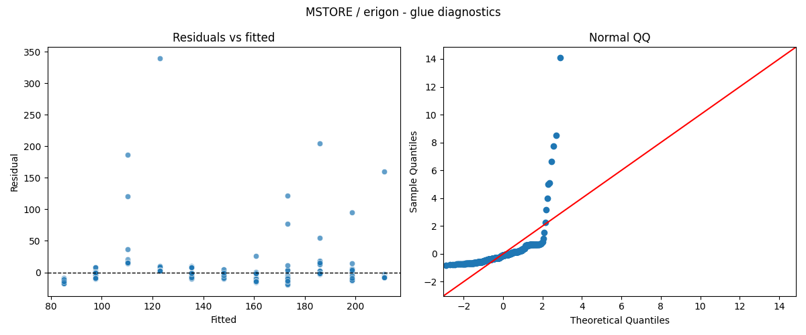

</details>

<details><summary><code>MSTORE8</code> · nobs=550 · runtime_ms=4.85e-06 · p=1.00e-03 · R²=0.4206</summary>

```
==============================================================================
                           NNLS Regression Results                            
==============================================================================
Dep. Variable:          test_runtime_ms              R-squared:          0.421
Model:                  NNLS                    Adj. R-squared:          0.419
No. Observations:       550                               RMSE:          39.95
Df Residuals:           548                                MAE:          11.34
Df Model:               1      
==============================================================================
                      coef     std err     P-value      [0.025      0.975]
------------------------------------------------------------------------------
         const     28.9294      5.5978       0.001     18.3661     40.8821
       MSTORE8      0.0000      0.0000       0.001      0.0000      0.0000
==============================================================================
Notes: Non-negative least squares with bootstrap inference (1000 iterations)
==============================================================================
```

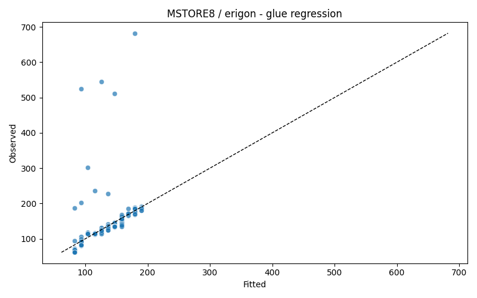

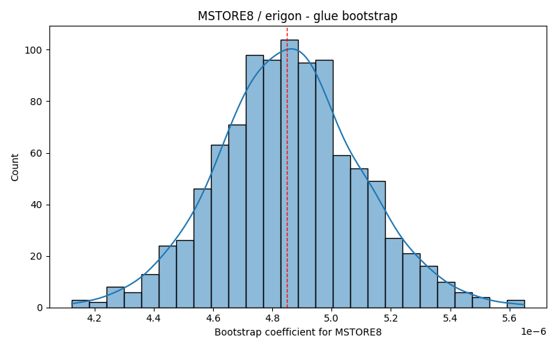

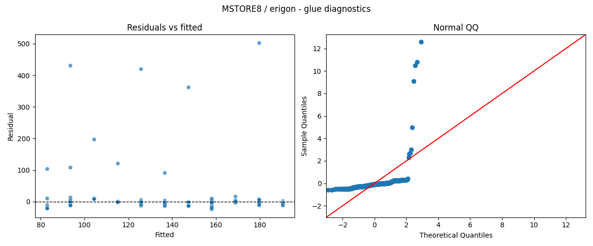

</details>

<details><summary><code>MUL</code> · nobs=110 · runtime_ms=3.867e-06 · p=1.00e-03 · R²=0.576</summary>

```
==============================================================================
                           NNLS Regression Results                            
==============================================================================
Dep. Variable:          test_runtime_ms              R-squared:          0.576
Model:                  NNLS                    Adj. R-squared:          0.572
No. Observations:       110                               RMSE:          26.19
Df Residuals:           108                                MAE:          10.57
Df Model:               1      
==============================================================================
                      coef     std err     P-value      [0.025      0.975]
------------------------------------------------------------------------------
         const      5.2529      3.7224       0.100      0.0000     13.4099
           MUL      0.0000      0.0000       0.001      0.0000      0.0000
==============================================================================
Notes: Non-negative least squares with bootstrap inference (1000 iterations)
==============================================================================
```

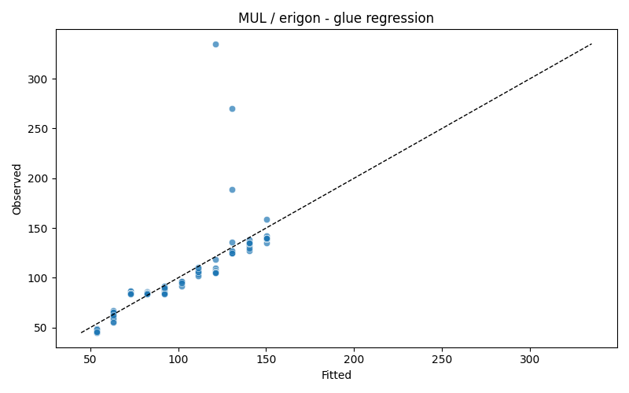

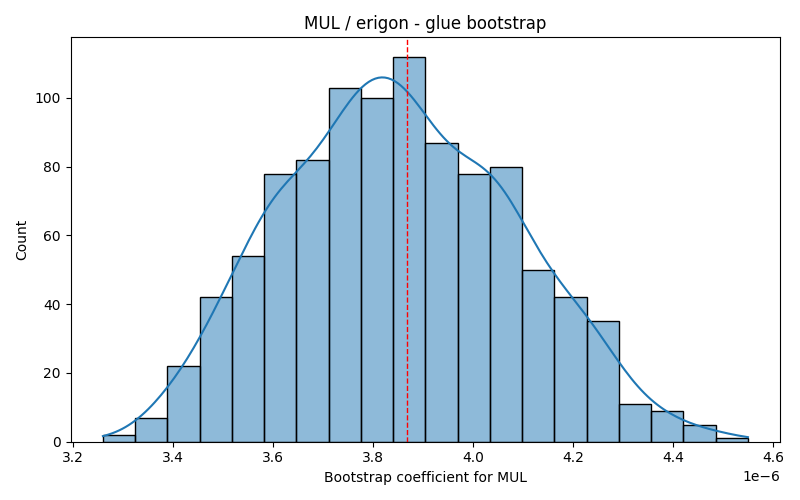

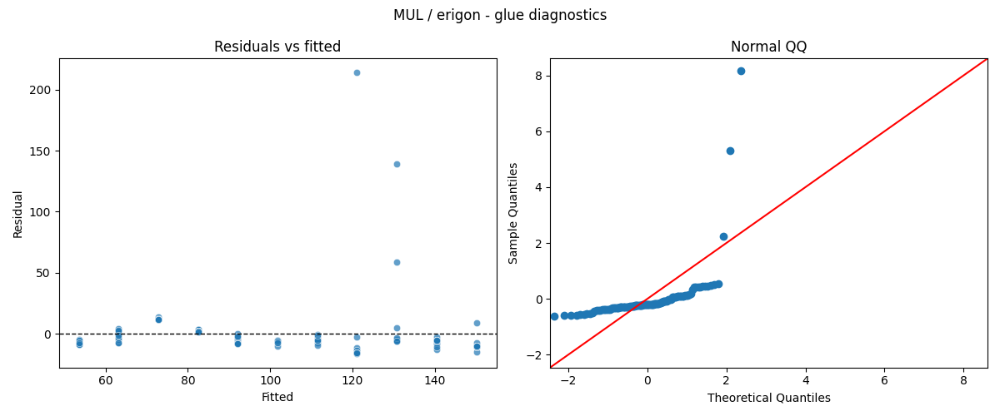

</details>

<details><summary><code>PC</code> · nobs=110 · runtime_ms=1.524e-06 · p=1.00e-03 · R²=0.4855</summary>

```
==============================================================================
                           NNLS Regression Results                            
==============================================================================
Dep. Variable:          test_runtime_ms              R-squared:          0.486
Model:                  NNLS                    Adj. R-squared:          0.481
No. Observations:       110                               RMSE:          46.91
Df Residuals:           108                                MAE:          15.81
Df Model:               1      
==============================================================================
                      coef     std err     P-value      [0.025      0.975]
------------------------------------------------------------------------------
         const     14.6130      8.8749       0.086      0.0000     31.0385
            PC      0.0000      0.0000       0.001      0.0000      0.0000
==============================================================================
Notes: Non-negative least squares with bootstrap inference (1000 iterations)
==============================================================================
```

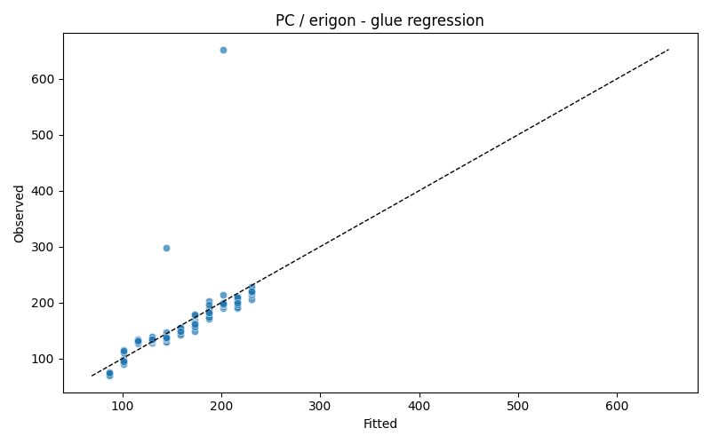

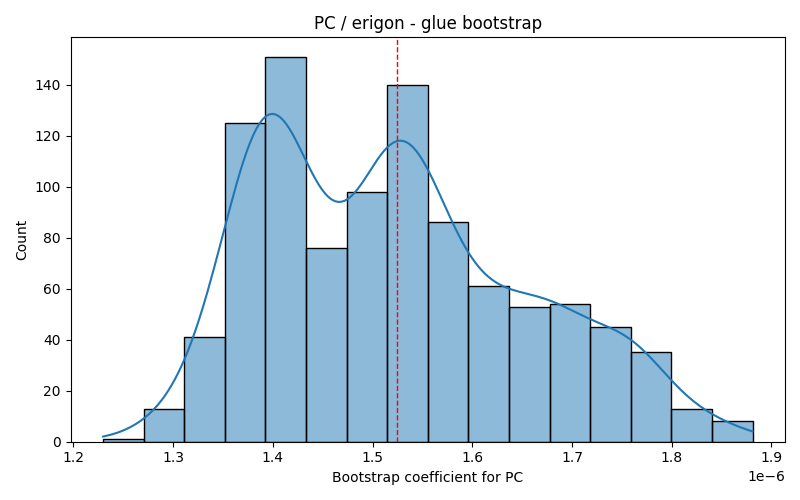

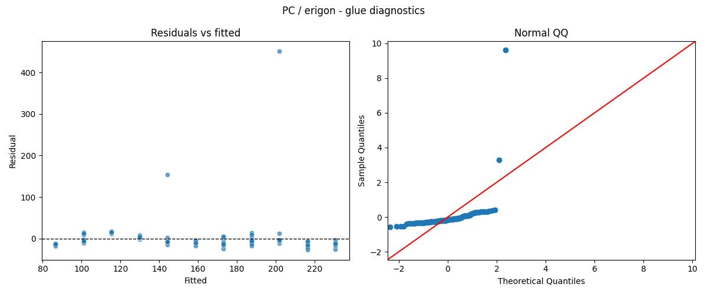

</details>

<details><summary><code>RETURNDATASIZE</code> · nobs=440 · runtime_ms=1.804e-06 · p=1.00e-03 · R²=0.8523</summary>

```
==============================================================================
                           NNLS Regression Results                            
==============================================================================
Dep. Variable:          test_runtime_ms              R-squared:          0.852
Model:                  NNLS                    Adj. R-squared:          0.852
No. Observations:       440                               RMSE:          11.86
Df Residuals:           438                                MAE:           6.37
Df Model:               1      
==============================================================================
                      coef     std err     P-value      [0.025      0.975]
------------------------------------------------------------------------------
         const     15.6177      1.6062       0.001     12.4752     18.7888
RETURNDATASIZE      0.0000      0.0000       0.001      0.0000      0.0000
==============================================================================
Notes: Non-negative least squares with bootstrap inference (1000 iterations)
==============================================================================
```

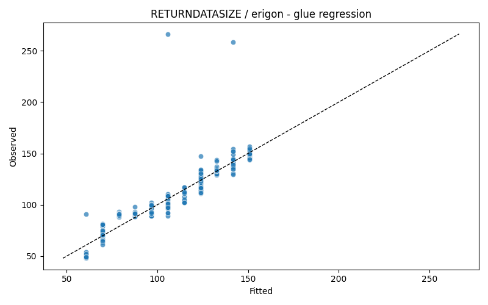

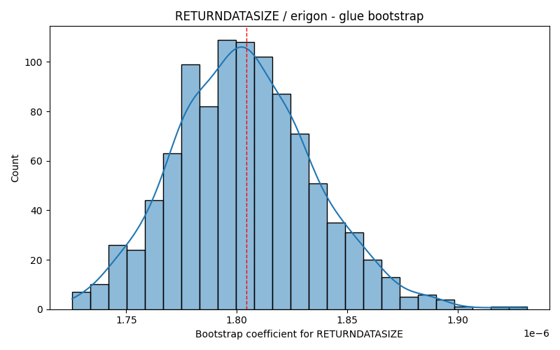

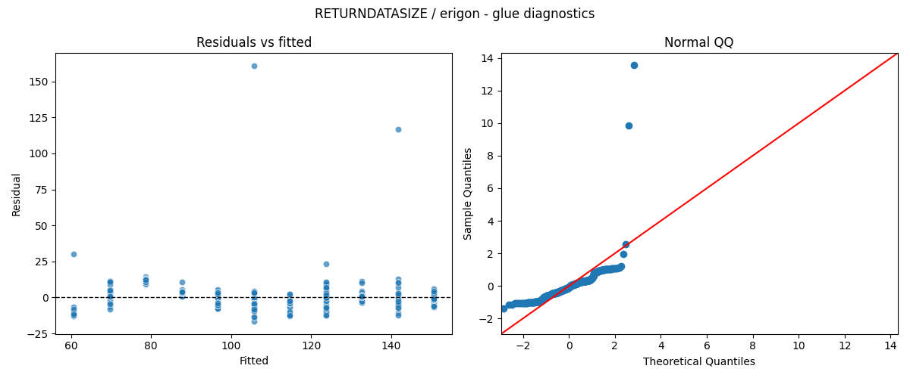

</details>

<details><summary><code>SELFBALANCE</code> · nobs=90 · runtime_ms=1.346e-06 · p=1.00e-03 · R²=0.8855</summary>

```
==============================================================================
                           NNLS Regression Results                            
==============================================================================
Dep. Variable:          test_runtime_ms              R-squared:          0.885
Model:                  NNLS                    Adj. R-squared:          0.884
No. Observations:       90                                RMSE:           4.88
Df Residuals:           88                                 MAE:           3.97
Df Model:               1      
==============================================================================
                      coef     std err     P-value      [0.025      0.975]
------------------------------------------------------------------------------
         const     19.9734      1.8400       0.001     16.2169     23.2343
   SELFBALANCE      0.0000      0.0000       0.001      0.0000      0.0000
==============================================================================
Notes: Non-negative least squares with bootstrap inference (1000 iterations)
==============================================================================
```

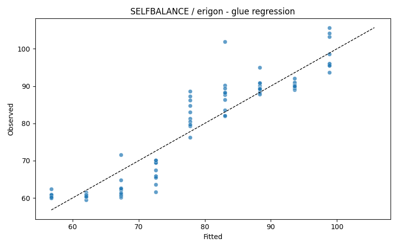

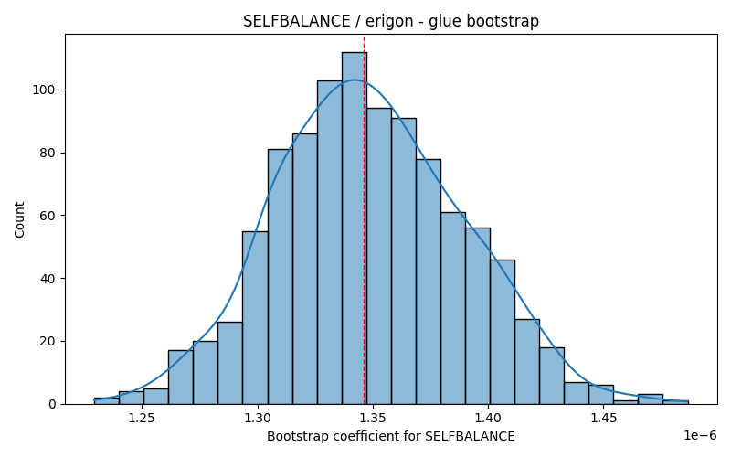

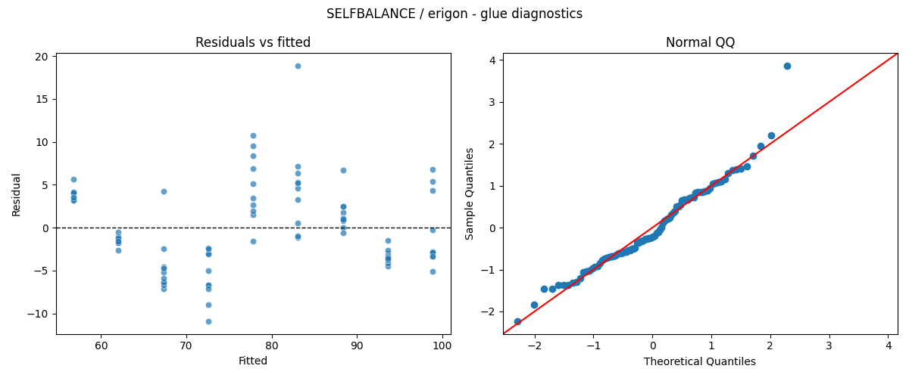

</details>

<details><summary><code>SUB</code> · nobs=110 · runtime_ms=2.744e-06 · p=1.00e-03 · R²=0.9308</summary>

```
==============================================================================
                           NNLS Regression Results                            
==============================================================================
Dep. Variable:          test_runtime_ms              R-squared:          0.931
Model:                  NNLS                    Adj. R-squared:          0.930
No. Observations:       110                               RMSE:           7.88
Df Residuals:           108                                MAE:           6.60
Df Model:               1      
==============================================================================
                      coef     std err     P-value      [0.025      0.975]
------------------------------------------------------------------------------
         const     16.6074      2.8125       0.001     11.2533     22.2493
           SUB      0.0000      0.0000       0.001      0.0000      0.0000
==============================================================================
Notes: Non-negative least squares with bootstrap inference (1000 iterations)
==============================================================================
```

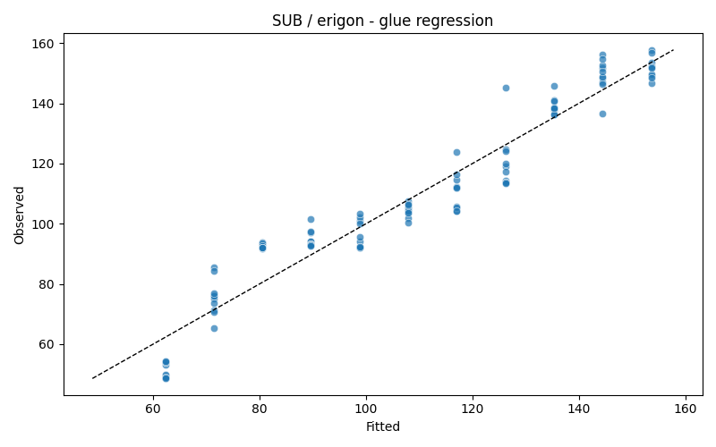

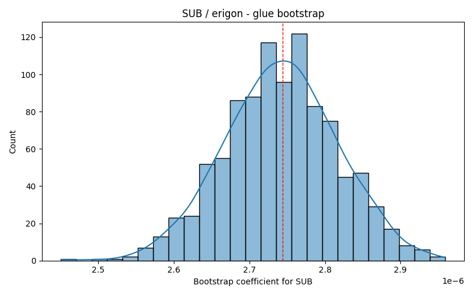

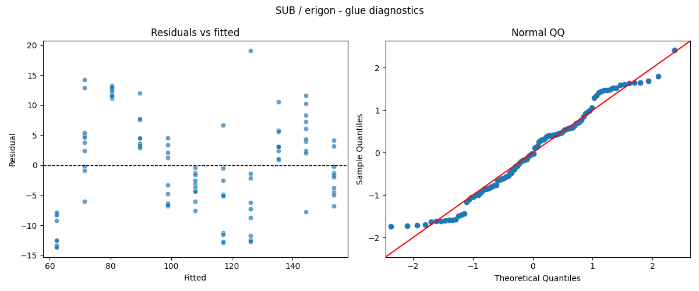

</details>

### Mixed glue (tier B) · erigon

<details><summary><code>JUMP</code> · nobs=110 · runtime_ms=7.151e-06 · p=1.00e-03 · R²=0.9385</summary>

```
==============================================================================
                           NNLS Regression Results                            
==============================================================================
Dep. Variable:          test_runtime_ms              R-squared:          0.939
Model:                  NNLS                    Adj. R-squared:          0.938
No. Observations:       110                               RMSE:           6.80
Df Residuals:           108                                MAE:           5.57
Df Model:               1      
==============================================================================
                      coef     std err     P-value      [0.025      0.975]
------------------------------------------------------------------------------
         const     17.1539      2.7484       0.001     12.0801     22.5811
          JUMP      0.0000      0.0000       0.001      0.0000      0.0000
==============================================================================
Notes: Non-negative least squares with bootstrap inference (1000 iterations)
==============================================================================
```

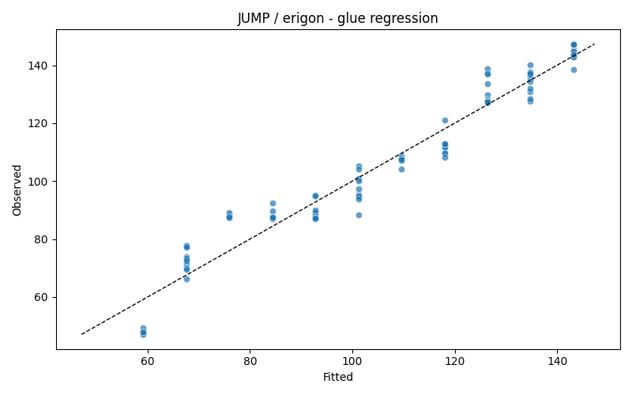

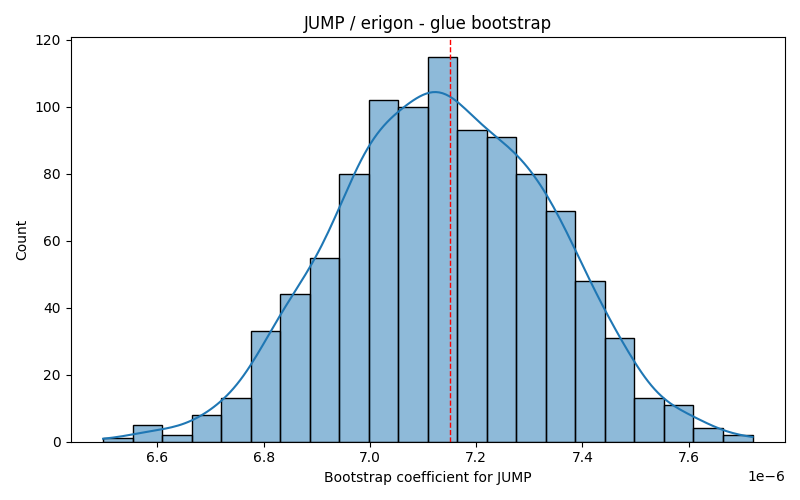

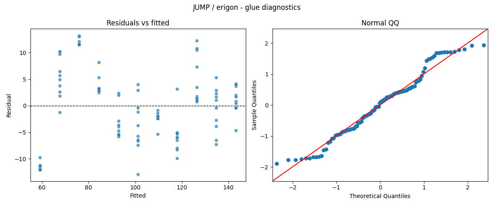

</details>

<details><summary><code>KECCAK256</code> · nobs=1760 · runtime_ms=2.016e-05 · p=1.00e-03 · R²=0.0891</summary>

```
==============================================================================
                           NNLS Regression Results                            
==============================================================================
Dep. Variable:          test_runtime_ms              R-squared:          0.089
Model:                  NNLS                    Adj. R-squared:          0.089
No. Observations:       1760                              RMSE:         128.11
Df Residuals:           1758                               MAE:         103.93
Df Model:               1      
==============================================================================
                      coef     std err     P-value      [0.025      0.975]
------------------------------------------------------------------------------
         const    349.3767      6.9502       0.001    335.9877    362.9615
     KECCAK256      0.0000      0.0000       0.001      0.0000      0.0000
==============================================================================
Notes: Non-negative least squares with bootstrap inference (1000 iterations)
==============================================================================
```

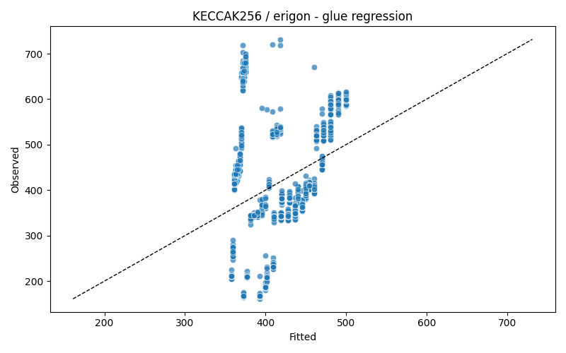

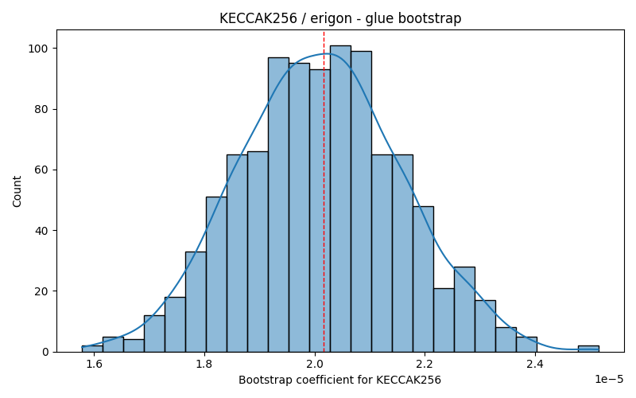

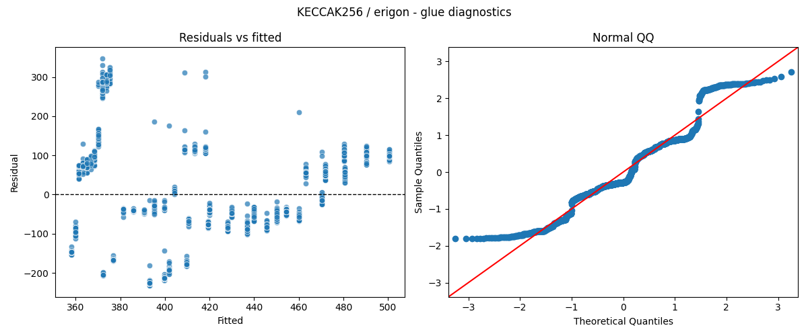

</details>

## geth

| glue_opcode | nobs | glue_runtime_ms | p_value | rsquared |
| --- | --- | --- | --- | --- |
| `ISZERO` | 253 | 1.516e-06 | 1.00e-03 | 0.7151 |
| `JUMPDEST` | 253 | 1.213e-06 | 1.00e-03 | 0.5327 |
| `SWAP` | 4048 | 1.588e-06 | 1.00e-03 | 0.6651 |
| `CALLDATASIZE` | 15158 | 1.403e-06 | 1.00e-03 | 0.8334 |
| `DUP` | 15158 | 1.505e-06 | 1.00e-03 | 0.8334 |
| `GAS` | 15158 | 1.437e-06 | 1.00e-03 | 0.8334 |
| `MLOAD` | 15158 | 5.152e-06 | 1.00e-03 | 0.8334 |
| `PUSH` | 15158 | 2.264e-06 | 1.00e-03 | 0.8334 |
| `PUSH0` | 15158 | 1.432e-06 | 1.00e-03 | 0.8334 |
| `STATICCALL` | 15158 | 0.0001797 | 1.00e-03 | 0.8334 |
| `ADD` | 253 | 4.318e-06 | 1.00e-03 | 0.6515 |
| `AND` | 253 | 3.786e-06 | 1.00e-03 | 0.6833 |
| `CALLDATACOPY` | 6072 | 1.317e-05 | 1.00e-03 | 0.9436 |
| `CALLDATALOAD` | 1012 | 4.684e-05 | 1.00e-03 | 0.03917 |
| `DIV` | 253 | 9.201e-06 | 1.00e-03 | 0.8166 |
| `EXP` | 253 | 0.0003266 | 1.00e-03 | 0.8044 |
| `GT` | 253 | 3.573e-06 | 1.00e-03 | 0.7387 |
| `JUMPI` | 253 | 6.215e-06 | 1.00e-03 | 0.7239 |
| `LT` | 253 | 4.553e-06 | 1.00e-03 | 0.7756 |
| `MSTORE` | 1265 | 7.829e-06 | 1.00e-03 | 0.785 |
| `MSTORE8` | 1265 | 7.038e-06 | 1.00e-03 | 0.7372 |
| `MUL` | 253 | 4.735e-06 | 1.00e-03 | 0.7593 |
| `PC` | 253 | 1.634e-06 | 1.00e-03 | 0.8131 |
| `RETURNDATASIZE` | 1012 | 3.449e-06 | 1.00e-03 | 0.6602 |
| `SELFBALANCE` | 207 | 7.118e-06 | 1.00e-03 | 0.77 |
| `SUB` | 253 | 4.412e-06 | 1.00e-03 | 0.7148 |
| `JUMP` | 253 | 9.092e-06 | 1.00e-03 | 0.7615 |
| `KECCAK256` | 4048 | 3.852e-05 | 1.00e-03 | 0.3032 |

### Cycle glue — joint fit · geth

<details><summary>Joint NNLS regression summary</summary>

```
==============================================================================
                           NNLS Regression Results                            
==============================================================================
Dep. Variable:          test_runtime_ms              R-squared:          0.833
Model:                  NNLS                    Adj. R-squared:          0.833
No. Observations:       15158                             RMSE:          25.32
Df Residuals:           15150                              MAE:          19.90
Df Model:               7      
==============================================================================
                      coef     std err     P-value      [0.025      0.975]
------------------------------------------------------------------------------
         const     44.3081      0.7369       0.001     42.8378     45.7613
  CALLDATASIZE      0.0000      0.0000       0.001      0.0000      0.0000
           DUP      0.0000      0.0000       0.001      0.0000      0.0000
           GAS      0.0000      0.0000       0.001      0.0000      0.0000
         MLOAD      0.0000      0.0000       0.001      0.0000      0.0000
          PUSH      0.0000      0.0000       0.001      0.0000      0.0000
         PUSH0      0.0000      0.0000       0.001      0.0000      0.0000
    STATICCALL      0.0002      0.0000       0.001      0.0002      0.0002
==============================================================================
Notes: Non-negative least squares with bootstrap inference (1000 iterations)
==============================================================================
```

</details>

<details><summary><code>CALLDATASIZE</code> · nobs=15158 · runtime_ms=1.403e-06 · p=1.00e-03 · R²=0.8334</summary>


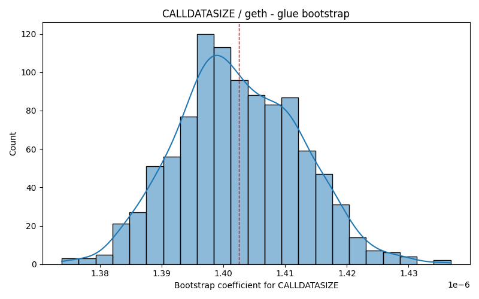


</details>

<details><summary><code>DUP</code> · nobs=15158 · runtime_ms=1.505e-06 · p=1.00e-03 · R²=0.8334</summary>

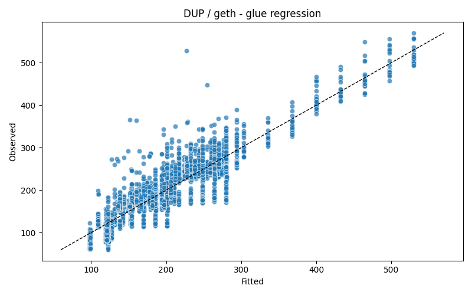

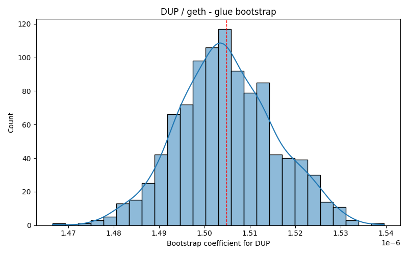


</details>

<details><summary><code>GAS</code> · nobs=15158 · runtime_ms=1.437e-06 · p=1.00e-03 · R²=0.8334</summary>


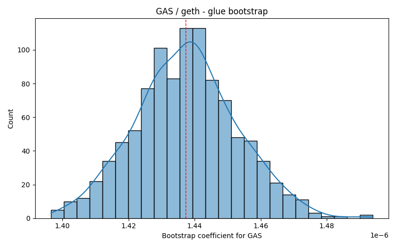


</details>

<details><summary><code>MLOAD</code> · nobs=15158 · runtime_ms=5.152e-06 · p=1.00e-03 · R²=0.8334</summary>


</details>

<details><summary><code>PUSH</code> · nobs=15158 · runtime_ms=2.264e-06 · p=1.00e-03 · R²=0.8334</summary>


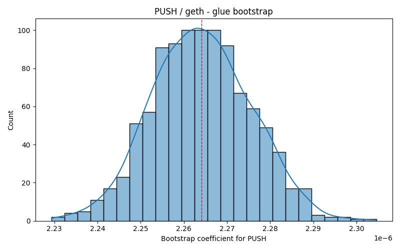

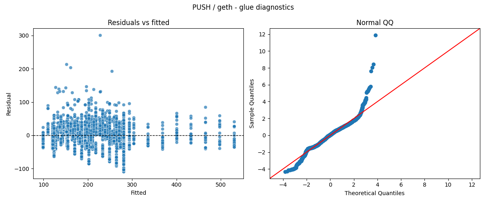

</details>

<details><summary><code>PUSH0</code> · nobs=15158 · runtime_ms=1.432e-06 · p=1.00e-03 · R²=0.8334</summary>


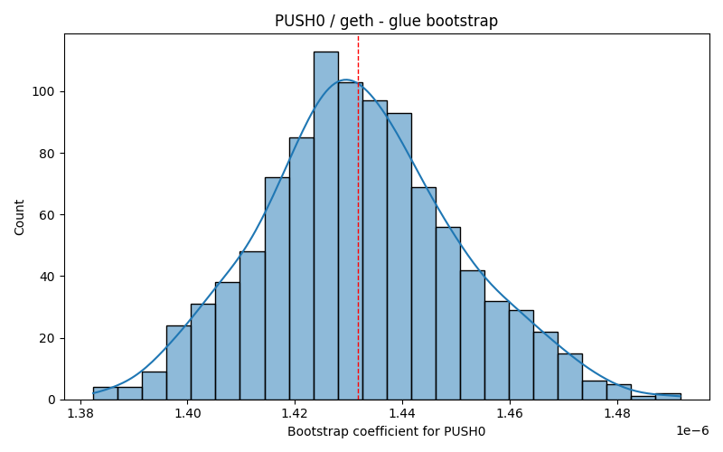


</details>

<details><summary><code>STATICCALL</code> · nobs=15158 · runtime_ms=0.0001797 · p=1.00e-03 · R²=0.8334</summary>


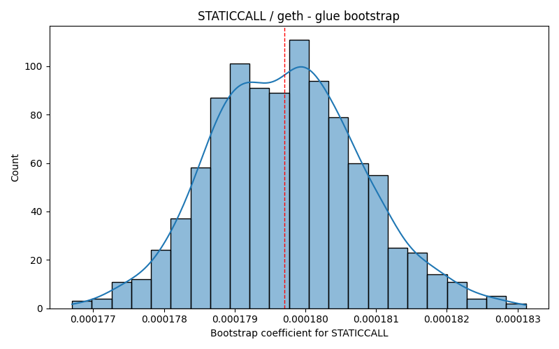


</details>

### Pure glue · geth

<details><summary><code>ISZERO</code> · nobs=253 · runtime_ms=1.516e-06 · p=1.00e-03 · R²=0.7151</summary>

```
==============================================================================
                           NNLS Regression Results                            
==============================================================================
Dep. Variable:          test_runtime_ms              R-squared:          0.715
Model:                  NNLS                    Adj. R-squared:          0.714
No. Observations:       253                               RMSE:          20.14
Df Residuals:           251                                MAE:          13.89
Df Model:               1      
==============================================================================
                      coef     std err     P-value      [0.025      0.975]
------------------------------------------------------------------------------
         const     25.1844      4.7071       0.001     15.7704     33.9774
        ISZERO      0.0000      0.0000       0.001      0.0000      0.0000
==============================================================================
Notes: Non-negative least squares with bootstrap inference (1000 iterations)
==============================================================================
```

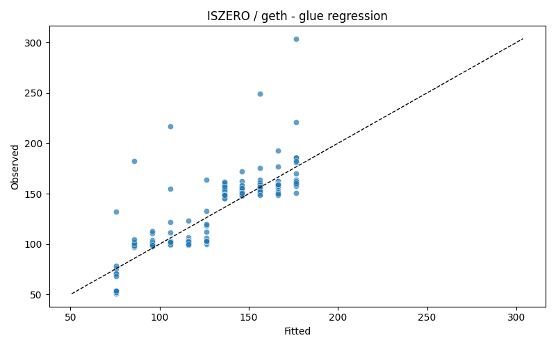

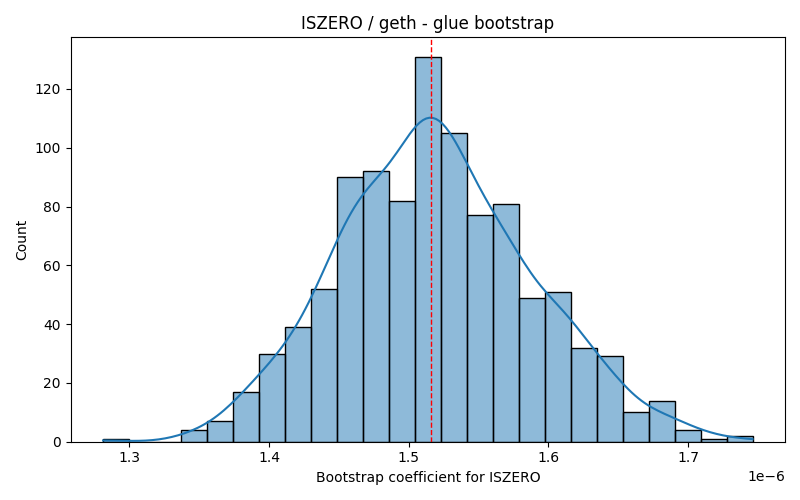

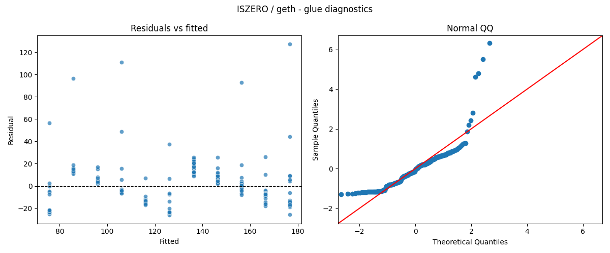

</details>

<details><summary><code>JUMPDEST</code> · nobs=253 · runtime_ms=1.213e-06 · p=1.00e-03 · R²=0.5327</summary>

```
==============================================================================
                           NNLS Regression Results                            
==============================================================================
Dep. Variable:          test_runtime_ms              R-squared:          0.533
Model:                  NNLS                    Adj. R-squared:          0.531
No. Observations:       253                               RMSE:          71.73
Df Residuals:           251                                MAE:          37.50
Df Model:               1      
==============================================================================
                      coef     std err     P-value      [0.025      0.975]
------------------------------------------------------------------------------
         const     74.2712     17.1692       0.001     39.0728    105.5257
      JUMPDEST      0.0000      0.0000       0.001      0.0000      0.0000
==============================================================================
Notes: Non-negative least squares with bootstrap inference (1000 iterations)
==============================================================================
```

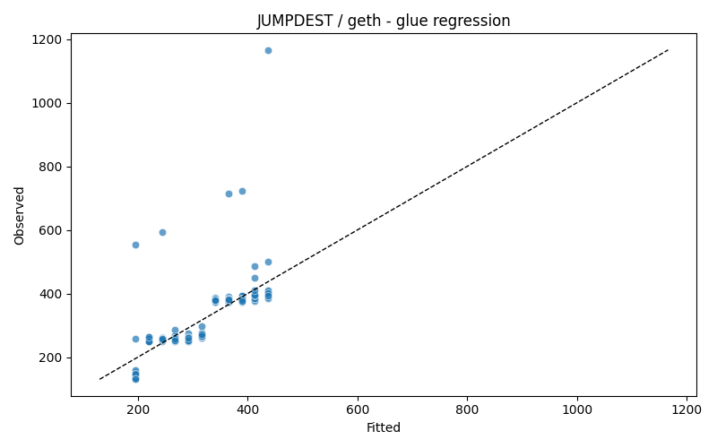

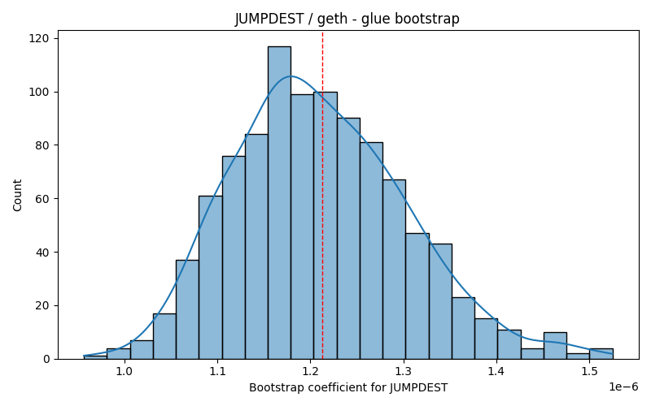

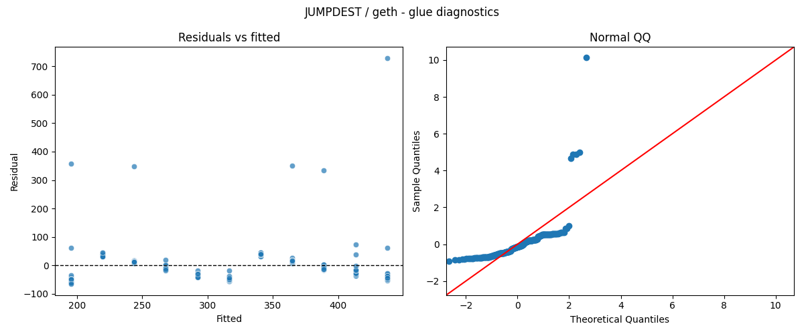

</details>

<details><summary><code>SWAP</code> · nobs=4048 · runtime_ms=1.588e-06 · p=1.00e-03 · R²=0.6651</summary>

```
==============================================================================
                           NNLS Regression Results                            
==============================================================================
Dep. Variable:          test_runtime_ms              R-squared:          0.665
Model:                  NNLS                    Adj. R-squared:          0.665
No. Observations:       4048                              RMSE:          23.73
Df Residuals:           4046                               MAE:          16.27
Df Model:               1      
==============================================================================
                      coef     std err     P-value      [0.025      0.975]
------------------------------------------------------------------------------
         const     33.3244      1.3216       0.001     30.7775     35.9255
          SWAP      0.0000      0.0000       0.001      0.0000      0.0000
==============================================================================
Notes: Non-negative least squares with bootstrap inference (1000 iterations)
==============================================================================
```

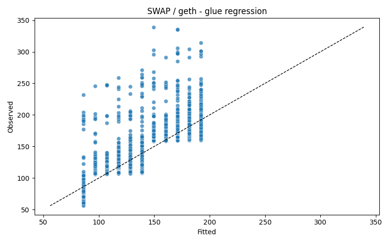

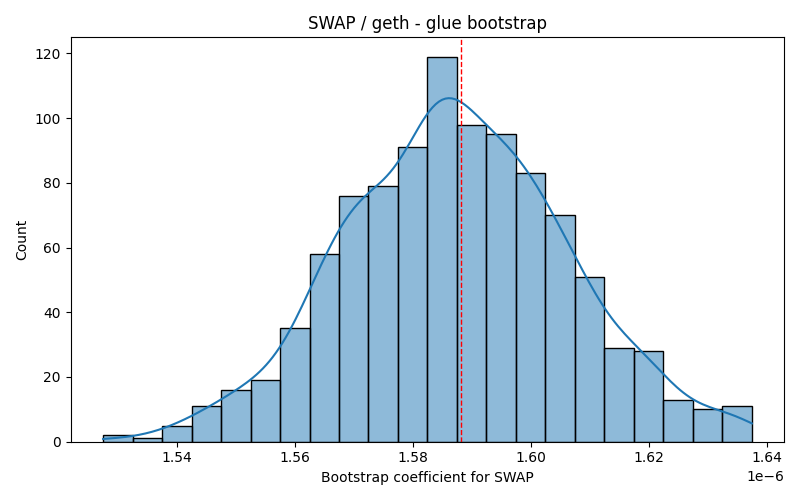

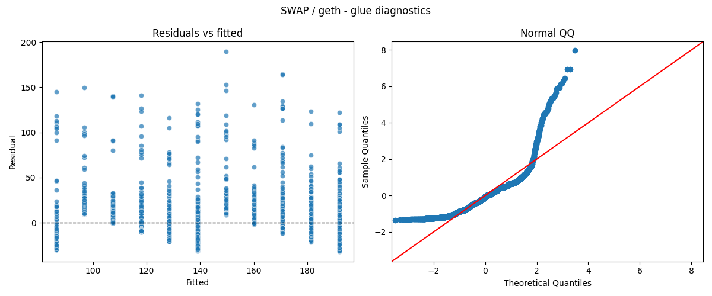

</details>

### Mixed glue (tier A) · geth

<details><summary><code>ADD</code> · nobs=253 · runtime_ms=4.318e-06 · p=1.00e-03 · R²=0.6515</summary>

```
==============================================================================
                           NNLS Regression Results                            
==============================================================================
Dep. Variable:          test_runtime_ms              R-squared:          0.652
Model:                  NNLS                    Adj. R-squared:          0.650
No. Observations:       253                               RMSE:          33.24
Df Residuals:           251                                MAE:          21.61
Df Model:               1      
==============================================================================
                      coef     std err     P-value      [0.025      0.975]
------------------------------------------------------------------------------
         const     49.2886      6.6212       0.001     36.5532     62.8240
           ADD      0.0000      0.0000       0.001      0.0000      0.0000
==============================================================================
Notes: Non-negative least squares with bootstrap inference (1000 iterations)
==============================================================================
```

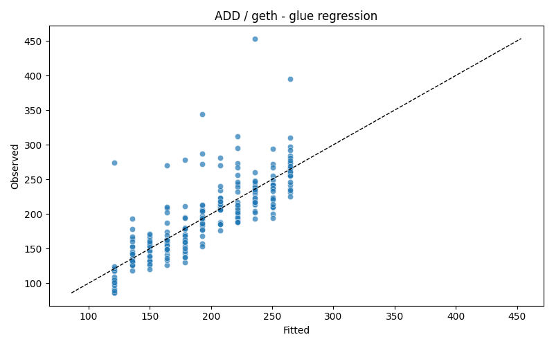

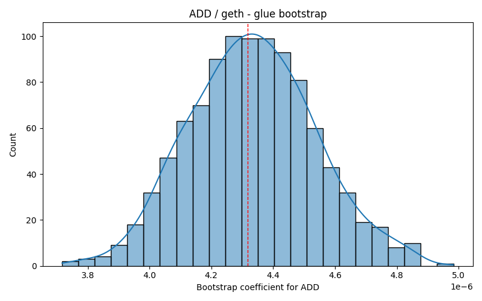

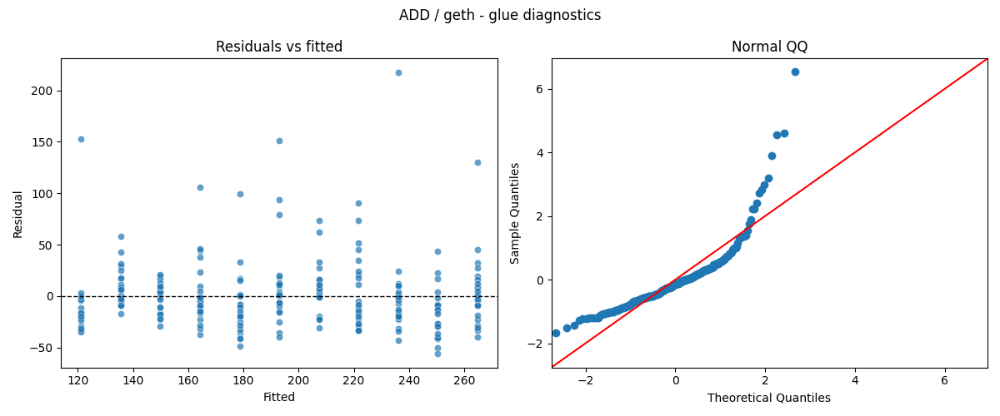

</details>

<details><summary><code>AND</code> · nobs=253 · runtime_ms=3.786e-06 · p=1.00e-03 · R²=0.6833</summary>

```
==============================================================================
                           NNLS Regression Results                            
==============================================================================
Dep. Variable:          test_runtime_ms              R-squared:          0.683
Model:                  NNLS                    Adj. R-squared:          0.682
No. Observations:       253                               RMSE:          27.13
Df Residuals:           251                                MAE:          19.85
Df Model:               1      
==============================================================================
                      coef     std err     P-value      [0.025      0.975]
------------------------------------------------------------------------------
         const     53.4596      5.8815       0.001     42.0223     65.7254
           AND      0.0000      0.0000       0.001      0.0000      0.0000
==============================================================================
Notes: Non-negative least squares with bootstrap inference (1000 iterations)
==============================================================================
```

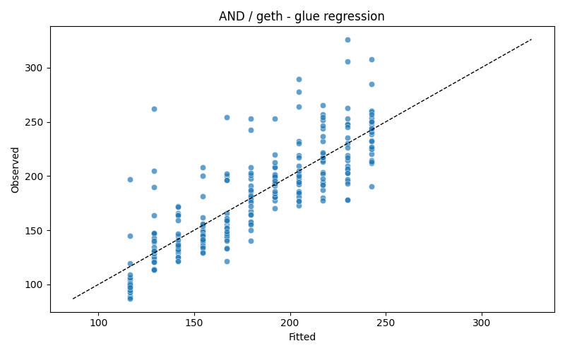

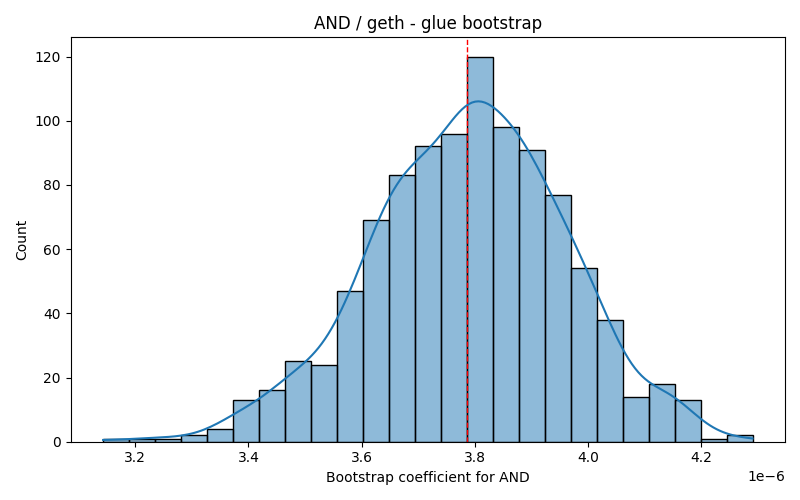

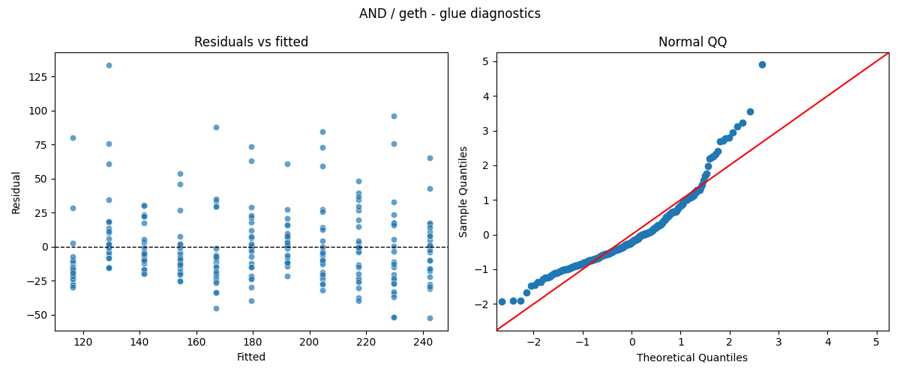

</details>

<details><summary><code>CALLDATACOPY</code> · nobs=6072 · runtime_ms=1.317e-05 · p=1.00e-03 · R²=0.9436</summary>

```
==============================================================================
                           NNLS Regression Results                            
==============================================================================
Dep. Variable:          test_runtime_ms              R-squared:          0.944
Model:                  NNLS                    Adj. R-squared:          0.944
No. Observations:       6072                              RMSE:          24.22
Df Residuals:           6070                               MAE:          17.67
Df Model:               1      
==============================================================================
                      coef     std err     P-value      [0.025      0.975]
------------------------------------------------------------------------------
         const     20.0227      0.3815       0.001     19.3071     20.7867
  CALLDATACOPY      0.0000      0.0000       0.001      0.0000      0.0000
==============================================================================
Notes: Non-negative least squares with bootstrap inference (1000 iterations)
==============================================================================
```

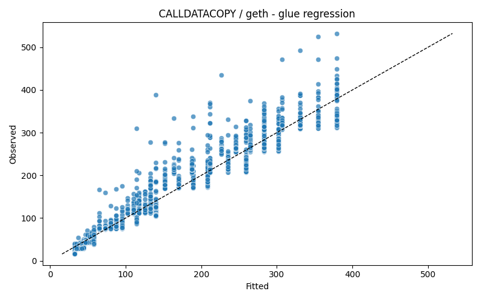

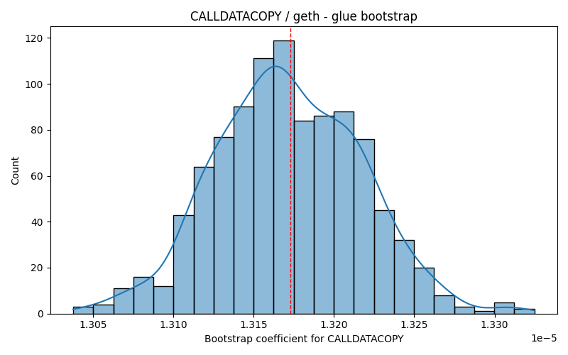

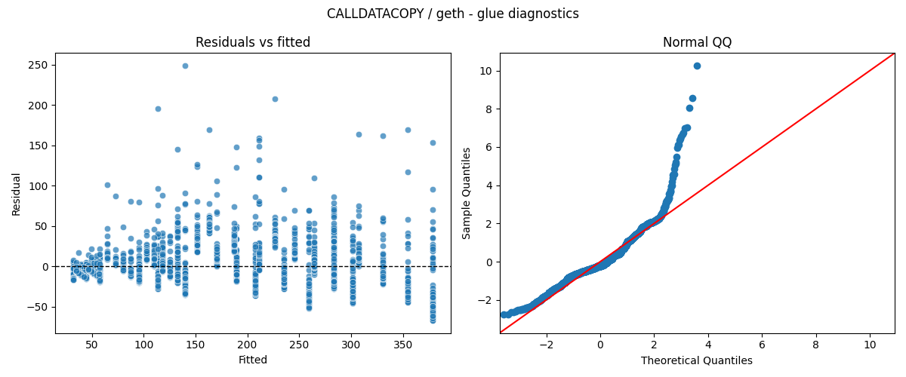

</details>

<details><summary><code>CALLDATALOAD</code> · nobs=1012 · runtime_ms=4.684e-05 · p=1.00e-03 · R²=0.03917</summary>

```
==============================================================================
                           NNLS Regression Results                            
==============================================================================
Dep. Variable:          test_runtime_ms              R-squared:          0.039
Model:                  NNLS                    Adj. R-squared:          0.038
No. Observations:       1012                              RMSE:           0.89
Df Residuals:           1010                               MAE:           0.45
Df Model:               1      
==============================================================================
                      coef     std err     P-value      [0.025      0.975]
------------------------------------------------------------------------------
         const      2.4105      0.0928       0.001      2.2271      2.5874
  CALLDATALOAD      0.0000      0.0000       0.001      0.0000      0.0001
==============================================================================
Notes: Non-negative least squares with bootstrap inference (1000 iterations)
==============================================================================
```

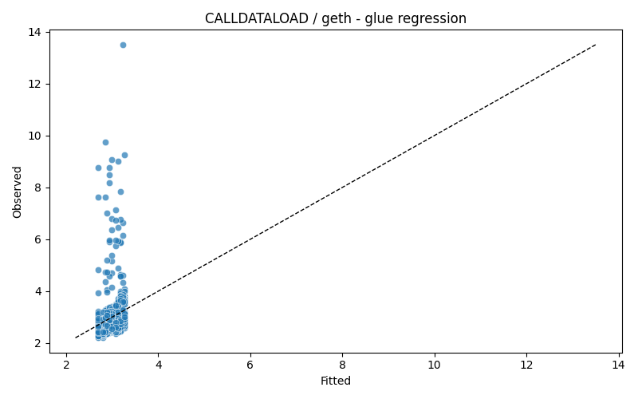

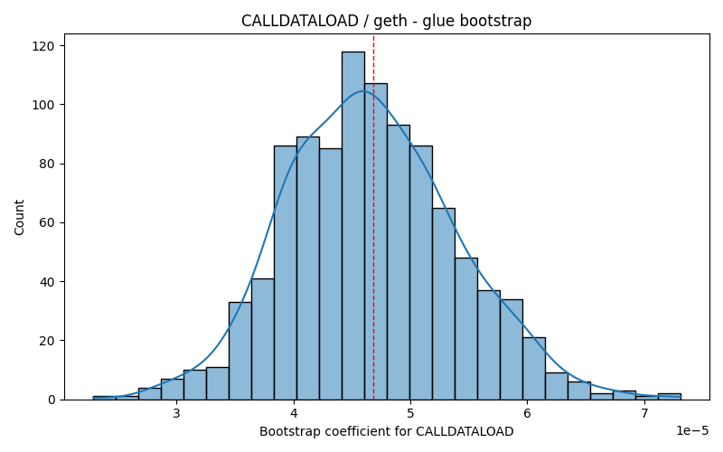

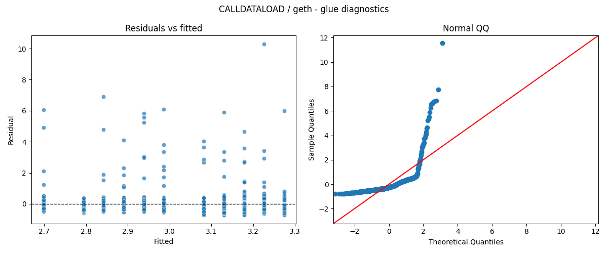

</details>

<details><summary><code>DIV</code> · nobs=253 · runtime_ms=9.201e-06 · p=1.00e-03 · R²=0.8166</summary>

```
==============================================================================
                           NNLS Regression Results                            
==============================================================================
Dep. Variable:          test_runtime_ms              R-squared:          0.817
Model:                  NNLS                    Adj. R-squared:          0.816
No. Observations:       253                               RMSE:          34.43
Df Residuals:           251                                MAE:          29.25
Df Model:               1      
==============================================================================
                      coef     std err     P-value      [0.025      0.975]
------------------------------------------------------------------------------
         const     76.3827      8.3518       0.001     60.7085     92.0939
           DIV      0.0000      0.0000       0.001      0.0000      0.0000
==============================================================================
Notes: Non-negative least squares with bootstrap inference (1000 iterations)
==============================================================================
```

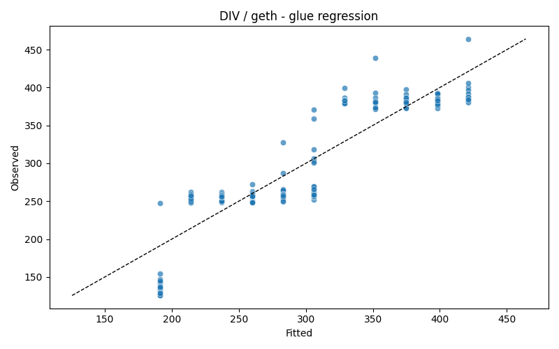

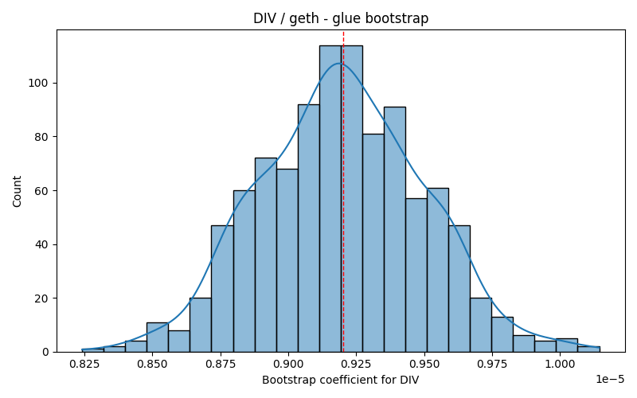

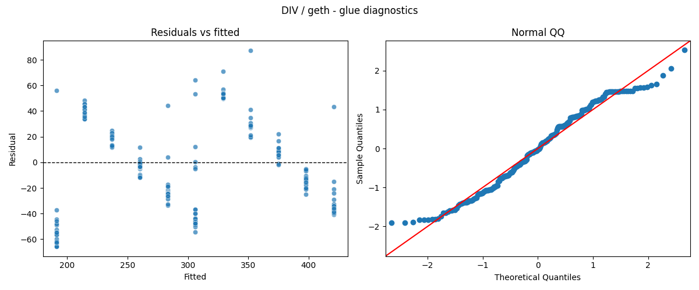

</details>

<details><summary><code>EXP</code> · nobs=253 · runtime_ms=0.0003266 · p=1.00e-03 · R²=0.8044</summary>

```
==============================================================================
                           NNLS Regression Results                            
==============================================================================
Dep. Variable:          test_runtime_ms              R-squared:          0.804
Model:                  NNLS                    Adj. R-squared:          0.804
No. Observations:       253                               RMSE:           6.31
Df Residuals:           251                                MAE:           5.45
Df Model:               1      
==============================================================================
                      coef     std err     P-value      [0.025      0.975]
------------------------------------------------------------------------------
         const     13.7094      1.4426       0.001     10.8058     16.4699
           EXP      0.0003      0.0000       0.001      0.0003      0.0003
==============================================================================
Notes: Non-negative least squares with bootstrap inference (1000 iterations)
==============================================================================
```

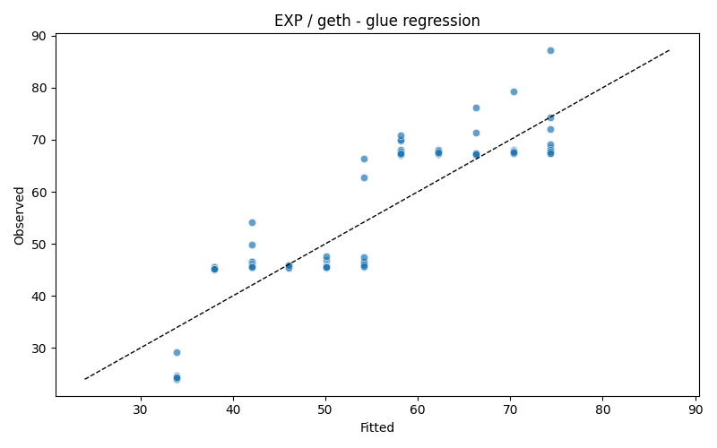

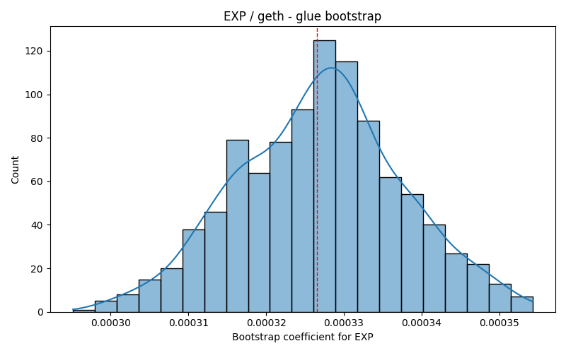

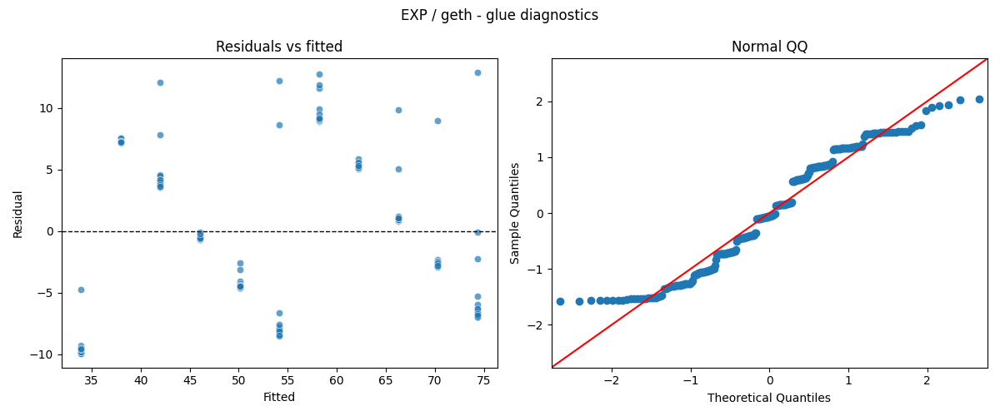

</details>

<details><summary><code>GT</code> · nobs=253 · runtime_ms=3.573e-06 · p=1.00e-03 · R²=0.7387</summary>

```
==============================================================================
                           NNLS Regression Results                            
==============================================================================
Dep. Variable:          test_runtime_ms              R-squared:          0.739
Model:                  NNLS                    Adj. R-squared:          0.738
No. Observations:       253                               RMSE:          22.37
Df Residuals:           251                                MAE:          16.26
Df Model:               1      
==============================================================================
                      coef     std err     P-value      [0.025      0.975]
------------------------------------------------------------------------------
         const     38.2203      5.1635       0.001     28.7982     48.8826
            GT      0.0000      0.0000       0.001      0.0000      0.0000
==============================================================================
Notes: Non-negative least squares with bootstrap inference (1000 iterations)
==============================================================================
```

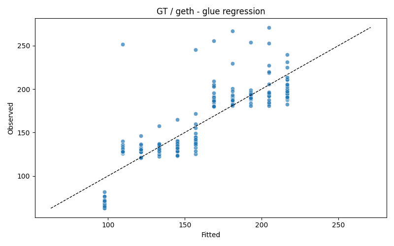

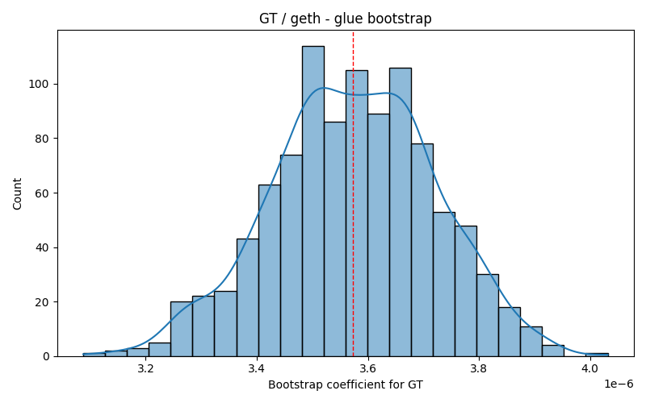

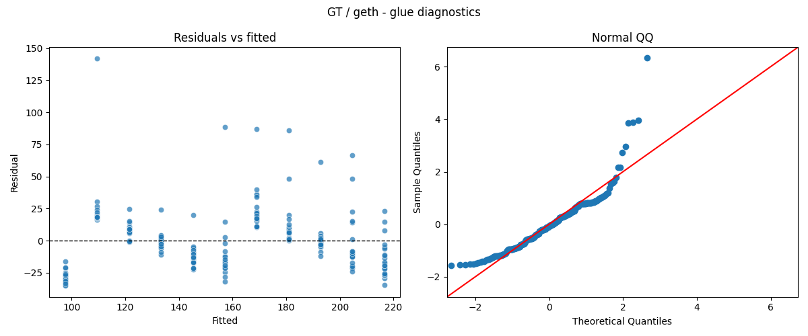

</details>

<details><summary><code>JUMPI</code> · nobs=253 · runtime_ms=6.215e-06 · p=1.00e-03 · R²=0.7239</summary>

```
==============================================================================
                           NNLS Regression Results                            
==============================================================================
Dep. Variable:          test_runtime_ms              R-squared:          0.724
Model:                  NNLS                    Adj. R-squared:          0.723
No. Observations:       253                               RMSE:          17.31
Df Residuals:           251                                MAE:          12.89
Df Model:               1      
==============================================================================
                      coef     std err     P-value      [0.025      0.975]
------------------------------------------------------------------------------
         const     16.3978      3.3596       0.001      9.4787     22.5295
         JUMPI      0.0000      0.0000       0.001      0.0000      0.0000
==============================================================================
Notes: Non-negative least squares with bootstrap inference (1000 iterations)
==============================================================================
```

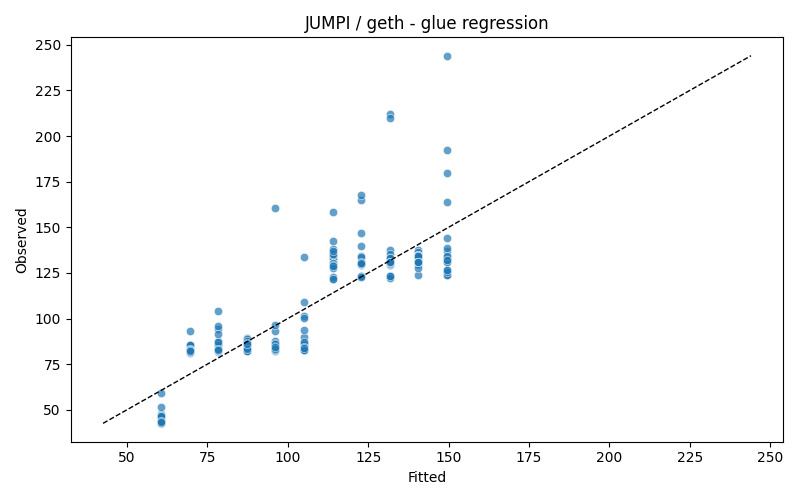

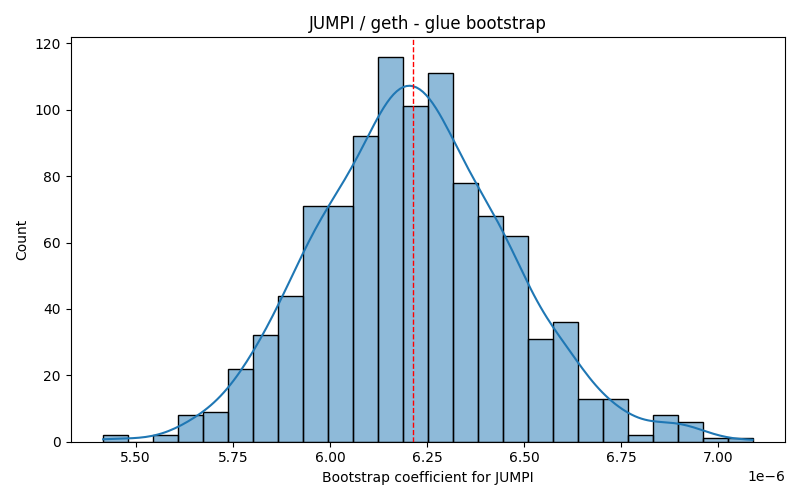

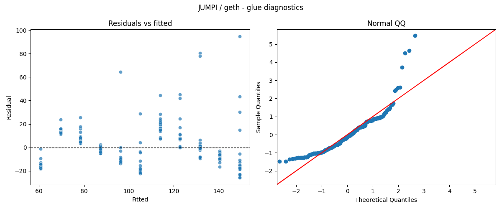

</details>

<details><summary><code>LT</code> · nobs=253 · runtime_ms=4.553e-06 · p=1.00e-03 · R²=0.7756</summary>

```
==============================================================================
                           NNLS Regression Results                            
==============================================================================
Dep. Variable:          test_runtime_ms              R-squared:          0.776
Model:                  NNLS                    Adj. R-squared:          0.775
No. Observations:       253                               RMSE:          25.78
Df Residuals:           251                                MAE:          18.63
Df Model:               1      
==============================================================================
                      coef     std err     P-value      [0.025      0.975]
------------------------------------------------------------------------------
         const     37.3028      5.7480       0.001     26.4262     49.2038
            LT      0.0000      0.0000       0.001      0.0000      0.0000
==============================================================================
Notes: Non-negative least squares with bootstrap inference (1000 iterations)
==============================================================================
```

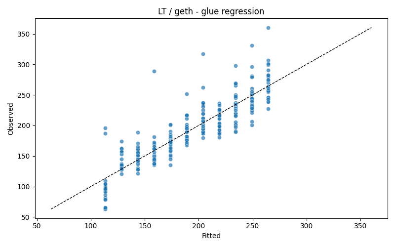

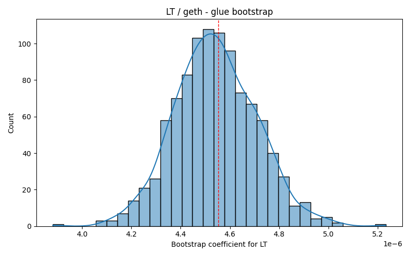

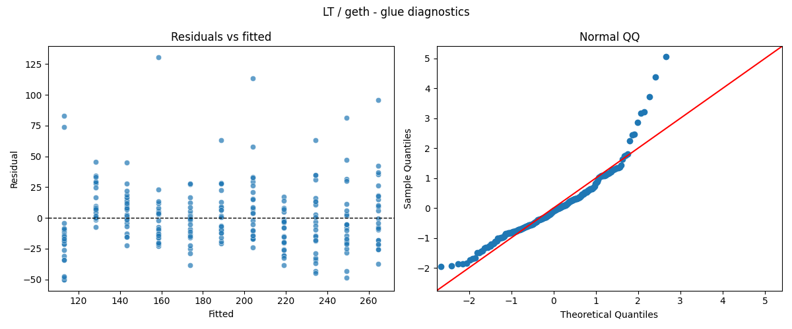

</details>

<details><summary><code>MSTORE</code> · nobs=1265 · runtime_ms=7.829e-06 · p=1.00e-03 · R²=0.785</summary>

```
==============================================================================
                           NNLS Regression Results                            
==============================================================================
Dep. Variable:          test_runtime_ms              R-squared:          0.785
Model:                  NNLS                    Adj. R-squared:          0.785
No. Observations:       1265                              RMSE:          28.75
Df Residuals:           1263                               MAE:          23.23
Df Model:               1      
==============================================================================
                      coef     std err     P-value      [0.025      0.975]
------------------------------------------------------------------------------
         const     54.8615      3.0312       0.001     49.0456     61.0494
        MSTORE      0.0000      0.0000       0.001      0.0000      0.0000
==============================================================================
Notes: Non-negative least squares with bootstrap inference (1000 iterations)
==============================================================================
```

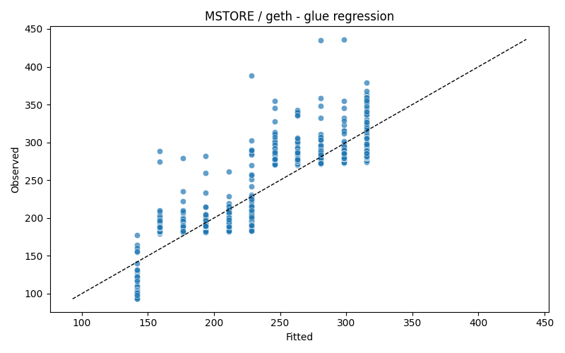

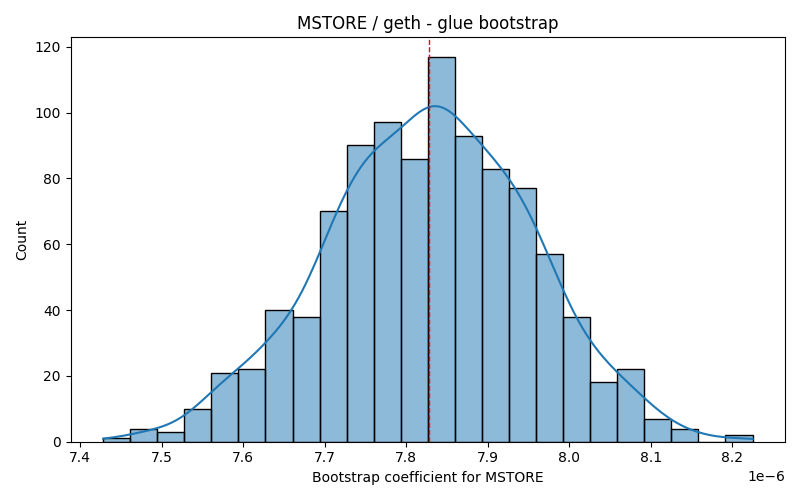

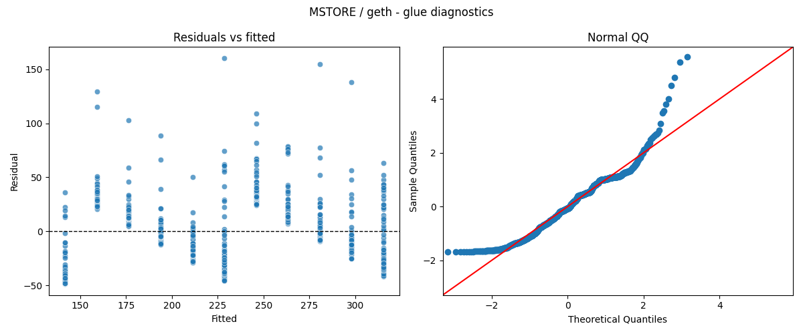

</details>

<details><summary><code>MSTORE8</code> · nobs=1265 · runtime_ms=7.038e-06 · p=1.00e-03 · R²=0.7372</summary>

```
==============================================================================
                           NNLS Regression Results                            
==============================================================================
Dep. Variable:          test_runtime_ms              R-squared:          0.737
Model:                  NNLS                    Adj. R-squared:          0.737
No. Observations:       1265                              RMSE:          29.49
Df Residuals:           1263                               MAE:          22.23
Df Model:               1      
==============================================================================
                      coef     std err     P-value      [0.025      0.975]
------------------------------------------------------------------------------
         const     58.2502      3.3456       0.001     51.7384     64.6681
       MSTORE8      0.0000      0.0000       0.001      0.0000      0.0000
==============================================================================
Notes: Non-negative least squares with bootstrap inference (1000 iterations)
==============================================================================
```

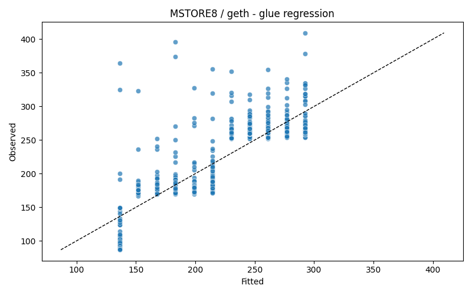

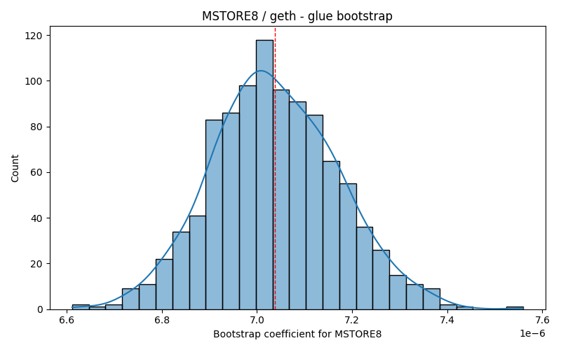

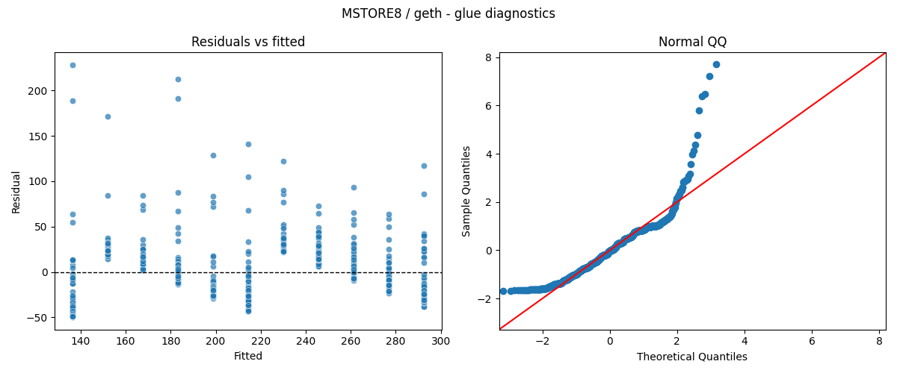

</details>

<details><summary><code>MUL</code> · nobs=253 · runtime_ms=4.735e-06 · p=1.00e-03 · R²=0.7593</summary>

```
==============================================================================
                           NNLS Regression Results                            
==============================================================================
Dep. Variable:          test_runtime_ms              R-squared:          0.759
Model:                  NNLS                    Adj. R-squared:          0.758
No. Observations:       253                               RMSE:          21.04
Df Residuals:           251                                MAE:          15.65
Df Model:               1      
==============================================================================
                      coef     std err     P-value      [0.025      0.975]
------------------------------------------------------------------------------
         const     46.7067      4.8833       0.001     37.1588     56.6865
           MUL      0.0000      0.0000       0.001      0.0000      0.0000
==============================================================================
Notes: Non-negative least squares with bootstrap inference (1000 iterations)
==============================================================================
```

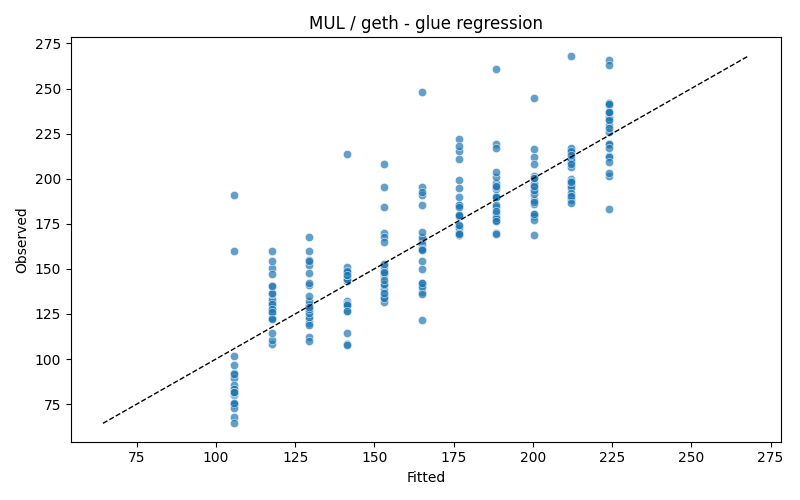

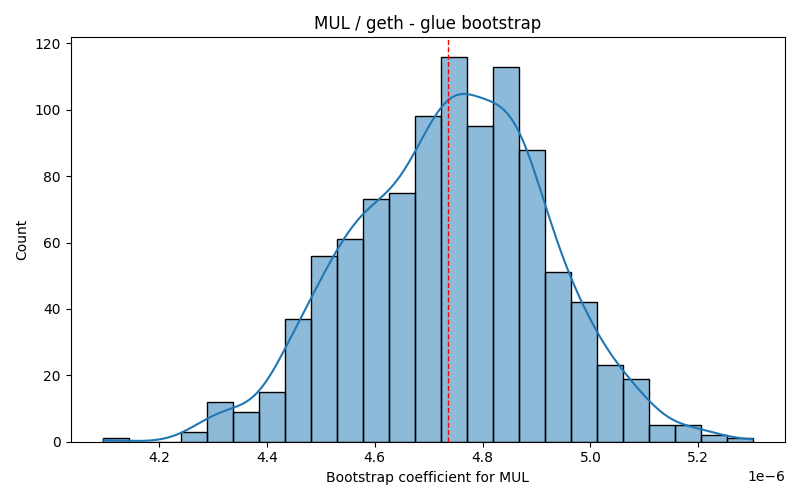

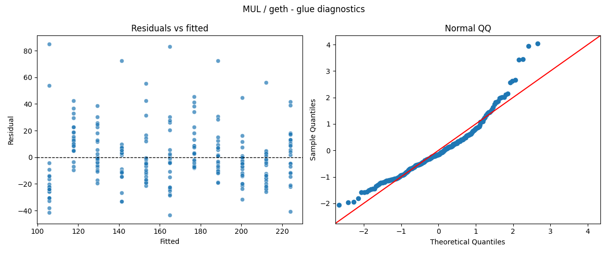

</details>

<details><summary><code>PC</code> · nobs=253 · runtime_ms=1.634e-06 · p=1.00e-03 · R²=0.8131</summary>

```
==============================================================================
                           NNLS Regression Results                            
==============================================================================
Dep. Variable:          test_runtime_ms              R-squared:          0.813
Model:                  NNLS                    Adj. R-squared:          0.812
No. Observations:       253                               RMSE:          23.42
Df Residuals:           251                                MAE:          17.89
Df Model:               1      
==============================================================================
                      coef     std err     P-value      [0.025      0.975]
------------------------------------------------------------------------------
         const     43.8890      5.1075       0.001     33.9064     53.5251
            PC      0.0000      0.0000       0.001      0.0000      0.0000
==============================================================================
Notes: Non-negative least squares with bootstrap inference (1000 iterations)
==============================================================================
```

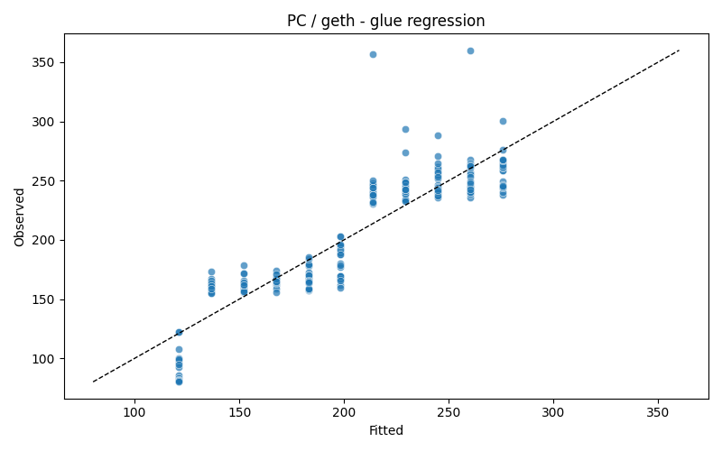

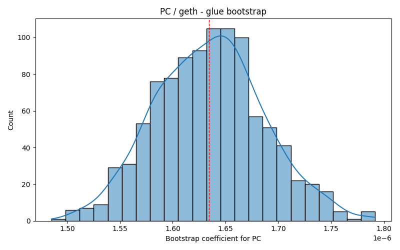

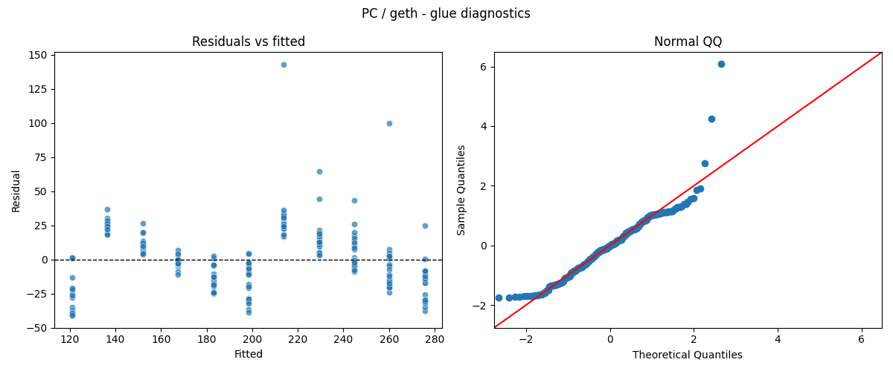

</details>

<details><summary><code>RETURNDATASIZE</code> · nobs=1012 · runtime_ms=3.449e-06 · p=1.00e-03 · R²=0.6602</summary>

```
==============================================================================
                           NNLS Regression Results                            
==============================================================================
Dep. Variable:          test_runtime_ms              R-squared:          0.660
Model:                  NNLS                    Adj. R-squared:          0.660
No. Observations:       1012                              RMSE:          39.07
Df Residuals:           1010                               MAE:          28.95
Df Model:               1      
==============================================================================
                      coef     std err     P-value      [0.025      0.975]
------------------------------------------------------------------------------
         const     47.6029      4.0504       0.001     40.2949     55.9926
RETURNDATASIZE      0.0000      0.0000       0.001      0.0000      0.0000
==============================================================================
Notes: Non-negative least squares with bootstrap inference (1000 iterations)
==============================================================================
```

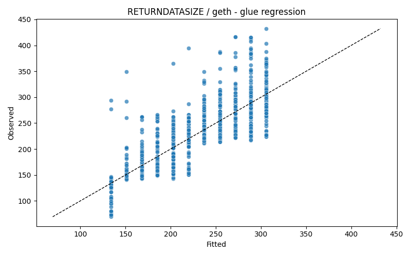

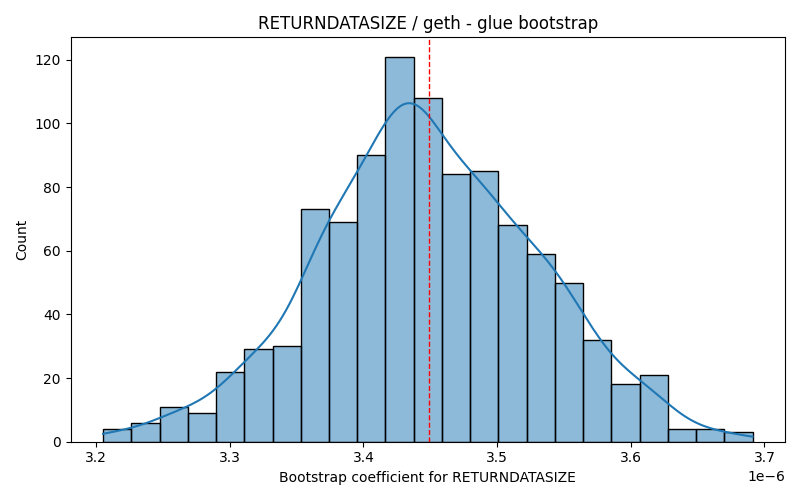

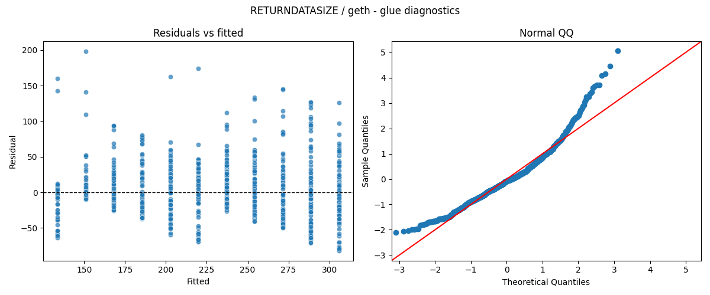

</details>

<details><summary><code>SELFBALANCE</code> · nobs=207 · runtime_ms=7.118e-06 · p=1.00e-03 · R²=0.77</summary>

```
==============================================================================
                           NNLS Regression Results                            
==============================================================================
Dep. Variable:          test_runtime_ms              R-squared:          0.770
Model:                  NNLS                    Adj. R-squared:          0.769
No. Observations:       207                               RMSE:          39.24
Df Residuals:           205                                MAE:          33.23
Df Model:               1      
==============================================================================
                      coef     std err     P-value      [0.025      0.975]
------------------------------------------------------------------------------
         const    130.6719      8.4329       0.001    113.5210    146.0028
   SELFBALANCE      0.0000      0.0000       0.001      0.0000      0.0000
==============================================================================
Notes: Non-negative least squares with bootstrap inference (1000 iterations)
==============================================================================
```

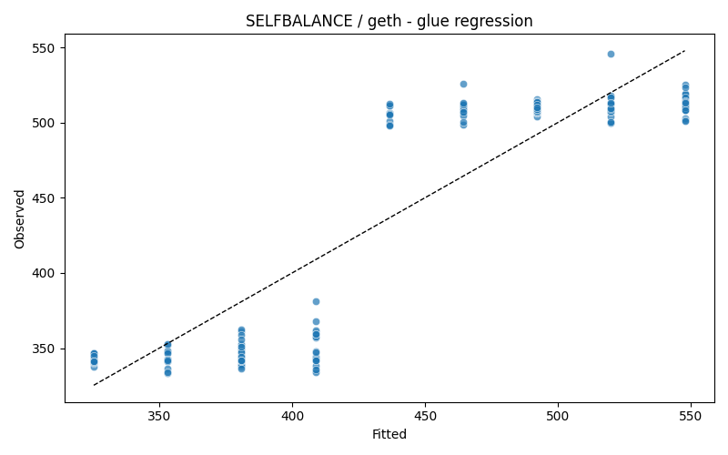

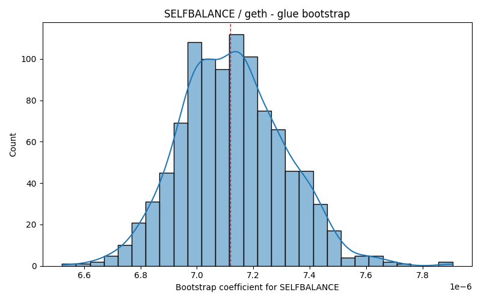

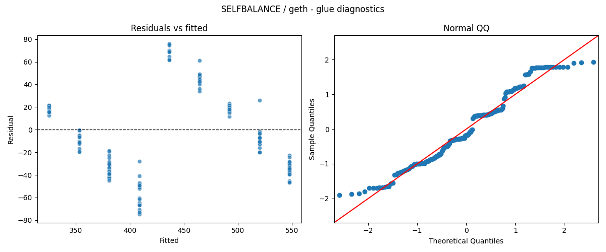

</details>

<details><summary><code>SUB</code> · nobs=253 · runtime_ms=4.412e-06 · p=1.00e-03 · R²=0.7148</summary>

```
==============================================================================
                           NNLS Regression Results                            
==============================================================================
Dep. Variable:          test_runtime_ms              R-squared:          0.715
Model:                  NNLS                    Adj. R-squared:          0.714
No. Observations:       253                               RMSE:          29.33
Df Residuals:           251                                MAE:          20.88
Df Model:               1      
==============================================================================
                      coef     std err     P-value      [0.025      0.975]
------------------------------------------------------------------------------
         const     40.6697      5.9803       0.001     29.3363     52.5268
           SUB      0.0000      0.0000       0.001      0.0000      0.0000
==============================================================================
Notes: Non-negative least squares with bootstrap inference (1000 iterations)
==============================================================================
```

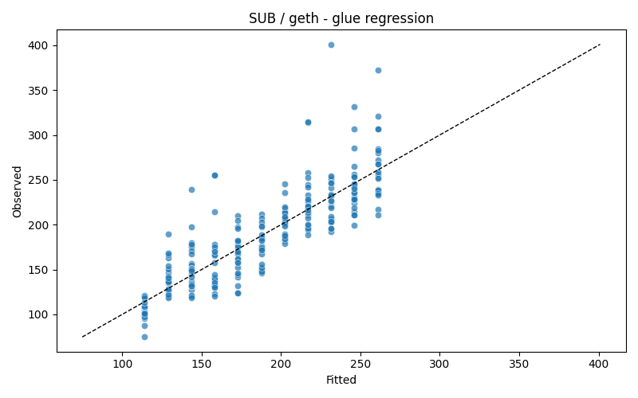

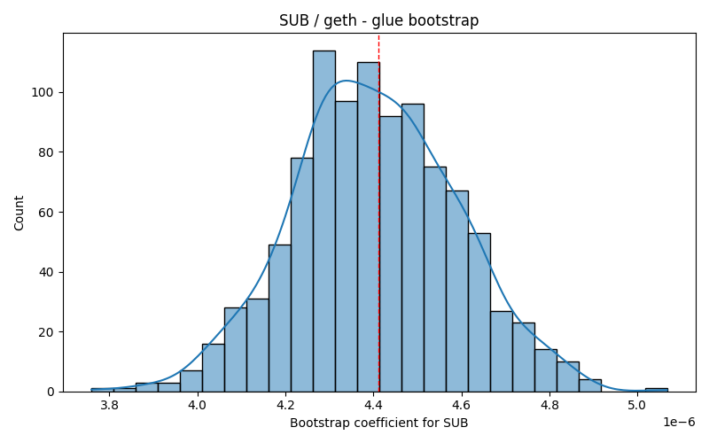

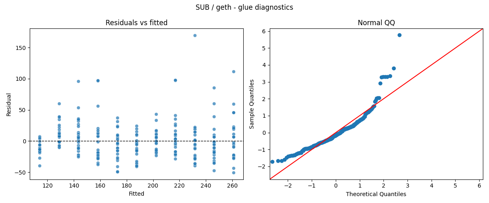

</details>

### Mixed glue (tier B) · geth

<details><summary><code>JUMP</code> · nobs=253 · runtime_ms=9.092e-06 · p=1.00e-03 · R²=0.7615</summary>

```
==============================================================================
                           NNLS Regression Results                            
==============================================================================
Dep. Variable:          test_runtime_ms              R-squared:          0.761
Model:                  NNLS                    Adj. R-squared:          0.761
No. Observations:       253                               RMSE:          18.91
Df Residuals:           251                                MAE:          14.82
Df Model:               1      
==============================================================================
                      coef     std err     P-value      [0.025      0.975]
------------------------------------------------------------------------------
         const     36.7909      4.3159       0.001     29.1552     45.5911
          JUMP      0.0000      0.0000       0.001      0.0000      0.0000
==============================================================================
Notes: Non-negative least squares with bootstrap inference (1000 iterations)
==============================================================================
```


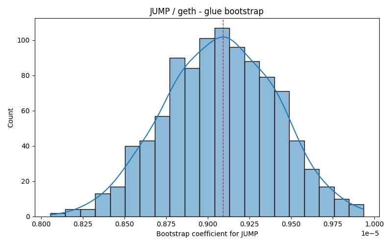

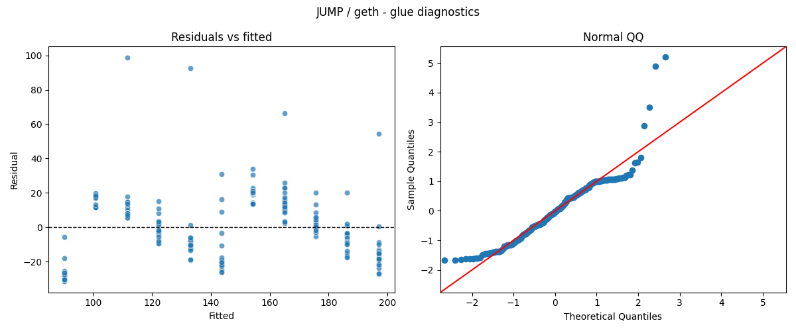

</details>

<details><summary><code>KECCAK256</code> · nobs=4048 · runtime_ms=3.852e-05 · p=1.00e-03 · R²=0.3032</summary>

```
==============================================================================
                           NNLS Regression Results                            
==============================================================================
Dep. Variable:          test_runtime_ms              R-squared:          0.303
Model:                  NNLS                    Adj. R-squared:          0.303
No. Observations:       4048                              RMSE:         116.05
Df Residuals:           4046                               MAE:          91.05
Df Model:               1      
==============================================================================
                      coef     std err     P-value      [0.025      0.975]
------------------------------------------------------------------------------
         const    369.3191      3.8663       0.001    361.3232    377.0670
     KECCAK256      0.0000      0.0000       0.001      0.0000      0.0000
==============================================================================
Notes: Non-negative least squares with bootstrap inference (1000 iterations)
==============================================================================
```

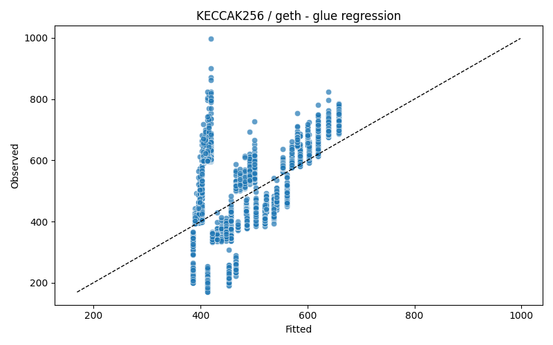

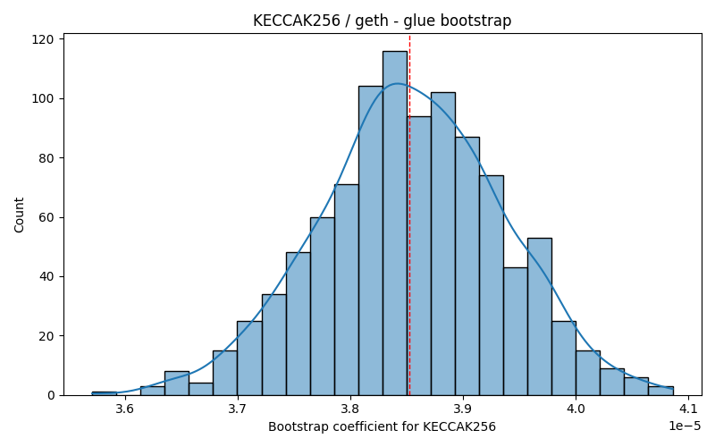


</details>

## nethermind

| glue_opcode | nobs | glue_runtime_ms | p_value | rsquared |
| --- | --- | --- | --- | --- |
| `ISZERO` | 220 | 7.29e-07 | 1.00e-03 | 0.6888 |
| `JUMPDEST` | 220 | 4.167e-07 | 1.00e-03 | 0.6764 |
| `SWAP` | 3520 | 4.397e-07 | 1.00e-03 | 0.376 |
| `CALLDATASIZE` | 13200 | 3.429e-07 | 1.00e-03 | 0.9677 |
| `DUP` | 13200 | 1.75e-07 | 1.00e-03 | 0.9677 |
| `GAS` | 13200 | 2.2e-07 | 1.00e-03 | 0.9677 |
| `MLOAD` | 13200 | 1.216e-06 | 1.00e-03 | 0.9677 |
| `PUSH` | 13200 | 2.694e-07 | 1.00e-03 | 0.9677 |
| `PUSH0` | 13200 | 1.847e-07 | 1.00e-03 | 0.9677 |
| `STATICCALL` | 13200 | 0.0004672 | 1.00e-03 | 0.9677 |
| `ADD` | 220 | 2.17e-06 | 1.00e-03 | 0.931 |
| `AND` | 220 | 1.07e-06 | 1.00e-03 | 0.5247 |
| `CALLDATACOPY` | 5280 | 4.373e-06 | 1.00e-03 | 0.6595 |
| `CALLDATALOAD` | 880 | 1.043e-06 | 4.29e-01 | 4.806e-07 |
| `DIV` | 220 | 6.472e-06 | 1.00e-03 | 0.6405 |
| `EXP` | 220 | 0 | 1.00e+00 | -2.22e-16 |
| `GT` | 220 | 1.294e-06 | 1.00e-03 | 0.8193 |
| `JUMPI` | 220 | 1.476e-06 | 1.00e-03 | 0.8304 |
| `LT` | 220 | 1.279e-06 | 1.00e-03 | 0.6825 |
| `MSTORE` | 1100 | 1.889e-06 | 1.00e-03 | 0.712 |
| `MSTORE8` | 1100 | 1.872e-06 | 1.00e-03 | 0.7391 |
| `MUL` | 220 | 5.004e-06 | 1.00e-03 | 0.95 |
| `PC` | 220 | 7.261e-07 | 1.00e-03 | 0.8469 |
| `RETURNDATASIZE` | 880 | 7.23e-07 | 1.00e-03 | 0.4809 |
| `SELFBALANCE` | 180 | 3.964e-06 | 1.00e-03 | 0.6258 |
| `SUB` | 220 | 2.362e-06 | 1.00e-03 | 0.9455 |
| `JUMP` | 220 | 4.511e-06 | 1.00e-03 | 0.7997 |
| `KECCAK256` | 3520 | 0 | 1.00e+00 | -2.22e-16 |

### Cycle glue — joint fit · nethermind

<details><summary>Joint NNLS regression summary</summary>

```
==============================================================================
                           NNLS Regression Results                            
==============================================================================
Dep. Variable:          test_runtime_ms              R-squared:          0.968
Model:                  NNLS                    Adj. R-squared:          0.968
No. Observations:       13200                             RMSE:          18.13
Df Residuals:           13192                              MAE:           7.02
Df Model:               7      
==============================================================================
                      coef     std err     P-value      [0.025      0.975]
------------------------------------------------------------------------------
         const     20.5119      0.5036       0.001     19.5633     21.5396
  CALLDATASIZE      0.0000      0.0000       0.001      0.0000      0.0000
           DUP      0.0000      0.0000       0.001      0.0000      0.0000
           GAS      0.0000      0.0000       0.001      0.0000      0.0000
         MLOAD      0.0000      0.0000       0.001      0.0000      0.0000
          PUSH      0.0000      0.0000       0.001      0.0000      0.0000
         PUSH0      0.0000      0.0000       0.001      0.0000      0.0000
    STATICCALL      0.0005      0.0000       0.001      0.0005      0.0005
==============================================================================
Notes: Non-negative least squares with bootstrap inference (1000 iterations)
==============================================================================
```

</details>

<details><summary><code>CALLDATASIZE</code> · nobs=13200 · runtime_ms=3.429e-07 · p=1.00e-03 · R²=0.9677</summary>


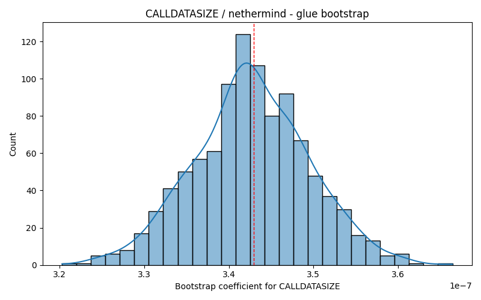

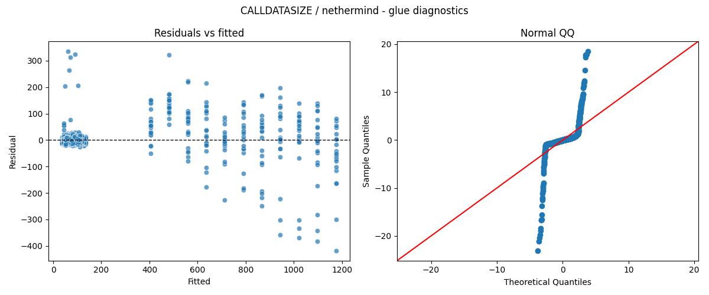

</details>

<details><summary><code>DUP</code> · nobs=13200 · runtime_ms=1.75e-07 · p=1.00e-03 · R²=0.9677</summary>

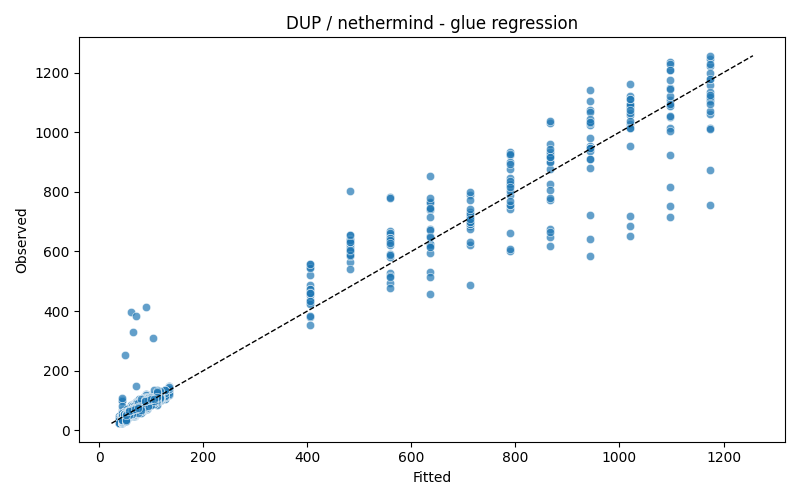

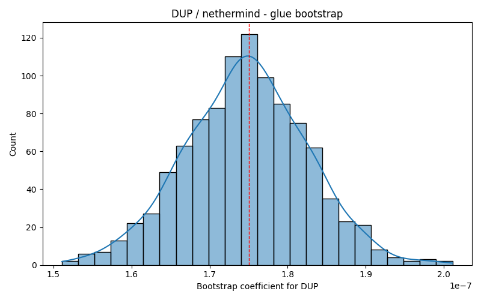

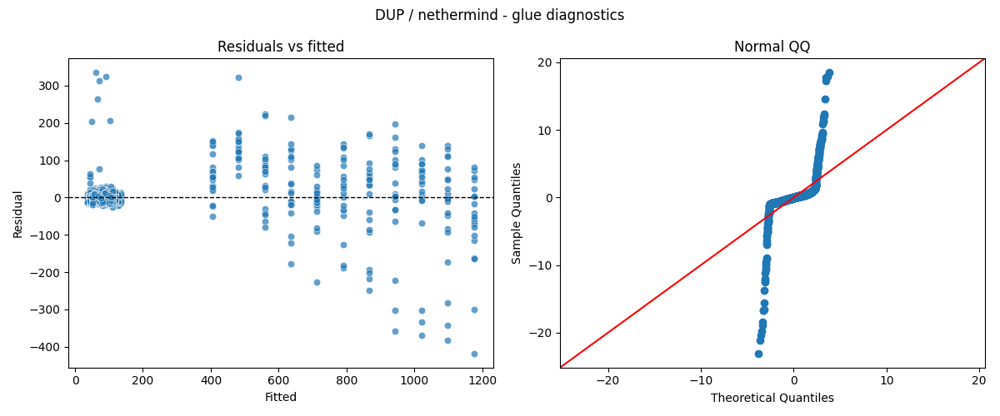

</details>

<details><summary><code>GAS</code> · nobs=13200 · runtime_ms=2.2e-07 · p=1.00e-03 · R²=0.9677</summary>


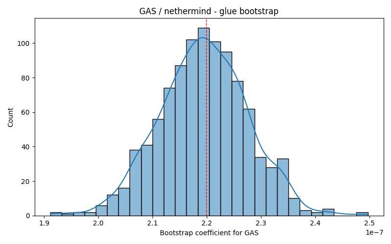


</details>

<details><summary><code>MLOAD</code> · nobs=13200 · runtime_ms=1.216e-06 · p=1.00e-03 · R²=0.9677</summary>


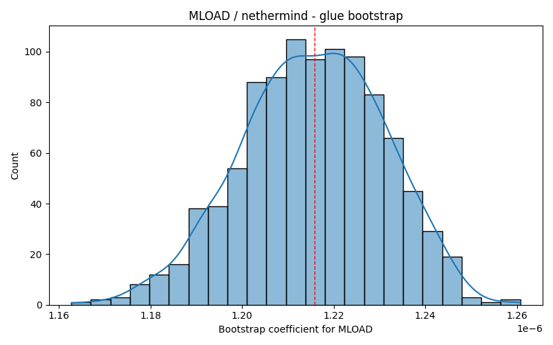


</details>

<details><summary><code>PUSH</code> · nobs=13200 · runtime_ms=2.694e-07 · p=1.00e-03 · R²=0.9677</summary>

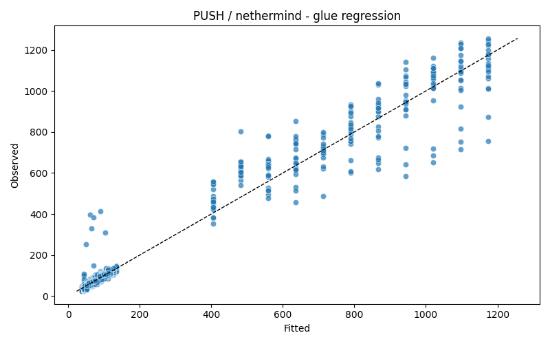

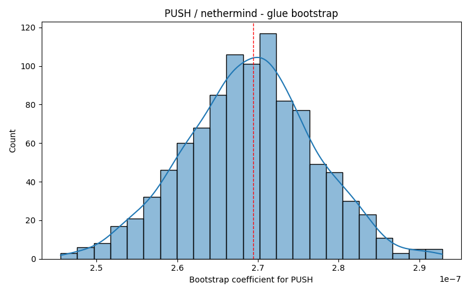


</details>

<details><summary><code>PUSH0</code> · nobs=13200 · runtime_ms=1.847e-07 · p=1.00e-03 · R²=0.9677</summary>


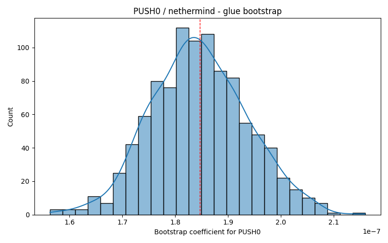


</details>

<details><summary><code>STATICCALL</code> · nobs=13200 · runtime_ms=0.0004672 · p=1.00e-03 · R²=0.9677</summary>

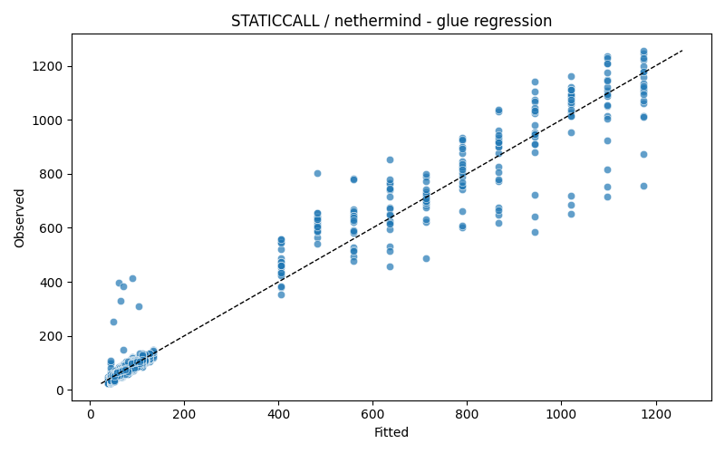

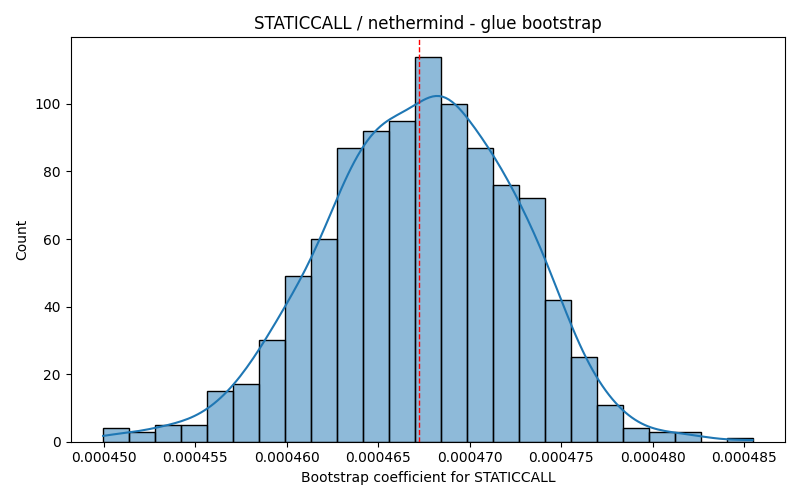


</details>

### Pure glue · nethermind

<details><summary><code>ISZERO</code> · nobs=220 · runtime_ms=7.29e-07 · p=1.00e-03 · R²=0.6888</summary>

```
==============================================================================
                           NNLS Regression Results                            
==============================================================================
Dep. Variable:          test_runtime_ms              R-squared:          0.689
Model:                  NNLS                    Adj. R-squared:          0.687
No. Observations:       220                               RMSE:          10.32
Df Residuals:           218                                MAE:           6.23
Df Model:               1      
==============================================================================
                      coef     std err     P-value      [0.025      0.975]
------------------------------------------------------------------------------
         const     18.9127      1.5615       0.001     15.8778     22.0078
        ISZERO      0.0000      0.0000       0.001      0.0000      0.0000
==============================================================================
Notes: Non-negative least squares with bootstrap inference (1000 iterations)
==============================================================================
```

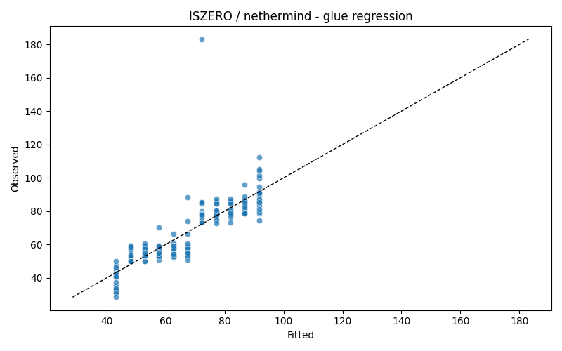

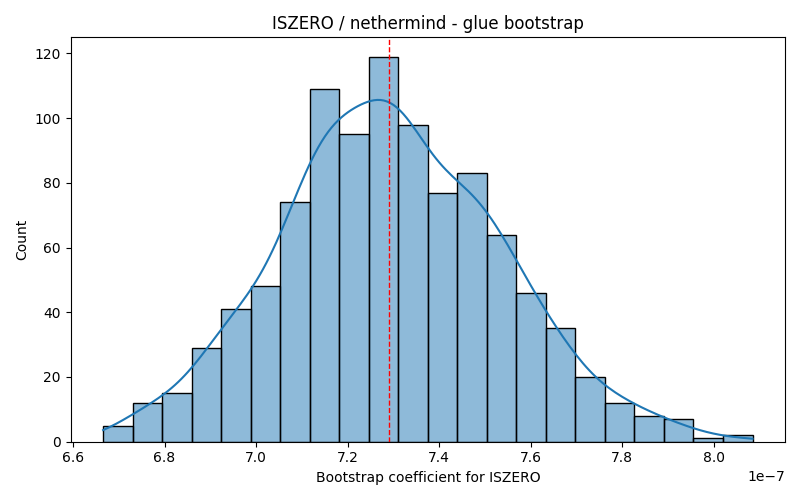

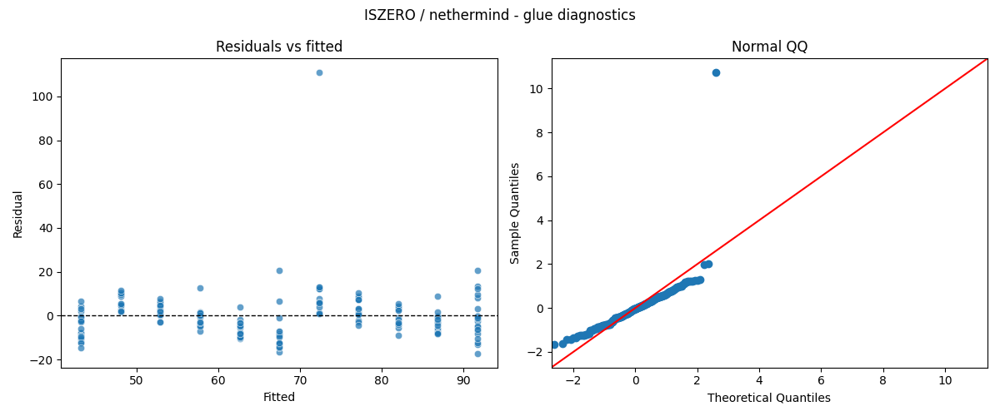

</details>

<details><summary><code>JUMPDEST</code> · nobs=220 · runtime_ms=4.167e-07 · p=1.00e-03 · R²=0.6764</summary>

```
==============================================================================
                           NNLS Regression Results                            
==============================================================================
Dep. Variable:          test_runtime_ms              R-squared:          0.676
Model:                  NNLS                    Adj. R-squared:          0.675
No. Observations:       220                               RMSE:          18.20
Df Residuals:           218                                MAE:          15.74
Df Model:               1      
==============================================================================
                      coef     std err     P-value      [0.025      0.975]
------------------------------------------------------------------------------
         const     23.3745      3.8164       0.001     16.0693     31.2804
      JUMPDEST      0.0000      0.0000       0.001      0.0000      0.0000
==============================================================================
Notes: Non-negative least squares with bootstrap inference (1000 iterations)
==============================================================================
```

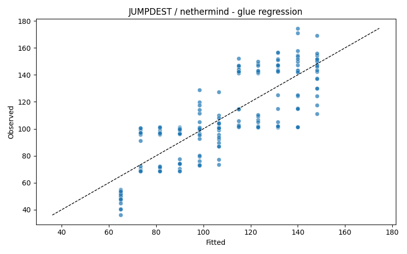

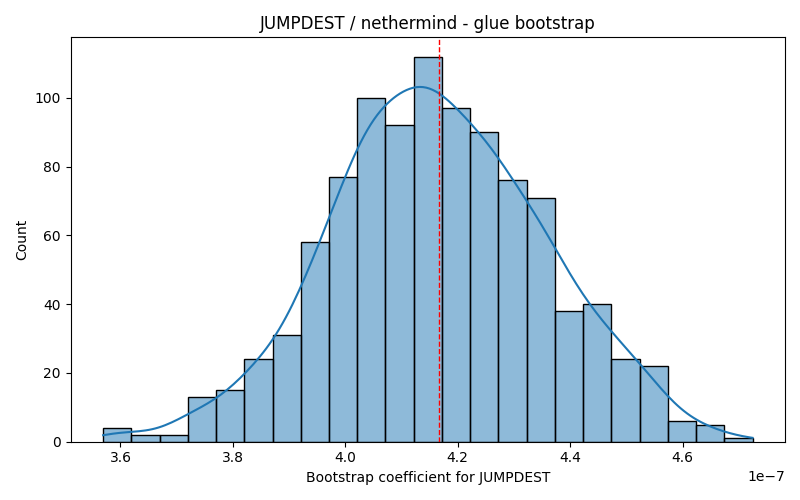

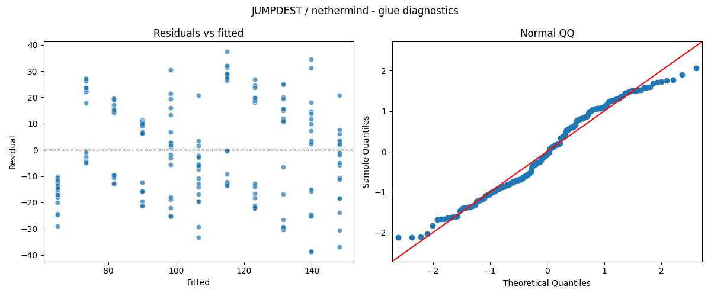

</details>

<details><summary><code>SWAP</code> · nobs=3520 · runtime_ms=4.397e-07 · p=1.00e-03 · R²=0.376</summary>

```
==============================================================================
                           NNLS Regression Results                            
==============================================================================
Dep. Variable:          test_runtime_ms              R-squared:          0.376
Model:                  NNLS                    Adj. R-squared:          0.376
No. Observations:       3520                              RMSE:          11.93
Df Residuals:           3518                               MAE:           4.26
Df Model:               1      
==============================================================================
                      coef     std err     P-value      [0.025      0.975]
------------------------------------------------------------------------------
         const     18.2618      0.7806       0.001     16.9383     19.8657
          SWAP      0.0000      0.0000       0.001      0.0000      0.0000
==============================================================================
Notes: Non-negative least squares with bootstrap inference (1000 iterations)
==============================================================================
```

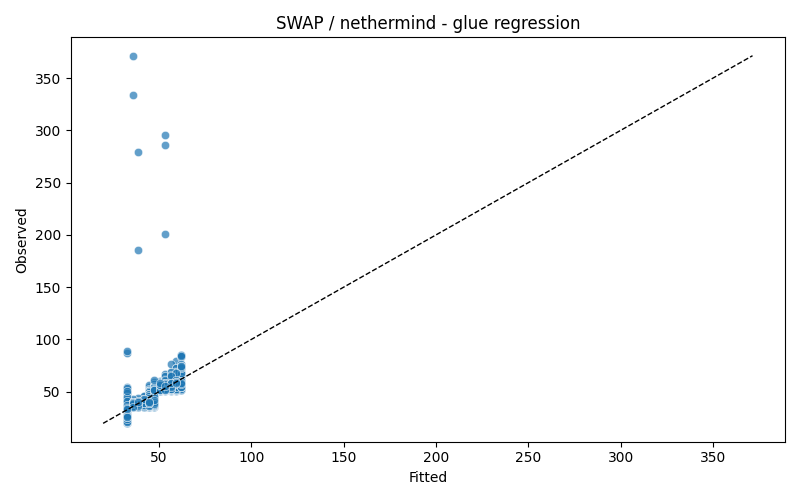

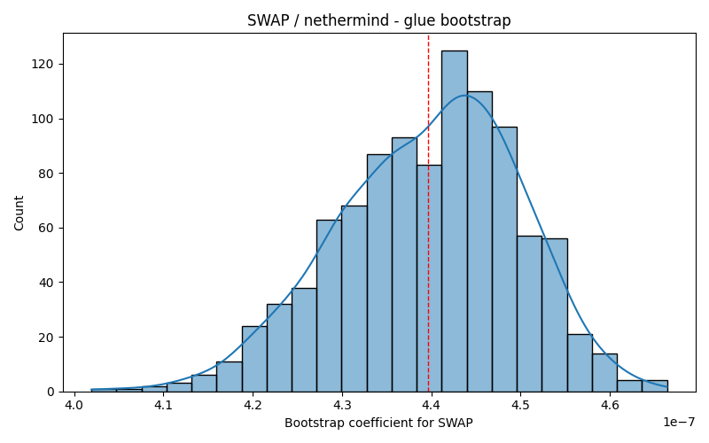

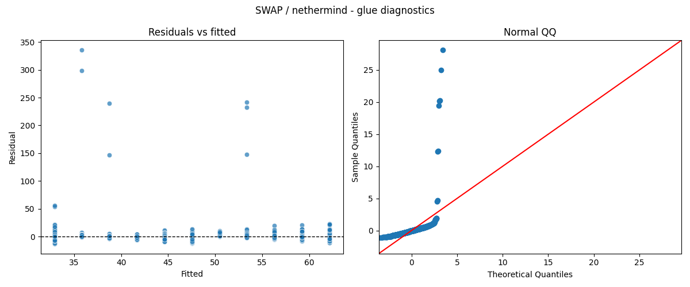

</details>

### Mixed glue (tier A) · nethermind

<details><summary><code>ADD</code> · nobs=220 · runtime_ms=2.17e-06 · p=1.00e-03 · R²=0.931</summary>

```
==============================================================================
                           NNLS Regression Results                            
==============================================================================
Dep. Variable:          test_runtime_ms              R-squared:          0.931
Model:                  NNLS                    Adj. R-squared:          0.931
No. Observations:       220                               RMSE:           6.21
Df Residuals:           218                                MAE:           4.94
Df Model:               1      
==============================================================================
                      coef     std err     P-value      [0.025      0.975]
------------------------------------------------------------------------------
         const     13.4200      1.3126       0.001     10.8175     15.9500
           ADD      0.0000      0.0000       0.001      0.0000      0.0000
==============================================================================
Notes: Non-negative least squares with bootstrap inference (1000 iterations)
==============================================================================
```

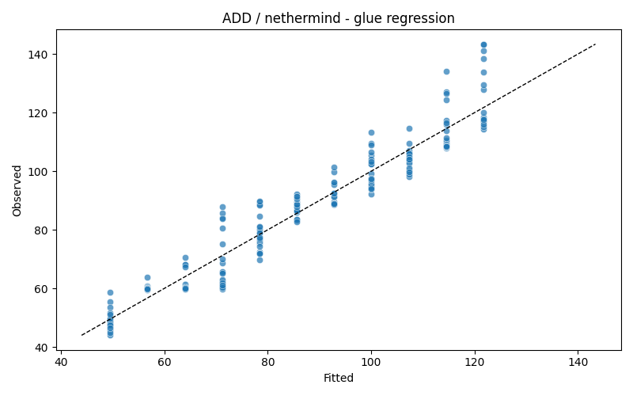

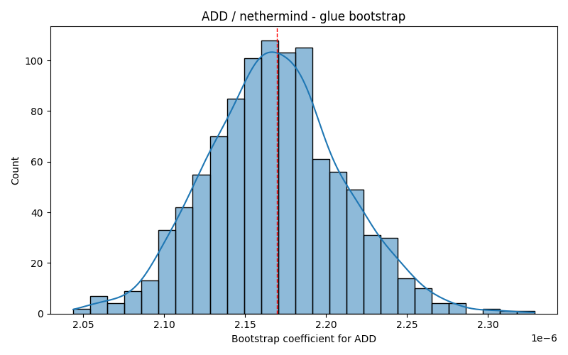


</details>

<details><summary><code>AND</code> · nobs=220 · runtime_ms=1.07e-06 · p=1.00e-03 · R²=0.5247</summary>

```
==============================================================================
                           NNLS Regression Results                            
==============================================================================
Dep. Variable:          test_runtime_ms              R-squared:          0.525
Model:                  NNLS                    Adj. R-squared:          0.523
No. Observations:       220                               RMSE:          10.72
Df Residuals:           218                                MAE:           5.83
Df Model:               1      
==============================================================================
                      coef     std err     P-value      [0.025      0.975]
------------------------------------------------------------------------------
         const     19.7158      2.9964       0.001     14.2342     25.6343
           AND      0.0000      0.0000       0.001      0.0000      0.0000
==============================================================================
Notes: Non-negative least squares with bootstrap inference (1000 iterations)
==============================================================================
```

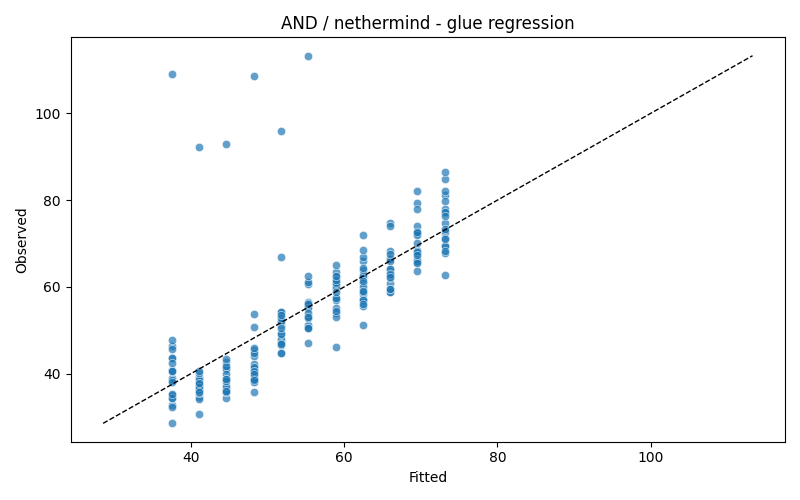

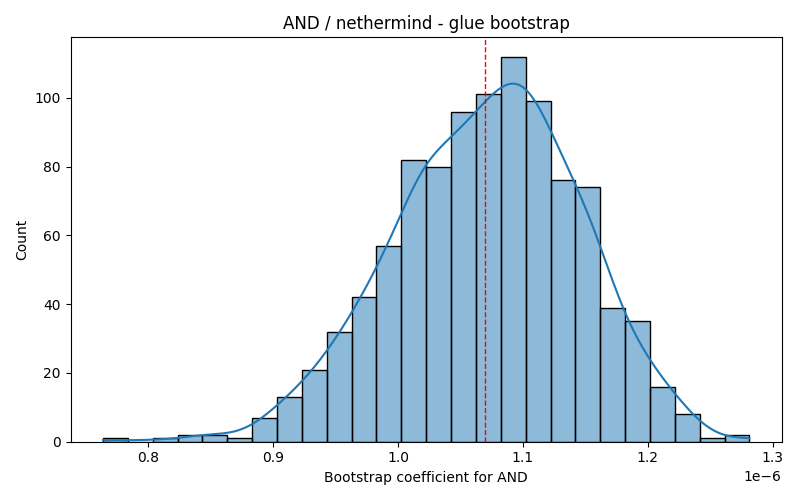

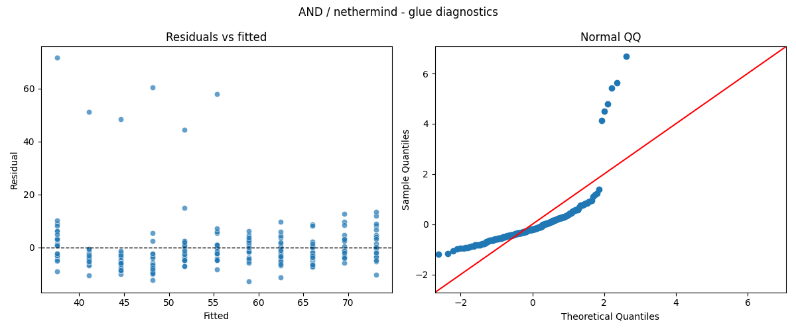

</details>

<details><summary><code>CALLDATACOPY</code> · nobs=5280 · runtime_ms=4.373e-06 · p=1.00e-03 · R²=0.6595</summary>

```
==============================================================================
                           NNLS Regression Results                            
==============================================================================
Dep. Variable:          test_runtime_ms              R-squared:          0.659
Model:                  NNLS                    Adj. R-squared:          0.659
No. Observations:       5280                              RMSE:          23.63
Df Residuals:           5278                               MAE:          18.80
Df Model:               1      
==============================================================================
                      coef     std err     P-value      [0.025      0.975]
------------------------------------------------------------------------------
         const     26.6559      0.3689       0.001     25.8813     27.3498
  CALLDATACOPY      0.0000      0.0000       0.001      0.0000      0.0000
==============================================================================
Notes: Non-negative least squares with bootstrap inference (1000 iterations)
==============================================================================
```

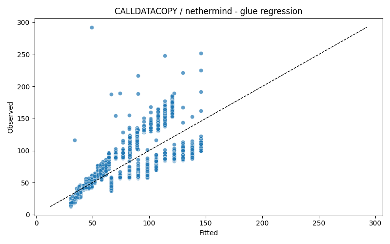

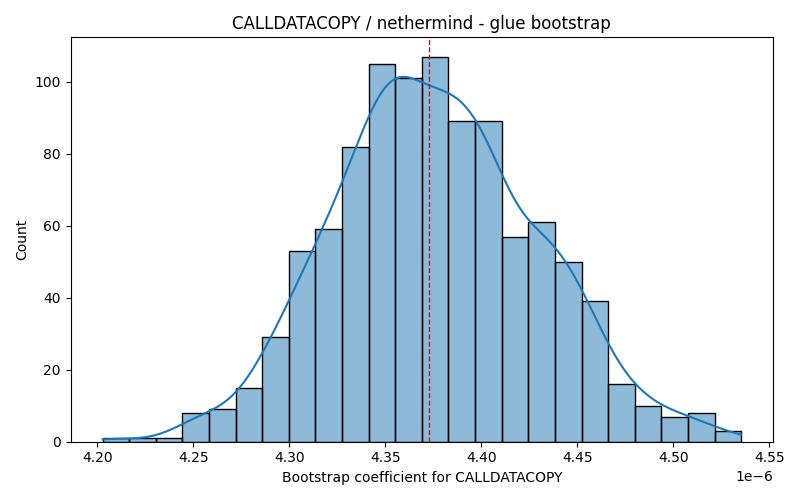

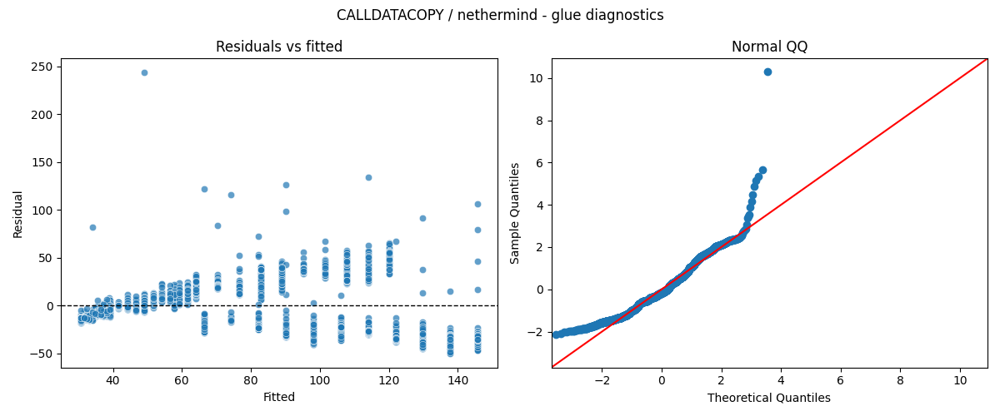

</details>

<details><summary><code>CALLDATALOAD</code> · nobs=880 · runtime_ms=1.043e-06 · p=4.29e-01 · R²=4.806e-07</summary>

```
==============================================================================
                           NNLS Regression Results                            
==============================================================================
Dep. Variable:          test_runtime_ms              R-squared:          0.000
Model:                  NNLS                    Adj. R-squared:         -0.001
No. Observations:       880                               RMSE:           5.78
Df Residuals:           878                                MAE:           0.77
Df Model:               1      
==============================================================================
                      coef     std err     P-value      [0.025      0.975]
------------------------------------------------------------------------------
         const      3.4056      0.6046       0.001      1.6032      3.7514
  CALLDATALOAD      0.0000      0.0000       0.429      0.0000      0.0002
==============================================================================
Notes: Non-negative least squares with bootstrap inference (1000 iterations)
==============================================================================
```

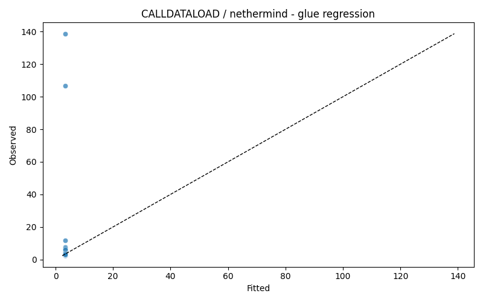

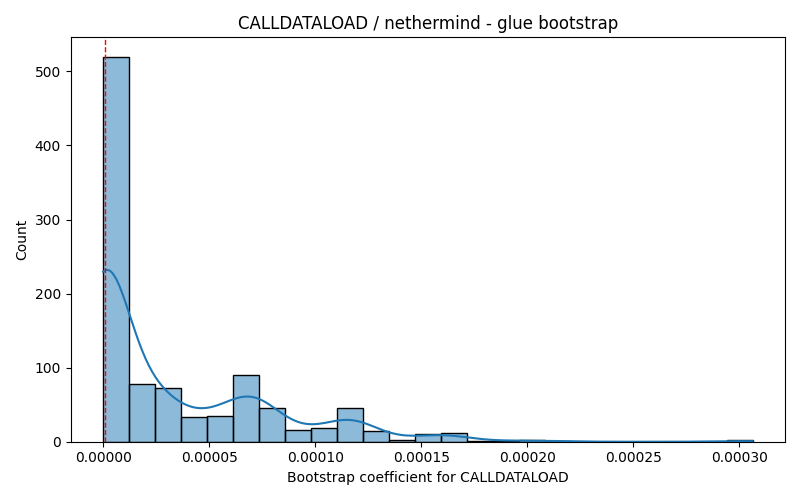

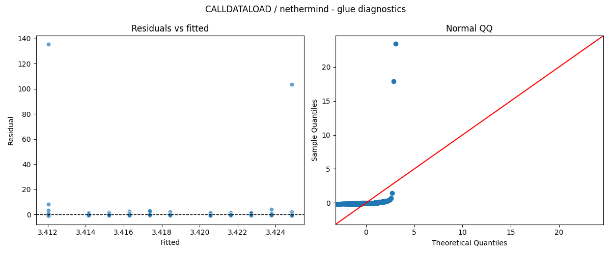

</details>

<details><summary><code>DIV</code> · nobs=220 · runtime_ms=6.472e-06 · p=1.00e-03 · R²=0.6405</summary>

```
==============================================================================
                           NNLS Regression Results                            
==============================================================================
Dep. Variable:          test_runtime_ms              R-squared:          0.640
Model:                  NNLS                    Adj. R-squared:          0.639
No. Observations:       220                               RMSE:          38.28
Df Residuals:           218                                MAE:          28.62
Df Model:               1      
==============================================================================
                      coef     std err     P-value      [0.025      0.975]
------------------------------------------------------------------------------
         const    126.8136     12.9651       0.001    100.7416    151.4438
           DIV      0.0000      0.0000       0.001      0.0000      0.0000
==============================================================================
Notes: Non-negative least squares with bootstrap inference (1000 iterations)
==============================================================================
```

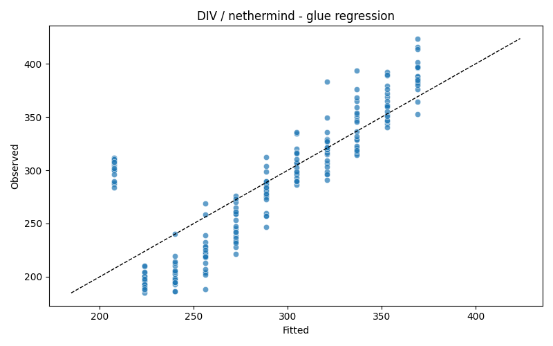

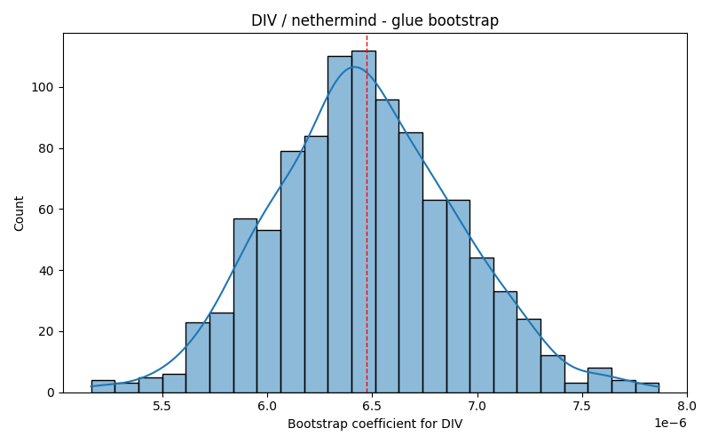

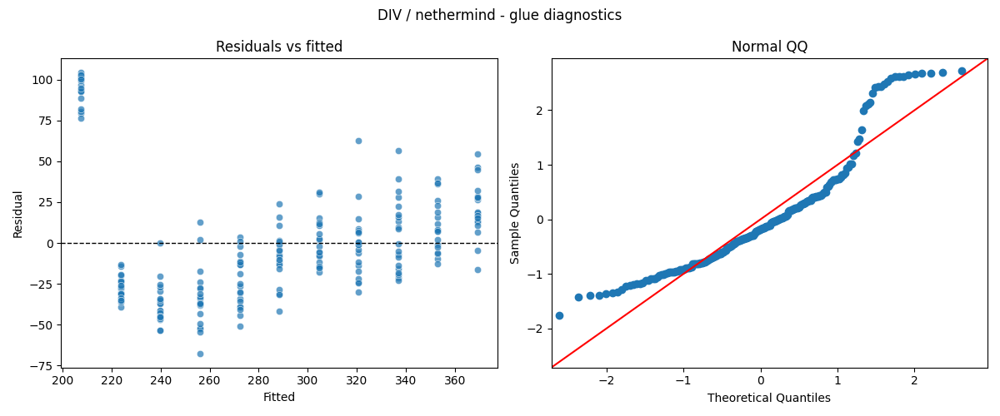

</details>

<details><summary><code>EXP</code> · nobs=220 · runtime_ms=0 · p=1.00e+00 · R²=-2.22e-16</summary>

```
==============================================================================
                           NNLS Regression Results                            
==============================================================================
Dep. Variable:          test_runtime_ms              R-squared:         -0.000
Model:                  NNLS                    Adj. R-squared:         -0.005
No. Observations:       220                               RMSE:          46.42
Df Residuals:           218                                MAE:          30.37
Df Model:               1      
==============================================================================
                      coef     std err     P-value      [0.025      0.975]
------------------------------------------------------------------------------
         const     98.1391      5.3496       0.001     80.4201    104.6037
           EXP      0.0000      0.0000       1.000      0.0000      0.0001
==============================================================================
Notes: Non-negative least squares with bootstrap inference (1000 iterations)
==============================================================================
```

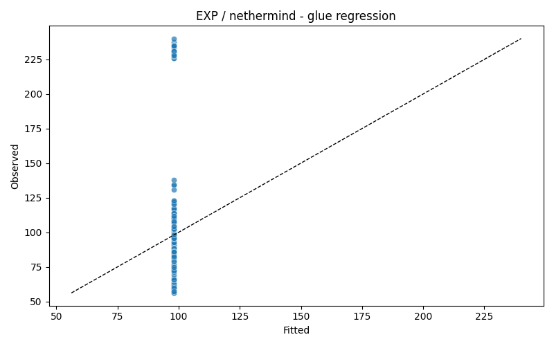

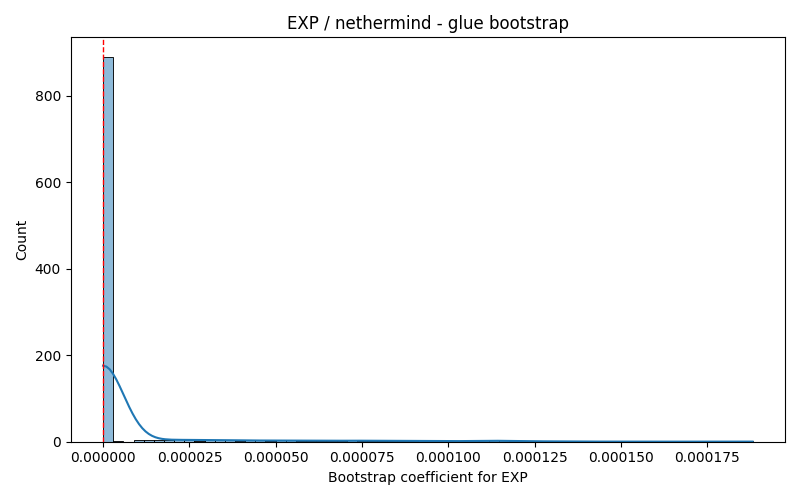

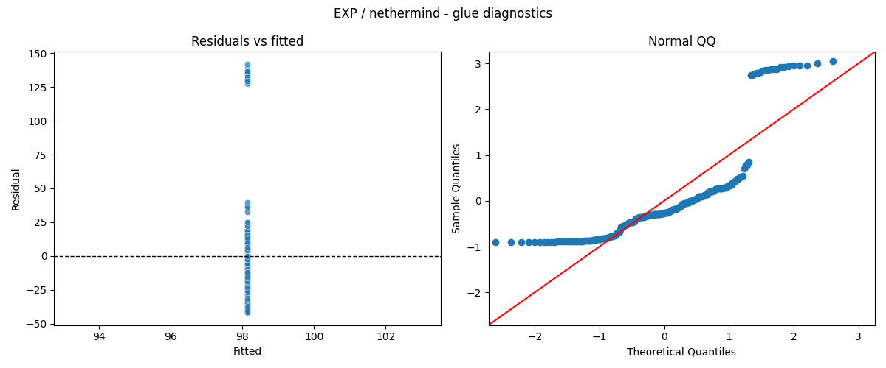

</details>

<details><summary><code>GT</code> · nobs=220 · runtime_ms=1.294e-06 · p=1.00e-03 · R²=0.8193</summary>

```
==============================================================================
                           NNLS Regression Results                            
==============================================================================
Dep. Variable:          test_runtime_ms              R-squared:          0.819
Model:                  NNLS                    Adj. R-squared:          0.818
No. Observations:       220                               RMSE:           6.40
Df Residuals:           218                                MAE:           5.13
Df Model:               1      
==============================================================================
                      coef     std err     P-value      [0.025      0.975]
------------------------------------------------------------------------------
         const     16.0537      1.5395       0.001     12.8711     18.9636
            GT      0.0000      0.0000       0.001      0.0000      0.0000
==============================================================================
Notes: Non-negative least squares with bootstrap inference (1000 iterations)
==============================================================================
```

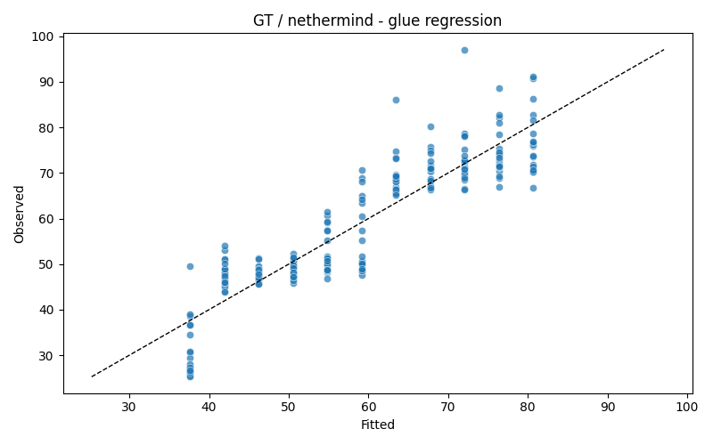

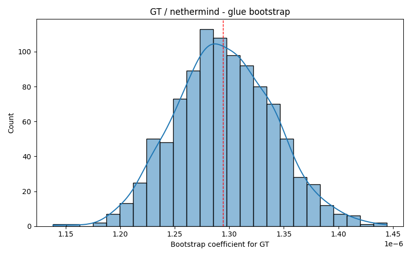

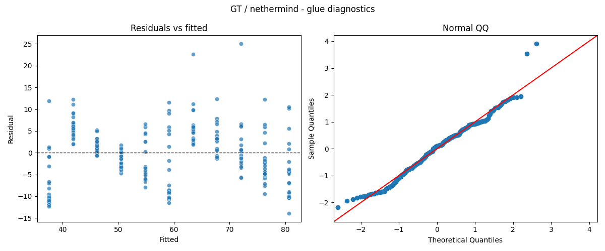

</details>

<details><summary><code>JUMPI</code> · nobs=220 · runtime_ms=1.476e-06 · p=1.00e-03 · R²=0.8304</summary>

```
==============================================================================
                           NNLS Regression Results                            
==============================================================================
Dep. Variable:          test_runtime_ms              R-squared:          0.830
Model:                  NNLS                    Adj. R-squared:          0.830
No. Observations:       220                               RMSE:           3.01
Df Residuals:           218                                MAE:           2.48
Df Model:               1      
==============================================================================
                      coef     std err     P-value      [0.025      0.975]
------------------------------------------------------------------------------
         const     10.0455      0.7761       0.001      8.5080     11.4993
         JUMPI      0.0000      0.0000       0.001      0.0000      0.0000
==============================================================================
Notes: Non-negative least squares with bootstrap inference (1000 iterations)
==============================================================================
```

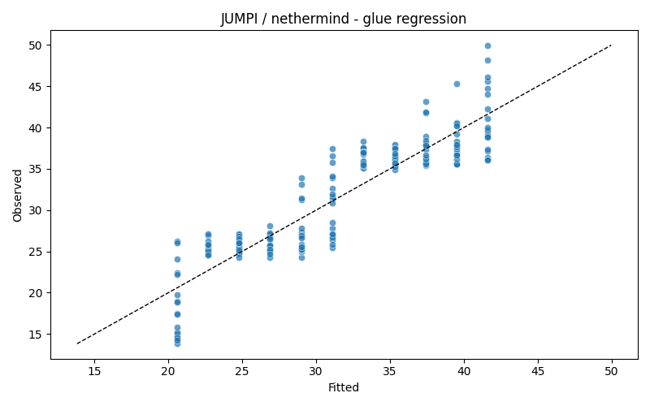

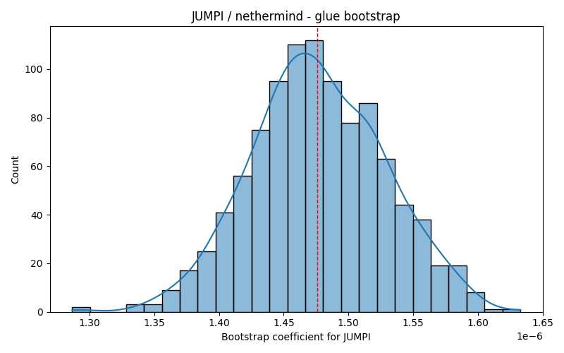

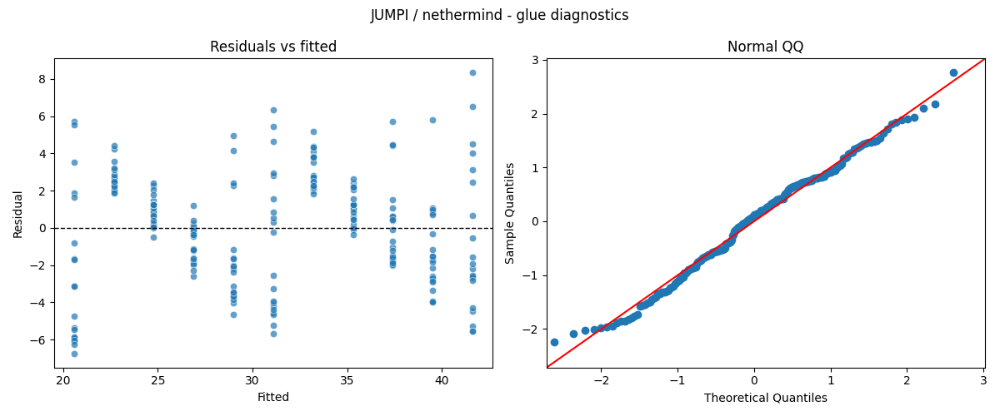

</details>

<details><summary><code>LT</code> · nobs=220 · runtime_ms=1.279e-06 · p=1.00e-03 · R²=0.6825</summary>

```
==============================================================================
                           NNLS Regression Results                            
==============================================================================
Dep. Variable:          test_runtime_ms              R-squared:          0.682
Model:                  NNLS                    Adj. R-squared:          0.681
No. Observations:       220                               RMSE:           9.18
Df Residuals:           218                                MAE:           6.47
Df Model:               1      
==============================================================================
                      coef     std err     P-value      [0.025      0.975]
------------------------------------------------------------------------------
         const     19.2994      1.9930       0.001     15.4592     23.2592
            LT      0.0000      0.0000       0.001      0.0000      0.0000
==============================================================================
Notes: Non-negative least squares with bootstrap inference (1000 iterations)
==============================================================================
```

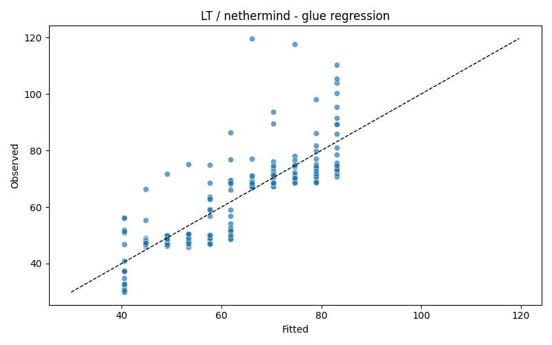

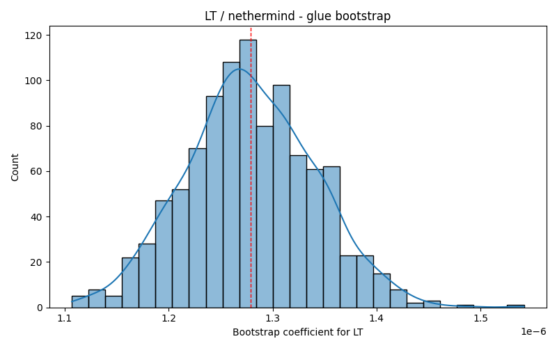

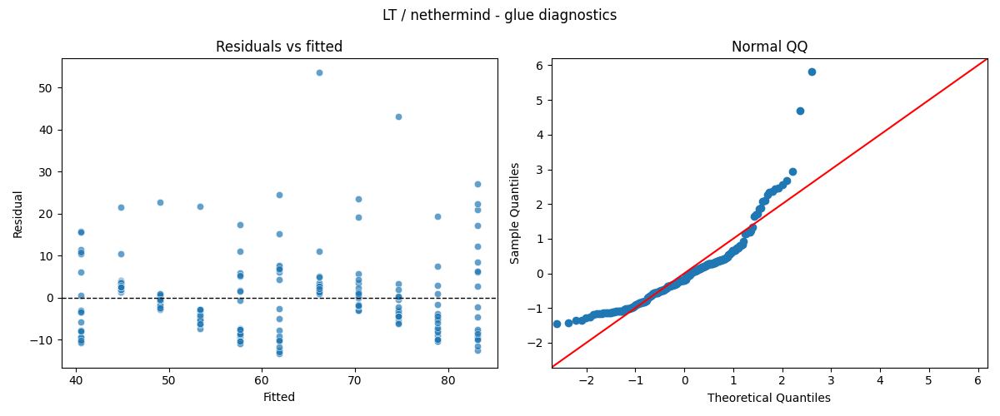

</details>

<details><summary><code>MSTORE</code> · nobs=1100 · runtime_ms=1.889e-06 · p=1.00e-03 · R²=0.712</summary>

```
==============================================================================
                           NNLS Regression Results                            
==============================================================================
Dep. Variable:          test_runtime_ms              R-squared:          0.712
Model:                  NNLS                    Adj. R-squared:          0.712
No. Observations:       1100                              RMSE:           8.43
Df Residuals:           1098                               MAE:           5.18
Df Model:               1      
==============================================================================
                      coef     std err     P-value      [0.025      0.975]
------------------------------------------------------------------------------
         const     15.9791      0.8345       0.001     14.0636     17.4270
        MSTORE      0.0000      0.0000       0.001      0.0000      0.0000
==============================================================================
Notes: Non-negative least squares with bootstrap inference (1000 iterations)
==============================================================================
```

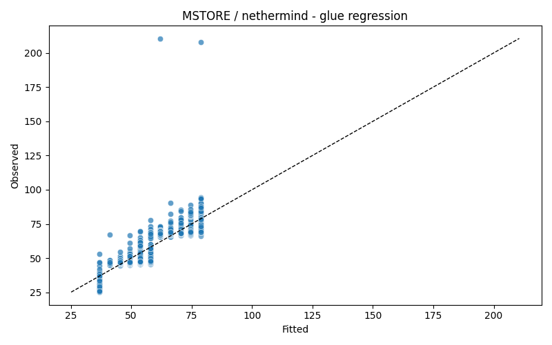

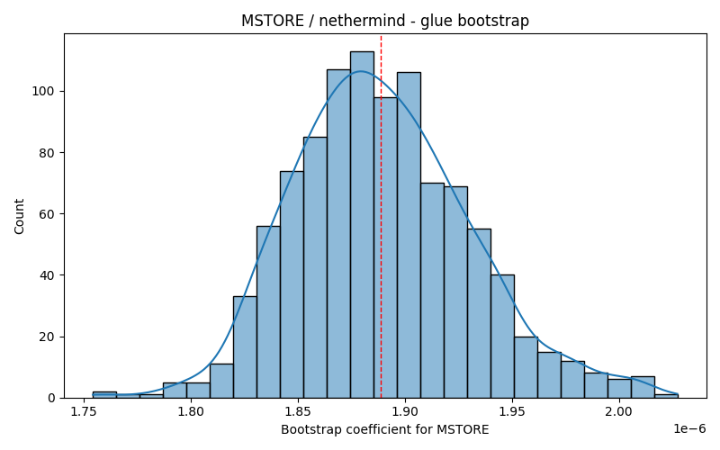

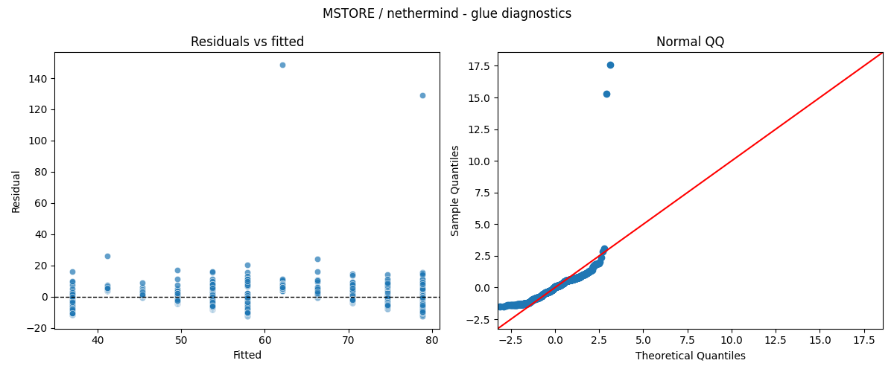

</details>

<details><summary><code>MSTORE8</code> · nobs=1100 · runtime_ms=1.872e-06 · p=1.00e-03 · R²=0.7391</summary>

```
==============================================================================
                           NNLS Regression Results                            
==============================================================================
Dep. Variable:          test_runtime_ms              R-squared:          0.739
Model:                  NNLS                    Adj. R-squared:          0.739
No. Observations:       1100                              RMSE:           7.80
Df Residuals:           1098                               MAE:           5.61
Df Model:               1      
==============================================================================
                      coef     std err     P-value      [0.025      0.975]
------------------------------------------------------------------------------
         const     15.9695      0.8117       0.001     14.3844     17.4757
       MSTORE8      0.0000      0.0000       0.001      0.0000      0.0000
==============================================================================
Notes: Non-negative least squares with bootstrap inference (1000 iterations)
==============================================================================
```

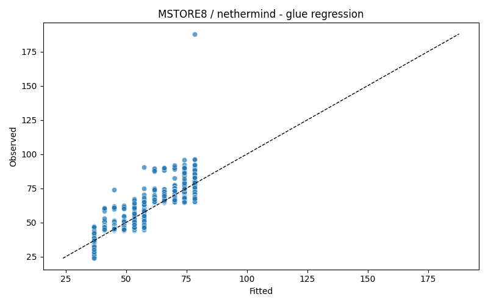

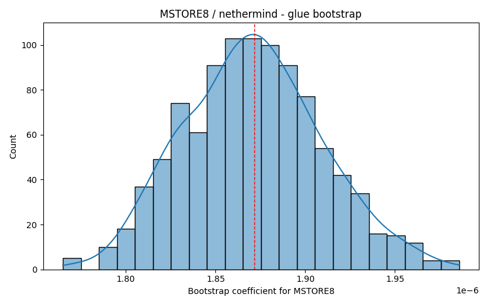

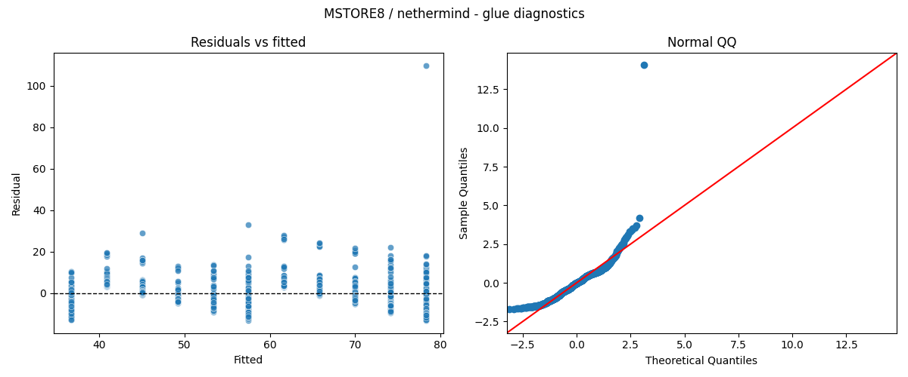

</details>

<details><summary><code>MUL</code> · nobs=220 · runtime_ms=5.004e-06 · p=1.00e-03 · R²=0.95</summary>

```
==============================================================================
                           NNLS Regression Results                            
==============================================================================
Dep. Variable:          test_runtime_ms              R-squared:          0.950
Model:                  NNLS                    Adj. R-squared:          0.950
No. Observations:       220                               RMSE:           9.06
Df Residuals:           218                                MAE:           6.91
Df Model:               1      
==============================================================================
                      coef     std err     P-value      [0.025      0.975]
------------------------------------------------------------------------------
         const     23.1526      1.8494       0.001     19.5732     26.6622
           MUL      0.0000      0.0000       0.001      0.0000      0.0000
==============================================================================
Notes: Non-negative least squares with bootstrap inference (1000 iterations)
==============================================================================
```

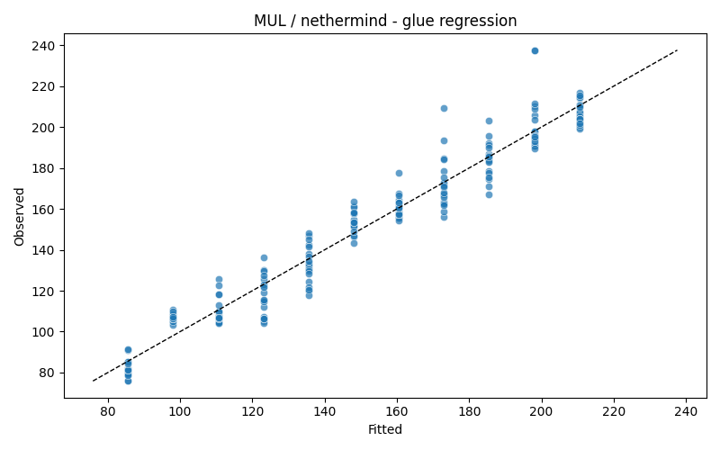

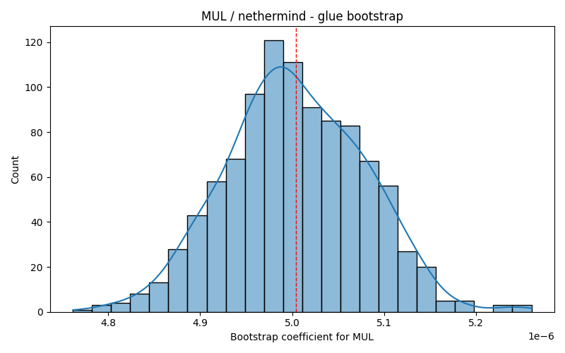

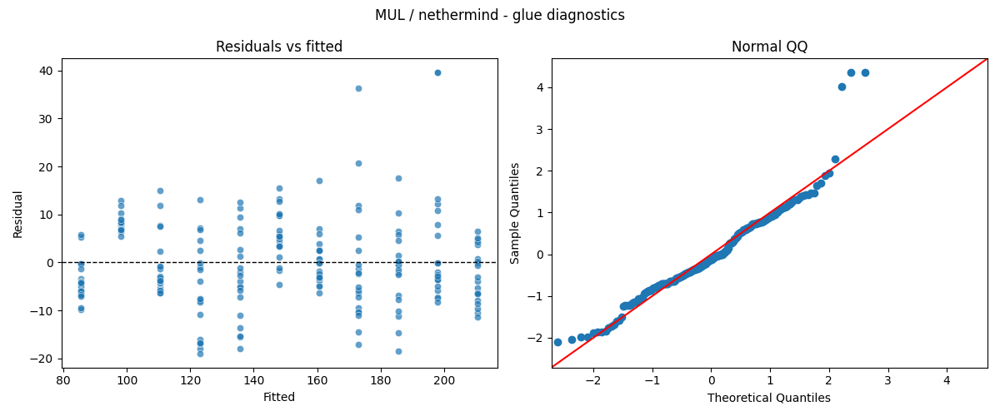

</details>

<details><summary><code>PC</code> · nobs=220 · runtime_ms=7.261e-07 · p=1.00e-03 · R²=0.8469</summary>

```
==============================================================================
                           NNLS Regression Results                            
==============================================================================
Dep. Variable:          test_runtime_ms              R-squared:          0.847
Model:                  NNLS                    Adj. R-squared:          0.846
No. Observations:       220                               RMSE:           9.23
Df Residuals:           218                                MAE:           7.58
Df Model:               1      
==============================================================================
                      coef     std err     P-value      [0.025      0.975]
------------------------------------------------------------------------------
         const     18.5603      2.2552       0.001     14.3813     23.2473
            PC      0.0000      0.0000       0.001      0.0000      0.0000
==============================================================================
Notes: Non-negative least squares with bootstrap inference (1000 iterations)
==============================================================================
```


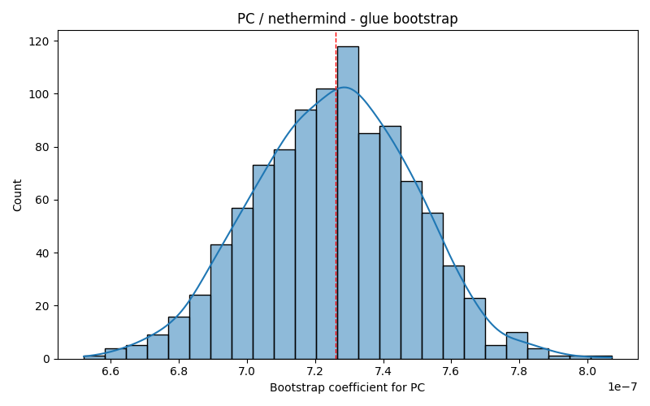

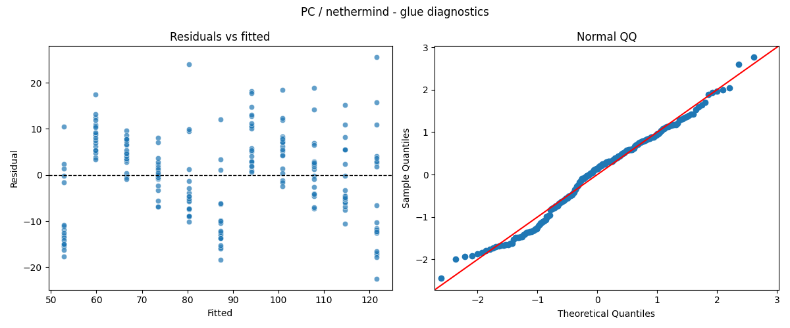

</details>

<details><summary><code>RETURNDATASIZE</code> · nobs=880 · runtime_ms=7.23e-07 · p=1.00e-03 · R²=0.4809</summary>

```
==============================================================================
                           NNLS Regression Results                            
==============================================================================
Dep. Variable:          test_runtime_ms              R-squared:          0.481
Model:                  NNLS                    Adj. R-squared:          0.480
No. Observations:       880                               RMSE:          11.86
Df Residuals:           878                                MAE:           4.48
Df Model:               1      
==============================================================================
                      coef     std err     P-value      [0.025      0.975]
------------------------------------------------------------------------------
         const     12.3452      1.2280       0.001      9.9502     14.7781
RETURNDATASIZE      0.0000      0.0000       0.001      0.0000      0.0000
==============================================================================
Notes: Non-negative least squares with bootstrap inference (1000 iterations)
==============================================================================
```

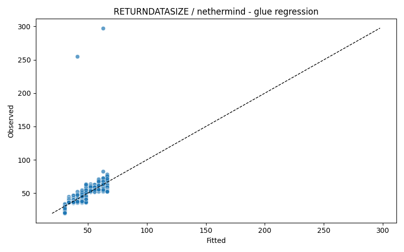

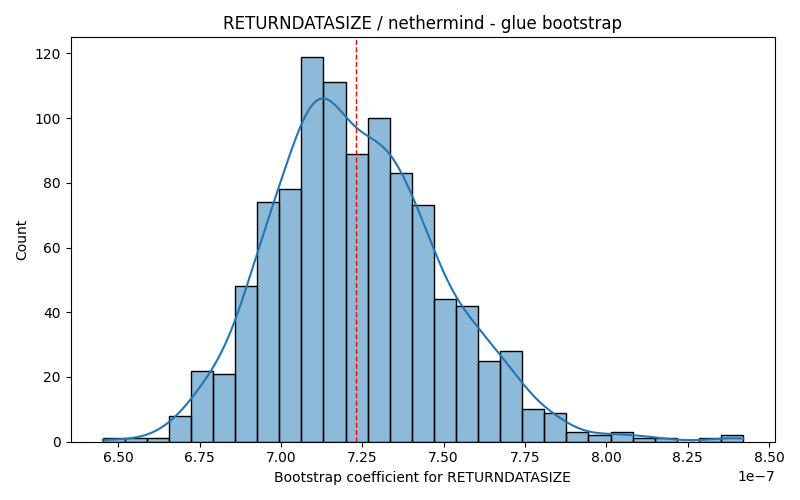

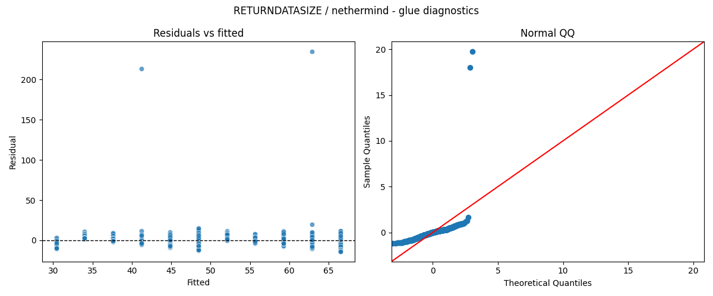

</details>

<details><summary><code>SELFBALANCE</code> · nobs=180 · runtime_ms=3.964e-06 · p=1.00e-03 · R²=0.6258</summary>

```
==============================================================================
                           NNLS Regression Results                            
==============================================================================
Dep. Variable:          test_runtime_ms              R-squared:          0.626
Model:                  NNLS                    Adj. R-squared:          0.624
No. Observations:       180                               RMSE:          30.92
Df Residuals:           178                                MAE:          23.31
Df Model:               1      
==============================================================================
                      coef     std err     P-value      [0.025      0.975]
------------------------------------------------------------------------------
         const    106.7451     14.7023       0.001     76.8123    136.2765
   SELFBALANCE      0.0000      0.0000       0.001      0.0000      0.0000
==============================================================================
Notes: Non-negative least squares with bootstrap inference (1000 iterations)
==============================================================================
```

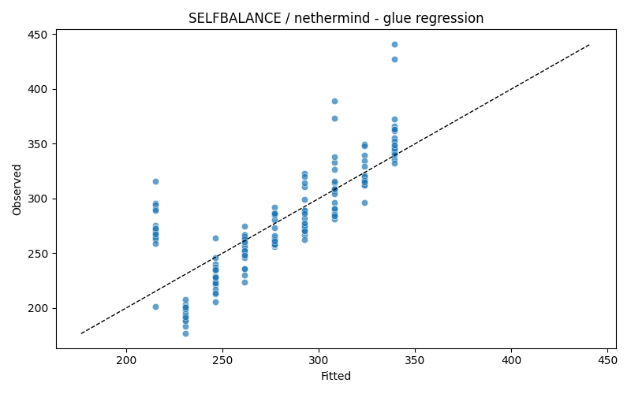

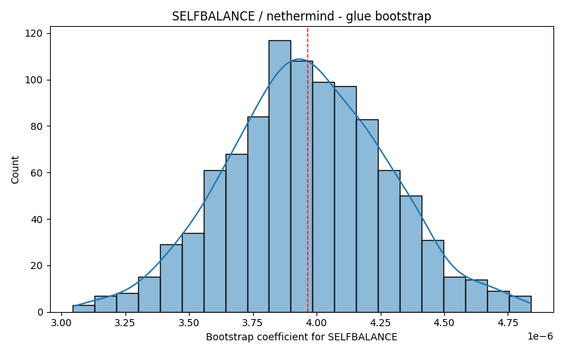

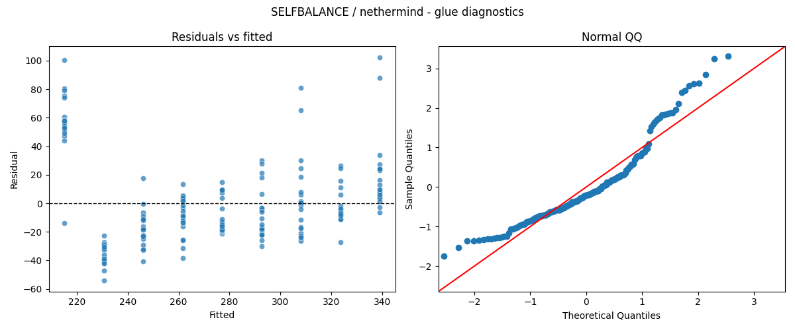

</details>

<details><summary><code>SUB</code> · nobs=220 · runtime_ms=2.362e-06 · p=1.00e-03 · R²=0.9455</summary>

```
==============================================================================
                           NNLS Regression Results                            
==============================================================================
Dep. Variable:          test_runtime_ms              R-squared:          0.945
Model:                  NNLS                    Adj. R-squared:          0.945
No. Observations:       220                               RMSE:           5.97
Df Residuals:           218                                MAE:           4.77
Df Model:               1      
==============================================================================
                      coef     std err     P-value      [0.025      0.975]
------------------------------------------------------------------------------
         const     15.8245      1.2279       0.001     13.5168     18.3434
           SUB      0.0000      0.0000       0.001      0.0000      0.0000
==============================================================================
Notes: Non-negative least squares with bootstrap inference (1000 iterations)
==============================================================================
```

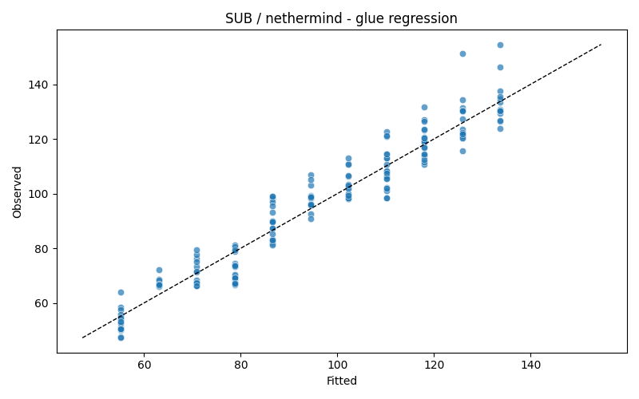

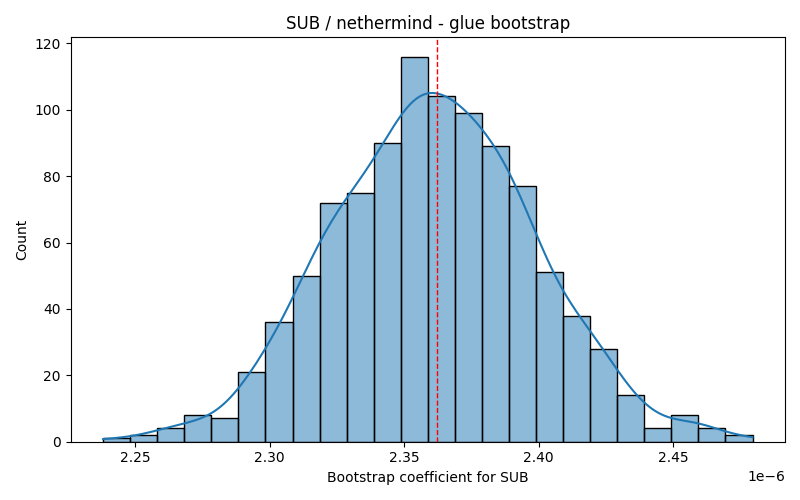

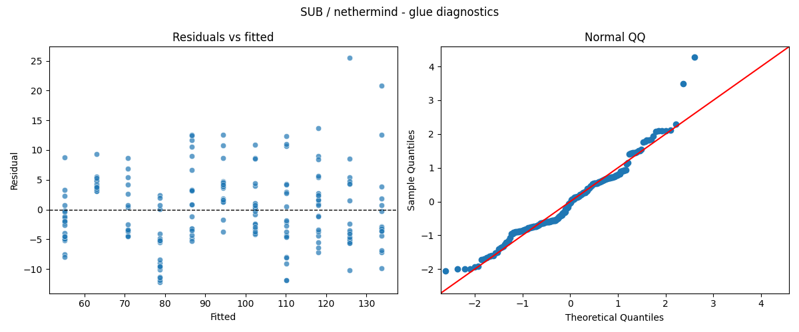

</details>

### Mixed glue (tier B) · nethermind

<details><summary><code>JUMP</code> · nobs=220 · runtime_ms=4.511e-06 · p=1.00e-03 · R²=0.7997</summary>

```
==============================================================================
                           NNLS Regression Results                            
==============================================================================
Dep. Variable:          test_runtime_ms              R-squared:          0.800
Model:                  NNLS                    Adj. R-squared:          0.799
No. Observations:       220                               RMSE:           8.39
Df Residuals:           218                                MAE:           6.95
Df Model:               1      
==============================================================================
                      coef     std err     P-value      [0.025      0.975]
------------------------------------------------------------------------------
         const     23.2346      1.9917       0.001     19.2038     27.0011
          JUMP      0.0000      0.0000       0.001      0.0000      0.0000
==============================================================================
Notes: Non-negative least squares with bootstrap inference (1000 iterations)
==============================================================================
```

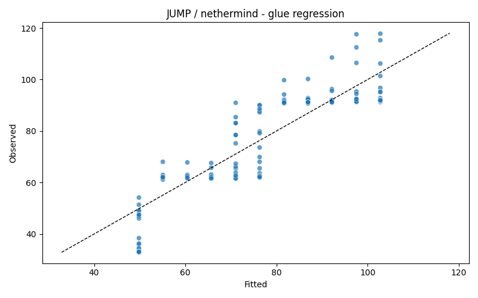

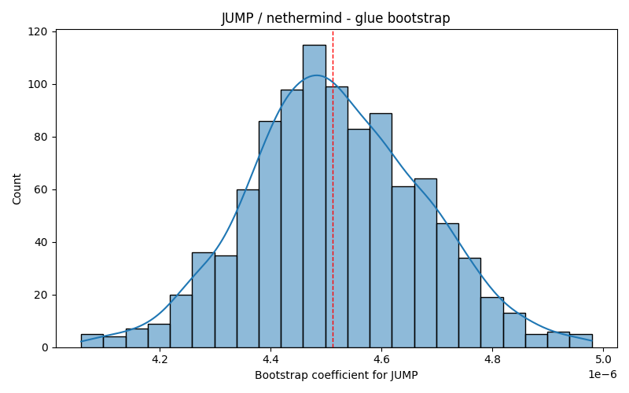

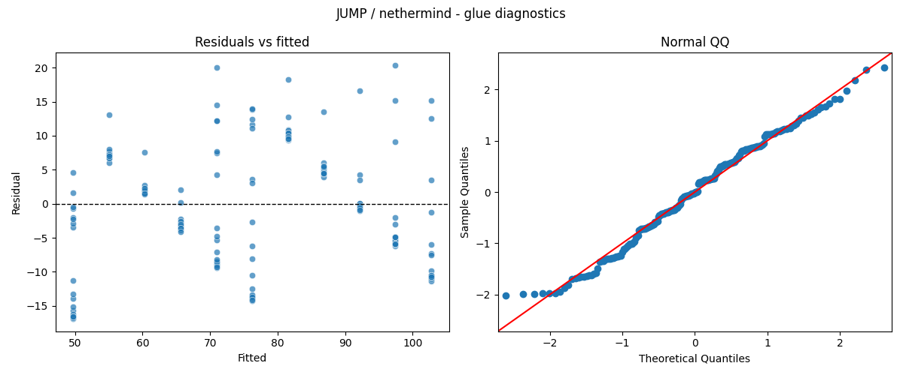

</details>

<details><summary><code>KECCAK256</code> · nobs=3520 · runtime_ms=0 · p=1.00e+00 · R²=-2.22e-16</summary>

```
==============================================================================
                           NNLS Regression Results                            
==============================================================================
Dep. Variable:          test_runtime_ms              R-squared:         -0.000
Model:                  NNLS                    Adj. R-squared:         -0.000
No. Observations:       3520                              RMSE:         273.59
Df Residuals:           3518                               MAE:         227.40
Df Model:               1      
==============================================================================
                      coef     std err     P-value      [0.025      0.975]
------------------------------------------------------------------------------
         const    425.6914      4.5193       0.001    416.4958    434.8095
     KECCAK256      0.0000      0.0000       1.000      0.0000      0.0000
==============================================================================
Notes: Non-negative least squares with bootstrap inference (1000 iterations)
==============================================================================
```

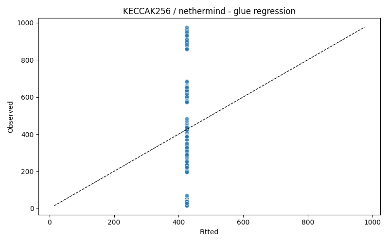


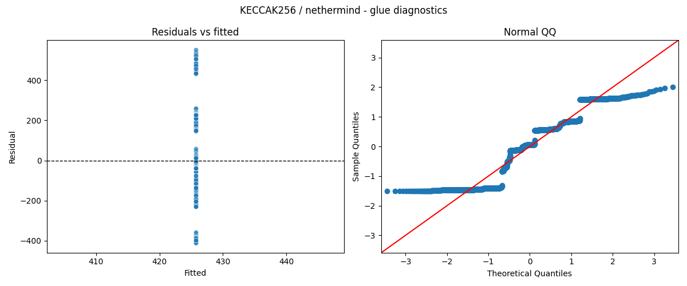

</details>

## reth

| glue_opcode | nobs | glue_runtime_ms | p_value | rsquared |
| --- | --- | --- | --- | --- |
| `ISZERO` | 209 | 3.677e-07 | 1.00e-03 | 0.7873 |
| `JUMPDEST` | 209 | 3.011e-07 | 1.00e-03 | 0.7717 |
| `SWAP` | 3344 | 4.66e-07 | 1.00e-03 | 0.6628 |
| `CALLDATASIZE` | 12551 | 4.833e-07 | 1.00e-03 | 0.8284 |
| `DUP` | 12551 | 4.034e-07 | 1.00e-03 | 0.8284 |
| `GAS` | 12551 | 4.479e-07 | 1.00e-03 | 0.8284 |
| `MLOAD` | 12551 | 1.63e-06 | 1.00e-03 | 0.8284 |
| `PUSH` | 12551 | 4.355e-07 | 1.00e-03 | 0.8284 |
| `PUSH0` | 12551 | 3.347e-07 | 1.00e-03 | 0.8284 |
| `STATICCALL` | 12551 | 5.366e-05 | 1.00e-03 | 0.8284 |
| `ADD` | 209 | 8.913e-07 | 1.00e-03 | 0.8417 |
| `AND` | 209 | 8.574e-07 | 1.00e-03 | 0.8169 |
| `CALLDATACOPY` | 5016 | 2.244e-06 | 1.00e-03 | 0.7597 |
| `CALLDATALOAD` | 836 | 2.409e-05 | 1.00e-03 | 0.1297 |
| `DIV` | 209 | 6.982e-06 | 1.00e-03 | 0.845 |
| `EXP` | 209 | 0.0003794 | 1.00e-03 | 0.8114 |
| `GT` | 209 | 9.595e-07 | 1.00e-03 | 0.8144 |
| `JUMPI` | 209 | 1.256e-06 | 1.00e-03 | 0.7463 |
| `LT` | 209 | 9.545e-07 | 1.00e-03 | 0.776 |
| `MSTORE` | 1045 | 2.73e-06 | 1.00e-03 | 0.2783 |
| `MSTORE8` | 1045 | 1.327e-06 | 1.00e-03 | 0.7446 |
| `MUL` | 209 | 1.079e-06 | 1.00e-03 | 0.5674 |
| `PC` | 209 | 5.91e-07 | 1.00e-03 | 0.9155 |
| `RETURNDATASIZE` | 836 | 8.913e-07 | 1.00e-03 | 0.8405 |
| `SELFBALANCE` | 171 | 3.845e-06 | 1.00e-03 | 0.8064 |
| `SUB` | 209 | 9.316e-07 | 1.00e-03 | 0.4975 |
| `JUMP` | 209 | 2.089e-06 | 1.00e-03 | 0.8154 |
| `KECCAK256` | 3344 | 0 | 1.00e+00 | 0 |

### Cycle glue — joint fit · reth

<details><summary>Joint NNLS regression summary</summary>

```
==============================================================================
                           NNLS Regression Results                            
==============================================================================
Dep. Variable:          test_runtime_ms              R-squared:          0.828
Model:                  NNLS                    Adj. R-squared:          0.828
No. Observations:       12551                             RMSE:           7.25
Df Residuals:           12543                              MAE:           4.99
Df Model:               7      
==============================================================================
                      coef     std err     P-value      [0.025      0.975]
------------------------------------------------------------------------------
         const     10.6715      0.2205       0.001     10.2294     11.0848
  CALLDATASIZE      0.0000      0.0000       0.001      0.0000      0.0000
           DUP      0.0000      0.0000       0.001      0.0000      0.0000
           GAS      0.0000      0.0000       0.001      0.0000      0.0000
         MLOAD      0.0000      0.0000       0.001      0.0000      0.0000
          PUSH      0.0000      0.0000       0.001      0.0000      0.0000
         PUSH0      0.0000      0.0000       0.001      0.0000      0.0000
    STATICCALL      0.0001      0.0000       0.001      0.0001      0.0001
==============================================================================
Notes: Non-negative least squares with bootstrap inference (1000 iterations)
==============================================================================
```

</details>

<details><summary><code>CALLDATASIZE</code> · nobs=12551 · runtime_ms=4.833e-07 · p=1.00e-03 · R²=0.8284</summary>

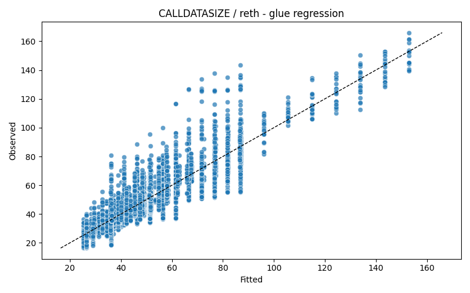

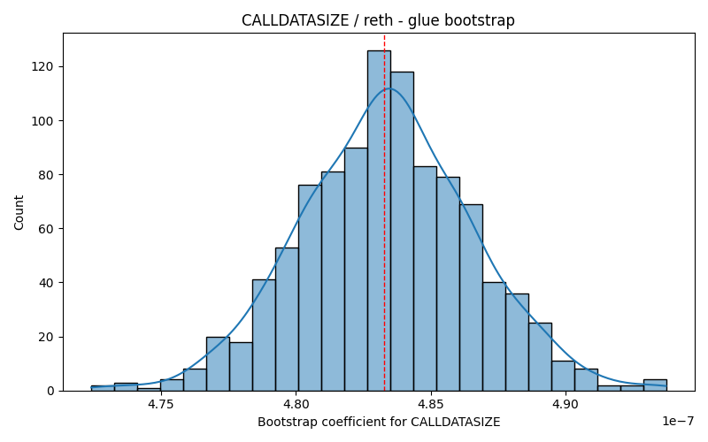


</details>

<details><summary><code>DUP</code> · nobs=12551 · runtime_ms=4.034e-07 · p=1.00e-03 · R²=0.8284</summary>


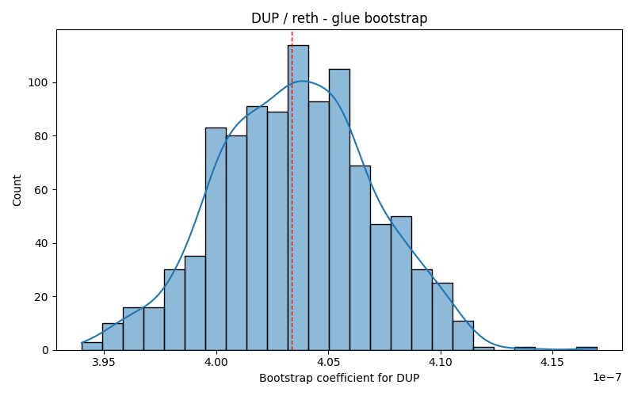


</details>

<details><summary><code>GAS</code> · nobs=12551 · runtime_ms=4.479e-07 · p=1.00e-03 · R²=0.8284</summary>


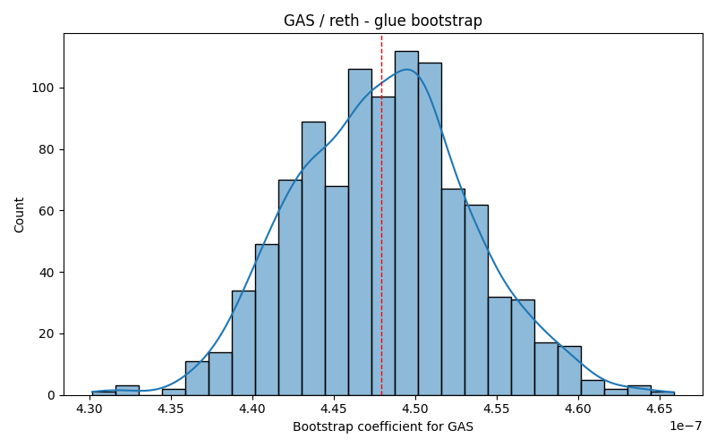


</details>

<details><summary><code>MLOAD</code> · nobs=12551 · runtime_ms=1.63e-06 · p=1.00e-03 · R²=0.8284</summary>


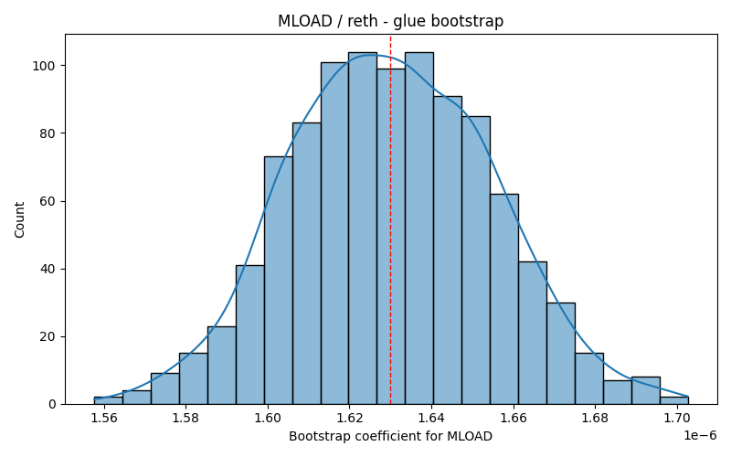

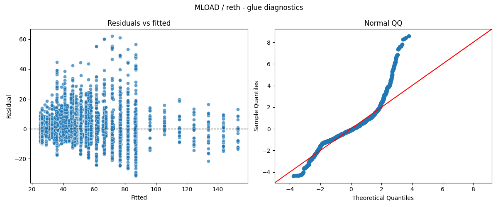

</details>

<details><summary><code>PUSH</code> · nobs=12551 · runtime_ms=4.355e-07 · p=1.00e-03 · R²=0.8284</summary>


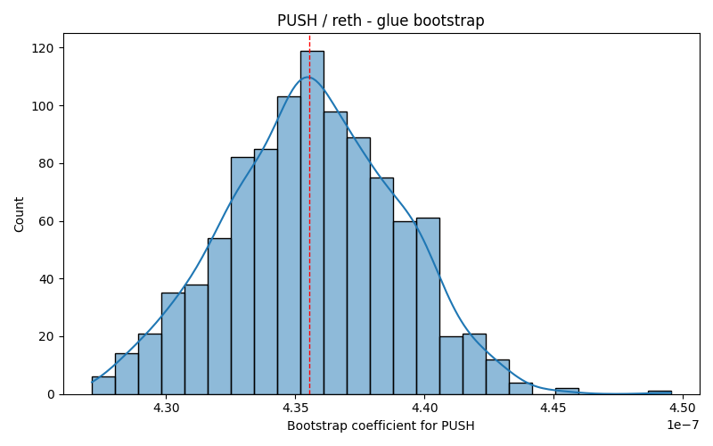


</details>

<details><summary><code>PUSH0</code> · nobs=12551 · runtime_ms=3.347e-07 · p=1.00e-03 · R²=0.8284</summary>

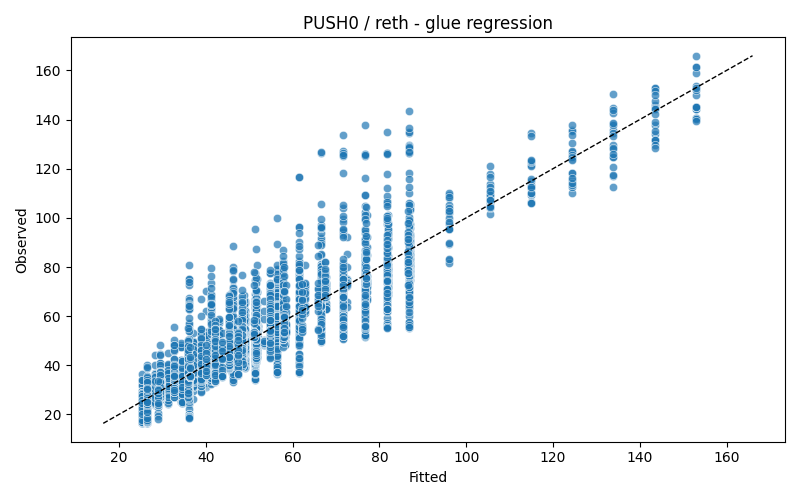

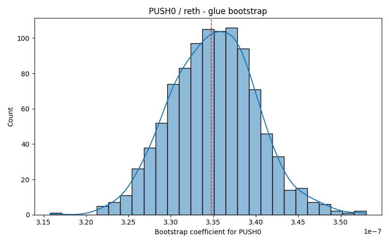


</details>

<details><summary><code>STATICCALL</code> · nobs=12551 · runtime_ms=5.366e-05 · p=1.00e-03 · R²=0.8284</summary>


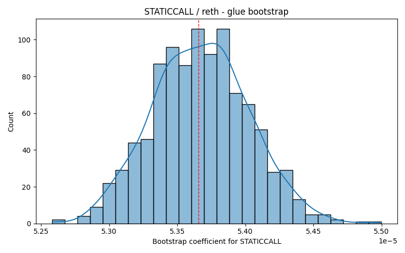


</details>

### Pure glue · reth

<details><summary><code>ISZERO</code> · nobs=209 · runtime_ms=3.677e-07 · p=1.00e-03 · R²=0.7873</summary>

```
==============================================================================
                           NNLS Regression Results                            
==============================================================================
Dep. Variable:          test_runtime_ms              R-squared:          0.787
Model:                  NNLS                    Adj. R-squared:          0.786
No. Observations:       209                               RMSE:           4.02
Df Residuals:           207                                MAE:           3.02
Df Model:               1      
==============================================================================
                      coef     std err     P-value      [0.025      0.975]
------------------------------------------------------------------------------
         const      8.6111      0.8331       0.001      6.9640     10.2812
        ISZERO      0.0000      0.0000       0.001      0.0000      0.0000
==============================================================================
Notes: Non-negative least squares with bootstrap inference (1000 iterations)
==============================================================================
```

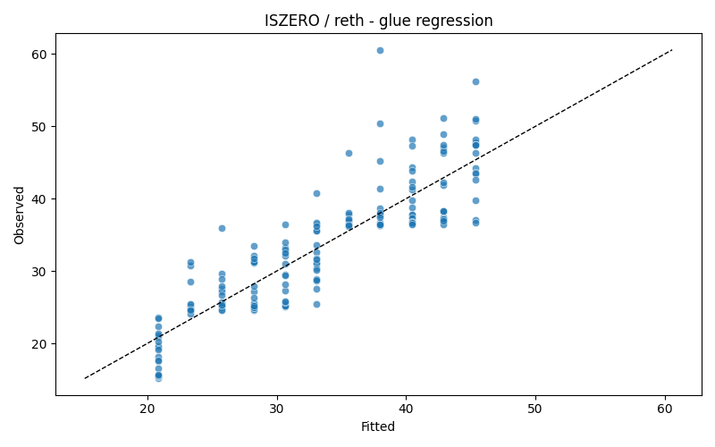

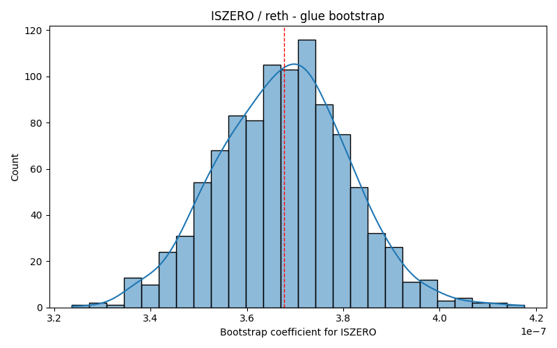

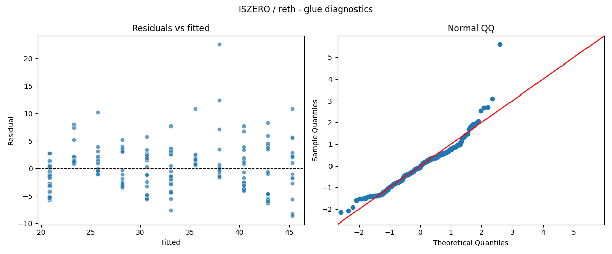

</details>

<details><summary><code>JUMPDEST</code> · nobs=209 · runtime_ms=3.011e-07 · p=1.00e-03 · R²=0.7717</summary>

```
==============================================================================
                           NNLS Regression Results                            
==============================================================================
Dep. Variable:          test_runtime_ms              R-squared:          0.772
Model:                  NNLS                    Adj. R-squared:          0.771
No. Observations:       209                               RMSE:          10.34
Df Residuals:           207                                MAE:           7.61
Df Model:               1      
==============================================================================
                      coef     std err     P-value      [0.025      0.975]
------------------------------------------------------------------------------
         const     12.4561      2.1600       0.001      8.1840     16.8882
      JUMPDEST      0.0000      0.0000       0.001      0.0000      0.0000
==============================================================================
Notes: Non-negative least squares with bootstrap inference (1000 iterations)
==============================================================================
```

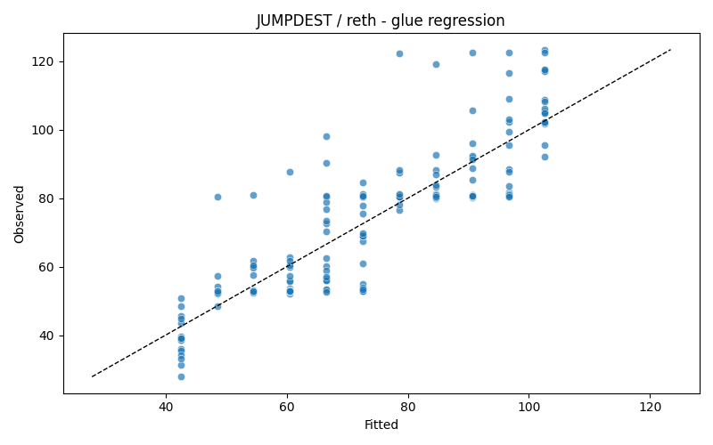

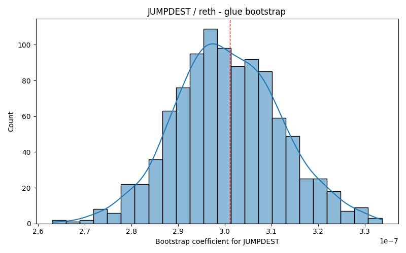

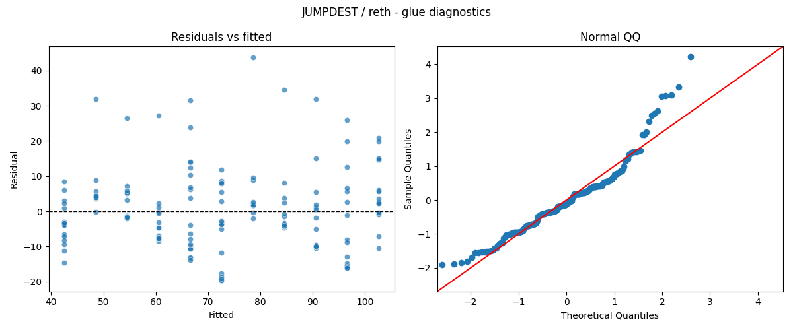

</details>

<details><summary><code>SWAP</code> · nobs=3344 · runtime_ms=4.66e-07 · p=1.00e-03 · R²=0.6628</summary>

```
==============================================================================
                           NNLS Regression Results                            
==============================================================================
Dep. Variable:          test_runtime_ms              R-squared:          0.663
Model:                  NNLS                    Adj. R-squared:          0.663
No. Observations:       3344                              RMSE:           7.00
Df Residuals:           3342                               MAE:           4.30
Df Model:               1      
==============================================================================
                      coef     std err     P-value      [0.025      0.975]
------------------------------------------------------------------------------
         const     10.4372      0.3378       0.001      9.7427     11.1058
          SWAP      0.0000      0.0000       0.001      0.0000      0.0000
==============================================================================
Notes: Non-negative least squares with bootstrap inference (1000 iterations)
==============================================================================
```

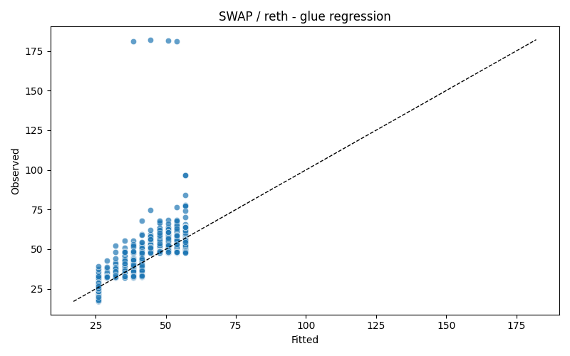

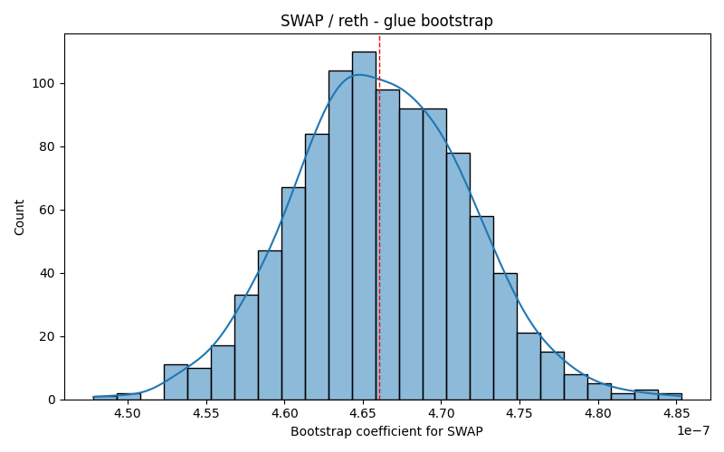

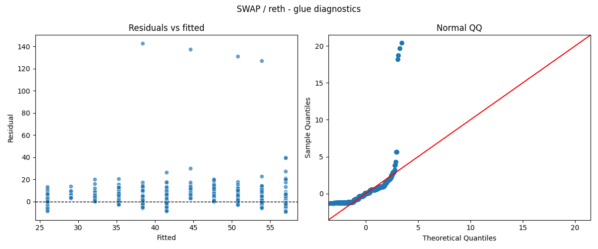

</details>

### Mixed glue (tier A) · reth

<details><summary><code>ADD</code> · nobs=209 · runtime_ms=8.913e-07 · p=1.00e-03 · R²=0.8417</summary>

```
==============================================================================
                           NNLS Regression Results                            
==============================================================================
Dep. Variable:          test_runtime_ms              R-squared:          0.842
Model:                  NNLS                    Adj. R-squared:          0.841
No. Observations:       209                               RMSE:           4.07
Df Residuals:           207                                MAE:           3.17
Df Model:               1      
==============================================================================
                      coef     std err     P-value      [0.025      0.975]
------------------------------------------------------------------------------
         const      7.9462      1.0410       0.001      6.0134     10.0215
           ADD      0.0000      0.0000       0.001      0.0000      0.0000
==============================================================================
Notes: Non-negative least squares with bootstrap inference (1000 iterations)
==============================================================================
```

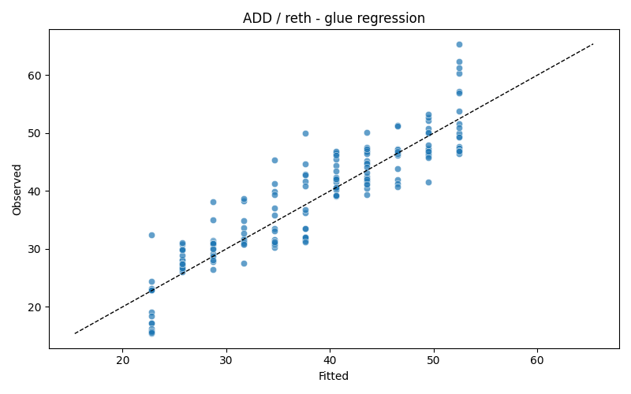

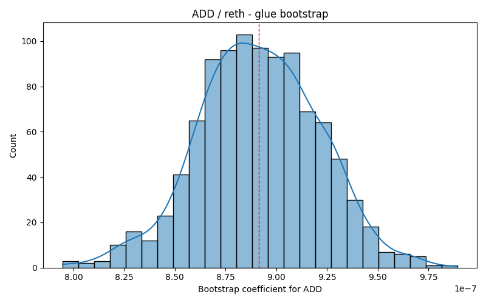

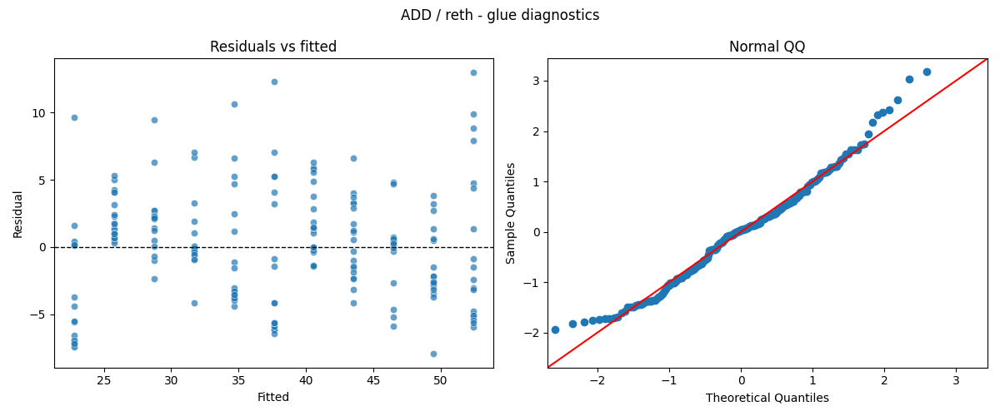

</details>

<details><summary><code>AND</code> · nobs=209 · runtime_ms=8.574e-07 · p=1.00e-03 · R²=0.8169</summary>

```
==============================================================================
                           NNLS Regression Results                            
==============================================================================
Dep. Variable:          test_runtime_ms              R-squared:          0.817
Model:                  NNLS                    Adj. R-squared:          0.816
No. Observations:       209                               RMSE:           4.27
Df Residuals:           207                                MAE:           3.18
Df Model:               1      
==============================================================================
                      coef     std err     P-value      [0.025      0.975]
------------------------------------------------------------------------------
         const      8.8499      0.9322       0.001      7.0499     10.6840
           AND      0.0000      0.0000       0.001      0.0000      0.0000
==============================================================================
Notes: Non-negative least squares with bootstrap inference (1000 iterations)
==============================================================================
```

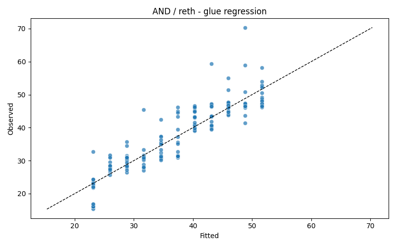

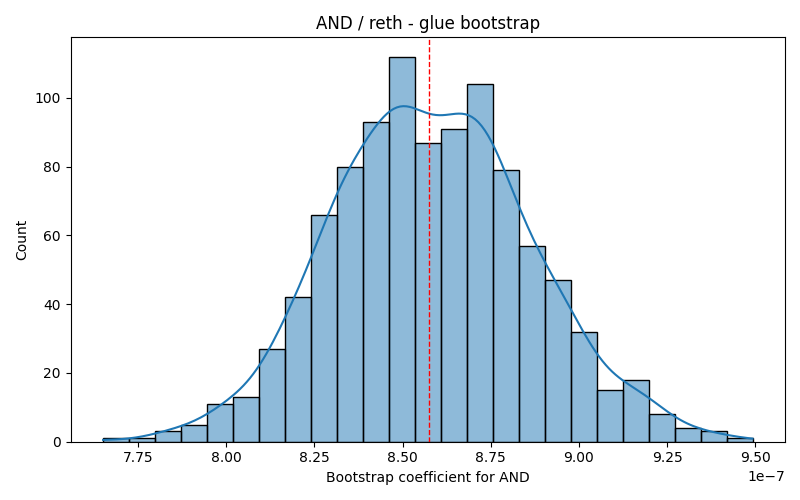

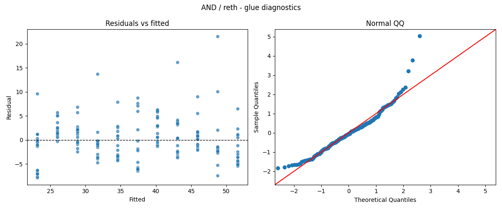

</details>

<details><summary><code>CALLDATACOPY</code> · nobs=5016 · runtime_ms=2.244e-06 · p=1.00e-03 · R²=0.7597</summary>

```
==============================================================================
                           NNLS Regression Results                            
==============================================================================
Dep. Variable:          test_runtime_ms              R-squared:          0.760
Model:                  NNLS                    Adj. R-squared:          0.760
No. Observations:       5016                              RMSE:           9.49
Df Residuals:           5014                               MAE:           6.54
Df Model:               1      
==============================================================================
                      coef     std err     P-value      [0.025      0.975]
------------------------------------------------------------------------------
         const     11.5351      0.1540       0.001     11.2235     11.8351
  CALLDATACOPY      0.0000      0.0000       0.001      0.0000      0.0000
==============================================================================
Notes: Non-negative least squares with bootstrap inference (1000 iterations)
==============================================================================
```

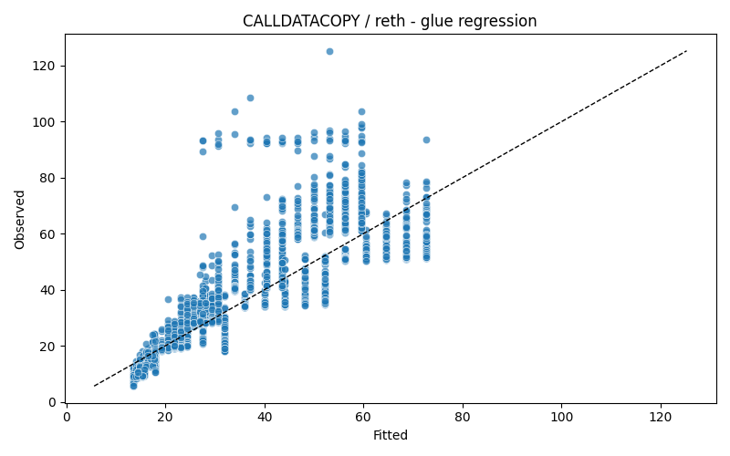

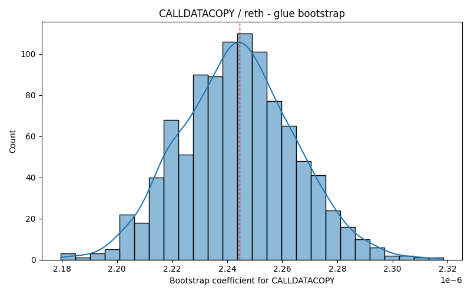

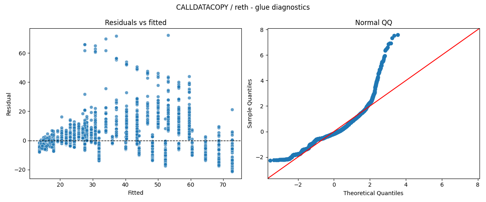

</details>

<details><summary><code>CALLDATALOAD</code> · nobs=836 · runtime_ms=2.409e-05 · p=1.00e-03 · R²=0.1297</summary>

```
==============================================================================
                           NNLS Regression Results                            
==============================================================================
Dep. Variable:          test_runtime_ms              R-squared:          0.130
Model:                  NNLS                    Adj. R-squared:          0.129
No. Observations:       836                               RMSE:           0.24
Df Residuals:           834                                MAE:           0.16
Df Model:               1      
==============================================================================
                      coef     std err     P-value      [0.025      0.975]
------------------------------------------------------------------------------
         const      1.7298      0.0317       0.001      1.6711      1.7902
  CALLDATALOAD      0.0000      0.0000       0.001      0.0000      0.0000
==============================================================================
Notes: Non-negative least squares with bootstrap inference (1000 iterations)
==============================================================================
```

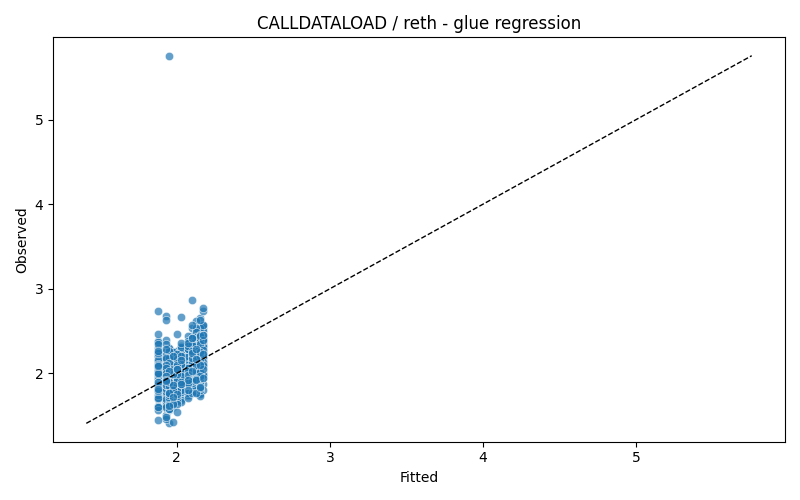

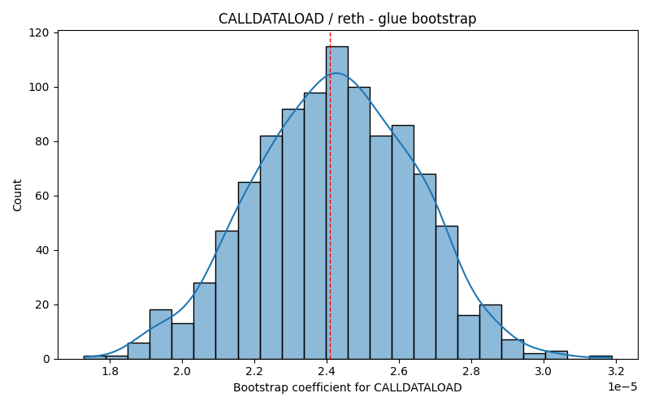

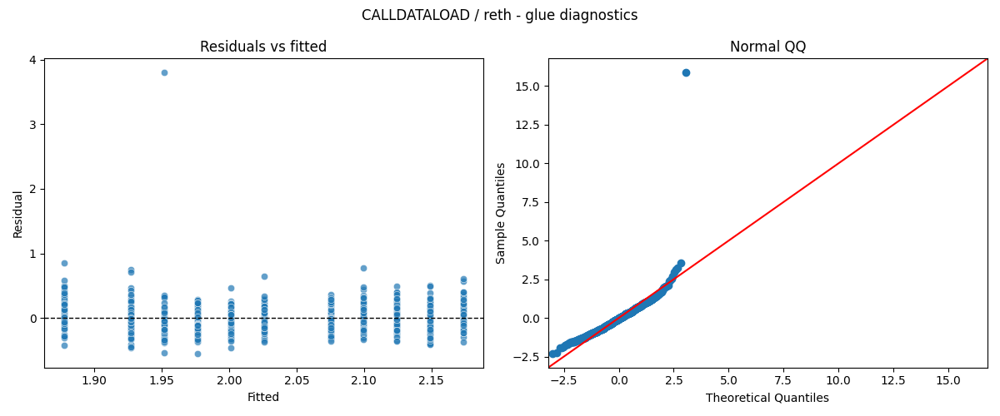

</details>

<details><summary><code>DIV</code> · nobs=209 · runtime_ms=6.982e-06 · p=1.00e-03 · R²=0.845</summary>

```
==============================================================================
                           NNLS Regression Results                            
==============================================================================
Dep. Variable:          test_runtime_ms              R-squared:          0.845
Model:                  NNLS                    Adj. R-squared:          0.844
No. Observations:       209                               RMSE:          23.61
Df Residuals:           207                                MAE:          19.37
Df Model:               1      
==============================================================================
                      coef     std err     P-value      [0.025      0.975]
------------------------------------------------------------------------------
         const     55.5252      6.1035       0.001     43.5637     67.1331
           DIV      0.0000      0.0000       0.001      0.0000      0.0000
==============================================================================
Notes: Non-negative least squares with bootstrap inference (1000 iterations)
==============================================================================
```

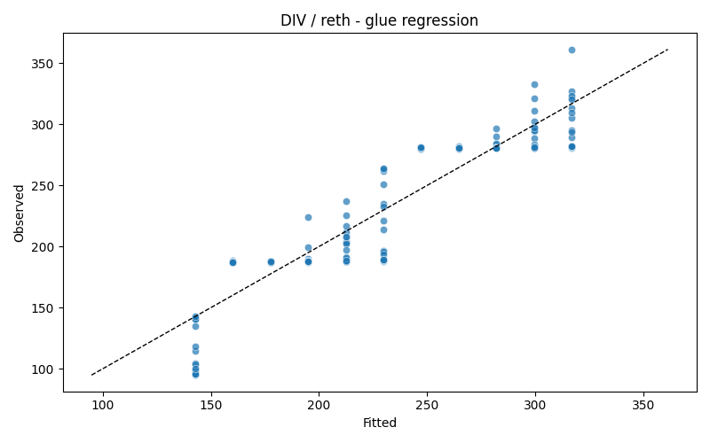

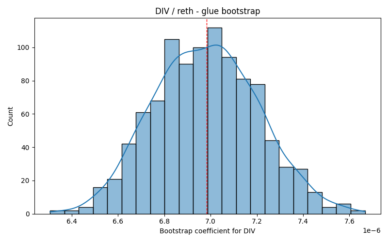

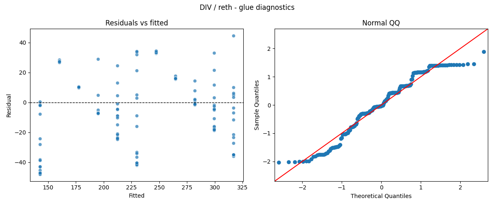

</details>

<details><summary><code>EXP</code> · nobs=209 · runtime_ms=0.0003794 · p=1.00e-03 · R²=0.8114</summary>

```
==============================================================================
                           NNLS Regression Results                            
==============================================================================
Dep. Variable:          test_runtime_ms              R-squared:          0.811
Model:                  NNLS                    Adj. R-squared:          0.810
No. Observations:       209                               RMSE:           7.16
Df Residuals:           207                                MAE:           6.06
Df Model:               1      
==============================================================================
                      coef     std err     P-value      [0.025      0.975]
------------------------------------------------------------------------------
         const     14.6901      1.7063       0.001     11.2826     18.1080
           EXP      0.0004      0.0000       0.001      0.0004      0.0004
==============================================================================
Notes: Non-negative least squares with bootstrap inference (1000 iterations)
==============================================================================
```

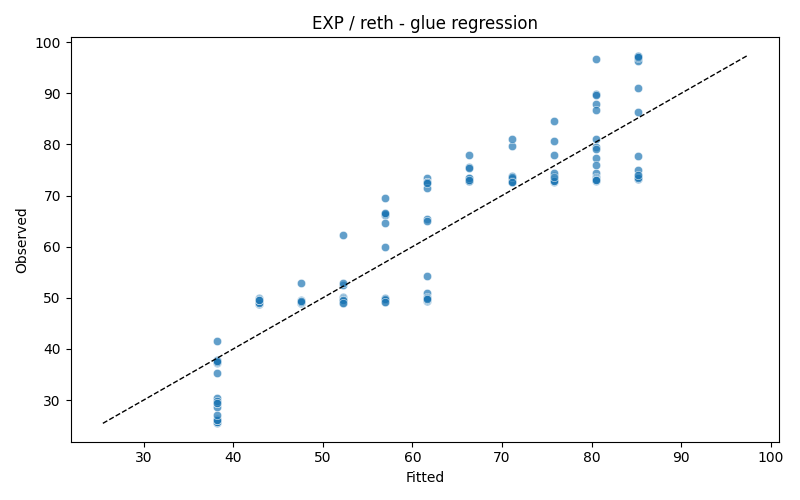

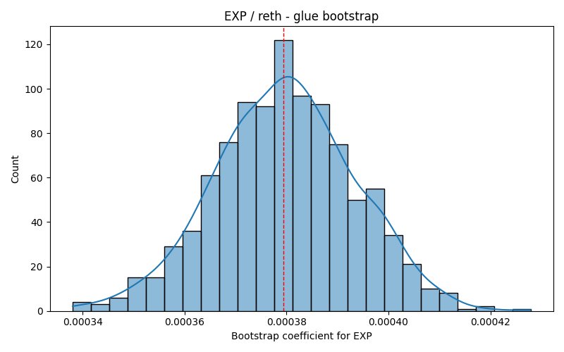

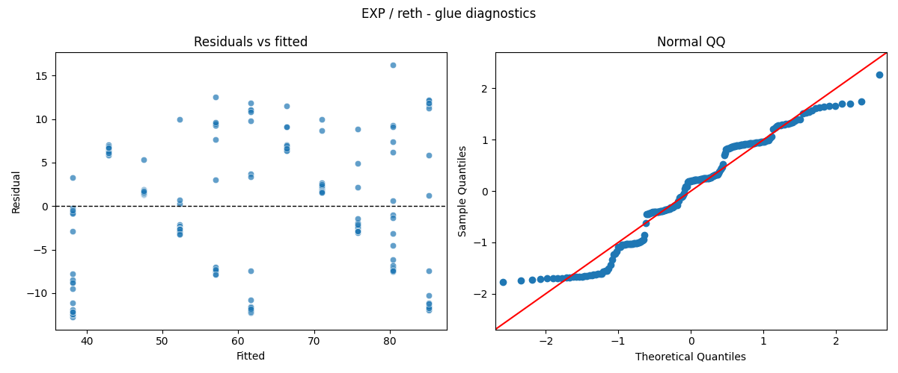

</details>

<details><summary><code>GT</code> · nobs=209 · runtime_ms=9.595e-07 · p=1.00e-03 · R²=0.8144</summary>

```
==============================================================================
                           NNLS Regression Results                            
==============================================================================
Dep. Variable:          test_runtime_ms              R-squared:          0.814
Model:                  NNLS                    Adj. R-squared:          0.813
No. Observations:       209                               RMSE:           4.82
Df Residuals:           207                                MAE:           3.66
Df Model:               1      
==============================================================================
                      coef     std err     P-value      [0.025      0.975]
------------------------------------------------------------------------------
         const      9.9289      1.1315       0.001      7.6518     12.0954
            GT      0.0000      0.0000       0.001      0.0000      0.0000
==============================================================================
Notes: Non-negative least squares with bootstrap inference (1000 iterations)
==============================================================================
```

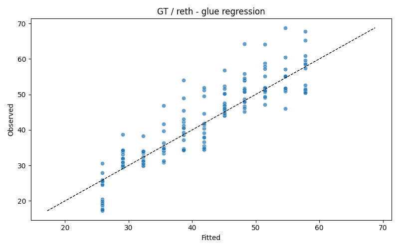

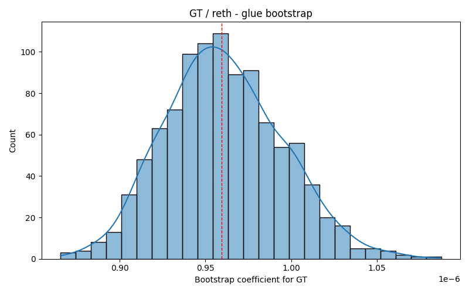

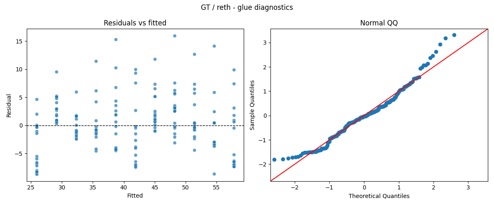

</details>

<details><summary><code>JUMPI</code> · nobs=209 · runtime_ms=1.256e-06 · p=1.00e-03 · R²=0.7463</summary>

```
==============================================================================
                           NNLS Regression Results                            
==============================================================================
Dep. Variable:          test_runtime_ms              R-squared:          0.746
Model:                  NNLS                    Adj. R-squared:          0.745
No. Observations:       209                               RMSE:           3.30
Df Residuals:           207                                MAE:           2.36
Df Model:               1      
==============================================================================
                      coef     std err     P-value      [0.025      0.975]
------------------------------------------------------------------------------
         const      5.3040      0.6283       0.001      4.0190      6.4911
         JUMPI      0.0000      0.0000       0.001      0.0000      0.0000
==============================================================================
Notes: Non-negative least squares with bootstrap inference (1000 iterations)
==============================================================================
```

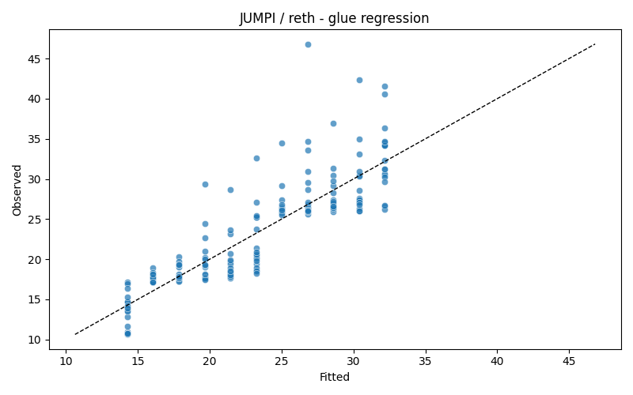

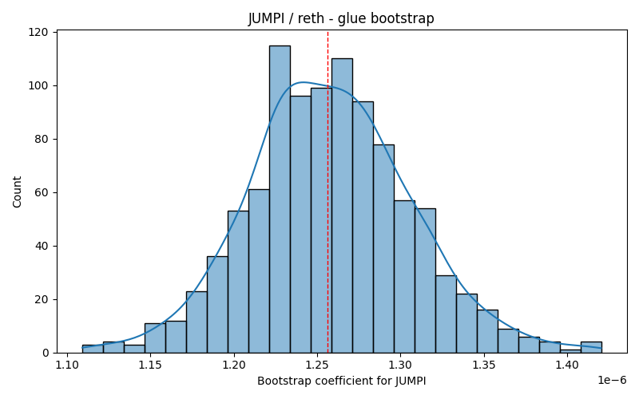

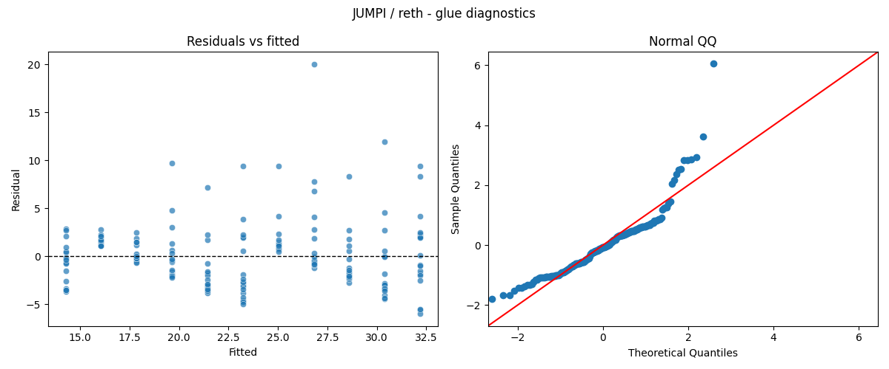

</details>

<details><summary><code>LT</code> · nobs=209 · runtime_ms=9.545e-07 · p=1.00e-03 · R²=0.776</summary>

```
==============================================================================
                           NNLS Regression Results                            
==============================================================================
Dep. Variable:          test_runtime_ms              R-squared:          0.776
Model:                  NNLS                    Adj. R-squared:          0.775
No. Observations:       209                               RMSE:           5.40
Df Residuals:           207                                MAE:           3.90
Df Model:               1      
==============================================================================
                      coef     std err     P-value      [0.025      0.975]
------------------------------------------------------------------------------
         const      8.5872      1.3040       0.001      6.0040     11.1012
            LT      0.0000      0.0000       0.001      0.0000      0.0000
==============================================================================
Notes: Non-negative least squares with bootstrap inference (1000 iterations)
==============================================================================
```

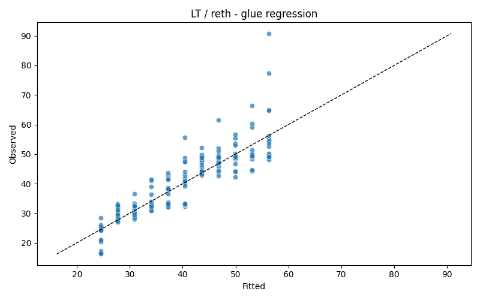


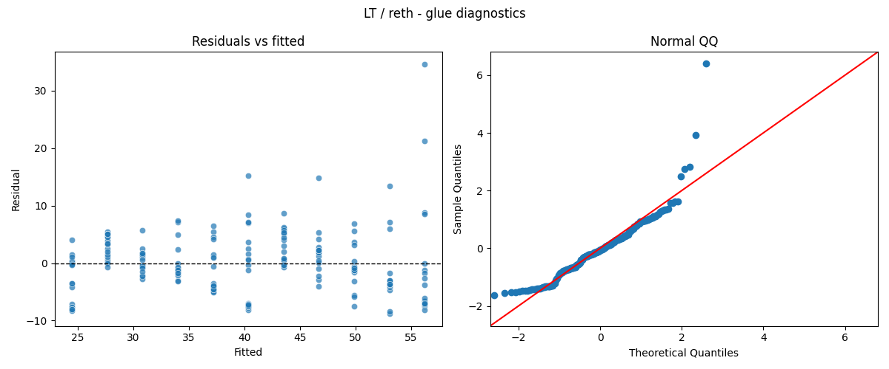

</details>

<details><summary><code>MSTORE</code> · nobs=1045 · runtime_ms=2.73e-06 · p=1.00e-03 · R²=0.2783</summary>

```
==============================================================================
                           NNLS Regression Results                            
==============================================================================
Dep. Variable:          test_runtime_ms              R-squared:          0.278
Model:                  NNLS                    Adj. R-squared:          0.278
No. Observations:       1045                              RMSE:          30.85
Df Residuals:           1043                               MAE:          27.93
Df Model:               1      
==============================================================================
                      coef     std err     P-value      [0.025      0.975]
------------------------------------------------------------------------------
         const     19.6395      2.7645       0.001     14.3326     25.4763
        MSTORE      0.0000      0.0000       0.001      0.0000      0.0000
==============================================================================
Notes: Non-negative least squares with bootstrap inference (1000 iterations)
==============================================================================
```

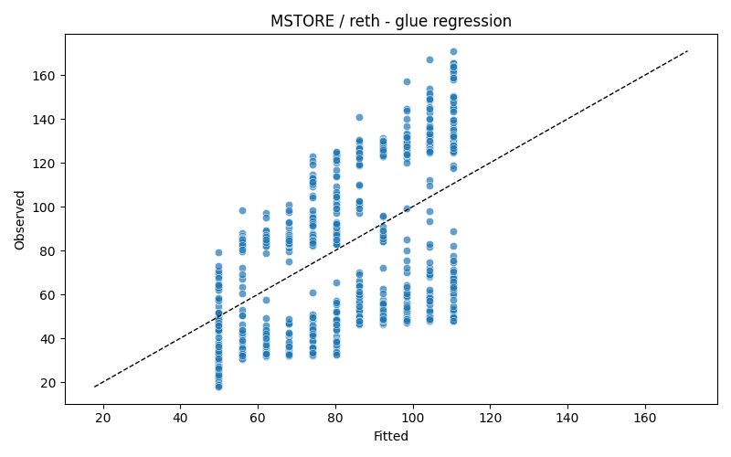


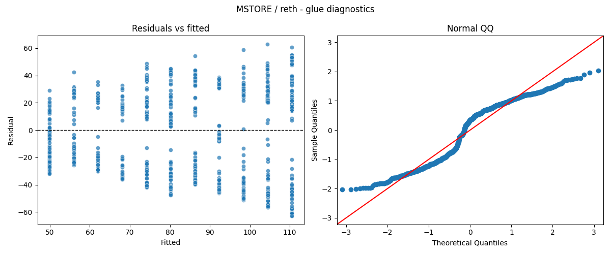

</details>

<details><summary><code>MSTORE8</code> · nobs=1045 · runtime_ms=1.327e-06 · p=1.00e-03 · R²=0.7446</summary>

```
==============================================================================
                           NNLS Regression Results                            
==============================================================================
Dep. Variable:          test_runtime_ms              R-squared:          0.745
Model:                  NNLS                    Adj. R-squared:          0.744
No. Observations:       1045                              RMSE:           5.45
Df Residuals:           1043                               MAE:           4.09
Df Model:               1      
==============================================================================
                      coef     std err     P-value      [0.025      0.975]
------------------------------------------------------------------------------
         const      9.6635      0.5150       0.001      8.6778     10.6632
       MSTORE8      0.0000      0.0000       0.001      0.0000      0.0000
==============================================================================
Notes: Non-negative least squares with bootstrap inference (1000 iterations)
==============================================================================
```


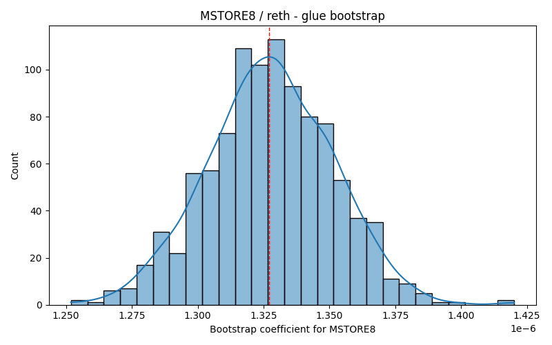

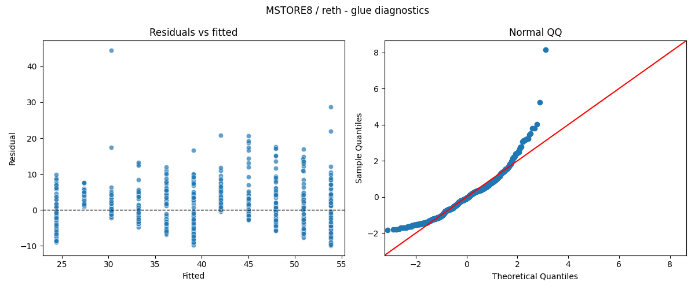

</details>

<details><summary><code>MUL</code> · nobs=209 · runtime_ms=1.079e-06 · p=1.00e-03 · R²=0.5674</summary>

```
==============================================================================
                           NNLS Regression Results                            
==============================================================================
Dep. Variable:          test_runtime_ms              R-squared:          0.567
Model:                  NNLS                    Adj. R-squared:          0.565
No. Observations:       209                               RMSE:           7.44
Df Residuals:           207                                MAE:           3.94
Df Model:               1      
==============================================================================
                      coef     std err     P-value      [0.025      0.975]
------------------------------------------------------------------------------
         const     11.5138      2.0156       0.001      8.3605     16.0078
           MUL      0.0000      0.0000       0.001      0.0000      0.0000
==============================================================================
Notes: Non-negative least squares with bootstrap inference (1000 iterations)
==============================================================================
```

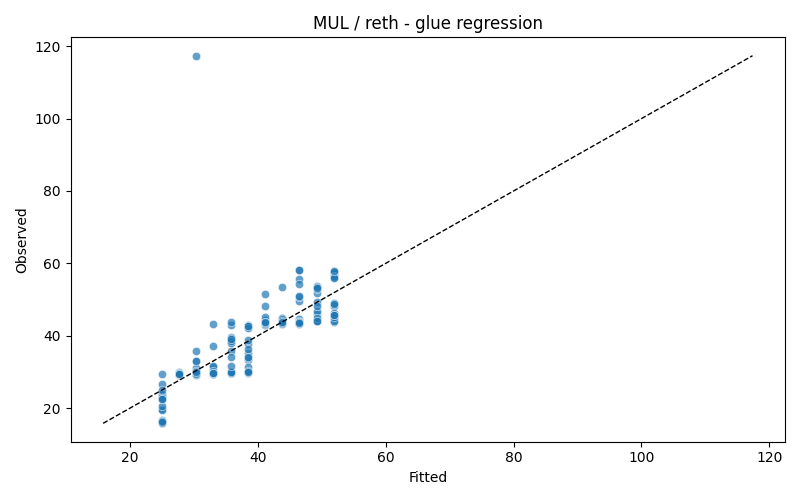

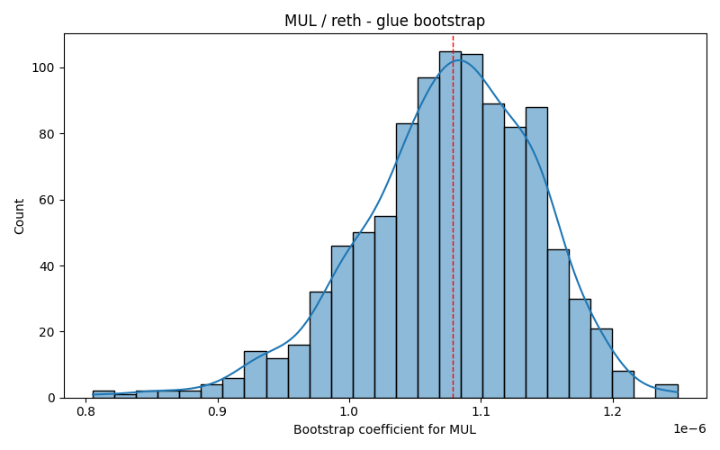

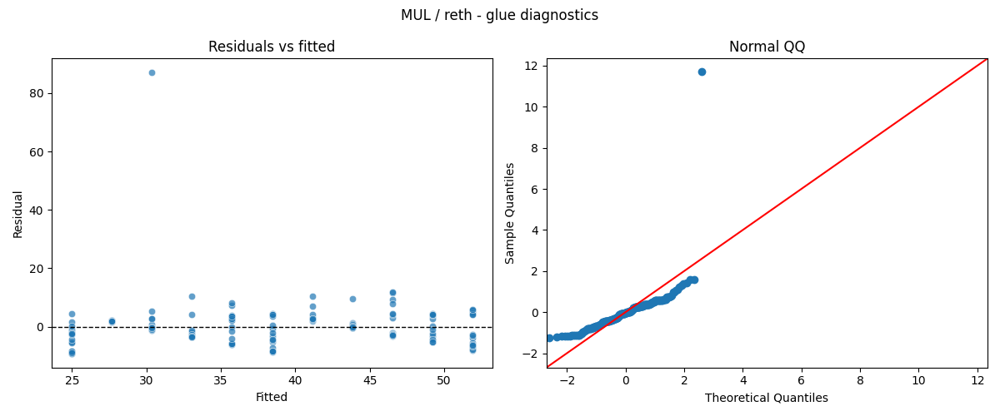

</details>

<details><summary><code>PC</code> · nobs=209 · runtime_ms=5.91e-07 · p=1.00e-03 · R²=0.9155</summary>

```
==============================================================================
                           NNLS Regression Results                            
==============================================================================
Dep. Variable:          test_runtime_ms              R-squared:          0.915
Model:                  NNLS                    Adj. R-squared:          0.915
No. Observations:       209                               RMSE:           5.37
Df Residuals:           207                                MAE:           4.23
Df Model:               1      
==============================================================================
                      coef     std err     P-value      [0.025      0.975]
------------------------------------------------------------------------------
         const     12.3748      1.2889       0.001      9.9767     14.9129
            PC      0.0000      0.0000       0.001      0.0000      0.0000
==============================================================================
Notes: Non-negative least squares with bootstrap inference (1000 iterations)
==============================================================================
```

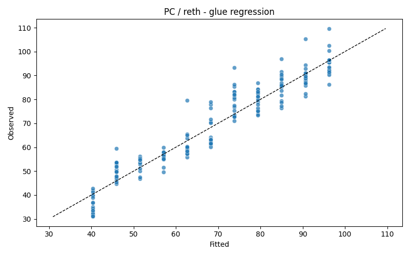

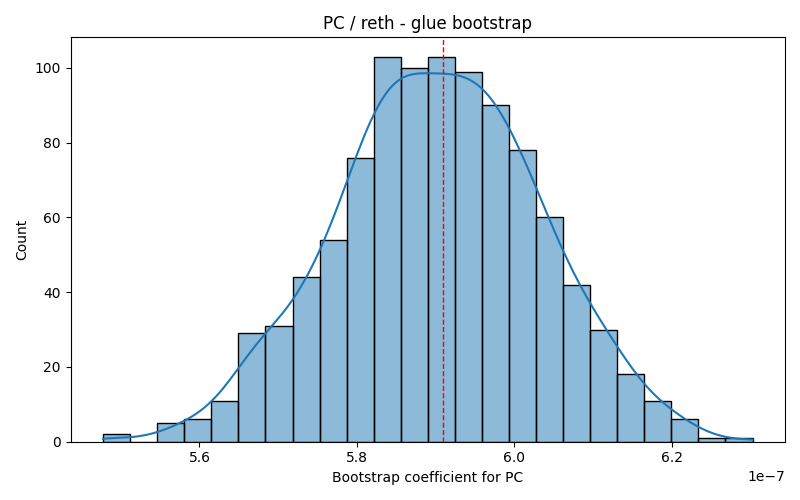

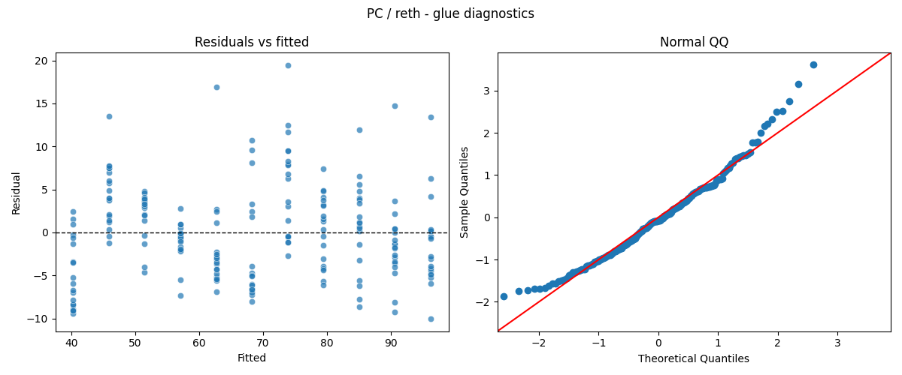

</details>

<details><summary><code>RETURNDATASIZE</code> · nobs=836 · runtime_ms=8.913e-07 · p=1.00e-03 · R²=0.8405</summary>

```
==============================================================================
                           NNLS Regression Results                            
==============================================================================
Dep. Variable:          test_runtime_ms              R-squared:          0.840
Model:                  NNLS                    Adj. R-squared:          0.840
No. Observations:       836                               RMSE:           6.13
Df Residuals:           834                                MAE:           4.69
Df Model:               1      
==============================================================================
                      coef     std err     P-value      [0.025      0.975]
------------------------------------------------------------------------------
         const     10.8304      0.6831       0.001      9.5428     12.2163
RETURNDATASIZE      0.0000      0.0000       0.001      0.0000      0.0000
==============================================================================
Notes: Non-negative least squares with bootstrap inference (1000 iterations)
==============================================================================
```

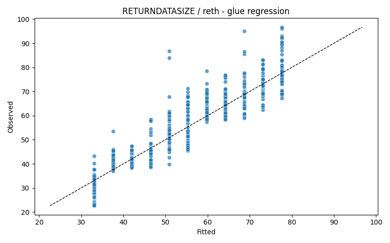

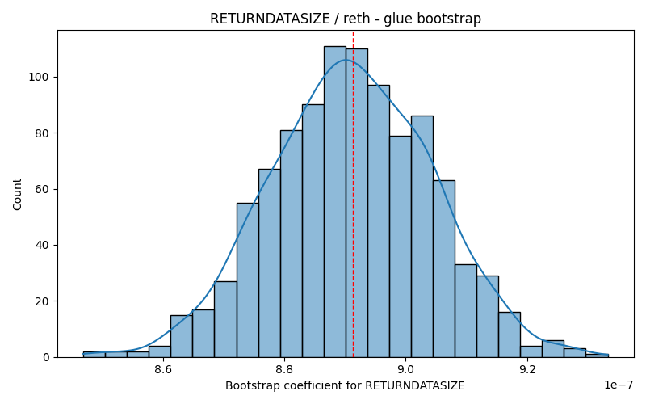

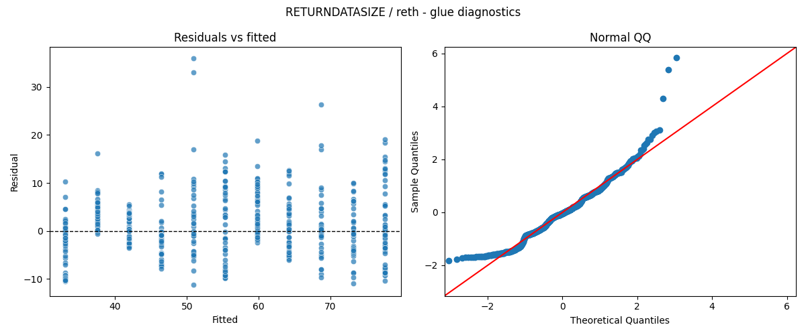

</details>

<details><summary><code>SELFBALANCE</code> · nobs=171 · runtime_ms=3.845e-06 · p=1.00e-03 · R²=0.8064</summary>

```
==============================================================================
                           NNLS Regression Results                            
==============================================================================
Dep. Variable:          test_runtime_ms              R-squared:          0.806
Model:                  NNLS                    Adj. R-squared:          0.805
No. Observations:       171                               RMSE:          19.01
Df Residuals:           169                                MAE:          15.56
Df Model:               1      
==============================================================================
                      coef     std err     P-value      [0.025      0.975]
------------------------------------------------------------------------------
         const     54.1840      5.5194       0.001     42.9578     64.3146
   SELFBALANCE      0.0000      0.0000       0.001      0.0000      0.0000
==============================================================================
Notes: Non-negative least squares with bootstrap inference (1000 iterations)
==============================================================================
```

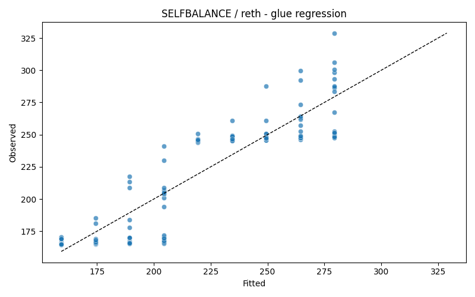

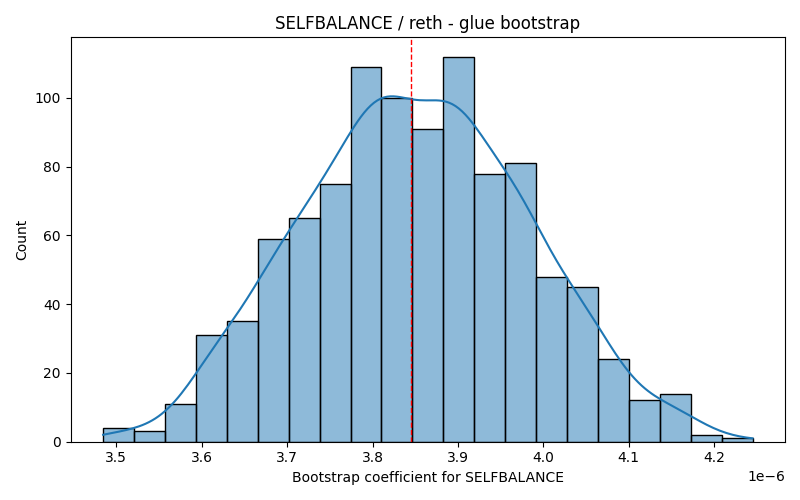

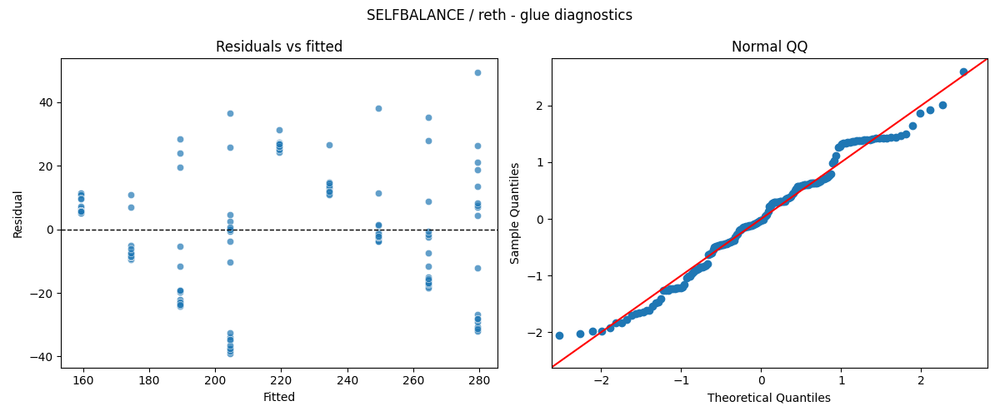

</details>

<details><summary><code>SUB</code> · nobs=209 · runtime_ms=9.316e-07 · p=1.00e-03 · R²=0.4975</summary>

```
==============================================================================
                           NNLS Regression Results                            
==============================================================================
Dep. Variable:          test_runtime_ms              R-squared:          0.497
Model:                  NNLS                    Adj. R-squared:          0.495
No. Observations:       209                               RMSE:           9.86
Df Residuals:           207                                MAE:           4.82
Df Model:               1      
==============================================================================
                      coef     std err     P-value      [0.025      0.975]
------------------------------------------------------------------------------
         const     10.1657      2.1678       0.001      6.2715     14.6056
           SUB      0.0000      0.0000       0.001      0.0000      0.0000
==============================================================================
Notes: Non-negative least squares with bootstrap inference (1000 iterations)
==============================================================================
```

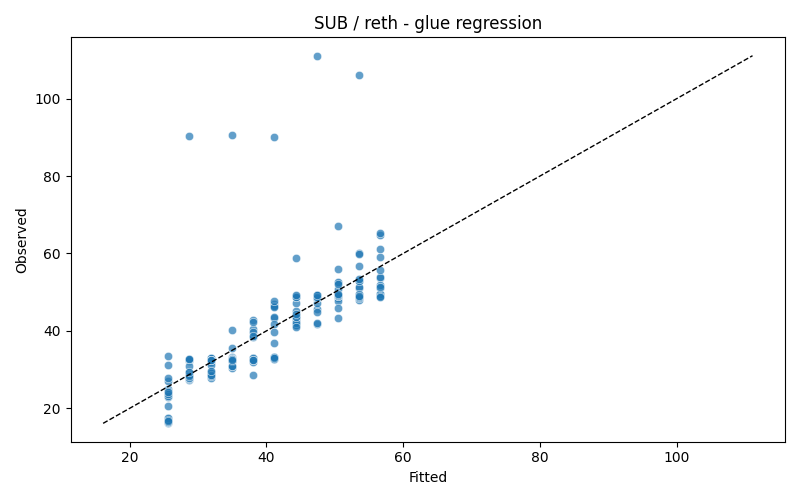

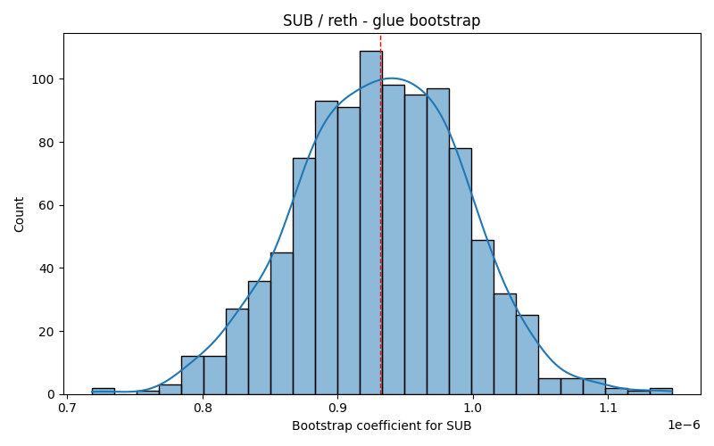

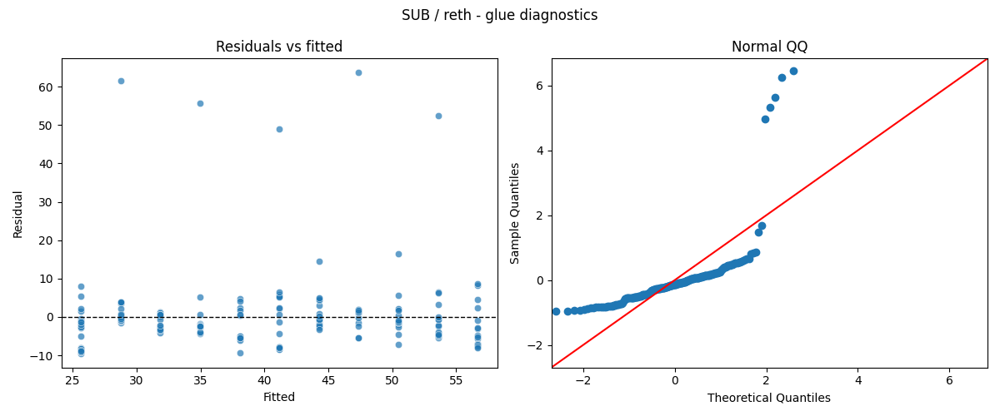

</details>

### Mixed glue (tier B) · reth

<details><summary><code>JUMP</code> · nobs=209 · runtime_ms=2.089e-06 · p=1.00e-03 · R²=0.8154</summary>

```
==============================================================================
                           NNLS Regression Results                            
==============================================================================
Dep. Variable:          test_runtime_ms              R-squared:          0.815
Model:                  NNLS                    Adj. R-squared:          0.815
No. Observations:       209                               RMSE:           3.69
Df Residuals:           207                                MAE:           2.95
Df Model:               1      
==============================================================================
                      coef     std err     P-value      [0.025      0.975]
------------------------------------------------------------------------------
         const      9.1922      0.8457       0.001      7.5525     10.8837
          JUMP      0.0000      0.0000       0.001      0.0000      0.0000
==============================================================================
Notes: Non-negative least squares with bootstrap inference (1000 iterations)
==============================================================================
```

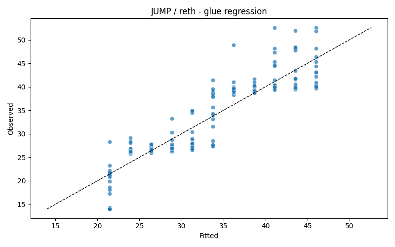

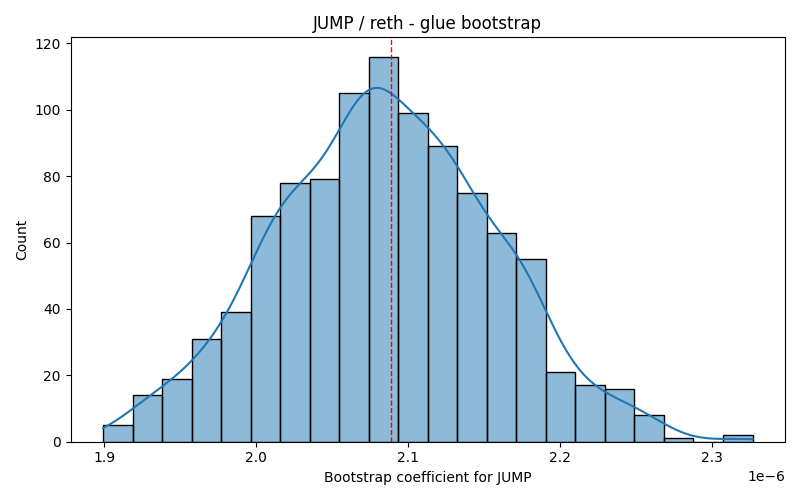

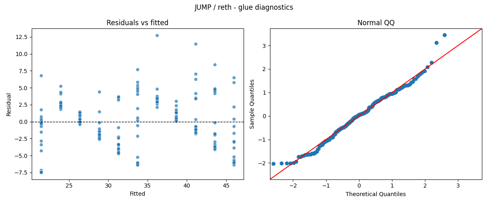

</details>

<details><summary><code>KECCAK256</code> · nobs=3344 · runtime_ms=0 · p=1.00e+00 · R²=0</summary>

```
==============================================================================
                           NNLS Regression Results                            
==============================================================================
Dep. Variable:          test_runtime_ms              R-squared:          0.000
Model:                  NNLS                    Adj. R-squared:         -0.000
No. Observations:       3344                              RMSE:         159.45
Df Residuals:           3342                               MAE:         134.97
Df Model:               1      
==============================================================================
                      coef     std err     P-value      [0.025      0.975]
------------------------------------------------------------------------------
         const    250.0329      2.6918       0.001    244.9383    255.3322
     KECCAK256      0.0000      0.0000       1.000      0.0000      0.0000
==============================================================================
Notes: Non-negative least squares with bootstrap inference (1000 iterations)
==============================================================================
```

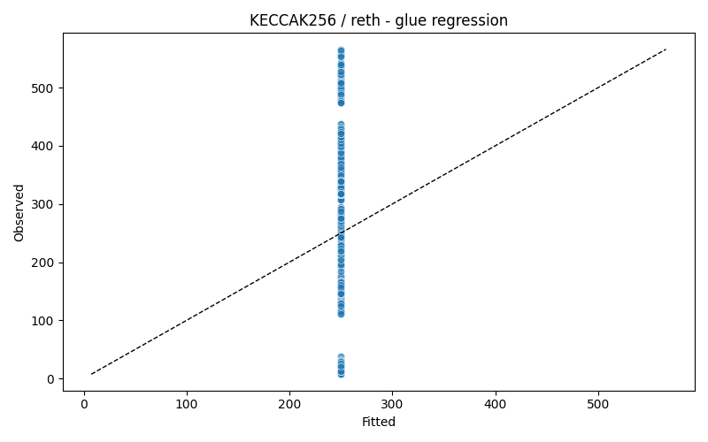


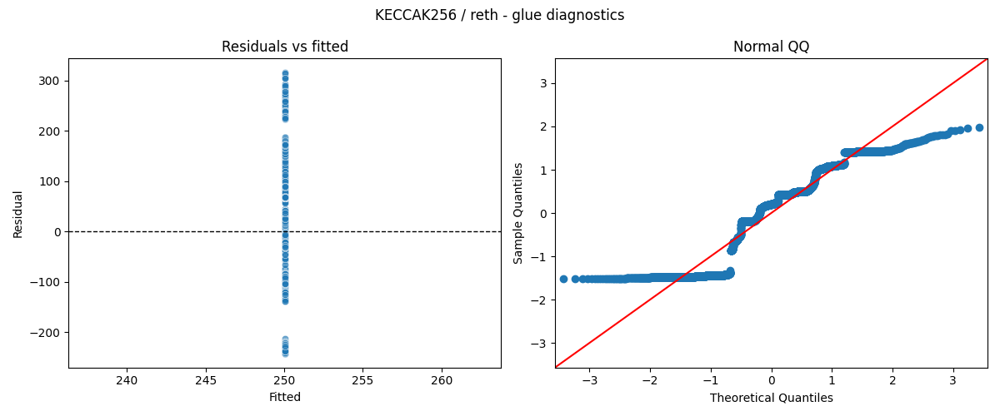

</details>
