# Runtime estimation report

Per-spec NNLS fits of `test_runtime_ms` against `opcount`, one row per (target opcode, test, model_by combo, client).

## Contents

- [SLOAD](#sload)
- [SSTORE](#sstore)
- [BALANCE](#balance)
- [CALL](#call)
- [CALLCODE](#callcode)
- [DELEGATECALL](#delegatecall)
- [EXTCODECOPY](#extcodecopy)
- [EXTCODEHASH](#extcodehash)
- [EXTCODESIZE](#extcodesize)
- [STATICCALL](#staticcall)

## SLOAD

### test_sload_bloated — combo `False`

| client | nobs | R² | target_coef (ms) | p-value | 95% CI |
| --- | --- | --- | --- | --- | --- |
| `besu` | 198 | 0.8256 | 0.009033 | 1.00e-03 | [0.008438, 0.009649] |
| `erigon` | 121 | 0.9837 | 0.006016 | 1.00e-03 | [0.005923, 0.006065] |
| `geth` | 231 | 0.9847 | 0.02487 | 1.00e-03 | [0.02442, 0.02529] |
| `nethermind` | 220 | 0.9049 | 0.003218 | 1.00e-03 | [0.003104, 0.003328] |
| `reth` | 220 | 0.9758 | 0.001265 | 1.00e-03 | [0.001241, 0.001293] |

<details><summary>besu — NNLS regression summary</summary>

```
==============================================================================
                           NNLS Regression Results                            
==============================================================================
Dep. Variable:          test_runtime_ms              R-squared:          0.826
Model:                  NNLS                    Adj. R-squared:          0.825
No. Observations:       198                               RMSE:         122.20
Df Residuals:           196                                MAE:         108.19
Df Model:               1      
==============================================================================
                      coef     std err     P-value      [0.025      0.975]
------------------------------------------------------------------------------
         const    164.8072     26.3279       0.001    114.0323    212.6929
       opcount      0.0090      0.0003       0.001      0.0084      0.0096
==============================================================================
Notes: Non-negative least squares with bootstrap inference (1000 iterations)
==============================================================================
```

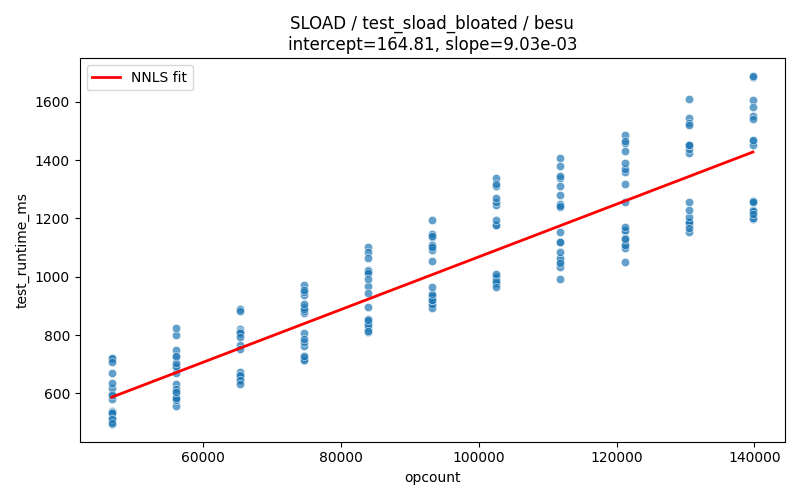

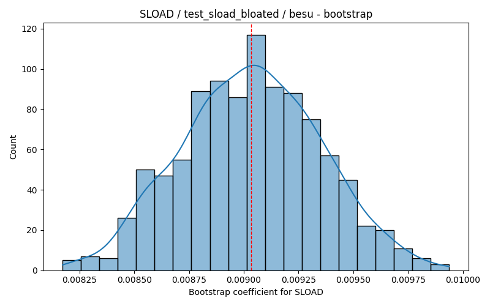

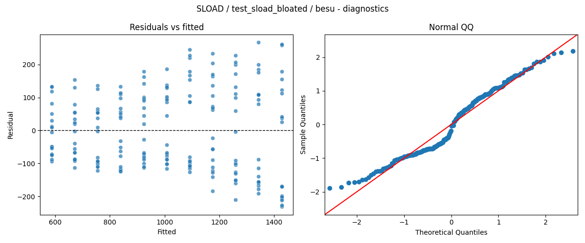

</details>

<details><summary>erigon — NNLS regression summary</summary>

```
==============================================================================
                           NNLS Regression Results                            
==============================================================================
Dep. Variable:          test_runtime_ms              R-squared:          0.984
Model:                  NNLS                    Adj. R-squared:          0.984
No. Observations:       121                               RMSE:          23.02
Df Residuals:           119                                MAE:          20.88
Df Model:               1      
==============================================================================
                      coef     std err     P-value      [0.025      0.975]
------------------------------------------------------------------------------
         const      0.0000      1.7696       1.000      0.0000      6.3206
       opcount      0.0060      0.0000       0.001      0.0059      0.0061
==============================================================================
Notes: Non-negative least squares with bootstrap inference (1000 iterations)
==============================================================================
```

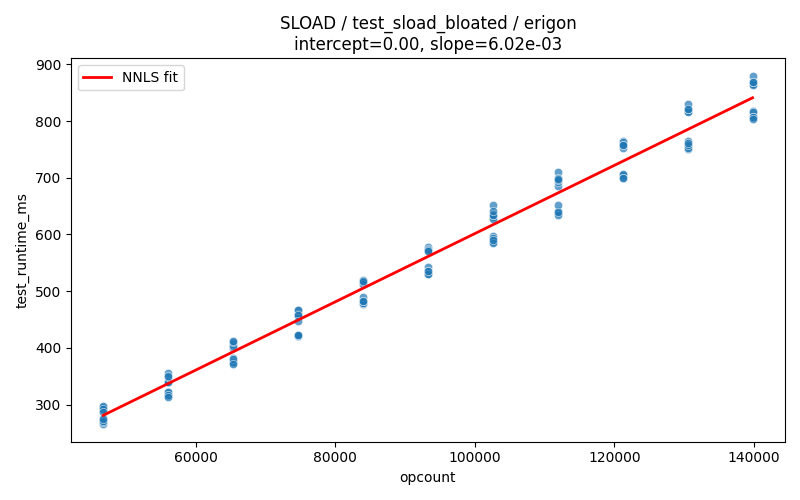

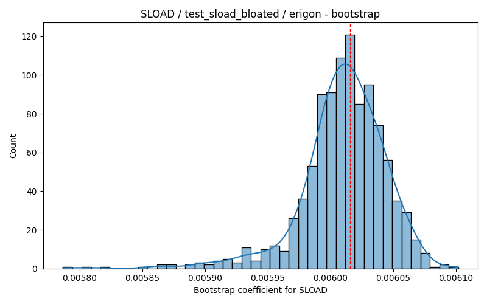

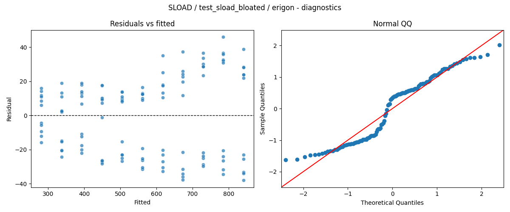

</details>

<details><summary>geth — NNLS regression summary</summary>

```
==============================================================================
                           NNLS Regression Results                            
==============================================================================
Dep. Variable:          test_runtime_ms              R-squared:          0.985
Model:                  NNLS                    Adj. R-squared:          0.985
No. Observations:       231                               RMSE:          91.20
Df Residuals:           229                                MAE:          82.51
Df Model:               1      
==============================================================================
                      coef     std err     P-value      [0.025      0.975]
------------------------------------------------------------------------------
         const    610.0262     19.7243       0.001    571.5874    650.1180
       opcount      0.0249      0.0002       0.001      0.0244      0.0253
==============================================================================
Notes: Non-negative least squares with bootstrap inference (1000 iterations)
==============================================================================
```

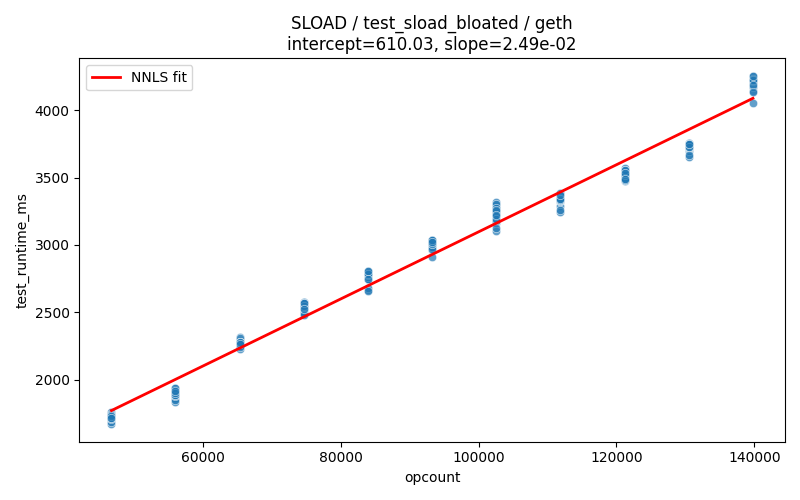

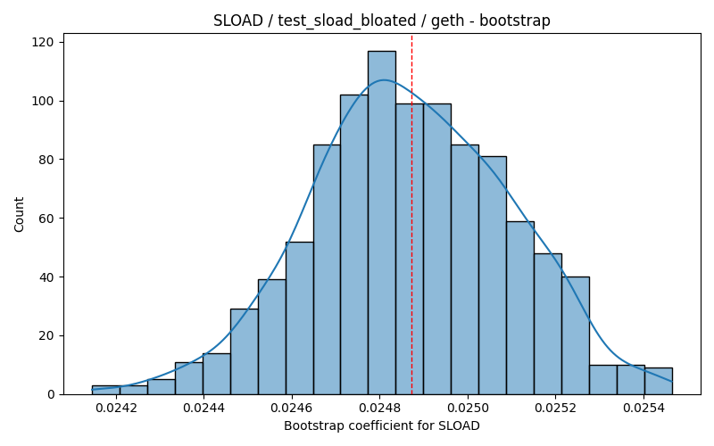

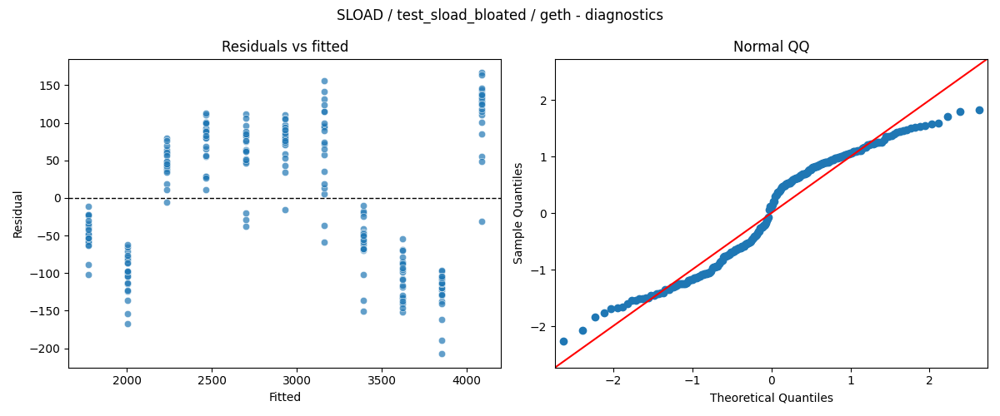

</details>

<details><summary>nethermind — NNLS regression summary</summary>

```
==============================================================================
                           NNLS Regression Results                            
==============================================================================
Dep. Variable:          test_runtime_ms              R-squared:          0.905
Model:                  NNLS                    Adj. R-squared:          0.904
No. Observations:       220                               RMSE:          30.71
Df Residuals:           218                                MAE:          21.81
Df Model:               1      
==============================================================================
                      coef     std err     P-value      [0.025      0.975]
------------------------------------------------------------------------------
         const     83.9638      5.9886       0.001     73.0501     95.9463
       opcount      0.0032      0.0001       0.001      0.0031      0.0033
==============================================================================
Notes: Non-negative least squares with bootstrap inference (1000 iterations)
==============================================================================
```

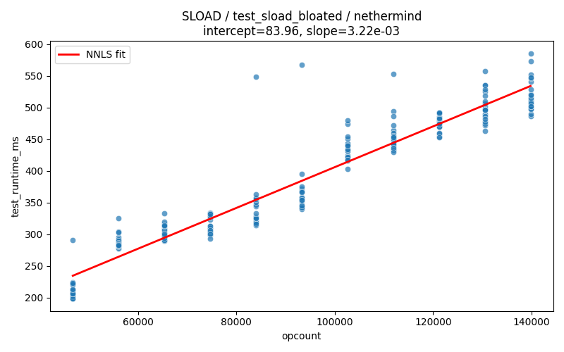

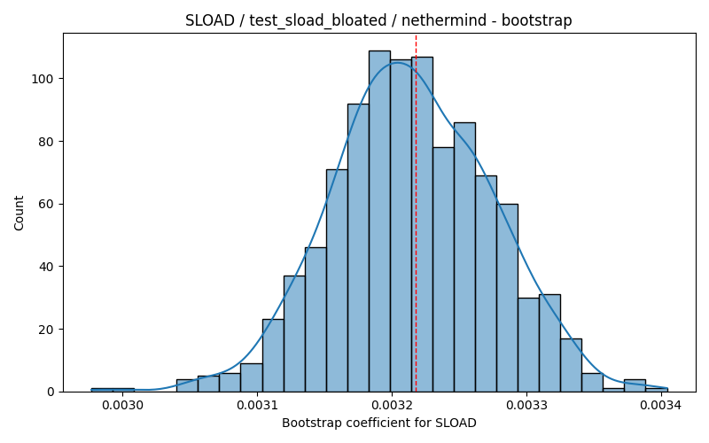

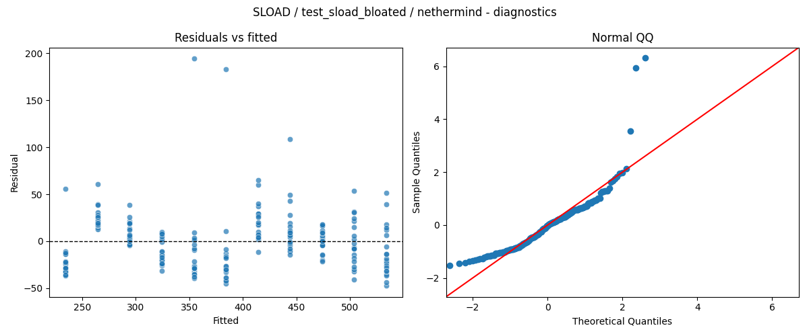

</details>

<details><summary>reth — NNLS regression summary</summary>

```
==============================================================================
                           NNLS Regression Results                            
==============================================================================
Dep. Variable:          test_runtime_ms              R-squared:          0.976
Model:                  NNLS                    Adj. R-squared:          0.976
No. Observations:       220                               RMSE:           5.87
Df Residuals:           218                                MAE:           4.58
Df Model:               1      
==============================================================================
                      coef     std err     P-value      [0.025      0.975]
------------------------------------------------------------------------------
         const     39.0280      1.2172       0.001     36.5987     41.4459
       opcount      0.0013      0.0000       0.001      0.0012      0.0013
==============================================================================
Notes: Non-negative least squares with bootstrap inference (1000 iterations)
==============================================================================
```

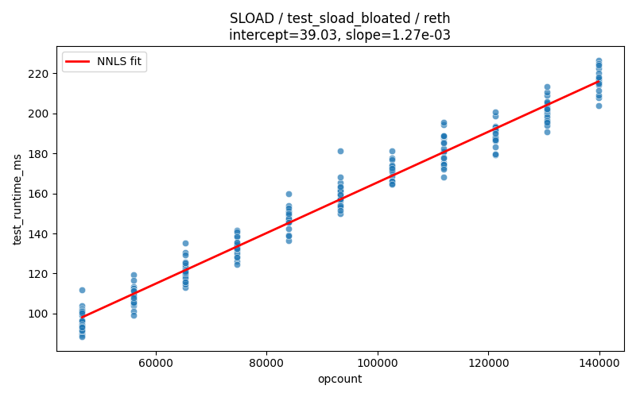

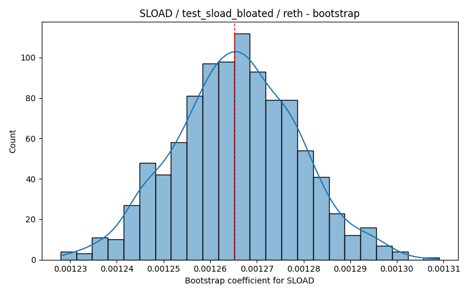

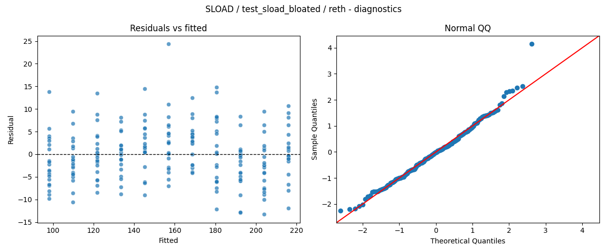

</details>

### test_sload_bloated — combo `True`

| client | nobs | R² | target_coef (ms) | p-value | 95% CI |
| --- | --- | --- | --- | --- | --- |
| `besu` | 198 | 0.9691 | 0.01619 | 1.00e-03 | [0.01573, 0.01666] |
| `erigon` | 121 | 0.9804 | 0.005382 | 1.00e-03 | [0.005287, 0.005429] |
| `geth` | 231 | 0.9841 | 0.02432 | 1.00e-03 | [0.0239, 0.02474] |
| `nethermind` | 220 | 0.7903 | 0.01691 | 1.00e-03 | [0.01561, 0.01818] |
| `reth` | 220 | 0.9842 | 0.00151 | 1.00e-03 | [0.001482, 0.001539] |

<details><summary>besu — NNLS regression summary</summary>

```
==============================================================================
                           NNLS Regression Results                            
==============================================================================
Dep. Variable:          test_runtime_ms              R-squared:          0.969
Model:                  NNLS                    Adj. R-squared:          0.969
No. Observations:       198                               RMSE:          85.12
Df Residuals:           196                                MAE:          66.57
Df Model:               1      
==============================================================================
                      coef     std err     P-value      [0.025      0.975]
------------------------------------------------------------------------------
         const    445.2003     19.8478       0.001    404.3953    483.6632
       opcount      0.0162      0.0002       0.001      0.0157      0.0167
==============================================================================
Notes: Non-negative least squares with bootstrap inference (1000 iterations)
==============================================================================
```

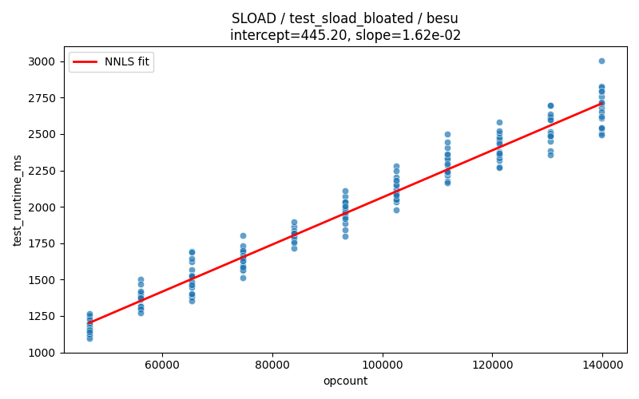

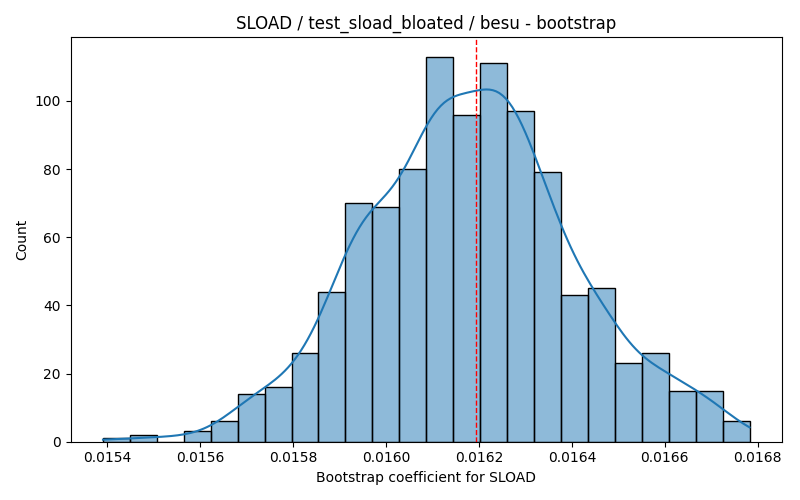

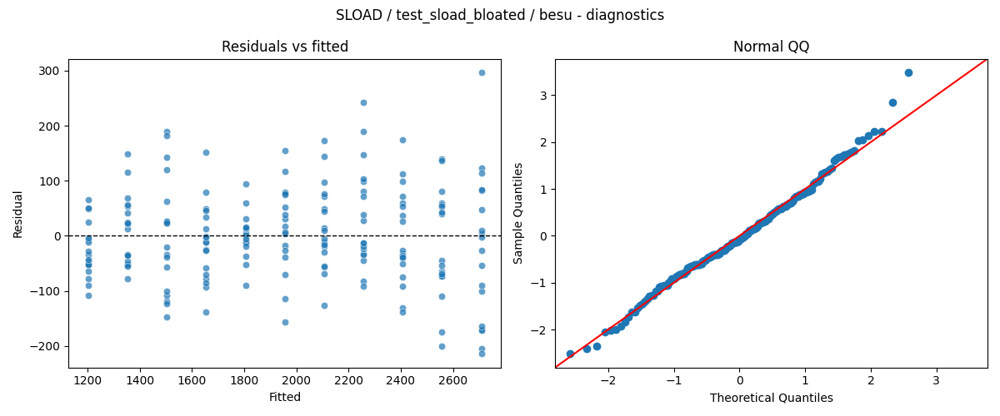

</details>

<details><summary>erigon — NNLS regression summary</summary>

```
==============================================================================
                           NNLS Regression Results                            
==============================================================================
Dep. Variable:          test_runtime_ms              R-squared:          0.980
Model:                  NNLS                    Adj. R-squared:          0.980
No. Observations:       121                               RMSE:          22.64
Df Residuals:           119                                MAE:          19.17
Df Model:               1      
==============================================================================
                      coef     std err     P-value      [0.025      0.975]
------------------------------------------------------------------------------
         const      0.0000      1.5971       1.000      0.0000      5.6336
       opcount      0.0054      0.0000       0.001      0.0053      0.0054
==============================================================================
Notes: Non-negative least squares with bootstrap inference (1000 iterations)
==============================================================================
```

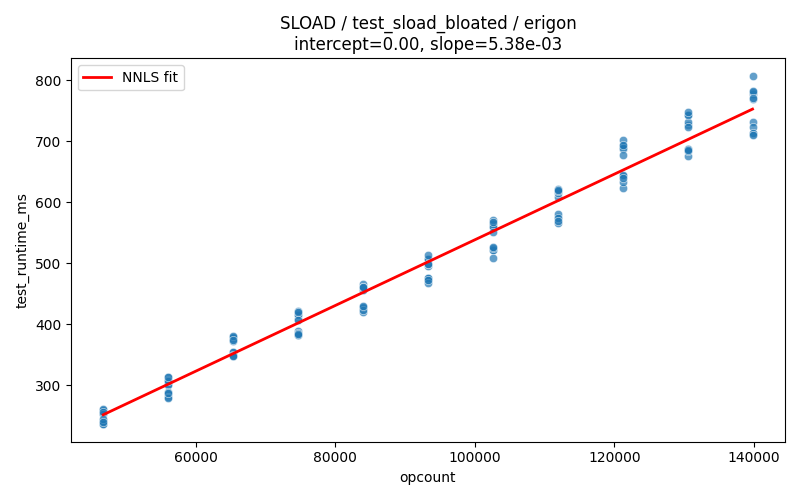

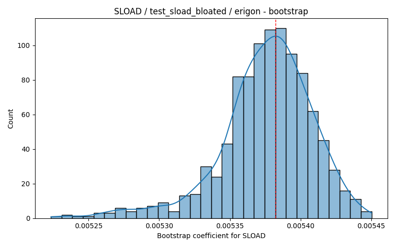

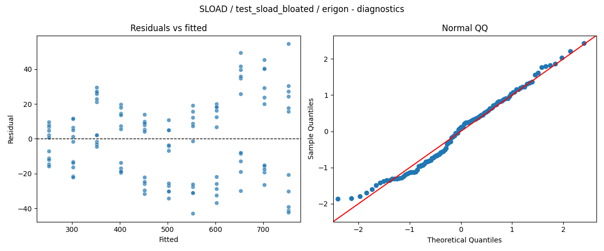

</details>

<details><summary>geth — NNLS regression summary</summary>

```
==============================================================================
                           NNLS Regression Results                            
==============================================================================
Dep. Variable:          test_runtime_ms              R-squared:          0.984
Model:                  NNLS                    Adj. R-squared:          0.984
No. Observations:       231                               RMSE:          91.11
Df Residuals:           229                                MAE:          81.52
Df Model:               1      
==============================================================================
                      coef     std err     P-value      [0.025      0.975]
------------------------------------------------------------------------------
         const    592.2114     18.5880       0.001    557.4733    630.2600
       opcount      0.0243      0.0002       0.001      0.0239      0.0247
==============================================================================
Notes: Non-negative least squares with bootstrap inference (1000 iterations)
==============================================================================
```

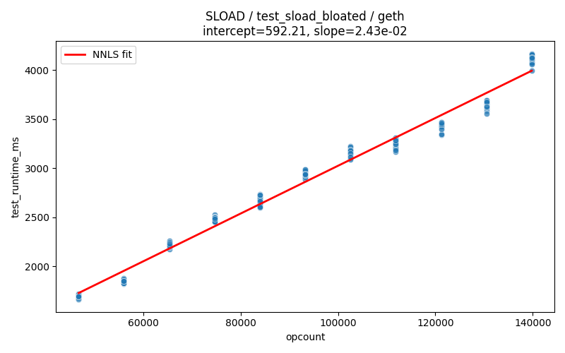

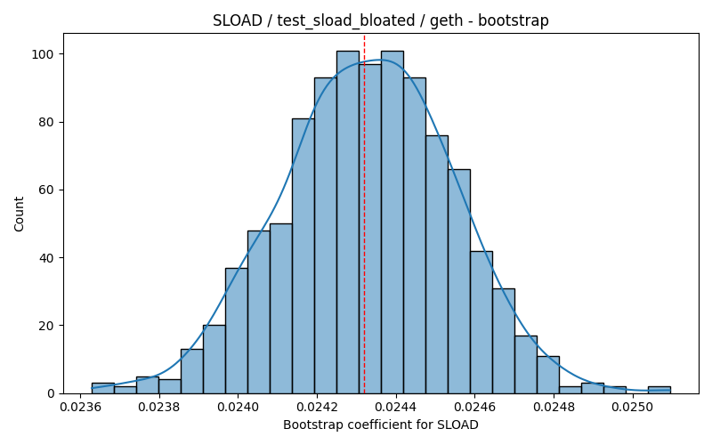

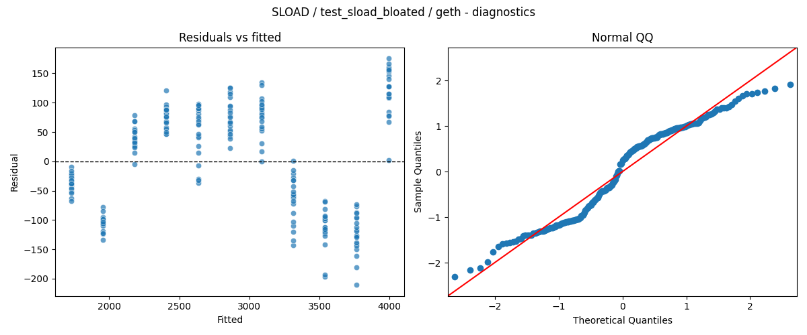

</details>

<details><summary>nethermind — NNLS regression summary</summary>

```
==============================================================================
                           NNLS Regression Results                            
==============================================================================
Dep. Variable:          test_runtime_ms              R-squared:          0.790
Model:                  NNLS                    Adj. R-squared:          0.789
No. Observations:       220                               RMSE:         256.40
Df Residuals:           218                                MAE:         218.70
Df Model:               1      
==============================================================================
                      coef     std err     P-value      [0.025      0.975]
------------------------------------------------------------------------------
         const    689.7830     68.3480       0.001    557.4530    827.4621
       opcount      0.0169      0.0007       0.001      0.0156      0.0182
==============================================================================
Notes: Non-negative least squares with bootstrap inference (1000 iterations)
==============================================================================
```

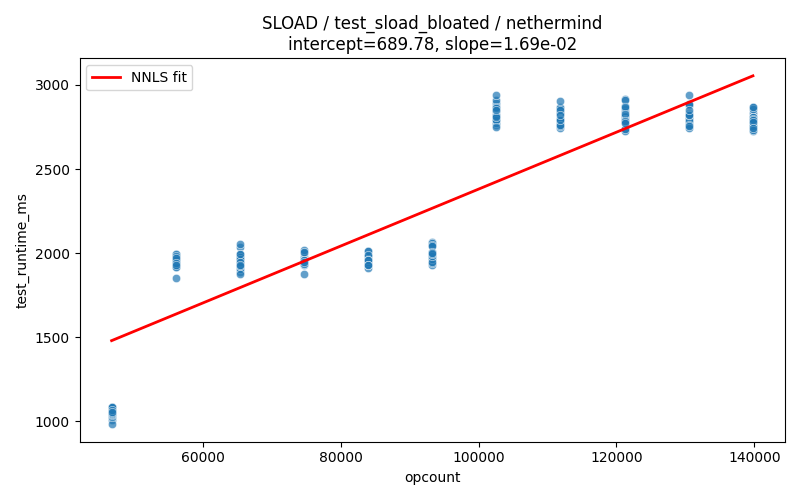

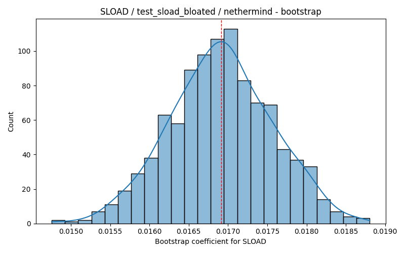

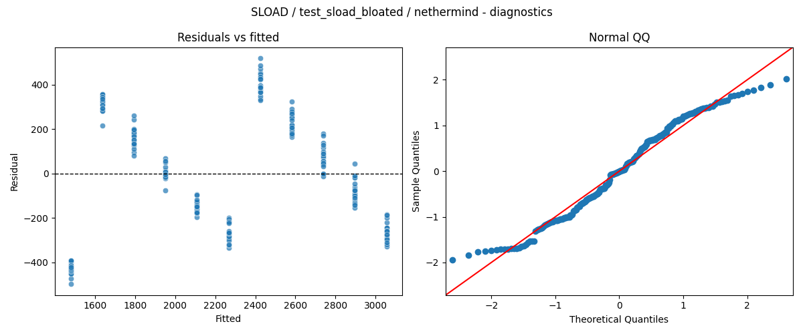

</details>

<details><summary>reth — NNLS regression summary</summary>

```
==============================================================================
                           NNLS Regression Results                            
==============================================================================
Dep. Variable:          test_runtime_ms              R-squared:          0.984
Model:                  NNLS                    Adj. R-squared:          0.984
No. Observations:       220                               RMSE:           5.63
Df Residuals:           218                                MAE:           4.63
Df Model:               1      
==============================================================================
                      coef     std err     P-value      [0.025      0.975]
------------------------------------------------------------------------------
         const     34.3365      1.4283       0.001     31.6142     37.2529
       opcount      0.0015      0.0000       0.001      0.0015      0.0015
==============================================================================
Notes: Non-negative least squares with bootstrap inference (1000 iterations)
==============================================================================
```

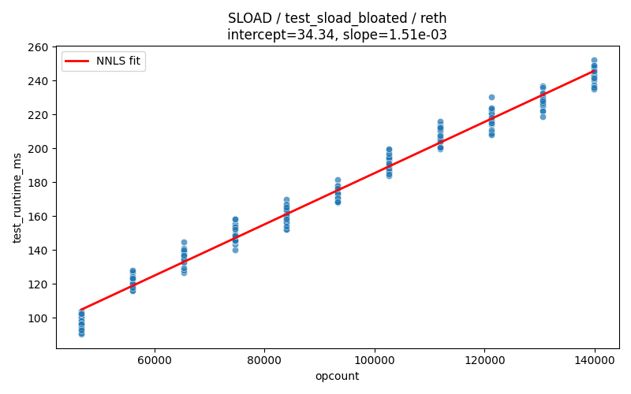

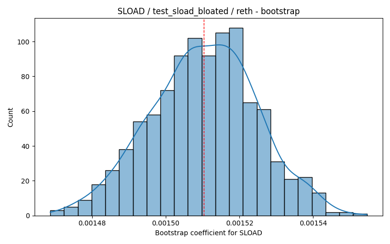

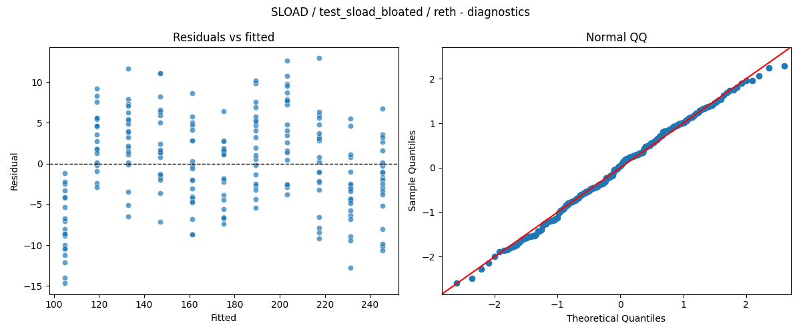

</details>

### test_storage_sload_same_key_benchmark

| client | nobs | R² | target_coef (ms) | p-value | 95% CI |
| --- | --- | --- | --- | --- | --- |
| `besu` | 396 | 0.2627 | 0.0001039 | 1.00e-03 | [8.875e-05, 0.0001203] |
| `erigon` | 242 | 0.947 | 3.68e-05 | 1.00e-03 | [3.568e-05, 3.801e-05] |
| `geth` | 462 | 0.8991 | 4.697e-05 | 1.00e-03 | [4.55e-05, 4.83e-05] |
| `nethermind` | 440 | 0.7918 | 0.000147 | 1.00e-03 | [0.0001404, 0.0001533] |
| `reth` | 440 | 0.6743 | 6.747e-06 | 1.00e-03 | [6.384e-06, 7.145e-06] |

<details><summary>besu — NNLS regression summary</summary>

```
==============================================================================
                           NNLS Regression Results                            
==============================================================================
Dep. Variable:          test_runtime_ms              R-squared:          0.263
Model:                  NNLS                    Adj. R-squared:          0.261
No. Observations:       396                               RMSE:         109.95
Df Residuals:           394                                MAE:          87.81
Df Model:               1      
==============================================================================
                      coef     std err     P-value      [0.025      0.975]
------------------------------------------------------------------------------
         const    200.0821     16.8354       0.001    165.1293    232.0874
       opcount      0.0001      0.0000       0.001      0.0001      0.0001
==============================================================================
Notes: Non-negative least squares with bootstrap inference (1000 iterations)
==============================================================================
```

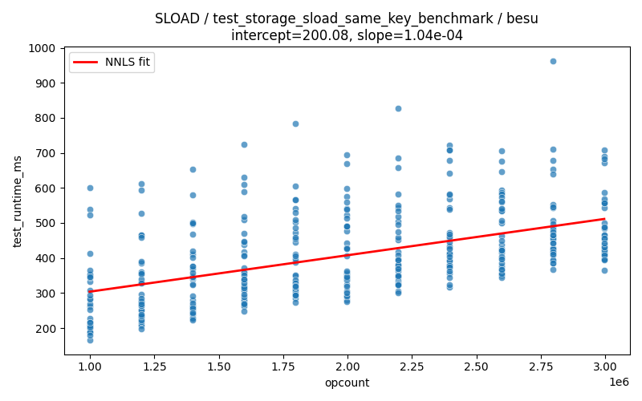

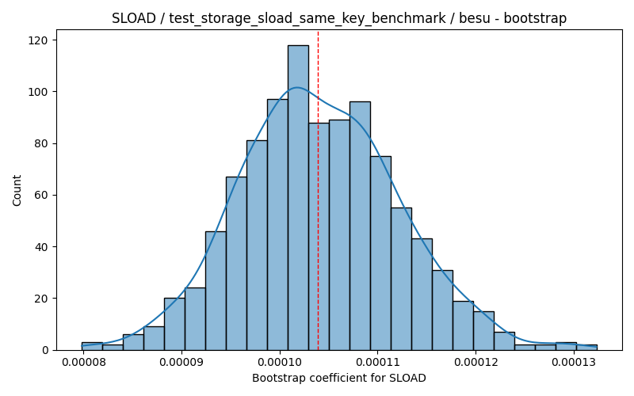

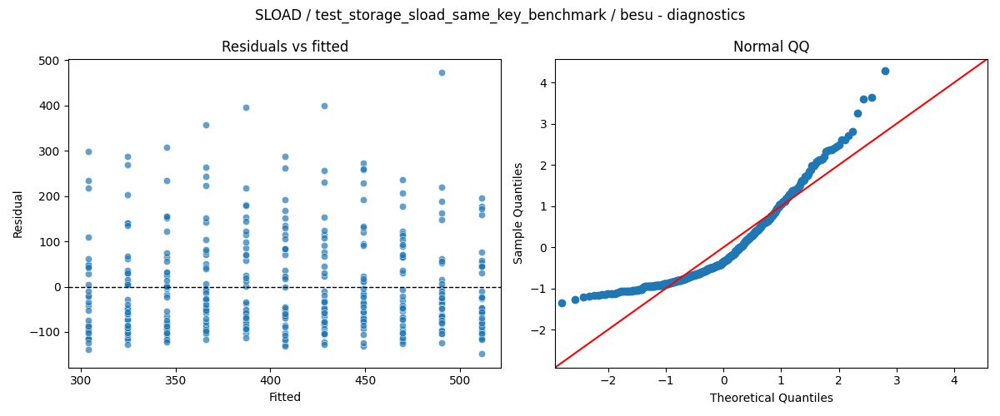

</details>

<details><summary>erigon — NNLS regression summary</summary>

```
==============================================================================
                           NNLS Regression Results                            
==============================================================================
Dep. Variable:          test_runtime_ms              R-squared:          0.947
Model:                  NNLS                    Adj. R-squared:          0.947
No. Observations:       242                               RMSE:           5.50
Df Residuals:           240                                MAE:           4.14
Df Model:               1      
==============================================================================
                      coef     std err     P-value      [0.025      0.975]
------------------------------------------------------------------------------
         const     24.7524      1.1676       0.001     22.5008     27.0553
       opcount      0.0000      0.0000       0.001      0.0000      0.0000
==============================================================================
Notes: Non-negative least squares with bootstrap inference (1000 iterations)
==============================================================================
```

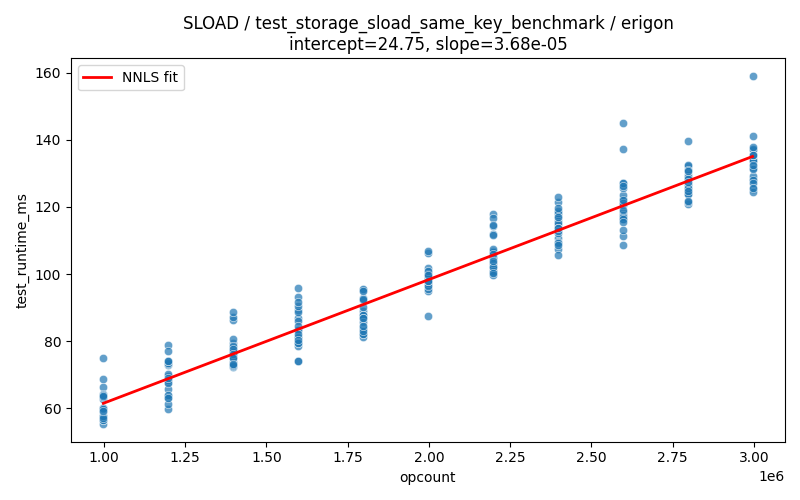

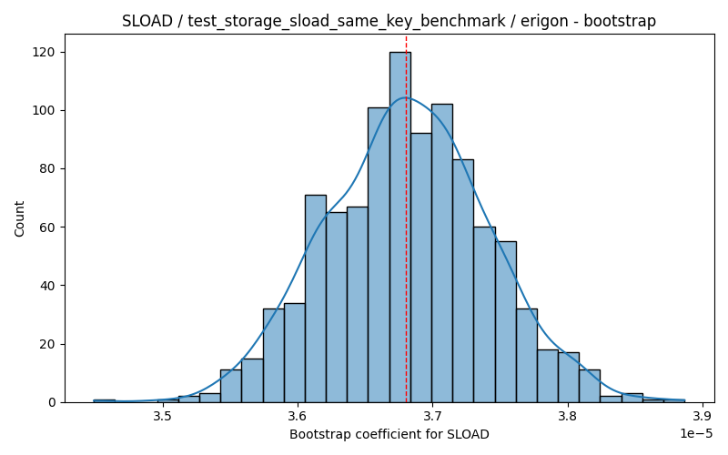

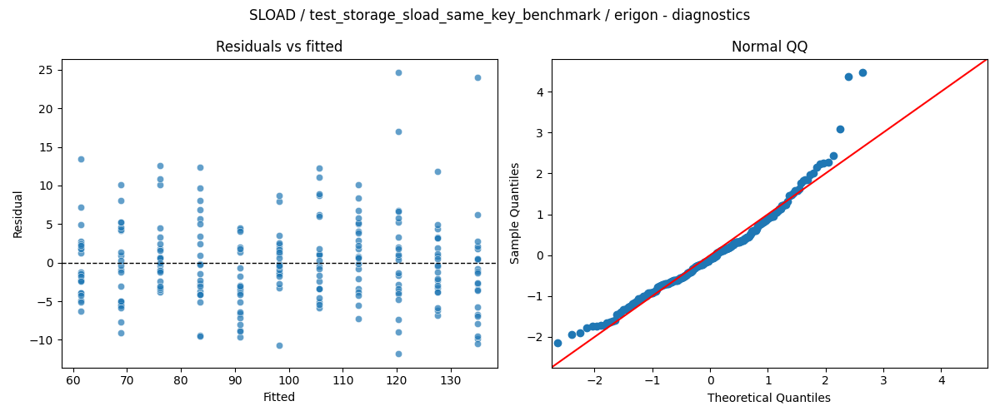

</details>

<details><summary>geth — NNLS regression summary</summary>

```
==============================================================================
                           NNLS Regression Results                            
==============================================================================
Dep. Variable:          test_runtime_ms              R-squared:          0.899
Model:                  NNLS                    Adj. R-squared:          0.899
No. Observations:       462                               RMSE:           9.94
Df Residuals:           460                                MAE:           7.88
Df Model:               1      
==============================================================================
                      coef     std err     P-value      [0.025      0.975]
------------------------------------------------------------------------------
         const     23.9372      1.3575       0.001     21.4481     26.6075
       opcount      0.0000      0.0000       0.001      0.0000      0.0000
==============================================================================
Notes: Non-negative least squares with bootstrap inference (1000 iterations)
==============================================================================
```

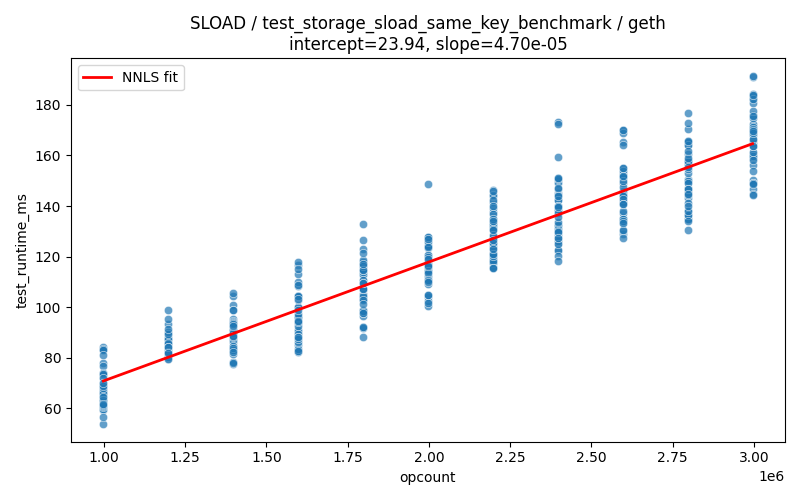

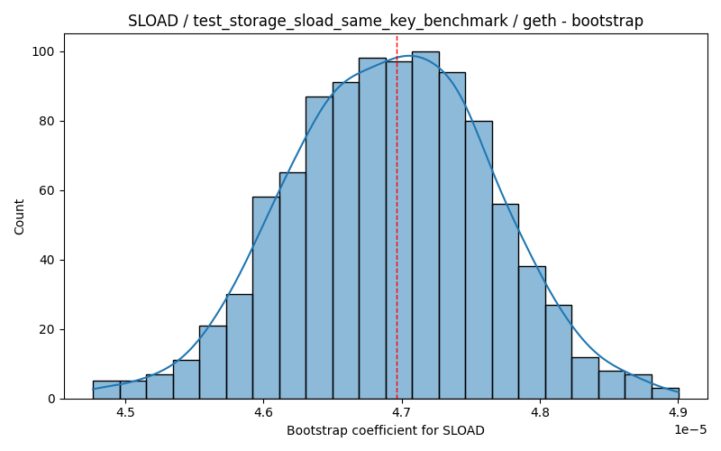

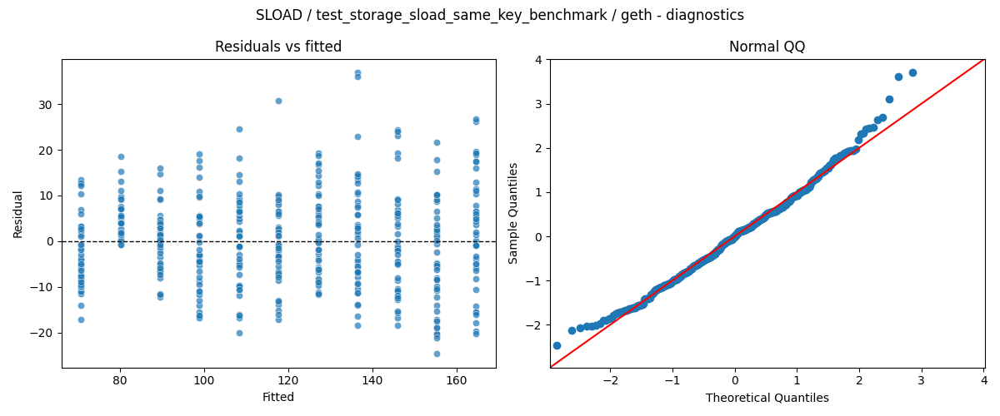

</details>

<details><summary>nethermind — NNLS regression summary</summary>

```
==============================================================================
                           NNLS Regression Results                            
==============================================================================
Dep. Variable:          test_runtime_ms              R-squared:          0.792
Model:                  NNLS                    Adj. R-squared:          0.791
No. Observations:       440                               RMSE:          47.61
Df Residuals:           438                                MAE:          37.93
Df Model:               1      
==============================================================================
                      coef     std err     P-value      [0.025      0.975]
------------------------------------------------------------------------------
         const    101.0593      6.4374       0.001     89.2227    113.8675
       opcount      0.0001      0.0000       0.001      0.0001      0.0002
==============================================================================
Notes: Non-negative least squares with bootstrap inference (1000 iterations)
==============================================================================
```

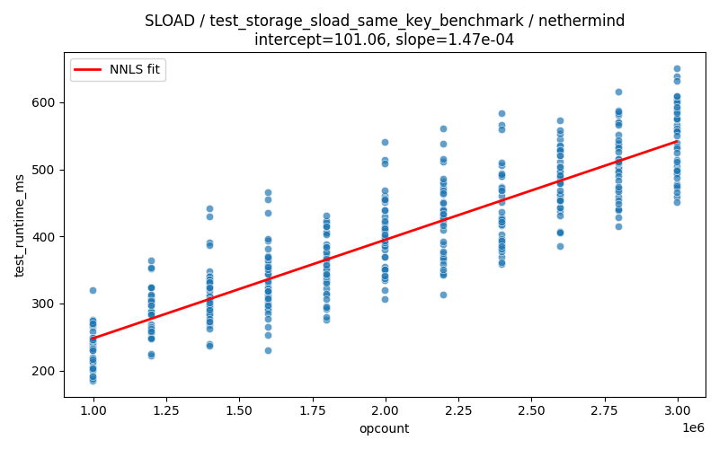

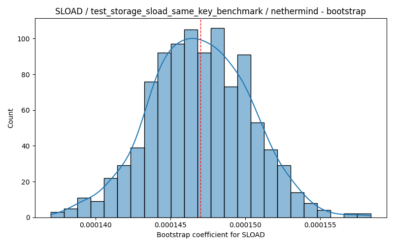

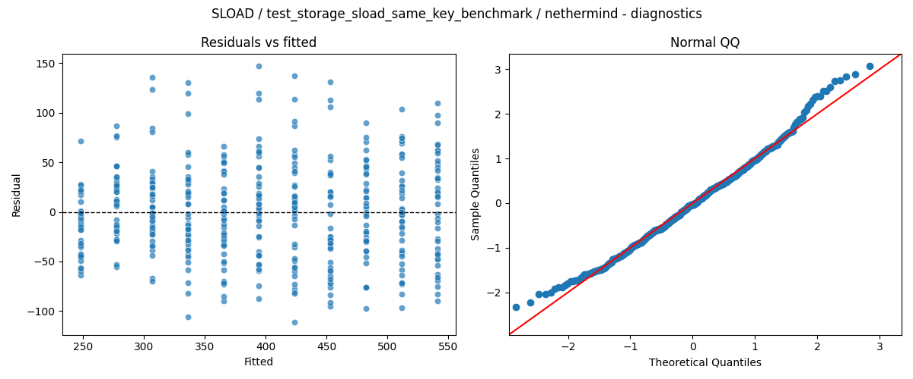

</details>

<details><summary>reth — NNLS regression summary</summary>

```
==============================================================================
                           NNLS Regression Results                            
==============================================================================
Dep. Variable:          test_runtime_ms              R-squared:          0.674
Model:                  NNLS                    Adj. R-squared:          0.674
No. Observations:       440                               RMSE:           2.96
Df Residuals:           438                                MAE:           1.90
Df Model:               1      
==============================================================================
                      coef     std err     P-value      [0.025      0.975]
------------------------------------------------------------------------------
         const      5.5063      0.3610       0.001      4.8164      6.2176
       opcount      0.0000      0.0000       0.001      0.0000      0.0000
==============================================================================
Notes: Non-negative least squares with bootstrap inference (1000 iterations)
==============================================================================
```

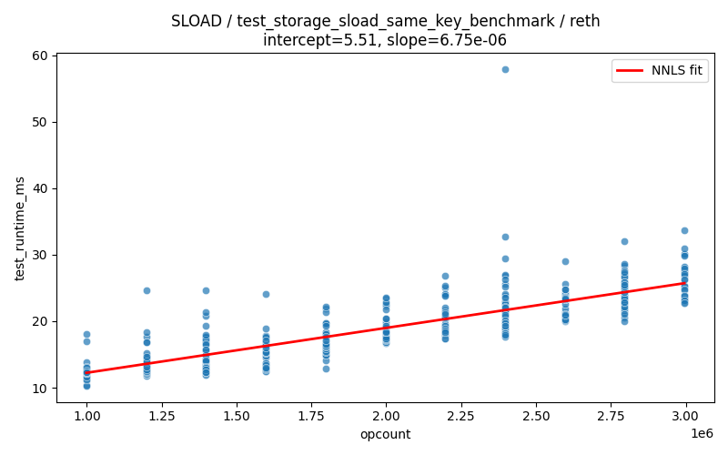

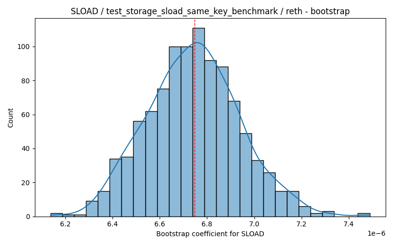

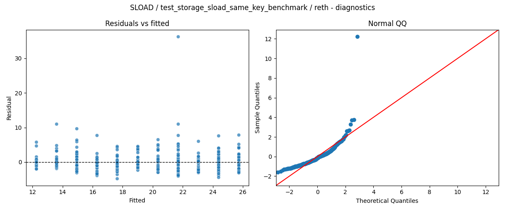

</details>

## SSTORE

### test_sstore_bloated — combo `False`

| client | nobs | R² | target_coef (ms) | p-value | 95% CI |
| --- | --- | --- | --- | --- | --- |
| `besu` | 396 | 0.9358 | 0.01006 | 1.00e-03 | [0.009655, 0.01046] |
| `erigon` | 242 | 0.9887 | 0.005698 | 1.00e-03 | [0.00559, 0.005806] |
| `geth` | 462 | 0.9936 | 0.02734 | 1.00e-03 | [0.02713, 0.02759] |
| `nethermind` | 440 | 0.9608 | 0.00312 | 1.00e-03 | [0.003049, 0.003194] |
| `reth` | 440 | 0.9981 | 0.001223 | 1.00e-03 | [0.001202, 0.001242] |

<details><summary>besu — NNLS regression summary</summary>

```
==============================================================================
                           NNLS Regression Results                            
==============================================================================
Dep. Variable:          test_runtime_ms              R-squared:          0.936
Model:                  NNLS                    Adj. R-squared:          0.935
No. Observations:       396                               RMSE:          97.63
Df Residuals:           393                                MAE:          66.69
Df Model:               2      
==============================================================================
                      coef     std err     P-value      [0.025      0.975]
------------------------------------------------------------------------------
         const    523.1631     16.4105       0.001    490.8857    555.3551
       opcount      0.0101      0.0002       0.001      0.0097      0.0105
        update      0.1365      0.0075       0.001      0.1214      0.1508
==============================================================================
Notes: Non-negative least squares with bootstrap inference (1000 iterations)
==============================================================================
```

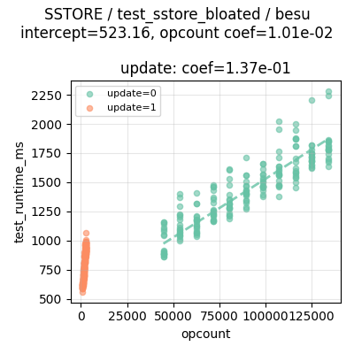

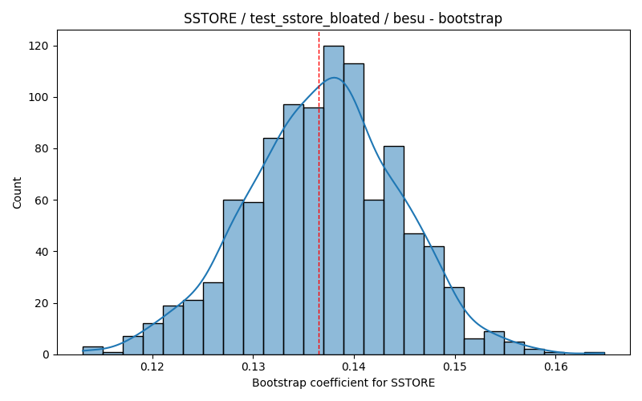

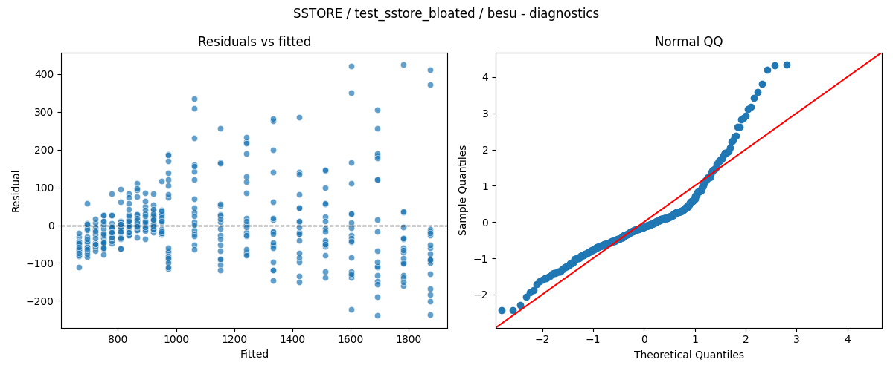

</details>

<details><summary>erigon — NNLS regression summary</summary>

```
==============================================================================
                           NNLS Regression Results                            
==============================================================================
Dep. Variable:          test_runtime_ms              R-squared:          0.989
Model:                  NNLS                    Adj. R-squared:          0.989
No. Observations:       242                               RMSE:          18.43
Df Residuals:           239                                MAE:          14.54
Df Model:               2      
==============================================================================
                      coef     std err     P-value      [0.025      0.975]
------------------------------------------------------------------------------
         const     26.6529      3.8328       0.001     19.1296     34.1702
       opcount      0.0057      0.0001       0.001      0.0056      0.0058
        update      0.1395      0.0018       0.001      0.1361      0.1430
==============================================================================
Notes: Non-negative least squares with bootstrap inference (1000 iterations)
==============================================================================
```

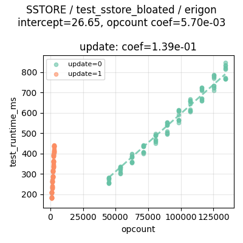

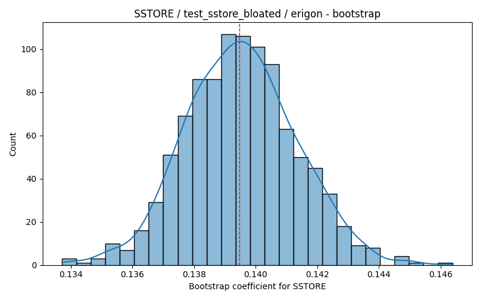

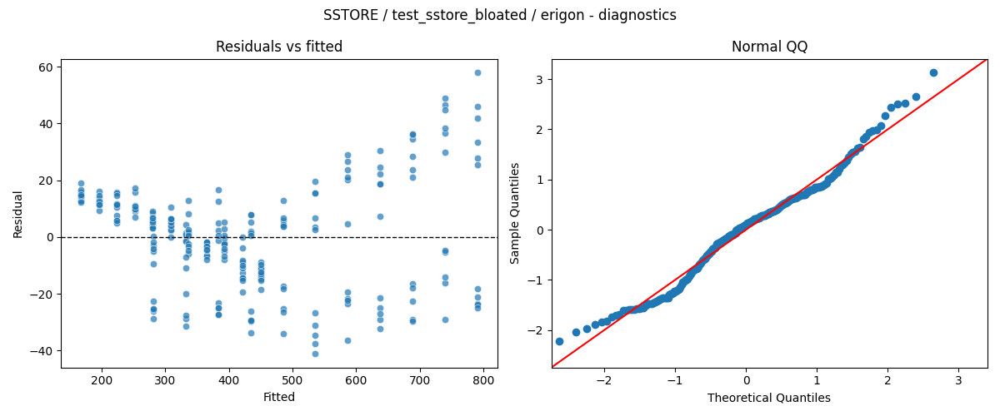

</details>

<details><summary>geth — NNLS regression summary</summary>

```
==============================================================================
                           NNLS Regression Results                            
==============================================================================
Dep. Variable:          test_runtime_ms              R-squared:          0.994
Model:                  NNLS                    Adj. R-squared:          0.994
No. Observations:       462                               RMSE:         105.07
Df Residuals:           459                                MAE:          87.10
Df Model:               2      
==============================================================================
                      coef     std err     P-value      [0.025      0.975]
------------------------------------------------------------------------------
         const    322.5574      6.1174       0.001    308.6172    333.0131
       opcount      0.0273      0.0001       0.001      0.0271      0.0276
        update      0.0000      0.0009       1.000      0.0000      0.0028
==============================================================================
Notes: Non-negative least squares with bootstrap inference (1000 iterations)
==============================================================================
```

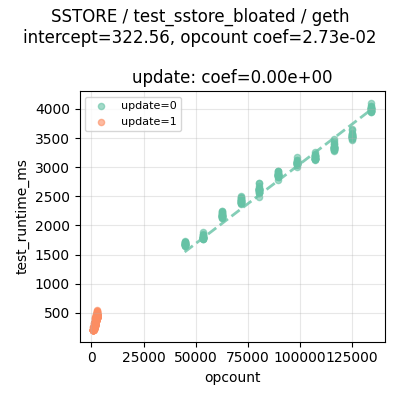

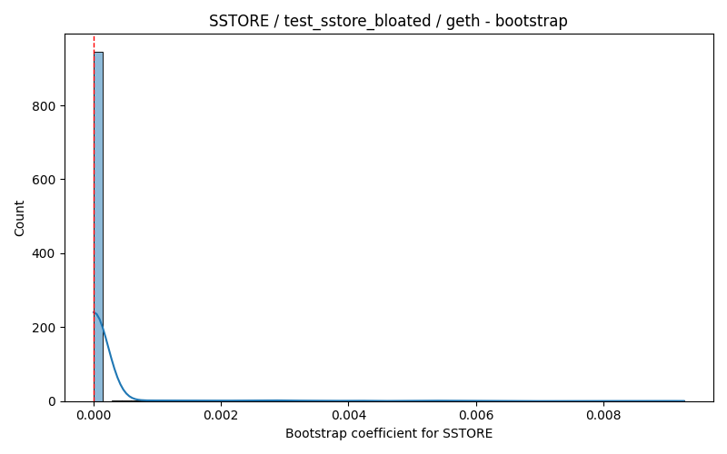

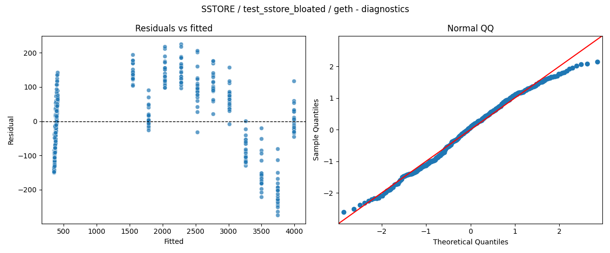

</details>

<details><summary>nethermind — NNLS regression summary</summary>

```
==============================================================================
                           NNLS Regression Results                            
==============================================================================
Dep. Variable:          test_runtime_ms              R-squared:          0.961
Model:                  NNLS                    Adj. R-squared:          0.961
No. Observations:       440                               RMSE:          22.10
Df Residuals:           437                                MAE:          17.41
Df Model:               2      
==============================================================================
                      coef     std err     P-value      [0.025      0.975]
------------------------------------------------------------------------------
         const     91.5969      3.2153       0.001     85.3957     98.0147
       opcount      0.0031      0.0000       0.001      0.0030      0.0032
        update      0.0510      0.0018       0.001      0.0475      0.0548
==============================================================================
Notes: Non-negative least squares with bootstrap inference (1000 iterations)
==============================================================================
```

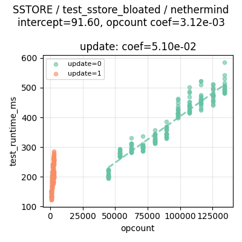

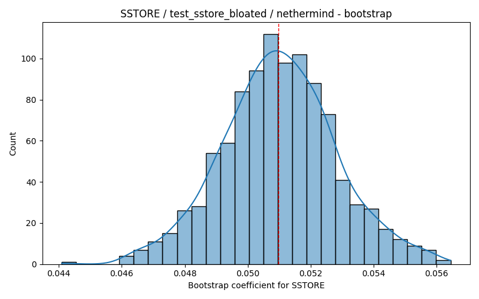

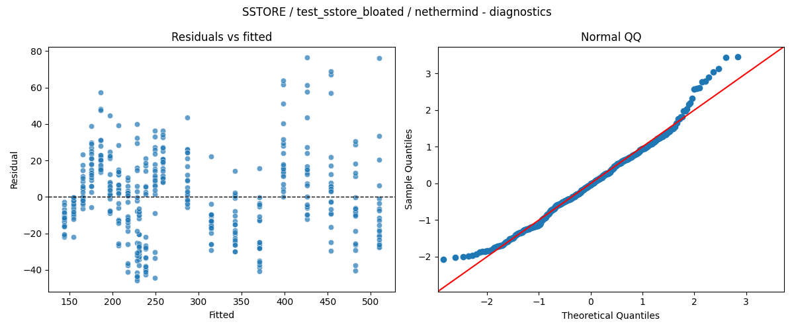

</details>

<details><summary>reth — NNLS regression summary</summary>

```
==============================================================================
                           NNLS Regression Results                            
==============================================================================
Dep. Variable:          test_runtime_ms              R-squared:          0.998
Model:                  NNLS                    Adj. R-squared:          0.998
No. Observations:       440                               RMSE:           5.28
Df Residuals:           437                                MAE:           4.05
Df Model:               2      
==============================================================================
                      coef     std err     P-value      [0.025      0.975]
------------------------------------------------------------------------------
         const     46.2331      0.8500       0.001     44.5224     47.8525
       opcount      0.0012      0.0000       0.001      0.0012      0.0012
        update      0.1539      0.0005       0.001      0.1530      0.1548
==============================================================================
Notes: Non-negative least squares with bootstrap inference (1000 iterations)
==============================================================================
```

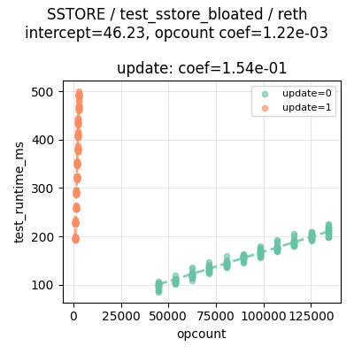

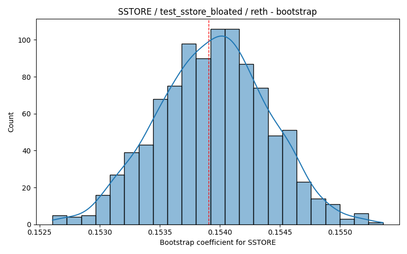

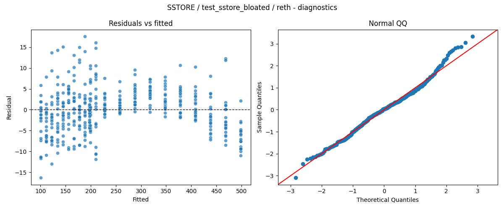

</details>

### test_sstore_bloated — combo `True`

| client | nobs | R² | target_coef (ms) | p-value | 95% CI |
| --- | --- | --- | --- | --- | --- |
| `besu` | 396 | 0.9846 | 0.01444 | 1.00e-03 | [0.01377, 0.01509] |
| `erigon` | 242 | 0.9968 | 0.001038 | 5.00e-03 | [0.0002364, 0.001812] |
| `geth` | 462 | 0.9952 | 0.023 | 1.00e-03 | [0.02262, 0.02336] |
| `nethermind` | 440 | 0.8627 | 0.01683 | 1.00e-03 | [0.01613, 0.01749] |
| `reth` | 440 | 0.9968 | 0 | 1.00e+00 | [0, 0] |

<details><summary>besu — NNLS regression summary</summary>

```
==============================================================================
                           NNLS Regression Results                            
==============================================================================
Dep. Variable:          test_runtime_ms              R-squared:          0.985
Model:                  NNLS                    Adj. R-squared:          0.985
No. Observations:       396                               RMSE:         186.31
Df Residuals:           393                                MAE:         145.76
Df Model:               2      
==============================================================================
                      coef     std err     P-value      [0.025      0.975]
------------------------------------------------------------------------------
         const    978.8165     30.6427       0.001    915.1952   1034.8715
       opcount      0.0144      0.0003       0.001      0.0138      0.0151
        update      0.0790      0.0006       0.001      0.0777      0.0803
==============================================================================
Notes: Non-negative least squares with bootstrap inference (1000 iterations)
==============================================================================
```

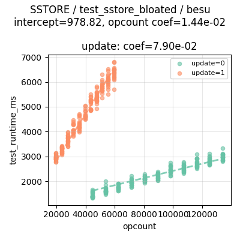

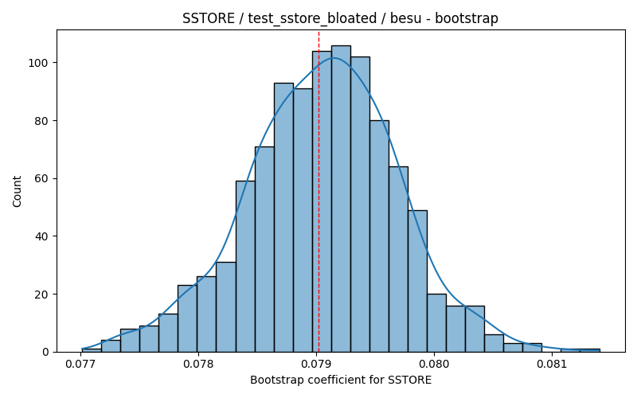

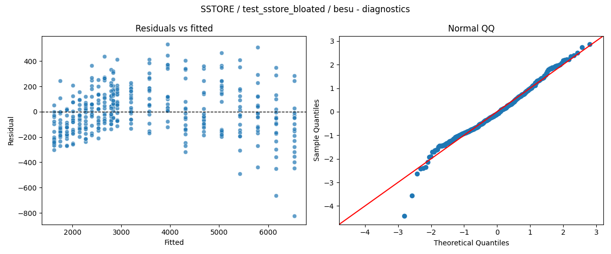

</details>

<details><summary>erigon — NNLS regression summary</summary>

```
==============================================================================
                           NNLS Regression Results                            
==============================================================================
Dep. Variable:          test_runtime_ms              R-squared:          0.997
Model:                  NNLS                    Adj. R-squared:          0.997
No. Observations:       242                               RMSE:         135.18
Df Residuals:           239                                MAE:         114.61
Df Model:               2      
==============================================================================
                      coef     std err     P-value      [0.025      0.975]
------------------------------------------------------------------------------
         const    427.6623     39.8031       0.001    354.5869    506.6091
       opcount      0.0010      0.0004       0.005      0.0002      0.0018
        update      0.1105      0.0006       0.001      0.1093      0.1117
==============================================================================
Notes: Non-negative least squares with bootstrap inference (1000 iterations)
==============================================================================
```

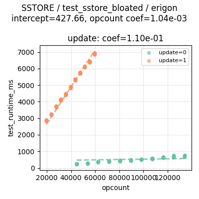

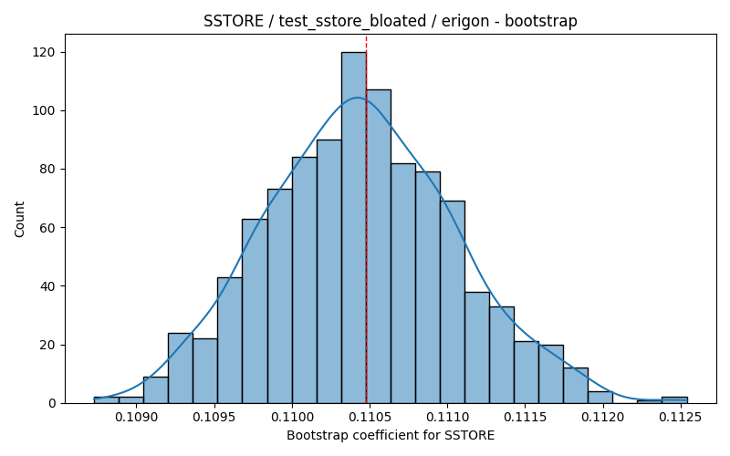

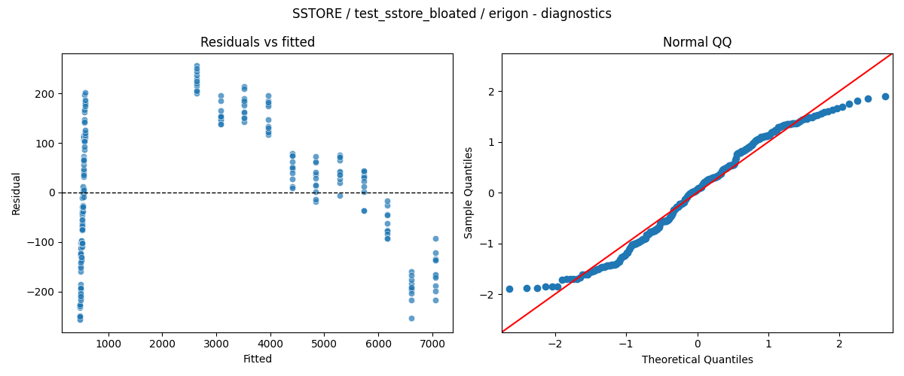

</details>

<details><summary>geth — NNLS regression summary</summary>

```
==============================================================================
                           NNLS Regression Results                            
==============================================================================
Dep. Variable:          test_runtime_ms              R-squared:          0.995
Model:                  NNLS                    Adj. R-squared:          0.995
No. Observations:       462                               RMSE:          89.71
Df Residuals:           459                                MAE:          72.19
Df Model:               2      
==============================================================================
                      coef     std err     P-value      [0.025      0.975]
------------------------------------------------------------------------------
         const    686.0138     15.3991       0.001    655.6944    715.6395
       opcount      0.0230      0.0002       0.001      0.0226      0.0234
        update      0.0728      0.0002       0.001      0.0723      0.0733
==============================================================================
Notes: Non-negative least squares with bootstrap inference (1000 iterations)
==============================================================================
```

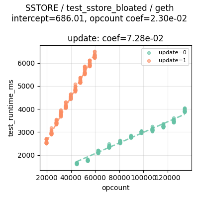

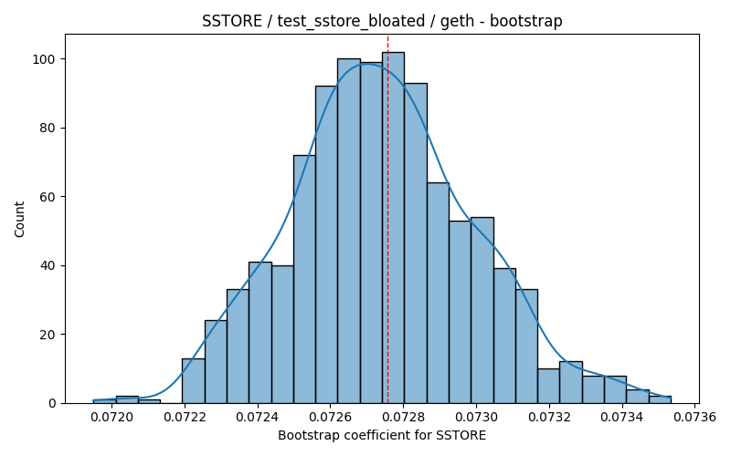

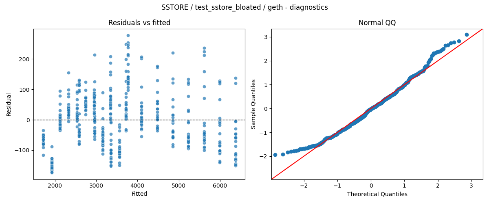

</details>

<details><summary>nethermind — NNLS regression summary</summary>

```
==============================================================================
                           NNLS Regression Results                            
==============================================================================
Dep. Variable:          test_runtime_ms              R-squared:          0.863
Model:                  NNLS                    Adj. R-squared:          0.862
No. Observations:       440                               RMSE:         194.61
Df Residuals:           437                                MAE:         154.80
Df Model:               2      
==============================================================================
                      coef     std err     P-value      [0.025      0.975]
------------------------------------------------------------------------------
         const    699.4635     36.6264       0.001    629.4104    771.3402
       opcount      0.0168      0.0004       0.001      0.0161      0.0175
        update      0.0229      0.0005       0.001      0.0218      0.0239
==============================================================================
Notes: Non-negative least squares with bootstrap inference (1000 iterations)
==============================================================================
```

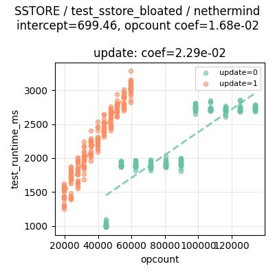

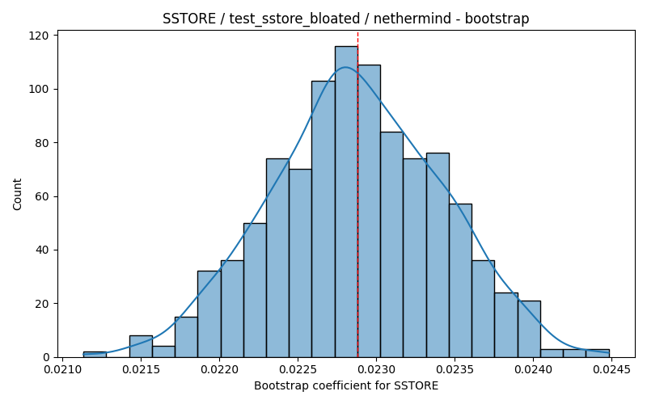

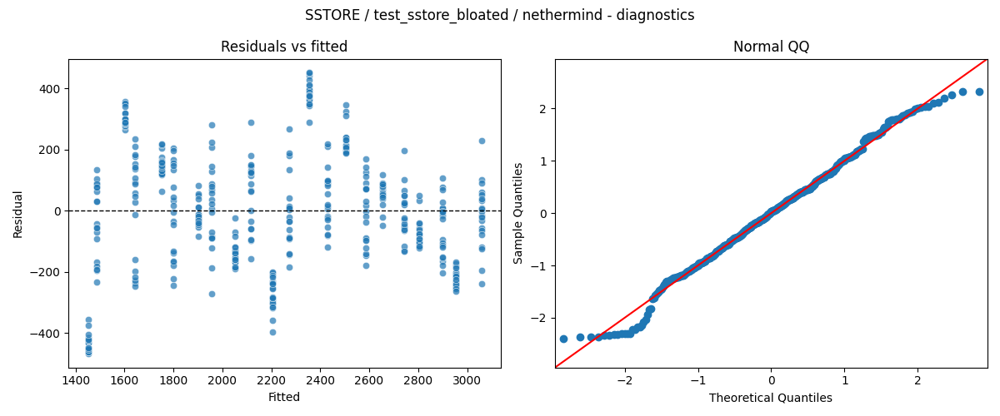

</details>

<details><summary>reth — NNLS regression summary</summary>

```
==============================================================================
                           NNLS Regression Results                            
==============================================================================
Dep. Variable:          test_runtime_ms              R-squared:          0.997
Model:                  NNLS                    Adj. R-squared:          0.997
No. Observations:       440                               RMSE:         120.31
Df Residuals:           437                                MAE:          96.81
Df Model:               2      
==============================================================================
                      coef     std err     P-value      [0.025      0.975]
------------------------------------------------------------------------------
         const    217.2945      5.2127       0.001    207.3104    227.6210
       opcount      0.0000      0.0000       1.000      0.0000      0.0000
        update      0.0984      0.0003       0.001      0.0979      0.0990
==============================================================================
Notes: Non-negative least squares with bootstrap inference (1000 iterations)
==============================================================================
```

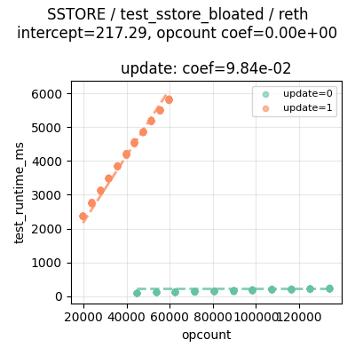

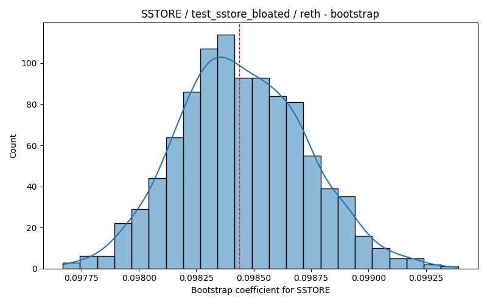

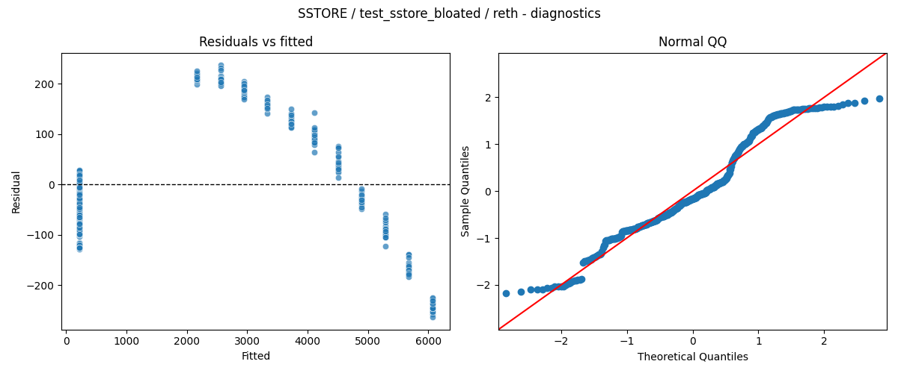

</details>

## BALANCE

### test_account_access — combo `BALANCE_AccountMode.EXISTING_EOA`

| client | nobs | R² | target_coef (ms) | p-value | 95% CI |
| --- | --- | --- | --- | --- | --- |
| `besu` | 198 | 0.6952 | 0.01314 | 1.00e-03 | [0.01195, 0.01427] |
| `erigon` | 121 | 0.9725 | 0.009208 | 1.00e-03 | [0.008919, 0.009442] |
| `geth` | 231 | 0.9435 | 0.01056 | 1.00e-03 | [0.01012, 0.01098] |
| `nethermind` | 220 | 0.9563 | 0.003412 | 1.00e-03 | [0.003312, 0.003514] |
| `reth` | 220 | 0.9464 | 0.001222 | 1.00e-03 | [0.001181, 0.001264] |

<details><summary>besu — NNLS regression summary</summary>

```
==============================================================================
                           NNLS Regression Results                            
==============================================================================
Dep. Variable:          test_runtime_ms              R-squared:          0.695
Model:                  NNLS                    Adj. R-squared:          0.694
No. Observations:       198                               RMSE:         207.95
Df Residuals:           196                                MAE:         189.49
Df Model:               1      
==============================================================================
                      coef     std err     P-value      [0.025      0.975]
------------------------------------------------------------------------------
         const    685.3167     43.9002       0.001    605.2966    772.6831
       opcount      0.0131      0.0006       0.001      0.0120      0.0143
==============================================================================
Notes: Non-negative least squares with bootstrap inference (1000 iterations)
==============================================================================
```

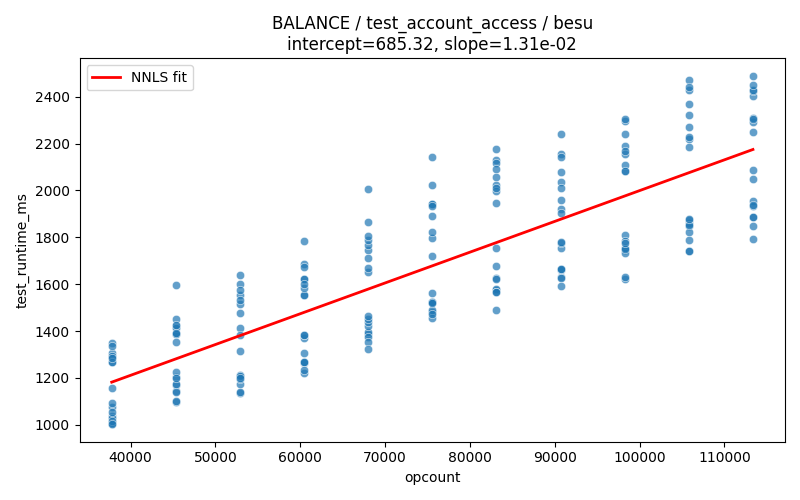

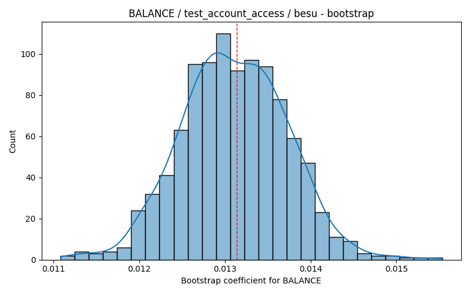

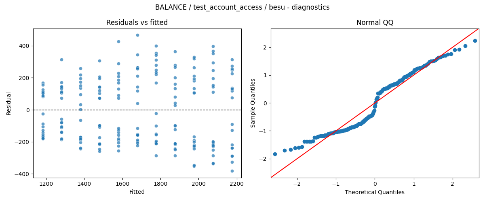

</details>

<details><summary>erigon — NNLS regression summary</summary>

```
==============================================================================
                           NNLS Regression Results                            
==============================================================================
Dep. Variable:          test_runtime_ms              R-squared:          0.972
Model:                  NNLS                    Adj. R-squared:          0.972
No. Observations:       121                               RMSE:          37.04
Df Residuals:           119                                MAE:          34.13
Df Model:               1      
==============================================================================
                      coef     std err     P-value      [0.025      0.975]
------------------------------------------------------------------------------
         const     13.0613      9.0827       0.091      0.0000     32.1780
       opcount      0.0092      0.0001       0.001      0.0089      0.0094
==============================================================================
Notes: Non-negative least squares with bootstrap inference (1000 iterations)
==============================================================================
```

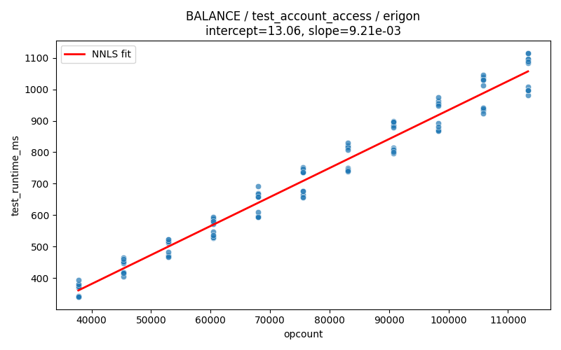

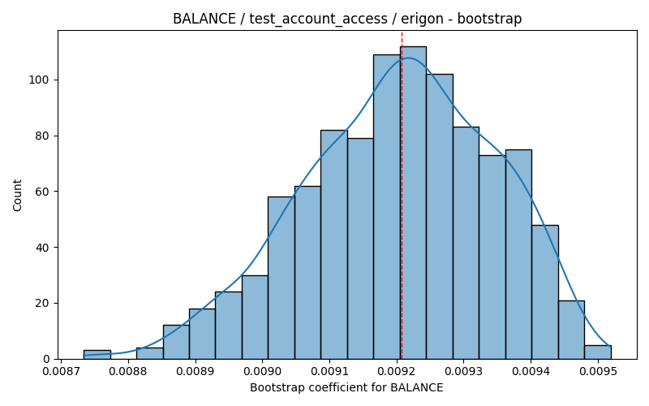

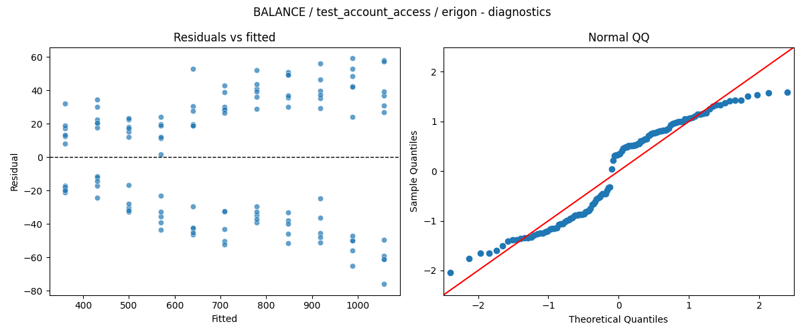

</details>

<details><summary>geth — NNLS regression summary</summary>

```
==============================================================================
                           NNLS Regression Results                            
==============================================================================
Dep. Variable:          test_runtime_ms              R-squared:          0.943
Model:                  NNLS                    Adj. R-squared:          0.943
No. Observations:       231                               RMSE:          61.76
Df Residuals:           229                                MAE:          47.94
Df Model:               1      
==============================================================================
                      coef     std err     P-value      [0.025      0.975]
------------------------------------------------------------------------------
         const    474.3091     19.6033       0.001    436.4860    513.8823
       opcount      0.0106      0.0002       0.001      0.0101      0.0110
==============================================================================
Notes: Non-negative least squares with bootstrap inference (1000 iterations)
==============================================================================
```

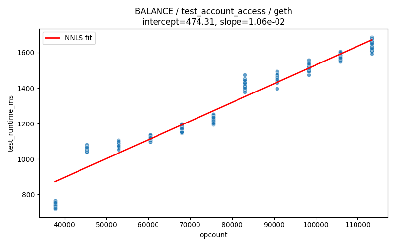

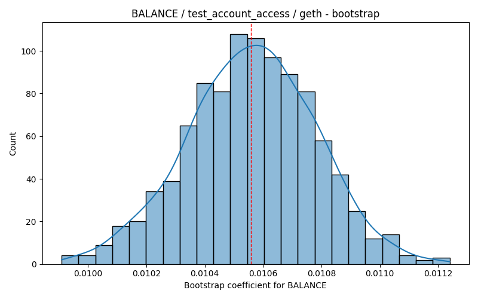

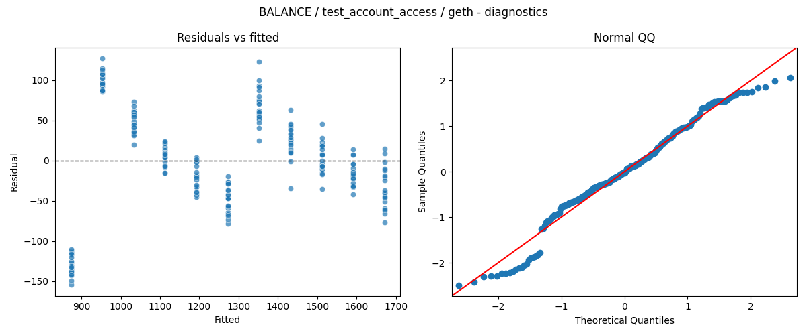

</details>

<details><summary>nethermind — NNLS regression summary</summary>

```
==============================================================================
                           NNLS Regression Results                            
==============================================================================
Dep. Variable:          test_runtime_ms              R-squared:          0.956
Model:                  NNLS                    Adj. R-squared:          0.956
No. Observations:       220                               RMSE:          17.43
Df Residuals:           218                                MAE:          13.36
Df Model:               1      
==============================================================================
                      coef     std err     P-value      [0.025      0.975]
------------------------------------------------------------------------------
         const     85.1179      3.9219       0.001     77.9779     93.0044
       opcount      0.0034      0.0001       0.001      0.0033      0.0035
==============================================================================
Notes: Non-negative least squares with bootstrap inference (1000 iterations)
==============================================================================
```

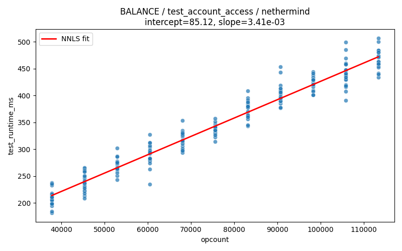

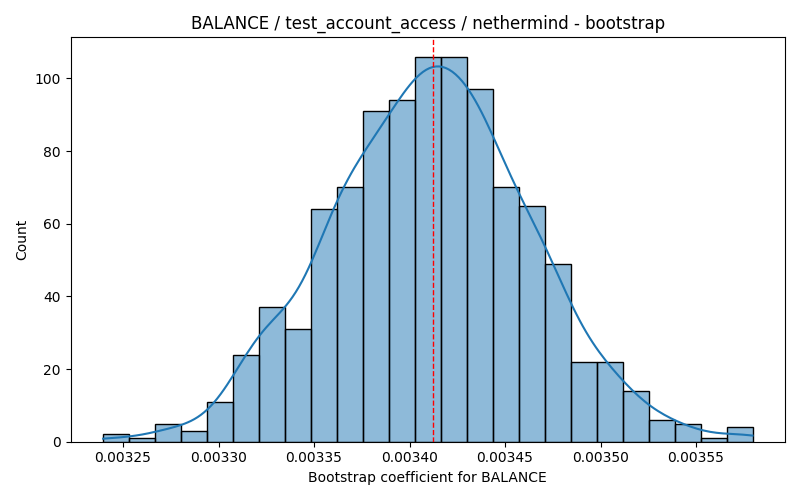

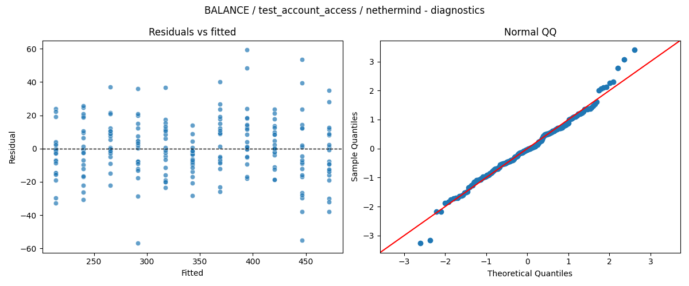

</details>

<details><summary>reth — NNLS regression summary</summary>

```
==============================================================================
                           NNLS Regression Results                            
==============================================================================
Dep. Variable:          test_runtime_ms              R-squared:          0.946
Model:                  NNLS                    Adj. R-squared:          0.946
No. Observations:       220                               RMSE:           6.95
Df Residuals:           218                                MAE:           5.32
Df Model:               1      
==============================================================================
                      coef     std err     P-value      [0.025      0.975]
------------------------------------------------------------------------------
         const     41.1205      1.4648       0.001     38.1958     44.0150
       opcount      0.0012      0.0000       0.001      0.0012      0.0013
==============================================================================
Notes: Non-negative least squares with bootstrap inference (1000 iterations)
==============================================================================
```


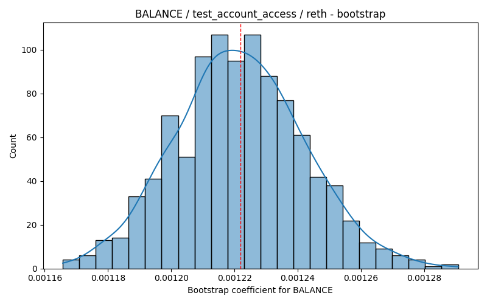

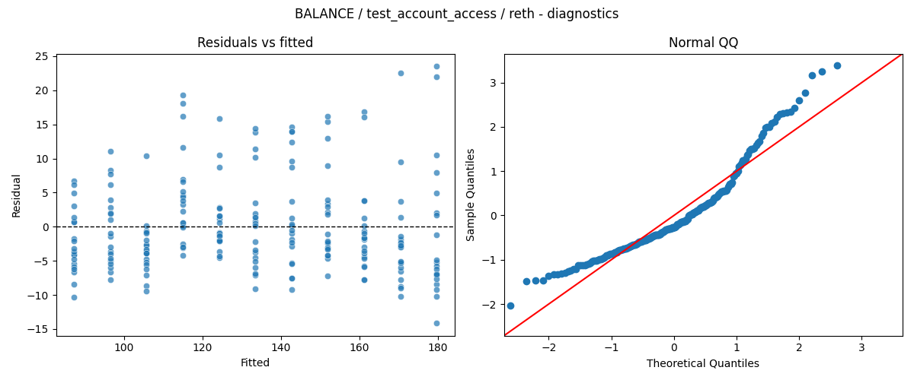

</details>

### test_account_access — combo `BALANCE_AccountMode.NON_EXISTING_ACCOUNT` — `presets[cold_account_nocode_access]`

| client | nobs | R² | target_coef (ms) | p-value | 95% CI |
| --- | --- | --- | --- | --- | --- |
| `besu` | 198 | 0.7508 | 0.01355 | 1.00e-03 | [0.01247, 0.01463] |
| `erigon` | 121 | 0.9611 | 0.008478 | 1.00e-03 | [0.008184, 0.008585] |
| `geth` | 231 | 0.8668 | 0.02182 | 1.00e-03 | [0.02064, 0.023] |
| `nethermind` | 220 | 0.9612 | 0.003447 | 1.00e-03 | [0.003358, 0.003546] |
| `reth` | 220 | 0.962 | 0.0008988 | 1.00e-03 | [0.0008766, 0.0009203] |

<details><summary>besu — NNLS regression summary</summary>

```
==============================================================================
                           NNLS Regression Results                            
==============================================================================
Dep. Variable:          test_runtime_ms              R-squared:          0.751
Model:                  NNLS                    Adj. R-squared:          0.750
No. Observations:       198                               RMSE:         186.61
Df Residuals:           196                                MAE:         171.13
Df Model:               1      
==============================================================================
                      coef     std err     P-value      [0.025      0.975]
------------------------------------------------------------------------------
         const    539.9526     39.8087       0.001    461.1077    615.9669
       opcount      0.0136      0.0006       0.001      0.0125      0.0146
==============================================================================
Notes: Non-negative least squares with bootstrap inference (1000 iterations)
==============================================================================
```

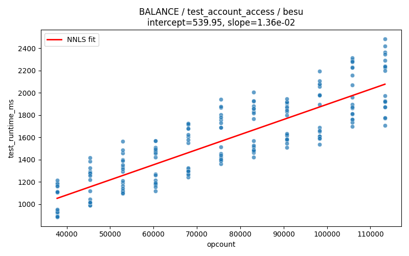

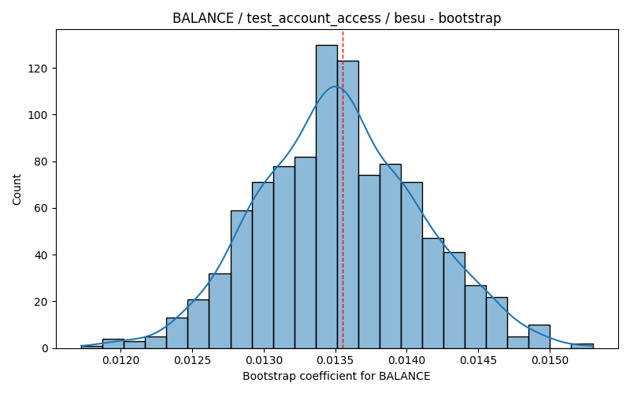

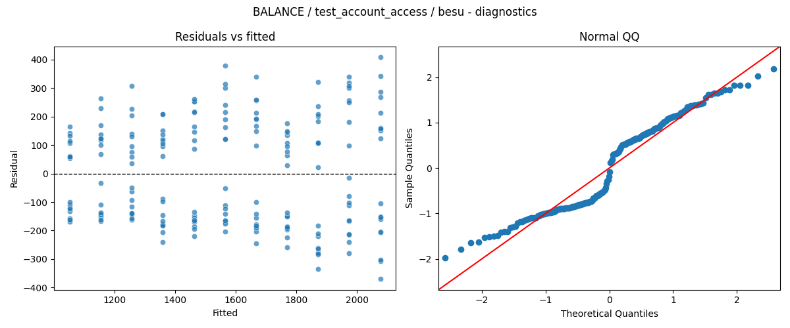

</details>

<details><summary>erigon — NNLS regression summary</summary>

```
==============================================================================
                           NNLS Regression Results                            
==============================================================================
Dep. Variable:          test_runtime_ms              R-squared:          0.961
Model:                  NNLS                    Adj. R-squared:          0.961
No. Observations:       121                               RMSE:          40.79
Df Residuals:           119                                MAE:          36.84
Df Model:               1      
==============================================================================
                      coef     std err     P-value      [0.025      0.975]
------------------------------------------------------------------------------
         const      0.0000      5.8949       1.000      0.0000     20.0925
       opcount      0.0085      0.0001       0.001      0.0082      0.0086
==============================================================================
Notes: Non-negative least squares with bootstrap inference (1000 iterations)
==============================================================================
```

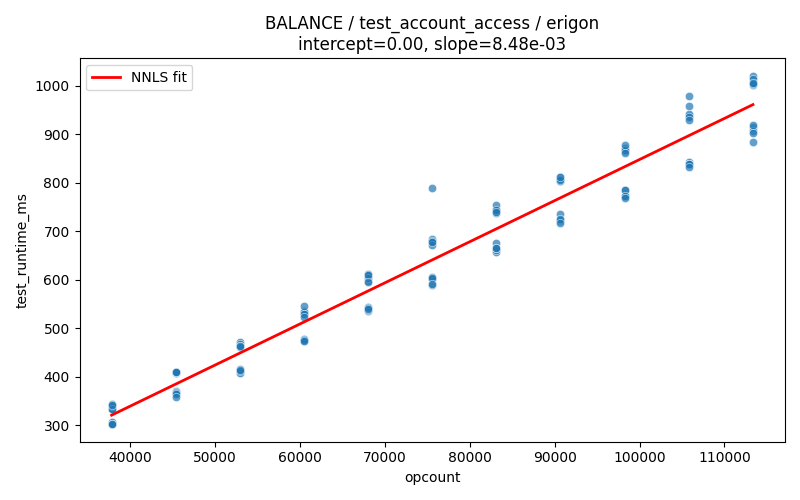

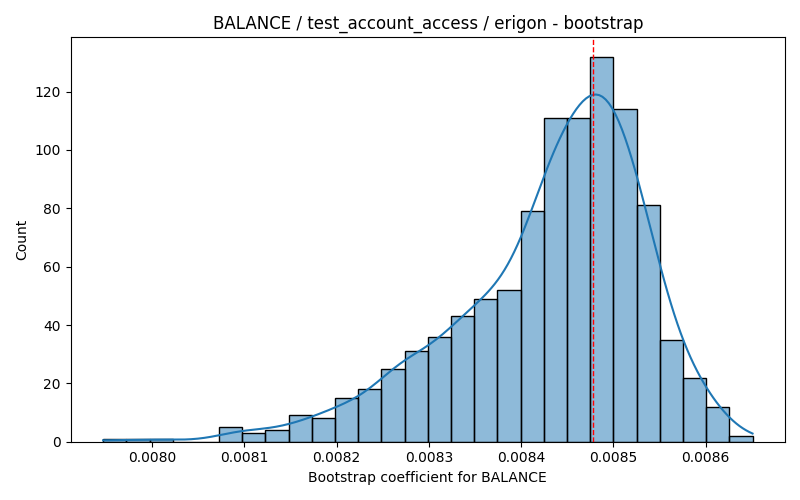

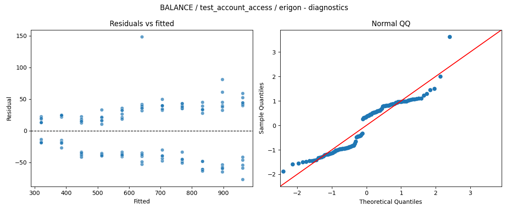

</details>

<details><summary>geth — NNLS regression summary</summary>

```
==============================================================================
                           NNLS Regression Results                            
==============================================================================
Dep. Variable:          test_runtime_ms              R-squared:          0.867
Model:                  NNLS                    Adj. R-squared:          0.866
No. Observations:       231                               RMSE:         204.37
Df Residuals:           229                                MAE:         175.23
Df Model:               1      
==============================================================================
                      coef     std err     P-value      [0.025      0.975]
------------------------------------------------------------------------------
         const    767.1479     51.9667       0.001    671.9842    868.5515
       opcount      0.0218      0.0006       0.001      0.0206      0.0230
==============================================================================
Notes: Non-negative least squares with bootstrap inference (1000 iterations)
==============================================================================
```

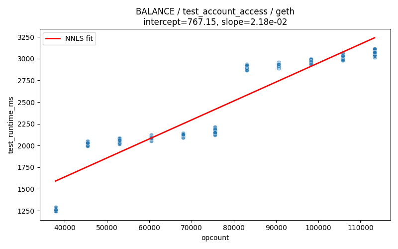

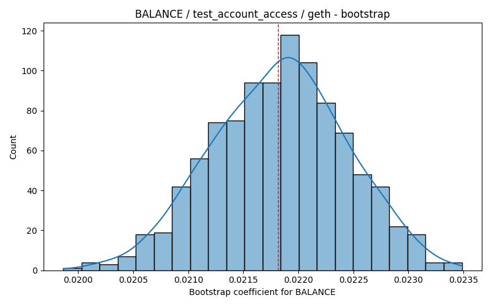

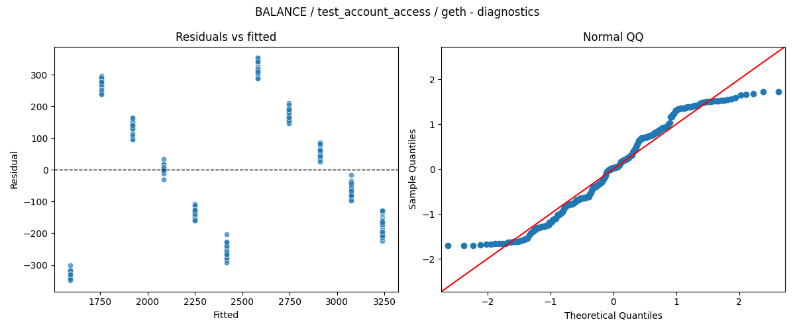

</details>

<details><summary>nethermind — NNLS regression summary</summary>

```
==============================================================================
                           NNLS Regression Results                            
==============================================================================
Dep. Variable:          test_runtime_ms              R-squared:          0.961
Model:                  NNLS                    Adj. R-squared:          0.961
No. Observations:       220                               RMSE:          16.56
Df Residuals:           218                                MAE:          12.04
Df Model:               1      
==============================================================================
                      coef     std err     P-value      [0.025      0.975]
------------------------------------------------------------------------------
         const     68.1222      3.3198       0.001     61.8120     74.3854
       opcount      0.0034      0.0000       0.001      0.0034      0.0035
==============================================================================
Notes: Non-negative least squares with bootstrap inference (1000 iterations)
==============================================================================
```

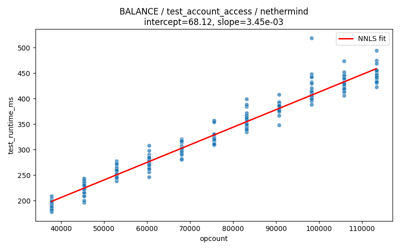

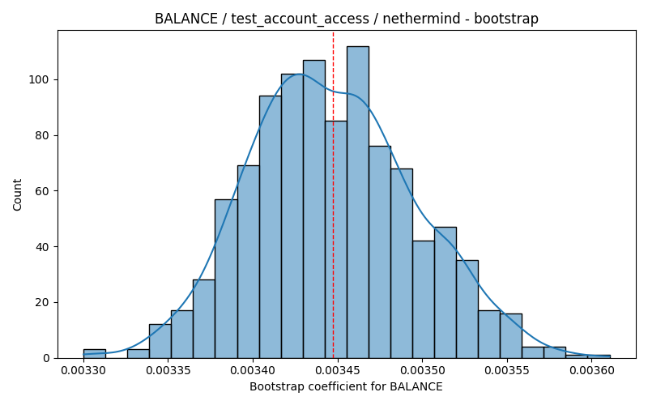

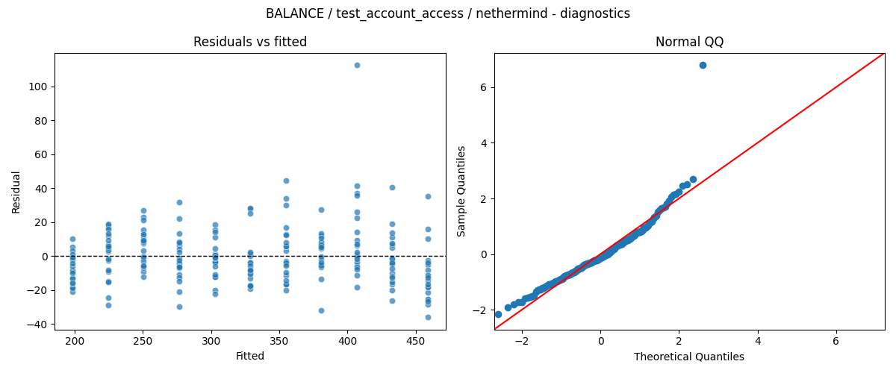

</details>

<details><summary>reth — NNLS regression summary</summary>

```
==============================================================================
                           NNLS Regression Results                            
==============================================================================
Dep. Variable:          test_runtime_ms              R-squared:          0.962
Model:                  NNLS                    Adj. R-squared:          0.962
No. Observations:       220                               RMSE:           4.27
Df Residuals:           218                                MAE:           3.37
Df Model:               1      
==============================================================================
                      coef     std err     P-value      [0.025      0.975]
------------------------------------------------------------------------------
         const     43.4876      0.8929       0.001     41.7412     45.3700
       opcount      0.0009      0.0000       0.001      0.0009      0.0009
==============================================================================
Notes: Non-negative least squares with bootstrap inference (1000 iterations)
==============================================================================
```

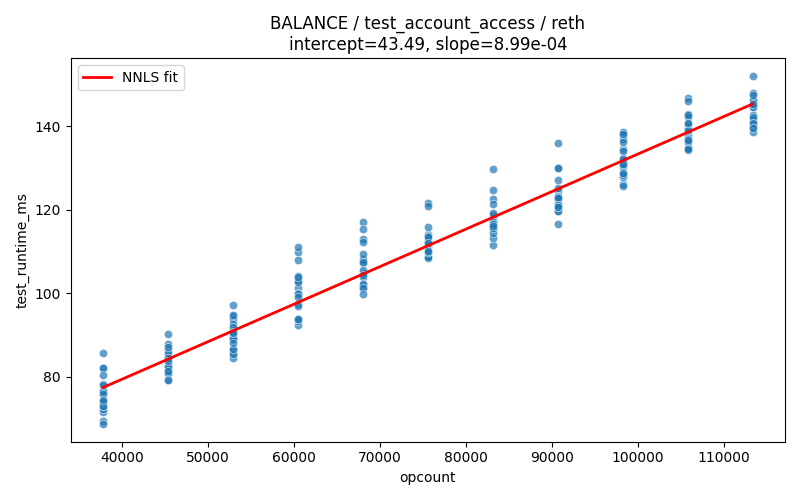

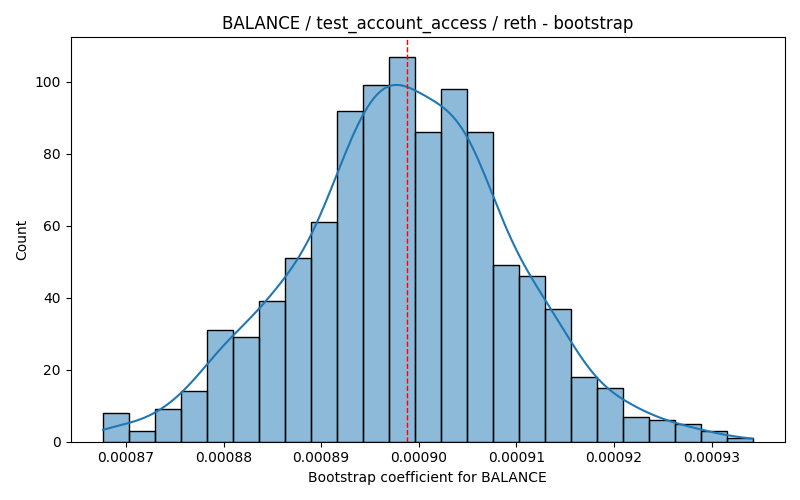

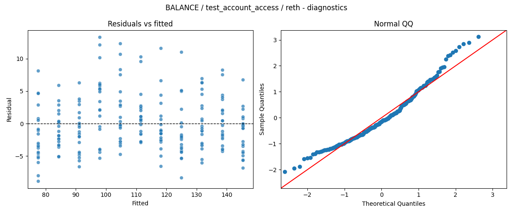

</details>

### test_account_access — combo `BALANCE_AccountMode.EXISTING_CONTRACT`

| client | nobs | R² | target_coef (ms) | p-value | 95% CI |
| --- | --- | --- | --- | --- | --- |
| `besu` | 198 | 0.8491 | 0.02954 | 1.00e-03 | [0.02807, 0.03116] |
| `erigon` | 121 | 0.9143 | 0.03426 | 1.00e-03 | [0.03241, 0.03597] |
| `geth` | 231 | 0.8696 | 0.02313 | 1.00e-03 | [0.02194, 0.02429] |
| `nethermind` | 220 | 0.825 | 0.01868 | 1.00e-03 | [0.01743, 0.01986] |
| `reth` | 220 | 0.8696 | 0.01894 | 1.00e-03 | [0.01808, 0.02009] |

<details><summary>besu — NNLS regression summary</summary>

```
==============================================================================
                           NNLS Regression Results                            
==============================================================================
Dep. Variable:          test_runtime_ms              R-squared:          0.849
Model:                  NNLS                    Adj. R-squared:          0.848
No. Observations:       198                               RMSE:         259.06
Df Residuals:           196                                MAE:         234.70
Df Model:               1      
==============================================================================
                      coef     std err     P-value      [0.025      0.975]
------------------------------------------------------------------------------
         const    496.5800     46.7632       0.001    407.1107    583.4630
       opcount      0.0295      0.0008       0.001      0.0281      0.0312
==============================================================================
Notes: Non-negative least squares with bootstrap inference (1000 iterations)
==============================================================================
```

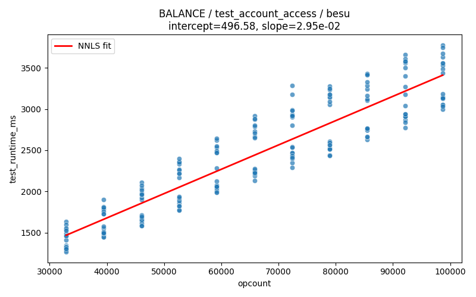

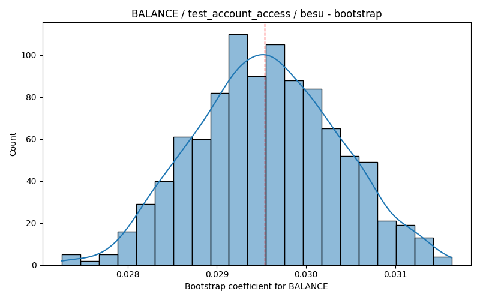

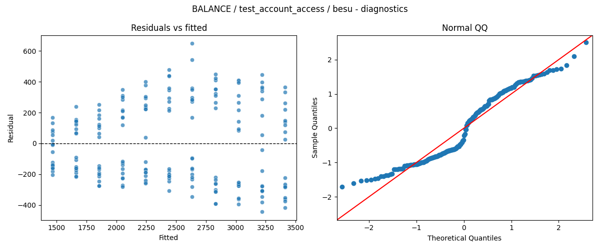

</details>

<details><summary>erigon — NNLS regression summary</summary>

```
==============================================================================
                           NNLS Regression Results                            
==============================================================================
Dep. Variable:          test_runtime_ms              R-squared:          0.914
Model:                  NNLS                    Adj. R-squared:          0.914
No. Observations:       121                               RMSE:         218.22
Df Residuals:           119                                MAE:         190.88
Df Model:               1      
==============================================================================
                      coef     std err     P-value      [0.025      0.975]
------------------------------------------------------------------------------
         const    257.7012     68.8675       0.001    130.1712    396.8148
       opcount      0.0343      0.0009       0.001      0.0324      0.0360
==============================================================================
Notes: Non-negative least squares with bootstrap inference (1000 iterations)
==============================================================================
```

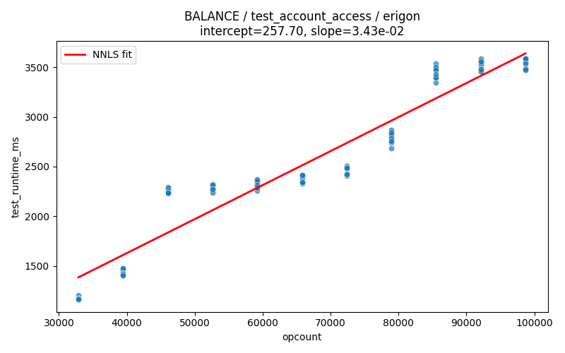

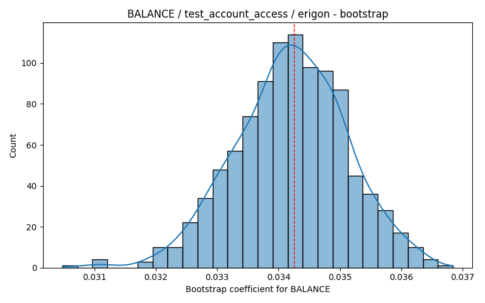

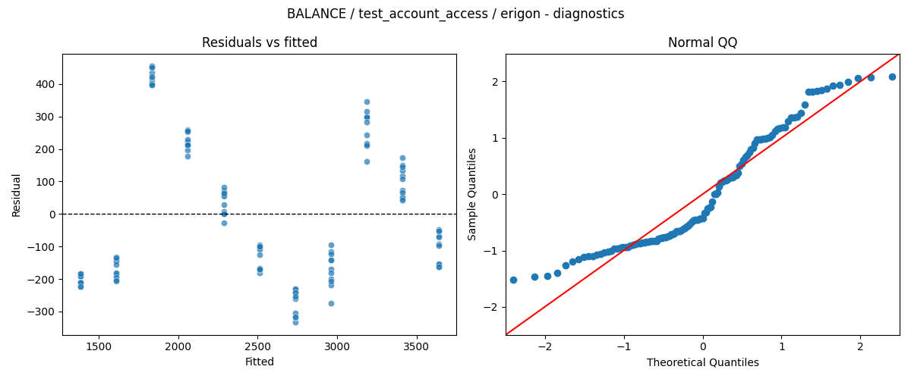

</details>

<details><summary>geth — NNLS regression summary</summary>

```
==============================================================================
                           NNLS Regression Results                            
==============================================================================
Dep. Variable:          test_runtime_ms              R-squared:          0.870
Model:                  NNLS                    Adj. R-squared:          0.869
No. Observations:       231                               RMSE:         186.33
Df Residuals:           229                                MAE:         160.70
Df Model:               1      
==============================================================================
                      coef     std err     P-value      [0.025      0.975]
------------------------------------------------------------------------------
         const    737.1283     45.9947       0.001    642.7813    828.3109
       opcount      0.0231      0.0006       0.001      0.0219      0.0243
==============================================================================
Notes: Non-negative least squares with bootstrap inference (1000 iterations)
==============================================================================
```

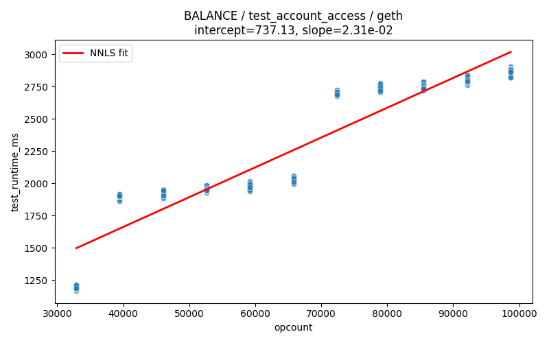

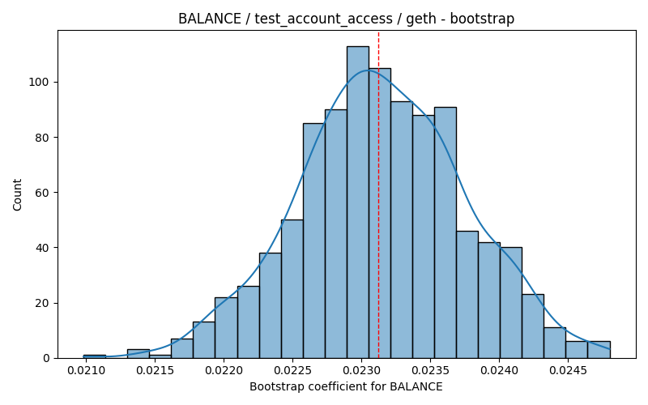

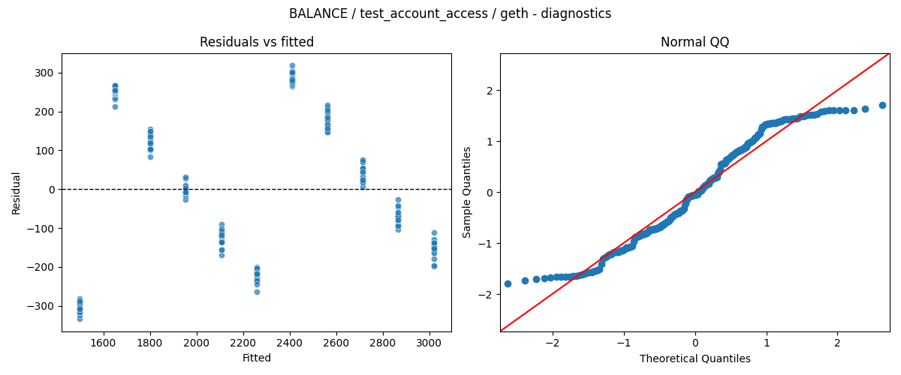

</details>

<details><summary>nethermind — NNLS regression summary</summary>

```
==============================================================================
                           NNLS Regression Results                            
==============================================================================
Dep. Variable:          test_runtime_ms              R-squared:          0.825
Model:                  NNLS                    Adj. R-squared:          0.824
No. Observations:       220                               RMSE:         178.96
Df Residuals:           218                                MAE:         151.79
Df Model:               1      
==============================================================================
                      coef     std err     P-value      [0.025      0.975]
------------------------------------------------------------------------------
         const    468.6931     45.7271       0.001    382.9857    561.9481
       opcount      0.0187      0.0006       0.001      0.0174      0.0199
==============================================================================
Notes: Non-negative least squares with bootstrap inference (1000 iterations)
==============================================================================
```

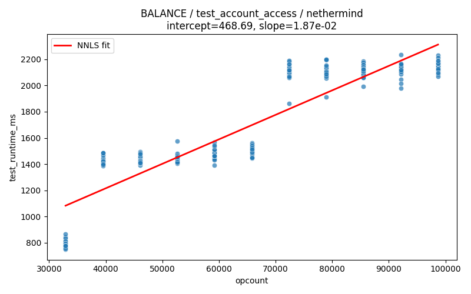

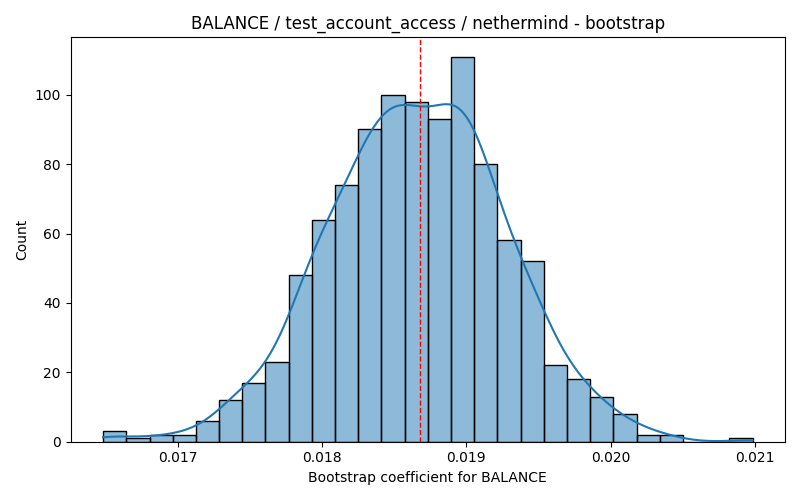

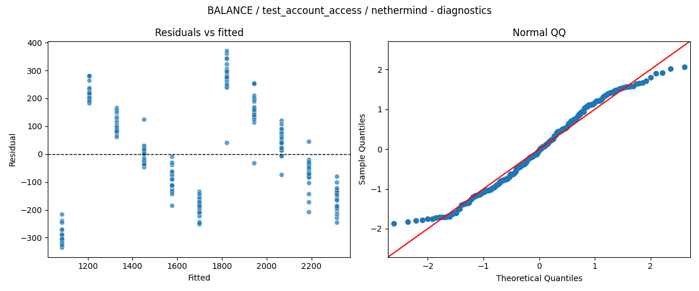

</details>

<details><summary>reth — NNLS regression summary</summary>

```
==============================================================================
                           NNLS Regression Results                            
==============================================================================
Dep. Variable:          test_runtime_ms              R-squared:          0.870
Model:                  NNLS                    Adj. R-squared:          0.869
No. Observations:       220                               RMSE:         152.60
Df Residuals:           218                                MAE:          68.83
Df Model:               1      
==============================================================================
                      coef     std err     P-value      [0.025      0.975]
------------------------------------------------------------------------------
         const    243.0609     27.7654       0.001    178.9011    290.0630
       opcount      0.0189      0.0005       0.001      0.0181      0.0201
==============================================================================
Notes: Non-negative least squares with bootstrap inference (1000 iterations)
==============================================================================
```

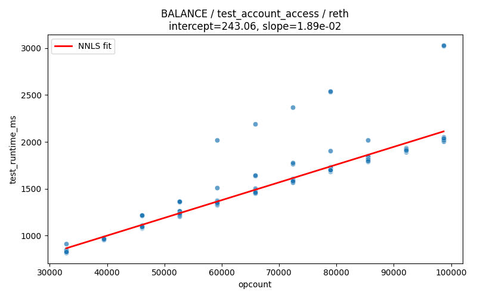

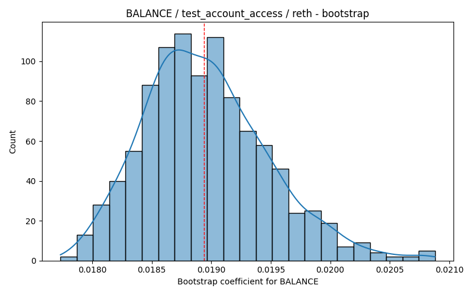

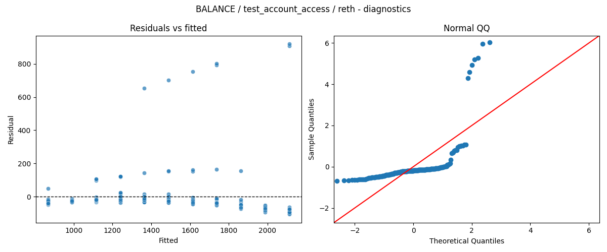

</details>

### test_account_access — combo `BALANCE_AccountMode.NON_EXISTING_ACCOUNT` — `presets[cold_account_code_access]`

| client | nobs | R² | target_coef (ms) | p-value | 95% CI |
| --- | --- | --- | --- | --- | --- |
| `besu` | 198 | 0.7508 | 0.01355 | 1.00e-03 | [0.01247, 0.01463] |
| `erigon` | 121 | 0.9611 | 0.008478 | 1.00e-03 | [0.008184, 0.008585] |
| `geth` | 231 | 0.8668 | 0.02182 | 1.00e-03 | [0.02064, 0.023] |
| `nethermind` | 220 | 0.9612 | 0.003447 | 1.00e-03 | [0.003358, 0.003546] |
| `reth` | 220 | 0.962 | 0.0008988 | 1.00e-03 | [0.0008766, 0.0009203] |

<details><summary>besu — NNLS regression summary</summary>

```
==============================================================================
                           NNLS Regression Results                            
==============================================================================
Dep. Variable:          test_runtime_ms              R-squared:          0.751
Model:                  NNLS                    Adj. R-squared:          0.750
No. Observations:       198                               RMSE:         186.61
Df Residuals:           196                                MAE:         171.13
Df Model:               1      
==============================================================================
                      coef     std err     P-value      [0.025      0.975]
------------------------------------------------------------------------------
         const    539.9526     39.8087       0.001    461.1077    615.9669
       opcount      0.0136      0.0006       0.001      0.0125      0.0146
==============================================================================
Notes: Non-negative least squares with bootstrap inference (1000 iterations)
==============================================================================
```


</details>

<details><summary>erigon — NNLS regression summary</summary>

```
==============================================================================
                           NNLS Regression Results                            
==============================================================================
Dep. Variable:          test_runtime_ms              R-squared:          0.961
Model:                  NNLS                    Adj. R-squared:          0.961
No. Observations:       121                               RMSE:          40.79
Df Residuals:           119                                MAE:          36.84
Df Model:               1      
==============================================================================
                      coef     std err     P-value      [0.025      0.975]
------------------------------------------------------------------------------
         const      0.0000      5.8949       1.000      0.0000     20.0925
       opcount      0.0085      0.0001       0.001      0.0082      0.0086
==============================================================================
Notes: Non-negative least squares with bootstrap inference (1000 iterations)
==============================================================================
```


</details>

<details><summary>geth — NNLS regression summary</summary>

```
==============================================================================
                           NNLS Regression Results                            
==============================================================================
Dep. Variable:          test_runtime_ms              R-squared:          0.867
Model:                  NNLS                    Adj. R-squared:          0.866
No. Observations:       231                               RMSE:         204.37
Df Residuals:           229                                MAE:         175.23
Df Model:               1      
==============================================================================
                      coef     std err     P-value      [0.025      0.975]
------------------------------------------------------------------------------
         const    767.1479     51.9667       0.001    671.9842    868.5515
       opcount      0.0218      0.0006       0.001      0.0206      0.0230
==============================================================================
Notes: Non-negative least squares with bootstrap inference (1000 iterations)
==============================================================================
```


</details>

<details><summary>nethermind — NNLS regression summary</summary>

```
==============================================================================
                           NNLS Regression Results                            
==============================================================================
Dep. Variable:          test_runtime_ms              R-squared:          0.961
Model:                  NNLS                    Adj. R-squared:          0.961
No. Observations:       220                               RMSE:          16.56
Df Residuals:           218                                MAE:          12.04
Df Model:               1      
==============================================================================
                      coef     std err     P-value      [0.025      0.975]
------------------------------------------------------------------------------
         const     68.1222      3.3198       0.001     61.8120     74.3854
       opcount      0.0034      0.0000       0.001      0.0034      0.0035
==============================================================================
Notes: Non-negative least squares with bootstrap inference (1000 iterations)
==============================================================================
```


</details>

<details><summary>reth — NNLS regression summary</summary>

```
==============================================================================
                           NNLS Regression Results                            
==============================================================================
Dep. Variable:          test_runtime_ms              R-squared:          0.962
Model:                  NNLS                    Adj. R-squared:          0.962
No. Observations:       220                               RMSE:           4.27
Df Residuals:           218                                MAE:           3.37
Df Model:               1      
==============================================================================
                      coef     std err     P-value      [0.025      0.975]
------------------------------------------------------------------------------
         const     43.4876      0.8929       0.001     41.7412     45.3700
       opcount      0.0009      0.0000       0.001      0.0009      0.0009
==============================================================================
Notes: Non-negative least squares with bootstrap inference (1000 iterations)
==============================================================================
```


</details>

### test_ext_account_query_warm — combo `BALANCE`

| client | nobs | R² | target_coef (ms) | p-value | 95% CI |
| --- | --- | --- | --- | --- | --- |
| `besu` | 198 | 0.434 | 0.0001459 | 1.00e-03 | [0.0001216, 0.0001706] |
| `erigon` | 121 | 0.9366 | 4.25e-05 | 1.00e-03 | [4.038e-05, 4.462e-05] |
| `geth` | 231 | 0.8681 | 3.158e-05 | 1.00e-03 | [2.989e-05, 3.321e-05] |
| `nethermind` | 220 | 0.7247 | 0.0001339 | 1.00e-03 | [0.0001235, 0.0001445] |
| `reth` | 220 | 0.7306 | 9.584e-06 | 1.00e-03 | [8.829e-06, 1.036e-05] |

<details><summary>besu — NNLS regression summary</summary>

```
==============================================================================
                           NNLS Regression Results                            
==============================================================================
Dep. Variable:          test_runtime_ms              R-squared:          0.434
Model:                  NNLS                    Adj. R-squared:          0.431
No. Observations:       198                               RMSE:          97.47
Df Residuals:           196                                MAE:          71.86
Df Model:               1      
==============================================================================
                      coef     std err     P-value      [0.025      0.975]
------------------------------------------------------------------------------
         const    256.7752     24.1444       0.001    211.3144    305.2425
       opcount      0.0001      0.0000       0.001      0.0001      0.0002
==============================================================================
Notes: Non-negative least squares with bootstrap inference (1000 iterations)
==============================================================================
```

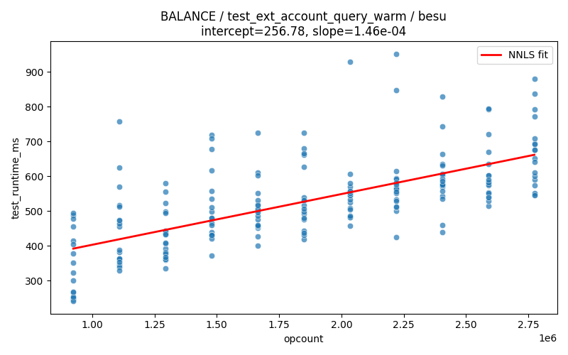

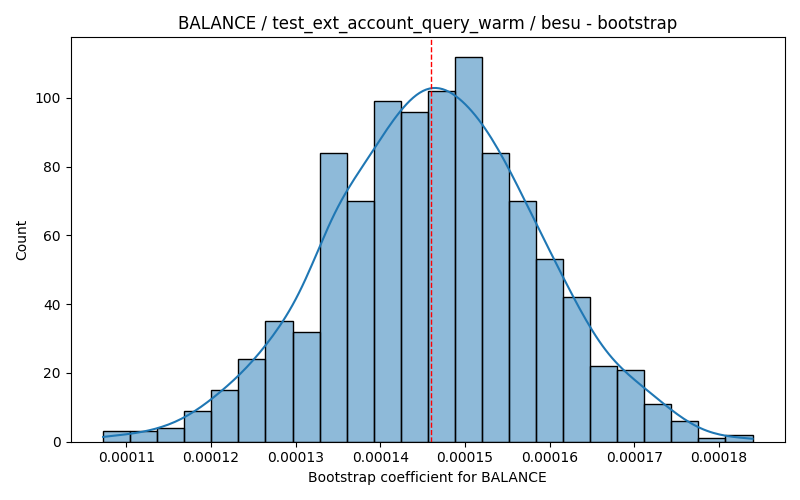

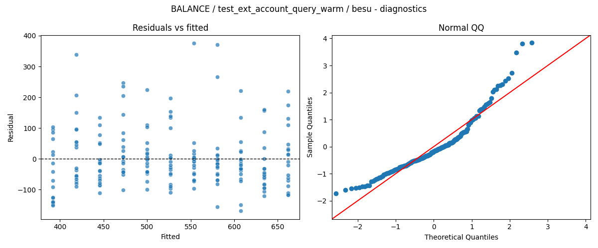

</details>

<details><summary>erigon — NNLS regression summary</summary>

```
==============================================================================
                           NNLS Regression Results                            
==============================================================================
Dep. Variable:          test_runtime_ms              R-squared:          0.937
Model:                  NNLS                    Adj. R-squared:          0.936
No. Observations:       121                               RMSE:           6.47
Df Residuals:           119                                MAE:           4.80
Df Model:               1      
==============================================================================
                      coef     std err     P-value      [0.025      0.975]
------------------------------------------------------------------------------
         const     28.1522      1.8821       0.001     24.4426     31.9807
       opcount      0.0000      0.0000       0.001      0.0000      0.0000
==============================================================================
Notes: Non-negative least squares with bootstrap inference (1000 iterations)
==============================================================================
```

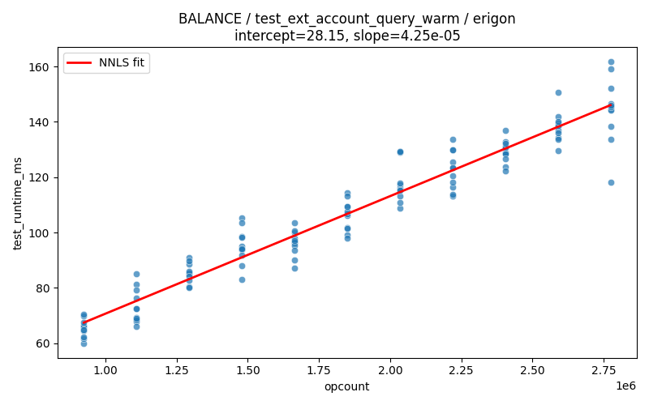

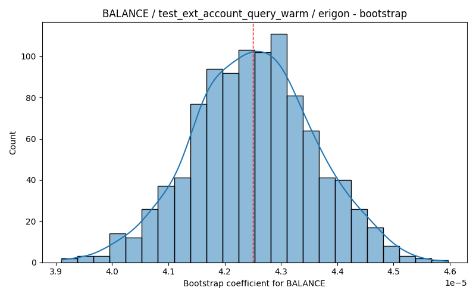

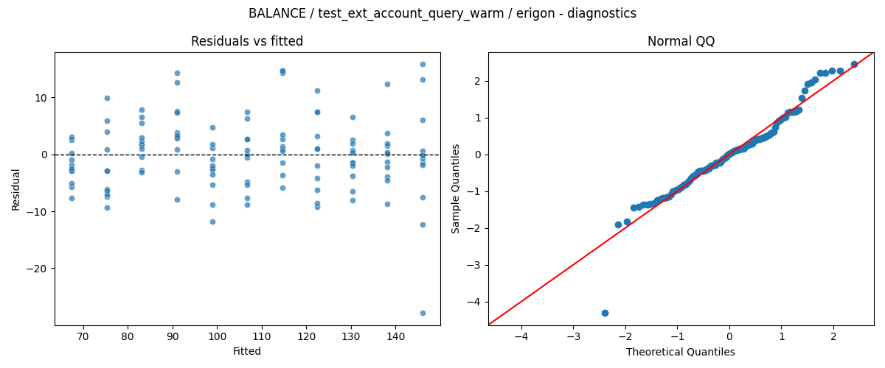

</details>

<details><summary>geth — NNLS regression summary</summary>

```
==============================================================================
                           NNLS Regression Results                            
==============================================================================
Dep. Variable:          test_runtime_ms              R-squared:          0.868
Model:                  NNLS                    Adj. R-squared:          0.867
No. Observations:       231                               RMSE:           7.20
Df Residuals:           229                                MAE:           5.79
Df Model:               1      
==============================================================================
                      coef     std err     P-value      [0.025      0.975]
------------------------------------------------------------------------------
         const     17.4990      1.5684       0.001     14.4652     20.6747
       opcount      0.0000      0.0000       0.001      0.0000      0.0000
==============================================================================
Notes: Non-negative least squares with bootstrap inference (1000 iterations)
==============================================================================
```

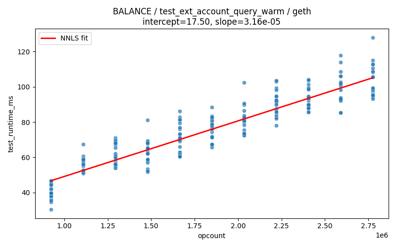

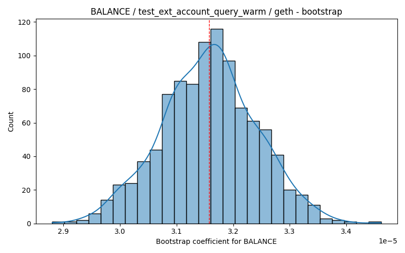

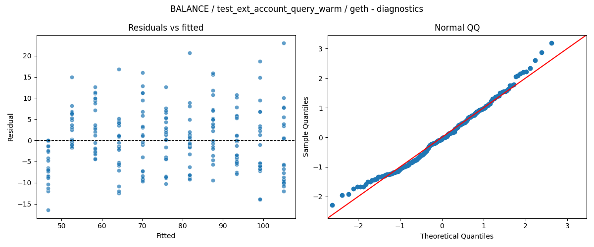

</details>

<details><summary>nethermind — NNLS regression summary</summary>

```
==============================================================================
                           NNLS Regression Results                            
==============================================================================
Dep. Variable:          test_runtime_ms              R-squared:          0.725
Model:                  NNLS                    Adj. R-squared:          0.723
No. Observations:       220                               RMSE:          48.27
Df Residuals:           218                                MAE:          37.33
Df Model:               1      
==============================================================================
                      coef     std err     P-value      [0.025      0.975]
------------------------------------------------------------------------------
         const     99.9268      9.7099       0.001     82.2116    118.7631
       opcount      0.0001      0.0000       0.001      0.0001      0.0001
==============================================================================
Notes: Non-negative least squares with bootstrap inference (1000 iterations)
==============================================================================
```

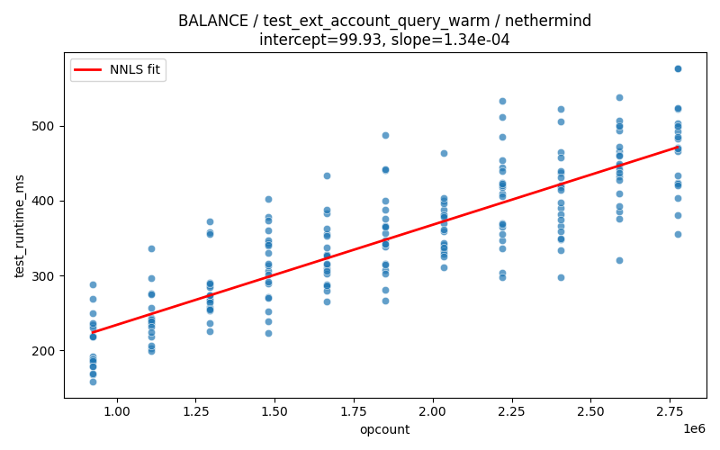

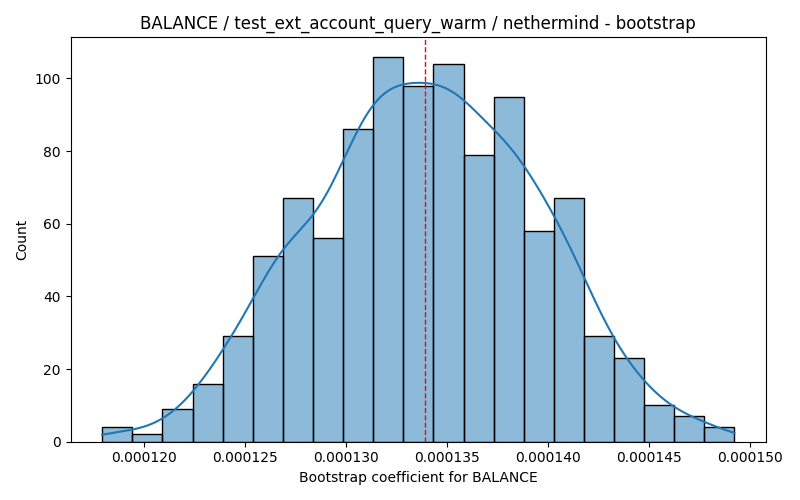

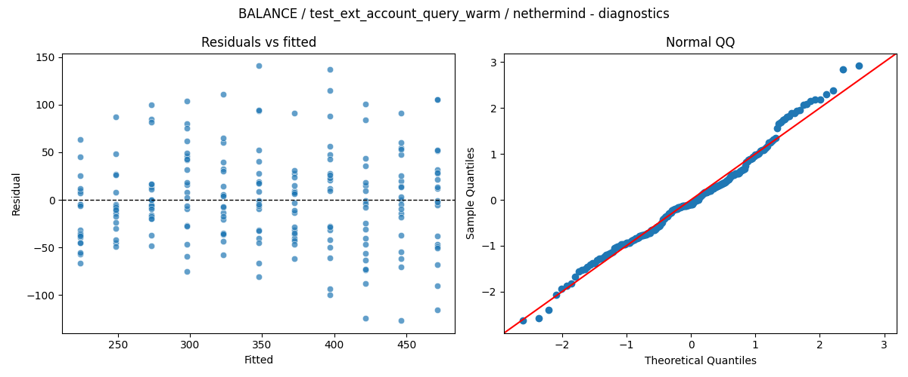

</details>

<details><summary>reth — NNLS regression summary</summary>

```
==============================================================================
                           NNLS Regression Results                            
==============================================================================
Dep. Variable:          test_runtime_ms              R-squared:          0.731
Model:                  NNLS                    Adj. R-squared:          0.729
No. Observations:       220                               RMSE:           3.40
Df Residuals:           218                                MAE:           2.58
Df Model:               1      
==============================================================================
                      coef     std err     P-value      [0.025      0.975]
------------------------------------------------------------------------------
         const      5.0046      0.6898       0.001      3.7389      6.3528
       opcount      0.0000      0.0000       0.001      0.0000      0.0000
==============================================================================
Notes: Non-negative least squares with bootstrap inference (1000 iterations)
==============================================================================
```

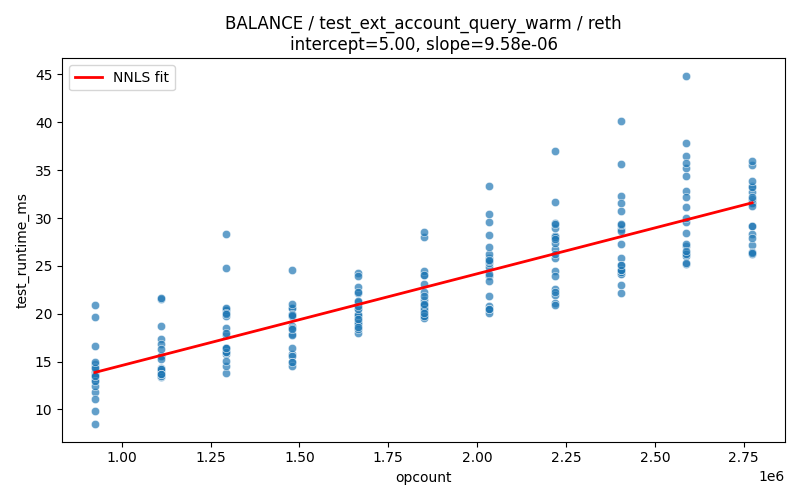

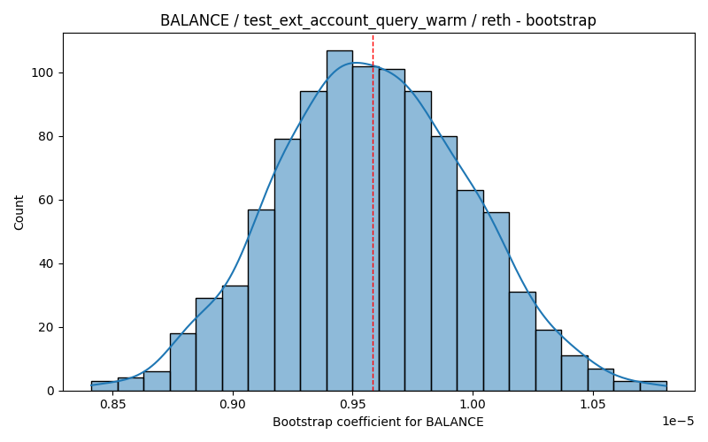

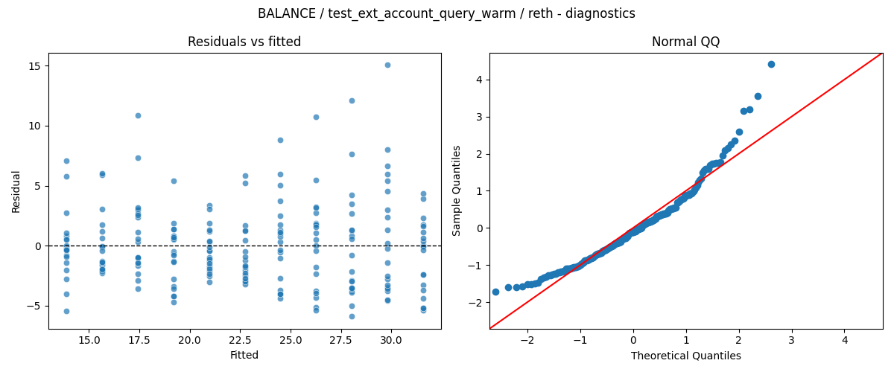

</details>

## CALL

### test_account_access — combo `CALL_AccountMode.EXISTING_EOA`

| client | nobs | R² | target_coef (ms) | p-value | 95% CI |
| --- | --- | --- | --- | --- | --- |
| `besu` | 396 | 0.8715 | 0.0189 | 1.00e-03 | [0.01806, 0.01972] |
| `erigon` | 242 | 0.9909 | 0.007361 | 1.00e-03 | [0.006789, 0.007898] |
| `geth` | 462 | 0.9685 | 0.01239 | 1.00e-03 | [0.01207, 0.01272] |
| `nethermind` | 440 | 0.9563 | 0.003534 | 1.00e-03 | [0.003308, 0.003728] |
| `reth` | 440 | 0.998 | 0 | 1.00e+00 | [0, 0] |

<details><summary>besu — NNLS regression summary</summary>

```
==============================================================================
                           NNLS Regression Results                            
==============================================================================
Dep. Variable:          test_runtime_ms              R-squared:          0.871
Model:                  NNLS                    Adj. R-squared:          0.871
No. Observations:       396                               RMSE:         189.87
Df Residuals:           393                                MAE:         158.46
Df Model:               2      
==============================================================================
                      coef     std err     P-value      [0.025      0.975]
------------------------------------------------------------------------------
         const    586.1899     28.0686       0.001    529.2851    638.9680
       opcount      0.0189      0.0004       0.001      0.0181      0.0197
        update      0.0577      0.0010       0.001      0.0556      0.0596
==============================================================================
Notes: Non-negative least squares with bootstrap inference (1000 iterations)
==============================================================================
```

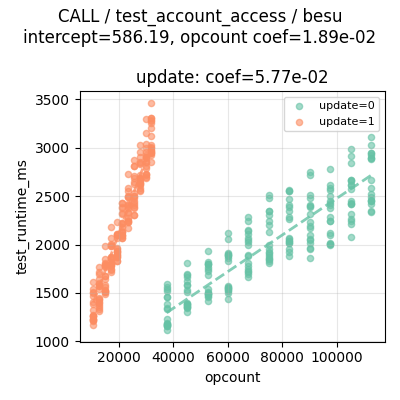

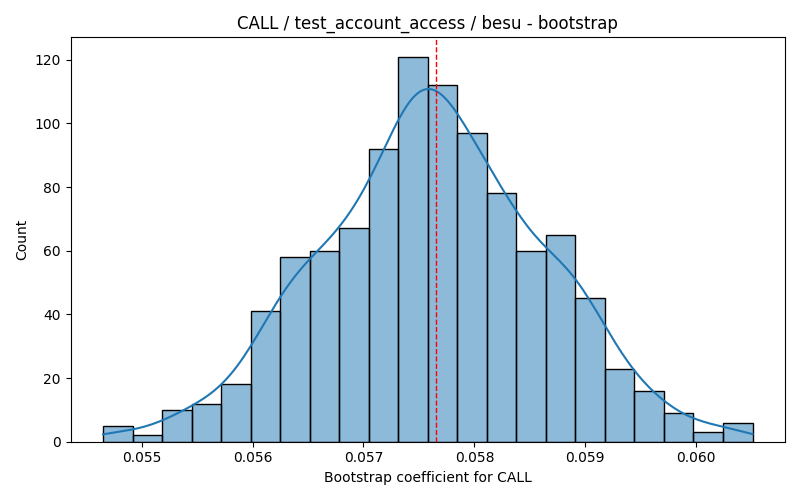

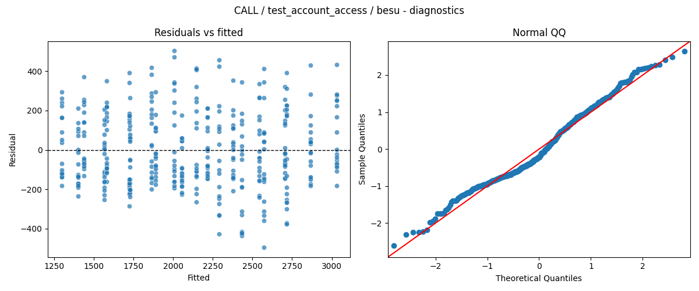

</details>

<details><summary>erigon — NNLS regression summary</summary>

```
==============================================================================
                           NNLS Regression Results                            
==============================================================================
Dep. Variable:          test_runtime_ms              R-squared:          0.991
Model:                  NNLS                    Adj. R-squared:          0.991
No. Observations:       242                               RMSE:          87.58
Df Residuals:           239                                MAE:          77.03
Df Model:               2      
==============================================================================
                      coef     std err     P-value      [0.025      0.975]
------------------------------------------------------------------------------
         const    282.6576     22.6771       0.001    239.5830    329.8533
       opcount      0.0074      0.0003       0.001      0.0068      0.0079
        update      0.0913      0.0009       0.001      0.0895      0.0930
==============================================================================
Notes: Non-negative least squares with bootstrap inference (1000 iterations)
==============================================================================
```

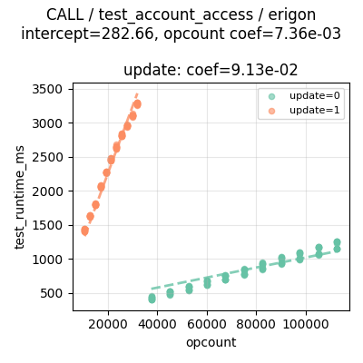

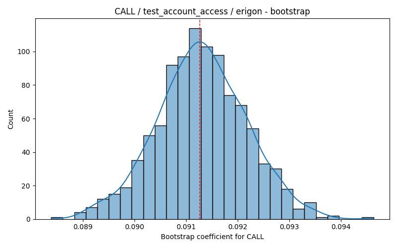

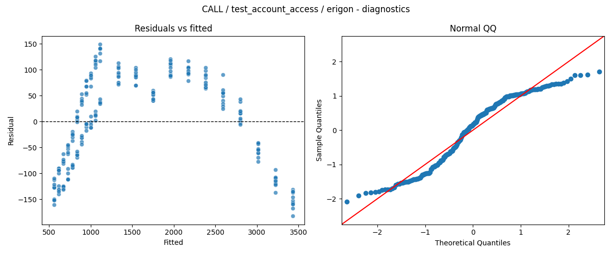

</details>

<details><summary>geth — NNLS regression summary</summary>

```
==============================================================================
                           NNLS Regression Results                            
==============================================================================
Dep. Variable:          test_runtime_ms              R-squared:          0.968
Model:                  NNLS                    Adj. R-squared:          0.968
No. Observations:       462                               RMSE:          63.89
Df Residuals:           459                                MAE:          50.31
Df Model:               2      
==============================================================================
                      coef     std err     P-value      [0.025      0.975]
------------------------------------------------------------------------------
         const    338.4466     13.2923       0.001    312.4548    365.6205
       opcount      0.0124      0.0002       0.001      0.0121      0.0127
        update      0.0425      0.0004       0.001      0.0416      0.0433
==============================================================================
Notes: Non-negative least squares with bootstrap inference (1000 iterations)
==============================================================================
```

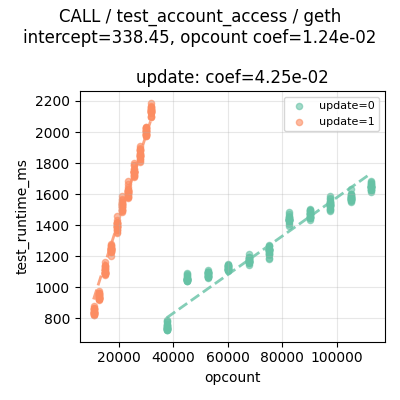

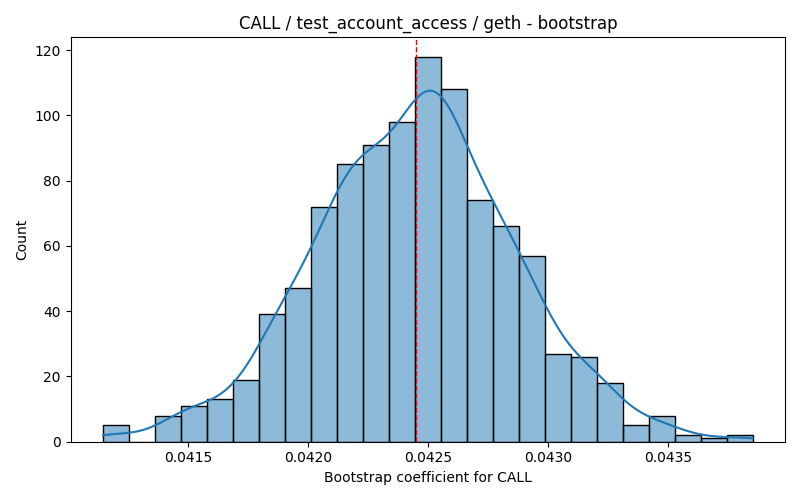

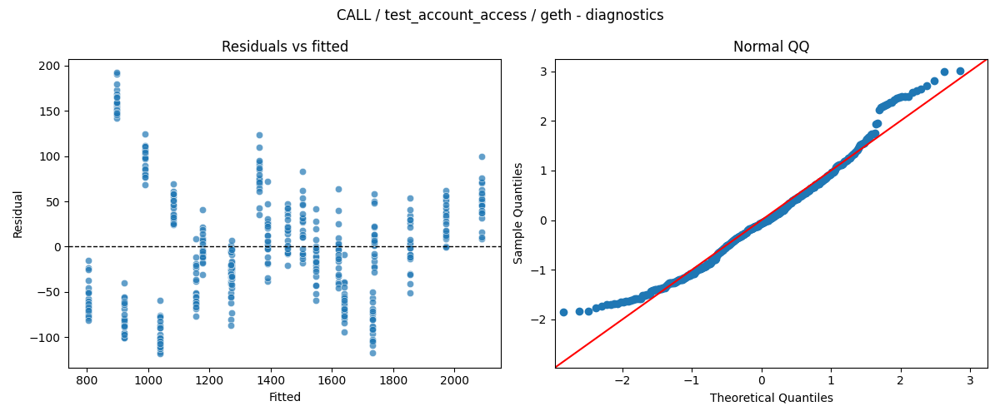

</details>

<details><summary>nethermind — NNLS regression summary</summary>

```
==============================================================================
                           NNLS Regression Results                            
==============================================================================
Dep. Variable:          test_runtime_ms              R-squared:          0.956
Model:                  NNLS                    Adj. R-squared:          0.956
No. Observations:       440                               RMSE:          60.69
Df Residuals:           437                                MAE:          44.13
Df Model:               2      
==============================================================================
                      coef     std err     P-value      [0.025      0.975]
------------------------------------------------------------------------------
         const    116.5127      8.7039       0.001    101.3972    135.0033
       opcount      0.0035      0.0001       0.001      0.0033      0.0037
        update      0.0302      0.0005       0.001      0.0293      0.0311
==============================================================================
Notes: Non-negative least squares with bootstrap inference (1000 iterations)
==============================================================================
```

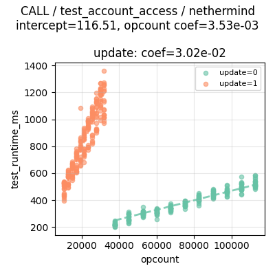

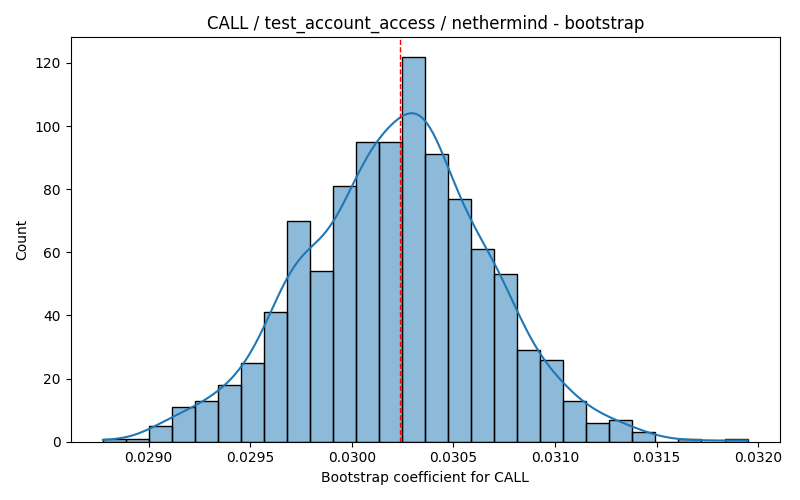

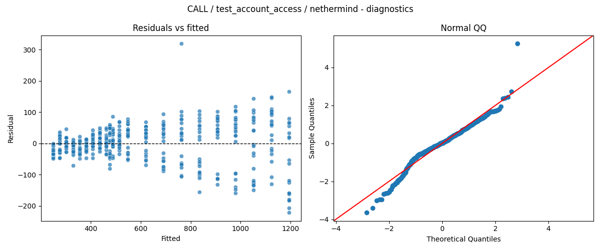

</details>

<details><summary>reth — NNLS regression summary</summary>

```
==============================================================================
                           NNLS Regression Results                            
==============================================================================
Dep. Variable:          test_runtime_ms              R-squared:          0.998
Model:                  NNLS                    Adj. R-squared:          0.998
No. Observations:       440                               RMSE:          47.03
Df Residuals:           437                                MAE:          39.82
Df Model:               2      
==============================================================================
                      coef     std err     P-value      [0.025      0.975]
------------------------------------------------------------------------------
         const    152.9983      2.6802       0.001    147.8261    158.5583
       opcount      0.0000      0.0000       1.000      0.0000      0.0000
        update      0.0905      0.0002       0.001      0.0901      0.0909
==============================================================================
Notes: Non-negative least squares with bootstrap inference (1000 iterations)
==============================================================================
```

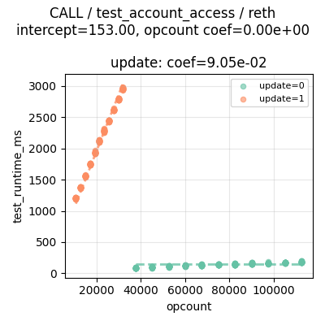

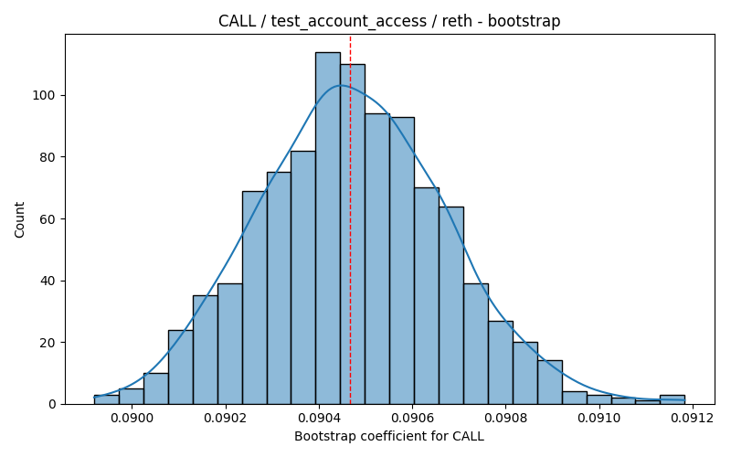

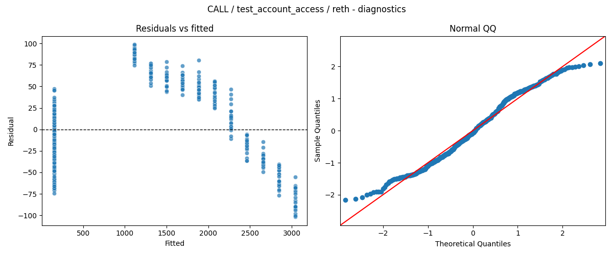

</details>

### test_account_access — combo `CALL_AccountMode.NON_EXISTING_ACCOUNT` — `presets[cold_account_nocode_access]`

| client | nobs | R² | target_coef (ms) | p-value | 95% CI |
| --- | --- | --- | --- | --- | --- |
| `besu` | 396 | 0.9539 | 0.01871 | 1.00e-03 | [0.01788, 0.0196] |
| `erigon` | 242 | 0.988 | 0.009194 | 1.00e-03 | [0.00898, 0.009382] |
| `geth` | 462 | 0.9734 | 0.02928 | 1.00e-03 | [0.02881, 0.02973] |
| `nethermind` | 440 | 0.9846 | 0.004213 | 1.00e-03 | [0.00412, 0.004302] |
| `reth` | 440 | 0.9492 | 0.001071 | 1.00e-03 | [0.001047, 0.001097] |

<details><summary>besu — NNLS regression summary</summary>

```
==============================================================================
                           NNLS Regression Results                            
==============================================================================
Dep. Variable:          test_runtime_ms              R-squared:          0.954
Model:                  NNLS                    Adj. R-squared:          0.954
No. Observations:       396                               RMSE:         160.26
Df Residuals:           393                                MAE:         119.37
Df Model:               2      
==============================================================================
                      coef     std err     P-value      [0.025      0.975]
------------------------------------------------------------------------------
         const    439.8169     26.0339       0.001    388.7095    489.4035
       opcount      0.0187      0.0004       0.001      0.0179      0.0196
        update      0.0685      0.0224       0.001      0.0252      0.1138
==============================================================================
Notes: Non-negative least squares with bootstrap inference (1000 iterations)
==============================================================================
```

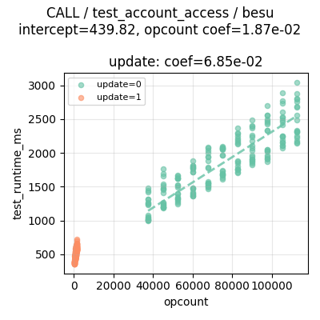

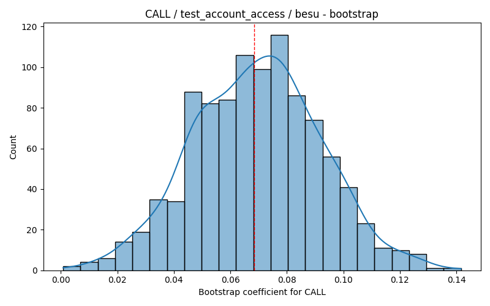

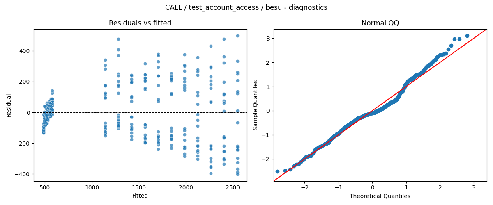

</details>

<details><summary>erigon — NNLS regression summary</summary>

```
==============================================================================
                           NNLS Regression Results                            
==============================================================================
Dep. Variable:          test_runtime_ms              R-squared:          0.988
Model:                  NNLS                    Adj. R-squared:          0.988
No. Observations:       242                               RMSE:          30.39
Df Residuals:           239                                MAE:          23.83
Df Model:               2      
==============================================================================
                      coef     std err     P-value      [0.025      0.975]
------------------------------------------------------------------------------
         const     35.2269      5.8766       0.001     23.9269     47.0114
       opcount      0.0092      0.0001       0.001      0.0090      0.0094
        update      0.2287      0.0051       0.001      0.2187      0.2386
==============================================================================
Notes: Non-negative least squares with bootstrap inference (1000 iterations)
==============================================================================
```

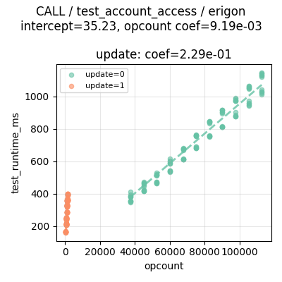

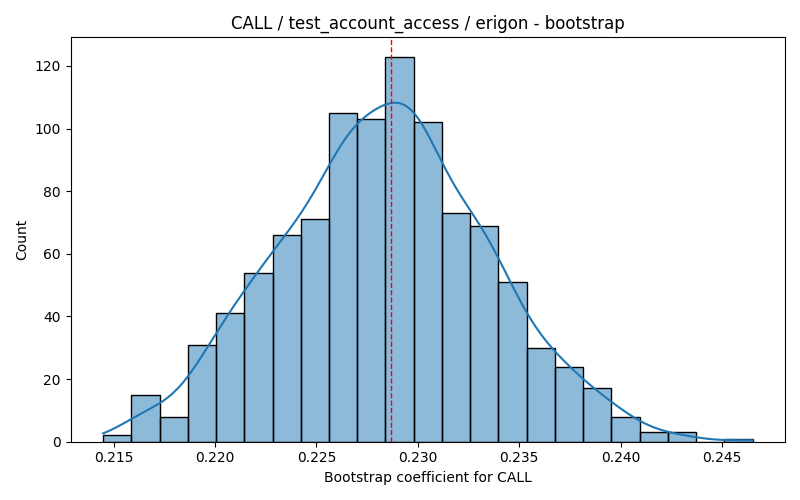

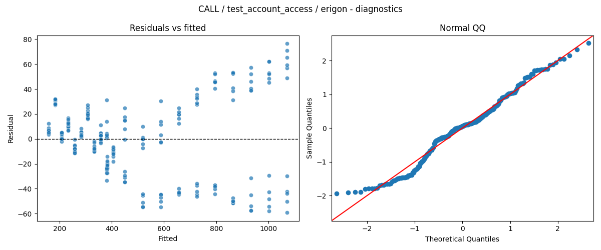

</details>

<details><summary>geth — NNLS regression summary</summary>

```
==============================================================================
                           NNLS Regression Results                            
==============================================================================
Dep. Variable:          test_runtime_ms              R-squared:          0.973
Model:                  NNLS                    Adj. R-squared:          0.973
No. Observations:       462                               RMSE:         196.76
Df Residuals:           459                                MAE:         137.08
Df Model:               2      
==============================================================================
                      coef     std err     P-value      [0.025      0.975]
------------------------------------------------------------------------------
         const    185.4266      7.2256       0.001    172.3009    200.1751
       opcount      0.0293      0.0002       0.001      0.0288      0.0297
        update      0.0000      0.0000       1.000      0.0000      0.0000
==============================================================================
Notes: Non-negative least squares with bootstrap inference (1000 iterations)
==============================================================================
```

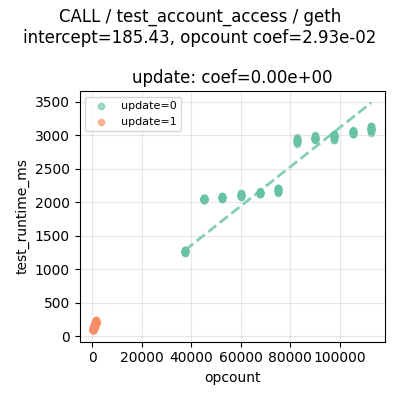


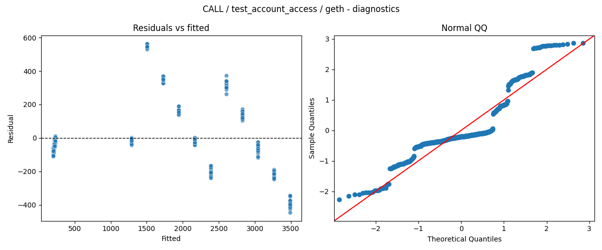

</details>

<details><summary>nethermind — NNLS regression summary</summary>

```
==============================================================================
                           NNLS Regression Results                            
==============================================================================
Dep. Variable:          test_runtime_ms              R-squared:          0.985
Model:                  NNLS                    Adj. R-squared:          0.985
No. Observations:       440                               RMSE:          20.40
Df Residuals:           437                                MAE:          14.34
Df Model:               2      
==============================================================================
                      coef     std err     P-value      [0.025      0.975]
------------------------------------------------------------------------------
         const     51.0084      3.2819       0.001     45.1651     57.9303
       opcount      0.0042      0.0000       0.001      0.0041      0.0043
        update      0.0174      0.0029       0.001      0.0115      0.0227
==============================================================================
Notes: Non-negative least squares with bootstrap inference (1000 iterations)
==============================================================================
```

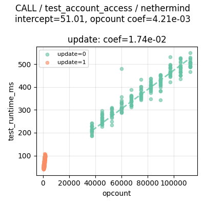

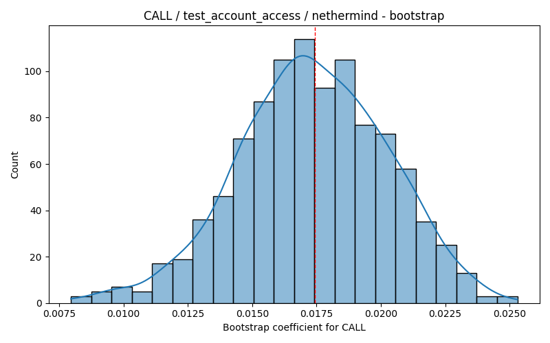

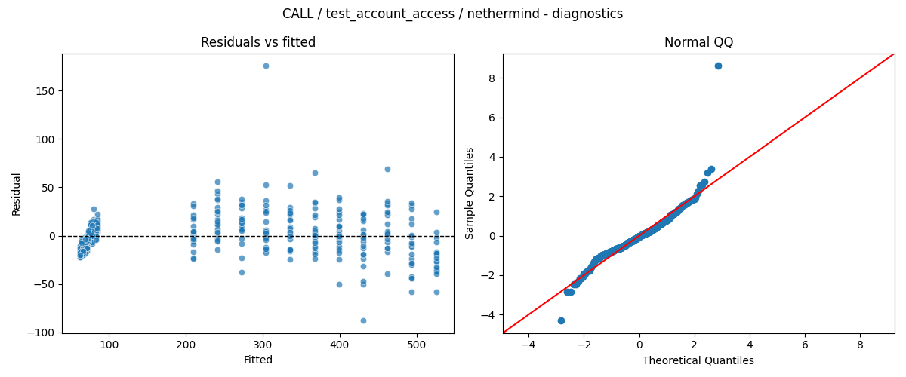

</details>

<details><summary>reth — NNLS regression summary</summary>

```
==============================================================================
                           NNLS Regression Results                            
==============================================================================
Dep. Variable:          test_runtime_ms              R-squared:          0.949
Model:                  NNLS                    Adj. R-squared:          0.949
No. Observations:       440                               RMSE:           5.71
Df Residuals:           437                                MAE:           4.62
Df Model:               2      
==============================================================================
                      coef     std err     P-value      [0.025      0.975]
------------------------------------------------------------------------------
         const     32.5341      0.9963       0.001     30.6685     34.4440
       opcount      0.0011      0.0000       0.001      0.0010      0.0011
        update      0.0703      0.0008       0.001      0.0687      0.0719
==============================================================================
Notes: Non-negative least squares with bootstrap inference (1000 iterations)
==============================================================================
```

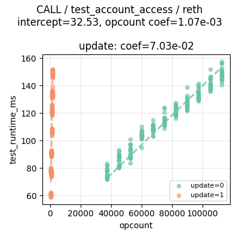

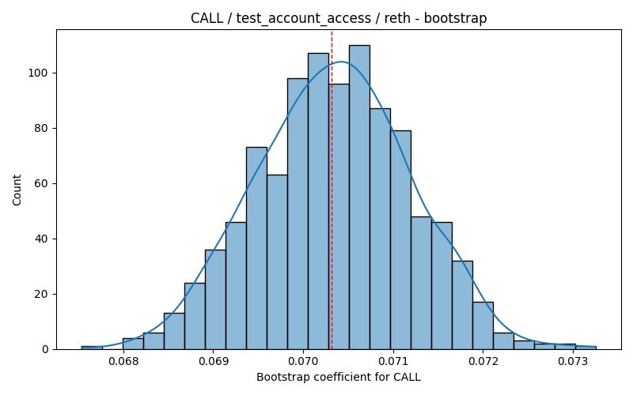

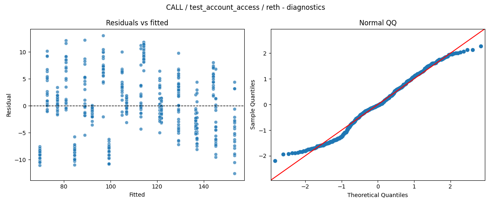

</details>

### test_account_access — combo `CALL_AccountMode.EXISTING_CONTRACT`

| client | nobs | R² | target_coef (ms) | p-value | 95% CI |
| --- | --- | --- | --- | --- | --- |
| `besu` | 396 | 0.8884 | 0.02893 | 1.00e-03 | [0.0278, 0.03007] |
| `erigon` | 242 | 0.9443 | 0.07565 | 1.00e-03 | [0.07262, 0.07857] |
| `geth` | 462 | 0.9366 | 0.0261 | 1.00e-03 | [0.02537, 0.02682] |
| `nethermind` | 440 | 0.8848 | 0.02262 | 1.00e-03 | [0.02164, 0.02356] |
| `reth` | 440 | 0.972 | 0.0182 | 1.00e-03 | [0.01751, 0.0191] |

<details><summary>besu — NNLS regression summary</summary>

```
==============================================================================
                           NNLS Regression Results                            
==============================================================================
Dep. Variable:          test_runtime_ms              R-squared:          0.888
Model:                  NNLS                    Adj. R-squared:          0.888
No. Observations:       396                               RMSE:         227.82
Df Residuals:           393                                MAE:         195.33
Df Model:               2      
==============================================================================
                      coef     std err     P-value      [0.025      0.975]
------------------------------------------------------------------------------
         const    743.1907     34.1959       0.001    675.0854    810.0929
       opcount      0.0289      0.0006       0.001      0.0278      0.0301
        update      0.0752      0.0015       0.001      0.0723      0.0784
==============================================================================
Notes: Non-negative least squares with bootstrap inference (1000 iterations)
==============================================================================
```

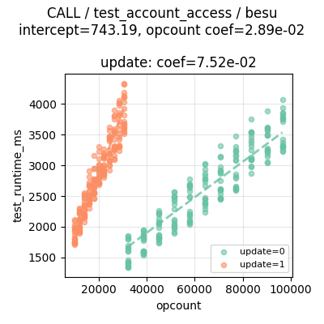

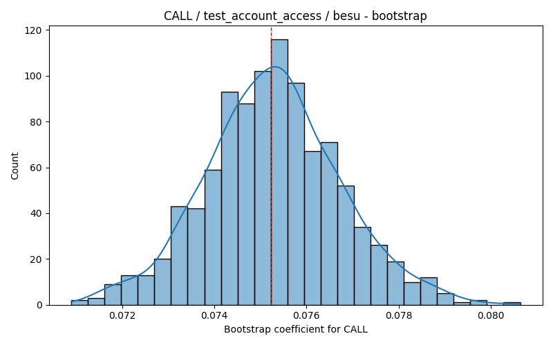

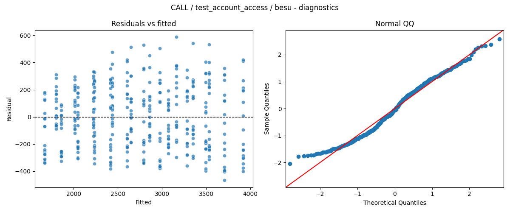

</details>

<details><summary>erigon — NNLS regression summary</summary>

```
==============================================================================
                           NNLS Regression Results                            
==============================================================================
Dep. Variable:          test_runtime_ms              R-squared:          0.944
Model:                  NNLS                    Adj. R-squared:          0.944
No. Observations:       242                               RMSE:         440.21
Df Residuals:           239                                MAE:         320.31
Df Model:               2      
==============================================================================
                      coef     std err     P-value      [0.025      0.975]
------------------------------------------------------------------------------
         const   1276.1466    109.2703       0.001   1073.0861   1488.8082
       opcount      0.0756      0.0015       0.001      0.0726      0.0786
        update      0.2189      0.0037       0.001      0.2118      0.2259
==============================================================================
Notes: Non-negative least squares with bootstrap inference (1000 iterations)
==============================================================================
```

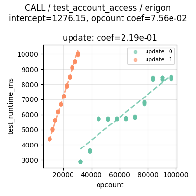

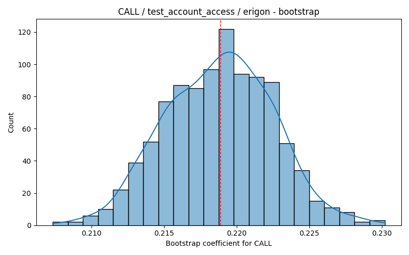

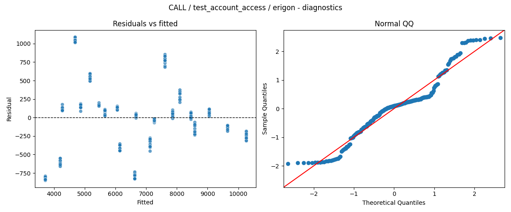

</details>

<details><summary>geth — NNLS regression summary</summary>

```
==============================================================================
                           NNLS Regression Results                            
==============================================================================
Dep. Variable:          test_runtime_ms              R-squared:          0.937
Model:                  NNLS                    Adj. R-squared:          0.936
No. Observations:       462                               RMSE:         145.34
Df Residuals:           459                                MAE:         112.43
Df Model:               2      
==============================================================================
                      coef     std err     P-value      [0.025      0.975]
------------------------------------------------------------------------------
         const    560.9289     25.4166       0.001    514.4156    611.0966
       opcount      0.0261      0.0004       0.001      0.0254      0.0268
        update      0.0636      0.0008       0.001      0.0620      0.0652
==============================================================================
Notes: Non-negative least squares with bootstrap inference (1000 iterations)
==============================================================================
```

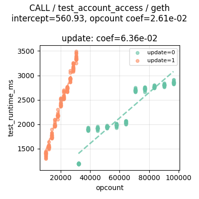

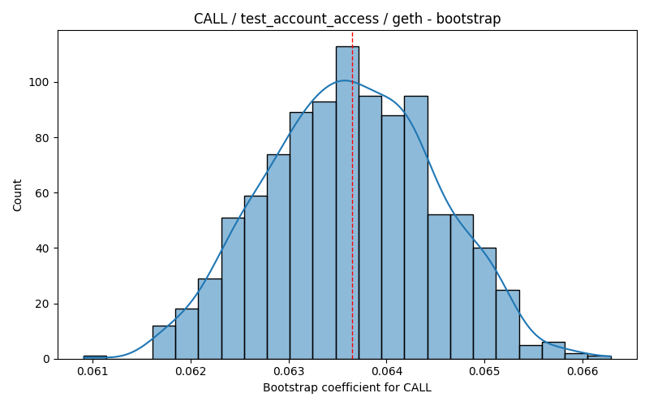

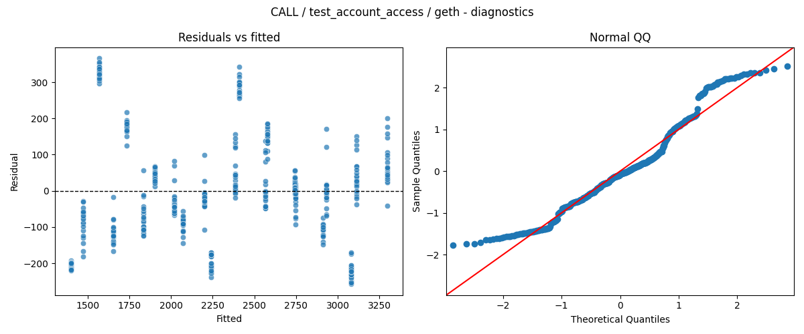

</details>

<details><summary>nethermind — NNLS regression summary</summary>

```
==============================================================================
                           NNLS Regression Results                            
==============================================================================
Dep. Variable:          test_runtime_ms              R-squared:          0.885
Model:                  NNLS                    Adj. R-squared:          0.884
No. Observations:       440                               RMSE:         176.24
Df Residuals:           437                                MAE:         147.70
Df Model:               2      
==============================================================================
                      coef     std err     P-value      [0.025      0.975]
------------------------------------------------------------------------------
         const    345.3989     32.3672       0.001    286.6521    413.2790
       opcount      0.0226      0.0005       0.001      0.0216      0.0236
        update      0.0182      0.0011       0.001      0.0159      0.0203
==============================================================================
Notes: Non-negative least squares with bootstrap inference (1000 iterations)
==============================================================================
```

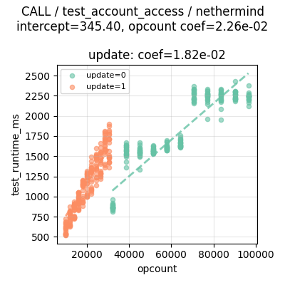

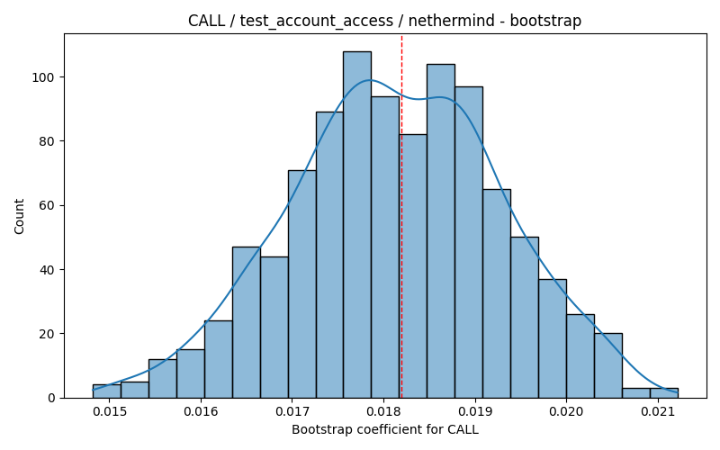

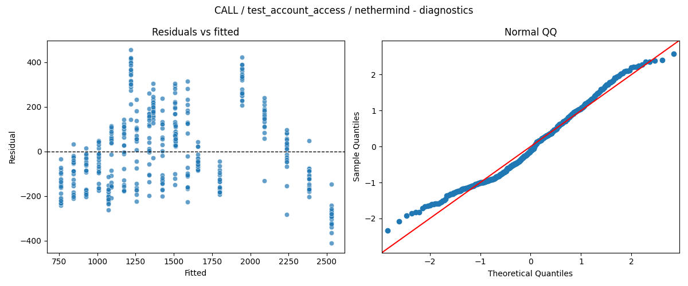

</details>

<details><summary>reth — NNLS regression summary</summary>

```
==============================================================================
                           NNLS Regression Results                            
==============================================================================
Dep. Variable:          test_runtime_ms              R-squared:          0.972
Model:                  NNLS                    Adj. R-squared:          0.972
No. Observations:       440                               RMSE:         107.31
Df Residuals:           437                                MAE:          44.82
Df Model:               2      
==============================================================================
                      coef     std err     P-value      [0.025      0.975]
------------------------------------------------------------------------------
         const    306.3003     18.7723       0.001    266.4156    341.5831
       opcount      0.0182      0.0004       0.001      0.0175      0.0191
        update      0.0769      0.0005       0.001      0.0759      0.0779
==============================================================================
Notes: Non-negative least squares with bootstrap inference (1000 iterations)
==============================================================================
```

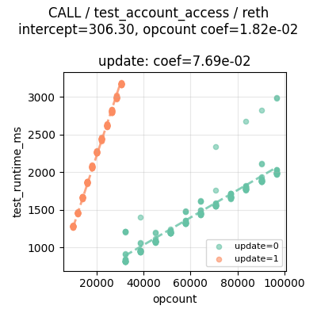

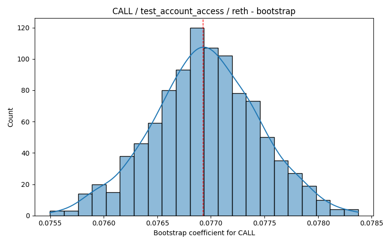

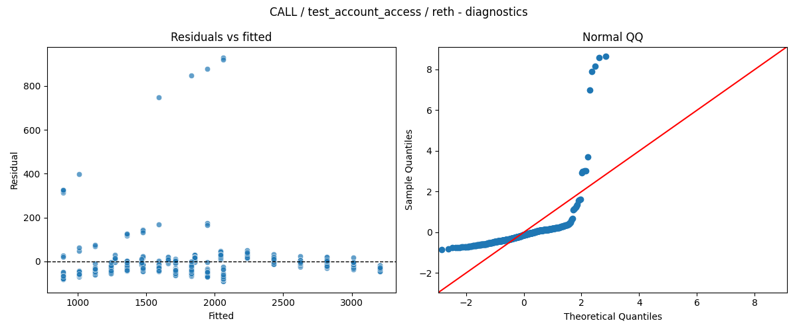

</details>

### test_account_access — combo `CALL_AccountMode.NON_EXISTING_ACCOUNT` — `presets[cold_account_code_access]`

| client | nobs | R² | target_coef (ms) | p-value | 95% CI |
| --- | --- | --- | --- | --- | --- |
| `besu` | 396 | 0.9539 | 0.01871 | 1.00e-03 | [0.01788, 0.0196] |
| `erigon` | 242 | 0.988 | 0.009194 | 1.00e-03 | [0.00898, 0.009382] |
| `geth` | 462 | 0.9734 | 0.02928 | 1.00e-03 | [0.02881, 0.02973] |
| `nethermind` | 440 | 0.9846 | 0.004213 | 1.00e-03 | [0.00412, 0.004302] |
| `reth` | 440 | 0.9492 | 0.001071 | 1.00e-03 | [0.001047, 0.001097] |

<details><summary>besu — NNLS regression summary</summary>

```
==============================================================================
                           NNLS Regression Results                            
==============================================================================
Dep. Variable:          test_runtime_ms              R-squared:          0.954
Model:                  NNLS                    Adj. R-squared:          0.954
No. Observations:       396                               RMSE:         160.26
Df Residuals:           393                                MAE:         119.37
Df Model:               2      
==============================================================================
                      coef     std err     P-value      [0.025      0.975]
------------------------------------------------------------------------------
         const    439.8169     26.0339       0.001    388.7095    489.4035
       opcount      0.0187      0.0004       0.001      0.0179      0.0196
        update      0.0685      0.0224       0.001      0.0252      0.1138
==============================================================================
Notes: Non-negative least squares with bootstrap inference (1000 iterations)
==============================================================================
```


</details>

<details><summary>erigon — NNLS regression summary</summary>

```
==============================================================================
                           NNLS Regression Results                            
==============================================================================
Dep. Variable:          test_runtime_ms              R-squared:          0.988
Model:                  NNLS                    Adj. R-squared:          0.988
No. Observations:       242                               RMSE:          30.39
Df Residuals:           239                                MAE:          23.83
Df Model:               2      
==============================================================================
                      coef     std err     P-value      [0.025      0.975]
------------------------------------------------------------------------------
         const     35.2269      5.8766       0.001     23.9269     47.0114
       opcount      0.0092      0.0001       0.001      0.0090      0.0094
        update      0.2287      0.0051       0.001      0.2187      0.2386
==============================================================================
Notes: Non-negative least squares with bootstrap inference (1000 iterations)
==============================================================================
```


</details>

<details><summary>geth — NNLS regression summary</summary>

```
==============================================================================
                           NNLS Regression Results                            
==============================================================================
Dep. Variable:          test_runtime_ms              R-squared:          0.973
Model:                  NNLS                    Adj. R-squared:          0.973
No. Observations:       462                               RMSE:         196.76
Df Residuals:           459                                MAE:         137.08
Df Model:               2      
==============================================================================
                      coef     std err     P-value      [0.025      0.975]
------------------------------------------------------------------------------
         const    185.4266      7.2256       0.001    172.3009    200.1751
       opcount      0.0293      0.0002       0.001      0.0288      0.0297
        update      0.0000      0.0000       1.000      0.0000      0.0000
==============================================================================
Notes: Non-negative least squares with bootstrap inference (1000 iterations)
==============================================================================
```


</details>

<details><summary>nethermind — NNLS regression summary</summary>

```
==============================================================================
                           NNLS Regression Results                            
==============================================================================
Dep. Variable:          test_runtime_ms              R-squared:          0.985
Model:                  NNLS                    Adj. R-squared:          0.985
No. Observations:       440                               RMSE:          20.40
Df Residuals:           437                                MAE:          14.34
Df Model:               2      
==============================================================================
                      coef     std err     P-value      [0.025      0.975]
------------------------------------------------------------------------------
         const     51.0084      3.2819       0.001     45.1651     57.9303
       opcount      0.0042      0.0000       0.001      0.0041      0.0043
        update      0.0174      0.0029       0.001      0.0115      0.0227
==============================================================================
Notes: Non-negative least squares with bootstrap inference (1000 iterations)
==============================================================================
```


</details>

<details><summary>reth — NNLS regression summary</summary>

```
==============================================================================
                           NNLS Regression Results                            
==============================================================================
Dep. Variable:          test_runtime_ms              R-squared:          0.949
Model:                  NNLS                    Adj. R-squared:          0.949
No. Observations:       440                               RMSE:           5.71
Df Residuals:           437                                MAE:           4.62
Df Model:               2      
==============================================================================
                      coef     std err     P-value      [0.025      0.975]
------------------------------------------------------------------------------
         const     32.5341      0.9963       0.001     30.6685     34.4440
       opcount      0.0011      0.0000       0.001      0.0010      0.0011
        update      0.0703      0.0008       0.001      0.0687      0.0719
==============================================================================
Notes: Non-negative least squares with bootstrap inference (1000 iterations)
==============================================================================
```


</details>

### test_ext_account_query_warm — combo `CALL`

| client | nobs | R² | target_coef (ms) | p-value | 95% CI |
| --- | --- | --- | --- | --- | --- |
| `besu` | 198 | 0.7435 | 0.0006039 | 1.00e-03 | [0.0005518, 0.0006514] |
| `erigon` | 121 | 0.9698 | 0.0004798 | 1.00e-03 | [0.0004652, 0.0004939] |
| `geth` | 231 | 0.9239 | 0.0001425 | 1.00e-03 | [0.0001371, 0.000148] |
| `nethermind` | 220 | 0.804 | 0.0003918 | 1.00e-03 | [0.0003659, 0.0004156] |
| `reth` | 220 | 0.9169 | 5.651e-05 | 1.00e-03 | [5.448e-05, 5.85e-05] |

<details><summary>besu — NNLS regression summary</summary>

```
==============================================================================
                           NNLS Regression Results                            
==============================================================================
Dep. Variable:          test_runtime_ms              R-squared:          0.743
Model:                  NNLS                    Adj. R-squared:          0.742
No. Observations:       198                               RMSE:         179.23
Df Residuals:           196                                MAE:         144.63
Df Model:               1      
==============================================================================
                      coef     std err     P-value      [0.025      0.975]
------------------------------------------------------------------------------
         const    747.5599     38.3458       0.001    678.6468    825.0855
       opcount      0.0006      0.0000       0.001      0.0006      0.0007
==============================================================================
Notes: Non-negative least squares with bootstrap inference (1000 iterations)
==============================================================================
```

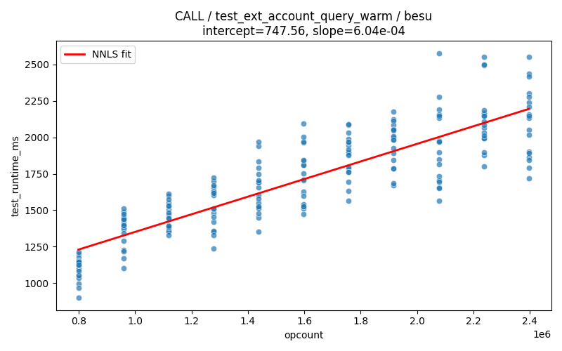

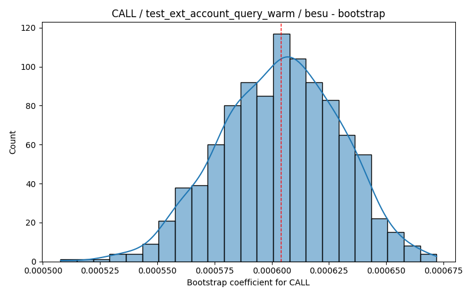

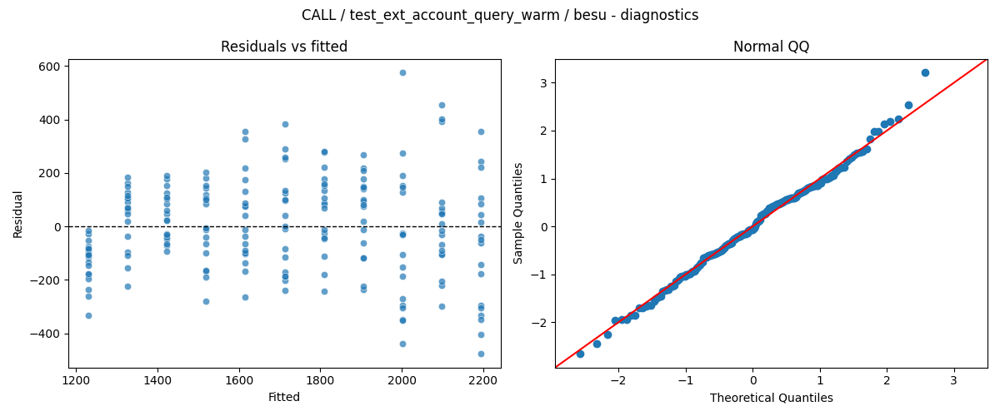

</details>

<details><summary>erigon — NNLS regression summary</summary>

```
==============================================================================
                           NNLS Regression Results                            
==============================================================================
Dep. Variable:          test_runtime_ms              R-squared:          0.970
Model:                  NNLS                    Adj. R-squared:          0.970
No. Observations:       121                               RMSE:          42.76
Df Residuals:           119                                MAE:          33.56
Df Model:               1      
==============================================================================
                      coef     std err     P-value      [0.025      0.975]
------------------------------------------------------------------------------
         const     44.7501     12.5854       0.001     21.4062     68.0648
       opcount      0.0005      0.0000       0.001      0.0005      0.0005
==============================================================================
Notes: Non-negative least squares with bootstrap inference (1000 iterations)
==============================================================================
```

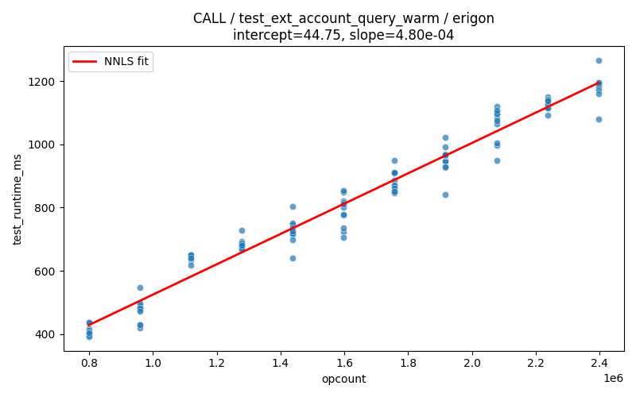

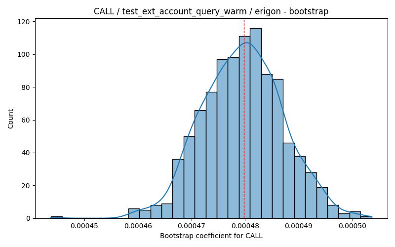

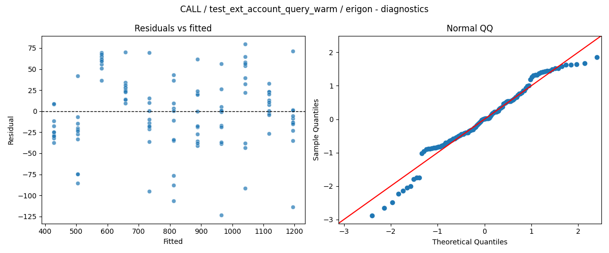

</details>

<details><summary>geth — NNLS regression summary</summary>

```
==============================================================================
                           NNLS Regression Results                            
==============================================================================
Dep. Variable:          test_runtime_ms              R-squared:          0.924
Model:                  NNLS                    Adj. R-squared:          0.924
No. Observations:       231                               RMSE:          20.67
Df Residuals:           229                                MAE:          16.89
Df Model:               1      
==============================================================================
                      coef     std err     P-value      [0.025      0.975]
------------------------------------------------------------------------------
         const     52.3948      4.4916       0.001     43.9021     61.5015
       opcount      0.0001      0.0000       0.001      0.0001      0.0001
==============================================================================
Notes: Non-negative least squares with bootstrap inference (1000 iterations)
==============================================================================
```

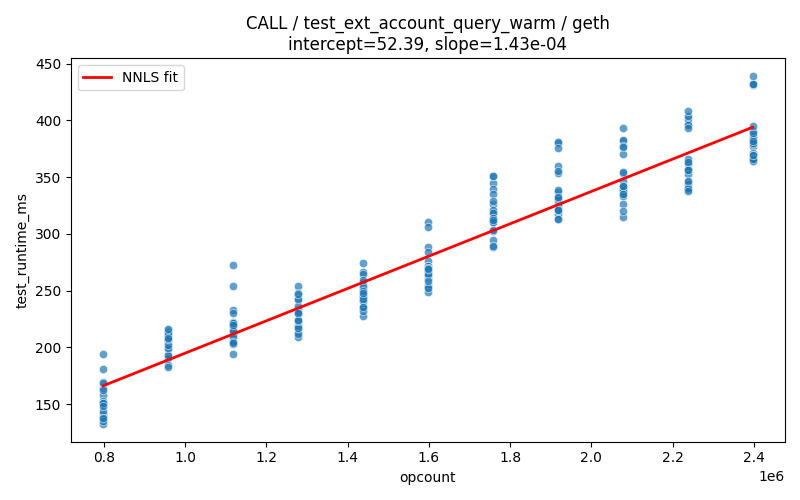

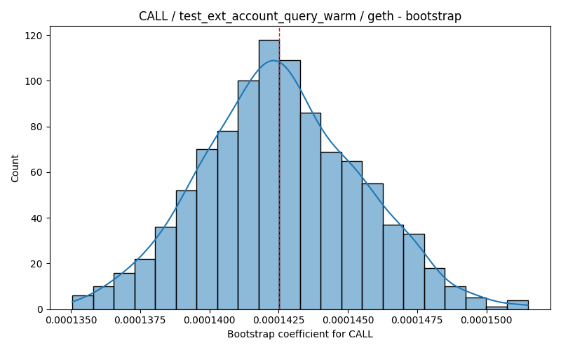

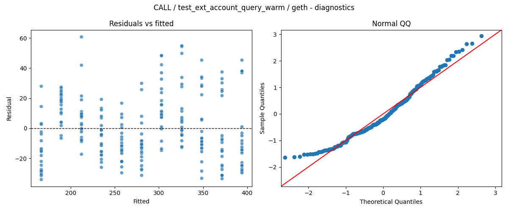

</details>

<details><summary>nethermind — NNLS regression summary</summary>

```
==============================================================================
                           NNLS Regression Results                            
==============================================================================
Dep. Variable:          test_runtime_ms              R-squared:          0.804
Model:                  NNLS                    Adj. R-squared:          0.803
No. Observations:       220                               RMSE:          97.74
Df Residuals:           218                                MAE:          72.13
Df Model:               1      
==============================================================================
                      coef     std err     P-value      [0.025      0.975]
------------------------------------------------------------------------------
         const    168.3478     18.6412       0.001    132.0762    205.1735
       opcount      0.0004      0.0000       0.001      0.0004      0.0004
==============================================================================
Notes: Non-negative least squares with bootstrap inference (1000 iterations)
==============================================================================
```

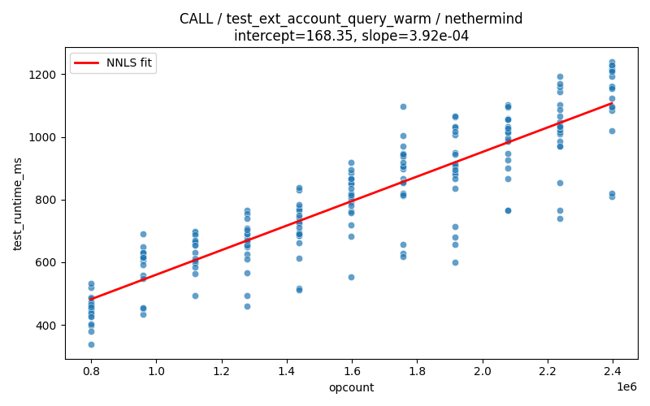

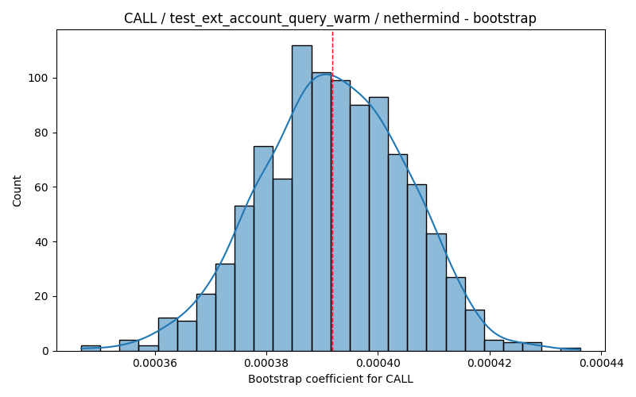

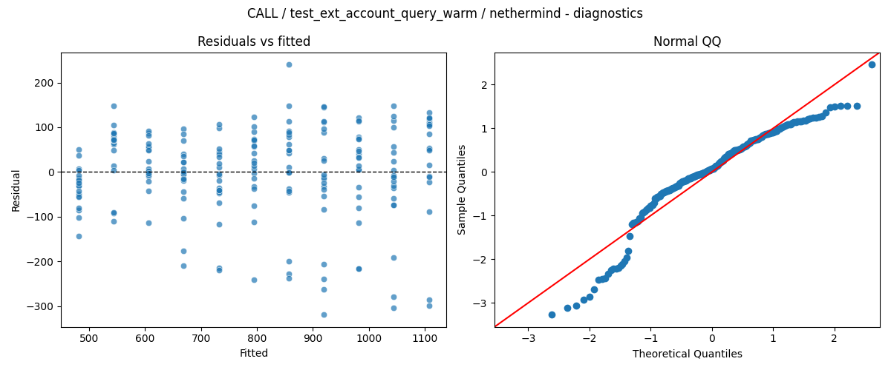

</details>

<details><summary>reth — NNLS regression summary</summary>

```
==============================================================================
                           NNLS Regression Results                            
==============================================================================
Dep. Variable:          test_runtime_ms              R-squared:          0.917
Model:                  NNLS                    Adj. R-squared:          0.917
No. Observations:       220                               RMSE:           8.60
Df Residuals:           218                                MAE:           6.77
Df Model:               1      
==============================================================================
                      coef     std err     P-value      [0.025      0.975]
------------------------------------------------------------------------------
         const     21.8880      1.8115       0.001     18.3796     25.6280
       opcount      0.0001      0.0000       0.001      0.0001      0.0001
==============================================================================
Notes: Non-negative least squares with bootstrap inference (1000 iterations)
==============================================================================
```

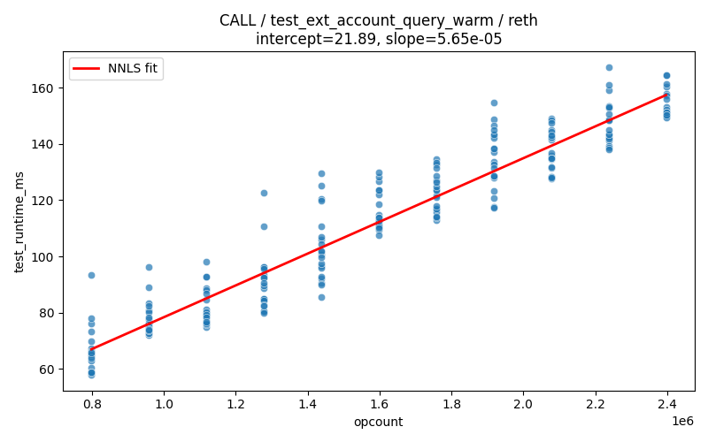

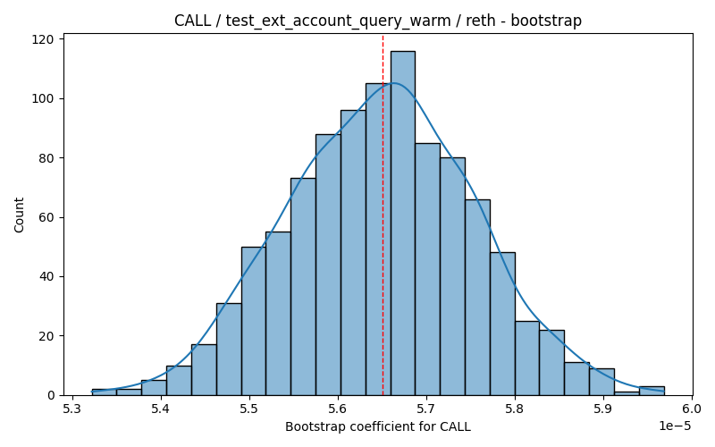

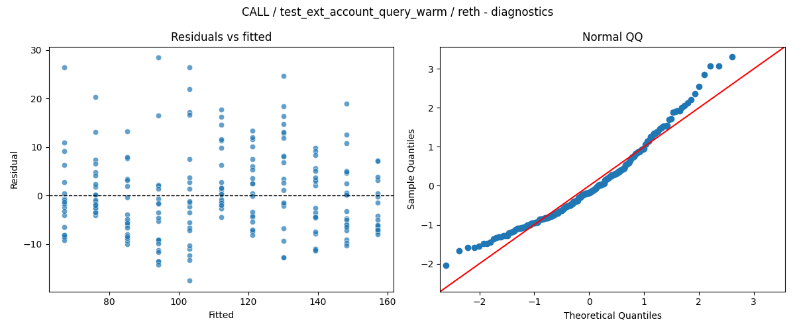

</details>

## CALLCODE

### test_account_access — combo `CALLCODE_AccountMode.EXISTING_EOA`

| client | nobs | R² | target_coef (ms) | p-value | 95% CI |
| --- | --- | --- | --- | --- | --- |
| `besu` | 396 | 0.933 | 0.02152 | 1.00e-03 | [0.02087, 0.02224] |
| `erigon` | 242 | 0.9896 | 0.009656 | 1.00e-03 | [0.009562, 0.009747] |
| `geth` | 462 | 0.9693 | 0.01432 | 1.00e-03 | [0.0141, 0.01454] |
| `nethermind` | 440 | 0.981 | 0.003882 | 1.00e-03 | [0.003831, 0.003937] |
| `reth` | 440 | 0.9754 | 0.001585 | 1.00e-03 | [0.001559, 0.00161] |

<details><summary>besu — NNLS regression summary</summary>

```
==============================================================================
                           NNLS Regression Results                            
==============================================================================
Dep. Variable:          test_runtime_ms              R-squared:          0.933
Model:                  NNLS                    Adj. R-squared:          0.933
No. Observations:       396                               RMSE:         184.97
Df Residuals:           393                                MAE:         146.08
Df Model:               2      
==============================================================================
                      coef     std err     P-value      [0.025      0.975]
------------------------------------------------------------------------------
         const    272.8811     13.7112       0.001    246.8593    301.1337
       opcount      0.0215      0.0003       0.001      0.0209      0.0222
        update      0.0000      0.0000       1.000      0.0000      0.0000
==============================================================================
Notes: Non-negative least squares with bootstrap inference (1000 iterations)
==============================================================================
```

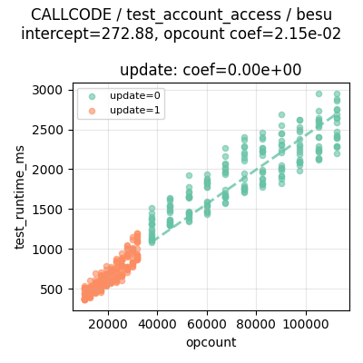


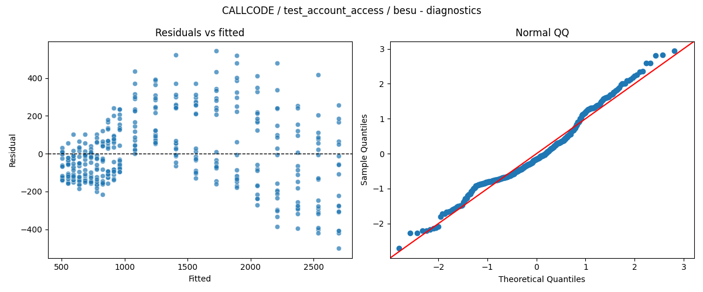

</details>

<details><summary>erigon — NNLS regression summary</summary>

```
==============================================================================
                           NNLS Regression Results                            
==============================================================================
Dep. Variable:          test_runtime_ms              R-squared:          0.990
Model:                  NNLS                    Adj. R-squared:          0.990
No. Observations:       242                               RMSE:          32.48
Df Residuals:           239                                MAE:          27.72
Df Model:               2      
==============================================================================
                      coef     std err     P-value      [0.025      0.975]
------------------------------------------------------------------------------
         const      0.0000      0.0000       1.000      0.0000      0.0000
       opcount      0.0097      0.0000       0.001      0.0096      0.0097
        update      0.0000      0.0000       1.000      0.0000      0.0000
==============================================================================
Notes: Non-negative least squares with bootstrap inference (1000 iterations)
==============================================================================
```

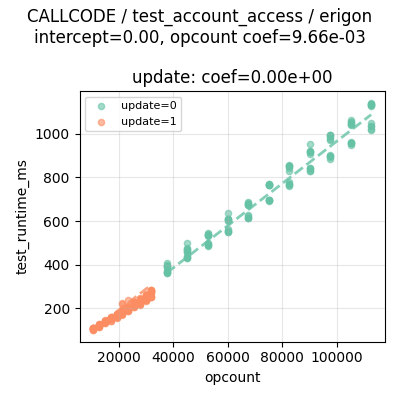


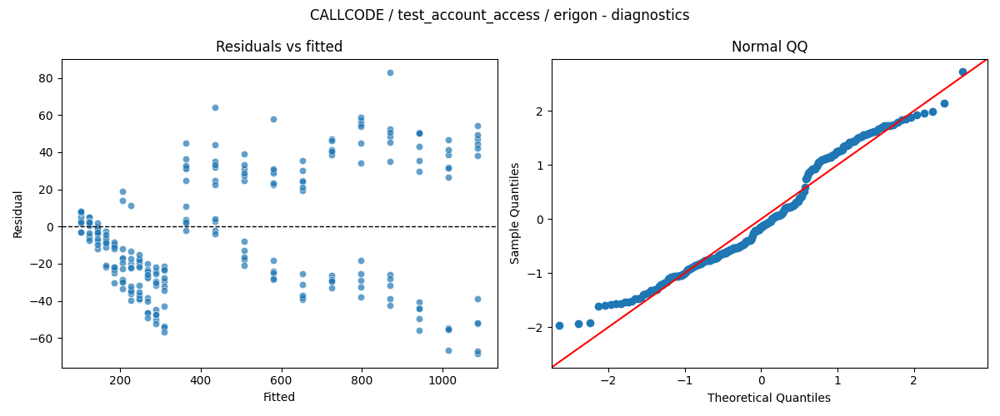

</details>

<details><summary>geth — NNLS regression summary</summary>

```
==============================================================================
                           NNLS Regression Results                            
==============================================================================
Dep. Variable:          test_runtime_ms              R-squared:          0.969
Model:                  NNLS                    Adj. R-squared:          0.969
No. Observations:       462                               RMSE:          81.72
Df Residuals:           459                                MAE:          60.99
Df Model:               2      
==============================================================================
                      coef     std err     P-value      [0.025      0.975]
------------------------------------------------------------------------------
         const    177.4857      5.3797       0.001    167.1165    187.9479
       opcount      0.0143      0.0001       0.001      0.0141      0.0145
        update      0.0000      0.0000       1.000      0.0000      0.0000
==============================================================================
Notes: Non-negative least squares with bootstrap inference (1000 iterations)
==============================================================================
```

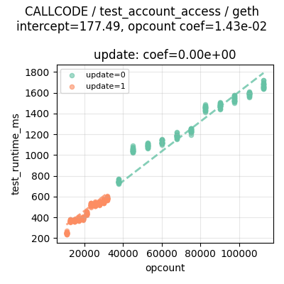


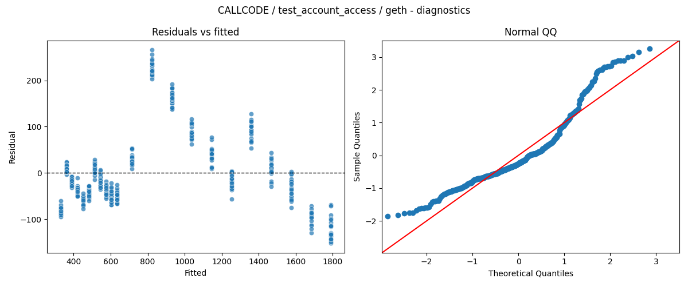

</details>

<details><summary>nethermind — NNLS regression summary</summary>

```
==============================================================================
                           NNLS Regression Results                            
==============================================================================
Dep. Variable:          test_runtime_ms              R-squared:          0.981
Model:                  NNLS                    Adj. R-squared:          0.981
No. Observations:       440                               RMSE:          17.32
Df Residuals:           437                                MAE:          12.95
Df Model:               2      
==============================================================================
                      coef     std err     P-value      [0.025      0.975]
------------------------------------------------------------------------------
         const     61.8743      1.2533       0.001     59.5286     64.4058
       opcount      0.0039      0.0000       0.001      0.0038      0.0039
        update      0.0000      0.0000       1.000      0.0000      0.0000
==============================================================================
Notes: Non-negative least squares with bootstrap inference (1000 iterations)
==============================================================================
```

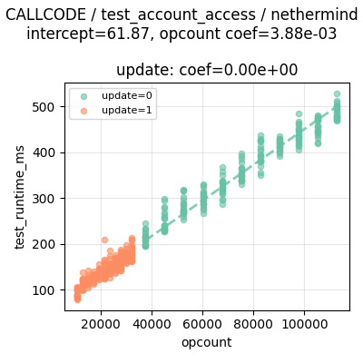


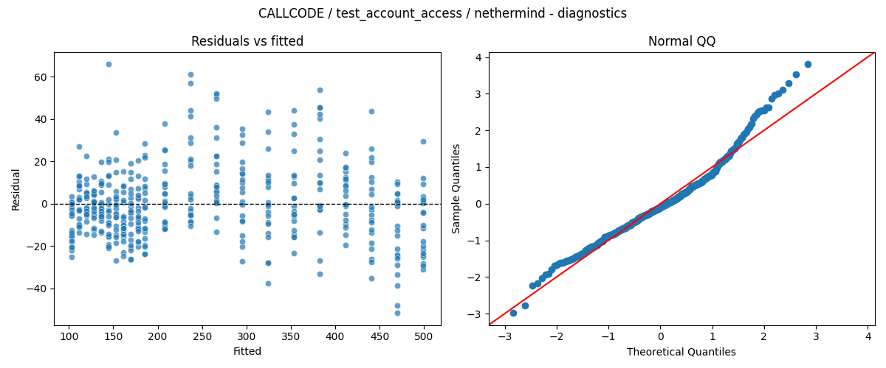

</details>

<details><summary>reth — NNLS regression summary</summary>

```
==============================================================================
                           NNLS Regression Results                            
==============================================================================
Dep. Variable:          test_runtime_ms              R-squared:          0.975
Model:                  NNLS                    Adj. R-squared:          0.975
No. Observations:       440                               RMSE:           8.07
Df Residuals:           437                                MAE:           6.31
Df Model:               2      
==============================================================================
                      coef     std err     P-value      [0.025      0.975]
------------------------------------------------------------------------------
         const     13.8100      0.5424       0.001     12.8143     14.9102
       opcount      0.0016      0.0000       0.001      0.0016      0.0016
        update      0.0000      0.0000       1.000      0.0000      0.0000
==============================================================================
Notes: Non-negative least squares with bootstrap inference (1000 iterations)
==============================================================================
```

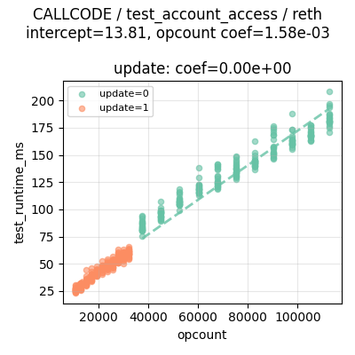


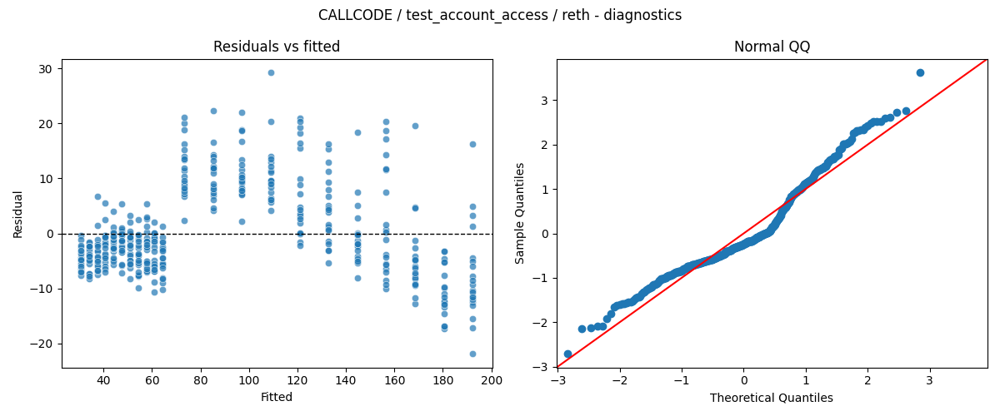

</details>

### test_account_access — combo `CALLCODE_AccountMode.NON_EXISTING_ACCOUNT` — `presets[cold_account_nocode_access]`

| client | nobs | R² | target_coef (ms) | p-value | 95% CI |
| --- | --- | --- | --- | --- | --- |
| `besu` | 396 | 0.9169 | 0.02162 | 1.00e-03 | [0.02098, 0.02232] |
| `erigon` | 242 | 0.9287 | 0.008659 | 1.00e-03 | [0.008493, 0.0088] |
| `geth` | 462 | 0.9409 | 0.0314 | 1.00e-03 | [0.03077, 0.03194] |
| `nethermind` | 440 | 0.9637 | 0.00438 | 1.00e-03 | [0.004336, 0.00442] |
| `reth` | 440 | 0.9021 | 0.001384 | 1.00e-03 | [0.001365, 0.001404] |

<details><summary>besu — NNLS regression summary</summary>

```
==============================================================================
                           NNLS Regression Results                            
==============================================================================
Dep. Variable:          test_runtime_ms              R-squared:          0.917
Model:                  NNLS                    Adj. R-squared:          0.916
No. Observations:       396                               RMSE:         208.80
Df Residuals:           393                                MAE:         167.19
Df Model:               2      
==============================================================================
                      coef     std err     P-value      [0.025      0.975]
------------------------------------------------------------------------------
         const     57.1496     14.9373       0.001     26.5359     83.6424
       opcount      0.0216      0.0003       0.001      0.0210      0.0223
        update      0.0000      0.0000       1.000      0.0000      0.0000
==============================================================================
Notes: Non-negative least squares with bootstrap inference (1000 iterations)
==============================================================================
```

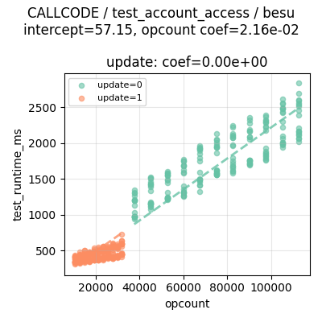

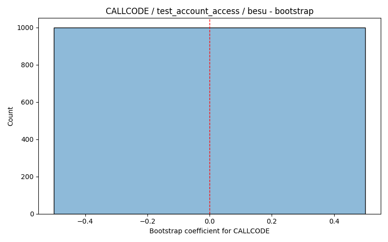

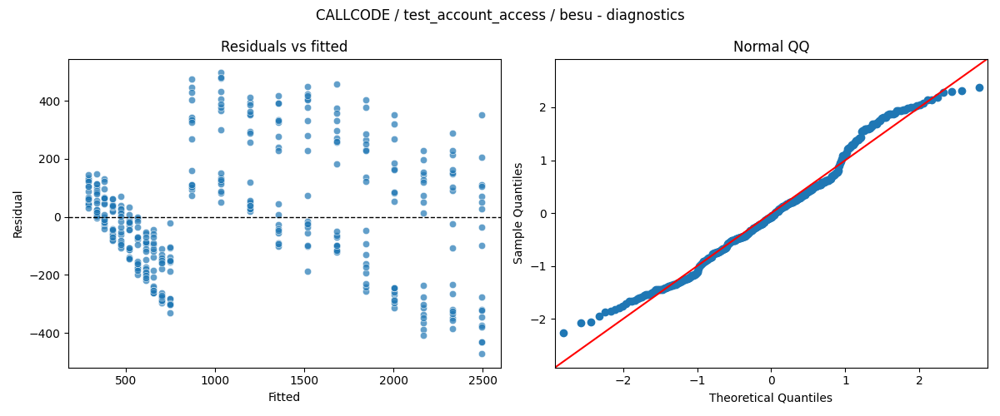

</details>

<details><summary>erigon — NNLS regression summary</summary>

```
==============================================================================
                           NNLS Regression Results                            
==============================================================================
Dep. Variable:          test_runtime_ms              R-squared:          0.929
Model:                  NNLS                    Adj. R-squared:          0.928
No. Observations:       242                               RMSE:          90.74
Df Residuals:           239                                MAE:          74.38
Df Model:               2      
==============================================================================
                      coef     std err     P-value      [0.025      0.975]
------------------------------------------------------------------------------
         const      0.0000      0.0000       1.000      0.0000      0.0000
       opcount      0.0087      0.0001       0.001      0.0085      0.0088
        update      0.0000      0.0000       1.000      0.0000      0.0000
==============================================================================
Notes: Non-negative least squares with bootstrap inference (1000 iterations)
==============================================================================
```

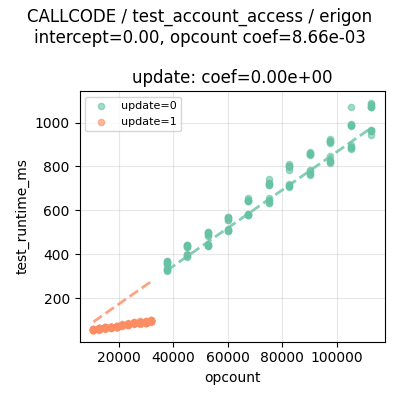


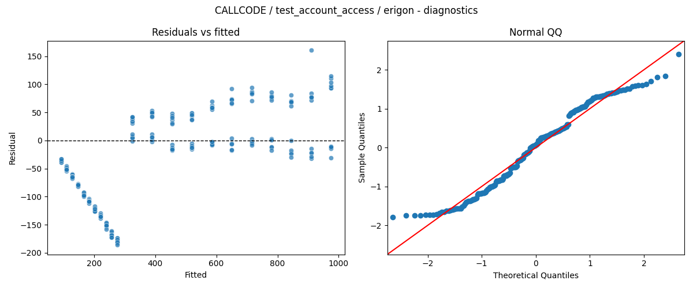

</details>

<details><summary>geth — NNLS regression summary</summary>

```
==============================================================================
                           NNLS Regression Results                            
==============================================================================
Dep. Variable:          test_runtime_ms              R-squared:          0.941
Model:                  NNLS                    Adj. R-squared:          0.941
No. Observations:       462                               RMSE:         252.40
Df Residuals:           459                                MAE:         198.96
Df Model:               2      
==============================================================================
                      coef     std err     P-value      [0.025      0.975]
------------------------------------------------------------------------------
         const     11.9713     13.9470       0.251      0.0000     46.4641
       opcount      0.0314      0.0003       0.001      0.0308      0.0319
        update      0.0000      0.0000       1.000      0.0000      0.0000
==============================================================================
Notes: Non-negative least squares with bootstrap inference (1000 iterations)
==============================================================================
```

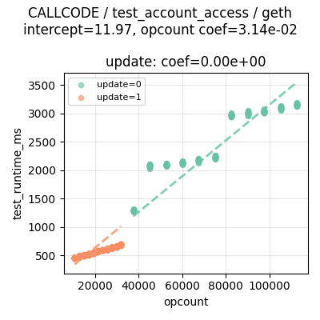


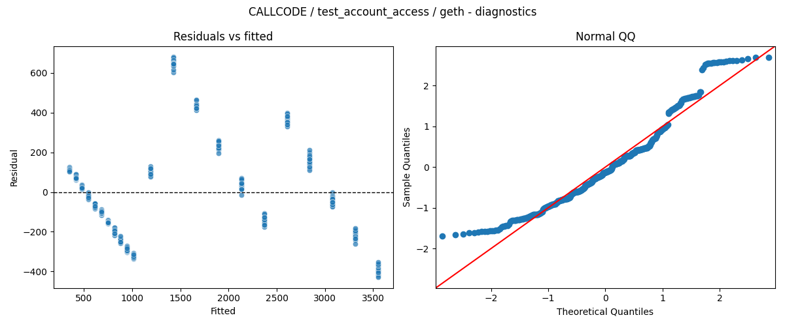

</details>

<details><summary>nethermind — NNLS regression summary</summary>

```
==============================================================================
                           NNLS Regression Results                            
==============================================================================
Dep. Variable:          test_runtime_ms              R-squared:          0.964
Model:                  NNLS                    Adj. R-squared:          0.964
No. Observations:       440                               RMSE:          27.92
Df Residuals:           437                                MAE:          22.58
Df Model:               2      
==============================================================================
                      coef     std err     P-value      [0.025      0.975]
------------------------------------------------------------------------------
         const      0.0000      0.0334       1.000      0.0000      0.0000
       opcount      0.0044      0.0000       0.001      0.0043      0.0044
        update      0.0000      0.0000       1.000      0.0000      0.0000
==============================================================================
Notes: Non-negative least squares with bootstrap inference (1000 iterations)
==============================================================================
```

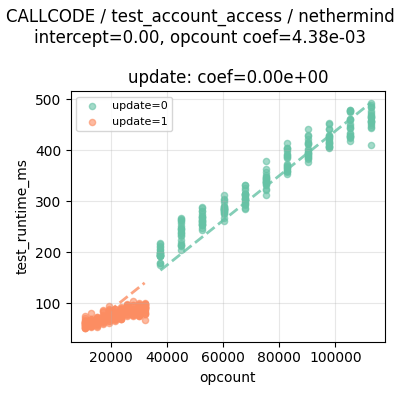


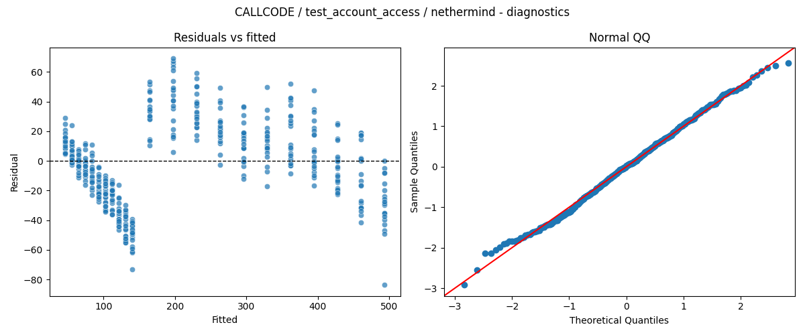

</details>

<details><summary>reth — NNLS regression summary</summary>

```
==============================================================================
                           NNLS Regression Results                            
==============================================================================
Dep. Variable:          test_runtime_ms              R-squared:          0.902
Model:                  NNLS                    Adj. R-squared:          0.902
No. Observations:       440                               RMSE:          16.26
Df Residuals:           437                                MAE:          14.13
Df Model:               2      
==============================================================================
                      coef     std err     P-value      [0.025      0.975]
------------------------------------------------------------------------------
         const      0.0000      0.0000       1.000      0.0000      0.0000
       opcount      0.0014      0.0000       0.001      0.0014      0.0014
        update      0.0000      0.0000       1.000      0.0000      0.0000
==============================================================================
Notes: Non-negative least squares with bootstrap inference (1000 iterations)
==============================================================================
```

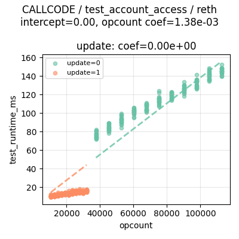


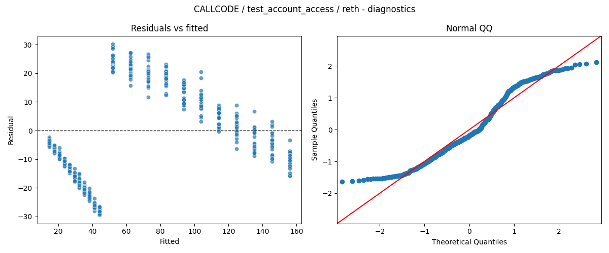

</details>

### test_account_access — combo `CALLCODE_AccountMode.EXISTING_CONTRACT`

| client | nobs | R² | target_coef (ms) | p-value | 95% CI |
| --- | --- | --- | --- | --- | --- |
| `besu` | 396 | 0.9547 | 0.03484 | 1.00e-03 | [0.03395, 0.03576] |
| `erigon` | 242 | 0.9619 | 0.0913 | 1.00e-03 | [0.08953, 0.09323] |
| `geth` | 462 | 0.9534 | 0.03 | 1.00e-03 | [0.02943, 0.03062] |
| `nethermind` | 440 | 0.9353 | 0.02575 | 1.00e-03 | [0.02506, 0.02646] |
| `reth` | 440 | 0.95 | 0.02111 | 1.00e-03 | [0.02075, 0.02157] |

<details><summary>besu — NNLS regression summary</summary>

```
==============================================================================
                           NNLS Regression Results                            
==============================================================================
Dep. Variable:          test_runtime_ms              R-squared:          0.955
Model:                  NNLS                    Adj. R-squared:          0.954
No. Observations:       396                               RMSE:         202.55
Df Residuals:           393                                MAE:         171.92
Df Model:               2      
==============================================================================
                      coef     std err     P-value      [0.025      0.975]
------------------------------------------------------------------------------
         const    305.3067     16.5611       0.001    272.3492    337.8523
       opcount      0.0348      0.0005       0.001      0.0339      0.0358
        update      0.0000      0.0000       1.000      0.0000      0.0000
==============================================================================
Notes: Non-negative least squares with bootstrap inference (1000 iterations)
==============================================================================
```

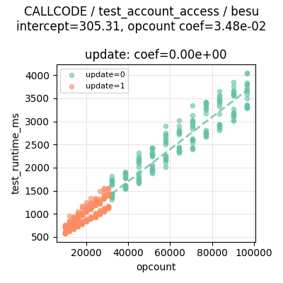


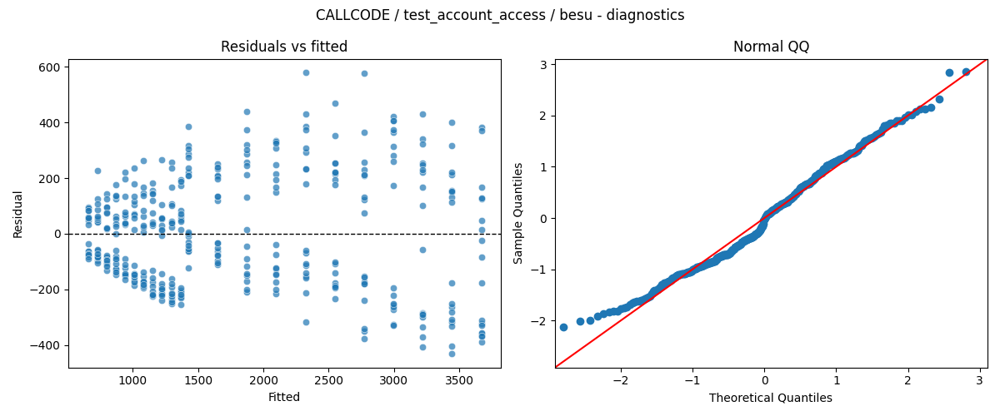

</details>

<details><summary>erigon — NNLS regression summary</summary>

```
==============================================================================
                           NNLS Regression Results                            
==============================================================================
Dep. Variable:          test_runtime_ms              R-squared:          0.962
Model:                  NNLS                    Adj. R-squared:          0.962
No. Observations:       242                               RMSE:         485.29
Df Residuals:           239                                MAE:         343.44
Df Model:               2      
==============================================================================
                      coef     std err     P-value      [0.025      0.975]
------------------------------------------------------------------------------
         const     97.6713     35.2461       0.002     29.5408    171.6843
       opcount      0.0913      0.0010       0.001      0.0895      0.0932
        update      0.0000      0.0000       1.000      0.0000      0.0000
==============================================================================
Notes: Non-negative least squares with bootstrap inference (1000 iterations)
==============================================================================
```

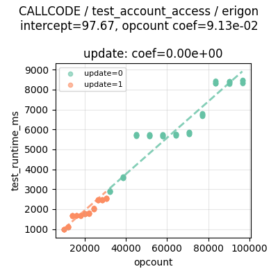


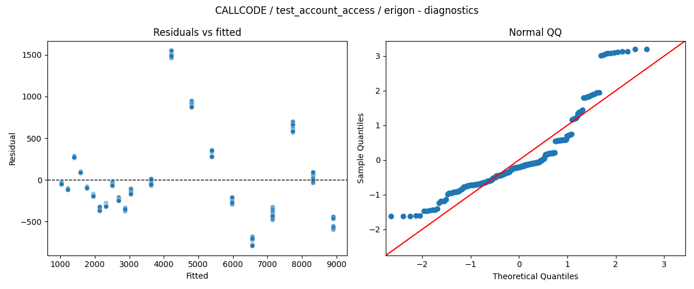

</details>

<details><summary>geth — NNLS regression summary</summary>

```
==============================================================================
                           NNLS Regression Results                            
==============================================================================
Dep. Variable:          test_runtime_ms              R-squared:          0.953
Model:                  NNLS                    Adj. R-squared:          0.953
No. Observations:       462                               RMSE:         177.10
Df Residuals:           459                                MAE:         132.68
Df Model:               2      
==============================================================================
                      coef     std err     P-value      [0.025      0.975]
------------------------------------------------------------------------------
         const    258.6480     12.1489       0.001    235.9871    282.2177
       opcount      0.0300      0.0003       0.001      0.0294      0.0306
        update      0.0000      0.0000       1.000      0.0000      0.0000
==============================================================================
Notes: Non-negative least squares with bootstrap inference (1000 iterations)
==============================================================================
```

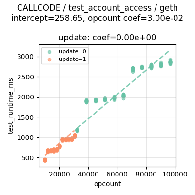


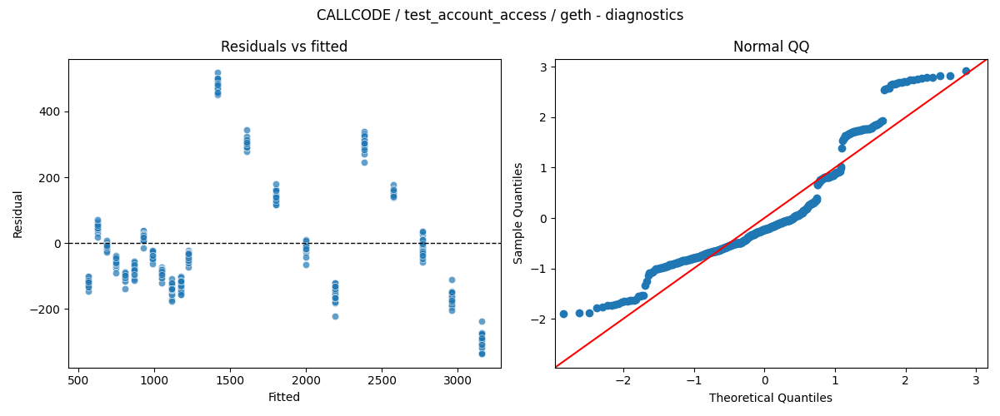

</details>

<details><summary>nethermind — NNLS regression summary</summary>

```
==============================================================================
                           NNLS Regression Results                            
==============================================================================
Dep. Variable:          test_runtime_ms              R-squared:          0.935
Model:                  NNLS                    Adj. R-squared:          0.935
No. Observations:       440                               RMSE:         180.73
Df Residuals:           437                                MAE:         134.46
Df Model:               2      
==============================================================================
                      coef     std err     P-value      [0.025      0.975]
------------------------------------------------------------------------------
         const    105.4079     12.2511       0.001     82.2403    130.1970
       opcount      0.0257      0.0004       0.001      0.0251      0.0265
        update      0.0000      0.0000       1.000      0.0000      0.0000
==============================================================================
Notes: Non-negative least squares with bootstrap inference (1000 iterations)
==============================================================================
```

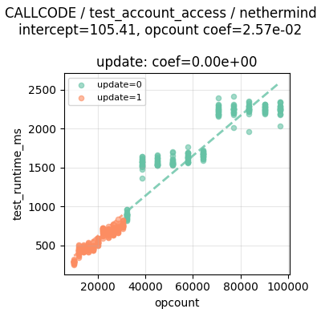


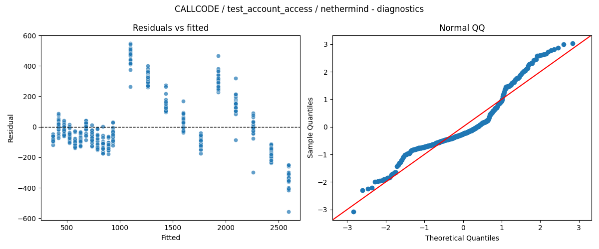

</details>

<details><summary>reth — NNLS regression summary</summary>

```
==============================================================================
                           NNLS Regression Results                            
==============================================================================
Dep. Variable:          test_runtime_ms              R-squared:          0.950
Model:                  NNLS                    Adj. R-squared:          0.950
No. Observations:       440                               RMSE:         129.25
Df Residuals:           437                                MAE:          73.79
Df Model:               2      
==============================================================================
                      coef     std err     P-value      [0.025      0.975]
------------------------------------------------------------------------------
         const     81.1807      7.9870       0.001     65.4089     96.6791
       opcount      0.0211      0.0002       0.001      0.0207      0.0216
        update      0.0000      0.0000       1.000      0.0000      0.0000
==============================================================================
Notes: Non-negative least squares with bootstrap inference (1000 iterations)
==============================================================================
```

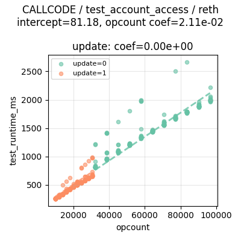


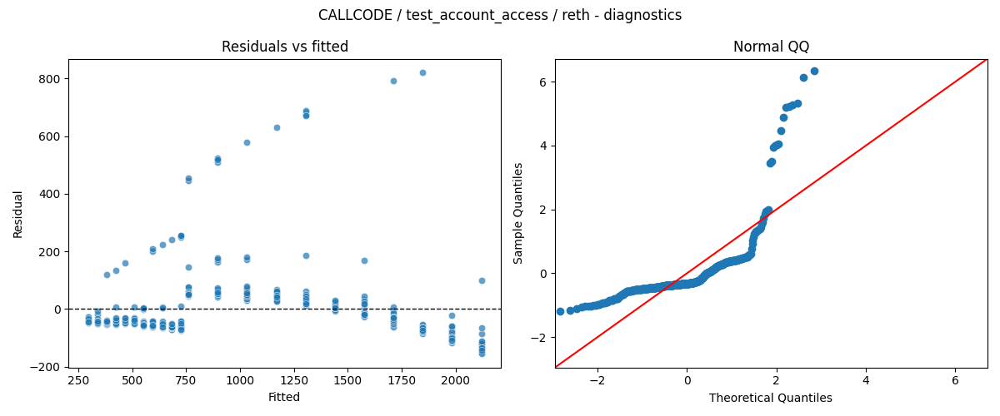

</details>

### test_account_access — combo `CALLCODE_AccountMode.NON_EXISTING_ACCOUNT` — `presets[cold_account_code_access]`

| client | nobs | R² | target_coef (ms) | p-value | 95% CI |
| --- | --- | --- | --- | --- | --- |
| `besu` | 396 | 0.9169 | 0.02162 | 1.00e-03 | [0.02098, 0.02232] |
| `erigon` | 242 | 0.9287 | 0.008659 | 1.00e-03 | [0.008493, 0.0088] |
| `geth` | 462 | 0.9409 | 0.0314 | 1.00e-03 | [0.03077, 0.03194] |
| `nethermind` | 440 | 0.9637 | 0.00438 | 1.00e-03 | [0.004336, 0.00442] |
| `reth` | 440 | 0.9021 | 0.001384 | 1.00e-03 | [0.001365, 0.001404] |

<details><summary>besu — NNLS regression summary</summary>

```
==============================================================================
                           NNLS Regression Results                            
==============================================================================
Dep. Variable:          test_runtime_ms              R-squared:          0.917
Model:                  NNLS                    Adj. R-squared:          0.916
No. Observations:       396                               RMSE:         208.80
Df Residuals:           393                                MAE:         167.19
Df Model:               2      
==============================================================================
                      coef     std err     P-value      [0.025      0.975]
------------------------------------------------------------------------------
         const     57.1496     14.9373       0.001     26.5359     83.6424
       opcount      0.0216      0.0003       0.001      0.0210      0.0223
        update      0.0000      0.0000       1.000      0.0000      0.0000
==============================================================================
Notes: Non-negative least squares with bootstrap inference (1000 iterations)
==============================================================================
```


</details>

<details><summary>erigon — NNLS regression summary</summary>

```
==============================================================================
                           NNLS Regression Results                            
==============================================================================
Dep. Variable:          test_runtime_ms              R-squared:          0.929
Model:                  NNLS                    Adj. R-squared:          0.928
No. Observations:       242                               RMSE:          90.74
Df Residuals:           239                                MAE:          74.38
Df Model:               2      
==============================================================================
                      coef     std err     P-value      [0.025      0.975]
------------------------------------------------------------------------------
         const      0.0000      0.0000       1.000      0.0000      0.0000
       opcount      0.0087      0.0001       0.001      0.0085      0.0088
        update      0.0000      0.0000       1.000      0.0000      0.0000
==============================================================================
Notes: Non-negative least squares with bootstrap inference (1000 iterations)
==============================================================================
```


</details>

<details><summary>geth — NNLS regression summary</summary>

```
==============================================================================
                           NNLS Regression Results                            
==============================================================================
Dep. Variable:          test_runtime_ms              R-squared:          0.941
Model:                  NNLS                    Adj. R-squared:          0.941
No. Observations:       462                               RMSE:         252.40
Df Residuals:           459                                MAE:         198.96
Df Model:               2      
==============================================================================
                      coef     std err     P-value      [0.025      0.975]
------------------------------------------------------------------------------
         const     11.9713     13.9470       0.251      0.0000     46.4641
       opcount      0.0314      0.0003       0.001      0.0308      0.0319
        update      0.0000      0.0000       1.000      0.0000      0.0000
==============================================================================
Notes: Non-negative least squares with bootstrap inference (1000 iterations)
==============================================================================
```


</details>

<details><summary>nethermind — NNLS regression summary</summary>

```
==============================================================================
                           NNLS Regression Results                            
==============================================================================
Dep. Variable:          test_runtime_ms              R-squared:          0.964
Model:                  NNLS                    Adj. R-squared:          0.964
No. Observations:       440                               RMSE:          27.92
Df Residuals:           437                                MAE:          22.58
Df Model:               2      
==============================================================================
                      coef     std err     P-value      [0.025      0.975]
------------------------------------------------------------------------------
         const      0.0000      0.0334       1.000      0.0000      0.0000
       opcount      0.0044      0.0000       0.001      0.0043      0.0044
        update      0.0000      0.0000       1.000      0.0000      0.0000
==============================================================================
Notes: Non-negative least squares with bootstrap inference (1000 iterations)
==============================================================================
```


</details>

<details><summary>reth — NNLS regression summary</summary>

```
==============================================================================
                           NNLS Regression Results                            
==============================================================================
Dep. Variable:          test_runtime_ms              R-squared:          0.902
Model:                  NNLS                    Adj. R-squared:          0.902
No. Observations:       440                               RMSE:          16.26
Df Residuals:           437                                MAE:          14.13
Df Model:               2      
==============================================================================
                      coef     std err     P-value      [0.025      0.975]
------------------------------------------------------------------------------
         const      0.0000      0.0000       1.000      0.0000      0.0000
       opcount      0.0014      0.0000       0.001      0.0014      0.0014
        update      0.0000      0.0000       1.000      0.0000      0.0000
==============================================================================
Notes: Non-negative least squares with bootstrap inference (1000 iterations)
==============================================================================
```


</details>

### test_ext_account_query_warm — combo `CALLCODE`

| client | nobs | R² | target_coef (ms) | p-value | 95% CI |
| --- | --- | --- | --- | --- | --- |
| `besu` | 198 | 0.7866 | 0.0006194 | 1.00e-03 | [0.0005761, 0.0006631] |
| `erigon` | 121 | 0.9605 | 0.0002618 | 1.00e-03 | [0.0002525, 0.0002701] |
| `geth` | 231 | 0.9391 | 0.0001951 | 1.00e-03 | [0.0001881, 0.0002019] |
| `nethermind` | 220 | 0.7966 | 0.0002092 | 1.00e-03 | [0.0001957, 0.0002251] |
| `reth` | 220 | 0.9174 | 5.333e-05 | 1.00e-03 | [5.13e-05, 5.541e-05] |

<details><summary>besu — NNLS regression summary</summary>

```
==============================================================================
                           NNLS Regression Results                            
==============================================================================
Dep. Variable:          test_runtime_ms              R-squared:          0.787
Model:                  NNLS                    Adj. R-squared:          0.785
No. Observations:       198                               RMSE:         163.01
Df Residuals:           196                                MAE:         134.95
Df Model:               1      
==============================================================================
                      coef     std err     P-value      [0.025      0.975]
------------------------------------------------------------------------------
         const    755.1356     33.6840       0.001    692.6439    819.7208
       opcount      0.0006      0.0000       0.001      0.0006      0.0007
==============================================================================
Notes: Non-negative least squares with bootstrap inference (1000 iterations)
==============================================================================
```

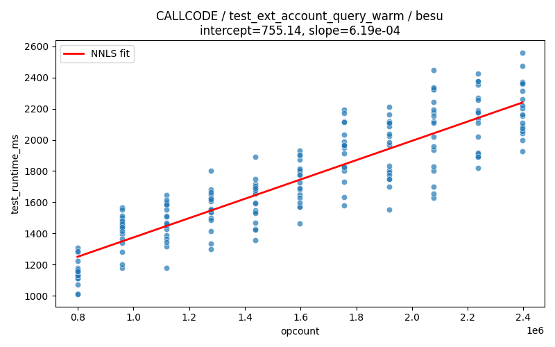

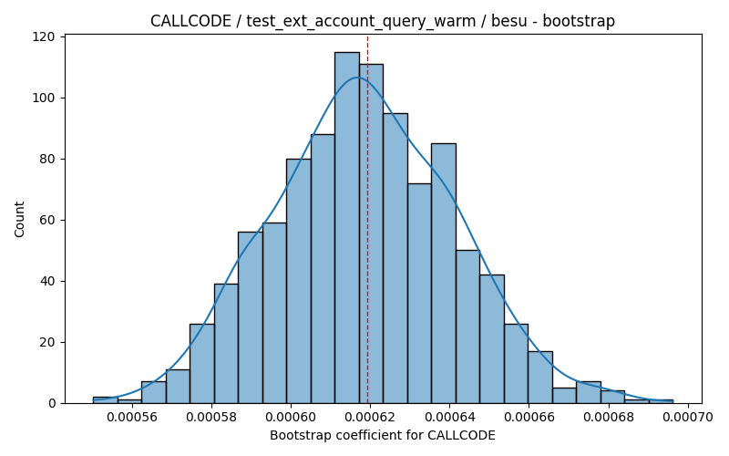

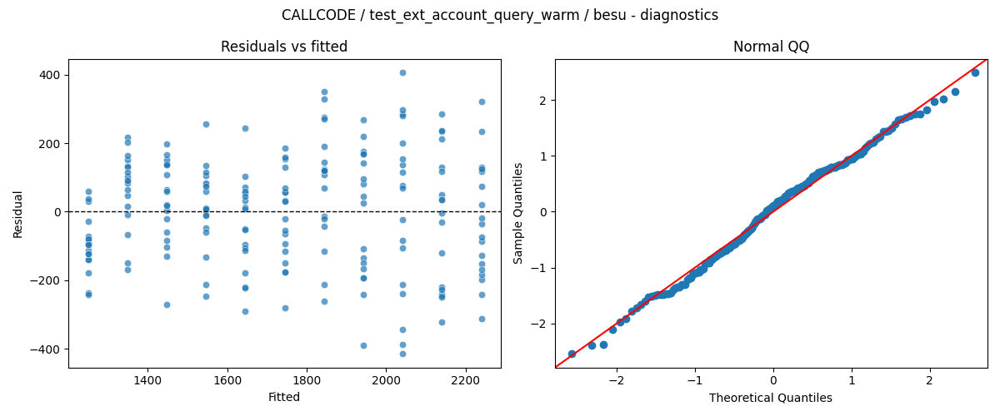

</details>

<details><summary>erigon — NNLS regression summary</summary>

```
==============================================================================
                           NNLS Regression Results                            
==============================================================================
Dep. Variable:          test_runtime_ms              R-squared:          0.960
Model:                  NNLS                    Adj. R-squared:          0.960
No. Observations:       121                               RMSE:          26.83
Df Residuals:           119                                MAE:          21.59
Df Model:               1      
==============================================================================
                      coef     std err     P-value      [0.025      0.975]
------------------------------------------------------------------------------
         const     35.7456      7.2960       0.001     21.4438     50.5122
       opcount      0.0003      0.0000       0.001      0.0003      0.0003
==============================================================================
Notes: Non-negative least squares with bootstrap inference (1000 iterations)
==============================================================================
```

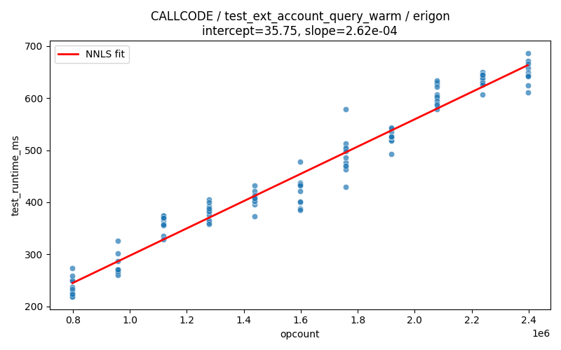

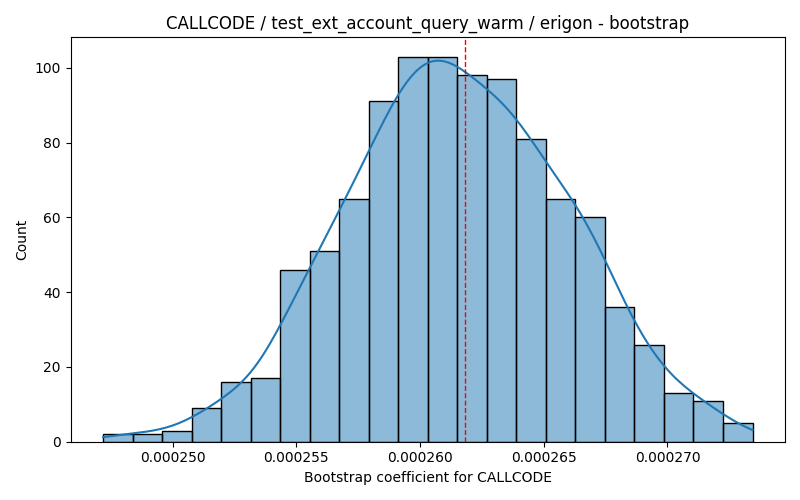

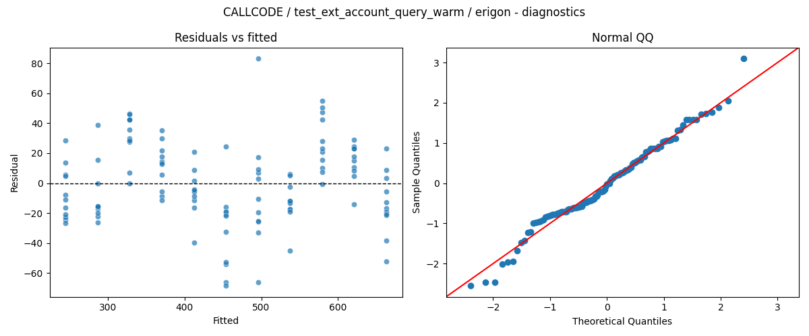

</details>

<details><summary>geth — NNLS regression summary</summary>

```
==============================================================================
                           NNLS Regression Results                            
==============================================================================
Dep. Variable:          test_runtime_ms              R-squared:          0.939
Model:                  NNLS                    Adj. R-squared:          0.939
No. Observations:       231                               RMSE:          25.10
Df Residuals:           229                                MAE:          19.96
Df Model:               1      
==============================================================================
                      coef     std err     P-value      [0.025      0.975]
------------------------------------------------------------------------------
         const     53.8176      5.6075       0.001     42.9992     65.4501
       opcount      0.0002      0.0000       0.001      0.0002      0.0002
==============================================================================
Notes: Non-negative least squares with bootstrap inference (1000 iterations)
==============================================================================
```

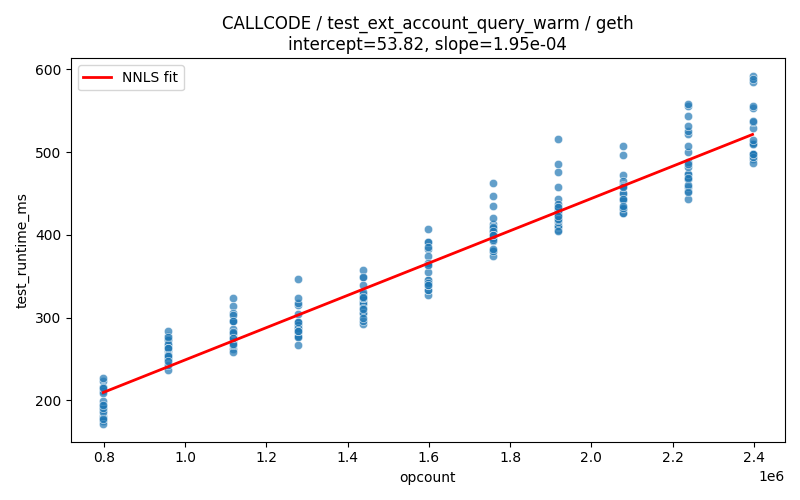

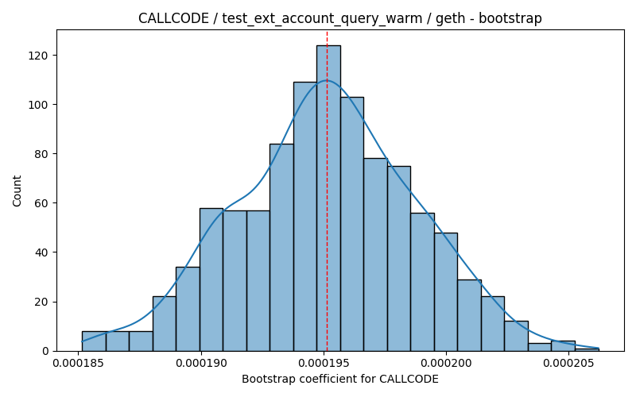

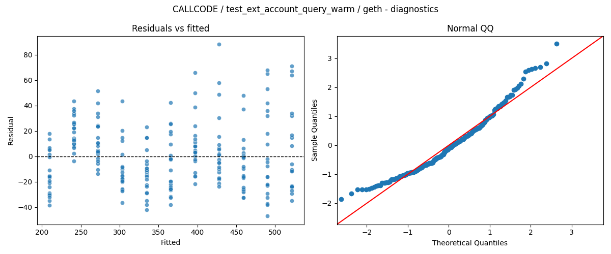

</details>

<details><summary>nethermind — NNLS regression summary</summary>

```
==============================================================================
                           NNLS Regression Results                            
==============================================================================
Dep. Variable:          test_runtime_ms              R-squared:          0.797
Model:                  NNLS                    Adj. R-squared:          0.796
No. Observations:       220                               RMSE:          53.42
Df Residuals:           218                                MAE:          37.95
Df Model:               1      
==============================================================================
                      coef     std err     P-value      [0.025      0.975]
------------------------------------------------------------------------------
         const    145.7365     12.1778       0.001    120.6082    169.2028
       opcount      0.0002      0.0000       0.001      0.0002      0.0002
==============================================================================
Notes: Non-negative least squares with bootstrap inference (1000 iterations)
==============================================================================
```

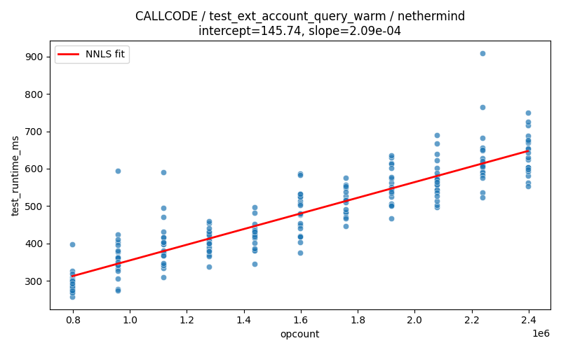

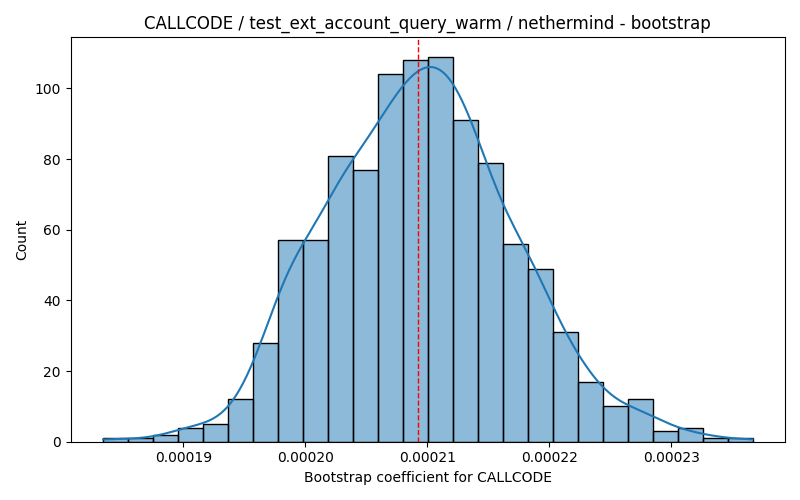

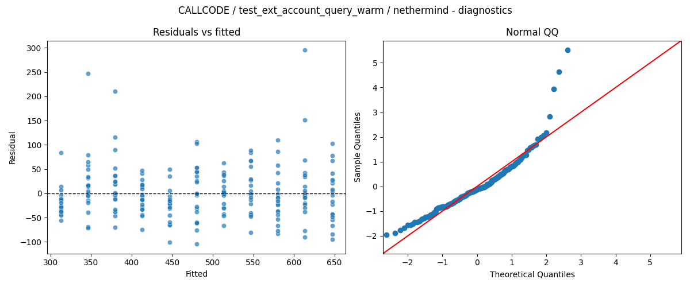

</details>

<details><summary>reth — NNLS regression summary</summary>

```
==============================================================================
                           NNLS Regression Results                            
==============================================================================
Dep. Variable:          test_runtime_ms              R-squared:          0.917
Model:                  NNLS                    Adj. R-squared:          0.917
No. Observations:       220                               RMSE:           8.08
Df Residuals:           218                                MAE:           6.03
Df Model:               1      
==============================================================================
                      coef     std err     P-value      [0.025      0.975]
------------------------------------------------------------------------------
         const     20.2039      1.6757       0.001     17.0488     23.6730
       opcount      0.0001      0.0000       0.001      0.0001      0.0001
==============================================================================
Notes: Non-negative least squares with bootstrap inference (1000 iterations)
==============================================================================
```

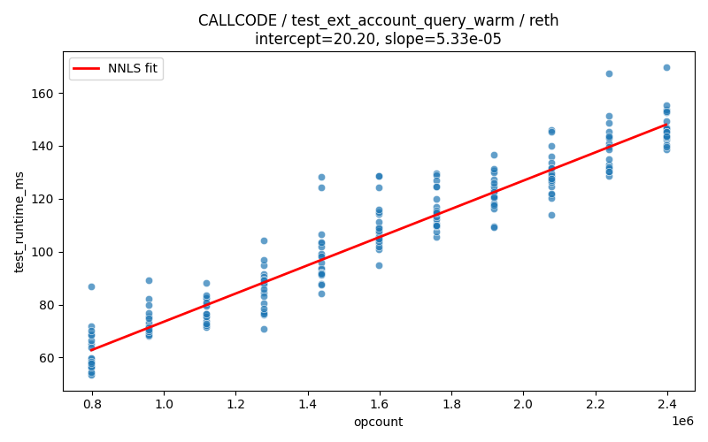

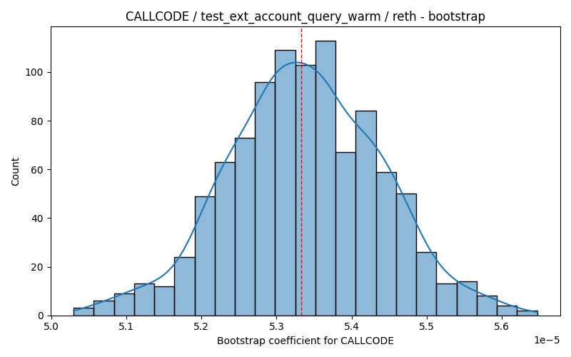

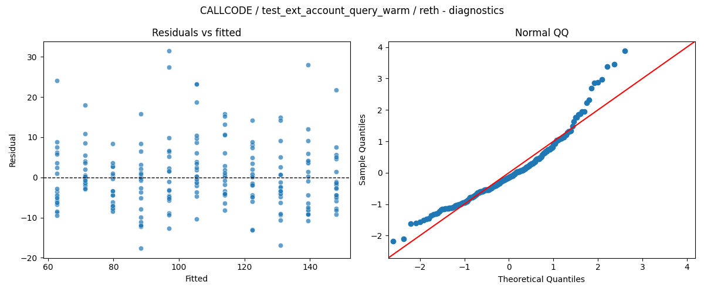

</details>

## DELEGATECALL

### test_account_access — combo `DELEGATECALL_AccountMode.EXISTING_EOA`

| client | nobs | R² | target_coef (ms) | p-value | 95% CI |
| --- | --- | --- | --- | --- | --- |
| `besu` | 198 | 0.7575 | 0.01614 | 1.00e-03 | [0.01486, 0.01744] |
| `erigon` | 121 | 0.9743 | 0.009379 | 1.00e-03 | [0.009119, 0.009646] |
| `geth` | 231 | 0.9438 | 0.01091 | 1.00e-03 | [0.01046, 0.01132] |
| `nethermind` | 220 | 0.9482 | 0.003855 | 1.00e-03 | [0.00373, 0.00398] |
| `reth` | 220 | 0.9477 | 0.001255 | 1.00e-03 | [0.001221, 0.001293] |

<details><summary>besu — NNLS regression summary</summary>

```
==============================================================================
                           NNLS Regression Results                            
==============================================================================
Dep. Variable:          test_runtime_ms              R-squared:          0.757
Model:                  NNLS                    Adj. R-squared:          0.756
No. Observations:       198                               RMSE:         217.06
Df Residuals:           196                                MAE:         196.30
Df Model:               1      
==============================================================================
                      coef     std err     P-value      [0.025      0.975]
------------------------------------------------------------------------------
         const    712.1798     46.9307       0.001    619.7947    801.7863
       opcount      0.0161      0.0007       0.001      0.0149      0.0174
==============================================================================
Notes: Non-negative least squares with bootstrap inference (1000 iterations)
==============================================================================
```

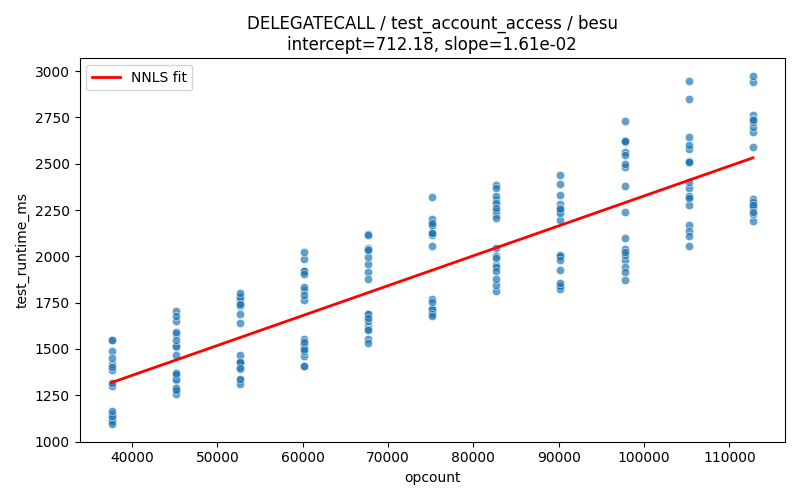

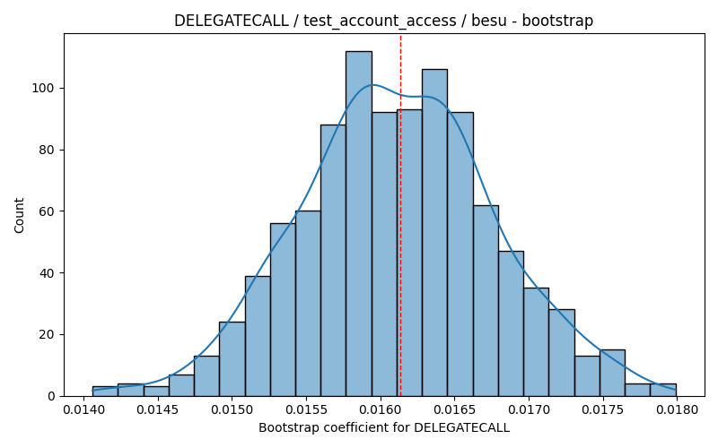

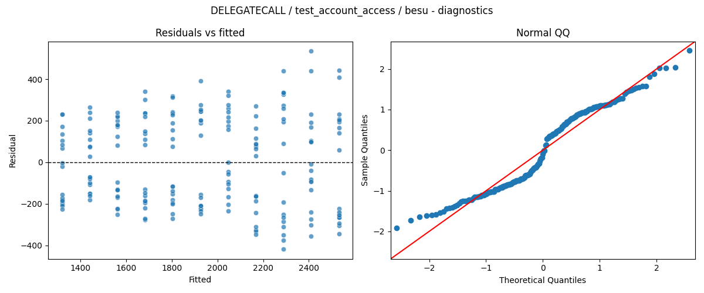

</details>

<details><summary>erigon — NNLS regression summary</summary>

```
==============================================================================
                           NNLS Regression Results                            
==============================================================================
Dep. Variable:          test_runtime_ms              R-squared:          0.974
Model:                  NNLS                    Adj. R-squared:          0.974
No. Observations:       121                               RMSE:          36.22
Df Residuals:           119                                MAE:          33.36
Df Model:               1      
==============================================================================
                      coef     std err     P-value      [0.025      0.975]
------------------------------------------------------------------------------
         const     27.3276      8.9490       0.001      8.9515     43.6138
       opcount      0.0094      0.0001       0.001      0.0091      0.0096
==============================================================================
Notes: Non-negative least squares with bootstrap inference (1000 iterations)
==============================================================================
```

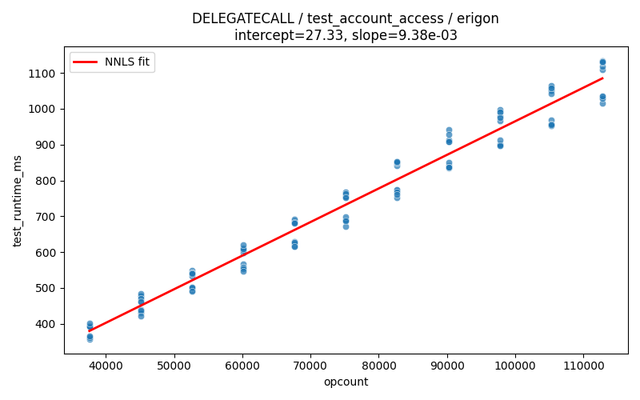

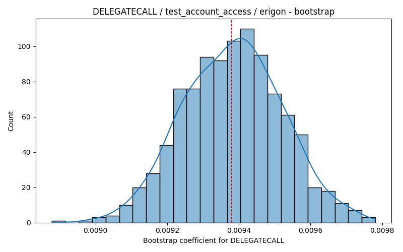

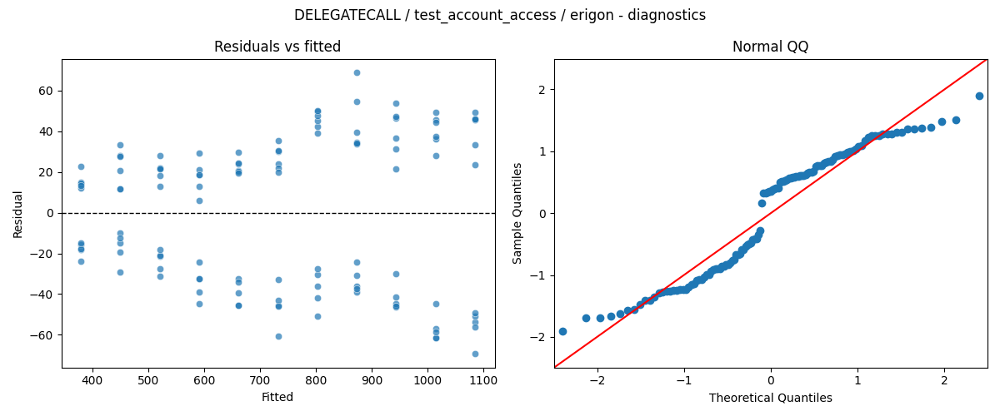

</details>

<details><summary>geth — NNLS regression summary</summary>

```
==============================================================================
                           NNLS Regression Results                            
==============================================================================
Dep. Variable:          test_runtime_ms              R-squared:          0.944
Model:                  NNLS                    Adj. R-squared:          0.944
No. Observations:       231                               RMSE:          63.31
Df Residuals:           229                                MAE:          50.54
Df Model:               1      
==============================================================================
                      coef     std err     P-value      [0.025      0.975]
------------------------------------------------------------------------------
         const    467.2794     19.1541       0.001    430.8846    507.5386
       opcount      0.0109      0.0002       0.001      0.0105      0.0113
==============================================================================
Notes: Non-negative least squares with bootstrap inference (1000 iterations)
==============================================================================
```

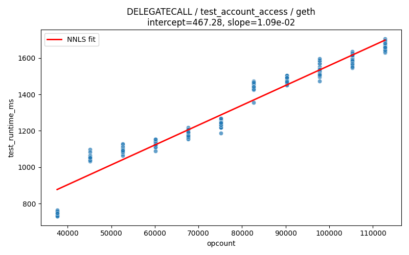

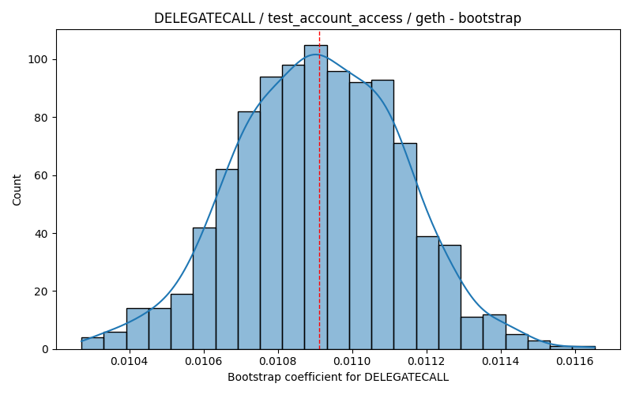

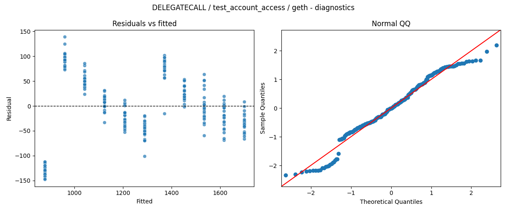

</details>

<details><summary>nethermind — NNLS regression summary</summary>

```
==============================================================================
                           NNLS Regression Results                            
==============================================================================
Dep. Variable:          test_runtime_ms              R-squared:          0.948
Model:                  NNLS                    Adj. R-squared:          0.948
No. Observations:       220                               RMSE:          21.42
Df Residuals:           218                                MAE:          17.07
Df Model:               1      
==============================================================================
                      coef     std err     P-value      [0.025      0.975]
------------------------------------------------------------------------------
         const     92.0756      5.2523       0.001     81.9602    102.0495
       opcount      0.0039      0.0001       0.001      0.0037      0.0040
==============================================================================
Notes: Non-negative least squares with bootstrap inference (1000 iterations)
==============================================================================
```

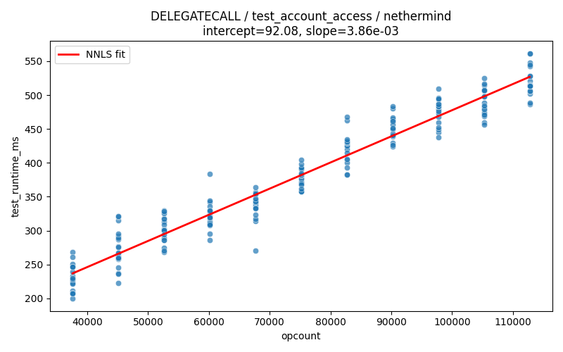

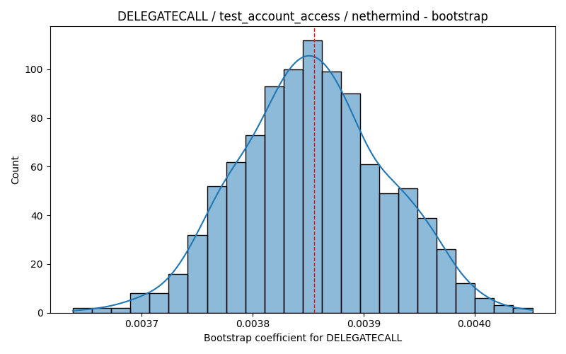

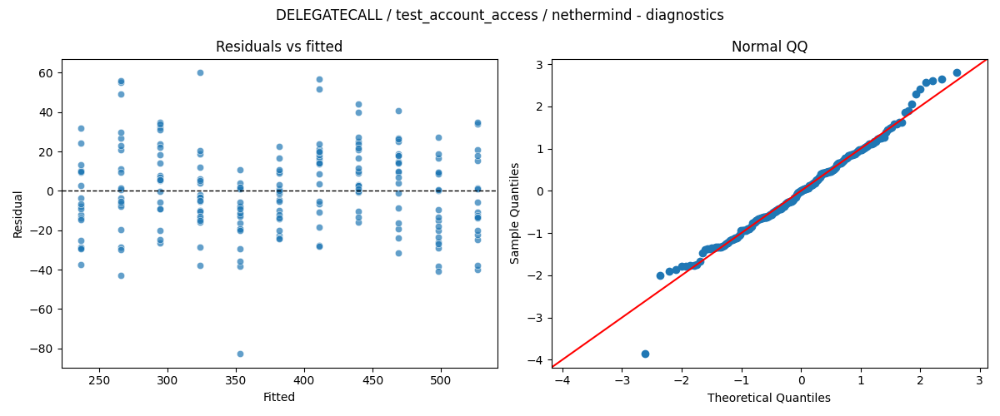

</details>

<details><summary>reth — NNLS regression summary</summary>

```
==============================================================================
                           NNLS Regression Results                            
==============================================================================
Dep. Variable:          test_runtime_ms              R-squared:          0.948
Model:                  NNLS                    Adj. R-squared:          0.947
No. Observations:       220                               RMSE:           7.01
Df Residuals:           218                                MAE:           5.43
Df Model:               1      
==============================================================================
                      coef     std err     P-value      [0.025      0.975]
------------------------------------------------------------------------------
         const     41.0175      1.4284       0.001     38.3447     43.9575
       opcount      0.0013      0.0000       0.001      0.0012      0.0013
==============================================================================
Notes: Non-negative least squares with bootstrap inference (1000 iterations)
==============================================================================
```

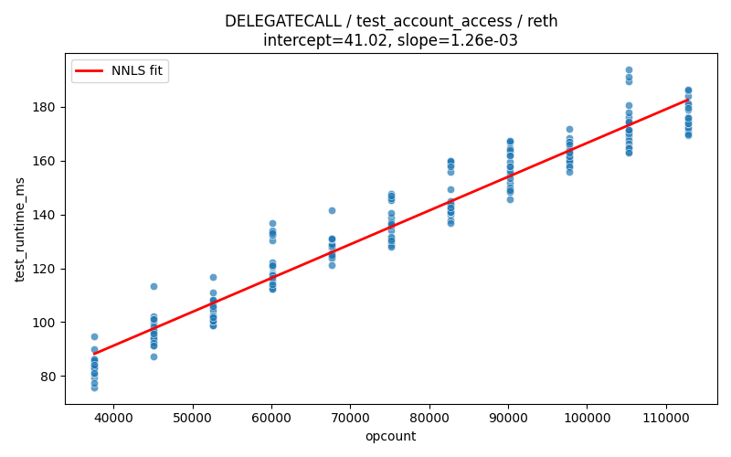

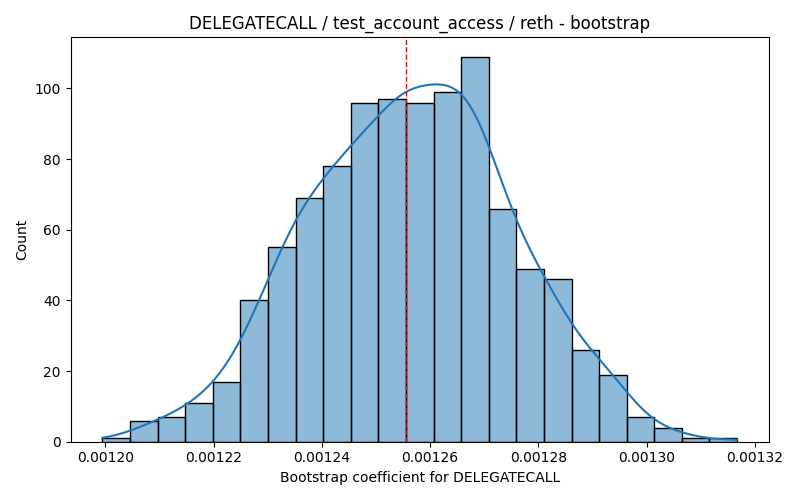

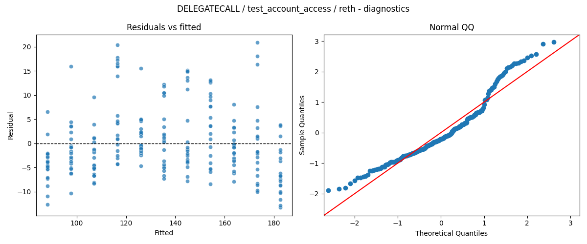

</details>

### test_account_access — combo `DELEGATECALL_AccountMode.NON_EXISTING_ACCOUNT` — `presets[cold_account_nocode_access]`

| client | nobs | R² | target_coef (ms) | p-value | 95% CI |
| --- | --- | --- | --- | --- | --- |
| `besu` | 198 | 0.7501 | 0.01564 | 1.00e-03 | [0.01437, 0.0169] |
| `erigon` | 121 | 0.9682 | 0.00898 | 1.00e-03 | [0.008687, 0.009164] |
| `geth` | 231 | 0.8726 | 0.02242 | 1.00e-03 | [0.02118, 0.0236] |
| `nethermind` | 220 | 0.9273 | 0.003743 | 1.00e-03 | [0.003583, 0.003889] |
| `reth` | 220 | 0.9691 | 0.0009203 | 1.00e-03 | [0.0008982, 0.0009395] |

<details><summary>besu — NNLS regression summary</summary>

```
==============================================================================
                           NNLS Regression Results                            
==============================================================================
Dep. Variable:          test_runtime_ms              R-squared:          0.750
Model:                  NNLS                    Adj. R-squared:          0.749
No. Observations:       198                               RMSE:         214.68
Df Residuals:           196                                MAE:         196.98
Df Model:               1      
==============================================================================
                      coef     std err     P-value      [0.025      0.975]
------------------------------------------------------------------------------
         const    555.7742     44.4385       0.001    465.6923    643.1077
       opcount      0.0156      0.0006       0.001      0.0144      0.0169
==============================================================================
Notes: Non-negative least squares with bootstrap inference (1000 iterations)
==============================================================================
```

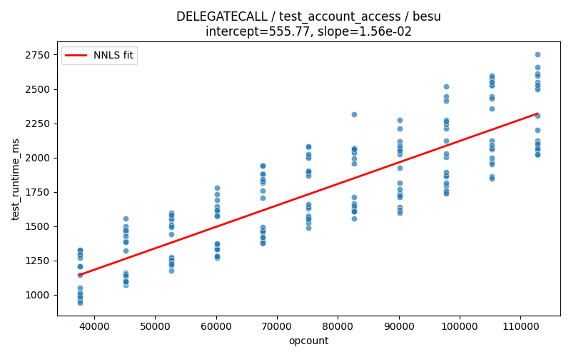

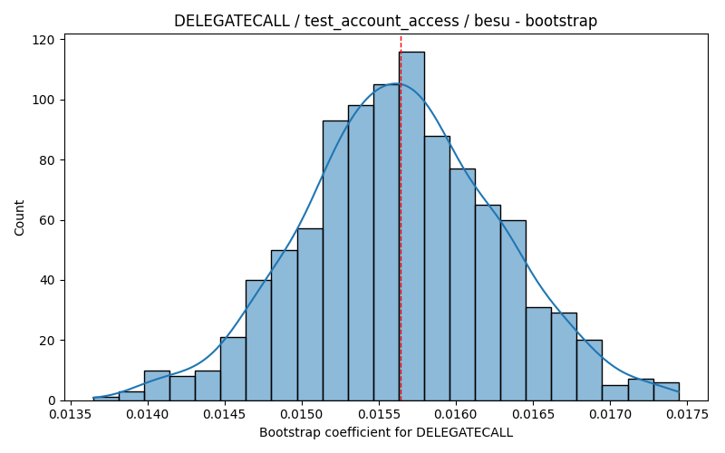

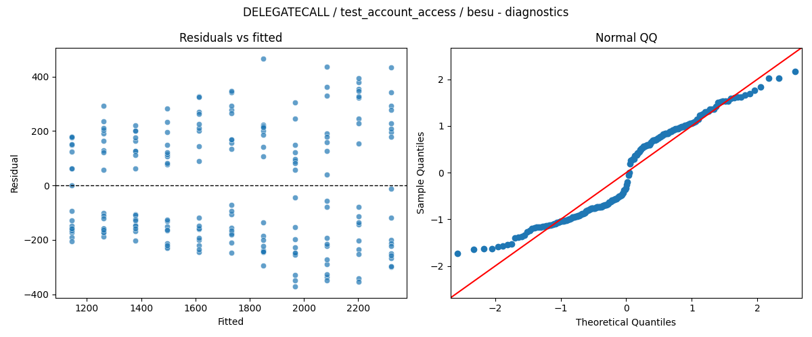

</details>

<details><summary>erigon — NNLS regression summary</summary>

```
==============================================================================
                           NNLS Regression Results                            
==============================================================================
Dep. Variable:          test_runtime_ms              R-squared:          0.968
Model:                  NNLS                    Adj. R-squared:          0.968
No. Observations:       121                               RMSE:          38.69
Df Residuals:           119                                MAE:          35.77
Df Model:               1      
==============================================================================
                      coef     std err     P-value      [0.025      0.975]
------------------------------------------------------------------------------
         const      7.2253      8.1450       0.253      0.0000     26.7491
       opcount      0.0090      0.0001       0.001      0.0087      0.0092
==============================================================================
Notes: Non-negative least squares with bootstrap inference (1000 iterations)
==============================================================================
```

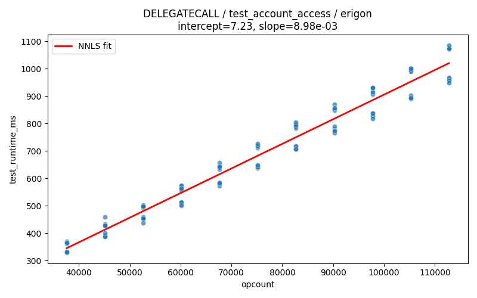

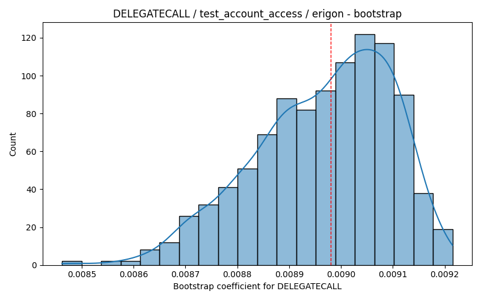

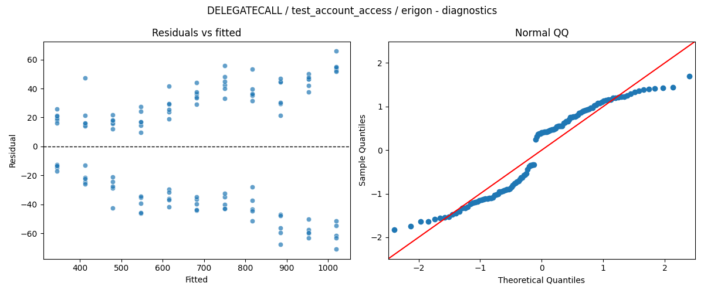

</details>

<details><summary>geth — NNLS regression summary</summary>

```
==============================================================================
                           NNLS Regression Results                            
==============================================================================
Dep. Variable:          test_runtime_ms              R-squared:          0.873
Model:                  NNLS                    Adj. R-squared:          0.872
No. Observations:       231                               RMSE:         203.71
Df Residuals:           229                                MAE:         174.23
Df Model:               1      
==============================================================================
                      coef     std err     P-value      [0.025      0.975]
------------------------------------------------------------------------------
         const    773.4066     54.7097       0.001    672.7448    882.5031
       opcount      0.0224      0.0006       0.001      0.0212      0.0236
==============================================================================
Notes: Non-negative least squares with bootstrap inference (1000 iterations)
==============================================================================
```

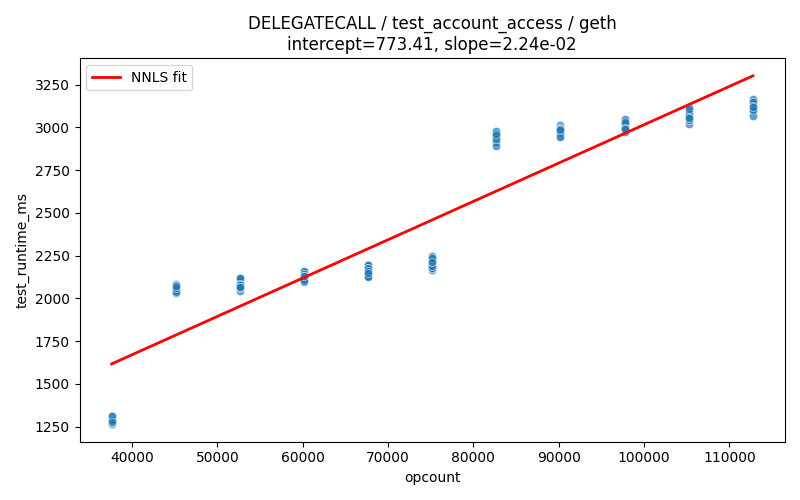

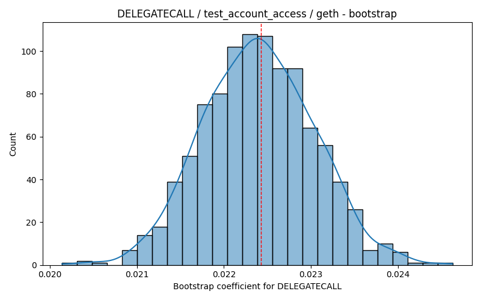


</details>

<details><summary>nethermind — NNLS regression summary</summary>

```
==============================================================================
                           NNLS Regression Results                            
==============================================================================
Dep. Variable:          test_runtime_ms              R-squared:          0.927
Model:                  NNLS                    Adj. R-squared:          0.927
No. Observations:       220                               RMSE:          24.92
Df Residuals:           218                                MAE:          19.02
Df Model:               1      
==============================================================================
                      coef     std err     P-value      [0.025      0.975]
------------------------------------------------------------------------------
         const     86.7450      5.7312       0.001     76.1247     98.3440
       opcount      0.0037      0.0001       0.001      0.0036      0.0039
==============================================================================
Notes: Non-negative least squares with bootstrap inference (1000 iterations)
==============================================================================
```

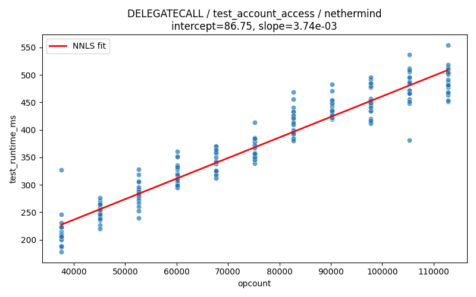

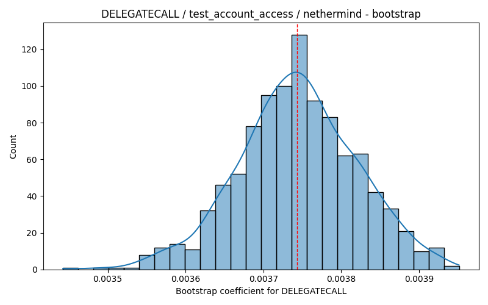

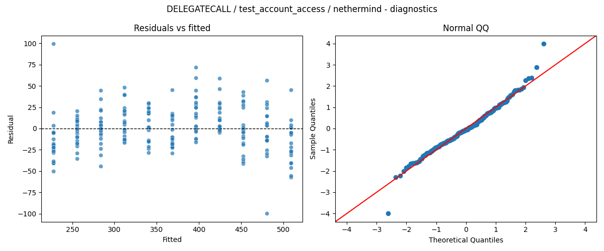

</details>

<details><summary>reth — NNLS regression summary</summary>

```
==============================================================================
                           NNLS Regression Results                            
==============================================================================
Dep. Variable:          test_runtime_ms              R-squared:          0.969
Model:                  NNLS                    Adj. R-squared:          0.969
No. Observations:       220                               RMSE:           3.90
Df Residuals:           218                                MAE:           3.05
Df Model:               1      
==============================================================================
                      coef     std err     P-value      [0.025      0.975]
------------------------------------------------------------------------------
         const     44.0327      0.8565       0.001     42.4309     45.8607
       opcount      0.0009      0.0000       0.001      0.0009      0.0009
==============================================================================
Notes: Non-negative least squares with bootstrap inference (1000 iterations)
==============================================================================
```

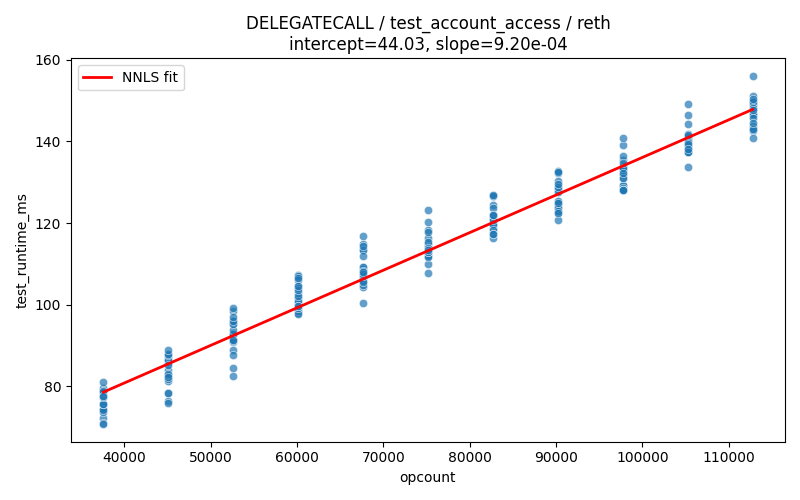

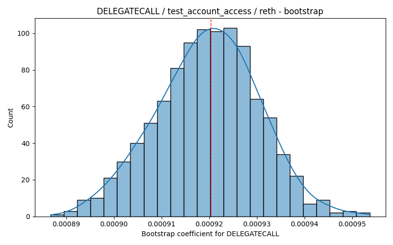

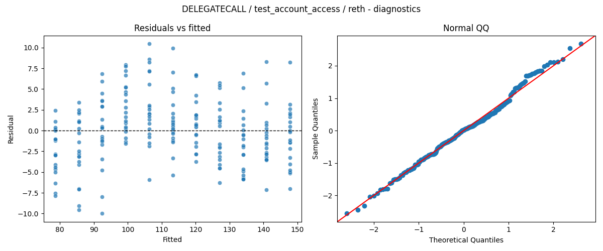

</details>

### test_account_access — combo `DELEGATECALL_AccountMode.EXISTING_CONTRACT`

| client | nobs | R² | target_coef (ms) | p-value | 95% CI |
| --- | --- | --- | --- | --- | --- |
| `besu` | 198 | 0.8691 | 0.03224 | 1.00e-03 | [0.0307, 0.03375] |
| `erigon` | 121 | 0.8818 | 0.0802 | 1.00e-03 | [0.07519, 0.08482] |
| `geth` | 231 | 0.8689 | 0.02356 | 1.00e-03 | [0.02227, 0.02485] |
| `nethermind` | 220 | 0.8019 | 0.01914 | 1.00e-03 | [0.01776, 0.02058] |
| `reth` | 220 | 0.8251 | 0.01874 | 1.00e-03 | [0.0176, 0.0201] |

<details><summary>besu — NNLS regression summary</summary>

```
==============================================================================
                           NNLS Regression Results                            
==============================================================================
Dep. Variable:          test_runtime_ms              R-squared:          0.869
Model:                  NNLS                    Adj. R-squared:          0.868
No. Observations:       198                               RMSE:         254.95
Df Residuals:           196                                MAE:         229.20
Df Model:               1      
==============================================================================
                      coef     std err     P-value      [0.025      0.975]
------------------------------------------------------------------------------
         const    492.6241     47.4370       0.001    398.6247    586.4235
       opcount      0.0322      0.0008       0.001      0.0307      0.0337
==============================================================================
Notes: Non-negative least squares with bootstrap inference (1000 iterations)
==============================================================================
```

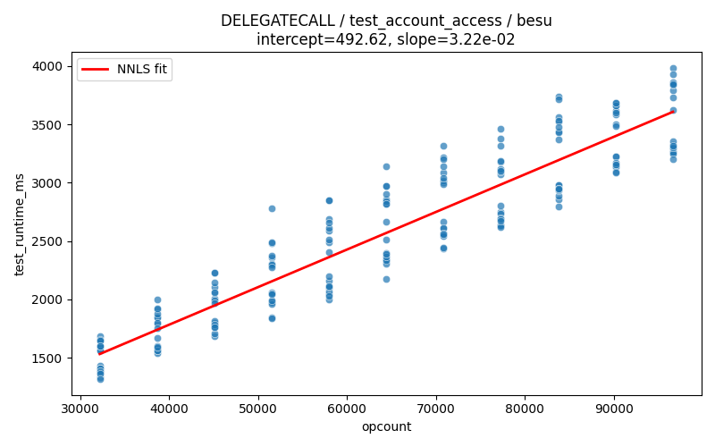

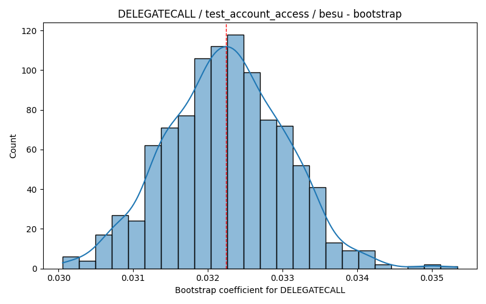

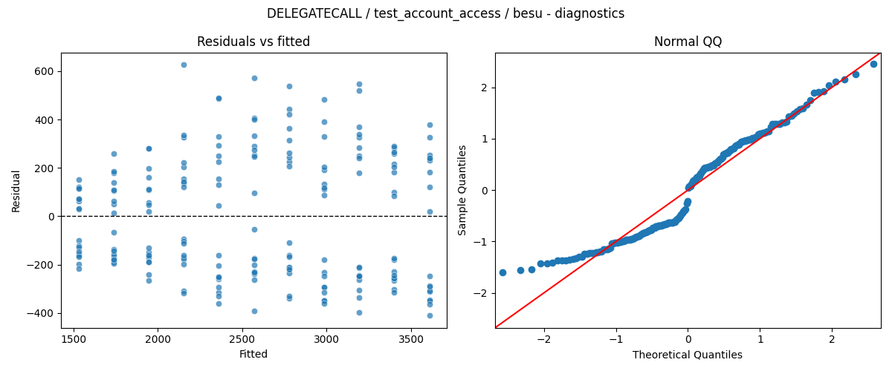

</details>

<details><summary>erigon — NNLS regression summary</summary>

```
==============================================================================
                           NNLS Regression Results                            
==============================================================================
Dep. Variable:          test_runtime_ms              R-squared:          0.882
Model:                  NNLS                    Adj. R-squared:          0.881
No. Observations:       121                               RMSE:         598.04
Df Residuals:           119                                MAE:         520.59
Df Model:               1      
==============================================================================
                      coef     std err     P-value      [0.025      0.975]
------------------------------------------------------------------------------
         const    935.0040    189.8620       0.001    595.8380   1324.2716
       opcount      0.0802      0.0025       0.001      0.0752      0.0848
==============================================================================
Notes: Non-negative least squares with bootstrap inference (1000 iterations)
==============================================================================
```

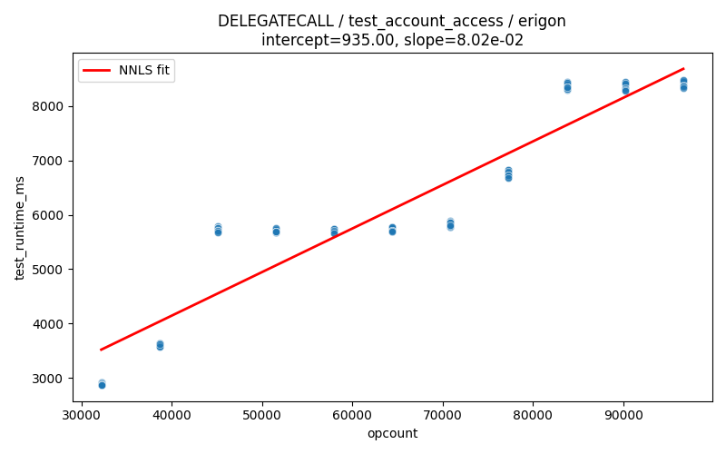

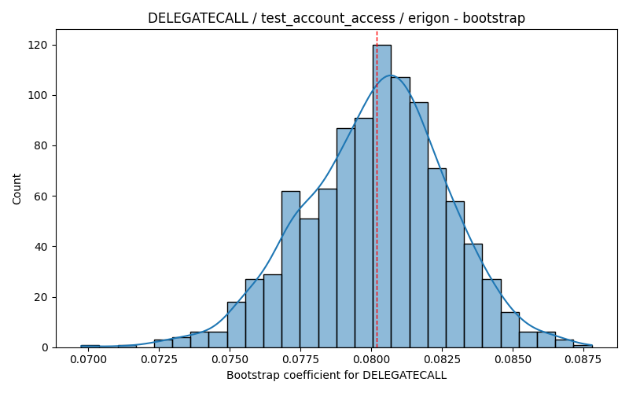

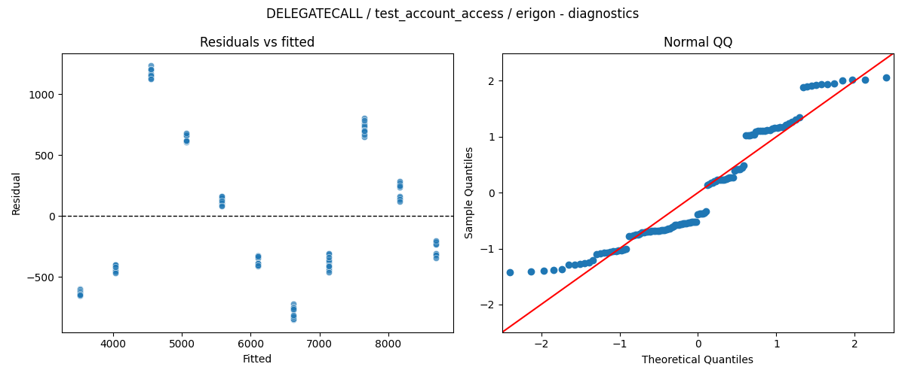

</details>

<details><summary>geth — NNLS regression summary</summary>

```
==============================================================================
                           NNLS Regression Results                            
==============================================================================
Dep. Variable:          test_runtime_ms              R-squared:          0.869
Model:                  NNLS                    Adj. R-squared:          0.868
No. Observations:       231                               RMSE:         186.39
Df Residuals:           229                                MAE:         160.68
Df Model:               1      
==============================================================================
                      coef     std err     P-value      [0.025      0.975]
------------------------------------------------------------------------------
         const    730.3764     48.8007       0.001    633.2954    828.7114
       opcount      0.0236      0.0007       0.001      0.0223      0.0248
==============================================================================
Notes: Non-negative least squares with bootstrap inference (1000 iterations)
==============================================================================
```

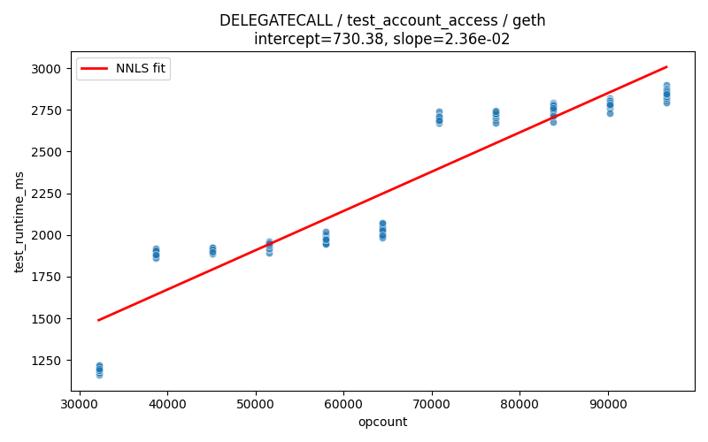

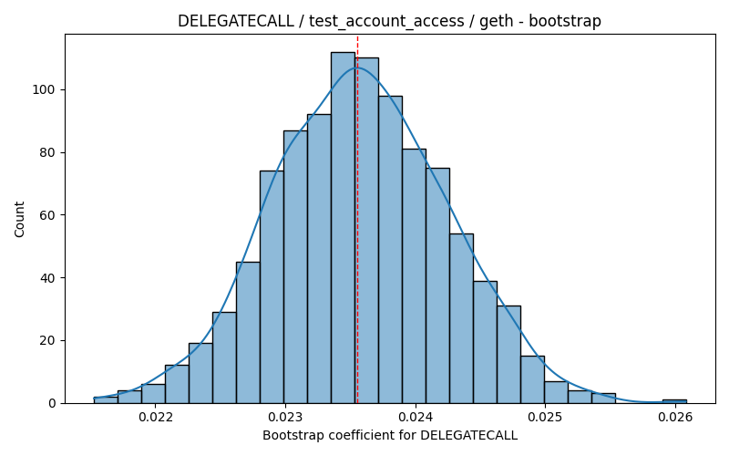

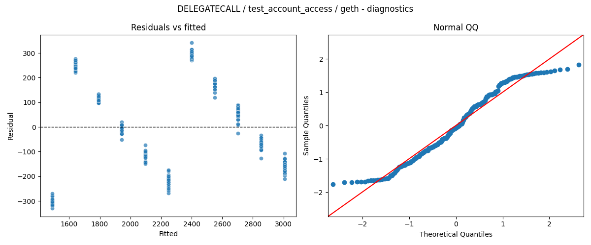

</details>

<details><summary>nethermind — NNLS regression summary</summary>

```
==============================================================================
                           NNLS Regression Results                            
==============================================================================
Dep. Variable:          test_runtime_ms              R-squared:          0.802
Model:                  NNLS                    Adj. R-squared:          0.801
No. Observations:       220                               RMSE:         193.79
Df Residuals:           218                                MAE:         164.02
Df Model:               1      
==============================================================================
                      coef     std err     P-value      [0.025      0.975]
------------------------------------------------------------------------------
         const    595.2754     52.1340       0.001    495.2643    696.4094
       opcount      0.0191      0.0007       0.001      0.0178      0.0206
==============================================================================
Notes: Non-negative least squares with bootstrap inference (1000 iterations)
==============================================================================
```

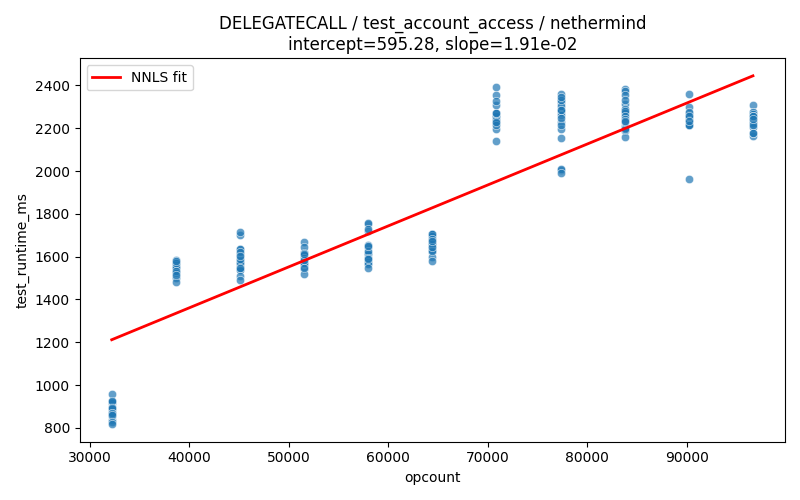

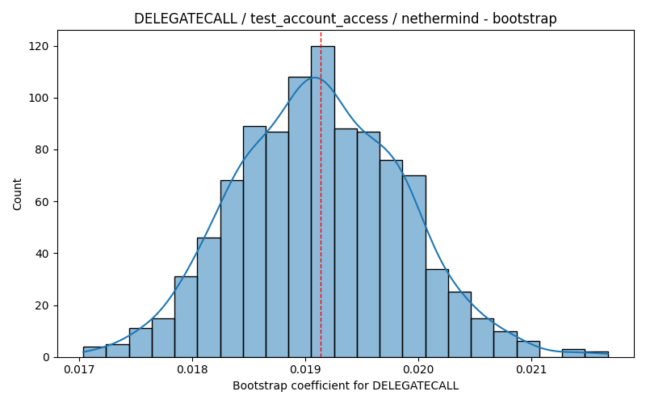

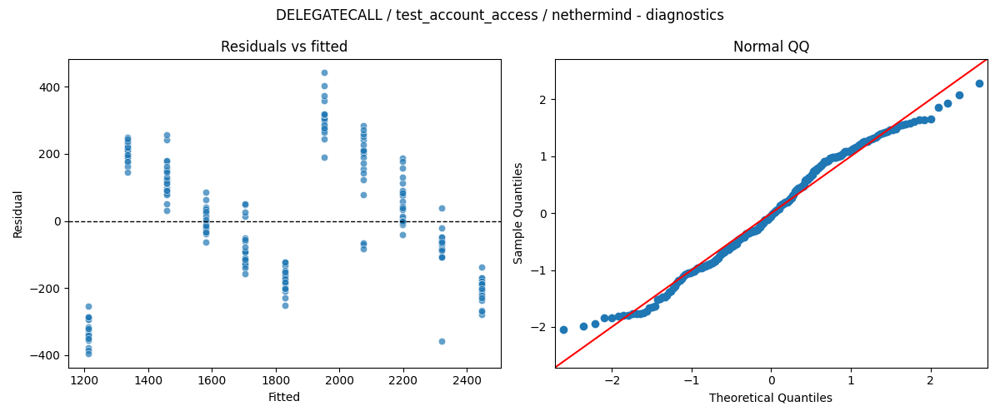

</details>

<details><summary>reth — NNLS regression summary</summary>

```
==============================================================================
                           NNLS Regression Results                            
==============================================================================
Dep. Variable:          test_runtime_ms              R-squared:          0.825
Model:                  NNLS                    Adj. R-squared:          0.824
No. Observations:       220                               RMSE:         175.73
Df Residuals:           218                                MAE:          87.36
Df Model:               1      
==============================================================================
                      coef     std err     P-value      [0.025      0.975]
------------------------------------------------------------------------------
         const    277.7643     36.6425       0.001    205.3628    348.7710
       opcount      0.0187      0.0006       0.001      0.0176      0.0201
==============================================================================
Notes: Non-negative least squares with bootstrap inference (1000 iterations)
==============================================================================
```

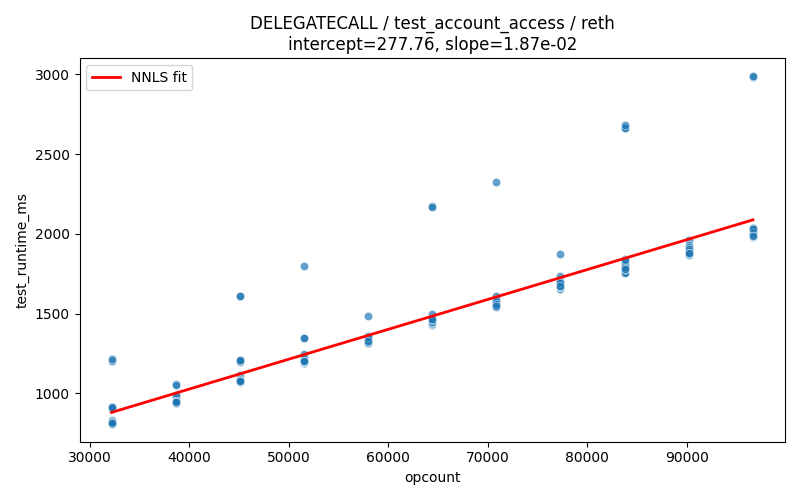

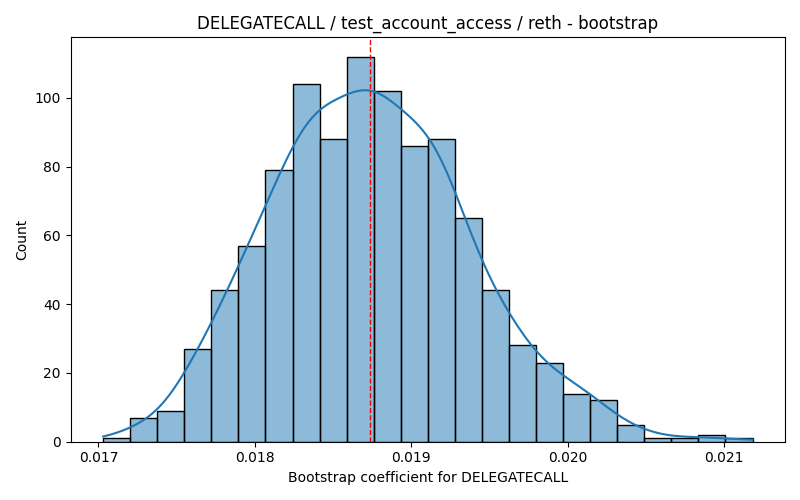

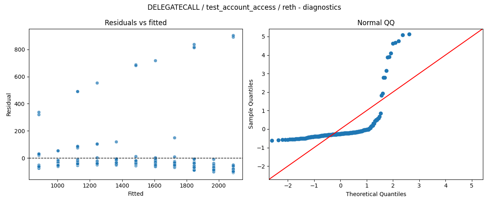

</details>

### test_account_access — combo `DELEGATECALL_AccountMode.NON_EXISTING_ACCOUNT` — `presets[cold_account_code_access]`

| client | nobs | R² | target_coef (ms) | p-value | 95% CI |
| --- | --- | --- | --- | --- | --- |
| `besu` | 198 | 0.7501 | 0.01564 | 1.00e-03 | [0.01437, 0.0169] |
| `erigon` | 121 | 0.9682 | 0.00898 | 1.00e-03 | [0.008687, 0.009164] |
| `geth` | 231 | 0.8726 | 0.02242 | 1.00e-03 | [0.02118, 0.0236] |
| `nethermind` | 220 | 0.9273 | 0.003743 | 1.00e-03 | [0.003583, 0.003889] |
| `reth` | 220 | 0.9691 | 0.0009203 | 1.00e-03 | [0.0008982, 0.0009395] |

<details><summary>besu — NNLS regression summary</summary>

```
==============================================================================
                           NNLS Regression Results                            
==============================================================================
Dep. Variable:          test_runtime_ms              R-squared:          0.750
Model:                  NNLS                    Adj. R-squared:          0.749
No. Observations:       198                               RMSE:         214.68
Df Residuals:           196                                MAE:         196.98
Df Model:               1      
==============================================================================
                      coef     std err     P-value      [0.025      0.975]
------------------------------------------------------------------------------
         const    555.7742     44.4385       0.001    465.6923    643.1077
       opcount      0.0156      0.0006       0.001      0.0144      0.0169
==============================================================================
Notes: Non-negative least squares with bootstrap inference (1000 iterations)
==============================================================================
```


</details>

<details><summary>erigon — NNLS regression summary</summary>

```
==============================================================================
                           NNLS Regression Results                            
==============================================================================
Dep. Variable:          test_runtime_ms              R-squared:          0.968
Model:                  NNLS                    Adj. R-squared:          0.968
No. Observations:       121                               RMSE:          38.69
Df Residuals:           119                                MAE:          35.77
Df Model:               1      
==============================================================================
                      coef     std err     P-value      [0.025      0.975]
------------------------------------------------------------------------------
         const      7.2253      8.1450       0.253      0.0000     26.7491
       opcount      0.0090      0.0001       0.001      0.0087      0.0092
==============================================================================
Notes: Non-negative least squares with bootstrap inference (1000 iterations)
==============================================================================
```


</details>

<details><summary>geth — NNLS regression summary</summary>

```
==============================================================================
                           NNLS Regression Results                            
==============================================================================
Dep. Variable:          test_runtime_ms              R-squared:          0.873
Model:                  NNLS                    Adj. R-squared:          0.872
No. Observations:       231                               RMSE:         203.71
Df Residuals:           229                                MAE:         174.23
Df Model:               1      
==============================================================================
                      coef     std err     P-value      [0.025      0.975]
------------------------------------------------------------------------------
         const    773.4066     54.7097       0.001    672.7448    882.5031
       opcount      0.0224      0.0006       0.001      0.0212      0.0236
==============================================================================
Notes: Non-negative least squares with bootstrap inference (1000 iterations)
==============================================================================
```


</details>

<details><summary>nethermind — NNLS regression summary</summary>

```
==============================================================================
                           NNLS Regression Results                            
==============================================================================
Dep. Variable:          test_runtime_ms              R-squared:          0.927
Model:                  NNLS                    Adj. R-squared:          0.927
No. Observations:       220                               RMSE:          24.92
Df Residuals:           218                                MAE:          19.02
Df Model:               1      
==============================================================================
                      coef     std err     P-value      [0.025      0.975]
------------------------------------------------------------------------------
         const     86.7450      5.7312       0.001     76.1247     98.3440
       opcount      0.0037      0.0001       0.001      0.0036      0.0039
==============================================================================
Notes: Non-negative least squares with bootstrap inference (1000 iterations)
==============================================================================
```


</details>

<details><summary>reth — NNLS regression summary</summary>

```
==============================================================================
                           NNLS Regression Results                            
==============================================================================
Dep. Variable:          test_runtime_ms              R-squared:          0.969
Model:                  NNLS                    Adj. R-squared:          0.969
No. Observations:       220                               RMSE:           3.90
Df Residuals:           218                                MAE:           3.05
Df Model:               1      
==============================================================================
                      coef     std err     P-value      [0.025      0.975]
------------------------------------------------------------------------------
         const     44.0327      0.8565       0.001     42.4309     45.8607
       opcount      0.0009      0.0000       0.001      0.0009      0.0009
==============================================================================
Notes: Non-negative least squares with bootstrap inference (1000 iterations)
==============================================================================
```


</details>

### test_ext_account_query_warm — combo `DELEGATECALL`

| client | nobs | R² | target_coef (ms) | p-value | 95% CI |
| --- | --- | --- | --- | --- | --- |
| `besu` | 198 | 0.7785 | 0.0005552 | 1.00e-03 | [0.0005104, 0.0006025] |
| `erigon` | 121 | 0.9559 | 0.0002581 | 1.00e-03 | [0.0002478, 0.0002677] |
| `geth` | 231 | 0.9288 | 0.0001647 | 1.00e-03 | [0.0001583, 0.0001712] |
| `nethermind` | 220 | 0.8174 | 0.0004522 | 1.00e-03 | [0.0004211, 0.0004775] |
| `reth` | 220 | 0.9277 | 5.55e-05 | 1.00e-03 | [5.348e-05, 5.744e-05] |

<details><summary>besu — NNLS regression summary</summary>

```
==============================================================================
                           NNLS Regression Results                            
==============================================================================
Dep. Variable:          test_runtime_ms              R-squared:          0.778
Model:                  NNLS                    Adj. R-squared:          0.777
No. Observations:       198                               RMSE:         153.31
Df Residuals:           196                                MAE:         118.71
Df Model:               1      
==============================================================================
                      coef     std err     P-value      [0.025      0.975]
------------------------------------------------------------------------------
         const    696.6866     33.1227       0.001    630.4186    763.6113
       opcount      0.0006      0.0000       0.001      0.0005      0.0006
==============================================================================
Notes: Non-negative least squares with bootstrap inference (1000 iterations)
==============================================================================
```

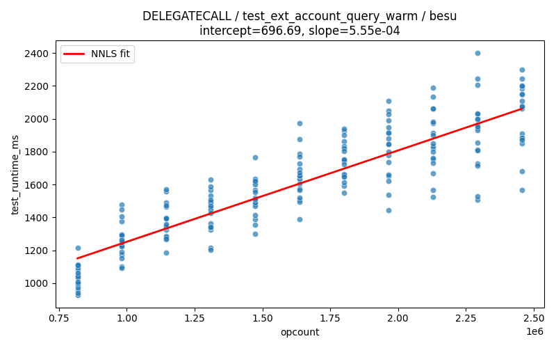

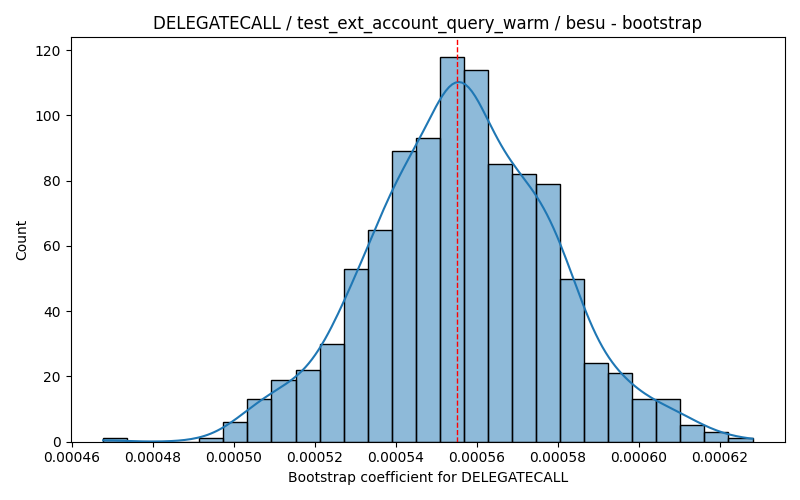

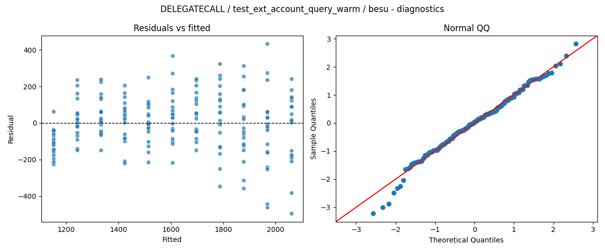

</details>

<details><summary>erigon — NNLS regression summary</summary>

```
==============================================================================
                           NNLS Regression Results                            
==============================================================================
Dep. Variable:          test_runtime_ms              R-squared:          0.956
Model:                  NNLS                    Adj. R-squared:          0.956
No. Observations:       121                               RMSE:          28.70
Df Residuals:           119                                MAE:          23.33
Df Model:               1      
==============================================================================
                      coef     std err     P-value      [0.025      0.975]
------------------------------------------------------------------------------
         const     40.4041      8.6929       0.001     23.5616     57.8041
       opcount      0.0003      0.0000       0.001      0.0002      0.0003
==============================================================================
Notes: Non-negative least squares with bootstrap inference (1000 iterations)
==============================================================================
```

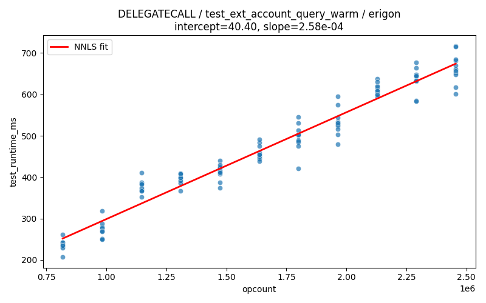

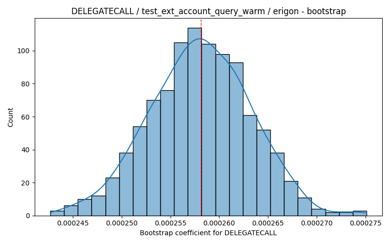

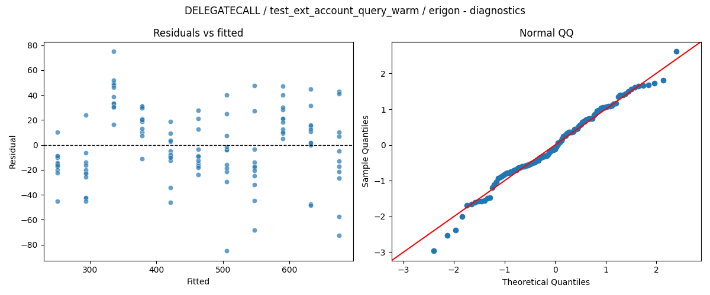

</details>

<details><summary>geth — NNLS regression summary</summary>

```
==============================================================================
                           NNLS Regression Results                            
==============================================================================
Dep. Variable:          test_runtime_ms              R-squared:          0.929
Model:                  NNLS                    Adj. R-squared:          0.928
No. Observations:       231                               RMSE:          23.62
Df Residuals:           229                                MAE:          17.85
Df Model:               1      
==============================================================================
                      coef     std err     P-value      [0.025      0.975]
------------------------------------------------------------------------------
         const     47.3117      4.8766       0.001     37.7066     56.9847
       opcount      0.0002      0.0000       0.001      0.0002      0.0002
==============================================================================
Notes: Non-negative least squares with bootstrap inference (1000 iterations)
==============================================================================
```

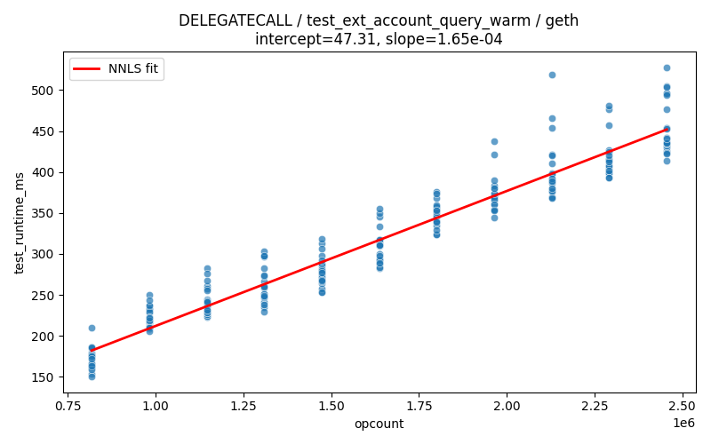

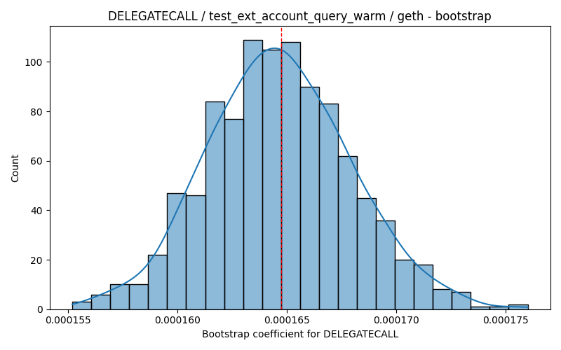

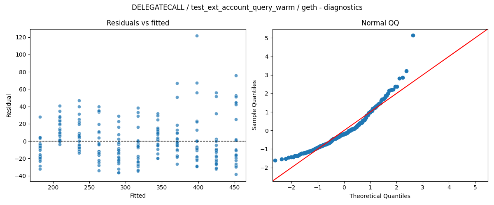

</details>

<details><summary>nethermind — NNLS regression summary</summary>

```
==============================================================================
                           NNLS Regression Results                            
==============================================================================
Dep. Variable:          test_runtime_ms              R-squared:          0.817
Model:                  NNLS                    Adj. R-squared:          0.817
No. Observations:       220                               RMSE:         110.64
Df Residuals:           218                                MAE:          81.70
Df Model:               1      
==============================================================================
                      coef     std err     P-value      [0.025      0.975]
------------------------------------------------------------------------------
         const    129.8978     23.1669       0.001     88.6158    177.0436
       opcount      0.0005      0.0000       0.001      0.0004      0.0005
==============================================================================
Notes: Non-negative least squares with bootstrap inference (1000 iterations)
==============================================================================
```

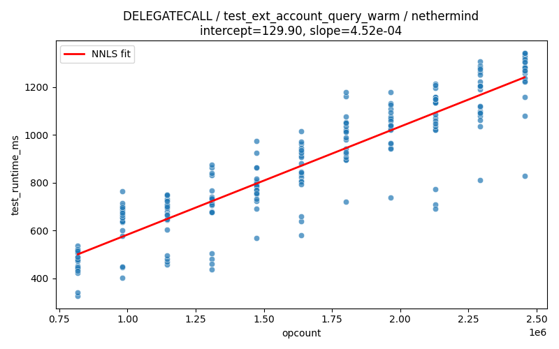

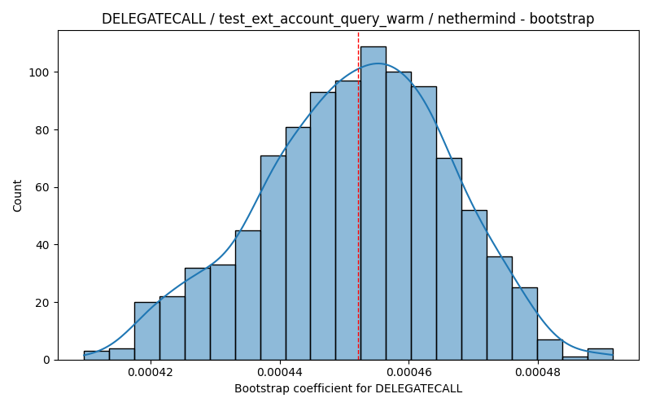

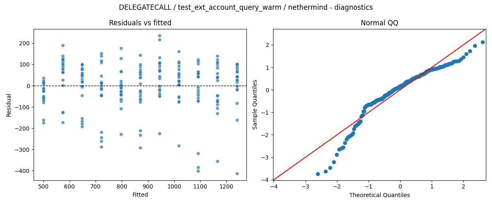

</details>

<details><summary>reth — NNLS regression summary</summary>

```
==============================================================================
                           NNLS Regression Results                            
==============================================================================
Dep. Variable:          test_runtime_ms              R-squared:          0.928
Model:                  NNLS                    Adj. R-squared:          0.927
No. Observations:       220                               RMSE:           8.02
Df Residuals:           218                                MAE:           6.32
Df Model:               1      
==============================================================================
                      coef     std err     P-value      [0.025      0.975]
------------------------------------------------------------------------------
         const     16.1779      1.6882       0.001     13.1089     19.4301
       opcount      0.0001      0.0000       0.001      0.0001      0.0001
==============================================================================
Notes: Non-negative least squares with bootstrap inference (1000 iterations)
==============================================================================
```

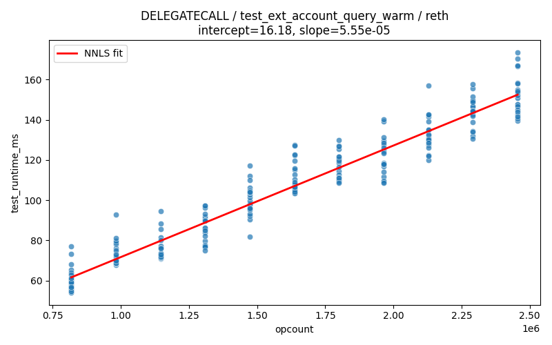

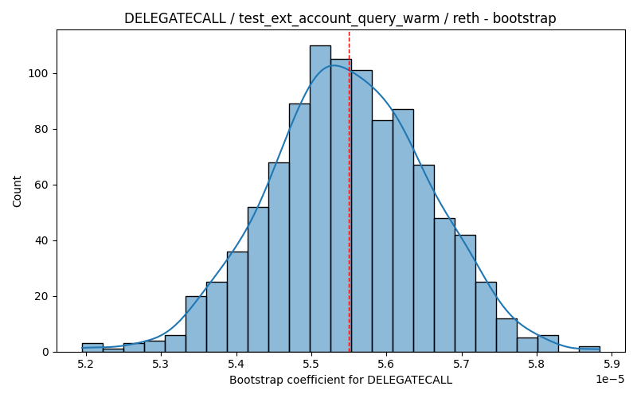

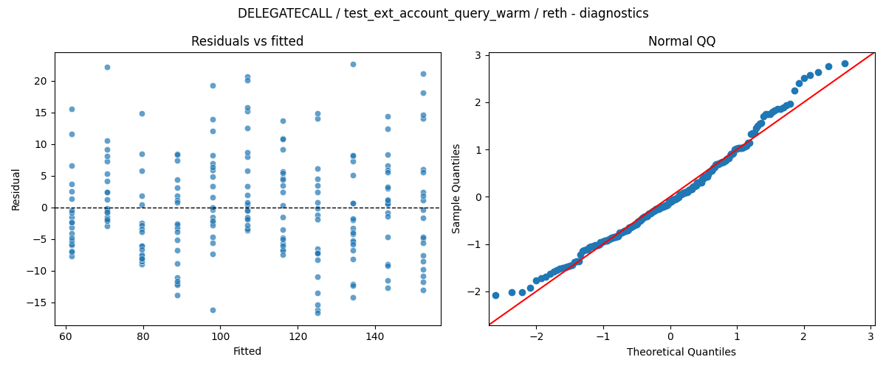

</details>

## EXTCODECOPY

### test_account_access — combo `EXTCODECOPY_AccountMode.NON_EXISTING_ACCOUNT` — `presets[cold_account_nocode_access]`

| client | nobs | R² | target_coef (ms) | p-value | 95% CI |
| --- | --- | --- | --- | --- | --- |
| `besu` | 198 | 0.4021 | 0.0004121 | 1.00e-03 | [0.0003427, 0.0004755] |
| `erigon` | 121 | 0.9214 | 6.948e-05 | 1.00e-03 | [6.602e-05, 7.293e-05] |
| `geth` | 231 | 0.9543 | 0.00037 | 1.00e-03 | [0.0003598, 0.0003807] |
| `nethermind` | 220 | 0.7094 | 0.0003157 | 1.00e-03 | [0.0002862, 0.0003442] |
| `reth` | 220 | 0.775 | 2.203e-05 | 1.00e-03 | [2.062e-05, 2.347e-05] |

<details><summary>besu — NNLS regression summary</summary>

```
==============================================================================
                           NNLS Regression Results                            
==============================================================================
Dep. Variable:          test_runtime_ms              R-squared:          0.402
Model:                  NNLS                    Adj. R-squared:          0.399
No. Observations:       198                               RMSE:         129.03
Df Residuals:           196                                MAE:          99.95
Df Model:               1      
==============================================================================
                      coef     std err     P-value      [0.025      0.975]
------------------------------------------------------------------------------
         const    288.7248     29.2215       0.001    233.3453    352.3051
       opcount      0.0004      0.0000       0.001      0.0003      0.0005
==============================================================================
Notes: Non-negative least squares with bootstrap inference (1000 iterations)
==============================================================================
```

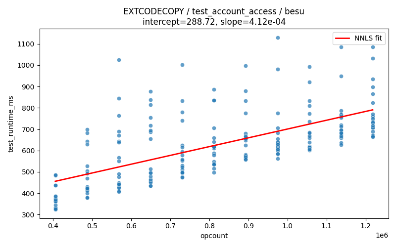

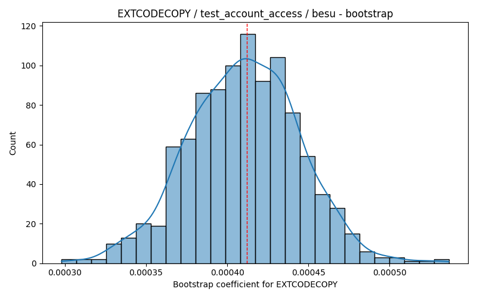

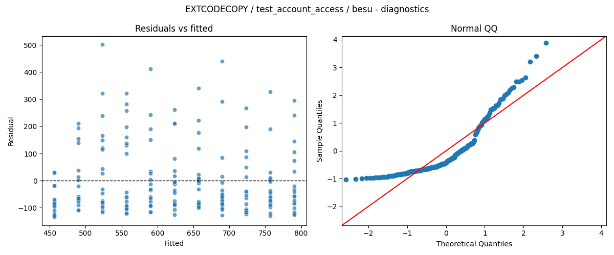

</details>

<details><summary>erigon — NNLS regression summary</summary>

```
==============================================================================
                           NNLS Regression Results                            
==============================================================================
Dep. Variable:          test_runtime_ms              R-squared:          0.921
Model:                  NNLS                    Adj. R-squared:          0.921
No. Observations:       121                               RMSE:           5.21
Df Residuals:           119                                MAE:           4.04
Df Model:               1      
==============================================================================
                      coef     std err     P-value      [0.025      0.975]
------------------------------------------------------------------------------
         const     24.1041      1.3358       0.001     21.5924     26.7101
       opcount      0.0001      0.0000       0.001      0.0001      0.0001
==============================================================================
Notes: Non-negative least squares with bootstrap inference (1000 iterations)
==============================================================================
```

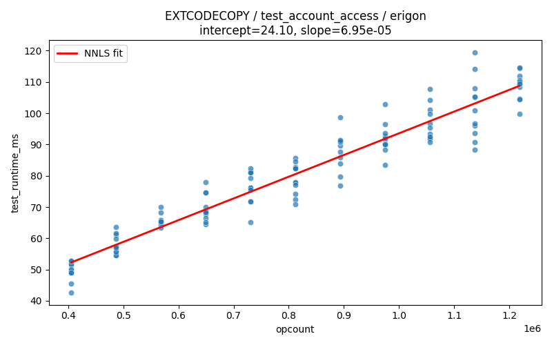

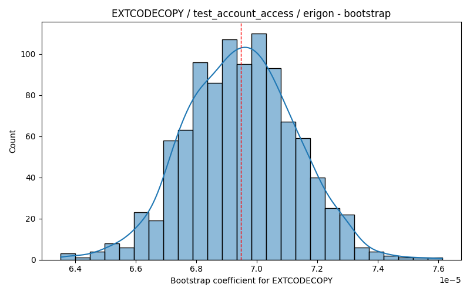

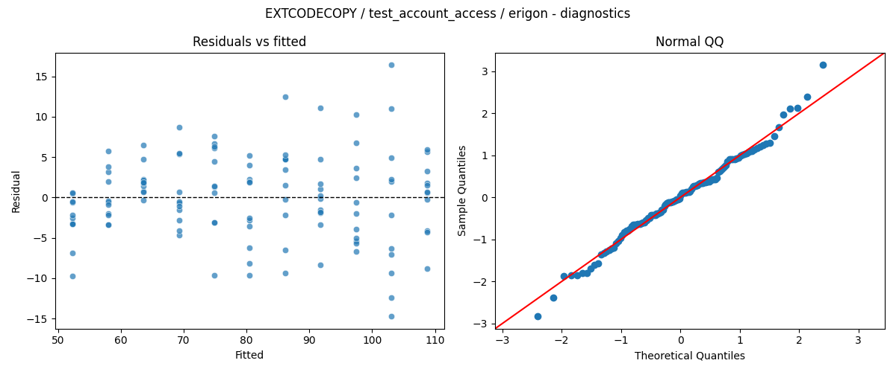

</details>

<details><summary>geth — NNLS regression summary</summary>

```
==============================================================================
                           NNLS Regression Results                            
==============================================================================
Dep. Variable:          test_runtime_ms              R-squared:          0.954
Model:                  NNLS                    Adj. R-squared:          0.954
No. Observations:       231                               RMSE:          20.79
Df Residuals:           229                                MAE:          16.14
Df Model:               1      
==============================================================================
                      coef     std err     P-value      [0.025      0.975]
------------------------------------------------------------------------------
         const     21.4808      4.0143       0.001     13.4397     29.3693
       opcount      0.0004      0.0000       0.001      0.0004      0.0004
==============================================================================
Notes: Non-negative least squares with bootstrap inference (1000 iterations)
==============================================================================
```

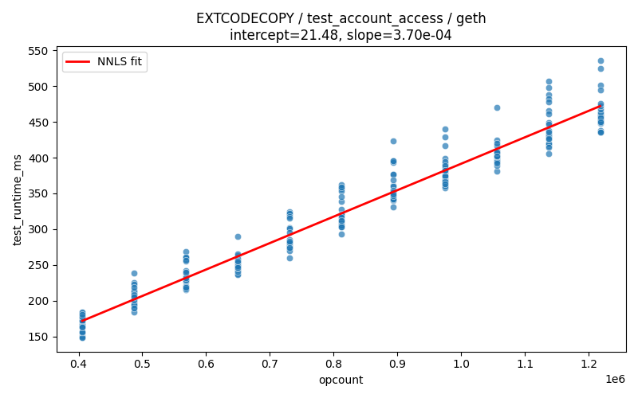

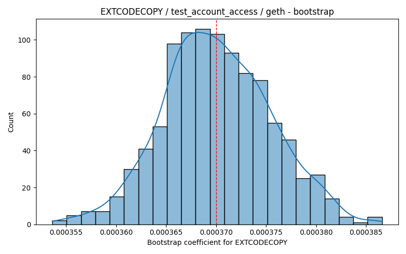

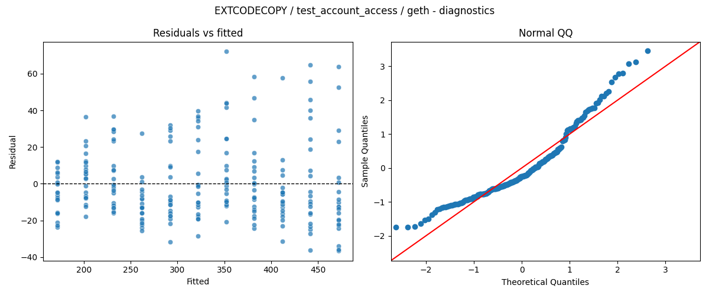

</details>

<details><summary>nethermind — NNLS regression summary</summary>

```
==============================================================================
                           NNLS Regression Results                            
==============================================================================
Dep. Variable:          test_runtime_ms              R-squared:          0.709
Model:                  NNLS                    Adj. R-squared:          0.708
No. Observations:       220                               RMSE:          51.87
Df Residuals:           218                                MAE:          39.68
Df Model:               1      
==============================================================================
                      coef     std err     P-value      [0.025      0.975]
------------------------------------------------------------------------------
         const    122.1422     10.7065       0.001    102.3681    143.5108
       opcount      0.0003      0.0000       0.001      0.0003      0.0003
==============================================================================
Notes: Non-negative least squares with bootstrap inference (1000 iterations)
==============================================================================
```

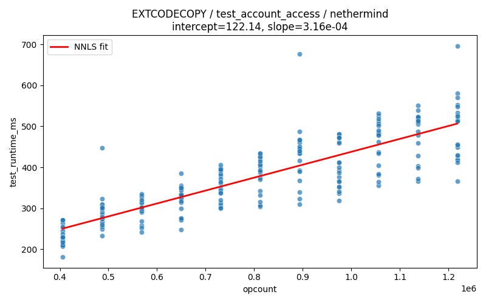

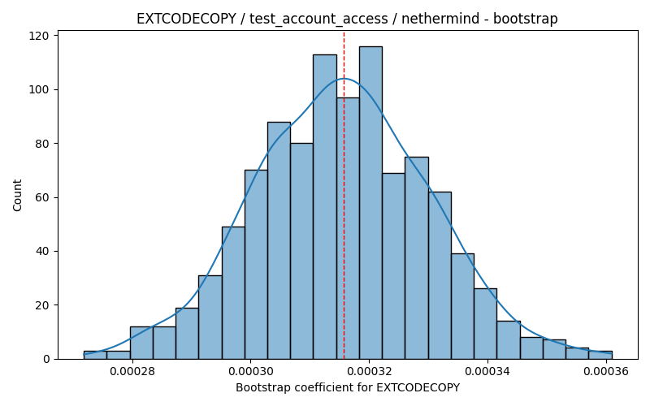

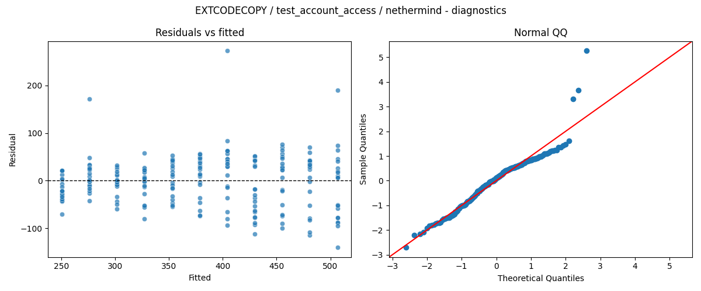

</details>

<details><summary>reth — NNLS regression summary</summary>

```
==============================================================================
                           NNLS Regression Results                            
==============================================================================
Dep. Variable:          test_runtime_ms              R-squared:          0.775
Model:                  NNLS                    Adj. R-squared:          0.774
No. Observations:       220                               RMSE:           3.05
Df Residuals:           218                                MAE:           2.23
Df Model:               1      
==============================================================================
                      coef     std err     P-value      [0.025      0.975]
------------------------------------------------------------------------------
         const      6.0426      0.5632       0.001      4.9462      7.1220
       opcount      0.0000      0.0000       0.001      0.0000      0.0000
==============================================================================
Notes: Non-negative least squares with bootstrap inference (1000 iterations)
==============================================================================
```

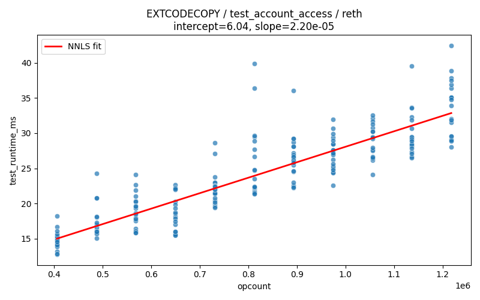

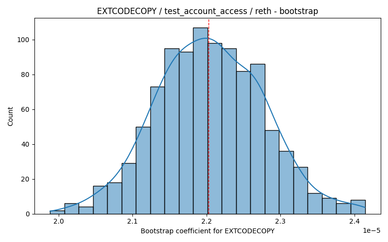

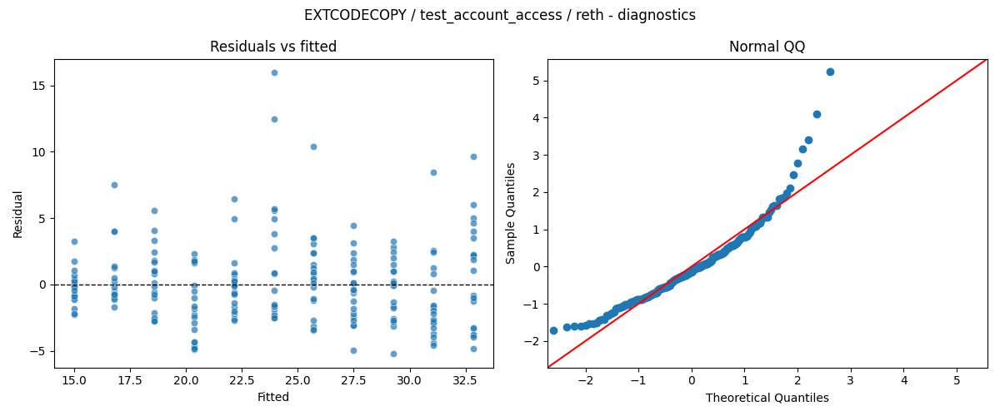

</details>

### test_account_access — combo `EXTCODECOPY_AccountMode.EXISTING_CONTRACT`

| client | nobs | R² | target_coef (ms) | p-value | 95% CI |
| --- | --- | --- | --- | --- | --- |
| `besu` | 198 | 0.5513 | 0.002135 | 1.00e-03 | [0.001914, 0.002357] |
| `erigon` | 121 | 0.9478 | 0.0003061 | 1.00e-03 | [0.000293, 0.000319] |
| `geth` | 231 | 0.9306 | 0.0007942 | 1.00e-03 | [0.0007661, 0.0008224] |
| `nethermind` | 220 | 0.8736 | 0.001221 | 1.00e-03 | [0.001166, 0.00128] |
| `reth` | 220 | 0.8486 | 0.0001128 | 1.00e-03 | [0.0001061, 0.0001191] |

<details><summary>besu — NNLS regression summary</summary>

```
==============================================================================
                           NNLS Regression Results                            
==============================================================================
Dep. Variable:          test_runtime_ms              R-squared:          0.551
Model:                  NNLS                    Adj. R-squared:          0.549
No. Observations:       198                               RMSE:         190.27
Df Residuals:           196                                MAE:         152.66
Df Model:               1      
==============================================================================
                      coef     std err     P-value      [0.025      0.975]
------------------------------------------------------------------------------
         const    493.0597     41.7297       0.001    410.6392    574.5945
       opcount      0.0021      0.0001       0.001      0.0019      0.0024
==============================================================================
Notes: Non-negative least squares with bootstrap inference (1000 iterations)
==============================================================================
```

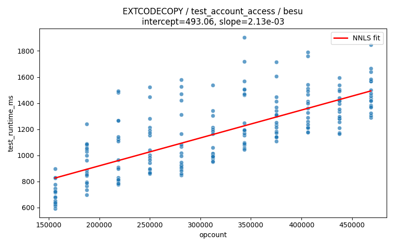

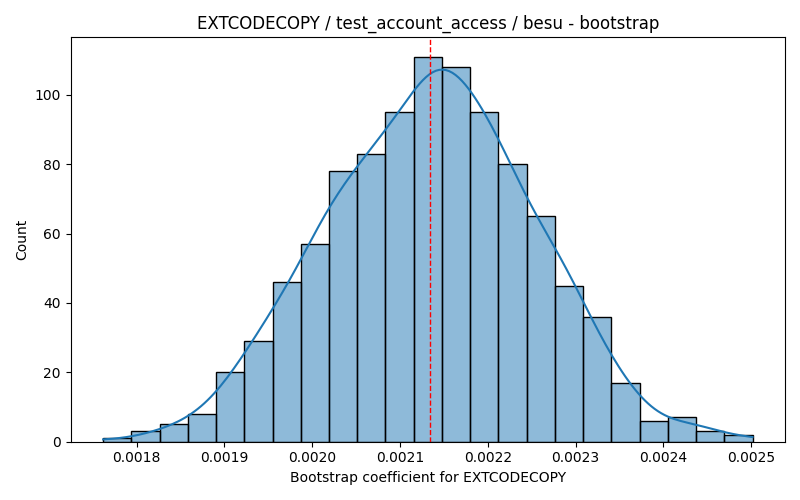

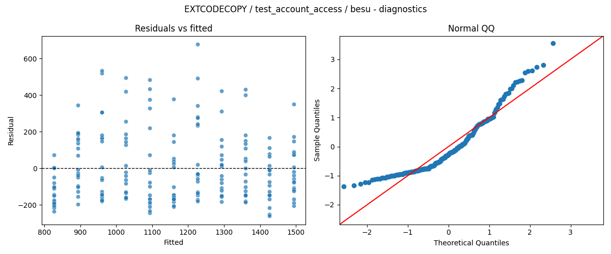

</details>

<details><summary>erigon — NNLS regression summary</summary>

```
==============================================================================
                           NNLS Regression Results                            
==============================================================================
Dep. Variable:          test_runtime_ms              R-squared:          0.948
Model:                  NNLS                    Adj. R-squared:          0.947
No. Observations:       121                               RMSE:           7.10
Df Residuals:           119                                MAE:           5.52
Df Model:               1      
==============================================================================
                      coef     std err     P-value      [0.025      0.975]
------------------------------------------------------------------------------
         const     36.0423      2.0547       0.001     32.0054     39.9989
       opcount      0.0003      0.0000       0.001      0.0003      0.0003
==============================================================================
Notes: Non-negative least squares with bootstrap inference (1000 iterations)
==============================================================================
```

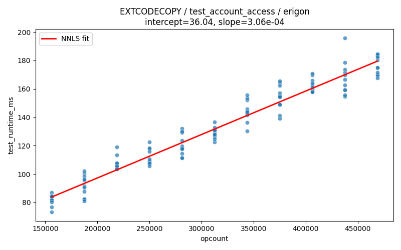

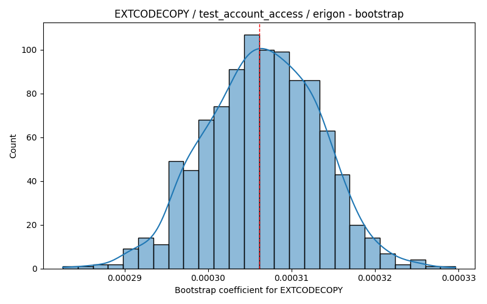

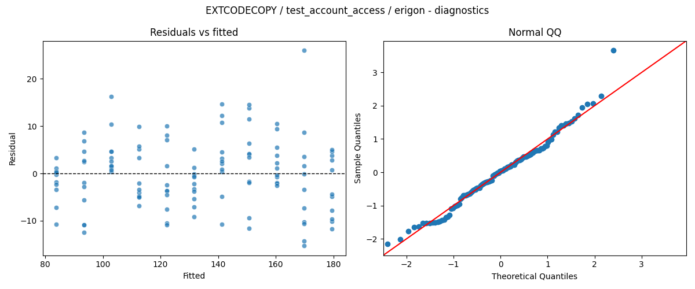

</details>

<details><summary>geth — NNLS regression summary</summary>

```
==============================================================================
                           NNLS Regression Results                            
==============================================================================
Dep. Variable:          test_runtime_ms              R-squared:          0.931
Model:                  NNLS                    Adj. R-squared:          0.930
No. Observations:       231                               RMSE:          21.43
Df Residuals:           229                                MAE:          16.97
Df Model:               1      
==============================================================================
                      coef     std err     P-value      [0.025      0.975]
------------------------------------------------------------------------------
         const     50.6799      4.3690       0.001     42.0212     59.0183
       opcount      0.0008      0.0000       0.001      0.0008      0.0008
==============================================================================
Notes: Non-negative least squares with bootstrap inference (1000 iterations)
==============================================================================
```

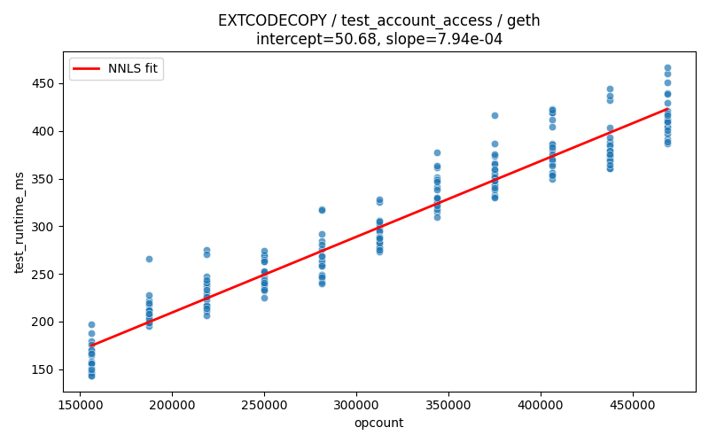

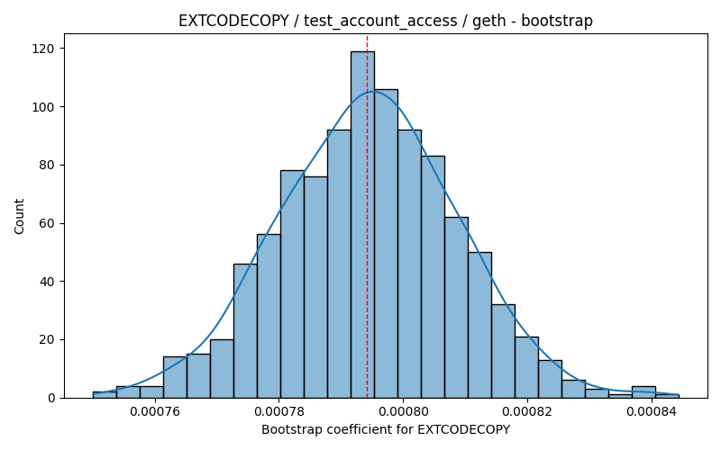

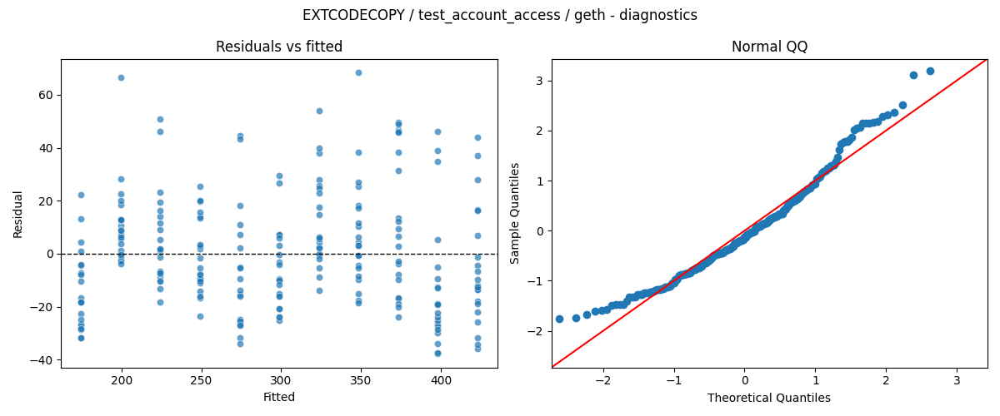

</details>

<details><summary>nethermind — NNLS regression summary</summary>

```
==============================================================================
                           NNLS Regression Results                            
==============================================================================
Dep. Variable:          test_runtime_ms              R-squared:          0.874
Model:                  NNLS                    Adj. R-squared:          0.873
No. Observations:       220                               RMSE:          45.90
Df Residuals:           218                                MAE:          35.34
Df Model:               1      
==============================================================================
                      coef     std err     P-value      [0.025      0.975]
------------------------------------------------------------------------------
         const    169.7605      8.6761       0.001    151.2743    186.8889
       opcount      0.0012      0.0000       0.001      0.0012      0.0013
==============================================================================
Notes: Non-negative least squares with bootstrap inference (1000 iterations)
==============================================================================
```

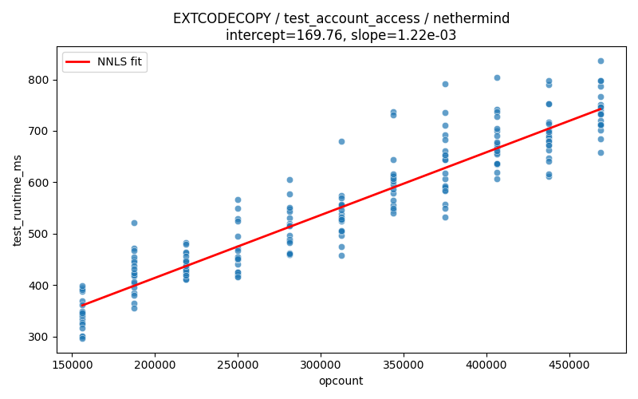

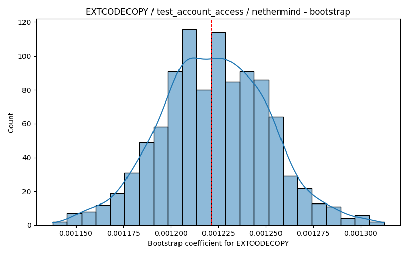

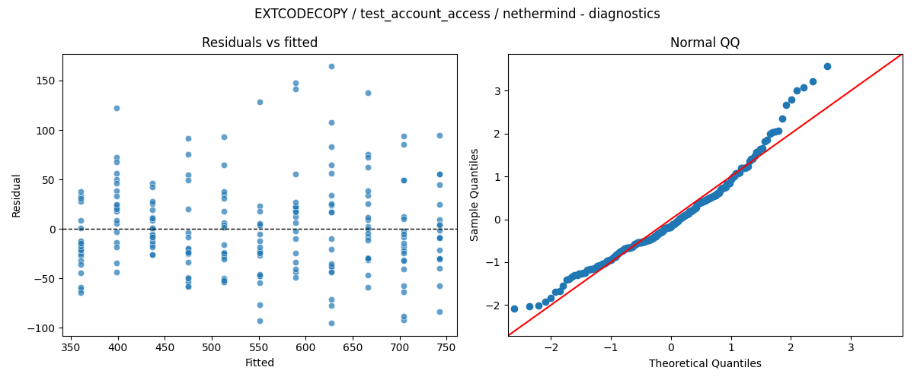

</details>

<details><summary>reth — NNLS regression summary</summary>

```
==============================================================================
                           NNLS Regression Results                            
==============================================================================
Dep. Variable:          test_runtime_ms              R-squared:          0.849
Model:                  NNLS                    Adj. R-squared:          0.848
No. Observations:       220                               RMSE:           4.71
Df Residuals:           218                                MAE:           3.73
Df Model:               1      
==============================================================================
                      coef     std err     P-value      [0.025      0.975]
------------------------------------------------------------------------------
         const      9.5028      1.0304       0.001      7.5391     11.5576
       opcount      0.0001      0.0000       0.001      0.0001      0.0001
==============================================================================
Notes: Non-negative least squares with bootstrap inference (1000 iterations)
==============================================================================
```

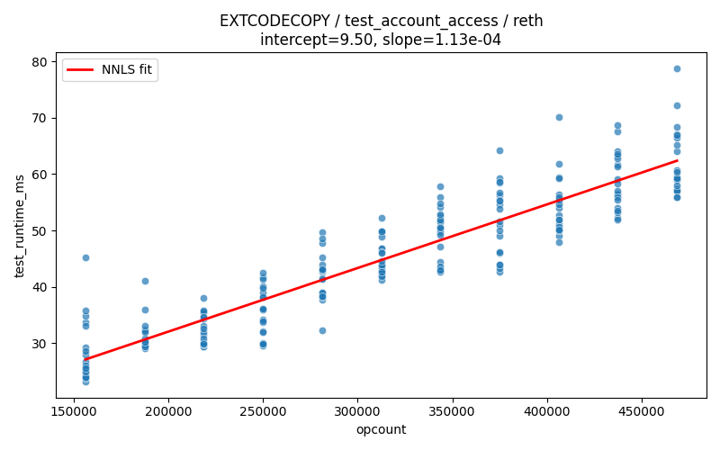

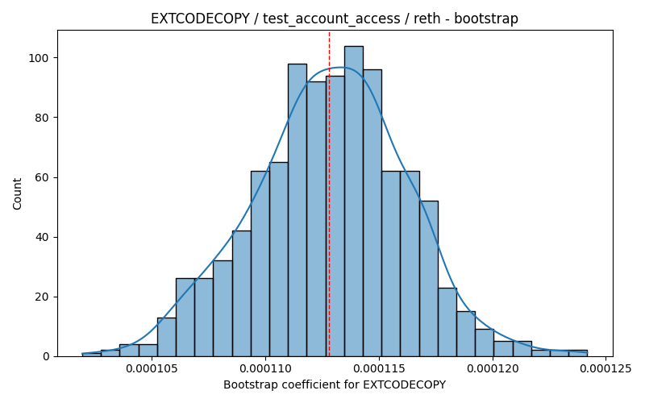

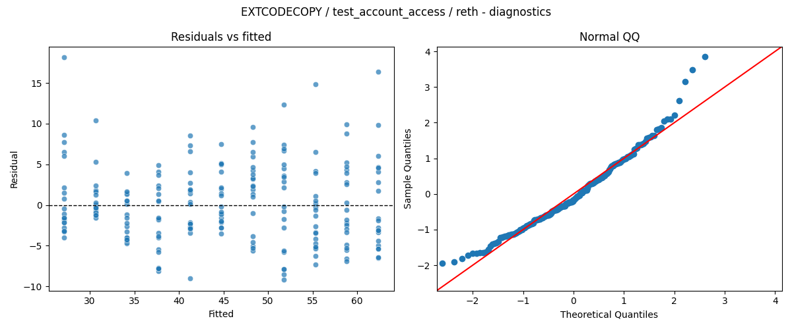

</details>

### test_account_access — combo `EXTCODECOPY_AccountMode.NON_EXISTING_ACCOUNT` — `presets[cold_account_code_access]`

| client | nobs | R² | target_coef (ms) | p-value | 95% CI |
| --- | --- | --- | --- | --- | --- |
| `besu` | 198 | 0.4021 | 0.0004121 | 1.00e-03 | [0.0003427, 0.0004755] |
| `erigon` | 121 | 0.9214 | 6.948e-05 | 1.00e-03 | [6.602e-05, 7.293e-05] |
| `geth` | 231 | 0.9543 | 0.00037 | 1.00e-03 | [0.0003598, 0.0003807] |
| `nethermind` | 220 | 0.7094 | 0.0003157 | 1.00e-03 | [0.0002862, 0.0003442] |
| `reth` | 220 | 0.775 | 2.203e-05 | 1.00e-03 | [2.062e-05, 2.347e-05] |

<details><summary>besu — NNLS regression summary</summary>

```
==============================================================================
                           NNLS Regression Results                            
==============================================================================
Dep. Variable:          test_runtime_ms              R-squared:          0.402
Model:                  NNLS                    Adj. R-squared:          0.399
No. Observations:       198                               RMSE:         129.03
Df Residuals:           196                                MAE:          99.95
Df Model:               1      
==============================================================================
                      coef     std err     P-value      [0.025      0.975]
------------------------------------------------------------------------------
         const    288.7248     29.2215       0.001    233.3453    352.3051
       opcount      0.0004      0.0000       0.001      0.0003      0.0005
==============================================================================
Notes: Non-negative least squares with bootstrap inference (1000 iterations)
==============================================================================
```


</details>

<details><summary>erigon — NNLS regression summary</summary>

```
==============================================================================
                           NNLS Regression Results                            
==============================================================================
Dep. Variable:          test_runtime_ms              R-squared:          0.921
Model:                  NNLS                    Adj. R-squared:          0.921
No. Observations:       121                               RMSE:           5.21
Df Residuals:           119                                MAE:           4.04
Df Model:               1      
==============================================================================
                      coef     std err     P-value      [0.025      0.975]
------------------------------------------------------------------------------
         const     24.1041      1.3358       0.001     21.5924     26.7101
       opcount      0.0001      0.0000       0.001      0.0001      0.0001
==============================================================================
Notes: Non-negative least squares with bootstrap inference (1000 iterations)
==============================================================================
```


</details>

<details><summary>geth — NNLS regression summary</summary>

```
==============================================================================
                           NNLS Regression Results                            
==============================================================================
Dep. Variable:          test_runtime_ms              R-squared:          0.954
Model:                  NNLS                    Adj. R-squared:          0.954
No. Observations:       231                               RMSE:          20.79
Df Residuals:           229                                MAE:          16.14
Df Model:               1      
==============================================================================
                      coef     std err     P-value      [0.025      0.975]
------------------------------------------------------------------------------
         const     21.4808      4.0143       0.001     13.4397     29.3693
       opcount      0.0004      0.0000       0.001      0.0004      0.0004
==============================================================================
Notes: Non-negative least squares with bootstrap inference (1000 iterations)
==============================================================================
```


</details>

<details><summary>nethermind — NNLS regression summary</summary>

```
==============================================================================
                           NNLS Regression Results                            
==============================================================================
Dep. Variable:          test_runtime_ms              R-squared:          0.709
Model:                  NNLS                    Adj. R-squared:          0.708
No. Observations:       220                               RMSE:          51.87
Df Residuals:           218                                MAE:          39.68
Df Model:               1      
==============================================================================
                      coef     std err     P-value      [0.025      0.975]
------------------------------------------------------------------------------
         const    122.1422     10.7065       0.001    102.3681    143.5108
       opcount      0.0003      0.0000       0.001      0.0003      0.0003
==============================================================================
Notes: Non-negative least squares with bootstrap inference (1000 iterations)
==============================================================================
```


</details>

<details><summary>reth — NNLS regression summary</summary>

```
==============================================================================
                           NNLS Regression Results                            
==============================================================================
Dep. Variable:          test_runtime_ms              R-squared:          0.775
Model:                  NNLS                    Adj. R-squared:          0.774
No. Observations:       220                               RMSE:           3.05
Df Residuals:           218                                MAE:           2.23
Df Model:               1      
==============================================================================
                      coef     std err     P-value      [0.025      0.975]
------------------------------------------------------------------------------
         const      6.0426      0.5632       0.001      4.9462      7.1220
       opcount      0.0000      0.0000       0.001      0.0000      0.0000
==============================================================================
Notes: Non-negative least squares with bootstrap inference (1000 iterations)
==============================================================================
```


</details>

## EXTCODEHASH

### test_account_access — combo `EXTCODEHASH_AccountMode.NON_EXISTING_ACCOUNT` — `presets[cold_account_nocode_access]`

| client | nobs | R² | target_coef (ms) | p-value | 95% CI |
| --- | --- | --- | --- | --- | --- |
| `besu` | 198 | 0.7897 | 0.01368 | 1.00e-03 | [0.01263, 0.01464] |
| `erigon` | 121 | 0.9622 | 0.008078 | 1.00e-03 | [0.007852, 0.008179] |
| `geth` | 231 | 0.8683 | 0.02178 | 1.00e-03 | [0.02057, 0.02298] |
| `nethermind` | 220 | 0.9505 | 0.003496 | 1.00e-03 | [0.00338, 0.003618] |
| `reth` | 220 | 0.9681 | 0.0008867 | 1.00e-03 | [0.0008652, 0.0009072] |

<details><summary>besu — NNLS regression summary</summary>

```
==============================================================================
                           NNLS Regression Results                            
==============================================================================
Dep. Variable:          test_runtime_ms              R-squared:          0.790
Model:                  NNLS                    Adj. R-squared:          0.789
No. Observations:       198                               RMSE:         168.65
Df Residuals:           196                                MAE:         155.97
Df Model:               1      
==============================================================================
                      coef     std err     P-value      [0.025      0.975]
------------------------------------------------------------------------------
         const    520.2992     37.1814       0.001    449.4949    595.7462
       opcount      0.0137      0.0005       0.001      0.0126      0.0146
==============================================================================
Notes: Non-negative least squares with bootstrap inference (1000 iterations)
==============================================================================
```

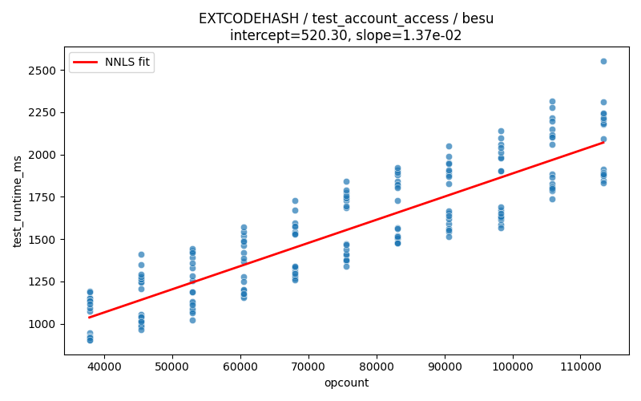

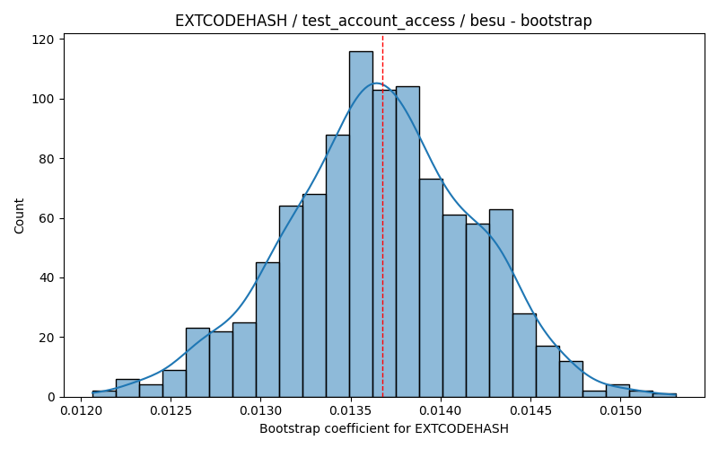

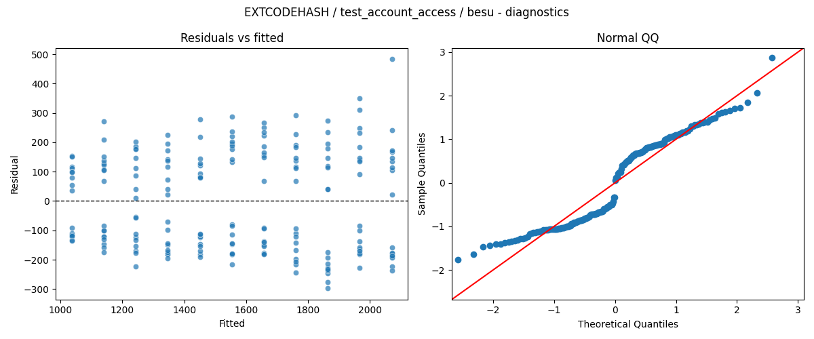

</details>

<details><summary>erigon — NNLS regression summary</summary>

```
==============================================================================
                           NNLS Regression Results                            
==============================================================================
Dep. Variable:          test_runtime_ms              R-squared:          0.962
Model:                  NNLS                    Adj. R-squared:          0.962
No. Observations:       121                               RMSE:          38.59
Df Residuals:           119                                MAE:          35.56
Df Model:               1      
==============================================================================
                      coef     std err     P-value      [0.025      0.975]
------------------------------------------------------------------------------
         const      0.0000      3.7729       1.000      0.0000     12.0478
       opcount      0.0081      0.0001       0.001      0.0079      0.0082
==============================================================================
Notes: Non-negative least squares with bootstrap inference (1000 iterations)
==============================================================================
```

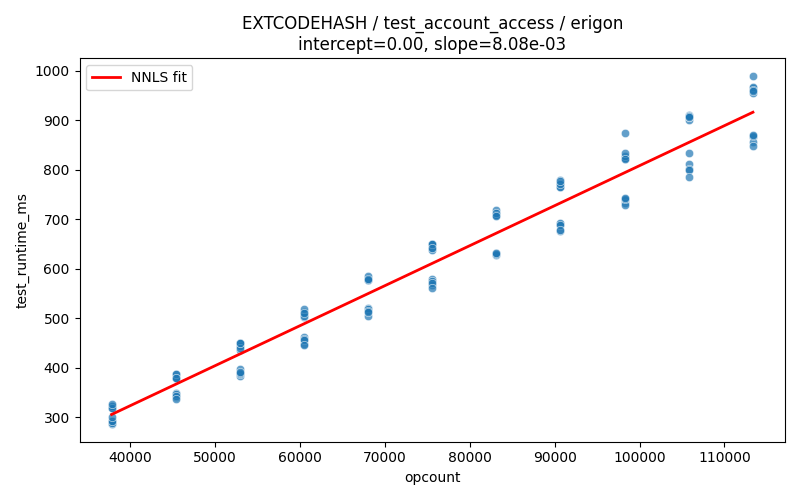

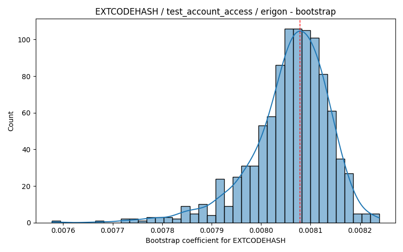

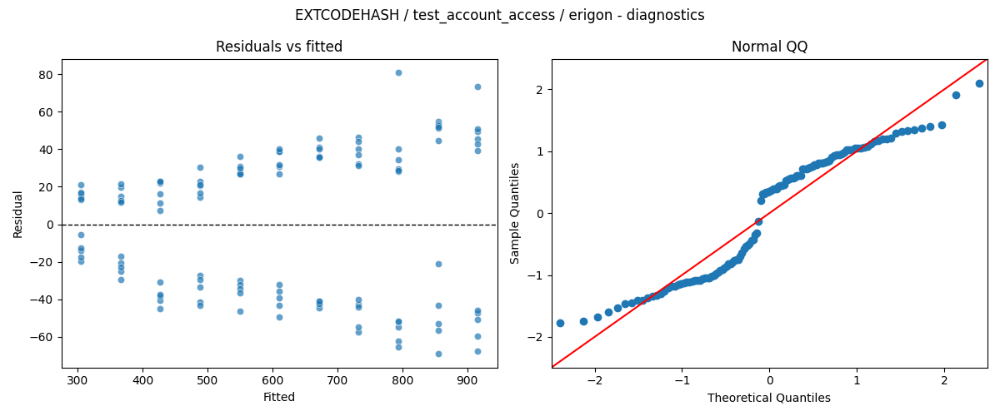

</details>

<details><summary>geth — NNLS regression summary</summary>

```
==============================================================================
                           NNLS Regression Results                            
==============================================================================
Dep. Variable:          test_runtime_ms              R-squared:          0.868
Model:                  NNLS                    Adj. R-squared:          0.868
No. Observations:       231                               RMSE:         202.67
Df Residuals:           229                                MAE:         173.55
Df Model:               1      
==============================================================================
                      coef     std err     P-value      [0.025      0.975]
------------------------------------------------------------------------------
         const    768.3059     53.0763       0.001    666.6661    870.3875
       opcount      0.0218      0.0006       0.001      0.0206      0.0230
==============================================================================
Notes: Non-negative least squares with bootstrap inference (1000 iterations)
==============================================================================
```


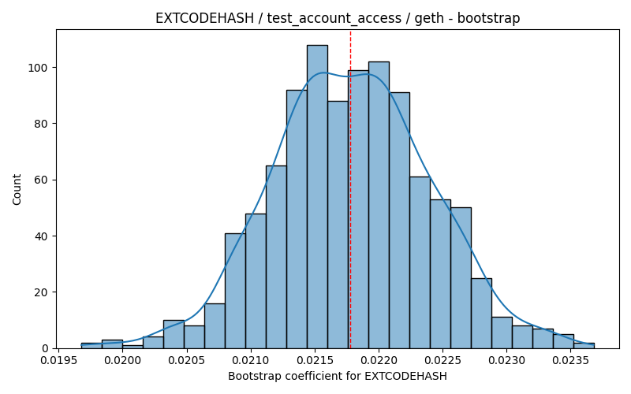

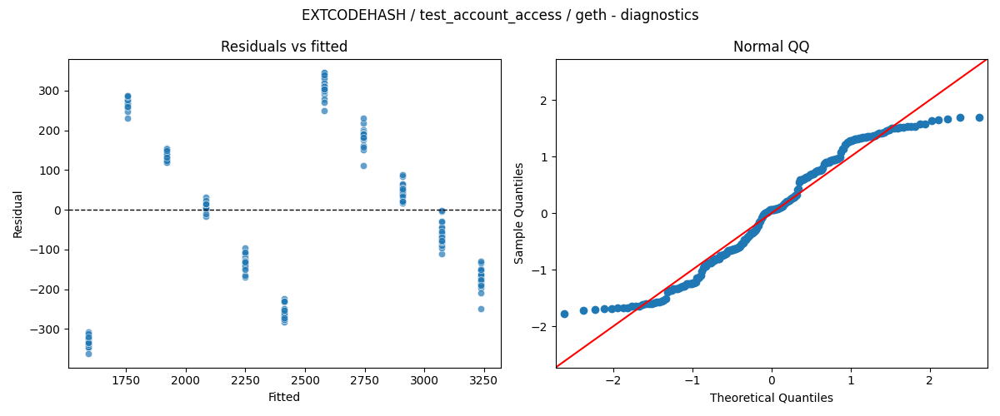

</details>

<details><summary>nethermind — NNLS regression summary</summary>

```
==============================================================================
                           NNLS Regression Results                            
==============================================================================
Dep. Variable:          test_runtime_ms              R-squared:          0.950
Model:                  NNLS                    Adj. R-squared:          0.950
No. Observations:       220                               RMSE:          19.07
Df Residuals:           218                                MAE:          14.33
Df Model:               1      
==============================================================================
                      coef     std err     P-value      [0.025      0.975]
------------------------------------------------------------------------------
         const     73.9111      4.3810       0.001     65.2270     82.6071
       opcount      0.0035      0.0001       0.001      0.0034      0.0036
==============================================================================
Notes: Non-negative least squares with bootstrap inference (1000 iterations)
==============================================================================
```


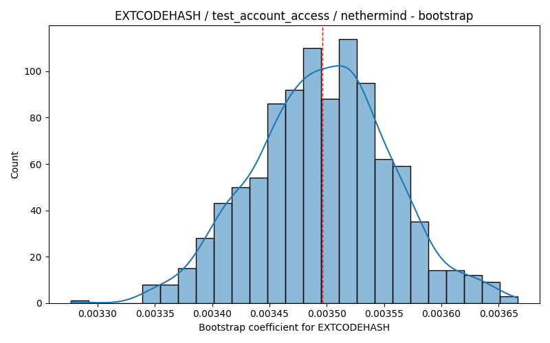

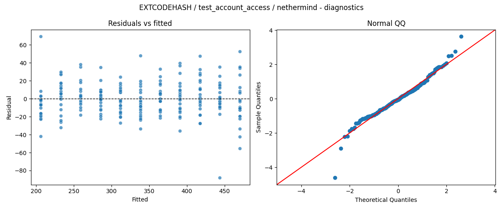

</details>

<details><summary>reth — NNLS regression summary</summary>

```
==============================================================================
                           NNLS Regression Results                            
==============================================================================
Dep. Variable:          test_runtime_ms              R-squared:          0.968
Model:                  NNLS                    Adj. R-squared:          0.968
No. Observations:       220                               RMSE:           3.85
Df Residuals:           218                                MAE:           3.03
Df Model:               1      
==============================================================================
                      coef     std err     P-value      [0.025      0.975]
------------------------------------------------------------------------------
         const     43.4146      0.8424       0.001     41.8261     45.1239
       opcount      0.0009      0.0000       0.001      0.0009      0.0009
==============================================================================
Notes: Non-negative least squares with bootstrap inference (1000 iterations)
==============================================================================
```

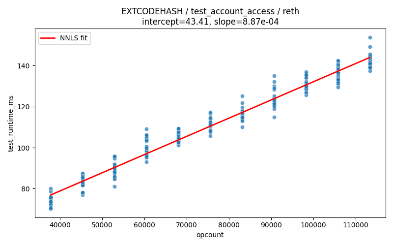

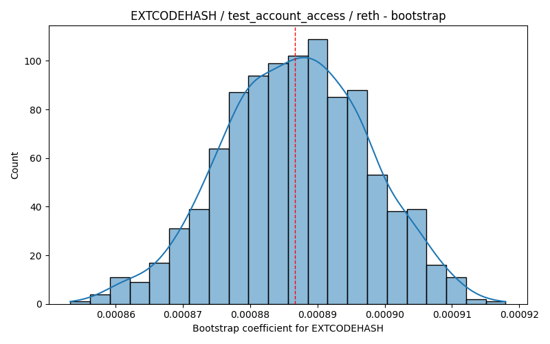

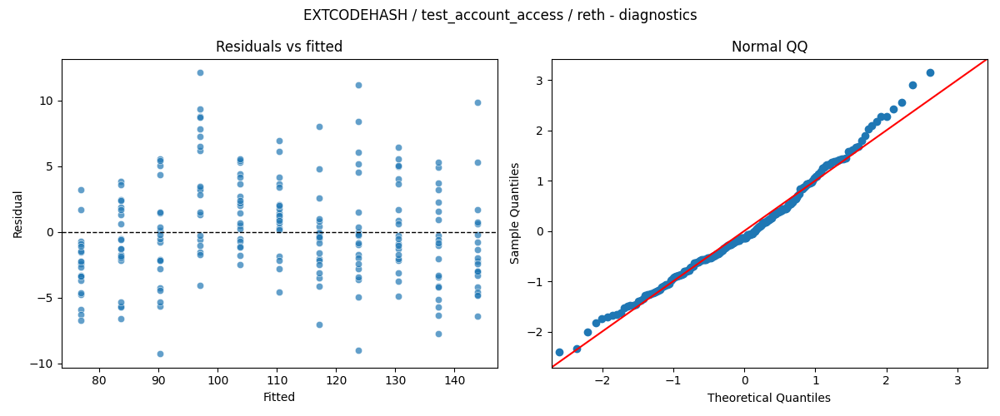

</details>

### test_account_access — combo `EXTCODEHASH_AccountMode.EXISTING_CONTRACT`

| client | nobs | R² | target_coef (ms) | p-value | 95% CI |
| --- | --- | --- | --- | --- | --- |
| `besu` | 198 | 0.8471 | 0.02897 | 1.00e-03 | [0.02733, 0.03067] |
| `erigon` | 121 | 0.9125 | 0.03399 | 1.00e-03 | [0.03212, 0.03587] |
| `geth` | 231 | 0.8668 | 0.02318 | 1.00e-03 | [0.0219, 0.02445] |
| `nethermind` | 220 | 0.8299 | 0.01866 | 1.00e-03 | [0.01747, 0.01986] |
| `reth` | 220 | 0.8665 | 0.01866 | 1.00e-03 | [0.01767, 0.01979] |

<details><summary>besu — NNLS regression summary</summary>

```
==============================================================================
                           NNLS Regression Results                            
==============================================================================
Dep. Variable:          test_runtime_ms              R-squared:          0.847
Model:                  NNLS                    Adj. R-squared:          0.846
No. Observations:       198                               RMSE:         256.08
Df Residuals:           196                                MAE:         230.92
Df Model:               1      
==============================================================================
                      coef     std err     P-value      [0.025      0.975]
------------------------------------------------------------------------------
         const    532.1966     50.8215       0.001    435.0803    631.0274
       opcount      0.0290      0.0008       0.001      0.0273      0.0307
==============================================================================
Notes: Non-negative least squares with bootstrap inference (1000 iterations)
==============================================================================
```

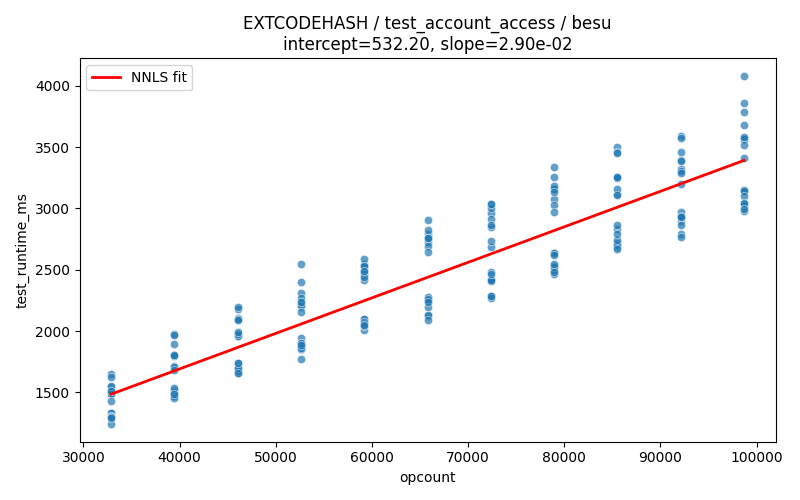

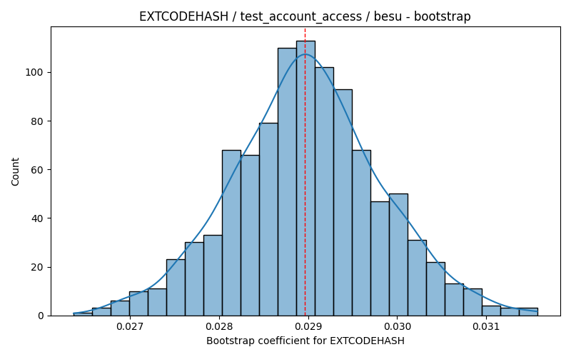

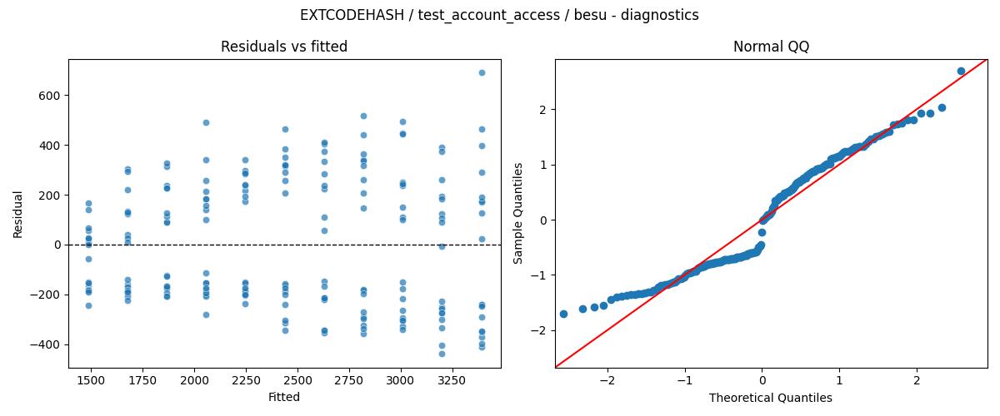

</details>

<details><summary>erigon — NNLS regression summary</summary>

```
==============================================================================
                           NNLS Regression Results                            
==============================================================================
Dep. Variable:          test_runtime_ms              R-squared:          0.913
Model:                  NNLS                    Adj. R-squared:          0.912
No. Observations:       121                               RMSE:         218.98
Df Residuals:           119                                MAE:         190.80
Df Model:               1      
==============================================================================
                      coef     std err     P-value      [0.025      0.975]
------------------------------------------------------------------------------
         const    256.9958     69.3728       0.001    122.8917    400.3970
       opcount      0.0340      0.0009       0.001      0.0321      0.0359
==============================================================================
Notes: Non-negative least squares with bootstrap inference (1000 iterations)
==============================================================================
```

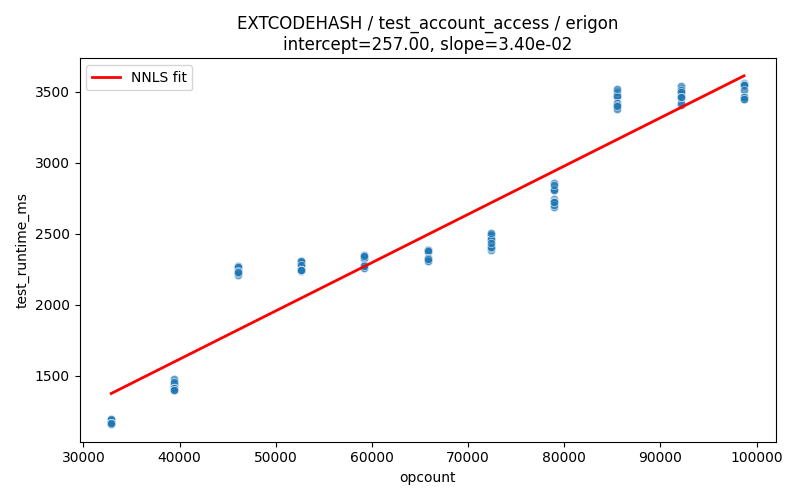

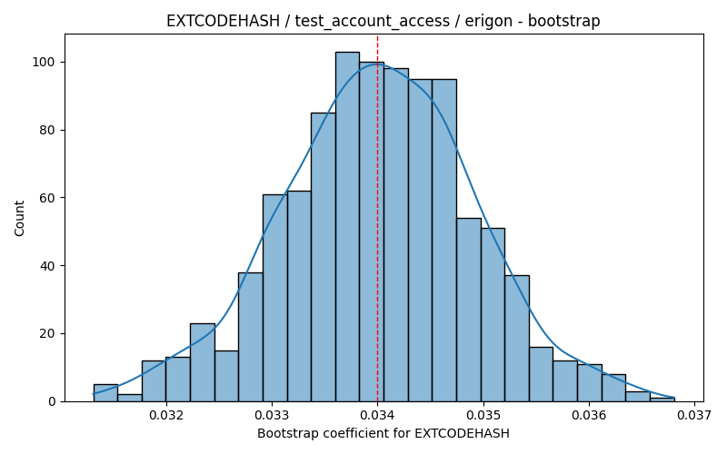

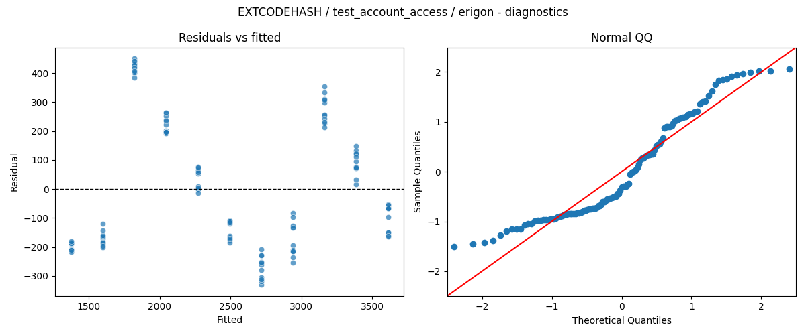

</details>

<details><summary>geth — NNLS regression summary</summary>

```
==============================================================================
                           NNLS Regression Results                            
==============================================================================
Dep. Variable:          test_runtime_ms              R-squared:          0.867
Model:                  NNLS                    Adj. R-squared:          0.866
No. Observations:       231                               RMSE:         189.05
Df Residuals:           229                                MAE:         162.79
Df Model:               1      
==============================================================================
                      coef     std err     P-value      [0.025      0.975]
------------------------------------------------------------------------------
         const    733.9898     49.9963       0.001    636.5147    826.6801
       opcount      0.0232      0.0007       0.001      0.0219      0.0244
==============================================================================
Notes: Non-negative least squares with bootstrap inference (1000 iterations)
==============================================================================
```


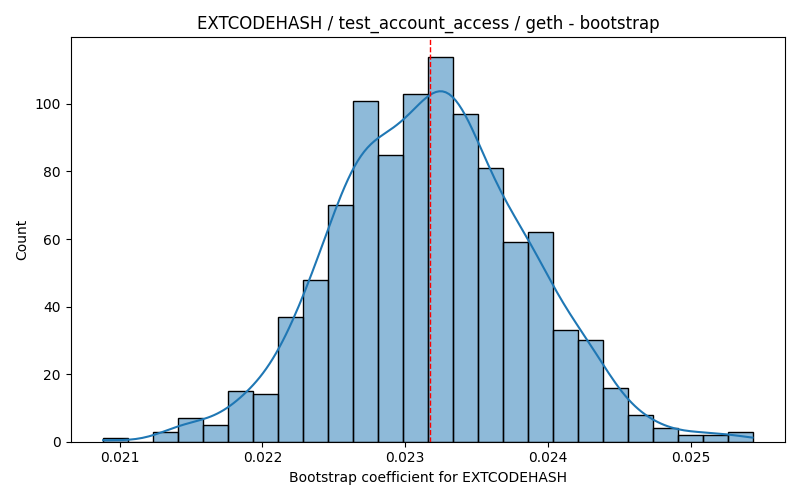

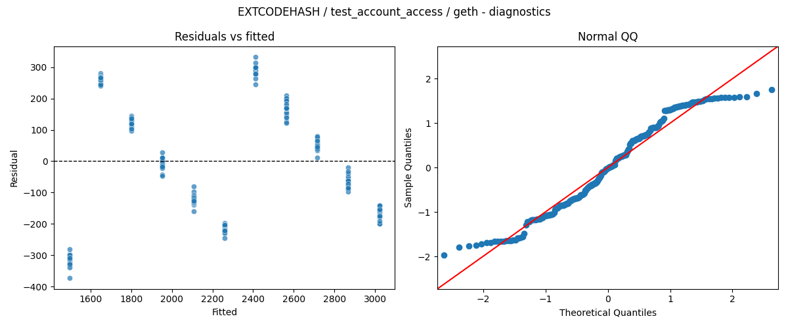

</details>

<details><summary>nethermind — NNLS regression summary</summary>

```
==============================================================================
                           NNLS Regression Results                            
==============================================================================
Dep. Variable:          test_runtime_ms              R-squared:          0.830
Model:                  NNLS                    Adj. R-squared:          0.829
No. Observations:       220                               RMSE:         175.78
Df Residuals:           218                                MAE:         151.84
Df Model:               1      
==============================================================================
                      coef     std err     P-value      [0.025      0.975]
------------------------------------------------------------------------------
         const    496.6335     46.1601       0.001    412.5706    584.9710
       opcount      0.0187      0.0006       0.001      0.0175      0.0199
==============================================================================
Notes: Non-negative least squares with bootstrap inference (1000 iterations)
==============================================================================
```

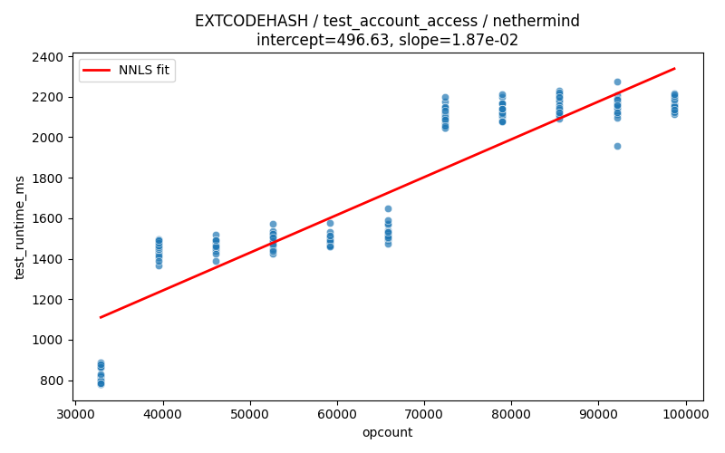

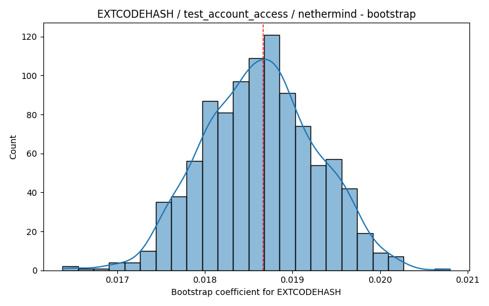

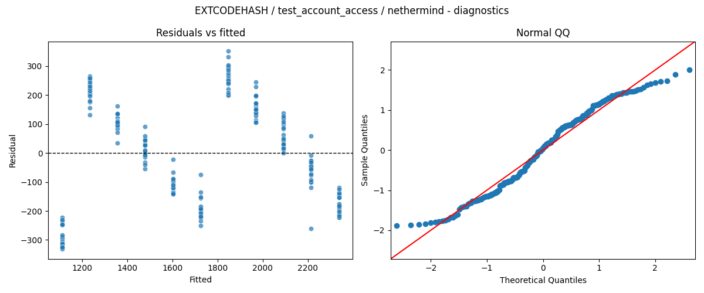

</details>

<details><summary>reth — NNLS regression summary</summary>

```
==============================================================================
                           NNLS Regression Results                            
==============================================================================
Dep. Variable:          test_runtime_ms              R-squared:          0.866
Model:                  NNLS                    Adj. R-squared:          0.866
No. Observations:       220                               RMSE:         152.41
Df Residuals:           218                                MAE:          65.31
Df Model:               1      
==============================================================================
                      coef     std err     P-value      [0.025      0.975]
------------------------------------------------------------------------------
         const    263.2904     31.6540       0.001    202.8881    327.6640
       opcount      0.0187      0.0005       0.001      0.0177      0.0198
==============================================================================
Notes: Non-negative least squares with bootstrap inference (1000 iterations)
==============================================================================
```

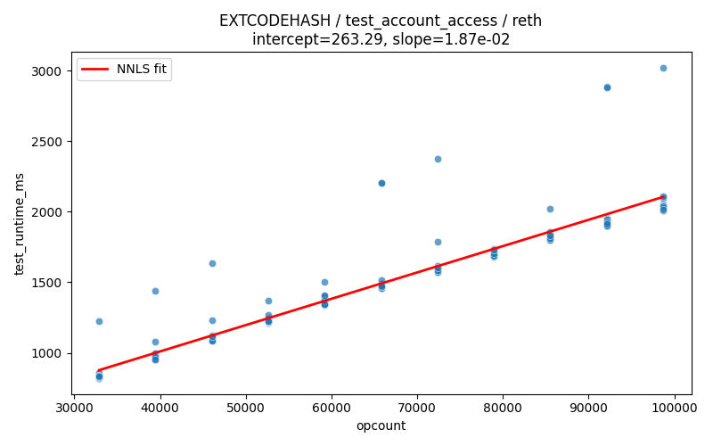

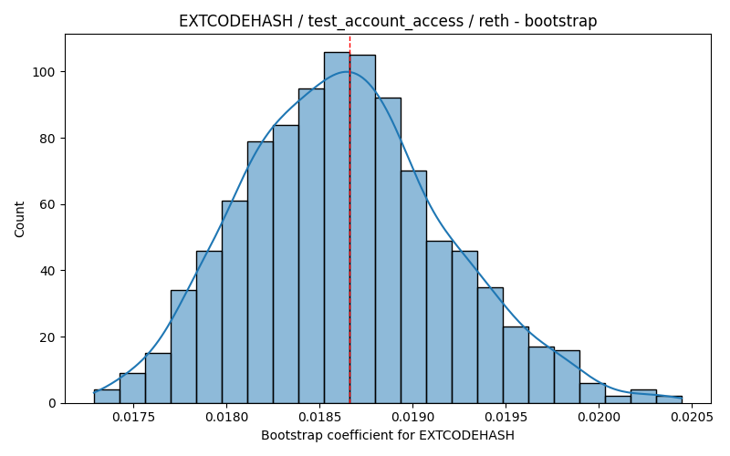

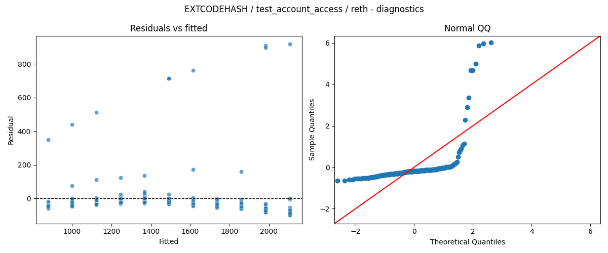

</details>

### test_account_access — combo `EXTCODEHASH_AccountMode.NON_EXISTING_ACCOUNT` — `presets[cold_account_code_access]`

| client | nobs | R² | target_coef (ms) | p-value | 95% CI |
| --- | --- | --- | --- | --- | --- |
| `besu` | 198 | 0.7897 | 0.01368 | 1.00e-03 | [0.01263, 0.01464] |
| `erigon` | 121 | 0.9622 | 0.008078 | 1.00e-03 | [0.007852, 0.008179] |
| `geth` | 231 | 0.8683 | 0.02178 | 1.00e-03 | [0.02057, 0.02298] |
| `nethermind` | 220 | 0.9505 | 0.003496 | 1.00e-03 | [0.00338, 0.003618] |
| `reth` | 220 | 0.9681 | 0.0008867 | 1.00e-03 | [0.0008652, 0.0009072] |

<details><summary>besu — NNLS regression summary</summary>

```
==============================================================================
                           NNLS Regression Results                            
==============================================================================
Dep. Variable:          test_runtime_ms              R-squared:          0.790
Model:                  NNLS                    Adj. R-squared:          0.789
No. Observations:       198                               RMSE:         168.65
Df Residuals:           196                                MAE:         155.97
Df Model:               1      
==============================================================================
                      coef     std err     P-value      [0.025      0.975]
------------------------------------------------------------------------------
         const    520.2992     37.1814       0.001    449.4949    595.7462
       opcount      0.0137      0.0005       0.001      0.0126      0.0146
==============================================================================
Notes: Non-negative least squares with bootstrap inference (1000 iterations)
==============================================================================
```


</details>

<details><summary>erigon — NNLS regression summary</summary>

```
==============================================================================
                           NNLS Regression Results                            
==============================================================================
Dep. Variable:          test_runtime_ms              R-squared:          0.962
Model:                  NNLS                    Adj. R-squared:          0.962
No. Observations:       121                               RMSE:          38.59
Df Residuals:           119                                MAE:          35.56
Df Model:               1      
==============================================================================
                      coef     std err     P-value      [0.025      0.975]
------------------------------------------------------------------------------
         const      0.0000      3.7729       1.000      0.0000     12.0478
       opcount      0.0081      0.0001       0.001      0.0079      0.0082
==============================================================================
Notes: Non-negative least squares with bootstrap inference (1000 iterations)
==============================================================================
```


</details>

<details><summary>geth — NNLS regression summary</summary>

```
==============================================================================
                           NNLS Regression Results                            
==============================================================================
Dep. Variable:          test_runtime_ms              R-squared:          0.868
Model:                  NNLS                    Adj. R-squared:          0.868
No. Observations:       231                               RMSE:         202.67
Df Residuals:           229                                MAE:         173.55
Df Model:               1      
==============================================================================
                      coef     std err     P-value      [0.025      0.975]
------------------------------------------------------------------------------
         const    768.3059     53.0763       0.001    666.6661    870.3875
       opcount      0.0218      0.0006       0.001      0.0206      0.0230
==============================================================================
Notes: Non-negative least squares with bootstrap inference (1000 iterations)
==============================================================================
```


</details>

<details><summary>nethermind — NNLS regression summary</summary>

```
==============================================================================
                           NNLS Regression Results                            
==============================================================================
Dep. Variable:          test_runtime_ms              R-squared:          0.950
Model:                  NNLS                    Adj. R-squared:          0.950
No. Observations:       220                               RMSE:          19.07
Df Residuals:           218                                MAE:          14.33
Df Model:               1      
==============================================================================
                      coef     std err     P-value      [0.025      0.975]
------------------------------------------------------------------------------
         const     73.9111      4.3810       0.001     65.2270     82.6071
       opcount      0.0035      0.0001       0.001      0.0034      0.0036
==============================================================================
Notes: Non-negative least squares with bootstrap inference (1000 iterations)
==============================================================================
```


</details>

<details><summary>reth — NNLS regression summary</summary>

```
==============================================================================
                           NNLS Regression Results                            
==============================================================================
Dep. Variable:          test_runtime_ms              R-squared:          0.968
Model:                  NNLS                    Adj. R-squared:          0.968
No. Observations:       220                               RMSE:           3.85
Df Residuals:           218                                MAE:           3.03
Df Model:               1      
==============================================================================
                      coef     std err     P-value      [0.025      0.975]
------------------------------------------------------------------------------
         const     43.4146      0.8424       0.001     41.8261     45.1239
       opcount      0.0009      0.0000       0.001      0.0009      0.0009
==============================================================================
Notes: Non-negative least squares with bootstrap inference (1000 iterations)
==============================================================================
```


</details>

### test_ext_account_query_warm — combo `EXTCODEHASH`

| client | nobs | R² | target_coef (ms) | p-value | 95% CI |
| --- | --- | --- | --- | --- | --- |
| `besu` | 198 | 0.5219 | 0.0001362 | 1.00e-03 | [0.0001202, 0.000153] |
| `erigon` | 121 | 0.9285 | 0.0002843 | 1.00e-03 | [0.0002683, 0.0002991] |
| `geth` | 231 | 0.8465 | 4.253e-05 | 1.00e-03 | [4.038e-05, 4.454e-05] |
| `nethermind` | 220 | 0.758 | 0.00026 | 1.00e-03 | [0.00024, 0.0002777] |
| `reth` | 220 | 0.768 | 1.008e-05 | 1.00e-03 | [9.293e-06, 1.085e-05] |

<details><summary>besu — NNLS regression summary</summary>

```
==============================================================================
                           NNLS Regression Results                            
==============================================================================
Dep. Variable:          test_runtime_ms              R-squared:          0.522
Model:                  NNLS                    Adj. R-squared:          0.519
No. Observations:       198                               RMSE:          76.22
Df Residuals:           196                                MAE:          60.77
Df Model:               1      
==============================================================================
                      coef     std err     P-value      [0.025      0.975]
------------------------------------------------------------------------------
         const    278.4695     17.7375       0.001    244.5637    311.7560
       opcount      0.0001      0.0000       0.001      0.0001      0.0002
==============================================================================
Notes: Non-negative least squares with bootstrap inference (1000 iterations)
==============================================================================
```

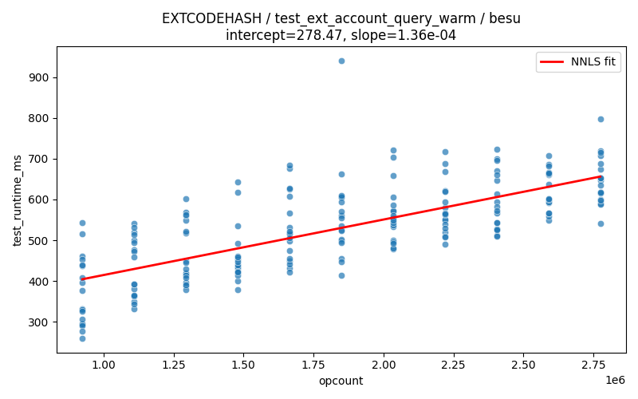

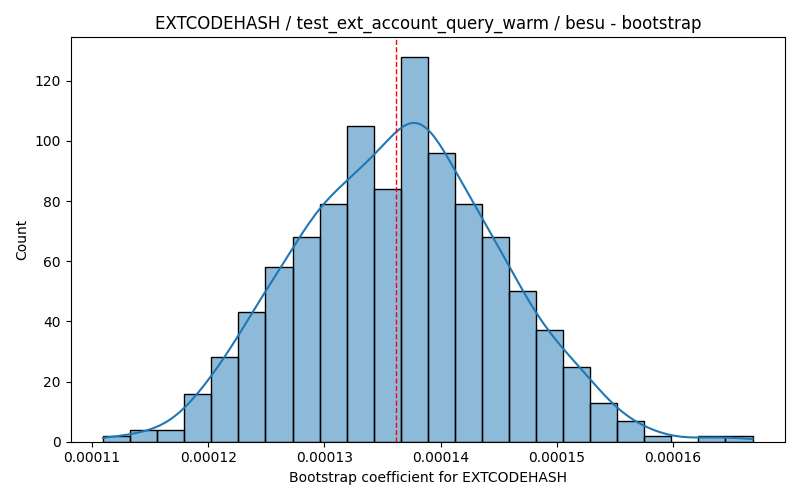

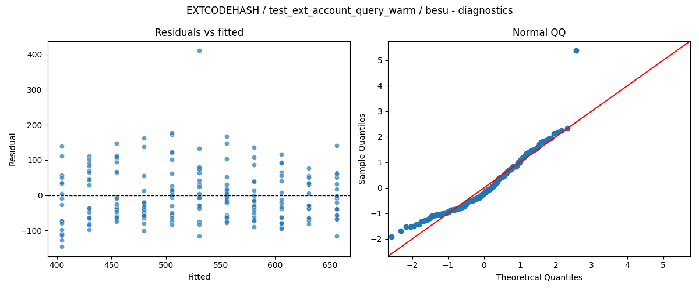

</details>

<details><summary>erigon — NNLS regression summary</summary>

```
==============================================================================
                           NNLS Regression Results                            
==============================================================================
Dep. Variable:          test_runtime_ms              R-squared:          0.929
Model:                  NNLS                    Adj. R-squared:          0.928
No. Observations:       121                               RMSE:          46.12
Df Residuals:           119                                MAE:          33.47
Df Model:               1      
==============================================================================
                      coef     std err     P-value      [0.025      0.975]
------------------------------------------------------------------------------
         const     31.3849     12.3140       0.005      7.5270     56.0060
       opcount      0.0003      0.0000       0.001      0.0003      0.0003
==============================================================================
Notes: Non-negative least squares with bootstrap inference (1000 iterations)
==============================================================================
```

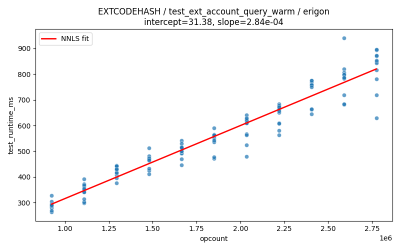

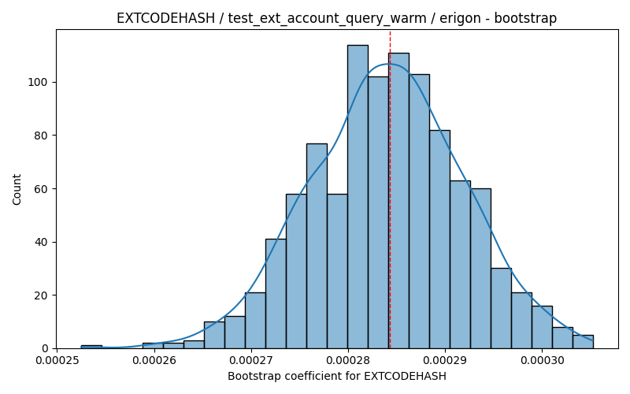

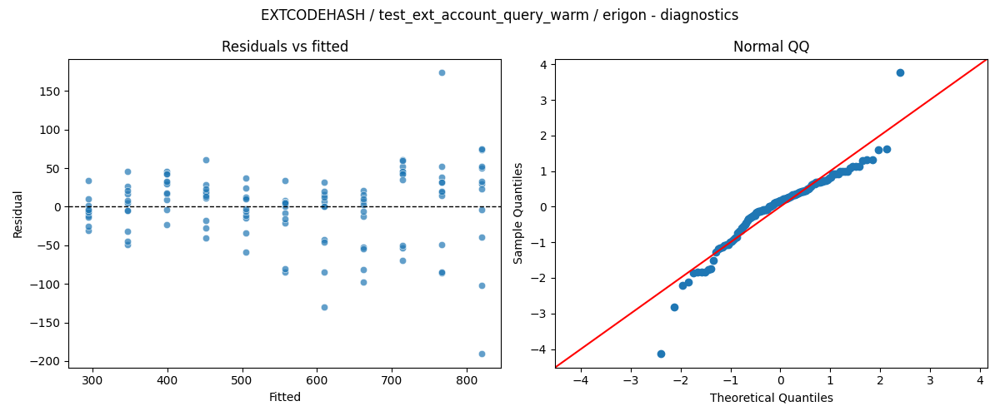

</details>

<details><summary>geth — NNLS regression summary</summary>

```
==============================================================================
                           NNLS Regression Results                            
==============================================================================
Dep. Variable:          test_runtime_ms              R-squared:          0.846
Model:                  NNLS                    Adj. R-squared:          0.846
No. Observations:       231                               RMSE:          10.59
Df Residuals:           229                                MAE:           8.00
Df Model:               1      
==============================================================================
                      coef     std err     P-value      [0.025      0.975]
------------------------------------------------------------------------------
         const     20.7394      1.8217       0.001     17.2141     24.2754
       opcount      0.0000      0.0000       0.001      0.0000      0.0000
==============================================================================
Notes: Non-negative least squares with bootstrap inference (1000 iterations)
==============================================================================
```

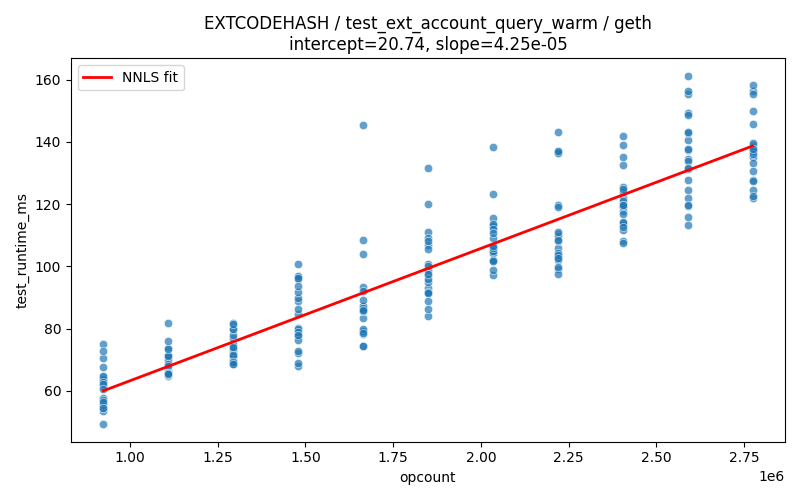

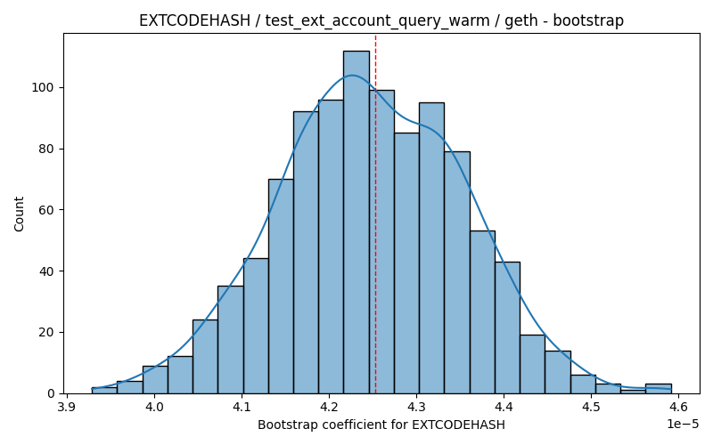

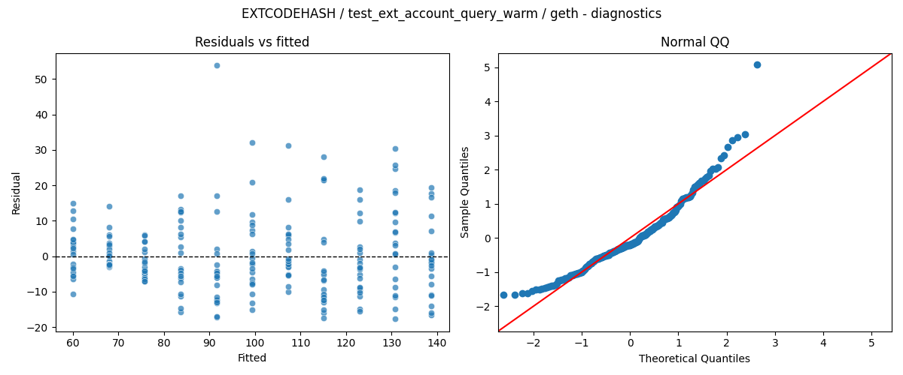

</details>

<details><summary>nethermind — NNLS regression summary</summary>

```
==============================================================================
                           NNLS Regression Results                            
==============================================================================
Dep. Variable:          test_runtime_ms              R-squared:          0.758
Model:                  NNLS                    Adj. R-squared:          0.757
No. Observations:       220                               RMSE:          85.90
Df Residuals:           218                                MAE:          61.78
Df Model:               1      
==============================================================================
                      coef     std err     P-value      [0.025      0.975]
------------------------------------------------------------------------------
         const    128.6662     16.2235       0.001     96.8066    161.8070
       opcount      0.0003      0.0000       0.001      0.0002      0.0003
==============================================================================
Notes: Non-negative least squares with bootstrap inference (1000 iterations)
==============================================================================
```

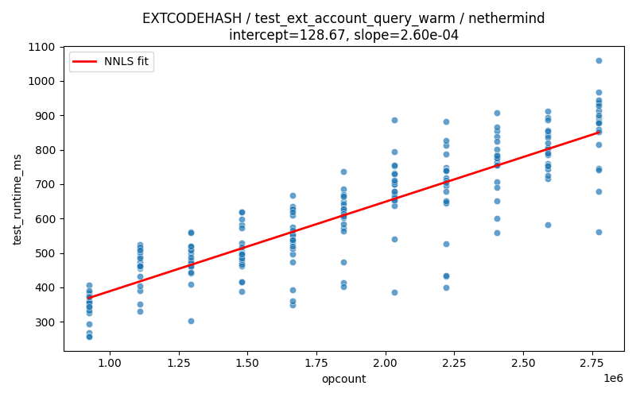

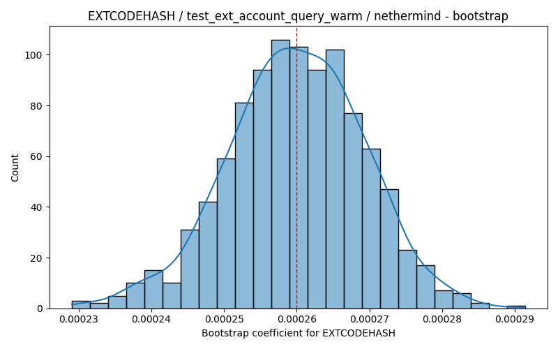

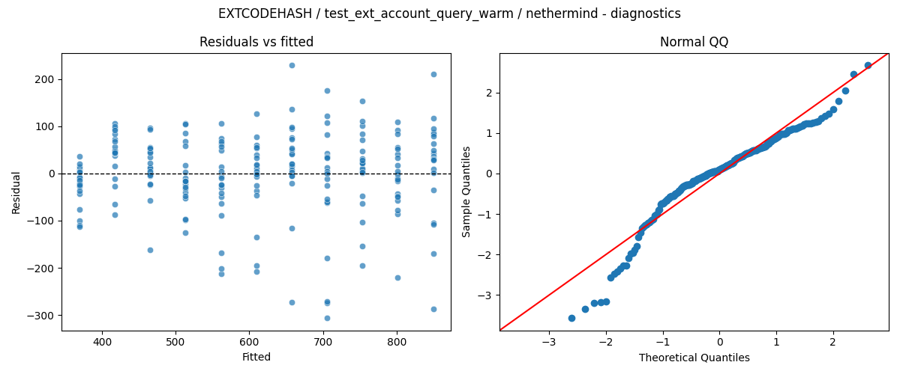

</details>

<details><summary>reth — NNLS regression summary</summary>

```
==============================================================================
                           NNLS Regression Results                            
==============================================================================
Dep. Variable:          test_runtime_ms              R-squared:          0.768
Model:                  NNLS                    Adj. R-squared:          0.767
No. Observations:       220                               RMSE:           3.24
Df Residuals:           218                                MAE:           2.45
Df Model:               1      
==============================================================================
                      coef     std err     P-value      [0.025      0.975]
------------------------------------------------------------------------------
         const      5.9288      0.6759       0.001      4.6412      7.3458
       opcount      0.0000      0.0000       0.001      0.0000      0.0000
==============================================================================
Notes: Non-negative least squares with bootstrap inference (1000 iterations)
==============================================================================
```

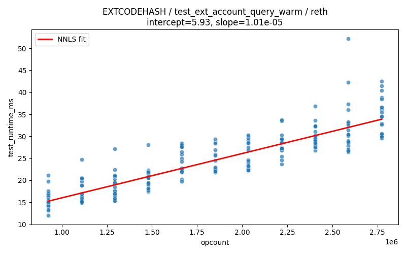

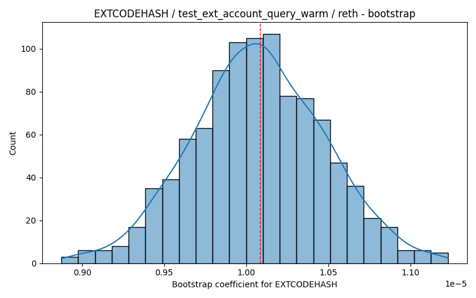

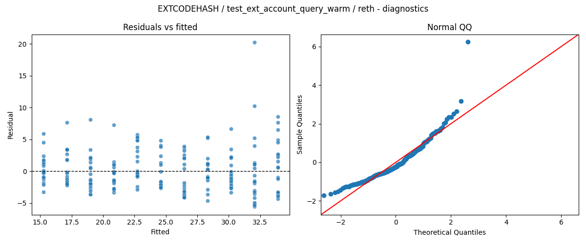

</details>

## EXTCODESIZE

### test_account_access — combo `EXTCODESIZE_AccountMode.NON_EXISTING_ACCOUNT` — `presets[cold_account_nocode_access]`

| client | nobs | R² | target_coef (ms) | p-value | 95% CI |
| --- | --- | --- | --- | --- | --- |
| `besu` | 198 | 0.7502 | 0.01334 | 1.00e-03 | [0.01234, 0.01445] |
| `erigon` | 121 | 0.9648 | 0.008278 | 1.00e-03 | [0.008055, 0.008385] |
| `geth` | 231 | 0.8708 | 0.02175 | 1.00e-03 | [0.02057, 0.02292] |
| `nethermind` | 220 | 0.9576 | 0.003446 | 1.00e-03 | [0.00334, 0.003551] |
| `reth` | 220 | 0.9581 | 0.0008957 | 1.00e-03 | [0.0008725, 0.0009212] |

<details><summary>besu — NNLS regression summary</summary>

```
==============================================================================
                           NNLS Regression Results                            
==============================================================================
Dep. Variable:          test_runtime_ms              R-squared:          0.750
Model:                  NNLS                    Adj. R-squared:          0.749
No. Observations:       198                               RMSE:         183.99
Df Residuals:           196                                MAE:         167.70
Df Model:               1      
==============================================================================
                      coef     std err     P-value      [0.025      0.975]
------------------------------------------------------------------------------
         const    547.9847     39.3809       0.001    468.0931    623.3839
       opcount      0.0133      0.0005       0.001      0.0123      0.0144
==============================================================================
Notes: Non-negative least squares with bootstrap inference (1000 iterations)
==============================================================================
```


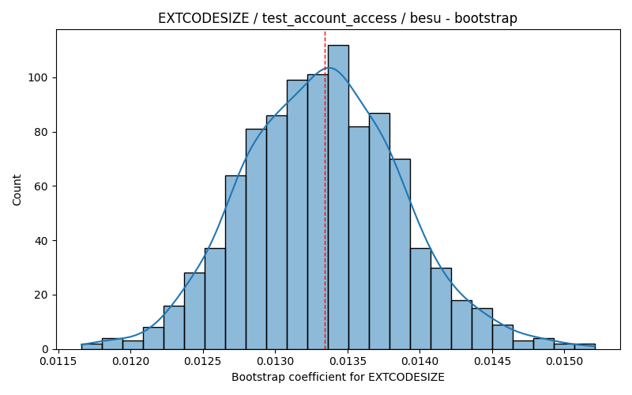

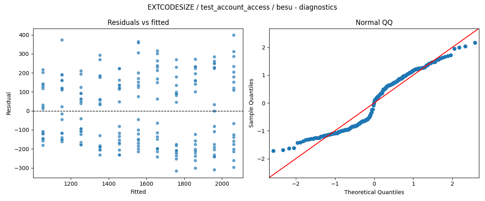

</details>

<details><summary>erigon — NNLS regression summary</summary>

```
==============================================================================
                           NNLS Regression Results                            
==============================================================================
Dep. Variable:          test_runtime_ms              R-squared:          0.965
Model:                  NNLS                    Adj. R-squared:          0.965
No. Observations:       121                               RMSE:          38.07
Df Residuals:           119                                MAE:          35.40
Df Model:               1      
==============================================================================
                      coef     std err     P-value      [0.025      0.975]
------------------------------------------------------------------------------
         const      0.0000      3.7622       1.000      0.0000     12.9276
       opcount      0.0083      0.0001       0.001      0.0081      0.0084
==============================================================================
Notes: Non-negative least squares with bootstrap inference (1000 iterations)
==============================================================================
```

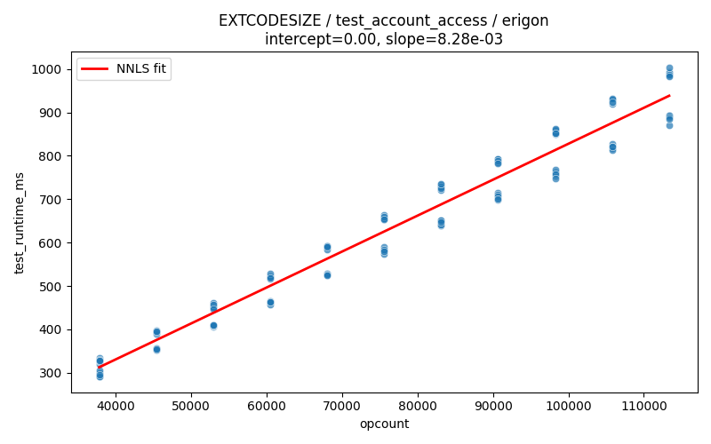

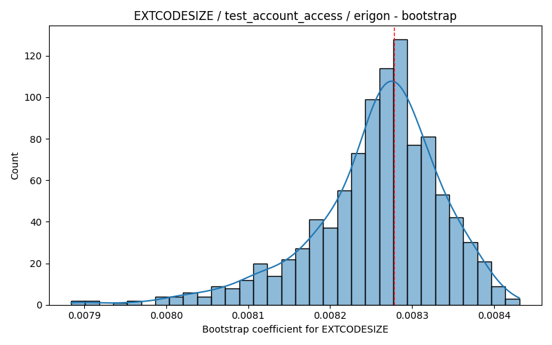

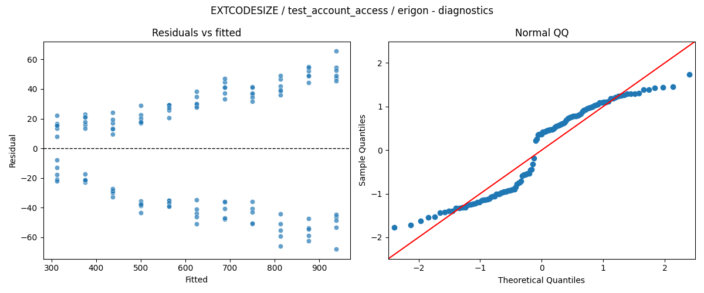

</details>

<details><summary>geth — NNLS regression summary</summary>

```
==============================================================================
                           NNLS Regression Results                            
==============================================================================
Dep. Variable:          test_runtime_ms              R-squared:          0.871
Model:                  NNLS                    Adj. R-squared:          0.870
No. Observations:       231                               RMSE:         200.18
Df Residuals:           229                                MAE:         172.00
Df Model:               1      
==============================================================================
                      coef     std err     P-value      [0.025      0.975]
------------------------------------------------------------------------------
         const    772.5447     50.3056       0.001    668.6355    872.6011
       opcount      0.0217      0.0006       0.001      0.0206      0.0229
==============================================================================
Notes: Non-negative least squares with bootstrap inference (1000 iterations)
==============================================================================
```


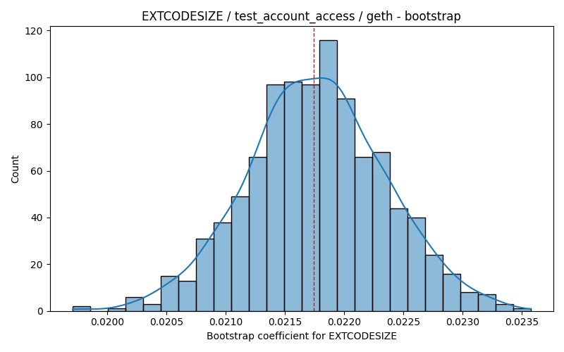

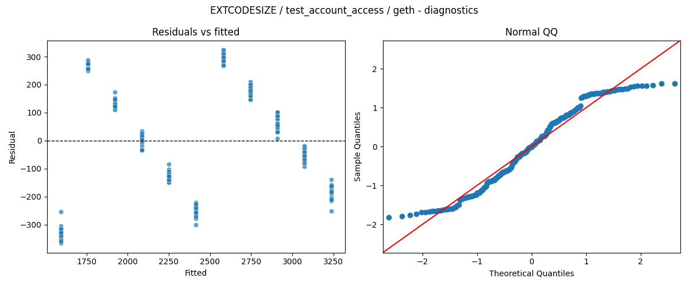

</details>

<details><summary>nethermind — NNLS regression summary</summary>

```
==============================================================================
                           NNLS Regression Results                            
==============================================================================
Dep. Variable:          test_runtime_ms              R-squared:          0.958
Model:                  NNLS                    Adj. R-squared:          0.957
No. Observations:       220                               RMSE:          17.32
Df Residuals:           218                                MAE:          13.62
Df Model:               1      
==============================================================================
                      coef     std err     P-value      [0.025      0.975]
------------------------------------------------------------------------------
         const     75.0667      3.6661       0.001     68.2236     82.7428
       opcount      0.0034      0.0001       0.001      0.0033      0.0036
==============================================================================
Notes: Non-negative least squares with bootstrap inference (1000 iterations)
==============================================================================
```

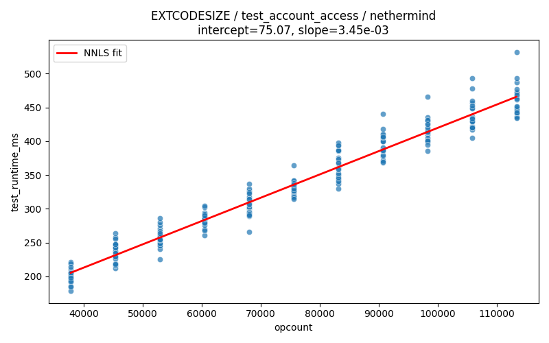

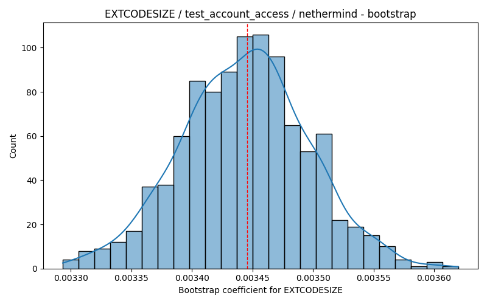

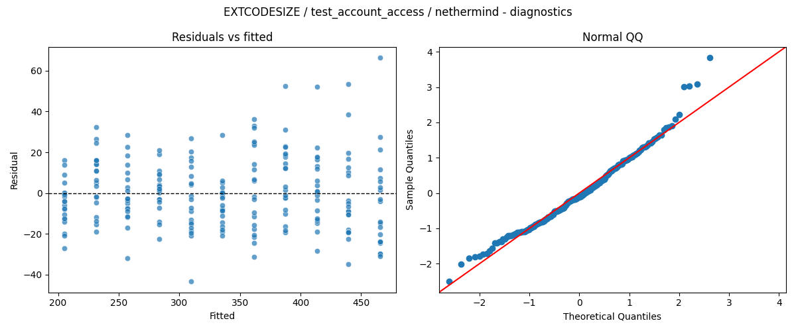

</details>

<details><summary>reth — NNLS regression summary</summary>

```
==============================================================================
                           NNLS Regression Results                            
==============================================================================
Dep. Variable:          test_runtime_ms              R-squared:          0.958
Model:                  NNLS                    Adj. R-squared:          0.958
No. Observations:       220                               RMSE:           4.47
Df Residuals:           218                                MAE:           3.53
Df Model:               1      
==============================================================================
                      coef     std err     P-value      [0.025      0.975]
------------------------------------------------------------------------------
         const     42.1873      1.0030       0.001     40.2536     44.0240
       opcount      0.0009      0.0000       0.001      0.0009      0.0009
==============================================================================
Notes: Non-negative least squares with bootstrap inference (1000 iterations)
==============================================================================
```

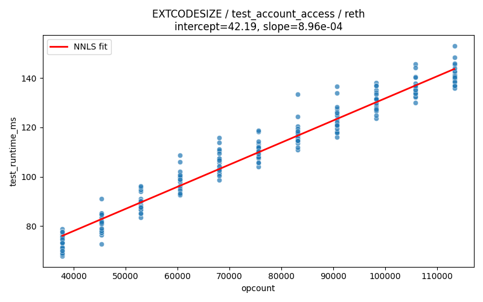

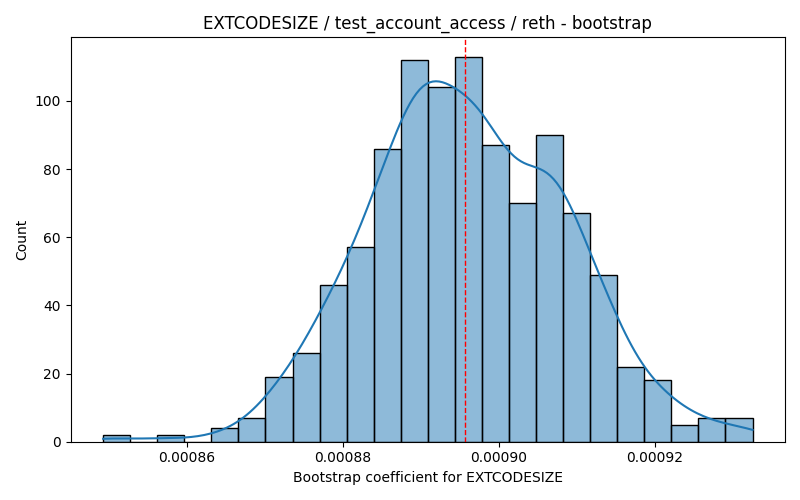

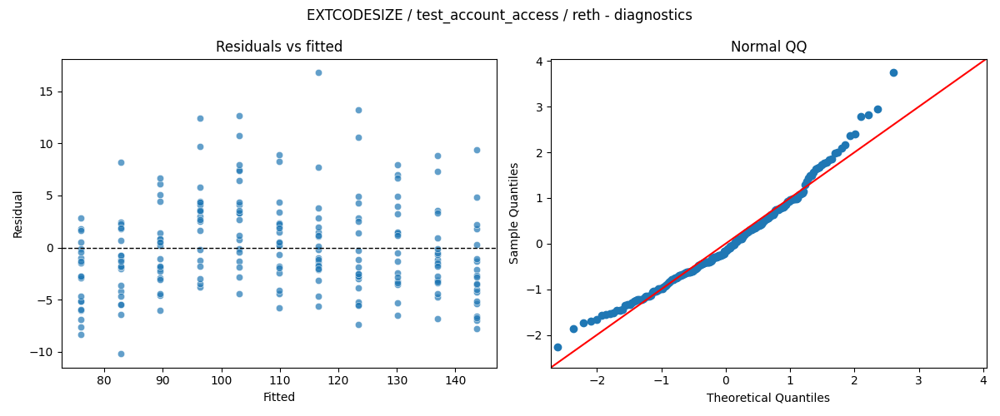

</details>

### test_account_access — combo `EXTCODESIZE_AccountMode.EXISTING_CONTRACT`

| client | nobs | R² | target_coef (ms) | p-value | 95% CI |
| --- | --- | --- | --- | --- | --- |
| `besu` | 198 | 0.8735 | 0.02932 | 1.00e-03 | [0.02788, 0.03079] |
| `erigon` | 121 | 0.8823 | 0.07949 | 1.00e-03 | [0.07404, 0.08403] |
| `geth` | 231 | 0.8684 | 0.02325 | 1.00e-03 | [0.02202, 0.02451] |
| `nethermind` | 220 | 0.8273 | 0.01872 | 1.00e-03 | [0.01754, 0.01994] |
| `reth` | 220 | 0.8979 | 0.01812 | 1.00e-03 | [0.01733, 0.01899] |

<details><summary>besu — NNLS regression summary</summary>

```
==============================================================================
                           NNLS Regression Results                            
==============================================================================
Dep. Variable:          test_runtime_ms              R-squared:          0.874
Model:                  NNLS                    Adj. R-squared:          0.873
No. Observations:       198                               RMSE:         232.09
Df Residuals:           196                                MAE:         214.33
Df Model:               1      
==============================================================================
                      coef     std err     P-value      [0.025      0.975]
------------------------------------------------------------------------------
         const    501.3608     48.3769       0.001    405.1453    594.2185
       opcount      0.0293      0.0008       0.001      0.0279      0.0308
==============================================================================
Notes: Non-negative least squares with bootstrap inference (1000 iterations)
==============================================================================
```

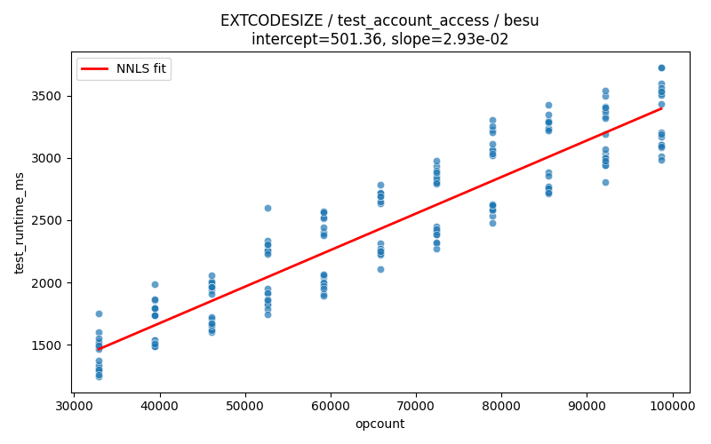

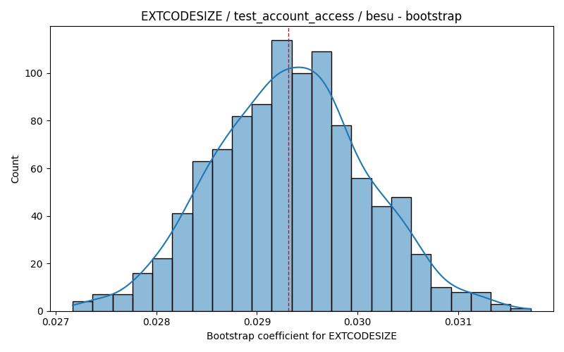

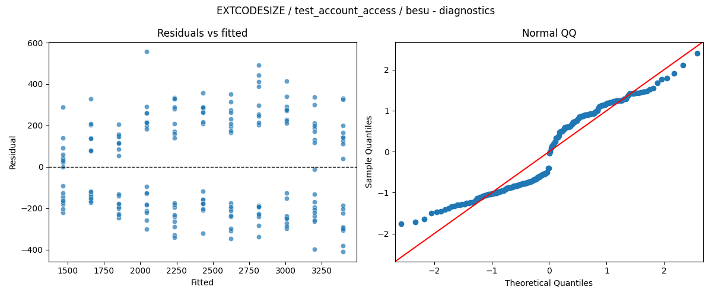

</details>

<details><summary>erigon — NNLS regression summary</summary>

```
==============================================================================
                           NNLS Regression Results                            
==============================================================================
Dep. Variable:          test_runtime_ms              R-squared:          0.882
Model:                  NNLS                    Adj. R-squared:          0.881
No. Observations:       121                               RMSE:         603.91
Df Residuals:           119                                MAE:         525.66
Df Model:               1      
==============================================================================
                      coef     std err     P-value      [0.025      0.975]
------------------------------------------------------------------------------
         const    955.8497    189.0766       0.001    623.8557   1373.8367
       opcount      0.0795      0.0025       0.001      0.0740      0.0840
==============================================================================
Notes: Non-negative least squares with bootstrap inference (1000 iterations)
==============================================================================
```

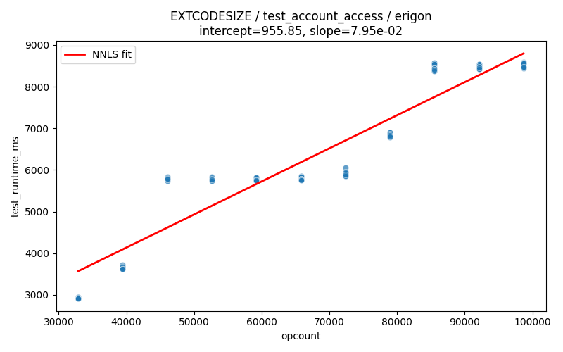

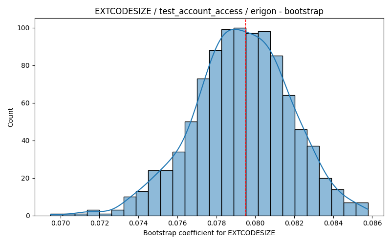

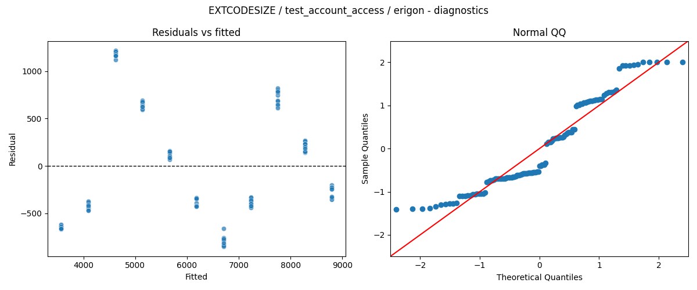

</details>

<details><summary>geth — NNLS regression summary</summary>

```
==============================================================================
                           NNLS Regression Results                            
==============================================================================
Dep. Variable:          test_runtime_ms              R-squared:          0.868
Model:                  NNLS                    Adj. R-squared:          0.868
No. Observations:       231                               RMSE:         188.29
Df Residuals:           229                                MAE:         161.52
Df Model:               1      
==============================================================================
                      coef     std err     P-value      [0.025      0.975]
------------------------------------------------------------------------------
         const    736.4134     48.5375       0.001    644.3697    833.2362
       opcount      0.0232      0.0006       0.001      0.0220      0.0245
==============================================================================
Notes: Non-negative least squares with bootstrap inference (1000 iterations)
==============================================================================
```

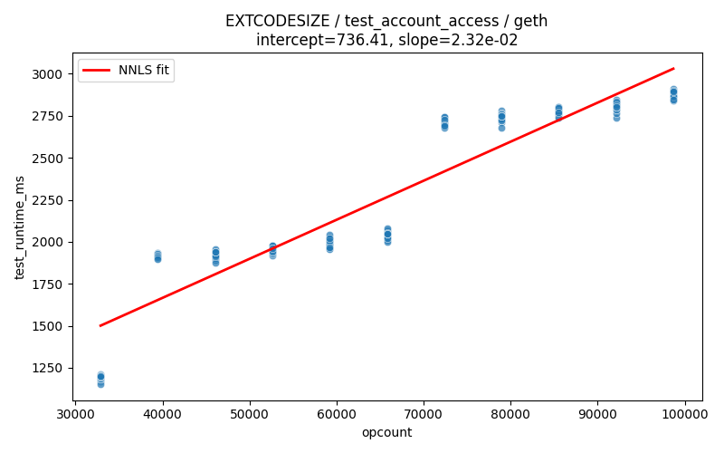

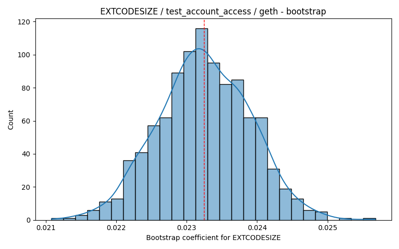

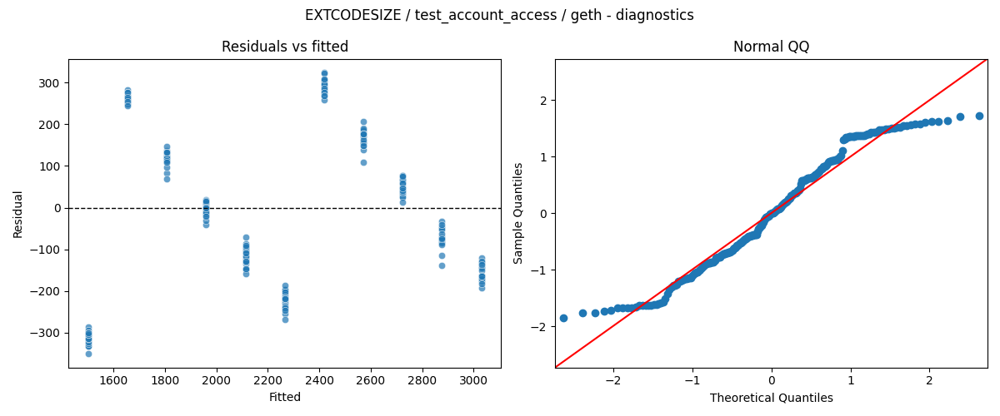

</details>

<details><summary>nethermind — NNLS regression summary</summary>

```
==============================================================================
                           NNLS Regression Results                            
==============================================================================
Dep. Variable:          test_runtime_ms              R-squared:          0.827
Model:                  NNLS                    Adj. R-squared:          0.826
No. Observations:       220                               RMSE:         177.94
Df Residuals:           218                                MAE:         150.91
Df Model:               1      
==============================================================================
                      coef     std err     P-value      [0.025      0.975]
------------------------------------------------------------------------------
         const    478.3532     45.2391       0.001    392.8270    567.1146
       opcount      0.0187      0.0006       0.001      0.0175      0.0199
==============================================================================
Notes: Non-negative least squares with bootstrap inference (1000 iterations)
==============================================================================
```

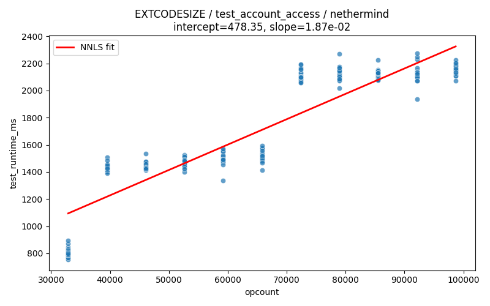

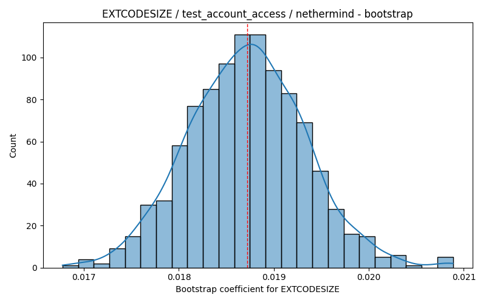

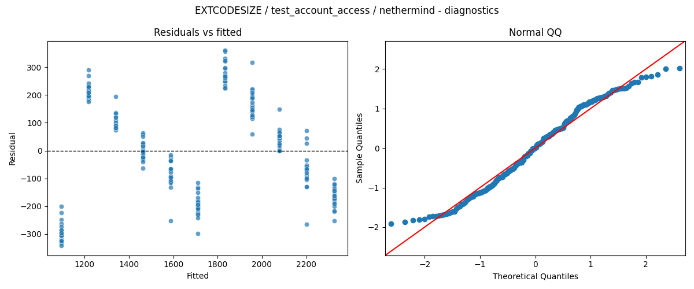

</details>

<details><summary>reth — NNLS regression summary</summary>

```
==============================================================================
                           NNLS Regression Results                            
==============================================================================
Dep. Variable:          test_runtime_ms              R-squared:          0.898
Model:                  NNLS                    Adj. R-squared:          0.897
No. Observations:       220                               RMSE:         127.09
Df Residuals:           218                                MAE:          56.25
Df Model:               1      
==============================================================================
                      coef     std err     P-value      [0.025      0.975]
------------------------------------------------------------------------------
         const    295.3784     27.1569       0.001    244.6706    349.9027
       opcount      0.0181      0.0004       0.001      0.0173      0.0190
==============================================================================
Notes: Non-negative least squares with bootstrap inference (1000 iterations)
==============================================================================
```

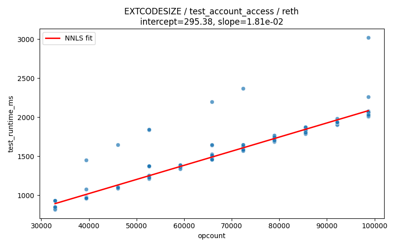

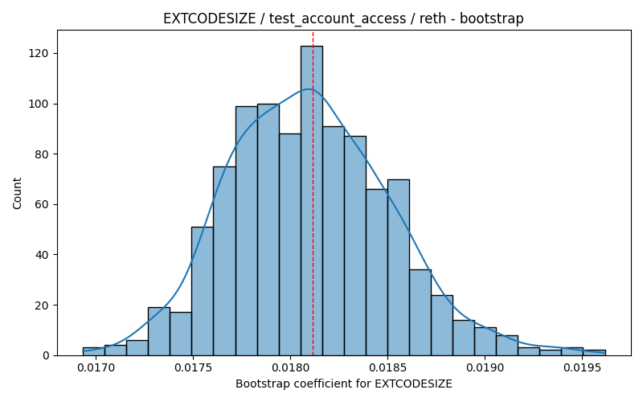

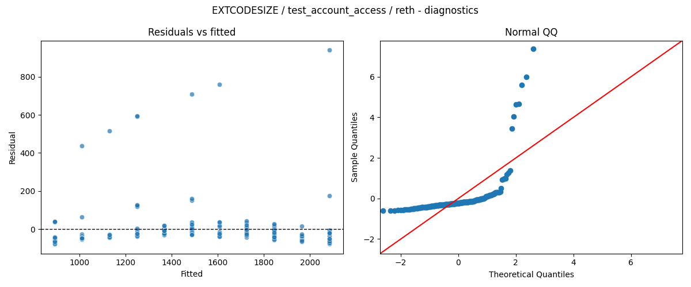

</details>

### test_account_access — combo `EXTCODESIZE_AccountMode.NON_EXISTING_ACCOUNT` — `presets[cold_account_code_access]`

| client | nobs | R² | target_coef (ms) | p-value | 95% CI |
| --- | --- | --- | --- | --- | --- |
| `besu` | 198 | 0.7502 | 0.01334 | 1.00e-03 | [0.01234, 0.01445] |
| `erigon` | 121 | 0.9648 | 0.008278 | 1.00e-03 | [0.008055, 0.008385] |
| `geth` | 231 | 0.8708 | 0.02175 | 1.00e-03 | [0.02057, 0.02292] |
| `nethermind` | 220 | 0.9576 | 0.003446 | 1.00e-03 | [0.00334, 0.003551] |
| `reth` | 220 | 0.9581 | 0.0008957 | 1.00e-03 | [0.0008725, 0.0009212] |

<details><summary>besu — NNLS regression summary</summary>

```
==============================================================================
                           NNLS Regression Results                            
==============================================================================
Dep. Variable:          test_runtime_ms              R-squared:          0.750
Model:                  NNLS                    Adj. R-squared:          0.749
No. Observations:       198                               RMSE:         183.99
Df Residuals:           196                                MAE:         167.70
Df Model:               1      
==============================================================================
                      coef     std err     P-value      [0.025      0.975]
------------------------------------------------------------------------------
         const    547.9847     39.3809       0.001    468.0931    623.3839
       opcount      0.0133      0.0005       0.001      0.0123      0.0144
==============================================================================
Notes: Non-negative least squares with bootstrap inference (1000 iterations)
==============================================================================
```


</details>

<details><summary>erigon — NNLS regression summary</summary>

```
==============================================================================
                           NNLS Regression Results                            
==============================================================================
Dep. Variable:          test_runtime_ms              R-squared:          0.965
Model:                  NNLS                    Adj. R-squared:          0.965
No. Observations:       121                               RMSE:          38.07
Df Residuals:           119                                MAE:          35.40
Df Model:               1      
==============================================================================
                      coef     std err     P-value      [0.025      0.975]
------------------------------------------------------------------------------
         const      0.0000      3.7622       1.000      0.0000     12.9276
       opcount      0.0083      0.0001       0.001      0.0081      0.0084
==============================================================================
Notes: Non-negative least squares with bootstrap inference (1000 iterations)
==============================================================================
```


</details>

<details><summary>geth — NNLS regression summary</summary>

```
==============================================================================
                           NNLS Regression Results                            
==============================================================================
Dep. Variable:          test_runtime_ms              R-squared:          0.871
Model:                  NNLS                    Adj. R-squared:          0.870
No. Observations:       231                               RMSE:         200.18
Df Residuals:           229                                MAE:         172.00
Df Model:               1      
==============================================================================
                      coef     std err     P-value      [0.025      0.975]
------------------------------------------------------------------------------
         const    772.5447     50.3056       0.001    668.6355    872.6011
       opcount      0.0217      0.0006       0.001      0.0206      0.0229
==============================================================================
Notes: Non-negative least squares with bootstrap inference (1000 iterations)
==============================================================================
```


</details>

<details><summary>nethermind — NNLS regression summary</summary>

```
==============================================================================
                           NNLS Regression Results                            
==============================================================================
Dep. Variable:          test_runtime_ms              R-squared:          0.958
Model:                  NNLS                    Adj. R-squared:          0.957
No. Observations:       220                               RMSE:          17.32
Df Residuals:           218                                MAE:          13.62
Df Model:               1      
==============================================================================
                      coef     std err     P-value      [0.025      0.975]
------------------------------------------------------------------------------
         const     75.0667      3.6661       0.001     68.2236     82.7428
       opcount      0.0034      0.0001       0.001      0.0033      0.0036
==============================================================================
Notes: Non-negative least squares with bootstrap inference (1000 iterations)
==============================================================================
```


</details>

<details><summary>reth — NNLS regression summary</summary>

```
==============================================================================
                           NNLS Regression Results                            
==============================================================================
Dep. Variable:          test_runtime_ms              R-squared:          0.958
Model:                  NNLS                    Adj. R-squared:          0.958
No. Observations:       220                               RMSE:           4.47
Df Residuals:           218                                MAE:           3.53
Df Model:               1      
==============================================================================
                      coef     std err     P-value      [0.025      0.975]
------------------------------------------------------------------------------
         const     42.1873      1.0030       0.001     40.2536     44.0240
       opcount      0.0009      0.0000       0.001      0.0009      0.0009
==============================================================================
Notes: Non-negative least squares with bootstrap inference (1000 iterations)
==============================================================================
```


</details>

### test_ext_account_query_warm — combo `EXTCODESIZE`

| client | nobs | R² | target_coef (ms) | p-value | 95% CI |
| --- | --- | --- | --- | --- | --- |
| `besu` | 198 | 0.4993 | 0.0001301 | 1.00e-03 | [0.0001117, 0.0001475] |
| `erigon` | 121 | 0.894 | 4.442e-05 | 1.00e-03 | [4.142e-05, 4.796e-05] |
| `geth` | 231 | 0.8547 | 3.182e-05 | 1.00e-03 | [3.023e-05, 3.355e-05] |
| `nethermind` | 220 | 0.7506 | 0.0001621 | 1.00e-03 | [0.0001484, 0.000176] |
| `reth` | 220 | 0.7196 | 7.166e-06 | 1.00e-03 | [6.514e-06, 7.788e-06] |

<details><summary>besu — NNLS regression summary</summary>

```
==============================================================================
                           NNLS Regression Results                            
==============================================================================
Dep. Variable:          test_runtime_ms              R-squared:          0.499
Model:                  NNLS                    Adj. R-squared:          0.497
No. Observations:       198                               RMSE:          76.16
Df Residuals:           196                                MAE:          58.62
Df Model:               1      
==============================================================================
                      coef     std err     P-value      [0.025      0.975]
------------------------------------------------------------------------------
         const    282.0966     18.4575       0.001    247.5256    318.9485
       opcount      0.0001      0.0000       0.001      0.0001      0.0001
==============================================================================
Notes: Non-negative least squares with bootstrap inference (1000 iterations)
==============================================================================
```

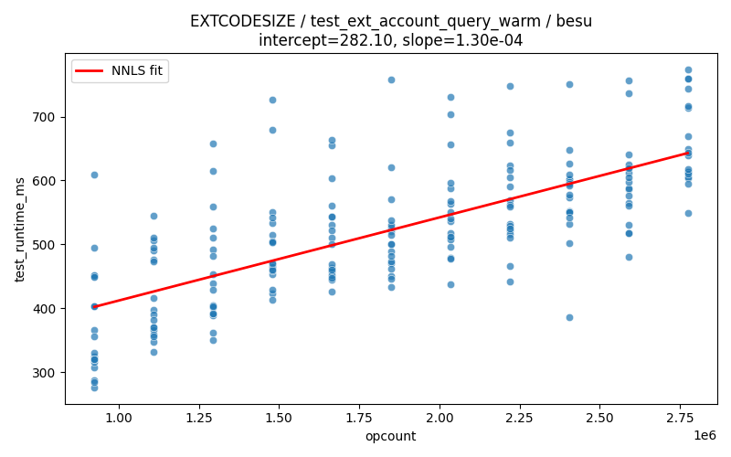

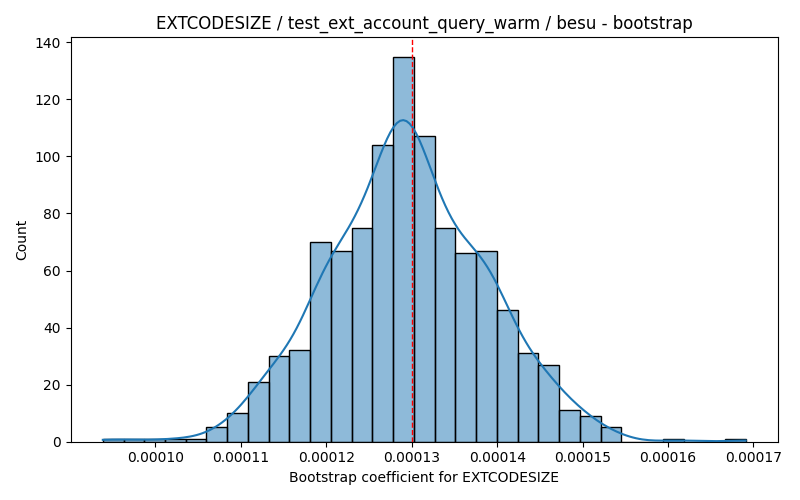

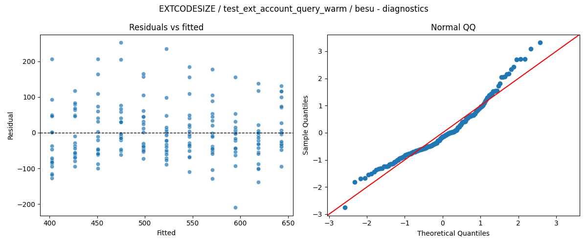

</details>

<details><summary>erigon — NNLS regression summary</summary>

```
==============================================================================
                           NNLS Regression Results                            
==============================================================================
Dep. Variable:          test_runtime_ms              R-squared:          0.894
Model:                  NNLS                    Adj. R-squared:          0.893
No. Observations:       121                               RMSE:           8.95
Df Residuals:           119                                MAE:           5.73
Df Model:               1      
==============================================================================
                      coef     std err     P-value      [0.025      0.975]
------------------------------------------------------------------------------
         const     24.8930      2.7187       0.001     19.1721     29.8168
       opcount      0.0000      0.0000       0.001      0.0000      0.0000
==============================================================================
Notes: Non-negative least squares with bootstrap inference (1000 iterations)
==============================================================================
```

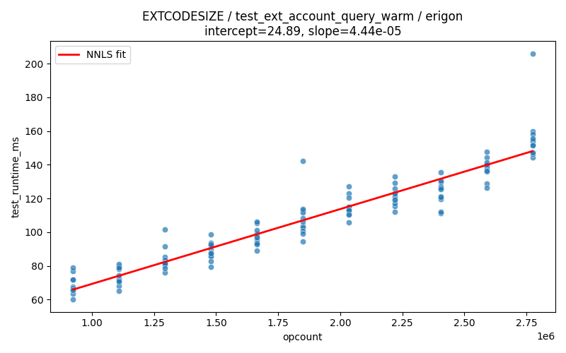

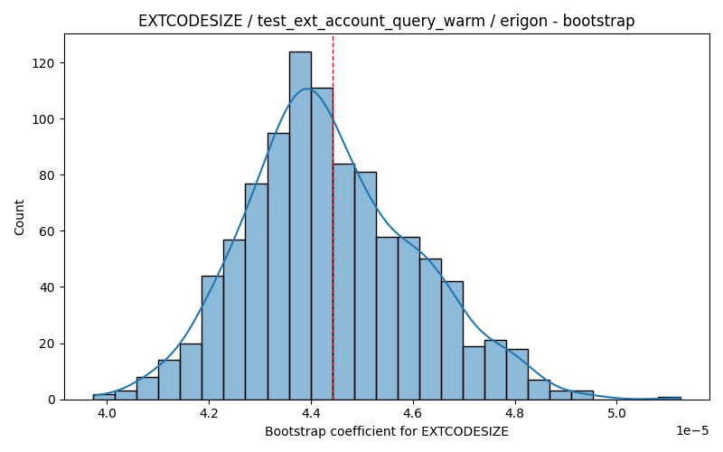

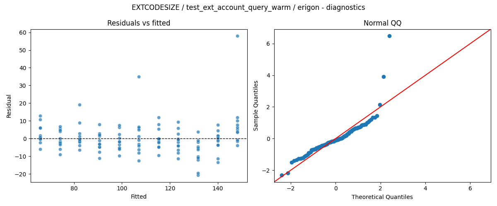

</details>

<details><summary>geth — NNLS regression summary</summary>

```
==============================================================================
                           NNLS Regression Results                            
==============================================================================
Dep. Variable:          test_runtime_ms              R-squared:          0.855
Model:                  NNLS                    Adj. R-squared:          0.854
No. Observations:       231                               RMSE:           7.67
Df Residuals:           229                                MAE:           5.97
Df Model:               1      
==============================================================================
                      coef     std err     P-value      [0.025      0.975]
------------------------------------------------------------------------------
         const     19.9086      1.5978       0.001     16.7675     22.9238
       opcount      0.0000      0.0000       0.001      0.0000      0.0000
==============================================================================
Notes: Non-negative least squares with bootstrap inference (1000 iterations)
==============================================================================
```

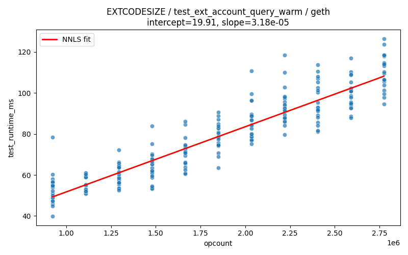

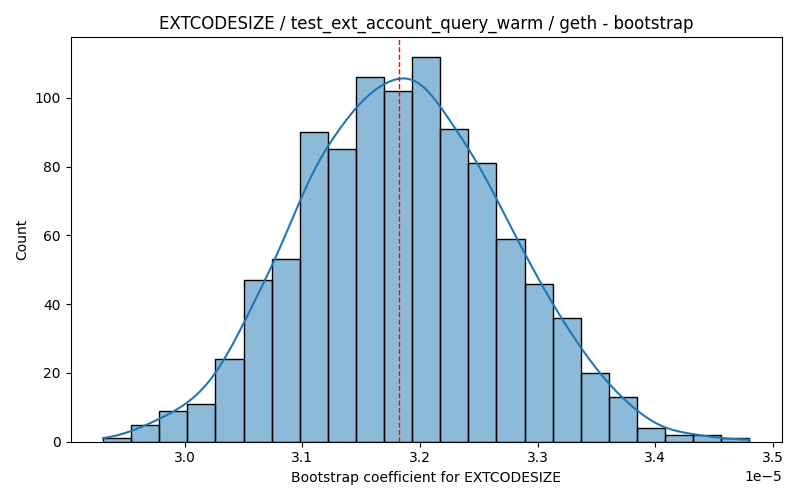

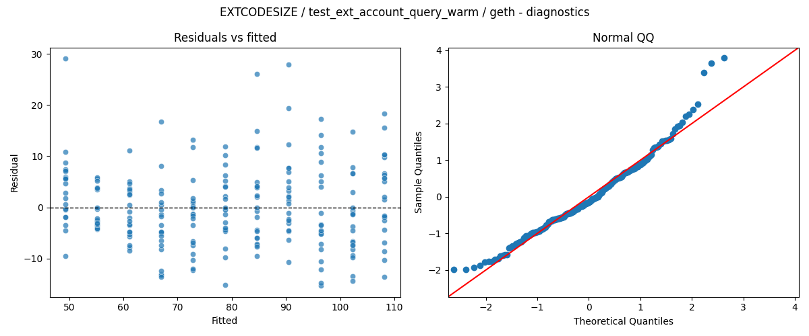

</details>

<details><summary>nethermind — NNLS regression summary</summary>

```
==============================================================================
                           NNLS Regression Results                            
==============================================================================
Dep. Variable:          test_runtime_ms              R-squared:          0.751
Model:                  NNLS                    Adj. R-squared:          0.749
No. Observations:       220                               RMSE:          54.65
Df Residuals:           218                                MAE:          42.09
Df Model:               1      
==============================================================================
                      coef     std err     P-value      [0.025      0.975]
------------------------------------------------------------------------------
         const    120.7961     11.7621       0.001     97.3340    143.3369
       opcount      0.0002      0.0000       0.001      0.0001      0.0002
==============================================================================
Notes: Non-negative least squares with bootstrap inference (1000 iterations)
==============================================================================
```

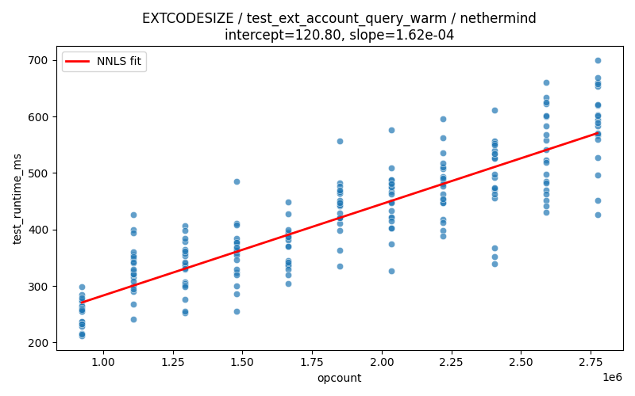

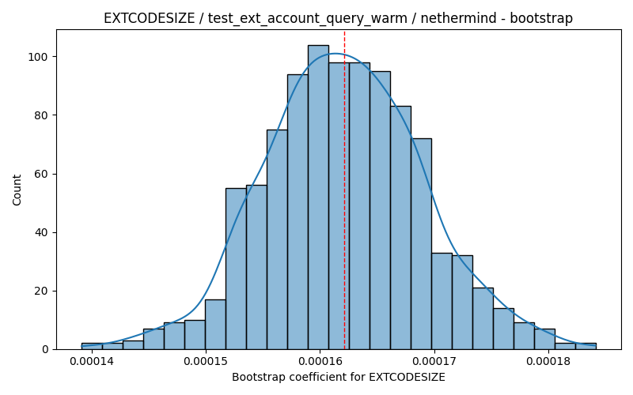

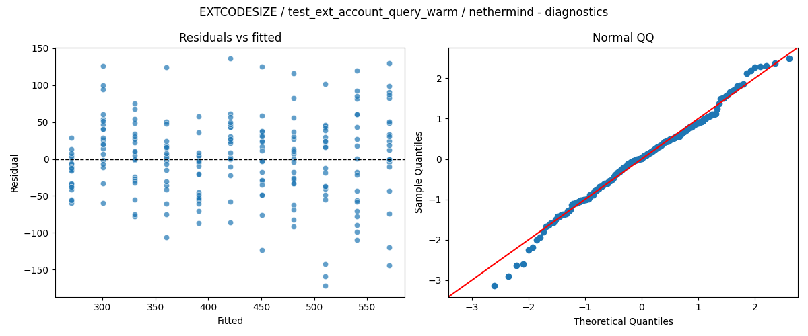

</details>

<details><summary>reth — NNLS regression summary</summary>

```
==============================================================================
                           NNLS Regression Results                            
==============================================================================
Dep. Variable:          test_runtime_ms              R-squared:          0.720
Model:                  NNLS                    Adj. R-squared:          0.718
No. Observations:       220                               RMSE:           2.62
Df Residuals:           218                                MAE:           2.06
Df Model:               1      
==============================================================================
                      coef     std err     P-value      [0.025      0.975]
------------------------------------------------------------------------------
         const      5.3877      0.6035       0.001      4.2482      6.5840
       opcount      0.0000      0.0000       0.001      0.0000      0.0000
==============================================================================
Notes: Non-negative least squares with bootstrap inference (1000 iterations)
==============================================================================
```

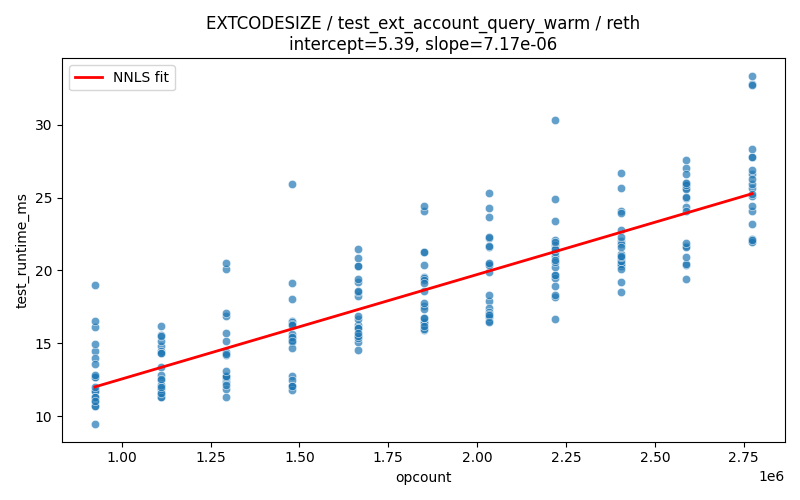

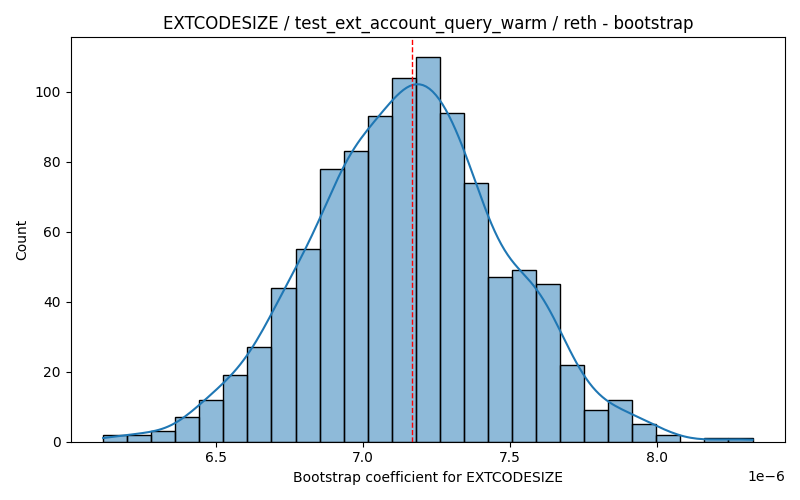

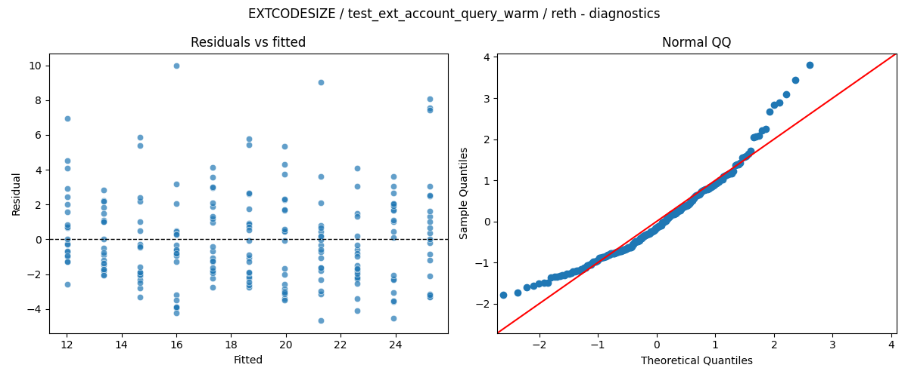

</details>

## STATICCALL

### test_account_access — combo `STATICCALL_AccountMode.EXISTING_EOA`

| client | nobs | R² | target_coef (ms) | p-value | 95% CI |
| --- | --- | --- | --- | --- | --- |
| `besu` | 198 | 0.752 | 0.0169 | 1.00e-03 | [0.01554, 0.01826] |
| `erigon` | 121 | 0.9776 | 0.009698 | 1.00e-03 | [0.009423, 0.009963] |
| `geth` | 231 | 0.9438 | 0.01105 | 1.00e-03 | [0.01061, 0.01149] |
| `nethermind` | 220 | 0.9533 | 0.003913 | 1.00e-03 | [0.003792, 0.004026] |
| `reth` | 220 | 0.9473 | 0.001277 | 1.00e-03 | [0.001235, 0.001317] |

<details><summary>besu — NNLS regression summary</summary>

```
==============================================================================
                           NNLS Regression Results                            
==============================================================================
Dep. Variable:          test_runtime_ms              R-squared:          0.752
Model:                  NNLS                    Adj. R-squared:          0.751
No. Observations:       198                               RMSE:         230.67
Df Residuals:           196                                MAE:         208.94
Df Model:               1      
==============================================================================
                      coef     std err     P-value      [0.025      0.975]
------------------------------------------------------------------------------
         const    736.3206     51.3587       0.001    636.5047    835.3063
       opcount      0.0169      0.0007       0.001      0.0155      0.0183
==============================================================================
Notes: Non-negative least squares with bootstrap inference (1000 iterations)
==============================================================================
```

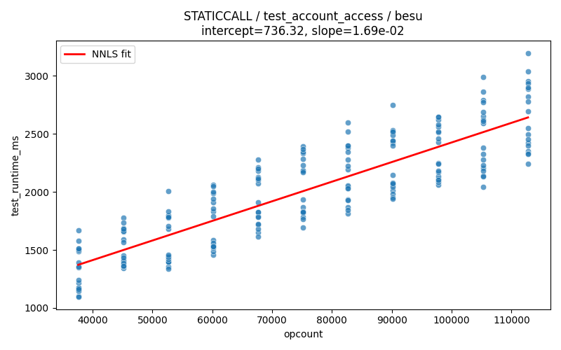

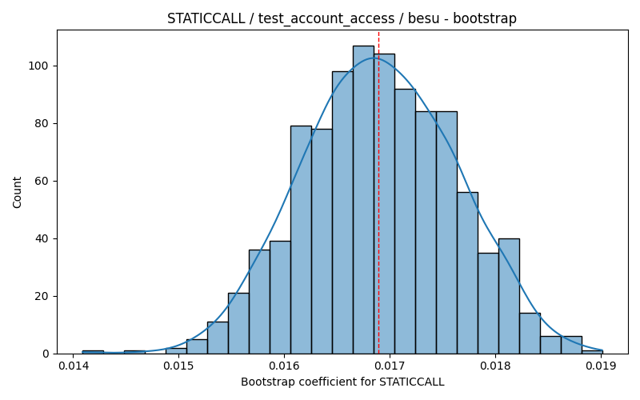

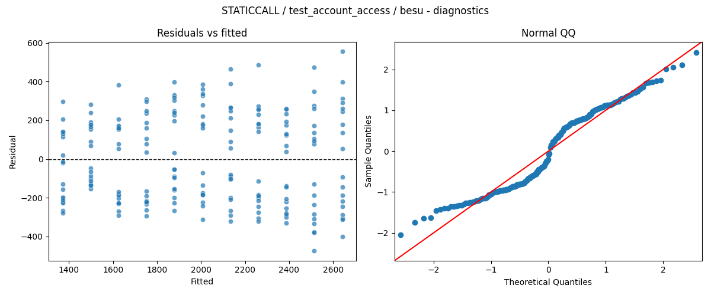

</details>

<details><summary>erigon — NNLS regression summary</summary>

```
==============================================================================
                           NNLS Regression Results                            
==============================================================================
Dep. Variable:          test_runtime_ms              R-squared:          0.978
Model:                  NNLS                    Adj. R-squared:          0.977
No. Observations:       121                               RMSE:          34.90
Df Residuals:           119                                MAE:          31.67
Df Model:               1      
==============================================================================
                      coef     std err     P-value      [0.025      0.975]
------------------------------------------------------------------------------
         const     18.6619      9.0322       0.025      0.0266     37.2531
       opcount      0.0097      0.0001       0.001      0.0094      0.0100
==============================================================================
Notes: Non-negative least squares with bootstrap inference (1000 iterations)
==============================================================================
```

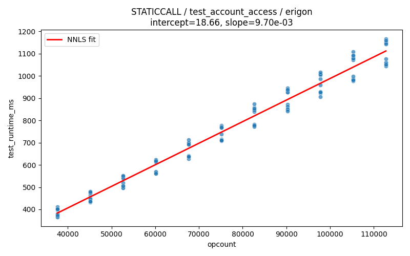

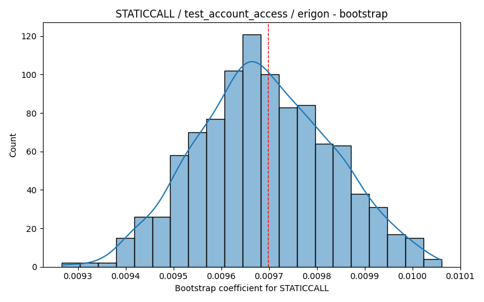

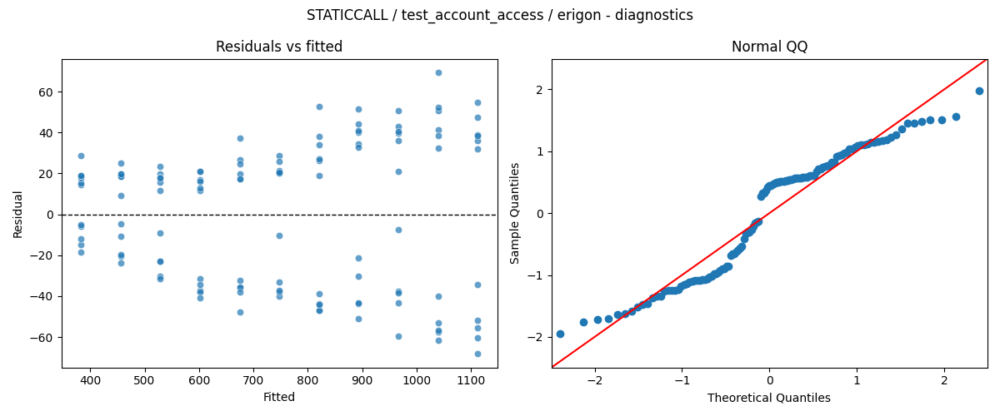

</details>

<details><summary>geth — NNLS regression summary</summary>

```
==============================================================================
                           NNLS Regression Results                            
==============================================================================
Dep. Variable:          test_runtime_ms              R-squared:          0.944
Model:                  NNLS                    Adj. R-squared:          0.944
No. Observations:       231                               RMSE:          64.15
Df Residuals:           229                                MAE:          50.94
Df Model:               1      
==============================================================================
                      coef     std err     P-value      [0.025      0.975]
------------------------------------------------------------------------------
         const    459.8537     20.1815       0.001    420.2812    500.9085
       opcount      0.0111      0.0002       0.001      0.0106      0.0115
==============================================================================
Notes: Non-negative least squares with bootstrap inference (1000 iterations)
==============================================================================
```

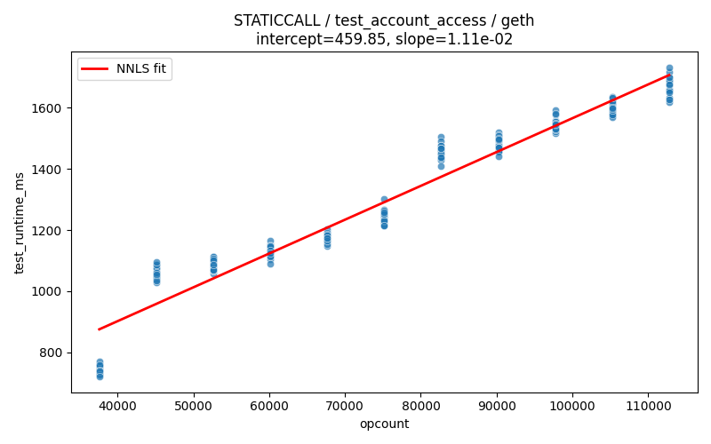

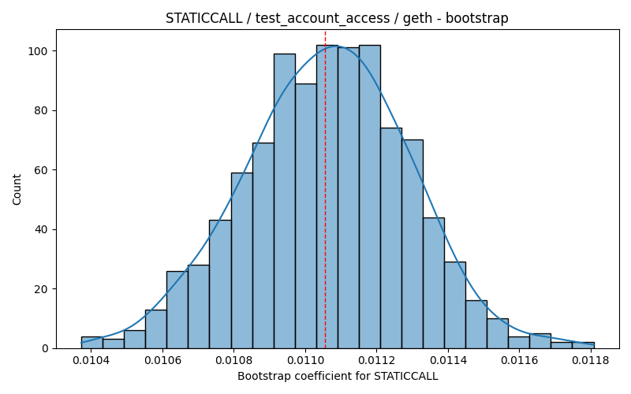

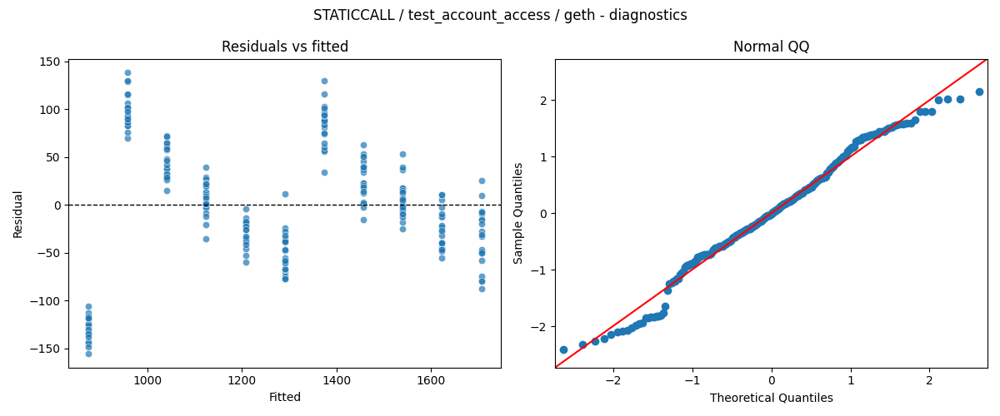

</details>

<details><summary>nethermind — NNLS regression summary</summary>

```
==============================================================================
                           NNLS Regression Results                            
==============================================================================
Dep. Variable:          test_runtime_ms              R-squared:          0.953
Model:                  NNLS                    Adj. R-squared:          0.953
No. Observations:       220                               RMSE:          20.59
Df Residuals:           218                                MAE:          16.22
Df Model:               1      
==============================================================================
                      coef     std err     P-value      [0.025      0.975]
------------------------------------------------------------------------------
         const     83.6136      4.3682       0.001     75.5172     92.7998
       opcount      0.0039      0.0001       0.001      0.0038      0.0040
==============================================================================
Notes: Non-negative least squares with bootstrap inference (1000 iterations)
==============================================================================
```

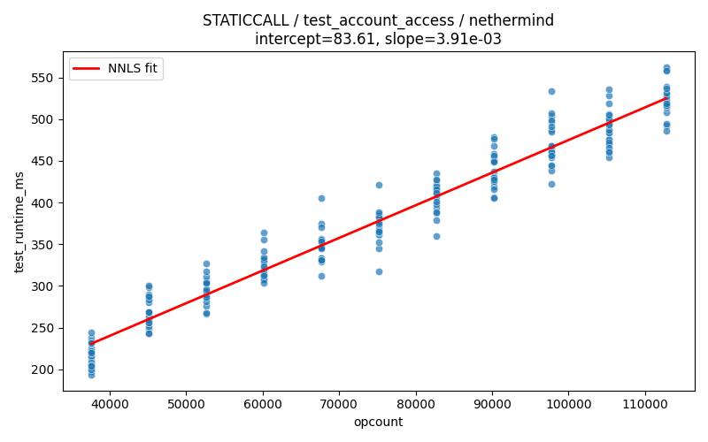

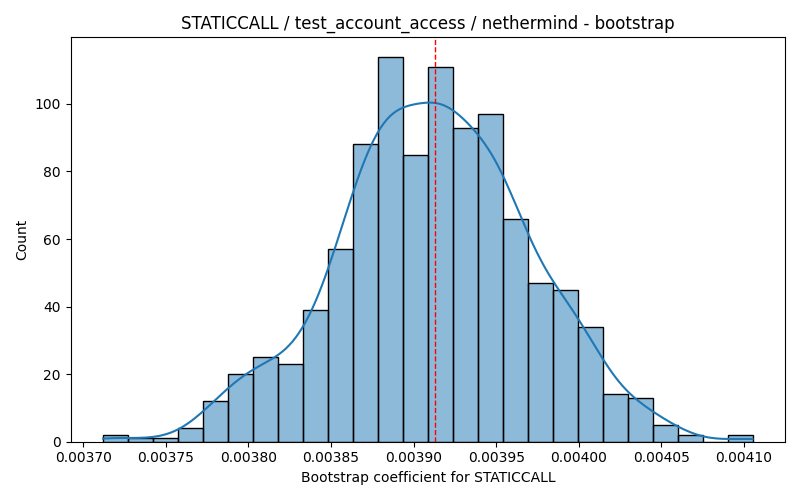

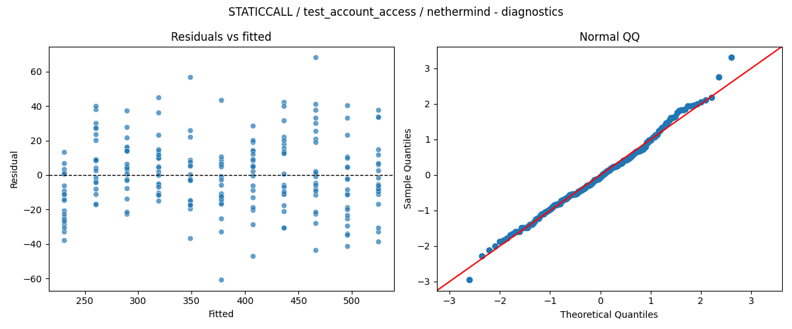

</details>

<details><summary>reth — NNLS regression summary</summary>

```
==============================================================================
                           NNLS Regression Results                            
==============================================================================
Dep. Variable:          test_runtime_ms              R-squared:          0.947
Model:                  NNLS                    Adj. R-squared:          0.947
No. Observations:       220                               RMSE:           7.16
Df Residuals:           218                                MAE:           5.48
Df Model:               1      
==============================================================================
                      coef     std err     P-value      [0.025      0.975]
------------------------------------------------------------------------------
         const     40.9940      1.5092       0.001     38.0923     43.9864
       opcount      0.0013      0.0000       0.001      0.0012      0.0013
==============================================================================
Notes: Non-negative least squares with bootstrap inference (1000 iterations)
==============================================================================
```

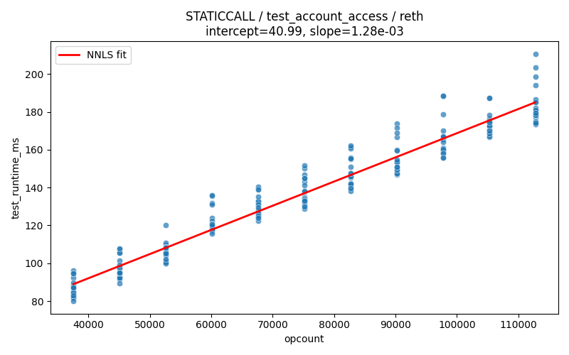

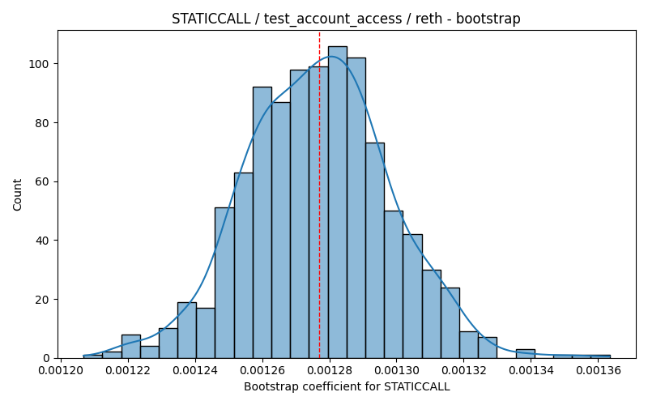

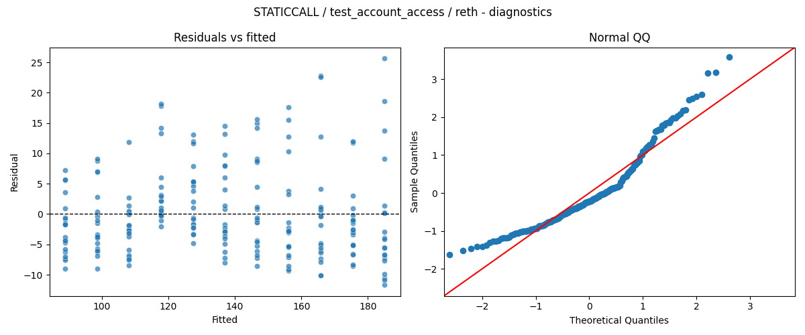

</details>

### test_account_access — combo `STATICCALL_AccountMode.NON_EXISTING_ACCOUNT` — `presets[cold_account_nocode_access]`

| client | nobs | R² | target_coef (ms) | p-value | 95% CI |
| --- | --- | --- | --- | --- | --- |
| `besu` | 198 | 0.7711 | 0.01667 | 1.00e-03 | [0.01534, 0.01794] |
| `erigon` | 121 | 0.9802 | 0.0112 | 1.00e-03 | [0.01107, 0.0113] |
| `geth` | 231 | 0.8693 | 0.02277 | 1.00e-03 | [0.02152, 0.02397] |
| `nethermind` | 220 | 0.9167 | 0.003977 | 1.00e-03 | [0.003825, 0.004128] |
| `reth` | 220 | 0.9671 | 0.0009336 | 1.00e-03 | [0.0009077, 0.0009569] |

<details><summary>besu — NNLS regression summary</summary>

```
==============================================================================
                           NNLS Regression Results                            
==============================================================================
Dep. Variable:          test_runtime_ms              R-squared:          0.771
Model:                  NNLS                    Adj. R-squared:          0.770
No. Observations:       198                               RMSE:         215.91
Df Residuals:           196                                MAE:         197.74
Df Model:               1      
==============================================================================
                      coef     std err     P-value      [0.025      0.975]
------------------------------------------------------------------------------
         const    574.2348     46.2158       0.001    488.7734    664.4867
       opcount      0.0167      0.0007       0.001      0.0153      0.0179
==============================================================================
Notes: Non-negative least squares with bootstrap inference (1000 iterations)
==============================================================================
```

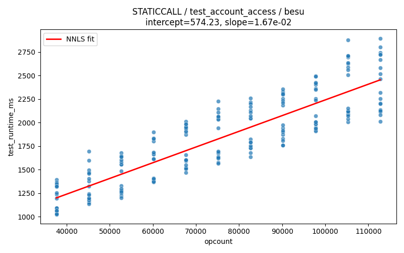

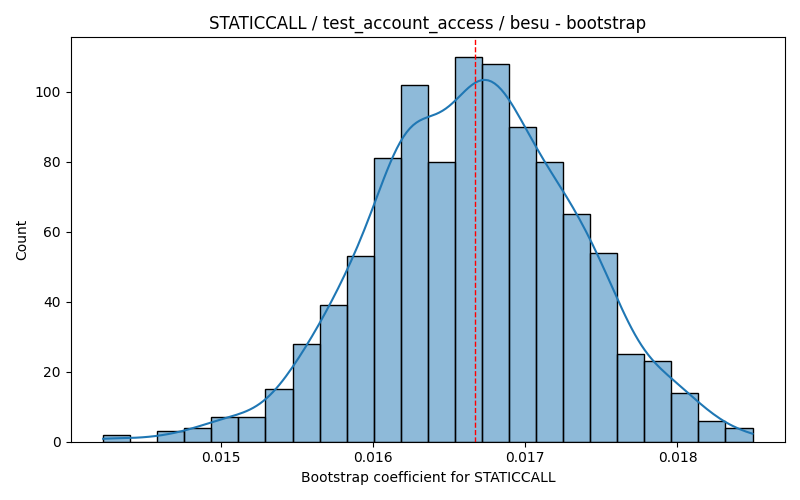

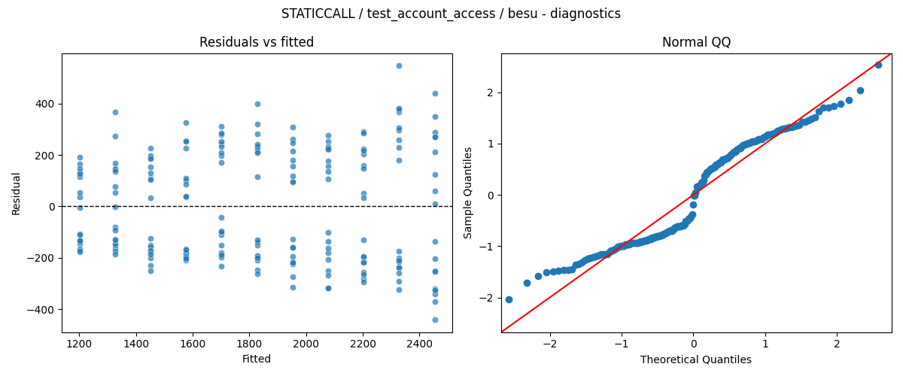

</details>

<details><summary>erigon — NNLS regression summary</summary>

```
==============================================================================
                           NNLS Regression Results                            
==============================================================================
Dep. Variable:          test_runtime_ms              R-squared:          0.980
Model:                  NNLS                    Adj. R-squared:          0.980
No. Observations:       121                               RMSE:          38.48
Df Residuals:           119                                MAE:          33.67
Df Model:               1      
==============================================================================
                      coef     std err     P-value      [0.025      0.975]
------------------------------------------------------------------------------
         const      0.0000      1.1756       1.000      0.0000      3.5556
       opcount      0.0112      0.0001       0.001      0.0111      0.0113
==============================================================================
Notes: Non-negative least squares with bootstrap inference (1000 iterations)
==============================================================================
```

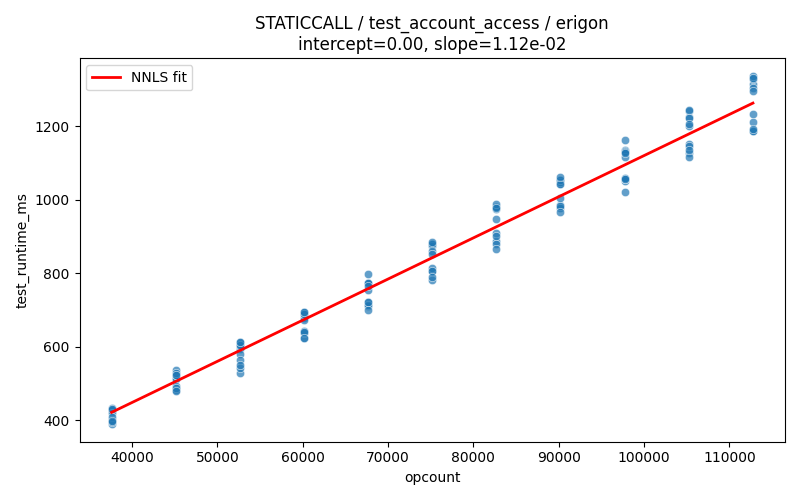

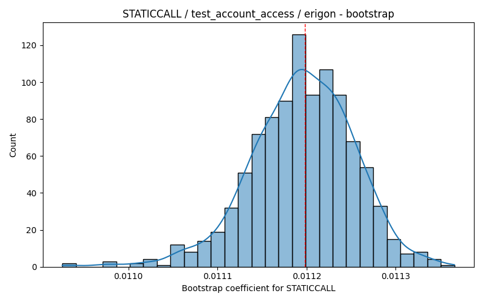

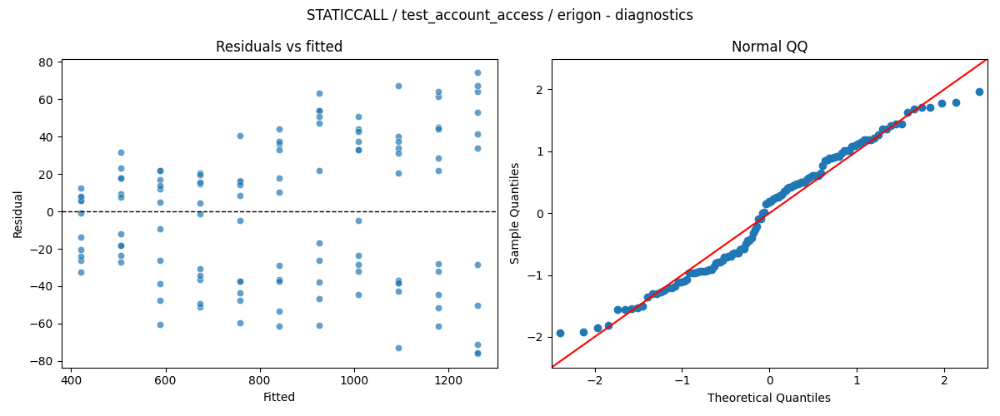

</details>

<details><summary>geth — NNLS regression summary</summary>

```
==============================================================================
                           NNLS Regression Results                            
==============================================================================
Dep. Variable:          test_runtime_ms              R-squared:          0.869
Model:                  NNLS                    Adj. R-squared:          0.869
No. Observations:       231                               RMSE:         209.94
Df Residuals:           229                                MAE:         179.38
Df Model:               1      
==============================================================================
                      coef     std err     P-value      [0.025      0.975]
------------------------------------------------------------------------------
         const    781.5190     52.7001       0.001    682.1209    892.8417
       opcount      0.0228      0.0006       0.001      0.0215      0.0240
==============================================================================
Notes: Non-negative least squares with bootstrap inference (1000 iterations)
==============================================================================
```

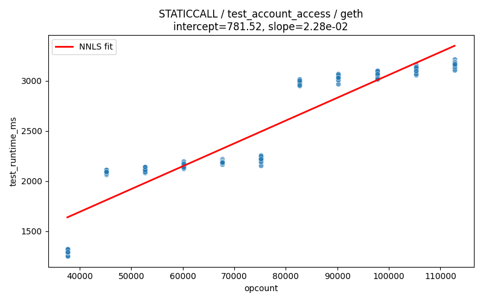

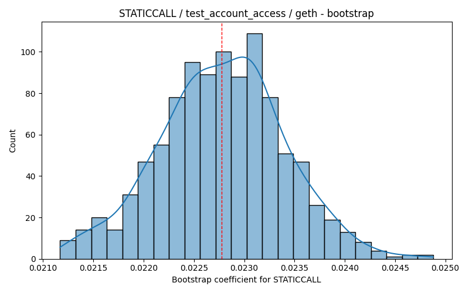

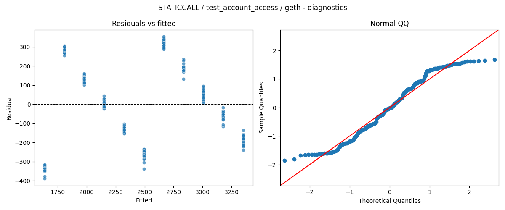

</details>

<details><summary>nethermind — NNLS regression summary</summary>

```
==============================================================================
                           NNLS Regression Results                            
==============================================================================
Dep. Variable:          test_runtime_ms              R-squared:          0.917
Model:                  NNLS                    Adj. R-squared:          0.916
No. Observations:       220                               RMSE:          28.50
Df Residuals:           218                                MAE:          19.41
Df Model:               1      
==============================================================================
                      coef     std err     P-value      [0.025      0.975]
------------------------------------------------------------------------------
         const     72.4485      5.0629       0.001     63.2557     82.5382
       opcount      0.0040      0.0001       0.001      0.0038      0.0041
==============================================================================
Notes: Non-negative least squares with bootstrap inference (1000 iterations)
==============================================================================
```

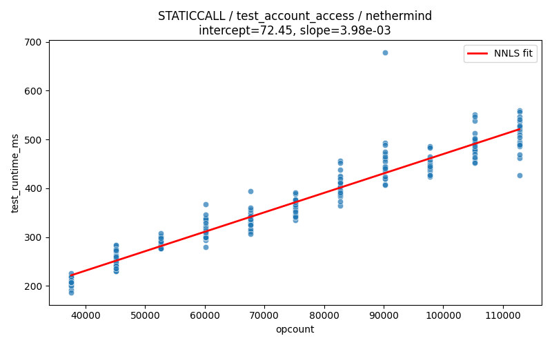

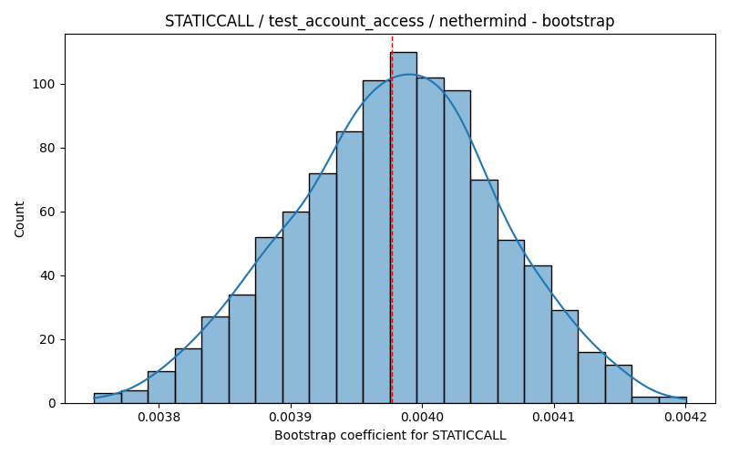

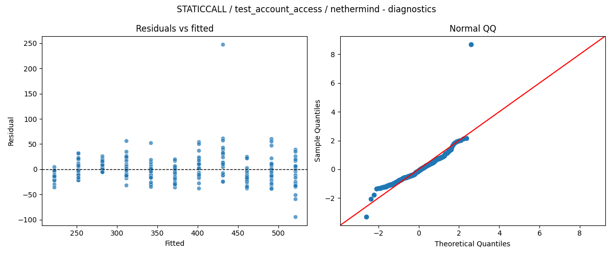

</details>

<details><summary>reth — NNLS regression summary</summary>

```
==============================================================================
                           NNLS Regression Results                            
==============================================================================
Dep. Variable:          test_runtime_ms              R-squared:          0.967
Model:                  NNLS                    Adj. R-squared:          0.967
No. Observations:       220                               RMSE:           4.10
Df Residuals:           218                                MAE:           3.12
Df Model:               1      
==============================================================================
                      coef     std err     P-value      [0.025      0.975]
------------------------------------------------------------------------------
         const     44.0322      0.9908       0.001     42.2634     46.1004
       opcount      0.0009      0.0000       0.001      0.0009      0.0010
==============================================================================
Notes: Non-negative least squares with bootstrap inference (1000 iterations)
==============================================================================
```

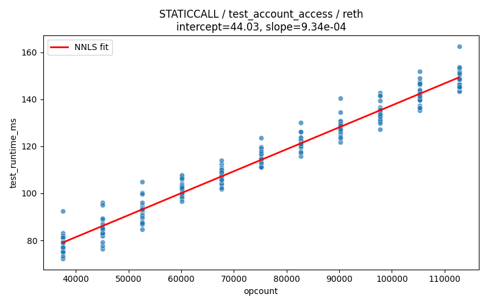

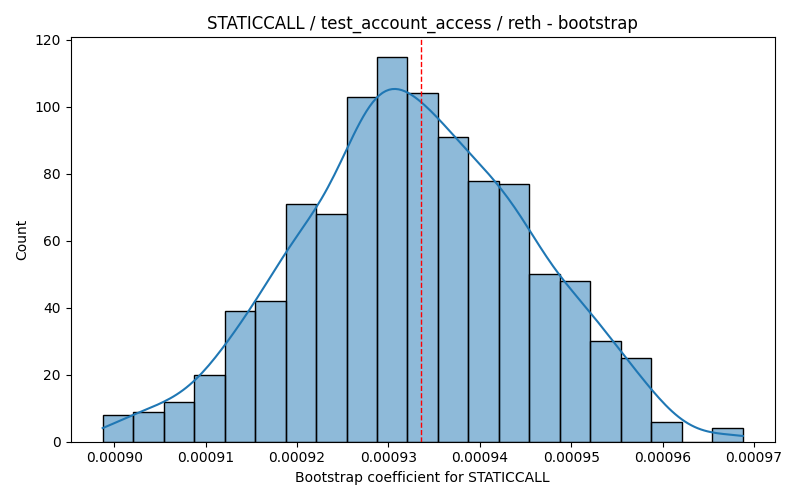

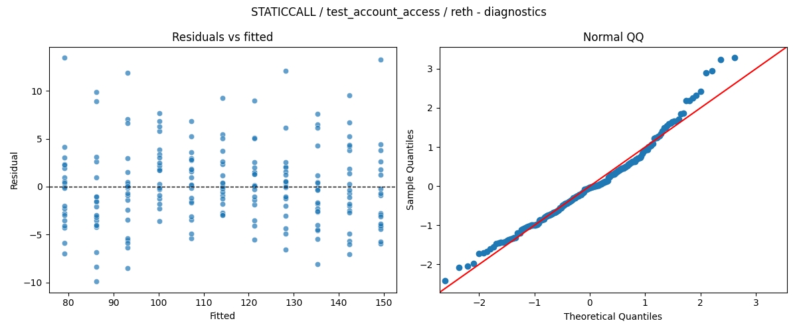

</details>

### test_account_access — combo `STATICCALL_AccountMode.EXISTING_CONTRACT`

| client | nobs | R² | target_coef (ms) | p-value | 95% CI |
| --- | --- | --- | --- | --- | --- |
| `besu` | 198 | 0.8937 | 0.03135 | 1.00e-03 | [0.02992, 0.0329] |
| `erigon` | 121 | 0.8822 | 0.08039 | 1.00e-03 | [0.0749, 0.08519] |
| `geth` | 231 | 0.8687 | 0.02356 | 1.00e-03 | [0.02233, 0.02495] |
| `nethermind` | 220 | 0.8102 | 0.01914 | 1.00e-03 | [0.01788, 0.02061] |
| `reth` | 220 | 0.844 | 0.01768 | 1.00e-03 | [0.01697, 0.01843] |

<details><summary>besu — NNLS regression summary</summary>

```
==============================================================================
                           NNLS Regression Results                            
==============================================================================
Dep. Variable:          test_runtime_ms              R-squared:          0.894
Model:                  NNLS                    Adj. R-squared:          0.893
No. Observations:       198                               RMSE:         220.28
Df Residuals:           196                                MAE:         197.99
Df Model:               1      
==============================================================================
                      coef     std err     P-value      [0.025      0.975]
------------------------------------------------------------------------------
         const    546.8278     48.2289       0.001    451.8281    639.0289
       opcount      0.0313      0.0008       0.001      0.0299      0.0329
==============================================================================
Notes: Non-negative least squares with bootstrap inference (1000 iterations)
==============================================================================
```

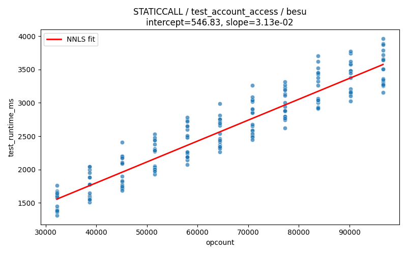

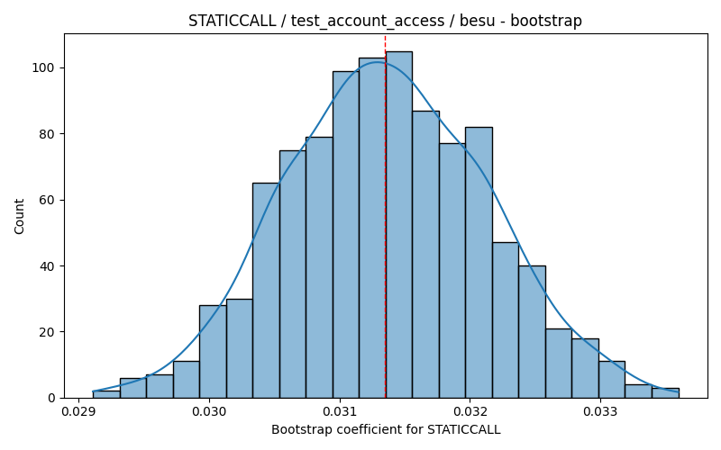

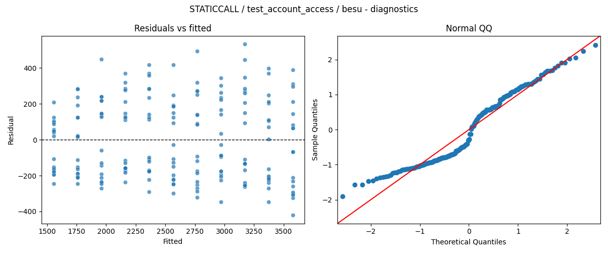

</details>

<details><summary>erigon — NNLS regression summary</summary>

```
==============================================================================
                           NNLS Regression Results                            
==============================================================================
Dep. Variable:          test_runtime_ms              R-squared:          0.882
Model:                  NNLS                    Adj. R-squared:          0.881
No. Observations:       121                               RMSE:         598.46
Df Residuals:           119                                MAE:         520.33
Df Model:               1      
==============================================================================
                      coef     std err     P-value      [0.025      0.975]
------------------------------------------------------------------------------
         const    933.2819    196.9442       0.001    568.5192   1367.8765
       opcount      0.0804      0.0026       0.001      0.0749      0.0852
==============================================================================
Notes: Non-negative least squares with bootstrap inference (1000 iterations)
==============================================================================
```

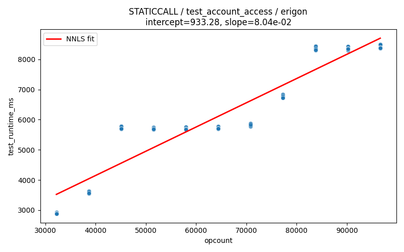

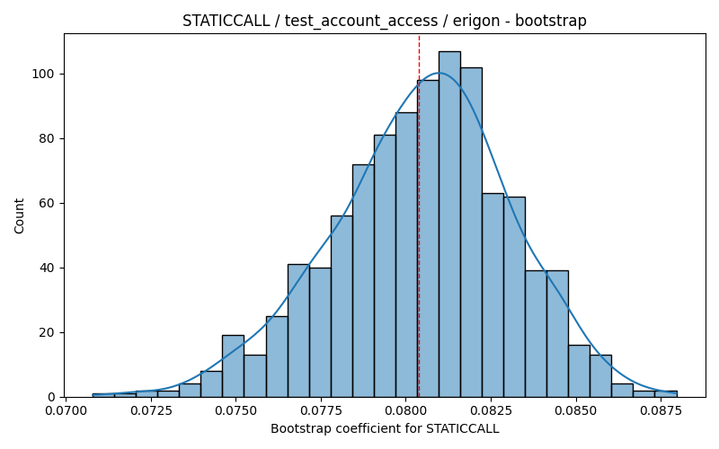

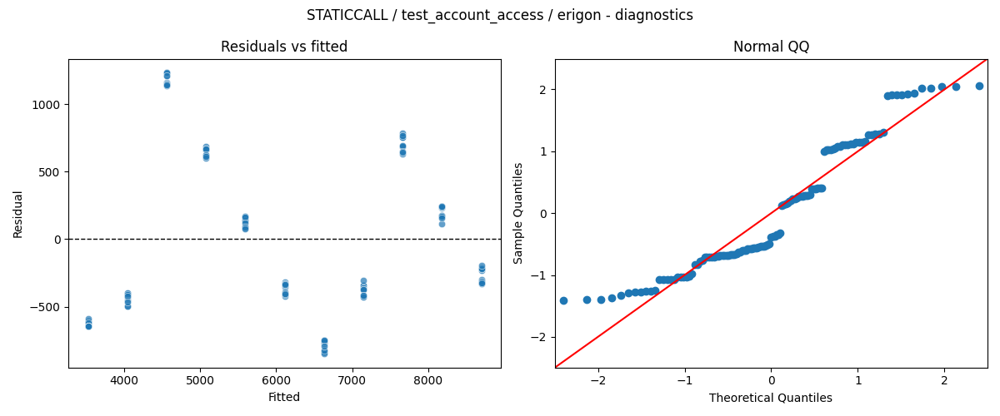

</details>

<details><summary>geth — NNLS regression summary</summary>

```
==============================================================================
                           NNLS Regression Results                            
==============================================================================
Dep. Variable:          test_runtime_ms              R-squared:          0.869
Model:                  NNLS                    Adj. R-squared:          0.868
No. Observations:       231                               RMSE:         186.65
Df Residuals:           229                                MAE:         159.61
Df Model:               1      
==============================================================================
                      coef     std err     P-value      [0.025      0.975]
------------------------------------------------------------------------------
         const    734.1667     48.1584       0.001    636.6061    827.2492
       opcount      0.0236      0.0007       0.001      0.0223      0.0250
==============================================================================
Notes: Non-negative least squares with bootstrap inference (1000 iterations)
==============================================================================
```

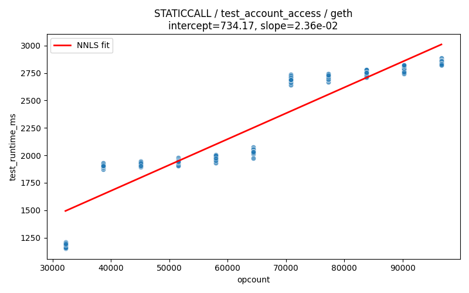

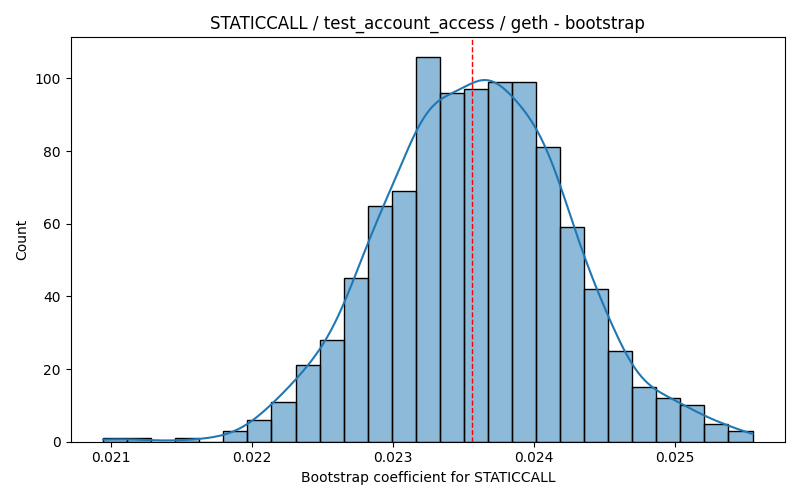

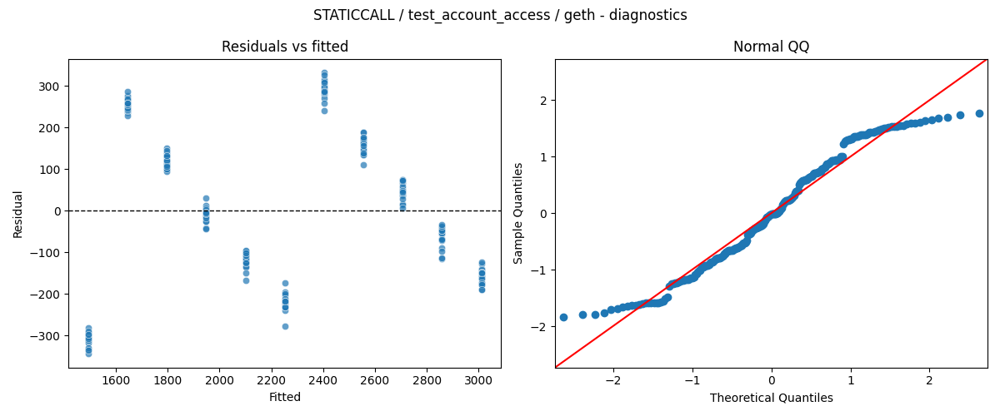

</details>

<details><summary>nethermind — NNLS regression summary</summary>

```
==============================================================================
                           NNLS Regression Results                            
==============================================================================
Dep. Variable:          test_runtime_ms              R-squared:          0.810
Model:                  NNLS                    Adj. R-squared:          0.809
No. Observations:       220                               RMSE:         188.74
Df Residuals:           218                                MAE:         157.11
Df Model:               1      
==============================================================================
                      coef     std err     P-value      [0.025      0.975]
------------------------------------------------------------------------------
         const    588.0579     49.0737       0.001    483.2855    677.9577
       opcount      0.0191      0.0007       0.001      0.0179      0.0206
==============================================================================
Notes: Non-negative least squares with bootstrap inference (1000 iterations)
==============================================================================
```

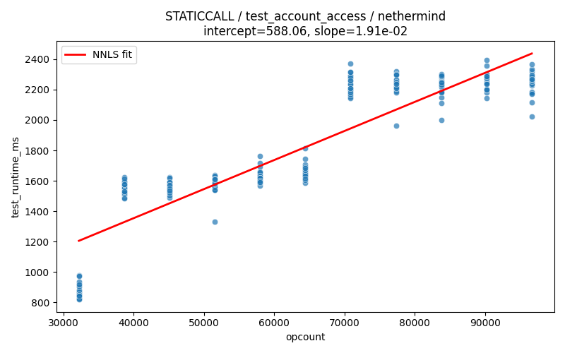

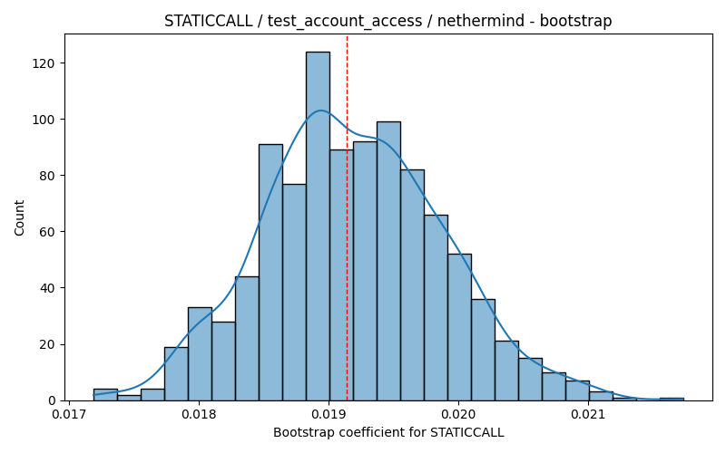

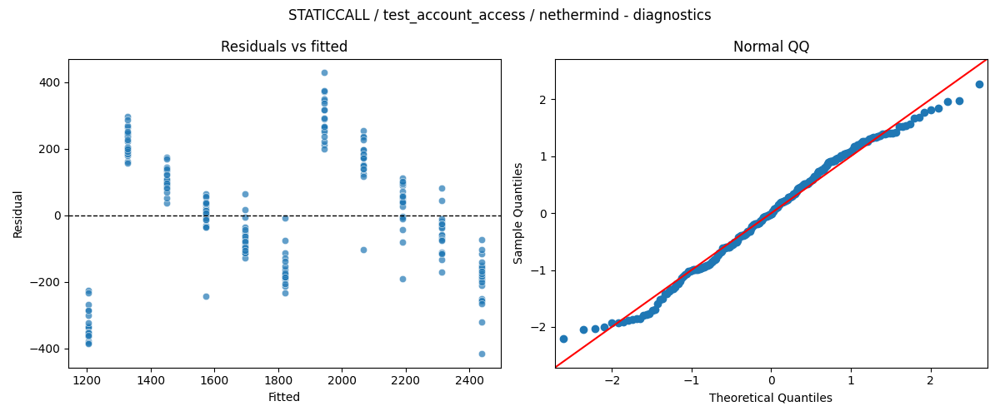

</details>

<details><summary>reth — NNLS regression summary</summary>

```
==============================================================================
                           NNLS Regression Results                            
==============================================================================
Dep. Variable:          test_runtime_ms              R-squared:          0.844
Model:                  NNLS                    Adj. R-squared:          0.843
No. Observations:       220                               RMSE:         154.86
Df Residuals:           218                                MAE:          76.01
Df Model:               1      
==============================================================================
                      coef     std err     P-value      [0.025      0.975]
------------------------------------------------------------------------------
         const    339.9082     27.2057       0.001    290.6708    395.6463
       opcount      0.0177      0.0004       0.001      0.0170      0.0184
==============================================================================
Notes: Non-negative least squares with bootstrap inference (1000 iterations)
==============================================================================
```

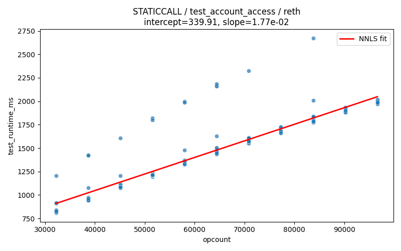

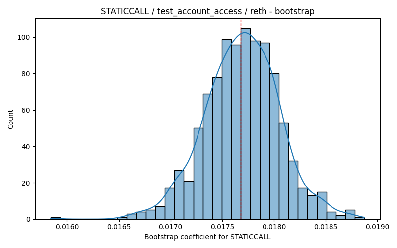

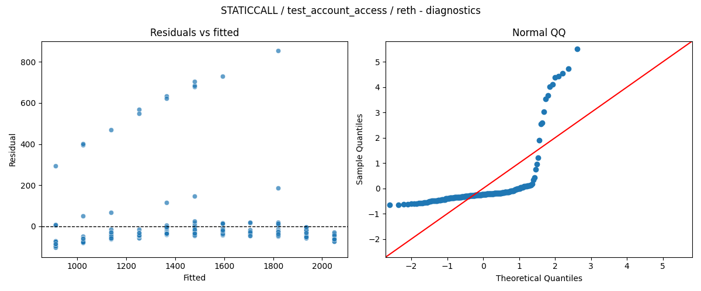

</details>

### test_account_access — combo `STATICCALL_AccountMode.NON_EXISTING_ACCOUNT` — `presets[cold_account_code_access]`

| client | nobs | R² | target_coef (ms) | p-value | 95% CI |
| --- | --- | --- | --- | --- | --- |
| `besu` | 198 | 0.7711 | 0.01667 | 1.00e-03 | [0.01534, 0.01794] |
| `erigon` | 121 | 0.9802 | 0.0112 | 1.00e-03 | [0.01107, 0.0113] |
| `geth` | 231 | 0.8693 | 0.02277 | 1.00e-03 | [0.02152, 0.02397] |
| `nethermind` | 220 | 0.9167 | 0.003977 | 1.00e-03 | [0.003825, 0.004128] |
| `reth` | 220 | 0.9671 | 0.0009336 | 1.00e-03 | [0.0009077, 0.0009569] |

<details><summary>besu — NNLS regression summary</summary>

```
==============================================================================
                           NNLS Regression Results                            
==============================================================================
Dep. Variable:          test_runtime_ms              R-squared:          0.771
Model:                  NNLS                    Adj. R-squared:          0.770
No. Observations:       198                               RMSE:         215.91
Df Residuals:           196                                MAE:         197.74
Df Model:               1      
==============================================================================
                      coef     std err     P-value      [0.025      0.975]
------------------------------------------------------------------------------
         const    574.2348     46.2158       0.001    488.7734    664.4867
       opcount      0.0167      0.0007       0.001      0.0153      0.0179
==============================================================================
Notes: Non-negative least squares with bootstrap inference (1000 iterations)
==============================================================================
```


</details>

<details><summary>erigon — NNLS regression summary</summary>

```
==============================================================================
                           NNLS Regression Results                            
==============================================================================
Dep. Variable:          test_runtime_ms              R-squared:          0.980
Model:                  NNLS                    Adj. R-squared:          0.980
No. Observations:       121                               RMSE:          38.48
Df Residuals:           119                                MAE:          33.67
Df Model:               1      
==============================================================================
                      coef     std err     P-value      [0.025      0.975]
------------------------------------------------------------------------------
         const      0.0000      1.1756       1.000      0.0000      3.5556
       opcount      0.0112      0.0001       0.001      0.0111      0.0113
==============================================================================
Notes: Non-negative least squares with bootstrap inference (1000 iterations)
==============================================================================
```


</details>

<details><summary>geth — NNLS regression summary</summary>

```
==============================================================================
                           NNLS Regression Results                            
==============================================================================
Dep. Variable:          test_runtime_ms              R-squared:          0.869
Model:                  NNLS                    Adj. R-squared:          0.869
No. Observations:       231                               RMSE:         209.94
Df Residuals:           229                                MAE:         179.38
Df Model:               1      
==============================================================================
                      coef     std err     P-value      [0.025      0.975]
------------------------------------------------------------------------------
         const    781.5190     52.7001       0.001    682.1209    892.8417
       opcount      0.0228      0.0006       0.001      0.0215      0.0240
==============================================================================
Notes: Non-negative least squares with bootstrap inference (1000 iterations)
==============================================================================
```


</details>

<details><summary>nethermind — NNLS regression summary</summary>

```
==============================================================================
                           NNLS Regression Results                            
==============================================================================
Dep. Variable:          test_runtime_ms              R-squared:          0.917
Model:                  NNLS                    Adj. R-squared:          0.916
No. Observations:       220                               RMSE:          28.50
Df Residuals:           218                                MAE:          19.41
Df Model:               1      
==============================================================================
                      coef     std err     P-value      [0.025      0.975]
------------------------------------------------------------------------------
         const     72.4485      5.0629       0.001     63.2557     82.5382
       opcount      0.0040      0.0001       0.001      0.0038      0.0041
==============================================================================
Notes: Non-negative least squares with bootstrap inference (1000 iterations)
==============================================================================
```


</details>

<details><summary>reth — NNLS regression summary</summary>

```
==============================================================================
                           NNLS Regression Results                            
==============================================================================
Dep. Variable:          test_runtime_ms              R-squared:          0.967
Model:                  NNLS                    Adj. R-squared:          0.967
No. Observations:       220                               RMSE:           4.10
Df Residuals:           218                                MAE:           3.12
Df Model:               1      
==============================================================================
                      coef     std err     P-value      [0.025      0.975]
------------------------------------------------------------------------------
         const     44.0322      0.9908       0.001     42.2634     46.1004
       opcount      0.0009      0.0000       0.001      0.0009      0.0010
==============================================================================
Notes: Non-negative least squares with bootstrap inference (1000 iterations)
==============================================================================
```


</details>

### test_ext_account_query_warm — combo `STATICCALL`

| client | nobs | R² | target_coef (ms) | p-value | 95% CI |
| --- | --- | --- | --- | --- | --- |
| `besu` | 198 | 0.7644 | 0.0005474 | 1.00e-03 | [0.0005085, 0.0005894] |
| `erigon` | 121 | 0.9829 | 0.0005588 | 1.00e-03 | [0.0005466, 0.00057] |
| `geth` | 231 | 0.9434 | 0.0001931 | 1.00e-03 | [0.0001872, 0.0001989] |
| `nethermind` | 220 | 0.7589 | 0.0003806 | 1.00e-03 | [0.0003516, 0.0004079] |
| `reth` | 220 | 0.9203 | 5.248e-05 | 1.00e-03 | [5.052e-05, 5.444e-05] |

<details><summary>besu — NNLS regression summary</summary>

```
==============================================================================
                           NNLS Regression Results                            
==============================================================================
Dep. Variable:          test_runtime_ms              R-squared:          0.764
Model:                  NNLS                    Adj. R-squared:          0.763
No. Observations:       198                               RMSE:         157.31
Df Residuals:           196                                MAE:         124.67
Df Model:               1      
==============================================================================
                      coef     std err     P-value      [0.025      0.975]
------------------------------------------------------------------------------
         const    677.5567     31.1381       0.001    618.7584    739.0402
       opcount      0.0005      0.0000       0.001      0.0005      0.0006
==============================================================================
Notes: Non-negative least squares with bootstrap inference (1000 iterations)
==============================================================================
```

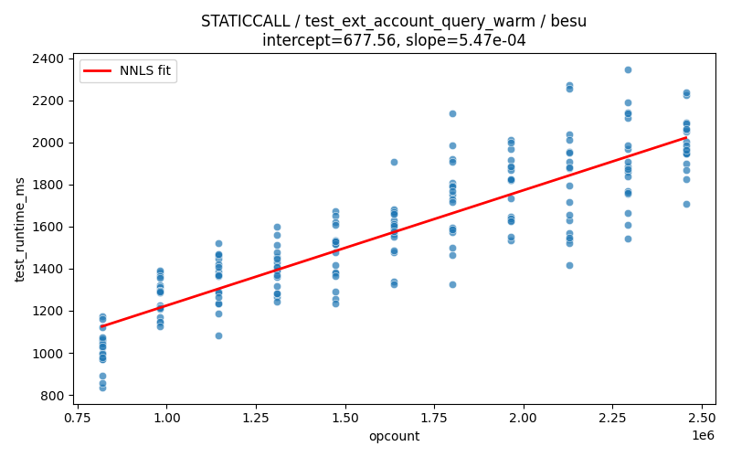

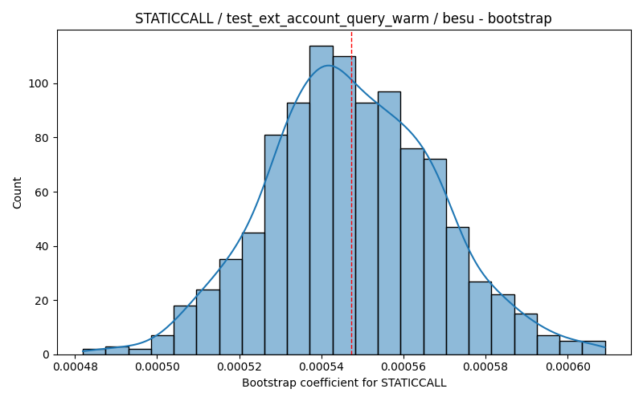

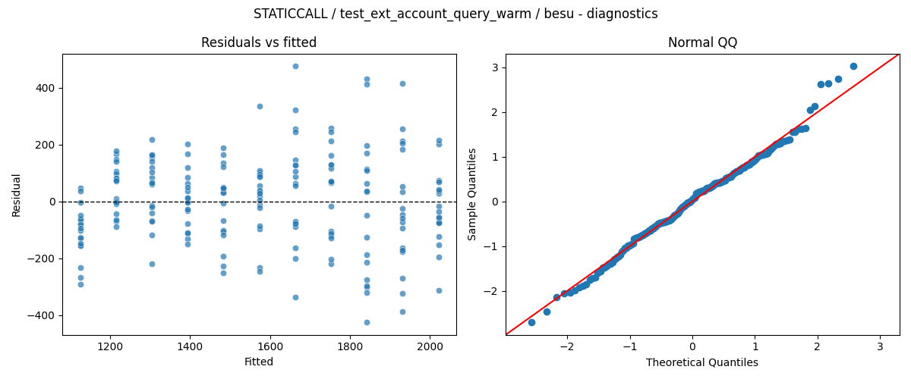

</details>

<details><summary>erigon — NNLS regression summary</summary>

```
==============================================================================
                           NNLS Regression Results                            
==============================================================================
Dep. Variable:          test_runtime_ms              R-squared:          0.983
Model:                  NNLS                    Adj. R-squared:          0.983
No. Observations:       121                               RMSE:          38.16
Df Residuals:           119                                MAE:          27.42
Df Model:               1      
==============================================================================
                      coef     std err     P-value      [0.025      0.975]
------------------------------------------------------------------------------
         const     50.0057     10.3777       0.001     30.6385     71.4755
       opcount      0.0006      0.0000       0.001      0.0005      0.0006
==============================================================================
Notes: Non-negative least squares with bootstrap inference (1000 iterations)
==============================================================================
```

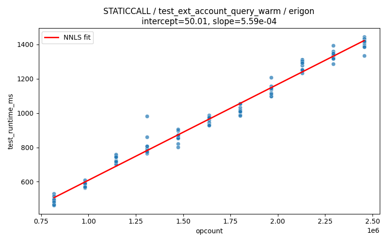

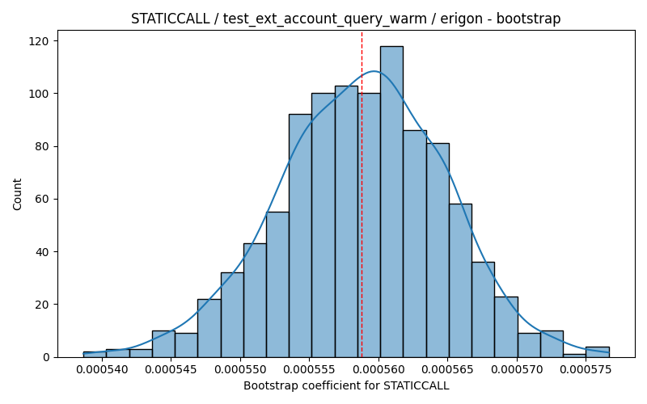

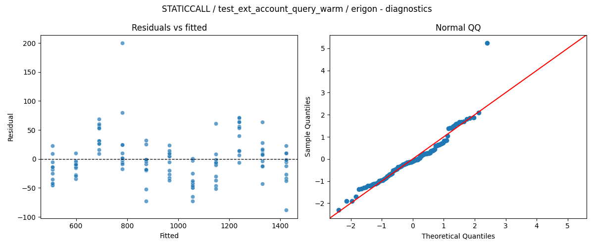

</details>

<details><summary>geth — NNLS regression summary</summary>

```
==============================================================================
                           NNLS Regression Results                            
==============================================================================
Dep. Variable:          test_runtime_ms              R-squared:          0.943
Model:                  NNLS                    Adj. R-squared:          0.943
No. Observations:       231                               RMSE:          24.49
Df Residuals:           229                                MAE:          19.54
Df Model:               1      
==============================================================================
                      coef     std err     P-value      [0.025      0.975]
------------------------------------------------------------------------------
         const     52.4430      4.8147       0.001     43.0579     61.6323
       opcount      0.0002      0.0000       0.001      0.0002      0.0002
==============================================================================
Notes: Non-negative least squares with bootstrap inference (1000 iterations)
==============================================================================
```

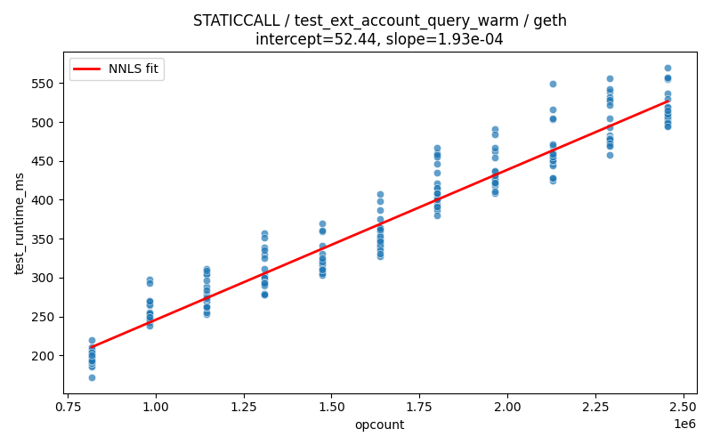

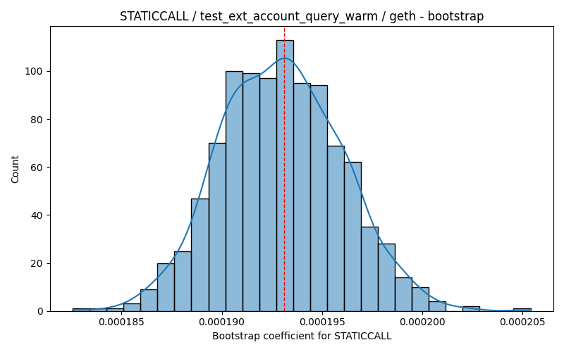

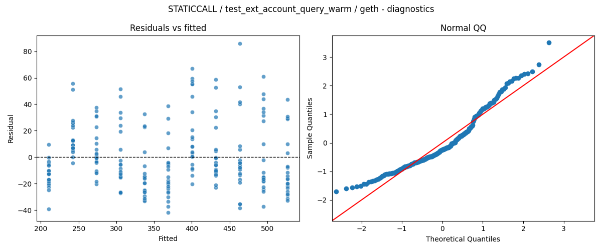

</details>

<details><summary>nethermind — NNLS regression summary</summary>

```
==============================================================================
                           NNLS Regression Results                            
==============================================================================
Dep. Variable:          test_runtime_ms              R-squared:          0.759
Model:                  NNLS                    Adj. R-squared:          0.758
No. Observations:       220                               RMSE:         111.06
Df Residuals:           218                                MAE:          83.81
Df Model:               1      
==============================================================================
                      coef     std err     P-value      [0.025      0.975]
------------------------------------------------------------------------------
         const    181.5186     21.2025       0.001    137.7393    222.5217
       opcount      0.0004      0.0000       0.001      0.0004      0.0004
==============================================================================
Notes: Non-negative least squares with bootstrap inference (1000 iterations)
==============================================================================
```

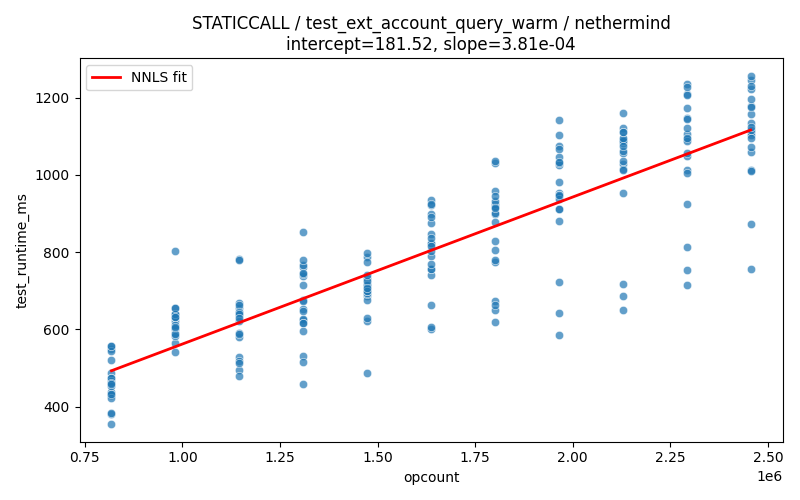


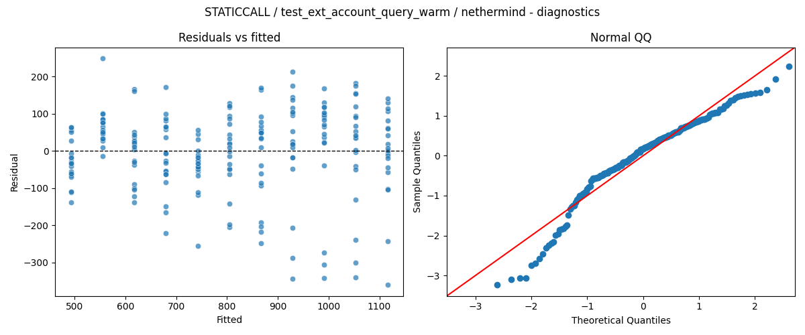

</details>

<details><summary>reth — NNLS regression summary</summary>

```
==============================================================================
                           NNLS Regression Results                            
==============================================================================
Dep. Variable:          test_runtime_ms              R-squared:          0.920
Model:                  NNLS                    Adj. R-squared:          0.920
No. Observations:       220                               RMSE:           8.00
Df Residuals:           218                                MAE:           6.60
Df Model:               1      
==============================================================================
                      coef     std err     P-value      [0.025      0.975]
------------------------------------------------------------------------------
         const     20.4437      1.7183       0.001     17.0859     23.9930
       opcount      0.0001      0.0000       0.001      0.0001      0.0001
==============================================================================
Notes: Non-negative least squares with bootstrap inference (1000 iterations)
==============================================================================
```

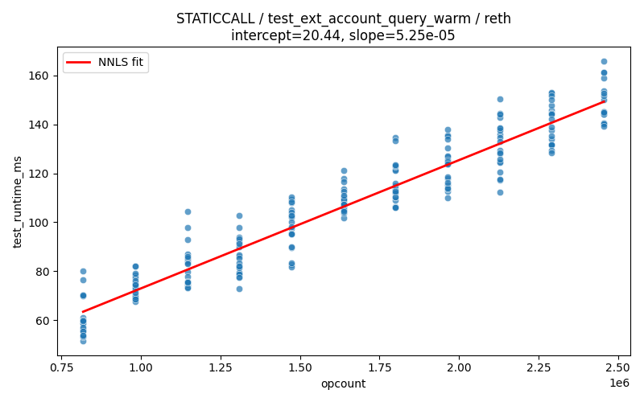

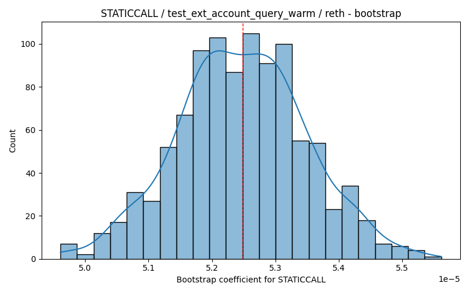

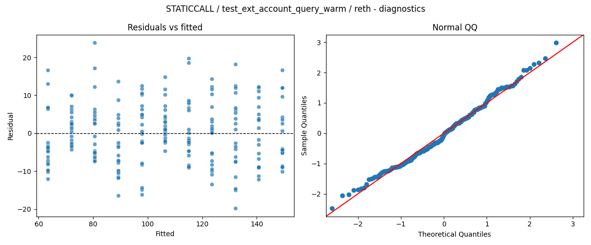

</details>
