# Glue opcodes report

Per-client NNLS fits of priced glue opcodes against their driver fixtures. Cycle-tier opcodes share one joint regression per client (shown once); pure-tier and mixed-tier opcodes each get a single-feature fit. Mixed-tier fits pre-adjust the LHS by subtracting the contribution of every priced upstream partner selected by the detector (pure ∪ cycle for `mixed_a`, plus `mixed_a` for `mixed_b`).

**Contents:** [besu](#besu) · [erigon](#erigon) · [geth](#geth) · [nethermind](#nethermind) · [reth](#reth)

## besu

| glue_opcode | nobs | glue_runtime_ms | p_value | rsquared |
| --- | --- | --- | --- | --- |
| `ISZERO` | 308 | 4.608e-06 | 1.00e-03 | 0.6159 |
| `JUMPDEST` | 308 | 1.843e-06 | 1.00e-03 | 0.1924 |
| `SWAP` | 4928 | 4.121e-06 | 1.00e-03 | 0.8924 |
| `CALLDATASIZE` | 18469 | 3.869e-06 | 1.00e-03 | 0.8403 |
| `DUP` | 18469 | 2.135e-06 | 1.00e-03 | 0.8403 |
| `GAS` | 18469 | 3.39e-06 | 1.00e-03 | 0.8403 |
| `MLOAD` | 18469 | 1.102e-05 | 1.00e-03 | 0.8403 |
| `PUSH` | 18469 | 2.659e-06 | 1.00e-03 | 0.8403 |
| `PUSH0` | 18469 | 1.964e-06 | 1.00e-03 | 0.8403 |
| `STATICCALL` | 18469 | 0.0008595 | 1.00e-03 | 0.8403 |
| `ADD` | 308 | 1.12e-05 | 1.00e-03 | 0.6777 |
| `AND` | 308 | 1.059e-05 | 1.00e-03 | 0.3182 |
| `CALLDATACOPY` | 7392 | 1.873e-05 | 1.00e-03 | 0.6768 |
| `CALLDATALOAD` | 1232 | 1.119e-06 | 3.98e-01 | 2.594e-05 |
| `DIV` | 308 | 1.711e-05 | 1.00e-03 | 0.7012 |
| `EXP` | 308 | 0.001277 | 1.00e-03 | 0.7562 |
| `GT` | 308 | 2.145e-05 | 1.00e-03 | 0.1457 |
| `JUMPI` | 308 | 7.68e-06 | 1.00e-03 | 0.3364 |
| `LT` | 308 | 2.175e-05 | 1.00e-03 | 0.1445 |
| `MSTORE` | 1540 | 1.913e-05 | 1.00e-03 | 0.825 |
| `MSTORE8` | 1540 | 1.27e-05 | 1.00e-03 | 0.5642 |
| `MUL` | 308 | 1.24e-05 | 1.00e-03 | 0.7345 |
| `PC` | 308 | 4.009e-06 | 1.00e-03 | 0.5261 |
| `RETURNDATASIZE` | 1232 | 6.379e-06 | 1.00e-03 | 0.4376 |
| `SELFBALANCE` | 252 | 8.714e-06 | 1.00e-03 | 0.4823 |
| `SUB` | 308 | 1.182e-05 | 1.00e-03 | 0.6437 |
| `JUMP` | 308 | 3.858e-05 | 1.00e-03 | 0.632 |
| `KECCAK256` | 4928 | 4.498e-05 | 1.00e-03 | 0.1942 |

### Cycle glue — joint fit · besu

<details><summary>Joint NNLS regression summary</summary>

```
==============================================================================
                           NNLS Regression Results                            
==============================================================================
Dep. Variable:          test_runtime_ms              R-squared:          0.840
Model:                  NNLS                    Adj. R-squared:          0.840
No. Observations:       18469                             RMSE:          84.38
Df Residuals:           18461                              MAE:          74.34
Df Model:               7      
==============================================================================
                      coef     std err     P-value      [0.025      0.975]
------------------------------------------------------------------------------
         const     61.7581      1.8865       0.001     58.1970     65.5527
  CALLDATASIZE      0.0000      0.0000       0.001      0.0000      0.0000
           DUP      0.0000      0.0000       0.001      0.0000      0.0000
           GAS      0.0000      0.0000       0.001      0.0000      0.0000
         MLOAD      0.0000      0.0000       0.001      0.0000      0.0000
          PUSH      0.0000      0.0000       0.001      0.0000      0.0000
         PUSH0      0.0000      0.0000       0.001      0.0000      0.0000
    STATICCALL      0.0009      0.0000       0.001      0.0008      0.0009
==============================================================================
Notes: Non-negative least squares with bootstrap inference (1000 iterations)
==============================================================================
```

</details>

<details><summary><code>CALLDATASIZE</code> · nobs=18469 · runtime_ms=3.869e-06 · p=1.00e-03 · R²=0.8403</summary>

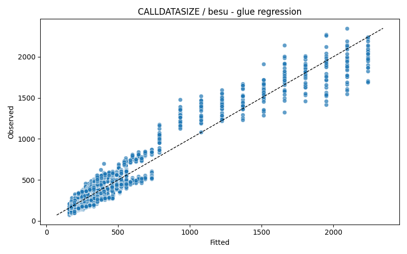

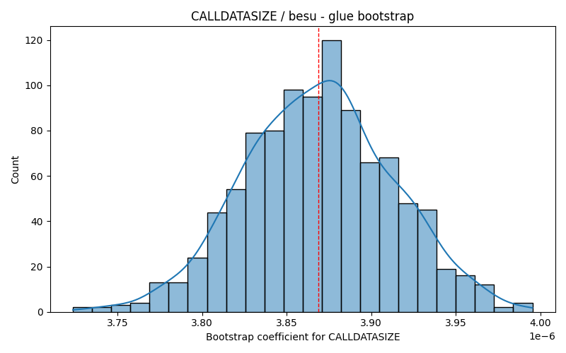

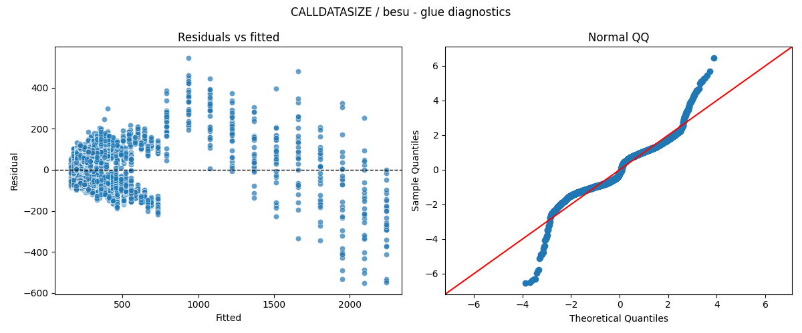

</details>

<details><summary><code>DUP</code> · nobs=18469 · runtime_ms=2.135e-06 · p=1.00e-03 · R²=0.8403</summary>


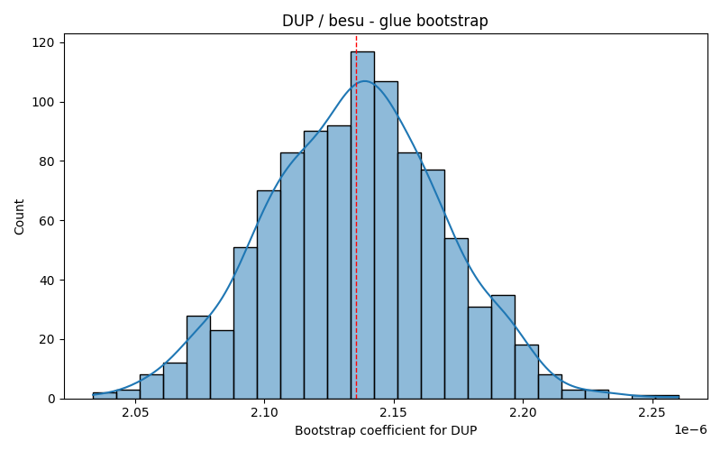


</details>

<details><summary><code>GAS</code> · nobs=18469 · runtime_ms=3.39e-06 · p=1.00e-03 · R²=0.8403</summary>


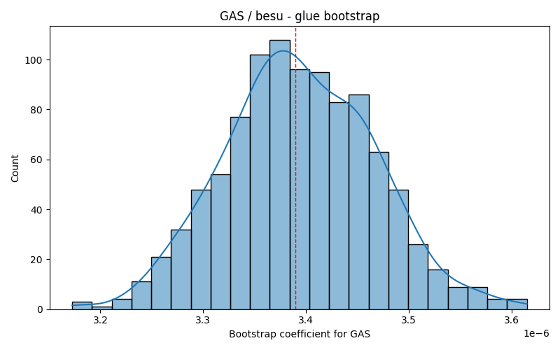

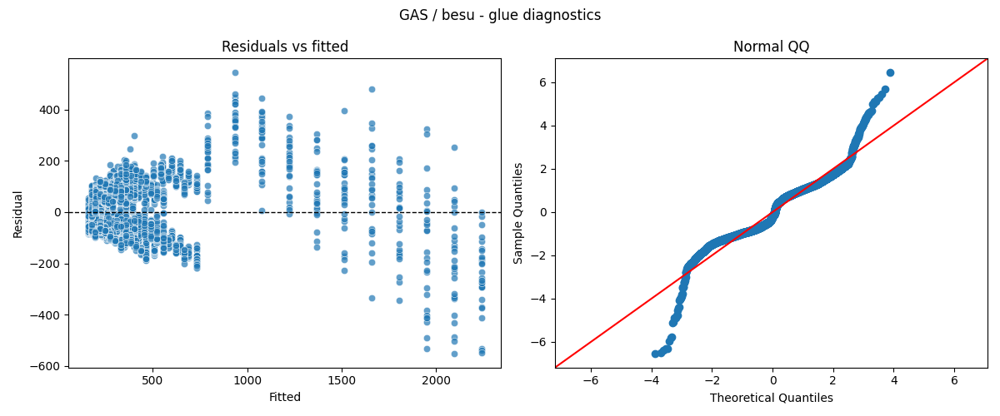

</details>

<details><summary><code>MLOAD</code> · nobs=18469 · runtime_ms=1.102e-05 · p=1.00e-03 · R²=0.8403</summary>

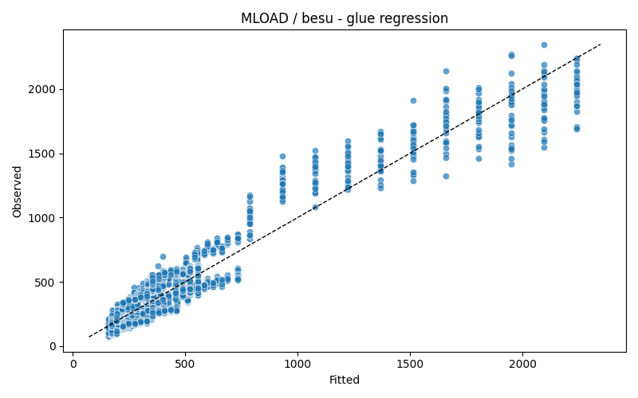

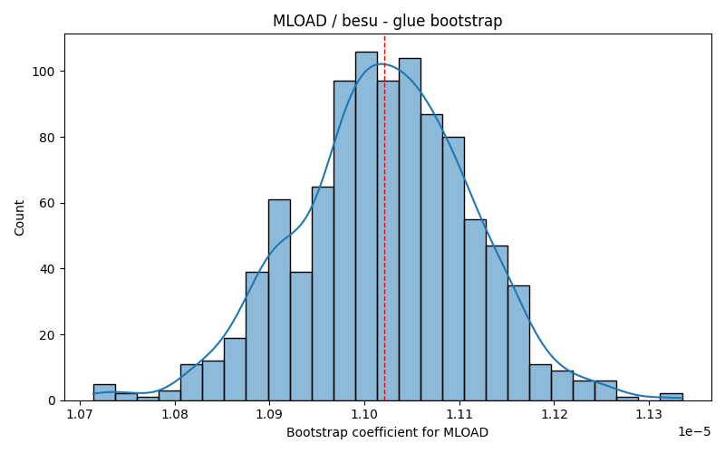


</details>

<details><summary><code>PUSH</code> · nobs=18469 · runtime_ms=2.659e-06 · p=1.00e-03 · R²=0.8403</summary>

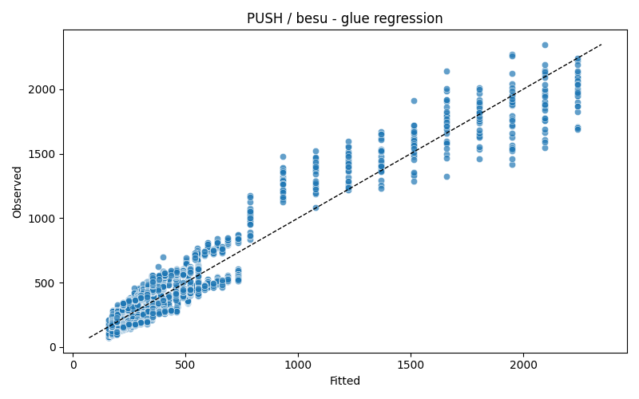

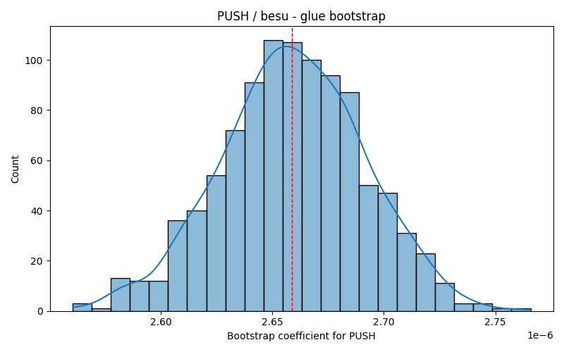


</details>

<details><summary><code>PUSH0</code> · nobs=18469 · runtime_ms=1.964e-06 · p=1.00e-03 · R²=0.8403</summary>


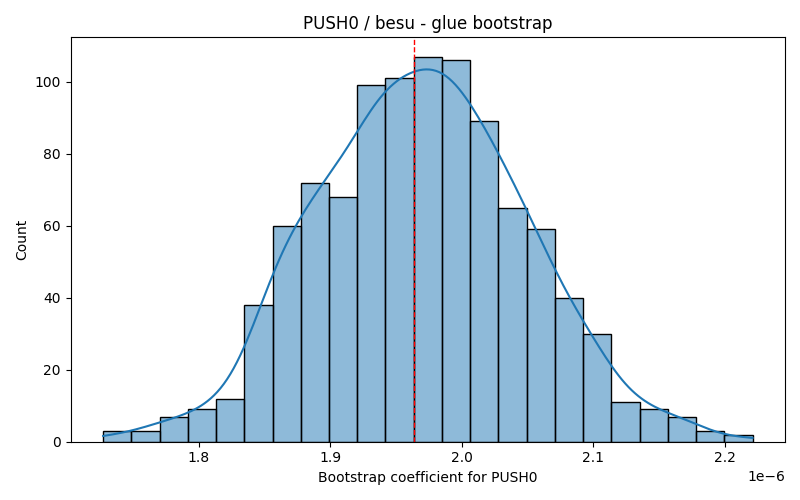


</details>

<details><summary><code>STATICCALL</code> · nobs=18469 · runtime_ms=0.0008595 · p=1.00e-03 · R²=0.8403</summary>


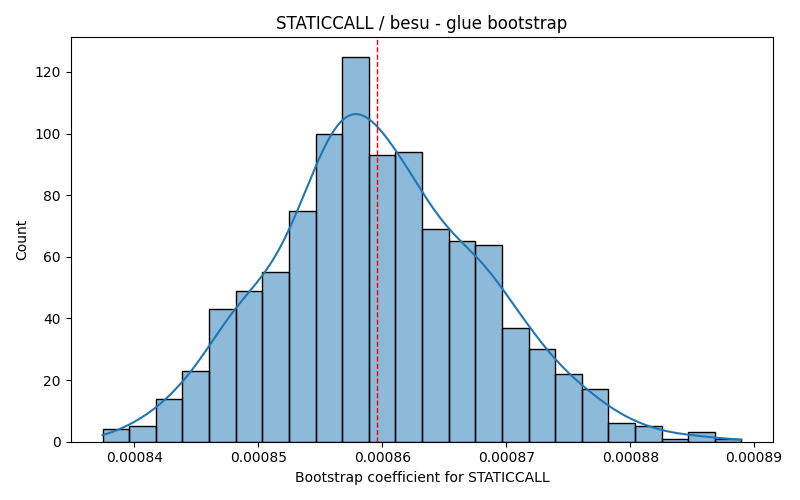

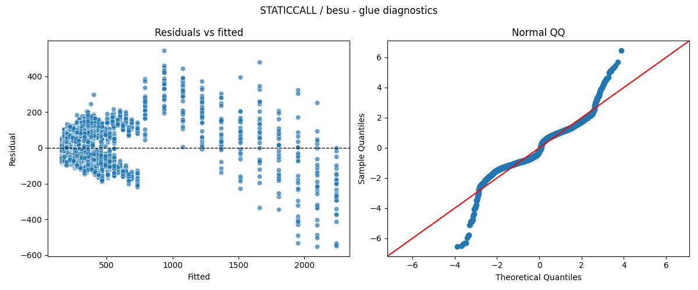

</details>

### Pure glue · besu

<details><summary><code>ISZERO</code> · nobs=308 · runtime_ms=4.608e-06 · p=1.00e-03 · R²=0.6159</summary>

```
==============================================================================
                           NNLS Regression Results                            
==============================================================================
Dep. Variable:          test_runtime_ms              R-squared:          0.616
Model:                  NNLS                    Adj. R-squared:          0.615
No. Observations:       308                               RMSE:          76.61
Df Residuals:           306                                MAE:          70.60
Df Model:               1      
==============================================================================
                      coef     std err     P-value      [0.025      0.975]
------------------------------------------------------------------------------
         const     57.7465     12.9854       0.001     33.6298     84.1857
        ISZERO      0.0000      0.0000       0.001      0.0000      0.0000
==============================================================================
Notes: Non-negative least squares with bootstrap inference (1000 iterations)
==============================================================================
```

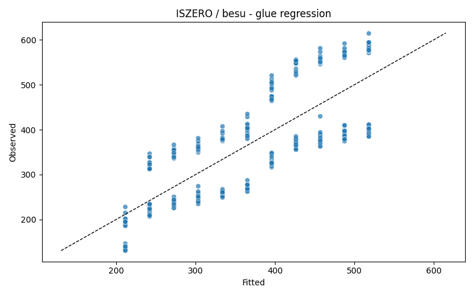

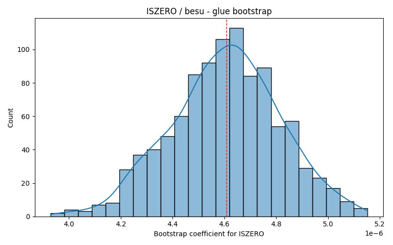

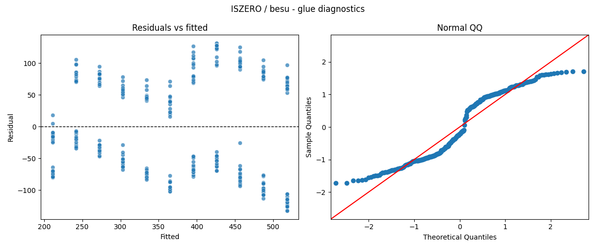

</details>

<details><summary><code>JUMPDEST</code> · nobs=308 · runtime_ms=1.843e-06 · p=1.00e-03 · R²=0.1924</summary>

```
==============================================================================
                           NNLS Regression Results                            
==============================================================================
Dep. Variable:          test_runtime_ms              R-squared:          0.192
Model:                  NNLS                    Adj. R-squared:          0.190
No. Observations:       308                               RMSE:         238.48
Df Residuals:           306                                MAE:         226.96
Df Model:               1      
==============================================================================
                      coef     std err     P-value      [0.025      0.975]
------------------------------------------------------------------------------
         const     66.6433     37.7629       0.037      0.0000    140.6400
      JUMPDEST      0.0000      0.0000       0.001      0.0000      0.0000
==============================================================================
Notes: Non-negative least squares with bootstrap inference (1000 iterations)
==============================================================================
```

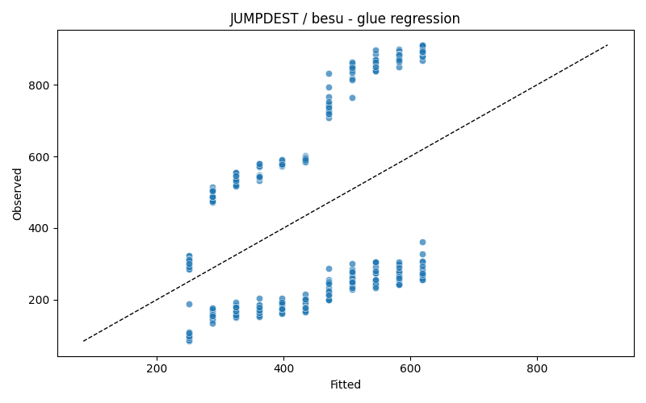

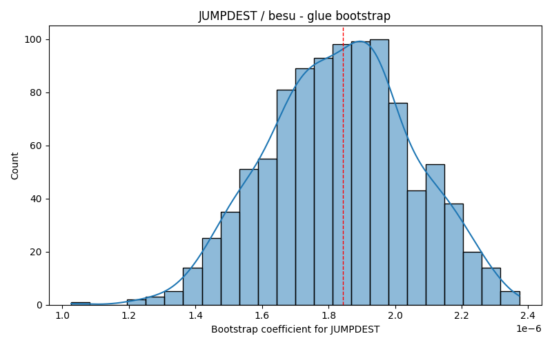

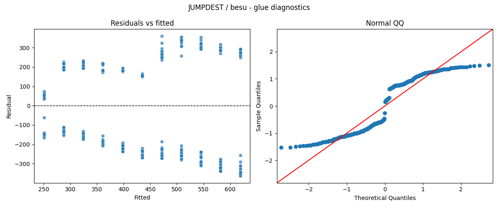

</details>

<details><summary><code>SWAP</code> · nobs=4928 · runtime_ms=4.121e-06 · p=1.00e-03 · R²=0.8924</summary>

```
==============================================================================
                           NNLS Regression Results                            
==============================================================================
Dep. Variable:          test_runtime_ms              R-squared:          0.892
Model:                  NNLS                    Adj. R-squared:          0.892
No. Observations:       4928                              RMSE:          30.12
Df Residuals:           4926                               MAE:          24.76
Df Model:               1      
==============================================================================
                      coef     std err     P-value      [0.025      0.975]
------------------------------------------------------------------------------
         const     57.3952      1.5738       0.001     54.4556     60.3474
          SWAP      0.0000      0.0000       0.001      0.0000      0.0000
==============================================================================
Notes: Non-negative least squares with bootstrap inference (1000 iterations)
==============================================================================
```

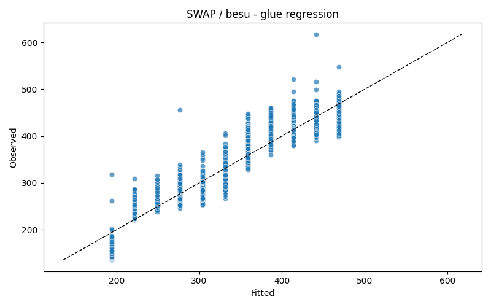

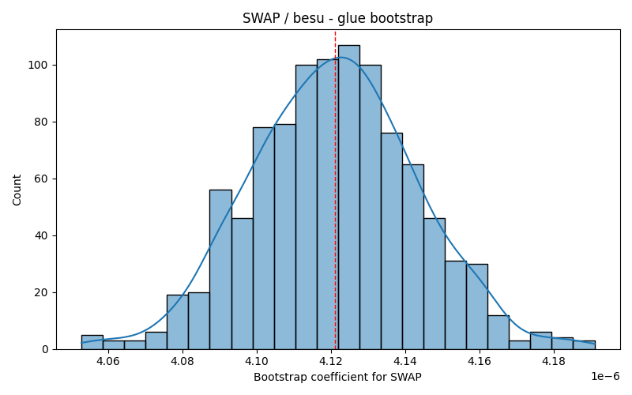

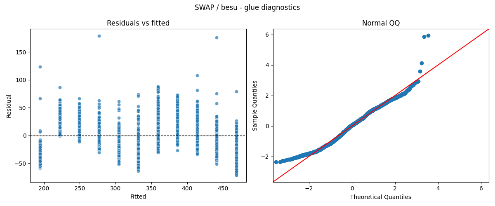

</details>

### Mixed glue (tier A) · besu

<details><summary><code>ADD</code> · nobs=308 · runtime_ms=1.12e-05 · p=1.00e-03 · R²=0.6777</summary>

```
==============================================================================
                           NNLS Regression Results                            
==============================================================================
Dep. Variable:          test_runtime_ms              R-squared:          0.678
Model:                  NNLS                    Adj. R-squared:          0.677
No. Observations:       308                               RMSE:          81.29
Df Residuals:           306                                MAE:          73.02
Df Model:               1      
==============================================================================
                      coef     std err     P-value      [0.025      0.975]
------------------------------------------------------------------------------
         const     85.7839     13.8001       0.001     59.0643    111.4172
           ADD      0.0000      0.0000       0.001      0.0000      0.0000
==============================================================================
Notes: Non-negative least squares with bootstrap inference (1000 iterations)
==============================================================================
```

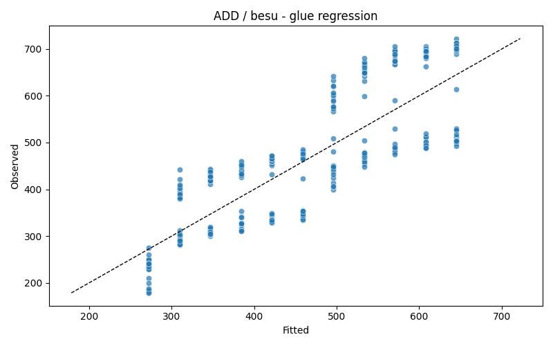

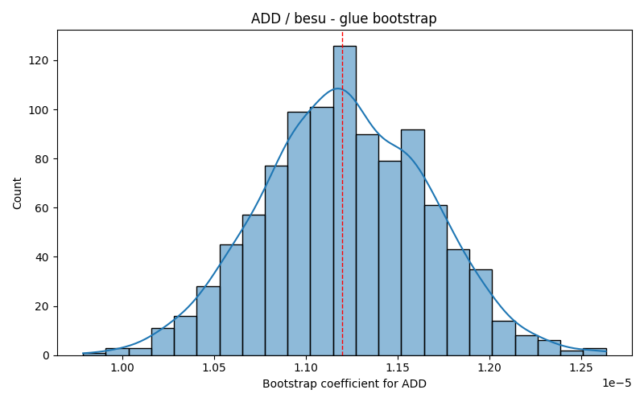

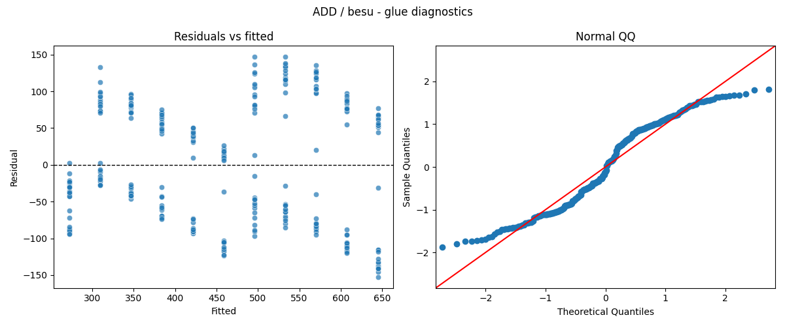

</details>

<details><summary><code>AND</code> · nobs=308 · runtime_ms=1.059e-05 · p=1.00e-03 · R²=0.3182</summary>

```
==============================================================================
                           NNLS Regression Results                            
==============================================================================
Dep. Variable:          test_runtime_ms              R-squared:          0.318
Model:                  NNLS                    Adj. R-squared:          0.316
No. Observations:       308                               RMSE:         163.20
Df Residuals:           306                                MAE:         153.96
Df Model:               1      
==============================================================================
                      coef     std err     P-value      [0.025      0.975]
------------------------------------------------------------------------------
         const     81.6199     26.8657       0.002     32.6941    134.3343
           AND      0.0000      0.0000       0.001      0.0000      0.0000
==============================================================================
Notes: Non-negative least squares with bootstrap inference (1000 iterations)
==============================================================================
```

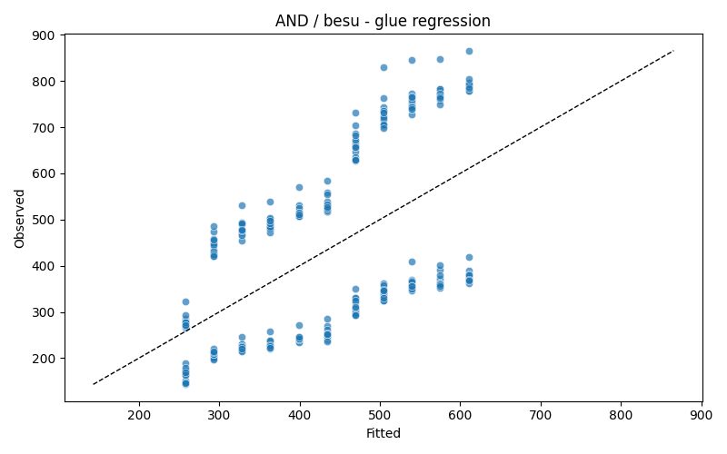

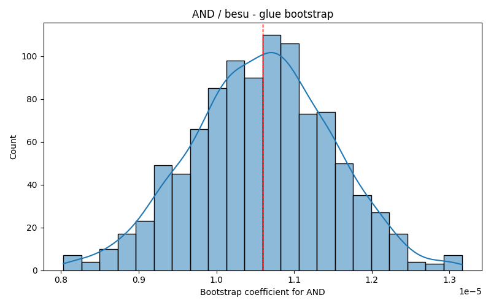

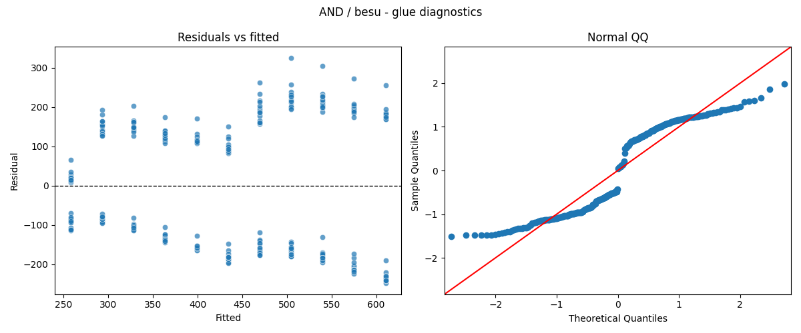

</details>

<details><summary><code>CALLDATACOPY</code> · nobs=7392 · runtime_ms=1.873e-05 · p=1.00e-03 · R²=0.6768</summary>

```
==============================================================================
                           NNLS Regression Results                            
==============================================================================
Dep. Variable:          test_runtime_ms              R-squared:          0.677
Model:                  NNLS                    Adj. R-squared:          0.677
No. Observations:       7392                              RMSE:          97.34
Df Residuals:           7390                               MAE:          66.74
Df Model:               1      
==============================================================================
                      coef     std err     P-value      [0.025      0.975]
------------------------------------------------------------------------------
         const    122.7840      1.2756       0.001    120.3995    125.4052
  CALLDATACOPY      0.0000      0.0000       0.001      0.0000      0.0000
==============================================================================
Notes: Non-negative least squares with bootstrap inference (1000 iterations)
==============================================================================
```

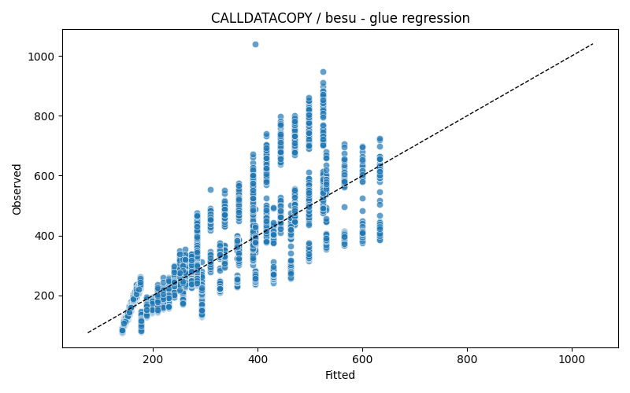

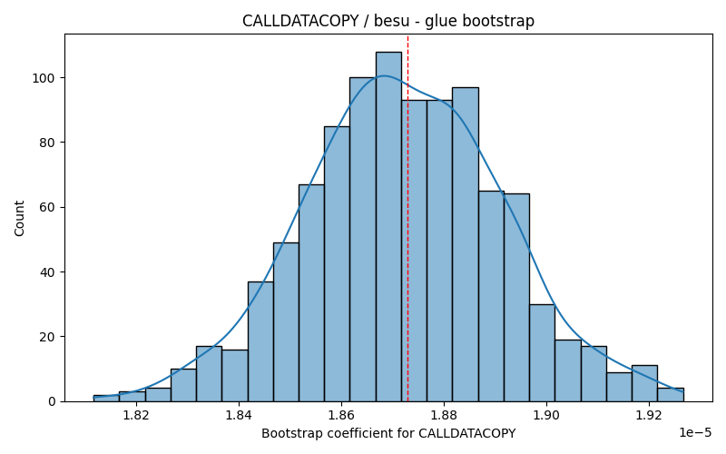

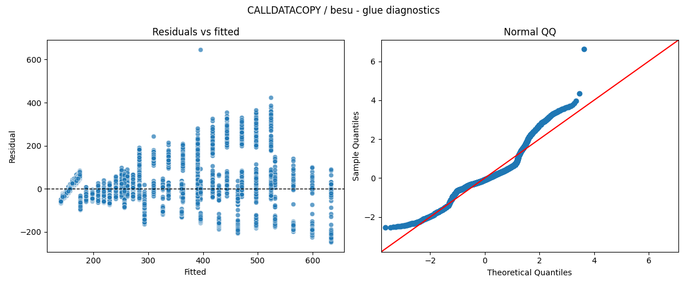

</details>

<details><summary><code>CALLDATALOAD</code> · nobs=1232 · runtime_ms=1.119e-06 · p=3.98e-01 · R²=2.594e-05</summary>

```
==============================================================================
                           NNLS Regression Results                            
==============================================================================
Dep. Variable:          test_runtime_ms              R-squared:          0.000
Model:                  NNLS                    Adj. R-squared:         -0.001
No. Observations:       1232                              RMSE:           0.84
Df Residuals:           1230                               MAE:           0.56
Df Model:               1      
==============================================================================
                      coef     std err     P-value      [0.025      0.975]
------------------------------------------------------------------------------
         const      3.9677      0.0514       0.001      3.8327      4.0262
  CALLDATALOAD      0.0000      0.0000       0.398      0.0000      0.0000
==============================================================================
Notes: Non-negative least squares with bootstrap inference (1000 iterations)
==============================================================================
```

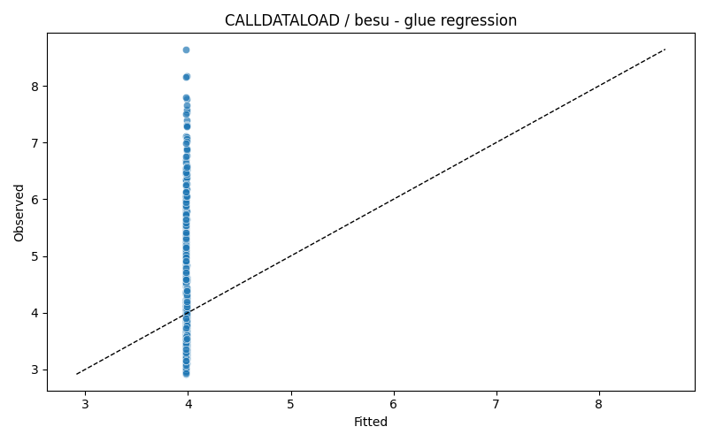

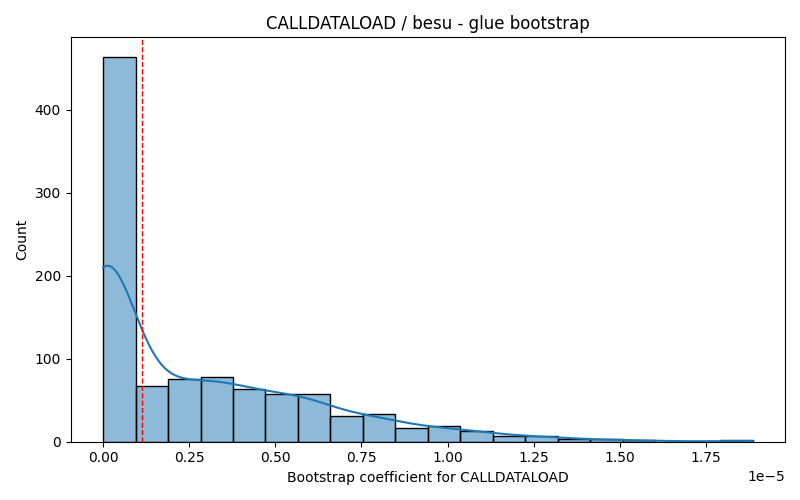

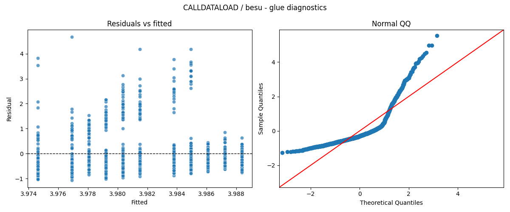

</details>

<details><summary><code>DIV</code> · nobs=308 · runtime_ms=1.711e-05 · p=1.00e-03 · R²=0.7012</summary>

```
==============================================================================
                           NNLS Regression Results                            
==============================================================================
Dep. Variable:          test_runtime_ms              R-squared:          0.701
Model:                  NNLS                    Adj. R-squared:          0.700
No. Observations:       308                               RMSE:          88.18
Df Residuals:           306                                MAE:          77.66
Df Model:               1      
==============================================================================
                      coef     std err     P-value      [0.025      0.975]
------------------------------------------------------------------------------
         const    123.6497     14.7320       0.001     95.0849    152.6647
           DIV      0.0000      0.0000       0.001      0.0000      0.0000
==============================================================================
Notes: Non-negative least squares with bootstrap inference (1000 iterations)
==============================================================================
```

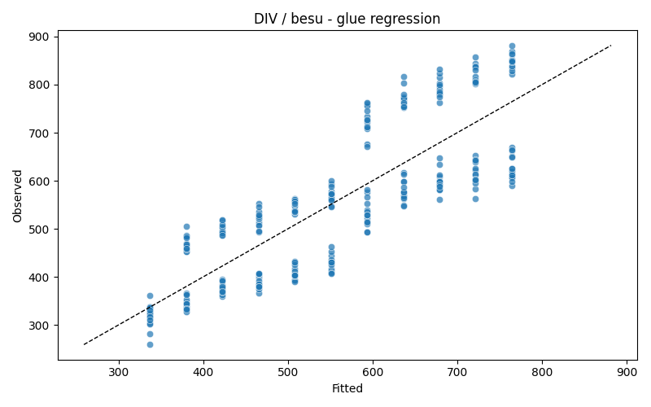

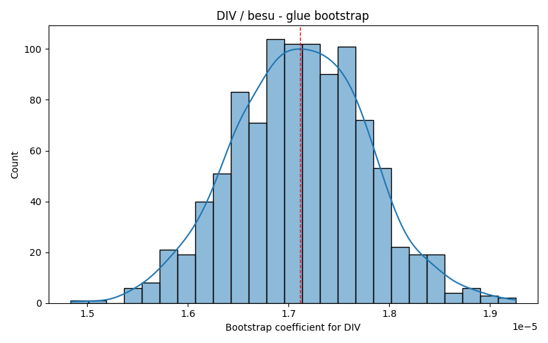

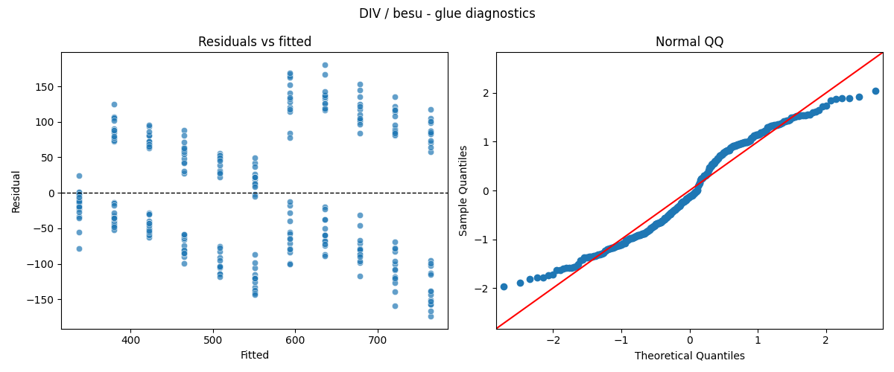

</details>

<details><summary><code>EXP</code> · nobs=308 · runtime_ms=0.001277 · p=1.00e-03 · R²=0.7562</summary>

```
==============================================================================
                           NNLS Regression Results                            
==============================================================================
Dep. Variable:          test_runtime_ms              R-squared:          0.756
Model:                  NNLS                    Adj. R-squared:          0.755
No. Observations:       308                               RMSE:          28.40
Df Residuals:           306                                MAE:          21.52
Df Model:               1      
==============================================================================
                      coef     std err     P-value      [0.025      0.975]
------------------------------------------------------------------------------
         const     92.5234      6.4034       0.001     79.6002    104.9269
           EXP      0.0013      0.0000       0.001      0.0012      0.0014
==============================================================================
Notes: Non-negative least squares with bootstrap inference (1000 iterations)
==============================================================================
```

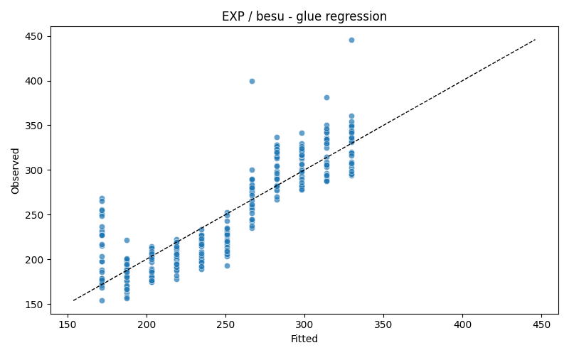

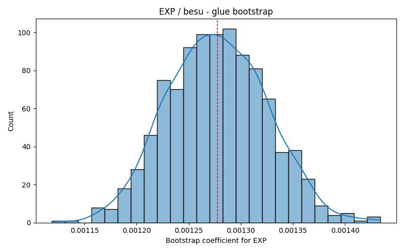

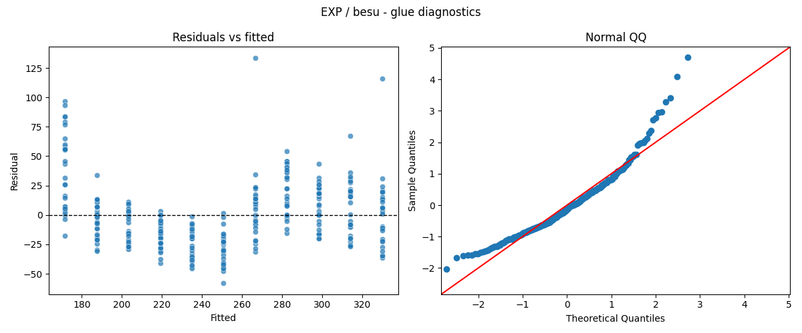

</details>

<details><summary><code>GT</code> · nobs=308 · runtime_ms=2.145e-05 · p=1.00e-03 · R²=0.1457</summary>

```
==============================================================================
                           NNLS Regression Results                            
==============================================================================
Dep. Variable:          test_runtime_ms              R-squared:          0.146
Model:                  NNLS                    Adj. R-squared:          0.143
No. Observations:       308                               RMSE:         546.49
Df Residuals:           306                                MAE:         522.03
Df Model:               1      
==============================================================================
                      coef     std err     P-value      [0.025      0.975]
------------------------------------------------------------------------------
         const    105.7906     81.4905       0.139      0.0000    271.0180
            GT      0.0000      0.0000       0.001      0.0000      0.0000
==============================================================================
Notes: Non-negative least squares with bootstrap inference (1000 iterations)
==============================================================================
```

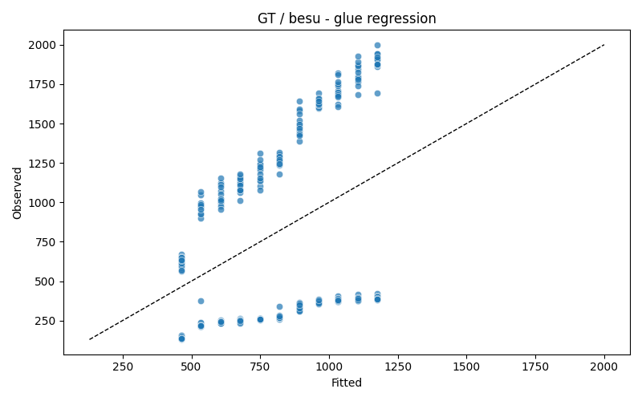

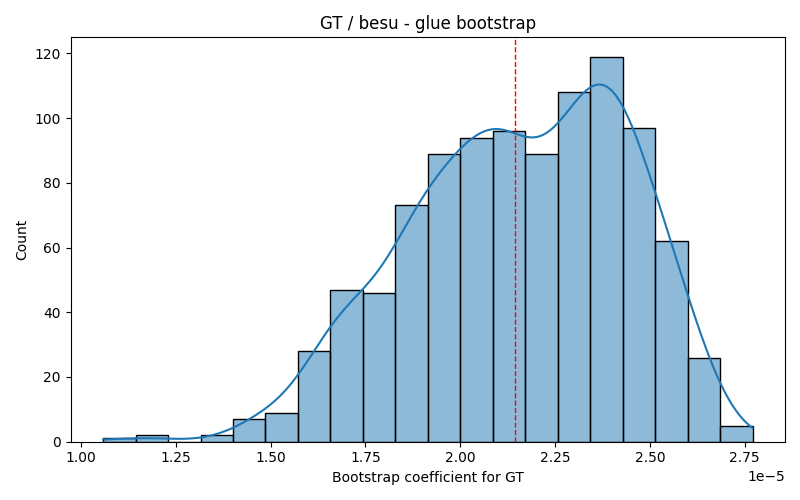

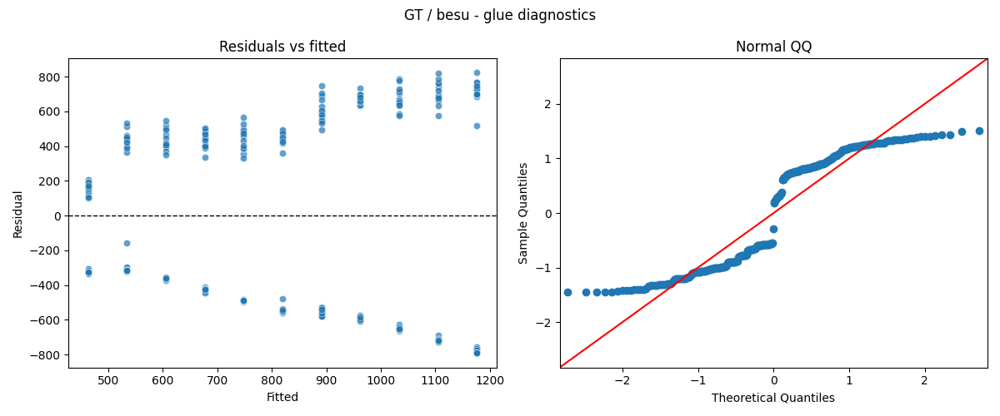

</details>

<details><summary><code>JUMPI</code> · nobs=308 · runtime_ms=7.68e-06 · p=1.00e-03 · R²=0.3364</summary>

```
==============================================================================
                           NNLS Regression Results                            
==============================================================================
Dep. Variable:          test_runtime_ms              R-squared:          0.336
Model:                  NNLS                    Adj. R-squared:          0.334
No. Observations:       308                               RMSE:          48.67
Df Residuals:           306                                MAE:          45.92
Df Model:               1      
==============================================================================
                      coef     std err     P-value      [0.025      0.975]
------------------------------------------------------------------------------
         const     26.3821      8.0451       0.001     11.4097     42.1062
         JUMPI      0.0000      0.0000       0.001      0.0000      0.0000
==============================================================================
Notes: Non-negative least squares with bootstrap inference (1000 iterations)
==============================================================================
```

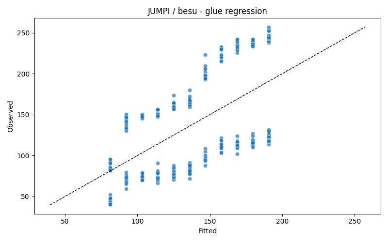

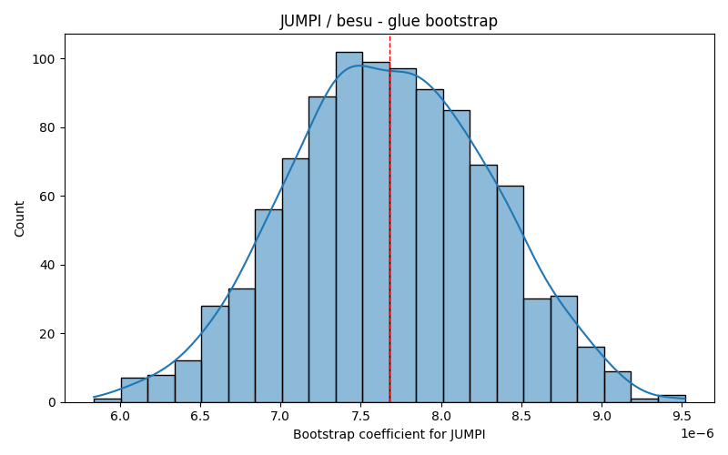

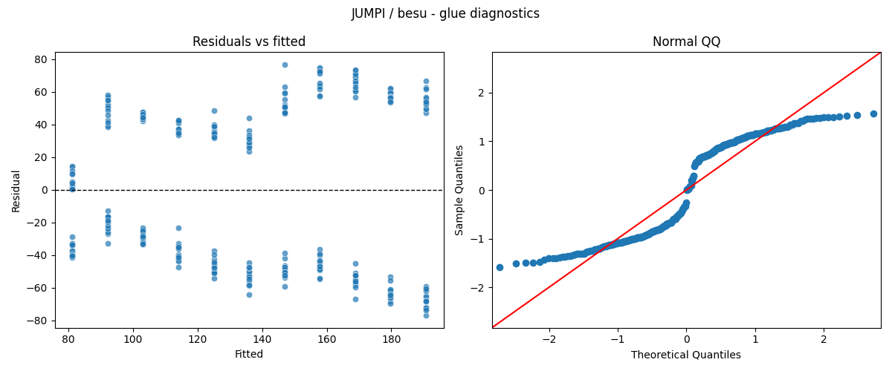

</details>

<details><summary><code>LT</code> · nobs=308 · runtime_ms=2.175e-05 · p=1.00e-03 · R²=0.1445</summary>

```
==============================================================================
                           NNLS Regression Results                            
==============================================================================
Dep. Variable:          test_runtime_ms              R-squared:          0.144
Model:                  NNLS                    Adj. R-squared:          0.142
No. Observations:       308                               RMSE:         557.18
Df Residuals:           306                                MAE:         532.24
Df Model:               1      
==============================================================================
                      coef     std err     P-value      [0.025      0.975]
------------------------------------------------------------------------------
         const    155.5060     88.3889       0.050      0.0000    332.0839
            LT      0.0000      0.0000       0.001      0.0000      0.0000
==============================================================================
Notes: Non-negative least squares with bootstrap inference (1000 iterations)
==============================================================================
```

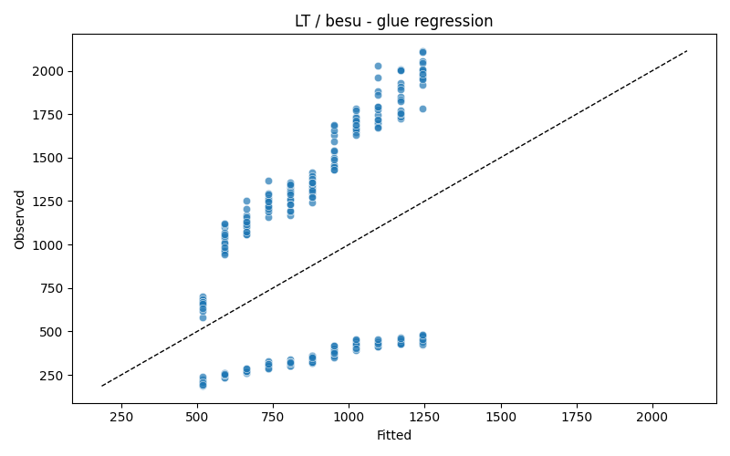

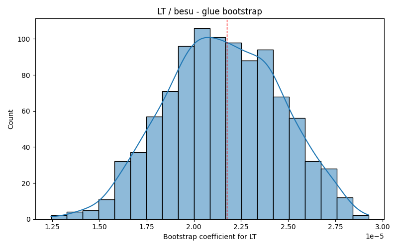

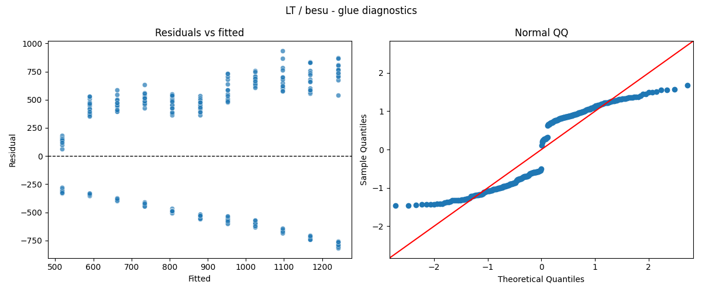

</details>

<details><summary><code>MSTORE</code> · nobs=1540 · runtime_ms=1.913e-05 · p=1.00e-03 · R²=0.825</summary>

```
==============================================================================
                           NNLS Regression Results                            
==============================================================================
Dep. Variable:          test_runtime_ms              R-squared:          0.825
Model:                  NNLS                    Adj. R-squared:          0.825
No. Observations:       1540                              RMSE:          61.82
Df Residuals:           1538                               MAE:          52.24
Df Model:               1      
==============================================================================
                      coef     std err     P-value      [0.025      0.975]
------------------------------------------------------------------------------
         const     88.4750      5.3466       0.001     78.2371     98.5914
        MSTORE      0.0000      0.0000       0.001      0.0000      0.0000
==============================================================================
Notes: Non-negative least squares with bootstrap inference (1000 iterations)
==============================================================================
```

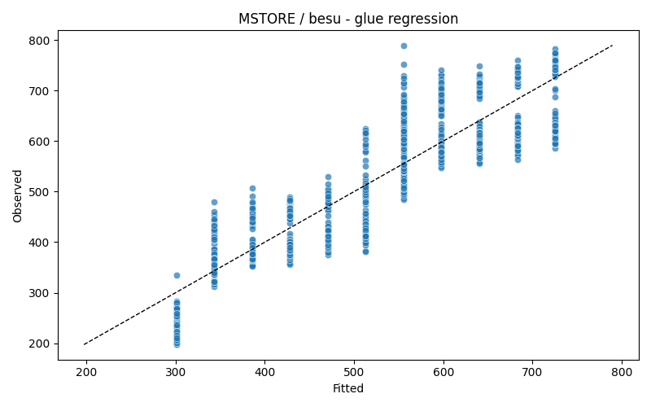

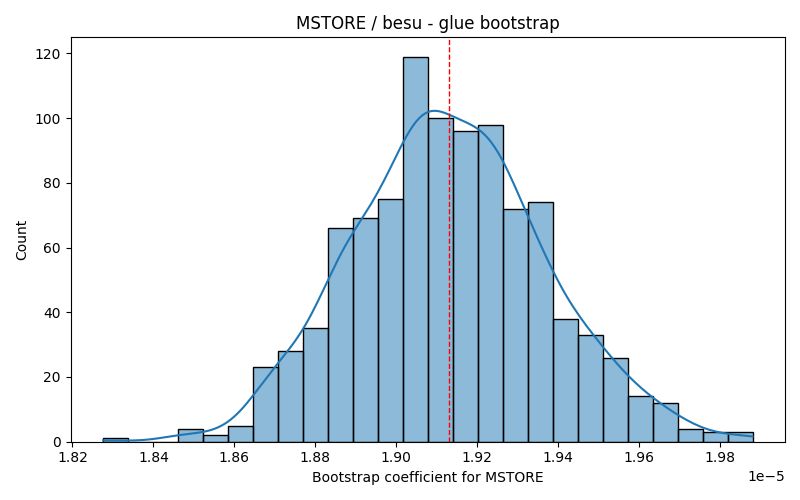

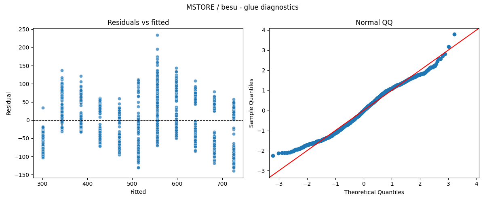

</details>

<details><summary><code>MSTORE8</code> · nobs=1540 · runtime_ms=1.27e-05 · p=1.00e-03 · R²=0.5642</summary>

```
==============================================================================
                           NNLS Regression Results                            
==============================================================================
Dep. Variable:          test_runtime_ms              R-squared:          0.564
Model:                  NNLS                    Adj. R-squared:          0.564
No. Observations:       1540                              RMSE:          78.34
Df Residuals:           1538                               MAE:          72.20
Df Model:               1      
==============================================================================
                      coef     std err     P-value      [0.025      0.975]
------------------------------------------------------------------------------
         const     56.4466      5.9176       0.001     44.6439     68.1786
       MSTORE8      0.0000      0.0000       0.001      0.0000      0.0000
==============================================================================
Notes: Non-negative least squares with bootstrap inference (1000 iterations)
==============================================================================
```

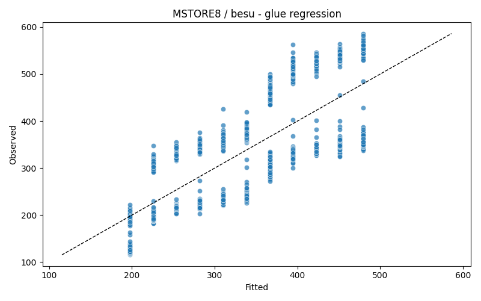

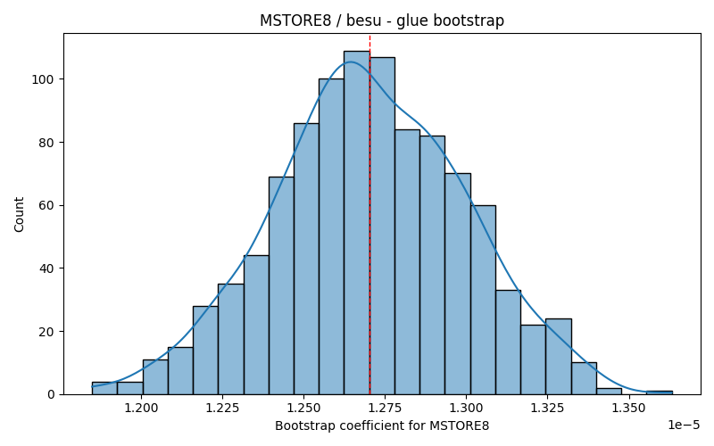

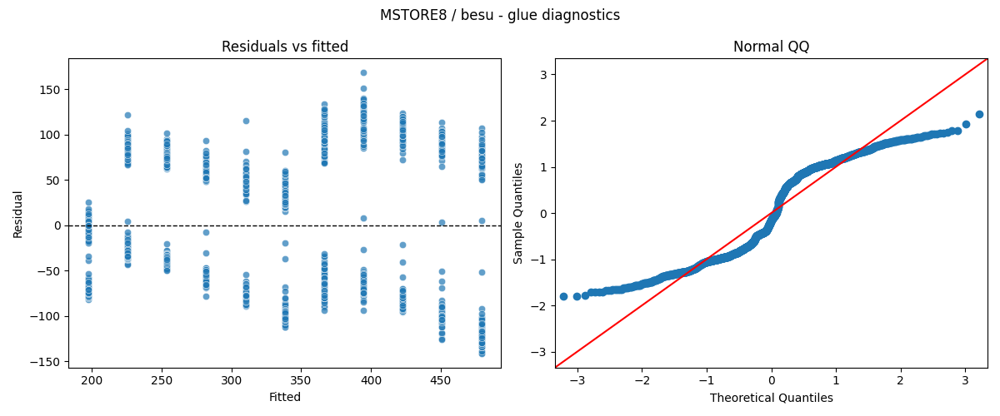

</details>

<details><summary><code>MUL</code> · nobs=308 · runtime_ms=1.24e-05 · p=1.00e-03 · R²=0.7345</summary>

```
==============================================================================
                           NNLS Regression Results                            
==============================================================================
Dep. Variable:          test_runtime_ms              R-squared:          0.734
Model:                  NNLS                    Adj. R-squared:          0.734
No. Observations:       308                               RMSE:          58.85
Df Residuals:           306                                MAE:          42.23
Df Model:               1      
==============================================================================
                      coef     std err     P-value      [0.025      0.975]
------------------------------------------------------------------------------
         const     96.6434      9.0431       0.001     77.6352    112.4360
           MUL      0.0000      0.0000       0.001      0.0000      0.0000
==============================================================================
Notes: Non-negative least squares with bootstrap inference (1000 iterations)
==============================================================================
```

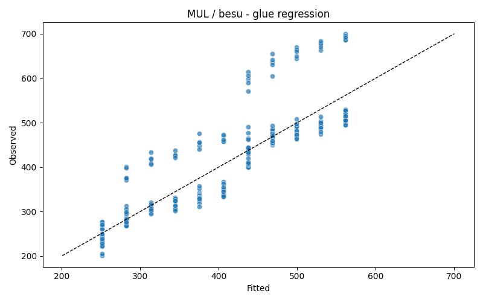

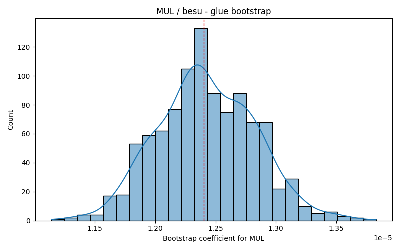

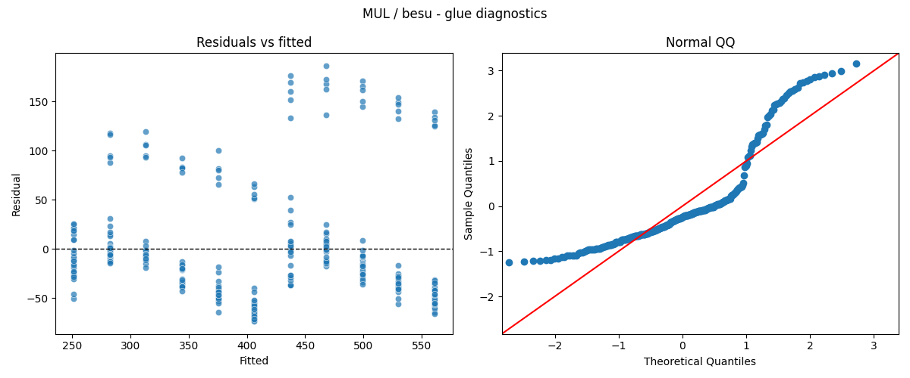

</details>

<details><summary><code>PC</code> · nobs=308 · runtime_ms=4.009e-06 · p=1.00e-03 · R²=0.5261</summary>

```
==============================================================================
                           NNLS Regression Results                            
==============================================================================
Dep. Variable:          test_runtime_ms              R-squared:          0.526
Model:                  NNLS                    Adj. R-squared:          0.525
No. Observations:       308                               RMSE:         113.76
Df Residuals:           306                                MAE:         105.09
Df Model:               1      
==============================================================================
                      coef     std err     P-value      [0.025      0.975]
------------------------------------------------------------------------------
         const     86.0724     19.1503       0.001     48.1773    123.6013
            PC      0.0000      0.0000       0.001      0.0000      0.0000
==============================================================================
Notes: Non-negative least squares with bootstrap inference (1000 iterations)
==============================================================================
```

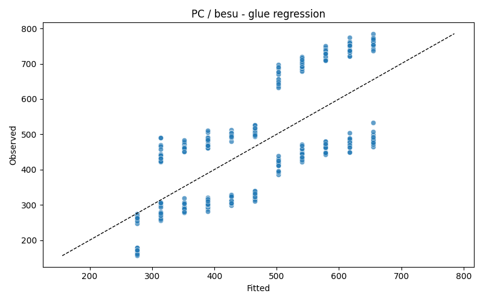

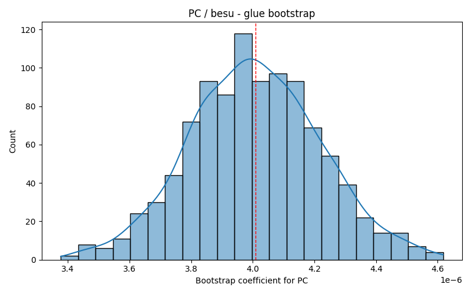

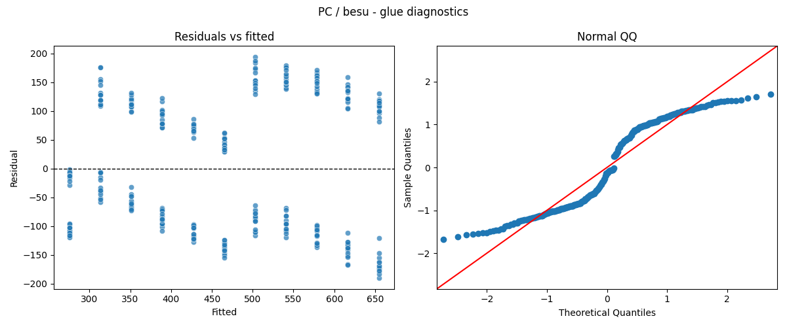

</details>

<details><summary><code>RETURNDATASIZE</code> · nobs=1232 · runtime_ms=6.379e-06 · p=1.00e-03 · R²=0.4376</summary>

```
==============================================================================
                           NNLS Regression Results                            
==============================================================================
Dep. Variable:          test_runtime_ms              R-squared:          0.438
Model:                  NNLS                    Adj. R-squared:          0.437
No. Observations:       1232                              RMSE:         114.18
Df Residuals:           1230                               MAE:         105.70
Df Model:               1      
==============================================================================
                      coef     std err     P-value      [0.025      0.975]
------------------------------------------------------------------------------
         const     66.3566      9.4832       0.001     48.4115     84.3014
RETURNDATASIZE      0.0000      0.0000       0.001      0.0000      0.0000
==============================================================================
Notes: Non-negative least squares with bootstrap inference (1000 iterations)
==============================================================================
```

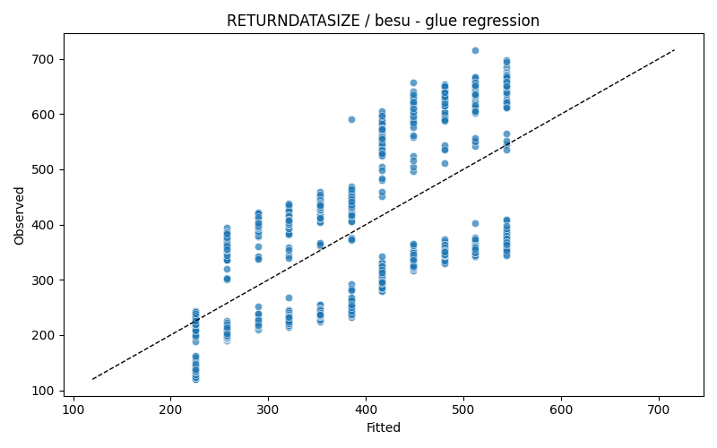

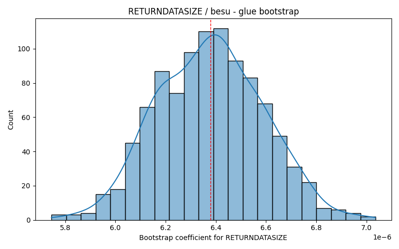

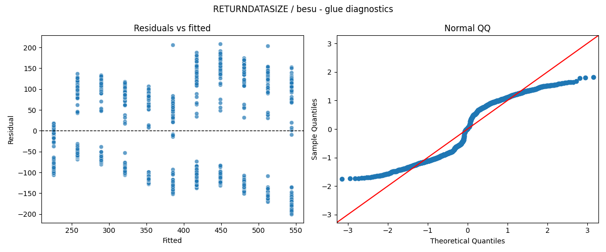

</details>

<details><summary><code>SELFBALANCE</code> · nobs=252 · runtime_ms=8.714e-06 · p=1.00e-03 · R²=0.4823</summary>

```
==============================================================================
                           NNLS Regression Results                            
==============================================================================
Dep. Variable:          test_runtime_ms              R-squared:          0.482
Model:                  NNLS                    Adj. R-squared:          0.480
No. Observations:       252                               RMSE:          91.07
Df Residuals:           250                                MAE:          77.70
Df Model:               1      
==============================================================================
                      coef     std err     P-value      [0.025      0.975]
------------------------------------------------------------------------------
         const    383.3419     23.1794       0.001    337.4288    428.8657
   SELFBALANCE      0.0000      0.0000       0.001      0.0000      0.0000
==============================================================================
Notes: Non-negative least squares with bootstrap inference (1000 iterations)
==============================================================================
```

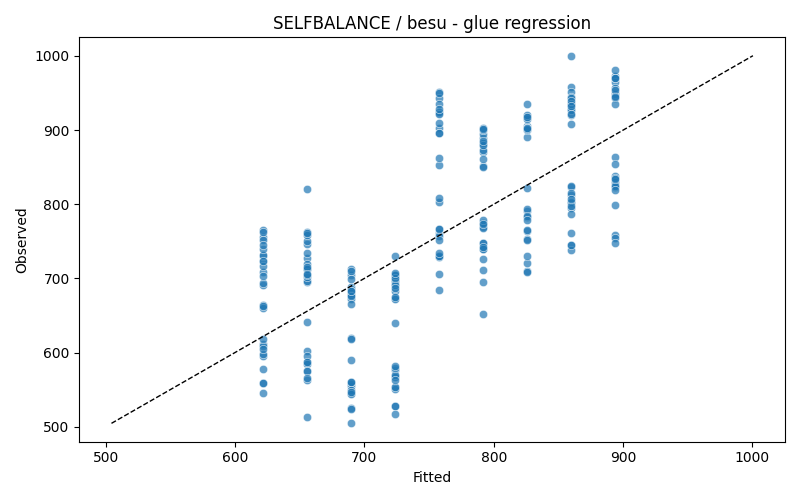

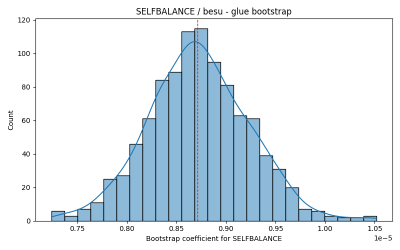

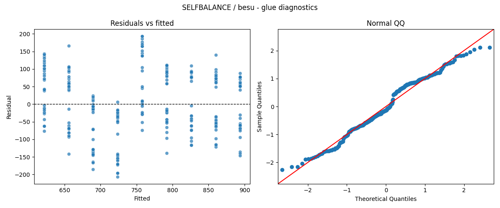

</details>

<details><summary><code>SUB</code> · nobs=308 · runtime_ms=1.182e-05 · p=1.00e-03 · R²=0.6437</summary>

```
==============================================================================
                           NNLS Regression Results                            
==============================================================================
Dep. Variable:          test_runtime_ms              R-squared:          0.644
Model:                  NNLS                    Adj. R-squared:          0.643
No. Observations:       308                               RMSE:          92.57
Df Residuals:           306                                MAE:          84.54
Df Model:               1      
==============================================================================
                      coef     std err     P-value      [0.025      0.975]
------------------------------------------------------------------------------
         const     86.5577     15.5882       0.001     55.6306    116.3721
           SUB      0.0000      0.0000       0.001      0.0000      0.0000
==============================================================================
Notes: Non-negative least squares with bootstrap inference (1000 iterations)
==============================================================================
```

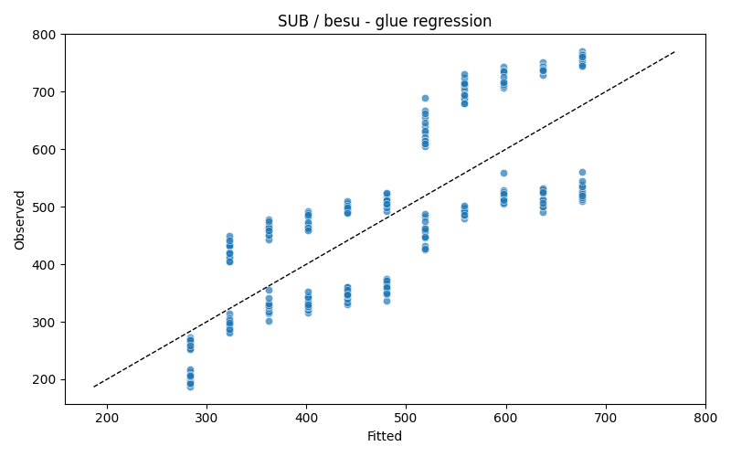

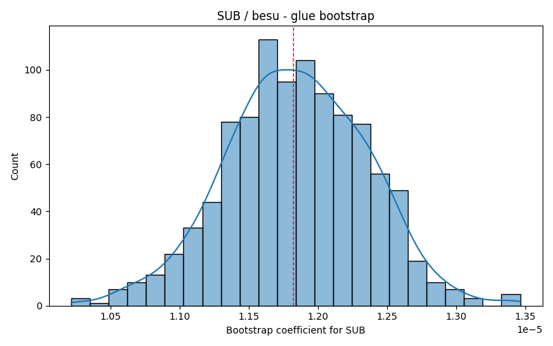

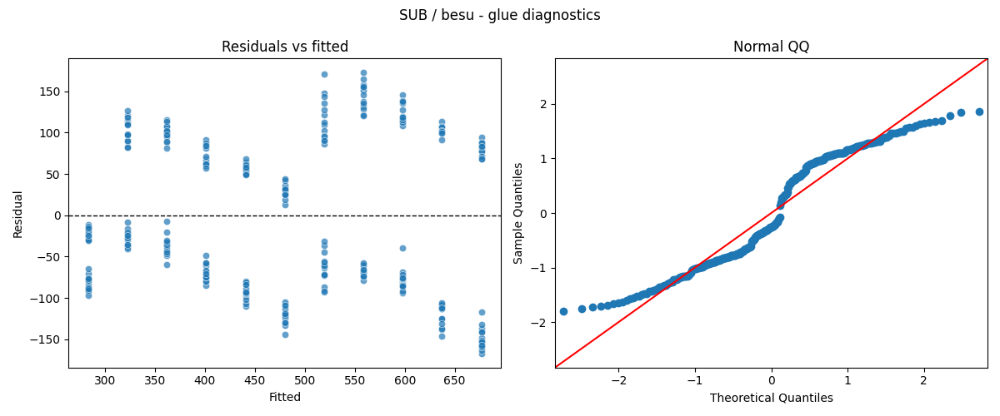

</details>

### Mixed glue (tier B) · besu

<details><summary><code>JUMP</code> · nobs=308 · runtime_ms=3.858e-05 · p=1.00e-03 · R²=0.632</summary>

```
==============================================================================
                           NNLS Regression Results                            
==============================================================================
Dep. Variable:          test_runtime_ms              R-squared:          0.632
Model:                  NNLS                    Adj. R-squared:          0.631
No. Observations:       308                               RMSE:         109.40
Df Residuals:           306                                MAE:          98.23
Df Model:               1      
==============================================================================
                      coef     std err     P-value      [0.025      0.975]
------------------------------------------------------------------------------
         const     96.1492     18.8380       0.001     60.3411    133.4092
          JUMP      0.0000      0.0000       0.001      0.0000      0.0000
==============================================================================
Notes: Non-negative least squares with bootstrap inference (1000 iterations)
==============================================================================
```

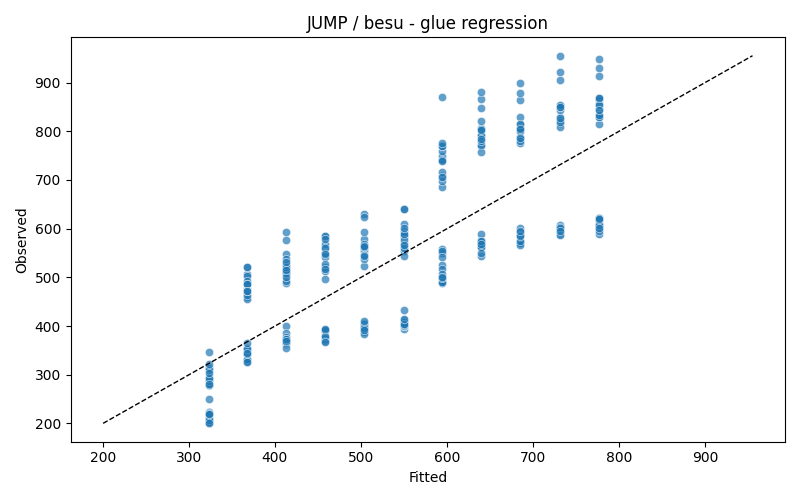

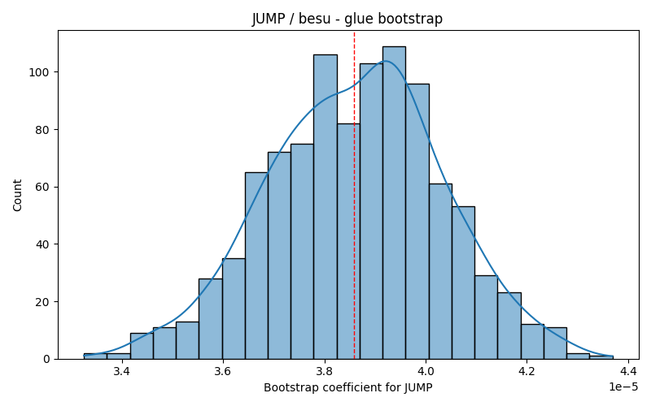

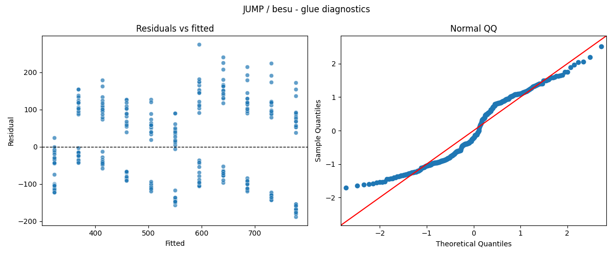

</details>

<details><summary><code>KECCAK256</code> · nobs=4928 · runtime_ms=4.498e-05 · p=1.00e-03 · R²=0.1942</summary>

```
==============================================================================
                           NNLS Regression Results                            
==============================================================================
Dep. Variable:          test_runtime_ms              R-squared:          0.194
Model:                  NNLS                    Adj. R-squared:          0.194
No. Observations:       4928                              RMSE:         182.10
Df Residuals:           4926                               MAE:         146.44
Df Model:               1      
==============================================================================
                      coef     std err     P-value      [0.025      0.975]
------------------------------------------------------------------------------
         const    558.4751      5.6085       0.001    547.7965    569.6609
     KECCAK256      0.0000      0.0000       0.001      0.0000      0.0000
==============================================================================
Notes: Non-negative least squares with bootstrap inference (1000 iterations)
==============================================================================
```

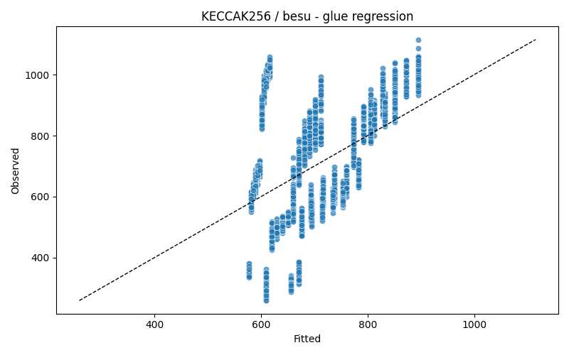

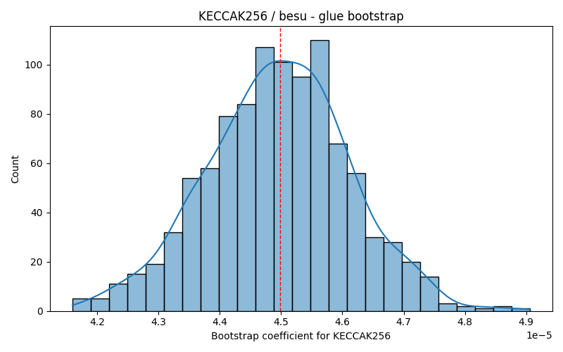

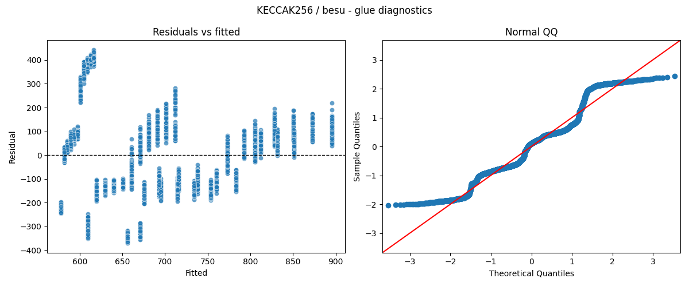

</details>

## erigon

| glue_opcode | nobs | glue_runtime_ms | p_value | rsquared |
| --- | --- | --- | --- | --- |
| `ISZERO` | 165 | 1.043e-06 | 1.00e-03 | 0.6238 |
| `JUMPDEST` | 165 | 7.989e-07 | 1.00e-03 | 0.8103 |
| `SWAP` | 2640 | 1.232e-06 | 1.00e-03 | 0.7636 |
| `CALLDATASIZE` | 9900 | 8.028e-07 | 1.00e-03 | 0.9447 |
| `DUP` | 9900 | 1.023e-06 | 1.00e-03 | 0.9447 |
| `GAS` | 9900 | 8.133e-07 | 1.00e-03 | 0.9447 |
| `MLOAD` | 9900 | 3.333e-06 | 1.00e-03 | 0.9447 |
| `PUSH` | 9900 | 2.609e-06 | 1.00e-03 | 0.9447 |
| `PUSH0` | 9900 | 9.338e-07 | 1.00e-03 | 0.9447 |
| `STATICCALL` | 9900 | 0.0005553 | 1.00e-03 | 0.9447 |
| `ADD` | 165 | 2.811e-06 | 1.00e-03 | 0.9289 |
| `AND` | 165 | 2.744e-06 | 1.00e-03 | 0.9424 |
| `CALLDATACOPY` | 3960 | 7.013e-06 | 1.00e-03 | 0.8587 |
| `CALLDATALOAD` | 660 | 0 | 1.00e+00 | 0 |
| `DIV` | 165 | 9.235e-06 | 1.00e-03 | 0.7319 |
| `EXP` | 165 | 0.0003334 | 1.00e-03 | 0.9182 |
| `GT` | 165 | 2.93e-06 | 1.00e-03 | 0.9411 |
| `JUMPI` | 165 | 3.522e-06 | 1.00e-03 | 0.2585 |
| `LT` | 165 | 2.754e-06 | 1.00e-03 | 0.7354 |
| `MSTORE` | 825 | 5.609e-06 | 1.00e-03 | 0.7732 |
| `MSTORE8` | 825 | 4.878e-06 | 1.00e-03 | 0.5136 |
| `MUL` | 165 | 3.741e-06 | 1.00e-03 | 0.6486 |
| `PC` | 165 | 1.483e-06 | 1.00e-03 | 0.5652 |
| `RETURNDATASIZE` | 660 | 1.774e-06 | 1.00e-03 | 0.8401 |
| `SELFBALANCE` | 135 | 1.342e-06 | 1.00e-03 | 0.8836 |
| `SUB` | 165 | 2.743e-06 | 1.00e-03 | 0.9291 |
| `JUMP` | 165 | 7.17e-06 | 1.00e-03 | 0.9368 |
| `KECCAK256` | 2640 | 2.018e-05 | 1.00e-03 | 0.08941 |

### Cycle glue — joint fit · erigon

<details><summary>Joint NNLS regression summary</summary>

```
==============================================================================
                           NNLS Regression Results                            
==============================================================================
Dep. Variable:          test_runtime_ms              R-squared:          0.945
Model:                  NNLS                    Adj. R-squared:          0.945
No. Observations:       9900                              RMSE:          30.90
Df Residuals:           9892                               MAE:          15.37
Df Model:               7      
==============================================================================
                      coef     std err     P-value      [0.025      0.975]
------------------------------------------------------------------------------
         const     26.3083      0.9592       0.001     24.3963     28.1604
  CALLDATASIZE      0.0000      0.0000       0.001      0.0000      0.0000
           DUP      0.0000      0.0000       0.001      0.0000      0.0000
           GAS      0.0000      0.0000       0.001      0.0000      0.0000
         MLOAD      0.0000      0.0000       0.001      0.0000      0.0000
          PUSH      0.0000      0.0000       0.001      0.0000      0.0000
         PUSH0      0.0000      0.0000       0.001      0.0000      0.0000
    STATICCALL      0.0006      0.0000       0.001      0.0006      0.0006
==============================================================================
Notes: Non-negative least squares with bootstrap inference (1000 iterations)
==============================================================================
```

</details>

<details><summary><code>CALLDATASIZE</code> · nobs=9900 · runtime_ms=8.028e-07 · p=1.00e-03 · R²=0.9447</summary>


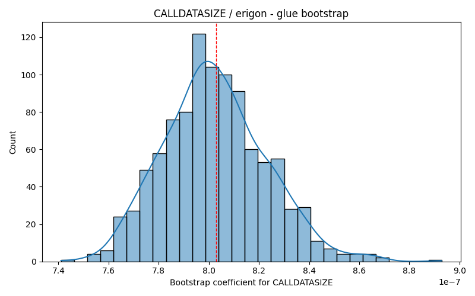

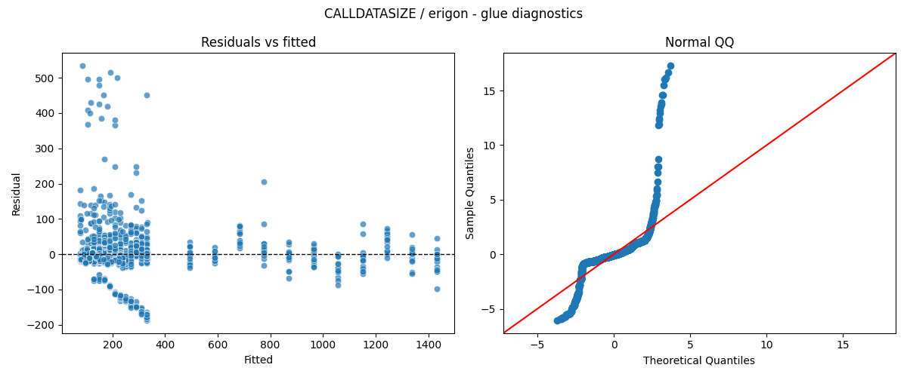

</details>

<details><summary><code>DUP</code> · nobs=9900 · runtime_ms=1.023e-06 · p=1.00e-03 · R²=0.9447</summary>


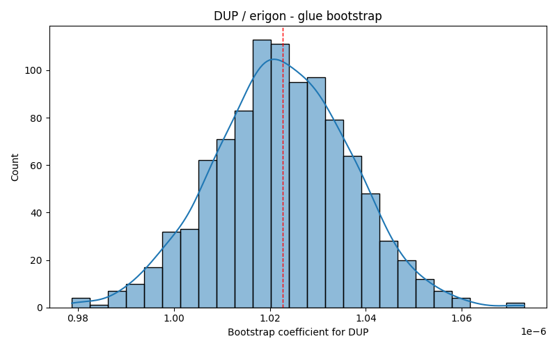


</details>

<details><summary><code>GAS</code> · nobs=9900 · runtime_ms=8.133e-07 · p=1.00e-03 · R²=0.9447</summary>


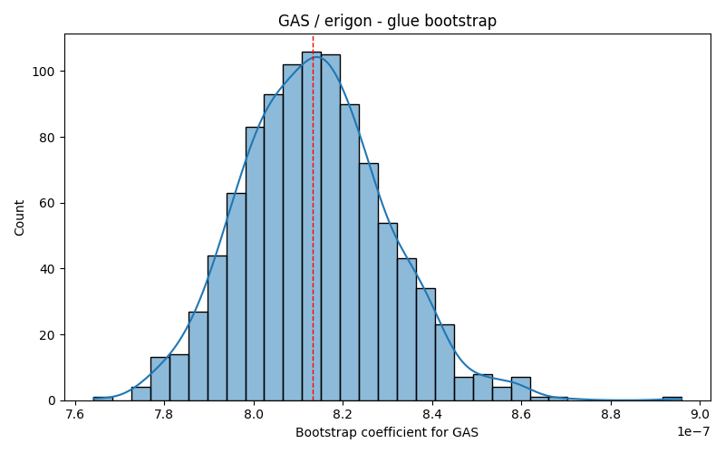

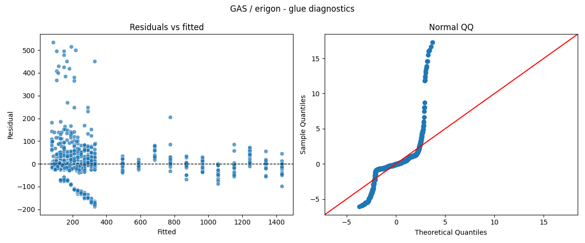

</details>

<details><summary><code>MLOAD</code> · nobs=9900 · runtime_ms=3.333e-06 · p=1.00e-03 · R²=0.9447</summary>

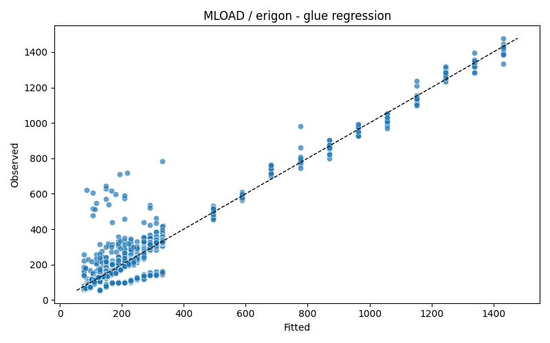

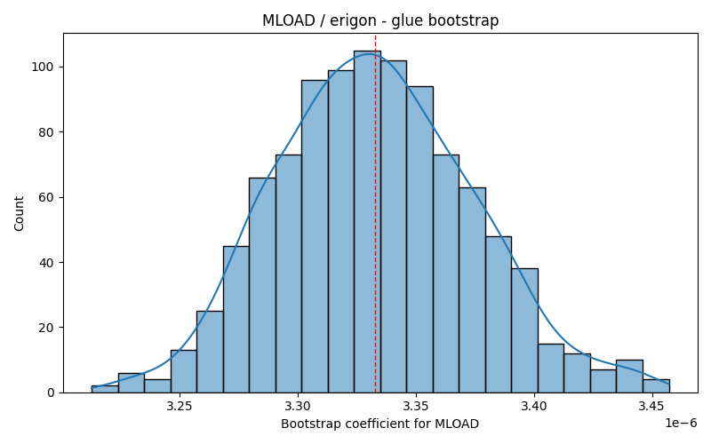

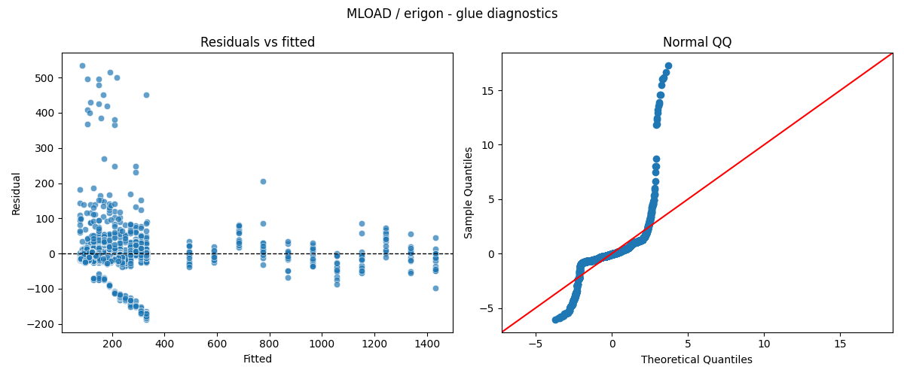

</details>

<details><summary><code>PUSH</code> · nobs=9900 · runtime_ms=2.609e-06 · p=1.00e-03 · R²=0.9447</summary>

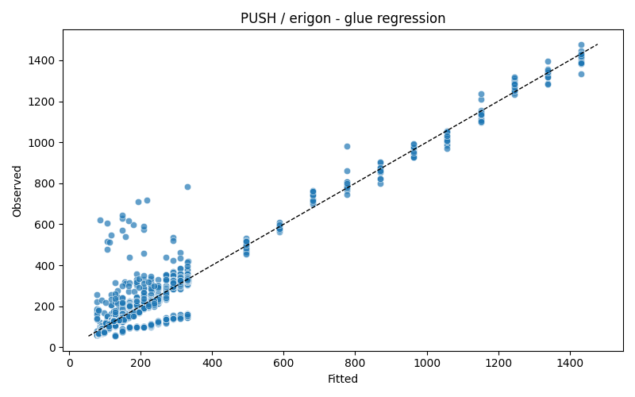

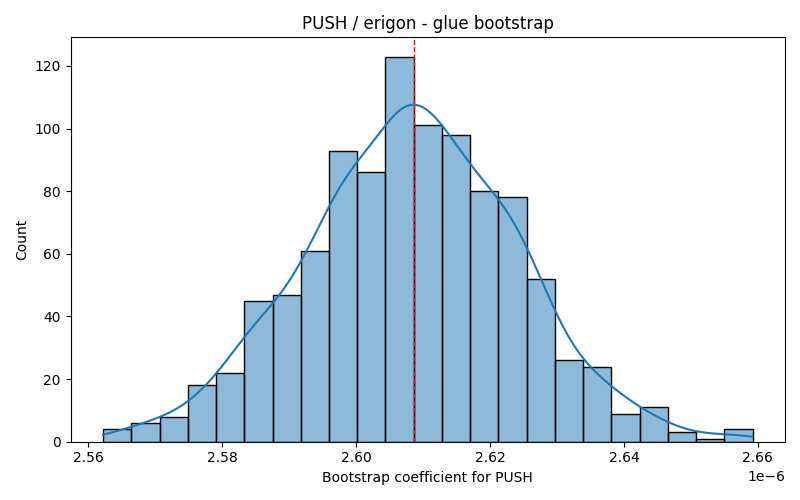


</details>

<details><summary><code>PUSH0</code> · nobs=9900 · runtime_ms=9.338e-07 · p=1.00e-03 · R²=0.9447</summary>


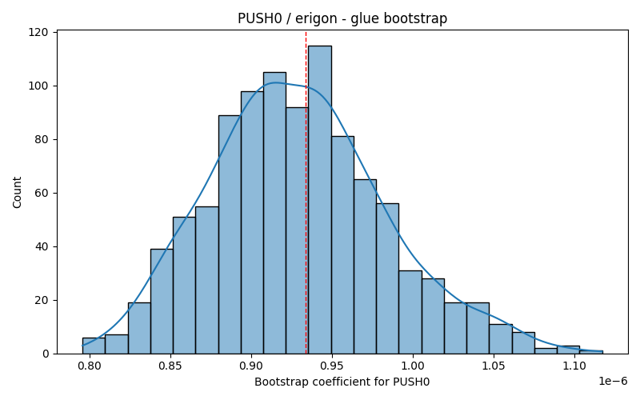


</details>

<details><summary><code>STATICCALL</code> · nobs=9900 · runtime_ms=0.0005553 · p=1.00e-03 · R²=0.9447</summary>

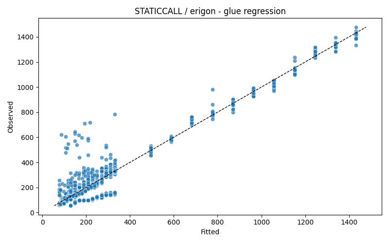

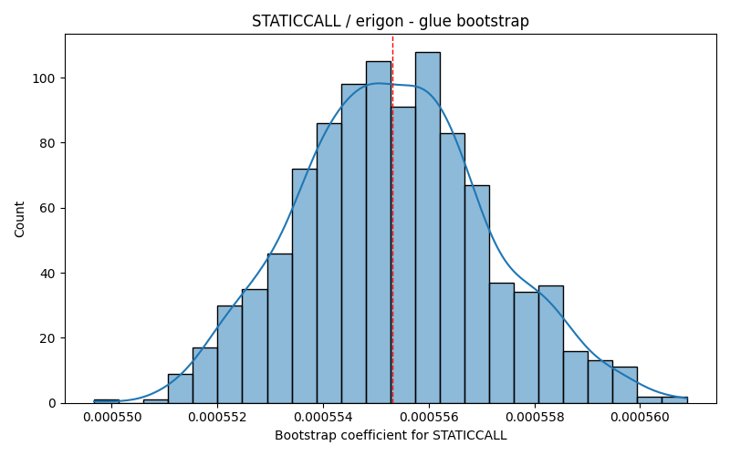


</details>

### Pure glue · erigon

<details><summary><code>ISZERO</code> · nobs=165 · runtime_ms=1.043e-06 · p=1.00e-03 · R²=0.6238</summary>

```
==============================================================================
                           NNLS Regression Results                            
==============================================================================
Dep. Variable:          test_runtime_ms              R-squared:          0.624
Model:                  NNLS                    Adj. R-squared:          0.622
No. Observations:       165                               RMSE:          17.05
Df Residuals:           163                                MAE:           6.37
Df Model:               1      
==============================================================================
                      coef     std err     P-value      [0.025      0.975]
------------------------------------------------------------------------------
         const     14.7285      2.3619       0.001     10.1758     19.6680
        ISZERO      0.0000      0.0000       0.001      0.0000      0.0000
==============================================================================
Notes: Non-negative least squares with bootstrap inference (1000 iterations)
==============================================================================
```

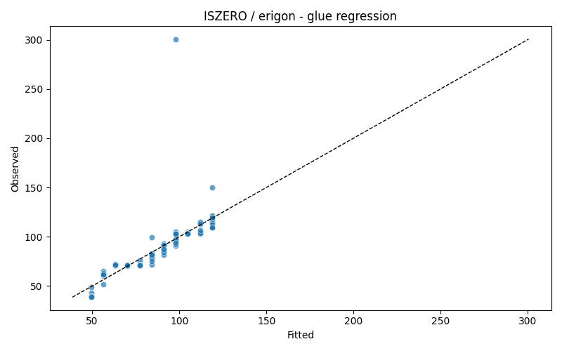

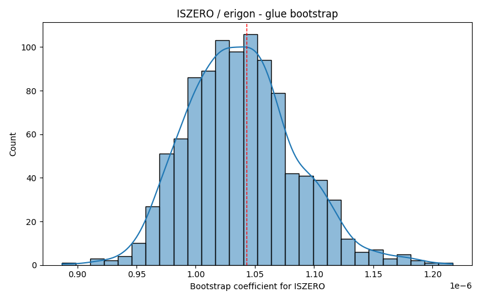

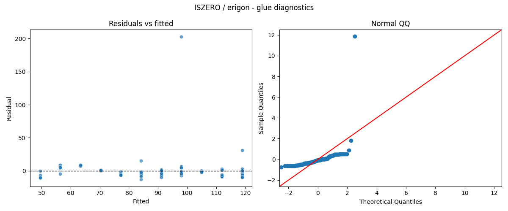

</details>

<details><summary><code>JUMPDEST</code> · nobs=165 · runtime_ms=7.989e-07 · p=1.00e-03 · R²=0.8103</summary>

```
==============================================================================
                           NNLS Regression Results                            
==============================================================================
Dep. Variable:          test_runtime_ms              R-squared:          0.810
Model:                  NNLS                    Adj. R-squared:          0.809
No. Observations:       165                               RMSE:          24.41
Df Residuals:           163                                MAE:          12.63
Df Model:               1      
==============================================================================
                      coef     std err     P-value      [0.025      0.975]
------------------------------------------------------------------------------
         const     13.5656      5.5481       0.010      2.0017     24.3451
      JUMPDEST      0.0000      0.0000       0.001      0.0000      0.0000
==============================================================================
Notes: Non-negative least squares with bootstrap inference (1000 iterations)
==============================================================================
```

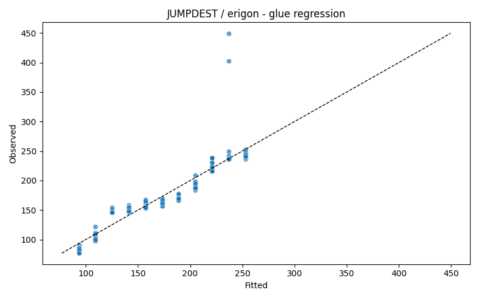

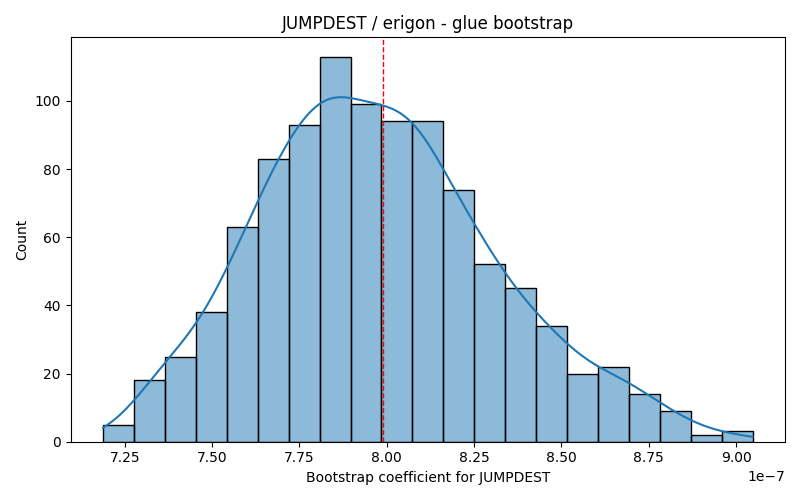

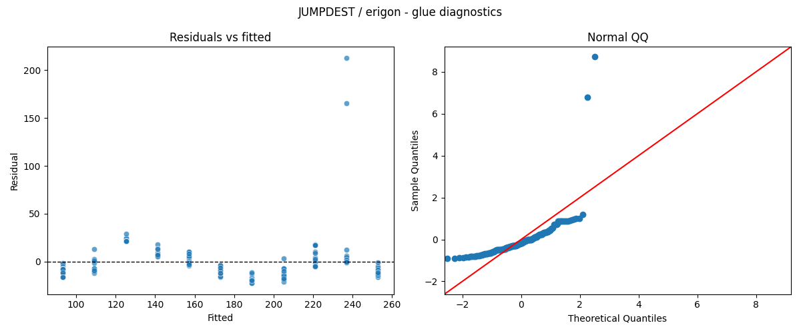

</details>

<details><summary><code>SWAP</code> · nobs=2640 · runtime_ms=1.232e-06 · p=1.00e-03 · R²=0.7636</summary>

```
==============================================================================
                           NNLS Regression Results                            
==============================================================================
Dep. Variable:          test_runtime_ms              R-squared:          0.764
Model:                  NNLS                    Adj. R-squared:          0.764
No. Observations:       2640                              RMSE:          14.43
Df Residuals:           2638                               MAE:           5.79
Df Model:               1      
==============================================================================
                      coef     std err     P-value      [0.025      0.975]
------------------------------------------------------------------------------
         const     22.2084      0.8122       0.001     20.6959     23.7860
          SWAP      0.0000      0.0000       0.001      0.0000      0.0000
==============================================================================
Notes: Non-negative least squares with bootstrap inference (1000 iterations)
==============================================================================
```

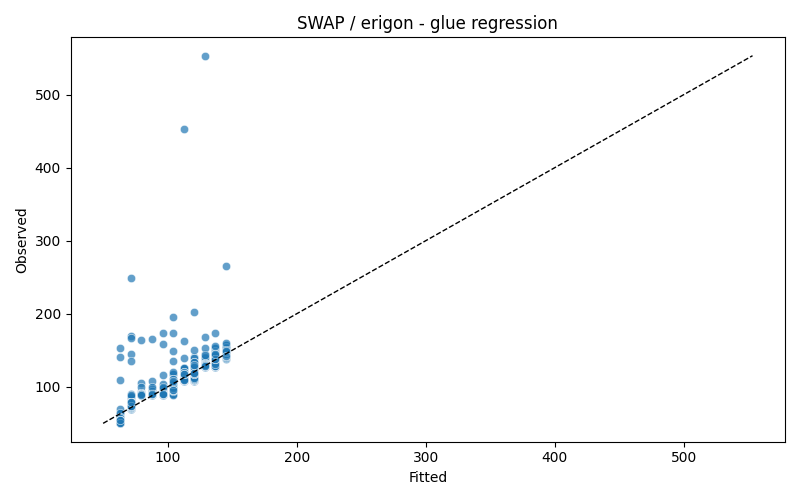

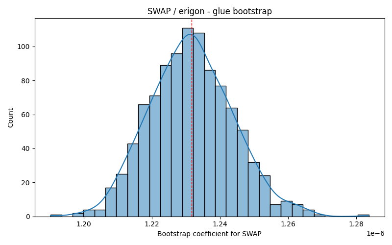

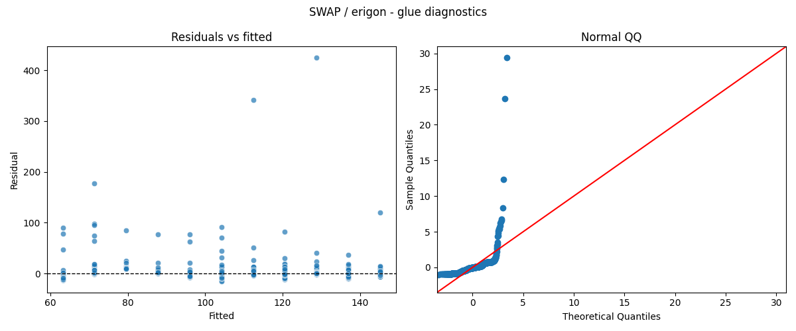

</details>

### Mixed glue (tier A) · erigon

<details><summary><code>ADD</code> · nobs=165 · runtime_ms=2.811e-06 · p=1.00e-03 · R²=0.9289</summary>

```
==============================================================================
                           NNLS Regression Results                            
==============================================================================
Dep. Variable:          test_runtime_ms              R-squared:          0.929
Model:                  NNLS                    Adj. R-squared:          0.929
No. Observations:       165                               RMSE:           8.18
Df Residuals:           163                                MAE:           6.87
Df Model:               1      
==============================================================================
                      coef     std err     P-value      [0.025      0.975]
------------------------------------------------------------------------------
         const     15.2529      2.3225       0.001     10.9647     19.8584
           ADD      0.0000      0.0000       0.001      0.0000      0.0000
==============================================================================
Notes: Non-negative least squares with bootstrap inference (1000 iterations)
==============================================================================
```

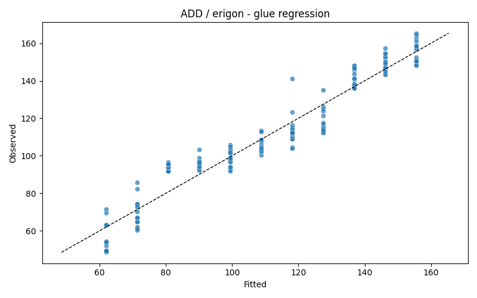

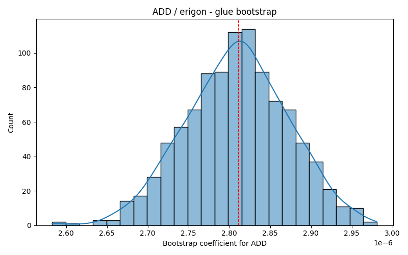

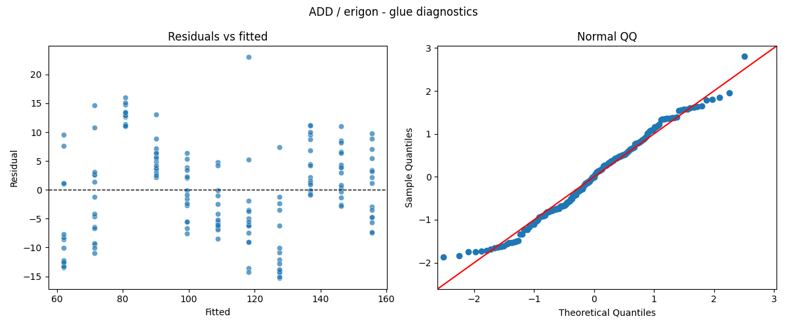

</details>

<details><summary><code>AND</code> · nobs=165 · runtime_ms=2.744e-06 · p=1.00e-03 · R²=0.9424</summary>

```
==============================================================================
                           NNLS Regression Results                            
==============================================================================
Dep. Variable:          test_runtime_ms              R-squared:          0.942
Model:                  NNLS                    Adj. R-squared:          0.942
No. Observations:       165                               RMSE:           7.14
Df Residuals:           163                                MAE:           5.80
Df Model:               1      
==============================================================================
                      coef     std err     P-value      [0.025      0.975]
------------------------------------------------------------------------------
         const     14.3214      2.0594       0.001     10.6034     18.8100
           AND      0.0000      0.0000       0.001      0.0000      0.0000
==============================================================================
Notes: Non-negative least squares with bootstrap inference (1000 iterations)
==============================================================================
```

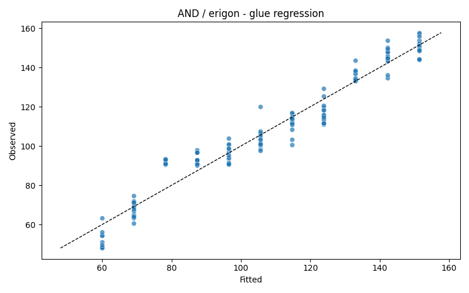

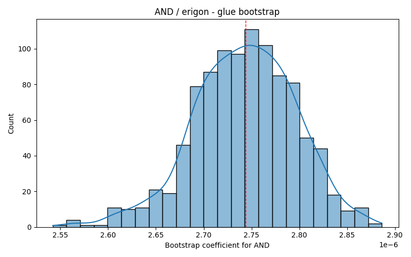

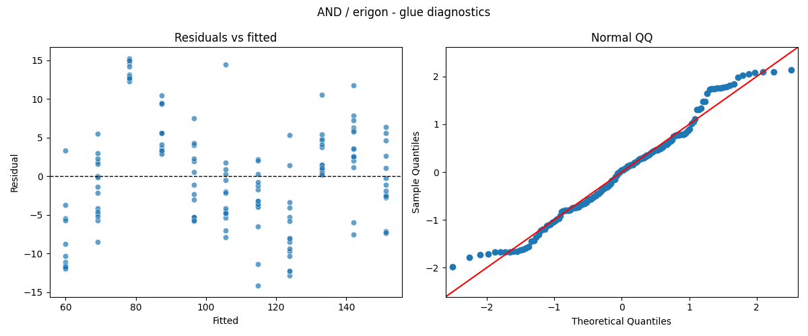

</details>

<details><summary><code>CALLDATACOPY</code> · nobs=3960 · runtime_ms=7.013e-06 · p=1.00e-03 · R²=0.8587</summary>

```
==============================================================================
                           NNLS Regression Results                            
==============================================================================
Dep. Variable:          test_runtime_ms              R-squared:          0.859
Model:                  NNLS                    Adj. R-squared:          0.859
No. Observations:       3960                              RMSE:          21.40
Df Residuals:           3958                               MAE:           7.88
Df Model:               1      
==============================================================================
                      coef     std err     P-value      [0.025      0.975]
------------------------------------------------------------------------------
         const     17.1887      0.4647       0.001     16.3236     18.1723
  CALLDATACOPY      0.0000      0.0000       0.001      0.0000      0.0000
==============================================================================
Notes: Non-negative least squares with bootstrap inference (1000 iterations)
==============================================================================
```

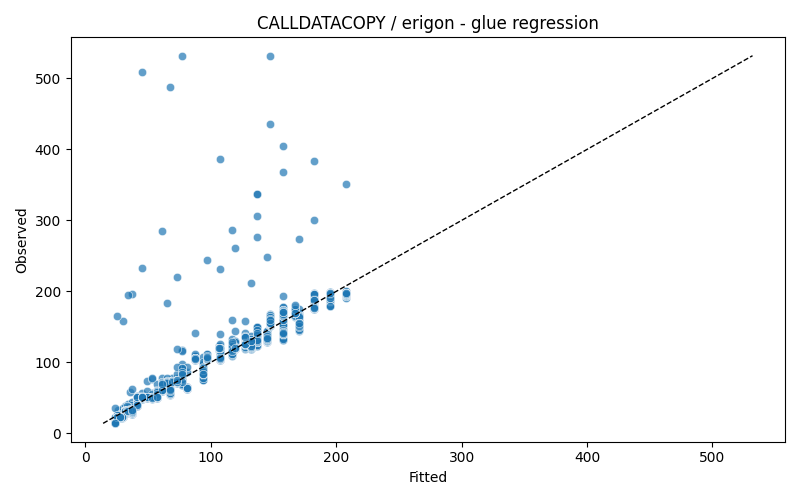

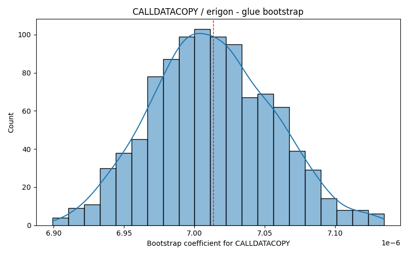

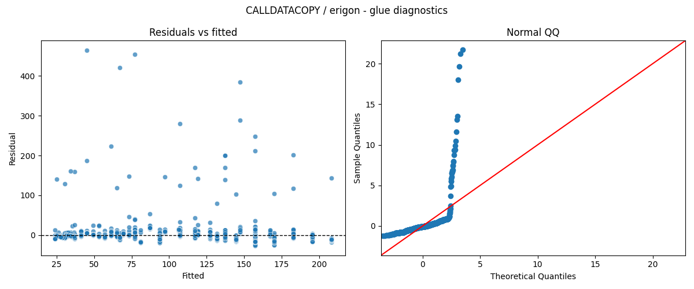

</details>

<details><summary><code>CALLDATALOAD</code> · nobs=660 · runtime_ms=0 · p=1.00e+00 · R²=0</summary>

```
==============================================================================
                           NNLS Regression Results                            
==============================================================================
Dep. Variable:          test_runtime_ms              R-squared:          0.000
Model:                  NNLS                    Adj. R-squared:         -0.002
No. Observations:       660                               RMSE:           7.56
Df Residuals:           658                                MAE:           0.81
Df Model:               1      
==============================================================================
                      coef     std err     P-value      [0.025      0.975]
------------------------------------------------------------------------------
         const      6.8371      0.4217       0.001      6.0509      7.4783
  CALLDATALOAD      0.0000      0.0000       1.000      0.0000      0.0000
==============================================================================
Notes: Non-negative least squares with bootstrap inference (1000 iterations)
==============================================================================
```

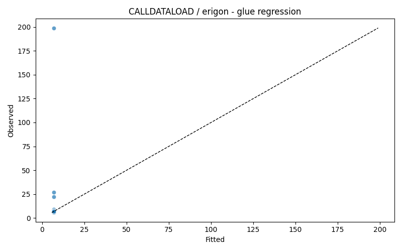

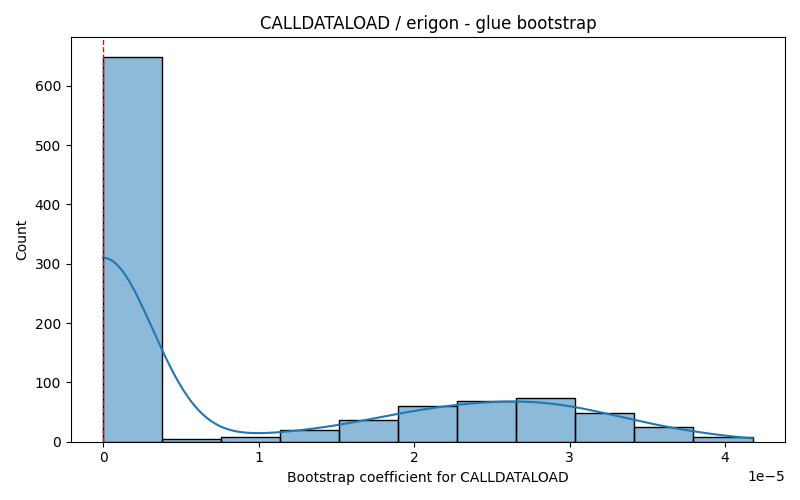

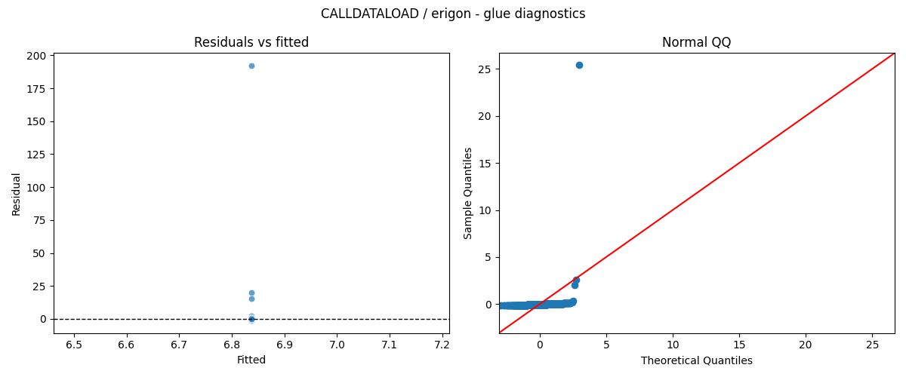

</details>

<details><summary><code>DIV</code> · nobs=165 · runtime_ms=9.235e-06 · p=1.00e-03 · R²=0.7319</summary>

```
==============================================================================
                           NNLS Regression Results                            
==============================================================================
Dep. Variable:          test_runtime_ms              R-squared:          0.732
Model:                  NNLS                    Adj. R-squared:          0.730
No. Observations:       165                               RMSE:          44.12
Df Residuals:           163                                MAE:          24.61
Df Model:               1      
==============================================================================
                      coef     std err     P-value      [0.025      0.975]
------------------------------------------------------------------------------
         const     26.9747     11.1960       0.001      9.0517     52.0773
           DIV      0.0000      0.0000       0.001      0.0000      0.0000
==============================================================================
Notes: Non-negative least squares with bootstrap inference (1000 iterations)
==============================================================================
```

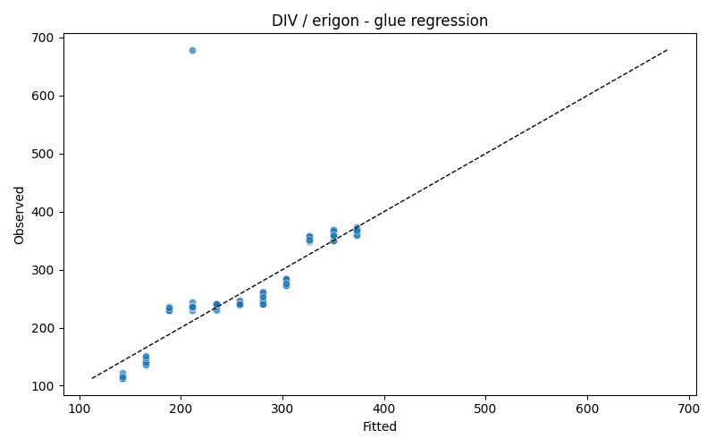


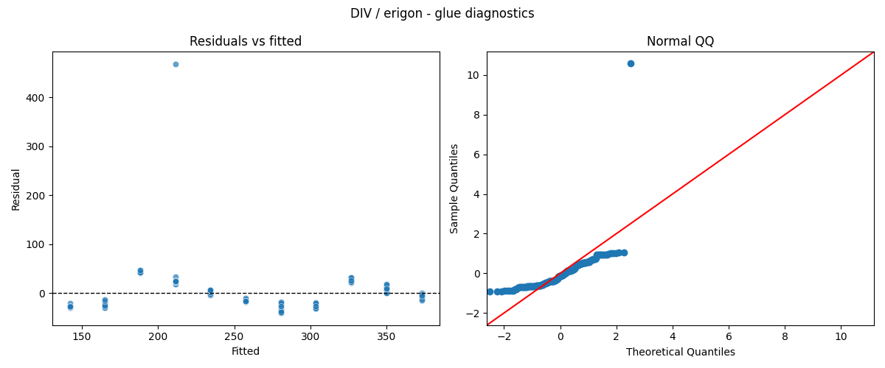

</details>

<details><summary><code>EXP</code> · nobs=165 · runtime_ms=0.0003334 · p=1.00e-03 · R²=0.9182</summary>

```
==============================================================================
                           NNLS Regression Results                            
==============================================================================
Dep. Variable:          test_runtime_ms              R-squared:          0.918
Model:                  NNLS                    Adj. R-squared:          0.918
No. Observations:       165                               RMSE:           3.90
Df Residuals:           163                                MAE:           3.23
Df Model:               1      
==============================================================================
                      coef     std err     P-value      [0.025      0.975]
------------------------------------------------------------------------------
         const     12.2701      1.1516       0.001     10.0050     14.4382
           EXP      0.0003      0.0000       0.001      0.0003      0.0004
==============================================================================
Notes: Non-negative least squares with bootstrap inference (1000 iterations)
==============================================================================
```

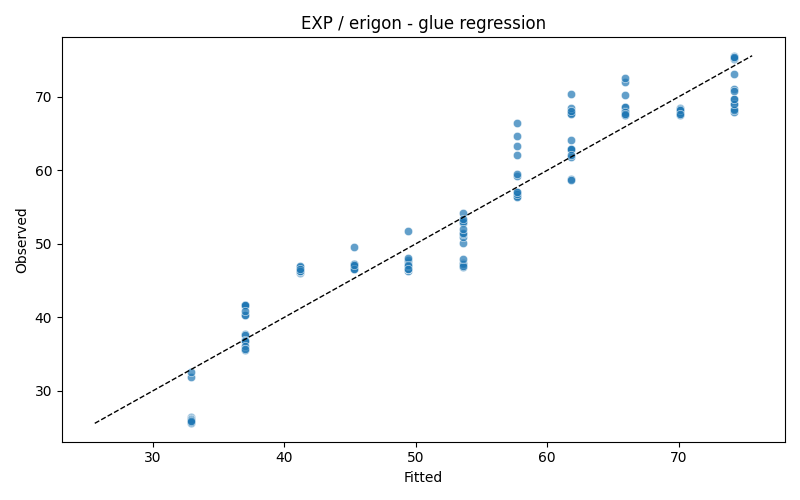

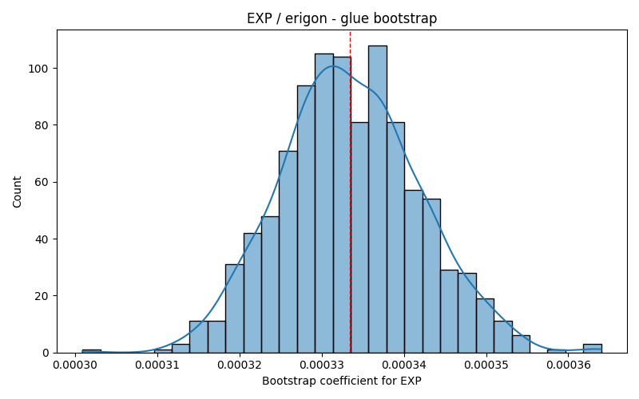

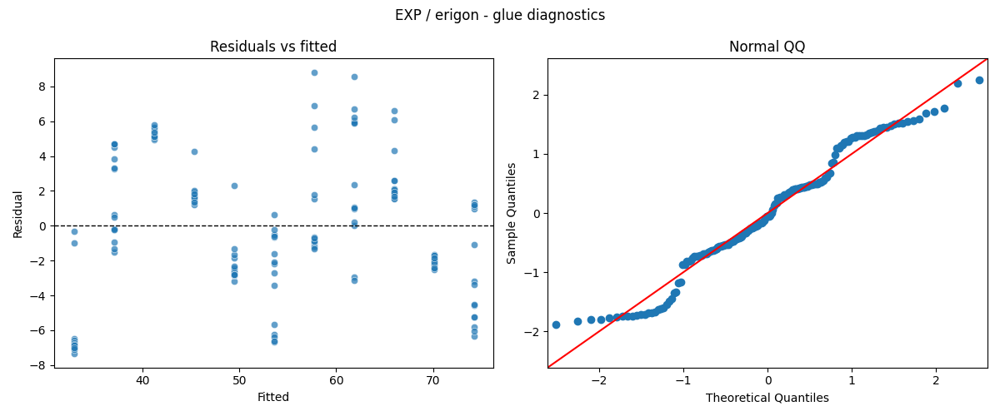

</details>

<details><summary><code>GT</code> · nobs=165 · runtime_ms=2.93e-06 · p=1.00e-03 · R²=0.9411</summary>

```
==============================================================================
                           NNLS Regression Results                            
==============================================================================
Dep. Variable:          test_runtime_ms              R-squared:          0.941
Model:                  NNLS                    Adj. R-squared:          0.941
No. Observations:       165                               RMSE:           7.72
Df Residuals:           163                                MAE:           5.96
Df Model:               1      
==============================================================================
                      coef     std err     P-value      [0.025      0.975]
------------------------------------------------------------------------------
         const     15.4438      2.3399       0.001     11.1281     20.3189
            GT      0.0000      0.0000       0.001      0.0000      0.0000
==============================================================================
Notes: Non-negative least squares with bootstrap inference (1000 iterations)
==============================================================================
```

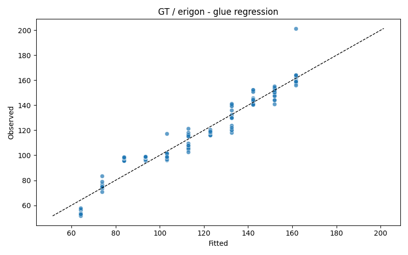

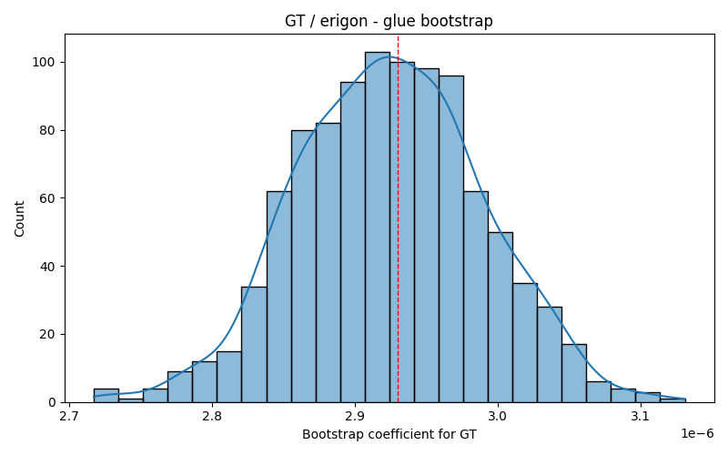

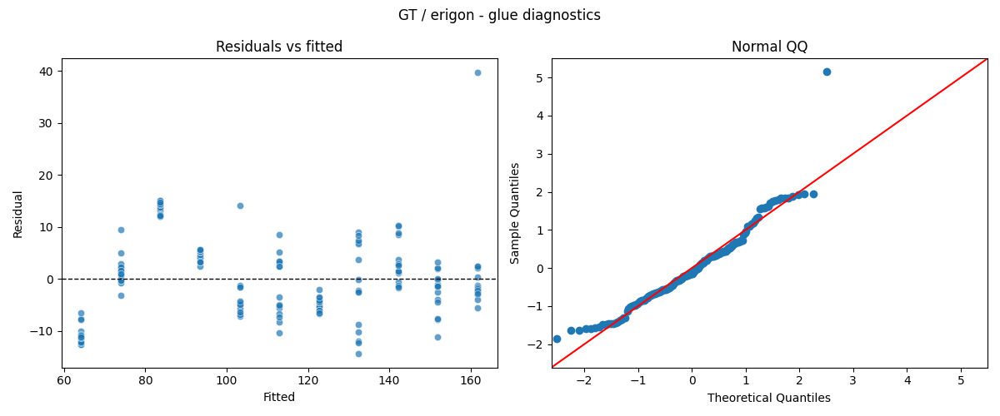

</details>

<details><summary><code>JUMPI</code> · nobs=165 · runtime_ms=3.522e-06 · p=1.00e-03 · R²=0.2585</summary>

```
==============================================================================
                           NNLS Regression Results                            
==============================================================================
Dep. Variable:          test_runtime_ms              R-squared:          0.259
Model:                  NNLS                    Adj. R-squared:          0.254
No. Observations:       165                               RMSE:          26.91
Df Residuals:           163                                MAE:           6.93
Df Model:               1      
==============================================================================
                      coef     std err     P-value      [0.025      0.975]
------------------------------------------------------------------------------
         const     18.7405      2.2644       0.001     14.4655     23.2682
         JUMPI      0.0000      0.0000       0.001      0.0000      0.0000
==============================================================================
Notes: Non-negative least squares with bootstrap inference (1000 iterations)
==============================================================================
```

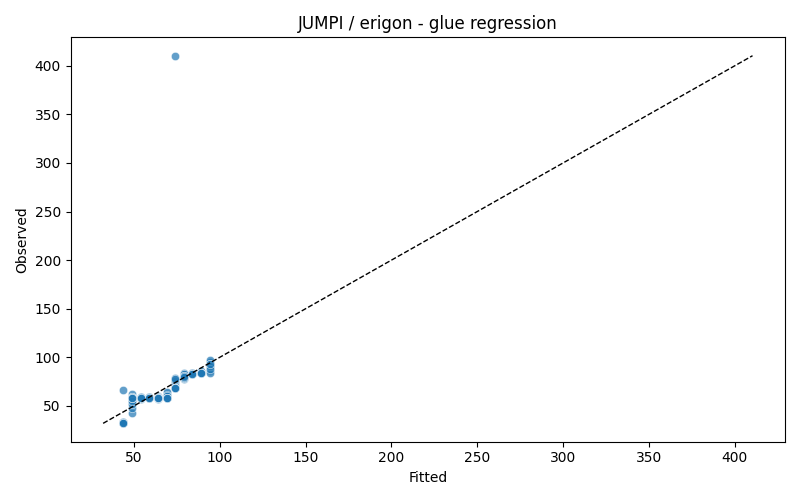

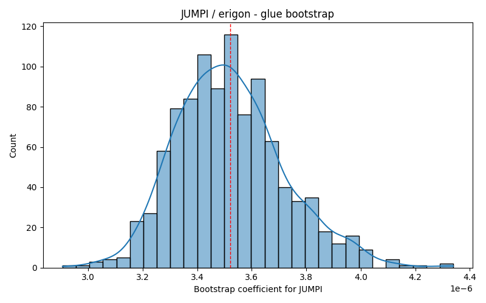

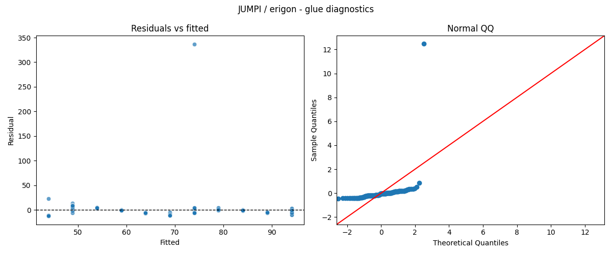

</details>

<details><summary><code>LT</code> · nobs=165 · runtime_ms=2.754e-06 · p=1.00e-03 · R²=0.7354</summary>

```
==============================================================================
                           NNLS Regression Results                            
==============================================================================
Dep. Variable:          test_runtime_ms              R-squared:          0.735
Model:                  NNLS                    Adj. R-squared:          0.734
No. Observations:       165                               RMSE:          17.39
Df Residuals:           163                                MAE:           8.60
Df Model:               1      
==============================================================================
                      coef     std err     P-value      [0.025      0.975]
------------------------------------------------------------------------------
         const     23.2826      4.2173       0.001     16.2445     32.3547
            LT      0.0000      0.0000       0.001      0.0000      0.0000
==============================================================================
Notes: Non-negative least squares with bootstrap inference (1000 iterations)
==============================================================================
```

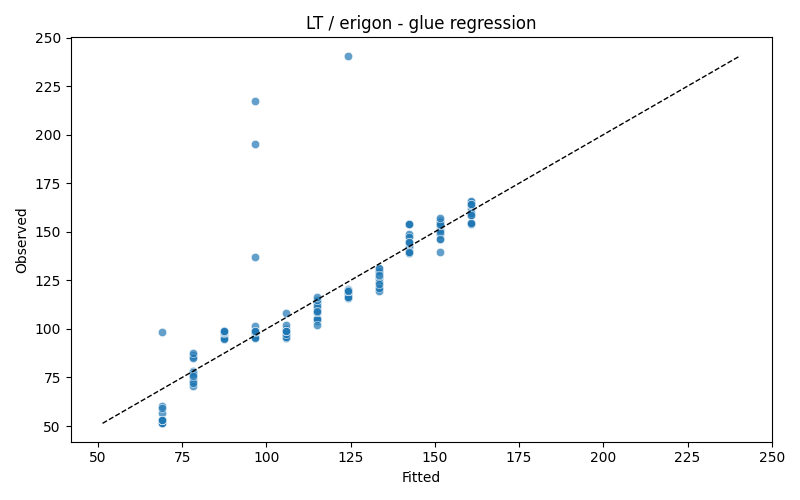

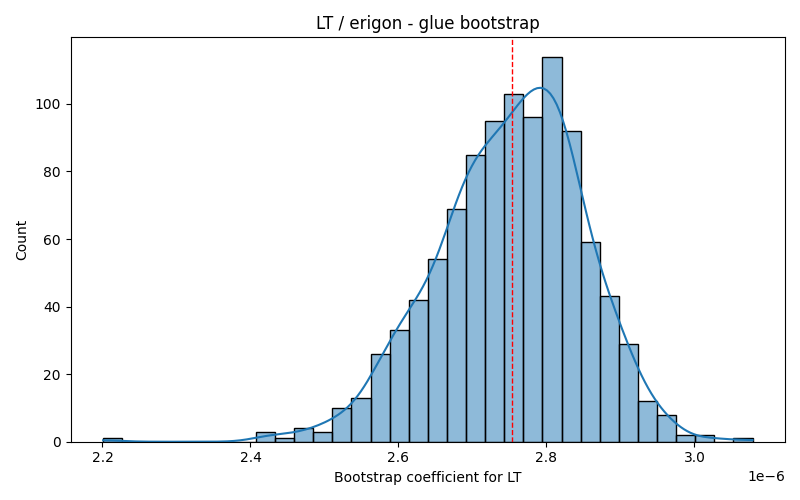

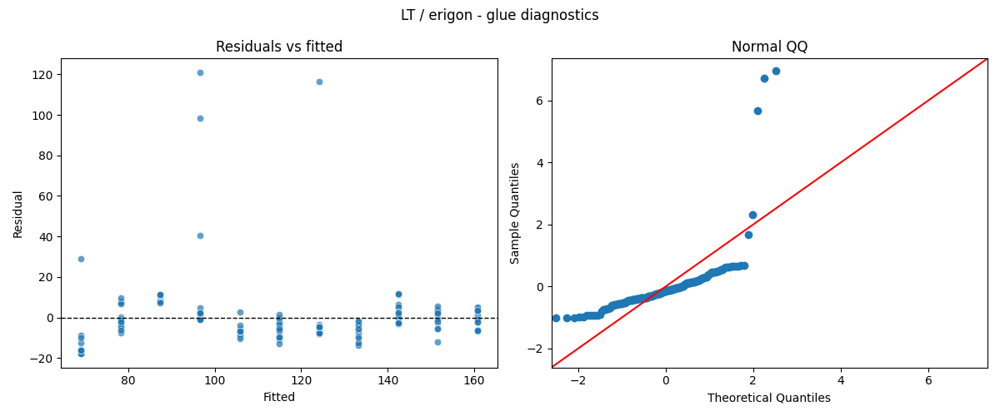

</details>

<details><summary><code>MSTORE</code> · nobs=825 · runtime_ms=5.609e-06 · p=1.00e-03 · R²=0.7732</summary>

```
==============================================================================
                           NNLS Regression Results                            
==============================================================================
Dep. Variable:          test_runtime_ms              R-squared:          0.773
Model:                  NNLS                    Adj. R-squared:          0.773
No. Observations:       825                               RMSE:          21.32
Df Residuals:           823                                MAE:           9.83
Df Model:               1      
==============================================================================
                      coef     std err     P-value      [0.025      0.975]
------------------------------------------------------------------------------
         const     23.2592      2.5816       0.001     18.5207     28.4497
        MSTORE      0.0000      0.0000       0.001      0.0000      0.0000
==============================================================================
Notes: Non-negative least squares with bootstrap inference (1000 iterations)
==============================================================================
```

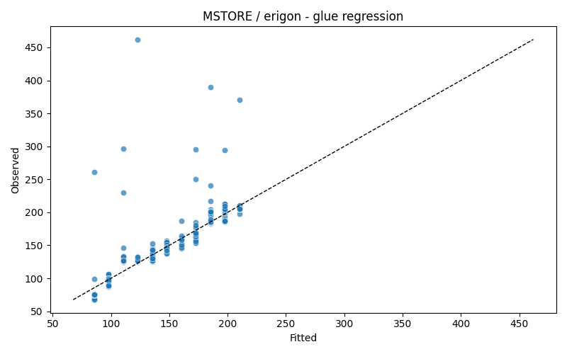

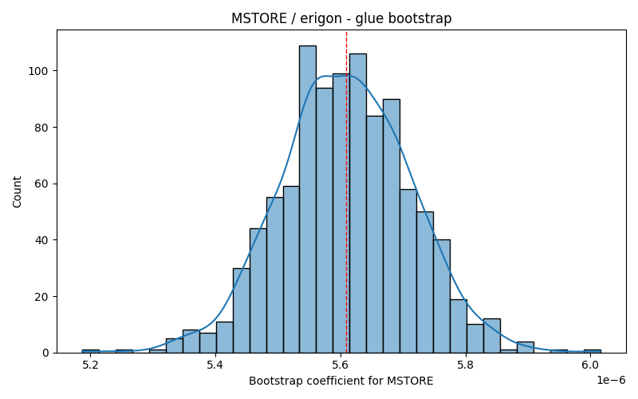


</details>

<details><summary><code>MSTORE8</code> · nobs=825 · runtime_ms=4.878e-06 · p=1.00e-03 · R²=0.5136</summary>

```
==============================================================================
                           NNLS Regression Results                            
==============================================================================
Dep. Variable:          test_runtime_ms              R-squared:          0.514
Model:                  NNLS                    Adj. R-squared:          0.513
No. Observations:       825                               RMSE:          33.31
Df Residuals:           823                                MAE:           9.86
Df Model:               1      
==============================================================================
                      coef     std err     P-value      [0.025      0.975]
------------------------------------------------------------------------------
         const     27.6144      3.8384       0.001     20.2936     35.6109
       MSTORE8      0.0000      0.0000       0.001      0.0000      0.0000
==============================================================================
Notes: Non-negative least squares with bootstrap inference (1000 iterations)
==============================================================================
```


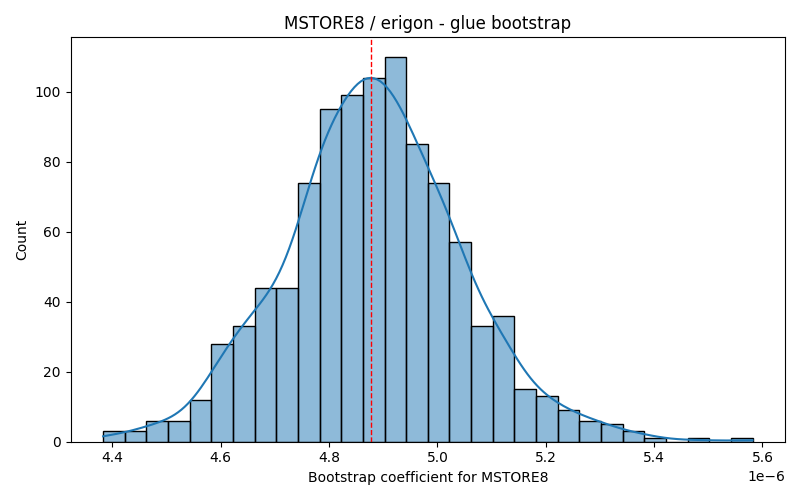

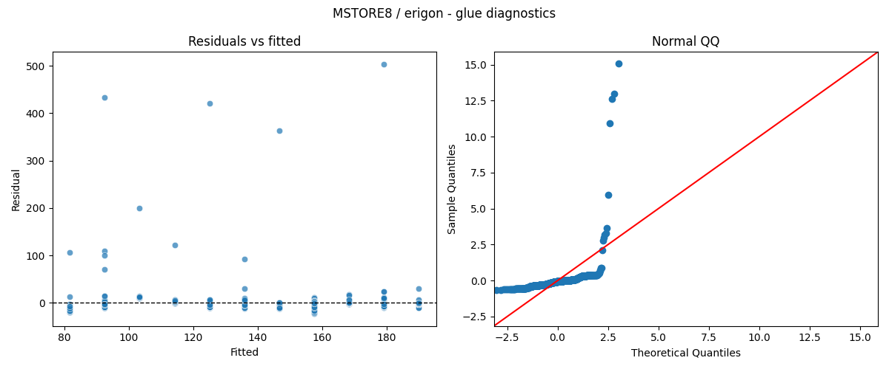

</details>

<details><summary><code>MUL</code> · nobs=165 · runtime_ms=3.741e-06 · p=1.00e-03 · R²=0.6486</summary>

```
==============================================================================
                           NNLS Regression Results                            
==============================================================================
Dep. Variable:          test_runtime_ms              R-squared:          0.649
Model:                  NNLS                    Adj. R-squared:          0.646
No. Observations:       165                               RMSE:          21.74
Df Residuals:           163                                MAE:           8.34
Df Model:               1      
==============================================================================
                      coef     std err     P-value      [0.025      0.975]
------------------------------------------------------------------------------
         const      7.3522      3.0373       0.015      1.0121     13.3055
           MUL      0.0000      0.0000       0.001      0.0000      0.0000
==============================================================================
Notes: Non-negative least squares with bootstrap inference (1000 iterations)
==============================================================================
```

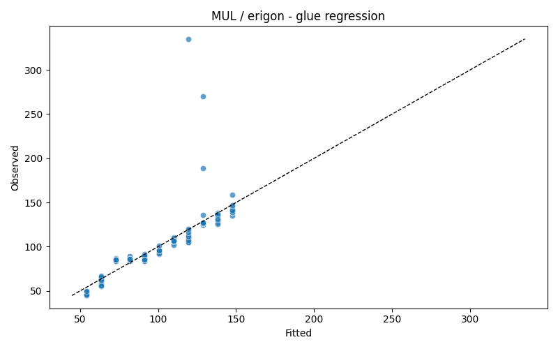

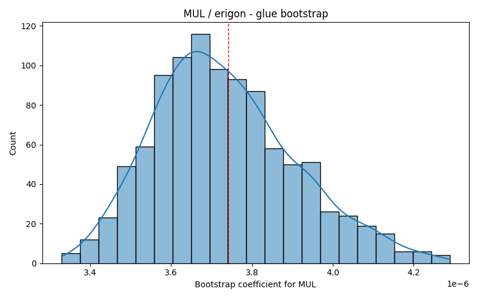

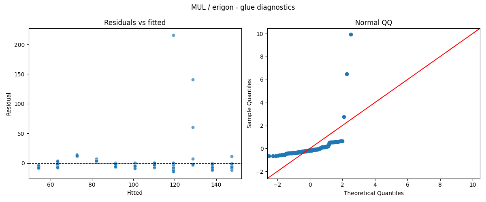

</details>

<details><summary><code>PC</code> · nobs=165 · runtime_ms=1.483e-06 · p=1.00e-03 · R²=0.5652</summary>

```
==============================================================================
                           NNLS Regression Results                            
==============================================================================
Dep. Variable:          test_runtime_ms              R-squared:          0.565
Model:                  NNLS                    Adj. R-squared:          0.563
No. Observations:       165                               RMSE:          38.88
Df Residuals:           163                                MAE:          12.65
Df Model:               1      
==============================================================================
                      coef     std err     P-value      [0.025      0.975]
------------------------------------------------------------------------------
         const     15.7470      6.4223       0.014      1.3830     27.5185
            PC      0.0000      0.0000       0.001      0.0000      0.0000
==============================================================================
Notes: Non-negative least squares with bootstrap inference (1000 iterations)
==============================================================================
```

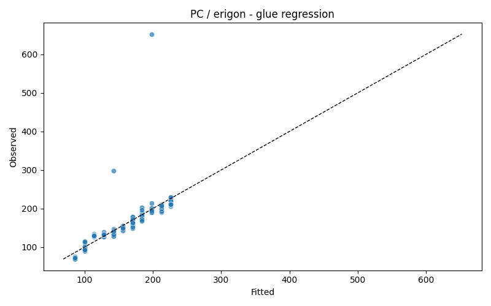

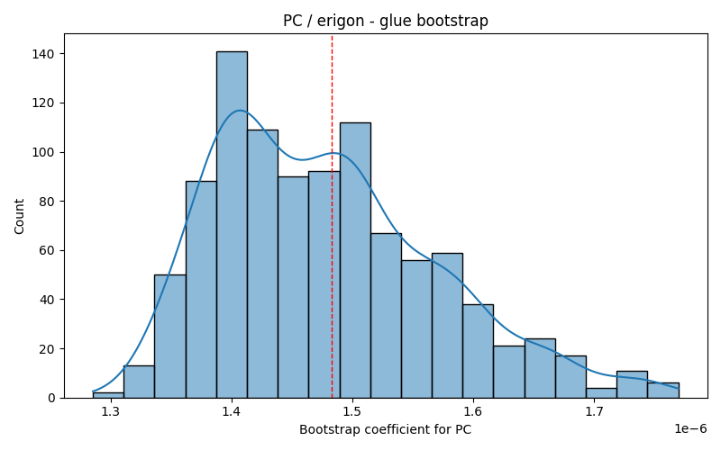

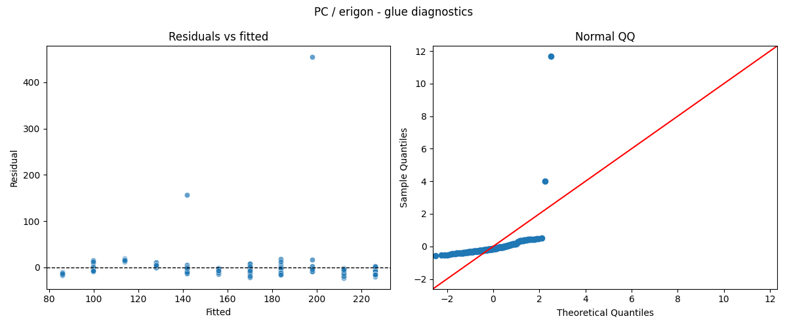

</details>

<details><summary><code>RETURNDATASIZE</code> · nobs=660 · runtime_ms=1.774e-06 · p=1.00e-03 · R²=0.8401</summary>

```
==============================================================================
                           NNLS Regression Results                            
==============================================================================
Dep. Variable:          test_runtime_ms              R-squared:          0.840
Model:                  NNLS                    Adj. R-squared:          0.840
No. Observations:       660                               RMSE:          12.22
Df Residuals:           658                                MAE:           6.38
Df Model:               1      
==============================================================================
                      coef     std err     P-value      [0.025      0.975]
------------------------------------------------------------------------------
         const     17.1036      1.8411       0.001     13.8216     20.9616
RETURNDATASIZE      0.0000      0.0000       0.001      0.0000      0.0000
==============================================================================
Notes: Non-negative least squares with bootstrap inference (1000 iterations)
==============================================================================
```

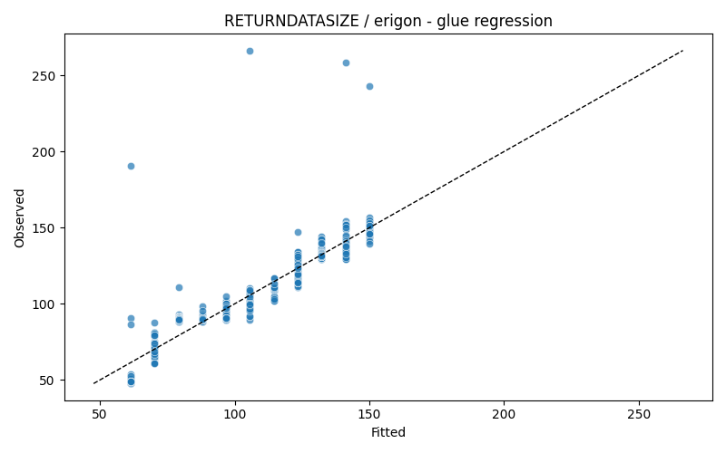

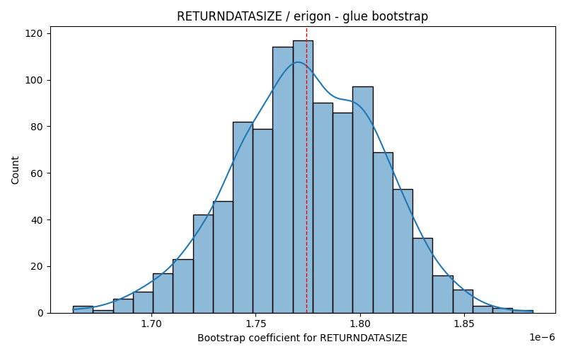

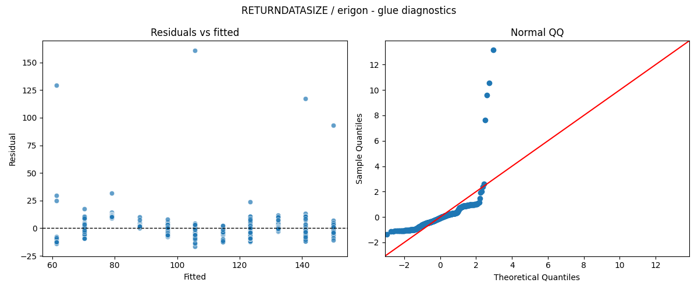

</details>

<details><summary><code>SELFBALANCE</code> · nobs=135 · runtime_ms=1.342e-06 · p=1.00e-03 · R²=0.8836</summary>

```
==============================================================================
                           NNLS Regression Results                            
==============================================================================
Dep. Variable:          test_runtime_ms              R-squared:          0.884
Model:                  NNLS                    Adj. R-squared:          0.883
No. Observations:       135                               RMSE:           4.91
Df Residuals:           133                                MAE:           3.93
Df Model:               1      
==============================================================================
                      coef     std err     P-value      [0.025      0.975]
------------------------------------------------------------------------------
         const     20.0681      1.5347       0.001     16.9418     22.7072
   SELFBALANCE      0.0000      0.0000       0.001      0.0000      0.0000
==============================================================================
Notes: Non-negative least squares with bootstrap inference (1000 iterations)
==============================================================================
```

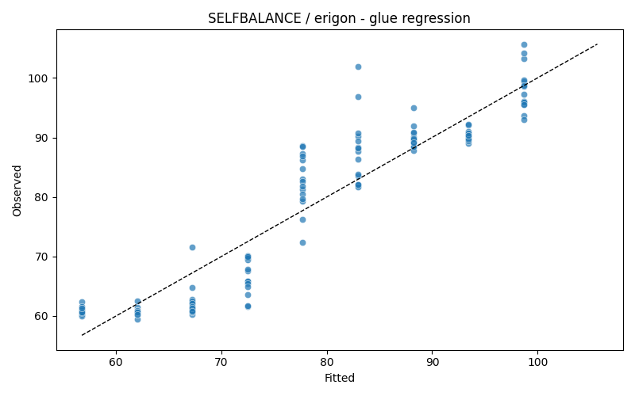

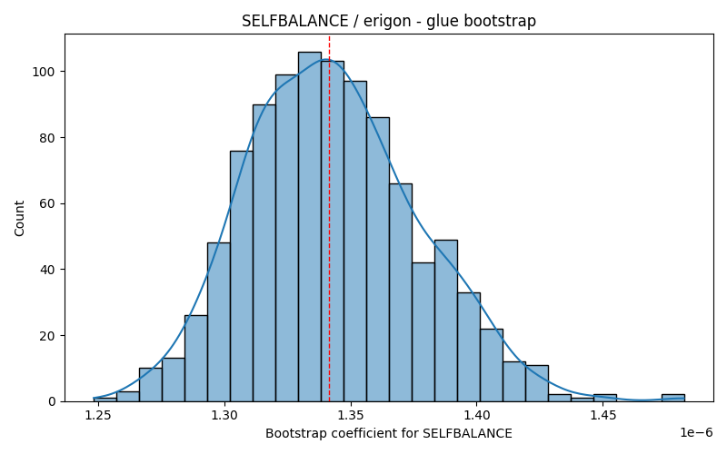


</details>

<details><summary><code>SUB</code> · nobs=165 · runtime_ms=2.743e-06 · p=1.00e-03 · R²=0.9291</summary>

```
==============================================================================
                           NNLS Regression Results                            
==============================================================================
Dep. Variable:          test_runtime_ms              R-squared:          0.929
Model:                  NNLS                    Adj. R-squared:          0.929
No. Observations:       165                               RMSE:           7.97
Df Residuals:           163                                MAE:           6.68
Df Model:               1      
==============================================================================
                      coef     std err     P-value      [0.025      0.975]
------------------------------------------------------------------------------
         const     17.4571      2.4016       0.001     12.7357     22.1763
           SUB      0.0000      0.0000       0.001      0.0000      0.0000
==============================================================================
Notes: Non-negative least squares with bootstrap inference (1000 iterations)
==============================================================================
```

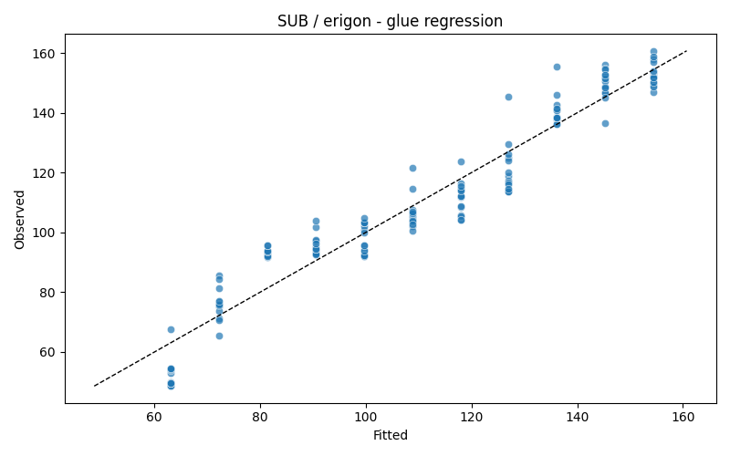

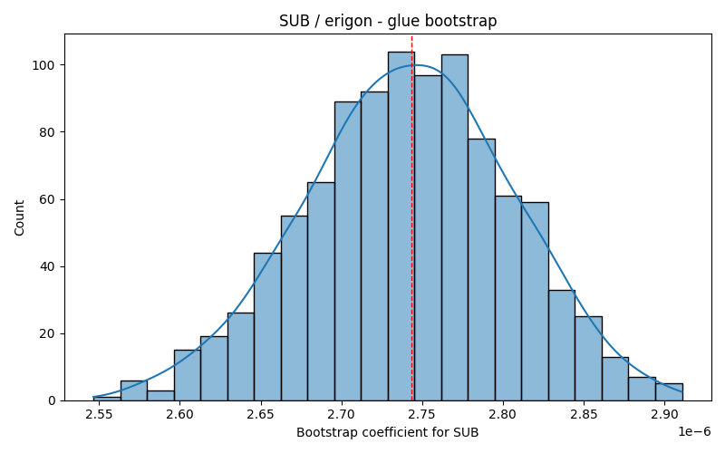

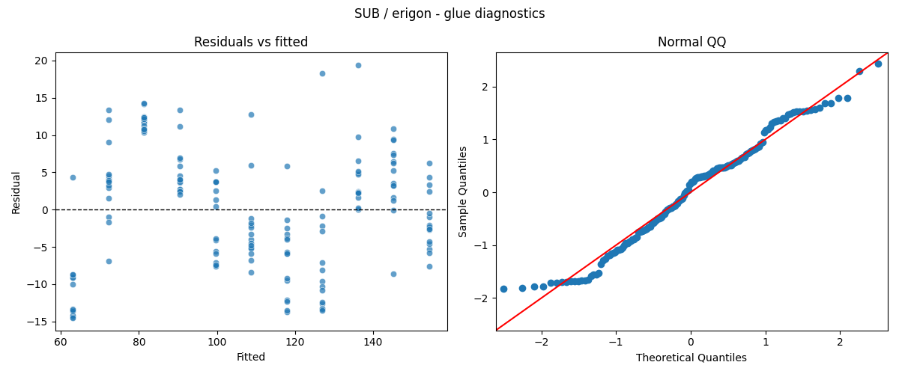

</details>

### Mixed glue (tier B) · erigon

<details><summary><code>JUMP</code> · nobs=165 · runtime_ms=7.17e-06 · p=1.00e-03 · R²=0.9368</summary>

```
==============================================================================
                           NNLS Regression Results                            
==============================================================================
Dep. Variable:          test_runtime_ms              R-squared:          0.937
Model:                  NNLS                    Adj. R-squared:          0.936
No. Observations:       165                               RMSE:           6.92
Df Residuals:           163                                MAE:           5.70
Df Model:               1      
==============================================================================
                      coef     std err     P-value      [0.025      0.975]
------------------------------------------------------------------------------
         const     17.3185      2.3388       0.001     12.5963     21.5401
          JUMP      0.0000      0.0000       0.001      0.0000      0.0000
==============================================================================
Notes: Non-negative least squares with bootstrap inference (1000 iterations)
==============================================================================
```

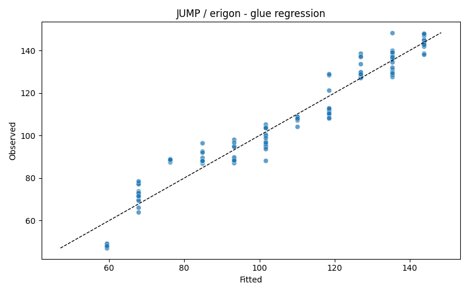

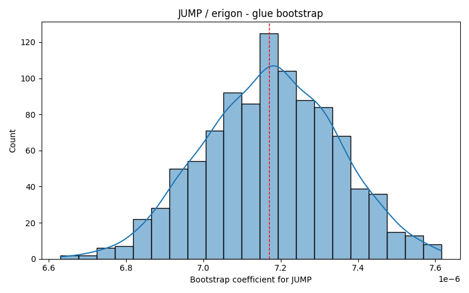

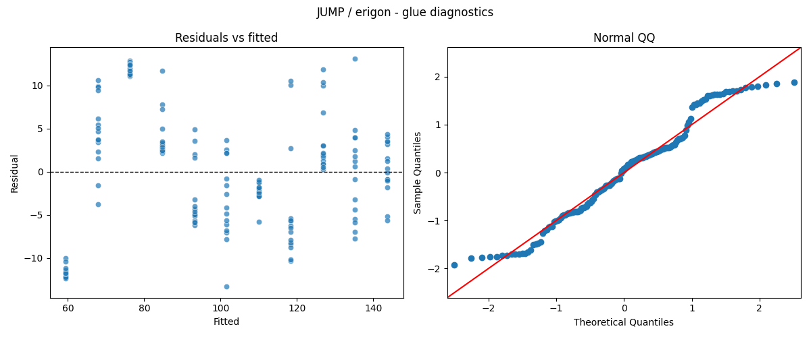

</details>

<details><summary><code>KECCAK256</code> · nobs=2640 · runtime_ms=2.018e-05 · p=1.00e-03 · R²=0.08941</summary>

```
==============================================================================
                           NNLS Regression Results                            
==============================================================================
Dep. Variable:          test_runtime_ms              R-squared:          0.089
Model:                  NNLS                    Adj. R-squared:          0.089
No. Observations:       2640                              RMSE:         128.01
Df Residuals:           2638                               MAE:         103.80
Df Model:               1      
==============================================================================
                      coef     std err     P-value      [0.025      0.975]
------------------------------------------------------------------------------
         const    349.2728      5.4360       0.001    338.7850    359.4915
     KECCAK256      0.0000      0.0000       0.001      0.0000      0.0000
==============================================================================
Notes: Non-negative least squares with bootstrap inference (1000 iterations)
==============================================================================
```

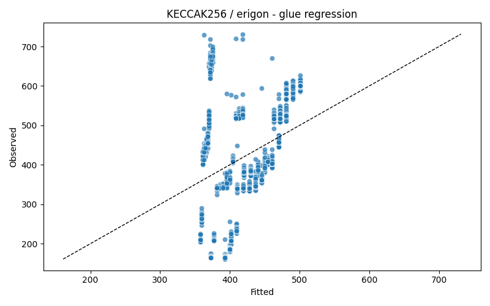

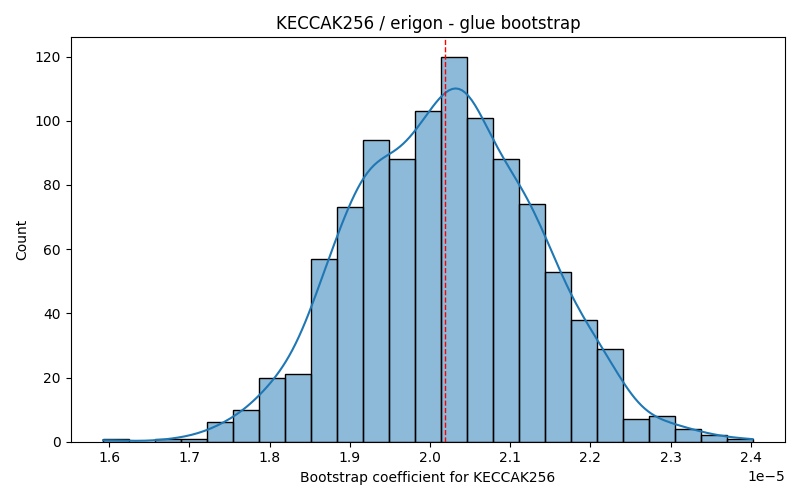

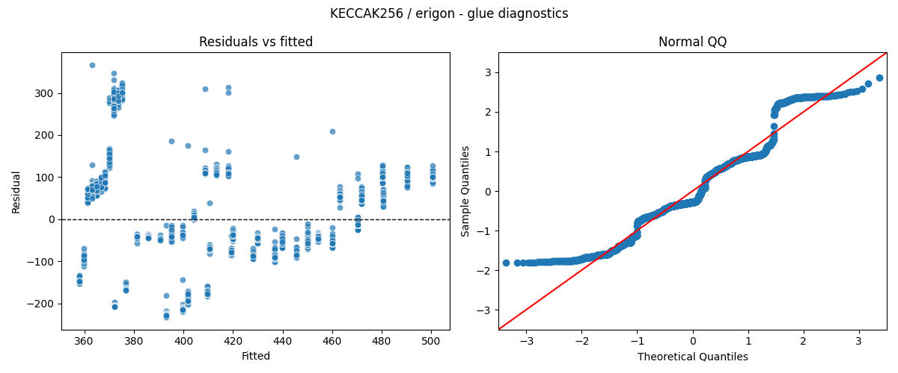

</details>

## geth

| glue_opcode | nobs | glue_runtime_ms | p_value | rsquared |
| --- | --- | --- | --- | --- |
| `ISZERO` | 363 | 1.521e-06 | 1.00e-03 | 0.6795 |
| `JUMPDEST` | 363 | 1.189e-06 | 1.00e-03 | 0.5669 |
| `SWAP` | 5808 | 1.58e-06 | 1.00e-03 | 0.6737 |
| `CALLDATASIZE` | 21758 | 1.406e-06 | 1.00e-03 | 0.8317 |
| `DUP` | 21758 | 1.495e-06 | 1.00e-03 | 0.8317 |
| `GAS` | 21758 | 1.434e-06 | 1.00e-03 | 0.8317 |
| `MLOAD` | 21758 | 5.207e-06 | 1.00e-03 | 0.8317 |
| `PUSH` | 21758 | 2.242e-06 | 1.00e-03 | 0.8317 |
| `PUSH0` | 21758 | 1.413e-06 | 1.00e-03 | 0.8317 |
| `STATICCALL` | 21758 | 0.0001803 | 1.00e-03 | 0.8317 |
| `ADD` | 363 | 4.293e-06 | 1.00e-03 | 0.6755 |
| `AND` | 363 | 3.697e-06 | 1.00e-03 | 0.6459 |
| `CALLDATACOPY` | 8712 | 1.311e-05 | 1.00e-03 | 0.9426 |
| `CALLDATALOAD` | 1452 | 5.075e-05 | 1.00e-03 | 0.03591 |
| `DIV` | 363 | 9.244e-06 | 1.00e-03 | 0.8164 |
| `EXP` | 363 | 0.0003251 | 1.00e-03 | 0.8025 |
| `GT` | 363 | 3.525e-06 | 1.00e-03 | 0.7026 |
| `JUMPI` | 363 | 6.058e-06 | 1.00e-03 | 0.7341 |
| `LT` | 363 | 4.419e-06 | 1.00e-03 | 0.7648 |
| `MSTORE` | 1815 | 7.822e-06 | 1.00e-03 | 0.7713 |
| `MSTORE8` | 1815 | 7.046e-06 | 1.00e-03 | 0.7247 |
| `MUL` | 363 | 4.798e-06 | 1.00e-03 | 0.7622 |
| `PC` | 363 | 1.649e-06 | 1.00e-03 | 0.8225 |
| `RETURNDATASIZE` | 1452 | 3.441e-06 | 1.00e-03 | 0.6438 |
| `SELFBALANCE` | 297 | 7.121e-06 | 1.00e-03 | 0.7737 |
| `SUB` | 363 | 4.385e-06 | 1.00e-03 | 0.7384 |
| `JUMP` | 363 | 9.244e-06 | 1.00e-03 | 0.7661 |
| `KECCAK256` | 5808 | 3.798e-05 | 1.00e-03 | 0.2951 |

### Cycle glue — joint fit · geth

<details><summary>Joint NNLS regression summary</summary>

```
==============================================================================
                           NNLS Regression Results                            
==============================================================================
Dep. Variable:          test_runtime_ms              R-squared:          0.832
Model:                  NNLS                    Adj. R-squared:          0.832
No. Observations:       21758                             RMSE:          25.47
Df Residuals:           21750                              MAE:          19.97
Df Model:               7      
==============================================================================
                      coef     std err     P-value      [0.025      0.975]
------------------------------------------------------------------------------
         const     44.1356      0.6058       0.001     42.9782     45.3128
  CALLDATASIZE      0.0000      0.0000       0.001      0.0000      0.0000
           DUP      0.0000      0.0000       0.001      0.0000      0.0000
           GAS      0.0000      0.0000       0.001      0.0000      0.0000
         MLOAD      0.0000      0.0000       0.001      0.0000      0.0000
          PUSH      0.0000      0.0000       0.001      0.0000      0.0000
         PUSH0      0.0000      0.0000       0.001      0.0000      0.0000
    STATICCALL      0.0002      0.0000       0.001      0.0002      0.0002
==============================================================================
Notes: Non-negative least squares with bootstrap inference (1000 iterations)
==============================================================================
```

</details>

<details><summary><code>CALLDATASIZE</code> · nobs=21758 · runtime_ms=1.406e-06 · p=1.00e-03 · R²=0.8317</summary>


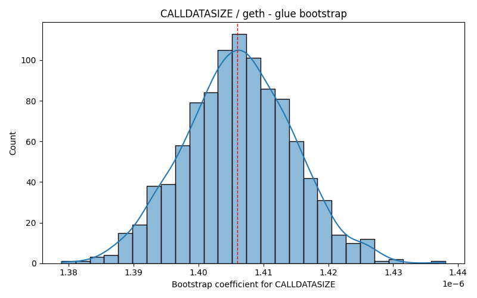

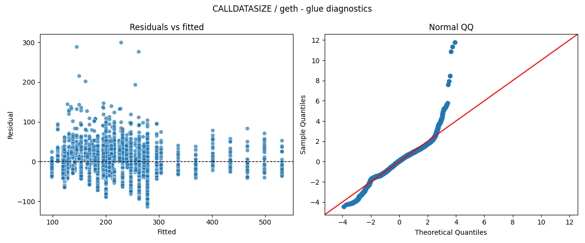

</details>

<details><summary><code>DUP</code> · nobs=21758 · runtime_ms=1.495e-06 · p=1.00e-03 · R²=0.8317</summary>


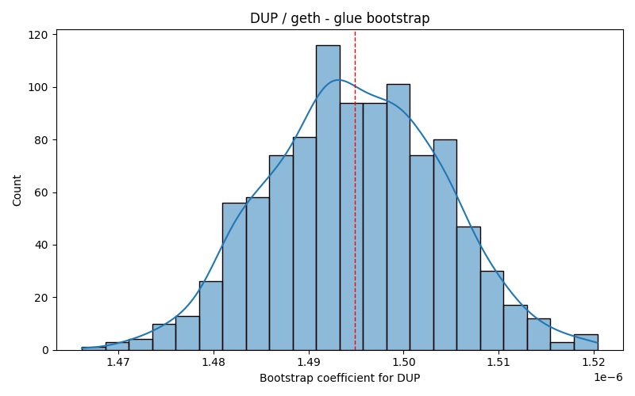


</details>

<details><summary><code>GAS</code> · nobs=21758 · runtime_ms=1.434e-06 · p=1.00e-03 · R²=0.8317</summary>


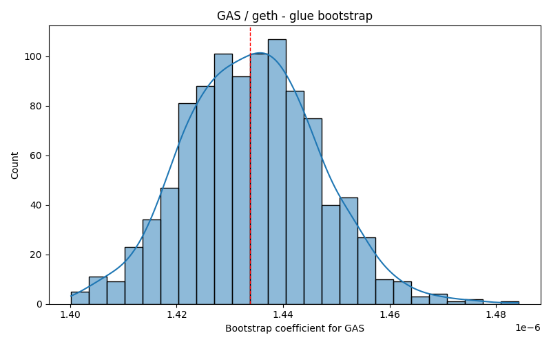

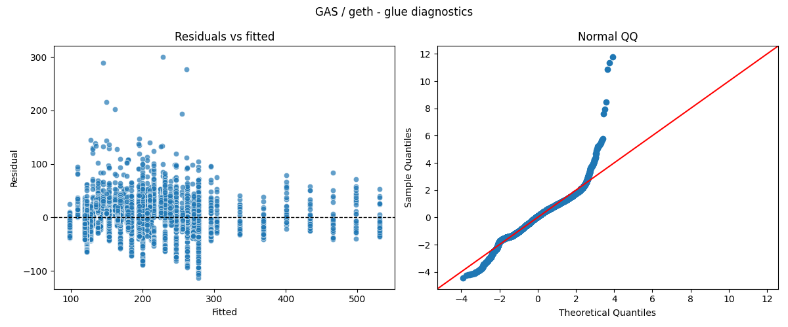

</details>

<details><summary><code>MLOAD</code> · nobs=21758 · runtime_ms=5.207e-06 · p=1.00e-03 · R²=0.8317</summary>


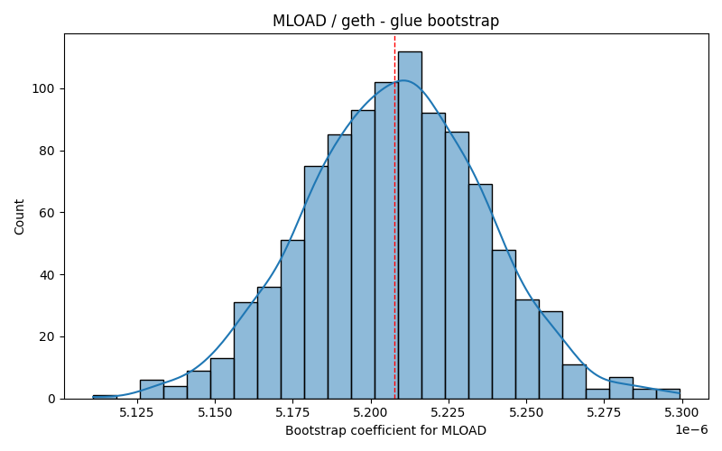


</details>

<details><summary><code>PUSH</code> · nobs=21758 · runtime_ms=2.242e-06 · p=1.00e-03 · R²=0.8317</summary>


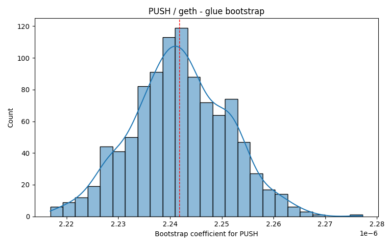


</details>

<details><summary><code>PUSH0</code> · nobs=21758 · runtime_ms=1.413e-06 · p=1.00e-03 · R²=0.8317</summary>

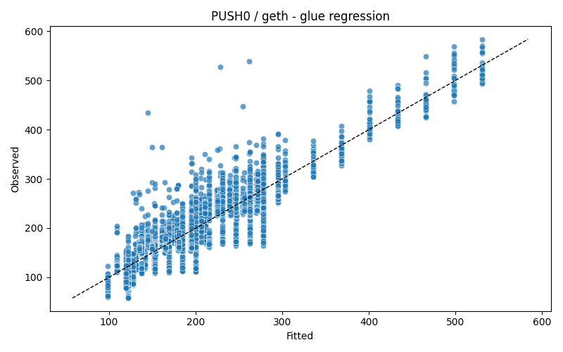

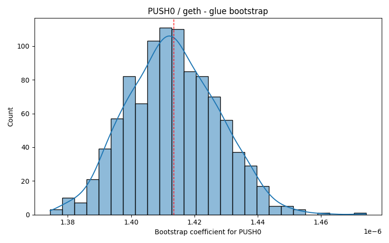


</details>

<details><summary><code>STATICCALL</code> · nobs=21758 · runtime_ms=0.0001803 · p=1.00e-03 · R²=0.8317</summary>


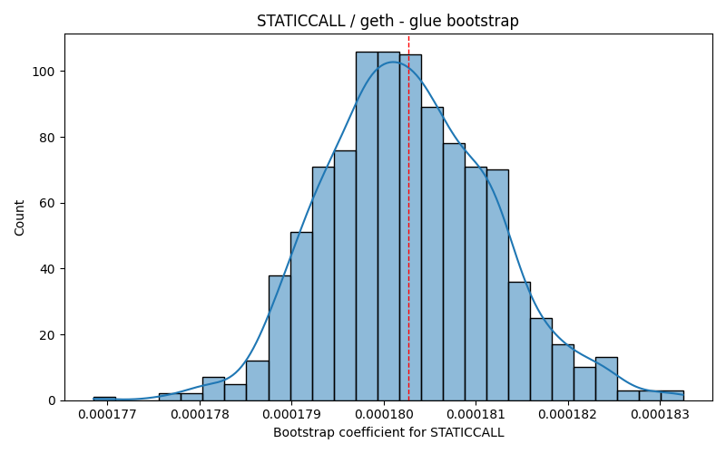


</details>

### Pure glue · geth

<details><summary><code>ISZERO</code> · nobs=363 · runtime_ms=1.521e-06 · p=1.00e-03 · R²=0.6795</summary>

```
==============================================================================
                           NNLS Regression Results                            
==============================================================================
Dep. Variable:          test_runtime_ms              R-squared:          0.680
Model:                  NNLS                    Adj. R-squared:          0.679
No. Observations:       363                               RMSE:          21.98
Df Residuals:           361                                MAE:          14.48
Df Model:               1      
==============================================================================
                      coef     std err     P-value      [0.025      0.975]
------------------------------------------------------------------------------
         const     24.4589      3.9561       0.001     16.8068     32.5102
        ISZERO      0.0000      0.0000       0.001      0.0000      0.0000
==============================================================================
Notes: Non-negative least squares with bootstrap inference (1000 iterations)
==============================================================================
```

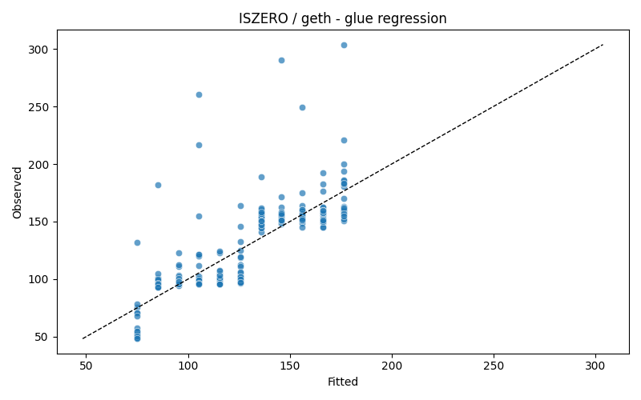

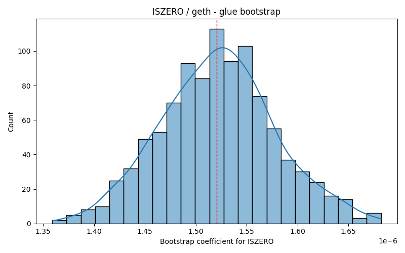


</details>

<details><summary><code>JUMPDEST</code> · nobs=363 · runtime_ms=1.189e-06 · p=1.00e-03 · R²=0.5669</summary>

```
==============================================================================
                           NNLS Regression Results                            
==============================================================================
Dep. Variable:          test_runtime_ms              R-squared:          0.567
Model:                  NNLS                    Adj. R-squared:          0.566
No. Observations:       363                               RMSE:          65.63
Df Residuals:           361                                MAE:          35.07
Df Model:               1      
==============================================================================
                      coef     std err     P-value      [0.025      0.975]
------------------------------------------------------------------------------
         const     74.2115     12.4812       0.001     49.5964     98.3899
      JUMPDEST      0.0000      0.0000       0.001      0.0000      0.0000
==============================================================================
Notes: Non-negative least squares with bootstrap inference (1000 iterations)
==============================================================================
```

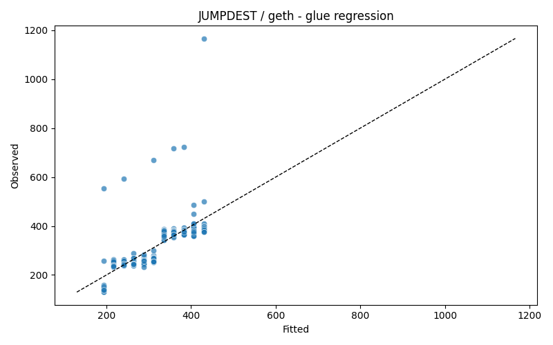

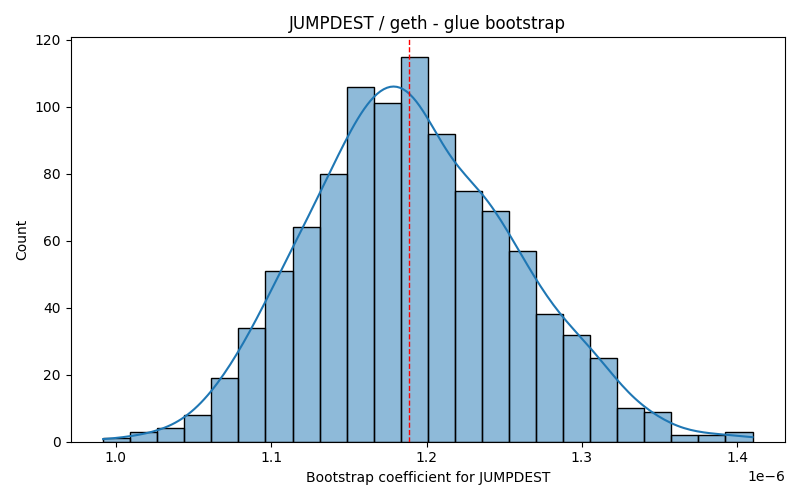

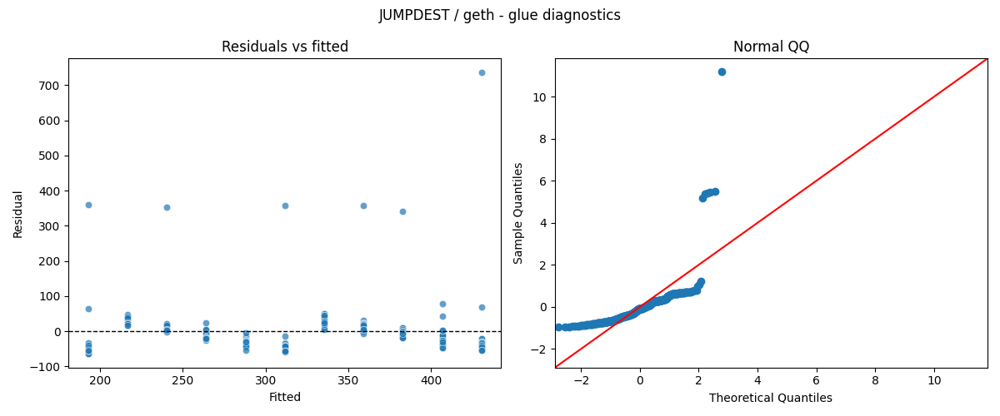

</details>

<details><summary><code>SWAP</code> · nobs=5808 · runtime_ms=1.58e-06 · p=1.00e-03 · R²=0.6737</summary>

```
==============================================================================
                           NNLS Regression Results                            
==============================================================================
Dep. Variable:          test_runtime_ms              R-squared:          0.674
Model:                  NNLS                    Adj. R-squared:          0.674
No. Observations:       5808                              RMSE:          23.15
Df Residuals:           5806                               MAE:          16.02
Df Model:               1      
==============================================================================
                      coef     std err     P-value      [0.025      0.975]
------------------------------------------------------------------------------
         const     33.5781      1.0813       0.001     31.4529     35.5483
          SWAP      0.0000      0.0000       0.001      0.0000      0.0000
==============================================================================
Notes: Non-negative least squares with bootstrap inference (1000 iterations)
==============================================================================
```

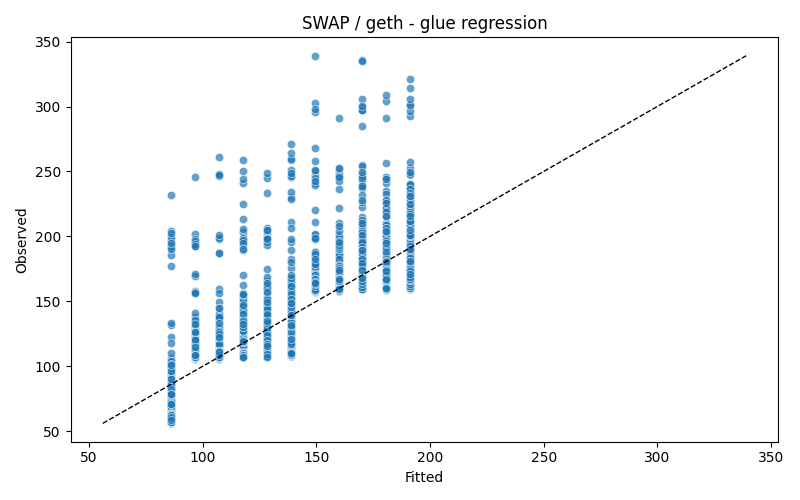

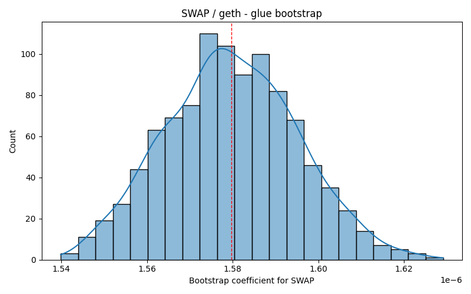

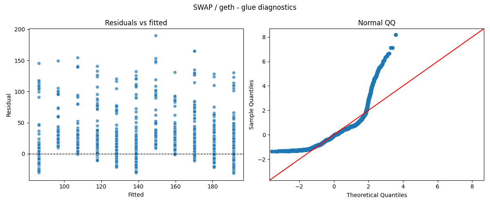

</details>

### Mixed glue (tier A) · geth

<details><summary><code>ADD</code> · nobs=363 · runtime_ms=4.293e-06 · p=1.00e-03 · R²=0.6755</summary>

```
==============================================================================
                           NNLS Regression Results                            
==============================================================================
Dep. Variable:          test_runtime_ms              R-squared:          0.676
Model:                  NNLS                    Adj. R-squared:          0.675
No. Observations:       363                               RMSE:          31.31
Df Residuals:           361                                MAE:          20.77
Df Model:               1      
==============================================================================
                      coef     std err     P-value      [0.025      0.975]
------------------------------------------------------------------------------
         const     49.0070      5.4905       0.001     38.7072     60.0672
           ADD      0.0000      0.0000       0.001      0.0000      0.0000
==============================================================================
Notes: Non-negative least squares with bootstrap inference (1000 iterations)
==============================================================================
```

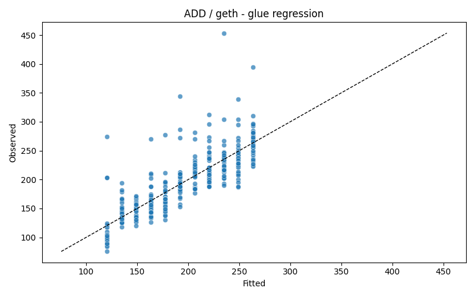

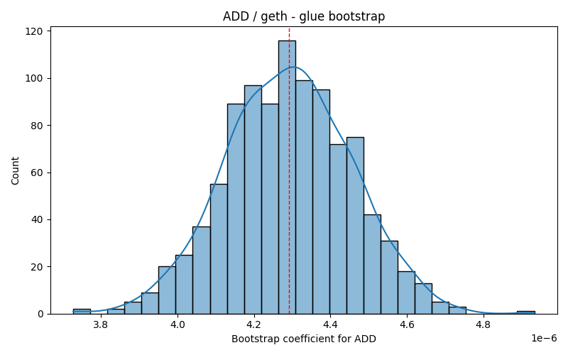

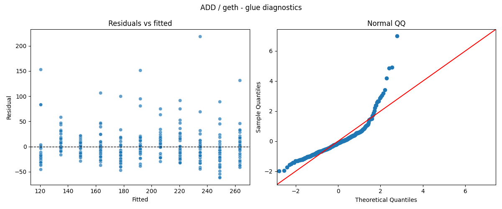

</details>

<details><summary><code>AND</code> · nobs=363 · runtime_ms=3.697e-06 · p=1.00e-03 · R²=0.6459</summary>

```
==============================================================================
                           NNLS Regression Results                            
==============================================================================
Dep. Variable:          test_runtime_ms              R-squared:          0.646
Model:                  NNLS                    Adj. R-squared:          0.645
No. Observations:       363                               RMSE:          28.81
Df Residuals:           361                                MAE:          20.47
Df Model:               1      
==============================================================================
                      coef     std err     P-value      [0.025      0.975]
------------------------------------------------------------------------------
         const     56.3502      5.2376       0.001     46.3996     67.3909
           AND      0.0000      0.0000       0.001      0.0000      0.0000
==============================================================================
Notes: Non-negative least squares with bootstrap inference (1000 iterations)
==============================================================================
```

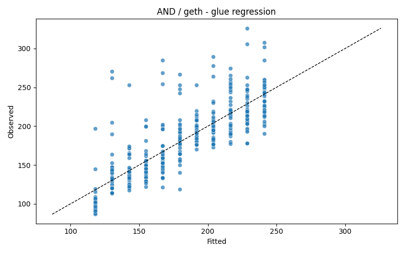

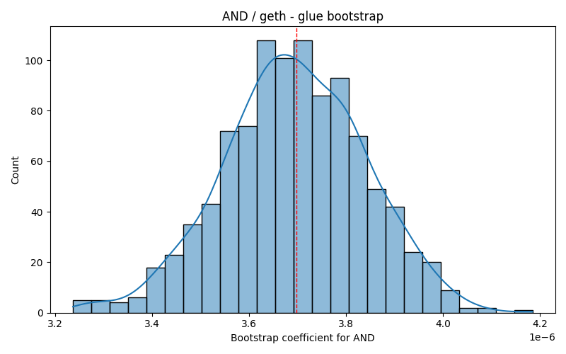

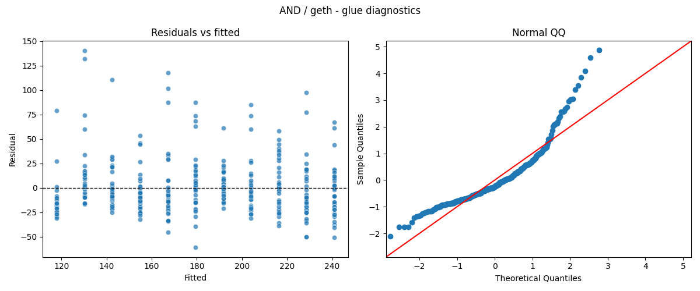

</details>

<details><summary><code>CALLDATACOPY</code> · nobs=8712 · runtime_ms=1.311e-05 · p=1.00e-03 · R²=0.9426</summary>

```
==============================================================================
                           NNLS Regression Results                            
==============================================================================
Dep. Variable:          test_runtime_ms              R-squared:          0.943
Model:                  NNLS                    Adj. R-squared:          0.943
No. Observations:       8712                              RMSE:          24.34
Df Residuals:           8710                               MAE:          17.68
Df Model:               1      
==============================================================================
                      coef     std err     P-value      [0.025      0.975]
------------------------------------------------------------------------------
         const     20.0472      0.3228       0.001     19.4187     20.6824
  CALLDATACOPY      0.0000      0.0000       0.001      0.0000      0.0000
==============================================================================
Notes: Non-negative least squares with bootstrap inference (1000 iterations)
==============================================================================
```

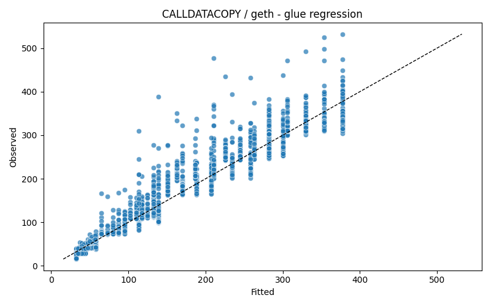

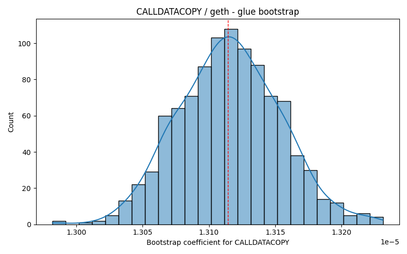

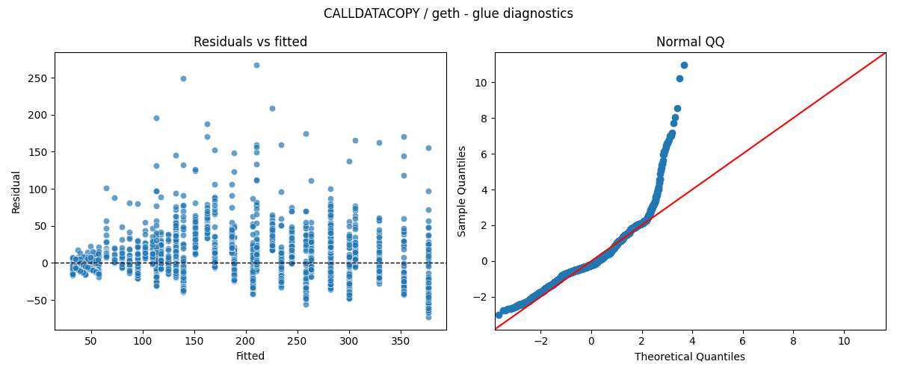

</details>

<details><summary><code>CALLDATALOAD</code> · nobs=1452 · runtime_ms=5.075e-05 · p=1.00e-03 · R²=0.03591</summary>

```
==============================================================================
                           NNLS Regression Results                            
==============================================================================
Dep. Variable:          test_runtime_ms              R-squared:          0.036
Model:                  NNLS                    Adj. R-squared:          0.035
No. Observations:       1452                              RMSE:           1.01
Df Residuals:           1450                               MAE:           0.47
Df Model:               1      
==============================================================================
                      coef     std err     P-value      [0.025      0.975]
------------------------------------------------------------------------------
         const      2.3774      0.0789       0.001      2.2269      2.5289
  CALLDATALOAD      0.0001      0.0000       0.001      0.0000      0.0001
==============================================================================
Notes: Non-negative least squares with bootstrap inference (1000 iterations)
==============================================================================
```

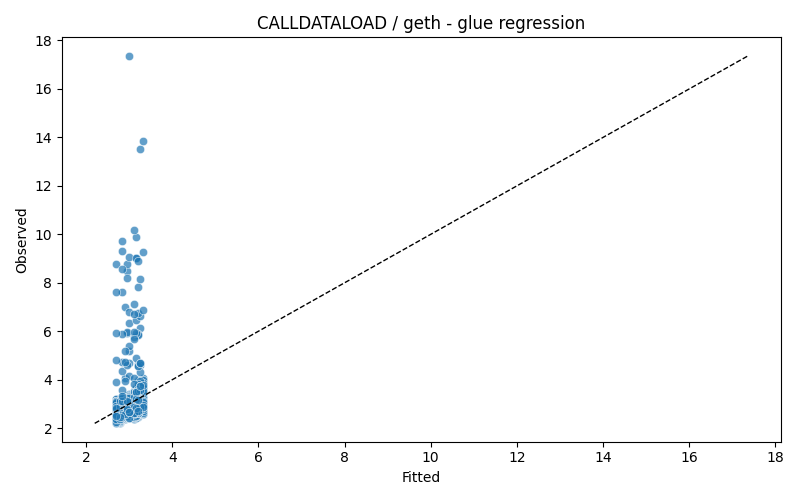

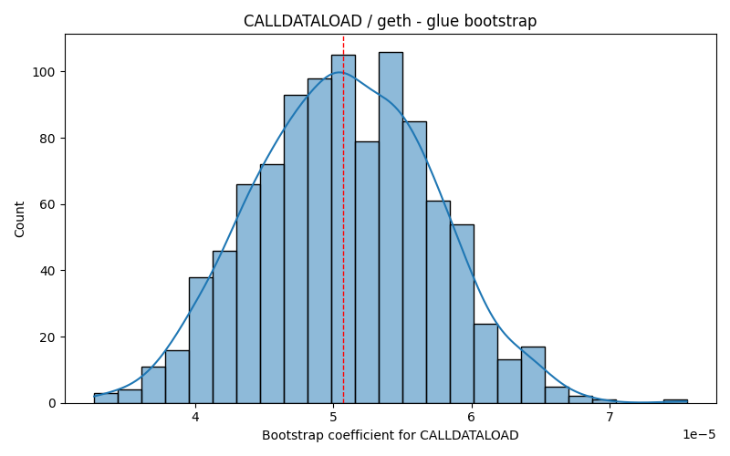

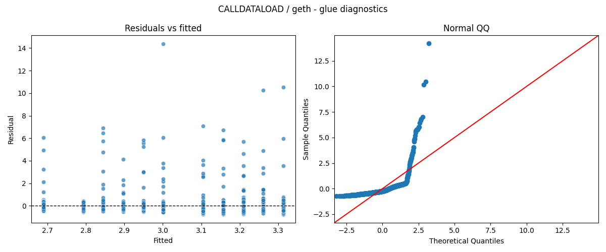

</details>

<details><summary><code>DIV</code> · nobs=363 · runtime_ms=9.244e-06 · p=1.00e-03 · R²=0.8164</summary>

```
==============================================================================
                           NNLS Regression Results                            
==============================================================================
Dep. Variable:          test_runtime_ms              R-squared:          0.816
Model:                  NNLS                    Adj. R-squared:          0.816
No. Observations:       363                               RMSE:          34.60
Df Residuals:           361                                MAE:          29.52
Df Model:               1      
==============================================================================
                      coef     std err     P-value      [0.025      0.975]
------------------------------------------------------------------------------
         const     75.6540      6.9974       0.001     62.5131     90.0508
           DIV      0.0000      0.0000       0.001      0.0000      0.0000
==============================================================================
Notes: Non-negative least squares with bootstrap inference (1000 iterations)
==============================================================================
```

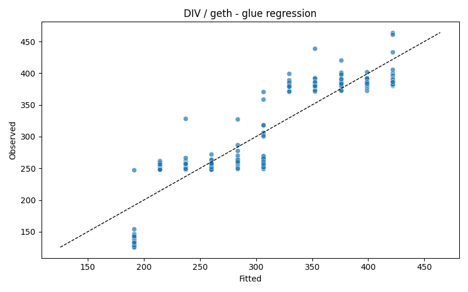

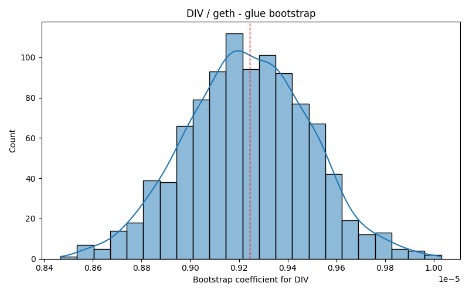

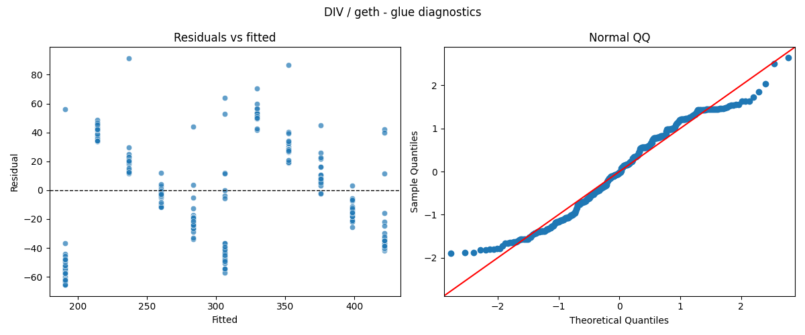

</details>

<details><summary><code>EXP</code> · nobs=363 · runtime_ms=0.0003251 · p=1.00e-03 · R²=0.8025</summary>

```
==============================================================================
                           NNLS Regression Results                            
==============================================================================
Dep. Variable:          test_runtime_ms              R-squared:          0.802
Model:                  NNLS                    Adj. R-squared:          0.802
No. Observations:       363                               RMSE:           6.32
Df Residuals:           361                                MAE:           5.47
Df Model:               1      
==============================================================================
                      coef     std err     P-value      [0.025      0.975]
------------------------------------------------------------------------------
         const     13.9311      1.2452       0.001     11.5047     16.3869
           EXP      0.0003      0.0000       0.001      0.0003      0.0003
==============================================================================
Notes: Non-negative least squares with bootstrap inference (1000 iterations)
==============================================================================
```

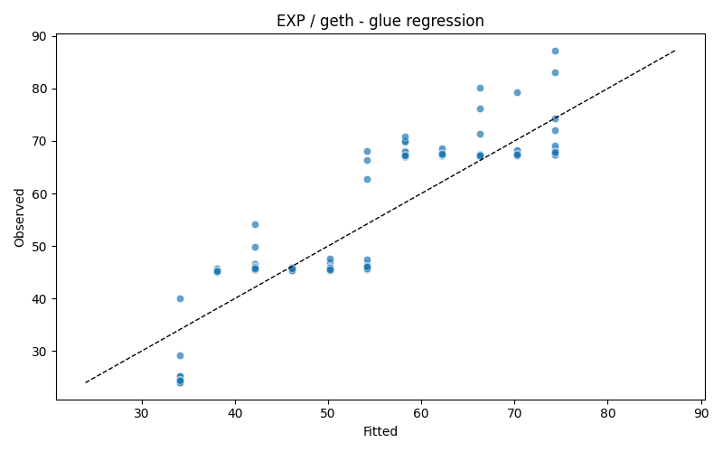

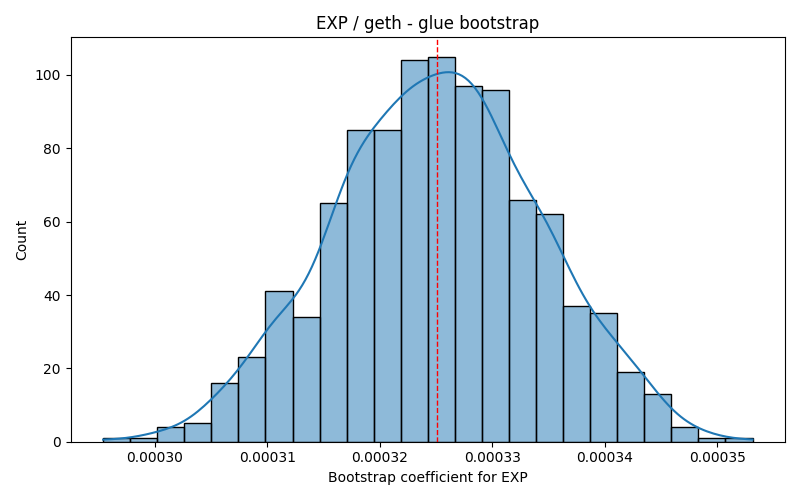

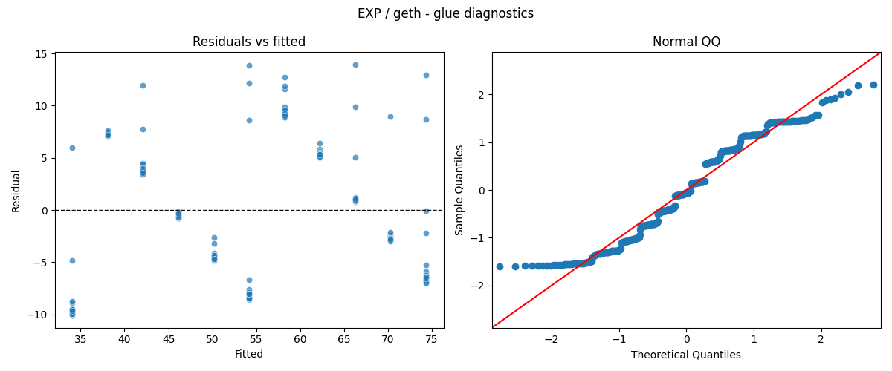

</details>

<details><summary><code>GT</code> · nobs=363 · runtime_ms=3.525e-06 · p=1.00e-03 · R²=0.7026</summary>

```
==============================================================================
                           NNLS Regression Results                            
==============================================================================
Dep. Variable:          test_runtime_ms              R-squared:          0.703
Model:                  NNLS                    Adj. R-squared:          0.702
No. Observations:       363                               RMSE:          24.14
Df Residuals:           361                                MAE:          17.04
Df Model:               1      
==============================================================================
                      coef     std err     P-value      [0.025      0.975]
------------------------------------------------------------------------------
         const     39.9775      4.7033       0.001     31.5338     50.1971
            GT      0.0000      0.0000       0.001      0.0000      0.0000
==============================================================================
Notes: Non-negative least squares with bootstrap inference (1000 iterations)
==============================================================================
```

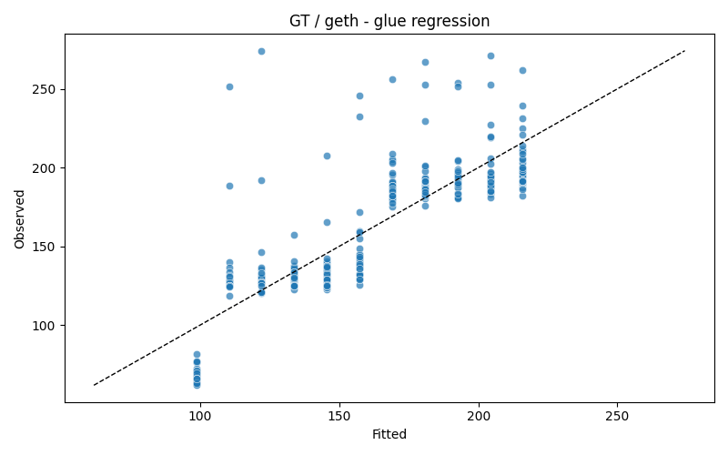

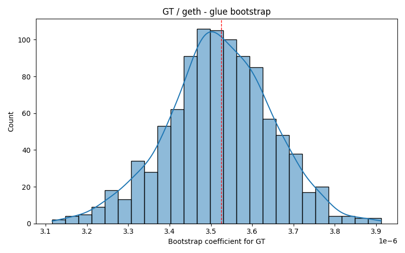

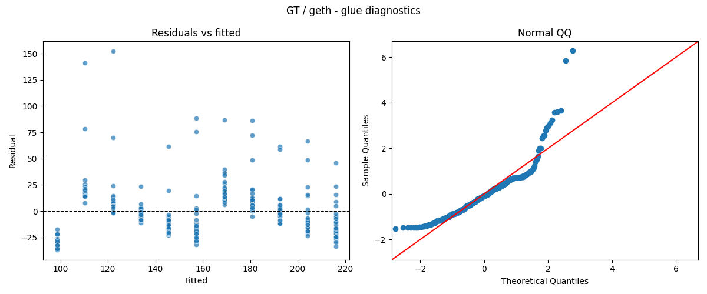

</details>

<details><summary><code>JUMPI</code> · nobs=363 · runtime_ms=6.058e-06 · p=1.00e-03 · R²=0.7341</summary>

```
==============================================================================
                           NNLS Regression Results                            
==============================================================================
Dep. Variable:          test_runtime_ms              R-squared:          0.734
Model:                  NNLS                    Adj. R-squared:          0.733
No. Observations:       363                               RMSE:          16.45
Df Residuals:           361                                MAE:          12.36
Df Model:               1      
==============================================================================
                      coef     std err     P-value      [0.025      0.975]
------------------------------------------------------------------------------
         const     18.1577      2.7907       0.001     12.9384     23.7180
         JUMPI      0.0000      0.0000       0.001      0.0000      0.0000
==============================================================================
Notes: Non-negative least squares with bootstrap inference (1000 iterations)
==============================================================================
```

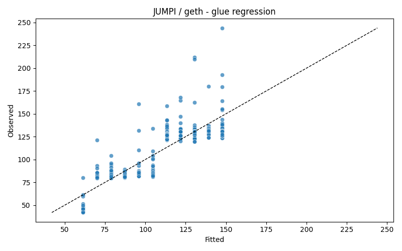

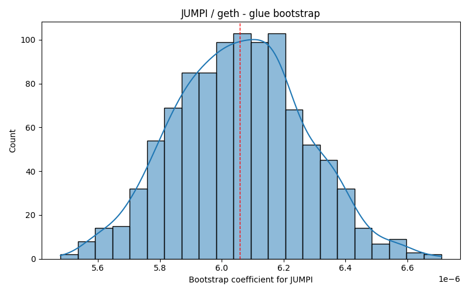

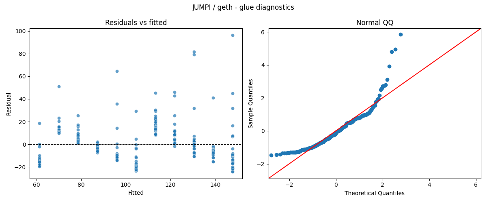

</details>

<details><summary><code>LT</code> · nobs=363 · runtime_ms=4.419e-06 · p=1.00e-03 · R²=0.7648</summary>

```
==============================================================================
                           NNLS Regression Results                            
==============================================================================
Dep. Variable:          test_runtime_ms              R-squared:          0.765
Model:                  NNLS                    Adj. R-squared:          0.764
No. Observations:       363                               RMSE:          25.80
Df Residuals:           361                                MAE:          18.85
Df Model:               1      
==============================================================================
                      coef     std err     P-value      [0.025      0.975]
------------------------------------------------------------------------------
         const     42.5663      4.7644       0.001     32.8139     52.0720
            LT      0.0000      0.0000       0.001      0.0000      0.0000
==============================================================================
Notes: Non-negative least squares with bootstrap inference (1000 iterations)
==============================================================================
```

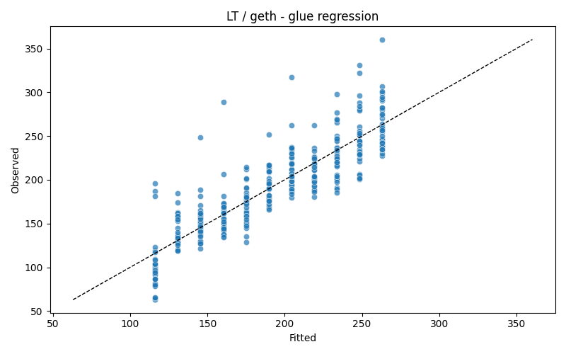

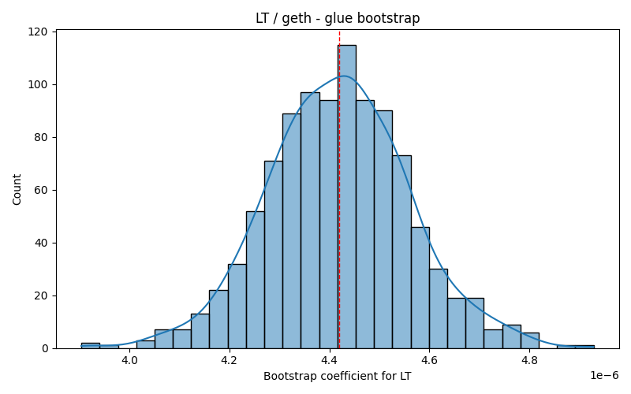

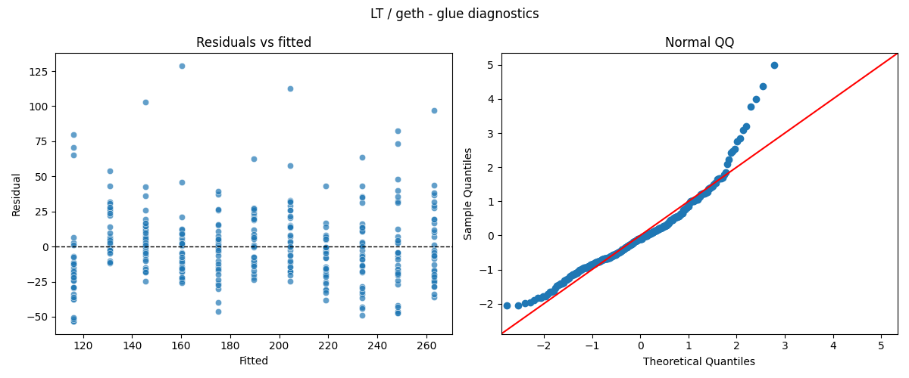

</details>

<details><summary><code>MSTORE</code> · nobs=1815 · runtime_ms=7.822e-06 · p=1.00e-03 · R²=0.7713</summary>

```
==============================================================================
                           NNLS Regression Results                            
==============================================================================
Dep. Variable:          test_runtime_ms              R-squared:          0.771
Model:                  NNLS                    Adj. R-squared:          0.771
No. Observations:       1815                              RMSE:          29.89
Df Residuals:           1813                               MAE:          23.59
Df Model:               1      
==============================================================================
                      coef     std err     P-value      [0.025      0.975]
------------------------------------------------------------------------------
         const     55.4002      2.4857       0.001     50.5205     60.2480
        MSTORE      0.0000      0.0000       0.001      0.0000      0.0000
==============================================================================
Notes: Non-negative least squares with bootstrap inference (1000 iterations)
==============================================================================
```

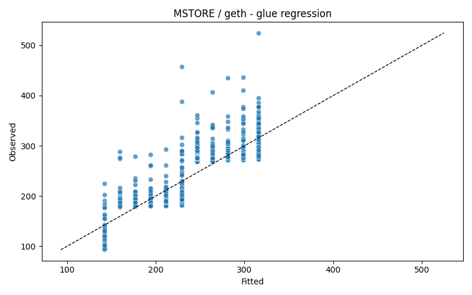

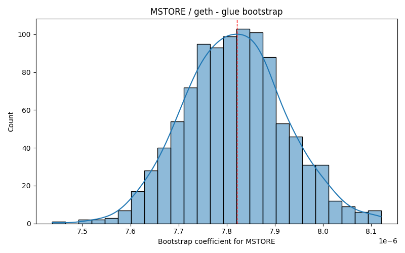

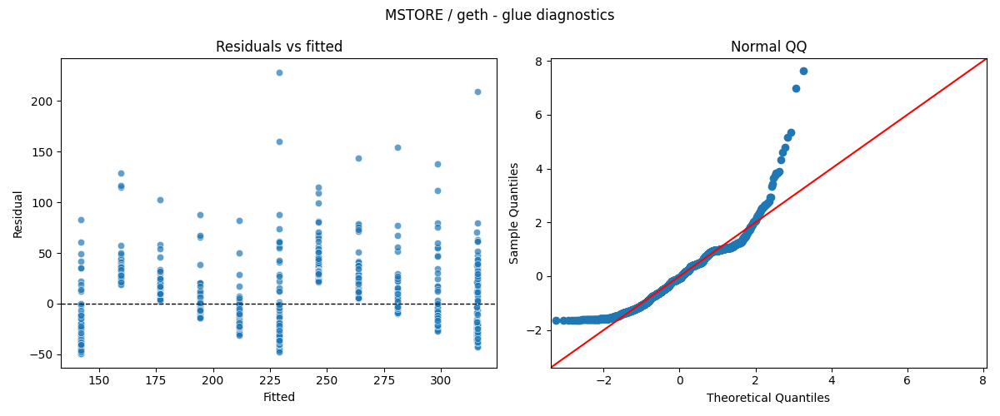

</details>

<details><summary><code>MSTORE8</code> · nobs=1815 · runtime_ms=7.046e-06 · p=1.00e-03 · R²=0.7247</summary>

```
==============================================================================
                           NNLS Regression Results                            
==============================================================================
Dep. Variable:          test_runtime_ms              R-squared:          0.725
Model:                  NNLS                    Adj. R-squared:          0.725
No. Observations:       1815                              RMSE:          30.48
Df Residuals:           1813                               MAE:          22.61
Df Model:               1      
==============================================================================
                      coef     std err     P-value      [0.025      0.975]
------------------------------------------------------------------------------
         const     57.7626      2.8006       0.001     52.5618     63.4357
       MSTORE8      0.0000      0.0000       0.001      0.0000      0.0000
==============================================================================
Notes: Non-negative least squares with bootstrap inference (1000 iterations)
==============================================================================
```

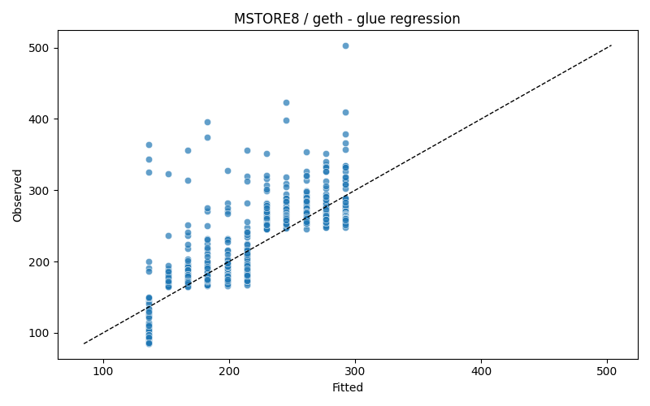

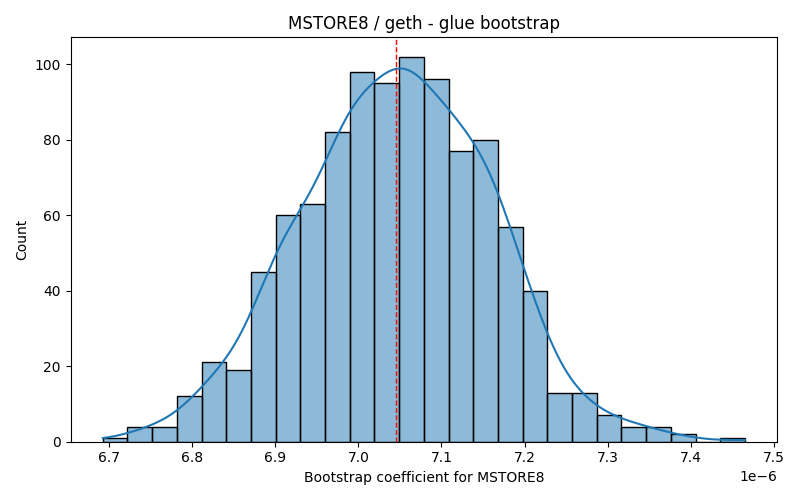

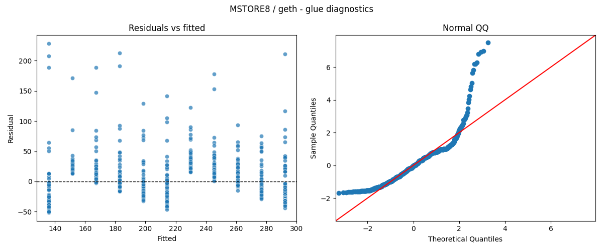

</details>

<details><summary><code>MUL</code> · nobs=363 · runtime_ms=4.798e-06 · p=1.00e-03 · R²=0.7622</summary>

```
==============================================================================
                           NNLS Regression Results                            
==============================================================================
Dep. Variable:          test_runtime_ms              R-squared:          0.762
Model:                  NNLS                    Adj. R-squared:          0.762
No. Observations:       363                               RMSE:          21.16
Df Residuals:           361                                MAE:          15.50
Df Model:               1      
==============================================================================
                      coef     std err     P-value      [0.025      0.975]
------------------------------------------------------------------------------
         const     44.3537      4.1295       0.001     36.4023     52.7159
           MUL      0.0000      0.0000       0.001      0.0000      0.0000
==============================================================================
Notes: Non-negative least squares with bootstrap inference (1000 iterations)
==============================================================================
```

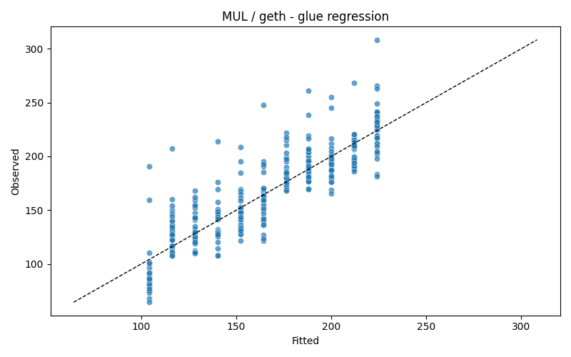

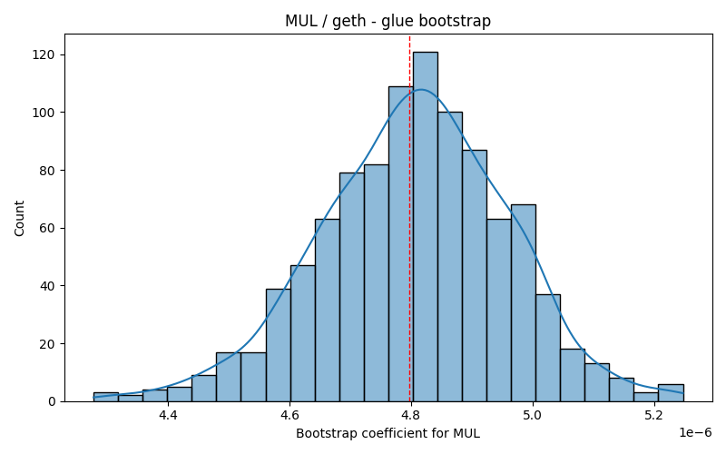

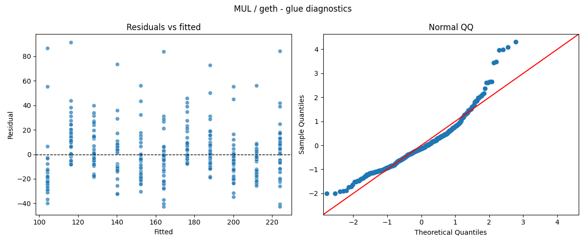

</details>

<details><summary><code>PC</code> · nobs=363 · runtime_ms=1.649e-06 · p=1.00e-03 · R²=0.8225</summary>

```
==============================================================================
                           NNLS Regression Results                            
==============================================================================
Dep. Variable:          test_runtime_ms              R-squared:          0.823
Model:                  NNLS                    Adj. R-squared:          0.822
No. Observations:       363                               RMSE:          22.90
Df Residuals:           361                                MAE:          17.91
Df Model:               1      
==============================================================================
                      coef     std err     P-value      [0.025      0.975]
------------------------------------------------------------------------------
         const     42.3378      4.4719       0.001     34.1155     51.1427
            PC      0.0000      0.0000       0.001      0.0000      0.0000
==============================================================================
Notes: Non-negative least squares with bootstrap inference (1000 iterations)
==============================================================================
```

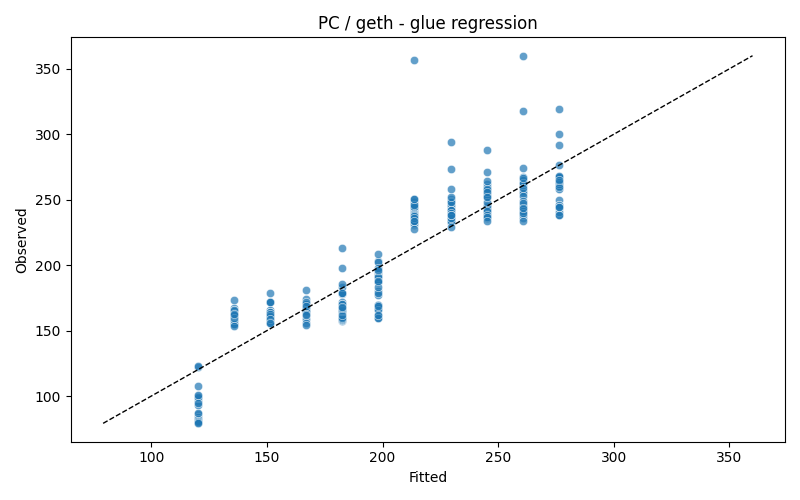

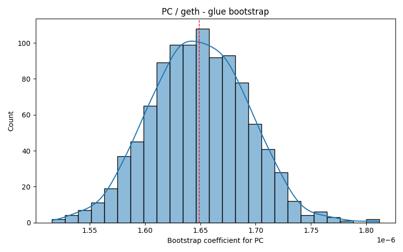

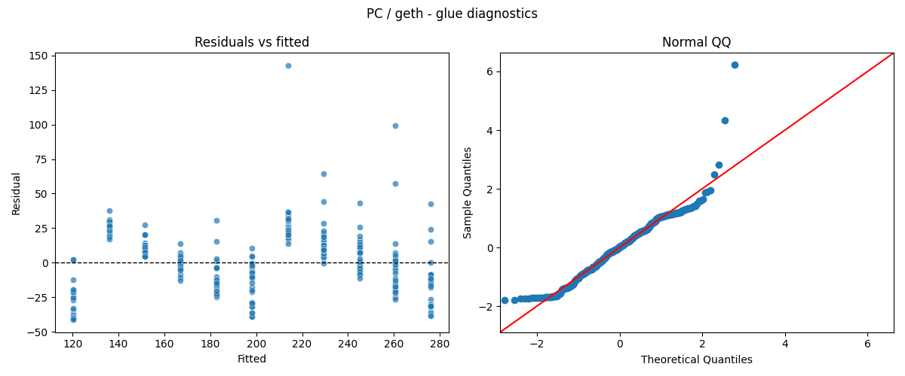

</details>

<details><summary><code>RETURNDATASIZE</code> · nobs=1452 · runtime_ms=3.441e-06 · p=1.00e-03 · R²=0.6438</summary>

```
==============================================================================
                           NNLS Regression Results                            
==============================================================================
Dep. Variable:          test_runtime_ms              R-squared:          0.644
Model:                  NNLS                    Adj. R-squared:          0.644
No. Observations:       1452                              RMSE:          40.41
Df Residuals:           1450                               MAE:          29.70
Df Model:               1      
==============================================================================
                      coef     std err     P-value      [0.025      0.975]
------------------------------------------------------------------------------
         const     47.5468      3.4237       0.001     41.1303     54.5056
RETURNDATASIZE      0.0000      0.0000       0.001      0.0000      0.0000
==============================================================================
Notes: Non-negative least squares with bootstrap inference (1000 iterations)
==============================================================================
```

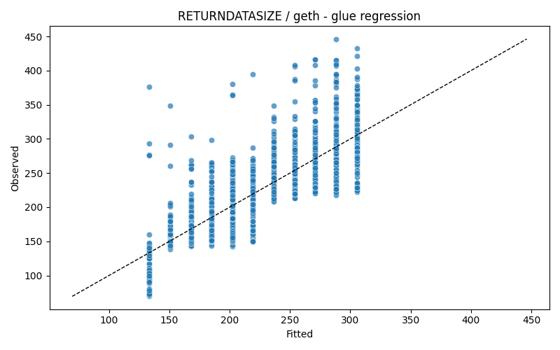

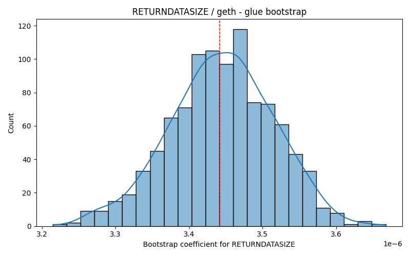

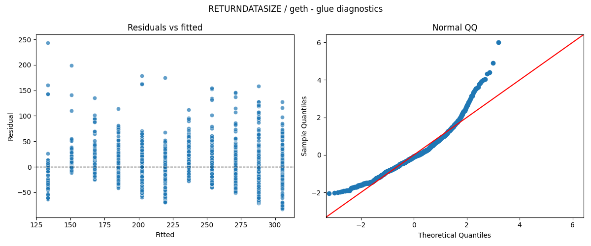

</details>

<details><summary><code>SELFBALANCE</code> · nobs=297 · runtime_ms=7.121e-06 · p=1.00e-03 · R²=0.7737</summary>

```
==============================================================================
                           NNLS Regression Results                            
==============================================================================
Dep. Variable:          test_runtime_ms              R-squared:          0.774
Model:                  NNLS                    Adj. R-squared:          0.773
No. Observations:       297                               RMSE:          38.84
Df Residuals:           295                                MAE:          32.91
Df Model:               1      
==============================================================================
                      coef     std err     P-value      [0.025      0.975]
------------------------------------------------------------------------------
         const    130.6260      6.5549       0.001    117.6569    143.2193
   SELFBALANCE      0.0000      0.0000       0.001      0.0000      0.0000
==============================================================================
Notes: Non-negative least squares with bootstrap inference (1000 iterations)
==============================================================================
```

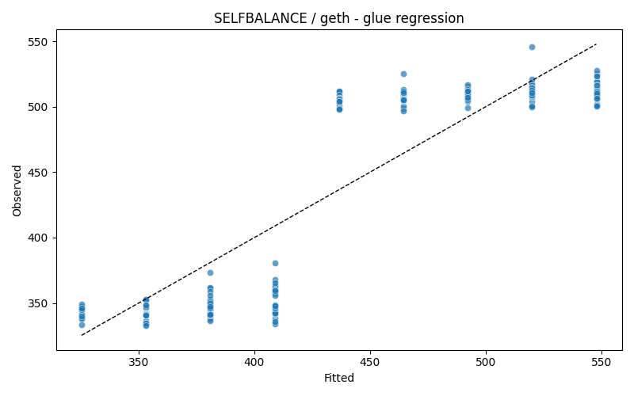

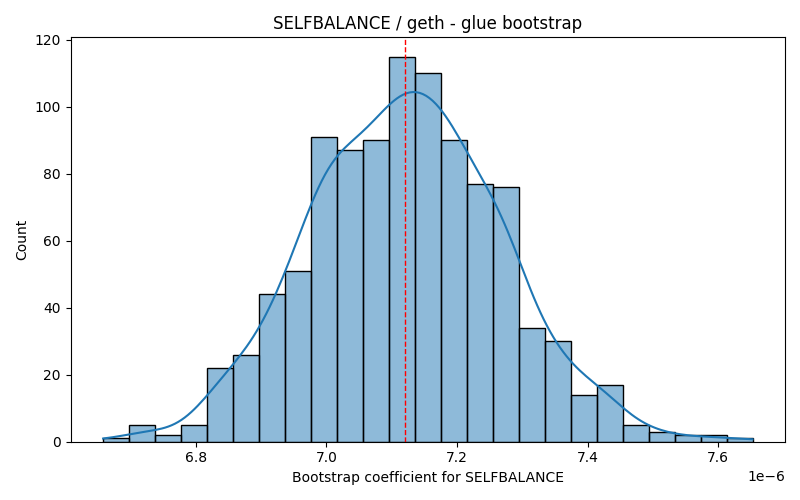

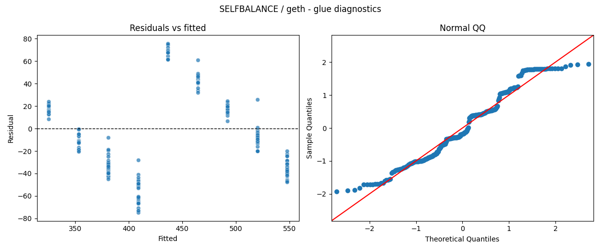

</details>

<details><summary><code>SUB</code> · nobs=363 · runtime_ms=4.385e-06 · p=1.00e-03 · R²=0.7384</summary>

```
==============================================================================
                           NNLS Regression Results                            
==============================================================================
Dep. Variable:          test_runtime_ms              R-squared:          0.738
Model:                  NNLS                    Adj. R-squared:          0.738
No. Observations:       363                               RMSE:          27.47
Df Residuals:           361                                MAE:          19.64
Df Model:               1      
==============================================================================
                      coef     std err     P-value      [0.025      0.975]
------------------------------------------------------------------------------
         const     40.2287      4.2060       0.001     32.2160     48.5081
           SUB      0.0000      0.0000       0.001      0.0000      0.0000
==============================================================================
Notes: Non-negative least squares with bootstrap inference (1000 iterations)
==============================================================================
```

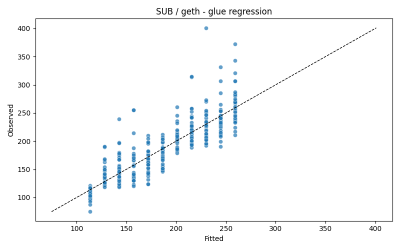

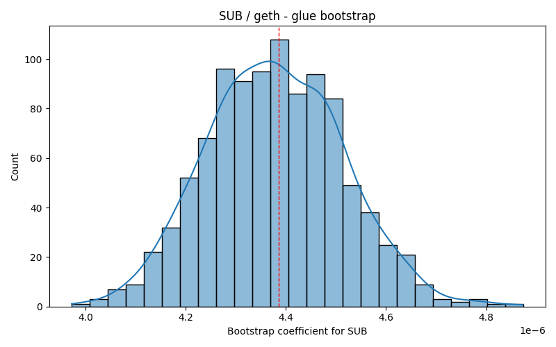

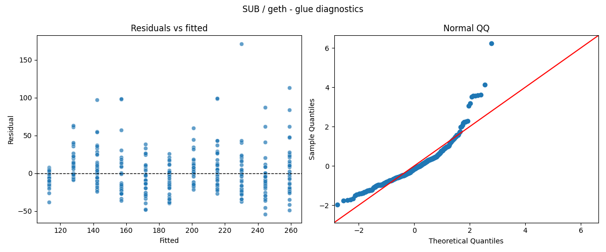

</details>

### Mixed glue (tier B) · geth

<details><summary><code>JUMP</code> · nobs=363 · runtime_ms=9.244e-06 · p=1.00e-03 · R²=0.7661</summary>

```
==============================================================================
                           NNLS Regression Results                            
==============================================================================
Dep. Variable:          test_runtime_ms              R-squared:          0.766
Model:                  NNLS                    Adj. R-squared:          0.765
No. Observations:       363                               RMSE:          18.98
Df Residuals:           361                                MAE:          14.66
Df Model:               1      
==============================================================================
                      coef     std err     P-value      [0.025      0.975]
------------------------------------------------------------------------------
         const     34.9331      3.5818       0.001     27.9058     42.2016
          JUMP      0.0000      0.0000       0.001      0.0000      0.0000
==============================================================================
Notes: Non-negative least squares with bootstrap inference (1000 iterations)
==============================================================================
```

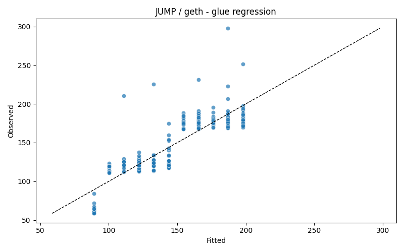

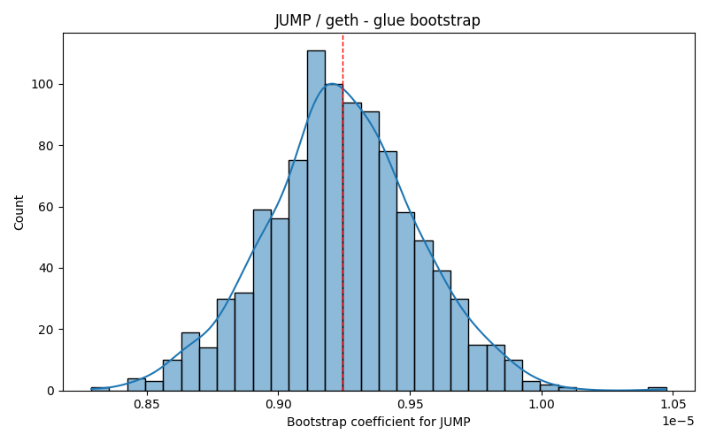

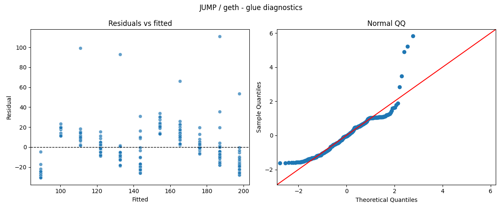

</details>

<details><summary><code>KECCAK256</code> · nobs=5808 · runtime_ms=3.798e-05 · p=1.00e-03 · R²=0.2951</summary>

```
==============================================================================
                           NNLS Regression Results                            
==============================================================================
Dep. Variable:          test_runtime_ms              R-squared:          0.295
Model:                  NNLS                    Adj. R-squared:          0.295
No. Observations:       5808                              RMSE:         116.66
Df Residuals:           5806                               MAE:          91.42
Df Model:               1      
==============================================================================
                      coef     std err     P-value      [0.025      0.975]
------------------------------------------------------------------------------
         const    371.2933      3.4099       0.001    364.6647    377.8565
     KECCAK256      0.0000      0.0000       0.001      0.0000      0.0000
==============================================================================
Notes: Non-negative least squares with bootstrap inference (1000 iterations)
==============================================================================
```

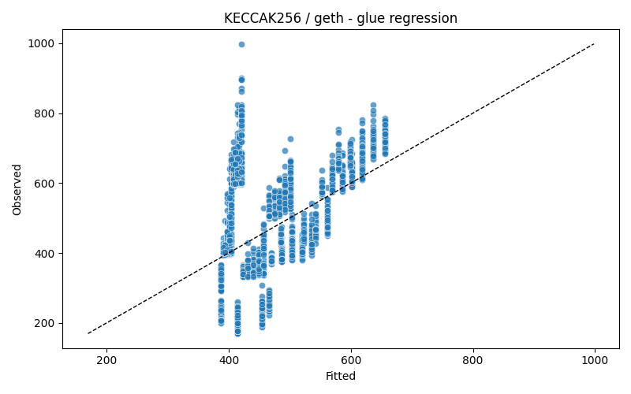

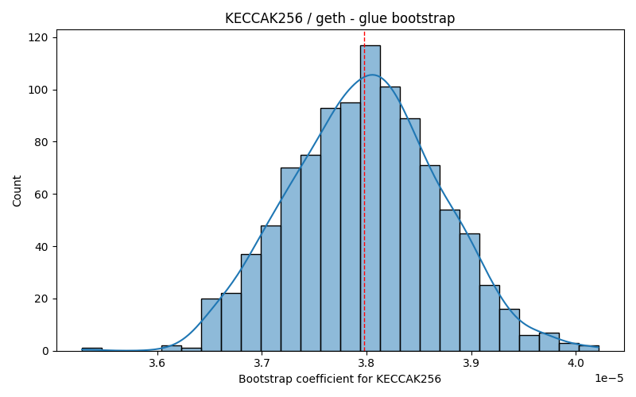

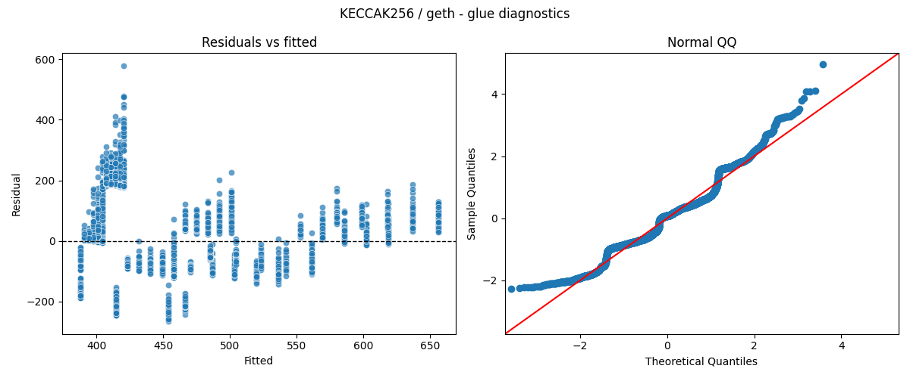

</details>

## nethermind

| glue_opcode | nobs | glue_runtime_ms | p_value | rsquared |
| --- | --- | --- | --- | --- |
| `ISZERO` | 319 | 7.009e-07 | 1.00e-03 | 0.5991 |
| `JUMPDEST` | 319 | 4.138e-07 | 1.00e-03 | 0.671 |
| `SWAP` | 5104 | 4.404e-07 | 1.00e-03 | 0.403 |
| `CALLDATASIZE` | 19140 | 3.373e-07 | 1.00e-03 | 0.9675 |
| `DUP` | 19140 | 1.649e-07 | 1.00e-03 | 0.9675 |
| `GAS` | 19140 | 2.128e-07 | 1.00e-03 | 0.9675 |
| `MLOAD` | 19140 | 1.238e-06 | 1.00e-03 | 0.9675 |
| `PUSH` | 19140 | 2.65e-07 | 1.00e-03 | 0.9675 |
| `PUSH0` | 19140 | 1.845e-07 | 1.00e-03 | 0.9675 |
| `STATICCALL` | 19140 | 0.0004652 | 1.00e-03 | 0.9675 |
| `ADD` | 319 | 2.175e-06 | 1.00e-03 | 0.934 |
| `AND` | 319 | 1.113e-06 | 1.00e-03 | 0.5986 |
| `CALLDATACOPY` | 7656 | 4.362e-06 | 1.00e-03 | 0.6577 |
| `CALLDATALOAD` | 1276 | 1.033e-05 | 3.51e-01 | 6.812e-05 |
| `DIV` | 319 | 6.404e-06 | 1.00e-03 | 0.6308 |
| `EXP` | 319 | 0 | 1.00e+00 | 0 |
| `GT` | 319 | 1.388e-06 | 1.00e-03 | 0.5353 |
| `JUMPI` | 319 | 1.506e-06 | 1.00e-03 | 0.8241 |
| `LT` | 319 | 1.225e-06 | 1.00e-03 | 0.5052 |
| `MSTORE` | 1595 | 1.869e-06 | 1.00e-03 | 0.6807 |
| `MSTORE8` | 1595 | 1.861e-06 | 1.00e-03 | 0.7362 |
| `MUL` | 319 | 4.992e-06 | 1.00e-03 | 0.9506 |
| `PC` | 319 | 7.272e-07 | 1.00e-03 | 0.8439 |
| `RETURNDATASIZE` | 1276 | 7.102e-07 | 1.00e-03 | 0.4033 |
| `SELFBALANCE` | 261 | 3.987e-06 | 1.00e-03 | 0.6397 |
| `SUB` | 319 | 2.361e-06 | 1.00e-03 | 0.9443 |
| `JUMP` | 319 | 4.507e-06 | 1.00e-03 | 0.8008 |
| `KECCAK256` | 5104 | 0 | 1.00e+00 | 0 |

### Cycle glue — joint fit · nethermind

<details><summary>Joint NNLS regression summary</summary>

```
==============================================================================
                           NNLS Regression Results                            
==============================================================================
Dep. Variable:          test_runtime_ms              R-squared:          0.968
Model:                  NNLS                    Adj. R-squared:          0.967
No. Observations:       19140                             RMSE:          18.12
Df Residuals:           19132                              MAE:           7.07
Df Model:               7      
==============================================================================
                      coef     std err     P-value      [0.025      0.975]
------------------------------------------------------------------------------
         const     20.8288      0.4317       0.001     20.0284     21.6880
  CALLDATASIZE      0.0000      0.0000       0.001      0.0000      0.0000
           DUP      0.0000      0.0000       0.001      0.0000      0.0000
           GAS      0.0000      0.0000       0.001      0.0000      0.0000
         MLOAD      0.0000      0.0000       0.001      0.0000      0.0000
          PUSH      0.0000      0.0000       0.001      0.0000      0.0000
         PUSH0      0.0000      0.0000       0.001      0.0000      0.0000
    STATICCALL      0.0005      0.0000       0.001      0.0005      0.0005
==============================================================================
Notes: Non-negative least squares with bootstrap inference (1000 iterations)
==============================================================================
```

</details>

<details><summary><code>CALLDATASIZE</code> · nobs=19140 · runtime_ms=3.373e-07 · p=1.00e-03 · R²=0.9675</summary>

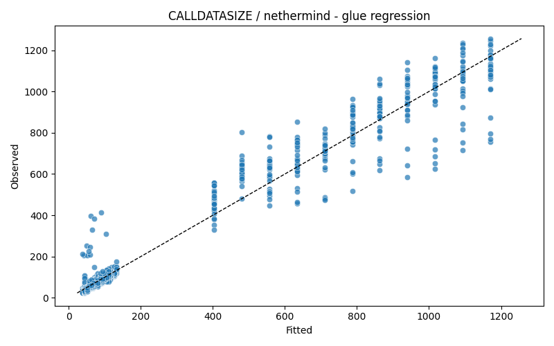


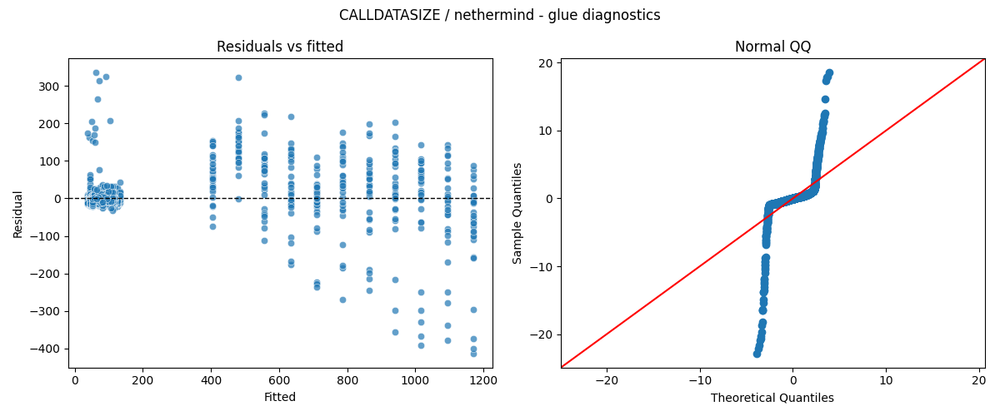

</details>

<details><summary><code>DUP</code> · nobs=19140 · runtime_ms=1.649e-07 · p=1.00e-03 · R²=0.9675</summary>


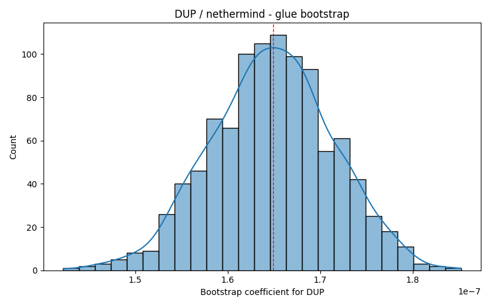


</details>

<details><summary><code>GAS</code> · nobs=19140 · runtime_ms=2.128e-07 · p=1.00e-03 · R²=0.9675</summary>


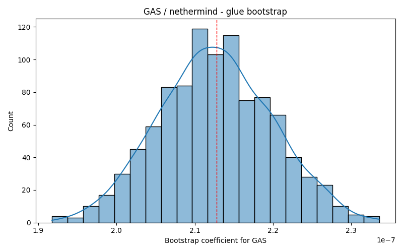


</details>

<details><summary><code>MLOAD</code> · nobs=19140 · runtime_ms=1.238e-06 · p=1.00e-03 · R²=0.9675</summary>

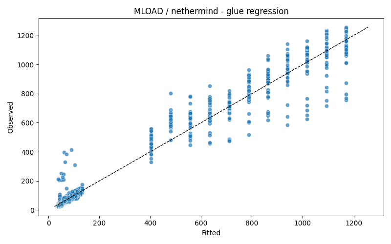

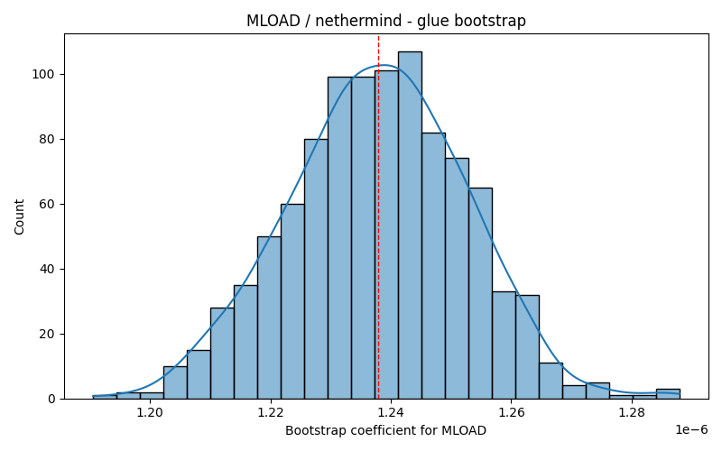


</details>

<details><summary><code>PUSH</code> · nobs=19140 · runtime_ms=2.65e-07 · p=1.00e-03 · R²=0.9675</summary>


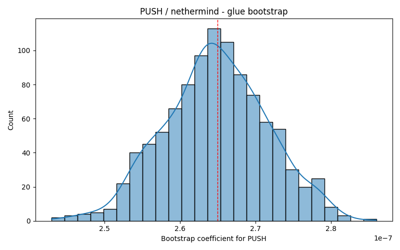


</details>

<details><summary><code>PUSH0</code> · nobs=19140 · runtime_ms=1.845e-07 · p=1.00e-03 · R²=0.9675</summary>


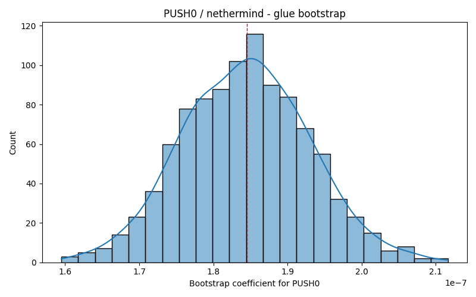

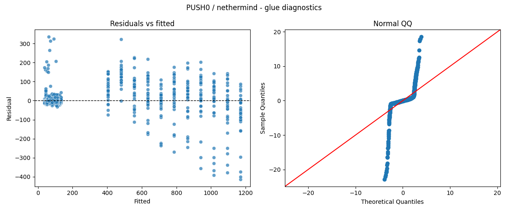

</details>

<details><summary><code>STATICCALL</code> · nobs=19140 · runtime_ms=0.0004652 · p=1.00e-03 · R²=0.9675</summary>

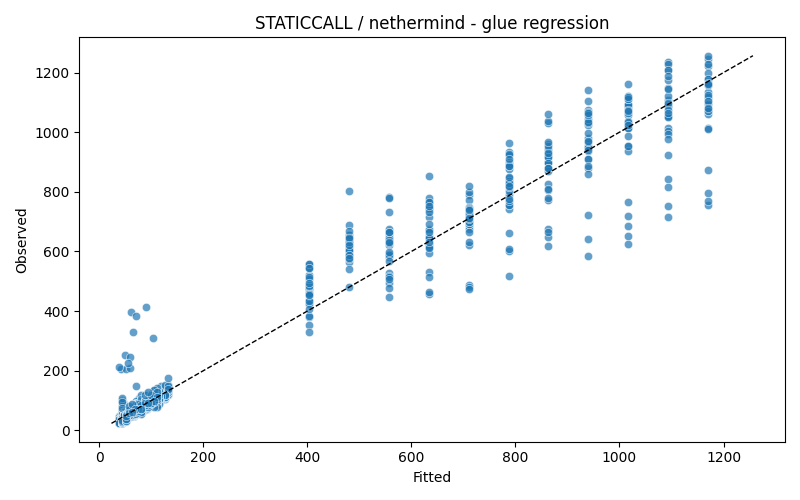

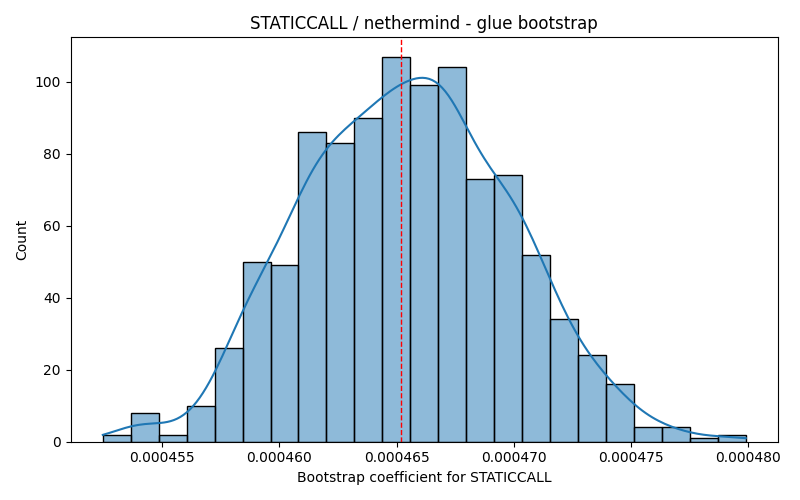


</details>

### Pure glue · nethermind

<details><summary><code>ISZERO</code> · nobs=319 · runtime_ms=7.009e-07 · p=1.00e-03 · R²=0.5991</summary>

```
==============================================================================
                           NNLS Regression Results                            
==============================================================================
Dep. Variable:          test_runtime_ms              R-squared:          0.599
Model:                  NNLS                    Adj. R-squared:          0.598
No. Observations:       319                               RMSE:          12.07
Df Residuals:           317                                MAE:           6.43
Df Model:               1      
==============================================================================
                      coef     std err     P-value      [0.025      0.975]
------------------------------------------------------------------------------
         const     20.5593      2.1482       0.001     16.7782     25.3250
        ISZERO      0.0000      0.0000       0.001      0.0000      0.0000
==============================================================================
Notes: Non-negative least squares with bootstrap inference (1000 iterations)
==============================================================================
```

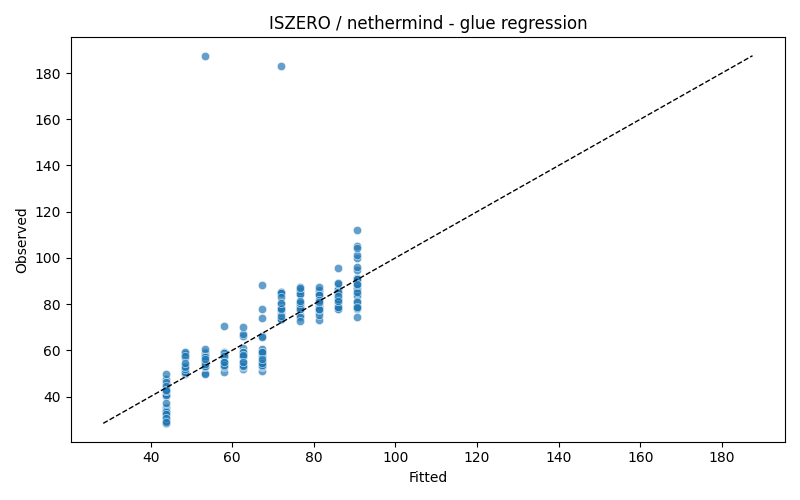

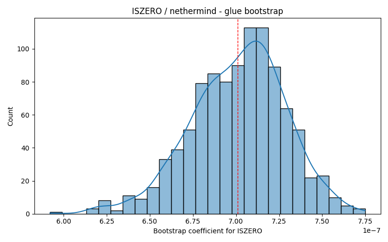

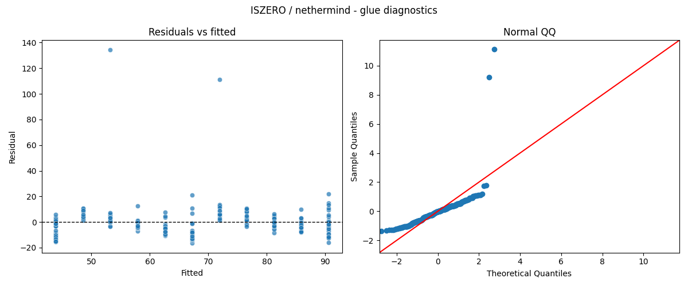

</details>

<details><summary><code>JUMPDEST</code> · nobs=319 · runtime_ms=4.138e-07 · p=1.00e-03 · R²=0.671</summary>

```
==============================================================================
                           NNLS Regression Results                            
==============================================================================
Dep. Variable:          test_runtime_ms              R-squared:          0.671
Model:                  NNLS                    Adj. R-squared:          0.670
No. Observations:       319                               RMSE:          18.29
Df Residuals:           317                                MAE:          15.81
Df Model:               1      
==============================================================================
                      coef     std err     P-value      [0.025      0.975]
------------------------------------------------------------------------------
         const     23.2788      3.1993       0.001     17.3041     29.8263
      JUMPDEST      0.0000      0.0000       0.001      0.0000      0.0000
==============================================================================
Notes: Non-negative least squares with bootstrap inference (1000 iterations)
==============================================================================
```

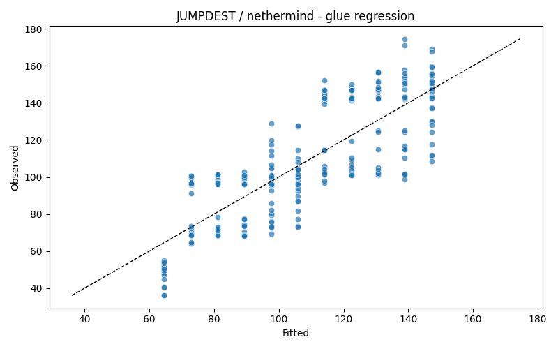

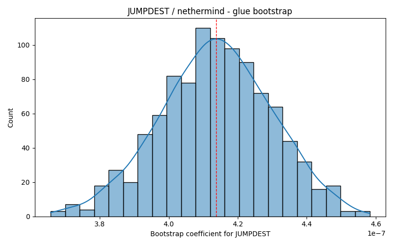

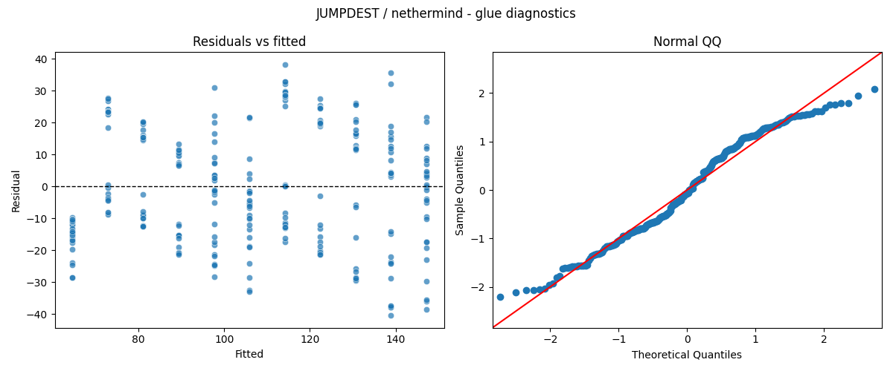

</details>

<details><summary><code>SWAP</code> · nobs=5104 · runtime_ms=4.404e-07 · p=1.00e-03 · R²=0.403</summary>

```
==============================================================================
                           NNLS Regression Results                            
==============================================================================
Dep. Variable:          test_runtime_ms              R-squared:          0.403
Model:                  NNLS                    Adj. R-squared:          0.403
No. Observations:       5104                              RMSE:          11.28
Df Residuals:           5102                               MAE:           4.23
Df Model:               1      
==============================================================================
                      coef     std err     P-value      [0.025      0.975]
------------------------------------------------------------------------------
         const     18.0754      0.5866       0.001     17.0623     19.2796
          SWAP      0.0000      0.0000       0.001      0.0000      0.0000
==============================================================================
Notes: Non-negative least squares with bootstrap inference (1000 iterations)
==============================================================================
```

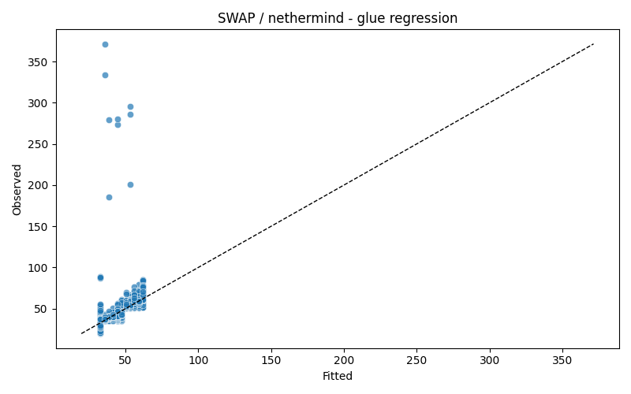

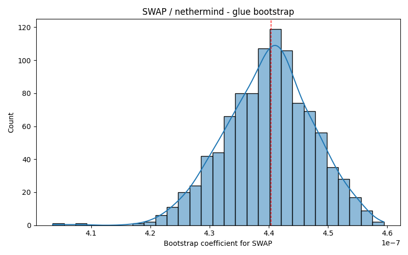

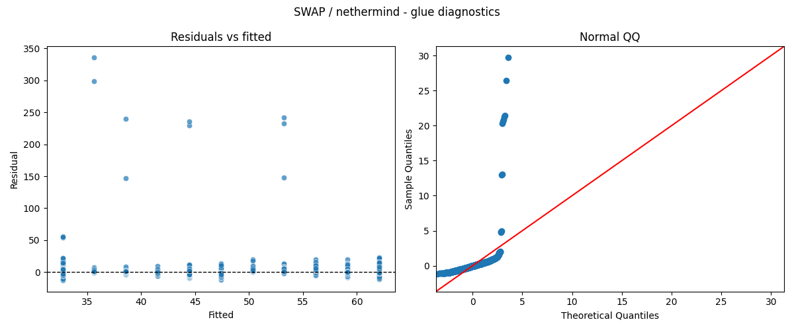

</details>

### Mixed glue (tier A) · nethermind

<details><summary><code>ADD</code> · nobs=319 · runtime_ms=2.175e-06 · p=1.00e-03 · R²=0.934</summary>

```
==============================================================================
                           NNLS Regression Results                            
==============================================================================
Dep. Variable:          test_runtime_ms              R-squared:          0.934
Model:                  NNLS                    Adj. R-squared:          0.934
No. Observations:       319                               RMSE:           6.08
Df Residuals:           317                                MAE:           4.79
Df Model:               1      
==============================================================================
                      coef     std err     P-value      [0.025      0.975]
------------------------------------------------------------------------------
         const     13.3832      1.0914       0.001     11.0938     15.4360
           ADD      0.0000      0.0000       0.001      0.0000      0.0000
==============================================================================
Notes: Non-negative least squares with bootstrap inference (1000 iterations)
==============================================================================
```

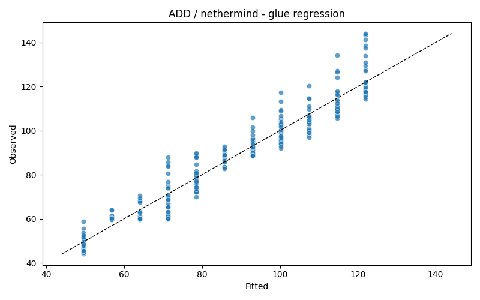

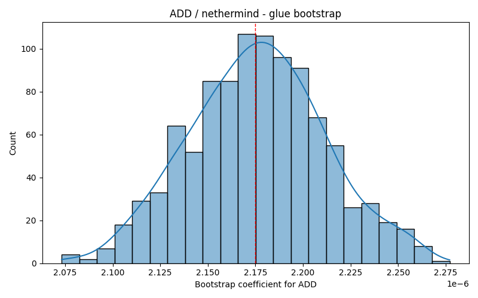

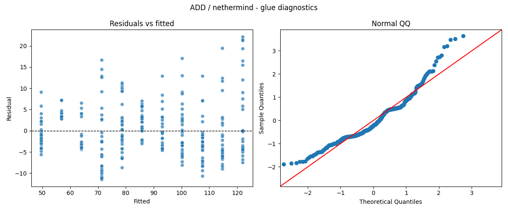

</details>

<details><summary><code>AND</code> · nobs=319 · runtime_ms=1.113e-06 · p=1.00e-03 · R²=0.5986</summary>

```
==============================================================================
                           NNLS Regression Results                            
==============================================================================
Dep. Variable:          test_runtime_ms              R-squared:          0.599
Model:                  NNLS                    Adj. R-squared:          0.597
No. Observations:       319                               RMSE:           9.59
Df Residuals:           317                                MAE:           5.39
Df Model:               1      
==============================================================================
                      coef     std err     P-value      [0.025      0.975]
------------------------------------------------------------------------------
         const     17.2888      2.0208       0.001     13.9199     21.6318
           AND      0.0000      0.0000       0.001      0.0000      0.0000
==============================================================================
Notes: Non-negative least squares with bootstrap inference (1000 iterations)
==============================================================================
```

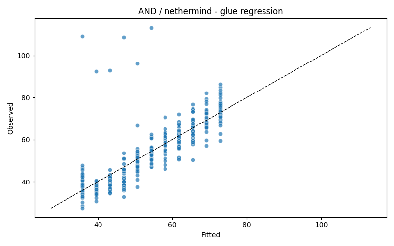

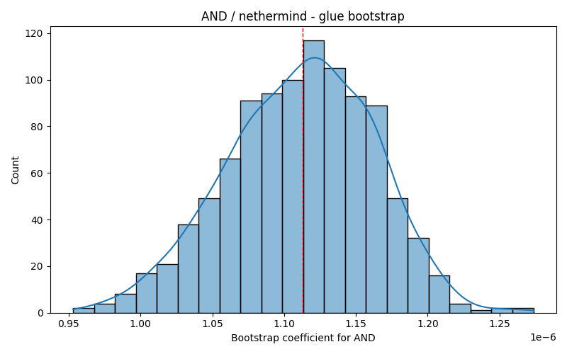

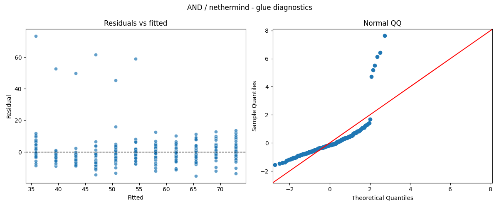

</details>

<details><summary><code>CALLDATACOPY</code> · nobs=7656 · runtime_ms=4.362e-06 · p=1.00e-03 · R²=0.6577</summary>

```
==============================================================================
                           NNLS Regression Results                            
==============================================================================
Dep. Variable:          test_runtime_ms              R-squared:          0.658
Model:                  NNLS                    Adj. R-squared:          0.658
No. Observations:       7656                              RMSE:          23.67
Df Residuals:           7654                               MAE:          18.86
Df Model:               1      
==============================================================================
                      coef     std err     P-value      [0.025      0.975]
------------------------------------------------------------------------------
         const     26.7429      0.3058       0.001     26.1703     27.3520
  CALLDATACOPY      0.0000      0.0000       0.001      0.0000      0.0000
==============================================================================
Notes: Non-negative least squares with bootstrap inference (1000 iterations)
==============================================================================
```

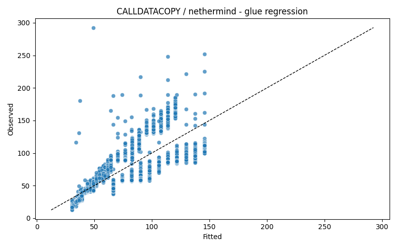

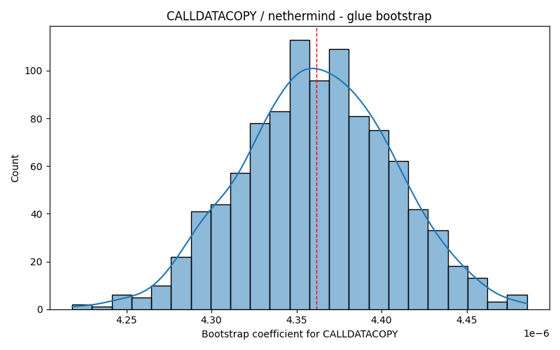

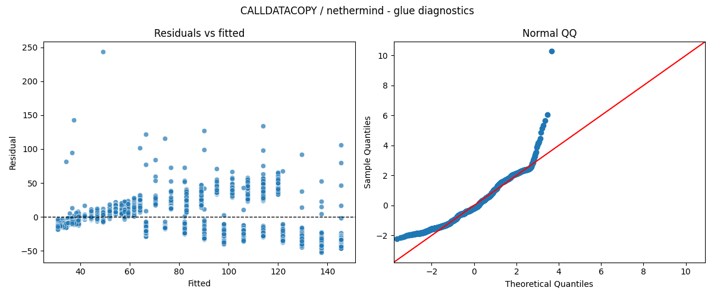

</details>

<details><summary><code>CALLDATALOAD</code> · nobs=1276 · runtime_ms=1.033e-05 · p=3.51e-01 · R²=6.812e-05</summary>

```
==============================================================================
                           NNLS Regression Results                            
==============================================================================
Dep. Variable:          test_runtime_ms              R-squared:          0.000
Model:                  NNLS                    Adj. R-squared:         -0.001
No. Observations:       1276                              RMSE:           4.81
Df Residuals:           1274                               MAE:           0.61
Df Model:               1      
==============================================================================
                      coef     std err     P-value      [0.025      0.975]
------------------------------------------------------------------------------
         const      3.1873      0.4813       0.001      1.8393      3.5871
  CALLDATALOAD      0.0000      0.0000       0.351      0.0000      0.0001
==============================================================================
Notes: Non-negative least squares with bootstrap inference (1000 iterations)
==============================================================================
```


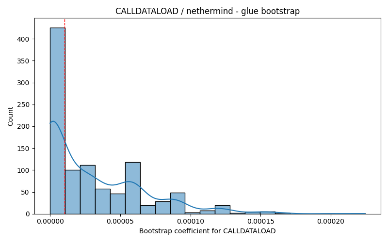

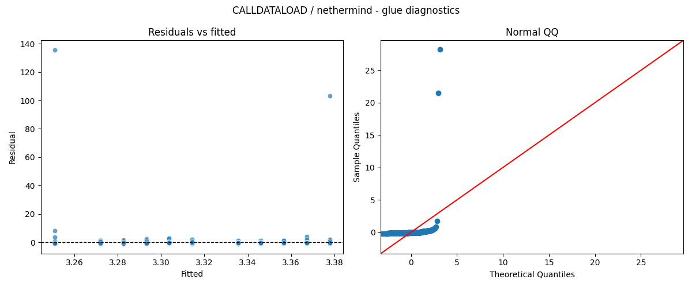

</details>

<details><summary><code>DIV</code> · nobs=319 · runtime_ms=6.404e-06 · p=1.00e-03 · R²=0.6308</summary>

```
==============================================================================
                           NNLS Regression Results                            
==============================================================================
Dep. Variable:          test_runtime_ms              R-squared:          0.631
Model:                  NNLS                    Adj. R-squared:          0.630
No. Observations:       319                               RMSE:          38.67
Df Residuals:           317                                MAE:          29.05
Df Model:               1      
==============================================================================
                      coef     std err     P-value      [0.025      0.975]
------------------------------------------------------------------------------
         const    128.1731     10.4340       0.001    106.8886    147.6660
           DIV      0.0000      0.0000       0.001      0.0000      0.0000
==============================================================================
Notes: Non-negative least squares with bootstrap inference (1000 iterations)
==============================================================================
```

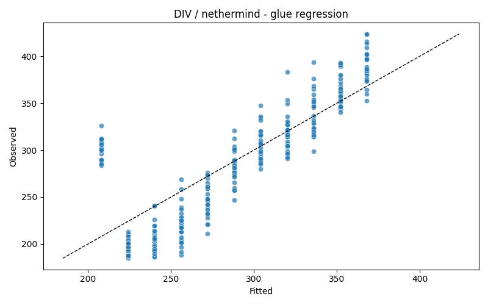

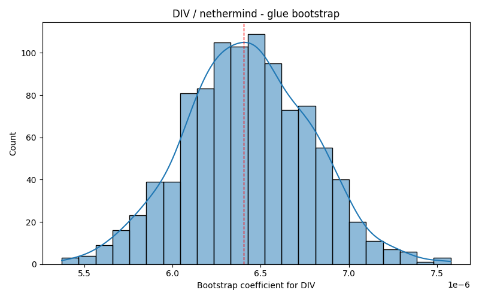

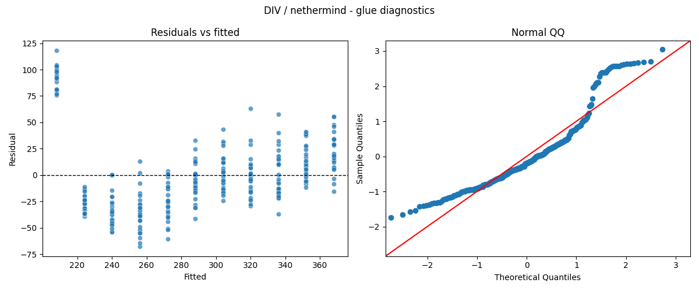

</details>

<details><summary><code>EXP</code> · nobs=319 · runtime_ms=0 · p=1.00e+00 · R²=0</summary>

```
==============================================================================
                           NNLS Regression Results                            
==============================================================================
Dep. Variable:          test_runtime_ms              R-squared:          0.000
Model:                  NNLS                    Adj. R-squared:         -0.003
No. Observations:       319                               RMSE:          46.37
Df Residuals:           317                                MAE:          30.23
Df Model:               1      
==============================================================================
                      coef     std err     P-value      [0.025      0.975]
------------------------------------------------------------------------------
         const     98.0141      4.0307       0.001     85.2218    103.0106
           EXP      0.0000      0.0000       1.000      0.0000      0.0001
==============================================================================
Notes: Non-negative least squares with bootstrap inference (1000 iterations)
==============================================================================
```

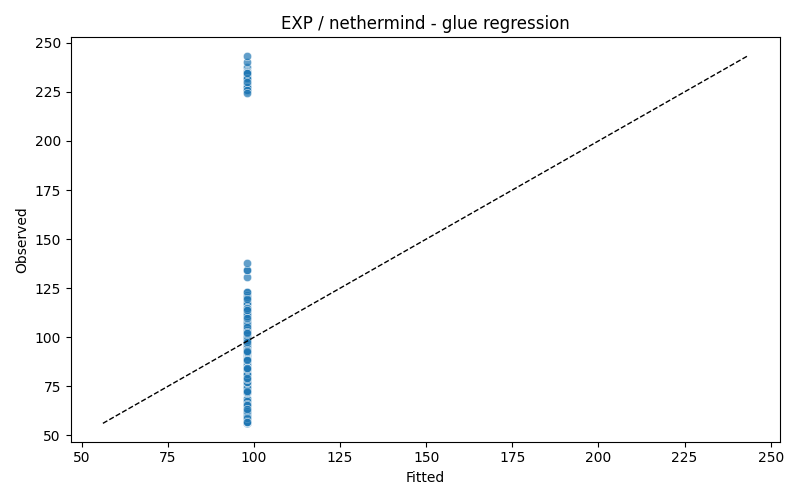

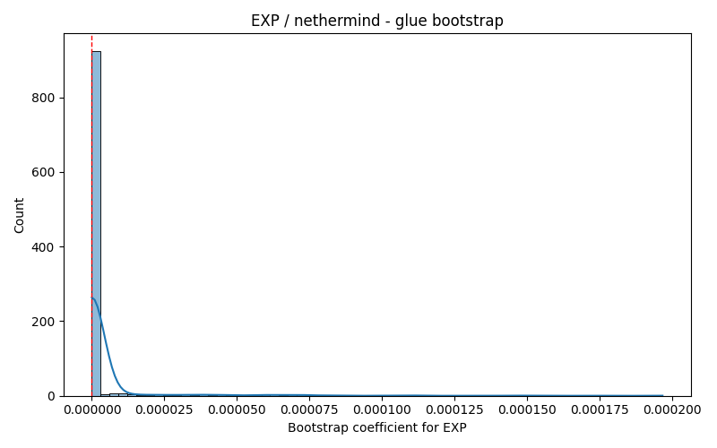

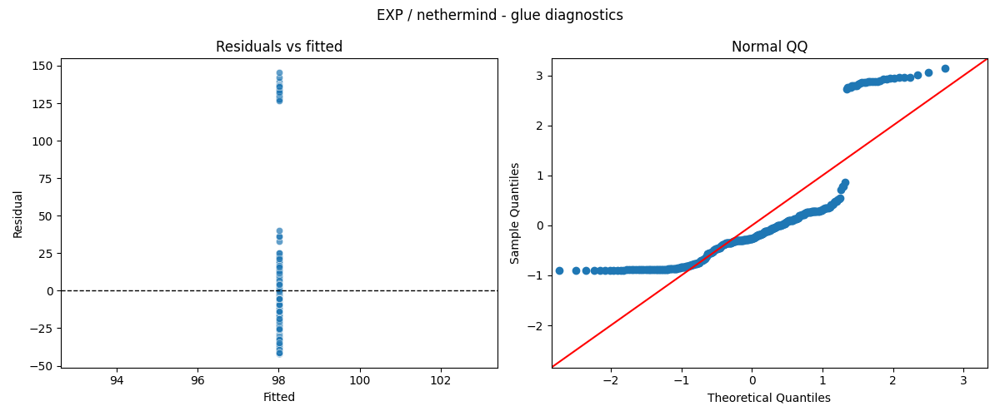

</details>

<details><summary><code>GT</code> · nobs=319 · runtime_ms=1.388e-06 · p=1.00e-03 · R²=0.5353</summary>

```
==============================================================================
                           NNLS Regression Results                            
==============================================================================
Dep. Variable:          test_runtime_ms              R-squared:          0.535
Model:                  NNLS                    Adj. R-squared:          0.534
No. Observations:       319                               RMSE:          13.61
Df Residuals:           317                                MAE:           6.16
Df Model:               1      
==============================================================================
                      coef     std err     P-value      [0.025      0.975]
------------------------------------------------------------------------------
         const     14.0036      1.8935       0.001     10.2060     17.4571
            GT      0.0000      0.0000       0.001      0.0000      0.0000
==============================================================================
Notes: Non-negative least squares with bootstrap inference (1000 iterations)
==============================================================================
```

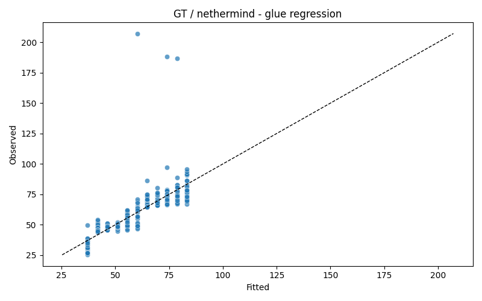

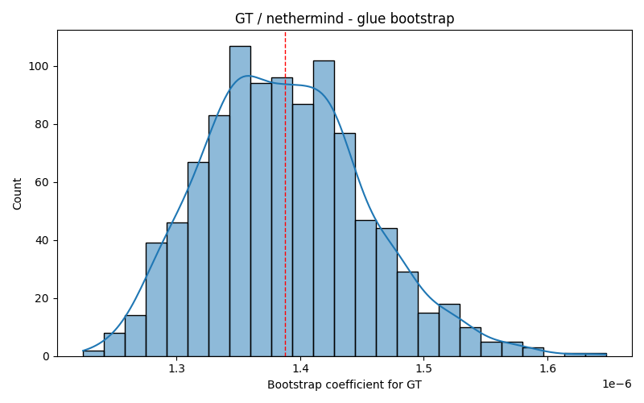

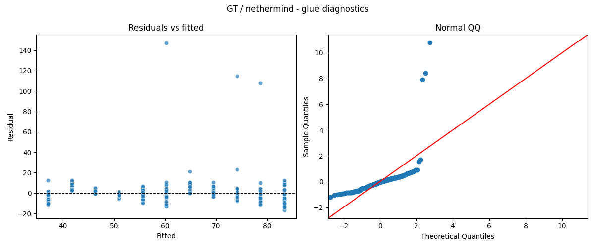

</details>

<details><summary><code>JUMPI</code> · nobs=319 · runtime_ms=1.506e-06 · p=1.00e-03 · R²=0.8241</summary>

```
==============================================================================
                           NNLS Regression Results                            
==============================================================================
Dep. Variable:          test_runtime_ms              R-squared:          0.824
Model:                  NNLS                    Adj. R-squared:          0.824
No. Observations:       319                               RMSE:           3.14
Df Residuals:           317                                MAE:           2.60
Df Model:               1      
==============================================================================
                      coef     std err     P-value      [0.025      0.975]
------------------------------------------------------------------------------
         const      9.5839      0.6421       0.001      8.3986     10.8280
         JUMPI      0.0000      0.0000       0.001      0.0000      0.0000
==============================================================================
Notes: Non-negative least squares with bootstrap inference (1000 iterations)
==============================================================================
```

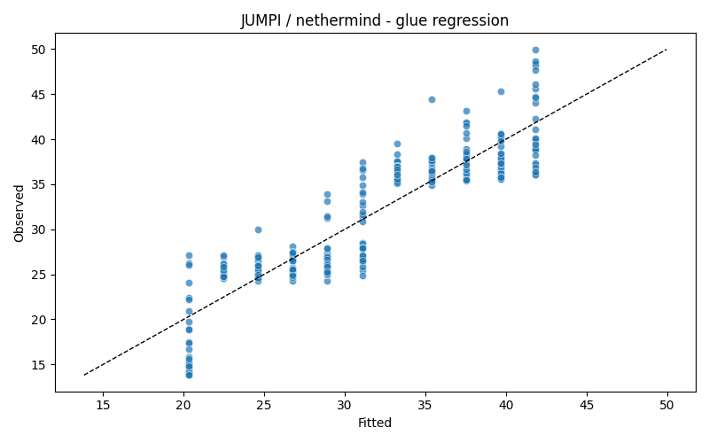

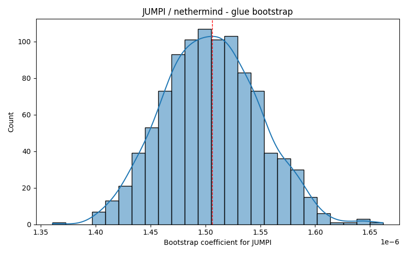

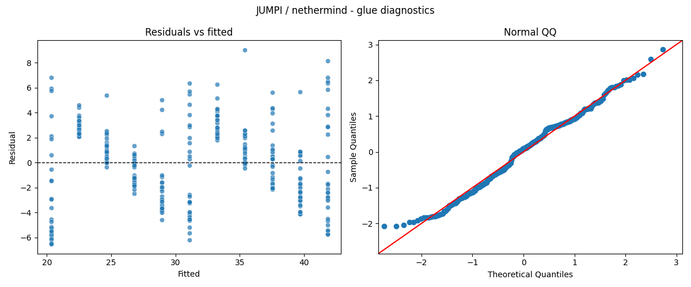

</details>

<details><summary><code>LT</code> · nobs=319 · runtime_ms=1.225e-06 · p=1.00e-03 · R²=0.5052</summary>

```
==============================================================================
                           NNLS Regression Results                            
==============================================================================
Dep. Variable:          test_runtime_ms              R-squared:          0.505
Model:                  NNLS                    Adj. R-squared:          0.504
No. Observations:       319                               RMSE:          12.75
Df Residuals:           317                                MAE:           6.82
Df Model:               1      
==============================================================================
                      coef     std err     P-value      [0.025      0.975]
------------------------------------------------------------------------------
         const     21.3585      2.6139       0.001     17.1769     27.2225
            LT      0.0000      0.0000       0.001      0.0000      0.0000
==============================================================================
Notes: Non-negative least squares with bootstrap inference (1000 iterations)
==============================================================================
```

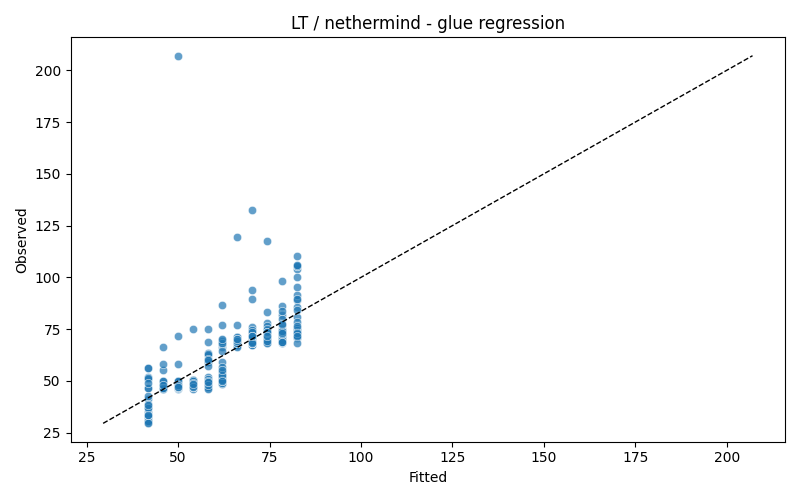

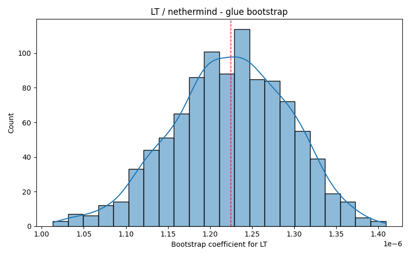

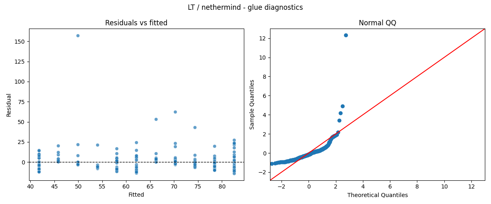

</details>

<details><summary><code>MSTORE</code> · nobs=1595 · runtime_ms=1.869e-06 · p=1.00e-03 · R²=0.6807</summary>

```
==============================================================================
                           NNLS Regression Results                            
==============================================================================
Dep. Variable:          test_runtime_ms              R-squared:          0.681
Model:                  NNLS                    Adj. R-squared:          0.680
No. Observations:       1595                              RMSE:           8.98
Df Residuals:           1593                               MAE:           5.21
Df Model:               1      
==============================================================================
                      coef     std err     P-value      [0.025      0.975]
------------------------------------------------------------------------------
         const     16.3482      0.6709       0.001     14.9998     17.5636
        MSTORE      0.0000      0.0000       0.001      0.0000      0.0000
==============================================================================
Notes: Non-negative least squares with bootstrap inference (1000 iterations)
==============================================================================
```

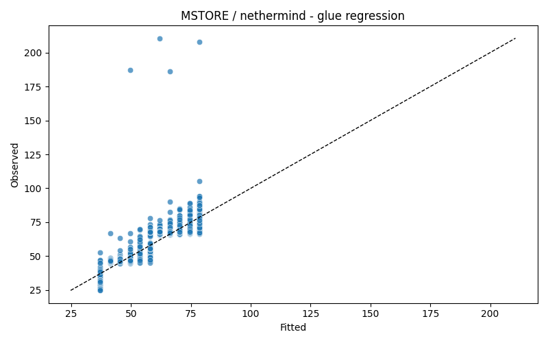

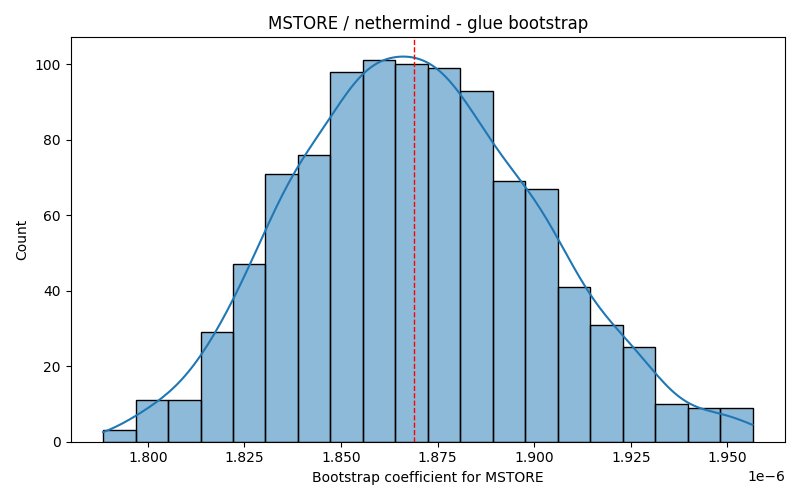

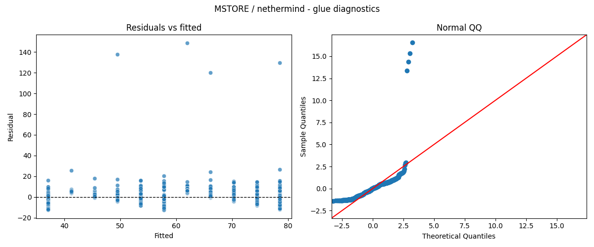

</details>

<details><summary><code>MSTORE8</code> · nobs=1595 · runtime_ms=1.861e-06 · p=1.00e-03 · R²=0.7362</summary>

```
==============================================================================
                           NNLS Regression Results                            
==============================================================================
Dep. Variable:          test_runtime_ms              R-squared:          0.736
Model:                  NNLS                    Adj. R-squared:          0.736
No. Observations:       1595                              RMSE:           7.82
Df Residuals:           1593                               MAE:           5.43
Df Model:               1      
==============================================================================
                      coef     std err     P-value      [0.025      0.975]
------------------------------------------------------------------------------
         const     15.8959      0.6654       0.001     14.5348     17.1598
       MSTORE8      0.0000      0.0000       0.001      0.0000      0.0000
==============================================================================
Notes: Non-negative least squares with bootstrap inference (1000 iterations)
==============================================================================
```

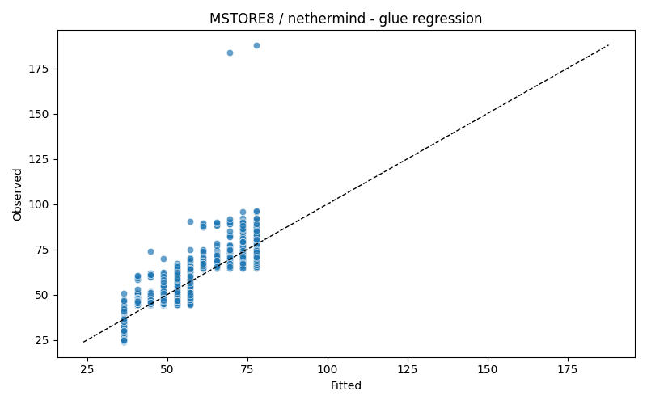

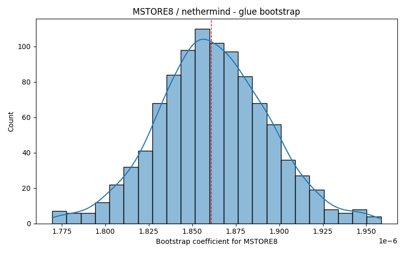

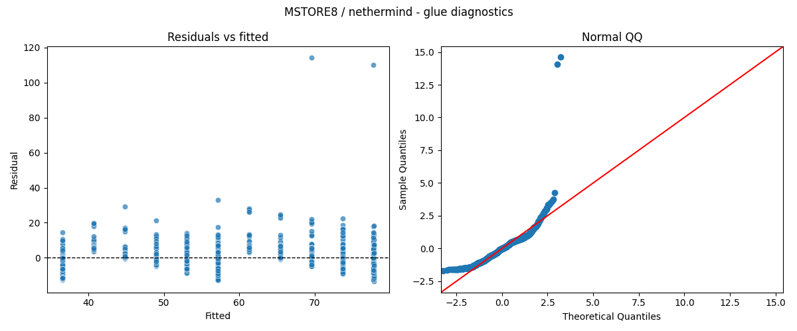

</details>

<details><summary><code>MUL</code> · nobs=319 · runtime_ms=4.992e-06 · p=1.00e-03 · R²=0.9506</summary>

```
==============================================================================
                           NNLS Regression Results                            
==============================================================================
Dep. Variable:          test_runtime_ms              R-squared:          0.951
Model:                  NNLS                    Adj. R-squared:          0.950
No. Observations:       319                               RMSE:           8.98
Df Residuals:           317                                MAE:           6.90
Df Model:               1      
==============================================================================
                      coef     std err     P-value      [0.025      0.975]
------------------------------------------------------------------------------
         const     23.5340      1.5011       0.001     20.4547     26.3201
           MUL      0.0000      0.0000       0.001      0.0000      0.0000
==============================================================================
Notes: Non-negative least squares with bootstrap inference (1000 iterations)
==============================================================================
```

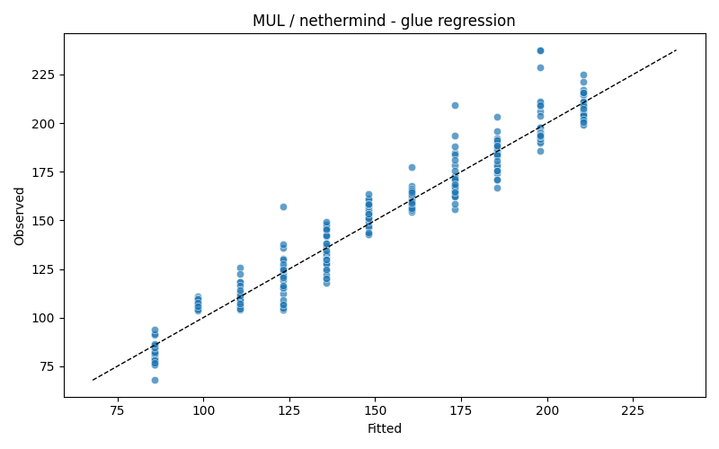

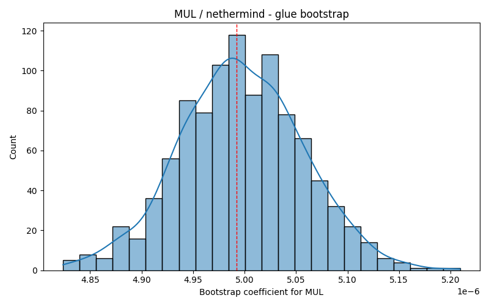

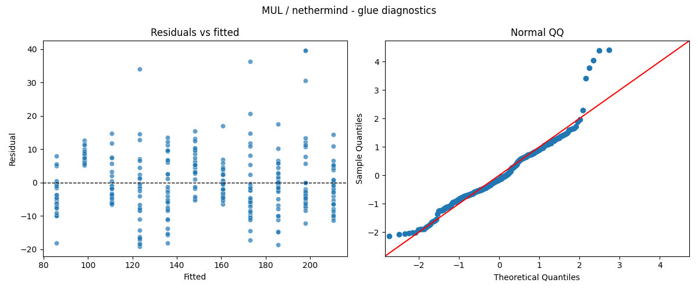

</details>

<details><summary><code>PC</code> · nobs=319 · runtime_ms=7.272e-07 · p=1.00e-03 · R²=0.8439</summary>

```
==============================================================================
                           NNLS Regression Results                            
==============================================================================
Dep. Variable:          test_runtime_ms              R-squared:          0.844
Model:                  NNLS                    Adj. R-squared:          0.843
No. Observations:       319                               RMSE:           9.35
Df Residuals:           317                                MAE:           7.69
Df Model:               1      
==============================================================================
                      coef     std err     P-value      [0.025      0.975]
------------------------------------------------------------------------------
         const     18.4890      1.9099       0.001     14.6300     21.9683
            PC      0.0000      0.0000       0.001      0.0000      0.0000
==============================================================================
Notes: Non-negative least squares with bootstrap inference (1000 iterations)
==============================================================================
```

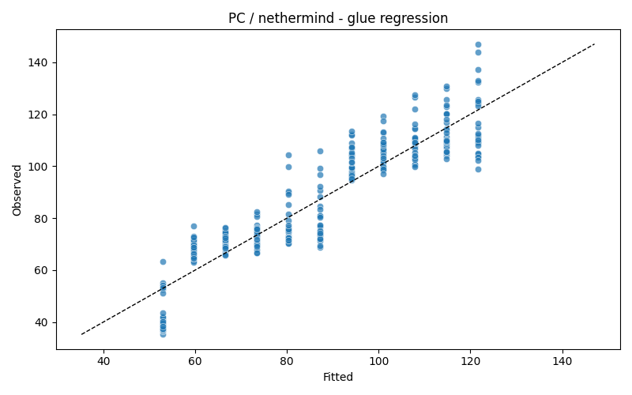

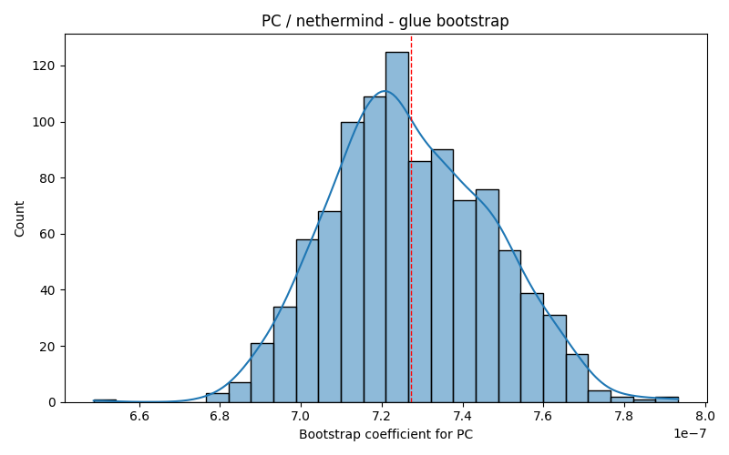

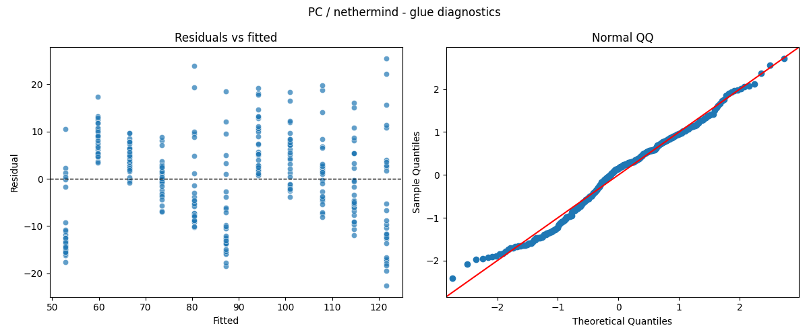

</details>

<details><summary><code>RETURNDATASIZE</code> · nobs=1276 · runtime_ms=7.102e-07 · p=1.00e-03 · R²=0.4033</summary>

```
==============================================================================
                           NNLS Regression Results                            
==============================================================================
Dep. Variable:          test_runtime_ms              R-squared:          0.403
Model:                  NNLS                    Adj. R-squared:          0.403
No. Observations:       1276                              RMSE:          13.64
Df Residuals:           1274                               MAE:           4.59
Df Model:               1      
==============================================================================
                      coef     std err     P-value      [0.025      0.975]
------------------------------------------------------------------------------
         const     13.5136      1.3029       0.001     11.1937     16.3735
RETURNDATASIZE      0.0000      0.0000       0.001      0.0000      0.0000
==============================================================================
Notes: Non-negative least squares with bootstrap inference (1000 iterations)
==============================================================================
```

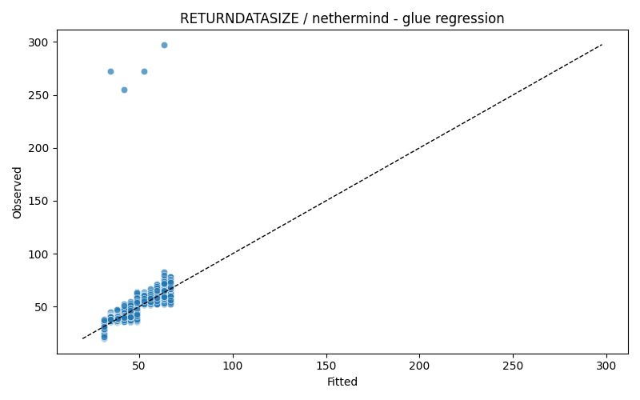

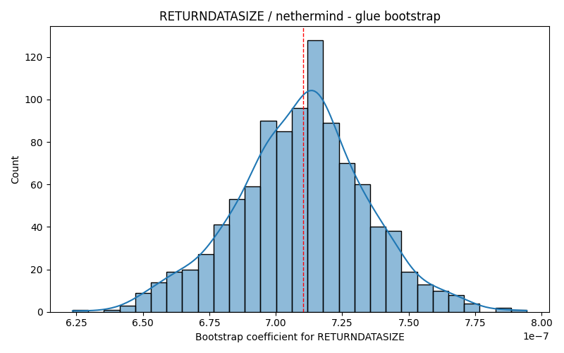

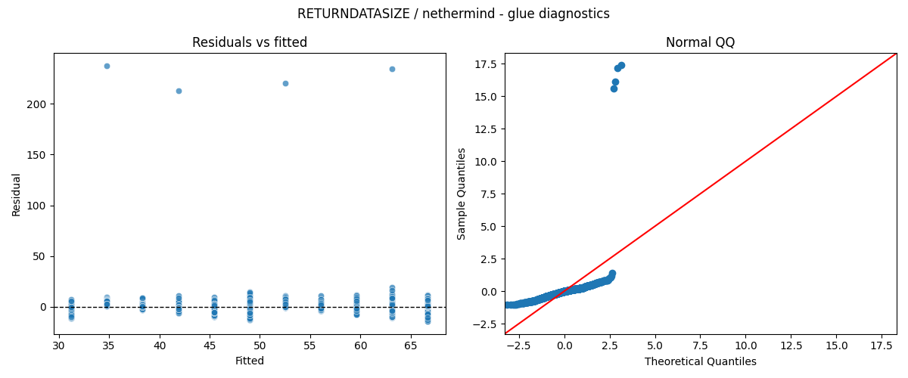

</details>

<details><summary><code>SELFBALANCE</code> · nobs=261 · runtime_ms=3.987e-06 · p=1.00e-03 · R²=0.6397</summary>

```
==============================================================================
                           NNLS Regression Results                            
==============================================================================
Dep. Variable:          test_runtime_ms              R-squared:          0.640
Model:                  NNLS                    Adj. R-squared:          0.638
No. Observations:       261                               RMSE:          30.18
Df Residuals:           259                                MAE:          22.89
Df Model:               1      
==============================================================================
                      coef     std err     P-value      [0.025      0.975]
------------------------------------------------------------------------------
         const    104.6757     11.2037       0.001     82.4236    125.0260
   SELFBALANCE      0.0000      0.0000       0.001      0.0000      0.0000
==============================================================================
Notes: Non-negative least squares with bootstrap inference (1000 iterations)
==============================================================================
```

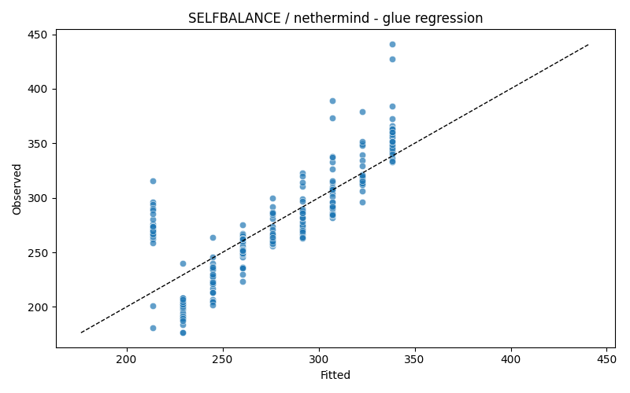

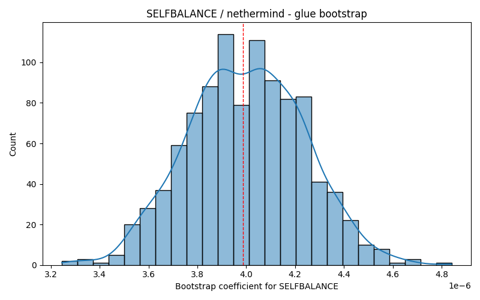

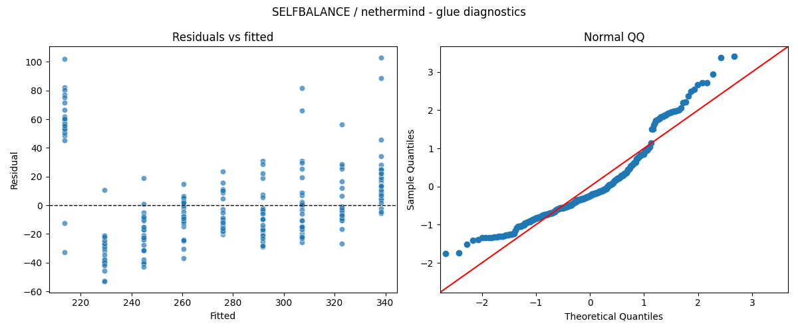

</details>

<details><summary><code>SUB</code> · nobs=319 · runtime_ms=2.361e-06 · p=1.00e-03 · R²=0.9443</summary>

```
==============================================================================
                           NNLS Regression Results                            
==============================================================================
Dep. Variable:          test_runtime_ms              R-squared:          0.944
Model:                  NNLS                    Adj. R-squared:          0.944
No. Observations:       319                               RMSE:           6.04
Df Residuals:           317                                MAE:           4.91
Df Model:               1      
==============================================================================
                      coef     std err     P-value      [0.025      0.975]
------------------------------------------------------------------------------
         const     15.7618      1.0456       0.001     13.6998     17.8821
           SUB      0.0000      0.0000       0.001      0.0000      0.0000
==============================================================================
Notes: Non-negative least squares with bootstrap inference (1000 iterations)
==============================================================================
```

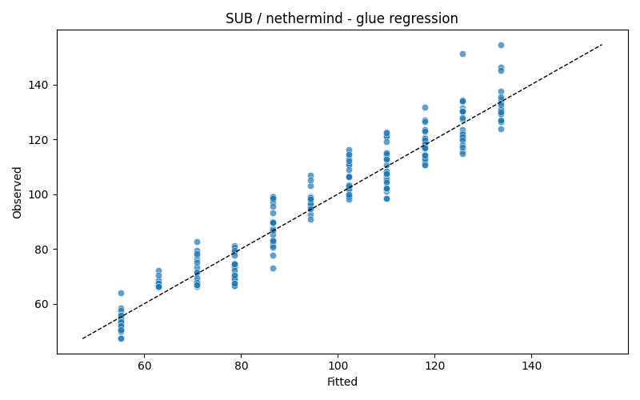

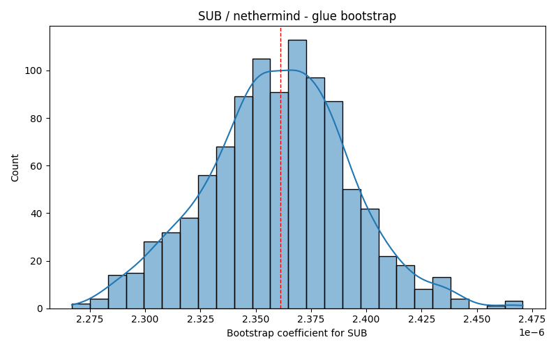

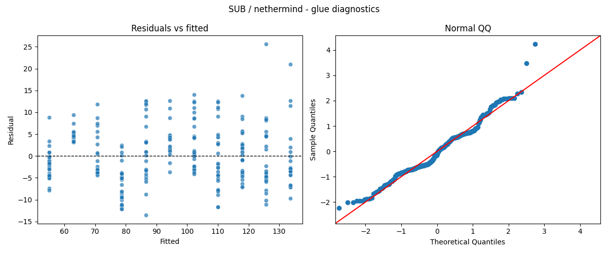

</details>

### Mixed glue (tier B) · nethermind

<details><summary><code>JUMP</code> · nobs=319 · runtime_ms=4.507e-06 · p=1.00e-03 · R²=0.8008</summary>

```
==============================================================================
                           NNLS Regression Results                            
==============================================================================
Dep. Variable:          test_runtime_ms              R-squared:          0.801
Model:                  NNLS                    Adj. R-squared:          0.800
No. Observations:       319                               RMSE:           8.35
Df Residuals:           317                                MAE:           6.98
Df Model:               1      
==============================================================================
                      coef     std err     P-value      [0.025      0.975]
------------------------------------------------------------------------------
         const     22.5929      1.6573       0.001     19.2438     25.8499
          JUMP      0.0000      0.0000       0.001      0.0000      0.0000
==============================================================================
Notes: Non-negative least squares with bootstrap inference (1000 iterations)
==============================================================================
```

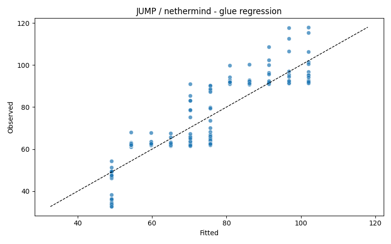

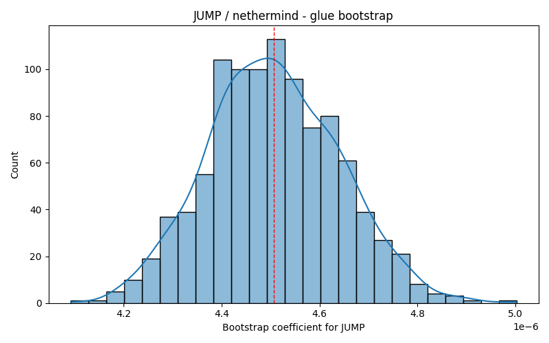

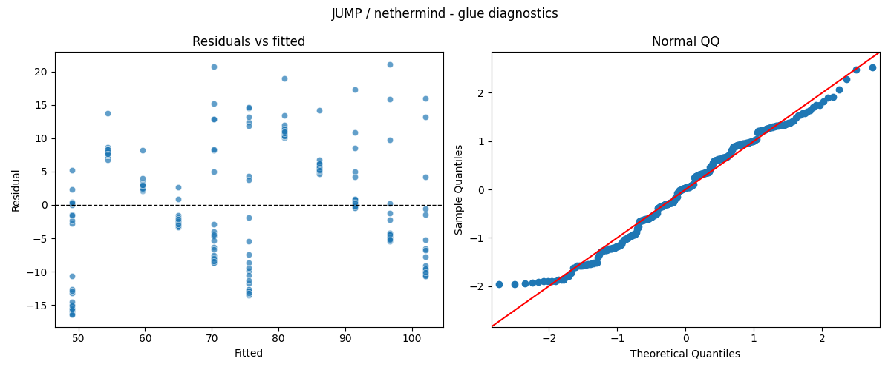

</details>

<details><summary><code>KECCAK256</code> · nobs=5104 · runtime_ms=0 · p=1.00e+00 · R²=0</summary>

```
==============================================================================
                           NNLS Regression Results                            
==============================================================================
Dep. Variable:          test_runtime_ms              R-squared:          0.000
Model:                  NNLS                    Adj. R-squared:         -0.000
No. Observations:       5104                              RMSE:         273.65
Df Residuals:           5102                               MAE:         227.50
Df Model:               1      
==============================================================================
                      coef     std err     P-value      [0.025      0.975]
------------------------------------------------------------------------------
         const    425.9254      3.8308       0.001    418.3456    433.2628
     KECCAK256      0.0000      0.0000       1.000      0.0000      0.0000
==============================================================================
Notes: Non-negative least squares with bootstrap inference (1000 iterations)
==============================================================================
```

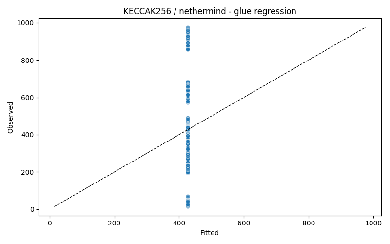


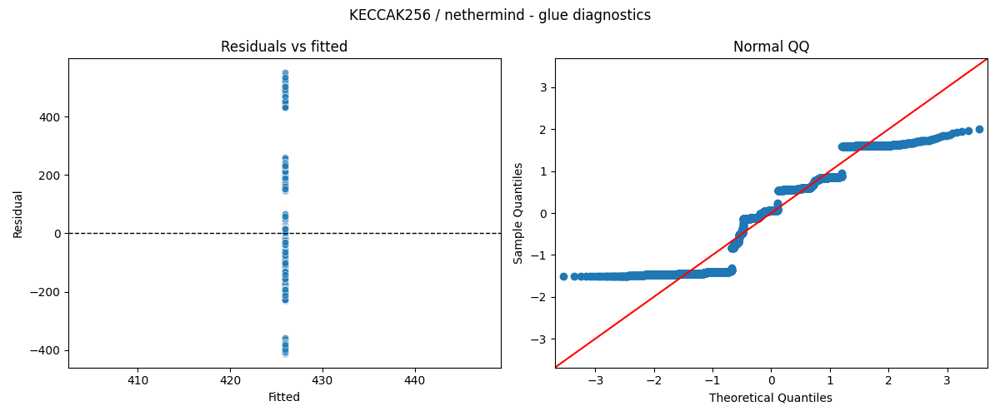

</details>

## reth

| glue_opcode | nobs | glue_runtime_ms | p_value | rsquared |
| --- | --- | --- | --- | --- |
| `ISZERO` | 308 | 3.644e-07 | 1.00e-03 | 0.7862 |
| `JUMPDEST` | 308 | 3.063e-07 | 1.00e-03 | 0.7353 |
| `SWAP` | 4928 | 4.633e-07 | 1.00e-03 | 0.6998 |
| `CALLDATASIZE` | 18491 | 4.844e-07 | 1.00e-03 | 0.8228 |
| `DUP` | 18491 | 4.035e-07 | 1.00e-03 | 0.8228 |
| `GAS` | 18491 | 4.457e-07 | 1.00e-03 | 0.8228 |
| `MLOAD` | 18491 | 1.645e-06 | 1.00e-03 | 0.8228 |
| `PUSH` | 18491 | 4.36e-07 | 1.00e-03 | 0.8228 |
| `PUSH0` | 18491 | 3.343e-07 | 1.00e-03 | 0.8228 |
| `STATICCALL` | 18491 | 5.387e-05 | 1.00e-03 | 0.8228 |
| `ADD` | 308 | 8.755e-07 | 1.00e-03 | 0.8398 |
| `AND` | 308 | 8.702e-07 | 1.00e-03 | 0.8279 |
| `CALLDATACOPY` | 7392 | 2.245e-06 | 1.00e-03 | 0.7754 |
| `CALLDATALOAD` | 1232 | 2.541e-05 | 1.00e-03 | 0.1496 |
| `DIV` | 308 | 7.085e-06 | 1.00e-03 | 0.8438 |
| `EXP` | 308 | 0.0003777 | 1.00e-03 | 0.8177 |
| `GT` | 308 | 9.639e-07 | 1.00e-03 | 0.8198 |
| `JUMPI` | 308 | 1.279e-06 | 1.00e-03 | 0.7696 |
| `LT` | 308 | 9.305e-07 | 1.00e-03 | 0.781 |
| `MSTORE` | 1540 | 2.706e-06 | 1.00e-03 | 0.2684 |
| `MSTORE8` | 1540 | 1.29e-06 | 1.00e-03 | 0.4002 |
| `MUL` | 308 | 1.065e-06 | 1.00e-03 | 0.6075 |
| `PC` | 308 | 5.99e-07 | 1.00e-03 | 0.9152 |
| `RETURNDATASIZE` | 1232 | 8.877e-07 | 1.00e-03 | 0.8411 |
| `SELFBALANCE` | 252 | 3.918e-06 | 1.00e-03 | 0.8014 |
| `SUB` | 308 | 9.305e-07 | 1.00e-03 | 0.5681 |
| `JUMP` | 308 | 2.112e-06 | 1.00e-03 | 0.8082 |
| `KECCAK256` | 4928 | 0 | 1.00e+00 | -2.22e-16 |

### Cycle glue — joint fit · reth

<details><summary>Joint NNLS regression summary</summary>

```
==============================================================================
                           NNLS Regression Results                            
==============================================================================
Dep. Variable:          test_runtime_ms              R-squared:          0.823
Model:                  NNLS                    Adj. R-squared:          0.823
No. Observations:       18491                             RMSE:           7.41
Df Residuals:           18483                              MAE:           5.04
Df Model:               7      
==============================================================================
                      coef     std err     P-value      [0.025      0.975]
------------------------------------------------------------------------------
         const     10.5880      0.1871       0.001     10.2238     10.9677
  CALLDATASIZE      0.0000      0.0000       0.001      0.0000      0.0000
           DUP      0.0000      0.0000       0.001      0.0000      0.0000
           GAS      0.0000      0.0000       0.001      0.0000      0.0000
         MLOAD      0.0000      0.0000       0.001      0.0000      0.0000
          PUSH      0.0000      0.0000       0.001      0.0000      0.0000
         PUSH0      0.0000      0.0000       0.001      0.0000      0.0000
    STATICCALL      0.0001      0.0000       0.001      0.0001      0.0001
==============================================================================
Notes: Non-negative least squares with bootstrap inference (1000 iterations)
==============================================================================
```

</details>

<details><summary><code>CALLDATASIZE</code> · nobs=18491 · runtime_ms=4.844e-07 · p=1.00e-03 · R²=0.8228</summary>

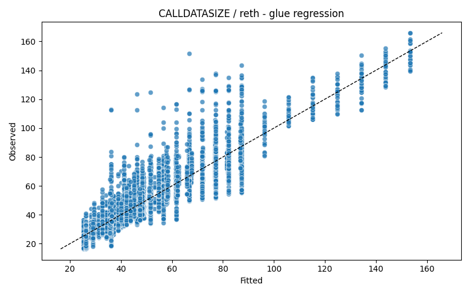

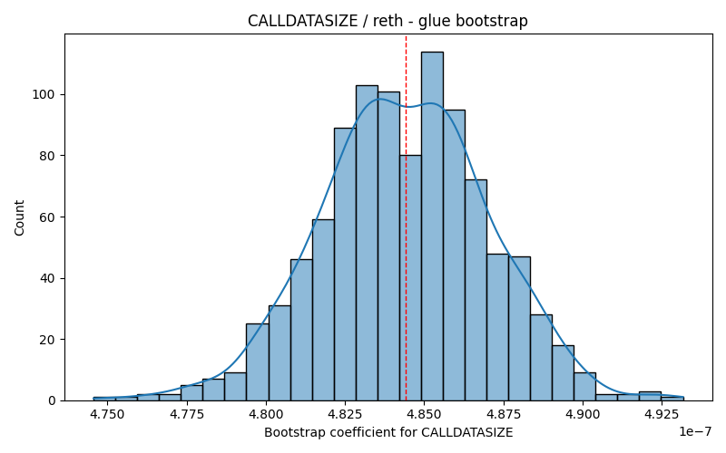

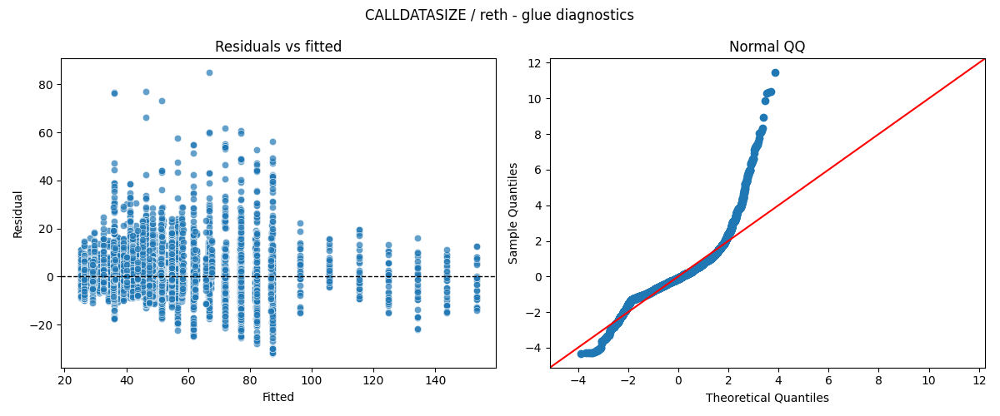

</details>

<details><summary><code>DUP</code> · nobs=18491 · runtime_ms=4.035e-07 · p=1.00e-03 · R²=0.8228</summary>


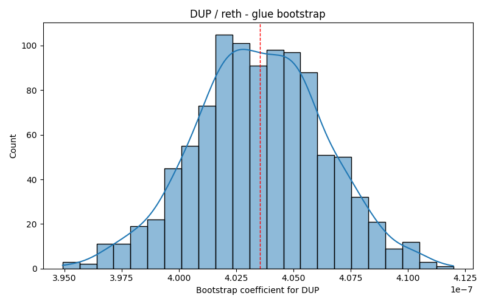


</details>

<details><summary><code>GAS</code> · nobs=18491 · runtime_ms=4.457e-07 · p=1.00e-03 · R²=0.8228</summary>


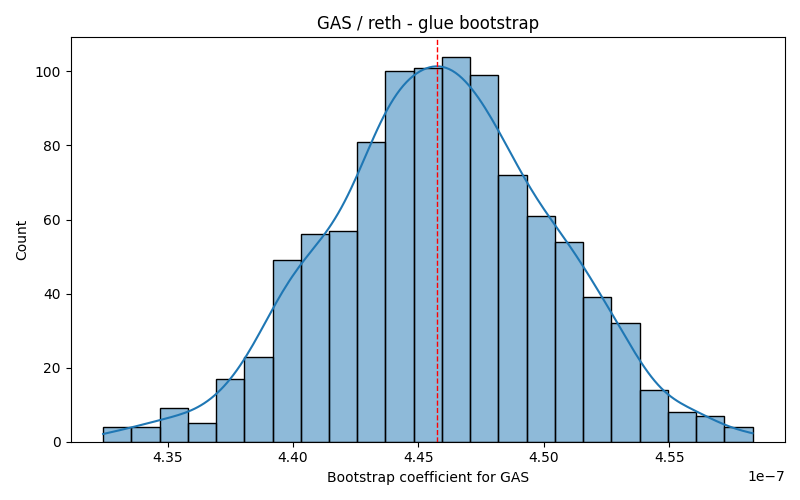

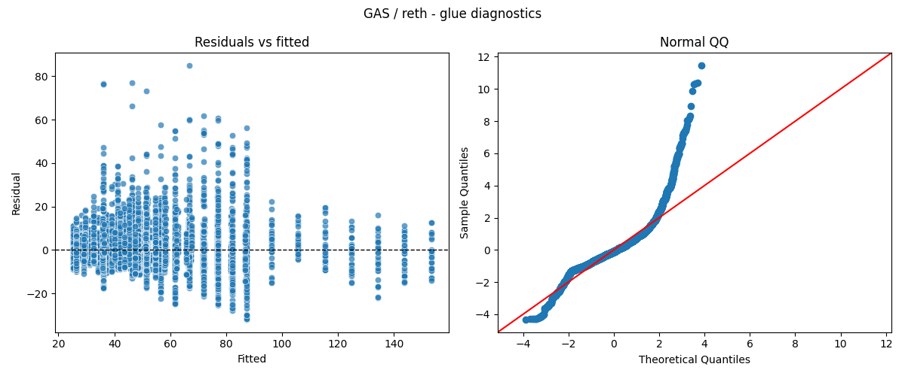

</details>

<details><summary><code>MLOAD</code> · nobs=18491 · runtime_ms=1.645e-06 · p=1.00e-03 · R²=0.8228</summary>

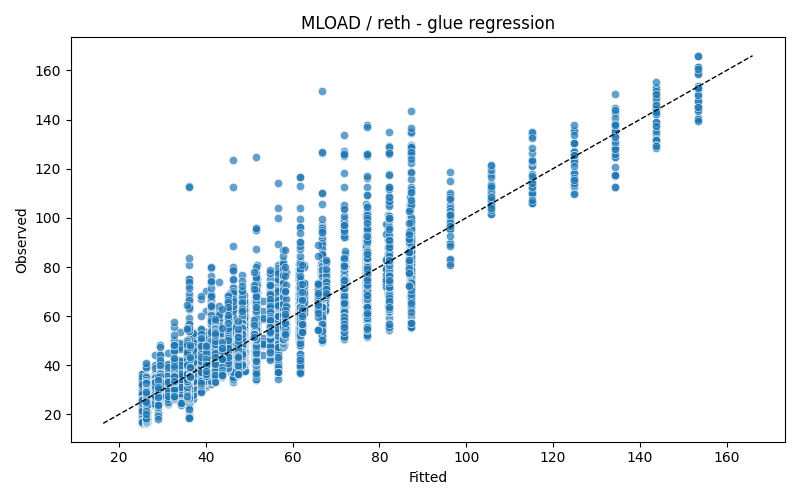

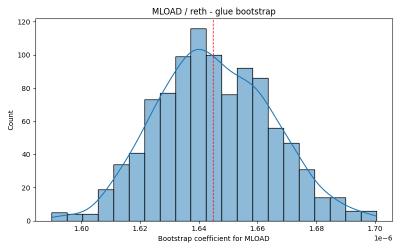

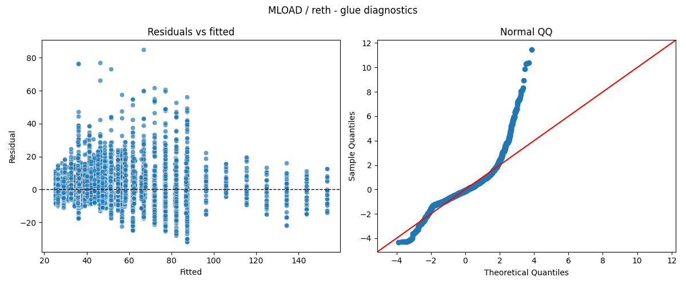

</details>

<details><summary><code>PUSH</code> · nobs=18491 · runtime_ms=4.36e-07 · p=1.00e-03 · R²=0.8228</summary>

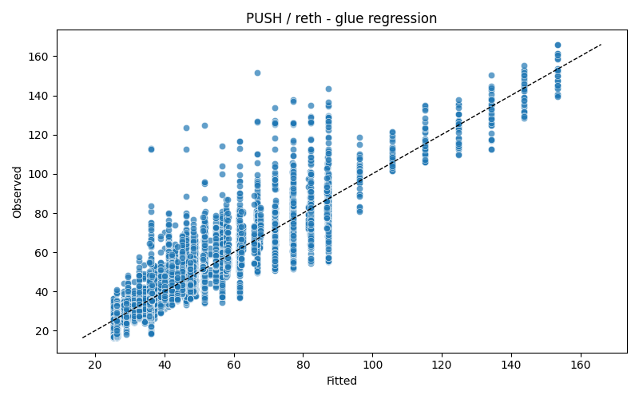

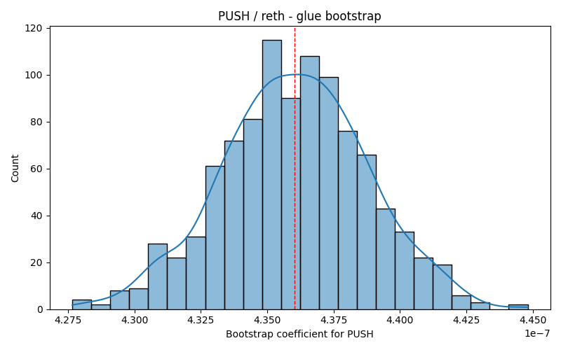


</details>

<details><summary><code>PUSH0</code> · nobs=18491 · runtime_ms=3.343e-07 · p=1.00e-03 · R²=0.8228</summary>


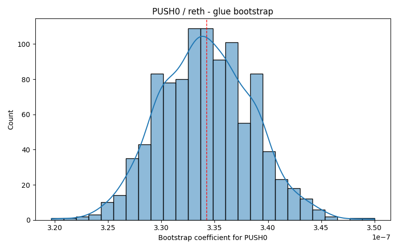


</details>

<details><summary><code>STATICCALL</code> · nobs=18491 · runtime_ms=5.387e-05 · p=1.00e-03 · R²=0.8228</summary>


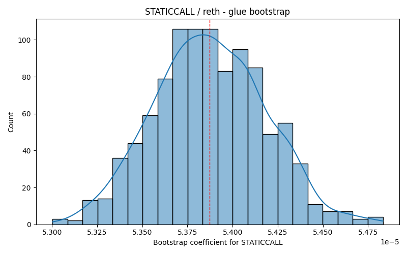

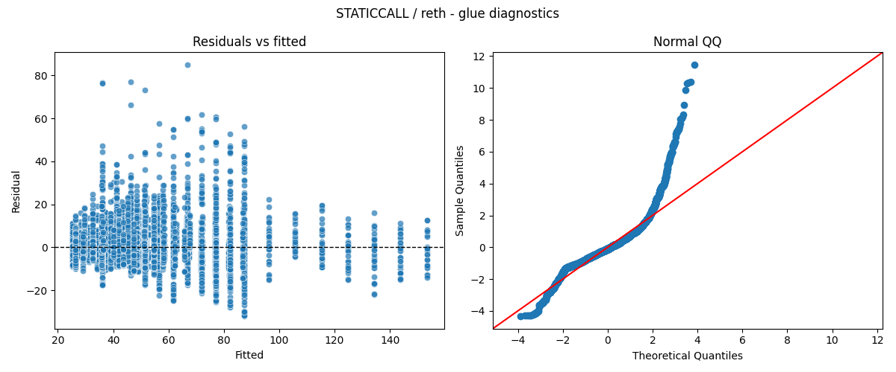

</details>

### Pure glue · reth

<details><summary><code>ISZERO</code> · nobs=308 · runtime_ms=3.644e-07 · p=1.00e-03 · R²=0.7862</summary>

```
==============================================================================
                           NNLS Regression Results                            
==============================================================================
Dep. Variable:          test_runtime_ms              R-squared:          0.786
Model:                  NNLS                    Adj. R-squared:          0.786
No. Observations:       308                               RMSE:           4.00
Df Residuals:           306                                MAE:           3.02
Df Model:               1      
==============================================================================
                      coef     std err     P-value      [0.025      0.975]
------------------------------------------------------------------------------
         const      8.7976      0.6905       0.001      7.5083     10.1889
        ISZERO      0.0000      0.0000       0.001      0.0000      0.0000
==============================================================================
Notes: Non-negative least squares with bootstrap inference (1000 iterations)
==============================================================================
```

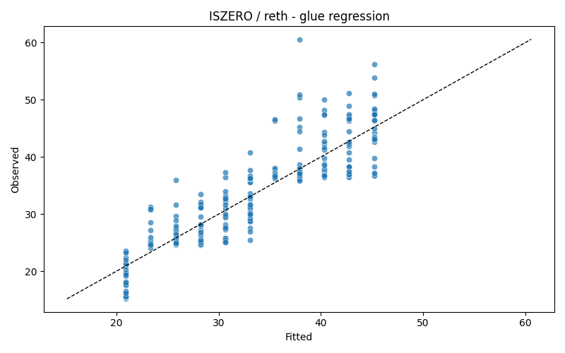

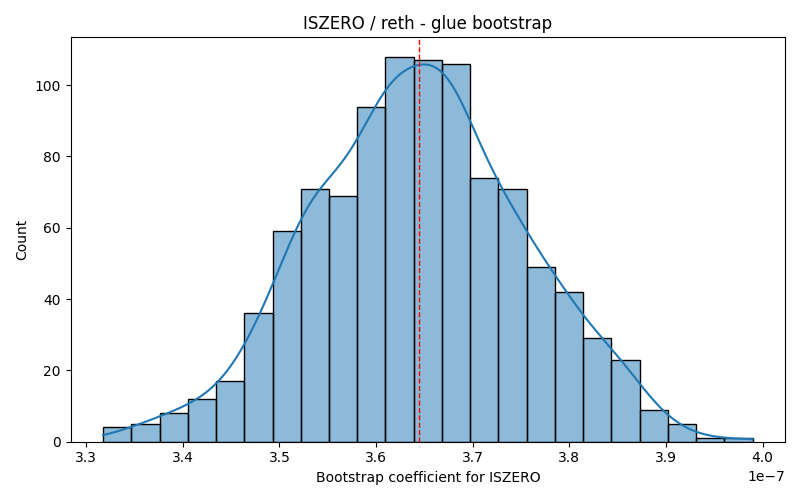

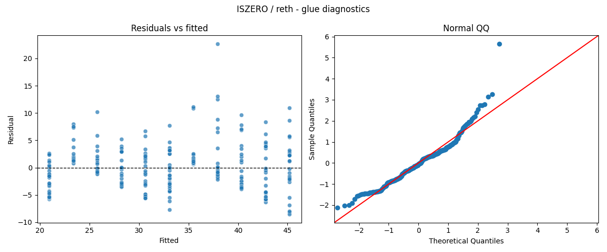

</details>

<details><summary><code>JUMPDEST</code> · nobs=308 · runtime_ms=3.063e-07 · p=1.00e-03 · R²=0.7353</summary>

```
==============================================================================
                           NNLS Regression Results                            
==============================================================================
Dep. Variable:          test_runtime_ms              R-squared:          0.735
Model:                  NNLS                    Adj. R-squared:          0.734
No. Observations:       308                               RMSE:          11.61
Df Residuals:           306                                MAE:           8.19
Df Model:               1      
==============================================================================
                      coef     std err     P-value      [0.025      0.975]
------------------------------------------------------------------------------
         const     11.8286      1.9941       0.001      8.1476     15.9204
      JUMPDEST      0.0000      0.0000       0.001      0.0000      0.0000
==============================================================================
Notes: Non-negative least squares with bootstrap inference (1000 iterations)
==============================================================================
```

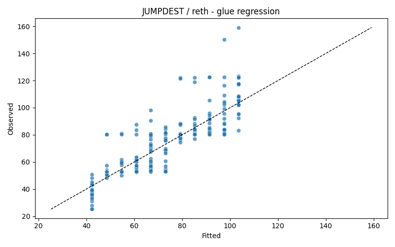

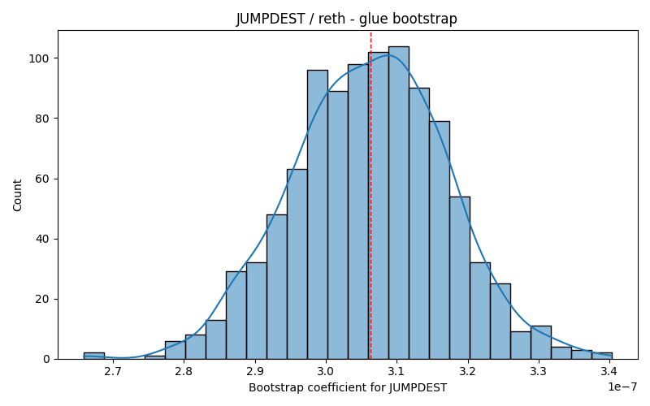

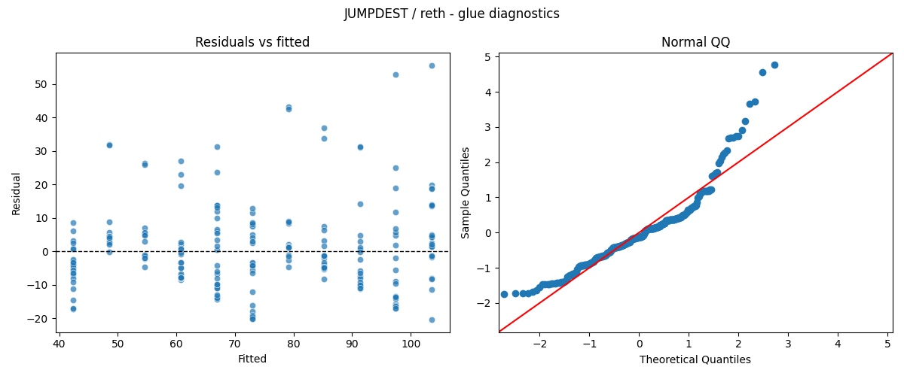

</details>

<details><summary><code>SWAP</code> · nobs=4928 · runtime_ms=4.633e-07 · p=1.00e-03 · R²=0.6998</summary>

```
==============================================================================
                           NNLS Regression Results                            
==============================================================================
Dep. Variable:          test_runtime_ms              R-squared:          0.700
Model:                  NNLS                    Adj. R-squared:          0.700
No. Observations:       4928                              RMSE:           6.39
Df Residuals:           4926                               MAE:           4.19
Df Model:               1      
==============================================================================
                      coef     std err     P-value      [0.025      0.975]
------------------------------------------------------------------------------
         const     10.5503      0.2804       0.001      9.9637     11.0828
          SWAP      0.0000      0.0000       0.001      0.0000      0.0000
==============================================================================
Notes: Non-negative least squares with bootstrap inference (1000 iterations)
==============================================================================
```

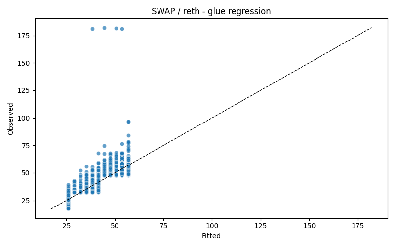

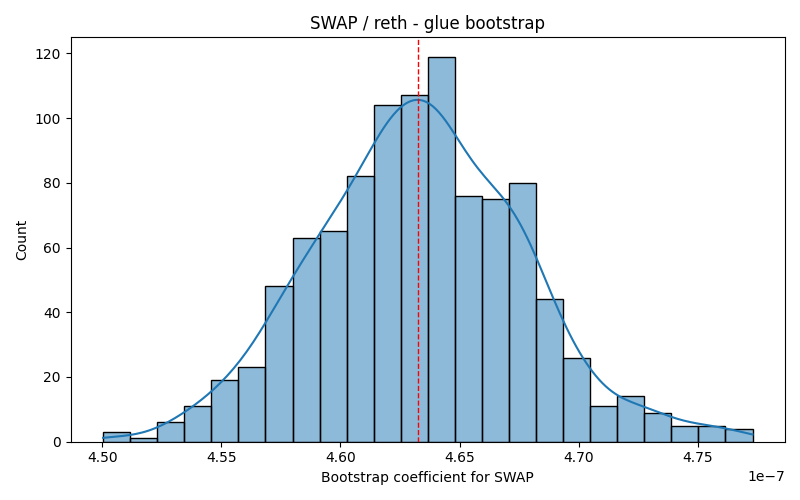

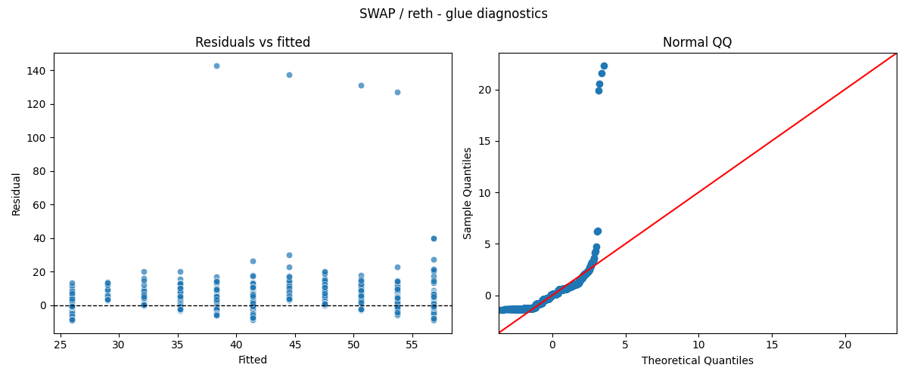

</details>

### Mixed glue (tier A) · reth

<details><summary><code>ADD</code> · nobs=308 · runtime_ms=8.755e-07 · p=1.00e-03 · R²=0.8398</summary>

```
==============================================================================
                           NNLS Regression Results                            
==============================================================================
Dep. Variable:          test_runtime_ms              R-squared:          0.840
Model:                  NNLS                    Adj. R-squared:          0.839
No. Observations:       308                               RMSE:           4.02
Df Residuals:           306                                MAE:           3.18
Df Model:               1      
==============================================================================
                      coef     std err     P-value      [0.025      0.975]
------------------------------------------------------------------------------
         const      8.3047      0.7885       0.001      6.7557      9.8189
           ADD      0.0000      0.0000       0.001      0.0000      0.0000
==============================================================================
Notes: Non-negative least squares with bootstrap inference (1000 iterations)
==============================================================================
```

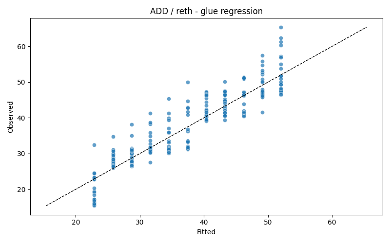

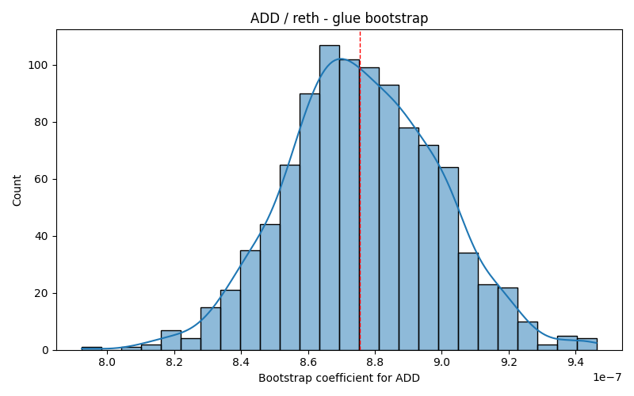

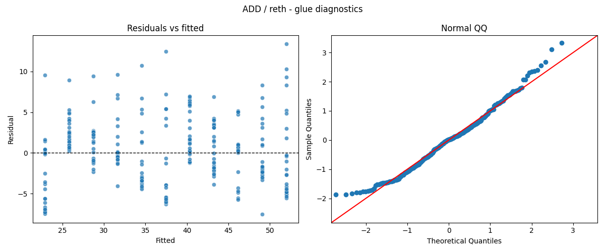

</details>

<details><summary><code>AND</code> · nobs=308 · runtime_ms=8.702e-07 · p=1.00e-03 · R²=0.8279</summary>

```
==============================================================================
                           NNLS Regression Results                            
==============================================================================
Dep. Variable:          test_runtime_ms              R-squared:          0.828
Model:                  NNLS                    Adj. R-squared:          0.827
No. Observations:       308                               RMSE:           4.18
Df Residuals:           306                                MAE:           3.20
Df Model:               1      
==============================================================================
                      coef     std err     P-value      [0.025      0.975]
------------------------------------------------------------------------------
         const      8.6215      0.7390       0.001      7.1819     10.0093
           AND      0.0000      0.0000       0.001      0.0000      0.0000
==============================================================================
Notes: Non-negative least squares with bootstrap inference (1000 iterations)
==============================================================================
```

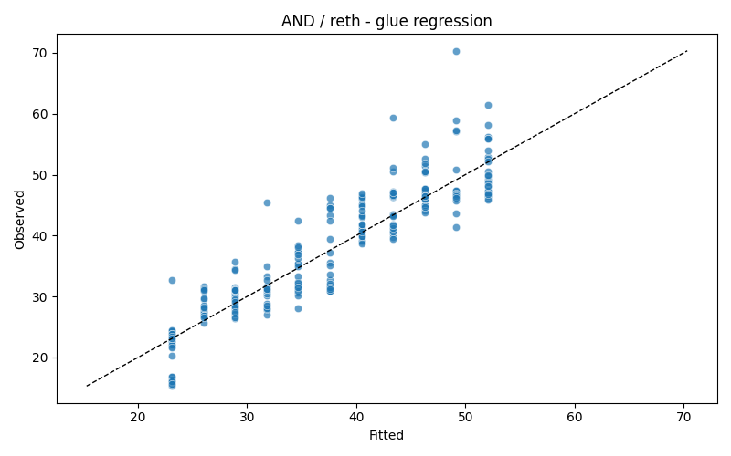

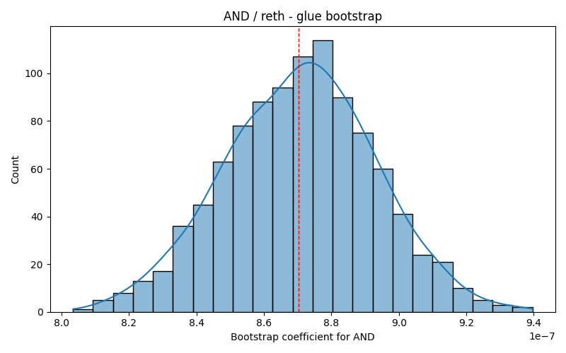


</details>

<details><summary><code>CALLDATACOPY</code> · nobs=7392 · runtime_ms=2.245e-06 · p=1.00e-03 · R²=0.7754</summary>

```
==============================================================================
                           NNLS Regression Results                            
==============================================================================
Dep. Variable:          test_runtime_ms              R-squared:          0.775
Model:                  NNLS                    Adj. R-squared:          0.775
No. Observations:       7392                              RMSE:           9.09
Df Residuals:           7390                               MAE:           6.40
Df Model:               1      
==============================================================================
                      coef     std err     P-value      [0.025      0.975]
------------------------------------------------------------------------------
         const     11.4348      0.1211       0.001     11.2005     11.6818
  CALLDATACOPY      0.0000      0.0000       0.001      0.0000      0.0000
==============================================================================
Notes: Non-negative least squares with bootstrap inference (1000 iterations)
==============================================================================
```

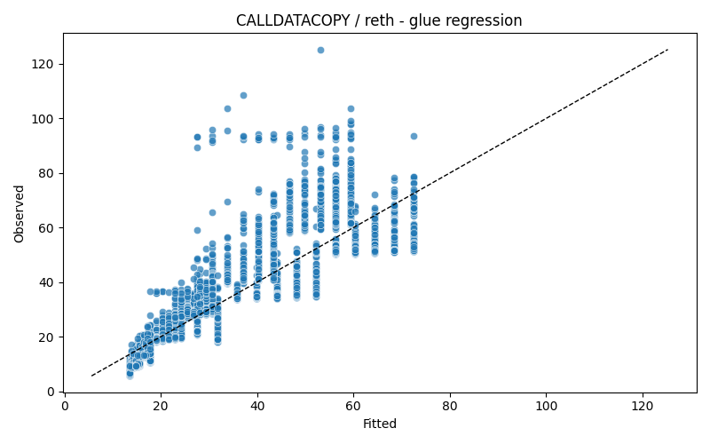

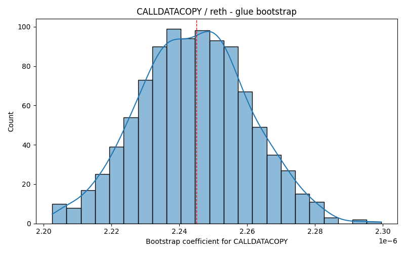

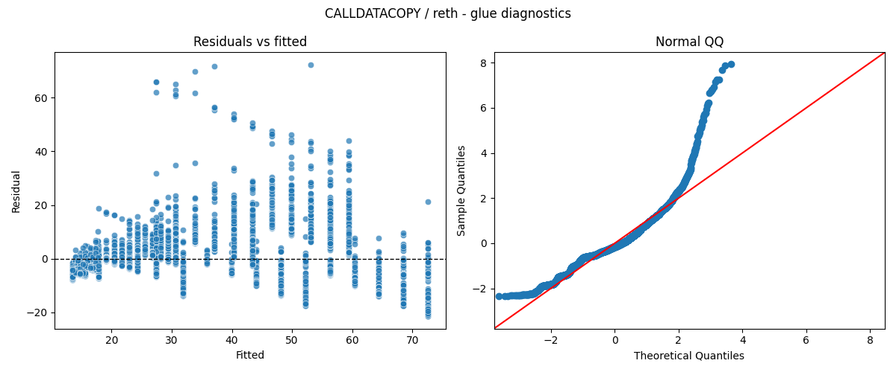

</details>

<details><summary><code>CALLDATALOAD</code> · nobs=1232 · runtime_ms=2.541e-05 · p=1.00e-03 · R²=0.1496</summary>

```
==============================================================================
                           NNLS Regression Results                            
==============================================================================
Dep. Variable:          test_runtime_ms              R-squared:          0.150
Model:                  NNLS                    Adj. R-squared:          0.149
No. Observations:       1232                              RMSE:           0.23
Df Residuals:           1230                               MAE:           0.17
Df Model:               1      
==============================================================================
                      coef     std err     P-value      [0.025      0.975]
------------------------------------------------------------------------------
         const      1.7209      0.0248       0.001      1.6715      1.7701
  CALLDATALOAD      0.0000      0.0000       0.001      0.0000      0.0000
==============================================================================
Notes: Non-negative least squares with bootstrap inference (1000 iterations)
==============================================================================
```

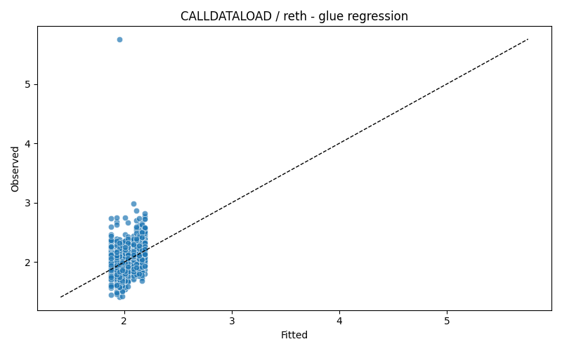

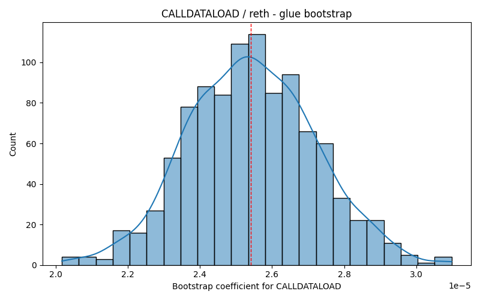

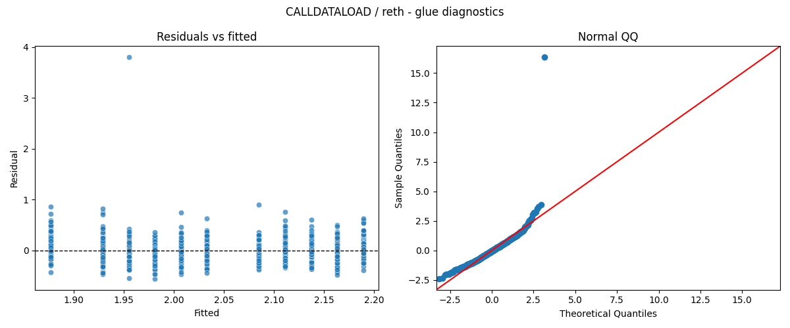

</details>

<details><summary><code>DIV</code> · nobs=308 · runtime_ms=7.085e-06 · p=1.00e-03 · R²=0.8438</summary>

```
==============================================================================
                           NNLS Regression Results                            
==============================================================================
Dep. Variable:          test_runtime_ms              R-squared:          0.844
Model:                  NNLS                    Adj. R-squared:          0.843
No. Observations:       308                               RMSE:          24.06
Df Residuals:           306                                MAE:          19.89
Df Model:               1      
==============================================================================
                      coef     std err     P-value      [0.025      0.975]
------------------------------------------------------------------------------
         const     52.9094      5.0505       0.001     43.2153     62.8083
           DIV      0.0000      0.0000       0.001      0.0000      0.0000
==============================================================================
Notes: Non-negative least squares with bootstrap inference (1000 iterations)
==============================================================================
```

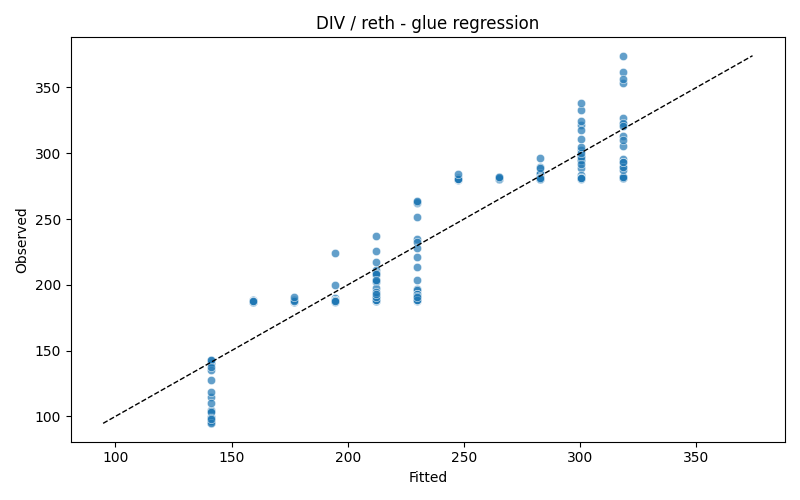

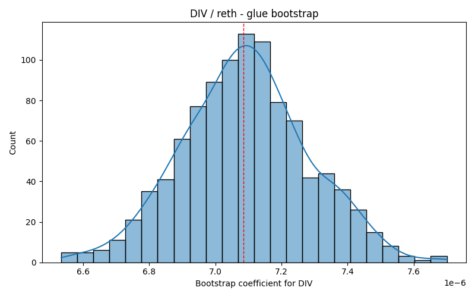

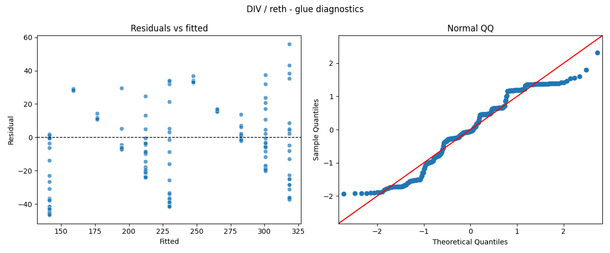

</details>

<details><summary><code>EXP</code> · nobs=308 · runtime_ms=0.0003777 · p=1.00e-03 · R²=0.8177</summary>

```
==============================================================================
                           NNLS Regression Results                            
==============================================================================
Dep. Variable:          test_runtime_ms              R-squared:          0.818
Model:                  NNLS                    Adj. R-squared:          0.817
No. Observations:       308                               RMSE:           6.98
Df Residuals:           306                                MAE:           5.91
Df Model:               1      
==============================================================================
                      coef     std err     P-value      [0.025      0.975]
------------------------------------------------------------------------------
         const     14.9310      1.3773       0.001     12.2863     17.5419
           EXP      0.0004      0.0000       0.001      0.0004      0.0004
==============================================================================
Notes: Non-negative least squares with bootstrap inference (1000 iterations)
==============================================================================
```

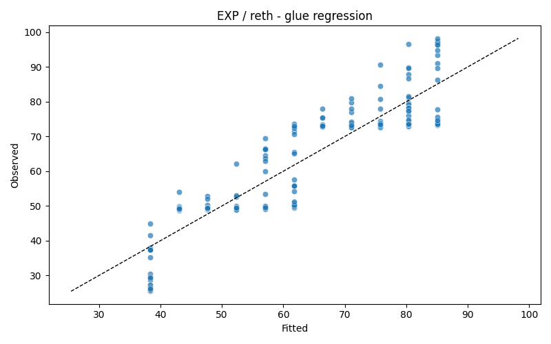

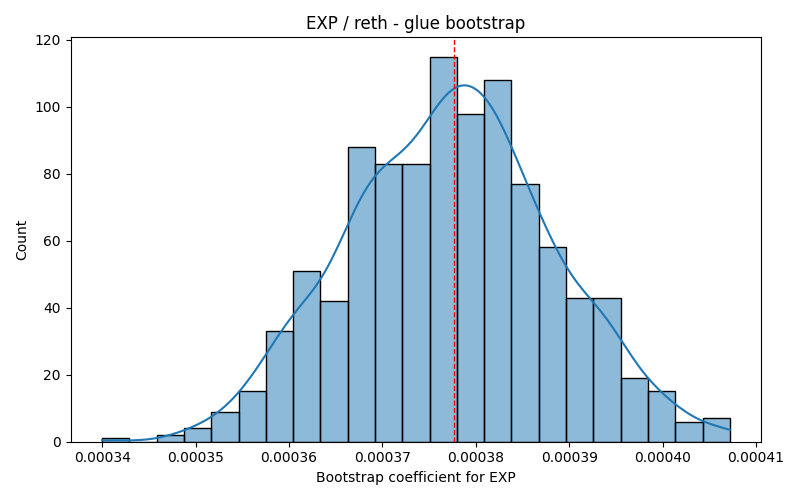

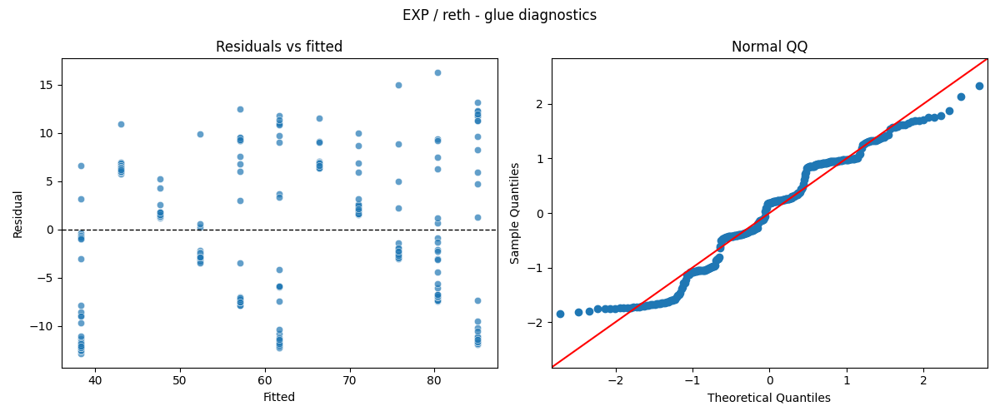

</details>

<details><summary><code>GT</code> · nobs=308 · runtime_ms=9.639e-07 · p=1.00e-03 · R²=0.8198</summary>

```
==============================================================================
                           NNLS Regression Results                            
==============================================================================
Dep. Variable:          test_runtime_ms              R-squared:          0.820
Model:                  NNLS                    Adj. R-squared:          0.819
No. Observations:       308                               RMSE:           4.76
Df Residuals:           306                                MAE:           3.61
Df Model:               1      
==============================================================================
                      coef     std err     P-value      [0.025      0.975]
------------------------------------------------------------------------------
         const      9.8722      0.8932       0.001      8.1379     11.5839
            GT      0.0000      0.0000       0.001      0.0000      0.0000
==============================================================================
Notes: Non-negative least squares with bootstrap inference (1000 iterations)
==============================================================================
```

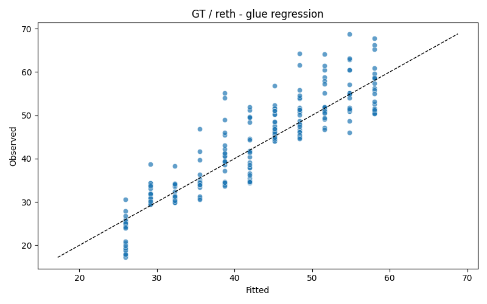

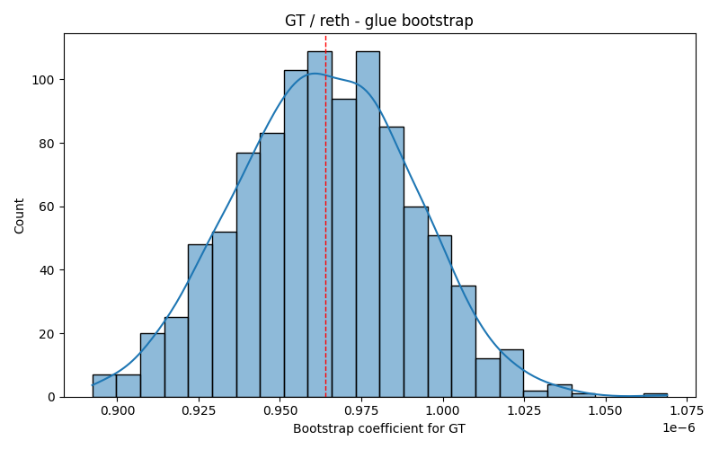

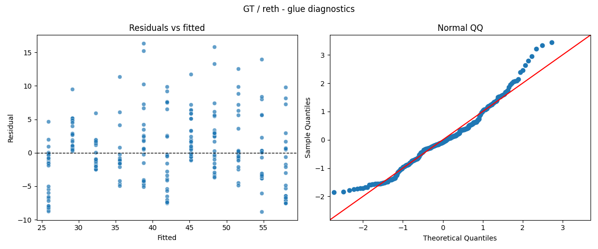

</details>

<details><summary><code>JUMPI</code> · nobs=308 · runtime_ms=1.279e-06 · p=1.00e-03 · R²=0.7696</summary>

```
==============================================================================
                           NNLS Regression Results                            
==============================================================================
Dep. Variable:          test_runtime_ms              R-squared:          0.770
Model:                  NNLS                    Adj. R-squared:          0.769
No. Observations:       308                               RMSE:           3.16
Df Residuals:           306                                MAE:           2.32
Df Model:               1      
==============================================================================
                      coef     std err     P-value      [0.025      0.975]
------------------------------------------------------------------------------
         const      5.0484      0.5222       0.001      4.0649      6.1053
         JUMPI      0.0000      0.0000       0.001      0.0000      0.0000
==============================================================================
Notes: Non-negative least squares with bootstrap inference (1000 iterations)
==============================================================================
```

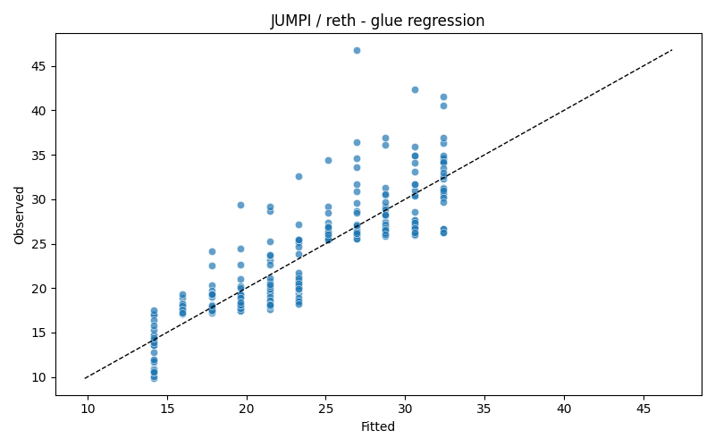

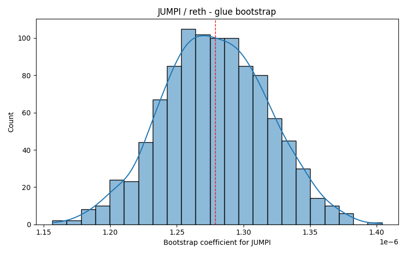

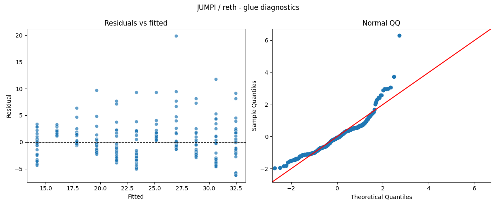

</details>

<details><summary><code>LT</code> · nobs=308 · runtime_ms=9.305e-07 · p=1.00e-03 · R²=0.781</summary>

```
==============================================================================
                           NNLS Regression Results                            
==============================================================================
Dep. Variable:          test_runtime_ms              R-squared:          0.781
Model:                  NNLS                    Adj. R-squared:          0.780
No. Observations:       308                               RMSE:           5.19
Df Residuals:           306                                MAE:           3.80
Df Model:               1      
==============================================================================
                      coef     std err     P-value      [0.025      0.975]
------------------------------------------------------------------------------
         const      9.5285      1.0126       0.001      7.4461     11.4447
            LT      0.0000      0.0000       0.001      0.0000      0.0000
==============================================================================
Notes: Non-negative least squares with bootstrap inference (1000 iterations)
==============================================================================
```

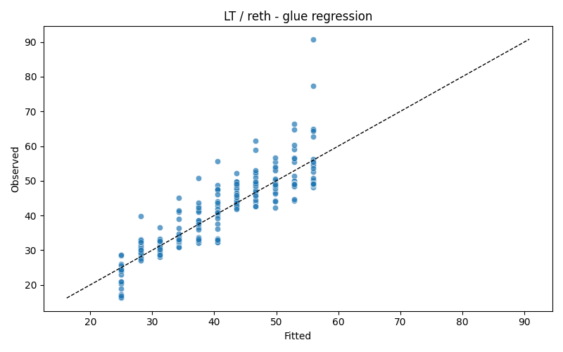

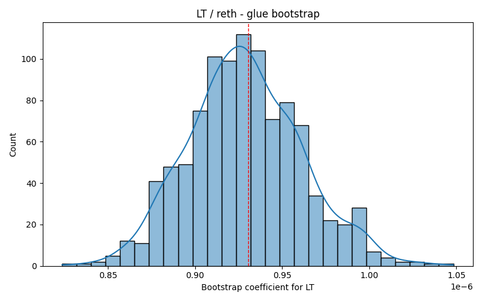


</details>

<details><summary><code>MSTORE</code> · nobs=1540 · runtime_ms=2.706e-06 · p=1.00e-03 · R²=0.2684</summary>

```
==============================================================================
                           NNLS Regression Results                            
==============================================================================
Dep. Variable:          test_runtime_ms              R-squared:          0.268
Model:                  NNLS                    Adj. R-squared:          0.268
No. Observations:       1540                              RMSE:          31.35
Df Residuals:           1538                               MAE:          28.14
Df Model:               1      
==============================================================================
                      coef     std err     P-value      [0.025      0.975]
------------------------------------------------------------------------------
         const     20.1131      2.3604       0.001     15.4671     25.0151
        MSTORE      0.0000      0.0000       0.001      0.0000      0.0000
==============================================================================
Notes: Non-negative least squares with bootstrap inference (1000 iterations)
==============================================================================
```

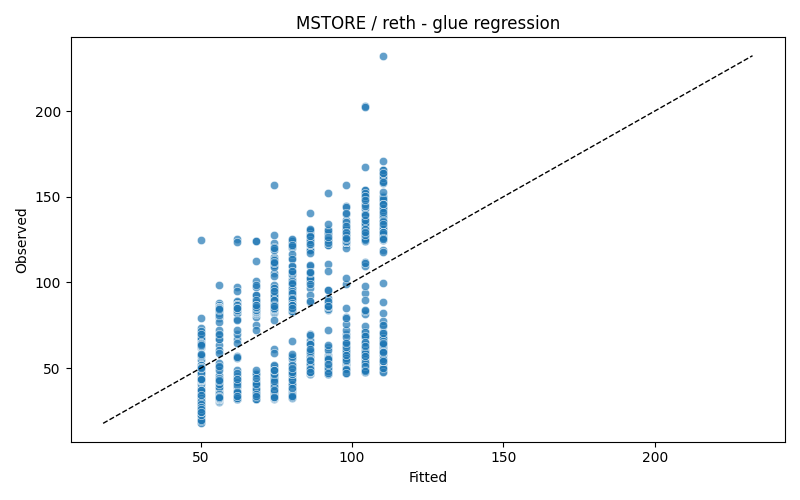

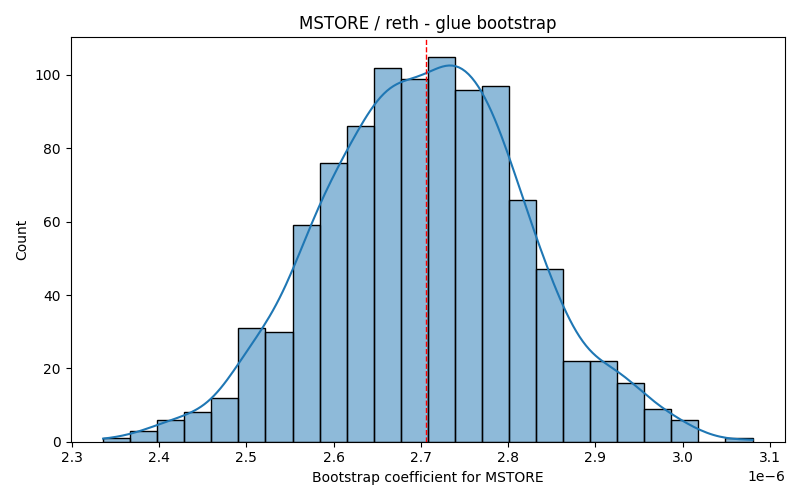

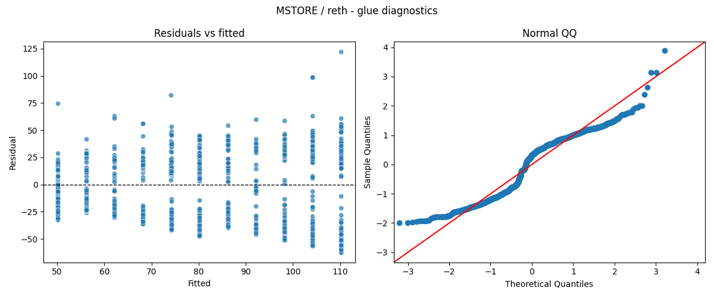

</details>

<details><summary><code>MSTORE8</code> · nobs=1540 · runtime_ms=1.29e-06 · p=1.00e-03 · R²=0.4002</summary>

```
==============================================================================
                           NNLS Regression Results                            
==============================================================================
Dep. Variable:          test_runtime_ms              R-squared:          0.400
Model:                  NNLS                    Adj. R-squared:          0.400
No. Observations:       1540                              RMSE:          11.08
Df Residuals:           1538                               MAE:           5.13
Df Model:               1      
==============================================================================
                      coef     std err     P-value      [0.025      0.975]
------------------------------------------------------------------------------
         const     11.5150      0.9617       0.001      9.6348     13.2744
       MSTORE8      0.0000      0.0000       0.001      0.0000      0.0000
==============================================================================
Notes: Non-negative least squares with bootstrap inference (1000 iterations)
==============================================================================
```

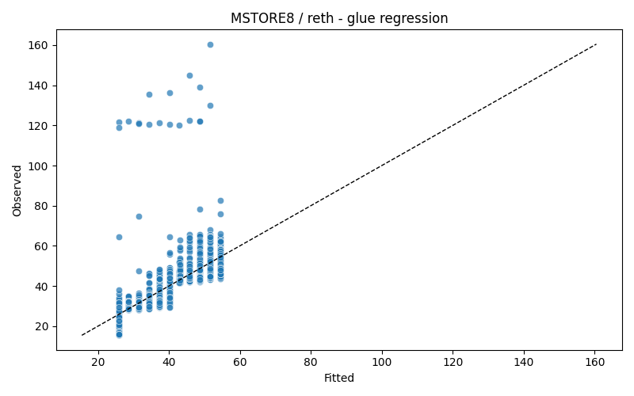

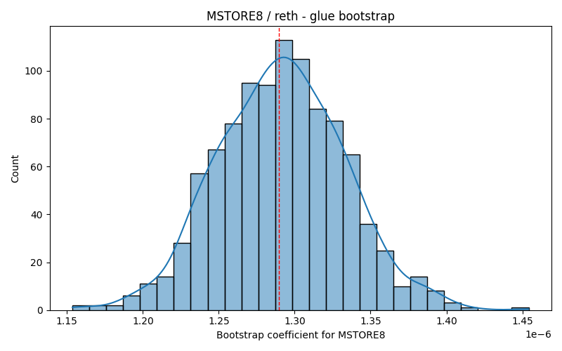

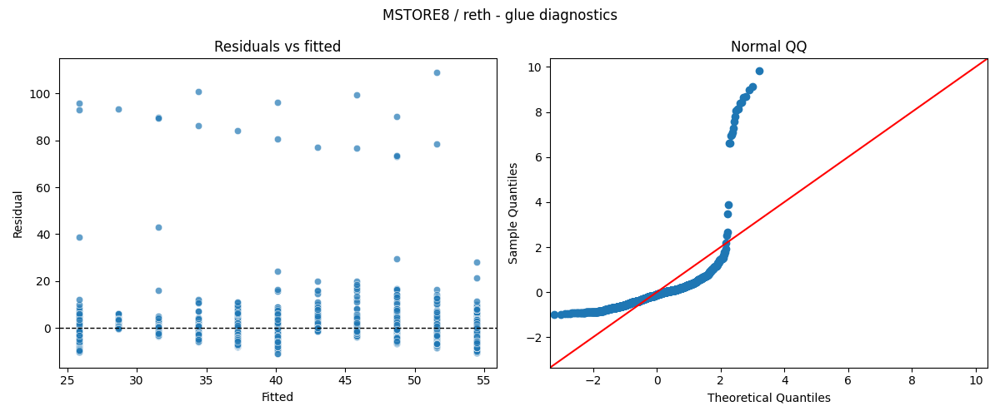

</details>

<details><summary><code>MUL</code> · nobs=308 · runtime_ms=1.065e-06 · p=1.00e-03 · R²=0.6075</summary>

```
==============================================================================
                           NNLS Regression Results                            
==============================================================================
Dep. Variable:          test_runtime_ms              R-squared:          0.607
Model:                  NNLS                    Adj. R-squared:          0.606
No. Observations:       308                               RMSE:           6.76
Df Residuals:           306                                MAE:           3.84
Df Model:               1      
==============================================================================
                      coef     std err     P-value      [0.025      0.975]
------------------------------------------------------------------------------
         const     11.6754      1.4134       0.001      9.1793     14.7573
           MUL      0.0000      0.0000       0.001      0.0000      0.0000
==============================================================================
Notes: Non-negative least squares with bootstrap inference (1000 iterations)
==============================================================================
```

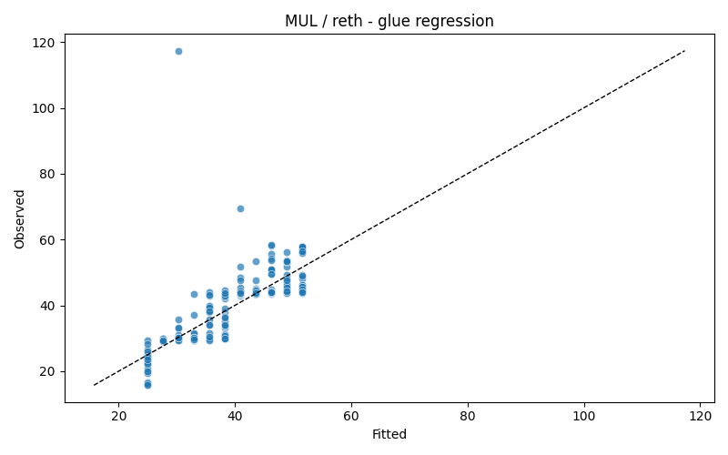

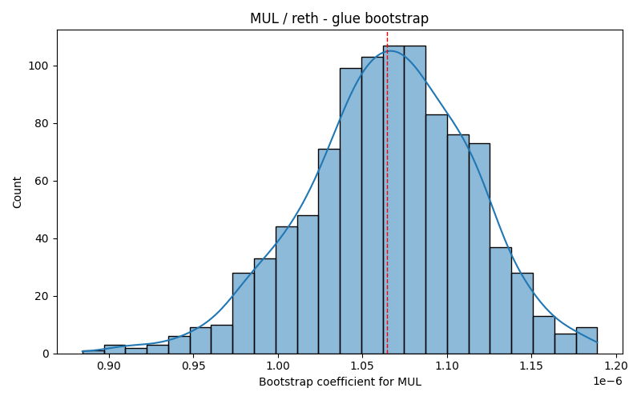

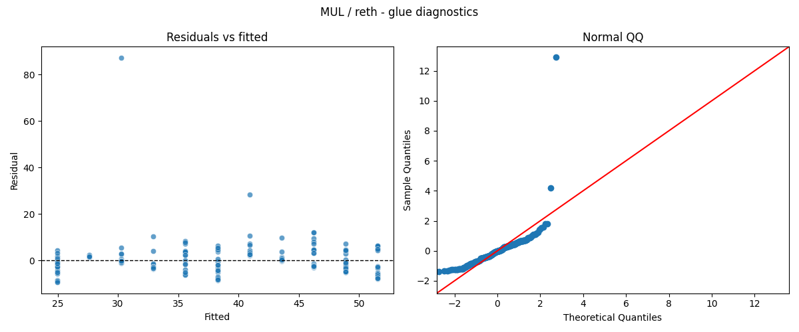

</details>

<details><summary><code>PC</code> · nobs=308 · runtime_ms=5.99e-07 · p=1.00e-03 · R²=0.9152</summary>

```
==============================================================================
                           NNLS Regression Results                            
==============================================================================
Dep. Variable:          test_runtime_ms              R-squared:          0.915
Model:                  NNLS                    Adj. R-squared:          0.915
No. Observations:       308                               RMSE:           5.45
Df Residuals:           306                                MAE:           4.29
Df Model:               1      
==============================================================================
                      coef     std err     P-value      [0.025      0.975]
------------------------------------------------------------------------------
         const     11.6673      0.9358       0.001      9.8646     13.5118
            PC      0.0000      0.0000       0.001      0.0000      0.0000
==============================================================================
Notes: Non-negative least squares with bootstrap inference (1000 iterations)
==============================================================================
```

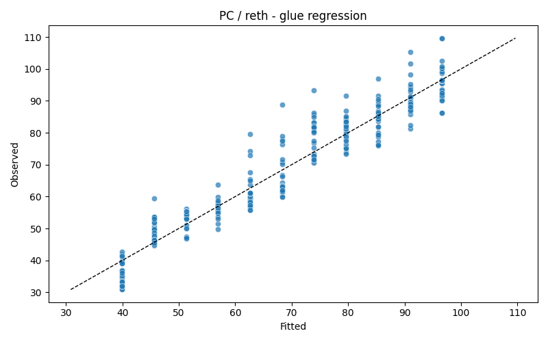

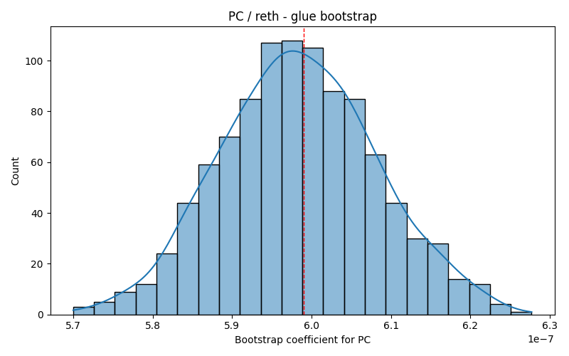

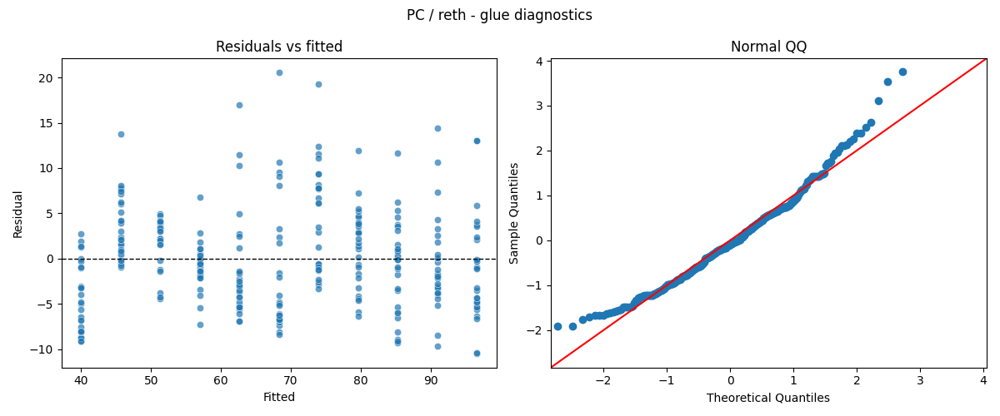

</details>

<details><summary><code>RETURNDATASIZE</code> · nobs=1232 · runtime_ms=8.877e-07 · p=1.00e-03 · R²=0.8411</summary>

```
==============================================================================
                           NNLS Regression Results                            
==============================================================================
Dep. Variable:          test_runtime_ms              R-squared:          0.841
Model:                  NNLS                    Adj. R-squared:          0.841
No. Observations:       1232                              RMSE:           6.09
Df Residuals:           1230                               MAE:           4.67
Df Model:               1      
==============================================================================
                      coef     std err     P-value      [0.025      0.975]
------------------------------------------------------------------------------
         const     10.7738      0.5842       0.001      9.5985     11.9133
RETURNDATASIZE      0.0000      0.0000       0.001      0.0000      0.0000
==============================================================================
Notes: Non-negative least squares with bootstrap inference (1000 iterations)
==============================================================================
```

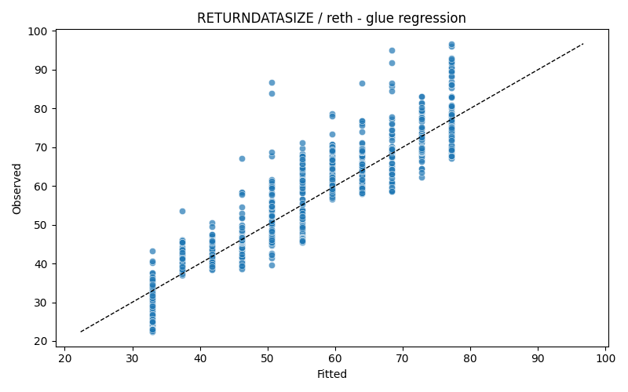

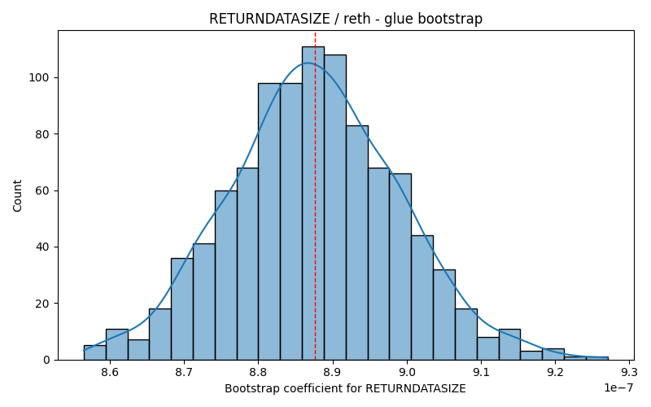

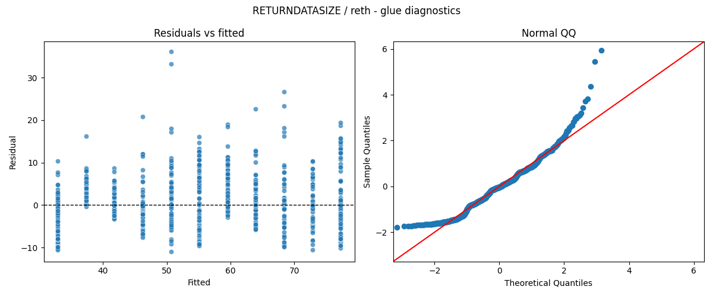

</details>

<details><summary><code>SELFBALANCE</code> · nobs=252 · runtime_ms=3.918e-06 · p=1.00e-03 · R²=0.8014</summary>

```
==============================================================================
                           NNLS Regression Results                            
==============================================================================
Dep. Variable:          test_runtime_ms              R-squared:          0.801
Model:                  NNLS                    Adj. R-squared:          0.801
No. Observations:       252                               RMSE:          19.67
Df Residuals:           250                                MAE:          15.84
Df Model:               1      
==============================================================================
                      coef     std err     P-value      [0.025      0.975]
------------------------------------------------------------------------------
         const     51.1923      4.6606       0.001     41.4687     59.6803
   SELFBALANCE      0.0000      0.0000       0.001      0.0000      0.0000
==============================================================================
Notes: Non-negative least squares with bootstrap inference (1000 iterations)
==============================================================================
```

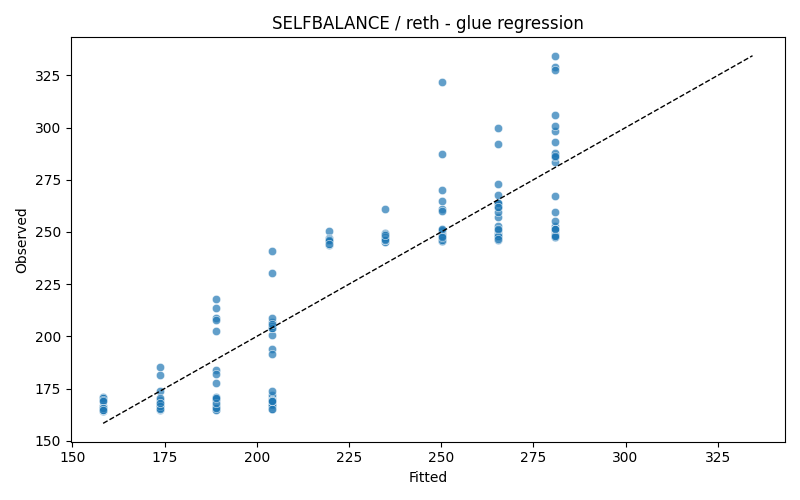

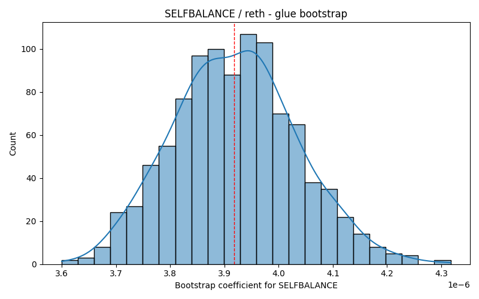

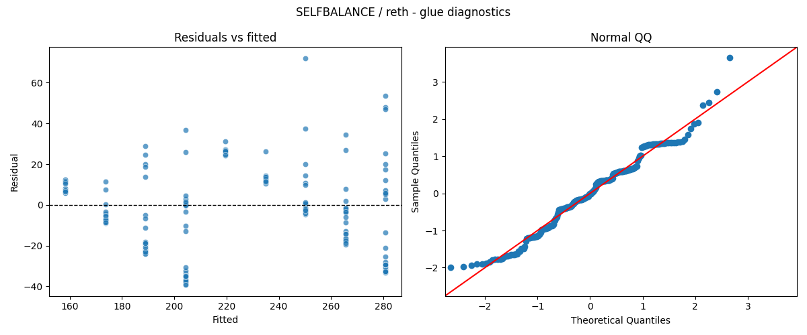

</details>

<details><summary><code>SUB</code> · nobs=308 · runtime_ms=9.305e-07 · p=1.00e-03 · R²=0.5681</summary>

```
==============================================================================
                           NNLS Regression Results                            
==============================================================================
Dep. Variable:          test_runtime_ms              R-squared:          0.568
Model:                  NNLS                    Adj. R-squared:          0.567
No. Observations:       308                               RMSE:           8.54
Df Residuals:           306                                MAE:           4.42
Df Model:               1      
==============================================================================
                      coef     std err     P-value      [0.025      0.975]
------------------------------------------------------------------------------
         const      9.7678      1.5191       0.001      7.0376     12.8397
           SUB      0.0000      0.0000       0.001      0.0000      0.0000
==============================================================================
Notes: Non-negative least squares with bootstrap inference (1000 iterations)
==============================================================================
```

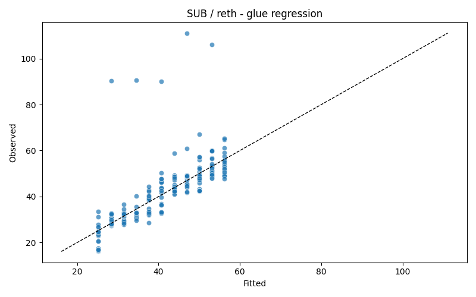

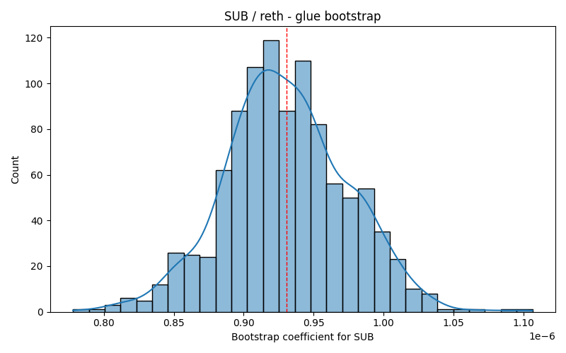

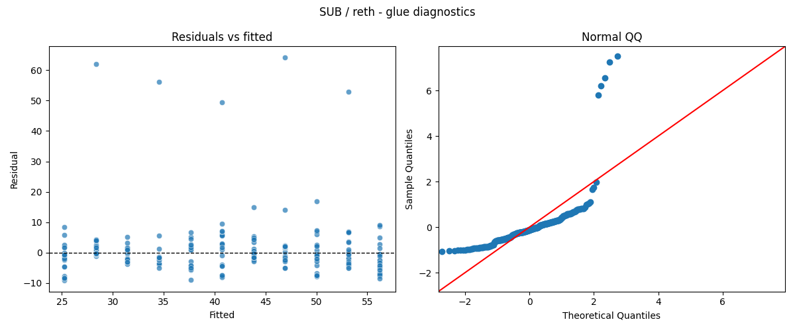

</details>

### Mixed glue (tier B) · reth

<details><summary><code>JUMP</code> · nobs=308 · runtime_ms=2.112e-06 · p=1.00e-03 · R²=0.8082</summary>

```
==============================================================================
                           NNLS Regression Results                            
==============================================================================
Dep. Variable:          test_runtime_ms              R-squared:          0.808
Model:                  NNLS                    Adj. R-squared:          0.808
No. Observations:       308                               RMSE:           3.82
Df Residuals:           306                                MAE:           3.06
Df Model:               1      
==============================================================================
                      coef     std err     P-value      [0.025      0.975]
------------------------------------------------------------------------------
         const      8.8507      0.7525       0.001      7.3289     10.2429
          JUMP      0.0000      0.0000       0.001      0.0000      0.0000
==============================================================================
Notes: Non-negative least squares with bootstrap inference (1000 iterations)
==============================================================================
```

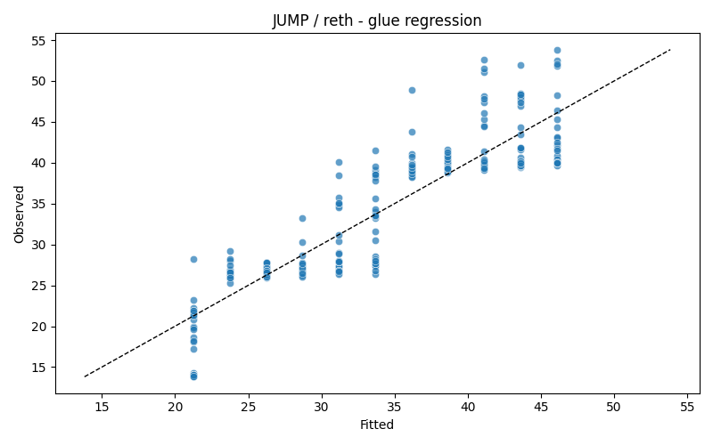

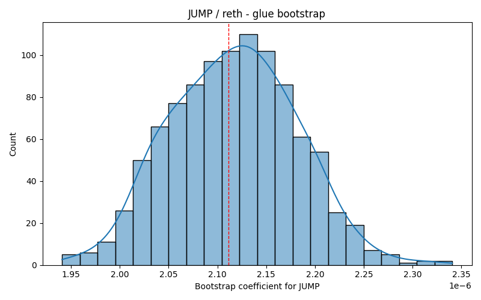

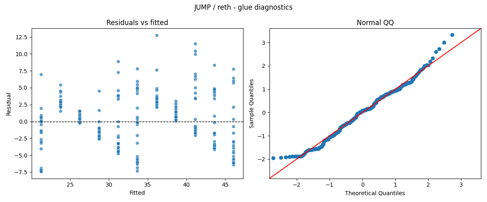

</details>

<details><summary><code>KECCAK256</code> · nobs=4928 · runtime_ms=0 · p=1.00e+00 · R²=-2.22e-16</summary>

```
==============================================================================
                           NNLS Regression Results                            
==============================================================================
Dep. Variable:          test_runtime_ms              R-squared:         -0.000
Model:                  NNLS                    Adj. R-squared:         -0.000
No. Observations:       4928                              RMSE:         159.58
Df Residuals:           4926                               MAE:         135.17
Df Model:               1      
==============================================================================
                      coef     std err     P-value      [0.025      0.975]
------------------------------------------------------------------------------
         const    250.0736      2.1602       0.001    245.5945    254.0660
     KECCAK256      0.0000      0.0000       1.000      0.0000      0.0000
==============================================================================
Notes: Non-negative least squares with bootstrap inference (1000 iterations)
==============================================================================
```

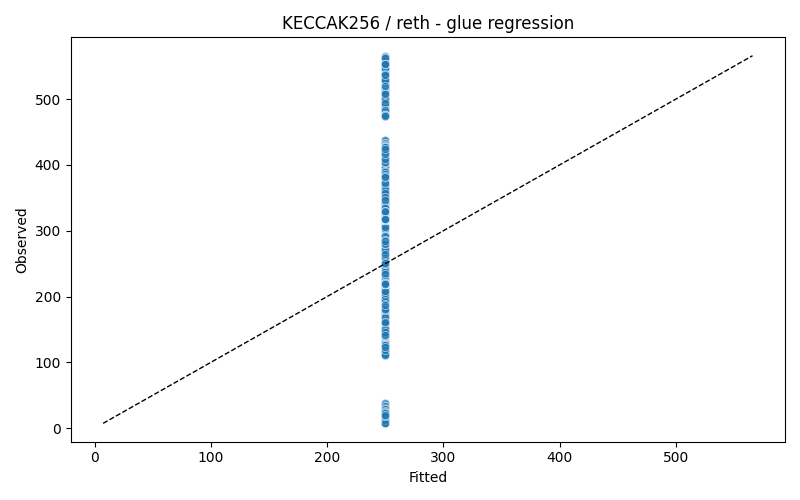


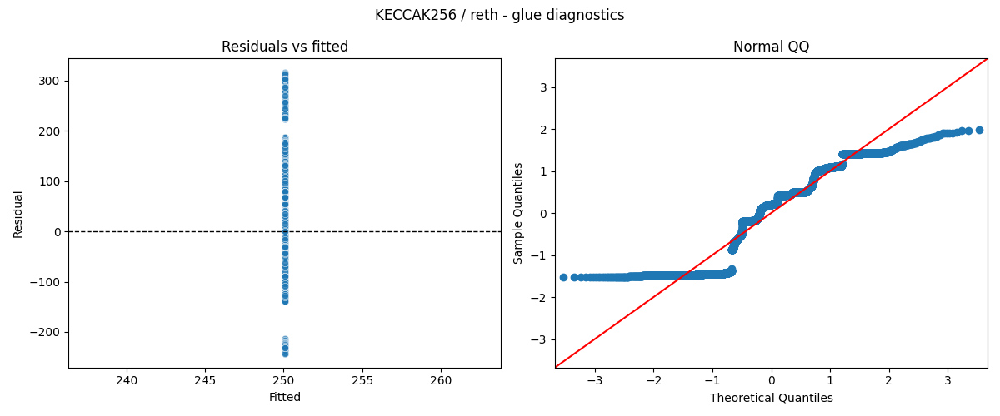

</details>
