# Glue opcodes report

Per-client NNLS fits of priced glue opcodes against their driver fixtures. Cycle-tier opcodes share one joint regression per client (shown once); pure-tier and mixed-tier opcodes each get a single-feature fit. Mixed-tier fits pre-adjust the LHS by subtracting the contribution of every priced upstream partner selected by the detector (pure ∪ cycle for `mixed_a`, plus `mixed_a` for `mixed_b`).

**Contents:** [besu](#besu) · [erigon](#erigon) · [ethrex](#ethrex) · [geth](#geth) · [nethermind](#nethermind) · [reth](#reth)

## besu

| glue_opcode | nobs | glue_runtime_ms | p_value | rsquared |
| --- | --- | --- | --- | --- |
| `ISZERO` | 330 | 4.544e-06 | 1.00e-03 | 0.611 |
| `JUMPDEST` | 330 | 1.777e-06 | 1.00e-03 | 0.1818 |
| `SWAP` | 5280 | 4.115e-06 | 1.00e-03 | 0.893 |
| `CALLDATASIZE` | 19811 | 3.789e-06 | 1.00e-03 | 0.8453 |
| `DUP` | 19811 | 2.059e-06 | 1.00e-03 | 0.8453 |
| `GAS` | 19811 | 3.317e-06 | 1.00e-03 | 0.8453 |
| `MLOAD` | 19811 | 1.098e-05 | 1.00e-03 | 0.8453 |
| `PUSH` | 19811 | 2.589e-06 | 1.00e-03 | 0.8453 |
| `PUSH0` | 19811 | 1.883e-06 | 1.00e-03 | 0.8453 |
| `STATICCALL` | 19811 | 0.0008591 | 1.00e-03 | 0.8453 |
| `ADD` | 330 | 1.106e-05 | 1.00e-03 | 0.6698 |
| `AND` | 330 | 1.033e-05 | 1.00e-03 | 0.3082 |
| `CALLDATACOPY` | 7920 | 1.841e-05 | 1.00e-03 | 0.6721 |
| `CALLDATALOAD` | 1320 | 1.04e-06 | 4.16e-01 | 2.249e-05 |
| `DIV` | 330 | 1.685e-05 | 1.00e-03 | 0.694 |
| `EXP` | 330 | 0.001261 | 1.00e-03 | 0.7484 |
| `GT` | 330 | 2.053e-05 | 1.00e-03 | 0.1359 |
| `JUMPI` | 330 | 7.522e-06 | 1.00e-03 | 0.3298 |
| `LT` | 330 | 2.079e-05 | 1.00e-03 | 0.1344 |
| `MSTORE` | 1650 | 1.899e-05 | 1.00e-03 | 0.8228 |
| `MSTORE8` | 1650 | 1.251e-05 | 1.00e-03 | 0.5574 |
| `MUL` | 330 | 1.237e-05 | 1.00e-03 | 0.7428 |
| `PC` | 330 | 3.951e-06 | 1.00e-03 | 0.5204 |
| `RETURNDATASIZE` | 1320 | 6.254e-06 | 1.00e-03 | 0.4271 |
| `SELFBALANCE` | 270 | 8.693e-06 | 1.00e-03 | 0.4779 |
| `SUB` | 330 | 1.168e-05 | 1.00e-03 | 0.6379 |
| `JUMP` | 330 | 3.919e-05 | 1.00e-03 | 0.6397 |
| `KECCAK256` | 5280 | 4.469e-05 | 1.00e-03 | 0.1922 |

### Cycle glue — joint fit · besu

<details><summary>Joint NNLS regression summary</summary>

```
==============================================================================
                           NNLS Regression Results                            
==============================================================================
Dep. Variable:          test_runtime_ms              R-squared:          0.845
Model:                  NNLS                    Adj. R-squared:          0.845
No. Observations:       19811                             RMSE:          84.63
Df Residuals:           19803                              MAE:          74.11
Df Model:               7      
==============================================================================
                      coef     std err     P-value      [0.025      0.975]
------------------------------------------------------------------------------
         const     61.9653      1.8427       0.001     58.3199     65.6770
  CALLDATASIZE      0.0000      0.0000       0.001      0.0000      0.0000
           DUP      0.0000      0.0000       0.001      0.0000      0.0000
           GAS      0.0000      0.0000       0.001      0.0000      0.0000
         MLOAD      0.0000      0.0000       0.001      0.0000      0.0000
          PUSH      0.0000      0.0000       0.001      0.0000      0.0000
         PUSH0      0.0000      0.0000       0.001      0.0000      0.0000
    STATICCALL      0.0009      0.0000       0.001      0.0008      0.0009
==============================================================================
Notes: Non-negative least squares with bootstrap inference (1000 iterations)
==============================================================================
```

</details>

<details><summary><code>CALLDATASIZE</code> · nobs=19811 · runtime_ms=3.789e-06 · p=1.00e-03 · R²=0.8453</summary>


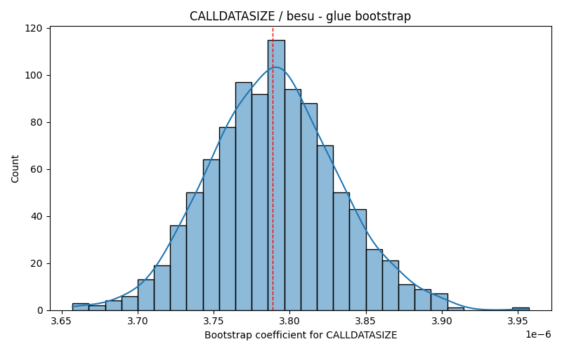


</details>

<details><summary><code>DUP</code> · nobs=19811 · runtime_ms=2.059e-06 · p=1.00e-03 · R²=0.8453</summary>

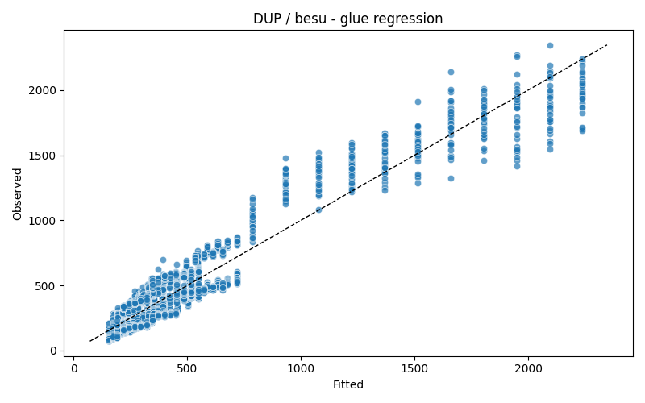

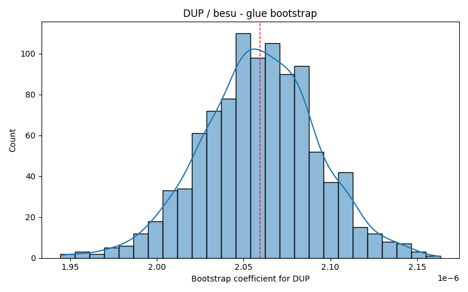

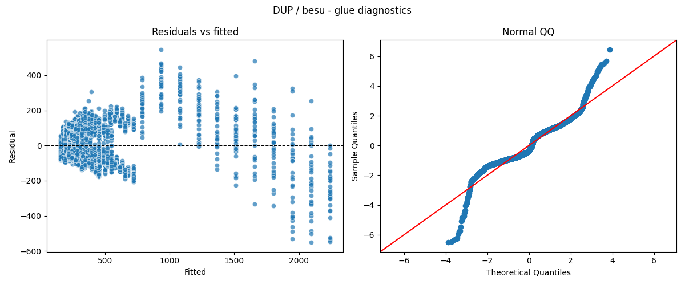

</details>

<details><summary><code>GAS</code> · nobs=19811 · runtime_ms=3.317e-06 · p=1.00e-03 · R²=0.8453</summary>


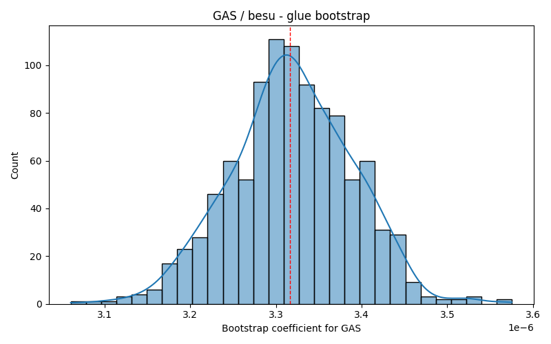


</details>

<details><summary><code>MLOAD</code> · nobs=19811 · runtime_ms=1.098e-05 · p=1.00e-03 · R²=0.8453</summary>

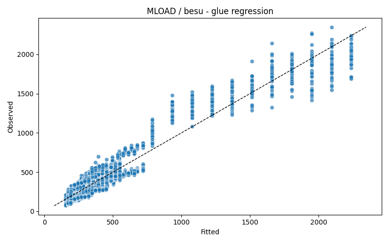

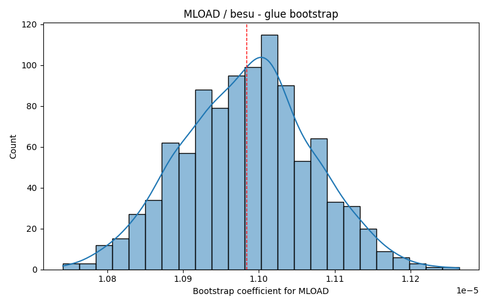

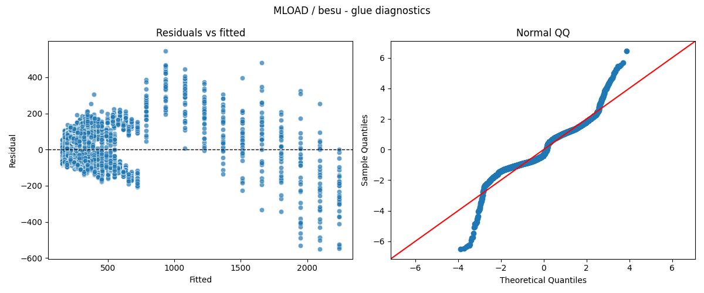

</details>

<details><summary><code>PUSH</code> · nobs=19811 · runtime_ms=2.589e-06 · p=1.00e-03 · R²=0.8453</summary>


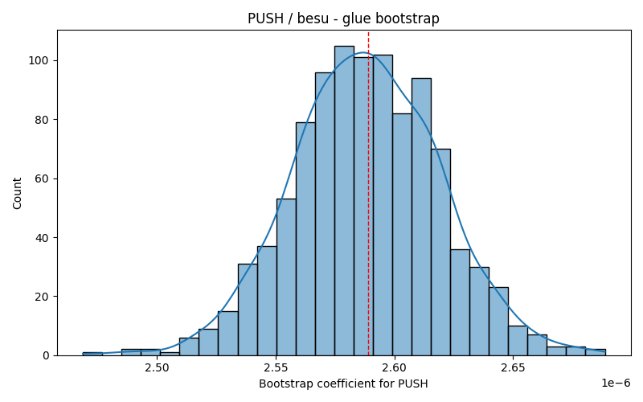

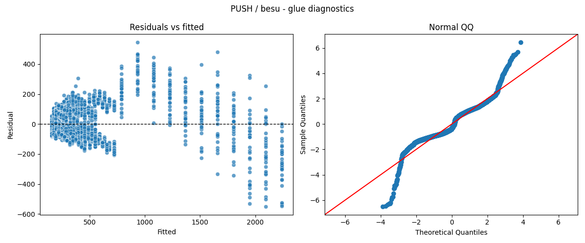

</details>

<details><summary><code>PUSH0</code> · nobs=19811 · runtime_ms=1.883e-06 · p=1.00e-03 · R²=0.8453</summary>


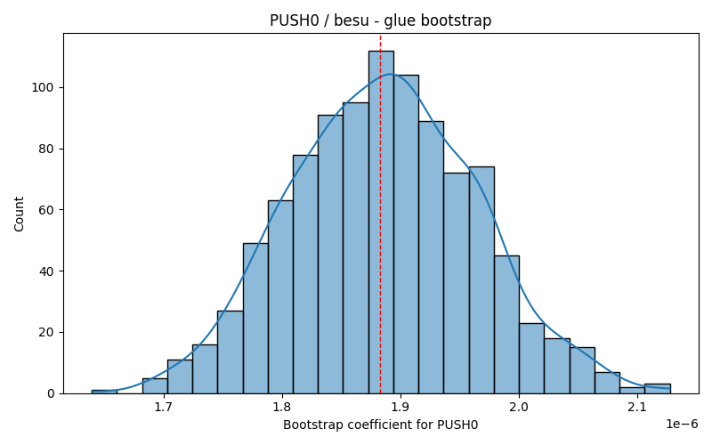


</details>

<details><summary><code>STATICCALL</code> · nobs=19811 · runtime_ms=0.0008591 · p=1.00e-03 · R²=0.8453</summary>

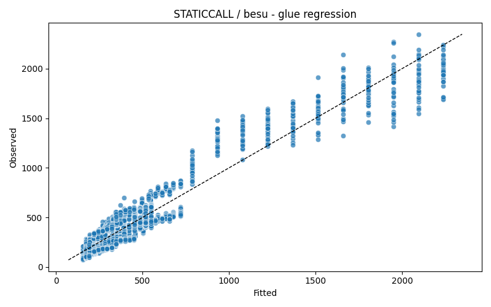

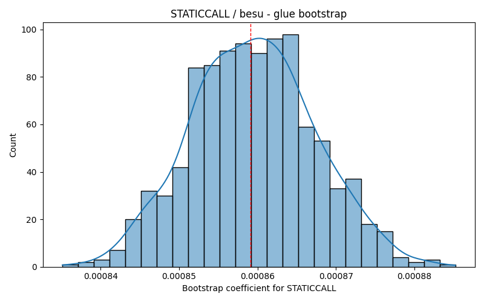


</details>

### Pure glue · besu

<details><summary><code>ISZERO</code> · nobs=330 · runtime_ms=4.544e-06 · p=1.00e-03 · R²=0.611</summary>

```
==============================================================================
                           NNLS Regression Results                            
==============================================================================
Dep. Variable:          test_runtime_ms              R-squared:          0.611
Model:                  NNLS                    Adj. R-squared:          0.610
No. Observations:       330                               RMSE:          76.33
Df Residuals:           328                                MAE:          70.00
Df Model:               1      
==============================================================================
                      coef     std err     P-value      [0.025      0.975]
------------------------------------------------------------------------------
         const     57.4316     12.6839       0.001     32.4290     84.5246
        ISZERO      0.0000      0.0000       0.001      0.0000      0.0000
==============================================================================
Notes: Non-negative least squares with bootstrap inference (1000 iterations)
==============================================================================
```

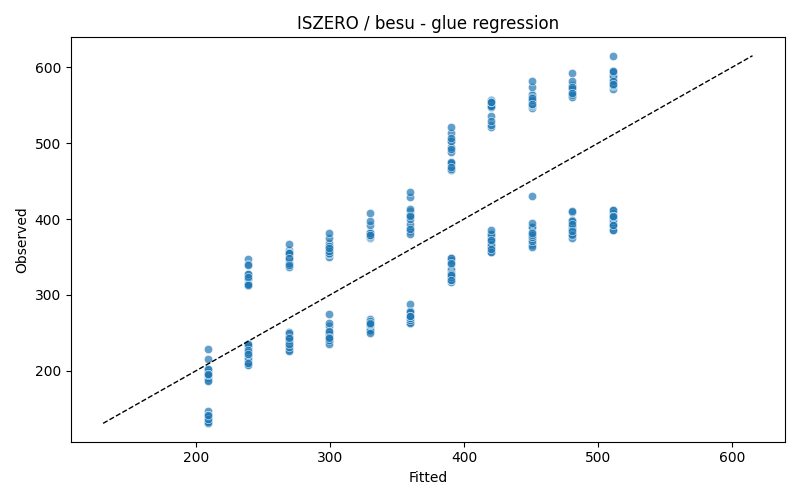

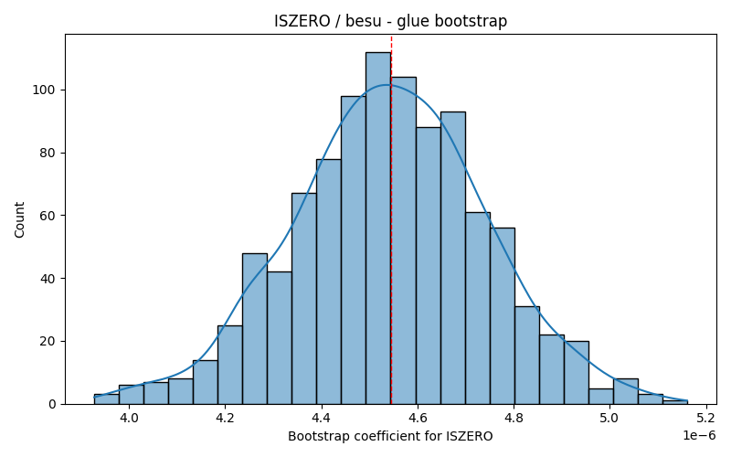

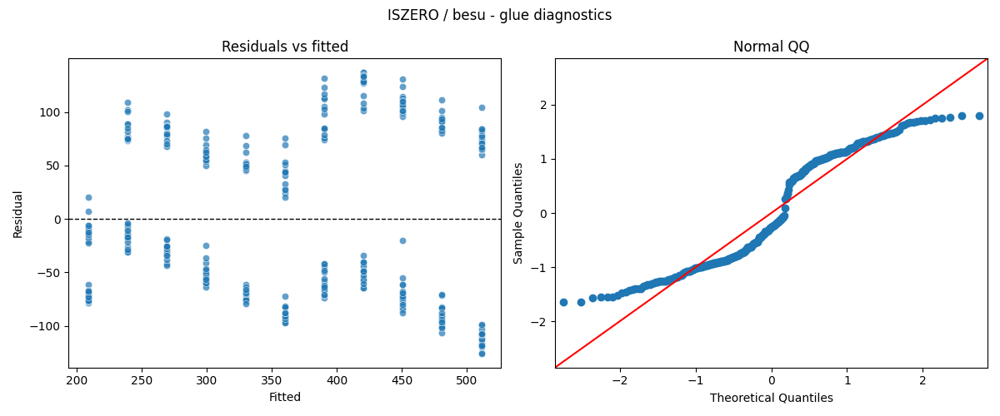

</details>

<details><summary><code>JUMPDEST</code> · nobs=330 · runtime_ms=1.777e-06 · p=1.00e-03 · R²=0.1818</summary>

```
==============================================================================
                           NNLS Regression Results                            
==============================================================================
Dep. Variable:          test_runtime_ms              R-squared:          0.182
Model:                  NNLS                    Adj. R-squared:          0.179
No. Observations:       330                               RMSE:         238.09
Df Residuals:           328                                MAE:         226.22
Df Model:               1      
==============================================================================
                      coef     std err     P-value      [0.025      0.975]
------------------------------------------------------------------------------
         const     64.4446     37.2074       0.038      0.0000    140.9559
      JUMPDEST      0.0000      0.0000       0.001      0.0000      0.0000
==============================================================================
Notes: Non-negative least squares with bootstrap inference (1000 iterations)
==============================================================================
```

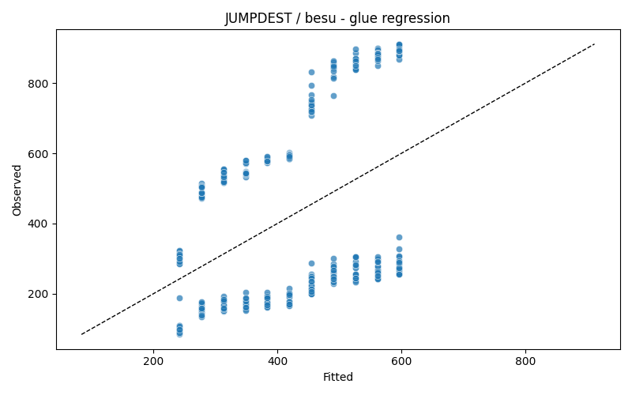

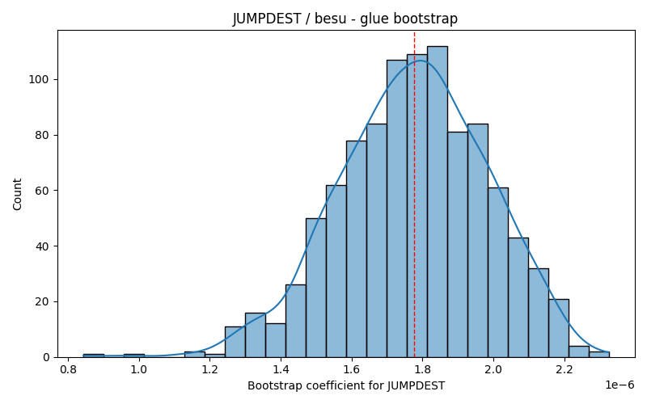

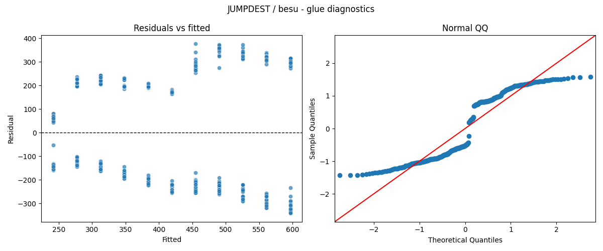

</details>

<details><summary><code>SWAP</code> · nobs=5280 · runtime_ms=4.115e-06 · p=1.00e-03 · R²=0.893</summary>

```
==============================================================================
                           NNLS Regression Results                            
==============================================================================
Dep. Variable:          test_runtime_ms              R-squared:          0.893
Model:                  NNLS                    Adj. R-squared:          0.893
No. Observations:       5280                              RMSE:          29.98
Df Residuals:           5278                               MAE:          24.67
Df Model:               1      
==============================================================================
                      coef     std err     P-value      [0.025      0.975]
------------------------------------------------------------------------------
         const     57.0340      1.5673       0.001     53.9858     60.1115
          SWAP      0.0000      0.0000       0.001      0.0000      0.0000
==============================================================================
Notes: Non-negative least squares with bootstrap inference (1000 iterations)
==============================================================================
```

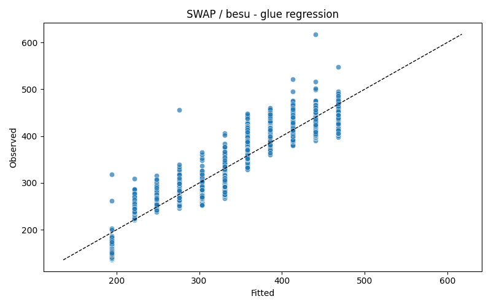

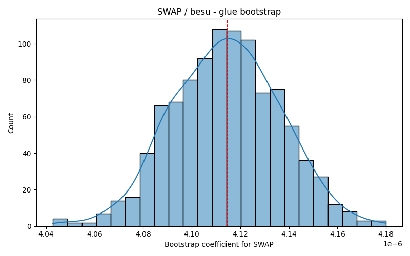

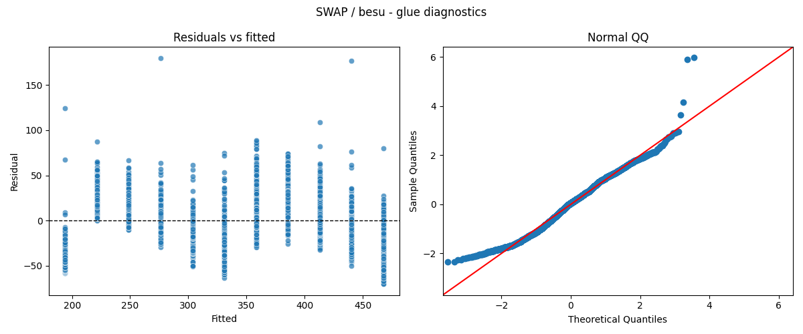

</details>

### Mixed glue (tier A) · besu

<details><summary><code>ADD</code> · nobs=330 · runtime_ms=1.106e-05 · p=1.00e-03 · R²=0.6698</summary>

```
==============================================================================
                           NNLS Regression Results                            
==============================================================================
Dep. Variable:          test_runtime_ms              R-squared:          0.670
Model:                  NNLS                    Adj. R-squared:          0.669
No. Observations:       330                               RMSE:          81.72
Df Residuals:           328                                MAE:          73.42
Df Model:               1      
==============================================================================
                      coef     std err     P-value      [0.025      0.975]
------------------------------------------------------------------------------
         const     84.8925     13.8394       0.001     55.9510    109.8431
           ADD      0.0000      0.0000       0.001      0.0000      0.0000
==============================================================================
Notes: Non-negative least squares with bootstrap inference (1000 iterations)
==============================================================================
```

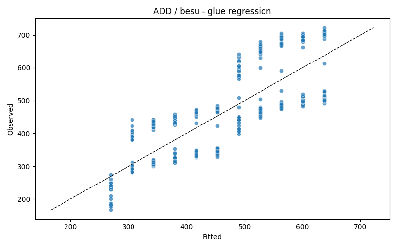

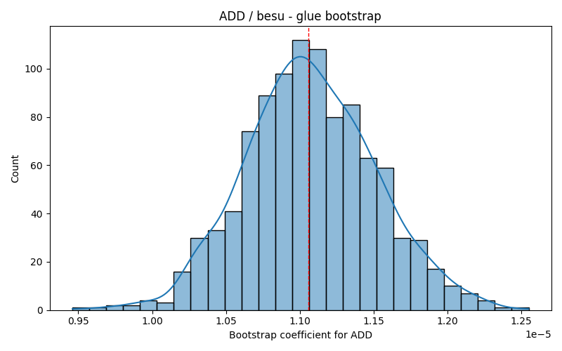

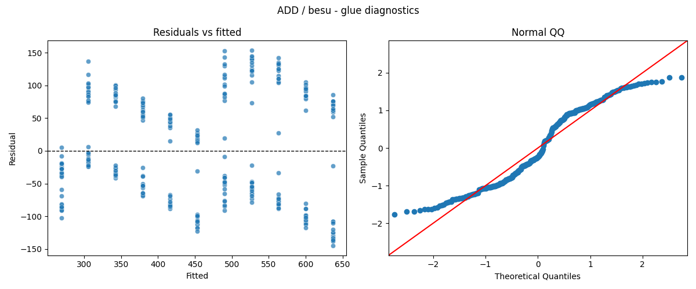

</details>

<details><summary><code>AND</code> · nobs=330 · runtime_ms=1.033e-05 · p=1.00e-03 · R²=0.3082</summary>

```
==============================================================================
                           NNLS Regression Results                            
==============================================================================
Dep. Variable:          test_runtime_ms              R-squared:          0.308
Model:                  NNLS                    Adj. R-squared:          0.306
No. Observations:       330                               RMSE:         162.91
Df Residuals:           328                                MAE:         153.54
Df Model:               1      
==============================================================================
                      coef     std err     P-value      [0.025      0.975]
------------------------------------------------------------------------------
         const     79.8100     25.2446       0.001     31.3524    130.7393
           AND      0.0000      0.0000       0.001      0.0000      0.0000
==============================================================================
Notes: Non-negative least squares with bootstrap inference (1000 iterations)
==============================================================================
```

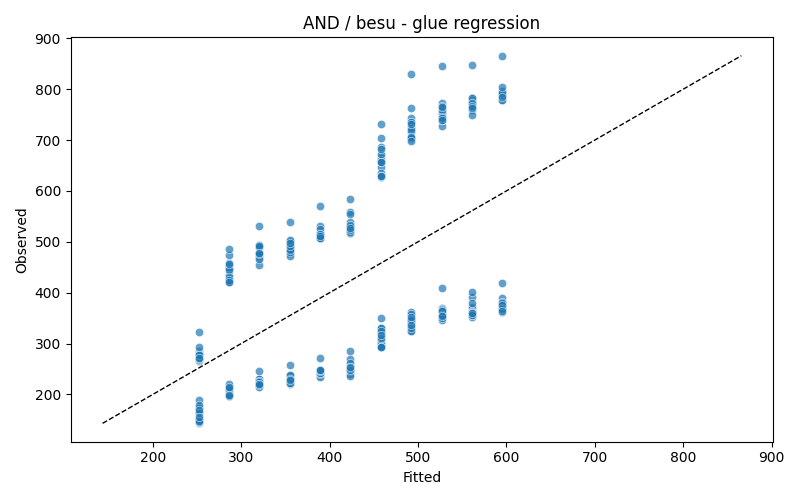

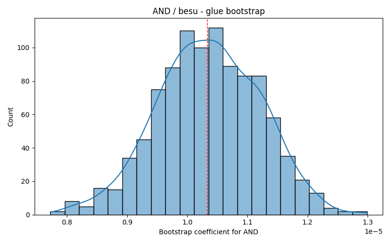

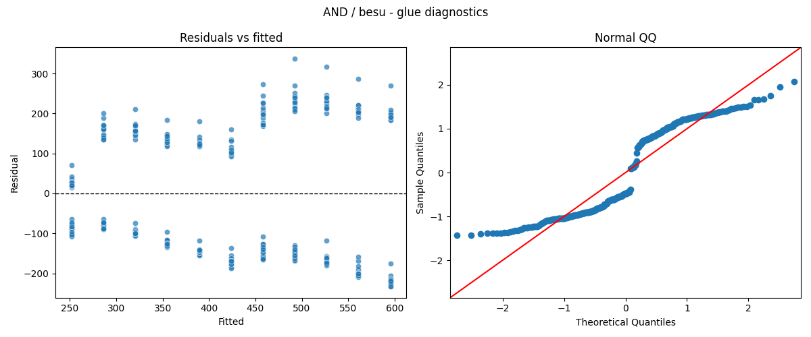

</details>

<details><summary><code>CALLDATACOPY</code> · nobs=7920 · runtime_ms=1.841e-05 · p=1.00e-03 · R²=0.6721</summary>

```
==============================================================================
                           NNLS Regression Results                            
==============================================================================
Dep. Variable:          test_runtime_ms              R-squared:          0.672
Model:                  NNLS                    Adj. R-squared:          0.672
No. Observations:       7920                              RMSE:          96.67
Df Residuals:           7918                               MAE:          66.45
Df Model:               1      
==============================================================================
                      coef     std err     P-value      [0.025      0.975]
------------------------------------------------------------------------------
         const    122.3645      1.1990       0.001    120.0783    124.7252
  CALLDATACOPY      0.0000      0.0000       0.001      0.0000      0.0000
==============================================================================
Notes: Non-negative least squares with bootstrap inference (1000 iterations)
==============================================================================
```

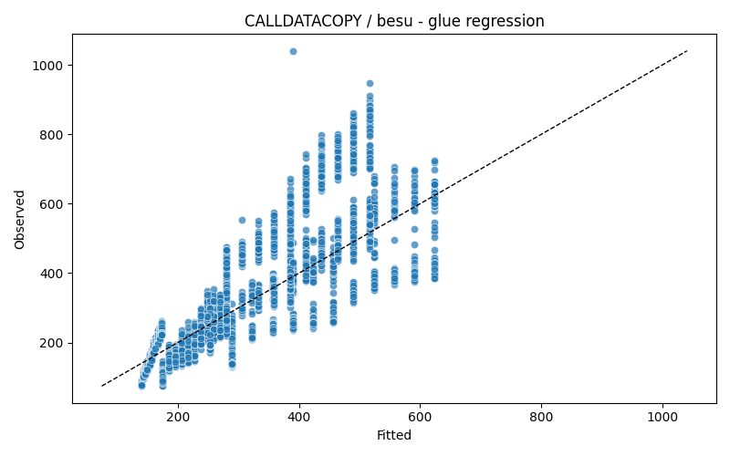

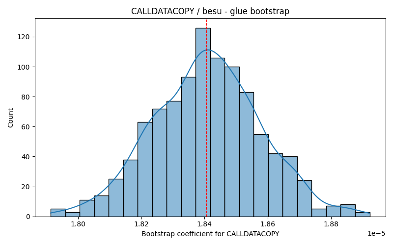

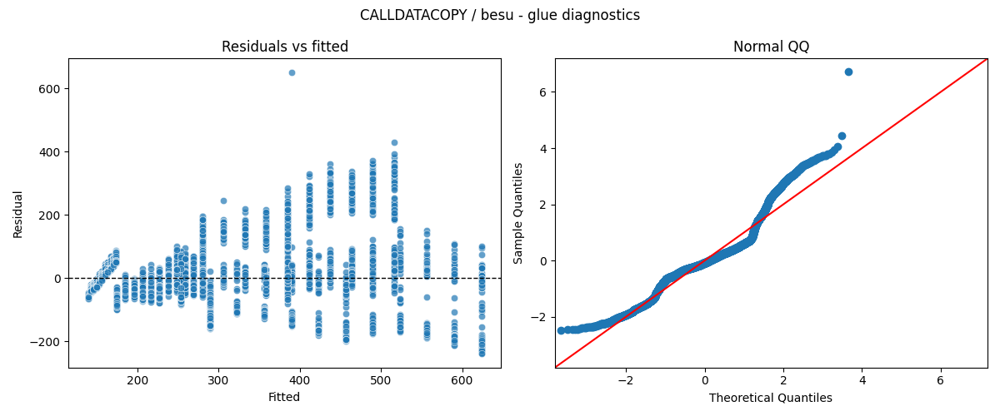

</details>

<details><summary><code>CALLDATALOAD</code> · nobs=1320 · runtime_ms=1.04e-06 · p=4.16e-01 · R²=2.249e-05</summary>

```
==============================================================================
                           NNLS Regression Results                            
==============================================================================
Dep. Variable:          test_runtime_ms              R-squared:          0.000
Model:                  NNLS                    Adj. R-squared:         -0.001
No. Observations:       1320                              RMSE:           0.84
Df Residuals:           1318                               MAE:           0.56
Df Model:               1      
==============================================================================
                      coef     std err     P-value      [0.025      0.975]
------------------------------------------------------------------------------
         const      3.9538      0.0480       0.001      3.8305      4.0088
  CALLDATALOAD      0.0000      0.0000       0.416      0.0000      0.0000
==============================================================================
Notes: Non-negative least squares with bootstrap inference (1000 iterations)
==============================================================================
```

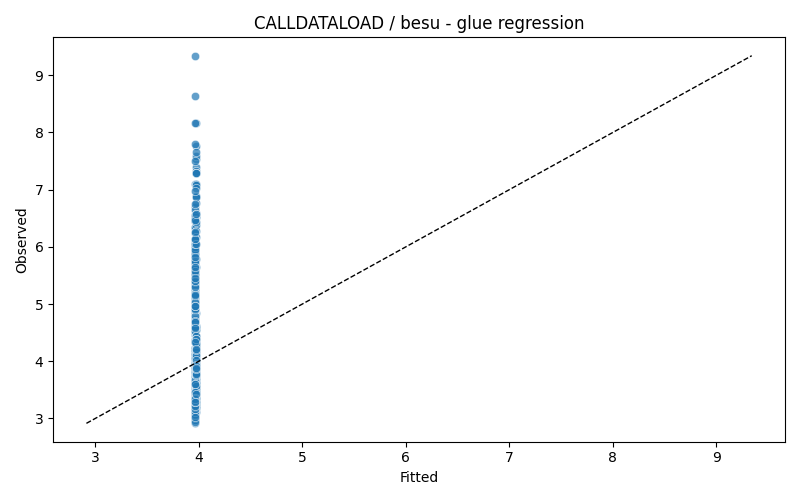

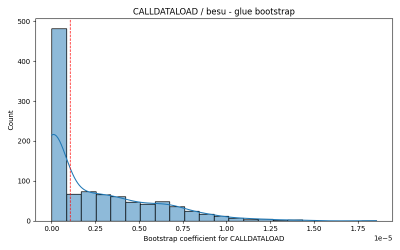

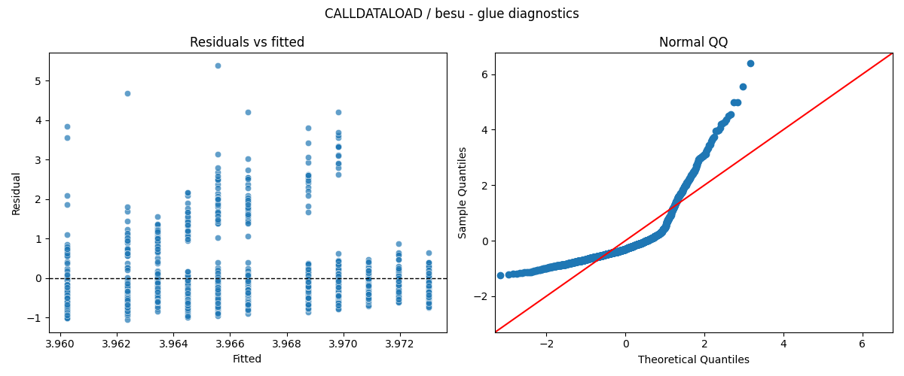

</details>

<details><summary><code>DIV</code> · nobs=330 · runtime_ms=1.685e-05 · p=1.00e-03 · R²=0.694</summary>

```
==============================================================================
                           NNLS Regression Results                            
==============================================================================
Dep. Variable:          test_runtime_ms              R-squared:          0.694
Model:                  NNLS                    Adj. R-squared:          0.693
No. Observations:       330                               RMSE:          88.35
Df Residuals:           328                                MAE:          77.54
Df Model:               1      
==============================================================================
                      coef     std err     P-value      [0.025      0.975]
------------------------------------------------------------------------------
         const    124.5310     13.4993       0.001     98.1445    150.7628
           DIV      0.0000      0.0000       0.001      0.0000      0.0000
==============================================================================
Notes: Non-negative least squares with bootstrap inference (1000 iterations)
==============================================================================
```

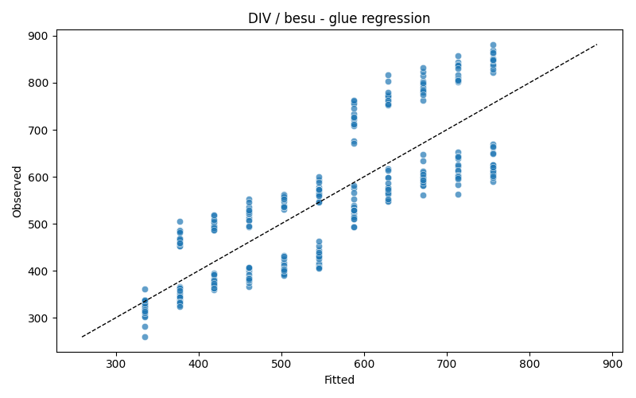

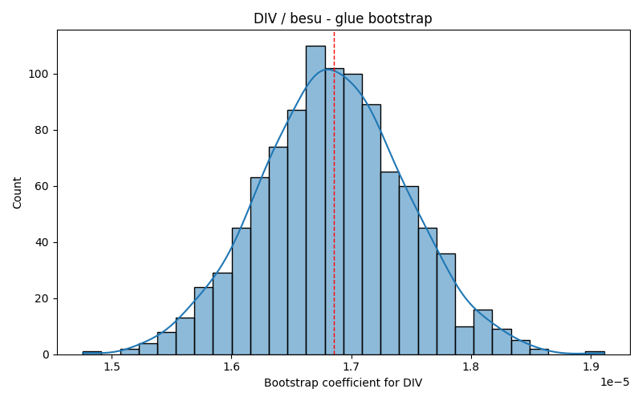

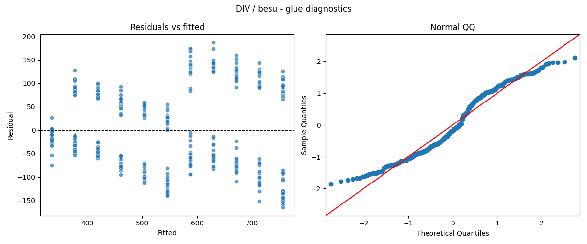

</details>

<details><summary><code>EXP</code> · nobs=330 · runtime_ms=0.001261 · p=1.00e-03 · R²=0.7484</summary>

```
==============================================================================
                           NNLS Regression Results                            
==============================================================================
Dep. Variable:          test_runtime_ms              R-squared:          0.748
Model:                  NNLS                    Adj. R-squared:          0.748
No. Observations:       330                               RMSE:          28.62
Df Residuals:           328                                MAE:          21.81
Df Model:               1      
==============================================================================
                      coef     std err     P-value      [0.025      0.975]
------------------------------------------------------------------------------
         const     93.7526      6.1198       0.001     81.8404    105.0265
           EXP      0.0013      0.0000       0.001      0.0012      0.0013
==============================================================================
Notes: Non-negative least squares with bootstrap inference (1000 iterations)
==============================================================================
```

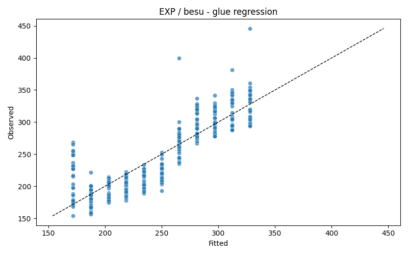

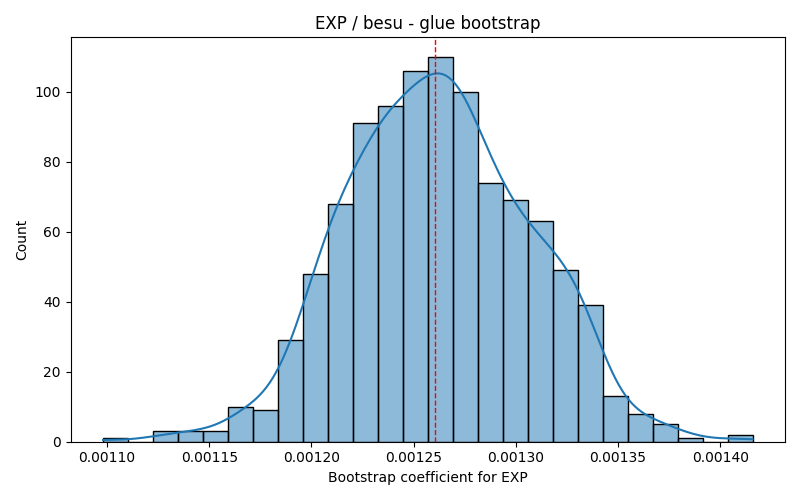

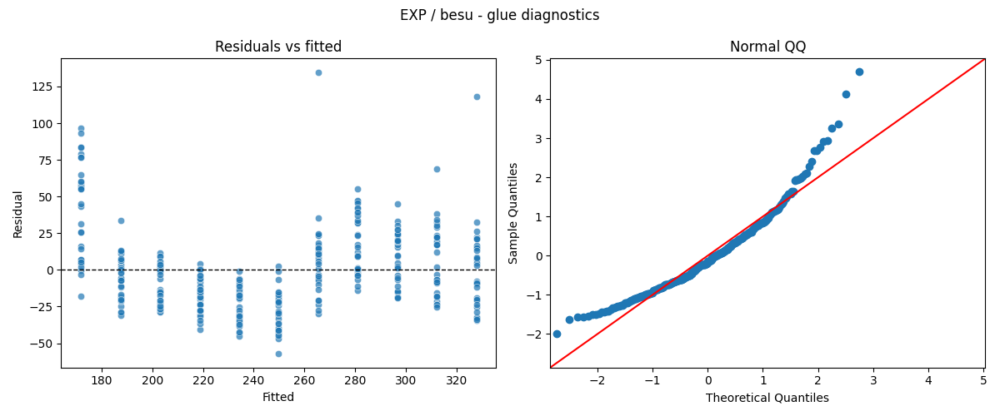

</details>

<details><summary><code>GT</code> · nobs=330 · runtime_ms=2.053e-05 · p=1.00e-03 · R²=0.1359</summary>

```
==============================================================================
                           NNLS Regression Results                            
==============================================================================
Dep. Variable:          test_runtime_ms              R-squared:          0.136
Model:                  NNLS                    Adj. R-squared:          0.133
No. Observations:       330                               RMSE:         544.80
Df Residuals:           328                                MAE:         519.47
Df Model:               1      
==============================================================================
                      coef     std err     P-value      [0.025      0.975]
------------------------------------------------------------------------------
         const    101.7950     78.5557       0.128      0.0000    266.6343
            GT      0.0000      0.0000       0.001      0.0000      0.0000
==============================================================================
Notes: Non-negative least squares with bootstrap inference (1000 iterations)
==============================================================================
```

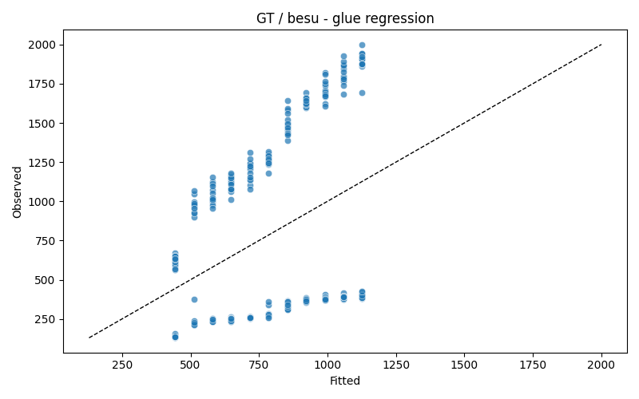

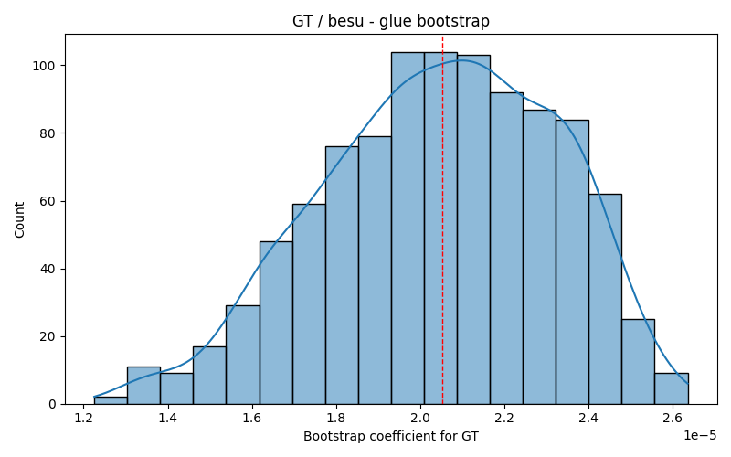

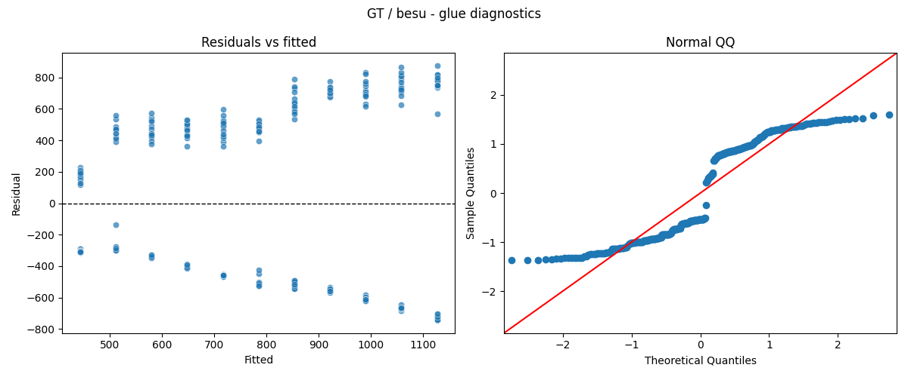

</details>

<details><summary><code>JUMPI</code> · nobs=330 · runtime_ms=7.522e-06 · p=1.00e-03 · R²=0.3298</summary>

```
==============================================================================
                           NNLS Regression Results                            
==============================================================================
Dep. Variable:          test_runtime_ms              R-squared:          0.330
Model:                  NNLS                    Adj. R-squared:          0.328
No. Observations:       330                               RMSE:          48.37
Df Residuals:           328                                MAE:          45.58
Df Model:               1      
==============================================================================
                      coef     std err     P-value      [0.025      0.975]
------------------------------------------------------------------------------
         const     25.7199      7.9479       0.001     11.3300     41.6383
         JUMPI      0.0000      0.0000       0.001      0.0000      0.0000
==============================================================================
Notes: Non-negative least squares with bootstrap inference (1000 iterations)
==============================================================================
```

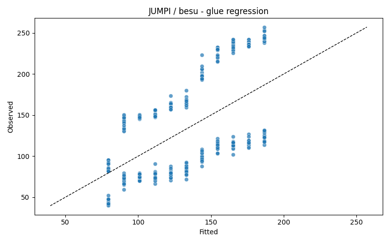

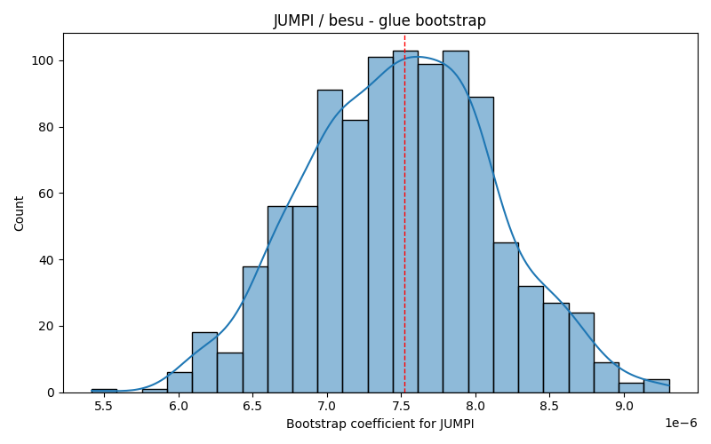

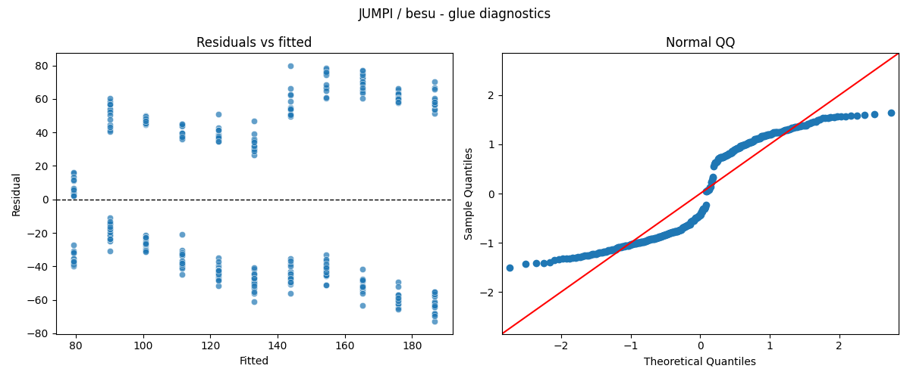

</details>

<details><summary><code>LT</code> · nobs=330 · runtime_ms=2.079e-05 · p=1.00e-03 · R²=0.1344</summary>

```
==============================================================================
                           NNLS Regression Results                            
==============================================================================
Dep. Variable:          test_runtime_ms              R-squared:          0.134
Model:                  NNLS                    Adj. R-squared:          0.132
No. Observations:       330                               RMSE:         555.39
Df Residuals:           328                                MAE:         529.51
Df Model:               1      
==============================================================================
                      coef     std err     P-value      [0.025      0.975]
------------------------------------------------------------------------------
         const    152.4586     83.3598       0.039      0.0000    313.2313
            LT      0.0000      0.0000       0.001      0.0000      0.0000
==============================================================================
Notes: Non-negative least squares with bootstrap inference (1000 iterations)
==============================================================================
```


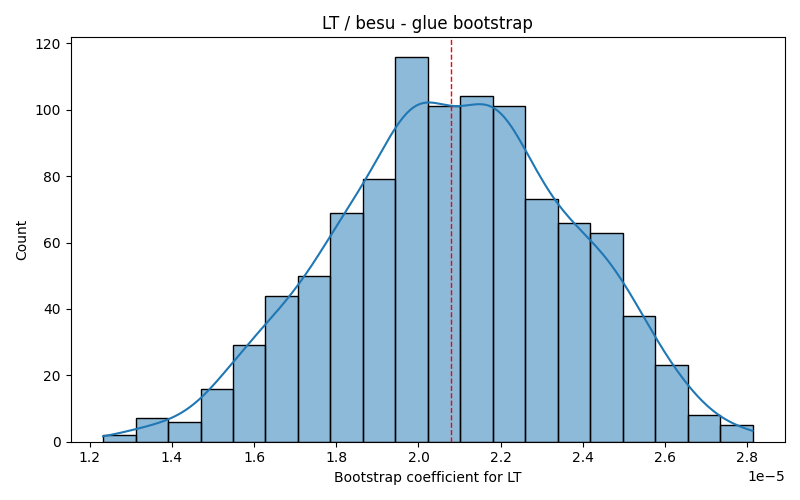

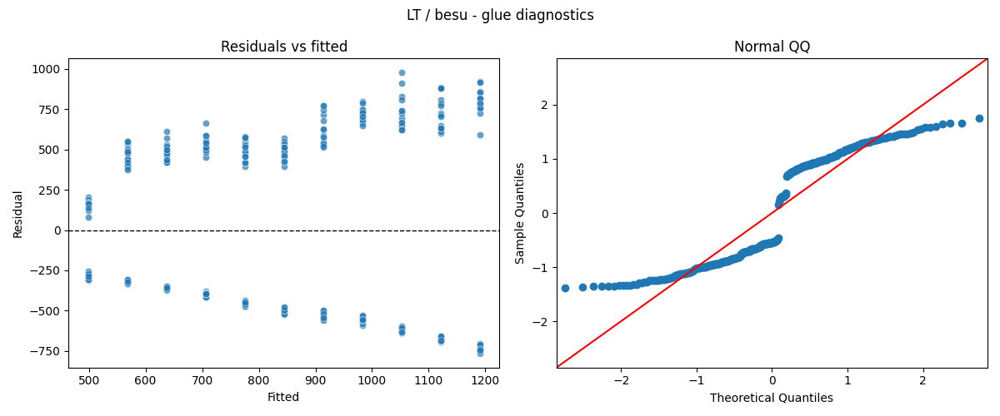

</details>

<details><summary><code>MSTORE</code> · nobs=1650 · runtime_ms=1.899e-05 · p=1.00e-03 · R²=0.8228</summary>

```
==============================================================================
                           NNLS Regression Results                            
==============================================================================
Dep. Variable:          test_runtime_ms              R-squared:          0.823
Model:                  NNLS                    Adj. R-squared:          0.823
No. Observations:       1650                              RMSE:          61.85
Df Residuals:           1648                               MAE:          52.28
Df Model:               1      
==============================================================================
                      coef     std err     P-value      [0.025      0.975]
------------------------------------------------------------------------------
         const     88.1237      4.9118       0.001     78.6952     97.5624
        MSTORE      0.0000      0.0000       0.001      0.0000      0.0000
==============================================================================
Notes: Non-negative least squares with bootstrap inference (1000 iterations)
==============================================================================
```


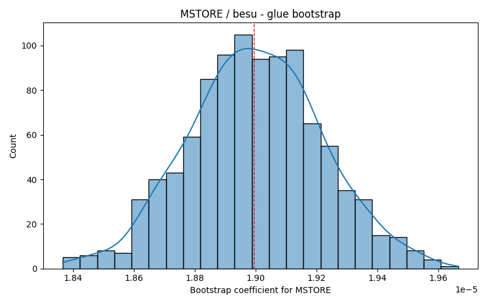

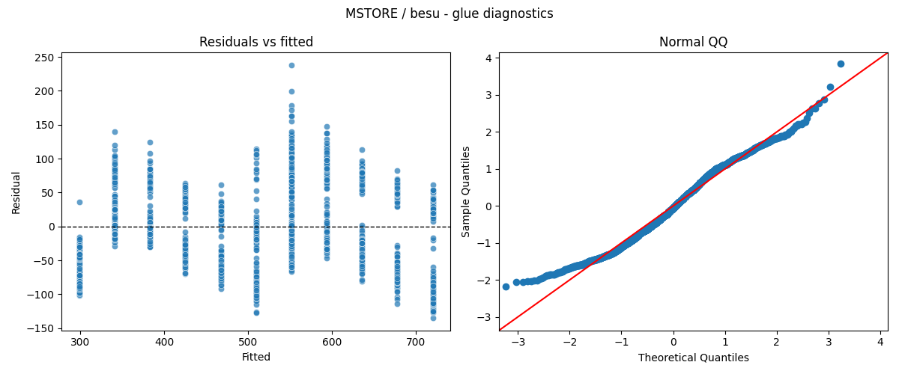

</details>

<details><summary><code>MSTORE8</code> · nobs=1650 · runtime_ms=1.251e-05 · p=1.00e-03 · R²=0.5574</summary>

```
==============================================================================
                           NNLS Regression Results                            
==============================================================================
Dep. Variable:          test_runtime_ms              R-squared:          0.557
Model:                  NNLS                    Adj. R-squared:          0.557
No. Observations:       1650                              RMSE:          78.23
Df Residuals:           1648                               MAE:          71.90
Df Model:               1      
==============================================================================
                      coef     std err     P-value      [0.025      0.975]
------------------------------------------------------------------------------
         const     55.7552      5.6818       0.001     44.9416     66.4288
       MSTORE8      0.0000      0.0000       0.001      0.0000      0.0000
==============================================================================
Notes: Non-negative least squares with bootstrap inference (1000 iterations)
==============================================================================
```

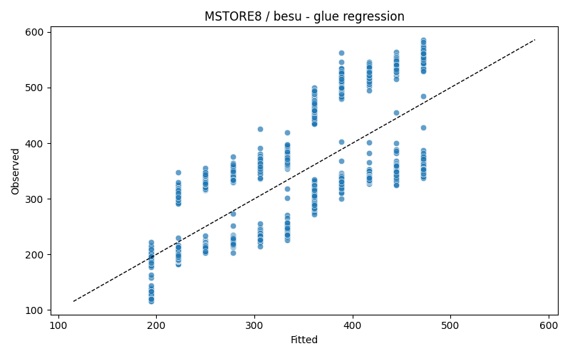

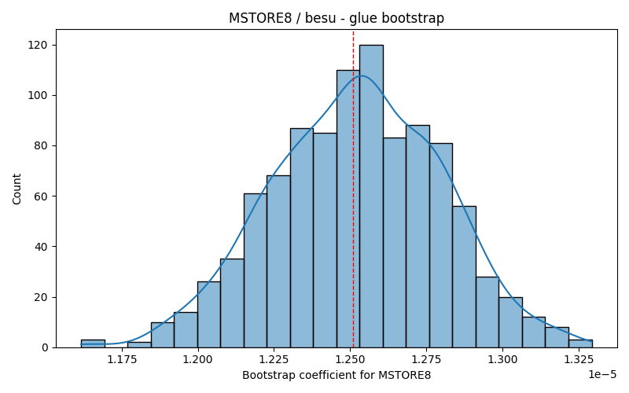

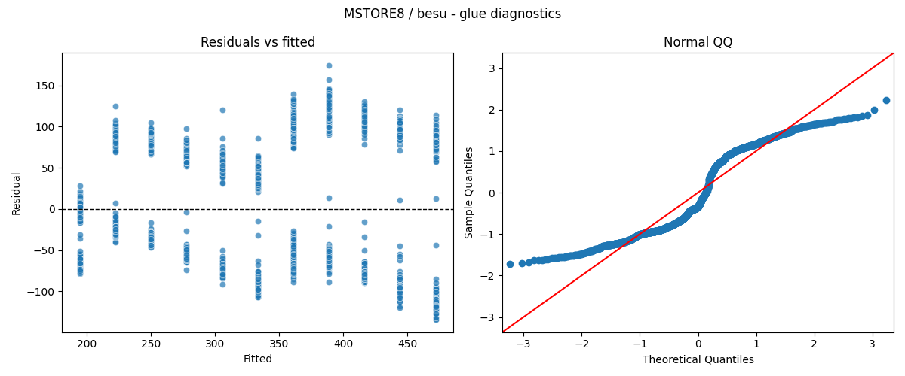

</details>

<details><summary><code>MUL</code> · nobs=330 · runtime_ms=1.237e-05 · p=1.00e-03 · R²=0.7428</summary>

```
==============================================================================
                           NNLS Regression Results                            
==============================================================================
Dep. Variable:          test_runtime_ms              R-squared:          0.743
Model:                  NNLS                    Adj. R-squared:          0.742
No. Observations:       330                               RMSE:          57.44
Df Residuals:           328                                MAE:          40.44
Df Model:               1      
==============================================================================
                      coef     std err     P-value      [0.025      0.975]
------------------------------------------------------------------------------
         const     95.9908      8.9715       0.001     77.9462    112.9103
           MUL      0.0000      0.0000       0.001      0.0000      0.0000
==============================================================================
Notes: Non-negative least squares with bootstrap inference (1000 iterations)
==============================================================================
```

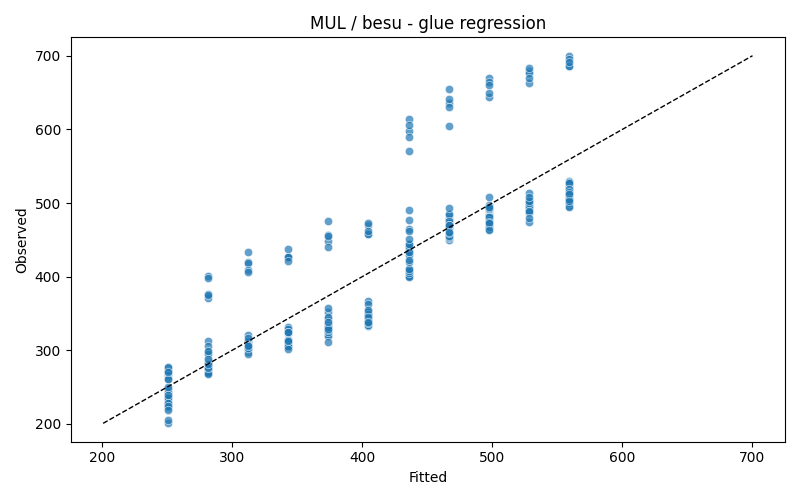

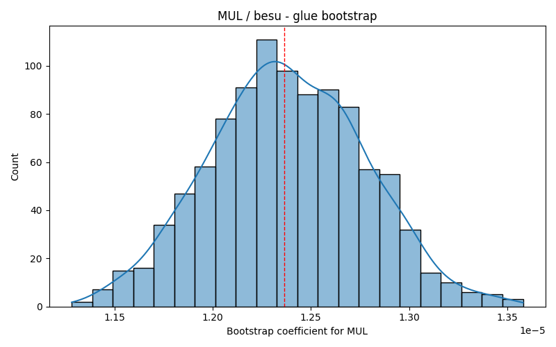

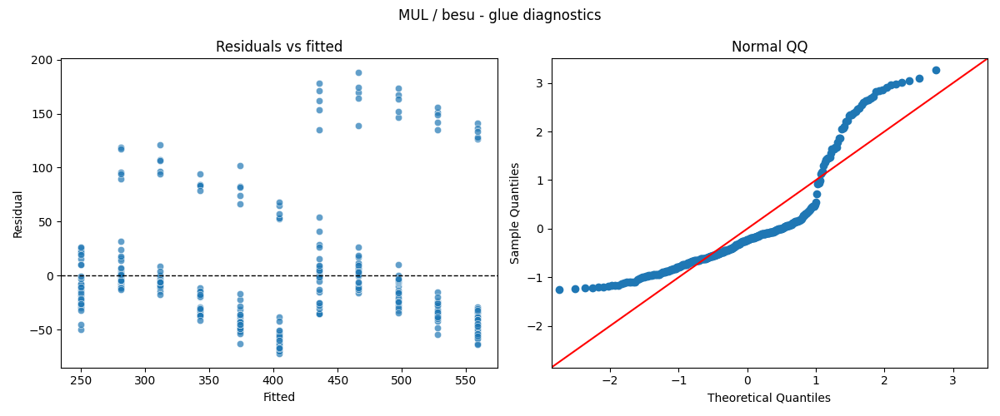

</details>

<details><summary><code>PC</code> · nobs=330 · runtime_ms=3.951e-06 · p=1.00e-03 · R²=0.5204</summary>

```
==============================================================================
                           NNLS Regression Results                            
==============================================================================
Dep. Variable:          test_runtime_ms              R-squared:          0.520
Model:                  NNLS                    Adj. R-squared:          0.519
No. Observations:       330                               RMSE:         113.42
Df Residuals:           328                                MAE:         104.36
Df Model:               1      
==============================================================================
                      coef     std err     P-value      [0.025      0.975]
------------------------------------------------------------------------------
         const     84.3711     18.6132       0.001     48.4846    120.6870
            PC      0.0000      0.0000       0.001      0.0000      0.0000
==============================================================================
Notes: Non-negative least squares with bootstrap inference (1000 iterations)
==============================================================================
```

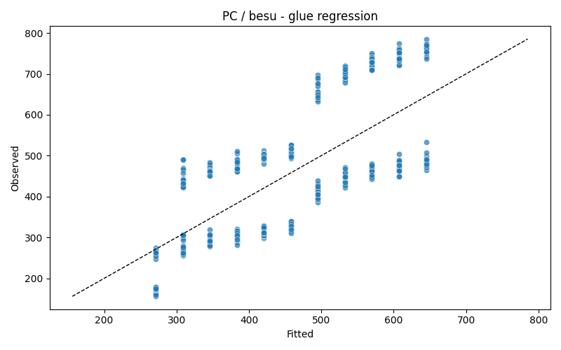

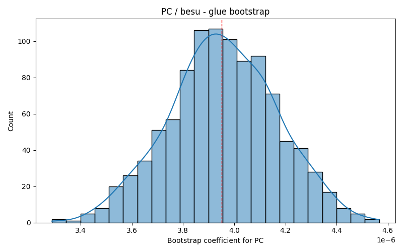

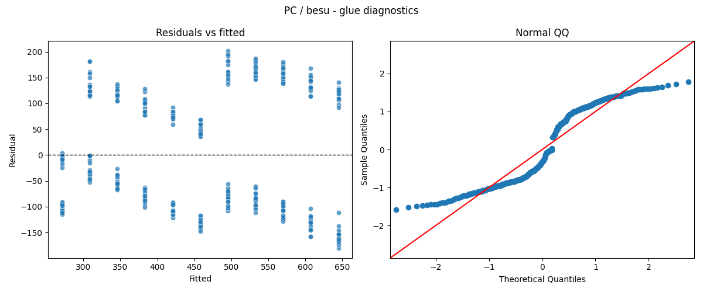

</details>

<details><summary><code>RETURNDATASIZE</code> · nobs=1320 · runtime_ms=6.254e-06 · p=1.00e-03 · R²=0.4271</summary>

```
==============================================================================
                           NNLS Regression Results                            
==============================================================================
Dep. Variable:          test_runtime_ms              R-squared:          0.427
Model:                  NNLS                    Adj. R-squared:          0.427
No. Observations:       1320                              RMSE:         114.36
Df Residuals:           1318                               MAE:         106.12
Df Model:               1      
==============================================================================
                      coef     std err     P-value      [0.025      0.975]
------------------------------------------------------------------------------
         const     64.9447      9.3229       0.001     45.8194     82.2040
RETURNDATASIZE      0.0000      0.0000       0.001      0.0000      0.0000
==============================================================================
Notes: Non-negative least squares with bootstrap inference (1000 iterations)
==============================================================================
```

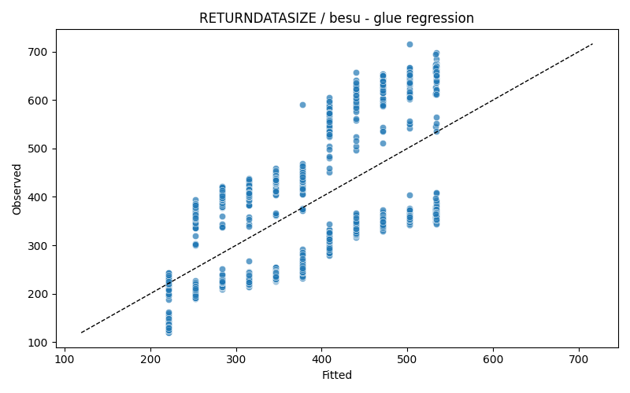

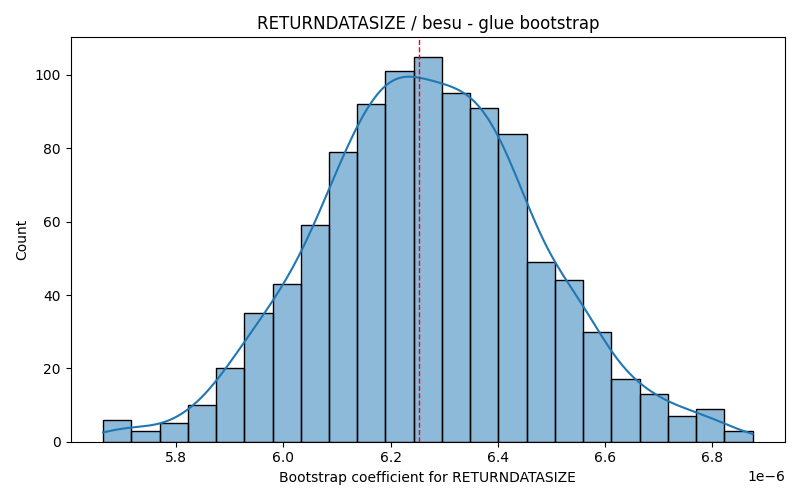

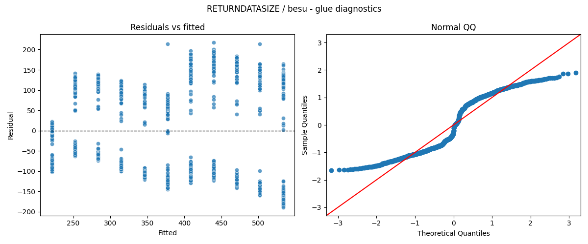

</details>

<details><summary><code>SELFBALANCE</code> · nobs=270 · runtime_ms=8.693e-06 · p=1.00e-03 · R²=0.4779</summary>

```
==============================================================================
                           NNLS Regression Results                            
==============================================================================
Dep. Variable:          test_runtime_ms              R-squared:          0.478
Model:                  NNLS                    Adj. R-squared:          0.476
No. Observations:       270                               RMSE:          91.65
Df Residuals:           268                                MAE:          77.53
Df Model:               1      
==============================================================================
                      coef     std err     P-value      [0.025      0.975]
------------------------------------------------------------------------------
         const    378.7946     22.0508       0.001    333.9421    420.8584
   SELFBALANCE      0.0000      0.0000       0.001      0.0000      0.0000
==============================================================================
Notes: Non-negative least squares with bootstrap inference (1000 iterations)
==============================================================================
```

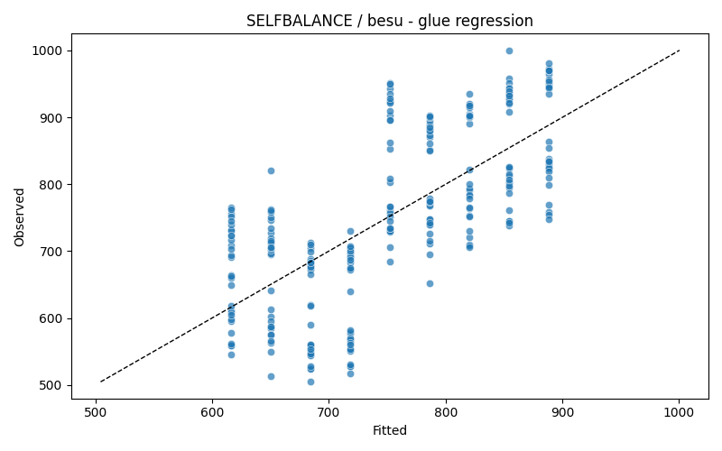

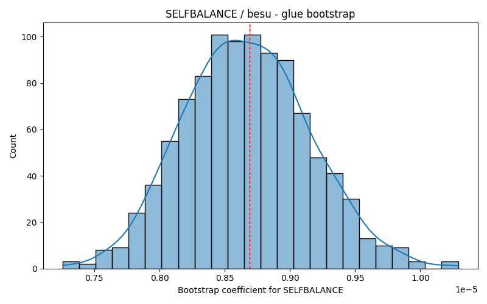

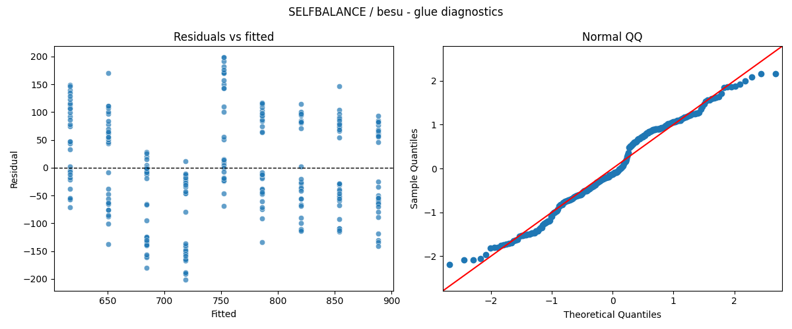

</details>

<details><summary><code>SUB</code> · nobs=330 · runtime_ms=1.168e-05 · p=1.00e-03 · R²=0.6379</summary>

```
==============================================================================
                           NNLS Regression Results                            
==============================================================================
Dep. Variable:          test_runtime_ms              R-squared:          0.638
Model:                  NNLS                    Adj. R-squared:          0.637
No. Observations:       330                               RMSE:          92.61
Df Residuals:           328                                MAE:          84.17
Df Model:               1      
==============================================================================
                      coef     std err     P-value      [0.025      0.975]
------------------------------------------------------------------------------
         const     85.2796     16.2198       0.001     54.9787    119.3137
           SUB      0.0000      0.0000       0.001      0.0000      0.0000
==============================================================================
Notes: Non-negative least squares with bootstrap inference (1000 iterations)
==============================================================================
```

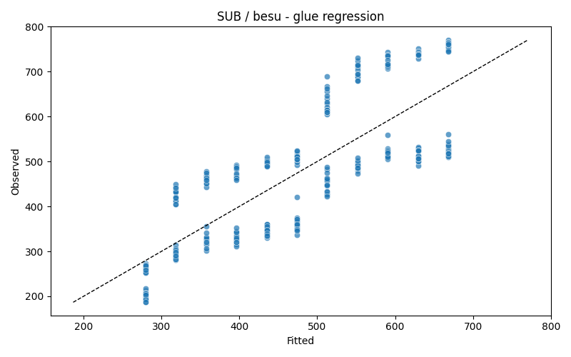

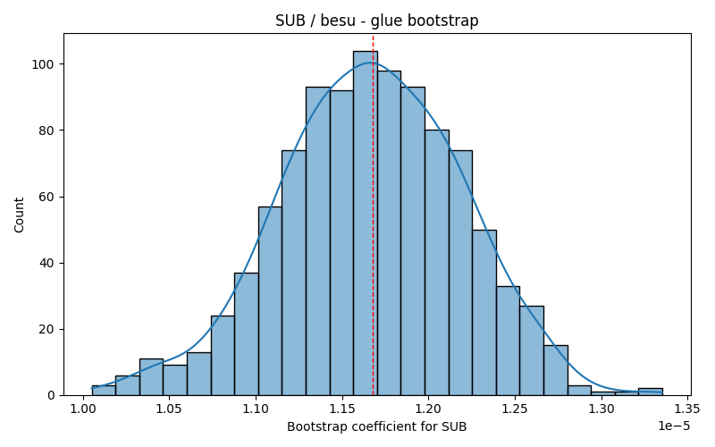

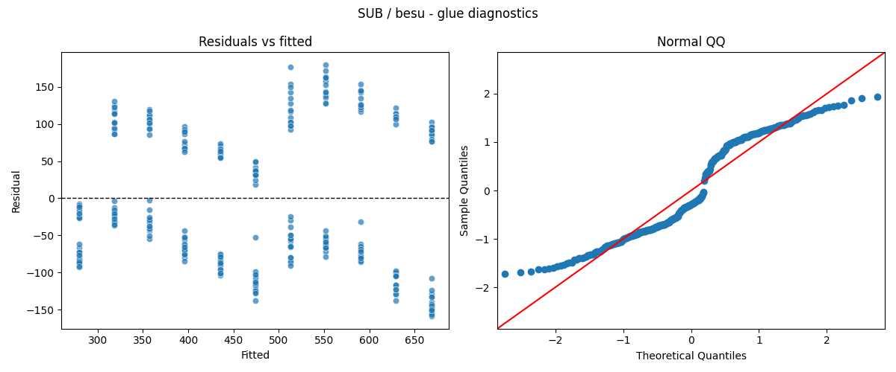

</details>

### Mixed glue (tier B) · besu

<details><summary><code>JUMP</code> · nobs=330 · runtime_ms=3.919e-05 · p=1.00e-03 · R²=0.6397</summary>

```
==============================================================================
                           NNLS Regression Results                            
==============================================================================
Dep. Variable:          test_runtime_ms              R-squared:          0.640
Model:                  NNLS                    Adj. R-squared:          0.639
No. Observations:       330                               RMSE:         109.28
Df Residuals:           328                                MAE:          98.25
Df Model:               1      
==============================================================================
                      coef     std err     P-value      [0.025      0.975]
------------------------------------------------------------------------------
         const     95.3199     17.8297       0.001     61.0449    130.9191
          JUMP      0.0000      0.0000       0.001      0.0000      0.0000
==============================================================================
Notes: Non-negative least squares with bootstrap inference (1000 iterations)
==============================================================================
```

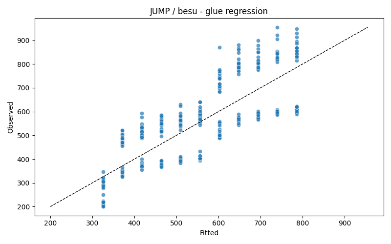

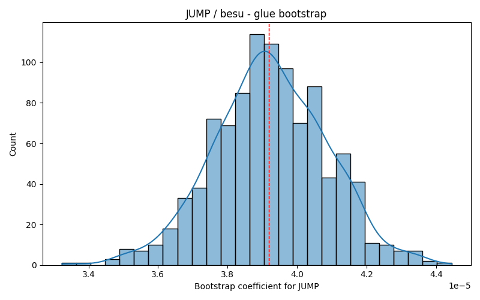

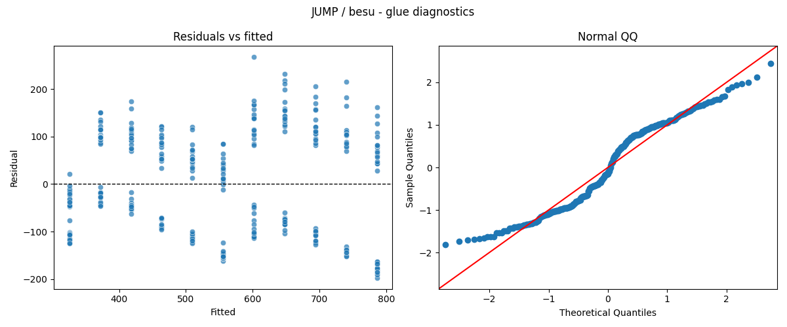

</details>

<details><summary><code>KECCAK256</code> · nobs=5280 · runtime_ms=4.469e-05 · p=1.00e-03 · R²=0.1922</summary>

```
==============================================================================
                           NNLS Regression Results                            
==============================================================================
Dep. Variable:          test_runtime_ms              R-squared:          0.192
Model:                  NNLS                    Adj. R-squared:          0.192
No. Observations:       5280                              RMSE:         182.07
Df Residuals:           5278                               MAE:         146.41
Df Model:               1      
==============================================================================
                      coef     std err     P-value      [0.025      0.975]
------------------------------------------------------------------------------
         const    558.4404      5.5171       0.001    547.7717    569.5451
     KECCAK256      0.0000      0.0000       0.001      0.0000      0.0000
==============================================================================
Notes: Non-negative least squares with bootstrap inference (1000 iterations)
==============================================================================
```

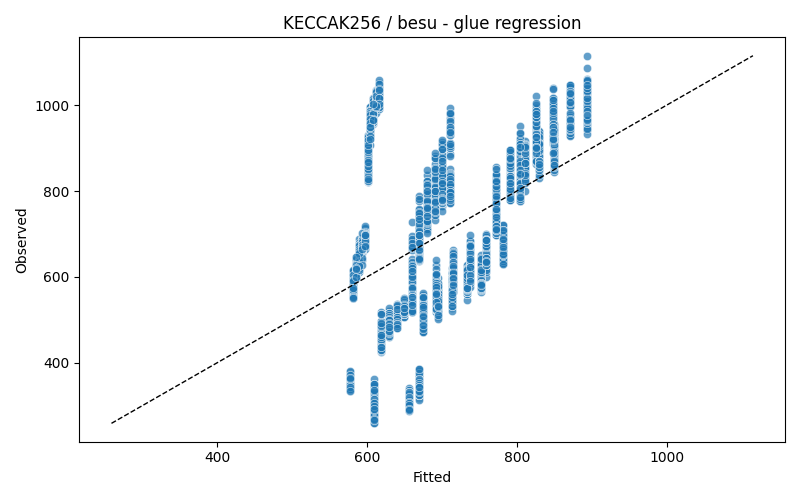

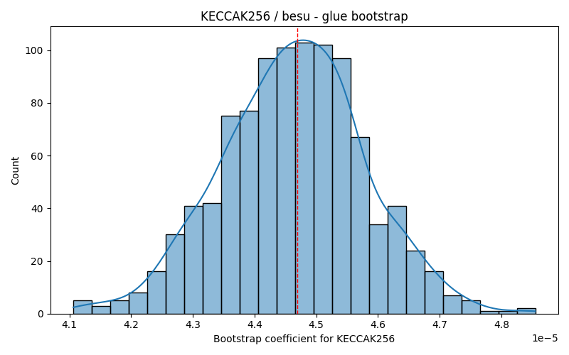

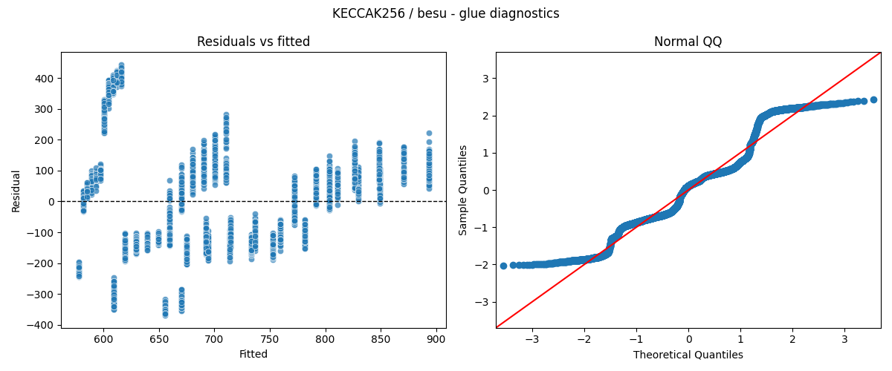

</details>

## erigon

| glue_opcode | nobs | glue_runtime_ms | p_value | rsquared |
| --- | --- | --- | --- | --- |
| `ISZERO` | 187 | 1.053e-06 | 1.00e-03 | 0.6499 |
| `JUMPDEST` | 187 | 7.918e-07 | 1.00e-03 | 0.8207 |
| `SWAP` | 2992 | 1.232e-06 | 1.00e-03 | 0.7714 |
| `CALLDATASIZE` | 11231 | 7.956e-07 | 1.00e-03 | 0.948 |
| `DUP` | 11231 | 1.019e-06 | 1.00e-03 | 0.948 |
| `GAS` | 11231 | 8.105e-07 | 1.00e-03 | 0.948 |
| `MLOAD` | 11231 | 3.354e-06 | 1.00e-03 | 0.948 |
| `PUSH` | 11231 | 2.606e-06 | 1.00e-03 | 0.948 |
| `PUSH0` | 11231 | 9.258e-07 | 1.00e-03 | 0.948 |
| `STATICCALL` | 11231 | 0.0005558 | 1.00e-03 | 0.948 |
| `ADD` | 187 | 2.821e-06 | 1.00e-03 | 0.932 |
| `AND` | 187 | 2.749e-06 | 1.00e-03 | 0.9418 |
| `CALLDATACOPY` | 4488 | 7.027e-06 | 1.00e-03 | 0.8642 |
| `CALLDATALOAD` | 748 | 0 | 1.00e+00 | 0 |
| `DIV` | 187 | 9.259e-06 | 1.00e-03 | 0.7492 |
| `EXP` | 187 | 0.0003323 | 1.00e-03 | 0.9184 |
| `GT` | 187 | 2.81e-06 | 1.00e-03 | 0.797 |
| `JUMPI` | 187 | 3.392e-06 | 1.00e-03 | 0.2262 |
| `LT` | 187 | 2.768e-06 | 1.00e-03 | 0.7569 |
| `MSTORE` | 935 | 5.619e-06 | 1.00e-03 | 0.7788 |
| `MSTORE8` | 935 | 4.916e-06 | 1.00e-03 | 0.5466 |
| `MUL` | 187 | 3.705e-06 | 1.00e-03 | 0.6687 |
| `PC` | 187 | 1.47e-06 | 1.00e-03 | 0.5894 |
| `RETURNDATASIZE` | 748 | 1.729e-06 | 1.00e-03 | 0.6329 |
| `SELFBALANCE` | 153 | 1.338e-06 | 1.00e-03 | 0.8891 |
| `SUB` | 187 | 2.753e-06 | 1.00e-03 | 0.9289 |
| `JUMP` | 187 | 7.5e-06 | 1.00e-03 | 0.8439 |
| `KECCAK256` | 2992 | 2.015e-05 | 1.00e-03 | 0.08908 |

### Cycle glue — joint fit · erigon

<details><summary>Joint NNLS regression summary</summary>

```
==============================================================================
                           NNLS Regression Results                            
==============================================================================
Dep. Variable:          test_runtime_ms              R-squared:          0.948
Model:                  NNLS                    Adj. R-squared:          0.948
No. Observations:       11231                             RMSE:          30.51
Df Residuals:           11223                              MAE:          15.32
Df Model:               7      
==============================================================================
                      coef     std err     P-value      [0.025      0.975]
------------------------------------------------------------------------------
         const     26.4203      0.9083       0.001     24.6547     28.2079
  CALLDATASIZE      0.0000      0.0000       0.001      0.0000      0.0000
           DUP      0.0000      0.0000       0.001      0.0000      0.0000
           GAS      0.0000      0.0000       0.001      0.0000      0.0000
         MLOAD      0.0000      0.0000       0.001      0.0000      0.0000
          PUSH      0.0000      0.0000       0.001      0.0000      0.0000
         PUSH0      0.0000      0.0000       0.001      0.0000      0.0000
    STATICCALL      0.0006      0.0000       0.001      0.0006      0.0006
==============================================================================
Notes: Non-negative least squares with bootstrap inference (1000 iterations)
==============================================================================
```

</details>

<details><summary><code>CALLDATASIZE</code> · nobs=11231 · runtime_ms=7.956e-07 · p=1.00e-03 · R²=0.948</summary>

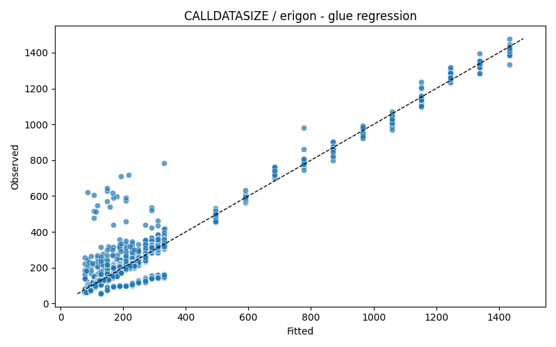

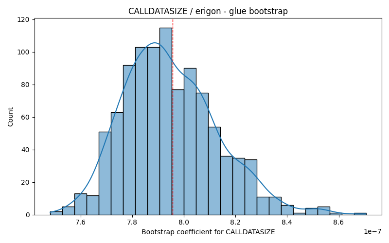

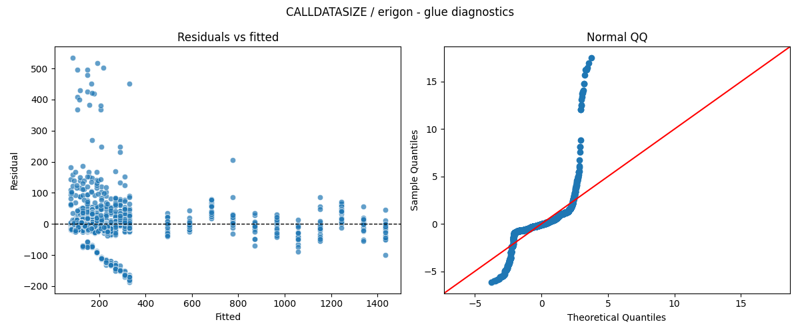

</details>

<details><summary><code>DUP</code> · nobs=11231 · runtime_ms=1.019e-06 · p=1.00e-03 · R²=0.948</summary>

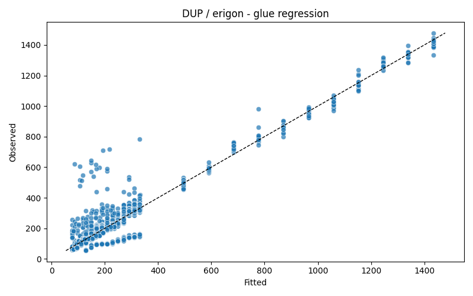

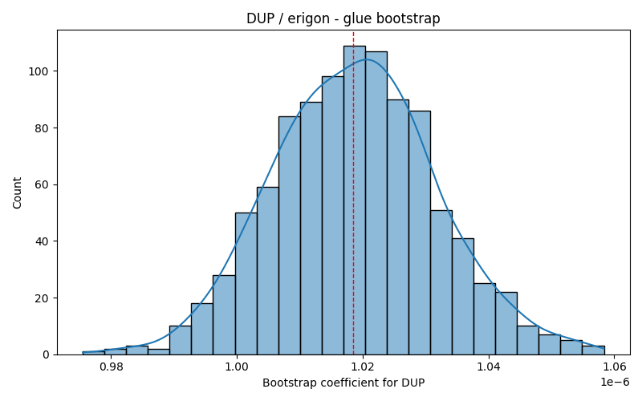


</details>

<details><summary><code>GAS</code> · nobs=11231 · runtime_ms=8.105e-07 · p=1.00e-03 · R²=0.948</summary>


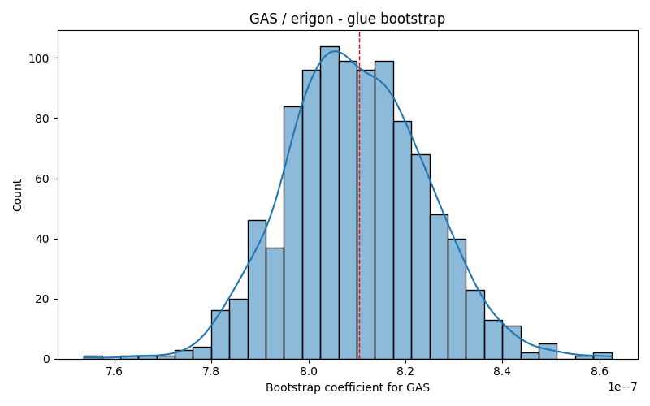


</details>

<details><summary><code>MLOAD</code> · nobs=11231 · runtime_ms=3.354e-06 · p=1.00e-03 · R²=0.948</summary>


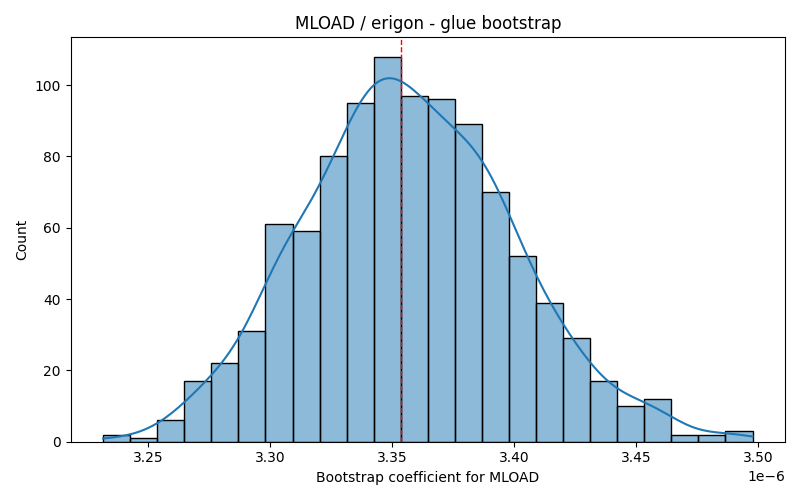


</details>

<details><summary><code>PUSH</code> · nobs=11231 · runtime_ms=2.606e-06 · p=1.00e-03 · R²=0.948</summary>


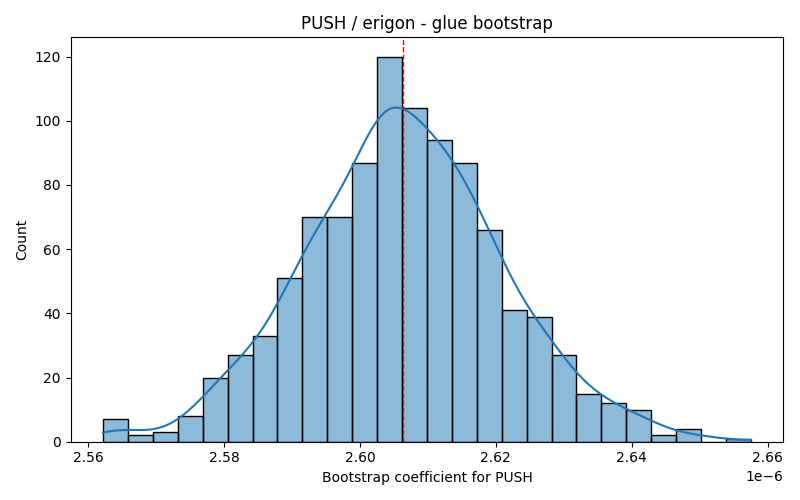


</details>

<details><summary><code>PUSH0</code> · nobs=11231 · runtime_ms=9.258e-07 · p=1.00e-03 · R²=0.948</summary>


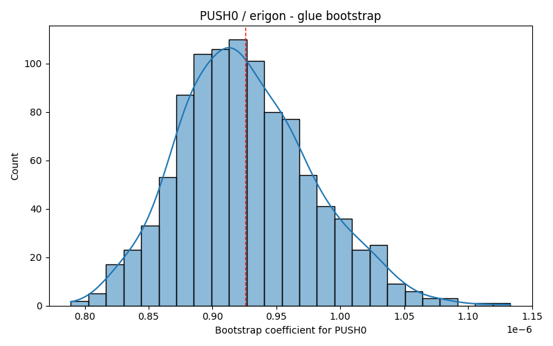

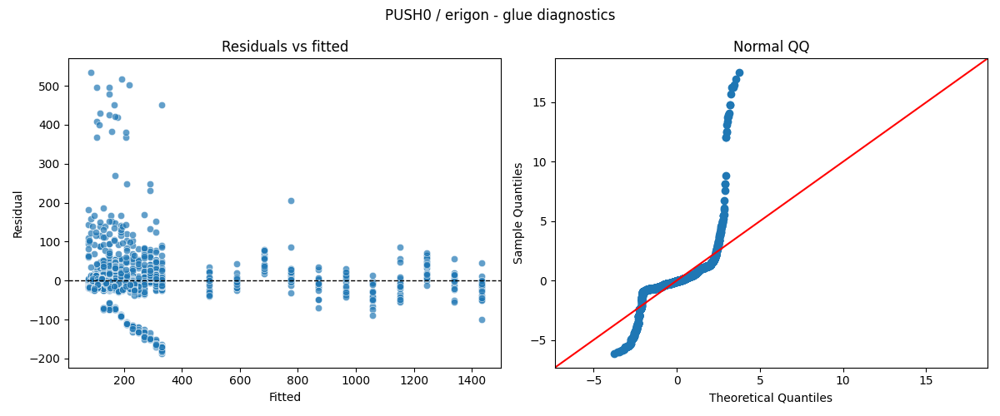

</details>

<details><summary><code>STATICCALL</code> · nobs=11231 · runtime_ms=0.0005558 · p=1.00e-03 · R²=0.948</summary>

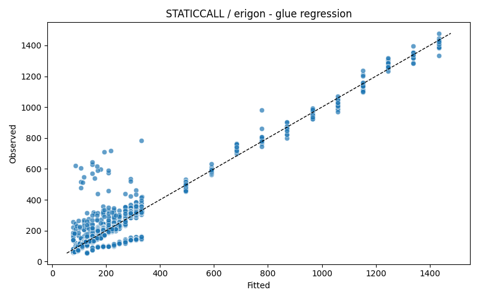

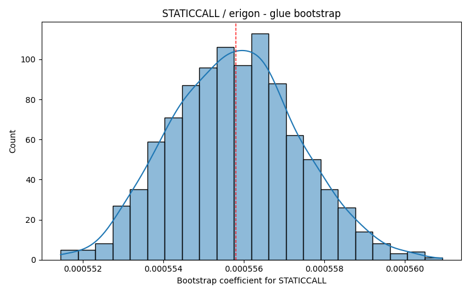

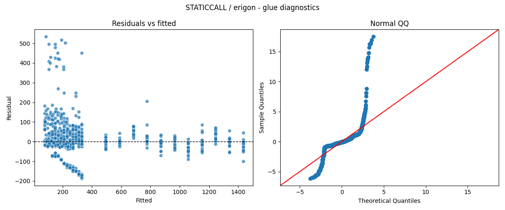

</details>

### Pure glue · erigon

<details><summary><code>ISZERO</code> · nobs=187 · runtime_ms=1.053e-06 · p=1.00e-03 · R²=0.6499</summary>

```
==============================================================================
                           NNLS Regression Results                            
==============================================================================
Dep. Variable:          test_runtime_ms              R-squared:          0.650
Model:                  NNLS                    Adj. R-squared:          0.648
No. Observations:       187                               RMSE:          16.26
Df Residuals:           185                                MAE:           6.35
Df Model:               1      
==============================================================================
                      coef     std err     P-value      [0.025      0.975]
------------------------------------------------------------------------------
         const     13.8558      2.2694       0.001      9.2436     18.2836
        ISZERO      0.0000      0.0000       0.001      0.0000      0.0000
==============================================================================
Notes: Non-negative least squares with bootstrap inference (1000 iterations)
==============================================================================
```

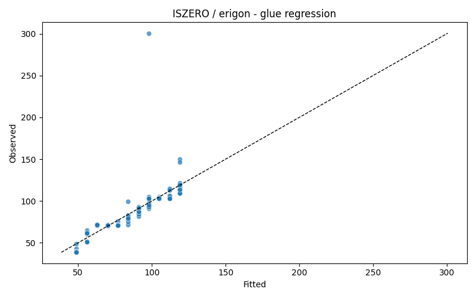


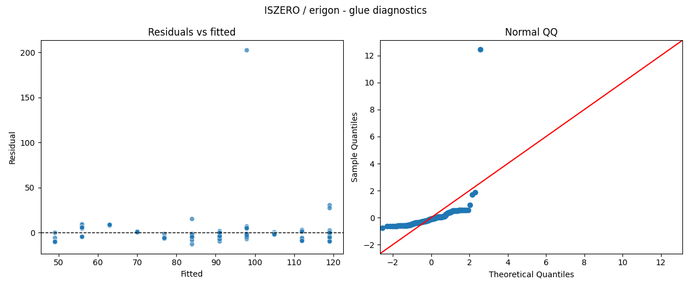

</details>

<details><summary><code>JUMPDEST</code> · nobs=187 · runtime_ms=7.918e-07 · p=1.00e-03 · R²=0.8207</summary>

```
==============================================================================
                           NNLS Regression Results                            
==============================================================================
Dep. Variable:          test_runtime_ms              R-squared:          0.821
Model:                  NNLS                    Adj. R-squared:          0.820
No. Observations:       187                               RMSE:          23.37
Df Residuals:           185                                MAE:          12.32
Df Model:               1      
==============================================================================
                      coef     std err     P-value      [0.025      0.975]
------------------------------------------------------------------------------
         const     14.4622      5.2995       0.008      3.2827     23.8147
      JUMPDEST      0.0000      0.0000       0.001      0.0000      0.0000
==============================================================================
Notes: Non-negative least squares with bootstrap inference (1000 iterations)
==============================================================================
```

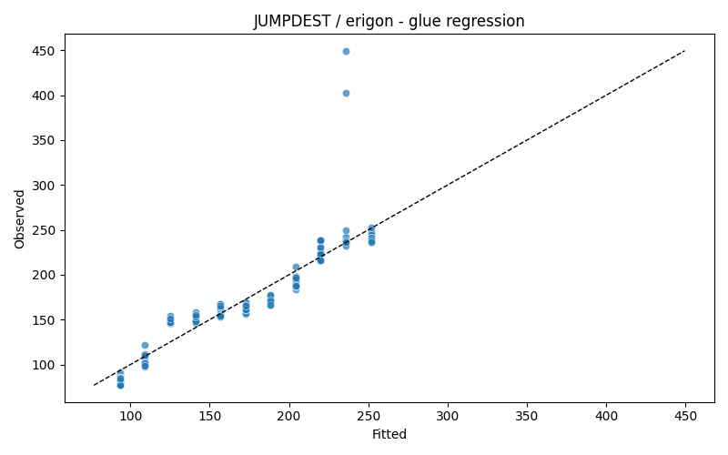

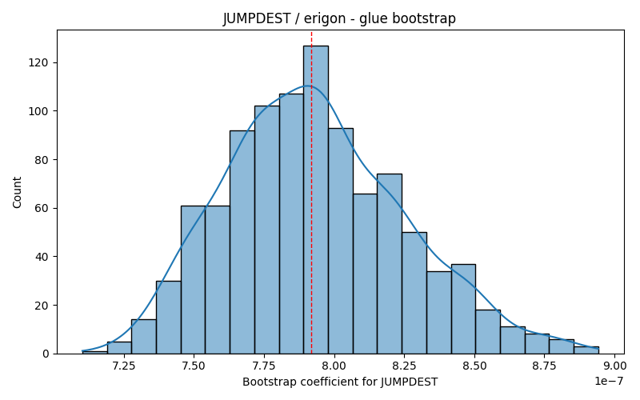

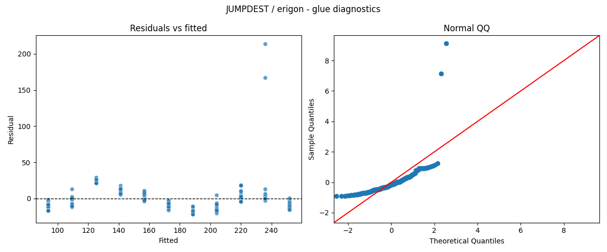

</details>

<details><summary><code>SWAP</code> · nobs=2992 · runtime_ms=1.232e-06 · p=1.00e-03 · R²=0.7714</summary>

```
==============================================================================
                           NNLS Regression Results                            
==============================================================================
Dep. Variable:          test_runtime_ms              R-squared:          0.771
Model:                  NNLS                    Adj. R-squared:          0.771
No. Observations:       2992                              RMSE:          14.12
Df Residuals:           2990                               MAE:           5.79
Df Model:               1      
==============================================================================
                      coef     std err     P-value      [0.025      0.975]
------------------------------------------------------------------------------
         const     22.1381      0.7877       0.001     20.5345     23.6498
          SWAP      0.0000      0.0000       0.001      0.0000      0.0000
==============================================================================
Notes: Non-negative least squares with bootstrap inference (1000 iterations)
==============================================================================
```

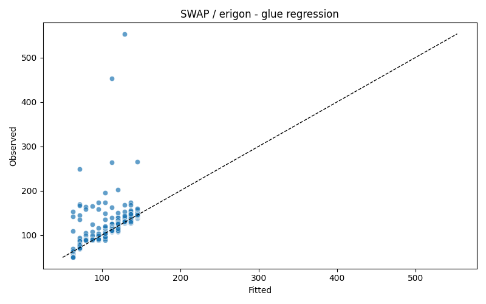

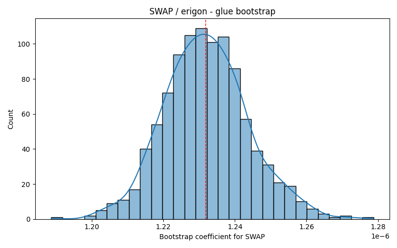

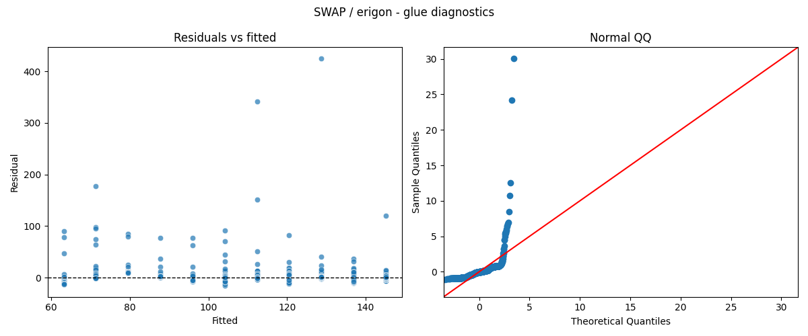

</details>

### Mixed glue (tier A) · erigon

<details><summary><code>ADD</code> · nobs=187 · runtime_ms=2.821e-06 · p=1.00e-03 · R²=0.932</summary>

```
==============================================================================
                           NNLS Regression Results                            
==============================================================================
Dep. Variable:          test_runtime_ms              R-squared:          0.932
Model:                  NNLS                    Adj. R-squared:          0.932
No. Observations:       187                               RMSE:           8.02
Df Residuals:           185                                MAE:           6.70
Df Model:               1      
==============================================================================
                      coef     std err     P-value      [0.025      0.975]
------------------------------------------------------------------------------
         const     14.8320      2.1125       0.001     10.9948     19.0778
           ADD      0.0000      0.0000       0.001      0.0000      0.0000
==============================================================================
Notes: Non-negative least squares with bootstrap inference (1000 iterations)
==============================================================================
```

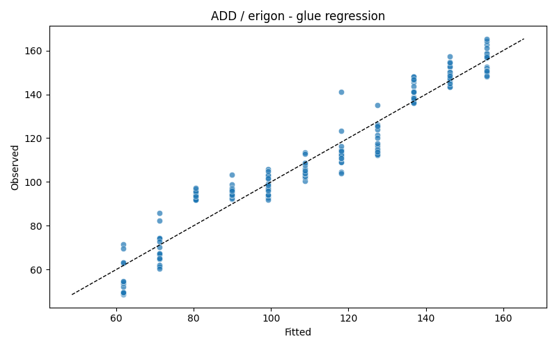

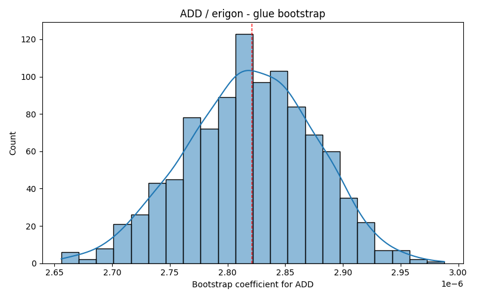


</details>

<details><summary><code>AND</code> · nobs=187 · runtime_ms=2.749e-06 · p=1.00e-03 · R²=0.9418</summary>

```
==============================================================================
                           NNLS Regression Results                            
==============================================================================
Dep. Variable:          test_runtime_ms              R-squared:          0.942
Model:                  NNLS                    Adj. R-squared:          0.941
No. Observations:       187                               RMSE:           7.19
Df Residuals:           185                                MAE:           5.84
Df Model:               1      
==============================================================================
                      coef     std err     P-value      [0.025      0.975]
------------------------------------------------------------------------------
         const     14.2057      2.0700       0.001     10.2871     18.4748
           AND      0.0000      0.0000       0.001      0.0000      0.0000
==============================================================================
Notes: Non-negative least squares with bootstrap inference (1000 iterations)
==============================================================================
```

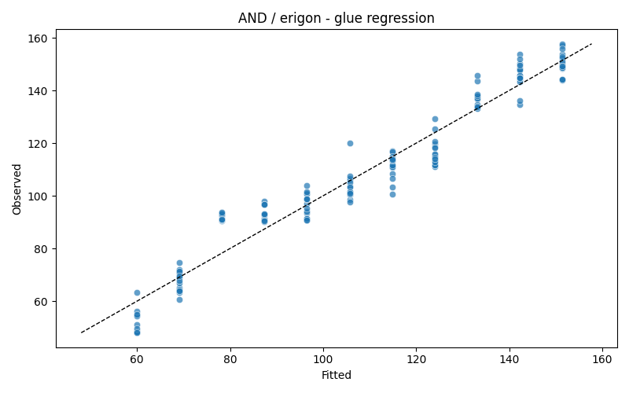

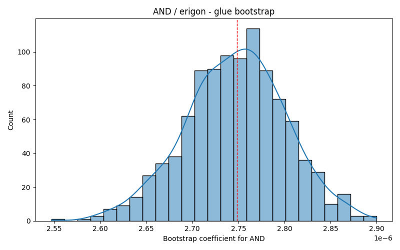

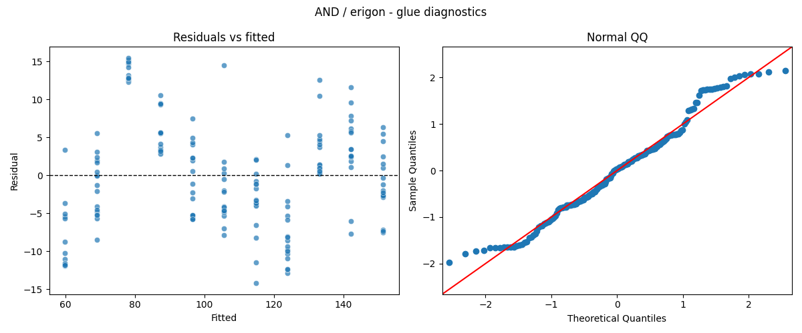

</details>

<details><summary><code>CALLDATACOPY</code> · nobs=4488 · runtime_ms=7.027e-06 · p=1.00e-03 · R²=0.8642</summary>

```
==============================================================================
                           NNLS Regression Results                            
==============================================================================
Dep. Variable:          test_runtime_ms              R-squared:          0.864
Model:                  NNLS                    Adj. R-squared:          0.864
No. Observations:       4488                              RMSE:          20.95
Df Residuals:           4486                               MAE:           7.93
Df Model:               1      
==============================================================================
                      coef     std err     P-value      [0.025      0.975]
------------------------------------------------------------------------------
         const     17.2402      0.4260       0.001     16.4341     18.1068
  CALLDATACOPY      0.0000      0.0000       0.001      0.0000      0.0000
==============================================================================
Notes: Non-negative least squares with bootstrap inference (1000 iterations)
==============================================================================
```

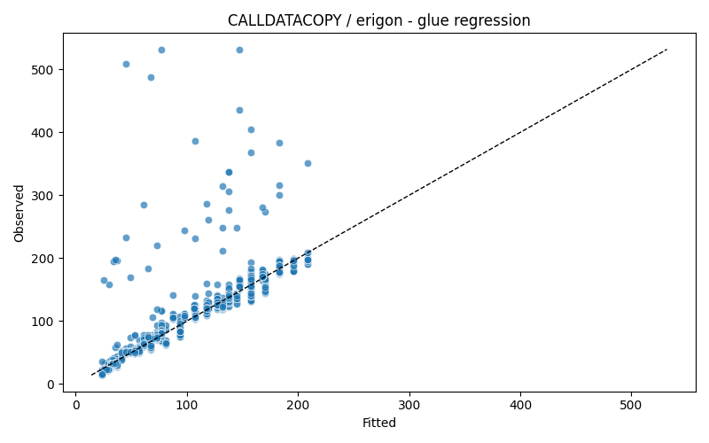

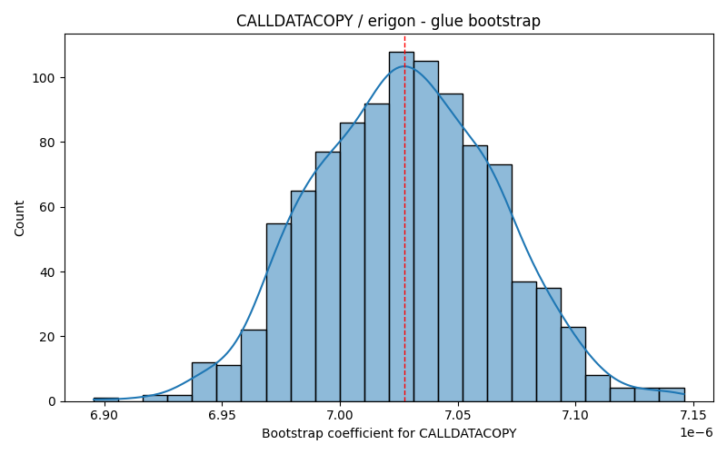

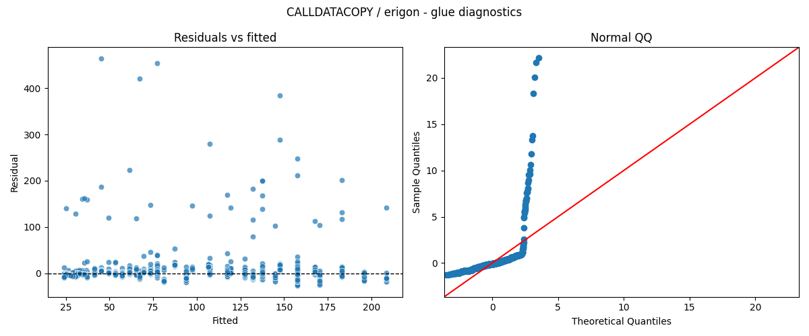

</details>

<details><summary><code>CALLDATALOAD</code> · nobs=748 · runtime_ms=0 · p=1.00e+00 · R²=0</summary>

```
==============================================================================
                           NNLS Regression Results                            
==============================================================================
Dep. Variable:          test_runtime_ms              R-squared:          0.000
Model:                  NNLS                    Adj. R-squared:         -0.001
No. Observations:       748                               RMSE:           7.11
Df Residuals:           746                                MAE:           0.75
Df Model:               1      
==============================================================================
                      coef     std err     P-value      [0.025      0.975]
------------------------------------------------------------------------------
         const      6.7966      0.3977       0.001      6.0517      7.3502
  CALLDATALOAD      0.0000      0.0000       1.000      0.0000      0.0000
==============================================================================
Notes: Non-negative least squares with bootstrap inference (1000 iterations)
==============================================================================
```


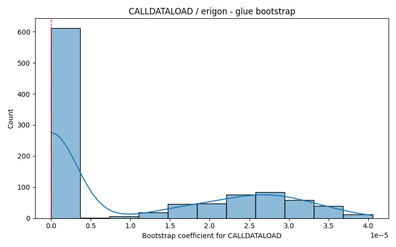

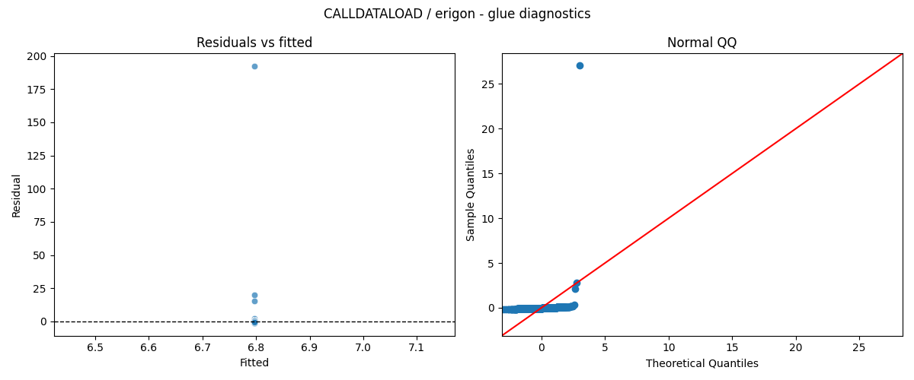

</details>

<details><summary><code>DIV</code> · nobs=187 · runtime_ms=9.259e-06 · p=1.00e-03 · R²=0.7492</summary>

```
==============================================================================
                           NNLS Regression Results                            
==============================================================================
Dep. Variable:          test_runtime_ms              R-squared:          0.749
Model:                  NNLS                    Adj. R-squared:          0.748
No. Observations:       187                               RMSE:          42.29
Df Residuals:           185                                MAE:          24.21
Df Model:               1      
==============================================================================
                      coef     std err     P-value      [0.025      0.975]
------------------------------------------------------------------------------
         const     26.0805      9.9995       0.001     10.0296     50.0157
           DIV      0.0000      0.0000       0.001      0.0000      0.0000
==============================================================================
Notes: Non-negative least squares with bootstrap inference (1000 iterations)
==============================================================================
```

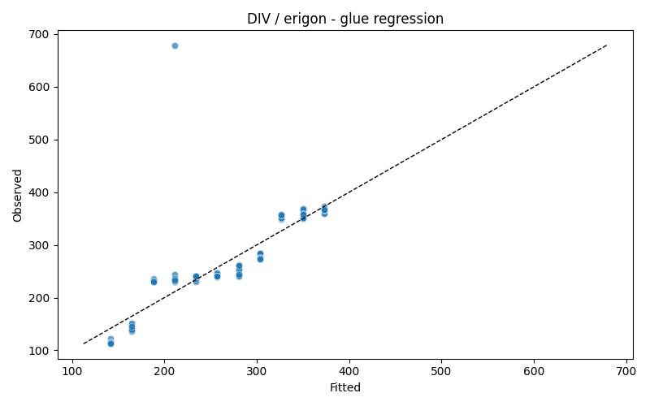

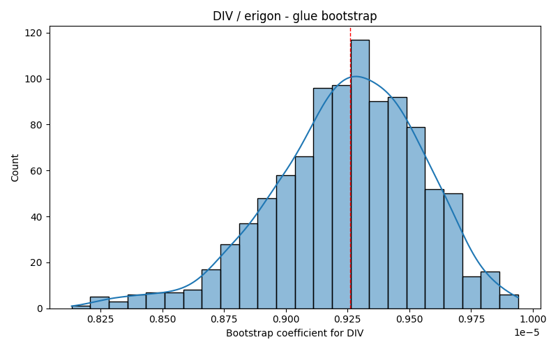

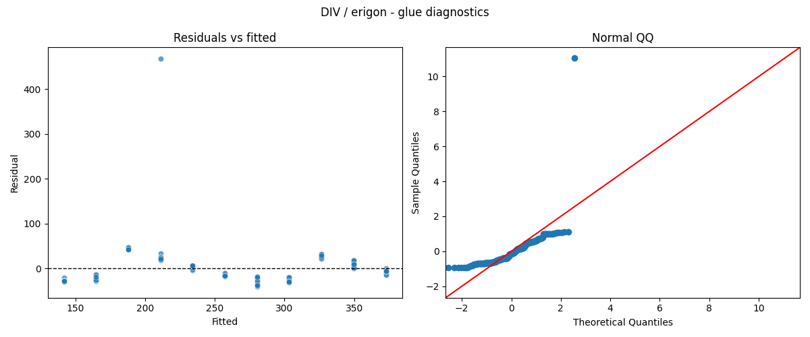

</details>

<details><summary><code>EXP</code> · nobs=187 · runtime_ms=0.0003323 · p=1.00e-03 · R²=0.9184</summary>

```
==============================================================================
                           NNLS Regression Results                            
==============================================================================
Dep. Variable:          test_runtime_ms              R-squared:          0.918
Model:                  NNLS                    Adj. R-squared:          0.918
No. Observations:       187                               RMSE:           3.88
Df Residuals:           185                                MAE:           3.22
Df Model:               1      
==============================================================================
                      coef     std err     P-value      [0.025      0.975]
------------------------------------------------------------------------------
         const     12.4146      1.1000       0.001     10.3826     14.6643
           EXP      0.0003      0.0000       0.001      0.0003      0.0003
==============================================================================
Notes: Non-negative least squares with bootstrap inference (1000 iterations)
==============================================================================
```

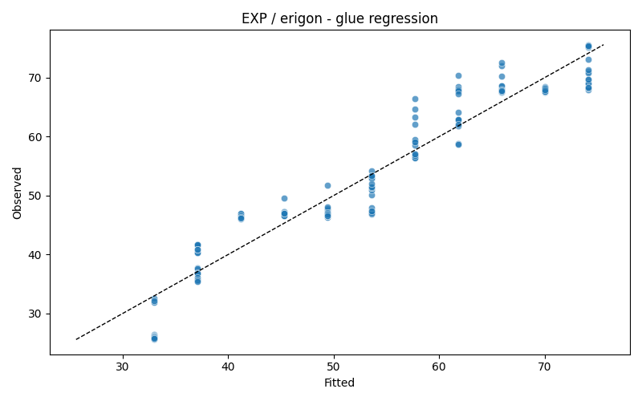

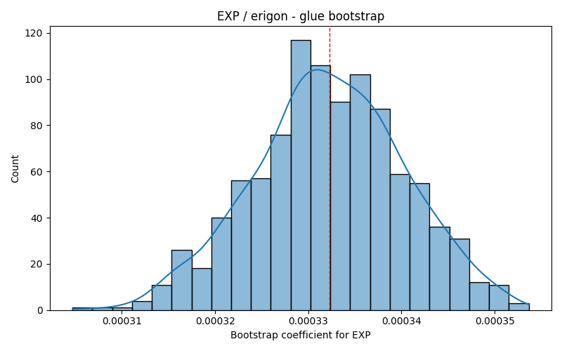

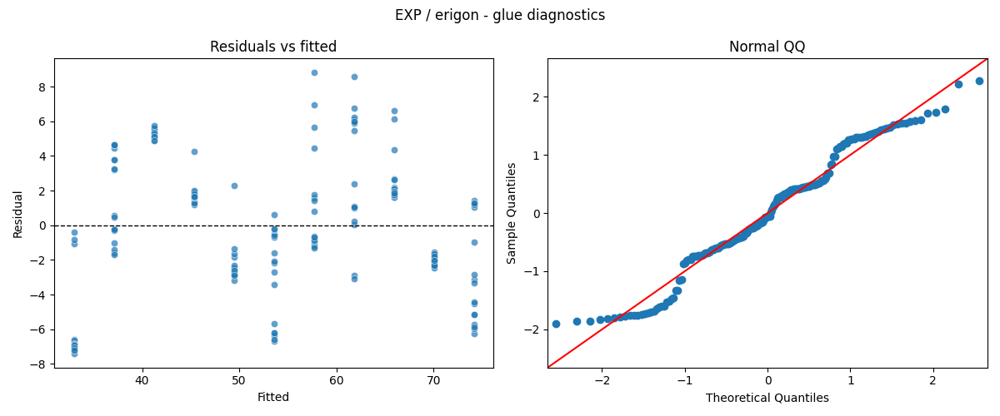

</details>

<details><summary><code>GT</code> · nobs=187 · runtime_ms=2.81e-06 · p=1.00e-03 · R²=0.797</summary>

```
==============================================================================
                           NNLS Regression Results                            
==============================================================================
Dep. Variable:          test_runtime_ms              R-squared:          0.797
Model:                  NNLS                    Adj. R-squared:          0.796
No. Observations:       187                               RMSE:          14.93
Df Residuals:           185                                MAE:           6.99
Df Model:               1      
==============================================================================
                      coef     std err     P-value      [0.025      0.975]
------------------------------------------------------------------------------
         const     20.6236      5.5330       0.001     12.4854     33.6015
            GT      0.0000      0.0000       0.001      0.0000      0.0000
==============================================================================
Notes: Non-negative least squares with bootstrap inference (1000 iterations)
==============================================================================
```

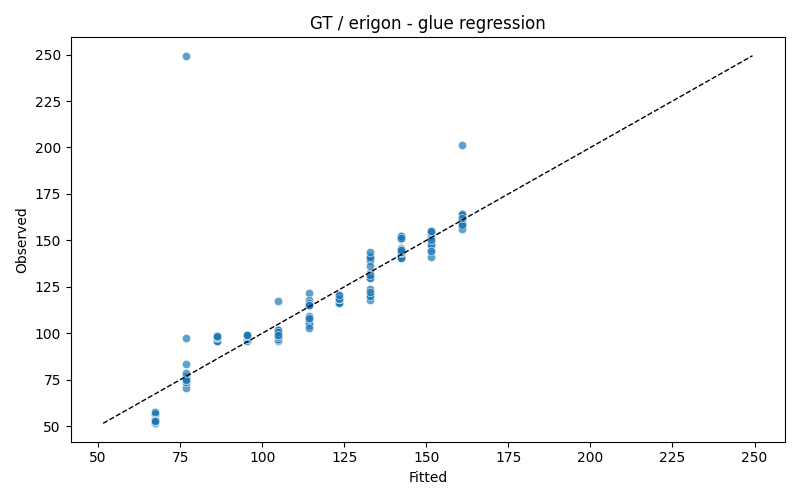

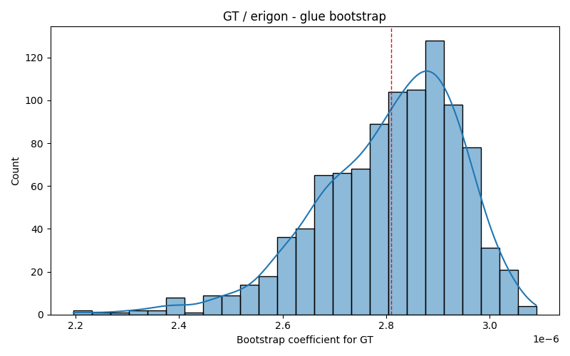

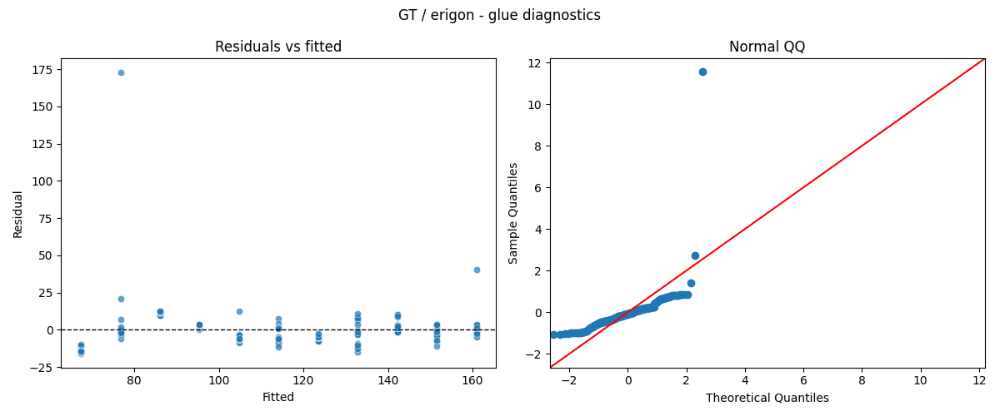

</details>

<details><summary><code>JUMPI</code> · nobs=187 · runtime_ms=3.392e-06 · p=1.00e-03 · R²=0.2262</summary>

```
==============================================================================
                           NNLS Regression Results                            
==============================================================================
Dep. Variable:          test_runtime_ms              R-squared:          0.226
Model:                  NNLS                    Adj. R-squared:          0.222
No. Observations:       187                               RMSE:          28.31
Df Residuals:           185                                MAE:           7.69
Df Model:               1      
==============================================================================
                      coef     std err     P-value      [0.025      0.975]
------------------------------------------------------------------------------
         const     21.1121      3.3560       0.001     15.4069     28.3938
         JUMPI      0.0000      0.0000       0.001      0.0000      0.0000
==============================================================================
Notes: Non-negative least squares with bootstrap inference (1000 iterations)
==============================================================================
```

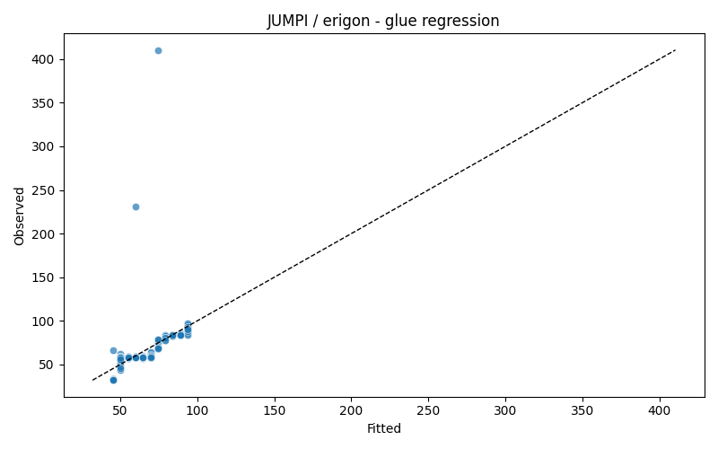


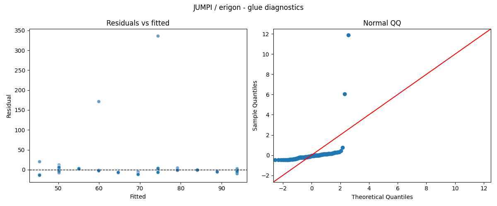

</details>

<details><summary><code>LT</code> · nobs=187 · runtime_ms=2.768e-06 · p=1.00e-03 · R²=0.7569</summary>

```
==============================================================================
                           NNLS Regression Results                            
==============================================================================
Dep. Variable:          test_runtime_ms              R-squared:          0.757
Model:                  NNLS                    Adj. R-squared:          0.756
No. Observations:       187                               RMSE:          16.51
Df Residuals:           185                                MAE:           8.14
Df Model:               1      
==============================================================================
                      coef     std err     P-value      [0.025      0.975]
------------------------------------------------------------------------------
         const     22.5871      3.5830       0.001     16.7117     30.3856
            LT      0.0000      0.0000       0.001      0.0000      0.0000
==============================================================================
Notes: Non-negative least squares with bootstrap inference (1000 iterations)
==============================================================================
```

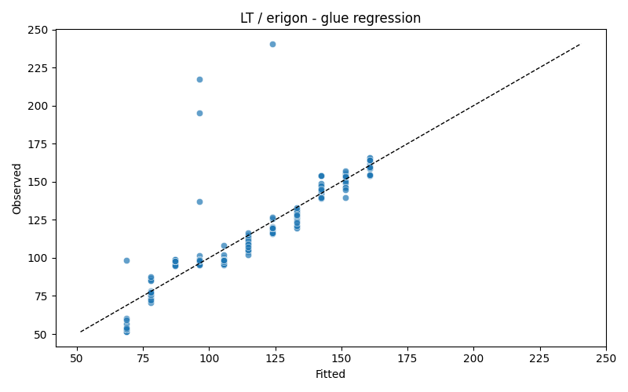


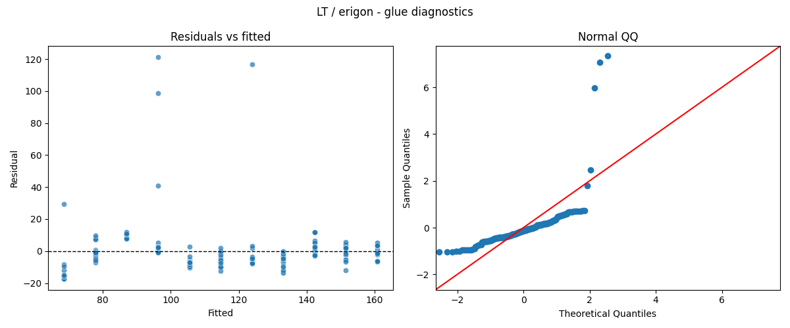

</details>

<details><summary><code>MSTORE</code> · nobs=935 · runtime_ms=5.619e-06 · p=1.00e-03 · R²=0.7788</summary>

```
==============================================================================
                           NNLS Regression Results                            
==============================================================================
Dep. Variable:          test_runtime_ms              R-squared:          0.779
Model:                  NNLS                    Adj. R-squared:          0.779
No. Observations:       935                               RMSE:          21.01
Df Residuals:           933                                MAE:           9.82
Df Model:               1      
==============================================================================
                      coef     std err     P-value      [0.025      0.975]
------------------------------------------------------------------------------
         const     23.1749      2.4838       0.001     18.4289     28.2440
        MSTORE      0.0000      0.0000       0.001      0.0000      0.0000
==============================================================================
Notes: Non-negative least squares with bootstrap inference (1000 iterations)
==============================================================================
```

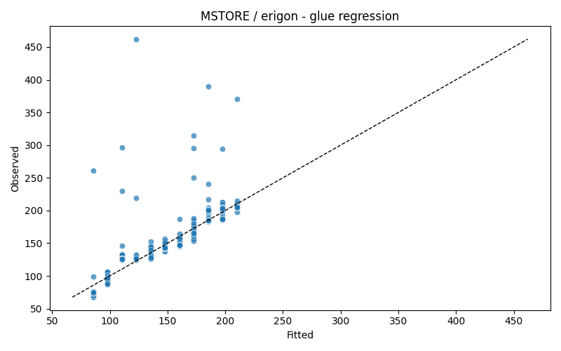

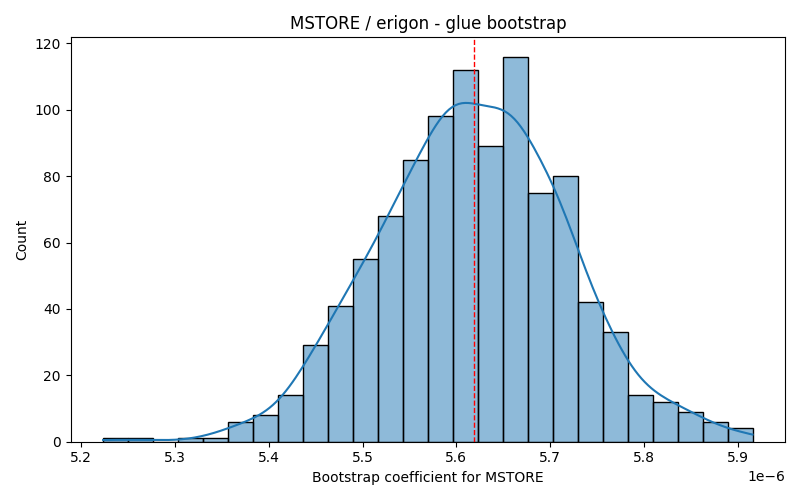

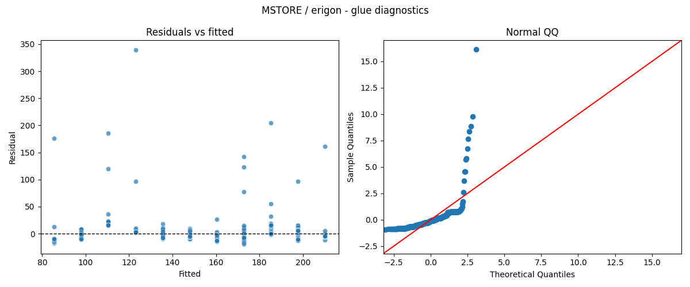

</details>

<details><summary><code>MSTORE8</code> · nobs=935 · runtime_ms=4.916e-06 · p=1.00e-03 · R²=0.5466</summary>

```
==============================================================================
                           NNLS Regression Results                            
==============================================================================
Dep. Variable:          test_runtime_ms              R-squared:          0.547
Model:                  NNLS                    Adj. R-squared:          0.546
No. Observations:       935                               RMSE:          31.42
Df Residuals:           933                                MAE:           9.48
Df Model:               1      
==============================================================================
                      coef     std err     P-value      [0.025      0.975]
------------------------------------------------------------------------------
         const     26.5602      3.4603       0.001     20.4924     33.9345
       MSTORE8      0.0000      0.0000       0.001      0.0000      0.0000
==============================================================================
Notes: Non-negative least squares with bootstrap inference (1000 iterations)
==============================================================================
```

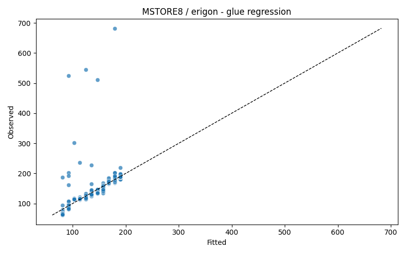

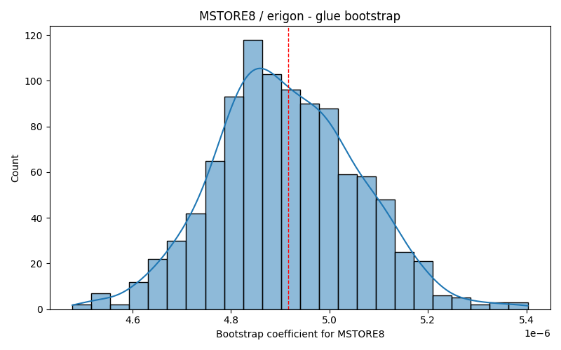

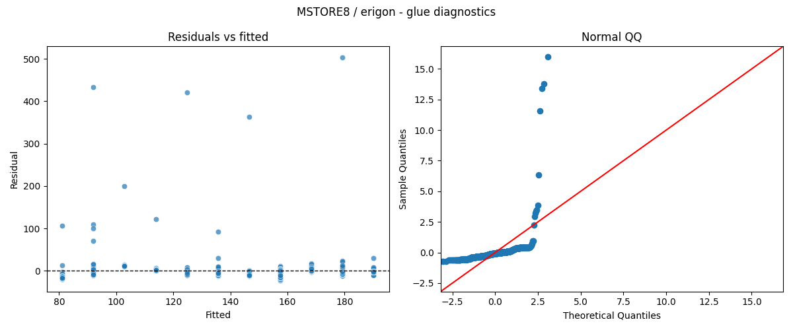

</details>

<details><summary><code>MUL</code> · nobs=187 · runtime_ms=3.705e-06 · p=1.00e-03 · R²=0.6687</summary>

```
==============================================================================
                           NNLS Regression Results                            
==============================================================================
Dep. Variable:          test_runtime_ms              R-squared:          0.669
Model:                  NNLS                    Adj. R-squared:          0.667
No. Observations:       187                               RMSE:          20.58
Df Residuals:           185                                MAE:           7.92
Df Model:               1      
==============================================================================
                      coef     std err     P-value      [0.025      0.975]
------------------------------------------------------------------------------
         const      8.0297      2.8443       0.010      1.7135     13.2725
           MUL      0.0000      0.0000       0.001      0.0000      0.0000
==============================================================================
Notes: Non-negative least squares with bootstrap inference (1000 iterations)
==============================================================================
```

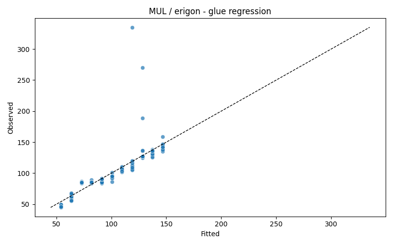

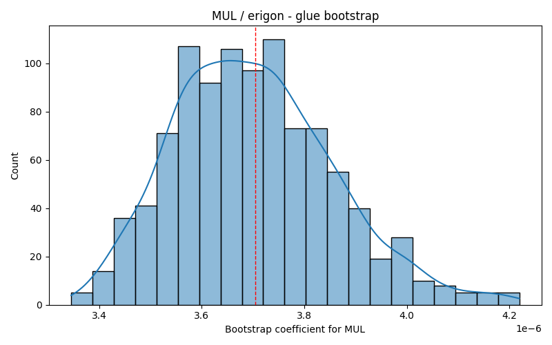

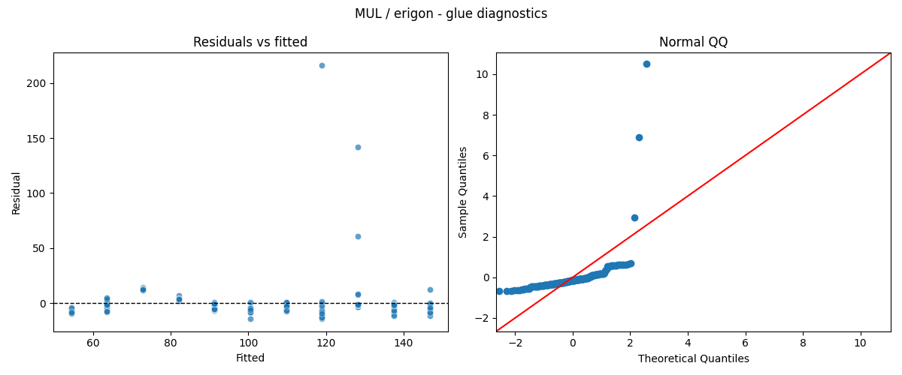

</details>

<details><summary><code>PC</code> · nobs=187 · runtime_ms=1.47e-06 · p=1.00e-03 · R²=0.5894</summary>

```
==============================================================================
                           NNLS Regression Results                            
==============================================================================
Dep. Variable:          test_runtime_ms              R-squared:          0.589
Model:                  NNLS                    Adj. R-squared:          0.587
No. Observations:       187                               RMSE:          36.69
Df Residuals:           185                                MAE:          12.04
Df Model:               1      
==============================================================================
                      coef     std err     P-value      [0.025      0.975]
------------------------------------------------------------------------------
         const     16.7397      5.8072       0.015      3.1746     27.1319
            PC      0.0000      0.0000       0.001      0.0000      0.0000
==============================================================================
Notes: Non-negative least squares with bootstrap inference (1000 iterations)
==============================================================================
```

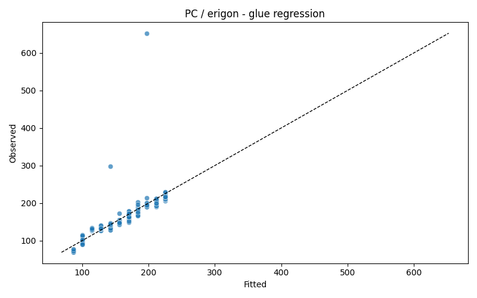

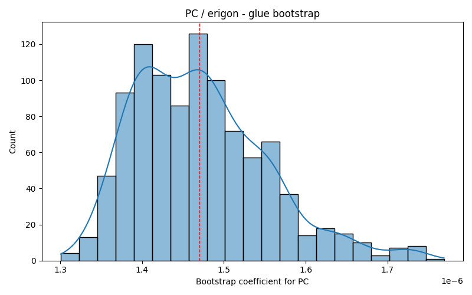

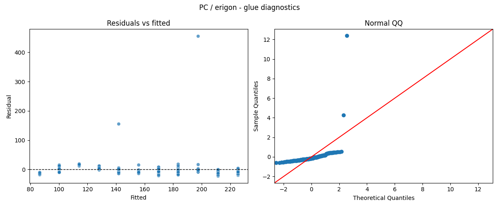

</details>

<details><summary><code>RETURNDATASIZE</code> · nobs=748 · runtime_ms=1.729e-06 · p=1.00e-03 · R²=0.6329</summary>

```
==============================================================================
                           NNLS Regression Results                            
==============================================================================
Dep. Variable:          test_runtime_ms              R-squared:          0.633
Model:                  NNLS                    Adj. R-squared:          0.632
No. Observations:       748                               RMSE:          20.79
Df Residuals:           746                                MAE:           6.90
Df Model:               1      
==============================================================================
                      coef     std err     P-value      [0.025      0.975]
------------------------------------------------------------------------------
         const     19.7027      3.0280       0.001     14.8769     26.5512
RETURNDATASIZE      0.0000      0.0000       0.001      0.0000      0.0000
==============================================================================
Notes: Non-negative least squares with bootstrap inference (1000 iterations)
==============================================================================
```

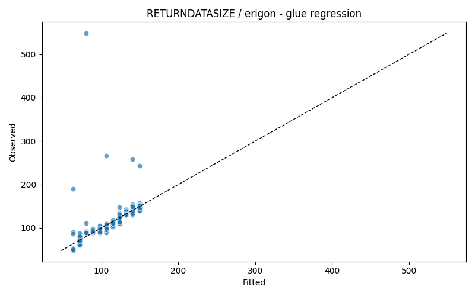

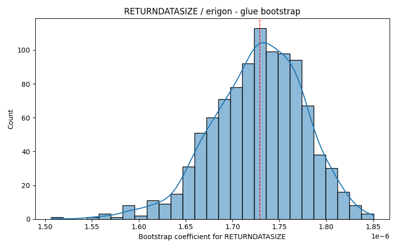

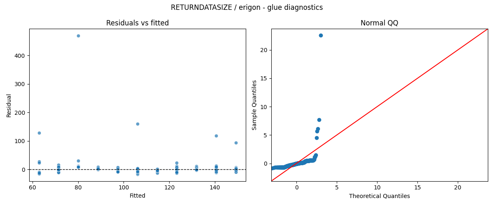

</details>

<details><summary><code>SELFBALANCE</code> · nobs=153 · runtime_ms=1.338e-06 · p=1.00e-03 · R²=0.8891</summary>

```
==============================================================================
                           NNLS Regression Results                            
==============================================================================
Dep. Variable:          test_runtime_ms              R-squared:          0.889
Model:                  NNLS                    Adj. R-squared:          0.888
No. Observations:       153                               RMSE:           4.77
Df Residuals:           151                                MAE:           3.81
Df Model:               1      
==============================================================================
                      coef     std err     P-value      [0.025      0.975]
------------------------------------------------------------------------------
         const     20.2763      1.3427       0.001     17.4745     22.7051
   SELFBALANCE      0.0000      0.0000       0.001      0.0000      0.0000
==============================================================================
Notes: Non-negative least squares with bootstrap inference (1000 iterations)
==============================================================================
```

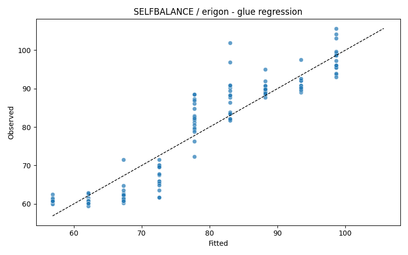

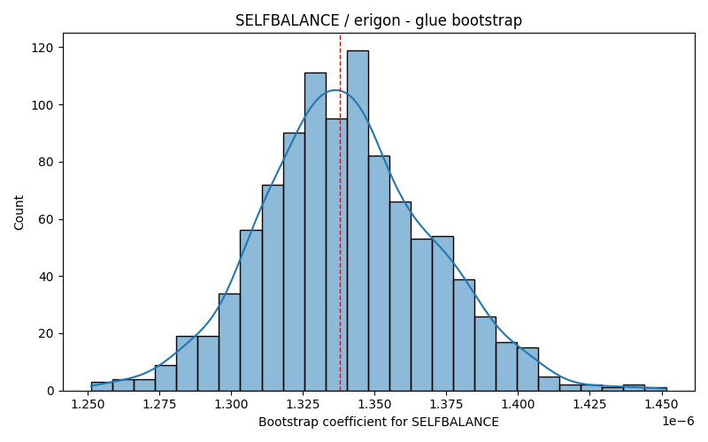

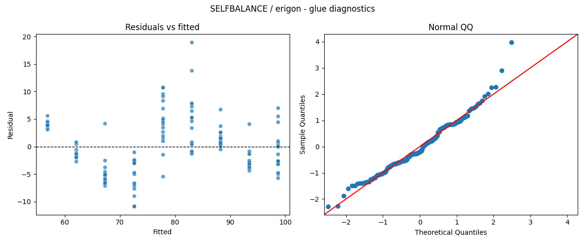

</details>

<details><summary><code>SUB</code> · nobs=187 · runtime_ms=2.753e-06 · p=1.00e-03 · R²=0.9289</summary>

```
==============================================================================
                           NNLS Regression Results                            
==============================================================================
Dep. Variable:          test_runtime_ms              R-squared:          0.929
Model:                  NNLS                    Adj. R-squared:          0.928
No. Observations:       187                               RMSE:           8.02
Df Residuals:           185                                MAE:           6.70
Df Model:               1      
==============================================================================
                      coef     std err     P-value      [0.025      0.975]
------------------------------------------------------------------------------
         const     17.3681      2.2375       0.001     12.8493     21.6459
           SUB      0.0000      0.0000       0.001      0.0000      0.0000
==============================================================================
Notes: Non-negative least squares with bootstrap inference (1000 iterations)
==============================================================================
```

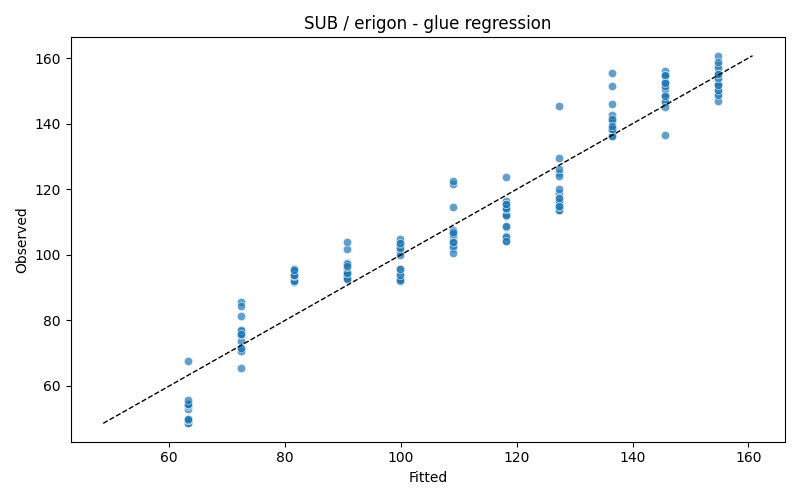

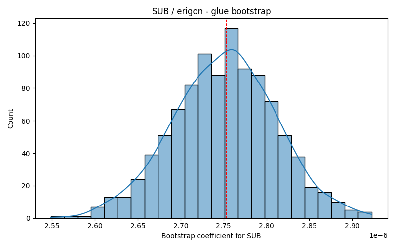

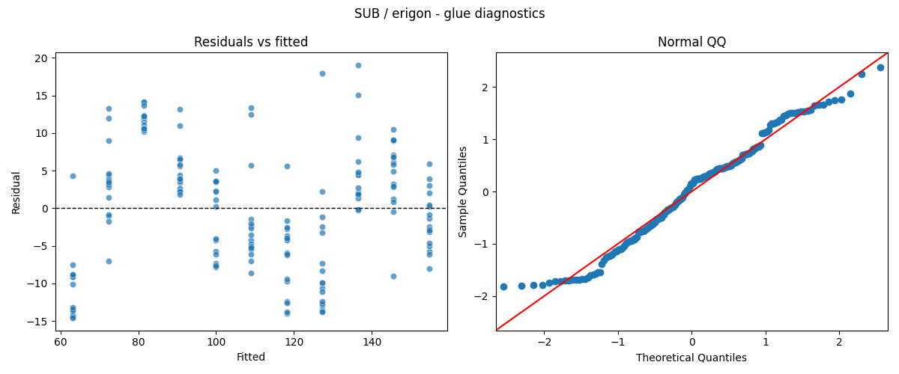

</details>

### Mixed glue (tier B) · erigon

<details><summary><code>JUMP</code> · nobs=187 · runtime_ms=7.5e-06 · p=1.00e-03 · R²=0.8439</summary>

```
==============================================================================
                           NNLS Regression Results                            
==============================================================================
Dep. Variable:          test_runtime_ms              R-squared:          0.844
Model:                  NNLS                    Adj. R-squared:          0.843
No. Observations:       187                               RMSE:          11.99
Df Residuals:           185                                MAE:           6.58
Df Model:               1      
==============================================================================
                      coef     std err     P-value      [0.025      0.975]
------------------------------------------------------------------------------
         const     14.1900      3.6122       0.001      7.0390     20.4726
          JUMP      0.0000      0.0000       0.001      0.0000      0.0000
==============================================================================
Notes: Non-negative least squares with bootstrap inference (1000 iterations)
==============================================================================
```

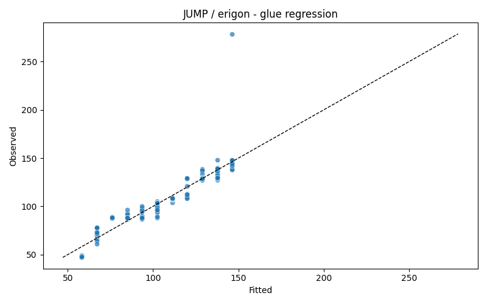

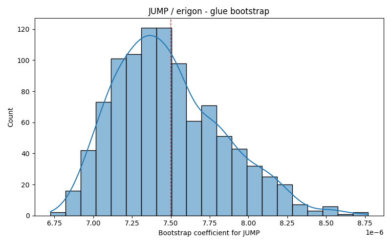


</details>

<details><summary><code>KECCAK256</code> · nobs=2992 · runtime_ms=2.015e-05 · p=1.00e-03 · R²=0.08908</summary>

```
==============================================================================
                           NNLS Regression Results                            
==============================================================================
Dep. Variable:          test_runtime_ms              R-squared:          0.089
Model:                  NNLS                    Adj. R-squared:          0.089
No. Observations:       2992                              RMSE:         128.05
Df Residuals:           2990                               MAE:         103.78
Df Model:               1      
==============================================================================
                      coef     std err     P-value      [0.025      0.975]
------------------------------------------------------------------------------
         const    349.2176      5.0422       0.001    339.7564    359.2190
     KECCAK256      0.0000      0.0000       0.001      0.0000      0.0000
==============================================================================
Notes: Non-negative least squares with bootstrap inference (1000 iterations)
==============================================================================
```

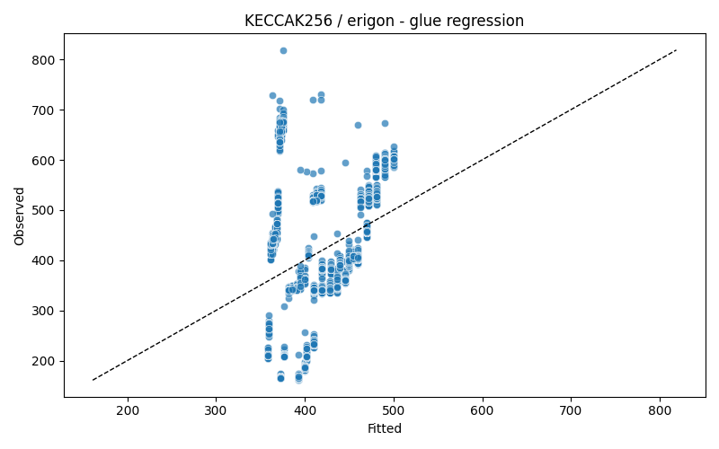

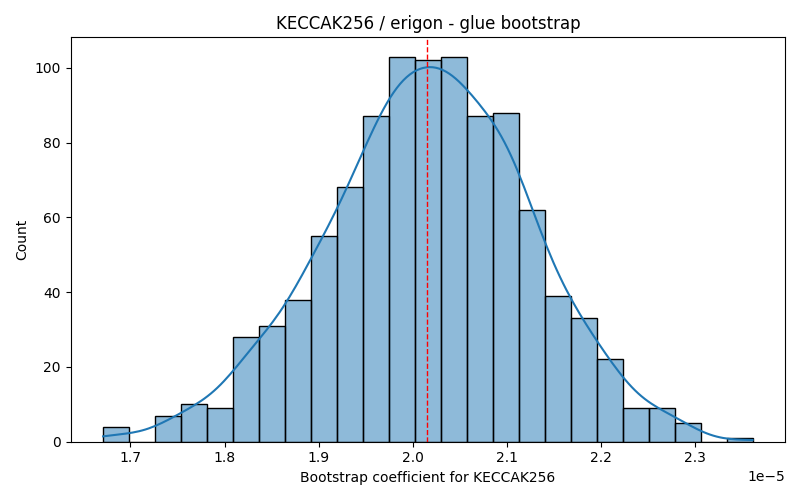

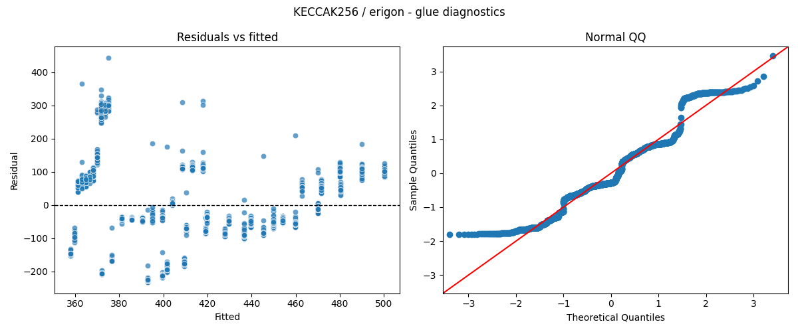

</details>

## ethrex

| glue_opcode | nobs | glue_runtime_ms | p_value | rsquared |
| --- | --- | --- | --- | --- |
| `ISZERO` | 22 | 1.375e-06 | 1.00e-03 | 0.8283 |
| `JUMPDEST` | 22 | 4.808e-07 | 1.00e-03 | 0.9118 |
| `SWAP` | 352 | 6.99e-07 | 1.00e-03 | 0.8126 |
| `CALLDATASIZE` | 1331 | 3.948e-07 | 1.00e-03 | 0.9377 |
| `DUP` | 1331 | 4.752e-07 | 1.00e-03 | 0.9377 |
| `GAS` | 1331 | 4.907e-07 | 1.00e-03 | 0.9377 |
| `MLOAD` | 1331 | 1.348e-06 | 1.00e-03 | 0.9377 |
| `PUSH` | 1331 | 6.455e-07 | 1.00e-03 | 0.9377 |
| `PUSH0` | 1331 | 4.996e-07 | 1.00e-03 | 0.9377 |
| `STATICCALL` | 1331 | 0.0001051 | 1.00e-03 | 0.9377 |
| `ADD` | 22 | 1.3e-06 | 1.00e-03 | 0.8469 |
| `AND` | 22 | 8.974e-07 | 1.00e-03 | 0.3276 |
| `CALLDATACOPY` | 528 | 2.811e-06 | 1.00e-03 | 0.9079 |
| `CALLDATALOAD` | 88 | 2.295e-05 | 1.00e-03 | 0.2649 |
| `DIV` | 22 | 9.119e-06 | 1.00e-03 | 0.8296 |
| `EXP` | 22 | 0.0009364 | 1.00e-03 | 0.8189 |
| `GT` | 22 | 1.254e-06 | 1.00e-03 | 0.8263 |
| `JUMPI` | 22 | 1.519e-06 | 1.00e-03 | 0.691 |
| `LT` | 22 | 9.04e-07 | 1.00e-03 | 0.8608 |
| `MSTORE` | 110 | 1.857e-06 | 1.00e-03 | 0.8573 |
| `MSTORE8` | 110 | 1.716e-06 | 1.00e-03 | 0.8462 |
| `MUL` | 22 | 1.836e-06 | 1.00e-03 | 0.8396 |
| `PC` | 22 | 5.592e-07 | 1.00e-03 | 0.8918 |
| `RETURNDATASIZE` | 88 | 1.051e-06 | 1.00e-03 | 0.8618 |
| `SELFBALANCE` | 18 | 4.758e-06 | 1.00e-03 | 0.8104 |
| `SUB` | 22 | 1.22e-06 | 1.00e-03 | 0.8712 |
| `JUMP` | 22 | 4.108e-06 | 1.00e-03 | 0.779 |
| `KECCAK256` | 352 | 0 | 1.00e+00 | 1.11e-16 |

### Cycle glue — joint fit · ethrex

<details><summary>Joint NNLS regression summary</summary>

```
==============================================================================
                           NNLS Regression Results                            
==============================================================================
Dep. Variable:          test_runtime_ms              R-squared:          0.938
Model:                  NNLS                    Adj. R-squared:          0.937
No. Observations:       1331                              RMSE:           7.05
Df Residuals:           1323                               MAE:           5.52
Df Model:               7      
==============================================================================
                      coef     std err     P-value      [0.025      0.975]
------------------------------------------------------------------------------
         const     14.2098      0.6451       0.001     12.9462     15.3850
  CALLDATASIZE      0.0000      0.0000       0.001      0.0000      0.0000
           DUP      0.0000      0.0000       0.001      0.0000      0.0000
           GAS      0.0000      0.0000       0.001      0.0000      0.0000
         MLOAD      0.0000      0.0000       0.001      0.0000      0.0000
          PUSH      0.0000      0.0000       0.001      0.0000      0.0000
         PUSH0      0.0000      0.0000       0.001      0.0000      0.0000
    STATICCALL      0.0001      0.0000       0.001      0.0001      0.0001
==============================================================================
Notes: Non-negative least squares with bootstrap inference (1000 iterations)
==============================================================================
```

</details>

<details><summary><code>CALLDATASIZE</code> · nobs=1331 · runtime_ms=3.948e-07 · p=1.00e-03 · R²=0.9377</summary>

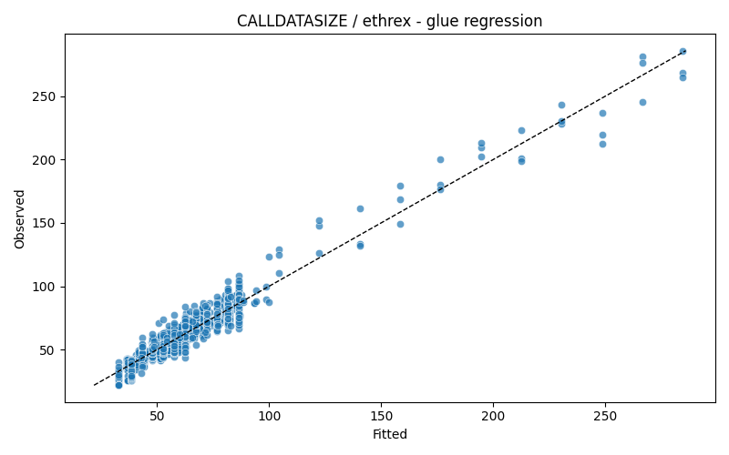

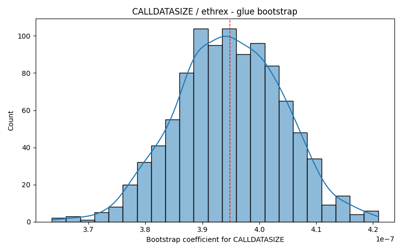

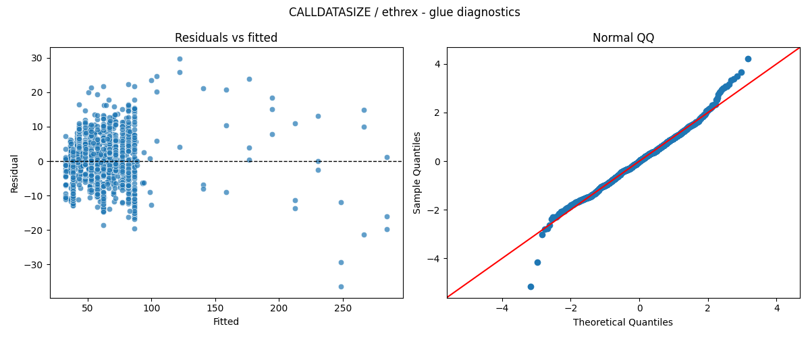

</details>

<details><summary><code>DUP</code> · nobs=1331 · runtime_ms=4.752e-07 · p=1.00e-03 · R²=0.9377</summary>


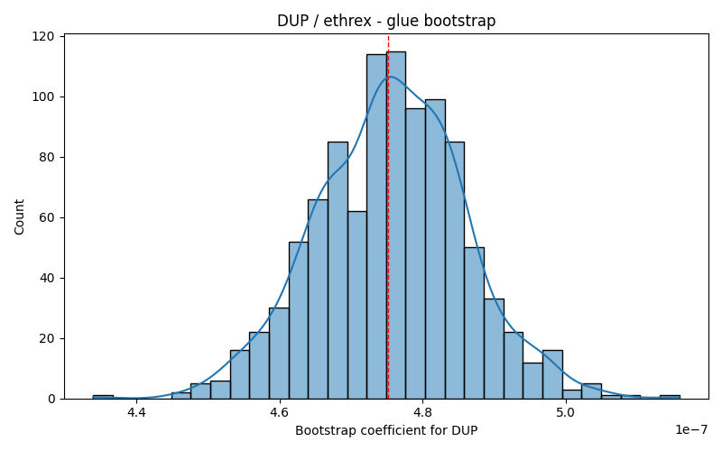


</details>

<details><summary><code>GAS</code> · nobs=1331 · runtime_ms=4.907e-07 · p=1.00e-03 · R²=0.9377</summary>

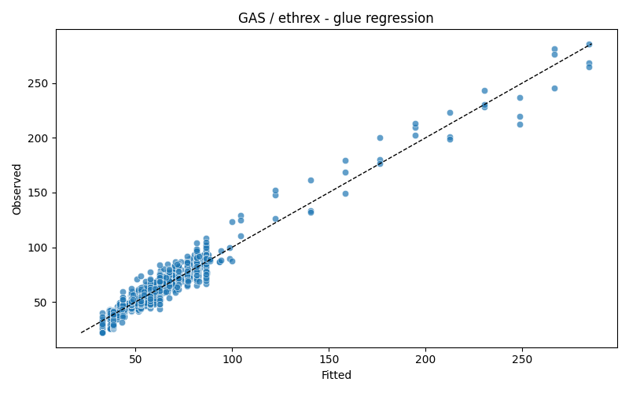

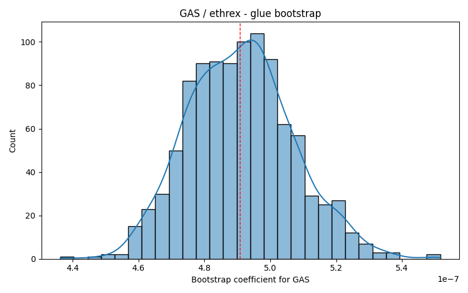


</details>

<details><summary><code>MLOAD</code> · nobs=1331 · runtime_ms=1.348e-06 · p=1.00e-03 · R²=0.9377</summary>

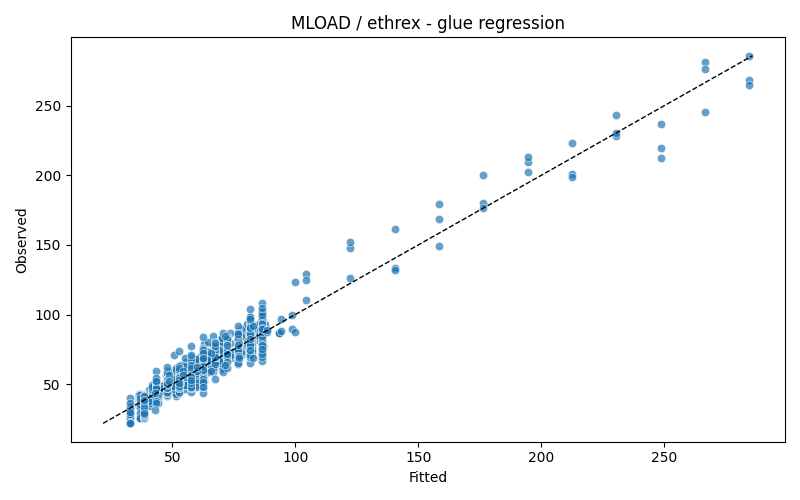

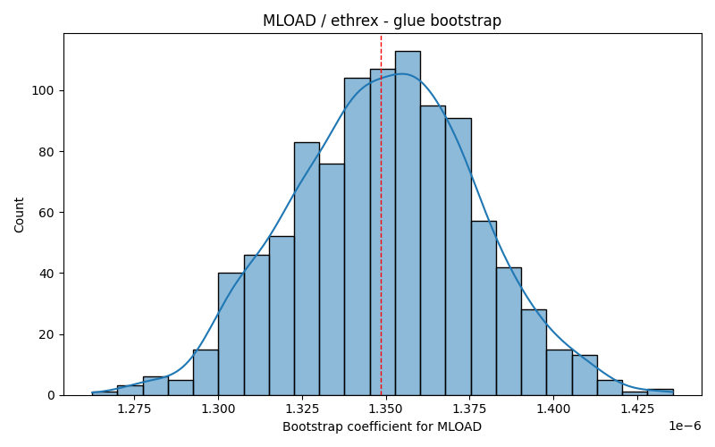

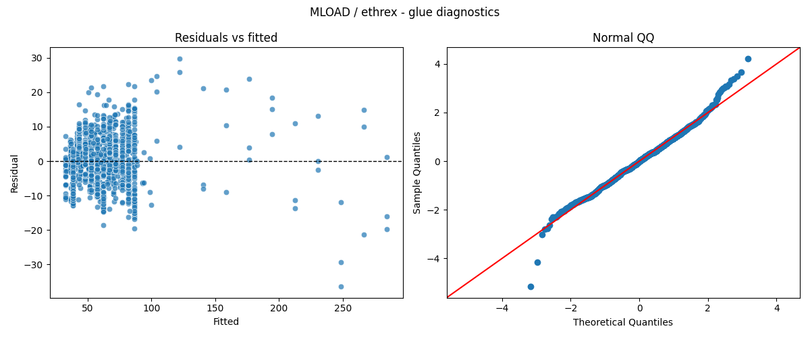

</details>

<details><summary><code>PUSH</code> · nobs=1331 · runtime_ms=6.455e-07 · p=1.00e-03 · R²=0.9377</summary>


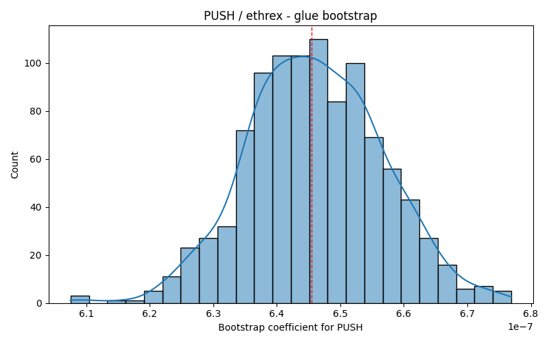


</details>

<details><summary><code>PUSH0</code> · nobs=1331 · runtime_ms=4.996e-07 · p=1.00e-03 · R²=0.9377</summary>


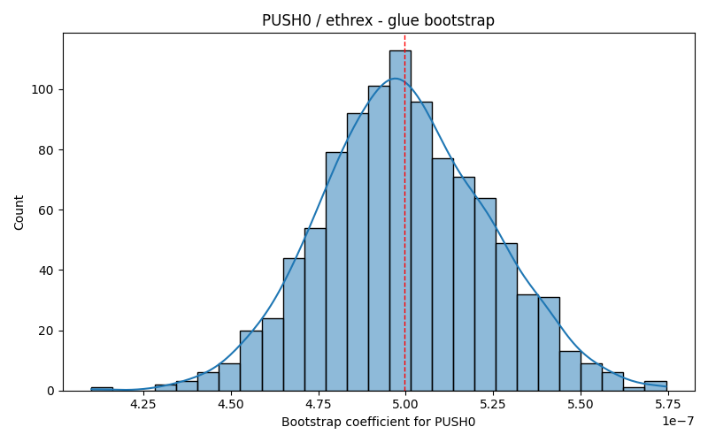


</details>

<details><summary><code>STATICCALL</code> · nobs=1331 · runtime_ms=0.0001051 · p=1.00e-03 · R²=0.9377</summary>


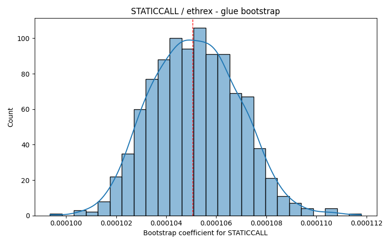


</details>

### Pure glue · ethrex

<details><summary><code>ISZERO</code> · nobs=22 · runtime_ms=1.375e-06 · p=1.00e-03 · R²=0.8283</summary>

```
==============================================================================
                           NNLS Regression Results                            
==============================================================================
Dep. Variable:          test_runtime_ms              R-squared:          0.828
Model:                  NNLS                    Adj. R-squared:          0.820
No. Observations:       22                                RMSE:          13.18
Df Residuals:           20                                 MAE:          10.56
Df Model:               1      
==============================================================================
                      coef     std err     P-value      [0.025      0.975]
------------------------------------------------------------------------------
         const     28.6733     10.2666       0.003      7.4029     46.3380
        ISZERO      0.0000      0.0000       0.001      0.0000      0.0000
==============================================================================
Notes: Non-negative least squares with bootstrap inference (1000 iterations)
==============================================================================
```

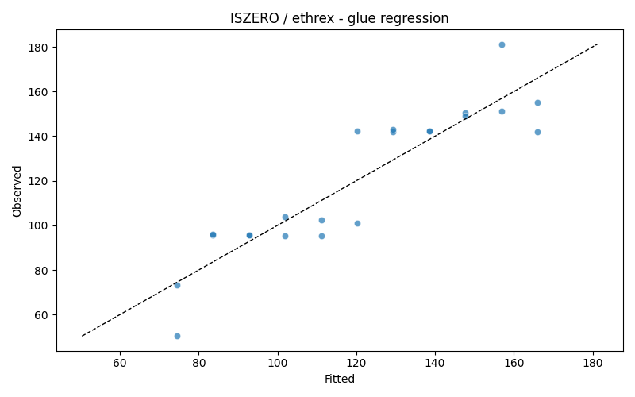

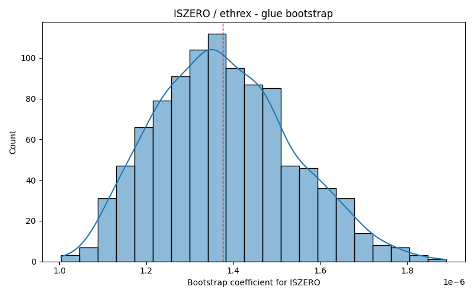

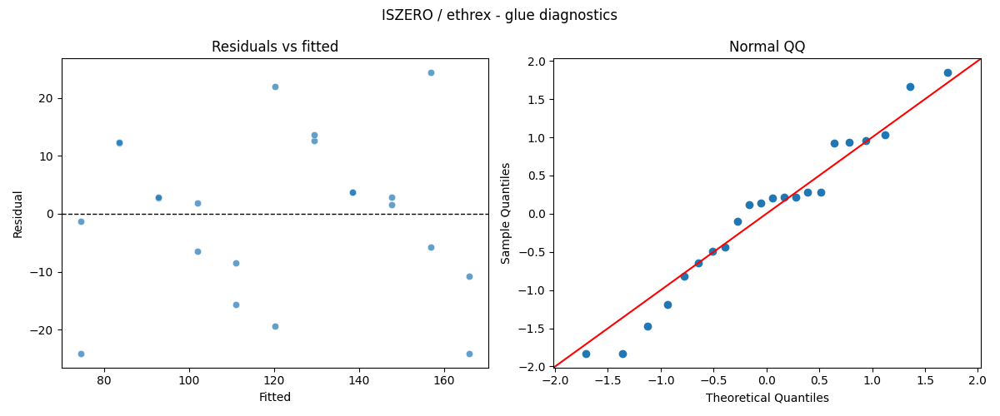

</details>

<details><summary><code>JUMPDEST</code> · nobs=22 · runtime_ms=4.808e-07 · p=1.00e-03 · R²=0.9118</summary>

```
==============================================================================
                           NNLS Regression Results                            
==============================================================================
Dep. Variable:          test_runtime_ms              R-squared:          0.912
Model:                  NNLS                    Adj. R-squared:          0.907
No. Observations:       22                                RMSE:           9.45
Df Residuals:           20                                 MAE:           7.86
Df Model:               1      
==============================================================================
                      coef     std err     P-value      [0.025      0.975]
------------------------------------------------------------------------------
         const     13.4708      7.2313       0.019      0.8833     28.5511
      JUMPDEST      0.0000      0.0000       0.001      0.0000      0.0000
==============================================================================
Notes: Non-negative least squares with bootstrap inference (1000 iterations)
==============================================================================
```

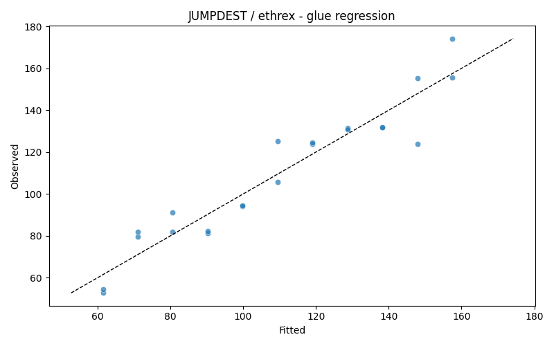

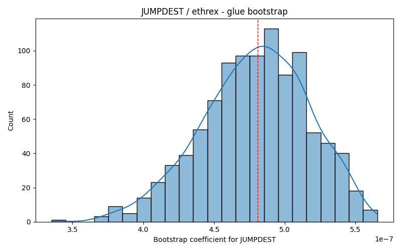

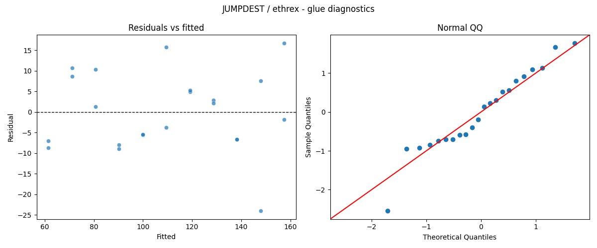

</details>

<details><summary><code>SWAP</code> · nobs=352 · runtime_ms=6.99e-07 · p=1.00e-03 · R²=0.8126</summary>

```
==============================================================================
                           NNLS Regression Results                            
==============================================================================
Dep. Variable:          test_runtime_ms              R-squared:          0.813
Model:                  NNLS                    Adj. R-squared:          0.812
No. Observations:       352                               RMSE:           7.07
Df Residuals:           350                                MAE:           5.79
Df Model:               1      
==============================================================================
                      coef     std err     P-value      [0.025      0.975]
------------------------------------------------------------------------------
         const     16.1771      1.2823       0.001     13.7196     18.7265
          SWAP      0.0000      0.0000       0.001      0.0000      0.0000
==============================================================================
Notes: Non-negative least squares with bootstrap inference (1000 iterations)
==============================================================================
```

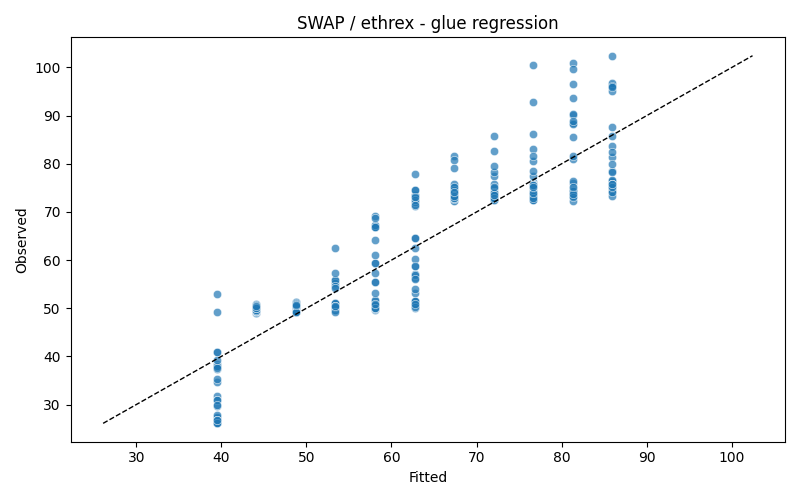

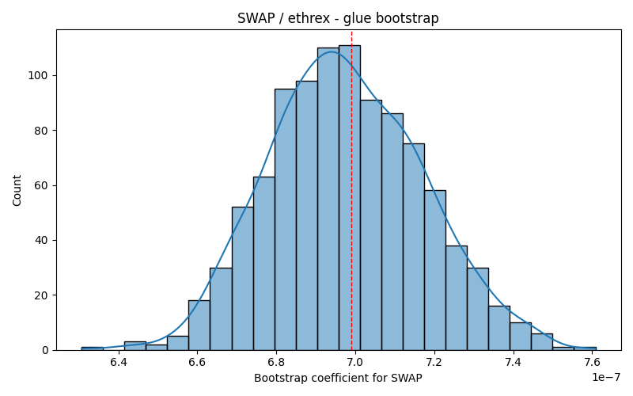

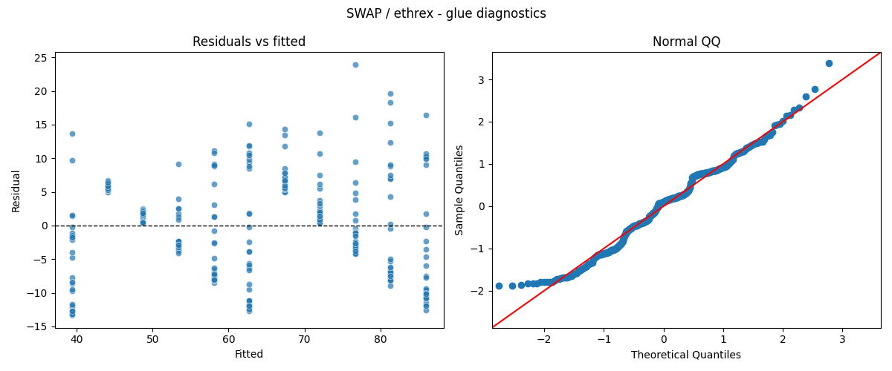

</details>

### Mixed glue (tier A) · ethrex

<details><summary><code>ADD</code> · nobs=22 · runtime_ms=1.3e-06 · p=1.00e-03 · R²=0.8469</summary>

```
==============================================================================
                           NNLS Regression Results                            
==============================================================================
Dep. Variable:          test_runtime_ms              R-squared:          0.847
Model:                  NNLS                    Adj. R-squared:          0.839
No. Observations:       22                                RMSE:           5.82
Df Residuals:           20                                 MAE:           4.72
Df Model:               1      
==============================================================================
                      coef     std err     P-value      [0.025      0.975]
------------------------------------------------------------------------------
         const      6.6581      3.8685       0.056      0.0000     14.2567
           ADD      0.0000      0.0000       0.001      0.0000      0.0000
==============================================================================
Notes: Non-negative least squares with bootstrap inference (1000 iterations)
==============================================================================
```

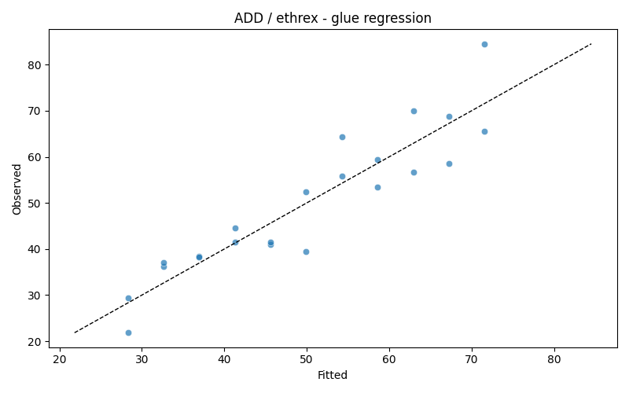

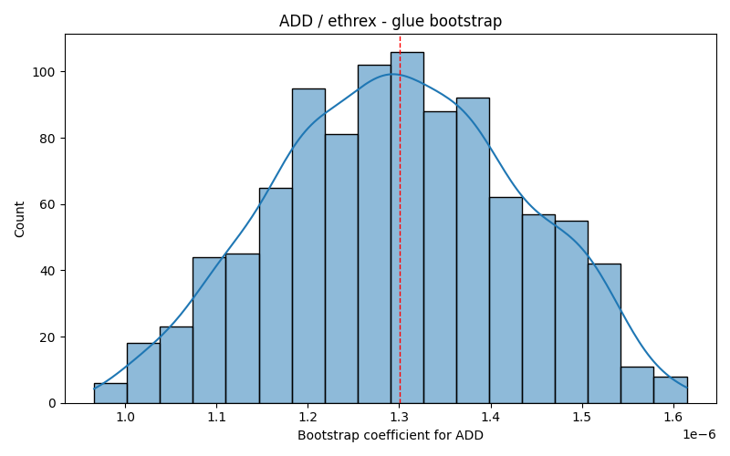

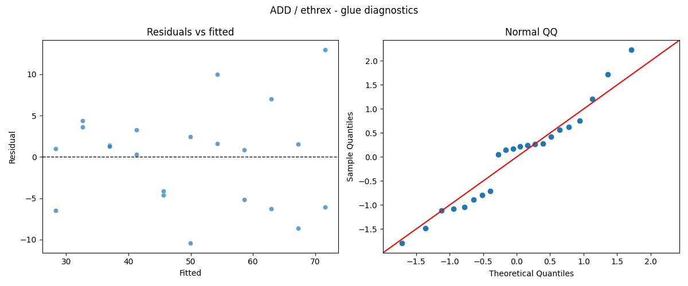

</details>

<details><summary><code>AND</code> · nobs=22 · runtime_ms=8.974e-07 · p=1.00e-03 · R²=0.3276</summary>

```
==============================================================================
                           NNLS Regression Results                            
==============================================================================
Dep. Variable:          test_runtime_ms              R-squared:          0.328
Model:                  NNLS                    Adj. R-squared:          0.294
No. Observations:       22                                RMSE:          13.53
Df Residuals:           20                                 MAE:          11.73
Df Model:               1      
==============================================================================
                      coef     std err     P-value      [0.025      0.975]
------------------------------------------------------------------------------
         const     28.7885      9.7681       0.001      9.8510     48.0787
           AND      0.0000      0.0000       0.001      0.0000      0.0000
==============================================================================
Notes: Non-negative least squares with bootstrap inference (1000 iterations)
==============================================================================
```

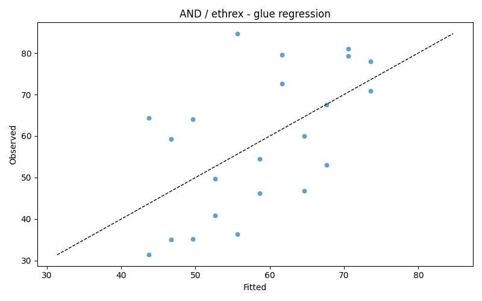

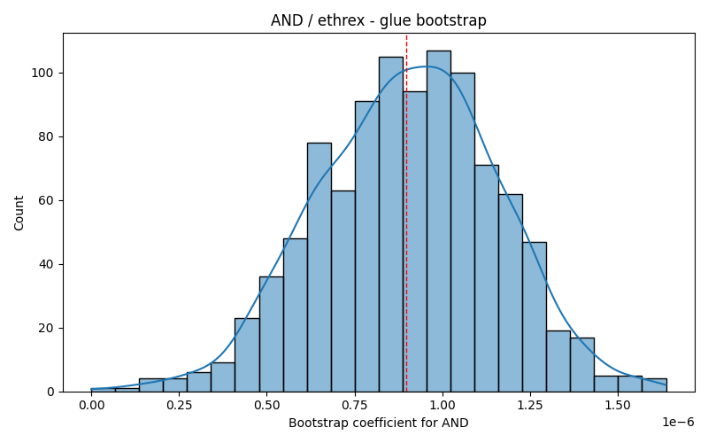

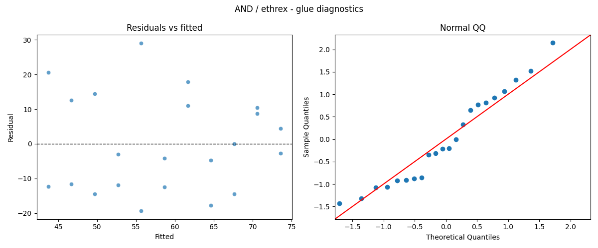

</details>

<details><summary><code>CALLDATACOPY</code> · nobs=528 · runtime_ms=2.811e-06 · p=1.00e-03 · R²=0.9079</summary>

```
==============================================================================
                           NNLS Regression Results                            
==============================================================================
Dep. Variable:          test_runtime_ms              R-squared:          0.908
Model:                  NNLS                    Adj. R-squared:          0.908
No. Observations:       528                               RMSE:           6.74
Df Residuals:           526                                MAE:           4.98
Df Model:               1      
==============================================================================
                      coef     std err     P-value      [0.025      0.975]
------------------------------------------------------------------------------
         const     11.6655      0.3586       0.001     10.9399     12.3652
  CALLDATACOPY      0.0000      0.0000       0.001      0.0000      0.0000
==============================================================================
Notes: Non-negative least squares with bootstrap inference (1000 iterations)
==============================================================================
```

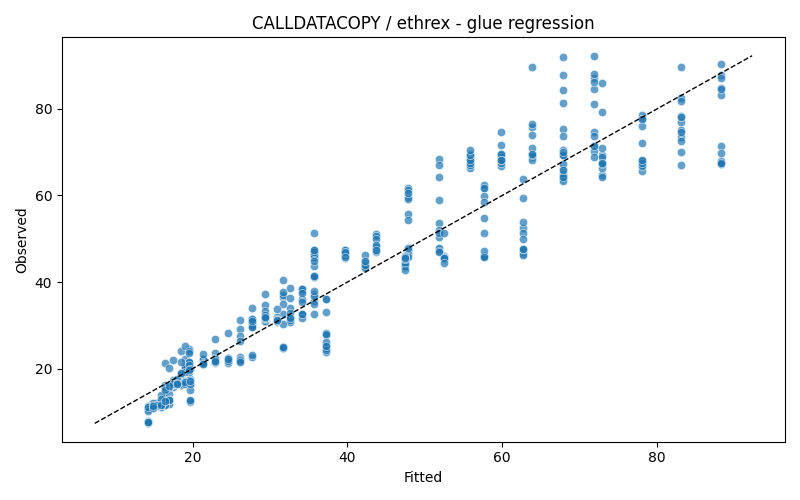

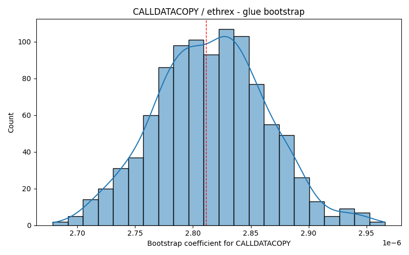

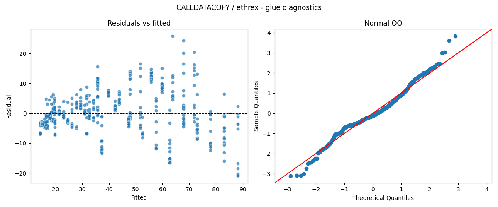

</details>

<details><summary><code>CALLDATALOAD</code> · nobs=88 · runtime_ms=2.295e-05 · p=1.00e-03 · R²=0.2649</summary>

```
==============================================================================
                           NNLS Regression Results                            
==============================================================================
Dep. Variable:          test_runtime_ms              R-squared:          0.265
Model:                  NNLS                    Adj. R-squared:          0.256
No. Observations:       88                                RMSE:           0.15
Df Residuals:           86                                 MAE:           0.10
Df Model:               1      
==============================================================================
                      coef     std err     P-value      [0.025      0.975]
------------------------------------------------------------------------------
         const      2.4368      0.0539       0.001      2.3247      2.5395
  CALLDATALOAD      0.0000      0.0000       0.001      0.0000      0.0000
==============================================================================
Notes: Non-negative least squares with bootstrap inference (1000 iterations)
==============================================================================
```

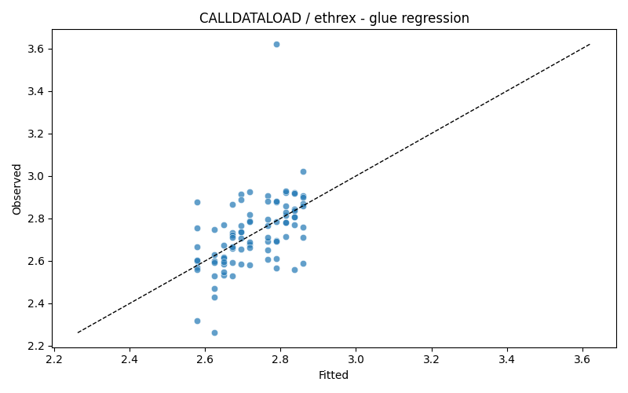

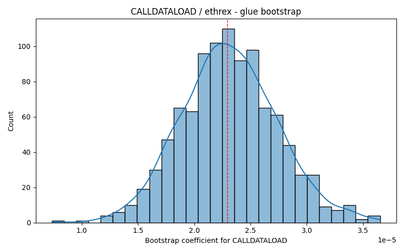

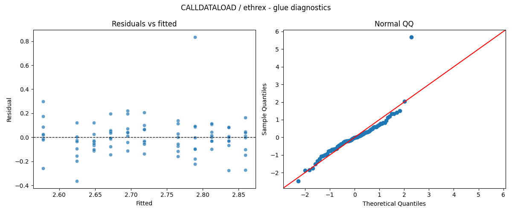

</details>

<details><summary><code>DIV</code> · nobs=22 · runtime_ms=9.119e-06 · p=1.00e-03 · R²=0.8296</summary>

```
==============================================================================
                           NNLS Regression Results                            
==============================================================================
Dep. Variable:          test_runtime_ms              R-squared:          0.830
Model:                  NNLS                    Adj. R-squared:          0.821
No. Observations:       22                                RMSE:          32.63
Df Residuals:           20                                 MAE:          27.61
Df Model:               1      
==============================================================================
                      coef     std err     P-value      [0.025      0.975]
------------------------------------------------------------------------------
         const     66.4749     25.1665       0.004     17.0802    114.9134
           DIV      0.0000      0.0000       0.001      0.0000      0.0000
==============================================================================
Notes: Non-negative least squares with bootstrap inference (1000 iterations)
==============================================================================
```

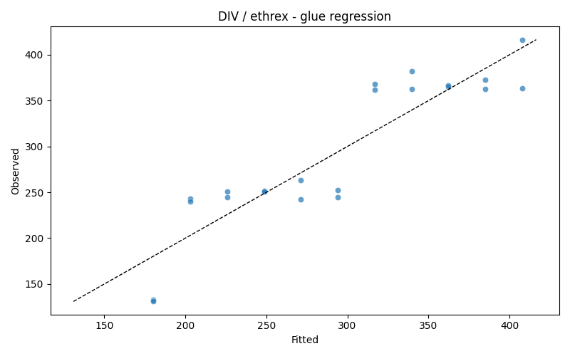

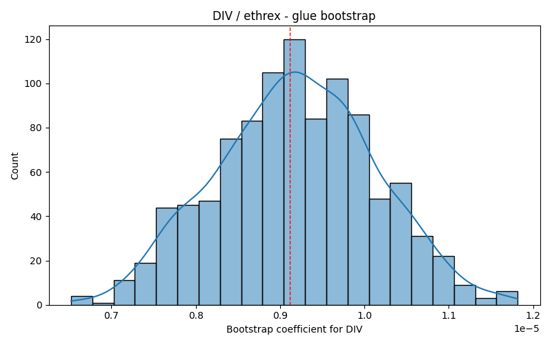

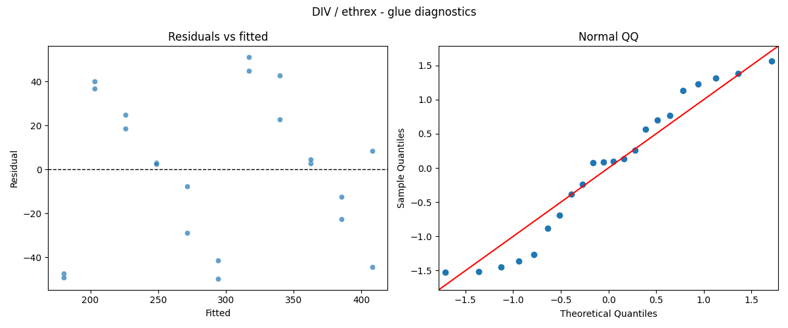

</details>

<details><summary><code>EXP</code> · nobs=22 · runtime_ms=0.0009364 · p=1.00e-03 · R²=0.8189</summary>

```
==============================================================================
                           NNLS Regression Results                            
==============================================================================
Dep. Variable:          test_runtime_ms              R-squared:          0.819
Model:                  NNLS                    Adj. R-squared:          0.810
No. Observations:       22                                RMSE:          17.24
Df Residuals:           20                                 MAE:          14.93
Df Model:               1      
==============================================================================
                      coef     std err     P-value      [0.025      0.975]
------------------------------------------------------------------------------
         const     33.0948     14.3323       0.008      5.1466     60.5030
           EXP      0.0009      0.0001       0.001      0.0007      0.0011
==============================================================================
Notes: Non-negative least squares with bootstrap inference (1000 iterations)
==============================================================================
```

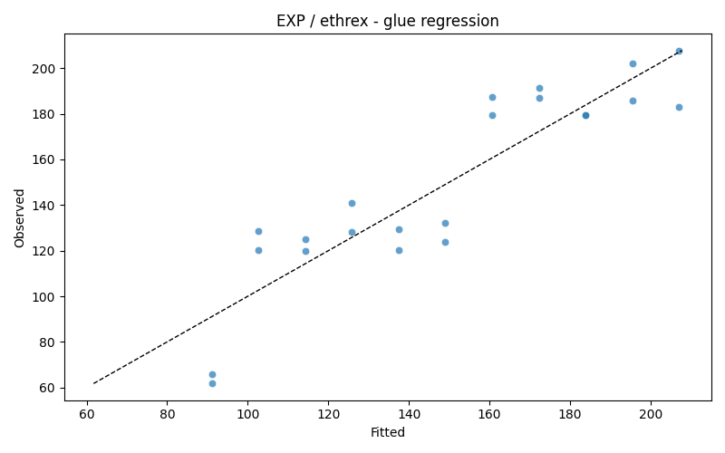

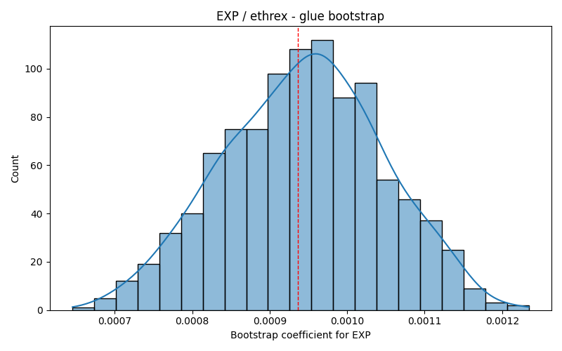

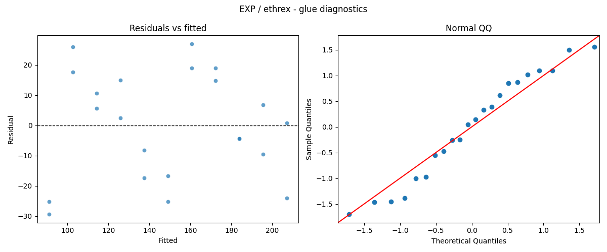

</details>

<details><summary><code>GT</code> · nobs=22 · runtime_ms=1.254e-06 · p=1.00e-03 · R²=0.8263</summary>

```
==============================================================================
                           NNLS Regression Results                            
==============================================================================
Dep. Variable:          test_runtime_ms              R-squared:          0.826
Model:                  NNLS                    Adj. R-squared:          0.818
No. Observations:       22                                RMSE:           6.05
Df Residuals:           20                                 MAE:           5.06
Df Model:               1      
==============================================================================
                      coef     std err     P-value      [0.025      0.975]
------------------------------------------------------------------------------
         const      7.9507      4.2450       0.044      0.0000     16.1460
            GT      0.0000      0.0000       0.001      0.0000      0.0000
==============================================================================
Notes: Non-negative least squares with bootstrap inference (1000 iterations)
==============================================================================
```

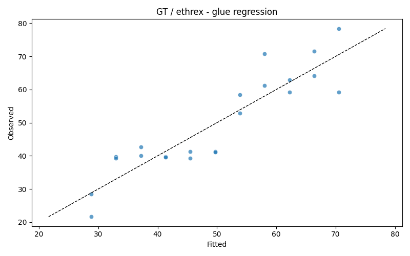

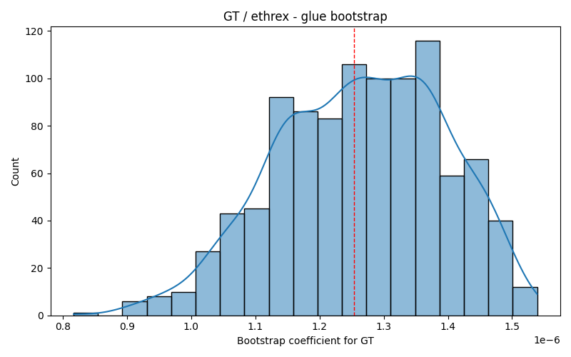

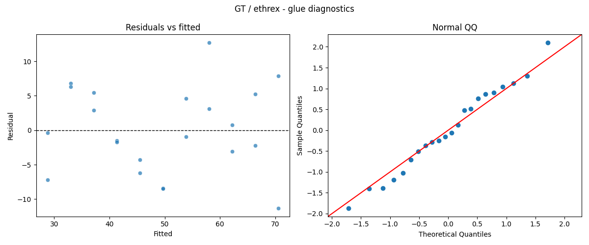

</details>

<details><summary><code>JUMPI</code> · nobs=22 · runtime_ms=1.519e-06 · p=1.00e-03 · R²=0.691</summary>

```
==============================================================================
                           NNLS Regression Results                            
==============================================================================
Dep. Variable:          test_runtime_ms              R-squared:          0.691
Model:                  NNLS                    Adj. R-squared:          0.676
No. Observations:       22                                RMSE:           4.58
Df Residuals:           20                                 MAE:           3.37
Df Model:               1      
==============================================================================
                      coef     std err     P-value      [0.025      0.975]
------------------------------------------------------------------------------
         const     10.8510      3.7119       0.001      4.1718     18.9384
         JUMPI      0.0000      0.0000       0.001      0.0000      0.0000
==============================================================================
Notes: Non-negative least squares with bootstrap inference (1000 iterations)
==============================================================================
```

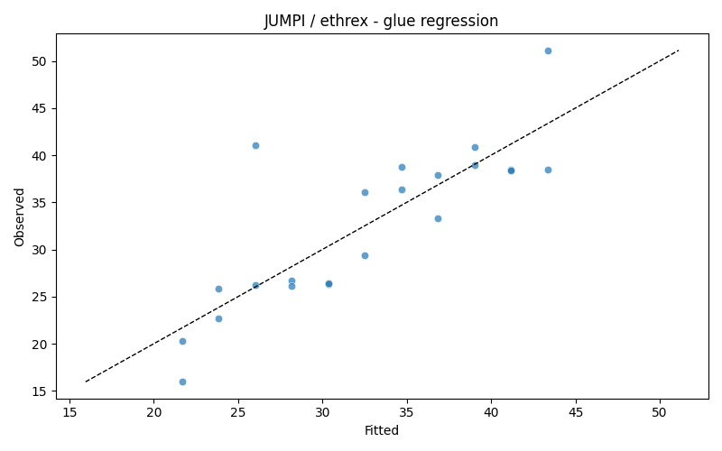

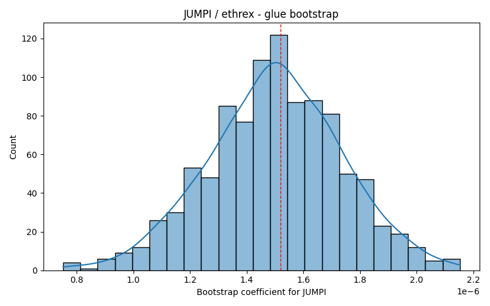

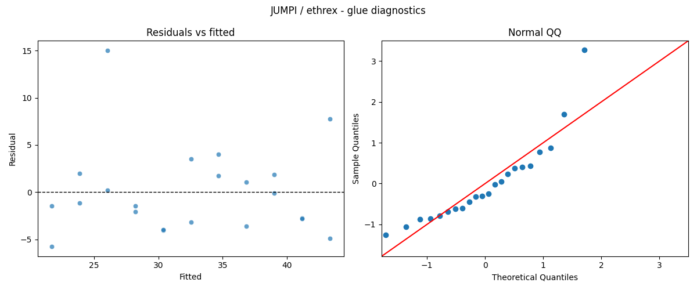

</details>

<details><summary><code>LT</code> · nobs=22 · runtime_ms=9.04e-07 · p=1.00e-03 · R²=0.8608</summary>

```
==============================================================================
                           NNLS Regression Results                            
==============================================================================
Dep. Variable:          test_runtime_ms              R-squared:          0.861
Model:                  NNLS                    Adj. R-squared:          0.854
No. Observations:       22                                RMSE:           3.83
Df Residuals:           20                                 MAE:           3.08
Df Model:               1      
==============================================================================
                      coef     std err     P-value      [0.025      0.975]
------------------------------------------------------------------------------
         const     14.1425      3.0209       0.001      8.0346     19.5548
            LT      0.0000      0.0000       0.001      0.0000      0.0000
==============================================================================
Notes: Non-negative least squares with bootstrap inference (1000 iterations)
==============================================================================
```

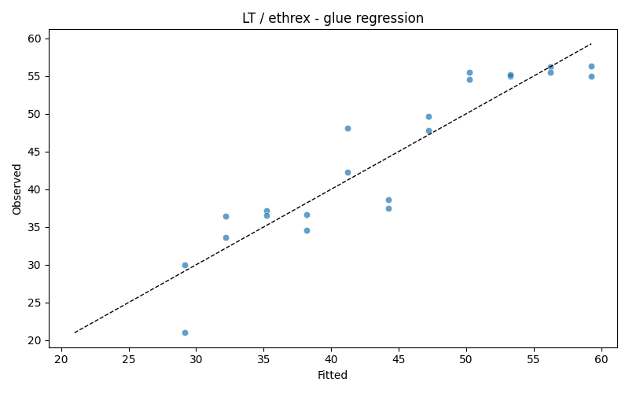

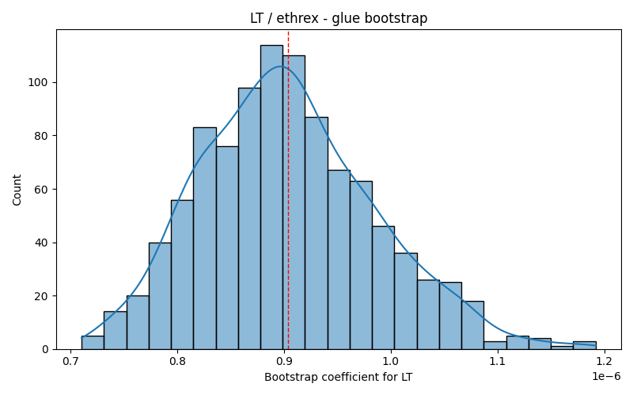

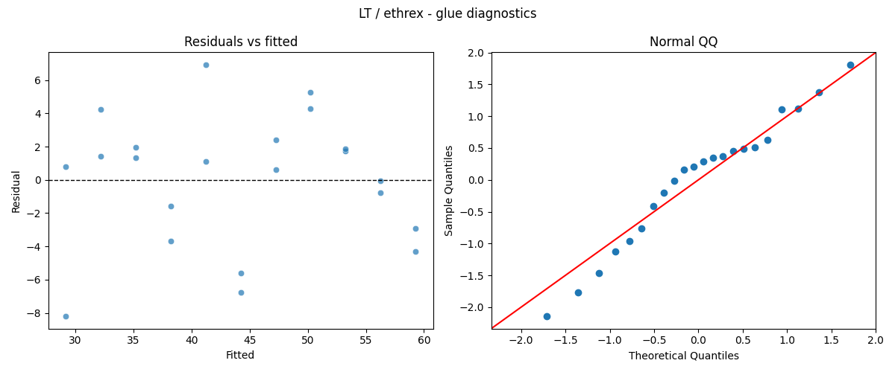

</details>

<details><summary><code>MSTORE</code> · nobs=110 · runtime_ms=1.857e-06 · p=1.00e-03 · R²=0.8573</summary>

```
==============================================================================
                           NNLS Regression Results                            
==============================================================================
Dep. Variable:          test_runtime_ms              R-squared:          0.857
Model:                  NNLS                    Adj. R-squared:          0.856
No. Observations:       110                               RMSE:           5.32
Df Residuals:           108                                MAE:           4.27
Df Model:               1      
==============================================================================
                      coef     std err     P-value      [0.025      0.975]
------------------------------------------------------------------------------
         const     10.0385      1.9828       0.001      6.4596     14.0664
        MSTORE      0.0000      0.0000       0.001      0.0000      0.0000
==============================================================================
Notes: Non-negative least squares with bootstrap inference (1000 iterations)
==============================================================================
```

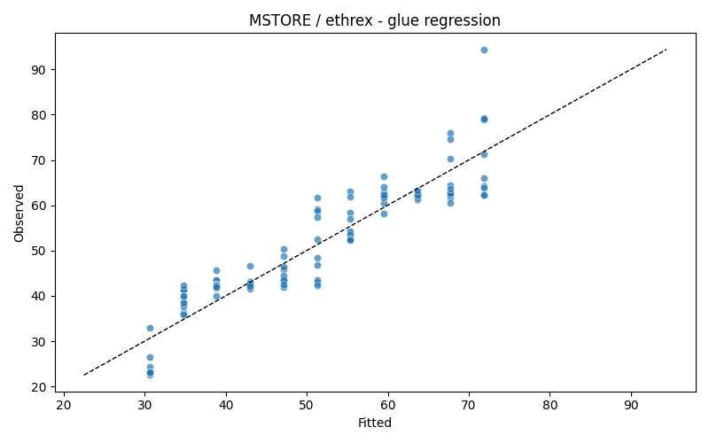

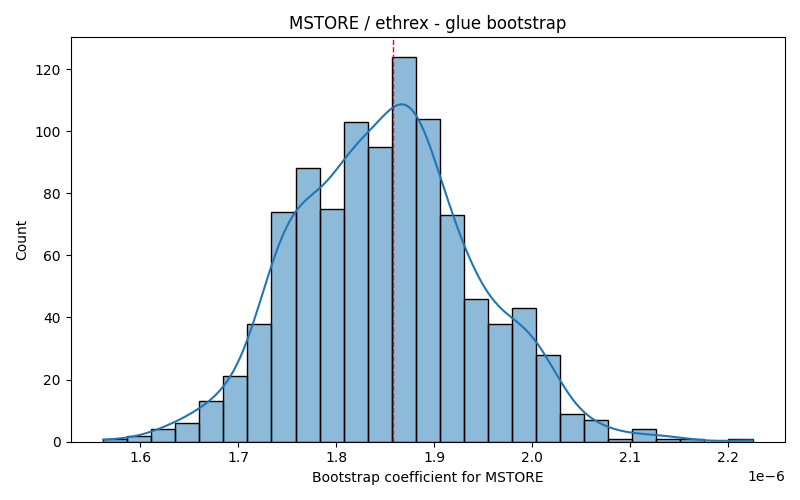

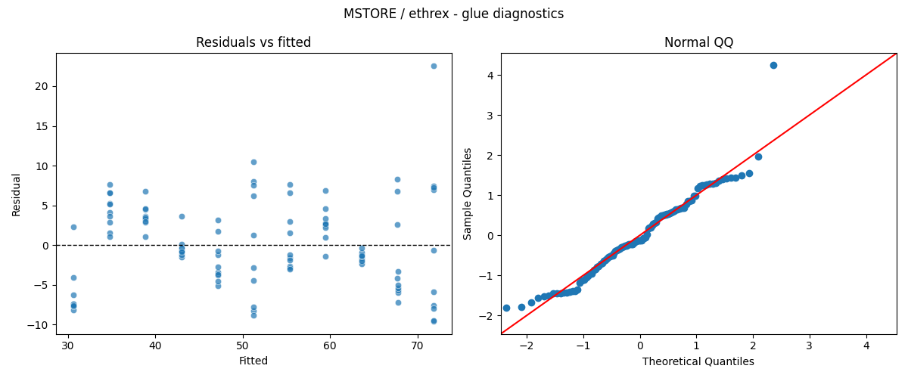

</details>

<details><summary><code>MSTORE8</code> · nobs=110 · runtime_ms=1.716e-06 · p=1.00e-03 · R²=0.8462</summary>

```
==============================================================================
                           NNLS Regression Results                            
==============================================================================
Dep. Variable:          test_runtime_ms              R-squared:          0.846
Model:                  NNLS                    Adj. R-squared:          0.845
No. Observations:       110                               RMSE:           5.13
Df Residuals:           108                                MAE:           4.10
Df Model:               1      
==============================================================================
                      coef     std err     P-value      [0.025      0.975]
------------------------------------------------------------------------------
         const     12.1692      1.6555       0.001      9.0187     15.5938
       MSTORE8      0.0000      0.0000       0.001      0.0000      0.0000
==============================================================================
Notes: Non-negative least squares with bootstrap inference (1000 iterations)
==============================================================================
```

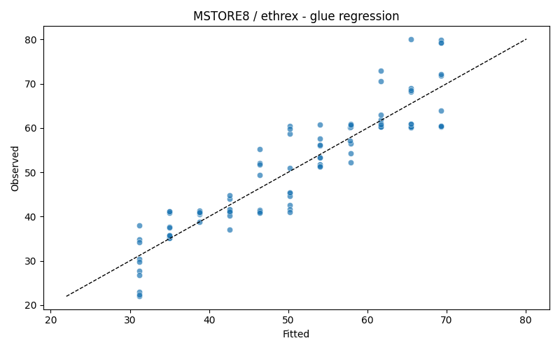

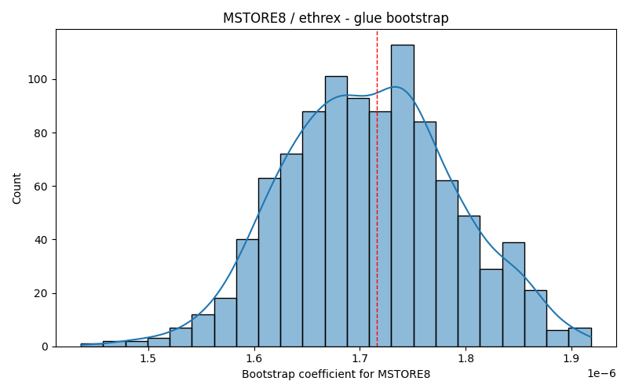

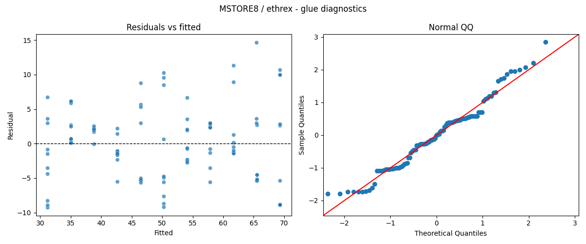

</details>

<details><summary><code>MUL</code> · nobs=22 · runtime_ms=1.836e-06 · p=1.00e-03 · R²=0.8396</summary>

```
==============================================================================
                           NNLS Regression Results                            
==============================================================================
Dep. Variable:          test_runtime_ms              R-squared:          0.840
Model:                  NNLS                    Adj. R-squared:          0.832
No. Observations:       22                                RMSE:           6.34
Df Residuals:           20                                 MAE:           5.84
Df Model:               1      
==============================================================================
                      coef     std err     P-value      [0.025      0.975]
------------------------------------------------------------------------------
         const      5.3273      4.2936       0.113      0.0000     15.4124
           MUL      0.0000      0.0000       0.001      0.0000      0.0000
==============================================================================
Notes: Non-negative least squares with bootstrap inference (1000 iterations)
==============================================================================
```

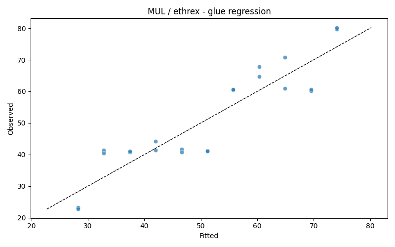

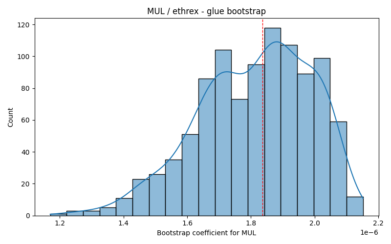

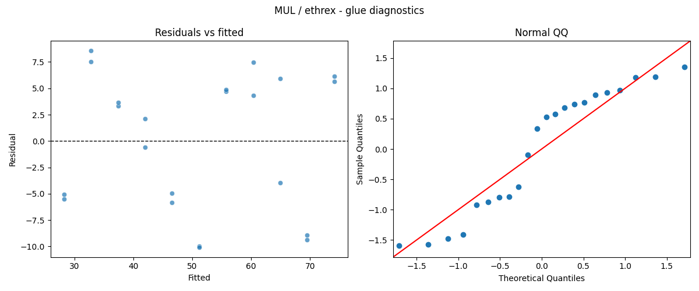

</details>

<details><summary><code>PC</code> · nobs=22 · runtime_ms=5.592e-07 · p=1.00e-03 · R²=0.8918</summary>

```
==============================================================================
                           NNLS Regression Results                            
==============================================================================
Dep. Variable:          test_runtime_ms              R-squared:          0.892
Model:                  NNLS                    Adj. R-squared:          0.886
No. Observations:       22                                RMSE:           5.83
Df Residuals:           20                                 MAE:           4.68
Df Model:               1      
==============================================================================
                      coef     std err     P-value      [0.025      0.975]
------------------------------------------------------------------------------
         const     16.2543      4.1313       0.001      8.0295     24.1937
            PC      0.0000      0.0000       0.001      0.0000      0.0000
==============================================================================
Notes: Non-negative least squares with bootstrap inference (1000 iterations)
==============================================================================
```

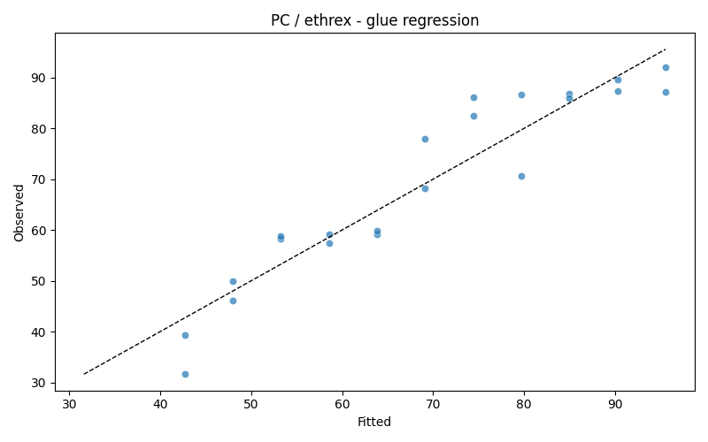

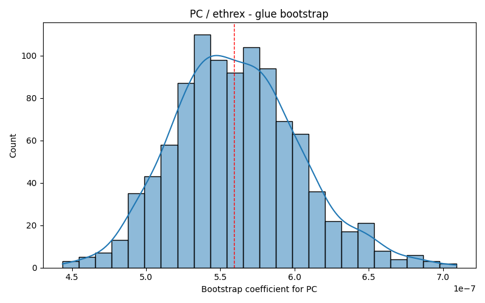

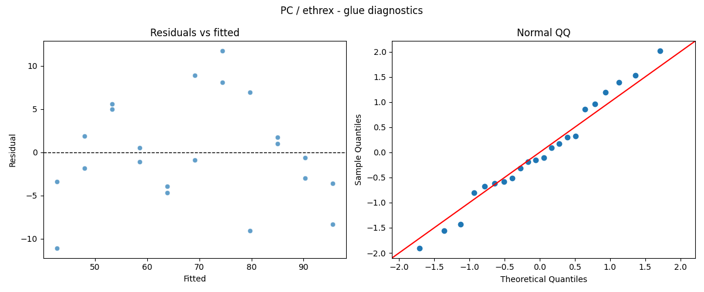

</details>

<details><summary><code>RETURNDATASIZE</code> · nobs=88 · runtime_ms=1.051e-06 · p=1.00e-03 · R²=0.8618</summary>

```
==============================================================================
                           NNLS Regression Results                            
==============================================================================
Dep. Variable:          test_runtime_ms              R-squared:          0.862
Model:                  NNLS                    Adj. R-squared:          0.860
No. Observations:       88                                RMSE:           6.65
Df Residuals:           86                                 MAE:           5.61
Df Model:               1      
==============================================================================
                      coef     std err     P-value      [0.025      0.975]
------------------------------------------------------------------------------
         const      9.7358      2.2475       0.001      5.4083     14.1920
RETURNDATASIZE      0.0000      0.0000       0.001      0.0000      0.0000
==============================================================================
Notes: Non-negative least squares with bootstrap inference (1000 iterations)
==============================================================================
```

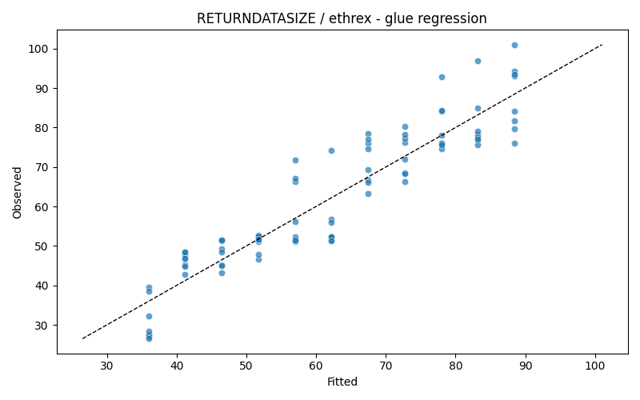

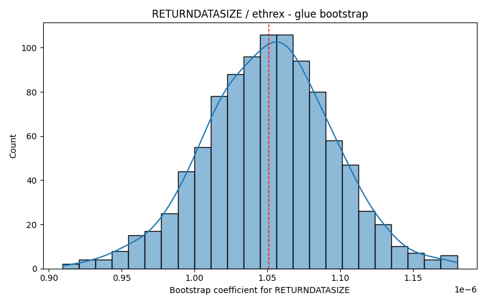

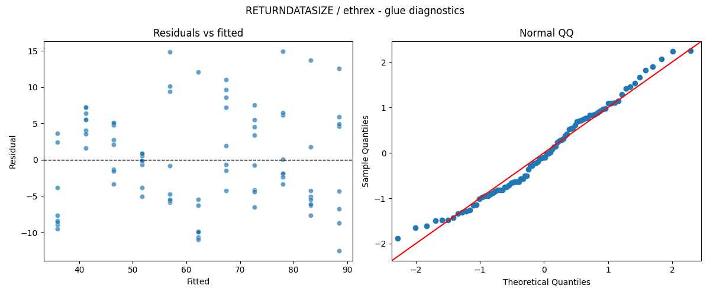

</details>

<details><summary><code>SELFBALANCE</code> · nobs=18 · runtime_ms=4.758e-06 · p=1.00e-03 · R²=0.8104</summary>

```
==============================================================================
                           NNLS Regression Results                            
==============================================================================
Dep. Variable:          test_runtime_ms              R-squared:          0.810
Model:                  NNLS                    Adj. R-squared:          0.799
No. Observations:       18                                RMSE:          23.21
Df Residuals:           16                                 MAE:          19.09
Df Model:               1      
==============================================================================
                      coef     std err     P-value      [0.025      0.975]
------------------------------------------------------------------------------
         const     72.7740     17.4446       0.001     33.6970    102.2071
   SELFBALANCE      0.0000      0.0000       0.001      0.0000      0.0000
==============================================================================
Notes: Non-negative least squares with bootstrap inference (1000 iterations)
==============================================================================
```

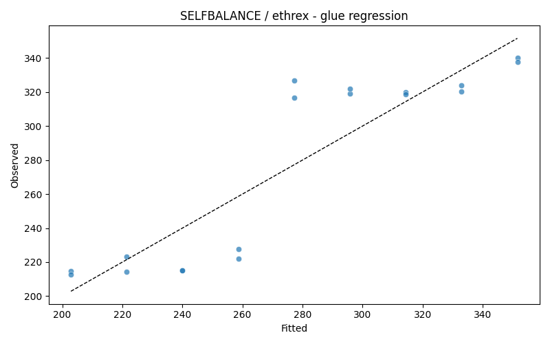

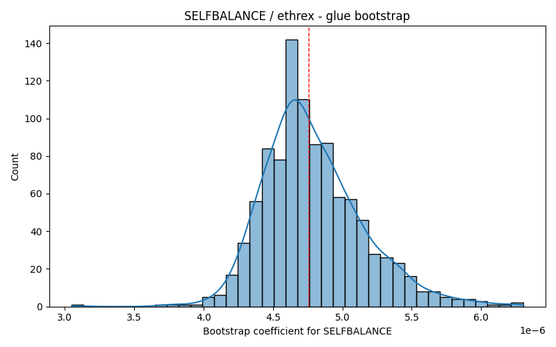

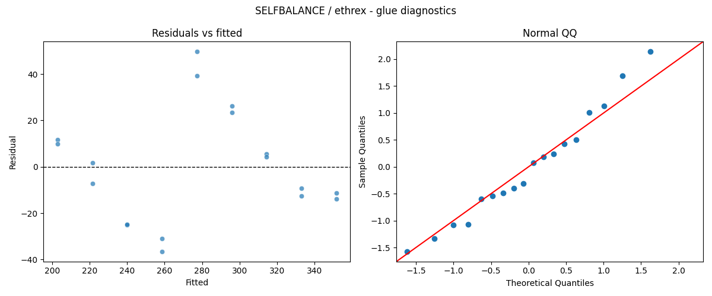

</details>

<details><summary><code>SUB</code> · nobs=22 · runtime_ms=1.22e-06 · p=1.00e-03 · R²=0.8712</summary>

```
==============================================================================
                           NNLS Regression Results                            
==============================================================================
Dep. Variable:          test_runtime_ms              R-squared:          0.871
Model:                  NNLS                    Adj. R-squared:          0.865
No. Observations:       22                                RMSE:           4.94
Df Residuals:           20                                 MAE:           4.21
Df Model:               1      
==============================================================================
                      coef     std err     P-value      [0.025      0.975]
------------------------------------------------------------------------------
         const      8.9915      3.9466       0.022      0.4229     16.8452
           SUB      0.0000      0.0000       0.001      0.0000      0.0000
==============================================================================
Notes: Non-negative least squares with bootstrap inference (1000 iterations)
==============================================================================
```

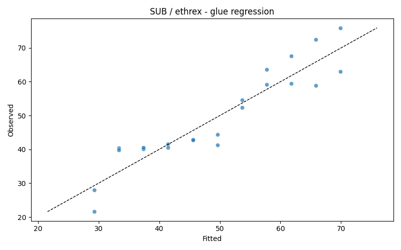

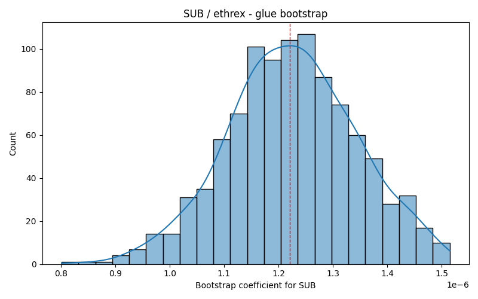

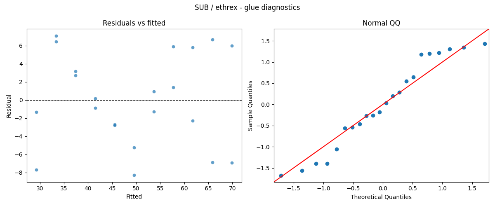

</details>

### Mixed glue (tier B) · ethrex

<details><summary><code>JUMP</code> · nobs=22 · runtime_ms=4.108e-06 · p=1.00e-03 · R²=0.779</summary>

```
==============================================================================
                           NNLS Regression Results                            
==============================================================================
Dep. Variable:          test_runtime_ms              R-squared:          0.779
Model:                  NNLS                    Adj. R-squared:          0.768
No. Observations:       22                                RMSE:           8.13
Df Residuals:           20                                 MAE:           6.55
Df Model:               1      
==============================================================================
                      coef     std err     P-value      [0.025      0.975]
------------------------------------------------------------------------------
         const     20.3927      5.8377       0.001      8.8262     31.3722
          JUMP      0.0000      0.0000       0.001      0.0000      0.0000
==============================================================================
Notes: Non-negative least squares with bootstrap inference (1000 iterations)
==============================================================================
```

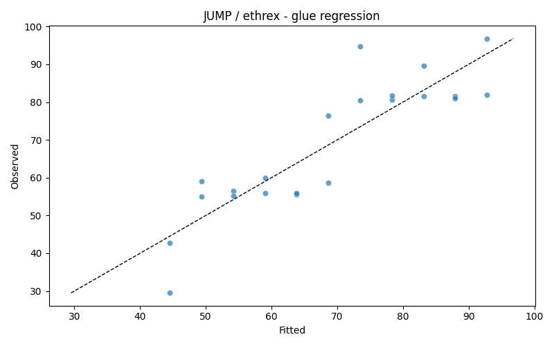

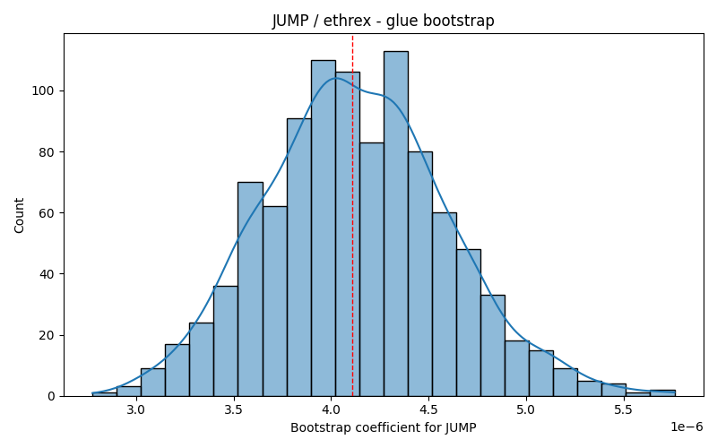

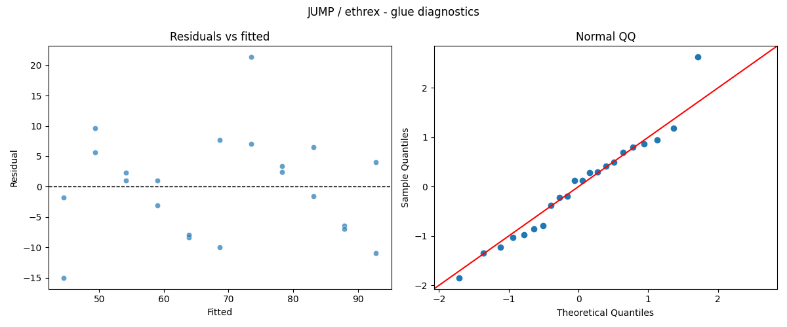

</details>

<details><summary><code>KECCAK256</code> · nobs=352 · runtime_ms=0 · p=1.00e+00 · R²=1.11e-16</summary>

```
==============================================================================
                           NNLS Regression Results                            
==============================================================================
Dep. Variable:          test_runtime_ms              R-squared:          0.000
Model:                  NNLS                    Adj. R-squared:         -0.003
No. Observations:       352                               RMSE:         154.15
Df Residuals:           350                                MAE:         127.48
Df Model:               1      
==============================================================================
                      coef     std err     P-value      [0.025      0.975]
------------------------------------------------------------------------------
         const    246.4490      8.2178       0.001    229.4122    261.1009
     KECCAK256      0.0000      0.0000       1.000      0.0000      0.0000
==============================================================================
Notes: Non-negative least squares with bootstrap inference (1000 iterations)
==============================================================================
```

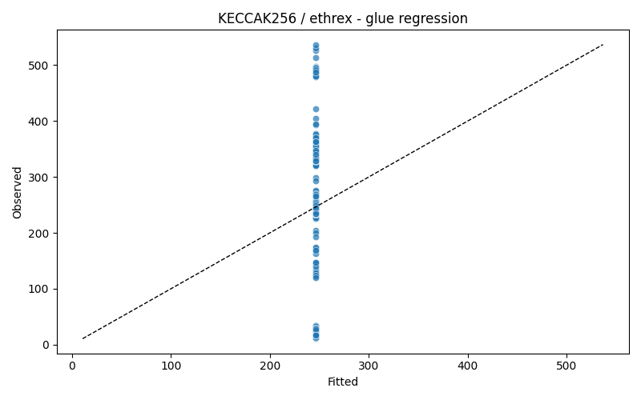


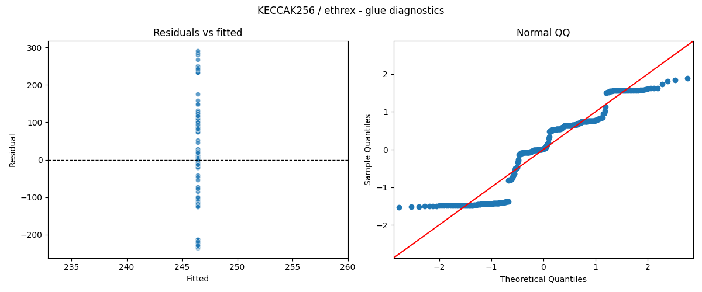

</details>

## geth

| glue_opcode | nobs | glue_runtime_ms | p_value | rsquared |
| --- | --- | --- | --- | --- |
| `ISZERO` | 407 | 1.532e-06 | 1.00e-03 | 0.6935 |
| `JUMPDEST` | 407 | 1.185e-06 | 1.00e-03 | 0.5847 |
| `SWAP` | 6512 | 1.578e-06 | 1.00e-03 | 0.6746 |
| `CALLDATASIZE` | 24420 | 1.409e-06 | 1.00e-03 | 0.8335 |
| `DUP` | 24420 | 1.492e-06 | 1.00e-03 | 0.8335 |
| `GAS` | 24420 | 1.435e-06 | 1.00e-03 | 0.8335 |
| `MLOAD` | 24420 | 5.242e-06 | 1.00e-03 | 0.8335 |
| `PUSH` | 24420 | 2.234e-06 | 1.00e-03 | 0.8335 |
| `PUSH0` | 24420 | 1.416e-06 | 1.00e-03 | 0.8335 |
| `STATICCALL` | 24420 | 0.0001805 | 1.00e-03 | 0.8335 |
| `ADD` | 407 | 4.27e-06 | 1.00e-03 | 0.6825 |
| `AND` | 407 | 3.716e-06 | 1.00e-03 | 0.6428 |
| `CALLDATACOPY` | 9768 | 1.31e-05 | 1.00e-03 | 0.9417 |
| `CALLDATALOAD` | 1628 | 5.299e-05 | 1.00e-03 | 0.03671 |
| `DIV` | 407 | 9.208e-06 | 1.00e-03 | 0.8116 |
| `EXP` | 407 | 0.0003245 | 1.00e-03 | 0.8018 |
| `GT` | 407 | 3.502e-06 | 1.00e-03 | 0.6923 |
| `JUMPI` | 407 | 6.124e-06 | 1.00e-03 | 0.7228 |
| `LT` | 407 | 4.403e-06 | 1.00e-03 | 0.7717 |
| `MSTORE` | 2035 | 7.816e-06 | 1.00e-03 | 0.7731 |
| `MSTORE8` | 2035 | 7.057e-06 | 1.00e-03 | 0.7317 |
| `MUL` | 407 | 4.765e-06 | 1.00e-03 | 0.7671 |
| `PC` | 407 | 1.651e-06 | 1.00e-03 | 0.8219 |
| `RETURNDATASIZE` | 1628 | 3.404e-06 | 1.00e-03 | 0.63 |
| `SELFBALANCE` | 333 | 7.121e-06 | 1.00e-03 | 0.7746 |
| `SUB` | 407 | 4.341e-06 | 1.00e-03 | 0.7342 |
| `JUMP` | 407 | 9.203e-06 | 1.00e-03 | 0.7648 |
| `KECCAK256` | 6512 | 3.797e-05 | 1.00e-03 | 0.2953 |

### Cycle glue — joint fit · geth

<details><summary>Joint NNLS regression summary</summary>

```
==============================================================================
                           NNLS Regression Results                            
==============================================================================
Dep. Variable:          test_runtime_ms              R-squared:          0.834
Model:                  NNLS                    Adj. R-squared:          0.833
No. Observations:       24420                             RMSE:          25.46
Df Residuals:           24412                              MAE:          19.95
Df Model:               7      
==============================================================================
                      coef     std err     P-value      [0.025      0.975]
------------------------------------------------------------------------------
         const     43.8714      0.6092       0.001     42.6114     45.0235
  CALLDATASIZE      0.0000      0.0000       0.001      0.0000      0.0000
           DUP      0.0000      0.0000       0.001      0.0000      0.0000
           GAS      0.0000      0.0000       0.001      0.0000      0.0000
         MLOAD      0.0000      0.0000       0.001      0.0000      0.0000
          PUSH      0.0000      0.0000       0.001      0.0000      0.0000
         PUSH0      0.0000      0.0000       0.001      0.0000      0.0000
    STATICCALL      0.0002      0.0000       0.001      0.0002      0.0002
==============================================================================
Notes: Non-negative least squares with bootstrap inference (1000 iterations)
==============================================================================
```

</details>

<details><summary><code>CALLDATASIZE</code> · nobs=24420 · runtime_ms=1.409e-06 · p=1.00e-03 · R²=0.8335</summary>


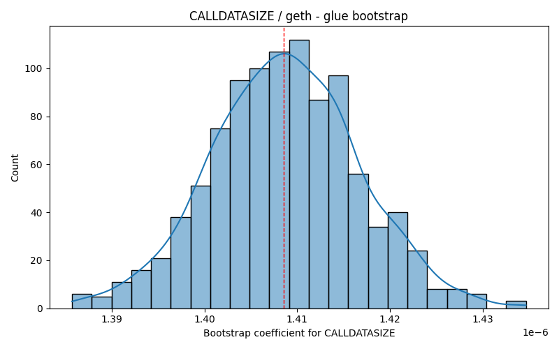

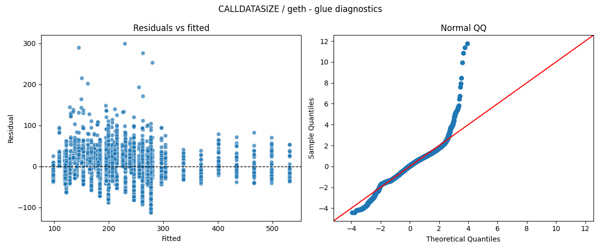

</details>

<details><summary><code>DUP</code> · nobs=24420 · runtime_ms=1.492e-06 · p=1.00e-03 · R²=0.8335</summary>


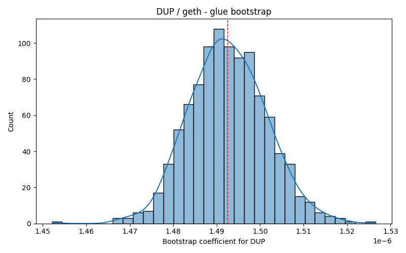

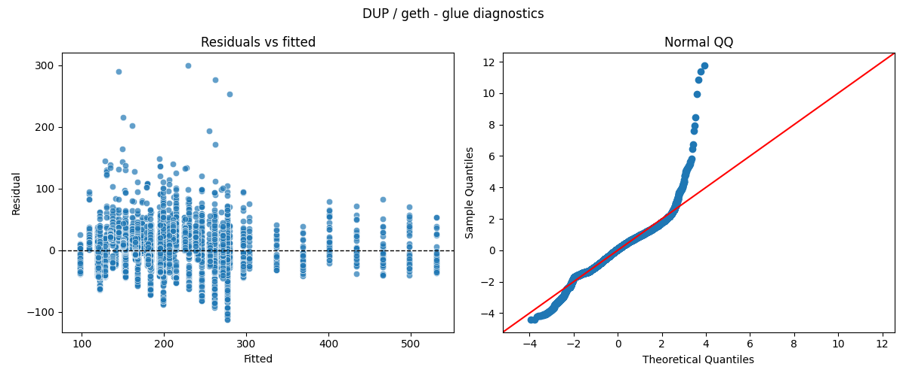

</details>

<details><summary><code>GAS</code> · nobs=24420 · runtime_ms=1.435e-06 · p=1.00e-03 · R²=0.8335</summary>

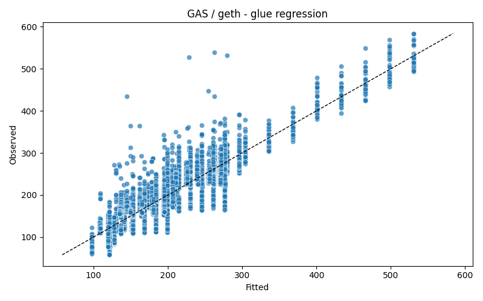

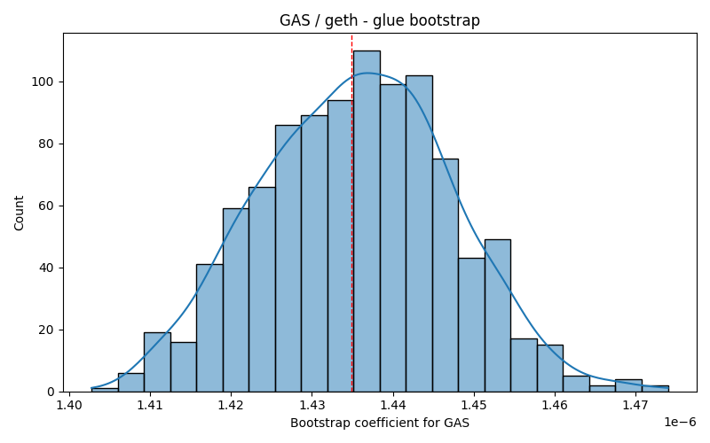


</details>

<details><summary><code>MLOAD</code> · nobs=24420 · runtime_ms=5.242e-06 · p=1.00e-03 · R²=0.8335</summary>


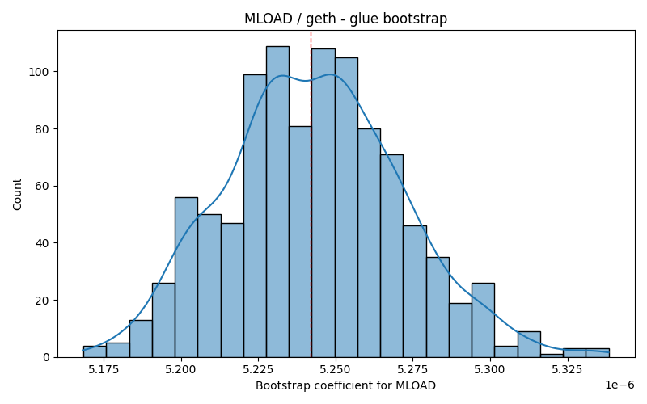


</details>

<details><summary><code>PUSH</code> · nobs=24420 · runtime_ms=2.234e-06 · p=1.00e-03 · R²=0.8335</summary>


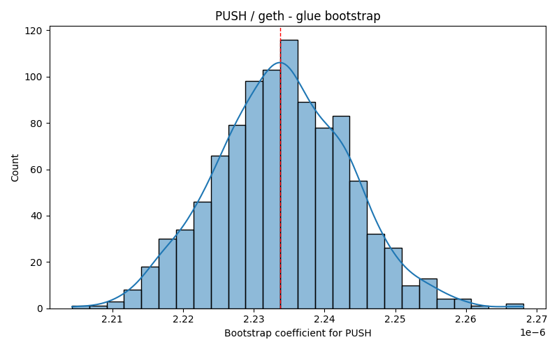


</details>

<details><summary><code>PUSH0</code> · nobs=24420 · runtime_ms=1.416e-06 · p=1.00e-03 · R²=0.8335</summary>


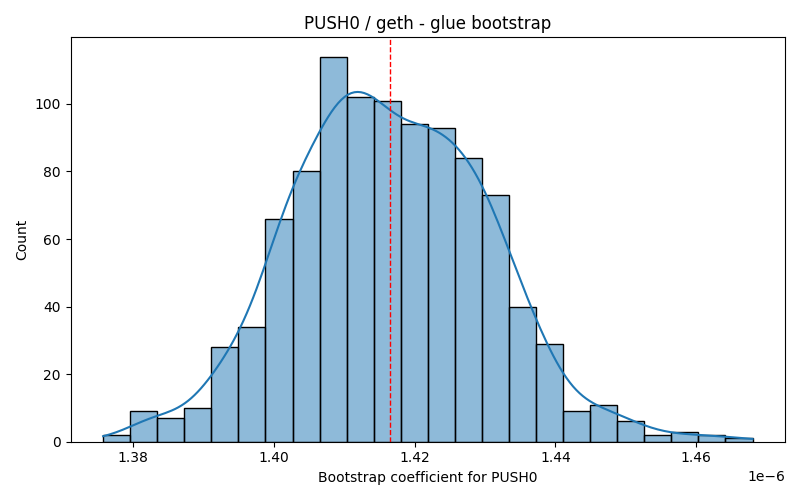


</details>

<details><summary><code>STATICCALL</code> · nobs=24420 · runtime_ms=0.0001805 · p=1.00e-03 · R²=0.8335</summary>


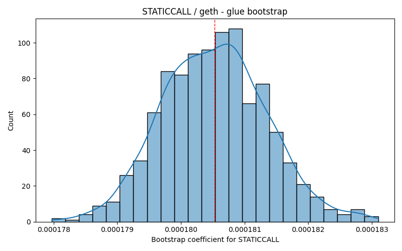


</details>

### Pure glue · geth

<details><summary><code>ISZERO</code> · nobs=407 · runtime_ms=1.532e-06 · p=1.00e-03 · R²=0.6935</summary>

```
==============================================================================
                           NNLS Regression Results                            
==============================================================================
Dep. Variable:          test_runtime_ms              R-squared:          0.693
Model:                  NNLS                    Adj. R-squared:          0.693
No. Observations:       407                               RMSE:          21.45
Df Residuals:           405                                MAE:          14.30
Df Model:               1      
==============================================================================
                      coef     std err     P-value      [0.025      0.975]
------------------------------------------------------------------------------
         const     23.2303      3.4691       0.001     16.0419     29.7748
        ISZERO      0.0000      0.0000       0.001      0.0000      0.0000
==============================================================================
Notes: Non-negative least squares with bootstrap inference (1000 iterations)
==============================================================================
```

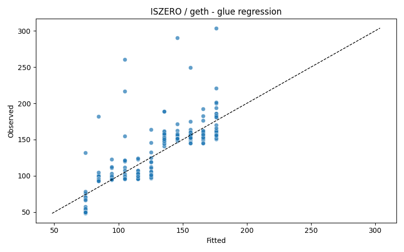

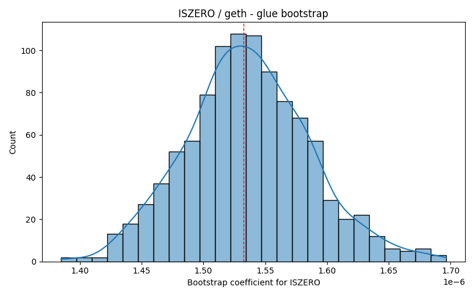

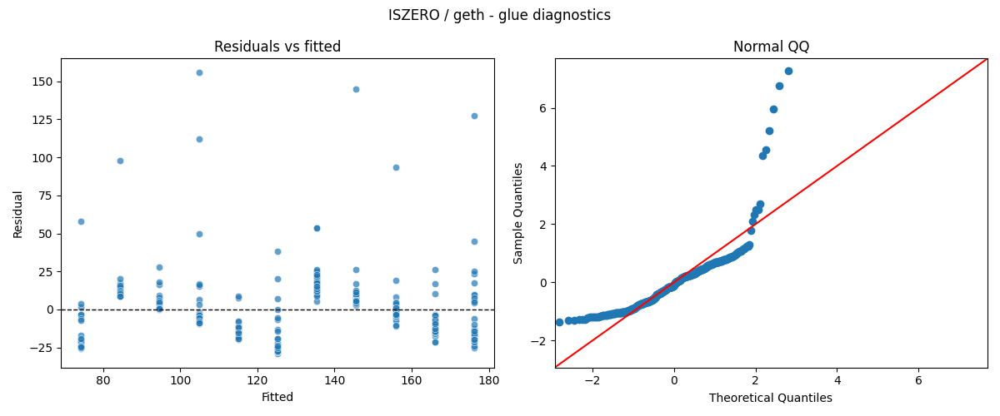

</details>

<details><summary><code>JUMPDEST</code> · nobs=407 · runtime_ms=1.185e-06 · p=1.00e-03 · R²=0.5847</summary>

```
==============================================================================
                           NNLS Regression Results                            
==============================================================================
Dep. Variable:          test_runtime_ms              R-squared:          0.585
Model:                  NNLS                    Adj. R-squared:          0.584
No. Observations:       407                               RMSE:          63.07
Df Residuals:           405                                MAE:          34.11
Df Model:               1      
==============================================================================
                      coef     std err     P-value      [0.025      0.975]
------------------------------------------------------------------------------
         const     72.7305     11.4438       0.001     47.7923     93.5001
      JUMPDEST      0.0000      0.0000       0.001      0.0000      0.0000
==============================================================================
Notes: Non-negative least squares with bootstrap inference (1000 iterations)
==============================================================================
```

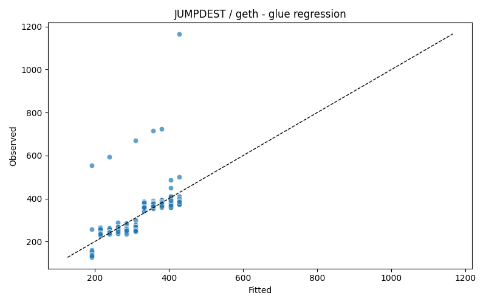

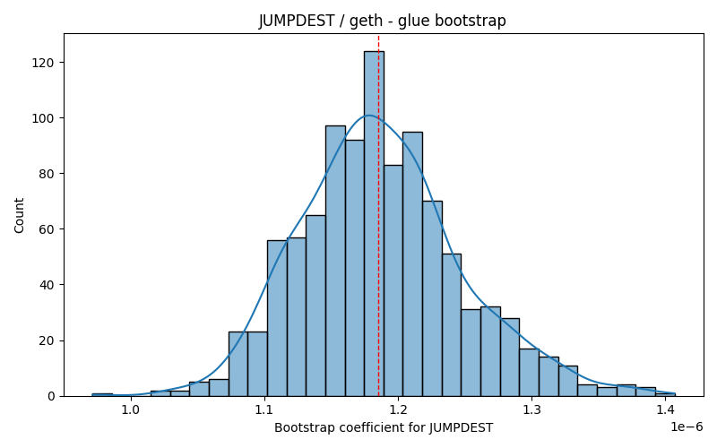

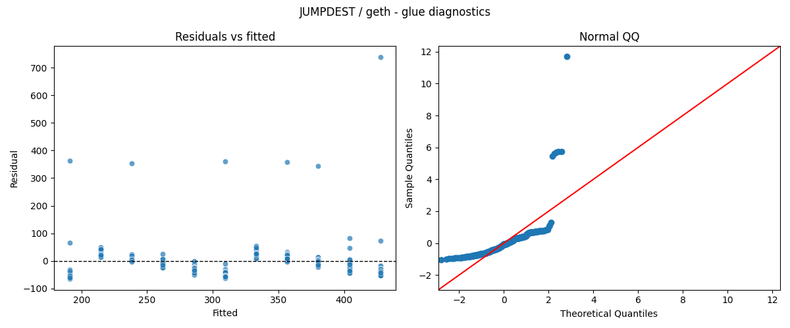

</details>

<details><summary><code>SWAP</code> · nobs=6512 · runtime_ms=1.578e-06 · p=1.00e-03 · R²=0.6746</summary>

```
==============================================================================
                           NNLS Regression Results                            
==============================================================================
Dep. Variable:          test_runtime_ms              R-squared:          0.675
Model:                  NNLS                    Adj. R-squared:          0.675
No. Observations:       6512                              RMSE:          23.07
Df Residuals:           6510                               MAE:          16.02
Df Model:               1      
==============================================================================
                      coef     std err     P-value      [0.025      0.975]
------------------------------------------------------------------------------
         const     33.6013      0.9717       0.001     31.7460     35.5409
          SWAP      0.0000      0.0000       0.001      0.0000      0.0000
==============================================================================
Notes: Non-negative least squares with bootstrap inference (1000 iterations)
==============================================================================
```

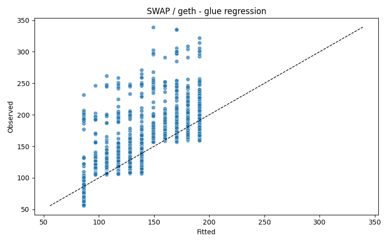

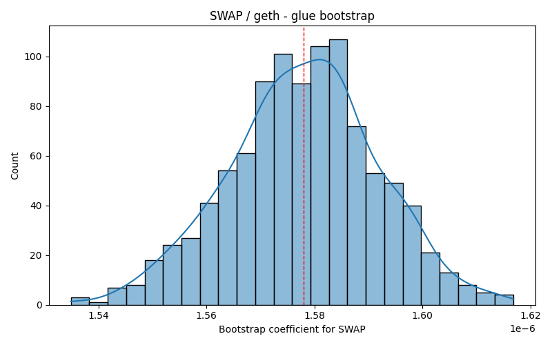

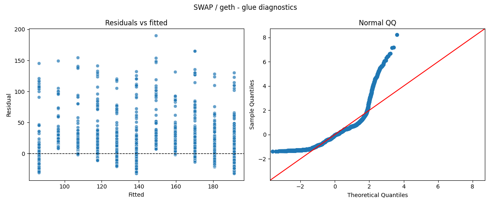

</details>

### Mixed glue (tier A) · geth

<details><summary><code>ADD</code> · nobs=407 · runtime_ms=4.27e-06 · p=1.00e-03 · R²=0.6825</summary>

```
==============================================================================
                           NNLS Regression Results                            
==============================================================================
Dep. Variable:          test_runtime_ms              R-squared:          0.683
Model:                  NNLS                    Adj. R-squared:          0.682
No. Observations:       407                               RMSE:          30.65
Df Residuals:           405                                MAE:          20.47
Df Model:               1      
==============================================================================
                      coef     std err     P-value      [0.025      0.975]
------------------------------------------------------------------------------
         const     48.8518      5.0460       0.001     39.7141     59.5251
           ADD      0.0000      0.0000       0.001      0.0000      0.0000
==============================================================================
Notes: Non-negative least squares with bootstrap inference (1000 iterations)
==============================================================================
```

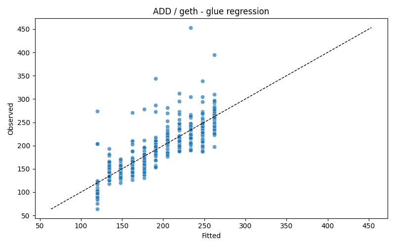

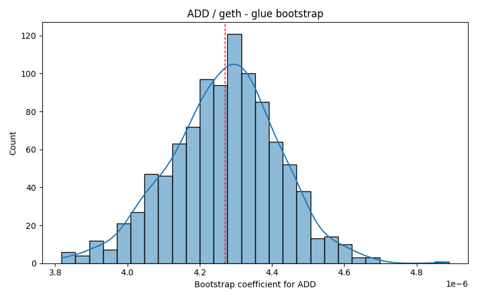

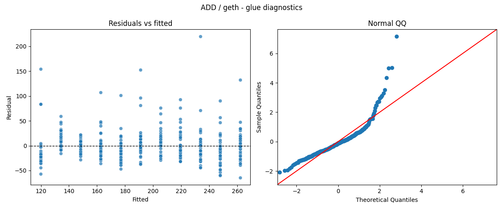

</details>

<details><summary><code>AND</code> · nobs=407 · runtime_ms=3.716e-06 · p=1.00e-03 · R²=0.6428</summary>

```
==============================================================================
                           NNLS Regression Results                            
==============================================================================
Dep. Variable:          test_runtime_ms              R-squared:          0.643
Model:                  NNLS                    Adj. R-squared:          0.642
No. Observations:       407                               RMSE:          29.16
Df Residuals:           405                                MAE:          20.78
Df Model:               1      
==============================================================================
                      coef     std err     P-value      [0.025      0.975]
------------------------------------------------------------------------------
         const     56.2365      5.0834       0.001     47.8960     67.5538
           AND      0.0000      0.0000       0.001      0.0000      0.0000
==============================================================================
Notes: Non-negative least squares with bootstrap inference (1000 iterations)
==============================================================================
```

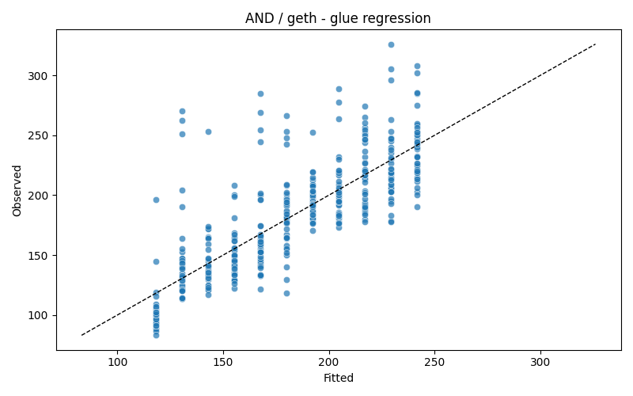

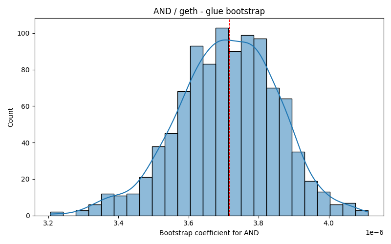

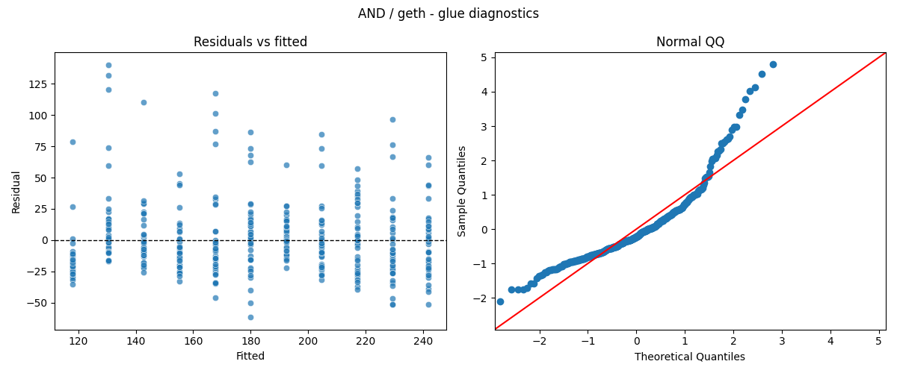

</details>

<details><summary><code>CALLDATACOPY</code> · nobs=9768 · runtime_ms=1.31e-05 · p=1.00e-03 · R²=0.9417</summary>

```
==============================================================================
                           NNLS Regression Results                            
==============================================================================
Dep. Variable:          test_runtime_ms              R-squared:          0.942
Model:                  NNLS                    Adj. R-squared:          0.942
No. Observations:       9768                              RMSE:          24.51
Df Residuals:           9766                               MAE:          17.72
Df Model:               1      
==============================================================================
                      coef     std err     P-value      [0.025      0.975]
------------------------------------------------------------------------------
         const     19.9821      0.3056       0.001     19.3761     20.5525
  CALLDATACOPY      0.0000      0.0000       0.001      0.0000      0.0000
==============================================================================
Notes: Non-negative least squares with bootstrap inference (1000 iterations)
==============================================================================
```

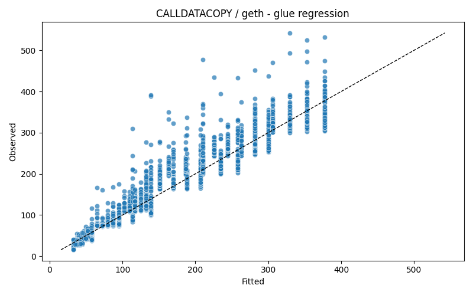

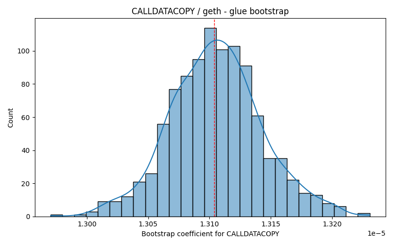

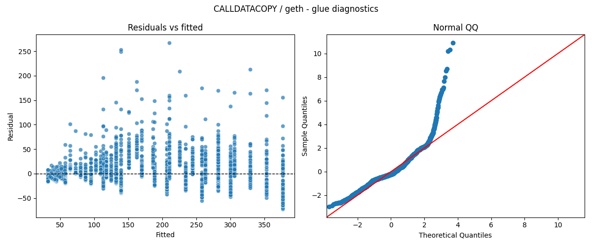

</details>

<details><summary><code>CALLDATALOAD</code> · nobs=1628 · runtime_ms=5.299e-05 · p=1.00e-03 · R²=0.03671</summary>

```
==============================================================================
                           NNLS Regression Results                            
==============================================================================
Dep. Variable:          test_runtime_ms              R-squared:          0.037
Model:                  NNLS                    Adj. R-squared:          0.036
No. Observations:       1628                              RMSE:           1.04
Df Residuals:           1626                               MAE:           0.50
Df Model:               1      
==============================================================================
                      coef     std err     P-value      [0.025      0.975]
------------------------------------------------------------------------------
         const      2.3732      0.0766       0.001      2.2242      2.5308
  CALLDATALOAD      0.0001      0.0000       0.001      0.0000      0.0001
==============================================================================
Notes: Non-negative least squares with bootstrap inference (1000 iterations)
==============================================================================
```

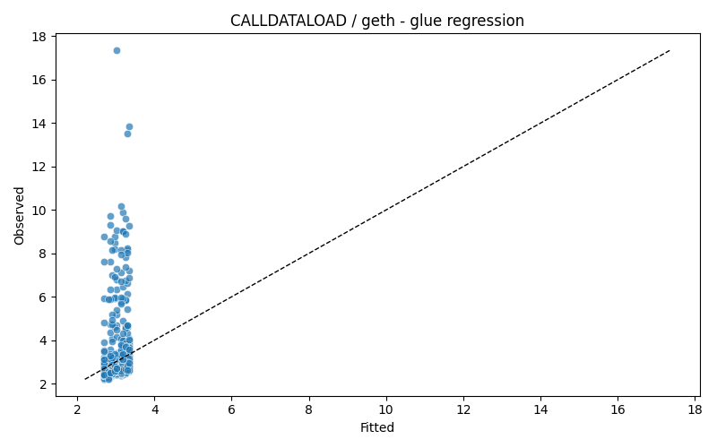

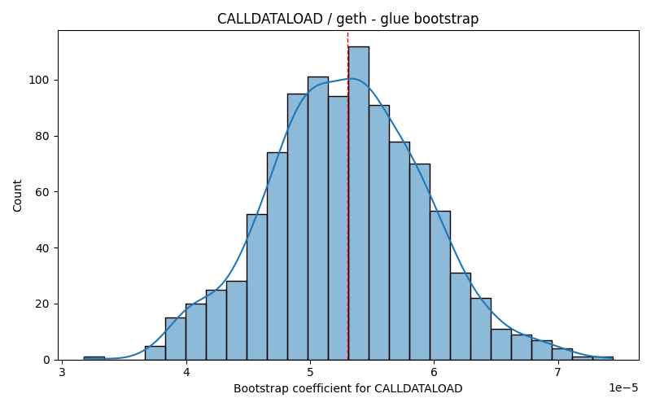

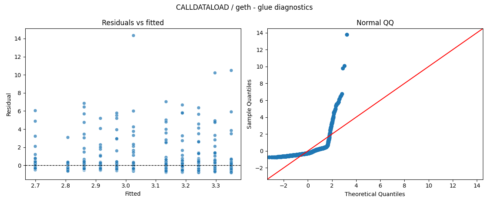

</details>

<details><summary><code>DIV</code> · nobs=407 · runtime_ms=9.208e-06 · p=1.00e-03 · R²=0.8116</summary>

```
==============================================================================
                           NNLS Regression Results                            
==============================================================================
Dep. Variable:          test_runtime_ms              R-squared:          0.812
Model:                  NNLS                    Adj. R-squared:          0.811
No. Observations:       407                               RMSE:          35.02
Df Residuals:           405                                MAE:          29.71
Df Model:               1      
==============================================================================
                      coef     std err     P-value      [0.025      0.975]
------------------------------------------------------------------------------
         const     76.5470      6.6359       0.001     63.9401     89.9126
           DIV      0.0000      0.0000       0.001      0.0000      0.0000
==============================================================================
Notes: Non-negative least squares with bootstrap inference (1000 iterations)
==============================================================================
```

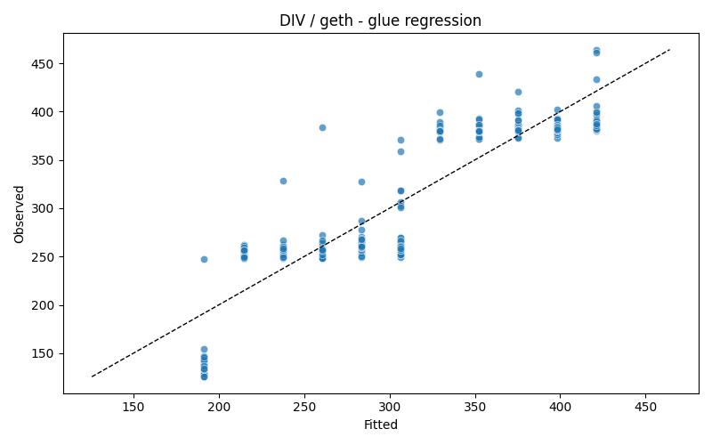

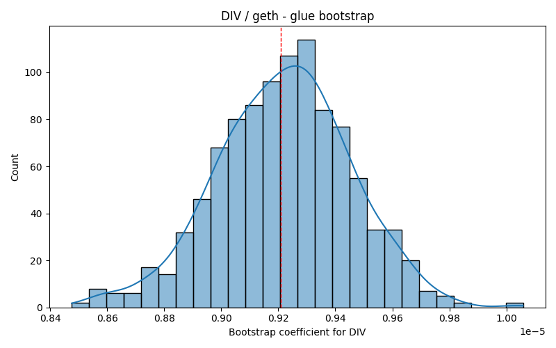

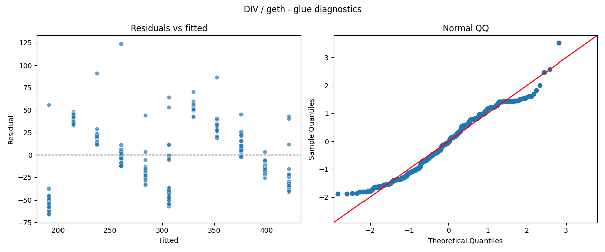

</details>

<details><summary><code>EXP</code> · nobs=407 · runtime_ms=0.0003245 · p=1.00e-03 · R²=0.8018</summary>

```
==============================================================================
                           NNLS Regression Results                            
==============================================================================
Dep. Variable:          test_runtime_ms              R-squared:          0.802
Model:                  NNLS                    Adj. R-squared:          0.801
No. Observations:       407                               RMSE:           6.32
Df Residuals:           405                                MAE:           5.47
Df Model:               1      
==============================================================================
                      coef     std err     P-value      [0.025      0.975]
------------------------------------------------------------------------------
         const     14.0018      1.1643       0.001     11.7932     16.3543
           EXP      0.0003      0.0000       0.001      0.0003      0.0003
==============================================================================
Notes: Non-negative least squares with bootstrap inference (1000 iterations)
==============================================================================
```

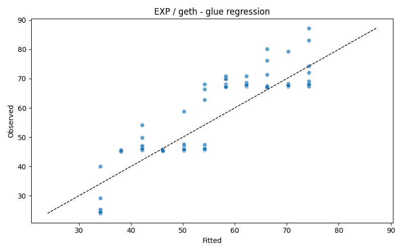

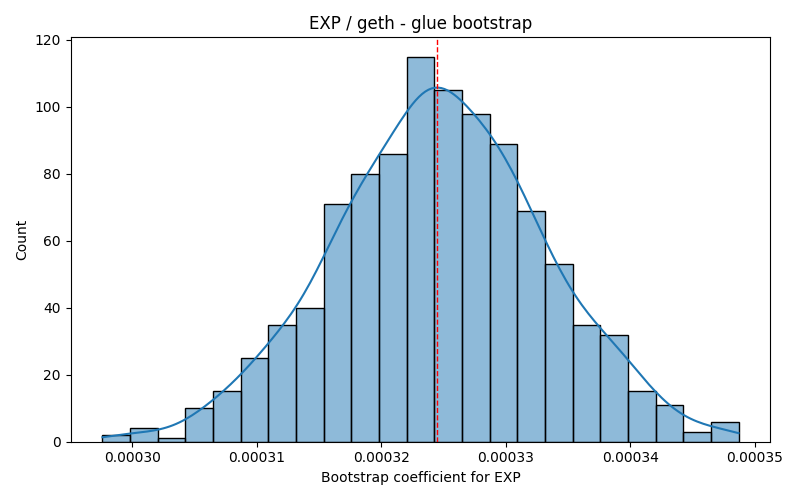

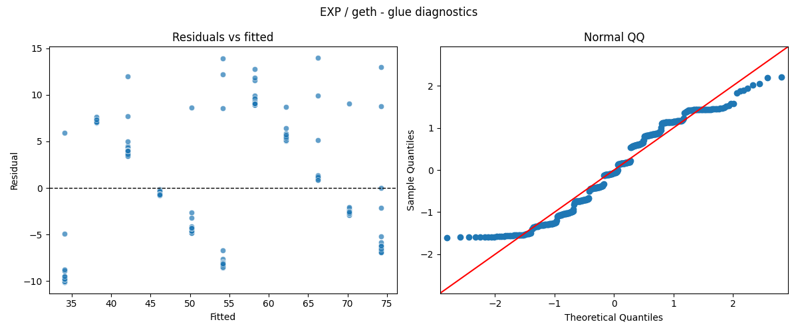

</details>

<details><summary><code>GT</code> · nobs=407 · runtime_ms=3.502e-06 · p=1.00e-03 · R²=0.6923</summary>

```
==============================================================================
                           NNLS Regression Results                            
==============================================================================
Dep. Variable:          test_runtime_ms              R-squared:          0.692
Model:                  NNLS                    Adj. R-squared:          0.692
No. Observations:       407                               RMSE:          24.57
Df Residuals:           405                                MAE:          17.18
Df Model:               1      
==============================================================================
                      coef     std err     P-value      [0.025      0.975]
------------------------------------------------------------------------------
         const     40.6848      4.6070       0.001     31.8590     50.3026
            GT      0.0000      0.0000       0.001      0.0000      0.0000
==============================================================================
Notes: Non-negative least squares with bootstrap inference (1000 iterations)
==============================================================================
```

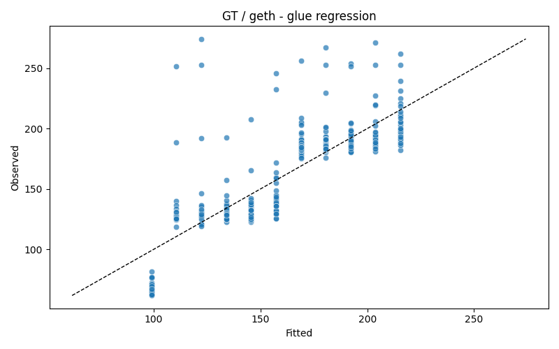

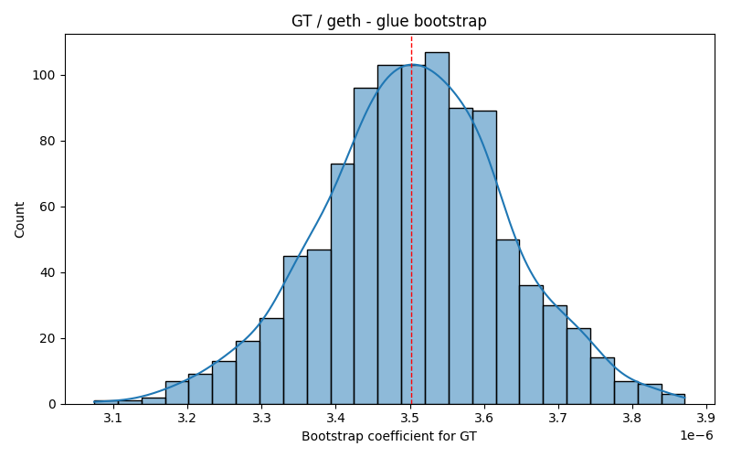

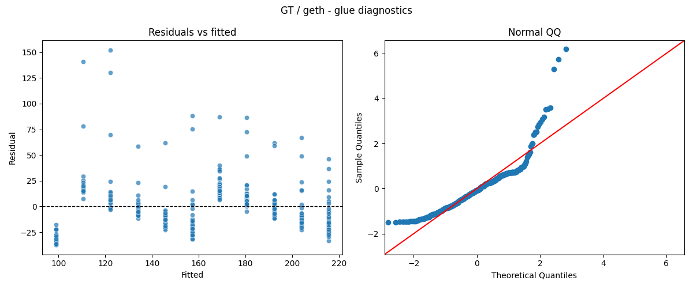

</details>

<details><summary><code>JUMPI</code> · nobs=407 · runtime_ms=6.124e-06 · p=1.00e-03 · R²=0.7228</summary>

```
==============================================================================
                           NNLS Regression Results                            
==============================================================================
Dep. Variable:          test_runtime_ms              R-squared:          0.723
Model:                  NNLS                    Adj. R-squared:          0.722
No. Observations:       407                               RMSE:          17.11
Df Residuals:           405                                MAE:          12.62
Df Model:               1      
==============================================================================
                      coef     std err     P-value      [0.025      0.975]
------------------------------------------------------------------------------
         const     17.2623      2.6300       0.001     12.0434     22.3422
         JUMPI      0.0000      0.0000       0.001      0.0000      0.0000
==============================================================================
Notes: Non-negative least squares with bootstrap inference (1000 iterations)
==============================================================================
```

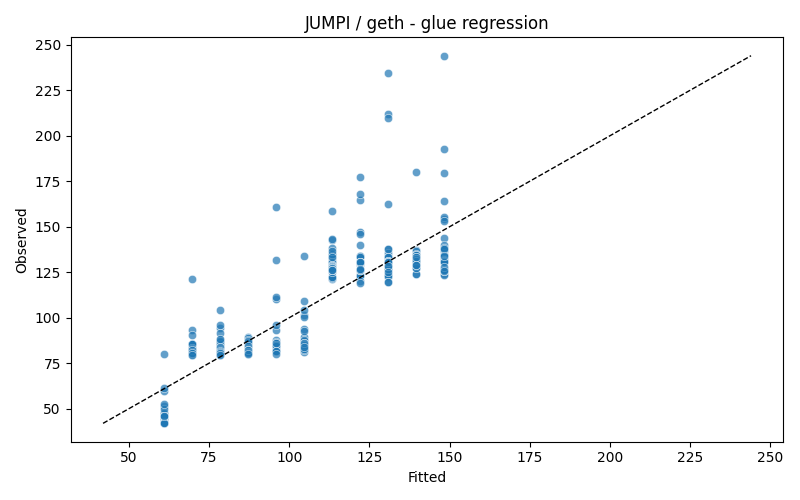

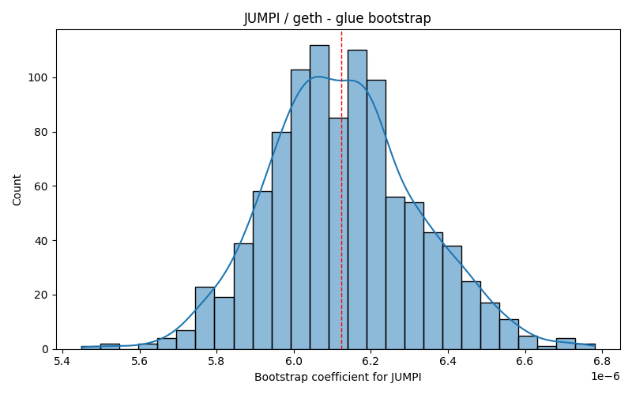

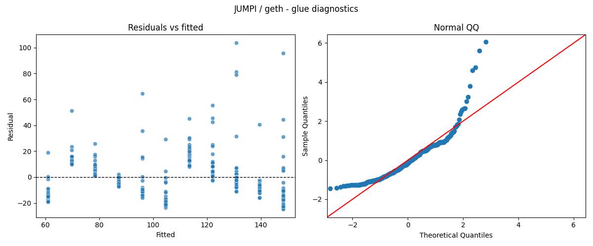

</details>

<details><summary><code>LT</code> · nobs=407 · runtime_ms=4.403e-06 · p=1.00e-03 · R²=0.7717</summary>

```
==============================================================================
                           NNLS Regression Results                            
==============================================================================
Dep. Variable:          test_runtime_ms              R-squared:          0.772
Model:                  NNLS                    Adj. R-squared:          0.771
No. Observations:       407                               RMSE:          25.21
Df Residuals:           405                                MAE:          18.43
Df Model:               1      
==============================================================================
                      coef     std err     P-value      [0.025      0.975]
------------------------------------------------------------------------------
         const     42.6706      4.5909       0.001     33.7044     51.9453
            LT      0.0000      0.0000       0.001      0.0000      0.0000
==============================================================================
Notes: Non-negative least squares with bootstrap inference (1000 iterations)
==============================================================================
```

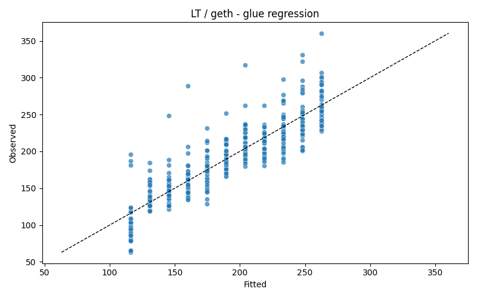

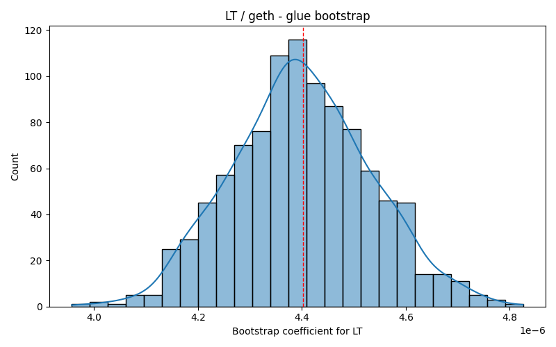

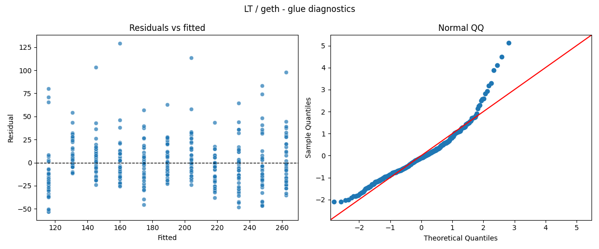

</details>

<details><summary><code>MSTORE</code> · nobs=2035 · runtime_ms=7.816e-06 · p=1.00e-03 · R²=0.7731</summary>

```
==============================================================================
                           NNLS Regression Results                            
==============================================================================
Dep. Variable:          test_runtime_ms              R-squared:          0.773
Model:                  NNLS                    Adj. R-squared:          0.773
No. Observations:       2035                              RMSE:          29.71
Df Residuals:           2033                               MAE:          23.61
Df Model:               1      
==============================================================================
                      coef     std err     P-value      [0.025      0.975]
------------------------------------------------------------------------------
         const     55.4844      2.3245       0.001     50.7817     60.0025
        MSTORE      0.0000      0.0000       0.001      0.0000      0.0000
==============================================================================
Notes: Non-negative least squares with bootstrap inference (1000 iterations)
==============================================================================
```

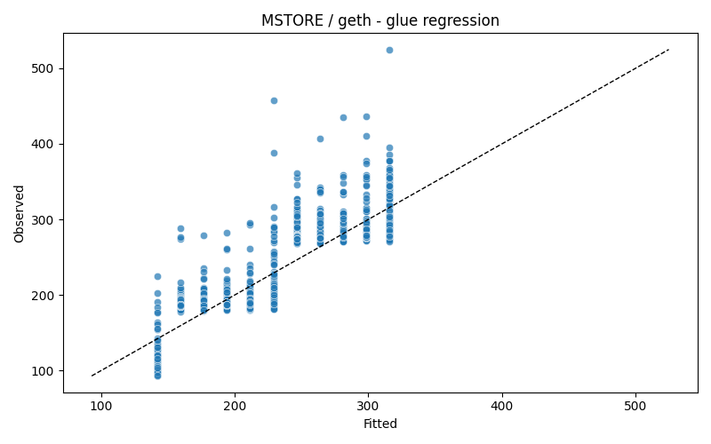

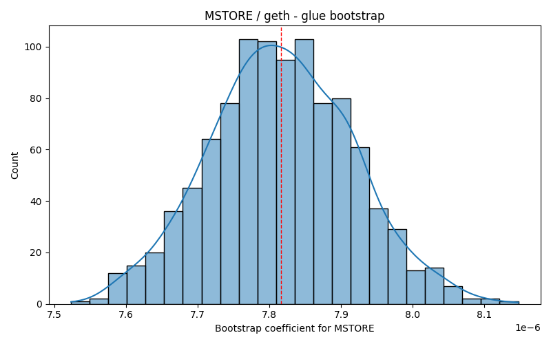

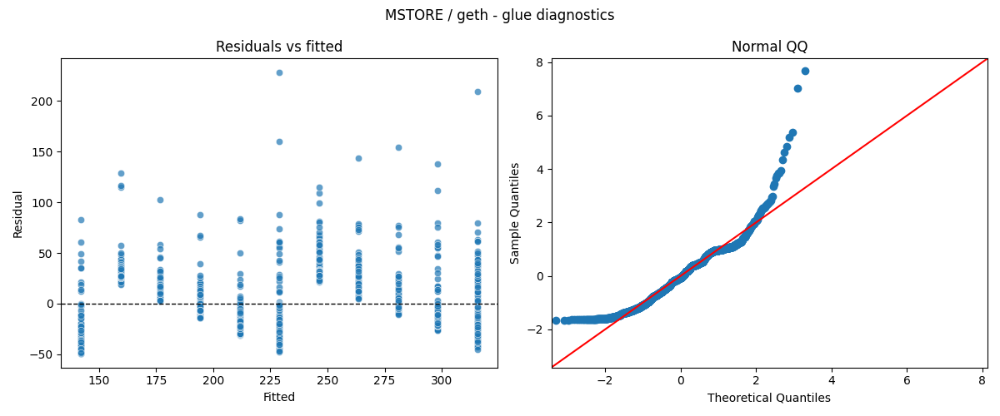

</details>

<details><summary><code>MSTORE8</code> · nobs=2035 · runtime_ms=7.057e-06 · p=1.00e-03 · R²=0.7317</summary>

```
==============================================================================
                           NNLS Regression Results                            
==============================================================================
Dep. Variable:          test_runtime_ms              R-squared:          0.732
Model:                  NNLS                    Adj. R-squared:          0.732
No. Observations:       2035                              RMSE:          29.98
Df Residuals:           2033                               MAE:          22.43
Df Model:               1      
==============================================================================
                      coef     std err     P-value      [0.025      0.975]
------------------------------------------------------------------------------
         const     56.8418      2.6223       0.001     51.8747     61.8850
       MSTORE8      0.0000      0.0000       0.001      0.0000      0.0000
==============================================================================
Notes: Non-negative least squares with bootstrap inference (1000 iterations)
==============================================================================
```

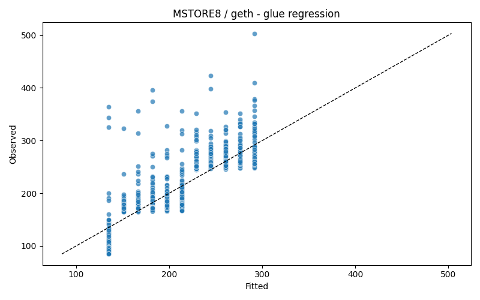

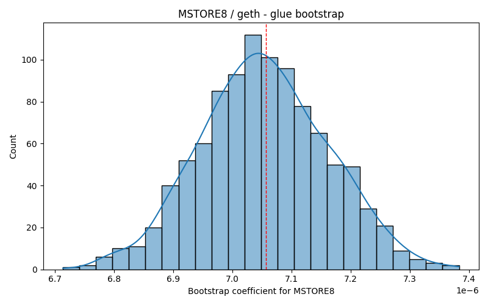

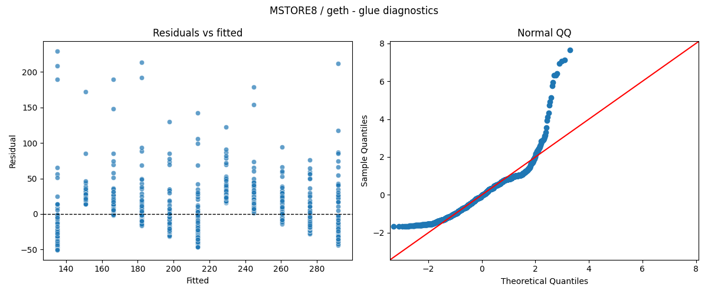

</details>

<details><summary><code>MUL</code> · nobs=407 · runtime_ms=4.765e-06 · p=1.00e-03 · R²=0.7671</summary>

```
==============================================================================
                           NNLS Regression Results                            
==============================================================================
Dep. Variable:          test_runtime_ms              R-squared:          0.767
Model:                  NNLS                    Adj. R-squared:          0.766
No. Observations:       407                               RMSE:          20.73
Df Residuals:           405                                MAE:          15.29
Df Model:               1      
==============================================================================
                      coef     std err     P-value      [0.025      0.975]
------------------------------------------------------------------------------
         const     44.6441      3.8040       0.001     37.3509     52.4924
           MUL      0.0000      0.0000       0.001      0.0000      0.0000
==============================================================================
Notes: Non-negative least squares with bootstrap inference (1000 iterations)
==============================================================================
```

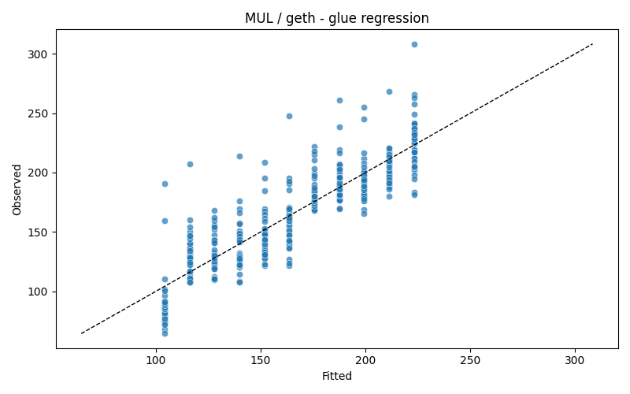

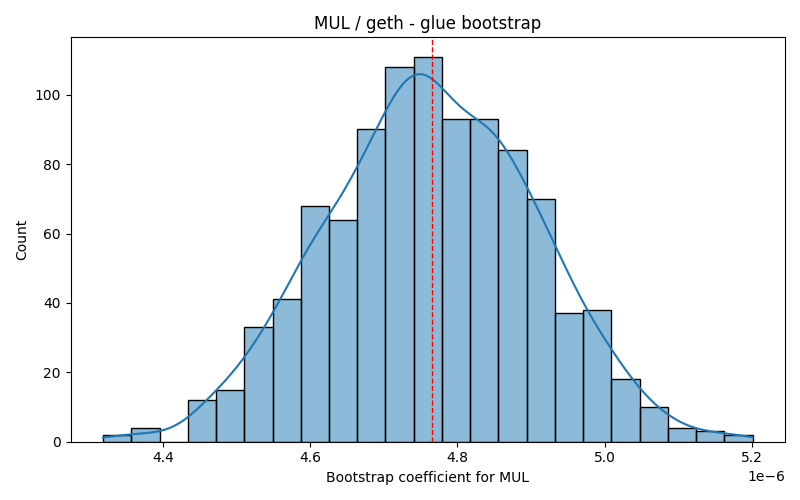

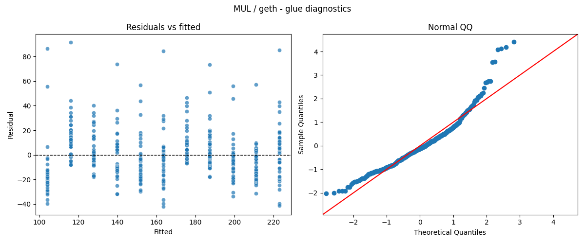

</details>

<details><summary><code>PC</code> · nobs=407 · runtime_ms=1.651e-06 · p=1.00e-03 · R²=0.8219</summary>

```
==============================================================================
                           NNLS Regression Results                            
==============================================================================
Dep. Variable:          test_runtime_ms              R-squared:          0.822
Model:                  NNLS                    Adj. R-squared:          0.821
No. Observations:       407                               RMSE:          22.98
Df Residuals:           405                                MAE:          18.03
Df Model:               1      
==============================================================================
                      coef     std err     P-value      [0.025      0.975]
------------------------------------------------------------------------------
         const     41.8174      4.2056       0.001     33.0099     49.7098
            PC      0.0000      0.0000       0.001      0.0000      0.0000
==============================================================================
Notes: Non-negative least squares with bootstrap inference (1000 iterations)
==============================================================================
```

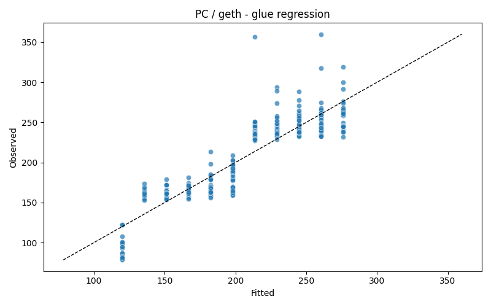

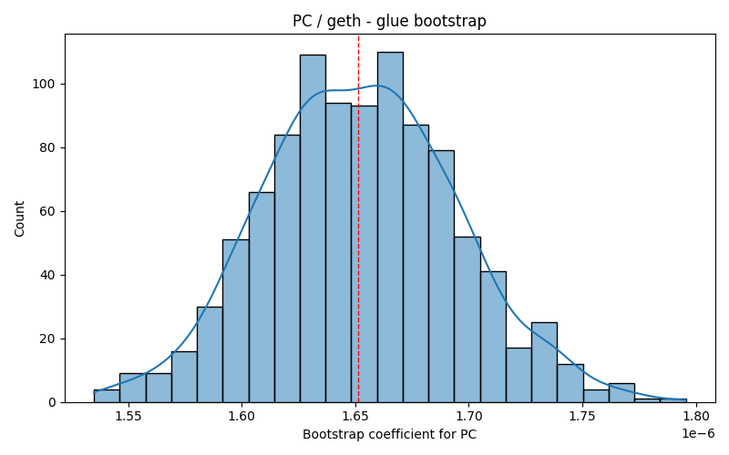

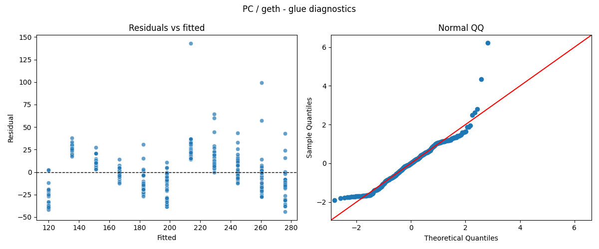

</details>

<details><summary><code>RETURNDATASIZE</code> · nobs=1628 · runtime_ms=3.404e-06 · p=1.00e-03 · R²=0.63</summary>

```
==============================================================================
                           NNLS Regression Results                            
==============================================================================
Dep. Variable:          test_runtime_ms              R-squared:          0.630
Model:                  NNLS                    Adj. R-squared:          0.630
No. Observations:       1628                              RMSE:          41.19
Df Residuals:           1626                               MAE:          30.12
Df Model:               1      
==============================================================================
                      coef     std err     P-value      [0.025      0.975]
------------------------------------------------------------------------------
         const     49.5588      3.2433       0.001     42.6962     55.5137
RETURNDATASIZE      0.0000      0.0000       0.001      0.0000      0.0000
==============================================================================
Notes: Non-negative least squares with bootstrap inference (1000 iterations)
==============================================================================
```

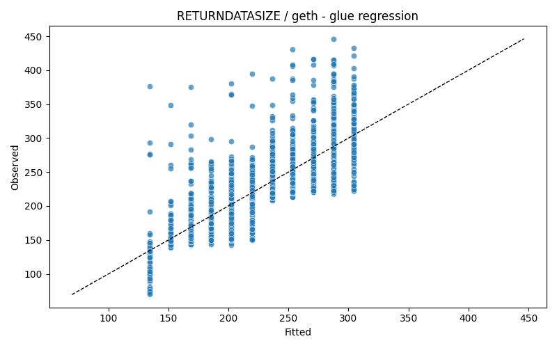

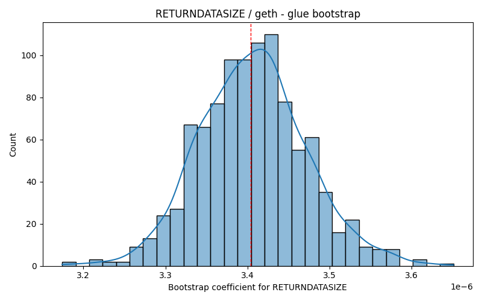

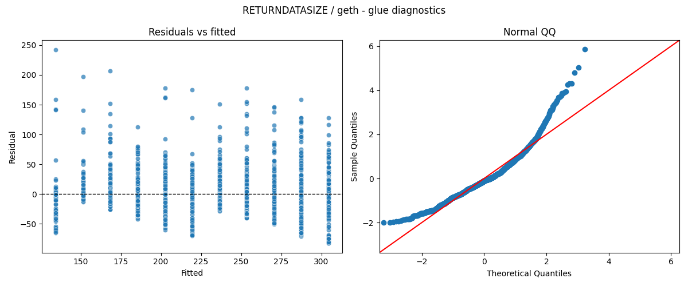

</details>

<details><summary><code>SELFBALANCE</code> · nobs=333 · runtime_ms=7.121e-06 · p=1.00e-03 · R²=0.7746</summary>

```
==============================================================================
                           NNLS Regression Results                            
==============================================================================
Dep. Variable:          test_runtime_ms              R-squared:          0.775
Model:                  NNLS                    Adj. R-squared:          0.774
No. Observations:       333                               RMSE:          38.75
Df Residuals:           331                                MAE:          32.84
Df Model:               1      
==============================================================================
                      coef     std err     P-value      [0.025      0.975]
------------------------------------------------------------------------------
         const    130.8279      6.3041       0.001    117.5200    142.6010
   SELFBALANCE      0.0000      0.0000       0.001      0.0000      0.0000
==============================================================================
Notes: Non-negative least squares with bootstrap inference (1000 iterations)
==============================================================================
```

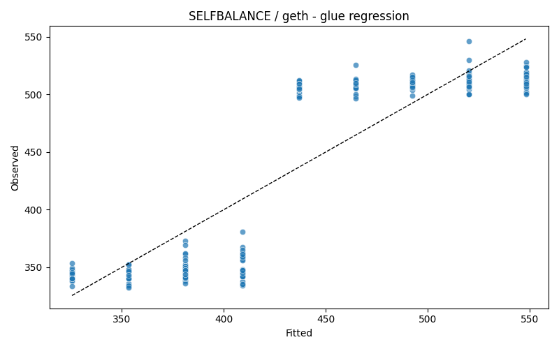

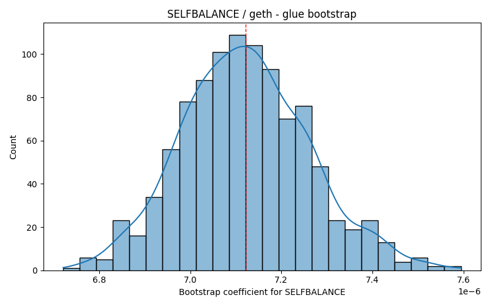

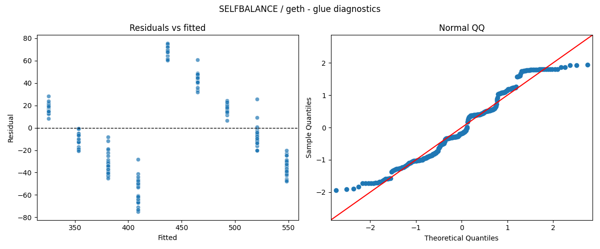

</details>

<details><summary><code>SUB</code> · nobs=407 · runtime_ms=4.341e-06 · p=1.00e-03 · R²=0.7342</summary>

```
==============================================================================
                           NNLS Regression Results                            
==============================================================================
Dep. Variable:          test_runtime_ms              R-squared:          0.734
Model:                  NNLS                    Adj. R-squared:          0.734
No. Observations:       407                               RMSE:          27.49
Df Residuals:           405                                MAE:          19.86
Df Model:               1      
==============================================================================
                      coef     std err     P-value      [0.025      0.975]
------------------------------------------------------------------------------
         const     41.9851      4.3852       0.001     33.4681     50.3176
           SUB      0.0000      0.0000       0.001      0.0000      0.0000
==============================================================================
Notes: Non-negative least squares with bootstrap inference (1000 iterations)
==============================================================================
```

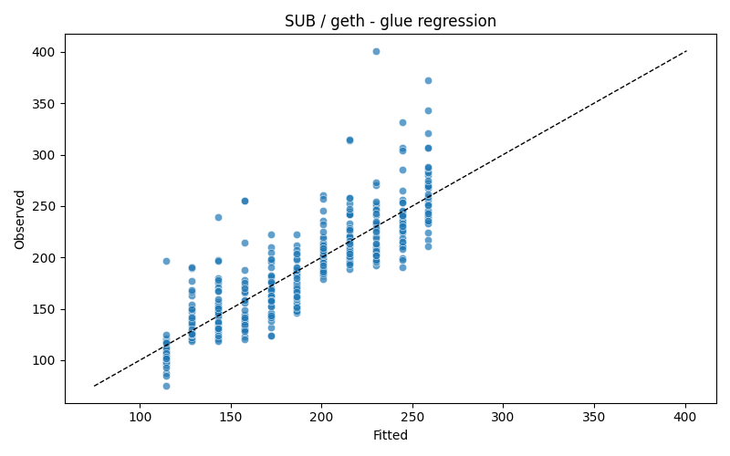

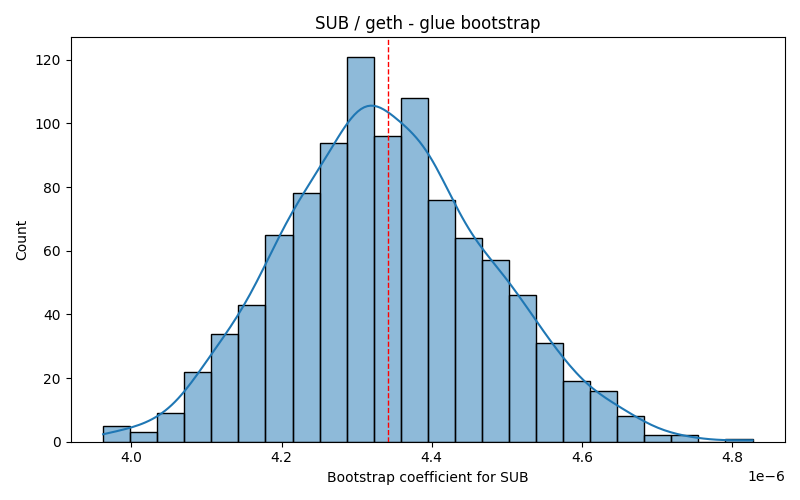

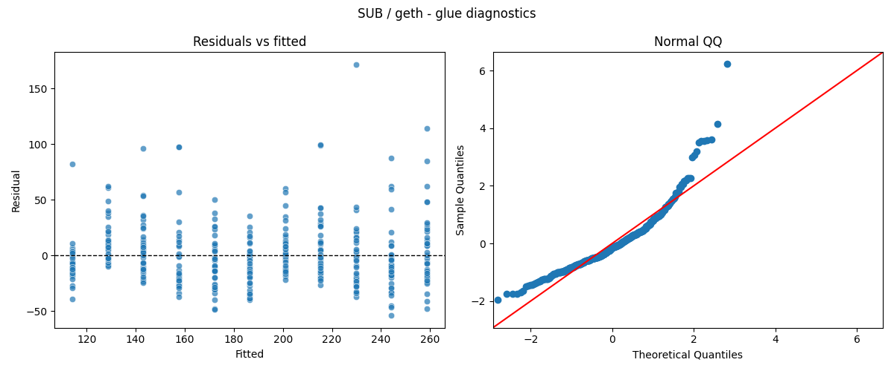

</details>

### Mixed glue (tier B) · geth

<details><summary><code>JUMP</code> · nobs=407 · runtime_ms=9.203e-06 · p=1.00e-03 · R²=0.7648</summary>

```
==============================================================================
                           NNLS Regression Results                            
==============================================================================
Dep. Variable:          test_runtime_ms              R-squared:          0.765
Model:                  NNLS                    Adj. R-squared:          0.764
No. Observations:       407                               RMSE:          18.97
Df Residuals:           405                                MAE:          14.68
Df Model:               1      
==============================================================================
                      coef     std err     P-value      [0.025      0.975]
------------------------------------------------------------------------------
         const     35.4659      3.6257       0.001     28.3149     42.4675
          JUMP      0.0000      0.0000       0.001      0.0000      0.0000
==============================================================================
Notes: Non-negative least squares with bootstrap inference (1000 iterations)
==============================================================================
```

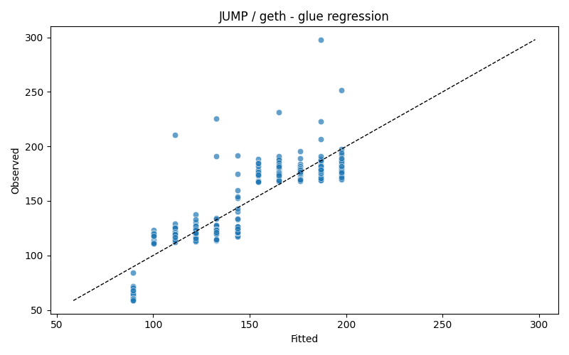

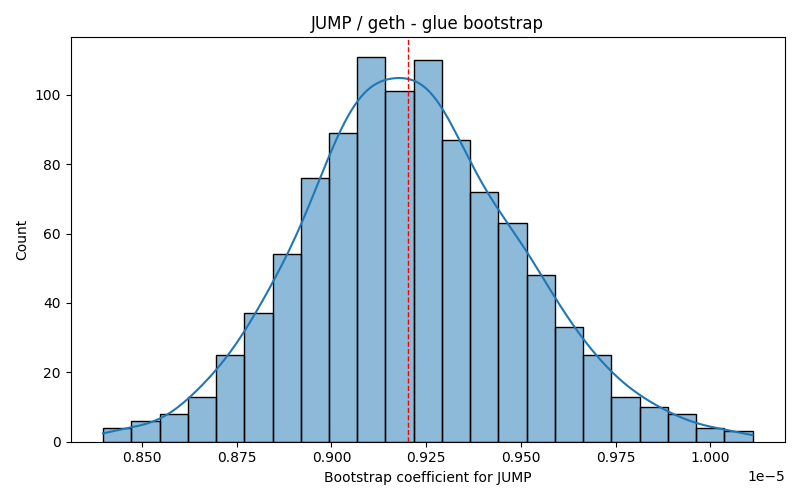

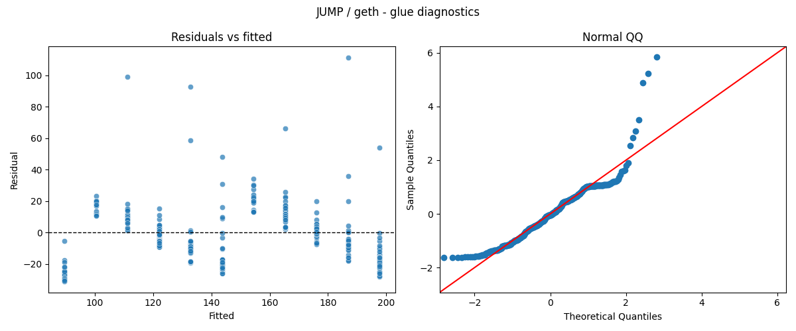

</details>

<details><summary><code>KECCAK256</code> · nobs=6512 · runtime_ms=3.797e-05 · p=1.00e-03 · R²=0.2953</summary>

```
==============================================================================
                           NNLS Regression Results                            
==============================================================================
Dep. Variable:          test_runtime_ms              R-squared:          0.295
Model:                  NNLS                    Adj. R-squared:          0.295
No. Observations:       6512                              RMSE:         116.55
Df Residuals:           6510                               MAE:          91.47
Df Model:               1      
==============================================================================
                      coef     std err     P-value      [0.025      0.975]
------------------------------------------------------------------------------
         const    371.1843      3.0685       0.001    365.3531    377.4812
     KECCAK256      0.0000      0.0000       0.001      0.0000      0.0000
==============================================================================
Notes: Non-negative least squares with bootstrap inference (1000 iterations)
==============================================================================
```

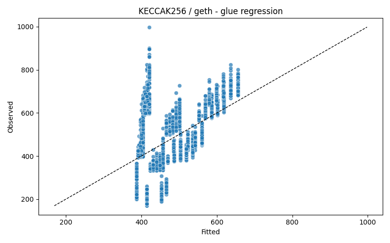

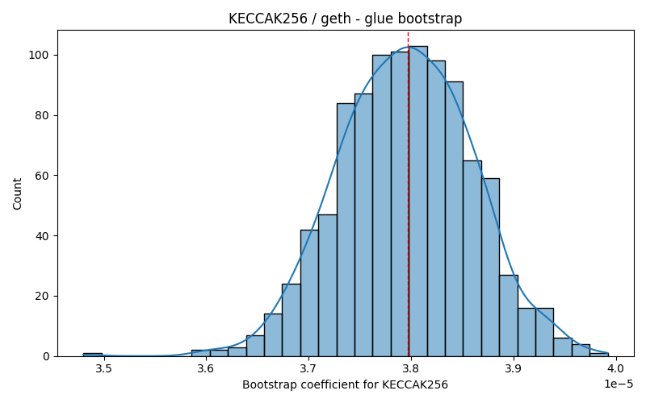

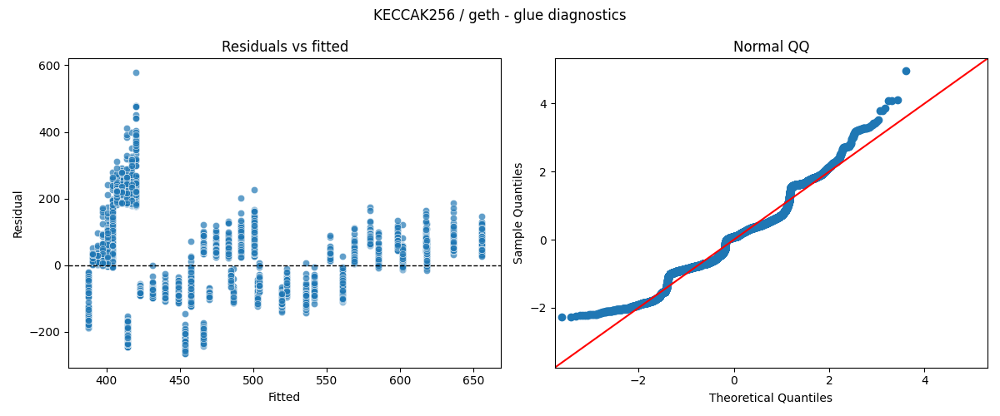

</details>

## nethermind

| glue_opcode | nobs | glue_runtime_ms | p_value | rsquared |
| --- | --- | --- | --- | --- |
| `ISZERO` | 341 | 7.029e-07 | 1.00e-03 | 0.6124 |
| `JUMPDEST` | 341 | 4.433e-07 | 1.00e-03 | 0.4517 |
| `SWAP` | 5456 | 4.416e-07 | 1.00e-03 | 0.4176 |
| `CALLDATASIZE` | 20471 | 3.343e-07 | 1.00e-03 | 0.9682 |
| `DUP` | 20471 | 1.596e-07 | 1.00e-03 | 0.9682 |
| `GAS` | 20471 | 2.091e-07 | 1.00e-03 | 0.9682 |
| `MLOAD` | 20471 | 1.26e-06 | 1.00e-03 | 0.9682 |
| `PUSH` | 20471 | 2.603e-07 | 1.00e-03 | 0.9682 |
| `PUSH0` | 20471 | 1.753e-07 | 1.00e-03 | 0.9682 |
| `STATICCALL` | 20471 | 0.0004663 | 1.00e-03 | 0.9682 |
| `ADD` | 341 | 2.212e-06 | 1.00e-03 | 0.8171 |
| `AND` | 341 | 1.121e-06 | 1.00e-03 | 0.6098 |
| `CALLDATACOPY` | 8184 | 4.356e-06 | 1.00e-03 | 0.6576 |
| `CALLDATALOAD` | 1364 | 3.958e-06 | 4.09e-01 | 7.63e-06 |
| `DIV` | 341 | 6.396e-06 | 1.00e-03 | 0.6295 |
| `EXP` | 341 | 0 | 1.00e+00 | 1.11e-16 |
| `GT` | 341 | 1.373e-06 | 1.00e-03 | 0.5444 |
| `JUMPI` | 341 | 1.404e-06 | 1.00e-03 | 0.5114 |
| `LT` | 341 | 1.247e-06 | 1.00e-03 | 0.47 |
| `MSTORE` | 1705 | 1.87e-06 | 1.00e-03 | 0.5691 |
| `MSTORE8` | 1705 | 1.889e-06 | 1.00e-03 | 0.5747 |
| `MUL` | 341 | 4.997e-06 | 1.00e-03 | 0.9514 |
| `PC` | 341 | 7.209e-07 | 1.00e-03 | 0.8416 |
| `RETURNDATASIZE` | 1364 | 7.271e-07 | 1.00e-03 | 0.2519 |
| `SELFBALANCE` | 279 | 3.98e-06 | 1.00e-03 | 0.6408 |
| `SUB` | 341 | 2.392e-06 | 1.00e-03 | 0.9004 |
| `JUMP` | 341 | 4.667e-06 | 1.00e-03 | 0.762 |
| `KECCAK256` | 5456 | 0 | 1.00e+00 | 0 |

### Cycle glue — joint fit · nethermind

<details><summary>Joint NNLS regression summary</summary>

```
==============================================================================
                           NNLS Regression Results                            
==============================================================================
Dep. Variable:          test_runtime_ms              R-squared:          0.968
Model:                  NNLS                    Adj. R-squared:          0.968
No. Observations:       20471                             RMSE:          18.24
Df Residuals:           20463                              MAE:           7.14
Df Model:               7      
==============================================================================
                      coef     std err     P-value      [0.025      0.975]
------------------------------------------------------------------------------
         const     20.9512      0.4165       0.001     20.2052     21.7921
  CALLDATASIZE      0.0000      0.0000       0.001      0.0000      0.0000
           DUP      0.0000      0.0000       0.001      0.0000      0.0000
           GAS      0.0000      0.0000       0.001      0.0000      0.0000
         MLOAD      0.0000      0.0000       0.001      0.0000      0.0000
          PUSH      0.0000      0.0000       0.001      0.0000      0.0000
         PUSH0      0.0000      0.0000       0.001      0.0000      0.0000
    STATICCALL      0.0005      0.0000       0.001      0.0005      0.0005
==============================================================================
Notes: Non-negative least squares with bootstrap inference (1000 iterations)
==============================================================================
```

</details>

<details><summary><code>CALLDATASIZE</code> · nobs=20471 · runtime_ms=3.343e-07 · p=1.00e-03 · R²=0.9682</summary>


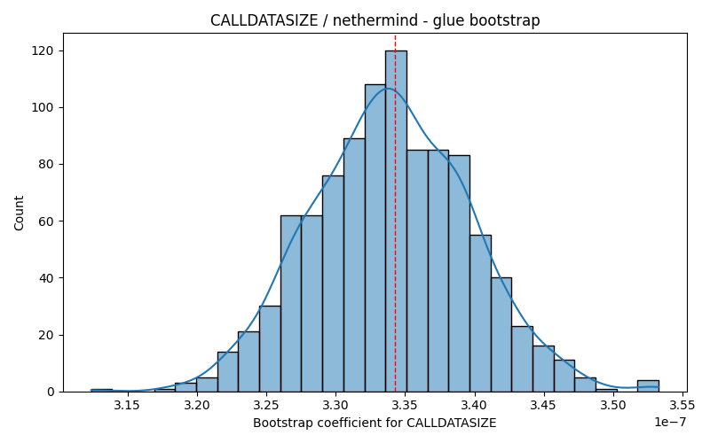

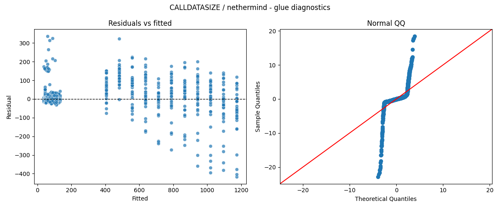

</details>

<details><summary><code>DUP</code> · nobs=20471 · runtime_ms=1.596e-07 · p=1.00e-03 · R²=0.9682</summary>


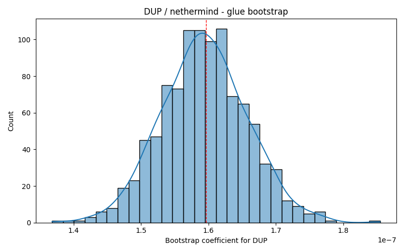


</details>

<details><summary><code>GAS</code> · nobs=20471 · runtime_ms=2.091e-07 · p=1.00e-03 · R²=0.9682</summary>


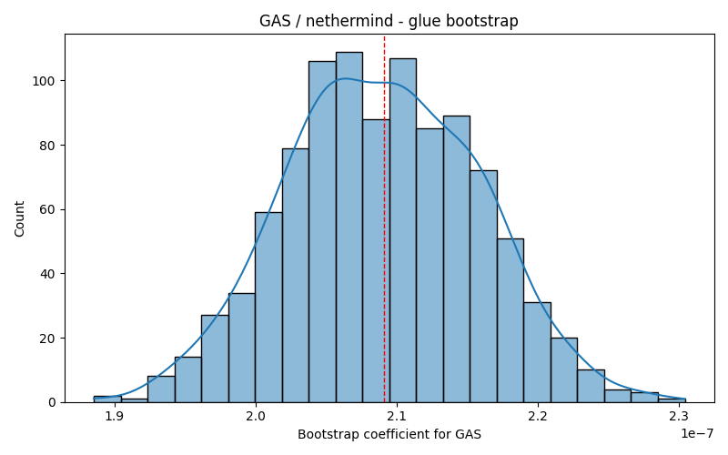


</details>

<details><summary><code>MLOAD</code> · nobs=20471 · runtime_ms=1.26e-06 · p=1.00e-03 · R²=0.9682</summary>


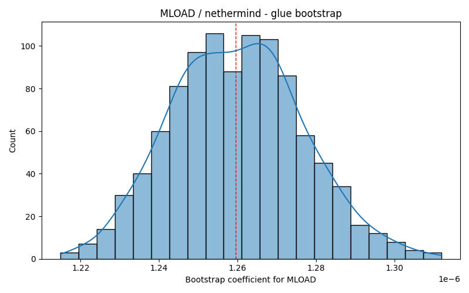


</details>

<details><summary><code>PUSH</code> · nobs=20471 · runtime_ms=2.603e-07 · p=1.00e-03 · R²=0.9682</summary>


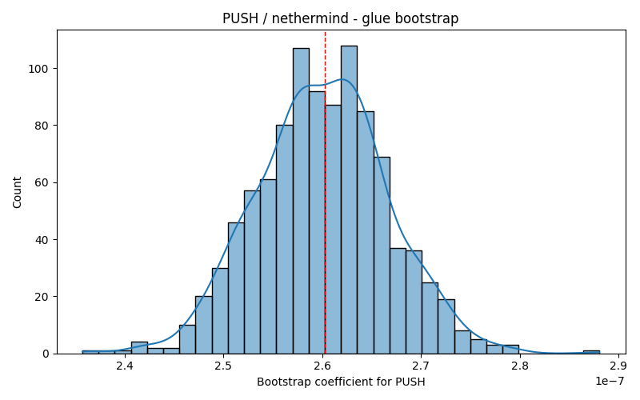

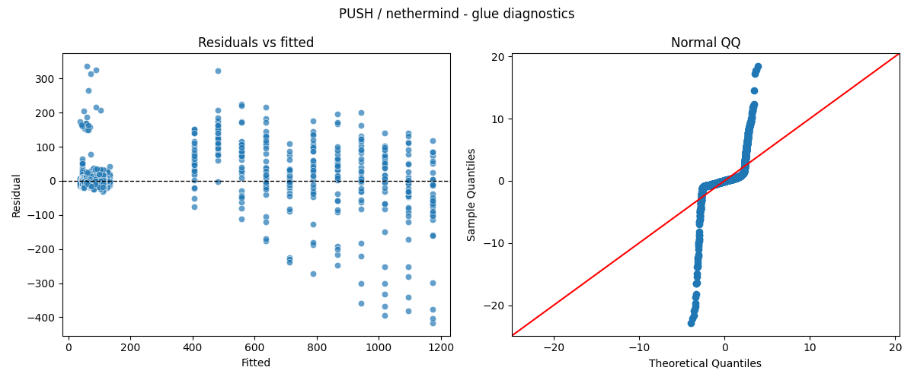

</details>

<details><summary><code>PUSH0</code> · nobs=20471 · runtime_ms=1.753e-07 · p=1.00e-03 · R²=0.9682</summary>

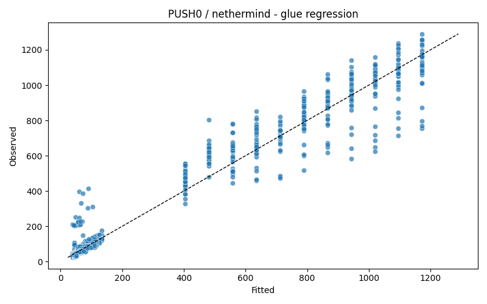

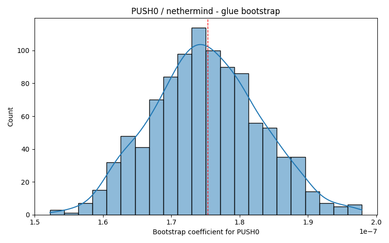


</details>

<details><summary><code>STATICCALL</code> · nobs=20471 · runtime_ms=0.0004663 · p=1.00e-03 · R²=0.9682</summary>

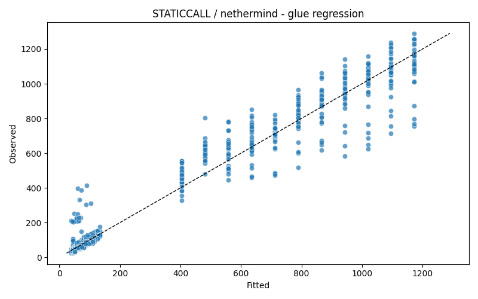

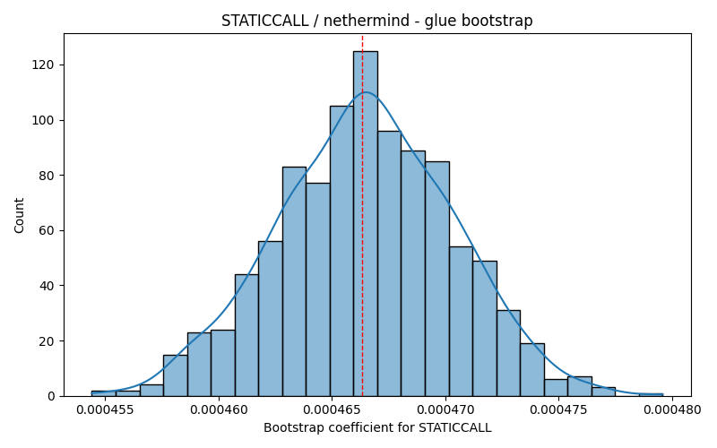


</details>

### Pure glue · nethermind

<details><summary><code>ISZERO</code> · nobs=341 · runtime_ms=7.029e-07 · p=1.00e-03 · R²=0.6124</summary>

```
==============================================================================
                           NNLS Regression Results                            
==============================================================================
Dep. Variable:          test_runtime_ms              R-squared:          0.612
Model:                  NNLS                    Adj. R-squared:          0.611
No. Observations:       341                               RMSE:          11.77
Df Residuals:           339                                MAE:           6.35
Df Model:               1      
==============================================================================
                      coef     std err     P-value      [0.025      0.975]
------------------------------------------------------------------------------
         const     20.4363      2.0721       0.001     16.9463     24.9103
        ISZERO      0.0000      0.0000       0.001      0.0000      0.0000
==============================================================================
Notes: Non-negative least squares with bootstrap inference (1000 iterations)
==============================================================================
```

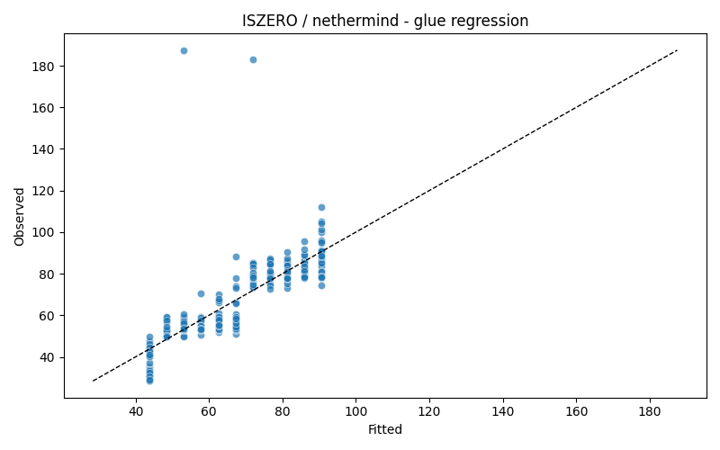

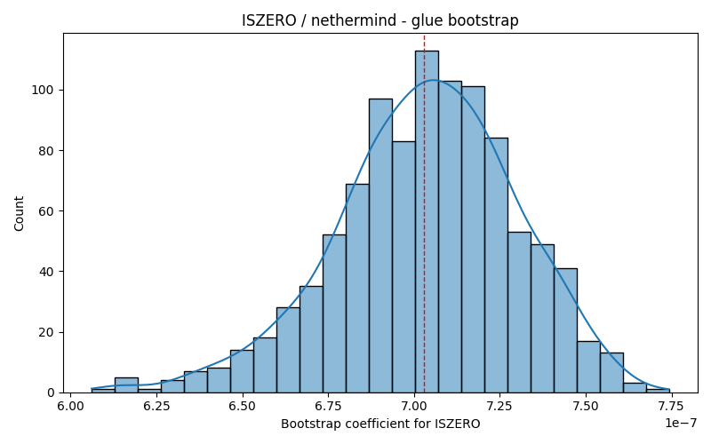

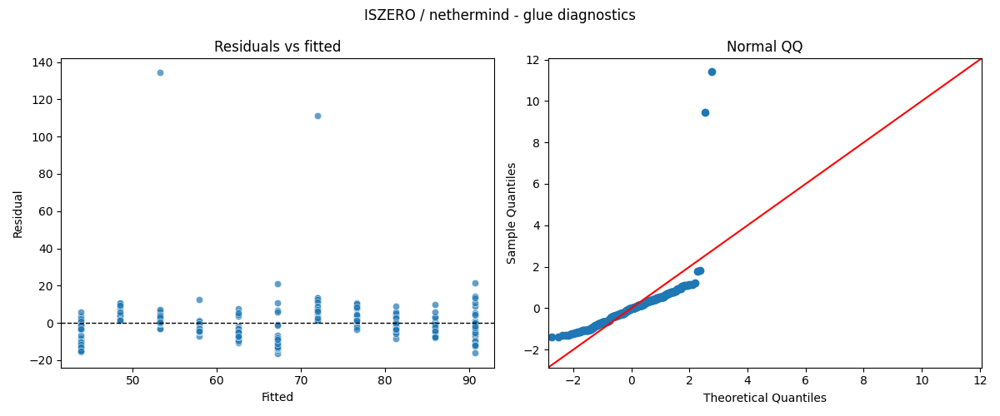

</details>

<details><summary><code>JUMPDEST</code> · nobs=341 · runtime_ms=4.433e-07 · p=1.00e-03 · R²=0.4517</summary>

```
==============================================================================
                           NNLS Regression Results                            
==============================================================================
Dep. Variable:          test_runtime_ms              R-squared:          0.452
Model:                  NNLS                    Adj. R-squared:          0.450
No. Observations:       341                               RMSE:          30.84
Df Residuals:           339                                MAE:          17.06
Df Model:               1      
==============================================================================
                      coef     std err     P-value      [0.025      0.975]
------------------------------------------------------------------------------
         const     17.5947      6.1307       0.008      3.9828     28.0241
      JUMPDEST      0.0000      0.0000       0.001      0.0000      0.0000
==============================================================================
Notes: Non-negative least squares with bootstrap inference (1000 iterations)
==============================================================================
```

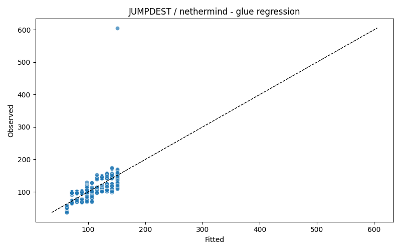

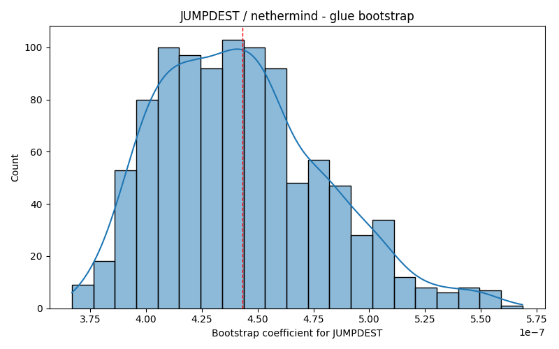

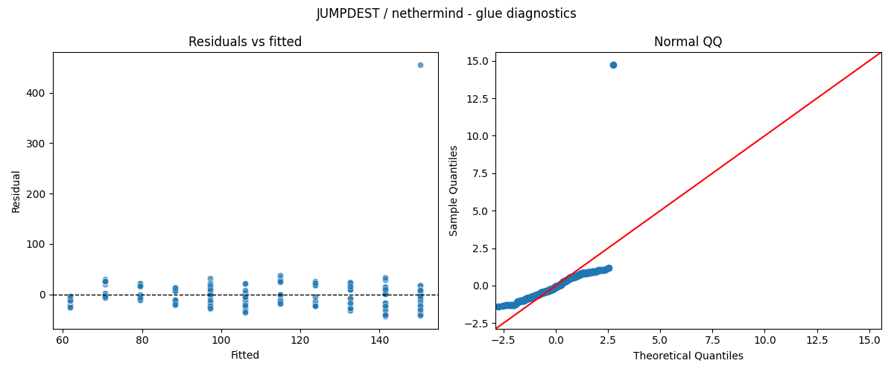

</details>

<details><summary><code>SWAP</code> · nobs=5456 · runtime_ms=4.416e-07 · p=1.00e-03 · R²=0.4176</summary>

```
==============================================================================
                           NNLS Regression Results                            
==============================================================================
Dep. Variable:          test_runtime_ms              R-squared:          0.418
Model:                  NNLS                    Adj. R-squared:          0.417
No. Observations:       5456                              RMSE:          10.98
Df Residuals:           5454                               MAE:           4.19
Df Model:               1      
==============================================================================
                      coef     std err     P-value      [0.025      0.975]
------------------------------------------------------------------------------
         const     17.9709      0.5446       0.001     17.0172     19.1878
          SWAP      0.0000      0.0000       0.001      0.0000      0.0000
==============================================================================
Notes: Non-negative least squares with bootstrap inference (1000 iterations)
==============================================================================
```

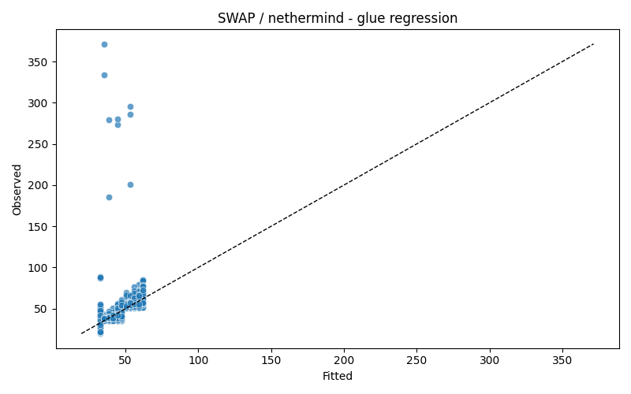

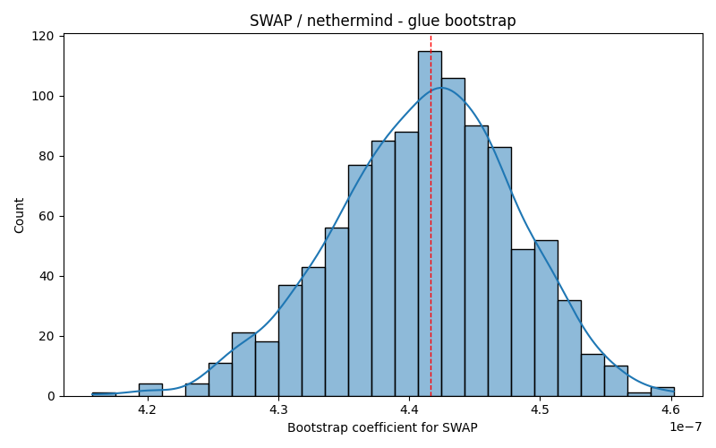

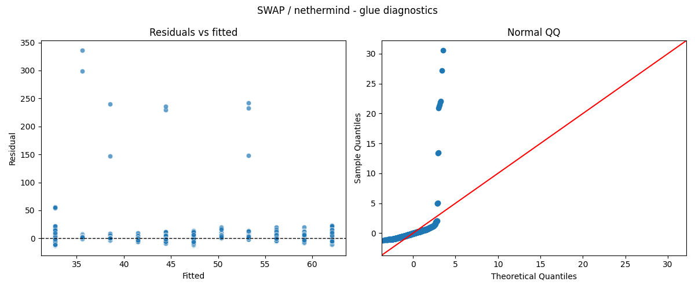

</details>

### Mixed glue (tier A) · nethermind

<details><summary><code>ADD</code> · nobs=341 · runtime_ms=2.212e-06 · p=1.00e-03 · R²=0.8171</summary>

```
==============================================================================
                           NNLS Regression Results                            
==============================================================================
Dep. Variable:          test_runtime_ms              R-squared:          0.817
Model:                  NNLS                    Adj. R-squared:          0.817
No. Observations:       341                               RMSE:          11.01
Df Residuals:           339                                MAE:           5.59
Df Model:               1      
==============================================================================
                      coef     std err     P-value      [0.025      0.975]
------------------------------------------------------------------------------
         const     12.7964      1.6679       0.001      9.2218     15.6457
           ADD      0.0000      0.0000       0.001      0.0000      0.0000
==============================================================================
Notes: Non-negative least squares with bootstrap inference (1000 iterations)
==============================================================================
```


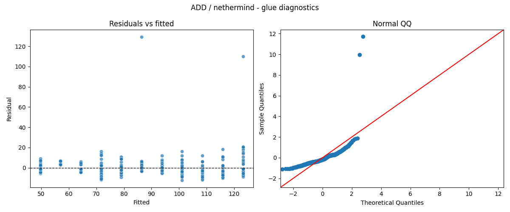

</details>

<details><summary><code>AND</code> · nobs=341 · runtime_ms=1.121e-06 · p=1.00e-03 · R²=0.6098</summary>

```
==============================================================================
                           NNLS Regression Results                            
==============================================================================
Dep. Variable:          test_runtime_ms              R-squared:          0.610
Model:                  NNLS                    Adj. R-squared:          0.609
No. Observations:       341                               RMSE:           9.44
Df Residuals:           339                                MAE:           5.30
Df Model:               1      
==============================================================================
                      coef     std err     P-value      [0.025      0.975]
------------------------------------------------------------------------------
         const     16.7272      2.0470       0.001     13.0359     21.0463
           AND      0.0000      0.0000       0.001      0.0000      0.0000
==============================================================================
Notes: Non-negative least squares with bootstrap inference (1000 iterations)
==============================================================================
```

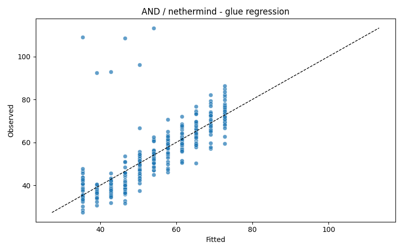

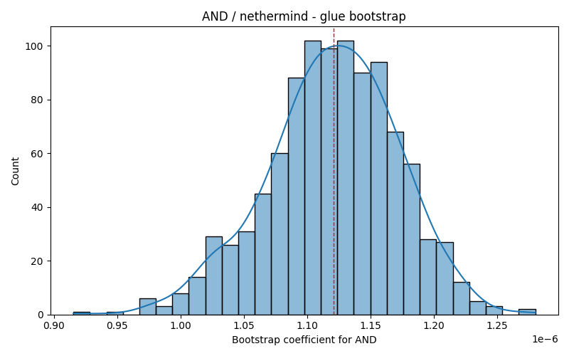

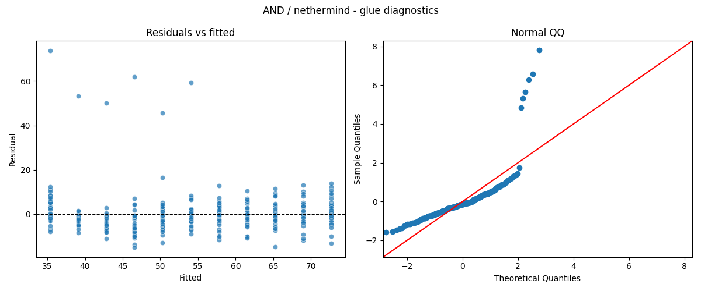

</details>

<details><summary><code>CALLDATACOPY</code> · nobs=8184 · runtime_ms=4.356e-06 · p=1.00e-03 · R²=0.6576</summary>

```
==============================================================================
                           NNLS Regression Results                            
==============================================================================
Dep. Variable:          test_runtime_ms              R-squared:          0.658
Model:                  NNLS                    Adj. R-squared:          0.658
No. Observations:       8184                              RMSE:          23.64
Df Residuals:           8182                               MAE:          18.86
Df Model:               1      
==============================================================================
                      coef     std err     P-value      [0.025      0.975]
------------------------------------------------------------------------------
         const     26.7780      0.3006       0.001     26.1845     27.3429
  CALLDATACOPY      0.0000      0.0000       0.001      0.0000      0.0000
==============================================================================
Notes: Non-negative least squares with bootstrap inference (1000 iterations)
==============================================================================
```

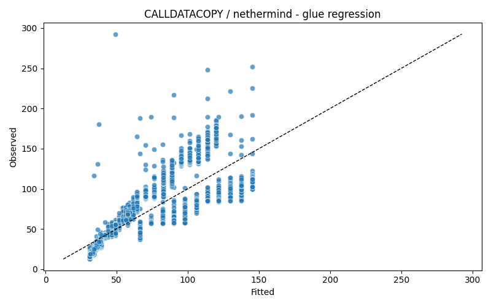

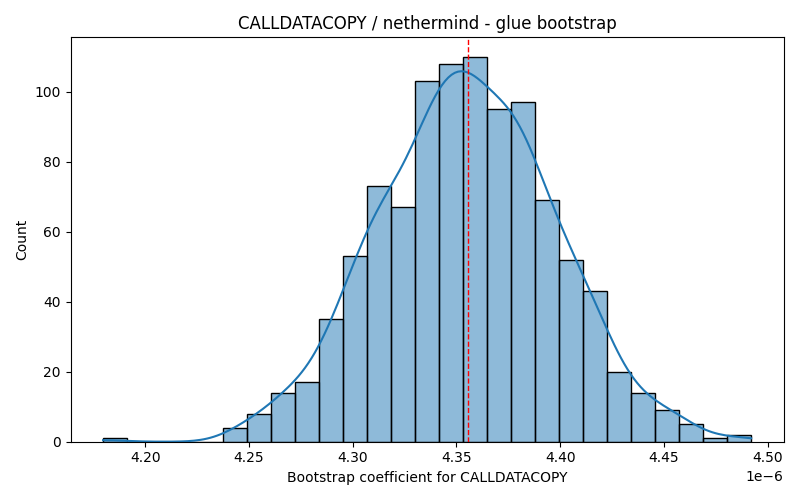

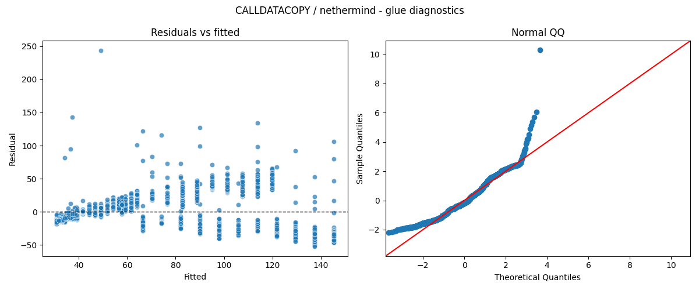

</details>

<details><summary><code>CALLDATALOAD</code> · nobs=1364 · runtime_ms=3.958e-06 · p=4.09e-01 · R²=7.63e-06</summary>

```
==============================================================================
                           NNLS Regression Results                            
==============================================================================
Dep. Variable:          test_runtime_ms              R-squared:          0.000
Model:                  NNLS                    Adj. R-squared:         -0.001
No. Observations:       1364                              RMSE:           5.50
Df Residuals:           1362                               MAE:           0.72
Df Model:               1      
==============================================================================
                      coef     std err     P-value      [0.025      0.975]
------------------------------------------------------------------------------
         const      3.3318      0.4398       0.001      2.1149      3.6769
  CALLDATALOAD      0.0000      0.0000       0.409      0.0000      0.0001
==============================================================================
Notes: Non-negative least squares with bootstrap inference (1000 iterations)
==============================================================================
```

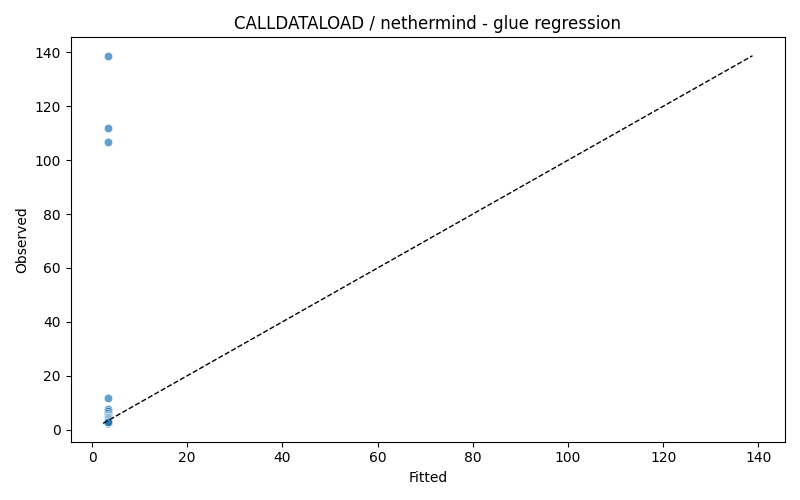

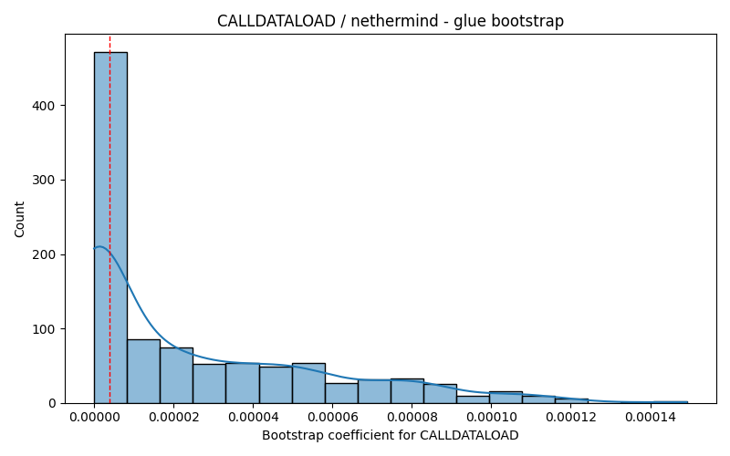

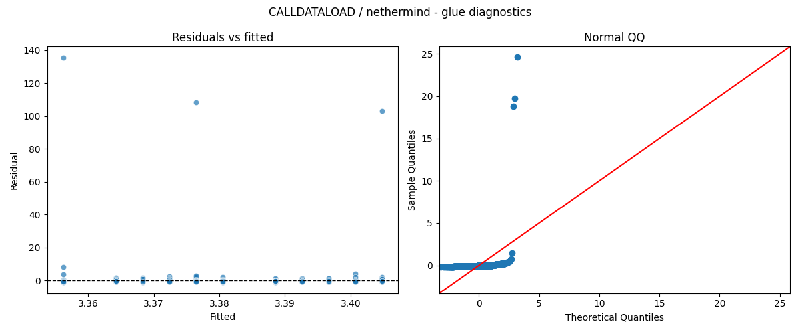

</details>

<details><summary><code>DIV</code> · nobs=341 · runtime_ms=6.396e-06 · p=1.00e-03 · R²=0.6295</summary>

```
==============================================================================
                           NNLS Regression Results                            
==============================================================================
Dep. Variable:          test_runtime_ms              R-squared:          0.630
Model:                  NNLS                    Adj. R-squared:          0.628
No. Observations:       341                               RMSE:          38.74
Df Residuals:           339                                MAE:          29.05
Df Model:               1      
==============================================================================
                      coef     std err     P-value      [0.025      0.975]
------------------------------------------------------------------------------
         const    128.1768      9.8959       0.001    108.9011    146.4162
           DIV      0.0000      0.0000       0.001      0.0000      0.0000
==============================================================================
Notes: Non-negative least squares with bootstrap inference (1000 iterations)
==============================================================================
```

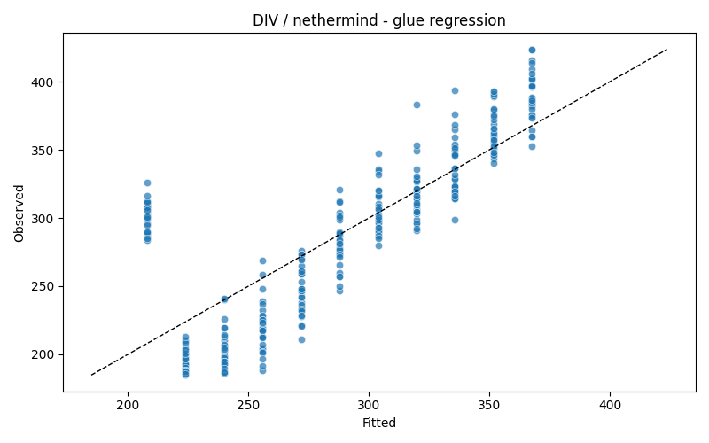

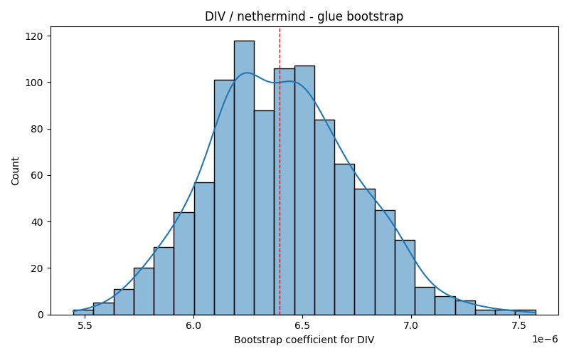

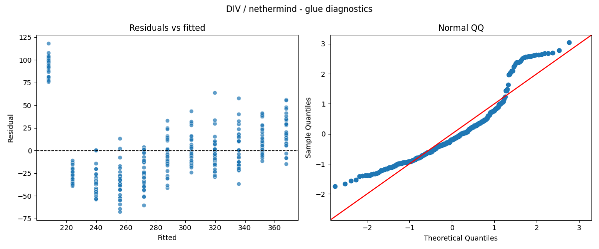

</details>

<details><summary><code>EXP</code> · nobs=341 · runtime_ms=0 · p=1.00e+00 · R²=1.11e-16</summary>

```
==============================================================================
                           NNLS Regression Results                            
==============================================================================
Dep. Variable:          test_runtime_ms              R-squared:          0.000
Model:                  NNLS                    Adj. R-squared:         -0.003
No. Observations:       341                               RMSE:          46.39
Df Residuals:           339                                MAE:          30.21
Df Model:               1      
==============================================================================
                      coef     std err     P-value      [0.025      0.975]
------------------------------------------------------------------------------
         const     98.1068      3.3553       0.001     88.9530    103.2332
           EXP      0.0000      0.0000       1.000      0.0000      0.0000
==============================================================================
Notes: Non-negative least squares with bootstrap inference (1000 iterations)
==============================================================================
```

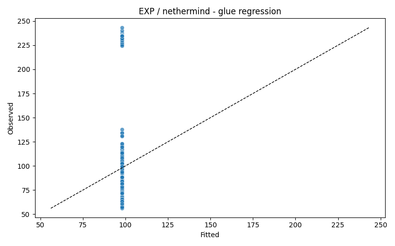


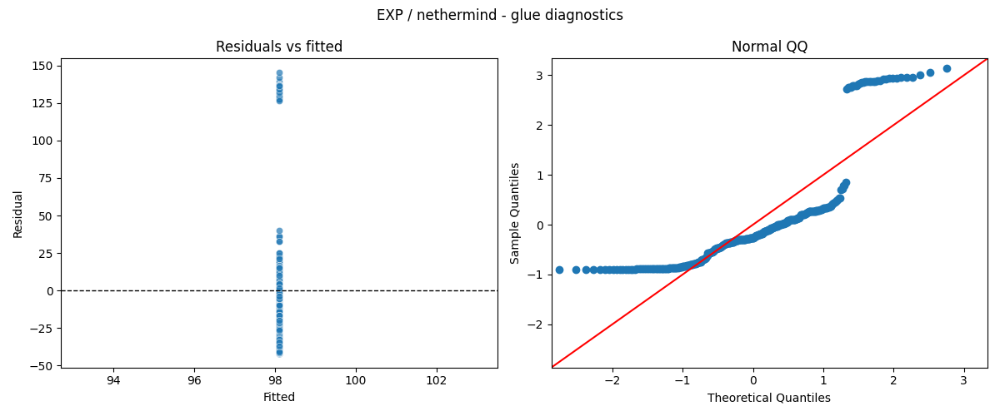

</details>

<details><summary><code>GT</code> · nobs=341 · runtime_ms=1.373e-06 · p=1.00e-03 · R²=0.5444</summary>

```
==============================================================================
                           NNLS Regression Results                            
==============================================================================
Dep. Variable:          test_runtime_ms              R-squared:          0.544
Model:                  NNLS                    Adj. R-squared:          0.543
No. Observations:       341                               RMSE:          13.22
Df Residuals:           339                                MAE:           5.98
Df Model:               1      
==============================================================================
                      coef     std err     P-value      [0.025      0.975]
------------------------------------------------------------------------------
         const     14.4920      1.7319       0.001     10.8640     17.4659
            GT      0.0000      0.0000       0.001      0.0000      0.0000
==============================================================================
Notes: Non-negative least squares with bootstrap inference (1000 iterations)
==============================================================================
```

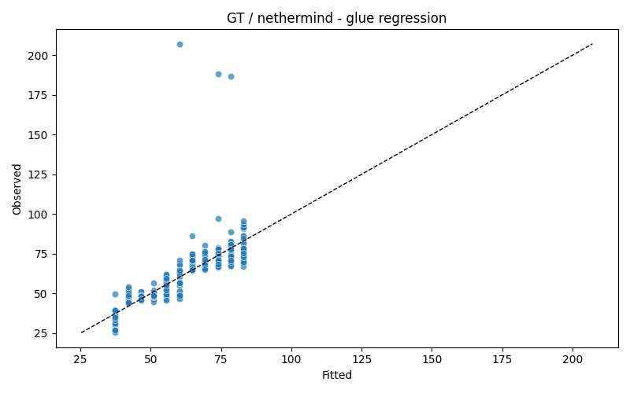

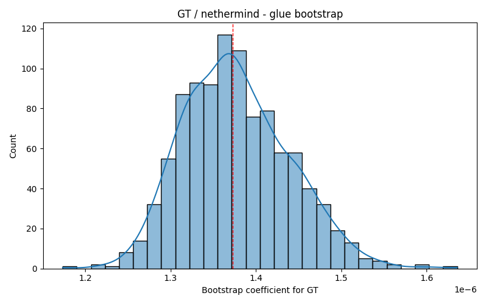

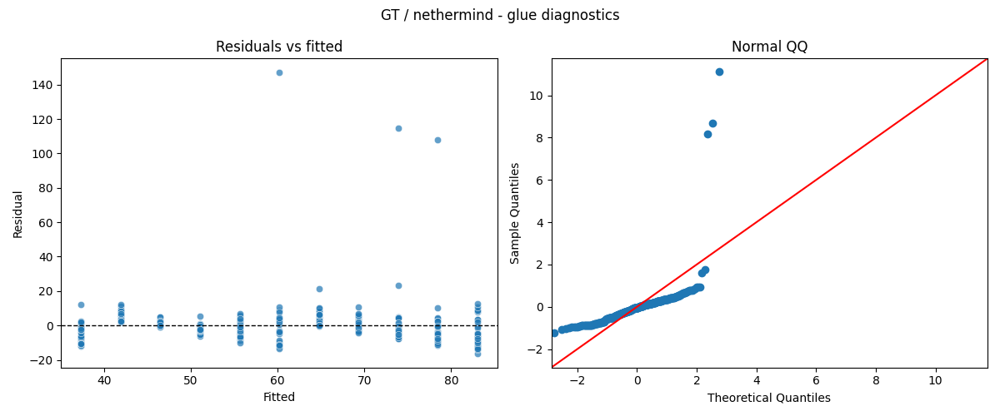

</details>

<details><summary><code>JUMPI</code> · nobs=341 · runtime_ms=1.404e-06 · p=1.00e-03 · R²=0.5114</summary>

```
==============================================================================
                           NNLS Regression Results                            
==============================================================================
Dep. Variable:          test_runtime_ms              R-squared:          0.511
Model:                  NNLS                    Adj. R-squared:          0.510
No. Observations:       341                               RMSE:           6.19
Df Residuals:           339                                MAE:           2.86
Df Model:               1      
==============================================================================
                      coef     std err     P-value      [0.025      0.975]
------------------------------------------------------------------------------
         const     11.2705      1.9405       0.001      8.4522     15.7991
         JUMPI      0.0000      0.0000       0.001      0.0000      0.0000
==============================================================================
Notes: Non-negative least squares with bootstrap inference (1000 iterations)
==============================================================================
```

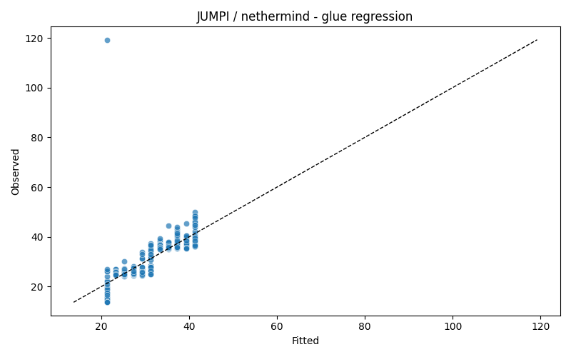

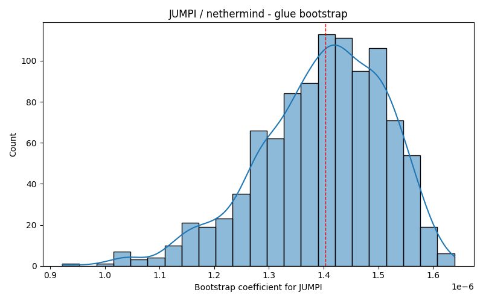

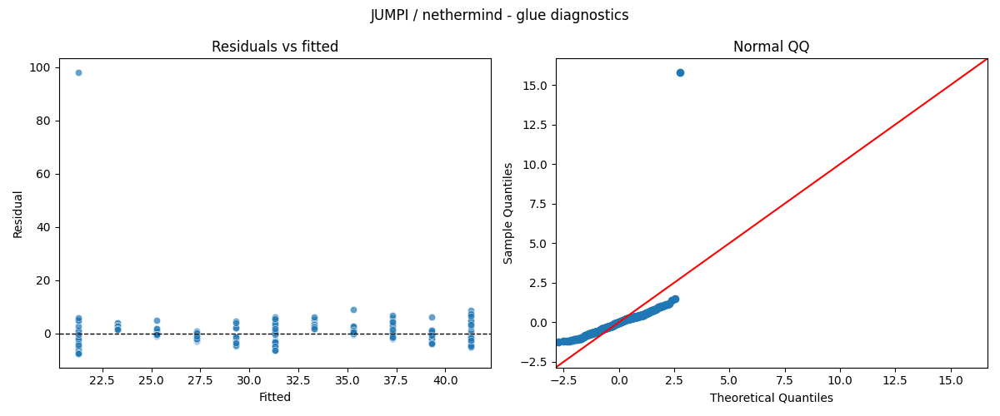

</details>

<details><summary><code>LT</code> · nobs=341 · runtime_ms=1.247e-06 · p=1.00e-03 · R²=0.47</summary>

```
==============================================================================
                           NNLS Regression Results                            
==============================================================================
Dep. Variable:          test_runtime_ms              R-squared:          0.470
Model:                  NNLS                    Adj. R-squared:          0.468
No. Observations:       341                               RMSE:          13.94
Df Residuals:           339                                MAE:           7.06
Df Model:               1      
==============================================================================
                      coef     std err     P-value      [0.025      0.975]
------------------------------------------------------------------------------
         const     20.9129      2.3753       0.001     16.8072     26.0613
            LT      0.0000      0.0000       0.001      0.0000      0.0000
==============================================================================
Notes: Non-negative least squares with bootstrap inference (1000 iterations)
==============================================================================
```

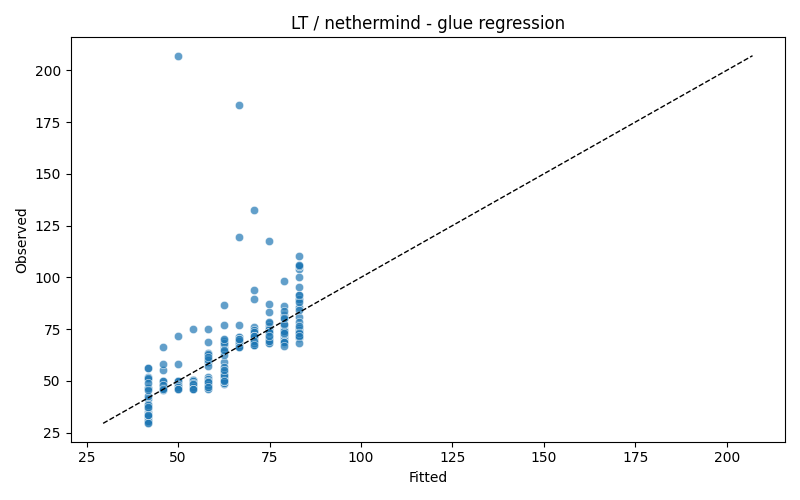

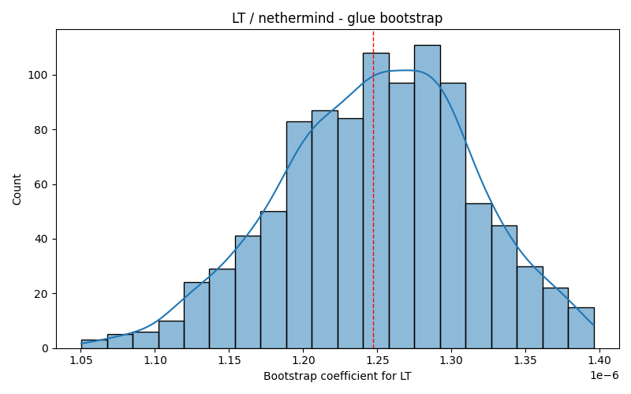

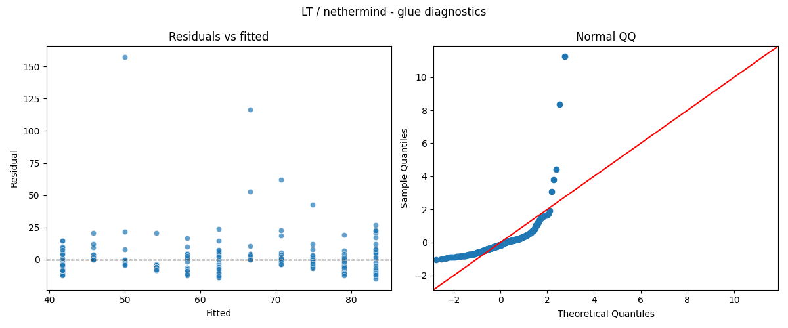

</details>

<details><summary><code>MSTORE</code> · nobs=1705 · runtime_ms=1.87e-06 · p=1.00e-03 · R²=0.5691</summary>

```
==============================================================================
                           NNLS Regression Results                            
==============================================================================
Dep. Variable:          test_runtime_ms              R-squared:          0.569
Model:                  NNLS                    Adj. R-squared:          0.569
No. Observations:       1705                              RMSE:          11.42
Df Residuals:           1703                               MAE:           5.51
Df Model:               1      
==============================================================================
                      coef     std err     P-value      [0.025      0.975]
------------------------------------------------------------------------------
         const     16.6921      0.8015       0.001     15.1209     18.2457
        MSTORE      0.0000      0.0000       0.001      0.0000      0.0000
==============================================================================
Notes: Non-negative least squares with bootstrap inference (1000 iterations)
==============================================================================
```

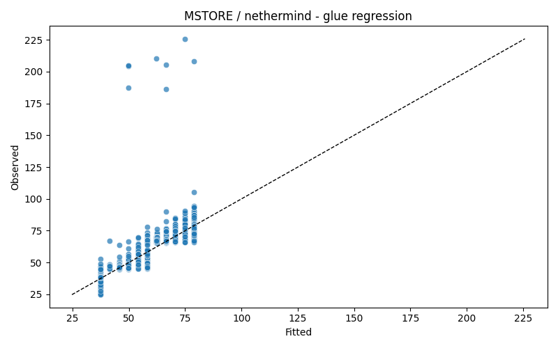

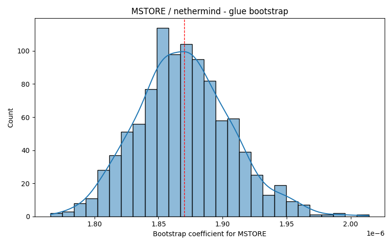

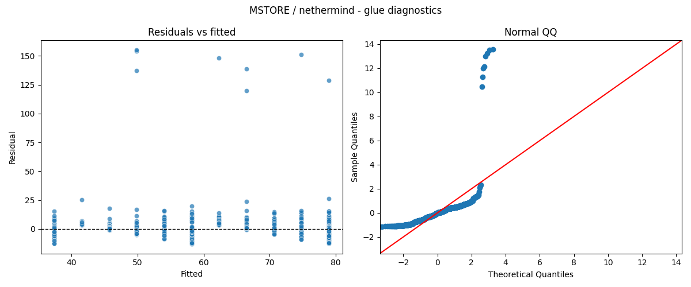

</details>

<details><summary><code>MSTORE8</code> · nobs=1705 · runtime_ms=1.889e-06 · p=1.00e-03 · R²=0.5747</summary>

```
==============================================================================
                           NNLS Regression Results                            
==============================================================================
Dep. Variable:          test_runtime_ms              R-squared:          0.575
Model:                  NNLS                    Adj. R-squared:          0.574
No. Observations:       1705                              RMSE:          11.40
Df Residuals:           1703                               MAE:           5.94
Df Model:               1      
==============================================================================
                      coef     std err     P-value      [0.025      0.975]
------------------------------------------------------------------------------
         const     15.7301      0.8533       0.001     13.9889     17.4366
       MSTORE8      0.0000      0.0000       0.001      0.0000      0.0000
==============================================================================
Notes: Non-negative least squares with bootstrap inference (1000 iterations)
==============================================================================
```

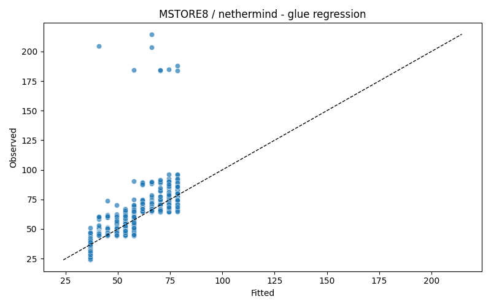

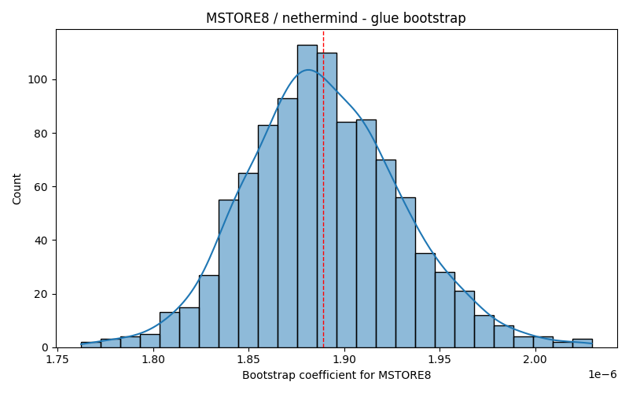

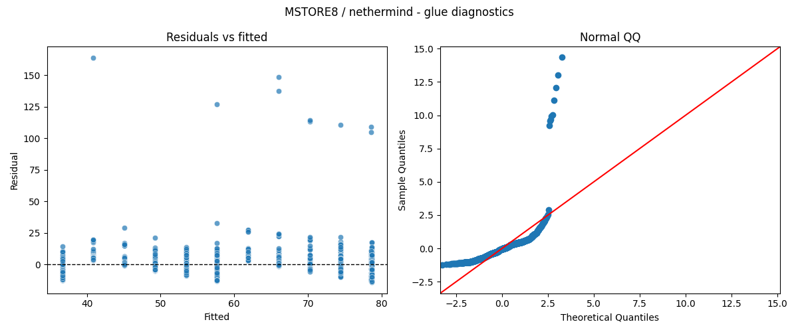

</details>

<details><summary><code>MUL</code> · nobs=341 · runtime_ms=4.997e-06 · p=1.00e-03 · R²=0.9514</summary>

```
==============================================================================
                           NNLS Regression Results                            
==============================================================================
Dep. Variable:          test_runtime_ms              R-squared:          0.951
Model:                  NNLS                    Adj. R-squared:          0.951
No. Observations:       341                               RMSE:           8.91
Df Residuals:           339                                MAE:           6.86
Df Model:               1      
==============================================================================
                      coef     std err     P-value      [0.025      0.975]
------------------------------------------------------------------------------
         const     23.3982      1.4403       0.001     20.6256     26.1177
           MUL      0.0000      0.0000       0.001      0.0000      0.0000
==============================================================================
Notes: Non-negative least squares with bootstrap inference (1000 iterations)
==============================================================================
```

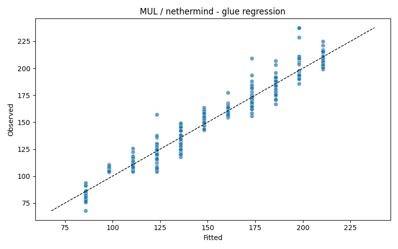

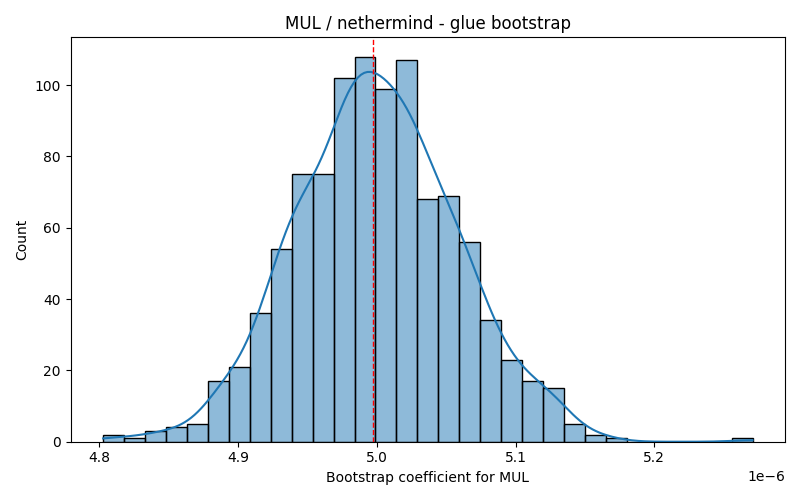

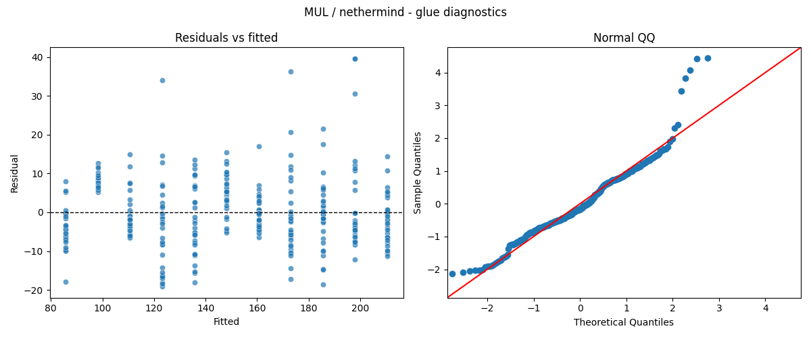

</details>

<details><summary><code>PC</code> · nobs=341 · runtime_ms=7.209e-07 · p=1.00e-03 · R²=0.8416</summary>

```
==============================================================================
                           NNLS Regression Results                            
==============================================================================
Dep. Variable:          test_runtime_ms              R-squared:          0.842
Model:                  NNLS                    Adj. R-squared:          0.841
No. Observations:       341                               RMSE:           9.35
Df Residuals:           339                                MAE:           7.70
Df Model:               1      
==============================================================================
                      coef     std err     P-value      [0.025      0.975]
------------------------------------------------------------------------------
         const     18.7831      1.8853       0.001     15.1608     22.4462
            PC      0.0000      0.0000       0.001      0.0000      0.0000
==============================================================================
Notes: Non-negative least squares with bootstrap inference (1000 iterations)
==============================================================================
```

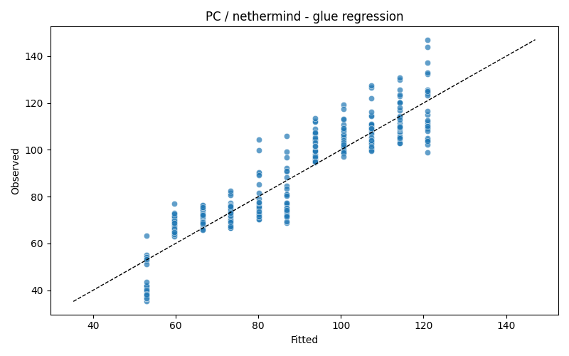

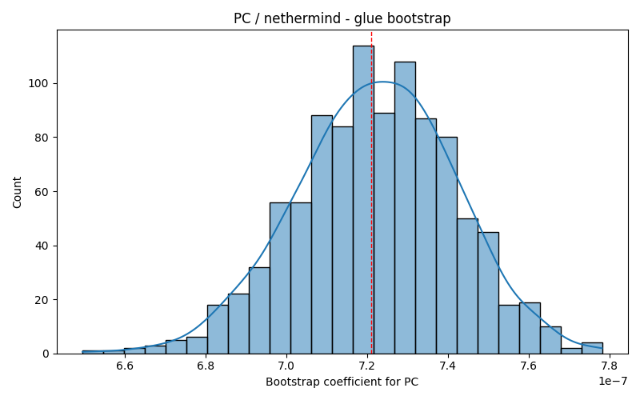

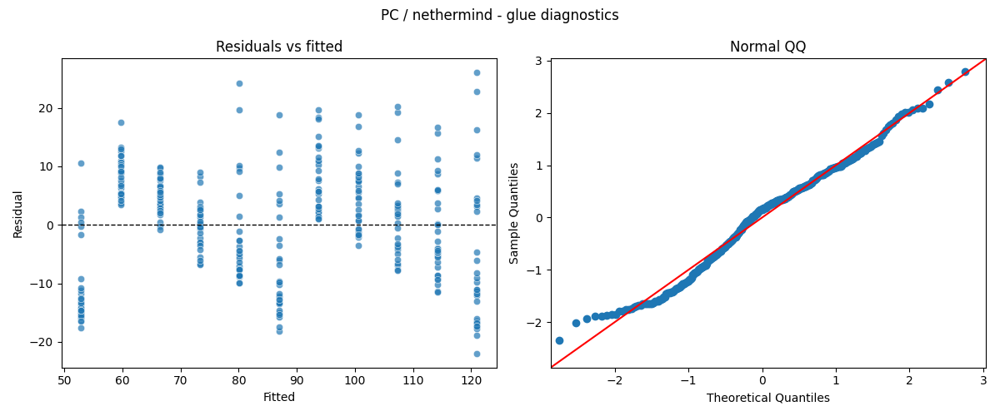

</details>

<details><summary><code>RETURNDATASIZE</code> · nobs=1364 · runtime_ms=7.271e-07 · p=1.00e-03 · R²=0.2519</summary>

```
==============================================================================
                           NNLS Regression Results                            
==============================================================================
Dep. Variable:          test_runtime_ms              R-squared:          0.252
Model:                  NNLS                    Adj. R-squared:          0.251
No. Observations:       1364                              RMSE:          19.78
Df Residuals:           1362                               MAE:           5.55
Df Model:               1      
==============================================================================
                      coef     std err     P-value      [0.025      0.975]
------------------------------------------------------------------------------
         const     13.5323      1.5905       0.001     10.5407     16.7307
RETURNDATASIZE      0.0000      0.0000       0.001      0.0000      0.0000
==============================================================================
Notes: Non-negative least squares with bootstrap inference (1000 iterations)
==============================================================================
```

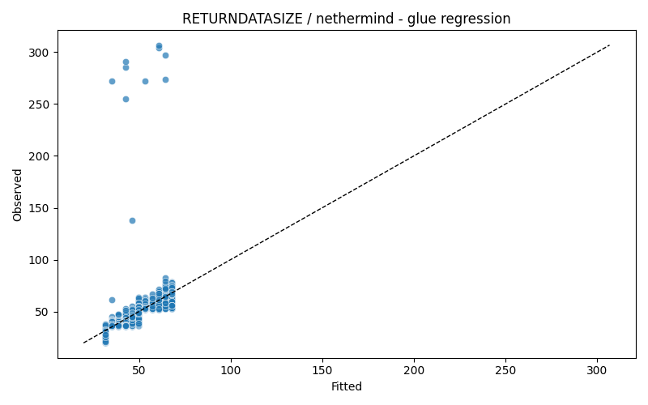

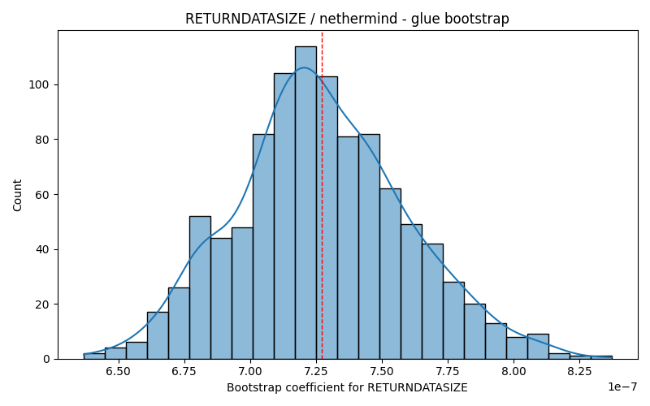

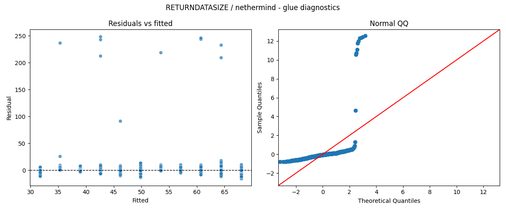

</details>

<details><summary><code>SELFBALANCE</code> · nobs=279 · runtime_ms=3.98e-06 · p=1.00e-03 · R²=0.6408</summary>

```
==============================================================================
                           NNLS Regression Results                            
==============================================================================
Dep. Variable:          test_runtime_ms              R-squared:          0.641
Model:                  NNLS                    Adj. R-squared:          0.639
No. Observations:       279                               RMSE:          30.06
Df Residuals:           277                                MAE:          22.83
Df Model:               1      
==============================================================================
                      coef     std err     P-value      [0.025      0.975]
------------------------------------------------------------------------------
         const    104.8920     11.2546       0.001     82.0155    125.2601
   SELFBALANCE      0.0000      0.0000       0.001      0.0000      0.0000
==============================================================================
Notes: Non-negative least squares with bootstrap inference (1000 iterations)
==============================================================================
```

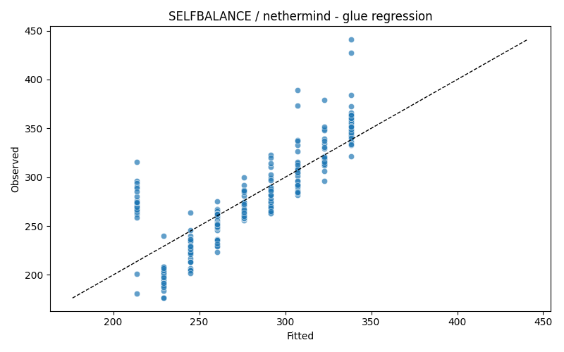

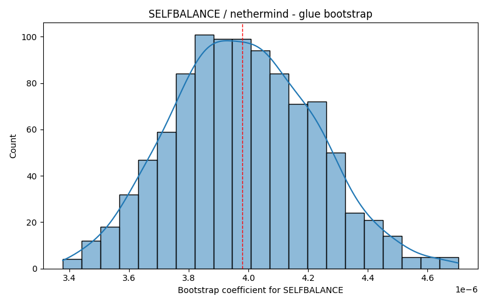

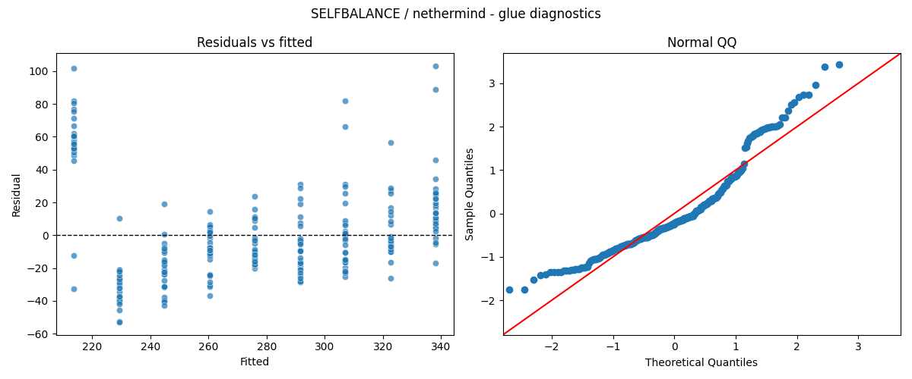

</details>

<details><summary><code>SUB</code> · nobs=341 · runtime_ms=2.392e-06 · p=1.00e-03 · R²=0.9004</summary>

```
==============================================================================
                           NNLS Regression Results                            
==============================================================================
Dep. Variable:          test_runtime_ms              R-squared:          0.900
Model:                  NNLS                    Adj. R-squared:          0.900
No. Observations:       341                               RMSE:           8.37
Df Residuals:           339                                MAE:           5.24
Df Model:               1      
==============================================================================
                      coef     std err     P-value      [0.025      0.975]
------------------------------------------------------------------------------
         const     15.0715      1.0455       0.001     12.9583     17.1358
           SUB      0.0000      0.0000       0.001      0.0000      0.0000
==============================================================================
Notes: Non-negative least squares with bootstrap inference (1000 iterations)
==============================================================================
```

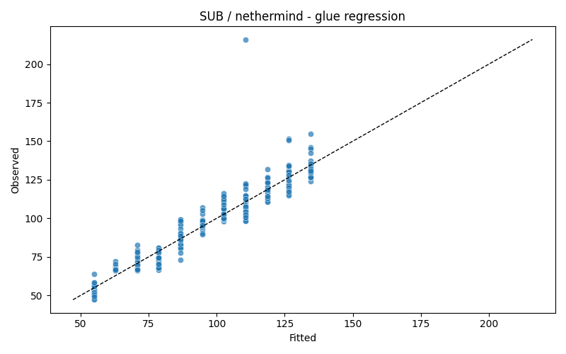


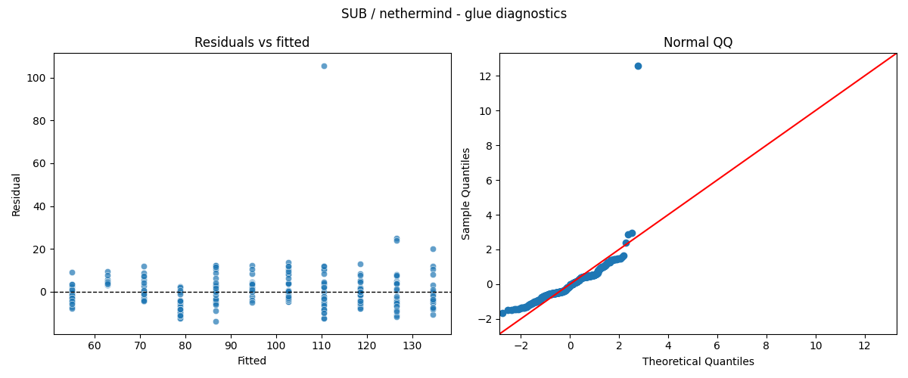

</details>

### Mixed glue (tier B) · nethermind

<details><summary><code>JUMP</code> · nobs=341 · runtime_ms=4.667e-06 · p=1.00e-03 · R²=0.762</summary>

```
==============================================================================
                           NNLS Regression Results                            
==============================================================================
Dep. Variable:          test_runtime_ms              R-squared:          0.762
Model:                  NNLS                    Adj. R-squared:          0.761
No. Observations:       341                               RMSE:           9.69
Df Residuals:           339                                MAE:           7.31
Df Model:               1      
==============================================================================
                      coef     std err     P-value      [0.025      0.975]
------------------------------------------------------------------------------
         const     21.1366      1.9245       0.001     17.1247     24.8478
          JUMP      0.0000      0.0000       0.001      0.0000      0.0000
==============================================================================
Notes: Non-negative least squares with bootstrap inference (1000 iterations)
==============================================================================
```

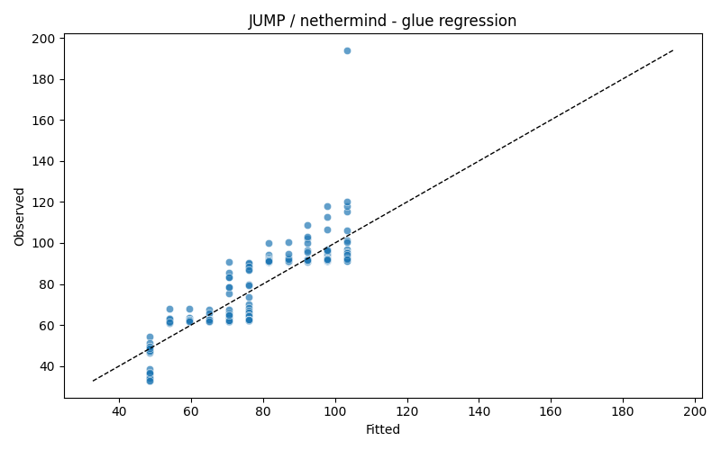

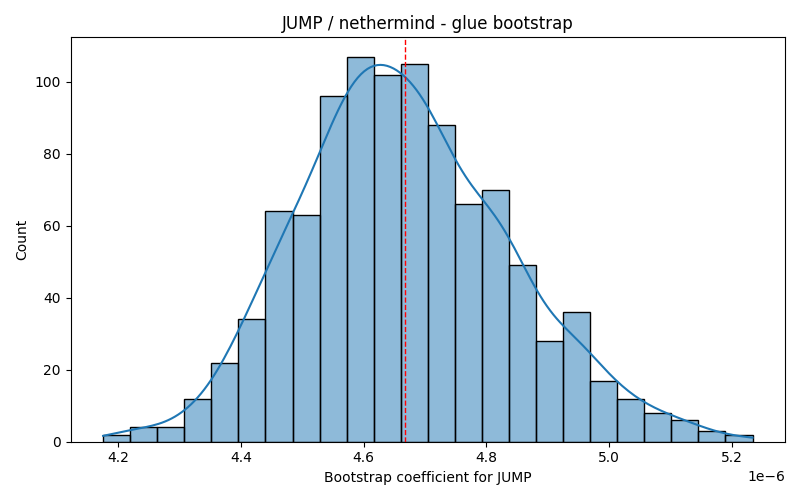


</details>

<details><summary><code>KECCAK256</code> · nobs=5456 · runtime_ms=0 · p=1.00e+00 · R²=0</summary>

```
==============================================================================
                           NNLS Regression Results                            
==============================================================================
Dep. Variable:          test_runtime_ms              R-squared:          0.000
Model:                  NNLS                    Adj. R-squared:         -0.000
No. Observations:       5456                              RMSE:         273.56
Df Residuals:           5454                               MAE:         227.42
Df Model:               1      
==============================================================================
                      coef     std err     P-value      [0.025      0.975]
------------------------------------------------------------------------------
         const    425.9938      3.7294       0.001    419.2520    433.0985
     KECCAK256      0.0000      0.0000       1.000      0.0000      0.0000
==============================================================================
Notes: Non-negative least squares with bootstrap inference (1000 iterations)
==============================================================================
```

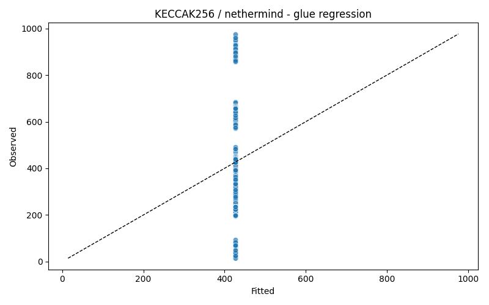


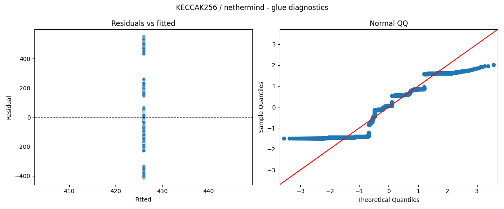

</details>

## reth

| glue_opcode | nobs | glue_runtime_ms | p_value | rsquared |
| --- | --- | --- | --- | --- |
| `ISZERO` | 352 | 3.598e-07 | 1.00e-03 | 0.7849 |
| `JUMPDEST` | 352 | 3.042e-07 | 1.00e-03 | 0.7396 |
| `SWAP` | 5632 | 4.616e-07 | 1.00e-03 | 0.7064 |
| `CALLDATASIZE` | 21142 | 4.851e-07 | 1.00e-03 | 0.8256 |
| `DUP` | 21142 | 4.034e-07 | 1.00e-03 | 0.8256 |
| `GAS` | 21142 | 4.472e-07 | 1.00e-03 | 0.8256 |
| `MLOAD` | 21142 | 1.63e-06 | 1.00e-03 | 0.8256 |
| `PUSH` | 21142 | 4.357e-07 | 1.00e-03 | 0.8256 |
| `PUSH0` | 21142 | 3.353e-07 | 1.00e-03 | 0.8256 |
| `STATICCALL` | 21142 | 5.383e-05 | 1.00e-03 | 0.8256 |
| `ADD` | 352 | 8.796e-07 | 1.00e-03 | 0.8361 |
| `AND` | 352 | 8.776e-07 | 1.00e-03 | 0.8249 |
| `CALLDATACOPY` | 8448 | 2.239e-06 | 1.00e-03 | 0.7789 |
| `CALLDATALOAD` | 1408 | 2.437e-05 | 1.00e-03 | 0.1057 |
| `DIV` | 352 | 7.075e-06 | 1.00e-03 | 0.8438 |
| `EXP` | 352 | 0.0003809 | 1.00e-03 | 0.8188 |
| `GT` | 352 | 9.597e-07 | 1.00e-03 | 0.8155 |
| `JUMPI` | 352 | 1.264e-06 | 1.00e-03 | 0.7715 |
| `LT` | 352 | 9.39e-07 | 1.00e-03 | 0.7884 |
| `MSTORE` | 1760 | 2.686e-06 | 1.00e-03 | 0.2667 |
| `MSTORE8` | 1760 | 1.298e-06 | 1.00e-03 | 0.4272 |
| `MUL` | 352 | 1.082e-06 | 1.00e-03 | 0.6257 |
| `PC` | 352 | 5.973e-07 | 1.00e-03 | 0.9162 |
| `RETURNDATASIZE` | 1408 | 8.864e-07 | 1.00e-03 | 0.8434 |
| `SELFBALANCE` | 288 | 3.839e-06 | 1.00e-03 | 0.7964 |
| `SUB` | 352 | 9.307e-07 | 1.00e-03 | 0.5933 |
| `JUMP` | 352 | 2.171e-06 | 1.00e-03 | 0.808 |
| `KECCAK256` | 5632 | 0 | 1.00e+00 | 0 |

### Cycle glue — joint fit · reth

<details><summary>Joint NNLS regression summary</summary>

```
==============================================================================
                           NNLS Regression Results                            
==============================================================================
Dep. Variable:          test_runtime_ms              R-squared:          0.826
Model:                  NNLS                    Adj. R-squared:          0.826
No. Observations:       21142                             RMSE:           7.35
Df Residuals:           21134                              MAE:           5.02
Df Model:               7      
==============================================================================
                      coef     std err     P-value      [0.025      0.975]
------------------------------------------------------------------------------
         const     10.5839      0.1686       0.001     10.2422     10.9282
  CALLDATASIZE      0.0000      0.0000       0.001      0.0000      0.0000
           DUP      0.0000      0.0000       0.001      0.0000      0.0000
           GAS      0.0000      0.0000       0.001      0.0000      0.0000
         MLOAD      0.0000      0.0000       0.001      0.0000      0.0000
          PUSH      0.0000      0.0000       0.001      0.0000      0.0000
         PUSH0      0.0000      0.0000       0.001      0.0000      0.0000
    STATICCALL      0.0001      0.0000       0.001      0.0001      0.0001
==============================================================================
Notes: Non-negative least squares with bootstrap inference (1000 iterations)
==============================================================================
```

</details>

<details><summary><code>CALLDATASIZE</code> · nobs=21142 · runtime_ms=4.851e-07 · p=1.00e-03 · R²=0.8256</summary>

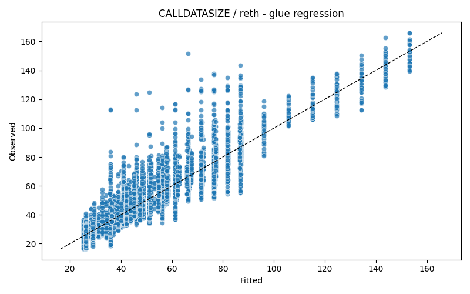

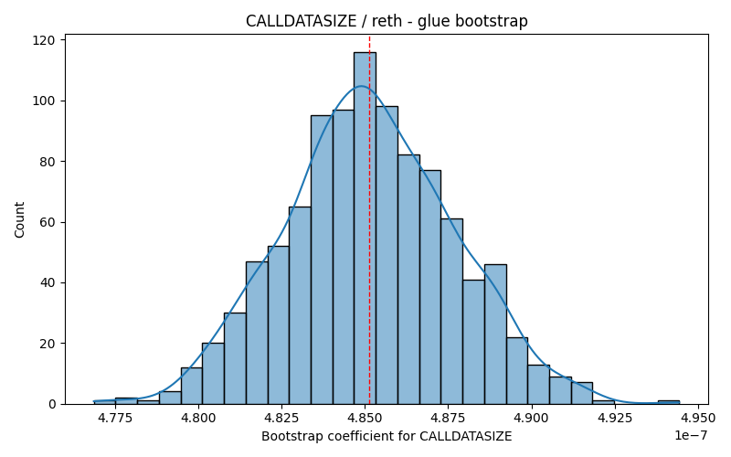

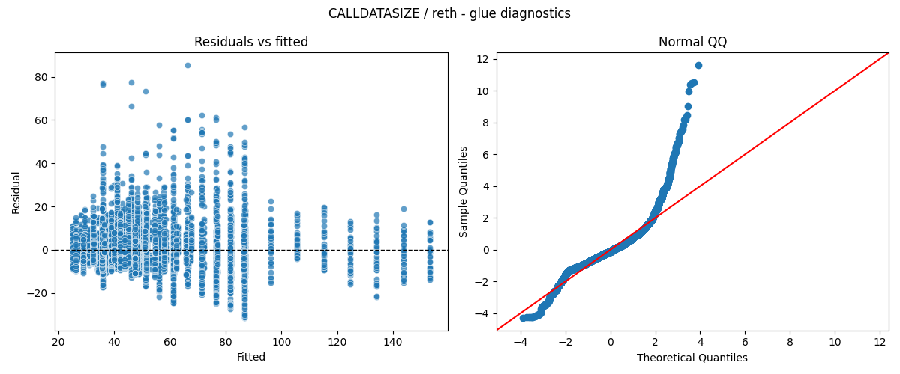

</details>

<details><summary><code>DUP</code> · nobs=21142 · runtime_ms=4.034e-07 · p=1.00e-03 · R²=0.8256</summary>

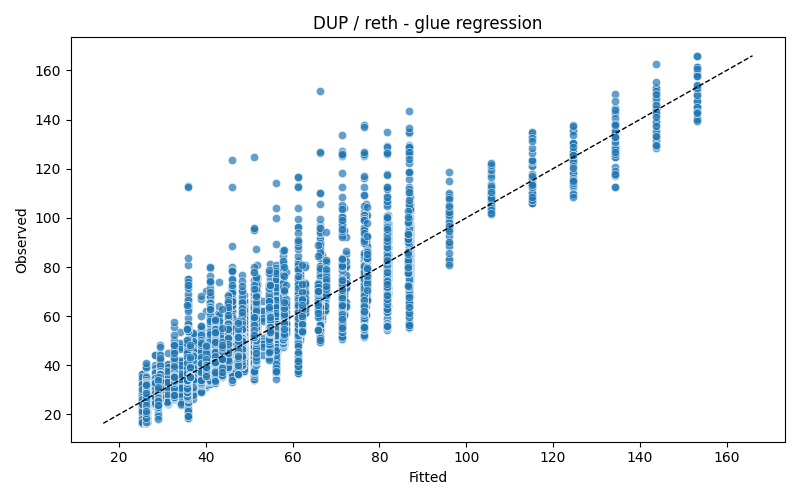

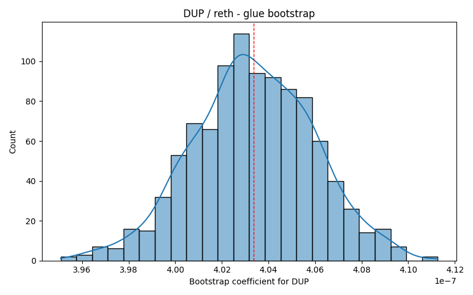


</details>

<details><summary><code>GAS</code> · nobs=21142 · runtime_ms=4.472e-07 · p=1.00e-03 · R²=0.8256</summary>


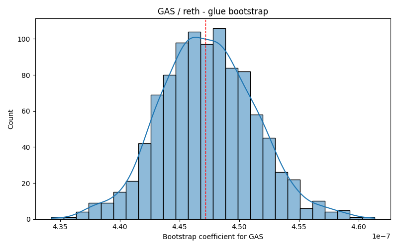

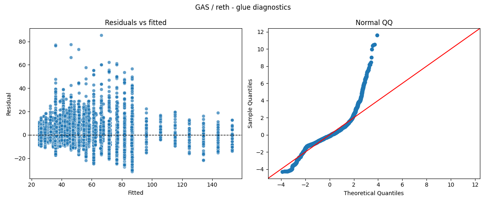

</details>

<details><summary><code>MLOAD</code> · nobs=21142 · runtime_ms=1.63e-06 · p=1.00e-03 · R²=0.8256</summary>

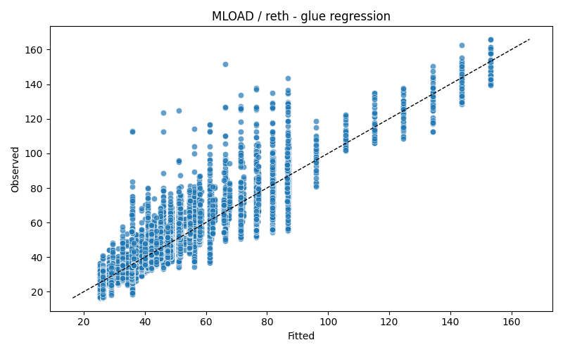

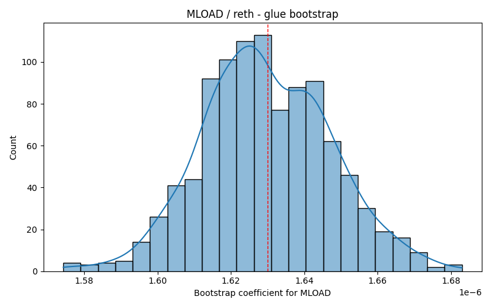


</details>

<details><summary><code>PUSH</code> · nobs=21142 · runtime_ms=4.357e-07 · p=1.00e-03 · R²=0.8256</summary>


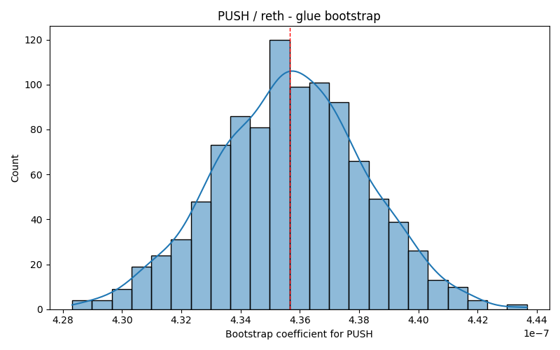

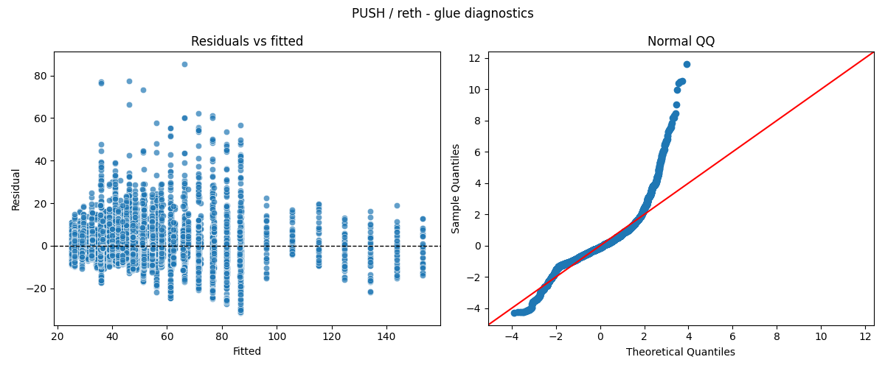

</details>

<details><summary><code>PUSH0</code> · nobs=21142 · runtime_ms=3.353e-07 · p=1.00e-03 · R²=0.8256</summary>


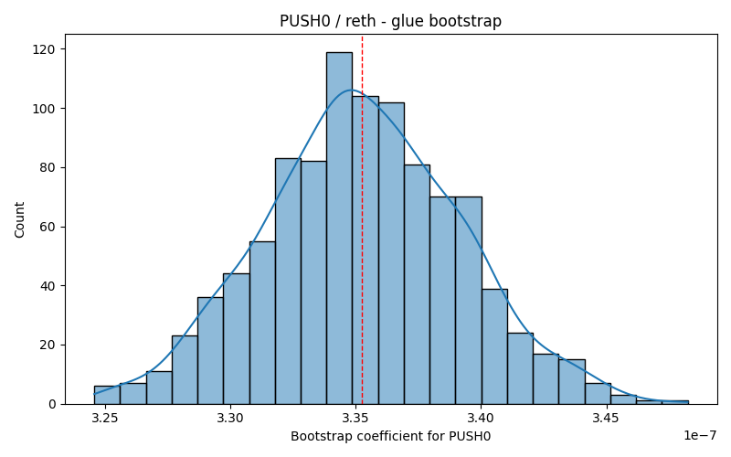


</details>

<details><summary><code>STATICCALL</code> · nobs=21142 · runtime_ms=5.383e-05 · p=1.00e-03 · R²=0.8256</summary>

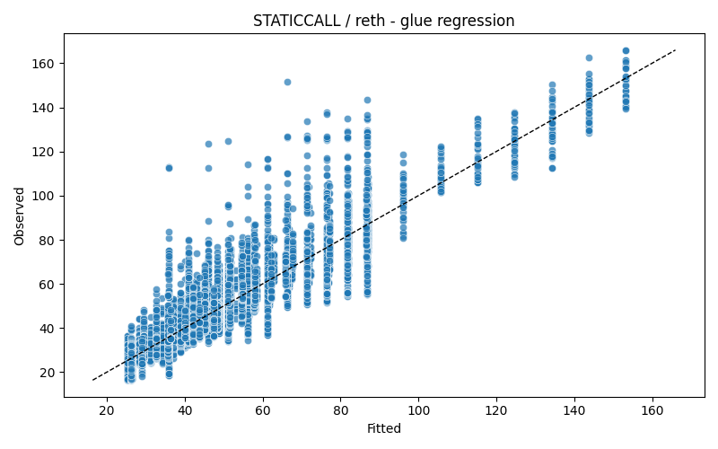

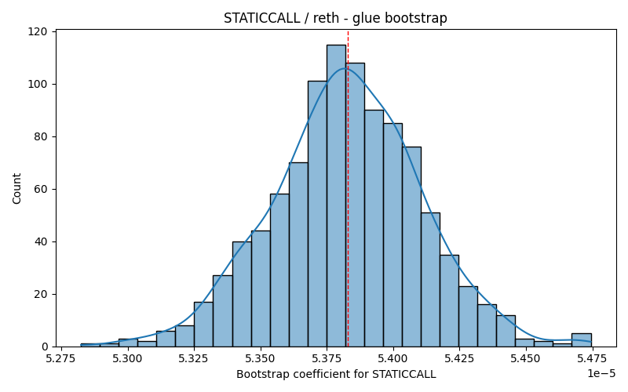


</details>

### Pure glue · reth

<details><summary><code>ISZERO</code> · nobs=352 · runtime_ms=3.598e-07 · p=1.00e-03 · R²=0.7849</summary>

```
==============================================================================
                           NNLS Regression Results                            
==============================================================================
Dep. Variable:          test_runtime_ms              R-squared:          0.785
Model:                  NNLS                    Adj. R-squared:          0.784
No. Observations:       352                               RMSE:           3.97
Df Residuals:           350                                MAE:           3.00
Df Model:               1      
==============================================================================
                      coef     std err     P-value      [0.025      0.975]
------------------------------------------------------------------------------
         const      8.9442      0.6501       0.001      7.6572     10.2418
        ISZERO      0.0000      0.0000       0.001      0.0000      0.0000
==============================================================================
Notes: Non-negative least squares with bootstrap inference (1000 iterations)
==============================================================================
```

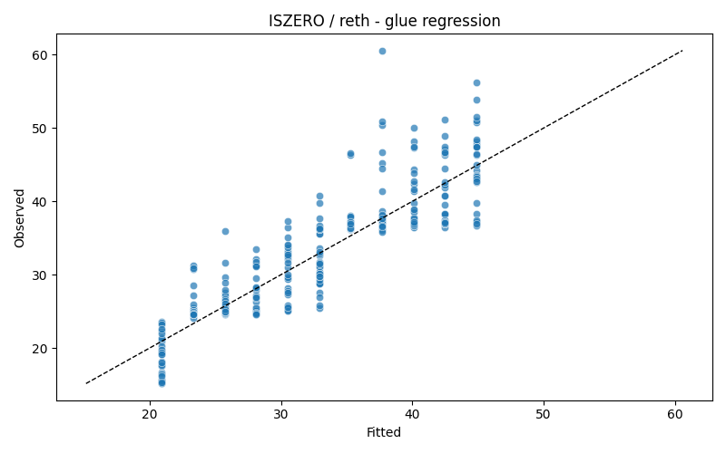

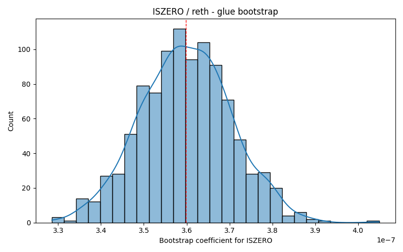

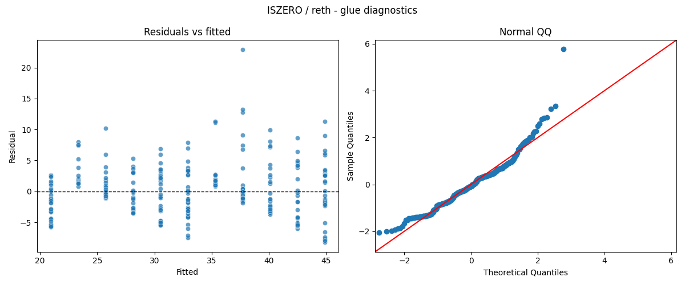

</details>

<details><summary><code>JUMPDEST</code> · nobs=352 · runtime_ms=3.042e-07 · p=1.00e-03 · R²=0.7396</summary>

```
==============================================================================
                           NNLS Regression Results                            
==============================================================================
Dep. Variable:          test_runtime_ms              R-squared:          0.740
Model:                  NNLS                    Adj. R-squared:          0.739
No. Observations:       352                               RMSE:          11.40
Df Residuals:           350                                MAE:           8.10
Df Model:               1      
==============================================================================
                      coef     std err     P-value      [0.025      0.975]
------------------------------------------------------------------------------
         const     11.9067      1.8413       0.001      8.1820     15.4800
      JUMPDEST      0.0000      0.0000       0.001      0.0000      0.0000
==============================================================================
Notes: Non-negative least squares with bootstrap inference (1000 iterations)
==============================================================================
```

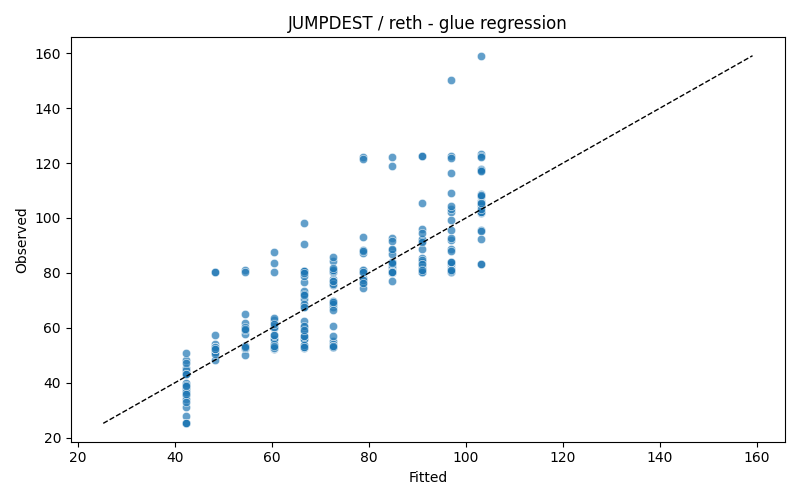

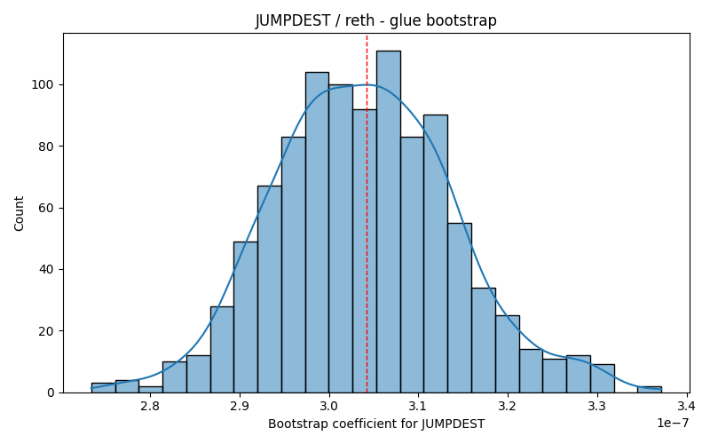

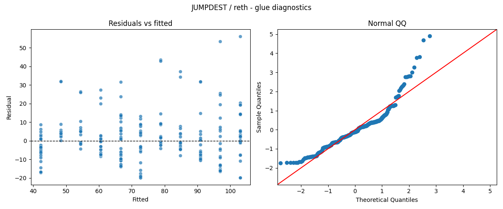

</details>

<details><summary><code>SWAP</code> · nobs=5632 · runtime_ms=4.616e-07 · p=1.00e-03 · R²=0.7064</summary>

```
==============================================================================
                           NNLS Regression Results                            
==============================================================================
Dep. Variable:          test_runtime_ms              R-squared:          0.706
Model:                  NNLS                    Adj. R-squared:          0.706
No. Observations:       5632                              RMSE:           6.26
Df Residuals:           5630                               MAE:           4.19
Df Model:               1      
==============================================================================
                      coef     std err     P-value      [0.025      0.975]
------------------------------------------------------------------------------
         const     10.6723      0.2646       0.001     10.1530     11.1947
          SWAP      0.0000      0.0000       0.001      0.0000      0.0000
==============================================================================
Notes: Non-negative least squares with bootstrap inference (1000 iterations)
==============================================================================
```

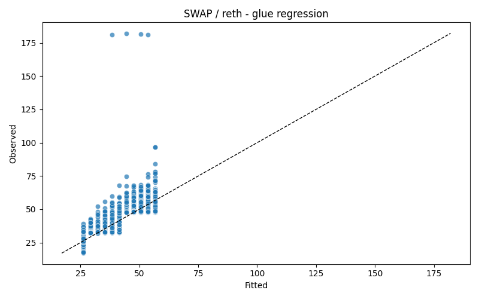

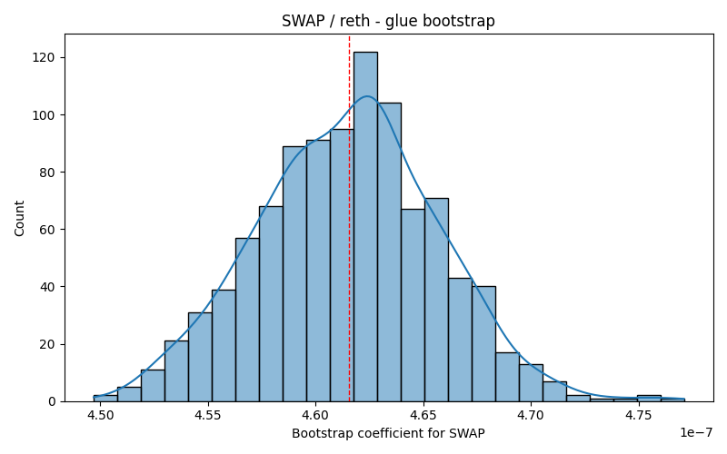

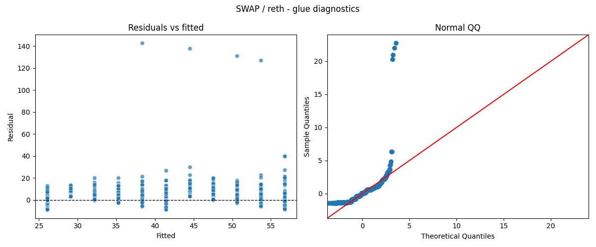

</details>

### Mixed glue (tier A) · reth

<details><summary><code>ADD</code> · nobs=352 · runtime_ms=8.796e-07 · p=1.00e-03 · R²=0.8361</summary>

```
==============================================================================
                           NNLS Regression Results                            
==============================================================================
Dep. Variable:          test_runtime_ms              R-squared:          0.836
Model:                  NNLS                    Adj. R-squared:          0.836
No. Observations:       352                               RMSE:           4.10
Df Residuals:           350                                MAE:           3.17
Df Model:               1      
==============================================================================
                      coef     std err     P-value      [0.025      0.975]
------------------------------------------------------------------------------
         const      8.1834      0.7451       0.001      6.6326      9.4884
           ADD      0.0000      0.0000       0.001      0.0000      0.0000
==============================================================================
Notes: Non-negative least squares with bootstrap inference (1000 iterations)
==============================================================================
```

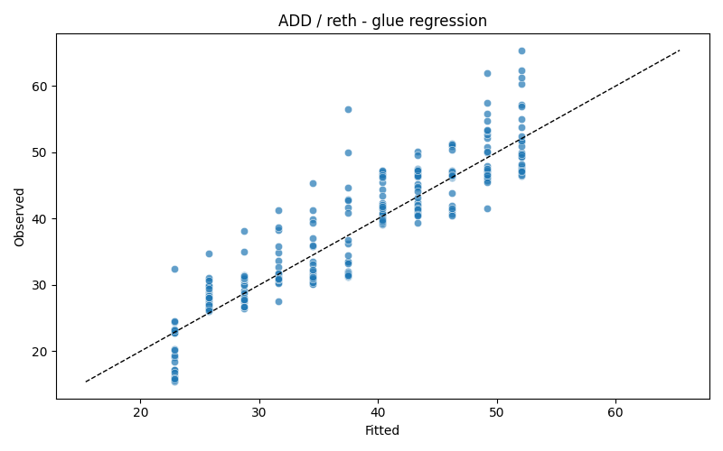

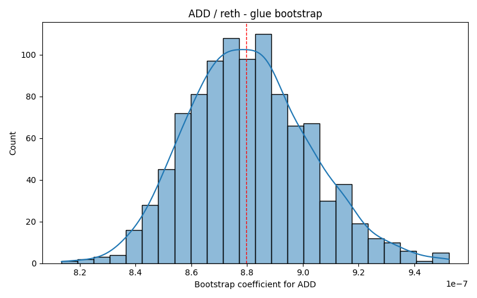

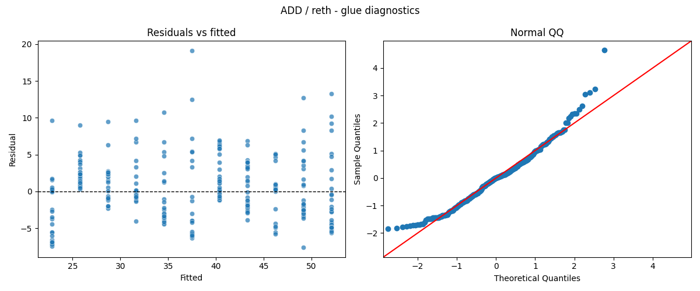

</details>

<details><summary><code>AND</code> · nobs=352 · runtime_ms=8.776e-07 · p=1.00e-03 · R²=0.8249</summary>

```
==============================================================================
                           NNLS Regression Results                            
==============================================================================
Dep. Variable:          test_runtime_ms              R-squared:          0.825
Model:                  NNLS                    Adj. R-squared:          0.824
No. Observations:       352                               RMSE:           4.26
Df Residuals:           350                                MAE:           3.29
Df Model:               1      
==============================================================================
                      coef     std err     P-value      [0.025      0.975]
------------------------------------------------------------------------------
         const      8.5414      0.7499       0.001      7.0329      9.9825
           AND      0.0000      0.0000       0.001      0.0000      0.0000
==============================================================================
Notes: Non-negative least squares with bootstrap inference (1000 iterations)
==============================================================================
```

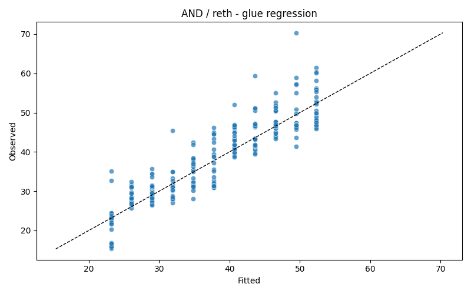

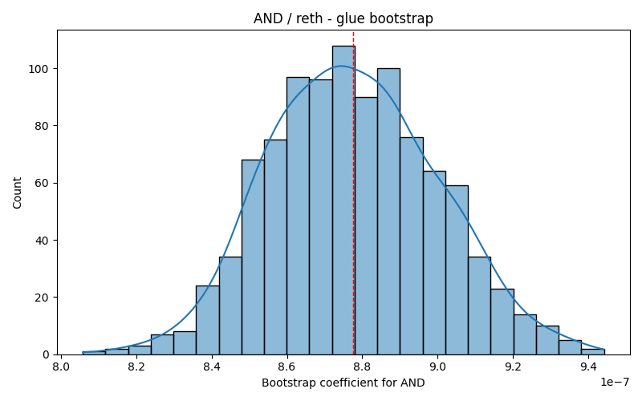

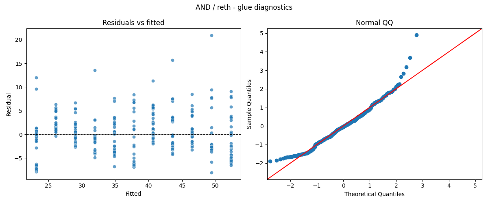

</details>

<details><summary><code>CALLDATACOPY</code> · nobs=8448 · runtime_ms=2.239e-06 · p=1.00e-03 · R²=0.7789</summary>

```
==============================================================================
                           NNLS Regression Results                            
==============================================================================
Dep. Variable:          test_runtime_ms              R-squared:          0.779
Model:                  NNLS                    Adj. R-squared:          0.779
No. Observations:       8448                              RMSE:           8.97
Df Residuals:           8446                               MAE:           6.36
Df Model:               1      
==============================================================================
                      coef     std err     P-value      [0.025      0.975]
------------------------------------------------------------------------------
         const     11.4267      0.1145       0.001     11.2208     11.6629
  CALLDATACOPY      0.0000      0.0000       0.001      0.0000      0.0000
==============================================================================
Notes: Non-negative least squares with bootstrap inference (1000 iterations)
==============================================================================
```

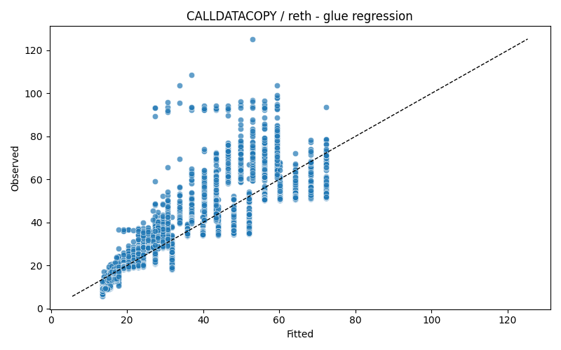

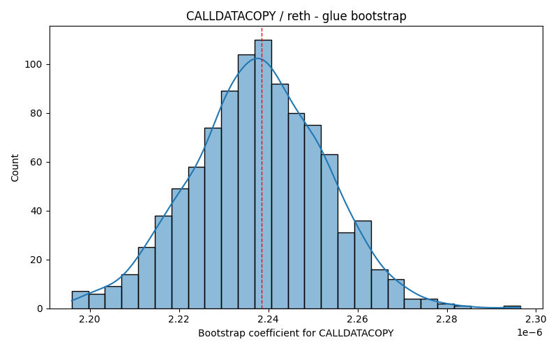

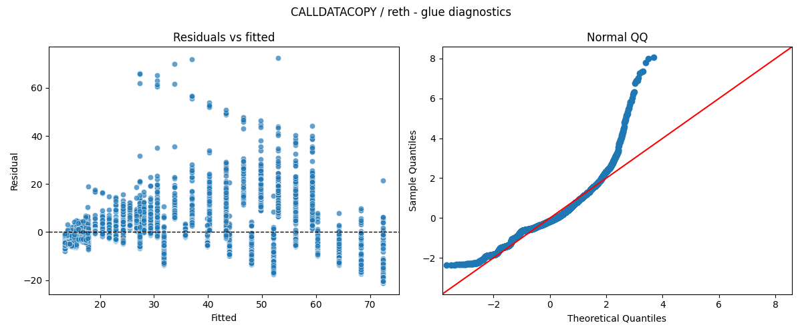

</details>

<details><summary><code>CALLDATALOAD</code> · nobs=1408 · runtime_ms=2.437e-05 · p=1.00e-03 · R²=0.1057</summary>

```
==============================================================================
                           NNLS Regression Results                            
==============================================================================
Dep. Variable:          test_runtime_ms              R-squared:          0.106
Model:                  NNLS                    Adj. R-squared:          0.105
No. Observations:       1408                              RMSE:           0.27
Df Residuals:           1406                               MAE:           0.17
Df Model:               1      
==============================================================================
                      coef     std err     P-value      [0.025      0.975]
------------------------------------------------------------------------------
         const      1.7365      0.0258       0.001      1.6905      1.7895
  CALLDATALOAD      0.0000      0.0000       0.001      0.0000      0.0000
==============================================================================
Notes: Non-negative least squares with bootstrap inference (1000 iterations)
==============================================================================
```

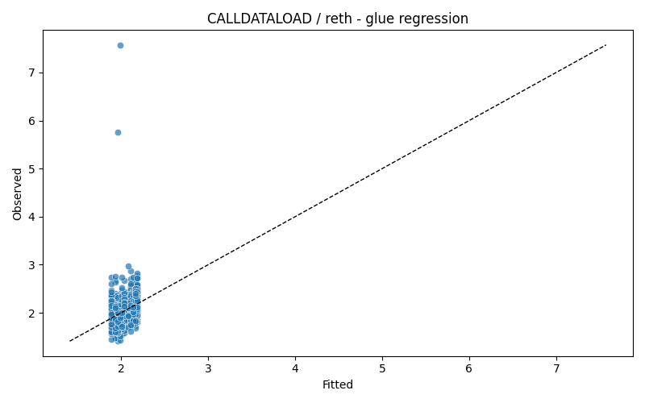

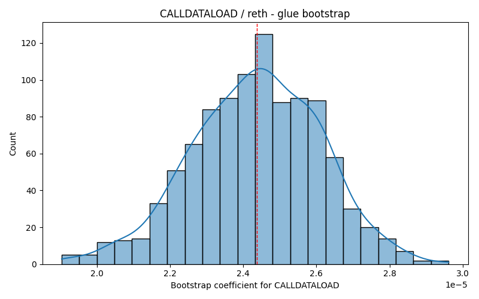

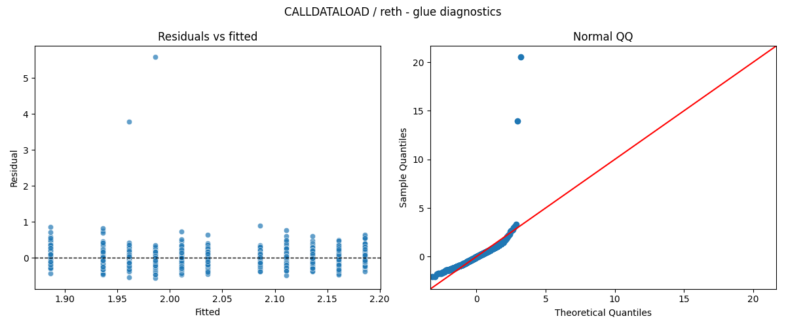

</details>

<details><summary><code>DIV</code> · nobs=352 · runtime_ms=7.075e-06 · p=1.00e-03 · R²=0.8438</summary>

```
==============================================================================
                           NNLS Regression Results                            
==============================================================================
Dep. Variable:          test_runtime_ms              R-squared:          0.844
Model:                  NNLS                    Adj. R-squared:          0.843
No. Observations:       352                               RMSE:          24.03
Df Residuals:           350                                MAE:          19.80
Df Model:               1      
==============================================================================
                      coef     std err     P-value      [0.025      0.975]
------------------------------------------------------------------------------
         const     53.2948      4.6820       0.001     43.7928     61.9970
           DIV      0.0000      0.0000       0.001      0.0000      0.0000
==============================================================================
Notes: Non-negative least squares with bootstrap inference (1000 iterations)
==============================================================================
```

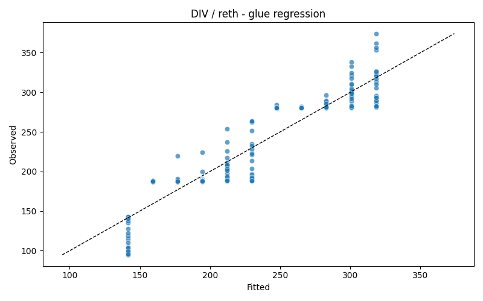

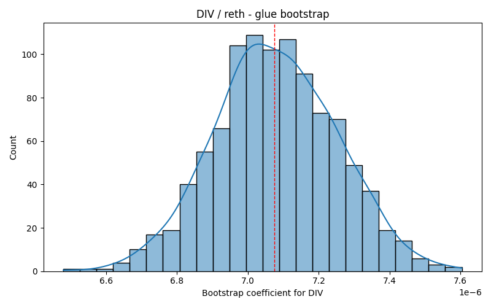

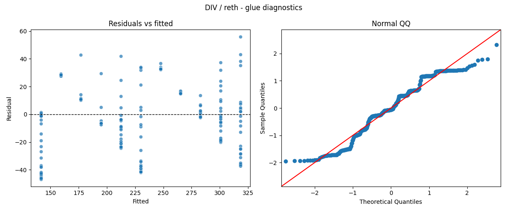

</details>

<details><summary><code>EXP</code> · nobs=352 · runtime_ms=0.0003809 · p=1.00e-03 · R²=0.8188</summary>

```
==============================================================================
                           NNLS Regression Results                            
==============================================================================
Dep. Variable:          test_runtime_ms              R-squared:          0.819
Model:                  NNLS                    Adj. R-squared:          0.818
No. Observations:       352                               RMSE:           7.01
Df Residuals:           350                                MAE:           5.95
Df Model:               1      
==============================================================================
                      coef     std err     P-value      [0.025      0.975]
------------------------------------------------------------------------------
         const     14.6806      1.3325       0.001     12.2657     17.4535
           EXP      0.0004      0.0000       0.001      0.0004      0.0004
==============================================================================
Notes: Non-negative least squares with bootstrap inference (1000 iterations)
==============================================================================
```

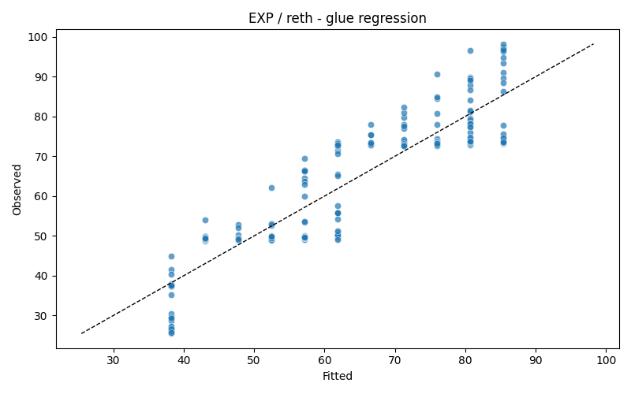

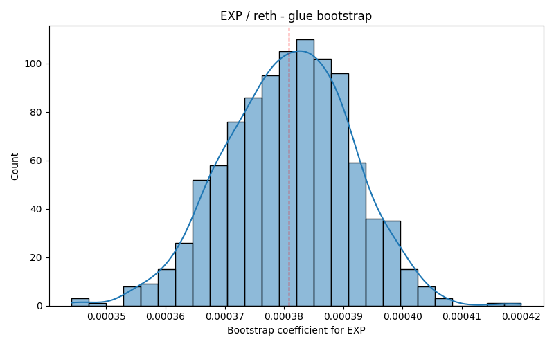

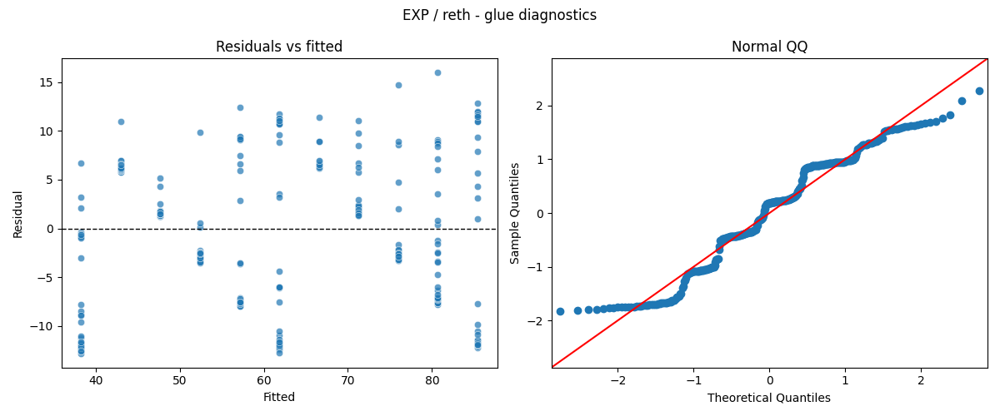

</details>

<details><summary><code>GT</code> · nobs=352 · runtime_ms=9.597e-07 · p=1.00e-03 · R²=0.8155</summary>

```
==============================================================================
                           NNLS Regression Results                            
==============================================================================
Dep. Variable:          test_runtime_ms              R-squared:          0.816
Model:                  NNLS                    Adj. R-squared:          0.815
No. Observations:       352                               RMSE:           4.80
Df Residuals:           350                                MAE:           3.65
Df Model:               1      
==============================================================================
                      coef     std err     P-value      [0.025      0.975]
------------------------------------------------------------------------------
         const     10.0885      0.8205       0.001      8.4738     11.7444
            GT      0.0000      0.0000       0.001      0.0000      0.0000
==============================================================================
Notes: Non-negative least squares with bootstrap inference (1000 iterations)
==============================================================================
```

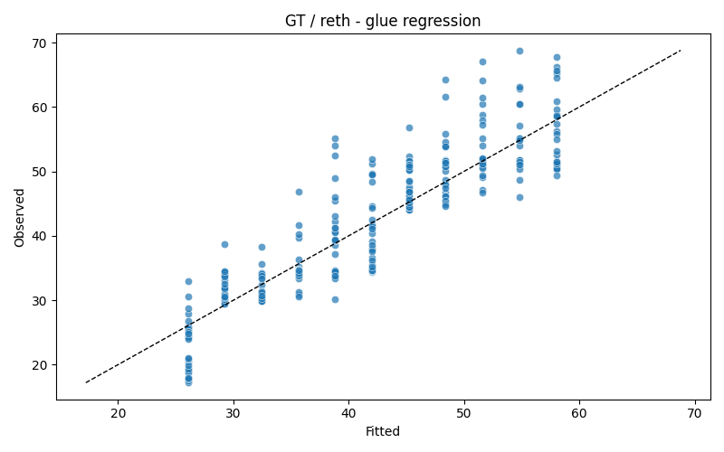

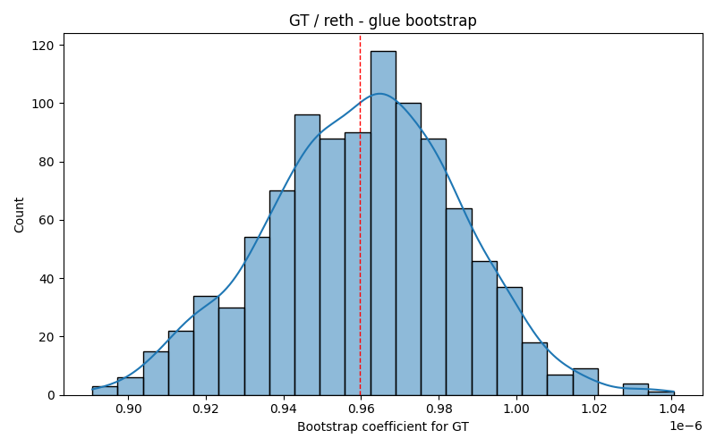

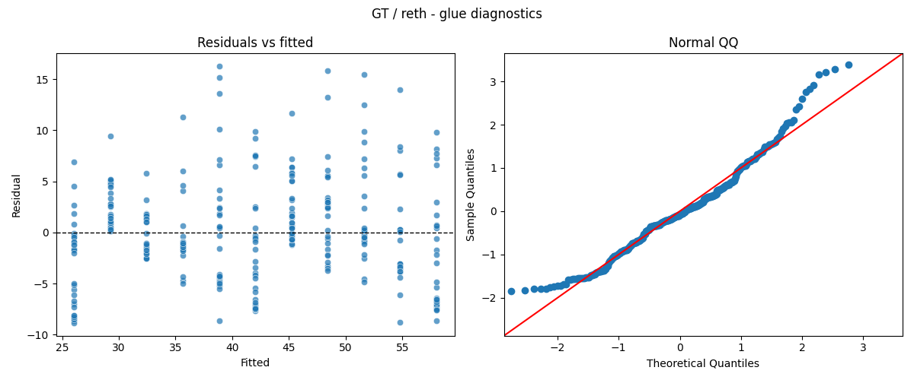

</details>

<details><summary><code>JUMPI</code> · nobs=352 · runtime_ms=1.264e-06 · p=1.00e-03 · R²=0.7715</summary>

```
==============================================================================
                           NNLS Regression Results                            
==============================================================================
Dep. Variable:          test_runtime_ms              R-squared:          0.772
Model:                  NNLS                    Adj. R-squared:          0.771
No. Observations:       352                               RMSE:           3.10
Df Residuals:           350                                MAE:           2.30
Df Model:               1      
==============================================================================
                      coef     std err     P-value      [0.025      0.975]
------------------------------------------------------------------------------
         const      5.1589      0.4615       0.001      4.2569      6.0715
         JUMPI      0.0000      0.0000       0.001      0.0000      0.0000
==============================================================================
Notes: Non-negative least squares with bootstrap inference (1000 iterations)
==============================================================================
```

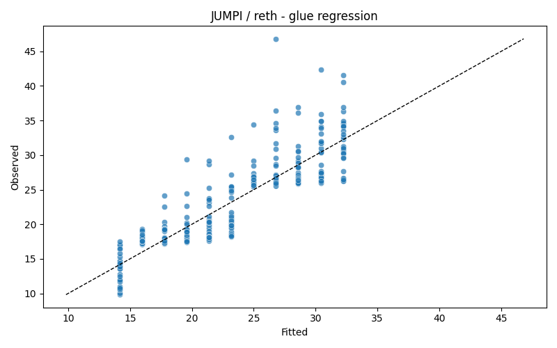

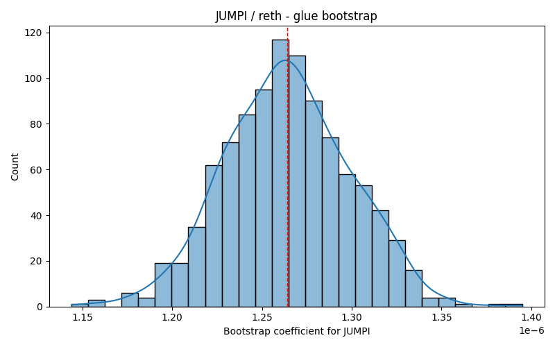

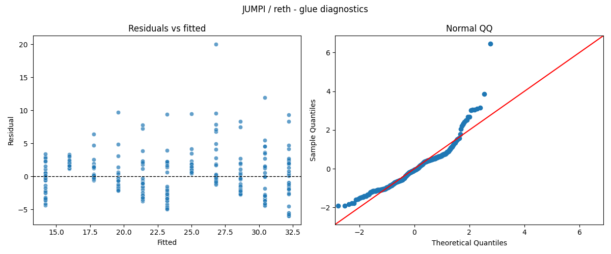

</details>

<details><summary><code>LT</code> · nobs=352 · runtime_ms=9.39e-07 · p=1.00e-03 · R²=0.7884</summary>

```
==============================================================================
                           NNLS Regression Results                            
==============================================================================
Dep. Variable:          test_runtime_ms              R-squared:          0.788
Model:                  NNLS                    Adj. R-squared:          0.788
No. Observations:       352                               RMSE:           5.12
Df Residuals:           350                                MAE:           3.79
Df Model:               1      
==============================================================================
                      coef     std err     P-value      [0.025      0.975]
------------------------------------------------------------------------------
         const      9.2211      0.9449       0.001      7.3962     11.0578
            LT      0.0000      0.0000       0.001      0.0000      0.0000
==============================================================================
Notes: Non-negative least squares with bootstrap inference (1000 iterations)
==============================================================================
```

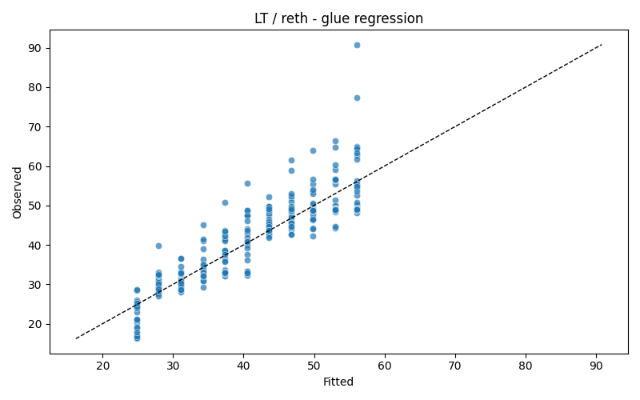

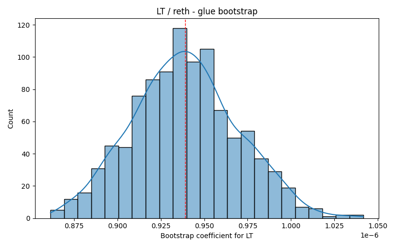

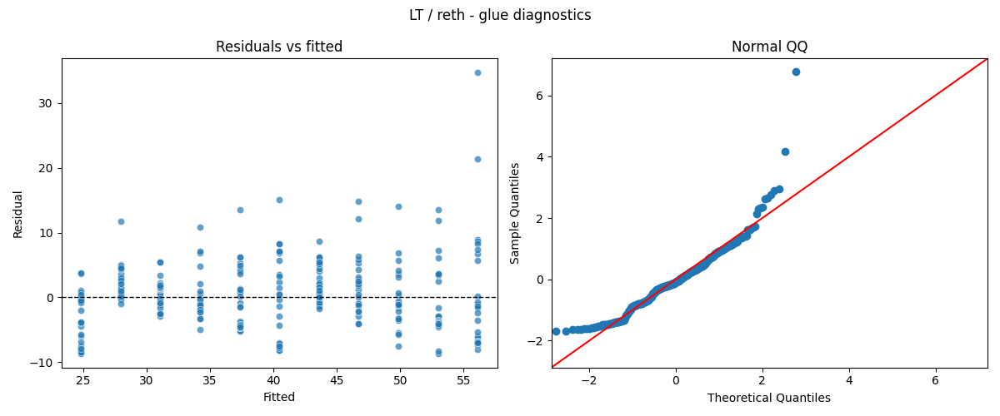

</details>

<details><summary><code>MSTORE</code> · nobs=1760 · runtime_ms=2.686e-06 · p=1.00e-03 · R²=0.2667</summary>

```
==============================================================================
                           NNLS Regression Results                            
==============================================================================
Dep. Variable:          test_runtime_ms              R-squared:          0.267
Model:                  NNLS                    Adj. R-squared:          0.266
No. Observations:       1760                              RMSE:          31.26
Df Residuals:           1758                               MAE:          28.13
Df Model:               1      
==============================================================================
                      coef     std err     P-value      [0.025      0.975]
------------------------------------------------------------------------------
         const     20.4575      2.1061       0.001     16.3889     24.6759
        MSTORE      0.0000      0.0000       0.001      0.0000      0.0000
==============================================================================
Notes: Non-negative least squares with bootstrap inference (1000 iterations)
==============================================================================
```

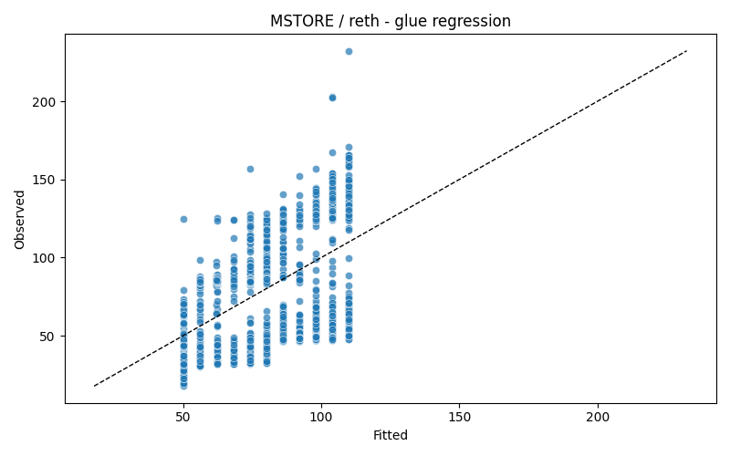

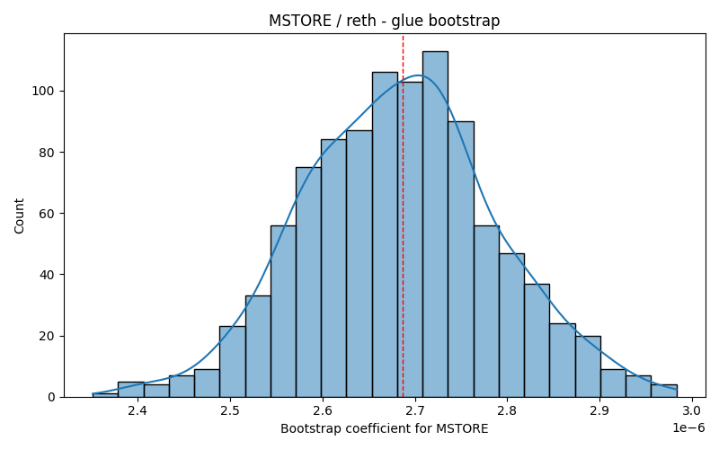

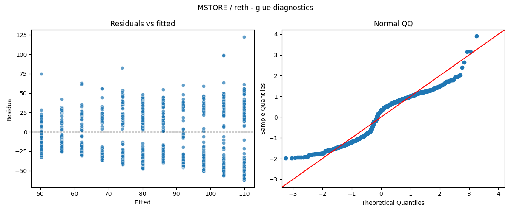

</details>

<details><summary><code>MSTORE8</code> · nobs=1760 · runtime_ms=1.298e-06 · p=1.00e-03 · R²=0.4272</summary>

```
==============================================================================
                           NNLS Regression Results                            
==============================================================================
Dep. Variable:          test_runtime_ms              R-squared:          0.427
Model:                  NNLS                    Adj. R-squared:          0.427
No. Observations:       1760                              RMSE:          10.55
Df Residuals:           1758                               MAE:           5.00
Df Model:               1      
==============================================================================
                      coef     std err     P-value      [0.025      0.975]
------------------------------------------------------------------------------
         const     11.1799      0.8156       0.001      9.5875     12.8913
       MSTORE8      0.0000      0.0000       0.001      0.0000      0.0000
==============================================================================
Notes: Non-negative least squares with bootstrap inference (1000 iterations)
==============================================================================
```

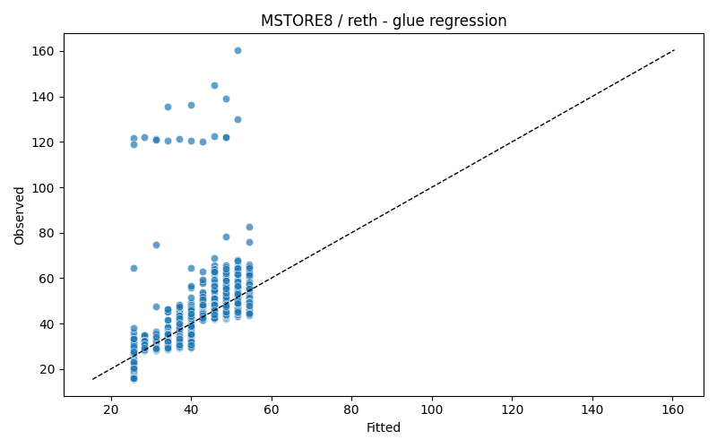

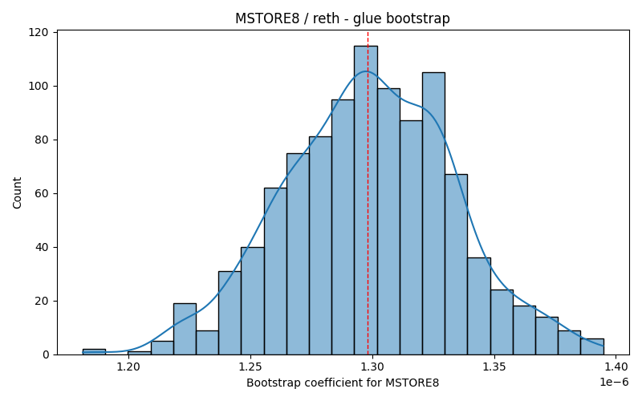

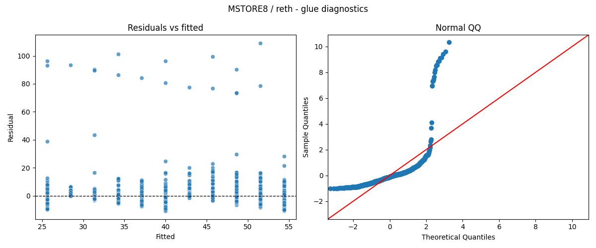

</details>

<details><summary><code>MUL</code> · nobs=352 · runtime_ms=1.082e-06 · p=1.00e-03 · R²=0.6257</summary>

```
==============================================================================
                           NNLS Regression Results                            
==============================================================================
Dep. Variable:          test_runtime_ms              R-squared:          0.626
Model:                  NNLS                    Adj. R-squared:          0.625
No. Observations:       352                               RMSE:           6.60
Df Residuals:           350                                MAE:           3.90
Df Model:               1      
==============================================================================
                      coef     std err     P-value      [0.025      0.975]
------------------------------------------------------------------------------
         const     11.4321      1.2990       0.001      9.2089     14.1750
           MUL      0.0000      0.0000       0.001      0.0000      0.0000
==============================================================================
Notes: Non-negative least squares with bootstrap inference (1000 iterations)
==============================================================================
```

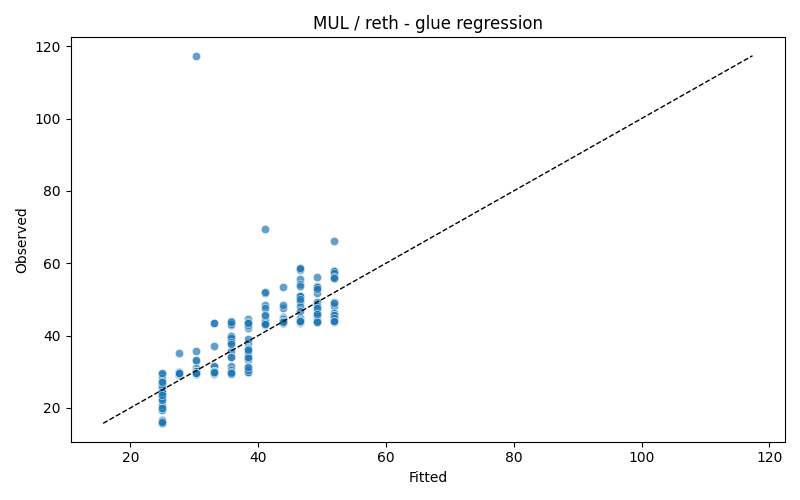

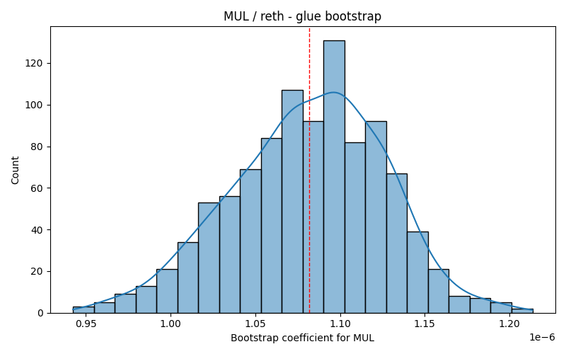

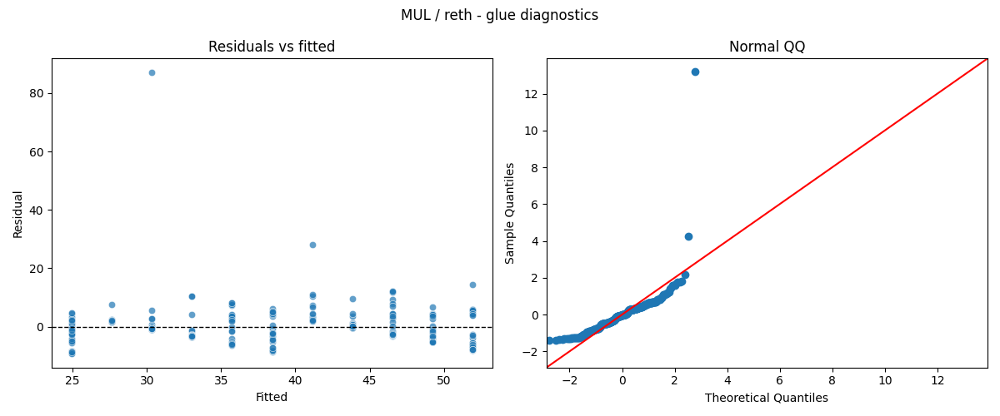

</details>

<details><summary><code>PC</code> · nobs=352 · runtime_ms=5.973e-07 · p=1.00e-03 · R²=0.9162</summary>

```
==============================================================================
                           NNLS Regression Results                            
==============================================================================
Dep. Variable:          test_runtime_ms              R-squared:          0.916
Model:                  NNLS                    Adj. R-squared:          0.916
No. Observations:       352                               RMSE:           5.40
Df Residuals:           350                                MAE:           4.27
Df Model:               1      
==============================================================================
                      coef     std err     P-value      [0.025      0.975]
------------------------------------------------------------------------------
         const     11.7347      0.9219       0.001      9.9617     13.6212
            PC      0.0000      0.0000       0.001      0.0000      0.0000
==============================================================================
Notes: Non-negative least squares with bootstrap inference (1000 iterations)
==============================================================================
```

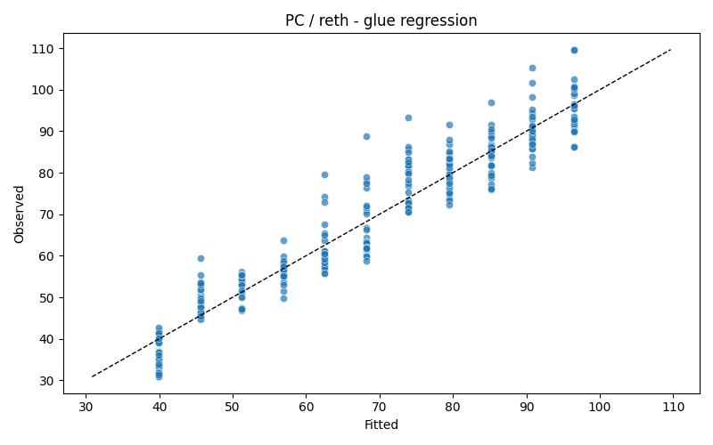

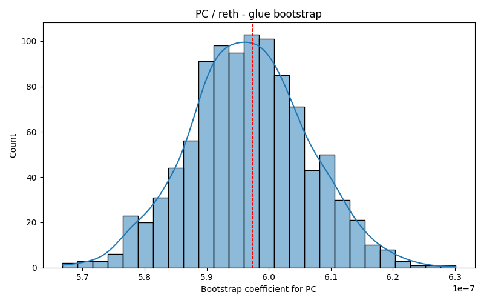


</details>

<details><summary><code>RETURNDATASIZE</code> · nobs=1408 · runtime_ms=8.864e-07 · p=1.00e-03 · R²=0.8434</summary>

```
==============================================================================
                           NNLS Regression Results                            
==============================================================================
Dep. Variable:          test_runtime_ms              R-squared:          0.843
Model:                  NNLS                    Adj. R-squared:          0.843
No. Observations:       1408                              RMSE:           6.03
Df Residuals:           1406                               MAE:           4.63
Df Model:               1      
==============================================================================
                      coef     std err     P-value      [0.025      0.975]
------------------------------------------------------------------------------
         const     10.7845      0.5338       0.001      9.7840     11.8224
RETURNDATASIZE      0.0000      0.0000       0.001      0.0000      0.0000
==============================================================================
Notes: Non-negative least squares with bootstrap inference (1000 iterations)
==============================================================================
```

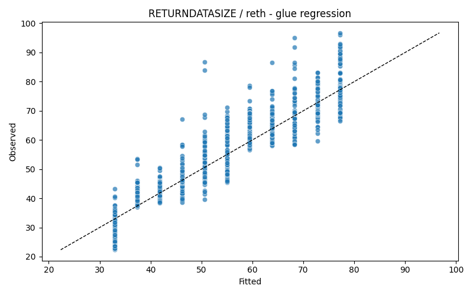

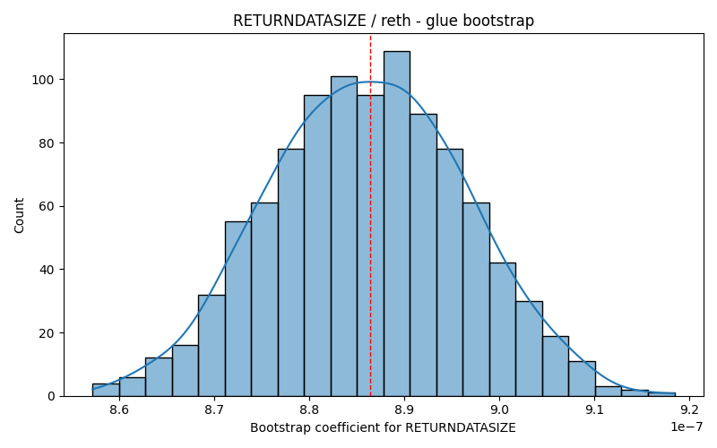

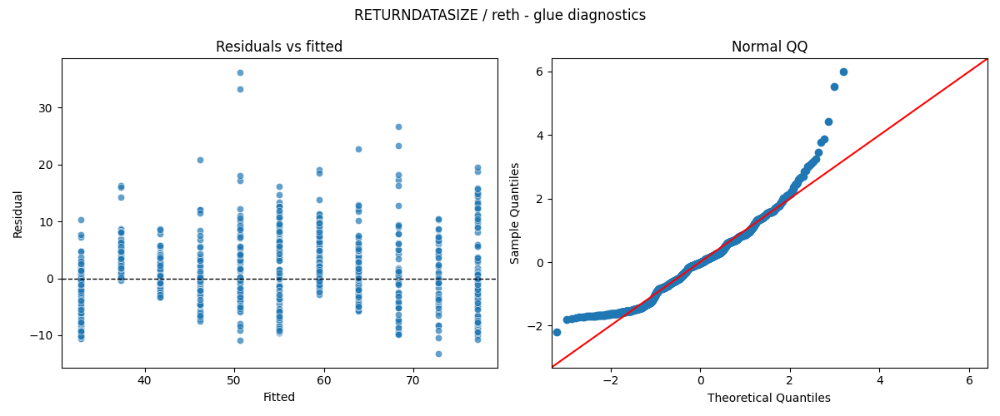

</details>

<details><summary><code>SELFBALANCE</code> · nobs=288 · runtime_ms=3.839e-06 · p=1.00e-03 · R²=0.7964</summary>

```
==============================================================================
                           NNLS Regression Results                            
==============================================================================
Dep. Variable:          test_runtime_ms              R-squared:          0.796
Model:                  NNLS                    Adj. R-squared:          0.796
No. Observations:       288                               RMSE:          19.58
Df Residuals:           286                                MAE:          15.78
Df Model:               1      
==============================================================================
                      coef     std err     P-value      [0.025      0.975]
------------------------------------------------------------------------------
         const     54.5502      4.3271       0.001     46.0124     62.6283
   SELFBALANCE      0.0000      0.0000       0.001      0.0000      0.0000
==============================================================================
Notes: Non-negative least squares with bootstrap inference (1000 iterations)
==============================================================================
```

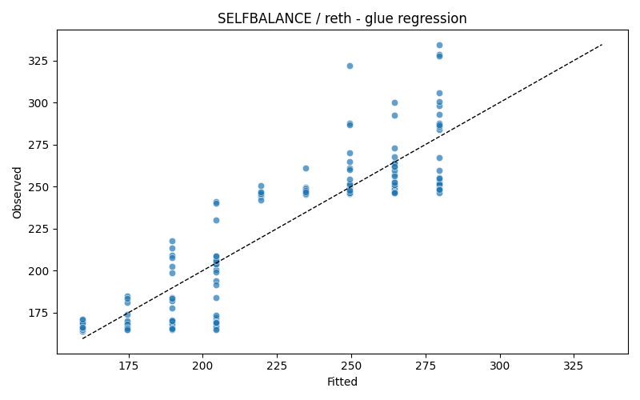

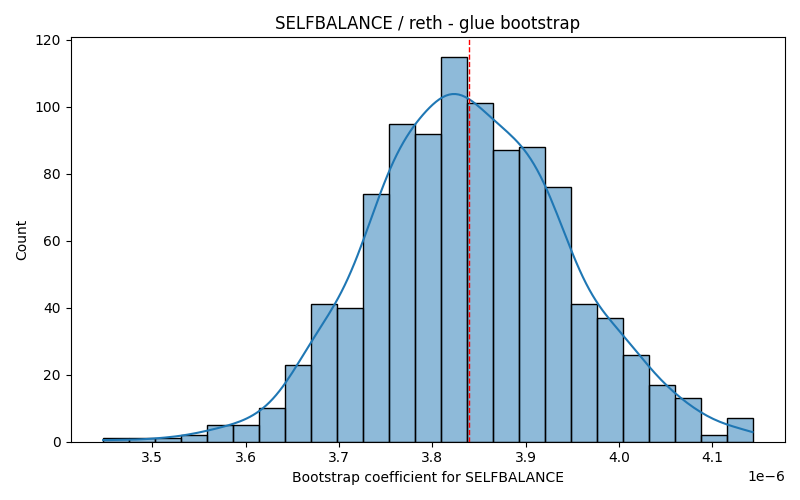

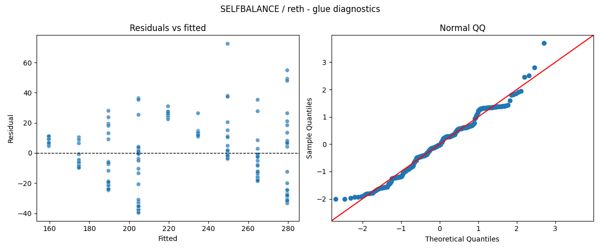

</details>

<details><summary><code>SUB</code> · nobs=352 · runtime_ms=9.307e-07 · p=1.00e-03 · R²=0.5933</summary>

```
==============================================================================
                           NNLS Regression Results                            
==============================================================================
Dep. Variable:          test_runtime_ms              R-squared:          0.593
Model:                  NNLS                    Adj. R-squared:          0.592
No. Observations:       352                               RMSE:           8.11
Df Residuals:           350                                MAE:           4.22
Df Model:               1      
==============================================================================
                      coef     std err     P-value      [0.025      0.975]
------------------------------------------------------------------------------
         const      9.5926      1.3814       0.001      7.0135     12.3426
           SUB      0.0000      0.0000       0.001      0.0000      0.0000
==============================================================================
Notes: Non-negative least squares with bootstrap inference (1000 iterations)
==============================================================================
```

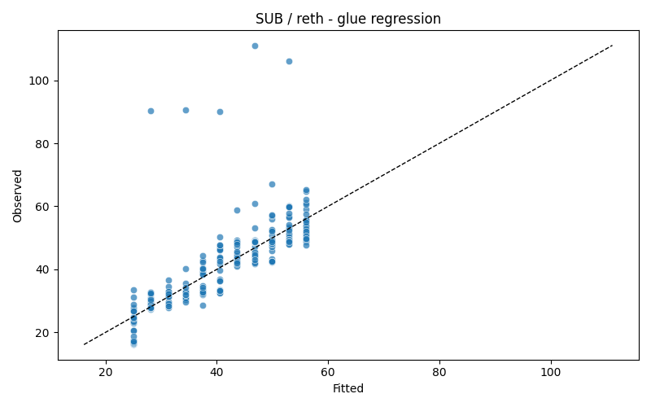

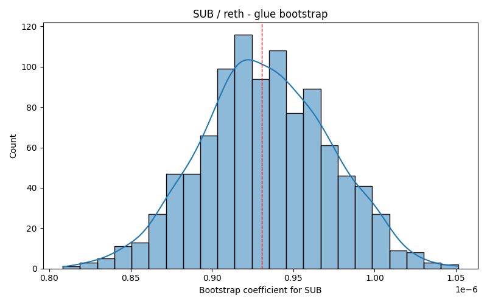

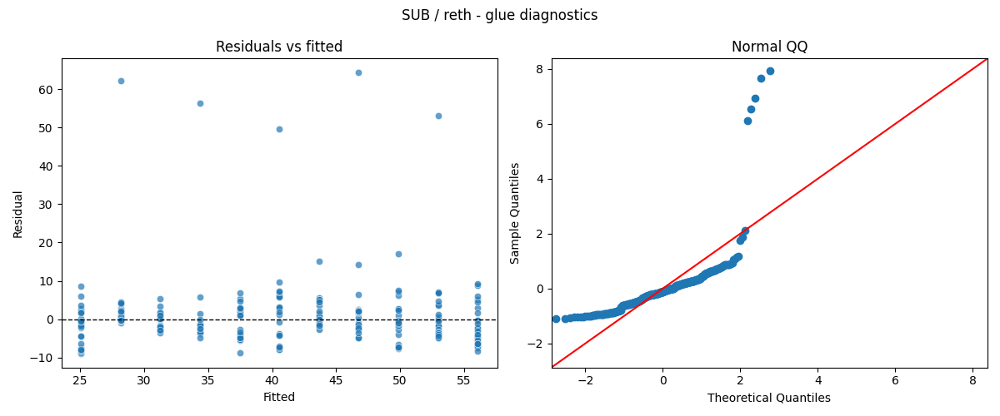

</details>

### Mixed glue (tier B) · reth

<details><summary><code>JUMP</code> · nobs=352 · runtime_ms=2.171e-06 · p=1.00e-03 · R²=0.808</summary>

```
==============================================================================
                           NNLS Regression Results                            
==============================================================================
Dep. Variable:          test_runtime_ms              R-squared:          0.808
Model:                  NNLS                    Adj. R-squared:          0.807
No. Observations:       352                               RMSE:           3.93
Df Residuals:           350                                MAE:           3.15
Df Model:               1      
==============================================================================
                      coef     std err     P-value      [0.025      0.975]
------------------------------------------------------------------------------
         const      8.2886      0.7113       0.001      6.7556      9.5864
          JUMP      0.0000      0.0000       0.001      0.0000      0.0000
==============================================================================
Notes: Non-negative least squares with bootstrap inference (1000 iterations)
==============================================================================
```

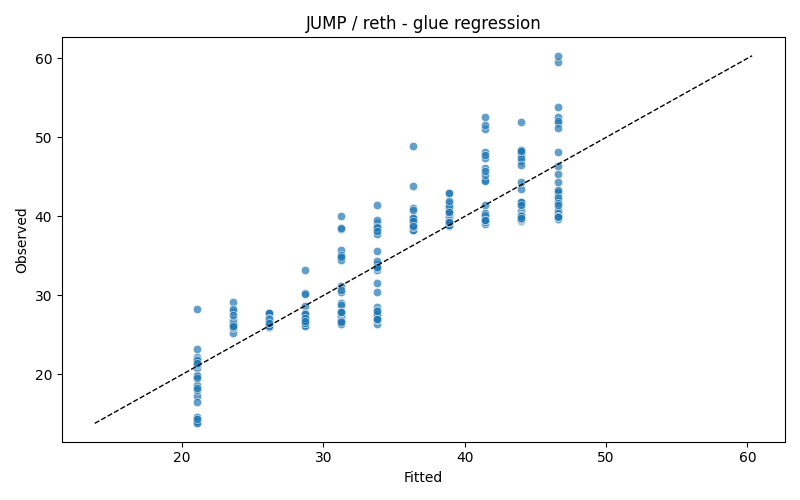

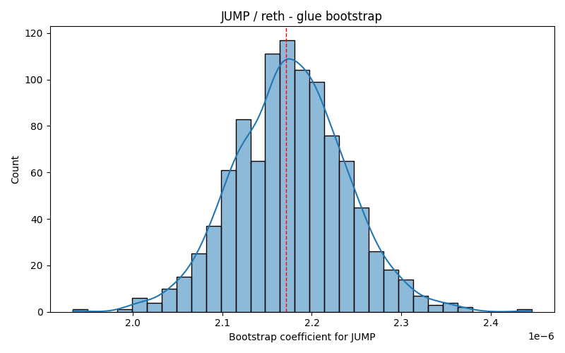

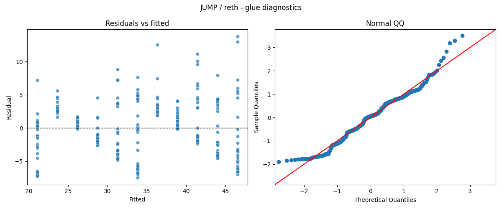

</details>

<details><summary><code>KECCAK256</code> · nobs=5632 · runtime_ms=0 · p=1.00e+00 · R²=0</summary>

```
==============================================================================
                           NNLS Regression Results                            
==============================================================================
Dep. Variable:          test_runtime_ms              R-squared:          0.000
Model:                  NNLS                    Adj. R-squared:         -0.000
No. Observations:       5632                              RMSE:         159.59
Df Residuals:           5630                               MAE:         135.19
Df Model:               1      
==============================================================================
                      coef     std err     P-value      [0.025      0.975]
------------------------------------------------------------------------------
         const    250.0661      2.1982       0.001    245.9115    254.8124
     KECCAK256      0.0000      0.0000       1.000      0.0000      0.0000
==============================================================================
Notes: Non-negative least squares with bootstrap inference (1000 iterations)
==============================================================================
```

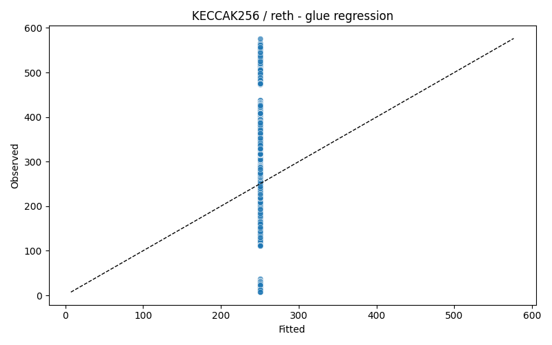


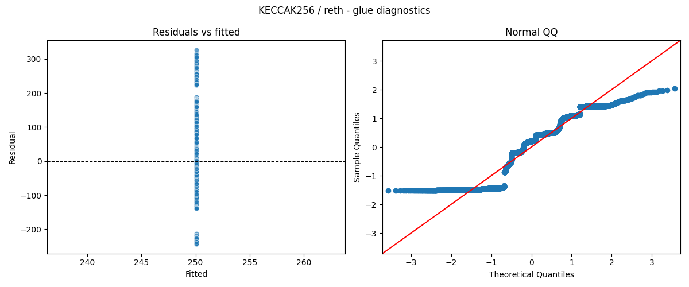

</details>
