# Runtime estimation report

Per-spec NNLS fits of `test_runtime_ms` against `opcount`, one row per (target opcode, test, model_by combo, client).

## Contents

- [SLOAD](#sload)
- [SSTORE](#sstore)
- [BALANCE](#balance)
- [CALL](#call)
- [CALLCODE](#callcode)
- [DELEGATECALL](#delegatecall)
- [EXTCODECOPY](#extcodecopy)
- [EXTCODEHASH](#extcodehash)
- [EXTCODESIZE](#extcodesize)
- [STATICCALL](#staticcall)

## SLOAD

### test_sload_bloated — combo `False`

| client | nobs | R² | target_coef (ms) | p-value | 95% CI |
| --- | --- | --- | --- | --- | --- |
| `besu` | 341 | 0.819 | 0.009074 | 1.00e-03 | [0.008614, 0.009572] |
| `erigon` | 198 | 0.9841 | 0.005913 | 1.00e-03 | [0.005857, 0.005951] |
| `ethrex` | 33 | 0.9139 | 0.008457 | 1.00e-03 | [0.008094, 0.008771] |
| `geth` | 407 | 0.9844 | 0.02493 | 1.00e-03 | [0.02458, 0.02527] |
| `nethermind` | 352 | 0.8709 | 0.003185 | 1.00e-03 | [0.003068, 0.003288] |
| `reth` | 374 | 0.9768 | 0.001263 | 1.00e-03 | [0.001244, 0.001283] |

<details><summary>besu — NNLS regression summary</summary>

```
==============================================================================
                           NNLS Regression Results                            
==============================================================================
Dep. Variable:          test_runtime_ms              R-squared:          0.819
Model:                  NNLS                    Adj. R-squared:          0.818
No. Observations:       341                               RMSE:         125.53
Df Residuals:           339                                MAE:         111.69
Df Model:               1      
==============================================================================
                      coef     std err     P-value      [0.025      0.975]
------------------------------------------------------------------------------
         const    166.8766     20.4664       0.001    125.0822    207.5829
       opcount      0.0091      0.0002       0.001      0.0086      0.0096
==============================================================================
Notes: Non-negative least squares with bootstrap inference (1000 iterations)
==============================================================================
```

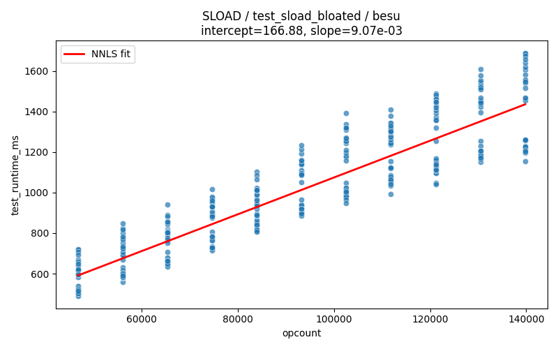

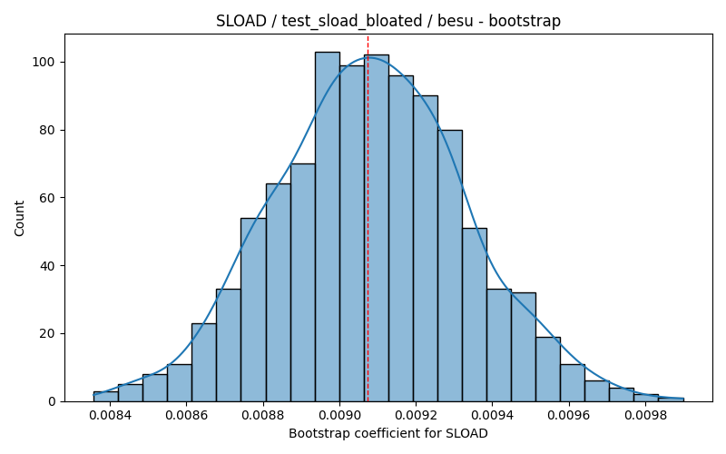

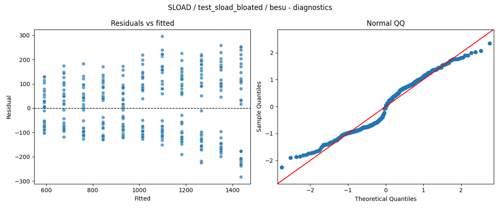

</details>

<details><summary>erigon — NNLS regression summary</summary>

```
==============================================================================
                           NNLS Regression Results                            
==============================================================================
Dep. Variable:          test_runtime_ms              R-squared:          0.984
Model:                  NNLS                    Adj. R-squared:          0.984
No. Observations:       198                               RMSE:          22.31
Df Residuals:           196                                MAE:          19.37
Df Model:               1      
==============================================================================
                      coef     std err     P-value      [0.025      0.975]
------------------------------------------------------------------------------
         const      0.0000      1.0513       1.000      0.0000      4.0291
       opcount      0.0059      0.0000       0.001      0.0059      0.0060
==============================================================================
Notes: Non-negative least squares with bootstrap inference (1000 iterations)
==============================================================================
```

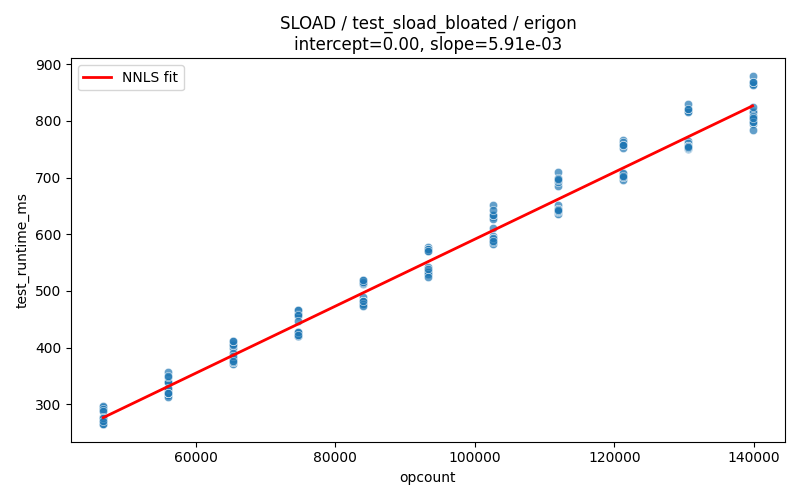

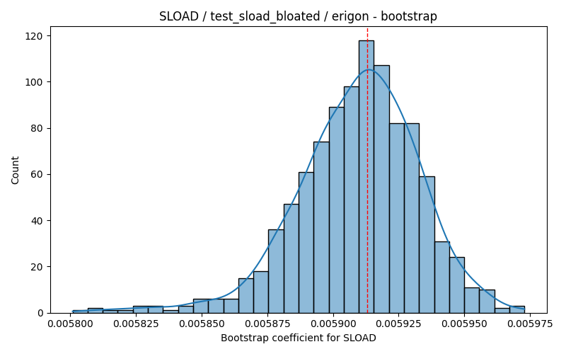

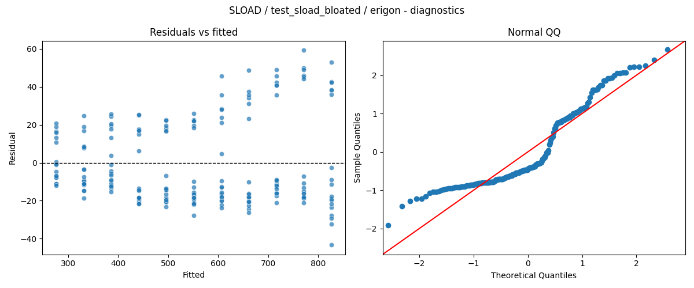

</details>

<details><summary>ethrex — NNLS regression summary</summary>

```
==============================================================================
                           NNLS Regression Results                            
==============================================================================
Dep. Variable:          test_runtime_ms              R-squared:          0.914
Model:                  NNLS                    Adj. R-squared:          0.911
No. Observations:       33                                RMSE:          98.26
Df Residuals:           31                                 MAE:          81.27
Df Model:               1      
==============================================================================
                      coef     std err     P-value      [0.025      0.975]
------------------------------------------------------------------------------
         const      0.0000      0.0000       1.000      0.0000      0.0000
       opcount      0.0085      0.0002       0.001      0.0081      0.0088
==============================================================================
Notes: Non-negative least squares with bootstrap inference (1000 iterations)
==============================================================================
```

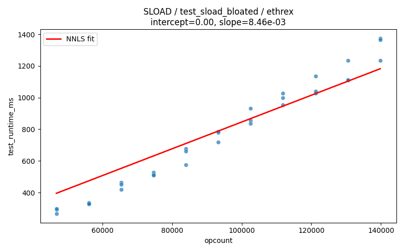

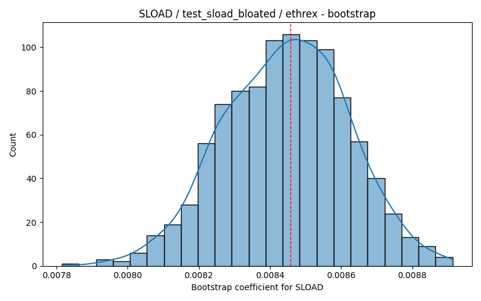

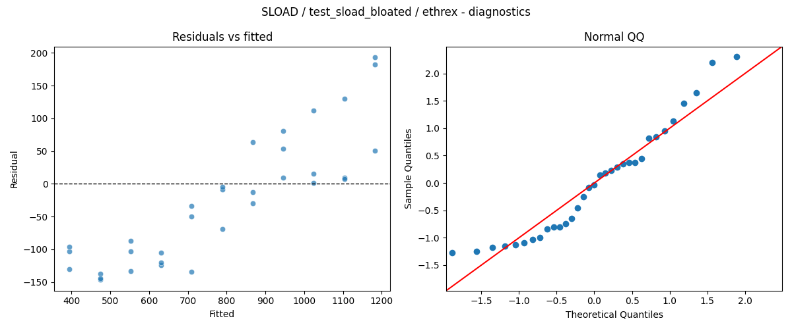

</details>

<details><summary>geth — NNLS regression summary</summary>

```
==============================================================================
                           NNLS Regression Results                            
==============================================================================
Dep. Variable:          test_runtime_ms              R-squared:          0.984
Model:                  NNLS                    Adj. R-squared:          0.984
No. Observations:       407                               RMSE:          92.38
Df Residuals:           405                                MAE:          82.59
Df Model:               1      
==============================================================================
                      coef     std err     P-value      [0.025      0.975]
------------------------------------------------------------------------------
         const    604.1356     14.9410       0.001    575.0364    635.8476
       opcount      0.0249      0.0002       0.001      0.0246      0.0253
==============================================================================
Notes: Non-negative least squares with bootstrap inference (1000 iterations)
==============================================================================
```

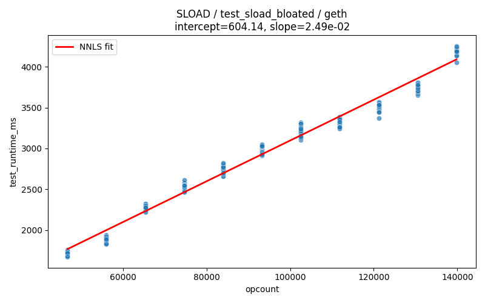

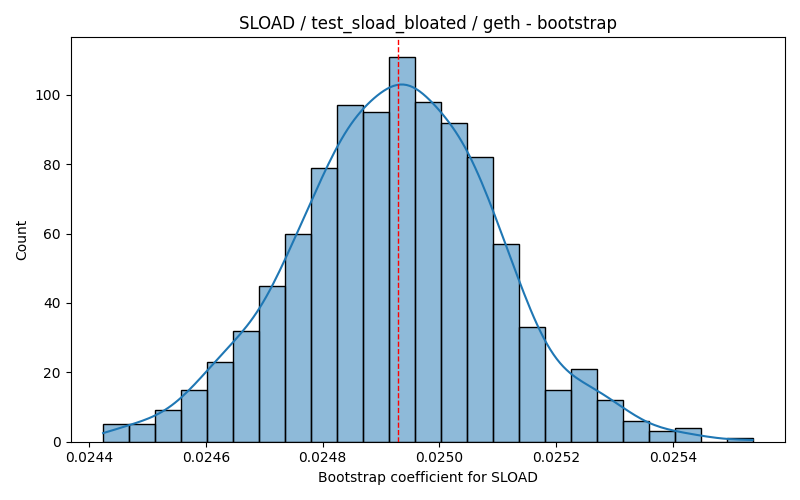

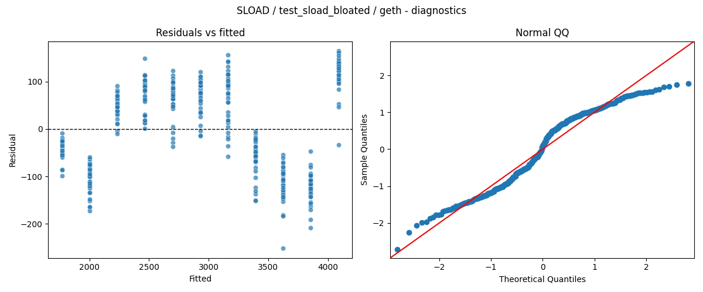

</details>

<details><summary>nethermind — NNLS regression summary</summary>

```
==============================================================================
                           NNLS Regression Results                            
==============================================================================
Dep. Variable:          test_runtime_ms              R-squared:          0.871
Model:                  NNLS                    Adj. R-squared:          0.871
No. Observations:       352                               RMSE:          36.09
Df Residuals:           350                                MAE:          22.85
Df Model:               1      
==============================================================================
                      coef     std err     P-value      [0.025      0.975]
------------------------------------------------------------------------------
         const     87.8410      6.0230       0.001     77.7558    101.2756
       opcount      0.0032      0.0001       0.001      0.0031      0.0033
==============================================================================
Notes: Non-negative least squares with bootstrap inference (1000 iterations)
==============================================================================
```

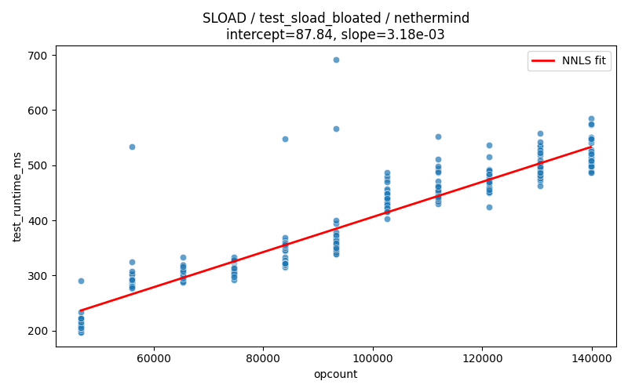

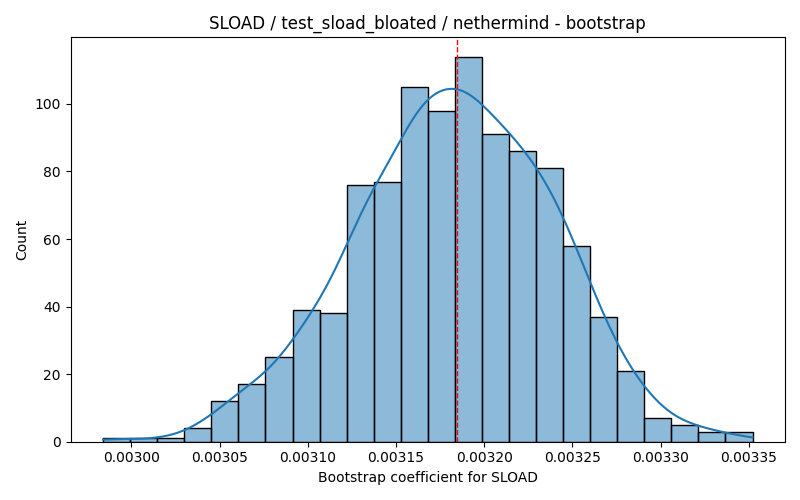

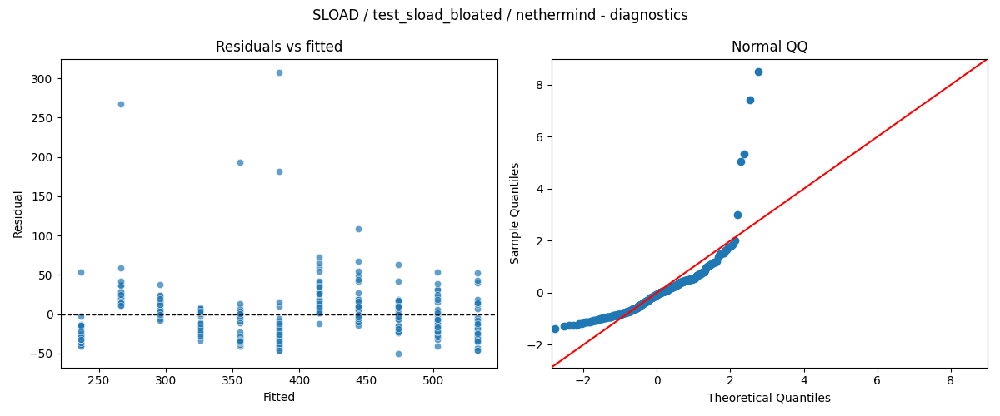

</details>

<details><summary>reth — NNLS regression summary</summary>

```
==============================================================================
                           NNLS Regression Results                            
==============================================================================
Dep. Variable:          test_runtime_ms              R-squared:          0.977
Model:                  NNLS                    Adj. R-squared:          0.977
No. Observations:       374                               RMSE:           5.73
Df Residuals:           372                                MAE:           4.48
Df Model:               1      
==============================================================================
                      coef     std err     P-value      [0.025      0.975]
------------------------------------------------------------------------------
         const     39.0508      0.9401       0.001     37.2161     40.8300
       opcount      0.0013      0.0000       0.001      0.0012      0.0013
==============================================================================
Notes: Non-negative least squares with bootstrap inference (1000 iterations)
==============================================================================
```

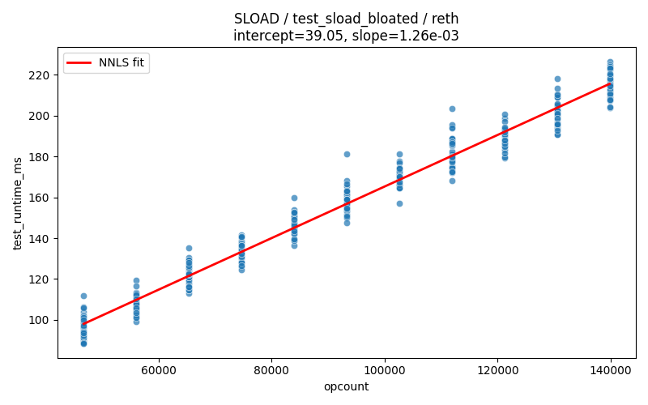

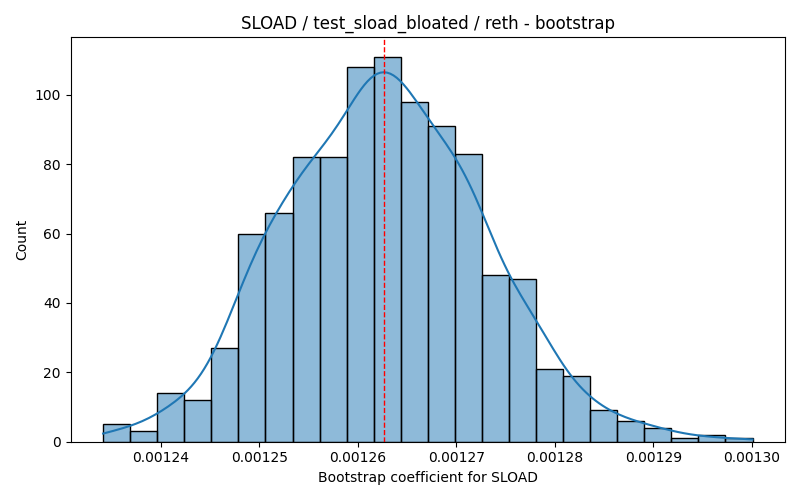

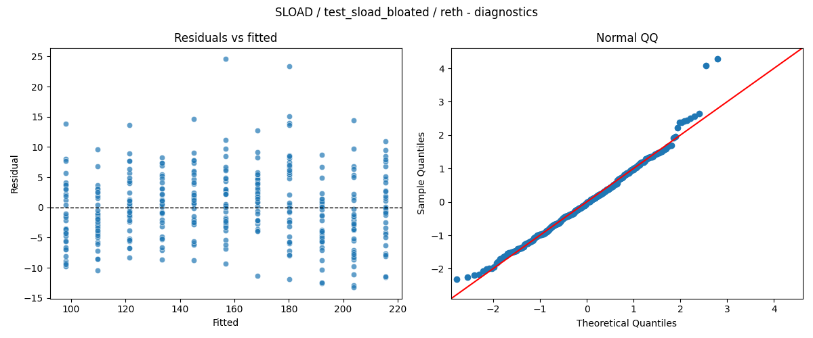

</details>

### test_sload_bloated — combo `True`

| client | nobs | R² | target_coef (ms) | p-value | 95% CI |
| --- | --- | --- | --- | --- | --- |
| `besu` | 341 | 0.9688 | 0.01614 | 1.00e-03 | [0.01578, 0.01646] |
| `erigon` | 198 | 0.9814 | 0.005298 | 1.00e-03 | [0.005252, 0.005333] |
| `ethrex` | 33 | 0.9756 | 0.02434 | 1.00e-03 | [0.02386, 0.02474] |
| `geth` | 407 | 0.9839 | 0.02432 | 1.00e-03 | [0.02399, 0.02465] |
| `nethermind` | 352 | 0.788 | 0.01676 | 1.00e-03 | [0.01577, 0.01778] |
| `reth` | 374 | 0.9829 | 0.001505 | 1.00e-03 | [0.001484, 0.001528] |

<details><summary>besu — NNLS regression summary</summary>

```
==============================================================================
                           NNLS Regression Results                            
==============================================================================
Dep. Variable:          test_runtime_ms              R-squared:          0.969
Model:                  NNLS                    Adj. R-squared:          0.969
No. Observations:       341                               RMSE:          85.24
Df Residuals:           339                                MAE:          67.66
Df Model:               1      
==============================================================================
                      coef     std err     P-value      [0.025      0.975]
------------------------------------------------------------------------------
         const    449.0558     14.9654       0.001    421.4759    480.1339
       opcount      0.0161      0.0002       0.001      0.0158      0.0165
==============================================================================
Notes: Non-negative least squares with bootstrap inference (1000 iterations)
==============================================================================
```

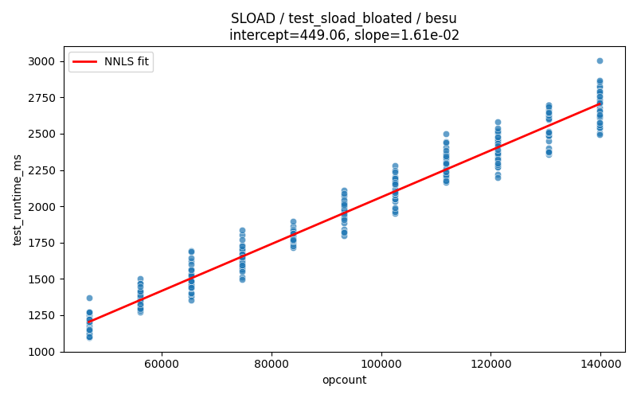

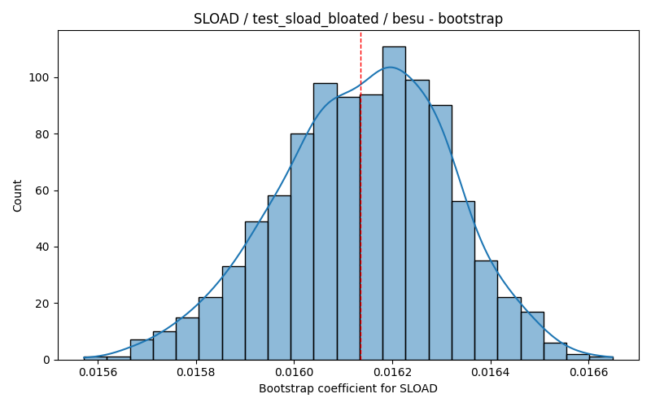

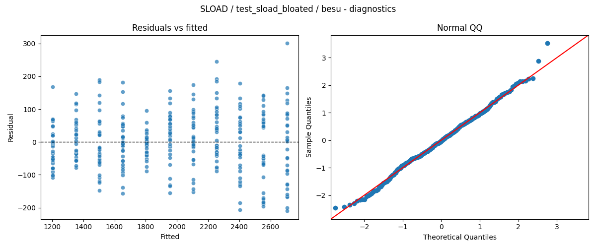

</details>

<details><summary>erigon — NNLS regression summary</summary>

```
==============================================================================
                           NNLS Regression Results                            
==============================================================================
Dep. Variable:          test_runtime_ms              R-squared:          0.981
Model:                  NNLS                    Adj. R-squared:          0.981
No. Observations:       198                               RMSE:          21.68
Df Residuals:           196                                MAE:          17.85
Df Model:               1      
==============================================================================
                      coef     std err     P-value      [0.025      0.975]
------------------------------------------------------------------------------
         const      0.0000      0.9198       1.000      0.0000      3.0325
       opcount      0.0053      0.0000       0.001      0.0053      0.0053
==============================================================================
Notes: Non-negative least squares with bootstrap inference (1000 iterations)
==============================================================================
```

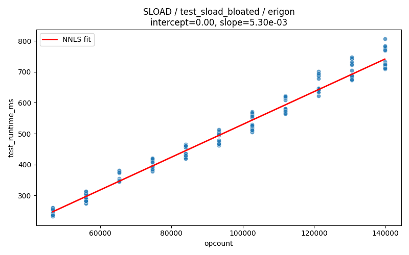


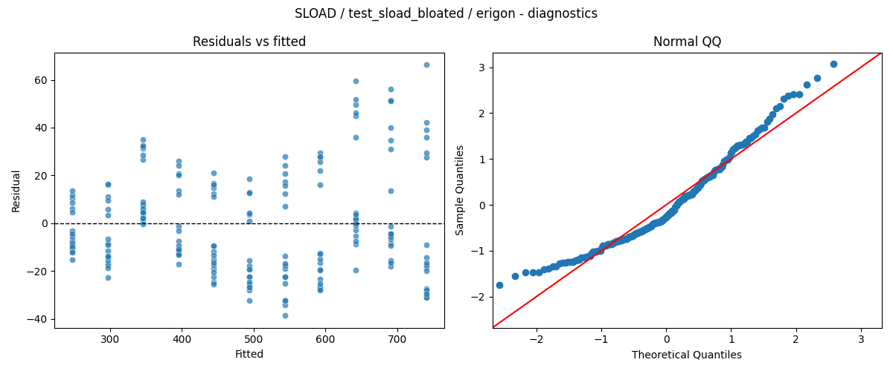

</details>

<details><summary>ethrex — NNLS regression summary</summary>

```
==============================================================================
                           NNLS Regression Results                            
==============================================================================
Dep. Variable:          test_runtime_ms              R-squared:          0.976
Model:                  NNLS                    Adj. R-squared:          0.975
No. Observations:       33                                RMSE:         127.56
Df Residuals:           31                                 MAE:         111.77
Df Model:               1      
==============================================================================
                      coef     std err     P-value      [0.025      0.975]
------------------------------------------------------------------------------
         const      0.0000      0.0000       1.000      0.0000      0.0000
       opcount      0.0243      0.0002       0.001      0.0239      0.0247
==============================================================================
Notes: Non-negative least squares with bootstrap inference (1000 iterations)
==============================================================================
```

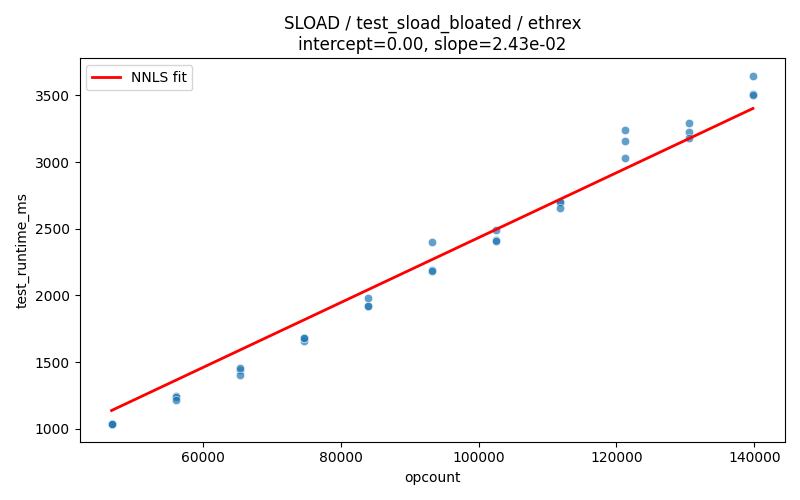

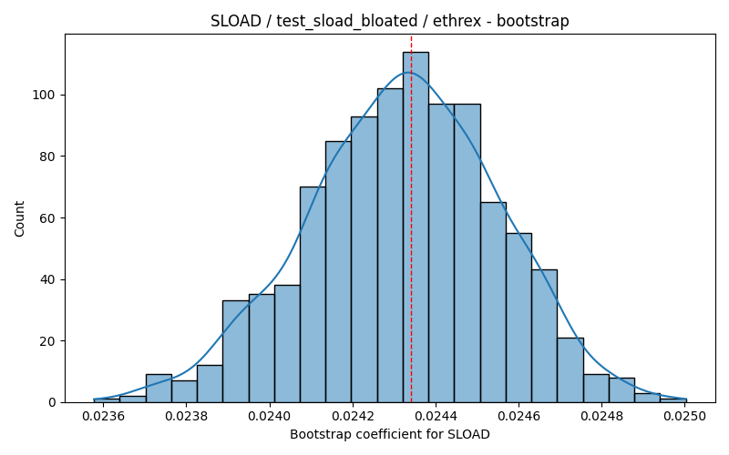

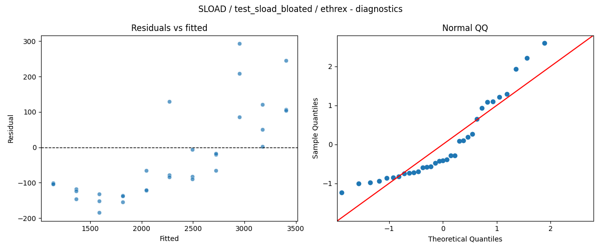

</details>

<details><summary>geth — NNLS regression summary</summary>

```
==============================================================================
                           NNLS Regression Results                            
==============================================================================
Dep. Variable:          test_runtime_ms              R-squared:          0.984
Model:                  NNLS                    Adj. R-squared:          0.984
No. Observations:       407                               RMSE:          91.56
Df Residuals:           405                                MAE:          81.58
Df Model:               1      
==============================================================================
                      coef     std err     P-value      [0.025      0.975]
------------------------------------------------------------------------------
         const    591.6238     14.1393       0.001    563.5515    618.1423
       opcount      0.0243      0.0002       0.001      0.0240      0.0246
==============================================================================
Notes: Non-negative least squares with bootstrap inference (1000 iterations)
==============================================================================
```

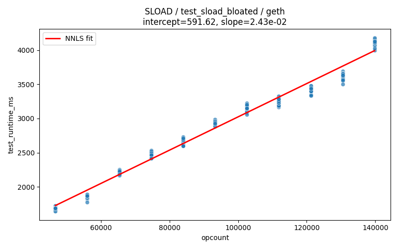

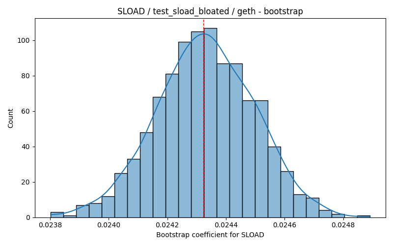

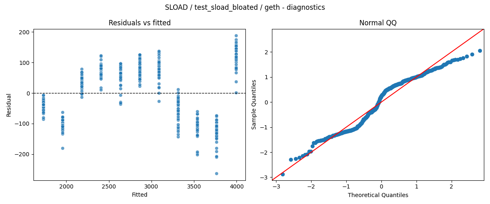

</details>

<details><summary>nethermind — NNLS regression summary</summary>

```
==============================================================================
                           NNLS Regression Results                            
==============================================================================
Dep. Variable:          test_runtime_ms              R-squared:          0.788
Model:                  NNLS                    Adj. R-squared:          0.787
No. Observations:       352                               RMSE:         255.90
Df Residuals:           350                                MAE:         218.56
Df Model:               1      
==============================================================================
                      coef     std err     P-value      [0.025      0.975]
------------------------------------------------------------------------------
         const    704.6838     54.4254       0.001    599.1222    810.8792
       opcount      0.0168      0.0005       0.001      0.0158      0.0178
==============================================================================
Notes: Non-negative least squares with bootstrap inference (1000 iterations)
==============================================================================
```

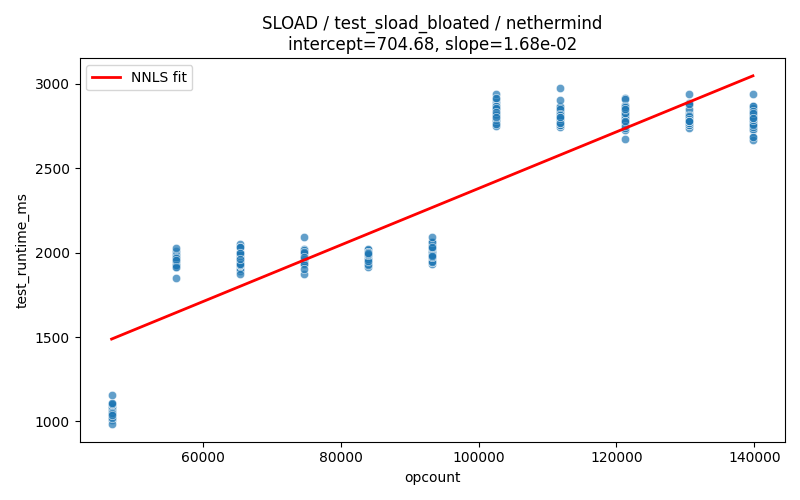

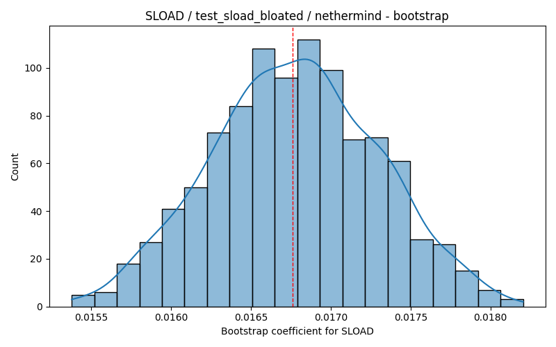

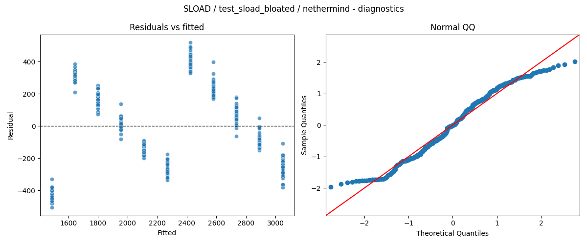

</details>

<details><summary>reth — NNLS regression summary</summary>

```
==============================================================================
                           NNLS Regression Results                            
==============================================================================
Dep. Variable:          test_runtime_ms              R-squared:          0.983
Model:                  NNLS                    Adj. R-squared:          0.983
No. Observations:       374                               RMSE:           5.85
Df Residuals:           372                                MAE:           4.71
Df Model:               1      
==============================================================================
                      coef     std err     P-value      [0.025      0.975]
------------------------------------------------------------------------------
         const     34.5815      1.1166       0.001     32.2466     36.6885
       opcount      0.0015      0.0000       0.001      0.0015      0.0015
==============================================================================
Notes: Non-negative least squares with bootstrap inference (1000 iterations)
==============================================================================
```

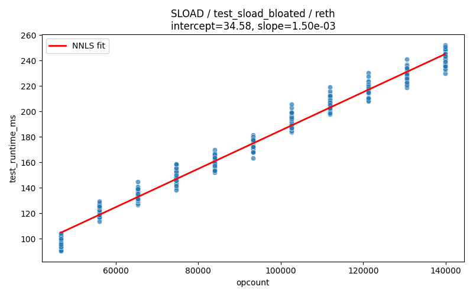

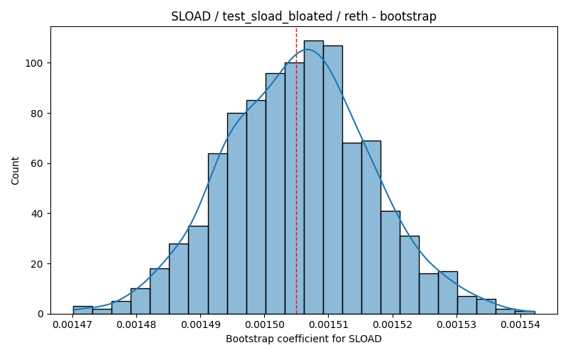

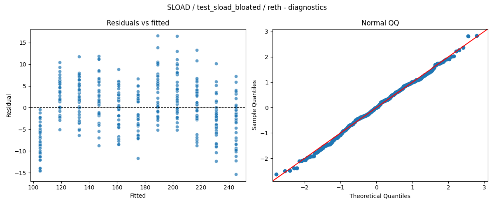

</details>

### test_storage_sload_same_key_benchmark

| client | nobs | R² | target_coef (ms) | p-value | 95% CI |
| --- | --- | --- | --- | --- | --- |
| `besu` | 682 | 0.2551 | 0.0001027 | 1.00e-03 | [8.907e-05, 0.0001151] |
| `erigon` | 396 | 0.8823 | 3.767e-05 | 1.00e-03 | [3.663e-05, 3.879e-05] |
| `ethrex` | 66 | 0.8625 | 2.576e-05 | 1.00e-03 | [2.37e-05, 2.827e-05] |
| `geth` | 814 | 0.8897 | 4.68e-05 | 1.00e-03 | [4.571e-05, 4.796e-05] |
| `nethermind` | 704 | 0.7921 | 0.0001455 | 1.00e-03 | [0.0001402, 0.000151] |
| `reth` | 748 | 0.686 | 6.771e-06 | 1.00e-03 | [6.479e-06, 7.076e-06] |

<details><summary>besu — NNLS regression summary</summary>

```
==============================================================================
                           NNLS Regression Results                            
==============================================================================
Dep. Variable:          test_runtime_ms              R-squared:          0.255
Model:                  NNLS                    Adj. R-squared:          0.254
No. Observations:       682                               RMSE:         110.81
Df Residuals:           680                                MAE:          88.53
Df Model:               1      
==============================================================================
                      coef     std err     P-value      [0.025      0.975]
------------------------------------------------------------------------------
         const    203.3011     13.2881       0.001    177.5372    230.3766
       opcount      0.0001      0.0000       0.001      0.0001      0.0001
==============================================================================
Notes: Non-negative least squares with bootstrap inference (1000 iterations)
==============================================================================
```

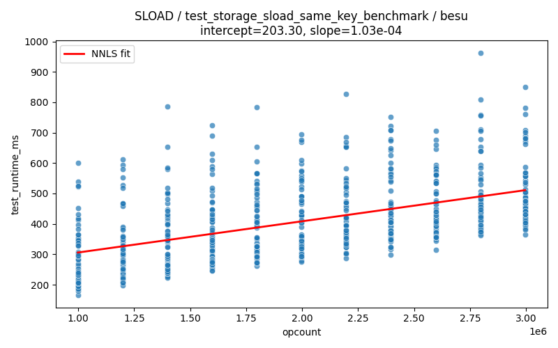

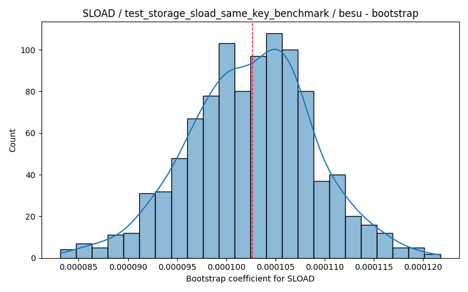

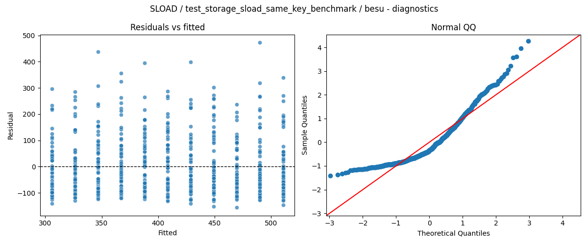

</details>

<details><summary>erigon — NNLS regression summary</summary>

```
==============================================================================
                           NNLS Regression Results                            
==============================================================================
Dep. Variable:          test_runtime_ms              R-squared:          0.882
Model:                  NNLS                    Adj. R-squared:          0.882
No. Observations:       396                               RMSE:           8.69
Df Residuals:           394                                MAE:           5.02
Df Model:               1      
==============================================================================
                      coef     std err     P-value      [0.025      0.975]
------------------------------------------------------------------------------
         const     23.8492      1.0706       0.001     21.7449     25.8955
       opcount      0.0000      0.0000       0.001      0.0000      0.0000
==============================================================================
Notes: Non-negative least squares with bootstrap inference (1000 iterations)
==============================================================================
```

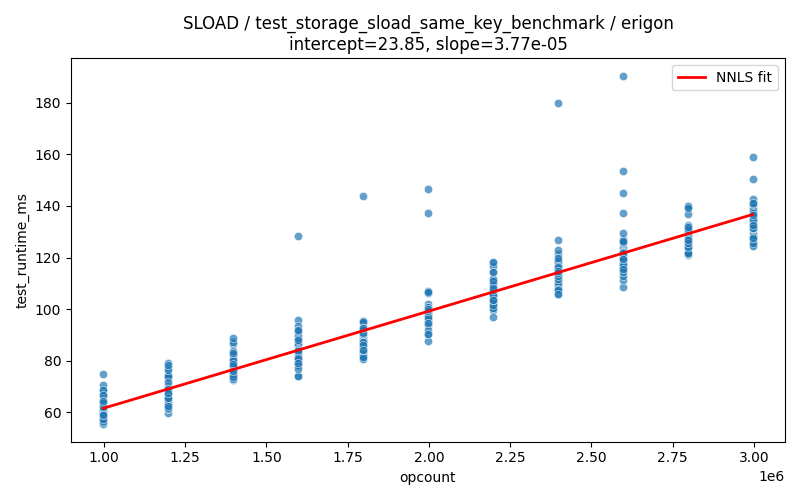

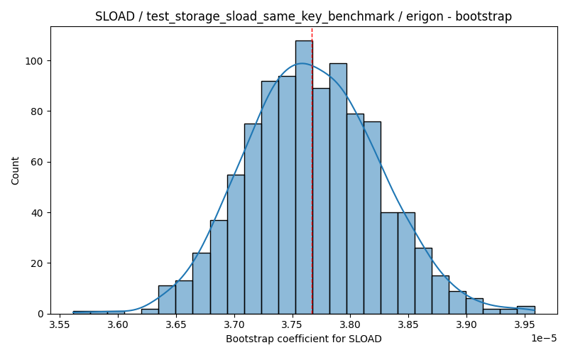

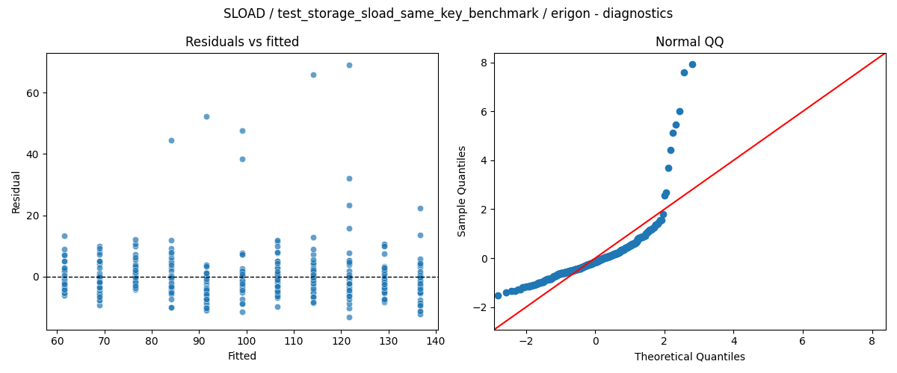

</details>

<details><summary>ethrex — NNLS regression summary</summary>

```
==============================================================================
                           NNLS Regression Results                            
==============================================================================
Dep. Variable:          test_runtime_ms              R-squared:          0.863
Model:                  NNLS                    Adj. R-squared:          0.860
No. Observations:       66                                RMSE:           6.50
Df Residuals:           64                                 MAE:           4.75
Df Model:               1      
==============================================================================
                      coef     std err     P-value      [0.025      0.975]
------------------------------------------------------------------------------
         const     11.4108      1.9338       0.001      7.3534     14.8430
       opcount      0.0000      0.0000       0.001      0.0000      0.0000
==============================================================================
Notes: Non-negative least squares with bootstrap inference (1000 iterations)
==============================================================================
```

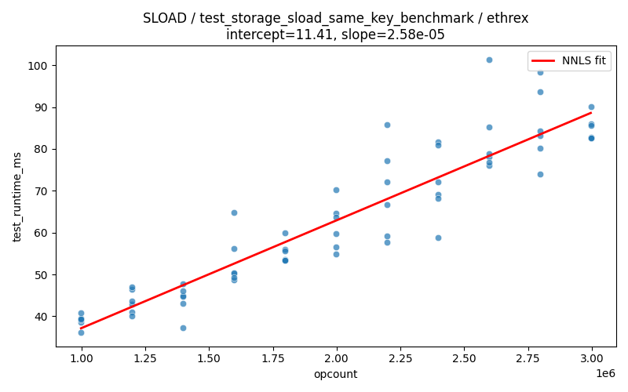

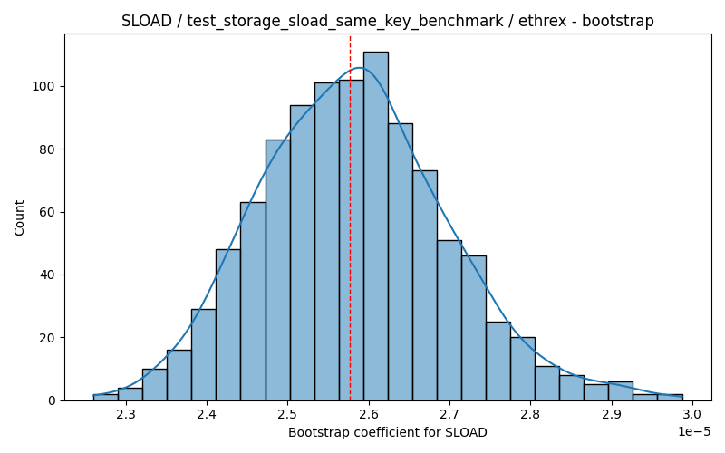

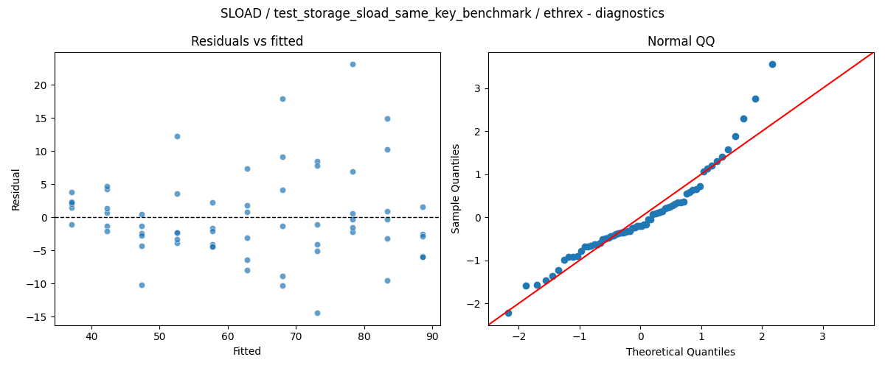

</details>

<details><summary>geth — NNLS regression summary</summary>

```
==============================================================================
                           NNLS Regression Results                            
==============================================================================
Dep. Variable:          test_runtime_ms              R-squared:          0.890
Model:                  NNLS                    Adj. R-squared:          0.890
No. Observations:       814                               RMSE:          10.41
Df Residuals:           812                                MAE:           8.20
Df Model:               1      
==============================================================================
                      coef     std err     P-value      [0.025      0.975]
------------------------------------------------------------------------------
         const     24.3442      1.0850       0.001     22.2843     26.4721
       opcount      0.0000      0.0000       0.001      0.0000      0.0000
==============================================================================
Notes: Non-negative least squares with bootstrap inference (1000 iterations)
==============================================================================
```

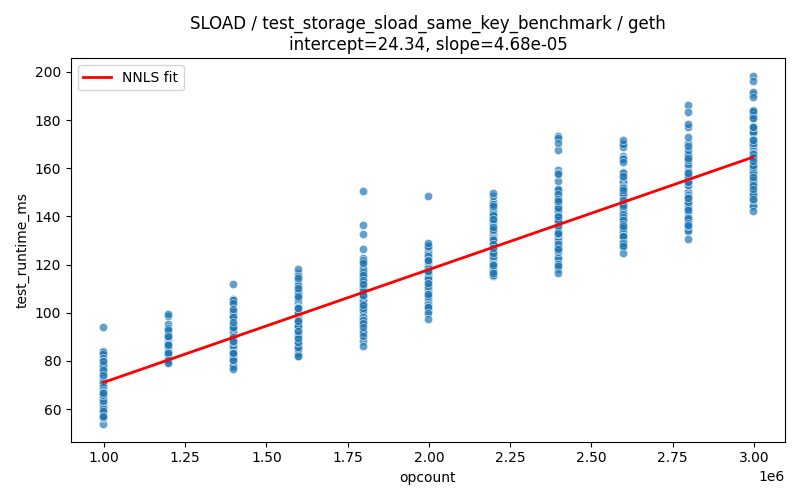

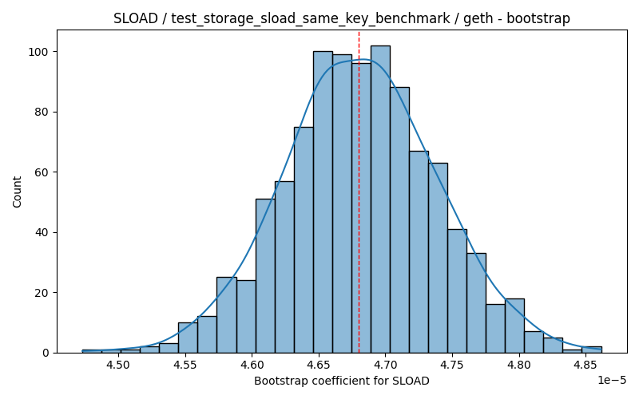

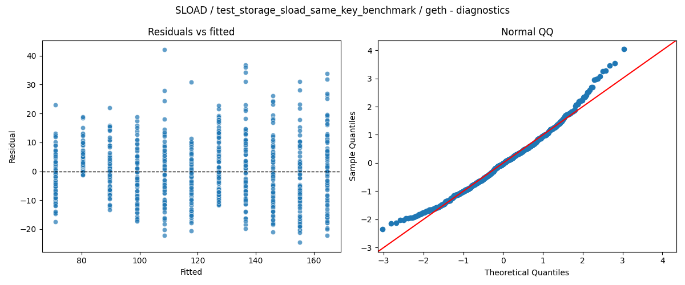

</details>

<details><summary>nethermind — NNLS regression summary</summary>

```
==============================================================================
                           NNLS Regression Results                            
==============================================================================
Dep. Variable:          test_runtime_ms              R-squared:          0.792
Model:                  NNLS                    Adj. R-squared:          0.792
No. Observations:       704                               RMSE:          47.08
Df Residuals:           702                                MAE:          36.92
Df Model:               1      
==============================================================================
                      coef     std err     P-value      [0.025      0.975]
------------------------------------------------------------------------------
         const    104.3602      5.3551       0.001     93.8637    114.9304
       opcount      0.0001      0.0000       0.001      0.0001      0.0002
==============================================================================
Notes: Non-negative least squares with bootstrap inference (1000 iterations)
==============================================================================
```

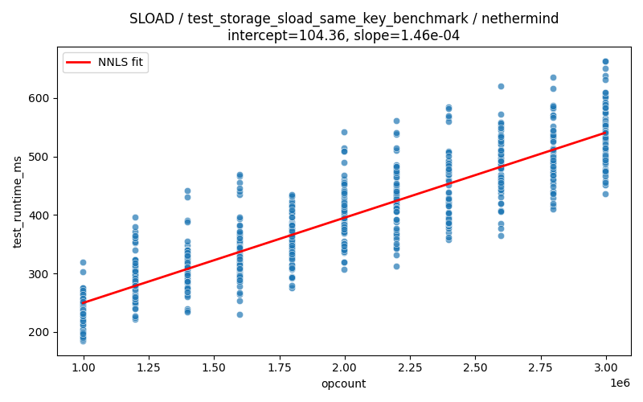

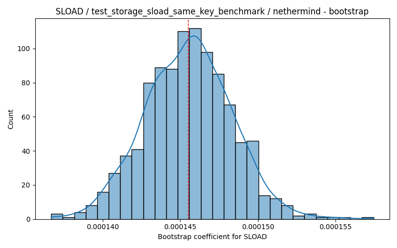

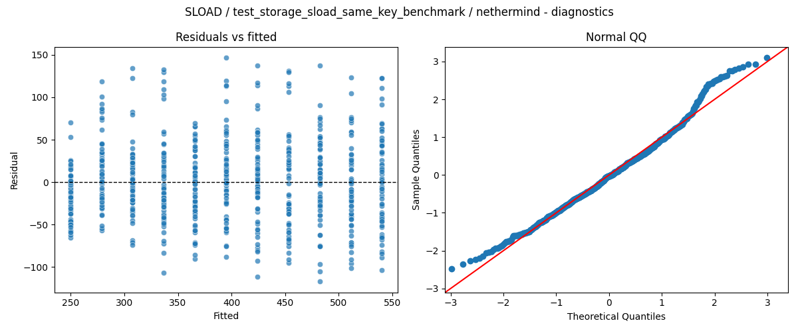

</details>

<details><summary>reth — NNLS regression summary</summary>

```
==============================================================================
                           NNLS Regression Results                            
==============================================================================
Dep. Variable:          test_runtime_ms              R-squared:          0.686
Model:                  NNLS                    Adj. R-squared:          0.686
No. Observations:       748                               RMSE:           2.89
Df Residuals:           746                                MAE:           1.96
Df Model:               1      
==============================================================================
                      coef     std err     P-value      [0.025      0.975]
------------------------------------------------------------------------------
         const      5.6346      0.2986       0.001      5.0232      6.2037
       opcount      0.0000      0.0000       0.001      0.0000      0.0000
==============================================================================
Notes: Non-negative least squares with bootstrap inference (1000 iterations)
==============================================================================
```

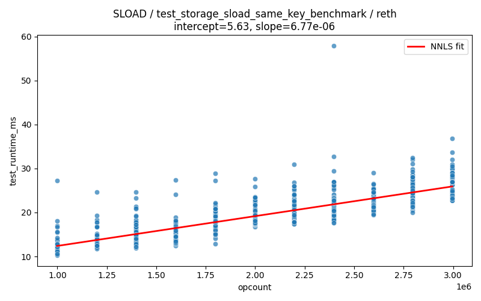

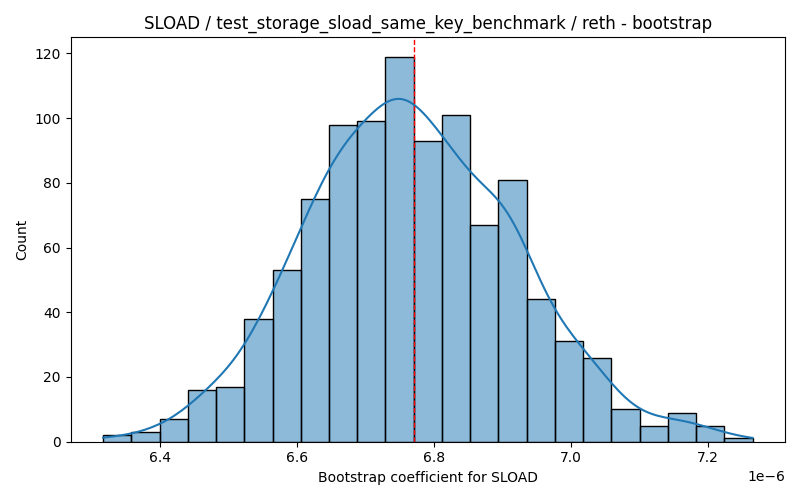

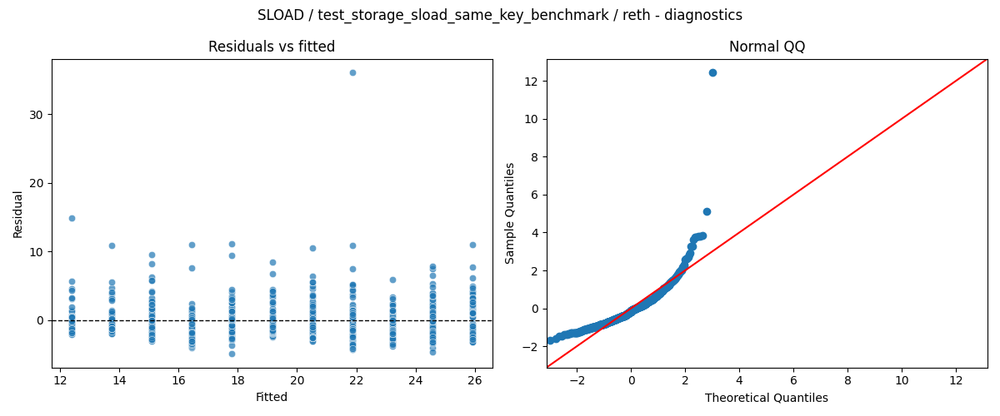

</details>

## SSTORE

### test_sstore_bloated — combo `False` — `presets[cold_storage_sstore_access]`

| client | nobs | R² | target_coef (ms) | p-value | 95% CI |
| --- | --- | --- | --- | --- | --- |
| `besu` | 341 | 0.8149 | 0.009714 | 1.00e-03 | [0.009193, 0.01026] |
| `erigon` | 198 | 0.9841 | 0.005878 | 1.00e-03 | [0.005802, 0.005915] |
| `ethrex` | 33 | 0.9112 | 0.009126 | 1.00e-03 | [0.008686, 0.009468] |
| `geth` | 407 | 0.9828 | 0.02439 | 1.00e-03 | [0.02406, 0.02474] |
| `nethermind` | 352 | 0.9391 | 0.003205 | 1.00e-03 | [0.003116, 0.003289] |
| `reth` | 374 | 0.9751 | 0.001268 | 1.00e-03 | [0.001247, 0.00129] |

<details><summary>besu — NNLS regression summary</summary>

```
==============================================================================
                           NNLS Regression Results                            
==============================================================================
Dep. Variable:          test_runtime_ms              R-squared:          0.815
Model:                  NNLS                    Adj. R-squared:          0.814
No. Observations:       341                               RMSE:         130.84
Df Residuals:           339                                MAE:         103.34
Df Model:               1      
==============================================================================
                      coef     std err     P-value      [0.025      0.975]
------------------------------------------------------------------------------
         const    565.0386     22.4158       0.001    523.0134    608.2794
       opcount      0.0097      0.0003       0.001      0.0092      0.0103
==============================================================================
Notes: Non-negative least squares with bootstrap inference (1000 iterations)
==============================================================================
```

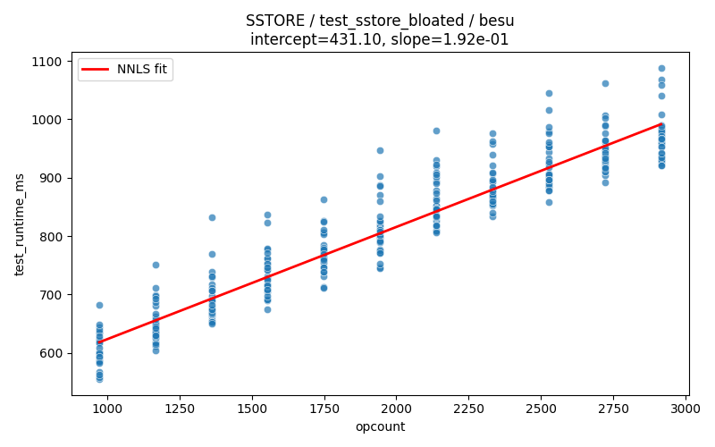

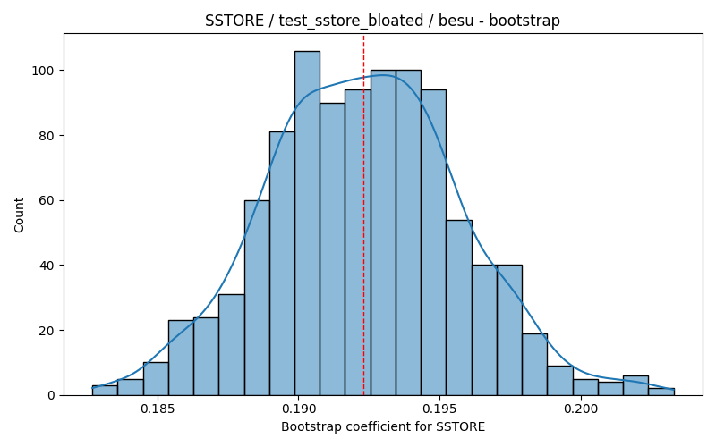


</details>

<details><summary>erigon — NNLS regression summary</summary>

```
==============================================================================
                           NNLS Regression Results                            
==============================================================================
Dep. Variable:          test_runtime_ms              R-squared:          0.984
Model:                  NNLS                    Adj. R-squared:          0.984
No. Observations:       198                               RMSE:          21.21
Df Residuals:           196                                MAE:          18.35
Df Model:               1      
==============================================================================
                      coef     std err     P-value      [0.025      0.975]
------------------------------------------------------------------------------
         const      0.0000      1.4478       1.000      0.0000      4.9066
       opcount      0.0059      0.0000       0.001      0.0058      0.0059
==============================================================================
Notes: Non-negative least squares with bootstrap inference (1000 iterations)
==============================================================================
```

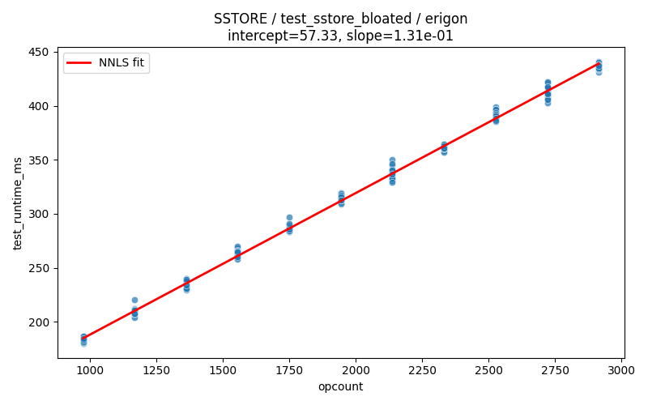

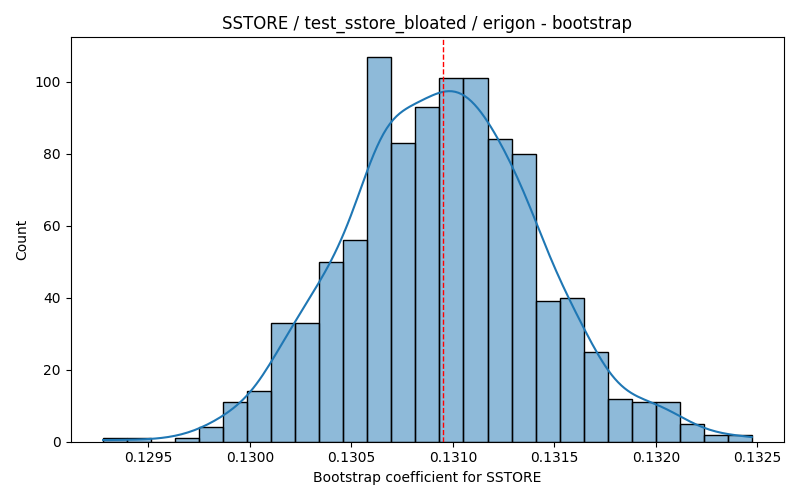

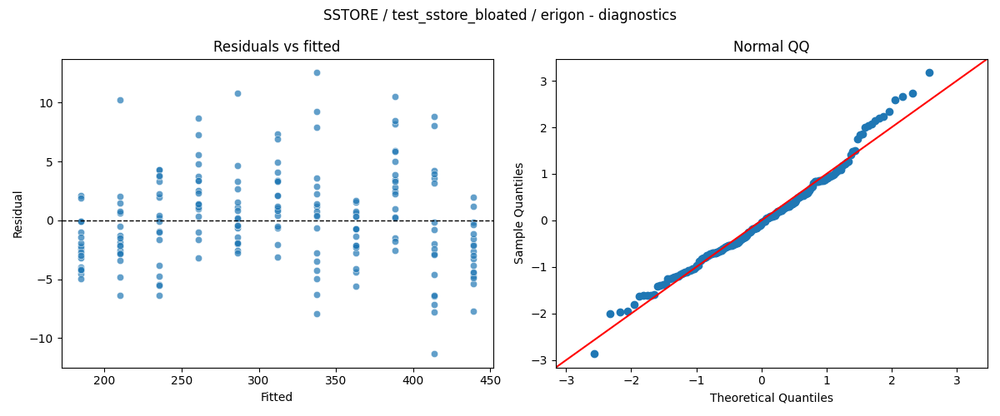

</details>

<details><summary>ethrex — NNLS regression summary</summary>

```
==============================================================================
                           NNLS Regression Results                            
==============================================================================
Dep. Variable:          test_runtime_ms              R-squared:          0.911
Model:                  NNLS                    Adj. R-squared:          0.908
No. Observations:       33                                RMSE:         101.03
Df Residuals:           31                                 MAE:          89.43
Df Model:               1      
==============================================================================
                      coef     std err     P-value      [0.025      0.975]
------------------------------------------------------------------------------
         const      0.0000      0.0000       1.000      0.0000      0.0000
       opcount      0.0091      0.0002       0.001      0.0087      0.0095
==============================================================================
Notes: Non-negative least squares with bootstrap inference (1000 iterations)
==============================================================================
```


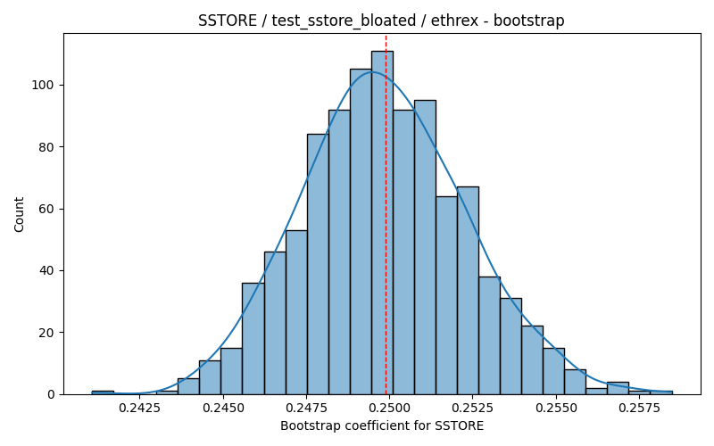

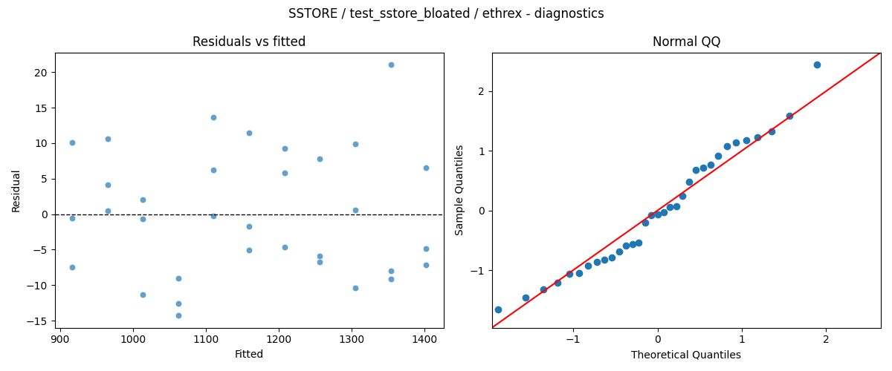

</details>

<details><summary>geth — NNLS regression summary</summary>

```
==============================================================================
                           NNLS Regression Results                            
==============================================================================
Dep. Variable:          test_runtime_ms              R-squared:          0.983
Model:                  NNLS                    Adj. R-squared:          0.983
No. Observations:       407                               RMSE:          91.23
Df Residuals:           405                                MAE:          77.80
Df Model:               1      
==============================================================================
                      coef     std err     P-value      [0.025      0.975]
------------------------------------------------------------------------------
         const    614.0388     14.7880       0.001    586.5006    641.7872
       opcount      0.0244      0.0002       0.001      0.0241      0.0247
==============================================================================
Notes: Non-negative least squares with bootstrap inference (1000 iterations)
==============================================================================
```

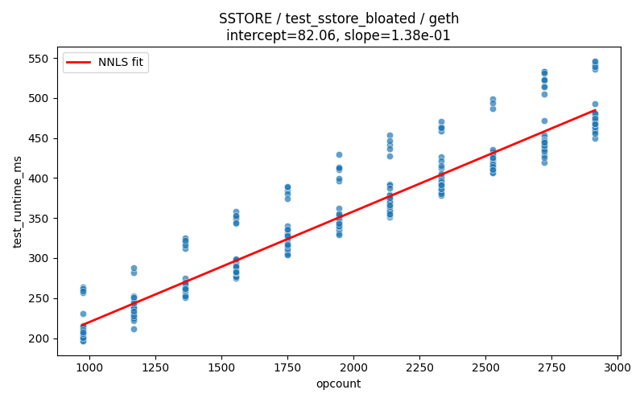

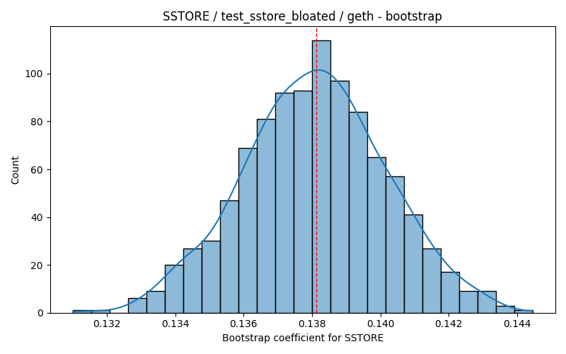

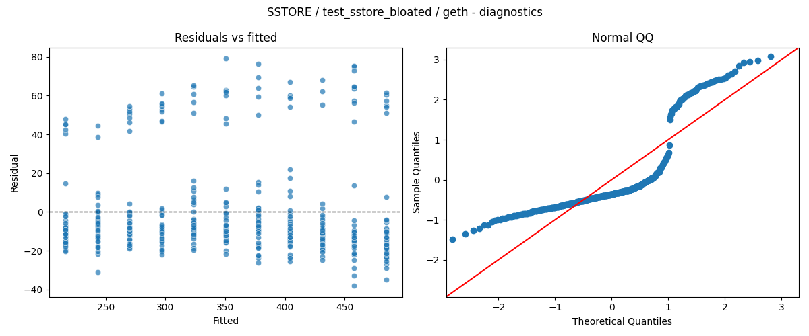

</details>

<details><summary>nethermind — NNLS regression summary</summary>

```
==============================================================================
                           NNLS Regression Results                            
==============================================================================
Dep. Variable:          test_runtime_ms              R-squared:          0.939
Model:                  NNLS                    Adj. R-squared:          0.939
No. Observations:       352                               RMSE:          23.07
Df Residuals:           350                                MAE:          18.72
Df Model:               1      
==============================================================================
                      coef     std err     P-value      [0.025      0.975]
------------------------------------------------------------------------------
         const     83.2837      4.0093       0.001     75.6344     91.2380
       opcount      0.0032      0.0000       0.001      0.0031      0.0033
==============================================================================
Notes: Non-negative least squares with bootstrap inference (1000 iterations)
==============================================================================
```

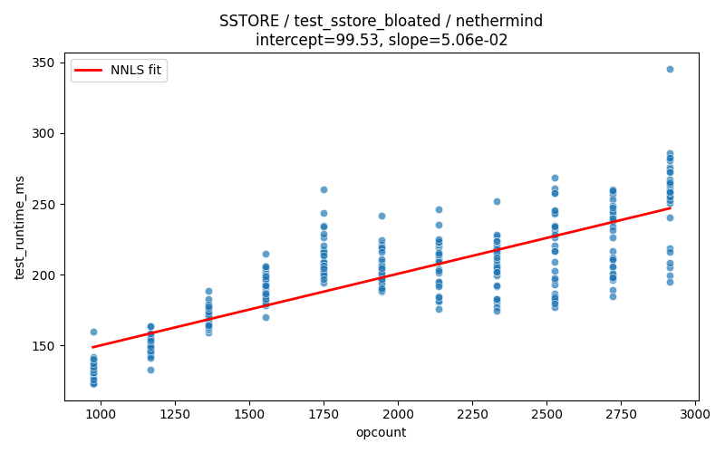

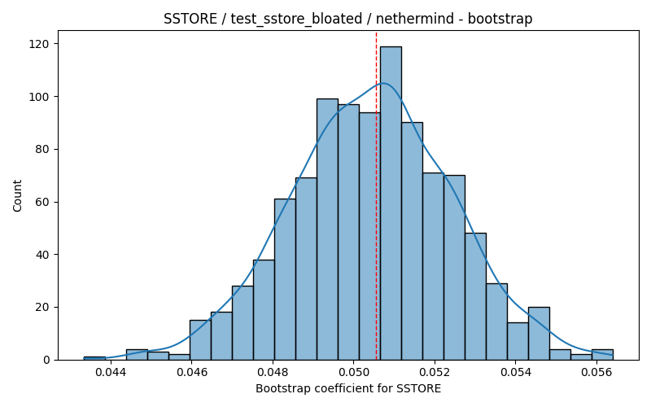

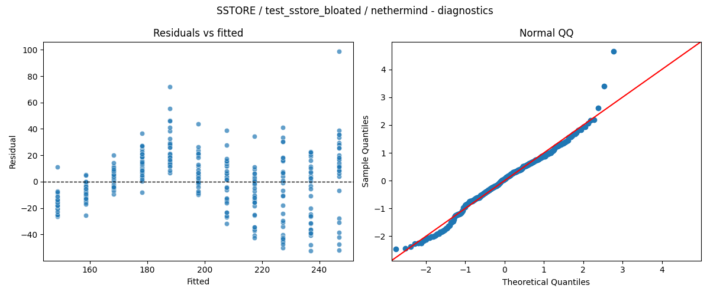

</details>

<details><summary>reth — NNLS regression summary</summary>

```
==============================================================================
                           NNLS Regression Results                            
==============================================================================
Dep. Variable:          test_runtime_ms              R-squared:          0.975
Model:                  NNLS                    Adj. R-squared:          0.975
No. Observations:       374                               RMSE:           5.72
Df Residuals:           372                                MAE:           4.53
Df Model:               1      
==============================================================================
                      coef     std err     P-value      [0.025      0.975]
------------------------------------------------------------------------------
         const     41.4211      0.9835       0.001     39.5493     43.2989
       opcount      0.0013      0.0000       0.001      0.0012      0.0013
==============================================================================
Notes: Non-negative least squares with bootstrap inference (1000 iterations)
==============================================================================
```

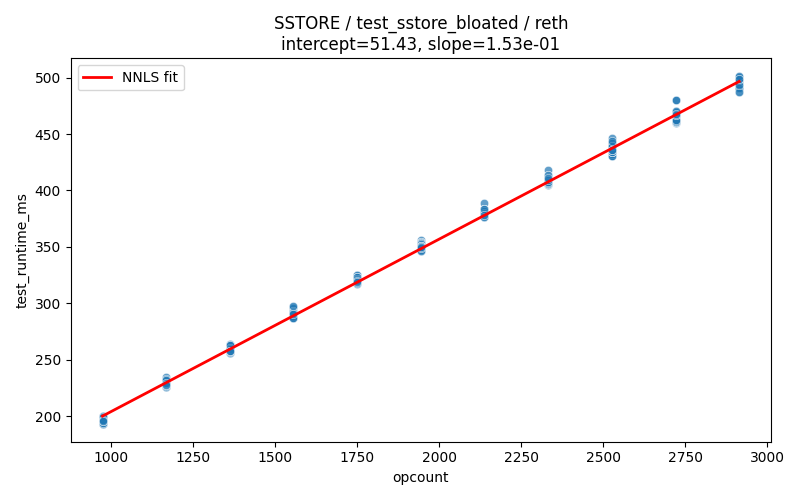

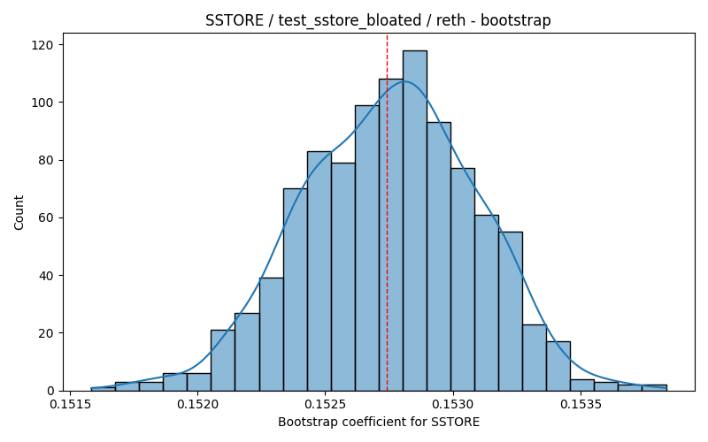

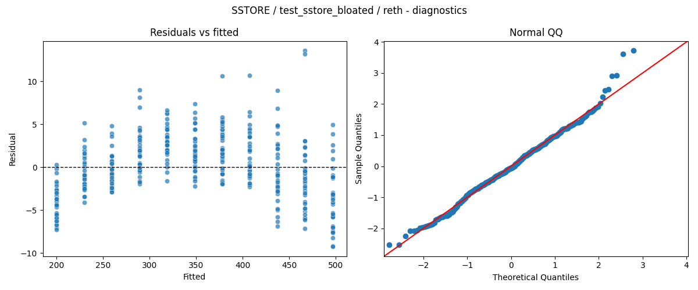

</details>

### test_sstore_bloated — combo `True` — `presets[cold_storage_sstore_access]`

| client | nobs | R² | target_coef (ms) | p-value | 95% CI |
| --- | --- | --- | --- | --- | --- |
| `besu` | 341 | 0.9404 | 0.01717 | 1.00e-03 | [0.01672, 0.01763] |
| `erigon` | 198 | 0.9764 | 0.005295 | 1.00e-03 | [0.005229, 0.005337] |
| `ethrex` | 33 | 0.9909 | 0.02482 | 1.00e-03 | [0.02456, 0.02509] |
| `geth` | 407 | 0.983 | 0.02392 | 1.00e-03 | [0.02354, 0.02426] |
| `nethermind` | 352 | 0.7967 | 0.01727 | 1.00e-03 | [0.01631, 0.01823] |
| `reth` | 374 | 0.9814 | 0.001545 | 1.00e-03 | [0.001523, 0.001567] |

<details><summary>besu — NNLS regression summary</summary>

```
==============================================================================
                           NNLS Regression Results                            
==============================================================================
Dep. Variable:          test_runtime_ms              R-squared:          0.940
Model:                  NNLS                    Adj. R-squared:          0.940
No. Observations:       341                               RMSE:         122.16
Df Residuals:           339                                MAE:          99.38
Df Model:               1      
==============================================================================
                      coef     std err     P-value      [0.025      0.975]
------------------------------------------------------------------------------
         const    704.0876     20.0002       0.001    665.2037    740.6361
       opcount      0.0172      0.0002       0.001      0.0167      0.0176
==============================================================================
Notes: Non-negative least squares with bootstrap inference (1000 iterations)
==============================================================================
```

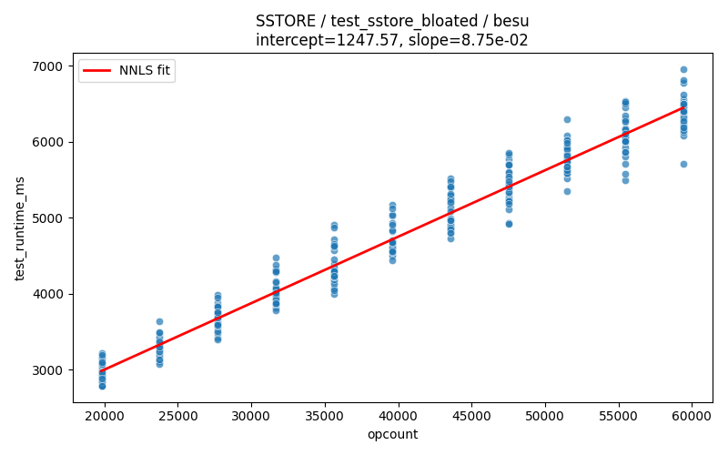

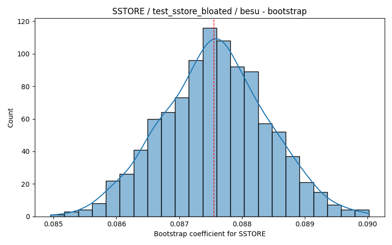

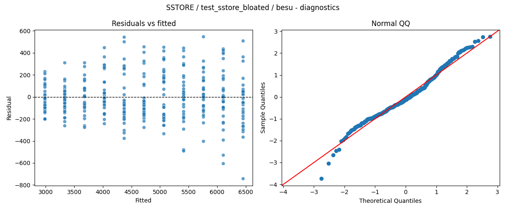

</details>

<details><summary>erigon — NNLS regression summary</summary>

```
==============================================================================
                           NNLS Regression Results                            
==============================================================================
Dep. Variable:          test_runtime_ms              R-squared:          0.976
Model:                  NNLS                    Adj. R-squared:          0.976
No. Observations:       198                               RMSE:          23.48
Df Residuals:           196                                MAE:          19.00
Df Model:               1      
==============================================================================
                      coef     std err     P-value      [0.025      0.975]
------------------------------------------------------------------------------
         const      0.0000      1.4222       1.000      0.0000      4.4954
       opcount      0.0053      0.0000       0.001      0.0052      0.0053
==============================================================================
Notes: Non-negative least squares with bootstrap inference (1000 iterations)
==============================================================================
```


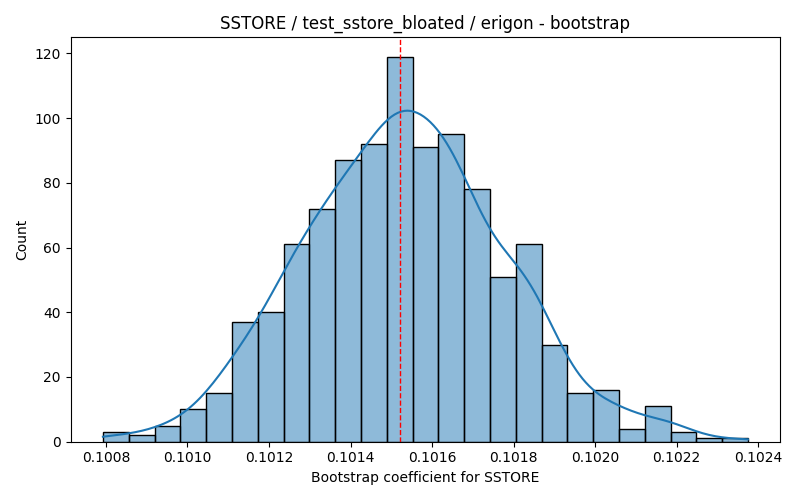

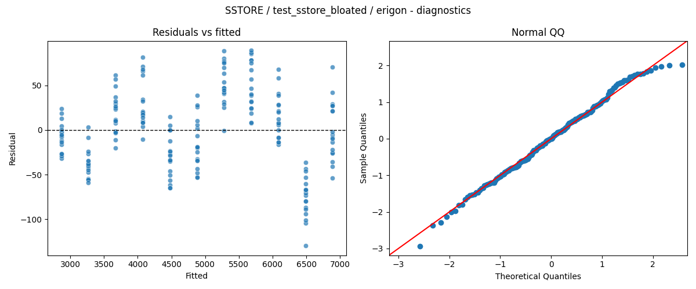

</details>

<details><summary>ethrex — NNLS regression summary</summary>

```
==============================================================================
                           NNLS Regression Results                            
==============================================================================
Dep. Variable:          test_runtime_ms              R-squared:          0.991
Model:                  NNLS                    Adj. R-squared:          0.991
No. Observations:       33                                RMSE:          70.58
Df Residuals:           31                                 MAE:          54.57
Df Model:               1      
==============================================================================
                      coef     std err     P-value      [0.025      0.975]
------------------------------------------------------------------------------
         const      0.0000      0.0000       1.000      0.0000      0.0000
       opcount      0.0248      0.0001       0.001      0.0246      0.0251
==============================================================================
Notes: Non-negative least squares with bootstrap inference (1000 iterations)
==============================================================================
```


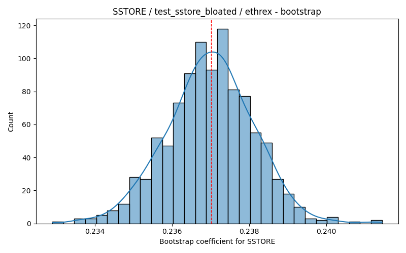

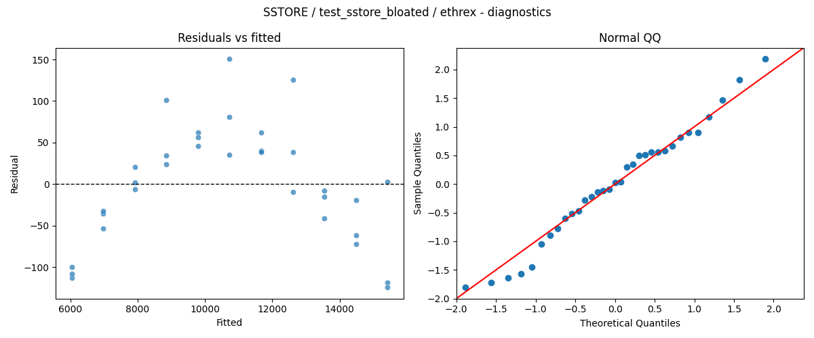

</details>

<details><summary>geth — NNLS regression summary</summary>

```
==============================================================================
                           NNLS Regression Results                            
==============================================================================
Dep. Variable:          test_runtime_ms              R-squared:          0.983
Model:                  NNLS                    Adj. R-squared:          0.983
No. Observations:       407                               RMSE:          88.82
Df Residuals:           405                                MAE:          76.19
Df Model:               1      
==============================================================================
                      coef     std err     P-value      [0.025      0.975]
------------------------------------------------------------------------------
         const    592.6140     14.5298       0.001    566.2769    624.9217
       opcount      0.0239      0.0002       0.001      0.0235      0.0243
==============================================================================
Notes: Non-negative least squares with bootstrap inference (1000 iterations)
==============================================================================
```

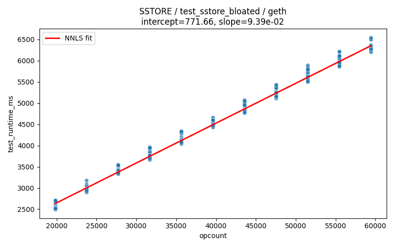

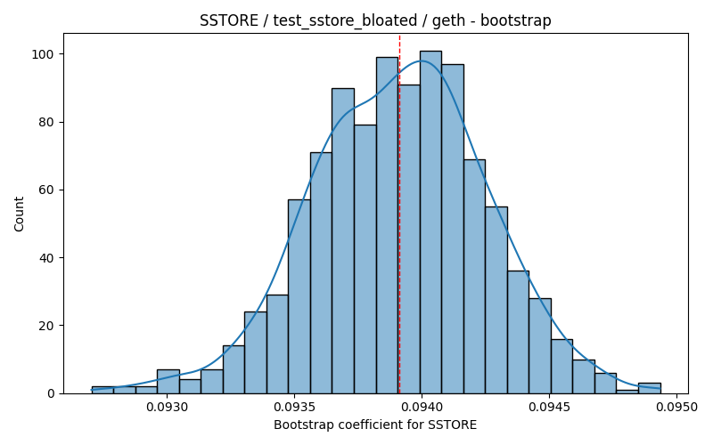

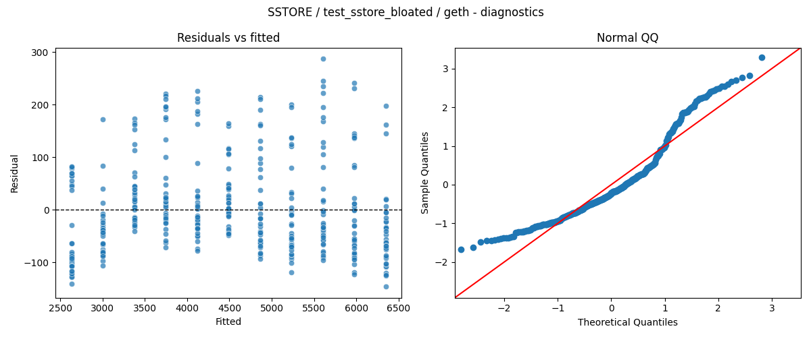

</details>

<details><summary>nethermind — NNLS regression summary</summary>

```
==============================================================================
                           NNLS Regression Results                            
==============================================================================
Dep. Variable:          test_runtime_ms              R-squared:          0.797
Model:                  NNLS                    Adj. R-squared:          0.796
No. Observations:       352                               RMSE:         246.47
Df Residuals:           350                                MAE:         209.86
Df Model:               1      
==============================================================================
                      coef     std err     P-value      [0.025      0.975]
------------------------------------------------------------------------------
         const    657.6170     51.1696       0.001    561.4177    757.0305
       opcount      0.0173      0.0005       0.001      0.0163      0.0182
==============================================================================
Notes: Non-negative least squares with bootstrap inference (1000 iterations)
==============================================================================
```

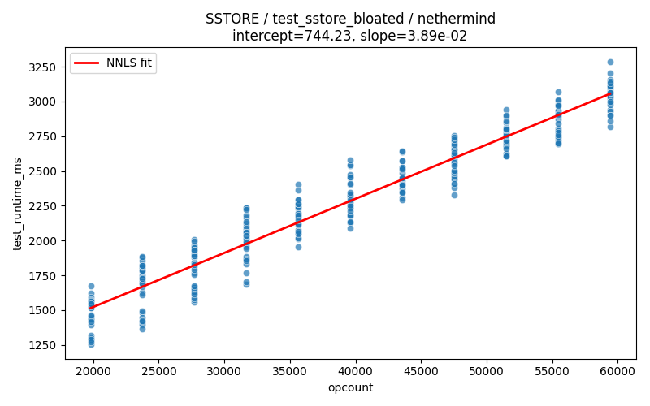

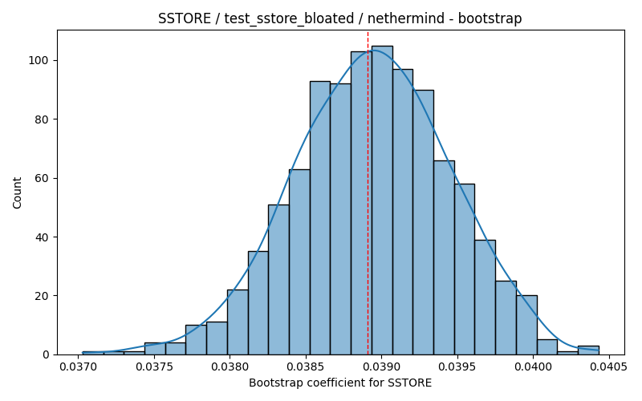

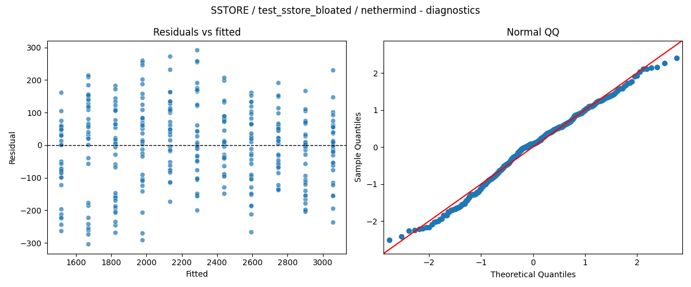

</details>

<details><summary>reth — NNLS regression summary</summary>

```
==============================================================================
                           NNLS Regression Results                            
==============================================================================
Dep. Variable:          test_runtime_ms              R-squared:          0.981
Model:                  NNLS                    Adj. R-squared:          0.981
No. Observations:       374                               RMSE:           6.01
Df Residuals:           372                                MAE:           4.80
Df Model:               1      
==============================================================================
                      coef     std err     P-value      [0.025      0.975]
------------------------------------------------------------------------------
         const     33.0314      1.0837       0.001     30.9309     35.0915
       opcount      0.0015      0.0000       0.001      0.0015      0.0016
==============================================================================
Notes: Non-negative least squares with bootstrap inference (1000 iterations)
==============================================================================
```


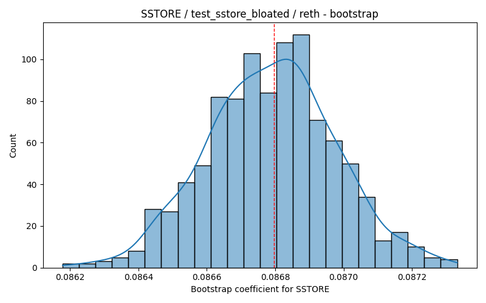

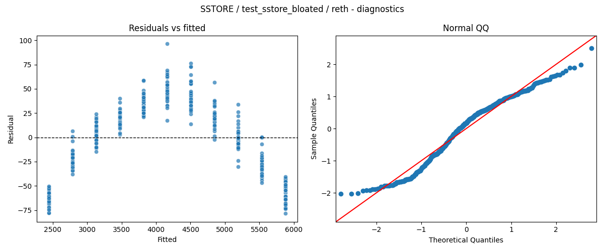

</details>

### test_sstore_bloated — combo `False` — `presets[cold_storage_sstore_write]`

| client | nobs | R² | target_coef (ms) | p-value | 95% CI |
| --- | --- | --- | --- | --- | --- |
| `besu` | 341 | 0.9011 | 0.1923 | 1.00e-03 | [0.1855, 0.1989] |
| `erigon` | 198 | 0.9976 | 0.131 | 1.00e-03 | [0.1301, 0.1319] |
| `ethrex` | 33 | 0.9969 | 0.2499 | 1.00e-03 | [0.2452, 0.2549] |
| `geth` | 407 | 0.9162 | 0.1381 | 1.00e-03 | [0.134, 0.1422] |
| `nethermind` | 352 | 0.6811 | 0.05056 | 1.00e-03 | [0.04652, 0.05442] |
| `reth` | 374 | 0.9985 | 0.1527 | 1.00e-03 | [0.1521, 0.1534] |

<details><summary>besu — NNLS regression summary</summary>

```
==============================================================================
                           NNLS Regression Results                            
==============================================================================
Dep. Variable:          test_runtime_ms              R-squared:          0.901
Model:                  NNLS                    Adj. R-squared:          0.901
No. Observations:       341                               RMSE:          39.12
Df Residuals:           339                                MAE:          29.94
Df Model:               1      
==============================================================================
                      coef     std err     P-value      [0.025      0.975]
------------------------------------------------------------------------------
         const    431.1008      6.5603       0.001    417.7906    444.1763
       opcount      0.1923      0.0034       0.001      0.1855      0.1989
==============================================================================
Notes: Non-negative least squares with bootstrap inference (1000 iterations)
==============================================================================
```


</details>

<details><summary>erigon — NNLS regression summary</summary>

```
==============================================================================
                           NNLS Regression Results                            
==============================================================================
Dep. Variable:          test_runtime_ms              R-squared:          0.998
Model:                  NNLS                    Adj. R-squared:          0.998
No. Observations:       198                               RMSE:           3.95
Df Residuals:           196                                MAE:           3.09
Df Model:               1      
==============================================================================
                      coef     std err     P-value      [0.025      0.975]
------------------------------------------------------------------------------
         const     57.3285      0.8983       0.001     55.6038     59.1115
       opcount      0.1310      0.0005       0.001      0.1301      0.1319
==============================================================================
Notes: Non-negative least squares with bootstrap inference (1000 iterations)
==============================================================================
```


</details>

<details><summary>ethrex — NNLS regression summary</summary>

```
==============================================================================
                           NNLS Regression Results                            
==============================================================================
Dep. Variable:          test_runtime_ms              R-squared:          0.997
Model:                  NNLS                    Adj. R-squared:          0.997
No. Observations:       33                                RMSE:           8.60
Df Residuals:           31                                 MAE:           7.25
Df Model:               1      
==============================================================================
                      coef     std err     P-value      [0.025      0.975]
------------------------------------------------------------------------------
         const    674.0023      4.8077       0.001    664.8160    683.1302
       opcount      0.2499      0.0024       0.001      0.2452      0.2549
==============================================================================
Notes: Non-negative least squares with bootstrap inference (1000 iterations)
==============================================================================
```


</details>

<details><summary>geth — NNLS regression summary</summary>

```
==============================================================================
                           NNLS Regression Results                            
==============================================================================
Dep. Variable:          test_runtime_ms              R-squared:          0.916
Model:                  NNLS                    Adj. R-squared:          0.916
No. Observations:       407                               RMSE:          25.66
Df Residuals:           405                                MAE:          18.63
Df Model:               1      
==============================================================================
                      coef     std err     P-value      [0.025      0.975]
------------------------------------------------------------------------------
         const     82.0556      3.8962       0.001     74.7978     90.0289
       opcount      0.1381      0.0021       0.001      0.1340      0.1422
==============================================================================
Notes: Non-negative least squares with bootstrap inference (1000 iterations)
==============================================================================
```


</details>

<details><summary>nethermind — NNLS regression summary</summary>

```
==============================================================================
                           NNLS Regression Results                            
==============================================================================
Dep. Variable:          test_runtime_ms              R-squared:          0.681
Model:                  NNLS                    Adj. R-squared:          0.680
No. Observations:       352                               RMSE:          21.25
Df Residuals:           350                                MAE:          16.50
Df Model:               1      
==============================================================================
                      coef     std err     P-value      [0.025      0.975]
------------------------------------------------------------------------------
         const     99.5257      3.4438       0.001     93.3127    106.7547
       opcount      0.0506      0.0020       0.001      0.0465      0.0544
==============================================================================
Notes: Non-negative least squares with bootstrap inference (1000 iterations)
==============================================================================
```


</details>

<details><summary>reth — NNLS regression summary</summary>

```
==============================================================================
                           NNLS Regression Results                            
==============================================================================
Dep. Variable:          test_runtime_ms              R-squared:          0.998
Model:                  NNLS                    Adj. R-squared:          0.998
No. Observations:       374                               RMSE:           3.65
Df Residuals:           372                                MAE:           2.88
Df Model:               1      
==============================================================================
                      coef     std err     P-value      [0.025      0.975]
------------------------------------------------------------------------------
         const     51.4262      0.6471       0.001     50.2208     52.7079
       opcount      0.1527      0.0003       0.001      0.1521      0.1534
==============================================================================
Notes: Non-negative least squares with bootstrap inference (1000 iterations)
==============================================================================
```


</details>

### test_sstore_bloated — combo `True` — `presets[cold_storage_sstore_write]`

| client | nobs | R² | target_coef (ms) | p-value | 95% CI |
| --- | --- | --- | --- | --- | --- |
| `besu` | 341 | 0.9682 | 0.08755 | 1.00e-03 | [0.08592, 0.08918] |
| `erigon` | 198 | 0.9988 | 0.1015 | 1.00e-03 | [0.1011, 0.102] |
| `ethrex` | 33 | 0.9995 | 0.237 | 1.00e-03 | [0.2347, 0.2391] |
| `geth` | 407 | 0.9945 | 0.09391 | 1.00e-03 | [0.09323, 0.09455] |
| `nethermind` | 352 | 0.9421 | 0.03891 | 1.00e-03 | [0.03792, 0.0399] |
| `reth` | 374 | 0.9987 | 0.0868 | 1.00e-03 | [0.08644, 0.08717] |

<details><summary>besu — NNLS regression summary</summary>

```
==============================================================================
                           NNLS Regression Results                            
==============================================================================
Dep. Variable:          test_runtime_ms              R-squared:          0.968
Model:                  NNLS                    Adj. R-squared:          0.968
No. Observations:       341                               RMSE:         198.73
Df Residuals:           339                                MAE:         153.66
Df Model:               1      
==============================================================================
                      coef     std err     P-value      [0.025      0.975]
------------------------------------------------------------------------------
         const   1247.5699     30.2684       0.001   1187.6608   1305.2107
       opcount      0.0875      0.0008       0.001      0.0859      0.0892
==============================================================================
Notes: Non-negative least squares with bootstrap inference (1000 iterations)
==============================================================================
```


</details>

<details><summary>erigon — NNLS regression summary</summary>

```
==============================================================================
                           NNLS Regression Results                            
==============================================================================
Dep. Variable:          test_runtime_ms              R-squared:          0.999
Model:                  NNLS                    Adj. R-squared:          0.999
No. Observations:       198                               RMSE:          44.01
Df Residuals:           196                                MAE:          35.71
Df Model:               1      
==============================================================================
                      coef     std err     P-value      [0.025      0.975]
------------------------------------------------------------------------------
         const    857.5693      9.0583       0.001    839.1085    874.7745
       opcount      0.1015      0.0002       0.001      0.1011      0.1020
==============================================================================
Notes: Non-negative least squares with bootstrap inference (1000 iterations)
==============================================================================
```


</details>

<details><summary>ethrex — NNLS regression summary</summary>

```
==============================================================================
                           NNLS Regression Results                            
==============================================================================
Dep. Variable:          test_runtime_ms              R-squared:          0.999
Model:                  NNLS                    Adj. R-squared:          0.999
No. Observations:       33                                RMSE:          68.96
Df Residuals:           31                                 MAE:          55.74
Df Model:               1      
==============================================================================
                      coef     std err     P-value      [0.025      0.975]
------------------------------------------------------------------------------
         const   1346.0076     46.4973       0.001   1268.8184   1447.8966
       opcount      0.2370      0.0011       0.001      0.2347      0.2391
==============================================================================
Notes: Non-negative least squares with bootstrap inference (1000 iterations)
==============================================================================
```


</details>

<details><summary>geth — NNLS regression summary</summary>

```
==============================================================================
                           NNLS Regression Results                            
==============================================================================
Dep. Variable:          test_runtime_ms              R-squared:          0.995
Model:                  NNLS                    Adj. R-squared:          0.995
No. Observations:       407                               RMSE:          87.09
Df Residuals:           405                                MAE:          67.50
Df Model:               1      
==============================================================================
                      coef     std err     P-value      [0.025      0.975]
------------------------------------------------------------------------------
         const    771.6628     13.5618       0.001    746.2582    799.8168
       opcount      0.0939      0.0003       0.001      0.0932      0.0945
==============================================================================
Notes: Non-negative least squares with bootstrap inference (1000 iterations)
==============================================================================
```


</details>

<details><summary>nethermind — NNLS regression summary</summary>

```
==============================================================================
                           NNLS Regression Results                            
==============================================================================
Dep. Variable:          test_runtime_ms              R-squared:          0.942
Model:                  NNLS                    Adj. R-squared:          0.942
No. Observations:       352                               RMSE:         120.84
Df Residuals:           350                                MAE:          96.88
Df Model:               1      
==============================================================================
                      coef     std err     P-value      [0.025      0.975]
------------------------------------------------------------------------------
         const    744.2310     23.1330       0.001    699.8023    789.4701
       opcount      0.0389      0.0005       0.001      0.0379      0.0399
==============================================================================
Notes: Non-negative least squares with bootstrap inference (1000 iterations)
==============================================================================
```


</details>

<details><summary>reth — NNLS regression summary</summary>

```
==============================================================================
                           NNLS Regression Results                            
==============================================================================
Dep. Variable:          test_runtime_ms              R-squared:          0.999
Model:                  NNLS                    Adj. R-squared:          0.999
No. Observations:       374                               RMSE:          38.49
Df Residuals:           372                                MAE:          32.65
Df Model:               1      
==============================================================================
                      coef     std err     P-value      [0.025      0.975]
------------------------------------------------------------------------------
         const    724.2928      7.7509       0.001    709.8254    740.2277
       opcount      0.0868      0.0002       0.001      0.0864      0.0872
==============================================================================
Notes: Non-negative least squares with bootstrap inference (1000 iterations)
==============================================================================
```


</details>

## BALANCE

### test_account_access — combo `BALANCE_AccountMode.EXISTING_EOA`

| client | nobs | R² | target_coef (ms) | p-value | 95% CI |
| --- | --- | --- | --- | --- | --- |
| `besu` | 341 | 0.7066 | 0.01317 | 1.00e-03 | [0.01227, 0.0141] |
| `erigon` | 198 | 0.9726 | 0.008979 | 1.00e-03 | [0.008777, 0.00919] |
| `ethrex` | 33 | 0.9797 | 0.01759 | 1.00e-03 | [0.01663, 0.01869] |
| `geth` | 407 | 0.9418 | 0.01059 | 1.00e-03 | [0.01028, 0.01091] |
| `nethermind` | 352 | 0.9417 | 0.00343 | 1.00e-03 | [0.003336, 0.003511] |
| `reth` | 374 | 0.9468 | 0.001217 | 1.00e-03 | [0.001188, 0.001249] |

<details><summary>besu — NNLS regression summary</summary>

```
==============================================================================
                           NNLS Regression Results                            
==============================================================================
Dep. Variable:          test_runtime_ms              R-squared:          0.707
Model:                  NNLS                    Adj. R-squared:          0.706
No. Observations:       341                               RMSE:         202.79
Df Residuals:           339                                MAE:         184.56
Df Model:               1      
==============================================================================
                      coef     std err     P-value      [0.025      0.975]
------------------------------------------------------------------------------
         const    684.0017     32.4336       0.001    621.7230    747.4210
       opcount      0.0132      0.0005       0.001      0.0123      0.0141
==============================================================================
Notes: Non-negative least squares with bootstrap inference (1000 iterations)
==============================================================================
```

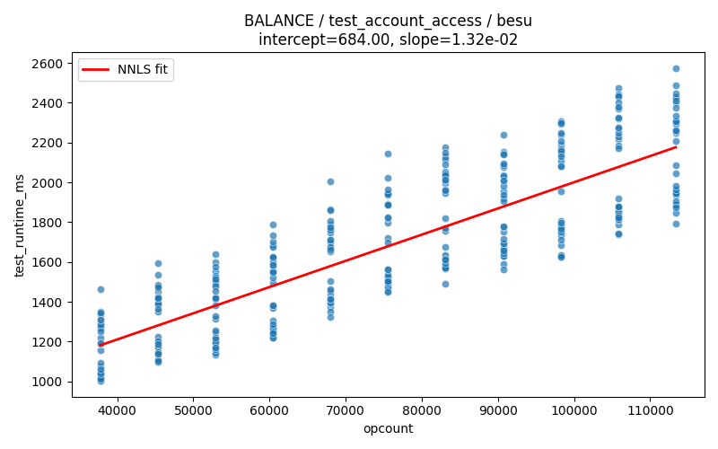

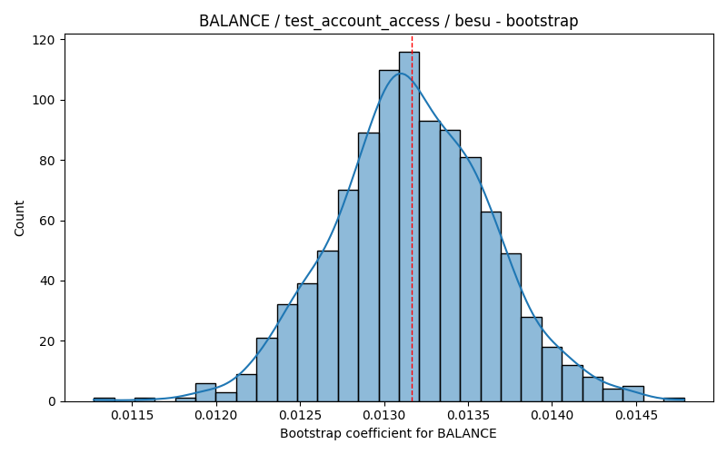


</details>

<details><summary>erigon — NNLS regression summary</summary>

```
==============================================================================
                           NNLS Regression Results                            
==============================================================================
Dep. Variable:          test_runtime_ms              R-squared:          0.973
Model:                  NNLS                    Adj. R-squared:          0.972
No. Observations:       198                               RMSE:          36.03
Df Residuals:           196                                MAE:          31.40
Df Model:               1      
==============================================================================
                      coef     std err     P-value      [0.025      0.975]
------------------------------------------------------------------------------
         const     14.6295      7.0241       0.024      0.6553     27.9299
       opcount      0.0090      0.0001       0.001      0.0088      0.0092
==============================================================================
Notes: Non-negative least squares with bootstrap inference (1000 iterations)
==============================================================================
```

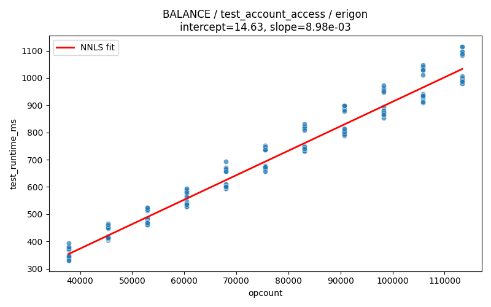

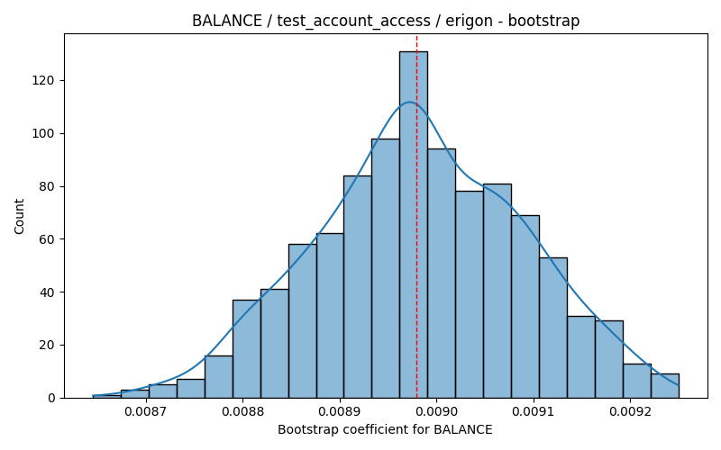

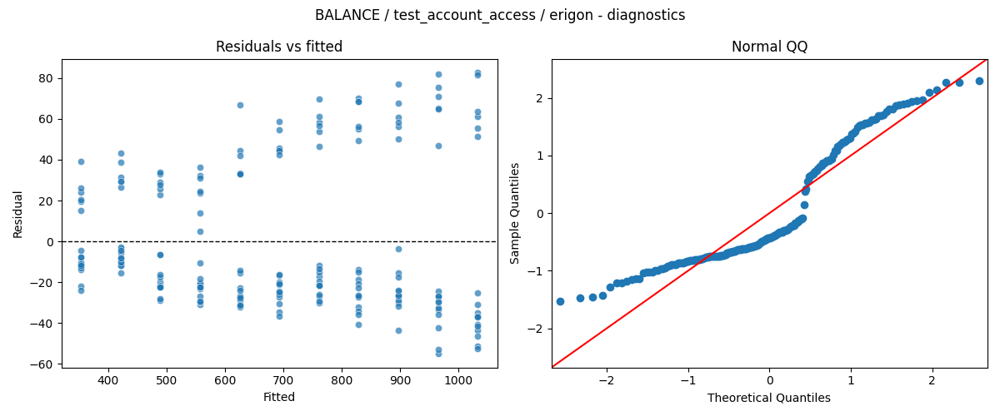

</details>

<details><summary>ethrex — NNLS regression summary</summary>

```
==============================================================================
                           NNLS Regression Results                            
==============================================================================
Dep. Variable:          test_runtime_ms              R-squared:          0.980
Model:                  NNLS                    Adj. R-squared:          0.979
No. Observations:       33                                RMSE:          60.56
Df Residuals:           31                                 MAE:          54.68
Df Model:               1      
==============================================================================
                      coef     std err     P-value      [0.025      0.975]
------------------------------------------------------------------------------
         const    161.0060     42.9329       0.001     77.3550    244.5729
       opcount      0.0176      0.0005       0.001      0.0166      0.0187
==============================================================================
Notes: Non-negative least squares with bootstrap inference (1000 iterations)
==============================================================================
```

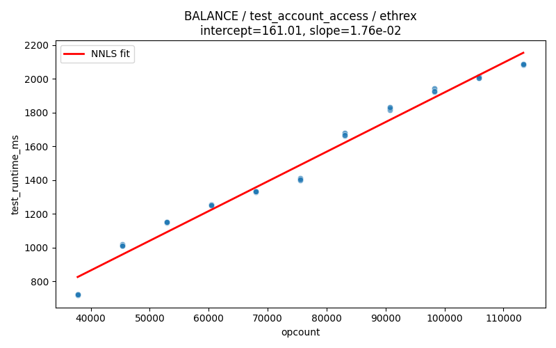


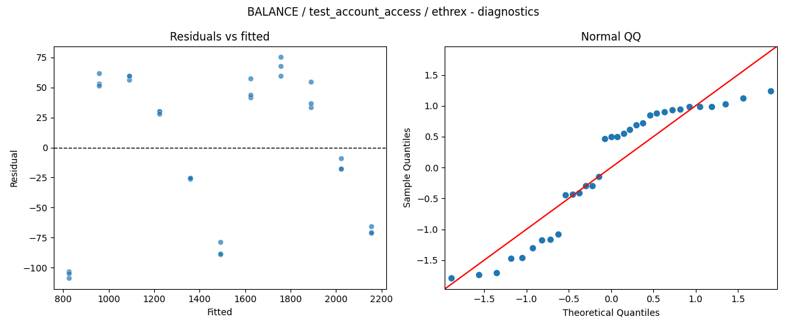

</details>

<details><summary>geth — NNLS regression summary</summary>

```
==============================================================================
                           NNLS Regression Results                            
==============================================================================
Dep. Variable:          test_runtime_ms              R-squared:          0.942
Model:                  NNLS                    Adj. R-squared:          0.942
No. Observations:       407                               RMSE:          62.91
Df Residuals:           405                                MAE:          49.43
Df Model:               1      
==============================================================================
                      coef     std err     P-value      [0.025      0.975]
------------------------------------------------------------------------------
         const    470.9402     14.0996       0.001    442.2898    497.0788
       opcount      0.0106      0.0002       0.001      0.0103      0.0109
==============================================================================
Notes: Non-negative least squares with bootstrap inference (1000 iterations)
==============================================================================
```

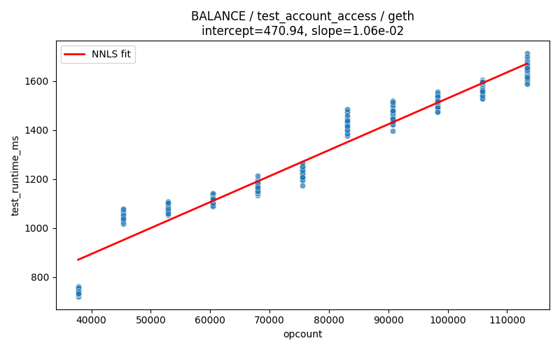

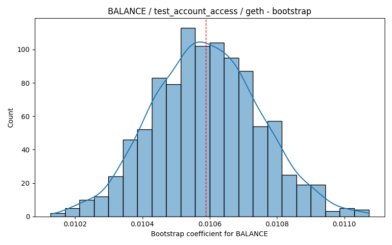

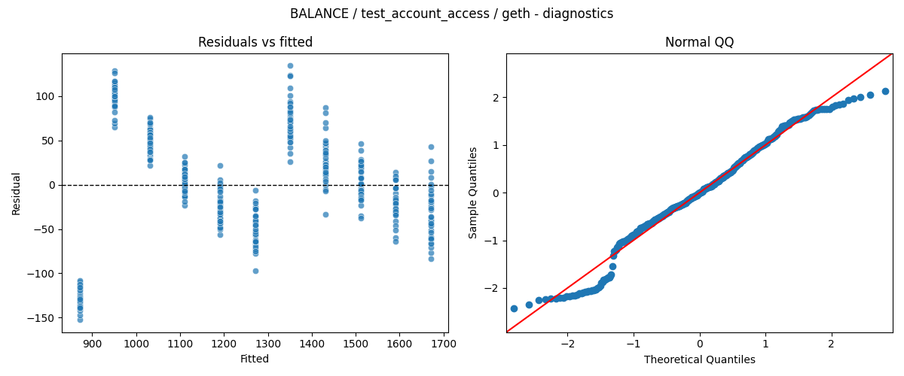

</details>

<details><summary>nethermind — NNLS regression summary</summary>

```
==============================================================================
                           NNLS Regression Results                            
==============================================================================
Dep. Variable:          test_runtime_ms              R-squared:          0.942
Model:                  NNLS                    Adj. R-squared:          0.941
No. Observations:       352                               RMSE:          20.40
Df Residuals:           350                                MAE:          14.55
Df Model:               1      
==============================================================================
                      coef     std err     P-value      [0.025      0.975]
------------------------------------------------------------------------------
         const     85.4938      3.5527       0.001     79.1798     93.0441
       opcount      0.0034      0.0000       0.001      0.0033      0.0035
==============================================================================
Notes: Non-negative least squares with bootstrap inference (1000 iterations)
==============================================================================
```

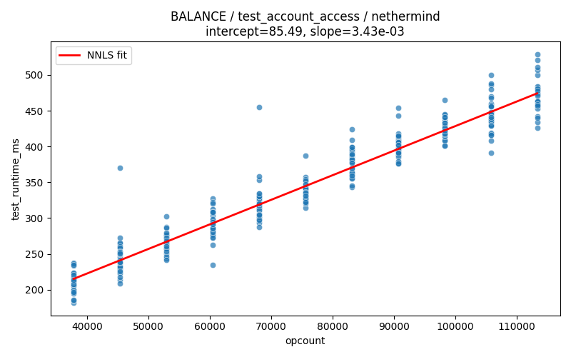

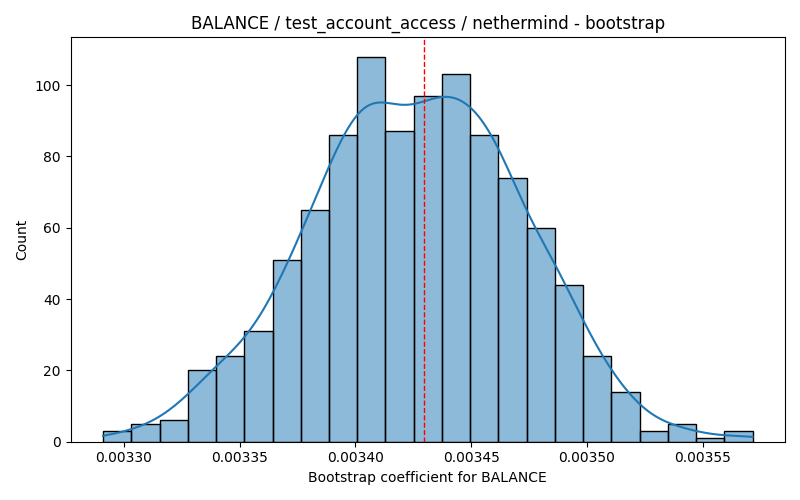

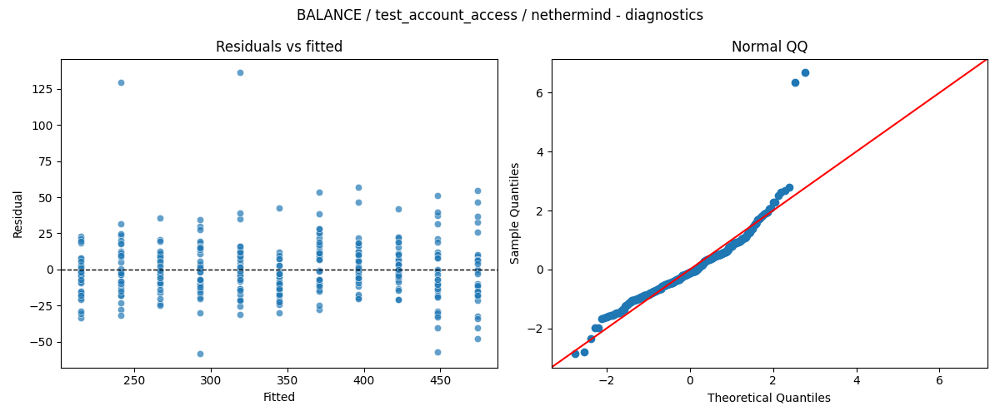

</details>

<details><summary>reth — NNLS regression summary</summary>

```
==============================================================================
                           NNLS Regression Results                            
==============================================================================
Dep. Variable:          test_runtime_ms              R-squared:          0.947
Model:                  NNLS                    Adj. R-squared:          0.947
No. Observations:       374                               RMSE:           6.90
Df Residuals:           372                                MAE:           5.24
Df Model:               1      
==============================================================================
                      coef     std err     P-value      [0.025      0.975]
------------------------------------------------------------------------------
         const     41.3690      1.1354       0.001     39.1437     43.5896
       opcount      0.0012      0.0000       0.001      0.0012      0.0012
==============================================================================
Notes: Non-negative least squares with bootstrap inference (1000 iterations)
==============================================================================
```

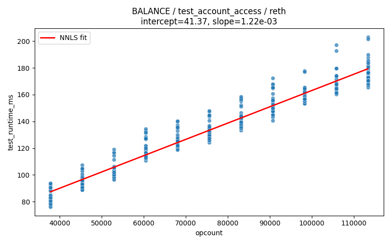

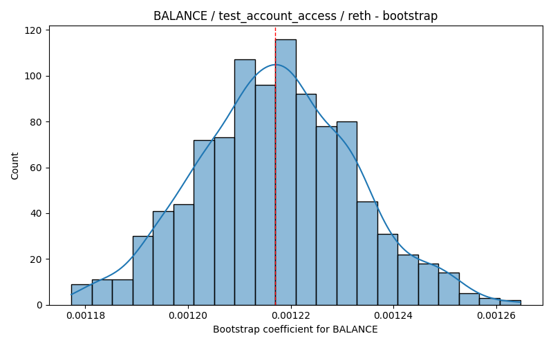

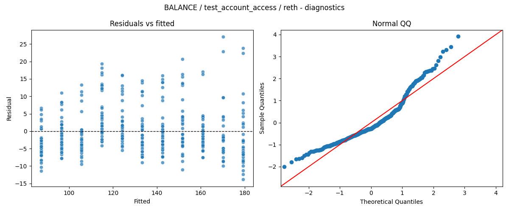

</details>

### test_account_access — combo `BALANCE_AccountMode.NON_EXISTING_ACCOUNT` — `presets[cold_account_nocode_access]`

| client | nobs | R² | target_coef (ms) | p-value | 95% CI |
| --- | --- | --- | --- | --- | --- |
| `besu` | 341 | 0.7657 | 0.01361 | 1.00e-03 | [0.01272, 0.01435] |
| `erigon` | 198 | 0.9618 | 0.008233 | 1.00e-03 | [0.00801, 0.008331] |
| `ethrex` | 33 | 0.9945 | 0.002718 | 1.00e-03 | [0.002662, 0.00274] |
| `geth` | 407 | 0.8679 | 0.02184 | 1.00e-03 | [0.02098, 0.02273] |
| `nethermind` | 352 | 0.9423 | 0.003444 | 1.00e-03 | [0.003364, 0.003525] |
| `reth` | 374 | 0.9626 | 0.000903 | 1.00e-03 | [0.0008839, 0.0009203] |

<details><summary>besu — NNLS regression summary</summary>

```
==============================================================================
                           NNLS Regression Results                            
==============================================================================
Dep. Variable:          test_runtime_ms              R-squared:          0.766
Model:                  NNLS                    Adj. R-squared:          0.765
No. Observations:       341                               RMSE:         179.90
Df Residuals:           339                                MAE:         164.80
Df Model:               1      
==============================================================================
                      coef     std err     P-value      [0.025      0.975]
------------------------------------------------------------------------------
         const    537.1474     29.2548       0.001    483.1538    597.2341
       opcount      0.0136      0.0004       0.001      0.0127      0.0143
==============================================================================
Notes: Non-negative least squares with bootstrap inference (1000 iterations)
==============================================================================
```

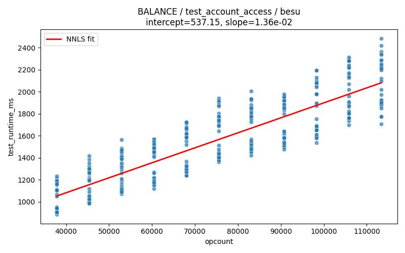

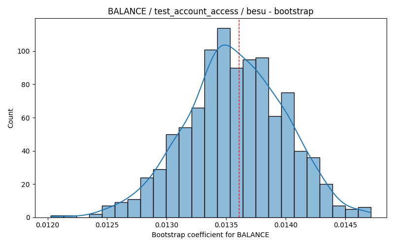

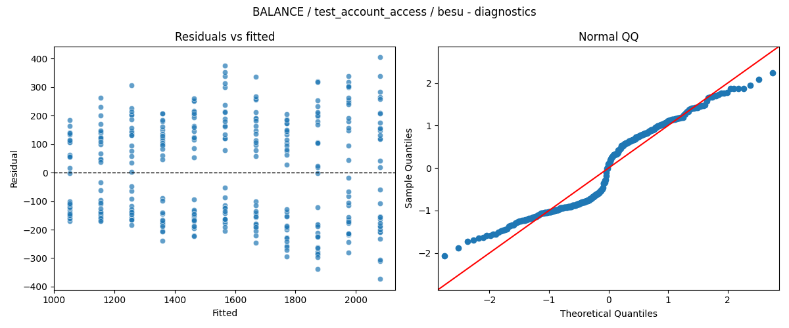

</details>

<details><summary>erigon — NNLS regression summary</summary>

```
==============================================================================
                           NNLS Regression Results                            
==============================================================================
Dep. Variable:          test_runtime_ms              R-squared:          0.962
Model:                  NNLS                    Adj. R-squared:          0.962
No. Observations:       198                               RMSE:          39.20
Df Residuals:           196                                MAE:          33.77
Df Model:               1      
==============================================================================
                      coef     std err     P-value      [0.025      0.975]
------------------------------------------------------------------------------
         const      1.6226      4.8702       0.387      0.0000     15.7443
       opcount      0.0082      0.0001       0.001      0.0080      0.0083
==============================================================================
Notes: Non-negative least squares with bootstrap inference (1000 iterations)
==============================================================================
```

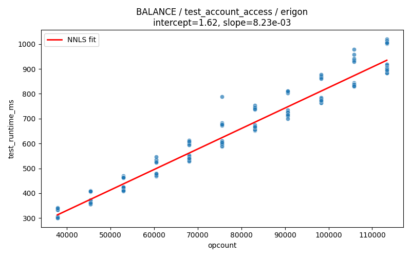

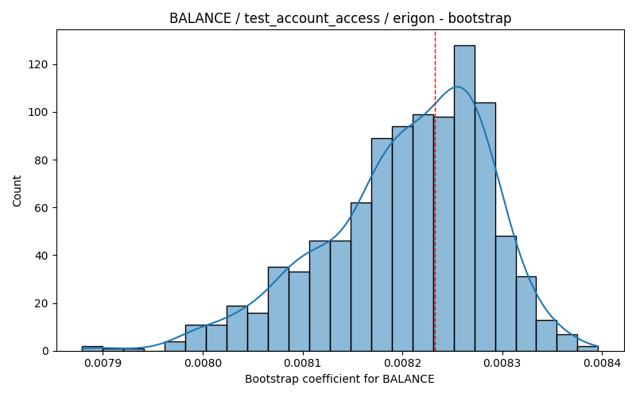

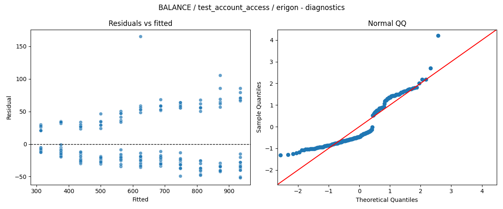

</details>

<details><summary>ethrex — NNLS regression summary</summary>

```
==============================================================================
                           NNLS Regression Results                            
==============================================================================
Dep. Variable:          test_runtime_ms              R-squared:          0.995
Model:                  NNLS                    Adj. R-squared:          0.994
No. Observations:       33                                RMSE:           4.85
Df Residuals:           31                                 MAE:           3.95
Df Model:               1      
==============================================================================
                      coef     std err     P-value      [0.025      0.975]
------------------------------------------------------------------------------
         const      0.0000      1.1243       1.000      0.0000      3.9600
       opcount      0.0027      0.0000       0.001      0.0027      0.0027
==============================================================================
Notes: Non-negative least squares with bootstrap inference (1000 iterations)
==============================================================================
```


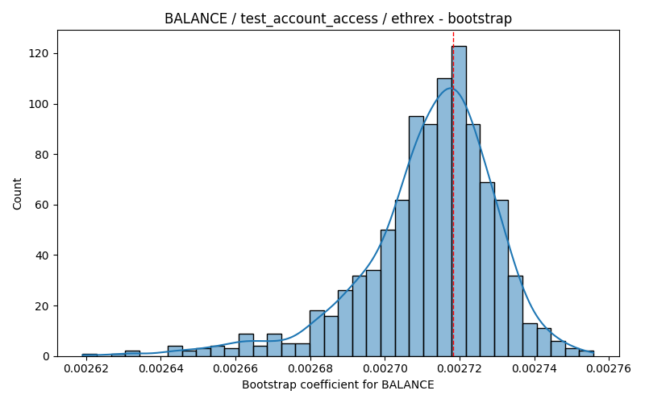

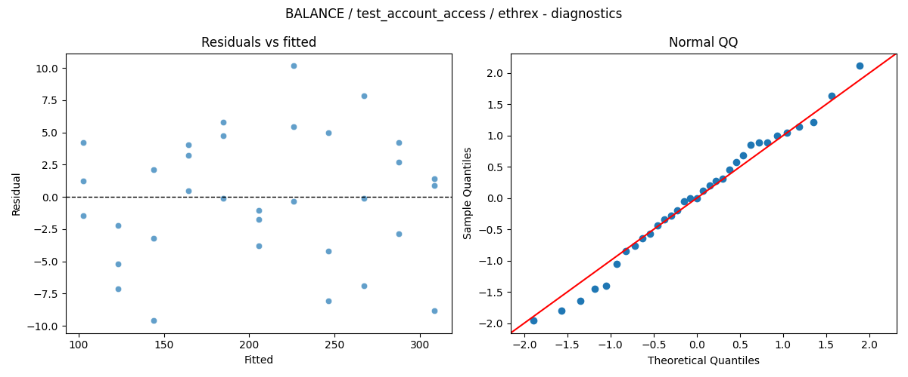

</details>

<details><summary>geth — NNLS regression summary</summary>

```
==============================================================================
                           NNLS Regression Results                            
==============================================================================
Dep. Variable:          test_runtime_ms              R-squared:          0.868
Model:                  NNLS                    Adj. R-squared:          0.868
No. Observations:       407                               RMSE:         203.63
Df Residuals:           405                                MAE:         175.08
Df Model:               1      
==============================================================================
                      coef     std err     P-value      [0.025      0.975]
------------------------------------------------------------------------------
         const    765.8533     38.2562       0.001    686.5834    841.5428
       opcount      0.0218      0.0004       0.001      0.0210      0.0227
==============================================================================
Notes: Non-negative least squares with bootstrap inference (1000 iterations)
==============================================================================
```

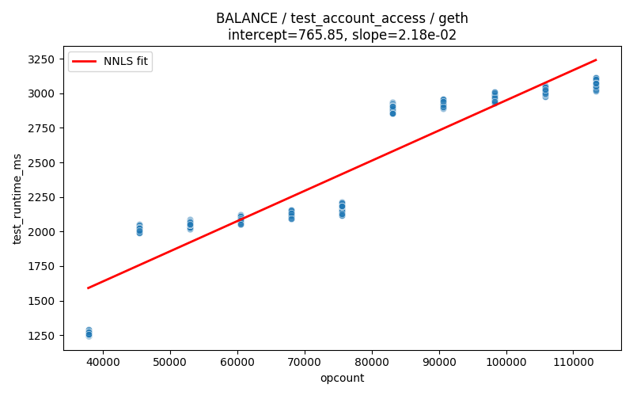

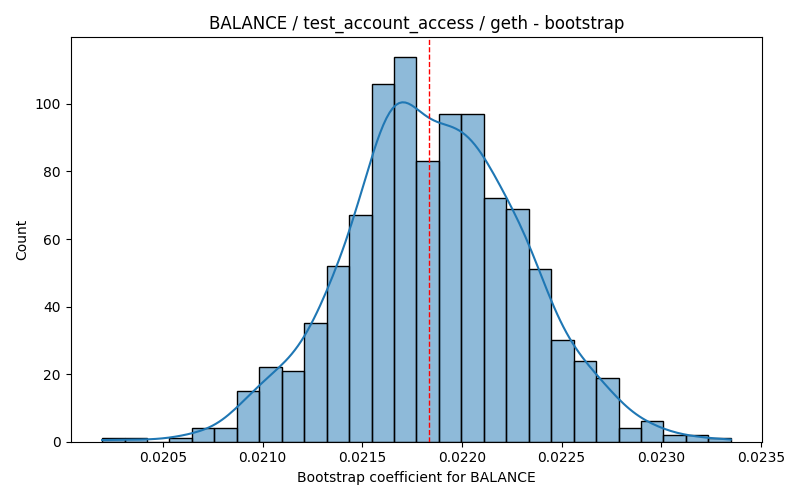


</details>

<details><summary>nethermind — NNLS regression summary</summary>

```
==============================================================================
                           NNLS Regression Results                            
==============================================================================
Dep. Variable:          test_runtime_ms              R-squared:          0.942
Model:                  NNLS                    Adj. R-squared:          0.942
No. Observations:       352                               RMSE:          20.37
Df Residuals:           350                                MAE:          14.06
Df Model:               1      
==============================================================================
                      coef     std err     P-value      [0.025      0.975]
------------------------------------------------------------------------------
         const     70.7647      3.2207       0.001     64.6712     76.7606
       opcount      0.0034      0.0000       0.001      0.0034      0.0035
==============================================================================
Notes: Non-negative least squares with bootstrap inference (1000 iterations)
==============================================================================
```

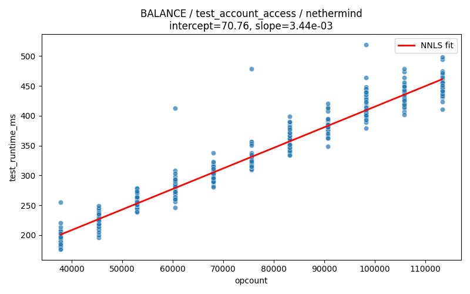

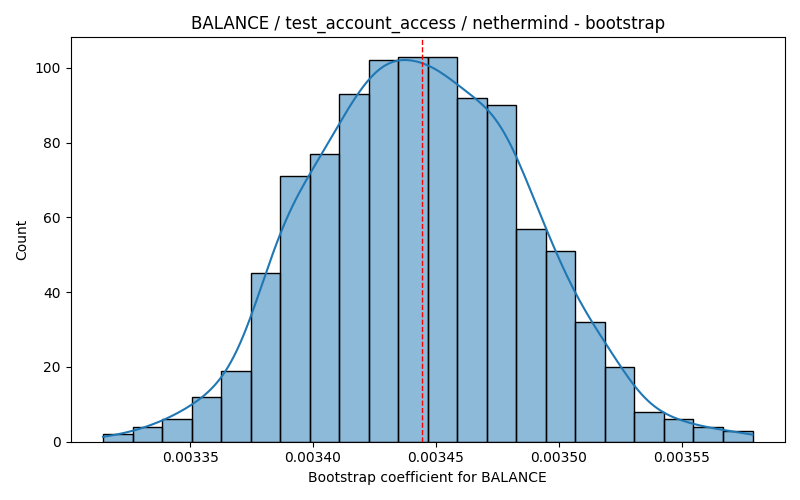

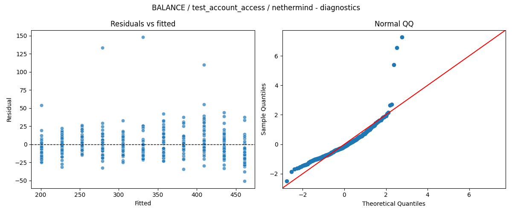

</details>

<details><summary>reth — NNLS regression summary</summary>

```
==============================================================================
                           NNLS Regression Results                            
==============================================================================
Dep. Variable:          test_runtime_ms              R-squared:          0.963
Model:                  NNLS                    Adj. R-squared:          0.962
No. Observations:       374                               RMSE:           4.26
Df Residuals:           372                                MAE:           3.32
Df Model:               1      
==============================================================================
                      coef     std err     P-value      [0.025      0.975]
------------------------------------------------------------------------------
         const     43.0513      0.7634       0.001     41.6720     44.6120
       opcount      0.0009      0.0000       0.001      0.0009      0.0009
==============================================================================
Notes: Non-negative least squares with bootstrap inference (1000 iterations)
==============================================================================
```

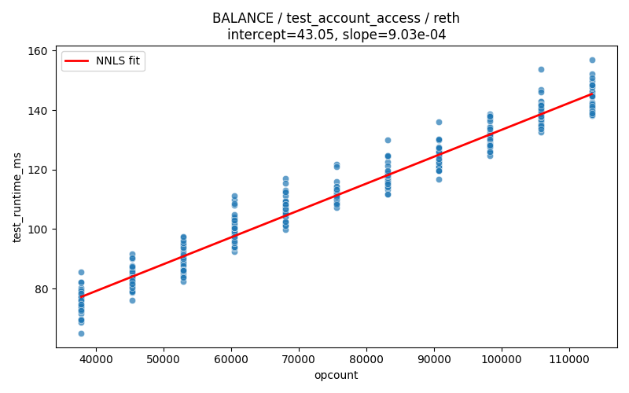

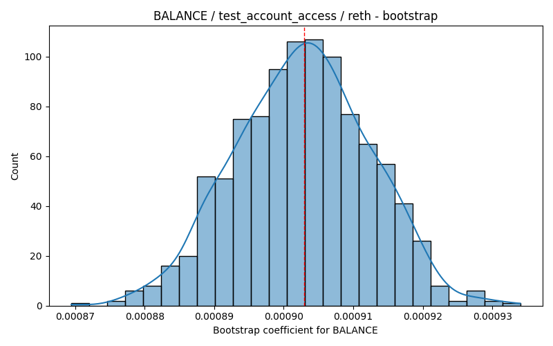

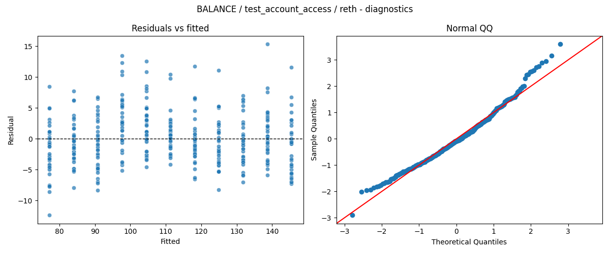

</details>

### test_account_access — combo `BALANCE_AccountMode.EXISTING_CONTRACT`

| client | nobs | R² | target_coef (ms) | p-value | 95% CI |
| --- | --- | --- | --- | --- | --- |
| `besu` | 341 | 0.8579 | 0.02942 | 1.00e-03 | [0.02825, 0.03061] |
| `erigon` | 198 | 0.9138 | 0.03406 | 1.00e-03 | [0.03258, 0.03544] |
| `ethrex` | 33 | 0.9817 | 0.01802 | 1.00e-03 | [0.01705, 0.019] |
| `geth` | 407 | 0.8684 | 0.0231 | 1.00e-03 | [0.02217, 0.024] |
| `nethermind` | 352 | 0.8216 | 0.01862 | 1.00e-03 | [0.01762, 0.01957] |
| `reth` | 374 | 0.8968 | 0.01849 | 1.00e-03 | [0.01794, 0.01918] |

<details><summary>besu — NNLS regression summary</summary>

```
==============================================================================
                           NNLS Regression Results                            
==============================================================================
Dep. Variable:          test_runtime_ms              R-squared:          0.858
Model:                  NNLS                    Adj. R-squared:          0.857
No. Observations:       341                               RMSE:         249.15
Df Residuals:           339                                MAE:         226.34
Df Model:               1      
==============================================================================
                      coef     std err     P-value      [0.025      0.975]
------------------------------------------------------------------------------
         const    503.5153     36.0633       0.001    436.1991    576.0232
       opcount      0.0294      0.0006       0.001      0.0283      0.0306
==============================================================================
Notes: Non-negative least squares with bootstrap inference (1000 iterations)
==============================================================================
```

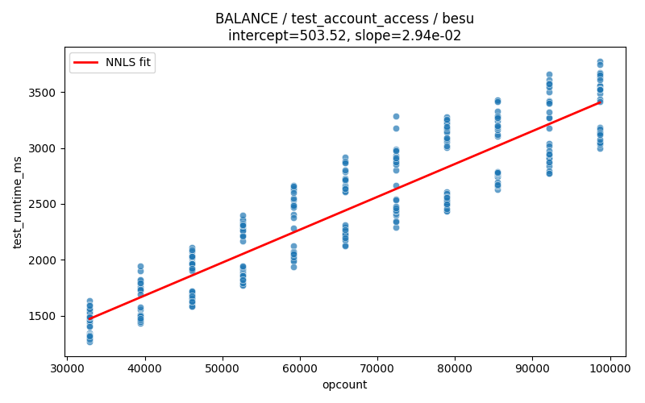

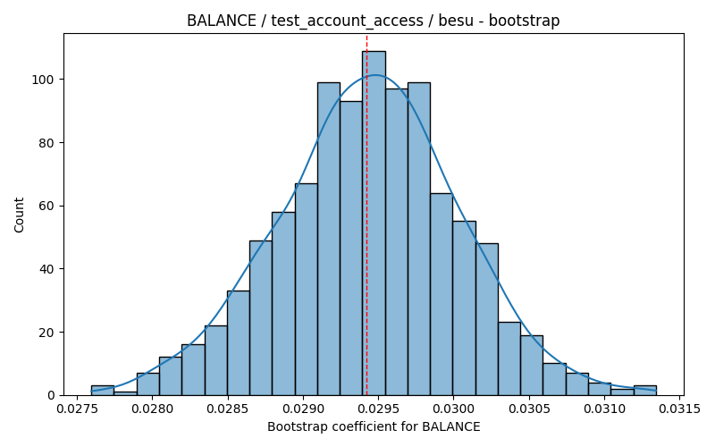

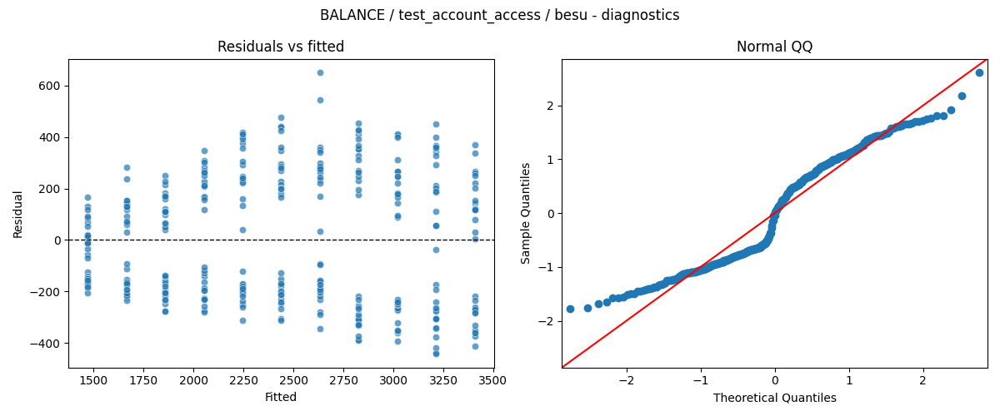

</details>

<details><summary>erigon — NNLS regression summary</summary>

```
==============================================================================
                           NNLS Regression Results                            
==============================================================================
Dep. Variable:          test_runtime_ms              R-squared:          0.914
Model:                  NNLS                    Adj. R-squared:          0.913
No. Observations:       198                               RMSE:         217.73
Df Residuals:           196                                MAE:         189.84
Df Model:               1      
==============================================================================
                      coef     std err     P-value      [0.025      0.975]
------------------------------------------------------------------------------
         const    256.0970     52.8280       0.001    156.5617    369.7148
       opcount      0.0341      0.0007       0.001      0.0326      0.0354
==============================================================================
Notes: Non-negative least squares with bootstrap inference (1000 iterations)
==============================================================================
```

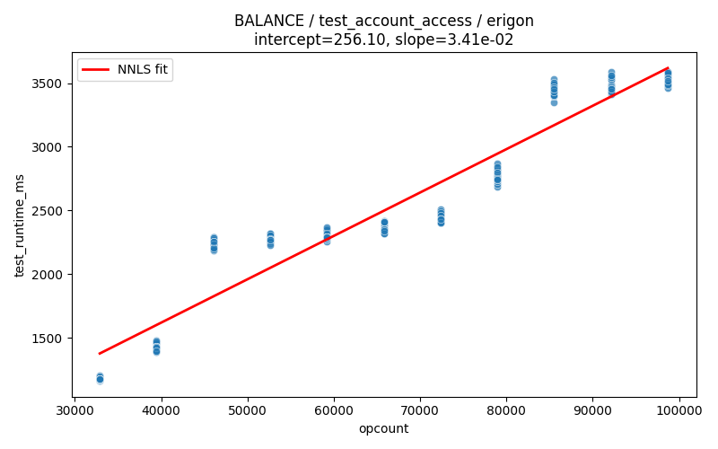

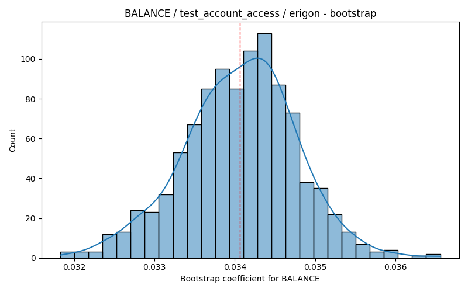

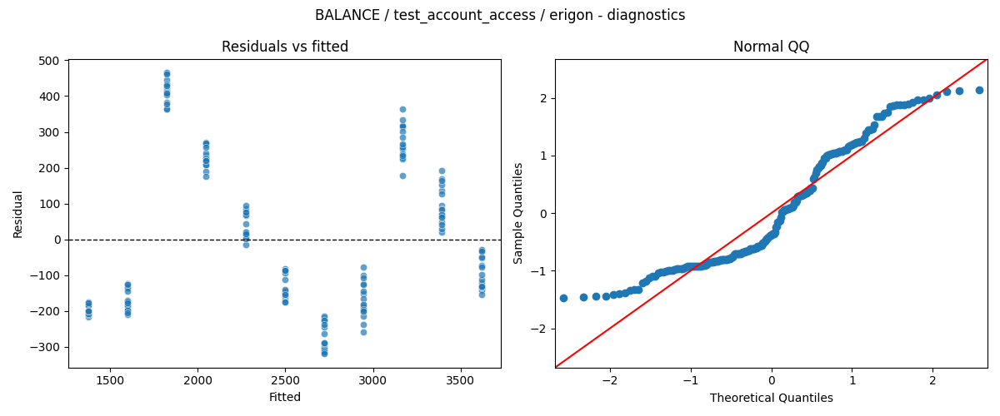

</details>

<details><summary>ethrex — NNLS regression summary</summary>

```
==============================================================================
                           NNLS Regression Results                            
==============================================================================
Dep. Variable:          test_runtime_ms              R-squared:          0.982
Model:                  NNLS                    Adj. R-squared:          0.981
No. Observations:       33                                RMSE:          51.27
Df Residuals:           31                                 MAE:          45.62
Df Model:               1      
==============================================================================
                      coef     std err     P-value      [0.025      0.975]
------------------------------------------------------------------------------
         const    146.2875     36.7753       0.001     81.0859    220.6398
       opcount      0.0180      0.0005       0.001      0.0170      0.0190
==============================================================================
Notes: Non-negative least squares with bootstrap inference (1000 iterations)
==============================================================================
```

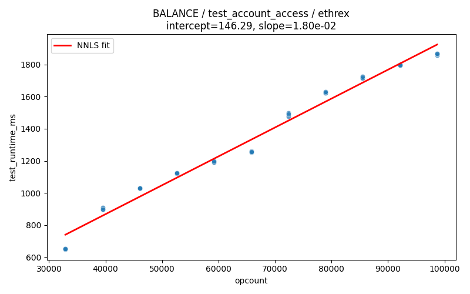

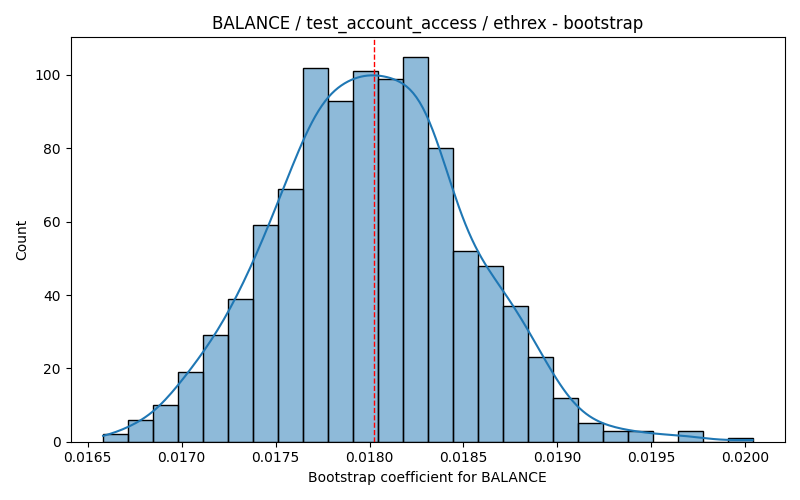

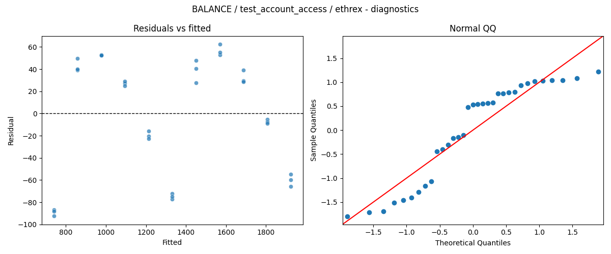

</details>

<details><summary>geth — NNLS regression summary</summary>

```
==============================================================================
                           NNLS Regression Results                            
==============================================================================
Dep. Variable:          test_runtime_ms              R-squared:          0.868
Model:                  NNLS                    Adj. R-squared:          0.868
No. Observations:       407                               RMSE:         187.07
Df Residuals:           405                                MAE:         161.27
Df Model:               1      
==============================================================================
                      coef     std err     P-value      [0.025      0.975]
------------------------------------------------------------------------------
         const    738.8452     35.2016       0.001    673.8714    810.5928
       opcount      0.0231      0.0005       0.001      0.0222      0.0240
==============================================================================
Notes: Non-negative least squares with bootstrap inference (1000 iterations)
==============================================================================
```

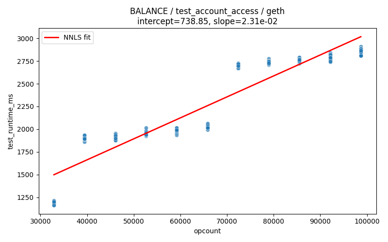

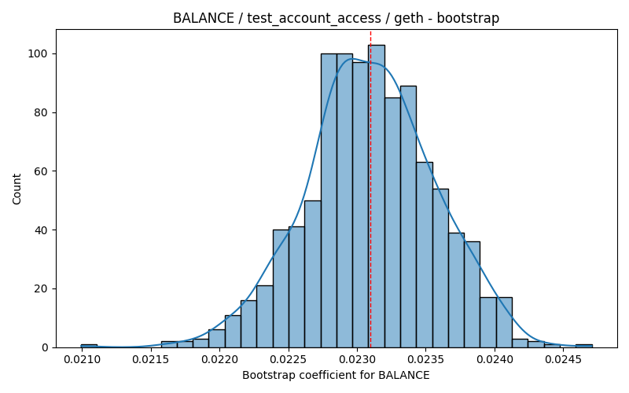

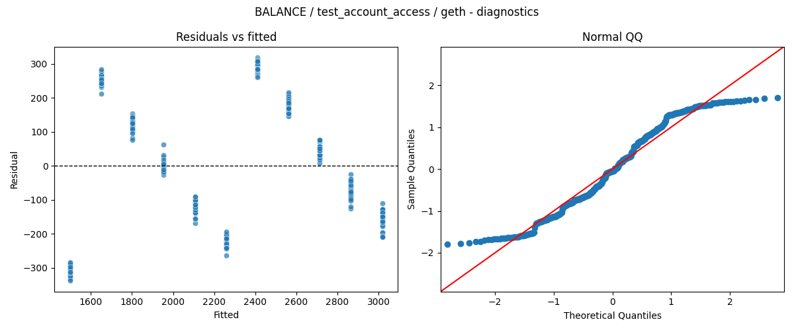

</details>

<details><summary>nethermind — NNLS regression summary</summary>

```
==============================================================================
                           NNLS Regression Results                            
==============================================================================
Dep. Variable:          test_runtime_ms              R-squared:          0.822
Model:                  NNLS                    Adj. R-squared:          0.821
No. Observations:       352                               RMSE:         180.53
Df Residuals:           350                                MAE:         153.94
Df Model:               1      
==============================================================================
                      coef     std err     P-value      [0.025      0.975]
------------------------------------------------------------------------------
         const    473.9778     36.2051       0.001    402.0857    551.4819
       opcount      0.0186      0.0005       0.001      0.0176      0.0196
==============================================================================
Notes: Non-negative least squares with bootstrap inference (1000 iterations)
==============================================================================
```

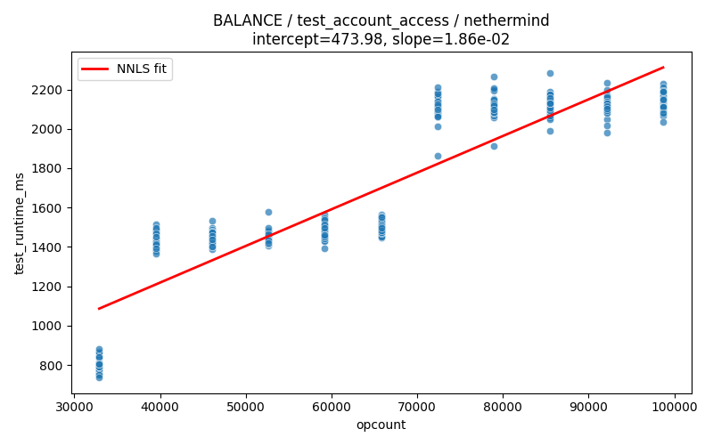

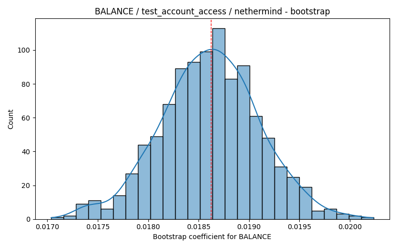

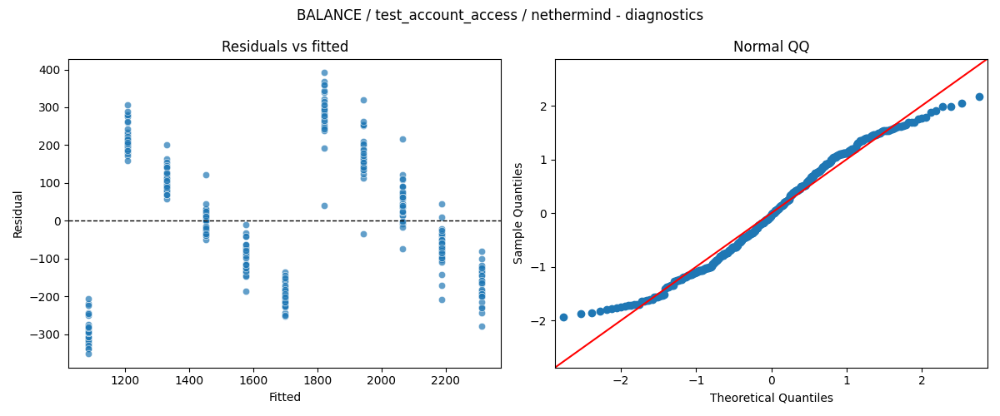

</details>

<details><summary>reth — NNLS regression summary</summary>

```
==============================================================================
                           NNLS Regression Results                            
==============================================================================
Dep. Variable:          test_runtime_ms              R-squared:          0.897
Model:                  NNLS                    Adj. R-squared:          0.897
No. Observations:       374                               RMSE:         130.53
Df Residuals:           372                                MAE:          56.16
Df Model:               1      
==============================================================================
                      coef     std err     P-value      [0.025      0.975]
------------------------------------------------------------------------------
         const    264.4718     18.2360       0.001    227.6795    297.4112
       opcount      0.0185      0.0003       0.001      0.0179      0.0192
==============================================================================
Notes: Non-negative least squares with bootstrap inference (1000 iterations)
==============================================================================
```

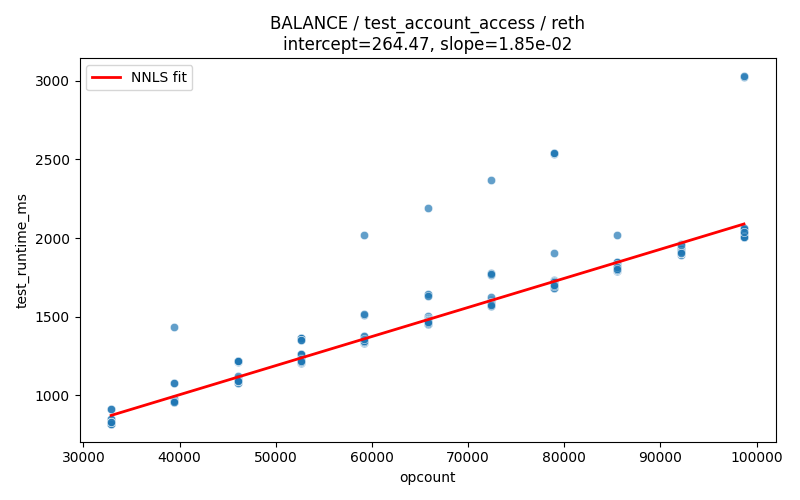

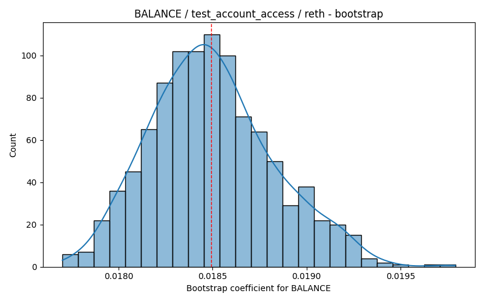

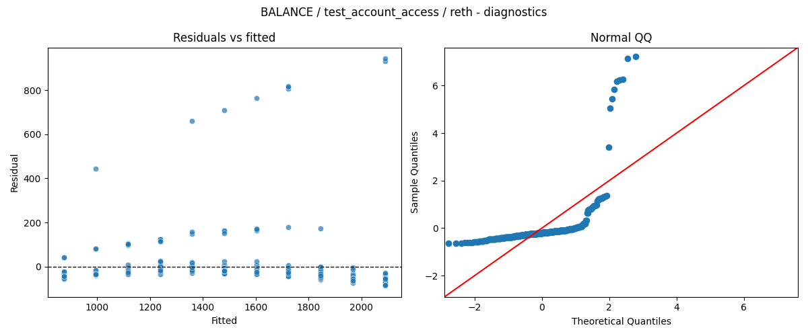

</details>

### test_account_access — combo `BALANCE_AccountMode.NON_EXISTING_ACCOUNT` — `presets[cold_account_code_access]`

| client | nobs | R² | target_coef (ms) | p-value | 95% CI |
| --- | --- | --- | --- | --- | --- |
| `besu` | 341 | 0.7657 | 0.01361 | 1.00e-03 | [0.01272, 0.01435] |
| `erigon` | 198 | 0.9618 | 0.008233 | 1.00e-03 | [0.00801, 0.008331] |
| `ethrex` | 33 | 0.9945 | 0.002718 | 1.00e-03 | [0.002662, 0.00274] |
| `geth` | 407 | 0.8679 | 0.02184 | 1.00e-03 | [0.02098, 0.02273] |
| `nethermind` | 352 | 0.9423 | 0.003444 | 1.00e-03 | [0.003364, 0.003525] |
| `reth` | 374 | 0.9626 | 0.000903 | 1.00e-03 | [0.0008839, 0.0009203] |

<details><summary>besu — NNLS regression summary</summary>

```
==============================================================================
                           NNLS Regression Results                            
==============================================================================
Dep. Variable:          test_runtime_ms              R-squared:          0.766
Model:                  NNLS                    Adj. R-squared:          0.765
No. Observations:       341                               RMSE:         179.90
Df Residuals:           339                                MAE:         164.80
Df Model:               1      
==============================================================================
                      coef     std err     P-value      [0.025      0.975]
------------------------------------------------------------------------------
         const    537.1474     29.2548       0.001    483.1538    597.2341
       opcount      0.0136      0.0004       0.001      0.0127      0.0143
==============================================================================
Notes: Non-negative least squares with bootstrap inference (1000 iterations)
==============================================================================
```


</details>

<details><summary>erigon — NNLS regression summary</summary>

```
==============================================================================
                           NNLS Regression Results                            
==============================================================================
Dep. Variable:          test_runtime_ms              R-squared:          0.962
Model:                  NNLS                    Adj. R-squared:          0.962
No. Observations:       198                               RMSE:          39.20
Df Residuals:           196                                MAE:          33.77
Df Model:               1      
==============================================================================
                      coef     std err     P-value      [0.025      0.975]
------------------------------------------------------------------------------
         const      1.6226      4.8702       0.387      0.0000     15.7443
       opcount      0.0082      0.0001       0.001      0.0080      0.0083
==============================================================================
Notes: Non-negative least squares with bootstrap inference (1000 iterations)
==============================================================================
```


</details>

<details><summary>ethrex — NNLS regression summary</summary>

```
==============================================================================
                           NNLS Regression Results                            
==============================================================================
Dep. Variable:          test_runtime_ms              R-squared:          0.995
Model:                  NNLS                    Adj. R-squared:          0.994
No. Observations:       33                                RMSE:           4.85
Df Residuals:           31                                 MAE:           3.95
Df Model:               1      
==============================================================================
                      coef     std err     P-value      [0.025      0.975]
------------------------------------------------------------------------------
         const      0.0000      1.1243       1.000      0.0000      3.9600
       opcount      0.0027      0.0000       0.001      0.0027      0.0027
==============================================================================
Notes: Non-negative least squares with bootstrap inference (1000 iterations)
==============================================================================
```


</details>

<details><summary>geth — NNLS regression summary</summary>

```
==============================================================================
                           NNLS Regression Results                            
==============================================================================
Dep. Variable:          test_runtime_ms              R-squared:          0.868
Model:                  NNLS                    Adj. R-squared:          0.868
No. Observations:       407                               RMSE:         203.63
Df Residuals:           405                                MAE:         175.08
Df Model:               1      
==============================================================================
                      coef     std err     P-value      [0.025      0.975]
------------------------------------------------------------------------------
         const    765.8533     38.2562       0.001    686.5834    841.5428
       opcount      0.0218      0.0004       0.001      0.0210      0.0227
==============================================================================
Notes: Non-negative least squares with bootstrap inference (1000 iterations)
==============================================================================
```


</details>

<details><summary>nethermind — NNLS regression summary</summary>

```
==============================================================================
                           NNLS Regression Results                            
==============================================================================
Dep. Variable:          test_runtime_ms              R-squared:          0.942
Model:                  NNLS                    Adj. R-squared:          0.942
No. Observations:       352                               RMSE:          20.37
Df Residuals:           350                                MAE:          14.06
Df Model:               1      
==============================================================================
                      coef     std err     P-value      [0.025      0.975]
------------------------------------------------------------------------------
         const     70.7647      3.2207       0.001     64.6712     76.7606
       opcount      0.0034      0.0000       0.001      0.0034      0.0035
==============================================================================
Notes: Non-negative least squares with bootstrap inference (1000 iterations)
==============================================================================
```


</details>

<details><summary>reth — NNLS regression summary</summary>

```
==============================================================================
                           NNLS Regression Results                            
==============================================================================
Dep. Variable:          test_runtime_ms              R-squared:          0.963
Model:                  NNLS                    Adj. R-squared:          0.962
No. Observations:       374                               RMSE:           4.26
Df Residuals:           372                                MAE:           3.32
Df Model:               1      
==============================================================================
                      coef     std err     P-value      [0.025      0.975]
------------------------------------------------------------------------------
         const     43.0513      0.7634       0.001     41.6720     44.6120
       opcount      0.0009      0.0000       0.001      0.0009      0.0009
==============================================================================
Notes: Non-negative least squares with bootstrap inference (1000 iterations)
==============================================================================
```


</details>

### test_ext_account_query_warm — combo `BALANCE`

| client | nobs | R² | target_coef (ms) | p-value | 95% CI |
| --- | --- | --- | --- | --- | --- |
| `besu` | 341 | 0.471 | 0.0001449 | 1.00e-03 | [0.0001284, 0.0001615] |
| `erigon` | 198 | 0.8492 | 4.426e-05 | 1.00e-03 | [4.202e-05, 4.725e-05] |
| `ethrex` | 33 | 0.6508 | 1.267e-05 | 1.00e-03 | [9.958e-06, 1.537e-05] |
| `geth` | 407 | 0.8778 | 3.249e-05 | 1.00e-03 | [3.126e-05, 3.372e-05] |
| `nethermind` | 352 | 0.7287 | 0.0001397 | 1.00e-03 | [0.0001299, 0.0001482] |
| `reth` | 374 | 0.7469 | 9.388e-06 | 1.00e-03 | [8.849e-06, 9.949e-06] |

<details><summary>besu — NNLS regression summary</summary>

```
==============================================================================
                           NNLS Regression Results                            
==============================================================================
Dep. Variable:          test_runtime_ms              R-squared:          0.471
Model:                  NNLS                    Adj. R-squared:          0.469
No. Observations:       341                               RMSE:          89.81
Df Residuals:           339                                MAE:          67.65
Df Model:               1      
==============================================================================
                      coef     std err     P-value      [0.025      0.975]
------------------------------------------------------------------------------
         const    256.8090     16.9146       0.001    224.8941    290.0409
       opcount      0.0001      0.0000       0.001      0.0001      0.0002
==============================================================================
Notes: Non-negative least squares with bootstrap inference (1000 iterations)
==============================================================================
```

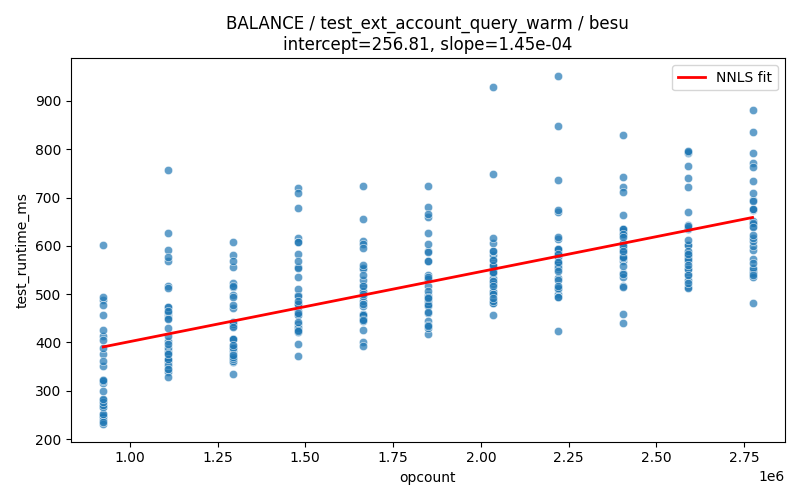

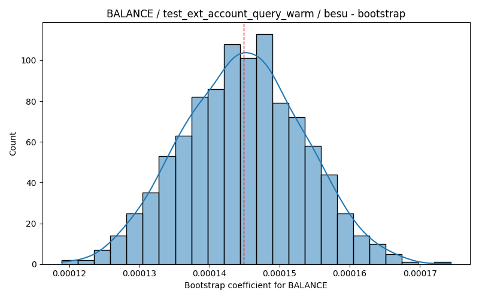

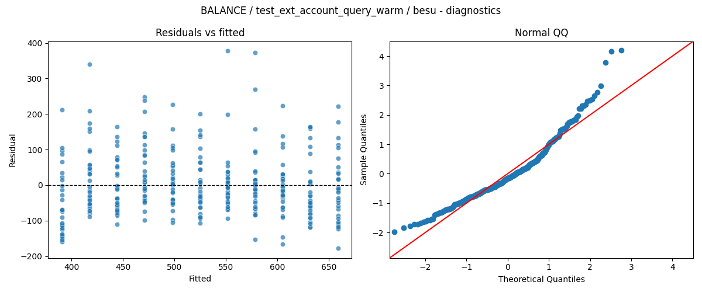

</details>

<details><summary>erigon — NNLS regression summary</summary>

```
==============================================================================
                           NNLS Regression Results                            
==============================================================================
Dep. Variable:          test_runtime_ms              R-squared:          0.849
Model:                  NNLS                    Adj. R-squared:          0.848
No. Observations:       198                               RMSE:          10.91
Df Residuals:           196                                MAE:           5.27
Df Model:               1      
==============================================================================
                      coef     std err     P-value      [0.025      0.975]
------------------------------------------------------------------------------
         const     24.8857      1.9451       0.001     20.7208     28.4286
       opcount      0.0000      0.0000       0.001      0.0000      0.0000
==============================================================================
Notes: Non-negative least squares with bootstrap inference (1000 iterations)
==============================================================================
```

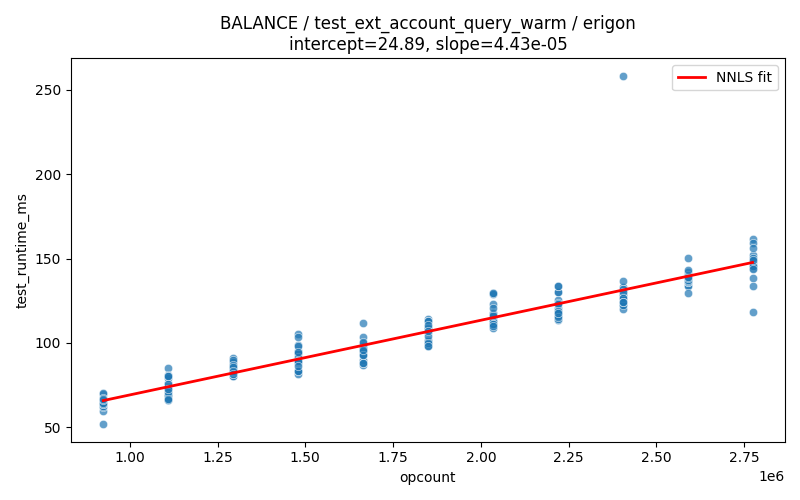

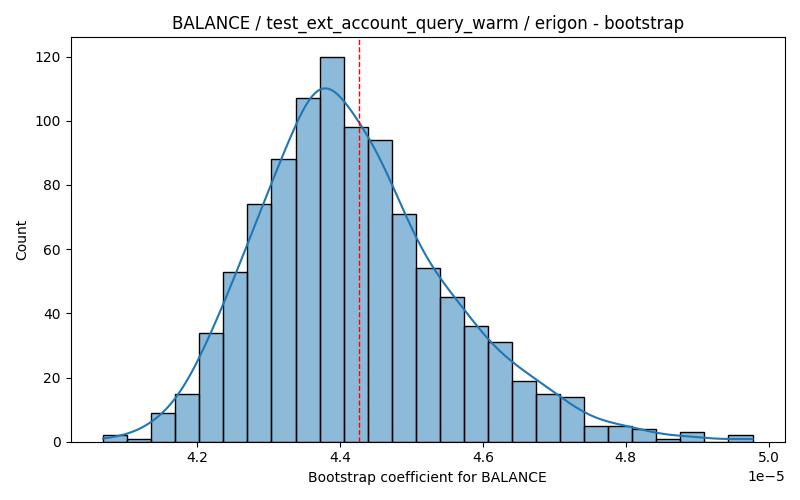

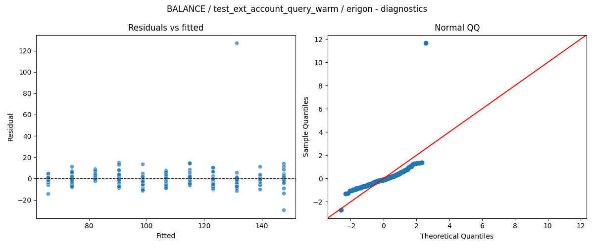

</details>

<details><summary>ethrex — NNLS regression summary</summary>

```
==============================================================================
                           NNLS Regression Results                            
==============================================================================
Dep. Variable:          test_runtime_ms              R-squared:          0.651
Model:                  NNLS                    Adj. R-squared:          0.640
No. Observations:       33                                RMSE:           5.43
Df Residuals:           31                                 MAE:           4.17
Df Model:               1      
==============================================================================
                      coef     std err     P-value      [0.025      0.975]
------------------------------------------------------------------------------
         const     12.4859      2.7360       0.001      7.6494     18.2007
       opcount      0.0000      0.0000       0.001      0.0000      0.0000
==============================================================================
Notes: Non-negative least squares with bootstrap inference (1000 iterations)
==============================================================================
```

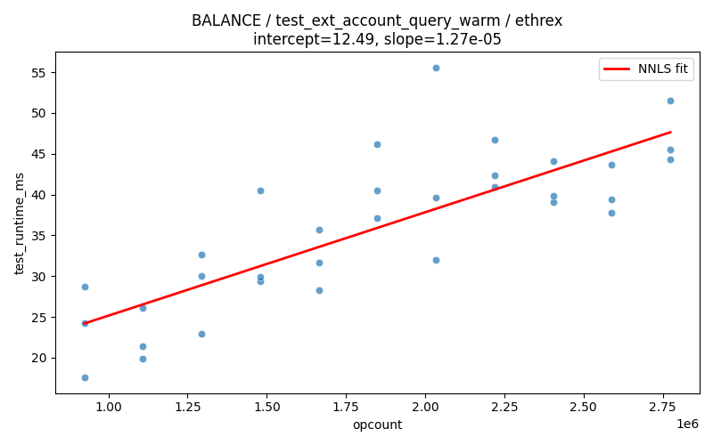

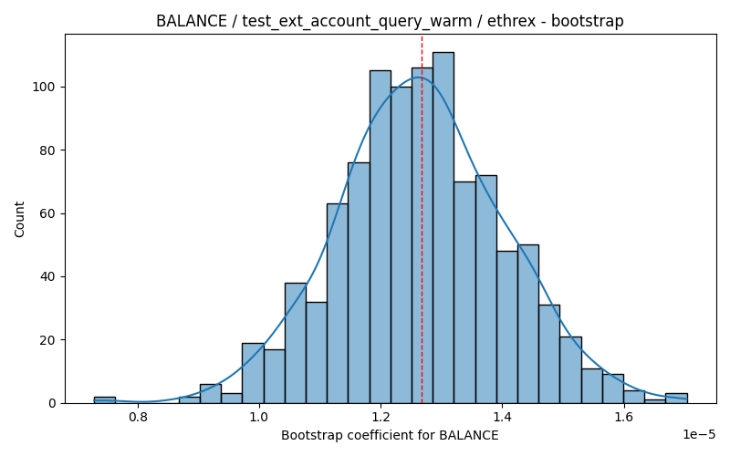

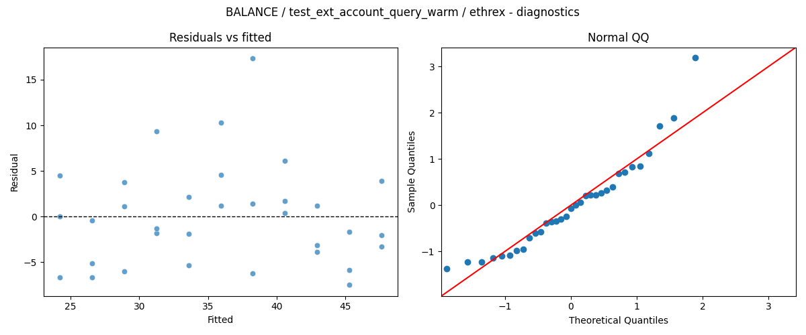

</details>

<details><summary>geth — NNLS regression summary</summary>

```
==============================================================================
                           NNLS Regression Results                            
==============================================================================
Dep. Variable:          test_runtime_ms              R-squared:          0.878
Model:                  NNLS                    Adj. R-squared:          0.878
No. Observations:       407                               RMSE:           7.09
Df Residuals:           405                                MAE:           5.56
Df Model:               1      
==============================================================================
                      coef     std err     P-value      [0.025      0.975]
------------------------------------------------------------------------------
         const     15.1118      1.1232       0.001     12.9290     17.3912
       opcount      0.0000      0.0000       0.001      0.0000      0.0000
==============================================================================
Notes: Non-negative least squares with bootstrap inference (1000 iterations)
==============================================================================
```

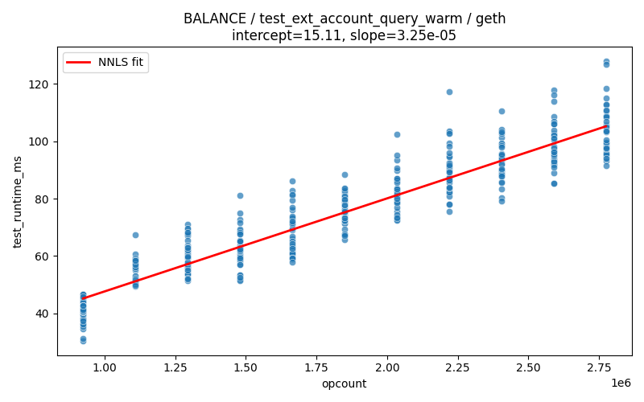

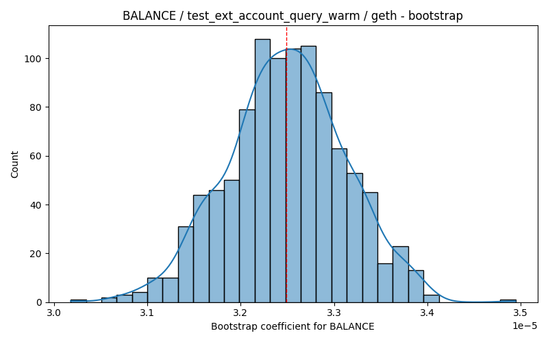

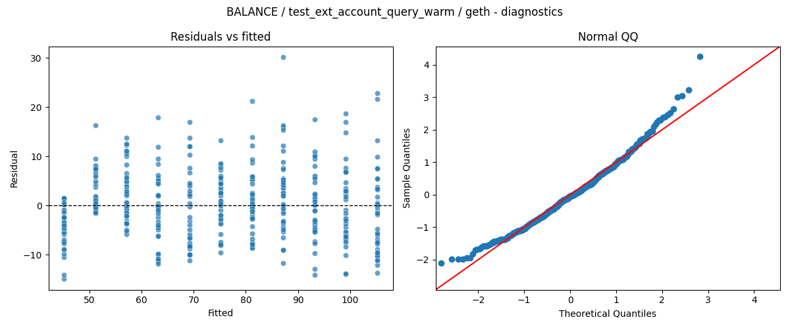

</details>

<details><summary>nethermind — NNLS regression summary</summary>

```
==============================================================================
                           NNLS Regression Results                            
==============================================================================
Dep. Variable:          test_runtime_ms              R-squared:          0.729
Model:                  NNLS                    Adj. R-squared:          0.728
No. Observations:       352                               RMSE:          49.84
Df Residuals:           350                                MAE:          38.10
Df Model:               1      
==============================================================================
                      coef     std err     P-value      [0.025      0.975]
------------------------------------------------------------------------------
         const     88.8199      7.5965       0.001     75.1468    105.1676
       opcount      0.0001      0.0000       0.001      0.0001      0.0001
==============================================================================
Notes: Non-negative least squares with bootstrap inference (1000 iterations)
==============================================================================
```

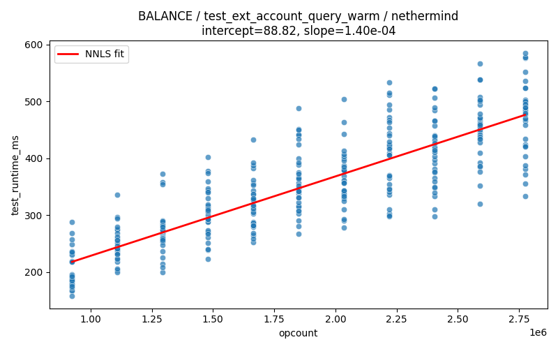

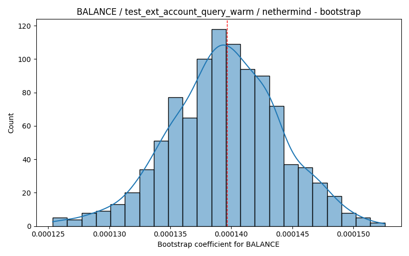

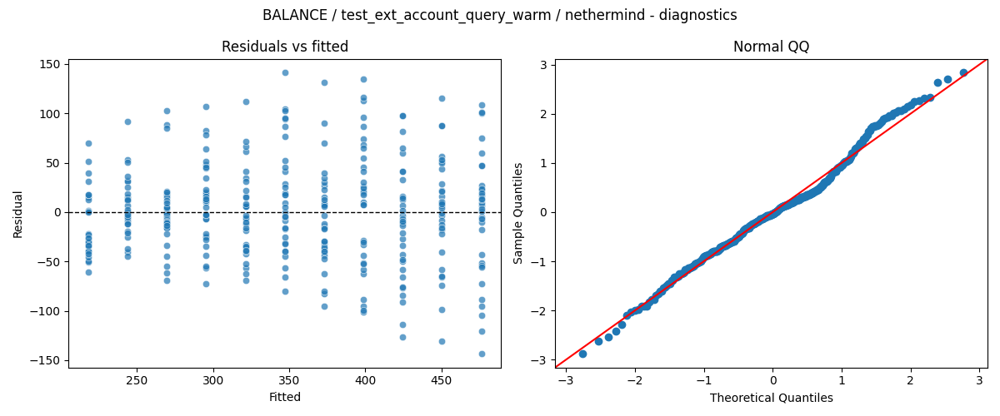

</details>

<details><summary>reth — NNLS regression summary</summary>

```
==============================================================================
                           NNLS Regression Results                            
==============================================================================
Dep. Variable:          test_runtime_ms              R-squared:          0.747
Model:                  NNLS                    Adj. R-squared:          0.746
No. Observations:       374                               RMSE:           3.20
Df Residuals:           372                                MAE:           2.45
Df Model:               1      
==============================================================================
                      coef     std err     P-value      [0.025      0.975]
------------------------------------------------------------------------------
         const      5.2392      0.5055       0.001      4.2523      6.1963
       opcount      0.0000      0.0000       0.001      0.0000      0.0000
==============================================================================
Notes: Non-negative least squares with bootstrap inference (1000 iterations)
==============================================================================
```

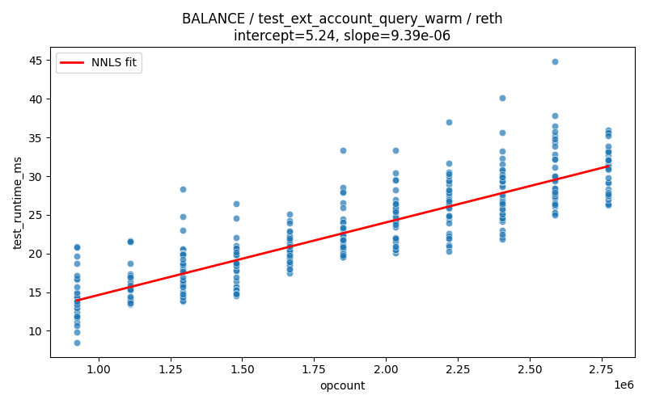

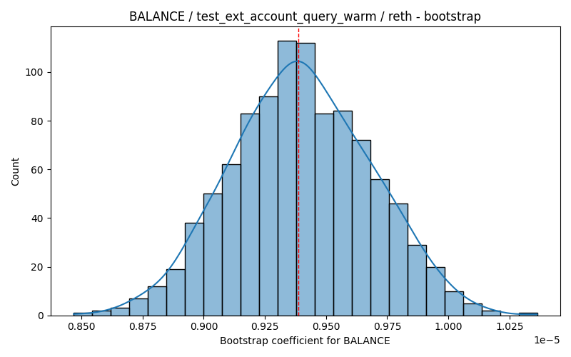

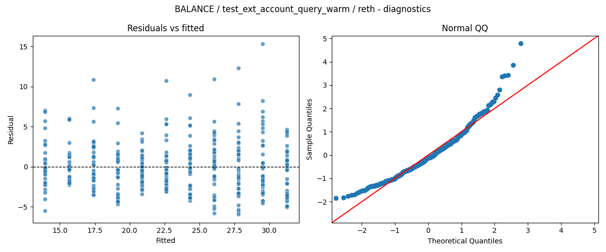

</details>

## CALL

### test_account_access — combo `CALL_AccountMode.EXISTING_EOA` — `presets[cold_account_nocode_access]`

| client | nobs | R² | target_coef (ms) | p-value | 95% CI |
| --- | --- | --- | --- | --- | --- |
| `besu` | 341 | 0.7723 | 0.01702 | 1.00e-03 | [0.01603, 0.01799] |
| `erigon` | 198 | 0.9796 | 0.01025 | 1.00e-03 | [0.01004, 0.01046] |
| `ethrex` | 33 | 0.9801 | 0.01767 | 1.00e-03 | [0.01667, 0.01872] |
| `geth` | 407 | 0.9418 | 0.01075 | 1.00e-03 | [0.0104, 0.01108] |
| `nethermind` | 352 | 0.9028 | 0.003975 | 1.00e-03 | [0.003816, 0.004142] |
| `reth` | 374 | 0.9464 | 0.001263 | 1.00e-03 | [0.001233, 0.001293] |

<details><summary>besu — NNLS regression summary</summary>

```
==============================================================================
                           NNLS Regression Results                            
==============================================================================
Dep. Variable:          test_runtime_ms              R-squared:          0.772
Model:                  NNLS                    Adj. R-squared:          0.772
No. Observations:       341                               RMSE:         219.39
Df Residuals:           339                                MAE:         193.75
Df Model:               1      
==============================================================================
                      coef     std err     P-value      [0.025      0.975]
------------------------------------------------------------------------------
         const    746.2677     37.0960       0.001    672.3052    822.1784
       opcount      0.0170      0.0005       0.001      0.0160      0.0180
==============================================================================
Notes: Non-negative least squares with bootstrap inference (1000 iterations)
==============================================================================
```

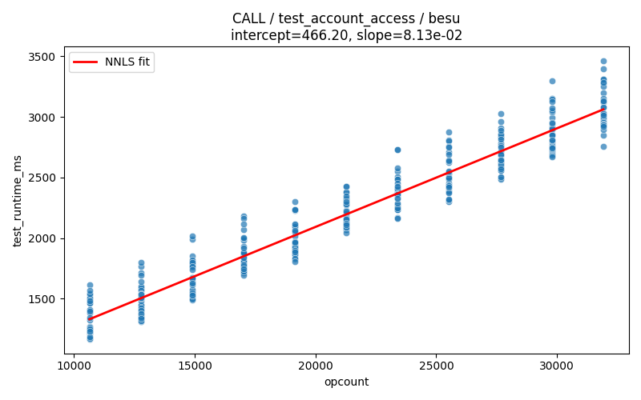

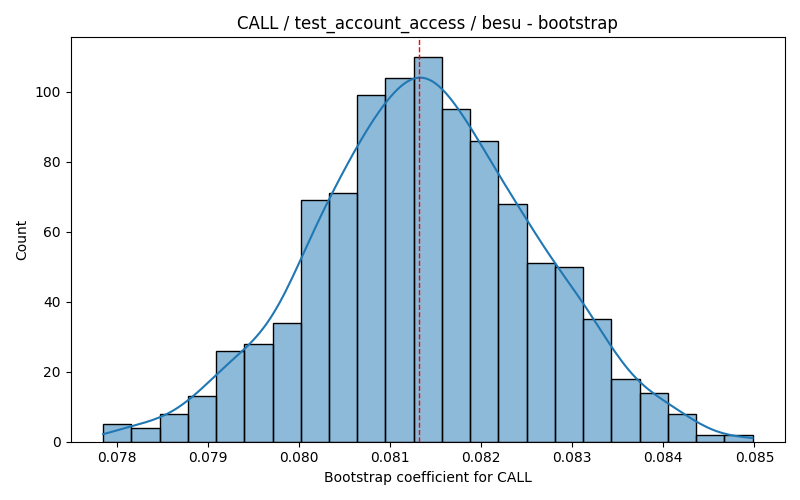

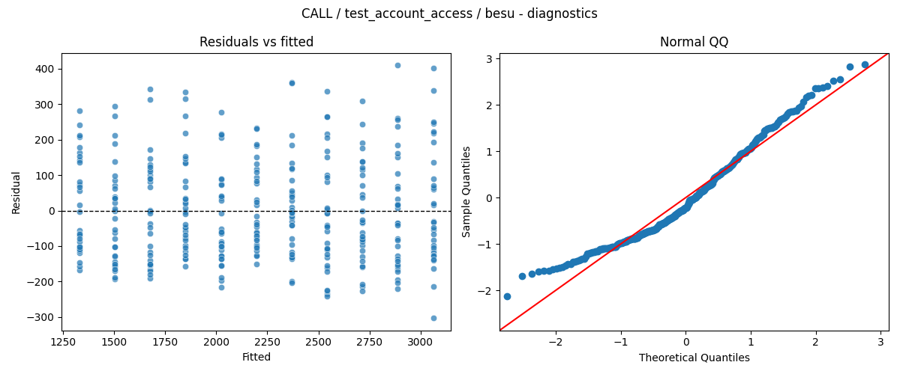

</details>

<details><summary>erigon — NNLS regression summary</summary>

```
==============================================================================
                           NNLS Regression Results                            
==============================================================================
Dep. Variable:          test_runtime_ms              R-squared:          0.980
Model:                  NNLS                    Adj. R-squared:          0.980
No. Observations:       198                               RMSE:          35.12
Df Residuals:           196                                MAE:          30.46
Df Model:               1      
==============================================================================
                      coef     std err     P-value      [0.025      0.975]
------------------------------------------------------------------------------
         const     27.6928      7.0275       0.001     13.6774     41.8765
       opcount      0.0103      0.0001       0.001      0.0100      0.0105
==============================================================================
Notes: Non-negative least squares with bootstrap inference (1000 iterations)
==============================================================================
```

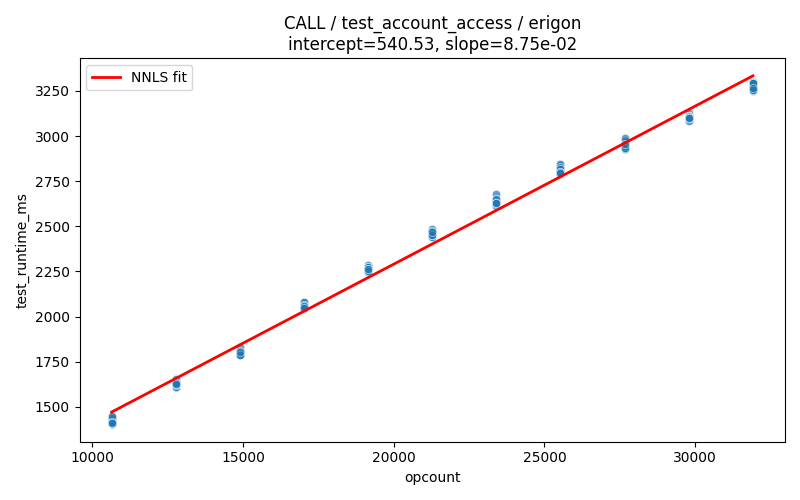

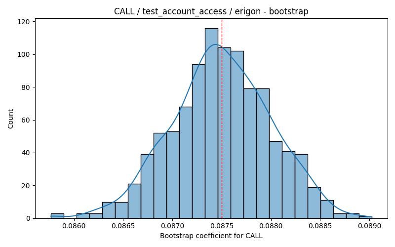

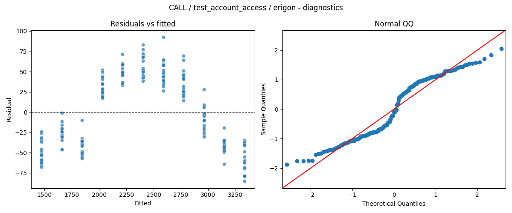

</details>

<details><summary>ethrex — NNLS regression summary</summary>

```
==============================================================================
                           NNLS Regression Results                            
==============================================================================
Dep. Variable:          test_runtime_ms              R-squared:          0.980
Model:                  NNLS                    Adj. R-squared:          0.979
No. Observations:       33                                RMSE:          59.80
Df Residuals:           31                                 MAE:          53.24
Df Model:               1      
==============================================================================
                      coef     std err     P-value      [0.025      0.975]
------------------------------------------------------------------------------
         const    167.2530     43.4728       0.001     88.1887    252.7383
       opcount      0.0177      0.0005       0.001      0.0167      0.0187
==============================================================================
Notes: Non-negative least squares with bootstrap inference (1000 iterations)
==============================================================================
```

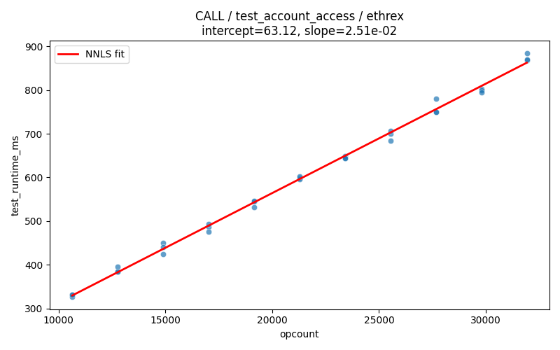

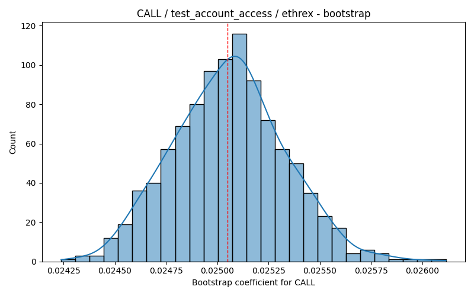

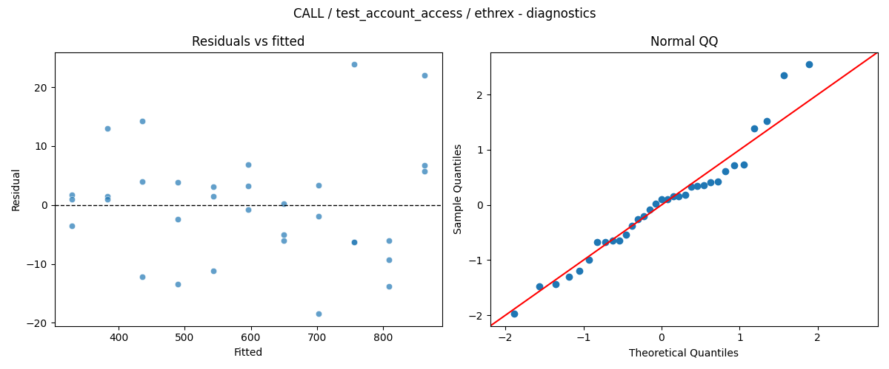

</details>

<details><summary>geth — NNLS regression summary</summary>

```
==============================================================================
                           NNLS Regression Results                            
==============================================================================
Dep. Variable:          test_runtime_ms              R-squared:          0.942
Model:                  NNLS                    Adj. R-squared:          0.942
No. Observations:       407                               RMSE:          63.48
Df Residuals:           405                                MAE:          49.91
Df Model:               1      
==============================================================================
                      coef     std err     P-value      [0.025      0.975]
------------------------------------------------------------------------------
         const    472.4492     15.0752       0.001    444.8461    503.4636
       opcount      0.0107      0.0002       0.001      0.0104      0.0111
==============================================================================
Notes: Non-negative least squares with bootstrap inference (1000 iterations)
==============================================================================
```

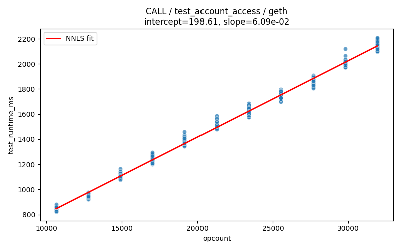


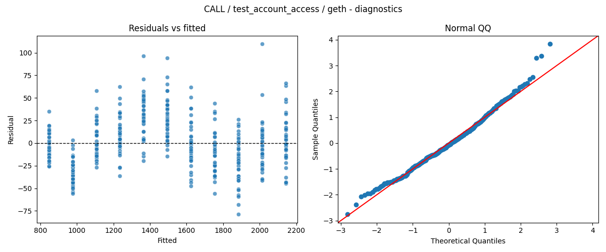

</details>

<details><summary>nethermind — NNLS regression summary</summary>

```
==============================================================================
                           NNLS Regression Results                            
==============================================================================
Dep. Variable:          test_runtime_ms              R-squared:          0.903
Model:                  NNLS                    Adj. R-squared:          0.902
No. Observations:       352                               RMSE:          30.98
Df Residuals:           350                                MAE:          19.70
Df Model:               1      
==============================================================================
                      coef     std err     P-value      [0.025      0.975]
------------------------------------------------------------------------------
         const     82.0459      5.8591       0.001     69.5526     93.4291
       opcount      0.0040      0.0001       0.001      0.0038      0.0041
==============================================================================
Notes: Non-negative least squares with bootstrap inference (1000 iterations)
==============================================================================
```

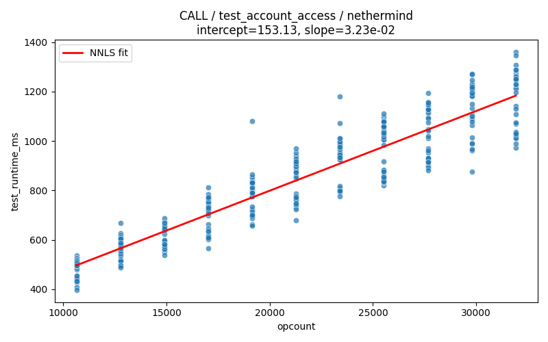

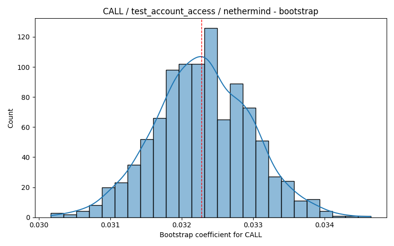

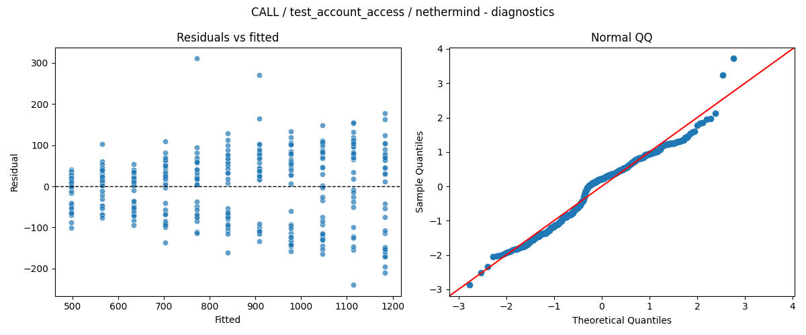

</details>

<details><summary>reth — NNLS regression summary</summary>

```
==============================================================================
                           NNLS Regression Results                            
==============================================================================
Dep. Variable:          test_runtime_ms              R-squared:          0.946
Model:                  NNLS                    Adj. R-squared:          0.946
No. Observations:       374                               RMSE:           7.13
Df Residuals:           372                                MAE:           5.38
Df Model:               1      
==============================================================================
                      coef     std err     P-value      [0.025      0.975]
------------------------------------------------------------------------------
         const     41.7474      1.1570       0.001     39.5249     43.9543
       opcount      0.0013      0.0000       0.001      0.0012      0.0013
==============================================================================
Notes: Non-negative least squares with bootstrap inference (1000 iterations)
==============================================================================
```

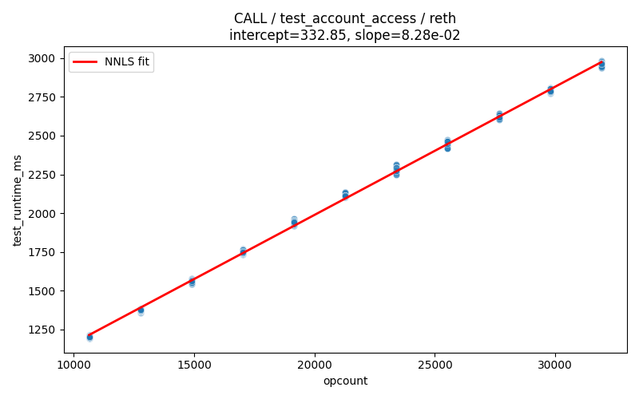

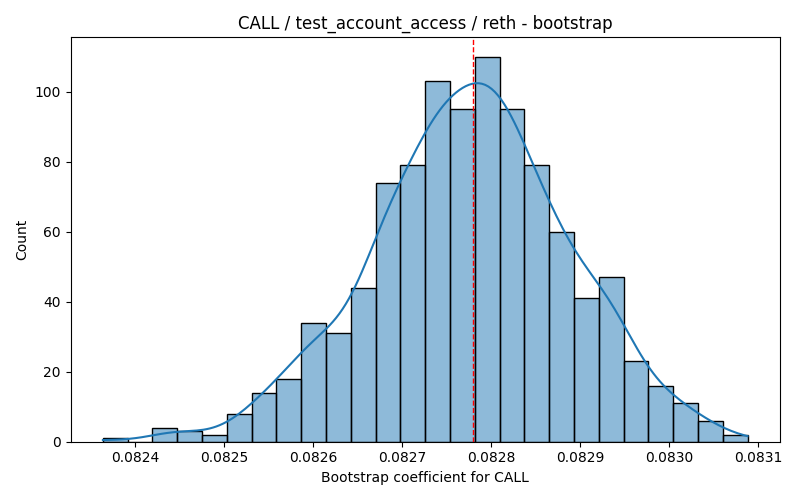

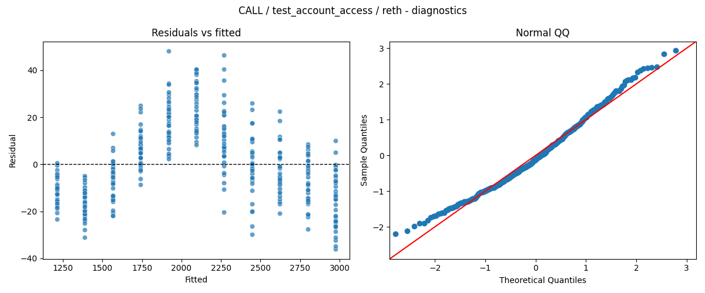

</details>

### test_account_access — combo `CALL_AccountMode.NON_EXISTING_ACCOUNT` — `presets[cold_account_nocode_access]`

| client | nobs | R² | target_coef (ms) | p-value | 95% CI |
| --- | --- | --- | --- | --- | --- |
| `besu` | 341 | 0.7772 | 0.0172 | 1.00e-03 | [0.01622, 0.01824] |
| `erigon` | 198 | 0.9716 | 0.009333 | 1.00e-03 | [0.009084, 0.009478] |
| `ethrex` | 33 | 0.9882 | 0.002663 | 1.00e-03 | [0.002567, 0.002755] |
| `geth` | 407 | 0.8684 | 0.02221 | 1.00e-03 | [0.0213, 0.02312] |
| `nethermind` | 352 | 0.9317 | 0.003817 | 1.00e-03 | [0.003706, 0.003915] |
| `reth` | 374 | 0.9657 | 0.0009317 | 1.00e-03 | [0.000912, 0.0009491] |

<details><summary>besu — NNLS regression summary</summary>

```
==============================================================================
                           NNLS Regression Results                            
==============================================================================
Dep. Variable:          test_runtime_ms              R-squared:          0.777
Model:                  NNLS                    Adj. R-squared:          0.777
No. Observations:       341                               RMSE:         218.76
Df Residuals:           339                                MAE:         198.94
Df Model:               1      
==============================================================================
                      coef     std err     P-value      [0.025      0.975]
------------------------------------------------------------------------------
         const    571.4100     35.6374       0.001    500.5081    641.8352
       opcount      0.0172      0.0005       0.001      0.0162      0.0182
==============================================================================
Notes: Non-negative least squares with bootstrap inference (1000 iterations)
==============================================================================
```

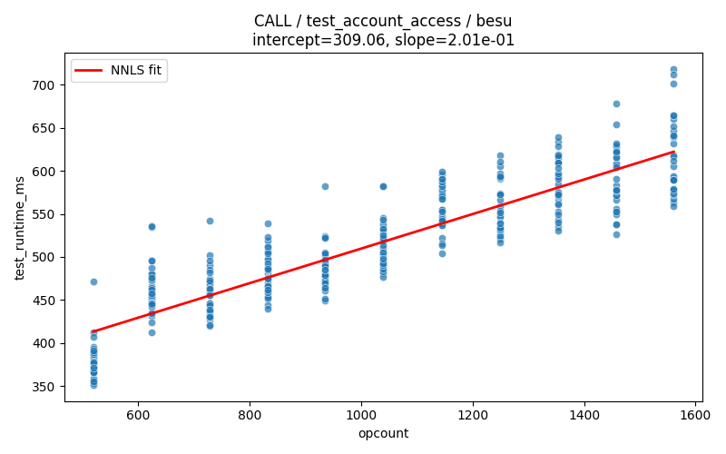

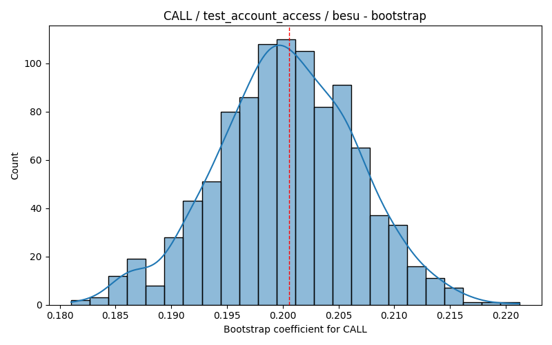

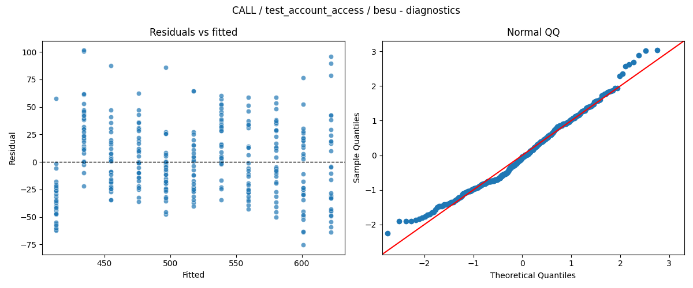

</details>

<details><summary>erigon — NNLS regression summary</summary>

```
==============================================================================
                           NNLS Regression Results                            
==============================================================================
Dep. Variable:          test_runtime_ms              R-squared:          0.972
Model:                  NNLS                    Adj. R-squared:          0.971
No. Observations:       198                               RMSE:          37.91
Df Residuals:           196                                MAE:          33.13
Df Model:               1      
==============================================================================
                      coef     std err     P-value      [0.025      0.975]
------------------------------------------------------------------------------
         const      6.2175      6.5993       0.216      0.0000     22.3773
       opcount      0.0093      0.0001       0.001      0.0091      0.0095
==============================================================================
Notes: Non-negative least squares with bootstrap inference (1000 iterations)
==============================================================================
```

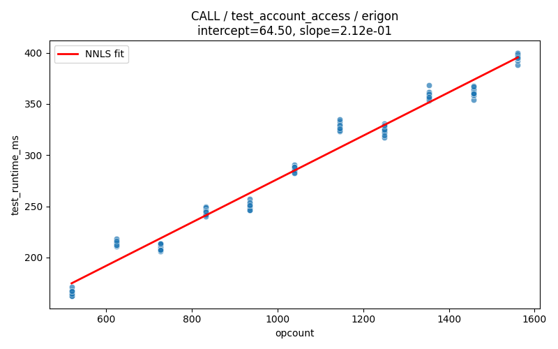

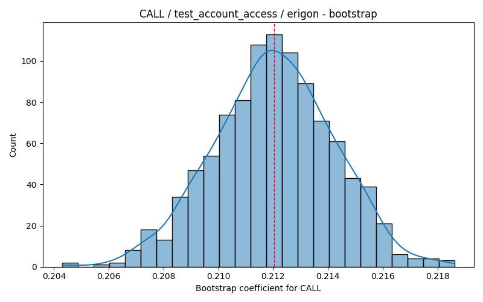

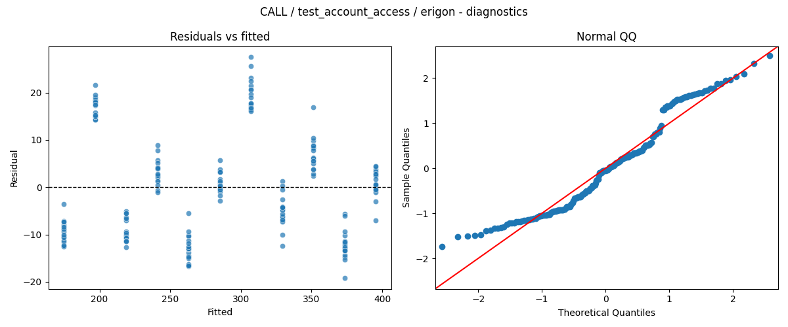

</details>

<details><summary>ethrex — NNLS regression summary</summary>

```
==============================================================================
                           NNLS Regression Results                            
==============================================================================
Dep. Variable:          test_runtime_ms              R-squared:          0.988
Model:                  NNLS                    Adj. R-squared:          0.988
No. Observations:       33                                RMSE:           6.91
Df Residuals:           31                                 MAE:           5.56
Df Model:               1      
==============================================================================
                      coef     std err     P-value      [0.025      0.975]
------------------------------------------------------------------------------
         const     11.6658      3.9361       0.002      4.5641     19.6993
       opcount      0.0027      0.0000       0.001      0.0026      0.0028
==============================================================================
Notes: Non-negative least squares with bootstrap inference (1000 iterations)
==============================================================================
```

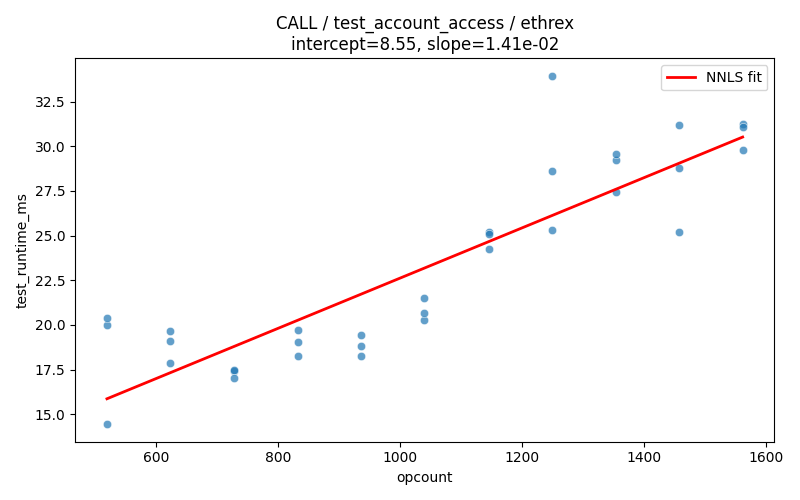

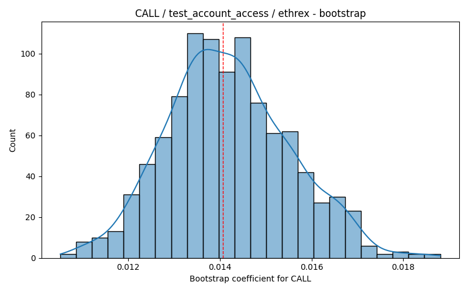

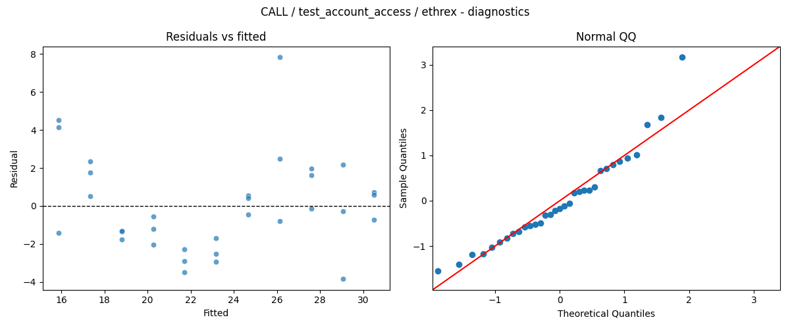

</details>

<details><summary>geth — NNLS regression summary</summary>

```
==============================================================================
                           NNLS Regression Results                            
==============================================================================
Dep. Variable:          test_runtime_ms              R-squared:          0.868
Model:                  NNLS                    Adj. R-squared:          0.868
No. Observations:       407                               RMSE:         205.38
Df Residuals:           405                                MAE:         175.16
Df Model:               1      
==============================================================================
                      coef     std err     P-value      [0.025      0.975]
------------------------------------------------------------------------------
         const    770.6402     39.5551       0.001    693.9277    843.8822
       opcount      0.0222      0.0005       0.001      0.0213      0.0231
==============================================================================
Notes: Non-negative least squares with bootstrap inference (1000 iterations)
==============================================================================
```

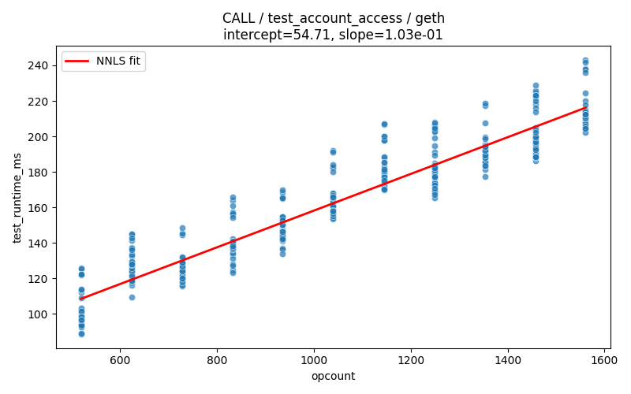

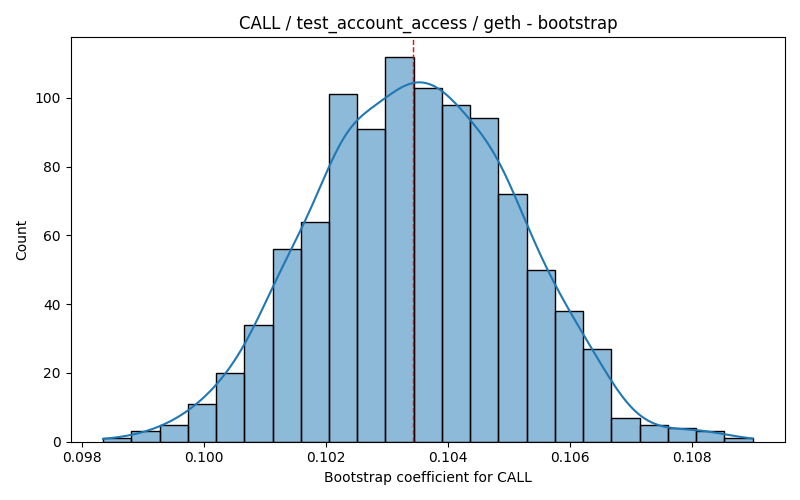

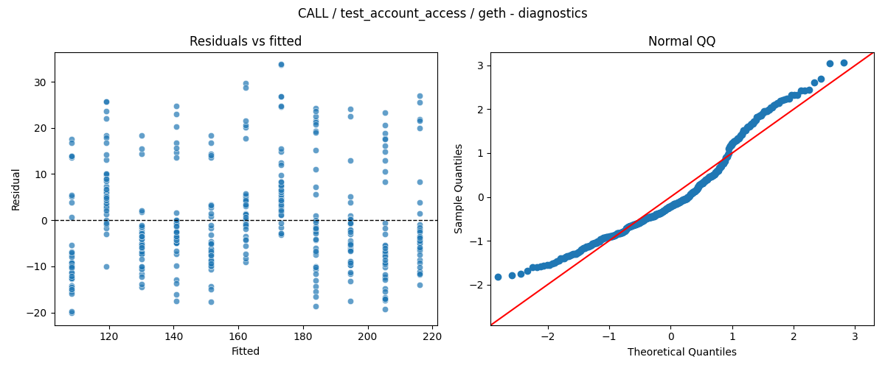

</details>

<details><summary>nethermind — NNLS regression summary</summary>

```
==============================================================================
                           NNLS Regression Results                            
==============================================================================
Dep. Variable:          test_runtime_ms              R-squared:          0.932
Model:                  NNLS                    Adj. R-squared:          0.932
No. Observations:       352                               RMSE:          24.54
Df Residuals:           350                                MAE:          18.13
Df Model:               1      
==============================================================================
                      coef     std err     P-value      [0.025      0.975]
------------------------------------------------------------------------------
         const     83.3409      4.1797       0.001     76.1432     92.0628
       opcount      0.0038      0.0001       0.001      0.0037      0.0039
==============================================================================
Notes: Non-negative least squares with bootstrap inference (1000 iterations)
==============================================================================
```

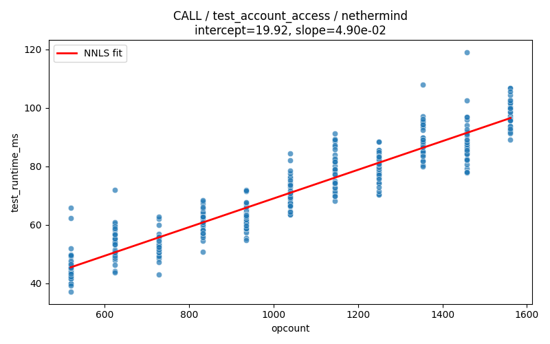

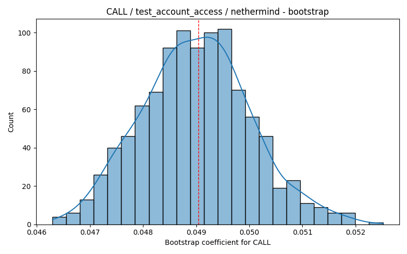

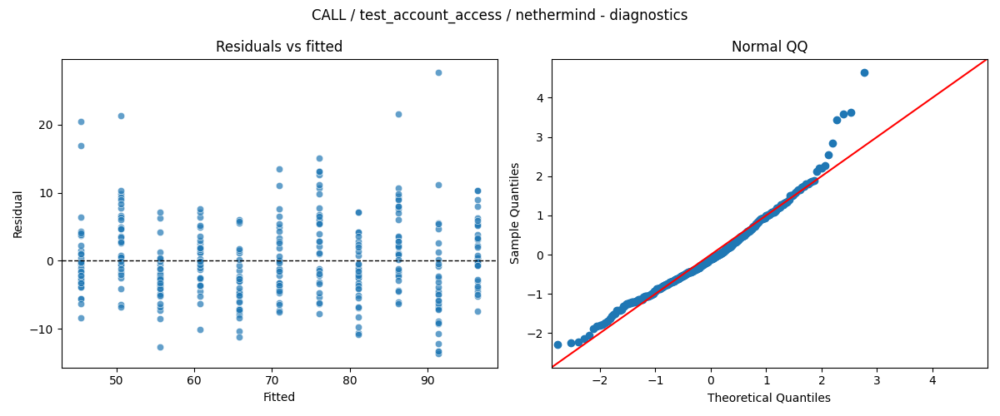

</details>

<details><summary>reth — NNLS regression summary</summary>

```
==============================================================================
                           NNLS Regression Results                            
==============================================================================
Dep. Variable:          test_runtime_ms              R-squared:          0.966
Model:                  NNLS                    Adj. R-squared:          0.966
No. Observations:       374                               RMSE:           4.17
Df Residuals:           372                                MAE:           3.42
Df Model:               1      
==============================================================================
                      coef     std err     P-value      [0.025      0.975]
------------------------------------------------------------------------------
         const     44.2871      0.7731       0.001     42.9126     45.9211
       opcount      0.0009      0.0000       0.001      0.0009      0.0009
==============================================================================
Notes: Non-negative least squares with bootstrap inference (1000 iterations)
==============================================================================
```

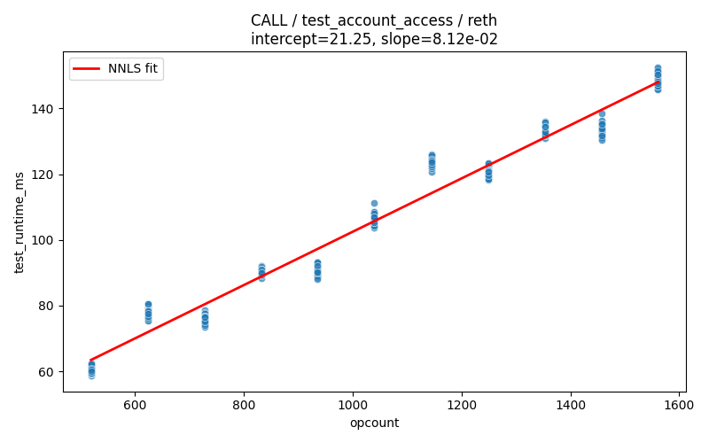

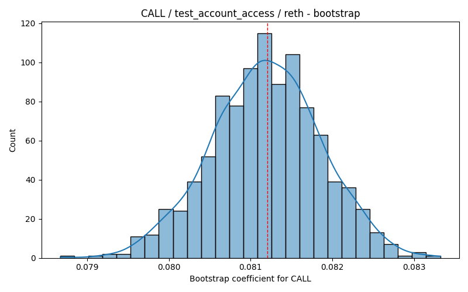

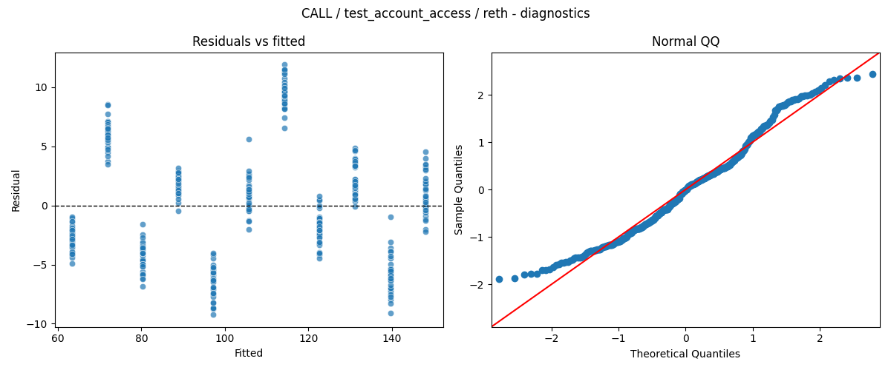

</details>

### test_account_access — combo `CALL_AccountMode.EXISTING_CONTRACT` — `presets[cold_account_code_access]`

| client | nobs | R² | target_coef (ms) | p-value | 95% CI |
| --- | --- | --- | --- | --- | --- |
| `besu` | 341 | 0.8854 | 0.03214 | 1.00e-03 | [0.03093, 0.0333] |
| `erigon` | 198 | 0.8818 | 0.08032 | 1.00e-03 | [0.07642, 0.08421] |
| `ethrex` | 33 | 0.9821 | 0.01831 | 1.00e-03 | [0.01738, 0.01923] |
| `geth` | 407 | 0.8715 | 0.02364 | 1.00e-03 | [0.02269, 0.02461] |
| `nethermind` | 352 | 0.8053 | 0.0193 | 1.00e-03 | [0.0182, 0.02045] |
| `reth` | 374 | 0.851 | 0.01835 | 1.00e-03 | [0.01754, 0.01926] |

<details><summary>besu — NNLS regression summary</summary>

```
==============================================================================
                           NNLS Regression Results                            
==============================================================================
Dep. Variable:          test_runtime_ms              R-squared:          0.885
Model:                  NNLS                    Adj. R-squared:          0.885
No. Observations:       341                               RMSE:         235.27
Df Residuals:           339                                MAE:         211.49
Df Model:               1      
==============================================================================
                      coef     std err     P-value      [0.025      0.975]
------------------------------------------------------------------------------
         const    526.2135     36.9666       0.001    457.3414    597.0988
       opcount      0.0321      0.0006       0.001      0.0309      0.0333
==============================================================================
Notes: Non-negative least squares with bootstrap inference (1000 iterations)
==============================================================================
```

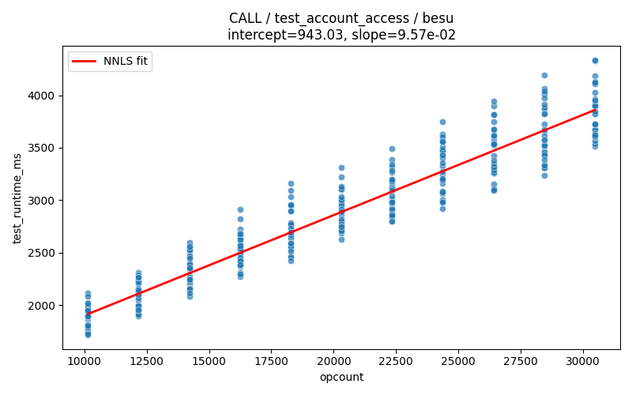

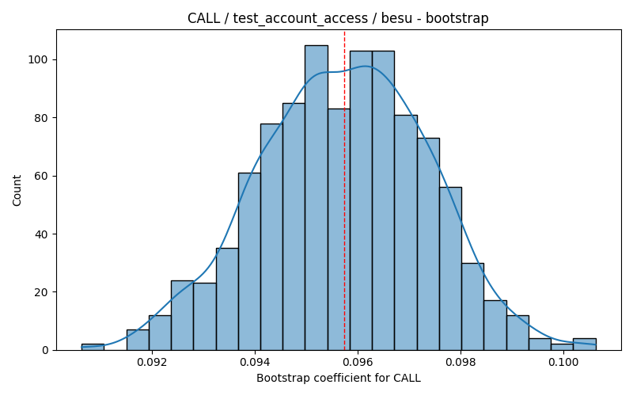

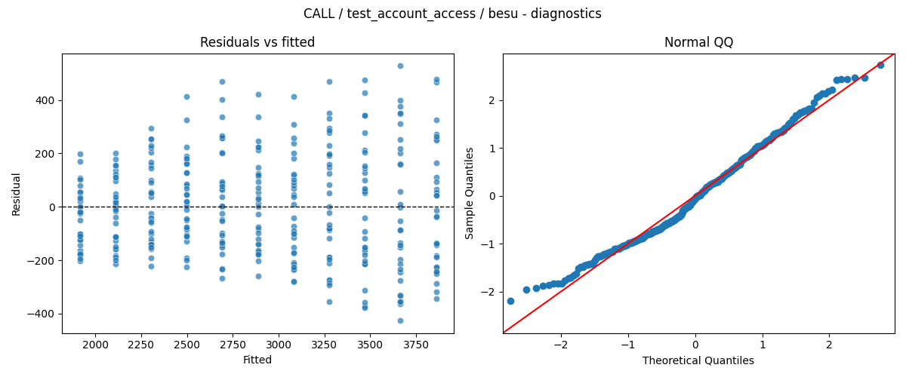

</details>

<details><summary>erigon — NNLS regression summary</summary>

```
==============================================================================
                           NNLS Regression Results                            
==============================================================================
Dep. Variable:          test_runtime_ms              R-squared:          0.882
Model:                  NNLS                    Adj. R-squared:          0.881
No. Observations:       198                               RMSE:         598.27
Df Residuals:           196                                MAE:         522.35
Df Model:               1      
==============================================================================
                      coef     std err     P-value      [0.025      0.975]
------------------------------------------------------------------------------
         const    928.6452    154.4428       0.001    627.5943   1233.7668
       opcount      0.0803      0.0020       0.001      0.0764      0.0842
==============================================================================
Notes: Non-negative least squares with bootstrap inference (1000 iterations)
==============================================================================
```

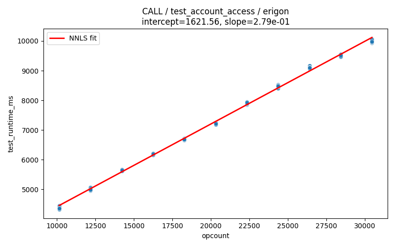

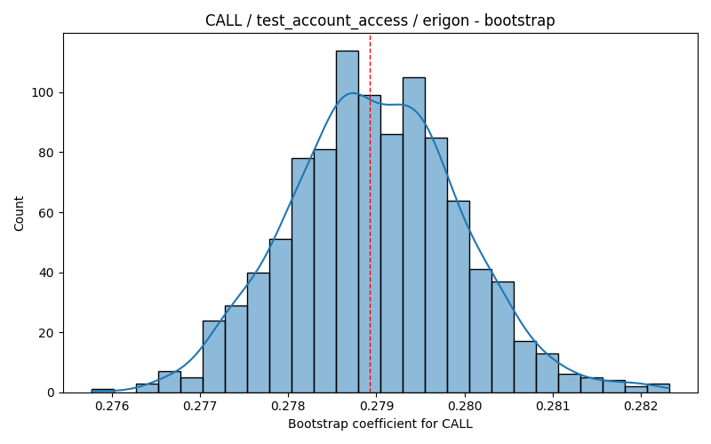

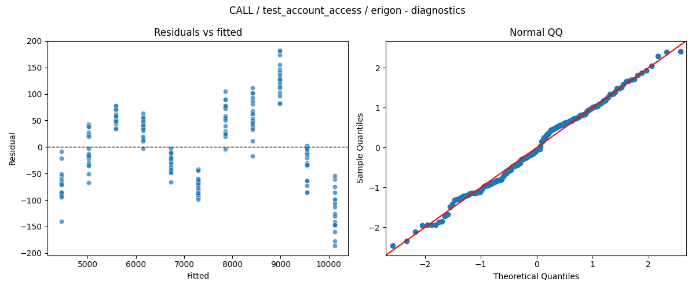

</details>

<details><summary>ethrex — NNLS regression summary</summary>

```
==============================================================================
                           NNLS Regression Results                            
==============================================================================
Dep. Variable:          test_runtime_ms              R-squared:          0.982
Model:                  NNLS                    Adj. R-squared:          0.982
No. Observations:       33                                RMSE:          50.31
Df Residuals:           31                                 MAE:          45.00
Df Model:               1      
==============================================================================
                      coef     std err     P-value      [0.025      0.975]
------------------------------------------------------------------------------
         const    142.2267     34.4358       0.001     80.1074    209.1611
       opcount      0.0183      0.0005       0.001      0.0174      0.0192
==============================================================================
Notes: Non-negative least squares with bootstrap inference (1000 iterations)
==============================================================================
```


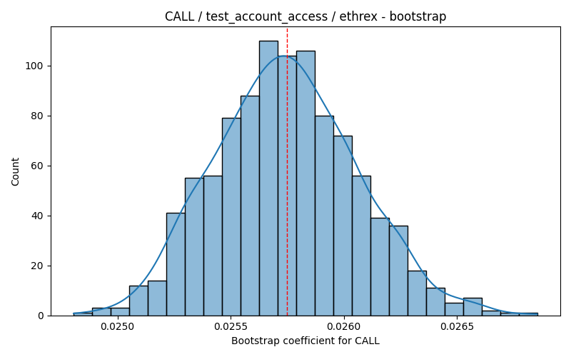

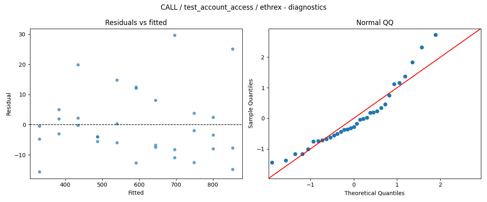

</details>

<details><summary>geth — NNLS regression summary</summary>

```
==============================================================================
                           NNLS Regression Results                            
==============================================================================
Dep. Variable:          test_runtime_ms              R-squared:          0.872
Model:                  NNLS                    Adj. R-squared:          0.871
No. Observations:       407                               RMSE:         184.71
Df Residuals:           405                                MAE:         159.24
Df Model:               1      
==============================================================================
                      coef     std err     P-value      [0.025      0.975]
------------------------------------------------------------------------------
         const    733.4186     35.3603       0.001    665.4394    806.6050
       opcount      0.0236      0.0005       0.001      0.0227      0.0246
==============================================================================
Notes: Non-negative least squares with bootstrap inference (1000 iterations)
==============================================================================
```

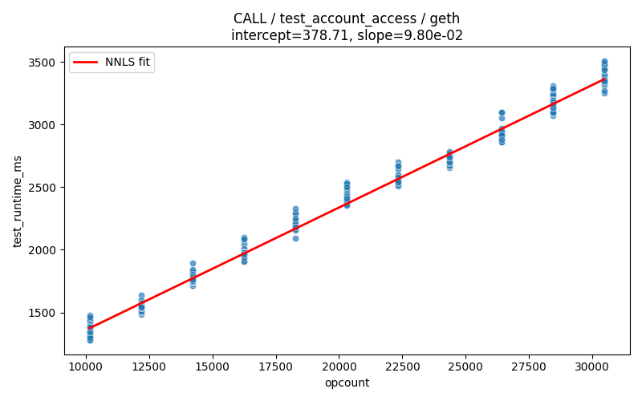

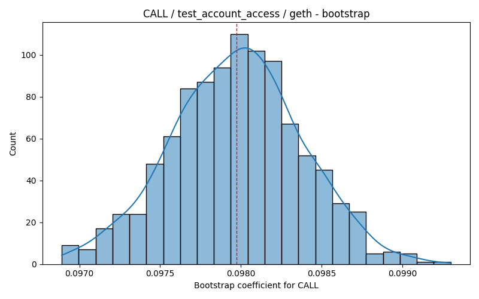

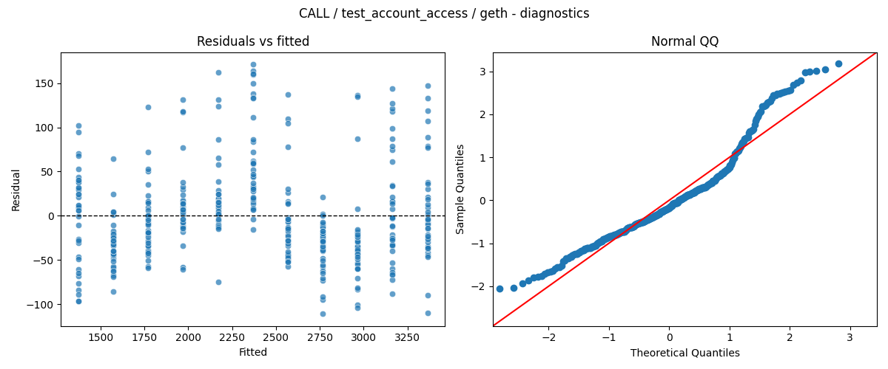

</details>

<details><summary>nethermind — NNLS regression summary</summary>

```
==============================================================================
                           NNLS Regression Results                            
==============================================================================
Dep. Variable:          test_runtime_ms              R-squared:          0.805
Model:                  NNLS                    Adj. R-squared:          0.805
No. Observations:       352                               RMSE:         193.13
Df Residuals:           350                                MAE:         162.07
Df Model:               1      
==============================================================================
                      coef     std err     P-value      [0.025      0.975]
------------------------------------------------------------------------------
         const    586.6280     42.6781       0.001    507.2624    665.9476
       opcount      0.0193      0.0006       0.001      0.0182      0.0205
==============================================================================
Notes: Non-negative least squares with bootstrap inference (1000 iterations)
==============================================================================
```

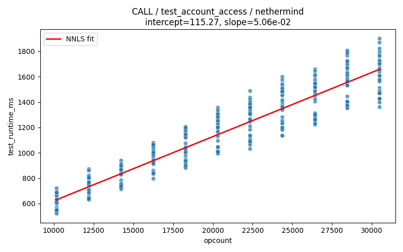


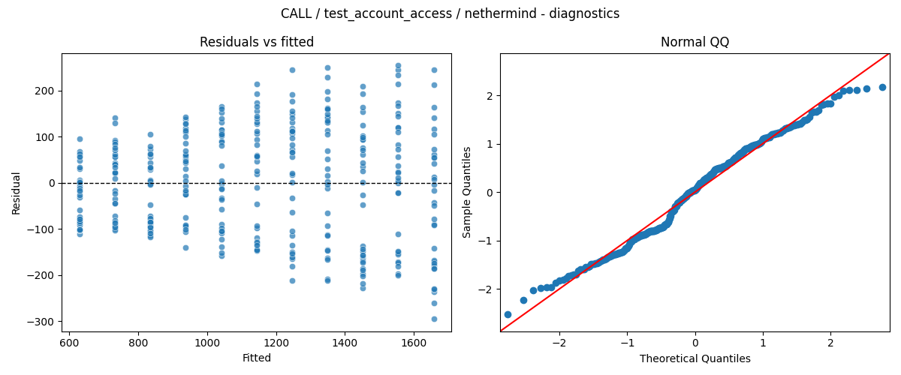

</details>

<details><summary>reth — NNLS regression summary</summary>

```
==============================================================================
                           NNLS Regression Results                            
==============================================================================
Dep. Variable:          test_runtime_ms              R-squared:          0.851
Model:                  NNLS                    Adj. R-squared:          0.851
No. Observations:       374                               RMSE:         156.24
Df Residuals:           372                                MAE:          77.83
Df Model:               1      
==============================================================================
                      coef     std err     P-value      [0.025      0.975]
------------------------------------------------------------------------------
         const    297.9014     26.7017       0.001    244.2219    347.6301
       opcount      0.0183      0.0004       0.001      0.0175      0.0193
==============================================================================
Notes: Non-negative least squares with bootstrap inference (1000 iterations)
==============================================================================
```

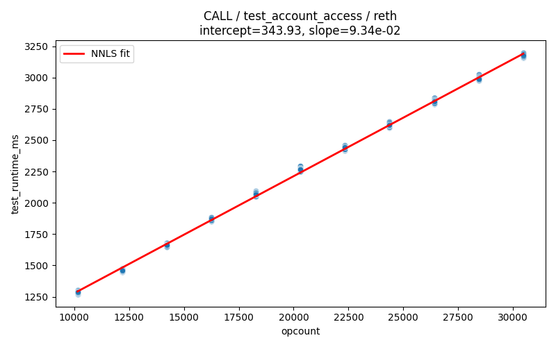

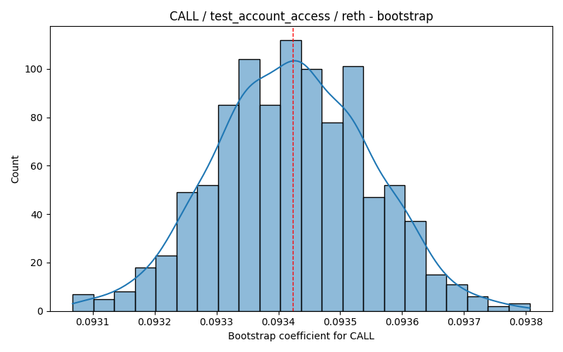

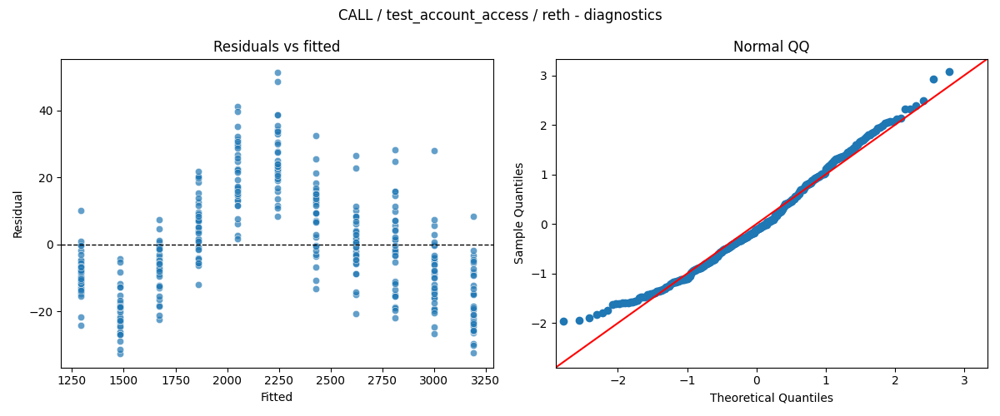

</details>

### test_account_access — combo `CALL_AccountMode.NON_EXISTING_ACCOUNT` — `presets[cold_account_code_access]`

| client | nobs | R² | target_coef (ms) | p-value | 95% CI |
| --- | --- | --- | --- | --- | --- |
| `besu` | 341 | 0.7772 | 0.0172 | 1.00e-03 | [0.01622, 0.01824] |
| `erigon` | 198 | 0.9716 | 0.009333 | 1.00e-03 | [0.009084, 0.009478] |
| `ethrex` | 33 | 0.9882 | 0.002663 | 1.00e-03 | [0.002567, 0.002755] |
| `geth` | 407 | 0.8684 | 0.02221 | 1.00e-03 | [0.0213, 0.02312] |
| `nethermind` | 352 | 0.9317 | 0.003817 | 1.00e-03 | [0.003706, 0.003915] |
| `reth` | 374 | 0.9657 | 0.0009317 | 1.00e-03 | [0.000912, 0.0009491] |

<details><summary>besu — NNLS regression summary</summary>

```
==============================================================================
                           NNLS Regression Results                            
==============================================================================
Dep. Variable:          test_runtime_ms              R-squared:          0.777
Model:                  NNLS                    Adj. R-squared:          0.777
No. Observations:       341                               RMSE:         218.76
Df Residuals:           339                                MAE:         198.94
Df Model:               1      
==============================================================================
                      coef     std err     P-value      [0.025      0.975]
------------------------------------------------------------------------------
         const    571.4100     35.6374       0.001    500.5081    641.8352
       opcount      0.0172      0.0005       0.001      0.0162      0.0182
==============================================================================
Notes: Non-negative least squares with bootstrap inference (1000 iterations)
==============================================================================
```


</details>

<details><summary>erigon — NNLS regression summary</summary>

```
==============================================================================
                           NNLS Regression Results                            
==============================================================================
Dep. Variable:          test_runtime_ms              R-squared:          0.972
Model:                  NNLS                    Adj. R-squared:          0.971
No. Observations:       198                               RMSE:          37.91
Df Residuals:           196                                MAE:          33.13
Df Model:               1      
==============================================================================
                      coef     std err     P-value      [0.025      0.975]
------------------------------------------------------------------------------
         const      6.2175      6.5993       0.216      0.0000     22.3773
       opcount      0.0093      0.0001       0.001      0.0091      0.0095
==============================================================================
Notes: Non-negative least squares with bootstrap inference (1000 iterations)
==============================================================================
```


</details>

<details><summary>ethrex — NNLS regression summary</summary>

```
==============================================================================
                           NNLS Regression Results                            
==============================================================================
Dep. Variable:          test_runtime_ms              R-squared:          0.988
Model:                  NNLS                    Adj. R-squared:          0.988
No. Observations:       33                                RMSE:           6.91
Df Residuals:           31                                 MAE:           5.56
Df Model:               1      
==============================================================================
                      coef     std err     P-value      [0.025      0.975]
------------------------------------------------------------------------------
         const     11.6658      3.9361       0.002      4.5641     19.6993
       opcount      0.0027      0.0000       0.001      0.0026      0.0028
==============================================================================
Notes: Non-negative least squares with bootstrap inference (1000 iterations)
==============================================================================
```


</details>

<details><summary>geth — NNLS regression summary</summary>

```
==============================================================================
                           NNLS Regression Results                            
==============================================================================
Dep. Variable:          test_runtime_ms              R-squared:          0.868
Model:                  NNLS                    Adj. R-squared:          0.868
No. Observations:       407                               RMSE:         205.38
Df Residuals:           405                                MAE:         175.16
Df Model:               1      
==============================================================================
                      coef     std err     P-value      [0.025      0.975]
------------------------------------------------------------------------------
         const    770.6402     39.5551       0.001    693.9277    843.8822
       opcount      0.0222      0.0005       0.001      0.0213      0.0231
==============================================================================
Notes: Non-negative least squares with bootstrap inference (1000 iterations)
==============================================================================
```


</details>

<details><summary>nethermind — NNLS regression summary</summary>

```
==============================================================================
                           NNLS Regression Results                            
==============================================================================
Dep. Variable:          test_runtime_ms              R-squared:          0.932
Model:                  NNLS                    Adj. R-squared:          0.932
No. Observations:       352                               RMSE:          24.54
Df Residuals:           350                                MAE:          18.13
Df Model:               1      
==============================================================================
                      coef     std err     P-value      [0.025      0.975]
------------------------------------------------------------------------------
         const     83.3409      4.1797       0.001     76.1432     92.0628
       opcount      0.0038      0.0001       0.001      0.0037      0.0039
==============================================================================
Notes: Non-negative least squares with bootstrap inference (1000 iterations)
==============================================================================
```


</details>

<details><summary>reth — NNLS regression summary</summary>

```
==============================================================================
                           NNLS Regression Results                            
==============================================================================
Dep. Variable:          test_runtime_ms              R-squared:          0.966
Model:                  NNLS                    Adj. R-squared:          0.966
No. Observations:       374                               RMSE:           4.17
Df Residuals:           372                                MAE:           3.42
Df Model:               1      
==============================================================================
                      coef     std err     P-value      [0.025      0.975]
------------------------------------------------------------------------------
         const     44.2871      0.7731       0.001     42.9126     45.9211
       opcount      0.0009      0.0000       0.001      0.0009      0.0009
==============================================================================
Notes: Non-negative least squares with bootstrap inference (1000 iterations)
==============================================================================
```


</details>

### test_account_access — combo `CALL_AccountMode.EXISTING_EOA` — `presets[cold_account_nocode_write]`

| client | nobs | R² | target_coef (ms) | p-value | 95% CI |
| --- | --- | --- | --- | --- | --- |
| `besu` | 341 | 0.9367 | 0.08132 | 1.00e-03 | [0.07901, 0.08374] |
| `erigon` | 198 | 0.9941 | 0.0875 | 1.00e-03 | [0.08652, 0.08845] |
| `ethrex` | 33 | 0.9969 | 0.02505 | 1.00e-03 | [0.02455, 0.02559] |
| `geth` | 407 | 0.9952 | 0.0609 | 1.00e-03 | [0.06051, 0.06128] |
| `nethermind` | 352 | 0.8711 | 0.03228 | 1.00e-03 | [0.03098, 0.03361] |
| `reth` | 374 | 0.9991 | 0.08278 | 1.00e-03 | [0.08255, 0.08299] |

<details><summary>besu — NNLS regression summary</summary>

```
==============================================================================
                           NNLS Regression Results                            
==============================================================================
Dep. Variable:          test_runtime_ms              R-squared:          0.937
Model:                  NNLS                    Adj. R-squared:          0.937
No. Observations:       341                               RMSE:         142.23
Df Residuals:           339                                MAE:         118.06
Df Model:               1      
==============================================================================
                      coef     std err     P-value      [0.025      0.975]
------------------------------------------------------------------------------
         const    466.2010     25.8206       0.001    414.7477    516.2333
       opcount      0.0813      0.0012       0.001      0.0790      0.0837
==============================================================================
Notes: Non-negative least squares with bootstrap inference (1000 iterations)
==============================================================================
```


</details>

<details><summary>erigon — NNLS regression summary</summary>

```
==============================================================================
                           NNLS Regression Results                            
==============================================================================
Dep. Variable:          test_runtime_ms              R-squared:          0.994
Model:                  NNLS                    Adj. R-squared:          0.994
No. Observations:       198                               RMSE:          45.20
Df Residuals:           196                                MAE:          41.45
Df Model:               1      
==============================================================================
                      coef     std err     P-value      [0.025      0.975]
------------------------------------------------------------------------------
         const    540.5293     11.0670       0.001    520.8366    562.0691
       opcount      0.0875      0.0005       0.001      0.0865      0.0885
==============================================================================
Notes: Non-negative least squares with bootstrap inference (1000 iterations)
==============================================================================
```


</details>

<details><summary>ethrex — NNLS regression summary</summary>

```
==============================================================================
                           NNLS Regression Results                            
==============================================================================
Dep. Variable:          test_runtime_ms              R-squared:          0.997
Model:                  NNLS                    Adj. R-squared:          0.997
No. Observations:       33                                RMSE:           9.37
Df Residuals:           31                                 MAE:           7.08
Df Model:               1      
==============================================================================
                      coef     std err     P-value      [0.025      0.975]
------------------------------------------------------------------------------
         const     63.1217      5.3750       0.001     51.4098     72.8866
       opcount      0.0251      0.0003       0.001      0.0245      0.0256
==============================================================================
Notes: Non-negative least squares with bootstrap inference (1000 iterations)
==============================================================================
```


</details>

<details><summary>geth — NNLS regression summary</summary>

```
==============================================================================
                           NNLS Regression Results                            
==============================================================================
Dep. Variable:          test_runtime_ms              R-squared:          0.995
Model:                  NNLS                    Adj. R-squared:          0.995
No. Observations:       407                               RMSE:          28.57
Df Residuals:           405                                MAE:          22.46
Df Model:               1      
==============================================================================
                      coef     std err     P-value      [0.025      0.975]
------------------------------------------------------------------------------
         const    198.6056      4.3118       0.001    190.6312    206.9681
       opcount      0.0609      0.0002       0.001      0.0605      0.0613
==============================================================================
Notes: Non-negative least squares with bootstrap inference (1000 iterations)
==============================================================================
```


</details>

<details><summary>nethermind — NNLS regression summary</summary>

```
==============================================================================
                           NNLS Regression Results                            
==============================================================================
Dep. Variable:          test_runtime_ms              R-squared:          0.871
Model:                  NNLS                    Adj. R-squared:          0.871
No. Observations:       352                               RMSE:          83.56
Df Residuals:           350                                MAE:          68.82
Df Model:               1      
==============================================================================
                      coef     std err     P-value      [0.025      0.975]
------------------------------------------------------------------------------
         const    153.1275     12.4473       0.001    128.0886    177.5379
       opcount      0.0323      0.0007       0.001      0.0310      0.0336
==============================================================================
Notes: Non-negative least squares with bootstrap inference (1000 iterations)
==============================================================================
```


</details>

<details><summary>reth — NNLS regression summary</summary>

```
==============================================================================
                           NNLS Regression Results                            
==============================================================================
Dep. Variable:          test_runtime_ms              R-squared:          0.999
Model:                  NNLS                    Adj. R-squared:          0.999
No. Observations:       374                               RMSE:          16.38
Df Residuals:           372                                MAE:          13.32
Df Model:               1      
==============================================================================
                      coef     std err     P-value      [0.025      0.975]
------------------------------------------------------------------------------
         const    332.8478      2.4962       0.001    328.1793    337.9519
       opcount      0.0828      0.0001       0.001      0.0825      0.0830
==============================================================================
Notes: Non-negative least squares with bootstrap inference (1000 iterations)
==============================================================================
```


</details>

### test_account_access — combo `CALL_AccountMode.NON_EXISTING_ACCOUNT` — `presets[cold_account_nocode_write]`

| client | nobs | R² | target_coef (ms) | p-value | 95% CI |
| --- | --- | --- | --- | --- | --- |
| `besu` | 341 | 0.7972 | 0.2006 | 1.00e-03 | [0.187, 0.2125] |
| `erigon` | 198 | 0.9757 | 0.212 | 1.00e-03 | [0.2075, 0.2161] |
| `ethrex` | 33 | 0.7794 | 0.01407 | 1.00e-03 | [0.01182, 0.01687] |
| `geth` | 407 | 0.9051 | 0.1034 | 1.00e-03 | [0.1003, 0.1065] |
| `nethermind` | 352 | 0.8806 | 0.04904 | 1.00e-03 | [0.04709, 0.05112] |
| `reth` | 374 | 0.9678 | 0.0812 | 1.00e-03 | [0.07986, 0.08246] |

<details><summary>besu — NNLS regression summary</summary>

```
==============================================================================
                           NNLS Regression Results                            
==============================================================================
Dep. Variable:          test_runtime_ms              R-squared:          0.797
Model:                  NNLS                    Adj. R-squared:          0.797
No. Observations:       341                               RMSE:          33.31
Df Residuals:           339                                MAE:          27.39
Df Model:               1      
==============================================================================
                      coef     std err     P-value      [0.025      0.975]
------------------------------------------------------------------------------
         const    309.0635      6.6114       0.001    296.7170    323.4546
       opcount      0.2006      0.0062       0.001      0.1870      0.2125
==============================================================================
Notes: Non-negative least squares with bootstrap inference (1000 iterations)
==============================================================================
```


</details>

<details><summary>erigon — NNLS regression summary</summary>

```
==============================================================================
                           NNLS Regression Results                            
==============================================================================
Dep. Variable:          test_runtime_ms              R-squared:          0.976
Model:                  NNLS                    Adj. R-squared:          0.976
No. Observations:       198                               RMSE:          11.01
Df Residuals:           196                                MAE:           9.11
Df Model:               1      
==============================================================================
                      coef     std err     P-value      [0.025      0.975]
------------------------------------------------------------------------------
         const     64.5015      2.5374       0.001     59.8157     69.7617
       opcount      0.2120      0.0022       0.001      0.2075      0.2161
==============================================================================
Notes: Non-negative least squares with bootstrap inference (1000 iterations)
==============================================================================
```


</details>

<details><summary>ethrex — NNLS regression summary</summary>

```
==============================================================================
                           NNLS Regression Results                            
==============================================================================
Dep. Variable:          test_runtime_ms              R-squared:          0.779
Model:                  NNLS                    Adj. R-squared:          0.772
No. Observations:       33                                RMSE:           2.46
Df Residuals:           31                                 MAE:           1.92
Df Model:               1      
==============================================================================
                      coef     std err     P-value      [0.025      0.975]
------------------------------------------------------------------------------
         const      8.5509      1.4754       0.001      5.2966     10.9401
       opcount      0.0141      0.0013       0.001      0.0118      0.0169
==============================================================================
Notes: Non-negative least squares with bootstrap inference (1000 iterations)
==============================================================================
```


</details>

<details><summary>geth — NNLS regression summary</summary>

```
==============================================================================
                           NNLS Regression Results                            
==============================================================================
Dep. Variable:          test_runtime_ms              R-squared:          0.905
Model:                  NNLS                    Adj. R-squared:          0.905
No. Observations:       407                               RMSE:          11.02
Df Residuals:           405                                MAE:           8.71
Df Model:               1      
==============================================================================
                      coef     std err     P-value      [0.025      0.975]
------------------------------------------------------------------------------
         const     54.7060      1.7920       0.001     51.3817     58.1554
       opcount      0.1034      0.0016       0.001      0.1003      0.1065
==============================================================================
Notes: Non-negative least squares with bootstrap inference (1000 iterations)
==============================================================================
```


</details>

<details><summary>nethermind — NNLS regression summary</summary>

```
==============================================================================
                           NNLS Regression Results                            
==============================================================================
Dep. Variable:          test_runtime_ms              R-squared:          0.881
Model:                  NNLS                    Adj. R-squared:          0.880
No. Observations:       352                               RMSE:           5.95
Df Residuals:           350                                MAE:           4.59
Df Model:               1      
==============================================================================
                      coef     std err     P-value      [0.025      0.975]
------------------------------------------------------------------------------
         const     19.9176      1.0631       0.001     17.8061     21.9656
       opcount      0.0490      0.0010       0.001      0.0471      0.0511
==============================================================================
Notes: Non-negative least squares with bootstrap inference (1000 iterations)
==============================================================================
```


</details>

<details><summary>reth — NNLS regression summary</summary>

```
==============================================================================
                           NNLS Regression Results                            
==============================================================================
Dep. Variable:          test_runtime_ms              R-squared:          0.968
Model:                  NNLS                    Adj. R-squared:          0.968
No. Observations:       374                               RMSE:           4.87
Df Residuals:           372                                MAE:           3.98
Df Model:               1      
==============================================================================
                      coef     std err     P-value      [0.025      0.975]
------------------------------------------------------------------------------
         const     21.2492      0.7496       0.001     19.8079     22.7397
       opcount      0.0812      0.0007       0.001      0.0799      0.0825
==============================================================================
Notes: Non-negative least squares with bootstrap inference (1000 iterations)
==============================================================================
```


</details>

### test_account_access — combo `CALL_AccountMode.EXISTING_CONTRACT` — `presets[cold_account_code_write]`

| client | nobs | R² | target_coef (ms) | p-value | 95% CI |
| --- | --- | --- | --- | --- | --- |
| `besu` | 341 | 0.9101 | 0.09573 | 1.00e-03 | [0.09245, 0.09875] |
| `erigon` | 198 | 0.9982 | 0.2789 | 1.00e-03 | [0.2772, 0.2809] |
| `ethrex` | 33 | 0.9957 | 0.02575 | 1.00e-03 | [0.02518, 0.02638] |
| `geth` | 407 | 0.9928 | 0.09797 | 1.00e-03 | [0.09717, 0.09875] |
| `nethermind` | 352 | 0.8859 | 0.05063 | 1.00e-03 | [0.04884, 0.05249] |
| `reth` | 374 | 0.9992 | 0.09342 | 1.00e-03 | [0.09318, 0.09366] |

<details><summary>besu — NNLS regression summary</summary>

```
==============================================================================
                           NNLS Regression Results                            
==============================================================================
Dep. Variable:          test_runtime_ms              R-squared:          0.910
Model:                  NNLS                    Adj. R-squared:          0.910
No. Observations:       341                               RMSE:         193.27
Df Residuals:           339                                MAE:         160.31
Df Model:               1      
==============================================================================
                      coef     std err     P-value      [0.025      0.975]
------------------------------------------------------------------------------
         const    943.0299     30.2697       0.001    887.6365   1004.3328
       opcount      0.0957      0.0016       0.001      0.0925      0.0987
==============================================================================
Notes: Non-negative least squares with bootstrap inference (1000 iterations)
==============================================================================
```


</details>

<details><summary>erigon — NNLS regression summary</summary>

```
==============================================================================
                           NNLS Regression Results                            
==============================================================================
Dep. Variable:          test_runtime_ms              R-squared:          0.998
Model:                  NNLS                    Adj. R-squared:          0.998
No. Observations:       198                               RMSE:          75.59
Df Residuals:           196                                MAE:          63.35
Df Model:               1      
==============================================================================
                      coef     std err     P-value      [0.025      0.975]
------------------------------------------------------------------------------
         const   1621.5643     17.7715       0.001   1586.6005   1655.5992
       opcount      0.2789      0.0010       0.001      0.2772      0.2809
==============================================================================
Notes: Non-negative least squares with bootstrap inference (1000 iterations)
==============================================================================
```


</details>

<details><summary>ethrex — NNLS regression summary</summary>

```
==============================================================================
                           NNLS Regression Results                            
==============================================================================
Dep. Variable:          test_runtime_ms              R-squared:          0.996
Model:                  NNLS                    Adj. R-squared:          0.996
No. Observations:       33                                RMSE:          10.87
Df Residuals:           31                                 MAE:           8.37
Df Model:               1      
==============================================================================
                      coef     std err     P-value      [0.025      0.975]
------------------------------------------------------------------------------
         const     68.7977      6.0202       0.001     57.3993     81.4548
       opcount      0.0257      0.0003       0.001      0.0252      0.0264
==============================================================================
Notes: Non-negative least squares with bootstrap inference (1000 iterations)
==============================================================================
```


</details>

<details><summary>geth — NNLS regression summary</summary>

```
==============================================================================
                           NNLS Regression Results                            
==============================================================================
Dep. Variable:          test_runtime_ms              R-squared:          0.993
Model:                  NNLS                    Adj. R-squared:          0.993
No. Observations:       407                               RMSE:          53.69
Df Residuals:           405                                MAE:          40.30
Df Model:               1      
==============================================================================
                      coef     std err     P-value      [0.025      0.975]
------------------------------------------------------------------------------
         const    378.7109      8.2854       0.001    362.5987    395.2116
       opcount      0.0980      0.0004       0.001      0.0972      0.0987
==============================================================================
Notes: Non-negative least squares with bootstrap inference (1000 iterations)
==============================================================================
```


</details>

<details><summary>nethermind — NNLS regression summary</summary>

```
==============================================================================
                           NNLS Regression Results                            
==============================================================================
Dep. Variable:          test_runtime_ms              R-squared:          0.886
Model:                  NNLS                    Adj. R-squared:          0.886
No. Observations:       352                               RMSE:         116.72
Df Residuals:           350                                MAE:          99.06
Df Model:               1      
==============================================================================
                      coef     std err     P-value      [0.025      0.975]
------------------------------------------------------------------------------
         const    115.2709     17.2162       0.001     82.0186    147.8756
       opcount      0.0506      0.0010       0.001      0.0488      0.0525
==============================================================================
Notes: Non-negative least squares with bootstrap inference (1000 iterations)
==============================================================================
```


</details>

<details><summary>reth — NNLS regression summary</summary>

```
==============================================================================
                           NNLS Regression Results                            
==============================================================================
Dep. Variable:          test_runtime_ms              R-squared:          0.999
Model:                  NNLS                    Adj. R-squared:          0.999
No. Observations:       374                               RMSE:          16.64
Df Residuals:           372                                MAE:          13.55
Df Model:               1      
==============================================================================
                      coef     std err     P-value      [0.025      0.975]
------------------------------------------------------------------------------
         const    343.9349      2.6438       0.001    339.0908    349.3152
       opcount      0.0934      0.0001       0.001      0.0932      0.0937
==============================================================================
Notes: Non-negative least squares with bootstrap inference (1000 iterations)
==============================================================================
```


</details>

### test_account_access — combo `CALL_AccountMode.NON_EXISTING_ACCOUNT` — `presets[cold_account_code_write]`

| client | nobs | R² | target_coef (ms) | p-value | 95% CI |
| --- | --- | --- | --- | --- | --- |
| `besu` | 341 | 0.7972 | 0.2006 | 1.00e-03 | [0.187, 0.2125] |
| `erigon` | 198 | 0.9757 | 0.212 | 1.00e-03 | [0.2075, 0.2161] |
| `ethrex` | 33 | 0.7794 | 0.01407 | 1.00e-03 | [0.01182, 0.01687] |
| `geth` | 407 | 0.9051 | 0.1034 | 1.00e-03 | [0.1003, 0.1065] |
| `nethermind` | 352 | 0.8806 | 0.04904 | 1.00e-03 | [0.04709, 0.05112] |
| `reth` | 374 | 0.9678 | 0.0812 | 1.00e-03 | [0.07986, 0.08246] |

<details><summary>besu — NNLS regression summary</summary>

```
==============================================================================
                           NNLS Regression Results                            
==============================================================================
Dep. Variable:          test_runtime_ms              R-squared:          0.797
Model:                  NNLS                    Adj. R-squared:          0.797
No. Observations:       341                               RMSE:          33.31
Df Residuals:           339                                MAE:          27.39
Df Model:               1      
==============================================================================
                      coef     std err     P-value      [0.025      0.975]
------------------------------------------------------------------------------
         const    309.0635      6.6114       0.001    296.7170    323.4546
       opcount      0.2006      0.0062       0.001      0.1870      0.2125
==============================================================================
Notes: Non-negative least squares with bootstrap inference (1000 iterations)
==============================================================================
```


</details>

<details><summary>erigon — NNLS regression summary</summary>

```
==============================================================================
                           NNLS Regression Results                            
==============================================================================
Dep. Variable:          test_runtime_ms              R-squared:          0.976
Model:                  NNLS                    Adj. R-squared:          0.976
No. Observations:       198                               RMSE:          11.01
Df Residuals:           196                                MAE:           9.11
Df Model:               1      
==============================================================================
                      coef     std err     P-value      [0.025      0.975]
------------------------------------------------------------------------------
         const     64.5015      2.5374       0.001     59.8157     69.7617
       opcount      0.2120      0.0022       0.001      0.2075      0.2161
==============================================================================
Notes: Non-negative least squares with bootstrap inference (1000 iterations)
==============================================================================
```


</details>

<details><summary>ethrex — NNLS regression summary</summary>

```
==============================================================================
                           NNLS Regression Results                            
==============================================================================
Dep. Variable:          test_runtime_ms              R-squared:          0.779
Model:                  NNLS                    Adj. R-squared:          0.772
No. Observations:       33                                RMSE:           2.46
Df Residuals:           31                                 MAE:           1.92
Df Model:               1      
==============================================================================
                      coef     std err     P-value      [0.025      0.975]
------------------------------------------------------------------------------
         const      8.5509      1.4754       0.001      5.2966     10.9401
       opcount      0.0141      0.0013       0.001      0.0118      0.0169
==============================================================================
Notes: Non-negative least squares with bootstrap inference (1000 iterations)
==============================================================================
```


</details>

<details><summary>geth — NNLS regression summary</summary>

```
==============================================================================
                           NNLS Regression Results                            
==============================================================================
Dep. Variable:          test_runtime_ms              R-squared:          0.905
Model:                  NNLS                    Adj. R-squared:          0.905
No. Observations:       407                               RMSE:          11.02
Df Residuals:           405                                MAE:           8.71
Df Model:               1      
==============================================================================
                      coef     std err     P-value      [0.025      0.975]
------------------------------------------------------------------------------
         const     54.7060      1.7920       0.001     51.3817     58.1554
       opcount      0.1034      0.0016       0.001      0.1003      0.1065
==============================================================================
Notes: Non-negative least squares with bootstrap inference (1000 iterations)
==============================================================================
```


</details>

<details><summary>nethermind — NNLS regression summary</summary>

```
==============================================================================
                           NNLS Regression Results                            
==============================================================================
Dep. Variable:          test_runtime_ms              R-squared:          0.881
Model:                  NNLS                    Adj. R-squared:          0.880
No. Observations:       352                               RMSE:           5.95
Df Residuals:           350                                MAE:           4.59
Df Model:               1      
==============================================================================
                      coef     std err     P-value      [0.025      0.975]
------------------------------------------------------------------------------
         const     19.9176      1.0631       0.001     17.8061     21.9656
       opcount      0.0490      0.0010       0.001      0.0471      0.0511
==============================================================================
Notes: Non-negative least squares with bootstrap inference (1000 iterations)
==============================================================================
```


</details>

<details><summary>reth — NNLS regression summary</summary>

```
==============================================================================
                           NNLS Regression Results                            
==============================================================================
Dep. Variable:          test_runtime_ms              R-squared:          0.968
Model:                  NNLS                    Adj. R-squared:          0.968
No. Observations:       374                               RMSE:           4.87
Df Residuals:           372                                MAE:           3.98
Df Model:               1      
==============================================================================
                      coef     std err     P-value      [0.025      0.975]
------------------------------------------------------------------------------
         const     21.2492      0.7496       0.001     19.8079     22.7397
       opcount      0.0812      0.0007       0.001      0.0799      0.0825
==============================================================================
Notes: Non-negative least squares with bootstrap inference (1000 iterations)
==============================================================================
```


</details>

### test_ext_account_query_warm — combo `CALL`

| client | nobs | R² | target_coef (ms) | p-value | 95% CI |
| --- | --- | --- | --- | --- | --- |
| `besu` | 341 | 0.7412 | 0.0005964 | 1.00e-03 | [0.0005566, 0.0006395] |
| `erigon` | 198 | 0.9679 | 0.0004845 | 1.00e-03 | [0.0004722, 0.0004947] |
| `ethrex` | 33 | 0.9264 | 9.1e-05 | 1.00e-03 | [8.151e-05, 0.0001004] |
| `geth` | 407 | 0.9241 | 0.0001419 | 1.00e-03 | [0.0001377, 0.0001463] |
| `nethermind` | 352 | 0.7918 | 0.0003926 | 1.00e-03 | [0.0003698, 0.0004141] |
| `reth` | 374 | 0.9226 | 5.793e-05 | 1.00e-03 | [5.639e-05, 5.958e-05] |

<details><summary>besu — NNLS regression summary</summary>

```
==============================================================================
                           NNLS Regression Results                            
==============================================================================
Dep. Variable:          test_runtime_ms              R-squared:          0.741
Model:                  NNLS                    Adj. R-squared:          0.740
No. Observations:       341                               RMSE:         178.07
Df Residuals:           339                                MAE:         143.25
Df Model:               1      
==============================================================================
                      coef     std err     P-value      [0.025      0.975]
------------------------------------------------------------------------------
         const    747.4004     30.8347       0.001    681.7119    806.1443
       opcount      0.0006      0.0000       0.001      0.0006      0.0006
==============================================================================
Notes: Non-negative least squares with bootstrap inference (1000 iterations)
==============================================================================
```

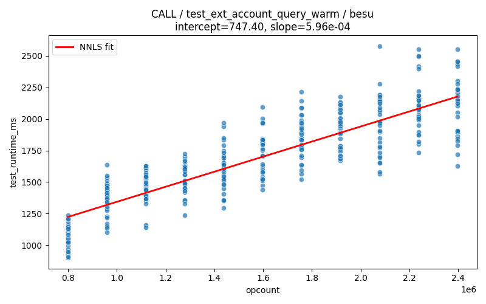

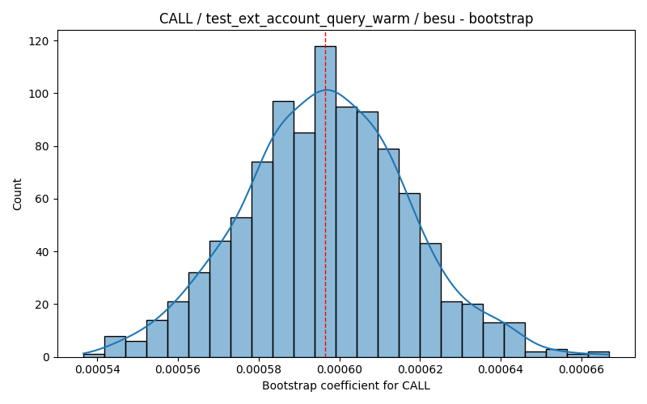

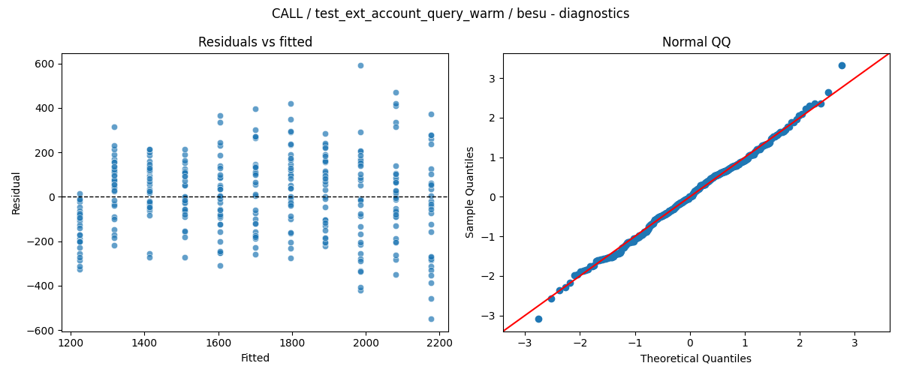

</details>

<details><summary>erigon — NNLS regression summary</summary>

```
==============================================================================
                           NNLS Regression Results                            
==============================================================================
Dep. Variable:          test_runtime_ms              R-squared:          0.968
Model:                  NNLS                    Adj. R-squared:          0.968
No. Observations:       198                               RMSE:          44.56
Df Residuals:           196                                MAE:          34.83
Df Model:               1      
==============================================================================
                      coef     std err     P-value      [0.025      0.975]
------------------------------------------------------------------------------
         const     38.4229      9.4453       0.001     21.4137     57.9130
       opcount      0.0005      0.0000       0.001      0.0005      0.0005
==============================================================================
Notes: Non-negative least squares with bootstrap inference (1000 iterations)
==============================================================================
```

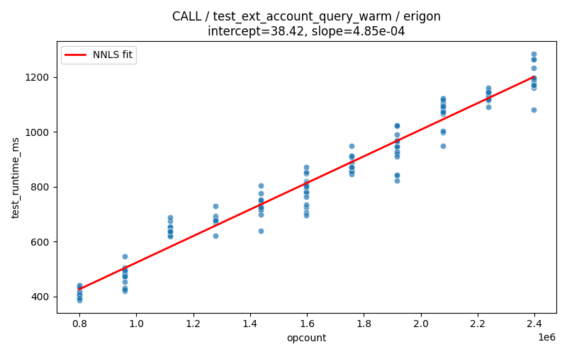

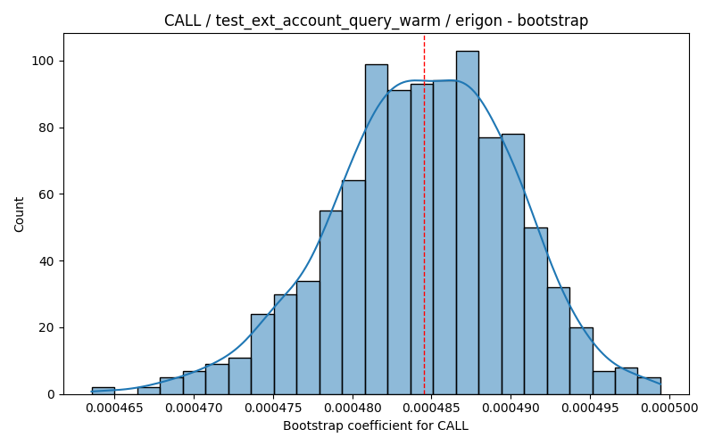

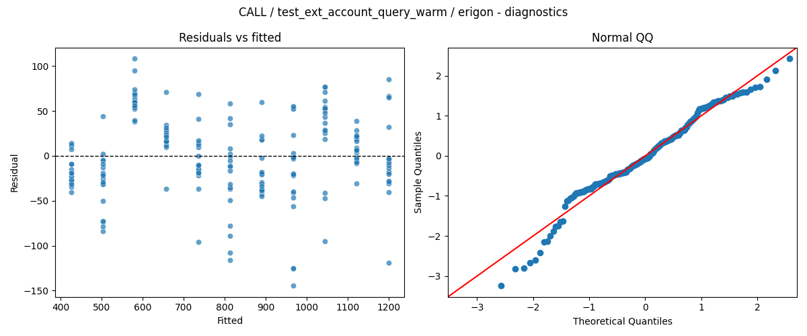

</details>

<details><summary>ethrex — NNLS regression summary</summary>

```
==============================================================================
                           NNLS Regression Results                            
==============================================================================
Dep. Variable:          test_runtime_ms              R-squared:          0.926
Model:                  NNLS                    Adj. R-squared:          0.924
No. Observations:       33                                RMSE:          12.96
Df Residuals:           31                                 MAE:          10.68
Df Model:               1      
==============================================================================
                      coef     std err     P-value      [0.025      0.975]
------------------------------------------------------------------------------
         const     55.9162      8.3514       0.001     39.9378     73.2130
       opcount      0.0001      0.0000       0.001      0.0001      0.0001
==============================================================================
Notes: Non-negative least squares with bootstrap inference (1000 iterations)
==============================================================================
```

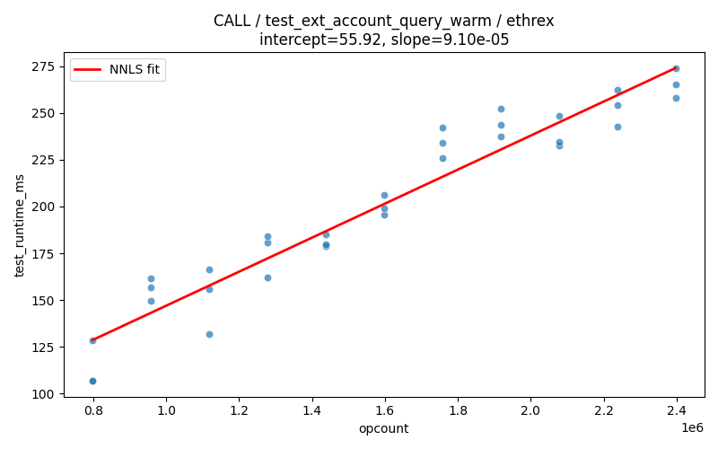

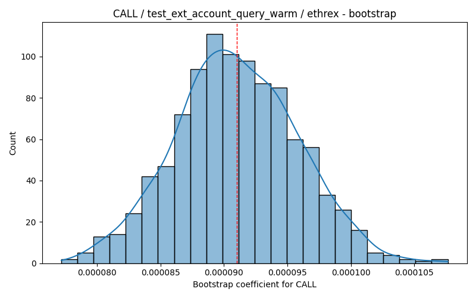

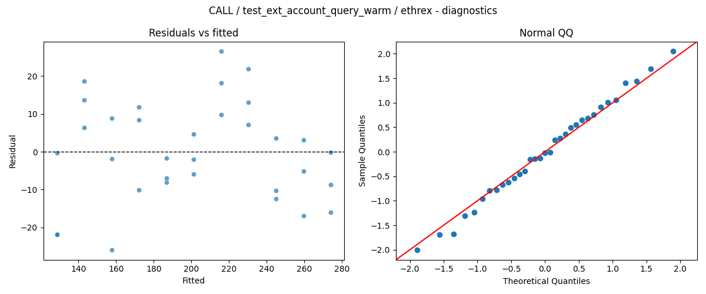

</details>

<details><summary>geth — NNLS regression summary</summary>

```
==============================================================================
                           NNLS Regression Results                            
==============================================================================
Dep. Variable:          test_runtime_ms              R-squared:          0.924
Model:                  NNLS                    Adj. R-squared:          0.924
No. Observations:       407                               RMSE:          20.54
Df Residuals:           405                                MAE:          16.70
Df Model:               1      
==============================================================================
                      coef     std err     P-value      [0.025      0.975]
------------------------------------------------------------------------------
         const     51.1505      3.3652       0.001     44.6583     58.0109
       opcount      0.0001      0.0000       0.001      0.0001      0.0001
==============================================================================
Notes: Non-negative least squares with bootstrap inference (1000 iterations)
==============================================================================
```

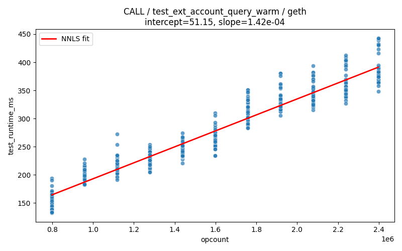

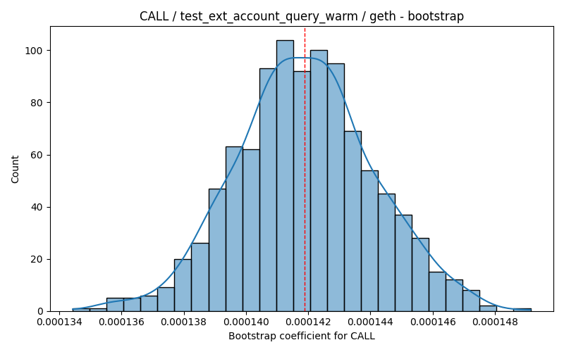

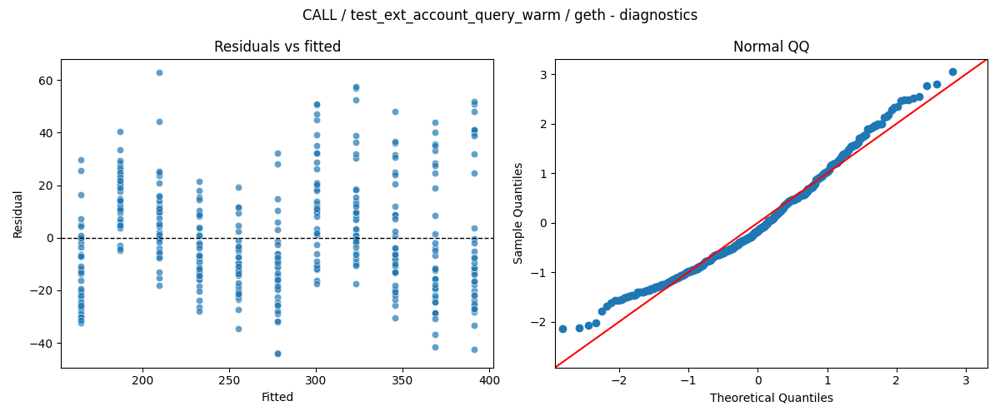

</details>

<details><summary>nethermind — NNLS regression summary</summary>

```
==============================================================================
                           NNLS Regression Results                            
==============================================================================
Dep. Variable:          test_runtime_ms              R-squared:          0.792
Model:                  NNLS                    Adj. R-squared:          0.791
No. Observations:       352                               RMSE:         101.72
Df Residuals:           350                                MAE:          75.38
Df Model:               1      
==============================================================================
                      coef     std err     P-value      [0.025      0.975]
------------------------------------------------------------------------------
         const    165.3031     16.4289       0.001    133.4708    199.0821
       opcount      0.0004      0.0000       0.001      0.0004      0.0004
==============================================================================
Notes: Non-negative least squares with bootstrap inference (1000 iterations)
==============================================================================
```

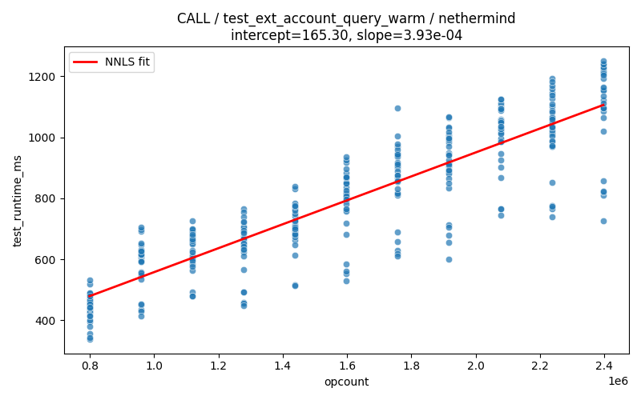

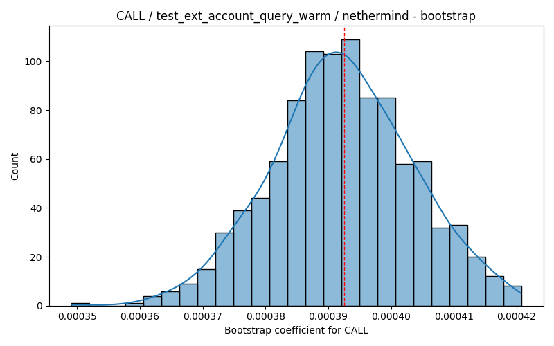

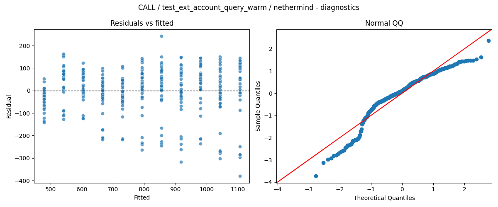

</details>

<details><summary>reth — NNLS regression summary</summary>

```
==============================================================================
                           NNLS Regression Results                            
==============================================================================
Dep. Variable:          test_runtime_ms              R-squared:          0.923
Model:                  NNLS                    Adj. R-squared:          0.922
No. Observations:       374                               RMSE:           8.48
Df Residuals:           372                                MAE:           6.71
Df Model:               1      
==============================================================================
                      coef     std err     P-value      [0.025      0.975]
------------------------------------------------------------------------------
         const     19.4712      1.3702       0.001     16.7349     21.9017
       opcount      0.0001      0.0000       0.001      0.0001      0.0001
==============================================================================
Notes: Non-negative least squares with bootstrap inference (1000 iterations)
==============================================================================
```

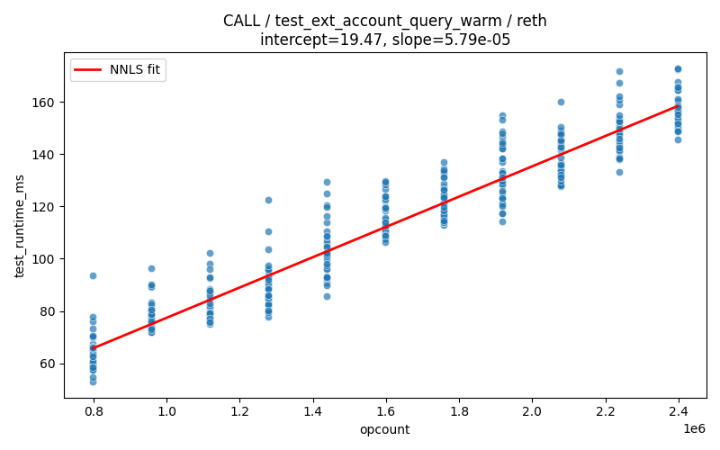

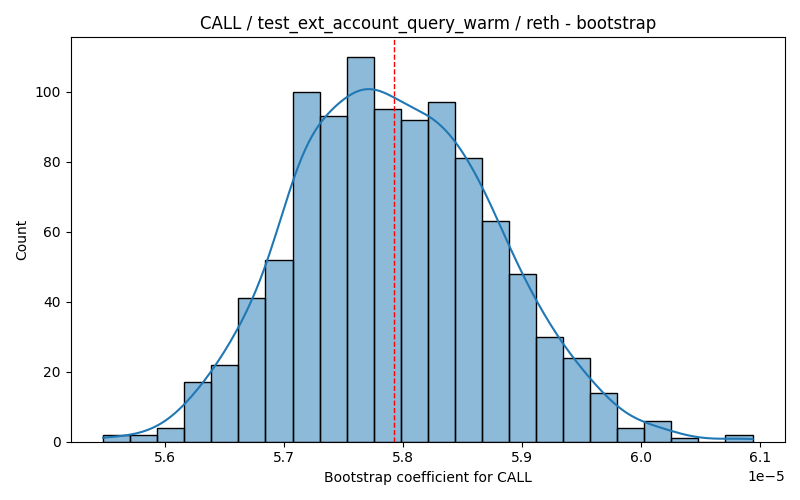

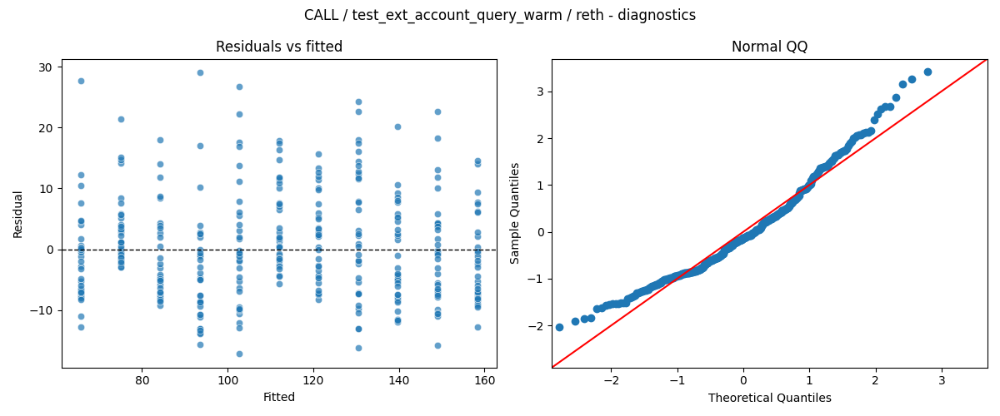

</details>

## CALLCODE

### test_account_access — combo `CALLCODE_AccountMode.EXISTING_EOA` — `presets[cold_account_nocode_access]`

| client | nobs | R² | target_coef (ms) | p-value | 95% CI |
| --- | --- | --- | --- | --- | --- |
| `besu` | 341 | 0.7838 | 0.01676 | 1.00e-03 | [0.01585, 0.01761] |
| `erigon` | 198 | 0.973 | 0.009167 | 1.00e-03 | [0.008952, 0.009394] |
| `ethrex` | 33 | 0.9811 | 0.01762 | 1.00e-03 | [0.01668, 0.01855] |
| `geth` | 407 | 0.9457 | 0.01099 | 1.00e-03 | [0.01067, 0.01129] |
| `nethermind` | 352 | 0.938 | 0.003627 | 1.00e-03 | [0.003534, 0.003721] |
| `reth` | 374 | 0.9496 | 0.001279 | 1.00e-03 | [0.001248, 0.001311] |

<details><summary>besu — NNLS regression summary</summary>

```
==============================================================================
                           NNLS Regression Results                            
==============================================================================
Dep. Variable:          test_runtime_ms              R-squared:          0.784
Model:                  NNLS                    Adj. R-squared:          0.783
No. Observations:       341                               RMSE:         209.05
Df Residuals:           339                                MAE:         184.75
Df Model:               1      
==============================================================================
                      coef     std err     P-value      [0.025      0.975]
------------------------------------------------------------------------------
         const    686.1117     32.1577       0.001    626.5687    749.7275
       opcount      0.0168      0.0005       0.001      0.0158      0.0176
==============================================================================
Notes: Non-negative least squares with bootstrap inference (1000 iterations)
==============================================================================
```

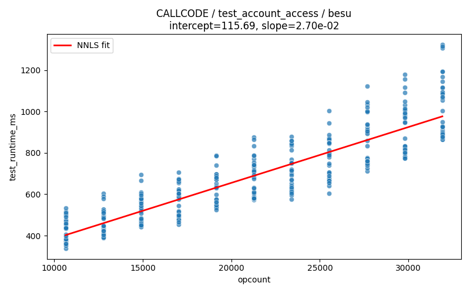

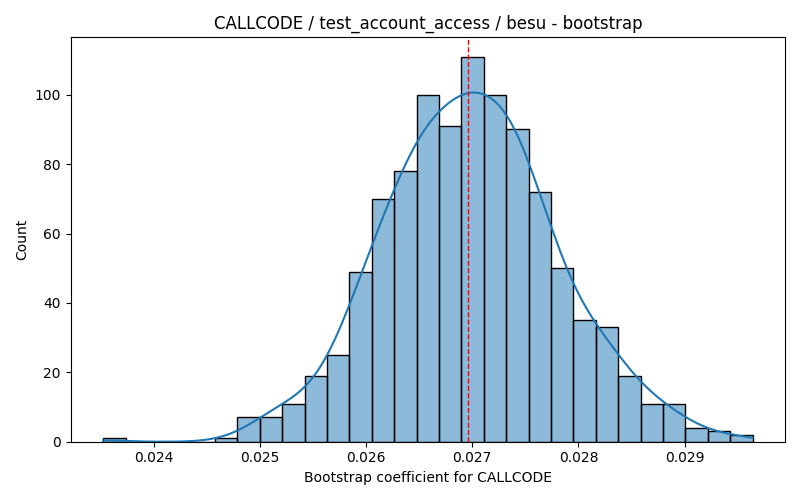

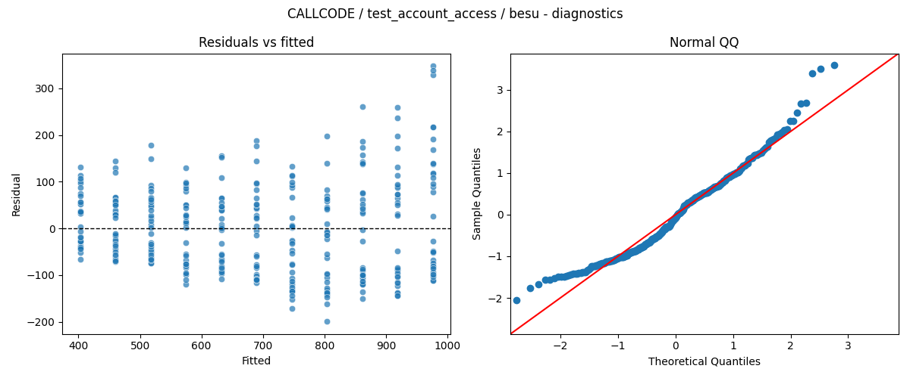

</details>

<details><summary>erigon — NNLS regression summary</summary>

```
==============================================================================
                           NNLS Regression Results                            
==============================================================================
Dep. Variable:          test_runtime_ms              R-squared:          0.973
Model:                  NNLS                    Adj. R-squared:          0.973
No. Observations:       198                               RMSE:          36.24
Df Residuals:           196                                MAE:          31.36
Df Model:               1      
==============================================================================
                      coef     std err     P-value      [0.025      0.975]
------------------------------------------------------------------------------
         const     29.5308      7.2696       0.001     14.8132     43.1824
       opcount      0.0092      0.0001       0.001      0.0090      0.0094
==============================================================================
Notes: Non-negative least squares with bootstrap inference (1000 iterations)
==============================================================================
```

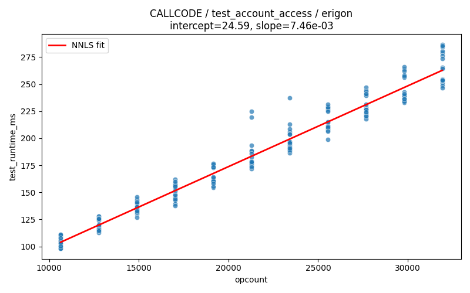

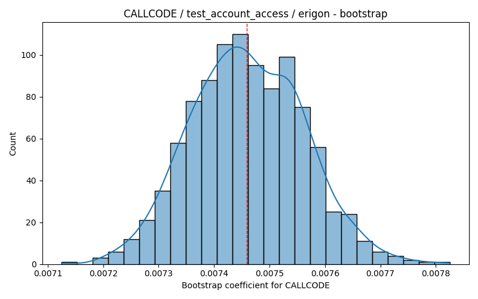

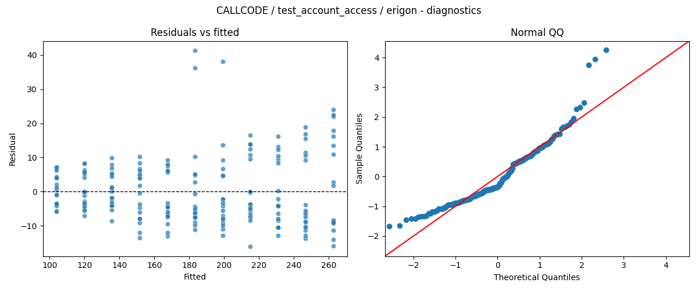

</details>

<details><summary>ethrex — NNLS regression summary</summary>

```
==============================================================================
                           NNLS Regression Results                            
==============================================================================
Dep. Variable:          test_runtime_ms              R-squared:          0.981
Model:                  NNLS                    Adj. R-squared:          0.980
No. Observations:       33                                RMSE:          58.09
Df Residuals:           31                                 MAE:          51.33
Df Model:               1      
==============================================================================
                      coef     std err     P-value      [0.025      0.975]
------------------------------------------------------------------------------
         const    169.5204     41.2376       0.001     97.3682    252.3164
       opcount      0.0176      0.0005       0.001      0.0167      0.0185
==============================================================================
Notes: Non-negative least squares with bootstrap inference (1000 iterations)
==============================================================================
```

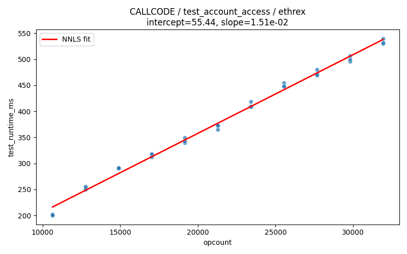

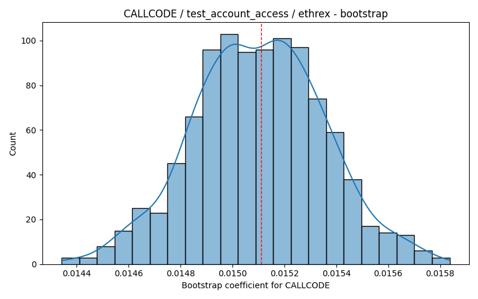

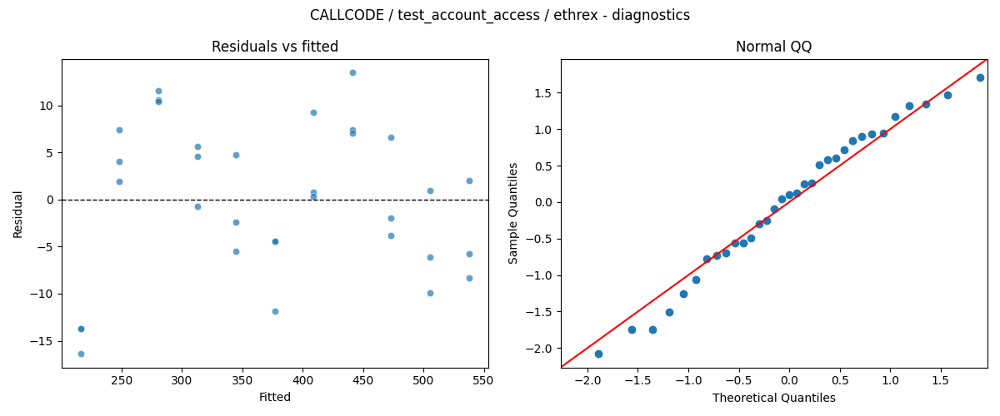

</details>

<details><summary>geth — NNLS regression summary</summary>

```
==============================================================================
                           NNLS Regression Results                            
==============================================================================
Dep. Variable:          test_runtime_ms              R-squared:          0.946
Model:                  NNLS                    Adj. R-squared:          0.946
No. Observations:       407                               RMSE:          62.53
Df Residuals:           405                                MAE:          49.87
Df Model:               1      
==============================================================================
                      coef     std err     P-value      [0.025      0.975]
------------------------------------------------------------------------------
         const    463.3938     14.5538       0.001    436.5891    492.8527
       opcount      0.0110      0.0002       0.001      0.0107      0.0113
==============================================================================
Notes: Non-negative least squares with bootstrap inference (1000 iterations)
==============================================================================
```

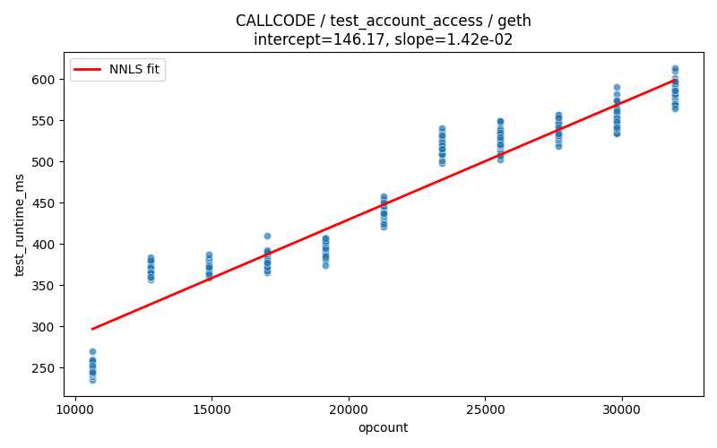

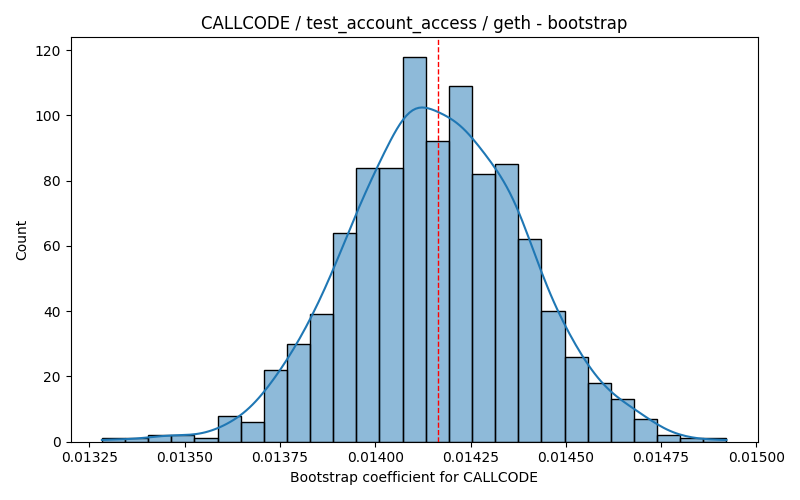

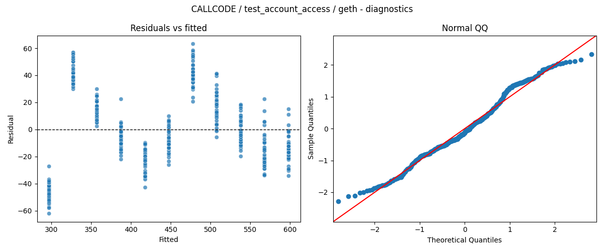

</details>

<details><summary>nethermind — NNLS regression summary</summary>

```
==============================================================================
                           NNLS Regression Results                            
==============================================================================
Dep. Variable:          test_runtime_ms              R-squared:          0.938
Model:                  NNLS                    Adj. R-squared:          0.938
No. Observations:       352                               RMSE:          22.14
Df Residuals:           350                                MAE:          16.27
Df Model:               1      
==============================================================================
                      coef     std err     P-value      [0.025      0.975]
------------------------------------------------------------------------------
         const     85.3635      3.6045       0.001     78.6745     92.5844
       opcount      0.0036      0.0000       0.001      0.0035      0.0037
==============================================================================
Notes: Non-negative least squares with bootstrap inference (1000 iterations)
==============================================================================
```

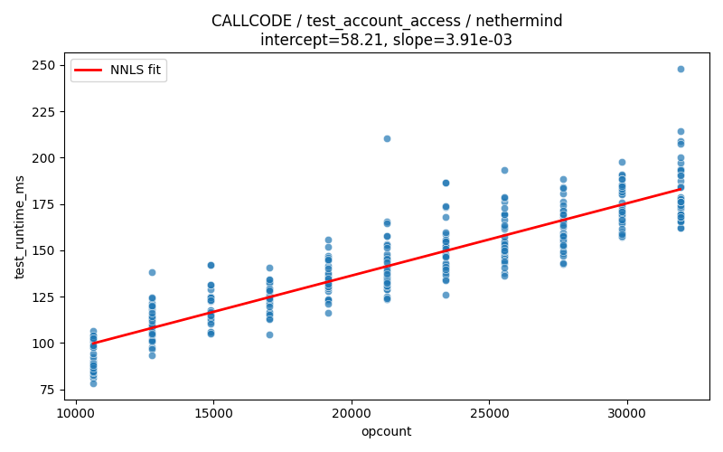

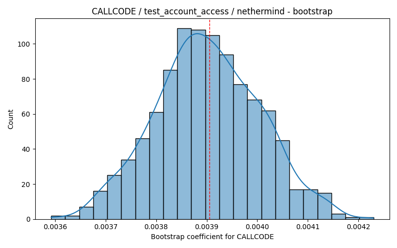

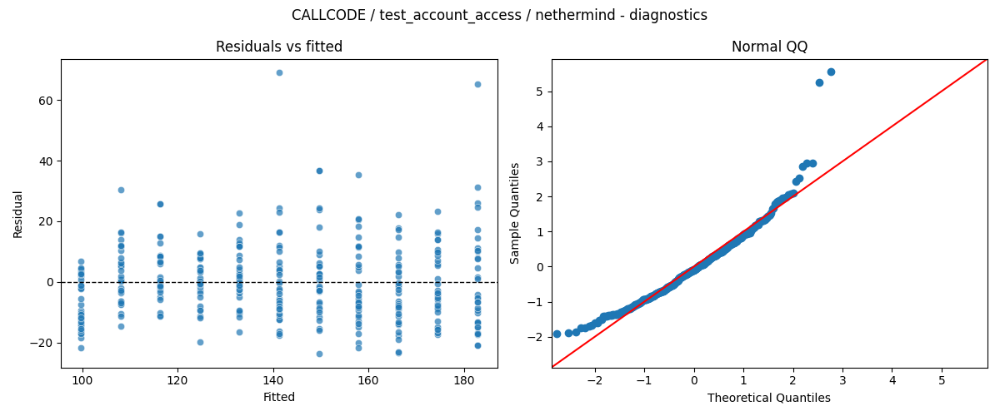

</details>

<details><summary>reth — NNLS regression summary</summary>

```
==============================================================================
                           NNLS Regression Results                            
==============================================================================
Dep. Variable:          test_runtime_ms              R-squared:          0.950
Model:                  NNLS                    Adj. R-squared:          0.950
No. Observations:       374                               RMSE:           6.99
Df Residuals:           372                                MAE:           5.28
Df Model:               1      
==============================================================================
                      coef     std err     P-value      [0.025      0.975]
------------------------------------------------------------------------------
         const     40.1392      1.1058       0.001     37.9497     42.3817
       opcount      0.0013      0.0000       0.001      0.0012      0.0013
==============================================================================
Notes: Non-negative least squares with bootstrap inference (1000 iterations)
==============================================================================
```

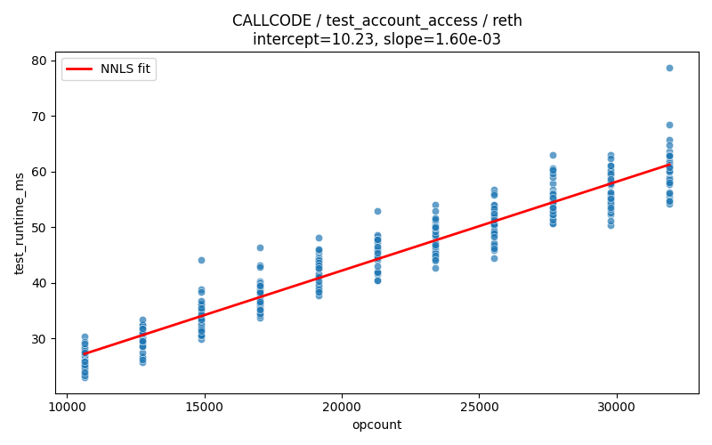

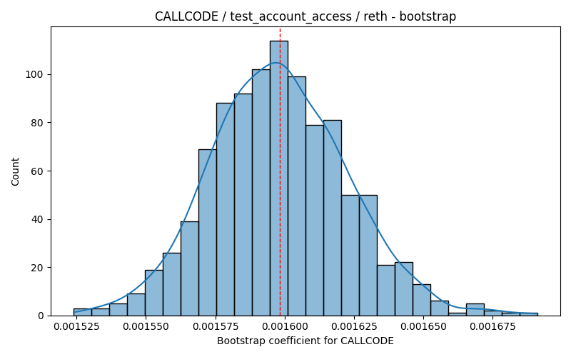

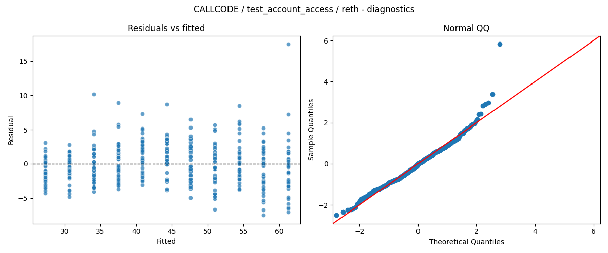

</details>

### test_account_access — combo `CALLCODE_AccountMode.NON_EXISTING_ACCOUNT` — `presets[cold_account_nocode_access]`

| client | nobs | R² | target_coef (ms) | p-value | 95% CI |
| --- | --- | --- | --- | --- | --- |
| `besu` | 341 | 0.7578 | 0.01607 | 1.00e-03 | [0.01504, 0.01706] |
| `erigon` | 198 | 0.9634 | 0.008714 | 1.00e-03 | [0.008472, 0.008907] |
| `ethrex` | 33 | 0.991 | 0.002774 | 1.00e-03 | [0.002685, 0.002833] |
| `geth` | 407 | 0.8727 | 0.02273 | 1.00e-03 | [0.02185, 0.02367] |
| `nethermind` | 352 | 0.8986 | 0.003617 | 1.00e-03 | [0.003492, 0.003779] |
| `reth` | 374 | 0.9681 | 0.000908 | 1.00e-03 | [0.0008918, 0.0009255] |

<details><summary>besu — NNLS regression summary</summary>

```
==============================================================================
                           NNLS Regression Results                            
==============================================================================
Dep. Variable:          test_runtime_ms              R-squared:          0.758
Model:                  NNLS                    Adj. R-squared:          0.757
No. Observations:       341                               RMSE:         215.75
Df Residuals:           339                                MAE:         197.75
Df Model:               1      
==============================================================================
                      coef     std err     P-value      [0.025      0.975]
------------------------------------------------------------------------------
         const    552.5229     35.4418       0.001    485.4439    628.3398
       opcount      0.0161      0.0005       0.001      0.0150      0.0171
==============================================================================
Notes: Non-negative least squares with bootstrap inference (1000 iterations)
==============================================================================
```

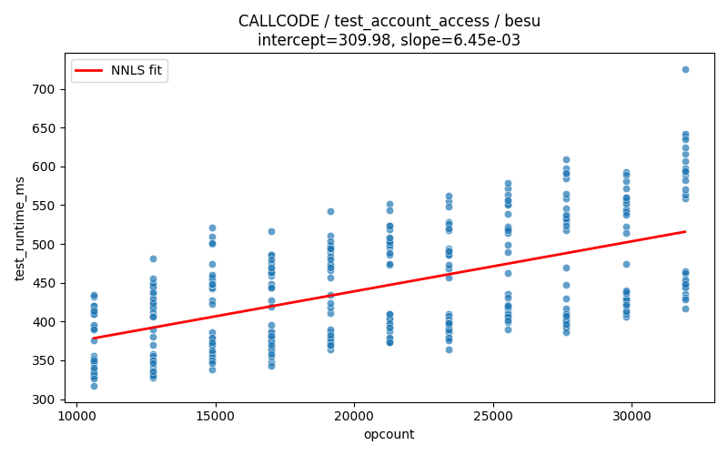

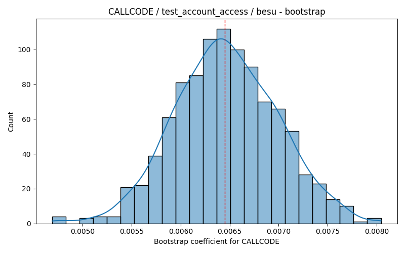

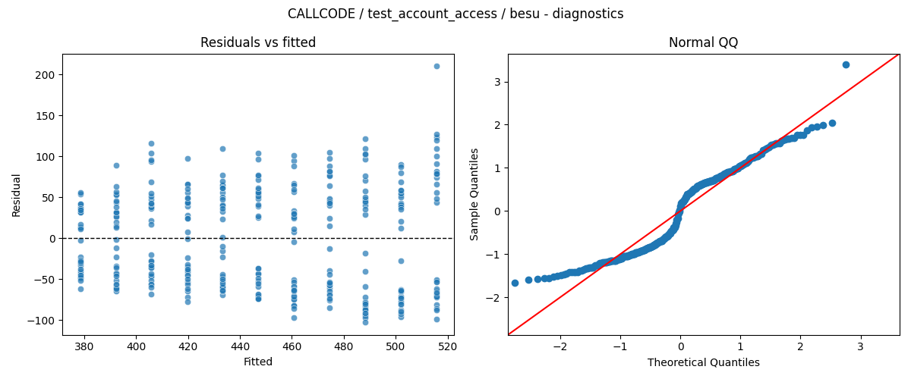

</details>

<details><summary>erigon — NNLS regression summary</summary>

```
==============================================================================
                           NNLS Regression Results                            
==============================================================================
Dep. Variable:          test_runtime_ms              R-squared:          0.963
Model:                  NNLS                    Adj. R-squared:          0.963
No. Observations:       198                               RMSE:          40.31
Df Residuals:           196                                MAE:          34.61
Df Model:               1      
==============================================================================
                      coef     std err     P-value      [0.025      0.975]
------------------------------------------------------------------------------
         const     10.3873      7.3702       0.100      0.0000     25.5948
       opcount      0.0087      0.0001       0.001      0.0085      0.0089
==============================================================================
Notes: Non-negative least squares with bootstrap inference (1000 iterations)
==============================================================================
```

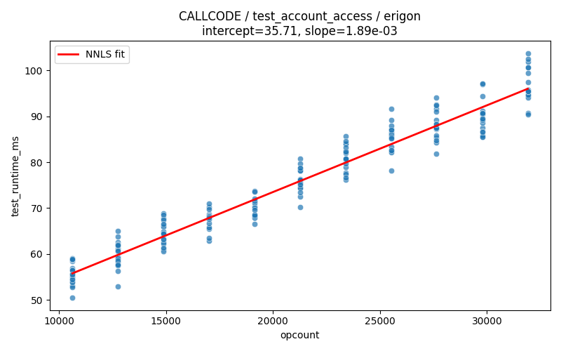

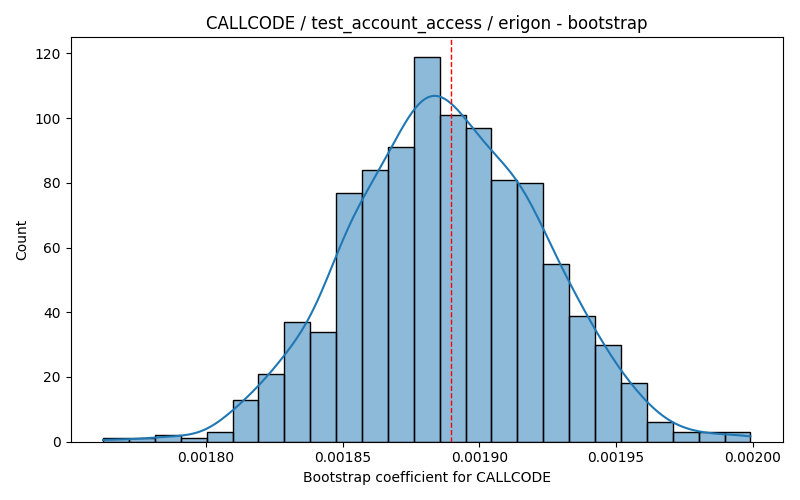

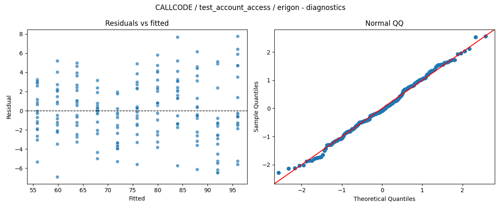

</details>

<details><summary>ethrex — NNLS regression summary</summary>

```
==============================================================================
                           NNLS Regression Results                            
==============================================================================
Dep. Variable:          test_runtime_ms              R-squared:          0.991
Model:                  NNLS                    Adj. R-squared:          0.991
No. Observations:       33                                RMSE:           6.29
Df Residuals:           31                                 MAE:           5.37
Df Model:               1      
==============================================================================
                      coef     std err     P-value      [0.025      0.975]
------------------------------------------------------------------------------
         const      2.7371      2.6435       0.214      0.0000      9.0363
       opcount      0.0028      0.0000       0.001      0.0027      0.0028
==============================================================================
Notes: Non-negative least squares with bootstrap inference (1000 iterations)
==============================================================================
```

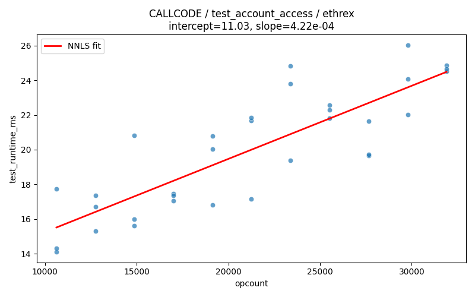

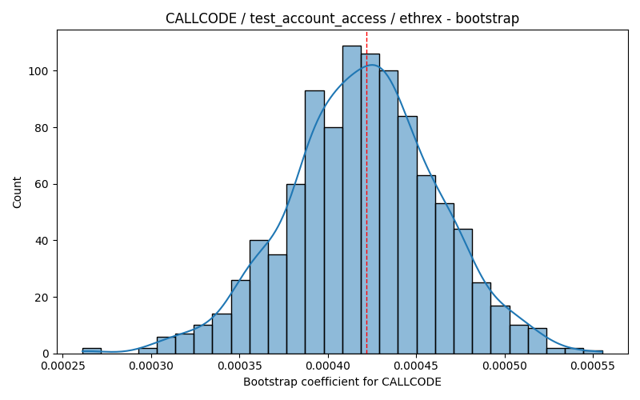

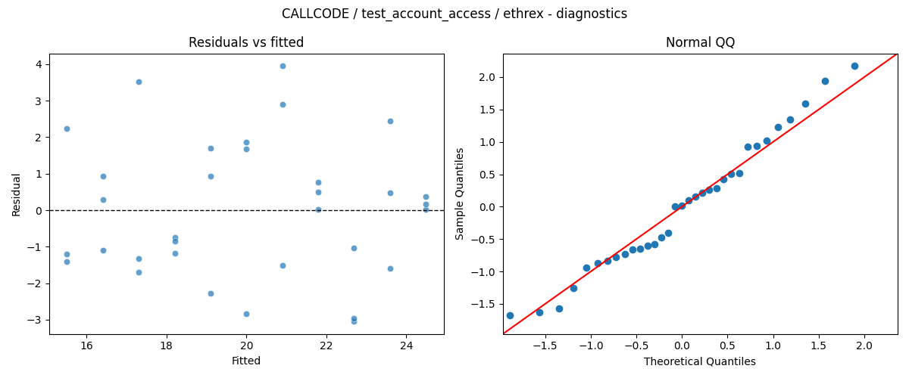

</details>

<details><summary>geth — NNLS regression summary</summary>

```
==============================================================================
                           NNLS Regression Results                            
==============================================================================
Dep. Variable:          test_runtime_ms              R-squared:          0.873
Model:                  NNLS                    Adj. R-squared:          0.872
No. Observations:       407                               RMSE:         206.14
Df Residuals:           405                                MAE:         176.38
Df Model:               1      
==============================================================================
                      coef     std err     P-value      [0.025      0.975]
------------------------------------------------------------------------------
         const    771.1328     40.2127       0.001    687.9473    846.4293
       opcount      0.0227      0.0005       0.001      0.0218      0.0237
==============================================================================
Notes: Non-negative least squares with bootstrap inference (1000 iterations)
==============================================================================
```

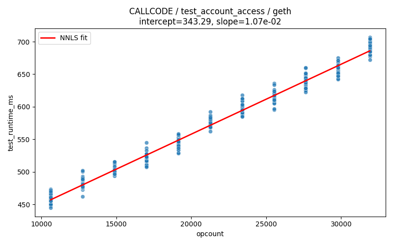

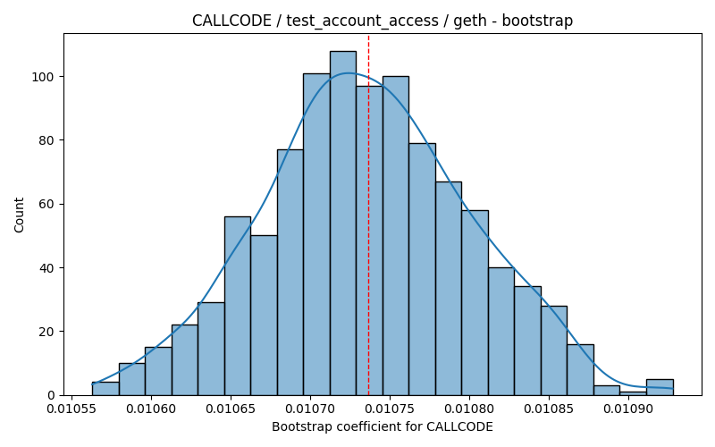

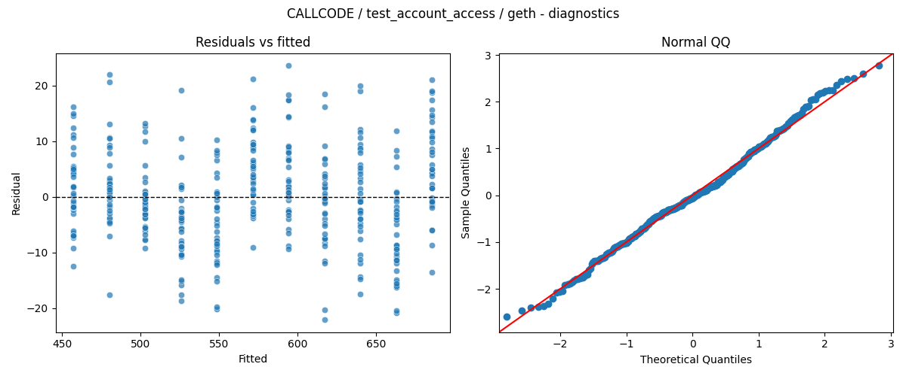

</details>

<details><summary>nethermind — NNLS regression summary</summary>

```
==============================================================================
                           NNLS Regression Results                            
==============================================================================
Dep. Variable:          test_runtime_ms              R-squared:          0.899
Model:                  NNLS                    Adj. R-squared:          0.898
No. Observations:       352                               RMSE:          28.84
Df Residuals:           350                                MAE:          17.01
Df Model:               1      
==============================================================================
                      coef     std err     P-value      [0.025      0.975]
------------------------------------------------------------------------------
         const     71.6257      5.0560       0.001     61.0435     81.2485
       opcount      0.0036      0.0001       0.001      0.0035      0.0038
==============================================================================
Notes: Non-negative least squares with bootstrap inference (1000 iterations)
==============================================================================
```

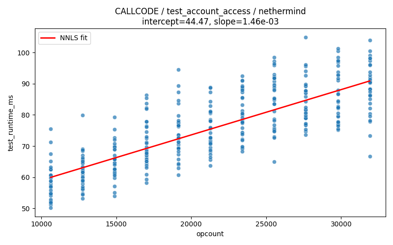

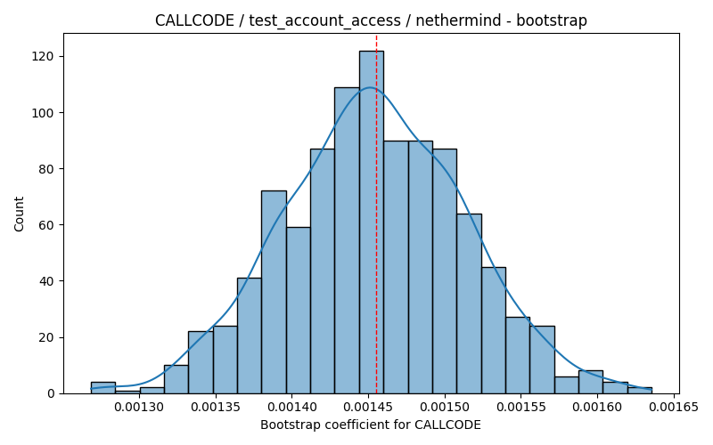

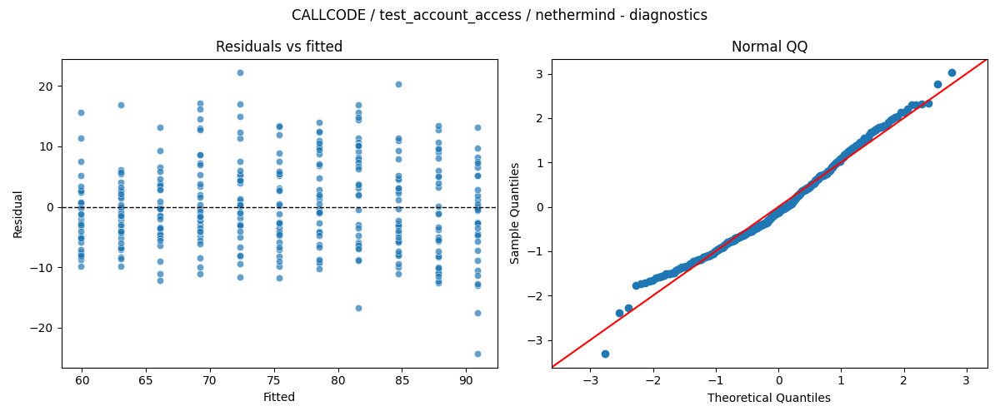

</details>

<details><summary>reth — NNLS regression summary</summary>

```
==============================================================================
                           NNLS Regression Results                            
==============================================================================
Dep. Variable:          test_runtime_ms              R-squared:          0.968
Model:                  NNLS                    Adj. R-squared:          0.968
No. Observations:       374                               RMSE:           3.91
Df Residuals:           372                                MAE:           3.13
Df Model:               1      
==============================================================================
                      coef     std err     P-value      [0.025      0.975]
------------------------------------------------------------------------------
         const     44.7599      0.6763       0.001     43.4165     46.0901
       opcount      0.0009      0.0000       0.001      0.0009      0.0009
==============================================================================
Notes: Non-negative least squares with bootstrap inference (1000 iterations)
==============================================================================
```

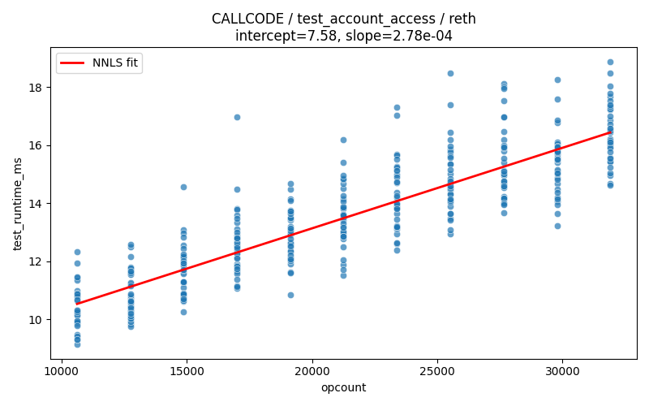

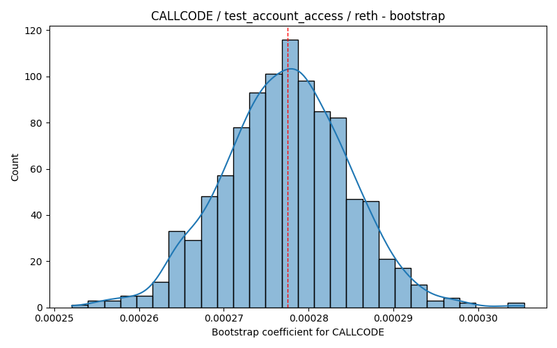

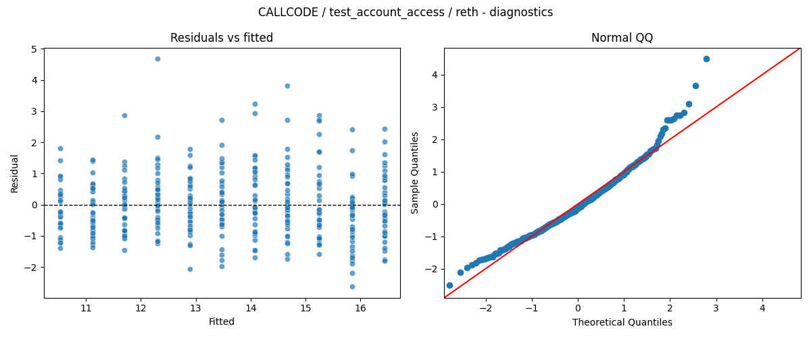

</details>

### test_account_access — combo `CALLCODE_AccountMode.EXISTING_CONTRACT` — `presets[cold_account_code_access]`

| client | nobs | R² | target_coef (ms) | p-value | 95% CI |
| --- | --- | --- | --- | --- | --- |
| `besu` | 341 | 0.8791 | 0.03202 | 1.00e-03 | [0.03082, 0.03322] |
| `erigon` | 198 | 0.8808 | 0.08 | 1.00e-03 | [0.07615, 0.08361] |
| `ethrex` | 33 | 0.9824 | 0.01826 | 1.00e-03 | [0.01727, 0.01925] |
| `geth` | 407 | 0.8696 | 0.02357 | 1.00e-03 | [0.02263, 0.02451] |
| `nethermind` | 352 | 0.8076 | 0.01895 | 1.00e-03 | [0.01792, 0.02002] |
| `reth` | 374 | 0.8513 | 0.0178 | 1.00e-03 | [0.01706, 0.01859] |

<details><summary>besu — NNLS regression summary</summary>

```
==============================================================================
                           NNLS Regression Results                            
==============================================================================
Dep. Variable:          test_runtime_ms              R-squared:          0.879
Model:                  NNLS                    Adj. R-squared:          0.879
No. Observations:       341                               RMSE:         241.70
Df Residuals:           339                                MAE:         218.54
Df Model:               1      
==============================================================================
                      coef     std err     P-value      [0.025      0.975]
------------------------------------------------------------------------------
         const    522.3045     36.4563       0.001    451.1843    591.8587
       opcount      0.0320      0.0006       0.001      0.0308      0.0332
==============================================================================
Notes: Non-negative least squares with bootstrap inference (1000 iterations)
==============================================================================
```

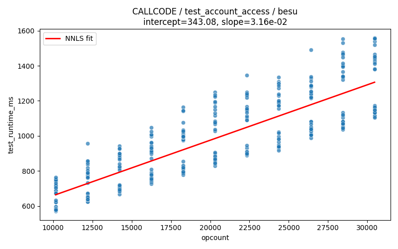

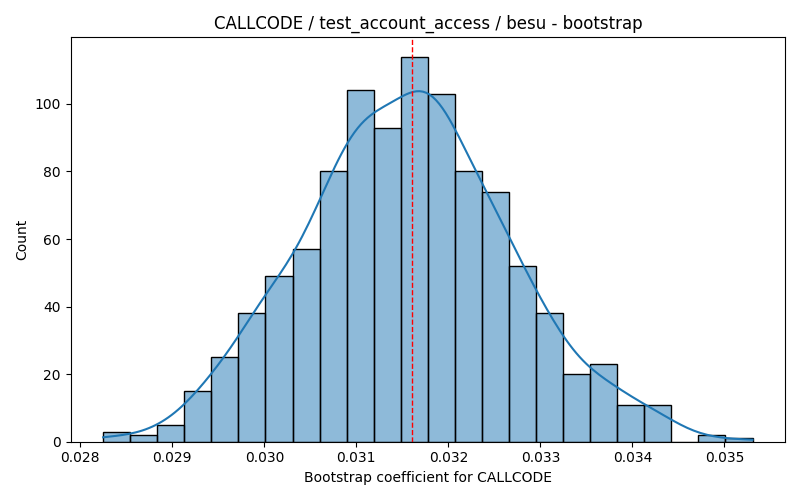

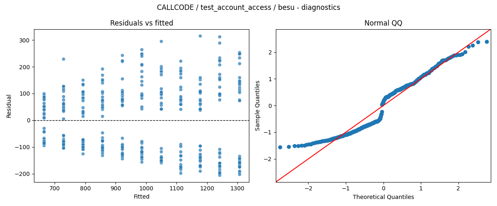

</details>

<details><summary>erigon — NNLS regression summary</summary>

```
==============================================================================
                           NNLS Regression Results                            
==============================================================================
Dep. Variable:          test_runtime_ms              R-squared:          0.881
Model:                  NNLS                    Adj. R-squared:          0.880
No. Observations:       198                               RMSE:         598.79
Df Residuals:           196                                MAE:         522.27
Df Model:               1      
==============================================================================
                      coef     std err     P-value      [0.025      0.975]
------------------------------------------------------------------------------
         const    932.5206    147.3593       0.001    652.4513   1217.6326
       opcount      0.0800      0.0020       0.001      0.0762      0.0836
==============================================================================
Notes: Non-negative least squares with bootstrap inference (1000 iterations)
==============================================================================
```

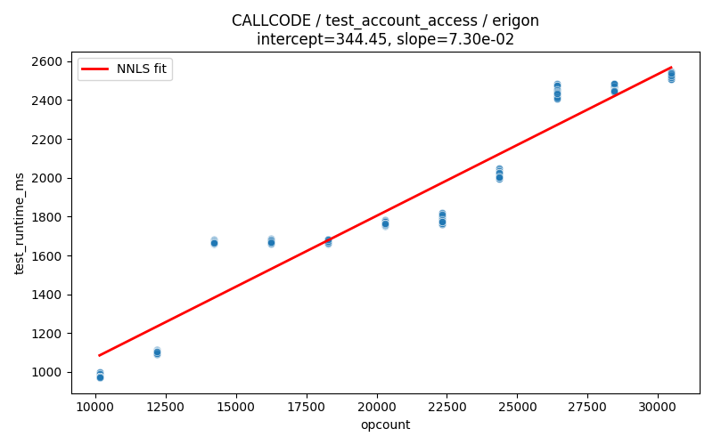

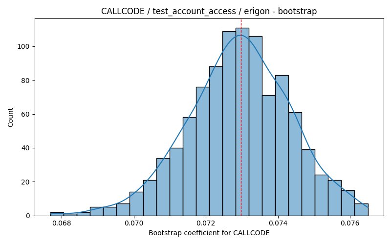

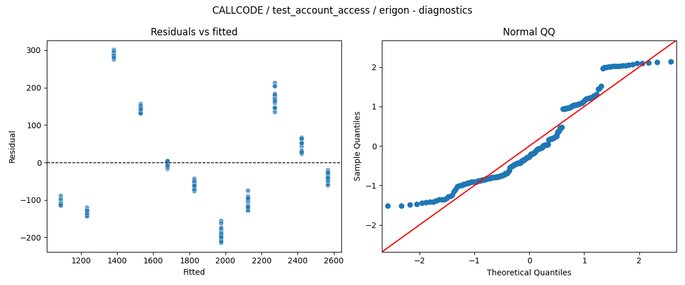

</details>

<details><summary>ethrex — NNLS regression summary</summary>

```
==============================================================================
                           NNLS Regression Results                            
==============================================================================
Dep. Variable:          test_runtime_ms              R-squared:          0.982
Model:                  NNLS                    Adj. R-squared:          0.982
No. Observations:       33                                RMSE:          49.71
Df Residuals:           31                                 MAE:          43.57
Df Model:               1      
==============================================================================
                      coef     std err     P-value      [0.025      0.975]
------------------------------------------------------------------------------
         const    143.9472     36.5267       0.001     74.3628    216.1637
       opcount      0.0183      0.0005       0.001      0.0173      0.0192
==============================================================================
Notes: Non-negative least squares with bootstrap inference (1000 iterations)
==============================================================================
```

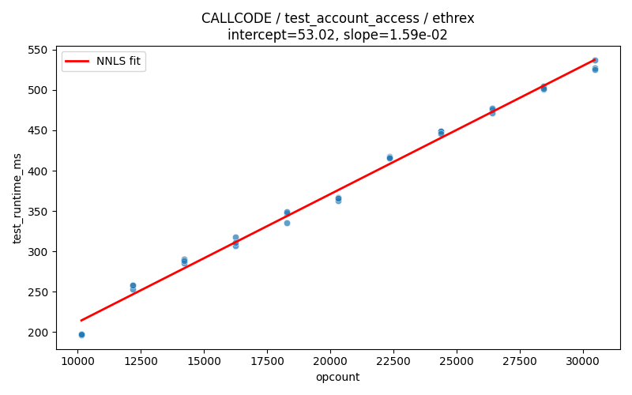

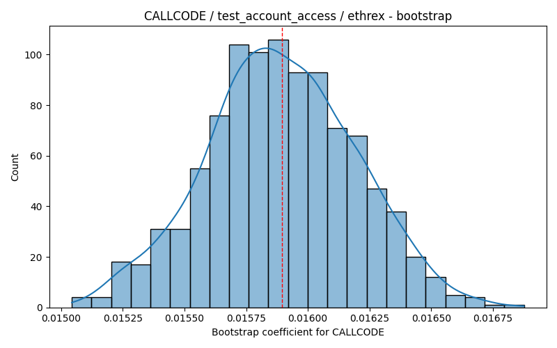

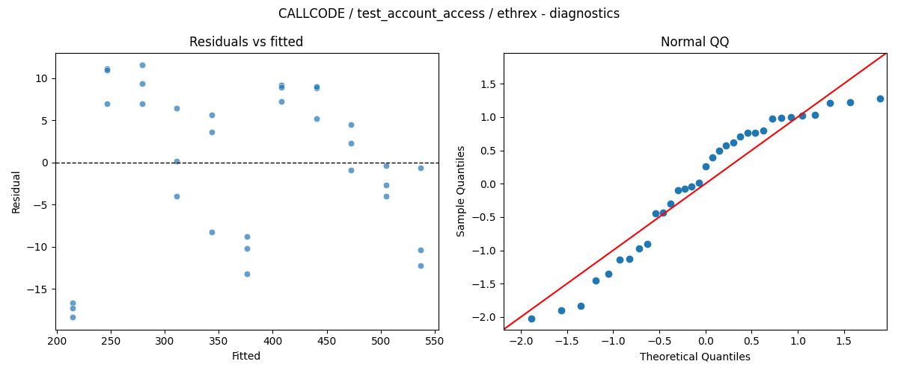

</details>

<details><summary>geth — NNLS regression summary</summary>

```
==============================================================================
                           NNLS Regression Results                            
==============================================================================
Dep. Variable:          test_runtime_ms              R-squared:          0.870
Model:                  NNLS                    Adj. R-squared:          0.869
No. Observations:       407                               RMSE:         185.72
Df Residuals:           405                                MAE:         159.91
Df Model:               1      
==============================================================================
                      coef     std err     P-value      [0.025      0.975]
------------------------------------------------------------------------------
         const    734.5173     34.8219       0.001    663.1809    802.6131
       opcount      0.0236      0.0005       0.001      0.0226      0.0245
==============================================================================
Notes: Non-negative least squares with bootstrap inference (1000 iterations)
==============================================================================
```

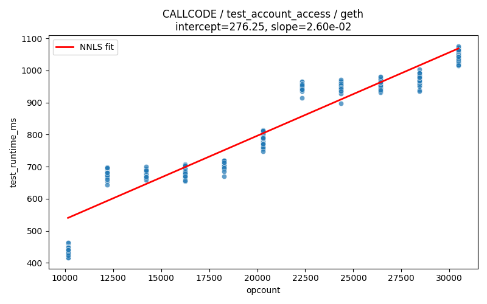

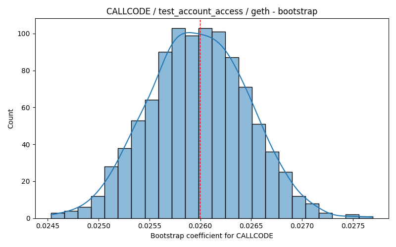

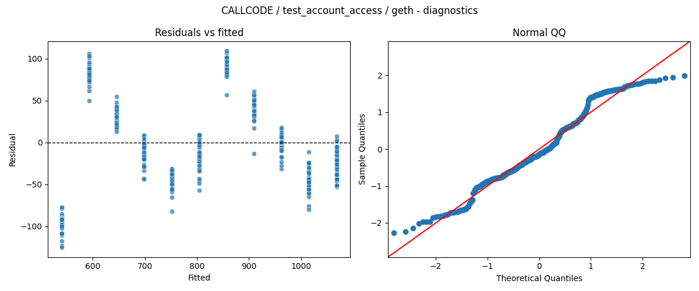

</details>

<details><summary>nethermind — NNLS regression summary</summary>

```
==============================================================================
                           NNLS Regression Results                            
==============================================================================
Dep. Variable:          test_runtime_ms              R-squared:          0.808
Model:                  NNLS                    Adj. R-squared:          0.807
No. Observations:       352                               RMSE:         188.24
Df Residuals:           350                                MAE:         158.42
Df Model:               1      
==============================================================================
                      coef     std err     P-value      [0.025      0.975]
------------------------------------------------------------------------------
         const    609.0403     38.3763       0.001    536.8188    685.2627
       opcount      0.0189      0.0005       0.001      0.0179      0.0200
==============================================================================
Notes: Non-negative least squares with bootstrap inference (1000 iterations)
==============================================================================
```

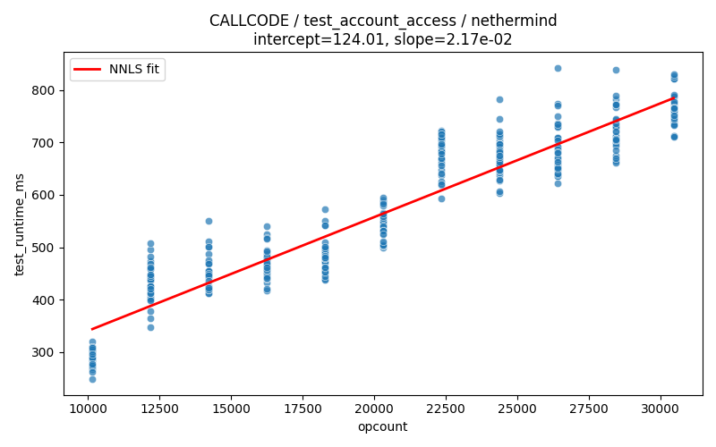

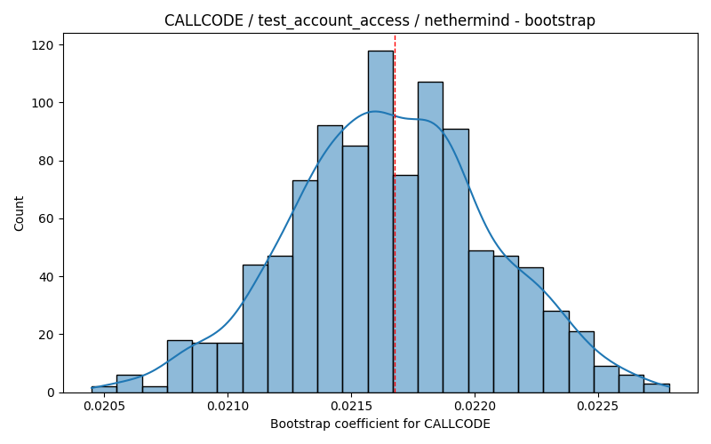

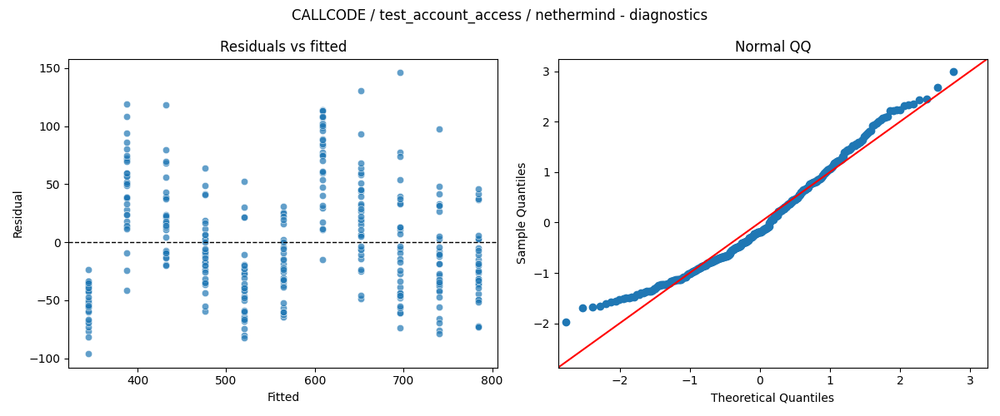

</details>

<details><summary>reth — NNLS regression summary</summary>

```
==============================================================================
                           NNLS Regression Results                            
==============================================================================
Dep. Variable:          test_runtime_ms              R-squared:          0.851
Model:                  NNLS                    Adj. R-squared:          0.851
No. Observations:       374                               RMSE:         151.34
Df Residuals:           372                                MAE:          72.99
Df Model:               1      
==============================================================================
                      coef     std err     P-value      [0.025      0.975]
------------------------------------------------------------------------------
         const    330.1698     26.0955       0.001    278.0847    379.0171
       opcount      0.0178      0.0004       0.001      0.0171      0.0186
==============================================================================
Notes: Non-negative least squares with bootstrap inference (1000 iterations)
==============================================================================
```

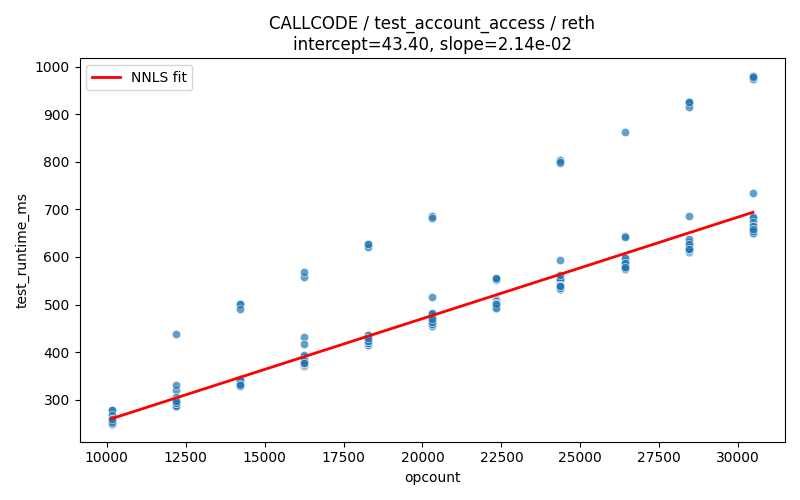

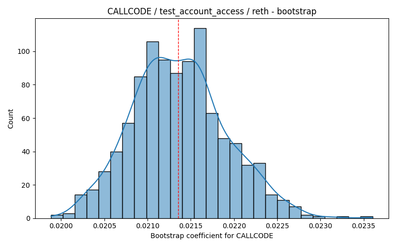

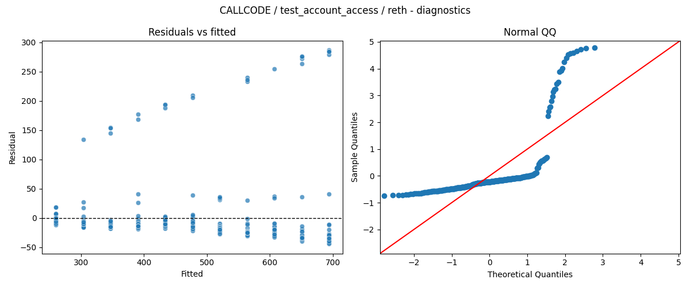

</details>

### test_account_access — combo `CALLCODE_AccountMode.NON_EXISTING_ACCOUNT` — `presets[cold_account_code_access]`

| client | nobs | R² | target_coef (ms) | p-value | 95% CI |
| --- | --- | --- | --- | --- | --- |
| `besu` | 341 | 0.7578 | 0.01607 | 1.00e-03 | [0.01504, 0.01706] |
| `erigon` | 198 | 0.9634 | 0.008714 | 1.00e-03 | [0.008472, 0.008907] |
| `ethrex` | 33 | 0.991 | 0.002774 | 1.00e-03 | [0.002685, 0.002833] |
| `geth` | 407 | 0.8727 | 0.02273 | 1.00e-03 | [0.02185, 0.02367] |
| `nethermind` | 352 | 0.8986 | 0.003617 | 1.00e-03 | [0.003492, 0.003779] |
| `reth` | 374 | 0.9681 | 0.000908 | 1.00e-03 | [0.0008918, 0.0009255] |

<details><summary>besu — NNLS regression summary</summary>

```
==============================================================================
                           NNLS Regression Results                            
==============================================================================
Dep. Variable:          test_runtime_ms              R-squared:          0.758
Model:                  NNLS                    Adj. R-squared:          0.757
No. Observations:       341                               RMSE:         215.75
Df Residuals:           339                                MAE:         197.75
Df Model:               1      
==============================================================================
                      coef     std err     P-value      [0.025      0.975]
------------------------------------------------------------------------------
         const    552.5229     35.4418       0.001    485.4439    628.3398
       opcount      0.0161      0.0005       0.001      0.0150      0.0171
==============================================================================
Notes: Non-negative least squares with bootstrap inference (1000 iterations)
==============================================================================
```


</details>

<details><summary>erigon — NNLS regression summary</summary>

```
==============================================================================
                           NNLS Regression Results                            
==============================================================================
Dep. Variable:          test_runtime_ms              R-squared:          0.963
Model:                  NNLS                    Adj. R-squared:          0.963
No. Observations:       198                               RMSE:          40.31
Df Residuals:           196                                MAE:          34.61
Df Model:               1      
==============================================================================
                      coef     std err     P-value      [0.025      0.975]
------------------------------------------------------------------------------
         const     10.3873      7.3702       0.100      0.0000     25.5948
       opcount      0.0087      0.0001       0.001      0.0085      0.0089
==============================================================================
Notes: Non-negative least squares with bootstrap inference (1000 iterations)
==============================================================================
```


</details>

<details><summary>ethrex — NNLS regression summary</summary>

```
==============================================================================
                           NNLS Regression Results                            
==============================================================================
Dep. Variable:          test_runtime_ms              R-squared:          0.991
Model:                  NNLS                    Adj. R-squared:          0.991
No. Observations:       33                                RMSE:           6.29
Df Residuals:           31                                 MAE:           5.37
Df Model:               1      
==============================================================================
                      coef     std err     P-value      [0.025      0.975]
------------------------------------------------------------------------------
         const      2.7371      2.6435       0.214      0.0000      9.0363
       opcount      0.0028      0.0000       0.001      0.0027      0.0028
==============================================================================
Notes: Non-negative least squares with bootstrap inference (1000 iterations)
==============================================================================
```


</details>

<details><summary>geth — NNLS regression summary</summary>

```
==============================================================================
                           NNLS Regression Results                            
==============================================================================
Dep. Variable:          test_runtime_ms              R-squared:          0.873
Model:                  NNLS                    Adj. R-squared:          0.872
No. Observations:       407                               RMSE:         206.14
Df Residuals:           405                                MAE:         176.38
Df Model:               1      
==============================================================================
                      coef     std err     P-value      [0.025      0.975]
------------------------------------------------------------------------------
         const    771.1328     40.2127       0.001    687.9473    846.4293
       opcount      0.0227      0.0005       0.001      0.0218      0.0237
==============================================================================
Notes: Non-negative least squares with bootstrap inference (1000 iterations)
==============================================================================
```


</details>

<details><summary>nethermind — NNLS regression summary</summary>

```
==============================================================================
                           NNLS Regression Results                            
==============================================================================
Dep. Variable:          test_runtime_ms              R-squared:          0.899
Model:                  NNLS                    Adj. R-squared:          0.898
No. Observations:       352                               RMSE:          28.84
Df Residuals:           350                                MAE:          17.01
Df Model:               1      
==============================================================================
                      coef     std err     P-value      [0.025      0.975]
------------------------------------------------------------------------------
         const     71.6257      5.0560       0.001     61.0435     81.2485
       opcount      0.0036      0.0001       0.001      0.0035      0.0038
==============================================================================
Notes: Non-negative least squares with bootstrap inference (1000 iterations)
==============================================================================
```


</details>

<details><summary>reth — NNLS regression summary</summary>

```
==============================================================================
                           NNLS Regression Results                            
==============================================================================
Dep. Variable:          test_runtime_ms              R-squared:          0.968
Model:                  NNLS                    Adj. R-squared:          0.968
No. Observations:       374                               RMSE:           3.91
Df Residuals:           372                                MAE:           3.13
Df Model:               1      
==============================================================================
                      coef     std err     P-value      [0.025      0.975]
------------------------------------------------------------------------------
         const     44.7599      0.6763       0.001     43.4165     46.0901
       opcount      0.0009      0.0000       0.001      0.0009      0.0009
==============================================================================
Notes: Non-negative least squares with bootstrap inference (1000 iterations)
==============================================================================
```


</details>

### test_account_access — combo `CALLCODE_AccountMode.EXISTING_EOA` — `presets[cold_account_nocode_write]`

| client | nobs | R² | target_coef (ms) | p-value | 95% CI |
| --- | --- | --- | --- | --- | --- |
| `besu` | 341 | 0.7787 | 0.02696 | 1.00e-03 | [0.02536, 0.02867] |
| `erigon` | 198 | 0.9641 | 0.007459 | 1.00e-03 | [0.007274, 0.007657] |
| `ethrex` | 33 | 0.994 | 0.01511 | 1.00e-03 | [0.01461, 0.01562] |
| `geth` | 407 | 0.9252 | 0.01416 | 1.00e-03 | [0.01372, 0.0146] |
| `nethermind` | 352 | 0.8173 | 0.003905 | 1.00e-03 | [0.003699, 0.004107] |
| `reth` | 374 | 0.9279 | 0.001598 | 1.00e-03 | [0.001551, 0.001647] |

<details><summary>besu — NNLS regression summary</summary>

```
==============================================================================
                           NNLS Regression Results                            
==============================================================================
Dep. Variable:          test_runtime_ms              R-squared:          0.779
Model:                  NNLS                    Adj. R-squared:          0.778
No. Observations:       341                               RMSE:          96.72
Df Residuals:           339                                MAE:          80.29
Df Model:               1      
==============================================================================
                      coef     std err     P-value      [0.025      0.975]
------------------------------------------------------------------------------
         const    115.6936     15.3946       0.001     83.4702    145.2260
       opcount      0.0270      0.0008       0.001      0.0254      0.0287
==============================================================================
Notes: Non-negative least squares with bootstrap inference (1000 iterations)
==============================================================================
```


</details>

<details><summary>erigon — NNLS regression summary</summary>

```
==============================================================================
                           NNLS Regression Results                            
==============================================================================
Dep. Variable:          test_runtime_ms              R-squared:          0.964
Model:                  NNLS                    Adj. R-squared:          0.964
No. Observations:       198                               RMSE:           9.69
Df Residuals:           196                                MAE:           7.74
Df Model:               1      
==============================================================================
                      coef     std err     P-value      [0.025      0.975]
------------------------------------------------------------------------------
         const     24.5919      1.9031       0.001     20.7734     27.9930
       opcount      0.0075      0.0001       0.001      0.0073      0.0077
==============================================================================
Notes: Non-negative least squares with bootstrap inference (1000 iterations)
==============================================================================
```


</details>

<details><summary>ethrex — NNLS regression summary</summary>

```
==============================================================================
                           NNLS Regression Results                            
==============================================================================
Dep. Variable:          test_runtime_ms              R-squared:          0.994
Model:                  NNLS                    Adj. R-squared:          0.994
No. Observations:       33                                RMSE:           7.87
Df Residuals:           31                                 MAE:           6.61
Df Model:               1      
==============================================================================
                      coef     std err     P-value      [0.025      0.975]
------------------------------------------------------------------------------
         const     55.4439      5.9629       0.001     44.2109     67.9273
       opcount      0.0151      0.0003       0.001      0.0146      0.0156
==============================================================================
Notes: Non-negative least squares with bootstrap inference (1000 iterations)
==============================================================================
```


</details>

<details><summary>geth — NNLS regression summary</summary>

```
==============================================================================
                           NNLS Regression Results                            
==============================================================================
Dep. Variable:          test_runtime_ms              R-squared:          0.925
Model:                  NNLS                    Adj. R-squared:          0.925
No. Observations:       407                               RMSE:          27.11
Df Residuals:           405                                MAE:          22.12
Df Model:               1      
==============================================================================
                      coef     std err     P-value      [0.025      0.975]
------------------------------------------------------------------------------
         const    146.1741      5.6329       0.001    135.6450    157.5508
       opcount      0.0142      0.0002       0.001      0.0137      0.0146
==============================================================================
Notes: Non-negative least squares with bootstrap inference (1000 iterations)
==============================================================================
```


</details>

<details><summary>nethermind — NNLS regression summary</summary>

```
==============================================================================
                           NNLS Regression Results                            
==============================================================================
Dep. Variable:          test_runtime_ms              R-squared:          0.817
Model:                  NNLS                    Adj. R-squared:          0.817
No. Observations:       352                               RMSE:          12.42
Df Residuals:           350                                MAE:           9.42
Df Model:               1      
==============================================================================
                      coef     std err     P-value      [0.025      0.975]
------------------------------------------------------------------------------
         const     58.2089      2.0831       0.001     54.2286     62.3892
       opcount      0.0039      0.0001       0.001      0.0037      0.0041
==============================================================================
Notes: Non-negative least squares with bootstrap inference (1000 iterations)
==============================================================================
```


</details>

<details><summary>reth — NNLS regression summary</summary>

```
==============================================================================
                           NNLS Regression Results                            
==============================================================================
Dep. Variable:          test_runtime_ms              R-squared:          0.928
Model:                  NNLS                    Adj. R-squared:          0.928
No. Observations:       374                               RMSE:           3.00
Df Residuals:           372                                MAE:           2.33
Df Model:               1      
==============================================================================
                      coef     std err     P-value      [0.025      0.975]
------------------------------------------------------------------------------
         const     10.2347      0.4894       0.001      9.2670     11.2253
       opcount      0.0016      0.0000       0.001      0.0016      0.0016
==============================================================================
Notes: Non-negative least squares with bootstrap inference (1000 iterations)
==============================================================================
```


</details>

### test_account_access — combo `CALLCODE_AccountMode.NON_EXISTING_ACCOUNT` — `presets[cold_account_nocode_write]`

| client | nobs | R² | target_coef (ms) | p-value | 95% CI |
| --- | --- | --- | --- | --- | --- |
| `besu` | 341 | 0.3303 | 0.006447 | 1.00e-03 | [0.005436, 0.007503] |
| `erigon` | 198 | 0.9465 | 0.00189 | 1.00e-03 | [0.001821, 0.001955] |
| `ethrex` | 33 | 0.71 | 0.0004219 | 1.00e-03 | [0.0003329, 0.0005026] |
| `geth` | 407 | 0.9863 | 0.01074 | 1.00e-03 | [0.01061, 0.01086] |
| `nethermind` | 352 | 0.64 | 0.001455 | 1.00e-03 | [0.001338, 0.001569] |
| `reth` | 374 | 0.7626 | 0.0002775 | 1.00e-03 | [0.0002633, 0.0002913] |

<details><summary>besu — NNLS regression summary</summary>

```
==============================================================================
                           NNLS Regression Results                            
==============================================================================
Dep. Variable:          test_runtime_ms              R-squared:          0.330
Model:                  NNLS                    Adj. R-squared:          0.328
No. Observations:       341                               RMSE:          61.79
Df Residuals:           339                                MAE:          56.07
Df Model:               1      
==============================================================================
                      coef     std err     P-value      [0.025      0.975]
------------------------------------------------------------------------------
         const    309.9820     10.2310       0.001    289.7002    329.8127
       opcount      0.0064      0.0005       0.001      0.0054      0.0075
==============================================================================
Notes: Non-negative least squares with bootstrap inference (1000 iterations)
==============================================================================
```


</details>

<details><summary>erigon — NNLS regression summary</summary>

```
==============================================================================
                           NNLS Regression Results                            
==============================================================================
Dep. Variable:          test_runtime_ms              R-squared:          0.947
Model:                  NNLS                    Adj. R-squared:          0.946
No. Observations:       198                               RMSE:           3.02
Df Residuals:           196                                MAE:           2.43
Df Model:               1      
==============================================================================
                      coef     std err     P-value      [0.025      0.975]
------------------------------------------------------------------------------
         const     35.7124      0.7147       0.001     34.3679     37.1191
       opcount      0.0019      0.0000       0.001      0.0018      0.0020
==============================================================================
Notes: Non-negative least squares with bootstrap inference (1000 iterations)
==============================================================================
```


</details>

<details><summary>ethrex — NNLS regression summary</summary>

```
==============================================================================
                           NNLS Regression Results                            
==============================================================================
Dep. Variable:          test_runtime_ms              R-squared:          0.710
Model:                  NNLS                    Adj. R-squared:          0.701
No. Observations:       33                                RMSE:           1.81
Df Residuals:           31                                 MAE:           1.50
Df Model:               1      
==============================================================================
                      coef     std err     P-value      [0.025      0.975]
------------------------------------------------------------------------------
         const     11.0289      0.9333       0.001      9.2516     13.0095
       opcount      0.0004      0.0000       0.001      0.0003      0.0005
==============================================================================
Notes: Non-negative least squares with bootstrap inference (1000 iterations)
==============================================================================
```


</details>

<details><summary>geth — NNLS regression summary</summary>

```
==============================================================================
                           NNLS Regression Results                            
==============================================================================
Dep. Variable:          test_runtime_ms              R-squared:          0.986
Model:                  NNLS                    Adj. R-squared:          0.986
No. Observations:       407                               RMSE:           8.50
Df Residuals:           405                                MAE:           6.60
Df Model:               1      
==============================================================================
                      coef     std err     P-value      [0.025      0.975]
------------------------------------------------------------------------------
         const    343.2917      1.3242       0.001    340.7121    345.7783
       opcount      0.0107      0.0001       0.001      0.0106      0.0109
==============================================================================
Notes: Non-negative least squares with bootstrap inference (1000 iterations)
==============================================================================
```


</details>

<details><summary>nethermind — NNLS regression summary</summary>

```
==============================================================================
                           NNLS Regression Results                            
==============================================================================
Dep. Variable:          test_runtime_ms              R-squared:          0.640
Model:                  NNLS                    Adj. R-squared:          0.639
No. Observations:       352                               RMSE:           7.35
Df Residuals:           350                                MAE:           5.96
Df Model:               1      
==============================================================================
                      coef     std err     P-value      [0.025      0.975]
------------------------------------------------------------------------------
         const     44.4691      1.2156       0.001     42.1417     46.8410
       opcount      0.0015      0.0001       0.001      0.0013      0.0016
==============================================================================
Notes: Non-negative least squares with bootstrap inference (1000 iterations)
==============================================================================
```


</details>

<details><summary>reth — NNLS regression summary</summary>

```
==============================================================================
                           NNLS Regression Results                            
==============================================================================
Dep. Variable:          test_runtime_ms              R-squared:          0.763
Model:                  NNLS                    Adj. R-squared:          0.762
No. Observations:       374                               RMSE:           1.04
Df Residuals:           372                                MAE:           0.81
Df Model:               1      
==============================================================================
                      coef     std err     P-value      [0.025      0.975]
------------------------------------------------------------------------------
         const      7.5794      0.1563       0.001      7.2822      7.8886
       opcount      0.0003      0.0000       0.001      0.0003      0.0003
==============================================================================
Notes: Non-negative least squares with bootstrap inference (1000 iterations)
==============================================================================
```


</details>

### test_account_access — combo `CALLCODE_AccountMode.EXISTING_CONTRACT` — `presets[cold_account_code_write]`

| client | nobs | R² | target_coef (ms) | p-value | 95% CI |
| --- | --- | --- | --- | --- | --- |
| `besu` | 341 | 0.7062 | 0.03161 | 1.00e-03 | [0.02945, 0.03381] |
| `erigon` | 198 | 0.9175 | 0.07298 | 1.00e-03 | [0.07, 0.0757] |
| `ethrex` | 33 | 0.9922 | 0.0159 | 1.00e-03 | [0.01527, 0.01647] |
| `geth` | 407 | 0.9019 | 0.026 | 1.00e-03 | [0.02506, 0.02691] |
| `nethermind` | 352 | 0.8912 | 0.02168 | 1.00e-03 | [0.02085, 0.02245] |
| `reth` | 374 | 0.8391 | 0.02135 | 1.00e-03 | [0.02034, 0.02248] |

<details><summary>besu — NNLS regression summary</summary>

```
==============================================================================
                           NNLS Regression Results                            
==============================================================================
Dep. Variable:          test_runtime_ms              R-squared:          0.706
Model:                  NNLS                    Adj. R-squared:          0.705
No. Observations:       341                               RMSE:         130.96
Df Residuals:           339                                MAE:         118.45
Df Model:               1      
==============================================================================
                      coef     std err     P-value      [0.025      0.975]
------------------------------------------------------------------------------
         const    343.0818     20.4258       0.001    302.6403    384.3124
       opcount      0.0316      0.0011       0.001      0.0294      0.0338
==============================================================================
Notes: Non-negative least squares with bootstrap inference (1000 iterations)
==============================================================================
```


</details>

<details><summary>erigon — NNLS regression summary</summary>

```
==============================================================================
                           NNLS Regression Results                            
==============================================================================
Dep. Variable:          test_runtime_ms              R-squared:          0.918
Model:                  NNLS                    Adj. R-squared:          0.917
No. Observations:       198                               RMSE:         140.55
Df Residuals:           196                                MAE:         116.65
Df Model:               1      
==============================================================================
                      coef     std err     P-value      [0.025      0.975]
------------------------------------------------------------------------------
         const    344.4475     34.1831       0.001    278.9015    415.8477
       opcount      0.0730      0.0014       0.001      0.0700      0.0757
==============================================================================
Notes: Non-negative least squares with bootstrap inference (1000 iterations)
==============================================================================
```


</details>

<details><summary>ethrex — NNLS regression summary</summary>

```
==============================================================================
                           NNLS Regression Results                            
==============================================================================
Dep. Variable:          test_runtime_ms              R-squared:          0.992
Model:                  NNLS                    Adj. R-squared:          0.992
No. Observations:       33                                RMSE:           9.07
Df Residuals:           31                                 MAE:           7.76
Df Model:               1      
==============================================================================
                      coef     std err     P-value      [0.025      0.975]
------------------------------------------------------------------------------
         const     53.0179      6.9984       0.001     39.5212     67.6225
       opcount      0.0159      0.0003       0.001      0.0153      0.0165
==============================================================================
Notes: Non-negative least squares with bootstrap inference (1000 iterations)
==============================================================================
```


</details>

<details><summary>geth — NNLS regression summary</summary>

```
==============================================================================
                           NNLS Regression Results                            
==============================================================================
Dep. Variable:          test_runtime_ms              R-squared:          0.902
Model:                  NNLS                    Adj. R-squared:          0.902
No. Observations:       407                               RMSE:          55.08
Df Residuals:           405                                MAE:          45.00
Df Model:               1      
==============================================================================
                      coef     std err     P-value      [0.025      0.975]
------------------------------------------------------------------------------
         const    276.2476     11.3930       0.001    254.6912    297.5985
       opcount      0.0260      0.0005       0.001      0.0251      0.0269
==============================================================================
Notes: Non-negative least squares with bootstrap inference (1000 iterations)
==============================================================================
```


</details>

<details><summary>nethermind — NNLS regression summary</summary>

```
==============================================================================
                           NNLS Regression Results                            
==============================================================================
Dep. Variable:          test_runtime_ms              R-squared:          0.891
Model:                  NNLS                    Adj. R-squared:          0.891
No. Observations:       352                               RMSE:          48.65
Df Residuals:           350                                MAE:          40.30
Df Model:               1      
==============================================================================
                      coef     std err     P-value      [0.025      0.975]
------------------------------------------------------------------------------
         const    124.0130      8.7923       0.001    107.6130    141.4261
       opcount      0.0217      0.0004       0.001      0.0208      0.0224
==============================================================================
Notes: Non-negative least squares with bootstrap inference (1000 iterations)
==============================================================================
```


</details>

<details><summary>reth — NNLS regression summary</summary>

```
==============================================================================
                           NNLS Regression Results                            
==============================================================================
Dep. Variable:          test_runtime_ms              R-squared:          0.839
Model:                  NNLS                    Adj. R-squared:          0.839
No. Observations:       374                               RMSE:          60.06
Df Residuals:           372                                MAE:          30.27
Df Model:               1      
==============================================================================
                      coef     std err     P-value      [0.025      0.975]
------------------------------------------------------------------------------
         const     43.3997      9.2494       0.001     23.9677     61.4006
       opcount      0.0214      0.0005       0.001      0.0203      0.0225
==============================================================================
Notes: Non-negative least squares with bootstrap inference (1000 iterations)
==============================================================================
```


</details>

### test_account_access — combo `CALLCODE_AccountMode.NON_EXISTING_ACCOUNT` — `presets[cold_account_code_write]`

| client | nobs | R² | target_coef (ms) | p-value | 95% CI |
| --- | --- | --- | --- | --- | --- |
| `besu` | 341 | 0.3303 | 0.006447 | 1.00e-03 | [0.005436, 0.007503] |
| `erigon` | 198 | 0.9465 | 0.00189 | 1.00e-03 | [0.001821, 0.001955] |
| `ethrex` | 33 | 0.71 | 0.0004219 | 1.00e-03 | [0.0003329, 0.0005026] |
| `geth` | 407 | 0.9863 | 0.01074 | 1.00e-03 | [0.01061, 0.01086] |
| `nethermind` | 352 | 0.64 | 0.001455 | 1.00e-03 | [0.001338, 0.001569] |
| `reth` | 374 | 0.7626 | 0.0002775 | 1.00e-03 | [0.0002633, 0.0002913] |

<details><summary>besu — NNLS regression summary</summary>

```
==============================================================================
                           NNLS Regression Results                            
==============================================================================
Dep. Variable:          test_runtime_ms              R-squared:          0.330
Model:                  NNLS                    Adj. R-squared:          0.328
No. Observations:       341                               RMSE:          61.79
Df Residuals:           339                                MAE:          56.07
Df Model:               1      
==============================================================================
                      coef     std err     P-value      [0.025      0.975]
------------------------------------------------------------------------------
         const    309.9820     10.2310       0.001    289.7002    329.8127
       opcount      0.0064      0.0005       0.001      0.0054      0.0075
==============================================================================
Notes: Non-negative least squares with bootstrap inference (1000 iterations)
==============================================================================
```


</details>

<details><summary>erigon — NNLS regression summary</summary>

```
==============================================================================
                           NNLS Regression Results                            
==============================================================================
Dep. Variable:          test_runtime_ms              R-squared:          0.947
Model:                  NNLS                    Adj. R-squared:          0.946
No. Observations:       198                               RMSE:           3.02
Df Residuals:           196                                MAE:           2.43
Df Model:               1      
==============================================================================
                      coef     std err     P-value      [0.025      0.975]
------------------------------------------------------------------------------
         const     35.7124      0.7147       0.001     34.3679     37.1191
       opcount      0.0019      0.0000       0.001      0.0018      0.0020
==============================================================================
Notes: Non-negative least squares with bootstrap inference (1000 iterations)
==============================================================================
```


</details>

<details><summary>ethrex — NNLS regression summary</summary>

```
==============================================================================
                           NNLS Regression Results                            
==============================================================================
Dep. Variable:          test_runtime_ms              R-squared:          0.710
Model:                  NNLS                    Adj. R-squared:          0.701
No. Observations:       33                                RMSE:           1.81
Df Residuals:           31                                 MAE:           1.50
Df Model:               1      
==============================================================================
                      coef     std err     P-value      [0.025      0.975]
------------------------------------------------------------------------------
         const     11.0289      0.9333       0.001      9.2516     13.0095
       opcount      0.0004      0.0000       0.001      0.0003      0.0005
==============================================================================
Notes: Non-negative least squares with bootstrap inference (1000 iterations)
==============================================================================
```


</details>

<details><summary>geth — NNLS regression summary</summary>

```
==============================================================================
                           NNLS Regression Results                            
==============================================================================
Dep. Variable:          test_runtime_ms              R-squared:          0.986
Model:                  NNLS                    Adj. R-squared:          0.986
No. Observations:       407                               RMSE:           8.50
Df Residuals:           405                                MAE:           6.60
Df Model:               1      
==============================================================================
                      coef     std err     P-value      [0.025      0.975]
------------------------------------------------------------------------------
         const    343.2917      1.3242       0.001    340.7121    345.7783
       opcount      0.0107      0.0001       0.001      0.0106      0.0109
==============================================================================
Notes: Non-negative least squares with bootstrap inference (1000 iterations)
==============================================================================
```


</details>

<details><summary>nethermind — NNLS regression summary</summary>

```
==============================================================================
                           NNLS Regression Results                            
==============================================================================
Dep. Variable:          test_runtime_ms              R-squared:          0.640
Model:                  NNLS                    Adj. R-squared:          0.639
No. Observations:       352                               RMSE:           7.35
Df Residuals:           350                                MAE:           5.96
Df Model:               1      
==============================================================================
                      coef     std err     P-value      [0.025      0.975]
------------------------------------------------------------------------------
         const     44.4691      1.2156       0.001     42.1417     46.8410
       opcount      0.0015      0.0001       0.001      0.0013      0.0016
==============================================================================
Notes: Non-negative least squares with bootstrap inference (1000 iterations)
==============================================================================
```


</details>

<details><summary>reth — NNLS regression summary</summary>

```
==============================================================================
                           NNLS Regression Results                            
==============================================================================
Dep. Variable:          test_runtime_ms              R-squared:          0.763
Model:                  NNLS                    Adj. R-squared:          0.762
No. Observations:       374                               RMSE:           1.04
Df Residuals:           372                                MAE:           0.81
Df Model:               1      
==============================================================================
                      coef     std err     P-value      [0.025      0.975]
------------------------------------------------------------------------------
         const      7.5794      0.1563       0.001      7.2822      7.8886
       opcount      0.0003      0.0000       0.001      0.0003      0.0003
==============================================================================
Notes: Non-negative least squares with bootstrap inference (1000 iterations)
==============================================================================
```


</details>

### test_ext_account_query_warm — combo `CALLCODE`

| client | nobs | R² | target_coef (ms) | p-value | 95% CI |
| --- | --- | --- | --- | --- | --- |
| `besu` | 341 | 0.7535 | 0.0005918 | 1.00e-03 | [0.0005554, 0.0006281] |
| `erigon` | 198 | 0.9602 | 0.0002592 | 1.00e-03 | [0.000252, 0.0002662] |
| `ethrex` | 33 | 0.9164 | 0.0001038 | 1.00e-03 | [9.263e-05, 0.0001175] |
| `geth` | 407 | 0.9384 | 0.0001972 | 1.00e-03 | [0.0001919, 0.0002028] |
| `nethermind` | 352 | 0.7934 | 0.0002116 | 1.00e-03 | [0.0002011, 0.0002245] |
| `reth` | 374 | 0.9167 | 5.279e-05 | 1.00e-03 | [5.124e-05, 5.434e-05] |

<details><summary>besu — NNLS regression summary</summary>

```
==============================================================================
                           NNLS Regression Results                            
==============================================================================
Dep. Variable:          test_runtime_ms              R-squared:          0.754
Model:                  NNLS                    Adj. R-squared:          0.753
No. Observations:       341                               RMSE:         170.99
Df Residuals:           339                                MAE:         138.98
Df Model:               1      
==============================================================================
                      coef     std err     P-value      [0.025      0.975]
------------------------------------------------------------------------------
         const    784.9552     26.9877       0.001    733.9366    837.3083
       opcount      0.0006      0.0000       0.001      0.0006      0.0006
==============================================================================
Notes: Non-negative least squares with bootstrap inference (1000 iterations)
==============================================================================
```

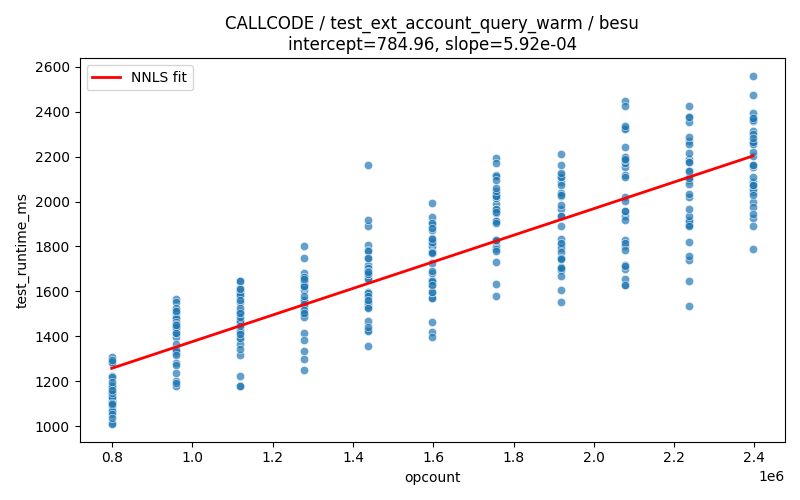

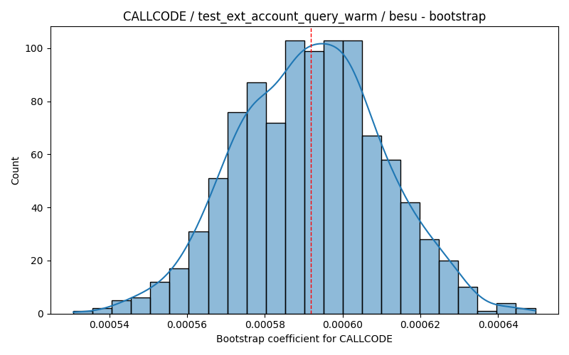

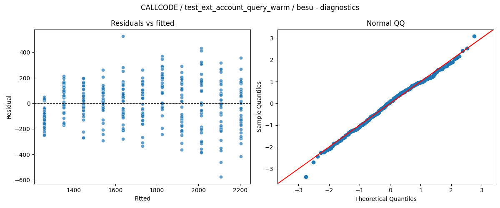

</details>

<details><summary>erigon — NNLS regression summary</summary>

```
==============================================================================
                           NNLS Regression Results                            
==============================================================================
Dep. Variable:          test_runtime_ms              R-squared:          0.960
Model:                  NNLS                    Adj. R-squared:          0.960
No. Observations:       198                               RMSE:          26.67
Df Residuals:           196                                MAE:          21.61
Df Model:               1      
==============================================================================
                      coef     std err     P-value      [0.025      0.975]
------------------------------------------------------------------------------
         const     39.5495      5.7659       0.001     28.5441     51.2376
       opcount      0.0003      0.0000       0.001      0.0003      0.0003
==============================================================================
Notes: Non-negative least squares with bootstrap inference (1000 iterations)
==============================================================================
```

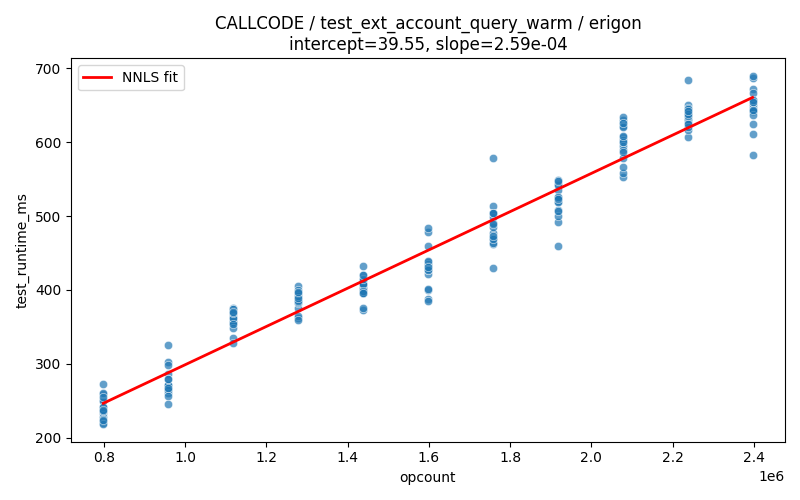

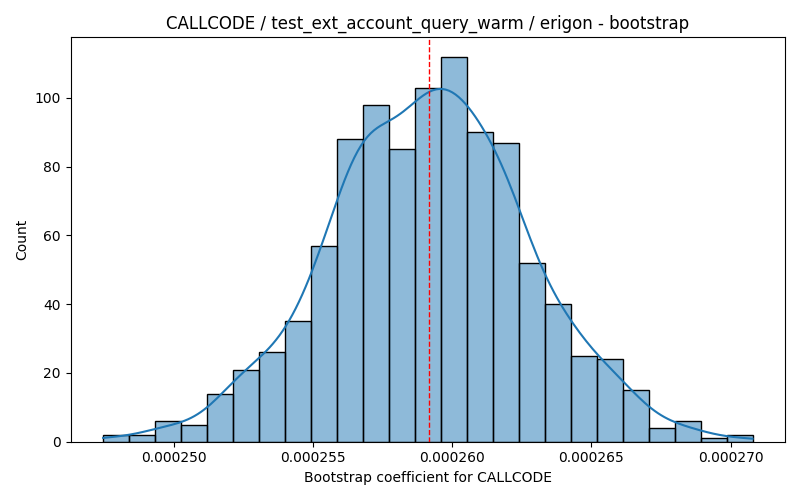

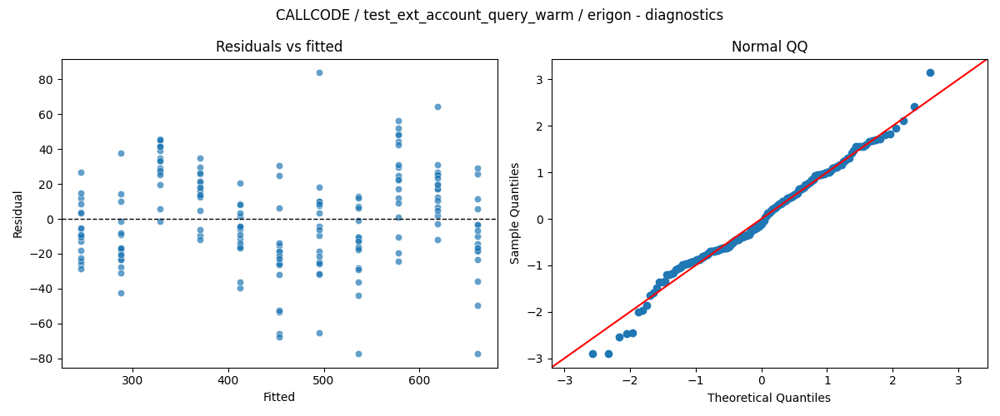

</details>

<details><summary>ethrex — NNLS regression summary</summary>

```
==============================================================================
                           NNLS Regression Results                            
==============================================================================
Dep. Variable:          test_runtime_ms              R-squared:          0.916
Model:                  NNLS                    Adj. R-squared:          0.914
No. Observations:       33                                RMSE:          15.84
Df Residuals:           31                                 MAE:          12.55
Df Model:               1      
==============================================================================
                      coef     std err     P-value      [0.025      0.975]
------------------------------------------------------------------------------
         const     31.3011      9.4119       0.003     11.4095     48.5077
       opcount      0.0001      0.0000       0.001      0.0001      0.0001
==============================================================================
Notes: Non-negative least squares with bootstrap inference (1000 iterations)
==============================================================================
```

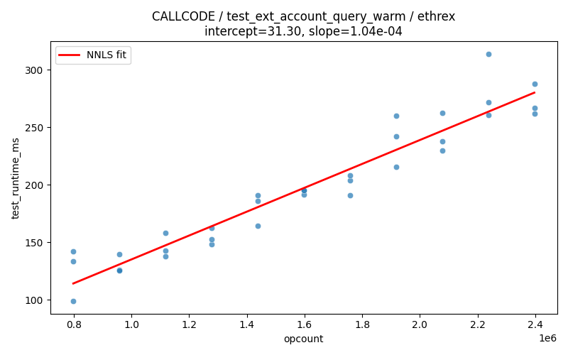

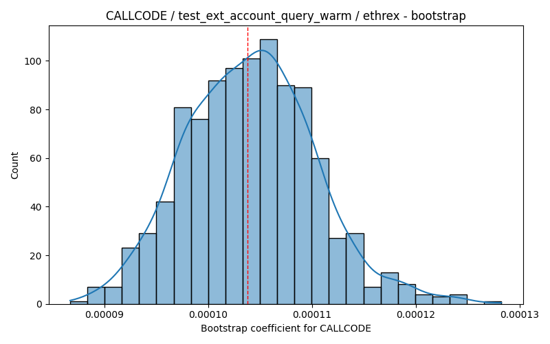

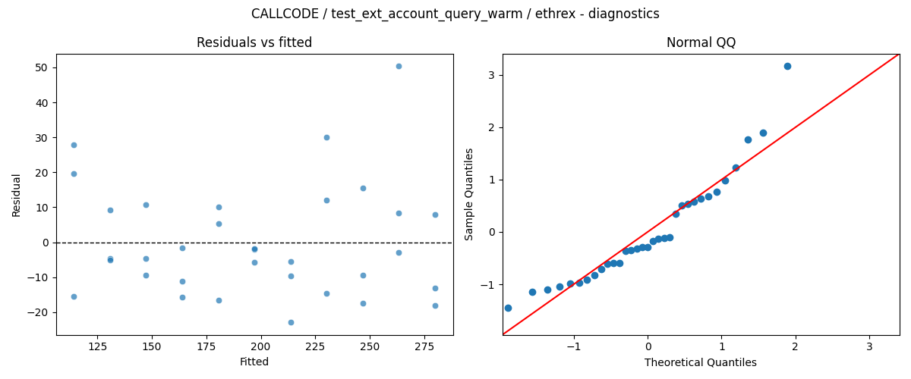

</details>

<details><summary>geth — NNLS regression summary</summary>

```
==============================================================================
                           NNLS Regression Results                            
==============================================================================
Dep. Variable:          test_runtime_ms              R-squared:          0.938
Model:                  NNLS                    Adj. R-squared:          0.938
No. Observations:       407                               RMSE:          25.52
Df Residuals:           405                                MAE:          20.28
Df Model:               1      
==============================================================================
                      coef     std err     P-value      [0.025      0.975]
------------------------------------------------------------------------------
         const     48.7707      4.2188       0.001     40.4069     57.1054
       opcount      0.0002      0.0000       0.001      0.0002      0.0002
==============================================================================
Notes: Non-negative least squares with bootstrap inference (1000 iterations)
==============================================================================
```

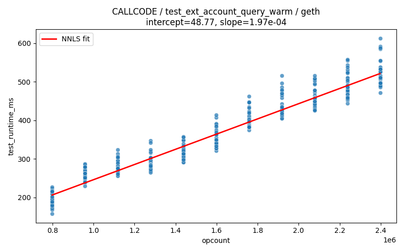

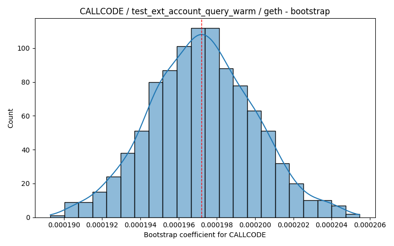

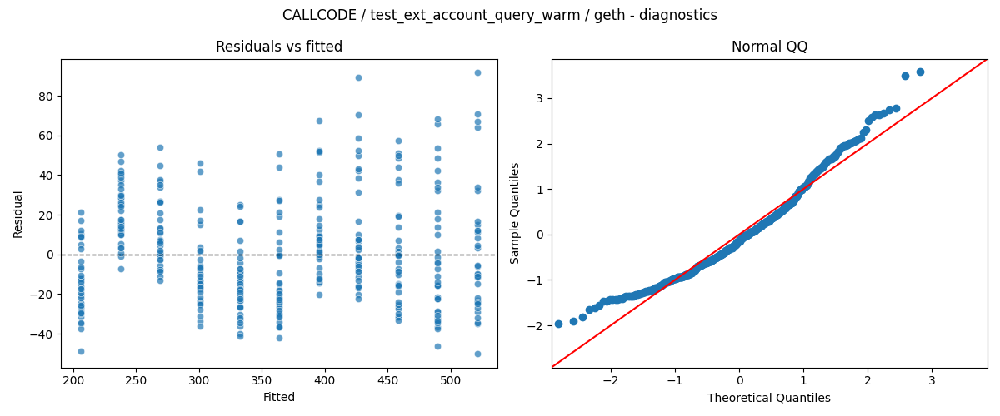

</details>

<details><summary>nethermind — NNLS regression summary</summary>

```
==============================================================================
                           NNLS Regression Results                            
==============================================================================
Dep. Variable:          test_runtime_ms              R-squared:          0.793
Model:                  NNLS                    Adj. R-squared:          0.793
No. Observations:       352                               RMSE:          54.56
Df Residuals:           350                                MAE:          39.86
Df Model:               1      
==============================================================================
                      coef     std err     P-value      [0.025      0.975]
------------------------------------------------------------------------------
         const    146.5613      9.4905       0.001    127.6474    163.9190
       opcount      0.0002      0.0000       0.001      0.0002      0.0002
==============================================================================
Notes: Non-negative least squares with bootstrap inference (1000 iterations)
==============================================================================
```

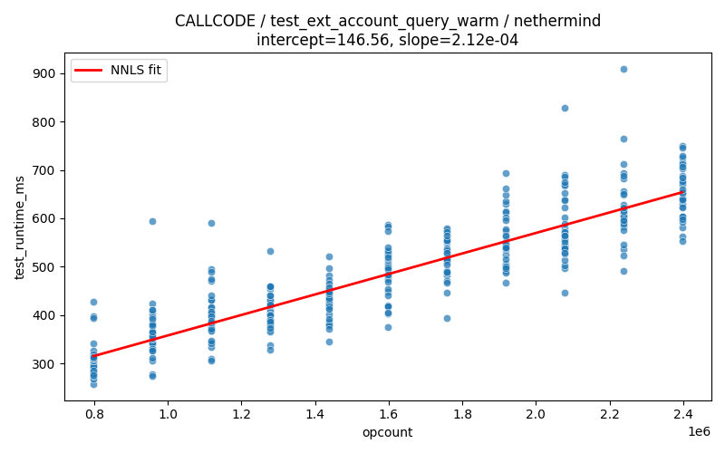

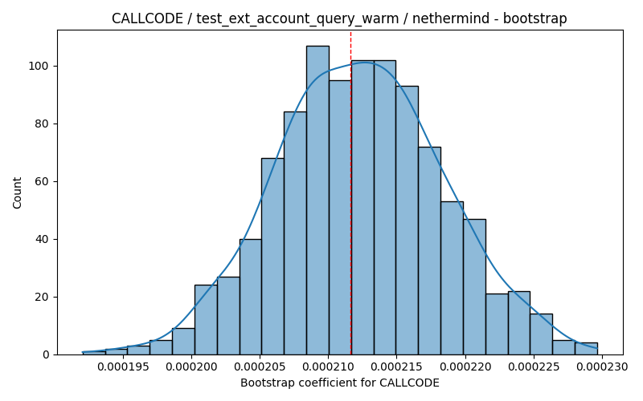

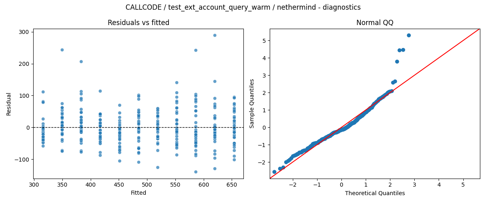

</details>

<details><summary>reth — NNLS regression summary</summary>

```
==============================================================================
                           NNLS Regression Results                            
==============================================================================
Dep. Variable:          test_runtime_ms              R-squared:          0.917
Model:                  NNLS                    Adj. R-squared:          0.916
No. Observations:       374                               RMSE:           8.04
Df Residuals:           372                                MAE:           6.16
Df Model:               1      
==============================================================================
                      coef     std err     P-value      [0.025      0.975]
------------------------------------------------------------------------------
         const     20.8222      1.3609       0.001     18.2053     23.5749
       opcount      0.0001      0.0000       0.001      0.0001      0.0001
==============================================================================
Notes: Non-negative least squares with bootstrap inference (1000 iterations)
==============================================================================
```

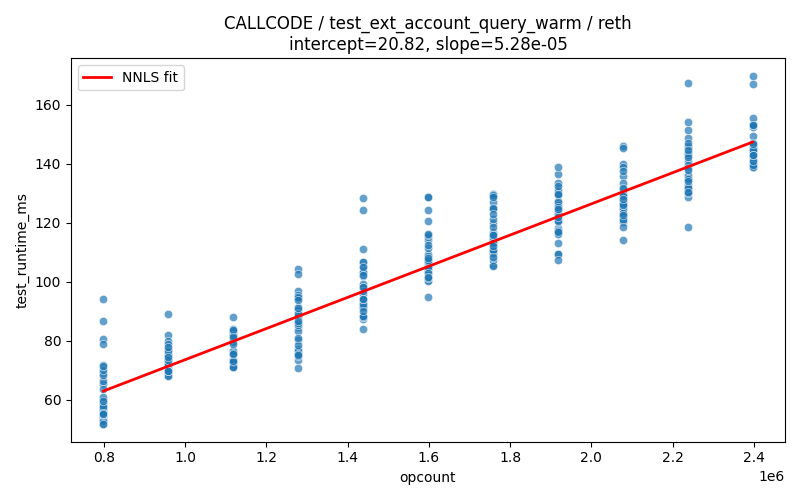

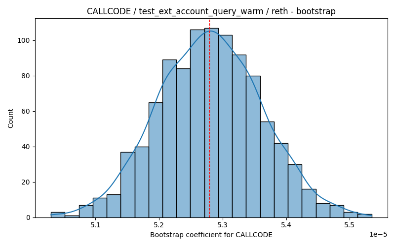

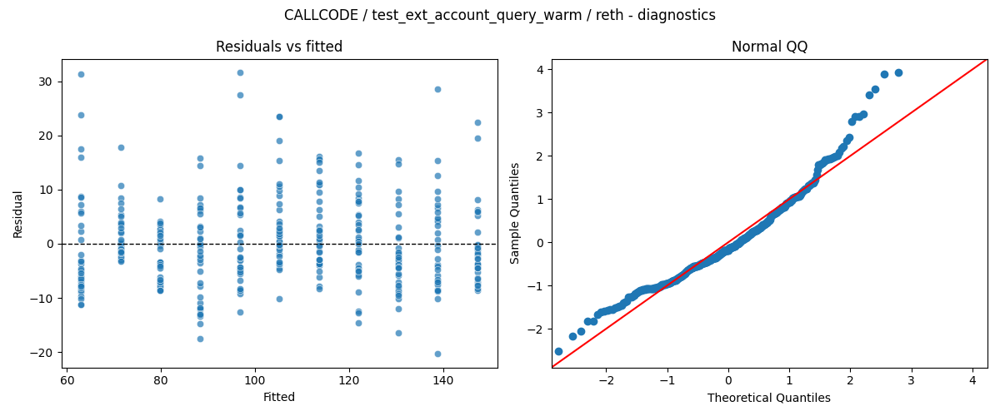

</details>

## DELEGATECALL

### test_account_access — combo `DELEGATECALL_AccountMode.EXISTING_EOA`

| client | nobs | R² | target_coef (ms) | p-value | 95% CI |
| --- | --- | --- | --- | --- | --- |
| `besu` | 341 | 0.7528 | 0.01605 | 1.00e-03 | [0.01506, 0.01701] |
| `erigon` | 198 | 0.9748 | 0.009157 | 1.00e-03 | [0.00895, 0.009388] |
| `ethrex` | 33 | 0.9805 | 0.0176 | 1.00e-03 | [0.01673, 0.01866] |
| `geth` | 407 | 0.9425 | 0.0109 | 1.00e-03 | [0.01058, 0.01121] |
| `nethermind` | 352 | 0.9458 | 0.003861 | 1.00e-03 | [0.003763, 0.003961] |
| `reth` | 374 | 0.9482 | 0.001271 | 1.00e-03 | [0.001241, 0.001302] |

<details><summary>besu — NNLS regression summary</summary>

```
==============================================================================
                           NNLS Regression Results                            
==============================================================================
Dep. Variable:          test_runtime_ms              R-squared:          0.753
Model:                  NNLS                    Adj. R-squared:          0.752
No. Observations:       341                               RMSE:         218.69
Df Residuals:           339                                MAE:         198.08
Df Model:               1      
==============================================================================
                      coef     std err     P-value      [0.025      0.975]
------------------------------------------------------------------------------
         const    720.0653     36.4173       0.001    649.1852    794.4406
       opcount      0.0161      0.0005       0.001      0.0151      0.0170
==============================================================================
Notes: Non-negative least squares with bootstrap inference (1000 iterations)
==============================================================================
```

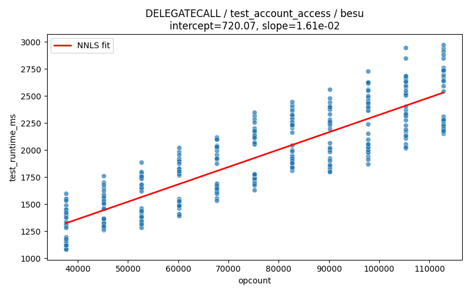

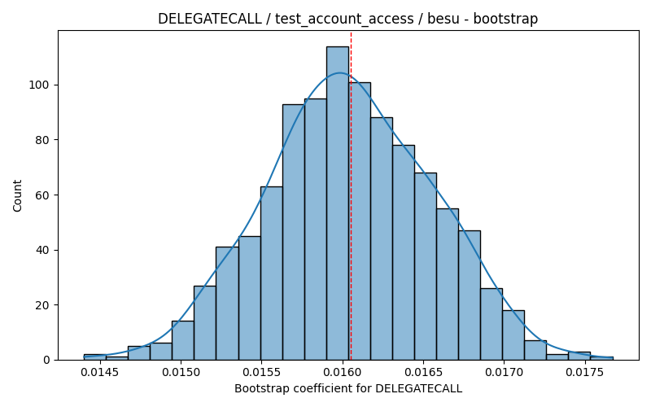

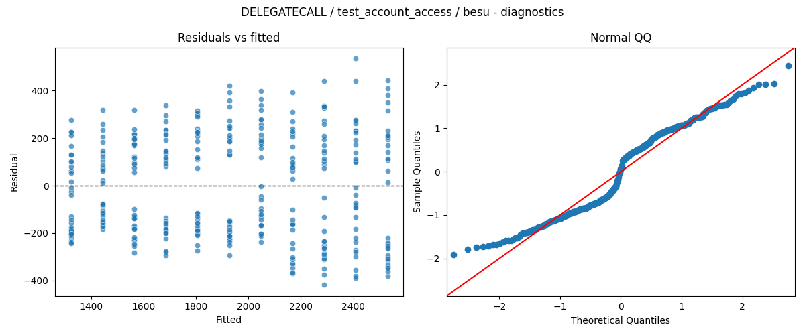

</details>

<details><summary>erigon — NNLS regression summary</summary>

```
==============================================================================
                           NNLS Regression Results                            
==============================================================================
Dep. Variable:          test_runtime_ms              R-squared:          0.975
Model:                  NNLS                    Adj. R-squared:          0.975
No. Observations:       198                               RMSE:          34.99
Df Residuals:           196                                MAE:          30.56
Df Model:               1      
==============================================================================
                      coef     std err     P-value      [0.025      0.975]
------------------------------------------------------------------------------
         const     29.0572      7.1733       0.001     13.9051     42.5372
       opcount      0.0092      0.0001       0.001      0.0090      0.0094
==============================================================================
Notes: Non-negative least squares with bootstrap inference (1000 iterations)
==============================================================================
```

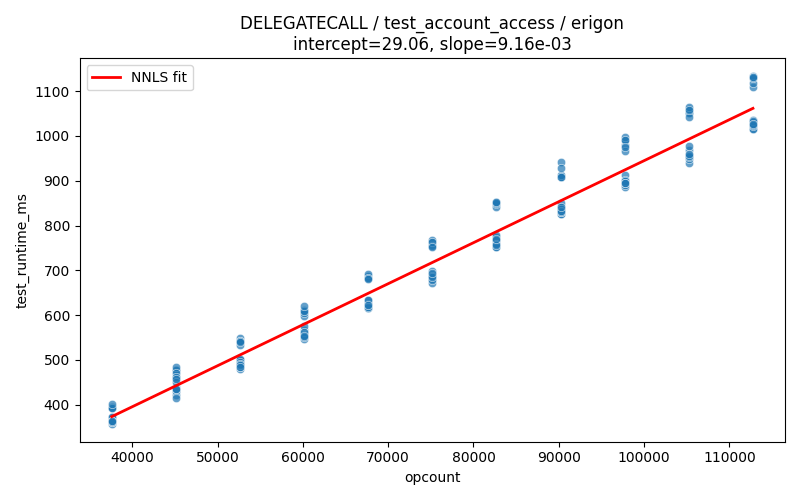

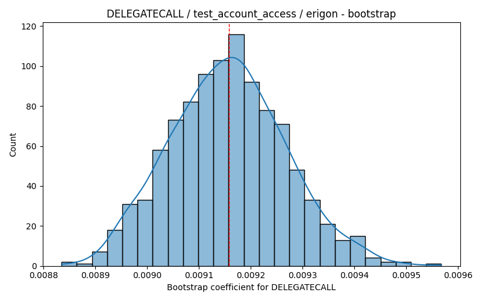

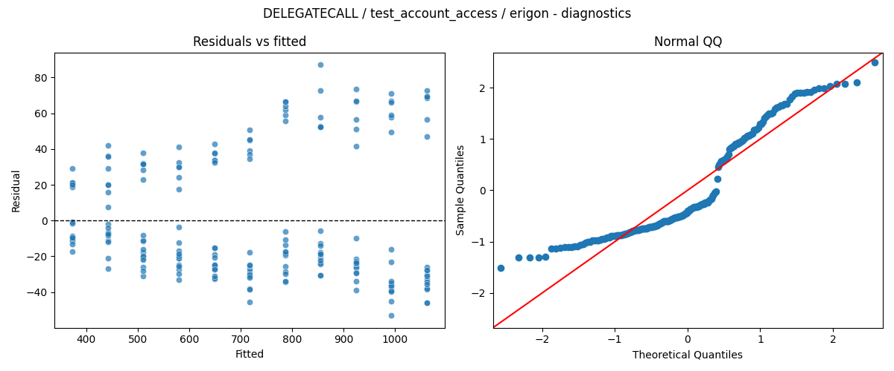

</details>

<details><summary>ethrex — NNLS regression summary</summary>

```
==============================================================================
                           NNLS Regression Results                            
==============================================================================
Dep. Variable:          test_runtime_ms              R-squared:          0.980
Model:                  NNLS                    Adj. R-squared:          0.980
No. Observations:       33                                RMSE:          59.03
Df Residuals:           31                                 MAE:          52.05
Df Model:               1      
==============================================================================
                      coef     std err     P-value      [0.025      0.975]
------------------------------------------------------------------------------
         const    170.8043     42.0352       0.001     87.6533    246.4538
       opcount      0.0176      0.0005       0.001      0.0167      0.0187
==============================================================================
Notes: Non-negative least squares with bootstrap inference (1000 iterations)
==============================================================================
```

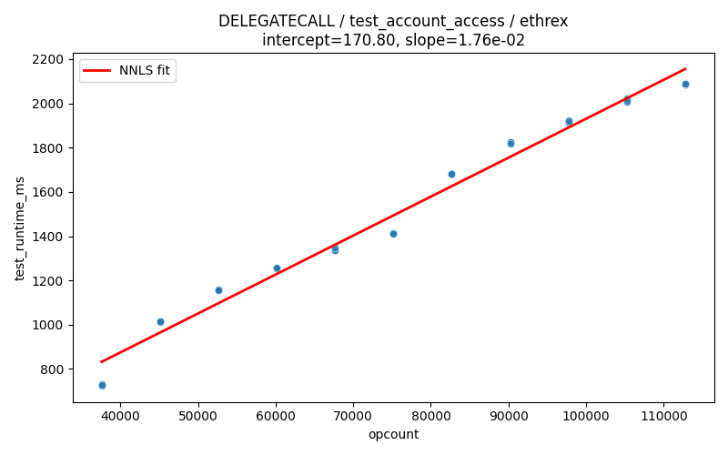

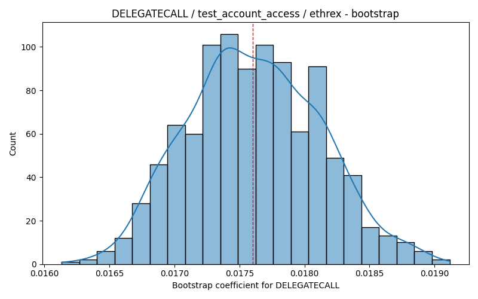

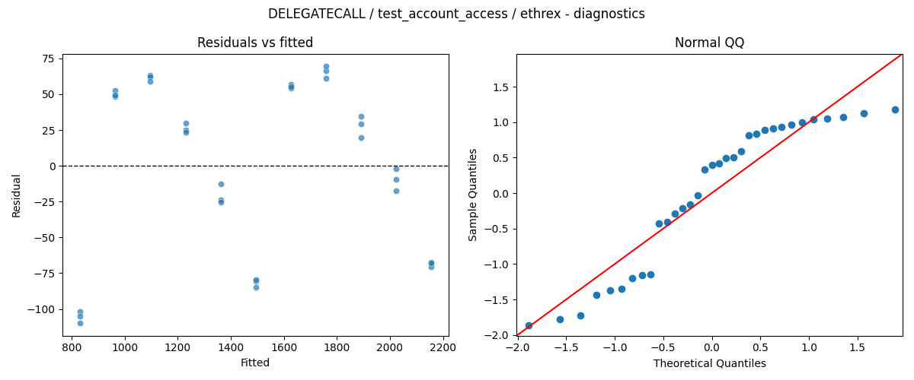

</details>

<details><summary>geth — NNLS regression summary</summary>

```
==============================================================================
                           NNLS Regression Results                            
==============================================================================
Dep. Variable:          test_runtime_ms              R-squared:          0.942
Model:                  NNLS                    Adj. R-squared:          0.942
No. Observations:       407                               RMSE:          64.06
Df Residuals:           405                                MAE:          51.50
Df Model:               1      
==============================================================================
                      coef     std err     P-value      [0.025      0.975]
------------------------------------------------------------------------------
         const    466.8038     14.5243       0.001    439.0427    496.2262
       opcount      0.0109      0.0002       0.001      0.0106      0.0112
==============================================================================
Notes: Non-negative least squares with bootstrap inference (1000 iterations)
==============================================================================
```

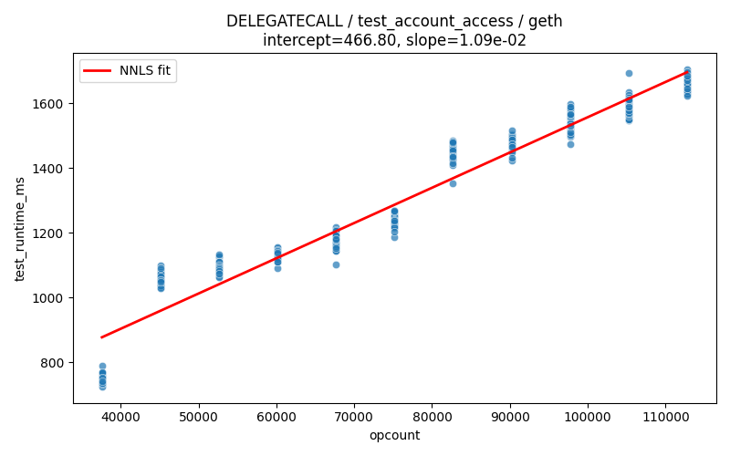

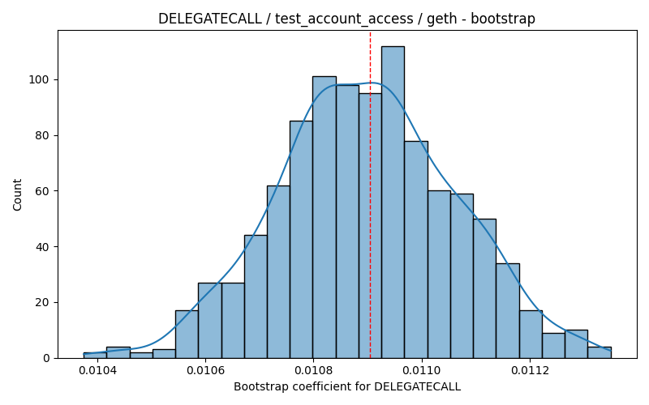

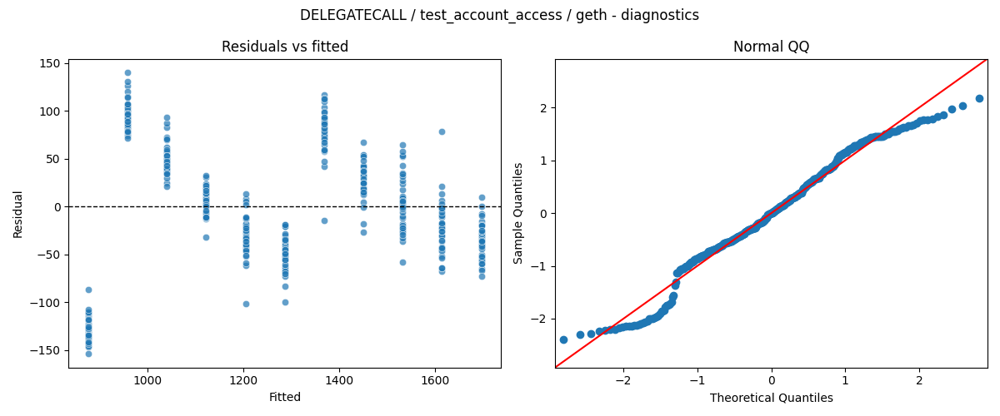

</details>

<details><summary>nethermind — NNLS regression summary</summary>

```
==============================================================================
                           NNLS Regression Results                            
==============================================================================
Dep. Variable:          test_runtime_ms              R-squared:          0.946
Model:                  NNLS                    Adj. R-squared:          0.946
No. Observations:       352                               RMSE:          21.96
Df Residuals:           350                                MAE:          17.29
Df Model:               1      
==============================================================================
                      coef     std err     P-value      [0.025      0.975]
------------------------------------------------------------------------------
         const     90.7851      3.8792       0.001     82.9789     98.5271
       opcount      0.0039      0.0001       0.001      0.0038      0.0040
==============================================================================
Notes: Non-negative least squares with bootstrap inference (1000 iterations)
==============================================================================
```

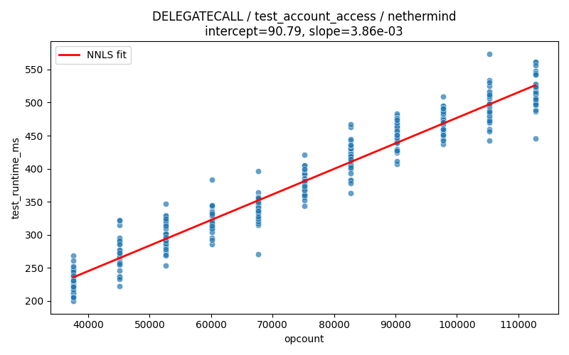

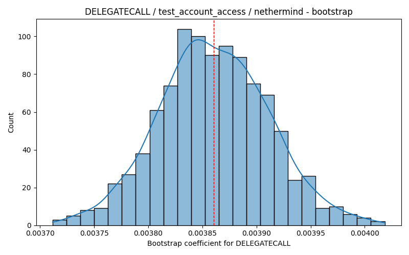

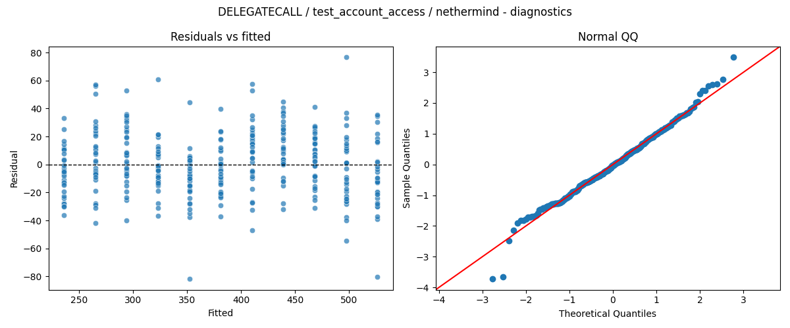

</details>

<details><summary>reth — NNLS regression summary</summary>

```
==============================================================================
                           NNLS Regression Results                            
==============================================================================
Dep. Variable:          test_runtime_ms              R-squared:          0.948
Model:                  NNLS                    Adj. R-squared:          0.948
No. Observations:       374                               RMSE:           7.06
Df Residuals:           372                                MAE:           5.28
Df Model:               1      
==============================================================================
                      coef     std err     P-value      [0.025      0.975]
------------------------------------------------------------------------------
         const     39.7420      1.1579       0.001     37.5107     42.1873
       opcount      0.0013      0.0000       0.001      0.0012      0.0013
==============================================================================
Notes: Non-negative least squares with bootstrap inference (1000 iterations)
==============================================================================
```

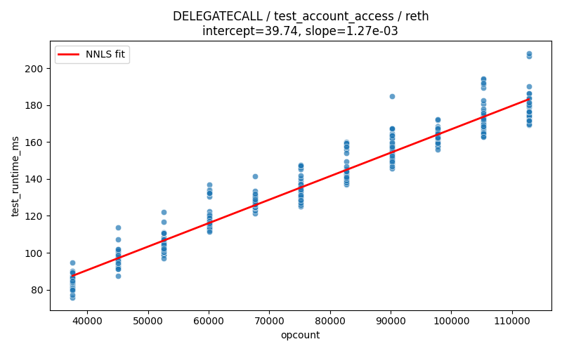

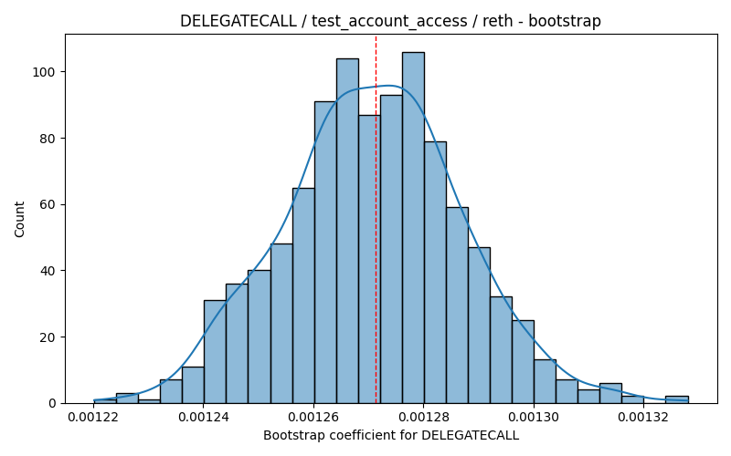

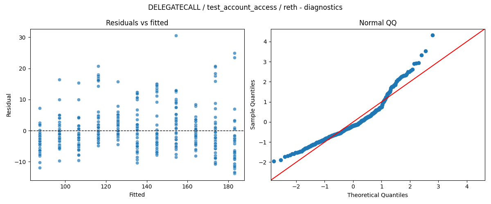

</details>

### test_account_access — combo `DELEGATECALL_AccountMode.NON_EXISTING_ACCOUNT` — `presets[cold_account_nocode_access]`

| client | nobs | R² | target_coef (ms) | p-value | 95% CI |
| --- | --- | --- | --- | --- | --- |
| `besu` | 341 | 0.74 | 0.0156 | 1.00e-03 | [0.01465, 0.01663] |
| `erigon` | 198 | 0.9686 | 0.008768 | 1.00e-03 | [0.008549, 0.008916] |
| `ethrex` | 33 | 0.9893 | 0.002741 | 1.00e-03 | [0.002659, 0.002822] |
| `geth` | 407 | 0.8725 | 0.02249 | 1.00e-03 | [0.02161, 0.02335] |
| `nethermind` | 352 | 0.9067 | 0.003831 | 1.00e-03 | [0.003686, 0.003978] |
| `reth` | 374 | 0.965 | 0.000928 | 1.00e-03 | [0.0009088, 0.0009451] |

<details><summary>besu — NNLS regression summary</summary>

```
==============================================================================
                           NNLS Regression Results                            
==============================================================================
Dep. Variable:          test_runtime_ms              R-squared:          0.740
Model:                  NNLS                    Adj. R-squared:          0.739
No. Observations:       341                               RMSE:         219.79
Df Residuals:           339                                MAE:         202.03
Df Model:               1      
==============================================================================
                      coef     std err     P-value      [0.025      0.975]
------------------------------------------------------------------------------
         const    565.6662     35.3213       0.001    497.3193    632.9689
       opcount      0.0156      0.0005       0.001      0.0146      0.0166
==============================================================================
Notes: Non-negative least squares with bootstrap inference (1000 iterations)
==============================================================================
```

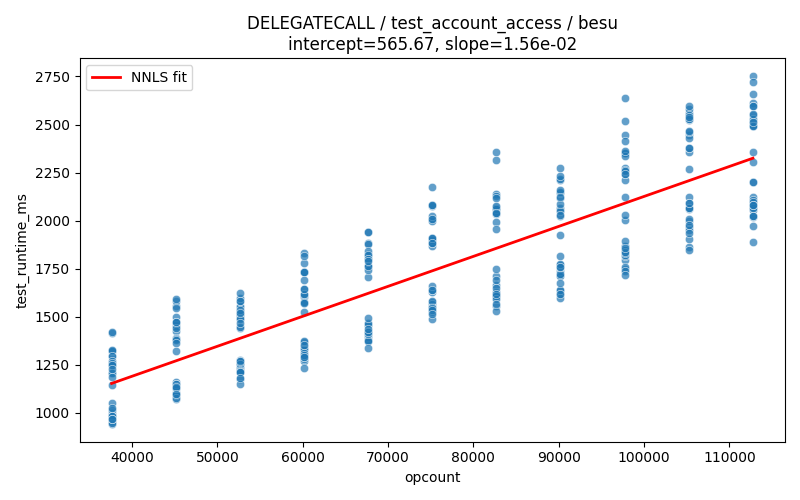

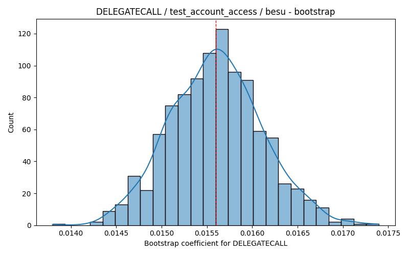

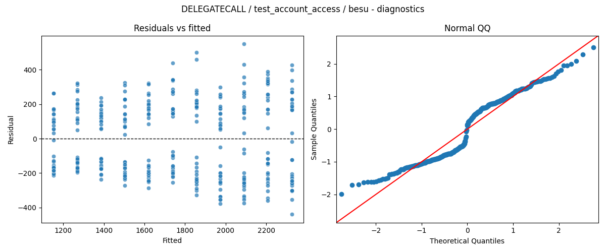

</details>

<details><summary>erigon — NNLS regression summary</summary>

```
==============================================================================
                           NNLS Regression Results                            
==============================================================================
Dep. Variable:          test_runtime_ms              R-squared:          0.969
Model:                  NNLS                    Adj. R-squared:          0.968
No. Observations:       198                               RMSE:          37.51
Df Residuals:           196                                MAE:          32.99
Df Model:               1      
==============================================================================
                      coef     std err     P-value      [0.025      0.975]
------------------------------------------------------------------------------
         const      6.4363      6.2302       0.217      0.0000     20.1663
       opcount      0.0088      0.0001       0.001      0.0085      0.0089
==============================================================================
Notes: Non-negative least squares with bootstrap inference (1000 iterations)
==============================================================================
```

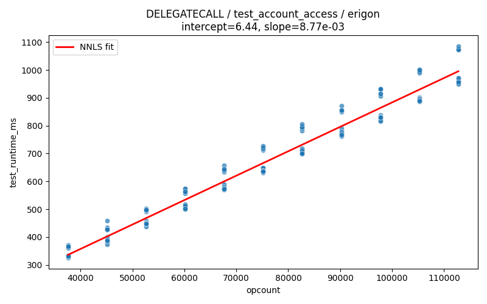

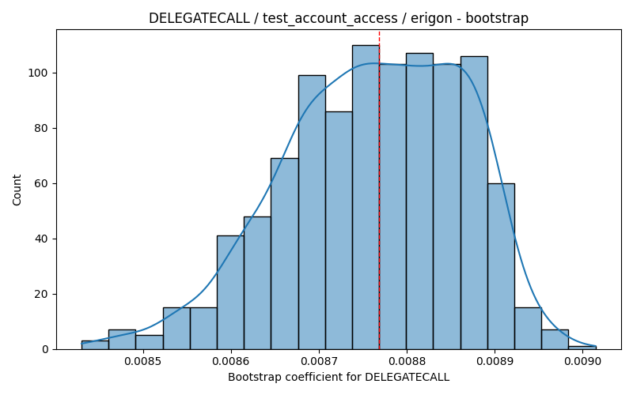


</details>

<details><summary>ethrex — NNLS regression summary</summary>

```
==============================================================================
                           NNLS Regression Results                            
==============================================================================
Dep. Variable:          test_runtime_ms              R-squared:          0.989
Model:                  NNLS                    Adj. R-squared:          0.989
No. Observations:       33                                RMSE:           6.77
Df Residuals:           31                                 MAE:           5.14
Df Model:               1      
==============================================================================
                      coef     std err     P-value      [0.025      0.975]
------------------------------------------------------------------------------
         const      4.6771      2.7047       0.049      0.0000     10.6231
       opcount      0.0027      0.0000       0.001      0.0027      0.0028
==============================================================================
Notes: Non-negative least squares with bootstrap inference (1000 iterations)
==============================================================================
```

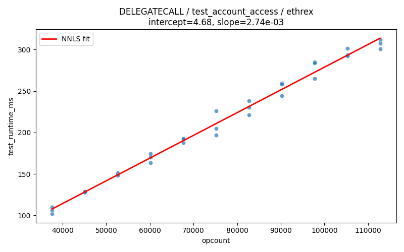

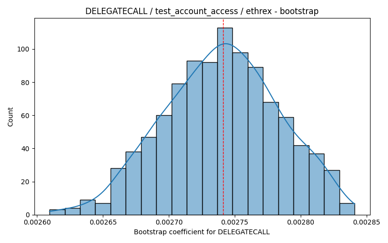

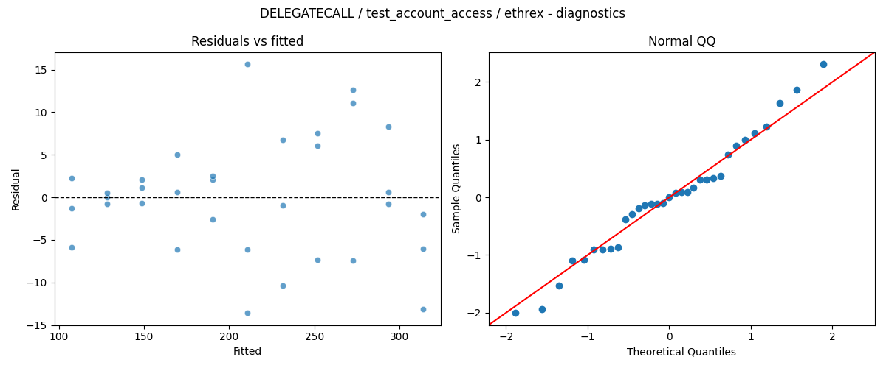

</details>

<details><summary>geth — NNLS regression summary</summary>

```
==============================================================================
                           NNLS Regression Results                            
==============================================================================
Dep. Variable:          test_runtime_ms              R-squared:          0.873
Model:                  NNLS                    Adj. R-squared:          0.872
No. Observations:       407                               RMSE:         204.38
Df Residuals:           405                                MAE:         174.99
Df Model:               1      
==============================================================================
                      coef     std err     P-value      [0.025      0.975]
------------------------------------------------------------------------------
         const    770.0028     39.2682       0.001    697.3402    848.1956
       opcount      0.0225      0.0005       0.001      0.0216      0.0233
==============================================================================
Notes: Non-negative least squares with bootstrap inference (1000 iterations)
==============================================================================
```

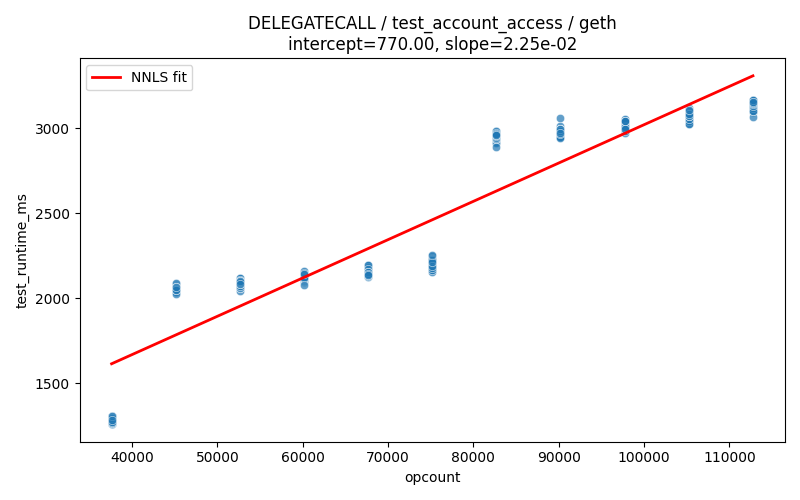

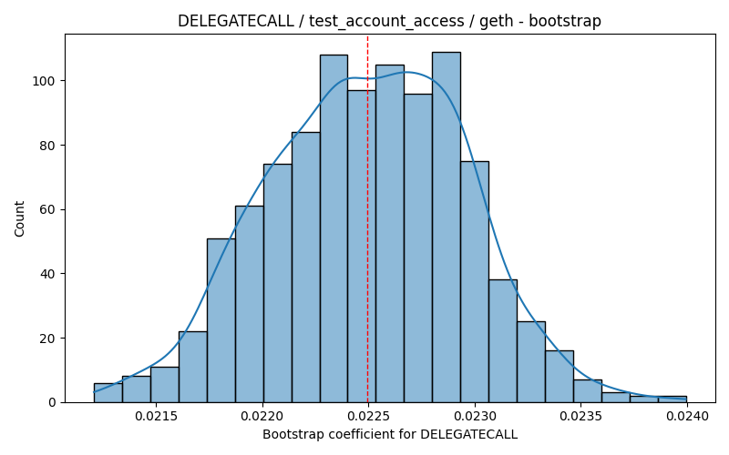


</details>

<details><summary>nethermind — NNLS regression summary</summary>

```
==============================================================================
                           NNLS Regression Results                            
==============================================================================
Dep. Variable:          test_runtime_ms              R-squared:          0.907
Model:                  NNLS                    Adj. R-squared:          0.906
No. Observations:       352                               RMSE:          29.21
Df Residuals:           350                                MAE:          19.70
Df Model:               1      
==============================================================================
                      coef     std err     P-value      [0.025      0.975]
------------------------------------------------------------------------------
         const     80.2406      4.9617       0.001     70.7178     90.5096
       opcount      0.0038      0.0001       0.001      0.0037      0.0040
==============================================================================
Notes: Non-negative least squares with bootstrap inference (1000 iterations)
==============================================================================
```

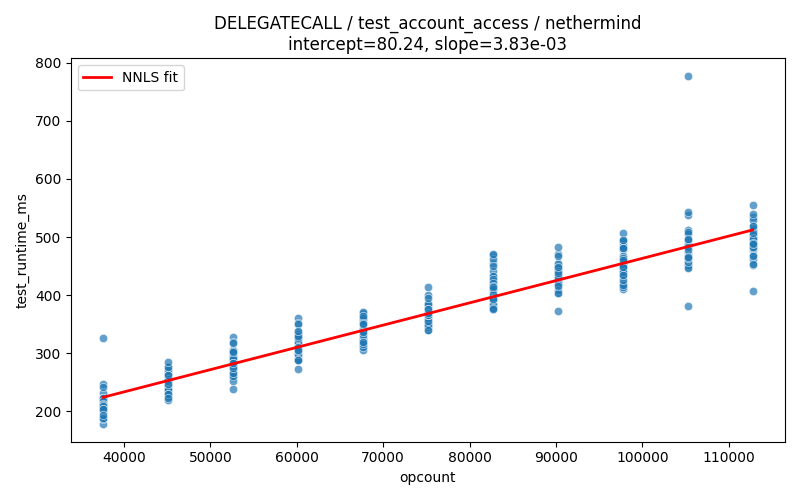

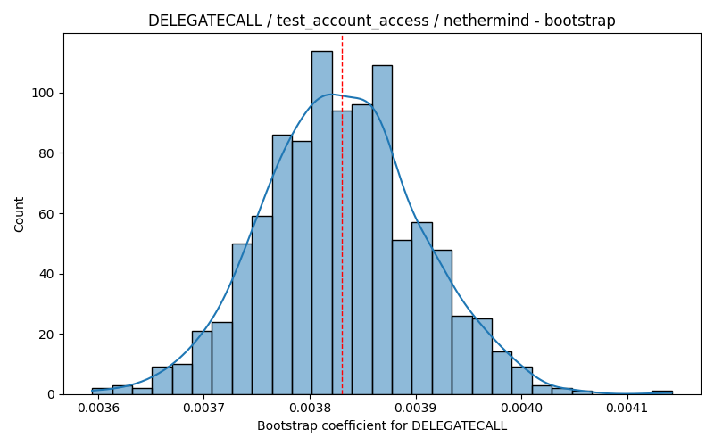

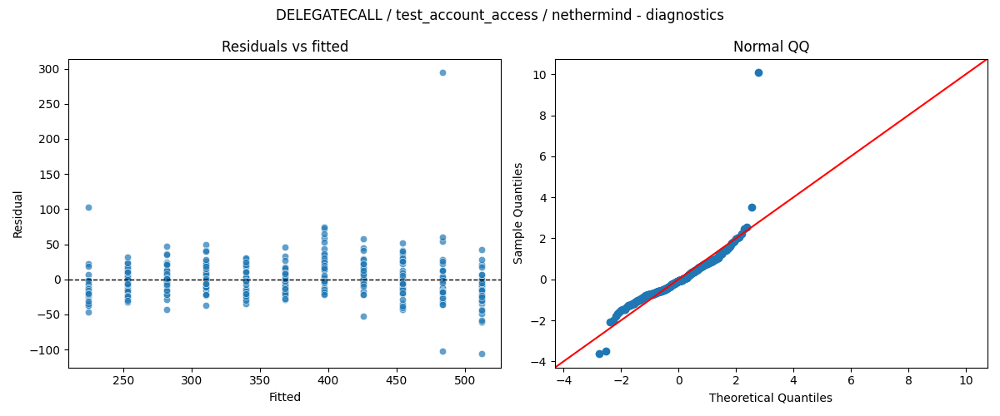

</details>

<details><summary>reth — NNLS regression summary</summary>

```
==============================================================================
                           NNLS Regression Results                            
==============================================================================
Dep. Variable:          test_runtime_ms              R-squared:          0.965
Model:                  NNLS                    Adj. R-squared:          0.965
No. Observations:       374                               RMSE:           4.20
Df Residuals:           372                                MAE:           3.29
Df Model:               1      
==============================================================================
                      coef     std err     P-value      [0.025      0.975]
------------------------------------------------------------------------------
         const     43.5923      0.7408       0.001     42.1702     45.0947
       opcount      0.0009      0.0000       0.001      0.0009      0.0009
==============================================================================
Notes: Non-negative least squares with bootstrap inference (1000 iterations)
==============================================================================
```

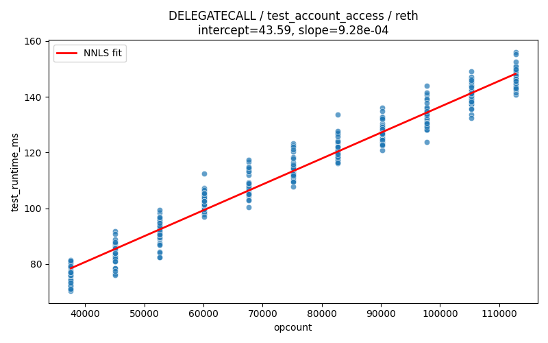

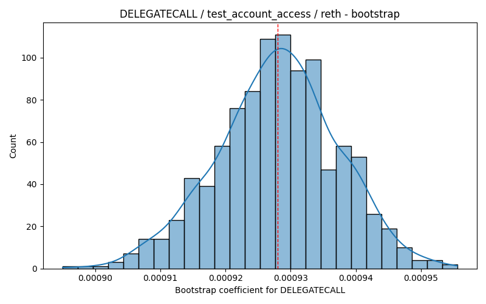

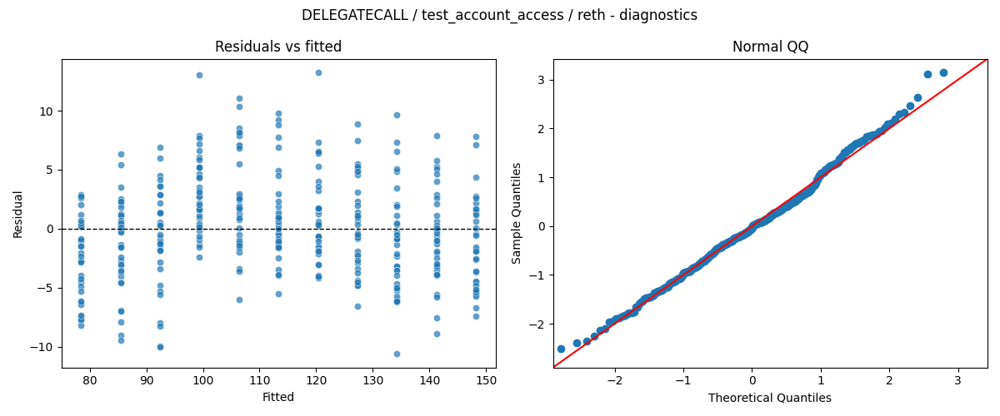

</details>

### test_account_access — combo `DELEGATECALL_AccountMode.EXISTING_CONTRACT`

| client | nobs | R² | target_coef (ms) | p-value | 95% CI |
| --- | --- | --- | --- | --- | --- |
| `besu` | 341 | 0.8696 | 0.03243 | 1.00e-03 | [0.03117, 0.03362] |
| `erigon` | 198 | 0.8817 | 0.08001 | 1.00e-03 | [0.07584, 0.08346] |
| `ethrex` | 33 | 0.982 | 0.01818 | 1.00e-03 | [0.01717, 0.01911] |
| `geth` | 407 | 0.8696 | 0.02355 | 1.00e-03 | [0.02256, 0.02454] |
| `nethermind` | 352 | 0.8027 | 0.0192 | 1.00e-03 | [0.01808, 0.02029] |
| `reth` | 374 | 0.8739 | 0.01854 | 1.00e-03 | [0.01784, 0.01931] |

<details><summary>besu — NNLS regression summary</summary>

```
==============================================================================
                           NNLS Regression Results                            
==============================================================================
Dep. Variable:          test_runtime_ms              R-squared:          0.870
Model:                  NNLS                    Adj. R-squared:          0.869
No. Observations:       341                               RMSE:         255.85
Df Residuals:           339                                MAE:         230.15
Df Model:               1      
==============================================================================
                      coef     std err     P-value      [0.025      0.975]
------------------------------------------------------------------------------
         const    483.9328     37.9919       0.001    413.0290    562.8425
       opcount      0.0324      0.0006       0.001      0.0312      0.0336
==============================================================================
Notes: Non-negative least squares with bootstrap inference (1000 iterations)
==============================================================================
```


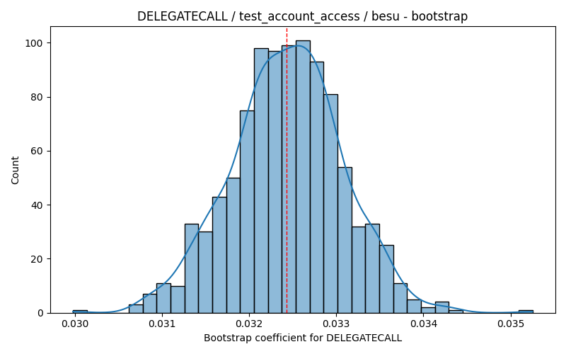


</details>

<details><summary>erigon — NNLS regression summary</summary>

```
==============================================================================
                           NNLS Regression Results                            
==============================================================================
Dep. Variable:          test_runtime_ms              R-squared:          0.882
Model:                  NNLS                    Adj. R-squared:          0.881
No. Observations:       198                               RMSE:         596.91
Df Residuals:           196                                MAE:         519.72
Df Model:               1      
==============================================================================
                      coef     std err     P-value      [0.025      0.975]
------------------------------------------------------------------------------
         const    931.9888    149.3941       0.001    666.5947   1229.4808
       opcount      0.0800      0.0020       0.001      0.0758      0.0835
==============================================================================
Notes: Non-negative least squares with bootstrap inference (1000 iterations)
==============================================================================
```


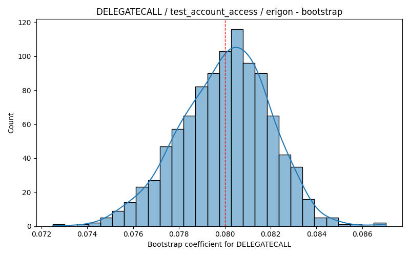

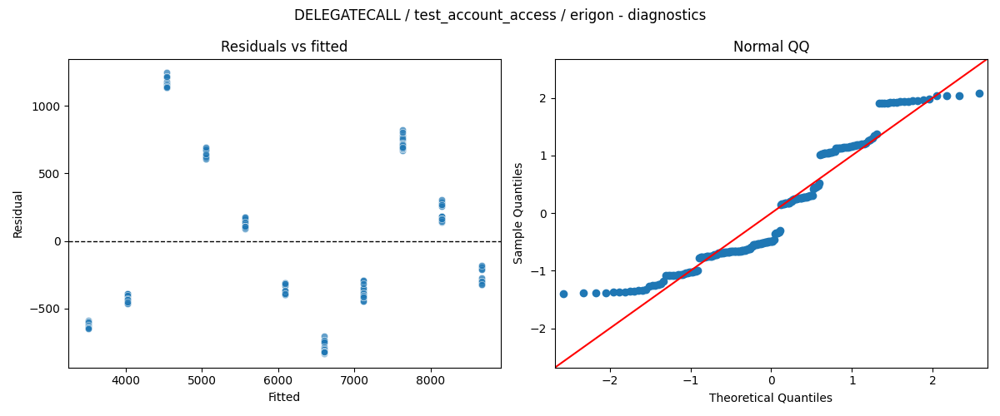

</details>

<details><summary>ethrex — NNLS regression summary</summary>

```
==============================================================================
                           NNLS Regression Results                            
==============================================================================
Dep. Variable:          test_runtime_ms              R-squared:          0.982
Model:                  NNLS                    Adj. R-squared:          0.981
No. Observations:       33                                RMSE:          50.18
Df Residuals:           31                                 MAE:          44.91
Df Model:               1      
==============================================================================
                      coef     std err     P-value      [0.025      0.975]
------------------------------------------------------------------------------
         const    147.3861     36.4201       0.001     82.1866    224.6019
       opcount      0.0182      0.0005       0.001      0.0172      0.0191
==============================================================================
Notes: Non-negative least squares with bootstrap inference (1000 iterations)
==============================================================================
```

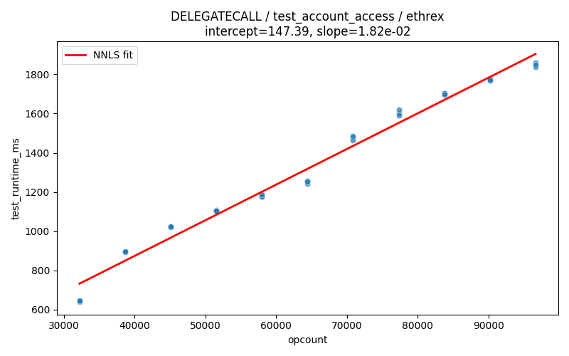

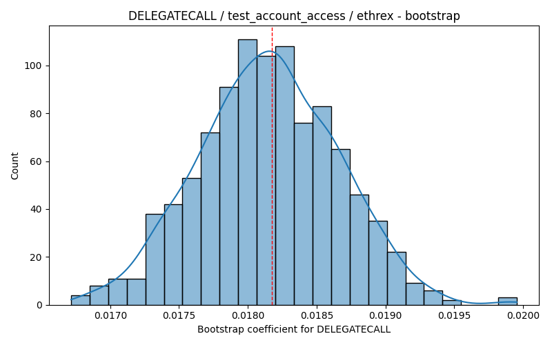

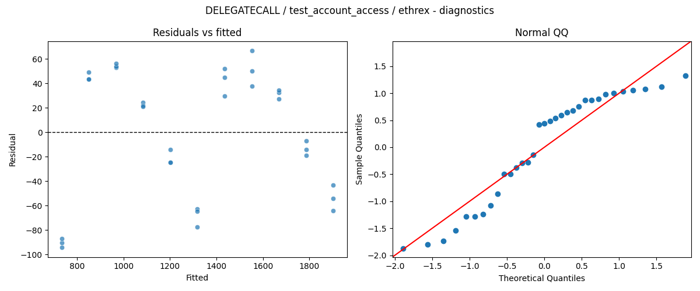

</details>

<details><summary>geth — NNLS regression summary</summary>

```
==============================================================================
                           NNLS Regression Results                            
==============================================================================
Dep. Variable:          test_runtime_ms              R-squared:          0.870
Model:                  NNLS                    Adj. R-squared:          0.869
No. Observations:       407                               RMSE:         185.85
Df Residuals:           405                                MAE:         159.67
Df Model:               1      
==============================================================================
                      coef     std err     P-value      [0.025      0.975]
------------------------------------------------------------------------------
         const    730.9038     37.1794       0.001    658.9130    804.6875
       opcount      0.0236      0.0005       0.001      0.0226      0.0245
==============================================================================
Notes: Non-negative least squares with bootstrap inference (1000 iterations)
==============================================================================
```

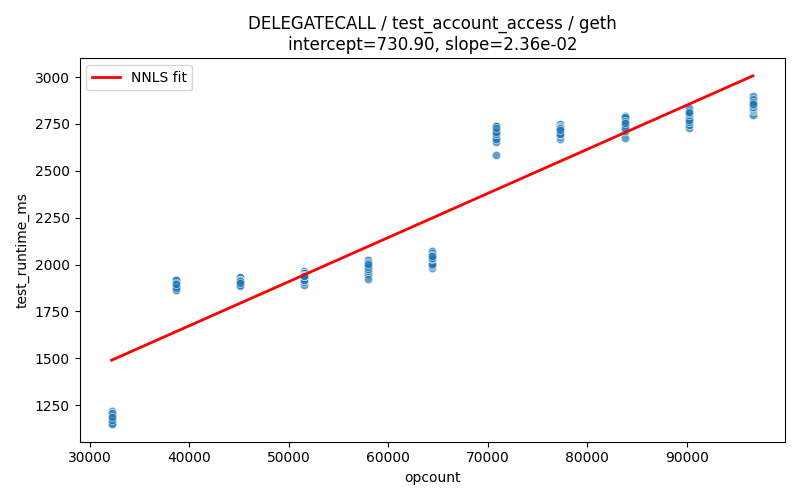

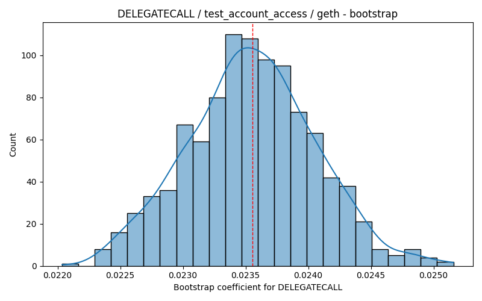

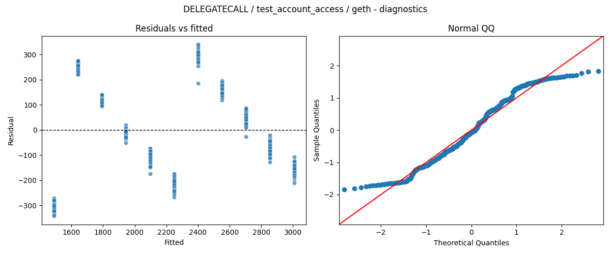

</details>

<details><summary>nethermind — NNLS regression summary</summary>

```
==============================================================================
                           NNLS Regression Results                            
==============================================================================
Dep. Variable:          test_runtime_ms              R-squared:          0.803
Model:                  NNLS                    Adj. R-squared:          0.802
No. Observations:       352                               RMSE:         193.88
Df Residuals:           350                                MAE:         163.38
Df Model:               1      
==============================================================================
                      coef     std err     P-value      [0.025      0.975]
------------------------------------------------------------------------------
         const    593.0907     40.7627       0.001    513.9669    672.6323
       opcount      0.0192      0.0006       0.001      0.0181      0.0203
==============================================================================
Notes: Non-negative least squares with bootstrap inference (1000 iterations)
==============================================================================
```

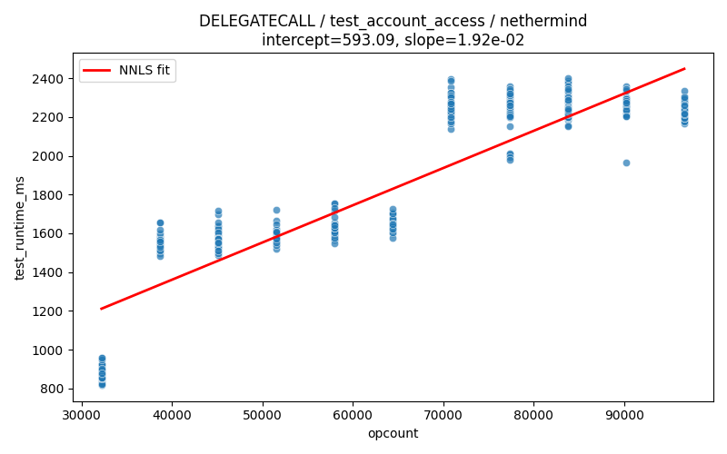

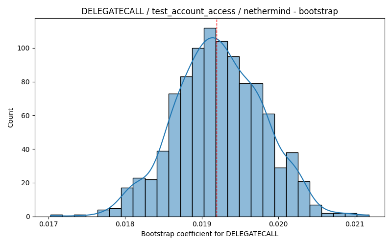

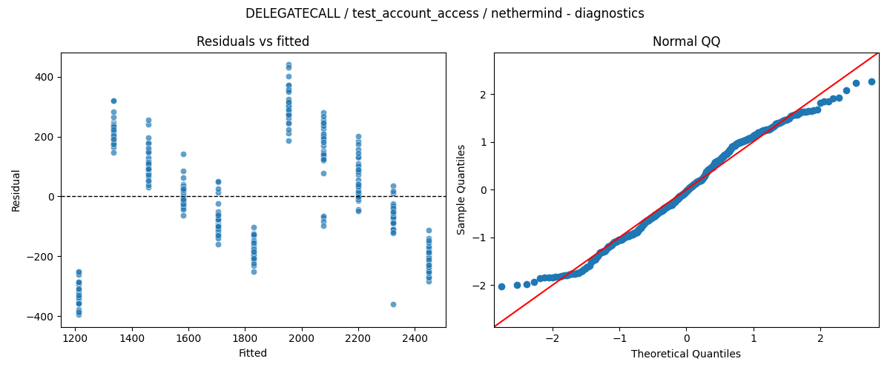

</details>

<details><summary>reth — NNLS regression summary</summary>

```
==============================================================================
                           NNLS Regression Results                            
==============================================================================
Dep. Variable:          test_runtime_ms              R-squared:          0.874
Model:                  NNLS                    Adj. R-squared:          0.874
No. Observations:       374                               RMSE:         143.46
Df Residuals:           372                                MAE:          64.72
Df Model:               1      
==============================================================================
                      coef     std err     P-value      [0.025      0.975]
------------------------------------------------------------------------------
         const    277.4556     21.8679       0.001    236.4030    320.0438
       opcount      0.0185      0.0004       0.001      0.0178      0.0193
==============================================================================
Notes: Non-negative least squares with bootstrap inference (1000 iterations)
==============================================================================
```

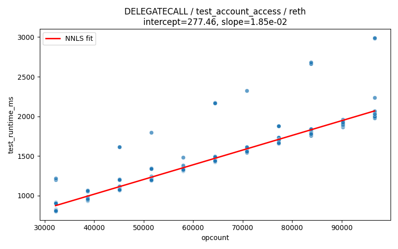

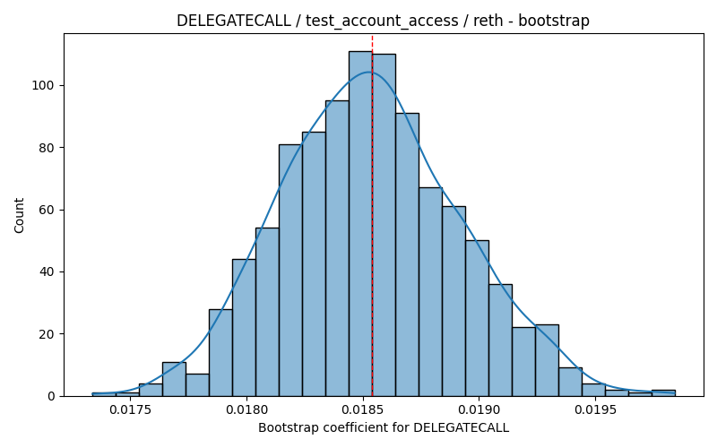

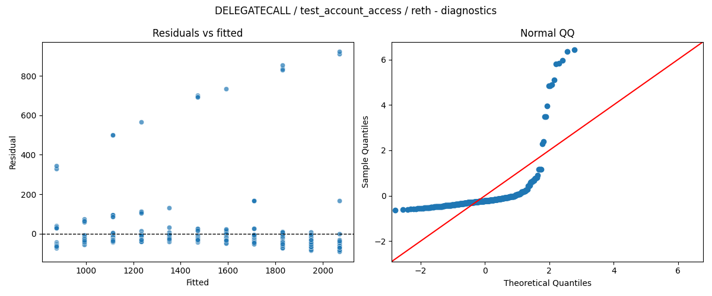

</details>

### test_account_access — combo `DELEGATECALL_AccountMode.NON_EXISTING_ACCOUNT` — `presets[cold_account_code_access]`

| client | nobs | R² | target_coef (ms) | p-value | 95% CI |
| --- | --- | --- | --- | --- | --- |
| `besu` | 341 | 0.74 | 0.0156 | 1.00e-03 | [0.01465, 0.01663] |
| `erigon` | 198 | 0.9686 | 0.008768 | 1.00e-03 | [0.008549, 0.008916] |
| `ethrex` | 33 | 0.9893 | 0.002741 | 1.00e-03 | [0.002659, 0.002822] |
| `geth` | 407 | 0.8725 | 0.02249 | 1.00e-03 | [0.02161, 0.02335] |
| `nethermind` | 352 | 0.9067 | 0.003831 | 1.00e-03 | [0.003686, 0.003978] |
| `reth` | 374 | 0.965 | 0.000928 | 1.00e-03 | [0.0009088, 0.0009451] |

<details><summary>besu — NNLS regression summary</summary>

```
==============================================================================
                           NNLS Regression Results                            
==============================================================================
Dep. Variable:          test_runtime_ms              R-squared:          0.740
Model:                  NNLS                    Adj. R-squared:          0.739
No. Observations:       341                               RMSE:         219.79
Df Residuals:           339                                MAE:         202.03
Df Model:               1      
==============================================================================
                      coef     std err     P-value      [0.025      0.975]
------------------------------------------------------------------------------
         const    565.6662     35.3213       0.001    497.3193    632.9689
       opcount      0.0156      0.0005       0.001      0.0146      0.0166
==============================================================================
Notes: Non-negative least squares with bootstrap inference (1000 iterations)
==============================================================================
```


</details>

<details><summary>erigon — NNLS regression summary</summary>

```
==============================================================================
                           NNLS Regression Results                            
==============================================================================
Dep. Variable:          test_runtime_ms              R-squared:          0.969
Model:                  NNLS                    Adj. R-squared:          0.968
No. Observations:       198                               RMSE:          37.51
Df Residuals:           196                                MAE:          32.99
Df Model:               1      
==============================================================================
                      coef     std err     P-value      [0.025      0.975]
------------------------------------------------------------------------------
         const      6.4363      6.2302       0.217      0.0000     20.1663
       opcount      0.0088      0.0001       0.001      0.0085      0.0089
==============================================================================
Notes: Non-negative least squares with bootstrap inference (1000 iterations)
==============================================================================
```


</details>

<details><summary>ethrex — NNLS regression summary</summary>

```
==============================================================================
                           NNLS Regression Results                            
==============================================================================
Dep. Variable:          test_runtime_ms              R-squared:          0.989
Model:                  NNLS                    Adj. R-squared:          0.989
No. Observations:       33                                RMSE:           6.77
Df Residuals:           31                                 MAE:           5.14
Df Model:               1      
==============================================================================
                      coef     std err     P-value      [0.025      0.975]
------------------------------------------------------------------------------
         const      4.6771      2.7047       0.049      0.0000     10.6231
       opcount      0.0027      0.0000       0.001      0.0027      0.0028
==============================================================================
Notes: Non-negative least squares with bootstrap inference (1000 iterations)
==============================================================================
```


</details>

<details><summary>geth — NNLS regression summary</summary>

```
==============================================================================
                           NNLS Regression Results                            
==============================================================================
Dep. Variable:          test_runtime_ms              R-squared:          0.873
Model:                  NNLS                    Adj. R-squared:          0.872
No. Observations:       407                               RMSE:         204.38
Df Residuals:           405                                MAE:         174.99
Df Model:               1      
==============================================================================
                      coef     std err     P-value      [0.025      0.975]
------------------------------------------------------------------------------
         const    770.0028     39.2682       0.001    697.3402    848.1956
       opcount      0.0225      0.0005       0.001      0.0216      0.0233
==============================================================================
Notes: Non-negative least squares with bootstrap inference (1000 iterations)
==============================================================================
```


</details>

<details><summary>nethermind — NNLS regression summary</summary>

```
==============================================================================
                           NNLS Regression Results                            
==============================================================================
Dep. Variable:          test_runtime_ms              R-squared:          0.907
Model:                  NNLS                    Adj. R-squared:          0.906
No. Observations:       352                               RMSE:          29.21
Df Residuals:           350                                MAE:          19.70
Df Model:               1      
==============================================================================
                      coef     std err     P-value      [0.025      0.975]
------------------------------------------------------------------------------
         const     80.2406      4.9617       0.001     70.7178     90.5096
       opcount      0.0038      0.0001       0.001      0.0037      0.0040
==============================================================================
Notes: Non-negative least squares with bootstrap inference (1000 iterations)
==============================================================================
```


</details>

<details><summary>reth — NNLS regression summary</summary>

```
==============================================================================
                           NNLS Regression Results                            
==============================================================================
Dep. Variable:          test_runtime_ms              R-squared:          0.965
Model:                  NNLS                    Adj. R-squared:          0.965
No. Observations:       374                               RMSE:           4.20
Df Residuals:           372                                MAE:           3.29
Df Model:               1      
==============================================================================
                      coef     std err     P-value      [0.025      0.975]
------------------------------------------------------------------------------
         const     43.5923      0.7408       0.001     42.1702     45.0947
       opcount      0.0009      0.0000       0.001      0.0009      0.0009
==============================================================================
Notes: Non-negative least squares with bootstrap inference (1000 iterations)
==============================================================================
```


</details>

### test_ext_account_query_warm — combo `DELEGATECALL`

| client | nobs | R² | target_coef (ms) | p-value | 95% CI |
| --- | --- | --- | --- | --- | --- |
| `besu` | 341 | 0.7649 | 0.0005465 | 1.00e-03 | [0.0005122, 0.0005779] |
| `erigon` | 198 | 0.9571 | 0.0002593 | 1.00e-03 | [0.0002517, 0.0002663] |
| `ethrex` | 33 | 0.9356 | 0.0001007 | 1.00e-03 | [9.117e-05, 0.0001107] |
| `geth` | 407 | 0.9327 | 0.0001676 | 1.00e-03 | [0.0001629, 0.0001723] |
| `nethermind` | 352 | 0.8155 | 0.0004444 | 1.00e-03 | [0.0004235, 0.0004665] |
| `reth` | 374 | 0.9226 | 5.444e-05 | 1.00e-03 | [5.301e-05, 5.579e-05] |

<details><summary>besu — NNLS regression summary</summary>

```
==============================================================================
                           NNLS Regression Results                            
==============================================================================
Dep. Variable:          test_runtime_ms              R-squared:          0.765
Model:                  NNLS                    Adj. R-squared:          0.764
No. Observations:       341                               RMSE:         156.87
Df Residuals:           339                                MAE:         123.68
Df Model:               1      
==============================================================================
                      coef     std err     P-value      [0.025      0.975]
------------------------------------------------------------------------------
         const    713.8496     24.9538       0.001    667.3712    766.5375
       opcount      0.0005      0.0000       0.001      0.0005      0.0006
==============================================================================
Notes: Non-negative least squares with bootstrap inference (1000 iterations)
==============================================================================
```

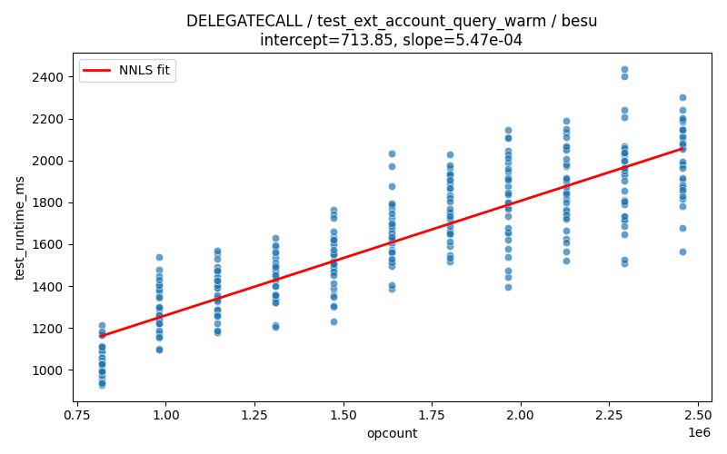

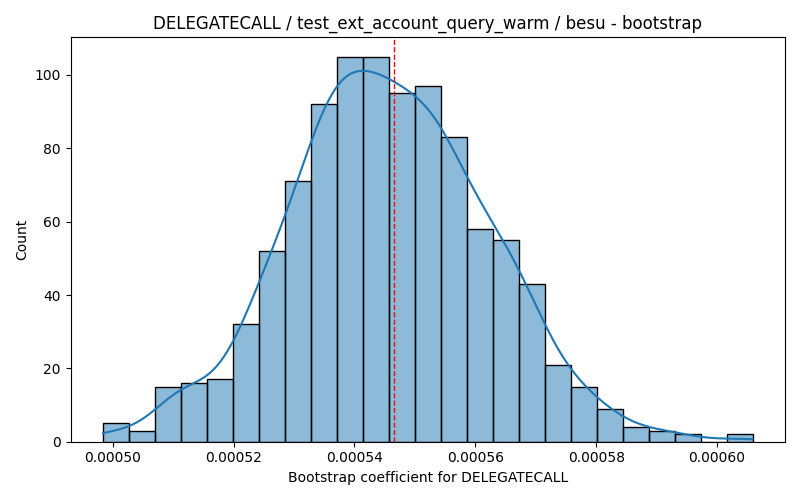

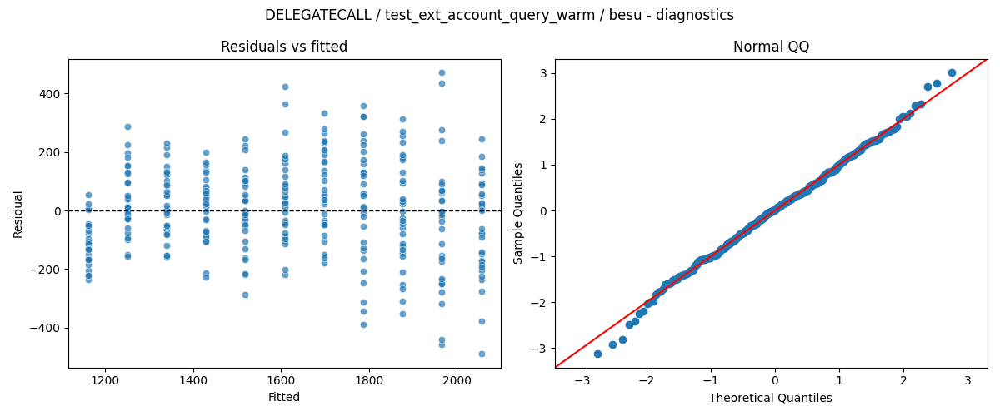

</details>

<details><summary>erigon — NNLS regression summary</summary>

```
==============================================================================
                           NNLS Regression Results                            
==============================================================================
Dep. Variable:          test_runtime_ms              R-squared:          0.957
Model:                  NNLS                    Adj. R-squared:          0.957
No. Observations:       198                               RMSE:          28.43
Df Residuals:           196                                MAE:          22.66
Df Model:               1      
==============================================================================
                      coef     std err     P-value      [0.025      0.975]
------------------------------------------------------------------------------
         const     36.3230      6.2340       0.001     24.4338     48.5921
       opcount      0.0003      0.0000       0.001      0.0003      0.0003
==============================================================================
Notes: Non-negative least squares with bootstrap inference (1000 iterations)
==============================================================================
```

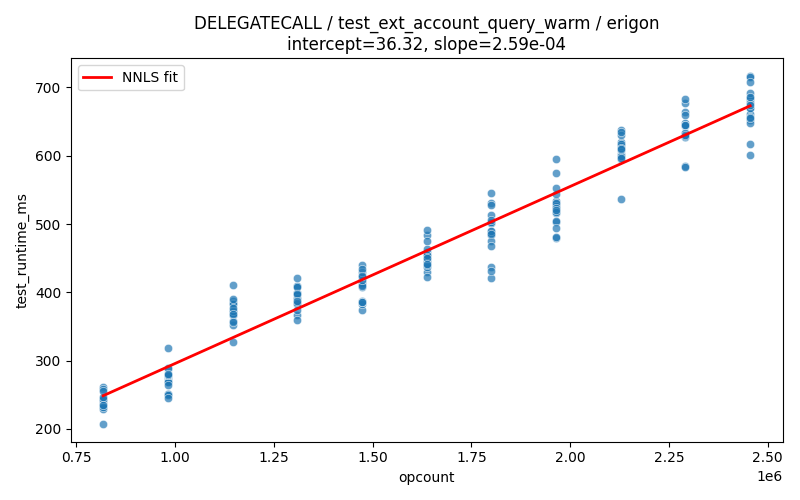

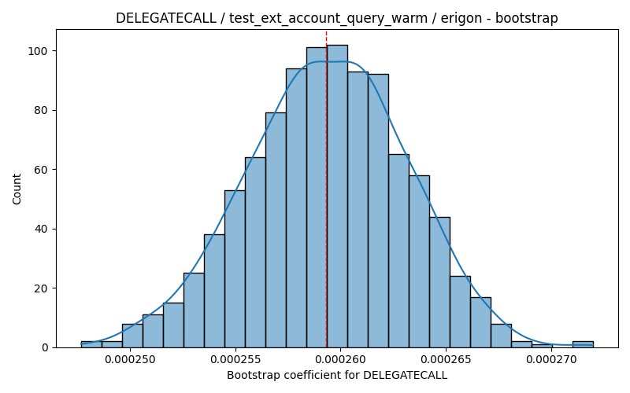

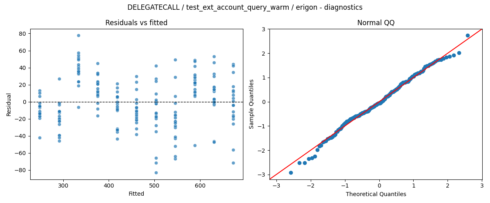

</details>

<details><summary>ethrex — NNLS regression summary</summary>

```
==============================================================================
                           NNLS Regression Results                            
==============================================================================
Dep. Variable:          test_runtime_ms              R-squared:          0.936
Model:                  NNLS                    Adj. R-squared:          0.934
No. Observations:       33                                RMSE:          13.68
Df Residuals:           31                                 MAE:          10.53
Df Model:               1      
==============================================================================
                      coef     std err     P-value      [0.025      0.975]
------------------------------------------------------------------------------
         const     32.3371      7.7111       0.001     17.7251     47.8124
       opcount      0.0001      0.0000       0.001      0.0001      0.0001
==============================================================================
Notes: Non-negative least squares with bootstrap inference (1000 iterations)
==============================================================================
```

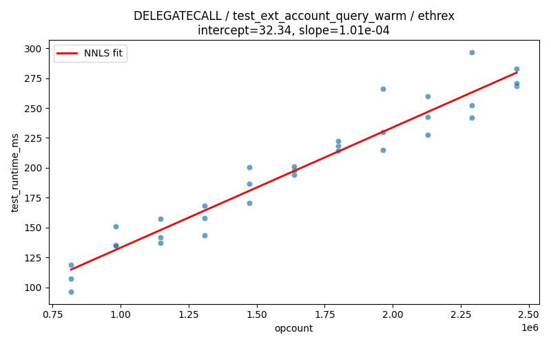

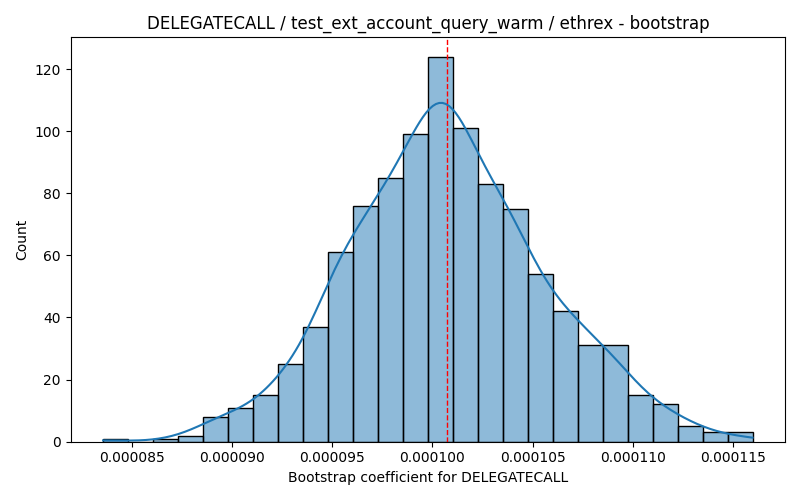

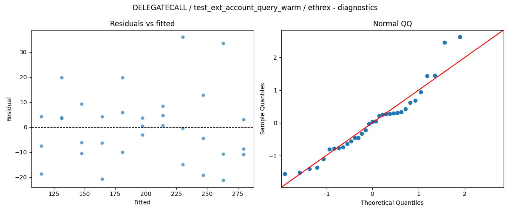

</details>

<details><summary>geth — NNLS regression summary</summary>

```
==============================================================================
                           NNLS Regression Results                            
==============================================================================
Dep. Variable:          test_runtime_ms              R-squared:          0.933
Model:                  NNLS                    Adj. R-squared:          0.933
No. Observations:       407                               RMSE:          23.30
Df Residuals:           405                                MAE:          18.00
Df Model:               1      
==============================================================================
                      coef     std err     P-value      [0.025      0.975]
------------------------------------------------------------------------------
         const     42.9061      3.7175       0.001     35.7361     50.2298
       opcount      0.0002      0.0000       0.001      0.0002      0.0002
==============================================================================
Notes: Non-negative least squares with bootstrap inference (1000 iterations)
==============================================================================
```

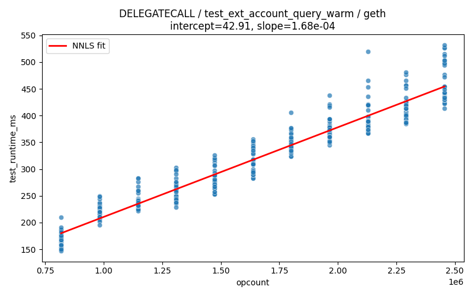

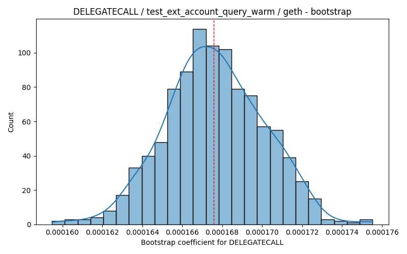

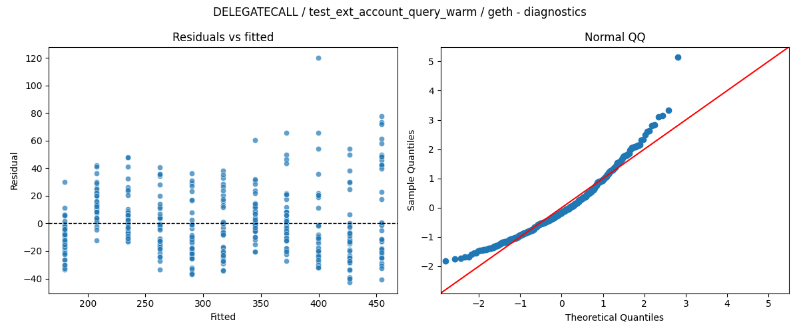

</details>

<details><summary>nethermind — NNLS regression summary</summary>

```
==============================================================================
                           NNLS Regression Results                            
==============================================================================
Dep. Variable:          test_runtime_ms              R-squared:          0.815
Model:                  NNLS                    Adj. R-squared:          0.815
No. Observations:       352                               RMSE:         109.42
Df Residuals:           350                                MAE:          80.95
Df Model:               1      
==============================================================================
                      coef     std err     P-value      [0.025      0.975]
------------------------------------------------------------------------------
         const    138.4533     17.5613       0.001    103.5961    174.4415
       opcount      0.0004      0.0000       0.001      0.0004      0.0005
==============================================================================
Notes: Non-negative least squares with bootstrap inference (1000 iterations)
==============================================================================
```

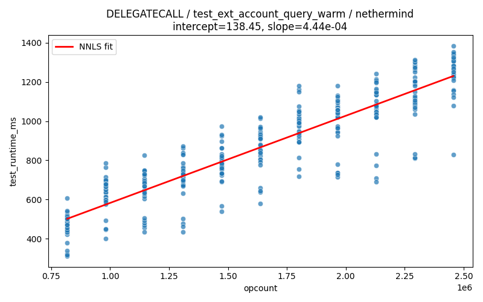

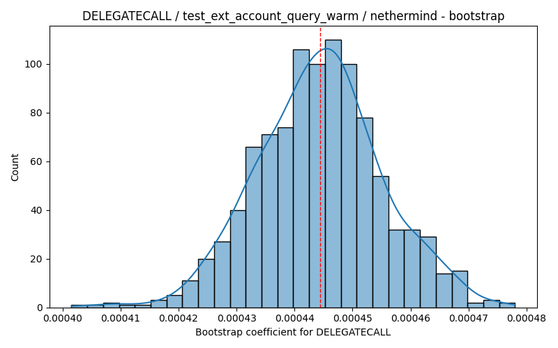

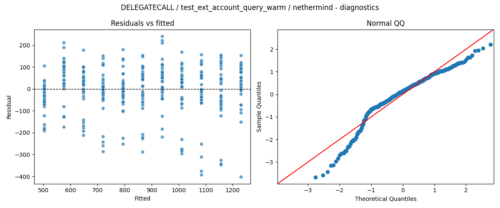

</details>

<details><summary>reth — NNLS regression summary</summary>

```
==============================================================================
                           NNLS Regression Results                            
==============================================================================
Dep. Variable:          test_runtime_ms              R-squared:          0.923
Model:                  NNLS                    Adj. R-squared:          0.922
No. Observations:       374                               RMSE:           8.16
Df Residuals:           372                                MAE:           6.30
Df Model:               1      
==============================================================================
                      coef     std err     P-value      [0.025      0.975]
------------------------------------------------------------------------------
         const     17.6888      1.2510       0.001     15.3152     20.1031
       opcount      0.0001      0.0000       0.001      0.0001      0.0001
==============================================================================
Notes: Non-negative least squares with bootstrap inference (1000 iterations)
==============================================================================
```

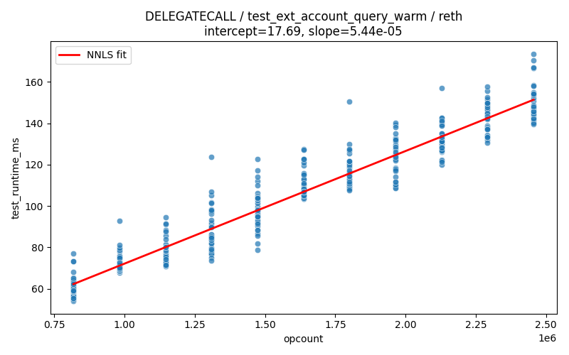

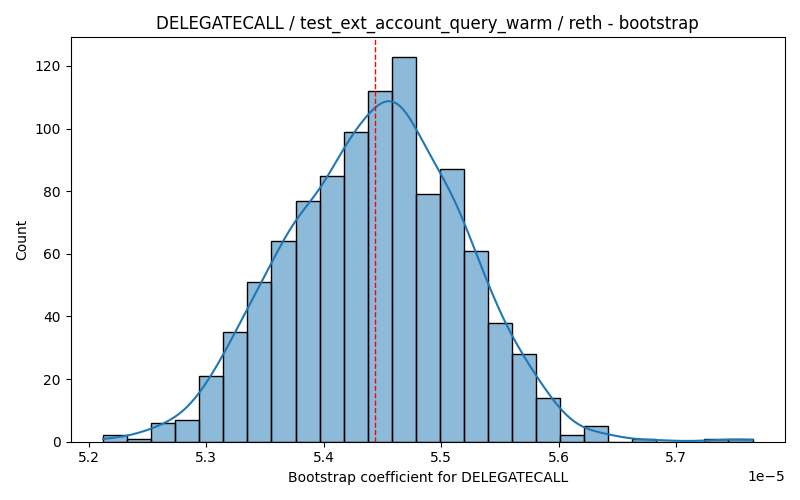

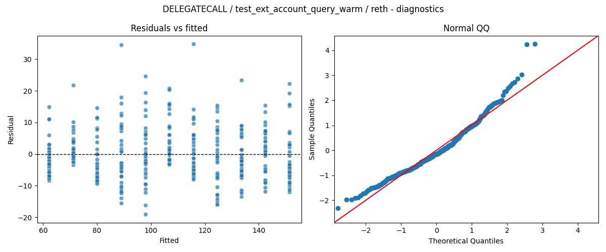

</details>

## EXTCODECOPY

### test_account_access — combo `EXTCODECOPY_AccountMode.NON_EXISTING_ACCOUNT` — `presets[cold_account_nocode_access]`

| client | nobs | R² | target_coef (ms) | p-value | 95% CI |
| --- | --- | --- | --- | --- | --- |
| `besu` | 341 | 0.4005 | 0.0003767 | 1.00e-03 | [0.0003318, 0.000421] |
| `erigon` | 198 | 0.9245 | 7.084e-05 | 1.00e-03 | [6.833e-05, 7.354e-05] |
| `ethrex` | 33 | 0.7292 | 3.185e-05 | 1.00e-03 | [2.461e-05, 3.879e-05] |
| `geth` | 407 | 0.9525 | 0.0003688 | 1.00e-03 | [0.0003612, 0.000377] |
| `nethermind` | 352 | 0.7013 | 0.000315 | 1.00e-03 | [0.0002931, 0.0003372] |
| `reth` | 374 | 0.7291 | 2.303e-05 | 1.00e-03 | [2.17e-05, 2.466e-05] |

<details><summary>besu — NNLS regression summary</summary>

```
==============================================================================
                           NNLS Regression Results                            
==============================================================================
Dep. Variable:          test_runtime_ms              R-squared:          0.400
Model:                  NNLS                    Adj. R-squared:          0.399
No. Observations:       341                               RMSE:         118.34
Df Residuals:           339                                MAE:          91.43
Df Model:               1      
==============================================================================
                      coef     std err     P-value      [0.025      0.975]
------------------------------------------------------------------------------
         const    311.7162     20.0610       0.001    273.7618    350.6152
       opcount      0.0004      0.0000       0.001      0.0003      0.0004
==============================================================================
Notes: Non-negative least squares with bootstrap inference (1000 iterations)
==============================================================================
```

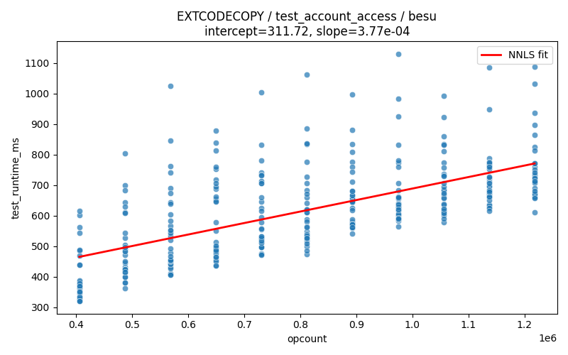

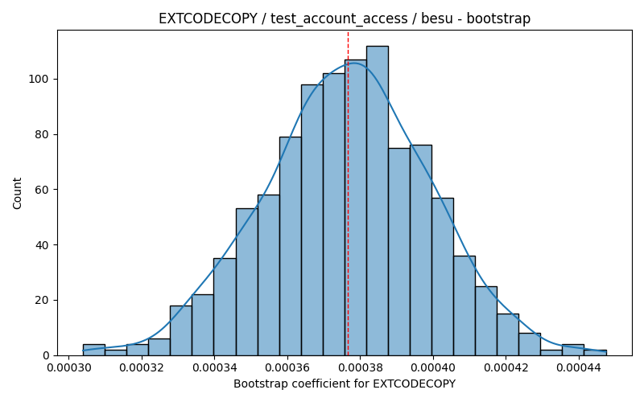

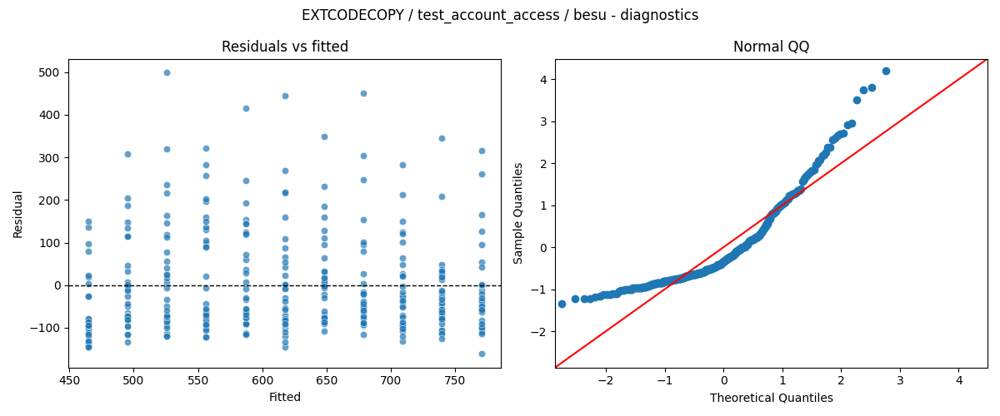

</details>

<details><summary>erigon — NNLS regression summary</summary>

```
==============================================================================
                           NNLS Regression Results                            
==============================================================================
Dep. Variable:          test_runtime_ms              R-squared:          0.924
Model:                  NNLS                    Adj. R-squared:          0.924
No. Observations:       198                               RMSE:           5.20
Df Residuals:           196                                MAE:           3.86
Df Model:               1      
==============================================================================
                      coef     std err     P-value      [0.025      0.975]
------------------------------------------------------------------------------
         const     23.8306      1.0167       0.001     21.9909     25.8043
       opcount      0.0001      0.0000       0.001      0.0001      0.0001
==============================================================================
Notes: Non-negative least squares with bootstrap inference (1000 iterations)
==============================================================================
```

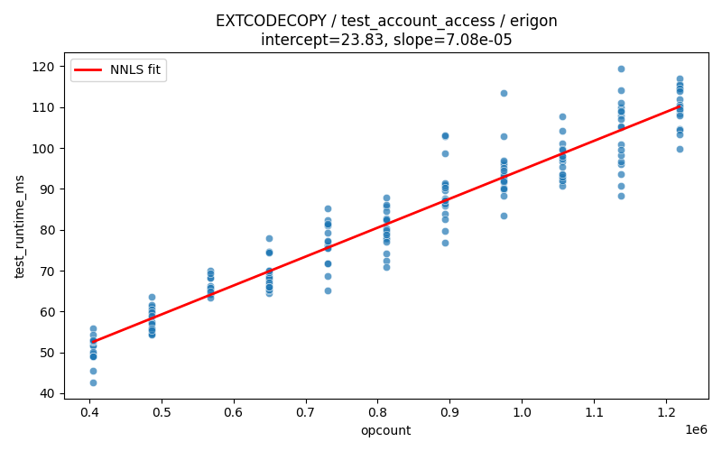

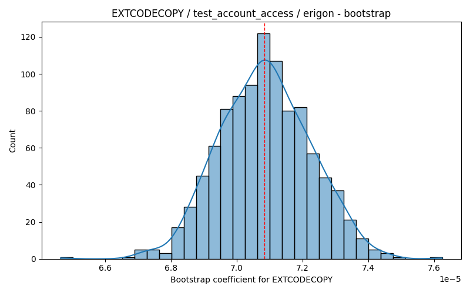

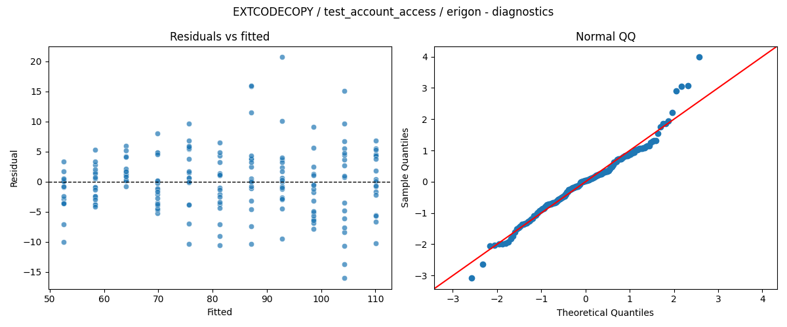

</details>

<details><summary>ethrex — NNLS regression summary</summary>

```
==============================================================================
                           NNLS Regression Results                            
==============================================================================
Dep. Variable:          test_runtime_ms              R-squared:          0.729
Model:                  NNLS                    Adj. R-squared:          0.720
No. Observations:       33                                RMSE:           4.98
Df Residuals:           31                                 MAE:           4.30
Df Model:               1      
==============================================================================
                      coef     std err     P-value      [0.025      0.975]
------------------------------------------------------------------------------
         const     12.0177      2.8508       0.001      6.9555     18.0709
       opcount      0.0000      0.0000       0.001      0.0000      0.0000
==============================================================================
Notes: Non-negative least squares with bootstrap inference (1000 iterations)
==============================================================================
```

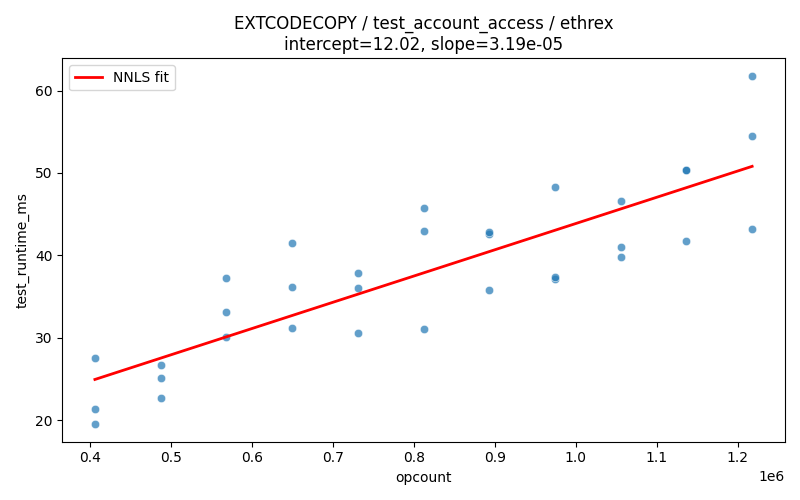

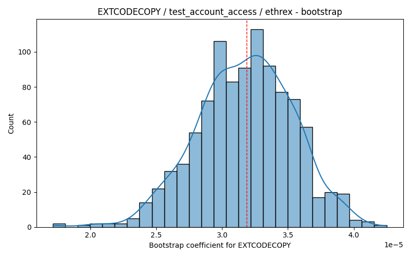

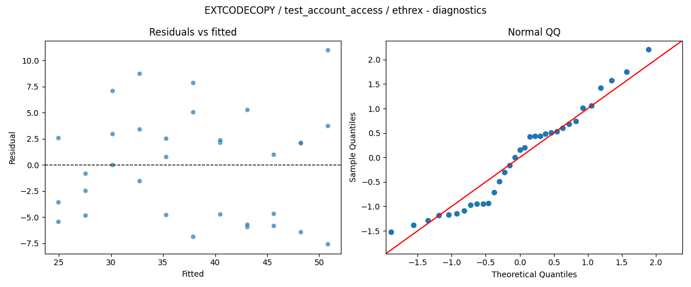

</details>

<details><summary>geth — NNLS regression summary</summary>

```
==============================================================================
                           NNLS Regression Results                            
==============================================================================
Dep. Variable:          test_runtime_ms              R-squared:          0.953
Model:                  NNLS                    Adj. R-squared:          0.952
No. Observations:       407                               RMSE:          21.14
Df Residuals:           405                                MAE:          16.15
Df Model:               1      
==============================================================================
                      coef     std err     P-value      [0.025      0.975]
------------------------------------------------------------------------------
         const     21.5969      3.1433       0.001     15.5266     27.5522
       opcount      0.0004      0.0000       0.001      0.0004      0.0004
==============================================================================
Notes: Non-negative least squares with bootstrap inference (1000 iterations)
==============================================================================
```

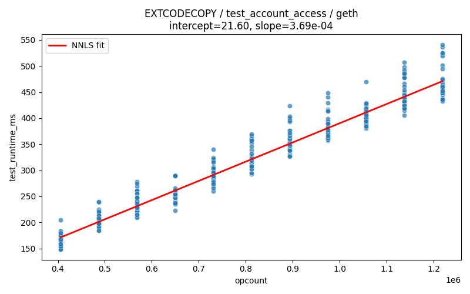

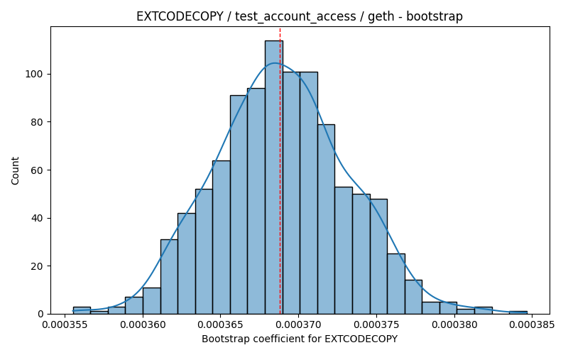

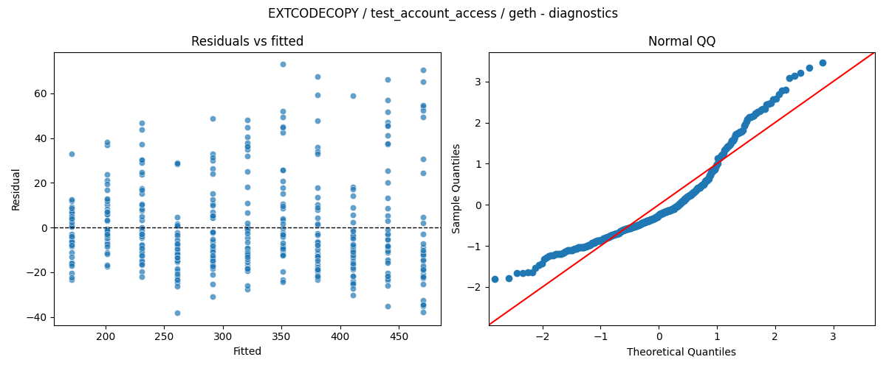

</details>

<details><summary>nethermind — NNLS regression summary</summary>

```
==============================================================================
                           NNLS Regression Results                            
==============================================================================
Dep. Variable:          test_runtime_ms              R-squared:          0.701
Model:                  NNLS                    Adj. R-squared:          0.700
No. Observations:       352                               RMSE:          52.78
Df Residuals:           350                                MAE:          40.63
Df Model:               1      
==============================================================================
                      coef     std err     P-value      [0.025      0.975]
------------------------------------------------------------------------------
         const    121.6081      8.2687       0.001    106.5971    138.7003
       opcount      0.0003      0.0000       0.001      0.0003      0.0003
==============================================================================
Notes: Non-negative least squares with bootstrap inference (1000 iterations)
==============================================================================
```

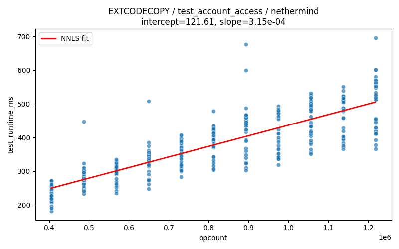


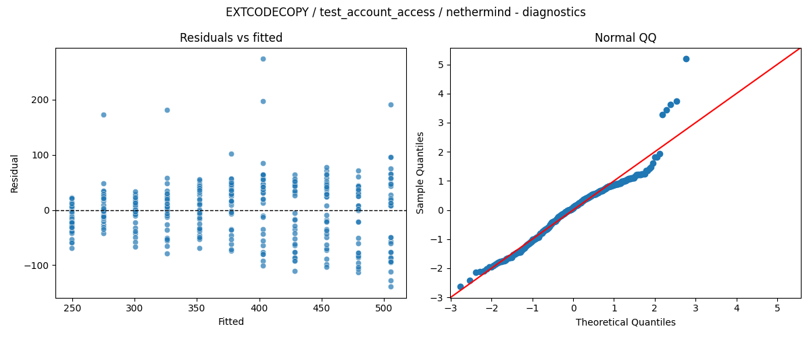

</details>

<details><summary>reth — NNLS regression summary</summary>

```
==============================================================================
                           NNLS Regression Results                            
==============================================================================
Dep. Variable:          test_runtime_ms              R-squared:          0.729
Model:                  NNLS                    Adj. R-squared:          0.728
No. Observations:       374                               RMSE:           3.60
Df Residuals:           372                                MAE:           2.36
Df Model:               1      
==============================================================================
                      coef     std err     P-value      [0.025      0.975]
------------------------------------------------------------------------------
         const      5.3855      0.5208       0.001      4.2530      6.3756
       opcount      0.0000      0.0000       0.001      0.0000      0.0000
==============================================================================
Notes: Non-negative least squares with bootstrap inference (1000 iterations)
==============================================================================
```

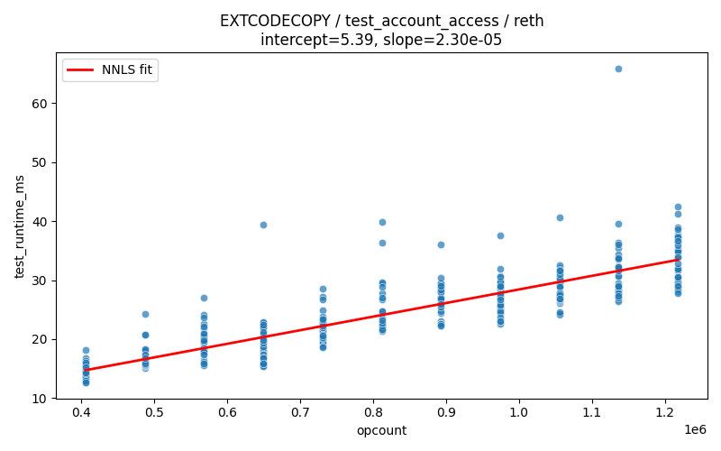

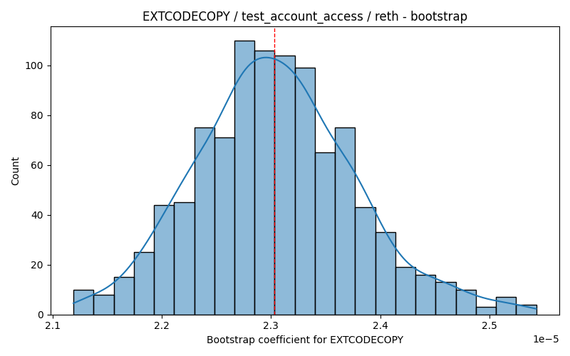

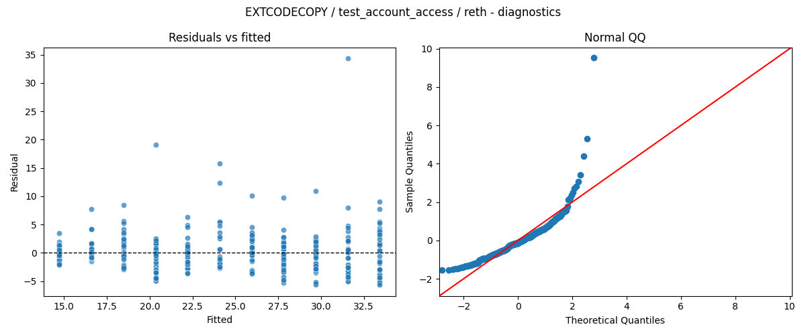

</details>

### test_account_access — combo `EXTCODECOPY_AccountMode.EXISTING_CONTRACT`

| client | nobs | R² | target_coef (ms) | p-value | 95% CI |
| --- | --- | --- | --- | --- | --- |
| `besu` | 341 | 0.5654 | 0.002137 | 1.00e-03 | [0.001965, 0.002311] |
| `erigon` | 198 | 0.9522 | 0.0003091 | 1.00e-03 | [0.0002993, 0.0003195] |
| `ethrex` | 33 | 0.8147 | 0.0002295 | 1.00e-03 | [0.0001823, 0.0002756] |
| `geth` | 407 | 0.9355 | 0.0007868 | 1.00e-03 | [0.0007658, 0.0008082] |
| `nethermind` | 352 | 0.8698 | 0.001243 | 1.00e-03 | [0.001189, 0.001294] |
| `reth` | 374 | 0.827 | 0.0001132 | 1.00e-03 | [0.0001085, 0.0001187] |

<details><summary>besu — NNLS regression summary</summary>

```
==============================================================================
                           NNLS Regression Results                            
==============================================================================
Dep. Variable:          test_runtime_ms              R-squared:          0.565
Model:                  NNLS                    Adj. R-squared:          0.564
No. Observations:       341                               RMSE:         185.10
Df Residuals:           339                                MAE:         151.04
Df Model:               1      
==============================================================================
                      coef     std err     P-value      [0.025      0.975]
------------------------------------------------------------------------------
         const    492.6882     29.5945       0.001    435.0946    552.2958
       opcount      0.0021      0.0001       0.001      0.0020      0.0023
==============================================================================
Notes: Non-negative least squares with bootstrap inference (1000 iterations)
==============================================================================
```

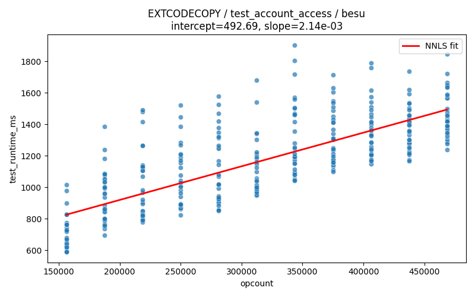

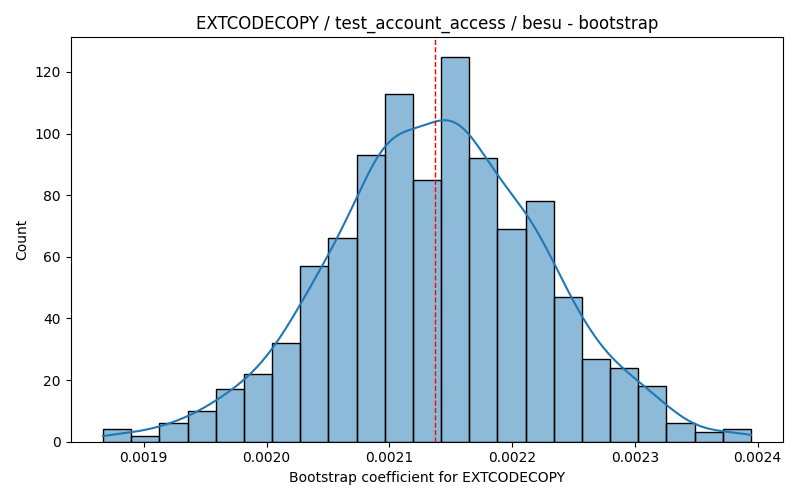

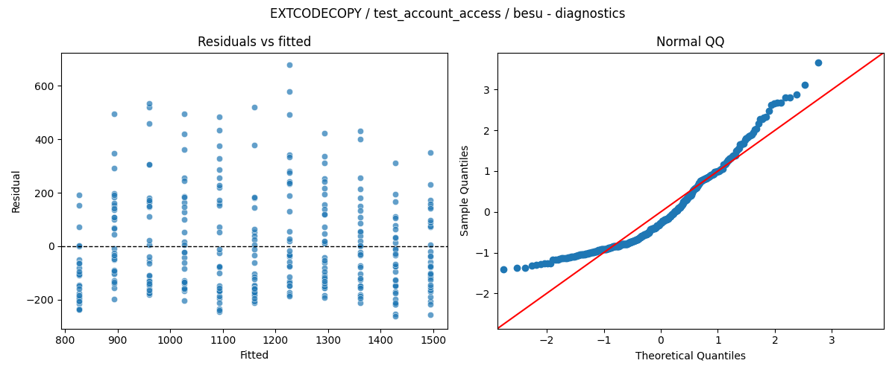

</details>

<details><summary>erigon — NNLS regression summary</summary>

```
==============================================================================
                           NNLS Regression Results                            
==============================================================================
Dep. Variable:          test_runtime_ms              R-squared:          0.952
Model:                  NNLS                    Adj. R-squared:          0.952
No. Observations:       198                               RMSE:           6.84
Df Residuals:           196                                MAE:           5.47
Df Model:               1      
==============================================================================
                      coef     std err     P-value      [0.025      0.975]
------------------------------------------------------------------------------
         const     34.8739      1.5375       0.001     31.8857     37.9183
       opcount      0.0003      0.0000       0.001      0.0003      0.0003
==============================================================================
Notes: Non-negative least squares with bootstrap inference (1000 iterations)
==============================================================================
```

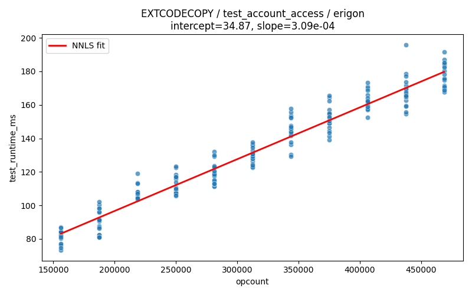

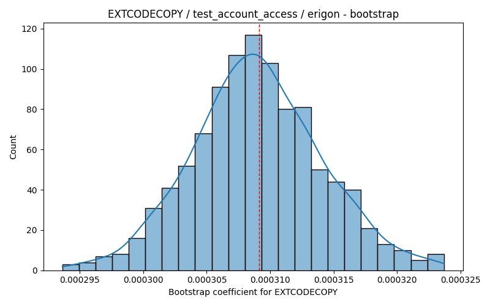

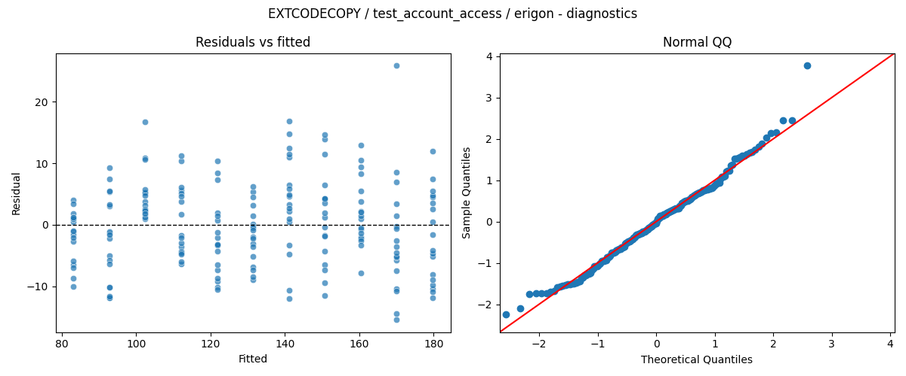

</details>

<details><summary>ethrex — NNLS regression summary</summary>

```
==============================================================================
                           NNLS Regression Results                            
==============================================================================
Dep. Variable:          test_runtime_ms              R-squared:          0.815
Model:                  NNLS                    Adj. R-squared:          0.809
No. Observations:       33                                RMSE:          10.81
Df Residuals:           31                                 MAE:           7.94
Df Model:               1      
==============================================================================
                      coef     std err     P-value      [0.025      0.975]
------------------------------------------------------------------------------
         const     18.4524      7.8709       0.002      4.3273     33.8933
       opcount      0.0002      0.0000       0.001      0.0002      0.0003
==============================================================================
Notes: Non-negative least squares with bootstrap inference (1000 iterations)
==============================================================================
```

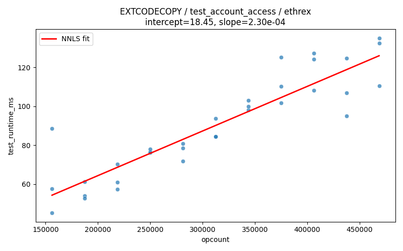

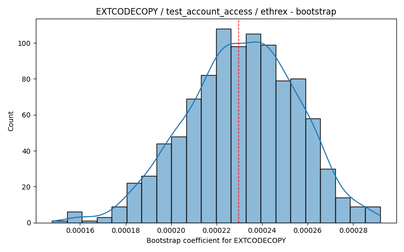

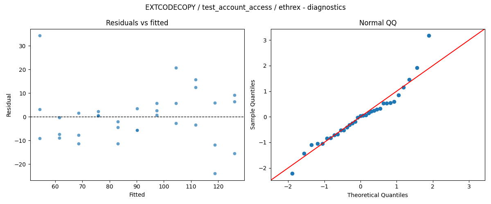

</details>

<details><summary>geth — NNLS regression summary</summary>

```
==============================================================================
                           NNLS Regression Results                            
==============================================================================
Dep. Variable:          test_runtime_ms              R-squared:          0.936
Model:                  NNLS                    Adj. R-squared:          0.935
No. Observations:       407                               RMSE:          20.41
Df Residuals:           405                                MAE:          16.15
Df Model:               1      
==============================================================================
                      coef     std err     P-value      [0.025      0.975]
------------------------------------------------------------------------------
         const     52.3693      3.1645       0.001     46.2109     58.9903
       opcount      0.0008      0.0000       0.001      0.0008      0.0008
==============================================================================
Notes: Non-negative least squares with bootstrap inference (1000 iterations)
==============================================================================
```

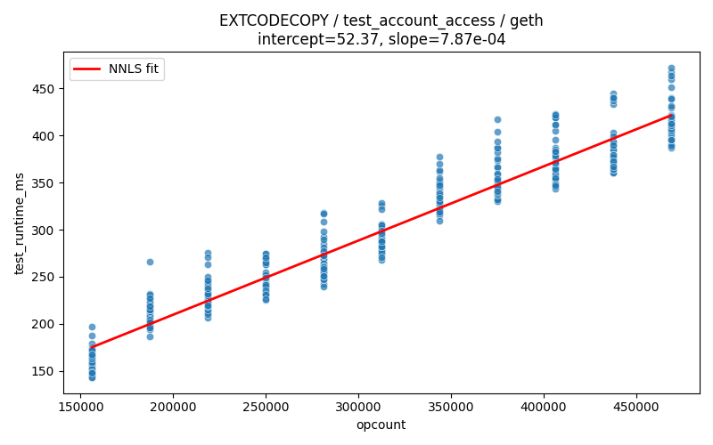

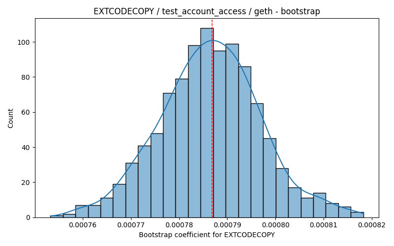

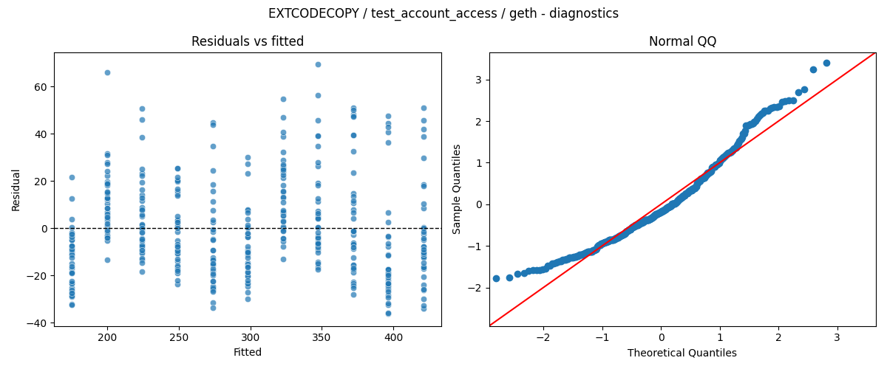

</details>

<details><summary>nethermind — NNLS regression summary</summary>

```
==============================================================================
                           NNLS Regression Results                            
==============================================================================
Dep. Variable:          test_runtime_ms              R-squared:          0.870
Model:                  NNLS                    Adj. R-squared:          0.869
No. Observations:       352                               RMSE:          47.49
Df Residuals:           350                                MAE:          35.81
Df Model:               1      
==============================================================================
                      coef     std err     P-value      [0.025      0.975]
------------------------------------------------------------------------------
         const    165.9385      8.2090       0.001    150.0381    182.1013
       opcount      0.0012      0.0000       0.001      0.0012      0.0013
==============================================================================
Notes: Non-negative least squares with bootstrap inference (1000 iterations)
==============================================================================
```

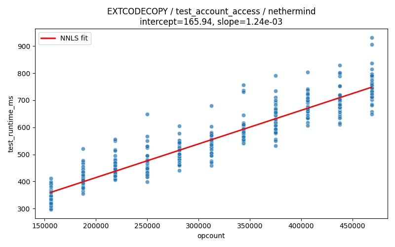

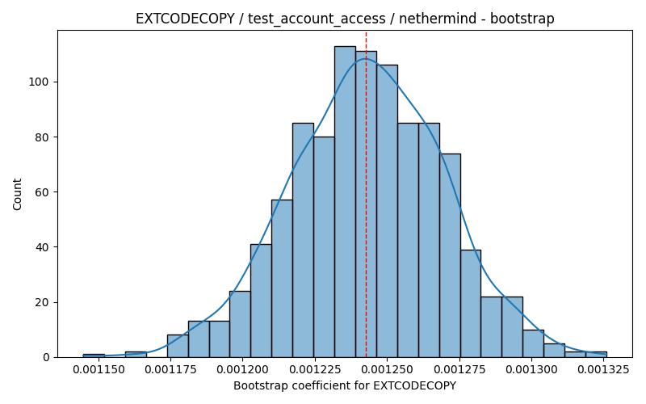

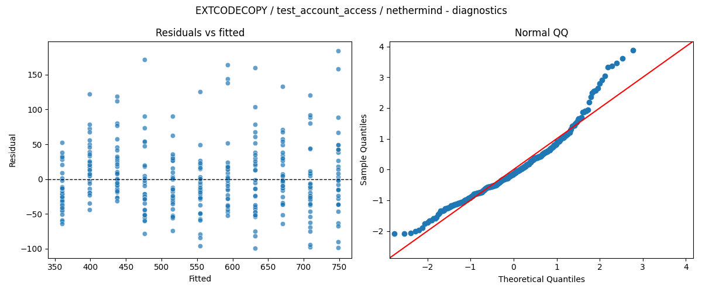

</details>

<details><summary>reth — NNLS regression summary</summary>

```
==============================================================================
                           NNLS Regression Results                            
==============================================================================
Dep. Variable:          test_runtime_ms              R-squared:          0.827
Model:                  NNLS                    Adj. R-squared:          0.827
No. Observations:       374                               RMSE:           5.12
Df Residuals:           372                                MAE:           3.90
Df Model:               1      
==============================================================================
                      coef     std err     P-value      [0.025      0.975]
------------------------------------------------------------------------------
         const      9.8777      0.8173       0.001      8.2424     11.3013
       opcount      0.0001      0.0000       0.001      0.0001      0.0001
==============================================================================
Notes: Non-negative least squares with bootstrap inference (1000 iterations)
==============================================================================
```

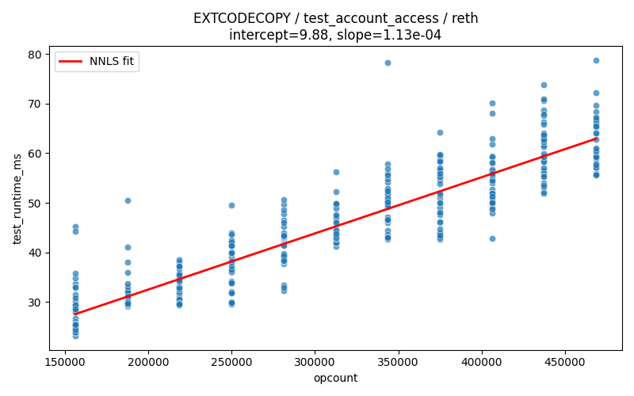

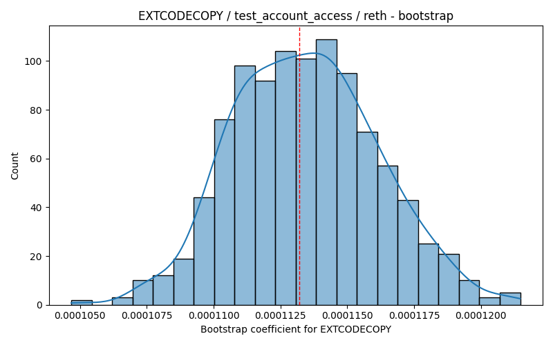

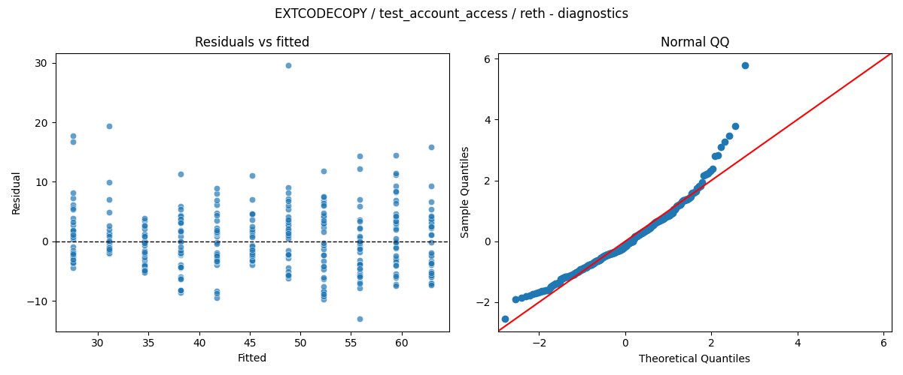

</details>

### test_account_access — combo `EXTCODECOPY_AccountMode.NON_EXISTING_ACCOUNT` — `presets[cold_account_code_access]`

| client | nobs | R² | target_coef (ms) | p-value | 95% CI |
| --- | --- | --- | --- | --- | --- |
| `besu` | 341 | 0.4005 | 0.0003767 | 1.00e-03 | [0.0003318, 0.000421] |
| `erigon` | 198 | 0.9245 | 7.084e-05 | 1.00e-03 | [6.833e-05, 7.354e-05] |
| `ethrex` | 33 | 0.7292 | 3.185e-05 | 1.00e-03 | [2.461e-05, 3.879e-05] |
| `geth` | 407 | 0.9525 | 0.0003688 | 1.00e-03 | [0.0003612, 0.000377] |
| `nethermind` | 352 | 0.7013 | 0.000315 | 1.00e-03 | [0.0002931, 0.0003372] |
| `reth` | 374 | 0.7291 | 2.303e-05 | 1.00e-03 | [2.17e-05, 2.466e-05] |

<details><summary>besu — NNLS regression summary</summary>

```
==============================================================================
                           NNLS Regression Results                            
==============================================================================
Dep. Variable:          test_runtime_ms              R-squared:          0.400
Model:                  NNLS                    Adj. R-squared:          0.399
No. Observations:       341                               RMSE:         118.34
Df Residuals:           339                                MAE:          91.43
Df Model:               1      
==============================================================================
                      coef     std err     P-value      [0.025      0.975]
------------------------------------------------------------------------------
         const    311.7162     20.0610       0.001    273.7618    350.6152
       opcount      0.0004      0.0000       0.001      0.0003      0.0004
==============================================================================
Notes: Non-negative least squares with bootstrap inference (1000 iterations)
==============================================================================
```


</details>

<details><summary>erigon — NNLS regression summary</summary>

```
==============================================================================
                           NNLS Regression Results                            
==============================================================================
Dep. Variable:          test_runtime_ms              R-squared:          0.924
Model:                  NNLS                    Adj. R-squared:          0.924
No. Observations:       198                               RMSE:           5.20
Df Residuals:           196                                MAE:           3.86
Df Model:               1      
==============================================================================
                      coef     std err     P-value      [0.025      0.975]
------------------------------------------------------------------------------
         const     23.8306      1.0167       0.001     21.9909     25.8043
       opcount      0.0001      0.0000       0.001      0.0001      0.0001
==============================================================================
Notes: Non-negative least squares with bootstrap inference (1000 iterations)
==============================================================================
```


</details>

<details><summary>ethrex — NNLS regression summary</summary>

```
==============================================================================
                           NNLS Regression Results                            
==============================================================================
Dep. Variable:          test_runtime_ms              R-squared:          0.729
Model:                  NNLS                    Adj. R-squared:          0.720
No. Observations:       33                                RMSE:           4.98
Df Residuals:           31                                 MAE:           4.30
Df Model:               1      
==============================================================================
                      coef     std err     P-value      [0.025      0.975]
------------------------------------------------------------------------------
         const     12.0177      2.8508       0.001      6.9555     18.0709
       opcount      0.0000      0.0000       0.001      0.0000      0.0000
==============================================================================
Notes: Non-negative least squares with bootstrap inference (1000 iterations)
==============================================================================
```


</details>

<details><summary>geth — NNLS regression summary</summary>

```
==============================================================================
                           NNLS Regression Results                            
==============================================================================
Dep. Variable:          test_runtime_ms              R-squared:          0.953
Model:                  NNLS                    Adj. R-squared:          0.952
No. Observations:       407                               RMSE:          21.14
Df Residuals:           405                                MAE:          16.15
Df Model:               1      
==============================================================================
                      coef     std err     P-value      [0.025      0.975]
------------------------------------------------------------------------------
         const     21.5969      3.1433       0.001     15.5266     27.5522
       opcount      0.0004      0.0000       0.001      0.0004      0.0004
==============================================================================
Notes: Non-negative least squares with bootstrap inference (1000 iterations)
==============================================================================
```


</details>

<details><summary>nethermind — NNLS regression summary</summary>

```
==============================================================================
                           NNLS Regression Results                            
==============================================================================
Dep. Variable:          test_runtime_ms              R-squared:          0.701
Model:                  NNLS                    Adj. R-squared:          0.700
No. Observations:       352                               RMSE:          52.78
Df Residuals:           350                                MAE:          40.63
Df Model:               1      
==============================================================================
                      coef     std err     P-value      [0.025      0.975]
------------------------------------------------------------------------------
         const    121.6081      8.2687       0.001    106.5971    138.7003
       opcount      0.0003      0.0000       0.001      0.0003      0.0003
==============================================================================
Notes: Non-negative least squares with bootstrap inference (1000 iterations)
==============================================================================
```


</details>

<details><summary>reth — NNLS regression summary</summary>

```
==============================================================================
                           NNLS Regression Results                            
==============================================================================
Dep. Variable:          test_runtime_ms              R-squared:          0.729
Model:                  NNLS                    Adj. R-squared:          0.728
No. Observations:       374                               RMSE:           3.60
Df Residuals:           372                                MAE:           2.36
Df Model:               1      
==============================================================================
                      coef     std err     P-value      [0.025      0.975]
------------------------------------------------------------------------------
         const      5.3855      0.5208       0.001      4.2530      6.3756
       opcount      0.0000      0.0000       0.001      0.0000      0.0000
==============================================================================
Notes: Non-negative least squares with bootstrap inference (1000 iterations)
==============================================================================
```


</details>

## EXTCODEHASH

### test_account_access — combo `EXTCODEHASH_AccountMode.NON_EXISTING_ACCOUNT` — `presets[cold_account_nocode_access]`

| client | nobs | R² | target_coef (ms) | p-value | 95% CI |
| --- | --- | --- | --- | --- | --- |
| `besu` | 341 | 0.7784 | 0.01362 | 1.00e-03 | [0.01279, 0.01438] |
| `erigon` | 198 | 0.9619 | 0.007859 | 1.00e-03 | [0.007701, 0.007934] |
| `ethrex` | 33 | 0.9925 | 0.002734 | 1.00e-03 | [0.002703, 0.002762] |
| `geth` | 407 | 0.869 | 0.02177 | 1.00e-03 | [0.0209, 0.02262] |
| `nethermind` | 352 | 0.9293 | 0.003451 | 1.00e-03 | [0.003336, 0.003557] |
| `reth` | 374 | 0.9669 | 0.0008906 | 1.00e-03 | [0.0008724, 0.0009067] |

<details><summary>besu — NNLS regression summary</summary>

```
==============================================================================
                           NNLS Regression Results                            
==============================================================================
Dep. Variable:          test_runtime_ms              R-squared:          0.778
Model:                  NNLS                    Adj. R-squared:          0.778
No. Observations:       341                               RMSE:         173.65
Df Residuals:           339                                MAE:         161.28
Df Model:               1      
==============================================================================
                      coef     std err     P-value      [0.025      0.975]
------------------------------------------------------------------------------
         const    532.9087     29.2460       0.001    479.0194    594.8288
       opcount      0.0136      0.0004       0.001      0.0128      0.0144
==============================================================================
Notes: Non-negative least squares with bootstrap inference (1000 iterations)
==============================================================================
```

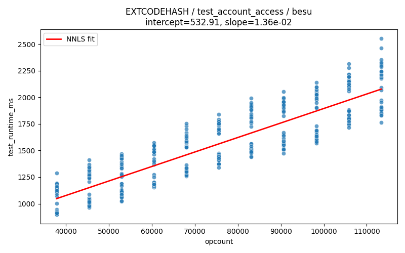

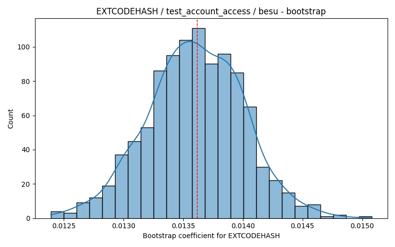

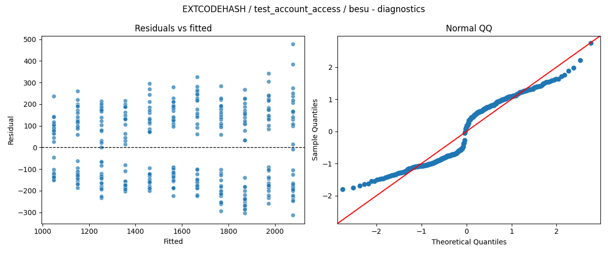

</details>

<details><summary>erigon — NNLS regression summary</summary>

```
==============================================================================
                           NNLS Regression Results                            
==============================================================================
Dep. Variable:          test_runtime_ms              R-squared:          0.962
Model:                  NNLS                    Adj. R-squared:          0.962
No. Observations:       198                               RMSE:          37.65
Df Residuals:           196                                MAE:          33.16
Df Model:               1      
==============================================================================
                      coef     std err     P-value      [0.025      0.975]
------------------------------------------------------------------------------
         const      0.0000      2.7087       1.000      0.0000      9.5027
       opcount      0.0079      0.0001       0.001      0.0077      0.0079
==============================================================================
Notes: Non-negative least squares with bootstrap inference (1000 iterations)
==============================================================================
```

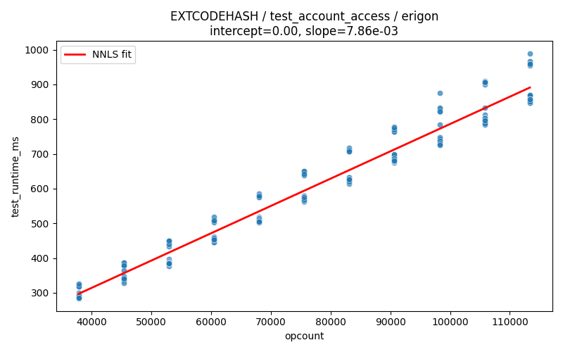

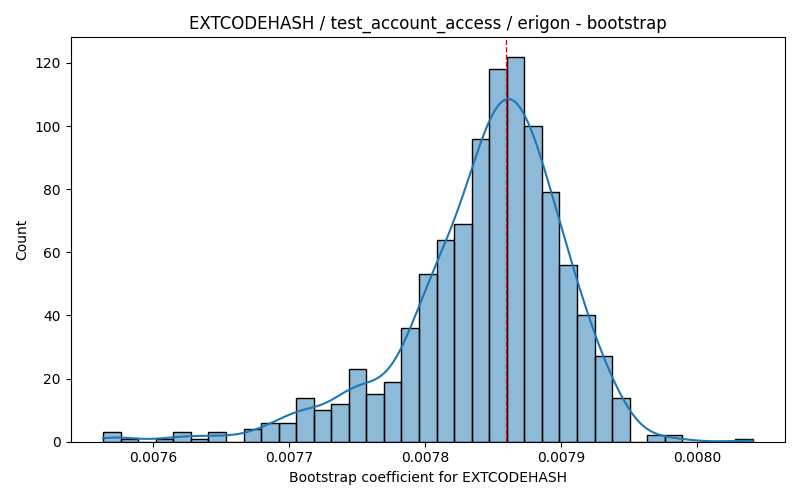

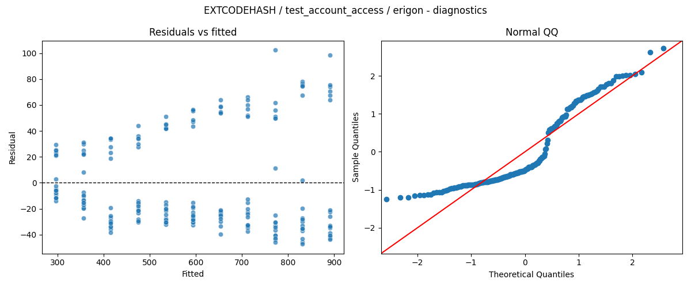

</details>

<details><summary>ethrex — NNLS regression summary</summary>

```
==============================================================================
                           NNLS Regression Results                            
==============================================================================
Dep. Variable:          test_runtime_ms              R-squared:          0.992
Model:                  NNLS                    Adj. R-squared:          0.992
No. Observations:       33                                RMSE:           5.80
Df Residuals:           31                                 MAE:           4.61
Df Model:               1      
==============================================================================
                      coef     std err     P-value      [0.025      0.975]
------------------------------------------------------------------------------
         const      0.0000      0.4676       1.000      0.0000      1.4821
       opcount      0.0027      0.0000       0.001      0.0027      0.0028
==============================================================================
Notes: Non-negative least squares with bootstrap inference (1000 iterations)
==============================================================================
```

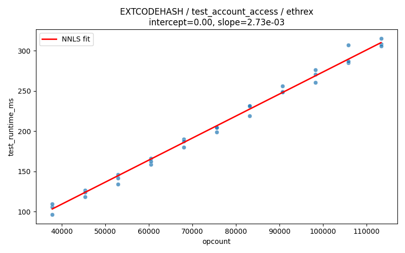

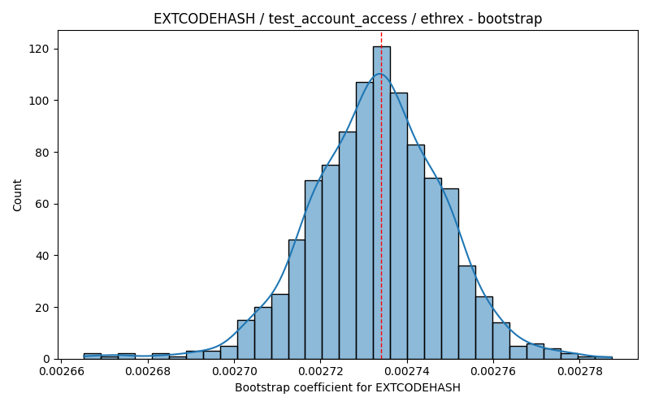

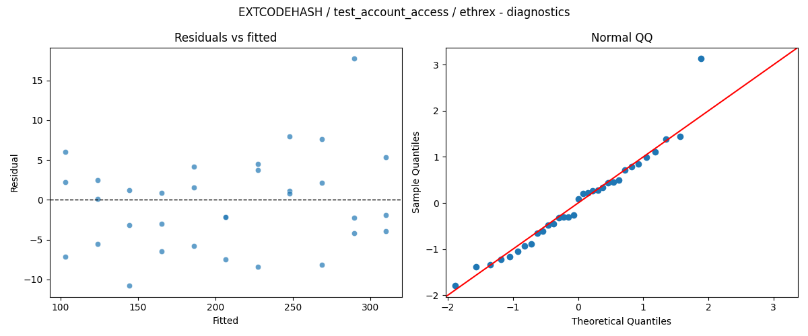

</details>

<details><summary>geth — NNLS regression summary</summary>

```
==============================================================================
                           NNLS Regression Results                            
==============================================================================
Dep. Variable:          test_runtime_ms              R-squared:          0.869
Model:                  NNLS                    Adj. R-squared:          0.869
No. Observations:       407                               RMSE:         202.03
Df Residuals:           405                                MAE:         172.68
Df Model:               1      
==============================================================================
                      coef     std err     P-value      [0.025      0.975]
------------------------------------------------------------------------------
         const    768.7265     37.9368       0.001    697.5919    847.2470
       opcount      0.0218      0.0004       0.001      0.0209      0.0226
==============================================================================
Notes: Non-negative least squares with bootstrap inference (1000 iterations)
==============================================================================
```

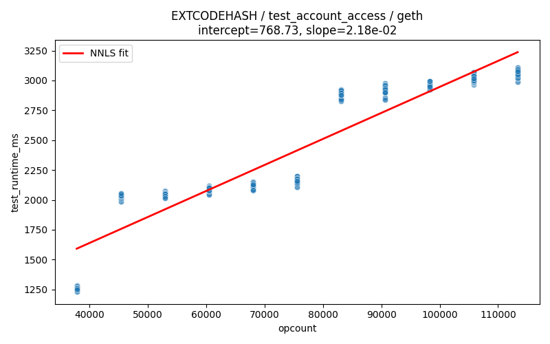

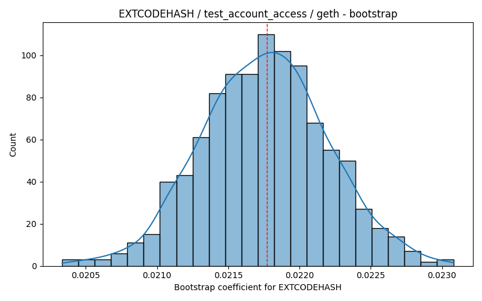

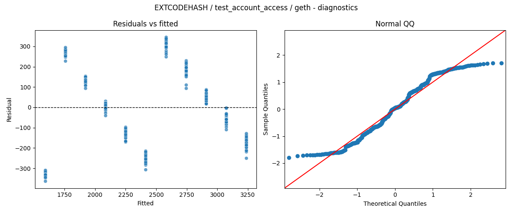

</details>

<details><summary>nethermind — NNLS regression summary</summary>

```
==============================================================================
                           NNLS Regression Results                            
==============================================================================
Dep. Variable:          test_runtime_ms              R-squared:          0.929
Model:                  NNLS                    Adj. R-squared:          0.929
No. Observations:       352                               RMSE:          22.75
Df Residuals:           350                                MAE:          15.01
Df Model:               1      
==============================================================================
                      coef     std err     P-value      [0.025      0.975]
------------------------------------------------------------------------------
         const     78.3339      4.6492       0.001     69.9506     87.8572
       opcount      0.0035      0.0001       0.001      0.0033      0.0036
==============================================================================
Notes: Non-negative least squares with bootstrap inference (1000 iterations)
==============================================================================
```

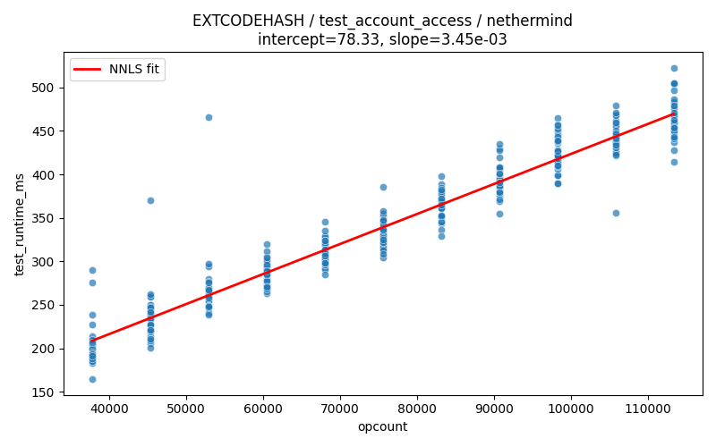

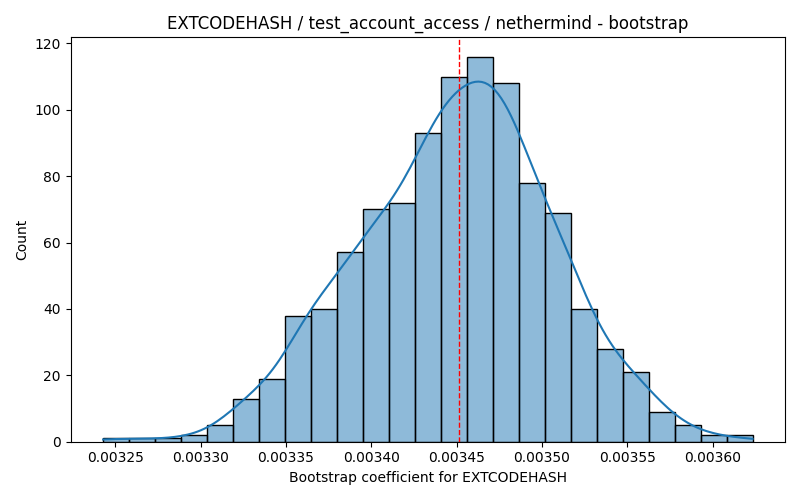

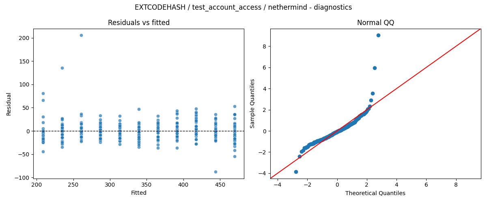

</details>

<details><summary>reth — NNLS regression summary</summary>

```
==============================================================================
                           NNLS Regression Results                            
==============================================================================
Dep. Variable:          test_runtime_ms              R-squared:          0.967
Model:                  NNLS                    Adj. R-squared:          0.967
No. Observations:       374                               RMSE:           3.94
Df Residuals:           372                                MAE:           3.03
Df Model:               1      
==============================================================================
                      coef     std err     P-value      [0.025      0.975]
------------------------------------------------------------------------------
         const     42.9376      0.7047       0.001     41.6917     44.3826
       opcount      0.0009      0.0000       0.001      0.0009      0.0009
==============================================================================
Notes: Non-negative least squares with bootstrap inference (1000 iterations)
==============================================================================
```

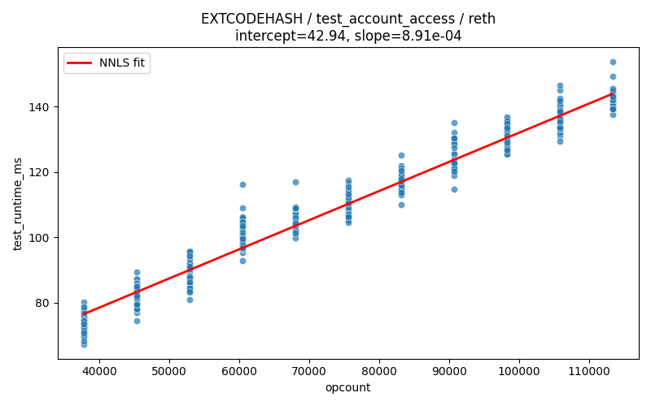

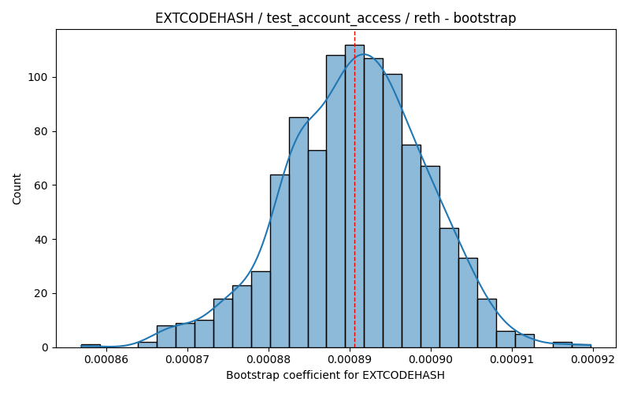

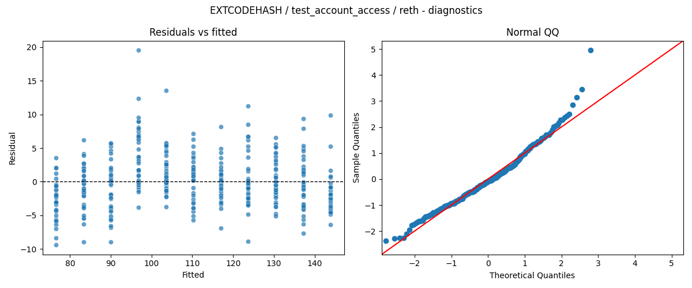

</details>

### test_account_access — combo `EXTCODEHASH_AccountMode.EXISTING_CONTRACT`

| client | nobs | R² | target_coef (ms) | p-value | 95% CI |
| --- | --- | --- | --- | --- | --- |
| `besu` | 341 | 0.8512 | 0.02891 | 1.00e-03 | [0.02771, 0.03014] |
| `erigon` | 198 | 0.9104 | 0.03376 | 1.00e-03 | [0.03238, 0.0351] |
| `ethrex` | 33 | 0.982 | 0.01803 | 1.00e-03 | [0.01712, 0.01895] |
| `geth` | 407 | 0.8681 | 0.02318 | 1.00e-03 | [0.02221, 0.02411] |
| `nethermind` | 352 | 0.8218 | 0.01858 | 1.00e-03 | [0.01763, 0.0195] |
| `reth` | 374 | 0.882 | 0.01817 | 1.00e-03 | [0.01751, 0.01894] |

<details><summary>besu — NNLS regression summary</summary>

```
==============================================================================
                           NNLS Regression Results                            
==============================================================================
Dep. Variable:          test_runtime_ms              R-squared:          0.851
Model:                  NNLS                    Adj. R-squared:          0.851
No. Observations:       341                               RMSE:         251.44
Df Residuals:           339                                MAE:         227.56
Df Model:               1      
==============================================================================
                      coef     std err     P-value      [0.025      0.975]
------------------------------------------------------------------------------
         const    538.4011     37.2754       0.001    462.7099    613.8656
       opcount      0.0289      0.0006       0.001      0.0277      0.0301
==============================================================================
Notes: Non-negative least squares with bootstrap inference (1000 iterations)
==============================================================================
```

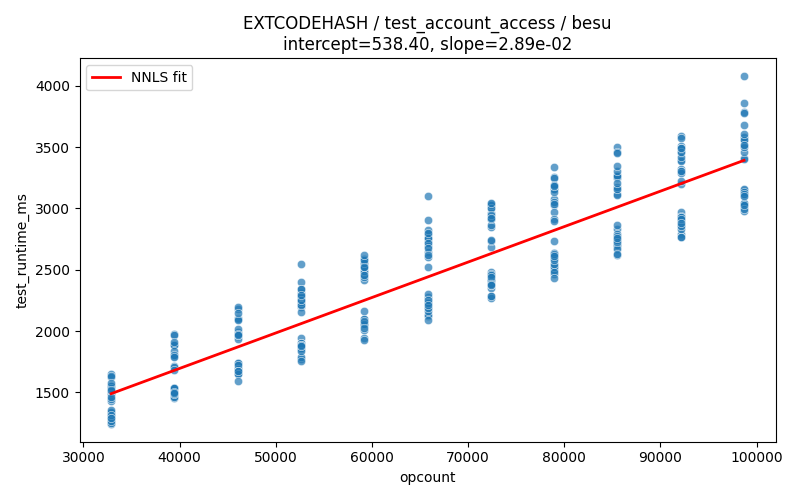

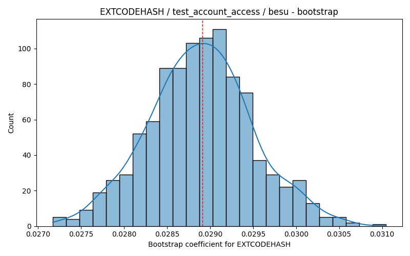

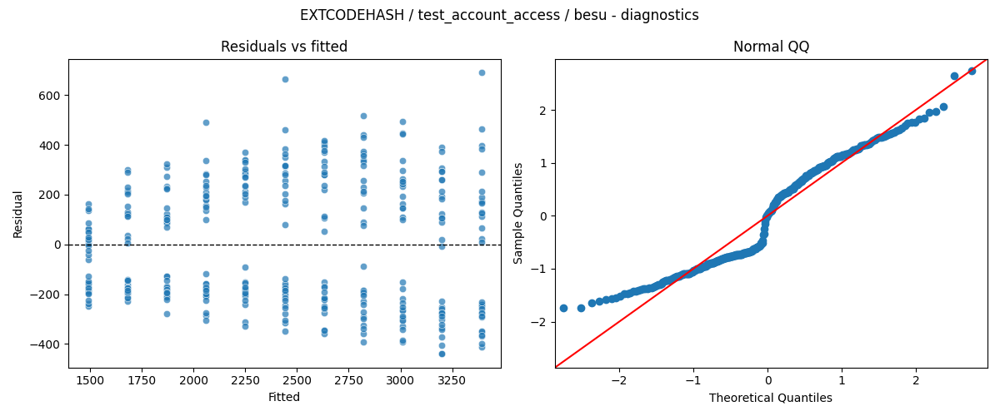

</details>

<details><summary>erigon — NNLS regression summary</summary>

```
==============================================================================
                           NNLS Regression Results                            
==============================================================================
Dep. Variable:          test_runtime_ms              R-squared:          0.910
Model:                  NNLS                    Adj. R-squared:          0.910
No. Observations:       198                               RMSE:         220.40
Df Residuals:           196                                MAE:         191.67
Df Model:               1      
==============================================================================
                      coef     std err     P-value      [0.025      0.975]
------------------------------------------------------------------------------
         const    257.1232     53.3461       0.001    154.6453    364.6523
       opcount      0.0338      0.0007       0.001      0.0324      0.0351
==============================================================================
Notes: Non-negative least squares with bootstrap inference (1000 iterations)
==============================================================================
```

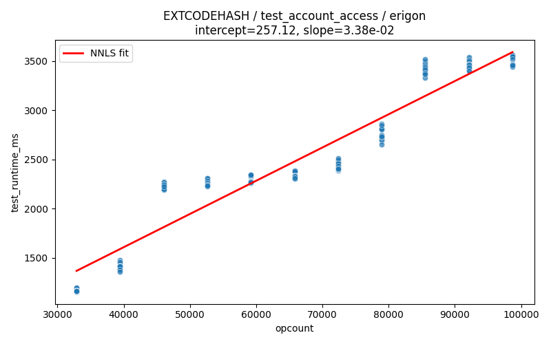

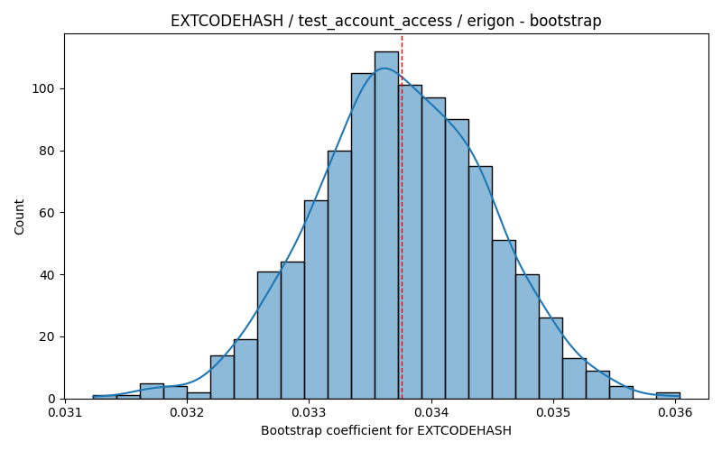

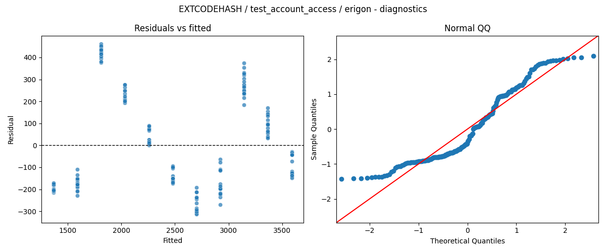

</details>

<details><summary>ethrex — NNLS regression summary</summary>

```
==============================================================================
                           NNLS Regression Results                            
==============================================================================
Dep. Variable:          test_runtime_ms              R-squared:          0.982
Model:                  NNLS                    Adj. R-squared:          0.981
No. Observations:       33                                RMSE:          50.85
Df Residuals:           31                                 MAE:          46.13
Df Model:               1      
==============================================================================
                      coef     std err     P-value      [0.025      0.975]
------------------------------------------------------------------------------
         const    146.7922     33.6122       0.001     83.9464    216.3327
       opcount      0.0180      0.0005       0.001      0.0171      0.0190
==============================================================================
Notes: Non-negative least squares with bootstrap inference (1000 iterations)
==============================================================================
```

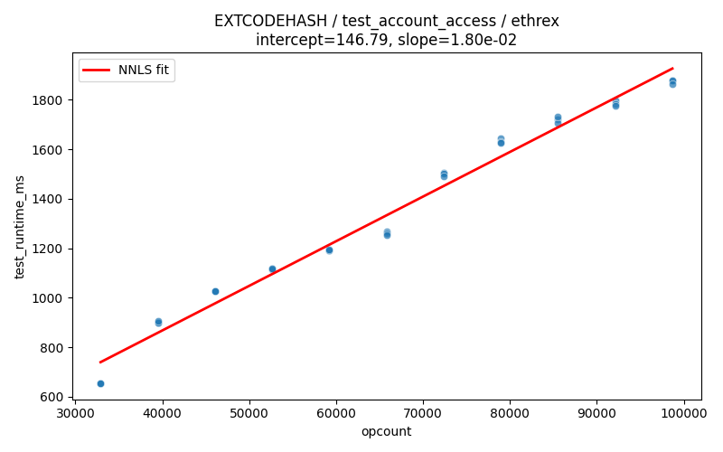

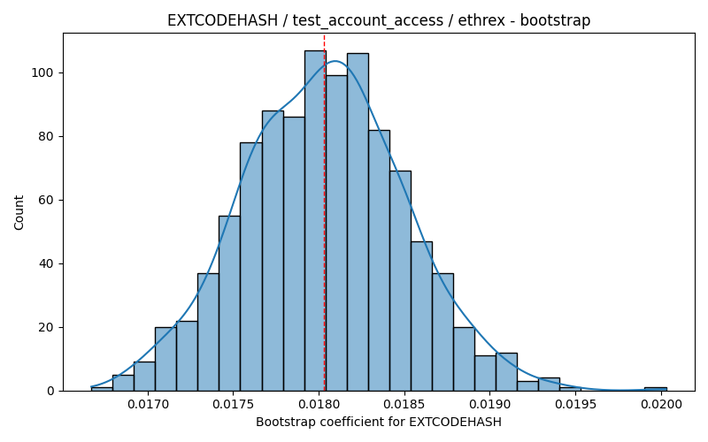

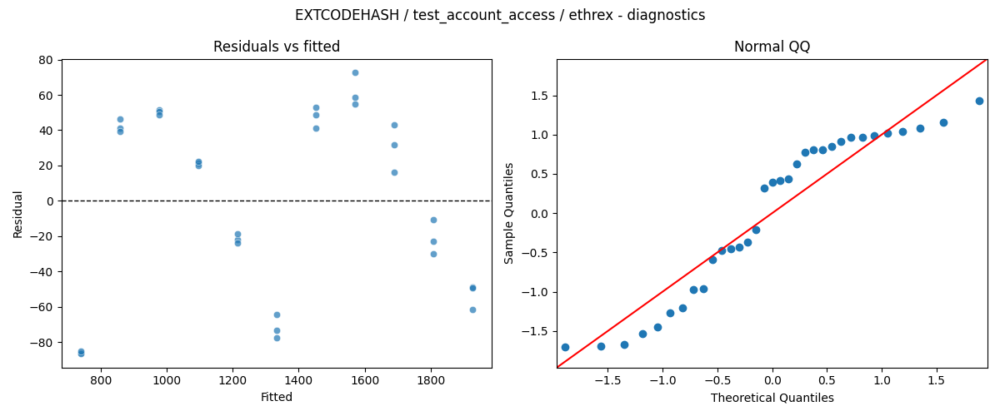

</details>

<details><summary>geth — NNLS regression summary</summary>

```
==============================================================================
                           NNLS Regression Results                            
==============================================================================
Dep. Variable:          test_runtime_ms              R-squared:          0.868
Model:                  NNLS                    Adj. R-squared:          0.868
No. Observations:       407                               RMSE:         187.95
Df Residuals:           405                                MAE:         161.80
Df Model:               1      
==============================================================================
                      coef     std err     P-value      [0.025      0.975]
------------------------------------------------------------------------------
         const    733.8827     36.3695       0.001    662.2387    808.1040
       opcount      0.0232      0.0005       0.001      0.0222      0.0241
==============================================================================
Notes: Non-negative least squares with bootstrap inference (1000 iterations)
==============================================================================
```


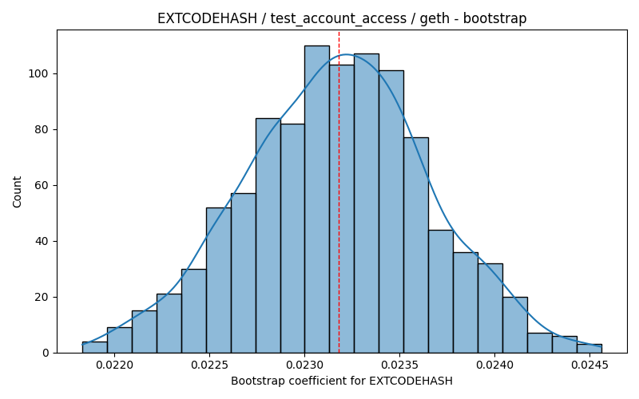

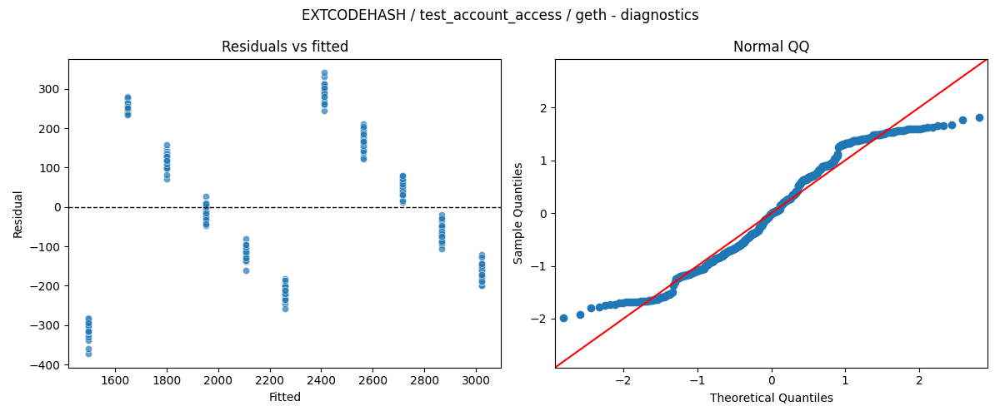

</details>

<details><summary>nethermind — NNLS regression summary</summary>

```
==============================================================================
                           NNLS Regression Results                            
==============================================================================
Dep. Variable:          test_runtime_ms              R-squared:          0.822
Model:                  NNLS                    Adj. R-squared:          0.821
No. Observations:       352                               RMSE:         180.01
Df Residuals:           350                                MAE:         154.68
Df Model:               1      
==============================================================================
                      coef     std err     P-value      [0.025      0.975]
------------------------------------------------------------------------------
         const    501.8957     36.5453       0.001    431.9791    575.1987
       opcount      0.0186      0.0005       0.001      0.0176      0.0195
==============================================================================
Notes: Non-negative least squares with bootstrap inference (1000 iterations)
==============================================================================
```

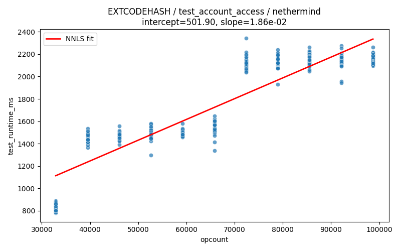

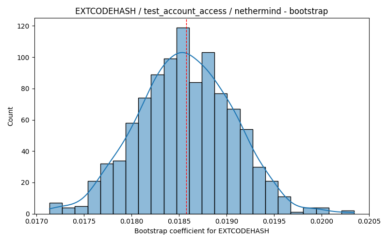

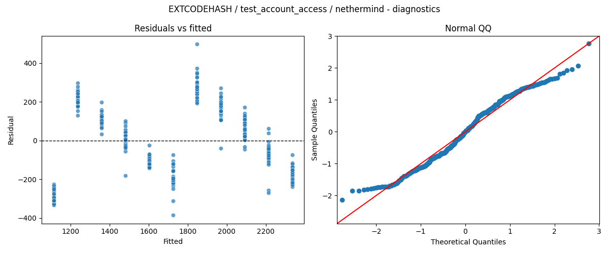

</details>

<details><summary>reth — NNLS regression summary</summary>

```
==============================================================================
                           NNLS Regression Results                            
==============================================================================
Dep. Variable:          test_runtime_ms              R-squared:          0.882
Model:                  NNLS                    Adj. R-squared:          0.882
No. Observations:       374                               RMSE:         138.25
Df Residuals:           372                                MAE:          61.20
Df Model:               1      
==============================================================================
                      coef     std err     P-value      [0.025      0.975]
------------------------------------------------------------------------------
         const    294.6437     22.8776       0.001    247.9686    337.5573
       opcount      0.0182      0.0004       0.001      0.0175      0.0189
==============================================================================
Notes: Non-negative least squares with bootstrap inference (1000 iterations)
==============================================================================
```

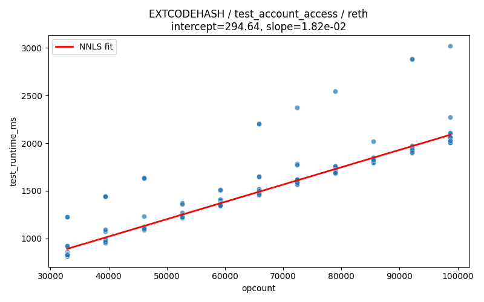

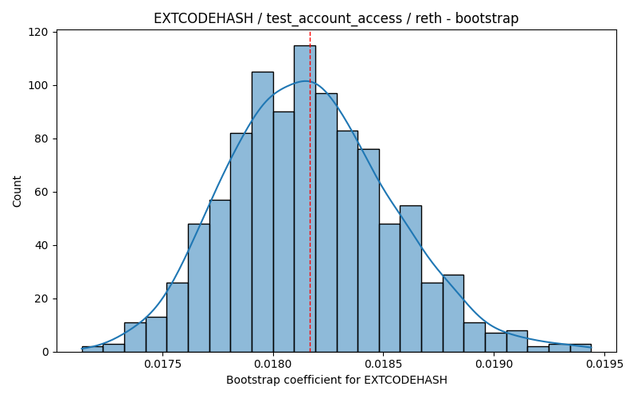

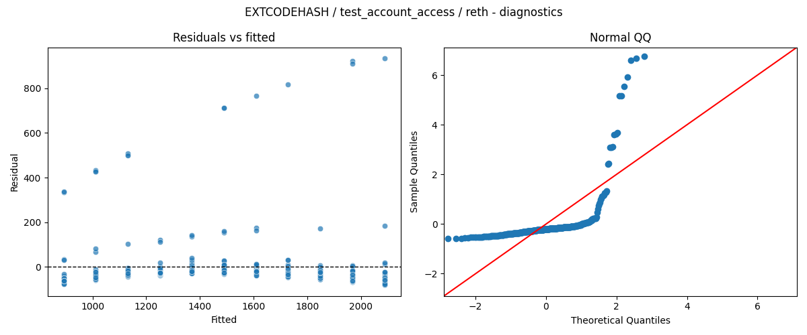

</details>

### test_account_access — combo `EXTCODEHASH_AccountMode.NON_EXISTING_ACCOUNT` — `presets[cold_account_code_access]`

| client | nobs | R² | target_coef (ms) | p-value | 95% CI |
| --- | --- | --- | --- | --- | --- |
| `besu` | 341 | 0.7784 | 0.01362 | 1.00e-03 | [0.01279, 0.01438] |
| `erigon` | 198 | 0.9619 | 0.007859 | 1.00e-03 | [0.007701, 0.007934] |
| `ethrex` | 33 | 0.9925 | 0.002734 | 1.00e-03 | [0.002703, 0.002762] |
| `geth` | 407 | 0.869 | 0.02177 | 1.00e-03 | [0.0209, 0.02262] |
| `nethermind` | 352 | 0.9293 | 0.003451 | 1.00e-03 | [0.003336, 0.003557] |
| `reth` | 374 | 0.9669 | 0.0008906 | 1.00e-03 | [0.0008724, 0.0009067] |

<details><summary>besu — NNLS regression summary</summary>

```
==============================================================================
                           NNLS Regression Results                            
==============================================================================
Dep. Variable:          test_runtime_ms              R-squared:          0.778
Model:                  NNLS                    Adj. R-squared:          0.778
No. Observations:       341                               RMSE:         173.65
Df Residuals:           339                                MAE:         161.28
Df Model:               1      
==============================================================================
                      coef     std err     P-value      [0.025      0.975]
------------------------------------------------------------------------------
         const    532.9087     29.2460       0.001    479.0194    594.8288
       opcount      0.0136      0.0004       0.001      0.0128      0.0144
==============================================================================
Notes: Non-negative least squares with bootstrap inference (1000 iterations)
==============================================================================
```


</details>

<details><summary>erigon — NNLS regression summary</summary>

```
==============================================================================
                           NNLS Regression Results                            
==============================================================================
Dep. Variable:          test_runtime_ms              R-squared:          0.962
Model:                  NNLS                    Adj. R-squared:          0.962
No. Observations:       198                               RMSE:          37.65
Df Residuals:           196                                MAE:          33.16
Df Model:               1      
==============================================================================
                      coef     std err     P-value      [0.025      0.975]
------------------------------------------------------------------------------
         const      0.0000      2.7087       1.000      0.0000      9.5027
       opcount      0.0079      0.0001       0.001      0.0077      0.0079
==============================================================================
Notes: Non-negative least squares with bootstrap inference (1000 iterations)
==============================================================================
```


</details>

<details><summary>ethrex — NNLS regression summary</summary>

```
==============================================================================
                           NNLS Regression Results                            
==============================================================================
Dep. Variable:          test_runtime_ms              R-squared:          0.992
Model:                  NNLS                    Adj. R-squared:          0.992
No. Observations:       33                                RMSE:           5.80
Df Residuals:           31                                 MAE:           4.61
Df Model:               1      
==============================================================================
                      coef     std err     P-value      [0.025      0.975]
------------------------------------------------------------------------------
         const      0.0000      0.4676       1.000      0.0000      1.4821
       opcount      0.0027      0.0000       0.001      0.0027      0.0028
==============================================================================
Notes: Non-negative least squares with bootstrap inference (1000 iterations)
==============================================================================
```


</details>

<details><summary>geth — NNLS regression summary</summary>

```
==============================================================================
                           NNLS Regression Results                            
==============================================================================
Dep. Variable:          test_runtime_ms              R-squared:          0.869
Model:                  NNLS                    Adj. R-squared:          0.869
No. Observations:       407                               RMSE:         202.03
Df Residuals:           405                                MAE:         172.68
Df Model:               1      
==============================================================================
                      coef     std err     P-value      [0.025      0.975]
------------------------------------------------------------------------------
         const    768.7265     37.9368       0.001    697.5919    847.2470
       opcount      0.0218      0.0004       0.001      0.0209      0.0226
==============================================================================
Notes: Non-negative least squares with bootstrap inference (1000 iterations)
==============================================================================
```


</details>

<details><summary>nethermind — NNLS regression summary</summary>

```
==============================================================================
                           NNLS Regression Results                            
==============================================================================
Dep. Variable:          test_runtime_ms              R-squared:          0.929
Model:                  NNLS                    Adj. R-squared:          0.929
No. Observations:       352                               RMSE:          22.75
Df Residuals:           350                                MAE:          15.01
Df Model:               1      
==============================================================================
                      coef     std err     P-value      [0.025      0.975]
------------------------------------------------------------------------------
         const     78.3339      4.6492       0.001     69.9506     87.8572
       opcount      0.0035      0.0001       0.001      0.0033      0.0036
==============================================================================
Notes: Non-negative least squares with bootstrap inference (1000 iterations)
==============================================================================
```


</details>

<details><summary>reth — NNLS regression summary</summary>

```
==============================================================================
                           NNLS Regression Results                            
==============================================================================
Dep. Variable:          test_runtime_ms              R-squared:          0.967
Model:                  NNLS                    Adj. R-squared:          0.967
No. Observations:       374                               RMSE:           3.94
Df Residuals:           372                                MAE:           3.03
Df Model:               1      
==============================================================================
                      coef     std err     P-value      [0.025      0.975]
------------------------------------------------------------------------------
         const     42.9376      0.7047       0.001     41.6917     44.3826
       opcount      0.0009      0.0000       0.001      0.0009      0.0009
==============================================================================
Notes: Non-negative least squares with bootstrap inference (1000 iterations)
==============================================================================
```


</details>

### test_ext_account_query_warm — combo `EXTCODEHASH`

| client | nobs | R² | target_coef (ms) | p-value | 95% CI |
| --- | --- | --- | --- | --- | --- |
| `besu` | 341 | 0.4414 | 0.0001244 | 1.00e-03 | [0.0001101, 0.0001383] |
| `erigon` | 198 | 0.9477 | 0.0002883 | 1.00e-03 | [0.000278, 0.0002983] |
| `ethrex` | 33 | 0.6928 | 1.587e-05 | 1.00e-03 | [1.209e-05, 1.969e-05] |
| `geth` | 407 | 0.8622 | 4.298e-05 | 1.00e-03 | [4.148e-05, 4.45e-05] |
| `nethermind` | 352 | 0.7262 | 0.0002535 | 1.00e-03 | [0.0002375, 0.00027] |
| `reth` | 374 | 0.7716 | 1.01e-05 | 1.00e-03 | [9.574e-06, 1.07e-05] |

<details><summary>besu — NNLS regression summary</summary>

```
==============================================================================
                           NNLS Regression Results                            
==============================================================================
Dep. Variable:          test_runtime_ms              R-squared:          0.441
Model:                  NNLS                    Adj. R-squared:          0.440
No. Observations:       341                               RMSE:          81.82
Df Residuals:           339                                MAE:          64.60
Df Model:               1      
==============================================================================
                      coef     std err     P-value      [0.025      0.975]
------------------------------------------------------------------------------
         const    300.6498     15.1975       0.001    271.3433    330.4558
       opcount      0.0001      0.0000       0.001      0.0001      0.0001
==============================================================================
Notes: Non-negative least squares with bootstrap inference (1000 iterations)
==============================================================================
```

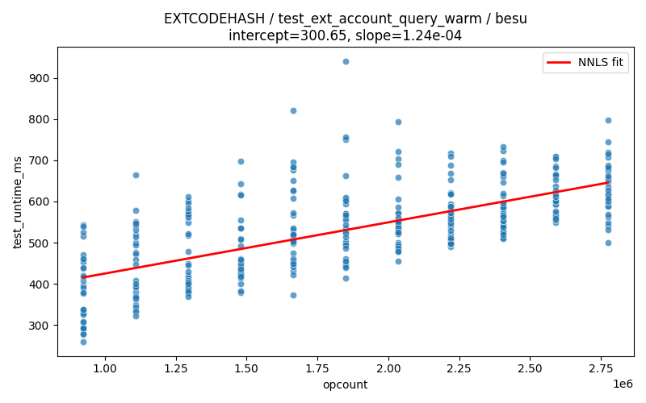

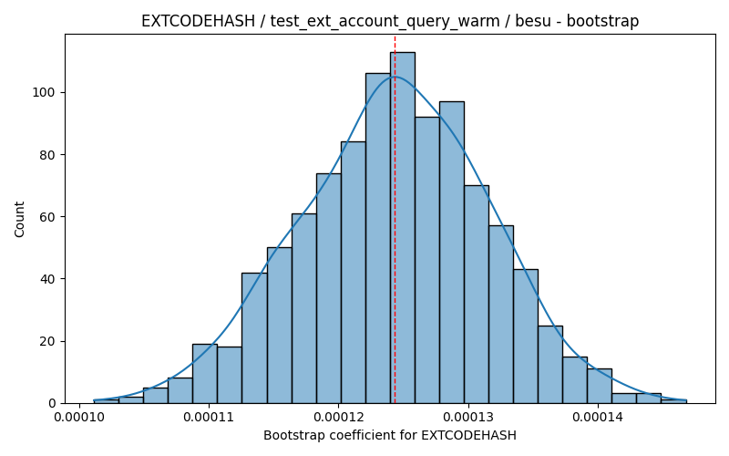

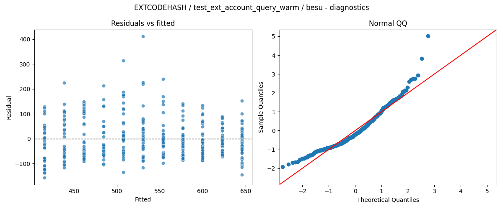

</details>

<details><summary>erigon — NNLS regression summary</summary>

```
==============================================================================
                           NNLS Regression Results                            
==============================================================================
Dep. Variable:          test_runtime_ms              R-squared:          0.948
Model:                  NNLS                    Adj. R-squared:          0.947
No. Observations:       198                               RMSE:          39.60
Df Residuals:           196                                MAE:          27.50
Df Model:               1      
==============================================================================
                      coef     std err     P-value      [0.025      0.975]
------------------------------------------------------------------------------
         const     29.8143      8.3393       0.002     14.2185     46.4495
       opcount      0.0003      0.0000       0.001      0.0003      0.0003
==============================================================================
Notes: Non-negative least squares with bootstrap inference (1000 iterations)
==============================================================================
```

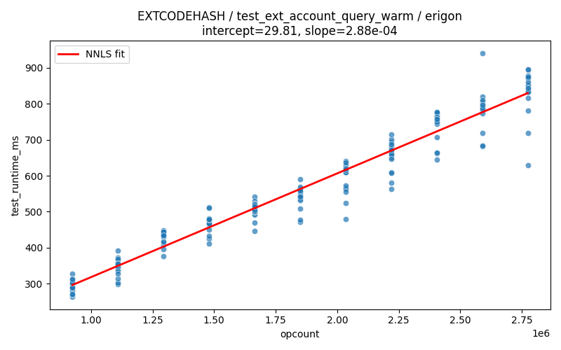

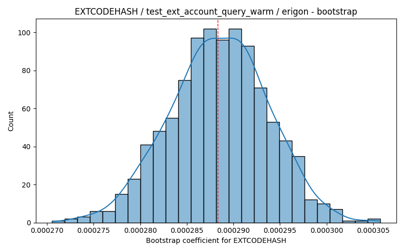

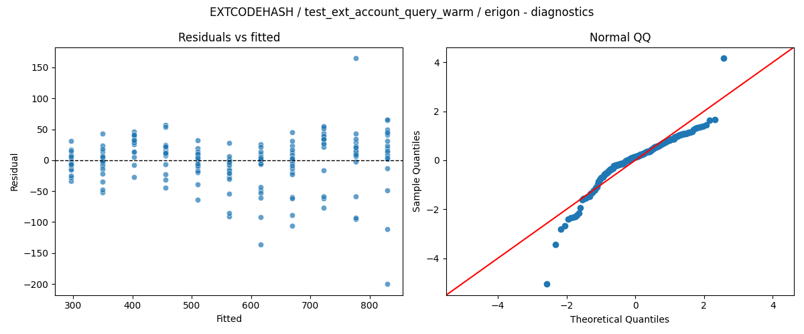

</details>

<details><summary>ethrex — NNLS regression summary</summary>

```
==============================================================================
                           NNLS Regression Results                            
==============================================================================
Dep. Variable:          test_runtime_ms              R-squared:          0.693
Model:                  NNLS                    Adj. R-squared:          0.683
No. Observations:       33                                RMSE:           6.18
Df Residuals:           31                                 MAE:           4.87
Df Model:               1      
==============================================================================
                      coef     std err     P-value      [0.025      0.975]
------------------------------------------------------------------------------
         const      7.3653      3.2348       0.014      0.7138     13.7861
       opcount      0.0000      0.0000       0.001      0.0000      0.0000
==============================================================================
Notes: Non-negative least squares with bootstrap inference (1000 iterations)
==============================================================================
```

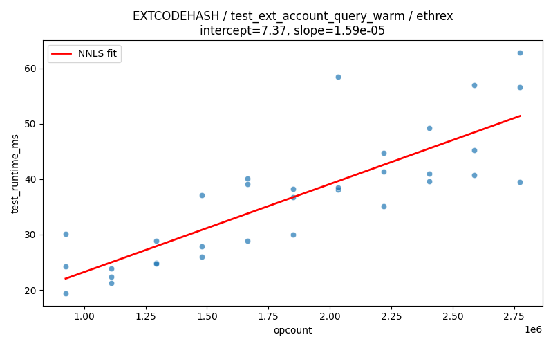

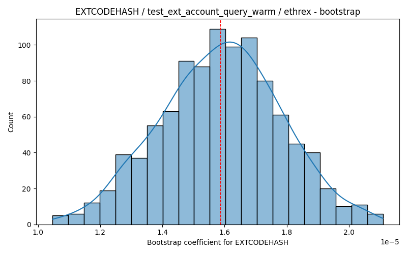

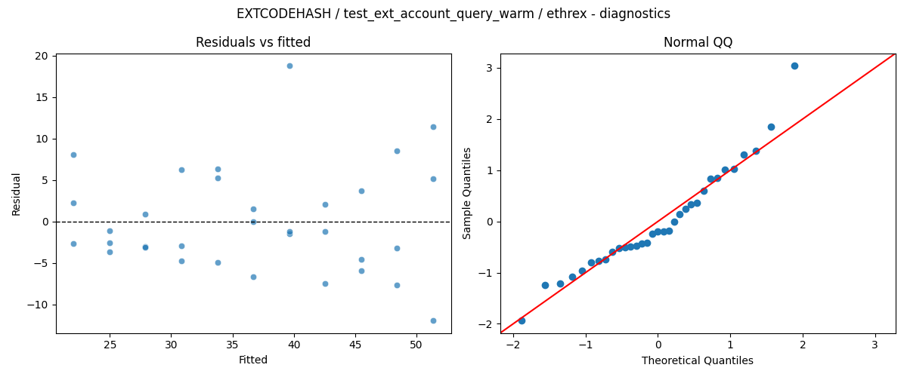

</details>

<details><summary>geth — NNLS regression summary</summary>

```
==============================================================================
                           NNLS Regression Results                            
==============================================================================
Dep. Variable:          test_runtime_ms              R-squared:          0.862
Model:                  NNLS                    Adj. R-squared:          0.862
No. Observations:       407                               RMSE:          10.05
Df Residuals:           405                                MAE:           7.53
Df Model:               1      
==============================================================================
                      coef     std err     P-value      [0.025      0.975]
------------------------------------------------------------------------------
         const     19.1104      1.3511       0.001     16.5208     21.7738
       opcount      0.0000      0.0000       0.001      0.0000      0.0000
==============================================================================
Notes: Non-negative least squares with bootstrap inference (1000 iterations)
==============================================================================
```

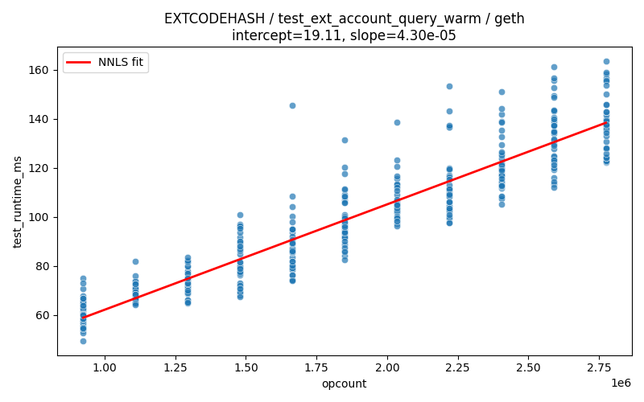

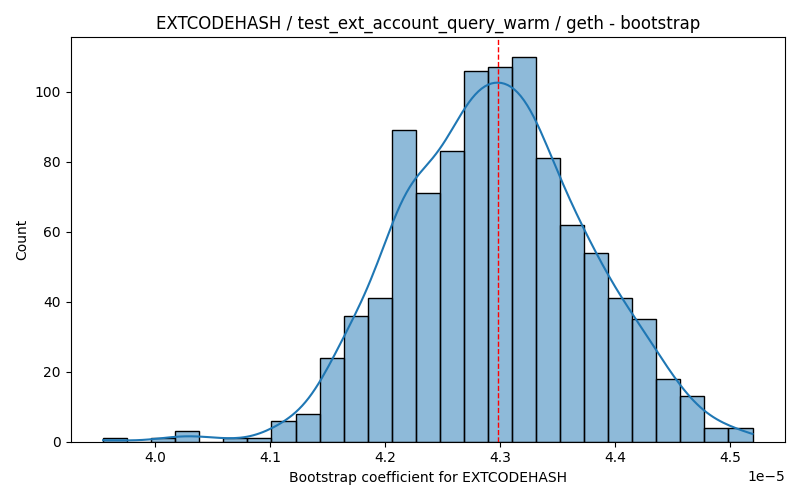

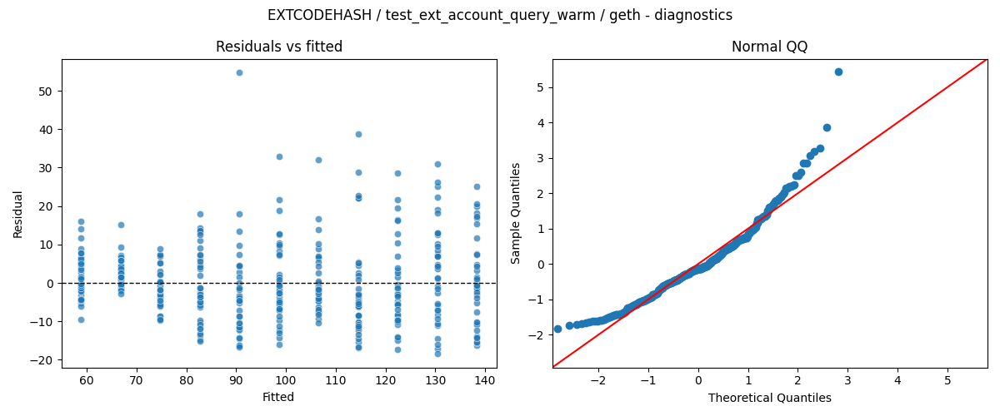

</details>

<details><summary>nethermind — NNLS regression summary</summary>

```
==============================================================================
                           NNLS Regression Results                            
==============================================================================
Dep. Variable:          test_runtime_ms              R-squared:          0.726
Model:                  NNLS                    Adj. R-squared:          0.725
No. Observations:       352                               RMSE:          91.03
Df Residuals:           350                                MAE:          65.05
Df Model:               1      
==============================================================================
                      coef     std err     P-value      [0.025      0.975]
------------------------------------------------------------------------------
         const    139.9553     13.8013       0.001    112.9731    167.4591
       opcount      0.0003      0.0000       0.001      0.0002      0.0003
==============================================================================
Notes: Non-negative least squares with bootstrap inference (1000 iterations)
==============================================================================
```

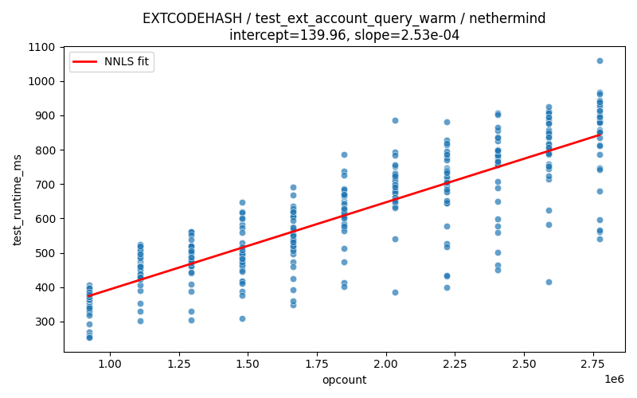

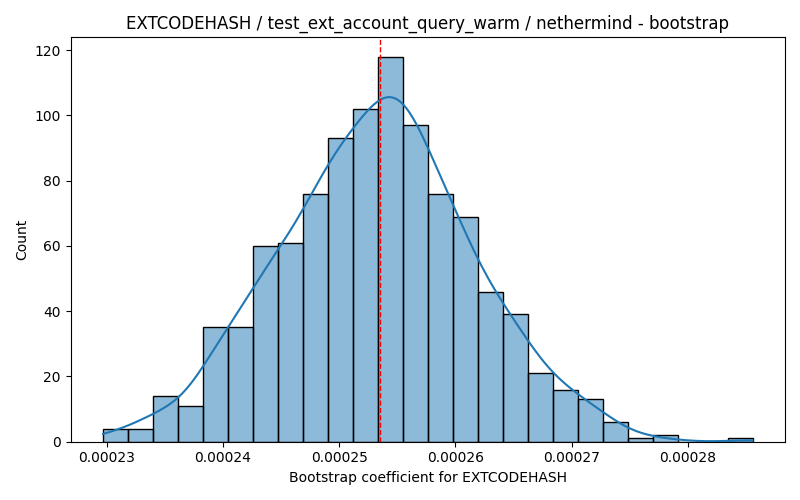

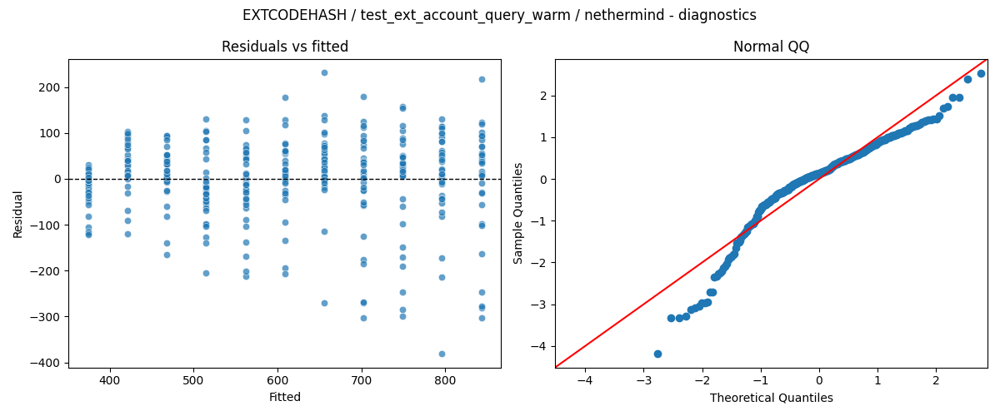

</details>

<details><summary>reth — NNLS regression summary</summary>

```
==============================================================================
                           NNLS Regression Results                            
==============================================================================
Dep. Variable:          test_runtime_ms              R-squared:          0.772
Model:                  NNLS                    Adj. R-squared:          0.771
No. Observations:       374                               RMSE:           3.21
Df Residuals:           372                                MAE:           2.47
Df Model:               1      
==============================================================================
                      coef     std err     P-value      [0.025      0.975]
------------------------------------------------------------------------------
         const      5.9196      0.5044       0.001      4.9000      6.7992
       opcount      0.0000      0.0000       0.001      0.0000      0.0000
==============================================================================
Notes: Non-negative least squares with bootstrap inference (1000 iterations)
==============================================================================
```

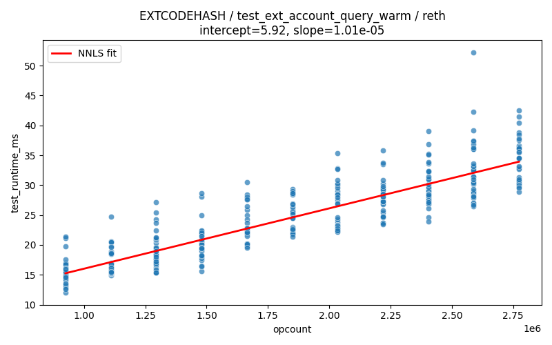

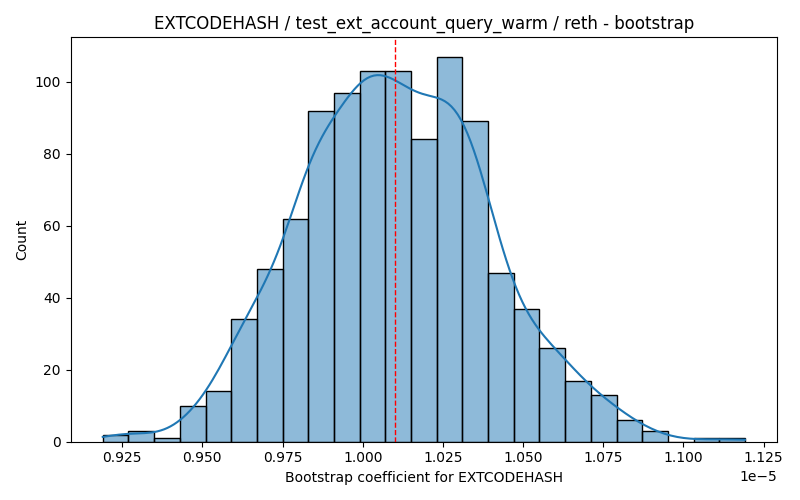

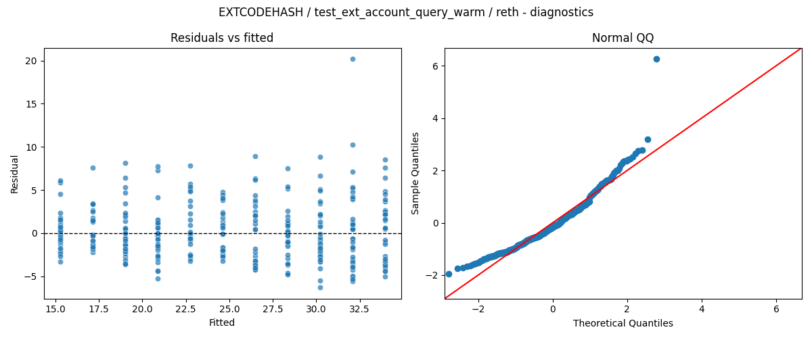

</details>

## EXTCODESIZE

### test_account_access — combo `EXTCODESIZE_AccountMode.NON_EXISTING_ACCOUNT` — `presets[cold_account_nocode_access]`

| client | nobs | R² | target_coef (ms) | p-value | 95% CI |
| --- | --- | --- | --- | --- | --- |
| `besu` | 341 | 0.7469 | 0.01337 | 1.00e-03 | [0.01248, 0.01421] |
| `erigon` | 198 | 0.9659 | 0.008072 | 1.00e-03 | [0.007894, 0.008146] |
| `ethrex` | 33 | 0.9921 | 0.002716 | 1.00e-03 | [0.002637, 0.002743] |
| `geth` | 407 | 0.8702 | 0.02171 | 1.00e-03 | [0.02083, 0.0226] |
| `nethermind` | 352 | 0.8847 | 0.003441 | 1.00e-03 | [0.003352, 0.003544] |
| `reth` | 374 | 0.9579 | 0.0008856 | 1.00e-03 | [0.0008684, 0.0009035] |

<details><summary>besu — NNLS regression summary</summary>

```
==============================================================================
                           NNLS Regression Results                            
==============================================================================
Dep. Variable:          test_runtime_ms              R-squared:          0.747
Model:                  NNLS                    Adj. R-squared:          0.746
No. Observations:       341                               RMSE:         186.00
Df Residuals:           339                                MAE:         168.88
Df Model:               1      
==============================================================================
                      coef     std err     P-value      [0.025      0.975]
------------------------------------------------------------------------------
         const    552.3870     30.1836       0.001    492.9162    610.3826
       opcount      0.0134      0.0004       0.001      0.0125      0.0142
==============================================================================
Notes: Non-negative least squares with bootstrap inference (1000 iterations)
==============================================================================
```

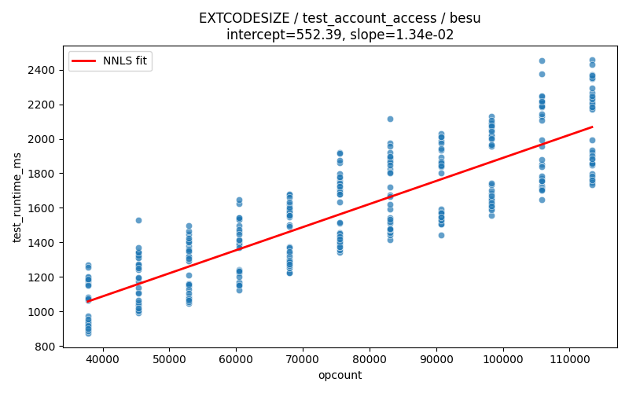

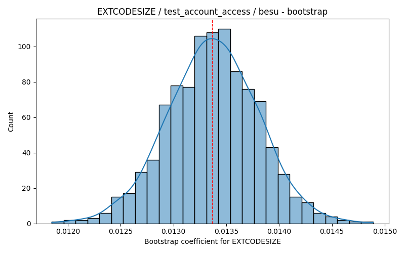


</details>

<details><summary>erigon — NNLS regression summary</summary>

```
==============================================================================
                           NNLS Regression Results                            
==============================================================================
Dep. Variable:          test_runtime_ms              R-squared:          0.966
Model:                  NNLS                    Adj. R-squared:          0.966
No. Observations:       198                               RMSE:          36.40
Df Residuals:           196                                MAE:          32.01
Df Model:               1      
==============================================================================
                      coef     std err     P-value      [0.025      0.975]
------------------------------------------------------------------------------
         const      0.0000      2.9629       1.000      0.0000     10.5823
       opcount      0.0081      0.0001       0.001      0.0079      0.0081
==============================================================================
Notes: Non-negative least squares with bootstrap inference (1000 iterations)
==============================================================================
```

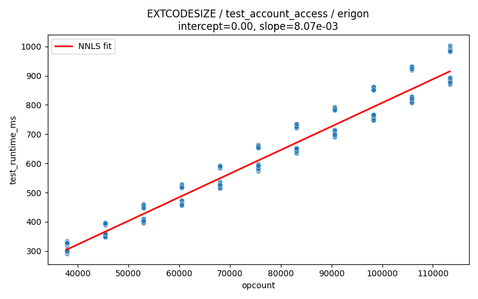

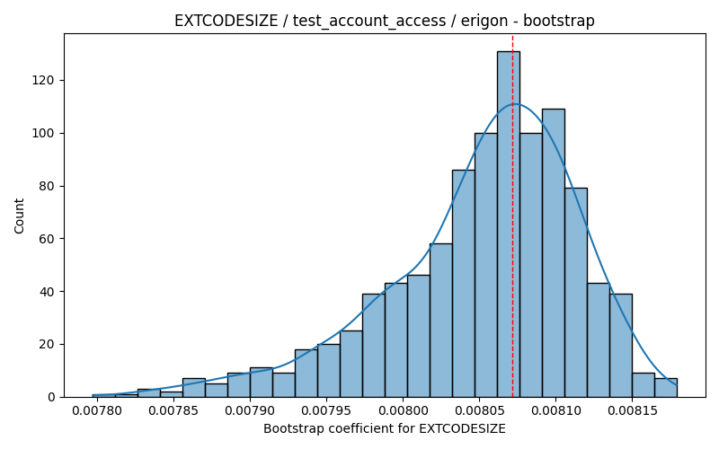

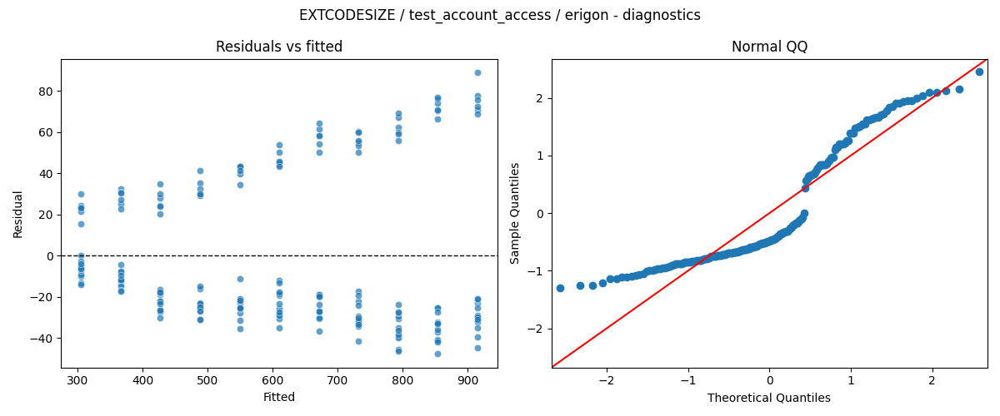

</details>

<details><summary>ethrex — NNLS regression summary</summary>

```
==============================================================================
                           NNLS Regression Results                            
==============================================================================
Dep. Variable:          test_runtime_ms              R-squared:          0.992
Model:                  NNLS                    Adj. R-squared:          0.992
No. Observations:       33                                RMSE:           5.79
Df Residuals:           31                                 MAE:           4.67
Df Model:               1      
==============================================================================
                      coef     std err     P-value      [0.025      0.975]
------------------------------------------------------------------------------
         const      0.4424      2.0192       0.443      0.0000      6.8657
       opcount      0.0027      0.0000       0.001      0.0026      0.0027
==============================================================================
Notes: Non-negative least squares with bootstrap inference (1000 iterations)
==============================================================================
```

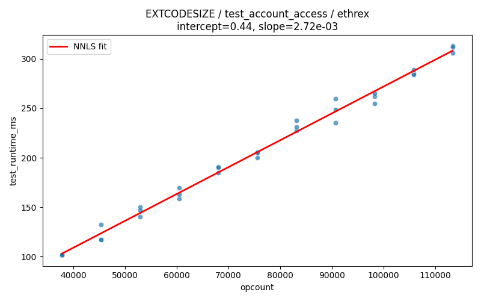

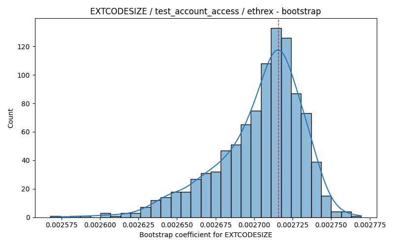

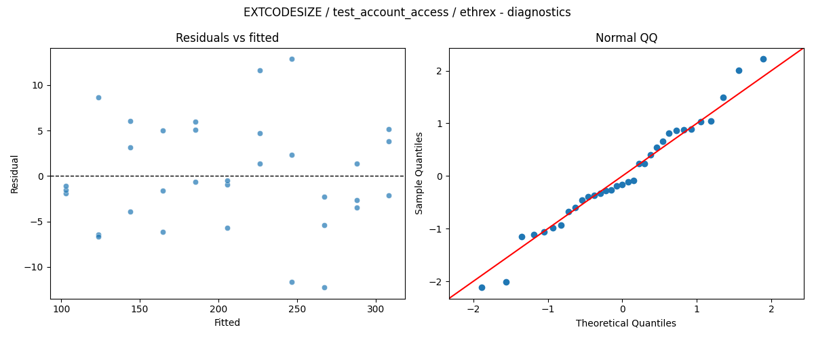

</details>

<details><summary>geth — NNLS regression summary</summary>

```
==============================================================================
                           NNLS Regression Results                            
==============================================================================
Dep. Variable:          test_runtime_ms              R-squared:          0.870
Model:                  NNLS                    Adj. R-squared:          0.870
No. Observations:       407                               RMSE:         200.37
Df Residuals:           405                                MAE:         172.09
Df Model:               1      
==============================================================================
                      coef     std err     P-value      [0.025      0.975]
------------------------------------------------------------------------------
         const    775.0426     38.3296       0.001    702.9129    848.5571
       opcount      0.0217      0.0004       0.001      0.0208      0.0226
==============================================================================
Notes: Non-negative least squares with bootstrap inference (1000 iterations)
==============================================================================
```


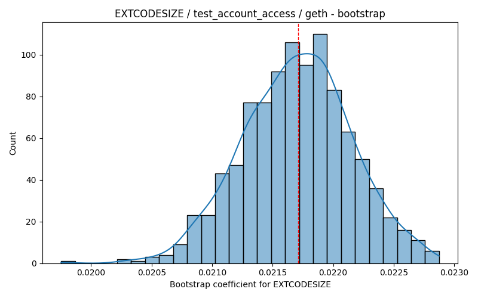

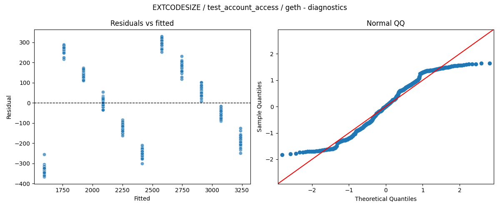

</details>

<details><summary>nethermind — NNLS regression summary</summary>

```
==============================================================================
                           NNLS Regression Results                            
==============================================================================
Dep. Variable:          test_runtime_ms              R-squared:          0.885
Model:                  NNLS                    Adj. R-squared:          0.884
No. Observations:       352                               RMSE:          29.70
Df Residuals:           350                                MAE:          16.29
Df Model:               1      
==============================================================================
                      coef     std err     P-value      [0.025      0.975]
------------------------------------------------------------------------------
         const     77.7228      3.3258       0.001     71.1002     84.1007
       opcount      0.0034      0.0000       0.001      0.0034      0.0035
==============================================================================
Notes: Non-negative least squares with bootstrap inference (1000 iterations)
==============================================================================
```

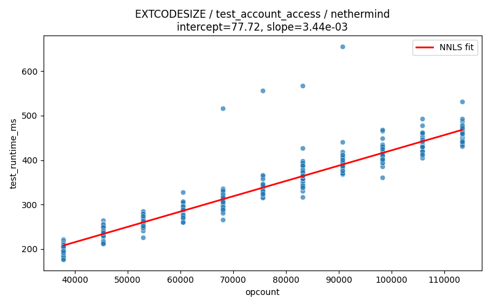

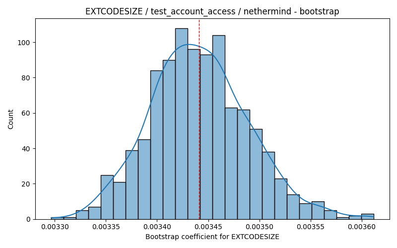

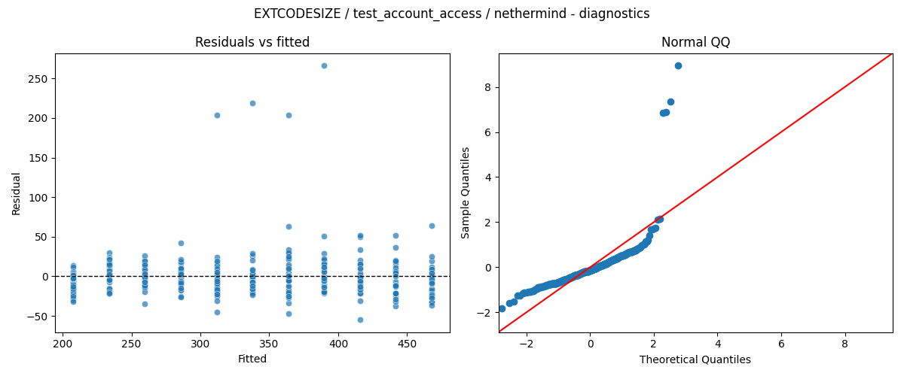

</details>

<details><summary>reth — NNLS regression summary</summary>

```
==============================================================================
                           NNLS Regression Results                            
==============================================================================
Dep. Variable:          test_runtime_ms              R-squared:          0.958
Model:                  NNLS                    Adj. R-squared:          0.958
No. Observations:       374                               RMSE:           4.44
Df Residuals:           372                                MAE:           3.48
Df Model:               1      
==============================================================================
                      coef     std err     P-value      [0.025      0.975]
------------------------------------------------------------------------------
         const     43.1571      0.7312       0.001     41.7209     44.6331
       opcount      0.0009      0.0000       0.001      0.0009      0.0009
==============================================================================
Notes: Non-negative least squares with bootstrap inference (1000 iterations)
==============================================================================
```

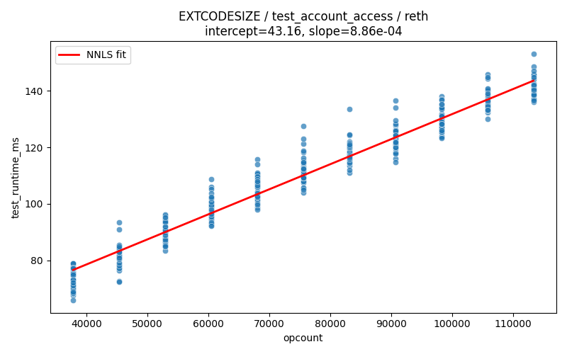

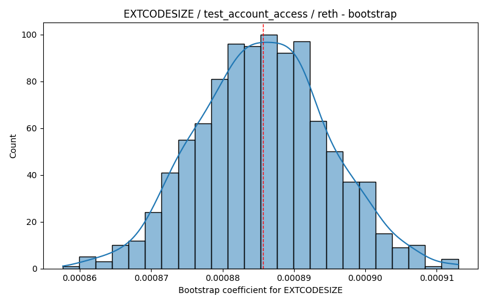

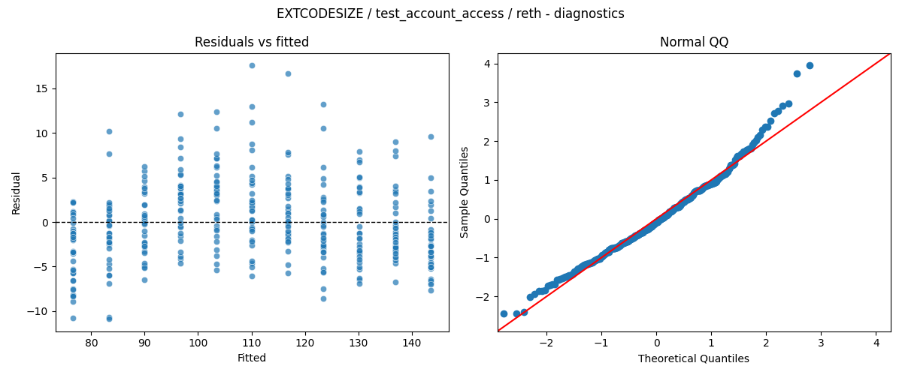

</details>

### test_account_access — combo `EXTCODESIZE_AccountMode.EXISTING_CONTRACT`

| client | nobs | R² | target_coef (ms) | p-value | 95% CI |
| --- | --- | --- | --- | --- | --- |
| `besu` | 341 | 0.8603 | 0.02927 | 1.00e-03 | [0.02817, 0.03039] |
| `erigon` | 198 | 0.8817 | 0.07922 | 1.00e-03 | [0.07527, 0.08281] |
| `ethrex` | 33 | 0.9825 | 0.01807 | 1.00e-03 | [0.01709, 0.01899] |
| `geth` | 407 | 0.8679 | 0.02321 | 1.00e-03 | [0.02217, 0.02408] |
| `nethermind` | 352 | 0.8244 | 0.01861 | 1.00e-03 | [0.01765, 0.01966] |
| `reth` | 374 | 0.9055 | 0.01789 | 1.00e-03 | [0.0174, 0.01849] |

<details><summary>besu — NNLS regression summary</summary>

```
==============================================================================
                           NNLS Regression Results                            
==============================================================================
Dep. Variable:          test_runtime_ms              R-squared:          0.860
Model:                  NNLS                    Adj. R-squared:          0.860
No. Observations:       341                               RMSE:         245.37
Df Residuals:           339                                MAE:         223.19
Df Model:               1      
==============================================================================
                      coef     std err     P-value      [0.025      0.975]
------------------------------------------------------------------------------
         const    511.9077     34.8136       0.001    442.8237    575.5314
       opcount      0.0293      0.0006       0.001      0.0282      0.0304
==============================================================================
Notes: Non-negative least squares with bootstrap inference (1000 iterations)
==============================================================================
```

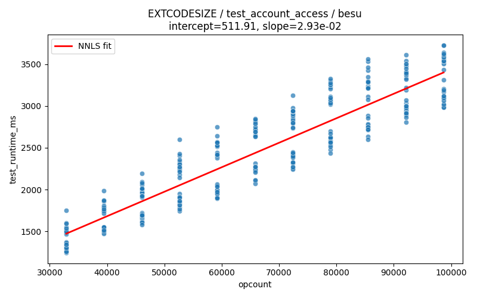

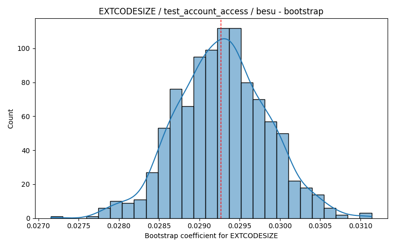

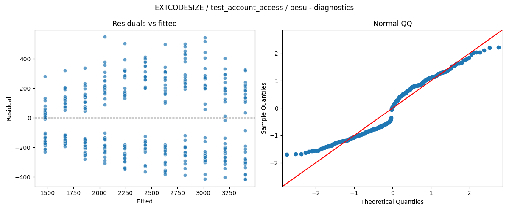

</details>

<details><summary>erigon — NNLS regression summary</summary>

```
==============================================================================
                           NNLS Regression Results                            
==============================================================================
Dep. Variable:          test_runtime_ms              R-squared:          0.882
Model:                  NNLS                    Adj. R-squared:          0.881
No. Observations:       198                               RMSE:         603.66
Df Residuals:           196                                MAE:         525.16
Df Model:               1      
==============================================================================
                      coef     std err     P-value      [0.025      0.975]
------------------------------------------------------------------------------
         const    958.3304    149.7769       0.001    684.5300   1269.3473
       opcount      0.0792      0.0020       0.001      0.0753      0.0828
==============================================================================
Notes: Non-negative least squares with bootstrap inference (1000 iterations)
==============================================================================
```

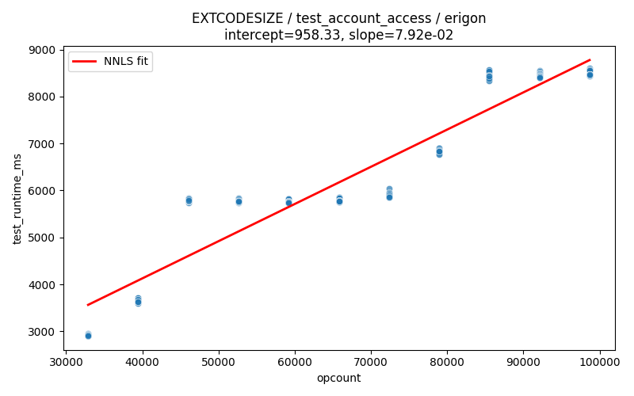

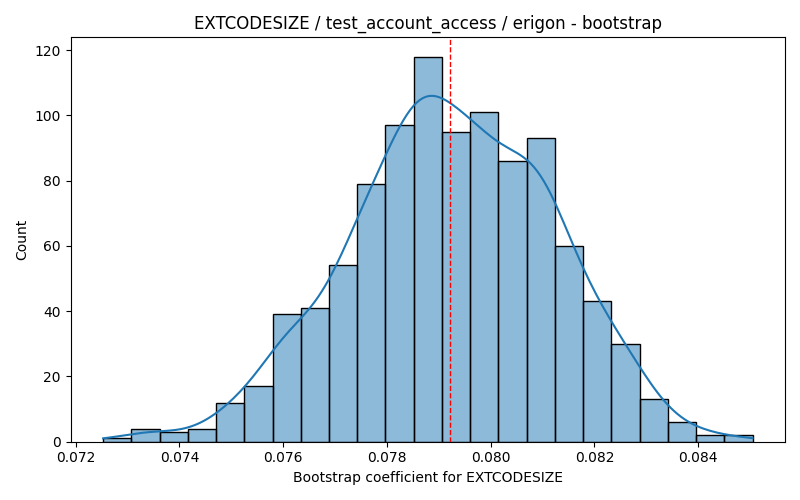

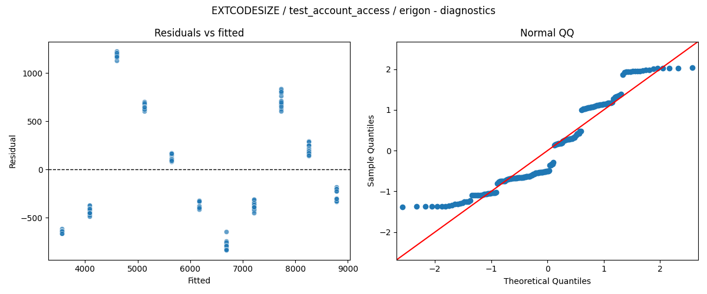

</details>

<details><summary>ethrex — NNLS regression summary</summary>

```
==============================================================================
                           NNLS Regression Results                            
==============================================================================
Dep. Variable:          test_runtime_ms              R-squared:          0.982
Model:                  NNLS                    Adj. R-squared:          0.982
No. Observations:       33                                RMSE:          50.22
Df Residuals:           31                                 MAE:          45.09
Df Model:               1      
==============================================================================
                      coef     std err     P-value      [0.025      0.975]
------------------------------------------------------------------------------
         const    146.1984     36.6621       0.001     79.5989    222.8084
       opcount      0.0181      0.0005       0.001      0.0171      0.0190
==============================================================================
Notes: Non-negative least squares with bootstrap inference (1000 iterations)
==============================================================================
```

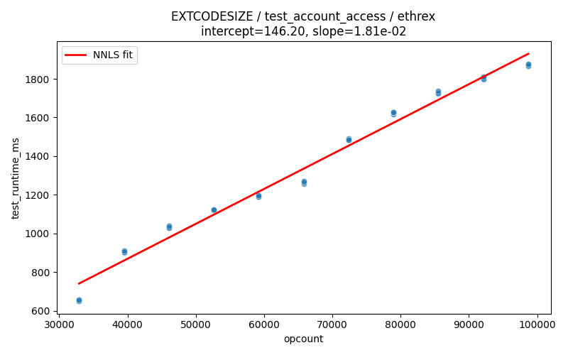

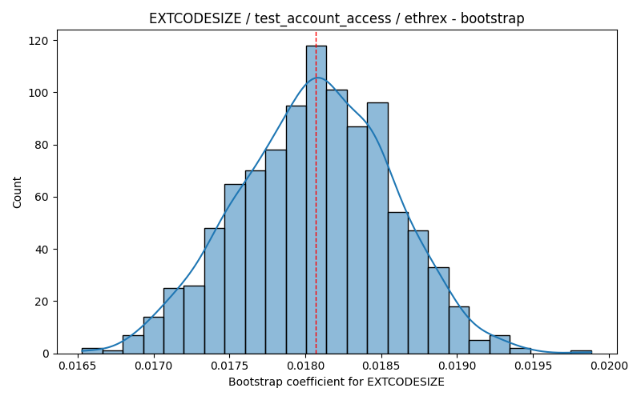

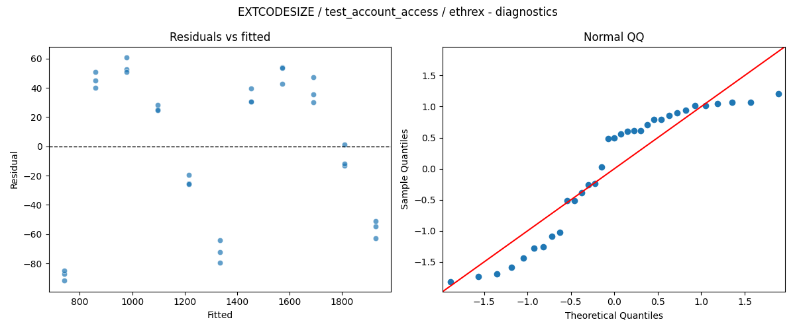

</details>

<details><summary>geth — NNLS regression summary</summary>

```
==============================================================================
                           NNLS Regression Results                            
==============================================================================
Dep. Variable:          test_runtime_ms              R-squared:          0.868
Model:                  NNLS                    Adj. R-squared:          0.868
No. Observations:       407                               RMSE:         188.38
Df Residuals:           405                                MAE:         161.47
Df Model:               1      
==============================================================================
                      coef     std err     P-value      [0.025      0.975]
------------------------------------------------------------------------------
         const    739.1727     36.3776       0.001    674.3136    817.5738
       opcount      0.0232      0.0005       0.001      0.0222      0.0241
==============================================================================
Notes: Non-negative least squares with bootstrap inference (1000 iterations)
==============================================================================
```

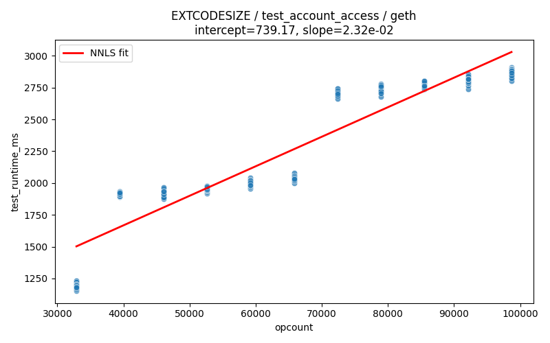

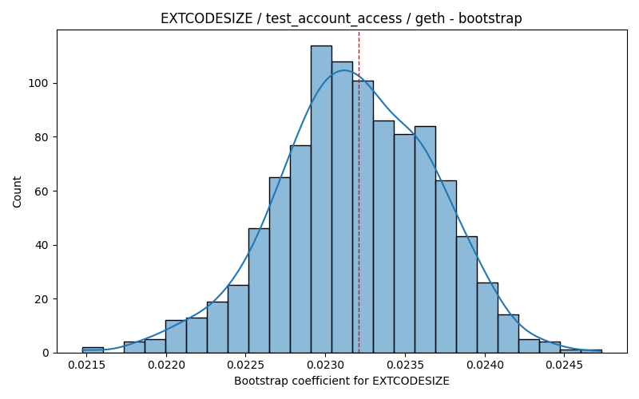

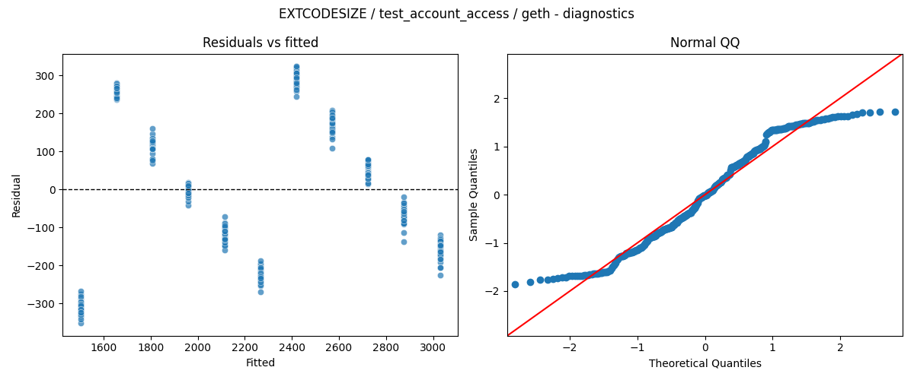

</details>

<details><summary>nethermind — NNLS regression summary</summary>

```
==============================================================================
                           NNLS Regression Results                            
==============================================================================
Dep. Variable:          test_runtime_ms              R-squared:          0.824
Model:                  NNLS                    Adj. R-squared:          0.824
No. Observations:       352                               RMSE:         178.68
Df Residuals:           350                                MAE:         150.01
Df Model:               1      
==============================================================================
                      coef     std err     P-value      [0.025      0.975]
------------------------------------------------------------------------------
         const    487.0758     37.0849       0.001    412.4580    556.5205
       opcount      0.0186      0.0005       0.001      0.0177      0.0197
==============================================================================
Notes: Non-negative least squares with bootstrap inference (1000 iterations)
==============================================================================
```

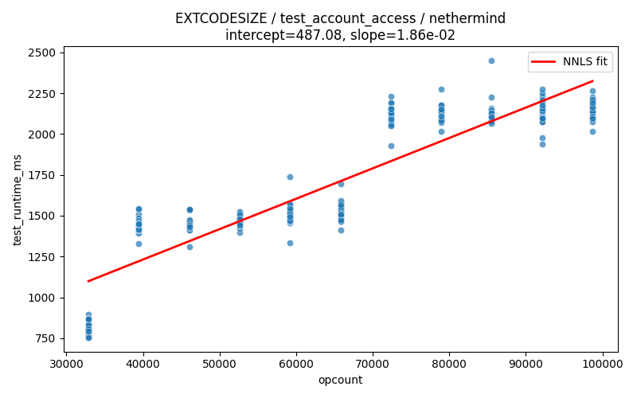

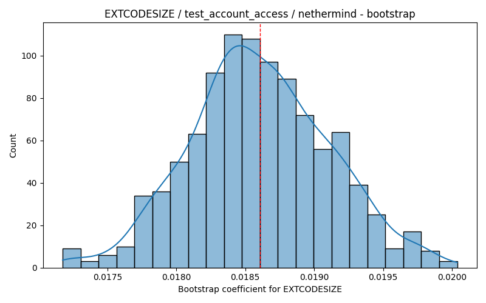

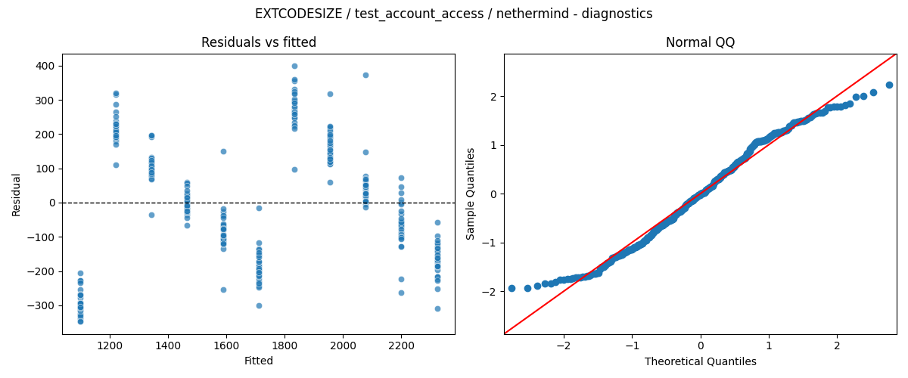

</details>

<details><summary>reth — NNLS regression summary</summary>

```
==============================================================================
                           NNLS Regression Results                            
==============================================================================
Dep. Variable:          test_runtime_ms              R-squared:          0.906
Model:                  NNLS                    Adj. R-squared:          0.905
No. Observations:       374                               RMSE:         120.22
Df Residuals:           372                                MAE:          55.55
Df Model:               1      
==============================================================================
                      coef     std err     P-value      [0.025      0.975]
------------------------------------------------------------------------------
         const    309.7616     19.4111       0.001    269.6726    347.7569
       opcount      0.0179      0.0003       0.001      0.0174      0.0185
==============================================================================
Notes: Non-negative least squares with bootstrap inference (1000 iterations)
==============================================================================
```

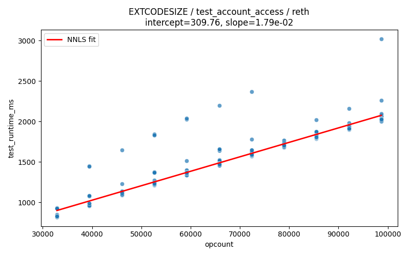

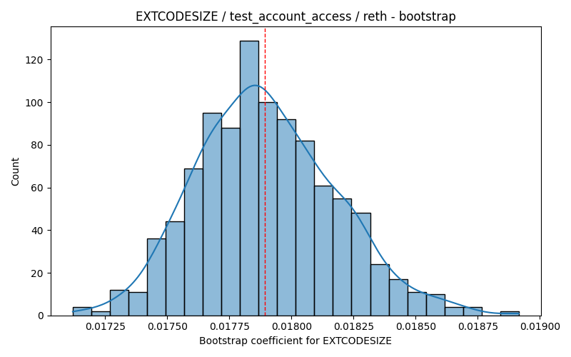

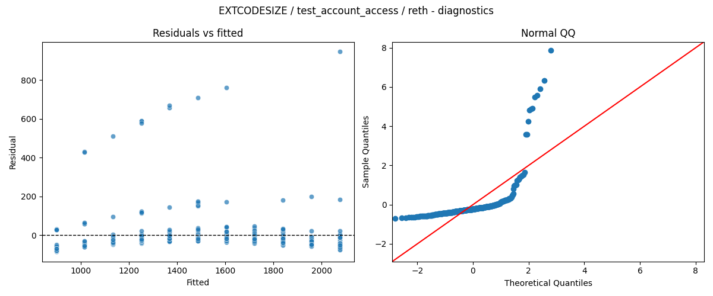

</details>

### test_account_access — combo `EXTCODESIZE_AccountMode.NON_EXISTING_ACCOUNT` — `presets[cold_account_code_access]`

| client | nobs | R² | target_coef (ms) | p-value | 95% CI |
| --- | --- | --- | --- | --- | --- |
| `besu` | 341 | 0.7469 | 0.01337 | 1.00e-03 | [0.01248, 0.01421] |
| `erigon` | 198 | 0.9659 | 0.008072 | 1.00e-03 | [0.007894, 0.008146] |
| `ethrex` | 33 | 0.9921 | 0.002716 | 1.00e-03 | [0.002637, 0.002743] |
| `geth` | 407 | 0.8702 | 0.02171 | 1.00e-03 | [0.02083, 0.0226] |
| `nethermind` | 352 | 0.8847 | 0.003441 | 1.00e-03 | [0.003352, 0.003544] |
| `reth` | 374 | 0.9579 | 0.0008856 | 1.00e-03 | [0.0008684, 0.0009035] |

<details><summary>besu — NNLS regression summary</summary>

```
==============================================================================
                           NNLS Regression Results                            
==============================================================================
Dep. Variable:          test_runtime_ms              R-squared:          0.747
Model:                  NNLS                    Adj. R-squared:          0.746
No. Observations:       341                               RMSE:         186.00
Df Residuals:           339                                MAE:         168.88
Df Model:               1      
==============================================================================
                      coef     std err     P-value      [0.025      0.975]
------------------------------------------------------------------------------
         const    552.3870     30.1836       0.001    492.9162    610.3826
       opcount      0.0134      0.0004       0.001      0.0125      0.0142
==============================================================================
Notes: Non-negative least squares with bootstrap inference (1000 iterations)
==============================================================================
```


</details>

<details><summary>erigon — NNLS regression summary</summary>

```
==============================================================================
                           NNLS Regression Results                            
==============================================================================
Dep. Variable:          test_runtime_ms              R-squared:          0.966
Model:                  NNLS                    Adj. R-squared:          0.966
No. Observations:       198                               RMSE:          36.40
Df Residuals:           196                                MAE:          32.01
Df Model:               1      
==============================================================================
                      coef     std err     P-value      [0.025      0.975]
------------------------------------------------------------------------------
         const      0.0000      2.9629       1.000      0.0000     10.5823
       opcount      0.0081      0.0001       0.001      0.0079      0.0081
==============================================================================
Notes: Non-negative least squares with bootstrap inference (1000 iterations)
==============================================================================
```


</details>

<details><summary>ethrex — NNLS regression summary</summary>

```
==============================================================================
                           NNLS Regression Results                            
==============================================================================
Dep. Variable:          test_runtime_ms              R-squared:          0.992
Model:                  NNLS                    Adj. R-squared:          0.992
No. Observations:       33                                RMSE:           5.79
Df Residuals:           31                                 MAE:           4.67
Df Model:               1      
==============================================================================
                      coef     std err     P-value      [0.025      0.975]
------------------------------------------------------------------------------
         const      0.4424      2.0192       0.443      0.0000      6.8657
       opcount      0.0027      0.0000       0.001      0.0026      0.0027
==============================================================================
Notes: Non-negative least squares with bootstrap inference (1000 iterations)
==============================================================================
```


</details>

<details><summary>geth — NNLS regression summary</summary>

```
==============================================================================
                           NNLS Regression Results                            
==============================================================================
Dep. Variable:          test_runtime_ms              R-squared:          0.870
Model:                  NNLS                    Adj. R-squared:          0.870
No. Observations:       407                               RMSE:         200.37
Df Residuals:           405                                MAE:         172.09
Df Model:               1      
==============================================================================
                      coef     std err     P-value      [0.025      0.975]
------------------------------------------------------------------------------
         const    775.0426     38.3296       0.001    702.9129    848.5571
       opcount      0.0217      0.0004       0.001      0.0208      0.0226
==============================================================================
Notes: Non-negative least squares with bootstrap inference (1000 iterations)
==============================================================================
```


</details>

<details><summary>nethermind — NNLS regression summary</summary>

```
==============================================================================
                           NNLS Regression Results                            
==============================================================================
Dep. Variable:          test_runtime_ms              R-squared:          0.885
Model:                  NNLS                    Adj. R-squared:          0.884
No. Observations:       352                               RMSE:          29.70
Df Residuals:           350                                MAE:          16.29
Df Model:               1      
==============================================================================
                      coef     std err     P-value      [0.025      0.975]
------------------------------------------------------------------------------
         const     77.7228      3.3258       0.001     71.1002     84.1007
       opcount      0.0034      0.0000       0.001      0.0034      0.0035
==============================================================================
Notes: Non-negative least squares with bootstrap inference (1000 iterations)
==============================================================================
```


</details>

<details><summary>reth — NNLS regression summary</summary>

```
==============================================================================
                           NNLS Regression Results                            
==============================================================================
Dep. Variable:          test_runtime_ms              R-squared:          0.958
Model:                  NNLS                    Adj. R-squared:          0.958
No. Observations:       374                               RMSE:           4.44
Df Residuals:           372                                MAE:           3.48
Df Model:               1      
==============================================================================
                      coef     std err     P-value      [0.025      0.975]
------------------------------------------------------------------------------
         const     43.1571      0.7312       0.001     41.7209     44.6331
       opcount      0.0009      0.0000       0.001      0.0009      0.0009
==============================================================================
Notes: Non-negative least squares with bootstrap inference (1000 iterations)
==============================================================================
```


</details>

### test_ext_account_query_warm — combo `EXTCODESIZE`

| client | nobs | R² | target_coef (ms) | p-value | 95% CI |
| --- | --- | --- | --- | --- | --- |
| `besu` | 341 | 0.441 | 0.0001235 | 1.00e-03 | [0.0001098, 0.000138] |
| `erigon` | 198 | 0.9182 | 4.433e-05 | 1.00e-03 | [4.238e-05, 4.673e-05] |
| `ethrex` | 33 | 0.7878 | 1.574e-05 | 1.00e-03 | [1.289e-05, 1.907e-05] |
| `geth` | 407 | 0.849 | 3.108e-05 | 1.00e-03 | [2.984e-05, 3.232e-05] |
| `nethermind` | 352 | 0.7607 | 0.0001684 | 1.00e-03 | [0.000157, 0.0001787] |
| `reth` | 374 | 0.6589 | 7.272e-06 | 1.00e-03 | [6.705e-06, 7.865e-06] |

<details><summary>besu — NNLS regression summary</summary>

```
==============================================================================
                           NNLS Regression Results                            
==============================================================================
Dep. Variable:          test_runtime_ms              R-squared:          0.441
Model:                  NNLS                    Adj. R-squared:          0.439
No. Observations:       341                               RMSE:          81.30
Df Residuals:           339                                MAE:          61.62
Df Model:               1      
==============================================================================
                      coef     std err     P-value      [0.025      0.975]
------------------------------------------------------------------------------
         const    299.3473     14.6089       0.001    269.8172    329.1325
       opcount      0.0001      0.0000       0.001      0.0001      0.0001
==============================================================================
Notes: Non-negative least squares with bootstrap inference (1000 iterations)
==============================================================================
```

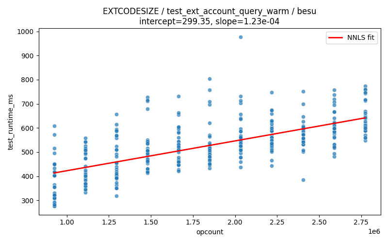

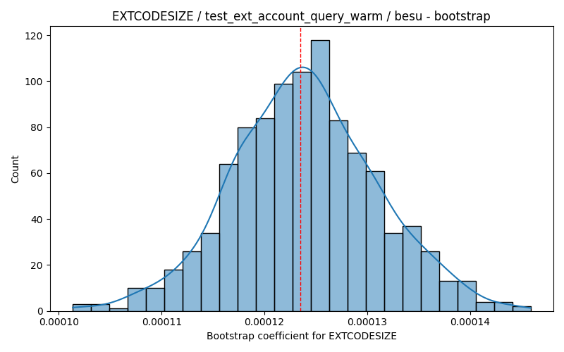

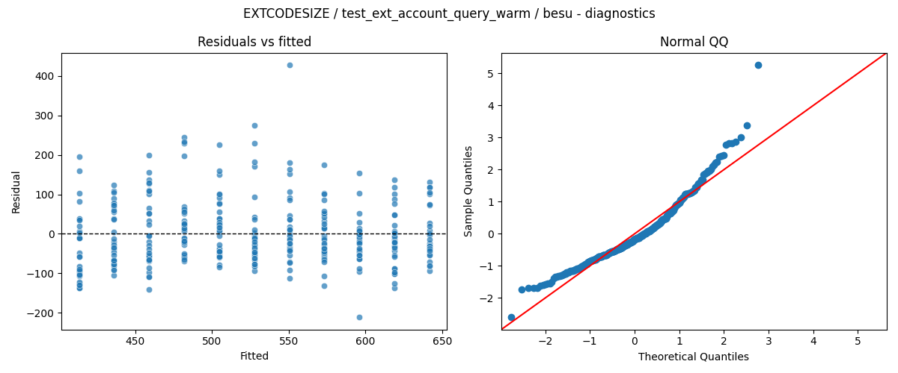

</details>

<details><summary>erigon — NNLS regression summary</summary>

```
==============================================================================
                           NNLS Regression Results                            
==============================================================================
Dep. Variable:          test_runtime_ms              R-squared:          0.918
Model:                  NNLS                    Adj. R-squared:          0.918
No. Observations:       198                               RMSE:           7.73
Df Residuals:           196                                MAE:           5.10
Df Model:               1      
==============================================================================
                      coef     std err     P-value      [0.025      0.975]
------------------------------------------------------------------------------
         const     24.8014      1.7852       0.001     21.0008     27.9899
       opcount      0.0000      0.0000       0.001      0.0000      0.0000
==============================================================================
Notes: Non-negative least squares with bootstrap inference (1000 iterations)
==============================================================================
```

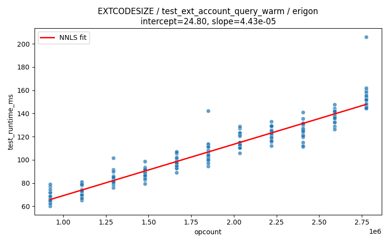

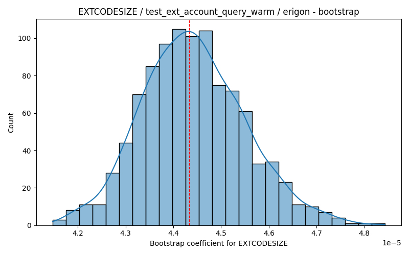

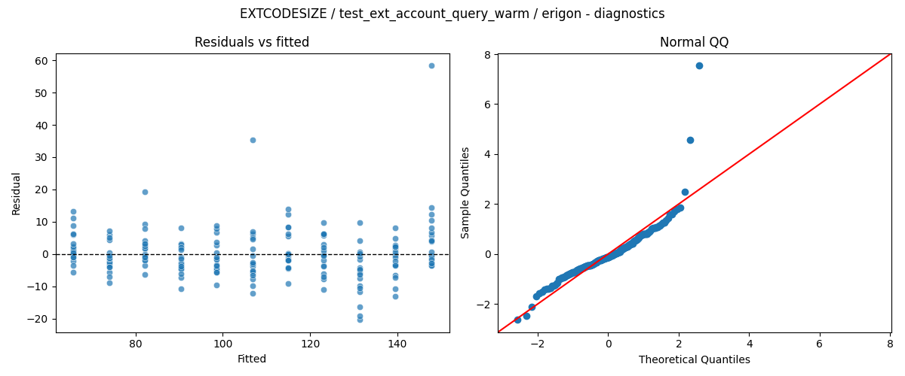

</details>

<details><summary>ethrex — NNLS regression summary</summary>

```
==============================================================================
                           NNLS Regression Results                            
==============================================================================
Dep. Variable:          test_runtime_ms              R-squared:          0.788
Model:                  NNLS                    Adj. R-squared:          0.781
No. Observations:       33                                RMSE:           4.78
Df Residuals:           31                                 MAE:           3.35
Df Model:               1      
==============================================================================
                      coef     std err     P-value      [0.025      0.975]
------------------------------------------------------------------------------
         const      7.1134      2.4578       0.006      2.0716     11.9252
       opcount      0.0000      0.0000       0.001      0.0000      0.0000
==============================================================================
Notes: Non-negative least squares with bootstrap inference (1000 iterations)
==============================================================================
```

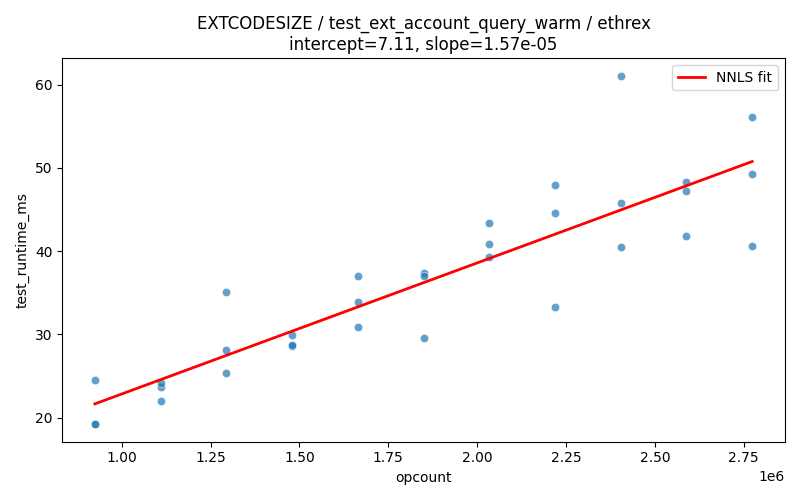

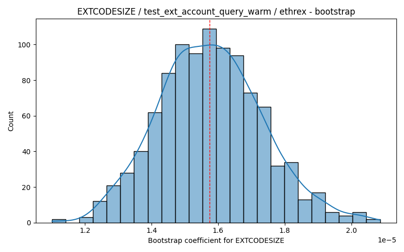

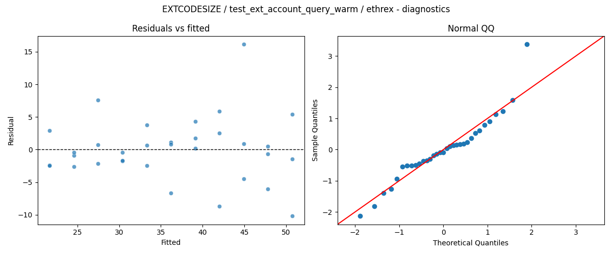

</details>

<details><summary>geth — NNLS regression summary</summary>

```
==============================================================================
                           NNLS Regression Results                            
==============================================================================
Dep. Variable:          test_runtime_ms              R-squared:          0.849
Model:                  NNLS                    Adj. R-squared:          0.849
No. Observations:       407                               RMSE:           7.66
Df Residuals:           405                                MAE:           5.97
Df Model:               1      
==============================================================================
                      coef     std err     P-value      [0.025      0.975]
------------------------------------------------------------------------------
         const     20.8190      1.1366       0.001     18.6297     23.1866
       opcount      0.0000      0.0000       0.001      0.0000      0.0000
==============================================================================
Notes: Non-negative least squares with bootstrap inference (1000 iterations)
==============================================================================
```

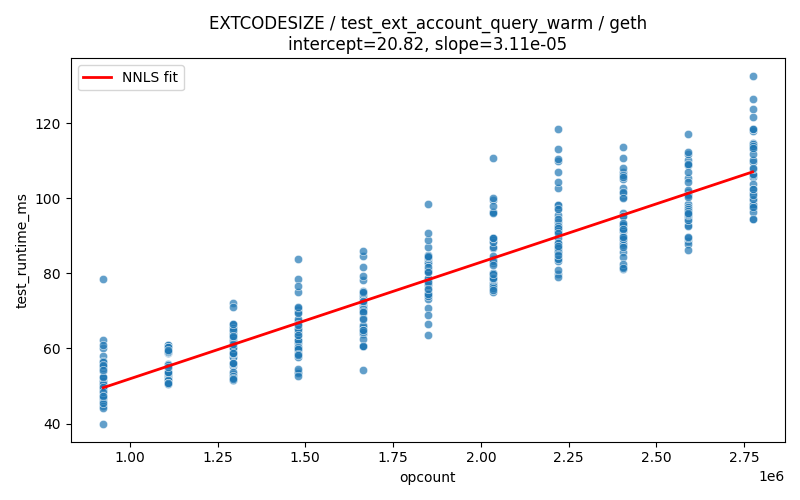

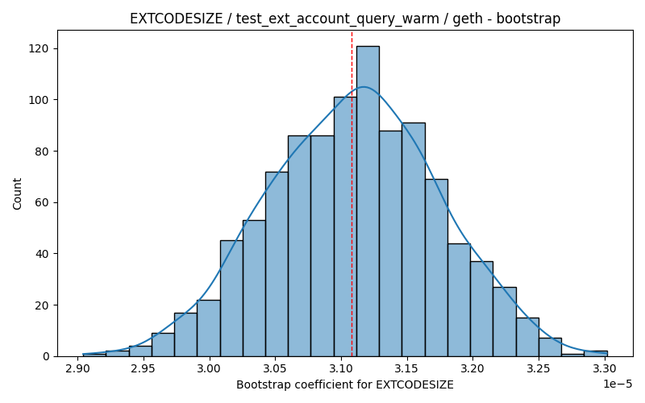

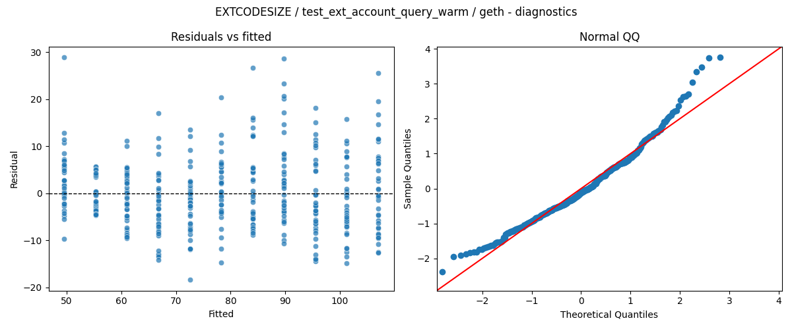

</details>

<details><summary>nethermind — NNLS regression summary</summary>

```
==============================================================================
                           NNLS Regression Results                            
==============================================================================
Dep. Variable:          test_runtime_ms              R-squared:          0.761
Model:                  NNLS                    Adj. R-squared:          0.760
No. Observations:       352                               RMSE:          55.23
Df Residuals:           350                                MAE:          42.29
Df Model:               1      
==============================================================================
                      coef     std err     P-value      [0.025      0.975]
------------------------------------------------------------------------------
         const    113.8026      9.0301       0.001     96.9686    132.0520
       opcount      0.0002      0.0000       0.001      0.0002      0.0002
==============================================================================
Notes: Non-negative least squares with bootstrap inference (1000 iterations)
==============================================================================
```

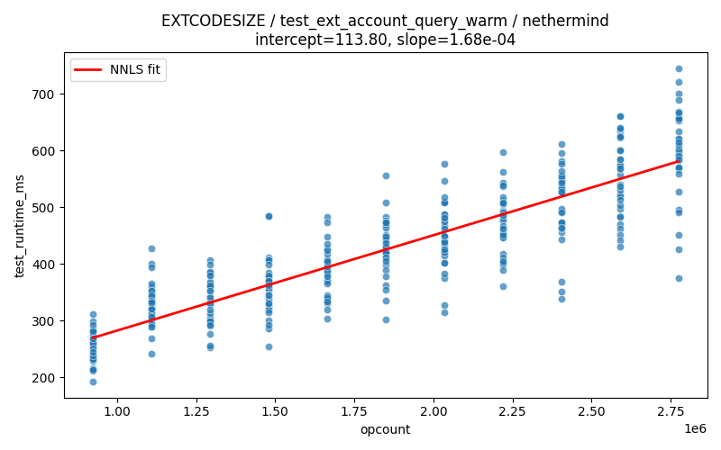

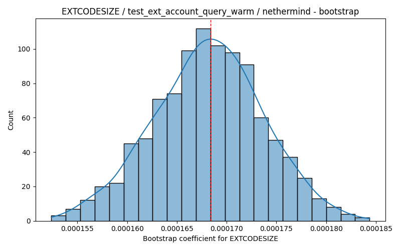

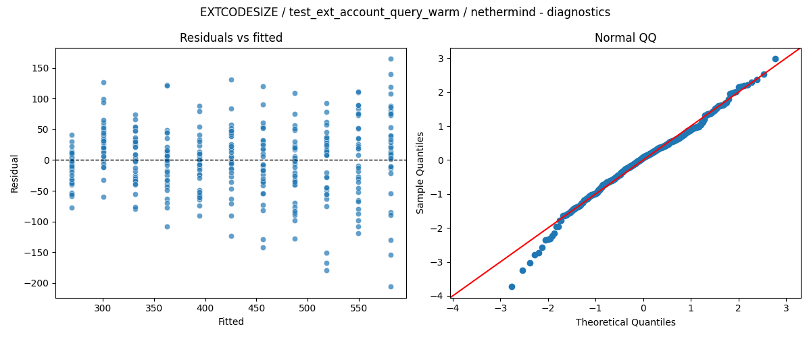

</details>

<details><summary>reth — NNLS regression summary</summary>

```
==============================================================================
                           NNLS Regression Results                            
==============================================================================
Dep. Variable:          test_runtime_ms              R-squared:          0.659
Model:                  NNLS                    Adj. R-squared:          0.658
No. Observations:       374                               RMSE:           3.06
Df Residuals:           372                                MAE:           2.20
Df Model:               1      
==============================================================================
                      coef     std err     P-value      [0.025      0.975]
------------------------------------------------------------------------------
         const      5.4110      0.5222       0.001      4.3892      6.4545
       opcount      0.0000      0.0000       0.001      0.0000      0.0000
==============================================================================
Notes: Non-negative least squares with bootstrap inference (1000 iterations)
==============================================================================
```

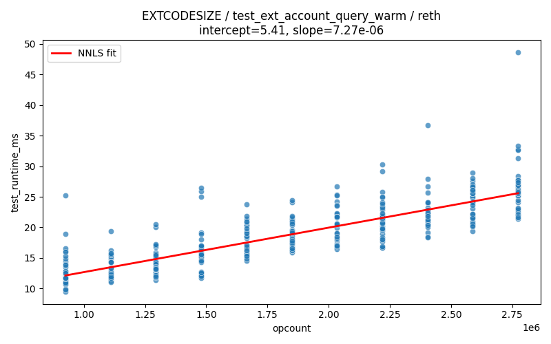

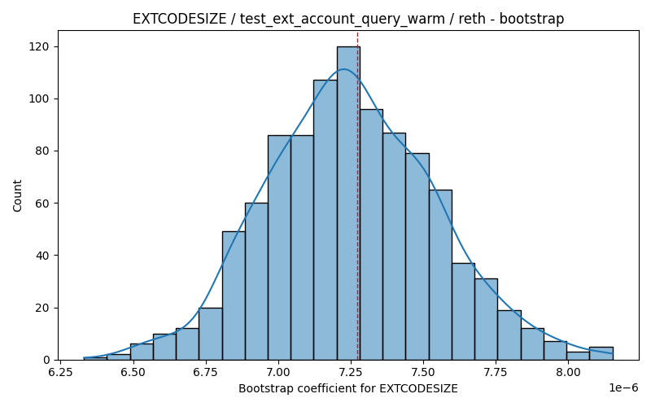

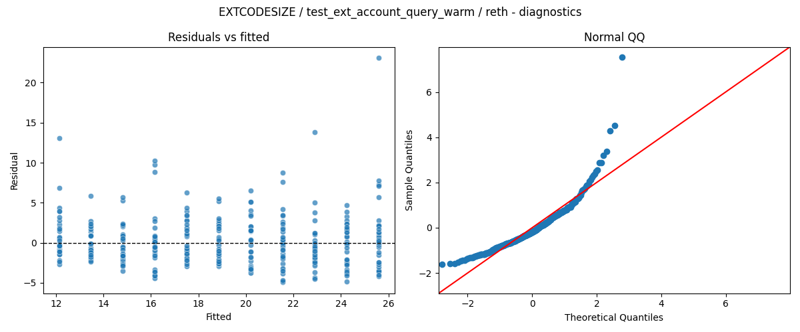

</details>

## STATICCALL

### test_account_access — combo `STATICCALL_AccountMode.EXISTING_EOA`

| client | nobs | R² | target_coef (ms) | p-value | 95% CI |
| --- | --- | --- | --- | --- | --- |
| `besu` | 341 | 0.7551 | 0.01688 | 1.00e-03 | [0.01587, 0.01786] |
| `erigon` | 198 | 0.9759 | 0.009458 | 1.00e-03 | [0.009255, 0.009692] |
| `ethrex` | 33 | 0.9804 | 0.01771 | 1.00e-03 | [0.01678, 0.01874] |
| `geth` | 407 | 0.9431 | 0.01097 | 1.00e-03 | [0.01066, 0.01131] |
| `nethermind` | 352 | 0.9519 | 0.003894 | 1.00e-03 | [0.003804, 0.003987] |
| `reth` | 374 | 0.9473 | 0.001275 | 1.00e-03 | [0.001242, 0.001308] |

<details><summary>besu — NNLS regression summary</summary>

```
==============================================================================
                           NNLS Regression Results                            
==============================================================================
Dep. Variable:          test_runtime_ms              R-squared:          0.755
Model:                  NNLS                    Adj. R-squared:          0.754
No. Observations:       341                               RMSE:         228.48
Df Residuals:           339                                MAE:         205.32
Df Model:               1      
==============================================================================
                      coef     std err     P-value      [0.025      0.975]
------------------------------------------------------------------------------
         const    736.7133     37.6741       0.001    666.0963    809.6121
       opcount      0.0169      0.0005       0.001      0.0159      0.0179
==============================================================================
Notes: Non-negative least squares with bootstrap inference (1000 iterations)
==============================================================================
```

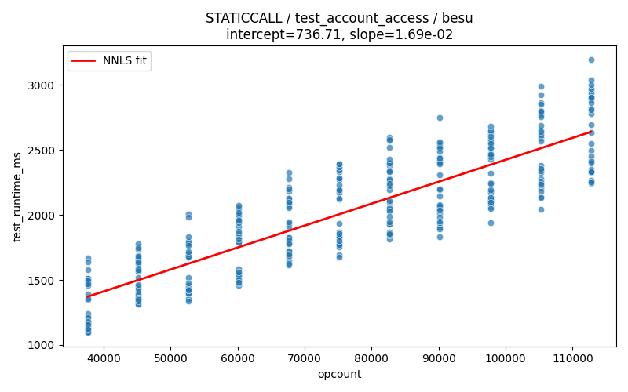

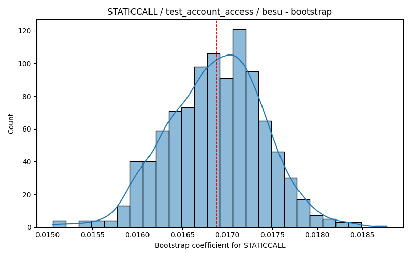

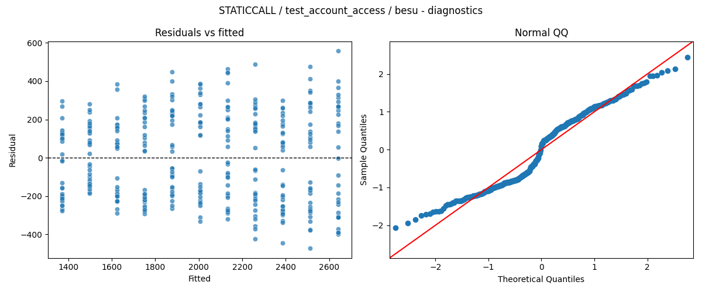

</details>

<details><summary>erigon — NNLS regression summary</summary>

```
==============================================================================
                           NNLS Regression Results                            
==============================================================================
Dep. Variable:          test_runtime_ms              R-squared:          0.976
Model:                  NNLS                    Adj. R-squared:          0.976
No. Observations:       198                               RMSE:          35.33
Df Residuals:           196                                MAE:          30.74
Df Model:               1      
==============================================================================
                      coef     std err     P-value      [0.025      0.975]
------------------------------------------------------------------------------
         const     20.2298      7.1238       0.004      5.1563     33.8178
       opcount      0.0095      0.0001       0.001      0.0093      0.0097
==============================================================================
Notes: Non-negative least squares with bootstrap inference (1000 iterations)
==============================================================================
```

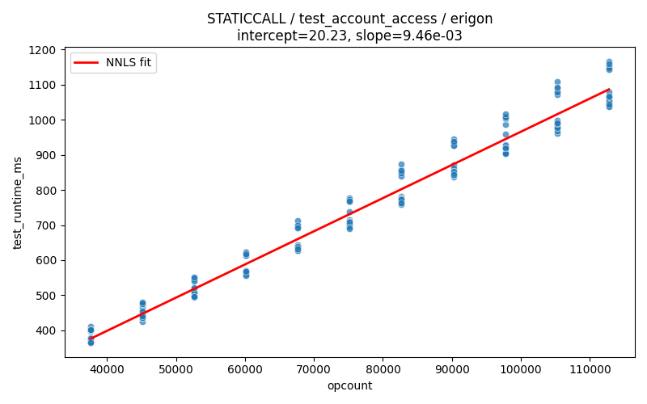

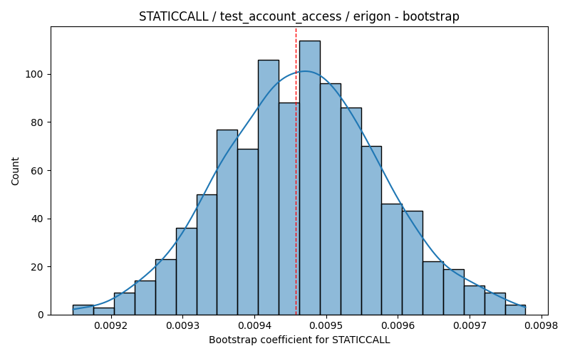

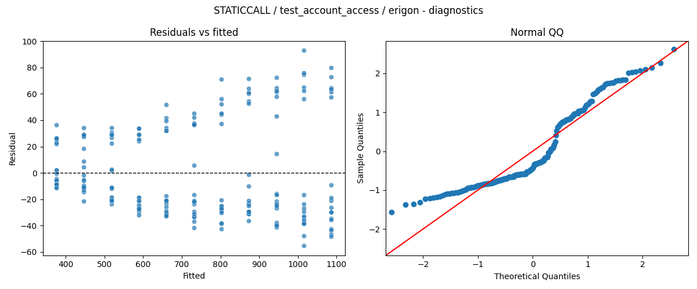

</details>

<details><summary>ethrex — NNLS regression summary</summary>

```
==============================================================================
                           NNLS Regression Results                            
==============================================================================
Dep. Variable:          test_runtime_ms              R-squared:          0.980
Model:                  NNLS                    Adj. R-squared:          0.980
No. Observations:       33                                RMSE:          59.51
Df Residuals:           31                                 MAE:          53.31
Df Model:               1      
==============================================================================
                      coef     std err     P-value      [0.025      0.975]
------------------------------------------------------------------------------
         const    164.9145     42.2339       0.001     82.1082    251.1842
       opcount      0.0177      0.0005       0.001      0.0168      0.0187
==============================================================================
Notes: Non-negative least squares with bootstrap inference (1000 iterations)
==============================================================================
```

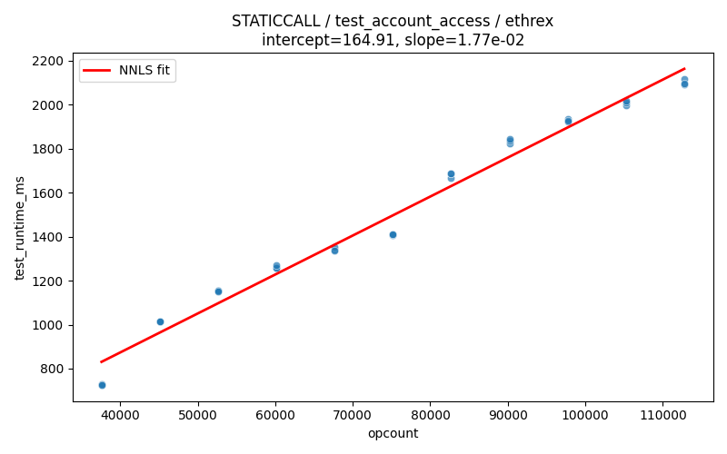

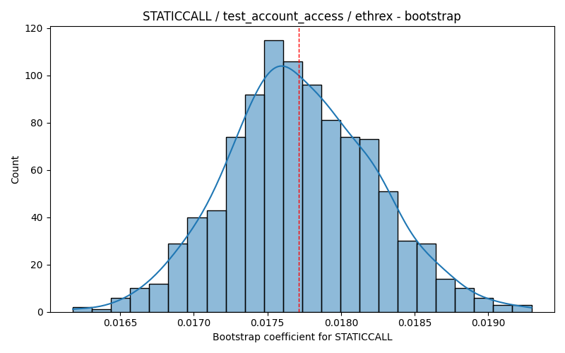

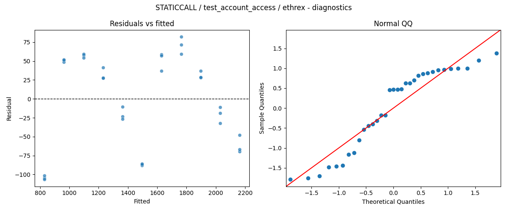

</details>

<details><summary>geth — NNLS regression summary</summary>

```
==============================================================================
                           NNLS Regression Results                            
==============================================================================
Dep. Variable:          test_runtime_ms              R-squared:          0.943
Model:                  NNLS                    Adj. R-squared:          0.943
No. Observations:       407                               RMSE:          64.07
Df Residuals:           405                                MAE:          51.04
Df Model:               1      
==============================================================================
                      coef     std err     P-value      [0.025      0.975]
------------------------------------------------------------------------------
         const    463.4220     14.6134       0.001    433.9057    490.6863
       opcount      0.0110      0.0002       0.001      0.0107      0.0113
==============================================================================
Notes: Non-negative least squares with bootstrap inference (1000 iterations)
==============================================================================
```

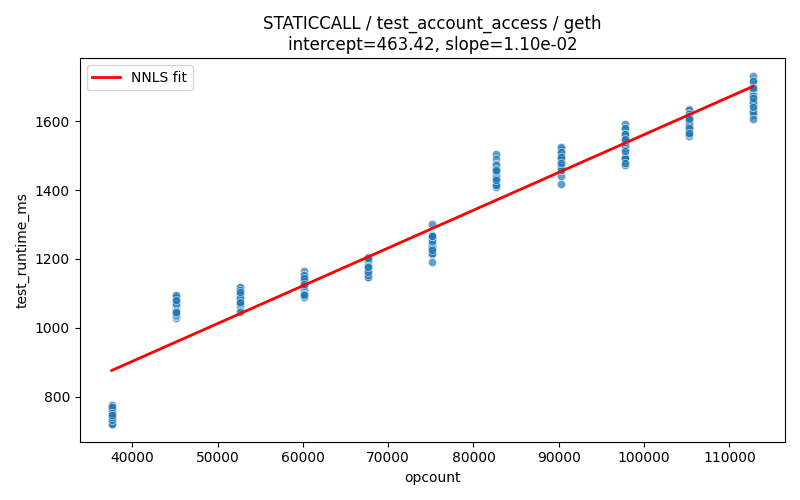

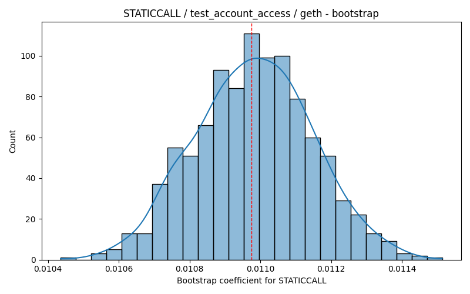

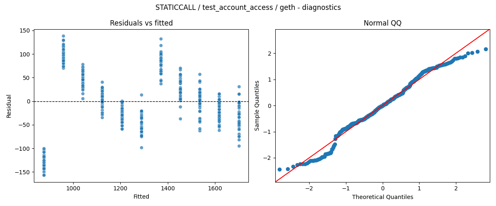

</details>

<details><summary>nethermind — NNLS regression summary</summary>

```
==============================================================================
                           NNLS Regression Results                            
==============================================================================
Dep. Variable:          test_runtime_ms              R-squared:          0.952
Model:                  NNLS                    Adj. R-squared:          0.952
No. Observations:       352                               RMSE:          20.80
Df Residuals:           350                                MAE:          16.69
Df Model:               1      
==============================================================================
                      coef     std err     P-value      [0.025      0.975]
------------------------------------------------------------------------------
         const     85.5219      3.5925       0.001     78.2710     92.4746
       opcount      0.0039      0.0000       0.001      0.0038      0.0040
==============================================================================
Notes: Non-negative least squares with bootstrap inference (1000 iterations)
==============================================================================
```

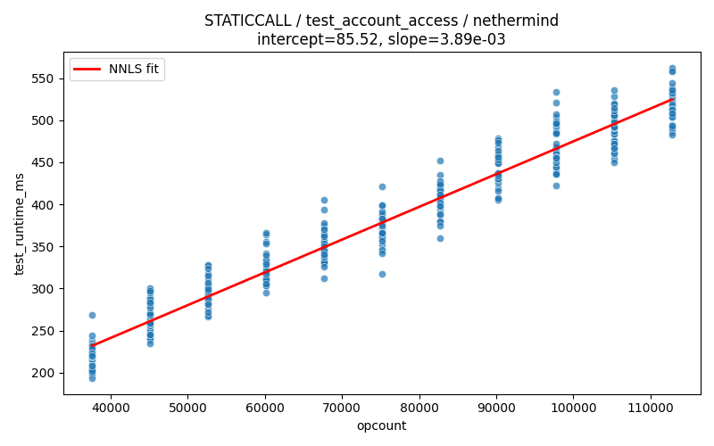

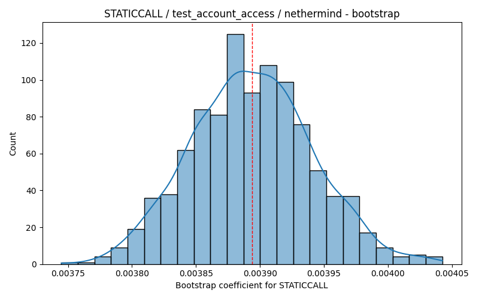

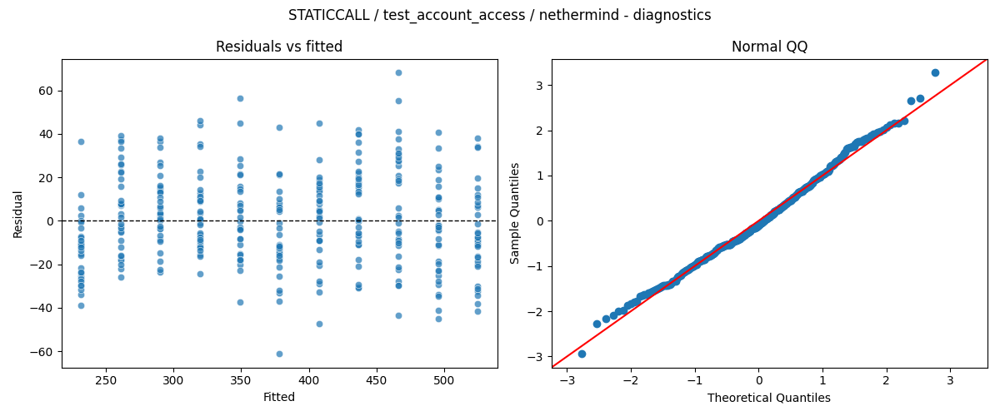

</details>

<details><summary>reth — NNLS regression summary</summary>

```
==============================================================================
                           NNLS Regression Results                            
==============================================================================
Dep. Variable:          test_runtime_ms              R-squared:          0.947
Model:                  NNLS                    Adj. R-squared:          0.947
No. Observations:       374                               RMSE:           7.15
Df Residuals:           372                                MAE:           5.36
Df Model:               1      
==============================================================================
                      coef     std err     P-value      [0.025      0.975]
------------------------------------------------------------------------------
         const     41.1092      1.1783       0.001     38.8581     43.3886
       opcount      0.0013      0.0000       0.001      0.0012      0.0013
==============================================================================
Notes: Non-negative least squares with bootstrap inference (1000 iterations)
==============================================================================
```

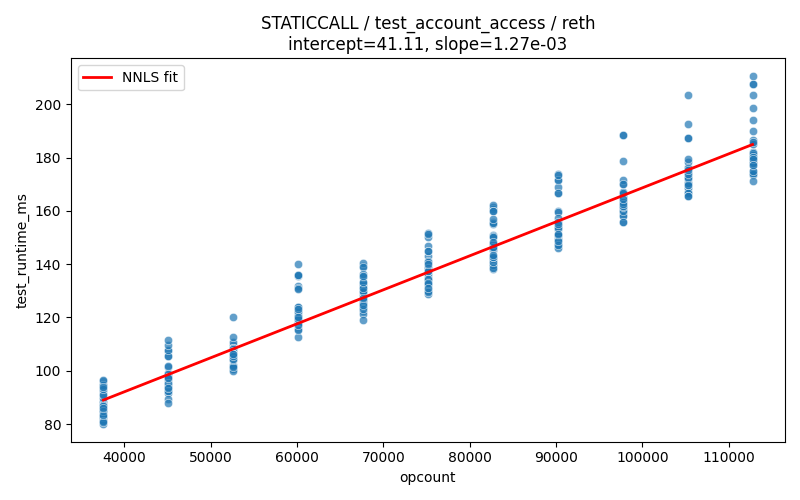

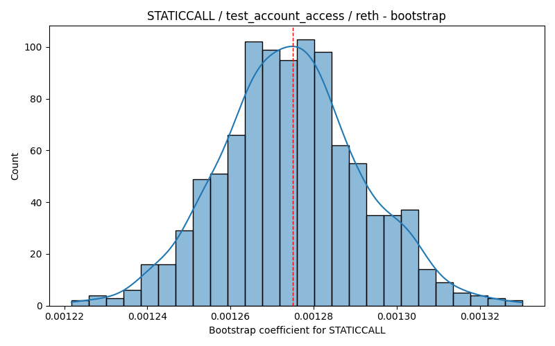

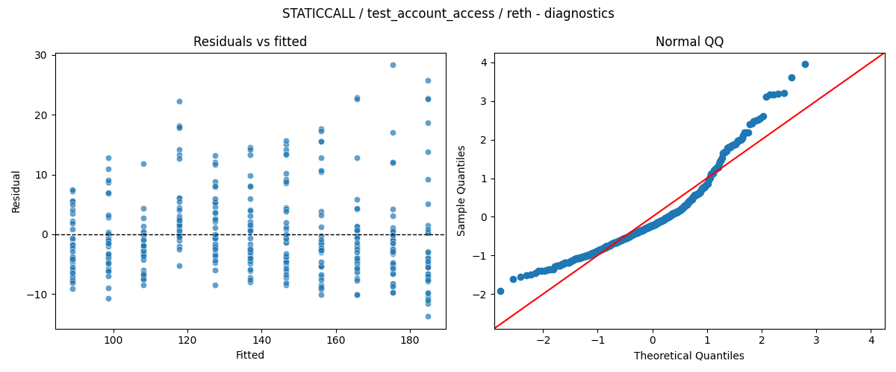

</details>

### test_account_access — combo `STATICCALL_AccountMode.NON_EXISTING_ACCOUNT` — `presets[cold_account_nocode_access]`

| client | nobs | R² | target_coef (ms) | p-value | 95% CI |
| --- | --- | --- | --- | --- | --- |
| `besu` | 341 | 0.7701 | 0.01667 | 1.00e-03 | [0.01567, 0.01767] |
| `erigon` | 198 | 0.9803 | 0.01098 | 1.00e-03 | [0.01091, 0.01107] |
| `ethrex` | 33 | 0.9941 | 0.002715 | 1.00e-03 | [0.002639, 0.002784] |
| `geth` | 407 | 0.8703 | 0.02276 | 1.00e-03 | [0.02179, 0.02374] |
| `nethermind` | 352 | 0.9071 | 0.003951 | 1.00e-03 | [0.003829, 0.004092] |
| `reth` | 374 | 0.9674 | 0.0009433 | 1.00e-03 | [0.0009252, 0.0009628] |

<details><summary>besu — NNLS regression summary</summary>

```
==============================================================================
                           NNLS Regression Results                            
==============================================================================
Dep. Variable:          test_runtime_ms              R-squared:          0.770
Model:                  NNLS                    Adj. R-squared:          0.769
No. Observations:       341                               RMSE:         216.56
Df Residuals:           339                                MAE:         197.42
Df Model:               1      
==============================================================================
                      coef     std err     P-value      [0.025      0.975]
------------------------------------------------------------------------------
         const    581.0905     34.9900       0.001    511.3925    649.2314
       opcount      0.0167      0.0005       0.001      0.0157      0.0177
==============================================================================
Notes: Non-negative least squares with bootstrap inference (1000 iterations)
==============================================================================
```

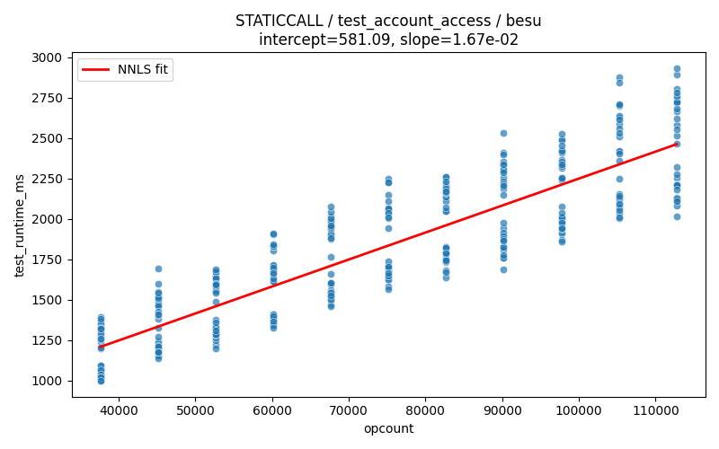

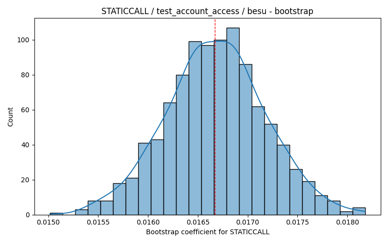

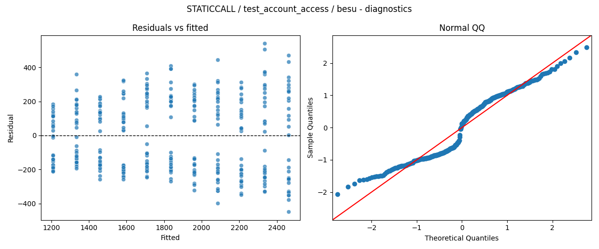

</details>

<details><summary>erigon — NNLS regression summary</summary>

```
==============================================================================
                           NNLS Regression Results                            
==============================================================================
Dep. Variable:          test_runtime_ms              R-squared:          0.980
Model:                  NNLS                    Adj. R-squared:          0.980
No. Observations:       198                               RMSE:          37.58
Df Residuals:           196                                MAE:          31.89
Df Model:               1      
==============================================================================
                      coef     std err     P-value      [0.025      0.975]
------------------------------------------------------------------------------
         const      0.0000      0.4304       1.000      0.0000      0.2708
       opcount      0.0110      0.0000       0.001      0.0109      0.0111
==============================================================================
Notes: Non-negative least squares with bootstrap inference (1000 iterations)
==============================================================================
```

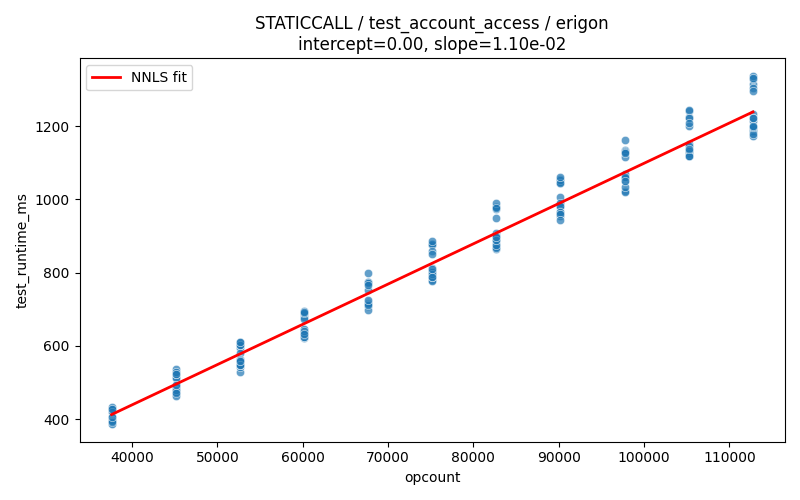

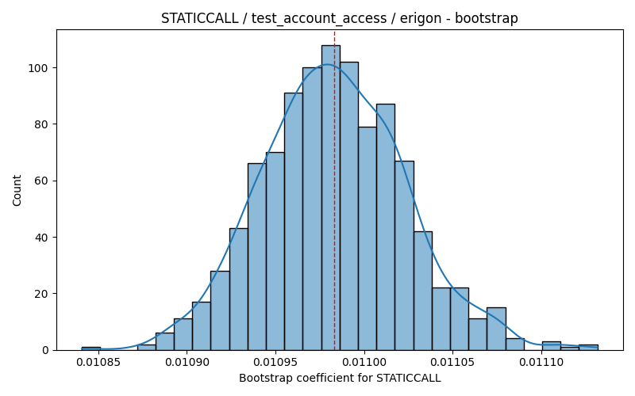

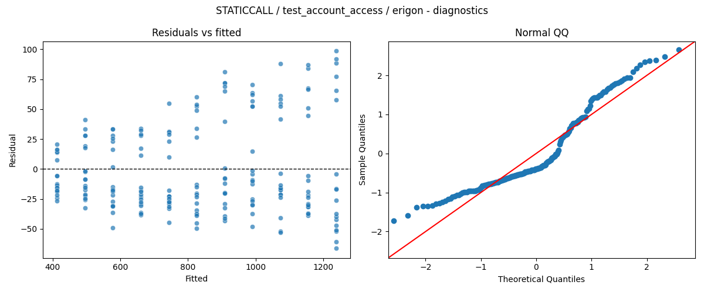

</details>

<details><summary>ethrex — NNLS regression summary</summary>

```
==============================================================================
                           NNLS Regression Results                            
==============================================================================
Dep. Variable:          test_runtime_ms              R-squared:          0.994
Model:                  NNLS                    Adj. R-squared:          0.994
No. Observations:       33                                RMSE:           4.98
Df Residuals:           31                                 MAE:           3.79
Df Model:               1      
==============================================================================
                      coef     std err     P-value      [0.025      0.975]
------------------------------------------------------------------------------
         const      4.6984      2.7022       0.040      0.0000     10.3523
       opcount      0.0027      0.0000       0.001      0.0026      0.0028
==============================================================================
Notes: Non-negative least squares with bootstrap inference (1000 iterations)
==============================================================================
```


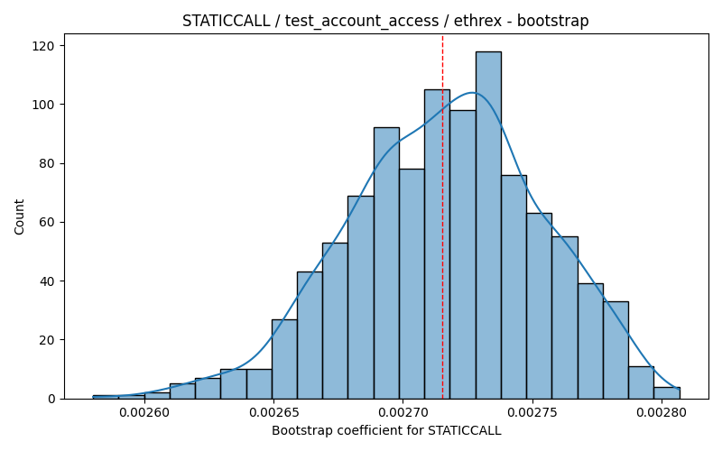

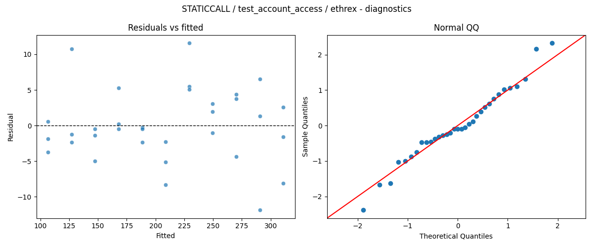

</details>

<details><summary>geth — NNLS regression summary</summary>

```
==============================================================================
                           NNLS Regression Results                            
==============================================================================
Dep. Variable:          test_runtime_ms              R-squared:          0.870
Model:                  NNLS                    Adj. R-squared:          0.870
No. Observations:       407                               RMSE:         208.83
Df Residuals:           405                                MAE:         178.73
Df Model:               1      
==============================================================================
                      coef     std err     P-value      [0.025      0.975]
------------------------------------------------------------------------------
         const    782.9272     41.7321       0.001    702.6683    866.0902
       opcount      0.0228      0.0005       0.001      0.0218      0.0237
==============================================================================
Notes: Non-negative least squares with bootstrap inference (1000 iterations)
==============================================================================
```

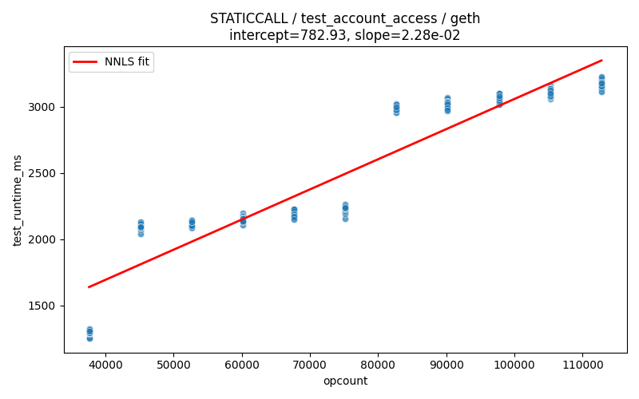

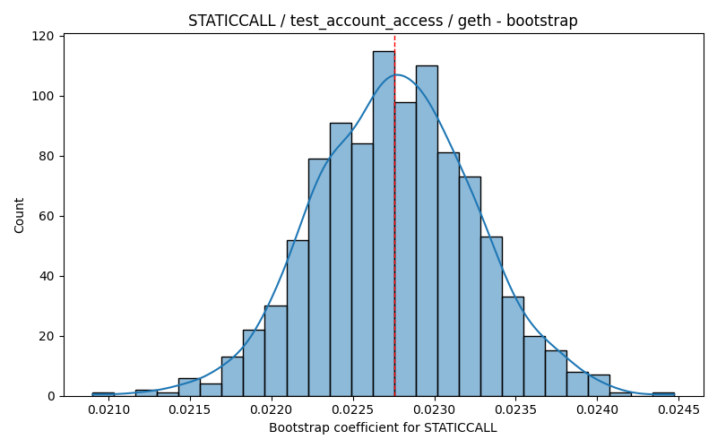

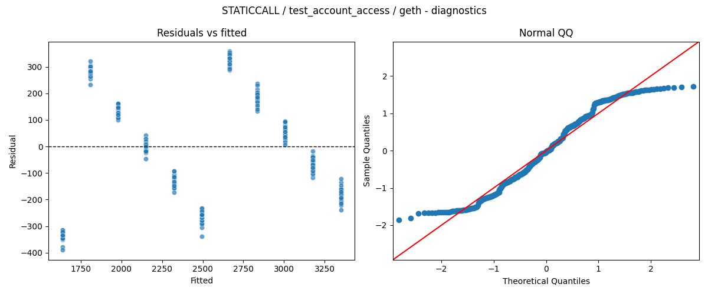

</details>

<details><summary>nethermind — NNLS regression summary</summary>

```
==============================================================================
                           NNLS Regression Results                            
==============================================================================
Dep. Variable:          test_runtime_ms              R-squared:          0.907
Model:                  NNLS                    Adj. R-squared:          0.907
No. Observations:       352                               RMSE:          30.05
Df Residuals:           350                                MAE:          19.48
Df Model:               1      
==============================================================================
                      coef     std err     P-value      [0.025      0.975]
------------------------------------------------------------------------------
         const     73.6258      4.2694       0.001     64.7825     81.7952
       opcount      0.0040      0.0001       0.001      0.0038      0.0041
==============================================================================
Notes: Non-negative least squares with bootstrap inference (1000 iterations)
==============================================================================
```

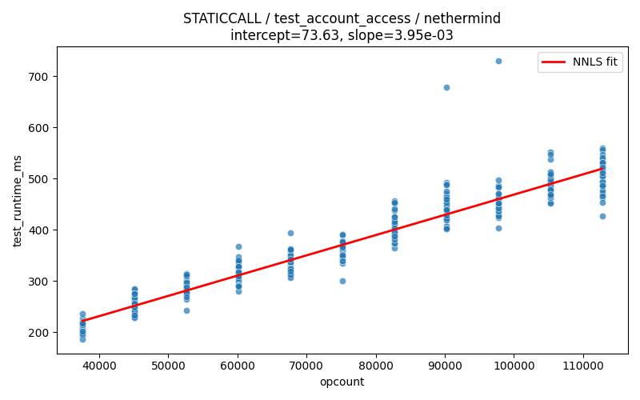

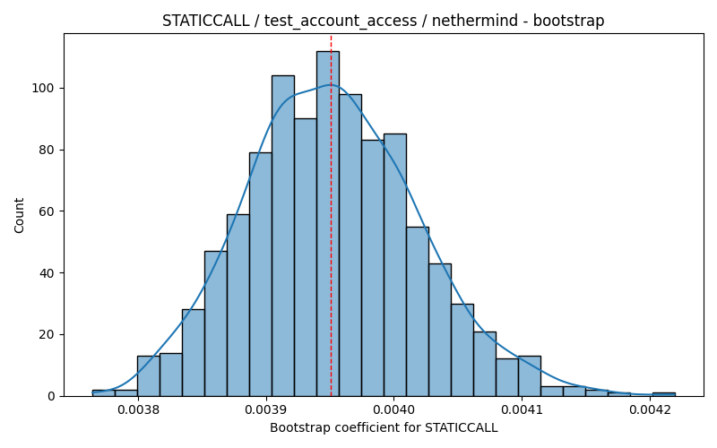

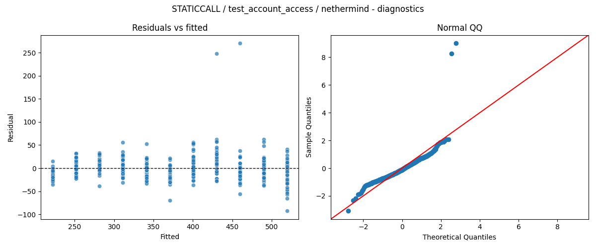

</details>

<details><summary>reth — NNLS regression summary</summary>

```
==============================================================================
                           NNLS Regression Results                            
==============================================================================
Dep. Variable:          test_runtime_ms              R-squared:          0.967
Model:                  NNLS                    Adj. R-squared:          0.967
No. Observations:       374                               RMSE:           4.12
Df Residuals:           372                                MAE:           3.21
Df Model:               1      
==============================================================================
                      coef     std err     P-value      [0.025      0.975]
------------------------------------------------------------------------------
         const     43.6005      0.7315       0.001     42.1429     45.0797
       opcount      0.0009      0.0000       0.001      0.0009      0.0010
==============================================================================
Notes: Non-negative least squares with bootstrap inference (1000 iterations)
==============================================================================
```

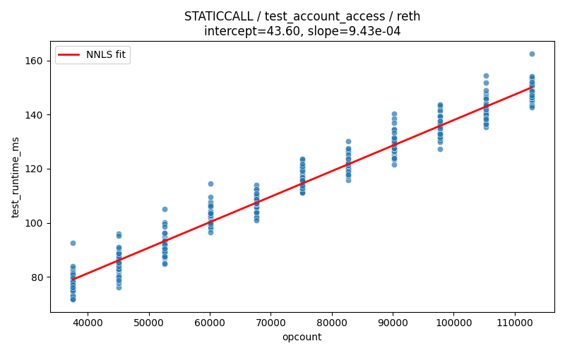

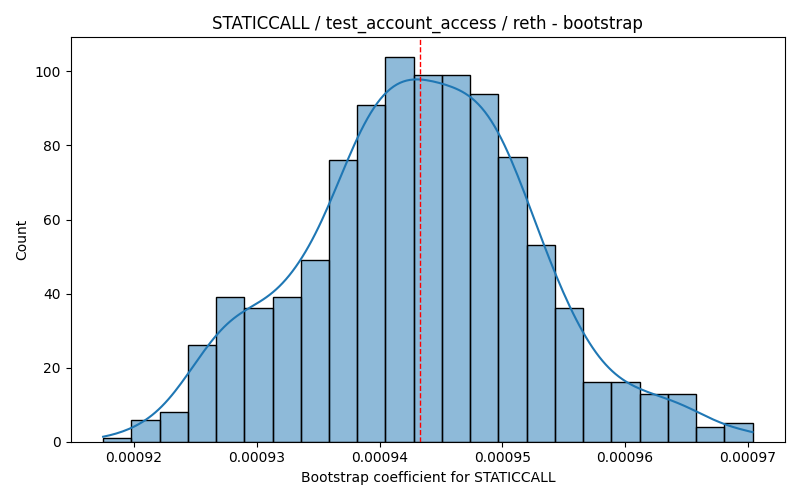

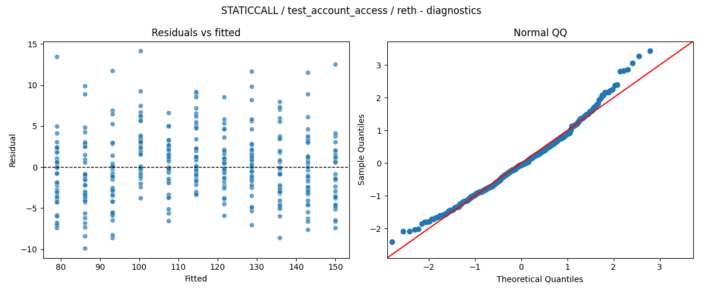

</details>

### test_account_access — combo `STATICCALL_AccountMode.EXISTING_CONTRACT`

| client | nobs | R² | target_coef (ms) | p-value | 95% CI |
| --- | --- | --- | --- | --- | --- |
| `besu` | 341 | 0.8879 | 0.03157 | 1.00e-03 | [0.03042, 0.03274] |
| `erigon` | 198 | 0.8817 | 0.08015 | 1.00e-03 | [0.07588, 0.08372] |
| `ethrex` | 33 | 0.9831 | 0.01827 | 1.00e-03 | [0.01738, 0.01924] |
| `geth` | 407 | 0.8688 | 0.02356 | 1.00e-03 | [0.02261, 0.02452] |
| `nethermind` | 352 | 0.8108 | 0.01919 | 1.00e-03 | [0.01809, 0.02027] |
| `reth` | 374 | 0.8517 | 0.01776 | 1.00e-03 | [0.01713, 0.0184] |

<details><summary>besu — NNLS regression summary</summary>

```
==============================================================================
                           NNLS Regression Results                            
==============================================================================
Dep. Variable:          test_runtime_ms              R-squared:          0.888
Model:                  NNLS                    Adj. R-squared:          0.888
No. Observations:       341                               RMSE:         228.51
Df Residuals:           339                                MAE:         206.54
Df Model:               1      
==============================================================================
                      coef     std err     P-value      [0.025      0.975]
------------------------------------------------------------------------------
         const    541.7771     37.0142       0.001    472.7599    619.1147
       opcount      0.0316      0.0006       0.001      0.0304      0.0327
==============================================================================
Notes: Non-negative least squares with bootstrap inference (1000 iterations)
==============================================================================
```

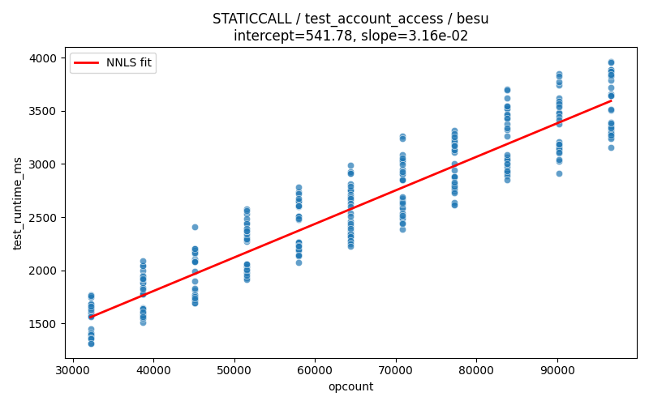

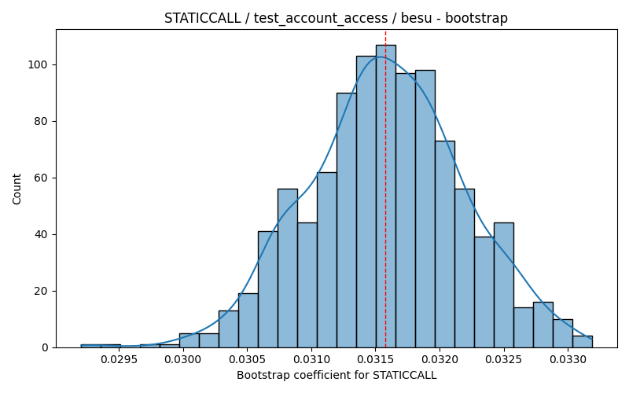

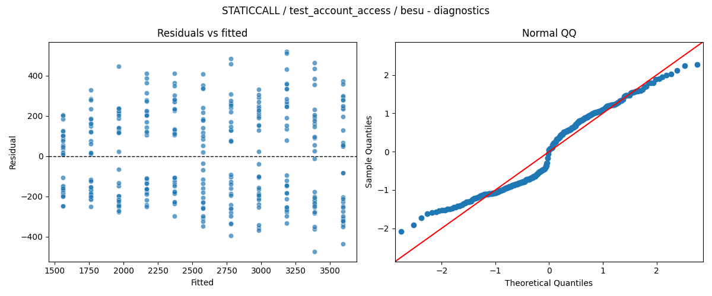

</details>

<details><summary>erigon — NNLS regression summary</summary>

```
==============================================================================
                           NNLS Regression Results                            
==============================================================================
Dep. Variable:          test_runtime_ms              R-squared:          0.882
Model:                  NNLS                    Adj. R-squared:          0.881
No. Observations:       198                               RMSE:         598.07
Df Residuals:           196                                MAE:         520.25
Df Model:               1      
==============================================================================
                      coef     std err     P-value      [0.025      0.975]
------------------------------------------------------------------------------
         const    933.6757    153.1360       0.001    654.4536   1261.2953
       opcount      0.0801      0.0020       0.001      0.0759      0.0837
==============================================================================
Notes: Non-negative least squares with bootstrap inference (1000 iterations)
==============================================================================
```

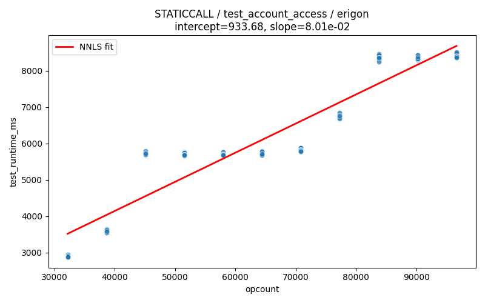

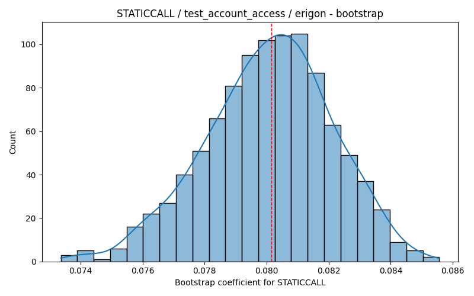

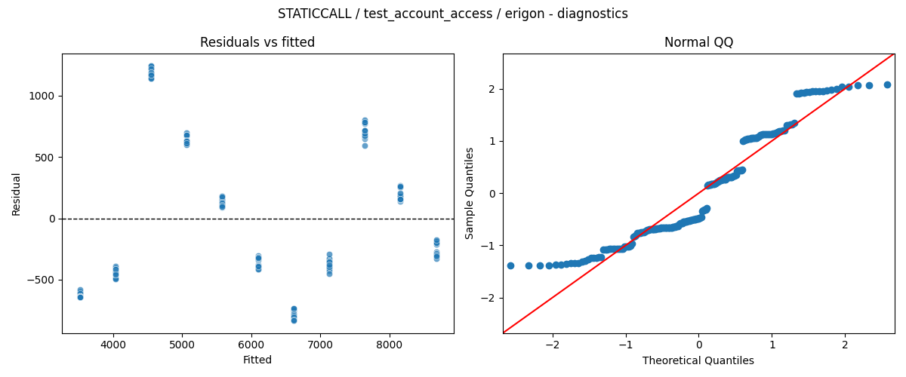

</details>

<details><summary>ethrex — NNLS regression summary</summary>

```
==============================================================================
                           NNLS Regression Results                            
==============================================================================
Dep. Variable:          test_runtime_ms              R-squared:          0.983
Model:                  NNLS                    Adj. R-squared:          0.983
No. Observations:       33                                RMSE:          48.74
Df Residuals:           31                                 MAE:          43.62
Df Model:               1      
==============================================================================
                      coef     std err     P-value      [0.025      0.975]
------------------------------------------------------------------------------
         const    140.6873     33.1010       0.001     78.2079    206.9229
       opcount      0.0183      0.0005       0.001      0.0174      0.0192
==============================================================================
Notes: Non-negative least squares with bootstrap inference (1000 iterations)
==============================================================================
```

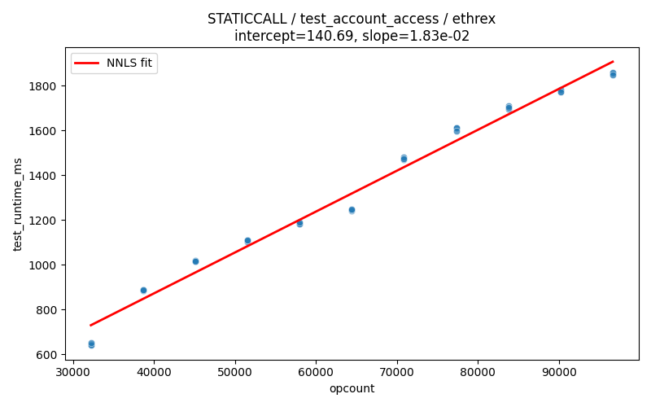

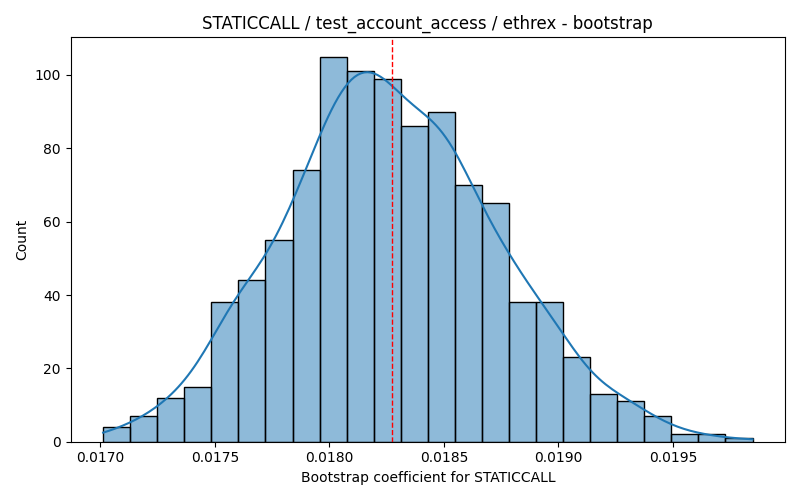

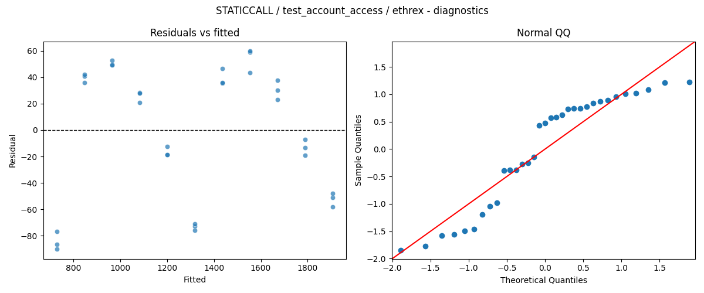

</details>

<details><summary>geth — NNLS regression summary</summary>

```
==============================================================================
                           NNLS Regression Results                            
==============================================================================
Dep. Variable:          test_runtime_ms              R-squared:          0.869
Model:                  NNLS                    Adj. R-squared:          0.868
No. Observations:       407                               RMSE:         186.49
Df Residuals:           405                                MAE:         160.13
Df Model:               1      
==============================================================================
                      coef     std err     P-value      [0.025      0.975]
------------------------------------------------------------------------------
         const    735.0127     35.7102       0.001    663.1986    806.2933
       opcount      0.0236      0.0005       0.001      0.0226      0.0245
==============================================================================
Notes: Non-negative least squares with bootstrap inference (1000 iterations)
==============================================================================
```

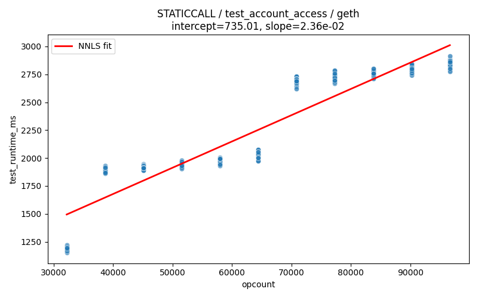

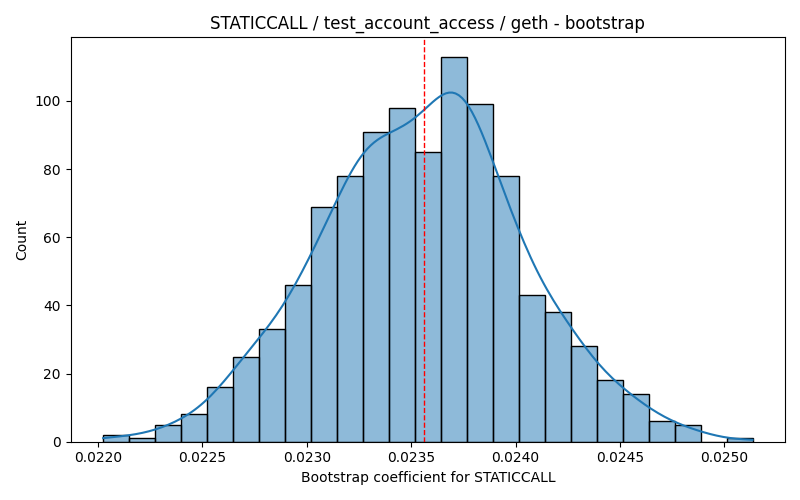

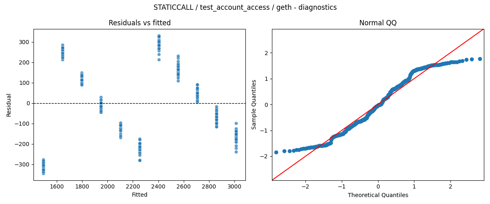

</details>

<details><summary>nethermind — NNLS regression summary</summary>

```
==============================================================================
                           NNLS Regression Results                            
==============================================================================
Dep. Variable:          test_runtime_ms              R-squared:          0.811
Model:                  NNLS                    Adj. R-squared:          0.810
No. Observations:       352                               RMSE:         188.81
Df Residuals:           350                                MAE:         158.35
Df Model:               1      
==============================================================================
                      coef     std err     P-value      [0.025      0.975]
------------------------------------------------------------------------------
         const    585.3190     40.5464       0.001    511.1686    663.7349
       opcount      0.0192      0.0006       0.001      0.0181      0.0203
==============================================================================
Notes: Non-negative least squares with bootstrap inference (1000 iterations)
==============================================================================
```

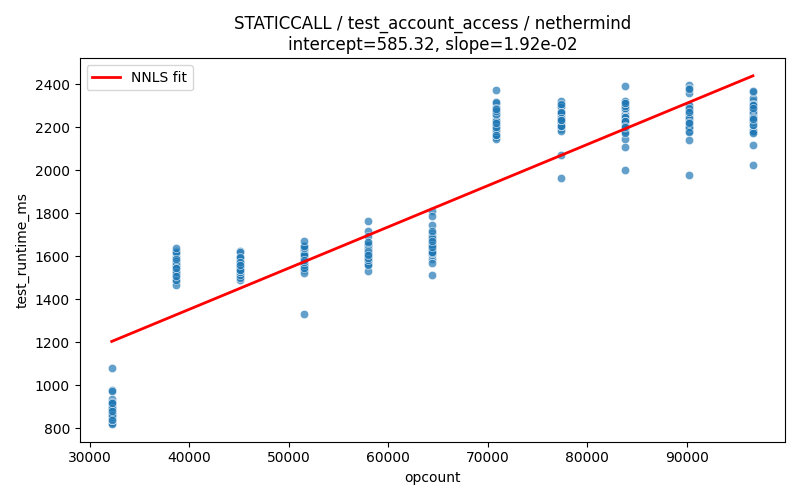

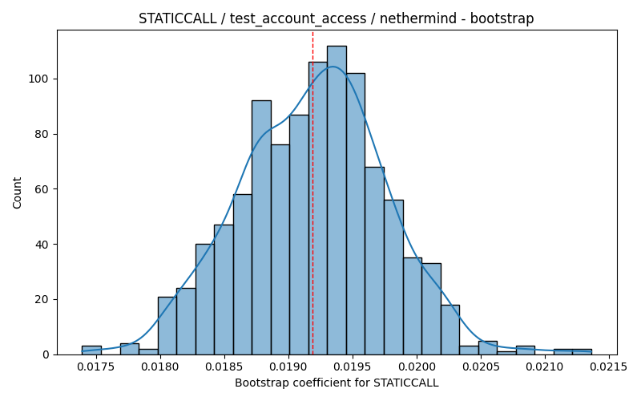

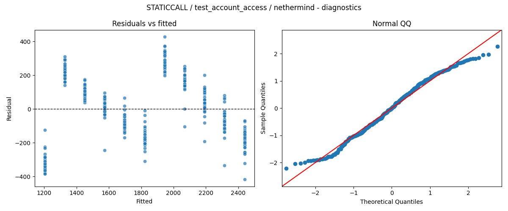

</details>

<details><summary>reth — NNLS regression summary</summary>

```
==============================================================================
                           NNLS Regression Results                            
==============================================================================
Dep. Variable:          test_runtime_ms              R-squared:          0.852
Model:                  NNLS                    Adj. R-squared:          0.851
No. Observations:       374                               RMSE:         150.96
Df Residuals:           372                                MAE:          73.68
Df Model:               1      
==============================================================================
                      coef     std err     P-value      [0.025      0.975]
------------------------------------------------------------------------------
         const    333.9276     22.4415       0.001    291.6097    382.3395
       opcount      0.0178      0.0003       0.001      0.0171      0.0184
==============================================================================
Notes: Non-negative least squares with bootstrap inference (1000 iterations)
==============================================================================
```

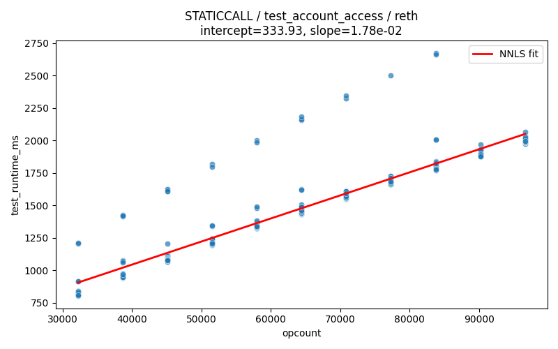

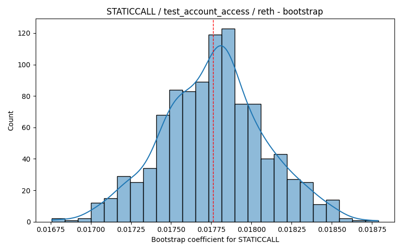

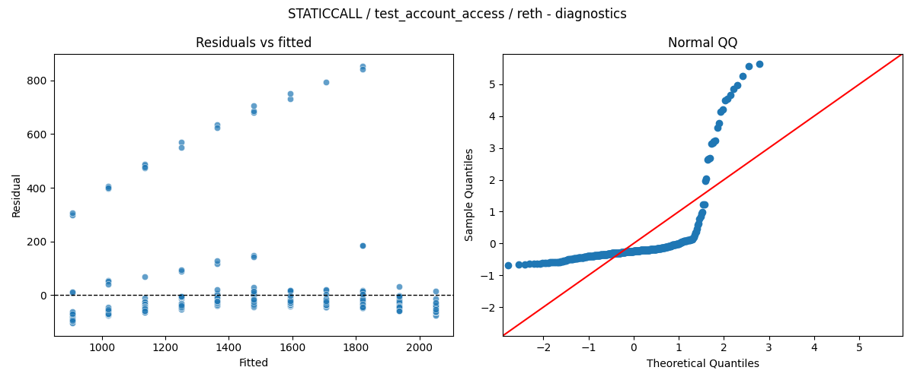

</details>

### test_account_access — combo `STATICCALL_AccountMode.NON_EXISTING_ACCOUNT` — `presets[cold_account_code_access]`

| client | nobs | R² | target_coef (ms) | p-value | 95% CI |
| --- | --- | --- | --- | --- | --- |
| `besu` | 341 | 0.7701 | 0.01667 | 1.00e-03 | [0.01567, 0.01767] |
| `erigon` | 198 | 0.9803 | 0.01098 | 1.00e-03 | [0.01091, 0.01107] |
| `ethrex` | 33 | 0.9941 | 0.002715 | 1.00e-03 | [0.002639, 0.002784] |
| `geth` | 407 | 0.8703 | 0.02276 | 1.00e-03 | [0.02179, 0.02374] |
| `nethermind` | 352 | 0.9071 | 0.003951 | 1.00e-03 | [0.003829, 0.004092] |
| `reth` | 374 | 0.9674 | 0.0009433 | 1.00e-03 | [0.0009252, 0.0009628] |

<details><summary>besu — NNLS regression summary</summary>

```
==============================================================================
                           NNLS Regression Results                            
==============================================================================
Dep. Variable:          test_runtime_ms              R-squared:          0.770
Model:                  NNLS                    Adj. R-squared:          0.769
No. Observations:       341                               RMSE:         216.56
Df Residuals:           339                                MAE:         197.42
Df Model:               1      
==============================================================================
                      coef     std err     P-value      [0.025      0.975]
------------------------------------------------------------------------------
         const    581.0905     34.9900       0.001    511.3925    649.2314
       opcount      0.0167      0.0005       0.001      0.0157      0.0177
==============================================================================
Notes: Non-negative least squares with bootstrap inference (1000 iterations)
==============================================================================
```


</details>

<details><summary>erigon — NNLS regression summary</summary>

```
==============================================================================
                           NNLS Regression Results                            
==============================================================================
Dep. Variable:          test_runtime_ms              R-squared:          0.980
Model:                  NNLS                    Adj. R-squared:          0.980
No. Observations:       198                               RMSE:          37.58
Df Residuals:           196                                MAE:          31.89
Df Model:               1      
==============================================================================
                      coef     std err     P-value      [0.025      0.975]
------------------------------------------------------------------------------
         const      0.0000      0.4304       1.000      0.0000      0.2708
       opcount      0.0110      0.0000       0.001      0.0109      0.0111
==============================================================================
Notes: Non-negative least squares with bootstrap inference (1000 iterations)
==============================================================================
```


</details>

<details><summary>ethrex — NNLS regression summary</summary>

```
==============================================================================
                           NNLS Regression Results                            
==============================================================================
Dep. Variable:          test_runtime_ms              R-squared:          0.994
Model:                  NNLS                    Adj. R-squared:          0.994
No. Observations:       33                                RMSE:           4.98
Df Residuals:           31                                 MAE:           3.79
Df Model:               1      
==============================================================================
                      coef     std err     P-value      [0.025      0.975]
------------------------------------------------------------------------------
         const      4.6984      2.7022       0.040      0.0000     10.3523
       opcount      0.0027      0.0000       0.001      0.0026      0.0028
==============================================================================
Notes: Non-negative least squares with bootstrap inference (1000 iterations)
==============================================================================
```


</details>

<details><summary>geth — NNLS regression summary</summary>

```
==============================================================================
                           NNLS Regression Results                            
==============================================================================
Dep. Variable:          test_runtime_ms              R-squared:          0.870
Model:                  NNLS                    Adj. R-squared:          0.870
No. Observations:       407                               RMSE:         208.83
Df Residuals:           405                                MAE:         178.73
Df Model:               1      
==============================================================================
                      coef     std err     P-value      [0.025      0.975]
------------------------------------------------------------------------------
         const    782.9272     41.7321       0.001    702.6683    866.0902
       opcount      0.0228      0.0005       0.001      0.0218      0.0237
==============================================================================
Notes: Non-negative least squares with bootstrap inference (1000 iterations)
==============================================================================
```


</details>

<details><summary>nethermind — NNLS regression summary</summary>

```
==============================================================================
                           NNLS Regression Results                            
==============================================================================
Dep. Variable:          test_runtime_ms              R-squared:          0.907
Model:                  NNLS                    Adj. R-squared:          0.907
No. Observations:       352                               RMSE:          30.05
Df Residuals:           350                                MAE:          19.48
Df Model:               1      
==============================================================================
                      coef     std err     P-value      [0.025      0.975]
------------------------------------------------------------------------------
         const     73.6258      4.2694       0.001     64.7825     81.7952
       opcount      0.0040      0.0001       0.001      0.0038      0.0041
==============================================================================
Notes: Non-negative least squares with bootstrap inference (1000 iterations)
==============================================================================
```


</details>

<details><summary>reth — NNLS regression summary</summary>

```
==============================================================================
                           NNLS Regression Results                            
==============================================================================
Dep. Variable:          test_runtime_ms              R-squared:          0.967
Model:                  NNLS                    Adj. R-squared:          0.967
No. Observations:       374                               RMSE:           4.12
Df Residuals:           372                                MAE:           3.21
Df Model:               1      
==============================================================================
                      coef     std err     P-value      [0.025      0.975]
------------------------------------------------------------------------------
         const     43.6005      0.7315       0.001     42.1429     45.0797
       opcount      0.0009      0.0000       0.001      0.0009      0.0010
==============================================================================
Notes: Non-negative least squares with bootstrap inference (1000 iterations)
==============================================================================
```


</details>

### test_ext_account_query_warm — combo `STATICCALL`

| client | nobs | R² | target_coef (ms) | p-value | 95% CI |
| --- | --- | --- | --- | --- | --- |
| `besu` | 341 | 0.7686 | 0.000533 | 1.00e-03 | [0.0005016, 0.0005621] |
| `erigon` | 198 | 0.9846 | 0.0005613 | 1.00e-03 | [0.0005523, 0.0005696] |
| `ethrex` | 33 | 0.9233 | 9.223e-05 | 1.00e-03 | [8.299e-05, 0.0001012] |
| `geth` | 407 | 0.9414 | 0.000193 | 1.00e-03 | [0.0001884, 0.0001974] |
| `nethermind` | 352 | 0.7666 | 0.0003753 | 1.00e-03 | [0.0003532, 0.0003966] |
| `reth` | 374 | 0.9172 | 5.308e-05 | 1.00e-03 | [5.144e-05, 5.473e-05] |

<details><summary>besu — NNLS regression summary</summary>

```
==============================================================================
                           NNLS Regression Results                            
==============================================================================
Dep. Variable:          test_runtime_ms              R-squared:          0.769
Model:                  NNLS                    Adj. R-squared:          0.768
No. Observations:       341                               RMSE:         151.39
Df Residuals:           339                                MAE:         120.67
Df Model:               1      
==============================================================================
                      coef     std err     P-value      [0.025      0.975]
------------------------------------------------------------------------------
         const    698.2429     24.8270       0.001    651.0033    746.8877
       opcount      0.0005      0.0000       0.001      0.0005      0.0006
==============================================================================
Notes: Non-negative least squares with bootstrap inference (1000 iterations)
==============================================================================
```

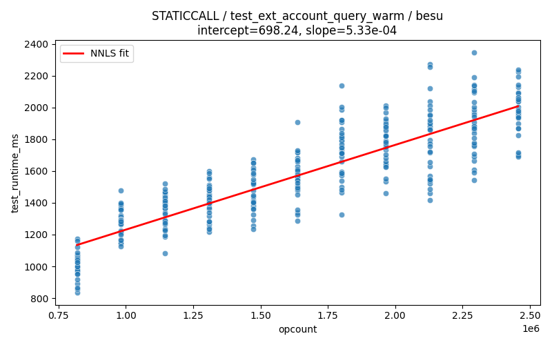

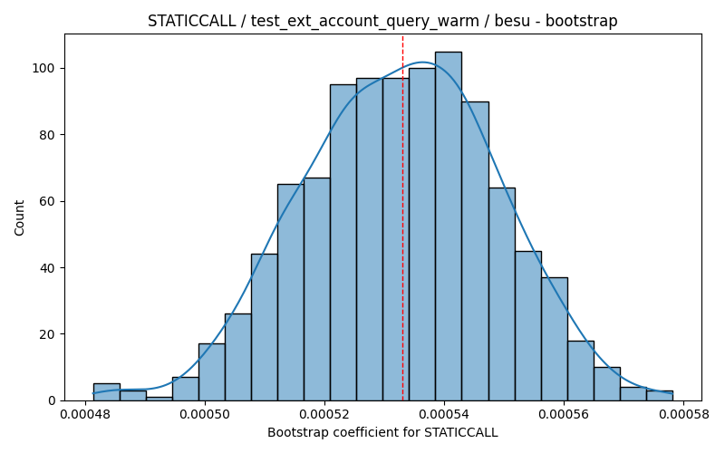

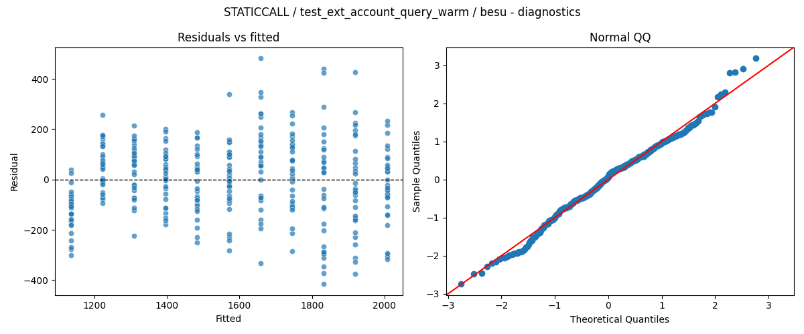

</details>

<details><summary>erigon — NNLS regression summary</summary>

```
==============================================================================
                           NNLS Regression Results                            
==============================================================================
Dep. Variable:          test_runtime_ms              R-squared:          0.985
Model:                  NNLS                    Adj. R-squared:          0.985
No. Observations:       198                               RMSE:          36.33
Df Residuals:           196                                MAE:          26.94
Df Model:               1      
==============================================================================
                      coef     std err     P-value      [0.025      0.975]
------------------------------------------------------------------------------
         const     47.5140      7.7626       0.001     32.7835     63.2470
       opcount      0.0006      0.0000       0.001      0.0006      0.0006
==============================================================================
Notes: Non-negative least squares with bootstrap inference (1000 iterations)
==============================================================================
```

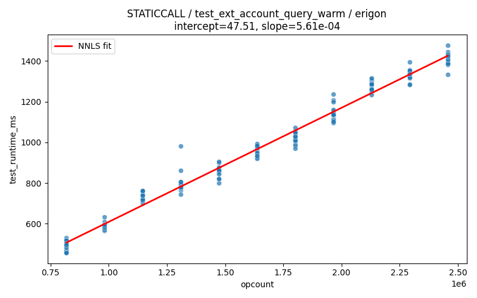

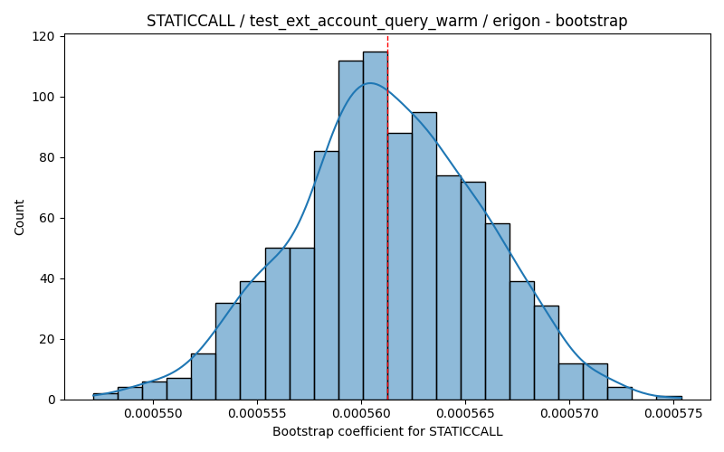

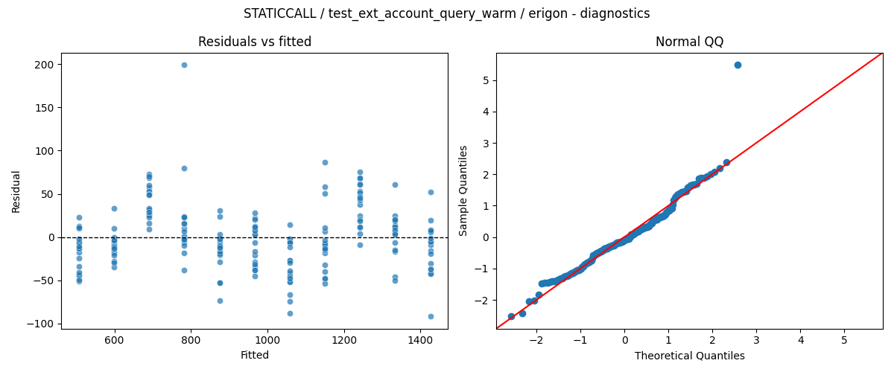

</details>

<details><summary>ethrex — NNLS regression summary</summary>

```
==============================================================================
                           NNLS Regression Results                            
==============================================================================
Dep. Variable:          test_runtime_ms              R-squared:          0.923
Model:                  NNLS                    Adj. R-squared:          0.921
No. Observations:       33                                RMSE:          13.76
Df Residuals:           31                                 MAE:          11.84
Df Model:               1      
==============================================================================
                      coef     std err     P-value      [0.025      0.975]
------------------------------------------------------------------------------
         const     46.4178      7.5714       0.001     32.0863     62.1045
       opcount      0.0001      0.0000       0.001      0.0001      0.0001
==============================================================================
Notes: Non-negative least squares with bootstrap inference (1000 iterations)
==============================================================================
```

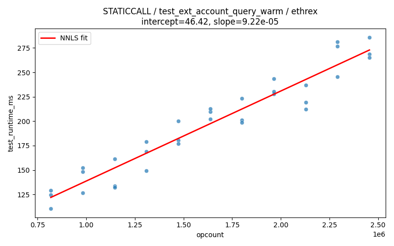

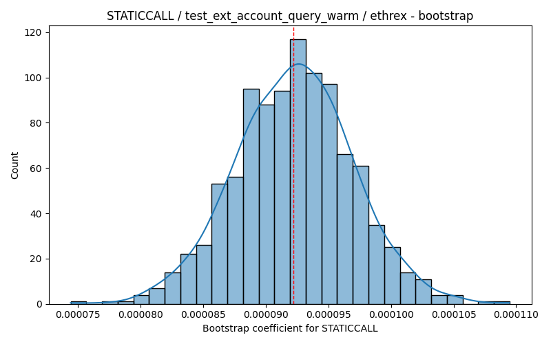

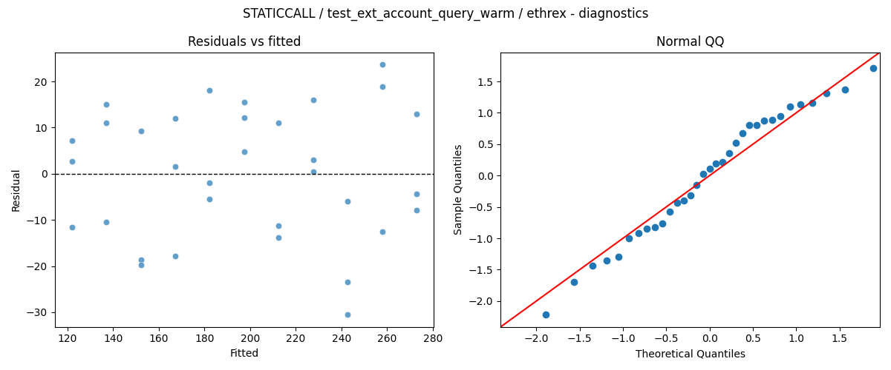

</details>

<details><summary>geth — NNLS regression summary</summary>

```
==============================================================================
                           NNLS Regression Results                            
==============================================================================
Dep. Variable:          test_runtime_ms              R-squared:          0.941
Model:                  NNLS                    Adj. R-squared:          0.941
No. Observations:       407                               RMSE:          24.94
Df Residuals:           405                                MAE:          19.96
Df Model:               1      
==============================================================================
                      coef     std err     P-value      [0.025      0.975]
------------------------------------------------------------------------------
         const     53.5315      3.5846       0.001     46.7241     61.0366
       opcount      0.0002      0.0000       0.001      0.0002      0.0002
==============================================================================
Notes: Non-negative least squares with bootstrap inference (1000 iterations)
==============================================================================
```

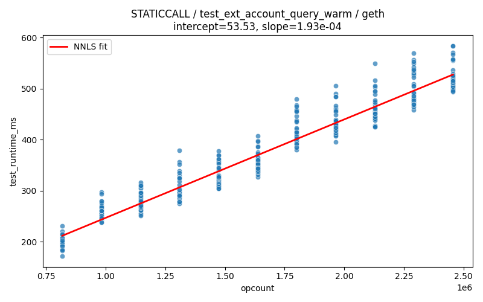

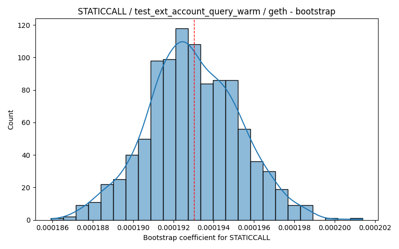

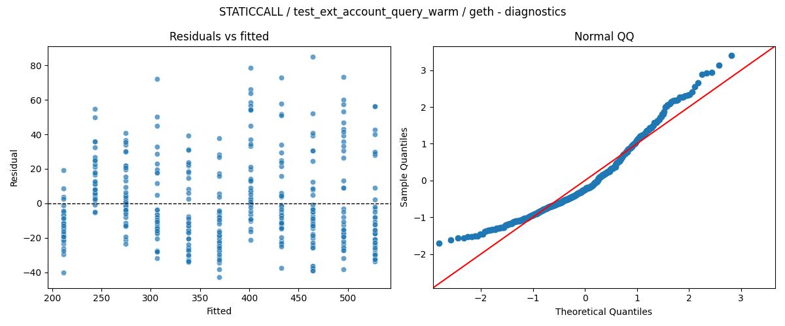

</details>

<details><summary>nethermind — NNLS regression summary</summary>

```
==============================================================================
                           NNLS Regression Results                            
==============================================================================
Dep. Variable:          test_runtime_ms              R-squared:          0.767
Model:                  NNLS                    Adj. R-squared:          0.766
No. Observations:       352                               RMSE:         107.21
Df Residuals:           350                                MAE:          78.61
Df Model:               1      
==============================================================================
                      coef     std err     P-value      [0.025      0.975]
------------------------------------------------------------------------------
         const    189.7483     16.8803       0.001    157.4877    222.9170
       opcount      0.0004      0.0000       0.001      0.0004      0.0004
==============================================================================
Notes: Non-negative least squares with bootstrap inference (1000 iterations)
==============================================================================
```

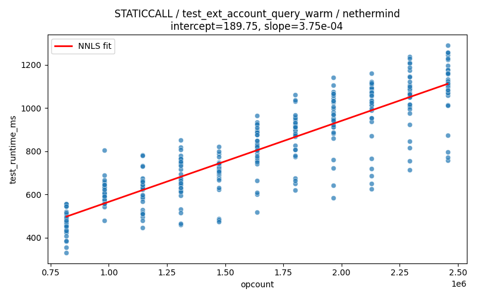

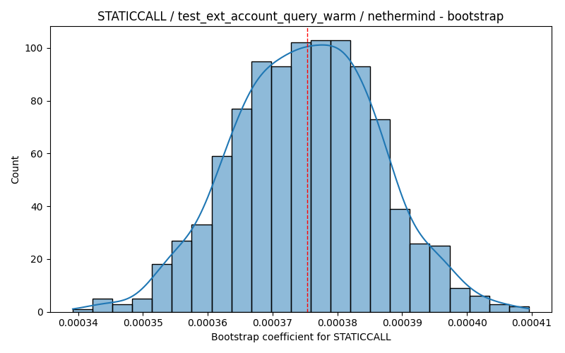

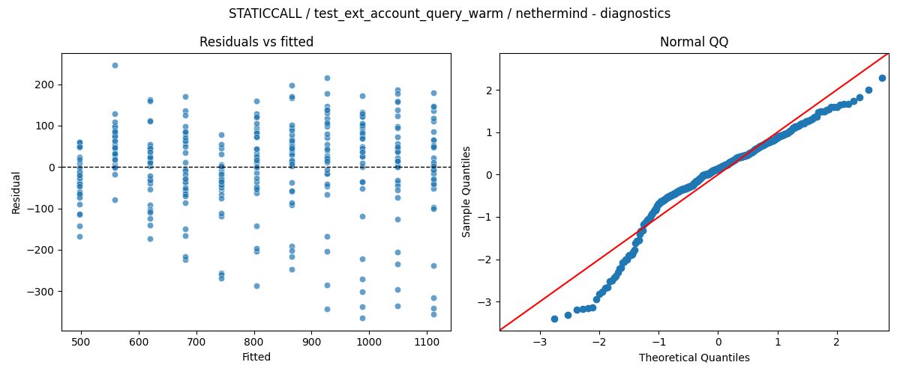

</details>

<details><summary>reth — NNLS regression summary</summary>

```
==============================================================================
                           NNLS Regression Results                            
==============================================================================
Dep. Variable:          test_runtime_ms              R-squared:          0.917
Model:                  NNLS                    Adj. R-squared:          0.917
No. Observations:       374                               RMSE:           8.26
Df Residuals:           372                                MAE:           6.66
Df Model:               1      
==============================================================================
                      coef     std err     P-value      [0.025      0.975]
------------------------------------------------------------------------------
         const     19.6032      1.3840       0.001     16.9610     22.5115
       opcount      0.0001      0.0000       0.001      0.0001      0.0001
==============================================================================
Notes: Non-negative least squares with bootstrap inference (1000 iterations)
==============================================================================
```

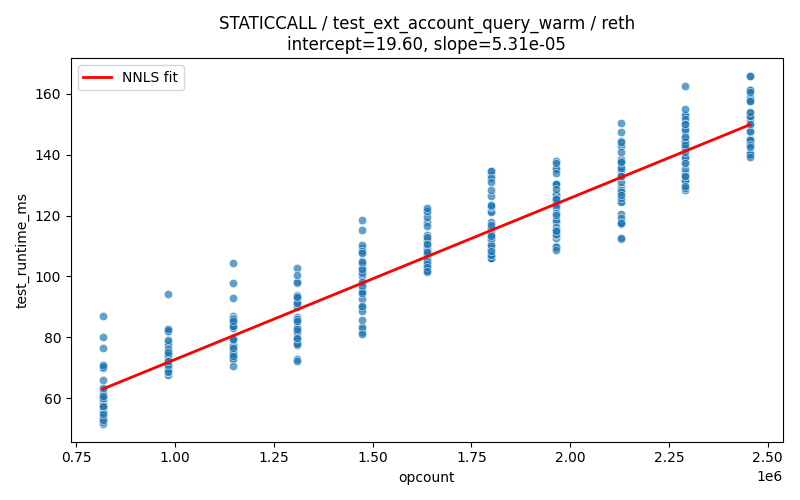

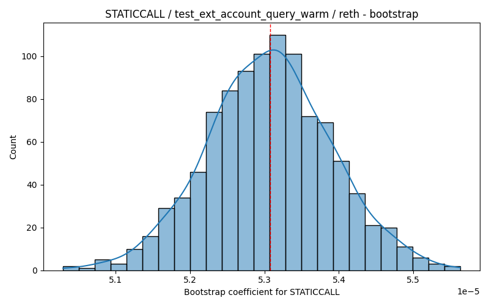

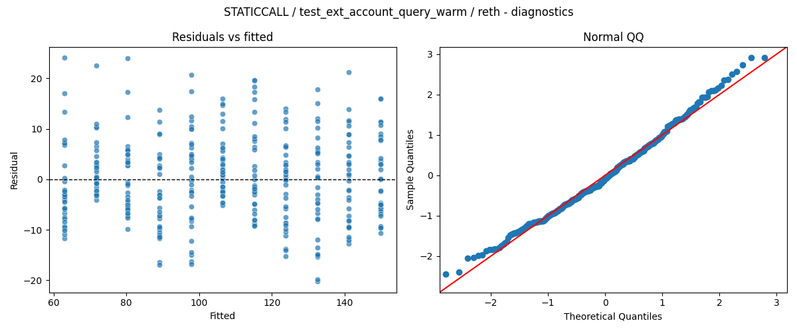

</details>
