# Glue opcodes report

Per-client NNLS fits of priced glue opcodes against their driver fixtures. Cycle-tier opcodes share one joint regression per client (shown once); pure-tier and mixed-tier opcodes each get a single-feature fit. Mixed-tier fits pre-adjust the LHS by subtracting the contribution of every priced upstream partner selected by the detector (pure ∪ cycle for `mixed_a`, plus `mixed_a` for `mixed_b`).

**Contents:** [besu](#besu) · [erigon](#erigon) · [ethrex](#ethrex) · [geth](#geth) · [nethermind](#nethermind) · [reth](#reth)

## besu

| glue_opcode | nobs | glue_runtime_ms | p_value | rsquared |
| --- | --- | --- | --- | --- |
| `ISZERO` | 1991 | 4.06e-06 | 1.00e-03 | 0.682 |
| `JUMPDEST` | 1991 | 1.547e-06 | 1.00e-03 | 0.1983 |
| `SWAP` | 31856 | 3.712e-06 | 1.00e-03 | 0.8635 |
| `CALLDATASIZE` | 117733 | 3.612e-06 | 1.00e-03 | 0.7752 |
| `DUP` | 117733 | 1.975e-06 | 1.00e-03 | 0.7752 |
| `GAS` | 117733 | 3.162e-06 | 1.00e-03 | 0.7752 |
| `MLOAD` | 117733 | 1.019e-05 | 1.00e-03 | 0.7752 |
| `PUSH` | 117733 | 2.5e-06 | 1.00e-03 | 0.7752 |
| `PUSH0` | 117733 | 1.815e-06 | 1.00e-03 | 0.7752 |
| `STATICCALL` | 117733 | 0.0007384 | 1.00e-03 | 0.7752 |
| `ADD` | 1991 | 9.962e-06 | 1.00e-03 | 0.757 |
| `AND` | 1991 | 9.178e-06 | 1.00e-03 | 0.364 |
| `CALLDATACOPY` | 47784 | 1.674e-05 | 1.00e-03 | 0.7093 |
| `CALLDATALOAD` | 7964 | 2.337e-06 | 8.90e-02 | 0.0001493 |
| `DIV` | 1991 | 1.49e-05 | 1.00e-03 | 0.8046 |
| `EXP` | 1991 | 0.001105 | 1.00e-03 | 0.7433 |
| `GT` | 1991 | 1.832e-05 | 1.00e-03 | 0.147 |
| `JUMPI` | 1991 | 6.847e-06 | 1.00e-03 | 0.4006 |
| `LT` | 1991 | 1.828e-05 | 1.00e-03 | 0.1447 |
| `MSTORE` | 9955 | 1.722e-05 | 1.00e-03 | 0.8639 |
| `MSTORE8` | 9955 | 1.122e-05 | 1.00e-03 | 0.6474 |
| `MUL` | 1991 | 1.108e-05 | 1.00e-03 | 0.7457 |
| `PC` | 1991 | 3.567e-06 | 1.00e-03 | 0.6257 |
| `RETURNDATASIZE` | 7964 | 5.521e-06 | 1.00e-03 | 0.4958 |
| `SELFBALANCE` | 1629 | 7.479e-06 | 1.00e-03 | 0.5205 |
| `SUB` | 1991 | 1.046e-05 | 1.00e-03 | 0.7243 |
| `JUMP` | 1991 | 3.606e-05 | 1.00e-03 | 0.5014 |
| `KECCAK256` | 31856 | 4.033e-05 | 1.00e-03 | 0.1751 |

### Cycle glue — joint fit · besu

<details><summary>Joint NNLS regression summary</summary>

```
==============================================================================
                           NNLS Regression Results                            
==============================================================================
Dep. Variable:          test_runtime_ms              R-squared:          0.775
Model:                  NNLS                    Adj. R-squared:          0.775
No. Observations:       117733                            RMSE:          59.45
Df Residuals:           117725                             MAE:          51.37
Df Model:               7      
==============================================================================
                      coef     std err     P-value      [0.025      0.975]
------------------------------------------------------------------------------
         const     58.4885      0.5354       0.001     57.3923     59.5166
  CALLDATASIZE      0.0000      0.0000       0.001      0.0000      0.0000
           DUP      0.0000      0.0000       0.001      0.0000      0.0000
           GAS      0.0000      0.0000       0.001      0.0000      0.0000
         MLOAD      0.0000      0.0000       0.001      0.0000      0.0000
          PUSH      0.0000      0.0000       0.001      0.0000      0.0000
         PUSH0      0.0000      0.0000       0.001      0.0000      0.0000
    STATICCALL      0.0007      0.0000       0.001      0.0007      0.0008
==============================================================================
Notes: Non-negative least squares with bootstrap inference (1000 iterations)
==============================================================================
```

</details>

<details><summary><code>CALLDATASIZE</code> · nobs=117733 · runtime_ms=3.612e-06 · p=1.00e-03 · R²=0.7752</summary>

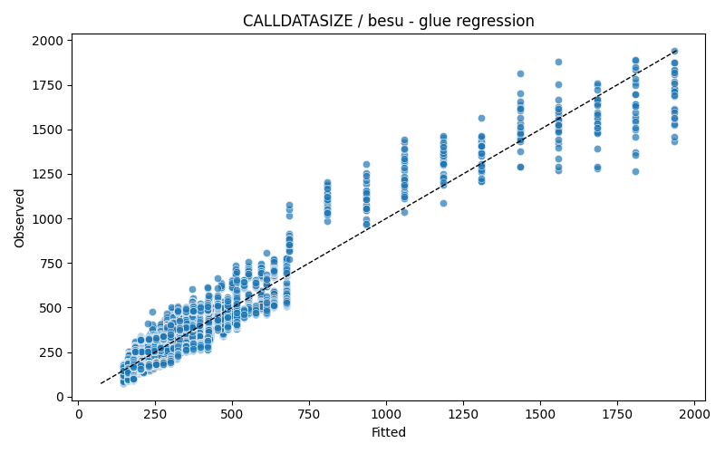

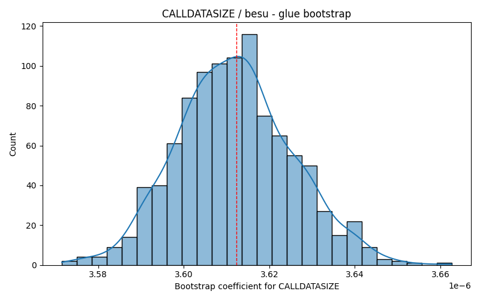


</details>

<details><summary><code>DUP</code> · nobs=117733 · runtime_ms=1.975e-06 · p=1.00e-03 · R²=0.7752</summary>


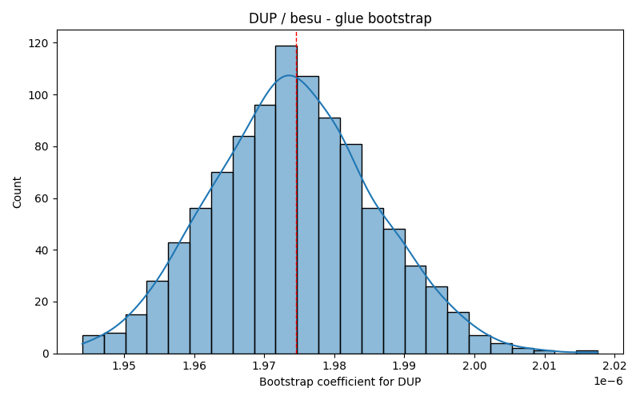


</details>

<details><summary><code>GAS</code> · nobs=117733 · runtime_ms=3.162e-06 · p=1.00e-03 · R²=0.7752</summary>

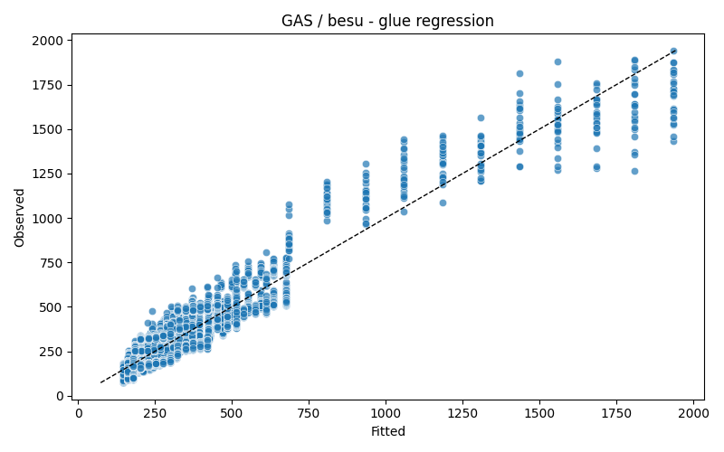

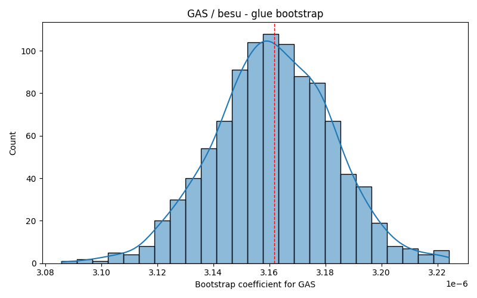

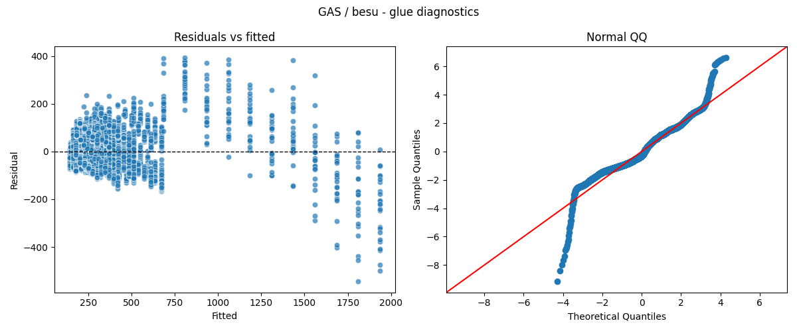

</details>

<details><summary><code>MLOAD</code> · nobs=117733 · runtime_ms=1.019e-05 · p=1.00e-03 · R²=0.7752</summary>

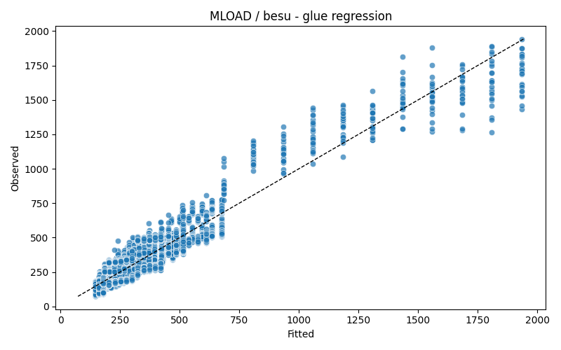


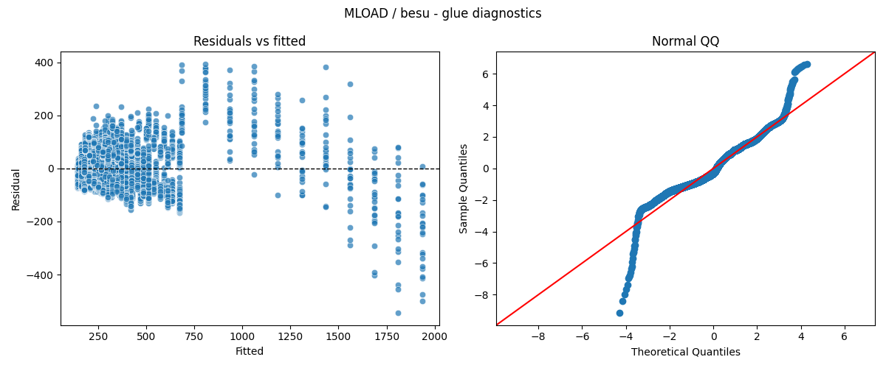

</details>

<details><summary><code>PUSH</code> · nobs=117733 · runtime_ms=2.5e-06 · p=1.00e-03 · R²=0.7752</summary>


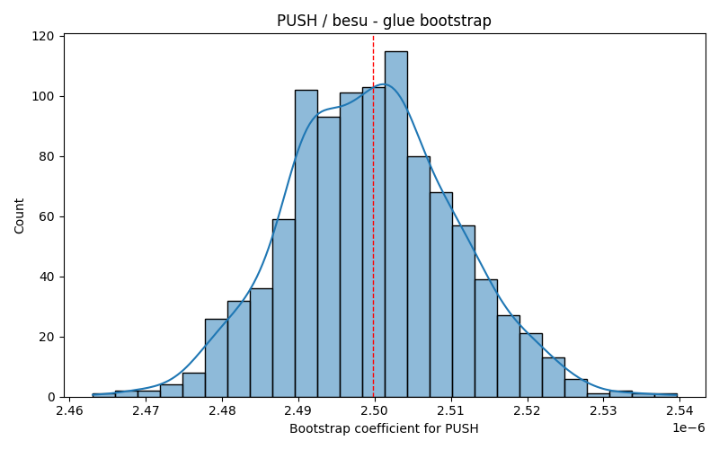


</details>

<details><summary><code>PUSH0</code> · nobs=117733 · runtime_ms=1.815e-06 · p=1.00e-03 · R²=0.7752</summary>


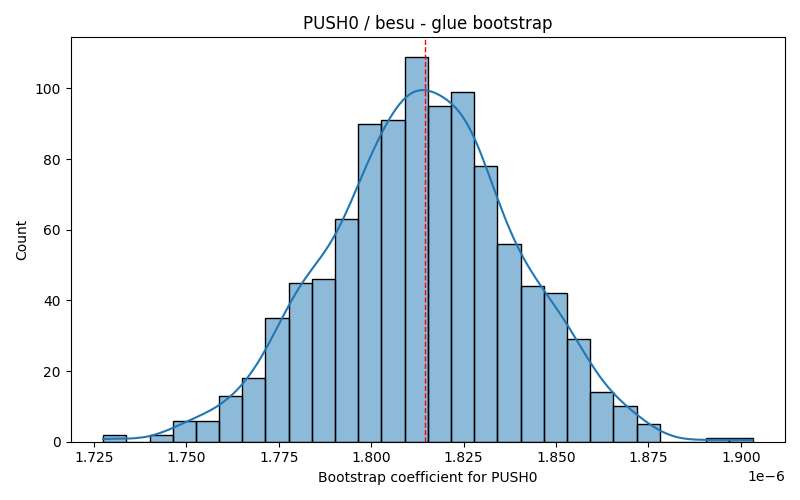


</details>

<details><summary><code>STATICCALL</code> · nobs=117733 · runtime_ms=0.0007384 · p=1.00e-03 · R²=0.7752</summary>

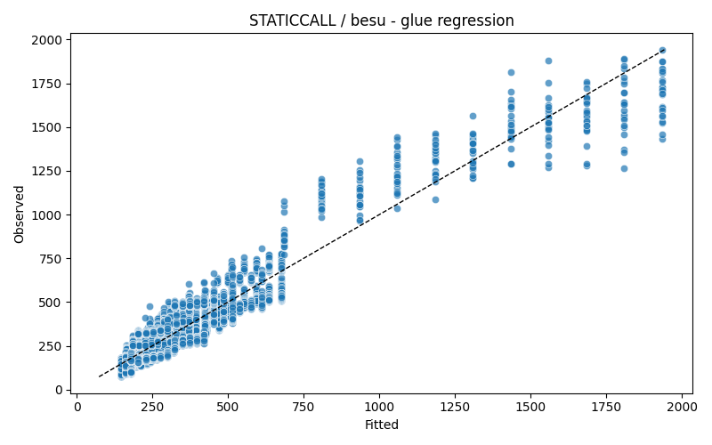

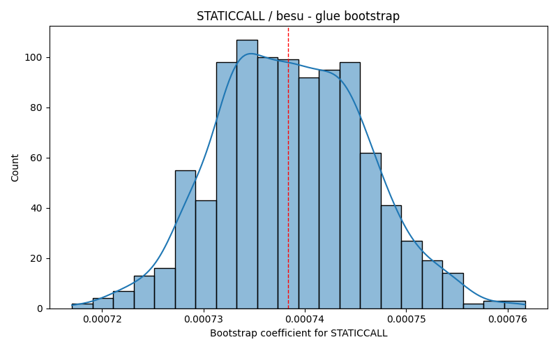


</details>

### Pure glue · besu

<details><summary><code>ISZERO</code> · nobs=1991 · runtime_ms=4.06e-06 · p=1.00e-03 · R²=0.682</summary>

```
==============================================================================
                           NNLS Regression Results                            
==============================================================================
Dep. Variable:          test_runtime_ms              R-squared:          0.682
Model:                  NNLS                    Adj. R-squared:          0.682
No. Observations:       1991                              RMSE:          58.37
Df Residuals:           1989                               MAE:          48.80
Df Model:               1      
==============================================================================
                      coef     std err     P-value      [0.025      0.975]
------------------------------------------------------------------------------
         const     66.7253      4.1187       0.001     58.2610     74.6290
        ISZERO      0.0000      0.0000       0.001      0.0000      0.0000
==============================================================================
Notes: Non-negative least squares with bootstrap inference (1000 iterations)
==============================================================================
```

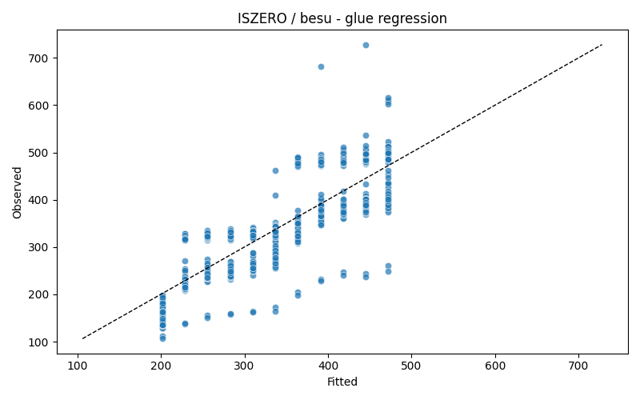

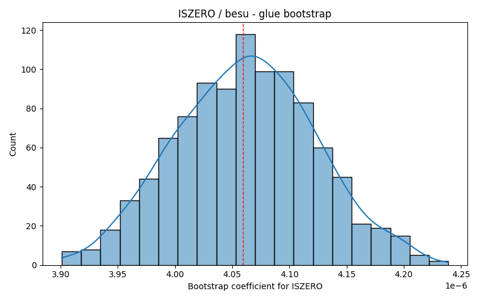

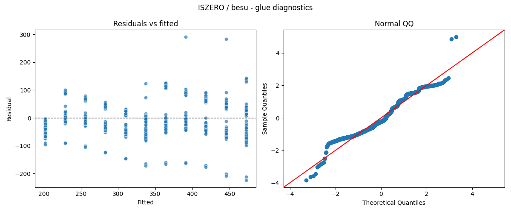

</details>

<details><summary><code>JUMPDEST</code> · nobs=1991 · runtime_ms=1.547e-06 · p=1.00e-03 · R²=0.1983</summary>

```
==============================================================================
                           NNLS Regression Results                            
==============================================================================
Dep. Variable:          test_runtime_ms              R-squared:          0.198
Model:                  NNLS                    Adj. R-squared:          0.198
No. Observations:       1991                              RMSE:         196.39
Df Residuals:           1989                               MAE:         185.55
Df Model:               1      
==============================================================================
                      coef     std err     P-value      [0.025      0.975]
------------------------------------------------------------------------------
         const     81.3791     12.3968       0.001     57.2121    105.3895
      JUMPDEST      0.0000      0.0000       0.001      0.0000      0.0000
==============================================================================
Notes: Non-negative least squares with bootstrap inference (1000 iterations)
==============================================================================
```

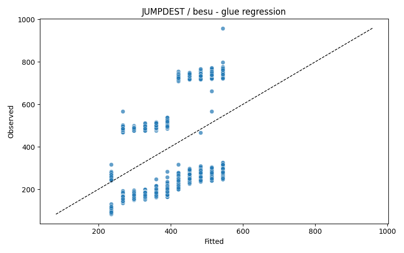

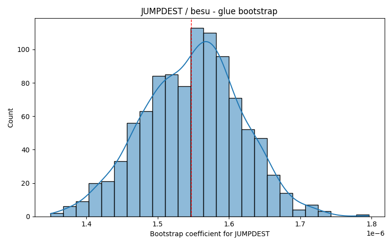

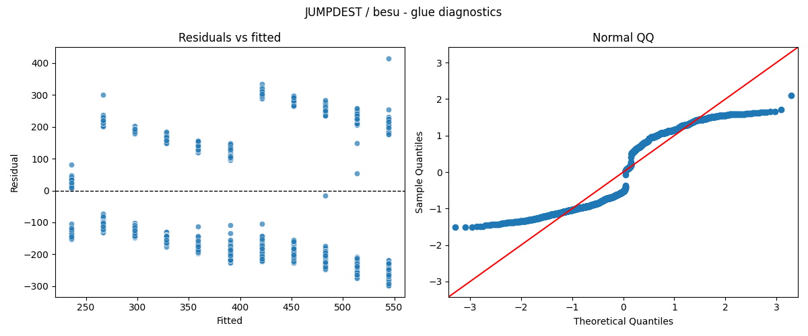

</details>

<details><summary><code>SWAP</code> · nobs=31856 · runtime_ms=3.712e-06 · p=1.00e-03 · R²=0.8635</summary>

```
==============================================================================
                           NNLS Regression Results                            
==============================================================================
Dep. Variable:          test_runtime_ms              R-squared:          0.863
Model:                  NNLS                    Adj. R-squared:          0.863
No. Observations:       31856                             RMSE:          31.07
Df Residuals:           31854                              MAE:          25.23
Df Model:               1      
==============================================================================
                      coef     std err     P-value      [0.025      0.975]
------------------------------------------------------------------------------
         const     63.4665      0.6674       0.001     62.0715     64.7384
          SWAP      0.0000      0.0000       0.001      0.0000      0.0000
==============================================================================
Notes: Non-negative least squares with bootstrap inference (1000 iterations)
==============================================================================
```

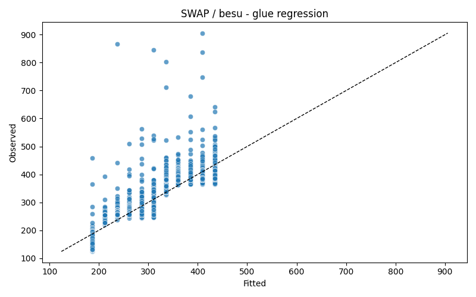

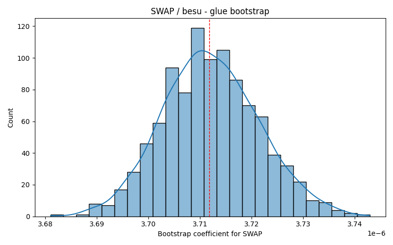

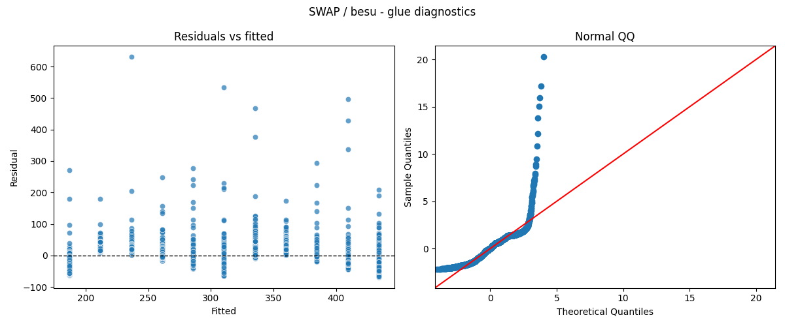

</details>

### Mixed glue (tier A) · besu

<details><summary><code>ADD</code> · nobs=1991 · runtime_ms=9.962e-06 · p=1.00e-03 · R²=0.757</summary>

```
==============================================================================
                           NNLS Regression Results                            
==============================================================================
Dep. Variable:          test_runtime_ms              R-squared:          0.757
Model:                  NNLS                    Adj. R-squared:          0.757
No. Observations:       1991                              RMSE:          59.40
Df Residuals:           1989                               MAE:          49.50
Df Model:               1      
==============================================================================
                      coef     std err     P-value      [0.025      0.975]
------------------------------------------------------------------------------
         const     92.5848      4.1272       0.001     84.8554    101.0105
           ADD      0.0000      0.0000       0.001      0.0000      0.0000
==============================================================================
Notes: Non-negative least squares with bootstrap inference (1000 iterations)
==============================================================================
```

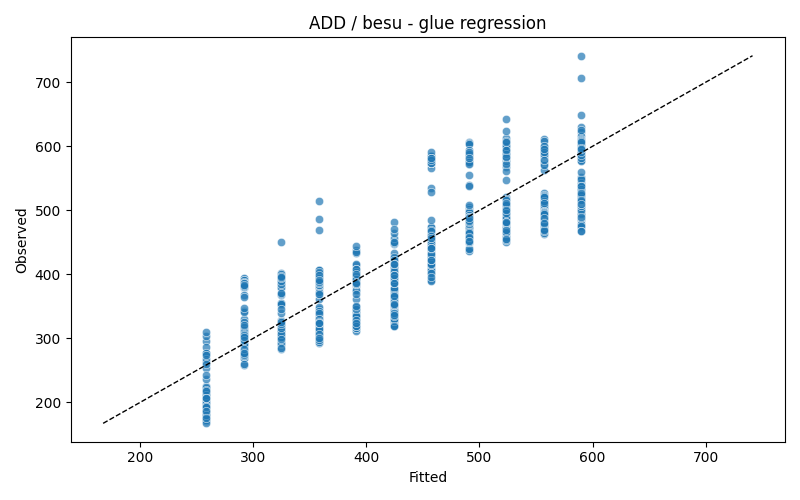

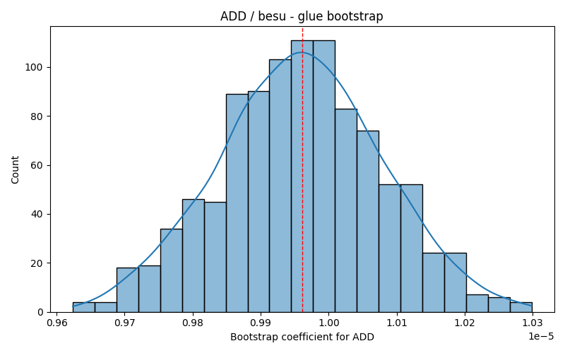

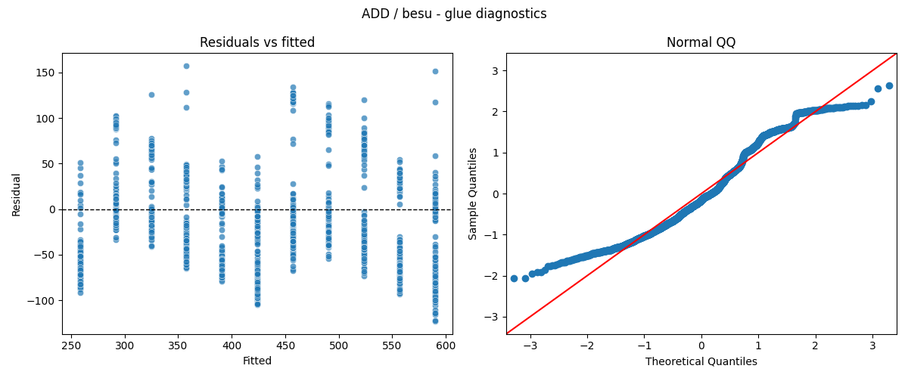

</details>

<details><summary><code>AND</code> · nobs=1991 · runtime_ms=9.178e-06 · p=1.00e-03 · R²=0.364</summary>

```
==============================================================================
                           NNLS Regression Results                            
==============================================================================
Dep. Variable:          test_runtime_ms              R-squared:          0.364
Model:                  NNLS                    Adj. R-squared:          0.364
No. Observations:       1991                              RMSE:         127.70
Df Residuals:           1989                               MAE:         118.40
Df Model:               1      
==============================================================================
                      coef     std err     P-value      [0.025      0.975]
------------------------------------------------------------------------------
         const     87.0219      7.8208       0.001     71.7596    102.1456
           AND      0.0000      0.0000       0.001      0.0000      0.0000
==============================================================================
Notes: Non-negative least squares with bootstrap inference (1000 iterations)
==============================================================================
```

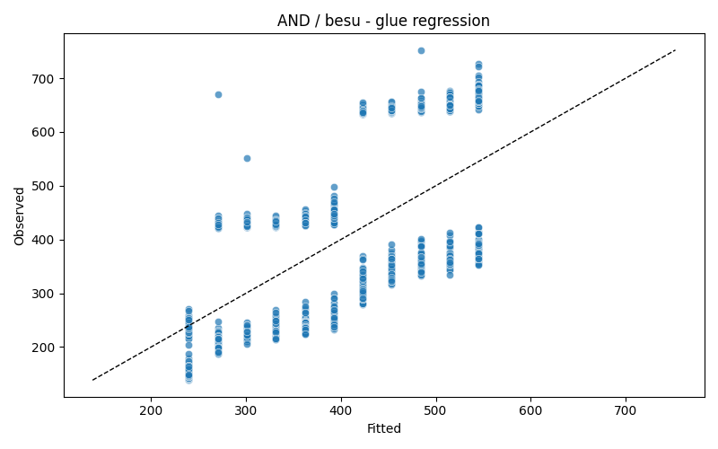

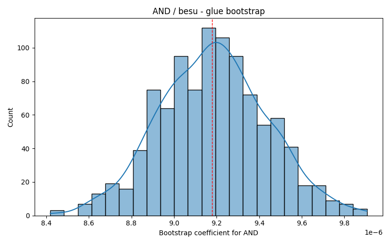

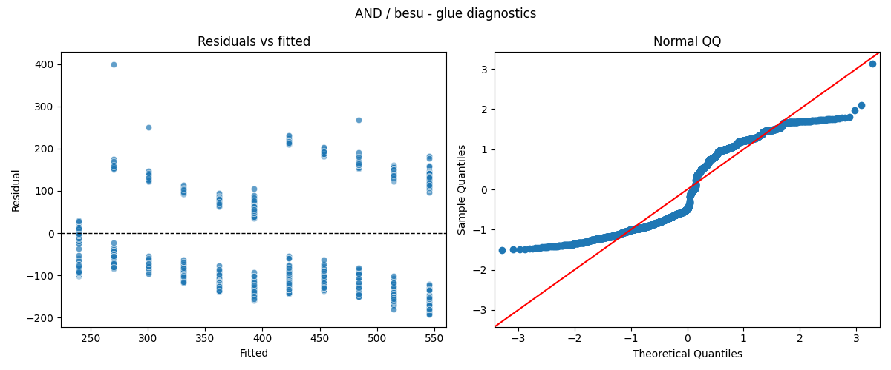

</details>

<details><summary><code>CALLDATACOPY</code> · nobs=47784 · runtime_ms=1.674e-05 · p=1.00e-03 · R²=0.7093</summary>

```
==============================================================================
                           NNLS Regression Results                            
==============================================================================
Dep. Variable:          test_runtime_ms              R-squared:          0.709
Model:                  NNLS                    Adj. R-squared:          0.709
No. Observations:       47784                             RMSE:          80.61
Df Residuals:           47782                              MAE:          59.29
Df Model:               1      
==============================================================================
                      coef     std err     P-value      [0.025      0.975]
------------------------------------------------------------------------------
         const    122.9646      0.4290       0.001    122.1655    123.8151
  CALLDATACOPY      0.0000      0.0000       0.001      0.0000      0.0000
==============================================================================
Notes: Non-negative least squares with bootstrap inference (1000 iterations)
==============================================================================
```

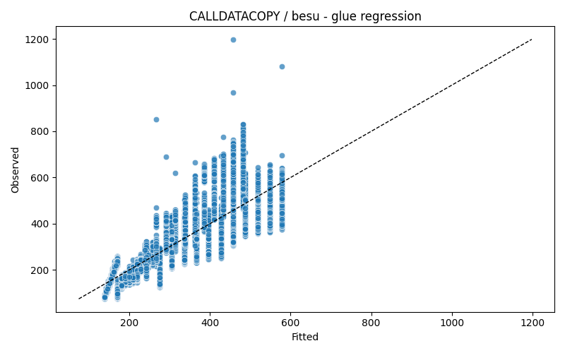

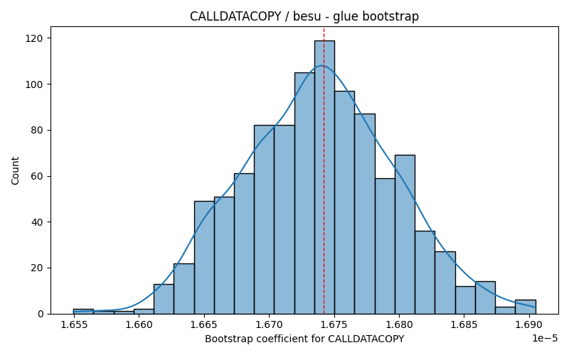

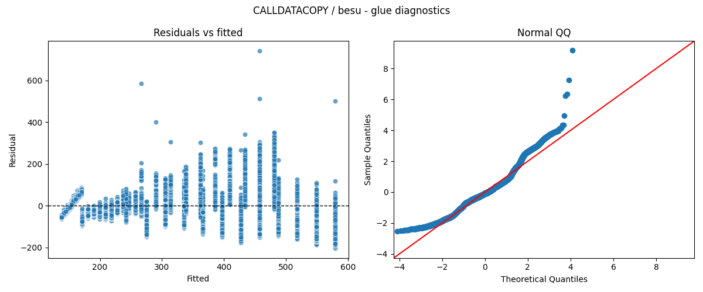

</details>

<details><summary><code>CALLDATALOAD</code> · nobs=7964 · runtime_ms=2.337e-06 · p=8.90e-02 · R²=0.0001493</summary>

```
==============================================================================
                           NNLS Regression Results                            
==============================================================================
Dep. Variable:          test_runtime_ms              R-squared:          0.000
Model:                  NNLS                    Adj. R-squared:          0.000
No. Observations:       7964                              RMSE:           0.73
Df Residuals:           7962                               MAE:           0.49
Df Model:               1      
==============================================================================
                      coef     std err     P-value      [0.025      0.975]
------------------------------------------------------------------------------
         const      3.7910      0.0239       0.001      3.7445      3.8324
  CALLDATALOAD      0.0000      0.0000       0.089      0.0000      0.0000
==============================================================================
Notes: Non-negative least squares with bootstrap inference (1000 iterations)
==============================================================================
```

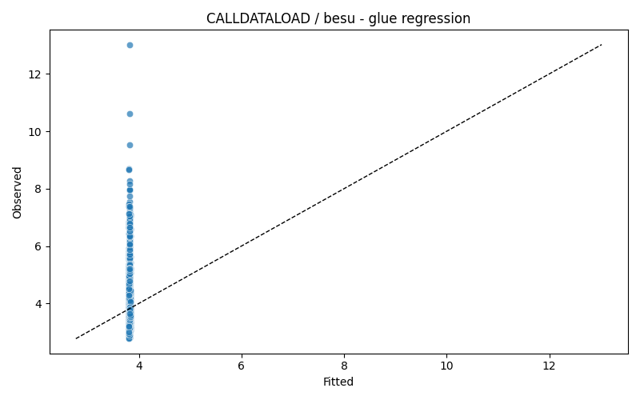

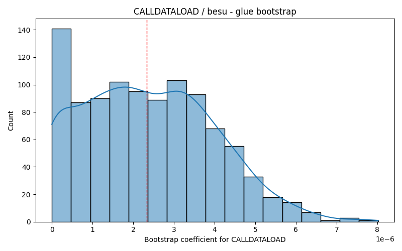


</details>

<details><summary><code>DIV</code> · nobs=1991 · runtime_ms=1.49e-05 · p=1.00e-03 · R²=0.8046</summary>

```
==============================================================================
                           NNLS Regression Results                            
==============================================================================
Dep. Variable:          test_runtime_ms              R-squared:          0.805
Model:                  NNLS                    Adj. R-squared:          0.804
No. Observations:       1991                              RMSE:          57.97
Df Residuals:           1989                               MAE:          47.22
Df Model:               1      
==============================================================================
                      coef     std err     P-value      [0.025      0.975]
------------------------------------------------------------------------------
         const    135.8248      3.5481       0.001    128.7702    142.6030
           DIV      0.0000      0.0000       0.001      0.0000      0.0000
==============================================================================
Notes: Non-negative least squares with bootstrap inference (1000 iterations)
==============================================================================
```

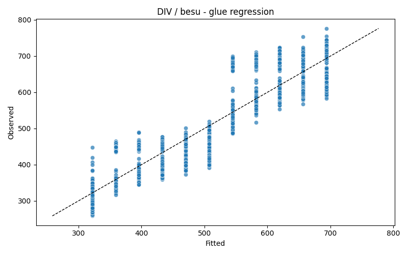

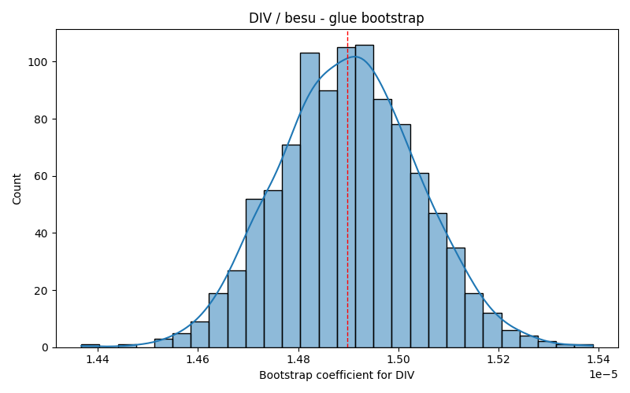

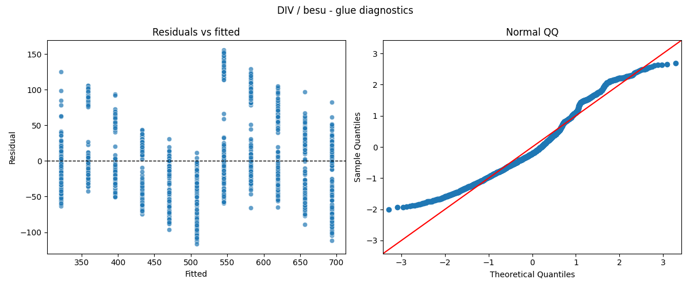

</details>

<details><summary><code>EXP</code> · nobs=1991 · runtime_ms=0.001105 · p=1.00e-03 · R²=0.7433</summary>

```
==============================================================================
                           NNLS Regression Results                            
==============================================================================
Dep. Variable:          test_runtime_ms              R-squared:          0.743
Model:                  NNLS                    Adj. R-squared:          0.743
No. Observations:       1991                              RMSE:          25.42
Df Residuals:           1989                               MAE:          18.65
Df Model:               1      
==============================================================================
                      coef     std err     P-value      [0.025      0.975]
------------------------------------------------------------------------------
         const     98.6502      2.5104       0.001     94.0303    103.8244
           EXP      0.0011      0.0000       0.001      0.0011      0.0011
==============================================================================
Notes: Non-negative least squares with bootstrap inference (1000 iterations)
==============================================================================
```

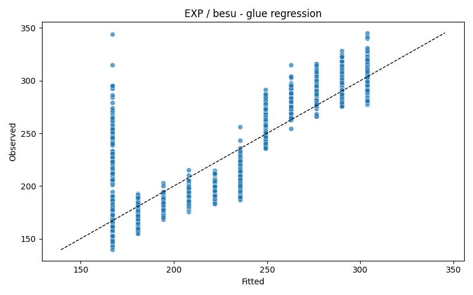

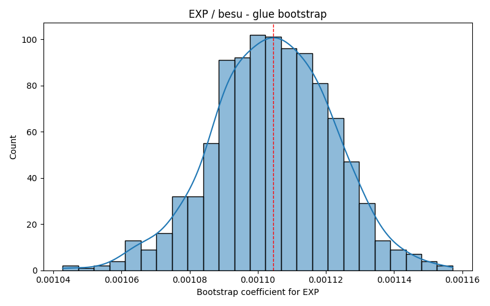

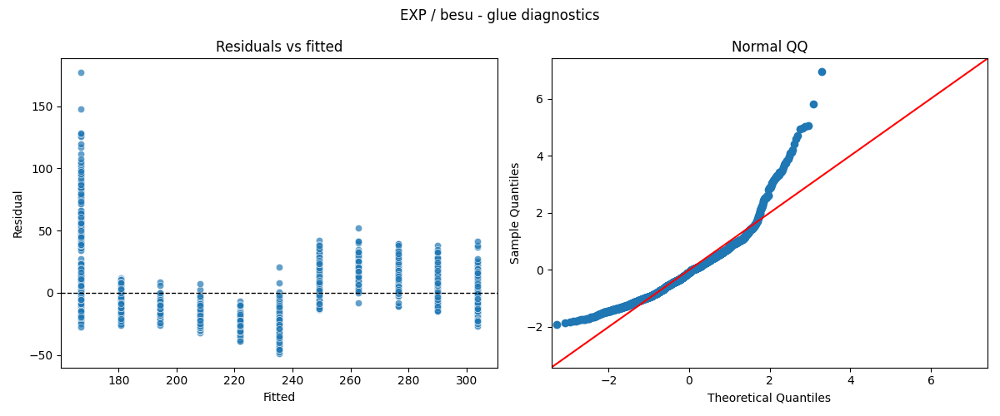

</details>

<details><summary><code>GT</code> · nobs=1991 · runtime_ms=1.832e-05 · p=1.00e-03 · R²=0.147</summary>

```
==============================================================================
                           NNLS Regression Results                            
==============================================================================
Dep. Variable:          test_runtime_ms              R-squared:          0.147
Model:                  NNLS                    Adj. R-squared:          0.147
No. Observations:       1991                              RMSE:         464.48
Df Residuals:           1989                               MAE:         443.41
Df Model:               1      
==============================================================================
                      coef     std err     P-value      [0.025      0.975]
------------------------------------------------------------------------------
         const    128.5408     30.4012       0.001     68.2842    187.9270
            GT      0.0000      0.0000       0.001      0.0000      0.0000
==============================================================================
Notes: Non-negative least squares with bootstrap inference (1000 iterations)
==============================================================================
```

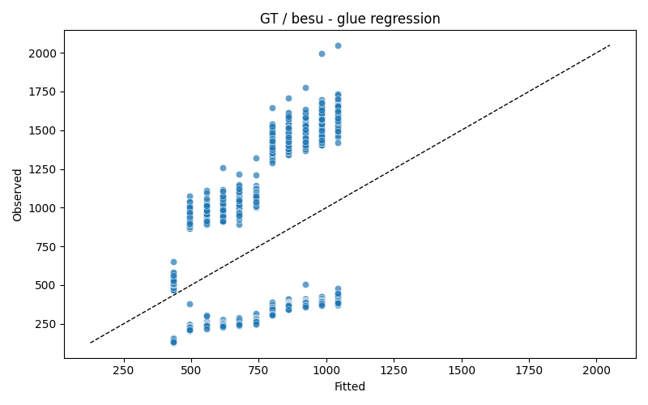

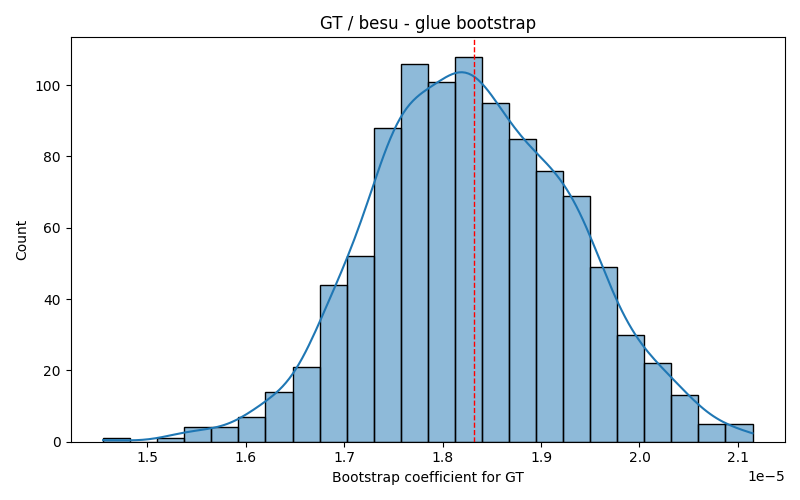

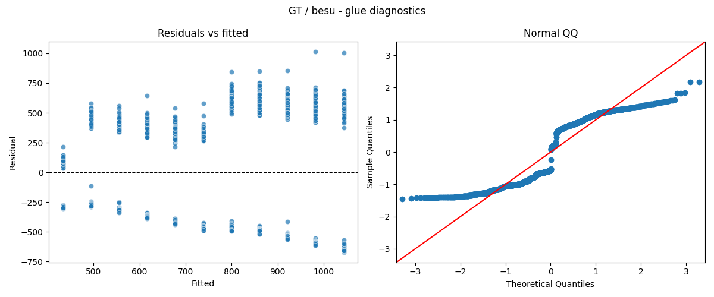

</details>

<details><summary><code>JUMPI</code> · nobs=1991 · runtime_ms=6.847e-06 · p=1.00e-03 · R²=0.4006</summary>

```
==============================================================================
                           NNLS Regression Results                            
==============================================================================
Dep. Variable:          test_runtime_ms              R-squared:          0.401
Model:                  NNLS                    Adj. R-squared:          0.400
No. Observations:       1991                              RMSE:          37.79
Df Residuals:           1989                               MAE:          34.56
Df Model:               1      
==============================================================================
                      coef     std err     P-value      [0.025      0.975]
------------------------------------------------------------------------------
         const     27.4678      2.4878       0.001     22.8518     32.1613
         JUMPI      0.0000      0.0000       0.001      0.0000      0.0000
==============================================================================
Notes: Non-negative least squares with bootstrap inference (1000 iterations)
==============================================================================
```

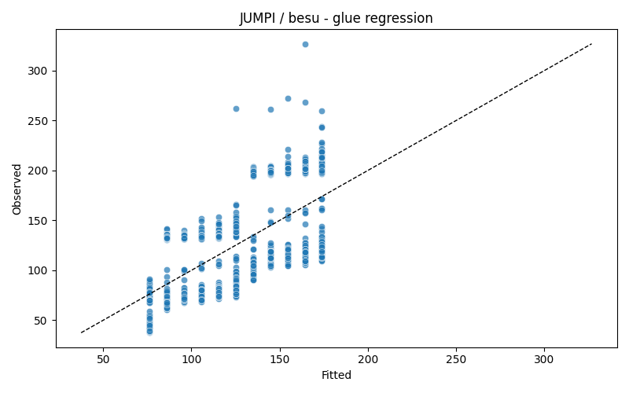

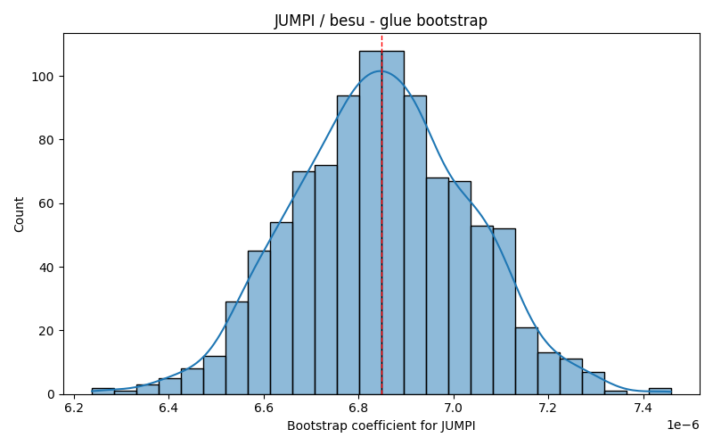

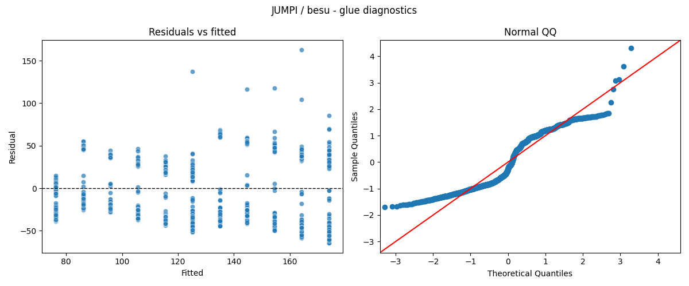

</details>

<details><summary><code>LT</code> · nobs=1991 · runtime_ms=1.828e-05 · p=1.00e-03 · R²=0.1447</summary>

```
==============================================================================
                           NNLS Regression Results                            
==============================================================================
Dep. Variable:          test_runtime_ms              R-squared:          0.145
Model:                  NNLS                    Adj. R-squared:          0.144
No. Observations:       1991                              RMSE:         467.63
Df Residuals:           1989                               MAE:         445.09
Df Model:               1      
==============================================================================
                      coef     std err     P-value      [0.025      0.975]
------------------------------------------------------------------------------
         const    167.4211     30.5736       0.001    107.3147    228.2109
            LT      0.0000      0.0000       0.001      0.0000      0.0000
==============================================================================
Notes: Non-negative least squares with bootstrap inference (1000 iterations)
==============================================================================
```

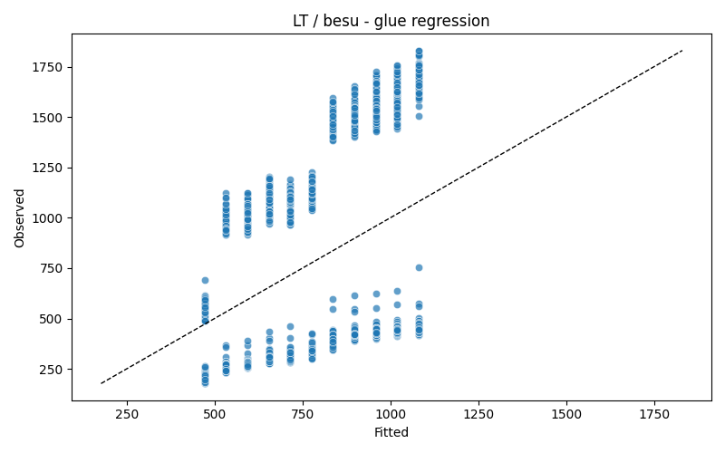

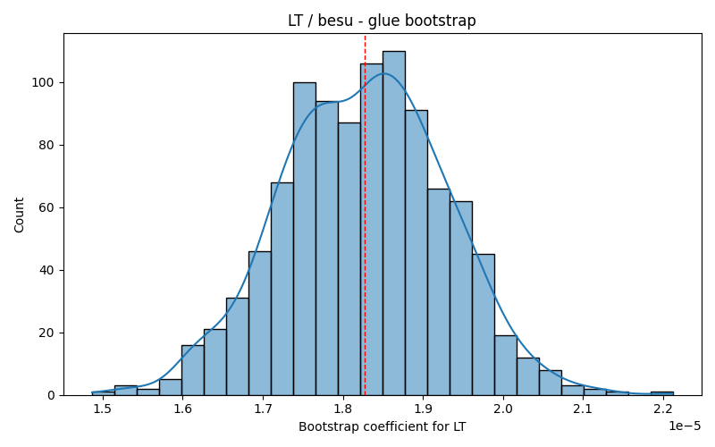

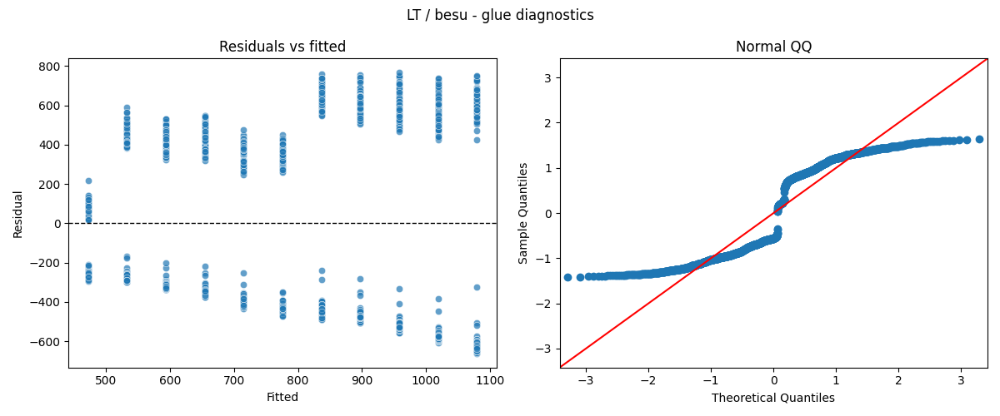

</details>

<details><summary><code>MSTORE</code> · nobs=9955 · runtime_ms=1.722e-05 · p=1.00e-03 · R²=0.8639</summary>

```
==============================================================================
                           NNLS Regression Results                            
==============================================================================
Dep. Variable:          test_runtime_ms              R-squared:          0.864
Model:                  NNLS                    Adj. R-squared:          0.864
No. Observations:       9955                              RMSE:          47.97
Df Residuals:           9953                               MAE:          39.28
Df Model:               1      
==============================================================================
                      coef     std err     P-value      [0.025      0.975]
------------------------------------------------------------------------------
         const     95.2770      1.7256       0.001     92.0156     98.6367
        MSTORE      0.0000      0.0000       0.001      0.0000      0.0000
==============================================================================
Notes: Non-negative least squares with bootstrap inference (1000 iterations)
==============================================================================
```

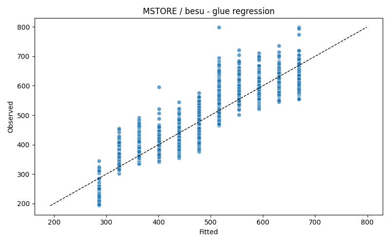

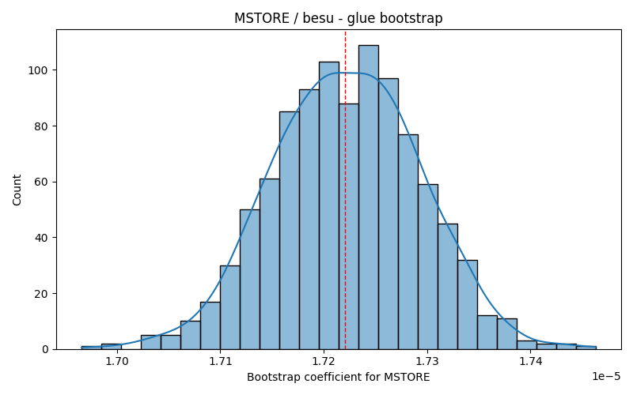

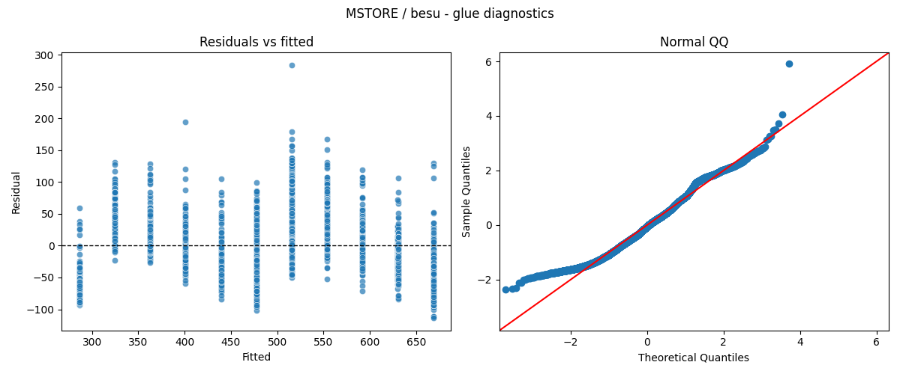

</details>

<details><summary><code>MSTORE8</code> · nobs=9955 · runtime_ms=1.122e-05 · p=1.00e-03 · R²=0.6474</summary>

```
==============================================================================
                           NNLS Regression Results                            
==============================================================================
Dep. Variable:          test_runtime_ms              R-squared:          0.647
Model:                  NNLS                    Adj. R-squared:          0.647
No. Observations:       9955                              RMSE:          58.08
Df Residuals:           9953                               MAE:          50.94
Df Model:               1      
==============================================================================
                      coef     std err     P-value      [0.025      0.975]
------------------------------------------------------------------------------
         const     63.5524      1.8784       0.001     60.1230     67.5733
       MSTORE8      0.0000      0.0000       0.001      0.0000      0.0000
==============================================================================
Notes: Non-negative least squares with bootstrap inference (1000 iterations)
==============================================================================
```

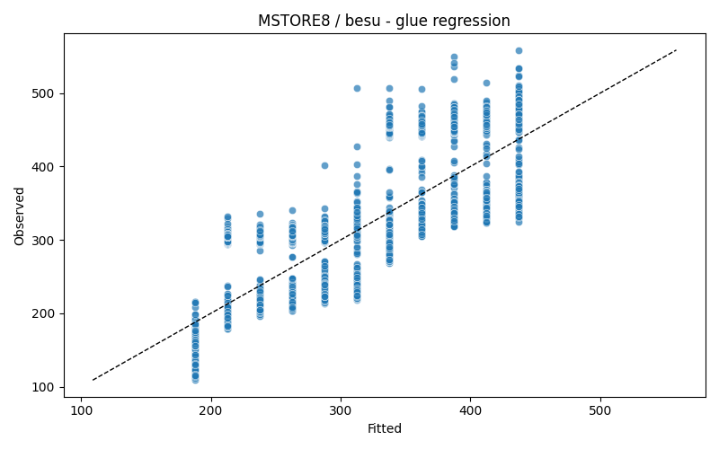

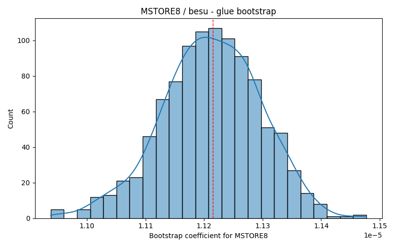

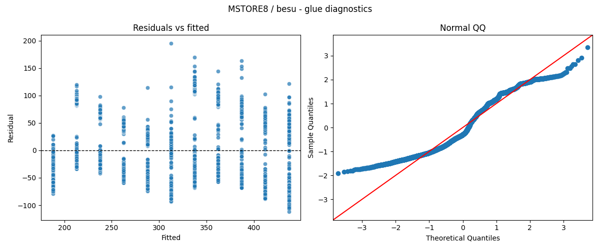

</details>

<details><summary><code>MUL</code> · nobs=1991 · runtime_ms=1.108e-05 · p=1.00e-03 · R²=0.7457</summary>

```
==============================================================================
                           NNLS Regression Results                            
==============================================================================
Dep. Variable:          test_runtime_ms              R-squared:          0.746
Model:                  NNLS                    Adj. R-squared:          0.746
No. Observations:       1991                              RMSE:          51.06
Df Residuals:           1989                               MAE:          37.43
Df Model:               1      
==============================================================================
                      coef     std err     P-value      [0.025      0.975]
------------------------------------------------------------------------------
         const    103.3908      3.2216       0.001     96.9636    109.6661
           MUL      0.0000      0.0000       0.001      0.0000      0.0000
==============================================================================
Notes: Non-negative least squares with bootstrap inference (1000 iterations)
==============================================================================
```

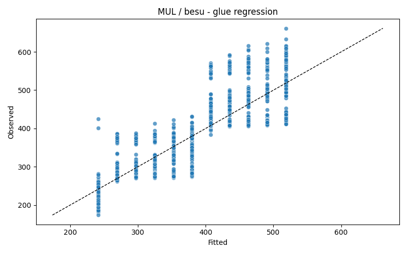

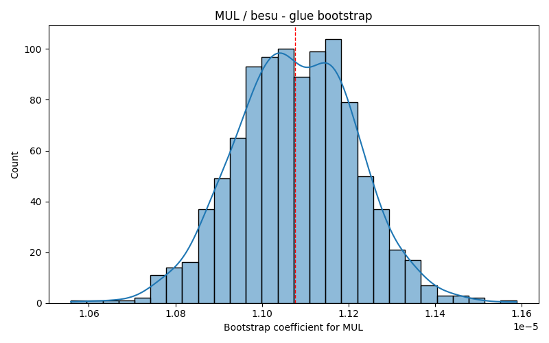

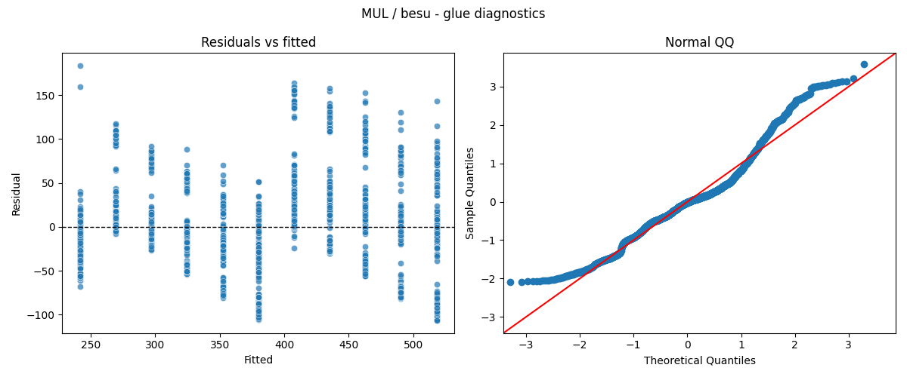

</details>

<details><summary><code>PC</code> · nobs=1991 · runtime_ms=3.567e-06 · p=1.00e-03 · R²=0.6257</summary>

```
==============================================================================
                           NNLS Regression Results                            
==============================================================================
Dep. Variable:          test_runtime_ms              R-squared:          0.626
Model:                  NNLS                    Adj. R-squared:          0.626
No. Observations:       1991                              RMSE:          82.49
Df Residuals:           1989                               MAE:          72.76
Df Model:               1      
==============================================================================
                      coef     std err     P-value      [0.025      0.975]
------------------------------------------------------------------------------
         const     90.6236      5.8348       0.001     78.6196    102.4496
            PC      0.0000      0.0000       0.001      0.0000      0.0000
==============================================================================
Notes: Non-negative least squares with bootstrap inference (1000 iterations)
==============================================================================
```

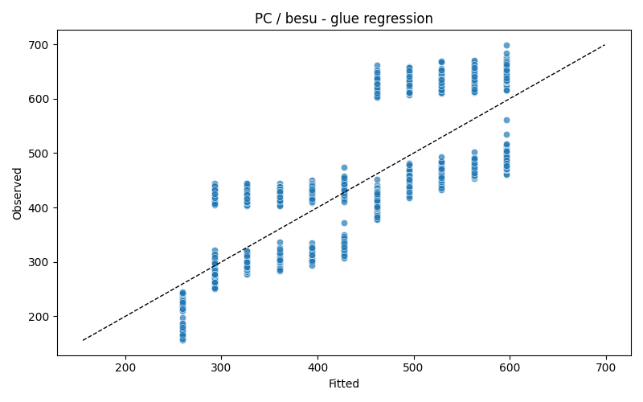

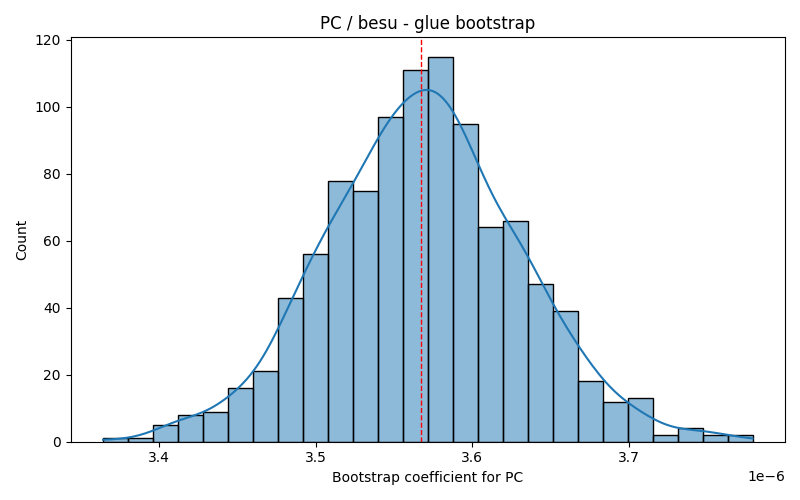

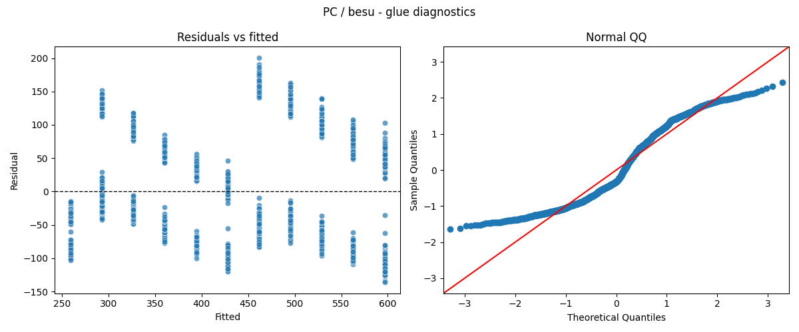

</details>

<details><summary><code>RETURNDATASIZE</code> · nobs=7964 · runtime_ms=5.521e-06 · p=1.00e-03 · R²=0.4958</summary>

```
==============================================================================
                           NNLS Regression Results                            
==============================================================================
Dep. Variable:          test_runtime_ms              R-squared:          0.496
Model:                  NNLS                    Adj. R-squared:          0.496
No. Observations:       7964                              RMSE:          87.90
Df Residuals:           7962                               MAE:          79.61
Df Model:               1      
==============================================================================
                      coef     std err     P-value      [0.025      0.975]
------------------------------------------------------------------------------
         const     71.7729      2.9434       0.001     66.1017     77.4518
RETURNDATASIZE      0.0000      0.0000       0.001      0.0000      0.0000
==============================================================================
Notes: Non-negative least squares with bootstrap inference (1000 iterations)
==============================================================================
```

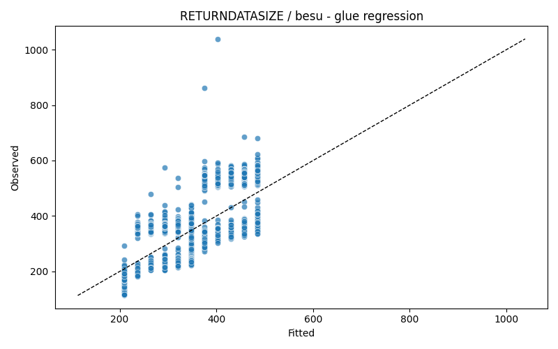

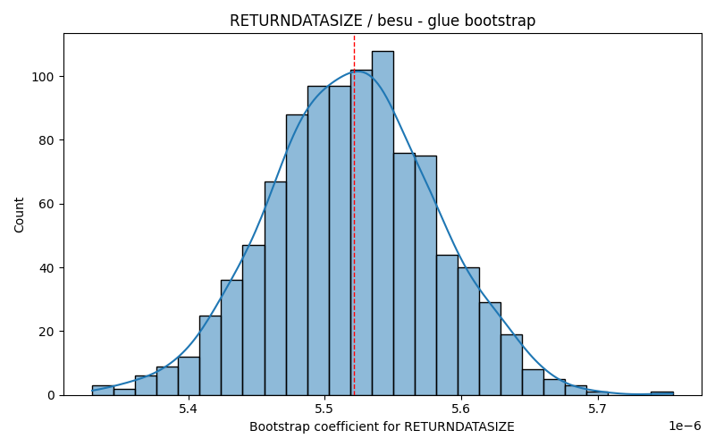


</details>

<details><summary><code>SELFBALANCE</code> · nobs=1629 · runtime_ms=7.479e-06 · p=1.00e-03 · R²=0.5205</summary>

```
==============================================================================
                           NNLS Regression Results                            
==============================================================================
Dep. Variable:          test_runtime_ms              R-squared:          0.520
Model:                  NNLS                    Adj. R-squared:          0.520
No. Observations:       1629                              RMSE:          72.41
Df Residuals:           1627                               MAE:          55.53
Df Model:               1      
==============================================================================
                      coef     std err     P-value      [0.025      0.975]
------------------------------------------------------------------------------
         const    377.3823      6.9572       0.001    363.7017    390.8411
   SELFBALANCE      0.0000      0.0000       0.001      0.0000      0.0000
==============================================================================
Notes: Non-negative least squares with bootstrap inference (1000 iterations)
==============================================================================
```

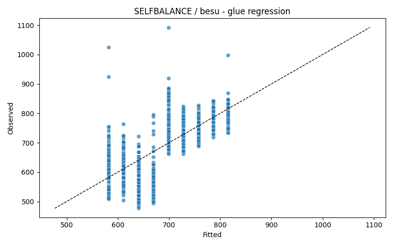

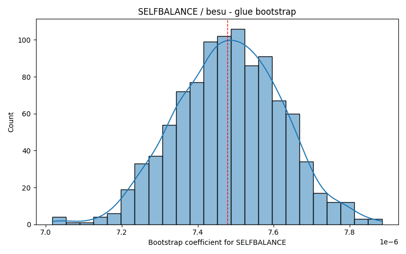

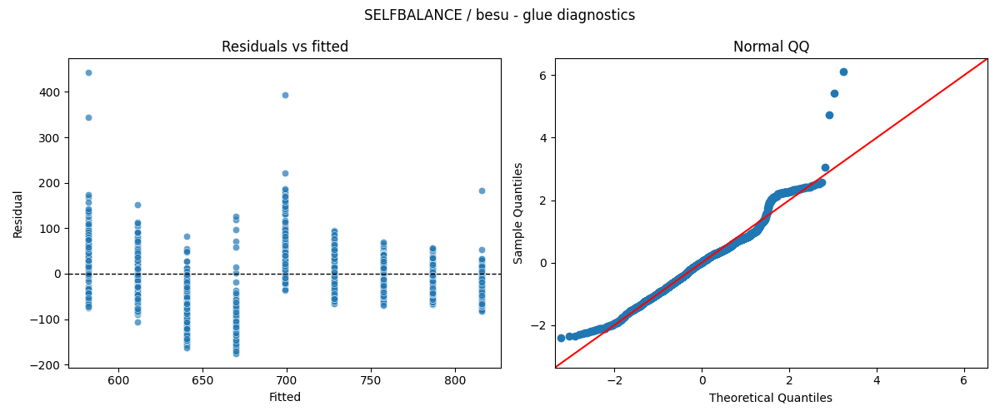

</details>

<details><summary><code>SUB</code> · nobs=1991 · runtime_ms=1.046e-05 · p=1.00e-03 · R²=0.7243</summary>

```
==============================================================================
                           NNLS Regression Results                            
==============================================================================
Dep. Variable:          test_runtime_ms              R-squared:          0.724
Model:                  NNLS                    Adj. R-squared:          0.724
No. Observations:       1991                              RMSE:          67.92
Df Residuals:           1989                               MAE:          57.41
Df Model:               1      
==============================================================================
                      coef     std err     P-value      [0.025      0.975]
------------------------------------------------------------------------------
         const     95.5980      4.5956       0.001     86.2975    104.4512
           SUB      0.0000      0.0000       0.001      0.0000      0.0000
==============================================================================
Notes: Non-negative least squares with bootstrap inference (1000 iterations)
==============================================================================
```

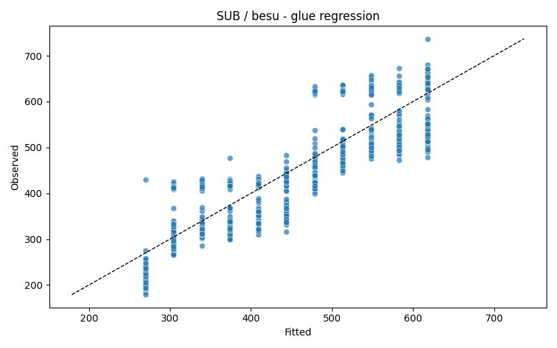

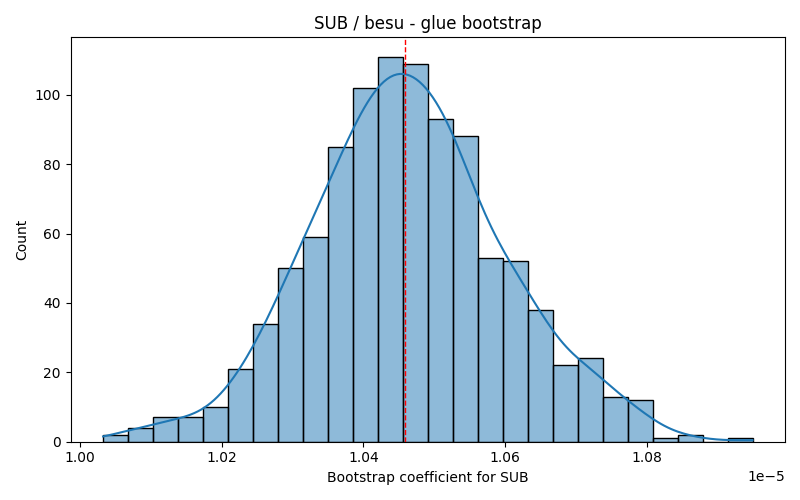

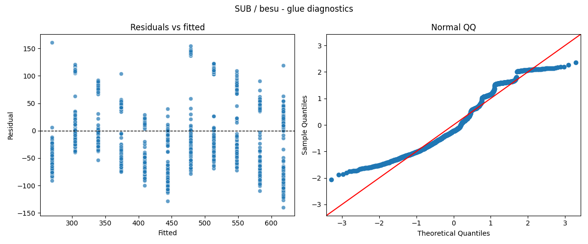

</details>

### Mixed glue (tier B) · besu

<details><summary><code>JUMP</code> · nobs=1991 · runtime_ms=3.606e-05 · p=1.00e-03 · R²=0.5014</summary>

```
==============================================================================
                           NNLS Regression Results                            
==============================================================================
Dep. Variable:          test_runtime_ms              R-squared:          0.501
Model:                  NNLS                    Adj. R-squared:          0.501
No. Observations:       1991                              RMSE:         133.61
Df Residuals:           1989                               MAE:         121.44
Df Model:               1      
==============================================================================
                      coef     std err     P-value      [0.025      0.975]
------------------------------------------------------------------------------
         const    102.2974      8.9759       0.001     84.4534    119.0879
          JUMP      0.0000      0.0000       0.001      0.0000      0.0000
==============================================================================
Notes: Non-negative least squares with bootstrap inference (1000 iterations)
==============================================================================
```


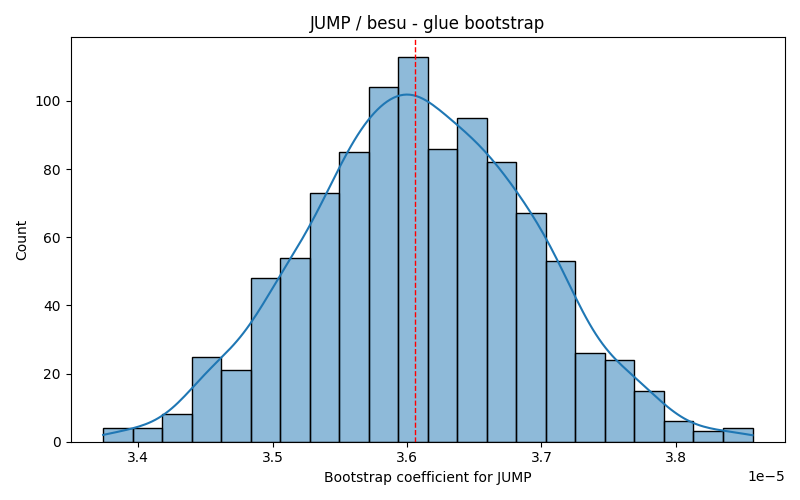

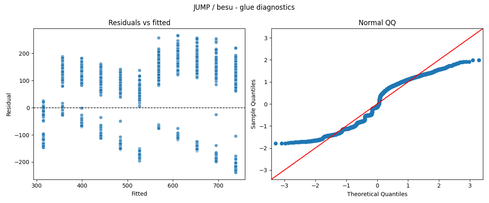

</details>

<details><summary><code>KECCAK256</code> · nobs=31856 · runtime_ms=4.033e-05 · p=1.00e-03 · R²=0.1751</summary>

```
==============================================================================
                           NNLS Regression Results                            
==============================================================================
Dep. Variable:          test_runtime_ms              R-squared:          0.175
Model:                  NNLS                    Adj. R-squared:          0.175
No. Observations:       31856                             RMSE:         173.95
Df Residuals:           31854                              MAE:         137.53
Df Model:               1      
==============================================================================
                      coef     std err     P-value      [0.025      0.975]
------------------------------------------------------------------------------
         const    533.7868      2.1354       0.001    529.0792    537.8014
     KECCAK256      0.0000      0.0000       0.001      0.0000      0.0000
==============================================================================
Notes: Non-negative least squares with bootstrap inference (1000 iterations)
==============================================================================
```

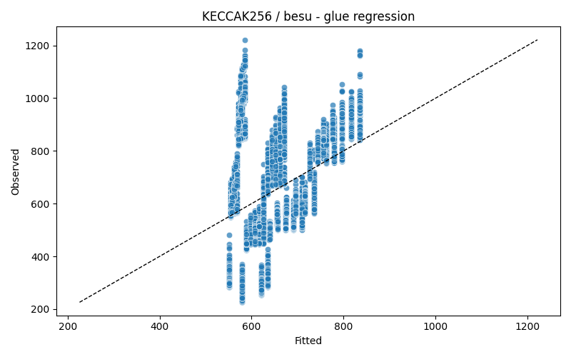

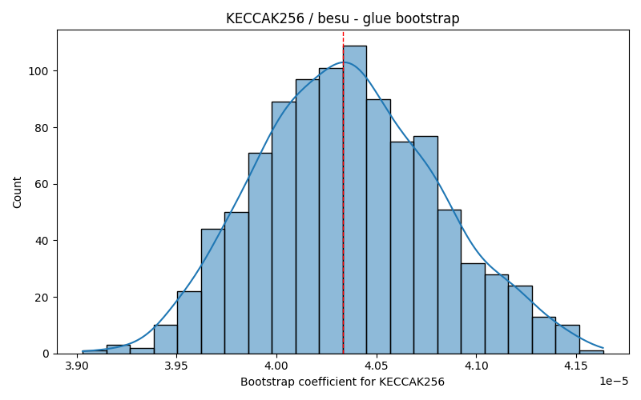

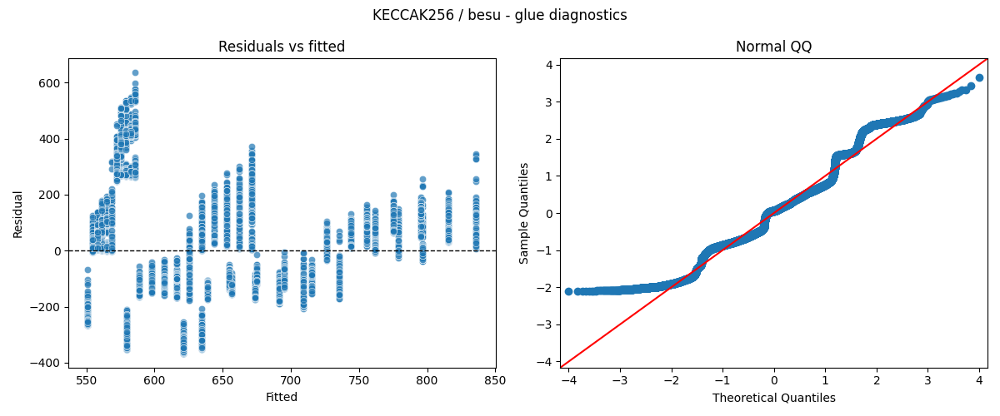

</details>

## erigon

| glue_opcode | nobs | glue_runtime_ms | p_value | rsquared |
| --- | --- | --- | --- | --- |
| `ISZERO` | 132 | 9.813e-07 | 1.00e-03 | 0.8883 |
| `JUMPDEST` | 132 | 7.194e-07 | 1.00e-03 | 0.6876 |
| `SWAP` | 2112 | 1.213e-06 | 1.00e-03 | 0.575 |
| `CALLDATASIZE` | 7887 | 8.622e-07 | 1.00e-03 | 0.9144 |
| `DUP` | 7887 | 1.073e-06 | 1.00e-03 | 0.9144 |
| `GAS` | 7887 | 8.564e-07 | 1.00e-03 | 0.9144 |
| `MLOAD` | 7887 | 3.344e-06 | 1.00e-03 | 0.9144 |
| `PUSH` | 7887 | 2.665e-06 | 1.00e-03 | 0.9144 |
| `PUSH0` | 7887 | 8.53e-07 | 1.00e-03 | 0.9144 |
| `STATICCALL` | 7887 | 0.0004771 | 1.00e-03 | 0.9144 |
| `ADD` | 132 | 2.828e-06 | 1.00e-03 | 0.5704 |
| `AND` | 132 | 2.78e-06 | 1.00e-03 | 0.9298 |
| `CALLDATACOPY` | 3168 | 7.284e-06 | 1.00e-03 | 0.8709 |
| `CALLDATALOAD` | 528 | 0.000216 | 2.00e-03 | 0.008004 |
| `DIV` | 132 | 9.883e-06 | 1.00e-03 | 0.7323 |
| `EXP` | 132 | 0.0003358 | 1.00e-03 | 0.198 |
| `GT` | 132 | 2.857e-06 | 1.00e-03 | 0.8548 |
| `JUMPI` | 132 | 3.453e-06 | 1.00e-03 | 0.89 |
| `LT` | 132 | 2.747e-06 | 1.00e-03 | 0.857 |
| `MSTORE` | 660 | 5.523e-06 | 1.00e-03 | 0.7362 |
| `MSTORE8` | 660 | 5.041e-06 | 1.00e-03 | 0.8645 |
| `MUL` | 132 | 3.836e-06 | 1.00e-03 | 0.752 |
| `PC` | 132 | 1.377e-06 | 1.00e-03 | 0.9272 |
| `RETURNDATASIZE` | 528 | 1.775e-06 | 1.00e-03 | 0.7398 |
| `SELFBALANCE` | 108 | 1.365e-06 | 1.00e-03 | 0.8722 |
| `SUB` | 132 | 2.959e-06 | 1.00e-03 | 0.521 |
| `JUMP` | 132 | 7.632e-06 | 1.00e-03 | 0.6841 |
| `KECCAK256` | 2112 | 2.082e-05 | 1.00e-03 | 0.0867 |

### Cycle glue — joint fit · erigon

<details><summary>Joint NNLS regression summary</summary>

```
==============================================================================
                           NNLS Regression Results                            
==============================================================================
Dep. Variable:          test_runtime_ms              R-squared:          0.914
Model:                  NNLS                    Adj. R-squared:          0.914
No. Observations:       7887                              RMSE:          32.09
Df Residuals:           7879                               MAE:          16.65
Df Model:               7      
==============================================================================
                      coef     std err     P-value      [0.025      0.975]
------------------------------------------------------------------------------
         const     29.3375      1.0776       0.001     27.2571     31.5528
  CALLDATASIZE      0.0000      0.0000       0.001      0.0000      0.0000
           DUP      0.0000      0.0000       0.001      0.0000      0.0000
           GAS      0.0000      0.0000       0.001      0.0000      0.0000
         MLOAD      0.0000      0.0000       0.001      0.0000      0.0000
          PUSH      0.0000      0.0000       0.001      0.0000      0.0000
         PUSH0      0.0000      0.0000       0.001      0.0000      0.0000
    STATICCALL      0.0005      0.0000       0.001      0.0005      0.0005
==============================================================================
Notes: Non-negative least squares with bootstrap inference (1000 iterations)
==============================================================================
```

</details>

<details><summary><code>CALLDATASIZE</code> · nobs=7887 · runtime_ms=8.622e-07 · p=1.00e-03 · R²=0.9144</summary>

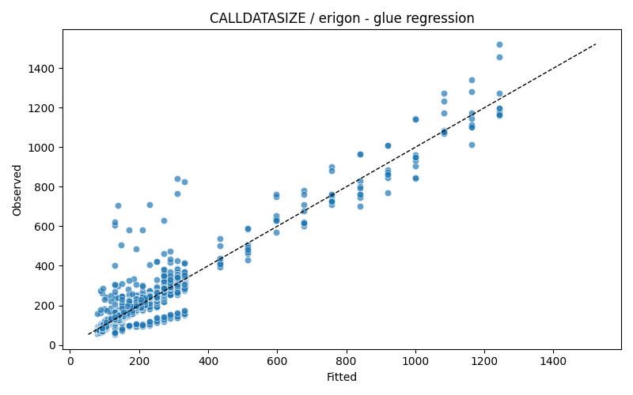

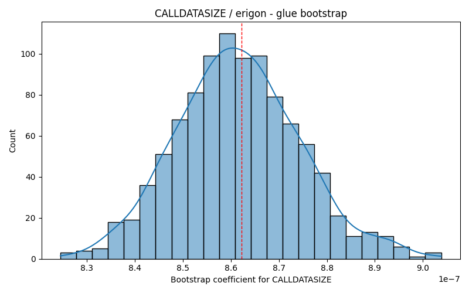


</details>

<details><summary><code>DUP</code> · nobs=7887 · runtime_ms=1.073e-06 · p=1.00e-03 · R²=0.9144</summary>

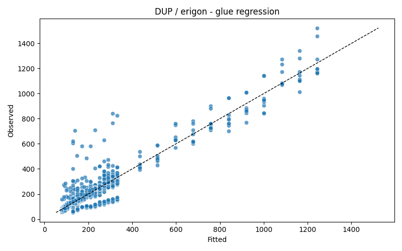

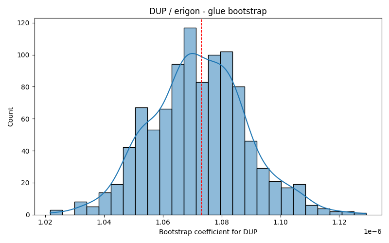


</details>

<details><summary><code>GAS</code> · nobs=7887 · runtime_ms=8.564e-07 · p=1.00e-03 · R²=0.9144</summary>


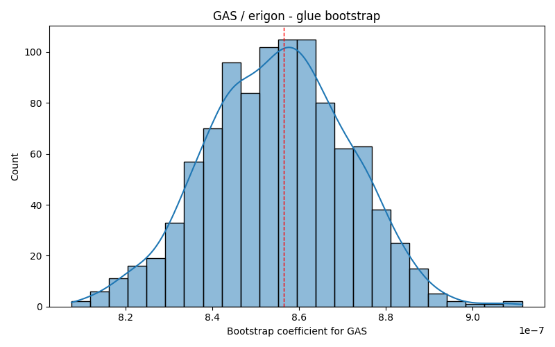


</details>

<details><summary><code>MLOAD</code> · nobs=7887 · runtime_ms=3.344e-06 · p=1.00e-03 · R²=0.9144</summary>

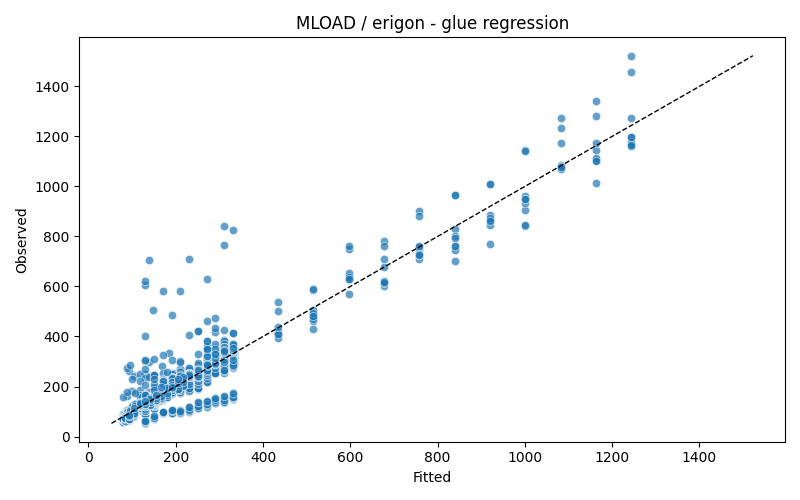

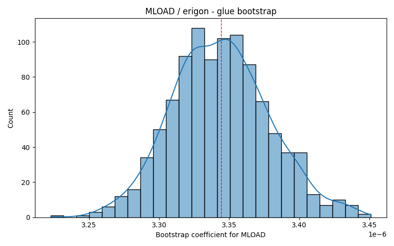


</details>

<details><summary><code>PUSH</code> · nobs=7887 · runtime_ms=2.665e-06 · p=1.00e-03 · R²=0.9144</summary>


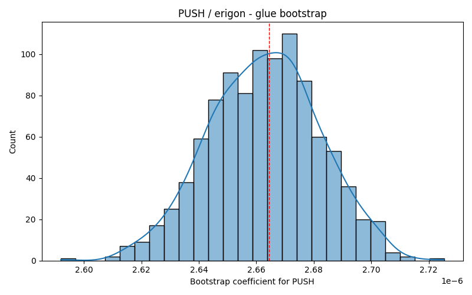


</details>

<details><summary><code>PUSH0</code> · nobs=7887 · runtime_ms=8.53e-07 · p=1.00e-03 · R²=0.9144</summary>


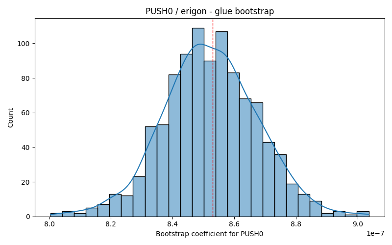

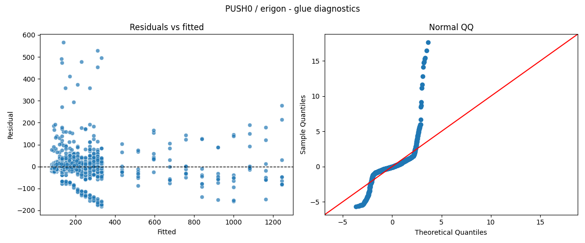

</details>

<details><summary><code>STATICCALL</code> · nobs=7887 · runtime_ms=0.0004771 · p=1.00e-03 · R²=0.9144</summary>

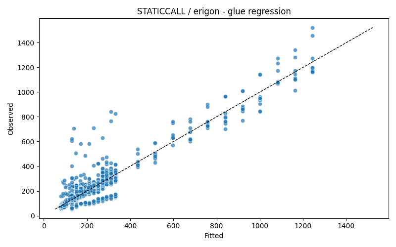

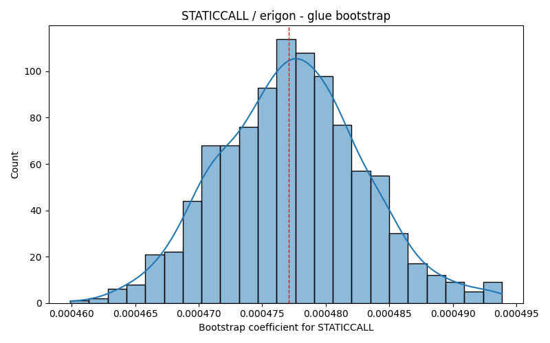


</details>

### Pure glue · erigon

<details><summary><code>ISZERO</code> · nobs=132 · runtime_ms=9.813e-07 · p=1.00e-03 · R²=0.8883</summary>

```
==============================================================================
                           NNLS Regression Results                            
==============================================================================
Dep. Variable:          test_runtime_ms              R-squared:          0.888
Model:                  NNLS                    Adj. R-squared:          0.887
No. Observations:       132                               RMSE:           7.33
Df Residuals:           130                                MAE:           5.12
Df Model:               1      
==============================================================================
                      coef     std err     P-value      [0.025      0.975]
------------------------------------------------------------------------------
         const     20.3250      2.9613       0.001     15.2215     27.0821
        ISZERO      0.0000      0.0000       0.001      0.0000      0.0000
==============================================================================
Notes: Non-negative least squares with bootstrap inference (1000 iterations)
==============================================================================
```

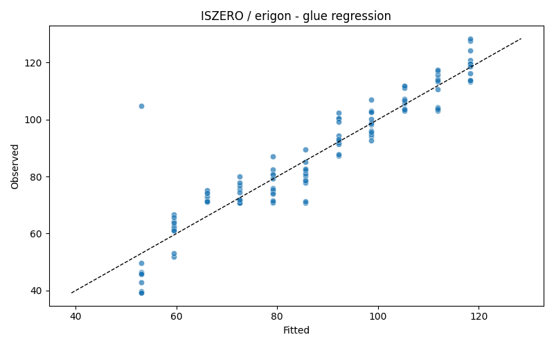

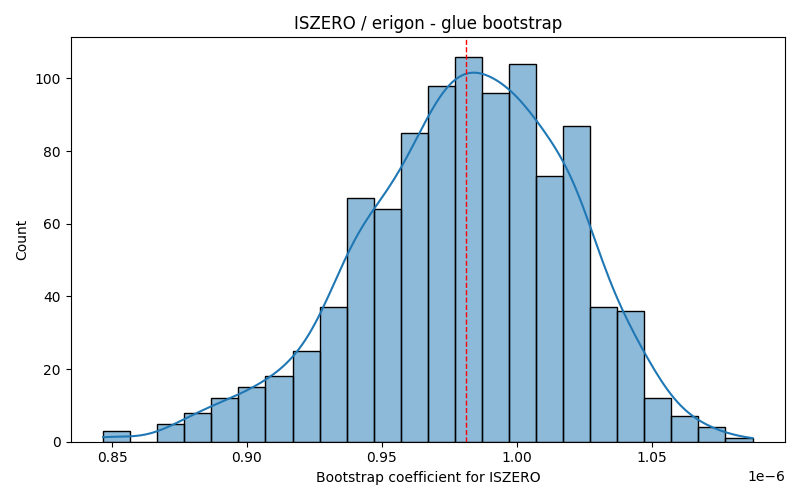


</details>

<details><summary><code>JUMPDEST</code> · nobs=132 · runtime_ms=7.194e-07 · p=1.00e-03 · R²=0.6876</summary>

```
==============================================================================
                           NNLS Regression Results                            
==============================================================================
Dep. Variable:          test_runtime_ms              R-squared:          0.688
Model:                  NNLS                    Adj. R-squared:          0.685
No. Observations:       132                               RMSE:          30.62
Df Residuals:           130                                MAE:          15.51
Df Model:               1      
==============================================================================
                      coef     std err     P-value      [0.025      0.975]
------------------------------------------------------------------------------
         const     36.8727      7.8392       0.001     23.3445     53.1589
      JUMPDEST      0.0000      0.0000       0.001      0.0000      0.0000
==============================================================================
Notes: Non-negative least squares with bootstrap inference (1000 iterations)
==============================================================================
```

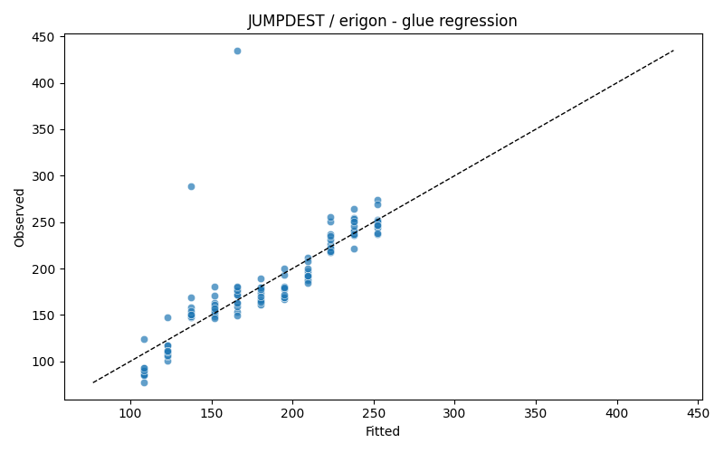

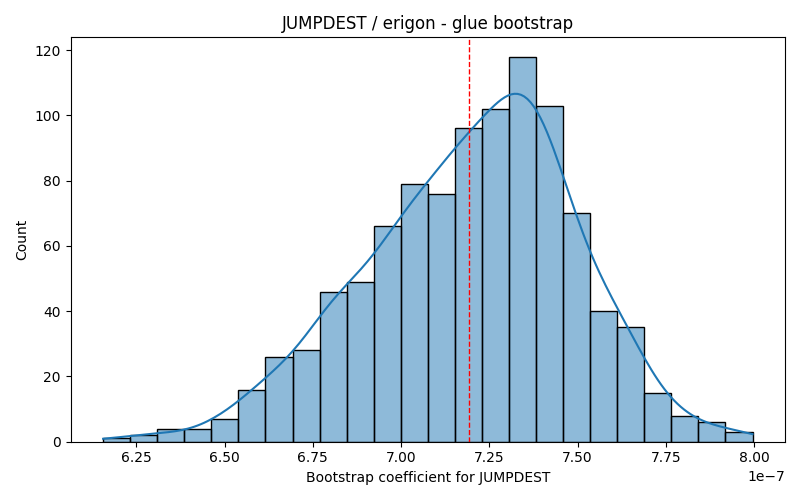

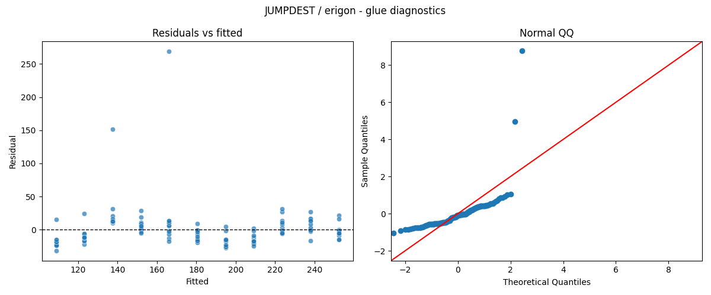

</details>

<details><summary><code>SWAP</code> · nobs=2112 · runtime_ms=1.213e-06 · p=1.00e-03 · R²=0.575</summary>

```
==============================================================================
                           NNLS Regression Results                            
==============================================================================
Dep. Variable:          test_runtime_ms              R-squared:          0.575
Model:                  NNLS                    Adj. R-squared:          0.575
No. Observations:       2112                              RMSE:          21.96
Df Residuals:           2110                               MAE:           7.64
Df Model:               1      
==============================================================================
                      coef     std err     P-value      [0.025      0.975]
------------------------------------------------------------------------------
         const     26.5457      1.6204       0.001     23.5904     29.8044
          SWAP      0.0000      0.0000       0.001      0.0000      0.0000
==============================================================================
Notes: Non-negative least squares with bootstrap inference (1000 iterations)
==============================================================================
```

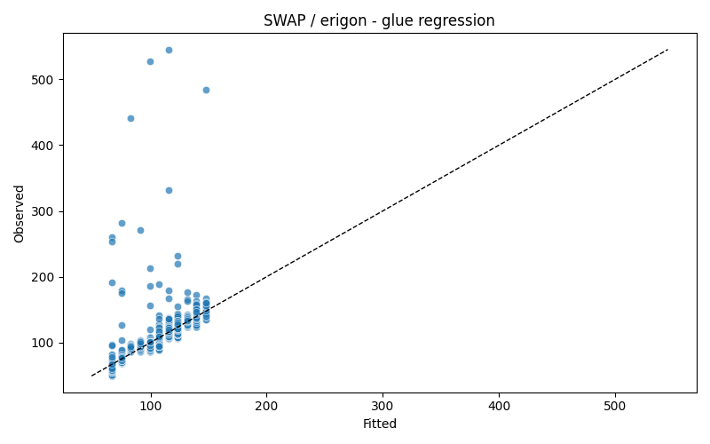

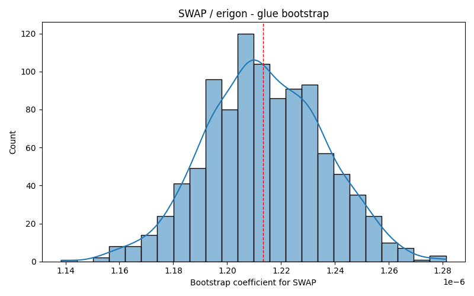

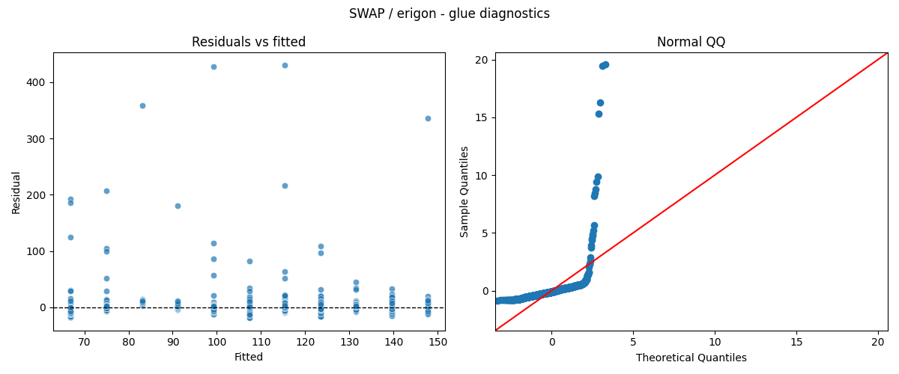

</details>

### Mixed glue (tier A) · erigon

<details><summary><code>ADD</code> · nobs=132 · runtime_ms=2.828e-06 · p=1.00e-03 · R²=0.5704</summary>

```
==============================================================================
                           NNLS Regression Results                            
==============================================================================
Dep. Variable:          test_runtime_ms              R-squared:          0.570
Model:                  NNLS                    Adj. R-squared:          0.567
No. Observations:       132                               RMSE:          25.83
Df Residuals:           130                                MAE:          10.06
Df Model:               1      
==============================================================================
                      coef     std err     P-value      [0.025      0.975]
------------------------------------------------------------------------------
         const     19.0491      7.9727       0.004      4.5688     35.5953
           ADD      0.0000      0.0000       0.001      0.0000      0.0000
==============================================================================
Notes: Non-negative least squares with bootstrap inference (1000 iterations)
==============================================================================
```

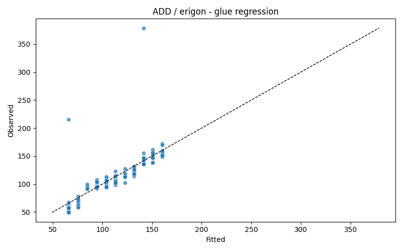

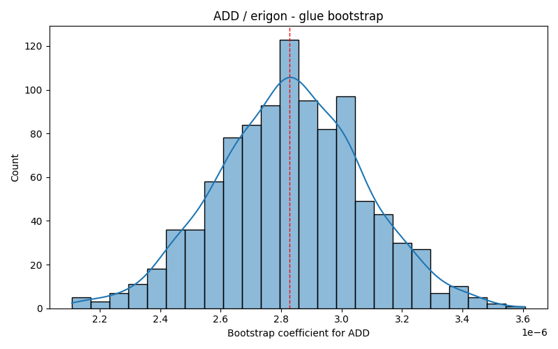

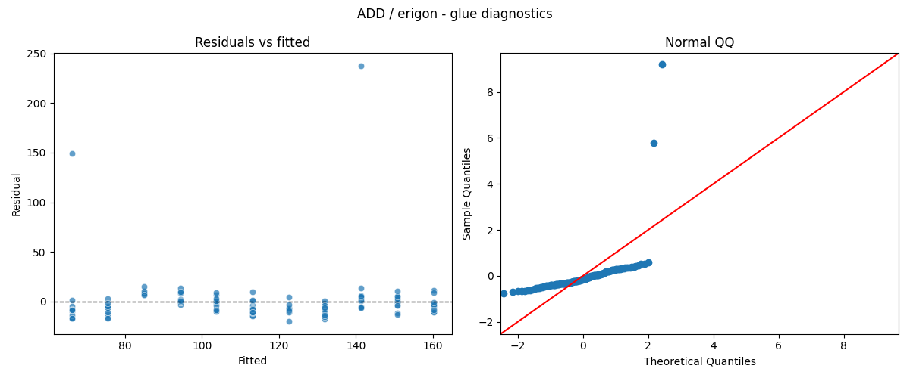

</details>

<details><summary><code>AND</code> · nobs=132 · runtime_ms=2.78e-06 · p=1.00e-03 · R²=0.9298</summary>

```
==============================================================================
                           NNLS Regression Results                            
==============================================================================
Dep. Variable:          test_runtime_ms              R-squared:          0.930
Model:                  NNLS                    Adj. R-squared:          0.929
No. Observations:       132                               RMSE:           8.04
Df Residuals:           130                                MAE:           6.43
Df Model:               1      
==============================================================================
                      coef     std err     P-value      [0.025      0.975]
------------------------------------------------------------------------------
         const     13.9031      2.4736       0.001      9.3982     19.2242
           AND      0.0000      0.0000       0.001      0.0000      0.0000
==============================================================================
Notes: Non-negative least squares with bootstrap inference (1000 iterations)
==============================================================================
```

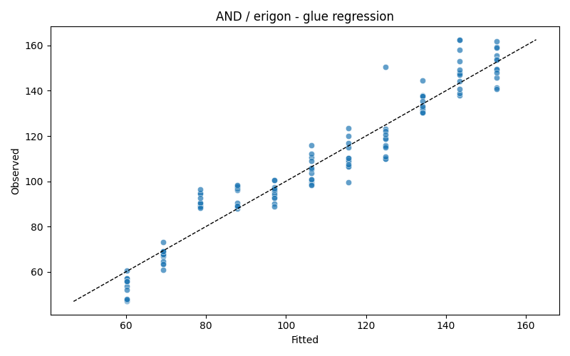

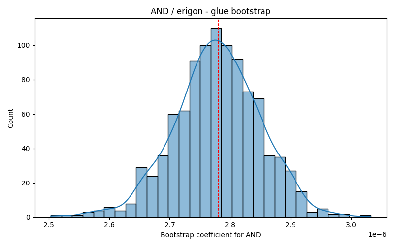

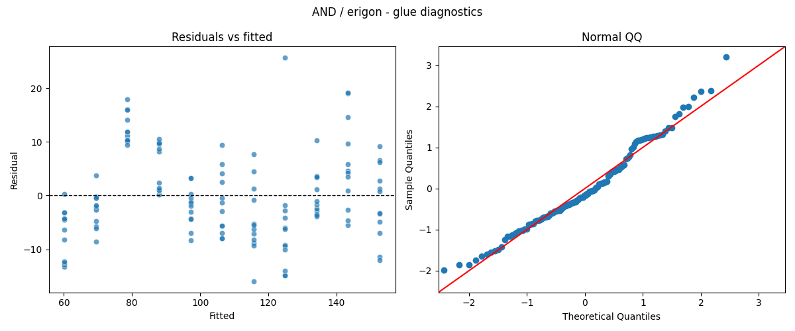

</details>

<details><summary><code>CALLDATACOPY</code> · nobs=3168 · runtime_ms=7.284e-06 · p=1.00e-03 · R²=0.8709</summary>

```
==============================================================================
                           NNLS Regression Results                            
==============================================================================
Dep. Variable:          test_runtime_ms              R-squared:          0.871
Model:                  NNLS                    Adj. R-squared:          0.871
No. Observations:       3168                              RMSE:          21.09
Df Residuals:           3166                               MAE:           8.46
Df Model:               1      
==============================================================================
                      coef     std err     P-value      [0.025      0.975]
------------------------------------------------------------------------------
         const     18.9058      0.5013       0.001     17.9228     19.9356
  CALLDATACOPY      0.0000      0.0000       0.001      0.0000      0.0000
==============================================================================
Notes: Non-negative least squares with bootstrap inference (1000 iterations)
==============================================================================
```

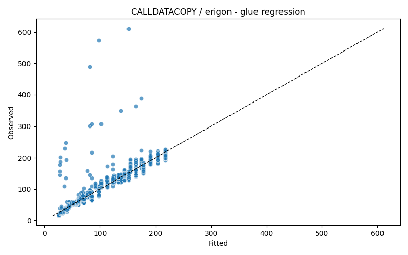

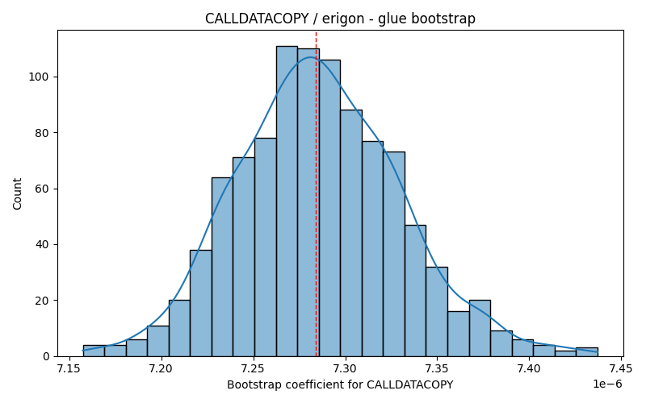

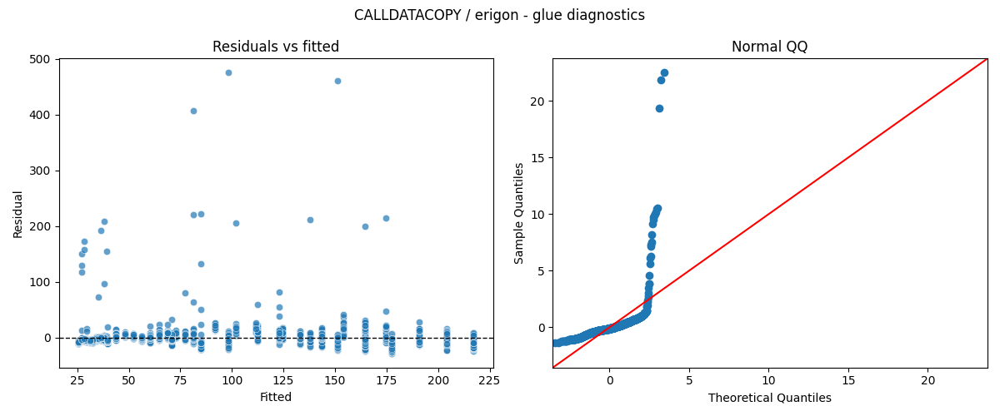

</details>

<details><summary><code>CALLDATALOAD</code> · nobs=528 · runtime_ms=0.000216 · p=2.00e-03 · R²=0.008004</summary>

```
==============================================================================
                           NNLS Regression Results                            
==============================================================================
Dep. Variable:          test_runtime_ms              R-squared:          0.008
Model:                  NNLS                    Adj. R-squared:          0.006
No. Observations:       528                               RMSE:           9.23
Df Residuals:           526                                MAE:           1.65
Df Model:               1      
==============================================================================
                      coef     std err     P-value      [0.025      0.975]
------------------------------------------------------------------------------
         const      4.5305      1.1046       0.001      1.9898      6.2539
  CALLDATALOAD      0.0002      0.0001       0.002      0.0000      0.0005
==============================================================================
Notes: Non-negative least squares with bootstrap inference (1000 iterations)
==============================================================================
```

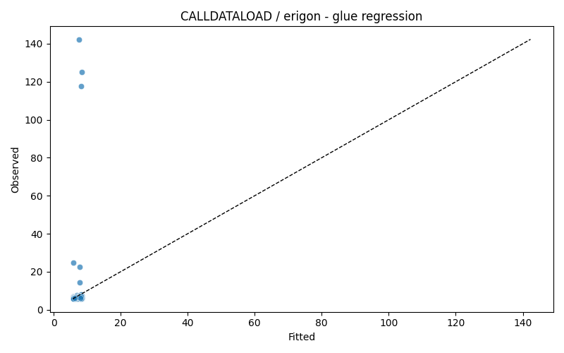

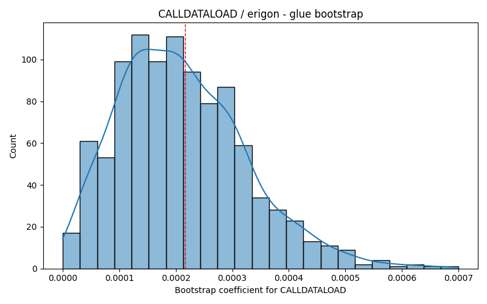

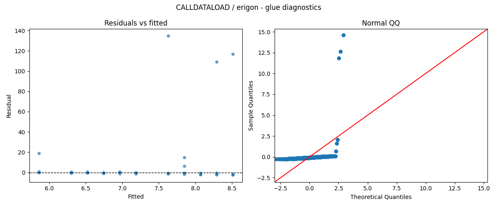

</details>

<details><summary><code>DIV</code> · nobs=132 · runtime_ms=9.883e-06 · p=1.00e-03 · R²=0.7323</summary>

```
==============================================================================
                           NNLS Regression Results                            
==============================================================================
Dep. Variable:          test_runtime_ms              R-squared:          0.732
Model:                  NNLS                    Adj. R-squared:          0.730
No. Observations:       132                               RMSE:          47.17
Df Residuals:           130                                MAE:          27.63
Df Model:               1      
==============================================================================
                      coef     std err     P-value      [0.025      0.975]
------------------------------------------------------------------------------
         const     23.1350      8.8509       0.001      6.1776     40.7846
           DIV      0.0000      0.0000       0.001      0.0000      0.0000
==============================================================================
Notes: Non-negative least squares with bootstrap inference (1000 iterations)
==============================================================================
```

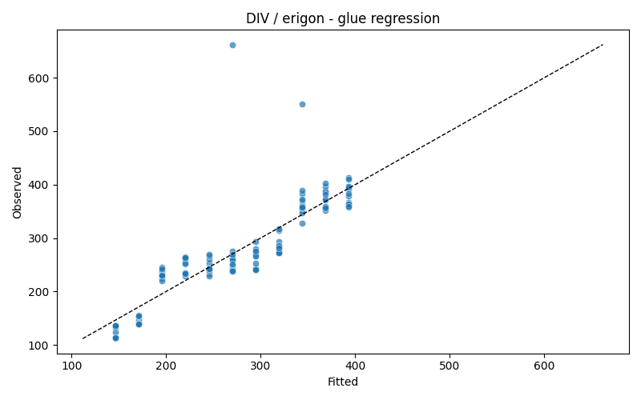

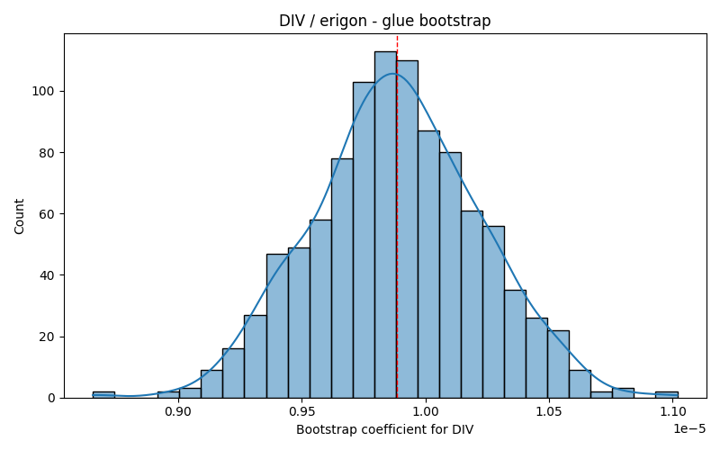

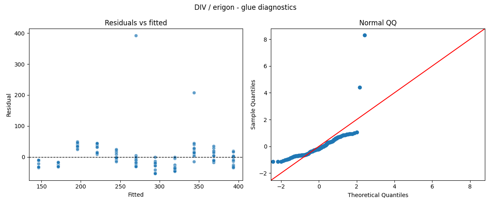

</details>

<details><summary><code>EXP</code> · nobs=132 · runtime_ms=0.0003358 · p=1.00e-03 · R²=0.198</summary>

```
==============================================================================
                           NNLS Regression Results                            
==============================================================================
Dep. Variable:          test_runtime_ms              R-squared:          0.198
Model:                  NNLS                    Adj. R-squared:          0.192
No. Observations:       132                               RMSE:          26.47
Df Residuals:           130                                MAE:           6.11
Df Model:               1      
==============================================================================
                      coef     std err     P-value      [0.025      0.975]
------------------------------------------------------------------------------
         const     16.0340      2.9745       0.001     11.6628     23.1222
           EXP      0.0003      0.0000       0.001      0.0003      0.0004
==============================================================================
Notes: Non-negative least squares with bootstrap inference (1000 iterations)
==============================================================================
```

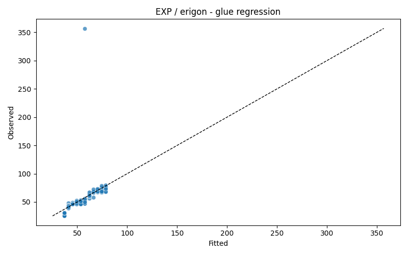

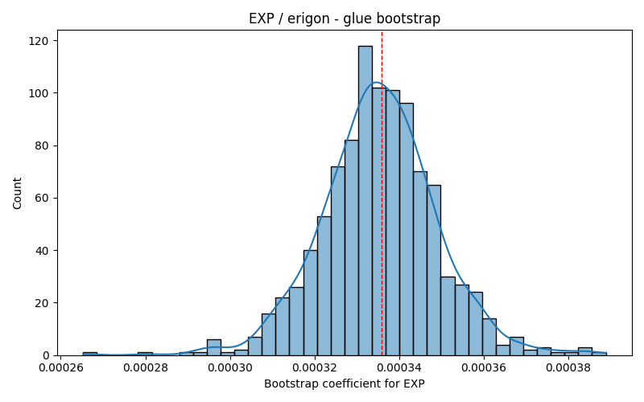

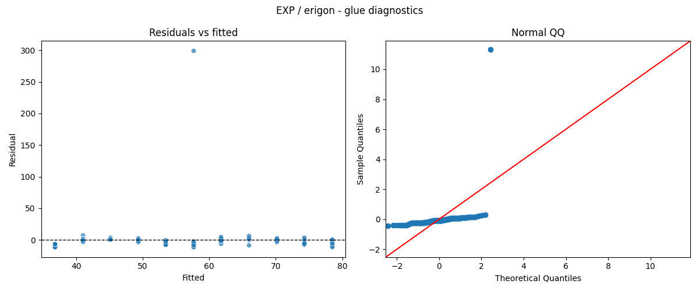

</details>

<details><summary><code>GT</code> · nobs=132 · runtime_ms=2.857e-06 · p=1.00e-03 · R²=0.8548</summary>

```
==============================================================================
                           NNLS Regression Results                            
==============================================================================
Dep. Variable:          test_runtime_ms              R-squared:          0.855
Model:                  NNLS                    Adj. R-squared:          0.854
No. Observations:       132                               RMSE:          12.40
Df Residuals:           130                                MAE:           8.11
Df Model:               1      
==============================================================================
                      coef     std err     P-value      [0.025      0.975]
------------------------------------------------------------------------------
         const     20.9504      3.7318       0.001     13.9673     28.6843
            GT      0.0000      0.0000       0.001      0.0000      0.0000
==============================================================================
Notes: Non-negative least squares with bootstrap inference (1000 iterations)
==============================================================================
```

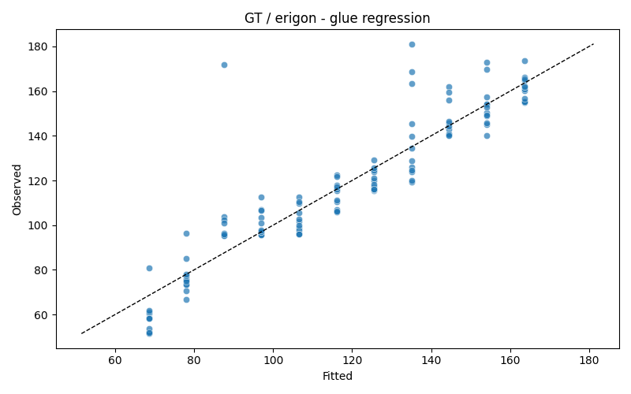

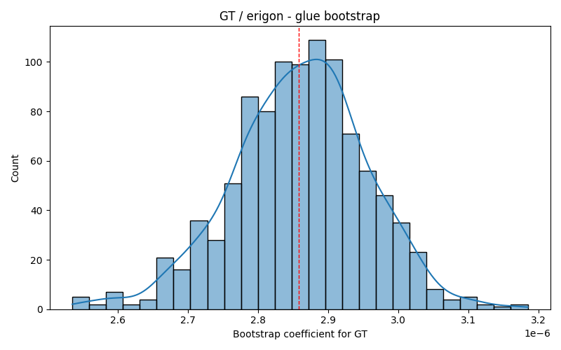

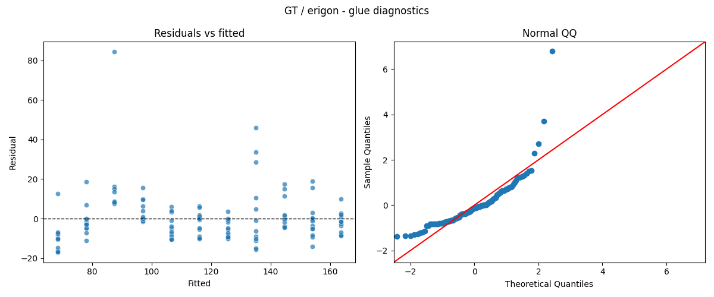

</details>

<details><summary><code>JUMPI</code> · nobs=132 · runtime_ms=3.453e-06 · p=1.00e-03 · R²=0.89</summary>

```
==============================================================================
                           NNLS Regression Results                            
==============================================================================
Dep. Variable:          test_runtime_ms              R-squared:          0.890
Model:                  NNLS                    Adj. R-squared:          0.889
No. Observations:       132                               RMSE:           5.48
Df Residuals:           130                                MAE:           4.54
Df Model:               1      
==============================================================================
                      coef     std err     P-value      [0.025      0.975]
------------------------------------------------------------------------------
         const     18.4889      1.8836       0.001     14.8679     22.2277
         JUMPI      0.0000      0.0000       0.001      0.0000      0.0000
==============================================================================
Notes: Non-negative least squares with bootstrap inference (1000 iterations)
==============================================================================
```

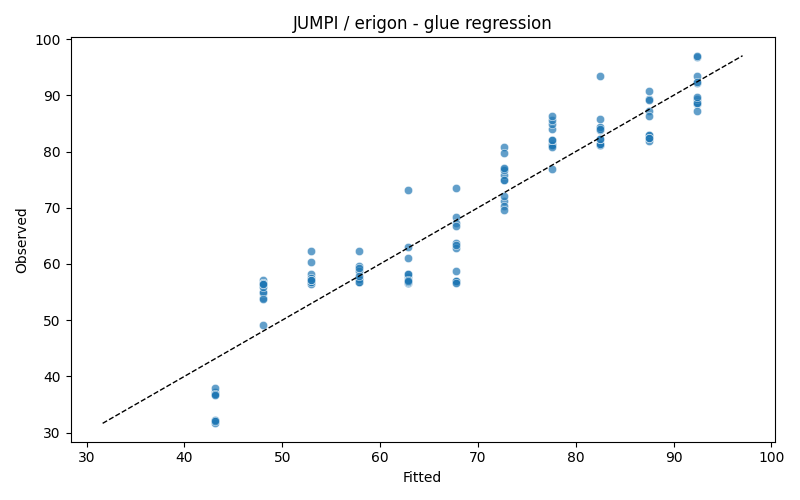

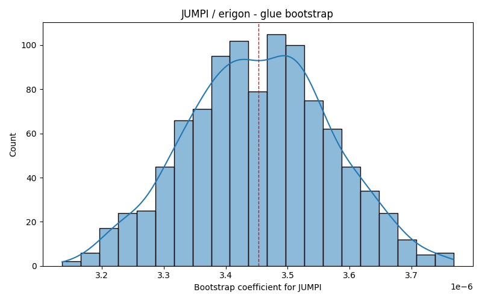

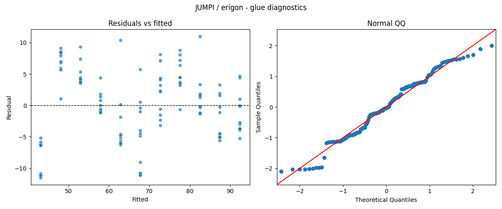

</details>

<details><summary><code>LT</code> · nobs=132 · runtime_ms=2.747e-06 · p=1.00e-03 · R²=0.857</summary>

```
==============================================================================
                           NNLS Regression Results                            
==============================================================================
Dep. Variable:          test_runtime_ms              R-squared:          0.857
Model:                  NNLS                    Adj. R-squared:          0.856
No. Observations:       132                               RMSE:          11.81
Df Residuals:           130                                MAE:           7.56
Df Model:               1      
==============================================================================
                      coef     std err     P-value      [0.025      0.975]
------------------------------------------------------------------------------
         const     24.5485      5.0082       0.001     15.6006     35.7599
            LT      0.0000      0.0000       0.001      0.0000      0.0000
==============================================================================
Notes: Non-negative least squares with bootstrap inference (1000 iterations)
==============================================================================
```

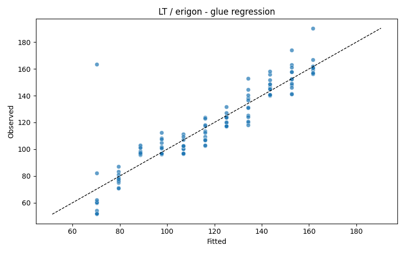

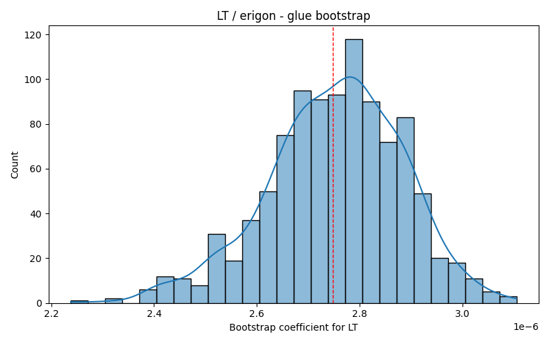

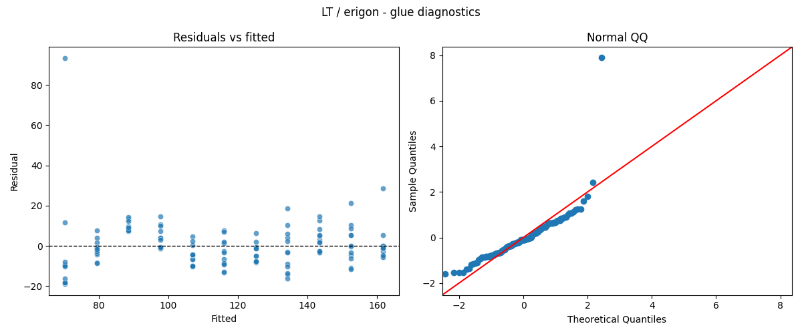

</details>

<details><summary><code>MSTORE</code> · nobs=660 · runtime_ms=5.523e-06 · p=1.00e-03 · R²=0.7362</summary>

```
==============================================================================
                           NNLS Regression Results                            
==============================================================================
Dep. Variable:          test_runtime_ms              R-squared:          0.736
Model:                  NNLS                    Adj. R-squared:          0.736
No. Observations:       660                               RMSE:          23.20
Df Residuals:           658                                MAE:          10.96
Df Model:               1      
==============================================================================
                      coef     std err     P-value      [0.025      0.975]
------------------------------------------------------------------------------
         const     28.7222      2.8594       0.001     23.5277     34.6122
        MSTORE      0.0000      0.0000       0.001      0.0000      0.0000
==============================================================================
Notes: Non-negative least squares with bootstrap inference (1000 iterations)
==============================================================================
```

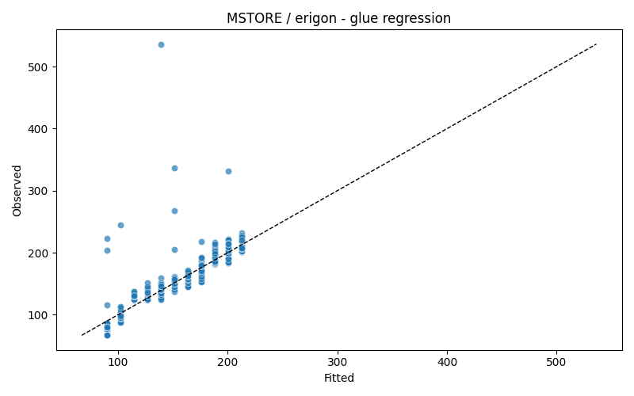

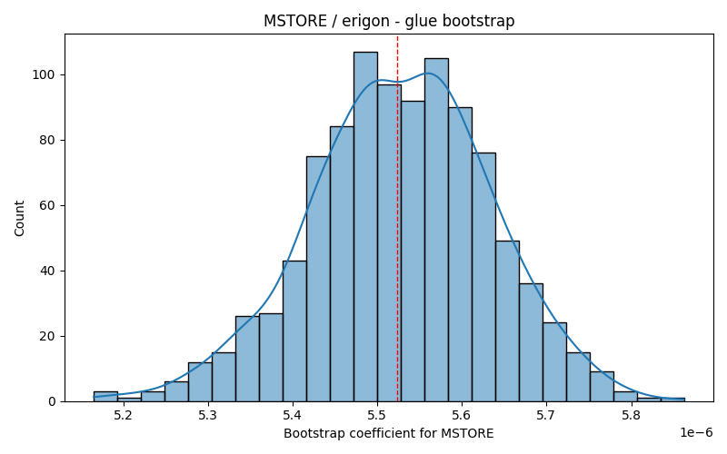

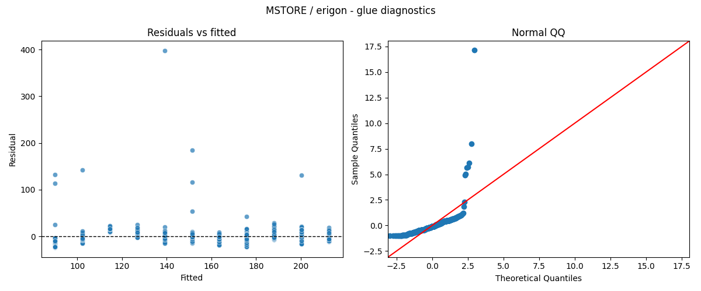

</details>

<details><summary><code>MSTORE8</code> · nobs=660 · runtime_ms=5.041e-06 · p=1.00e-03 · R²=0.8645</summary>

```
==============================================================================
                           NNLS Regression Results                            
==============================================================================
Dep. Variable:          test_runtime_ms              R-squared:          0.864
Model:                  NNLS                    Adj. R-squared:          0.864
No. Observations:       660                               RMSE:          14.01
Df Residuals:           658                                MAE:           8.58
Df Model:               1      
==============================================================================
                      coef     std err     P-value      [0.025      0.975]
------------------------------------------------------------------------------
         const     24.9215      2.1177       0.001     20.9628     29.3229
       MSTORE8      0.0000      0.0000       0.001      0.0000      0.0000
==============================================================================
Notes: Non-negative least squares with bootstrap inference (1000 iterations)
==============================================================================
```

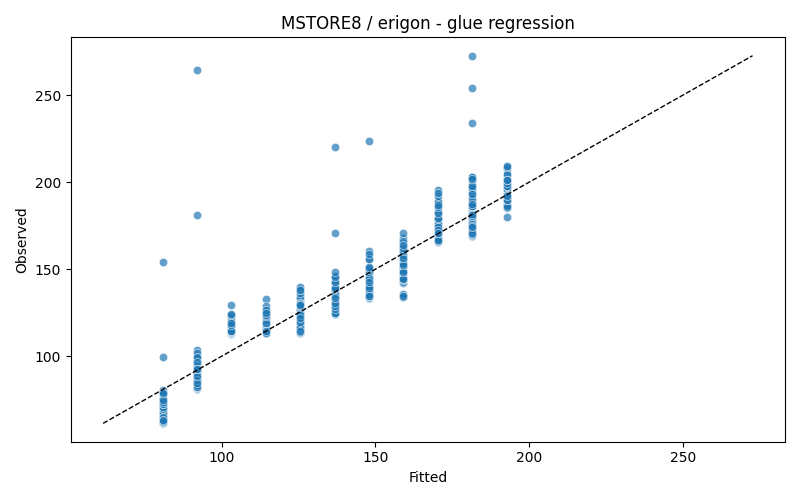

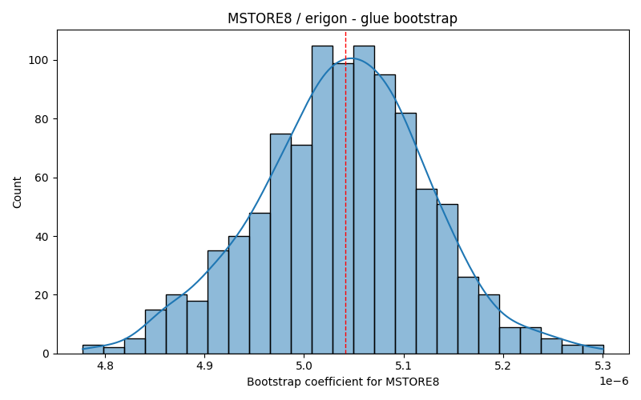

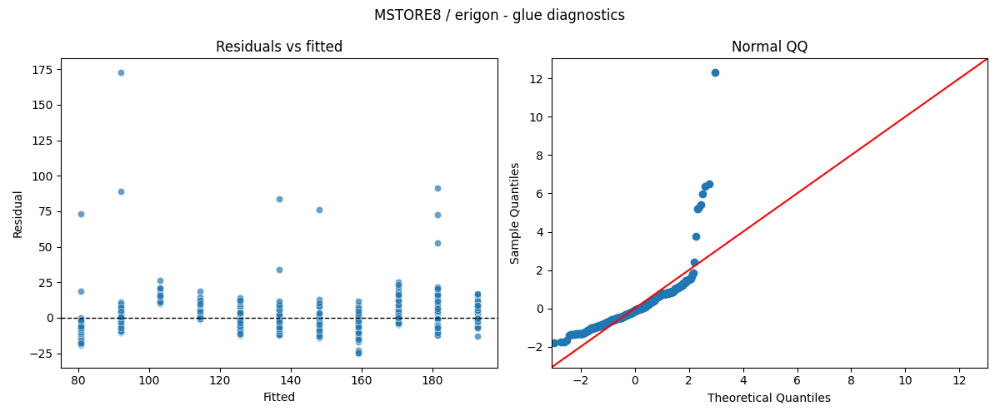

</details>

<details><summary><code>MUL</code> · nobs=132 · runtime_ms=3.836e-06 · p=1.00e-03 · R²=0.752</summary>

```
==============================================================================
                           NNLS Regression Results                            
==============================================================================
Dep. Variable:          test_runtime_ms              R-squared:          0.752
Model:                  NNLS                    Adj. R-squared:          0.750
No. Observations:       132                               RMSE:          17.39
Df Residuals:           130                                MAE:           7.58
Df Model:               1      
==============================================================================
                      coef     std err     P-value      [0.025      0.975]
------------------------------------------------------------------------------
         const      7.0149      4.8997       0.115      0.0000     15.9717
           MUL      0.0000      0.0000       0.001      0.0000      0.0000
==============================================================================
Notes: Non-negative least squares with bootstrap inference (1000 iterations)
==============================================================================
```

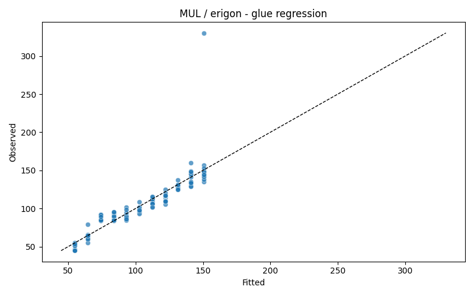

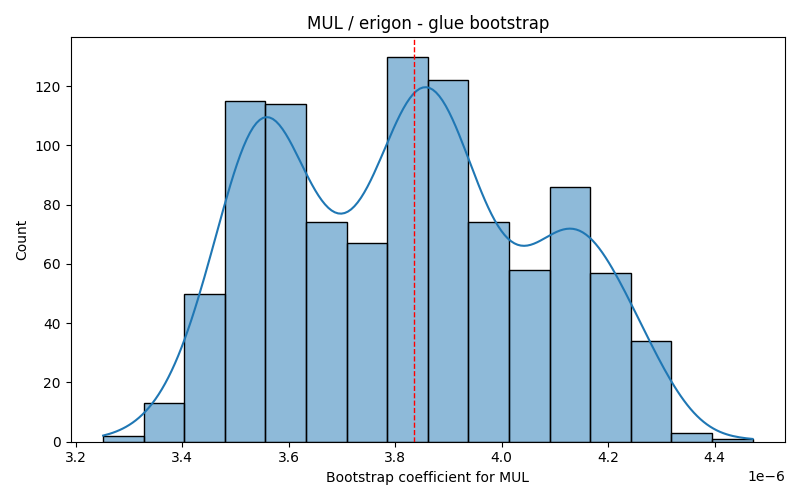

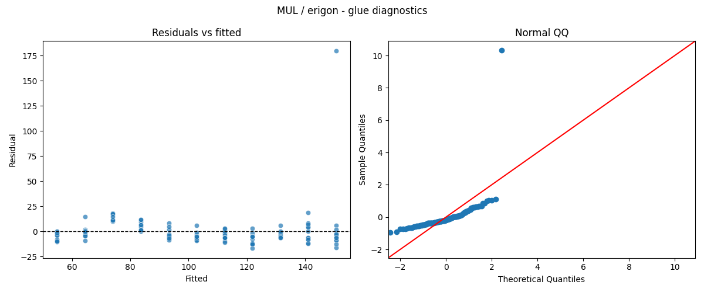

</details>

<details><summary><code>PC</code> · nobs=132 · runtime_ms=1.377e-06 · p=1.00e-03 · R²=0.9272</summary>

```
==============================================================================
                           NNLS Regression Results                            
==============================================================================
Dep. Variable:          test_runtime_ms              R-squared:          0.927
Model:                  NNLS                    Adj. R-squared:          0.927
No. Observations:       132                               RMSE:          11.54
Df Residuals:           130                                MAE:           9.39
Df Model:               1      
==============================================================================
                      coef     std err     P-value      [0.025      0.975]
------------------------------------------------------------------------------
         const     23.2323      3.7098       0.001     16.3514     30.5591
            PC      0.0000      0.0000       0.001      0.0000      0.0000
==============================================================================
Notes: Non-negative least squares with bootstrap inference (1000 iterations)
==============================================================================
```

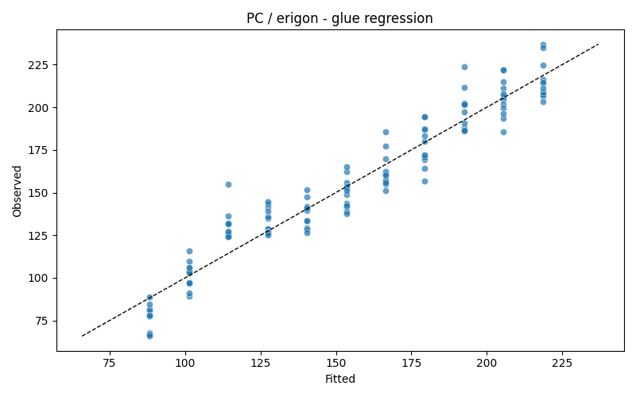

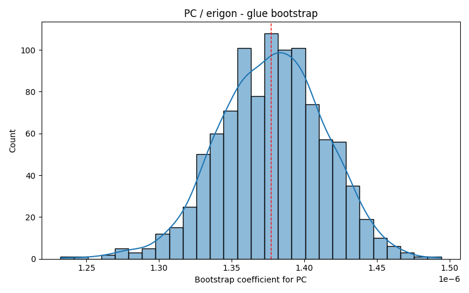

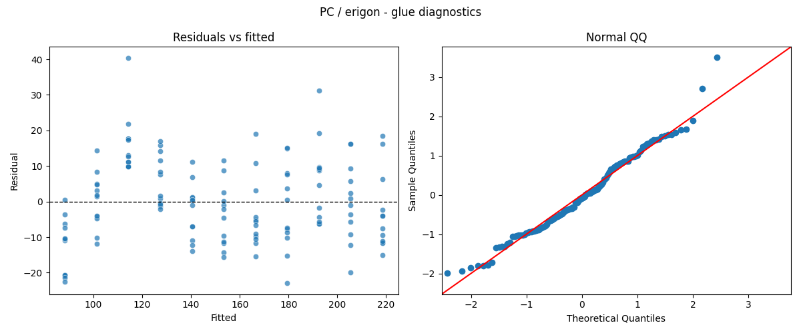

</details>

<details><summary><code>RETURNDATASIZE</code> · nobs=528 · runtime_ms=1.775e-06 · p=1.00e-03 · R²=0.7398</summary>

```
==============================================================================
                           NNLS Regression Results                            
==============================================================================
Dep. Variable:          test_runtime_ms              R-squared:          0.740
Model:                  NNLS                    Adj. R-squared:          0.739
No. Observations:       528                               RMSE:          16.62
Df Residuals:           526                                MAE:           7.83
Df Model:               1      
==============================================================================
                      coef     std err     P-value      [0.025      0.975]
------------------------------------------------------------------------------
         const     20.8720      2.5061       0.001     16.3268     26.1047
RETURNDATASIZE      0.0000      0.0000       0.001      0.0000      0.0000
==============================================================================
Notes: Non-negative least squares with bootstrap inference (1000 iterations)
==============================================================================
```

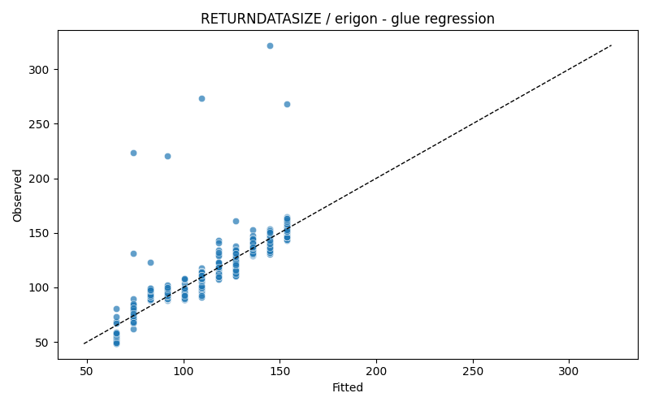

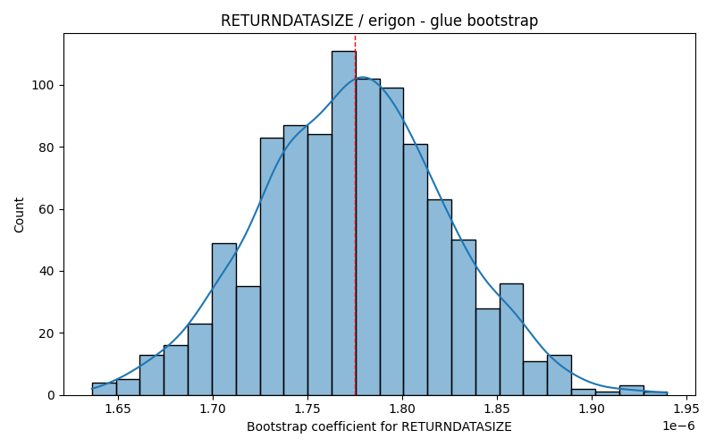

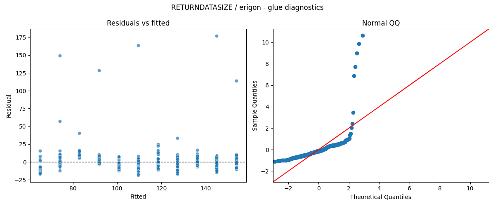

</details>

<details><summary><code>SELFBALANCE</code> · nobs=108 · runtime_ms=1.365e-06 · p=1.00e-03 · R²=0.8722</summary>

```
==============================================================================
                           NNLS Regression Results                            
==============================================================================
Dep. Variable:          test_runtime_ms              R-squared:          0.872
Model:                  NNLS                    Adj. R-squared:          0.871
No. Observations:       108                               RMSE:           5.27
Df Residuals:           106                                MAE:           4.15
Df Model:               1      
==============================================================================
                      coef     std err     P-value      [0.025      0.975]
------------------------------------------------------------------------------
         const     19.7231      1.9803       0.001     15.6200     23.3018
   SELFBALANCE      0.0000      0.0000       0.001      0.0000      0.0000
==============================================================================
Notes: Non-negative least squares with bootstrap inference (1000 iterations)
==============================================================================
```

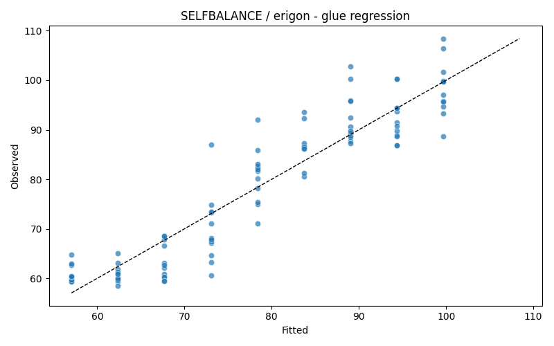

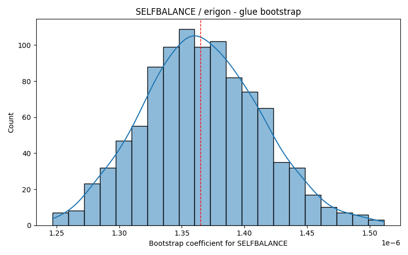

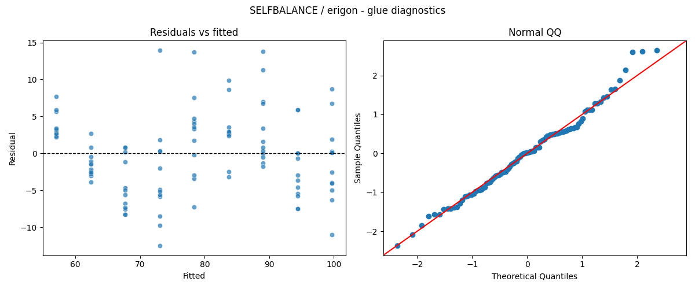

</details>

<details><summary><code>SUB</code> · nobs=132 · runtime_ms=2.959e-06 · p=1.00e-03 · R²=0.521</summary>

```
==============================================================================
                           NNLS Regression Results                            
==============================================================================
Dep. Variable:          test_runtime_ms              R-squared:          0.521
Model:                  NNLS                    Adj. R-squared:          0.517
No. Observations:       132                               RMSE:          29.86
Df Residuals:           130                                MAE:          11.37
Df Model:               1      
==============================================================================
                      coef     std err     P-value      [0.025      0.975]
------------------------------------------------------------------------------
         const     15.5943      6.1701       0.013      2.2016     26.5840
           SUB      0.0000      0.0000       0.001      0.0000      0.0000
==============================================================================
Notes: Non-negative least squares with bootstrap inference (1000 iterations)
==============================================================================
```


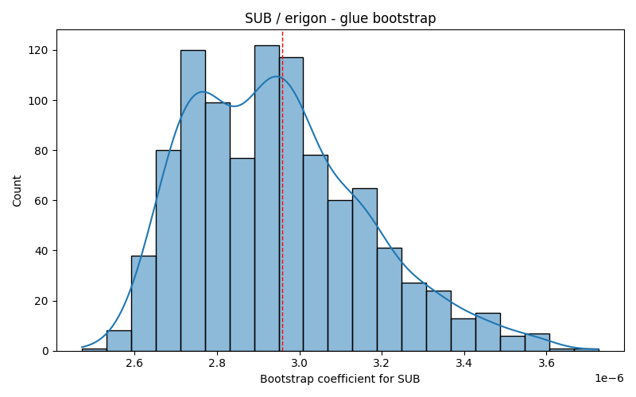


</details>

### Mixed glue (tier B) · erigon

<details><summary><code>JUMP</code> · nobs=132 · runtime_ms=7.632e-06 · p=1.00e-03 · R²=0.6841</summary>

```
==============================================================================
                           NNLS Regression Results                            
==============================================================================
Dep. Variable:          test_runtime_ms              R-squared:          0.684
Model:                  NNLS                    Adj. R-squared:          0.682
No. Observations:       132                               RMSE:          19.27
Df Residuals:           130                                MAE:           9.06
Df Model:               1      
==============================================================================
                      coef     std err     P-value      [0.025      0.975]
------------------------------------------------------------------------------
         const     14.1348      3.7128       0.001      6.2452     20.6302
          JUMP      0.0000      0.0000       0.001      0.0000      0.0000
==============================================================================
Notes: Non-negative least squares with bootstrap inference (1000 iterations)
==============================================================================
```

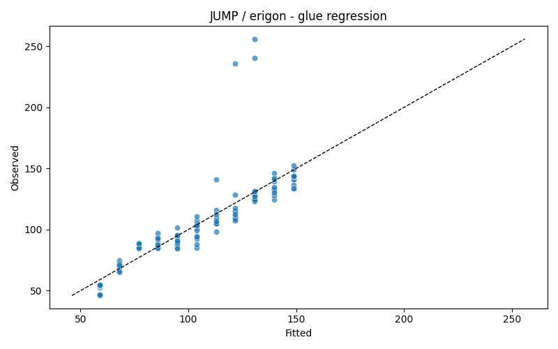

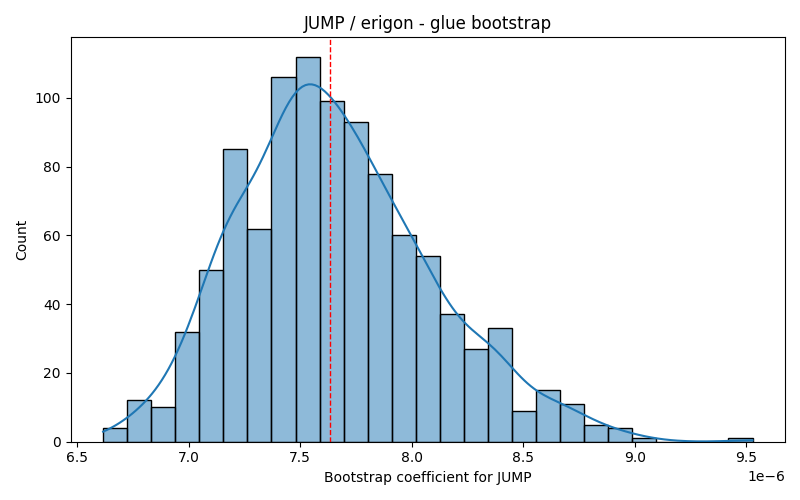

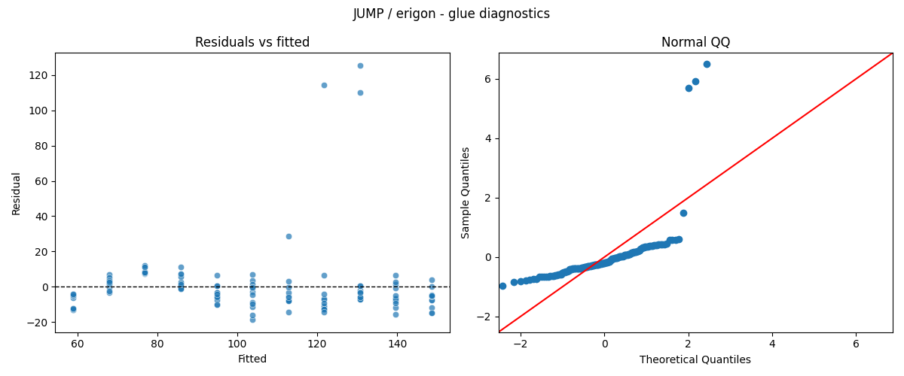

</details>

<details><summary><code>KECCAK256</code> · nobs=2112 · runtime_ms=2.082e-05 · p=1.00e-03 · R²=0.0867</summary>

```
==============================================================================
                           NNLS Regression Results                            
==============================================================================
Dep. Variable:          test_runtime_ms              R-squared:          0.087
Model:                  NNLS                    Adj. R-squared:          0.086
No. Observations:       2112                              RMSE:         134.32
Df Residuals:           2110                               MAE:         108.20
Df Model:               1      
==============================================================================
                      coef     std err     P-value      [0.025      0.975]
------------------------------------------------------------------------------
         const    365.8515      6.3522       0.001    353.2059    378.3421
     KECCAK256      0.0000      0.0000       0.001      0.0000      0.0000
==============================================================================
Notes: Non-negative least squares with bootstrap inference (1000 iterations)
==============================================================================
```

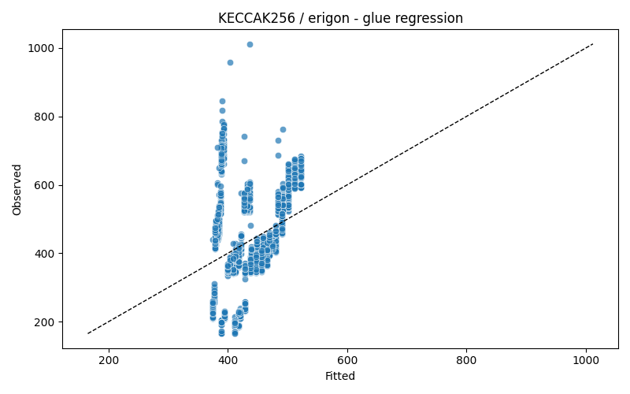

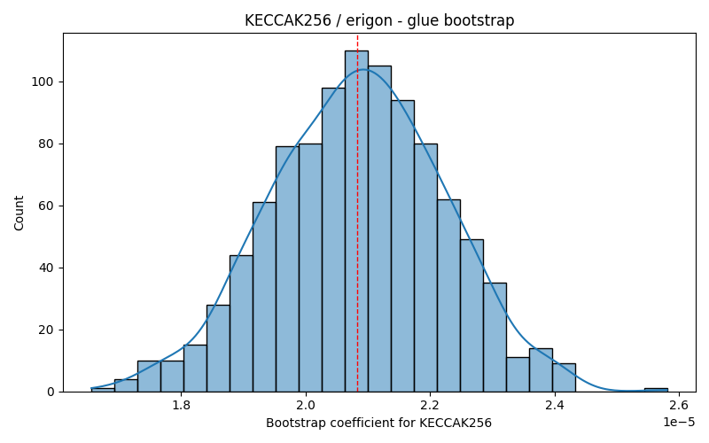

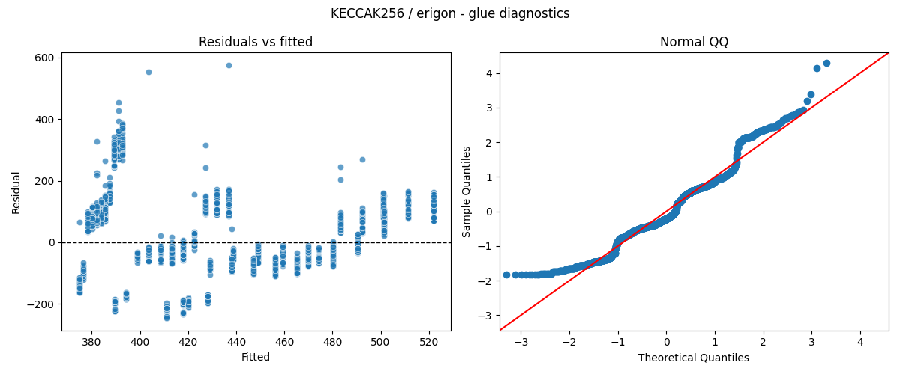

</details>

## ethrex

| glue_opcode | nobs | glue_runtime_ms | p_value | rsquared |
| --- | --- | --- | --- | --- |
| `ISZERO` | 187 | 3.944e-07 | 1.00e-03 | 0.8442 |
| `JUMPDEST` | 187 | 3.008e-07 | 1.00e-03 | 0.8069 |
| `SWAP` | 2992 | 7.002e-07 | 1.00e-03 | 0.8048 |
| `CALLDATASIZE` | 11209 | 3.818e-07 | 1.00e-03 | 0.9293 |
| `DUP` | 11209 | 3.872e-07 | 1.00e-03 | 0.9293 |
| `GAS` | 11209 | 4.349e-07 | 1.00e-03 | 0.9293 |
| `MLOAD` | 11209 | 1.181e-06 | 1.00e-03 | 0.9293 |
| `PUSH` | 11209 | 5.617e-07 | 1.00e-03 | 0.9293 |
| `PUSH0` | 11209 | 2.916e-07 | 1.00e-03 | 0.9293 |
| `STATICCALL` | 11209 | 0.0001107 | 1.00e-03 | 0.9293 |
| `ADD` | 187 | 9.538e-07 | 1.00e-03 | 0.835 |
| `AND` | 187 | 9.052e-07 | 1.00e-03 | 0.8381 |
| `CALLDATACOPY` | 4488 | 2.356e-06 | 1.00e-03 | 0.8435 |
| `CALLDATALOAD` | 748 | 1.907e-05 | 1.00e-03 | 0.2132 |
| `DIV` | 187 | 9.286e-06 | 1.00e-03 | 0.8202 |
| `EXP` | 187 | 0.0009467 | 1.00e-03 | 0.8141 |
| `GT` | 187 | 9.28e-07 | 1.00e-03 | 0.818 |
| `JUMPI` | 187 | 1.179e-06 | 1.00e-03 | 0.8609 |
| `LT` | 187 | 8.808e-07 | 1.00e-03 | 0.8044 |
| `MSTORE` | 935 | 1.519e-06 | 1.00e-03 | 0.7872 |
| `MSTORE8` | 935 | 1.397e-06 | 1.00e-03 | 0.8111 |
| `MUL` | 187 | 1.388e-06 | 1.00e-03 | 0.7549 |
| `PC` | 187 | 4.963e-07 | 1.00e-03 | 0.8201 |
| `RETURNDATASIZE` | 748 | 8.146e-07 | 1.00e-03 | 0.6288 |
| `SELFBALANCE` | 153 | 4.666e-06 | 1.00e-03 | 0.786 |
| `SUB` | 187 | 9.232e-07 | 1.00e-03 | 0.818 |
| `JUMP` | 187 | 4.37e-06 | 1.00e-03 | 0.822 |
| `KECCAK256` | 2992 | 0 | 1.00e+00 | 0 |

### Cycle glue — joint fit · ethrex

<details><summary>Joint NNLS regression summary</summary>

```
==============================================================================
                           NNLS Regression Results                            
==============================================================================
Dep. Variable:          test_runtime_ms              R-squared:          0.929
Model:                  NNLS                    Adj. R-squared:          0.929
No. Observations:       11209                             RMSE:           6.67
Df Residuals:           11201                              MAE:           5.23
Df Model:               7      
==============================================================================
                      coef     std err     P-value      [0.025      0.975]
------------------------------------------------------------------------------
         const     12.6199      0.2183       0.001     12.1899     13.0209
  CALLDATASIZE      0.0000      0.0000       0.001      0.0000      0.0000
           DUP      0.0000      0.0000       0.001      0.0000      0.0000
           GAS      0.0000      0.0000       0.001      0.0000      0.0000
         MLOAD      0.0000      0.0000       0.001      0.0000      0.0000
          PUSH      0.0000      0.0000       0.001      0.0000      0.0000
         PUSH0      0.0000      0.0000       0.001      0.0000      0.0000
    STATICCALL      0.0001      0.0000       0.001      0.0001      0.0001
==============================================================================
Notes: Non-negative least squares with bootstrap inference (1000 iterations)
==============================================================================
```

</details>

<details><summary><code>CALLDATASIZE</code> · nobs=11209 · runtime_ms=3.818e-07 · p=1.00e-03 · R²=0.9293</summary>

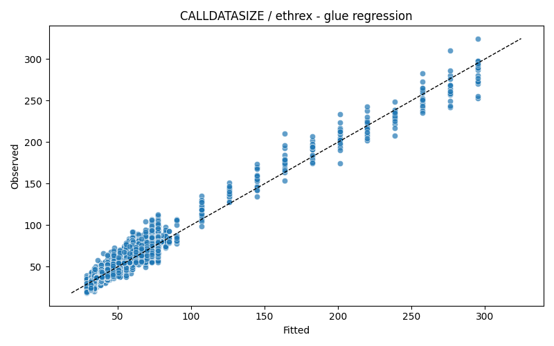


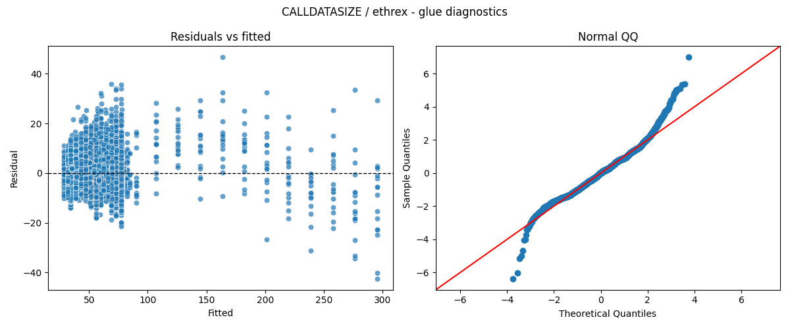

</details>

<details><summary><code>DUP</code> · nobs=11209 · runtime_ms=3.872e-07 · p=1.00e-03 · R²=0.9293</summary>


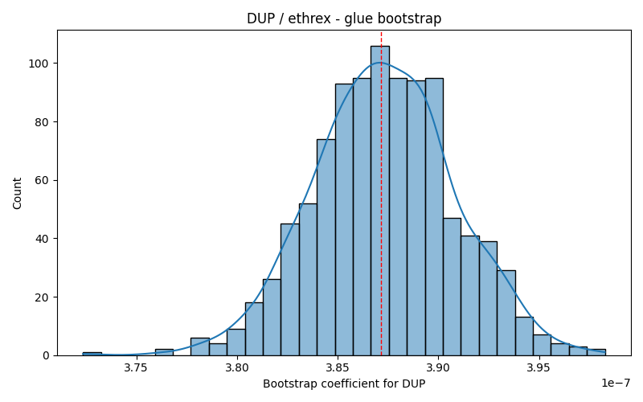


</details>

<details><summary><code>GAS</code> · nobs=11209 · runtime_ms=4.349e-07 · p=1.00e-03 · R²=0.9293</summary>


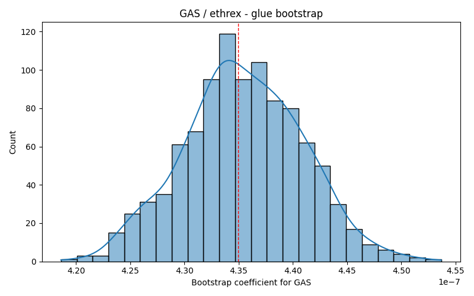


</details>

<details><summary><code>MLOAD</code> · nobs=11209 · runtime_ms=1.181e-06 · p=1.00e-03 · R²=0.9293</summary>


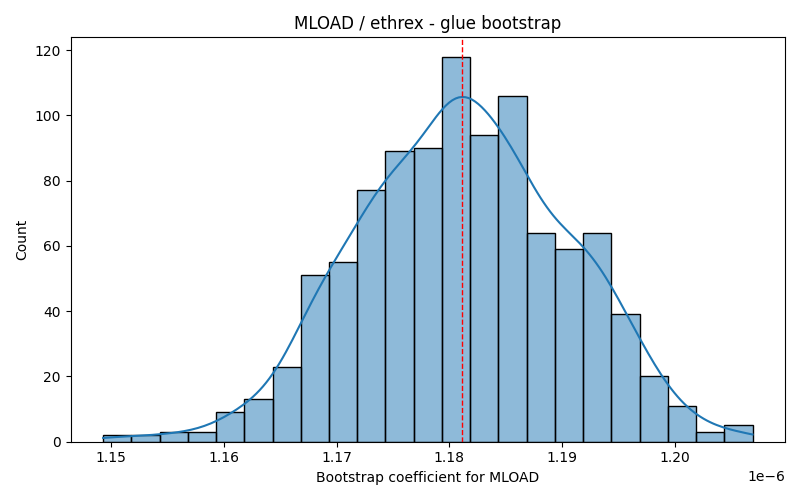

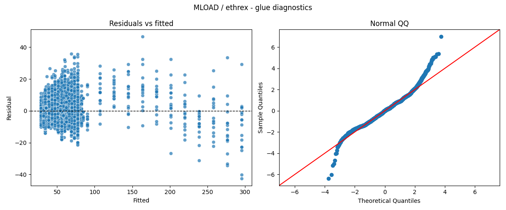

</details>

<details><summary><code>PUSH</code> · nobs=11209 · runtime_ms=5.617e-07 · p=1.00e-03 · R²=0.9293</summary>


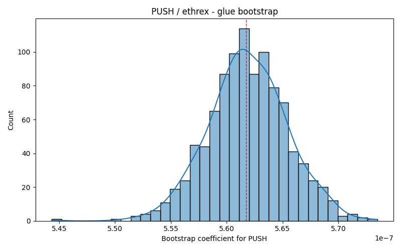


</details>

<details><summary><code>PUSH0</code> · nobs=11209 · runtime_ms=2.916e-07 · p=1.00e-03 · R²=0.9293</summary>

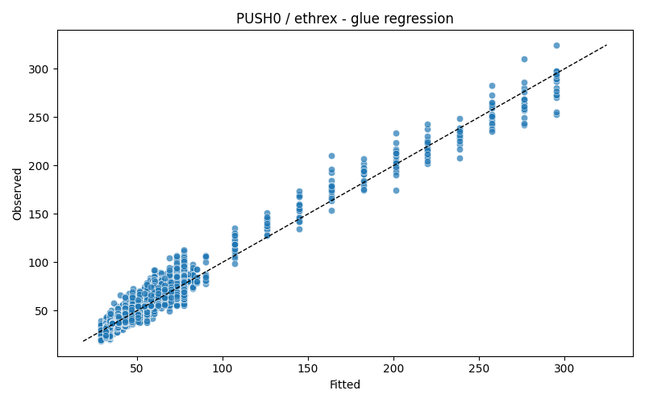

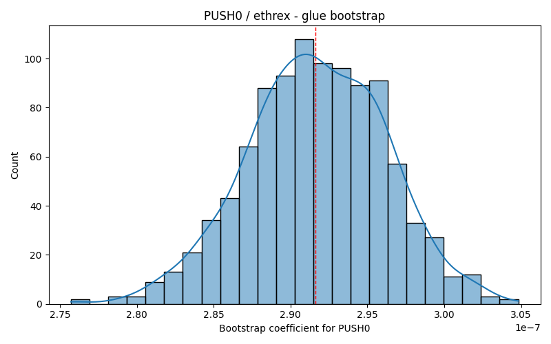


</details>

<details><summary><code>STATICCALL</code> · nobs=11209 · runtime_ms=0.0001107 · p=1.00e-03 · R²=0.9293</summary>

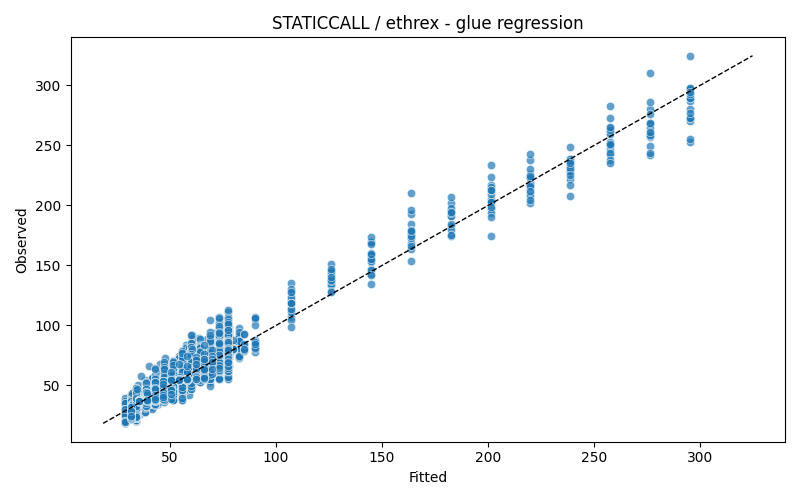

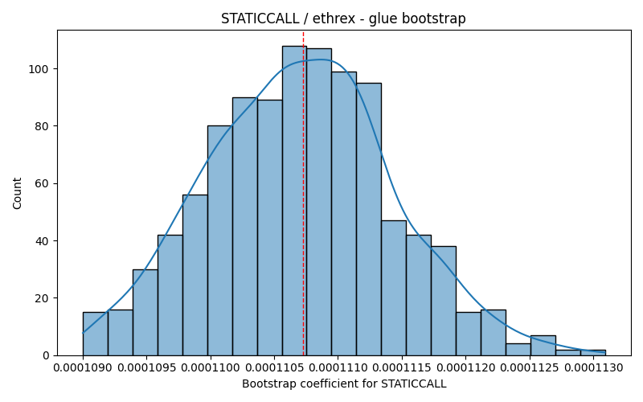

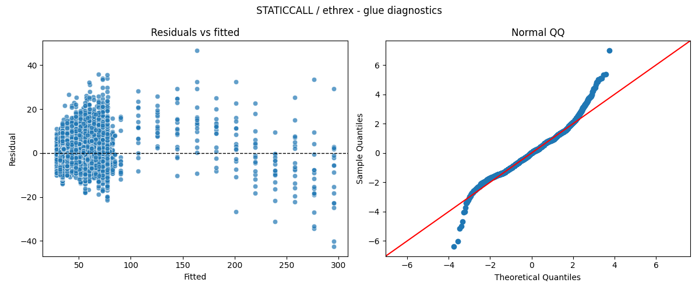

</details>

### Pure glue · ethrex

<details><summary><code>ISZERO</code> · nobs=187 · runtime_ms=3.944e-07 · p=1.00e-03 · R²=0.8442</summary>

```
==============================================================================
                           NNLS Regression Results                            
==============================================================================
Dep. Variable:          test_runtime_ms              R-squared:          0.844
Model:                  NNLS                    Adj. R-squared:          0.843
No. Observations:       187                               RMSE:           3.57
Df Residuals:           185                                MAE:           2.76
Df Model:               1      
==============================================================================
                      coef     std err     P-value      [0.025      0.975]
------------------------------------------------------------------------------
         const      7.3040      0.8369       0.001      5.6592      8.9306
        ISZERO      0.0000      0.0000       0.001      0.0000      0.0000
==============================================================================
Notes: Non-negative least squares with bootstrap inference (1000 iterations)
==============================================================================
```

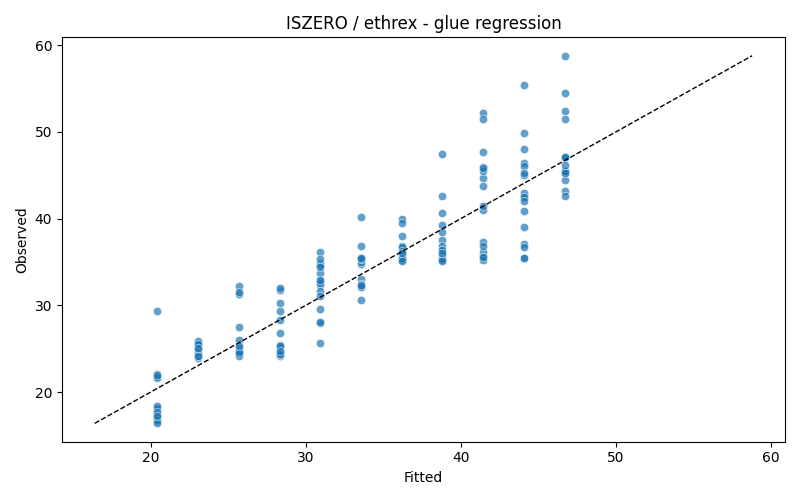

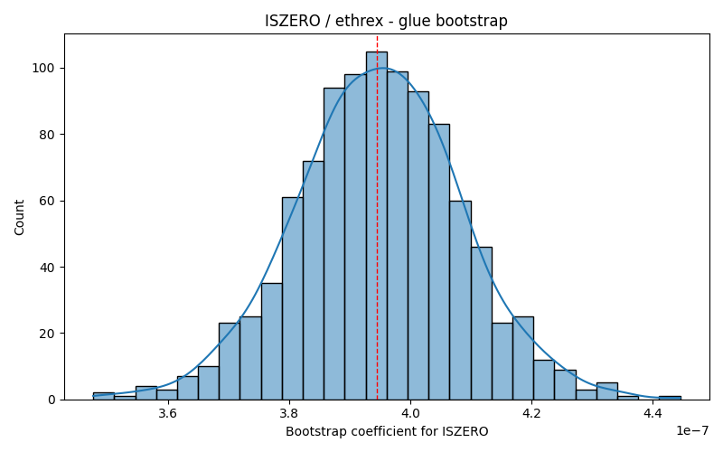

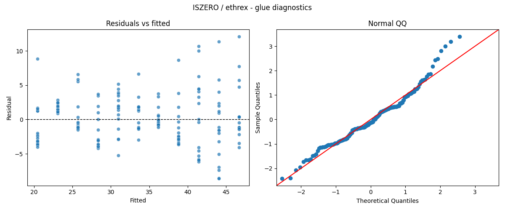

</details>

<details><summary><code>JUMPDEST</code> · nobs=187 · runtime_ms=3.008e-07 · p=1.00e-03 · R²=0.8069</summary>

```
==============================================================================
                           NNLS Regression Results                            
==============================================================================
Dep. Variable:          test_runtime_ms              R-squared:          0.807
Model:                  NNLS                    Adj. R-squared:          0.806
No. Observations:       187                               RMSE:           9.29
Df Residuals:           185                                MAE:           6.98
Df Model:               1      
==============================================================================
                      coef     std err     P-value      [0.025      0.975]
------------------------------------------------------------------------------
         const     13.9694      2.0415       0.001     10.1728     18.1776
      JUMPDEST      0.0000      0.0000       0.001      0.0000      0.0000
==============================================================================
Notes: Non-negative least squares with bootstrap inference (1000 iterations)
==============================================================================
```

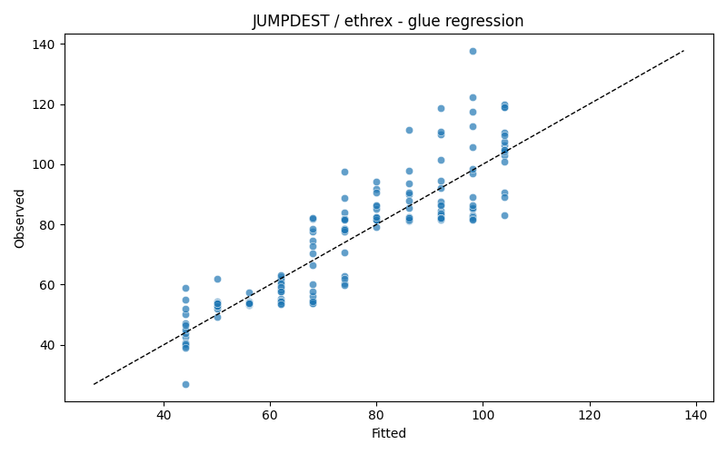

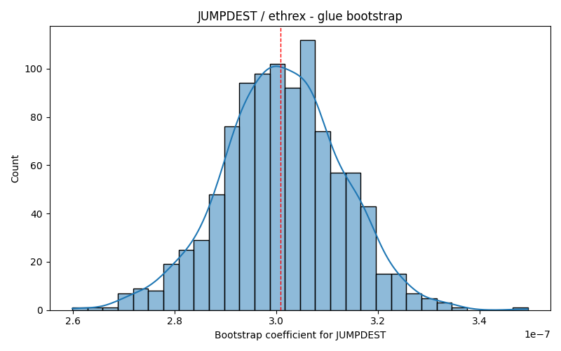

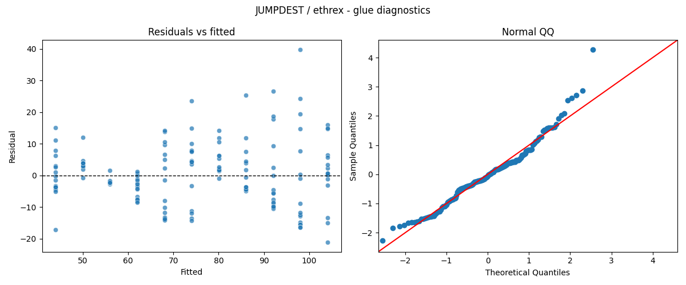

</details>

<details><summary><code>SWAP</code> · nobs=2992 · runtime_ms=7.002e-07 · p=1.00e-03 · R²=0.8048</summary>

```
==============================================================================
                           NNLS Regression Results                            
==============================================================================
Dep. Variable:          test_runtime_ms              R-squared:          0.805
Model:                  NNLS                    Adj. R-squared:          0.805
No. Observations:       2992                              RMSE:           7.26
Df Residuals:           2990                               MAE:           5.92
Df Model:               1      
==============================================================================
                      coef     std err     P-value      [0.025      0.975]
------------------------------------------------------------------------------
         const     15.8936      0.4683       0.001     14.9273     16.7653
          SWAP      0.0000      0.0000       0.001      0.0000      0.0000
==============================================================================
Notes: Non-negative least squares with bootstrap inference (1000 iterations)
==============================================================================
```

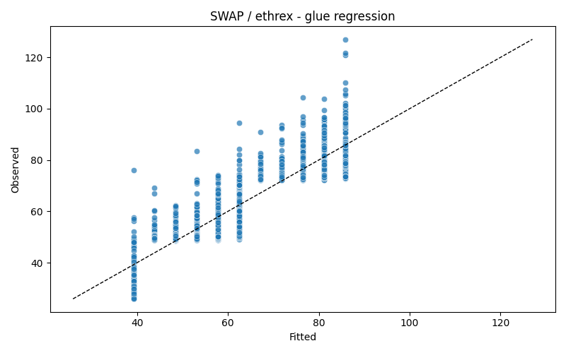

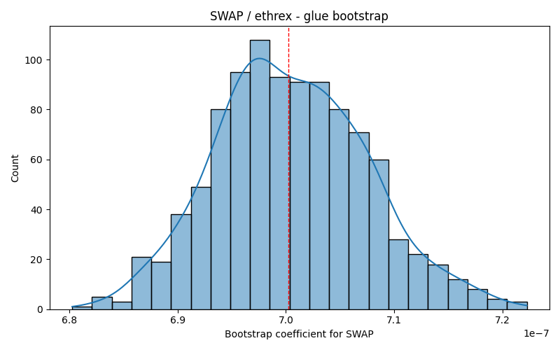

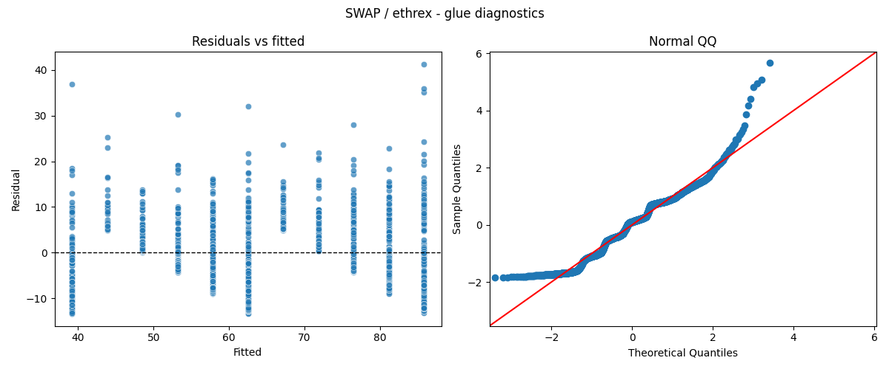

</details>

### Mixed glue (tier A) · ethrex

<details><summary><code>ADD</code> · nobs=187 · runtime_ms=9.538e-07 · p=1.00e-03 · R²=0.835</summary>

```
==============================================================================
                           NNLS Regression Results                            
==============================================================================
Dep. Variable:          test_runtime_ms              R-squared:          0.835
Model:                  NNLS                    Adj. R-squared:          0.834
No. Observations:       187                               RMSE:           4.46
Df Residuals:           185                                MAE:           3.22
Df Model:               1      
==============================================================================
                      coef     std err     P-value      [0.025      0.975]
------------------------------------------------------------------------------
         const     10.3983      1.1012       0.001      8.2516     12.5896
           ADD      0.0000      0.0000       0.001      0.0000      0.0000
==============================================================================
Notes: Non-negative least squares with bootstrap inference (1000 iterations)
==============================================================================
```

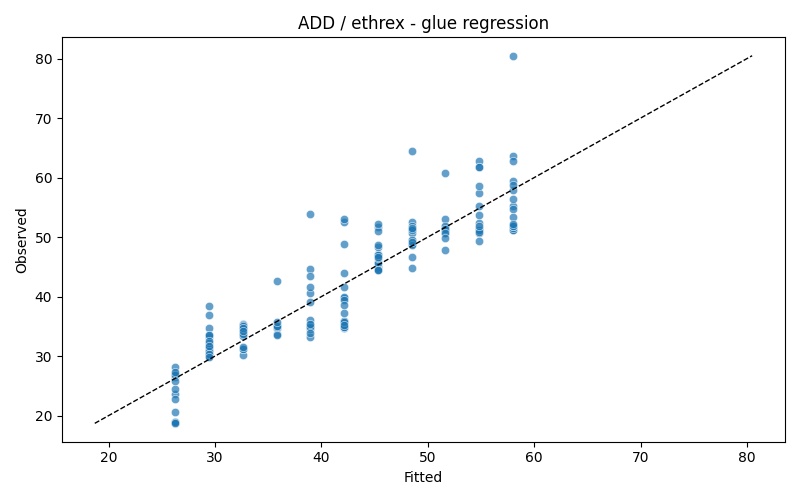

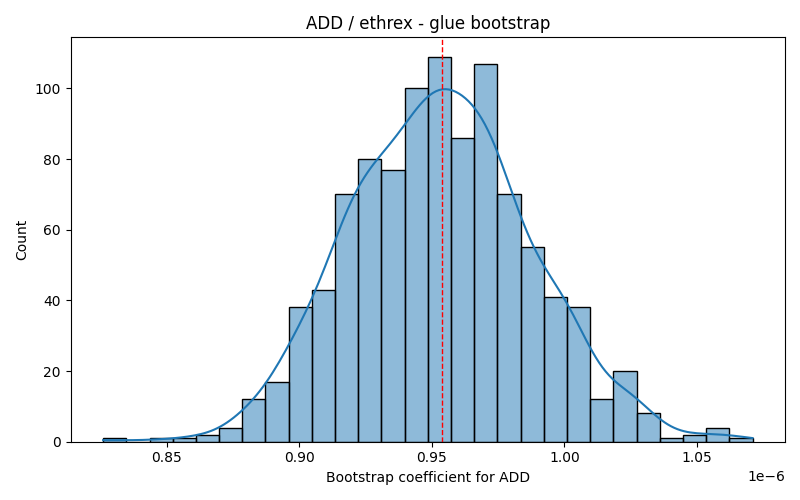

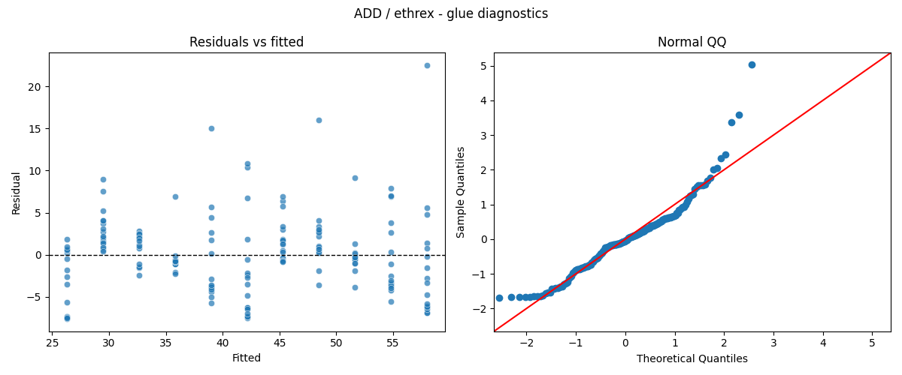

</details>

<details><summary><code>AND</code> · nobs=187 · runtime_ms=9.052e-07 · p=1.00e-03 · R²=0.8381</summary>

```
==============================================================================
                           NNLS Regression Results                            
==============================================================================
Dep. Variable:          test_runtime_ms              R-squared:          0.838
Model:                  NNLS                    Adj. R-squared:          0.837
No. Observations:       187                               RMSE:           4.19
Df Residuals:           185                                MAE:           3.43
Df Model:               1      
==============================================================================
                      coef     std err     P-value      [0.025      0.975]
------------------------------------------------------------------------------
         const      9.0039      0.9952       0.001      7.0429     10.9974
           AND      0.0000      0.0000       0.001      0.0000      0.0000
==============================================================================
Notes: Non-negative least squares with bootstrap inference (1000 iterations)
==============================================================================
```

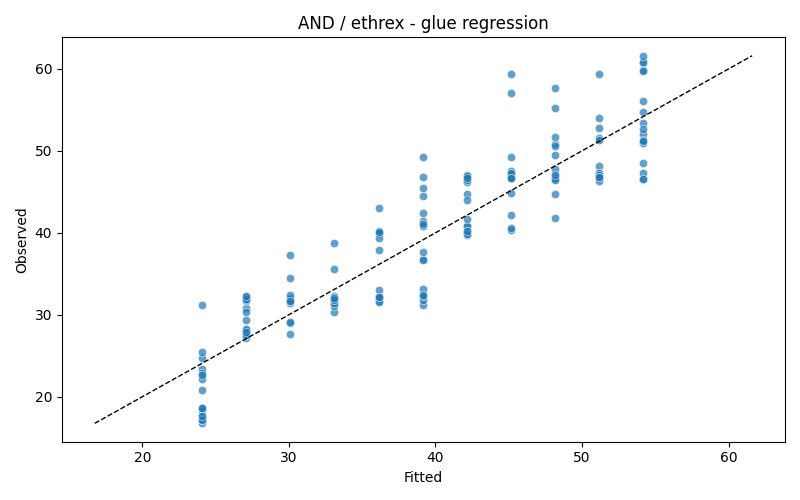

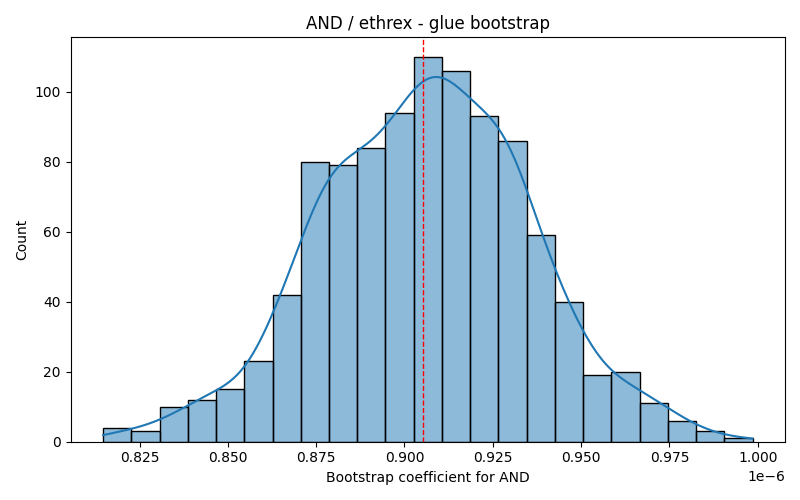

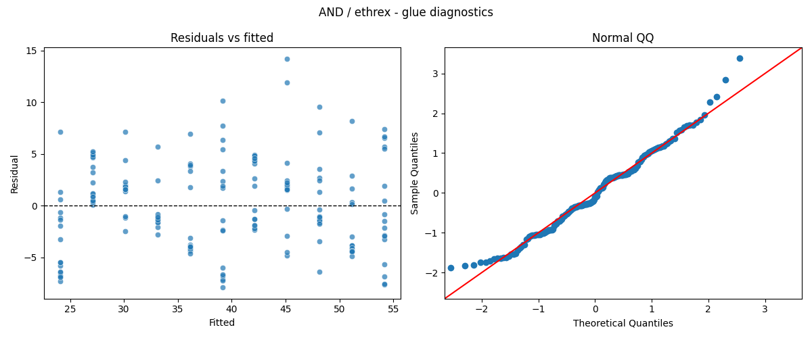

</details>

<details><summary><code>CALLDATACOPY</code> · nobs=4488 · runtime_ms=2.356e-06 · p=1.00e-03 · R²=0.8435</summary>

```
==============================================================================
                           NNLS Regression Results                            
==============================================================================
Dep. Variable:          test_runtime_ms              R-squared:          0.843
Model:                  NNLS                    Adj. R-squared:          0.843
No. Observations:       4488                              RMSE:           7.63
Df Residuals:           4486                               MAE:           5.68
Df Model:               1      
==============================================================================
                      coef     std err     P-value      [0.025      0.975]
------------------------------------------------------------------------------
         const     12.8103      0.1363       0.001     12.5420     13.0675
  CALLDATACOPY      0.0000      0.0000       0.001      0.0000      0.0000
==============================================================================
Notes: Non-negative least squares with bootstrap inference (1000 iterations)
==============================================================================
```

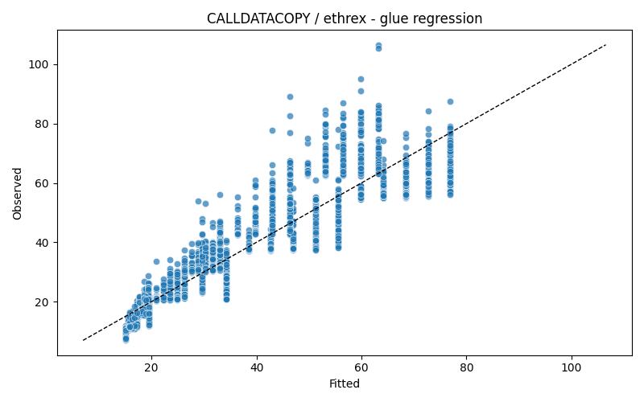

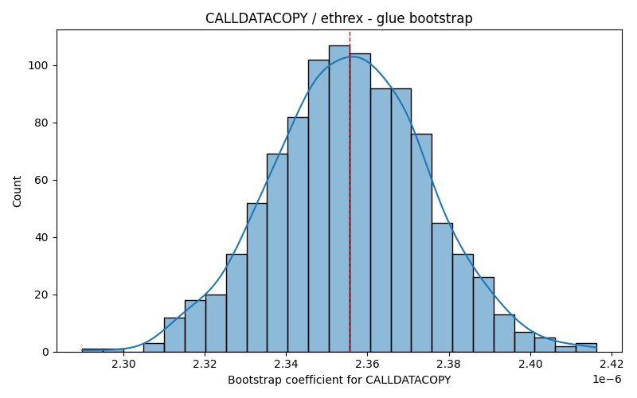

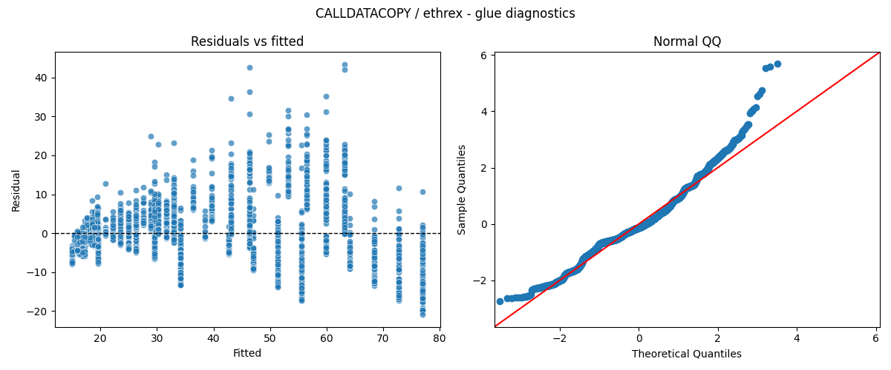

</details>

<details><summary><code>CALLDATALOAD</code> · nobs=748 · runtime_ms=1.907e-05 · p=1.00e-03 · R²=0.2132</summary>

```
==============================================================================
                           NNLS Regression Results                            
==============================================================================
Dep. Variable:          test_runtime_ms              R-squared:          0.213
Model:                  NNLS                    Adj. R-squared:          0.212
No. Observations:       748                               RMSE:           0.14
Df Residuals:           746                                MAE:           0.11
Df Model:               1      
==============================================================================
                      coef     std err     P-value      [0.025      0.975]
------------------------------------------------------------------------------
         const      2.4699      0.0178       0.001      2.4344      2.5044
  CALLDATALOAD      0.0000      0.0000       0.001      0.0000      0.0000
==============================================================================
Notes: Non-negative least squares with bootstrap inference (1000 iterations)
==============================================================================
```

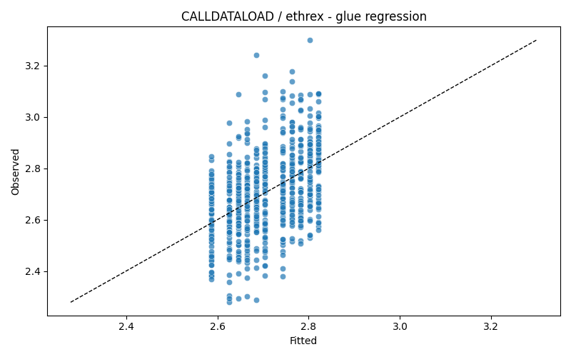

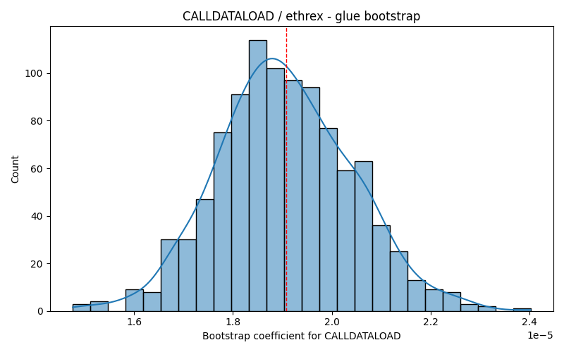

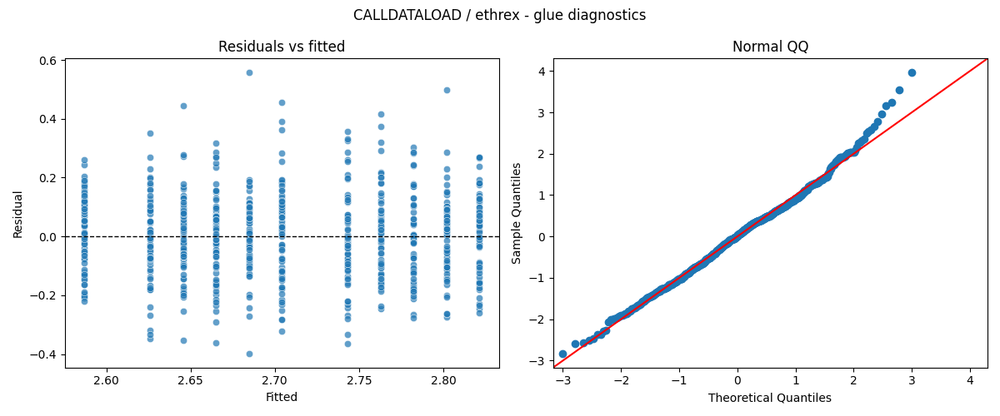

</details>

<details><summary><code>DIV</code> · nobs=187 · runtime_ms=9.286e-06 · p=1.00e-03 · R²=0.8202</summary>

```
==============================================================================
                           NNLS Regression Results                            
==============================================================================
Dep. Variable:          test_runtime_ms              R-squared:          0.820
Model:                  NNLS                    Adj. R-squared:          0.819
No. Observations:       187                               RMSE:          34.32
Df Residuals:           185                                MAE:          29.58
Df Model:               1      
==============================================================================
                      coef     std err     P-value      [0.025      0.975]
------------------------------------------------------------------------------
         const     75.9937      9.4147       0.001     57.3562     93.6568
           DIV      0.0000      0.0000       0.001      0.0000      0.0000
==============================================================================
Notes: Non-negative least squares with bootstrap inference (1000 iterations)
==============================================================================
```

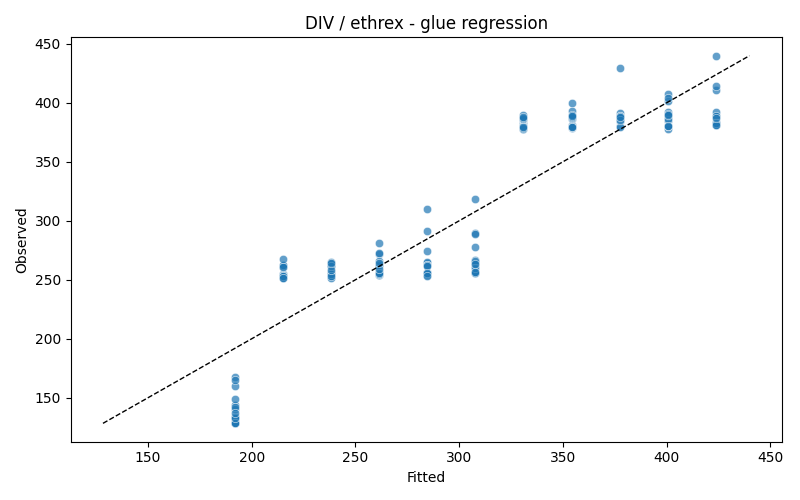

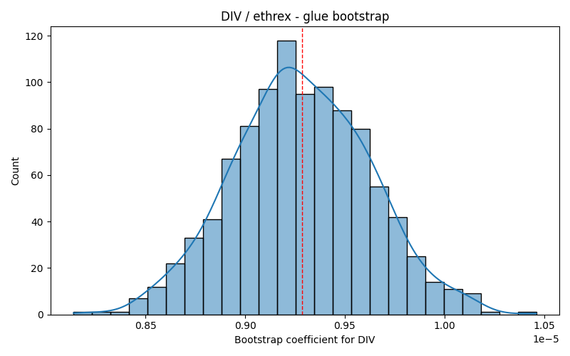

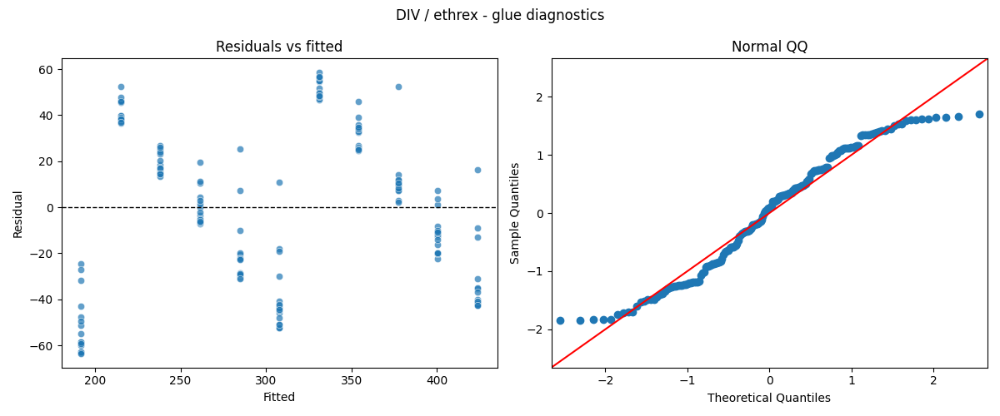

</details>

<details><summary><code>EXP</code> · nobs=187 · runtime_ms=0.0009467 · p=1.00e-03 · R²=0.8141</summary>

```
==============================================================================
                           NNLS Regression Results                            
==============================================================================
Dep. Variable:          test_runtime_ms              R-squared:          0.814
Model:                  NNLS                    Adj. R-squared:          0.813
No. Observations:       187                               RMSE:          17.72
Df Residuals:           185                                MAE:          15.18
Df Model:               1      
==============================================================================
                      coef     std err     P-value      [0.025      0.975]
------------------------------------------------------------------------------
         const     31.7774      4.7784       0.001     22.0827     40.6838
           EXP      0.0009      0.0000       0.001      0.0009      0.0010
==============================================================================
Notes: Non-negative least squares with bootstrap inference (1000 iterations)
==============================================================================
```

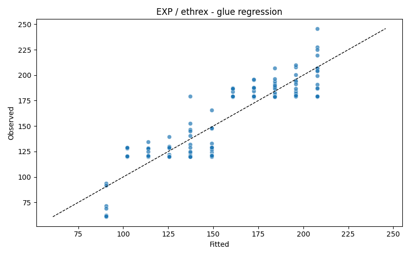

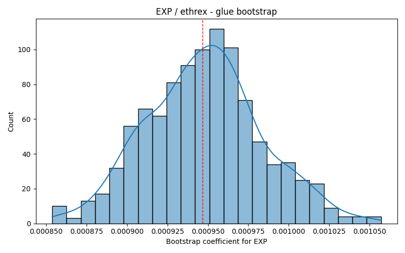

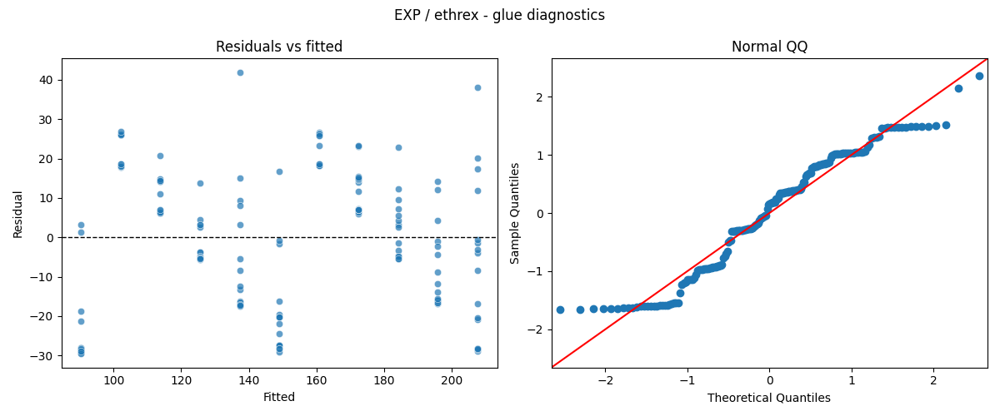

</details>

<details><summary><code>GT</code> · nobs=187 · runtime_ms=9.28e-07 · p=1.00e-03 · R²=0.818</summary>

```
==============================================================================
                           NNLS Regression Results                            
==============================================================================
Dep. Variable:          test_runtime_ms              R-squared:          0.818
Model:                  NNLS                    Adj. R-squared:          0.817
No. Observations:       187                               RMSE:           4.61
Df Residuals:           185                                MAE:           3.73
Df Model:               1      
==============================================================================
                      coef     std err     P-value      [0.025      0.975]
------------------------------------------------------------------------------
         const     10.6104      1.0613       0.001      8.5987     12.6370
            GT      0.0000      0.0000       0.001      0.0000      0.0000
==============================================================================
Notes: Non-negative least squares with bootstrap inference (1000 iterations)
==============================================================================
```

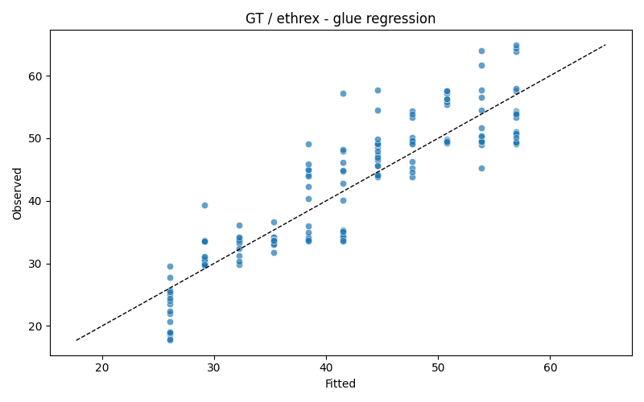

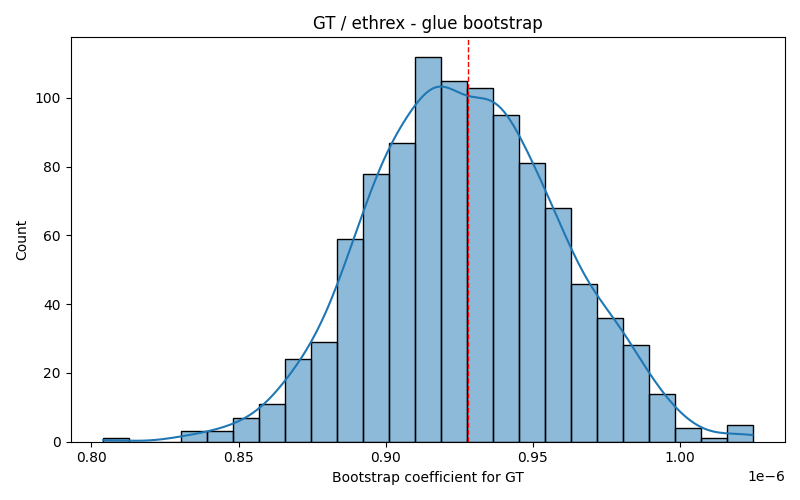

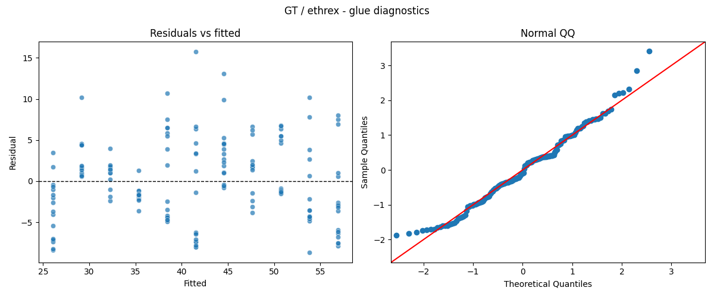

</details>

<details><summary><code>JUMPI</code> · nobs=187 · runtime_ms=1.179e-06 · p=1.00e-03 · R²=0.8609</summary>

```
==============================================================================
                           NNLS Regression Results                            
==============================================================================
Dep. Variable:          test_runtime_ms              R-squared:          0.861
Model:                  NNLS                    Adj. R-squared:          0.860
No. Observations:       187                               RMSE:           2.14
Df Residuals:           185                                MAE:           1.69
Df Model:               1      
==============================================================================
                      coef     std err     P-value      [0.025      0.975]
------------------------------------------------------------------------------
         const      5.7001      0.5281       0.001      4.6024      6.6529
         JUMPI      0.0000      0.0000       0.001      0.0000      0.0000
==============================================================================
Notes: Non-negative least squares with bootstrap inference (1000 iterations)
==============================================================================
```

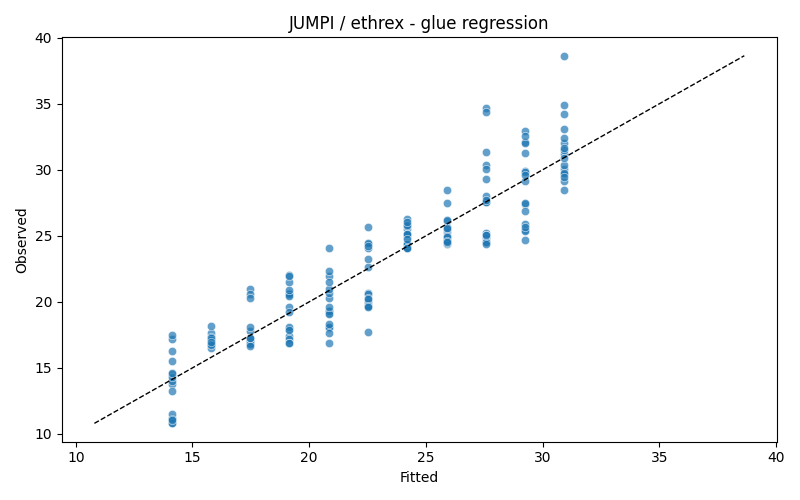

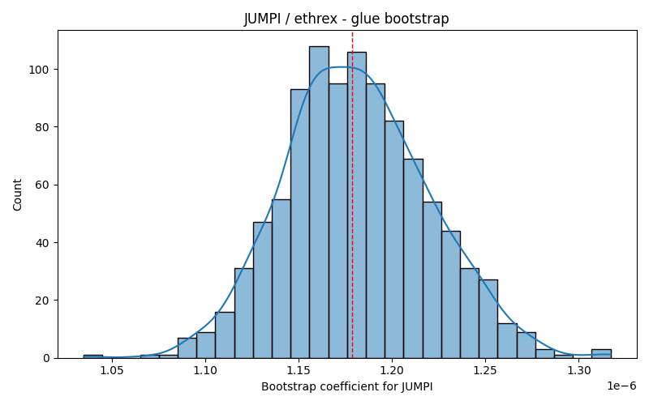

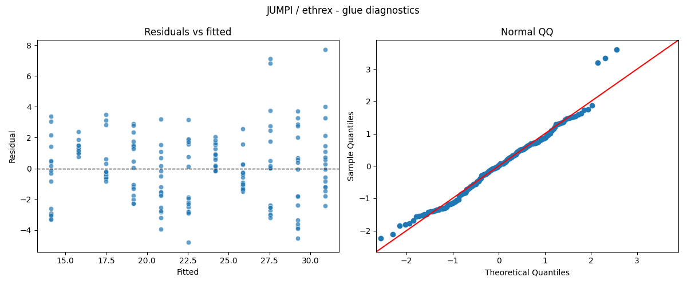

</details>

<details><summary><code>LT</code> · nobs=187 · runtime_ms=8.808e-07 · p=1.00e-03 · R²=0.8044</summary>

```
==============================================================================
                           NNLS Regression Results                            
==============================================================================
Dep. Variable:          test_runtime_ms              R-squared:          0.804
Model:                  NNLS                    Adj. R-squared:          0.803
No. Observations:       187                               RMSE:           4.57
Df Residuals:           185                                MAE:           3.54
Df Model:               1      
==============================================================================
                      coef     std err     P-value      [0.025      0.975]
------------------------------------------------------------------------------
         const     12.5392      1.2159       0.001     10.0477     14.7557
            LT      0.0000      0.0000       0.001      0.0000      0.0000
==============================================================================
Notes: Non-negative least squares with bootstrap inference (1000 iterations)
==============================================================================
```

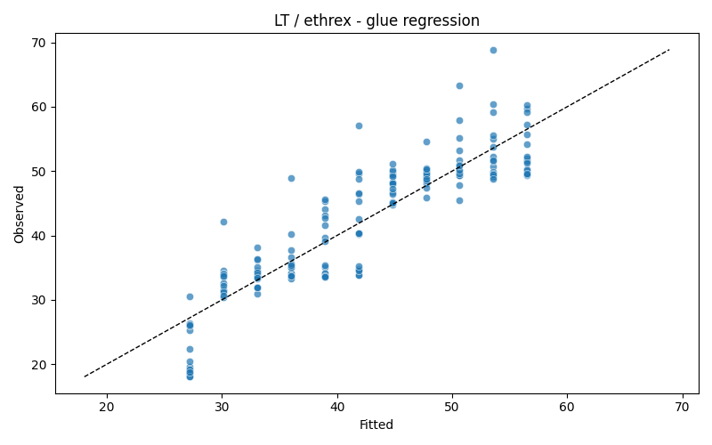

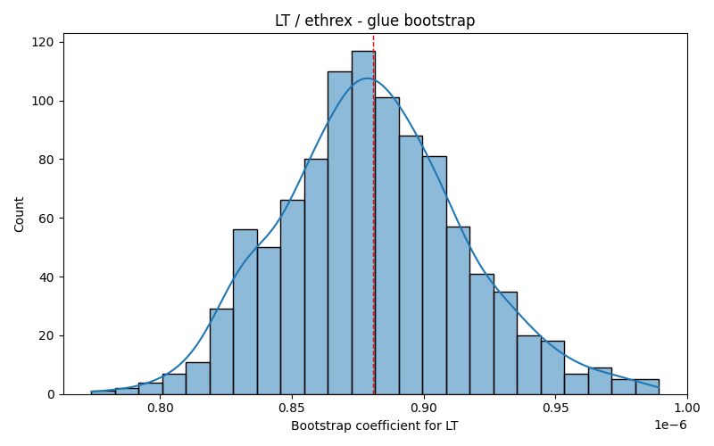

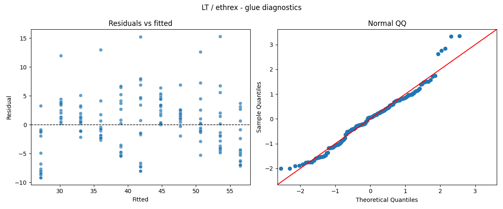

</details>

<details><summary><code>MSTORE</code> · nobs=935 · runtime_ms=1.519e-06 · p=1.00e-03 · R²=0.7872</summary>

```
==============================================================================
                           NNLS Regression Results                            
==============================================================================
Dep. Variable:          test_runtime_ms              R-squared:          0.787
Model:                  NNLS                    Adj. R-squared:          0.787
No. Observations:       935                               RMSE:           5.54
Df Residuals:           933                                MAE:           4.15
Df Model:               1      
==============================================================================
                      coef     std err     P-value      [0.025      0.975]
------------------------------------------------------------------------------
         const     11.4125      0.5795       0.001     10.2240     12.5707
        MSTORE      0.0000      0.0000       0.001      0.0000      0.0000
==============================================================================
Notes: Non-negative least squares with bootstrap inference (1000 iterations)
==============================================================================
```

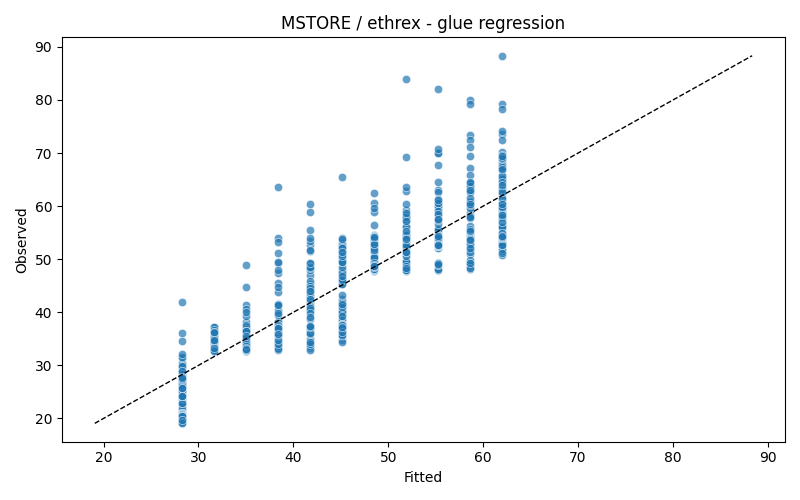

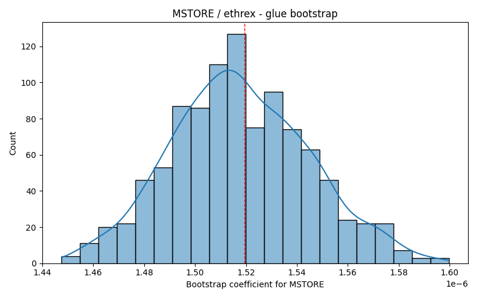

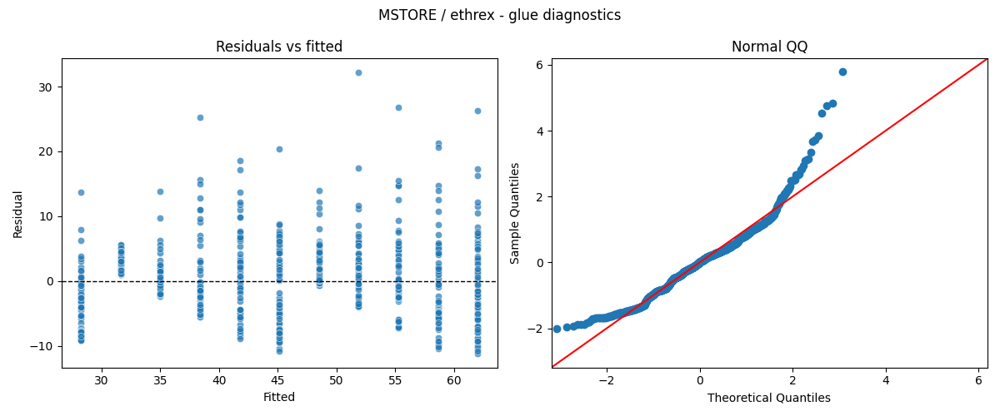

</details>

<details><summary><code>MSTORE8</code> · nobs=935 · runtime_ms=1.397e-06 · p=1.00e-03 · R²=0.8111</summary>

```
==============================================================================
                           NNLS Regression Results                            
==============================================================================
Dep. Variable:          test_runtime_ms              R-squared:          0.811
Model:                  NNLS                    Adj. R-squared:          0.811
No. Observations:       935                               RMSE:           4.73
Df Residuals:           933                                MAE:           3.75
Df Model:               1      
==============================================================================
                      coef     std err     P-value      [0.025      0.975]
------------------------------------------------------------------------------
         const     10.4340      0.5038       0.001      9.4713     11.4017
       MSTORE8      0.0000      0.0000       0.001      0.0000      0.0000
==============================================================================
Notes: Non-negative least squares with bootstrap inference (1000 iterations)
==============================================================================
```

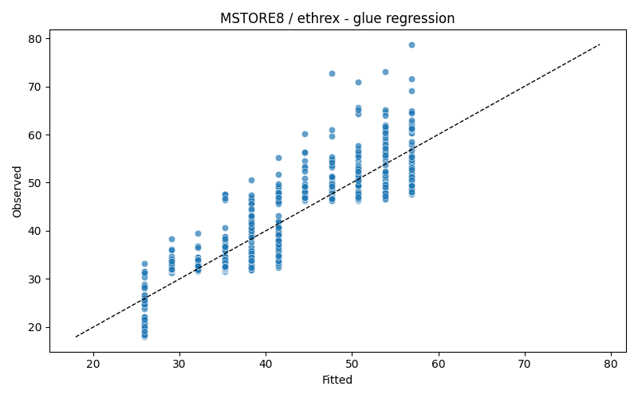

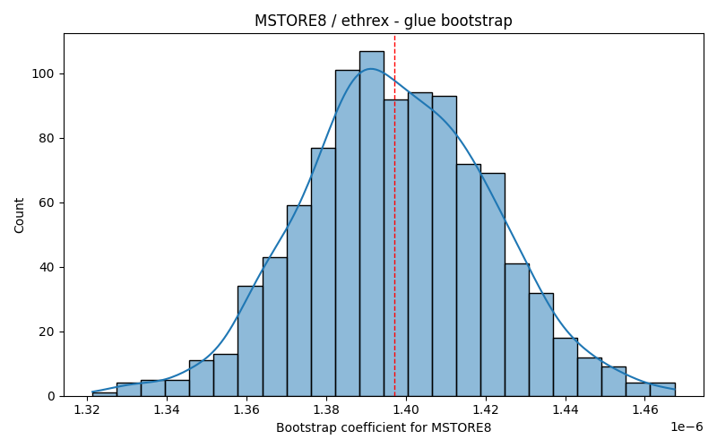

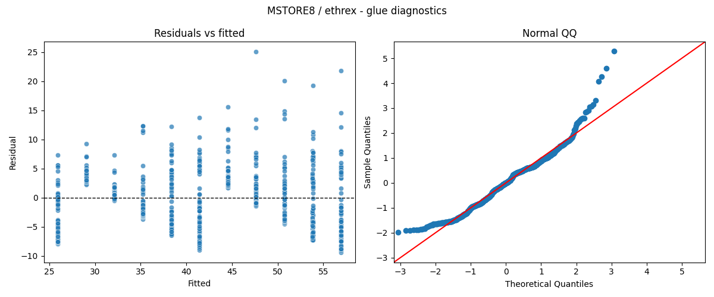

</details>

<details><summary><code>MUL</code> · nobs=187 · runtime_ms=1.388e-06 · p=1.00e-03 · R²=0.7549</summary>

```
==============================================================================
                           NNLS Regression Results                            
==============================================================================
Dep. Variable:          test_runtime_ms              R-squared:          0.755
Model:                  NNLS                    Adj. R-squared:          0.754
No. Observations:       187                               RMSE:           6.24
Df Residuals:           185                                MAE:           4.26
Df Model:               1      
==============================================================================
                      coef     std err     P-value      [0.025      0.975]
------------------------------------------------------------------------------
         const     11.4151      1.2077       0.001      8.9566     13.6929
           MUL      0.0000      0.0000       0.001      0.0000      0.0000
==============================================================================
Notes: Non-negative least squares with bootstrap inference (1000 iterations)
==============================================================================
```

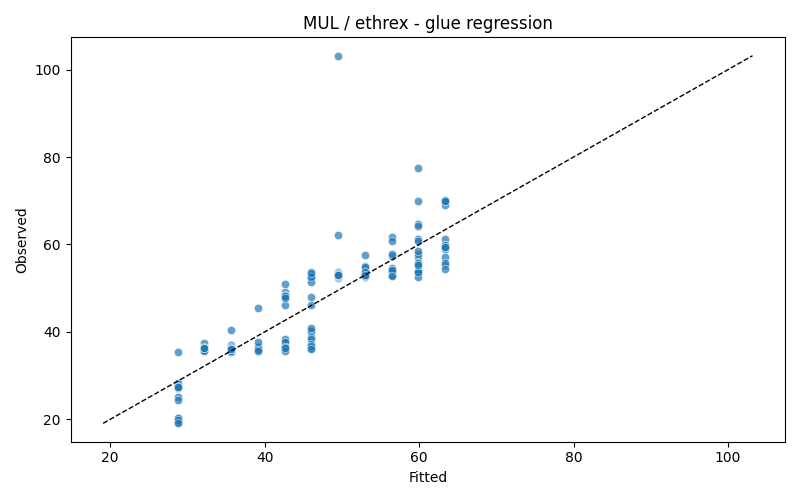

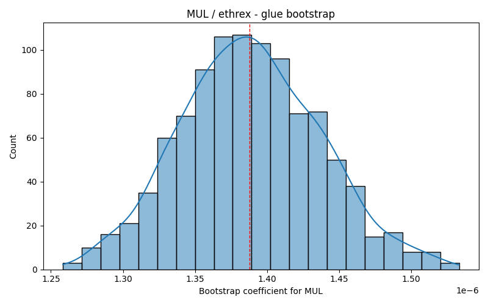

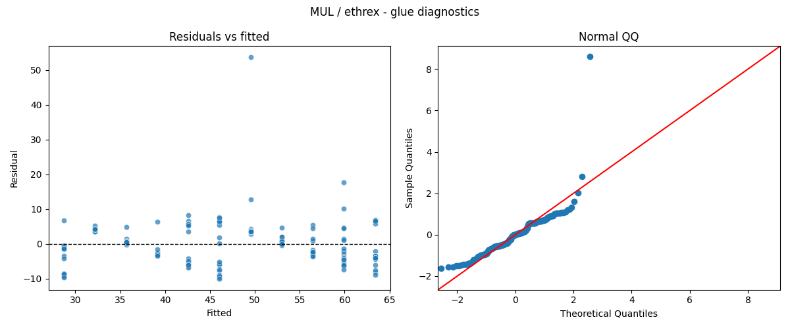

</details>

<details><summary><code>PC</code> · nobs=187 · runtime_ms=4.963e-07 · p=1.00e-03 · R²=0.8201</summary>

```
==============================================================================
                           NNLS Regression Results                            
==============================================================================
Dep. Variable:          test_runtime_ms              R-squared:          0.820
Model:                  NNLS                    Adj. R-squared:          0.819
No. Observations:       187                               RMSE:           6.95
Df Residuals:           185                                MAE:           5.23
Df Model:               1      
==============================================================================
                      coef     std err     P-value      [0.025      0.975]
------------------------------------------------------------------------------
         const     13.7028      1.7081       0.001     10.2268     16.9290
            PC      0.0000      0.0000       0.001      0.0000      0.0000
==============================================================================
Notes: Non-negative least squares with bootstrap inference (1000 iterations)
==============================================================================
```

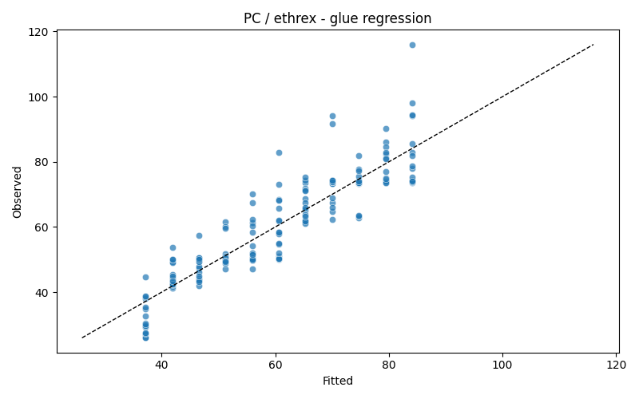

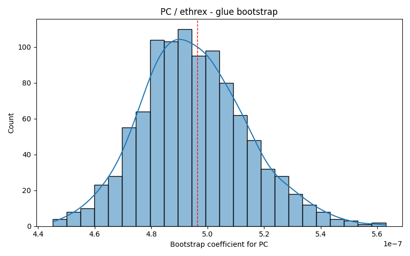

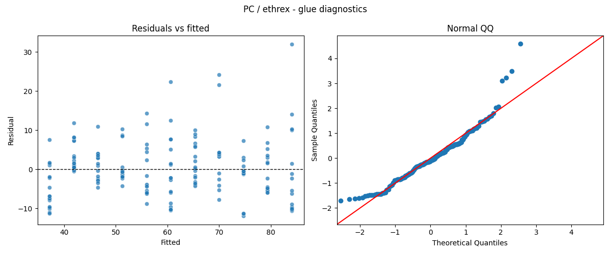

</details>

<details><summary><code>RETURNDATASIZE</code> · nobs=748 · runtime_ms=8.146e-07 · p=1.00e-03 · R²=0.6288</summary>

```
==============================================================================
                           NNLS Regression Results                            
==============================================================================
Dep. Variable:          test_runtime_ms              R-squared:          0.629
Model:                  NNLS                    Adj. R-squared:          0.628
No. Observations:       748                               RMSE:           9.88
Df Residuals:           746                                MAE:           5.16
Df Model:               1      
==============================================================================
                      coef     std err     P-value      [0.025      0.975]
------------------------------------------------------------------------------
         const     13.7793      1.1568       0.001     11.8167     16.2637
RETURNDATASIZE      0.0000      0.0000       0.001      0.0000      0.0000
==============================================================================
Notes: Non-negative least squares with bootstrap inference (1000 iterations)
==============================================================================
```

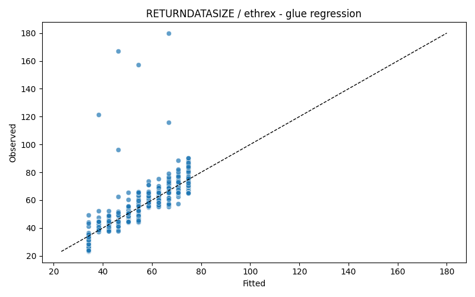

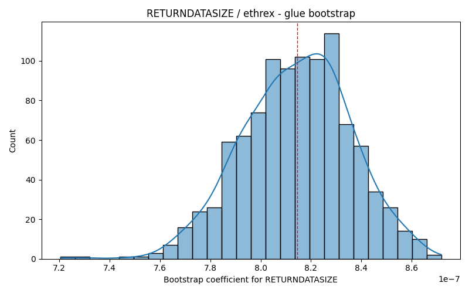

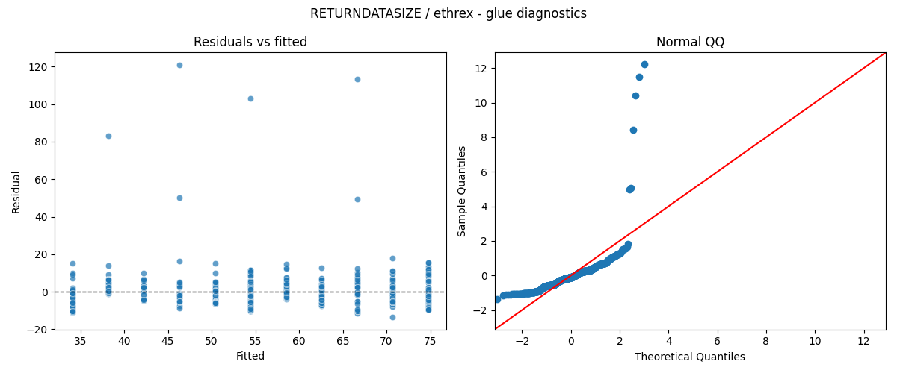

</details>

<details><summary><code>SELFBALANCE</code> · nobs=153 · runtime_ms=4.666e-06 · p=1.00e-03 · R²=0.786</summary>

```
==============================================================================
                           NNLS Regression Results                            
==============================================================================
Dep. Variable:          test_runtime_ms              R-squared:          0.786
Model:                  NNLS                    Adj. R-squared:          0.785
No. Observations:       153                               RMSE:          24.56
Df Residuals:           151                                MAE:          20.08
Df Model:               1      
==============================================================================
                      coef     std err     P-value      [0.025      0.975]
------------------------------------------------------------------------------
         const     70.3239      6.4883       0.001     57.4451     82.5858
   SELFBALANCE      0.0000      0.0000       0.001      0.0000      0.0000
==============================================================================
Notes: Non-negative least squares with bootstrap inference (1000 iterations)
==============================================================================
```

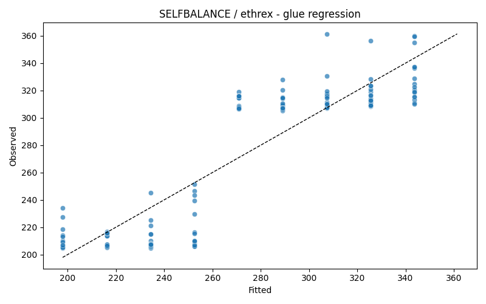

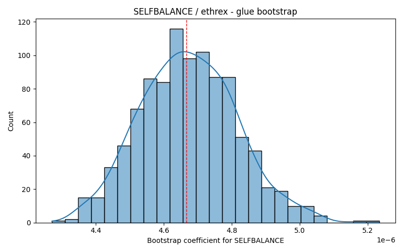

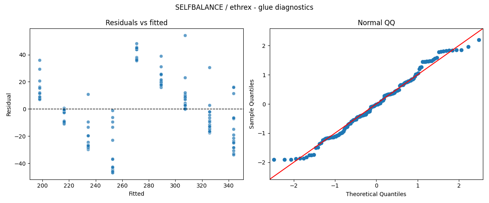

</details>

<details><summary><code>SUB</code> · nobs=187 · runtime_ms=9.232e-07 · p=1.00e-03 · R²=0.818</summary>

```
==============================================================================
                           NNLS Regression Results                            
==============================================================================
Dep. Variable:          test_runtime_ms              R-squared:          0.818
Model:                  NNLS                    Adj. R-squared:          0.817
No. Observations:       187                               RMSE:           4.58
Df Residuals:           185                                MAE:           3.47
Df Model:               1      
==============================================================================
                      coef     std err     P-value      [0.025      0.975]
------------------------------------------------------------------------------
         const     10.6741      1.0679       0.001      8.5432     12.7194
           SUB      0.0000      0.0000       0.001      0.0000      0.0000
==============================================================================
Notes: Non-negative least squares with bootstrap inference (1000 iterations)
==============================================================================
```

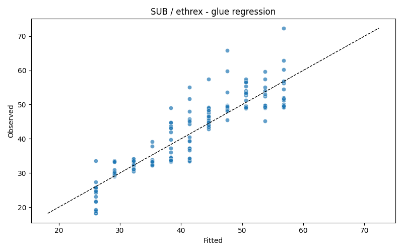

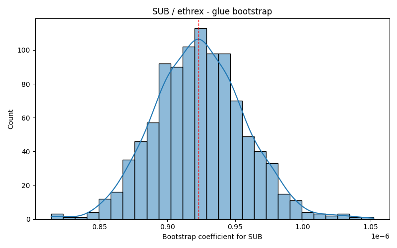

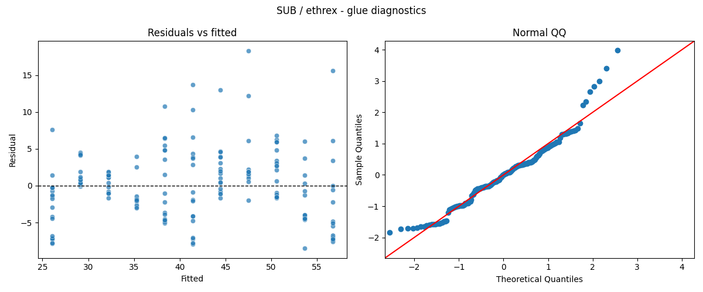

</details>

### Mixed glue (tier B) · ethrex

<details><summary><code>JUMP</code> · nobs=187 · runtime_ms=4.37e-06 · p=1.00e-03 · R²=0.822</summary>

```
==============================================================================
                           NNLS Regression Results                            
==============================================================================
Dep. Variable:          test_runtime_ms              R-squared:          0.822
Model:                  NNLS                    Adj. R-squared:          0.821
No. Observations:       187                               RMSE:           7.56
Df Residuals:           185                                MAE:           6.23
Df Model:               1      
==============================================================================
                      coef     std err     P-value      [0.025      0.975]
------------------------------------------------------------------------------
         const     14.5838      1.8405       0.001     11.2616     18.3855
          JUMP      0.0000      0.0000       0.001      0.0000      0.0000
==============================================================================
Notes: Non-negative least squares with bootstrap inference (1000 iterations)
==============================================================================
```

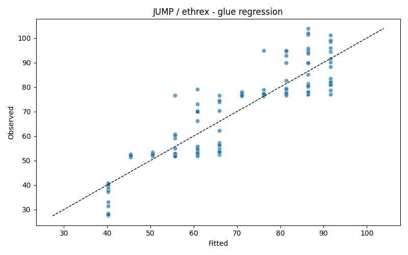

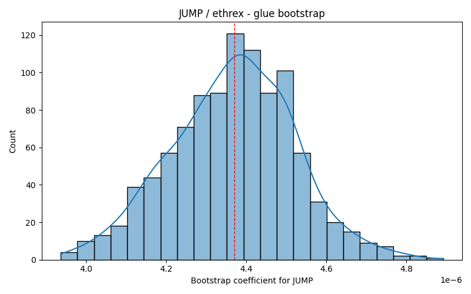

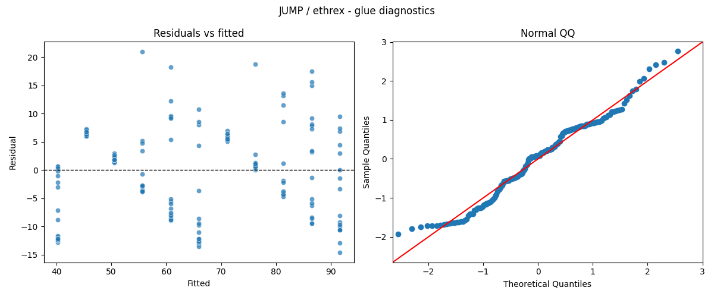

</details>

<details><summary><code>KECCAK256</code> · nobs=2992 · runtime_ms=0 · p=1.00e+00 · R²=0</summary>

```
==============================================================================
                           NNLS Regression Results                            
==============================================================================
Dep. Variable:          test_runtime_ms              R-squared:          0.000
Model:                  NNLS                    Adj. R-squared:         -0.000
No. Observations:       2992                              RMSE:         155.44
Df Residuals:           2990                               MAE:         128.47
Df Model:               1      
==============================================================================
                      coef     std err     P-value      [0.025      0.975]
------------------------------------------------------------------------------
         const    245.9182      2.8114       0.001    240.6129    251.3628
     KECCAK256      0.0000      0.0000       1.000      0.0000      0.0000
==============================================================================
Notes: Non-negative least squares with bootstrap inference (1000 iterations)
==============================================================================
```

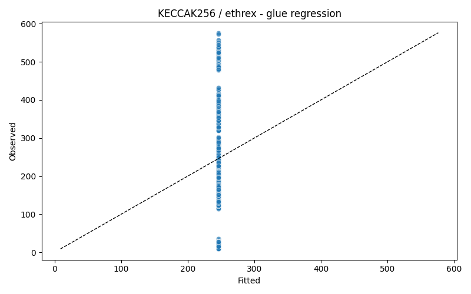


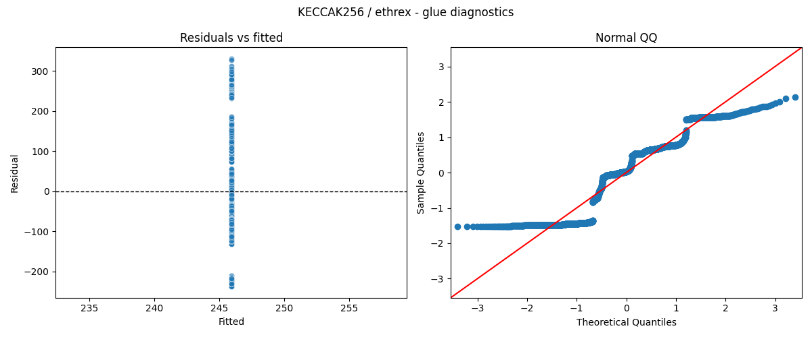

</details>

## geth

| glue_opcode | nobs | glue_runtime_ms | p_value | rsquared |
| --- | --- | --- | --- | --- |
| `ISZERO` | 1353 | 1.465e-06 | 1.00e-03 | 0.7669 |
| `JUMPDEST` | 1353 | 1.166e-06 | 1.00e-03 | 0.7133 |
| `SWAP` | 21648 | 1.564e-06 | 1.00e-03 | 0.739 |
| `CALLDATASIZE` | 79992 | 1.445e-06 | 1.00e-03 | 0.8211 |
| `DUP` | 79992 | 1.514e-06 | 1.00e-03 | 0.8211 |
| `GAS` | 79992 | 1.479e-06 | 1.00e-03 | 0.8211 |
| `MLOAD` | 79992 | 5.448e-06 | 1.00e-03 | 0.8211 |
| `PUSH` | 79992 | 2.224e-06 | 1.00e-03 | 0.8211 |
| `PUSH0` | 79992 | 1.434e-06 | 1.00e-03 | 0.8211 |
| `STATICCALL` | 79992 | 0.0001692 | 1.00e-03 | 0.8211 |
| `ADD` | 1353 | 4.542e-06 | 1.00e-03 | 0.8364 |
| `AND` | 1353 | 4.339e-06 | 1.00e-03 | 0.8117 |
| `CALLDATACOPY` | 32472 | 1.318e-05 | 1.00e-03 | 0.9492 |
| `CALLDATALOAD` | 5412 | 5.324e-05 | 1.00e-03 | 0.0343 |
| `DIV` | 1353 | 9.399e-06 | 1.00e-03 | 0.7921 |
| `EXP` | 1353 | 0.000341 | 1.00e-03 | 0.8184 |
| `GT` | 1353 | 3.51e-06 | 1.00e-03 | 0.7417 |
| `JUMPI` | 1353 | 5.644e-06 | 1.00e-03 | 0.7387 |
| `LT` | 1353 | 4.234e-06 | 1.00e-03 | 0.7589 |
| `MSTORE` | 6765 | 7.896e-06 | 1.00e-03 | 0.7932 |
| `MSTORE8` | 6765 | 7.21e-06 | 1.00e-03 | 0.756 |
| `MUL` | 1353 | 4.839e-06 | 1.00e-03 | 0.8431 |
| `PC` | 1353 | 1.588e-06 | 1.00e-03 | 0.8394 |
| `RETURNDATASIZE` | 5412 | 3.114e-06 | 1.00e-03 | 0.618 |
| `SELFBALANCE` | 1107 | 7.492e-06 | 1.00e-03 | 0.799 |
| `SUB` | 1353 | 4.621e-06 | 1.00e-03 | 0.802 |
| `JUMP` | 1353 | 9.446e-06 | 1.00e-03 | 0.8095 |
| `KECCAK256` | 21648 | 3.594e-05 | 1.00e-03 | 0.2563 |

### Cycle glue — joint fit · geth

<details><summary>Joint NNLS regression summary</summary>

```
==============================================================================
                           NNLS Regression Results                            
==============================================================================
Dep. Variable:          test_runtime_ms              R-squared:          0.821
Model:                  NNLS                    Adj. R-squared:          0.821
No. Observations:       79992                             RMSE:          24.02
Df Residuals:           79984                              MAE:          18.62
Df Model:               7      
==============================================================================
                      coef     std err     P-value      [0.025      0.975]
------------------------------------------------------------------------------
         const     40.1737      0.2957       0.001     39.5728     40.7254
  CALLDATASIZE      0.0000      0.0000       0.001      0.0000      0.0000
           DUP      0.0000      0.0000       0.001      0.0000      0.0000
           GAS      0.0000      0.0000       0.001      0.0000      0.0000
         MLOAD      0.0000      0.0000       0.001      0.0000      0.0000
          PUSH      0.0000      0.0000       0.001      0.0000      0.0000
         PUSH0      0.0000      0.0000       0.001      0.0000      0.0000
    STATICCALL      0.0002      0.0000       0.001      0.0002      0.0002
==============================================================================
Notes: Non-negative least squares with bootstrap inference (1000 iterations)
==============================================================================
```

</details>

<details><summary><code>CALLDATASIZE</code> · nobs=79992 · runtime_ms=1.445e-06 · p=1.00e-03 · R²=0.8211</summary>


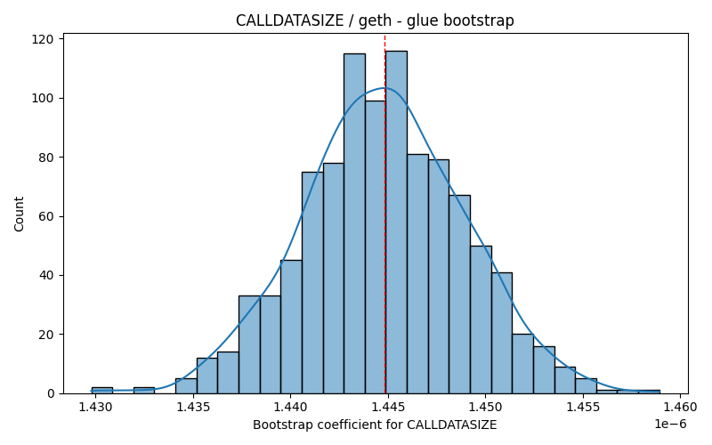

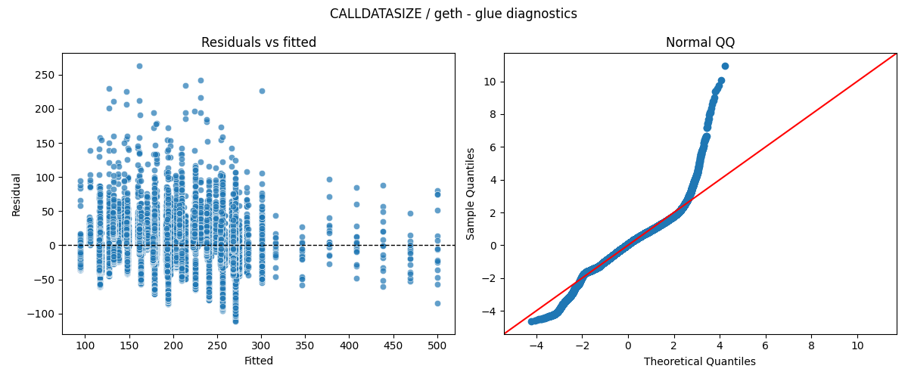

</details>

<details><summary><code>DUP</code> · nobs=79992 · runtime_ms=1.514e-06 · p=1.00e-03 · R²=0.8211</summary>

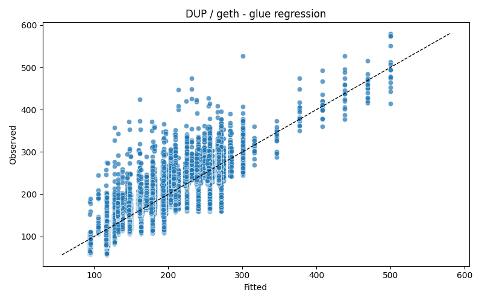

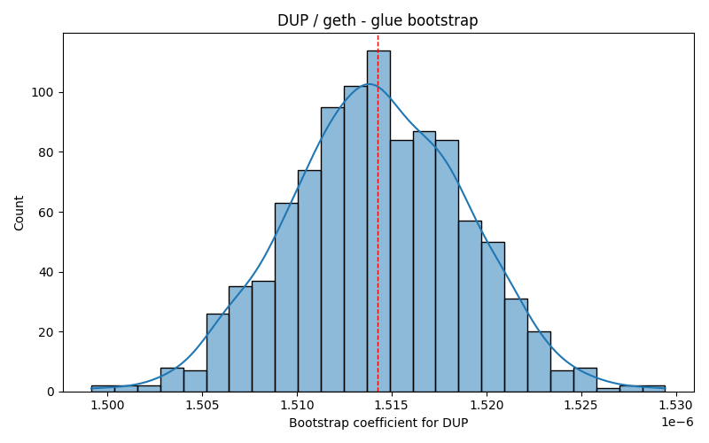


</details>

<details><summary><code>GAS</code> · nobs=79992 · runtime_ms=1.479e-06 · p=1.00e-03 · R²=0.8211</summary>


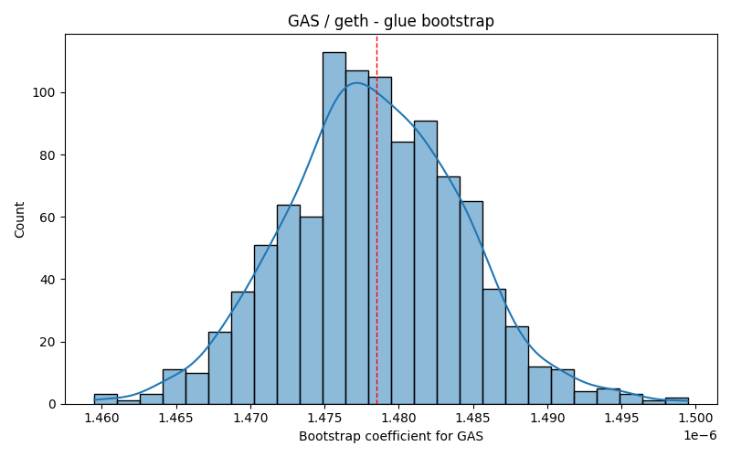

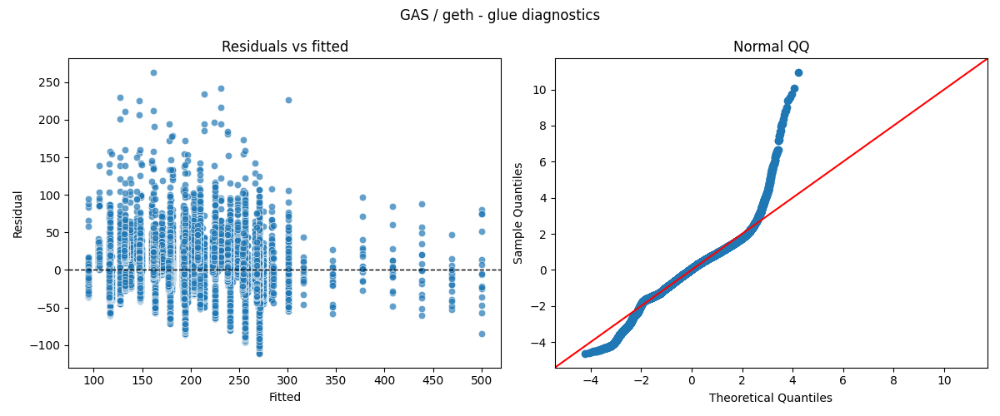

</details>

<details><summary><code>MLOAD</code> · nobs=79992 · runtime_ms=5.448e-06 · p=1.00e-03 · R²=0.8211</summary>


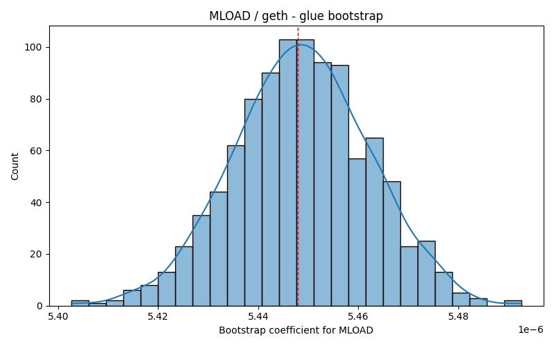


</details>

<details><summary><code>PUSH</code> · nobs=79992 · runtime_ms=2.224e-06 · p=1.00e-03 · R²=0.8211</summary>


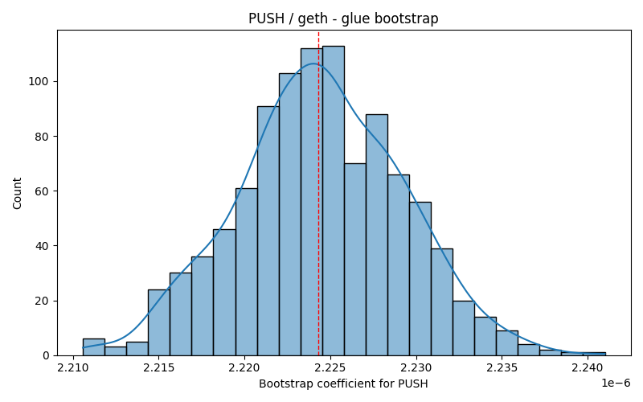


</details>

<details><summary><code>PUSH0</code> · nobs=79992 · runtime_ms=1.434e-06 · p=1.00e-03 · R²=0.8211</summary>


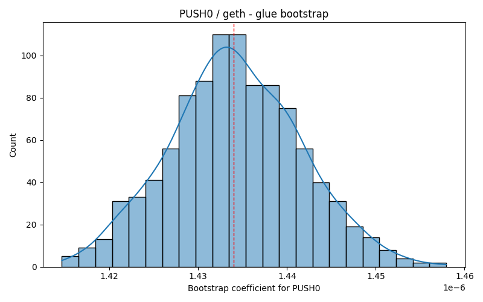


</details>

<details><summary><code>STATICCALL</code> · nobs=79992 · runtime_ms=0.0001692 · p=1.00e-03 · R²=0.8211</summary>


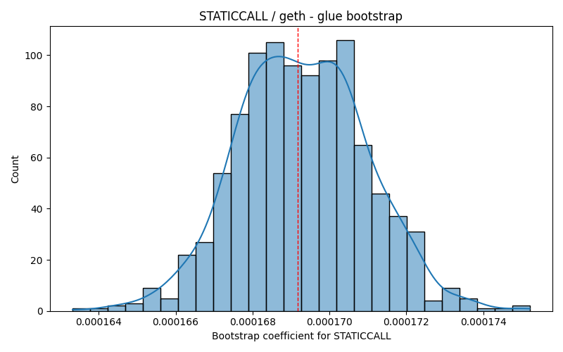


</details>

### Pure glue · geth

<details><summary><code>ISZERO</code> · nobs=1353 · runtime_ms=1.465e-06 · p=1.00e-03 · R²=0.7669</summary>

```
==============================================================================
                           NNLS Regression Results                            
==============================================================================
Dep. Variable:          test_runtime_ms              R-squared:          0.767
Model:                  NNLS                    Adj. R-squared:          0.767
No. Observations:       1353                              RMSE:          17.00
Df Residuals:           1351                               MAE:          12.10
Df Model:               1      
==============================================================================
                      coef     std err     P-value      [0.025      0.975]
------------------------------------------------------------------------------
         const     22.7813      1.5395       0.001     19.8035     25.8180
        ISZERO      0.0000      0.0000       0.001      0.0000      0.0000
==============================================================================
Notes: Non-negative least squares with bootstrap inference (1000 iterations)
==============================================================================
```

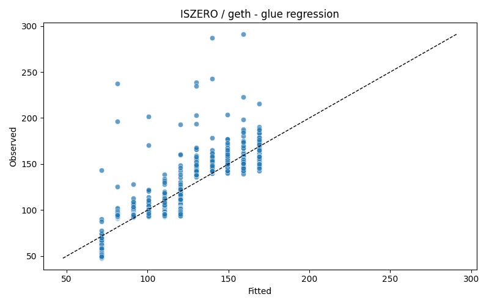


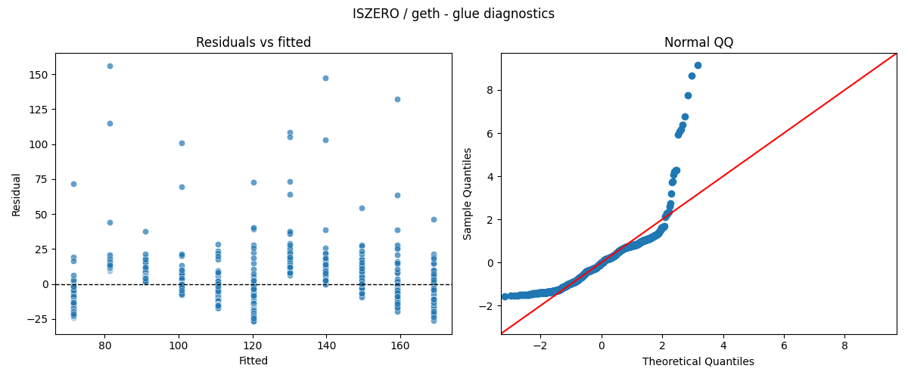

</details>

<details><summary><code>JUMPDEST</code> · nobs=1353 · runtime_ms=1.166e-06 · p=1.00e-03 · R²=0.7133</summary>

```
==============================================================================
                           NNLS Regression Results                            
==============================================================================
Dep. Variable:          test_runtime_ms              R-squared:          0.713
Model:                  NNLS                    Adj. R-squared:          0.713
No. Observations:       1353                              RMSE:          46.69
Df Residuals:           1351                               MAE:          28.37
Df Model:               1      
==============================================================================
                      coef     std err     P-value      [0.025      0.975]
------------------------------------------------------------------------------
         const     66.1712      5.1251       0.001     56.3147     76.3594
      JUMPDEST      0.0000      0.0000       0.001      0.0000      0.0000
==============================================================================
Notes: Non-negative least squares with bootstrap inference (1000 iterations)
==============================================================================
```

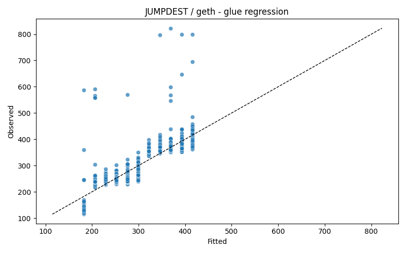

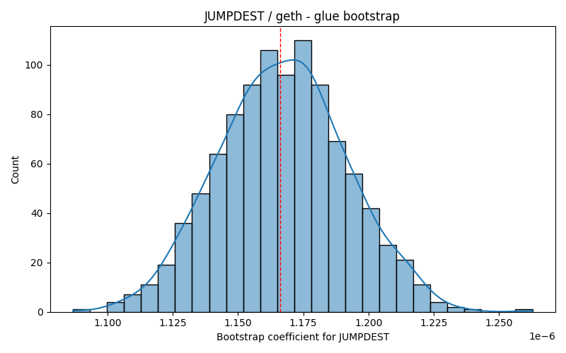

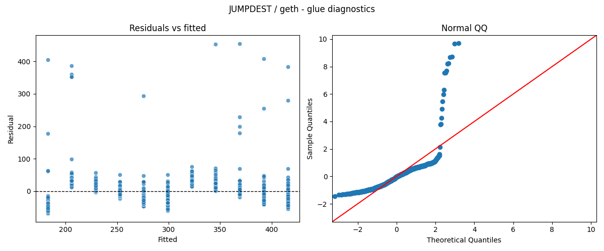

</details>

<details><summary><code>SWAP</code> · nobs=21648 · runtime_ms=1.564e-06 · p=1.00e-03 · R²=0.739</summary>

```
==============================================================================
                           NNLS Regression Results                            
==============================================================================
Dep. Variable:          test_runtime_ms              R-squared:          0.739
Model:                  NNLS                    Adj. R-squared:          0.739
No. Observations:       21648                             RMSE:          19.57
Df Residuals:           21646                              MAE:          13.82
Df Model:               1      
==============================================================================
                      coef     std err     P-value      [0.025      0.975]
------------------------------------------------------------------------------
         const     31.2599      0.4471       0.001     30.3836     32.1110
          SWAP      0.0000      0.0000       0.001      0.0000      0.0000
==============================================================================
Notes: Non-negative least squares with bootstrap inference (1000 iterations)
==============================================================================
```

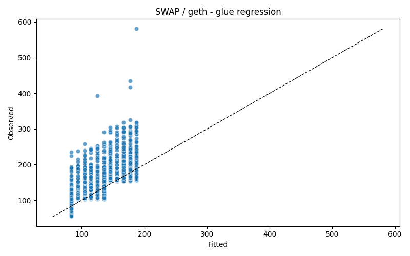

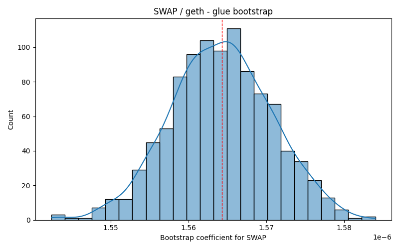

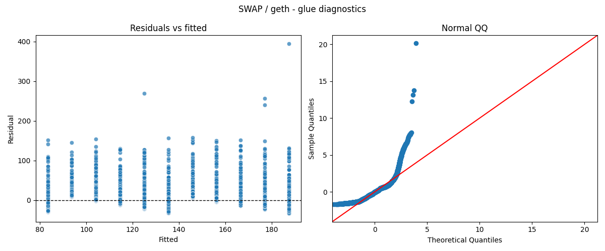

</details>

### Mixed glue (tier A) · geth

<details><summary><code>ADD</code> · nobs=1353 · runtime_ms=4.542e-06 · p=1.00e-03 · R²=0.8364</summary>

```
==============================================================================
                           NNLS Regression Results                            
==============================================================================
Dep. Variable:          test_runtime_ms              R-squared:          0.836
Model:                  NNLS                    Adj. R-squared:          0.836
No. Observations:       1353                              RMSE:          21.14
Df Residuals:           1351                               MAE:          15.63
Df Model:               1      
==============================================================================
                      coef     std err     P-value      [0.025      0.975]
------------------------------------------------------------------------------
         const     41.7644      2.0298       0.001     37.9400     45.9410
           ADD      0.0000      0.0000       0.001      0.0000      0.0000
==============================================================================
Notes: Non-negative least squares with bootstrap inference (1000 iterations)
==============================================================================
```

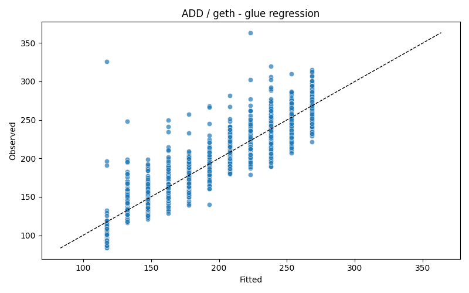

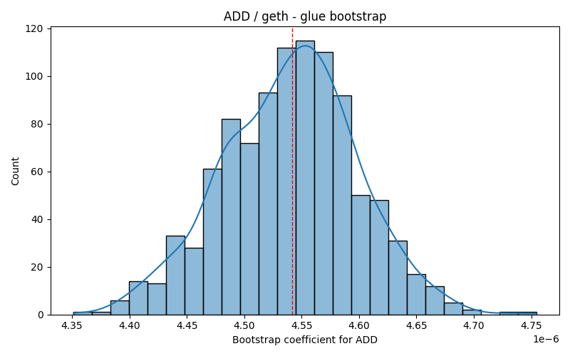

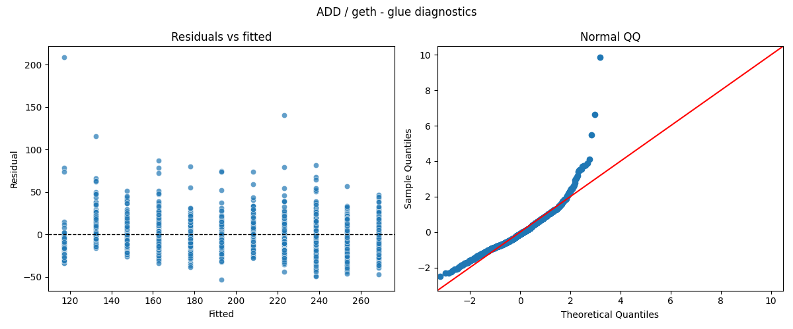

</details>

<details><summary><code>AND</code> · nobs=1353 · runtime_ms=4.339e-06 · p=1.00e-03 · R²=0.8117</summary>

```
==============================================================================
                           NNLS Regression Results                            
==============================================================================
Dep. Variable:          test_runtime_ms              R-squared:          0.812
Model:                  NNLS                    Adj. R-squared:          0.812
No. Observations:       1353                              RMSE:          21.99
Df Residuals:           1351                               MAE:          16.37
Df Model:               1      
==============================================================================
                      coef     std err     P-value      [0.025      0.975]
------------------------------------------------------------------------------
         const     45.8577      1.8765       0.001     42.3759     49.5247
           AND      0.0000      0.0000       0.001      0.0000      0.0000
==============================================================================
Notes: Non-negative least squares with bootstrap inference (1000 iterations)
==============================================================================
```

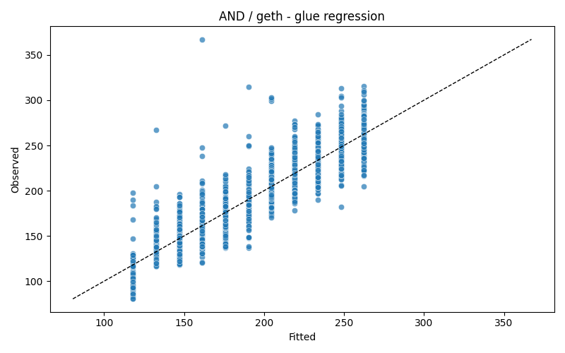

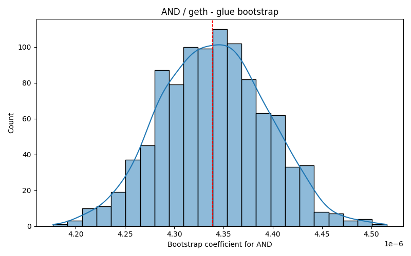

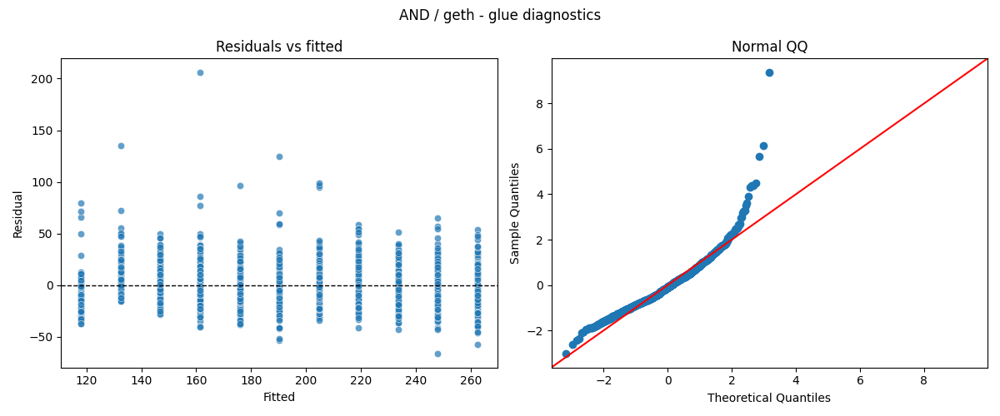

</details>

<details><summary><code>CALLDATACOPY</code> · nobs=32472 · runtime_ms=1.318e-05 · p=1.00e-03 · R²=0.9492</summary>

```
==============================================================================
                           NNLS Regression Results                            
==============================================================================
Dep. Variable:          test_runtime_ms              R-squared:          0.949
Model:                  NNLS                    Adj. R-squared:          0.949
No. Observations:       32472                             RMSE:          22.93
Df Residuals:           32470                              MAE:          16.49
Df Model:               1      
==============================================================================
                      coef     std err     P-value      [0.025      0.975]
------------------------------------------------------------------------------
         const     19.7472      0.1555       0.001     19.4716     20.0670
  CALLDATACOPY      0.0000      0.0000       0.001      0.0000      0.0000
==============================================================================
Notes: Non-negative least squares with bootstrap inference (1000 iterations)
==============================================================================
```

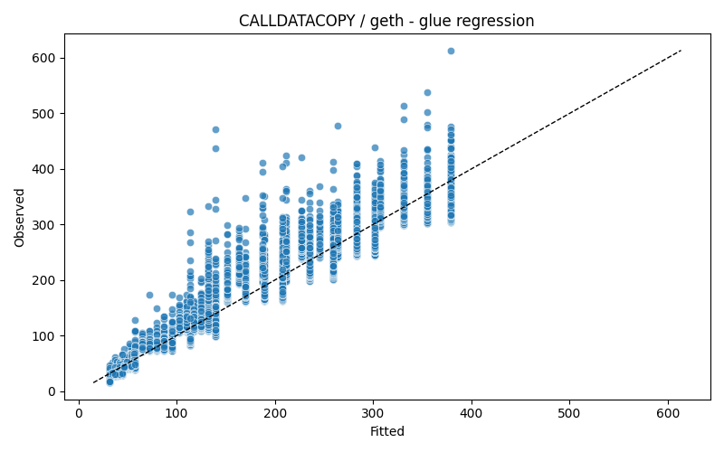

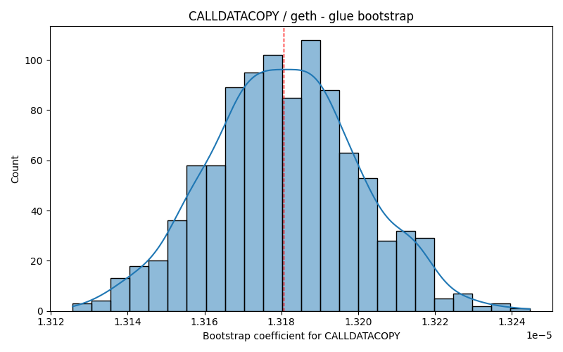

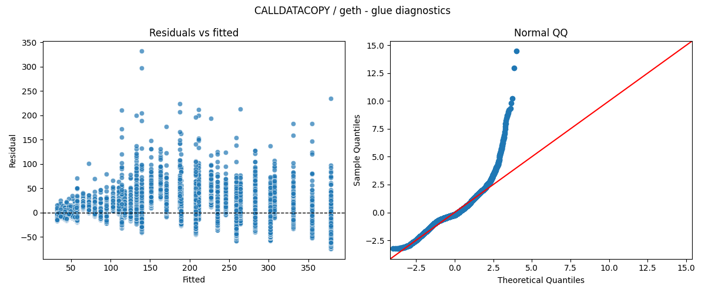

</details>

<details><summary><code>CALLDATALOAD</code> · nobs=5412 · runtime_ms=5.324e-05 · p=1.00e-03 · R²=0.0343</summary>

```
==============================================================================
                           NNLS Regression Results                            
==============================================================================
Dep. Variable:          test_runtime_ms              R-squared:          0.034
Model:                  NNLS                    Adj. R-squared:          0.034
No. Observations:       5412                              RMSE:           1.08
Df Residuals:           5410                               MAE:           0.55
Df Model:               1      
==============================================================================
                      coef     std err     P-value      [0.025      0.975]
------------------------------------------------------------------------------
         const      2.4925      0.0505       0.001      2.3933      2.5953
  CALLDATALOAD      0.0001      0.0000       0.001      0.0000      0.0001
==============================================================================
Notes: Non-negative least squares with bootstrap inference (1000 iterations)
==============================================================================
```

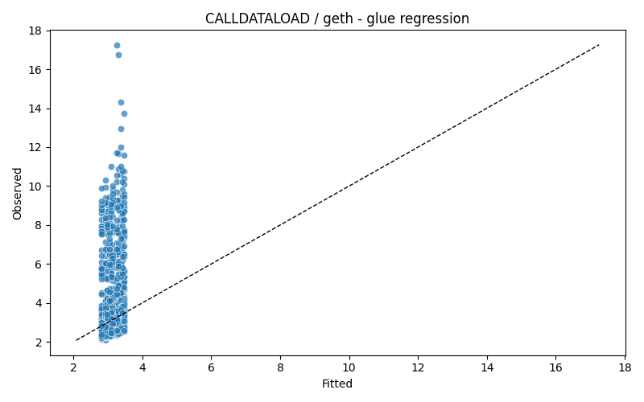

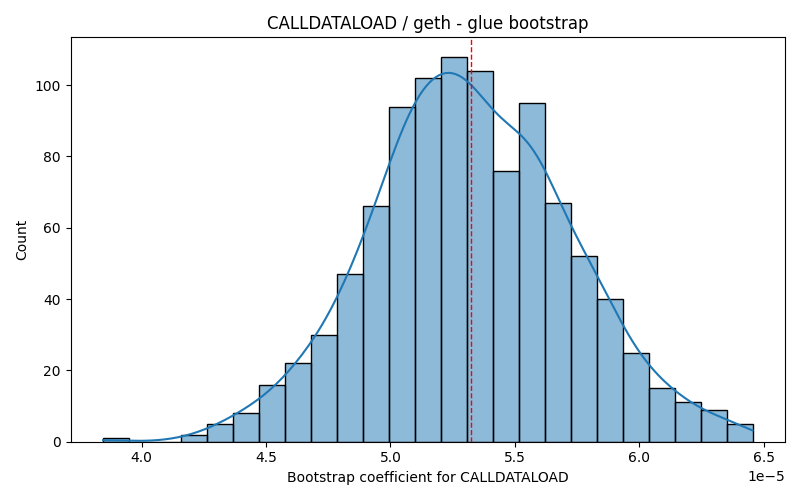

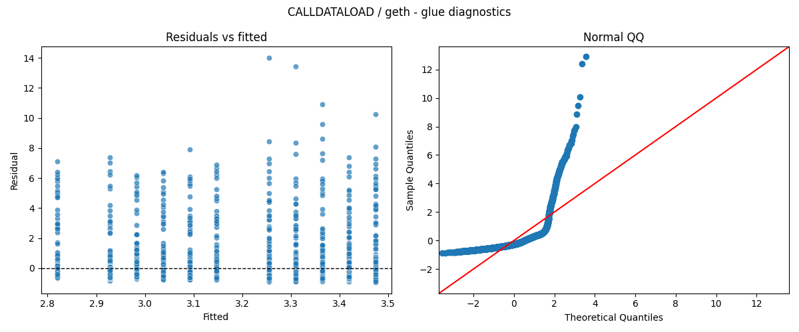

</details>

<details><summary><code>DIV</code> · nobs=1353 · runtime_ms=9.399e-06 · p=1.00e-03 · R²=0.7921</summary>

```
==============================================================================
                           NNLS Regression Results                            
==============================================================================
Dep. Variable:          test_runtime_ms              R-squared:          0.792
Model:                  NNLS                    Adj. R-squared:          0.792
No. Observations:       1353                              RMSE:          38.01
Df Residuals:           1351                               MAE:          31.35
Df Model:               1      
==============================================================================
                      coef     std err     P-value      [0.025      0.975]
------------------------------------------------------------------------------
         const     76.5896      3.5487       0.001     69.5411     83.7045
           DIV      0.0000      0.0000       0.001      0.0000      0.0000
==============================================================================
Notes: Non-negative least squares with bootstrap inference (1000 iterations)
==============================================================================
```

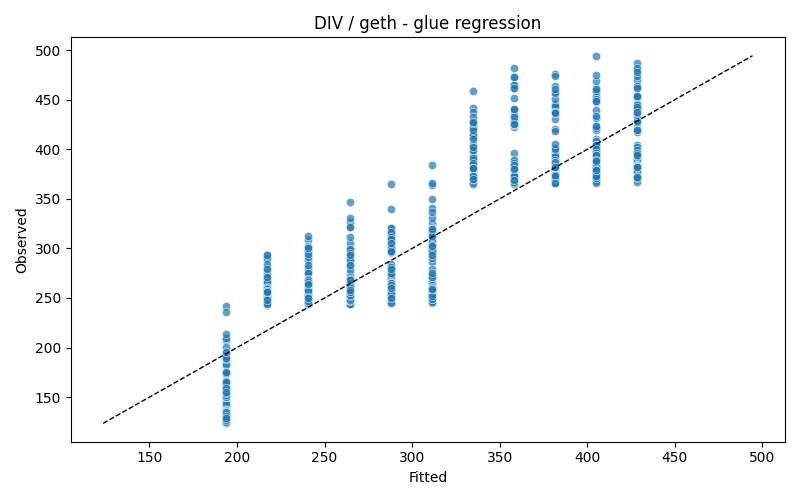

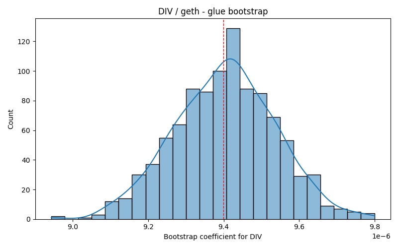

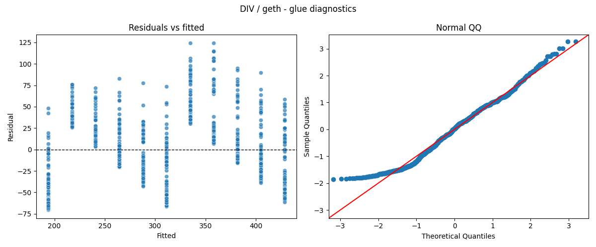

</details>

<details><summary><code>EXP</code> · nobs=1353 · runtime_ms=0.000341 · p=1.00e-03 · R²=0.8184</summary>

```
==============================================================================
                           NNLS Regression Results                            
==============================================================================
Dep. Variable:          test_runtime_ms              R-squared:          0.818
Model:                  NNLS                    Adj. R-squared:          0.818
No. Observations:       1353                              RMSE:           6.29
Df Residuals:           1351                               MAE:           5.26
Df Model:               1      
==============================================================================
                      coef     std err     P-value      [0.025      0.975]
------------------------------------------------------------------------------
         const     12.6946      0.6595       0.001     11.4269     13.9426
           EXP      0.0003      0.0000       0.001      0.0003      0.0004
==============================================================================
Notes: Non-negative least squares with bootstrap inference (1000 iterations)
==============================================================================
```

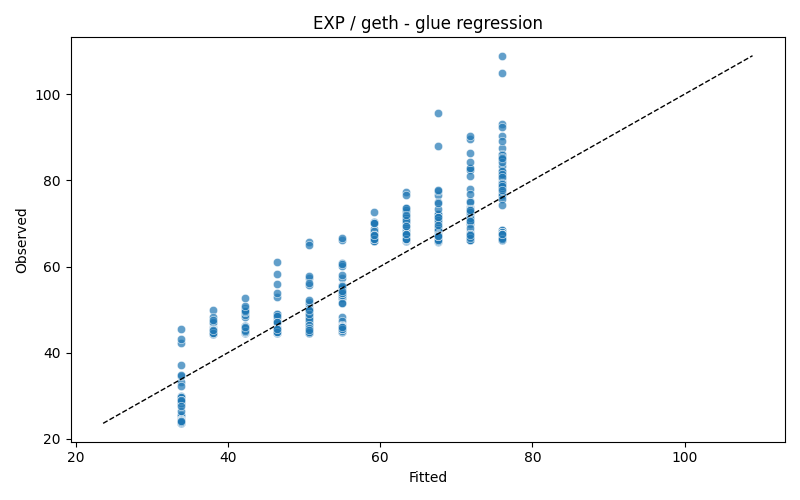

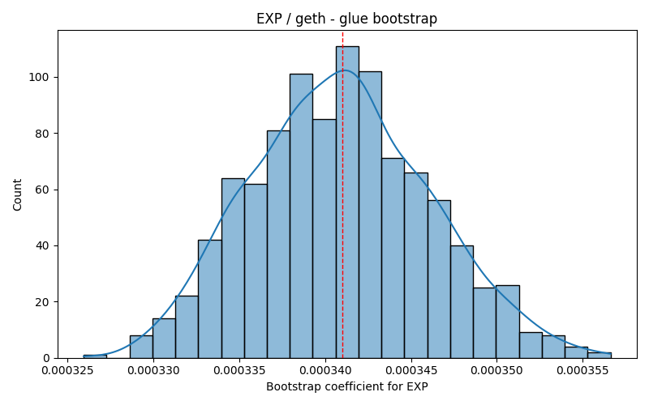

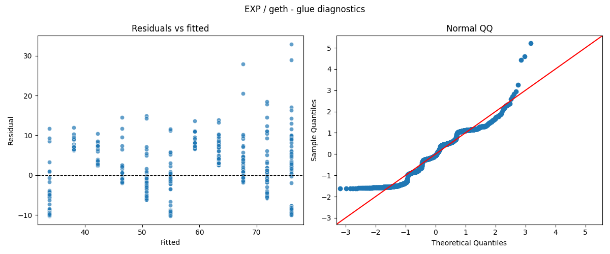

</details>

<details><summary><code>GT</code> · nobs=1353 · runtime_ms=3.51e-06 · p=1.00e-03 · R²=0.7417</summary>

```
==============================================================================
                           NNLS Regression Results                            
==============================================================================
Dep. Variable:          test_runtime_ms              R-squared:          0.742
Model:                  NNLS                    Adj. R-squared:          0.742
No. Observations:       1353                              RMSE:          21.80
Df Residuals:           1351                               MAE:          15.11
Df Model:               1      
==============================================================================
                      coef     std err     P-value      [0.025      0.975]
------------------------------------------------------------------------------
         const     37.6003      1.9768       0.001     33.9181     41.6416
            GT      0.0000      0.0000       0.001      0.0000      0.0000
==============================================================================
Notes: Non-negative least squares with bootstrap inference (1000 iterations)
==============================================================================
```

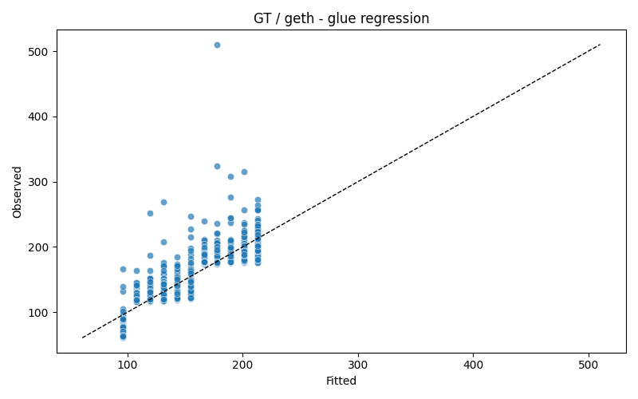


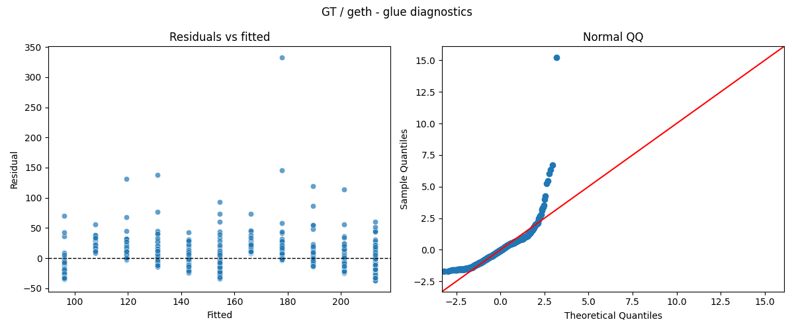

</details>

<details><summary><code>JUMPI</code> · nobs=1353 · runtime_ms=5.644e-06 · p=1.00e-03 · R²=0.7387</summary>

```
==============================================================================
                           NNLS Regression Results                            
==============================================================================
Dep. Variable:          test_runtime_ms              R-squared:          0.739
Model:                  NNLS                    Adj. R-squared:          0.739
No. Observations:       1353                              RMSE:          15.14
Df Residuals:           1351                               MAE:          10.55
Df Model:               1      
==============================================================================
                      coef     std err     P-value      [0.025      0.975]
------------------------------------------------------------------------------
         const     20.9490      1.5415       0.001     17.7060     24.1151
         JUMPI      0.0000      0.0000       0.001      0.0000      0.0000
==============================================================================
Notes: Non-negative least squares with bootstrap inference (1000 iterations)
==============================================================================
```

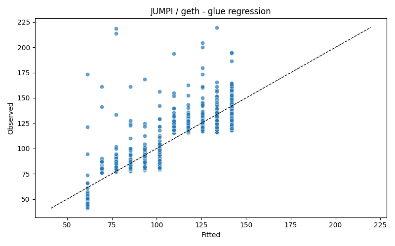

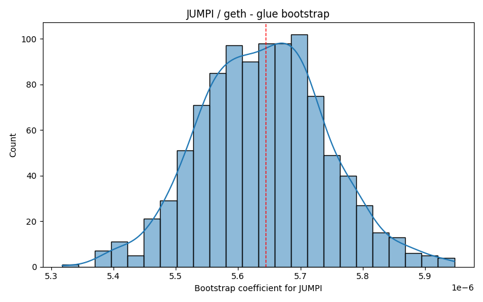


</details>

<details><summary><code>LT</code> · nobs=1353 · runtime_ms=4.234e-06 · p=1.00e-03 · R²=0.7589</summary>

```
==============================================================================
                           NNLS Regression Results                            
==============================================================================
Dep. Variable:          test_runtime_ms              R-squared:          0.759
Model:                  NNLS                    Adj. R-squared:          0.759
No. Observations:       1353                              RMSE:          25.12
Df Residuals:           1351                               MAE:          18.18
Df Model:               1      
==============================================================================
                      coef     std err     P-value      [0.025      0.975]
------------------------------------------------------------------------------
         const     36.4805      2.2677       0.001     31.6933     40.7845
            LT      0.0000      0.0000       0.001      0.0000      0.0000
==============================================================================
Notes: Non-negative least squares with bootstrap inference (1000 iterations)
==============================================================================
```

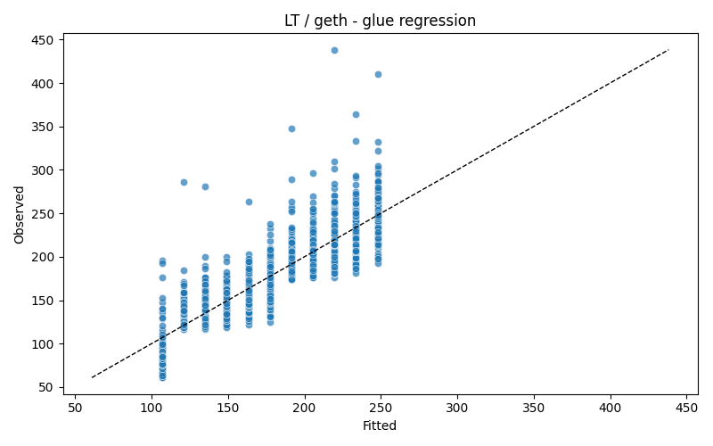

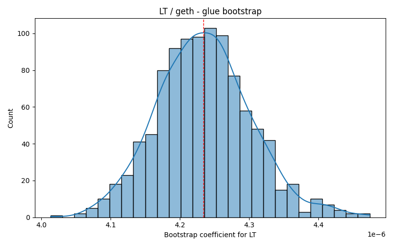

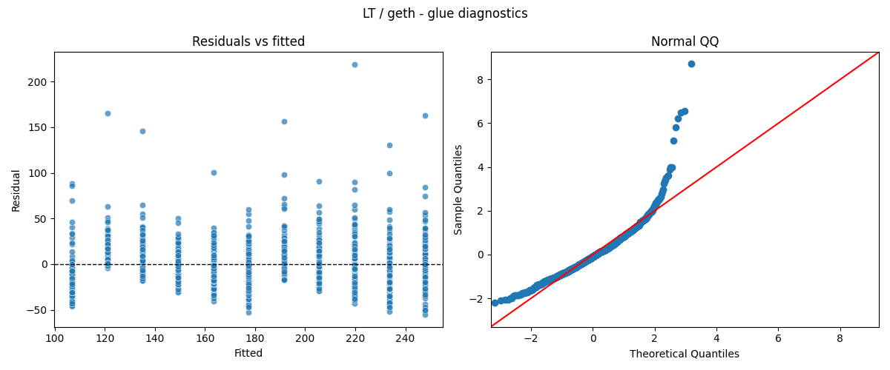

</details>

<details><summary><code>MSTORE</code> · nobs=6765 · runtime_ms=7.896e-06 · p=1.00e-03 · R²=0.7932</summary>

```
==============================================================================
                           NNLS Regression Results                            
==============================================================================
Dep. Variable:          test_runtime_ms              R-squared:          0.793
Model:                  NNLS                    Adj. R-squared:          0.793
No. Observations:       6765                              RMSE:          28.29
Df Residuals:           6763                               MAE:          21.82
Df Model:               1      
==============================================================================
                      coef     std err     P-value      [0.025      0.975]
------------------------------------------------------------------------------
         const     54.4849      1.2345       0.001     52.0834     56.6600
        MSTORE      0.0000      0.0000       0.001      0.0000      0.0000
==============================================================================
Notes: Non-negative least squares with bootstrap inference (1000 iterations)
==============================================================================
```


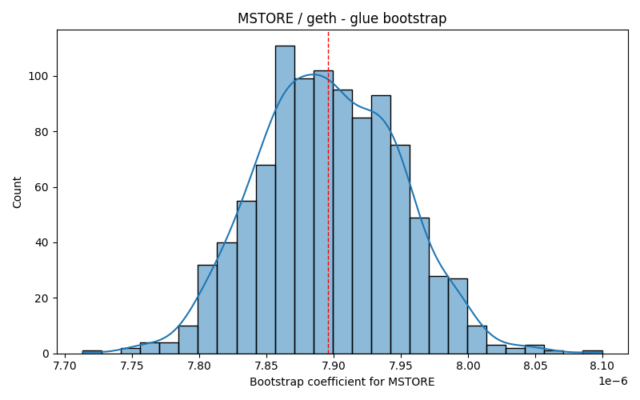


</details>

<details><summary><code>MSTORE8</code> · nobs=6765 · runtime_ms=7.21e-06 · p=1.00e-03 · R²=0.756</summary>

```
==============================================================================
                           NNLS Regression Results                            
==============================================================================
Dep. Variable:          test_runtime_ms              R-squared:          0.756
Model:                  NNLS                    Adj. R-squared:          0.756
No. Observations:       6765                              RMSE:          28.74
Df Residuals:           6763                               MAE:          20.73
Df Model:               1      
==============================================================================
                      coef     std err     P-value      [0.025      0.975]
------------------------------------------------------------------------------
         const     51.2547      1.3556       0.001     48.6874     53.8988
       MSTORE8      0.0000      0.0000       0.001      0.0000      0.0000
==============================================================================
Notes: Non-negative least squares with bootstrap inference (1000 iterations)
==============================================================================
```

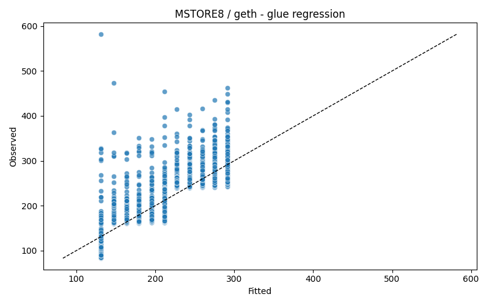

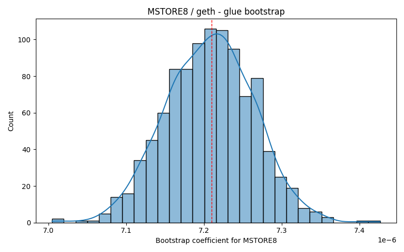

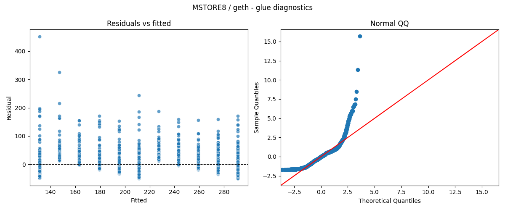

</details>

<details><summary><code>MUL</code> · nobs=1353 · runtime_ms=4.839e-06 · p=1.00e-03 · R²=0.8431</summary>

```
==============================================================================
                           NNLS Regression Results                            
==============================================================================
Dep. Variable:          test_runtime_ms              R-squared:          0.843
Model:                  NNLS                    Adj. R-squared:          0.843
No. Observations:       1353                              RMSE:          16.48
Df Residuals:           1351                               MAE:          12.32
Df Model:               1      
==============================================================================
                      coef     std err     P-value      [0.025      0.975]
------------------------------------------------------------------------------
         const     36.6764      1.6511       0.001     33.3811     39.8392
           MUL      0.0000      0.0000       0.001      0.0000      0.0000
==============================================================================
Notes: Non-negative least squares with bootstrap inference (1000 iterations)
==============================================================================
```

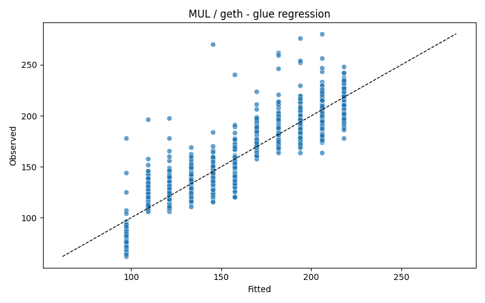

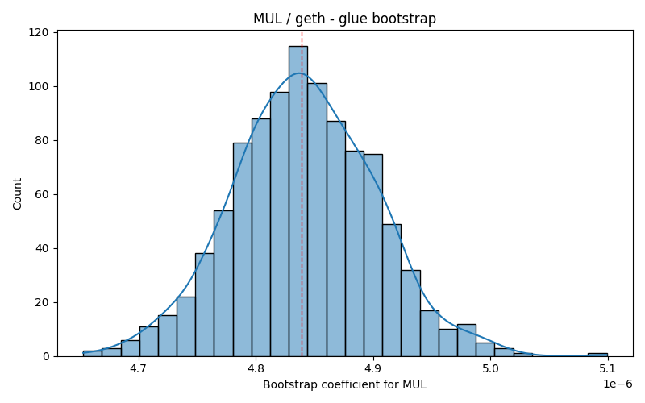

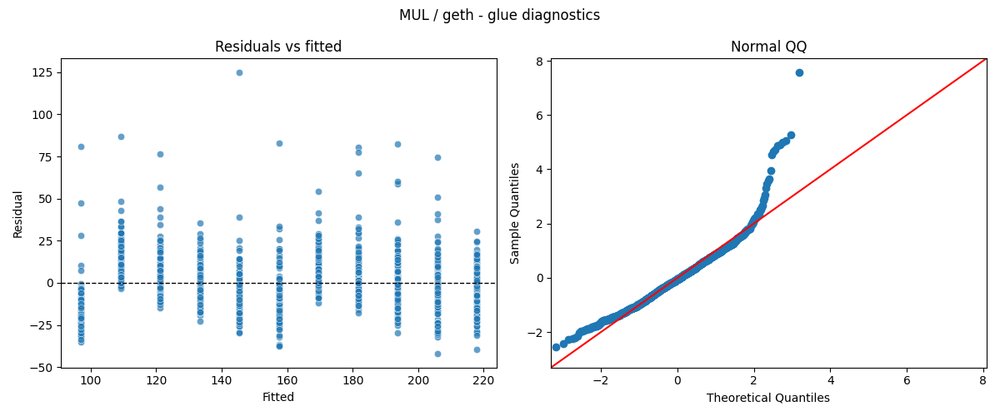

</details>

<details><summary><code>PC</code> · nobs=1353 · runtime_ms=1.588e-06 · p=1.00e-03 · R²=0.8394</summary>

```
==============================================================================
                           NNLS Regression Results                            
==============================================================================
Dep. Variable:          test_runtime_ms              R-squared:          0.839
Model:                  NNLS                    Adj. R-squared:          0.839
No. Observations:       1353                              RMSE:          20.77
Df Residuals:           1351                               MAE:          16.75
Df Model:               1      
==============================================================================
                      coef     std err     P-value      [0.025      0.975]
------------------------------------------------------------------------------
         const     44.7430      2.2245       0.001     40.5878     49.0064
            PC      0.0000      0.0000       0.001      0.0000      0.0000
==============================================================================
Notes: Non-negative least squares with bootstrap inference (1000 iterations)
==============================================================================
```

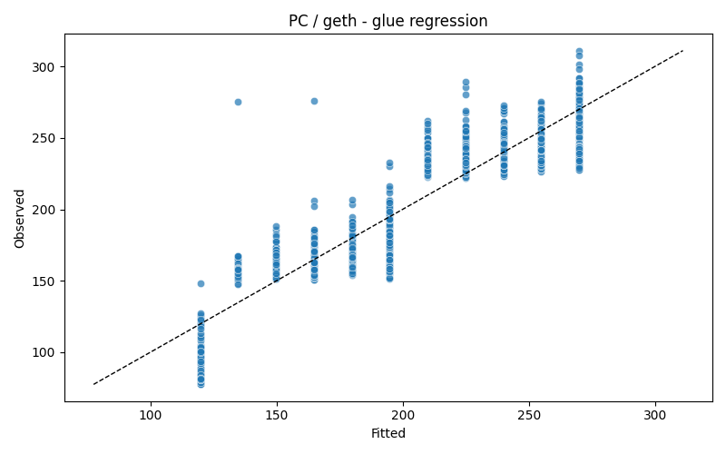

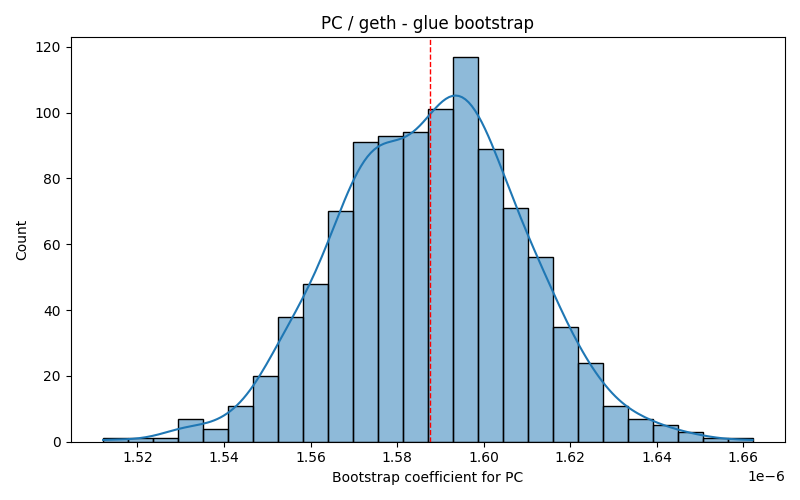


</details>

<details><summary><code>RETURNDATASIZE</code> · nobs=5412 · runtime_ms=3.114e-06 · p=1.00e-03 · R²=0.618</summary>

```
==============================================================================
                           NNLS Regression Results                            
==============================================================================
Dep. Variable:          test_runtime_ms              R-squared:          0.618
Model:                  NNLS                    Adj. R-squared:          0.618
No. Observations:       5412                              RMSE:          38.65
Df Residuals:           5410                               MAE:          27.14
Df Model:               1      
==============================================================================
                      coef     std err     P-value      [0.025      0.975]
------------------------------------------------------------------------------
         const     52.5586      1.7552       0.001     49.3124     55.9118
RETURNDATASIZE      0.0000      0.0000       0.001      0.0000      0.0000
==============================================================================
Notes: Non-negative least squares with bootstrap inference (1000 iterations)
==============================================================================
```

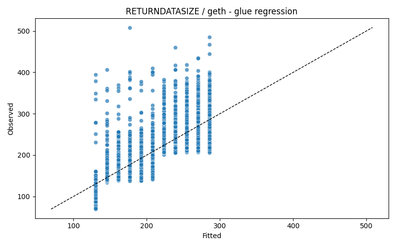

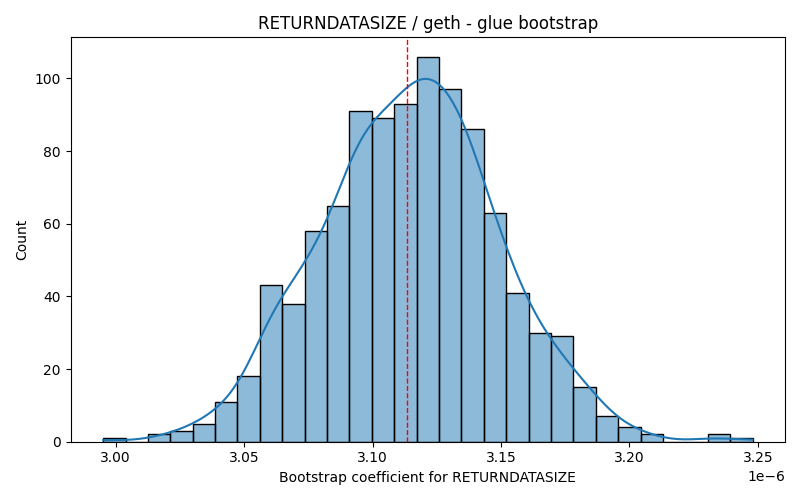

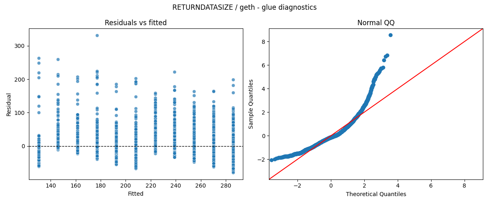

</details>

<details><summary><code>SELFBALANCE</code> · nobs=1107 · runtime_ms=7.492e-06 · p=1.00e-03 · R²=0.799</summary>

```
==============================================================================
                           NNLS Regression Results                            
==============================================================================
Dep. Variable:          test_runtime_ms              R-squared:          0.799
Model:                  NNLS                    Adj. R-squared:          0.799
No. Observations:       1107                              RMSE:          37.90
Df Residuals:           1105                               MAE:          31.50
Df Model:               1      
==============================================================================
                      coef     std err     P-value      [0.025      0.975]
------------------------------------------------------------------------------
         const    118.0690      3.7697       0.001    110.5005    125.7811
   SELFBALANCE      0.0000      0.0000       0.001      0.0000      0.0000
==============================================================================
Notes: Non-negative least squares with bootstrap inference (1000 iterations)
==============================================================================
```

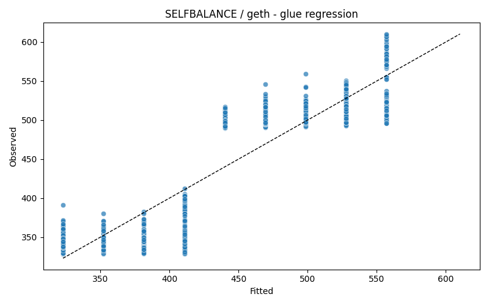

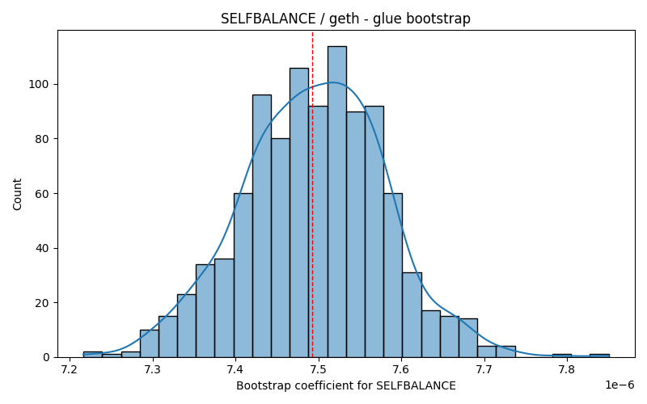

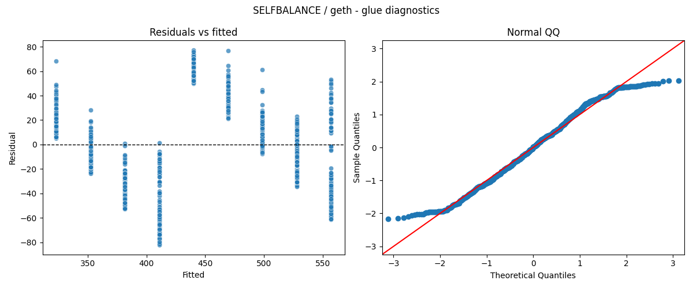

</details>

<details><summary><code>SUB</code> · nobs=1353 · runtime_ms=4.621e-06 · p=1.00e-03 · R²=0.802</summary>

```
==============================================================================
                           NNLS Regression Results                            
==============================================================================
Dep. Variable:          test_runtime_ms              R-squared:          0.802
Model:                  NNLS                    Adj. R-squared:          0.802
No. Observations:       1353                              RMSE:          24.17
Df Residuals:           1351                               MAE:          17.98
Df Model:               1      
==============================================================================
                      coef     std err     P-value      [0.025      0.975]
------------------------------------------------------------------------------
         const     43.8496      2.2372       0.001     39.6017     48.4869
           SUB      0.0000      0.0000       0.001      0.0000      0.0000
==============================================================================
Notes: Non-negative least squares with bootstrap inference (1000 iterations)
==============================================================================
```

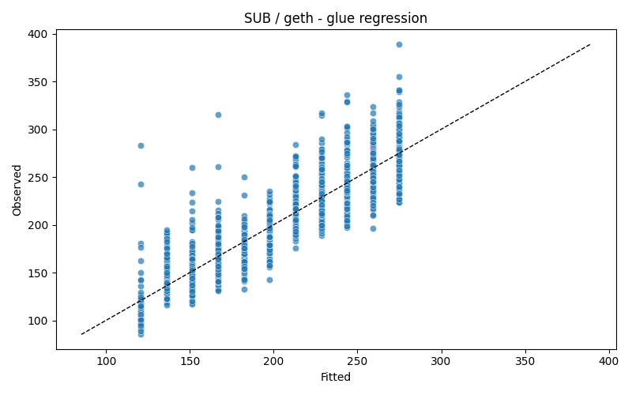

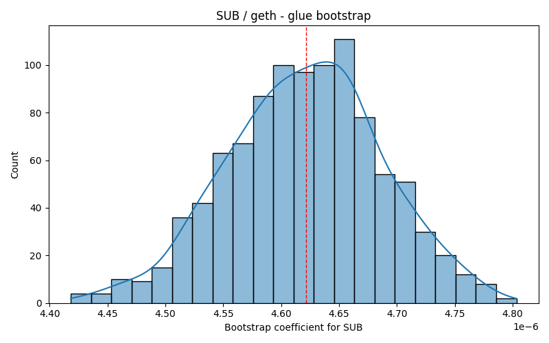

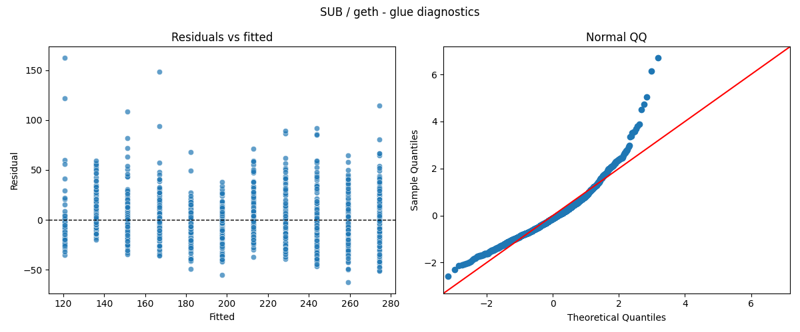

</details>

### Mixed glue (tier B) · geth

<details><summary><code>JUMP</code> · nobs=1353 · runtime_ms=9.446e-06 · p=1.00e-03 · R²=0.8095</summary>

```
==============================================================================
                           NNLS Regression Results                            
==============================================================================
Dep. Variable:          test_runtime_ms              R-squared:          0.809
Model:                  NNLS                    Adj. R-squared:          0.809
No. Observations:       1353                              RMSE:          17.03
Df Residuals:           1351                               MAE:          13.69
Df Model:               1      
==============================================================================
                      coef     std err     P-value      [0.025      0.975]
------------------------------------------------------------------------------
         const     32.6399      1.7350       0.001     29.2447     35.9674
          JUMP      0.0000      0.0000       0.001      0.0000      0.0000
==============================================================================
Notes: Non-negative least squares with bootstrap inference (1000 iterations)
==============================================================================
```

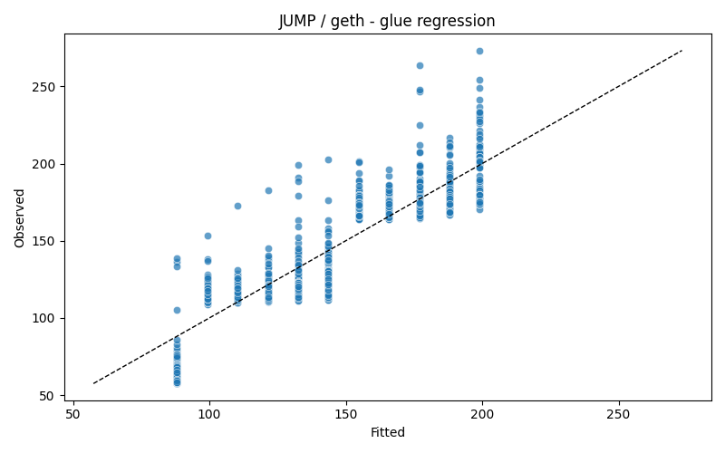

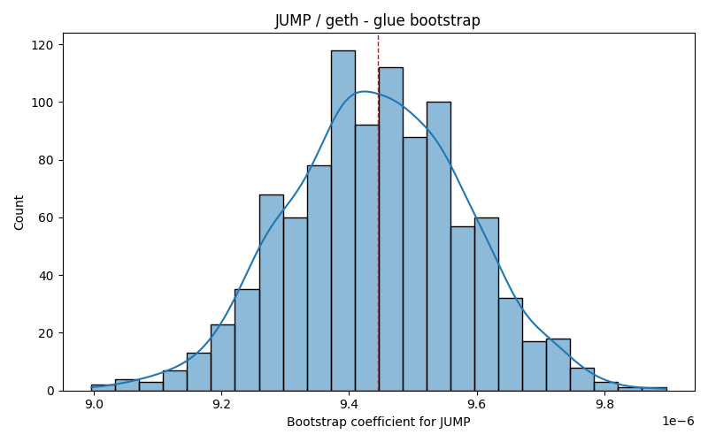

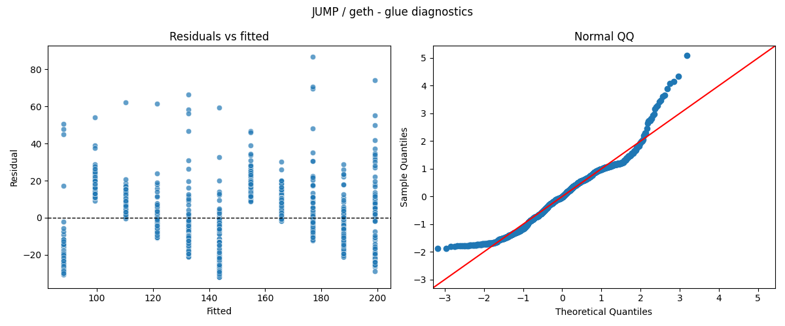

</details>

<details><summary><code>KECCAK256</code> · nobs=21648 · runtime_ms=3.594e-05 · p=1.00e-03 · R²=0.2563</summary>

```
==============================================================================
                           NNLS Regression Results                            
==============================================================================
Dep. Variable:          test_runtime_ms              R-squared:          0.256
Model:                  NNLS                    Adj. R-squared:          0.256
No. Observations:       21648                             RMSE:         121.66
Df Residuals:           21646                              MAE:          95.36
Df Model:               1      
==============================================================================
                      coef     std err     P-value      [0.025      0.975]
------------------------------------------------------------------------------
         const    380.1502      1.8838       0.001    376.2685    383.6040
     KECCAK256      0.0000      0.0000       0.001      0.0000      0.0000
==============================================================================
Notes: Non-negative least squares with bootstrap inference (1000 iterations)
==============================================================================
```


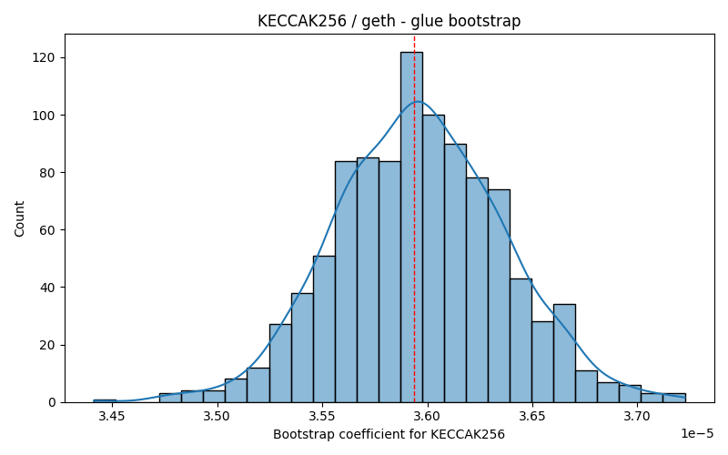

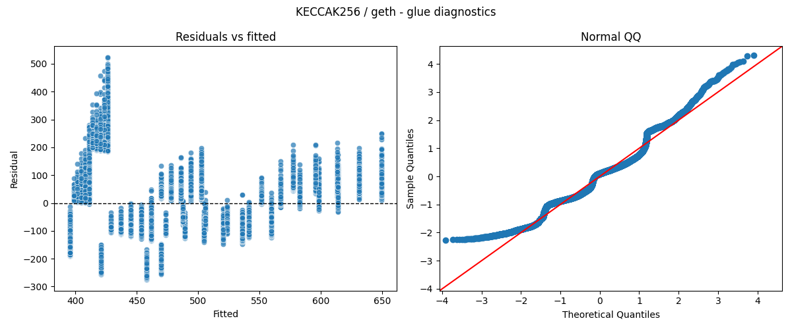

</details>

## nethermind

| glue_opcode | nobs | glue_runtime_ms | p_value | rsquared |
| --- | --- | --- | --- | --- |
| `ISZERO` | 1177 | 9.185e-07 | 1.00e-03 | 0.788 |
| `JUMPDEST` | 1177 | 4.798e-07 | 1.00e-03 | 0.6839 |
| `SWAP` | 18832 | 5.157e-07 | 1.00e-03 | 0.588 |
| `CALLDATASIZE` | 69553 | 4.514e-07 | 1.00e-03 | 0.9189 |
| `DUP` | 69553 | 3.108e-07 | 1.00e-03 | 0.9189 |
| `GAS` | 69553 | 4.061e-07 | 1.00e-03 | 0.9189 |
| `MLOAD` | 69553 | 1.366e-06 | 1.00e-03 | 0.9189 |
| `PUSH` | 69553 | 4.087e-07 | 1.00e-03 | 0.9189 |
| `PUSH0` | 69553 | 2.968e-07 | 1.00e-03 | 0.9189 |
| `STATICCALL` | 69553 | 0.0004338 | 1.00e-03 | 0.9189 |
| `ADD` | 1177 | 2.297e-06 | 1.00e-03 | 0.8225 |
| `AND` | 1177 | 1.273e-06 | 1.00e-03 | 0.5747 |
| `CALLDATACOPY` | 28248 | 4.595e-06 | 1.00e-03 | 0.654 |
| `CALLDATALOAD` | 4708 | 3.871e-05 | 4.30e-02 | 0.0008501 |
| `DIV` | 1177 | 7.038e-06 | 1.00e-03 | 0.6338 |
| `EXP` | 1177 | 0 | 1.00e+00 | 0 |
| `GT` | 1177 | 1.601e-06 | 1.00e-03 | 0.81 |
| `JUMPI` | 1177 | 1.853e-06 | 1.00e-03 | 0.7116 |
| `LT` | 1177 | 1.547e-06 | 1.00e-03 | 0.6572 |
| `MSTORE` | 5885 | 2.095e-06 | 1.00e-03 | 0.7816 |
| `MSTORE8` | 5885 | 2.06e-06 | 1.00e-03 | 0.8107 |
| `MUL` | 1177 | 5.413e-06 | 1.00e-03 | 0.8812 |
| `PC` | 1177 | 8.361e-07 | 1.00e-03 | 0.8435 |
| `RETURNDATASIZE` | 4708 | 8.235e-07 | 1.00e-03 | 0.7794 |
| `SELFBALANCE` | 963 | 4.16e-06 | 1.00e-03 | 0.603 |
| `SUB` | 1177 | 2.51e-06 | 1.00e-03 | 0.8843 |
| `JUMP` | 1177 | 5.85e-06 | 1.00e-03 | 0.8613 |
| `KECCAK256` | 18832 | 0 | 1.00e+00 | 1.11e-16 |

### Cycle glue — joint fit · nethermind

<details><summary>Joint NNLS regression summary</summary>

```
==============================================================================
                           NNLS Regression Results                            
==============================================================================
Dep. Variable:          test_runtime_ms              R-squared:          0.919
Model:                  NNLS                    Adj. R-squared:          0.919
No. Observations:       69553                             RMSE:          10.14
Df Residuals:           69545                              MAE:           5.52
Df Model:               7      
==============================================================================
                      coef     std err     P-value      [0.025      0.975]
------------------------------------------------------------------------------
         const     17.3092      0.1191       0.001     17.0786     17.5371
  CALLDATASIZE      0.0000      0.0000       0.001      0.0000      0.0000
           DUP      0.0000      0.0000       0.001      0.0000      0.0000
           GAS      0.0000      0.0000       0.001      0.0000      0.0000
         MLOAD      0.0000      0.0000       0.001      0.0000      0.0000
          PUSH      0.0000      0.0000       0.001      0.0000      0.0000
         PUSH0      0.0000      0.0000       0.001      0.0000      0.0000
    STATICCALL      0.0004      0.0000       0.001      0.0004      0.0005
==============================================================================
Notes: Non-negative least squares with bootstrap inference (1000 iterations)
==============================================================================
```

</details>

<details><summary><code>CALLDATASIZE</code> · nobs=69553 · runtime_ms=4.514e-07 · p=1.00e-03 · R²=0.9189</summary>


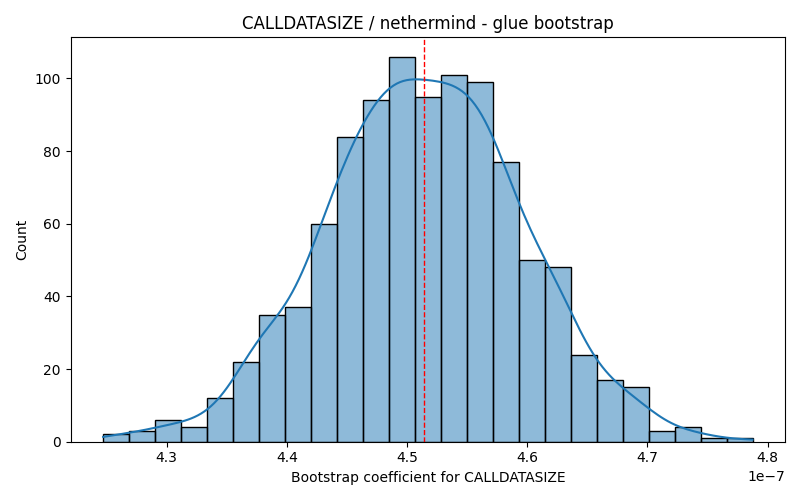


</details>

<details><summary><code>DUP</code> · nobs=69553 · runtime_ms=3.108e-07 · p=1.00e-03 · R²=0.9189</summary>


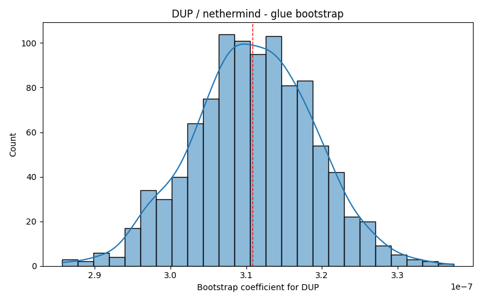

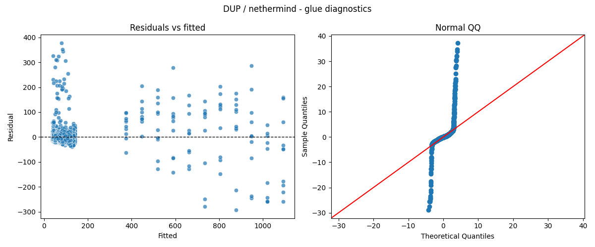

</details>

<details><summary><code>GAS</code> · nobs=69553 · runtime_ms=4.061e-07 · p=1.00e-03 · R²=0.9189</summary>


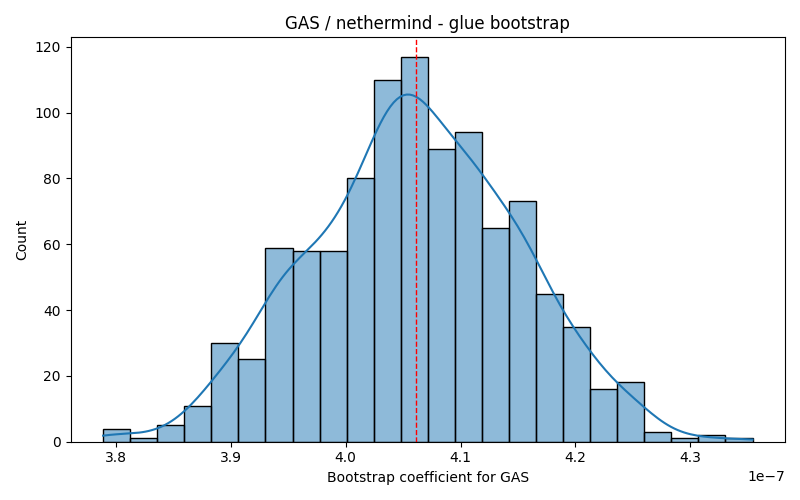


</details>

<details><summary><code>MLOAD</code> · nobs=69553 · runtime_ms=1.366e-06 · p=1.00e-03 · R²=0.9189</summary>


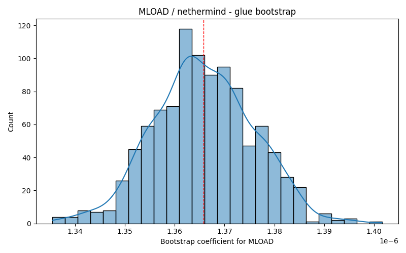


</details>

<details><summary><code>PUSH</code> · nobs=69553 · runtime_ms=4.087e-07 · p=1.00e-03 · R²=0.9189</summary>

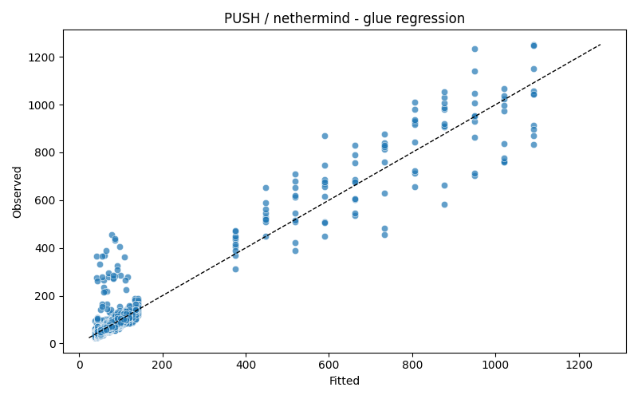

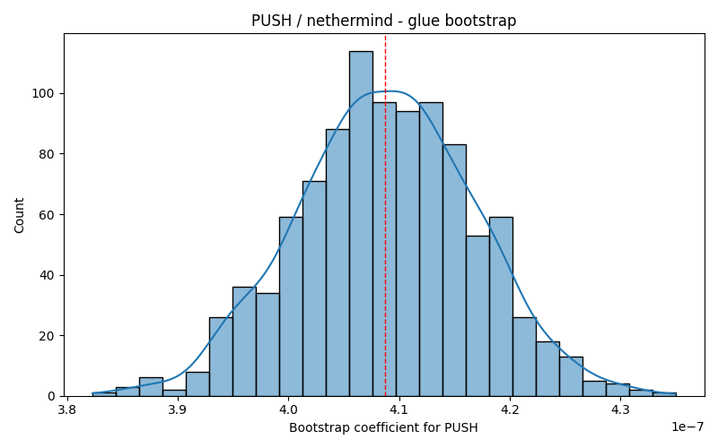


</details>

<details><summary><code>PUSH0</code> · nobs=69553 · runtime_ms=2.968e-07 · p=1.00e-03 · R²=0.9189</summary>


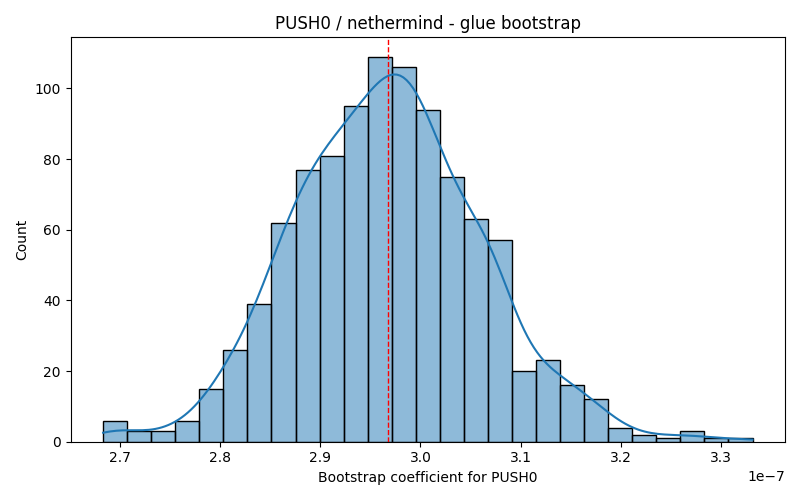


</details>

<details><summary><code>STATICCALL</code> · nobs=69553 · runtime_ms=0.0004338 · p=1.00e-03 · R²=0.9189</summary>

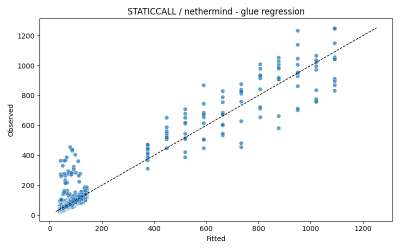

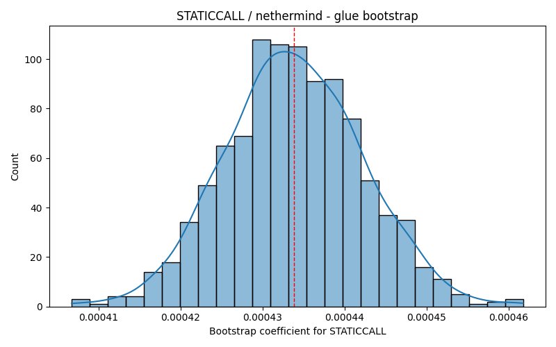


</details>

### Pure glue · nethermind

<details><summary><code>ISZERO</code> · nobs=1177 · runtime_ms=9.185e-07 · p=1.00e-03 · R²=0.788</summary>

```
==============================================================================
                           NNLS Regression Results                            
==============================================================================
Dep. Variable:          test_runtime_ms              R-squared:          0.788
Model:                  NNLS                    Adj. R-squared:          0.788
No. Observations:       1177                              RMSE:          10.03
Df Residuals:           1175                               MAE:           6.74
Df Model:               1      
==============================================================================
                      coef     std err     P-value      [0.025      0.975]
------------------------------------------------------------------------------
         const     15.9773      0.7170       0.001     14.5924     17.3729
        ISZERO      0.0000      0.0000       0.001      0.0000      0.0000
==============================================================================
Notes: Non-negative least squares with bootstrap inference (1000 iterations)
==============================================================================
```

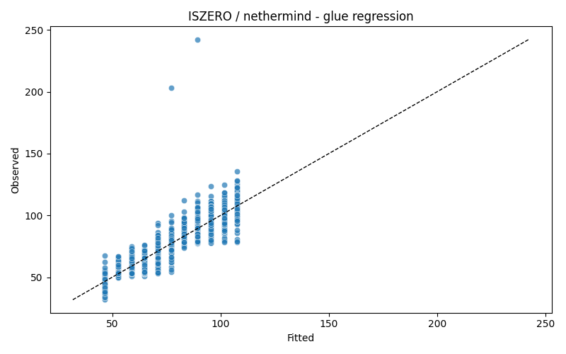

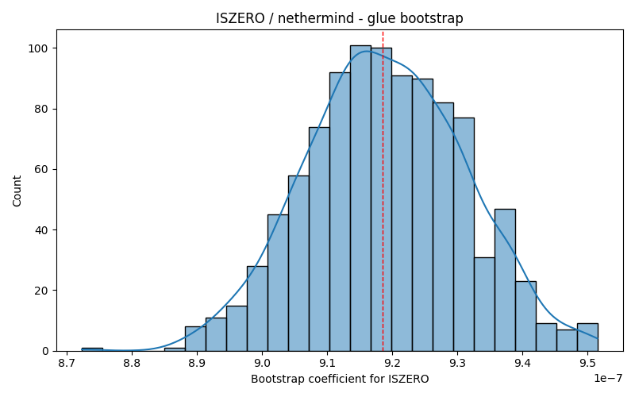


</details>

<details><summary><code>JUMPDEST</code> · nobs=1177 · runtime_ms=4.798e-07 · p=1.00e-03 · R²=0.6839</summary>

```
==============================================================================
                           NNLS Regression Results                            
==============================================================================
Dep. Variable:          test_runtime_ms              R-squared:          0.684
Model:                  NNLS                    Adj. R-squared:          0.684
No. Observations:       1177                              RMSE:          20.60
Df Residuals:           1175                               MAE:          17.28
Df Model:               1      
==============================================================================
                      coef     std err     P-value      [0.025      0.975]
------------------------------------------------------------------------------
         const     22.3204      1.7698       0.001     18.9281     25.7871
      JUMPDEST      0.0000      0.0000       0.001      0.0000      0.0000
==============================================================================
Notes: Non-negative least squares with bootstrap inference (1000 iterations)
==============================================================================
```

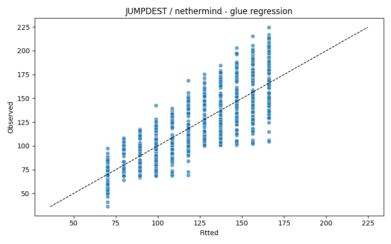

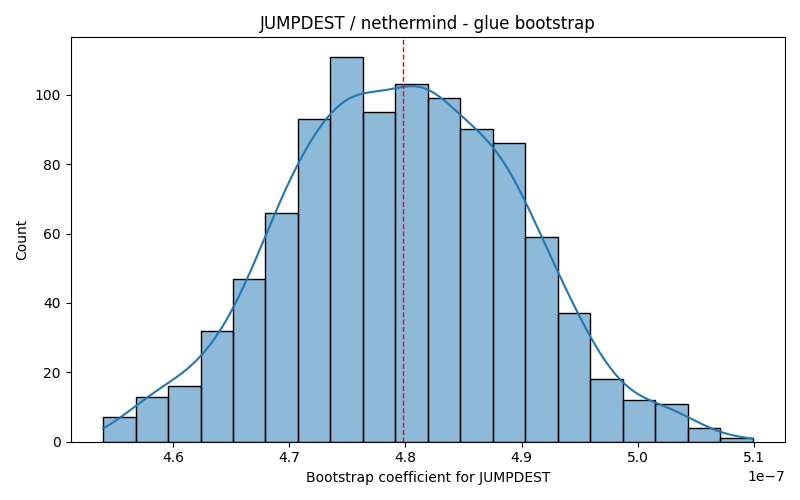

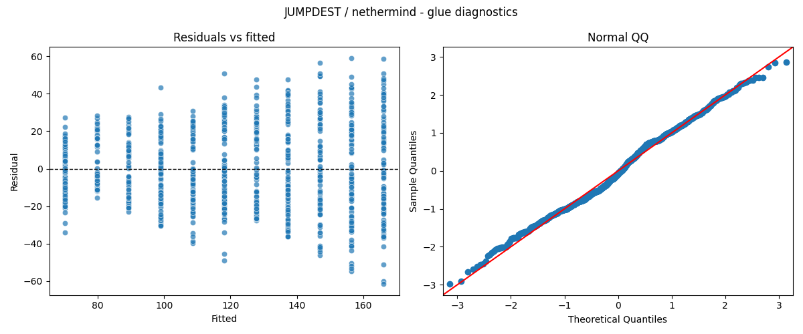

</details>

<details><summary><code>SWAP</code> · nobs=18832 · runtime_ms=5.157e-07 · p=1.00e-03 · R²=0.588</summary>

```
==============================================================================
                           NNLS Regression Results                            
==============================================================================
Dep. Variable:          test_runtime_ms              R-squared:          0.588
Model:                  NNLS                    Adj. R-squared:          0.588
No. Observations:       18832                             RMSE:           9.09
Df Residuals:           18830                              MAE:           4.18
Df Model:               1      
==============================================================================
                      coef     std err     P-value      [0.025      0.975]
------------------------------------------------------------------------------
         const     16.5033      0.2493       0.001     16.0412     17.0073
          SWAP      0.0000      0.0000       0.001      0.0000      0.0000
==============================================================================
Notes: Non-negative least squares with bootstrap inference (1000 iterations)
==============================================================================
```

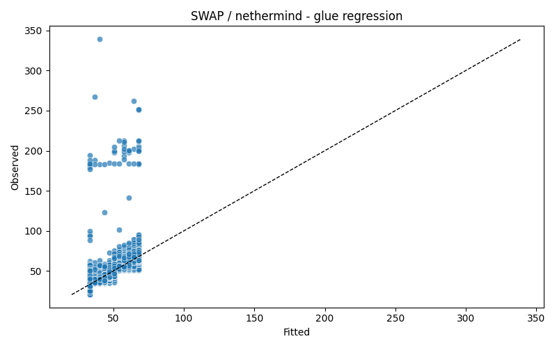

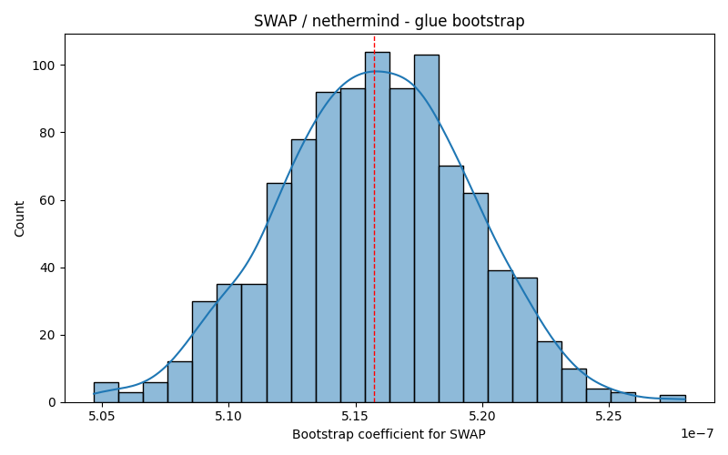

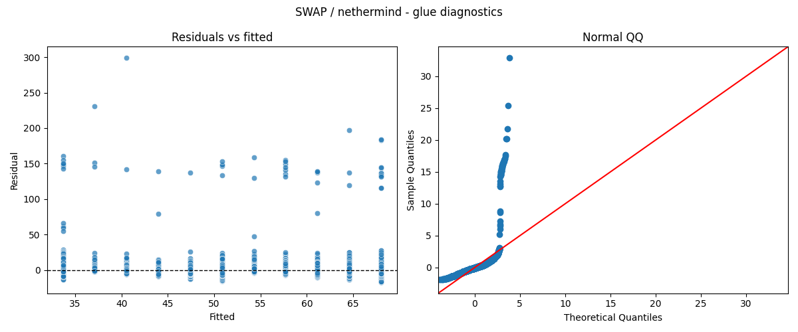

</details>

### Mixed glue (tier A) · nethermind

<details><summary><code>ADD</code> · nobs=1177 · runtime_ms=2.297e-06 · p=1.00e-03 · R²=0.8225</summary>

```
==============================================================================
                           NNLS Regression Results                            
==============================================================================
Dep. Variable:          test_runtime_ms              R-squared:          0.822
Model:                  NNLS                    Adj. R-squared:          0.822
No. Observations:       1177                              RMSE:          11.23
Df Residuals:           1175                               MAE:           7.03
Df Model:               1      
==============================================================================
                      coef     std err     P-value      [0.025      0.975]
------------------------------------------------------------------------------
         const     15.6970      0.8001       0.001     14.0860     17.3380
           ADD      0.0000      0.0000       0.001      0.0000      0.0000
==============================================================================
Notes: Non-negative least squares with bootstrap inference (1000 iterations)
==============================================================================
```

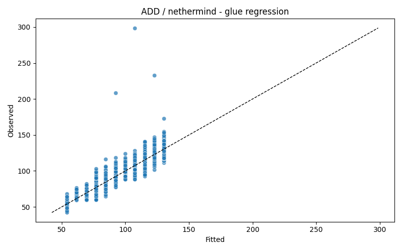

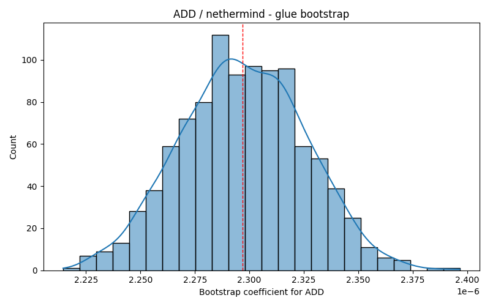

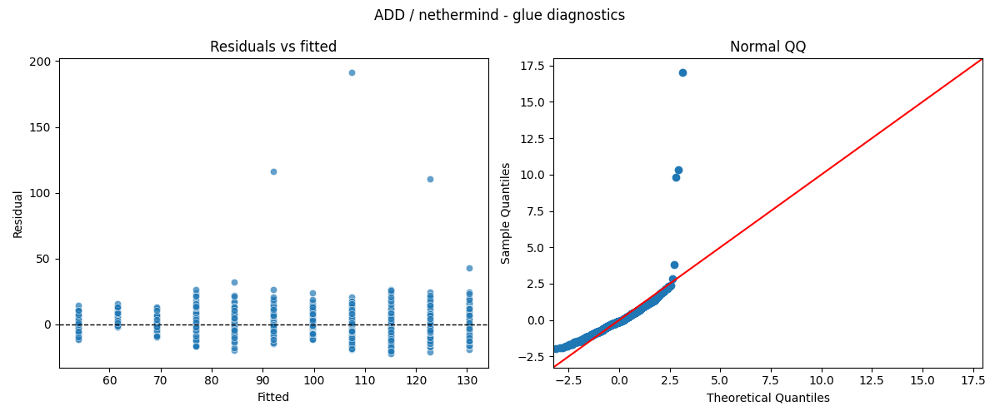

</details>

<details><summary><code>AND</code> · nobs=1177 · runtime_ms=1.273e-06 · p=1.00e-03 · R²=0.5747</summary>

```
==============================================================================
                           NNLS Regression Results                            
==============================================================================
Dep. Variable:          test_runtime_ms              R-squared:          0.575
Model:                  NNLS                    Adj. R-squared:          0.574
No. Observations:       1177                              RMSE:          11.53
Df Residuals:           1175                               MAE:           6.10
Df Model:               1      
==============================================================================
                      coef     std err     P-value      [0.025      0.975]
------------------------------------------------------------------------------
         const     15.3307      0.9619       0.001     13.3648     17.1914
           AND      0.0000      0.0000       0.001      0.0000      0.0000
==============================================================================
Notes: Non-negative least squares with bootstrap inference (1000 iterations)
==============================================================================
```


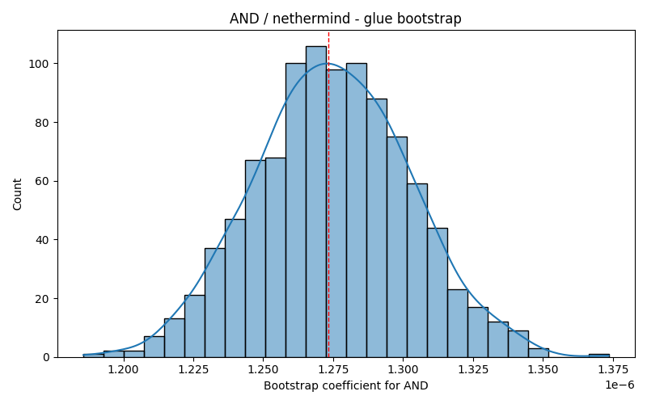

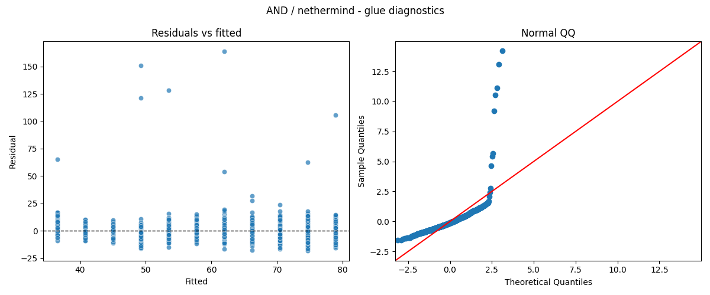

</details>

<details><summary><code>CALLDATACOPY</code> · nobs=28248 · runtime_ms=4.595e-06 · p=1.00e-03 · R²=0.654</summary>

```
==============================================================================
                           NNLS Regression Results                            
==============================================================================
Dep. Variable:          test_runtime_ms              R-squared:          0.654
Model:                  NNLS                    Adj. R-squared:          0.654
No. Observations:       28248                             RMSE:          25.13
Df Residuals:           28246                              MAE:          19.86
Df Model:               1      
==============================================================================
                      coef     std err     P-value      [0.025      0.975]
------------------------------------------------------------------------------
         const     28.1736      0.1718       0.001     27.8222     28.5004
  CALLDATACOPY      0.0000      0.0000       0.001      0.0000      0.0000
==============================================================================
Notes: Non-negative least squares with bootstrap inference (1000 iterations)
==============================================================================
```

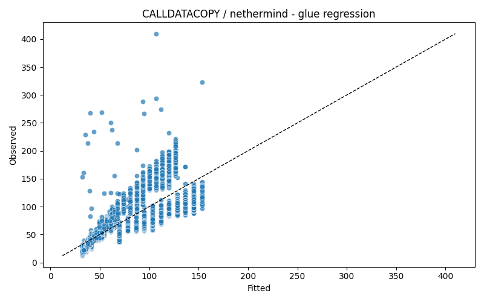

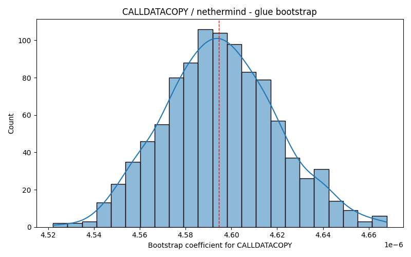

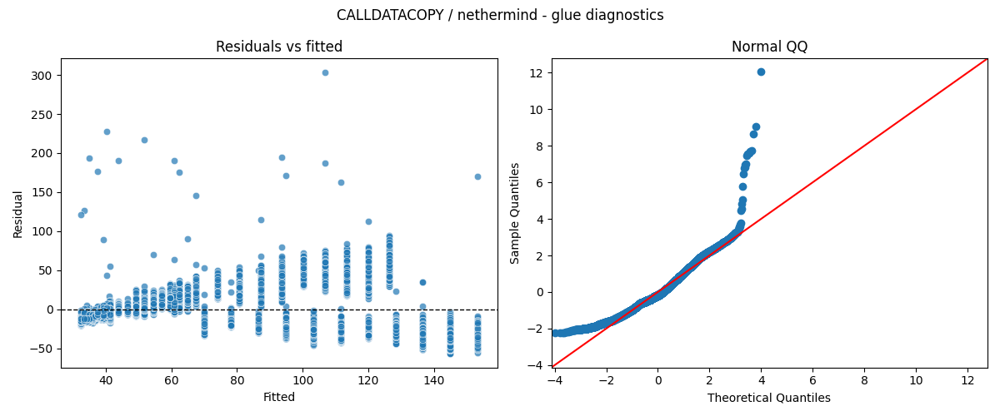

</details>

<details><summary><code>CALLDATALOAD</code> · nobs=4708 · runtime_ms=3.871e-05 · p=4.30e-02 · R²=0.0008501</summary>

```
==============================================================================
                           NNLS Regression Results                            
==============================================================================
Dep. Variable:          test_runtime_ms              R-squared:          0.001
Model:                  NNLS                    Adj. R-squared:          0.001
No. Observations:       4708                              RMSE:           5.09
Df Residuals:           4706                               MAE:           0.62
Df Model:               1      
==============================================================================
                      coef     std err     P-value      [0.025      0.975]
------------------------------------------------------------------------------
         const      2.9538      0.2623       0.001      2.4528      3.4734
  CALLDATALOAD      0.0000      0.0000       0.043      0.0000      0.0001
==============================================================================
Notes: Non-negative least squares with bootstrap inference (1000 iterations)
==============================================================================
```

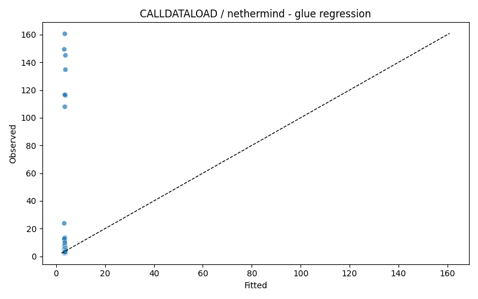

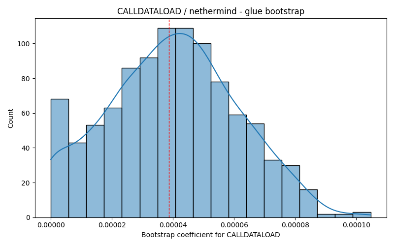

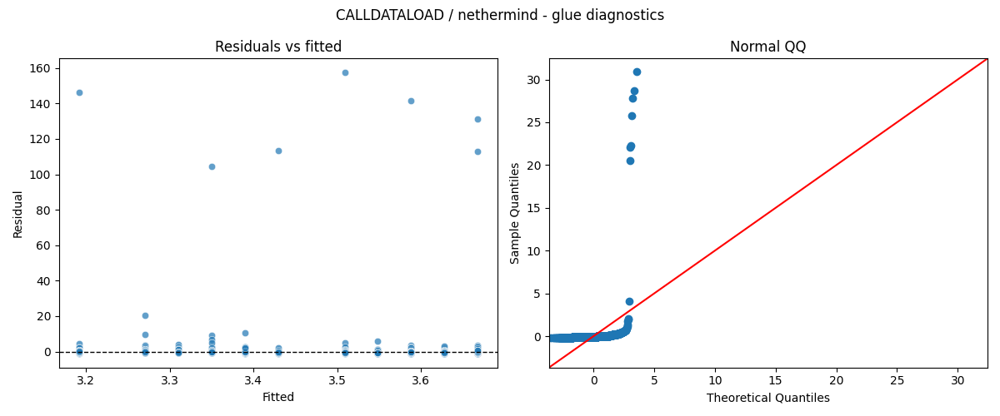

</details>

<details><summary><code>DIV</code> · nobs=1177 · runtime_ms=7.038e-06 · p=1.00e-03 · R²=0.6338</summary>

```
==============================================================================
                           NNLS Regression Results                            
==============================================================================
Dep. Variable:          test_runtime_ms              R-squared:          0.634
Model:                  NNLS                    Adj. R-squared:          0.634
No. Observations:       1177                              RMSE:          42.23
Df Residuals:           1175                               MAE:          32.96
Df Model:               1      
==============================================================================
                      coef     std err     P-value      [0.025      0.975]
------------------------------------------------------------------------------
         const    126.9470      5.8363       0.001    115.4480    138.2356
           DIV      0.0000      0.0000       0.001      0.0000      0.0000
==============================================================================
Notes: Non-negative least squares with bootstrap inference (1000 iterations)
==============================================================================
```

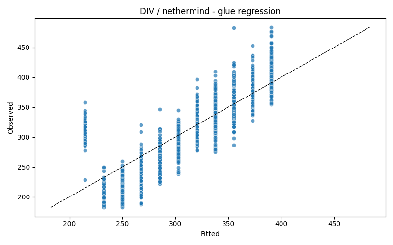

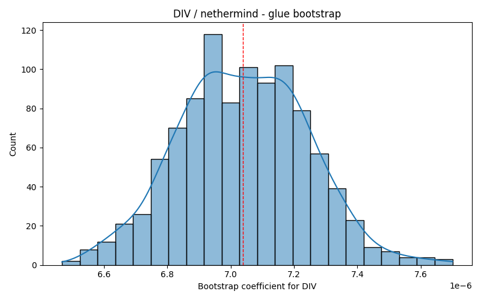

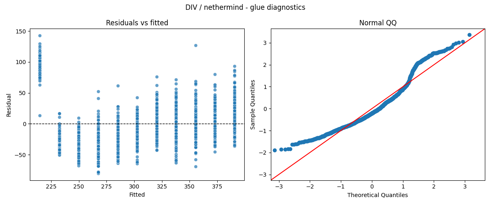

</details>

<details><summary><code>EXP</code> · nobs=1177 · runtime_ms=0 · p=1.00e+00 · R²=0</summary>

```
==============================================================================
                           NNLS Regression Results                            
==============================================================================
Dep. Variable:          test_runtime_ms              R-squared:          0.000
Model:                  NNLS                    Adj. R-squared:         -0.001
No. Observations:       1177                              RMSE:          47.23
Df Residuals:           1175                               MAE:          31.03
Df Model:               1      
==============================================================================
                      coef     std err     P-value      [0.025      0.975]
------------------------------------------------------------------------------
         const    103.5749      1.3894       0.001    101.1497    106.2263
           EXP      0.0000      0.0000       1.000      0.0000      0.0000
==============================================================================
Notes: Non-negative least squares with bootstrap inference (1000 iterations)
==============================================================================
```

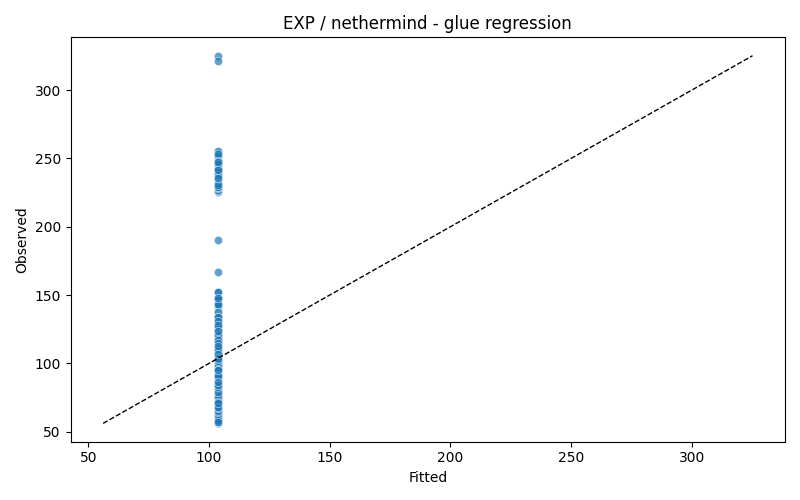

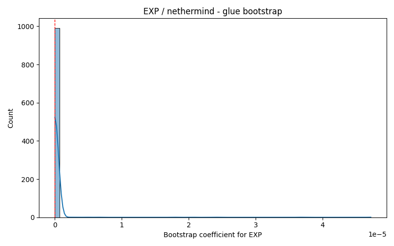

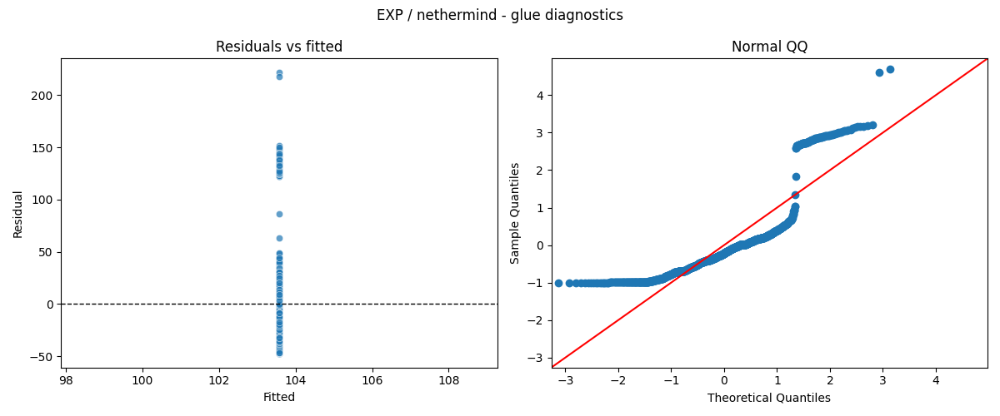

</details>

<details><summary><code>GT</code> · nobs=1177 · runtime_ms=1.601e-06 · p=1.00e-03 · R²=0.81</summary>

```
==============================================================================
                           NNLS Regression Results                            
==============================================================================
Dep. Variable:          test_runtime_ms              R-squared:          0.810
Model:                  NNLS                    Adj. R-squared:          0.810
No. Observations:       1177                              RMSE:           8.16
Df Residuals:           1175                               MAE:           5.40
Df Model:               1      
==============================================================================
                      coef     std err     P-value      [0.025      0.975]
------------------------------------------------------------------------------
         const     14.1482      0.9153       0.001     12.5395     16.2000
            GT      0.0000      0.0000       0.001      0.0000      0.0000
==============================================================================
Notes: Non-negative least squares with bootstrap inference (1000 iterations)
==============================================================================
```

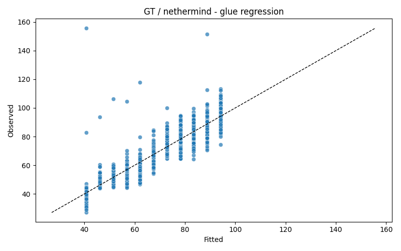

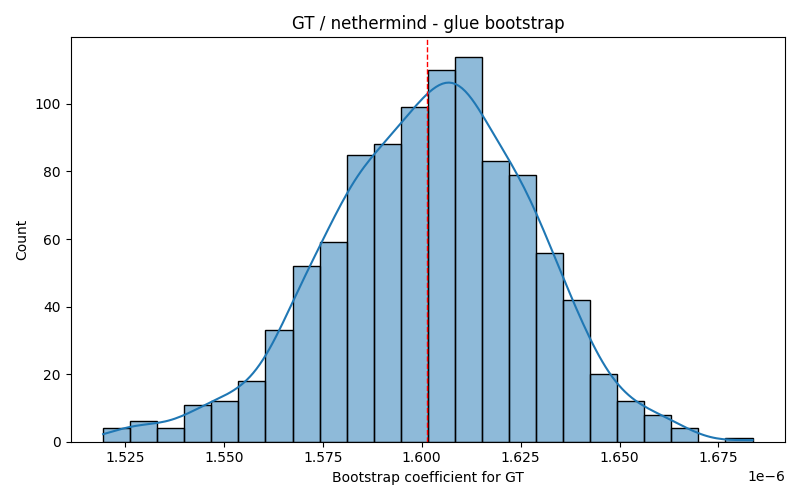

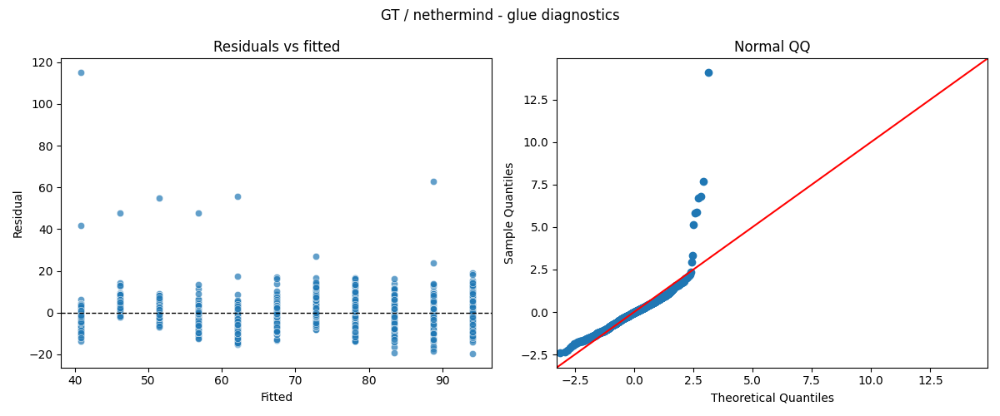

</details>

<details><summary><code>JUMPI</code> · nobs=1177 · runtime_ms=1.853e-06 · p=1.00e-03 · R²=0.7116</summary>

```
==============================================================================
                           NNLS Regression Results                            
==============================================================================
Dep. Variable:          test_runtime_ms              R-squared:          0.712
Model:                  NNLS                    Adj. R-squared:          0.711
No. Observations:       1177                              RMSE:           5.32
Df Residuals:           1175                               MAE:           3.22
Df Model:               1      
==============================================================================
                      coef     std err     P-value      [0.025      0.975]
------------------------------------------------------------------------------
         const      8.9807      0.3653       0.001      8.2996      9.6887
         JUMPI      0.0000      0.0000       0.001      0.0000      0.0000
==============================================================================
Notes: Non-negative least squares with bootstrap inference (1000 iterations)
==============================================================================
```

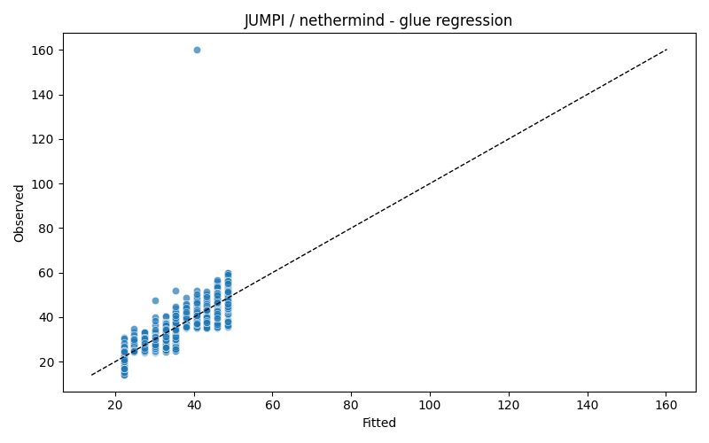

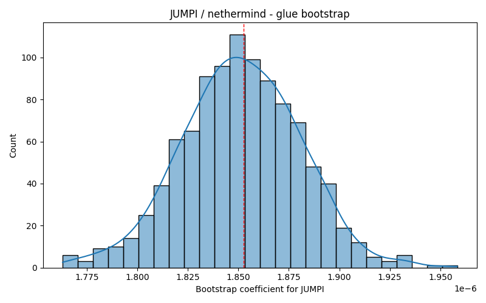

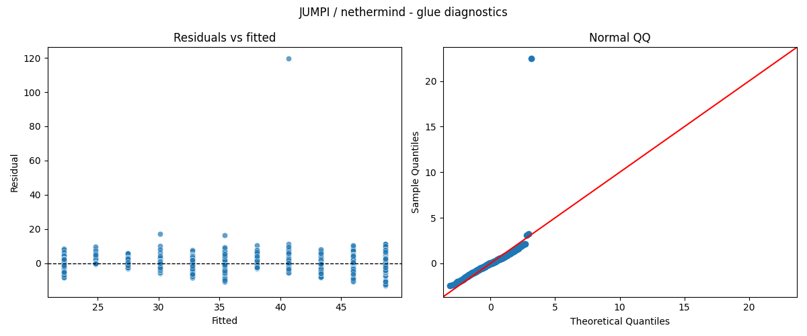

</details>

<details><summary><code>LT</code> · nobs=1177 · runtime_ms=1.547e-06 · p=1.00e-03 · R²=0.6572</summary>

```
==============================================================================
                           NNLS Regression Results                            
==============================================================================
Dep. Variable:          test_runtime_ms              R-squared:          0.657
Model:                  NNLS                    Adj. R-squared:          0.657
No. Observations:       1177                              RMSE:          11.76
Df Residuals:           1175                               MAE:           7.82
Df Model:               1      
==============================================================================
                      coef     std err     P-value      [0.025      0.975]
------------------------------------------------------------------------------
         const     19.5993      1.0329       0.001     17.6699     21.5958
            LT      0.0000      0.0000       0.001      0.0000      0.0000
==============================================================================
Notes: Non-negative least squares with bootstrap inference (1000 iterations)
==============================================================================
```

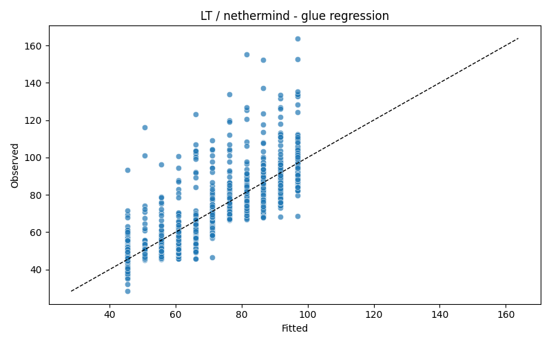


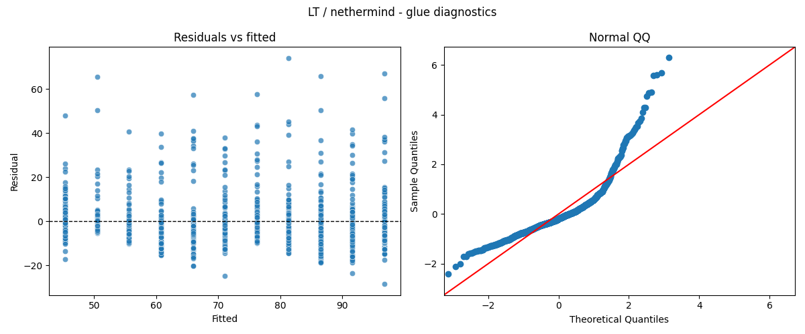

</details>

<details><summary><code>MSTORE</code> · nobs=5885 · runtime_ms=2.095e-06 · p=1.00e-03 · R²=0.7816</summary>

```
==============================================================================
                           NNLS Regression Results                            
==============================================================================
Dep. Variable:          test_runtime_ms              R-squared:          0.782
Model:                  NNLS                    Adj. R-squared:          0.782
No. Observations:       5885                              RMSE:           7.77
Df Residuals:           5883                               MAE:           4.64
Df Model:               1      
==============================================================================
                      coef     std err     P-value      [0.025      0.975]
------------------------------------------------------------------------------
         const     15.0986      0.3327       0.001     14.4540     15.7485
        MSTORE      0.0000      0.0000       0.001      0.0000      0.0000
==============================================================================
Notes: Non-negative least squares with bootstrap inference (1000 iterations)
==============================================================================
```

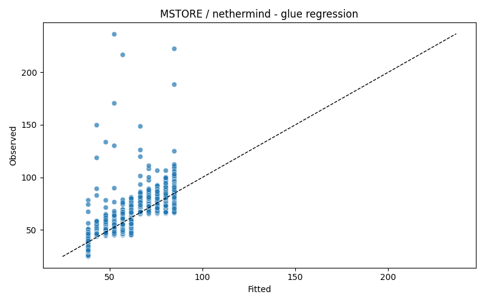

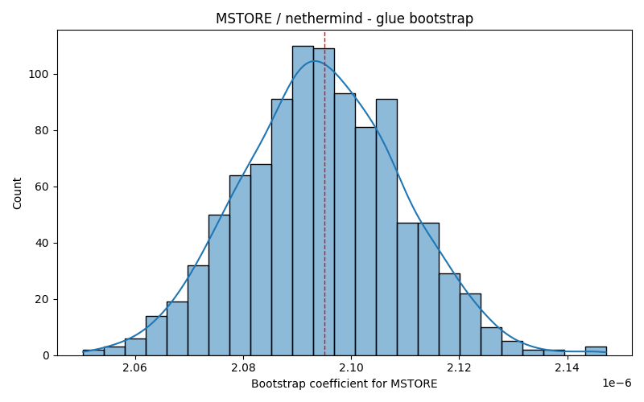

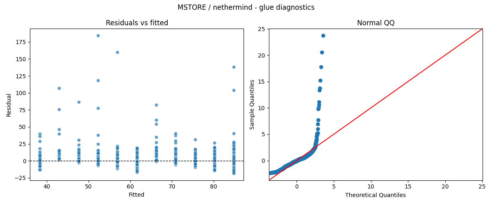

</details>

<details><summary><code>MSTORE8</code> · nobs=5885 · runtime_ms=2.06e-06 · p=1.00e-03 · R²=0.8107</summary>

```
==============================================================================
                           NNLS Regression Results                            
==============================================================================
Dep. Variable:          test_runtime_ms              R-squared:          0.811
Model:                  NNLS                    Adj. R-squared:          0.811
No. Observations:       5885                              RMSE:           6.99
Df Residuals:           5883                               MAE:           4.59
Df Model:               1      
==============================================================================
                      coef     std err     P-value      [0.025      0.975]
------------------------------------------------------------------------------
         const     14.9642      0.2997       0.001     14.3849     15.5842
       MSTORE8      0.0000      0.0000       0.001      0.0000      0.0000
==============================================================================
Notes: Non-negative least squares with bootstrap inference (1000 iterations)
==============================================================================
```

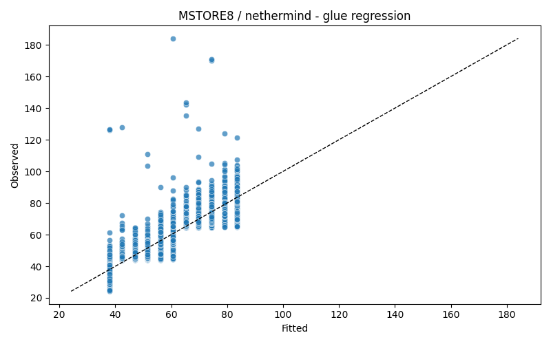

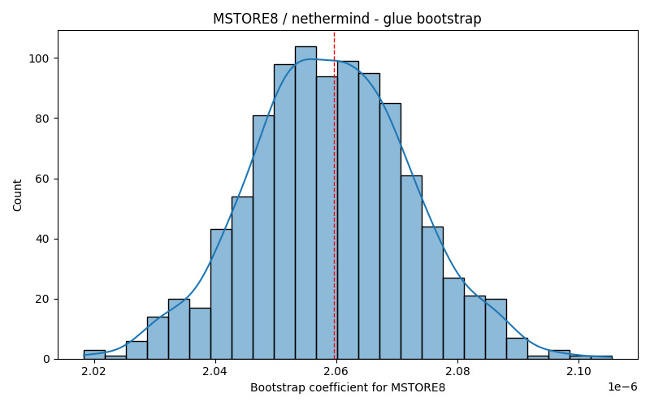

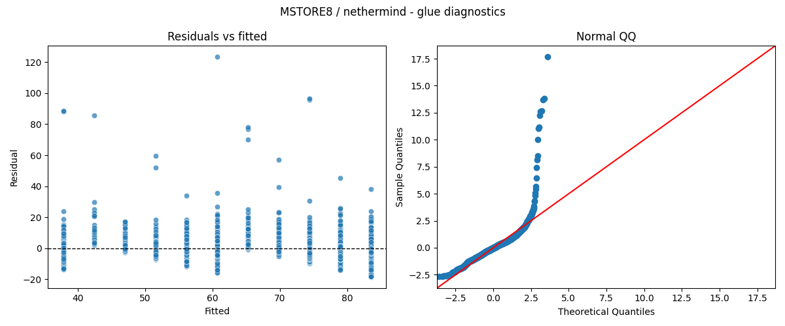

</details>

<details><summary><code>MUL</code> · nobs=1177 · runtime_ms=5.413e-06 · p=1.00e-03 · R²=0.8812</summary>

```
==============================================================================
                           NNLS Regression Results                            
==============================================================================
Dep. Variable:          test_runtime_ms              R-squared:          0.881
Model:                  NNLS                    Adj. R-squared:          0.881
No. Observations:       1177                              RMSE:          15.69
Df Residuals:           1175                               MAE:          10.88
Df Model:               1      
==============================================================================
                      coef     std err     P-value      [0.025      0.975]
------------------------------------------------------------------------------
         const     24.8459      1.3258       0.001     22.4208     27.4413
           MUL      0.0000      0.0000       0.001      0.0000      0.0000
==============================================================================
Notes: Non-negative least squares with bootstrap inference (1000 iterations)
==============================================================================
```

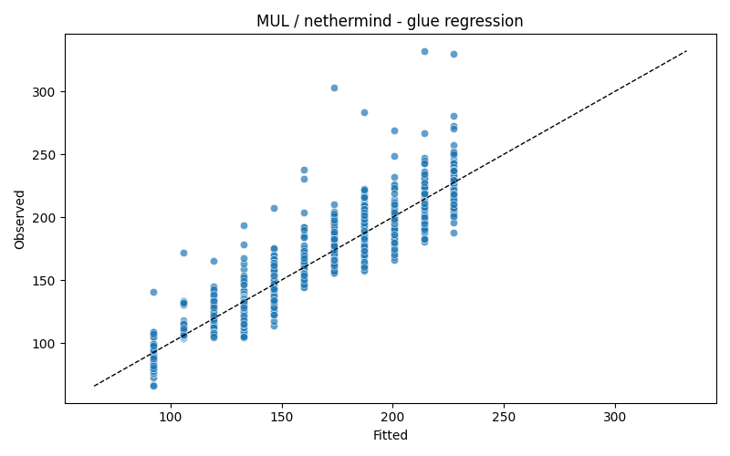

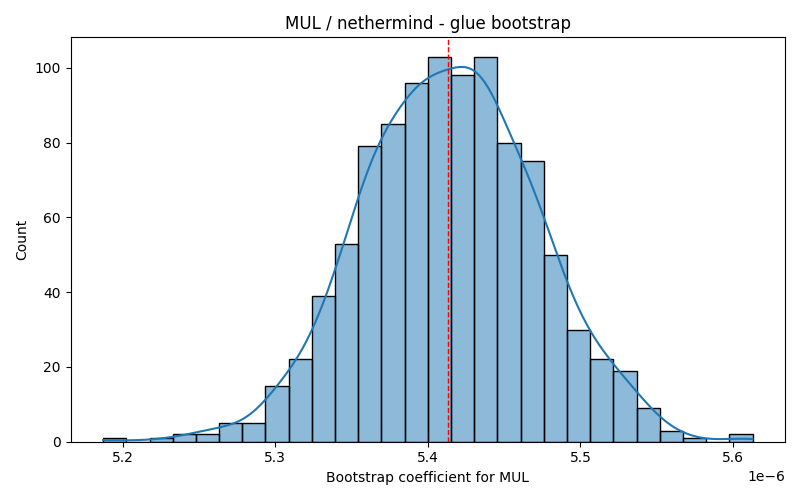

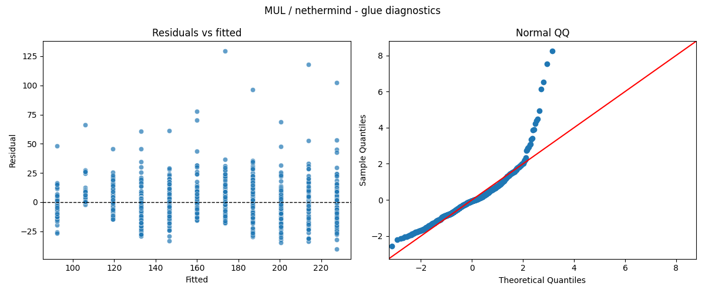

</details>

<details><summary><code>PC</code> · nobs=1177 · runtime_ms=8.361e-07 · p=1.00e-03 · R²=0.8435</summary>

```
==============================================================================
                           NNLS Regression Results                            
==============================================================================
Dep. Variable:          test_runtime_ms              R-squared:          0.844
Model:                  NNLS                    Adj. R-squared:          0.843
No. Observations:       1177                              RMSE:          10.77
Df Residuals:           1175                               MAE:           8.26
Df Model:               1      
==============================================================================
                      coef     std err     P-value      [0.025      0.975]
------------------------------------------------------------------------------
         const     18.8849      0.9696       0.001     16.9803     20.7688
            PC      0.0000      0.0000       0.001      0.0000      0.0000
==============================================================================
Notes: Non-negative least squares with bootstrap inference (1000 iterations)
==============================================================================
```

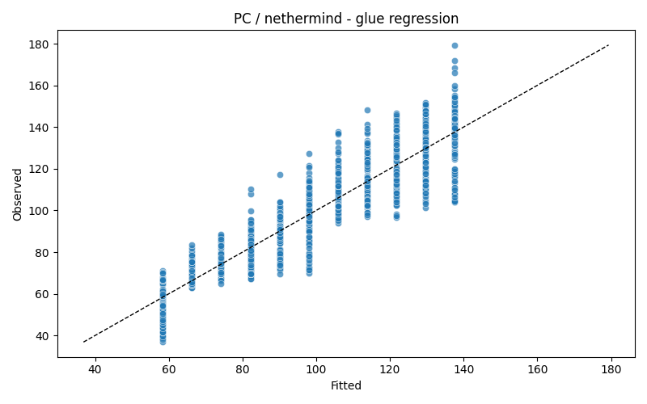

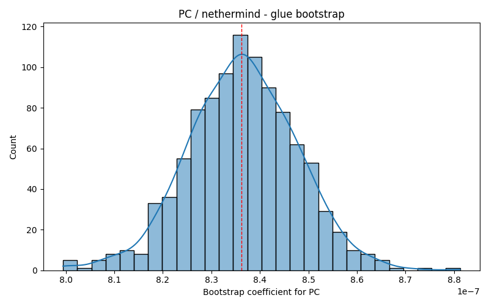

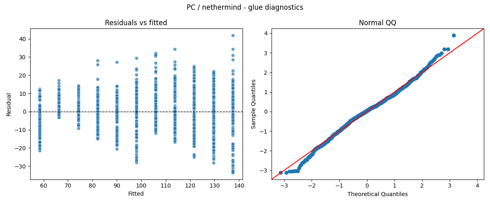

</details>

<details><summary><code>RETURNDATASIZE</code> · nobs=4708 · runtime_ms=8.235e-07 · p=1.00e-03 · R²=0.7794</summary>

```
==============================================================================
                           NNLS Regression Results                            
==============================================================================
Dep. Variable:          test_runtime_ms              R-squared:          0.779
Model:                  NNLS                    Adj. R-squared:          0.779
No. Observations:       4708                              RMSE:           6.92
Df Residuals:           4706                               MAE:           4.02
Df Model:               1      
==============================================================================
                      coef     std err     P-value      [0.025      0.975]
------------------------------------------------------------------------------
         const     11.5928      0.2631       0.001     11.0397     12.0546
RETURNDATASIZE      0.0000      0.0000       0.001      0.0000      0.0000
==============================================================================
Notes: Non-negative least squares with bootstrap inference (1000 iterations)
==============================================================================
```

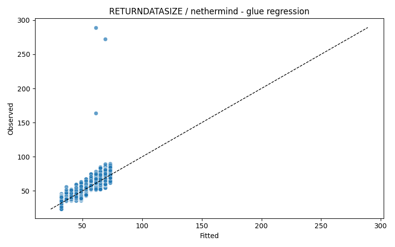

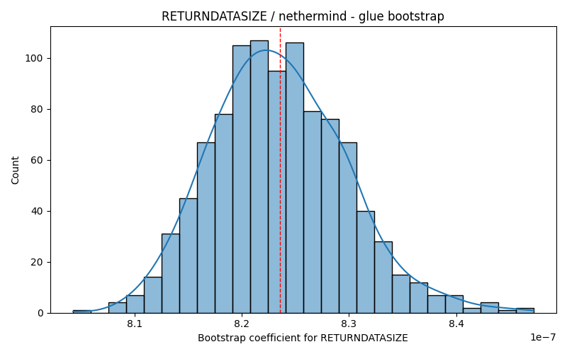

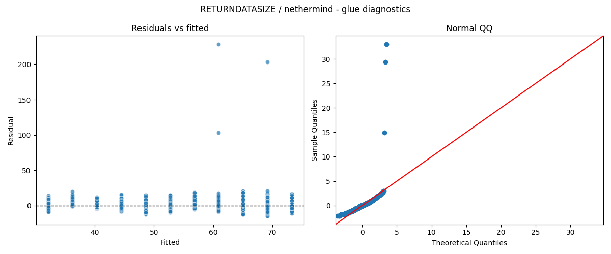

</details>

<details><summary><code>SELFBALANCE</code> · nobs=963 · runtime_ms=4.16e-06 · p=1.00e-03 · R²=0.603</summary>

```
==============================================================================
                           NNLS Regression Results                            
==============================================================================
Dep. Variable:          test_runtime_ms              R-squared:          0.603
Model:                  NNLS                    Adj. R-squared:          0.603
No. Observations:       963                               RMSE:          34.05
Df Residuals:           961                                MAE:          27.30
Df Model:               1      
==============================================================================
                      coef     std err     P-value      [0.025      0.975]
------------------------------------------------------------------------------
         const    118.4273      6.3024       0.001    106.0663    130.6775
   SELFBALANCE      0.0000      0.0000       0.001      0.0000      0.0000
==============================================================================
Notes: Non-negative least squares with bootstrap inference (1000 iterations)
==============================================================================
```

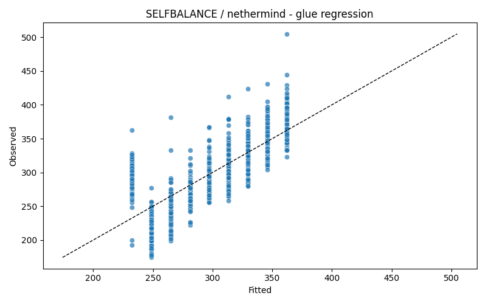

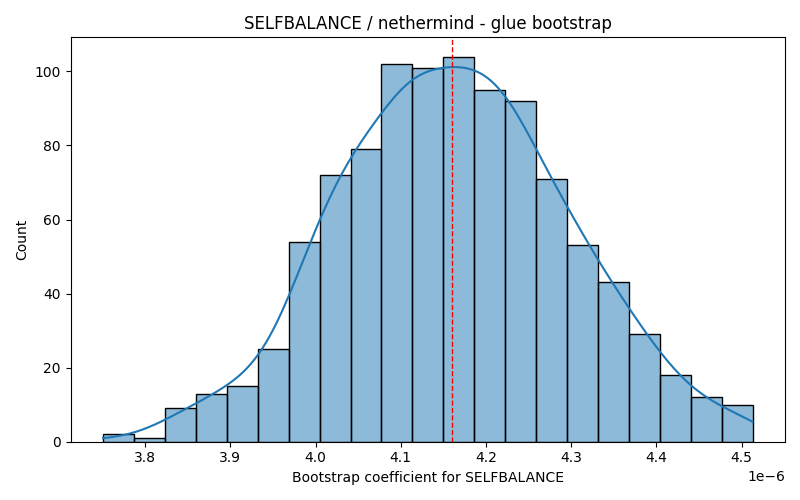

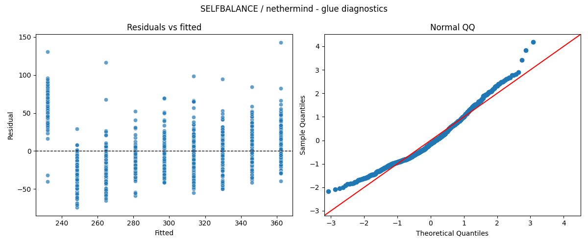

</details>

<details><summary><code>SUB</code> · nobs=1177 · runtime_ms=2.51e-06 · p=1.00e-03 · R²=0.8843</summary>

```
==============================================================================
                           NNLS Regression Results                            
==============================================================================
Dep. Variable:          test_runtime_ms              R-squared:          0.884
Model:                  NNLS                    Adj. R-squared:          0.884
No. Observations:       1177                              RMSE:           9.56
Df Residuals:           1175                               MAE:           7.48
Df Model:               1      
==============================================================================
                      coef     std err     P-value      [0.025      0.975]
------------------------------------------------------------------------------
         const     17.8893      0.8256       0.001     16.3421     19.5826
           SUB      0.0000      0.0000       0.001      0.0000      0.0000
==============================================================================
Notes: Non-negative least squares with bootstrap inference (1000 iterations)
==============================================================================
```

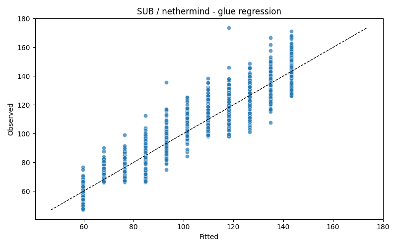

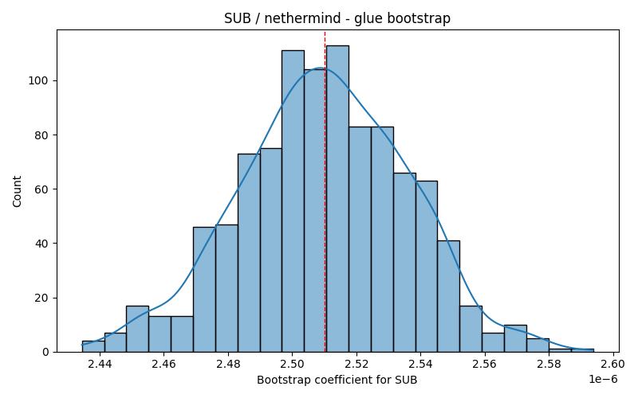

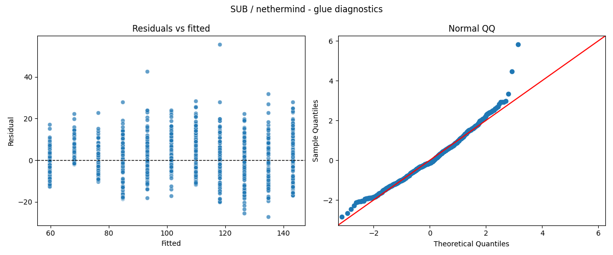

</details>

### Mixed glue (tier B) · nethermind

<details><summary><code>JUMP</code> · nobs=1177 · runtime_ms=5.85e-06 · p=1.00e-03 · R²=0.8613</summary>

```
==============================================================================
                           NNLS Regression Results                            
==============================================================================
Dep. Variable:          test_runtime_ms              R-squared:          0.861
Model:                  NNLS                    Adj. R-squared:          0.861
No. Observations:       1177                              RMSE:           8.72
Df Residuals:           1175                               MAE:           6.67
Df Model:               1      
==============================================================================
                      coef     std err     P-value      [0.025      0.975]
------------------------------------------------------------------------------
         const     17.5934      0.7731       0.001     16.0490     19.1033
          JUMP      0.0000      0.0000       0.001      0.0000      0.0000
==============================================================================
Notes: Non-negative least squares with bootstrap inference (1000 iterations)
==============================================================================
```

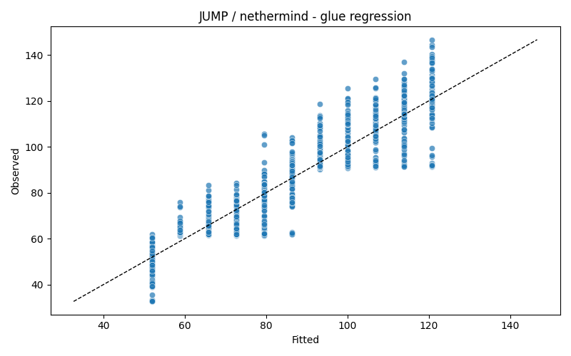

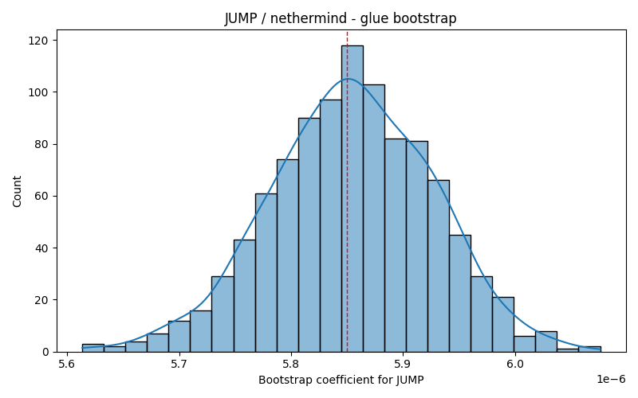

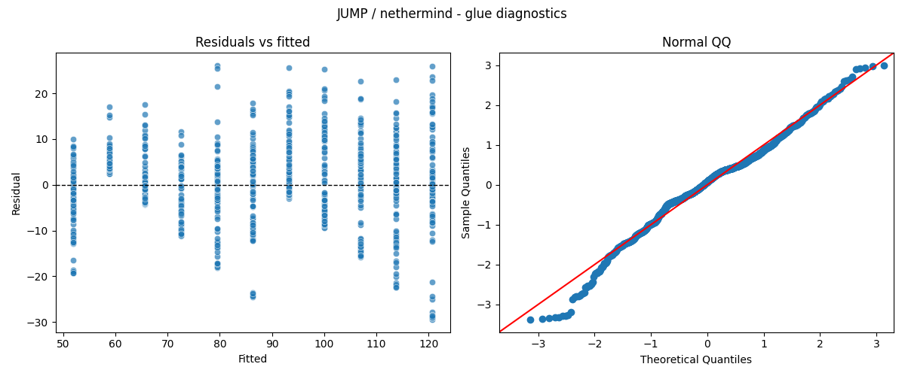

</details>

<details><summary><code>KECCAK256</code> · nobs=18832 · runtime_ms=0 · p=1.00e+00 · R²=1.11e-16</summary>

```
==============================================================================
                           NNLS Regression Results                            
==============================================================================
Dep. Variable:          test_runtime_ms              R-squared:          0.000
Model:                  NNLS                    Adj. R-squared:         -0.000
No. Observations:       18832                             RMSE:         292.93
Df Residuals:           18830                              MAE:         240.33
Df Model:               1      
==============================================================================
                      coef     std err     P-value      [0.025      0.975]
------------------------------------------------------------------------------
         const    449.6981      2.0631       0.001    445.8501    453.8372
     KECCAK256      0.0000      0.0000       1.000      0.0000      0.0000
==============================================================================
Notes: Non-negative least squares with bootstrap inference (1000 iterations)
==============================================================================
```

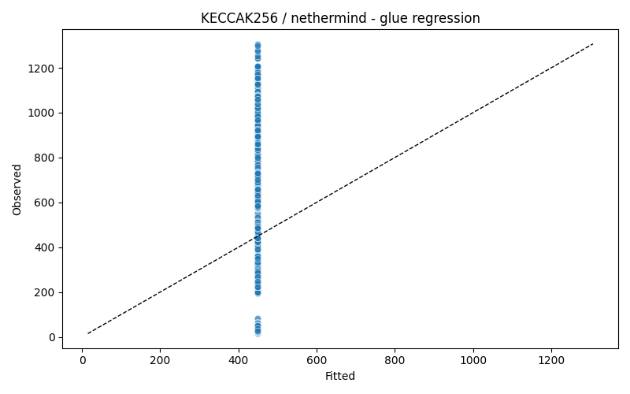


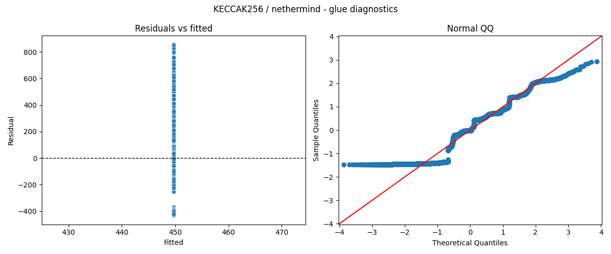

</details>

## reth

| glue_opcode | nobs | glue_runtime_ms | p_value | rsquared |
| --- | --- | --- | --- | --- |
| `ISZERO` | 374 | 3.757e-07 | 1.00e-03 | 0.715 |
| `JUMPDEST` | 374 | 2.826e-07 | 1.00e-03 | 0.6892 |
| `SWAP` | 5984 | 4.665e-07 | 1.00e-03 | 0.7284 |
| `CALLDATASIZE` | 22264 | 4.52e-07 | 1.00e-03 | 0.8093 |
| `DUP` | 22264 | 3.876e-07 | 1.00e-03 | 0.8093 |
| `GAS` | 22264 | 3.574e-07 | 1.00e-03 | 0.8093 |
| `MLOAD` | 22264 | 1.375e-06 | 1.00e-03 | 0.8093 |
| `PUSH` | 22264 | 4.217e-07 | 1.00e-03 | 0.8093 |
| `PUSH0` | 22264 | 3.329e-07 | 1.00e-03 | 0.8093 |
| `STATICCALL` | 22264 | 5.809e-05 | 1.00e-03 | 0.8093 |
| `ADD` | 374 | 8.524e-07 | 1.00e-03 | 0.8124 |
| `AND` | 374 | 8.044e-07 | 1.00e-03 | 0.7815 |
| `CALLDATACOPY` | 8976 | 2.271e-06 | 1.00e-03 | 0.7927 |
| `CALLDATALOAD` | 1496 | 1.457e-05 | 1.00e-03 | 0.01961 |
| `DIV` | 374 | 6.929e-06 | 1.00e-03 | 0.8386 |
| `EXP` | 374 | 0.0003808 | 1.00e-03 | 0.8455 |
| `GT` | 374 | 9.515e-07 | 1.00e-03 | 0.8078 |
| `JUMPI` | 374 | 1.249e-06 | 1.00e-03 | 0.7222 |
| `LT` | 374 | 9.159e-07 | 1.00e-03 | 0.8061 |
| `MSTORE` | 1870 | 2.761e-06 | 1.00e-03 | 0.2964 |
| `MSTORE8` | 1870 | 1.354e-06 | 1.00e-03 | 0.6361 |
| `MUL` | 374 | 1.189e-06 | 1.00e-03 | 0.8067 |
| `PC` | 374 | 5.819e-07 | 1.00e-03 | 0.922 |
| `RETURNDATASIZE` | 1496 | 7.895e-07 | 1.00e-03 | 0.7538 |
| `SELFBALANCE` | 306 | 3.837e-06 | 1.00e-03 | 0.816 |
| `SUB` | 374 | 8.337e-07 | 1.00e-03 | 0.5168 |
| `JUMP` | 374 | 2.305e-06 | 1.00e-03 | 0.8199 |
| `KECCAK256` | 5984 | 0 | 1.00e+00 | 0 |

### Cycle glue — joint fit · reth

<details><summary>Joint NNLS regression summary</summary>

```
==============================================================================
                           NNLS Regression Results                            
==============================================================================
Dep. Variable:          test_runtime_ms              R-squared:          0.809
Model:                  NNLS                    Adj. R-squared:          0.809
No. Observations:       22264                             RMSE:           6.78
Df Residuals:           22256                              MAE:           4.73
Df Model:               7      
==============================================================================
                      coef     std err     P-value      [0.025      0.975]
------------------------------------------------------------------------------
         const     12.4558      0.1434       0.001     12.1738     12.7401
  CALLDATASIZE      0.0000      0.0000       0.001      0.0000      0.0000
           DUP      0.0000      0.0000       0.001      0.0000      0.0000
           GAS      0.0000      0.0000       0.001      0.0000      0.0000
         MLOAD      0.0000      0.0000       0.001      0.0000      0.0000
          PUSH      0.0000      0.0000       0.001      0.0000      0.0000
         PUSH0      0.0000      0.0000       0.001      0.0000      0.0000
    STATICCALL      0.0001      0.0000       0.001      0.0001      0.0001
==============================================================================
Notes: Non-negative least squares with bootstrap inference (1000 iterations)
==============================================================================
```

</details>

<details><summary><code>CALLDATASIZE</code> · nobs=22264 · runtime_ms=4.52e-07 · p=1.00e-03 · R²=0.8093</summary>

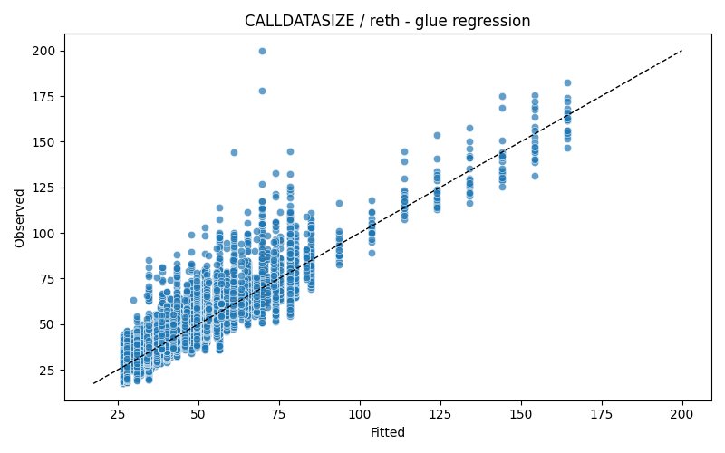

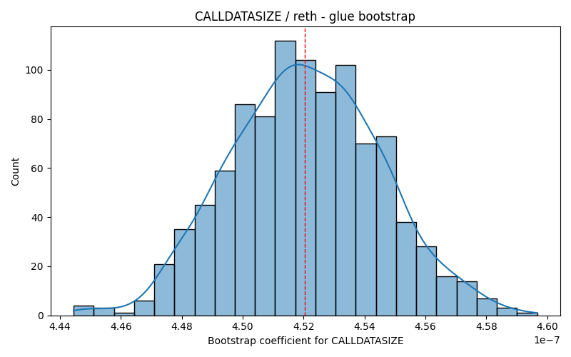


</details>

<details><summary><code>DUP</code> · nobs=22264 · runtime_ms=3.876e-07 · p=1.00e-03 · R²=0.8093</summary>


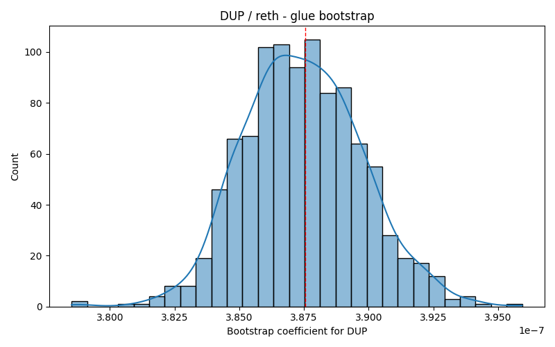


</details>

<details><summary><code>GAS</code> · nobs=22264 · runtime_ms=3.574e-07 · p=1.00e-03 · R²=0.8093</summary>


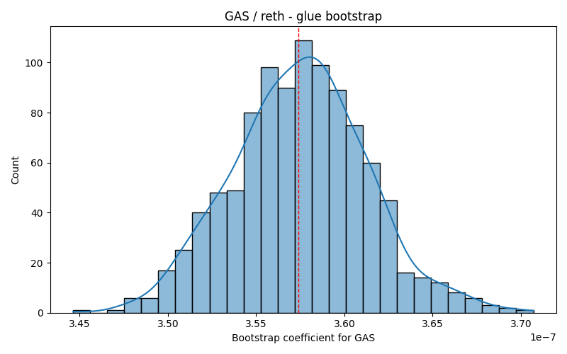


</details>

<details><summary><code>MLOAD</code> · nobs=22264 · runtime_ms=1.375e-06 · p=1.00e-03 · R²=0.8093</summary>


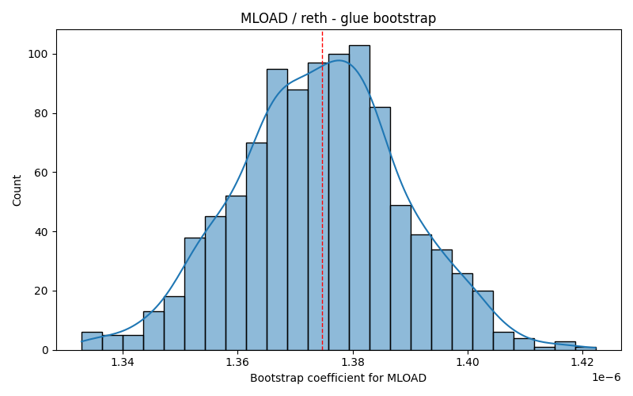

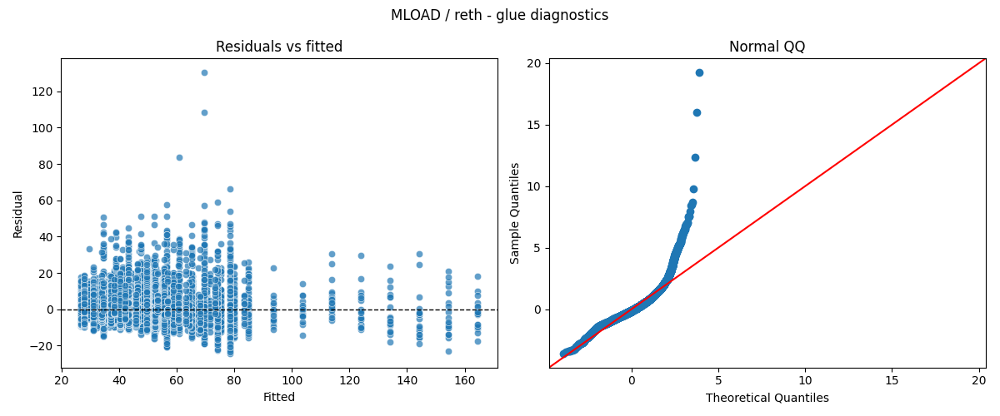

</details>

<details><summary><code>PUSH</code> · nobs=22264 · runtime_ms=4.217e-07 · p=1.00e-03 · R²=0.8093</summary>


</details>

<details><summary><code>PUSH0</code> · nobs=22264 · runtime_ms=3.329e-07 · p=1.00e-03 · R²=0.8093</summary>

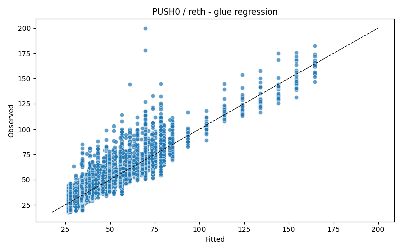

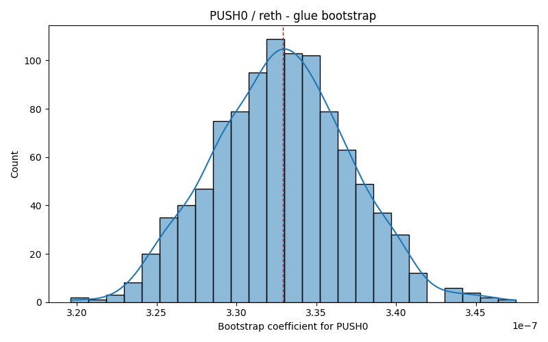

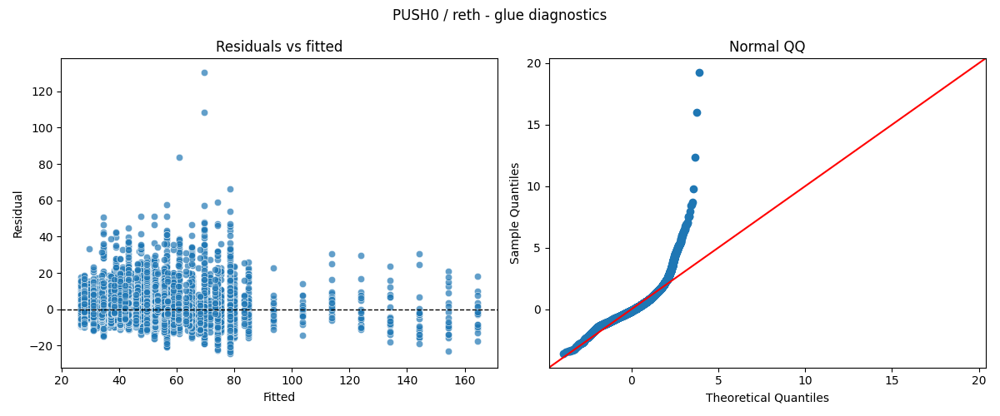

</details>

<details><summary><code>STATICCALL</code> · nobs=22264 · runtime_ms=5.809e-05 · p=1.00e-03 · R²=0.8093</summary>

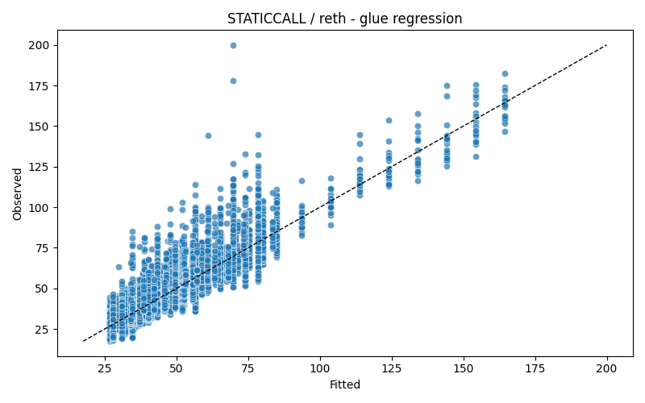

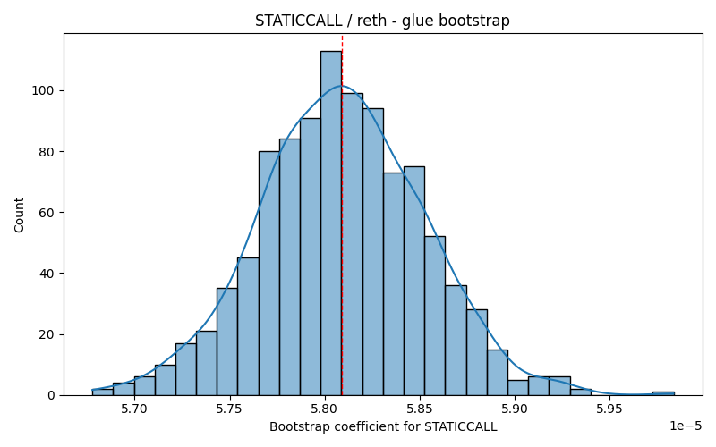


</details>

### Pure glue · reth

<details><summary><code>ISZERO</code> · nobs=374 · runtime_ms=3.757e-07 · p=1.00e-03 · R²=0.715</summary>

```
==============================================================================
                           NNLS Regression Results                            
==============================================================================
Dep. Variable:          test_runtime_ms              R-squared:          0.715
Model:                  NNLS                    Adj. R-squared:          0.714
No. Observations:       374                               RMSE:           4.99
Df Residuals:           372                                MAE:           3.73
Df Model:               1      
==============================================================================
                      coef     std err     P-value      [0.025      0.975]
------------------------------------------------------------------------------
         const     10.7783      0.8193       0.001      9.1953     12.3792
        ISZERO      0.0000      0.0000       0.001      0.0000      0.0000
==============================================================================
Notes: Non-negative least squares with bootstrap inference (1000 iterations)
==============================================================================
```

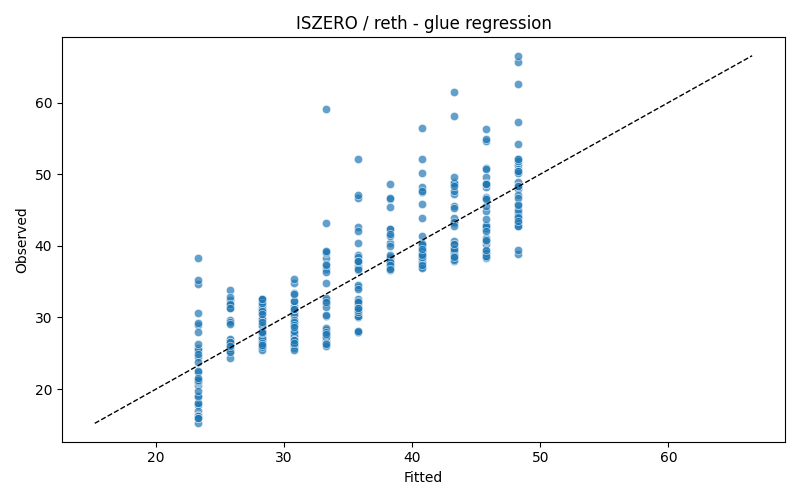

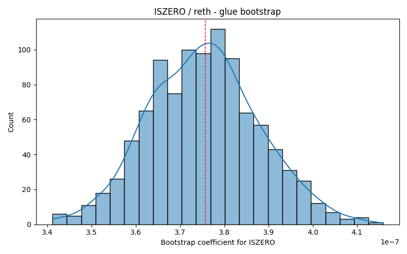

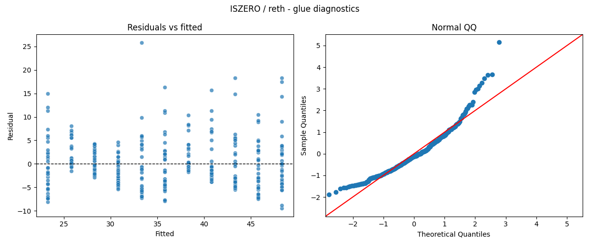

</details>

<details><summary><code>JUMPDEST</code> · nobs=374 · runtime_ms=2.826e-07 · p=1.00e-03 · R²=0.6892</summary>

```
==============================================================================
                           NNLS Regression Results                            
==============================================================================
Dep. Variable:          test_runtime_ms              R-squared:          0.689
Model:                  NNLS                    Adj. R-squared:          0.688
No. Observations:       374                               RMSE:          11.99
Df Residuals:           372                                MAE:           8.09
Df Model:               1      
==============================================================================
                      coef     std err     P-value      [0.025      0.975]
------------------------------------------------------------------------------
         const     15.8508      1.8946       0.001     12.1622     19.5210
      JUMPDEST      0.0000      0.0000       0.001      0.0000      0.0000
==============================================================================
Notes: Non-negative least squares with bootstrap inference (1000 iterations)
==============================================================================
```

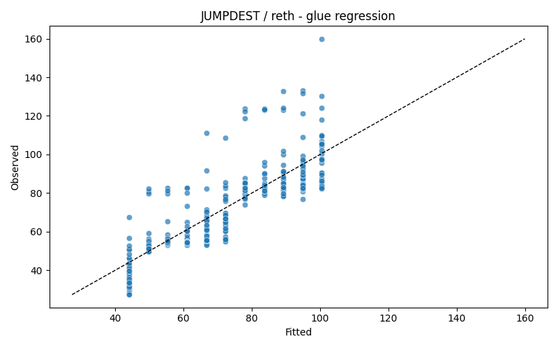

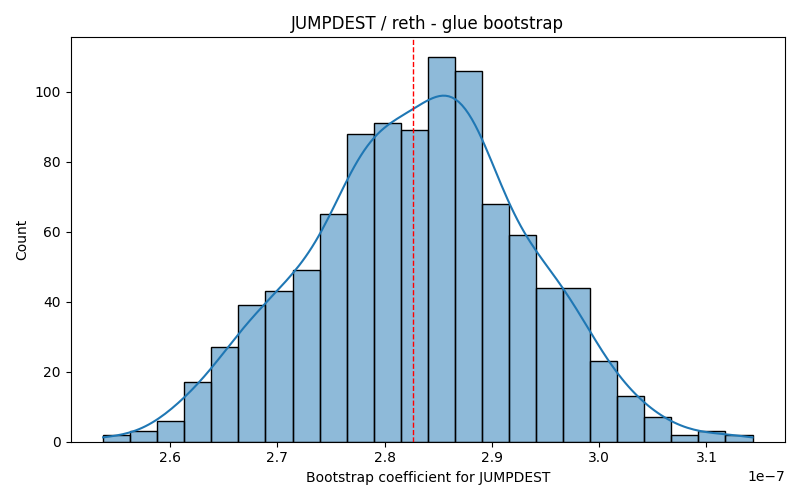

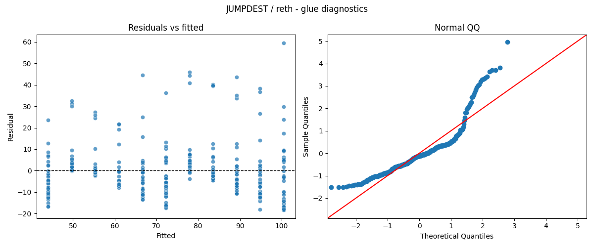

</details>

<details><summary><code>SWAP</code> · nobs=5984 · runtime_ms=4.665e-07 · p=1.00e-03 · R²=0.7284</summary>

```
==============================================================================
                           NNLS Regression Results                            
==============================================================================
Dep. Variable:          test_runtime_ms              R-squared:          0.728
Model:                  NNLS                    Adj. R-squared:          0.728
No. Observations:       5984                              RMSE:           6.00
Df Residuals:           5982                               MAE:           3.95
Df Model:               1      
==============================================================================
                      coef     std err     P-value      [0.025      0.975]
------------------------------------------------------------------------------
         const     13.1285      0.3054       0.001     12.5856     13.7482
          SWAP      0.0000      0.0000       0.001      0.0000      0.0000
==============================================================================
Notes: Non-negative least squares with bootstrap inference (1000 iterations)
==============================================================================
```

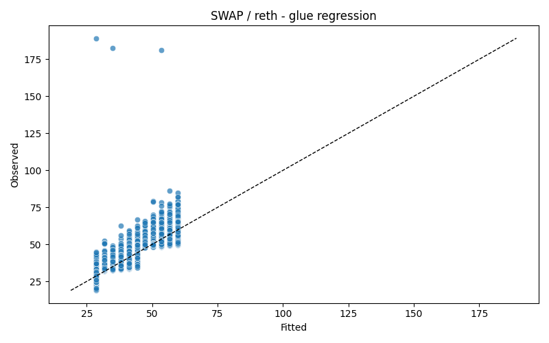

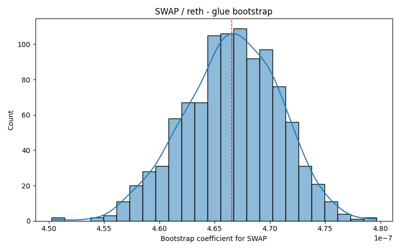

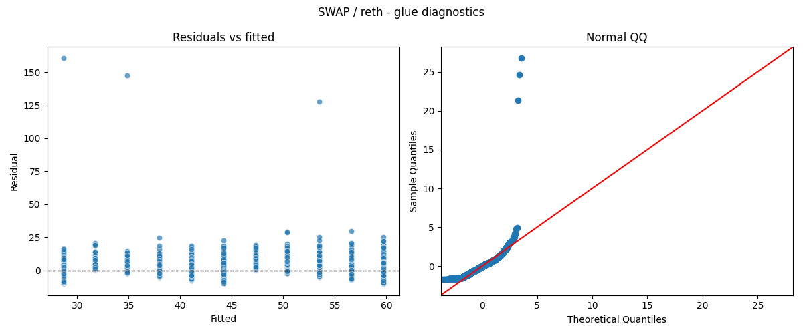

</details>

### Mixed glue (tier A) · reth

<details><summary><code>ADD</code> · nobs=374 · runtime_ms=8.524e-07 · p=1.00e-03 · R²=0.8124</summary>

```
==============================================================================
                           NNLS Regression Results                            
==============================================================================
Dep. Variable:          test_runtime_ms              R-squared:          0.812
Model:                  NNLS                    Adj. R-squared:          0.812
No. Observations:       374                               RMSE:           4.31
Df Residuals:           372                                MAE:           3.28
Df Model:               1      
==============================================================================
                      coef     std err     P-value      [0.025      0.975]
------------------------------------------------------------------------------
         const     10.5795      0.6708       0.001      9.2807     11.9648
           ADD      0.0000      0.0000       0.001      0.0000      0.0000
==============================================================================
Notes: Non-negative least squares with bootstrap inference (1000 iterations)
==============================================================================
```

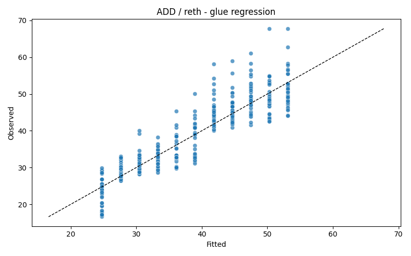

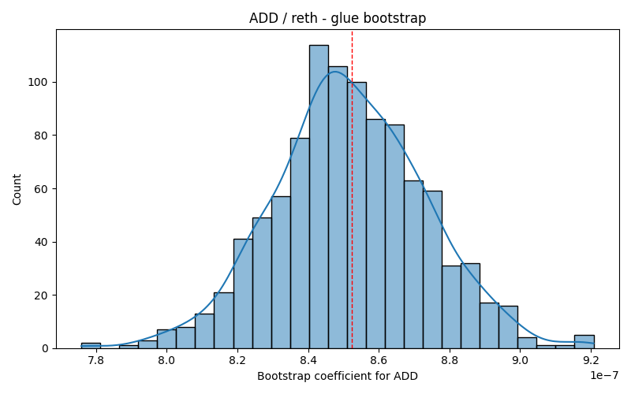

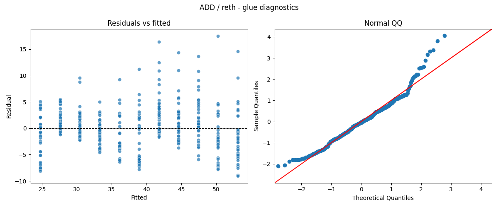

</details>

<details><summary><code>AND</code> · nobs=374 · runtime_ms=8.044e-07 · p=1.00e-03 · R²=0.7815</summary>

```
==============================================================================
                           NNLS Regression Results                            
==============================================================================
Dep. Variable:          test_runtime_ms              R-squared:          0.781
Model:                  NNLS                    Adj. R-squared:          0.781
No. Observations:       374                               RMSE:           4.48
Df Residuals:           372                                MAE:           3.39
Df Model:               1      
==============================================================================
                      coef     std err     P-value      [0.025      0.975]
------------------------------------------------------------------------------
         const     10.6477      0.7105       0.001      9.1916     12.0059
           AND      0.0000      0.0000       0.001      0.0000      0.0000
==============================================================================
Notes: Non-negative least squares with bootstrap inference (1000 iterations)
==============================================================================
```

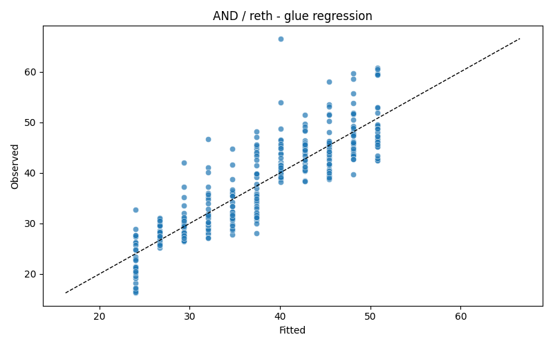

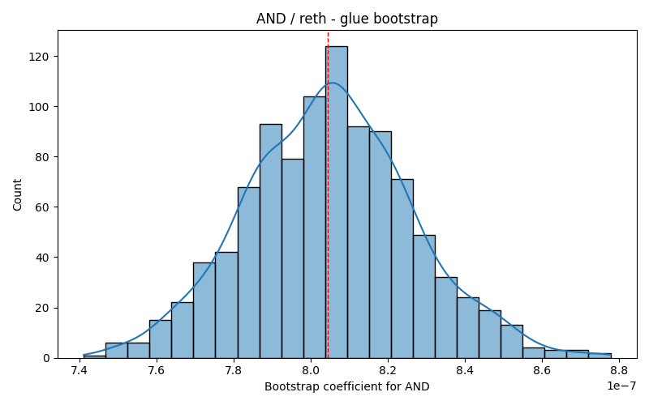

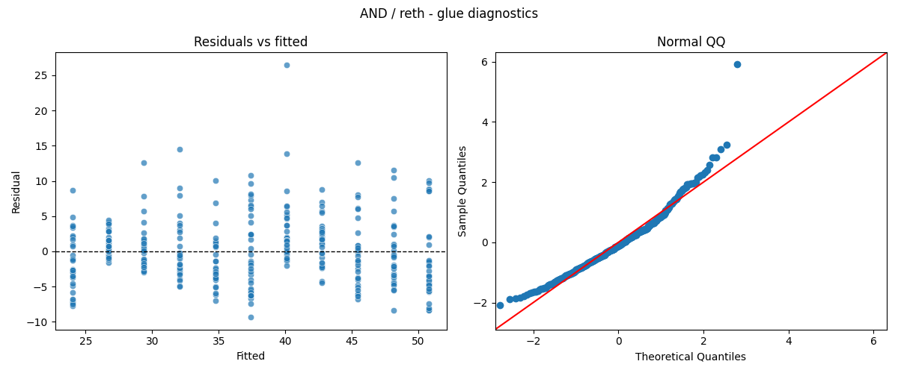

</details>

<details><summary><code>CALLDATACOPY</code> · nobs=8976 · runtime_ms=2.271e-06 · p=1.00e-03 · R²=0.7927</summary>

```
==============================================================================
                           NNLS Regression Results                            
==============================================================================
Dep. Variable:          test_runtime_ms              R-squared:          0.793
Model:                  NNLS                    Adj. R-squared:          0.793
No. Observations:       8976                              RMSE:           8.73
Df Residuals:           8974                               MAE:           6.57
Df Model:               1      
==============================================================================
                      coef     std err     P-value      [0.025      0.975]
------------------------------------------------------------------------------
         const     13.8802      0.1138       0.001     13.6636     14.1170
  CALLDATACOPY      0.0000      0.0000       0.001      0.0000      0.0000
==============================================================================
Notes: Non-negative least squares with bootstrap inference (1000 iterations)
==============================================================================
```

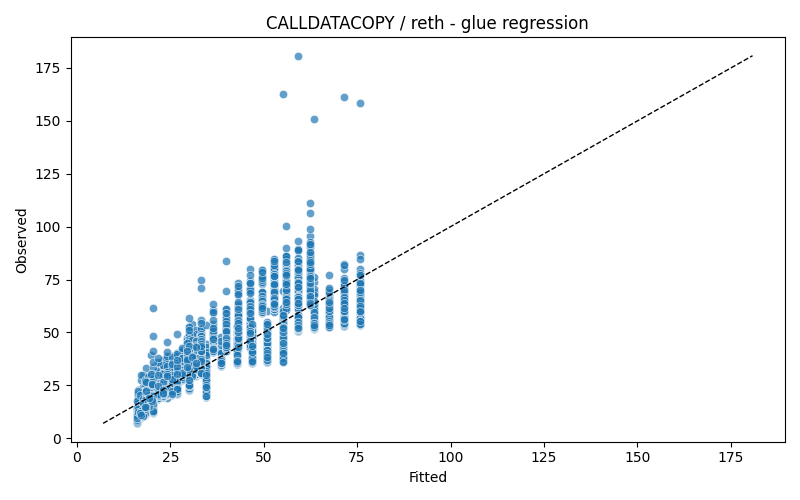

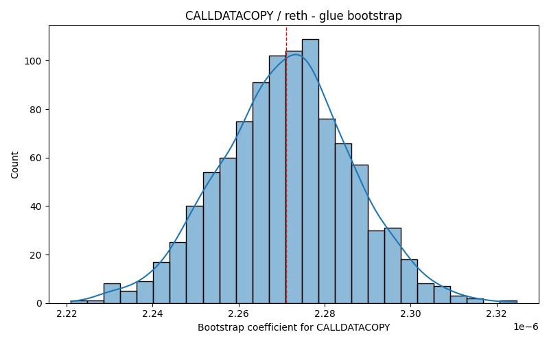

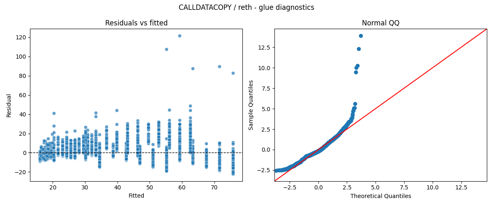

</details>

<details><summary><code>CALLDATALOAD</code> · nobs=1496 · runtime_ms=1.457e-05 · p=1.00e-03 · R²=0.01961</summary>

```
==============================================================================
                           NNLS Regression Results                            
==============================================================================
Dep. Variable:          test_runtime_ms              R-squared:          0.020
Model:                  NNLS                    Adj. R-squared:          0.019
No. Observations:       1496                              RMSE:           0.40
Df Residuals:           1494                               MAE:           0.25
Df Model:               1      
==============================================================================
                      coef     std err     P-value      [0.025      0.975]
------------------------------------------------------------------------------
         const      3.0496      0.0478       0.001      2.9664      3.1538
  CALLDATALOAD      0.0000      0.0000       0.001      0.0000      0.0000
==============================================================================
Notes: Non-negative least squares with bootstrap inference (1000 iterations)
==============================================================================
```

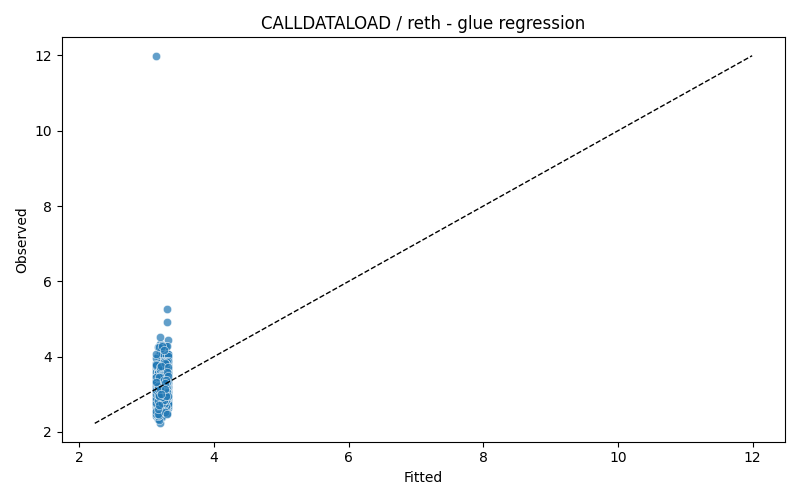

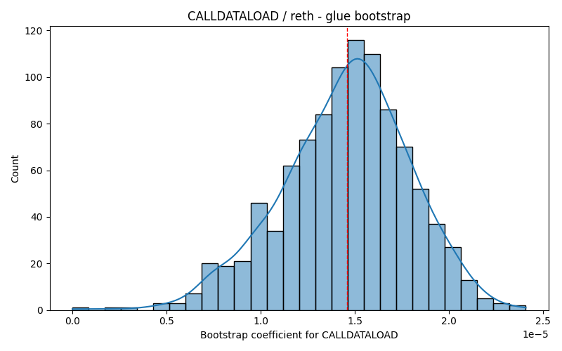

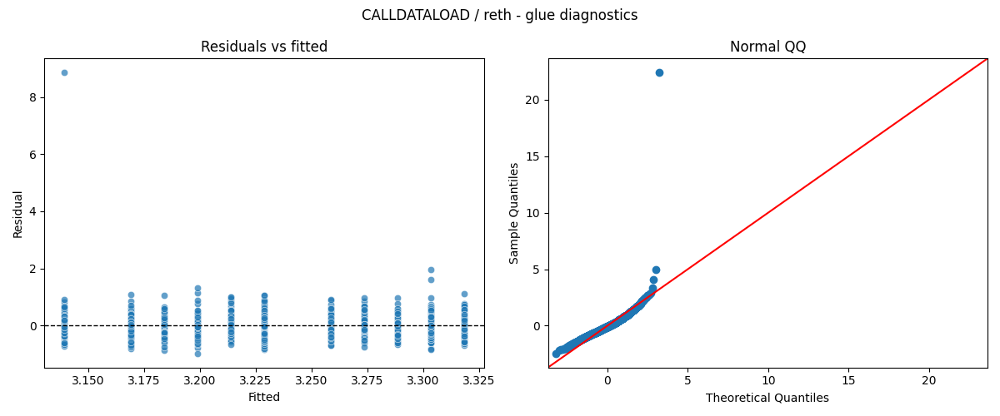

</details>

<details><summary><code>DIV</code> · nobs=374 · runtime_ms=6.929e-06 · p=1.00e-03 · R²=0.8386</summary>

```
==============================================================================
                           NNLS Regression Results                            
==============================================================================
Dep. Variable:          test_runtime_ms              R-squared:          0.839
Model:                  NNLS                    Adj. R-squared:          0.838
No. Observations:       374                               RMSE:          24.00
Df Residuals:           372                                MAE:          20.15
Df Model:               1      
==============================================================================
                      coef     std err     P-value      [0.025      0.975]
------------------------------------------------------------------------------
         const     59.0926      4.5943       0.001     50.2022     67.9107
           DIV      0.0000      0.0000       0.001      0.0000      0.0000
==============================================================================
Notes: Non-negative least squares with bootstrap inference (1000 iterations)
==============================================================================
```

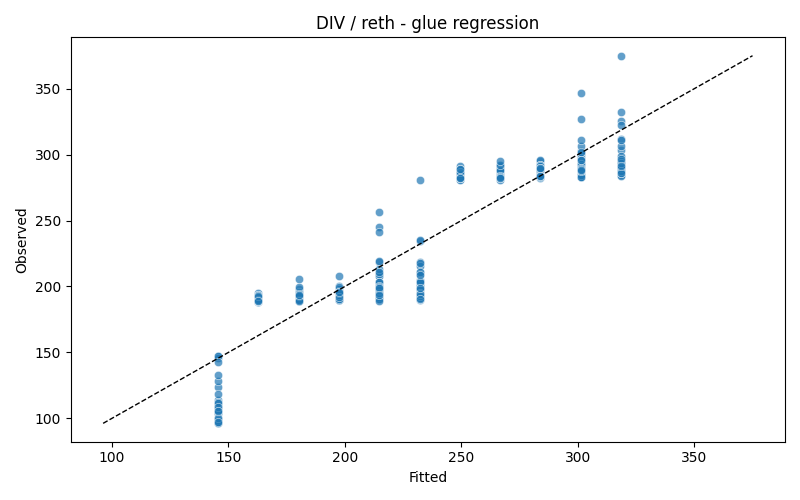

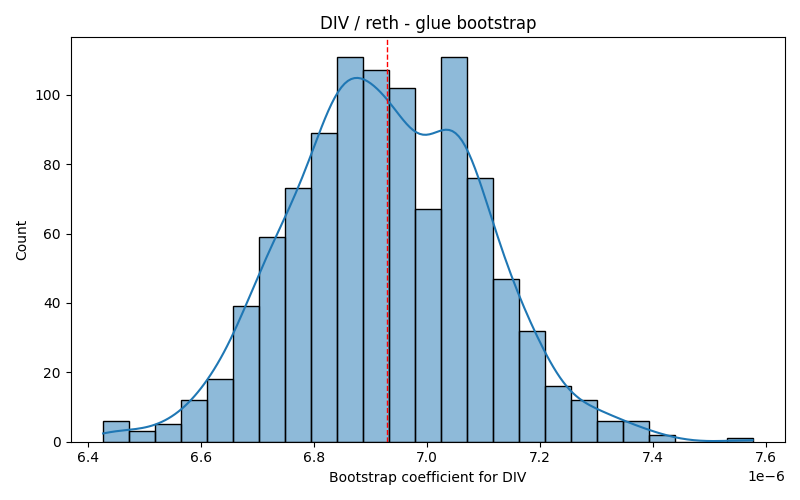

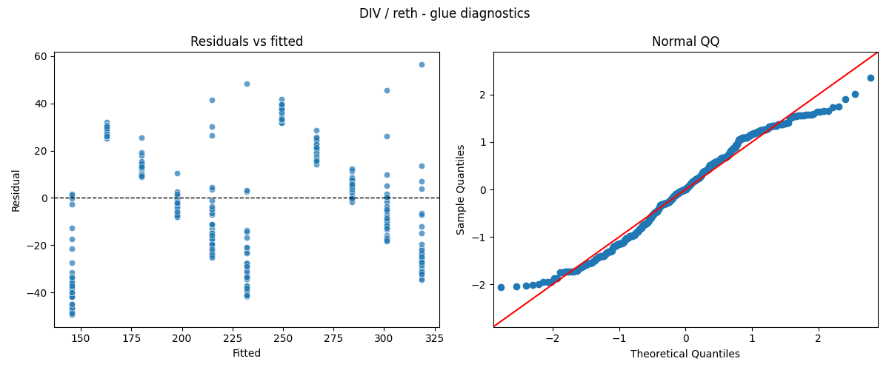

</details>

<details><summary><code>EXP</code> · nobs=374 · runtime_ms=0.0003808 · p=1.00e-03 · R²=0.8455</summary>

```
==============================================================================
                           NNLS Regression Results                            
==============================================================================
Dep. Variable:          test_runtime_ms              R-squared:          0.846
Model:                  NNLS                    Adj. R-squared:          0.845
No. Observations:       374                               RMSE:           6.37
Df Residuals:           372                                MAE:           5.24
Df Model:               1      
==============================================================================
                      coef     std err     P-value      [0.025      0.975]
------------------------------------------------------------------------------
         const     16.9768      1.1900       0.001     14.6466     19.3736
           EXP      0.0004      0.0000       0.001      0.0004      0.0004
==============================================================================
Notes: Non-negative least squares with bootstrap inference (1000 iterations)
==============================================================================
```

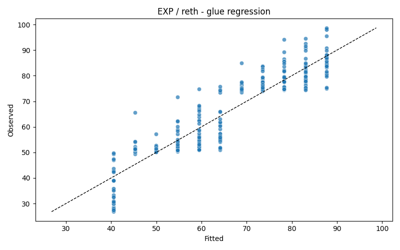

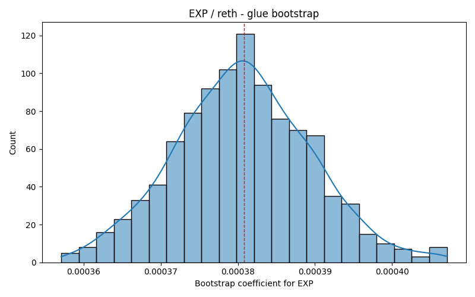

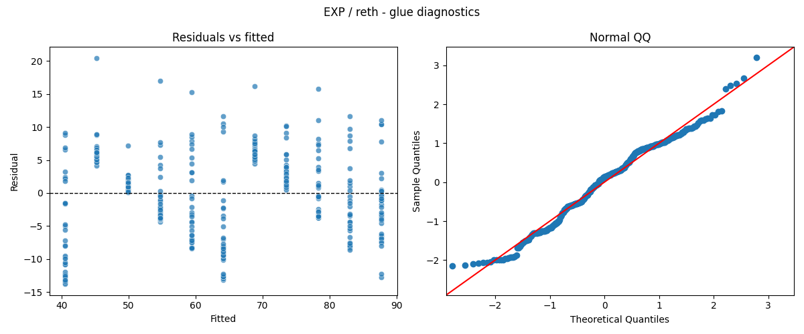

</details>

<details><summary><code>GT</code> · nobs=374 · runtime_ms=9.515e-07 · p=1.00e-03 · R²=0.8078</summary>

```
==============================================================================
                           NNLS Regression Results                            
==============================================================================
Dep. Variable:          test_runtime_ms              R-squared:          0.808
Model:                  NNLS                    Adj. R-squared:          0.807
No. Observations:       374                               RMSE:           4.88
Df Residuals:           372                                MAE:           3.66
Df Model:               1      
==============================================================================
                      coef     std err     P-value      [0.025      0.975]
------------------------------------------------------------------------------
         const     11.1722      0.8113       0.001      9.5808     12.8779
            GT      0.0000      0.0000       0.001      0.0000      0.0000
==============================================================================
Notes: Non-negative least squares with bootstrap inference (1000 iterations)
==============================================================================
```

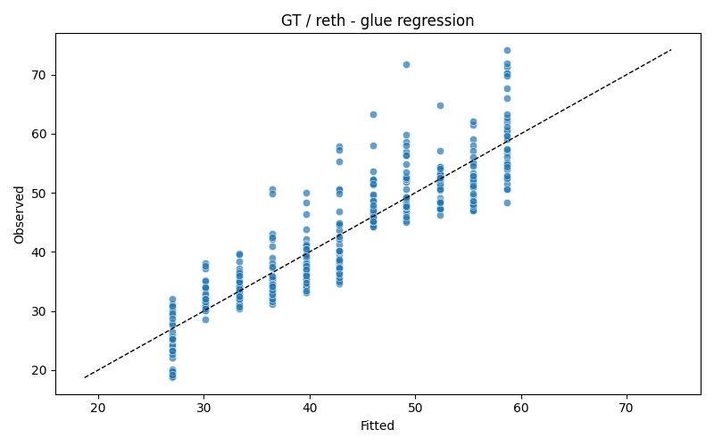

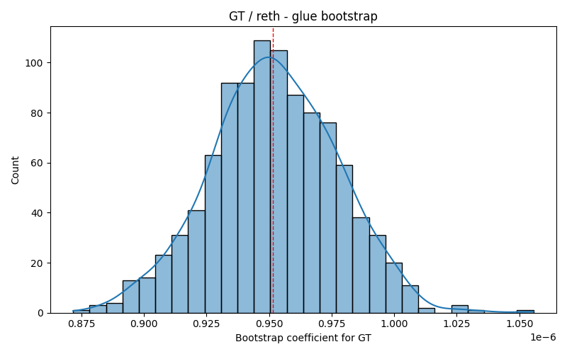

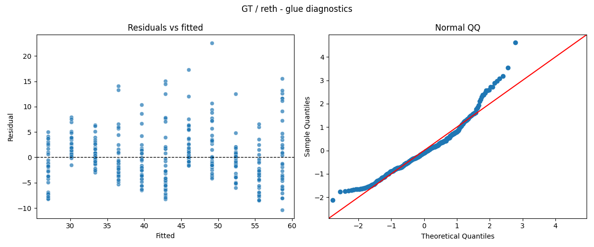

</details>

<details><summary><code>JUMPI</code> · nobs=374 · runtime_ms=1.249e-06 · p=1.00e-03 · R²=0.7222</summary>

```
==============================================================================
                           NNLS Regression Results                            
==============================================================================
Dep. Variable:          test_runtime_ms              R-squared:          0.722
Model:                  NNLS                    Adj. R-squared:          0.721
No. Observations:       374                               RMSE:           3.49
Df Residuals:           372                                MAE:           2.61
Df Model:               1      
==============================================================================
                      coef     std err     P-value      [0.025      0.975]
------------------------------------------------------------------------------
         const      7.8212      0.5583       0.001      6.7147      8.9127
         JUMPI      0.0000      0.0000       0.001      0.0000      0.0000
==============================================================================
Notes: Non-negative least squares with bootstrap inference (1000 iterations)
==============================================================================
```

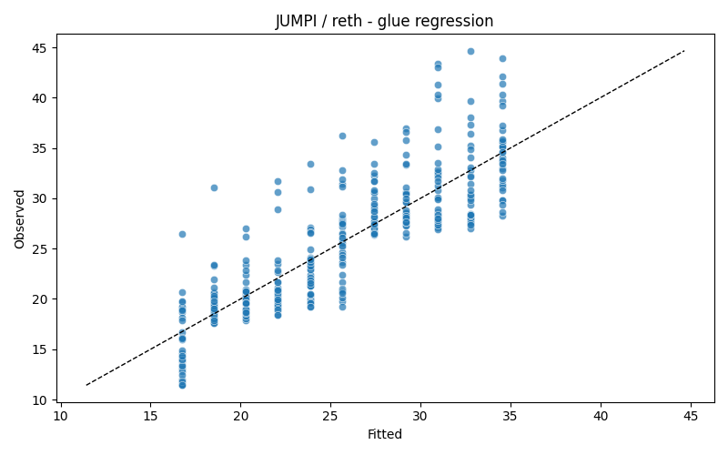

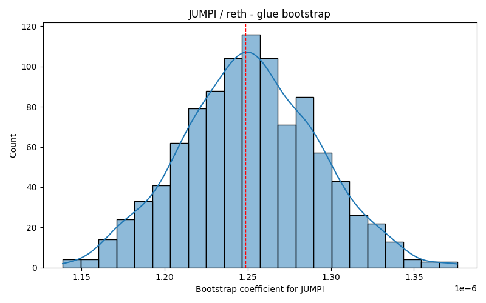

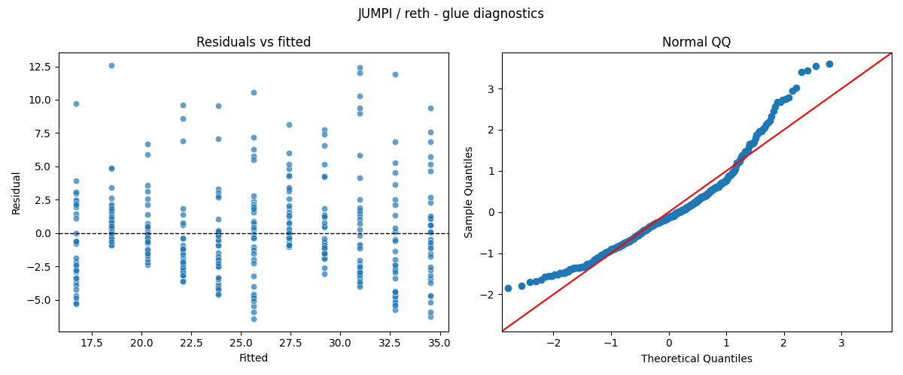

</details>

<details><summary><code>LT</code> · nobs=374 · runtime_ms=9.159e-07 · p=1.00e-03 · R²=0.8061</summary>

```
==============================================================================
                           NNLS Regression Results                            
==============================================================================
Dep. Variable:          test_runtime_ms              R-squared:          0.806
Model:                  NNLS                    Adj. R-squared:          0.806
No. Observations:       374                               RMSE:           4.73
Df Residuals:           372                                MAE:           3.47
Df Model:               1      
==============================================================================
                      coef     std err     P-value      [0.025      0.975]
------------------------------------------------------------------------------
         const     11.3804      0.7543       0.001      9.8958     12.7889
            LT      0.0000      0.0000       0.001      0.0000      0.0000
==============================================================================
Notes: Non-negative least squares with bootstrap inference (1000 iterations)
==============================================================================
```

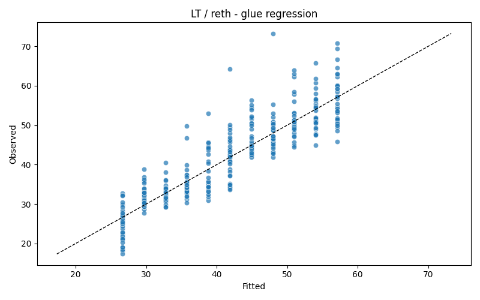

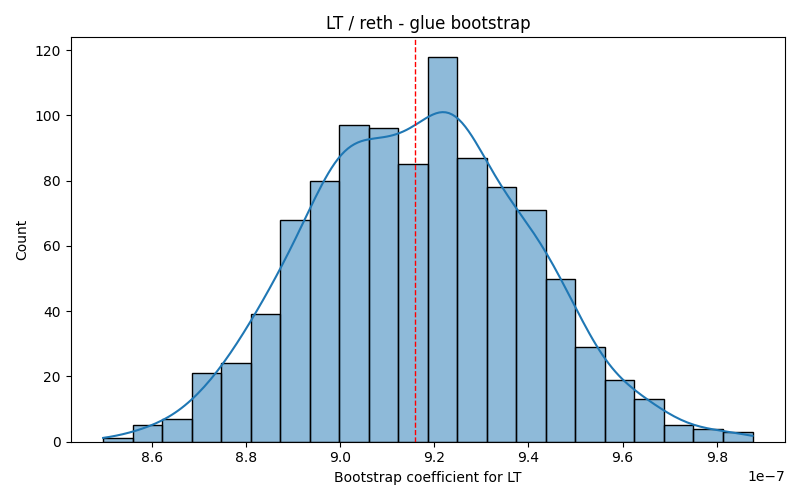

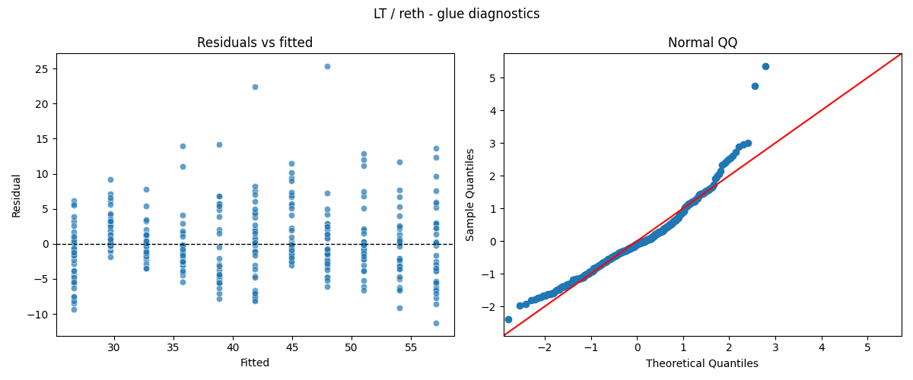

</details>

<details><summary><code>MSTORE</code> · nobs=1870 · runtime_ms=2.761e-06 · p=1.00e-03 · R²=0.2964</summary>

```
==============================================================================
                           NNLS Regression Results                            
==============================================================================
Dep. Variable:          test_runtime_ms              R-squared:          0.296
Model:                  NNLS                    Adj. R-squared:          0.296
No. Observations:       1870                              RMSE:          29.85
Df Residuals:           1868                               MAE:          27.07
Df Model:               1      
==============================================================================
                      coef     std err     P-value      [0.025      0.975]
------------------------------------------------------------------------------
         const     20.9439      1.9815       0.001     17.2083     25.1826
        MSTORE      0.0000      0.0000       0.001      0.0000      0.0000
==============================================================================
Notes: Non-negative least squares with bootstrap inference (1000 iterations)
==============================================================================
```

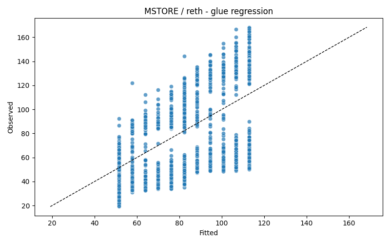

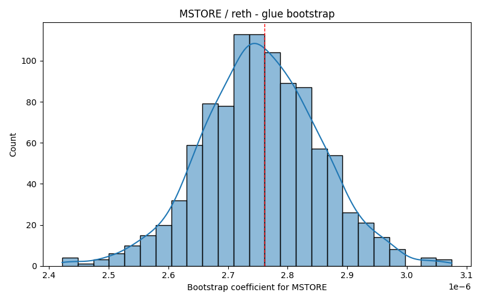

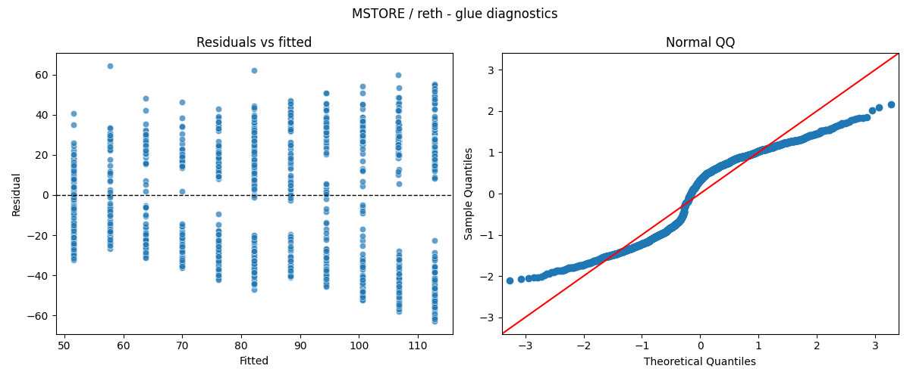

</details>

<details><summary><code>MSTORE8</code> · nobs=1870 · runtime_ms=1.354e-06 · p=1.00e-03 · R²=0.6361</summary>

```
==============================================================================
                           NNLS Regression Results                            
==============================================================================
Dep. Variable:          test_runtime_ms              R-squared:          0.636
Model:                  NNLS                    Adj. R-squared:          0.636
No. Observations:       1870                              RMSE:           7.19
Df Residuals:           1868                               MAE:           4.48
Df Model:               1      
==============================================================================
                      coef     std err     P-value      [0.025      0.975]
------------------------------------------------------------------------------
         const     12.1745      0.4832       0.001     11.2189     13.1463
       MSTORE8      0.0000      0.0000       0.001      0.0000      0.0000
==============================================================================
Notes: Non-negative least squares with bootstrap inference (1000 iterations)
==============================================================================
```

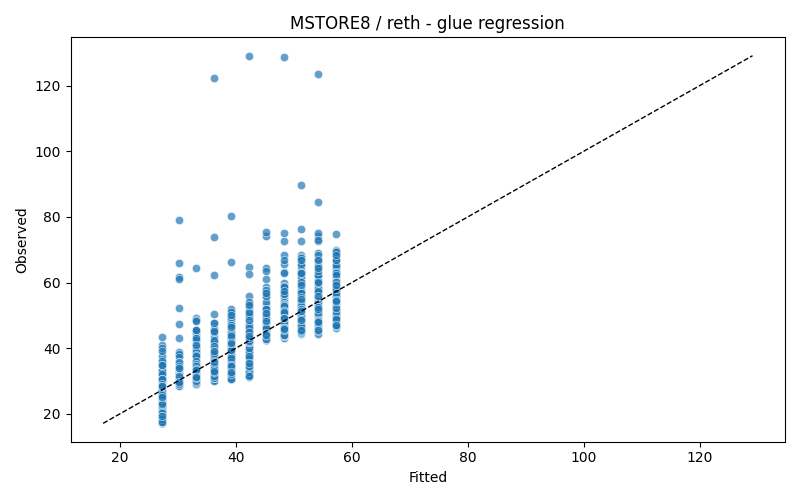

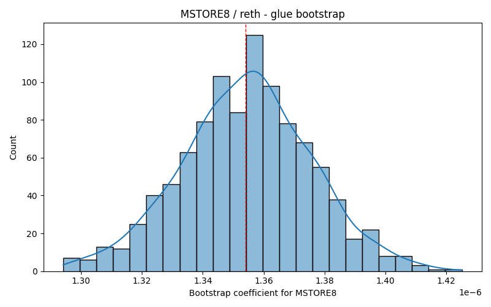

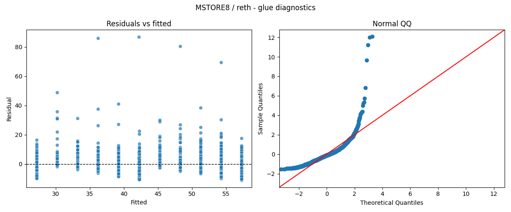

</details>

<details><summary><code>MUL</code> · nobs=374 · runtime_ms=1.189e-06 · p=1.00e-03 · R²=0.8067</summary>

```
==============================================================================
                           NNLS Regression Results                            
==============================================================================
Dep. Variable:          test_runtime_ms              R-squared:          0.807
Model:                  NNLS                    Adj. R-squared:          0.806
No. Observations:       374                               RMSE:           4.60
Df Residuals:           372                                MAE:           3.41
Df Model:               1      
==============================================================================
                      coef     std err     P-value      [0.025      0.975]
------------------------------------------------------------------------------
         const     10.6472      0.7578       0.001      9.0535     12.0631
           MUL      0.0000      0.0000       0.001      0.0000      0.0000
==============================================================================
Notes: Non-negative least squares with bootstrap inference (1000 iterations)
==============================================================================
```

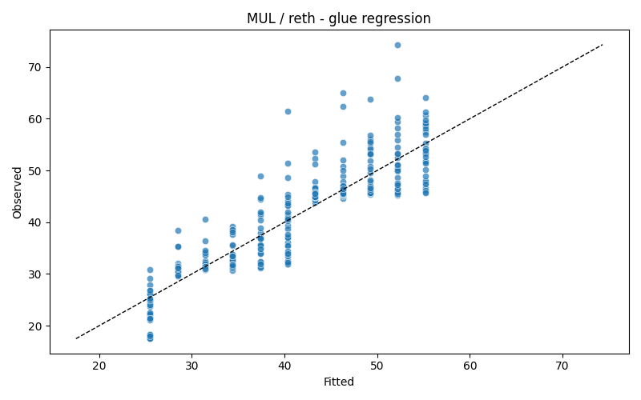

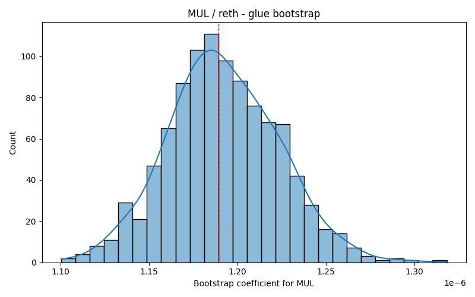

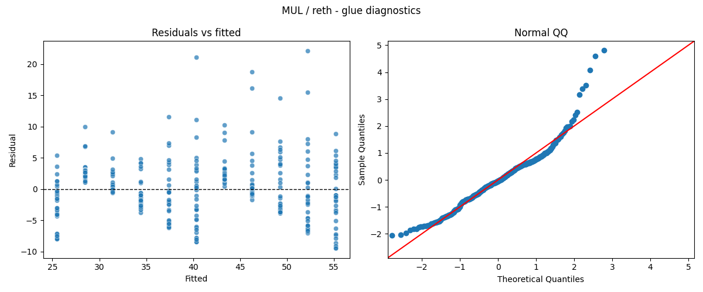

</details>

<details><summary><code>PC</code> · nobs=374 · runtime_ms=5.819e-07 · p=1.00e-03 · R²=0.922</summary>

```
==============================================================================
                           NNLS Regression Results                            
==============================================================================
Dep. Variable:          test_runtime_ms              R-squared:          0.922
Model:                  NNLS                    Adj. R-squared:          0.922
No. Observations:       374                               RMSE:           5.06
Df Residuals:           372                                MAE:           3.94
Df Model:               1      
==============================================================================
                      coef     std err     P-value      [0.025      0.975]
------------------------------------------------------------------------------
         const     12.5615      0.8819       0.001     10.8819     14.4104
            PC      0.0000      0.0000       0.001      0.0000      0.0000
==============================================================================
Notes: Non-negative least squares with bootstrap inference (1000 iterations)
==============================================================================
```

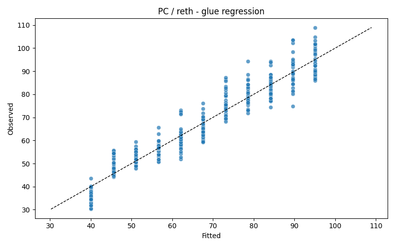

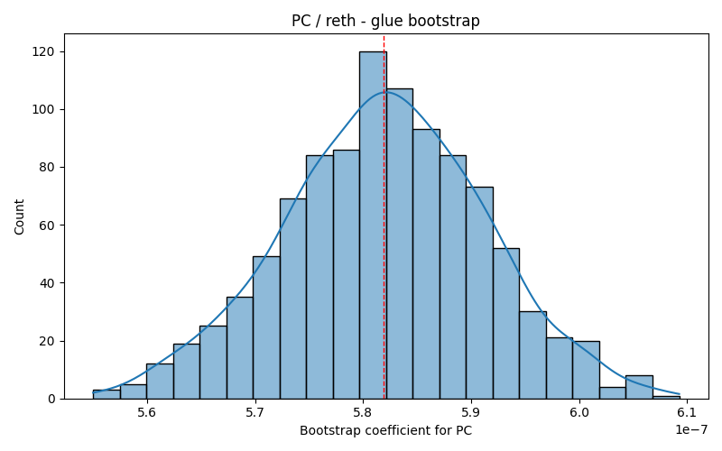

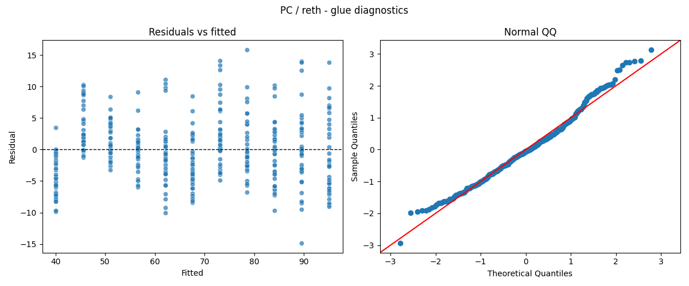

</details>

<details><summary><code>RETURNDATASIZE</code> · nobs=1496 · runtime_ms=7.895e-07 · p=1.00e-03 · R²=0.7538</summary>

```
==============================================================================
                           NNLS Regression Results                            
==============================================================================
Dep. Variable:          test_runtime_ms              R-squared:          0.754
Model:                  NNLS                    Adj. R-squared:          0.754
No. Observations:       1496                              RMSE:           7.12
Df Residuals:           1494                               MAE:           4.37
Df Model:               1      
==============================================================================
                      coef     std err     P-value      [0.025      0.975]
------------------------------------------------------------------------------
         const     13.5533      0.5376       0.001     12.4961     14.5635
RETURNDATASIZE      0.0000      0.0000       0.001      0.0000      0.0000
==============================================================================
Notes: Non-negative least squares with bootstrap inference (1000 iterations)
==============================================================================
```

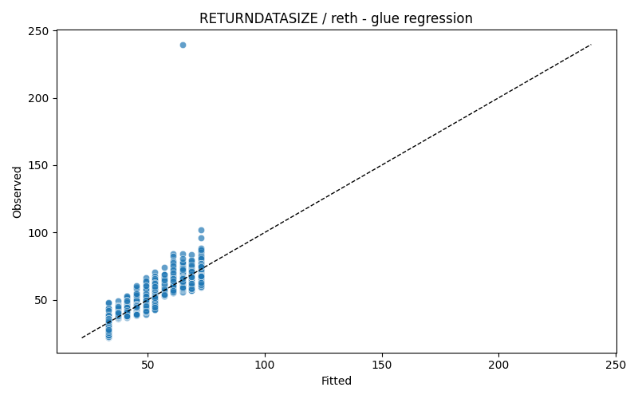

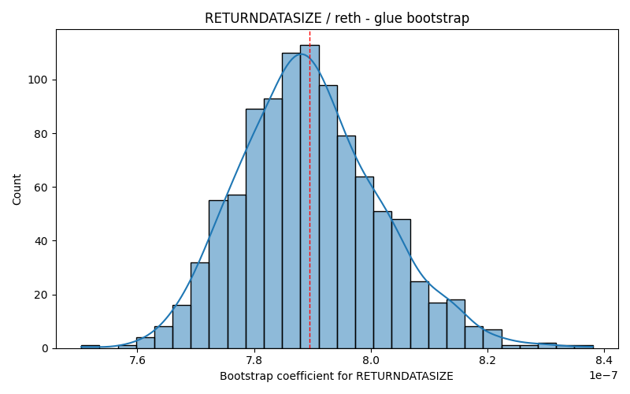

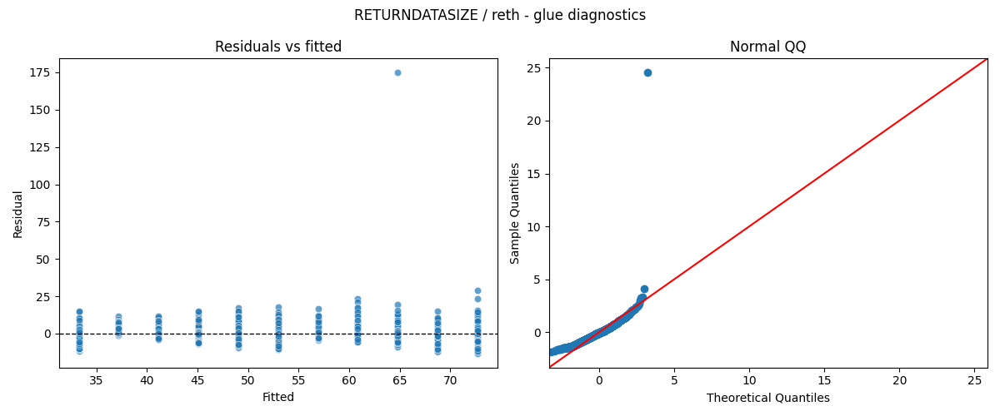

</details>

<details><summary><code>SELFBALANCE</code> · nobs=306 · runtime_ms=3.837e-06 · p=1.00e-03 · R²=0.816</summary>

```
==============================================================================
                           NNLS Regression Results                            
==============================================================================
Dep. Variable:          test_runtime_ms              R-squared:          0.816
Model:                  NNLS                    Adj. R-squared:          0.815
No. Observations:       306                               RMSE:          18.38
Df Residuals:           304                                MAE:          15.26
Df Model:               1      
==============================================================================
                      coef     std err     P-value      [0.025      0.975]
------------------------------------------------------------------------------
         const     56.5504      3.7902       0.001     49.2592     63.6511
   SELFBALANCE      0.0000      0.0000       0.001      0.0000      0.0000
==============================================================================
Notes: Non-negative least squares with bootstrap inference (1000 iterations)
==============================================================================
```

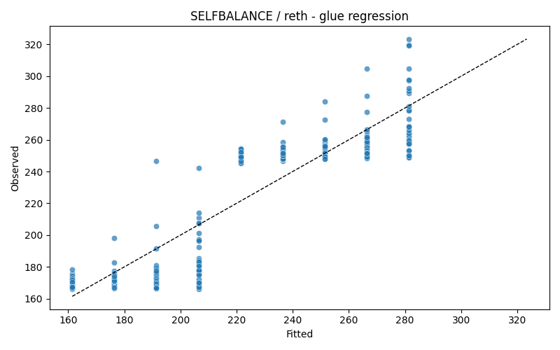

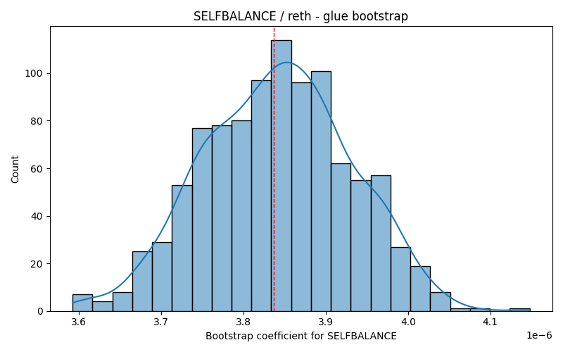

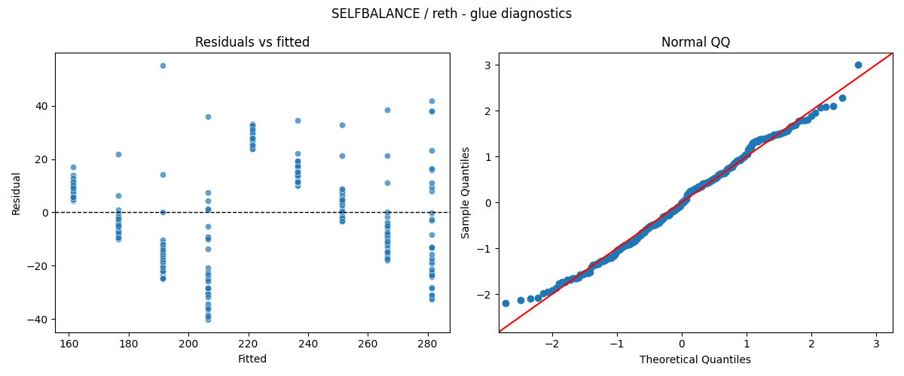

</details>

<details><summary><code>SUB</code> · nobs=374 · runtime_ms=8.337e-07 · p=1.00e-03 · R²=0.5168</summary>

```
==============================================================================
                           NNLS Regression Results                            
==============================================================================
Dep. Variable:          test_runtime_ms              R-squared:          0.517
Model:                  NNLS                    Adj. R-squared:          0.515
No. Observations:       374                               RMSE:           8.48
Df Residuals:           372                                MAE:           4.39
Df Model:               1      
==============================================================================
                      coef     std err     P-value      [0.025      0.975]
------------------------------------------------------------------------------
         const     12.8719      1.5810       0.001      9.9829     16.1470
           SUB      0.0000      0.0000       0.001      0.0000      0.0000
==============================================================================
Notes: Non-negative least squares with bootstrap inference (1000 iterations)
==============================================================================
```

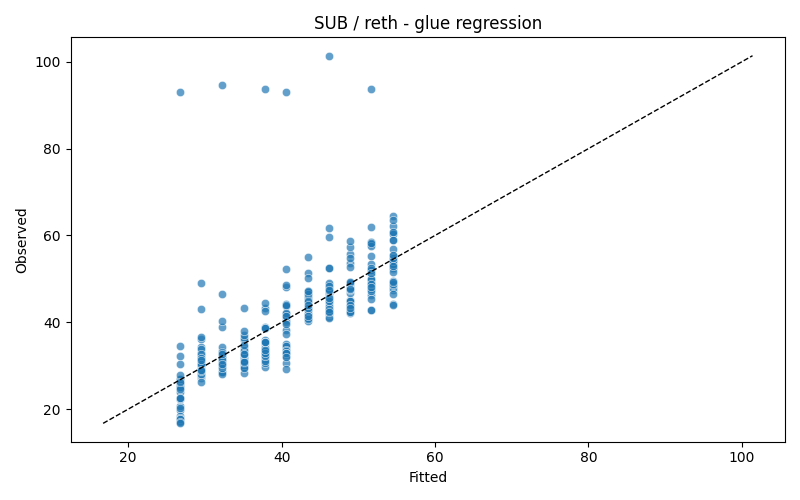

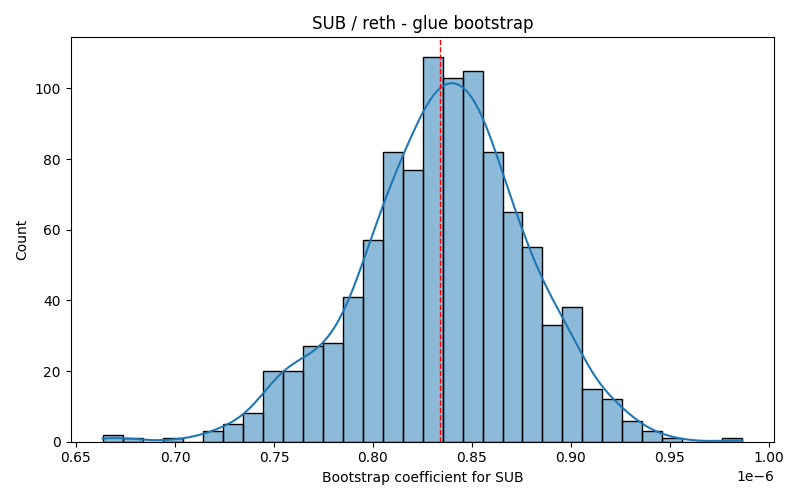

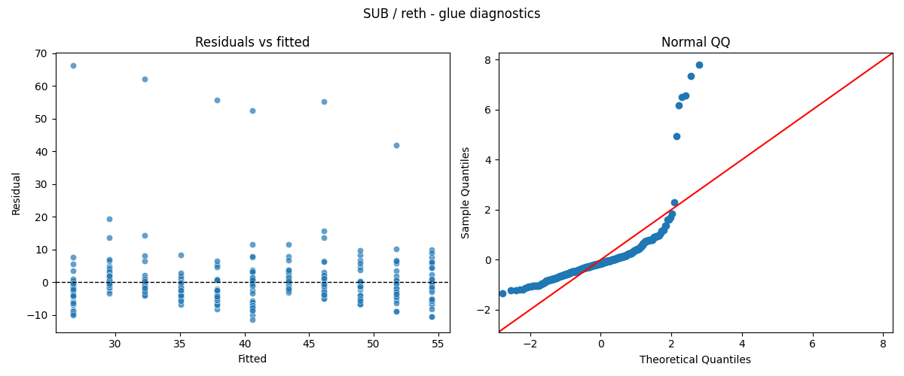

</details>

### Mixed glue (tier B) · reth

<details><summary><code>JUMP</code> · nobs=374 · runtime_ms=2.305e-06 · p=1.00e-03 · R²=0.8199</summary>

```
==============================================================================
                           NNLS Regression Results                            
==============================================================================
Dep. Variable:          test_runtime_ms              R-squared:          0.820
Model:                  NNLS                    Adj. R-squared:          0.819
No. Observations:       374                               RMSE:           4.01
Df Residuals:           372                                MAE:           3.09
Df Model:               1      
==============================================================================
                      coef     std err     P-value      [0.025      0.975]
------------------------------------------------------------------------------
         const      9.3159      0.6410       0.001      8.0926     10.5863
          JUMP      0.0000      0.0000       0.001      0.0000      0.0000
==============================================================================
Notes: Non-negative least squares with bootstrap inference (1000 iterations)
==============================================================================
```

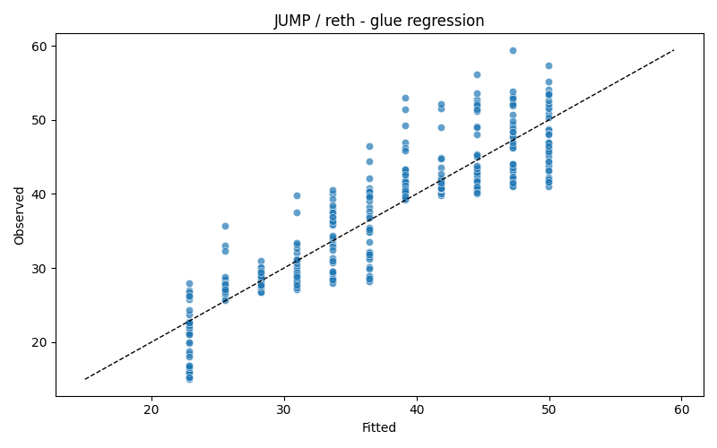


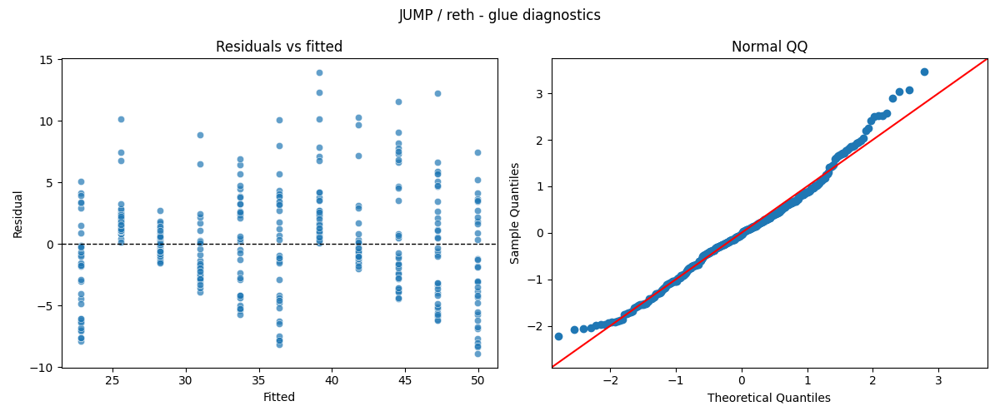

</details>

<details><summary><code>KECCAK256</code> · nobs=5984 · runtime_ms=0 · p=1.00e+00 · R²=0</summary>

```
==============================================================================
                           NNLS Regression Results                            
==============================================================================
Dep. Variable:          test_runtime_ms              R-squared:          0.000
Model:                  NNLS                    Adj. R-squared:         -0.000
No. Observations:       5984                              RMSE:         159.46
Df Residuals:           5982                               MAE:         135.18
Df Model:               1      
==============================================================================
                      coef     std err     P-value      [0.025      0.975]
------------------------------------------------------------------------------
         const    252.5802      2.1440       0.001    248.4621    256.7837
     KECCAK256      0.0000      0.0000       1.000      0.0000      0.0000
==============================================================================
Notes: Non-negative least squares with bootstrap inference (1000 iterations)
==============================================================================
```

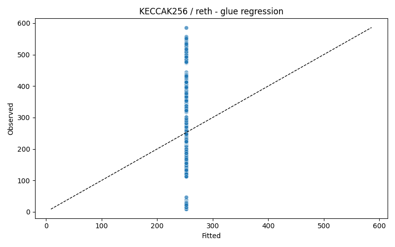


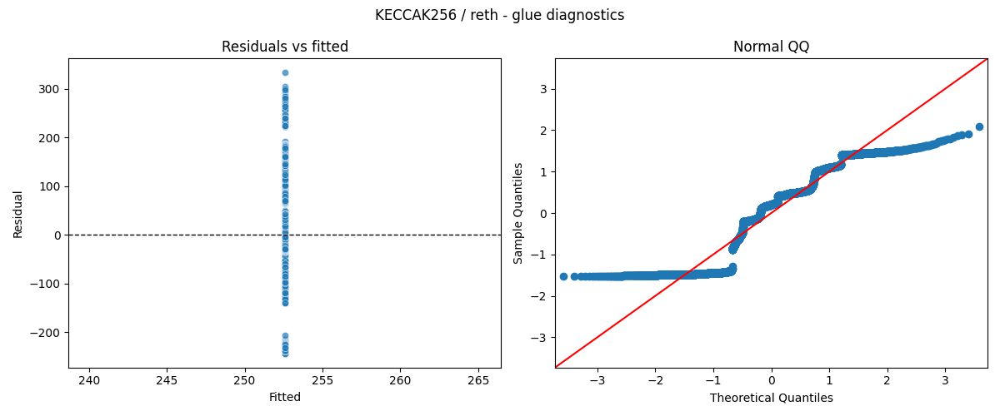

</details>
