# Glue opcodes report

Per-client NNLS fits of priced glue opcodes against their driver fixtures. Cycle-tier opcodes share one joint regression per client (shown once); pure-tier and mixed-tier opcodes each get a single-feature fit. Mixed-tier fits pre-adjust the LHS by subtracting the contribution of every priced upstream partner selected by the detector (pure ∪ cycle for `mixed_a`, plus `mixed_a` for `mixed_b`).

**Contents:** [besu](#besu) · [erigon](#erigon) · [ethrex](#ethrex) · [geth](#geth) · [nethermind](#nethermind) · [reth](#reth)

## besu

| glue_opcode | nobs | glue_runtime_ms | p_value | rsquared |
| --- | --- | --- | --- | --- |
| `ISZERO` | 2145 | 3.024e-06 | 1.00e-03 | 0.8223 |
| `JUMPDEST` | 2145 | 7.253e-07 | 1.00e-03 | 0.7745 |
| `SWAP` | 34320 | 2.566e-06 | 1.00e-03 | 0.375 |
| `CALLDATASIZE` | 126808 | 2.681e-06 | 1.00e-03 | 0.9276 |
| `DUP` | 126808 | 1.065e-06 | 1.00e-03 | 0.9276 |
| `GAS` | 126808 | 2.272e-06 | 1.00e-03 | 0.9276 |
| `MLOAD` | 126808 | 8.282e-06 | 1.00e-03 | 0.9276 |
| `PUSH` | 126808 | 1.687e-06 | 1.00e-03 | 0.9276 |
| `PUSH0` | 126808 | 8.644e-07 | 1.00e-03 | 0.9276 |
| `STATICCALL` | 126808 | 0.0007329 | 1.00e-03 | 0.9276 |
| `ADD` | 2145 | 7.896e-06 | 1.00e-03 | 0.8459 |
| `AND` | 2145 | 5.542e-06 | 1.00e-03 | 0.8744 |
| `CALLDATACOPY` | 51480 | 1.272e-05 | 1.00e-03 | 0.632 |
| `CALLDATALOAD` | 8580 | 0 | 1.00e+00 | -2.22e-16 |
| `DIV` | 2145 | 1.237e-05 | 1.00e-03 | 0.8028 |
| `EXP` | 2145 | 0.001005 | 1.00e-03 | 0.7752 |
| `GT` | 2145 | 1.769e-05 | 1.00e-03 | 0.1407 |
| `JUMPI` | 2145 | 4.676e-06 | 1.00e-03 | 0.7319 |
| `LT` | 2145 | 1.797e-05 | 1.00e-03 | 0.143 |
| `MSTORE` | 10725 | 1.351e-05 | 1.00e-03 | 0.8055 |
| `MSTORE8` | 10725 | 8.412e-06 | 1.00e-03 | 0.8357 |
| `MUL` | 2145 | 1.042e-05 | 1.00e-03 | 0.8138 |
| `PC` | 2145 | 2.687e-06 | 1.00e-03 | 0.8615 |
| `RETURNDATASIZE` | 8580 | 3.925e-06 | 1.00e-03 | 0.7769 |
| `SELFBALANCE` | 1755 | 9.4e-06 | 1.00e-03 | 0.7066 |
| `SUB` | 2145 | 8.305e-06 | 1.00e-03 | 0.8284 |
| `JUMP` | 2145 | 3.922e-05 | 1.00e-03 | 0.8535 |
| `KECCAK256` | 34320 | 3.45e-05 | 1.00e-03 | 0.1543 |

### Cycle glue — joint fit · besu

<details><summary>Joint NNLS regression summary</summary>

```
==============================================================================
                           NNLS Regression Results                            
==============================================================================
Dep. Variable:          test_runtime_ms              R-squared:          0.928
Model:                  NNLS                    Adj. R-squared:          0.928
No. Observations:       126808                            RMSE:          25.90
Df Residuals:           126800                             MAE:          18.50
Df Model:               7      
==============================================================================
                      coef     std err     P-value      [0.025      0.975]
------------------------------------------------------------------------------
         const     47.3643      0.2611       0.001     46.8278     47.8802
  CALLDATASIZE      0.0000      0.0000       0.001      0.0000      0.0000
           DUP      0.0000      0.0000       0.001      0.0000      0.0000
           GAS      0.0000      0.0000       0.001      0.0000      0.0000
         MLOAD      0.0000      0.0000       0.001      0.0000      0.0000
          PUSH      0.0000      0.0000       0.001      0.0000      0.0000
         PUSH0      0.0000      0.0000       0.001      0.0000      0.0000
    STATICCALL      0.0007      0.0000       0.001      0.0007      0.0007
==============================================================================
Notes: Non-negative least squares with bootstrap inference (1000 iterations)
==============================================================================
```

</details>

<details><summary><code>CALLDATASIZE</code> · nobs=126808 · runtime_ms=2.681e-06 · p=1.00e-03 · R²=0.9276</summary>

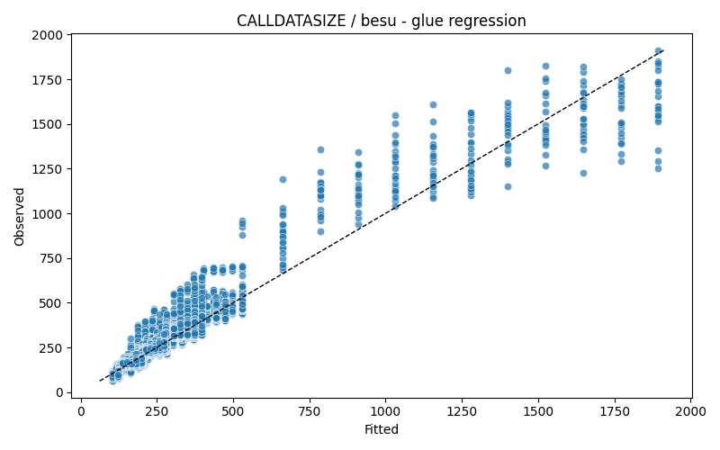

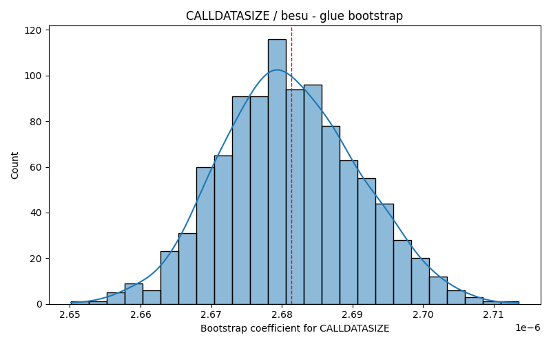

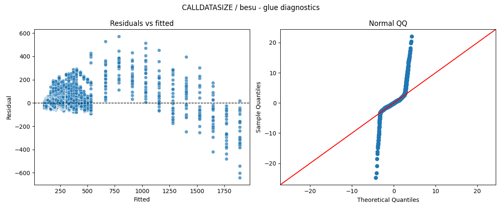

</details>

<details><summary><code>DUP</code> · nobs=126808 · runtime_ms=1.065e-06 · p=1.00e-03 · R²=0.9276</summary>


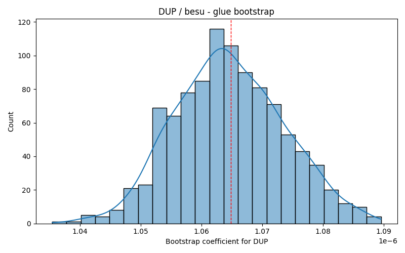


</details>

<details><summary><code>GAS</code> · nobs=126808 · runtime_ms=2.272e-06 · p=1.00e-03 · R²=0.9276</summary>

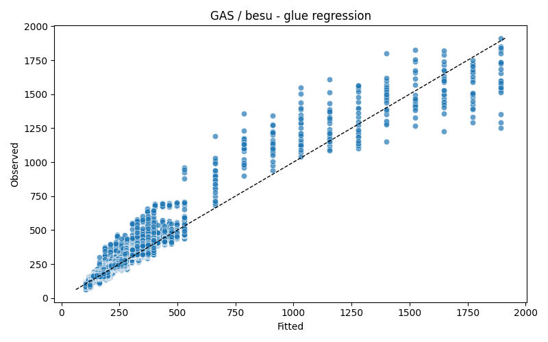

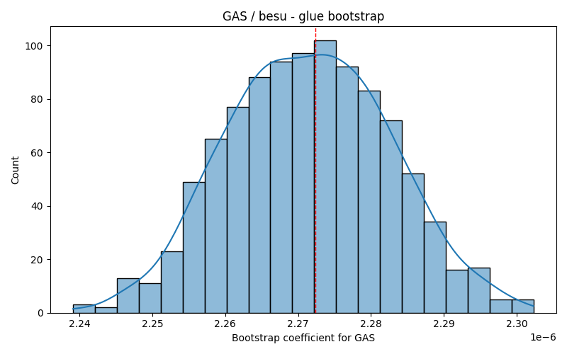


</details>

<details><summary><code>MLOAD</code> · nobs=126808 · runtime_ms=8.282e-06 · p=1.00e-03 · R²=0.9276</summary>


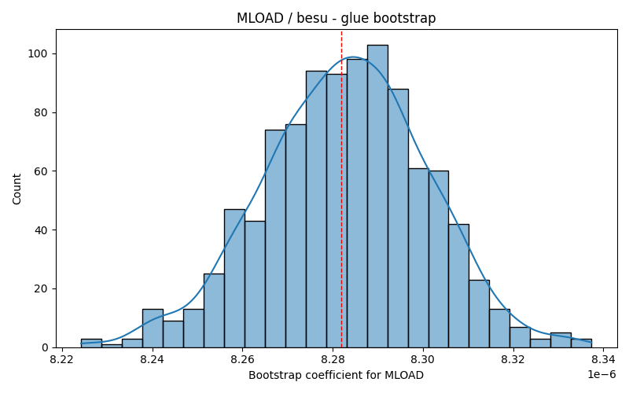


</details>

<details><summary><code>PUSH</code> · nobs=126808 · runtime_ms=1.687e-06 · p=1.00e-03 · R²=0.9276</summary>


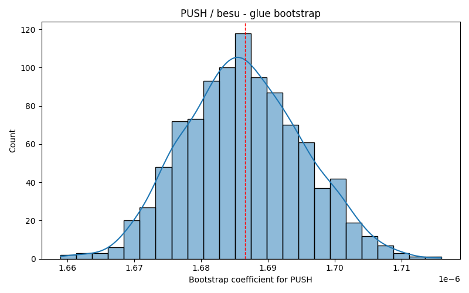


</details>

<details><summary><code>PUSH0</code> · nobs=126808 · runtime_ms=8.644e-07 · p=1.00e-03 · R²=0.9276</summary>


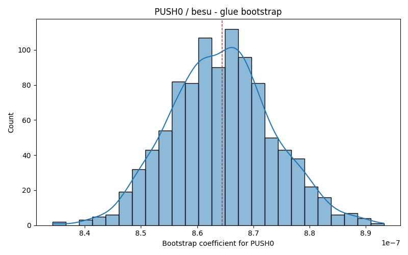

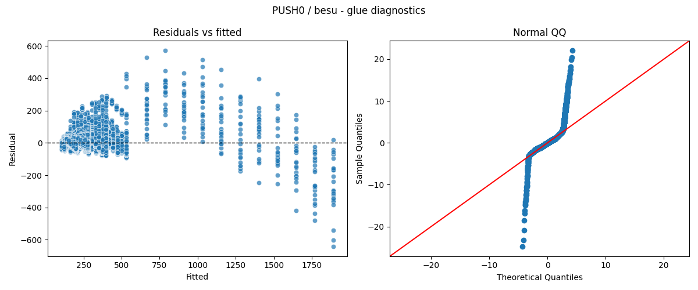

</details>

<details><summary><code>STATICCALL</code> · nobs=126808 · runtime_ms=0.0007329 · p=1.00e-03 · R²=0.9276</summary>


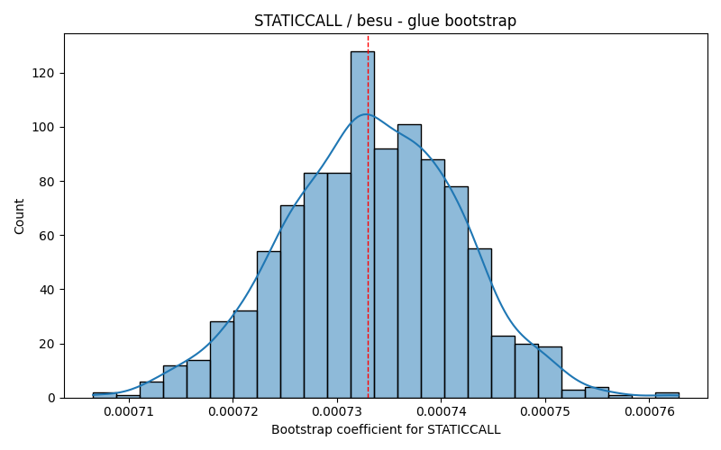


</details>

### Pure glue · besu

<details><summary><code>ISZERO</code> · nobs=2145 · runtime_ms=3.024e-06 · p=1.00e-03 · R²=0.8223</summary>

```
==============================================================================
                           NNLS Regression Results                            
==============================================================================
Dep. Variable:          test_runtime_ms              R-squared:          0.822
Model:                  NNLS                    Adj. R-squared:          0.822
No. Observations:       2145                              RMSE:          29.60
Df Residuals:           2143                               MAE:          23.24
Df Model:               1      
==============================================================================
                      coef     std err     P-value      [0.025      0.975]
------------------------------------------------------------------------------
         const     61.7203      2.2728       0.001     57.0922     66.2293
        ISZERO      0.0000      0.0000       0.001      0.0000      0.0000
==============================================================================
Notes: Non-negative least squares with bootstrap inference (1000 iterations)
==============================================================================
```

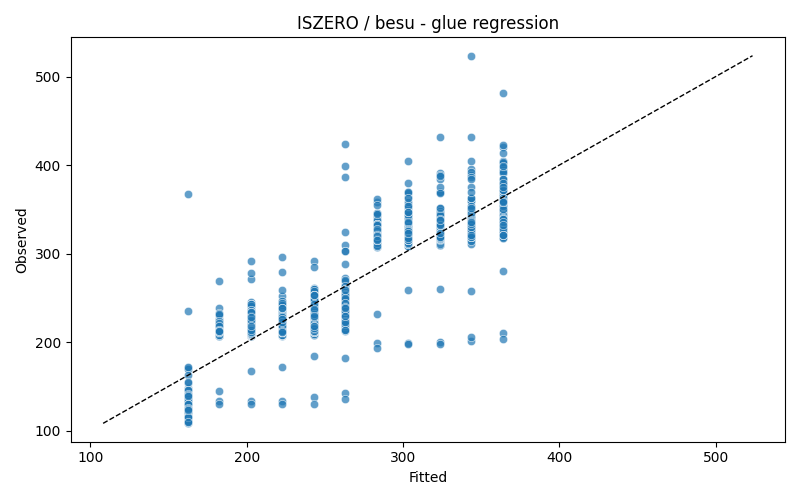

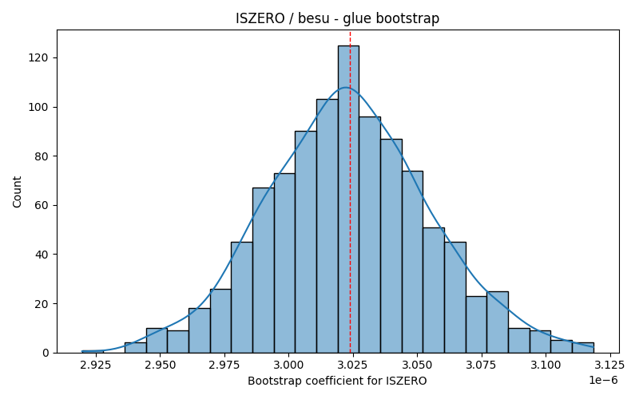

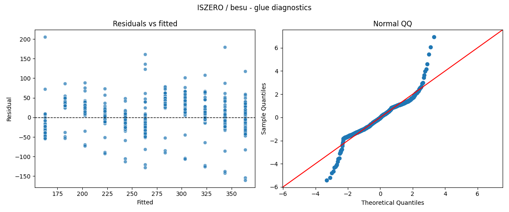

</details>

<details><summary><code>JUMPDEST</code> · nobs=2145 · runtime_ms=7.253e-07 · p=1.00e-03 · R²=0.7745</summary>

```
==============================================================================
                           NNLS Regression Results                            
==============================================================================
Dep. Variable:          test_runtime_ms              R-squared:          0.775
Model:                  NNLS                    Adj. R-squared:          0.774
No. Observations:       2145                              RMSE:          24.71
Df Residuals:           2143                               MAE:          17.01
Df Model:               1      
==============================================================================
                      coef     std err     P-value      [0.025      0.975]
------------------------------------------------------------------------------
         const     43.6684      1.7439       0.001     40.2999     47.0117
      JUMPDEST      0.0000      0.0000       0.001      0.0000      0.0000
==============================================================================
Notes: Non-negative least squares with bootstrap inference (1000 iterations)
==============================================================================
```

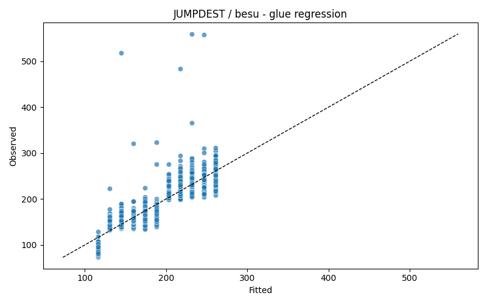

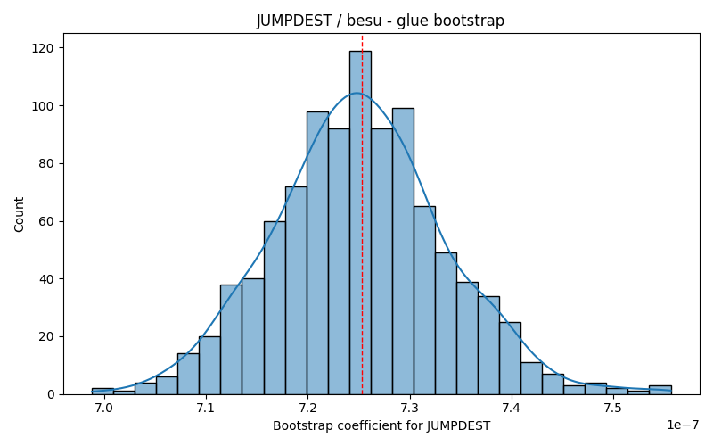

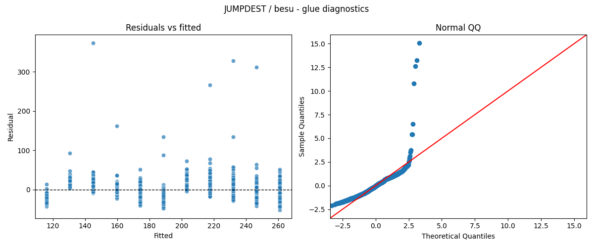

</details>

<details><summary><code>SWAP</code> · nobs=34320 · runtime_ms=2.566e-06 · p=1.00e-03 · R²=0.375</summary>

```
==============================================================================
                           NNLS Regression Results                            
==============================================================================
Dep. Variable:          test_runtime_ms              R-squared:          0.375
Model:                  NNLS                    Adj. R-squared:          0.375
No. Observations:       34320                             RMSE:          69.75
Df Residuals:           34318                              MAE:          64.18
Df Model:               1      
==============================================================================
                      coef     std err     P-value      [0.025      0.975]
------------------------------------------------------------------------------
         const     50.9665      1.1128       0.001     48.8477     53.1375
          SWAP      0.0000      0.0000       0.001      0.0000      0.0000
==============================================================================
Notes: Non-negative least squares with bootstrap inference (1000 iterations)
==============================================================================
```


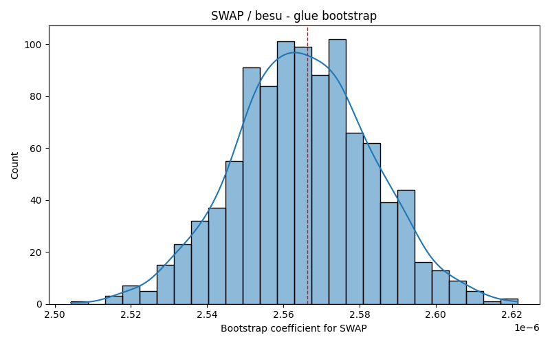

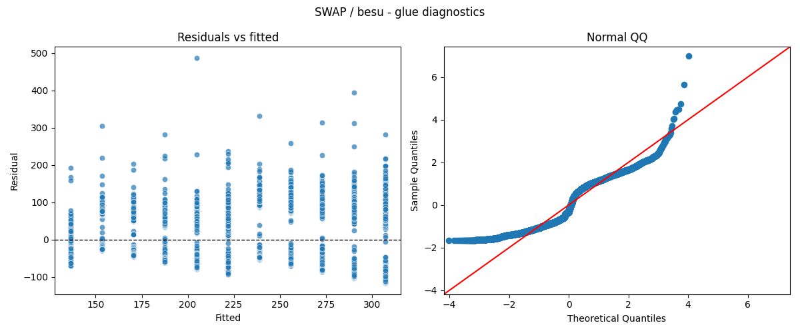

</details>

### Mixed glue (tier A) · besu

<details><summary><code>ADD</code> · nobs=2145 · runtime_ms=7.896e-06 · p=1.00e-03 · R²=0.8459</summary>

```
==============================================================================
                           NNLS Regression Results                            
==============================================================================
Dep. Variable:          test_runtime_ms              R-squared:          0.846
Model:                  NNLS                    Adj. R-squared:          0.846
No. Observations:       2145                              RMSE:          35.47
Df Residuals:           2143                               MAE:          29.03
Df Model:               1      
==============================================================================
                      coef     std err     P-value      [0.025      0.975]
------------------------------------------------------------------------------
         const     75.4948      2.8494       0.001     69.8309     80.8402
           ADD      0.0000      0.0000       0.001      0.0000      0.0000
==============================================================================
Notes: Non-negative least squares with bootstrap inference (1000 iterations)
==============================================================================
```

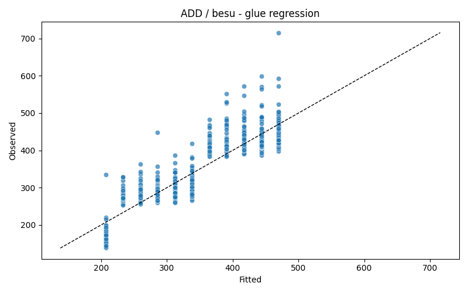

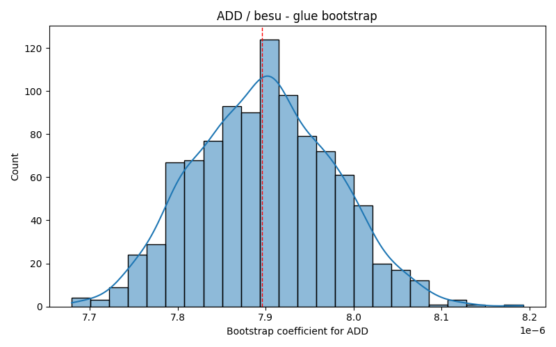

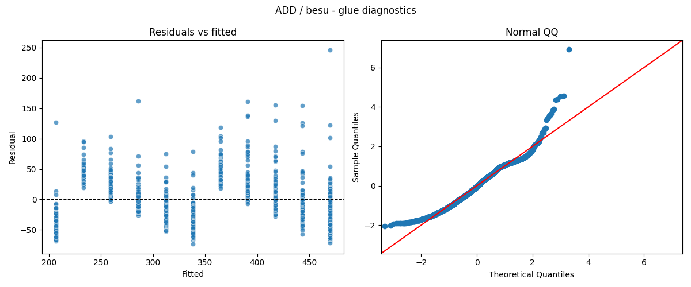

</details>

<details><summary><code>AND</code> · nobs=2145 · runtime_ms=5.542e-06 · p=1.00e-03 · R²=0.8744</summary>

```
==============================================================================
                           NNLS Regression Results                            
==============================================================================
Dep. Variable:          test_runtime_ms              R-squared:          0.874
Model:                  NNLS                    Adj. R-squared:          0.874
No. Observations:       2145                              RMSE:          22.11
Df Residuals:           2143                               MAE:          18.65
Df Model:               1      
==============================================================================
                      coef     std err     P-value      [0.025      0.975]
------------------------------------------------------------------------------
         const     59.9582      1.5825       0.001     56.9896     62.9169
           AND      0.0000      0.0000       0.001      0.0000      0.0000
==============================================================================
Notes: Non-negative least squares with bootstrap inference (1000 iterations)
==============================================================================
```

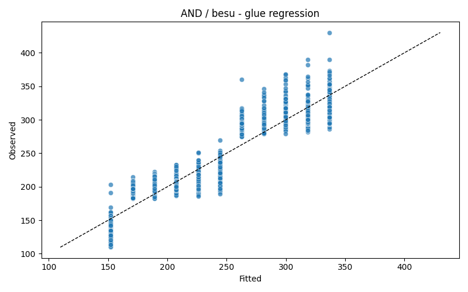

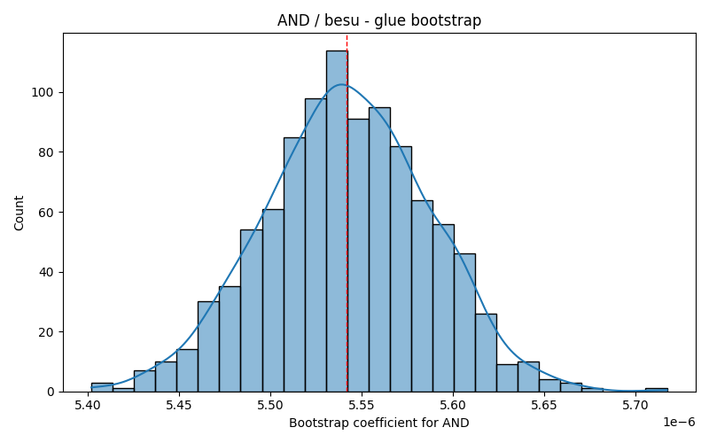

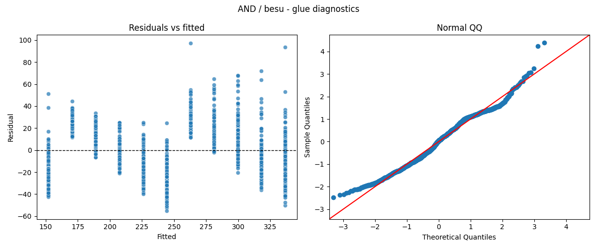

</details>

<details><summary><code>CALLDATACOPY</code> · nobs=51480 · runtime_ms=1.272e-05 · p=1.00e-03 · R²=0.632</summary>

```
==============================================================================
                           NNLS Regression Results                            
==============================================================================
Dep. Variable:          test_runtime_ms              R-squared:          0.632
Model:                  NNLS                    Adj. R-squared:          0.632
No. Observations:       51480                             RMSE:          72.98
Df Residuals:           51478                              MAE:          57.65
Df Model:               1      
==============================================================================
                      coef     std err     P-value      [0.025      0.975]
------------------------------------------------------------------------------
         const    125.2600      0.4020       0.001    124.4290    125.9989
  CALLDATACOPY      0.0000      0.0000       0.001      0.0000      0.0000
==============================================================================
Notes: Non-negative least squares with bootstrap inference (1000 iterations)
==============================================================================
```

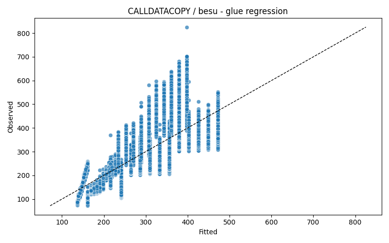

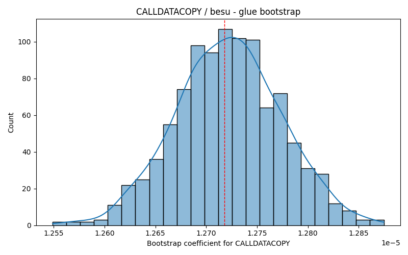


</details>

<details><summary><code>CALLDATALOAD</code> · nobs=8580 · runtime_ms=0 · p=1.00e+00 · R²=-2.22e-16</summary>

```
==============================================================================
                           NNLS Regression Results                            
==============================================================================
Dep. Variable:          test_runtime_ms              R-squared:         -0.000
Model:                  NNLS                    Adj. R-squared:         -0.000
No. Observations:       8580                              RMSE:           0.64
Df Residuals:           8578                               MAE:           0.42
Df Model:               1      
==============================================================================
                      coef     std err     P-value      [0.025      0.975]
------------------------------------------------------------------------------
         const      3.4154      0.0073       0.001      3.4013      3.4298
  CALLDATALOAD      0.0000      0.0000       1.000      0.0000      0.0000
==============================================================================
Notes: Non-negative least squares with bootstrap inference (1000 iterations)
==============================================================================
```

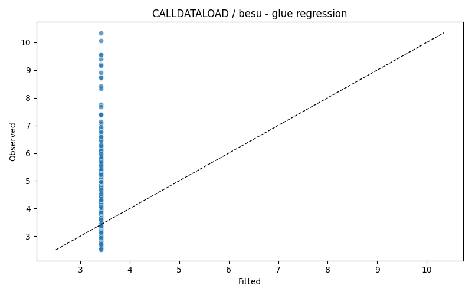


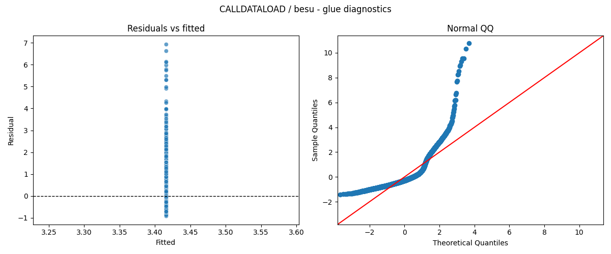

</details>

<details><summary><code>DIV</code> · nobs=2145 · runtime_ms=1.237e-05 · p=1.00e-03 · R²=0.8028</summary>

```
==============================================================================
                           NNLS Regression Results                            
==============================================================================
Dep. Variable:          test_runtime_ms              R-squared:          0.803
Model:                  NNLS                    Adj. R-squared:          0.803
No. Observations:       2145                              RMSE:          48.42
Df Residuals:           2143                               MAE:          39.53
Df Model:               1      
==============================================================================
                      coef     std err     P-value      [0.025      0.975]
------------------------------------------------------------------------------
         const    134.1746      2.9246       0.001    128.7584    139.7482
           DIV      0.0000      0.0000       0.001      0.0000      0.0000
==============================================================================
Notes: Non-negative least squares with bootstrap inference (1000 iterations)
==============================================================================
```

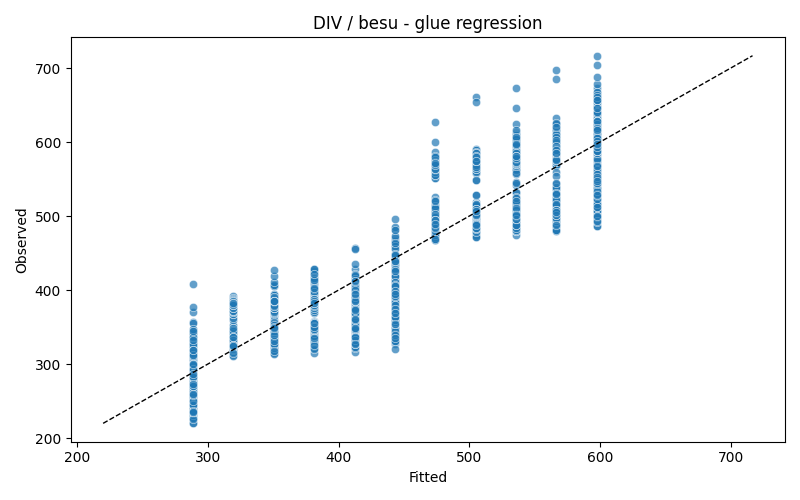

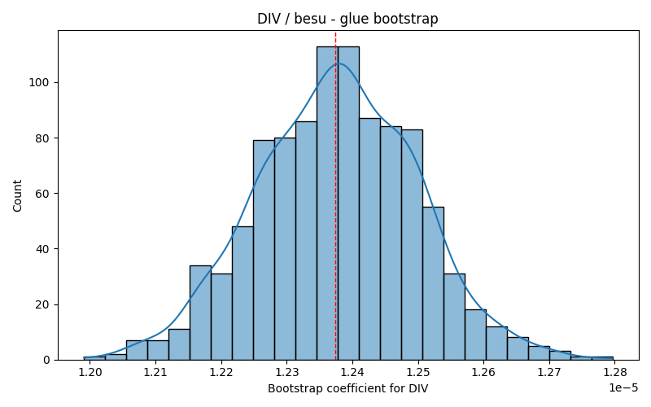

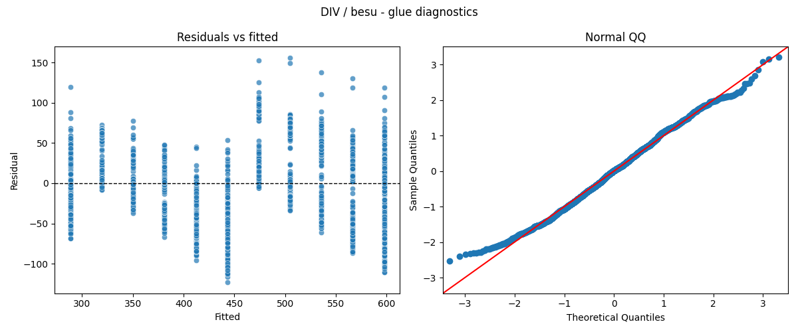

</details>

<details><summary><code>EXP</code> · nobs=2145 · runtime_ms=0.001005 · p=1.00e-03 · R²=0.7752</summary>

```
==============================================================================
                           NNLS Regression Results                            
==============================================================================
Dep. Variable:          test_runtime_ms              R-squared:          0.775
Model:                  NNLS                    Adj. R-squared:          0.775
No. Observations:       2145                              RMSE:          21.20
Df Residuals:           2143                               MAE:          16.51
Df Model:               1      
==============================================================================
                      coef     std err     P-value      [0.025      0.975]
------------------------------------------------------------------------------
         const     90.6977      1.8322       0.001     86.9008     94.0366
           EXP      0.0010      0.0000       0.001      0.0010      0.0010
==============================================================================
Notes: Non-negative least squares with bootstrap inference (1000 iterations)
==============================================================================
```

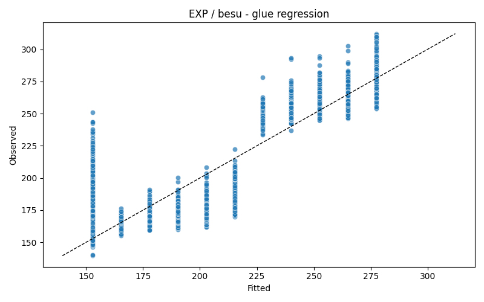

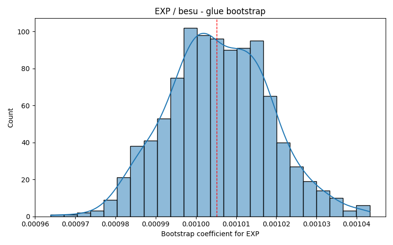

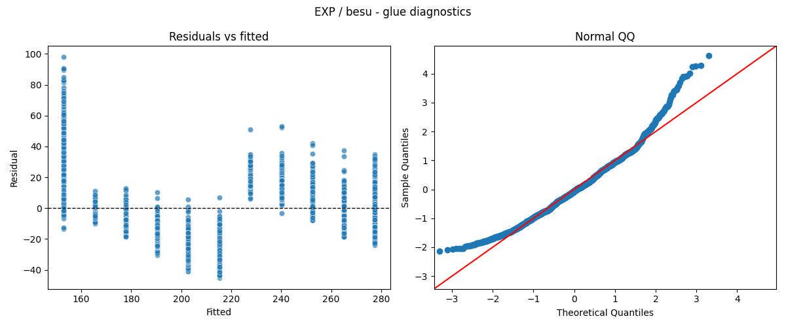

</details>

<details><summary><code>GT</code> · nobs=2145 · runtime_ms=1.769e-05 · p=1.00e-03 · R²=0.1407</summary>

```
==============================================================================
                           NNLS Regression Results                            
==============================================================================
Dep. Variable:          test_runtime_ms              R-squared:          0.141
Model:                  NNLS                    Adj. R-squared:          0.140
No. Observations:       2145                              RMSE:         460.13
Df Residuals:           2143                               MAE:         437.66
Df Model:               1      
==============================================================================
                      coef     std err     P-value      [0.025      0.975]
------------------------------------------------------------------------------
         const    138.0216     29.3715       0.001     81.5369    192.5314
            GT      0.0000      0.0000       0.001      0.0000      0.0000
==============================================================================
Notes: Non-negative least squares with bootstrap inference (1000 iterations)
==============================================================================
```

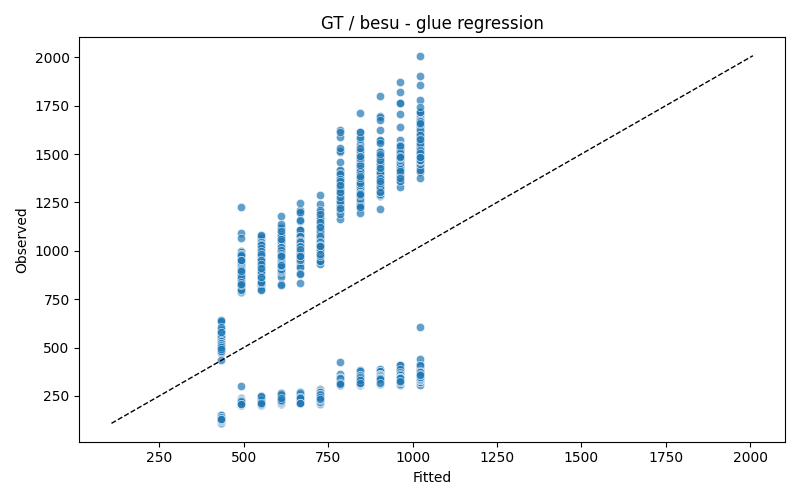

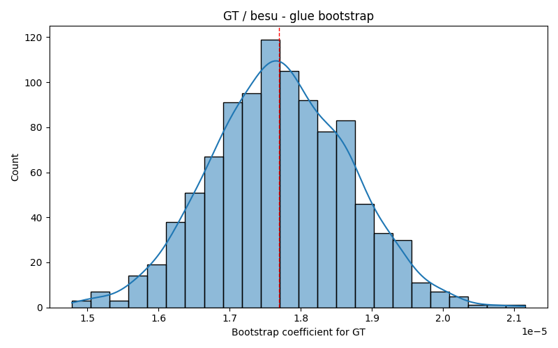

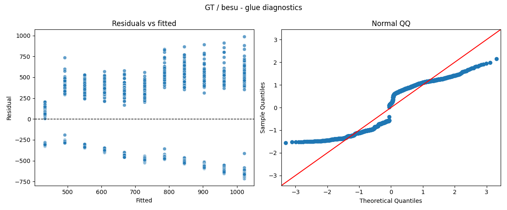

</details>

<details><summary><code>JUMPI</code> · nobs=2145 · runtime_ms=4.676e-06 · p=1.00e-03 · R²=0.7319</summary>

```
==============================================================================
                           NNLS Regression Results                            
==============================================================================
Dep. Variable:          test_runtime_ms              R-squared:          0.732
Model:                  NNLS                    Adj. R-squared:          0.732
No. Observations:       2145                              RMSE:          12.77
Df Residuals:           2143                               MAE:           9.42
Df Model:               1      
==============================================================================
                      coef     std err     P-value      [0.025      0.975]
------------------------------------------------------------------------------
         const     22.4348      0.9167       0.001     20.6524     24.1584
         JUMPI      0.0000      0.0000       0.001      0.0000      0.0000
==============================================================================
Notes: Non-negative least squares with bootstrap inference (1000 iterations)
==============================================================================
```


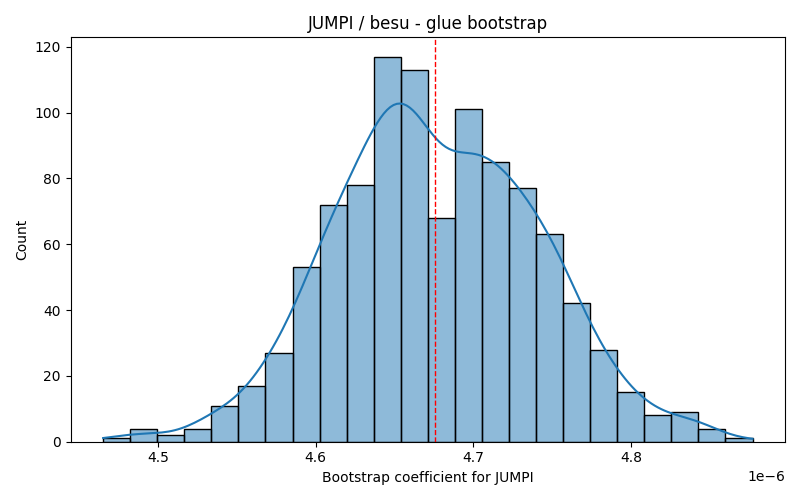

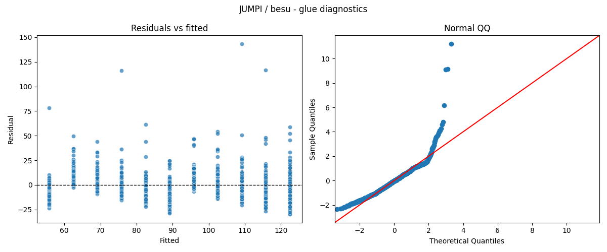

</details>

<details><summary><code>LT</code> · nobs=2145 · runtime_ms=1.797e-05 · p=1.00e-03 · R²=0.143</summary>

```
==============================================================================
                           NNLS Regression Results                            
==============================================================================
Dep. Variable:          test_runtime_ms              R-squared:          0.143
Model:                  NNLS                    Adj. R-squared:          0.143
No. Observations:       2145                              RMSE:         463.05
Df Residuals:           2143                               MAE:         440.73
Df Model:               1      
==============================================================================
                      coef     std err     P-value      [0.025      0.975]
------------------------------------------------------------------------------
         const    164.2909     30.4607       0.001    103.7275    223.9238
            LT      0.0000      0.0000       0.001      0.0000      0.0000
==============================================================================
Notes: Non-negative least squares with bootstrap inference (1000 iterations)
==============================================================================
```

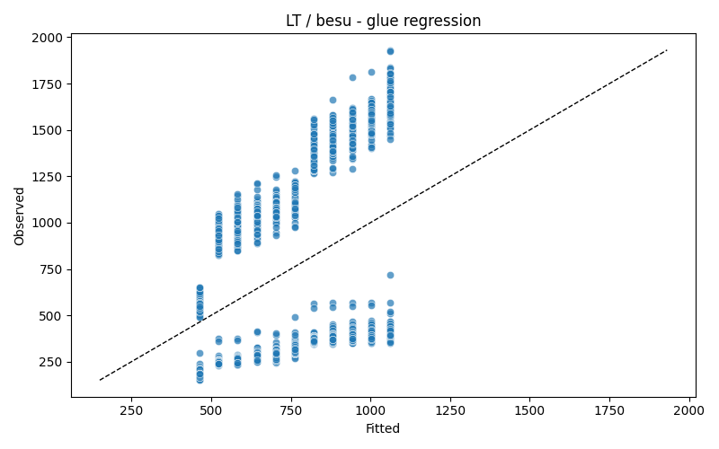

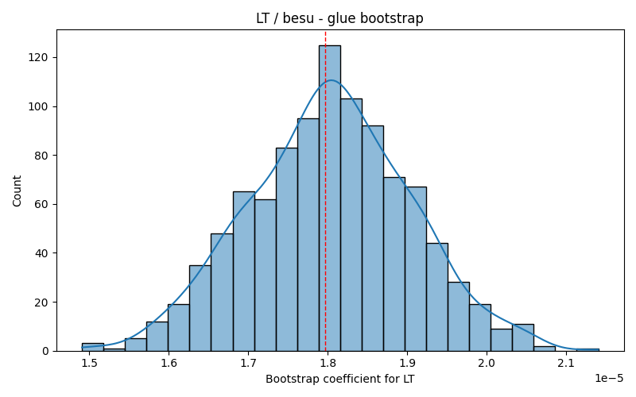

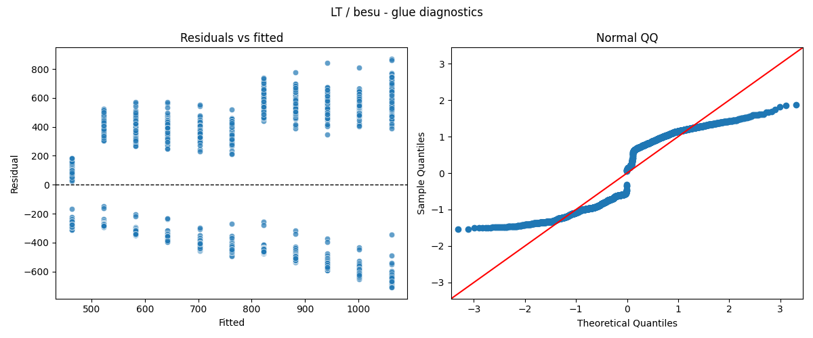

</details>

<details><summary><code>MSTORE</code> · nobs=10725 · runtime_ms=1.351e-05 · p=1.00e-03 · R²=0.8055</summary>

```
==============================================================================
                           NNLS Regression Results                            
==============================================================================
Dep. Variable:          test_runtime_ms              R-squared:          0.806
Model:                  NNLS                    Adj. R-squared:          0.806
No. Observations:       10725                             RMSE:          46.60
Df Residuals:           10723                              MAE:          37.89
Df Model:               1      
==============================================================================
                      coef     std err     P-value      [0.025      0.975]
------------------------------------------------------------------------------
         const     86.5984      1.5550       0.001     83.3776     89.4770
        MSTORE      0.0000      0.0000       0.001      0.0000      0.0000
==============================================================================
Notes: Non-negative least squares with bootstrap inference (1000 iterations)
==============================================================================
```

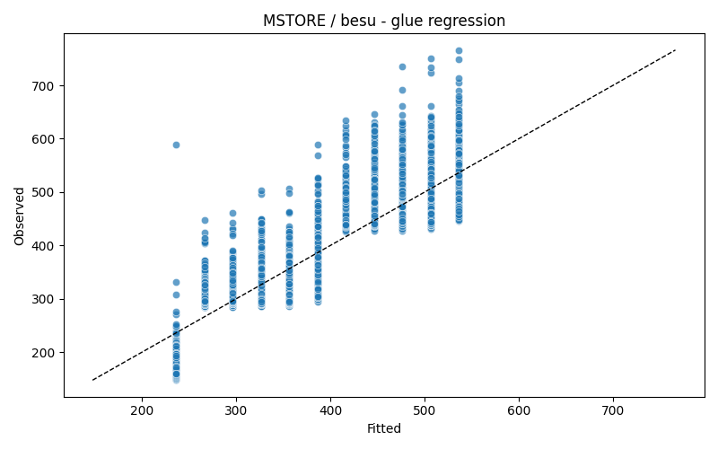

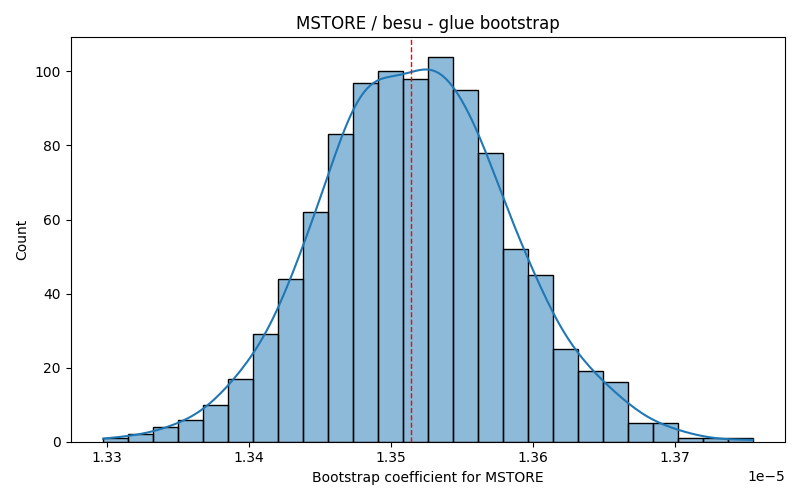

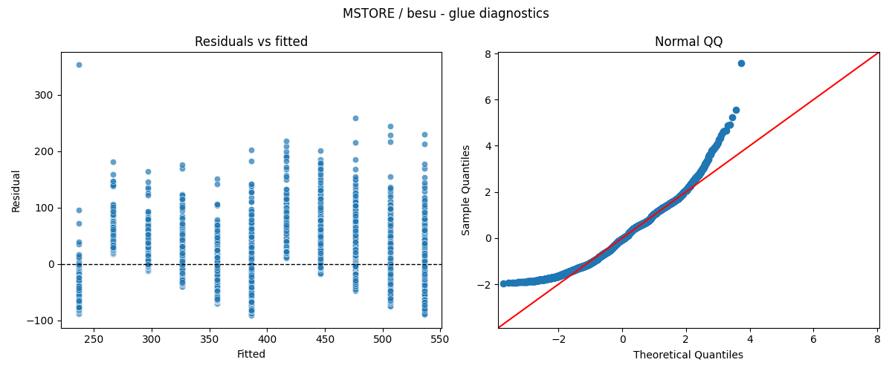

</details>

<details><summary><code>MSTORE8</code> · nobs=10725 · runtime_ms=8.412e-06 · p=1.00e-03 · R²=0.8357</summary>

```
==============================================================================
                           NNLS Regression Results                            
==============================================================================
Dep. Variable:          test_runtime_ms              R-squared:          0.836
Model:                  NNLS                    Adj. R-squared:          0.836
No. Observations:       10725                             RMSE:          26.17
Df Residuals:           10723                              MAE:          20.41
Df Model:               1      
==============================================================================
                      coef     std err     P-value      [0.025      0.975]
------------------------------------------------------------------------------
         const     53.6805      0.9036       0.001     51.8579     55.4563
       MSTORE8      0.0000      0.0000       0.001      0.0000      0.0000
==============================================================================
Notes: Non-negative least squares with bootstrap inference (1000 iterations)
==============================================================================
```

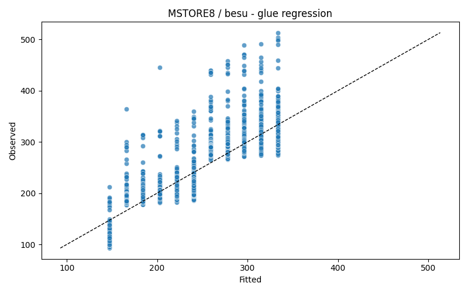

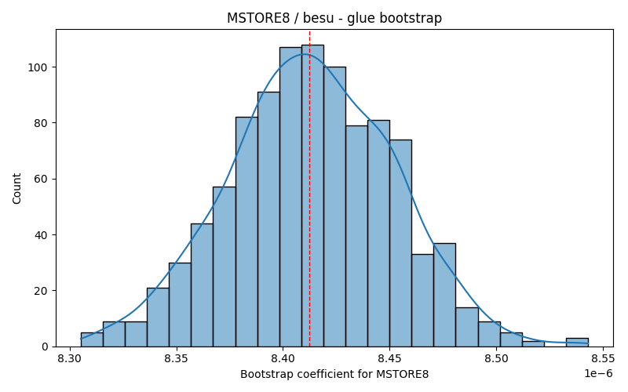

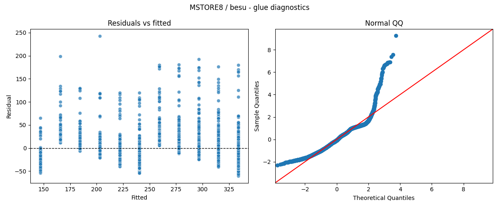

</details>

<details><summary><code>MUL</code> · nobs=2145 · runtime_ms=1.042e-05 · p=1.00e-03 · R²=0.8138</summary>

```
==============================================================================
                           NNLS Regression Results                            
==============================================================================
Dep. Variable:          test_runtime_ms              R-squared:          0.814
Model:                  NNLS                    Adj. R-squared:          0.814
No. Observations:       2145                              RMSE:          39.35
Df Residuals:           2143                               MAE:          31.19
Df Model:               1      
==============================================================================
                      coef     std err     P-value      [0.025      0.975]
------------------------------------------------------------------------------
         const     97.9281      2.3808       0.001     92.8190    102.3351
           MUL      0.0000      0.0000       0.001      0.0000      0.0000
==============================================================================
Notes: Non-negative least squares with bootstrap inference (1000 iterations)
==============================================================================
```

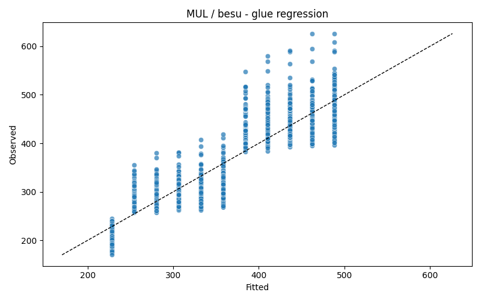

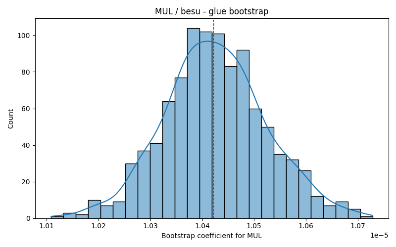

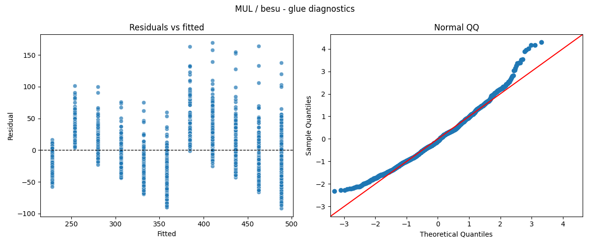

</details>

<details><summary><code>PC</code> · nobs=2145 · runtime_ms=2.687e-06 · p=1.00e-03 · R²=0.8615</summary>

```
==============================================================================
                           NNLS Regression Results                            
==============================================================================
Dep. Variable:          test_runtime_ms              R-squared:          0.861
Model:                  NNLS                    Adj. R-squared:          0.861
No. Observations:       2145                              RMSE:          32.21
Df Residuals:           2143                               MAE:          27.15
Df Model:               1      
==============================================================================
                      coef     std err     P-value      [0.025      0.975]
------------------------------------------------------------------------------
         const     71.9936      2.6183       0.001     67.1735     77.5551
            PC      0.0000      0.0000       0.001      0.0000      0.0000
==============================================================================
Notes: Non-negative least squares with bootstrap inference (1000 iterations)
==============================================================================
```

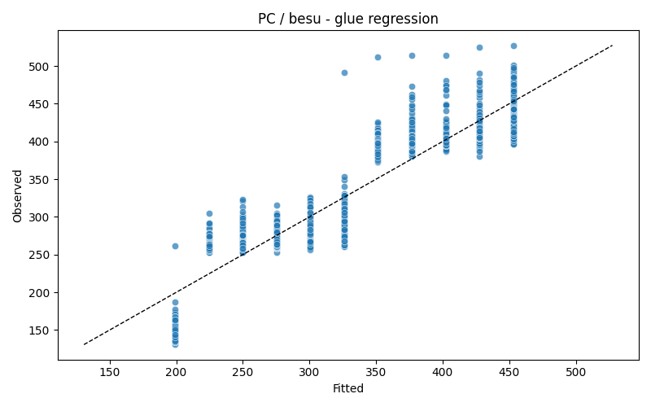


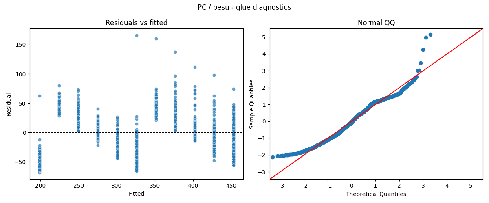

</details>

<details><summary><code>RETURNDATASIZE</code> · nobs=8580 · runtime_ms=3.925e-06 · p=1.00e-03 · R²=0.7769</summary>

```
==============================================================================
                           NNLS Regression Results                            
==============================================================================
Dep. Variable:          test_runtime_ms              R-squared:          0.777
Model:                  NNLS                    Adj. R-squared:          0.777
No. Observations:       8580                              RMSE:          33.21
Df Residuals:           8578                               MAE:          22.61
Df Model:               1      
==============================================================================
                      coef     std err     P-value      [0.025      0.975]
------------------------------------------------------------------------------
         const     55.8544      1.1878       0.001     53.5587     58.2361
RETURNDATASIZE      0.0000      0.0000       0.001      0.0000      0.0000
==============================================================================
Notes: Non-negative least squares with bootstrap inference (1000 iterations)
==============================================================================
```

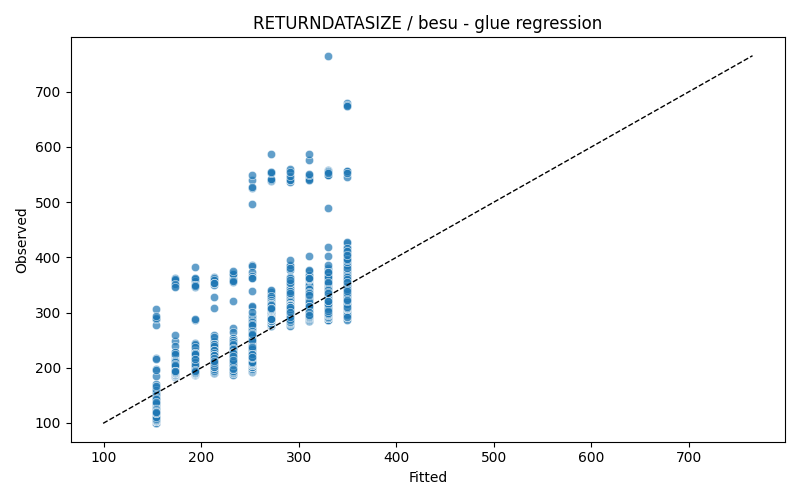

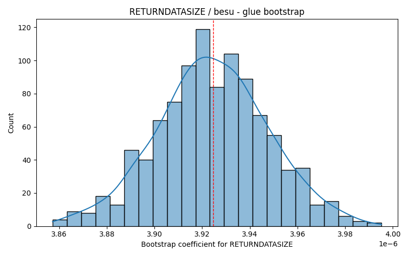

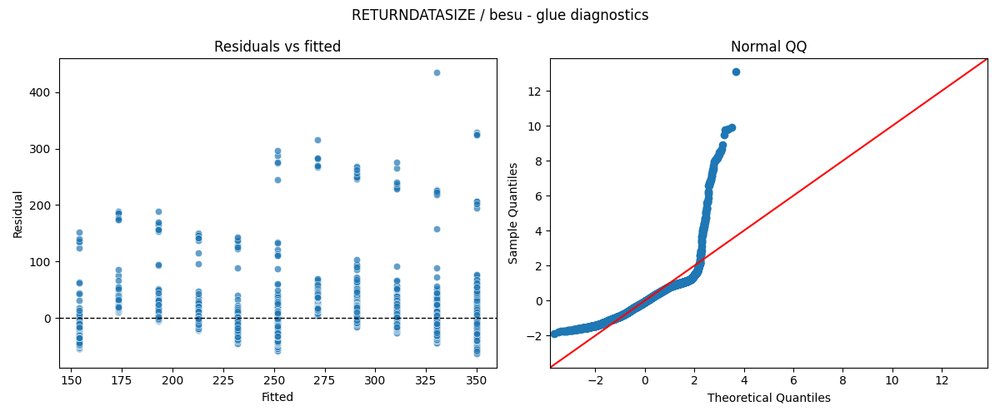

</details>

<details><summary><code>SELFBALANCE</code> · nobs=1755 · runtime_ms=9.4e-06 · p=1.00e-03 · R²=0.7066</summary>

```
==============================================================================
                           NNLS Regression Results                            
==============================================================================
Dep. Variable:          test_runtime_ms              R-squared:          0.707
Model:                  NNLS                    Adj. R-squared:          0.706
No. Observations:       1755                              RMSE:          61.11
Df Residuals:           1753                               MAE:          48.19
Df Model:               1      
==============================================================================
                      coef     std err     P-value      [0.025      0.975]
------------------------------------------------------------------------------
         const    235.1532      5.0138       0.001    225.4124    245.1334
   SELFBALANCE      0.0000      0.0000       0.001      0.0000      0.0000
==============================================================================
Notes: Non-negative least squares with bootstrap inference (1000 iterations)
==============================================================================
```

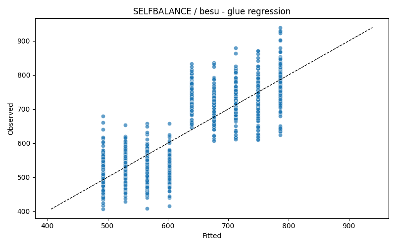

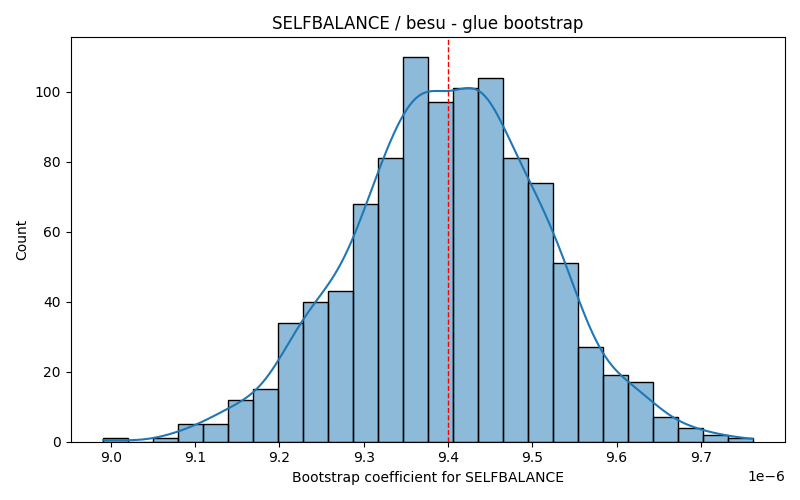

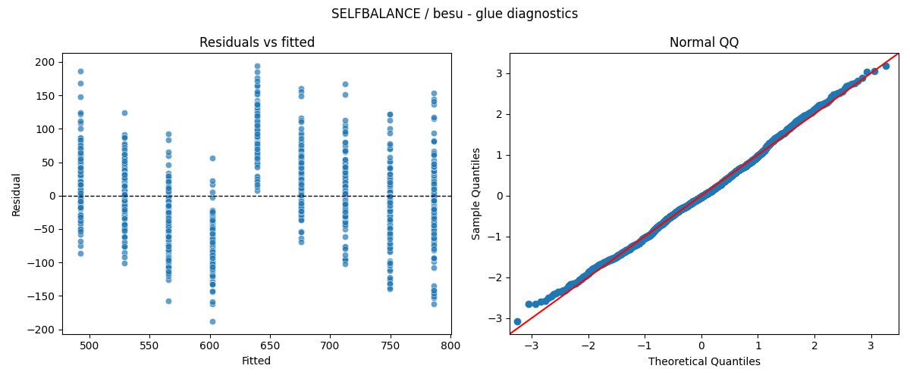

</details>

<details><summary><code>SUB</code> · nobs=2145 · runtime_ms=8.305e-06 · p=1.00e-03 · R²=0.8284</summary>

```
==============================================================================
                           NNLS Regression Results                            
==============================================================================
Dep. Variable:          test_runtime_ms              R-squared:          0.828
Model:                  NNLS                    Adj. R-squared:          0.828
No. Observations:       2145                              RMSE:          39.78
Df Residuals:           2143                               MAE:          31.81
Df Model:               1      
==============================================================================
                      coef     std err     P-value      [0.025      0.975]
------------------------------------------------------------------------------
         const     83.8089      2.9046       0.001     77.9331     89.5684
           SUB      0.0000      0.0000       0.001      0.0000      0.0000
==============================================================================
Notes: Non-negative least squares with bootstrap inference (1000 iterations)
==============================================================================
```


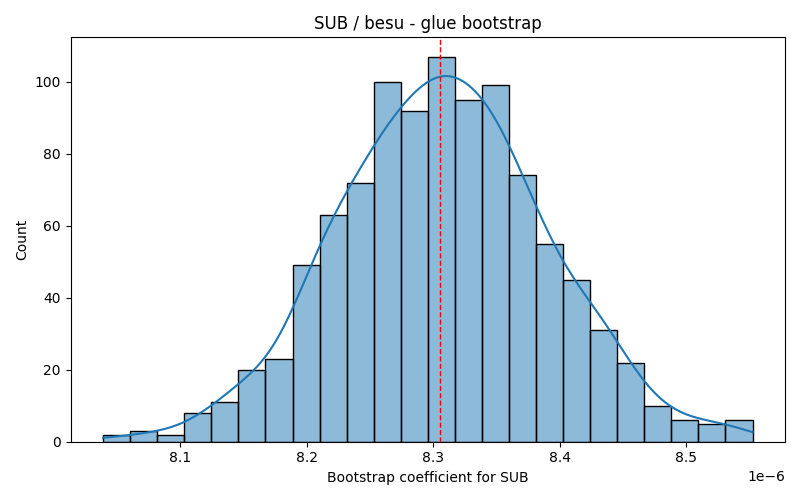

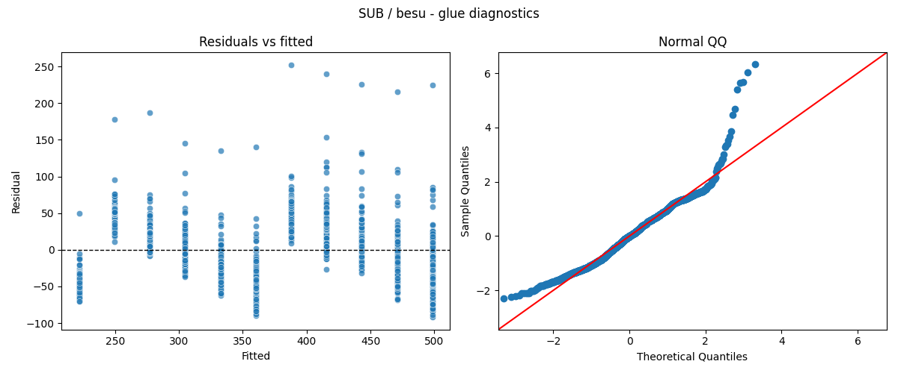

</details>

### Mixed glue (tier B) · besu

<details><summary><code>JUMP</code> · nobs=2145 · runtime_ms=3.922e-05 · p=1.00e-03 · R²=0.8535</summary>

```
==============================================================================
                           NNLS Regression Results                            
==============================================================================
Dep. Variable:          test_runtime_ms              R-squared:          0.853
Model:                  NNLS                    Adj. R-squared:          0.853
No. Observations:       2145                              RMSE:          60.38
Df Residuals:           2143                               MAE:          50.66
Df Model:               1      
==============================================================================
                      coef     std err     P-value      [0.025      0.975]
------------------------------------------------------------------------------
         const    131.5869      4.8000       0.001    122.1988    141.1151
          JUMP      0.0000      0.0000       0.001      0.0000      0.0000
==============================================================================
Notes: Non-negative least squares with bootstrap inference (1000 iterations)
==============================================================================
```

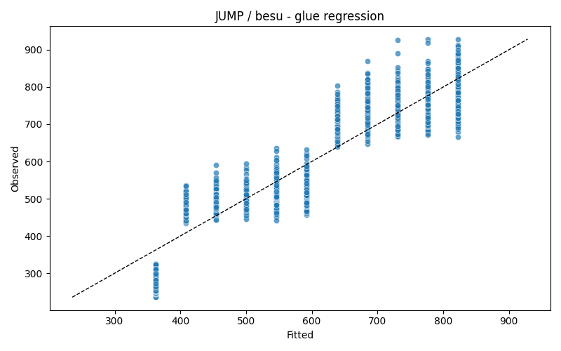

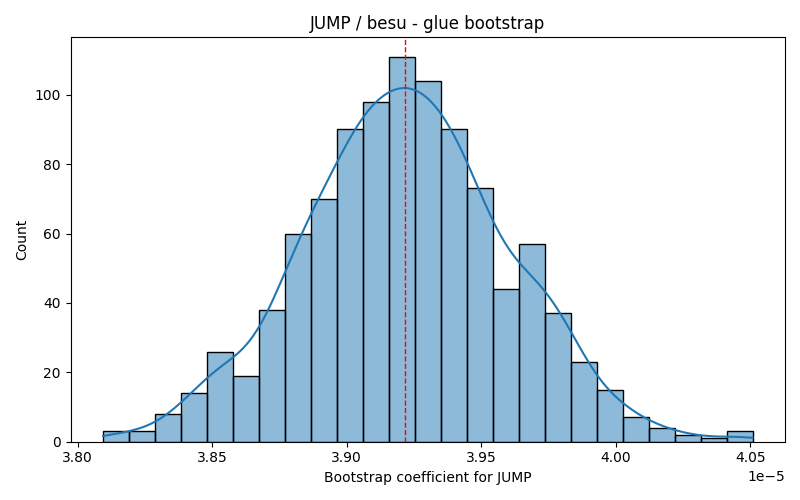

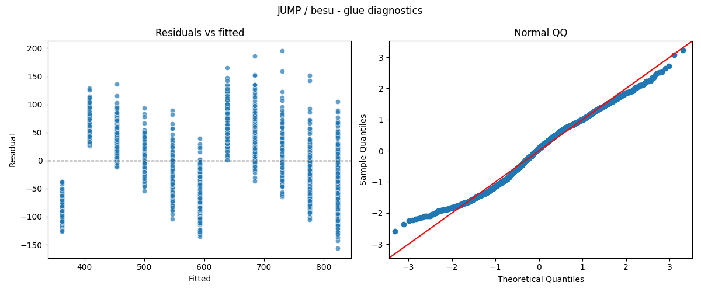

</details>

<details><summary><code>KECCAK256</code> · nobs=34320 · runtime_ms=3.45e-05 · p=1.00e-03 · R²=0.1543</summary>

```
==============================================================================
                           NNLS Regression Results                            
==============================================================================
Dep. Variable:          test_runtime_ms              R-squared:          0.154
Model:                  NNLS                    Adj. R-squared:          0.154
No. Observations:       34320                             RMSE:         160.50
Df Residuals:           34318                              MAE:         127.95
Df Model:               1      
==============================================================================
                      coef     std err     P-value      [0.025      0.975]
------------------------------------------------------------------------------
         const    510.0999      1.8442       0.001    506.5307    513.5625
     KECCAK256      0.0000      0.0000       0.001      0.0000      0.0000
==============================================================================
Notes: Non-negative least squares with bootstrap inference (1000 iterations)
==============================================================================
```

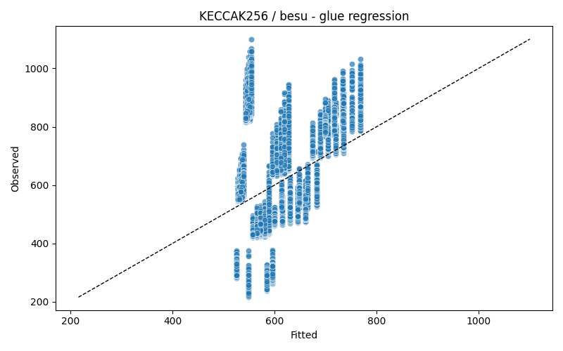

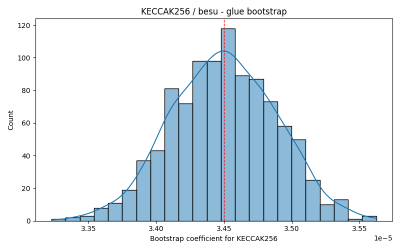

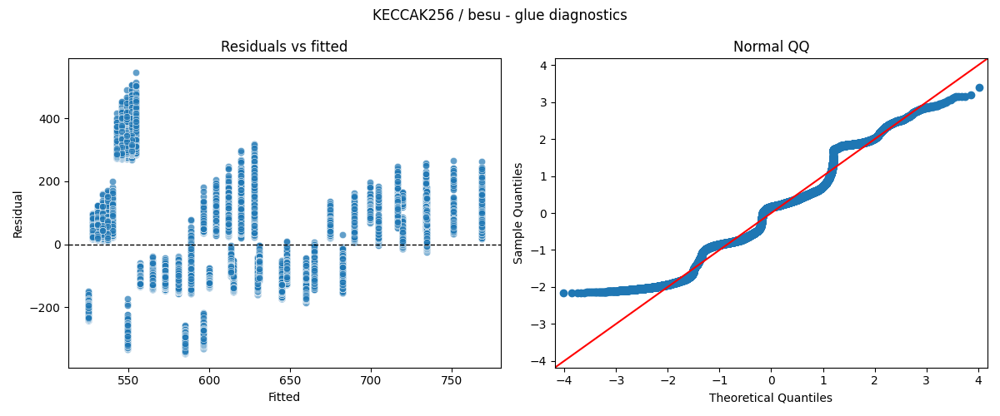

</details>

## erigon

| glue_opcode | nobs | glue_runtime_ms | p_value | rsquared |
| --- | --- | --- | --- | --- |
| `ISZERO` | 132 | 1.146e-06 | 1.00e-03 | 0.4587 |
| `JUMPDEST` | 132 | 7.661e-07 | 1.00e-03 | 0.9276 |
| `SWAP` | 2112 | 1.223e-06 | 1.00e-03 | 0.6715 |
| `CALLDATASIZE` | 7898 | 8.646e-07 | 1.00e-03 | 0.8967 |
| `DUP` | 7898 | 1.093e-06 | 1.00e-03 | 0.8967 |
| `GAS` | 7898 | 9.05e-07 | 1.00e-03 | 0.8967 |
| `MLOAD` | 7898 | 3.39e-06 | 1.00e-03 | 0.8967 |
| `PUSH` | 7898 | 2.697e-06 | 1.00e-03 | 0.8967 |
| `PUSH0` | 7898 | 8.667e-07 | 1.00e-03 | 0.8967 |
| `STATICCALL` | 7898 | 0.0004755 | 1.00e-03 | 0.8967 |
| `ADD` | 132 | 2.864e-06 | 1.00e-03 | 0.9104 |
| `AND` | 132 | 3.173e-06 | 1.00e-03 | 0.6377 |
| `CALLDATACOPY` | 3168 | 7.524e-06 | 1.00e-03 | 0.8373 |
| `CALLDATALOAD` | 528 | 0.0001489 | 1.60e-02 | 0.004462 |
| `DIV` | 132 | 9.664e-06 | 1.00e-03 | 0.8849 |
| `EXP` | 132 | 0.0003788 | 1.00e-03 | 0.1271 |
| `GT` | 132 | 2.835e-06 | 1.00e-03 | 0.9327 |
| `JUMPI` | 132 | 3.872e-06 | 1.00e-03 | 0.3294 |
| `LT` | 132 | 2.844e-06 | 1.00e-03 | 0.9182 |
| `MSTORE` | 660 | 5.684e-06 | 1.00e-03 | 0.8205 |
| `MSTORE8` | 660 | 5.203e-06 | 1.00e-03 | 0.6832 |
| `MUL` | 132 | 3.536e-06 | 1.00e-03 | 0.9315 |
| `PC` | 132 | 1.361e-06 | 1.00e-03 | 0.7403 |
| `RETURNDATASIZE` | 528 | 1.714e-06 | 1.00e-03 | 0.5694 |
| `SELFBALANCE` | 108 | 1.367e-06 | 1.00e-03 | 0.8692 |
| `SUB` | 132 | 2.768e-06 | 1.00e-03 | 0.6234 |
| `JUMP` | 132 | 7.161e-06 | 1.00e-03 | 0.7059 |
| `KECCAK256` | 2112 | 1.837e-05 | 1.00e-03 | 0.06452 |

### Cycle glue — joint fit · erigon

<details><summary>Joint NNLS regression summary</summary>

```
==============================================================================
                           NNLS Regression Results                            
==============================================================================
Dep. Variable:          test_runtime_ms              R-squared:          0.897
Model:                  NNLS                    Adj. R-squared:          0.897
No. Observations:       7898                              RMSE:          36.66
Df Residuals:           7890                               MAE:          17.98
Df Model:               7      
==============================================================================
                      coef     std err     P-value      [0.025      0.975]
------------------------------------------------------------------------------
         const     29.5745      1.3217       0.001     26.9269     32.0743
  CALLDATASIZE      0.0000      0.0000       0.001      0.0000      0.0000
           DUP      0.0000      0.0000       0.001      0.0000      0.0000
           GAS      0.0000      0.0000       0.001      0.0000      0.0000
         MLOAD      0.0000      0.0000       0.001      0.0000      0.0000
          PUSH      0.0000      0.0000       0.001      0.0000      0.0000
         PUSH0      0.0000      0.0000       0.001      0.0000      0.0000
    STATICCALL      0.0005      0.0000       0.001      0.0005      0.0005
==============================================================================
Notes: Non-negative least squares with bootstrap inference (1000 iterations)
==============================================================================
```

</details>

<details><summary><code>CALLDATASIZE</code> · nobs=7898 · runtime_ms=8.646e-07 · p=1.00e-03 · R²=0.8967</summary>

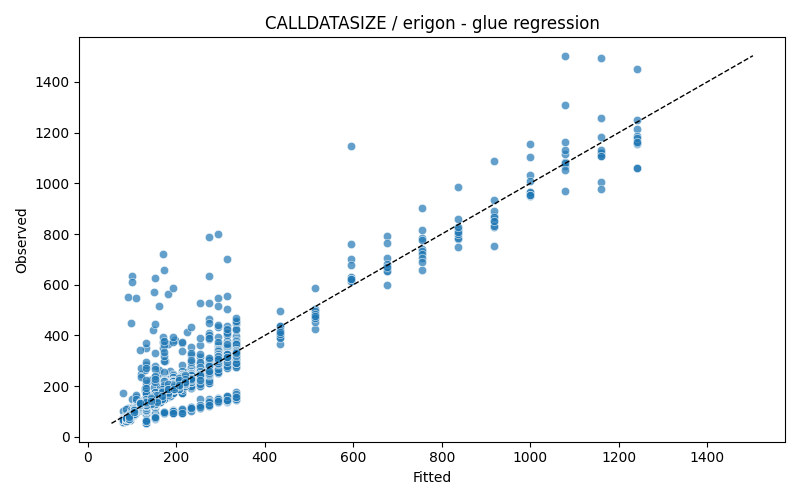


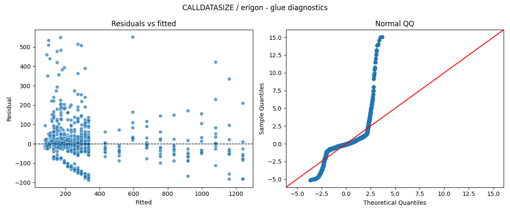

</details>

<details><summary><code>DUP</code> · nobs=7898 · runtime_ms=1.093e-06 · p=1.00e-03 · R²=0.8967</summary>

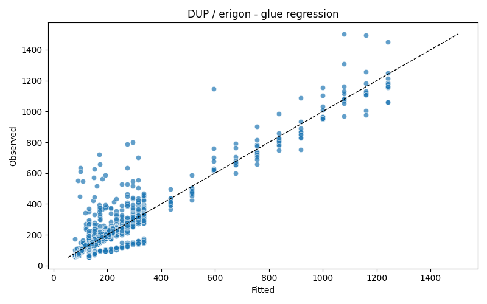

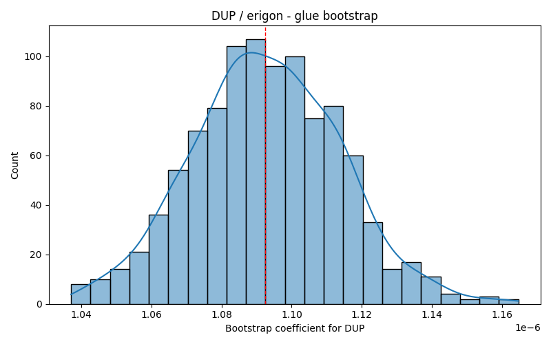

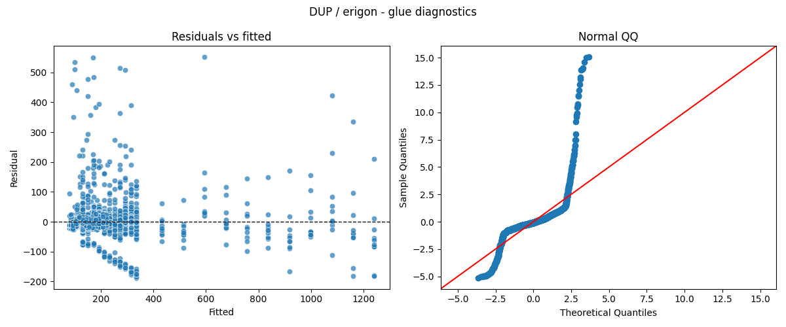

</details>

<details><summary><code>GAS</code> · nobs=7898 · runtime_ms=9.05e-07 · p=1.00e-03 · R²=0.8967</summary>


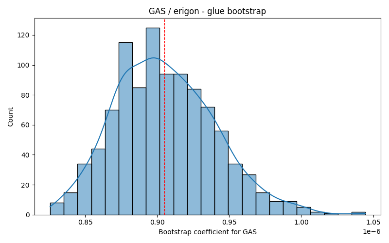

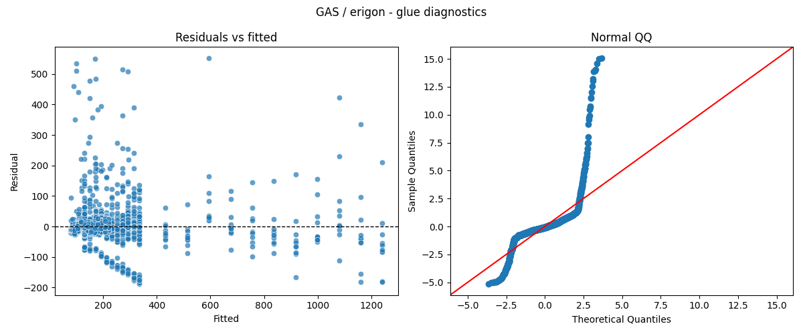

</details>

<details><summary><code>MLOAD</code> · nobs=7898 · runtime_ms=3.39e-06 · p=1.00e-03 · R²=0.8967</summary>


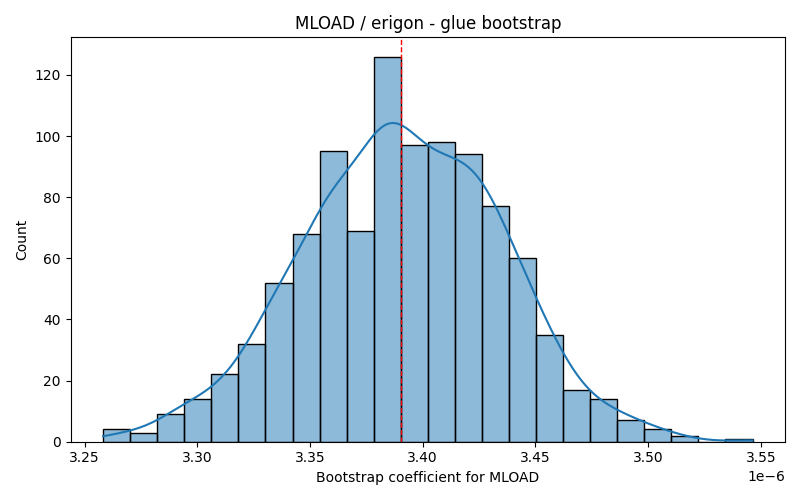


</details>

<details><summary><code>PUSH</code> · nobs=7898 · runtime_ms=2.697e-06 · p=1.00e-03 · R²=0.8967</summary>


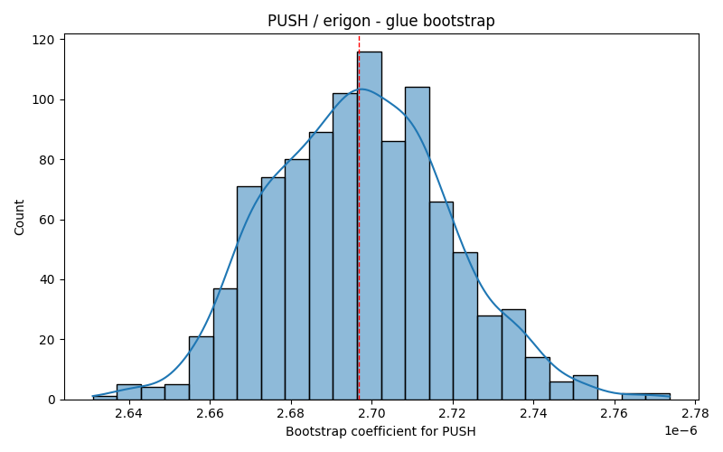

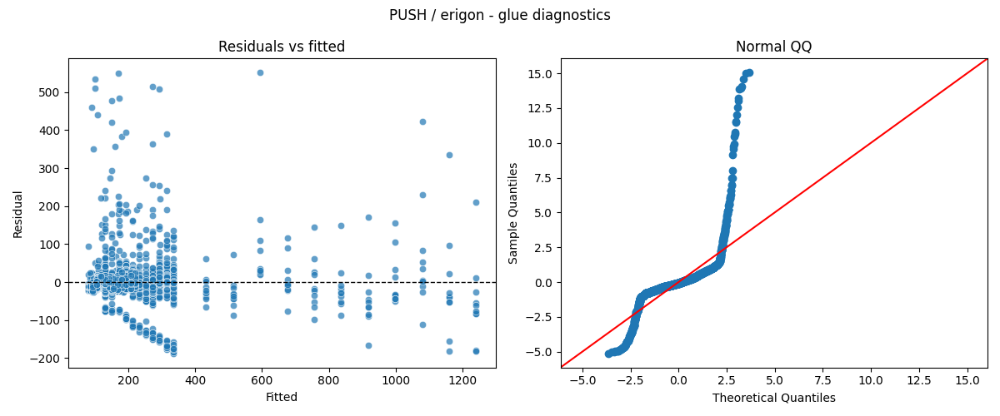

</details>

<details><summary><code>PUSH0</code> · nobs=7898 · runtime_ms=8.667e-07 · p=1.00e-03 · R²=0.8967</summary>

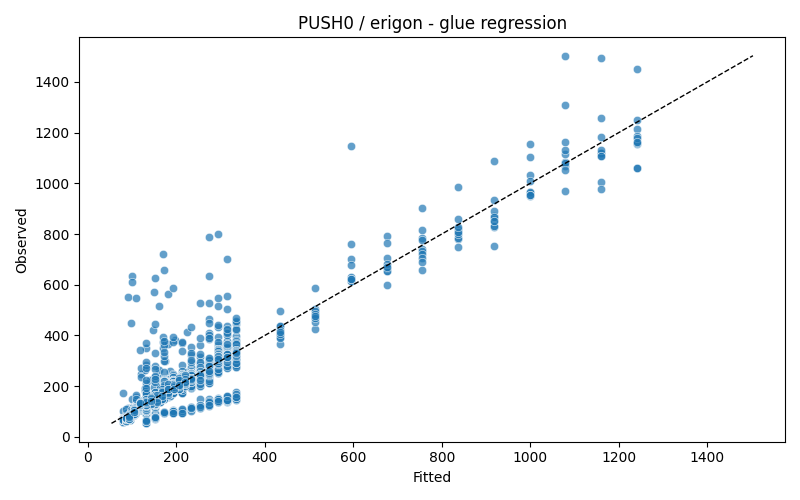

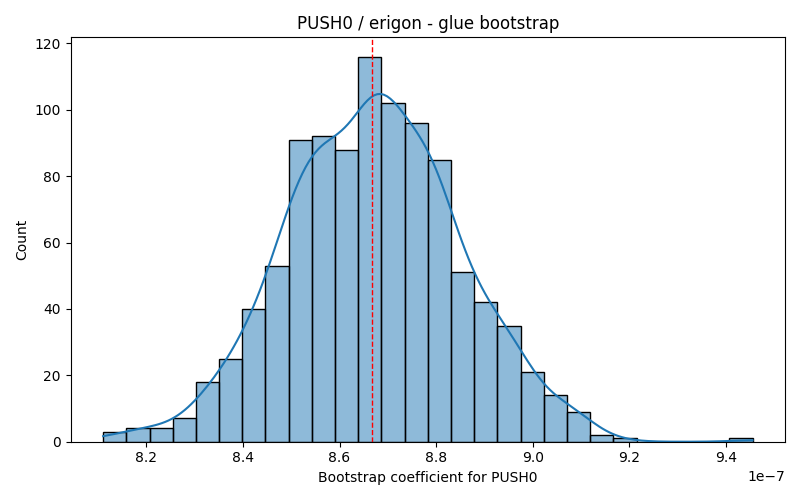


</details>

<details><summary><code>STATICCALL</code> · nobs=7898 · runtime_ms=0.0004755 · p=1.00e-03 · R²=0.8967</summary>

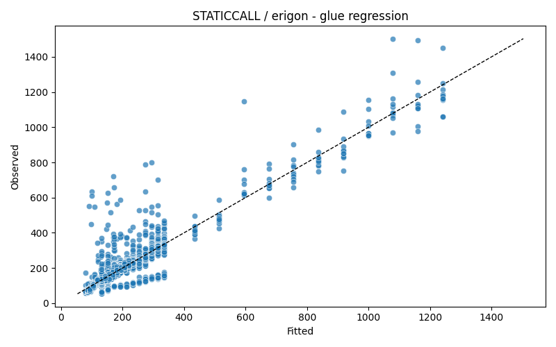

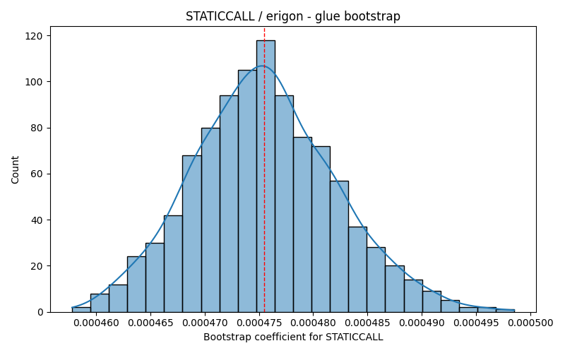


</details>

### Pure glue · erigon

<details><summary><code>ISZERO</code> · nobs=132 · runtime_ms=1.146e-06 · p=1.00e-03 · R²=0.4587</summary>

```
==============================================================================
                           NNLS Regression Results                            
==============================================================================
Dep. Variable:          test_runtime_ms              R-squared:          0.459
Model:                  NNLS                    Adj. R-squared:          0.455
No. Observations:       132                               RMSE:          26.22
Df Residuals:           130                                MAE:           9.05
Df Model:               1      
==============================================================================
                      coef     std err     P-value      [0.025      0.975]
------------------------------------------------------------------------------
         const     12.1839      3.7576       0.005      3.6498     18.6116
        ISZERO      0.0000      0.0000       0.001      0.0000      0.0000
==============================================================================
Notes: Non-negative least squares with bootstrap inference (1000 iterations)
==============================================================================
```

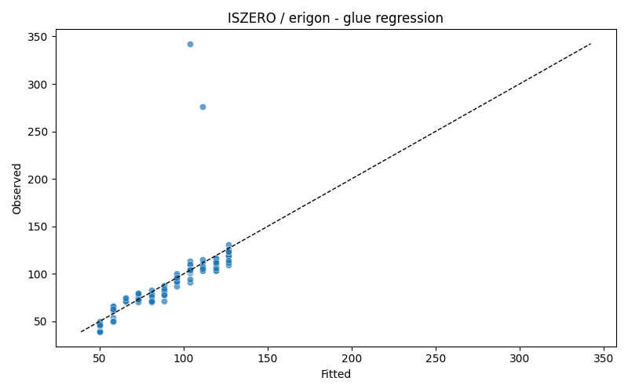

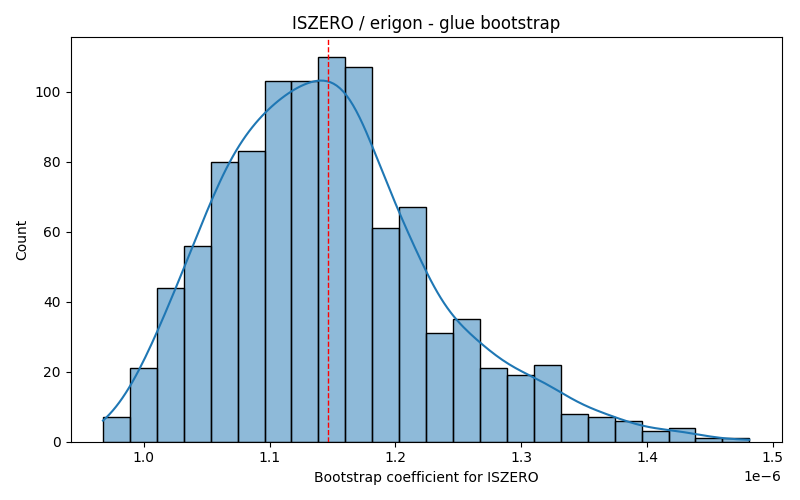

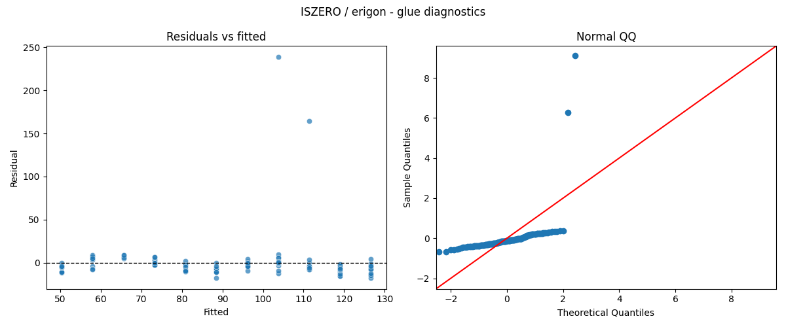

</details>

<details><summary><code>JUMPDEST</code> · nobs=132 · runtime_ms=7.661e-07 · p=1.00e-03 · R²=0.9276</summary>

```
==============================================================================
                           NNLS Regression Results                            
==============================================================================
Dep. Variable:          test_runtime_ms              R-squared:          0.928
Model:                  NNLS                    Adj. R-squared:          0.927
No. Observations:       132                               RMSE:          13.52
Df Residuals:           130                                MAE:          10.87
Df Model:               1      
==============================================================================
                      coef     std err     P-value      [0.025      0.975]
------------------------------------------------------------------------------
         const     22.9846      3.9389       0.001     15.6653     31.2029
      JUMPDEST      0.0000      0.0000       0.001      0.0000      0.0000
==============================================================================
Notes: Non-negative least squares with bootstrap inference (1000 iterations)
==============================================================================
```

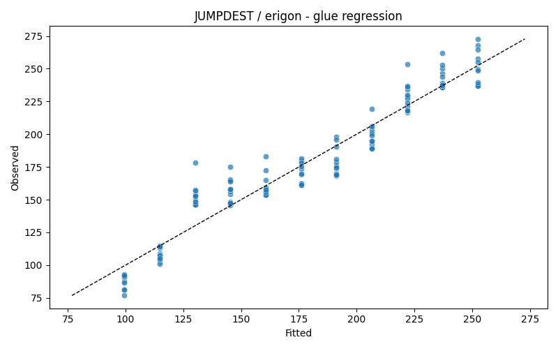

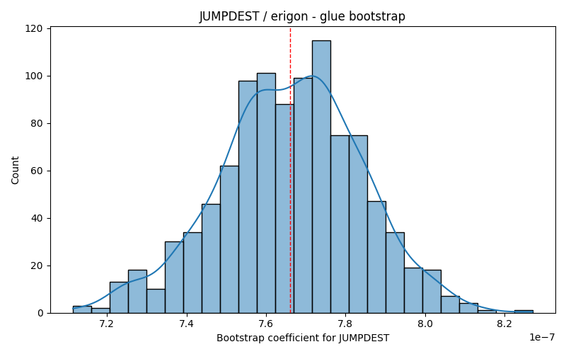

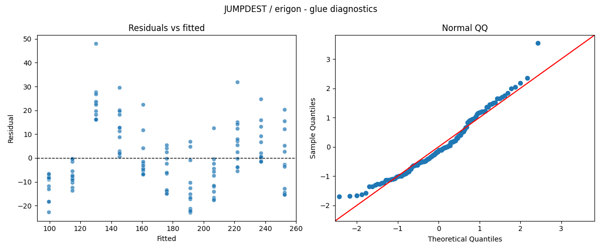

</details>

<details><summary><code>SWAP</code> · nobs=2112 · runtime_ms=1.223e-06 · p=1.00e-03 · R²=0.6715</summary>

```
==============================================================================
                           NNLS Regression Results                            
==============================================================================
Dep. Variable:          test_runtime_ms              R-squared:          0.672
Model:                  NNLS                    Adj. R-squared:          0.671
No. Observations:       2112                              RMSE:          18.00
Df Residuals:           2110                               MAE:           6.86
Df Model:               1      
==============================================================================
                      coef     std err     P-value      [0.025      0.975]
------------------------------------------------------------------------------
         const     25.0909      1.2378       0.001     23.0290     27.8519
          SWAP      0.0000      0.0000       0.001      0.0000      0.0000
==============================================================================
Notes: Non-negative least squares with bootstrap inference (1000 iterations)
==============================================================================
```

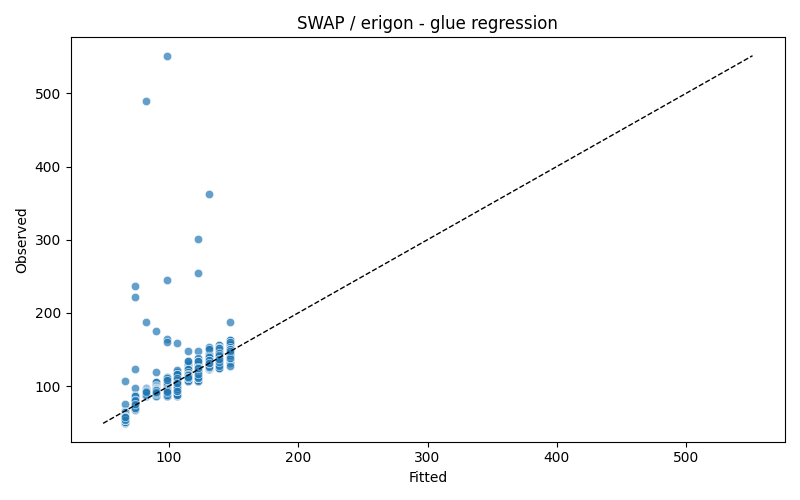

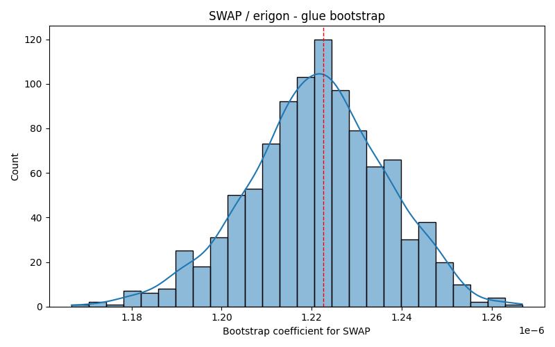

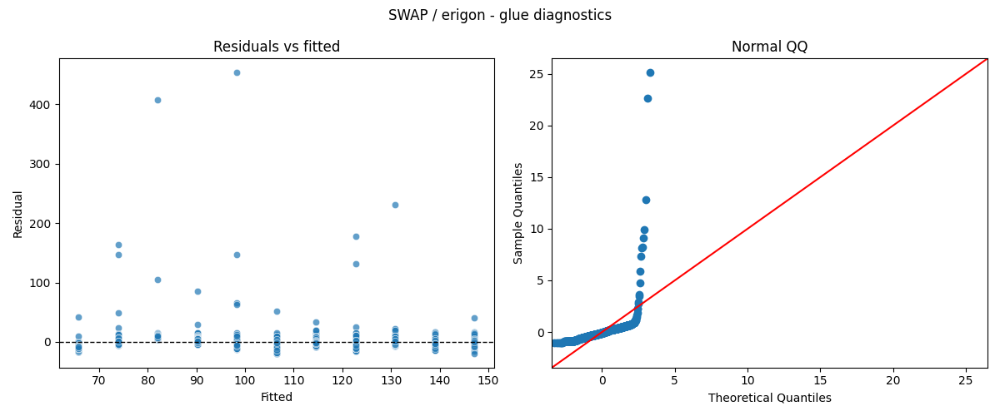

</details>

### Mixed glue (tier A) · erigon

<details><summary><code>ADD</code> · nobs=132 · runtime_ms=2.864e-06 · p=1.00e-03 · R²=0.9104</summary>

```
==============================================================================
                           NNLS Regression Results                            
==============================================================================
Dep. Variable:          test_runtime_ms              R-squared:          0.910
Model:                  NNLS                    Adj. R-squared:          0.910
No. Observations:       132                               RMSE:           9.46
Df Residuals:           130                                MAE:           7.62
Df Model:               1      
==============================================================================
                      coef     std err     P-value      [0.025      0.975]
------------------------------------------------------------------------------
         const     16.8201      2.7164       0.001     11.8025     22.4833
           ADD      0.0000      0.0000       0.001      0.0000      0.0000
==============================================================================
Notes: Non-negative least squares with bootstrap inference (1000 iterations)
==============================================================================
```

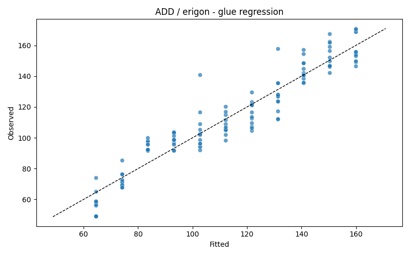

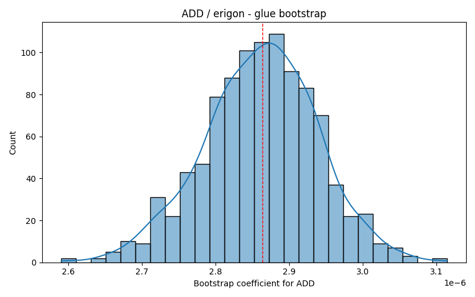

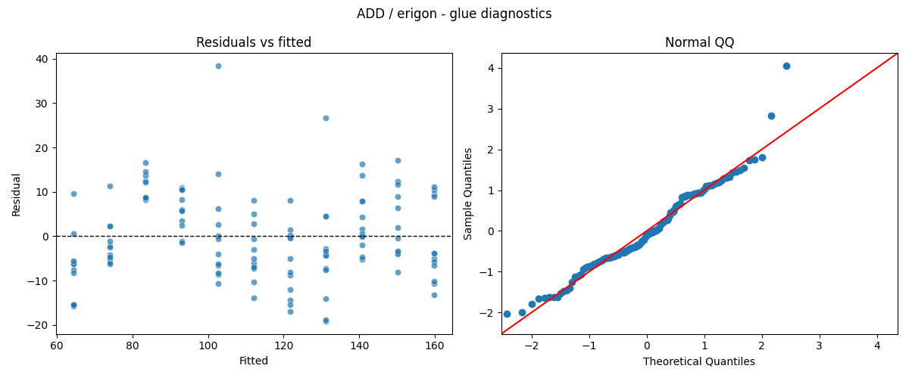

</details>

<details><summary><code>AND</code> · nobs=132 · runtime_ms=3.173e-06 · p=1.00e-03 · R²=0.6377</summary>

```
==============================================================================
                           NNLS Regression Results                            
==============================================================================
Dep. Variable:          test_runtime_ms              R-squared:          0.638
Model:                  NNLS                    Adj. R-squared:          0.635
No. Observations:       132                               RMSE:          25.18
Df Residuals:           130                                MAE:          10.59
Df Model:               1      
==============================================================================
                      coef     std err     P-value      [0.025      0.975]
------------------------------------------------------------------------------
         const      4.3112      5.3886       0.282      0.0000     16.1666
           AND      0.0000      0.0000       0.001      0.0000      0.0000
==============================================================================
Notes: Non-negative least squares with bootstrap inference (1000 iterations)
==============================================================================
```

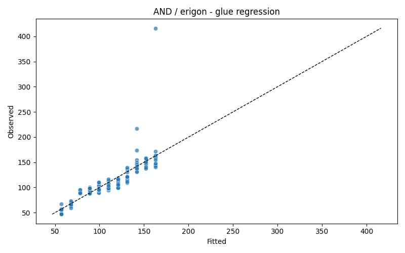

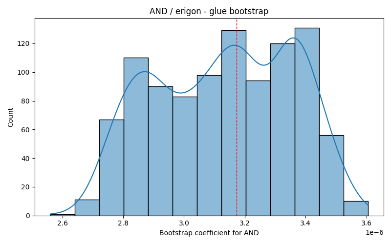

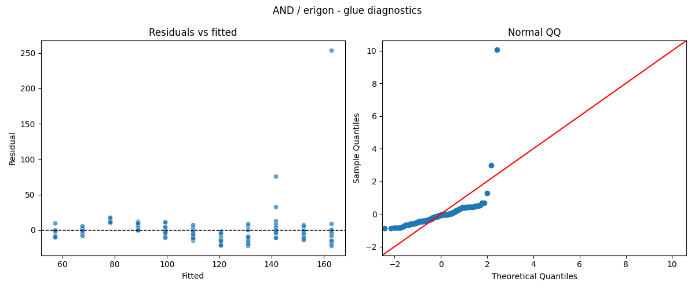

</details>

<details><summary><code>CALLDATACOPY</code> · nobs=3168 · runtime_ms=7.524e-06 · p=1.00e-03 · R²=0.8373</summary>

```
==============================================================================
                           NNLS Regression Results                            
==============================================================================
Dep. Variable:          test_runtime_ms              R-squared:          0.837
Model:                  NNLS                    Adj. R-squared:          0.837
No. Observations:       3168                              RMSE:          24.94
Df Residuals:           3166                               MAE:           9.56
Df Model:               1      
==============================================================================
                      coef     std err     P-value      [0.025      0.975]
------------------------------------------------------------------------------
         const     18.7486      0.6004       0.001     17.6240     20.0119
  CALLDATACOPY      0.0000      0.0000       0.001      0.0000      0.0000
==============================================================================
Notes: Non-negative least squares with bootstrap inference (1000 iterations)
==============================================================================
```

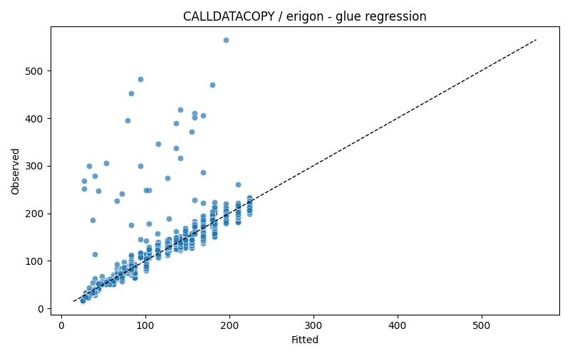

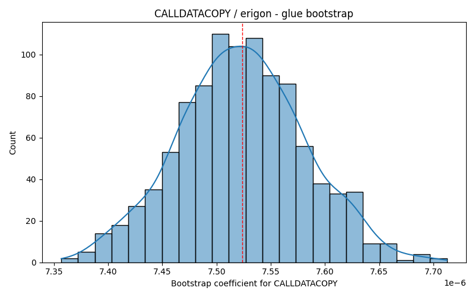

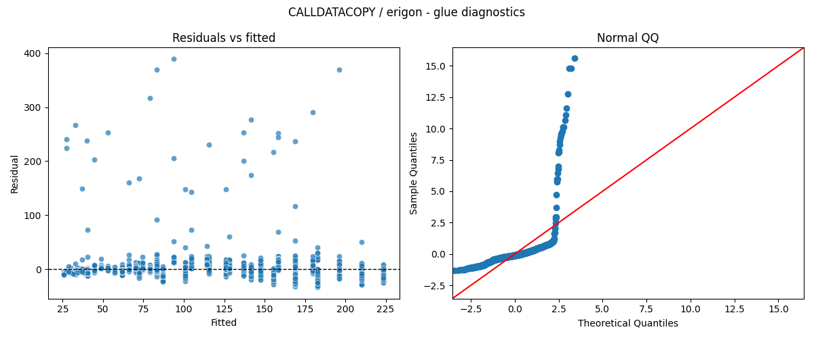

</details>

<details><summary><code>CALLDATALOAD</code> · nobs=528 · runtime_ms=0.0001489 · p=1.60e-02 · R²=0.004462</summary>

```
==============================================================================
                           NNLS Regression Results                            
==============================================================================
Dep. Variable:          test_runtime_ms              R-squared:          0.004
Model:                  NNLS                    Adj. R-squared:          0.003
No. Observations:       528                               RMSE:           8.54
Df Residuals:           526                                MAE:           1.08
Df Model:               1      
==============================================================================
                      coef     std err     P-value      [0.025      0.975]
------------------------------------------------------------------------------
         const      5.0364      1.1124       0.001      2.5104      6.5230
  CALLDATALOAD      0.0001      0.0001       0.016      0.0000      0.0004
==============================================================================
Notes: Non-negative least squares with bootstrap inference (1000 iterations)
==============================================================================
```

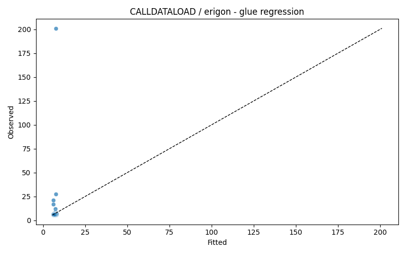

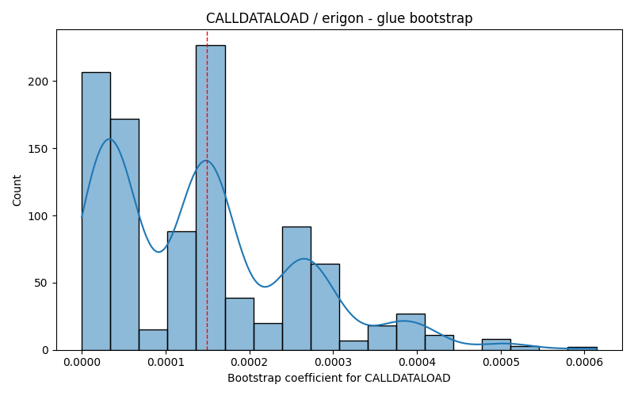

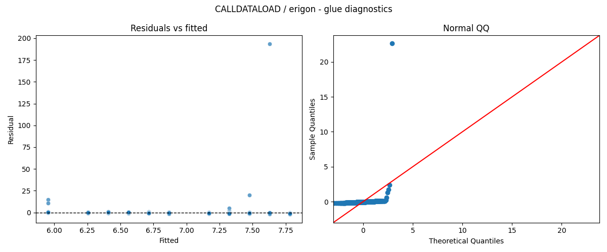

</details>

<details><summary><code>DIV</code> · nobs=132 · runtime_ms=9.664e-06 · p=1.00e-03 · R²=0.8849</summary>

```
==============================================================================
                           NNLS Regression Results                            
==============================================================================
Dep. Variable:          test_runtime_ms              R-squared:          0.885
Model:                  NNLS                    Adj. R-squared:          0.884
No. Observations:       132                               RMSE:          27.52
Df Residuals:           130                                MAE:          23.44
Df Model:               1      
==============================================================================
                      coef     std err     P-value      [0.025      0.975]
------------------------------------------------------------------------------
         const     24.7462      7.6817       0.001      9.9199     40.6875
           DIV      0.0000      0.0000       0.001      0.0000      0.0000
==============================================================================
Notes: Non-negative least squares with bootstrap inference (1000 iterations)
==============================================================================
```

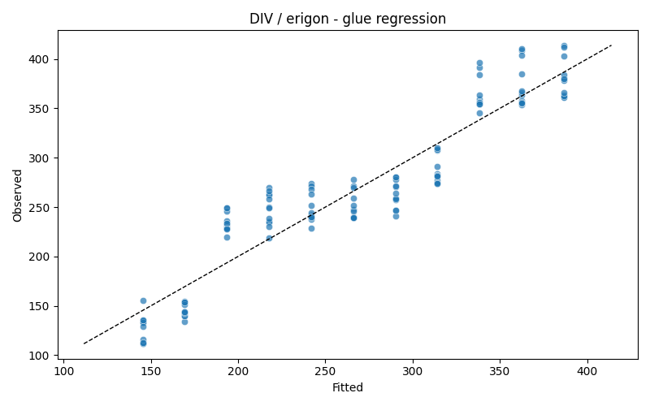

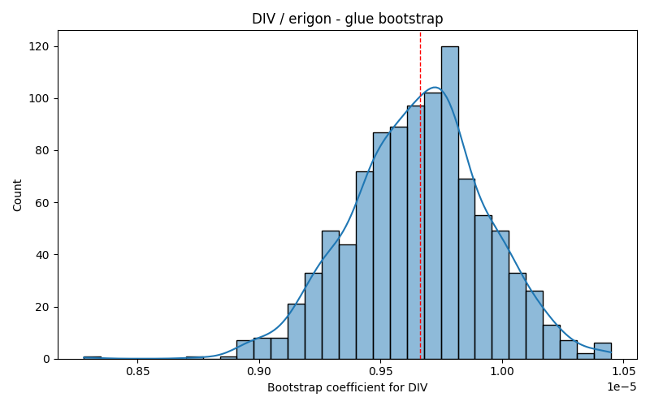

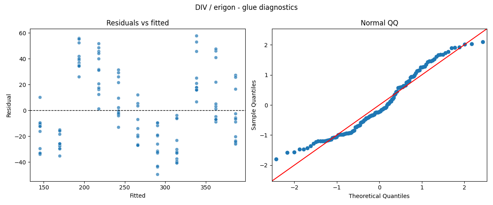

</details>

<details><summary><code>EXP</code> · nobs=132 · runtime_ms=0.0003788 · p=1.00e-03 · R²=0.1271</summary>

```
==============================================================================
                           NNLS Regression Results                            
==============================================================================
Dep. Variable:          test_runtime_ms              R-squared:          0.127
Model:                  NNLS                    Adj. R-squared:          0.120
No. Observations:       132                               RMSE:          38.88
Df Residuals:           130                                MAE:          11.57
Df Model:               1      
==============================================================================
                      coef     std err     P-value      [0.025      0.975]
------------------------------------------------------------------------------
         const     15.1189      8.6230       0.018      0.8439     35.7173
           EXP      0.0004      0.0001       0.001      0.0002      0.0005
==============================================================================
Notes: Non-negative least squares with bootstrap inference (1000 iterations)
==============================================================================
```

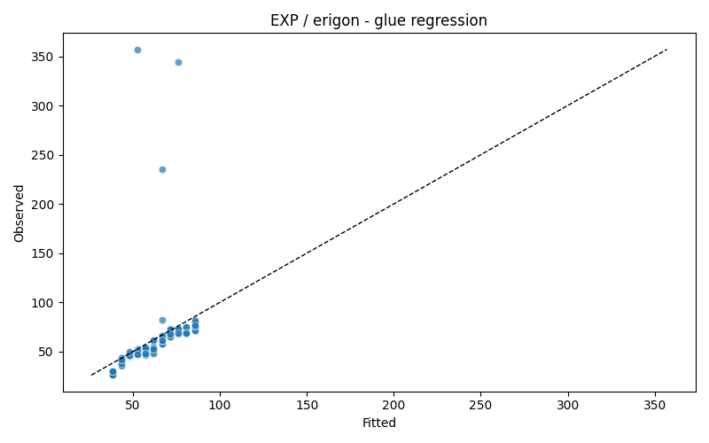

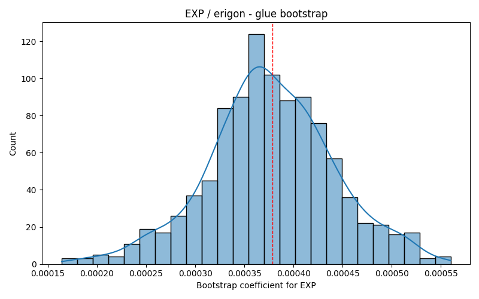

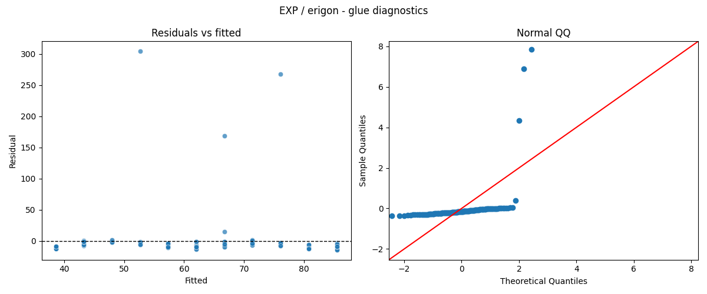

</details>

<details><summary><code>GT</code> · nobs=132 · runtime_ms=2.835e-06 · p=1.00e-03 · R²=0.9327</summary>

```
==============================================================================
                           NNLS Regression Results                            
==============================================================================
Dep. Variable:          test_runtime_ms              R-squared:          0.933
Model:                  NNLS                    Adj. R-squared:          0.932
No. Observations:       132                               RMSE:           8.01
Df Residuals:           130                                MAE:           6.68
Df Model:               1      
==============================================================================
                      coef     std err     P-value      [0.025      0.975]
------------------------------------------------------------------------------
         const     20.1226      2.7054       0.001     14.9609     25.6476
            GT      0.0000      0.0000       0.001      0.0000      0.0000
==============================================================================
Notes: Non-negative least squares with bootstrap inference (1000 iterations)
==============================================================================
```

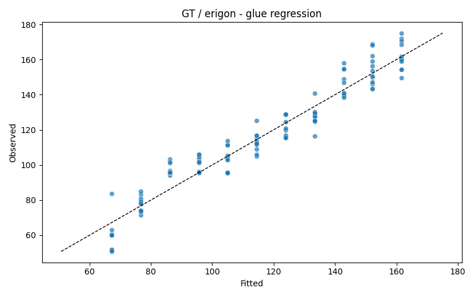

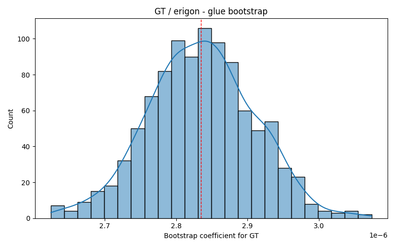

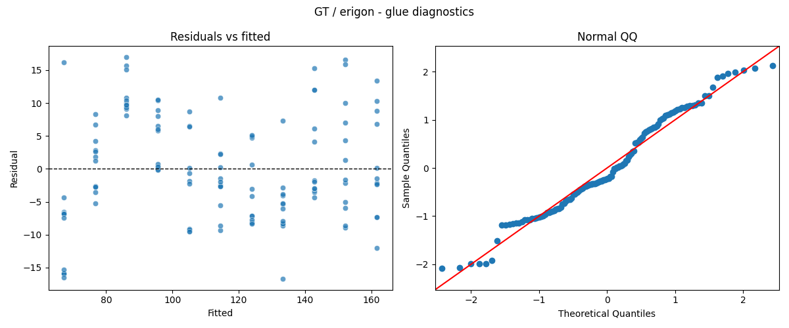

</details>

<details><summary><code>JUMPI</code> · nobs=132 · runtime_ms=3.872e-06 · p=1.00e-03 · R²=0.3294</summary>

```
==============================================================================
                           NNLS Regression Results                            
==============================================================================
Dep. Variable:          test_runtime_ms              R-squared:          0.329
Model:                  NNLS                    Adj. R-squared:          0.324
No. Observations:       132                               RMSE:          24.93
Df Residuals:           130                                MAE:           7.36
Df Model:               1      
==============================================================================
                      coef     std err     P-value      [0.025      0.975]
------------------------------------------------------------------------------
         const     14.7501      4.4845       0.005      3.9248     21.6449
         JUMPI      0.0000      0.0000       0.001      0.0000      0.0000
==============================================================================
Notes: Non-negative least squares with bootstrap inference (1000 iterations)
==============================================================================
```

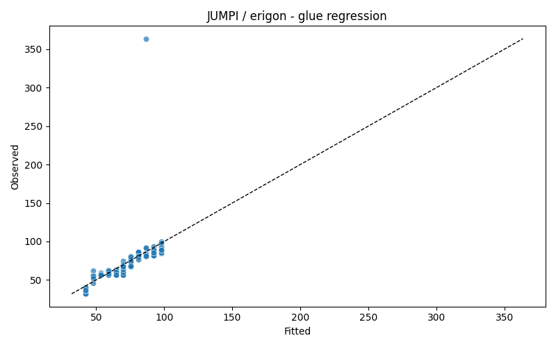

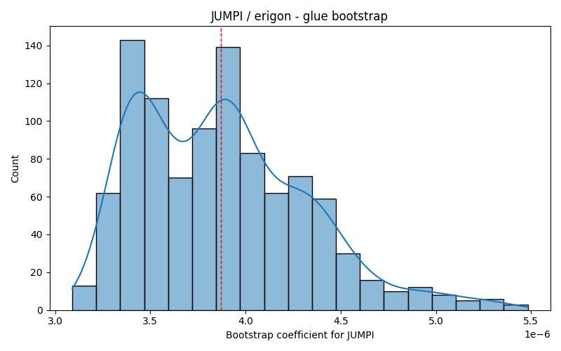


</details>

<details><summary><code>LT</code> · nobs=132 · runtime_ms=2.844e-06 · p=1.00e-03 · R²=0.9182</summary>

```
==============================================================================
                           NNLS Regression Results                            
==============================================================================
Dep. Variable:          test_runtime_ms              R-squared:          0.918
Model:                  NNLS                    Adj. R-squared:          0.918
No. Observations:       132                               RMSE:           8.94
Df Residuals:           130                                MAE:           7.35
Df Model:               1      
==============================================================================
                      coef     std err     P-value      [0.025      0.975]
------------------------------------------------------------------------------
         const     21.6819      3.0453       0.001     15.5052     28.0985
            LT      0.0000      0.0000       0.001      0.0000      0.0000
==============================================================================
Notes: Non-negative least squares with bootstrap inference (1000 iterations)
==============================================================================
```

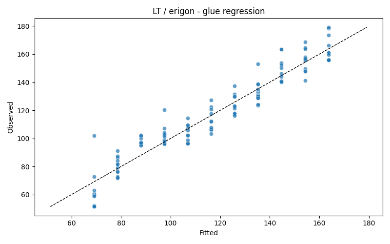

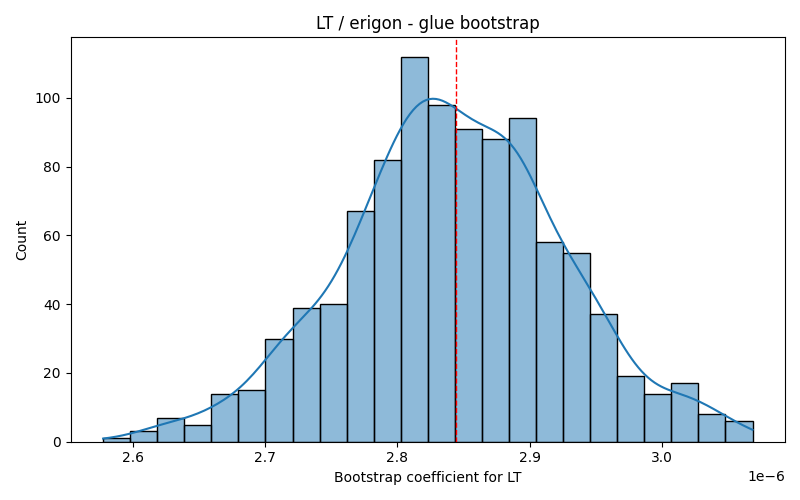

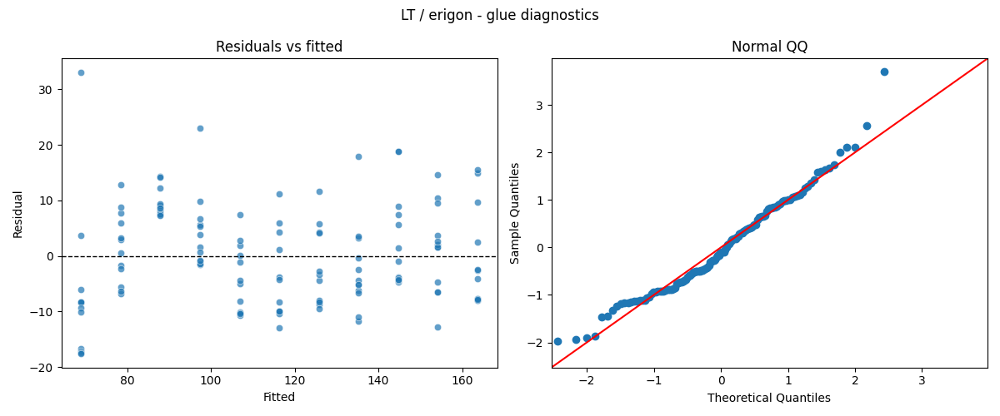

</details>

<details><summary><code>MSTORE</code> · nobs=660 · runtime_ms=5.684e-06 · p=1.00e-03 · R²=0.8205</summary>

```
==============================================================================
                           NNLS Regression Results                            
==============================================================================
Dep. Variable:          test_runtime_ms              R-squared:          0.820
Model:                  NNLS                    Adj. R-squared:          0.820
No. Observations:       660                               RMSE:          18.66
Df Residuals:           658                                MAE:           9.46
Df Model:               1      
==============================================================================
                      coef     std err     P-value      [0.025      0.975]
------------------------------------------------------------------------------
         const     23.9578      2.3755       0.001     19.6775     29.2228
        MSTORE      0.0000      0.0000       0.001      0.0000      0.0000
==============================================================================
Notes: Non-negative least squares with bootstrap inference (1000 iterations)
==============================================================================
```

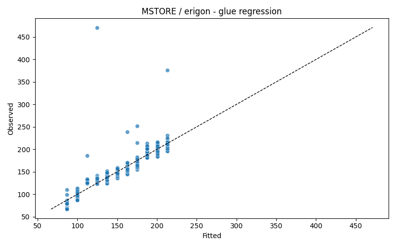

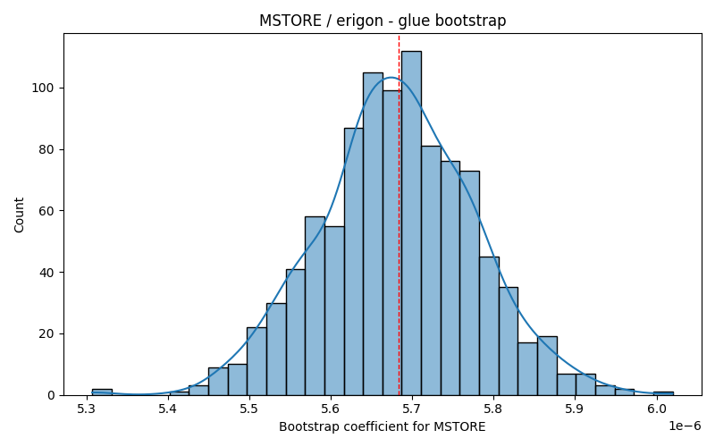

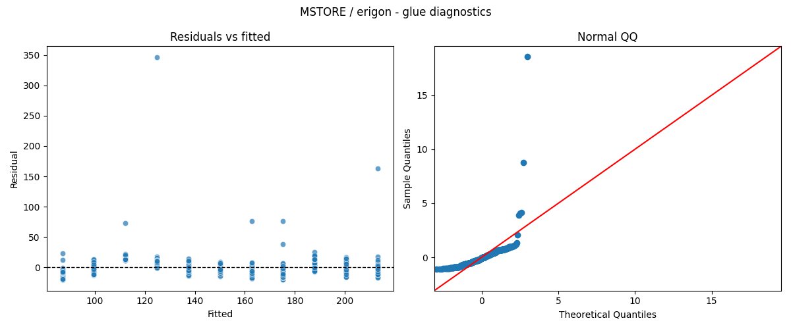

</details>

<details><summary><code>MSTORE8</code> · nobs=660 · runtime_ms=5.203e-06 · p=1.00e-03 · R²=0.6832</summary>

```
==============================================================================
                           NNLS Regression Results                            
==============================================================================
Dep. Variable:          test_runtime_ms              R-squared:          0.683
Model:                  NNLS                    Adj. R-squared:          0.683
No. Observations:       660                               RMSE:          24.86
Df Residuals:           658                                MAE:           9.84
Df Model:               1      
==============================================================================
                      coef     std err     P-value      [0.025      0.975]
------------------------------------------------------------------------------
         const     22.9088      2.0293       0.001     18.9573     27.0342
       MSTORE8      0.0000      0.0000       0.001      0.0000      0.0000
==============================================================================
Notes: Non-negative least squares with bootstrap inference (1000 iterations)
==============================================================================
```

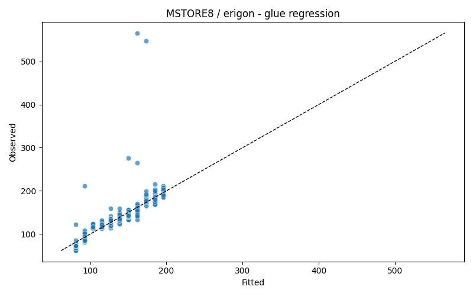

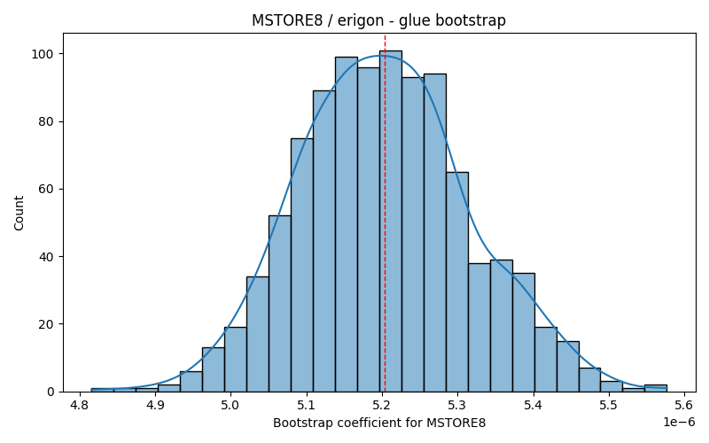

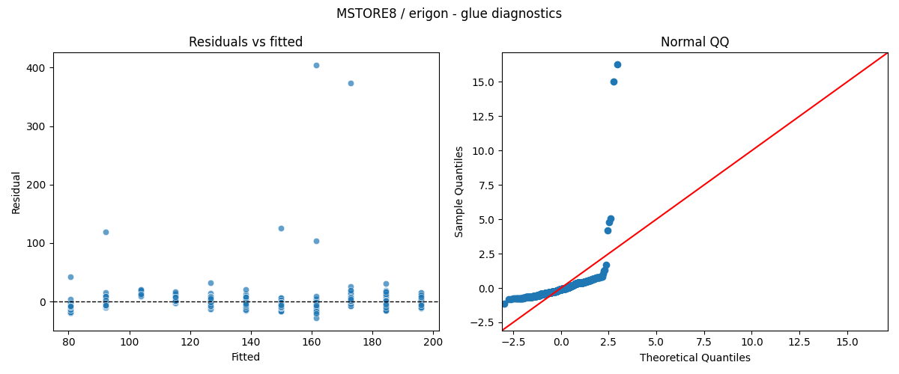

</details>

<details><summary><code>MUL</code> · nobs=132 · runtime_ms=3.536e-06 · p=1.00e-03 · R²=0.9315</summary>

```
==============================================================================
                           NNLS Regression Results                            
==============================================================================
Dep. Variable:          test_runtime_ms              R-squared:          0.931
Model:                  NNLS                    Adj. R-squared:          0.931
No. Observations:       132                               RMSE:           7.57
Df Residuals:           130                                MAE:           6.43
Df Model:               1      
==============================================================================
                      coef     std err     P-value      [0.025      0.975]
------------------------------------------------------------------------------
         const     13.9672      2.3032       0.001      9.6067     18.5120
           MUL      0.0000      0.0000       0.001      0.0000      0.0000
==============================================================================
Notes: Non-negative least squares with bootstrap inference (1000 iterations)
==============================================================================
```

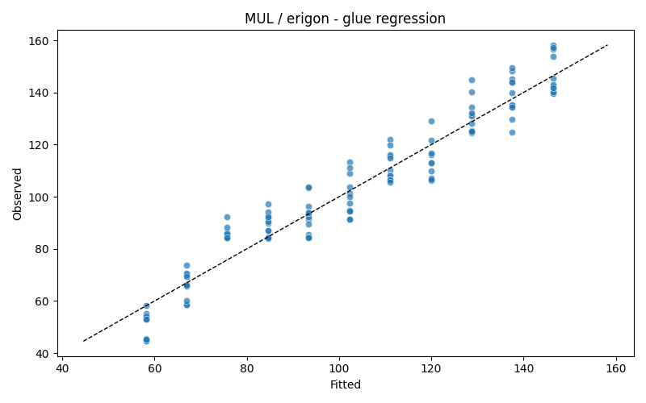

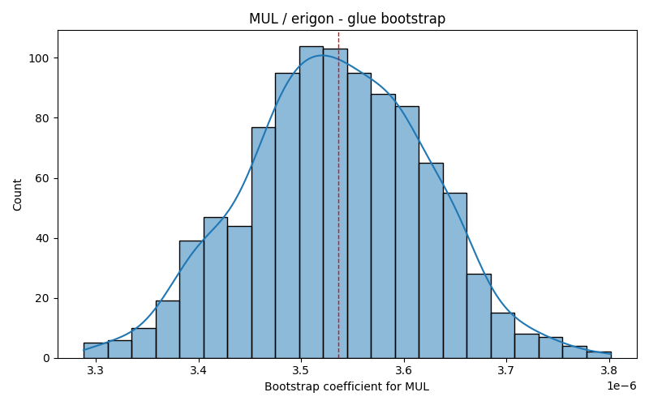

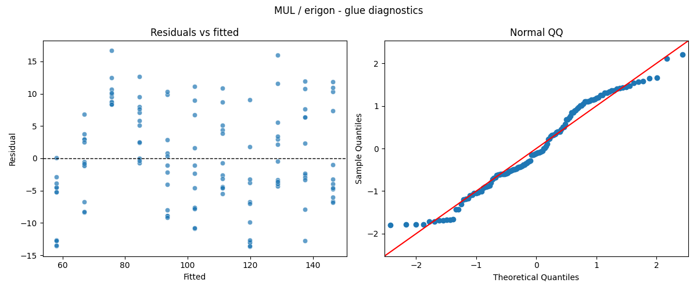

</details>

<details><summary><code>PC</code> · nobs=132 · runtime_ms=1.361e-06 · p=1.00e-03 · R²=0.7403</summary>

```
==============================================================================
                           NNLS Regression Results                            
==============================================================================
Dep. Variable:          test_runtime_ms              R-squared:          0.740
Model:                  NNLS                    Adj. R-squared:          0.738
No. Observations:       132                               RMSE:          24.09
Df Residuals:           130                                MAE:          12.74
Df Model:               1      
==============================================================================
                      coef     std err     P-value      [0.025      0.975]
------------------------------------------------------------------------------
         const     27.6596      6.5476       0.001     17.4432     42.3614
            PC      0.0000      0.0000       0.001      0.0000      0.0000
==============================================================================
Notes: Non-negative least squares with bootstrap inference (1000 iterations)
==============================================================================
```


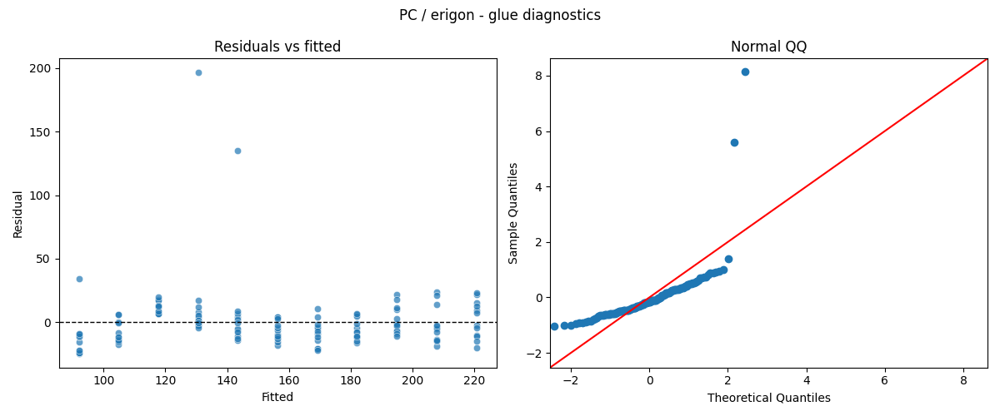

</details>

<details><summary><code>RETURNDATASIZE</code> · nobs=528 · runtime_ms=1.714e-06 · p=1.00e-03 · R²=0.5694</summary>

```
==============================================================================
                           NNLS Regression Results                            
==============================================================================
Dep. Variable:          test_runtime_ms              R-squared:          0.569
Model:                  NNLS                    Adj. R-squared:          0.569
No. Observations:       528                               RMSE:          23.53
Df Residuals:           526                                MAE:           9.34
Df Model:               1      
==============================================================================
                      coef     std err     P-value      [0.025      0.975]
------------------------------------------------------------------------------
         const     24.5671      4.3526       0.001     17.5625     34.3243
RETURNDATASIZE      0.0000      0.0000       0.001      0.0000      0.0000
==============================================================================
Notes: Non-negative least squares with bootstrap inference (1000 iterations)
==============================================================================
```

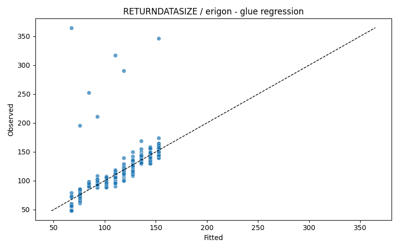

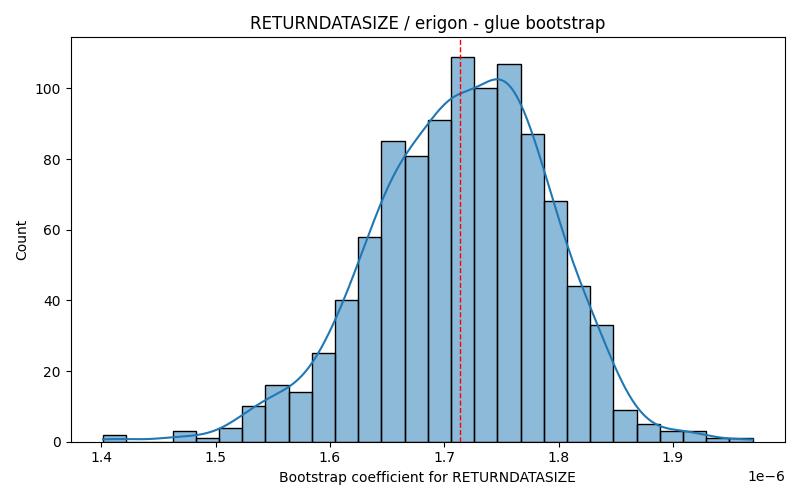

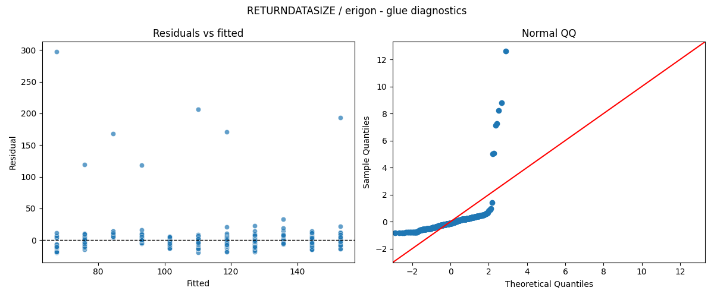

</details>

<details><summary><code>SELFBALANCE</code> · nobs=108 · runtime_ms=1.367e-06 · p=1.00e-03 · R²=0.8692</summary>

```
==============================================================================
                           NNLS Regression Results                            
==============================================================================
Dep. Variable:          test_runtime_ms              R-squared:          0.869
Model:                  NNLS                    Adj. R-squared:          0.868
No. Observations:       108                               RMSE:           5.35
Df Residuals:           106                                MAE:           4.36
Df Model:               1      
==============================================================================
                      coef     std err     P-value      [0.025      0.975]
------------------------------------------------------------------------------
         const     20.3089      2.1162       0.001     16.0238     24.2790
   SELFBALANCE      0.0000      0.0000       0.001      0.0000      0.0000
==============================================================================
Notes: Non-negative least squares with bootstrap inference (1000 iterations)
==============================================================================
```

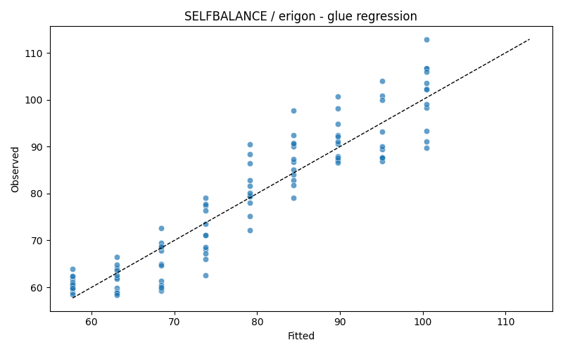

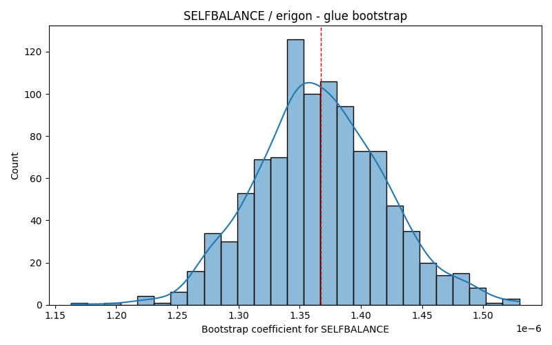

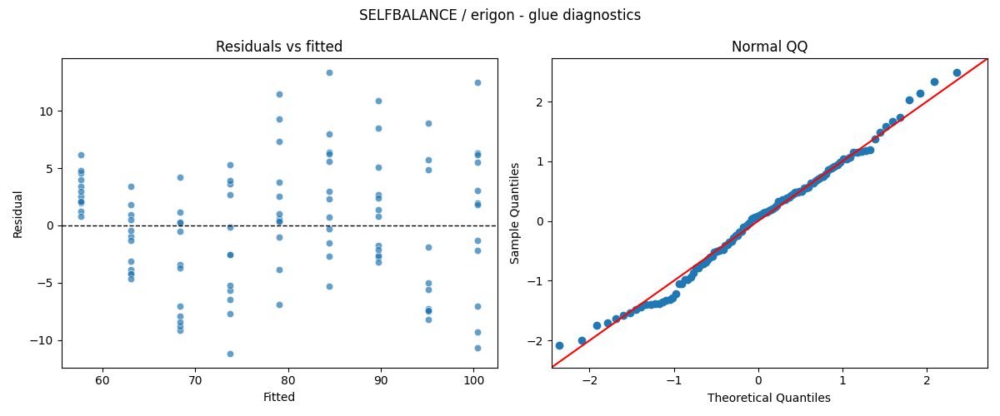

</details>

<details><summary><code>SUB</code> · nobs=132 · runtime_ms=2.768e-06 · p=1.00e-03 · R²=0.6234</summary>

```
==============================================================================
                           NNLS Regression Results                            
==============================================================================
Dep. Variable:          test_runtime_ms              R-squared:          0.623
Model:                  NNLS                    Adj. R-squared:          0.620
No. Observations:       132                               RMSE:          22.64
Df Residuals:           130                                MAE:           9.50
Df Model:               1      
==============================================================================
                      coef     std err     P-value      [0.025      0.975]
------------------------------------------------------------------------------
         const     21.1267      3.3682       0.001     15.0753     28.5433
           SUB      0.0000      0.0000       0.001      0.0000      0.0000
==============================================================================
Notes: Non-negative least squares with bootstrap inference (1000 iterations)
==============================================================================
```


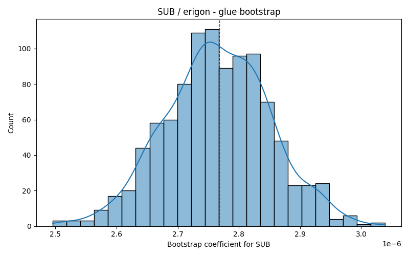


</details>

### Mixed glue (tier B) · erigon

<details><summary><code>JUMP</code> · nobs=132 · runtime_ms=7.161e-06 · p=1.00e-03 · R²=0.7059</summary>

```
==============================================================================
                           NNLS Regression Results                            
==============================================================================
Dep. Variable:          test_runtime_ms              R-squared:          0.706
Model:                  NNLS                    Adj. R-squared:          0.704
No. Observations:       132                               RMSE:          17.17
Df Residuals:           130                                MAE:           7.58
Df Model:               1      
==============================================================================
                      coef     std err     P-value      [0.025      0.975]
------------------------------------------------------------------------------
         const     18.1695      2.4884       0.001     13.5448     23.2680
          JUMP      0.0000      0.0000       0.001      0.0000      0.0000
==============================================================================
Notes: Non-negative least squares with bootstrap inference (1000 iterations)
==============================================================================
```

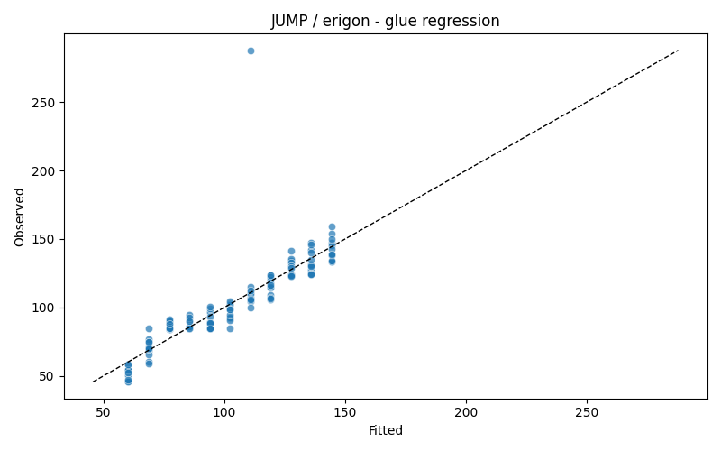

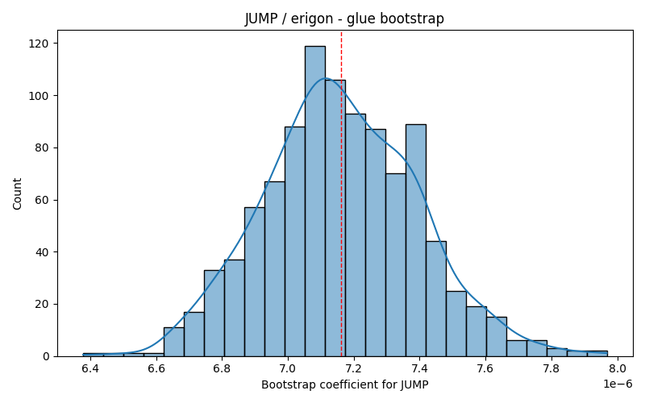

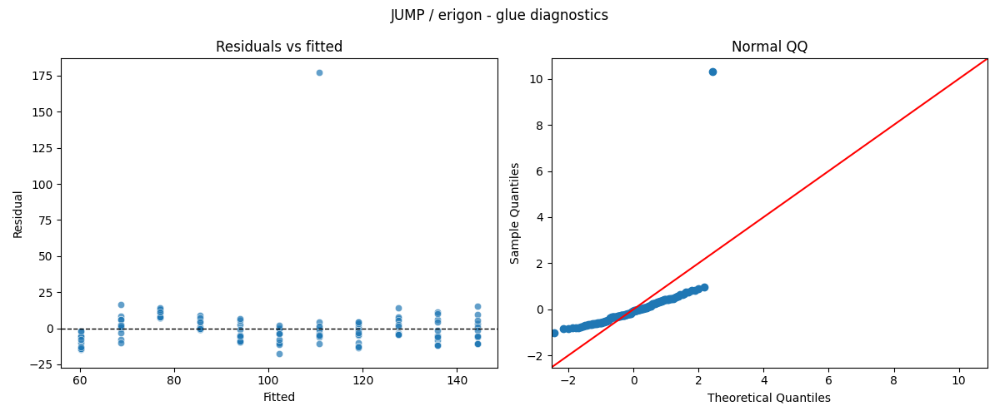

</details>

<details><summary><code>KECCAK256</code> · nobs=2112 · runtime_ms=1.837e-05 · p=1.00e-03 · R²=0.06452</summary>

```
==============================================================================
                           NNLS Regression Results                            
==============================================================================
Dep. Variable:          test_runtime_ms              R-squared:          0.065
Model:                  NNLS                    Adj. R-squared:          0.064
No. Observations:       2112                              RMSE:         138.99
Df Residuals:           2110                               MAE:         111.18
Df Model:               1      
==============================================================================
                      coef     std err     P-value      [0.025      0.975]
------------------------------------------------------------------------------
         const    374.3944      6.7489       0.001    360.7213    387.4632
     KECCAK256      0.0000      0.0000       0.001      0.0000      0.0000
==============================================================================
Notes: Non-negative least squares with bootstrap inference (1000 iterations)
==============================================================================
```

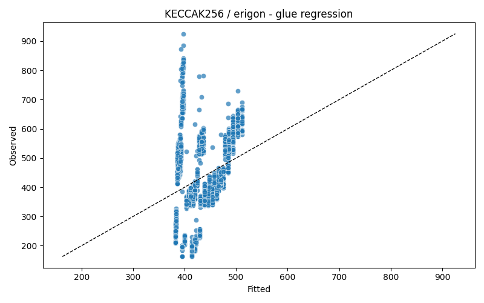

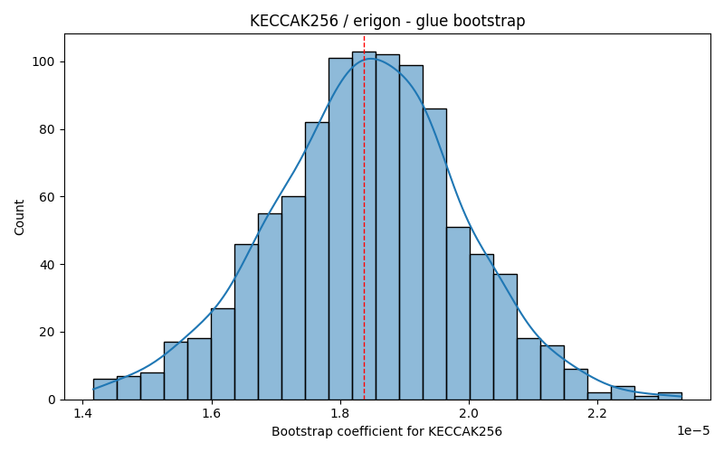

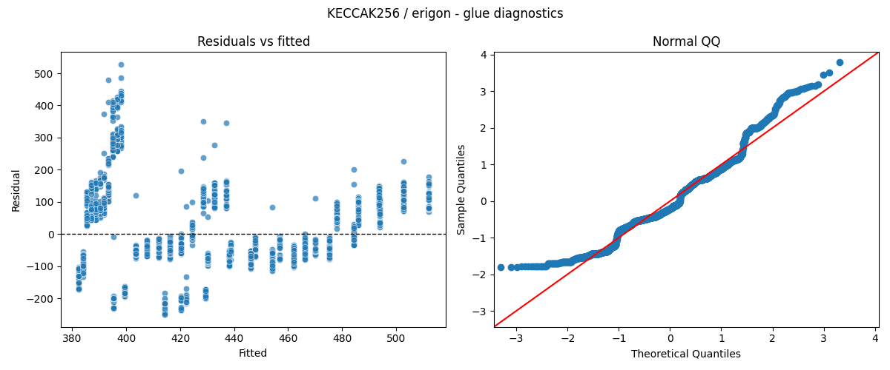

</details>

## ethrex

| glue_opcode | nobs | glue_runtime_ms | p_value | rsquared |
| --- | --- | --- | --- | --- |
| `ISZERO` | 187 | 5.271e-07 | 1.00e-03 | 0.8505 |
| `JUMPDEST` | 187 | 3.271e-07 | 1.00e-03 | 0.8468 |
| `SWAP` | 2992 | 7.216e-07 | 1.00e-03 | 0.792 |
| `CALLDATASIZE` | 11209 | 4.623e-07 | 1.00e-03 | 0.9309 |
| `DUP` | 11209 | 4.699e-07 | 1.00e-03 | 0.9309 |
| `GAS` | 11209 | 4.602e-07 | 1.00e-03 | 0.9309 |
| `MLOAD` | 11209 | 1.13e-06 | 1.00e-03 | 0.9309 |
| `PUSH` | 11209 | 4.907e-07 | 1.00e-03 | 0.9309 |
| `PUSH0` | 11209 | 4.361e-07 | 1.00e-03 | 0.9309 |
| `STATICCALL` | 11209 | 0.0001099 | 1.00e-03 | 0.9309 |
| `ADD` | 187 | 1.067e-06 | 1.00e-03 | 0.8459 |
| `AND` | 187 | 9.805e-07 | 1.00e-03 | 0.7921 |
| `CALLDATACOPY` | 4488 | 2.439e-06 | 1.00e-03 | 0.862 |
| `CALLDATALOAD` | 748 | 2.089e-05 | 1.00e-03 | 0.2317 |
| `DIV` | 187 | 9.455e-06 | 1.00e-03 | 0.8438 |
| `EXP` | 187 | 0.0008982 | 1.00e-03 | 0.8203 |
| `GT` | 187 | 1.183e-06 | 1.00e-03 | 0.8465 |
| `JUMPI` | 187 | 1.425e-06 | 1.00e-03 | 0.8028 |
| `LT` | 187 | 9.003e-07 | 1.00e-03 | 0.8134 |
| `MSTORE` | 935 | 1.731e-06 | 1.00e-03 | 0.8222 |
| `MSTORE8` | 935 | 1.599e-06 | 1.00e-03 | 0.8139 |
| `MUL` | 187 | 1.363e-06 | 1.00e-03 | 0.7771 |
| `PC` | 187 | 5.467e-07 | 1.00e-03 | 0.8255 |
| `RETURNDATASIZE` | 748 | 9.084e-07 | 1.00e-03 | 0.8372 |
| `SELFBALANCE` | 153 | 4.79e-06 | 1.00e-03 | 0.809 |
| `SUB` | 187 | 1.094e-06 | 1.00e-03 | 0.8088 |
| `JUMP` | 187 | 4.394e-06 | 1.00e-03 | 0.8364 |
| `KECCAK256` | 2992 | 0 | 1.00e+00 | 0 |

### Cycle glue — joint fit · ethrex

<details><summary>Joint NNLS regression summary</summary>

```
==============================================================================
                           NNLS Regression Results                            
==============================================================================
Dep. Variable:          test_runtime_ms              R-squared:          0.931
Model:                  NNLS                    Adj. R-squared:          0.931
No. Observations:       11209                             RMSE:           6.49
Df Residuals:           11201                              MAE:           5.08
Df Model:               7      
==============================================================================
                      coef     std err     P-value      [0.025      0.975]
------------------------------------------------------------------------------
         const     12.8482      0.2049       0.001     12.4679     13.2504
  CALLDATASIZE      0.0000      0.0000       0.001      0.0000      0.0000
           DUP      0.0000      0.0000       0.001      0.0000      0.0000
           GAS      0.0000      0.0000       0.001      0.0000      0.0000
         MLOAD      0.0000      0.0000       0.001      0.0000      0.0000
          PUSH      0.0000      0.0000       0.001      0.0000      0.0000
         PUSH0      0.0000      0.0000       0.001      0.0000      0.0000
    STATICCALL      0.0001      0.0000       0.001      0.0001      0.0001
==============================================================================
Notes: Non-negative least squares with bootstrap inference (1000 iterations)
==============================================================================
```

</details>

<details><summary><code>CALLDATASIZE</code> · nobs=11209 · runtime_ms=4.623e-07 · p=1.00e-03 · R²=0.9309</summary>

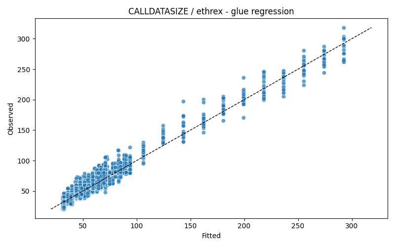

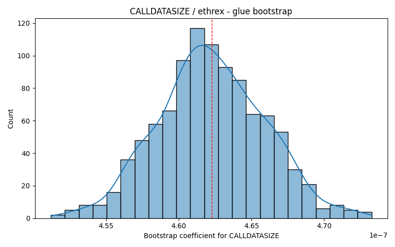

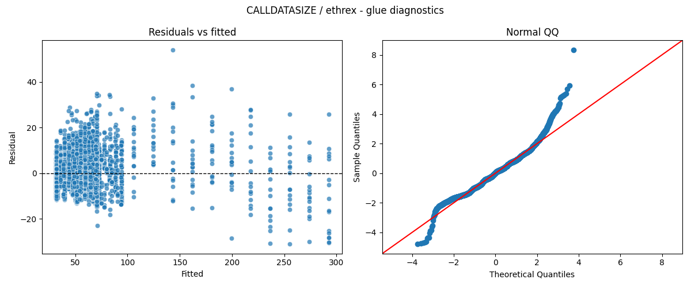

</details>

<details><summary><code>DUP</code> · nobs=11209 · runtime_ms=4.699e-07 · p=1.00e-03 · R²=0.9309</summary>


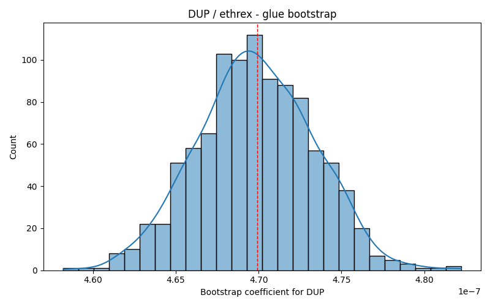


</details>

<details><summary><code>GAS</code> · nobs=11209 · runtime_ms=4.602e-07 · p=1.00e-03 · R²=0.9309</summary>


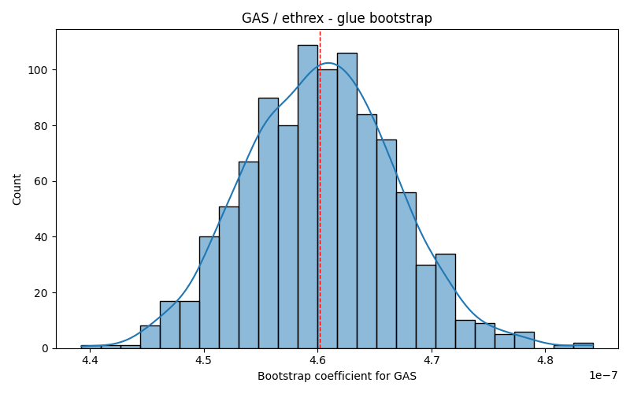


</details>

<details><summary><code>MLOAD</code> · nobs=11209 · runtime_ms=1.13e-06 · p=1.00e-03 · R²=0.9309</summary>


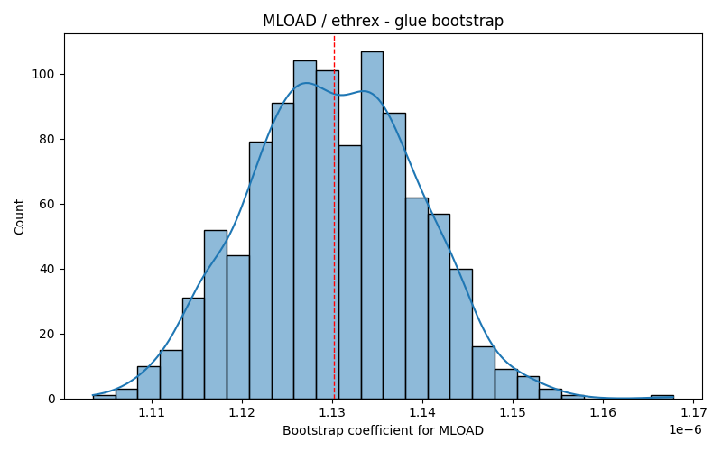


</details>

<details><summary><code>PUSH</code> · nobs=11209 · runtime_ms=4.907e-07 · p=1.00e-03 · R²=0.9309</summary>

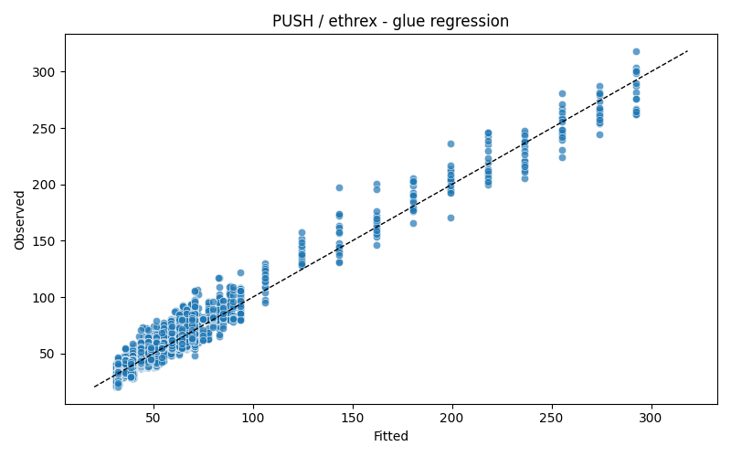

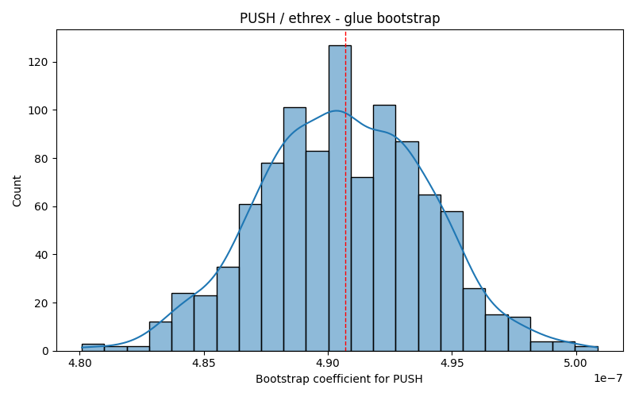


</details>

<details><summary><code>PUSH0</code> · nobs=11209 · runtime_ms=4.361e-07 · p=1.00e-03 · R²=0.9309</summary>


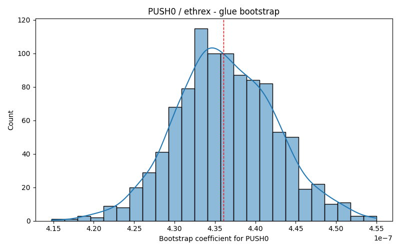


</details>

<details><summary><code>STATICCALL</code> · nobs=11209 · runtime_ms=0.0001099 · p=1.00e-03 · R²=0.9309</summary>

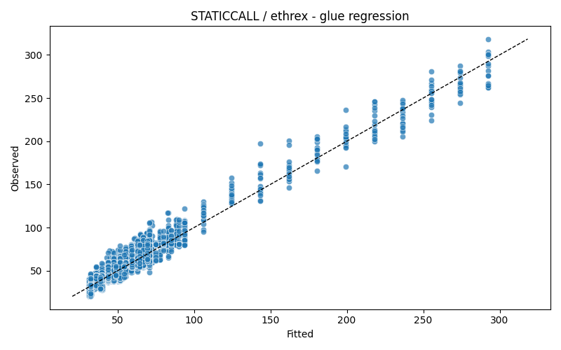

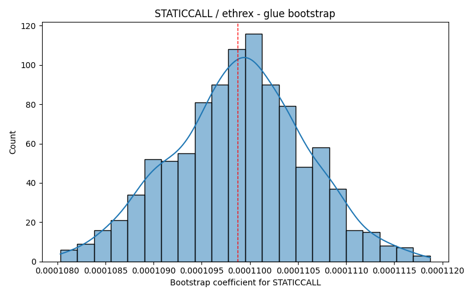


</details>

### Pure glue · ethrex

<details><summary><code>ISZERO</code> · nobs=187 · runtime_ms=5.271e-07 · p=1.00e-03 · R²=0.8505</summary>

```
==============================================================================
                           NNLS Regression Results                            
==============================================================================
Dep. Variable:          test_runtime_ms              R-squared:          0.851
Model:                  NNLS                    Adj. R-squared:          0.850
No. Observations:       187                               RMSE:           4.65
Df Residuals:           185                                MAE:           3.51
Df Model:               1      
==============================================================================
                      coef     std err     P-value      [0.025      0.975]
------------------------------------------------------------------------------
         const      8.0325      1.1499       0.001      5.8061     10.2767
        ISZERO      0.0000      0.0000       0.001      0.0000      0.0000
==============================================================================
Notes: Non-negative least squares with bootstrap inference (1000 iterations)
==============================================================================
```

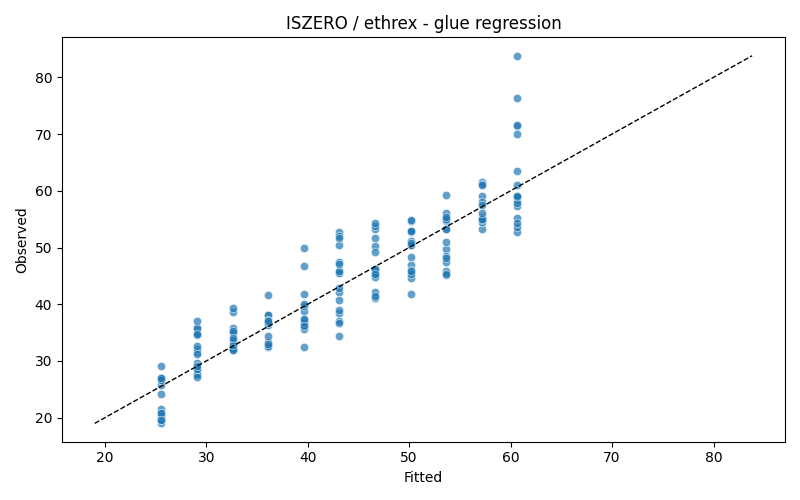

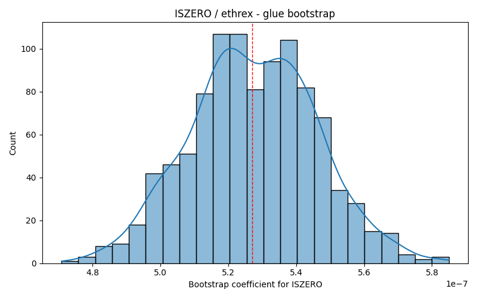

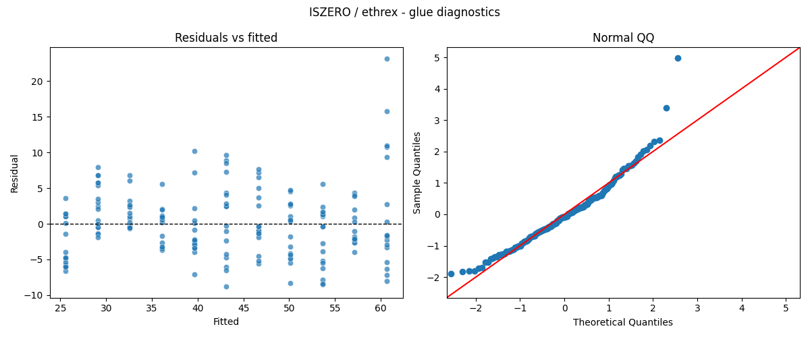

</details>

<details><summary><code>JUMPDEST</code> · nobs=187 · runtime_ms=3.271e-07 · p=1.00e-03 · R²=0.8468</summary>

```
==============================================================================
                           NNLS Regression Results                            
==============================================================================
Dep. Variable:          test_runtime_ms              R-squared:          0.847
Model:                  NNLS                    Adj. R-squared:          0.846
No. Observations:       187                               RMSE:           8.78
Df Residuals:           185                                MAE:           6.74
Df Model:               1      
==============================================================================
                      coef     std err     P-value      [0.025      0.975]
------------------------------------------------------------------------------
         const     19.1116      2.0756       0.001     15.2070     23.3587
      JUMPDEST      0.0000      0.0000       0.001      0.0000      0.0000
==============================================================================
Notes: Non-negative least squares with bootstrap inference (1000 iterations)
==============================================================================
```

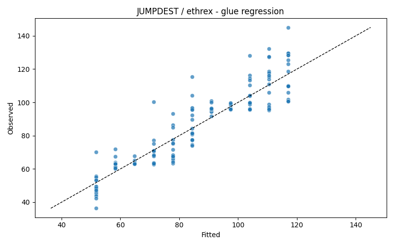

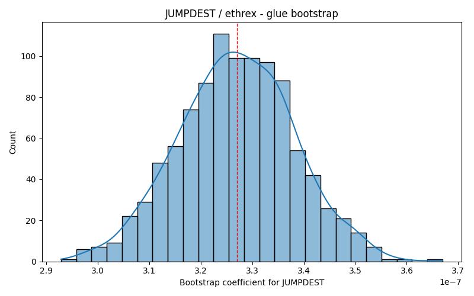

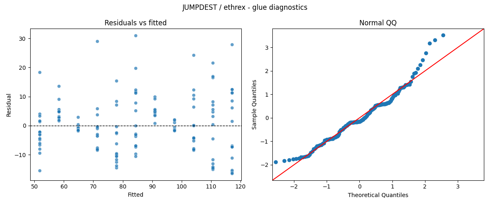

</details>

<details><summary><code>SWAP</code> · nobs=2992 · runtime_ms=7.216e-07 · p=1.00e-03 · R²=0.792</summary>

```
==============================================================================
                           NNLS Regression Results                            
==============================================================================
Dep. Variable:          test_runtime_ms              R-squared:          0.792
Model:                  NNLS                    Adj. R-squared:          0.792
No. Observations:       2992                              RMSE:           7.78
Df Residuals:           2990                               MAE:           6.04
Df Model:               1      
==============================================================================
                      coef     std err     P-value      [0.025      0.975]
------------------------------------------------------------------------------
         const     15.1382      0.4511       0.001     14.3016     16.0867
          SWAP      0.0000      0.0000       0.001      0.0000      0.0000
==============================================================================
Notes: Non-negative least squares with bootstrap inference (1000 iterations)
==============================================================================
```

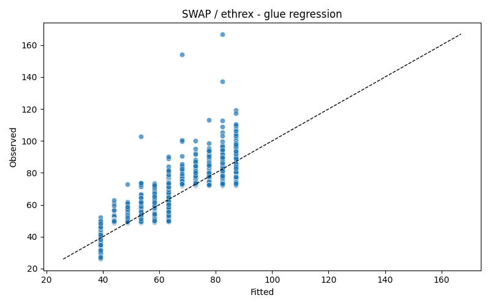

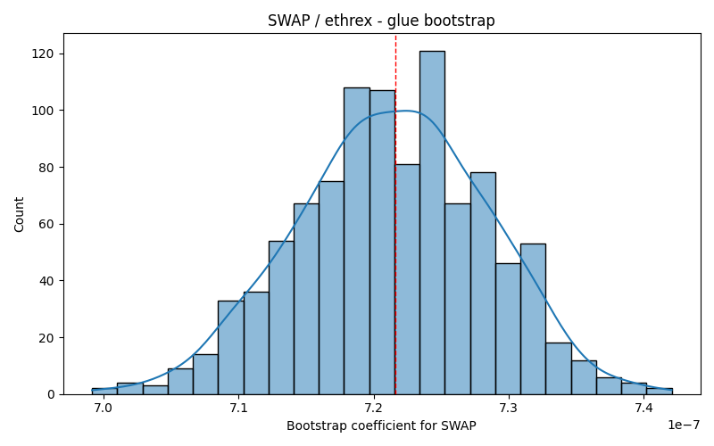

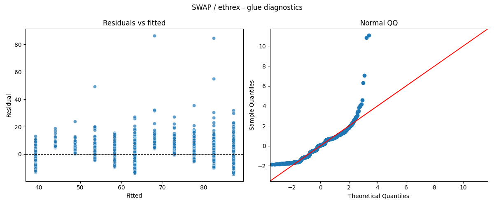

</details>

### Mixed glue (tier A) · ethrex

<details><summary><code>ADD</code> · nobs=187 · runtime_ms=1.067e-06 · p=1.00e-03 · R²=0.8459</summary>

```
==============================================================================
                           NNLS Regression Results                            
==============================================================================
Dep. Variable:          test_runtime_ms              R-squared:          0.846
Model:                  NNLS                    Adj. R-squared:          0.845
No. Observations:       187                               RMSE:           4.79
Df Residuals:           185                                MAE:           3.72
Df Model:               1      
==============================================================================
                      coef     std err     P-value      [0.025      0.975]
------------------------------------------------------------------------------
         const      9.3675      1.1988       0.001      7.0205     11.7763
           ADD      0.0000      0.0000       0.001      0.0000      0.0000
==============================================================================
Notes: Non-negative least squares with bootstrap inference (1000 iterations)
==============================================================================
```

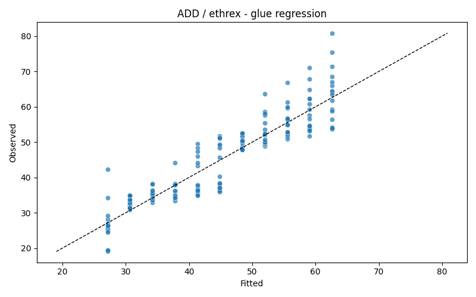

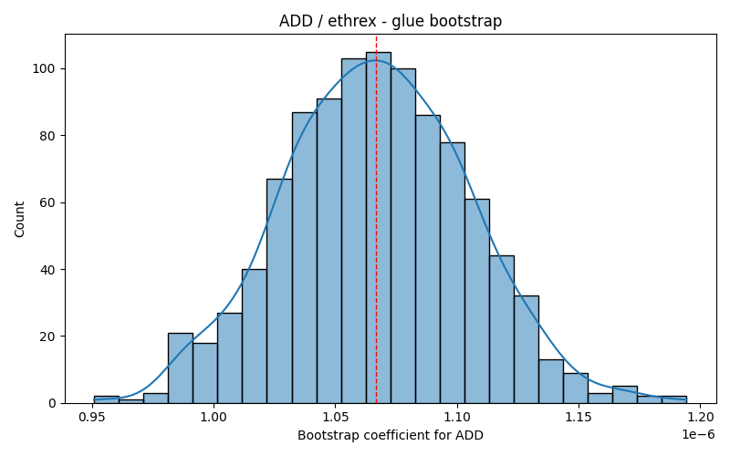

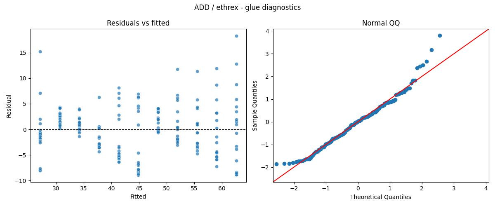

</details>

<details><summary><code>AND</code> · nobs=187 · runtime_ms=9.805e-07 · p=1.00e-03 · R²=0.7921</summary>

```
==============================================================================
                           NNLS Regression Results                            
==============================================================================
Dep. Variable:          test_runtime_ms              R-squared:          0.792
Model:                  NNLS                    Adj. R-squared:          0.791
No. Observations:       187                               RMSE:           5.29
Df Residuals:           185                                MAE:           3.92
Df Model:               1      
==============================================================================
                      coef     std err     P-value      [0.025      0.975]
------------------------------------------------------------------------------
         const      9.7405      1.2079       0.001      7.3029     11.9637
           AND      0.0000      0.0000       0.001      0.0000      0.0000
==============================================================================
Notes: Non-negative least squares with bootstrap inference (1000 iterations)
==============================================================================
```

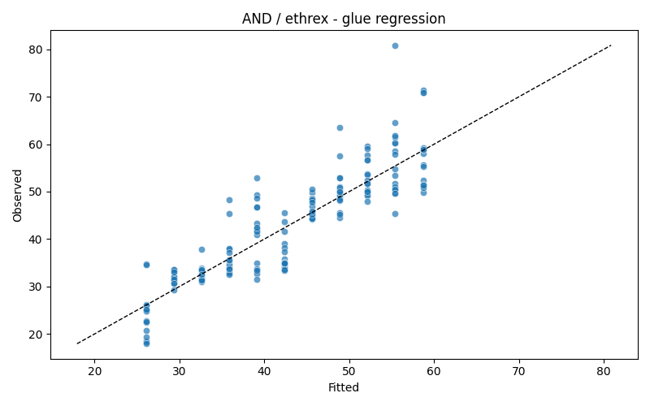

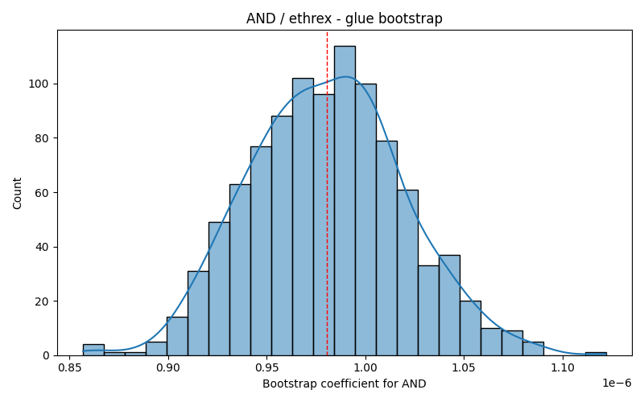

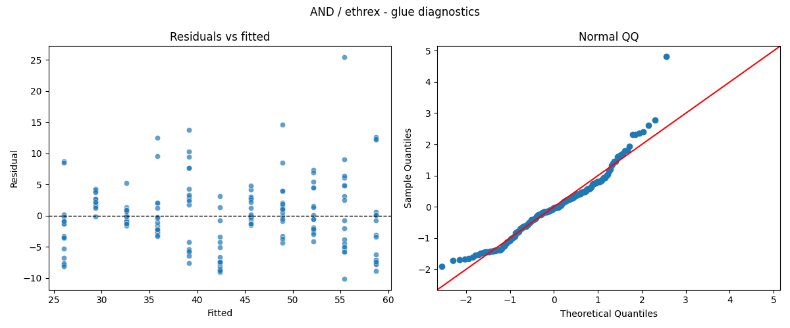

</details>

<details><summary><code>CALLDATACOPY</code> · nobs=4488 · runtime_ms=2.439e-06 · p=1.00e-03 · R²=0.862</summary>

```
==============================================================================
                           NNLS Regression Results                            
==============================================================================
Dep. Variable:          test_runtime_ms              R-squared:          0.862
Model:                  NNLS                    Adj. R-squared:          0.862
No. Observations:       4488                              RMSE:           7.34
Df Residuals:           4486                               MAE:           5.46
Df Model:               1      
==============================================================================
                      coef     std err     P-value      [0.025      0.975]
------------------------------------------------------------------------------
         const     12.7742      0.1292       0.001     12.5217     13.0240
  CALLDATACOPY      0.0000      0.0000       0.001      0.0000      0.0000
==============================================================================
Notes: Non-negative least squares with bootstrap inference (1000 iterations)
==============================================================================
```

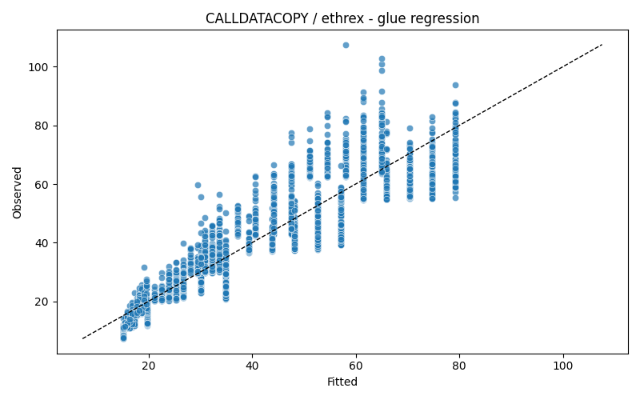

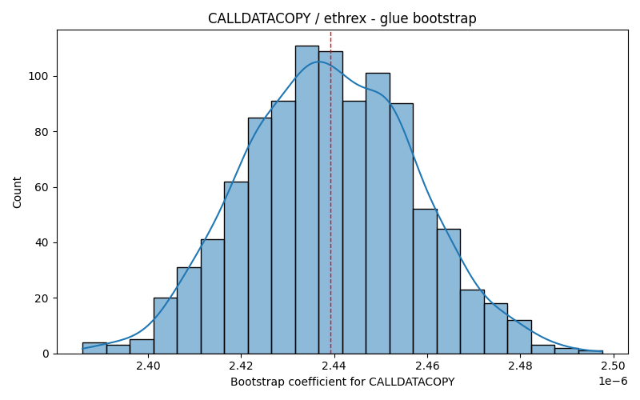

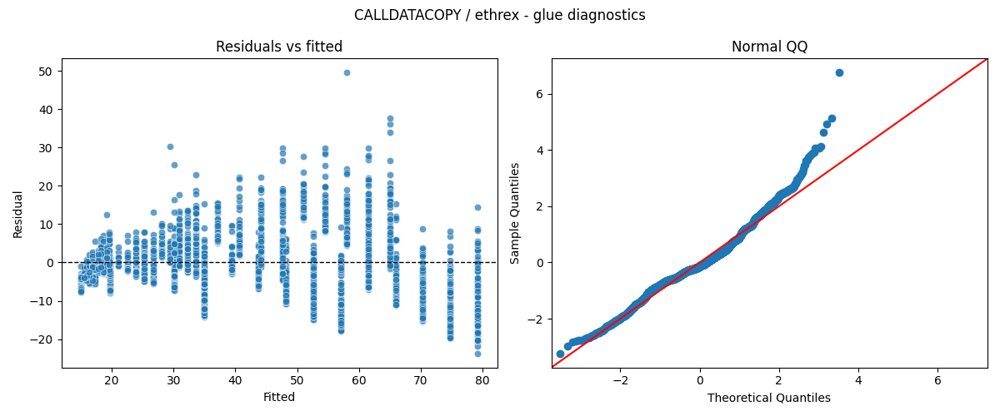

</details>

<details><summary><code>CALLDATALOAD</code> · nobs=748 · runtime_ms=2.089e-05 · p=1.00e-03 · R²=0.2317</summary>

```
==============================================================================
                           NNLS Regression Results                            
==============================================================================
Dep. Variable:          test_runtime_ms              R-squared:          0.232
Model:                  NNLS                    Adj. R-squared:          0.231
No. Observations:       748                               RMSE:           0.15
Df Residuals:           746                                MAE:           0.12
Df Model:               1      
==============================================================================
                      coef     std err     P-value      [0.025      0.975]
------------------------------------------------------------------------------
         const      2.5074      0.0184       0.001      2.4707      2.5430
  CALLDATALOAD      0.0000      0.0000       0.001      0.0000      0.0000
==============================================================================
Notes: Non-negative least squares with bootstrap inference (1000 iterations)
==============================================================================
```

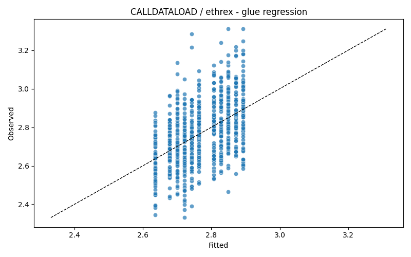

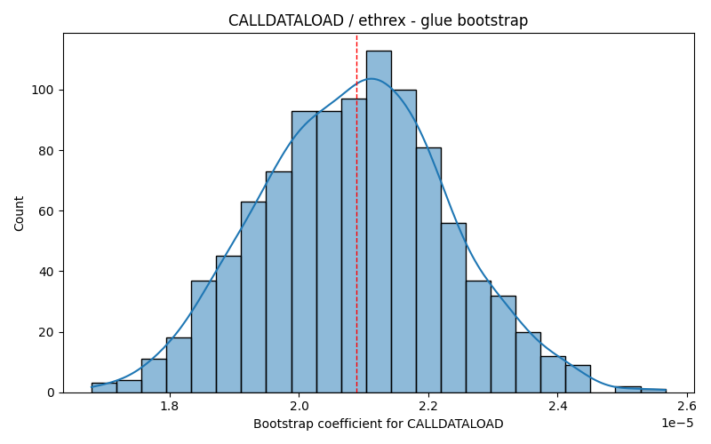

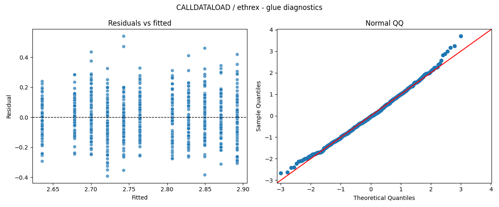

</details>

<details><summary><code>DIV</code> · nobs=187 · runtime_ms=9.455e-06 · p=1.00e-03 · R²=0.8438</summary>

```
==============================================================================
                           NNLS Regression Results                            
==============================================================================
Dep. Variable:          test_runtime_ms              R-squared:          0.844
Model:                  NNLS                    Adj. R-squared:          0.843
No. Observations:       187                               RMSE:          32.11
Df Residuals:           185                                MAE:          27.46
Df Model:               1      
==============================================================================
                      coef     std err     P-value      [0.025      0.975]
------------------------------------------------------------------------------
         const     73.9248      8.4468       0.001     57.5329     90.3399
           DIV      0.0000      0.0000       0.001      0.0000      0.0000
==============================================================================
Notes: Non-negative least squares with bootstrap inference (1000 iterations)
==============================================================================
```

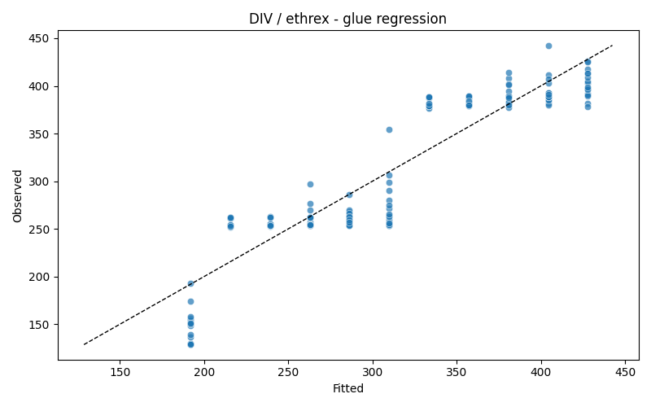

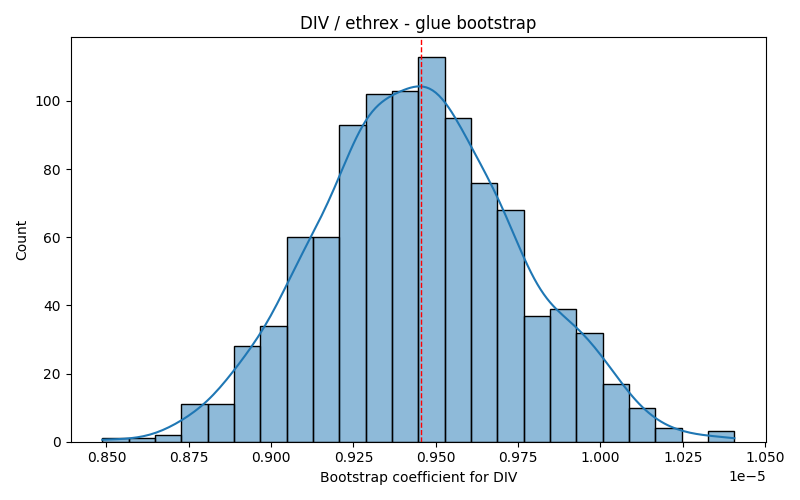

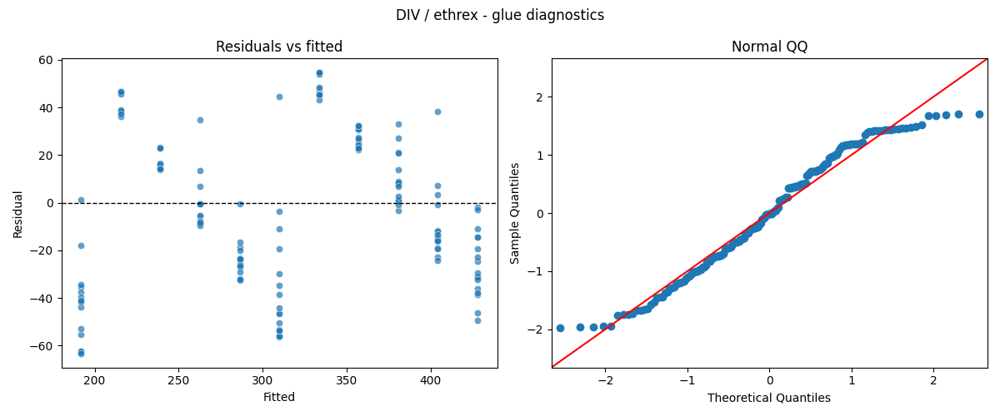

</details>

<details><summary><code>EXP</code> · nobs=187 · runtime_ms=0.0008982 · p=1.00e-03 · R²=0.8203</summary>

```
==============================================================================
                           NNLS Regression Results                            
==============================================================================
Dep. Variable:          test_runtime_ms              R-squared:          0.820
Model:                  NNLS                    Adj. R-squared:          0.819
No. Observations:       187                               RMSE:          16.46
Df Residuals:           185                                MAE:          13.40
Df Model:               1      
==============================================================================
                      coef     std err     P-value      [0.025      0.975]
------------------------------------------------------------------------------
         const     39.6703      4.2857       0.001     31.0592     48.2149
           EXP      0.0009      0.0000       0.001      0.0008      0.0010
==============================================================================
Notes: Non-negative least squares with bootstrap inference (1000 iterations)
==============================================================================
```

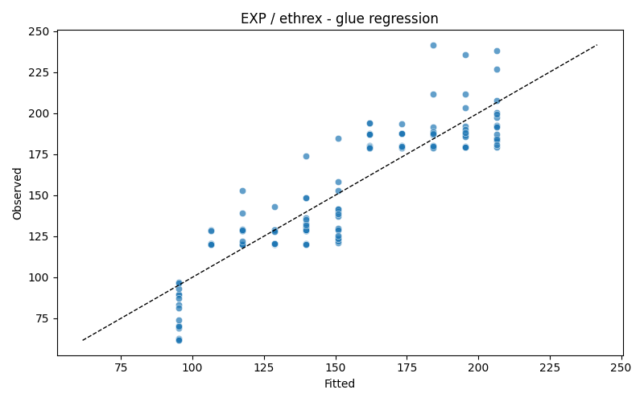

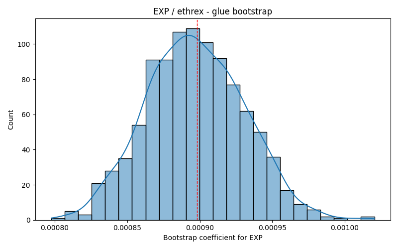

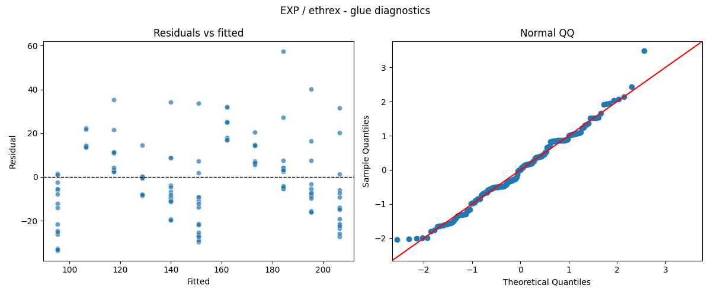

</details>

<details><summary><code>GT</code> · nobs=187 · runtime_ms=1.183e-06 · p=1.00e-03 · R²=0.8465</summary>

```
==============================================================================
                           NNLS Regression Results                            
==============================================================================
Dep. Variable:          test_runtime_ms              R-squared:          0.846
Model:                  NNLS                    Adj. R-squared:          0.846
No. Observations:       187                               RMSE:           5.30
Df Residuals:           185                                MAE:           4.10
Df Model:               1      
==============================================================================
                      coef     std err     P-value      [0.025      0.975]
------------------------------------------------------------------------------
         const      8.7556      1.2897       0.001      6.1909     11.2112
            GT      0.0000      0.0000       0.001      0.0000      0.0000
==============================================================================
Notes: Non-negative least squares with bootstrap inference (1000 iterations)
==============================================================================
```

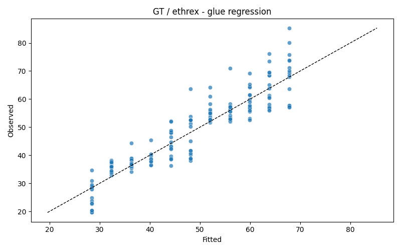

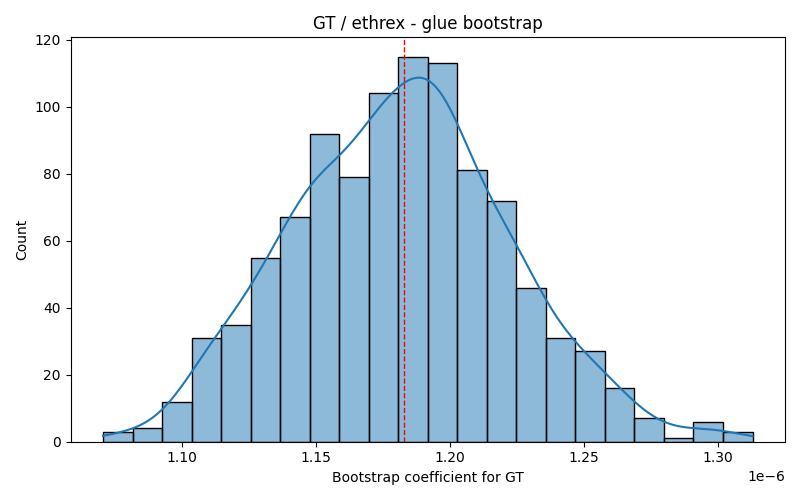

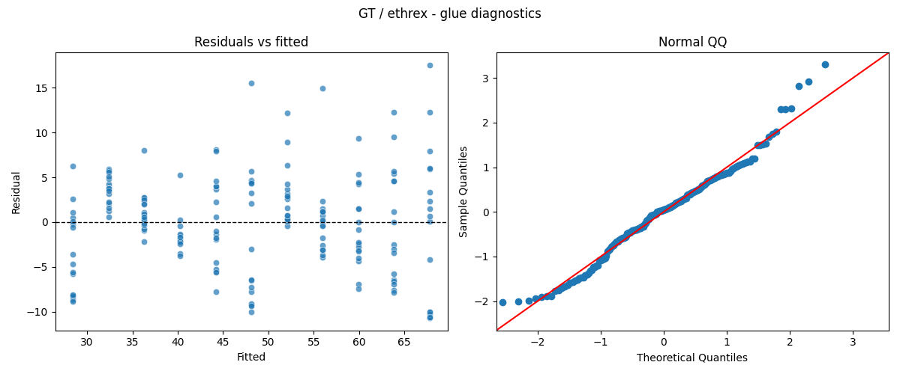

</details>

<details><summary><code>JUMPI</code> · nobs=187 · runtime_ms=1.425e-06 · p=1.00e-03 · R²=0.8028</summary>

```
==============================================================================
                           NNLS Regression Results                            
==============================================================================
Dep. Variable:          test_runtime_ms              R-squared:          0.803
Model:                  NNLS                    Adj. R-squared:          0.802
No. Observations:       187                               RMSE:           3.19
Df Residuals:           185                                MAE:           2.34
Df Model:               1      
==============================================================================
                      coef     std err     P-value      [0.025      0.975]
------------------------------------------------------------------------------
         const      6.6450      0.7356       0.001      5.2080      8.0525
         JUMPI      0.0000      0.0000       0.001      0.0000      0.0000
==============================================================================
Notes: Non-negative least squares with bootstrap inference (1000 iterations)
==============================================================================
```

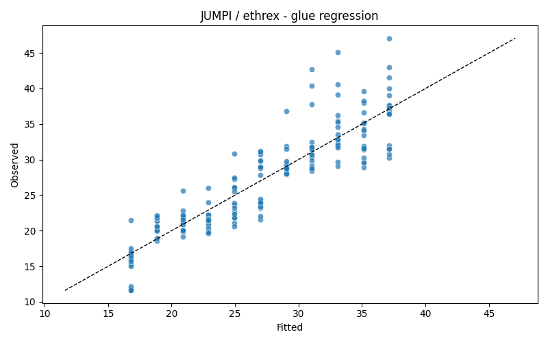

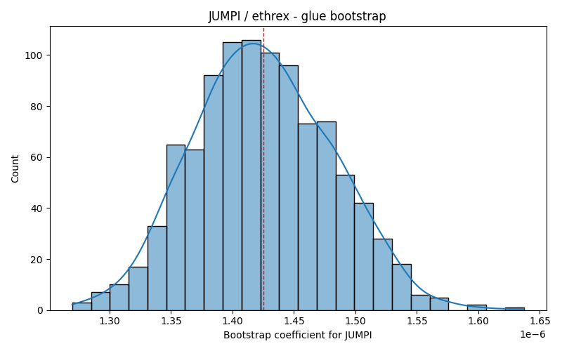

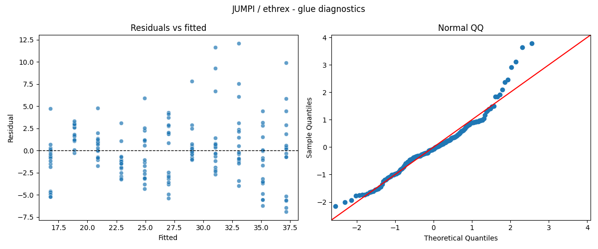

</details>

<details><summary><code>LT</code> · nobs=187 · runtime_ms=9.003e-07 · p=1.00e-03 · R²=0.8134</summary>

```
==============================================================================
                           NNLS Regression Results                            
==============================================================================
Dep. Variable:          test_runtime_ms              R-squared:          0.813
Model:                  NNLS                    Adj. R-squared:          0.812
No. Observations:       187                               RMSE:           4.54
Df Residuals:           185                                MAE:           3.46
Df Model:               1      
==============================================================================
                      coef     std err     P-value      [0.025      0.975]
------------------------------------------------------------------------------
         const     11.4879      0.9705       0.001      9.5564     13.4003
            LT      0.0000      0.0000       0.001      0.0000      0.0000
==============================================================================
Notes: Non-negative least squares with bootstrap inference (1000 iterations)
==============================================================================
```

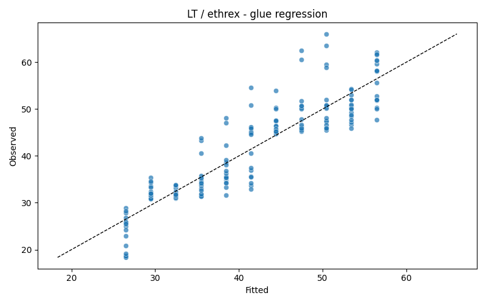

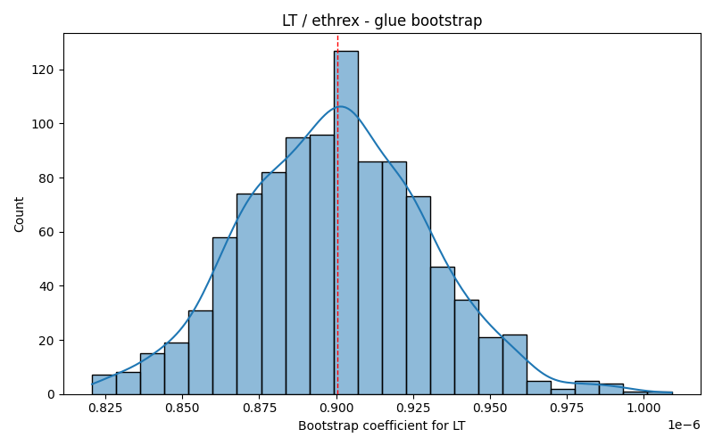

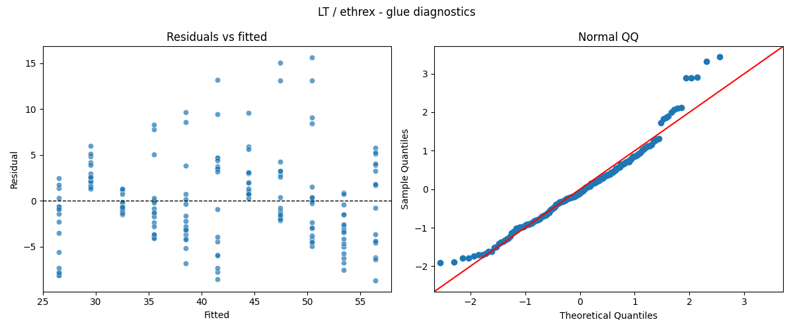

</details>

<details><summary><code>MSTORE</code> · nobs=935 · runtime_ms=1.731e-06 · p=1.00e-03 · R²=0.8222</summary>

```
==============================================================================
                           NNLS Regression Results                            
==============================================================================
Dep. Variable:          test_runtime_ms              R-squared:          0.822
Model:                  NNLS                    Adj. R-squared:          0.822
No. Observations:       935                               RMSE:           5.65
Df Residuals:           933                                MAE:           4.29
Df Model:               1      
==============================================================================
                      coef     std err     P-value      [0.025      0.975]
------------------------------------------------------------------------------
         const     11.1044      0.6218       0.001      9.8669     12.2562
        MSTORE      0.0000      0.0000       0.001      0.0000      0.0000
==============================================================================
Notes: Non-negative least squares with bootstrap inference (1000 iterations)
==============================================================================
```

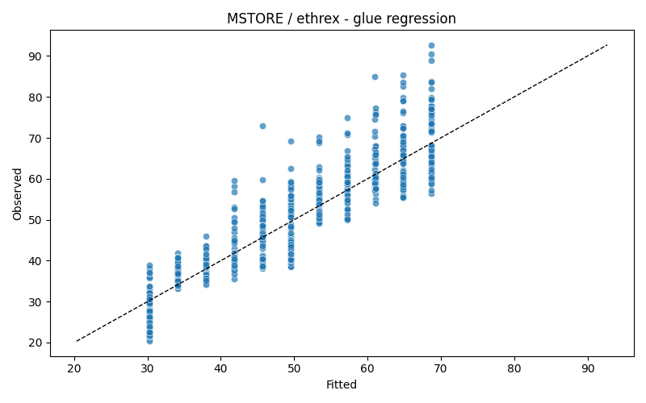

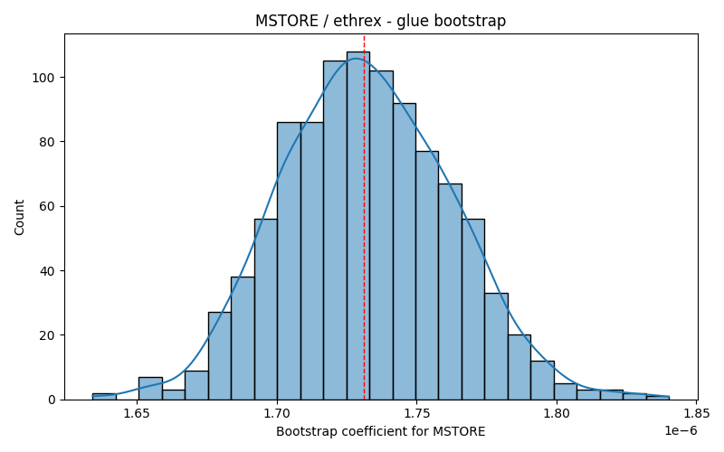

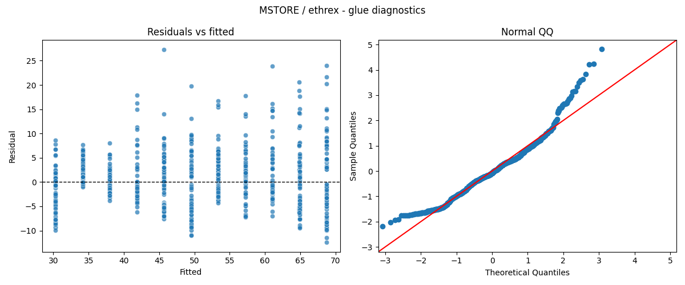

</details>

<details><summary><code>MSTORE8</code> · nobs=935 · runtime_ms=1.599e-06 · p=1.00e-03 · R²=0.8139</summary>

```
==============================================================================
                           NNLS Regression Results                            
==============================================================================
Dep. Variable:          test_runtime_ms              R-squared:          0.814
Model:                  NNLS                    Adj. R-squared:          0.814
No. Observations:       935                               RMSE:           5.37
Df Residuals:           933                                MAE:           4.03
Df Model:               1      
==============================================================================
                      coef     std err     P-value      [0.025      0.975]
------------------------------------------------------------------------------
         const     10.2682      0.5659       0.001      9.1636     11.3351
       MSTORE8      0.0000      0.0000       0.001      0.0000      0.0000
==============================================================================
Notes: Non-negative least squares with bootstrap inference (1000 iterations)
==============================================================================
```

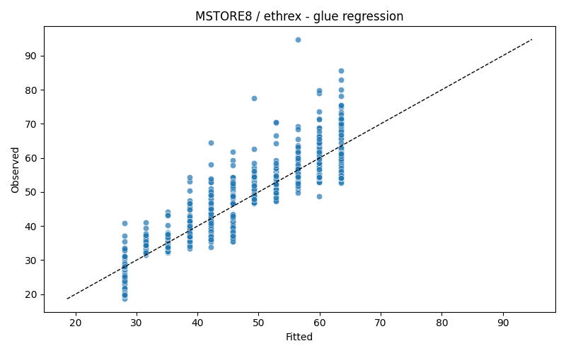

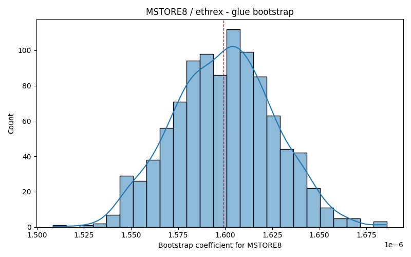

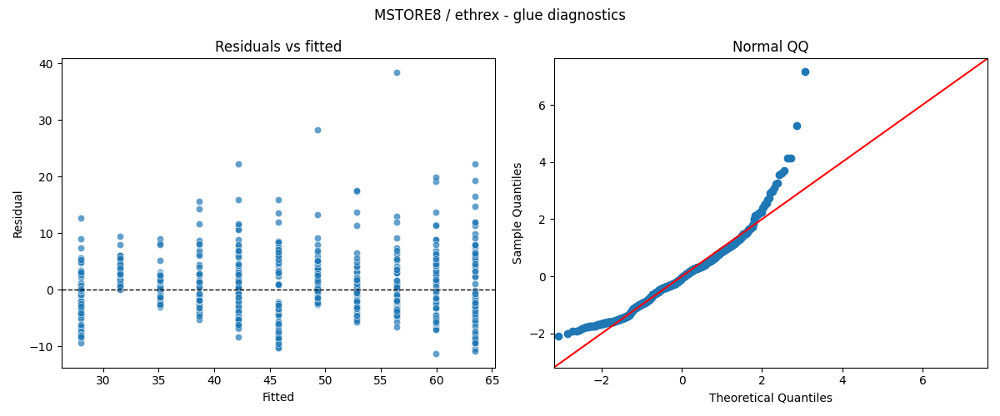

</details>

<details><summary><code>MUL</code> · nobs=187 · runtime_ms=1.363e-06 · p=1.00e-03 · R²=0.7771</summary>

```
==============================================================================
                           NNLS Regression Results                            
==============================================================================
Dep. Variable:          test_runtime_ms              R-squared:          0.777
Model:                  NNLS                    Adj. R-squared:          0.776
No. Observations:       187                               RMSE:           5.76
Df Residuals:           185                                MAE:           4.55
Df Model:               1      
==============================================================================
                      coef     std err     P-value      [0.025      0.975]
------------------------------------------------------------------------------
         const     12.7299      1.4224       0.001      9.8709     15.6135
           MUL      0.0000      0.0000       0.001      0.0000      0.0000
==============================================================================
Notes: Non-negative least squares with bootstrap inference (1000 iterations)
==============================================================================
```

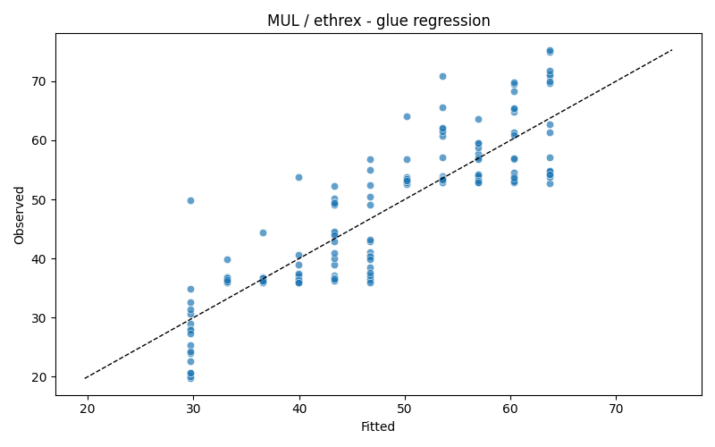

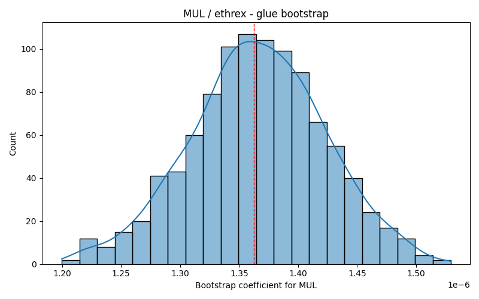

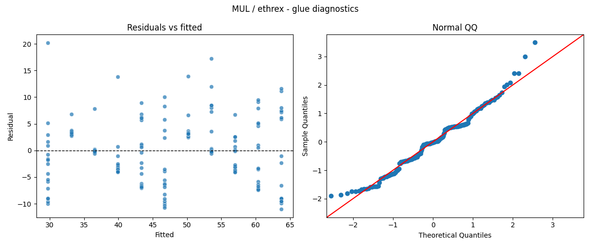

</details>

<details><summary><code>PC</code> · nobs=187 · runtime_ms=5.467e-07 · p=1.00e-03 · R²=0.8255</summary>

```
==============================================================================
                           NNLS Regression Results                            
==============================================================================
Dep. Variable:          test_runtime_ms              R-squared:          0.826
Model:                  NNLS                    Adj. R-squared:          0.825
No. Observations:       187                               RMSE:           7.51
Df Residuals:           185                                MAE:           6.12
Df Model:               1      
==============================================================================
                      coef     std err     P-value      [0.025      0.975]
------------------------------------------------------------------------------
         const     16.0333      1.8954       0.001     12.3299     19.5819
            PC      0.0000      0.0000       0.001      0.0000      0.0000
==============================================================================
Notes: Non-negative least squares with bootstrap inference (1000 iterations)
==============================================================================
```

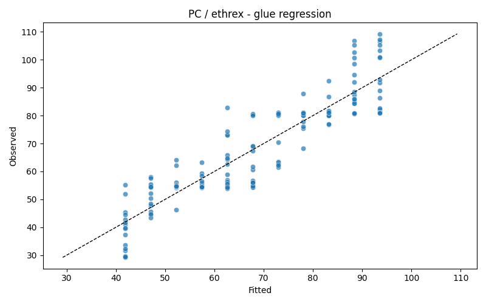

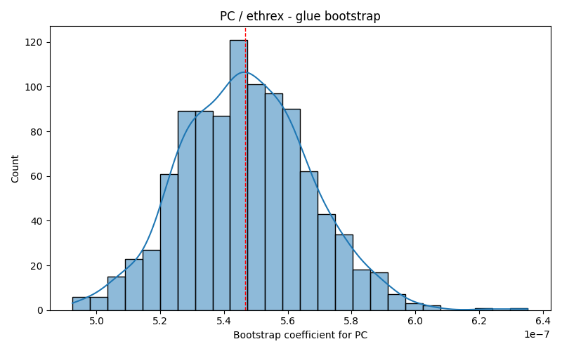

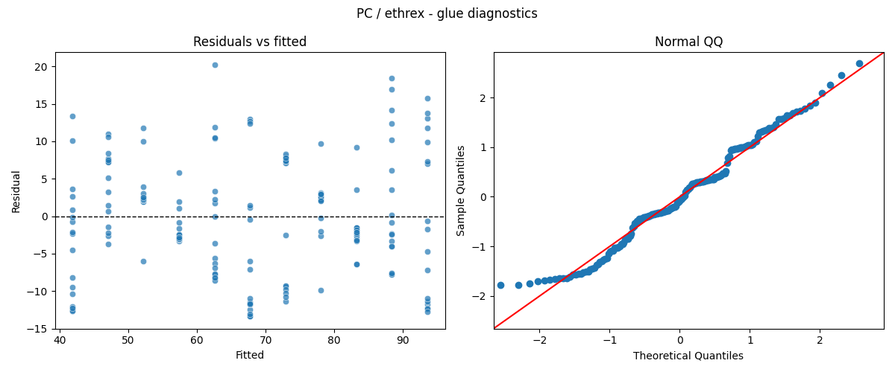

</details>

<details><summary><code>RETURNDATASIZE</code> · nobs=748 · runtime_ms=9.084e-07 · p=1.00e-03 · R²=0.8372</summary>

```
==============================================================================
                           NNLS Regression Results                            
==============================================================================
Dep. Variable:          test_runtime_ms              R-squared:          0.837
Model:                  NNLS                    Adj. R-squared:          0.837
No. Observations:       748                               RMSE:           6.33
Df Residuals:           746                                MAE:           4.86
Df Model:               1      
==============================================================================
                      coef     std err     P-value      [0.025      0.975]
------------------------------------------------------------------------------
         const     12.1381      0.7391       0.001     10.6324     13.5254
RETURNDATASIZE      0.0000      0.0000       0.001      0.0000      0.0000
==============================================================================
Notes: Non-negative least squares with bootstrap inference (1000 iterations)
==============================================================================
```

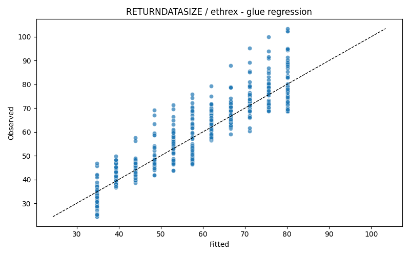

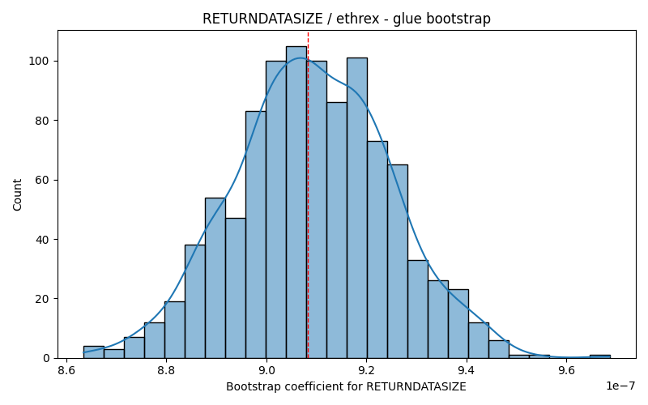

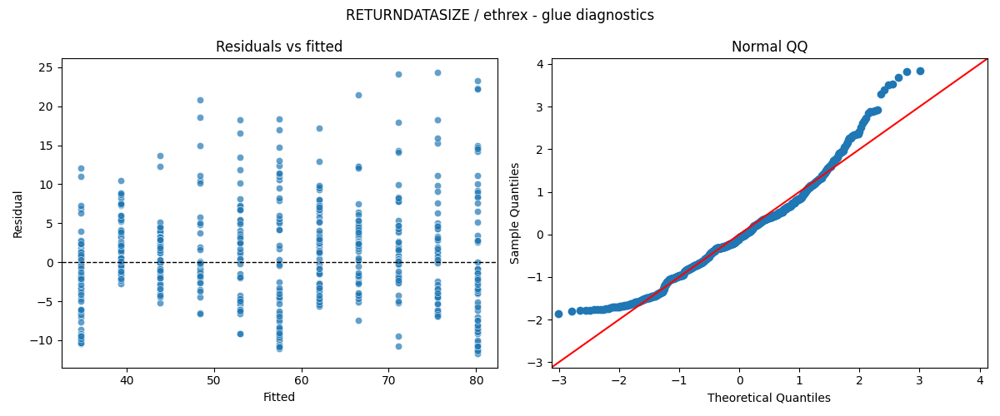

</details>

<details><summary><code>SELFBALANCE</code> · nobs=153 · runtime_ms=4.79e-06 · p=1.00e-03 · R²=0.809</summary>

```
==============================================================================
                           NNLS Regression Results                            
==============================================================================
Dep. Variable:          test_runtime_ms              R-squared:          0.809
Model:                  NNLS                    Adj. R-squared:          0.808
No. Observations:       153                               RMSE:          23.48
Df Residuals:           151                                MAE:          19.32
Df Model:               1      
==============================================================================
                      coef     std err     P-value      [0.025      0.975]
------------------------------------------------------------------------------
         const     69.4217      6.4802       0.001     56.8177     81.2473
   SELFBALANCE      0.0000      0.0000       0.001      0.0000      0.0000
==============================================================================
Notes: Non-negative least squares with bootstrap inference (1000 iterations)
==============================================================================
```

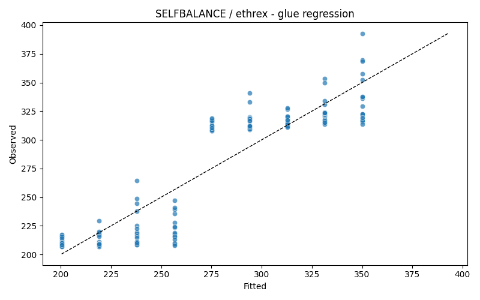

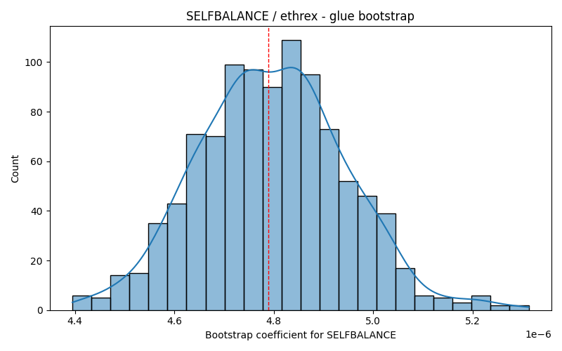

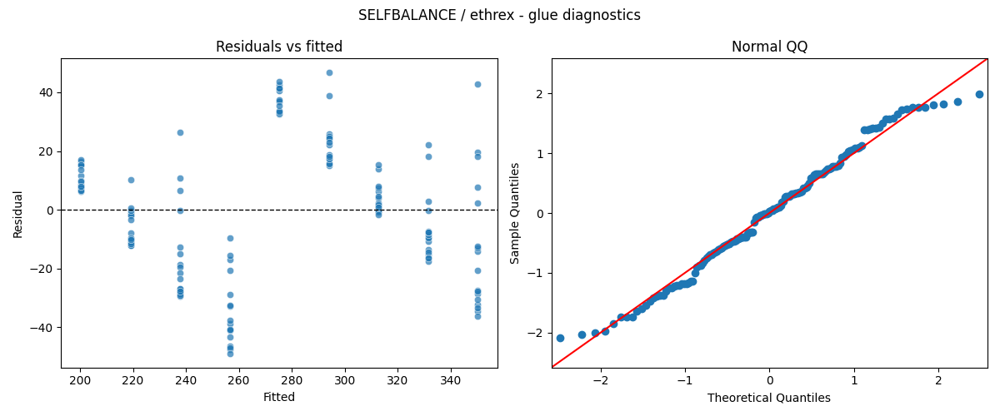

</details>

<details><summary><code>SUB</code> · nobs=187 · runtime_ms=1.094e-06 · p=1.00e-03 · R²=0.8088</summary>

```
==============================================================================
                           NNLS Regression Results                            
==============================================================================
Dep. Variable:          test_runtime_ms              R-squared:          0.809
Model:                  NNLS                    Adj. R-squared:          0.808
No. Observations:       187                               RMSE:           5.60
Df Residuals:           185                                MAE:           4.02
Df Model:               1      
==============================================================================
                      coef     std err     P-value      [0.025      0.975]
------------------------------------------------------------------------------
         const      8.1091      1.6174       0.001      5.3590     11.5106
           SUB      0.0000      0.0000       0.001      0.0000      0.0000
==============================================================================
Notes: Non-negative least squares with bootstrap inference (1000 iterations)
==============================================================================
```

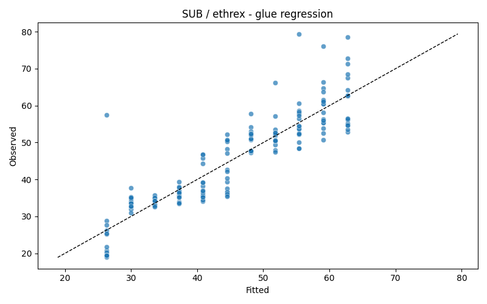

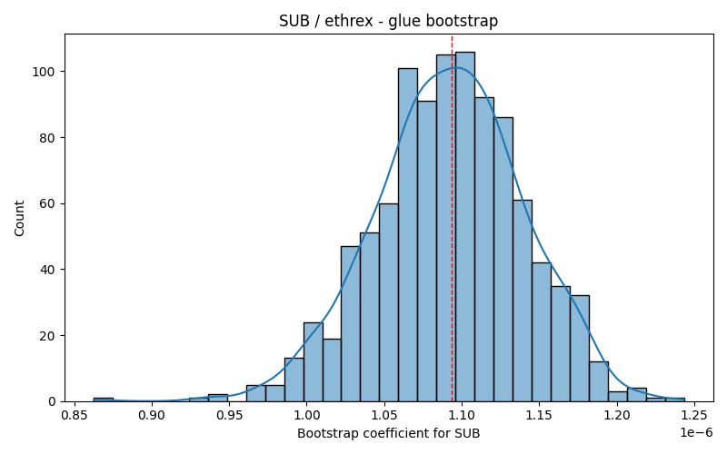

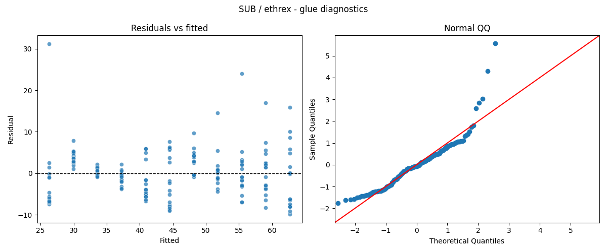

</details>

### Mixed glue (tier B) · ethrex

<details><summary><code>JUMP</code> · nobs=187 · runtime_ms=4.394e-06 · p=1.00e-03 · R²=0.8364</summary>

```
==============================================================================
                           NNLS Regression Results                            
==============================================================================
Dep. Variable:          test_runtime_ms              R-squared:          0.836
Model:                  NNLS                    Adj. R-squared:          0.836
No. Observations:       187                               RMSE:           7.22
Df Residuals:           185                                MAE:           5.82
Df Model:               1      
==============================================================================
                      coef     std err     P-value      [0.025      0.975]
------------------------------------------------------------------------------
         const     14.9588      1.8962       0.001     11.1285     18.8079
          JUMP      0.0000      0.0000       0.001      0.0000      0.0000
==============================================================================
Notes: Non-negative least squares with bootstrap inference (1000 iterations)
==============================================================================
```

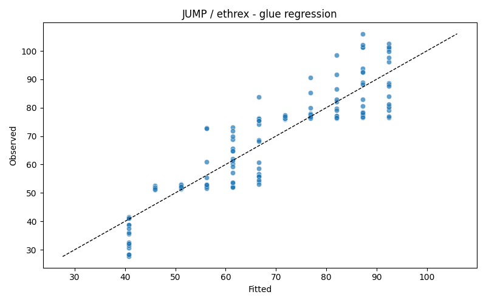

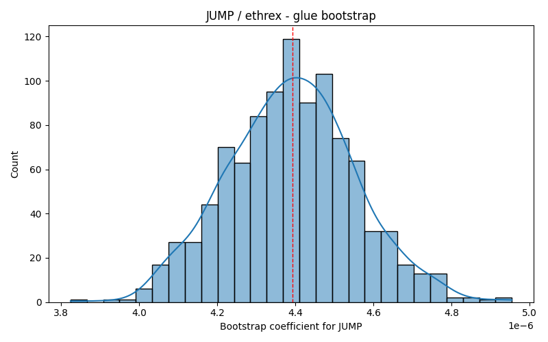

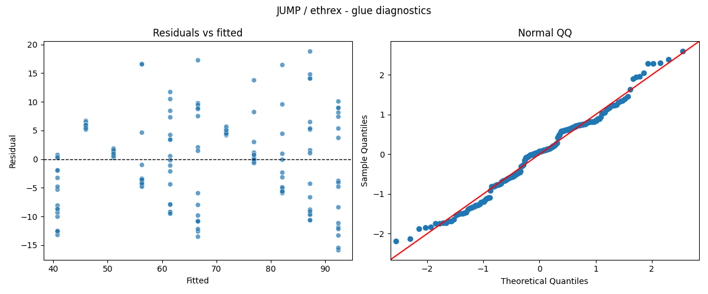

</details>

<details><summary><code>KECCAK256</code> · nobs=2992 · runtime_ms=0 · p=1.00e+00 · R²=0</summary>

```
==============================================================================
                           NNLS Regression Results                            
==============================================================================
Dep. Variable:          test_runtime_ms              R-squared:          0.000
Model:                  NNLS                    Adj. R-squared:         -0.000
No. Observations:       2992                              RMSE:         155.59
Df Residuals:           2990                               MAE:         128.80
Df Model:               1      
==============================================================================
                      coef     std err     P-value      [0.025      0.975]
------------------------------------------------------------------------------
         const    248.1110      2.7631       0.001    242.5382    253.4460
     KECCAK256      0.0000      0.0000       1.000      0.0000      0.0000
==============================================================================
Notes: Non-negative least squares with bootstrap inference (1000 iterations)
==============================================================================
```

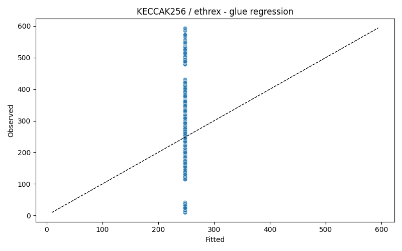

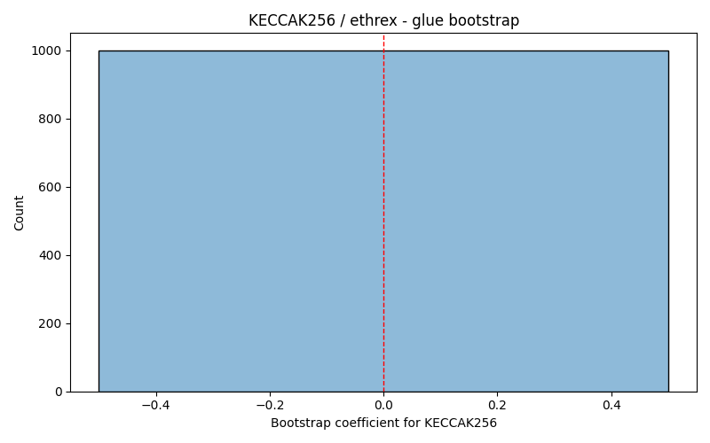

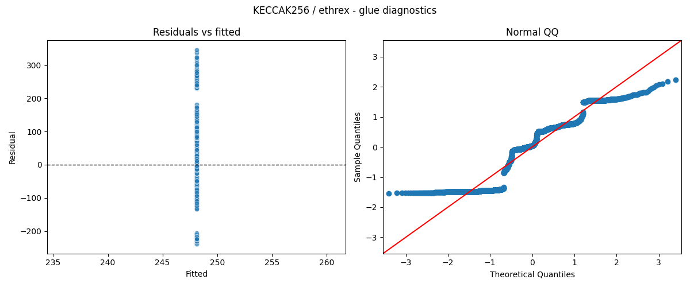

</details>

## geth

| glue_opcode | nobs | glue_runtime_ms | p_value | rsquared |
| --- | --- | --- | --- | --- |
| `ISZERO` | 1331 | 1.441e-06 | 1.00e-03 | 0.78 |
| `JUMPDEST` | 1331 | 1.15e-06 | 1.00e-03 | 0.7961 |
| `SWAP` | 21296 | 1.514e-06 | 1.00e-03 | 0.7689 |
| `CALLDATASIZE` | 78683 | 1.419e-06 | 1.00e-03 | 0.8187 |
| `DUP` | 78683 | 1.53e-06 | 1.00e-03 | 0.8187 |
| `GAS` | 78683 | 1.499e-06 | 1.00e-03 | 0.8187 |
| `MLOAD` | 78683 | 5.183e-06 | 1.00e-03 | 0.8187 |
| `PUSH` | 78683 | 2.261e-06 | 1.00e-03 | 0.8187 |
| `PUSH0` | 78683 | 1.447e-06 | 1.00e-03 | 0.8187 |
| `STATICCALL` | 78683 | 0.0001695 | 1.00e-03 | 0.8187 |
| `ADD` | 1331 | 4.511e-06 | 1.00e-03 | 0.8315 |
| `AND` | 1331 | 4.282e-06 | 1.00e-03 | 0.8042 |
| `CALLDATACOPY` | 31944 | 1.373e-05 | 1.00e-03 | 0.9553 |
| `CALLDATALOAD` | 5324 | 5.204e-05 | 1.00e-03 | 0.0353 |
| `DIV` | 1331 | 9.252e-06 | 1.00e-03 | 0.788 |
| `EXP` | 1331 | 0.0003441 | 1.00e-03 | 0.8316 |
| `GT` | 1331 | 3.491e-06 | 1.00e-03 | 0.7734 |
| `JUMPI` | 1331 | 5.699e-06 | 1.00e-03 | 0.7502 |
| `LT` | 1331 | 4.379e-06 | 1.00e-03 | 0.7872 |
| `MSTORE` | 6655 | 8.054e-06 | 1.00e-03 | 0.8123 |
| `MSTORE8` | 6655 | 7.413e-06 | 1.00e-03 | 0.8001 |
| `MUL` | 1331 | 4.936e-06 | 1.00e-03 | 0.8748 |
| `PC` | 1331 | 1.606e-06 | 1.00e-03 | 0.8336 |
| `RETURNDATASIZE` | 5324 | 3.125e-06 | 1.00e-03 | 0.6124 |
| `SELFBALANCE` | 1089 | 7.435e-06 | 1.00e-03 | 0.797 |
| `SUB` | 1331 | 4.422e-06 | 1.00e-03 | 0.8269 |
| `JUMP` | 1331 | 9.24e-06 | 1.00e-03 | 0.7636 |
| `KECCAK256` | 21296 | 3.67e-05 | 1.00e-03 | 0.2661 |

### Cycle glue — joint fit · geth

<details><summary>Joint NNLS regression summary</summary>

```
==============================================================================
                           NNLS Regression Results                            
==============================================================================
Dep. Variable:          test_runtime_ms              R-squared:          0.819
Model:                  NNLS                    Adj. R-squared:          0.819
No. Observations:       78683                             RMSE:          24.22
Df Residuals:           78675                              MAE:          18.65
Df Model:               7      
==============================================================================
                      coef     std err     P-value      [0.025      0.975]
------------------------------------------------------------------------------
         const     40.7226      0.3168       0.001     40.0889     41.3244
  CALLDATASIZE      0.0000      0.0000       0.001      0.0000      0.0000
           DUP      0.0000      0.0000       0.001      0.0000      0.0000
           GAS      0.0000      0.0000       0.001      0.0000      0.0000
         MLOAD      0.0000      0.0000       0.001      0.0000      0.0000
          PUSH      0.0000      0.0000       0.001      0.0000      0.0000
         PUSH0      0.0000      0.0000       0.001      0.0000      0.0000
    STATICCALL      0.0002      0.0000       0.001      0.0002      0.0002
==============================================================================
Notes: Non-negative least squares with bootstrap inference (1000 iterations)
==============================================================================
```

</details>

<details><summary><code>CALLDATASIZE</code> · nobs=78683 · runtime_ms=1.419e-06 · p=1.00e-03 · R²=0.8187</summary>

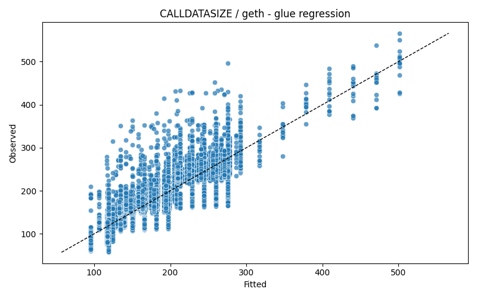

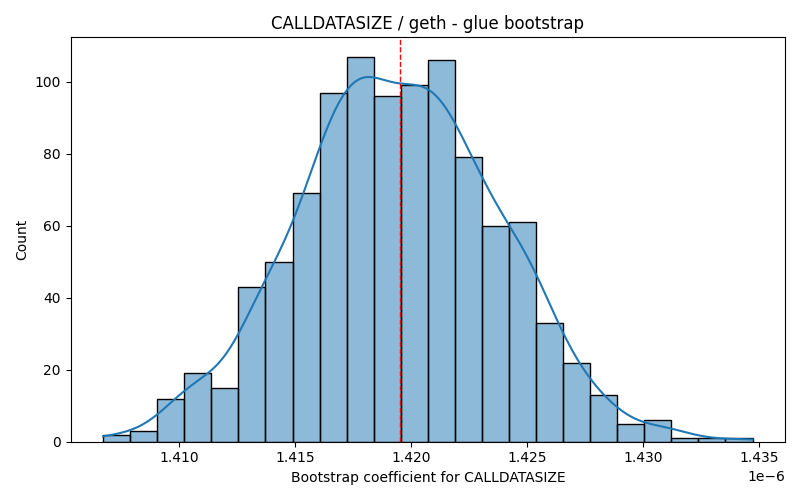

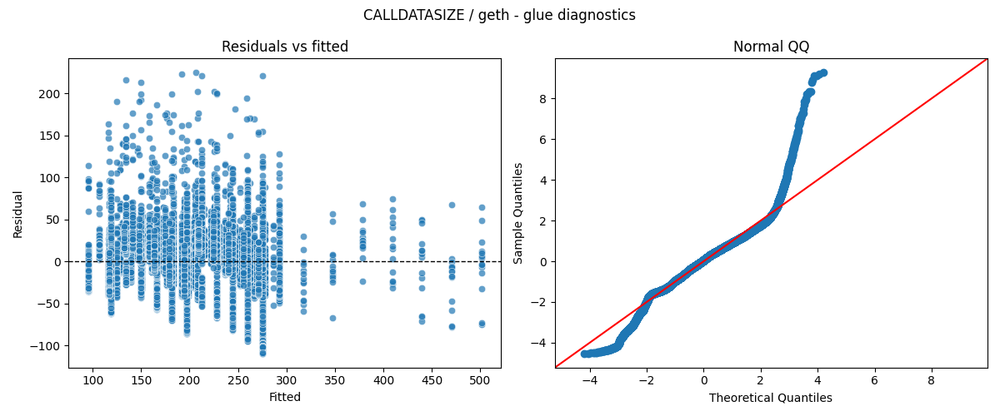

</details>

<details><summary><code>DUP</code> · nobs=78683 · runtime_ms=1.53e-06 · p=1.00e-03 · R²=0.8187</summary>


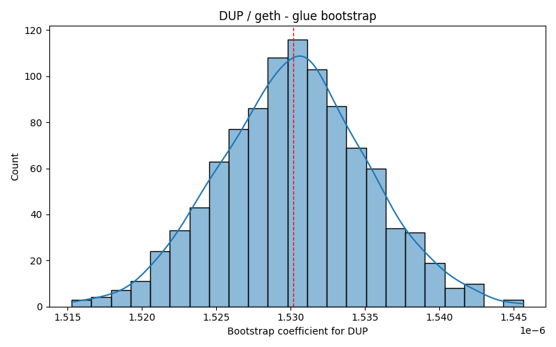


</details>

<details><summary><code>GAS</code> · nobs=78683 · runtime_ms=1.499e-06 · p=1.00e-03 · R²=0.8187</summary>


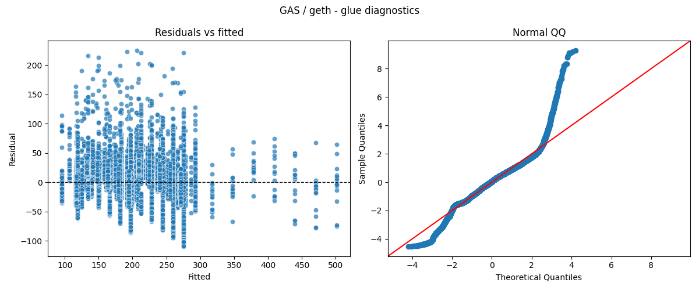

</details>

<details><summary><code>MLOAD</code> · nobs=78683 · runtime_ms=5.183e-06 · p=1.00e-03 · R²=0.8187</summary>


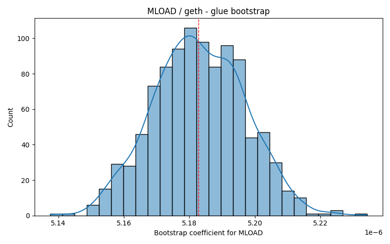


</details>

<details><summary><code>PUSH</code> · nobs=78683 · runtime_ms=2.261e-06 · p=1.00e-03 · R²=0.8187</summary>

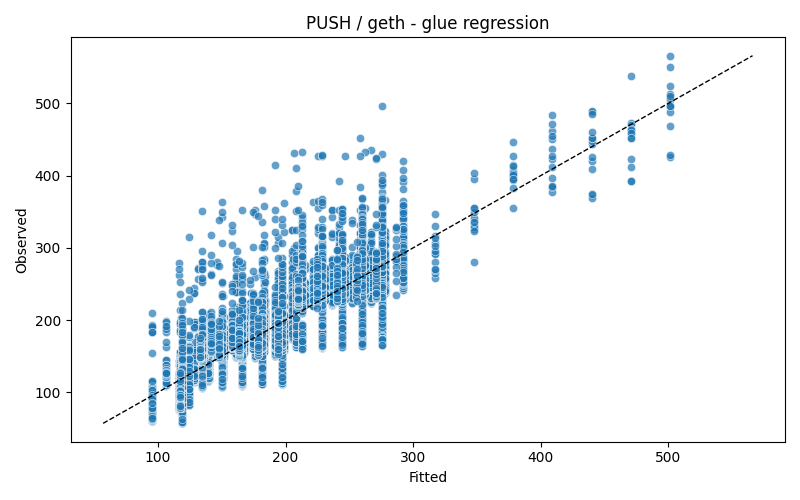

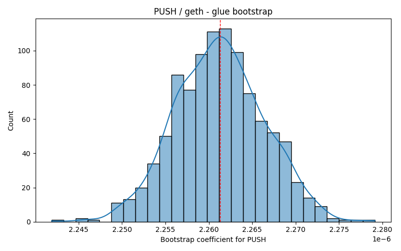


</details>

<details><summary><code>PUSH0</code> · nobs=78683 · runtime_ms=1.447e-06 · p=1.00e-03 · R²=0.8187</summary>


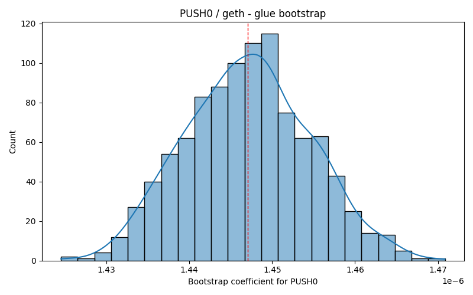

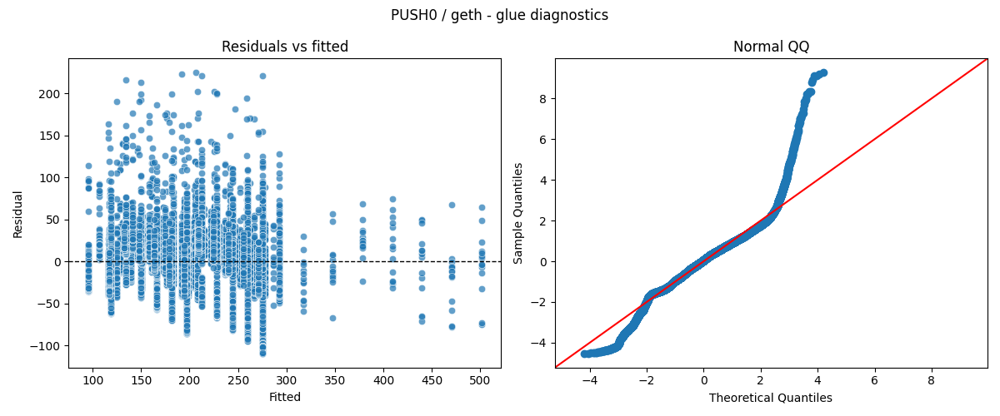

</details>

<details><summary><code>STATICCALL</code> · nobs=78683 · runtime_ms=0.0001695 · p=1.00e-03 · R²=0.8187</summary>


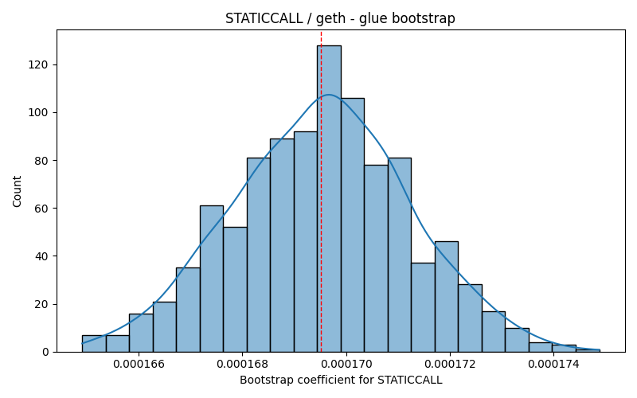


</details>

### Pure glue · geth

<details><summary><code>ISZERO</code> · nobs=1331 · runtime_ms=1.441e-06 · p=1.00e-03 · R²=0.78</summary>

```
==============================================================================
                           NNLS Regression Results                            
==============================================================================
Dep. Variable:          test_runtime_ms              R-squared:          0.780
Model:                  NNLS                    Adj. R-squared:          0.780
No. Observations:       1331                              RMSE:          16.12
Df Residuals:           1329                               MAE:          11.80
Df Model:               1      
==============================================================================
                      coef     std err     P-value      [0.025      0.975]
------------------------------------------------------------------------------
         const     22.4625      1.5611       0.001     19.5247     25.6702
        ISZERO      0.0000      0.0000       0.001      0.0000      0.0000
==============================================================================
Notes: Non-negative least squares with bootstrap inference (1000 iterations)
==============================================================================
```

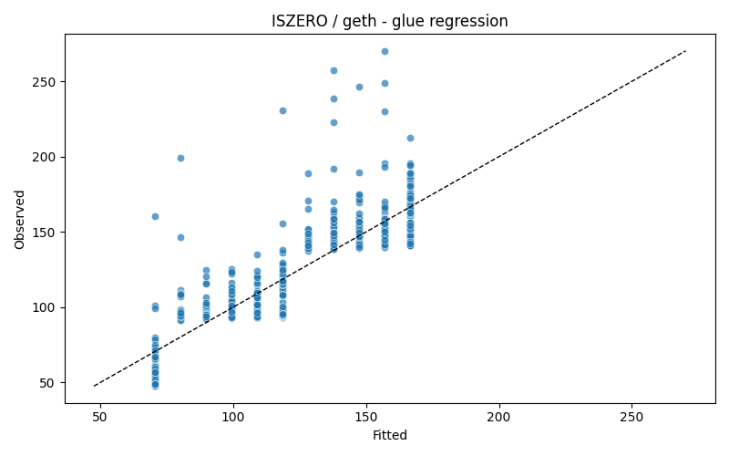

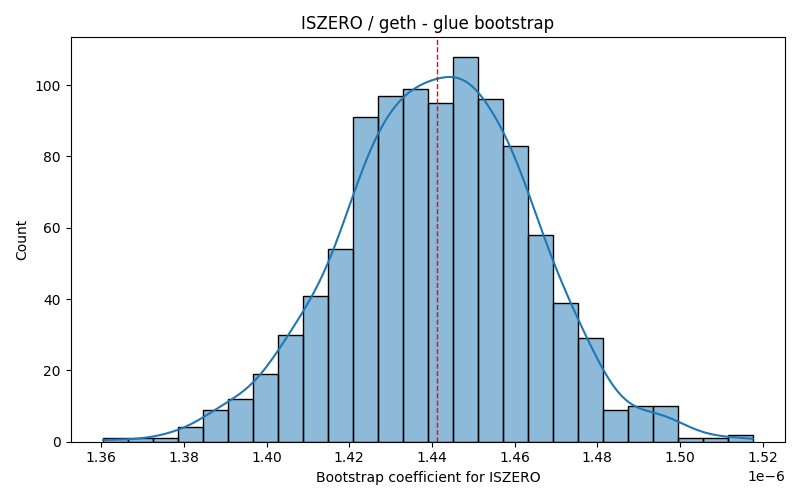

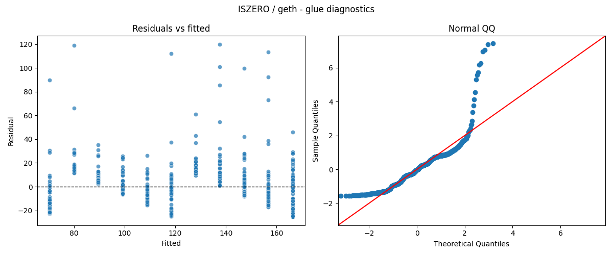

</details>

<details><summary><code>JUMPDEST</code> · nobs=1331 · runtime_ms=1.15e-06 · p=1.00e-03 · R²=0.7961</summary>

```
==============================================================================
                           NNLS Regression Results                            
==============================================================================
Dep. Variable:          test_runtime_ms              R-squared:          0.796
Model:                  NNLS                    Adj. R-squared:          0.796
No. Observations:       1331                              RMSE:          36.74
Df Residuals:           1329                               MAE:          26.40
Df Model:               1      
==============================================================================
                      coef     std err     P-value      [0.025      0.975]
------------------------------------------------------------------------------
         const     70.1825      3.7224       0.001     62.8469     77.3266
      JUMPDEST      0.0000      0.0000       0.001      0.0000      0.0000
==============================================================================
Notes: Non-negative least squares with bootstrap inference (1000 iterations)
==============================================================================
```

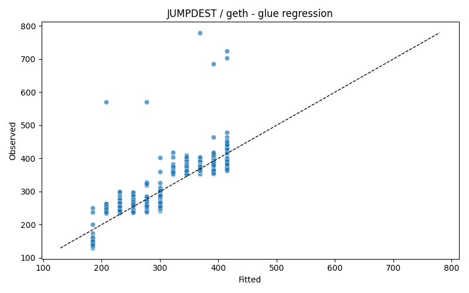

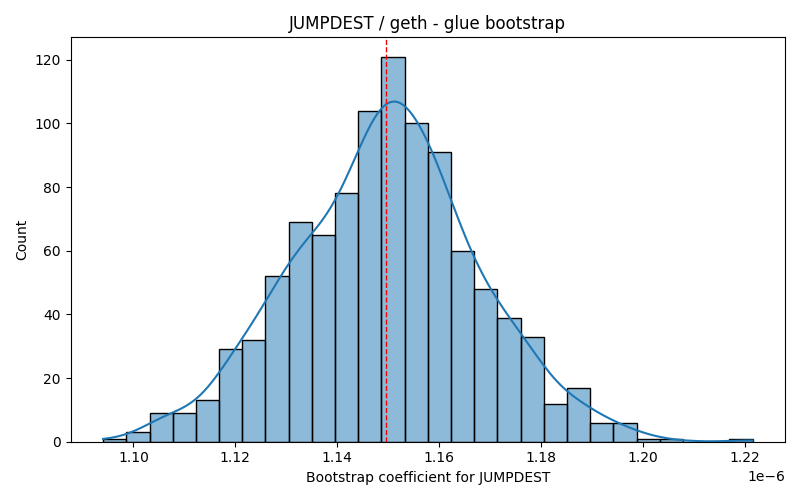

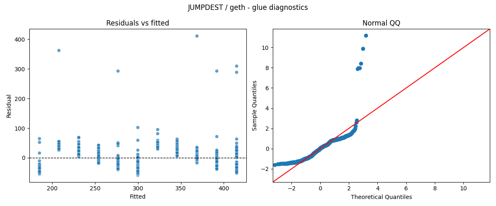

</details>

<details><summary><code>SWAP</code> · nobs=21296 · runtime_ms=1.514e-06 · p=1.00e-03 · R²=0.7689</summary>

```
==============================================================================
                           NNLS Regression Results                            
==============================================================================
Dep. Variable:          test_runtime_ms              R-squared:          0.769
Model:                  NNLS                    Adj. R-squared:          0.769
No. Observations:       21296                             RMSE:          17.48
Df Residuals:           21294                              MAE:          13.12
Df Model:               1      
==============================================================================
                      coef     std err     P-value      [0.025      0.975]
------------------------------------------------------------------------------
         const     31.7276      0.4215       0.001     30.8912     32.4874
          SWAP      0.0000      0.0000       0.001      0.0000      0.0000
==============================================================================
Notes: Non-negative least squares with bootstrap inference (1000 iterations)
==============================================================================
```

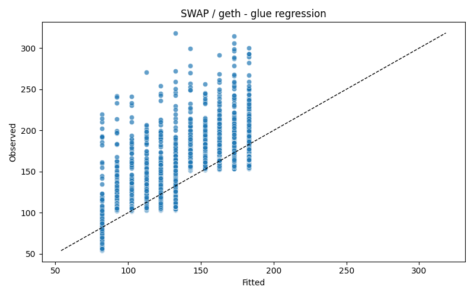

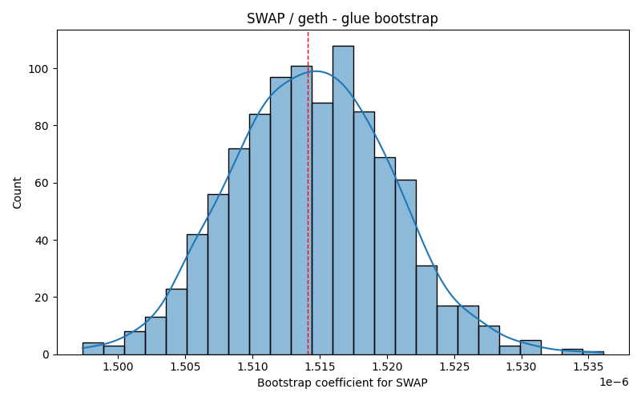

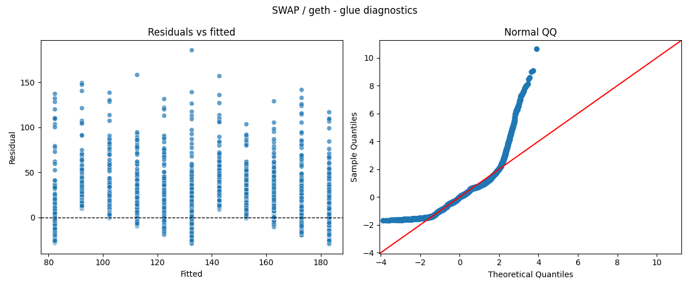

</details>

### Mixed glue (tier A) · geth

<details><summary><code>ADD</code> · nobs=1331 · runtime_ms=4.511e-06 · p=1.00e-03 · R²=0.8315</summary>

```
==============================================================================
                           NNLS Regression Results                            
==============================================================================
Dep. Variable:          test_runtime_ms              R-squared:          0.832
Model:                  NNLS                    Adj. R-squared:          0.831
No. Observations:       1331                              RMSE:          21.37
Df Residuals:           1329                               MAE:          15.66
Df Model:               1      
==============================================================================
                      coef     std err     P-value      [0.025      0.975]
------------------------------------------------------------------------------
         const     43.1036      1.8974       0.001     39.2533     46.7781
           ADD      0.0000      0.0000       0.001      0.0000      0.0000
==============================================================================
Notes: Non-negative least squares with bootstrap inference (1000 iterations)
==============================================================================
```

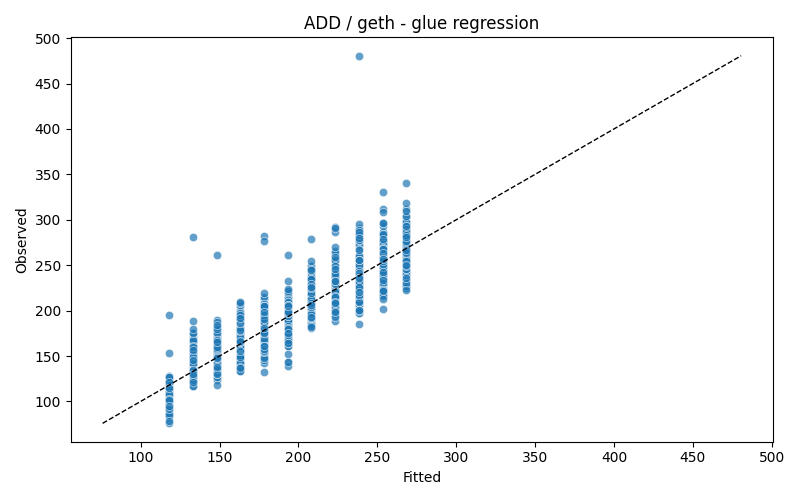

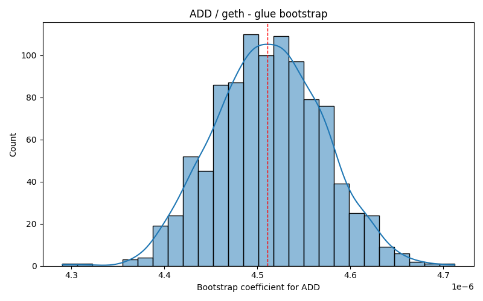

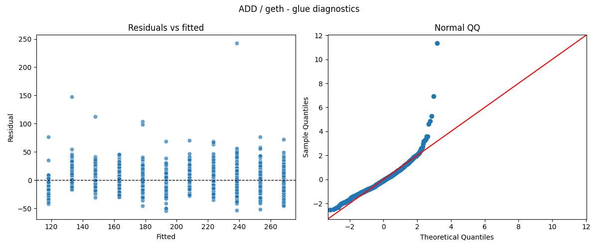

</details>

<details><summary><code>AND</code> · nobs=1331 · runtime_ms=4.282e-06 · p=1.00e-03 · R²=0.8042</summary>

```
==============================================================================
                           NNLS Regression Results                            
==============================================================================
Dep. Variable:          test_runtime_ms              R-squared:          0.804
Model:                  NNLS                    Adj. R-squared:          0.804
No. Observations:       1331                              RMSE:          22.24
Df Residuals:           1329                               MAE:          16.65
Df Model:               1      
==============================================================================
                      coef     std err     P-value      [0.025      0.975]
------------------------------------------------------------------------------
         const     45.5574      1.9730       0.001     41.7784     49.4213
           AND      0.0000      0.0000       0.001      0.0000      0.0000
==============================================================================
Notes: Non-negative least squares with bootstrap inference (1000 iterations)
==============================================================================
```

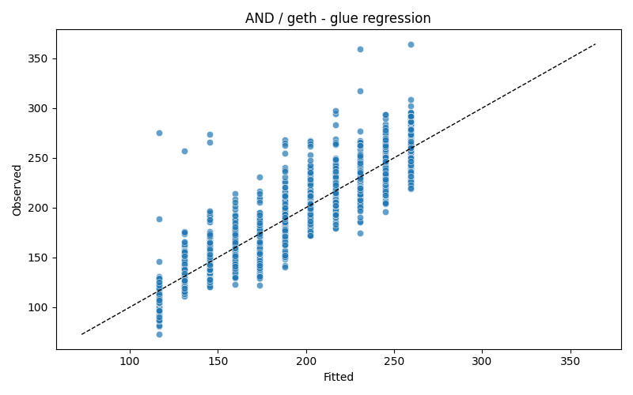

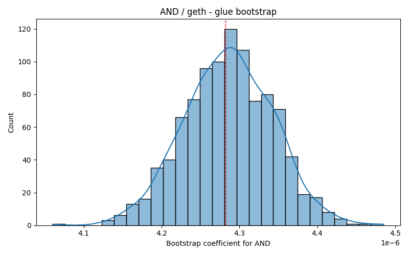

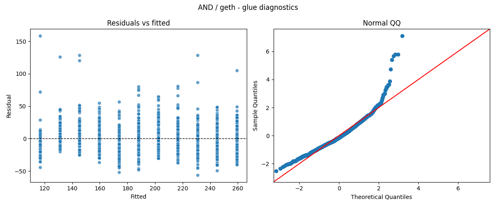

</details>

<details><summary><code>CALLDATACOPY</code> · nobs=31944 · runtime_ms=1.373e-05 · p=1.00e-03 · R²=0.9553</summary>

```
==============================================================================
                           NNLS Regression Results                            
==============================================================================
Dep. Variable:          test_runtime_ms              R-squared:          0.955
Model:                  NNLS                    Adj. R-squared:          0.955
No. Observations:       31944                             RMSE:          22.32
Df Residuals:           31942                              MAE:          16.05
Df Model:               1      
==============================================================================
                      coef     std err     P-value      [0.025      0.975]
------------------------------------------------------------------------------
         const     20.1164      0.1557       0.001     19.7995     20.4197
  CALLDATACOPY      0.0000      0.0000       0.001      0.0000      0.0000
==============================================================================
Notes: Non-negative least squares with bootstrap inference (1000 iterations)
==============================================================================
```

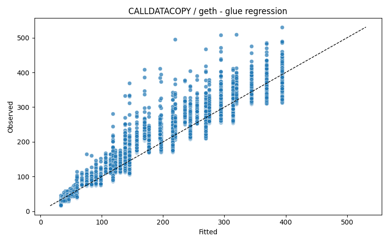

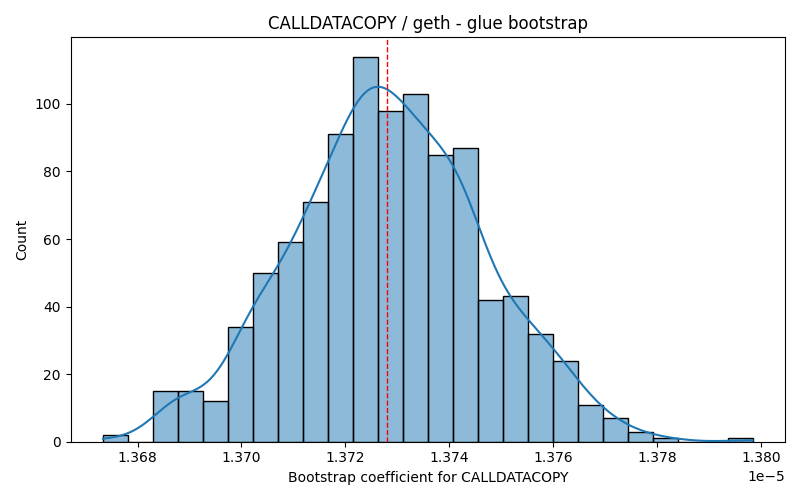

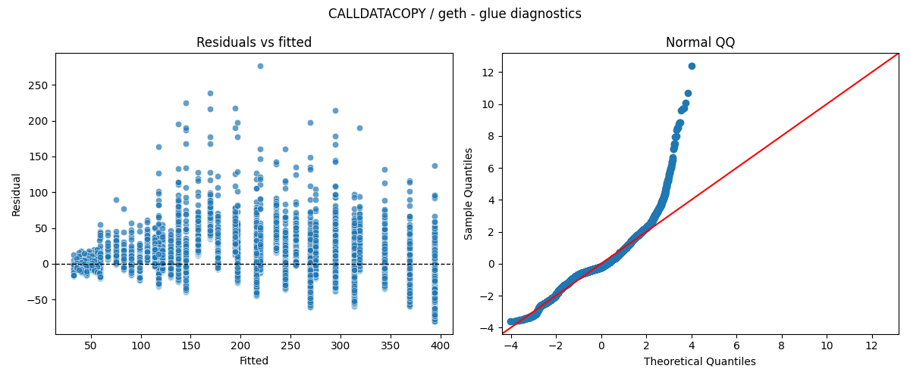

</details>

<details><summary><code>CALLDATALOAD</code> · nobs=5324 · runtime_ms=5.204e-05 · p=1.00e-03 · R²=0.0353</summary>

```
==============================================================================
                           NNLS Regression Results                            
==============================================================================
Dep. Variable:          test_runtime_ms              R-squared:          0.035
Model:                  NNLS                    Adj. R-squared:          0.035
No. Observations:       5324                              RMSE:           1.04
Df Residuals:           5322                               MAE:           0.53
Df Model:               1      
==============================================================================
                      coef     std err     P-value      [0.025      0.975]
------------------------------------------------------------------------------
         const      2.4648      0.0454       0.001      2.3821      2.5587
  CALLDATALOAD      0.0001      0.0000       0.001      0.0000      0.0001
==============================================================================
Notes: Non-negative least squares with bootstrap inference (1000 iterations)
==============================================================================
```

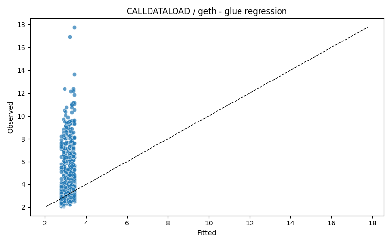

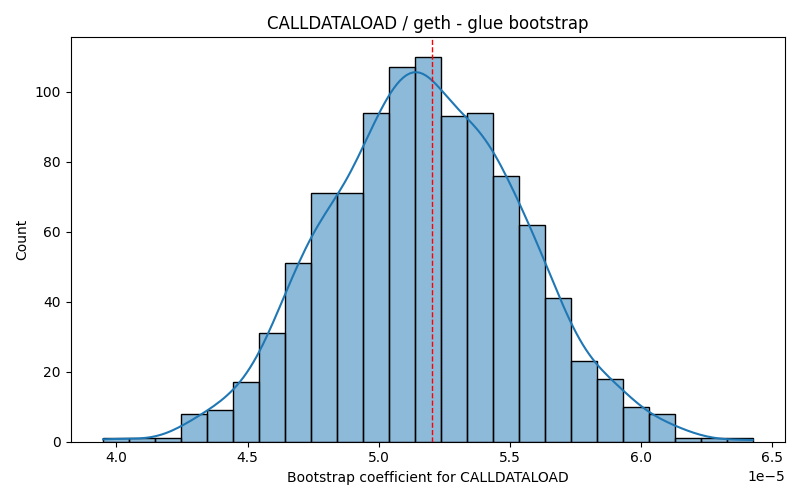

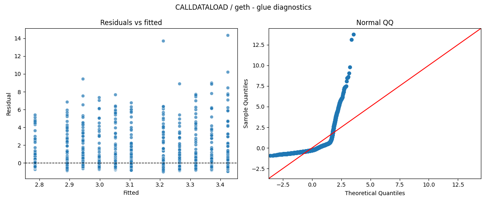

</details>

<details><summary><code>DIV</code> · nobs=1331 · runtime_ms=9.252e-06 · p=1.00e-03 · R²=0.788</summary>

```
==============================================================================
                           NNLS Regression Results                            
==============================================================================
Dep. Variable:          test_runtime_ms              R-squared:          0.788
Model:                  NNLS                    Adj. R-squared:          0.788
No. Observations:       1331                              RMSE:          37.88
Df Residuals:           1329                               MAE:          31.08
Df Model:               1      
==============================================================================
                      coef     std err     P-value      [0.025      0.975]
------------------------------------------------------------------------------
         const     80.1079      3.7031       0.001     72.3887     86.9961
           DIV      0.0000      0.0000       0.001      0.0000      0.0000
==============================================================================
Notes: Non-negative least squares with bootstrap inference (1000 iterations)
==============================================================================
```

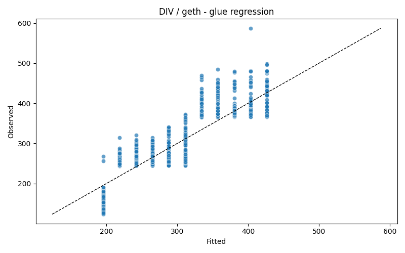


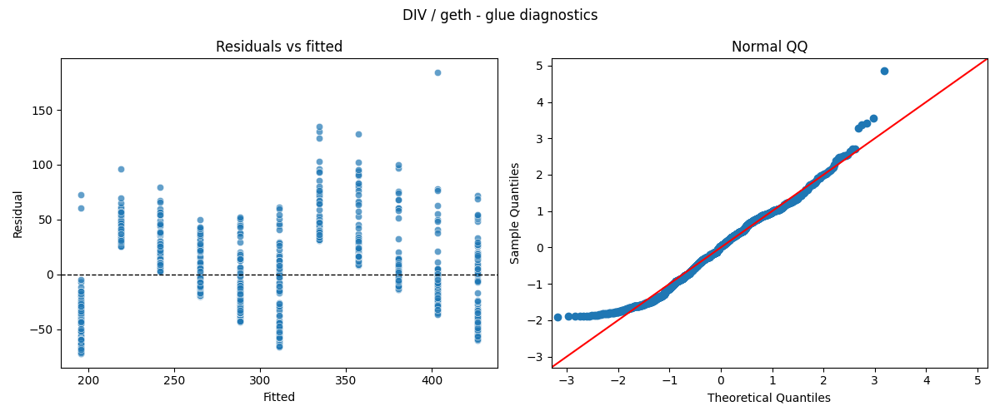

</details>

<details><summary><code>EXP</code> · nobs=1331 · runtime_ms=0.0003441 · p=1.00e-03 · R²=0.8316</summary>

```
==============================================================================
                           NNLS Regression Results                            
==============================================================================
Dep. Variable:          test_runtime_ms              R-squared:          0.832
Model:                  NNLS                    Adj. R-squared:          0.832
No. Observations:       1331                              RMSE:           6.06
Df Residuals:           1329                               MAE:           5.14
Df Model:               1      
==============================================================================
                      coef     std err     P-value      [0.025      0.975]
------------------------------------------------------------------------------
         const     12.1620      0.6251       0.001     10.9307     13.4196
           EXP      0.0003      0.0000       0.001      0.0003      0.0004
==============================================================================
Notes: Non-negative least squares with bootstrap inference (1000 iterations)
==============================================================================
```

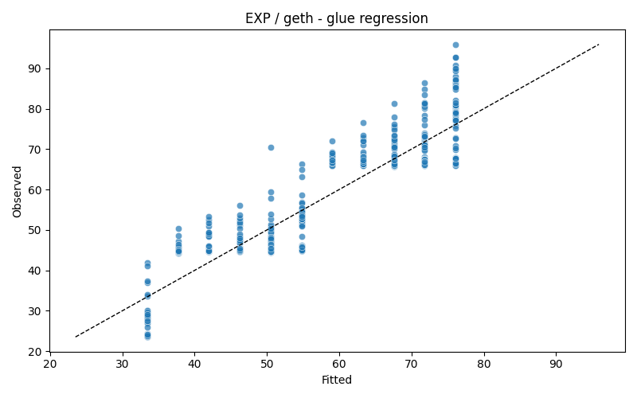

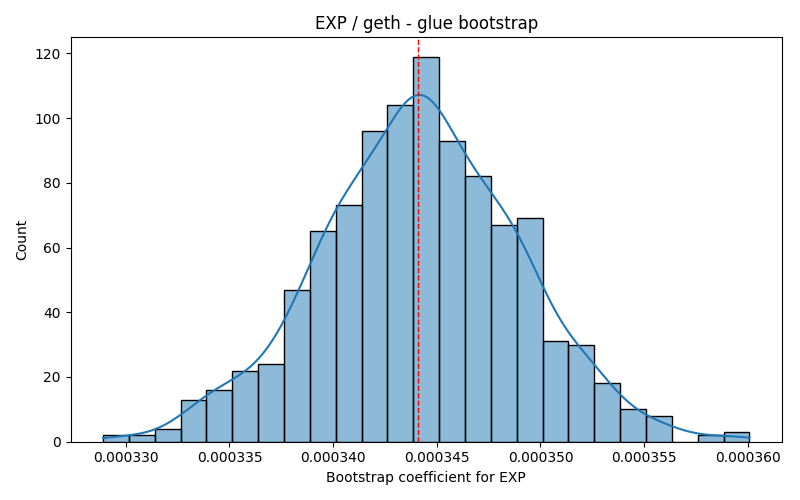

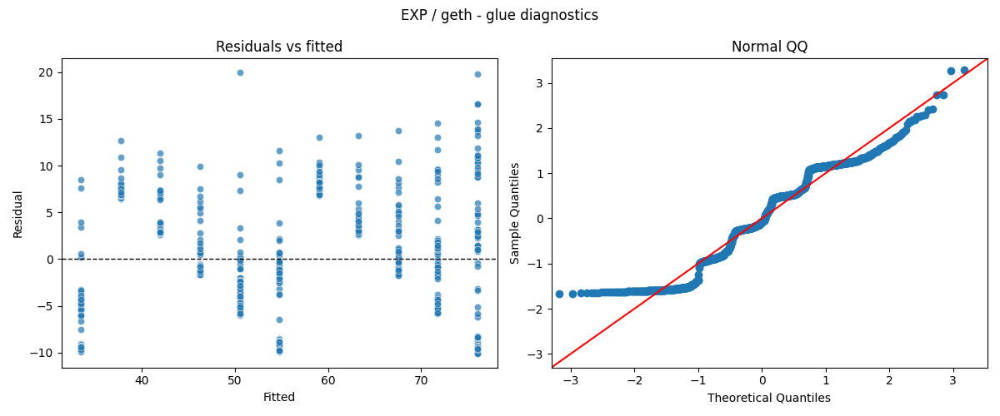

</details>

<details><summary><code>GT</code> · nobs=1331 · runtime_ms=3.491e-06 · p=1.00e-03 · R²=0.7734</summary>

```
==============================================================================
                           NNLS Regression Results                            
==============================================================================
Dep. Variable:          test_runtime_ms              R-squared:          0.773
Model:                  NNLS                    Adj. R-squared:          0.773
No. Observations:       1331                              RMSE:          19.89
Df Residuals:           1329                               MAE:          14.49
Df Model:               1      
==============================================================================
                      coef     std err     P-value      [0.025      0.975]
------------------------------------------------------------------------------
         const     39.6245      2.0192       0.001     35.7420     43.5396
            GT      0.0000      0.0000       0.001      0.0000      0.0000
==============================================================================
Notes: Non-negative least squares with bootstrap inference (1000 iterations)
==============================================================================
```

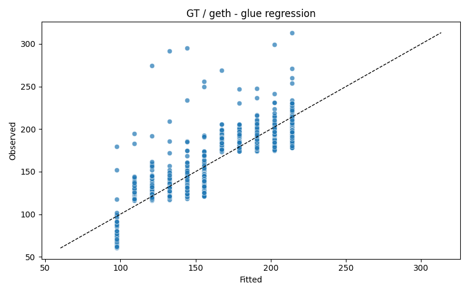

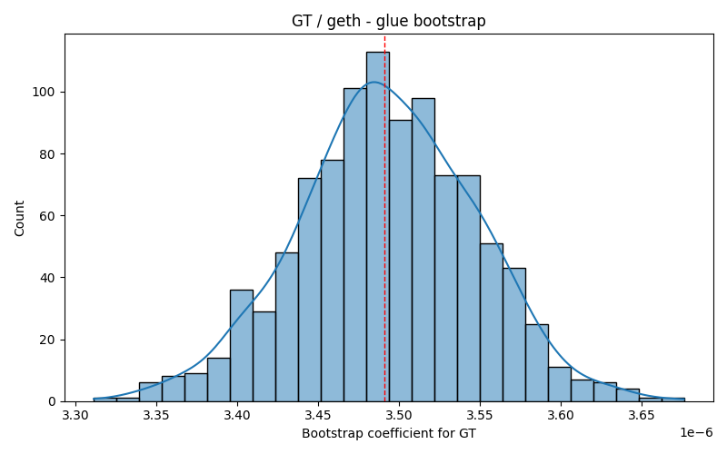

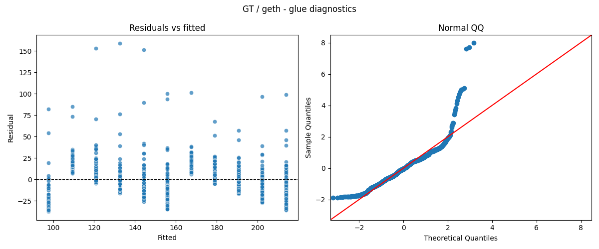

</details>

<details><summary><code>JUMPI</code> · nobs=1331 · runtime_ms=5.699e-06 · p=1.00e-03 · R²=0.7502</summary>

```
==============================================================================
                           NNLS Regression Results                            
==============================================================================
Dep. Variable:          test_runtime_ms              R-squared:          0.750
Model:                  NNLS                    Adj. R-squared:          0.750
No. Observations:       1331                              RMSE:          14.84
Df Residuals:           1329                               MAE:          10.78
Df Model:               1      
==============================================================================
                      coef     std err     P-value      [0.025      0.975]
------------------------------------------------------------------------------
         const     20.0866      1.2893       0.001     17.5847     22.4894
         JUMPI      0.0000      0.0000       0.001      0.0000      0.0000
==============================================================================
Notes: Non-negative least squares with bootstrap inference (1000 iterations)
==============================================================================
```

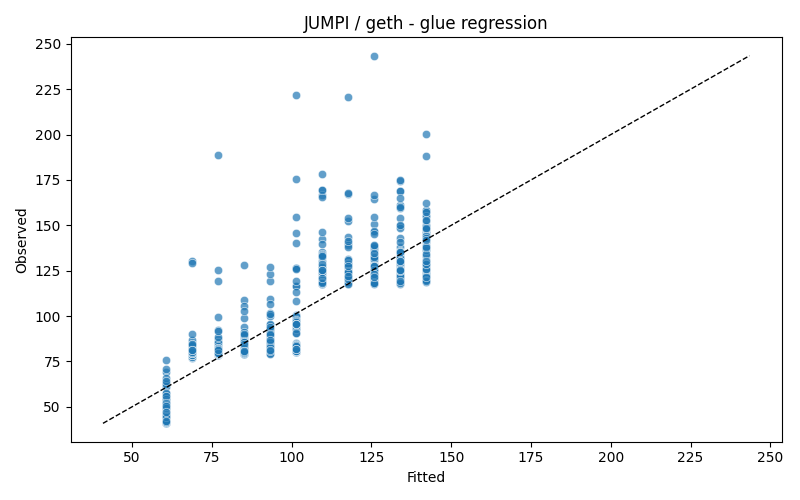

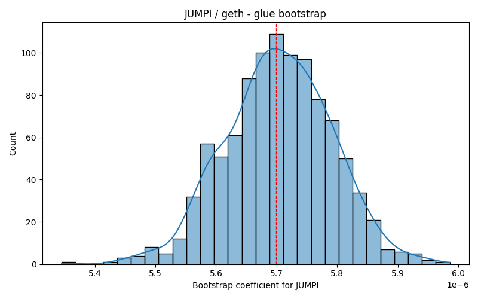

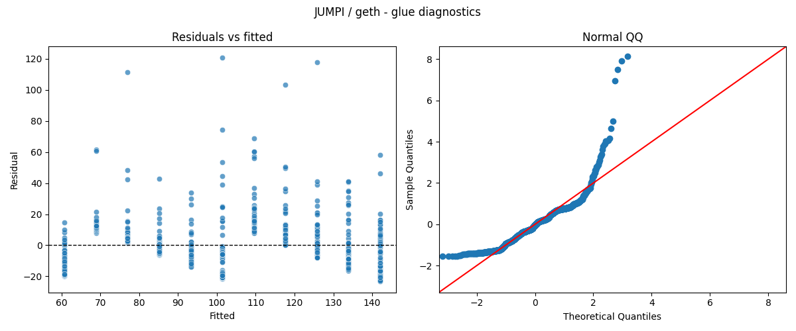

</details>

<details><summary><code>LT</code> · nobs=1331 · runtime_ms=4.379e-06 · p=1.00e-03 · R²=0.7872</summary>

```
==============================================================================
                           NNLS Regression Results                            
==============================================================================
Dep. Variable:          test_runtime_ms              R-squared:          0.787
Model:                  NNLS                    Adj. R-squared:          0.787
No. Observations:       1331                              RMSE:          23.96
Df Residuals:           1329                               MAE:          17.65
Df Model:               1      
==============================================================================
                      coef     std err     P-value      [0.025      0.975]
------------------------------------------------------------------------------
         const     39.9155      2.3229       0.001     35.6952     44.7195
            LT      0.0000      0.0000       0.001      0.0000      0.0000
==============================================================================
Notes: Non-negative least squares with bootstrap inference (1000 iterations)
==============================================================================
```

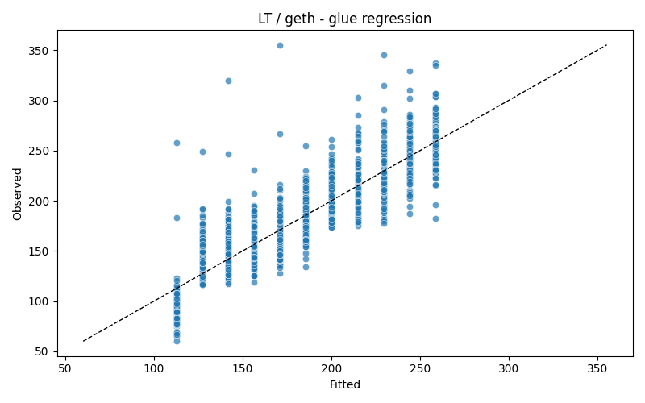

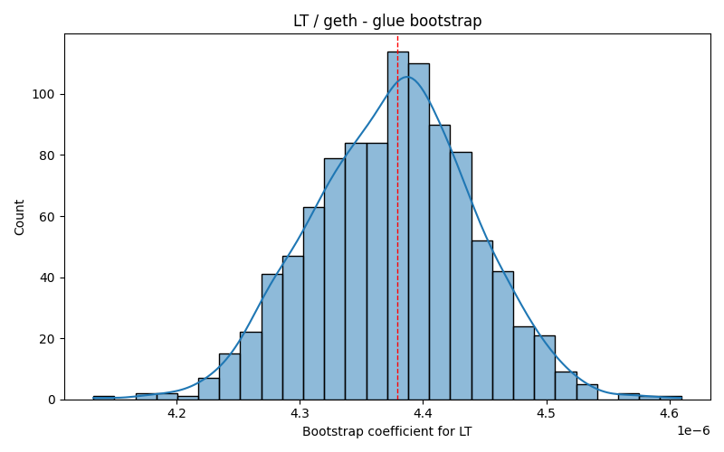

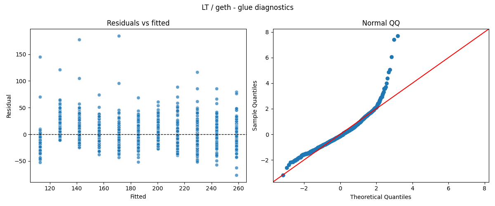

</details>

<details><summary><code>MSTORE</code> · nobs=6655 · runtime_ms=8.054e-06 · p=1.00e-03 · R²=0.8123</summary>

```
==============================================================================
                           NNLS Regression Results                            
==============================================================================
Dep. Variable:          test_runtime_ms              R-squared:          0.812
Model:                  NNLS                    Adj. R-squared:          0.812
No. Observations:       6655                              RMSE:          27.17
Df Residuals:           6653                               MAE:          20.76
Df Model:               1      
==============================================================================
                      coef     std err     P-value      [0.025      0.975]
------------------------------------------------------------------------------
         const     54.3314      1.2016       0.001     52.1055     56.7028
        MSTORE      0.0000      0.0000       0.001      0.0000      0.0000
==============================================================================
Notes: Non-negative least squares with bootstrap inference (1000 iterations)
==============================================================================
```

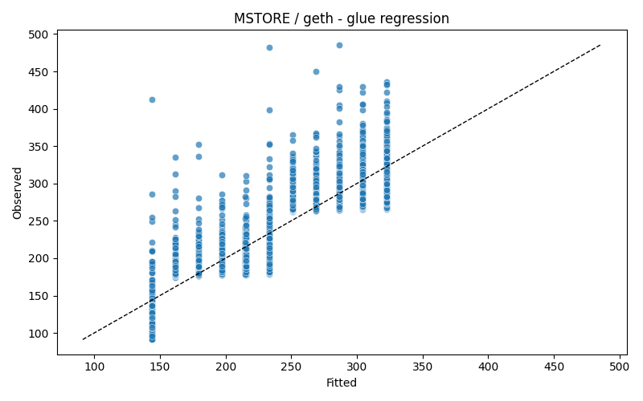

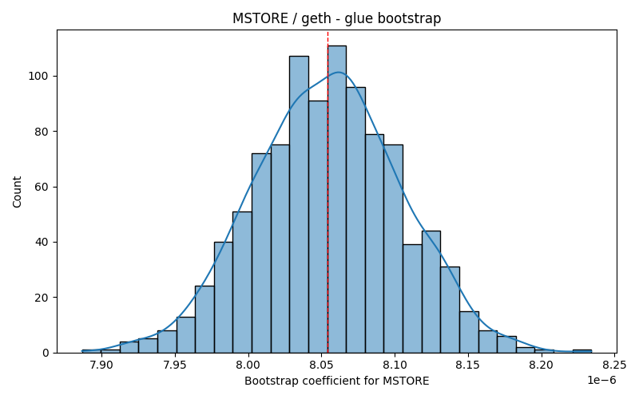

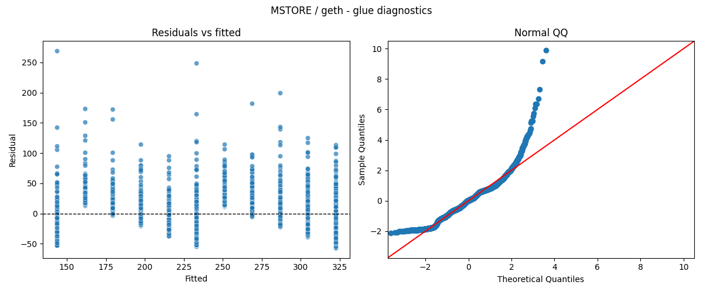

</details>

<details><summary><code>MSTORE8</code> · nobs=6655 · runtime_ms=7.413e-06 · p=1.00e-03 · R²=0.8001</summary>

```
==============================================================================
                           NNLS Regression Results                            
==============================================================================
Dep. Variable:          test_runtime_ms              R-squared:          0.800
Model:                  NNLS                    Adj. R-squared:          0.800
No. Observations:       6655                              RMSE:          26.00
Df Residuals:           6653                               MAE:          19.60
Df Model:               1      
==============================================================================
                      coef     std err     P-value      [0.025      0.975]
------------------------------------------------------------------------------
         const     50.1730      1.1356       0.001     47.8967     52.3521
       MSTORE8      0.0000      0.0000       0.001      0.0000      0.0000
==============================================================================
Notes: Non-negative least squares with bootstrap inference (1000 iterations)
==============================================================================
```

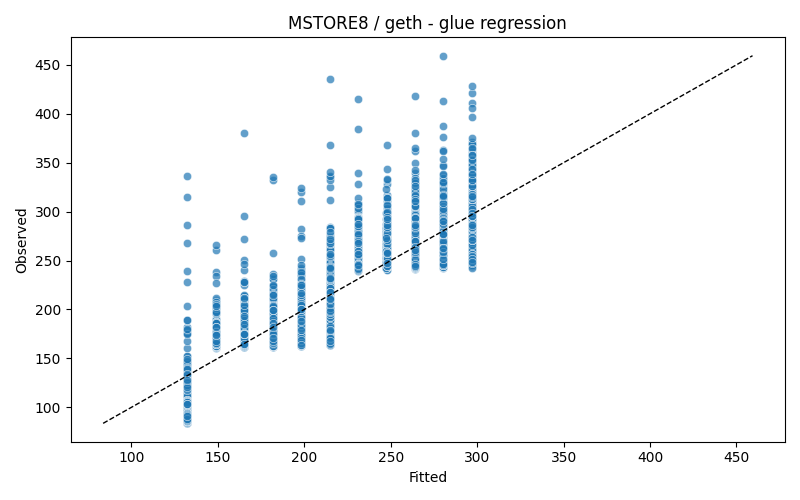

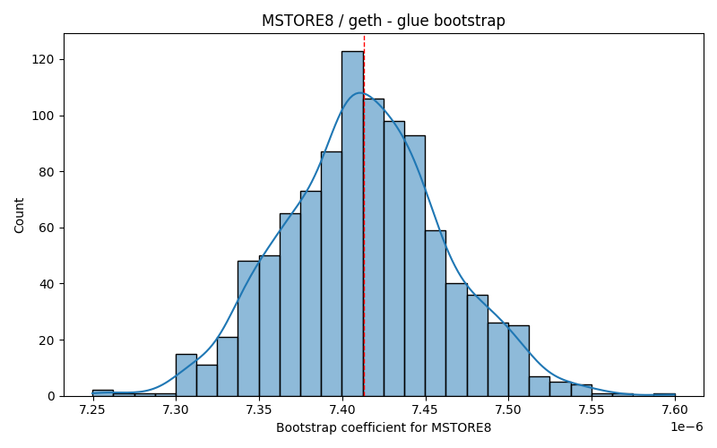

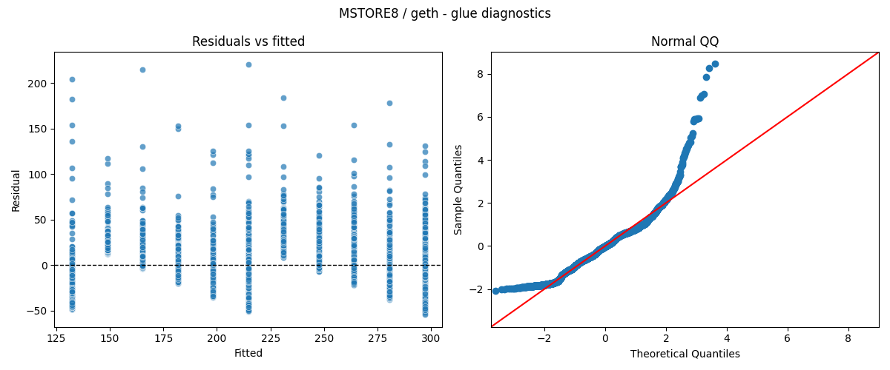

</details>

<details><summary><code>MUL</code> · nobs=1331 · runtime_ms=4.936e-06 · p=1.00e-03 · R²=0.8748</summary>

```
==============================================================================
                           NNLS Regression Results                            
==============================================================================
Dep. Variable:          test_runtime_ms              R-squared:          0.875
Model:                  NNLS                    Adj. R-squared:          0.875
No. Observations:       1331                              RMSE:          14.74
Df Residuals:           1329                               MAE:          11.09
Df Model:               1      
==============================================================================
                      coef     std err     P-value      [0.025      0.975]
------------------------------------------------------------------------------
         const     36.9259      1.5899       0.001     33.7867     39.8694
           MUL      0.0000      0.0000       0.001      0.0000      0.0000
==============================================================================
Notes: Non-negative least squares with bootstrap inference (1000 iterations)
==============================================================================
```

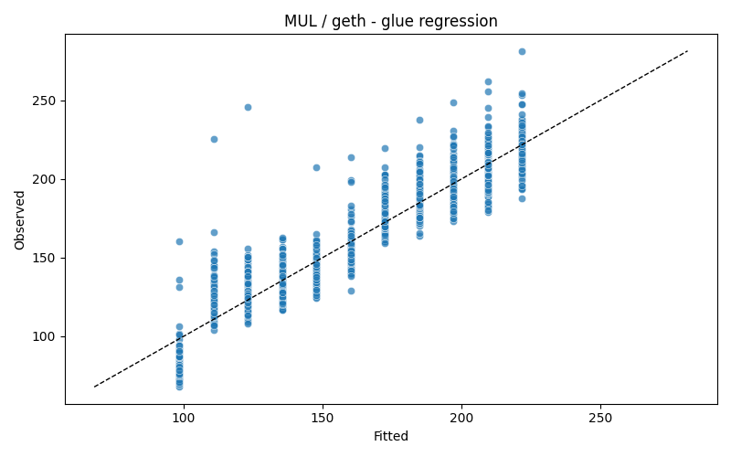

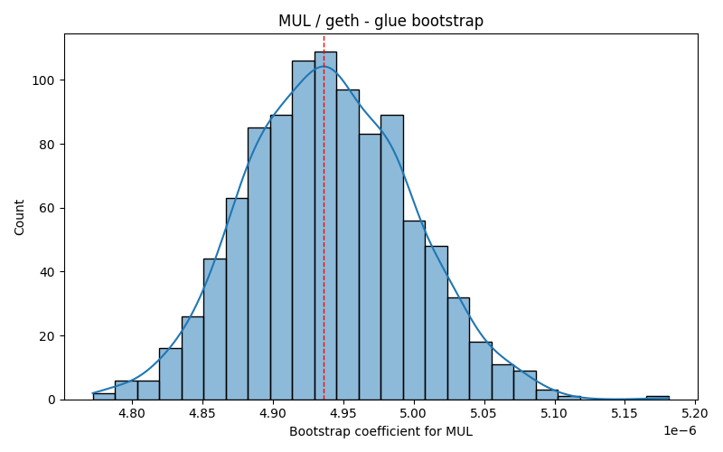

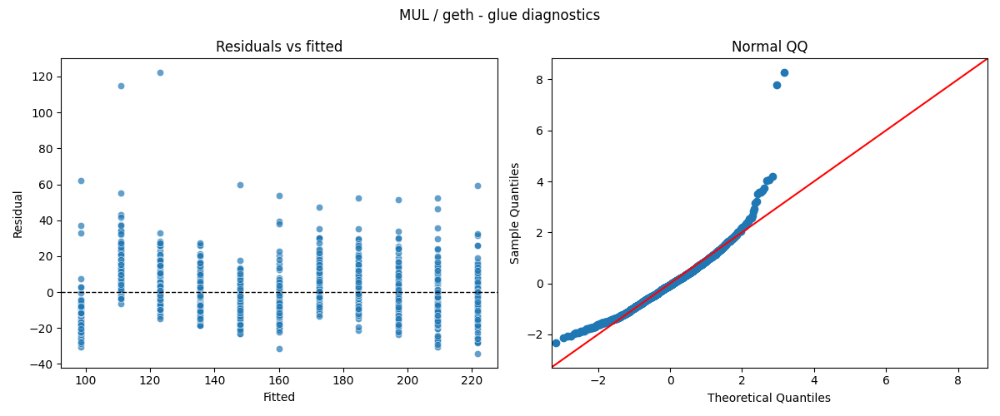

</details>

<details><summary><code>PC</code> · nobs=1331 · runtime_ms=1.606e-06 · p=1.00e-03 · R²=0.8336</summary>

```
==============================================================================
                           NNLS Regression Results                            
==============================================================================
Dep. Variable:          test_runtime_ms              R-squared:          0.834
Model:                  NNLS                    Adj. R-squared:          0.833
No. Observations:       1331                              RMSE:          21.46
Df Residuals:           1329                               MAE:          16.60
Df Model:               1      
==============================================================================
                      coef     std err     P-value      [0.025      0.975]
------------------------------------------------------------------------------
         const     42.1835      2.2039       0.001     37.9105     46.2349
            PC      0.0000      0.0000       0.001      0.0000      0.0000
==============================================================================
Notes: Non-negative least squares with bootstrap inference (1000 iterations)
==============================================================================
```

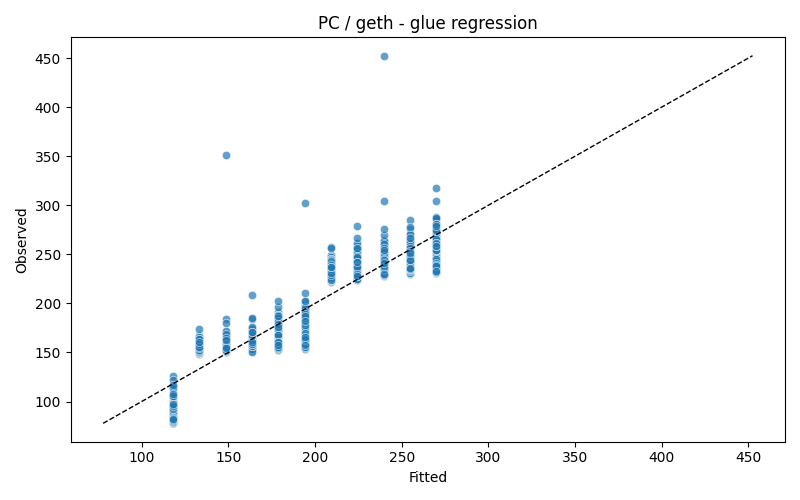

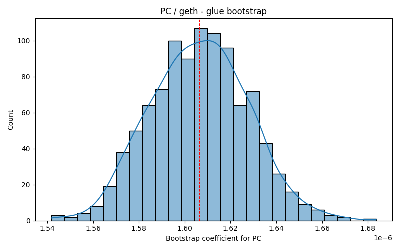

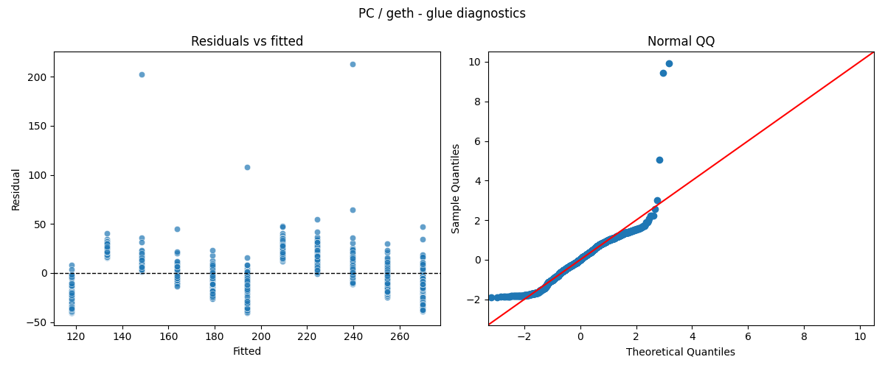

</details>

<details><summary><code>RETURNDATASIZE</code> · nobs=5324 · runtime_ms=3.125e-06 · p=1.00e-03 · R²=0.6124</summary>

```
==============================================================================
                           NNLS Regression Results                            
==============================================================================
Dep. Variable:          test_runtime_ms              R-squared:          0.612
Model:                  NNLS                    Adj. R-squared:          0.612
No. Observations:       5324                              RMSE:          39.25
Df Residuals:           5322                               MAE:          28.11
Df Model:               1      
==============================================================================
                      coef     std err     P-value      [0.025      0.975]
------------------------------------------------------------------------------
         const     49.9157      1.7164       0.001     46.5741     53.2559
RETURNDATASIZE      0.0000      0.0000       0.001      0.0000      0.0000
==============================================================================
Notes: Non-negative least squares with bootstrap inference (1000 iterations)
==============================================================================
```

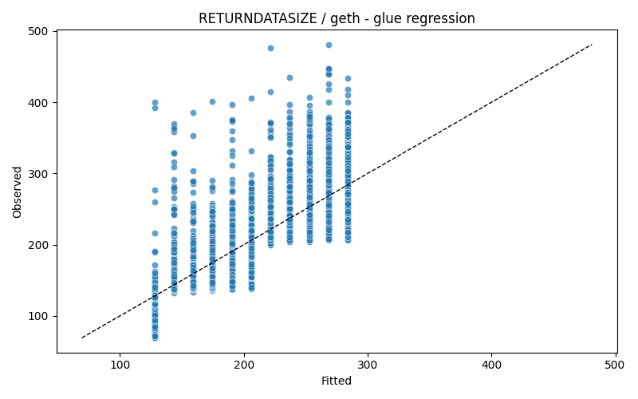

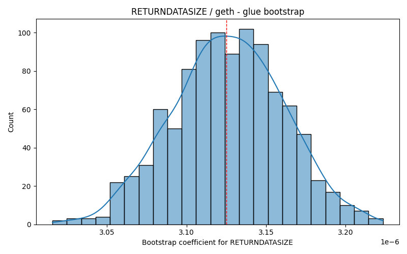

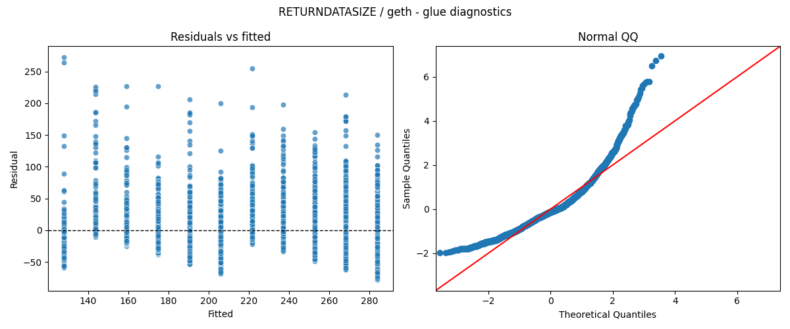

</details>

<details><summary><code>SELFBALANCE</code> · nobs=1089 · runtime_ms=7.435e-06 · p=1.00e-03 · R²=0.797</summary>

```
==============================================================================
                           NNLS Regression Results                            
==============================================================================
Dep. Variable:          test_runtime_ms              R-squared:          0.797
Model:                  NNLS                    Adj. R-squared:          0.797
No. Observations:       1089                              RMSE:          37.86
Df Residuals:           1087                               MAE:          31.73
Df Model:               1      
==============================================================================
                      coef     std err     P-value      [0.025      0.975]
------------------------------------------------------------------------------
         const    119.8304      3.9233       0.001    112.3484    127.2283
   SELFBALANCE      0.0000      0.0000       0.001      0.0000      0.0000
==============================================================================
Notes: Non-negative least squares with bootstrap inference (1000 iterations)
==============================================================================
```

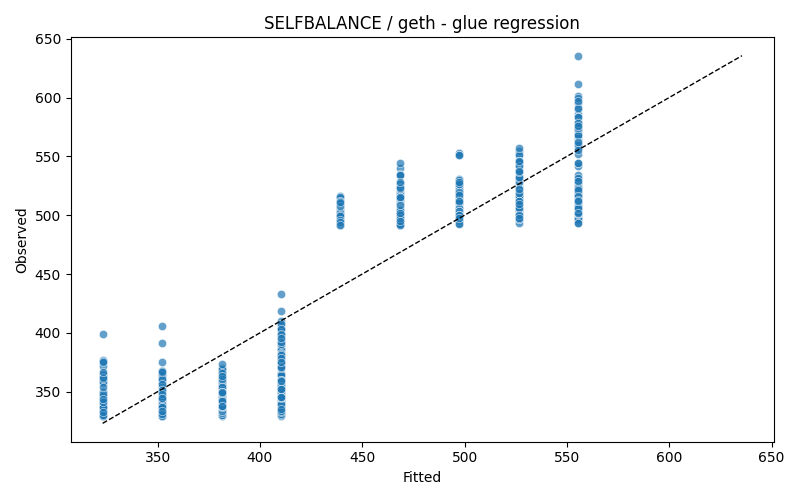

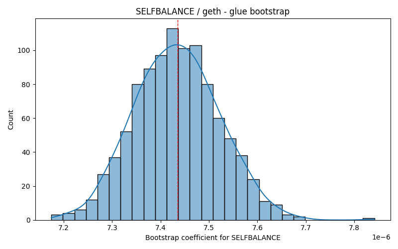

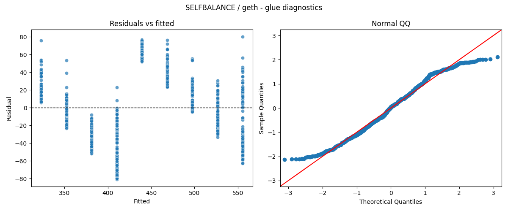

</details>

<details><summary><code>SUB</code> · nobs=1331 · runtime_ms=4.422e-06 · p=1.00e-03 · R²=0.8269</summary>

```
==============================================================================
                           NNLS Regression Results                            
==============================================================================
Dep. Variable:          test_runtime_ms              R-squared:          0.827
Model:                  NNLS                    Adj. R-squared:          0.827
No. Observations:       1331                              RMSE:          21.29
Df Residuals:           1329                               MAE:          15.94
Df Model:               1      
==============================================================================
                      coef     std err     P-value      [0.025      0.975]
------------------------------------------------------------------------------
         const     47.0319      1.9152       0.001     43.3929     50.9523
           SUB      0.0000      0.0000       0.001      0.0000      0.0000
==============================================================================
Notes: Non-negative least squares with bootstrap inference (1000 iterations)
==============================================================================
```

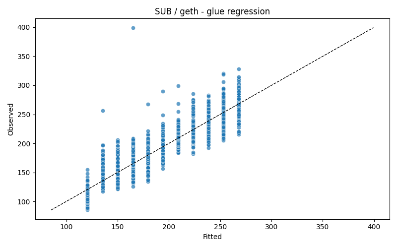

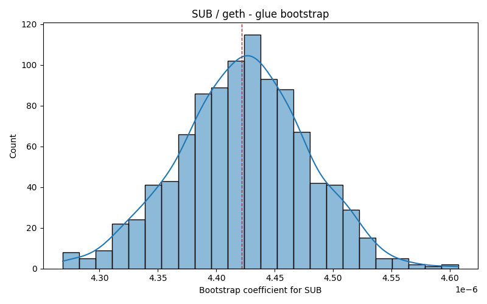

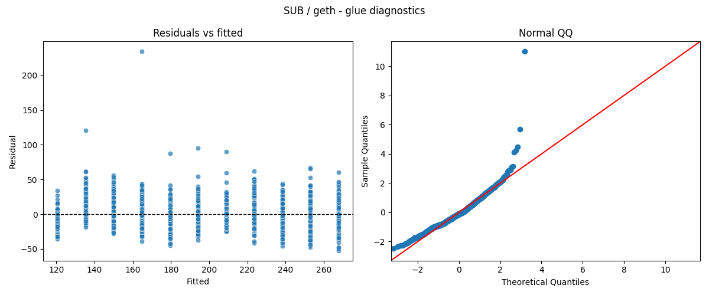

</details>

### Mixed glue (tier B) · geth

<details><summary><code>JUMP</code> · nobs=1331 · runtime_ms=9.24e-06 · p=1.00e-03 · R²=0.7636</summary>

```
==============================================================================
                           NNLS Regression Results                            
==============================================================================
Dep. Variable:          test_runtime_ms              R-squared:          0.764
Model:                  NNLS                    Adj. R-squared:          0.763
No. Observations:       1331                              RMSE:          19.10
Df Residuals:           1329                               MAE:          14.08
Df Model:               1      
==============================================================================
                      coef     std err     P-value      [0.025      0.975]
------------------------------------------------------------------------------
         const     34.6547      1.9173       0.001     30.9197     38.6353
          JUMP      0.0000      0.0000       0.001      0.0000      0.0000
==============================================================================
Notes: Non-negative least squares with bootstrap inference (1000 iterations)
==============================================================================
```

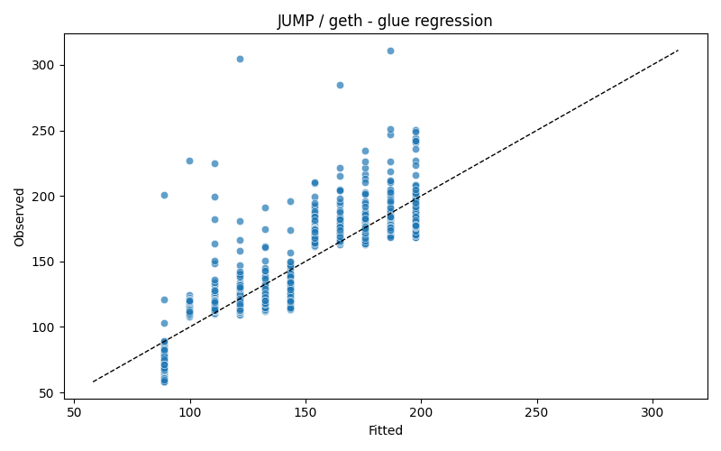

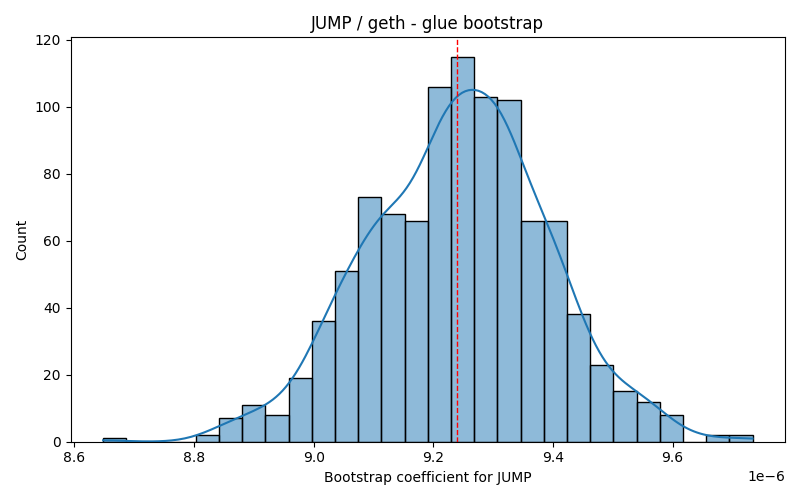

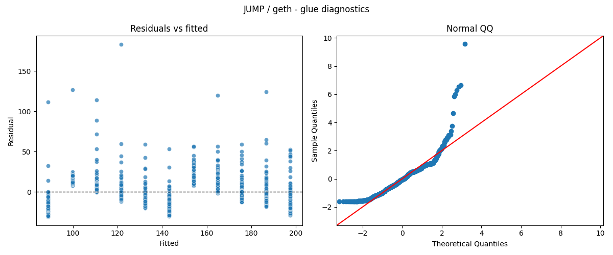

</details>

<details><summary><code>KECCAK256</code> · nobs=21296 · runtime_ms=3.67e-05 · p=1.00e-03 · R²=0.2661</summary>

```
==============================================================================
                           NNLS Regression Results                            
==============================================================================
Dep. Variable:          test_runtime_ms              R-squared:          0.266
Model:                  NNLS                    Adj. R-squared:          0.266
No. Observations:       21296                             RMSE:         121.09
Df Residuals:           21294                              MAE:          95.14
Df Model:               1      
==============================================================================
                      coef     std err     P-value      [0.025      0.975]
------------------------------------------------------------------------------
         const    378.7341      1.8024       0.001    375.3493    382.3367
     KECCAK256      0.0000      0.0000       0.001      0.0000      0.0000
==============================================================================
Notes: Non-negative least squares with bootstrap inference (1000 iterations)
==============================================================================
```

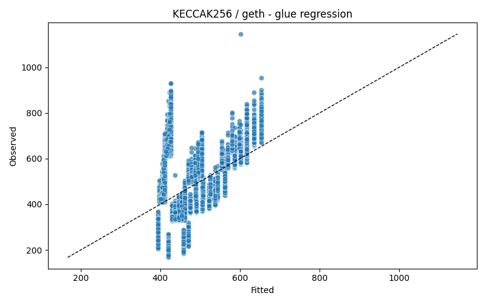

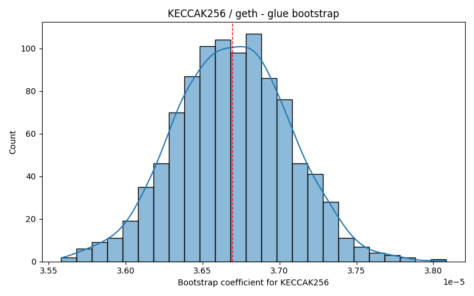

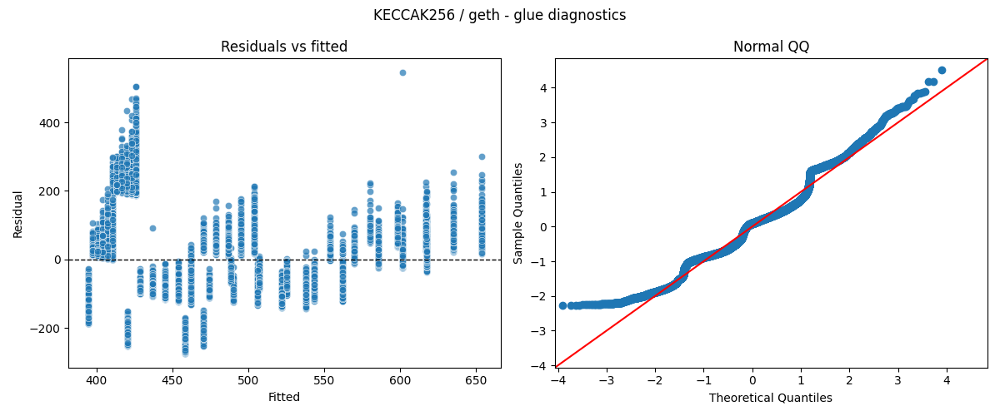

</details>

## nethermind

| glue_opcode | nobs | glue_runtime_ms | p_value | rsquared |
| --- | --- | --- | --- | --- |
| `ISZERO` | 1485 | 8.916e-07 | 1.00e-03 | 0.6916 |
| `JUMPDEST` | 1485 | 4.639e-07 | 1.00e-03 | 0.6633 |
| `SWAP` | 23760 | 5.111e-07 | 1.00e-03 | 0.4483 |
| `CALLDATASIZE` | 87747 | 4.296e-07 | 1.00e-03 | 0.9146 |
| `DUP` | 87747 | 2.905e-07 | 1.00e-03 | 0.9146 |
| `GAS` | 87747 | 3.698e-07 | 1.00e-03 | 0.9146 |
| `MLOAD` | 87747 | 1.372e-06 | 1.00e-03 | 0.9146 |
| `PUSH` | 87747 | 3.888e-07 | 1.00e-03 | 0.9146 |
| `PUSH0` | 87747 | 2.6e-07 | 1.00e-03 | 0.9146 |
| `STATICCALL` | 87747 | 0.0004459 | 1.00e-03 | 0.9146 |
| `ADD` | 1485 | 2.272e-06 | 1.00e-03 | 0.8288 |
| `AND` | 1485 | 1.273e-06 | 1.00e-03 | 0.8037 |
| `CALLDATACOPY` | 35640 | 4.567e-06 | 1.00e-03 | 0.6471 |
| `CALLDATALOAD` | 5940 | 4.111e-05 | 1.20e-02 | 0.001641 |
| `DIV` | 1485 | 6.985e-06 | 1.00e-03 | 0.6146 |
| `EXP` | 1485 | 0 | 1.00e+00 | 0 |
| `GT` | 1485 | 1.586e-06 | 1.00e-03 | 0.5762 |
| `JUMPI` | 1485 | 1.765e-06 | 1.00e-03 | 0.6246 |
| `LT` | 1485 | 1.535e-06 | 1.00e-03 | 0.6036 |
| `MSTORE` | 7425 | 2.081e-06 | 1.00e-03 | 0.6974 |
| `MSTORE8` | 7425 | 2.016e-06 | 1.00e-03 | 0.6466 |
| `MUL` | 1485 | 5.318e-06 | 1.00e-03 | 0.8932 |
| `PC` | 1485 | 8.174e-07 | 1.00e-03 | 0.8326 |
| `RETURNDATASIZE` | 5940 | 8.253e-07 | 1.00e-03 | 0.5459 |
| `SELFBALANCE` | 1215 | 4.174e-06 | 1.00e-03 | 0.6197 |
| `SUB` | 1485 | 2.493e-06 | 1.00e-03 | 0.8705 |
| `JUMP` | 1485 | 5.761e-06 | 1.00e-03 | 0.8059 |
| `KECCAK256` | 23760 | 0 | 1.00e+00 | 1.11e-16 |

### Cycle glue — joint fit · nethermind

<details><summary>Joint NNLS regression summary</summary>

```
==============================================================================
                           NNLS Regression Results                            
==============================================================================
Dep. Variable:          test_runtime_ms              R-squared:          0.915
Model:                  NNLS                    Adj. R-squared:          0.915
No. Observations:       87747                             RMSE:          10.42
Df Residuals:           87739                              MAE:           5.43
Df Model:               7      
==============================================================================
                      coef     std err     P-value      [0.025      0.975]
------------------------------------------------------------------------------
         const     17.3068      0.1242       0.001     17.0762     17.5613
  CALLDATASIZE      0.0000      0.0000       0.001      0.0000      0.0000
           DUP      0.0000      0.0000       0.001      0.0000      0.0000
           GAS      0.0000      0.0000       0.001      0.0000      0.0000
         MLOAD      0.0000      0.0000       0.001      0.0000      0.0000
          PUSH      0.0000      0.0000       0.001      0.0000      0.0000
         PUSH0      0.0000      0.0000       0.001      0.0000      0.0000
    STATICCALL      0.0004      0.0000       0.001      0.0004      0.0005
==============================================================================
Notes: Non-negative least squares with bootstrap inference (1000 iterations)
==============================================================================
```

</details>

<details><summary><code>CALLDATASIZE</code> · nobs=87747 · runtime_ms=4.296e-07 · p=1.00e-03 · R²=0.9146</summary>

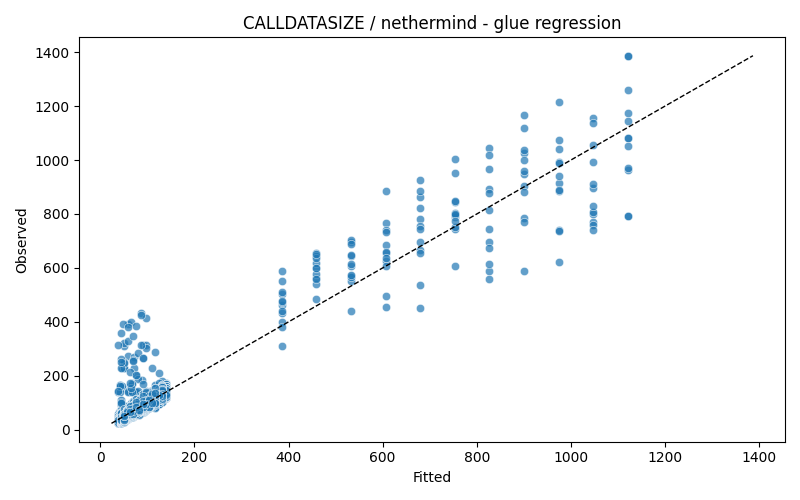

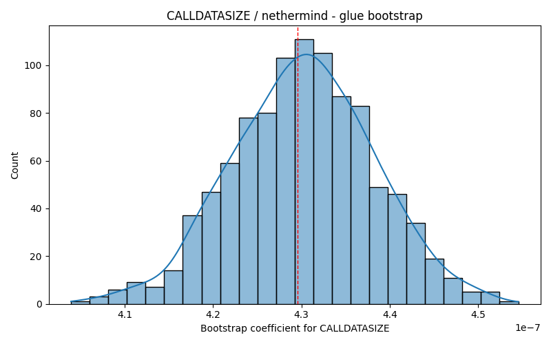


</details>

<details><summary><code>DUP</code> · nobs=87747 · runtime_ms=2.905e-07 · p=1.00e-03 · R²=0.9146</summary>


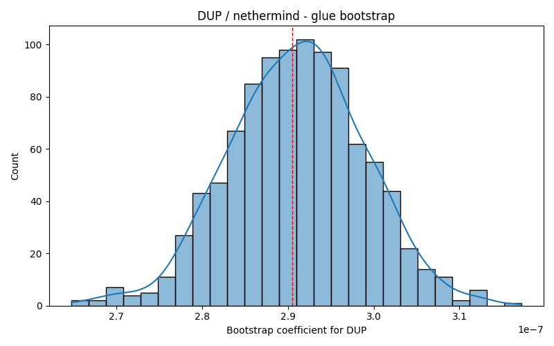

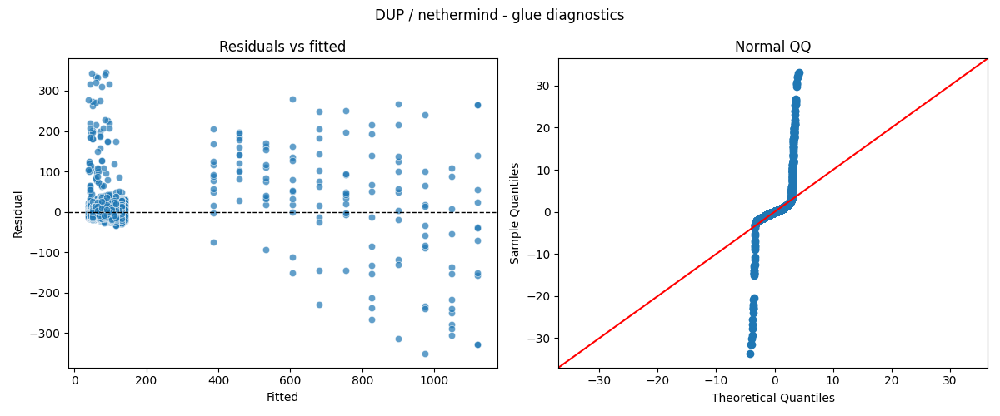

</details>

<details><summary><code>GAS</code> · nobs=87747 · runtime_ms=3.698e-07 · p=1.00e-03 · R²=0.9146</summary>

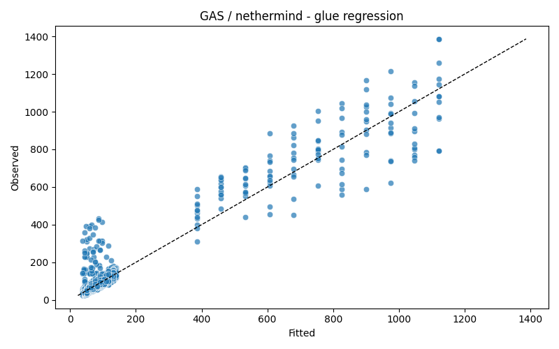

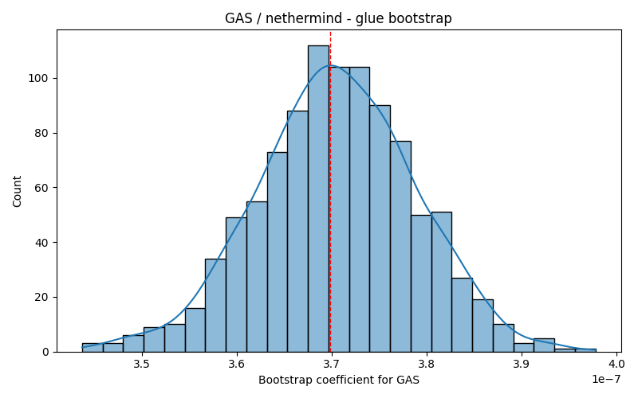


</details>

<details><summary><code>MLOAD</code> · nobs=87747 · runtime_ms=1.372e-06 · p=1.00e-03 · R²=0.9146</summary>


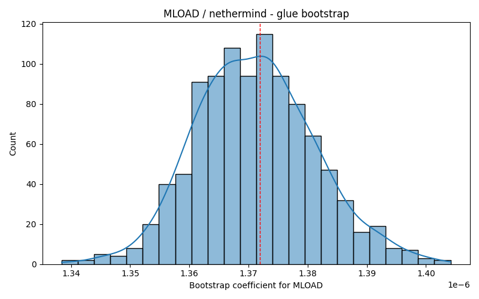


</details>

<details><summary><code>PUSH</code> · nobs=87747 · runtime_ms=3.888e-07 · p=1.00e-03 · R²=0.9146</summary>


</details>

<details><summary><code>PUSH0</code> · nobs=87747 · runtime_ms=2.6e-07 · p=1.00e-03 · R²=0.9146</summary>


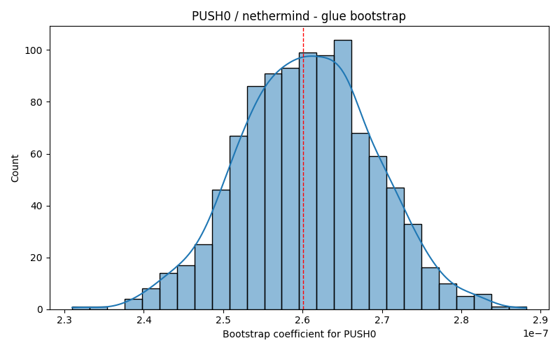


</details>

<details><summary><code>STATICCALL</code> · nobs=87747 · runtime_ms=0.0004459 · p=1.00e-03 · R²=0.9146</summary>


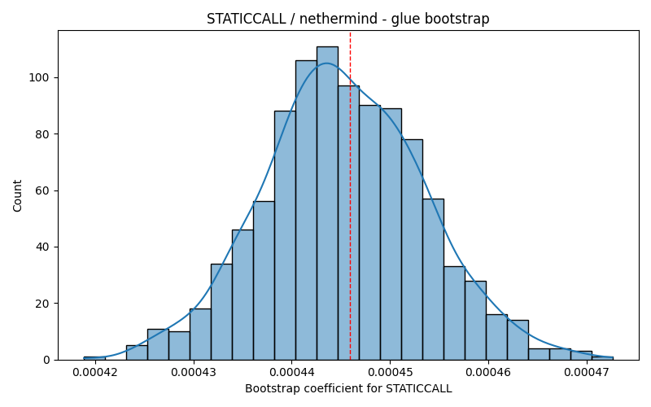

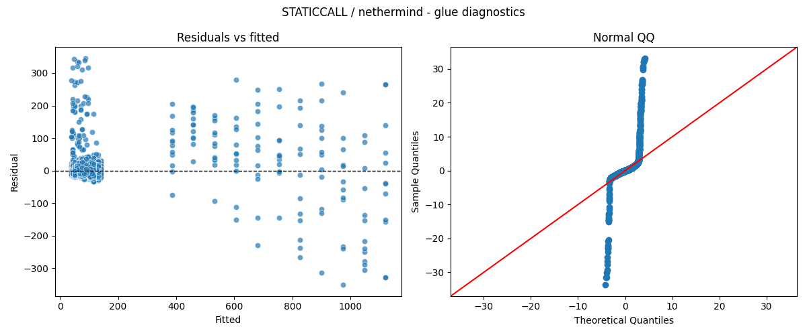

</details>

### Pure glue · nethermind

<details><summary><code>ISZERO</code> · nobs=1485 · runtime_ms=8.916e-07 · p=1.00e-03 · R²=0.6916</summary>

```
==============================================================================
                           NNLS Regression Results                            
==============================================================================
Dep. Variable:          test_runtime_ms              R-squared:          0.692
Model:                  NNLS                    Adj. R-squared:          0.691
No. Observations:       1485                              RMSE:          12.54
Df Residuals:           1483                               MAE:           7.31
Df Model:               1      
==============================================================================
                      coef     std err     P-value      [0.025      0.975]
------------------------------------------------------------------------------
         const     15.9397      0.9578       0.001     14.0345     17.7772
        ISZERO      0.0000      0.0000       0.001      0.0000      0.0000
==============================================================================
Notes: Non-negative least squares with bootstrap inference (1000 iterations)
==============================================================================
```

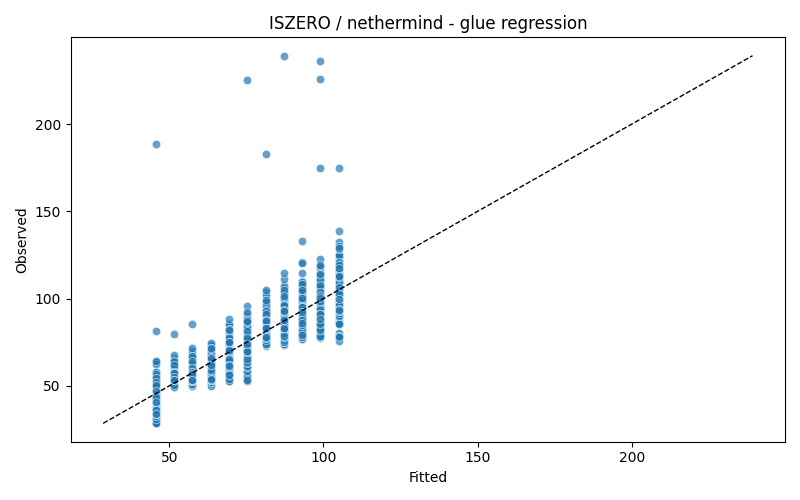

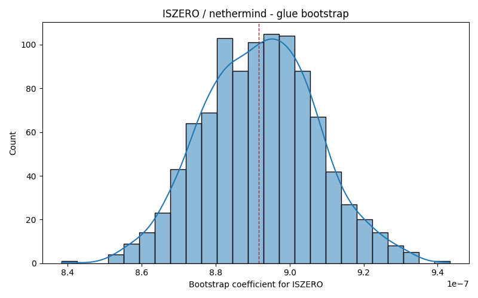

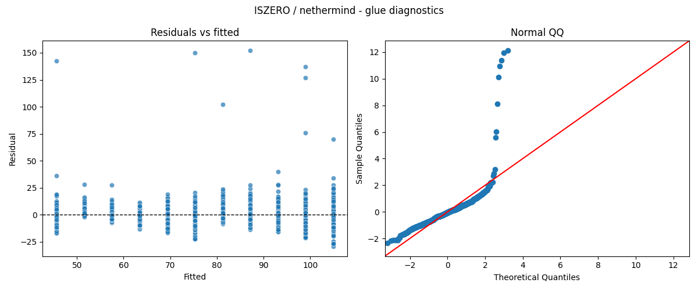

</details>

<details><summary><code>JUMPDEST</code> · nobs=1485 · runtime_ms=4.639e-07 · p=1.00e-03 · R²=0.6633</summary>

```
==============================================================================
                           NNLS Regression Results                            
==============================================================================
Dep. Variable:          test_runtime_ms              R-squared:          0.663
Model:                  NNLS                    Adj. R-squared:          0.663
No. Observations:       1485                              RMSE:          20.87
Df Residuals:           1483                               MAE:          16.28
Df Model:               1      
==============================================================================
                      coef     std err     P-value      [0.025      0.975]
------------------------------------------------------------------------------
         const     22.4969      1.5378       0.001     19.5551     25.3153
      JUMPDEST      0.0000      0.0000       0.001      0.0000      0.0000
==============================================================================
Notes: Non-negative least squares with bootstrap inference (1000 iterations)
==============================================================================
```

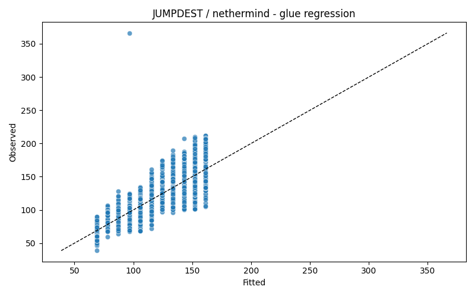

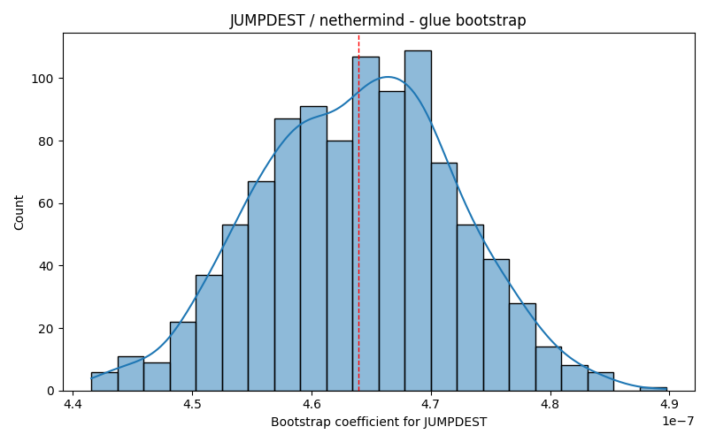

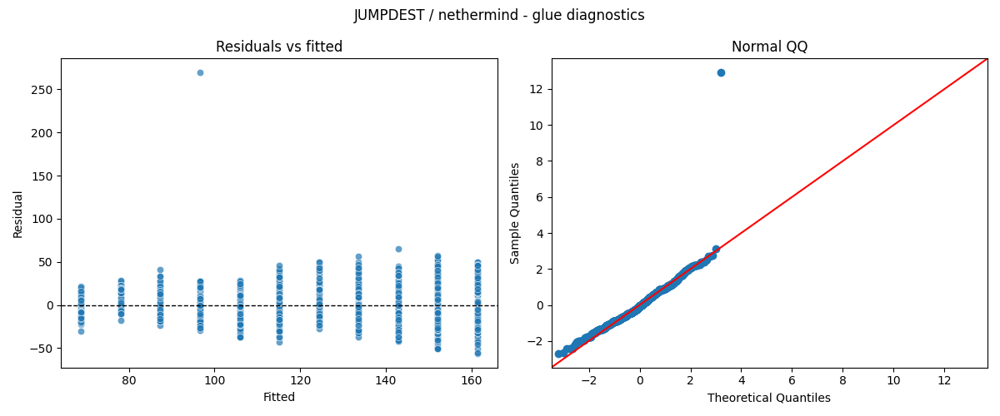

</details>

<details><summary><code>SWAP</code> · nobs=23760 · runtime_ms=5.111e-07 · p=1.00e-03 · R²=0.4483</summary>

```
==============================================================================
                           NNLS Regression Results                            
==============================================================================
Dep. Variable:          test_runtime_ms              R-squared:          0.448
Model:                  NNLS                    Adj. R-squared:          0.448
No. Observations:       23760                             RMSE:          11.94
Df Residuals:           23758                              MAE:           4.35
Df Model:               1      
==============================================================================
                      coef     std err     P-value      [0.025      0.975]
------------------------------------------------------------------------------
         const     16.5661      0.2562       0.001     16.0961     17.0819
          SWAP      0.0000      0.0000       0.001      0.0000      0.0000
==============================================================================
Notes: Non-negative least squares with bootstrap inference (1000 iterations)
==============================================================================
```

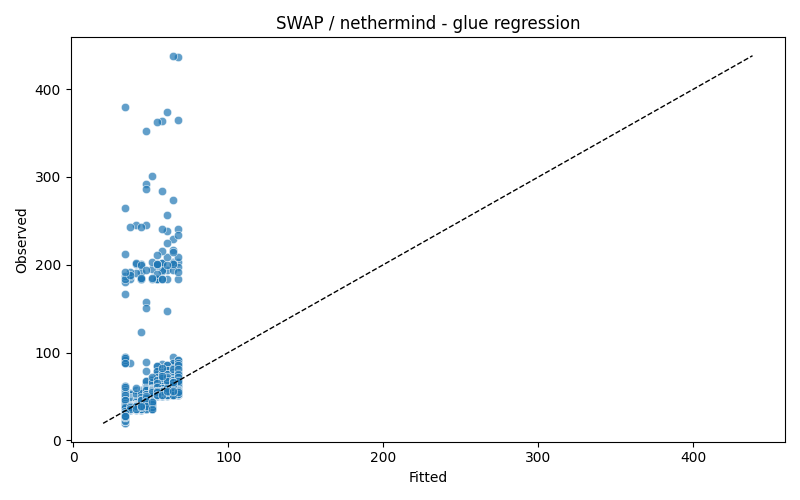

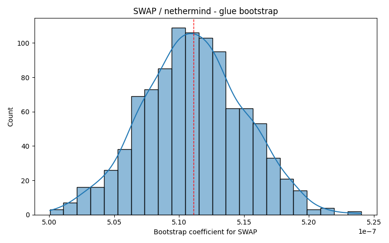

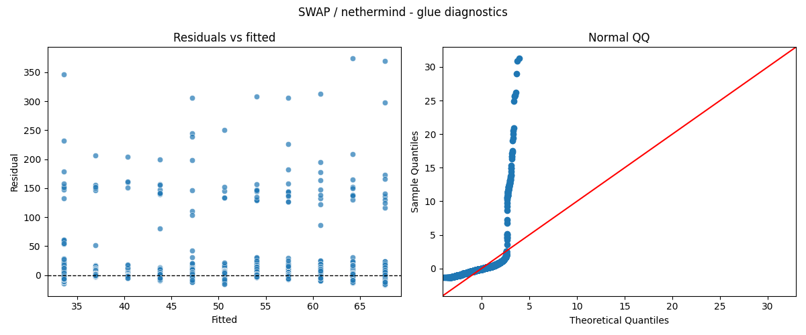

</details>

### Mixed glue (tier A) · nethermind

<details><summary><code>ADD</code> · nobs=1485 · runtime_ms=2.272e-06 · p=1.00e-03 · R²=0.8288</summary>

```
==============================================================================
                           NNLS Regression Results                            
==============================================================================
Dep. Variable:          test_runtime_ms              R-squared:          0.829
Model:                  NNLS                    Adj. R-squared:          0.829
No. Observations:       1485                              RMSE:          10.87
Df Residuals:           1483                               MAE:           7.00
Df Model:               1      
==============================================================================
                      coef     std err     P-value      [0.025      0.975]
------------------------------------------------------------------------------
         const     15.6534      0.8746       0.001     14.0119     17.3763
           ADD      0.0000      0.0000       0.001      0.0000      0.0000
==============================================================================
Notes: Non-negative least squares with bootstrap inference (1000 iterations)
==============================================================================
```

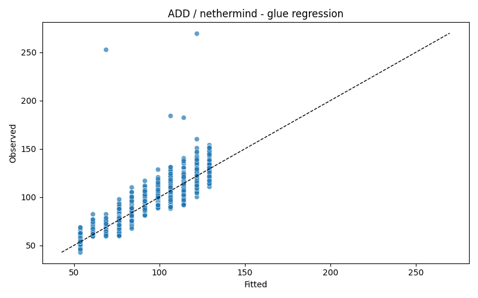

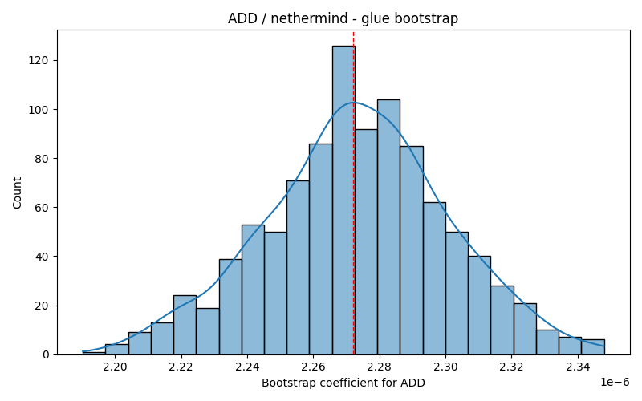

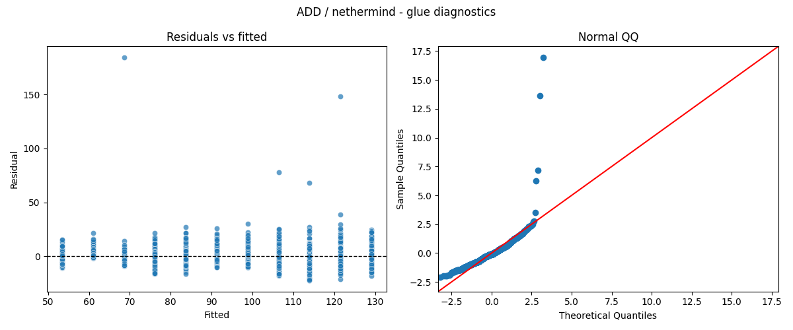

</details>

<details><summary><code>AND</code> · nobs=1485 · runtime_ms=1.273e-06 · p=1.00e-03 · R²=0.8037</summary>

```
==============================================================================
                           NNLS Regression Results                            
==============================================================================
Dep. Variable:          test_runtime_ms              R-squared:          0.804
Model:                  NNLS                    Adj. R-squared:          0.804
No. Observations:       1485                              RMSE:           6.62
Df Residuals:           1483                               MAE:           5.13
Df Model:               1      
==============================================================================
                      coef     std err     P-value      [0.025      0.975]
------------------------------------------------------------------------------
         const     14.0915      0.5532       0.001     13.0256     15.1268
           AND      0.0000      0.0000       0.001      0.0000      0.0000
==============================================================================
Notes: Non-negative least squares with bootstrap inference (1000 iterations)
==============================================================================
```

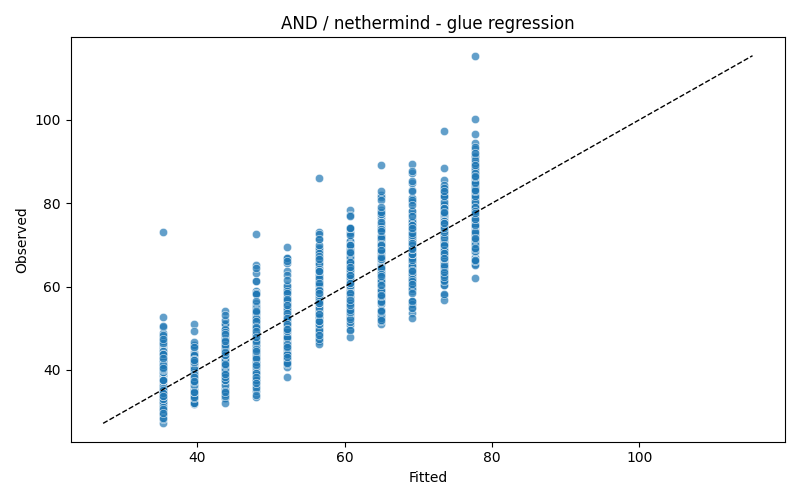

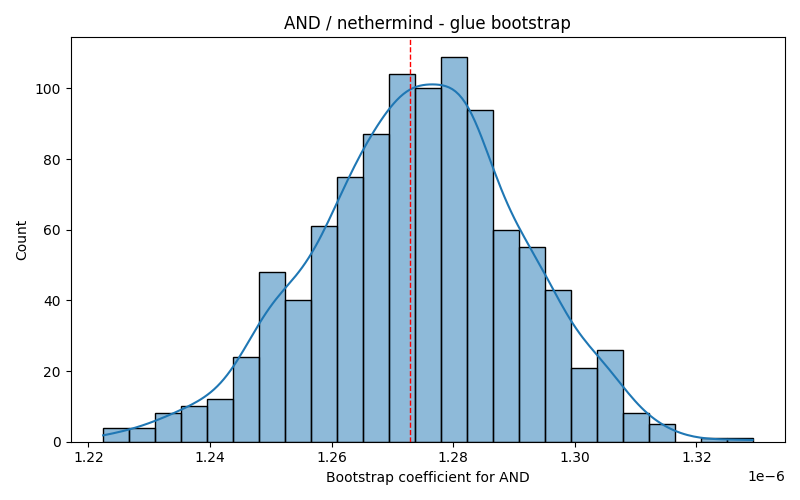


</details>

<details><summary><code>CALLDATACOPY</code> · nobs=35640 · runtime_ms=4.567e-06 · p=1.00e-03 · R²=0.6471</summary>

```
==============================================================================
                           NNLS Regression Results                            
==============================================================================
Dep. Variable:          test_runtime_ms              R-squared:          0.647
Model:                  NNLS                    Adj. R-squared:          0.647
No. Observations:       35640                             RMSE:          25.36
Df Residuals:           35638                              MAE:          19.96
Df Model:               1      
==============================================================================
                      coef     std err     P-value      [0.025      0.975]
------------------------------------------------------------------------------
         const     27.9081      0.1559       0.001     27.6039     28.2015
  CALLDATACOPY      0.0000      0.0000       0.001      0.0000      0.0000
==============================================================================
Notes: Non-negative least squares with bootstrap inference (1000 iterations)
==============================================================================
```

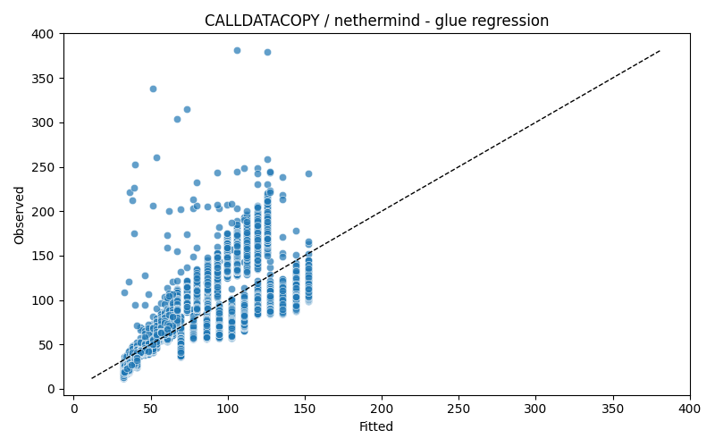

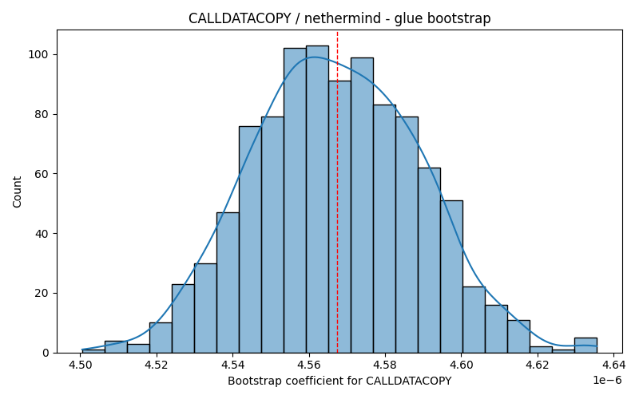

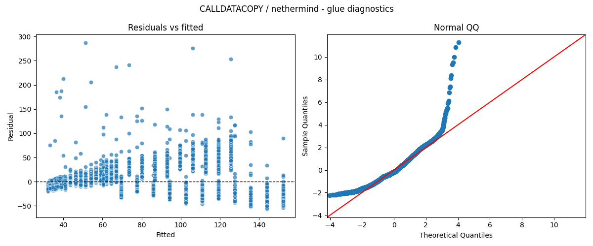

</details>

<details><summary><code>CALLDATALOAD</code> · nobs=5940 · runtime_ms=4.111e-05 · p=1.20e-02 · R²=0.001641</summary>

```
==============================================================================
                           NNLS Regression Results                            
==============================================================================
Dep. Variable:          test_runtime_ms              R-squared:          0.002
Model:                  NNLS                    Adj. R-squared:          0.001
No. Observations:       5940                              RMSE:           3.89
Df Residuals:           5938                               MAE:           0.48
Df Model:               1      
==============================================================================
                      coef     std err     P-value      [0.025      0.975]
------------------------------------------------------------------------------
         const      2.7933      0.2232       0.001      2.4041      3.2624
  CALLDATALOAD      0.0000      0.0000       0.012      0.0000      0.0001
==============================================================================
Notes: Non-negative least squares with bootstrap inference (1000 iterations)
==============================================================================
```

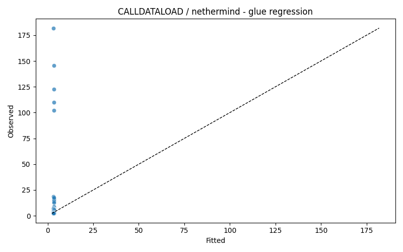

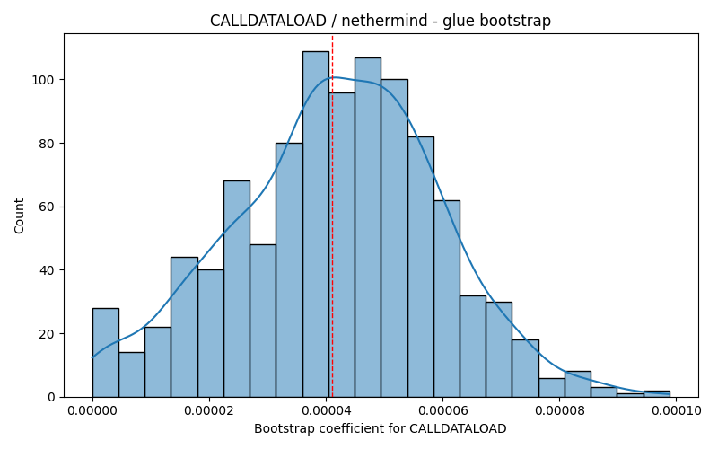

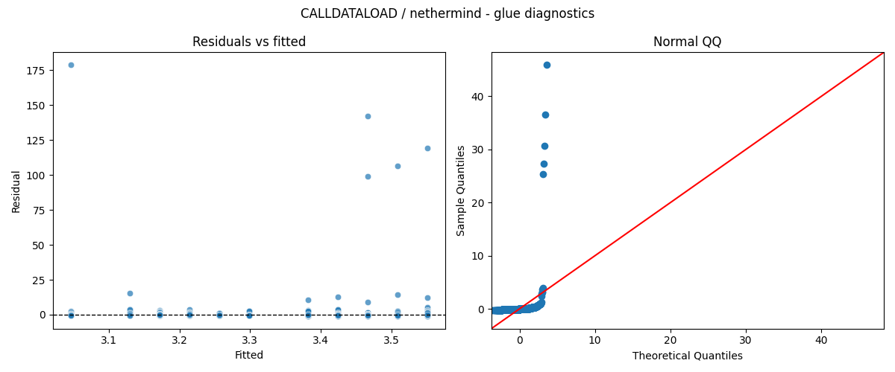

</details>

<details><summary><code>DIV</code> · nobs=1485 · runtime_ms=6.985e-06 · p=1.00e-03 · R²=0.6146</summary>

```
==============================================================================
                           NNLS Regression Results                            
==============================================================================
Dep. Variable:          test_runtime_ms              R-squared:          0.615
Model:                  NNLS                    Adj. R-squared:          0.614
No. Observations:       1485                              RMSE:          43.66
Df Residuals:           1483                               MAE:          34.14
Df Model:               1      
==============================================================================
                      coef     std err     P-value      [0.025      0.975]
------------------------------------------------------------------------------
         const    126.4353      5.2180       0.001    115.6793    135.8766
           DIV      0.0000      0.0000       0.001      0.0000      0.0000
==============================================================================
Notes: Non-negative least squares with bootstrap inference (1000 iterations)
==============================================================================
```

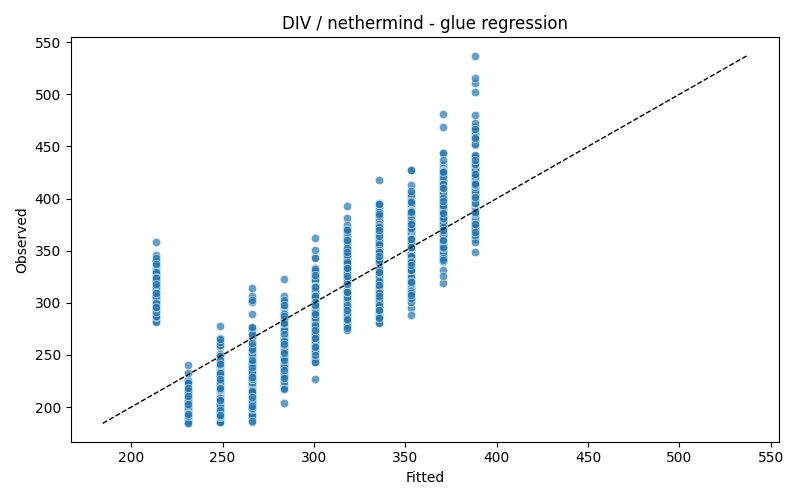

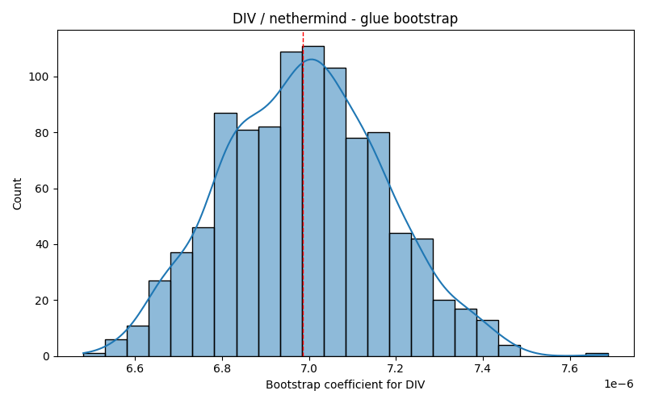

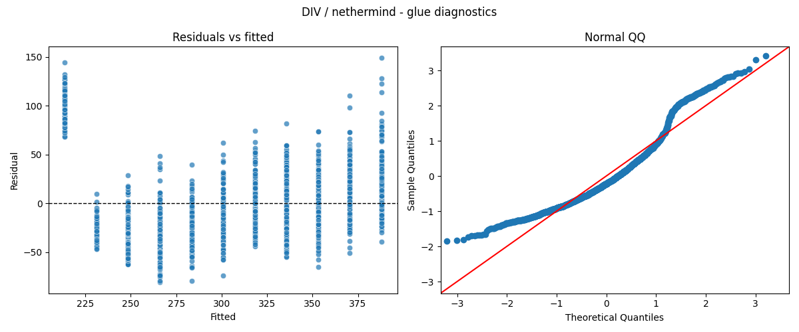

</details>

<details><summary><code>EXP</code> · nobs=1485 · runtime_ms=0 · p=1.00e+00 · R²=0</summary>

```
==============================================================================
                           NNLS Regression Results                            
==============================================================================
Dep. Variable:          test_runtime_ms              R-squared:          0.000
Model:                  NNLS                    Adj. R-squared:         -0.001
No. Observations:       1485                              RMSE:          46.88
Df Residuals:           1483                               MAE:          31.22
Df Model:               1      
==============================================================================
                      coef     std err     P-value      [0.025      0.975]
------------------------------------------------------------------------------
         const    103.0546      1.2182       0.001    100.6221    105.2703
           EXP      0.0000      0.0000       1.000      0.0000      0.0000
==============================================================================
Notes: Non-negative least squares with bootstrap inference (1000 iterations)
==============================================================================
```

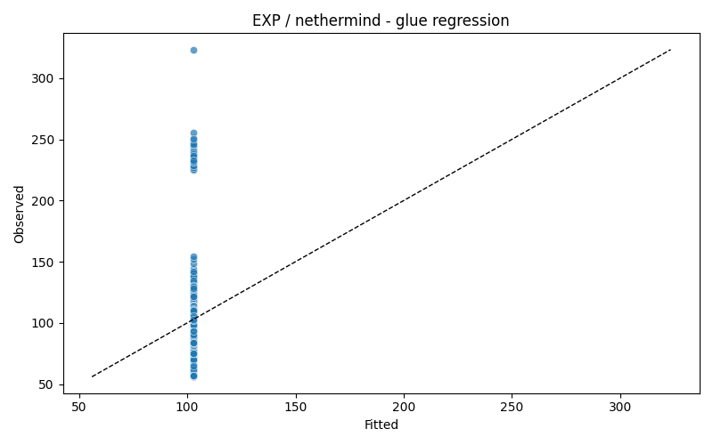

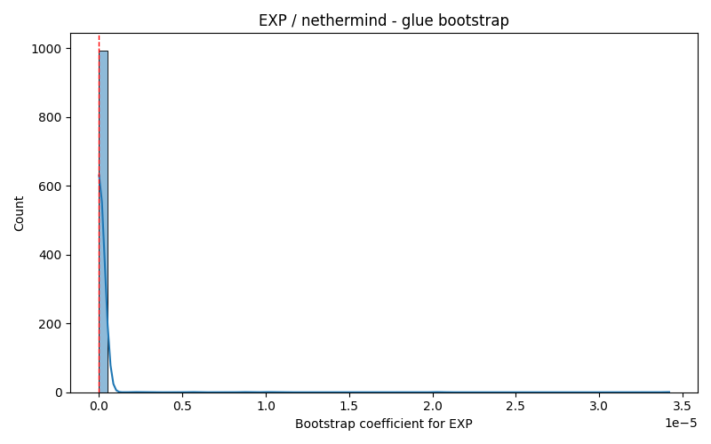

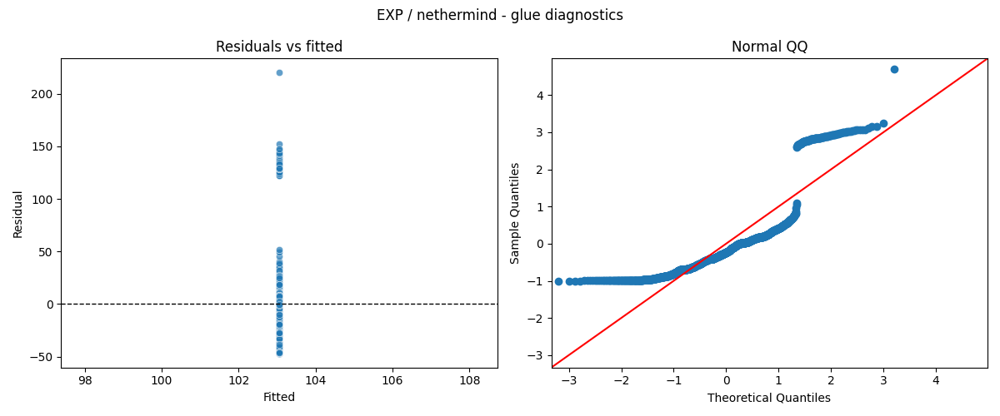

</details>

<details><summary><code>GT</code> · nobs=1485 · runtime_ms=1.586e-06 · p=1.00e-03 · R²=0.5762</summary>

```
==============================================================================
                           NNLS Regression Results                            
==============================================================================
Dep. Variable:          test_runtime_ms              R-squared:          0.576
Model:                  NNLS                    Adj. R-squared:          0.576
No. Observations:       1485                              RMSE:          14.32
Df Residuals:           1483                               MAE:           6.81
Df Model:               1      
==============================================================================
                      coef     std err     P-value      [0.025      0.975]
------------------------------------------------------------------------------
         const     15.2025      1.2828       0.001     12.8463     17.8853
            GT      0.0000      0.0000       0.001      0.0000      0.0000
==============================================================================
Notes: Non-negative least squares with bootstrap inference (1000 iterations)
==============================================================================
```

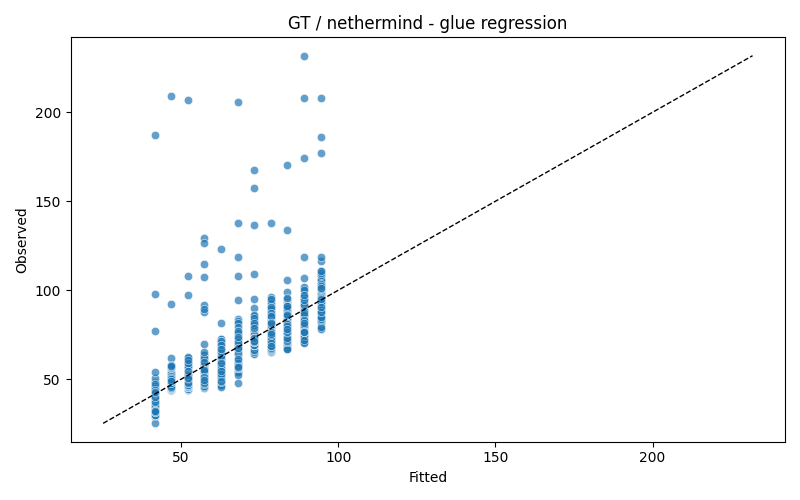

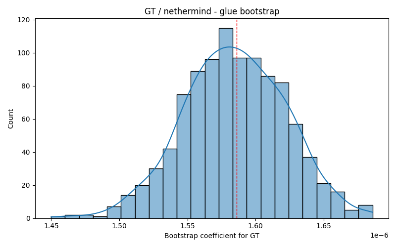

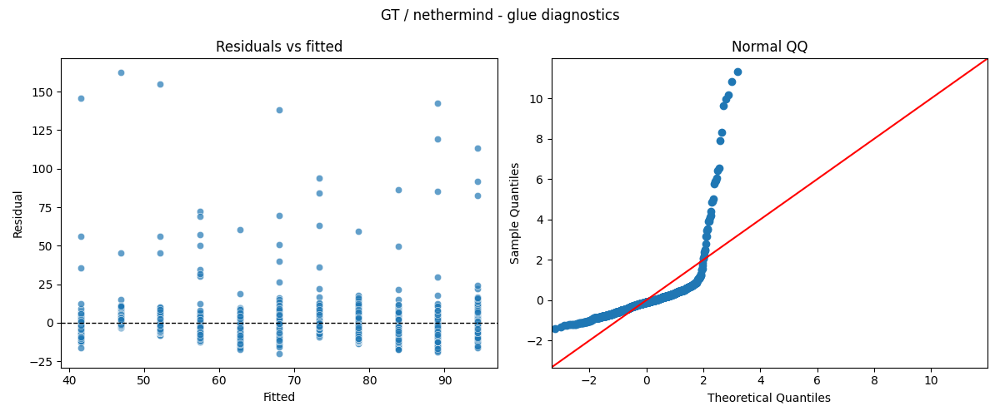

</details>

<details><summary><code>JUMPI</code> · nobs=1485 · runtime_ms=1.765e-06 · p=1.00e-03 · R²=0.6246</summary>

```
==============================================================================
                           NNLS Regression Results                            
==============================================================================
Dep. Variable:          test_runtime_ms              R-squared:          0.625
Model:                  NNLS                    Adj. R-squared:          0.624
No. Observations:       1485                              RMSE:           6.17
Df Residuals:           1483                               MAE:           3.37
Df Model:               1      
==============================================================================
                      coef     std err     P-value      [0.025      0.975]
------------------------------------------------------------------------------
         const      9.4972      0.5852       0.001      8.4871     10.6712
         JUMPI      0.0000      0.0000       0.001      0.0000      0.0000
==============================================================================
Notes: Non-negative least squares with bootstrap inference (1000 iterations)
==============================================================================
```

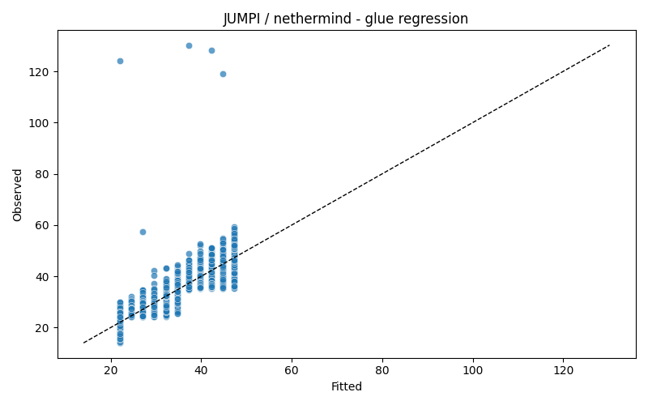

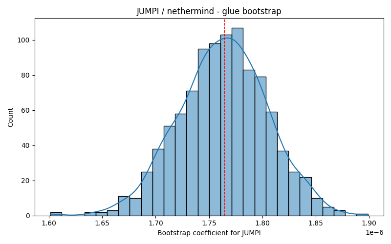

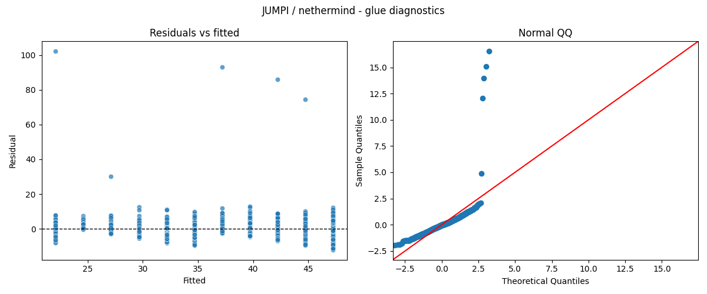

</details>

<details><summary><code>LT</code> · nobs=1485 · runtime_ms=1.535e-06 · p=1.00e-03 · R²=0.6036</summary>

```
==============================================================================
                           NNLS Regression Results                            
==============================================================================
Dep. Variable:          test_runtime_ms              R-squared:          0.604
Model:                  NNLS                    Adj. R-squared:          0.603
No. Observations:       1485                              RMSE:          13.09
Df Residuals:           1483                               MAE:           7.80
Df Model:               1      
==============================================================================
                      coef     std err     P-value      [0.025      0.975]
------------------------------------------------------------------------------
         const     19.2657      0.9413       0.001     17.5240     21.1802
            LT      0.0000      0.0000       0.001      0.0000      0.0000
==============================================================================
Notes: Non-negative least squares with bootstrap inference (1000 iterations)
==============================================================================
```

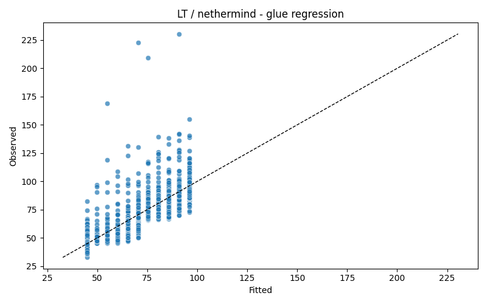

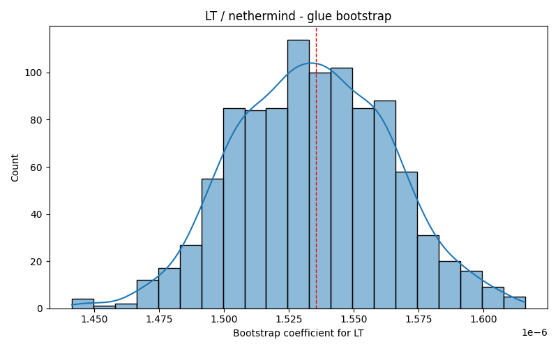

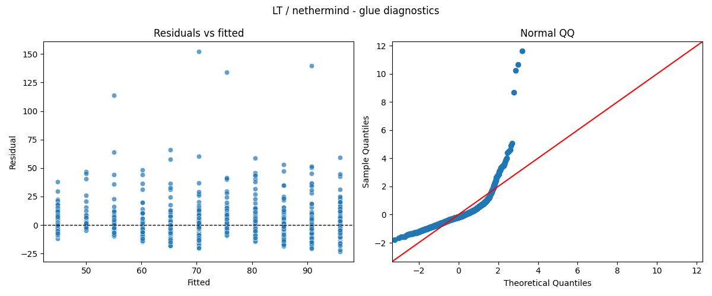

</details>

<details><summary><code>MSTORE</code> · nobs=7425 · runtime_ms=2.081e-06 · p=1.00e-03 · R²=0.6974</summary>

```
==============================================================================
                           NNLS Regression Results                            
==============================================================================
Dep. Variable:          test_runtime_ms              R-squared:          0.697
Model:                  NNLS                    Adj. R-squared:          0.697
No. Observations:       7425                              RMSE:           9.62
Df Residuals:           7423                               MAE:           4.96
Df Model:               1      
==============================================================================
                      coef     std err     P-value      [0.025      0.975]
------------------------------------------------------------------------------
         const     15.1416      0.3520       0.001     14.4945     15.8528
        MSTORE      0.0000      0.0000       0.001      0.0000      0.0000
==============================================================================
Notes: Non-negative least squares with bootstrap inference (1000 iterations)
==============================================================================
```

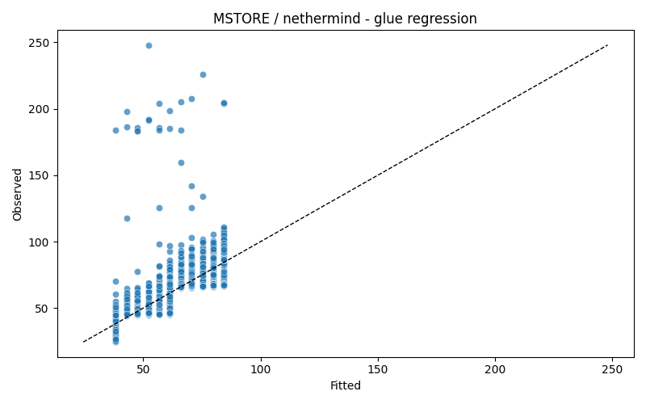

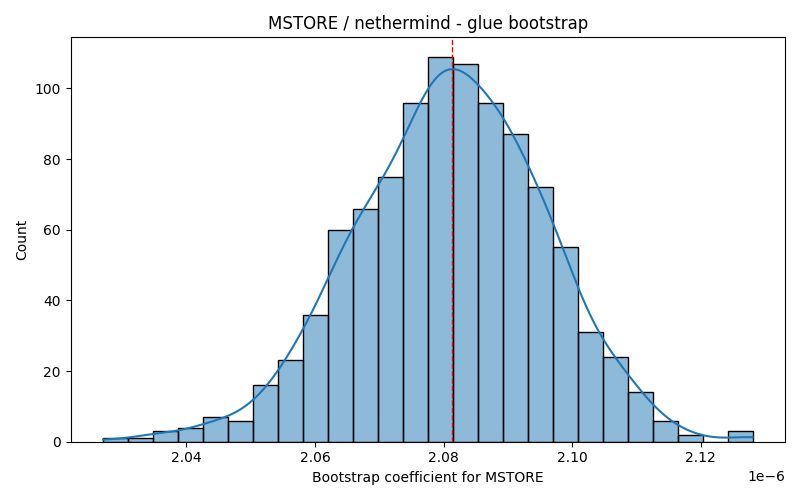

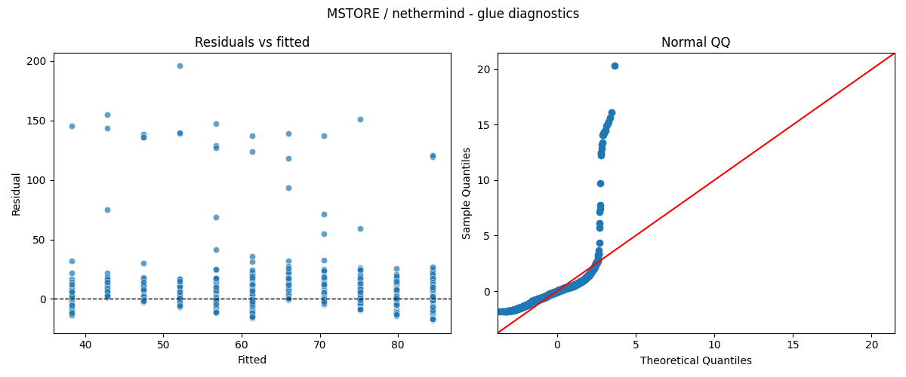

</details>

<details><summary><code>MSTORE8</code> · nobs=7425 · runtime_ms=2.016e-06 · p=1.00e-03 · R²=0.6466</summary>

```
==============================================================================
                           NNLS Regression Results                            
==============================================================================
Dep. Variable:          test_runtime_ms              R-squared:          0.647
Model:                  NNLS                    Adj. R-squared:          0.647
No. Observations:       7425                              RMSE:          10.46
Df Residuals:           7423                               MAE:           4.80
Df Model:               1      
==============================================================================
                      coef     std err     P-value      [0.025      0.975]
------------------------------------------------------------------------------
         const     15.2580      0.4443       0.001     14.3566     16.1158
       MSTORE8      0.0000      0.0000       0.001      0.0000      0.0000
==============================================================================
Notes: Non-negative least squares with bootstrap inference (1000 iterations)
==============================================================================
```

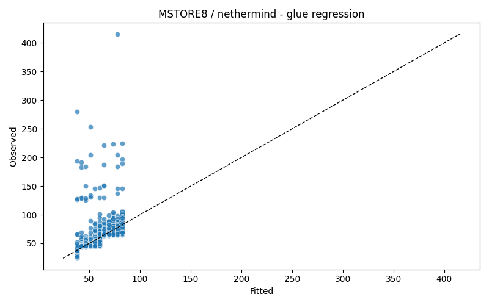

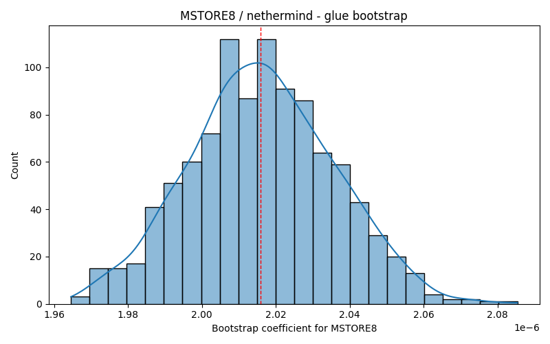

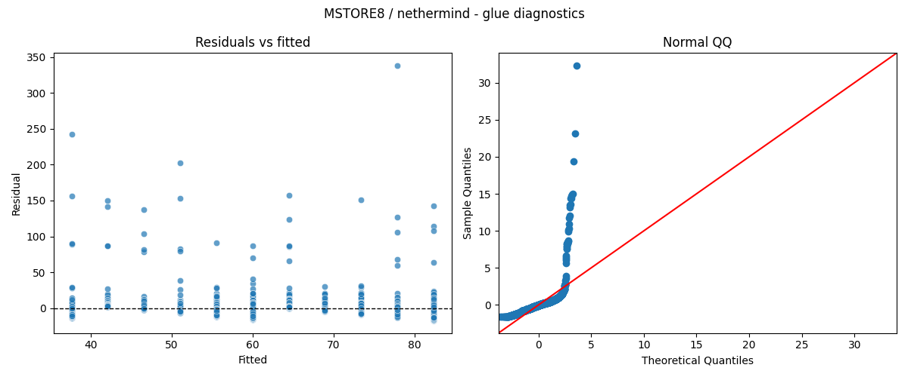

</details>

<details><summary><code>MUL</code> · nobs=1485 · runtime_ms=5.318e-06 · p=1.00e-03 · R²=0.8932</summary>

```
==============================================================================
                           NNLS Regression Results                            
==============================================================================
Dep. Variable:          test_runtime_ms              R-squared:          0.893
Model:                  NNLS                    Adj. R-squared:          0.893
No. Observations:       1485                              RMSE:          14.51
Df Residuals:           1483                               MAE:          11.07
Df Model:               1      
==============================================================================
                      coef     std err     P-value      [0.025      0.975]
------------------------------------------------------------------------------
         const     25.0881      1.1254       0.001     22.8109     27.2411
           MUL      0.0000      0.0000       0.001      0.0000      0.0000
==============================================================================
Notes: Non-negative least squares with bootstrap inference (1000 iterations)
==============================================================================
```

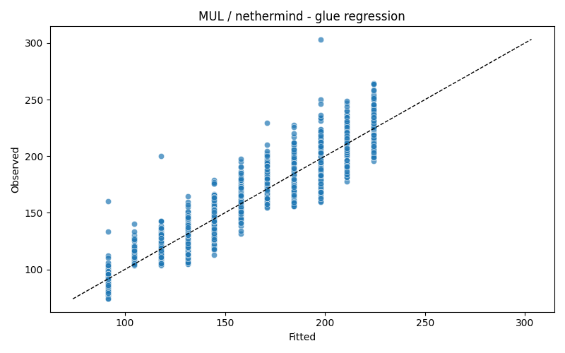

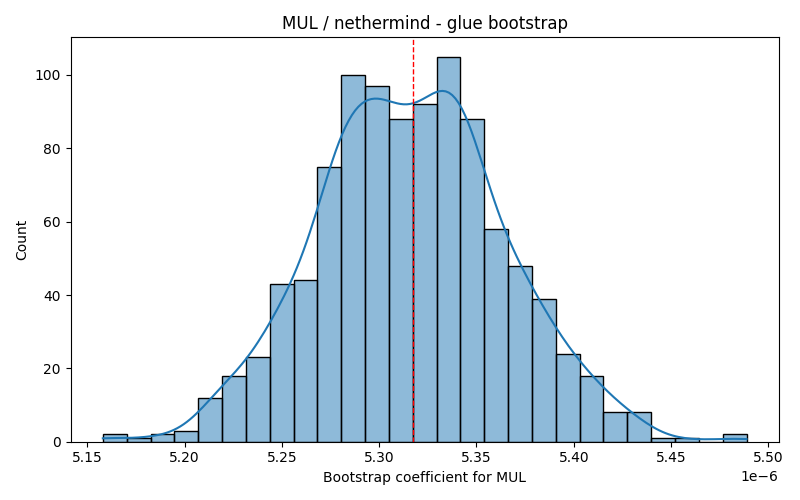

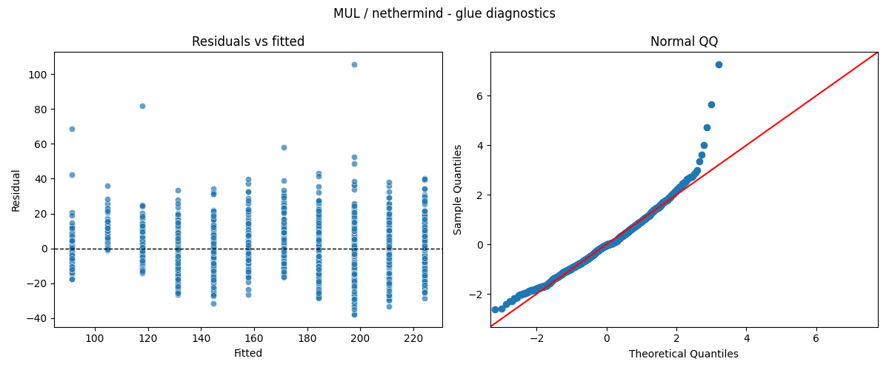

</details>

<details><summary><code>PC</code> · nobs=1485 · runtime_ms=8.174e-07 · p=1.00e-03 · R²=0.8326</summary>

```
==============================================================================
                           NNLS Regression Results                            
==============================================================================
Dep. Variable:          test_runtime_ms              R-squared:          0.833
Model:                  NNLS                    Adj. R-squared:          0.832
No. Observations:       1485                              RMSE:          10.96
Df Residuals:           1483                               MAE:           8.18
Df Model:               1      
==============================================================================
                      coef     std err     P-value      [0.025      0.975]
------------------------------------------------------------------------------
         const     18.9748      0.8639       0.001     17.3186     20.6682
            PC      0.0000      0.0000       0.001      0.0000      0.0000
==============================================================================
Notes: Non-negative least squares with bootstrap inference (1000 iterations)
==============================================================================
```

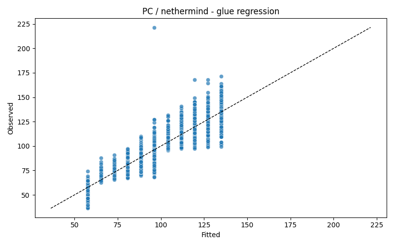

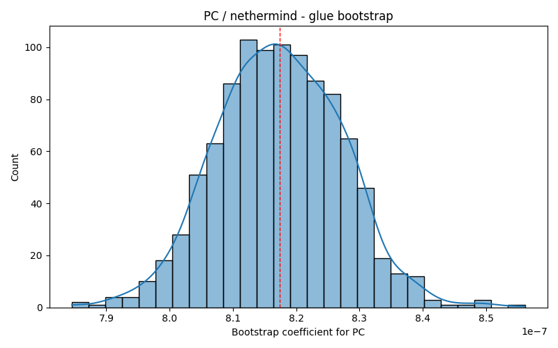

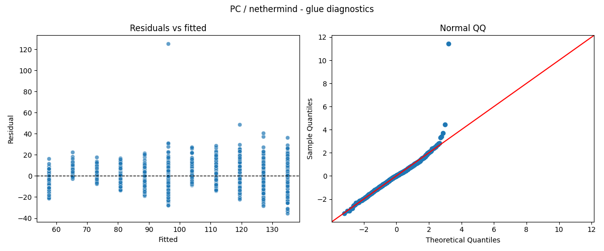

</details>

<details><summary><code>RETURNDATASIZE</code> · nobs=5940 · runtime_ms=8.253e-07 · p=1.00e-03 · R²=0.5459</summary>

```
==============================================================================
                           NNLS Regression Results                            
==============================================================================
Dep. Variable:          test_runtime_ms              R-squared:          0.546
Model:                  NNLS                    Adj. R-squared:          0.546
No. Observations:       5940                              RMSE:          11.88
Df Residuals:           5938                               MAE:           5.10
Df Model:               1      
==============================================================================
                      coef     std err     P-value      [0.025      0.975]
------------------------------------------------------------------------------
         const     12.1413      0.4881       0.001     11.2167     13.1586
RETURNDATASIZE      0.0000      0.0000       0.001      0.0000      0.0000
==============================================================================
Notes: Non-negative least squares with bootstrap inference (1000 iterations)
==============================================================================
```

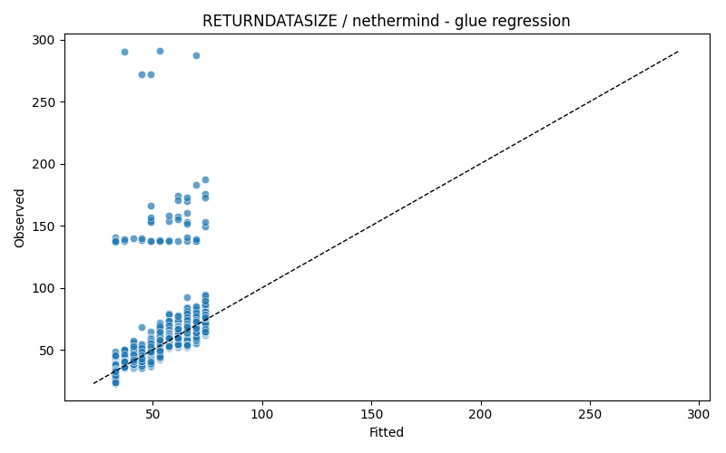

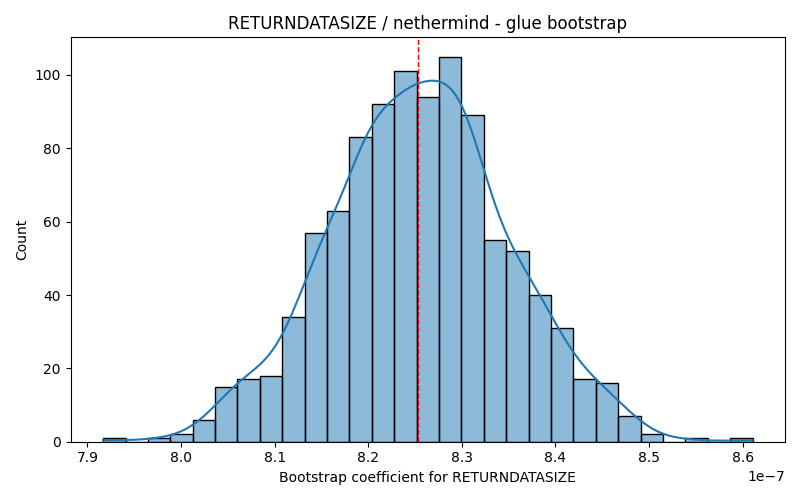

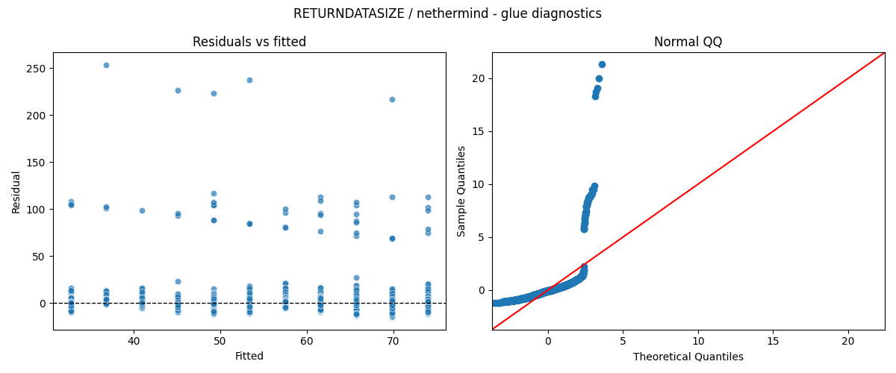

</details>

<details><summary><code>SELFBALANCE</code> · nobs=1215 · runtime_ms=4.174e-06 · p=1.00e-03 · R²=0.6197</summary>

```
==============================================================================
                           NNLS Regression Results                            
==============================================================================
Dep. Variable:          test_runtime_ms              R-squared:          0.620
Model:                  NNLS                    Adj. R-squared:          0.619
No. Observations:       1215                              RMSE:          32.98
Df Residuals:           1213                               MAE:          26.22
Df Model:               1      
==============================================================================
                      coef     std err     P-value      [0.025      0.975]
------------------------------------------------------------------------------
         const    117.3548      5.2919       0.001    106.8495    127.1775
   SELFBALANCE      0.0000      0.0000       0.001      0.0000      0.0000
==============================================================================
Notes: Non-negative least squares with bootstrap inference (1000 iterations)
==============================================================================
```

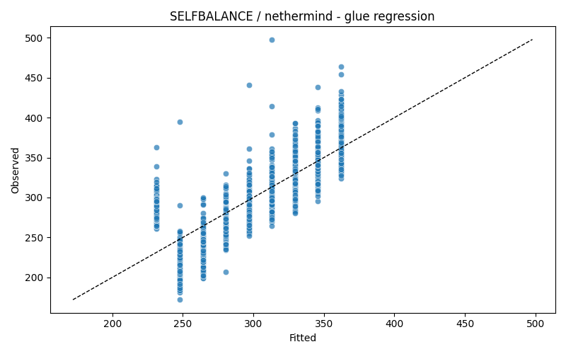

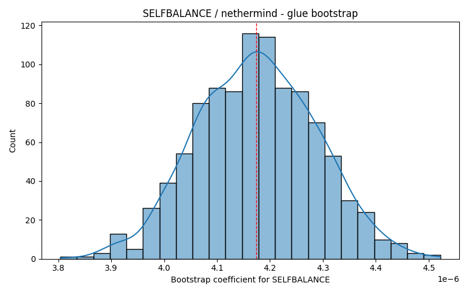

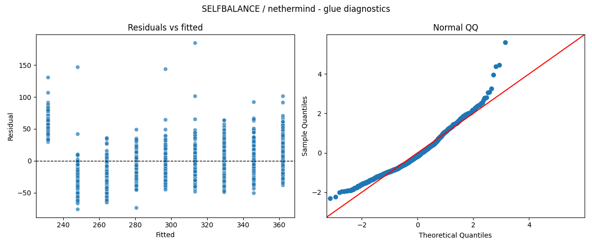

</details>

<details><summary><code>SUB</code> · nobs=1485 · runtime_ms=2.493e-06 · p=1.00e-03 · R²=0.8705</summary>

```
==============================================================================
                           NNLS Regression Results                            
==============================================================================
Dep. Variable:          test_runtime_ms              R-squared:          0.871
Model:                  NNLS                    Adj. R-squared:          0.870
No. Observations:       1485                              RMSE:          10.12
Df Residuals:           1483                               MAE:           7.24
Df Model:               1      
==============================================================================
                      coef     std err     P-value      [0.025      0.975]
------------------------------------------------------------------------------
         const     17.4138      0.8085       0.001     15.8617     19.0501
           SUB      0.0000      0.0000       0.001      0.0000      0.0000
==============================================================================
Notes: Non-negative least squares with bootstrap inference (1000 iterations)
==============================================================================
```

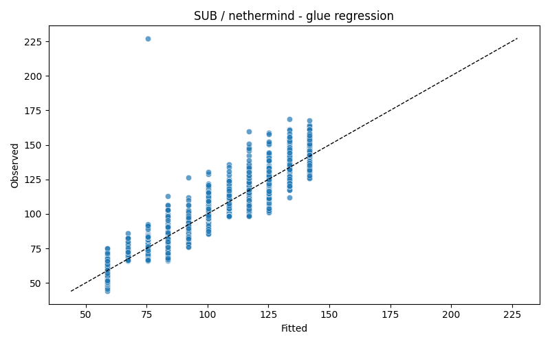

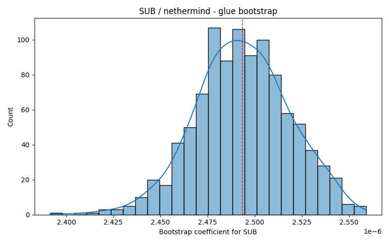

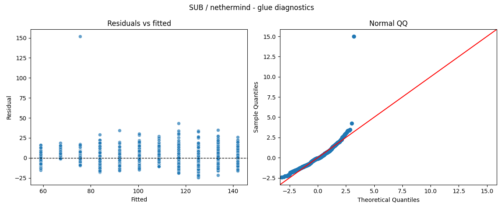

</details>

### Mixed glue (tier B) · nethermind

<details><summary><code>JUMP</code> · nobs=1485 · runtime_ms=5.761e-06 · p=1.00e-03 · R²=0.8059</summary>

```
==============================================================================
                           NNLS Regression Results                            
==============================================================================
Dep. Variable:          test_runtime_ms              R-squared:          0.806
Model:                  NNLS                    Adj. R-squared:          0.806
No. Observations:       1485                              RMSE:          10.51
Df Residuals:           1483                               MAE:           7.43
Df Model:               1      
==============================================================================
                      coef     std err     P-value      [0.025      0.975]
------------------------------------------------------------------------------
         const     17.1066      0.7911       0.001     15.5306     18.6484
          JUMP      0.0000      0.0000       0.001      0.0000      0.0000
==============================================================================
Notes: Non-negative least squares with bootstrap inference (1000 iterations)
==============================================================================
```

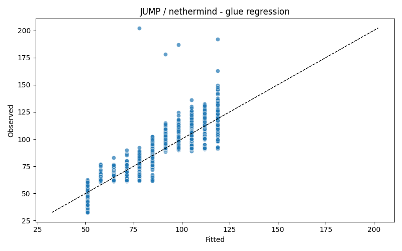

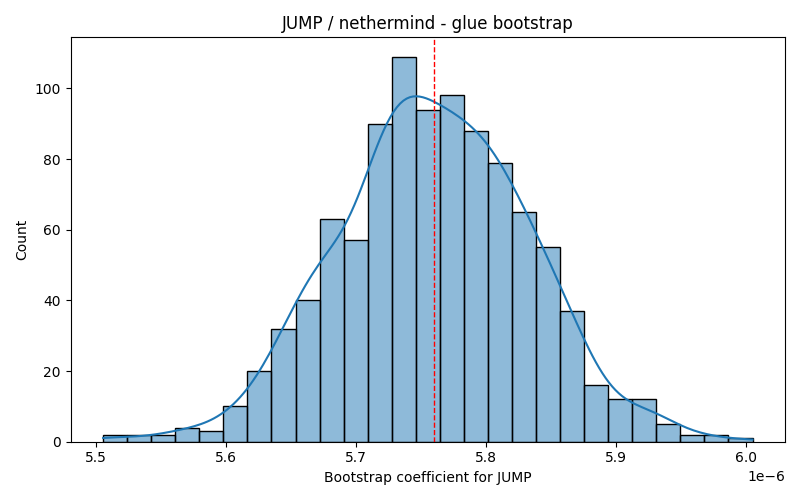


</details>

<details><summary><code>KECCAK256</code> · nobs=23760 · runtime_ms=0 · p=1.00e+00 · R²=1.11e-16</summary>

```
==============================================================================
                           NNLS Regression Results                            
==============================================================================
Dep. Variable:          test_runtime_ms              R-squared:          0.000
Model:                  NNLS                    Adj. R-squared:         -0.000
No. Observations:       23760                             RMSE:         284.82
Df Residuals:           23758                              MAE:         231.87
Df Model:               1      
==============================================================================
                      coef     std err     P-value      [0.025      0.975]
------------------------------------------------------------------------------
         const    410.2490      1.7941       0.001    406.7841    413.7476
     KECCAK256      0.0000      0.0000       1.000      0.0000      0.0000
==============================================================================
Notes: Non-negative least squares with bootstrap inference (1000 iterations)
==============================================================================
```

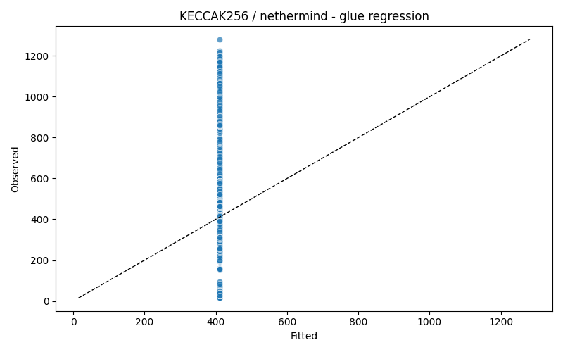


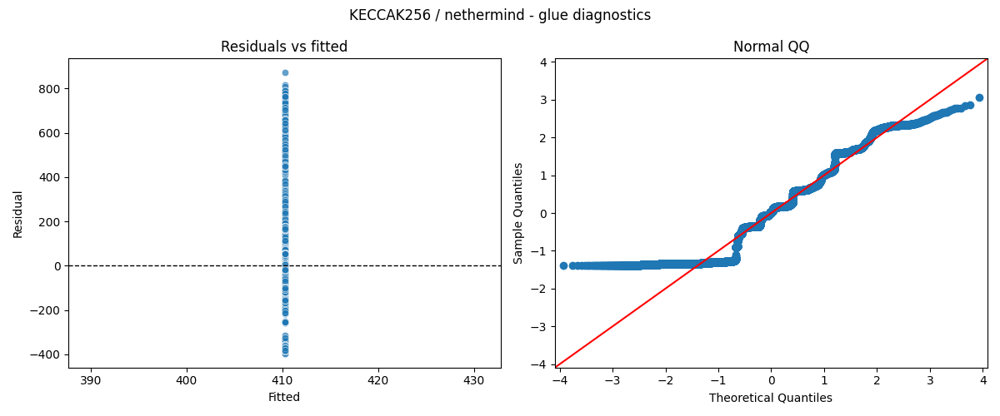

</details>

## reth

| glue_opcode | nobs | glue_runtime_ms | p_value | rsquared |
| --- | --- | --- | --- | --- |
| `ISZERO` | 374 | 1.36e-06 | 1.00e-03 | 0.865 |
| `JUMPDEST` | 374 | 2.639e-07 | 1.00e-03 | 0.7328 |
| `SWAP` | 5984 | 4.754e-07 | 1.00e-03 | 0.7576 |
| `CALLDATASIZE` | 22264 | 4.395e-07 | 1.00e-03 | 0.7811 |
| `DUP` | 22264 | 4.188e-07 | 1.00e-03 | 0.7811 |
| `GAS` | 22264 | 4.302e-07 | 1.00e-03 | 0.7811 |
| `MLOAD` | 22264 | 1.472e-06 | 1.00e-03 | 0.7811 |
| `PUSH` | 22264 | 4.315e-07 | 1.00e-03 | 0.7811 |
| `PUSH0` | 22264 | 3.831e-07 | 1.00e-03 | 0.7811 |
| `STATICCALL` | 22264 | 5.756e-05 | 1.00e-03 | 0.7811 |
| `ADD` | 374 | 8.183e-07 | 1.00e-03 | 0.7976 |
| `AND` | 374 | 7.919e-07 | 1.00e-03 | 0.7727 |
| `CALLDATACOPY` | 8976 | 2.361e-06 | 1.00e-03 | 0.8191 |
| `CALLDATALOAD` | 1496 | 1.854e-05 | 1.00e-03 | 0.01093 |
| `DIV` | 374 | 6.873e-06 | 1.00e-03 | 0.8473 |
| `EXP` | 374 | 0.0004937 | 1.00e-03 | 0.8414 |
| `GT` | 374 | 8.867e-07 | 1.00e-03 | 0.7841 |
| `JUMPI` | 374 | 1.229e-06 | 1.00e-03 | 0.651 |
| `LT` | 374 | 9.159e-07 | 1.00e-03 | 0.7995 |
| `MSTORE` | 1870 | 2.561e-06 | 1.00e-03 | 0.3012 |
| `MSTORE8` | 1870 | 1.32e-06 | 1.00e-03 | 0.5748 |
| `MUL` | 374 | 1.054e-06 | 1.00e-03 | 0.638 |
| `PC` | 374 | 6.285e-07 | 1.00e-03 | 0.9016 |
| `RETURNDATASIZE` | 1496 | 7.94e-07 | 1.00e-03 | 0.8356 |
| `SELFBALANCE` | 306 | 3.786e-06 | 1.00e-03 | 0.8143 |
| `SUB` | 374 | 8.275e-07 | 1.00e-03 | 0.7872 |
| `JUMP` | 374 | 2.173e-06 | 1.00e-03 | 0.7511 |
| `KECCAK256` | 5984 | 0 | 1.00e+00 | 0 |

### Cycle glue — joint fit · reth

<details><summary>Joint NNLS regression summary</summary>

```
==============================================================================
                           NNLS Regression Results                            
==============================================================================
Dep. Variable:          test_runtime_ms              R-squared:          0.781
Model:                  NNLS                    Adj. R-squared:          0.781
No. Observations:       22264                             RMSE:           7.54
Df Residuals:           22256                              MAE:           5.30
Df Model:               7      
==============================================================================
                      coef     std err     P-value      [0.025      0.975]
------------------------------------------------------------------------------
         const     14.8174      0.1603       0.001     14.4880     15.1202
  CALLDATASIZE      0.0000      0.0000       0.001      0.0000      0.0000
           DUP      0.0000      0.0000       0.001      0.0000      0.0000
           GAS      0.0000      0.0000       0.001      0.0000      0.0000
         MLOAD      0.0000      0.0000       0.001      0.0000      0.0000
          PUSH      0.0000      0.0000       0.001      0.0000      0.0000
         PUSH0      0.0000      0.0000       0.001      0.0000      0.0000
    STATICCALL      0.0001      0.0000       0.001      0.0001      0.0001
==============================================================================
Notes: Non-negative least squares with bootstrap inference (1000 iterations)
==============================================================================
```

</details>

<details><summary><code>CALLDATASIZE</code> · nobs=22264 · runtime_ms=4.395e-07 · p=1.00e-03 · R²=0.7811</summary>

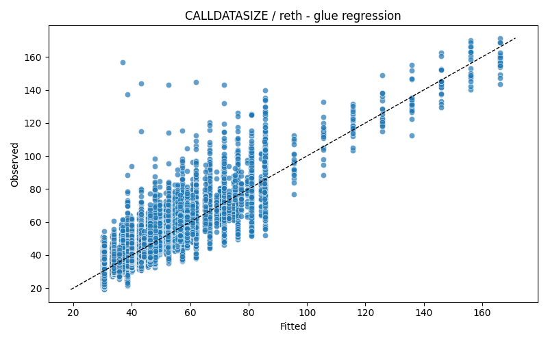

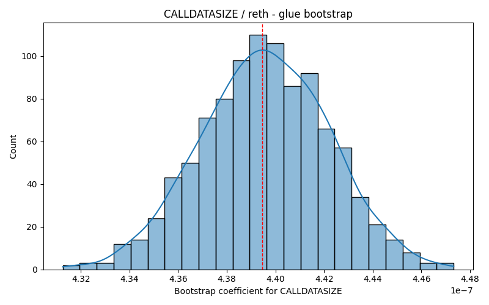


</details>

<details><summary><code>DUP</code> · nobs=22264 · runtime_ms=4.188e-07 · p=1.00e-03 · R²=0.7811</summary>


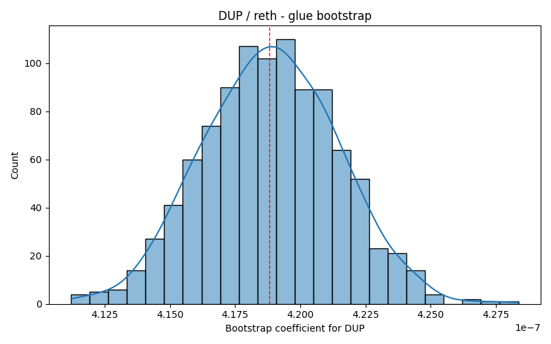


</details>

<details><summary><code>GAS</code> · nobs=22264 · runtime_ms=4.302e-07 · p=1.00e-03 · R²=0.7811</summary>

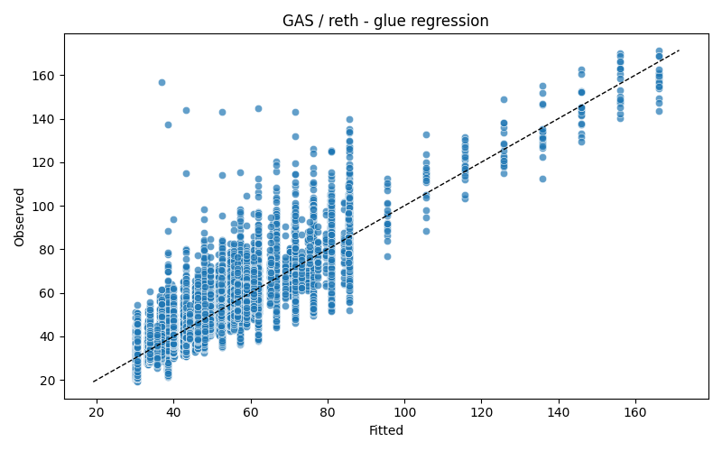

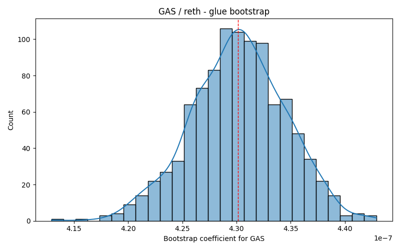


</details>

<details><summary><code>MLOAD</code> · nobs=22264 · runtime_ms=1.472e-06 · p=1.00e-03 · R²=0.7811</summary>

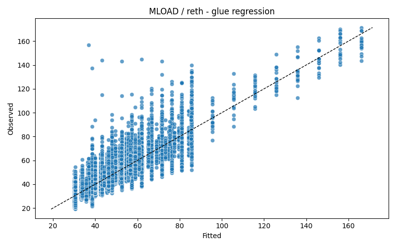

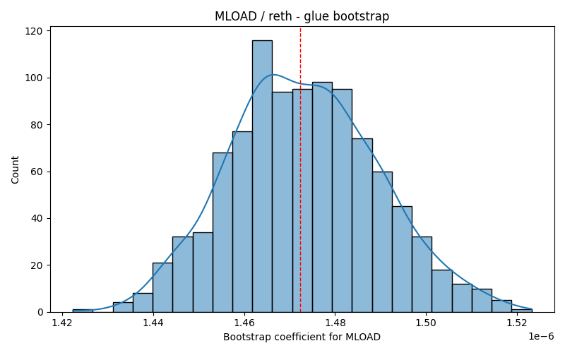

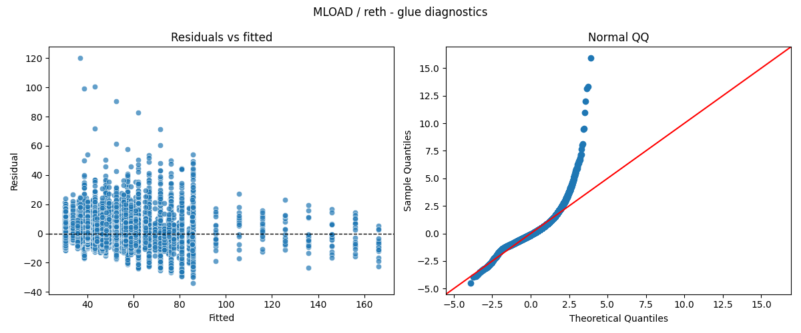

</details>

<details><summary><code>PUSH</code> · nobs=22264 · runtime_ms=4.315e-07 · p=1.00e-03 · R²=0.7811</summary>


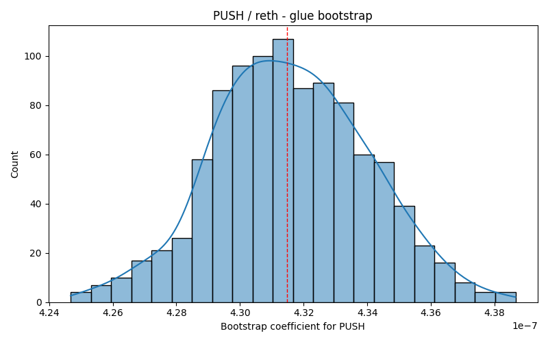


</details>

<details><summary><code>PUSH0</code> · nobs=22264 · runtime_ms=3.831e-07 · p=1.00e-03 · R²=0.7811</summary>


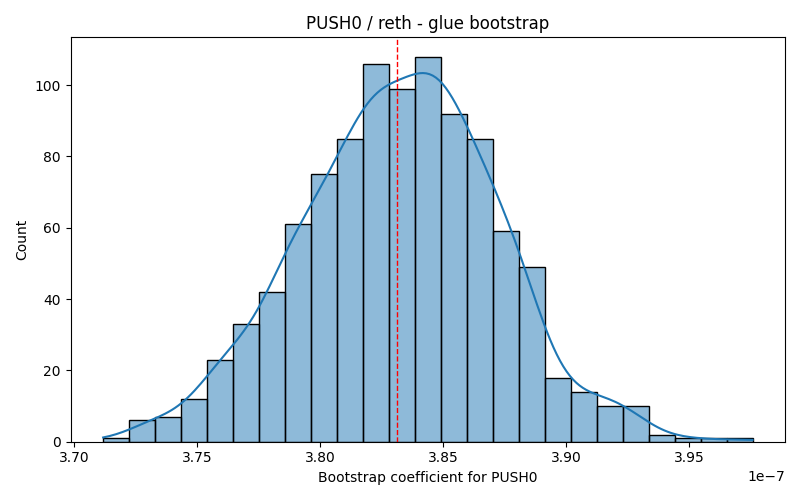


</details>

<details><summary><code>STATICCALL</code> · nobs=22264 · runtime_ms=5.756e-05 · p=1.00e-03 · R²=0.7811</summary>


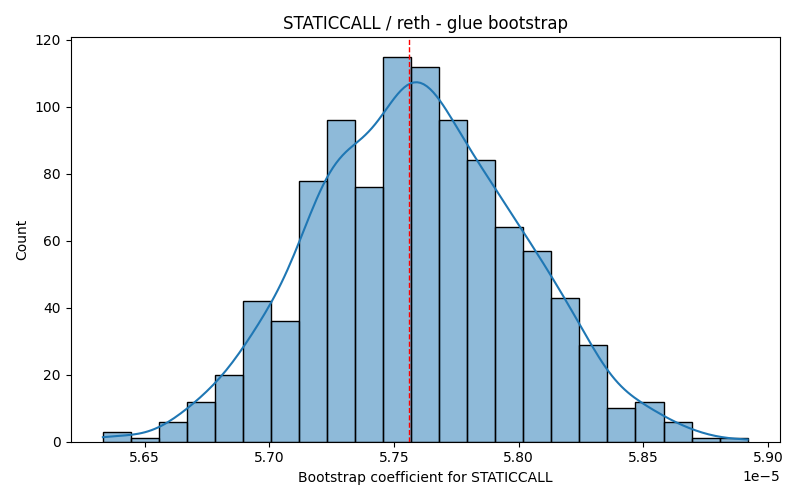


</details>

### Pure glue · reth

<details><summary><code>ISZERO</code> · nobs=374 · runtime_ms=1.36e-06 · p=1.00e-03 · R²=0.865</summary>

```
==============================================================================
                           NNLS Regression Results                            
==============================================================================
Dep. Variable:          test_runtime_ms              R-squared:          0.865
Model:                  NNLS                    Adj. R-squared:          0.865
No. Observations:       374                               RMSE:          11.31
Df Residuals:           372                                MAE:           9.26
Df Model:               1      
==============================================================================
                      coef     std err     P-value      [0.025      0.975]
------------------------------------------------------------------------------
         const     30.5622      2.2639       0.001     26.2187     35.3710
        ISZERO      0.0000      0.0000       0.001      0.0000      0.0000
==============================================================================
Notes: Non-negative least squares with bootstrap inference (1000 iterations)
==============================================================================
```

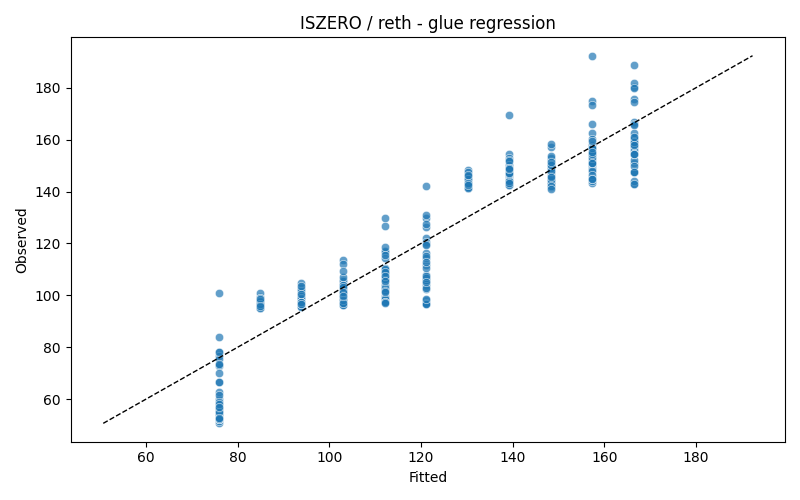

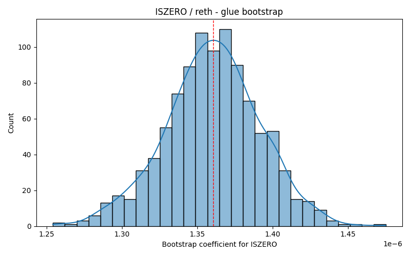

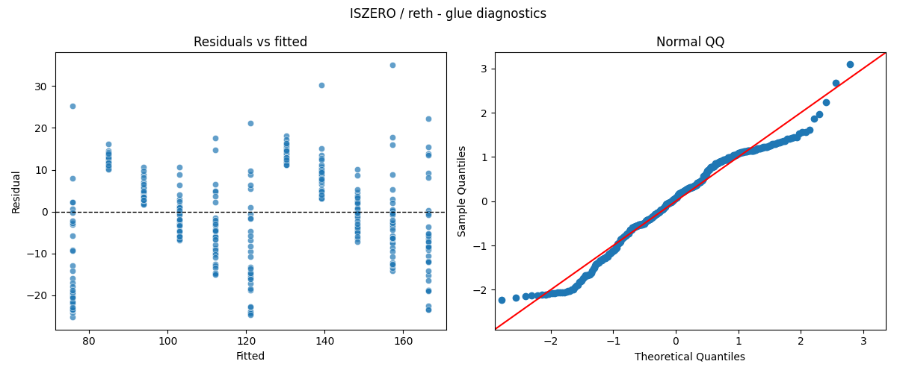

</details>

<details><summary><code>JUMPDEST</code> · nobs=374 · runtime_ms=2.639e-07 · p=1.00e-03 · R²=0.7328</summary>

```
==============================================================================
                           NNLS Regression Results                            
==============================================================================
Dep. Variable:          test_runtime_ms              R-squared:          0.733
Model:                  NNLS                    Adj. R-squared:          0.732
No. Observations:       374                               RMSE:          10.06
Df Residuals:           372                                MAE:           6.78
Df Model:               1      
==============================================================================
                      coef     std err     P-value      [0.025      0.975]
------------------------------------------------------------------------------
         const     17.8821      1.5999       0.001     14.7322     21.1359
      JUMPDEST      0.0000      0.0000       0.001      0.0000      0.0000
==============================================================================
Notes: Non-negative least squares with bootstrap inference (1000 iterations)
==============================================================================
```

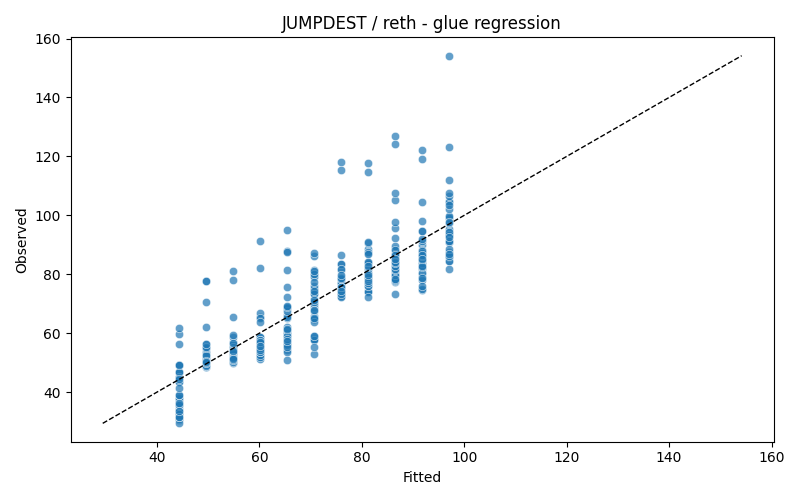

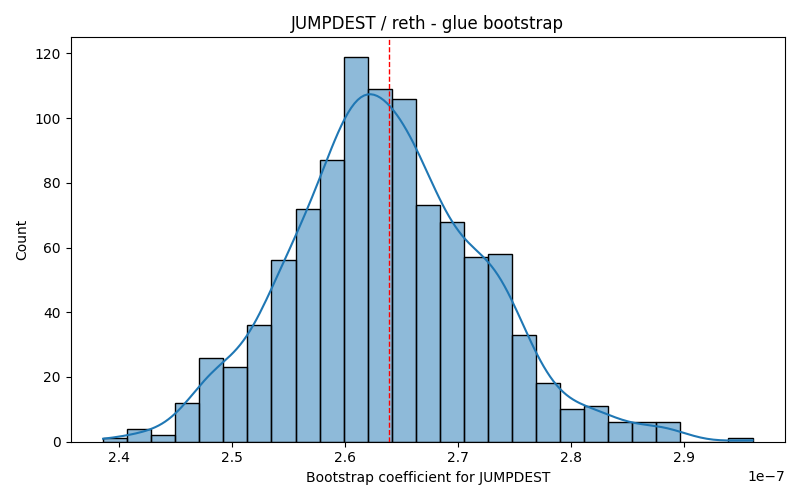

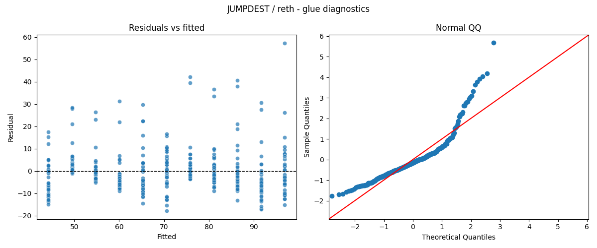

</details>

<details><summary><code>SWAP</code> · nobs=5984 · runtime_ms=4.754e-07 · p=1.00e-03 · R²=0.7576</summary>

```
==============================================================================
                           NNLS Regression Results                            
==============================================================================
Dep. Variable:          test_runtime_ms              R-squared:          0.758
Model:                  NNLS                    Adj. R-squared:          0.758
No. Observations:       5984                              RMSE:           5.66
Df Residuals:           5982                               MAE:           4.10
Df Model:               1      
==============================================================================
                      coef     std err     P-value      [0.025      0.975]
------------------------------------------------------------------------------
         const     13.9581      0.2351       0.001     13.4695     14.3802
          SWAP      0.0000      0.0000       0.001      0.0000      0.0000
==============================================================================
Notes: Non-negative least squares with bootstrap inference (1000 iterations)
==============================================================================
```

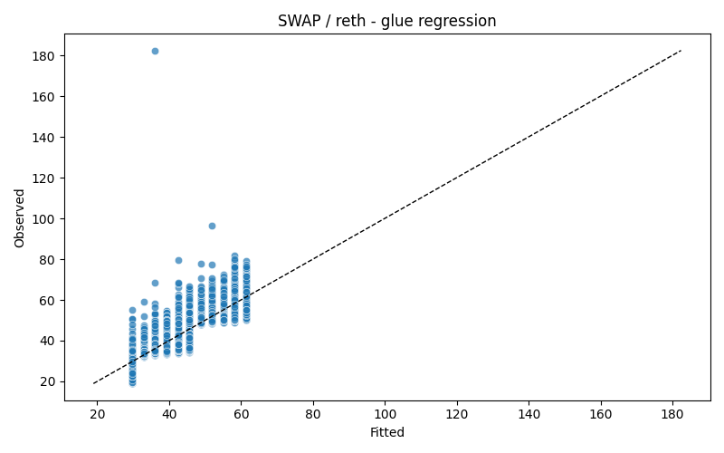

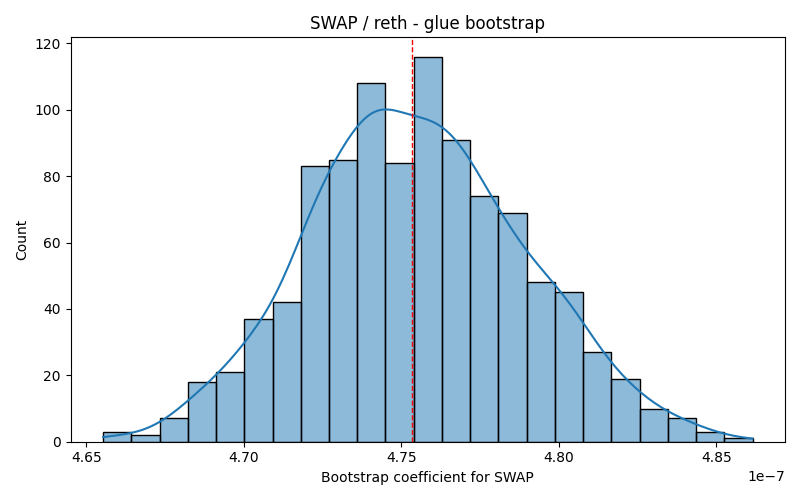

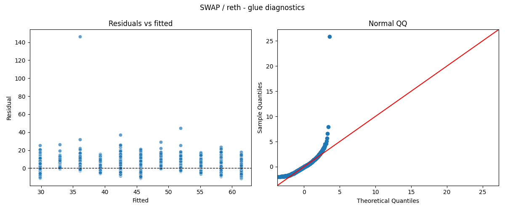

</details>

### Mixed glue (tier A) · reth

<details><summary><code>ADD</code> · nobs=374 · runtime_ms=8.183e-07 · p=1.00e-03 · R²=0.7976</summary>

```
==============================================================================
                           NNLS Regression Results                            
==============================================================================
Dep. Variable:          test_runtime_ms              R-squared:          0.798
Model:                  NNLS                    Adj. R-squared:          0.797
No. Observations:       374                               RMSE:           4.34
Df Residuals:           372                                MAE:           3.34
Df Model:               1      
==============================================================================
                      coef     std err     P-value      [0.025      0.975]
------------------------------------------------------------------------------
         const     13.4758      0.7436       0.001     12.0015     15.0085
           ADD      0.0000      0.0000       0.001      0.0000      0.0000
==============================================================================
Notes: Non-negative least squares with bootstrap inference (1000 iterations)
==============================================================================
```

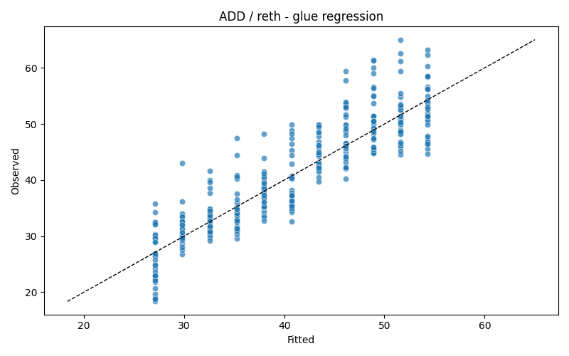

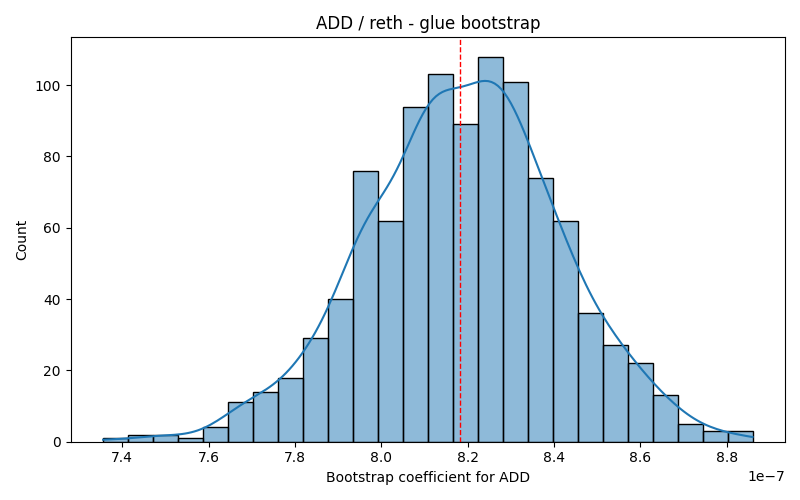

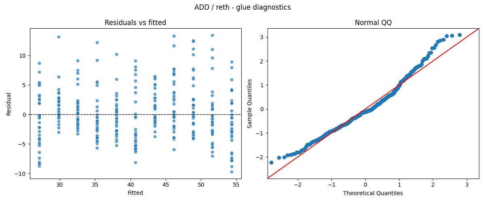

</details>

<details><summary><code>AND</code> · nobs=374 · runtime_ms=7.919e-07 · p=1.00e-03 · R²=0.7727</summary>

```
==============================================================================
                           NNLS Regression Results                            
==============================================================================
Dep. Variable:          test_runtime_ms              R-squared:          0.773
Model:                  NNLS                    Adj. R-squared:          0.772
No. Observations:       374                               RMSE:           4.52
Df Residuals:           372                                MAE:           3.37
Df Model:               1      
==============================================================================
                      coef     std err     P-value      [0.025      0.975]
------------------------------------------------------------------------------
         const     12.6187      0.8318       0.001     11.0667     14.3142
           AND      0.0000      0.0000       0.001      0.0000      0.0000
==============================================================================
Notes: Non-negative least squares with bootstrap inference (1000 iterations)
==============================================================================
```

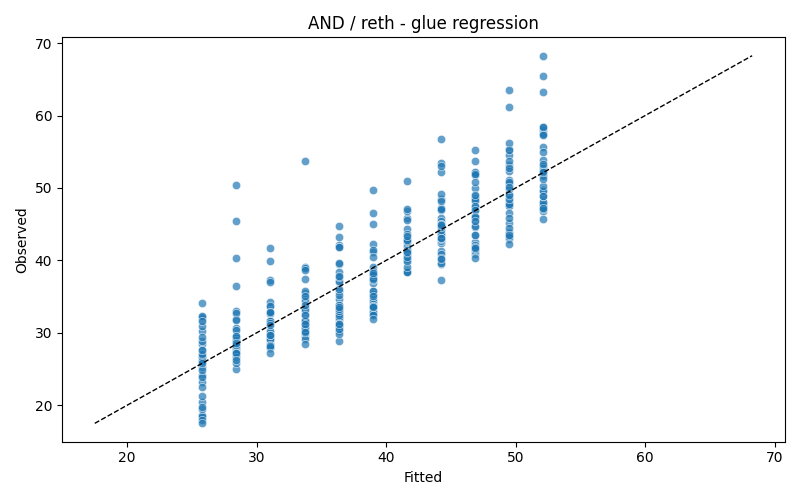

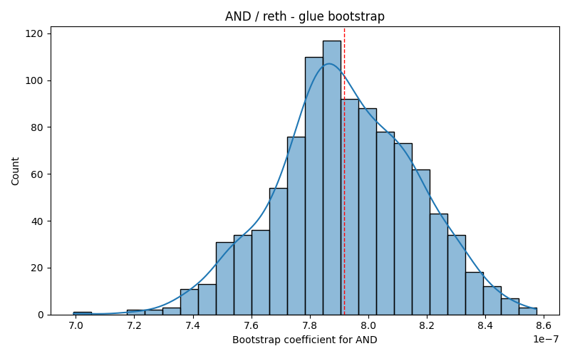

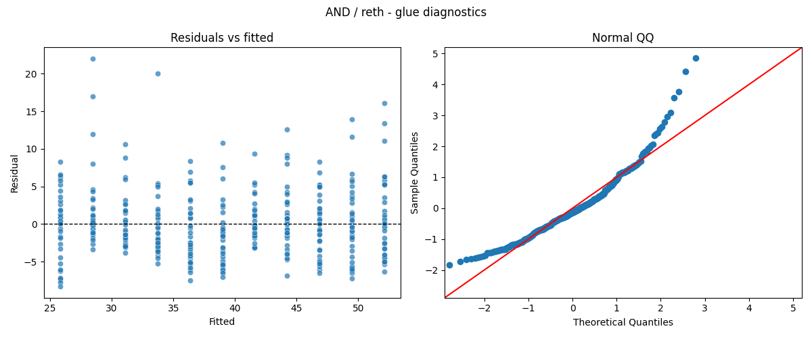

</details>

<details><summary><code>CALLDATACOPY</code> · nobs=8976 · runtime_ms=2.361e-06 · p=1.00e-03 · R²=0.8191</summary>

```
==============================================================================
                           NNLS Regression Results                            
==============================================================================
Dep. Variable:          test_runtime_ms              R-squared:          0.819
Model:                  NNLS                    Adj. R-squared:          0.819
No. Observations:       8976                              RMSE:           8.34
Df Residuals:           8974                               MAE:           6.36
Df Model:               1      
==============================================================================
                      coef     std err     P-value      [0.025      0.975]
------------------------------------------------------------------------------
         const     14.0679      0.1150       0.001     13.8544     14.2934
  CALLDATACOPY      0.0000      0.0000       0.001      0.0000      0.0000
==============================================================================
Notes: Non-negative least squares with bootstrap inference (1000 iterations)
==============================================================================
```

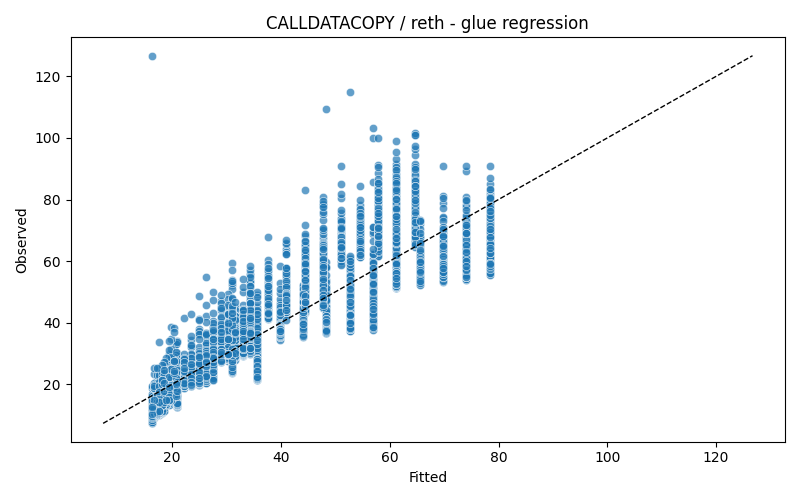

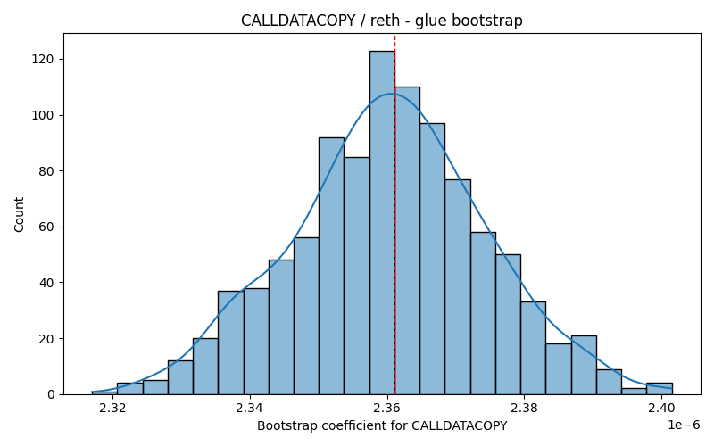

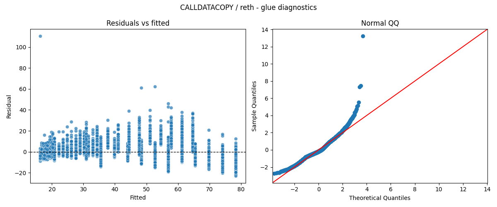

</details>

<details><summary><code>CALLDATALOAD</code> · nobs=1496 · runtime_ms=1.854e-05 · p=1.00e-03 · R²=0.01093</summary>

```
==============================================================================
                           NNLS Regression Results                            
==============================================================================
Dep. Variable:          test_runtime_ms              R-squared:          0.011
Model:                  NNLS                    Adj. R-squared:          0.010
No. Observations:       1496                              RMSE:           0.68
Df Residuals:           1494                               MAE:           0.46
Df Model:               1      
==============================================================================
                      coef     std err     P-value      [0.025      0.975]
------------------------------------------------------------------------------
         const      3.7337      0.0626       0.001      3.6072      3.8584
  CALLDATALOAD      0.0000      0.0000       0.001      0.0000      0.0000
==============================================================================
Notes: Non-negative least squares with bootstrap inference (1000 iterations)
==============================================================================
```

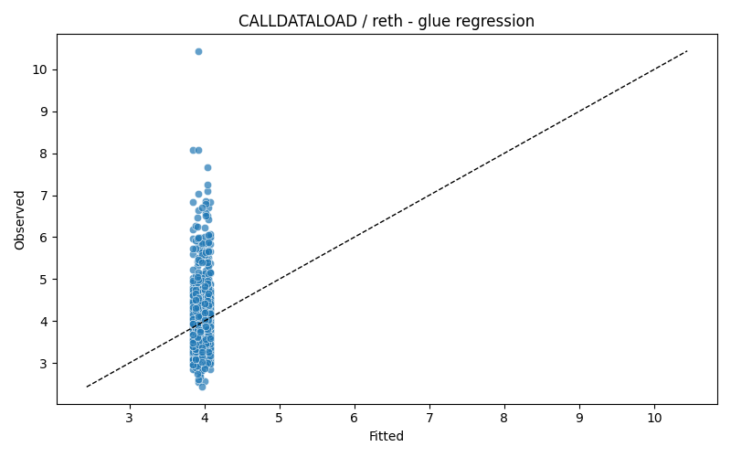

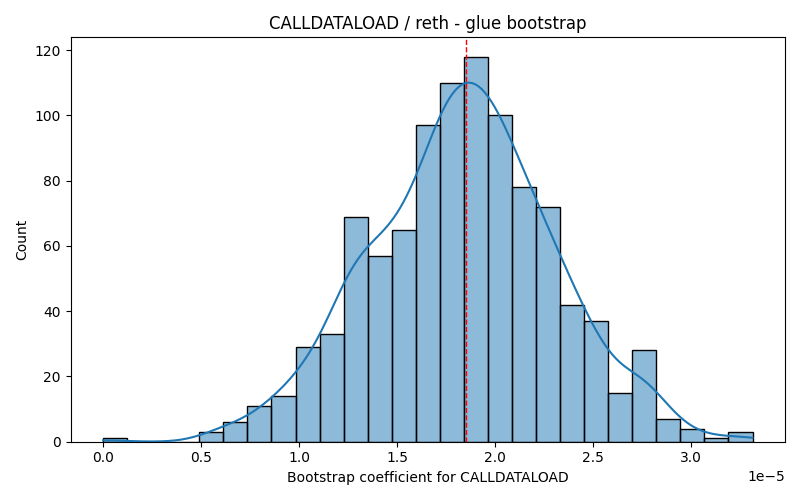

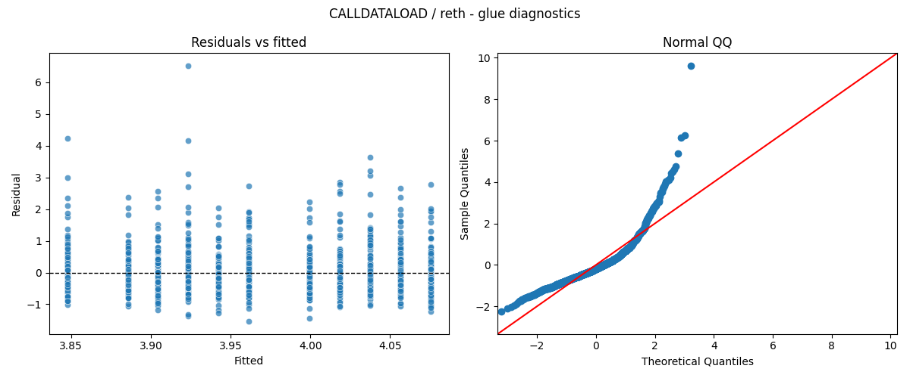

</details>

<details><summary><code>DIV</code> · nobs=374 · runtime_ms=6.873e-06 · p=1.00e-03 · R²=0.8473</summary>

```
==============================================================================
                           NNLS Regression Results                            
==============================================================================
Dep. Variable:          test_runtime_ms              R-squared:          0.847
Model:                  NNLS                    Adj. R-squared:          0.847
No. Observations:       374                               RMSE:          23.04
Df Residuals:           372                                MAE:          19.61
Df Model:               1      
==============================================================================
                      coef     std err     P-value      [0.025      0.975]
------------------------------------------------------------------------------
         const     60.9415      4.3637       0.001     52.6922     69.7456
           DIV      0.0000      0.0000       0.001      0.0000      0.0000
==============================================================================
Notes: Non-negative least squares with bootstrap inference (1000 iterations)
==============================================================================
```

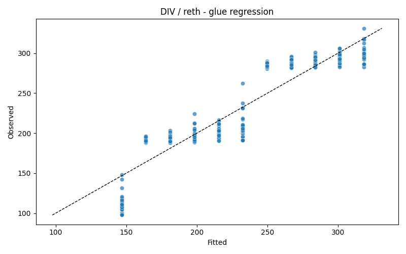

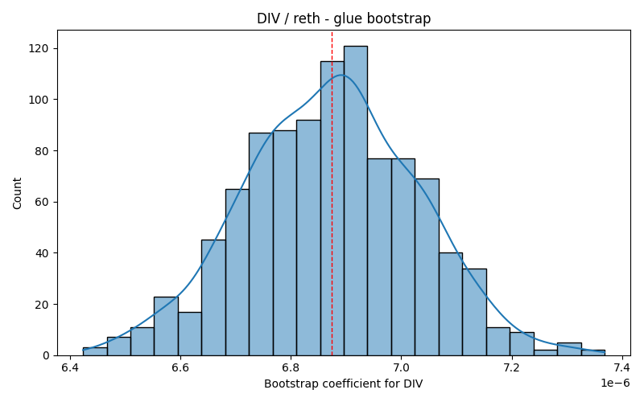

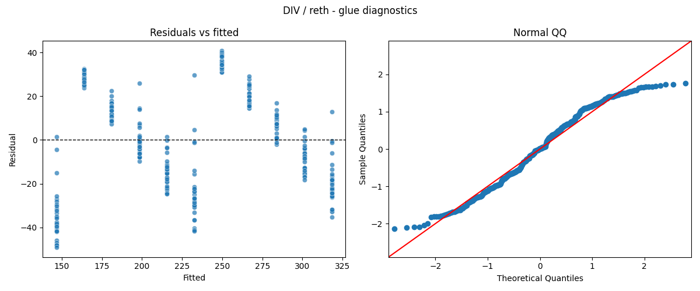

</details>

<details><summary><code>EXP</code> · nobs=374 · runtime_ms=0.0004937 · p=1.00e-03 · R²=0.8414</summary>

```
==============================================================================
                           NNLS Regression Results                            
==============================================================================
Dep. Variable:          test_runtime_ms              R-squared:          0.841
Model:                  NNLS                    Adj. R-squared:          0.841
No. Observations:       374                               RMSE:           8.39
Df Residuals:           372                                MAE:           6.99
Df Model:               1      
==============================================================================
                      coef     std err     P-value      [0.025      0.975]
------------------------------------------------------------------------------
         const     24.1113      1.5579       0.001     20.8995     27.1424
           EXP      0.0005      0.0000       0.001      0.0005      0.0005
==============================================================================
Notes: Non-negative least squares with bootstrap inference (1000 iterations)
==============================================================================
```

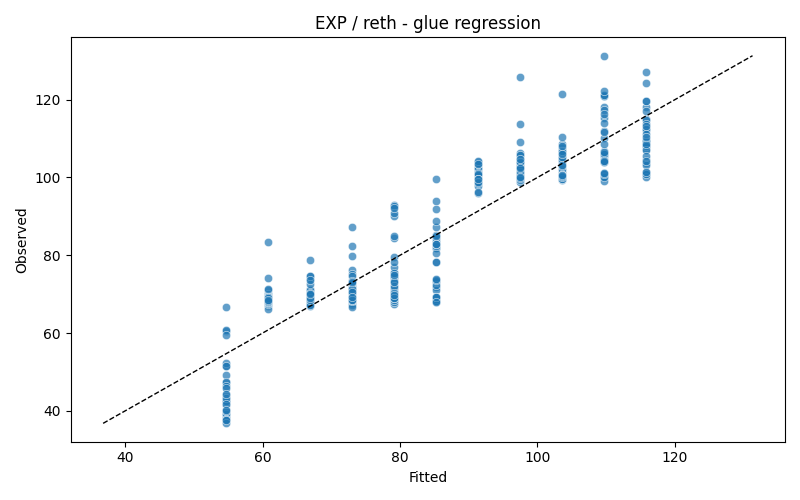


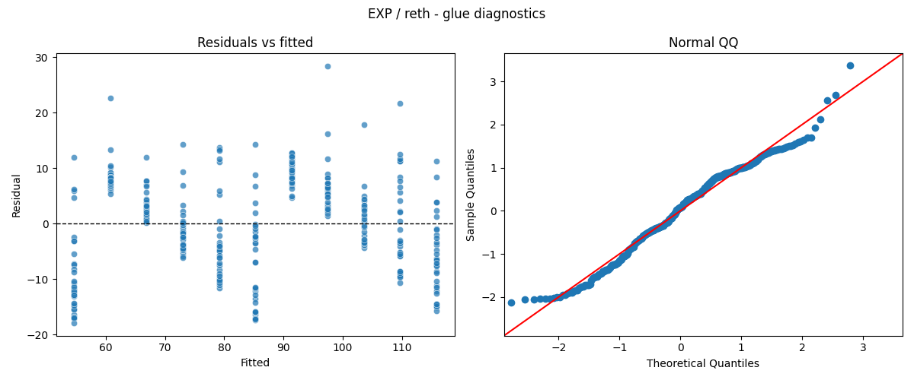

</details>

<details><summary><code>GT</code> · nobs=374 · runtime_ms=8.867e-07 · p=1.00e-03 · R²=0.7841</summary>

```
==============================================================================
                           NNLS Regression Results                            
==============================================================================
Dep. Variable:          test_runtime_ms              R-squared:          0.784
Model:                  NNLS                    Adj. R-squared:          0.784
No. Observations:       374                               RMSE:           4.90
Df Residuals:           372                                MAE:           3.63
Df Model:               1      
==============================================================================
                      coef     std err     P-value      [0.025      0.975]
------------------------------------------------------------------------------
         const     13.5413      0.8702       0.001     11.9238     15.3068
            GT      0.0000      0.0000       0.001      0.0000      0.0000
==============================================================================
Notes: Non-negative least squares with bootstrap inference (1000 iterations)
==============================================================================
```

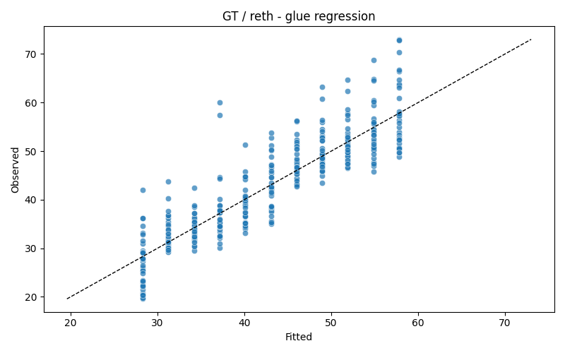

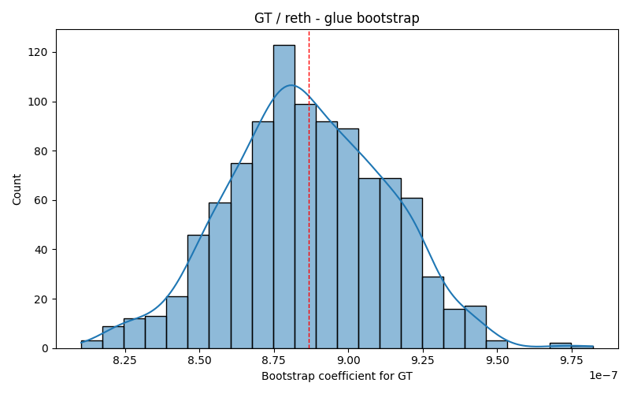

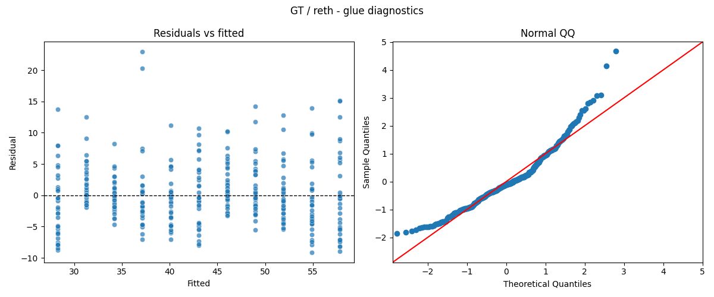

</details>

<details><summary><code>JUMPI</code> · nobs=374 · runtime_ms=1.229e-06 · p=1.00e-03 · R²=0.651</summary>

```
==============================================================================
                           NNLS Regression Results                            
==============================================================================
Dep. Variable:          test_runtime_ms              R-squared:          0.651
Model:                  NNLS                    Adj. R-squared:          0.650
No. Observations:       374                               RMSE:           4.06
Df Residuals:           372                                MAE:           3.11
Df Model:               1      
==============================================================================
                      coef     std err     P-value      [0.025      0.975]
------------------------------------------------------------------------------
         const     10.6848      0.6238       0.001      9.5063     11.9904
         JUMPI      0.0000      0.0000       0.001      0.0000      0.0000
==============================================================================
Notes: Non-negative least squares with bootstrap inference (1000 iterations)
==============================================================================
```

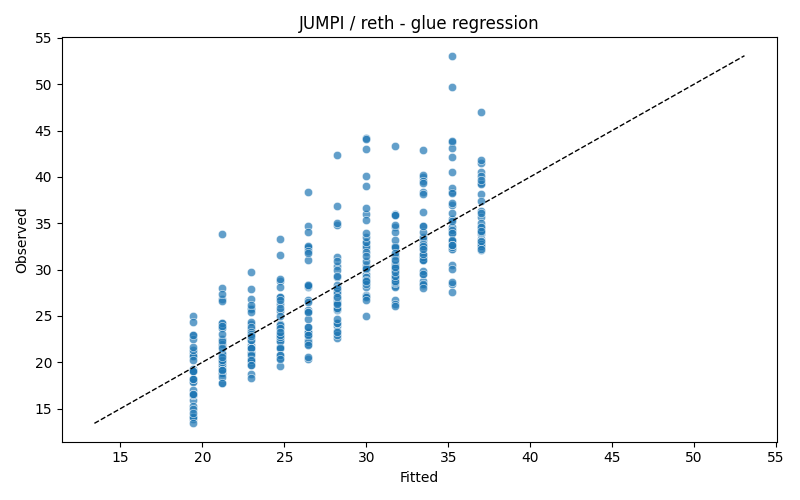

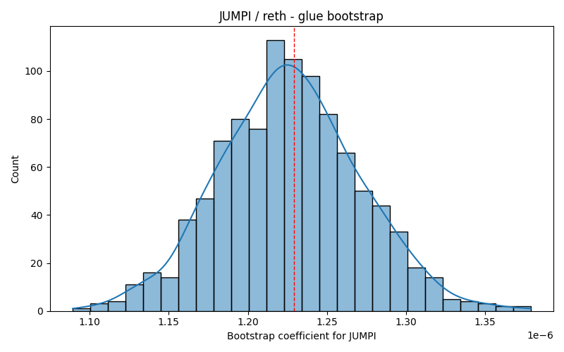

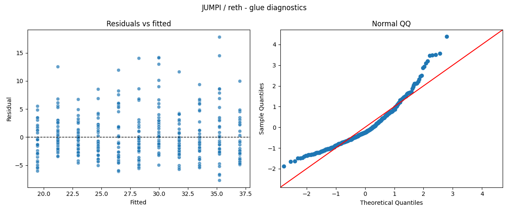

</details>

<details><summary><code>LT</code> · nobs=374 · runtime_ms=9.159e-07 · p=1.00e-03 · R²=0.7995</summary>

```
==============================================================================
                           NNLS Regression Results                            
==============================================================================
Dep. Variable:          test_runtime_ms              R-squared:          0.799
Model:                  NNLS                    Adj. R-squared:          0.799
No. Observations:       374                               RMSE:           4.83
Df Residuals:           372                                MAE:           3.81
Df Model:               1      
==============================================================================
                      coef     std err     P-value      [0.025      0.975]
------------------------------------------------------------------------------
         const     12.2341      0.8369       0.001     10.6947     13.9700
            LT      0.0000      0.0000       0.001      0.0000      0.0000
==============================================================================
Notes: Non-negative least squares with bootstrap inference (1000 iterations)
==============================================================================
```

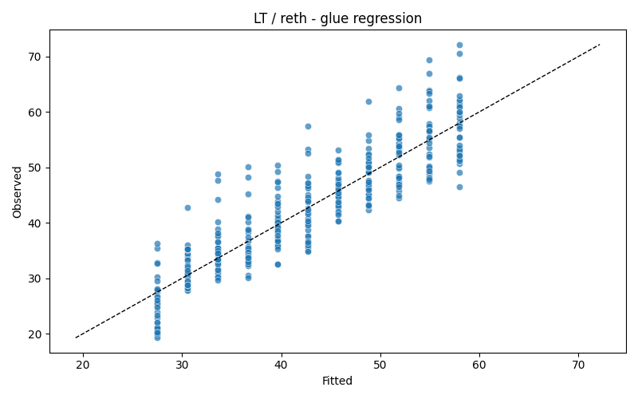

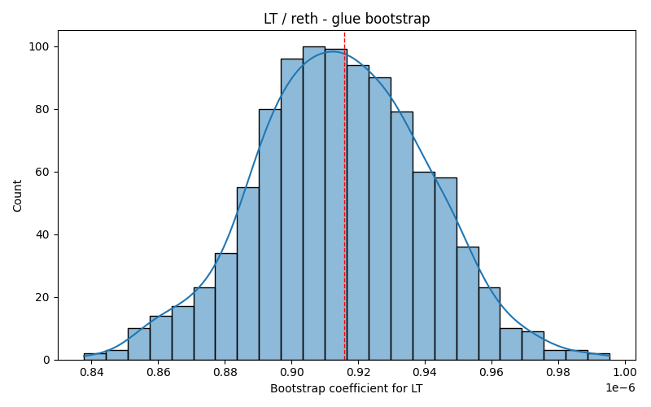

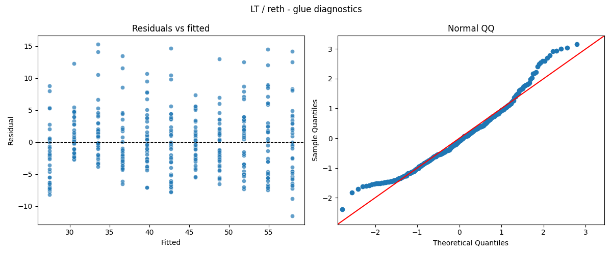

</details>

<details><summary><code>MSTORE</code> · nobs=1870 · runtime_ms=2.561e-06 · p=1.00e-03 · R²=0.3012</summary>

```
==============================================================================
                           NNLS Regression Results                            
==============================================================================
Dep. Variable:          test_runtime_ms              R-squared:          0.301
Model:                  NNLS                    Adj. R-squared:          0.301
No. Observations:       1870                              RMSE:          27.37
Df Residuals:           1868                               MAE:          24.38
Df Model:               1      
==============================================================================
                      coef     std err     P-value      [0.025      0.975]
------------------------------------------------------------------------------
         const     21.1415      1.8541       0.001     17.5558     24.7259
        MSTORE      0.0000      0.0000       0.001      0.0000      0.0000
==============================================================================
Notes: Non-negative least squares with bootstrap inference (1000 iterations)
==============================================================================
```

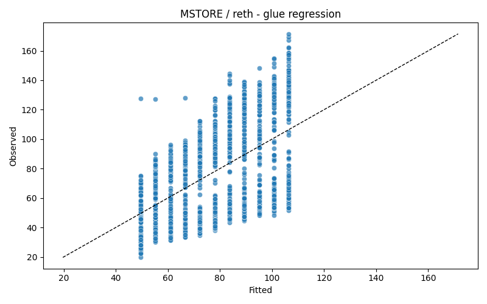

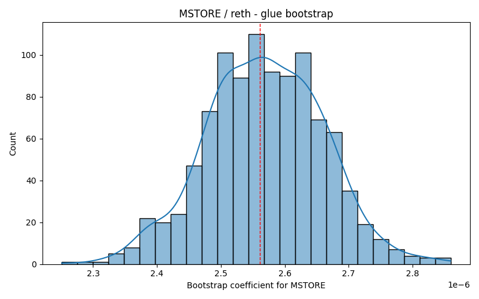

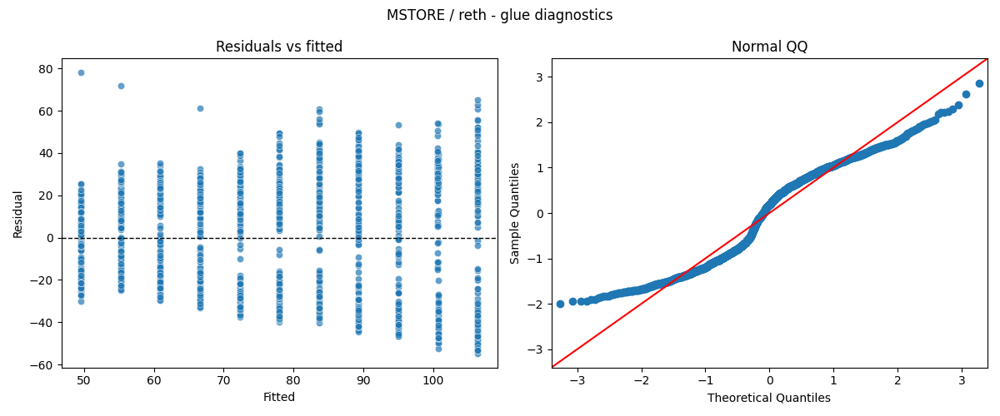

</details>

<details><summary><code>MSTORE8</code> · nobs=1870 · runtime_ms=1.32e-06 · p=1.00e-03 · R²=0.5748</summary>

```
==============================================================================
                           NNLS Regression Results                            
==============================================================================
Dep. Variable:          test_runtime_ms              R-squared:          0.575
Model:                  NNLS                    Adj. R-squared:          0.575
No. Observations:       1870                              RMSE:           7.97
Df Residuals:           1868                               MAE:           4.61
Df Model:               1      
==============================================================================
                      coef     std err     P-value      [0.025      0.975]
------------------------------------------------------------------------------
         const     14.4294      0.5882       0.001     13.2794     15.5953
       MSTORE8      0.0000      0.0000       0.001      0.0000      0.0000
==============================================================================
Notes: Non-negative least squares with bootstrap inference (1000 iterations)
==============================================================================
```

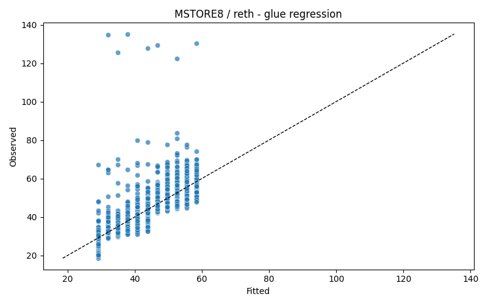

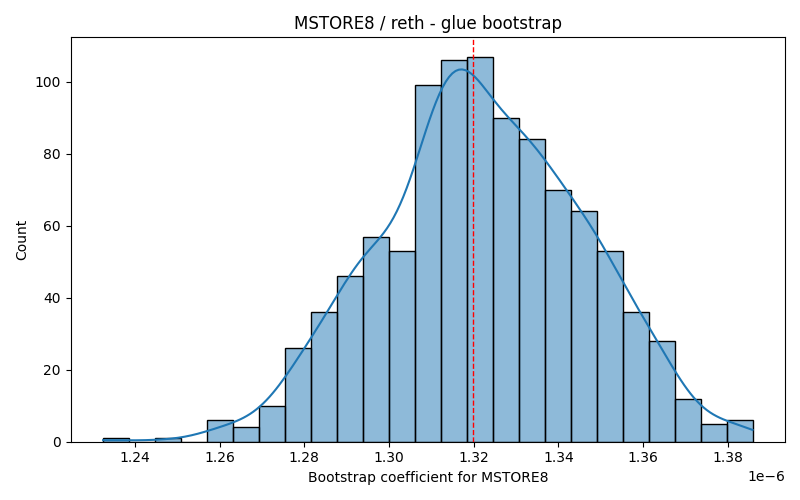

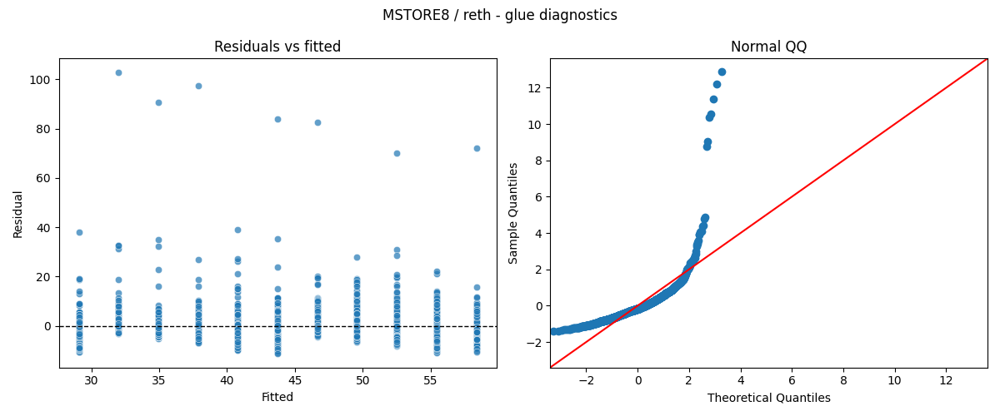

</details>

<details><summary><code>MUL</code> · nobs=374 · runtime_ms=1.054e-06 · p=1.00e-03 · R²=0.638</summary>

```
==============================================================================
                           NNLS Regression Results                            
==============================================================================
Dep. Variable:          test_runtime_ms              R-squared:          0.638
Model:                  NNLS                    Adj. R-squared:          0.637
No. Observations:       374                               RMSE:           6.27
Df Residuals:           372                                MAE:           4.08
Df Model:               1      
==============================================================================
                      coef     std err     P-value      [0.025      0.975]
------------------------------------------------------------------------------
         const     14.4588      1.1430       0.001     12.3183     16.8062
           MUL      0.0000      0.0000       0.001      0.0000      0.0000
==============================================================================
Notes: Non-negative least squares with bootstrap inference (1000 iterations)
==============================================================================
```

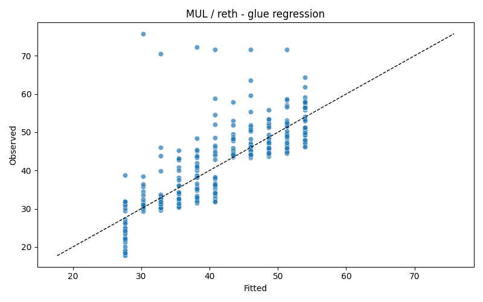

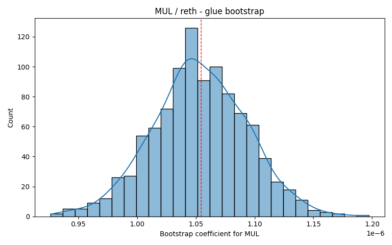

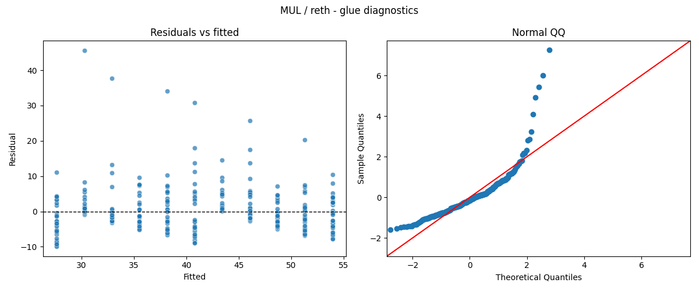

</details>

<details><summary><code>PC</code> · nobs=374 · runtime_ms=6.285e-07 · p=1.00e-03 · R²=0.9016</summary>

```
==============================================================================
                           NNLS Regression Results                            
==============================================================================
Dep. Variable:          test_runtime_ms              R-squared:          0.902
Model:                  NNLS                    Adj. R-squared:          0.901
No. Observations:       374                               RMSE:           6.21
Df Residuals:           372                                MAE:           4.83
Df Model:               1      
==============================================================================
                      coef     std err     P-value      [0.025      0.975]
------------------------------------------------------------------------------
         const     14.9571      1.0386       0.001     12.9440     17.0162
            PC      0.0000      0.0000       0.001      0.0000      0.0000
==============================================================================
Notes: Non-negative least squares with bootstrap inference (1000 iterations)
==============================================================================
```

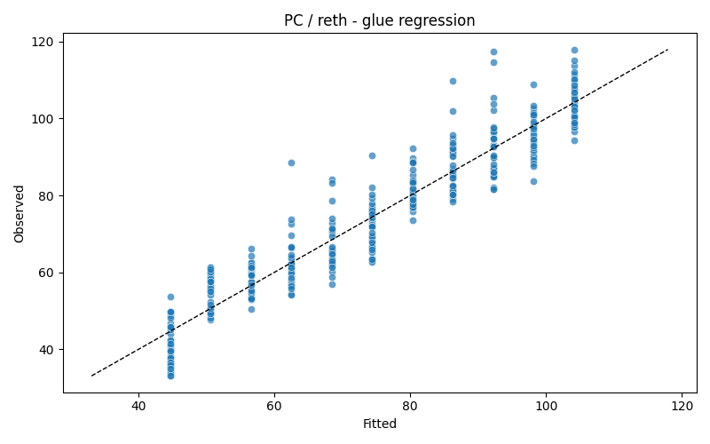

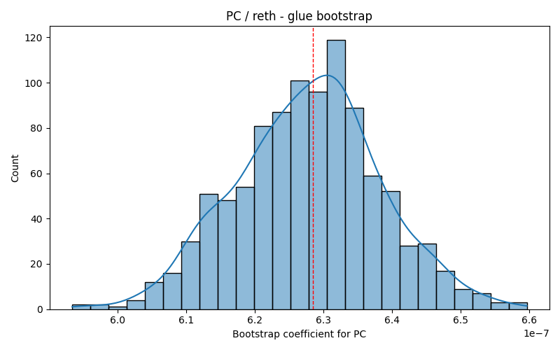

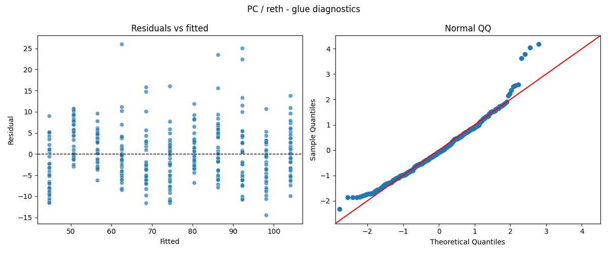

</details>

<details><summary><code>RETURNDATASIZE</code> · nobs=1496 · runtime_ms=7.94e-07 · p=1.00e-03 · R²=0.8356</summary>

```
==============================================================================
                           NNLS Regression Results                            
==============================================================================
Dep. Variable:          test_runtime_ms              R-squared:          0.836
Model:                  NNLS                    Adj. R-squared:          0.836
No. Observations:       1496                              RMSE:           5.56
Df Residuals:           1494                               MAE:           4.26
Df Model:               1      
==============================================================================
                      coef     std err     P-value      [0.025      0.975]
------------------------------------------------------------------------------
         const     15.9305      0.4787       0.001     14.9956     16.8883
RETURNDATASIZE      0.0000      0.0000       0.001      0.0000      0.0000
==============================================================================
Notes: Non-negative least squares with bootstrap inference (1000 iterations)
==============================================================================
```

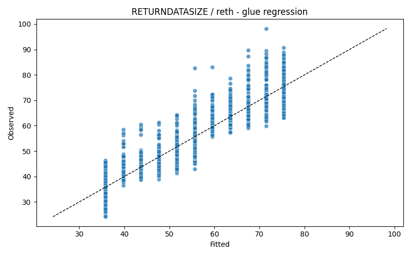

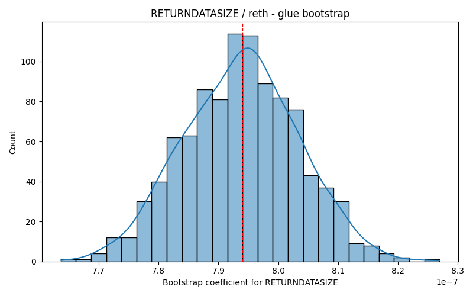

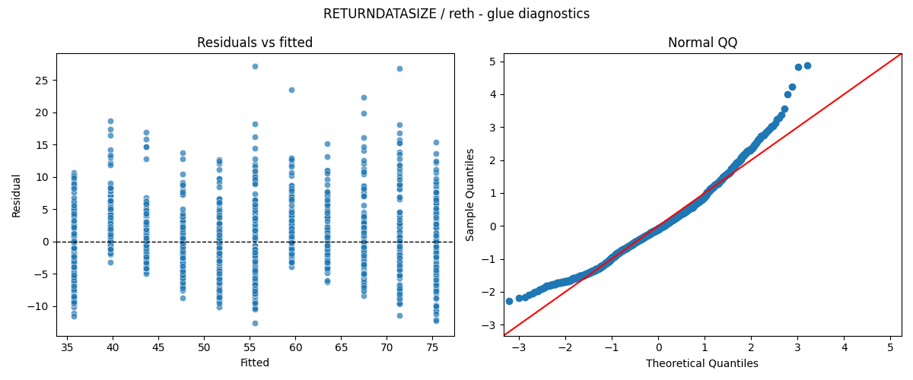

</details>

<details><summary><code>SELFBALANCE</code> · nobs=306 · runtime_ms=3.786e-06 · p=1.00e-03 · R²=0.8143</summary>

```
==============================================================================
                           NNLS Regression Results                            
==============================================================================
Dep. Variable:          test_runtime_ms              R-squared:          0.814
Model:                  NNLS                    Adj. R-squared:          0.814
No. Observations:       306                               RMSE:          18.24
Df Residuals:           304                                MAE:          14.90
Df Model:               1      
==============================================================================
                      coef     std err     P-value      [0.025      0.975]
------------------------------------------------------------------------------
         const     61.0803      3.5976       0.001     53.5399     68.0608
   SELFBALANCE      0.0000      0.0000       0.001      0.0000      0.0000
==============================================================================
Notes: Non-negative least squares with bootstrap inference (1000 iterations)
==============================================================================
```

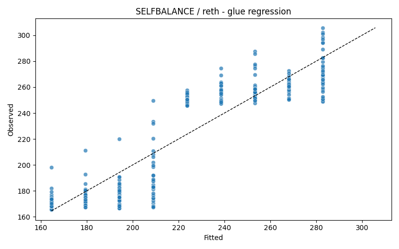

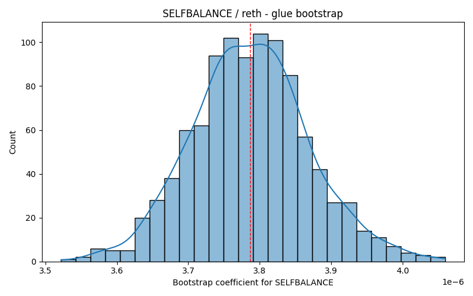

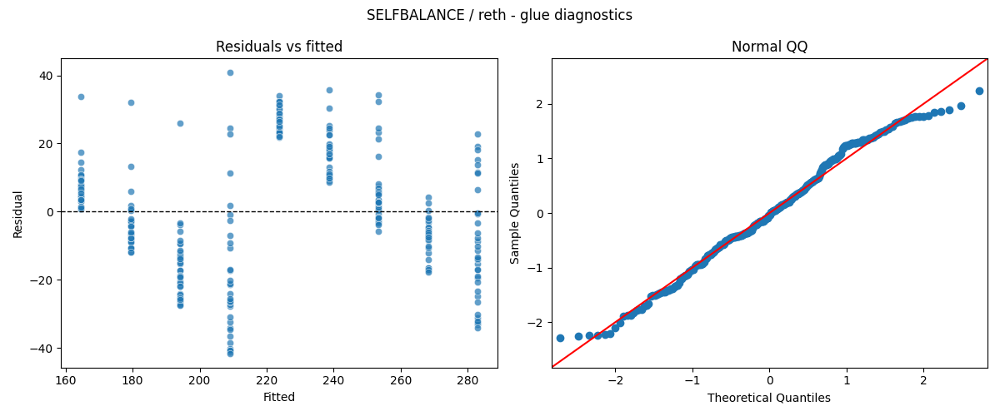

</details>

<details><summary><code>SUB</code> · nobs=374 · runtime_ms=8.275e-07 · p=1.00e-03 · R²=0.7872</summary>

```
==============================================================================
                           NNLS Regression Results                            
==============================================================================
Dep. Variable:          test_runtime_ms              R-squared:          0.787
Model:                  NNLS                    Adj. R-squared:          0.787
No. Observations:       374                               RMSE:           4.53
Df Residuals:           372                                MAE:           3.48
Df Model:               1      
==============================================================================
                      coef     std err     P-value      [0.025      0.975]
------------------------------------------------------------------------------
         const     12.1206      0.7951       0.001     10.5714     13.5978
           SUB      0.0000      0.0000       0.001      0.0000      0.0000
==============================================================================
Notes: Non-negative least squares with bootstrap inference (1000 iterations)
==============================================================================
```

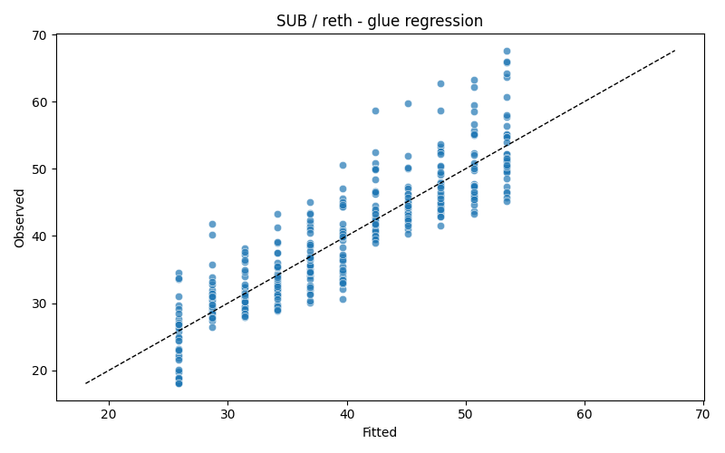

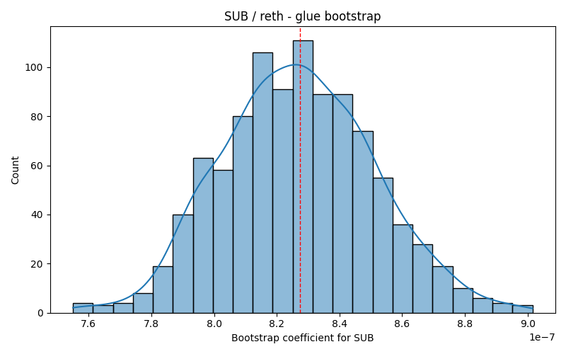


</details>

### Mixed glue (tier B) · reth

<details><summary><code>JUMP</code> · nobs=374 · runtime_ms=2.173e-06 · p=1.00e-03 · R²=0.7511</summary>

```
==============================================================================
                           NNLS Regression Results                            
==============================================================================
Dep. Variable:          test_runtime_ms              R-squared:          0.751
Model:                  NNLS                    Adj. R-squared:          0.750
No. Observations:       374                               RMSE:           4.65
Df Residuals:           372                                MAE:           3.53
Df Model:               1      
==============================================================================
                      coef     std err     P-value      [0.025      0.975]
------------------------------------------------------------------------------
         const     12.1175      0.8770       0.001     10.4826     13.9419
          JUMP      0.0000      0.0000       0.001      0.0000      0.0000
==============================================================================
Notes: Non-negative least squares with bootstrap inference (1000 iterations)
==============================================================================
```


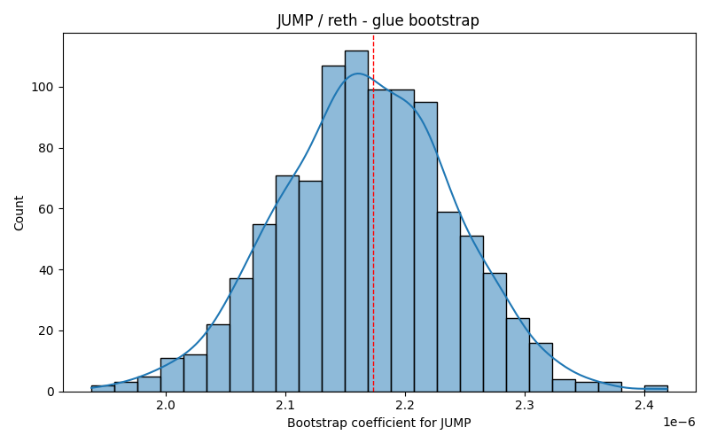


</details>

<details><summary><code>KECCAK256</code> · nobs=5984 · runtime_ms=0 · p=1.00e+00 · R²=0</summary>

```
==============================================================================
                           NNLS Regression Results                            
==============================================================================
Dep. Variable:          test_runtime_ms              R-squared:          0.000
Model:                  NNLS                    Adj. R-squared:         -0.000
No. Observations:       5984                              RMSE:         158.04
Df Residuals:           5982                               MAE:         133.26
Df Model:               1      
==============================================================================
                      coef     std err     P-value      [0.025      0.975]
------------------------------------------------------------------------------
         const    251.3441      2.0892       0.001    247.2656    255.3752
     KECCAK256      0.0000      0.0000       1.000      0.0000      0.0000
==============================================================================
Notes: Non-negative least squares with bootstrap inference (1000 iterations)
==============================================================================
```

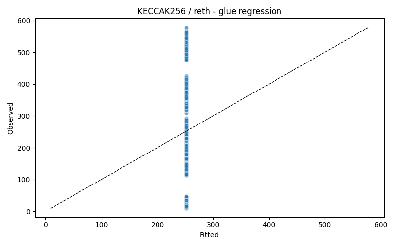


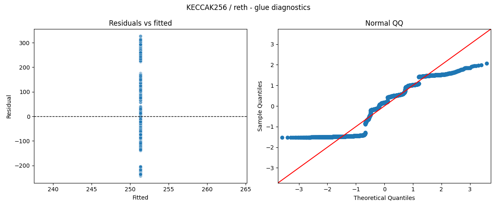

</details>
