# Runtime estimation report

Per-spec NNLS fits of `test_runtime_ms` against `opcount`, one row per (target opcode, test, model_by combo, client).

## Contents

- [SLOAD](#sload)
- [SSTORE](#sstore)
- [BALANCE](#balance)
- [CALL](#call)
- [CALLCODE](#callcode)
- [DELEGATECALL](#delegatecall)
- [EXTCODECOPY](#extcodecopy)
- [EXTCODEHASH](#extcodehash)
- [EXTCODESIZE](#extcodesize)
- [STATICCALL](#staticcall)

## SLOAD

### test_sload_bloated — combo `False`

| client | nobs | R² | target_coef (ms) | p-value | 95% CI |
| --- | --- | --- | --- | --- | --- |
| `besu` | 253 | 0.9306 | 0.008012 | 1.00e-03 | [0.00774, 0.008284] |
| `erigon` | 110 | 0.9693 | 0.005882 | 1.00e-03 | [0.005697, 0.005982] |
| `ethrex` | 176 | 0.9128 | 0.008552 | 1.00e-03 | [0.008392, 0.008705] |
| `geth` | 154 | 0.9683 | 0.02436 | 1.00e-03 | [0.02365, 0.02505] |
| `nethermind` | 132 | 0.8215 | 0.003451 | 1.00e-03 | [0.003165, 0.003789] |
| `reth` | 198 | 0.9572 | 0.00127 | 1.00e-03 | [0.001232, 0.001307] |

<details><summary>besu — NNLS regression summary</summary>

```
==============================================================================
                           NNLS Regression Results                            
==============================================================================
Dep. Variable:          test_runtime_ms              R-squared:          0.931
Model:                  NNLS                    Adj. R-squared:          0.930
No. Observations:       253                               RMSE:          64.38
Df Residuals:           251                                MAE:          52.53
Df Model:               1      
==============================================================================
                      coef     std err     P-value      [0.025      0.975]
------------------------------------------------------------------------------
         const    119.0433     12.5164       0.001     93.7566    143.7959
       opcount      0.0080      0.0001       0.001      0.0077      0.0083
==============================================================================
Notes: Non-negative least squares with bootstrap inference (1000 iterations)
==============================================================================
```

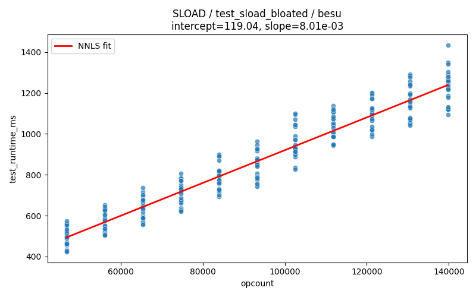

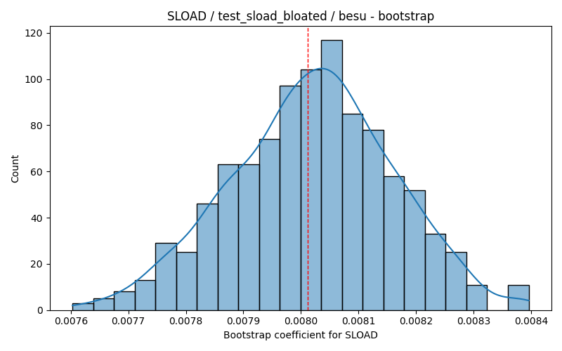

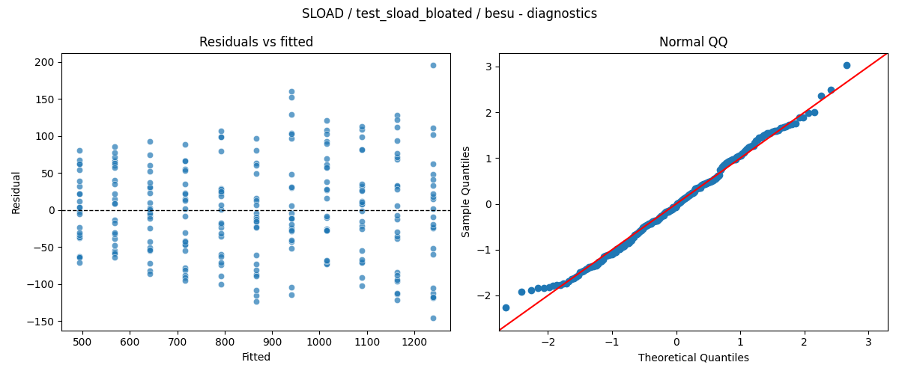

</details>

<details><summary>erigon — NNLS regression summary</summary>

```
==============================================================================
                           NNLS Regression Results                            
==============================================================================
Dep. Variable:          test_runtime_ms              R-squared:          0.969
Model:                  NNLS                    Adj. R-squared:          0.969
No. Observations:       110                               RMSE:          30.79
Df Residuals:           108                                MAE:          21.93
Df Model:               1      
==============================================================================
                      coef     std err     P-value      [0.025      0.975]
------------------------------------------------------------------------------
         const      3.3579      5.8155       0.343      0.0000     19.1856
       opcount      0.0059      0.0001       0.001      0.0057      0.0060
==============================================================================
Notes: Non-negative least squares with bootstrap inference (1000 iterations)
==============================================================================
```

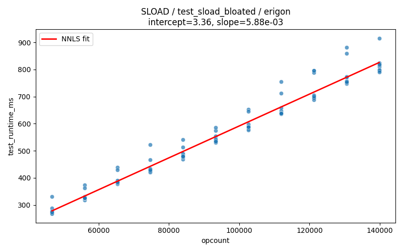

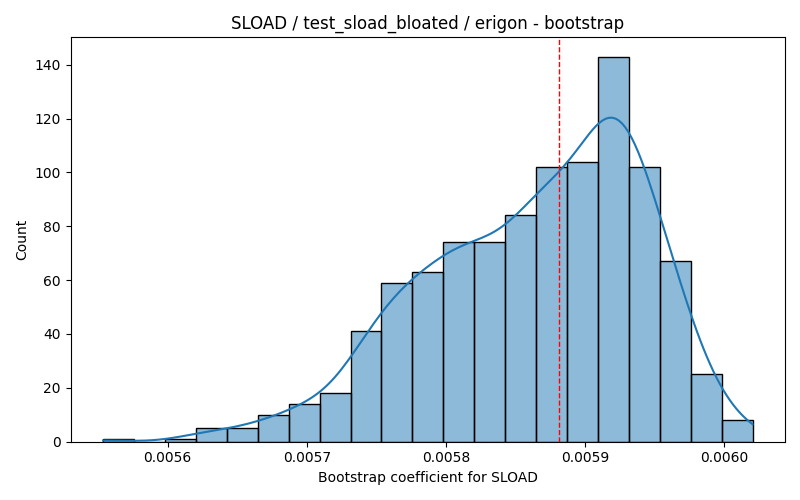

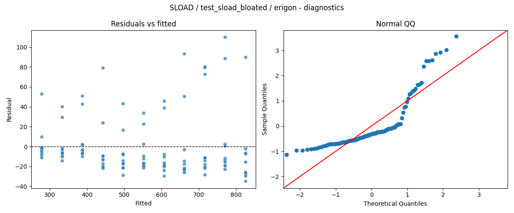

</details>

<details><summary>ethrex — NNLS regression summary</summary>

```
==============================================================================
                           NNLS Regression Results                            
==============================================================================
Dep. Variable:          test_runtime_ms              R-squared:          0.913
Model:                  NNLS                    Adj. R-squared:          0.912
No. Observations:       176                               RMSE:         100.12
Df Residuals:           174                                MAE:          88.06
Df Model:               1      
==============================================================================
                      coef     std err     P-value      [0.025      0.975]
------------------------------------------------------------------------------
         const      0.0000      0.0000       1.000      0.0000      0.0000
       opcount      0.0086      0.0001       0.001      0.0084      0.0087
==============================================================================
Notes: Non-negative least squares with bootstrap inference (1000 iterations)
==============================================================================
```

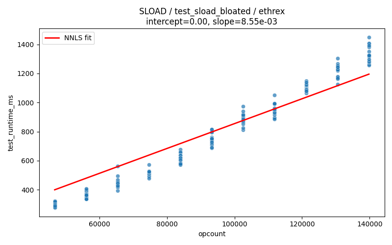

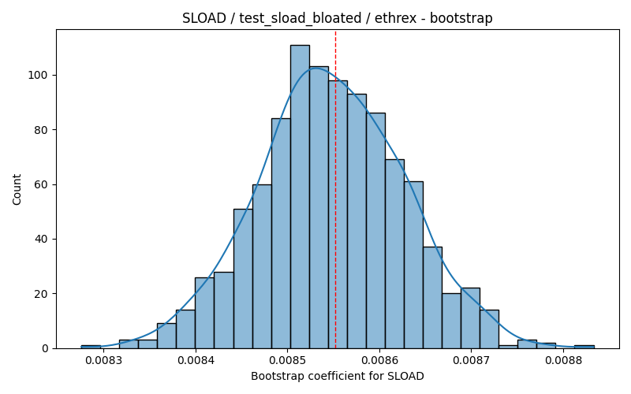

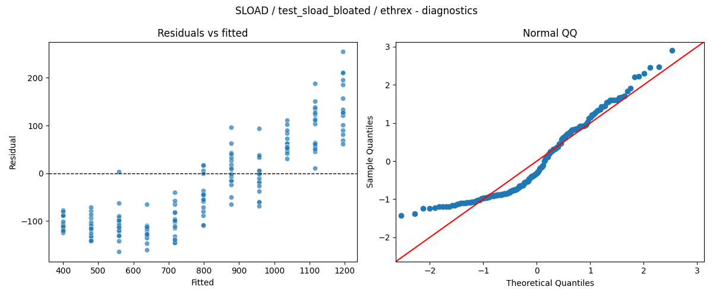

</details>

<details><summary>geth — NNLS regression summary</summary>

```
==============================================================================
                           NNLS Regression Results                            
==============================================================================
Dep. Variable:          test_runtime_ms              R-squared:          0.968
Model:                  NNLS                    Adj. R-squared:          0.968
No. Observations:       154                               RMSE:         129.64
Df Residuals:           152                                MAE:         104.62
Df Model:               1      
==============================================================================
                      coef     std err     P-value      [0.025      0.975]
------------------------------------------------------------------------------
         const    557.8925     32.3672       0.001    497.9998    623.0731
       opcount      0.0244      0.0004       0.001      0.0237      0.0251
==============================================================================
Notes: Non-negative least squares with bootstrap inference (1000 iterations)
==============================================================================
```

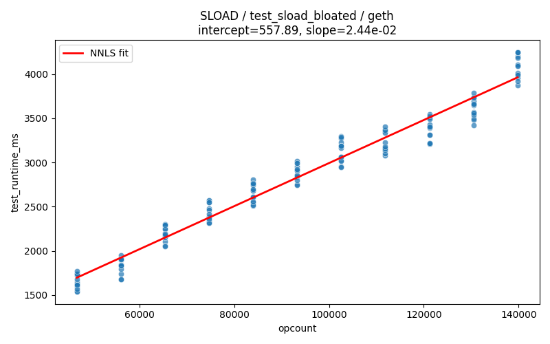

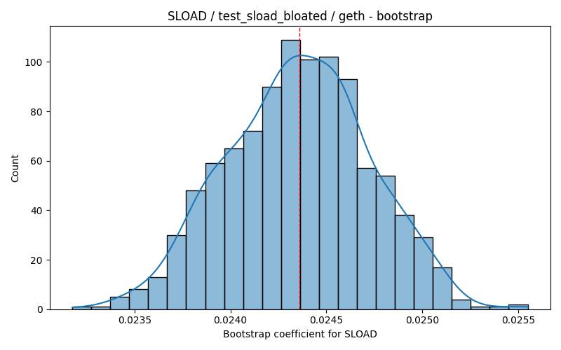

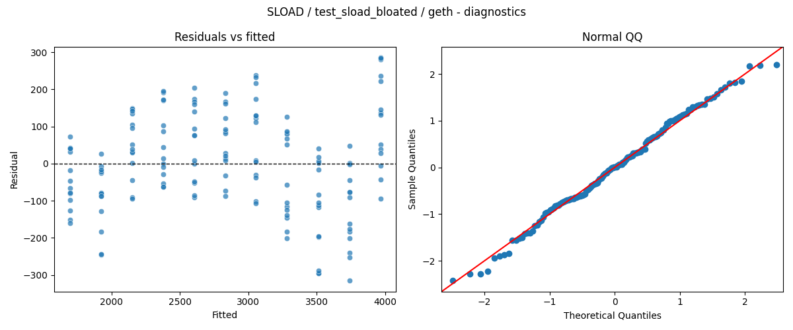

</details>

<details><summary>nethermind — NNLS regression summary</summary>

```
==============================================================================
                           NNLS Regression Results                            
==============================================================================
Dep. Variable:          test_runtime_ms              R-squared:          0.822
Model:                  NNLS                    Adj. R-squared:          0.820
No. Observations:       132                               RMSE:          47.35
Df Residuals:           130                                MAE:          29.94
Df Model:               1      
==============================================================================
                      coef     std err     P-value      [0.025      0.975]
------------------------------------------------------------------------------
         const     52.2126     13.1563       0.001     24.8755     76.6098
       opcount      0.0035      0.0002       0.001      0.0032      0.0038
==============================================================================
Notes: Non-negative least squares with bootstrap inference (1000 iterations)
==============================================================================
```

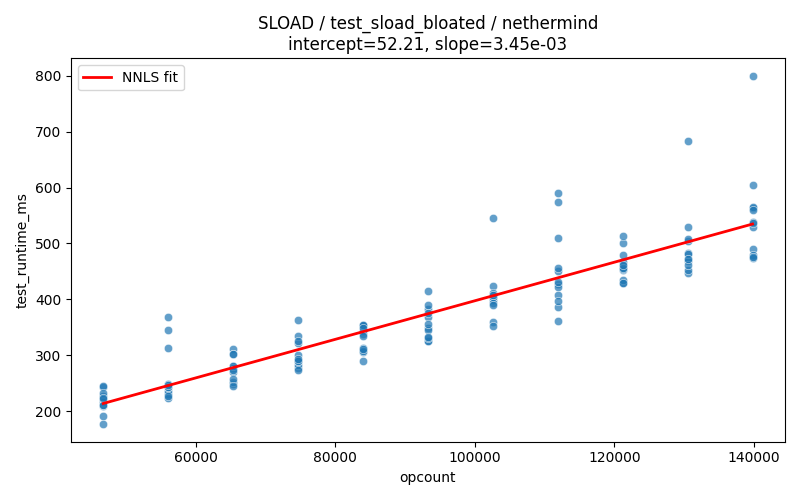

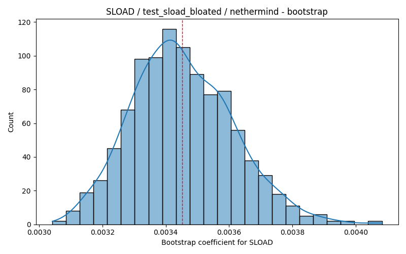

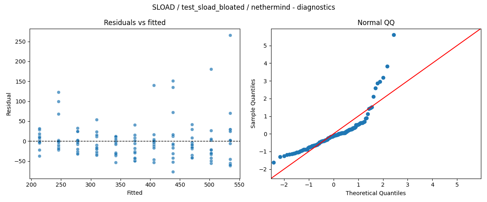

</details>

<details><summary>reth — NNLS regression summary</summary>

```
==============================================================================
                           NNLS Regression Results                            
==============================================================================
Dep. Variable:          test_runtime_ms              R-squared:          0.957
Model:                  NNLS                    Adj. R-squared:          0.957
No. Observations:       198                               RMSE:           7.90
Df Residuals:           196                                MAE:           6.18
Df Model:               1      
==============================================================================
                      coef     std err     P-value      [0.025      0.975]
------------------------------------------------------------------------------
         const     39.3945      1.8075       0.001     35.8720     43.1625
       opcount      0.0013      0.0000       0.001      0.0012      0.0013
==============================================================================
Notes: Non-negative least squares with bootstrap inference (1000 iterations)
==============================================================================
```

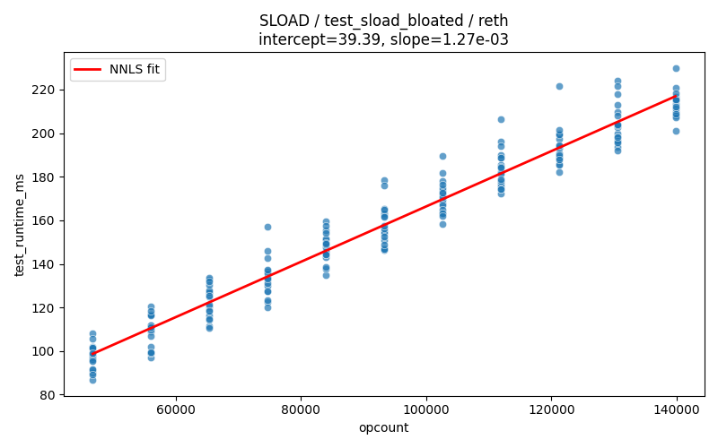

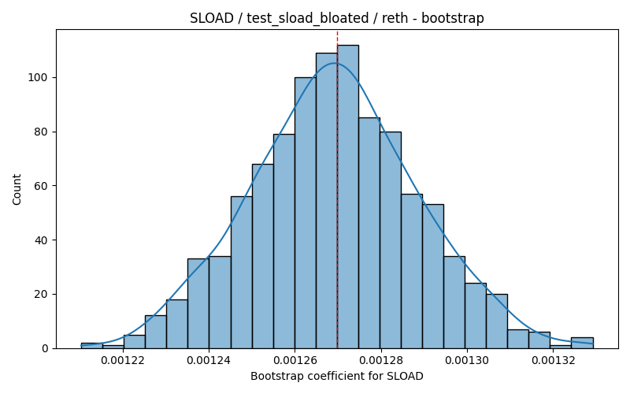

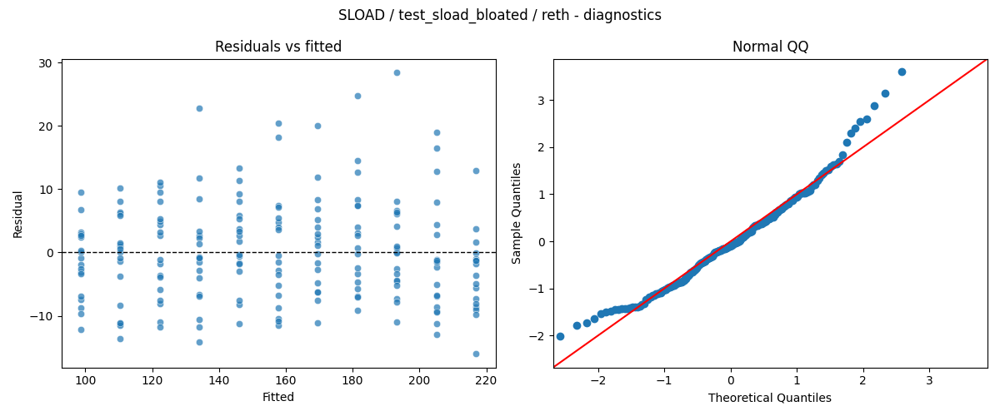

</details>

### test_sload_bloated — combo `True`

| client | nobs | R² | target_coef (ms) | p-value | 95% CI |
| --- | --- | --- | --- | --- | --- |
| `besu` | 253 | 0.9597 | 0.01536 | 1.00e-03 | [0.01497, 0.01575] |
| `erigon` | 110 | 0.9757 | 0.005289 | 1.00e-03 | [0.005153, 0.005342] |
| `ethrex` | 176 | 0.9546 | 0.01269 | 1.00e-03 | [0.01254, 0.01283] |
| `geth` | 154 | 0.9657 | 0.0238 | 1.00e-03 | [0.02303, 0.02452] |
| `nethermind` | 132 | 0.9734 | 0.008998 | 1.00e-03 | [0.008758, 0.009229] |
| `reth` | 198 | 0.9565 | 0.001481 | 1.00e-03 | [0.001438, 0.001528] |

<details><summary>besu — NNLS regression summary</summary>

```
==============================================================================
                           NNLS Regression Results                            
==============================================================================
Dep. Variable:          test_runtime_ms              R-squared:          0.960
Model:                  NNLS                    Adj. R-squared:          0.960
No. Observations:       253                               RMSE:          92.63
Df Residuals:           251                                MAE:          80.42
Df Model:               1      
==============================================================================
                      coef     std err     P-value      [0.025      0.975]
------------------------------------------------------------------------------
         const    333.4095     16.7561       0.001    301.2152    365.5939
       opcount      0.0154      0.0002       0.001      0.0150      0.0157
==============================================================================
Notes: Non-negative least squares with bootstrap inference (1000 iterations)
==============================================================================
```

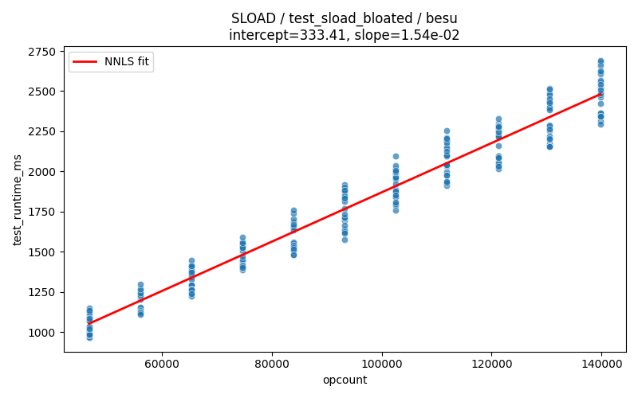

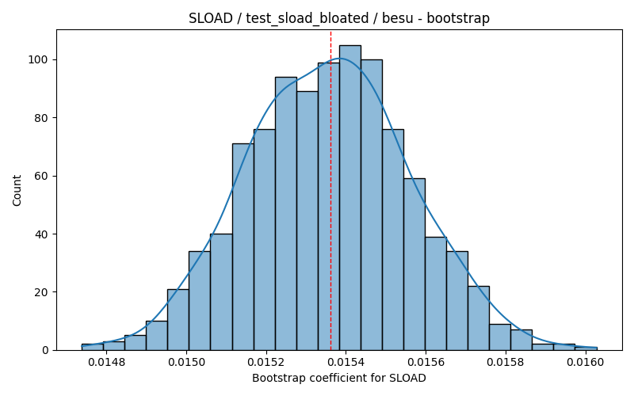

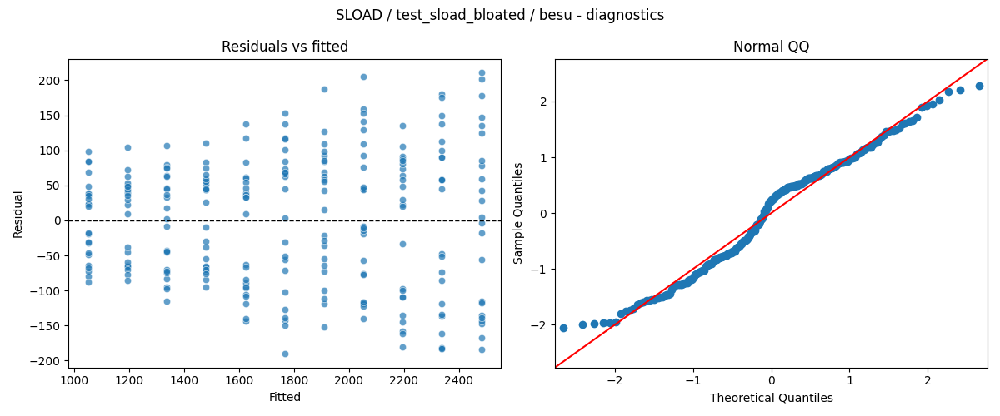

</details>

<details><summary>erigon — NNLS regression summary</summary>

```
==============================================================================
                           NNLS Regression Results                            
==============================================================================
Dep. Variable:          test_runtime_ms              R-squared:          0.976
Model:                  NNLS                    Adj. R-squared:          0.975
No. Observations:       110                               RMSE:          24.60
Df Residuals:           108                                MAE:          18.08
Df Model:               1      
==============================================================================
                      coef     std err     P-value      [0.025      0.975]
------------------------------------------------------------------------------
         const      0.0000      3.2597       1.000      0.0000     10.6968
       opcount      0.0053      0.0000       0.001      0.0052      0.0053
==============================================================================
Notes: Non-negative least squares with bootstrap inference (1000 iterations)
==============================================================================
```

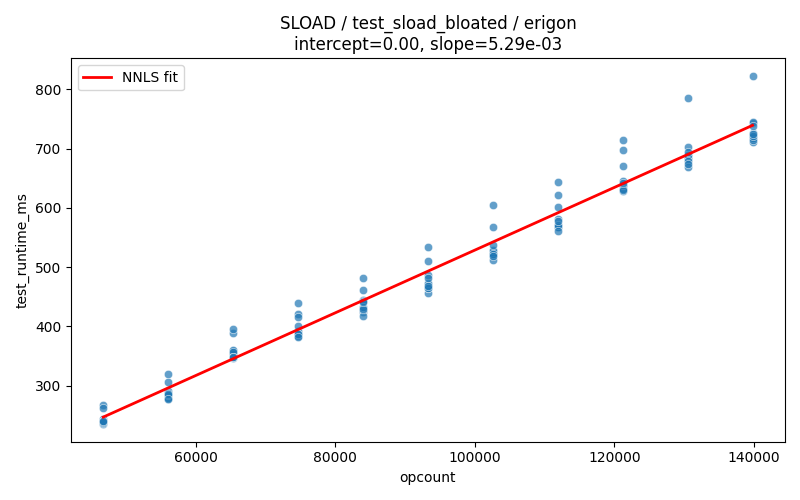

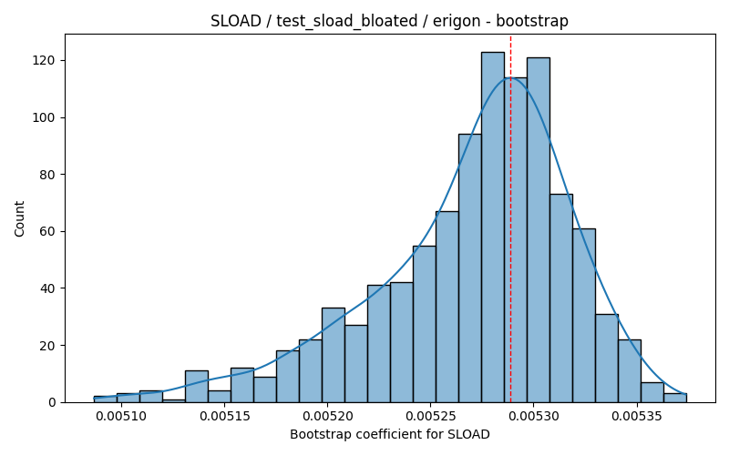

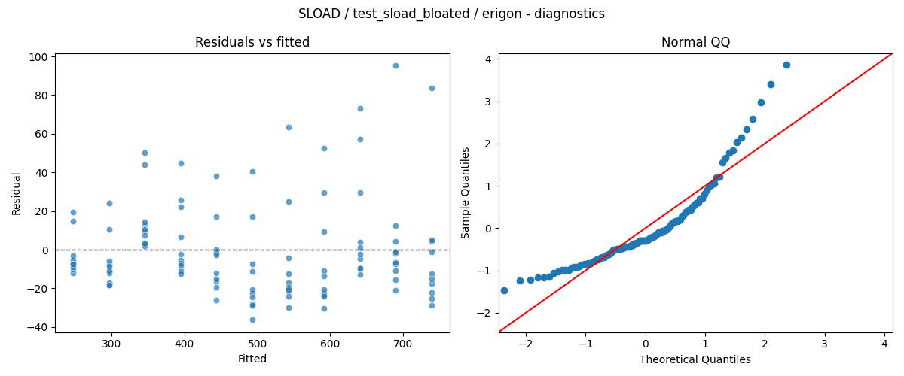

</details>

<details><summary>ethrex — NNLS regression summary</summary>

```
==============================================================================
                           NNLS Regression Results                            
==============================================================================
Dep. Variable:          test_runtime_ms              R-squared:          0.955
Model:                  NNLS                    Adj. R-squared:          0.954
No. Observations:       176                               RMSE:          96.31
Df Residuals:           174                                MAE:          83.37
Df Model:               1      
==============================================================================
                      coef     std err     P-value      [0.025      0.975]
------------------------------------------------------------------------------
         const      0.0000      0.0000       1.000      0.0000      0.0000
       opcount      0.0127      0.0001       0.001      0.0125      0.0128
==============================================================================
Notes: Non-negative least squares with bootstrap inference (1000 iterations)
==============================================================================
```

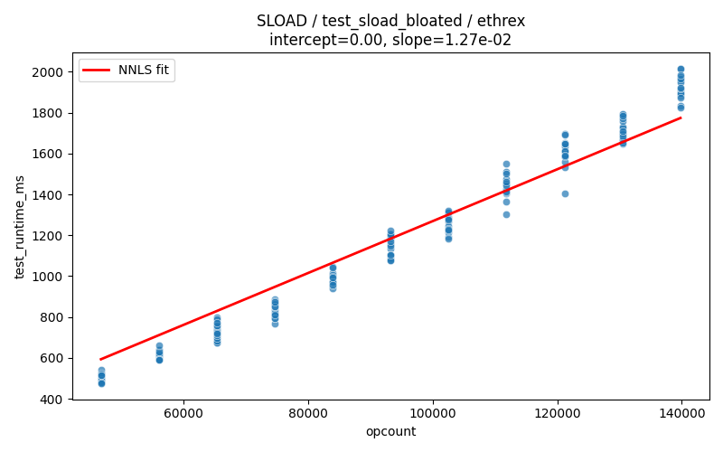

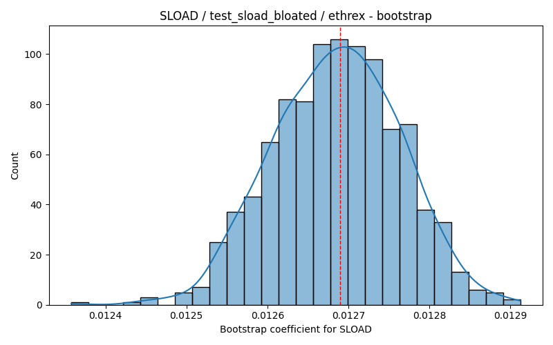

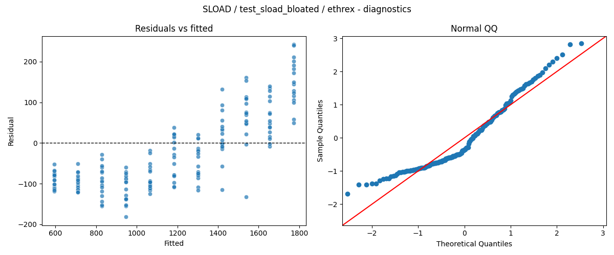

</details>

<details><summary>geth — NNLS regression summary</summary>

```
==============================================================================
                           NNLS Regression Results                            
==============================================================================
Dep. Variable:          test_runtime_ms              R-squared:          0.966
Model:                  NNLS                    Adj. R-squared:          0.966
No. Observations:       154                               RMSE:         131.94
Df Residuals:           152                                MAE:         106.21
Df Model:               1      
==============================================================================
                      coef     std err     P-value      [0.025      0.975]
------------------------------------------------------------------------------
         const    534.5623     34.0216       0.001    471.0224    605.7661
       opcount      0.0238      0.0004       0.001      0.0230      0.0245
==============================================================================
Notes: Non-negative least squares with bootstrap inference (1000 iterations)
==============================================================================
```

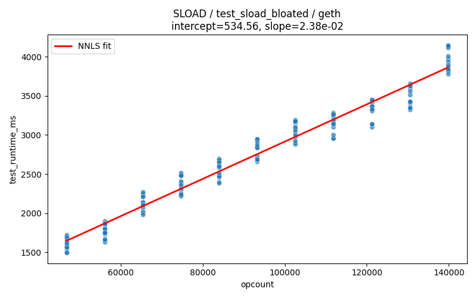

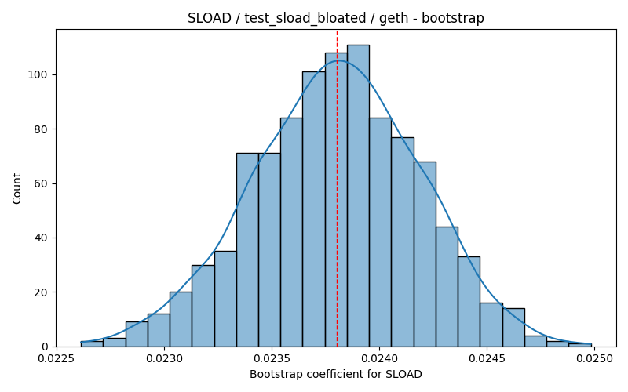

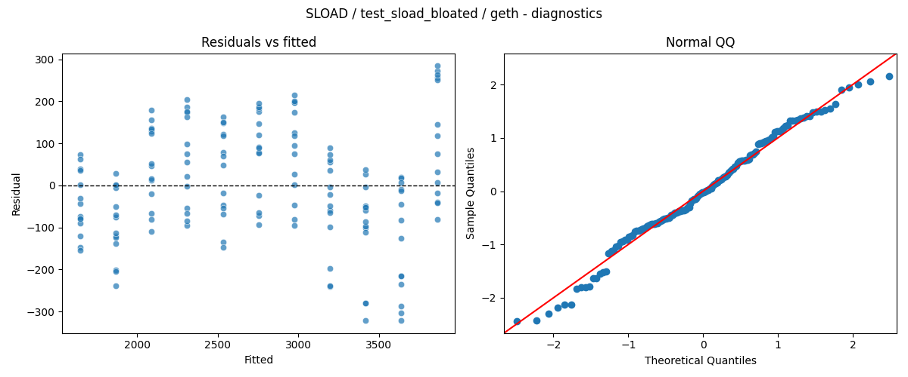

</details>

<details><summary>nethermind — NNLS regression summary</summary>

```
==============================================================================
                           NNLS Regression Results                            
==============================================================================
Dep. Variable:          test_runtime_ms              R-squared:          0.973
Model:                  NNLS                    Adj. R-squared:          0.973
No. Observations:       132                               RMSE:          43.80
Df Residuals:           130                                MAE:          34.39
Df Model:               1      
==============================================================================
                      coef     std err     P-value      [0.025      0.975]
------------------------------------------------------------------------------
         const    101.5486     10.3807       0.001     81.5796    123.4353
       opcount      0.0090      0.0001       0.001      0.0088      0.0092
==============================================================================
Notes: Non-negative least squares with bootstrap inference (1000 iterations)
==============================================================================
```

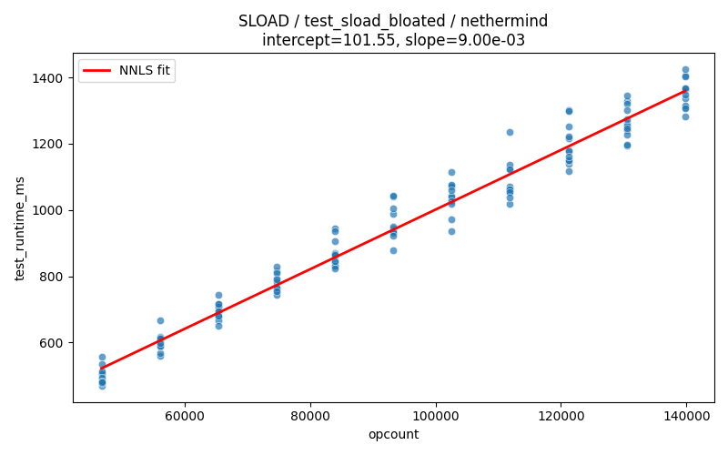

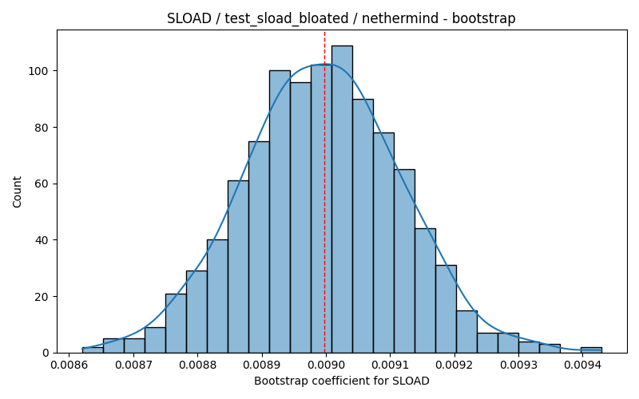

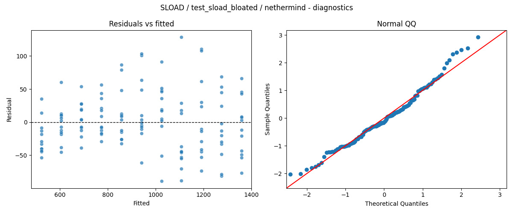

</details>

<details><summary>reth — NNLS regression summary</summary>

```
==============================================================================
                           NNLS Regression Results                            
==============================================================================
Dep. Variable:          test_runtime_ms              R-squared:          0.956
Model:                  NNLS                    Adj. R-squared:          0.956
No. Observations:       198                               RMSE:           9.30
Df Residuals:           196                                MAE:           7.35
Df Model:               1      
==============================================================================
                      coef     std err     P-value      [0.025      0.975]
------------------------------------------------------------------------------
         const     31.1184      2.0849       0.001     26.7361     35.0590
       opcount      0.0015      0.0000       0.001      0.0014      0.0015
==============================================================================
Notes: Non-negative least squares with bootstrap inference (1000 iterations)
==============================================================================
```

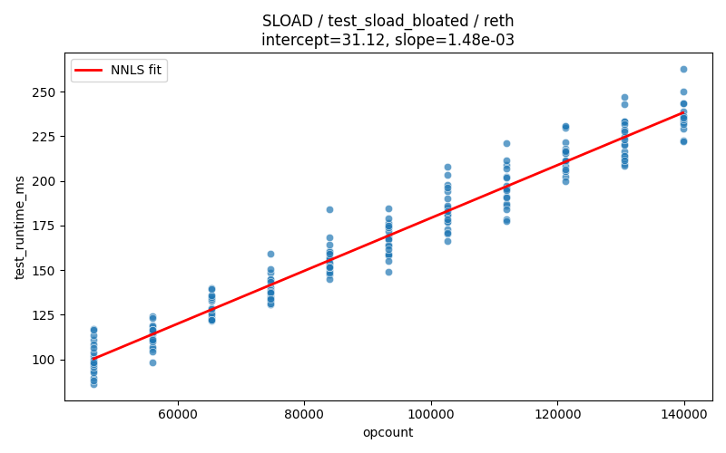

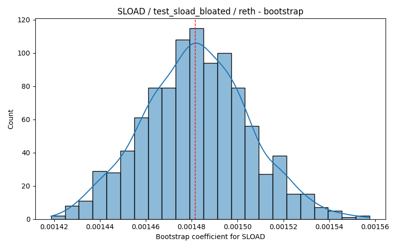

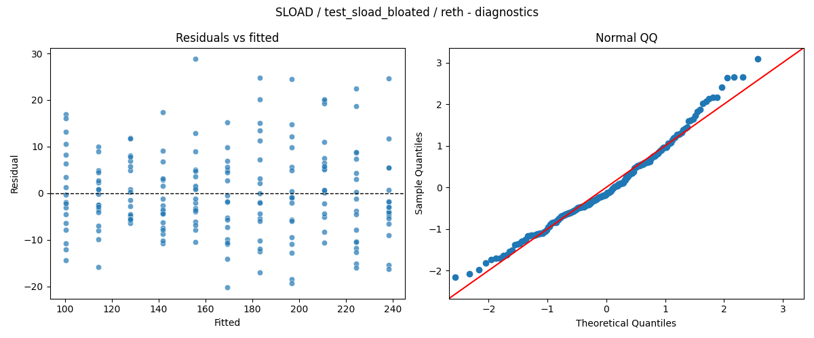

</details>

### test_storage_sload_same_key_benchmark

| client | nobs | R² | target_coef (ms) | p-value | 95% CI |
| --- | --- | --- | --- | --- | --- |
| `besu` | 506 | 0.6719 | 0.000254 | 1.00e-03 | [0.0002369, 0.0002698] |
| `erigon` | 220 | 0.9072 | 4.7e-05 | 1.00e-03 | [4.485e-05, 4.895e-05] |
| `ethrex` | 352 | 0.8184 | 2.504e-05 | 1.00e-03 | [2.392e-05, 2.614e-05] |
| `geth` | 308 | 0.8571 | 4.343e-05 | 1.00e-03 | [4.137e-05, 4.537e-05] |
| `nethermind` | 264 | 0.8075 | 0.0001544 | 1.00e-03 | [0.0001447, 0.0001645] |
| `reth` | 396 | 0.4792 | 7.82e-06 | 1.00e-03 | [7.088e-06, 8.595e-06] |

<details><summary>besu — NNLS regression summary</summary>

```
==============================================================================
                           NNLS Regression Results                            
==============================================================================
Dep. Variable:          test_runtime_ms              R-squared:          0.672
Model:                  NNLS                    Adj. R-squared:          0.671
No. Observations:       506                               RMSE:         112.11
Df Residuals:           504                                MAE:          92.54
Df Model:               1      
==============================================================================
                      coef     std err     P-value      [0.025      0.975]
------------------------------------------------------------------------------
         const    356.7696     16.7779       0.001    325.8767    390.6381
       opcount      0.0003      0.0000       0.001      0.0002      0.0003
==============================================================================
Notes: Non-negative least squares with bootstrap inference (1000 iterations)
==============================================================================
```

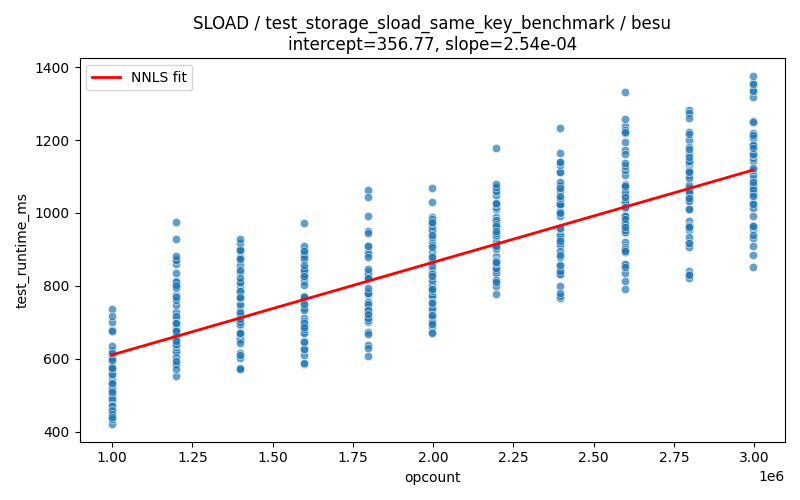

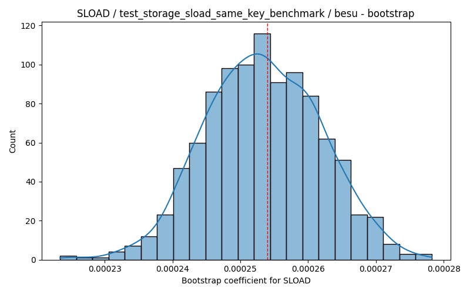

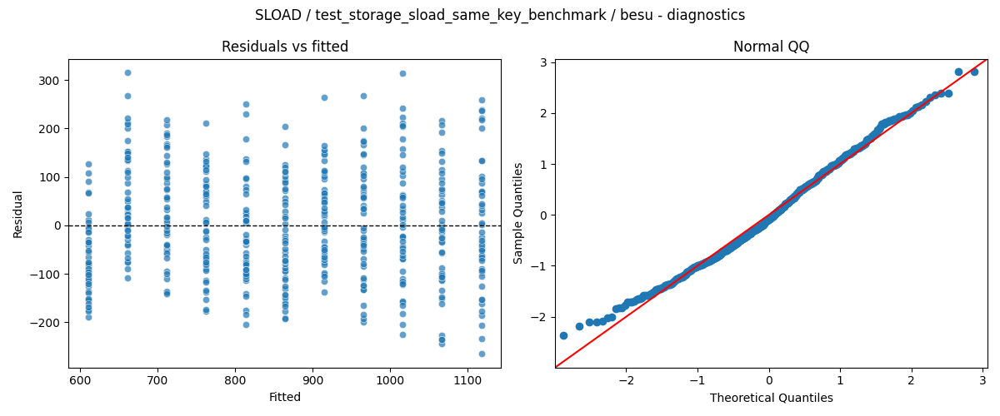

</details>

<details><summary>erigon — NNLS regression summary</summary>

```
==============================================================================
                           NNLS Regression Results                            
==============================================================================
Dep. Variable:          test_runtime_ms              R-squared:          0.907
Model:                  NNLS                    Adj. R-squared:          0.907
No. Observations:       220                               RMSE:           9.49
Df Residuals:           218                                MAE:           7.03
Df Model:               1      
==============================================================================
                      coef     std err     P-value      [0.025      0.975]
------------------------------------------------------------------------------
         const     20.0009      1.8753       0.001     16.5145     23.9207
       opcount      0.0000      0.0000       0.001      0.0000      0.0000
==============================================================================
Notes: Non-negative least squares with bootstrap inference (1000 iterations)
==============================================================================
```

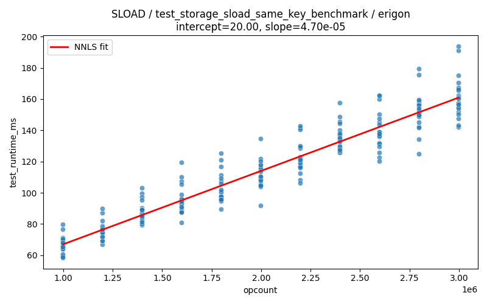

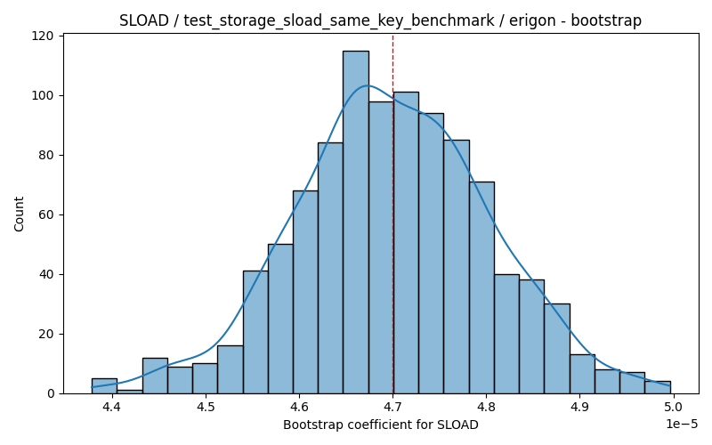

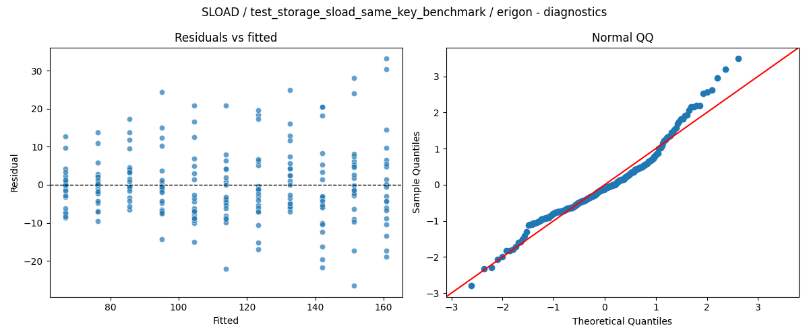

</details>

<details><summary>ethrex — NNLS regression summary</summary>

```
==============================================================================
                           NNLS Regression Results                            
==============================================================================
Dep. Variable:          test_runtime_ms              R-squared:          0.818
Model:                  NNLS                    Adj. R-squared:          0.818
No. Observations:       352                               RMSE:           7.45
Df Residuals:           350                                MAE:           5.82
Df Model:               1      
==============================================================================
                      coef     std err     P-value      [0.025      0.975]
------------------------------------------------------------------------------
         const     14.5891      1.1205       0.001     12.3970     16.8024
       opcount      0.0000      0.0000       0.001      0.0000      0.0000
==============================================================================
Notes: Non-negative least squares with bootstrap inference (1000 iterations)
==============================================================================
```

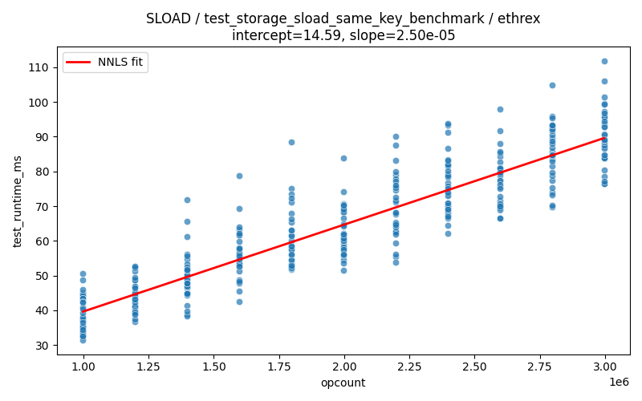


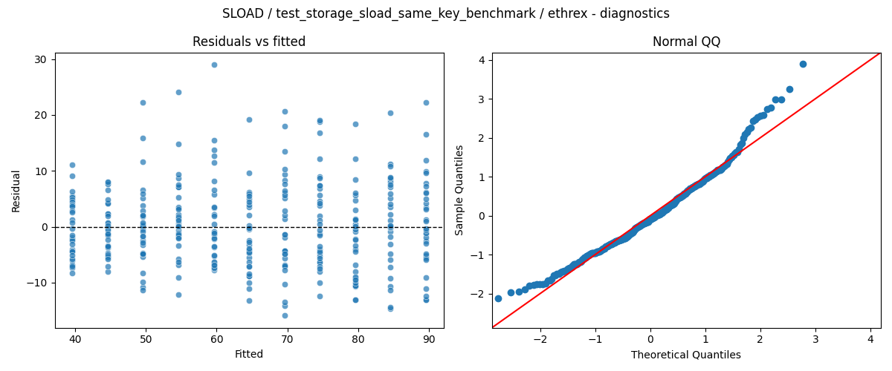

</details>

<details><summary>geth — NNLS regression summary</summary>

```
==============================================================================
                           NNLS Regression Results                            
==============================================================================
Dep. Variable:          test_runtime_ms              R-squared:          0.857
Model:                  NNLS                    Adj. R-squared:          0.857
No. Observations:       308                               RMSE:          11.20
Df Residuals:           306                                MAE:           8.32
Df Model:               1      
==============================================================================
                      coef     std err     P-value      [0.025      0.975]
------------------------------------------------------------------------------
         const     28.1711      1.8867       0.001     24.5758     31.9256
       opcount      0.0000      0.0000       0.001      0.0000      0.0000
==============================================================================
Notes: Non-negative least squares with bootstrap inference (1000 iterations)
==============================================================================
```

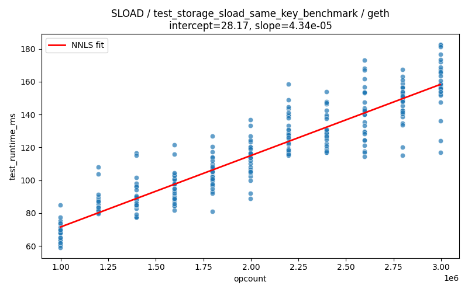

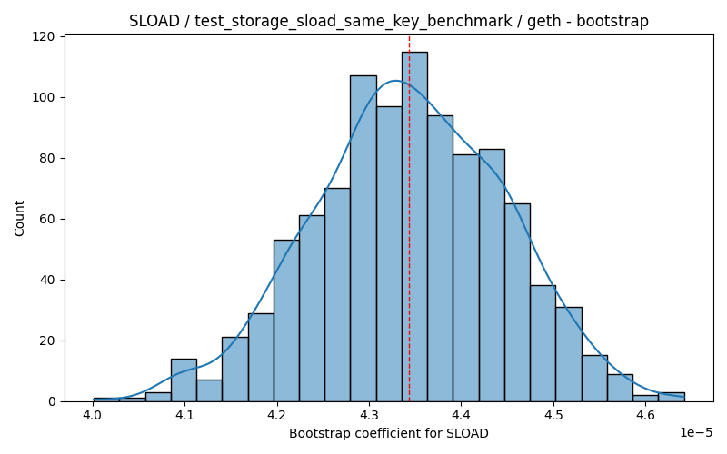

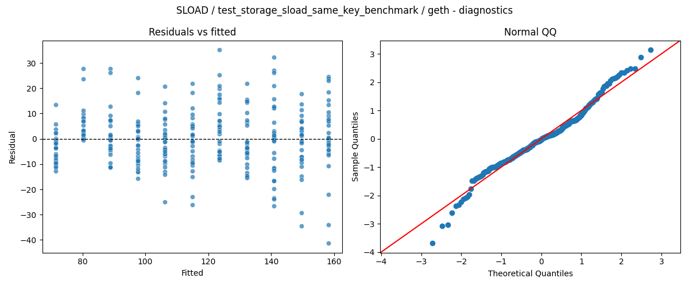

</details>

<details><summary>nethermind — NNLS regression summary</summary>

```
==============================================================================
                           NNLS Regression Results                            
==============================================================================
Dep. Variable:          test_runtime_ms              R-squared:          0.807
Model:                  NNLS                    Adj. R-squared:          0.807
No. Observations:       264                               RMSE:          47.62
Df Residuals:           262                                MAE:          36.08
Df Model:               1      
==============================================================================
                      coef     std err     P-value      [0.025      0.975]
------------------------------------------------------------------------------
         const    107.1813      9.7019       0.001     89.5895    127.2187
       opcount      0.0002      0.0000       0.001      0.0001      0.0002
==============================================================================
Notes: Non-negative least squares with bootstrap inference (1000 iterations)
==============================================================================
```

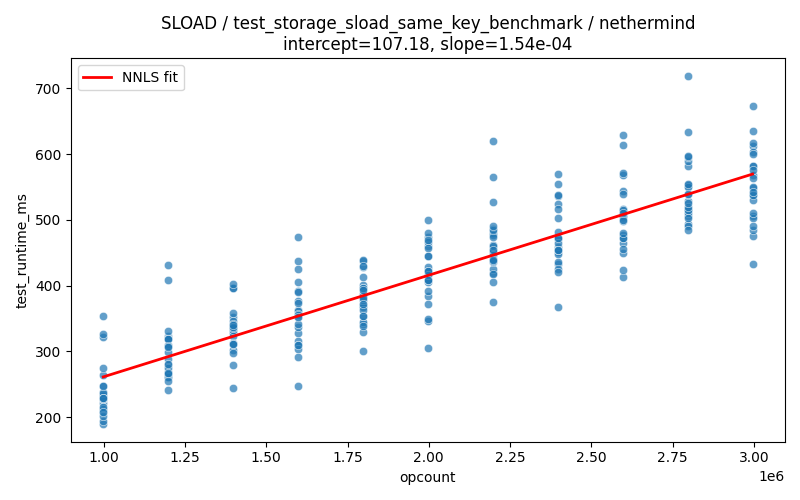

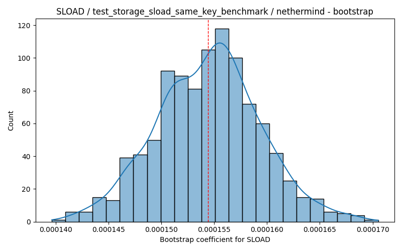

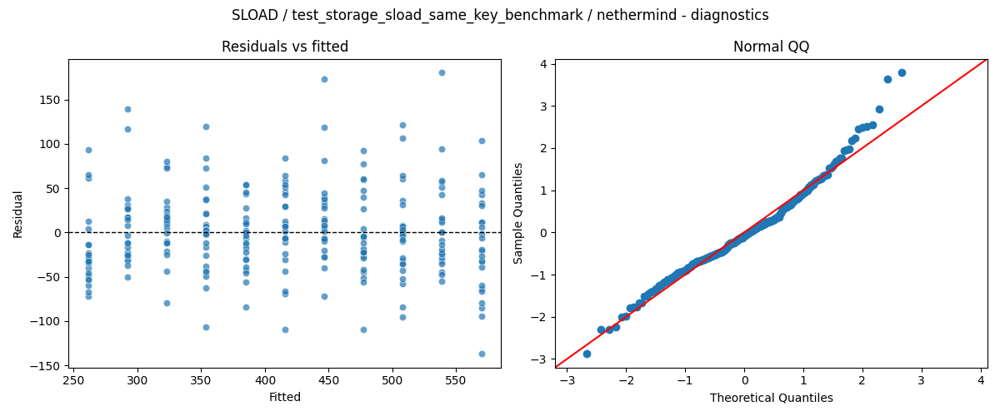

</details>

<details><summary>reth — NNLS regression summary</summary>

```
==============================================================================
                           NNLS Regression Results                            
==============================================================================
Dep. Variable:          test_runtime_ms              R-squared:          0.479
Model:                  NNLS                    Adj. R-squared:          0.478
No. Observations:       396                               RMSE:           5.15
Df Residuals:           394                                MAE:           3.72
Df Model:               1      
==============================================================================
                      coef     std err     P-value      [0.025      0.975]
------------------------------------------------------------------------------
         const      8.1786      0.7751       0.001      6.6271      9.6877
       opcount      0.0000      0.0000       0.001      0.0000      0.0000
==============================================================================
Notes: Non-negative least squares with bootstrap inference (1000 iterations)
==============================================================================
```

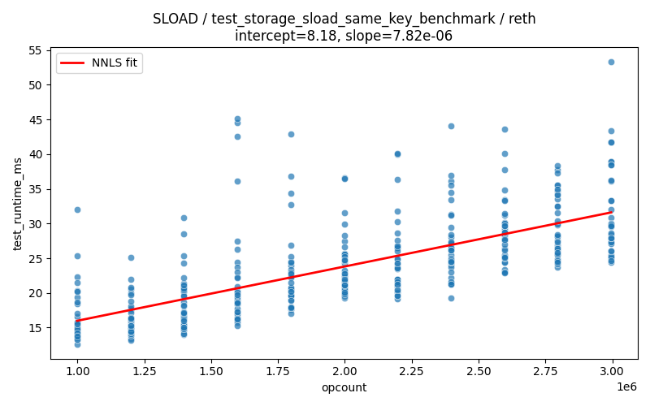

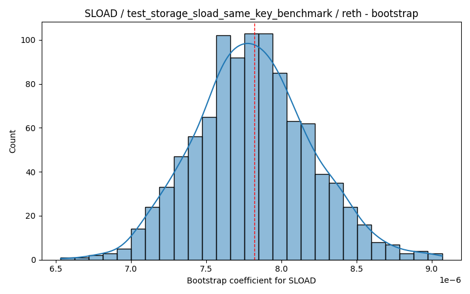

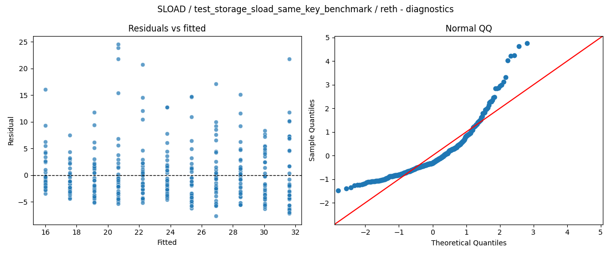

</details>

## SSTORE

### test_sstore_bloated — combo `False` — `presets[cold_storage_sstore_access]`

| client | nobs | R² | target_coef (ms) | p-value | 95% CI |
| --- | --- | --- | --- | --- | --- |
| `besu` | 253 | 0.7109 | 0.00835 | 1.00e-03 | [0.007716, 0.009026] |
| `erigon` | 110 | 0.9771 | 0.005865 | 1.00e-03 | [0.005752, 0.005927] |
| `ethrex` | 176 | 0.9338 | 0.009108 | 1.00e-03 | [0.008958, 0.009244] |
| `geth` | 154 | 0.971 | 0.02407 | 1.00e-03 | [0.02334, 0.02474] |
| `nethermind` | 132 | 0.9053 | 0.003329 | 1.00e-03 | [0.003132, 0.003538] |
| `reth` | 198 | 0.9575 | 0.001287 | 1.00e-03 | [0.001248, 0.001327] |

<details><summary>besu — NNLS regression summary</summary>

```
==============================================================================
                           NNLS Regression Results                            
==============================================================================
Dep. Variable:          test_runtime_ms              R-squared:          0.711
Model:                  NNLS                    Adj. R-squared:          0.710
No. Observations:       253                               RMSE:         150.51
Df Residuals:           251                                MAE:         118.45
Df Model:               1      
==============================================================================
                      coef     std err     P-value      [0.025      0.975]
------------------------------------------------------------------------------
         const    455.1085     28.3670       0.001    397.6682    510.3742
       opcount      0.0084      0.0003       0.001      0.0077      0.0090
==============================================================================
Notes: Non-negative least squares with bootstrap inference (1000 iterations)
==============================================================================
```

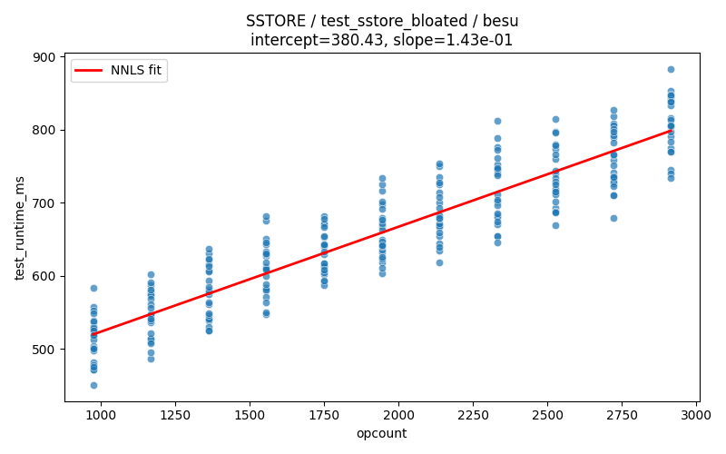


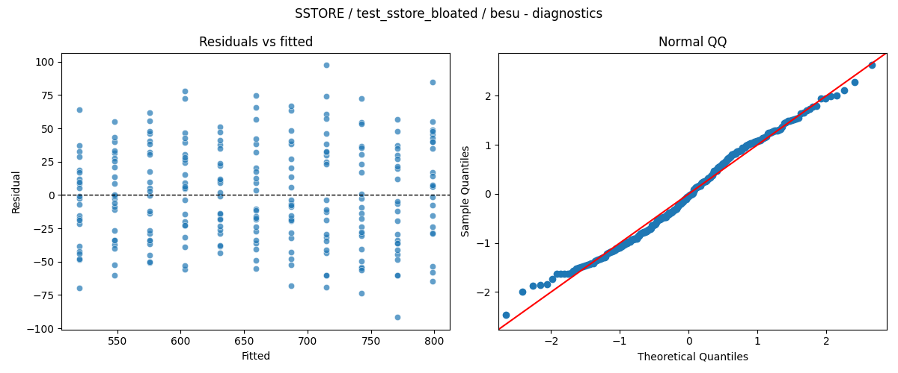

</details>

<details><summary>erigon — NNLS regression summary</summary>

```
==============================================================================
                           NNLS Regression Results                            
==============================================================================
Dep. Variable:          test_runtime_ms              R-squared:          0.977
Model:                  NNLS                    Adj. R-squared:          0.977
No. Observations:       110                               RMSE:          25.61
Df Residuals:           108                                MAE:          16.95
Df Model:               1      
==============================================================================
                      coef     std err     P-value      [0.025      0.975]
------------------------------------------------------------------------------
         const      0.0000      2.2710       1.000      0.0000      7.7459
       opcount      0.0059      0.0000       0.001      0.0058      0.0059
==============================================================================
Notes: Non-negative least squares with bootstrap inference (1000 iterations)
==============================================================================
```

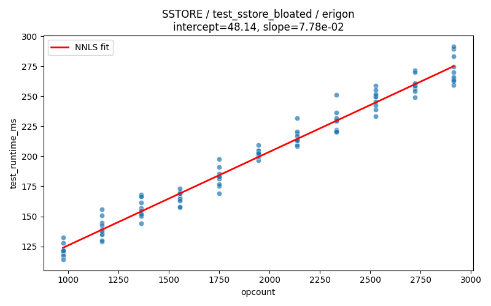

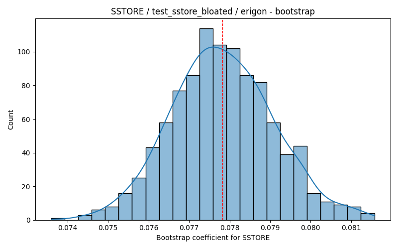

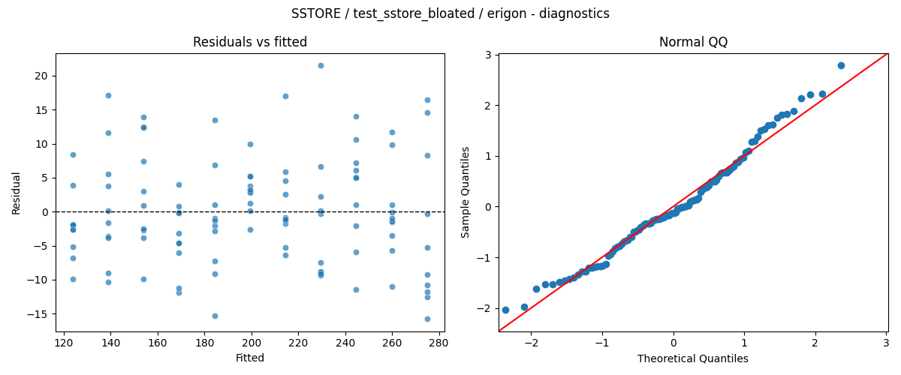

</details>

<details><summary>ethrex — NNLS regression summary</summary>

```
==============================================================================
                           NNLS Regression Results                            
==============================================================================
Dep. Variable:          test_runtime_ms              R-squared:          0.934
Model:                  NNLS                    Adj. R-squared:          0.933
No. Observations:       176                               RMSE:          82.80
Df Residuals:           174                                MAE:          69.41
Df Model:               1      
==============================================================================
                      coef     std err     P-value      [0.025      0.975]
------------------------------------------------------------------------------
         const      0.0000      0.0000       1.000      0.0000      0.0000
       opcount      0.0091      0.0001       0.001      0.0090      0.0092
==============================================================================
Notes: Non-negative least squares with bootstrap inference (1000 iterations)
==============================================================================
```

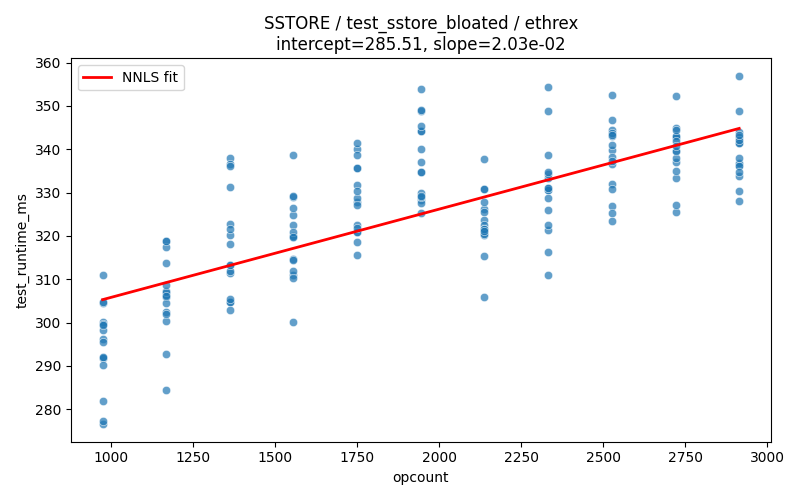

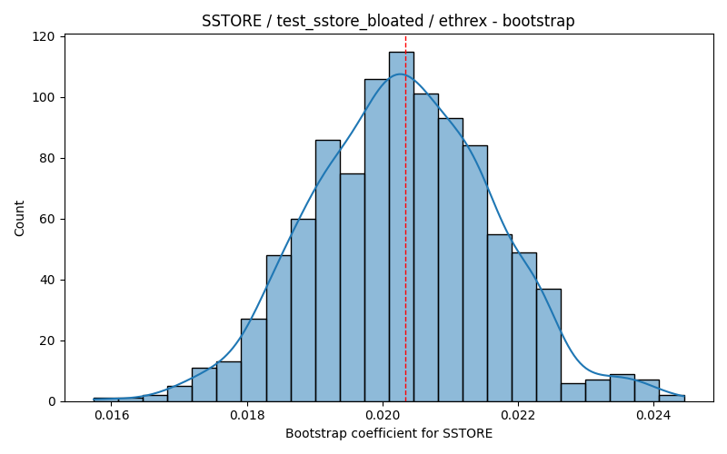

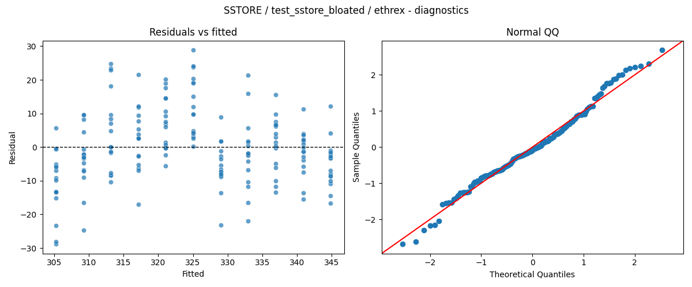

</details>

<details><summary>geth — NNLS regression summary</summary>

```
==============================================================================
                           NNLS Regression Results                            
==============================================================================
Dep. Variable:          test_runtime_ms              R-squared:          0.971
Model:                  NNLS                    Adj. R-squared:          0.971
No. Observations:       154                               RMSE:         117.49
Df Residuals:           152                                MAE:          94.82
Df Model:               1      
==============================================================================
                      coef     std err     P-value      [0.025      0.975]
------------------------------------------------------------------------------
         const    562.9562     30.4819       0.001    505.6781    628.9884
       opcount      0.0241      0.0004       0.001      0.0233      0.0247
==============================================================================
Notes: Non-negative least squares with bootstrap inference (1000 iterations)
==============================================================================
```

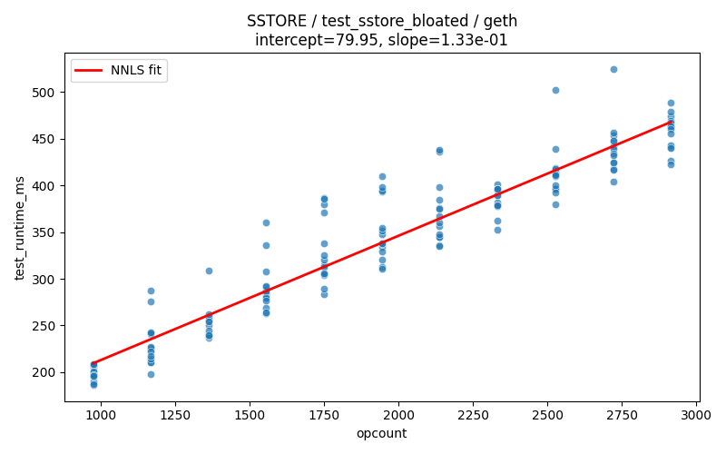

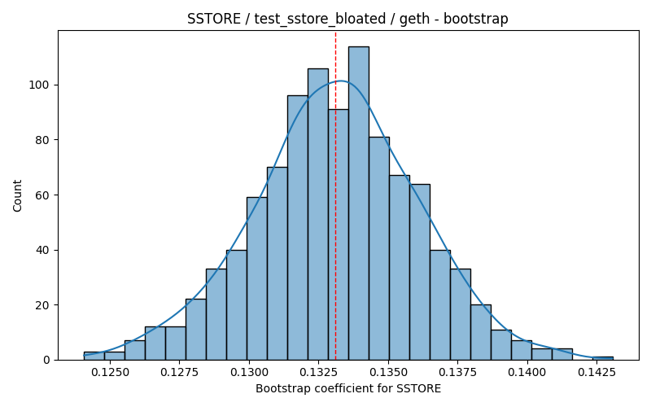

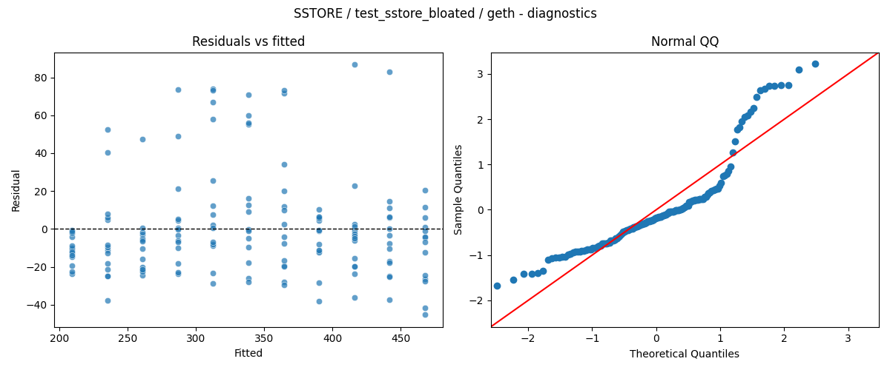

</details>

<details><summary>nethermind — NNLS regression summary</summary>

```
==============================================================================
                           NNLS Regression Results                            
==============================================================================
Dep. Variable:          test_runtime_ms              R-squared:          0.905
Model:                  NNLS                    Adj. R-squared:          0.905
No. Observations:       132                               RMSE:          30.43
Df Residuals:           130                                MAE:          22.03
Df Model:               1      
==============================================================================
                      coef     std err     P-value      [0.025      0.975]
------------------------------------------------------------------------------
         const     56.1108      8.9209       0.001     38.0985     73.4489
       opcount      0.0033      0.0001       0.001      0.0031      0.0035
==============================================================================
Notes: Non-negative least squares with bootstrap inference (1000 iterations)
==============================================================================
```

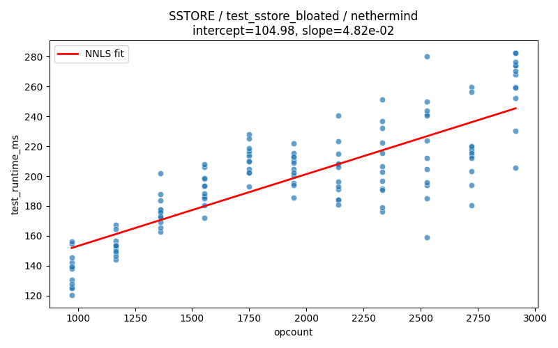

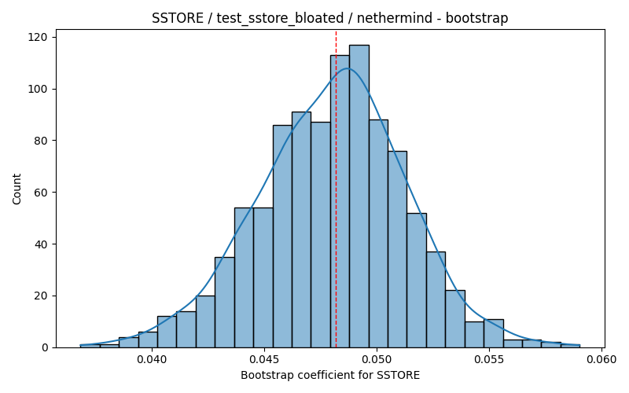

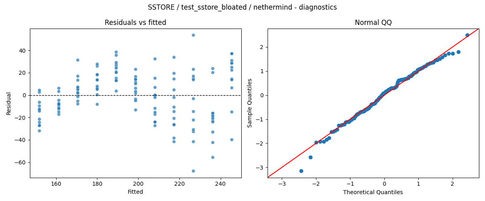

</details>

<details><summary>reth — NNLS regression summary</summary>

```
==============================================================================
                           NNLS Regression Results                            
==============================================================================
Dep. Variable:          test_runtime_ms              R-squared:          0.958
Model:                  NNLS                    Adj. R-squared:          0.957
No. Observations:       198                               RMSE:           7.66
Df Residuals:           196                                MAE:           5.84
Df Model:               1      
==============================================================================
                      coef     std err     P-value      [0.025      0.975]
------------------------------------------------------------------------------
         const     37.3977      1.6913       0.001     34.1082     40.6152
       opcount      0.0013      0.0000       0.001      0.0012      0.0013
==============================================================================
Notes: Non-negative least squares with bootstrap inference (1000 iterations)
==============================================================================
```

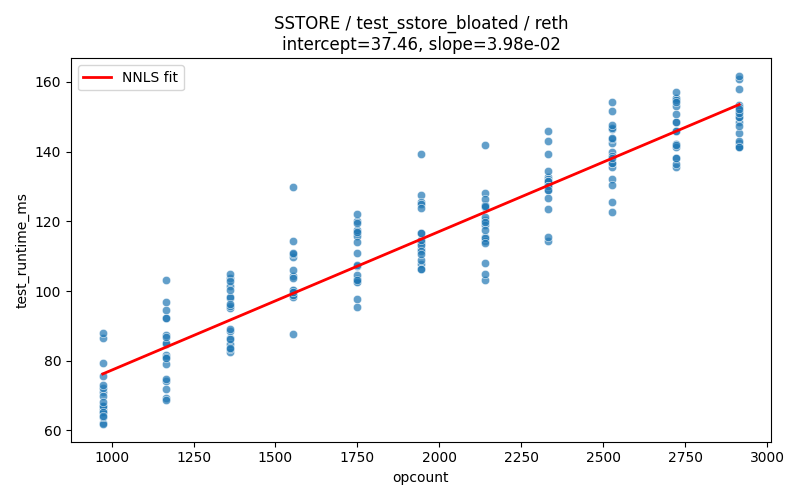

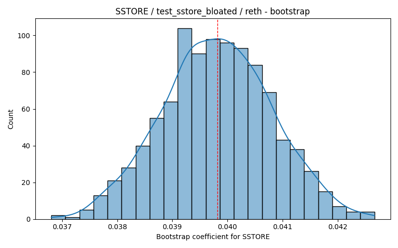

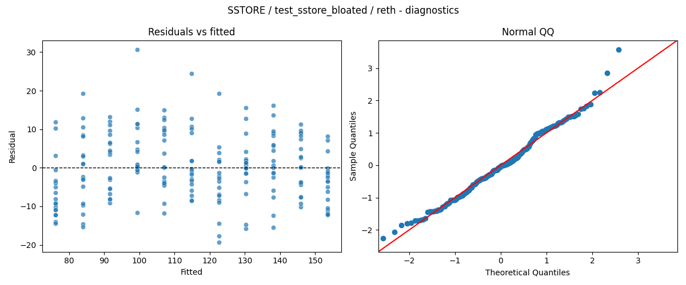

</details>

### test_sstore_bloated — combo `True` — `presets[cold_storage_sstore_access]`

| client | nobs | R² | target_coef (ms) | p-value | 95% CI |
| --- | --- | --- | --- | --- | --- |
| `besu` | 253 | 0.9084 | 0.01563 | 1.00e-03 | [0.01499, 0.01628] |
| `erigon` | 110 | 0.9728 | 0.005259 | 1.00e-03 | [0.005133, 0.005317] |
| `ethrex` | 176 | 0.9717 | 0.01337 | 1.00e-03 | [0.01325, 0.01348] |
| `geth` | 154 | 0.9674 | 0.02353 | 1.00e-03 | [0.02275, 0.02423] |
| `nethermind` | 132 | 0.9775 | 0.009227 | 1.00e-03 | [0.008997, 0.009475] |
| `reth` | 198 | 0.9582 | 0.001514 | 1.00e-03 | [0.001464, 0.001562] |

<details><summary>besu — NNLS regression summary</summary>

```
==============================================================================
                           NNLS Regression Results                            
==============================================================================
Dep. Variable:          test_runtime_ms              R-squared:          0.908
Model:                  NNLS                    Adj. R-squared:          0.908
No. Observations:       253                               RMSE:         140.20
Df Residuals:           251                                MAE:         110.38
Df Model:               1      
==============================================================================
                      coef     std err     P-value      [0.025      0.975]
------------------------------------------------------------------------------
         const    584.3975     27.0241       0.001    532.3839    640.1192
       opcount      0.0156      0.0003       0.001      0.0150      0.0163
==============================================================================
Notes: Non-negative least squares with bootstrap inference (1000 iterations)
==============================================================================
```

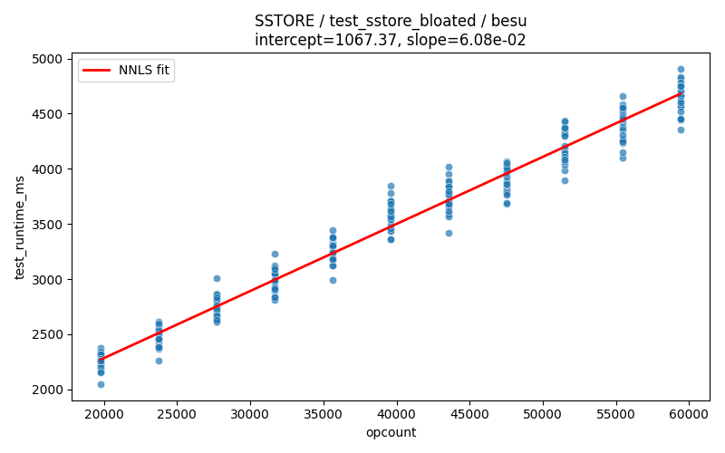

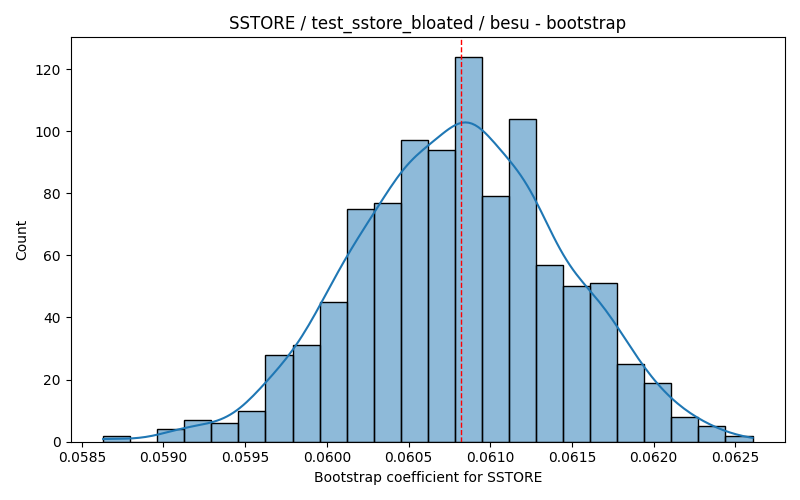

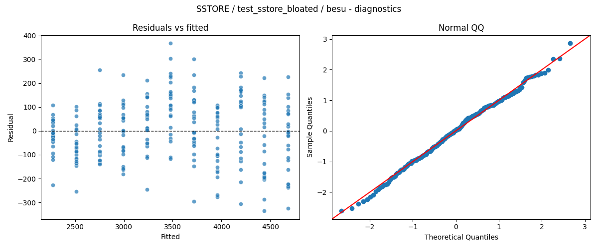

</details>

<details><summary>erigon — NNLS regression summary</summary>

```
==============================================================================
                           NNLS Regression Results                            
==============================================================================
Dep. Variable:          test_runtime_ms              R-squared:          0.973
Model:                  NNLS                    Adj. R-squared:          0.973
No. Observations:       110                               RMSE:          24.98
Df Residuals:           108                                MAE:          18.11
Df Model:               1      
==============================================================================
                      coef     std err     P-value      [0.025      0.975]
------------------------------------------------------------------------------
         const      0.0000      2.9736       1.000      0.0000     10.2483
       opcount      0.0053      0.0000       0.001      0.0051      0.0053
==============================================================================
Notes: Non-negative least squares with bootstrap inference (1000 iterations)
==============================================================================
```

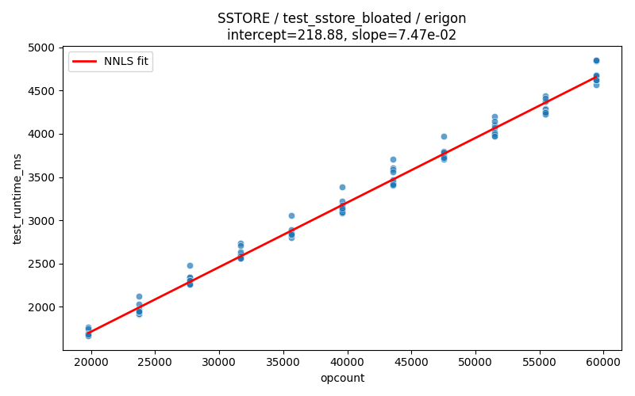

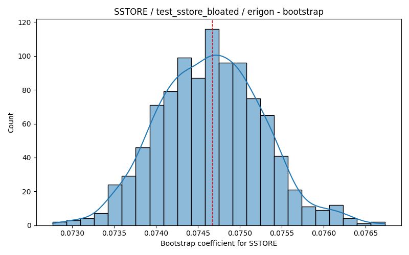

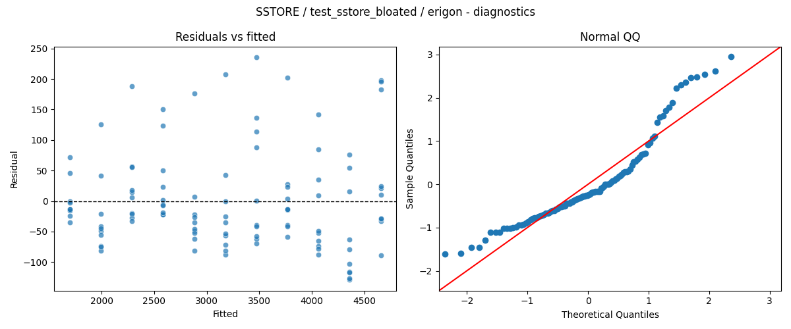

</details>

<details><summary>ethrex — NNLS regression summary</summary>

```
==============================================================================
                           NNLS Regression Results                            
==============================================================================
Dep. Variable:          test_runtime_ms              R-squared:          0.972
Model:                  NNLS                    Adj. R-squared:          0.972
No. Observations:       176                               RMSE:          72.15
Df Residuals:           174                                MAE:          59.99
Df Model:               1      
==============================================================================
                      coef     std err     P-value      [0.025      0.975]
------------------------------------------------------------------------------
         const      0.0000      0.0000       1.000      0.0000      0.0000
       opcount      0.0134      0.0001       0.001      0.0132      0.0135
==============================================================================
Notes: Non-negative least squares with bootstrap inference (1000 iterations)
==============================================================================
```

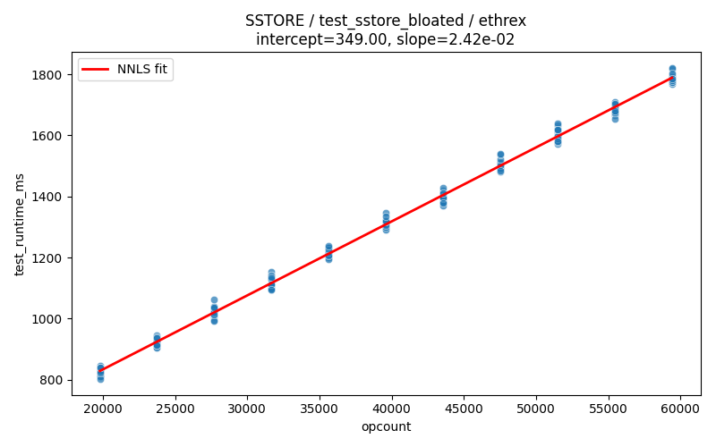

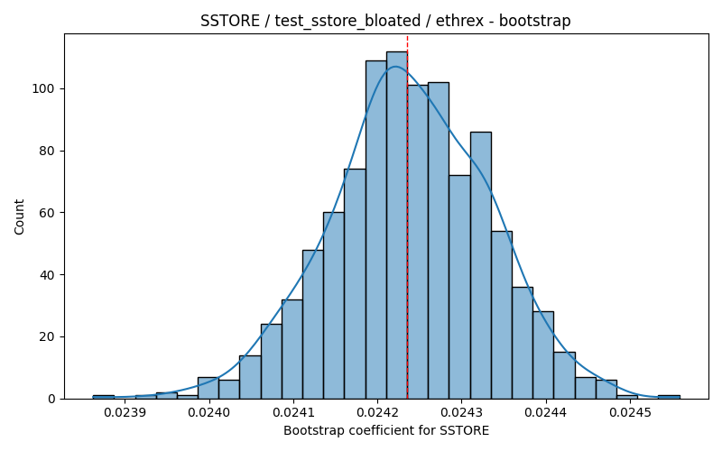

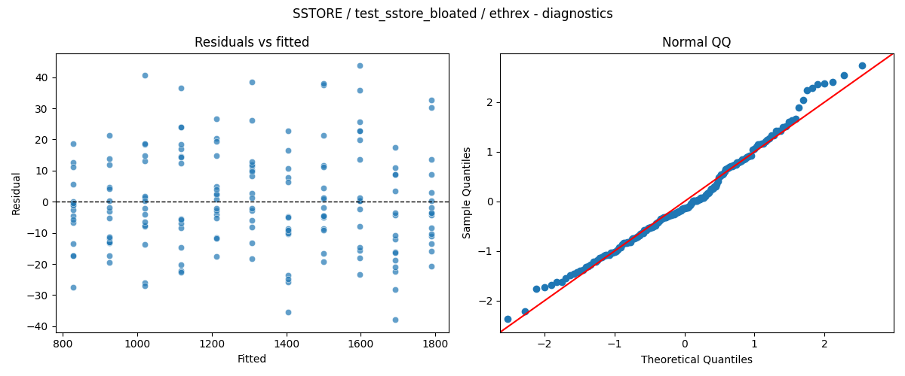

</details>

<details><summary>geth — NNLS regression summary</summary>

```
==============================================================================
                           NNLS Regression Results                            
==============================================================================
Dep. Variable:          test_runtime_ms              R-squared:          0.967
Model:                  NNLS                    Adj. R-squared:          0.967
No. Observations:       154                               RMSE:         122.13
Df Residuals:           152                                MAE:          98.78
Df Model:               1      
==============================================================================
                      coef     std err     P-value      [0.025      0.975]
------------------------------------------------------------------------------
         const    544.9049     31.9239       0.001    488.2334    612.2747
       opcount      0.0235      0.0004       0.001      0.0227      0.0242
==============================================================================
Notes: Non-negative least squares with bootstrap inference (1000 iterations)
==============================================================================
```

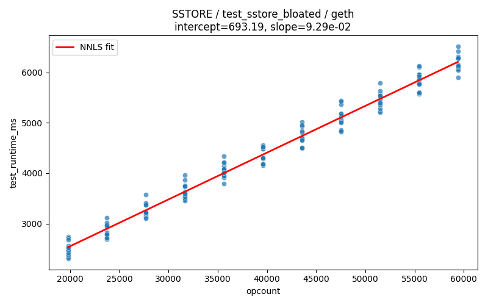

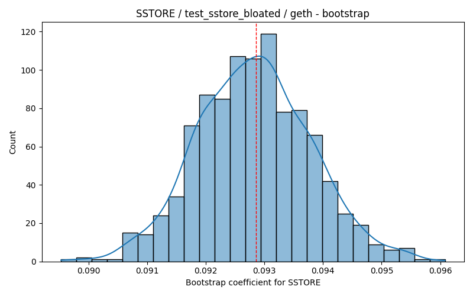

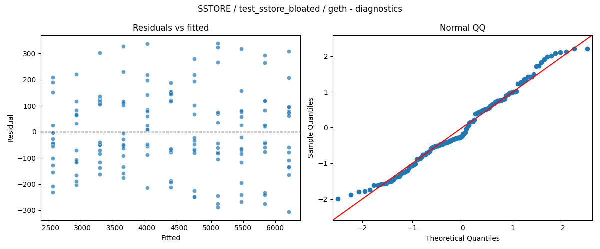

</details>

<details><summary>nethermind — NNLS regression summary</summary>

```
==============================================================================
                           NNLS Regression Results                            
==============================================================================
Dep. Variable:          test_runtime_ms              R-squared:          0.977
Model:                  NNLS                    Adj. R-squared:          0.977
No. Observations:       132                               RMSE:          39.58
Df Residuals:           130                                MAE:          30.20
Df Model:               1      
==============================================================================
                      coef     std err     P-value      [0.025      0.975]
------------------------------------------------------------------------------
         const     82.1262      9.9552       0.001     62.1095    101.1638
       opcount      0.0092      0.0001       0.001      0.0090      0.0095
==============================================================================
Notes: Non-negative least squares with bootstrap inference (1000 iterations)
==============================================================================
```

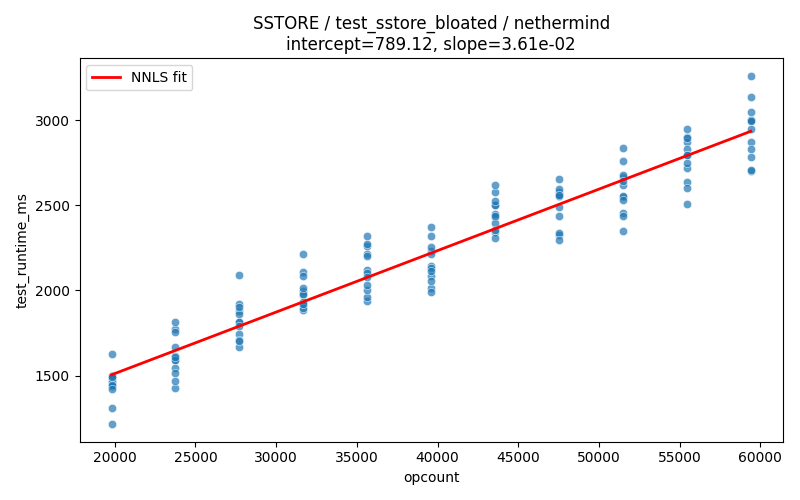

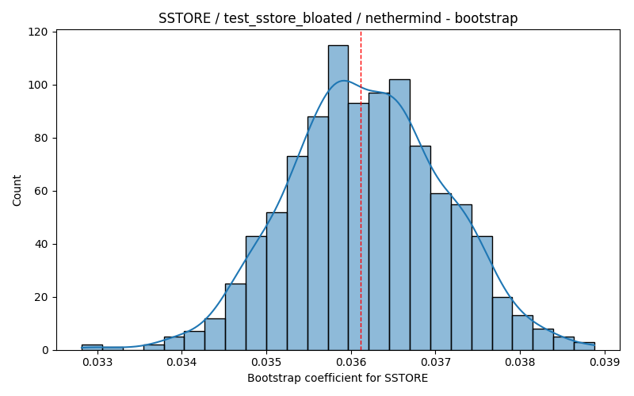

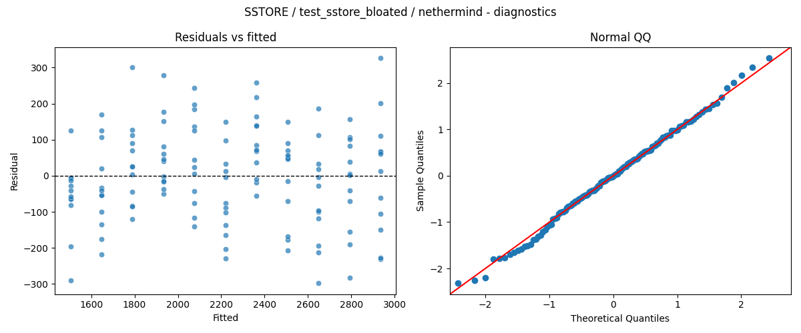

</details>

<details><summary>reth — NNLS regression summary</summary>

```
==============================================================================
                           NNLS Regression Results                            
==============================================================================
Dep. Variable:          test_runtime_ms              R-squared:          0.958
Model:                  NNLS                    Adj. R-squared:          0.958
No. Observations:       198                               RMSE:           8.94
Df Residuals:           196                                MAE:           6.94
Df Model:               1      
==============================================================================
                      coef     std err     P-value      [0.025      0.975]
------------------------------------------------------------------------------
         const     28.0422      2.1099       0.001     23.9264     32.3303
       opcount      0.0015      0.0000       0.001      0.0015      0.0016
==============================================================================
Notes: Non-negative least squares with bootstrap inference (1000 iterations)
==============================================================================
```

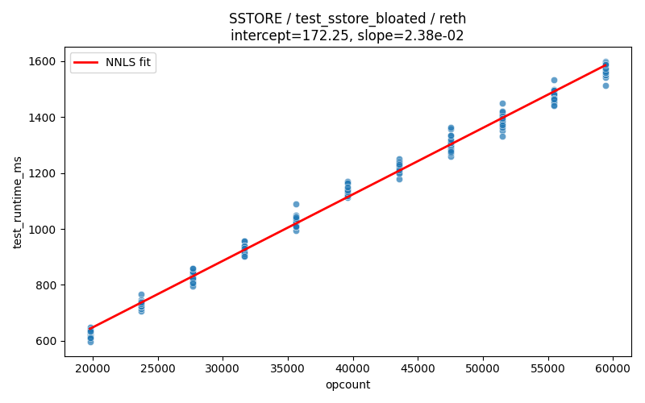

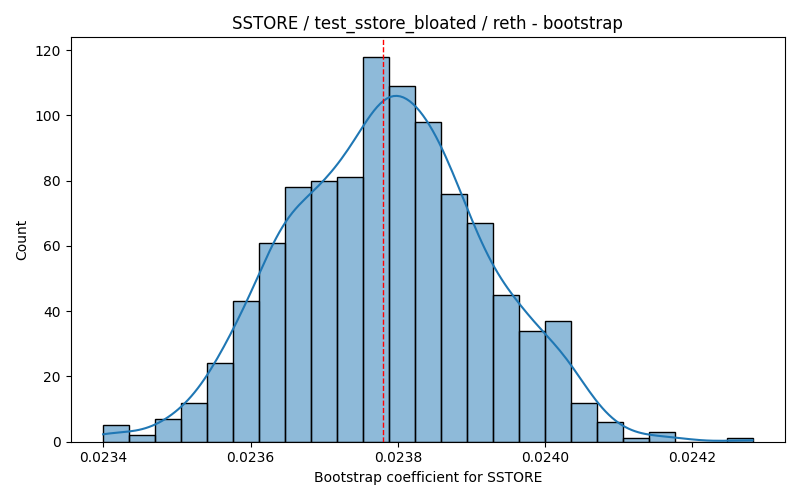

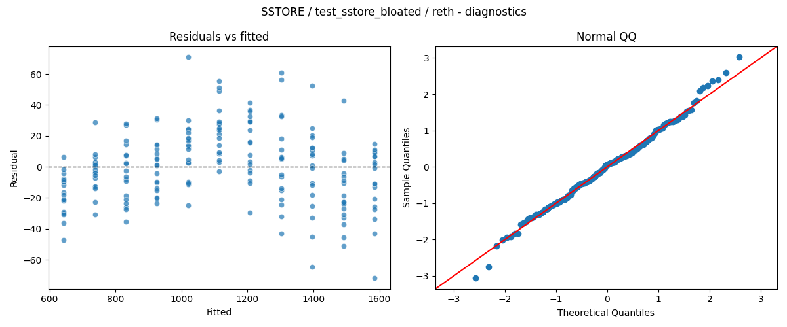

</details>

### test_sstore_bloated — combo `False` — `presets[cold_storage_sstore_write]`

| client | nobs | R² | target_coef (ms) | p-value | 95% CI |
| --- | --- | --- | --- | --- | --- |
| `besu` | 253 | 0.8495 | 0.1434 | 1.00e-03 | [0.1354, 0.151] |
| `erigon` | 110 | 0.9746 | 0.07782 | 1.00e-03 | [0.07543, 0.08043] |
| `ethrex` | 176 | 0.5755 | 0.02035 | 1.00e-03 | [0.01778, 0.023] |
| `geth` | 154 | 0.9028 | 0.1331 | 1.00e-03 | [0.127, 0.1387] |
| `nethermind` | 132 | 0.654 | 0.04817 | 1.00e-03 | [0.04122, 0.05441] |
| `reth` | 198 | 0.8908 | 0.03982 | 1.00e-03 | [0.03786, 0.04173] |

<details><summary>besu — NNLS regression summary</summary>

```
==============================================================================
                           NNLS Regression Results                            
==============================================================================
Dep. Variable:          test_runtime_ms              R-squared:          0.849
Model:                  NNLS                    Adj. R-squared:          0.849
No. Observations:       253                               RMSE:          37.07
Df Residuals:           251                                MAE:          31.34
Df Model:               1      
==============================================================================
                      coef     std err     P-value      [0.025      0.975]
------------------------------------------------------------------------------
         const    380.4314      7.6139       0.001    365.9018    396.1908
       opcount      0.1434      0.0040       0.001      0.1354      0.1510
==============================================================================
Notes: Non-negative least squares with bootstrap inference (1000 iterations)
==============================================================================
```


</details>

<details><summary>erigon — NNLS regression summary</summary>

```
==============================================================================
                           NNLS Regression Results                            
==============================================================================
Dep. Variable:          test_runtime_ms              R-squared:          0.975
Model:                  NNLS                    Adj. R-squared:          0.974
No. Observations:       110                               RMSE:           7.71
Df Residuals:           108                                MAE:           6.06
Df Model:               1      
==============================================================================
                      coef     std err     P-value      [0.025      0.975]
------------------------------------------------------------------------------
         const     48.1430      2.3819       0.001     43.3792     52.7804
       opcount      0.0778      0.0013       0.001      0.0754      0.0804
==============================================================================
Notes: Non-negative least squares with bootstrap inference (1000 iterations)
==============================================================================
```


</details>

<details><summary>ethrex — NNLS regression summary</summary>

```
==============================================================================
                           NNLS Regression Results                            
==============================================================================
Dep. Variable:          test_runtime_ms              R-squared:          0.575
Model:                  NNLS                    Adj. R-squared:          0.573
No. Observations:       176                               RMSE:          10.73
Df Residuals:           174                                MAE:           8.28
Df Model:               1      
==============================================================================
                      coef     std err     P-value      [0.025      0.975]
------------------------------------------------------------------------------
         const    285.5060      2.9351       0.001    279.5804    291.2621
       opcount      0.0203      0.0013       0.001      0.0178      0.0230
==============================================================================
Notes: Non-negative least squares with bootstrap inference (1000 iterations)
==============================================================================
```


</details>

<details><summary>geth — NNLS regression summary</summary>

```
==============================================================================
                           NNLS Regression Results                            
==============================================================================
Dep. Variable:          test_runtime_ms              R-squared:          0.903
Model:                  NNLS                    Adj. R-squared:          0.902
No. Observations:       154                               RMSE:          26.82
Df Residuals:           152                                MAE:          18.81
Df Model:               1      
==============================================================================
                      coef     std err     P-value      [0.025      0.975]
------------------------------------------------------------------------------
         const     79.9536      5.9309       0.001     69.0380     93.0274
       opcount      0.1331      0.0029       0.001      0.1270      0.1387
==============================================================================
Notes: Non-negative least squares with bootstrap inference (1000 iterations)
==============================================================================
```


</details>

<details><summary>nethermind — NNLS regression summary</summary>

```
==============================================================================
                           NNLS Regression Results                            
==============================================================================
Dep. Variable:          test_runtime_ms              R-squared:          0.654
Model:                  NNLS                    Adj. R-squared:          0.651
No. Observations:       132                               RMSE:          21.52
Df Residuals:           130                                MAE:          17.64
Df Model:               1      
==============================================================================
                      coef     std err     P-value      [0.025      0.975]
------------------------------------------------------------------------------
         const    104.9836      5.7528       0.001     94.9521    117.0738
       opcount      0.0482      0.0033       0.001      0.0412      0.0544
==============================================================================
Notes: Non-negative least squares with bootstrap inference (1000 iterations)
==============================================================================
```


</details>

<details><summary>reth — NNLS regression summary</summary>

```
==============================================================================
                           NNLS Regression Results                            
==============================================================================
Dep. Variable:          test_runtime_ms              R-squared:          0.891
Model:                  NNLS                    Adj. R-squared:          0.890
No. Observations:       198                               RMSE:           8.56
Df Residuals:           196                                MAE:           6.82
Df Model:               1      
==============================================================================
                      coef     std err     P-value      [0.025      0.975]
------------------------------------------------------------------------------
         const     37.4600      2.0900       0.001     33.3785     41.5678
       opcount      0.0398      0.0010       0.001      0.0379      0.0417
==============================================================================
Notes: Non-negative least squares with bootstrap inference (1000 iterations)
==============================================================================
```


</details>

### test_sstore_bloated — combo `True` — `presets[cold_storage_sstore_write]`

| client | nobs | R² | target_coef (ms) | p-value | 95% CI |
| --- | --- | --- | --- | --- | --- |
| `besu` | 253 | 0.9723 | 0.06082 | 1.00e-03 | [0.0596, 0.06198] |
| `erigon` | 110 | 0.9928 | 0.07467 | 1.00e-03 | [0.07348, 0.07596] |
| `ethrex` | 176 | 0.9972 | 0.02424 | 1.00e-03 | [0.02405, 0.02442] |
| `geth` | 154 | 0.9828 | 0.09286 | 1.00e-03 | [0.09092, 0.09475] |
| `nethermind` | 132 | 0.9253 | 0.03612 | 1.00e-03 | [0.03449, 0.03796] |
| `reth` | 198 | 0.9938 | 0.02378 | 1.00e-03 | [0.02354, 0.02403] |

<details><summary>besu — NNLS regression summary</summary>

```
==============================================================================
                           NNLS Regression Results                            
==============================================================================
Dep. Variable:          test_runtime_ms              R-squared:          0.972
Model:                  NNLS                    Adj. R-squared:          0.972
No. Observations:       253                               RMSE:         128.44
Df Residuals:           251                                MAE:         104.33
Df Model:               1      
==============================================================================
                      coef     std err     P-value      [0.025      0.975]
------------------------------------------------------------------------------
         const   1067.3705     23.2121       0.001   1024.6093   1115.6495
       opcount      0.0608      0.0006       0.001      0.0596      0.0620
==============================================================================
Notes: Non-negative least squares with bootstrap inference (1000 iterations)
==============================================================================
```


</details>

<details><summary>erigon — NNLS regression summary</summary>

```
==============================================================================
                           NNLS Regression Results                            
==============================================================================
Dep. Variable:          test_runtime_ms              R-squared:          0.993
Model:                  NNLS                    Adj. R-squared:          0.993
No. Observations:       110                               RMSE:          79.47
Df Residuals:           108                                MAE:          59.83
Df Model:               1      
==============================================================================
                      coef     std err     P-value      [0.025      0.975]
------------------------------------------------------------------------------
         const    218.8796     22.9091       0.001    176.4261    264.2463
       opcount      0.0747      0.0006       0.001      0.0735      0.0760
==============================================================================
Notes: Non-negative least squares with bootstrap inference (1000 iterations)
==============================================================================
```


</details>

<details><summary>ethrex — NNLS regression summary</summary>

```
==============================================================================
                           NNLS Regression Results                            
==============================================================================
Dep. Variable:          test_runtime_ms              R-squared:          0.997
Model:                  NNLS                    Adj. R-squared:          0.997
No. Observations:       176                               RMSE:          15.96
Df Residuals:           174                                MAE:          12.68
Df Model:               1      
==============================================================================
                      coef     std err     P-value      [0.025      0.975]
------------------------------------------------------------------------------
         const    349.0043      3.7616       0.001    341.9633    356.5616
       opcount      0.0242      0.0001       0.001      0.0240      0.0244
==============================================================================
Notes: Non-negative least squares with bootstrap inference (1000 iterations)
==============================================================================
```


</details>

<details><summary>geth — NNLS regression summary</summary>

```
==============================================================================
                           NNLS Regression Results                            
==============================================================================
Dep. Variable:          test_runtime_ms              R-squared:          0.983
Model:                  NNLS                    Adj. R-squared:          0.983
No. Observations:       154                               RMSE:         153.70
Df Residuals:           152                                MAE:         128.57
Df Model:               1      
==============================================================================
                      coef     std err     P-value      [0.025      0.975]
------------------------------------------------------------------------------
         const    693.1888     37.5061       0.001    618.4290    767.0203
       opcount      0.0929      0.0010       0.001      0.0909      0.0947
==============================================================================
Notes: Non-negative least squares with bootstrap inference (1000 iterations)
==============================================================================
```


</details>

<details><summary>nethermind — NNLS regression summary</summary>

```
==============================================================================
                           NNLS Regression Results                            
==============================================================================
Dep. Variable:          test_runtime_ms              R-squared:          0.925
Model:                  NNLS                    Adj. R-squared:          0.925
No. Observations:       132                               RMSE:         128.52
Df Residuals:           130                                MAE:         102.71
Df Model:               1      
==============================================================================
                      coef     std err     P-value      [0.025      0.975]
------------------------------------------------------------------------------
         const    789.1158     35.8648       0.001    718.3796    853.6472
       opcount      0.0361      0.0009       0.001      0.0345      0.0380
==============================================================================
Notes: Non-negative least squares with bootstrap inference (1000 iterations)
==============================================================================
```


</details>

<details><summary>reth — NNLS regression summary</summary>

```
==============================================================================
                           NNLS Regression Results                            
==============================================================================
Dep. Variable:          test_runtime_ms              R-squared:          0.994
Model:                  NNLS                    Adj. R-squared:          0.994
No. Observations:       198                               RMSE:          23.48
Df Residuals:           196                                MAE:          18.41
Df Model:               1      
==============================================================================
                      coef     std err     P-value      [0.025      0.975]
------------------------------------------------------------------------------
         const    172.2494      5.0177       0.001    162.4639    182.0527
       opcount      0.0238      0.0001       0.001      0.0235      0.0240
==============================================================================
Notes: Non-negative least squares with bootstrap inference (1000 iterations)
==============================================================================
```


</details>

## BALANCE

### test_account_access — combo `BALANCE_AccountMode.EXISTING_EOA`

| client | nobs | R² | target_coef (ms) | p-value | 95% CI |
| --- | --- | --- | --- | --- | --- |
| `besu` | 253 | 0.8564 | 0.01304 | 1.00e-03 | [0.01242, 0.01364] |
| `erigon` | 110 | 0.9763 | 0.008819 | 1.00e-03 | [0.008577, 0.009061] |
| `ethrex` | 176 | 0.9927 | 0.006927 | 1.00e-03 | [0.006841, 0.007012] |
| `geth` | 154 | 0.9102 | 0.01051 | 1.00e-03 | [0.009897, 0.01106] |
| `nethermind` | 132 | 0.7468 | 0.003707 | 1.00e-03 | [0.003345, 0.00408] |
| `reth` | 198 | 0.9429 | 0.001086 | 1.00e-03 | [0.00105, 0.001121] |

<details><summary>besu — NNLS regression summary</summary>

```
==============================================================================
                           NNLS Regression Results                            
==============================================================================
Dep. Variable:          test_runtime_ms              R-squared:          0.856
Model:                  NNLS                    Adj. R-squared:          0.856
No. Observations:       253                               RMSE:         127.59
Df Residuals:           251                                MAE:         103.38
Df Model:               1      
==============================================================================
                      coef     std err     P-value      [0.025      0.975]
------------------------------------------------------------------------------
         const    501.9671     23.5346       0.001    456.0603    546.3308
       opcount      0.0130      0.0003       0.001      0.0124      0.0136
==============================================================================
Notes: Non-negative least squares with bootstrap inference (1000 iterations)
==============================================================================
```

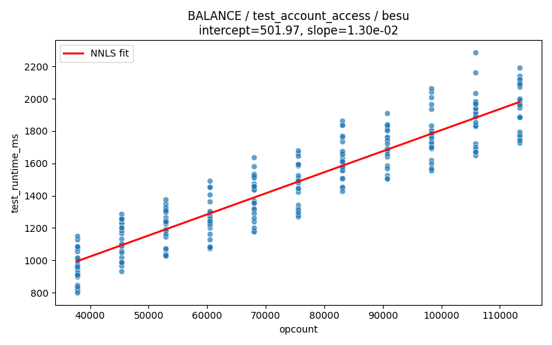

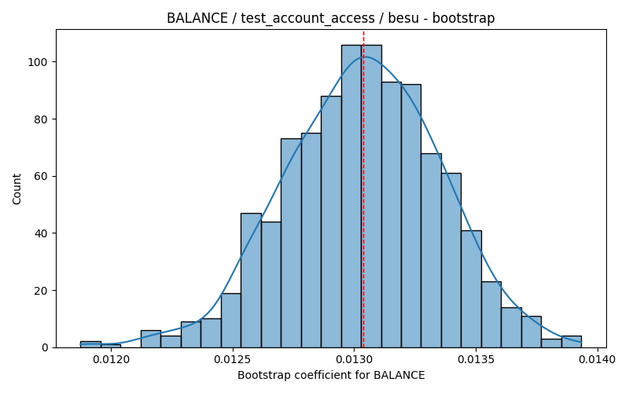


</details>

<details><summary>erigon — NNLS regression summary</summary>

```
==============================================================================
                           NNLS Regression Results                            
==============================================================================
Dep. Variable:          test_runtime_ms              R-squared:          0.976
Model:                  NNLS                    Adj. R-squared:          0.976
No. Observations:       110                               RMSE:          32.84
Df Residuals:           108                                MAE:          24.20
Df Model:               1      
==============================================================================
                      coef     std err     P-value      [0.025      0.975]
------------------------------------------------------------------------------
         const     16.1112      8.4322       0.025      0.0767     32.2065
       opcount      0.0088      0.0001       0.001      0.0086      0.0091
==============================================================================
Notes: Non-negative least squares with bootstrap inference (1000 iterations)
==============================================================================
```

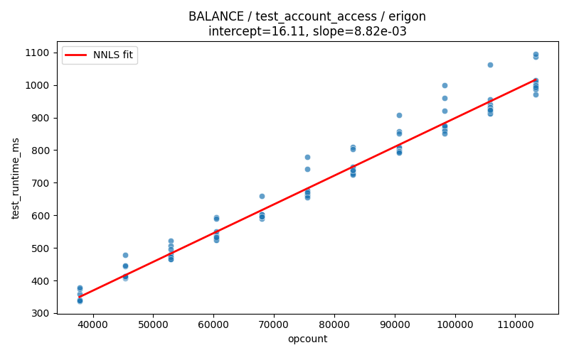

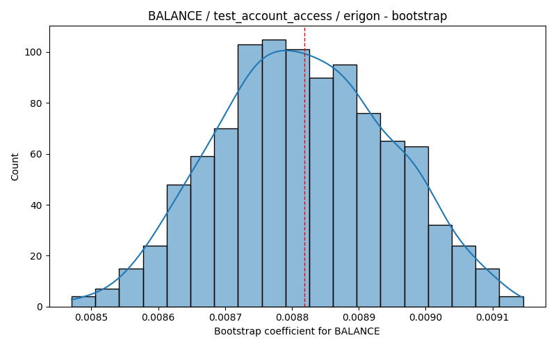

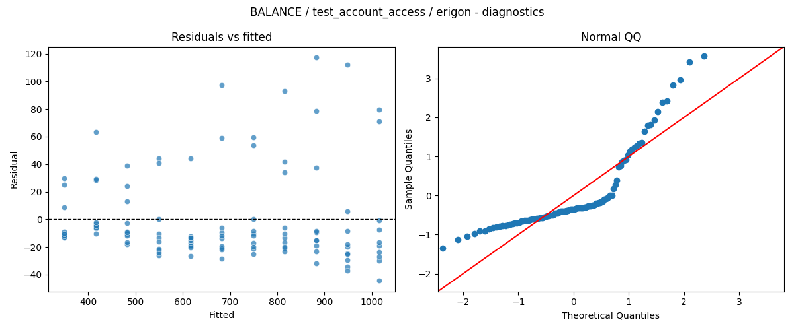

</details>

<details><summary>ethrex — NNLS regression summary</summary>

```
==============================================================================
                           NNLS Regression Results                            
==============================================================================
Dep. Variable:          test_runtime_ms              R-squared:          0.993
Model:                  NNLS                    Adj. R-squared:          0.993
No. Observations:       176                               RMSE:          14.23
Df Residuals:           174                                MAE:          10.97
Df Model:               1      
==============================================================================
                      coef     std err     P-value      [0.025      0.975]
------------------------------------------------------------------------------
         const     45.9710      3.2143       0.001     40.0187     52.1882
       opcount      0.0069      0.0000       0.001      0.0068      0.0070
==============================================================================
Notes: Non-negative least squares with bootstrap inference (1000 iterations)
==============================================================================
```

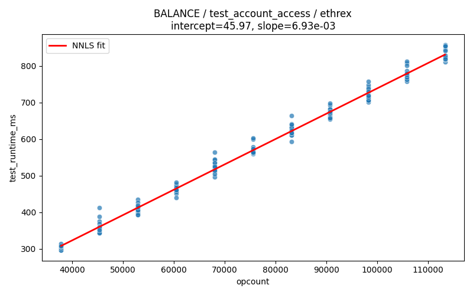

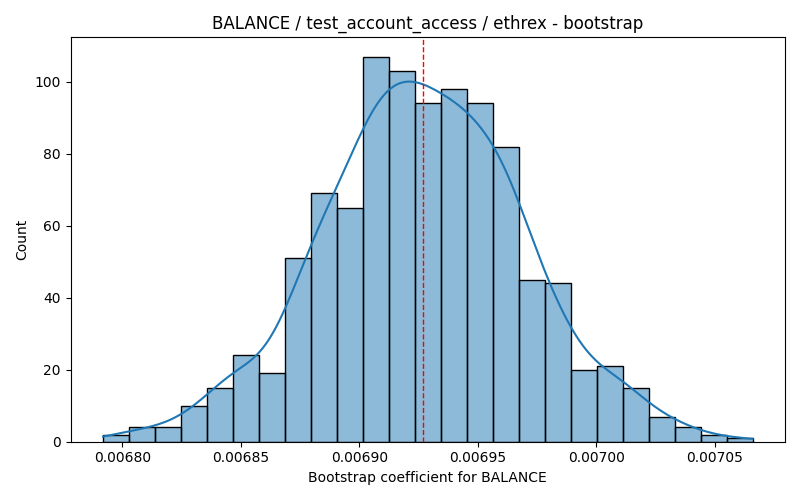

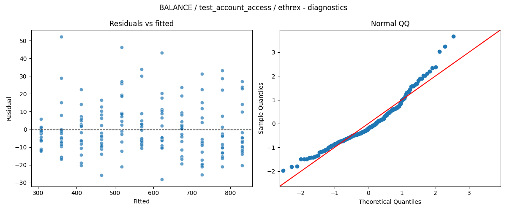

</details>

<details><summary>geth — NNLS regression summary</summary>

```
==============================================================================
                           NNLS Regression Results                            
==============================================================================
Dep. Variable:          test_runtime_ms              R-squared:          0.910
Model:                  NNLS                    Adj. R-squared:          0.910
No. Observations:       154                               RMSE:          78.85
Df Residuals:           152                                MAE:          65.21
Df Model:               1      
==============================================================================
                      coef     std err     P-value      [0.025      0.975]
------------------------------------------------------------------------------
         const    435.8200     25.1682       0.001    385.6416    488.1614
       opcount      0.0105      0.0003       0.001      0.0099      0.0111
==============================================================================
Notes: Non-negative least squares with bootstrap inference (1000 iterations)
==============================================================================
```

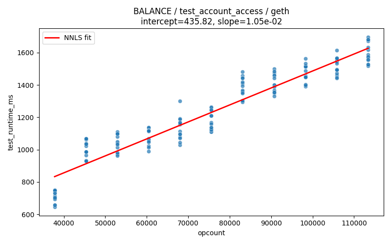

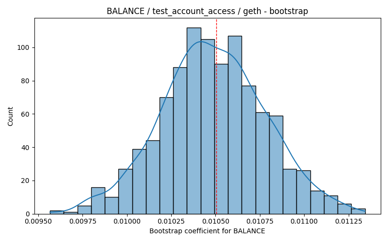

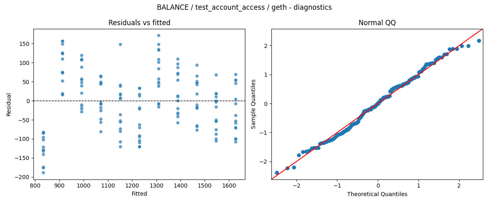

</details>

<details><summary>nethermind — NNLS regression summary</summary>

```
==============================================================================
                           NNLS Regression Results                            
==============================================================================
Dep. Variable:          test_runtime_ms              R-squared:          0.747
Model:                  NNLS                    Adj. R-squared:          0.745
No. Observations:       132                               RMSE:          51.59
Df Residuals:           130                                MAE:          40.50
Df Model:               1      
==============================================================================
                      coef     std err     P-value      [0.025      0.975]
------------------------------------------------------------------------------
         const    115.2508     14.9038       0.001     86.5560    143.7453
       opcount      0.0037      0.0002       0.001      0.0033      0.0041
==============================================================================
Notes: Non-negative least squares with bootstrap inference (1000 iterations)
==============================================================================
```


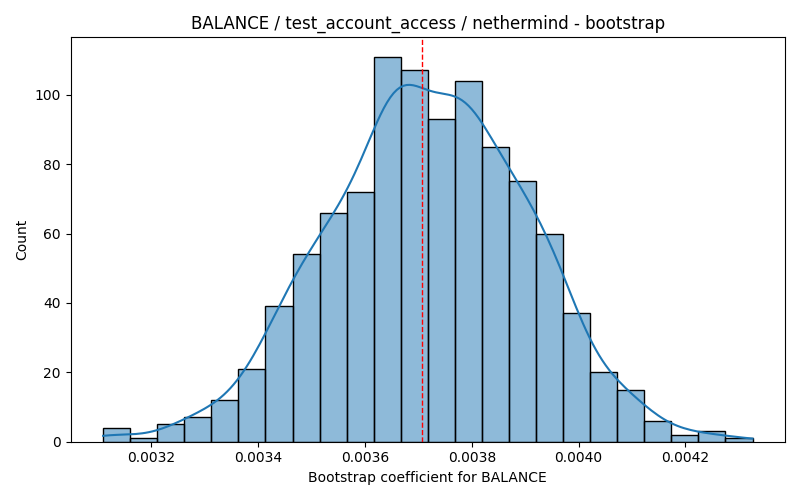

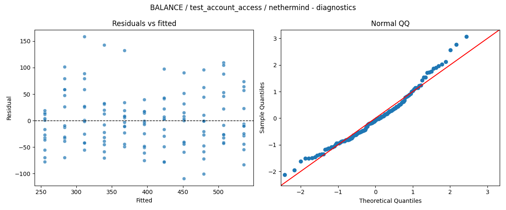

</details>

<details><summary>reth — NNLS regression summary</summary>

```
==============================================================================
                           NNLS Regression Results                            
==============================================================================
Dep. Variable:          test_runtime_ms              R-squared:          0.943
Model:                  NNLS                    Adj. R-squared:          0.943
No. Observations:       198                               RMSE:           6.38
Df Residuals:           196                                MAE:           4.87
Df Model:               1      
==============================================================================
                      coef     std err     P-value      [0.025      0.975]
------------------------------------------------------------------------------
         const     38.2701      1.3458       0.001     35.7466     40.8770
       opcount      0.0011      0.0000       0.001      0.0011      0.0011
==============================================================================
Notes: Non-negative least squares with bootstrap inference (1000 iterations)
==============================================================================
```

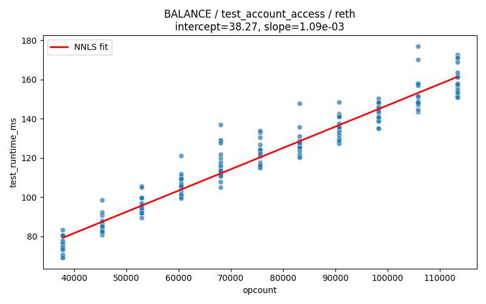

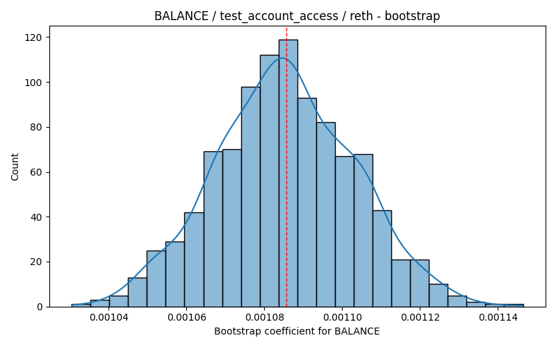

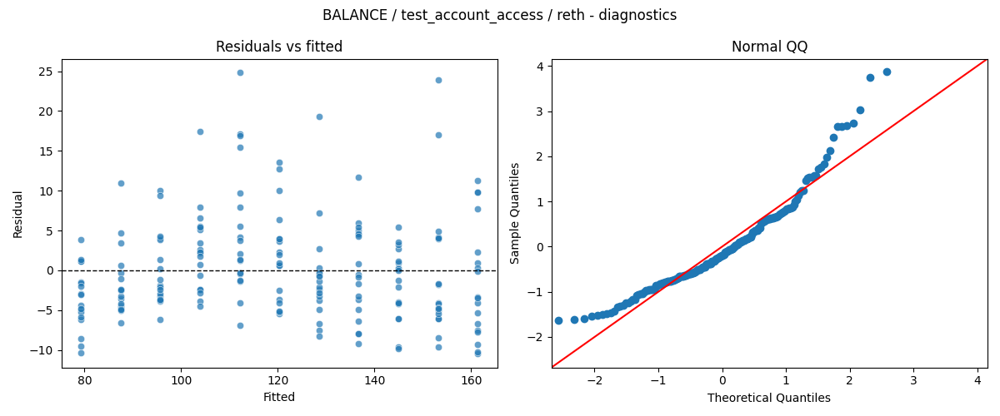

</details>

### test_account_access — combo `BALANCE_AccountMode.NON_EXISTING_ACCOUNT` — `presets[cold_account_nocode_access]`

| client | nobs | R² | target_coef (ms) | p-value | 95% CI |
| --- | --- | --- | --- | --- | --- |
| `besu` | 253 | 0.8896 | 0.01367 | 1.00e-03 | [0.01311, 0.01426] |
| `erigon` | 110 | 0.9789 | 0.007961 | 1.00e-03 | [0.007755, 0.008115] |
| `ethrex` | 176 | 0.963 | 0.001887 | 1.00e-03 | [0.001837, 0.001935] |
| `geth` | 154 | 0.858 | 0.02158 | 1.00e-03 | [0.02018, 0.02315] |
| `nethermind` | 132 | 0.754 | 0.003732 | 1.00e-03 | [0.003427, 0.004055] |
| `reth` | 198 | 0.9012 | 0.0007627 | 1.00e-03 | [0.0007279, 0.0007994] |

<details><summary>besu — NNLS regression summary</summary>

```
==============================================================================
                           NNLS Regression Results                            
==============================================================================
Dep. Variable:          test_runtime_ms              R-squared:          0.890
Model:                  NNLS                    Adj. R-squared:          0.889
No. Observations:       253                               RMSE:         115.08
Df Residuals:           251                                MAE:         103.26
Df Model:               1      
==============================================================================
                      coef     std err     P-value      [0.025      0.975]
------------------------------------------------------------------------------
         const    485.3422     22.6994       0.001    438.5376    530.1875
       opcount      0.0137      0.0003       0.001      0.0131      0.0143
==============================================================================
Notes: Non-negative least squares with bootstrap inference (1000 iterations)
==============================================================================
```

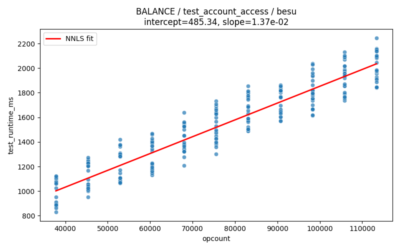

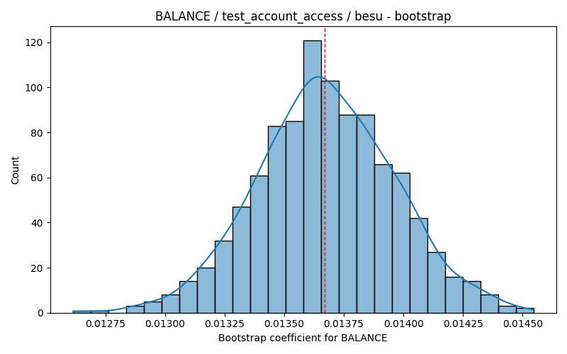

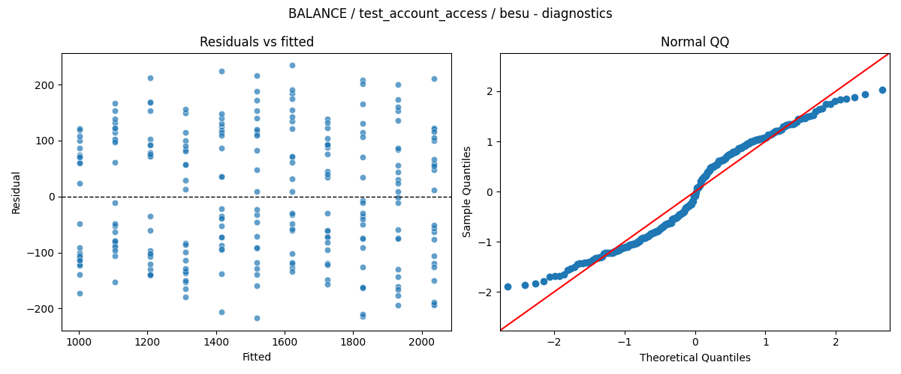

</details>

<details><summary>erigon — NNLS regression summary</summary>

```
==============================================================================
                           NNLS Regression Results                            
==============================================================================
Dep. Variable:          test_runtime_ms              R-squared:          0.979
Model:                  NNLS                    Adj. R-squared:          0.979
No. Observations:       110                               RMSE:          27.94
Df Residuals:           108                                MAE:          19.76
Df Model:               1      
==============================================================================
                      coef     std err     P-value      [0.025      0.975]
------------------------------------------------------------------------------
         const      6.8083      6.5071       0.196      0.0000     21.4795
       opcount      0.0080      0.0001       0.001      0.0078      0.0081
==============================================================================
Notes: Non-negative least squares with bootstrap inference (1000 iterations)
==============================================================================
```

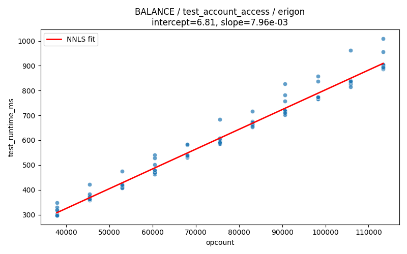

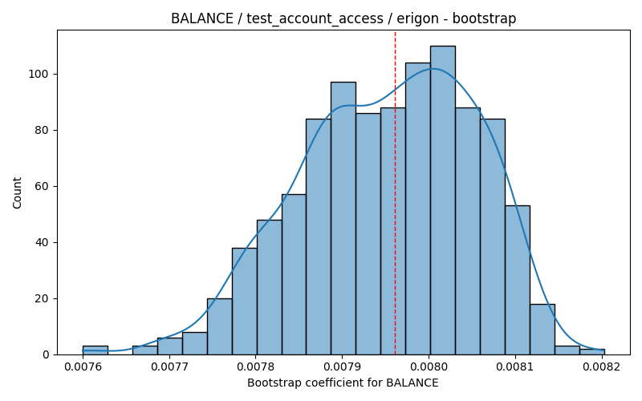

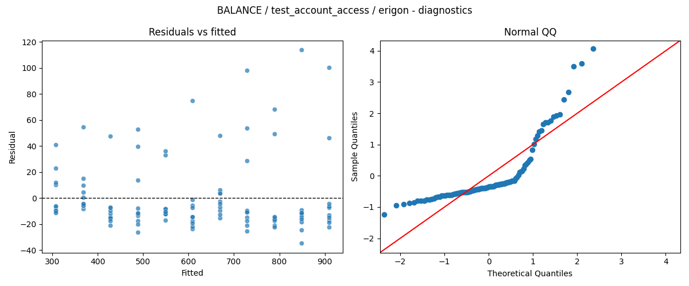

</details>

<details><summary>ethrex — NNLS regression summary</summary>

```
==============================================================================
                           NNLS Regression Results                            
==============================================================================
Dep. Variable:          test_runtime_ms              R-squared:          0.963
Model:                  NNLS                    Adj. R-squared:          0.963
No. Observations:       176                               RMSE:           8.83
Df Residuals:           174                                MAE:           7.03
Df Model:               1      
==============================================================================
                      coef     std err     P-value      [0.025      0.975]
------------------------------------------------------------------------------
         const     29.3967      2.2723       0.001     25.4440     34.0913
       opcount      0.0019      0.0000       0.001      0.0018      0.0019
==============================================================================
Notes: Non-negative least squares with bootstrap inference (1000 iterations)
==============================================================================
```

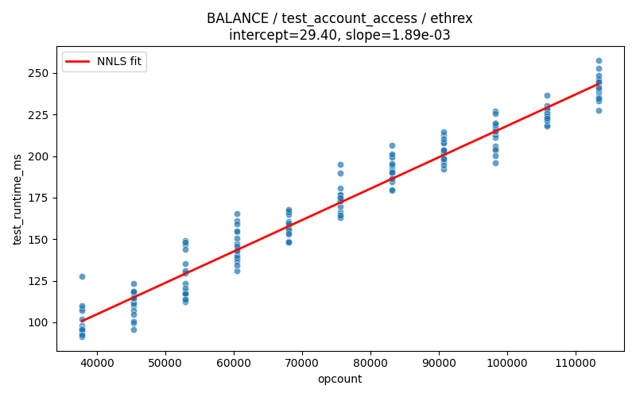

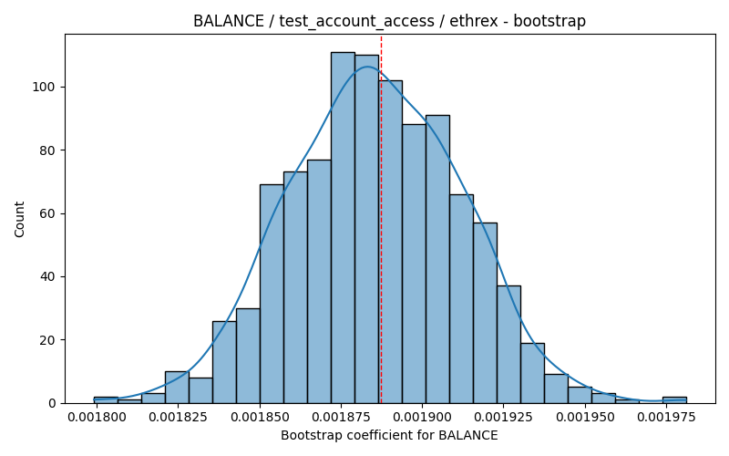

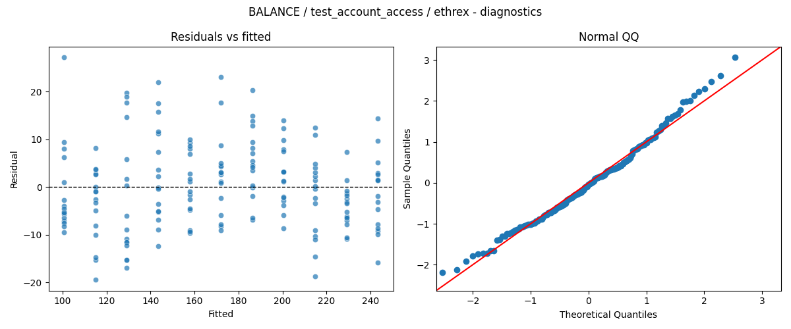

</details>

<details><summary>geth — NNLS regression summary</summary>

```
==============================================================================
                           NNLS Regression Results                            
==============================================================================
Dep. Variable:          test_runtime_ms              R-squared:          0.858
Model:                  NNLS                    Adj. R-squared:          0.857
No. Observations:       154                               RMSE:         209.85
Df Residuals:           152                                MAE:         176.75
Df Model:               1      
==============================================================================
                      coef     std err     P-value      [0.025      0.975]
------------------------------------------------------------------------------
         const    716.7728     66.6364       0.001    586.0274    836.9735
       opcount      0.0216      0.0008       0.001      0.0202      0.0231
==============================================================================
Notes: Non-negative least squares with bootstrap inference (1000 iterations)
==============================================================================
```

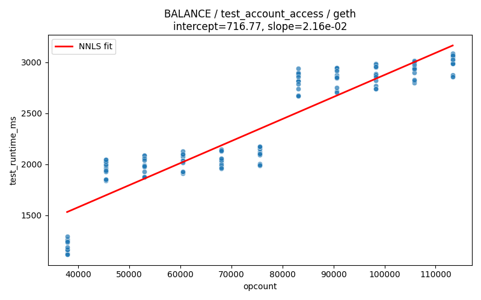

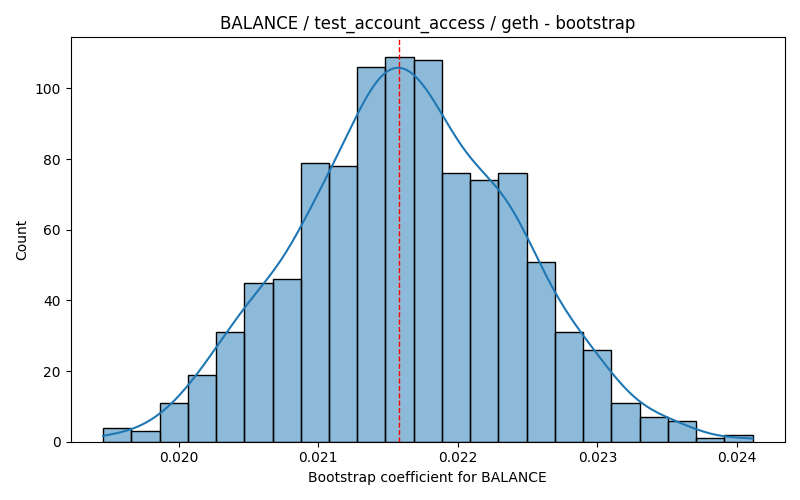

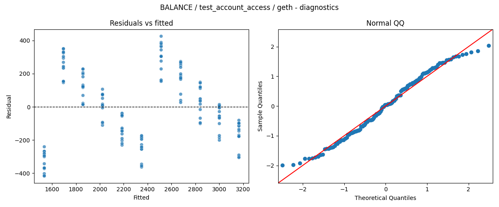

</details>

<details><summary>nethermind — NNLS regression summary</summary>

```
==============================================================================
                           NNLS Regression Results                            
==============================================================================
Dep. Variable:          test_runtime_ms              R-squared:          0.754
Model:                  NNLS                    Adj. R-squared:          0.752
No. Observations:       132                               RMSE:          50.94
Df Residuals:           130                                MAE:          35.05
Df Model:               1      
==============================================================================
                      coef     std err     P-value      [0.025      0.975]
------------------------------------------------------------------------------
         const     80.1680     10.7129       0.001     58.3953    101.6907
       opcount      0.0037      0.0002       0.001      0.0034      0.0041
==============================================================================
Notes: Non-negative least squares with bootstrap inference (1000 iterations)
==============================================================================
```

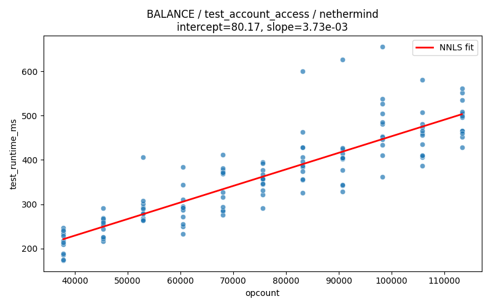

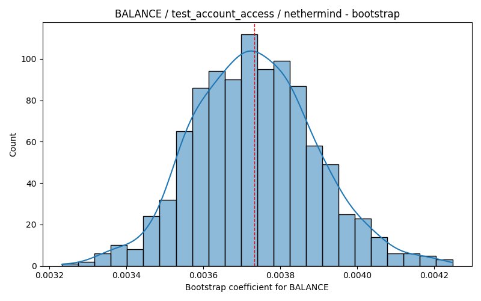

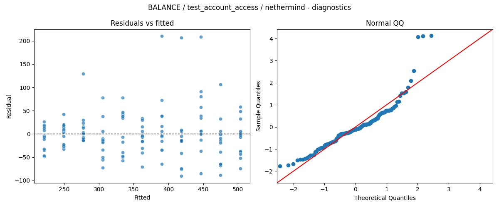

</details>

<details><summary>reth — NNLS regression summary</summary>

```
==============================================================================
                           NNLS Regression Results                            
==============================================================================
Dep. Variable:          test_runtime_ms              R-squared:          0.901
Model:                  NNLS                    Adj. R-squared:          0.901
No. Observations:       198                               RMSE:           6.04
Df Residuals:           196                                MAE:           4.68
Df Model:               1      
==============================================================================
                      coef     std err     P-value      [0.025      0.975]
------------------------------------------------------------------------------
         const     44.1362      1.2976       0.001     41.4756     46.6152
       opcount      0.0008      0.0000       0.001      0.0007      0.0008
==============================================================================
Notes: Non-negative least squares with bootstrap inference (1000 iterations)
==============================================================================
```

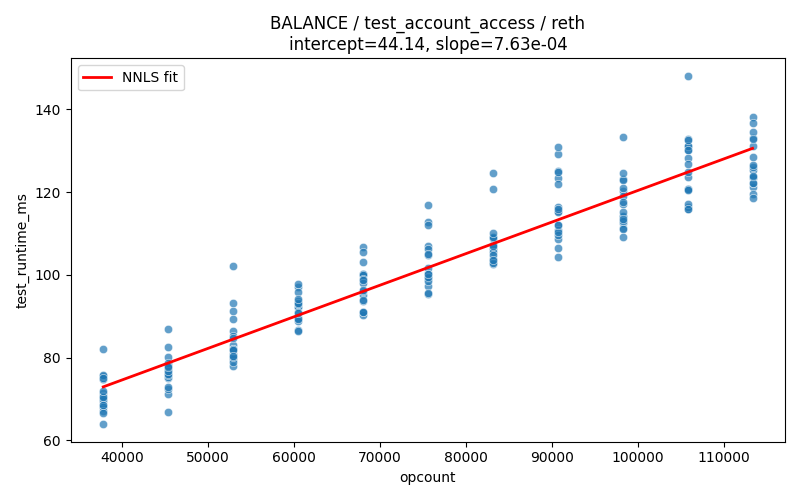

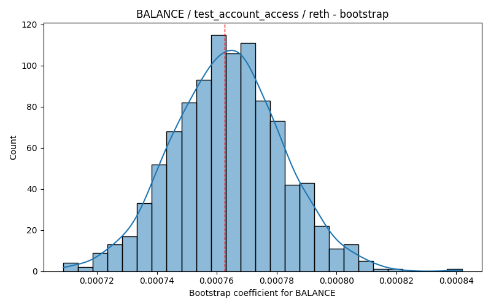

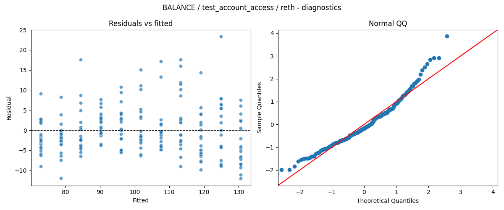

</details>

### test_account_access — combo `BALANCE_AccountMode.EXISTING_CONTRACT`

| client | nobs | R² | target_coef (ms) | p-value | 95% CI |
| --- | --- | --- | --- | --- | --- |
| `besu` | 253 | 0.895 | 0.02558 | 1.00e-03 | [0.02456, 0.0266] |
| `erigon` | 110 | 0.9322 | 0.02464 | 1.00e-03 | [0.02333, 0.02568] |
| `ethrex` | 176 | 0.9933 | 0.007335 | 1.00e-03 | [0.007252, 0.00742] |
| `geth` | 154 | 0.8548 | 0.02296 | 1.00e-03 | [0.0214, 0.02461] |
| `nethermind` | 132 | 0.553 | 0.01298 | 1.00e-03 | [0.01084, 0.01517] |
| `reth` | 198 | 0.98 | 0.003976 | 1.00e-03 | [0.003889, 0.004069] |

<details><summary>besu — NNLS regression summary</summary>

```
==============================================================================
                           NNLS Regression Results                            
==============================================================================
Dep. Variable:          test_runtime_ms              R-squared:          0.895
Model:                  NNLS                    Adj. R-squared:          0.895
No. Observations:       253                               RMSE:         182.30
Df Residuals:           251                                MAE:         145.30
Df Model:               1      
==============================================================================
                      coef     std err     P-value      [0.025      0.975]
------------------------------------------------------------------------------
         const    547.4567     33.3733       0.001    484.2797    613.8063
       opcount      0.0256      0.0005       0.001      0.0246      0.0266
==============================================================================
Notes: Non-negative least squares with bootstrap inference (1000 iterations)
==============================================================================
```

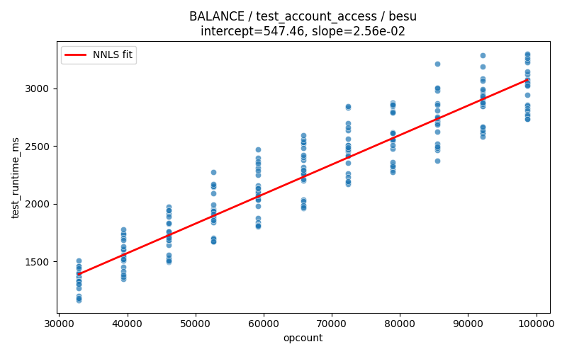

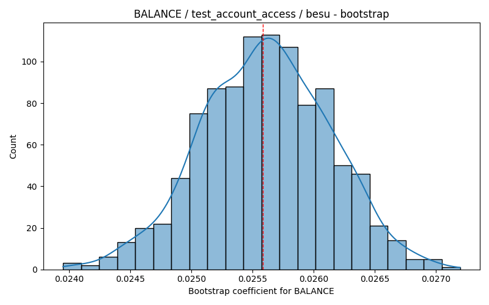

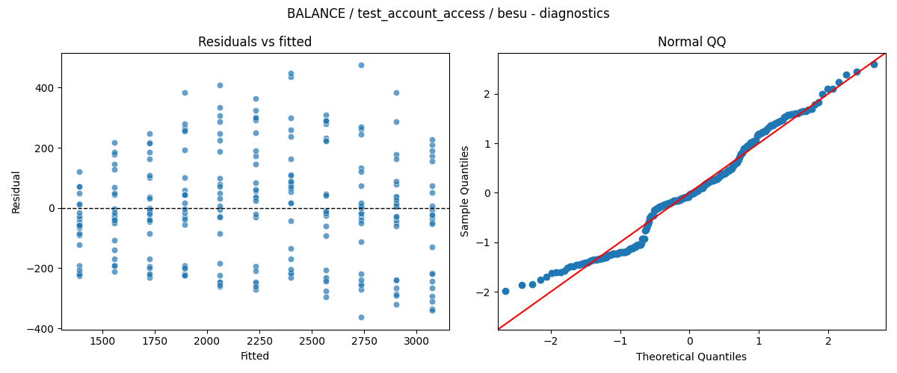

</details>

<details><summary>erigon — NNLS regression summary</summary>

```
==============================================================================
                           NNLS Regression Results                            
==============================================================================
Dep. Variable:          test_runtime_ms              R-squared:          0.932
Model:                  NNLS                    Adj. R-squared:          0.932
No. Observations:       110                               RMSE:         138.31
Df Residuals:           108                                MAE:         119.57
Df Model:               1      
==============================================================================
                      coef     std err     P-value      [0.025      0.975]
------------------------------------------------------------------------------
         const    377.9918     44.7440       0.001    299.2076    473.6818
       opcount      0.0246      0.0006       0.001      0.0233      0.0257
==============================================================================
Notes: Non-negative least squares with bootstrap inference (1000 iterations)
==============================================================================
```

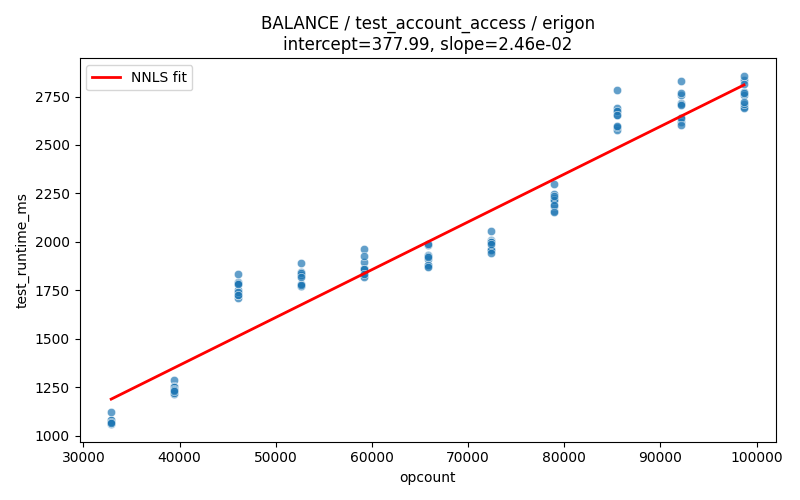

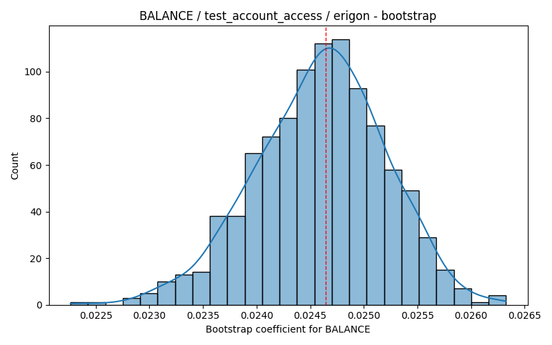

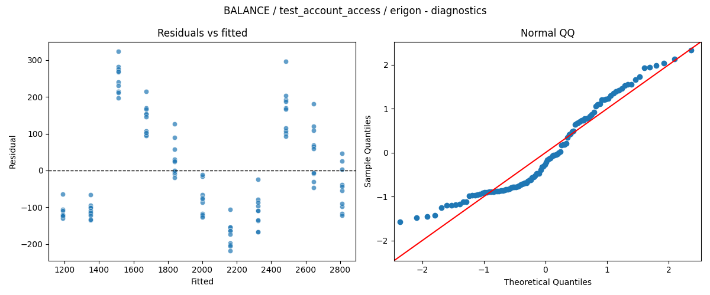

</details>

<details><summary>ethrex — NNLS regression summary</summary>

```
==============================================================================
                           NNLS Regression Results                            
==============================================================================
Dep. Variable:          test_runtime_ms              R-squared:          0.993
Model:                  NNLS                    Adj. R-squared:          0.993
No. Observations:       176                               RMSE:          12.52
Df Residuals:           174                                MAE:           9.87
Df Model:               1      
==============================================================================
                      coef     std err     P-value      [0.025      0.975]
------------------------------------------------------------------------------
         const     47.8108      2.9318       0.001     42.1395     53.6075
       opcount      0.0073      0.0000       0.001      0.0073      0.0074
==============================================================================
Notes: Non-negative least squares with bootstrap inference (1000 iterations)
==============================================================================
```

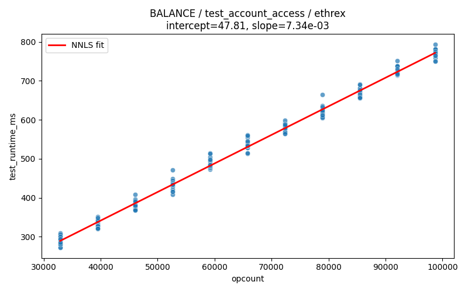

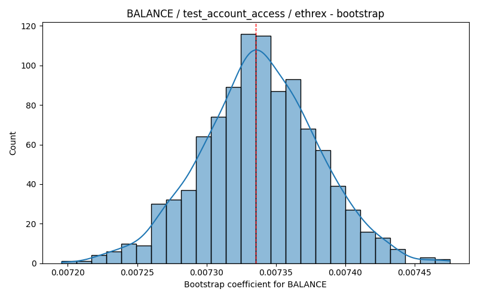

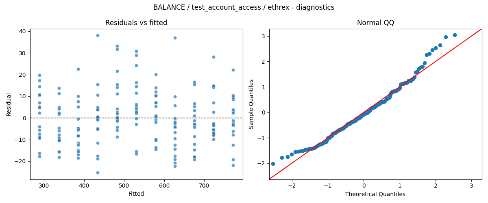

</details>

<details><summary>geth — NNLS regression summary</summary>

```
==============================================================================
                           NNLS Regression Results                            
==============================================================================
Dep. Variable:          test_runtime_ms              R-squared:          0.855
Model:                  NNLS                    Adj. R-squared:          0.854
No. Observations:       154                               RMSE:         196.91
Df Residuals:           152                                MAE:         164.79
Df Model:               1      
==============================================================================
                      coef     std err     P-value      [0.025      0.975]
------------------------------------------------------------------------------
         const    683.3984     61.0697       0.001    561.5483    796.9049
       opcount      0.0230      0.0008       0.001      0.0214      0.0246
==============================================================================
Notes: Non-negative least squares with bootstrap inference (1000 iterations)
==============================================================================
```

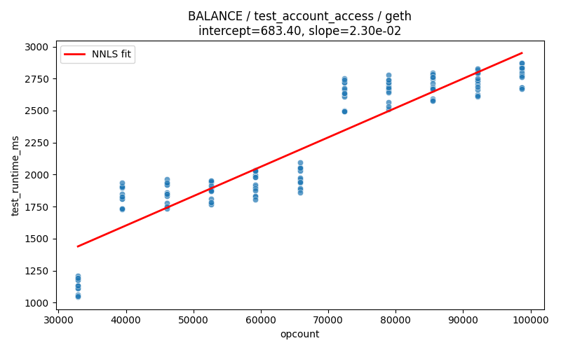

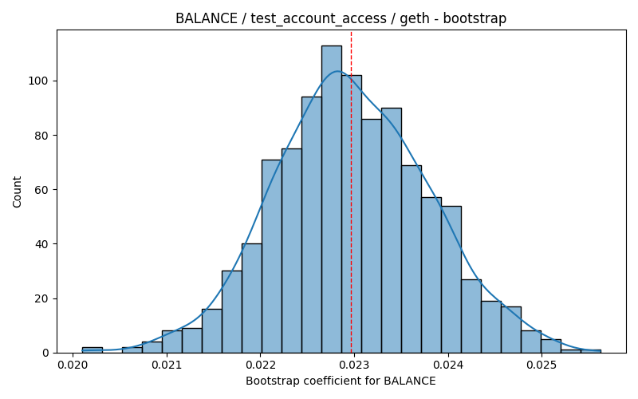

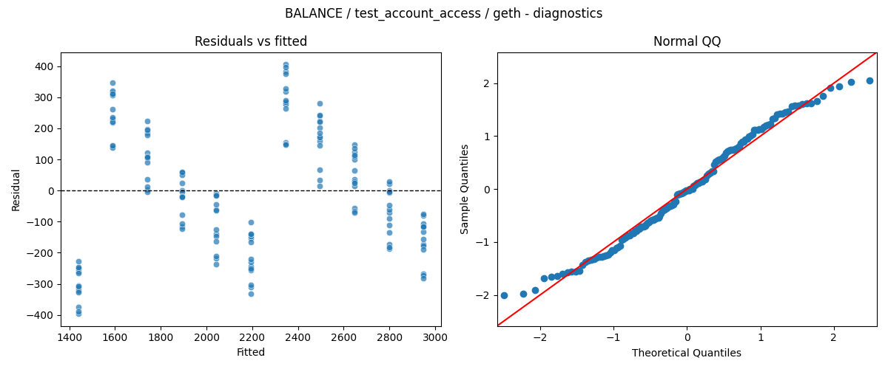

</details>

<details><summary>nethermind — NNLS regression summary</summary>

```
==============================================================================
                           NNLS Regression Results                            
==============================================================================
Dep. Variable:          test_runtime_ms              R-squared:          0.553
Model:                  NNLS                    Adj. R-squared:          0.550
No. Observations:       132                               RMSE:         242.79
Df Residuals:           130                                MAE:         190.13
Df Model:               1      
==============================================================================
                      coef     std err     P-value      [0.025      0.975]
------------------------------------------------------------------------------
         const    193.2280     64.7494       0.003     65.9754    327.2712
       opcount      0.0130      0.0011       0.001      0.0108      0.0152
==============================================================================
Notes: Non-negative least squares with bootstrap inference (1000 iterations)
==============================================================================
```

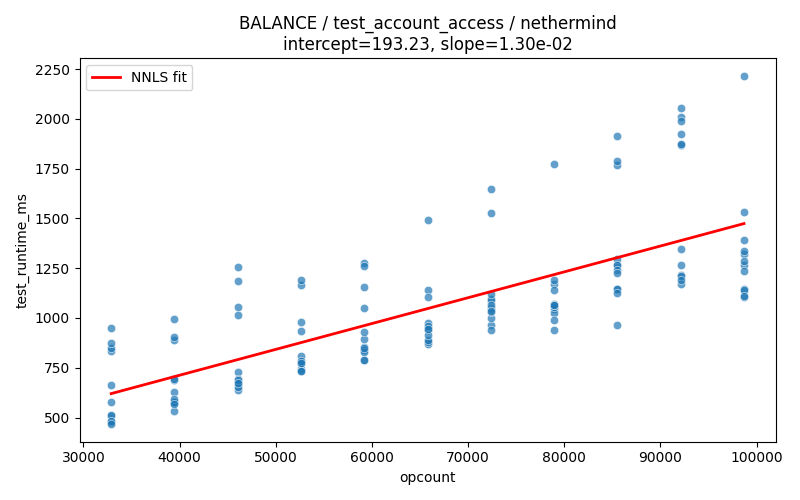

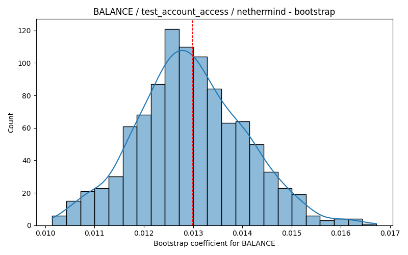

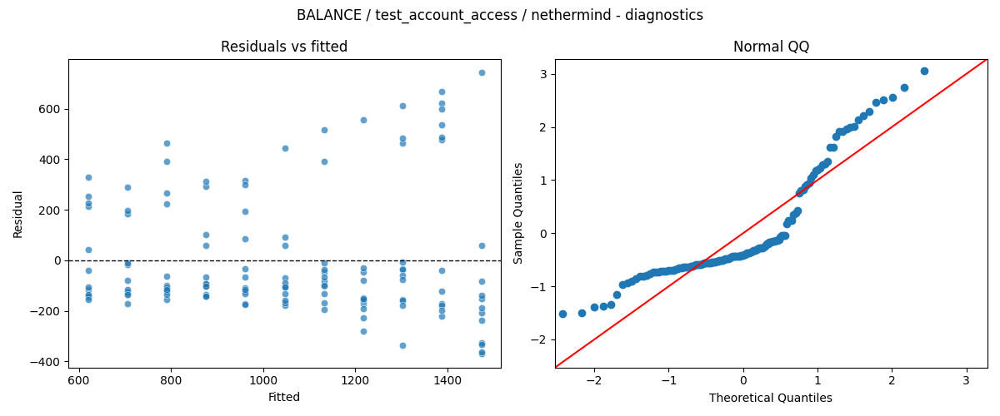

</details>

<details><summary>reth — NNLS regression summary</summary>

```
==============================================================================
                           NNLS Regression Results                            
==============================================================================
Dep. Variable:          test_runtime_ms              R-squared:          0.980
Model:                  NNLS                    Adj. R-squared:          0.980
No. Observations:       198                               RMSE:          11.82
Df Residuals:           196                                MAE:           9.64
Df Model:               1      
==============================================================================
                      coef     std err     P-value      [0.025      0.975]
------------------------------------------------------------------------------
         const     95.2325      2.9314       0.001     89.4981    101.1432
       opcount      0.0040      0.0000       0.001      0.0039      0.0041
==============================================================================
Notes: Non-negative least squares with bootstrap inference (1000 iterations)
==============================================================================
```

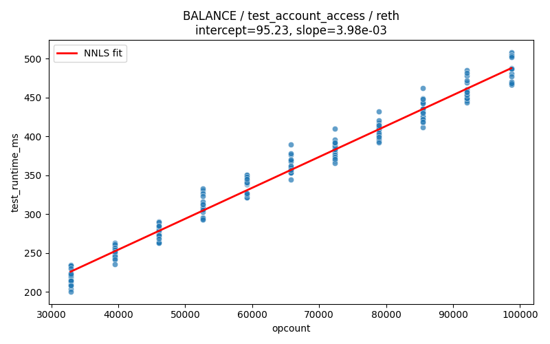

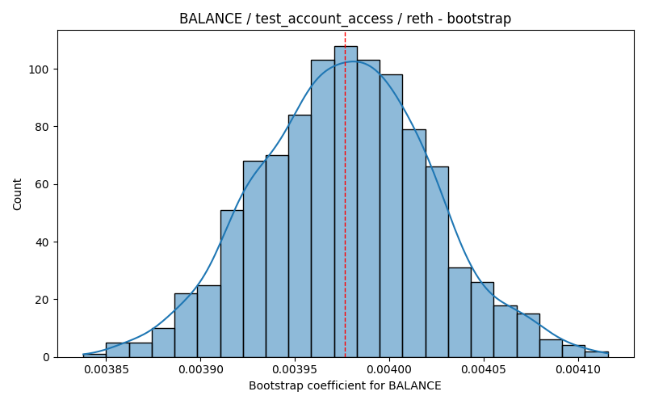

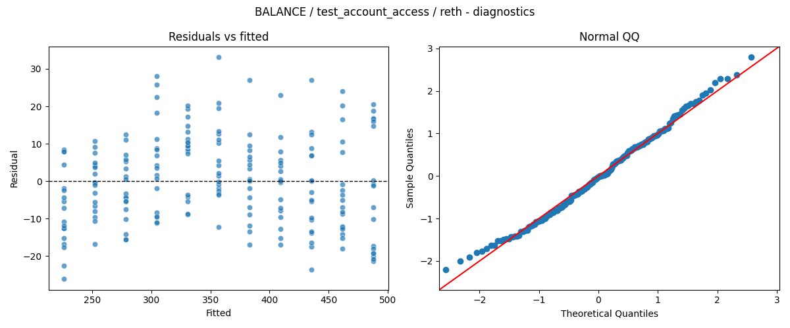

</details>

### test_account_access — combo `BALANCE_AccountMode.NON_EXISTING_ACCOUNT` — `presets[cold_account_code_access]`

| client | nobs | R² | target_coef (ms) | p-value | 95% CI |
| --- | --- | --- | --- | --- | --- |
| `besu` | 253 | 0.8896 | 0.01367 | 1.00e-03 | [0.01311, 0.01426] |
| `erigon` | 110 | 0.9789 | 0.007961 | 1.00e-03 | [0.007755, 0.008115] |
| `ethrex` | 176 | 0.963 | 0.001887 | 1.00e-03 | [0.001837, 0.001935] |
| `geth` | 154 | 0.858 | 0.02158 | 1.00e-03 | [0.02018, 0.02315] |
| `nethermind` | 132 | 0.754 | 0.003732 | 1.00e-03 | [0.003427, 0.004055] |
| `reth` | 198 | 0.9012 | 0.0007627 | 1.00e-03 | [0.0007279, 0.0007994] |

<details><summary>besu — NNLS regression summary</summary>

```
==============================================================================
                           NNLS Regression Results                            
==============================================================================
Dep. Variable:          test_runtime_ms              R-squared:          0.890
Model:                  NNLS                    Adj. R-squared:          0.889
No. Observations:       253                               RMSE:         115.08
Df Residuals:           251                                MAE:         103.26
Df Model:               1      
==============================================================================
                      coef     std err     P-value      [0.025      0.975]
------------------------------------------------------------------------------
         const    485.3422     22.6994       0.001    438.5376    530.1875
       opcount      0.0137      0.0003       0.001      0.0131      0.0143
==============================================================================
Notes: Non-negative least squares with bootstrap inference (1000 iterations)
==============================================================================
```


</details>

<details><summary>erigon — NNLS regression summary</summary>

```
==============================================================================
                           NNLS Regression Results                            
==============================================================================
Dep. Variable:          test_runtime_ms              R-squared:          0.979
Model:                  NNLS                    Adj. R-squared:          0.979
No. Observations:       110                               RMSE:          27.94
Df Residuals:           108                                MAE:          19.76
Df Model:               1      
==============================================================================
                      coef     std err     P-value      [0.025      0.975]
------------------------------------------------------------------------------
         const      6.8083      6.5071       0.196      0.0000     21.4795
       opcount      0.0080      0.0001       0.001      0.0078      0.0081
==============================================================================
Notes: Non-negative least squares with bootstrap inference (1000 iterations)
==============================================================================
```


</details>

<details><summary>ethrex — NNLS regression summary</summary>

```
==============================================================================
                           NNLS Regression Results                            
==============================================================================
Dep. Variable:          test_runtime_ms              R-squared:          0.963
Model:                  NNLS                    Adj. R-squared:          0.963
No. Observations:       176                               RMSE:           8.83
Df Residuals:           174                                MAE:           7.03
Df Model:               1      
==============================================================================
                      coef     std err     P-value      [0.025      0.975]
------------------------------------------------------------------------------
         const     29.3967      2.2723       0.001     25.4440     34.0913
       opcount      0.0019      0.0000       0.001      0.0018      0.0019
==============================================================================
Notes: Non-negative least squares with bootstrap inference (1000 iterations)
==============================================================================
```


</details>

<details><summary>geth — NNLS regression summary</summary>

```
==============================================================================
                           NNLS Regression Results                            
==============================================================================
Dep. Variable:          test_runtime_ms              R-squared:          0.858
Model:                  NNLS                    Adj. R-squared:          0.857
No. Observations:       154                               RMSE:         209.85
Df Residuals:           152                                MAE:         176.75
Df Model:               1      
==============================================================================
                      coef     std err     P-value      [0.025      0.975]
------------------------------------------------------------------------------
         const    716.7728     66.6364       0.001    586.0274    836.9735
       opcount      0.0216      0.0008       0.001      0.0202      0.0231
==============================================================================
Notes: Non-negative least squares with bootstrap inference (1000 iterations)
==============================================================================
```


</details>

<details><summary>nethermind — NNLS regression summary</summary>

```
==============================================================================
                           NNLS Regression Results                            
==============================================================================
Dep. Variable:          test_runtime_ms              R-squared:          0.754
Model:                  NNLS                    Adj. R-squared:          0.752
No. Observations:       132                               RMSE:          50.94
Df Residuals:           130                                MAE:          35.05
Df Model:               1      
==============================================================================
                      coef     std err     P-value      [0.025      0.975]
------------------------------------------------------------------------------
         const     80.1680     10.7129       0.001     58.3953    101.6907
       opcount      0.0037      0.0002       0.001      0.0034      0.0041
==============================================================================
Notes: Non-negative least squares with bootstrap inference (1000 iterations)
==============================================================================
```


</details>

<details><summary>reth — NNLS regression summary</summary>

```
==============================================================================
                           NNLS Regression Results                            
==============================================================================
Dep. Variable:          test_runtime_ms              R-squared:          0.901
Model:                  NNLS                    Adj. R-squared:          0.901
No. Observations:       198                               RMSE:           6.04
Df Residuals:           196                                MAE:           4.68
Df Model:               1      
==============================================================================
                      coef     std err     P-value      [0.025      0.975]
------------------------------------------------------------------------------
         const     44.1362      1.2976       0.001     41.4756     46.6152
       opcount      0.0008      0.0000       0.001      0.0007      0.0008
==============================================================================
Notes: Non-negative least squares with bootstrap inference (1000 iterations)
==============================================================================
```


</details>

### test_ext_account_query_warm — combo `BALANCE`

| client | nobs | R² | target_coef (ms) | p-value | 95% CI |
| --- | --- | --- | --- | --- | --- |
| `besu` | 253 | 0.2768 | 0.0002149 | 1.00e-03 | [0.0001768, 0.0002486] |
| `erigon` | 110 | 0.9117 | 4.368e-05 | 1.00e-03 | [4.078e-05, 4.661e-05] |
| `ethrex` | 176 | 0.7157 | 1.472e-05 | 1.00e-03 | [1.359e-05, 1.578e-05] |
| `geth` | 154 | 0.8119 | 3.072e-05 | 1.00e-03 | [2.853e-05, 3.283e-05] |
| `nethermind` | 132 | 0.7143 | 0.0001375 | 1.00e-03 | [0.000124, 0.0001505] |
| `reth` | 198 | 0.6702 | 1.29e-05 | 1.00e-03 | [1.173e-05, 1.424e-05] |

<details><summary>besu — NNLS regression summary</summary>

```
==============================================================================
                           NNLS Regression Results                            
==============================================================================
Dep. Variable:          test_runtime_ms              R-squared:          0.277
Model:                  NNLS                    Adj. R-squared:          0.274
No. Observations:       253                               RMSE:         203.14
Df Residuals:           251                                MAE:         161.34
Df Model:               1      
==============================================================================
                      coef     std err     P-value      [0.025      0.975]
------------------------------------------------------------------------------
         const    471.5772     37.2958       0.001    402.5256    552.4727
       opcount      0.0002      0.0000       0.001      0.0002      0.0002
==============================================================================
Notes: Non-negative least squares with bootstrap inference (1000 iterations)
==============================================================================
```

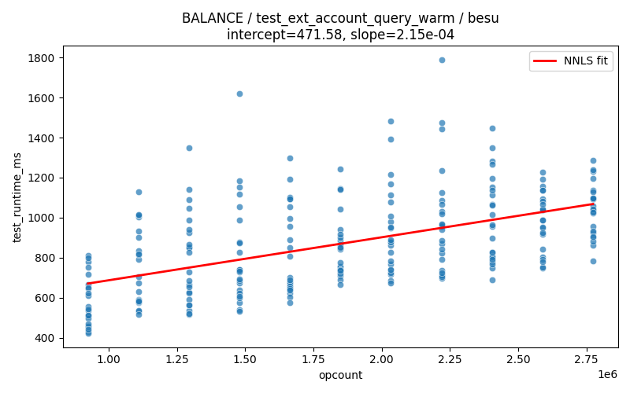

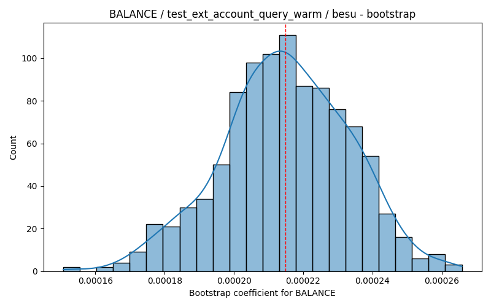

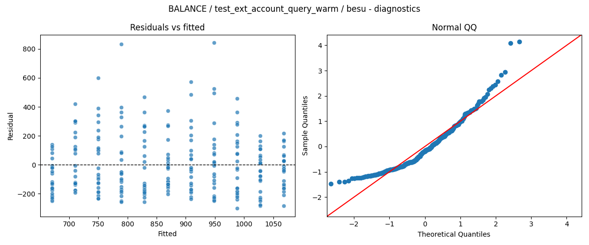

</details>

<details><summary>erigon — NNLS regression summary</summary>

```
==============================================================================
                           NNLS Regression Results                            
==============================================================================
Dep. Variable:          test_runtime_ms              R-squared:          0.912
Model:                  NNLS                    Adj. R-squared:          0.911
No. Observations:       110                               RMSE:           7.95
Df Residuals:           108                                MAE:           6.31
Df Model:               1      
==============================================================================
                      coef     std err     P-value      [0.025      0.975]
------------------------------------------------------------------------------
         const     24.5841      2.6242       0.001     19.5820     29.7677
       opcount      0.0000      0.0000       0.001      0.0000      0.0000
==============================================================================
Notes: Non-negative least squares with bootstrap inference (1000 iterations)
==============================================================================
```

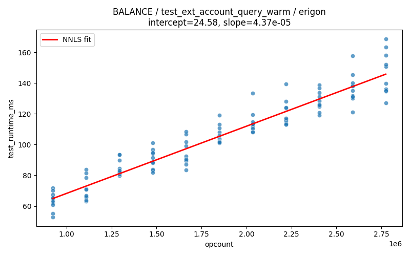

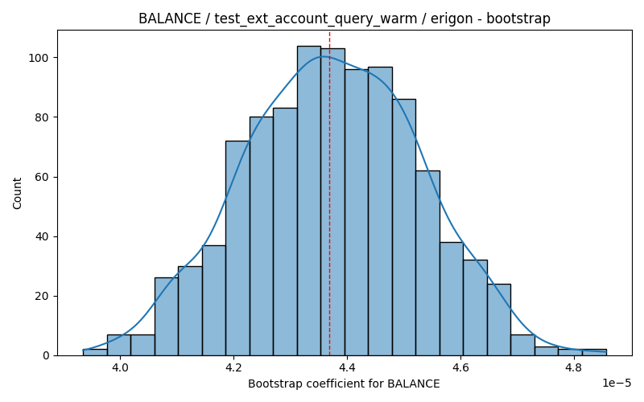

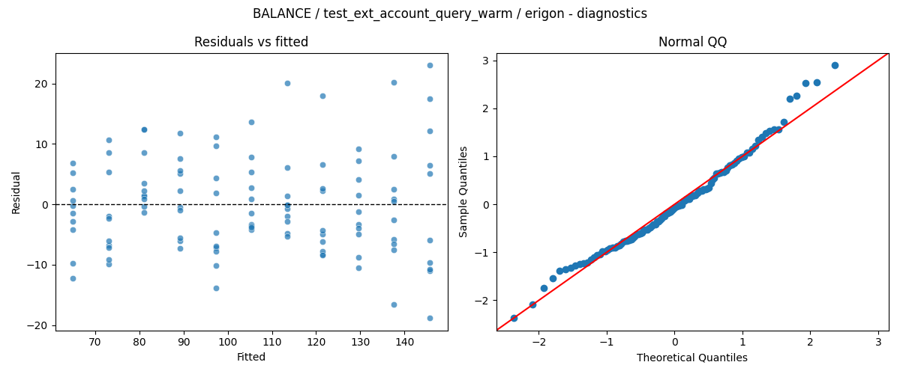

</details>

<details><summary>ethrex — NNLS regression summary</summary>

```
==============================================================================
                           NNLS Regression Results                            
==============================================================================
Dep. Variable:          test_runtime_ms              R-squared:          0.716
Model:                  NNLS                    Adj. R-squared:          0.714
No. Observations:       176                               RMSE:           5.43
Df Residuals:           174                                MAE:           3.51
Df Model:               1      
==============================================================================
                      coef     std err     P-value      [0.025      0.975]
------------------------------------------------------------------------------
         const      8.4924      0.9614       0.001      6.6721     10.3907
       opcount      0.0000      0.0000       0.001      0.0000      0.0000
==============================================================================
Notes: Non-negative least squares with bootstrap inference (1000 iterations)
==============================================================================
```

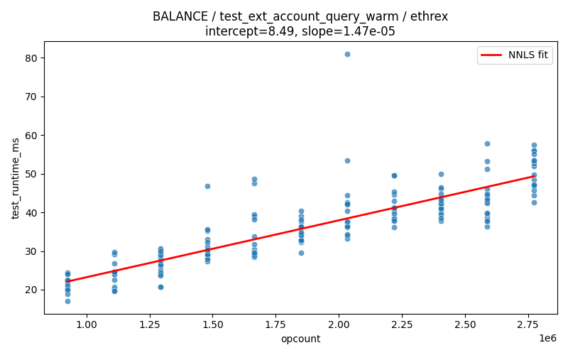

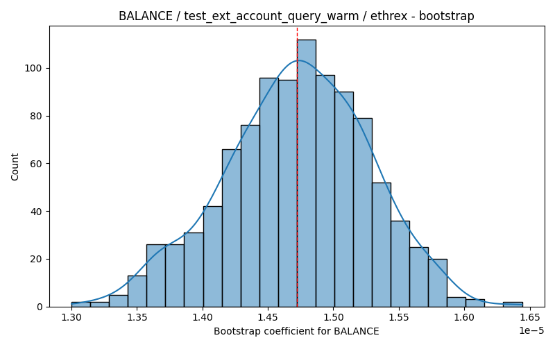

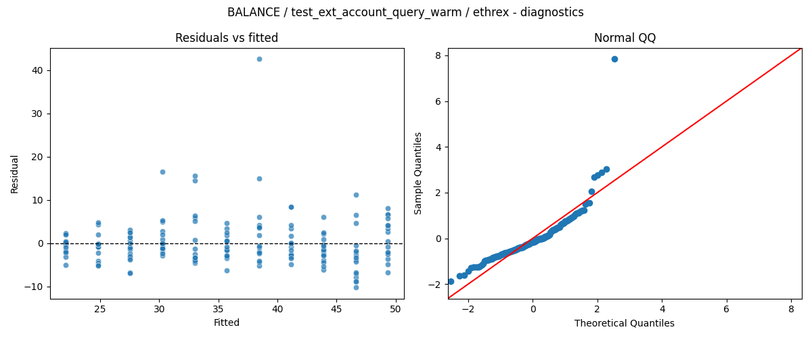

</details>

<details><summary>geth — NNLS regression summary</summary>

```
==============================================================================
                           NNLS Regression Results                            
==============================================================================
Dep. Variable:          test_runtime_ms              R-squared:          0.812
Model:                  NNLS                    Adj. R-squared:          0.811
No. Observations:       154                               RMSE:           8.65
Df Residuals:           152                                MAE:           6.61
Df Model:               1      
==============================================================================
                      coef     std err     P-value      [0.025      0.975]
------------------------------------------------------------------------------
         const     15.5315      1.9030       0.001     11.6531     19.5649
       opcount      0.0000      0.0000       0.001      0.0000      0.0000
==============================================================================
Notes: Non-negative least squares with bootstrap inference (1000 iterations)
==============================================================================
```

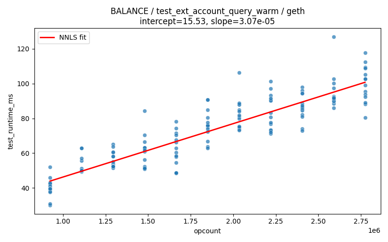

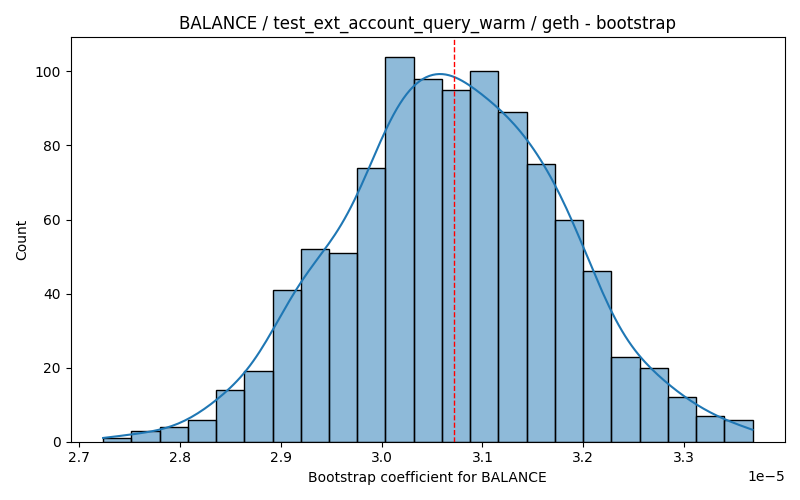

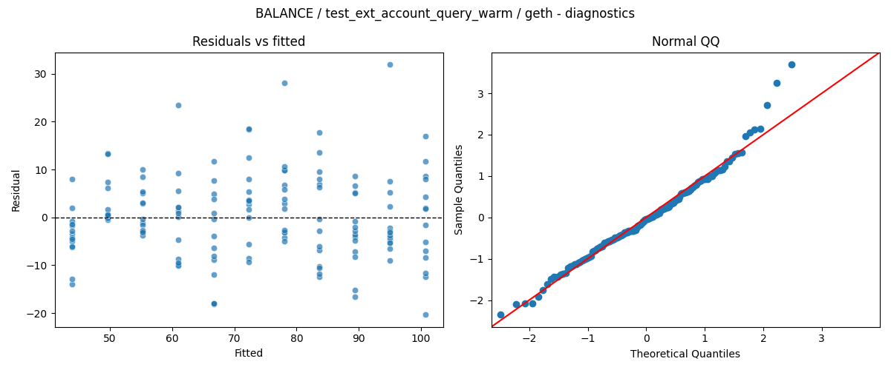

</details>

<details><summary>nethermind — NNLS regression summary</summary>

```
==============================================================================
                           NNLS Regression Results                            
==============================================================================
Dep. Variable:          test_runtime_ms              R-squared:          0.714
Model:                  NNLS                    Adj. R-squared:          0.712
No. Observations:       132                               RMSE:          50.88
Df Residuals:           130                                MAE:          37.12
Df Model:               1      
==============================================================================
                      coef     std err     P-value      [0.025      0.975]
------------------------------------------------------------------------------
         const    105.5078     13.1108       0.001     81.9493    132.1597
       opcount      0.0001      0.0000       0.001      0.0001      0.0002
==============================================================================
Notes: Non-negative least squares with bootstrap inference (1000 iterations)
==============================================================================
```

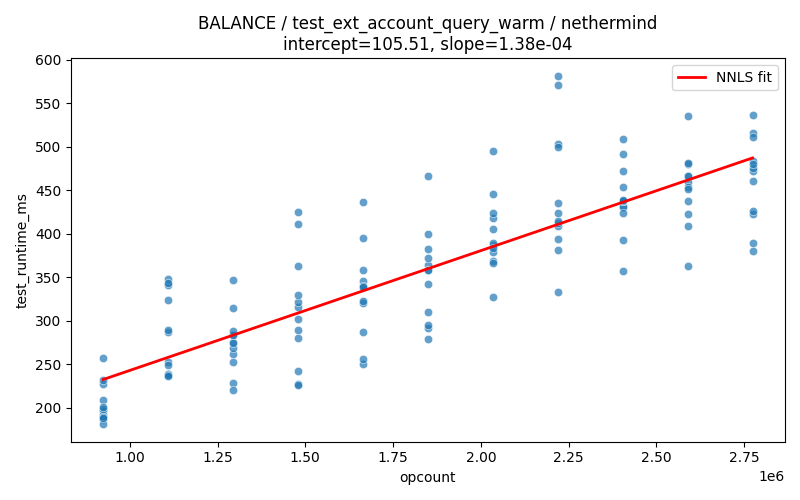

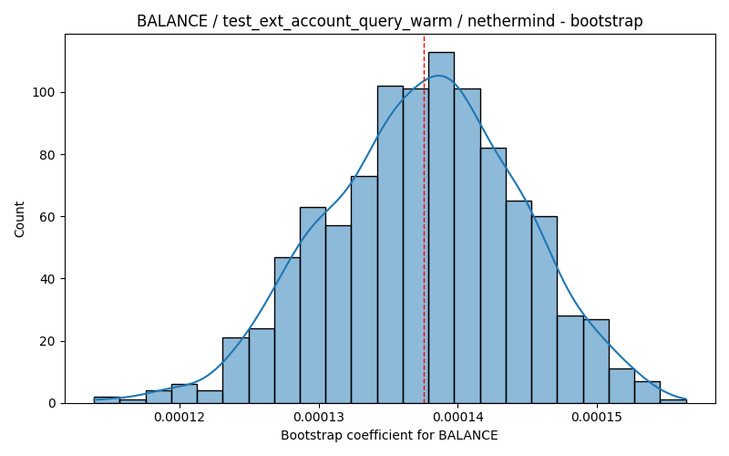

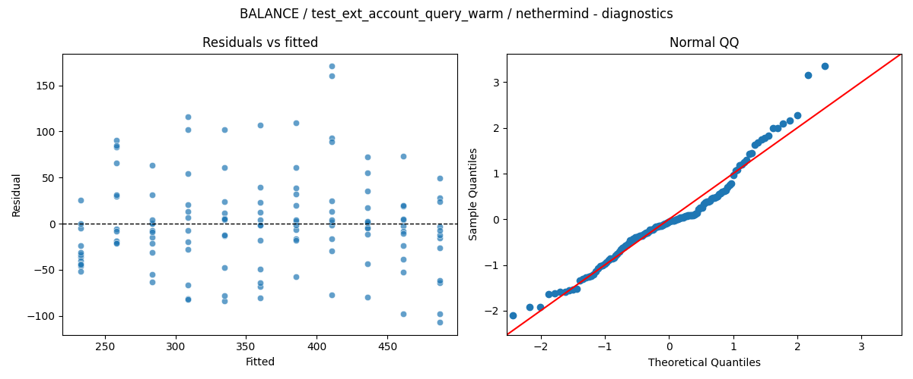

</details>

<details><summary>reth — NNLS regression summary</summary>

```
==============================================================================
                           NNLS Regression Results                            
==============================================================================
Dep. Variable:          test_runtime_ms              R-squared:          0.670
Model:                  NNLS                    Adj. R-squared:          0.669
No. Observations:       198                               RMSE:           5.29
Df Residuals:           196                                MAE:           3.96
Df Model:               1      
==============================================================================
                      coef     std err     P-value      [0.025      0.975]
------------------------------------------------------------------------------
         const      7.8297      1.1368       0.001      5.5510      9.9663
       opcount      0.0000      0.0000       0.001      0.0000      0.0000
==============================================================================
Notes: Non-negative least squares with bootstrap inference (1000 iterations)
==============================================================================
```

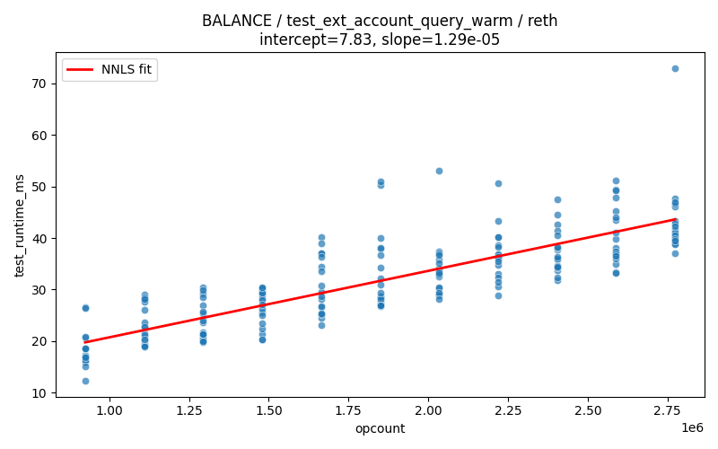

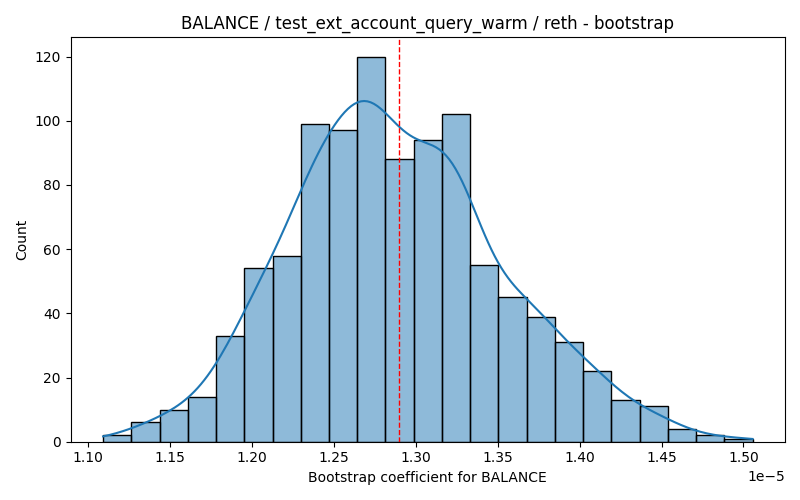

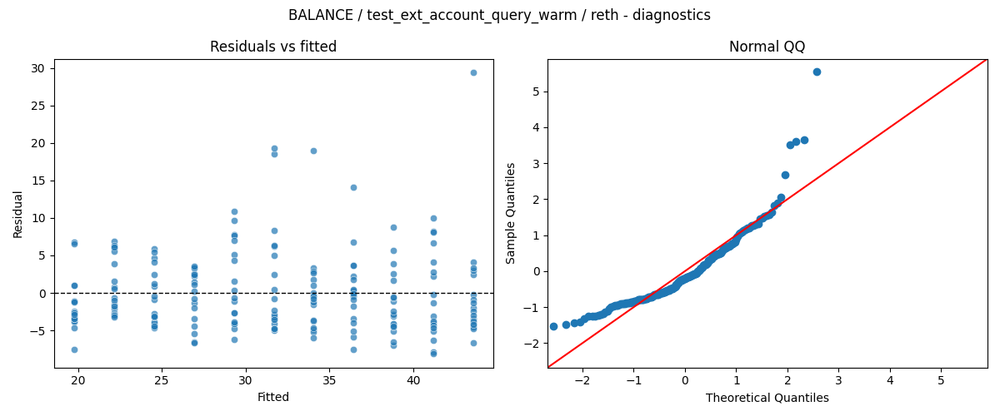

</details>

## CALL

### test_account_access — combo `CALL_AccountMode.EXISTING_EOA` — `presets[cold_account_nocode_access]`

| client | nobs | R² | target_coef (ms) | p-value | 95% CI |
| --- | --- | --- | --- | --- | --- |
| `besu` | 253 | 0.8525 | 0.0158 | 1.00e-03 | [0.01497, 0.01662] |
| `erigon` | 110 | 0.9798 | 0.009979 | 1.00e-03 | [0.009745, 0.01024] |
| `ethrex` | 176 | 0.9946 | 0.006981 | 1.00e-03 | [0.006894, 0.007061] |
| `geth` | 154 | 0.9105 | 0.01075 | 1.00e-03 | [0.01016, 0.01136] |
| `nethermind` | 132 | 0.7551 | 0.004933 | 1.00e-03 | [0.004398, 0.005548] |
| `reth` | 198 | 0.9533 | 0.001111 | 1.00e-03 | [0.001077, 0.001145] |

<details><summary>besu — NNLS regression summary</summary>

```
==============================================================================
                           NNLS Regression Results                            
==============================================================================
Dep. Variable:          test_runtime_ms              R-squared:          0.852
Model:                  NNLS                    Adj. R-squared:          0.852
No. Observations:       253                               RMSE:         156.11
Df Residuals:           251                                MAE:         126.10
Df Model:               1      
==============================================================================
                      coef     std err     P-value      [0.025      0.975]
------------------------------------------------------------------------------
         const    626.9630     31.5361       0.001    567.3779    690.5629
       opcount      0.0158      0.0004       0.001      0.0150      0.0166
==============================================================================
Notes: Non-negative least squares with bootstrap inference (1000 iterations)
==============================================================================
```

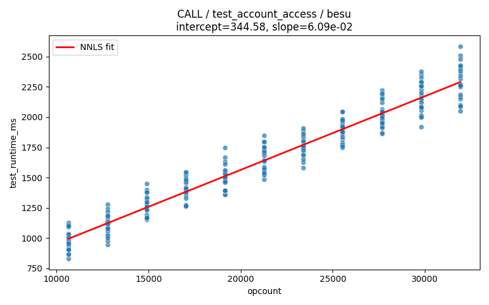

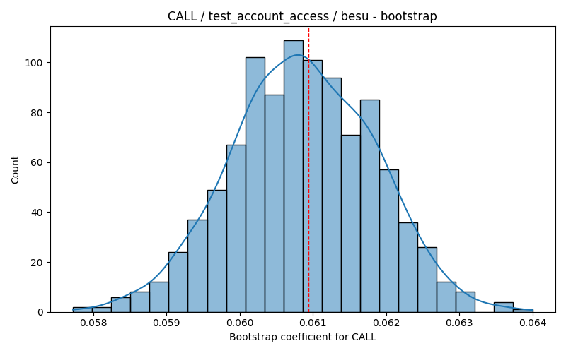

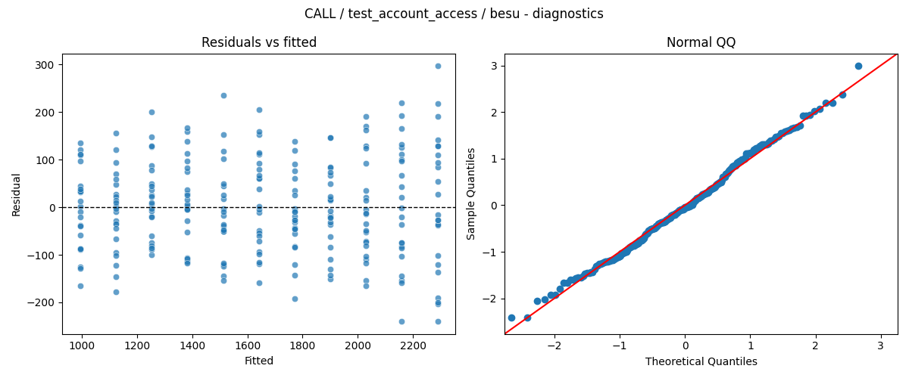

</details>

<details><summary>erigon — NNLS regression summary</summary>

```
==============================================================================
                           NNLS Regression Results                            
==============================================================================
Dep. Variable:          test_runtime_ms              R-squared:          0.980
Model:                  NNLS                    Adj. R-squared:          0.980
No. Observations:       110                               RMSE:          34.06
Df Residuals:           108                                MAE:          25.05
Df Model:               1      
==============================================================================
                      coef     std err     P-value      [0.025      0.975]
------------------------------------------------------------------------------
         const     42.9911      9.3014       0.001     25.0989     60.2604
       opcount      0.0100      0.0001       0.001      0.0097      0.0102
==============================================================================
Notes: Non-negative least squares with bootstrap inference (1000 iterations)
==============================================================================
```

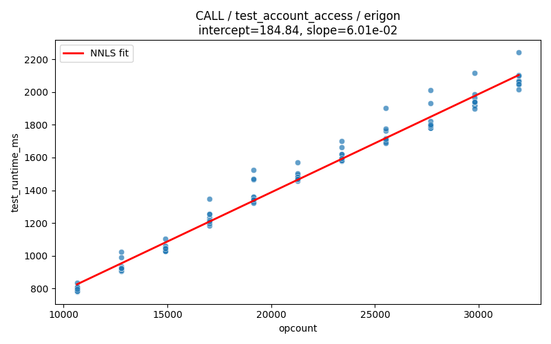

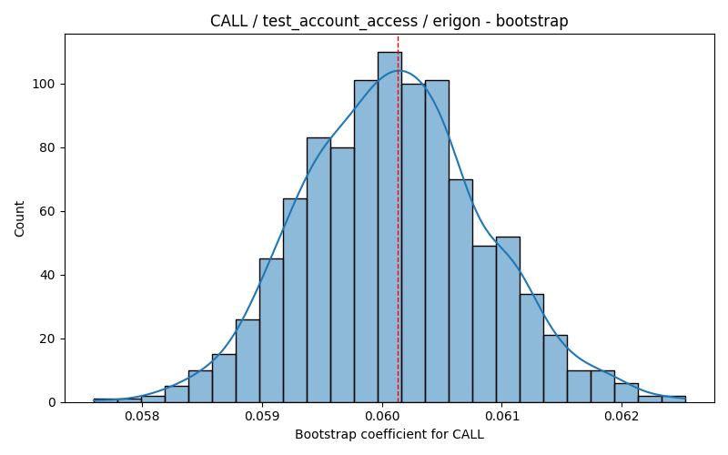

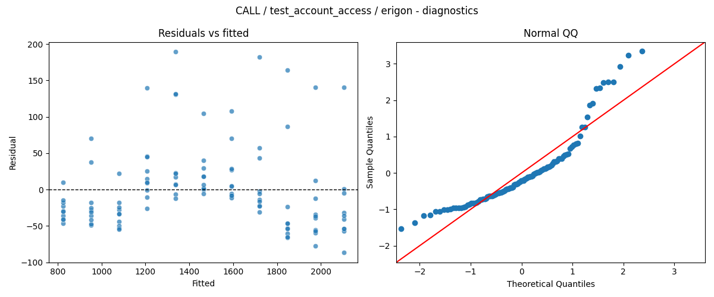

</details>

<details><summary>ethrex — NNLS regression summary</summary>

```
==============================================================================
                           NNLS Regression Results                            
==============================================================================
Dep. Variable:          test_runtime_ms              R-squared:          0.995
Model:                  NNLS                    Adj. R-squared:          0.995
No. Observations:       176                               RMSE:          12.17
Df Residuals:           174                                MAE:           9.62
Df Model:               1      
==============================================================================
                      coef     std err     P-value      [0.025      0.975]
------------------------------------------------------------------------------
         const     46.6552      3.4120       0.001     40.2068     53.7202
       opcount      0.0070      0.0000       0.001      0.0069      0.0071
==============================================================================
Notes: Non-negative least squares with bootstrap inference (1000 iterations)
==============================================================================
```

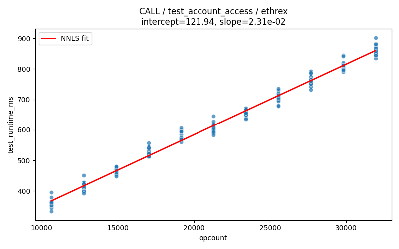

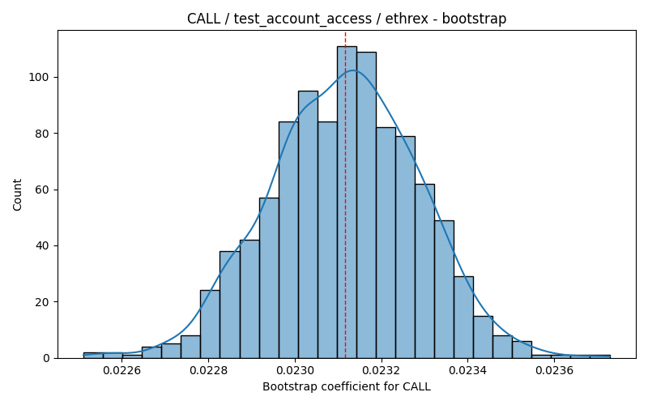

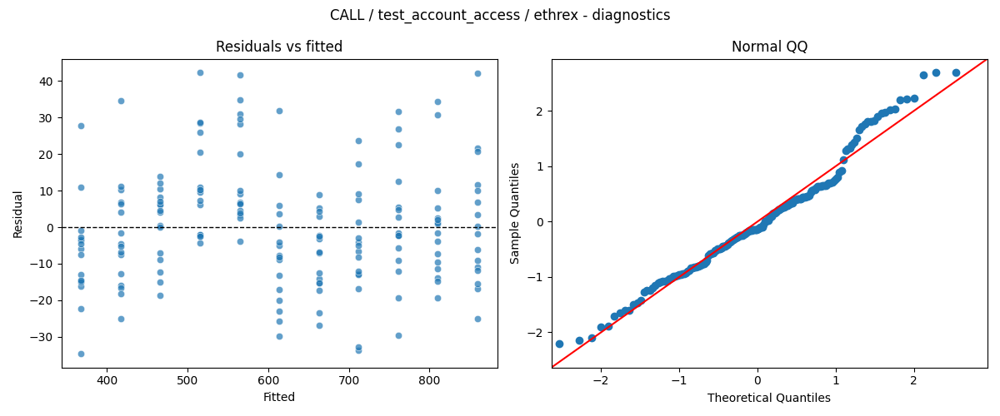

</details>

<details><summary>geth — NNLS regression summary</summary>

```
==============================================================================
                           NNLS Regression Results                            
==============================================================================
Dep. Variable:          test_runtime_ms              R-squared:          0.911
Model:                  NNLS                    Adj. R-squared:          0.910
No. Observations:       154                               RMSE:          80.04
Df Residuals:           152                                MAE:          65.59
Df Model:               1      
==============================================================================
                      coef     std err     P-value      [0.025      0.975]
------------------------------------------------------------------------------
         const    431.5644     27.3045       0.001    379.0382    482.6250
       opcount      0.0108      0.0003       0.001      0.0102      0.0114
==============================================================================
Notes: Non-negative least squares with bootstrap inference (1000 iterations)
==============================================================================
```


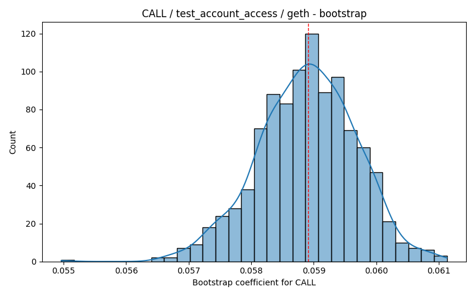

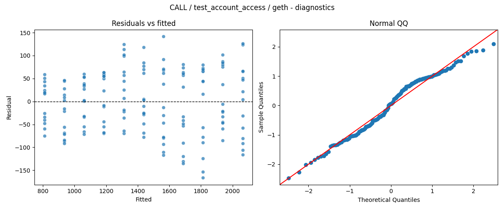

</details>

<details><summary>nethermind — NNLS regression summary</summary>

```
==============================================================================
                           NNLS Regression Results                            
==============================================================================
Dep. Variable:          test_runtime_ms              R-squared:          0.755
Model:                  NNLS                    Adj. R-squared:          0.753
No. Observations:       132                               RMSE:          66.71
Df Residuals:           130                                MAE:          46.70
Df Model:               1      
==============================================================================
                      coef     std err     P-value      [0.025      0.975]
------------------------------------------------------------------------------
         const     60.1316     18.1700       0.002     21.9975     94.7549
       opcount      0.0049      0.0003       0.001      0.0044      0.0055
==============================================================================
Notes: Non-negative least squares with bootstrap inference (1000 iterations)
==============================================================================
```

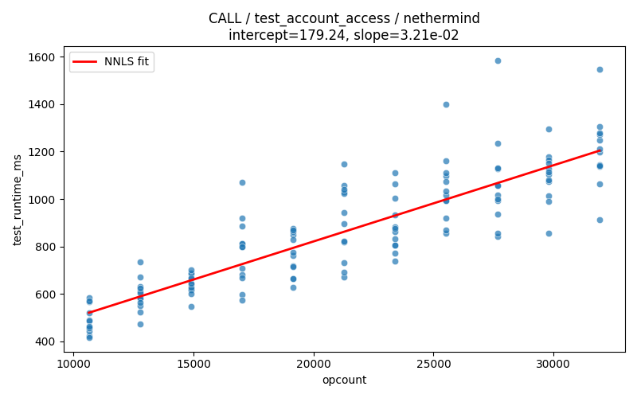

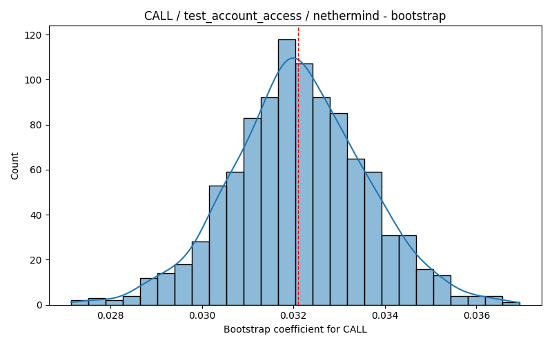

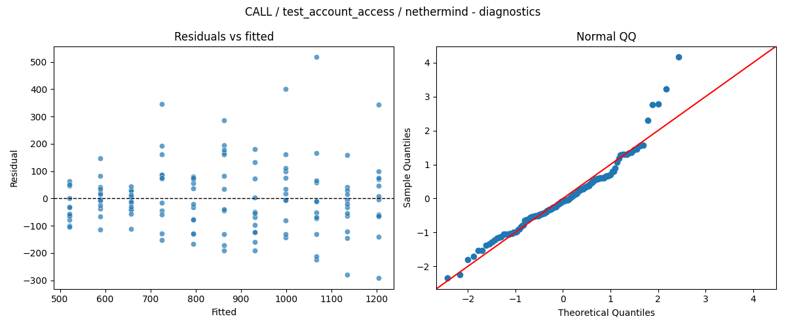

</details>

<details><summary>reth — NNLS regression summary</summary>

```
==============================================================================
                           NNLS Regression Results                            
==============================================================================
Dep. Variable:          test_runtime_ms              R-squared:          0.953
Model:                  NNLS                    Adj. R-squared:          0.953
No. Observations:       198                               RMSE:           5.84
Df Residuals:           196                                MAE:           4.77
Df Model:               1      
==============================================================================
                      coef     std err     P-value      [0.025      0.975]
------------------------------------------------------------------------------
         const     40.3392      1.3668       0.001     37.8904     43.1359
       opcount      0.0011      0.0000       0.001      0.0011      0.0011
==============================================================================
Notes: Non-negative least squares with bootstrap inference (1000 iterations)
==============================================================================
```

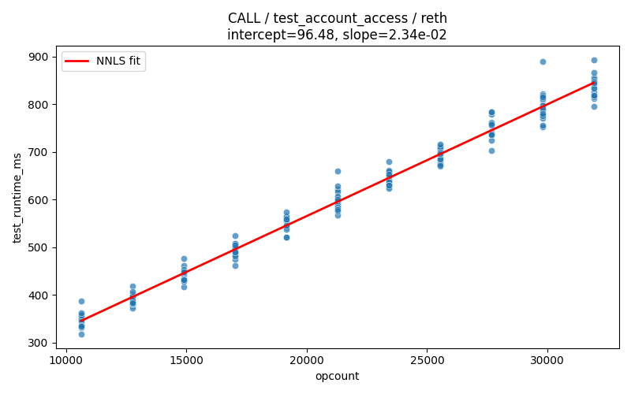

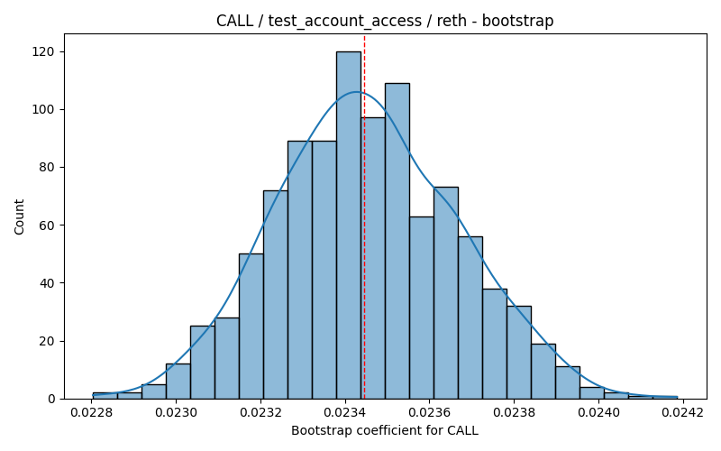

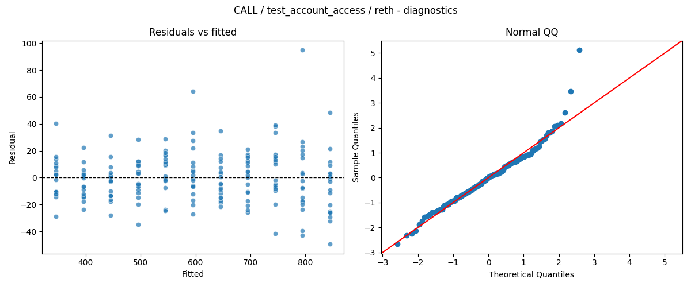

</details>

### test_account_access — combo `CALL_AccountMode.NON_EXISTING_ACCOUNT` — `presets[cold_account_nocode_access]`

| client | nobs | R² | target_coef (ms) | p-value | 95% CI |
| --- | --- | --- | --- | --- | --- |
| `besu` | 253 | 0.8779 | 0.01666 | 1.00e-03 | [0.01594, 0.01739] |
| `erigon` | 110 | 0.9807 | 0.009036 | 1.00e-03 | [0.008801, 0.009265] |
| `ethrex` | 176 | 0.9725 | 0.001988 | 1.00e-03 | [0.001936, 0.002036] |
| `geth` | 154 | 0.8633 | 0.02217 | 1.00e-03 | [0.0206, 0.02365] |
| `nethermind` | 132 | 0.802 | 0.00438 | 1.00e-03 | [0.004012, 0.004729] |
| `reth` | 198 | 0.9171 | 0.000834 | 1.00e-03 | [0.0007996, 0.0008687] |

<details><summary>besu — NNLS regression summary</summary>

```
==============================================================================
                           NNLS Regression Results                            
==============================================================================
Dep. Variable:          test_runtime_ms              R-squared:          0.878
Model:                  NNLS                    Adj. R-squared:          0.877
No. Observations:       253                               RMSE:         147.55
Df Residuals:           251                                MAE:         128.78
Df Model:               1      
==============================================================================
                      coef     std err     P-value      [0.025      0.975]
------------------------------------------------------------------------------
         const    531.1034     28.7481       0.001    474.2156    588.4820
       opcount      0.0167      0.0004       0.001      0.0159      0.0174
==============================================================================
Notes: Non-negative least squares with bootstrap inference (1000 iterations)
==============================================================================
```

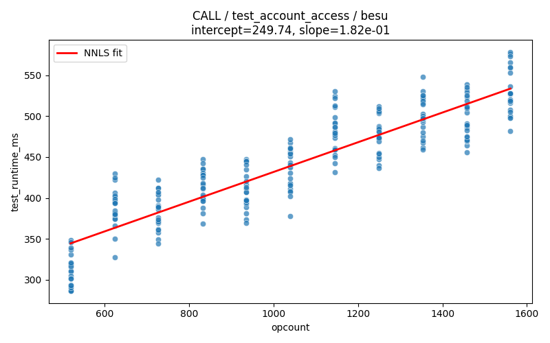

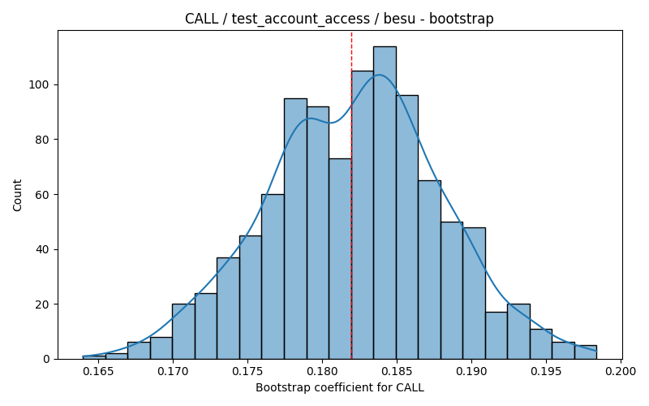

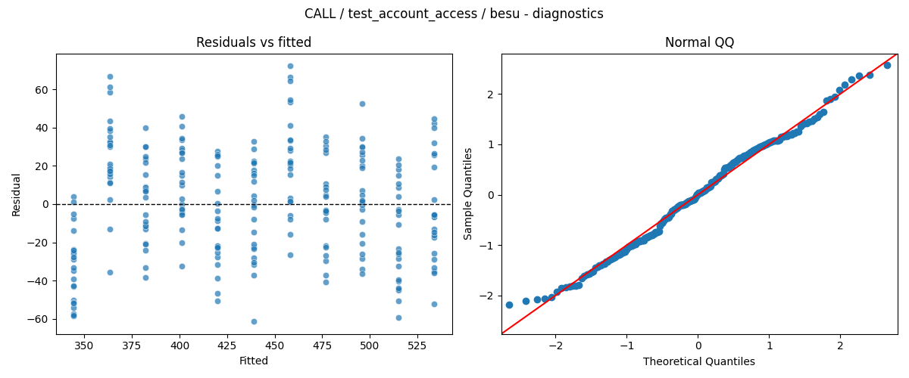

</details>

<details><summary>erigon — NNLS regression summary</summary>

```
==============================================================================
                           NNLS Regression Results                            
==============================================================================
Dep. Variable:          test_runtime_ms              R-squared:          0.981
Model:                  NNLS                    Adj. R-squared:          0.981
No. Observations:       110                               RMSE:          30.10
Df Residuals:           108                                MAE:          20.77
Df Model:               1      
==============================================================================
                      coef     std err     P-value      [0.025      0.975]
------------------------------------------------------------------------------
         const     16.0469      8.7493       0.049      0.0000     33.4098
       opcount      0.0090      0.0001       0.001      0.0088      0.0093
==============================================================================
Notes: Non-negative least squares with bootstrap inference (1000 iterations)
==============================================================================
```

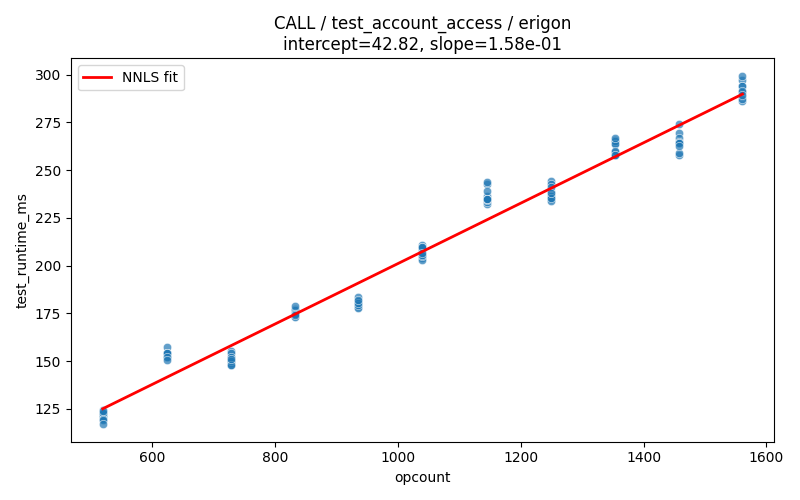

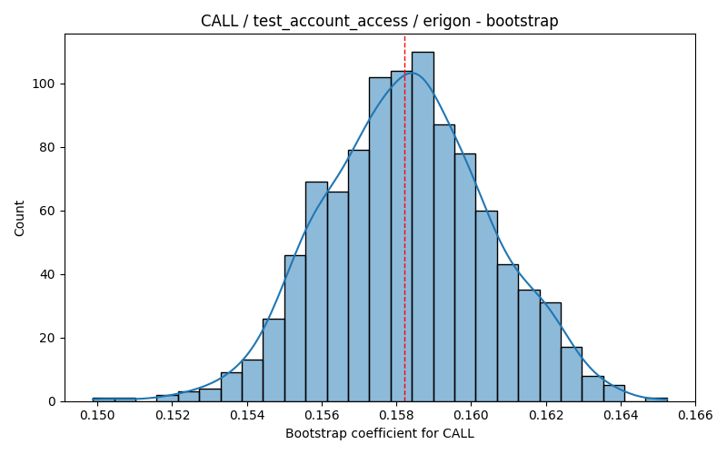

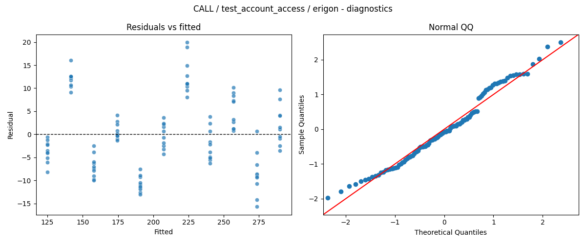

</details>

<details><summary>ethrex — NNLS regression summary</summary>

```
==============================================================================
                           NNLS Regression Results                            
==============================================================================
Dep. Variable:          test_runtime_ms              R-squared:          0.972
Model:                  NNLS                    Adj. R-squared:          0.972
No. Observations:       176                               RMSE:           7.94
Df Residuals:           174                                MAE:           6.63
Df Model:               1      
==============================================================================
                      coef     std err     P-value      [0.025      0.975]
------------------------------------------------------------------------------
         const     26.5027      1.8658       0.001     23.0085     30.2806
       opcount      0.0020      0.0000       0.001      0.0019      0.0020
==============================================================================
Notes: Non-negative least squares with bootstrap inference (1000 iterations)
==============================================================================
```

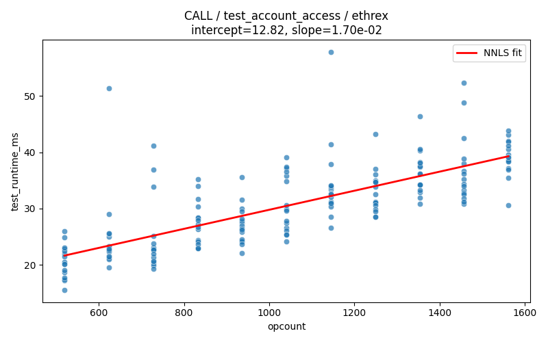

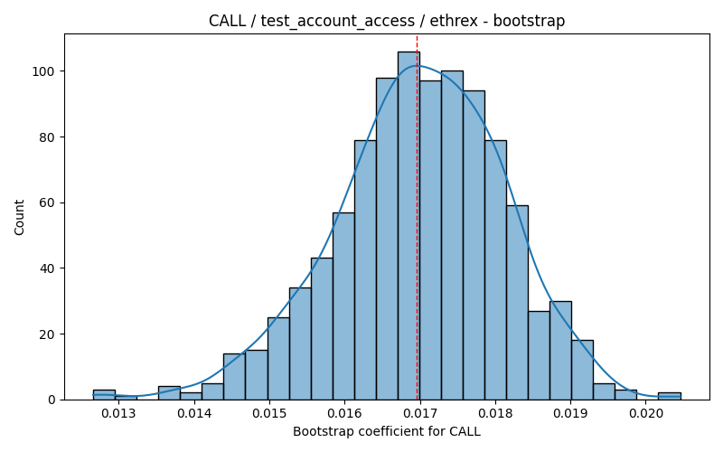

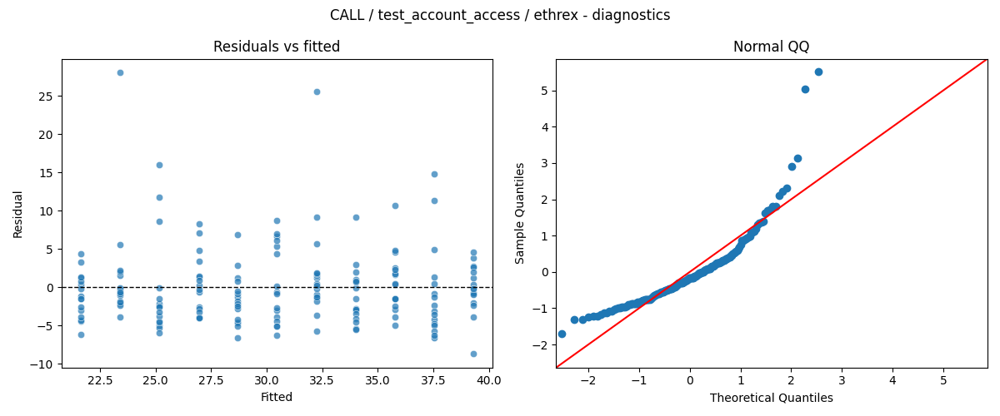

</details>

<details><summary>geth — NNLS regression summary</summary>

```
==============================================================================
                           NNLS Regression Results                            
==============================================================================
Dep. Variable:          test_runtime_ms              R-squared:          0.863
Model:                  NNLS                    Adj. R-squared:          0.862
No. Observations:       154                               RMSE:         209.45
Df Residuals:           152                                MAE:         176.65
Df Model:               1      
==============================================================================
                      coef     std err     P-value      [0.025      0.975]
------------------------------------------------------------------------------
         const    706.9315     66.1297       0.001    582.1364    840.5219
       opcount      0.0222      0.0008       0.001      0.0206      0.0237
==============================================================================
Notes: Non-negative least squares with bootstrap inference (1000 iterations)
==============================================================================
```

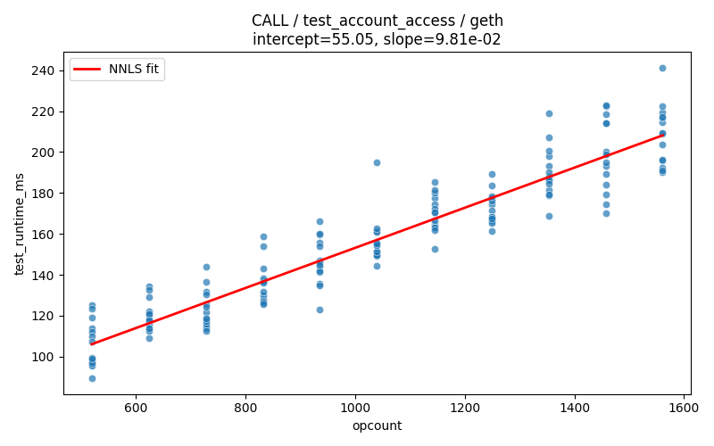

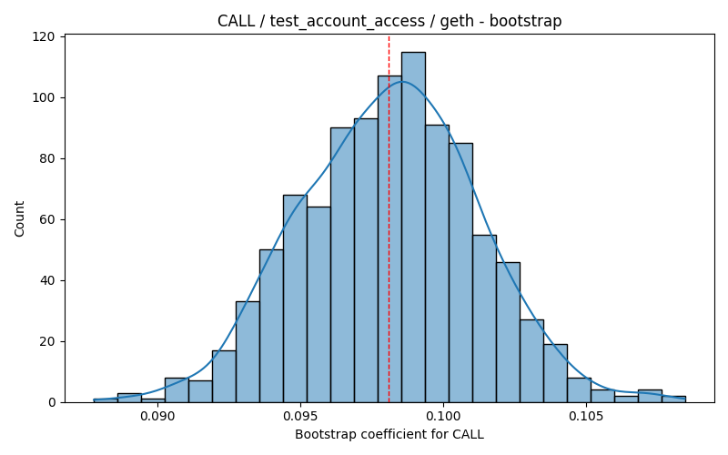

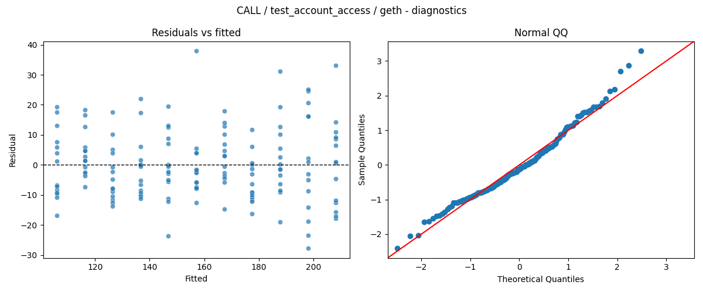

</details>

<details><summary>nethermind — NNLS regression summary</summary>

```
==============================================================================
                           NNLS Regression Results                            
==============================================================================
Dep. Variable:          test_runtime_ms              R-squared:          0.802
Model:                  NNLS                    Adj. R-squared:          0.800
No. Observations:       132                               RMSE:          51.68
Df Residuals:           130                                MAE:          38.69
Df Model:               1      
==============================================================================
                      coef     std err     P-value      [0.025      0.975]
------------------------------------------------------------------------------
         const     73.2189     12.4304       0.001     49.2666     97.1238
       opcount      0.0044      0.0002       0.001      0.0040      0.0047
==============================================================================
Notes: Non-negative least squares with bootstrap inference (1000 iterations)
==============================================================================
```

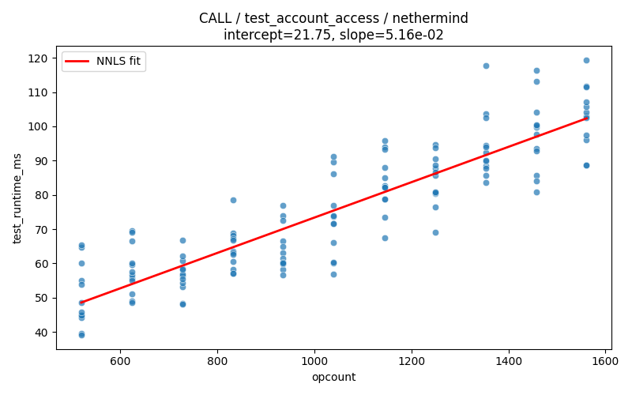

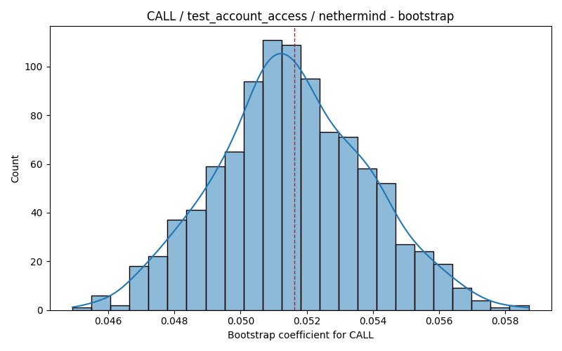

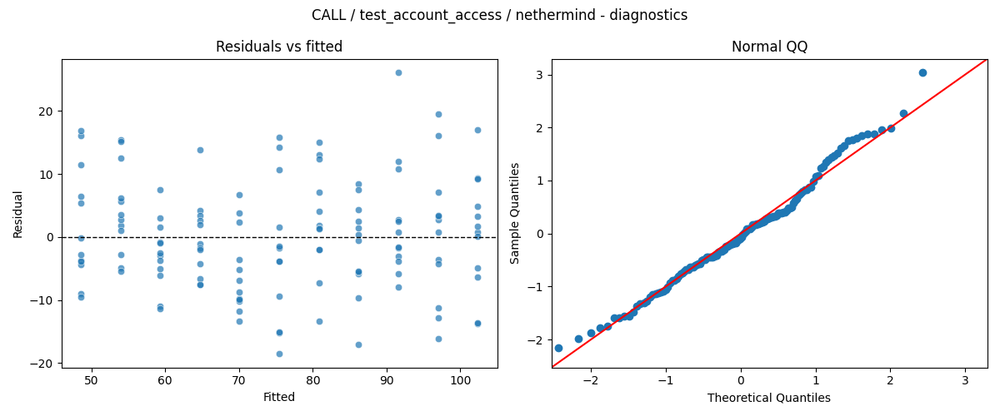

</details>

<details><summary>reth — NNLS regression summary</summary>

```
==============================================================================
                           NNLS Regression Results                            
==============================================================================
Dep. Variable:          test_runtime_ms              R-squared:          0.917
Model:                  NNLS                    Adj. R-squared:          0.917
No. Observations:       198                               RMSE:           5.96
Df Residuals:           196                                MAE:           4.59
Df Model:               1      
==============================================================================
                      coef     std err     P-value      [0.025      0.975]
------------------------------------------------------------------------------
         const     44.3777      1.2621       0.001     41.9085     46.8685
       opcount      0.0008      0.0000       0.001      0.0008      0.0009
==============================================================================
Notes: Non-negative least squares with bootstrap inference (1000 iterations)
==============================================================================
```

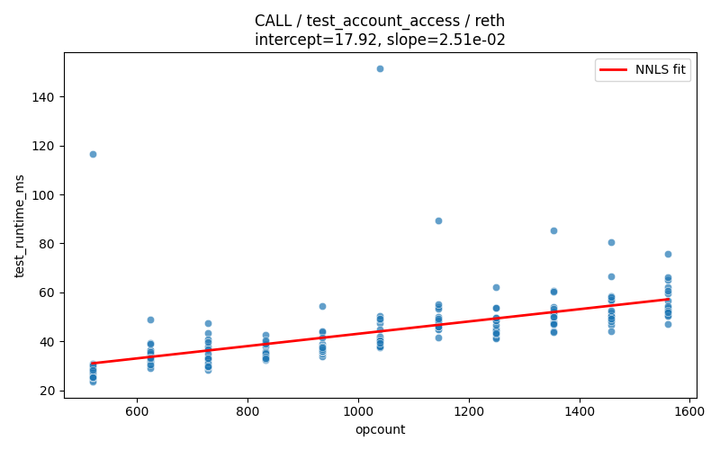

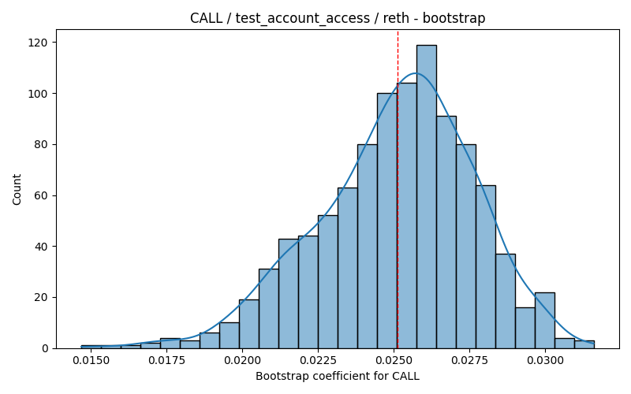

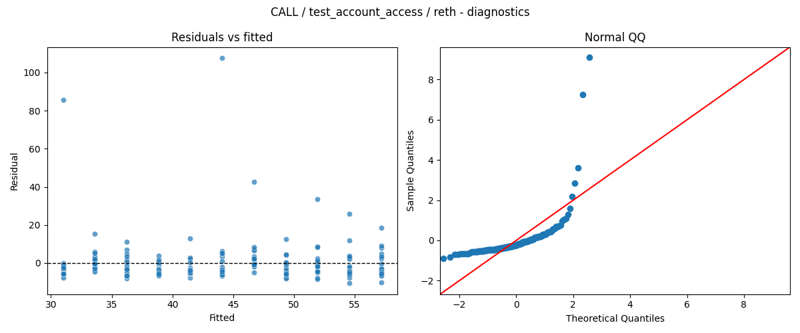

</details>

### test_account_access — combo `CALL_AccountMode.EXISTING_CONTRACT` — `presets[cold_account_code_access]`

| client | nobs | R² | target_coef (ms) | p-value | 95% CI |
| --- | --- | --- | --- | --- | --- |
| `besu` | 253 | 0.9049 | 0.02784 | 1.00e-03 | [0.02679, 0.02895] |
| `erigon` | 110 | 0.8948 | 0.04946 | 1.00e-03 | [0.04603, 0.0524] |
| `ethrex` | 176 | 0.9934 | 0.007618 | 1.00e-03 | [0.007522, 0.007712] |
| `geth` | 154 | 0.8561 | 0.02337 | 1.00e-03 | [0.02178, 0.02502] |
| `nethermind` | 132 | 0.6328 | 0.01486 | 1.00e-03 | [0.01274, 0.01712] |
| `reth` | 198 | 0.9778 | 0.003982 | 1.00e-03 | [0.0039, 0.004074] |

<details><summary>besu — NNLS regression summary</summary>

```
==============================================================================
                           NNLS Regression Results                            
==============================================================================
Dep. Variable:          test_runtime_ms              R-squared:          0.905
Model:                  NNLS                    Adj. R-squared:          0.905
No. Observations:       253                               RMSE:         183.64
Df Residuals:           251                                MAE:         148.62
Df Model:               1      
==============================================================================
                      coef     std err     P-value      [0.025      0.975]
------------------------------------------------------------------------------
         const    599.5289     35.7562       0.001    530.0888    667.0371
       opcount      0.0278      0.0006       0.001      0.0268      0.0289
==============================================================================
Notes: Non-negative least squares with bootstrap inference (1000 iterations)
==============================================================================
```

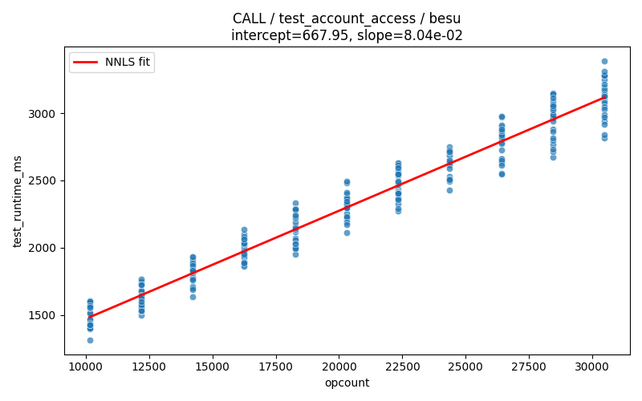

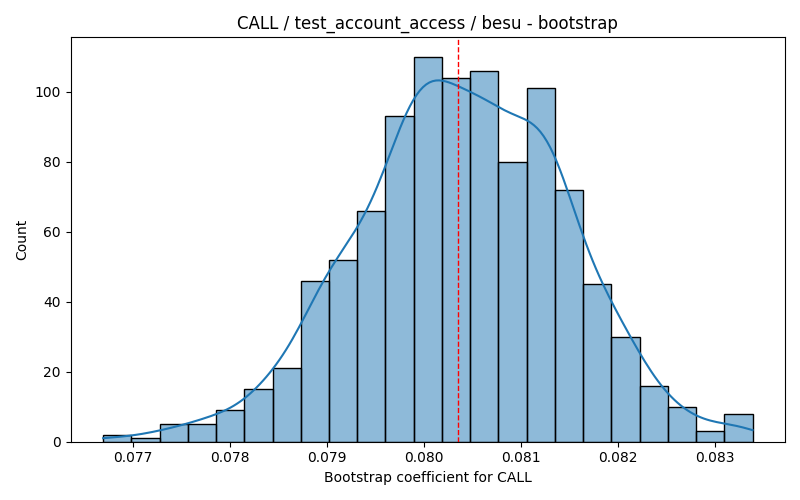

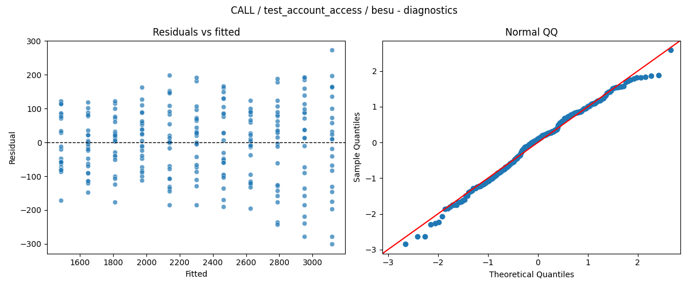

</details>

<details><summary>erigon — NNLS regression summary</summary>

```
==============================================================================
                           NNLS Regression Results                            
==============================================================================
Dep. Variable:          test_runtime_ms              R-squared:          0.895
Model:                  NNLS                    Adj. R-squared:          0.894
No. Observations:       110                               RMSE:         345.10
Df Residuals:           108                                MAE:         294.70
Df Model:               1      
==============================================================================
                      coef     std err     P-value      [0.025      0.975]
------------------------------------------------------------------------------
         const    841.6923    119.5400       0.001    623.9915   1097.3267
       opcount      0.0495      0.0016       0.001      0.0460      0.0524
==============================================================================
Notes: Non-negative least squares with bootstrap inference (1000 iterations)
==============================================================================
```

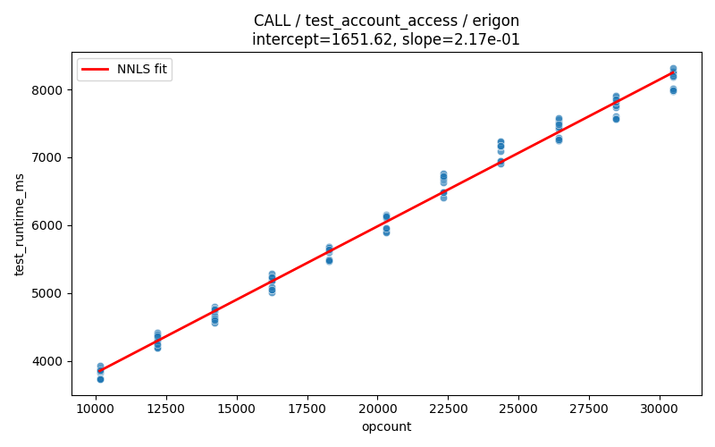

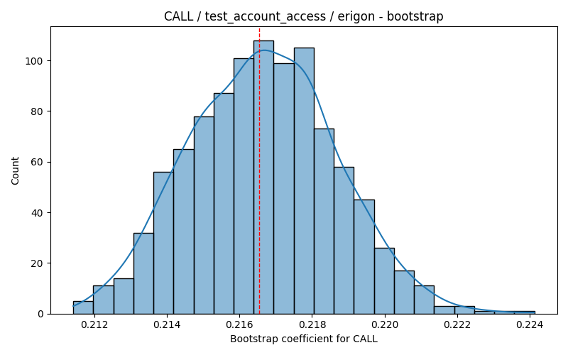

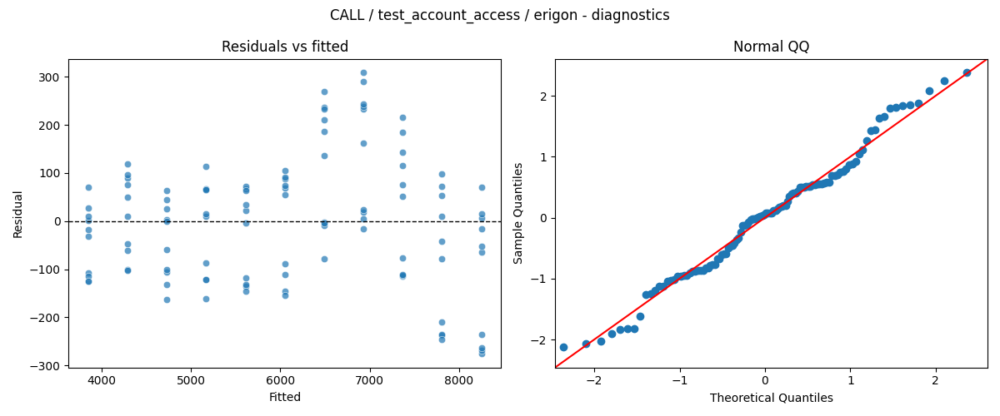

</details>

<details><summary>ethrex — NNLS regression summary</summary>

```
==============================================================================
                           NNLS Regression Results                            
==============================================================================
Dep. Variable:          test_runtime_ms              R-squared:          0.993
Model:                  NNLS                    Adj. R-squared:          0.993
No. Observations:       176                               RMSE:          12.60
Df Residuals:           174                                MAE:           9.63
Df Model:               1      
==============================================================================
                      coef     std err     P-value      [0.025      0.975]
------------------------------------------------------------------------------
         const     37.7304      2.9082       0.001     32.1620     43.2329
       opcount      0.0076      0.0000       0.001      0.0075      0.0077
==============================================================================
Notes: Non-negative least squares with bootstrap inference (1000 iterations)
==============================================================================
```

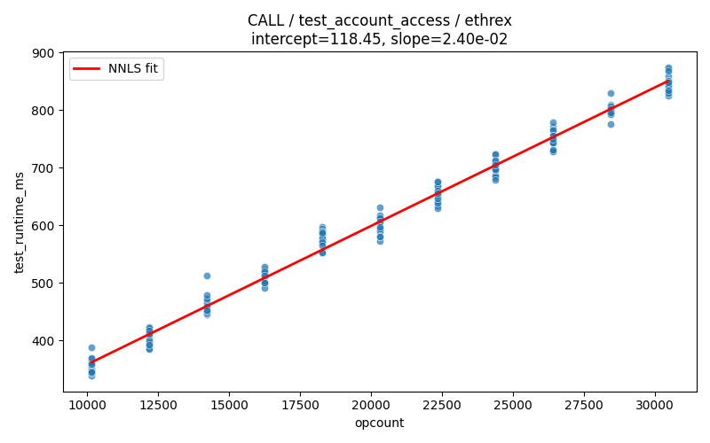

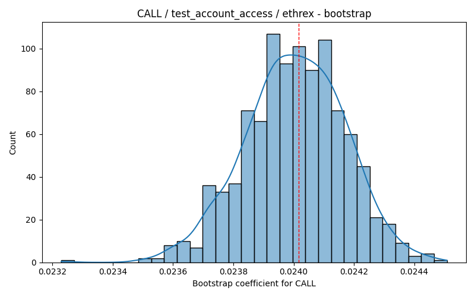

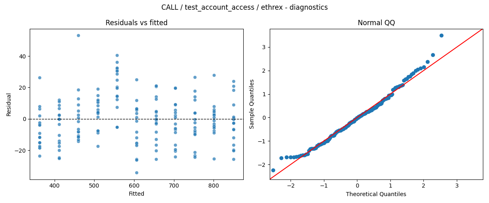

</details>

<details><summary>geth — NNLS regression summary</summary>

```
==============================================================================
                           NNLS Regression Results                            
==============================================================================
Dep. Variable:          test_runtime_ms              R-squared:          0.856
Model:                  NNLS                    Adj. R-squared:          0.855
No. Observations:       154                               RMSE:         194.95
Df Residuals:           152                                MAE:         163.56
Df Model:               1      
==============================================================================
                      coef     std err     P-value      [0.025      0.975]
------------------------------------------------------------------------------
         const    688.4737     60.6903       0.001    569.7187    804.5462
       opcount      0.0234      0.0008       0.001      0.0218      0.0250
==============================================================================
Notes: Non-negative least squares with bootstrap inference (1000 iterations)
==============================================================================
```

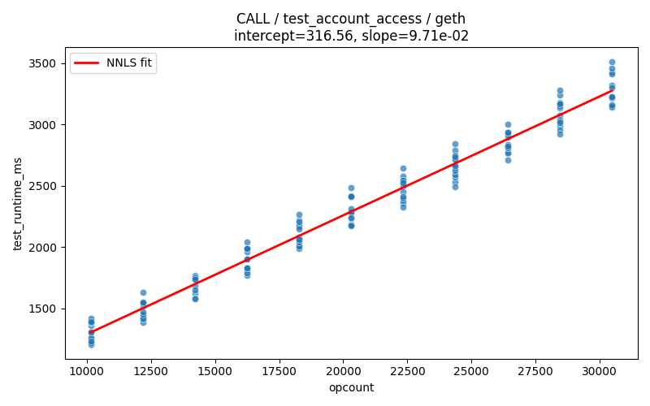

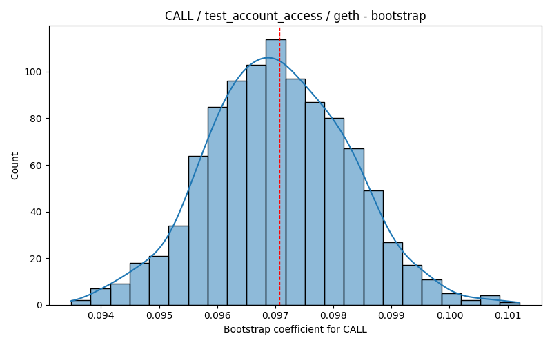

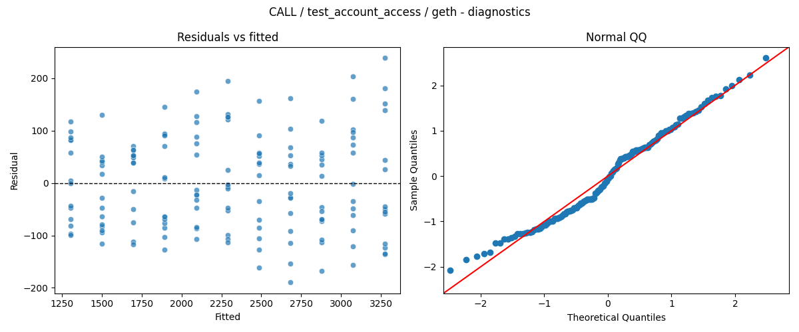

</details>

<details><summary>nethermind — NNLS regression summary</summary>

```
==============================================================================
                           NNLS Regression Results                            
==============================================================================
Dep. Variable:          test_runtime_ms              R-squared:          0.633
Model:                  NNLS                    Adj. R-squared:          0.630
No. Observations:       132                               RMSE:         230.39
Df Residuals:           130                                MAE:         160.23
Df Model:               1      
==============================================================================
                      coef     std err     P-value      [0.025      0.975]
------------------------------------------------------------------------------
         const    141.3006     62.2477       0.022      9.8328    261.0884
       opcount      0.0149      0.0011       0.001      0.0127      0.0171
==============================================================================
Notes: Non-negative least squares with bootstrap inference (1000 iterations)
==============================================================================
```

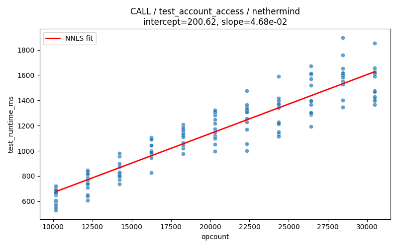

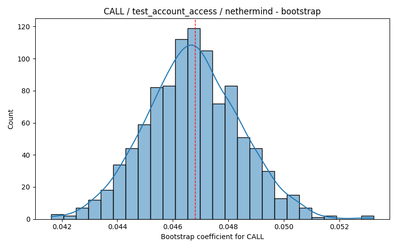

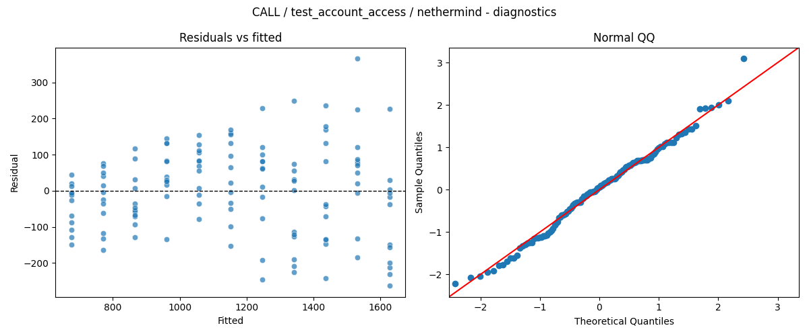

</details>

<details><summary>reth — NNLS regression summary</summary>

```
==============================================================================
                           NNLS Regression Results                            
==============================================================================
Dep. Variable:          test_runtime_ms              R-squared:          0.978
Model:                  NNLS                    Adj. R-squared:          0.978
No. Observations:       198                               RMSE:          12.22
Df Residuals:           196                                MAE:           9.76
Df Model:               1      
==============================================================================
                      coef     std err     P-value      [0.025      0.975]
------------------------------------------------------------------------------
         const    104.1825      2.6372       0.001     98.7836    109.4369
       opcount      0.0040      0.0000       0.001      0.0039      0.0041
==============================================================================
Notes: Non-negative least squares with bootstrap inference (1000 iterations)
==============================================================================
```

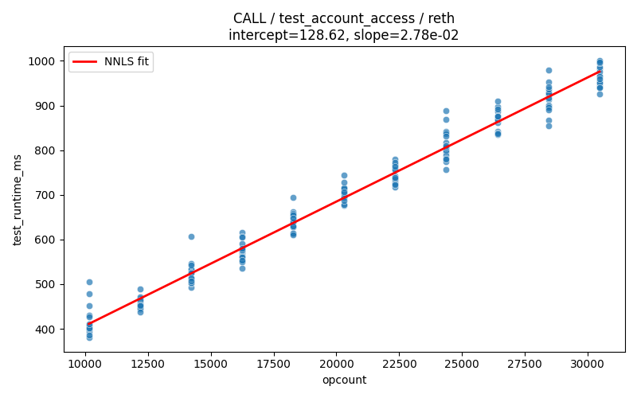

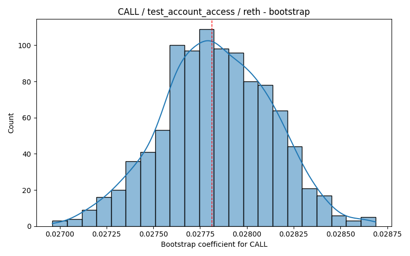

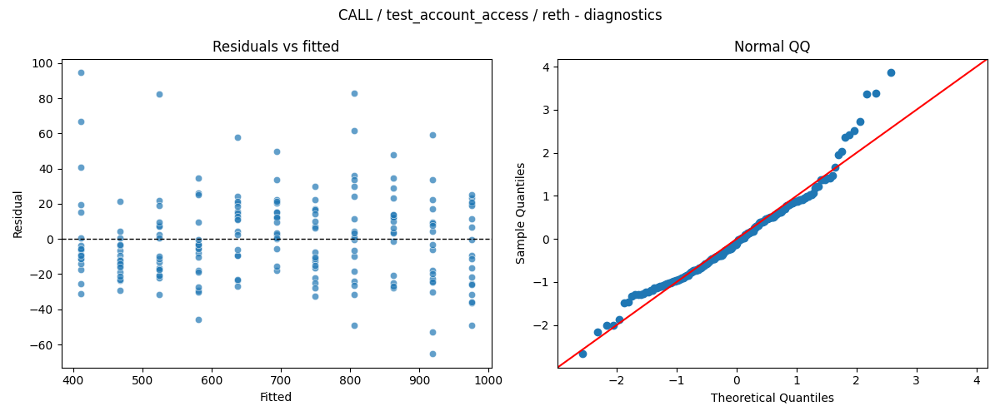

</details>

### test_account_access — combo `CALL_AccountMode.NON_EXISTING_ACCOUNT` — `presets[cold_account_code_access]`

| client | nobs | R² | target_coef (ms) | p-value | 95% CI |
| --- | --- | --- | --- | --- | --- |
| `besu` | 253 | 0.8779 | 0.01666 | 1.00e-03 | [0.01594, 0.01739] |
| `erigon` | 110 | 0.9807 | 0.009036 | 1.00e-03 | [0.008801, 0.009265] |
| `ethrex` | 176 | 0.9725 | 0.001988 | 1.00e-03 | [0.001936, 0.002036] |
| `geth` | 154 | 0.8633 | 0.02217 | 1.00e-03 | [0.0206, 0.02365] |
| `nethermind` | 132 | 0.802 | 0.00438 | 1.00e-03 | [0.004012, 0.004729] |
| `reth` | 198 | 0.9171 | 0.000834 | 1.00e-03 | [0.0007996, 0.0008687] |

<details><summary>besu — NNLS regression summary</summary>

```
==============================================================================
                           NNLS Regression Results                            
==============================================================================
Dep. Variable:          test_runtime_ms              R-squared:          0.878
Model:                  NNLS                    Adj. R-squared:          0.877
No. Observations:       253                               RMSE:         147.55
Df Residuals:           251                                MAE:         128.78
Df Model:               1      
==============================================================================
                      coef     std err     P-value      [0.025      0.975]
------------------------------------------------------------------------------
         const    531.1034     28.7481       0.001    474.2156    588.4820
       opcount      0.0167      0.0004       0.001      0.0159      0.0174
==============================================================================
Notes: Non-negative least squares with bootstrap inference (1000 iterations)
==============================================================================
```


</details>

<details><summary>erigon — NNLS regression summary</summary>

```
==============================================================================
                           NNLS Regression Results                            
==============================================================================
Dep. Variable:          test_runtime_ms              R-squared:          0.981
Model:                  NNLS                    Adj. R-squared:          0.981
No. Observations:       110                               RMSE:          30.10
Df Residuals:           108                                MAE:          20.77
Df Model:               1      
==============================================================================
                      coef     std err     P-value      [0.025      0.975]
------------------------------------------------------------------------------
         const     16.0469      8.7493       0.049      0.0000     33.4098
       opcount      0.0090      0.0001       0.001      0.0088      0.0093
==============================================================================
Notes: Non-negative least squares with bootstrap inference (1000 iterations)
==============================================================================
```


</details>

<details><summary>ethrex — NNLS regression summary</summary>

```
==============================================================================
                           NNLS Regression Results                            
==============================================================================
Dep. Variable:          test_runtime_ms              R-squared:          0.972
Model:                  NNLS                    Adj. R-squared:          0.972
No. Observations:       176                               RMSE:           7.94
Df Residuals:           174                                MAE:           6.63
Df Model:               1      
==============================================================================
                      coef     std err     P-value      [0.025      0.975]
------------------------------------------------------------------------------
         const     26.5027      1.8658       0.001     23.0085     30.2806
       opcount      0.0020      0.0000       0.001      0.0019      0.0020
==============================================================================
Notes: Non-negative least squares with bootstrap inference (1000 iterations)
==============================================================================
```


</details>

<details><summary>geth — NNLS regression summary</summary>

```
==============================================================================
                           NNLS Regression Results                            
==============================================================================
Dep. Variable:          test_runtime_ms              R-squared:          0.863
Model:                  NNLS                    Adj. R-squared:          0.862
No. Observations:       154                               RMSE:         209.45
Df Residuals:           152                                MAE:         176.65
Df Model:               1      
==============================================================================
                      coef     std err     P-value      [0.025      0.975]
------------------------------------------------------------------------------
         const    706.9315     66.1297       0.001    582.1364    840.5219
       opcount      0.0222      0.0008       0.001      0.0206      0.0237
==============================================================================
Notes: Non-negative least squares with bootstrap inference (1000 iterations)
==============================================================================
```


</details>

<details><summary>nethermind — NNLS regression summary</summary>

```
==============================================================================
                           NNLS Regression Results                            
==============================================================================
Dep. Variable:          test_runtime_ms              R-squared:          0.802
Model:                  NNLS                    Adj. R-squared:          0.800
No. Observations:       132                               RMSE:          51.68
Df Residuals:           130                                MAE:          38.69
Df Model:               1      
==============================================================================
                      coef     std err     P-value      [0.025      0.975]
------------------------------------------------------------------------------
         const     73.2189     12.4304       0.001     49.2666     97.1238
       opcount      0.0044      0.0002       0.001      0.0040      0.0047
==============================================================================
Notes: Non-negative least squares with bootstrap inference (1000 iterations)
==============================================================================
```


</details>

<details><summary>reth — NNLS regression summary</summary>

```
==============================================================================
                           NNLS Regression Results                            
==============================================================================
Dep. Variable:          test_runtime_ms              R-squared:          0.917
Model:                  NNLS                    Adj. R-squared:          0.917
No. Observations:       198                               RMSE:           5.96
Df Residuals:           196                                MAE:           4.59
Df Model:               1      
==============================================================================
                      coef     std err     P-value      [0.025      0.975]
------------------------------------------------------------------------------
         const     44.3777      1.2621       0.001     41.9085     46.8685
       opcount      0.0008      0.0000       0.001      0.0008      0.0009
==============================================================================
Notes: Non-negative least squares with bootstrap inference (1000 iterations)
==============================================================================
```


</details>

### test_account_access — combo `CALL_AccountMode.EXISTING_EOA` — `presets[cold_account_nocode_write]`

| client | nobs | R² | target_coef (ms) | p-value | 95% CI |
| --- | --- | --- | --- | --- | --- |
| `besu` | 253 | 0.9447 | 0.06094 | 1.00e-03 | [0.05896, 0.06266] |
| `erigon` | 110 | 0.981 | 0.06013 | 1.00e-03 | [0.0587, 0.06167] |
| `ethrex` | 176 | 0.99 | 0.02312 | 1.00e-03 | [0.02279, 0.02344] |
| `geth` | 154 | 0.972 | 0.05891 | 1.00e-03 | [0.05731, 0.06033] |
| `nethermind` | 132 | 0.7511 | 0.0321 | 1.00e-03 | [0.02911, 0.03509] |
| `reth` | 198 | 0.9864 | 0.02345 | 1.00e-03 | [0.02305, 0.02387] |

<details><summary>besu — NNLS regression summary</summary>

```
==============================================================================
                           NNLS Regression Results                            
==============================================================================
Dep. Variable:          test_runtime_ms              R-squared:          0.945
Model:                  NNLS                    Adj. R-squared:          0.945
No. Observations:       253                               RMSE:          99.19
Df Residuals:           251                                MAE:          80.15
Df Model:               1      
==============================================================================
                      coef     std err     P-value      [0.025      0.975]
------------------------------------------------------------------------------
         const    344.5788     19.9457       0.001    307.3966    384.8222
       opcount      0.0609      0.0010       0.001      0.0590      0.0627
==============================================================================
Notes: Non-negative least squares with bootstrap inference (1000 iterations)
==============================================================================
```


</details>

<details><summary>erigon — NNLS regression summary</summary>

```
==============================================================================
                           NNLS Regression Results                            
==============================================================================
Dep. Variable:          test_runtime_ms              R-squared:          0.981
Model:                  NNLS                    Adj. R-squared:          0.981
No. Observations:       110                               RMSE:          56.32
Df Residuals:           108                                MAE:          40.89
Df Model:               1      
==============================================================================
                      coef     std err     P-value      [0.025      0.975]
------------------------------------------------------------------------------
         const    184.8440     15.1157       0.001    156.4020    215.3956
       opcount      0.0601      0.0007       0.001      0.0587      0.0617
==============================================================================
Notes: Non-negative least squares with bootstrap inference (1000 iterations)
==============================================================================
```


</details>

<details><summary>ethrex — NNLS regression summary</summary>

```
==============================================================================
                           NNLS Regression Results                            
==============================================================================
Dep. Variable:          test_runtime_ms              R-squared:          0.990
Model:                  NNLS                    Adj. R-squared:          0.990
No. Observations:       176                               RMSE:          15.65
Df Residuals:           174                                MAE:          12.17
Df Model:               1      
==============================================================================
                      coef     std err     P-value      [0.025      0.975]
------------------------------------------------------------------------------
         const    121.9410      3.7979       0.001    115.0397    129.9649
       opcount      0.0231      0.0002       0.001      0.0228      0.0234
==============================================================================
Notes: Non-negative least squares with bootstrap inference (1000 iterations)
==============================================================================
```


</details>

<details><summary>geth — NNLS regression summary</summary>

```
==============================================================================
                           NNLS Regression Results                            
==============================================================================
Dep. Variable:          test_runtime_ms              R-squared:          0.972
Model:                  NNLS                    Adj. R-squared:          0.972
No. Observations:       154                               RMSE:          67.27
Df Residuals:           152                                MAE:          58.12
Df Model:               1      
==============================================================================
                      coef     std err     P-value      [0.025      0.975]
------------------------------------------------------------------------------
         const    183.2472     15.8277       0.001    155.8219    214.9727
       opcount      0.0589      0.0008       0.001      0.0573      0.0603
==============================================================================
Notes: Non-negative least squares with bootstrap inference (1000 iterations)
==============================================================================
```


</details>

<details><summary>nethermind — NNLS regression summary</summary>

```
==============================================================================
                           NNLS Regression Results                            
==============================================================================
Dep. Variable:          test_runtime_ms              R-squared:          0.751
Model:                  NNLS                    Adj. R-squared:          0.749
No. Observations:       132                               RMSE:         124.35
Df Residuals:           130                                MAE:          91.79
Df Model:               1      
==============================================================================
                      coef     std err     P-value      [0.025      0.975]
------------------------------------------------------------------------------
         const    179.2416     28.6671       0.001    123.0872    237.2069
       opcount      0.0321      0.0015       0.001      0.0291      0.0351
==============================================================================
Notes: Non-negative least squares with bootstrap inference (1000 iterations)
==============================================================================
```


</details>

<details><summary>reth — NNLS regression summary</summary>

```
==============================================================================
                           NNLS Regression Results                            
==============================================================================
Dep. Variable:          test_runtime_ms              R-squared:          0.986
Model:                  NNLS                    Adj. R-squared:          0.986
No. Observations:       198                               RMSE:          18.54
Df Residuals:           196                                MAE:          13.90
Df Model:               1      
==============================================================================
                      coef     std err     P-value      [0.025      0.975]
------------------------------------------------------------------------------
         const     96.4830      4.1188       0.001     88.2522    104.1492
       opcount      0.0234      0.0002       0.001      0.0230      0.0239
==============================================================================
Notes: Non-negative least squares with bootstrap inference (1000 iterations)
==============================================================================
```


</details>

### test_account_access — combo `CALL_AccountMode.NON_EXISTING_ACCOUNT` — `presets[cold_account_nocode_write]`

| client | nobs | R² | target_coef (ms) | p-value | 95% CI |
| --- | --- | --- | --- | --- | --- |
| `besu` | 253 | 0.8196 | 0.182 | 1.00e-03 | [0.1705, 0.1936] |
| `erigon` | 110 | 0.9773 | 0.1582 | 1.00e-03 | [0.1541, 0.1625] |
| `ethrex` | 176 | 0.5464 | 0.01695 | 1.00e-03 | [0.01461, 0.01904] |
| `geth` | 154 | 0.8869 | 0.09809 | 1.00e-03 | [0.09238, 0.1039] |
| `nethermind` | 132 | 0.7967 | 0.05162 | 1.00e-03 | [0.04702, 0.05615] |
| `reth` | 198 | 0.3302 | 0.02514 | 1.00e-03 | [0.01965, 0.02973] |

<details><summary>besu — NNLS regression summary</summary>

```
==============================================================================
                           NNLS Regression Results                            
==============================================================================
Dep. Variable:          test_runtime_ms              R-squared:          0.820
Model:                  NNLS                    Adj. R-squared:          0.819
No. Observations:       253                               RMSE:          28.11
Df Residuals:           251                                MAE:          23.23
Df Model:               1      
==============================================================================
                      coef     std err     P-value      [0.025      0.975]
------------------------------------------------------------------------------
         const    249.7407      6.4983       0.001    237.0610    262.3422
       opcount      0.1820      0.0058       0.001      0.1705      0.1936
==============================================================================
Notes: Non-negative least squares with bootstrap inference (1000 iterations)
==============================================================================
```


</details>

<details><summary>erigon — NNLS regression summary</summary>

```
==============================================================================
                           NNLS Regression Results                            
==============================================================================
Dep. Variable:          test_runtime_ms              R-squared:          0.977
Model:                  NNLS                    Adj. R-squared:          0.977
No. Observations:       110                               RMSE:           7.94
Df Residuals:           108                                MAE:           6.44
Df Model:               1      
==============================================================================
                      coef     std err     P-value      [0.025      0.975]
------------------------------------------------------------------------------
         const     42.8205      2.4957       0.001     37.9930     47.5334
       opcount      0.1582      0.0022       0.001      0.1541      0.1625
==============================================================================
Notes: Non-negative least squares with bootstrap inference (1000 iterations)
==============================================================================
```


</details>

<details><summary>ethrex — NNLS regression summary</summary>

```
==============================================================================
                           NNLS Regression Results                            
==============================================================================
Dep. Variable:          test_runtime_ms              R-squared:          0.546
Model:                  NNLS                    Adj. R-squared:          0.544
No. Observations:       176                               RMSE:           5.09
Df Residuals:           174                                MAE:           3.51
Df Model:               1      
==============================================================================
                      coef     std err     P-value      [0.025      0.975]
------------------------------------------------------------------------------
         const     12.8228      1.2791       0.001     10.4796     15.5310
       opcount      0.0170      0.0011       0.001      0.0146      0.0190
==============================================================================
Notes: Non-negative least squares with bootstrap inference (1000 iterations)
==============================================================================
```


</details>

<details><summary>geth — NNLS regression summary</summary>

```
==============================================================================
                           NNLS Regression Results                            
==============================================================================
Dep. Variable:          test_runtime_ms              R-squared:          0.887
Model:                  NNLS                    Adj. R-squared:          0.886
No. Observations:       154                               RMSE:          11.53
Df Residuals:           152                                MAE:           9.06
Df Model:               1      
==============================================================================
                      coef     std err     P-value      [0.025      0.975]
------------------------------------------------------------------------------
         const     55.0457      3.0947       0.001     49.0176     60.9189
       opcount      0.0981      0.0031       0.001      0.0924      0.1039
==============================================================================
Notes: Non-negative least squares with bootstrap inference (1000 iterations)
==============================================================================
```


</details>

<details><summary>nethermind — NNLS regression summary</summary>

```
==============================================================================
                           NNLS Regression Results                            
==============================================================================
Dep. Variable:          test_runtime_ms              R-squared:          0.797
Model:                  NNLS                    Adj. R-squared:          0.795
No. Observations:       132                               RMSE:           8.58
Df Residuals:           130                                MAE:           6.80
Df Model:               1      
==============================================================================
                      coef     std err     P-value      [0.025      0.975]
------------------------------------------------------------------------------
         const     21.7519      2.4019       0.001     17.2105     26.6321
       opcount      0.0516      0.0023       0.001      0.0470      0.0561
==============================================================================
Notes: Non-negative least squares with bootstrap inference (1000 iterations)
==============================================================================
```


</details>

<details><summary>reth — NNLS regression summary</summary>

```
==============================================================================
                           NNLS Regression Results                            
==============================================================================
Dep. Variable:          test_runtime_ms              R-squared:          0.330
Model:                  NNLS                    Adj. R-squared:          0.327
No. Observations:       198                               RMSE:          11.79
Df Residuals:           196                                MAE:           5.60
Df Model:               1      
==============================================================================
                      coef     std err     P-value      [0.025      0.975]
------------------------------------------------------------------------------
         const     17.9184      3.0574       0.001     12.9944     24.6020
       opcount      0.0251      0.0026       0.001      0.0197      0.0297
==============================================================================
Notes: Non-negative least squares with bootstrap inference (1000 iterations)
==============================================================================
```


</details>

### test_account_access — combo `CALL_AccountMode.EXISTING_CONTRACT` — `presets[cold_account_code_write]`

| client | nobs | R² | target_coef (ms) | p-value | 95% CI |
| --- | --- | --- | --- | --- | --- |
| `besu` | 253 | 0.9598 | 0.08035 | 1.00e-03 | [0.07822, 0.08238] |
| `erigon` | 110 | 0.9914 | 0.2166 | 1.00e-03 | [0.2129, 0.2206] |
| `ethrex` | 176 | 0.9904 | 0.02402 | 1.00e-03 | [0.02368, 0.02431] |
| `geth` | 154 | 0.979 | 0.09707 | 1.00e-03 | [0.09465, 0.09949] |
| `nethermind` | 132 | 0.8659 | 0.04681 | 1.00e-03 | [0.04344, 0.05016] |
| `reth` | 198 | 0.9816 | 0.02781 | 1.00e-03 | [0.02724, 0.02838] |

<details><summary>besu — NNLS regression summary</summary>

```
==============================================================================
                           NNLS Regression Results                            
==============================================================================
Dep. Variable:          test_runtime_ms              R-squared:          0.960
Model:                  NNLS                    Adj. R-squared:          0.960
No. Observations:       253                               RMSE:         105.60
Df Residuals:           251                                MAE:          85.70
Df Model:               1      
==============================================================================
                      coef     std err     P-value      [0.025      0.975]
------------------------------------------------------------------------------
         const    667.9520     20.3564       0.001    630.2137    709.8439
       opcount      0.0804      0.0011       0.001      0.0782      0.0824
==============================================================================
Notes: Non-negative least squares with bootstrap inference (1000 iterations)
==============================================================================
```


</details>

<details><summary>erigon — NNLS regression summary</summary>

```
==============================================================================
                           NNLS Regression Results                            
==============================================================================
Dep. Variable:          test_runtime_ms              R-squared:          0.991
Model:                  NNLS                    Adj. R-squared:          0.991
No. Observations:       110                               RMSE:         129.53
Df Residuals:           108                                MAE:         103.10
Df Model:               1      
==============================================================================
                      coef     std err     P-value      [0.025      0.975]
------------------------------------------------------------------------------
         const   1651.6194     35.7219       0.001   1581.9278   1722.5132
       opcount      0.2166      0.0020       0.001      0.2129      0.2206
==============================================================================
Notes: Non-negative least squares with bootstrap inference (1000 iterations)
==============================================================================
```


</details>

<details><summary>ethrex — NNLS regression summary</summary>

```
==============================================================================
                           NNLS Regression Results                            
==============================================================================
Dep. Variable:          test_runtime_ms              R-squared:          0.990
Model:                  NNLS                    Adj. R-squared:          0.990
No. Observations:       176                               RMSE:          15.17
Df Residuals:           174                                MAE:          11.97
Df Model:               1      
==============================================================================
                      coef     std err     P-value      [0.025      0.975]
------------------------------------------------------------------------------
         const    118.4505      3.6598       0.001    111.9483    126.1549
       opcount      0.0240      0.0002       0.001      0.0237      0.0243
==============================================================================
Notes: Non-negative least squares with bootstrap inference (1000 iterations)
==============================================================================
```


</details>

<details><summary>geth — NNLS regression summary</summary>

```
==============================================================================
                           NNLS Regression Results                            
==============================================================================
Dep. Variable:          test_runtime_ms              R-squared:          0.979
Model:                  NNLS                    Adj. R-squared:          0.979
No. Observations:       154                               RMSE:          91.27
Df Residuals:           152                                MAE:          78.51
Df Model:               1      
==============================================================================
                      coef     std err     P-value      [0.025      0.975]
------------------------------------------------------------------------------
         const    316.5617     23.6068       0.001    272.5653    365.5975
       opcount      0.0971      0.0012       0.001      0.0946      0.0995
==============================================================================
Notes: Non-negative least squares with bootstrap inference (1000 iterations)
==============================================================================
```


</details>

<details><summary>nethermind — NNLS regression summary</summary>

```
==============================================================================
                           NNLS Regression Results                            
==============================================================================
Dep. Variable:          test_runtime_ms              R-squared:          0.866
Model:                  NNLS                    Adj. R-squared:          0.865
No. Observations:       132                               RMSE:         118.29
Df Residuals:           130                                MAE:          94.45
Df Model:               1      
==============================================================================
                      coef     std err     P-value      [0.025      0.975]
------------------------------------------------------------------------------
         const    200.6206     30.4138       0.001    145.1871    261.8109
       opcount      0.0468      0.0017       0.001      0.0434      0.0502
==============================================================================
Notes: Non-negative least squares with bootstrap inference (1000 iterations)
==============================================================================
```


</details>

<details><summary>reth — NNLS regression summary</summary>

```
==============================================================================
                           NNLS Regression Results                            
==============================================================================
Dep. Variable:          test_runtime_ms              R-squared:          0.982
Model:                  NNLS                    Adj. R-squared:          0.981
No. Observations:       198                               RMSE:          24.48
Df Residuals:           196                                MAE:          18.98
Df Model:               1      
==============================================================================
                      coef     std err     P-value      [0.025      0.975]
------------------------------------------------------------------------------
         const    128.6211      6.0579       0.001    116.3124    139.8576
       opcount      0.0278      0.0003       0.001      0.0272      0.0284
==============================================================================
Notes: Non-negative least squares with bootstrap inference (1000 iterations)
==============================================================================
```


</details>

### test_account_access — combo `CALL_AccountMode.NON_EXISTING_ACCOUNT` — `presets[cold_account_code_write]`

| client | nobs | R² | target_coef (ms) | p-value | 95% CI |
| --- | --- | --- | --- | --- | --- |
| `besu` | 253 | 0.8196 | 0.182 | 1.00e-03 | [0.1705, 0.1936] |
| `erigon` | 110 | 0.9773 | 0.1582 | 1.00e-03 | [0.1541, 0.1625] |
| `ethrex` | 176 | 0.5464 | 0.01695 | 1.00e-03 | [0.01461, 0.01904] |
| `geth` | 154 | 0.8869 | 0.09809 | 1.00e-03 | [0.09238, 0.1039] |
| `nethermind` | 132 | 0.7967 | 0.05162 | 1.00e-03 | [0.04702, 0.05615] |
| `reth` | 198 | 0.3302 | 0.02514 | 1.00e-03 | [0.01965, 0.02973] |

<details><summary>besu — NNLS regression summary</summary>

```
==============================================================================
                           NNLS Regression Results                            
==============================================================================
Dep. Variable:          test_runtime_ms              R-squared:          0.820
Model:                  NNLS                    Adj. R-squared:          0.819
No. Observations:       253                               RMSE:          28.11
Df Residuals:           251                                MAE:          23.23
Df Model:               1      
==============================================================================
                      coef     std err     P-value      [0.025      0.975]
------------------------------------------------------------------------------
         const    249.7407      6.4983       0.001    237.0610    262.3422
       opcount      0.1820      0.0058       0.001      0.1705      0.1936
==============================================================================
Notes: Non-negative least squares with bootstrap inference (1000 iterations)
==============================================================================
```


</details>

<details><summary>erigon — NNLS regression summary</summary>

```
==============================================================================
                           NNLS Regression Results                            
==============================================================================
Dep. Variable:          test_runtime_ms              R-squared:          0.977
Model:                  NNLS                    Adj. R-squared:          0.977
No. Observations:       110                               RMSE:           7.94
Df Residuals:           108                                MAE:           6.44
Df Model:               1      
==============================================================================
                      coef     std err     P-value      [0.025      0.975]
------------------------------------------------------------------------------
         const     42.8205      2.4957       0.001     37.9930     47.5334
       opcount      0.1582      0.0022       0.001      0.1541      0.1625
==============================================================================
Notes: Non-negative least squares with bootstrap inference (1000 iterations)
==============================================================================
```


</details>

<details><summary>ethrex — NNLS regression summary</summary>

```
==============================================================================
                           NNLS Regression Results                            
==============================================================================
Dep. Variable:          test_runtime_ms              R-squared:          0.546
Model:                  NNLS                    Adj. R-squared:          0.544
No. Observations:       176                               RMSE:           5.09
Df Residuals:           174                                MAE:           3.51
Df Model:               1      
==============================================================================
                      coef     std err     P-value      [0.025      0.975]
------------------------------------------------------------------------------
         const     12.8228      1.2791       0.001     10.4796     15.5310
       opcount      0.0170      0.0011       0.001      0.0146      0.0190
==============================================================================
Notes: Non-negative least squares with bootstrap inference (1000 iterations)
==============================================================================
```


</details>

<details><summary>geth — NNLS regression summary</summary>

```
==============================================================================
                           NNLS Regression Results                            
==============================================================================
Dep. Variable:          test_runtime_ms              R-squared:          0.887
Model:                  NNLS                    Adj. R-squared:          0.886
No. Observations:       154                               RMSE:          11.53
Df Residuals:           152                                MAE:           9.06
Df Model:               1      
==============================================================================
                      coef     std err     P-value      [0.025      0.975]
------------------------------------------------------------------------------
         const     55.0457      3.0947       0.001     49.0176     60.9189
       opcount      0.0981      0.0031       0.001      0.0924      0.1039
==============================================================================
Notes: Non-negative least squares with bootstrap inference (1000 iterations)
==============================================================================
```


</details>

<details><summary>nethermind — NNLS regression summary</summary>

```
==============================================================================
                           NNLS Regression Results                            
==============================================================================
Dep. Variable:          test_runtime_ms              R-squared:          0.797
Model:                  NNLS                    Adj. R-squared:          0.795
No. Observations:       132                               RMSE:           8.58
Df Residuals:           130                                MAE:           6.80
Df Model:               1      
==============================================================================
                      coef     std err     P-value      [0.025      0.975]
------------------------------------------------------------------------------
         const     21.7519      2.4019       0.001     17.2105     26.6321
       opcount      0.0516      0.0023       0.001      0.0470      0.0561
==============================================================================
Notes: Non-negative least squares with bootstrap inference (1000 iterations)
==============================================================================
```


</details>

<details><summary>reth — NNLS regression summary</summary>

```
==============================================================================
                           NNLS Regression Results                            
==============================================================================
Dep. Variable:          test_runtime_ms              R-squared:          0.330
Model:                  NNLS                    Adj. R-squared:          0.327
No. Observations:       198                               RMSE:          11.79
Df Residuals:           196                                MAE:           5.60
Df Model:               1      
==============================================================================
                      coef     std err     P-value      [0.025      0.975]
------------------------------------------------------------------------------
         const     17.9184      3.0574       0.001     12.9944     24.6020
       opcount      0.0251      0.0026       0.001      0.0197      0.0297
==============================================================================
Notes: Non-negative least squares with bootstrap inference (1000 iterations)
==============================================================================
```


</details>

### test_ext_account_query_warm — combo `CALL`

| client | nobs | R² | target_coef (ms) | p-value | 95% CI |
| --- | --- | --- | --- | --- | --- |
| `besu` | 253 | 0.7371 | 0.0005516 | 1.00e-03 | [0.0005101, 0.0005927] |
| `erigon` | 110 | 0.9326 | 0.0004748 | 1.00e-03 | [0.0004497, 0.0005025] |
| `ethrex` | 176 | 0.9322 | 0.0001014 | 1.00e-03 | [9.662e-05, 0.0001062] |
| `geth` | 154 | 0.8975 | 0.0001325 | 1.00e-03 | [0.0001242, 0.0001401] |
| `nethermind` | 132 | 0.6913 | 0.0003644 | 1.00e-03 | [0.0003191, 0.000405] |
| `reth` | 198 | 0.9199 | 5.989e-05 | 1.00e-03 | [5.725e-05, 6.229e-05] |

<details><summary>besu — NNLS regression summary</summary>

```
==============================================================================
                           NNLS Regression Results                            
==============================================================================
Dep. Variable:          test_runtime_ms              R-squared:          0.737
Model:                  NNLS                    Adj. R-squared:          0.736
No. Observations:       253                               RMSE:         166.45
Df Residuals:           251                                MAE:         134.86
Df Model:               1      
==============================================================================
                      coef     std err     P-value      [0.025      0.975]
------------------------------------------------------------------------------
         const    558.4946     32.3508       0.001    496.9706    623.1279
       opcount      0.0006      0.0000       0.001      0.0005      0.0006
==============================================================================
Notes: Non-negative least squares with bootstrap inference (1000 iterations)
==============================================================================
```

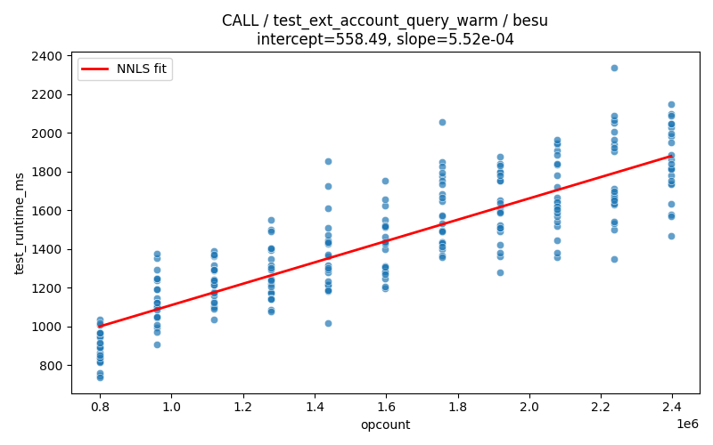

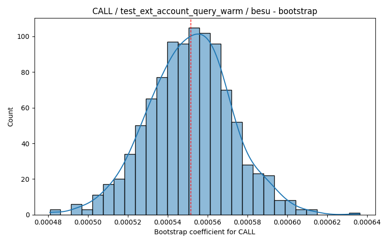

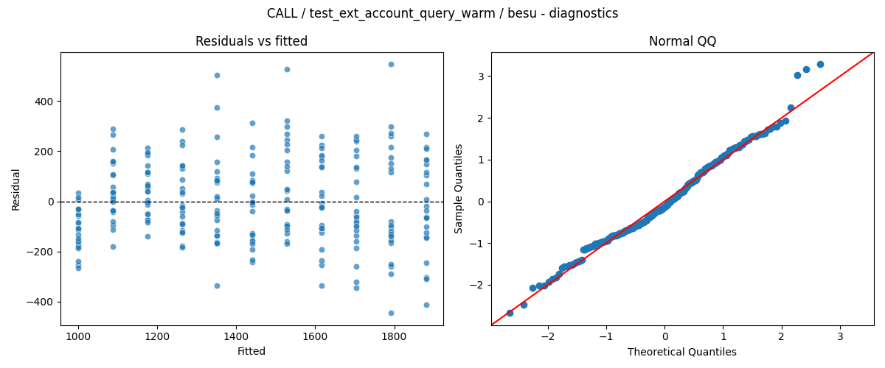

</details>

<details><summary>erigon — NNLS regression summary</summary>

```
==============================================================================
                           NNLS Regression Results                            
==============================================================================
Dep. Variable:          test_runtime_ms              R-squared:          0.933
Model:                  NNLS                    Adj. R-squared:          0.932
No. Observations:       110                               RMSE:          64.48
Df Residuals:           108                                MAE:          48.59
Df Model:               1      
==============================================================================
                      coef     std err     P-value      [0.025      0.975]
------------------------------------------------------------------------------
         const     53.9964     19.3098       0.004     16.1996     91.7505
       opcount      0.0005      0.0000       0.001      0.0004      0.0005
==============================================================================
Notes: Non-negative least squares with bootstrap inference (1000 iterations)
==============================================================================
```

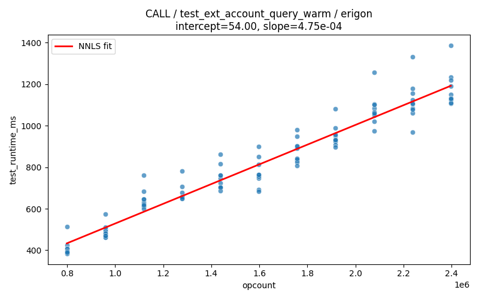

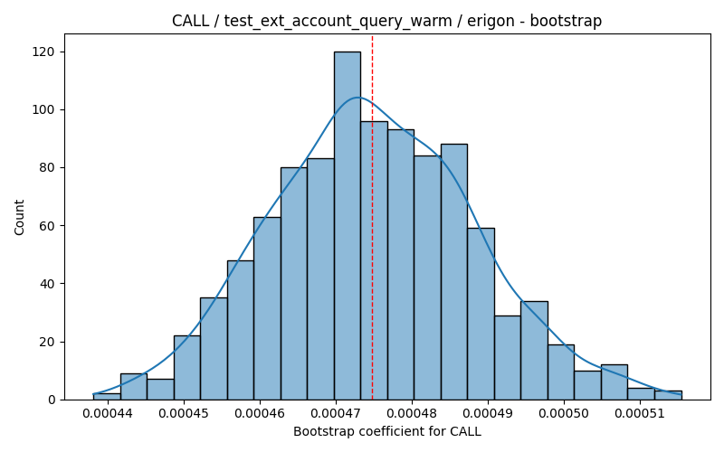

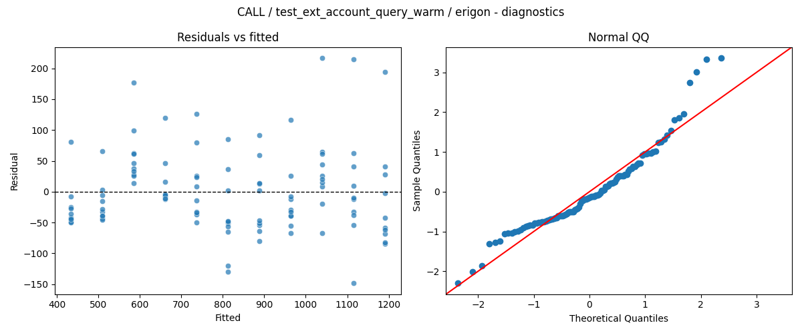

</details>

<details><summary>ethrex — NNLS regression summary</summary>

```
==============================================================================
                           NNLS Regression Results                            
==============================================================================
Dep. Variable:          test_runtime_ms              R-squared:          0.932
Model:                  NNLS                    Adj. R-squared:          0.932
No. Observations:       176                               RMSE:          13.82
Df Residuals:           174                                MAE:          10.68
Df Model:               1      
==============================================================================
                      coef     std err     P-value      [0.025      0.975]
------------------------------------------------------------------------------
         const     39.4936      3.5956       0.001     32.6987     46.7776
       opcount      0.0001      0.0000       0.001      0.0001      0.0001
==============================================================================
Notes: Non-negative least squares with bootstrap inference (1000 iterations)
==============================================================================
```

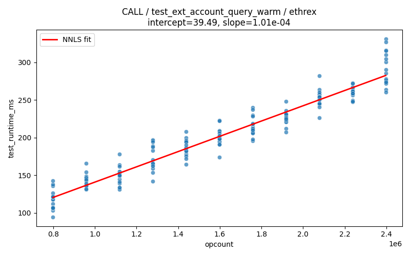

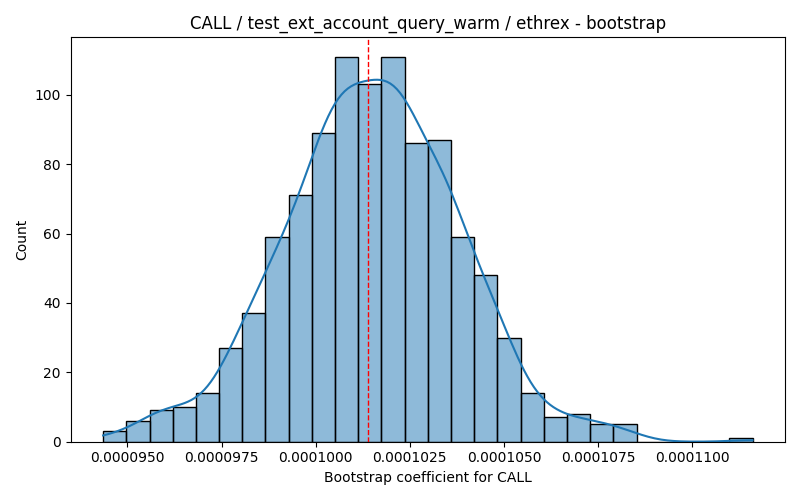

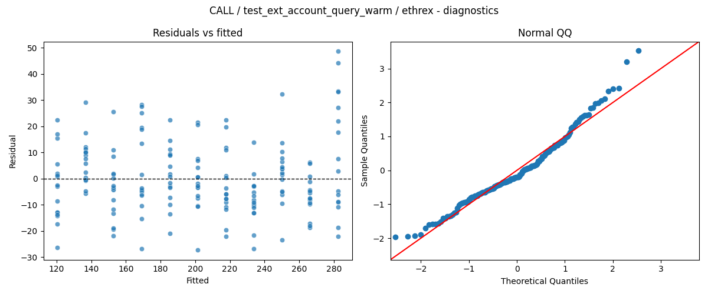

</details>

<details><summary>geth — NNLS regression summary</summary>

```
==============================================================================
                           NNLS Regression Results                            
==============================================================================
Dep. Variable:          test_runtime_ms              R-squared:          0.898
Model:                  NNLS                    Adj. R-squared:          0.897
No. Observations:       154                               RMSE:          22.62
Df Residuals:           152                                MAE:          16.11
Df Model:               1      
==============================================================================
                      coef     std err     P-value      [0.025      0.975]
------------------------------------------------------------------------------
         const     49.2886      6.3670       0.001     37.6210     62.8236
       opcount      0.0001      0.0000       0.001      0.0001      0.0001
==============================================================================
Notes: Non-negative least squares with bootstrap inference (1000 iterations)
==============================================================================
```

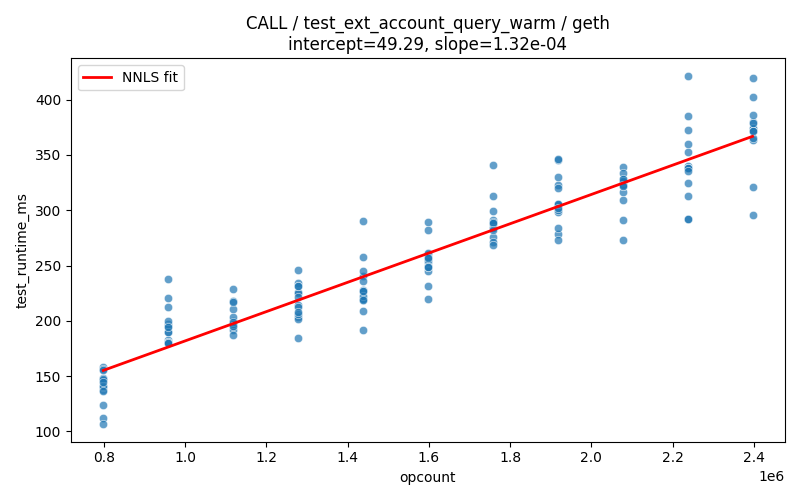

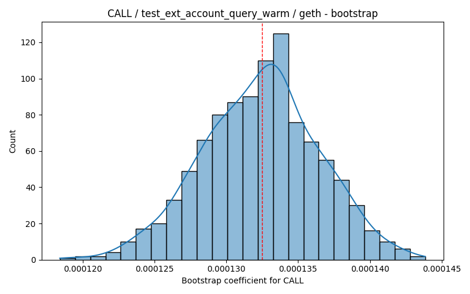

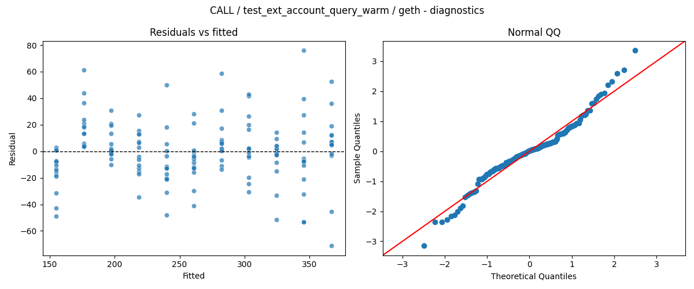

</details>

<details><summary>nethermind — NNLS regression summary</summary>

```
==============================================================================
                           NNLS Regression Results                            
==============================================================================
Dep. Variable:          test_runtime_ms              R-squared:          0.691
Model:                  NNLS                    Adj. R-squared:          0.689
No. Observations:       132                               RMSE:         123.01
Df Residuals:           130                                MAE:          94.31
Df Model:               1      
==============================================================================
                      coef     std err     P-value      [0.025      0.975]
------------------------------------------------------------------------------
         const    192.3325     32.4679       0.001    135.3371    259.8795
       opcount      0.0004      0.0000       0.001      0.0003      0.0004
==============================================================================
Notes: Non-negative least squares with bootstrap inference (1000 iterations)
==============================================================================
```

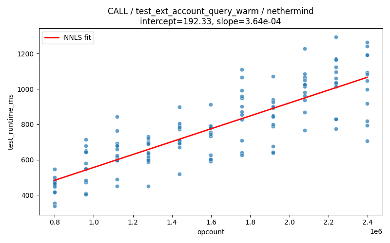

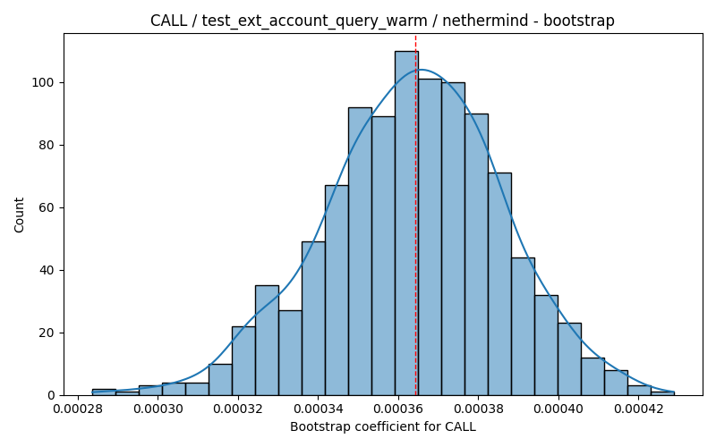

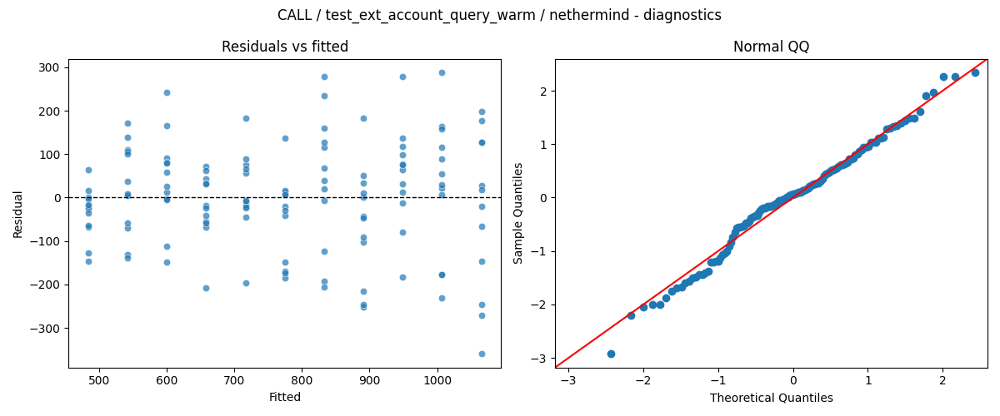

</details>

<details><summary>reth — NNLS regression summary</summary>

```
==============================================================================
                           NNLS Regression Results                            
==============================================================================
Dep. Variable:          test_runtime_ms              R-squared:          0.920
Model:                  NNLS                    Adj. R-squared:          0.919
No. Observations:       198                               RMSE:           8.93
Df Residuals:           196                                MAE:           6.92
Df Model:               1      
==============================================================================
                      coef     std err     P-value      [0.025      0.975]
------------------------------------------------------------------------------
         const     21.8665      2.1348       0.001     17.7516     26.1289
       opcount      0.0001      0.0000       0.001      0.0001      0.0001
==============================================================================
Notes: Non-negative least squares with bootstrap inference (1000 iterations)
==============================================================================
```

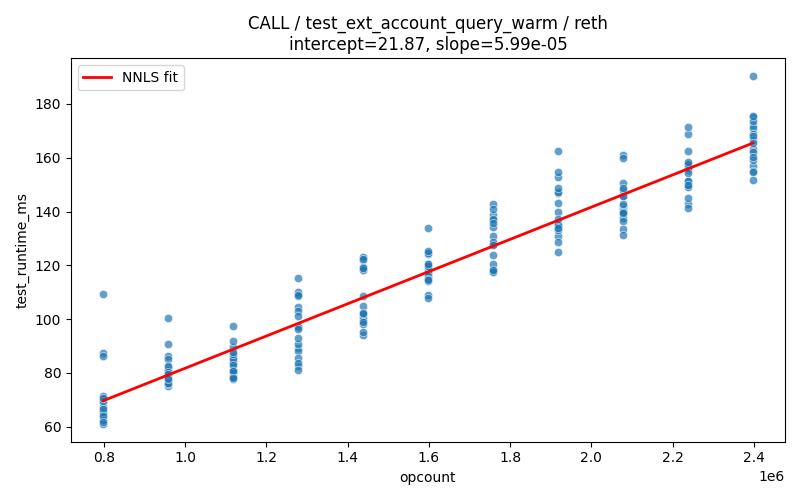

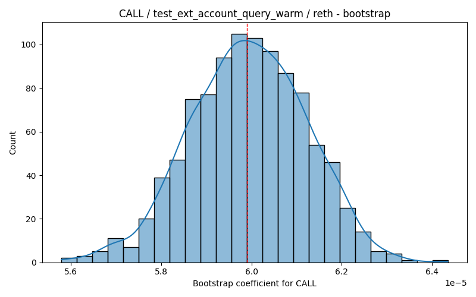

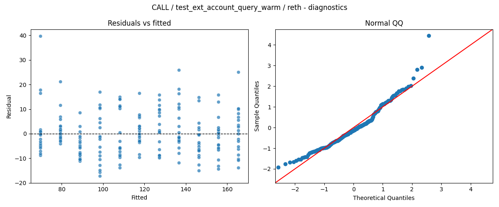

</details>

## CALLCODE

### test_account_access — combo `CALLCODE_AccountMode.EXISTING_EOA` — `presets[cold_account_nocode_access]`

| client | nobs | R² | target_coef (ms) | p-value | 95% CI |
| --- | --- | --- | --- | --- | --- |
| `besu` | 253 | 0.8537 | 0.01512 | 1.00e-03 | [0.01446, 0.01586] |
| `erigon` | 110 | 0.974 | 0.009077 | 1.00e-03 | [0.008822, 0.009346] |
| `ethrex` | 176 | 0.9944 | 0.00695 | 1.00e-03 | [0.00687, 0.007028] |
| `geth` | 154 | 0.915 | 0.01096 | 1.00e-03 | [0.01037, 0.0116] |
| `nethermind` | 132 | 0.7706 | 0.004067 | 1.00e-03 | [0.003738, 0.004534] |
| `reth` | 198 | 0.9469 | 0.001086 | 1.00e-03 | [0.00105, 0.001122] |

<details><summary>besu — NNLS regression summary</summary>

```
==============================================================================
                           NNLS Regression Results                            
==============================================================================
Dep. Variable:          test_runtime_ms              R-squared:          0.854
Model:                  NNLS                    Adj. R-squared:          0.853
No. Observations:       253                               RMSE:         148.66
Df Residuals:           251                                MAE:         120.87
Df Model:               1      
==============================================================================
                      coef     std err     P-value      [0.025      0.975]
------------------------------------------------------------------------------
         const    559.0966     28.0880       0.001    504.4918    610.3120
       opcount      0.0151      0.0004       0.001      0.0145      0.0159
==============================================================================
Notes: Non-negative least squares with bootstrap inference (1000 iterations)
==============================================================================
```

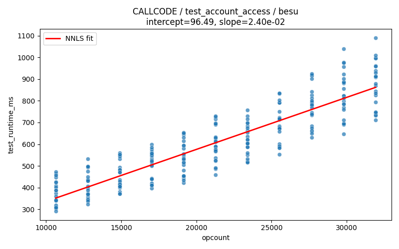

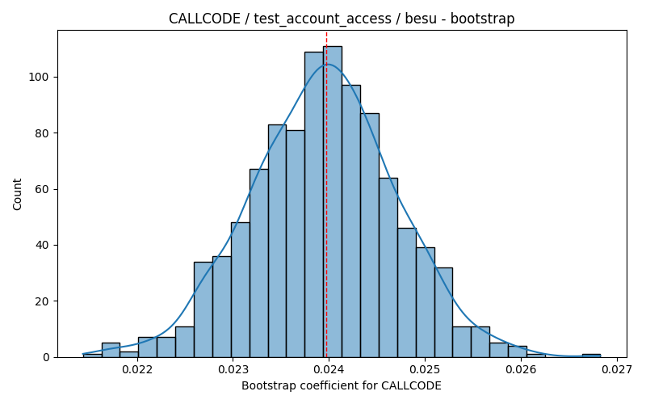

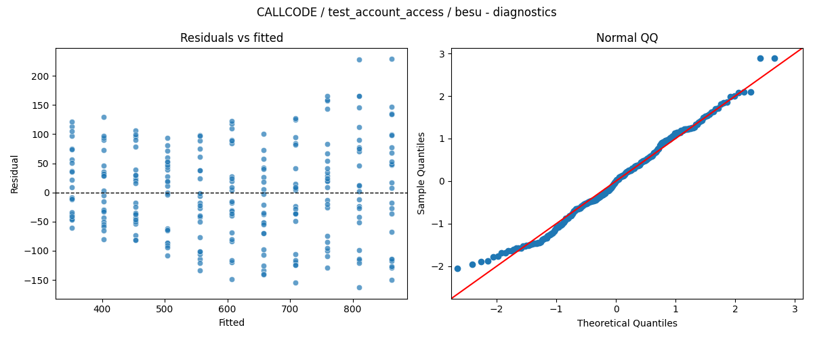

</details>

<details><summary>erigon — NNLS regression summary</summary>

```
==============================================================================
                           NNLS Regression Results                            
==============================================================================
Dep. Variable:          test_runtime_ms              R-squared:          0.974
Model:                  NNLS                    Adj. R-squared:          0.974
No. Observations:       110                               RMSE:          35.18
Df Residuals:           108                                MAE:          25.51
Df Model:               1      
==============================================================================
                      coef     std err     P-value      [0.025      0.975]
------------------------------------------------------------------------------
         const     27.5524      8.8548       0.003     10.6100     44.7626
       opcount      0.0091      0.0001       0.001      0.0088      0.0093
==============================================================================
Notes: Non-negative least squares with bootstrap inference (1000 iterations)
==============================================================================
```

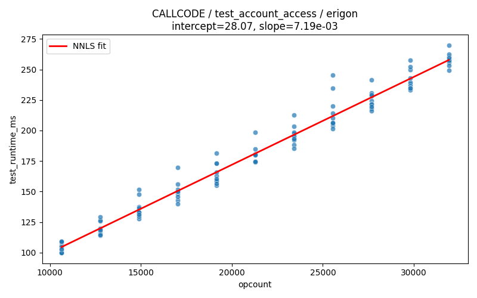

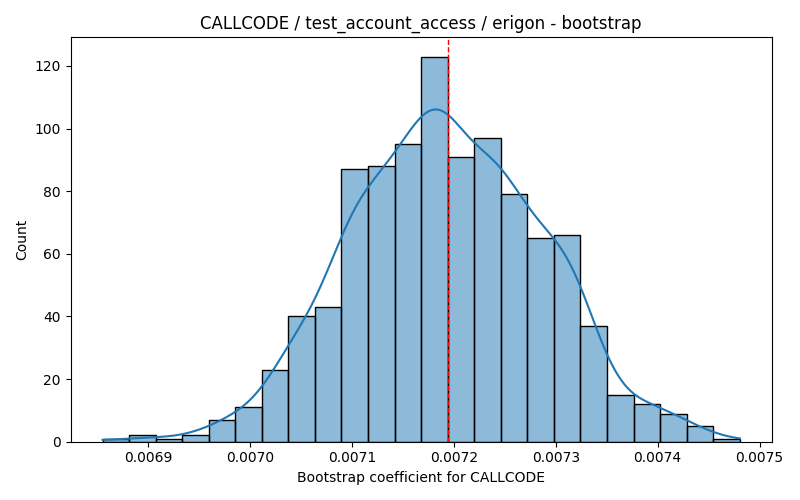

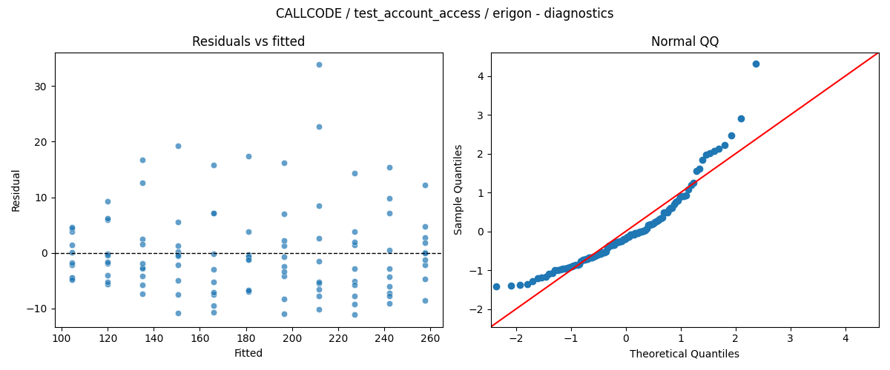

</details>

<details><summary>ethrex — NNLS regression summary</summary>

```
==============================================================================
                           NNLS Regression Results                            
==============================================================================
Dep. Variable:          test_runtime_ms              R-squared:          0.994
Model:                  NNLS                    Adj. R-squared:          0.994
No. Observations:       176                               RMSE:          12.43
Df Residuals:           174                                MAE:           9.76
Df Model:               1      
==============================================================================
                      coef     std err     P-value      [0.025      0.975]
------------------------------------------------------------------------------
         const     48.7613      2.9776       0.001     43.1938     54.8959
       opcount      0.0070      0.0000       0.001      0.0069      0.0070
==============================================================================
Notes: Non-negative least squares with bootstrap inference (1000 iterations)
==============================================================================
```

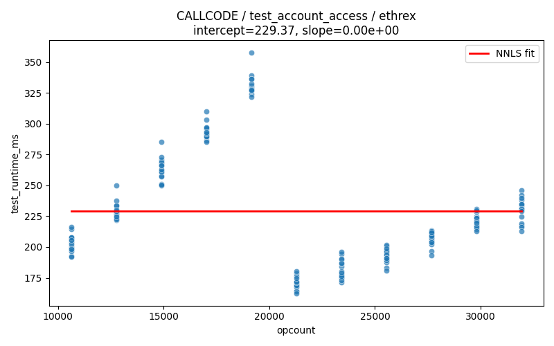


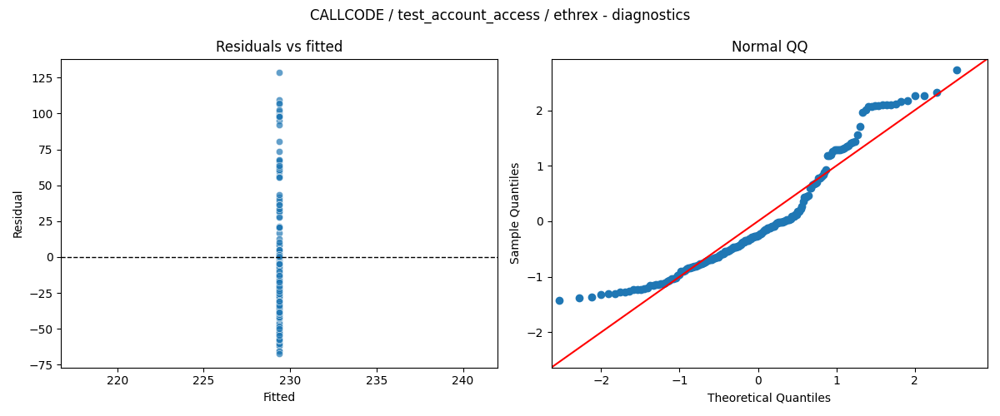

</details>

<details><summary>geth — NNLS regression summary</summary>

```
==============================================================================
                           NNLS Regression Results                            
==============================================================================
Dep. Variable:          test_runtime_ms              R-squared:          0.915
Model:                  NNLS                    Adj. R-squared:          0.914
No. Observations:       154                               RMSE:          79.36
Df Residuals:           152                                MAE:          64.42
Df Model:               1      
==============================================================================
                      coef     std err     P-value      [0.025      0.975]
------------------------------------------------------------------------------
         const    423.5195     26.2086       0.001    370.6388    473.1478
       opcount      0.0110      0.0003       0.001      0.0104      0.0116
==============================================================================
Notes: Non-negative least squares with bootstrap inference (1000 iterations)
==============================================================================
```

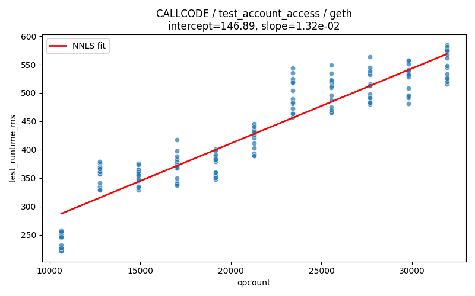

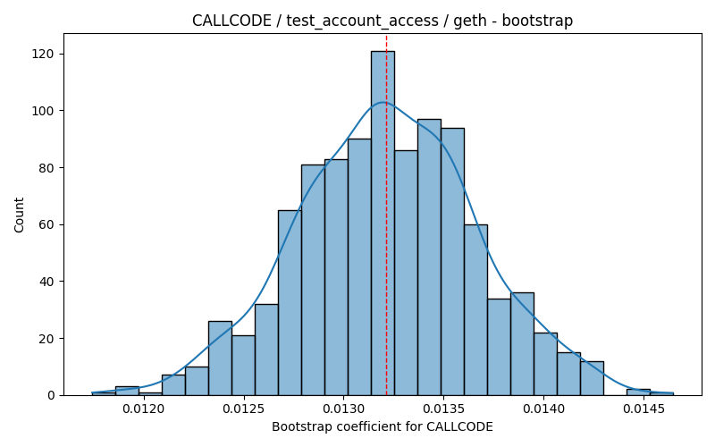

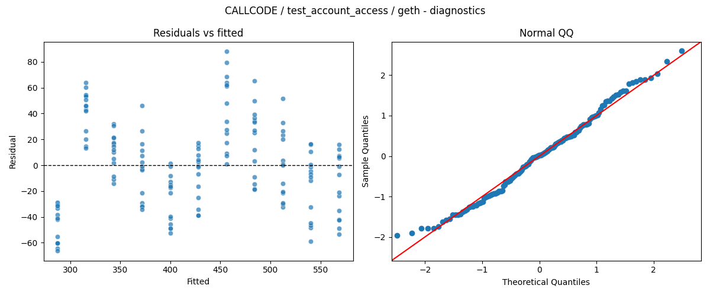

</details>

<details><summary>nethermind — NNLS regression summary</summary>

```
==============================================================================
                           NNLS Regression Results                            
==============================================================================
Dep. Variable:          test_runtime_ms              R-squared:          0.771
Model:                  NNLS                    Adj. R-squared:          0.769
No. Observations:       132                               RMSE:          52.70
Df Residuals:           130                                MAE:          36.66
Df Model:               1      
==============================================================================
                      coef     std err     P-value      [0.025      0.975]
------------------------------------------------------------------------------
         const     97.1992     13.0925       0.001     68.5467    119.2001
       opcount      0.0041      0.0002       0.001      0.0037      0.0045
==============================================================================
Notes: Non-negative least squares with bootstrap inference (1000 iterations)
==============================================================================
```

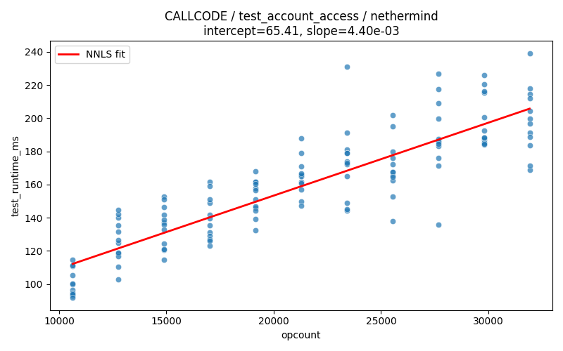

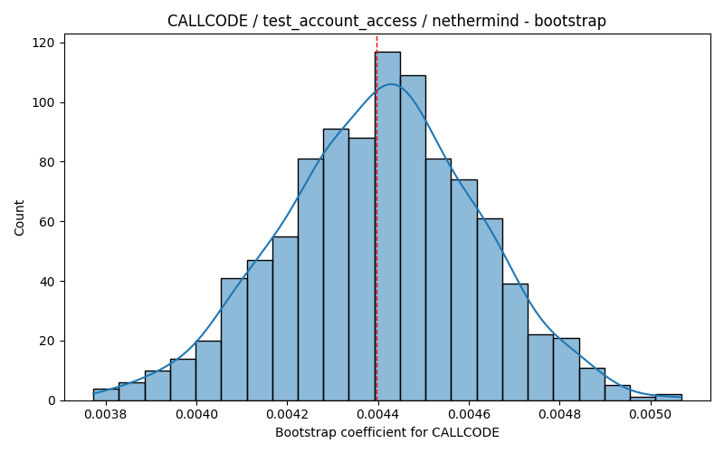

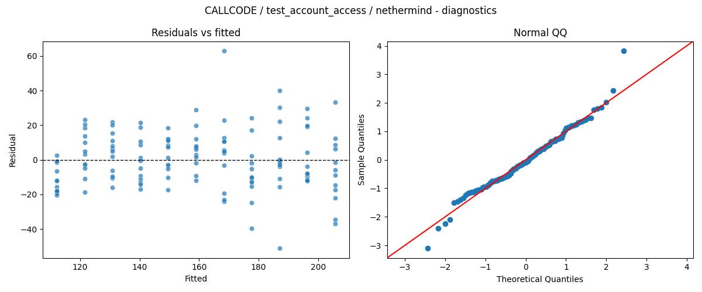

</details>

<details><summary>reth — NNLS regression summary</summary>

```
==============================================================================
                           NNLS Regression Results                            
==============================================================================
Dep. Variable:          test_runtime_ms              R-squared:          0.947
Model:                  NNLS                    Adj. R-squared:          0.947
No. Observations:       198                               RMSE:           6.10
Df Residuals:           196                                MAE:           4.73
Df Model:               1      
==============================================================================
                      coef     std err     P-value      [0.025      0.975]
------------------------------------------------------------------------------
         const     41.1477      1.3393       0.001     38.5947     43.8251
       opcount      0.0011      0.0000       0.001      0.0011      0.0011
==============================================================================
Notes: Non-negative least squares with bootstrap inference (1000 iterations)
==============================================================================
```

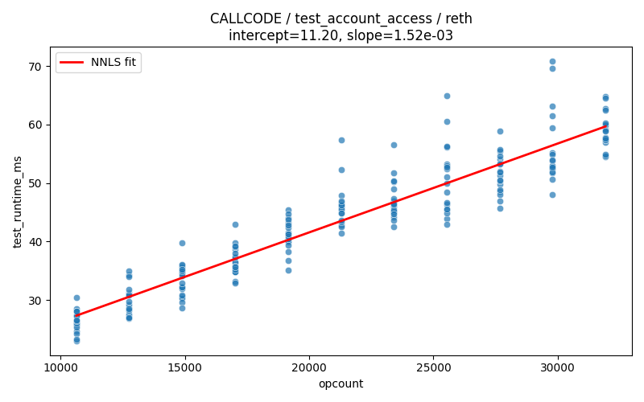

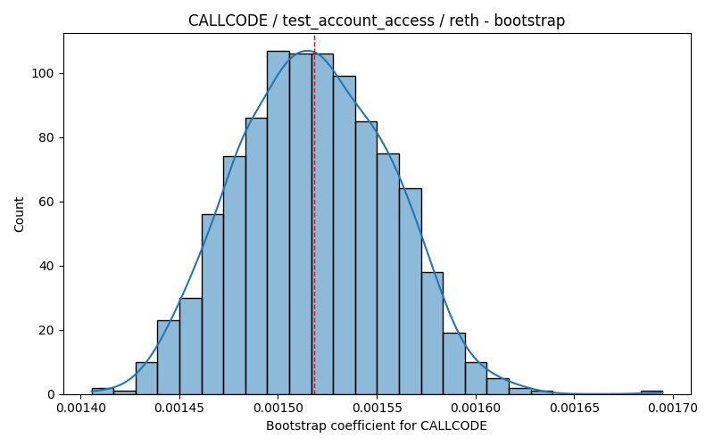

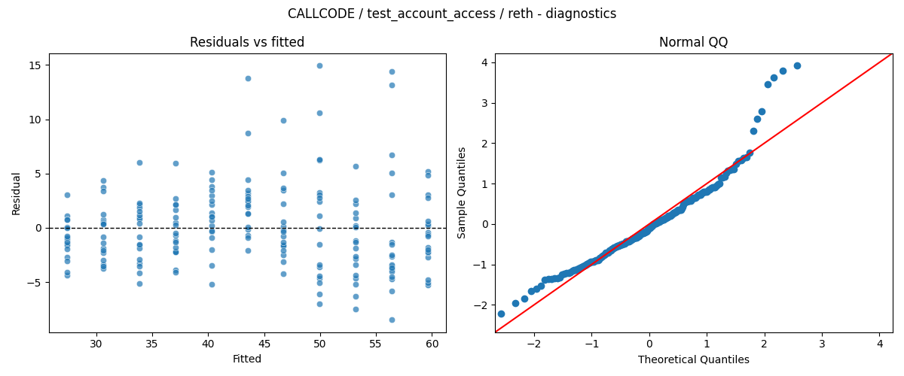

</details>

### test_account_access — combo `CALLCODE_AccountMode.NON_EXISTING_ACCOUNT` — `presets[cold_account_nocode_access]`

| client | nobs | R² | target_coef (ms) | p-value | 95% CI |
| --- | --- | --- | --- | --- | --- |
| `besu` | 253 | 0.8848 | 0.01535 | 1.00e-03 | [0.01462, 0.01598] |
| `erigon` | 110 | 0.9779 | 0.008498 | 1.00e-03 | [0.008283, 0.00872] |
| `ethrex` | 176 | 0.9683 | 0.001975 | 1.00e-03 | [0.001922, 0.002027] |
| `geth` | 154 | 0.8644 | 0.02269 | 1.00e-03 | [0.02128, 0.02415] |
| `nethermind` | 132 | 0.8172 | 0.003984 | 1.00e-03 | [0.003665, 0.004308] |
| `reth` | 198 | 0.8866 | 0.0007838 | 1.00e-03 | [0.0007472, 0.0008258] |

<details><summary>besu — NNLS regression summary</summary>

```
==============================================================================
                           NNLS Regression Results                            
==============================================================================
Dep. Variable:          test_runtime_ms              R-squared:          0.885
Model:                  NNLS                    Adj. R-squared:          0.884
No. Observations:       253                               RMSE:         131.52
Df Residuals:           251                                MAE:         116.20
Df Model:               1      
==============================================================================
                      coef     std err     P-value      [0.025      0.975]
------------------------------------------------------------------------------
         const    509.7103     26.6452       0.001    460.0821    566.3522
       opcount      0.0153      0.0003       0.001      0.0146      0.0160
==============================================================================
Notes: Non-negative least squares with bootstrap inference (1000 iterations)
==============================================================================
```

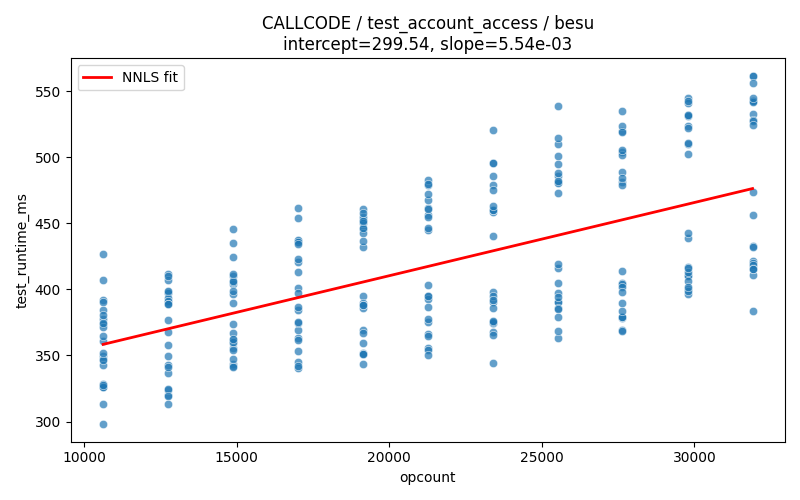

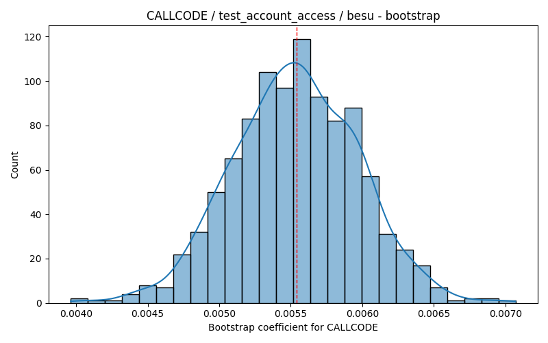

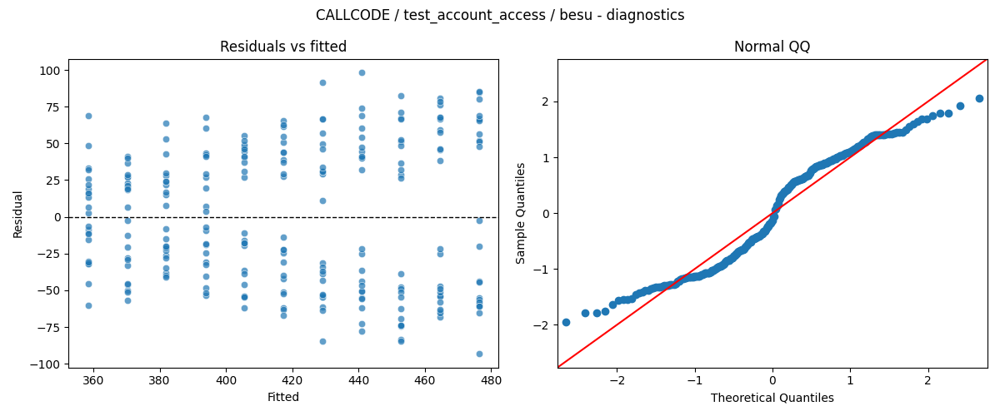

</details>

<details><summary>erigon — NNLS regression summary</summary>

```
==============================================================================
                           NNLS Regression Results                            
==============================================================================
Dep. Variable:          test_runtime_ms              R-squared:          0.978
Model:                  NNLS                    Adj. R-squared:          0.978
No. Observations:       110                               RMSE:          30.37
Df Residuals:           108                                MAE:          22.44
Df Model:               1      
==============================================================================
                      coef     std err     P-value      [0.025      0.975]
------------------------------------------------------------------------------
         const     15.7433      7.4438       0.023      0.2150     29.9239
       opcount      0.0085      0.0001       0.001      0.0083      0.0087
==============================================================================
Notes: Non-negative least squares with bootstrap inference (1000 iterations)
==============================================================================
```

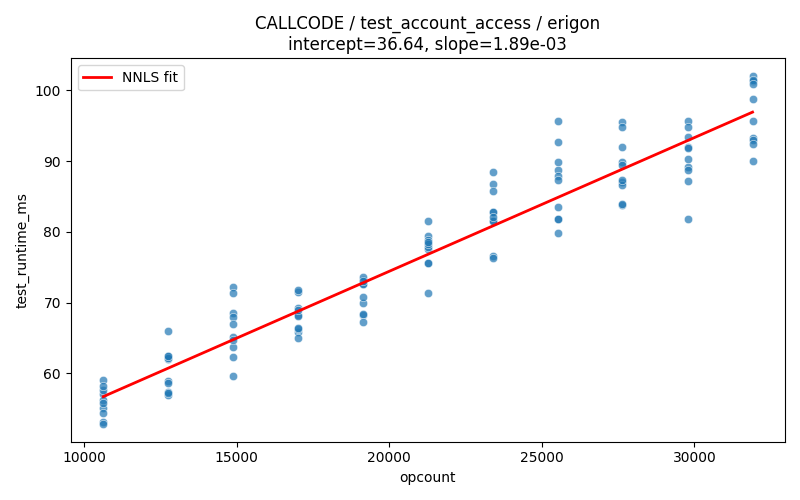

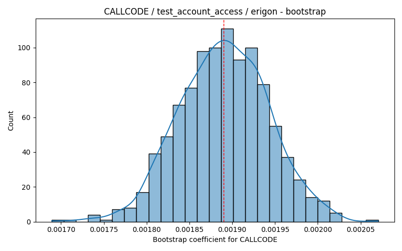

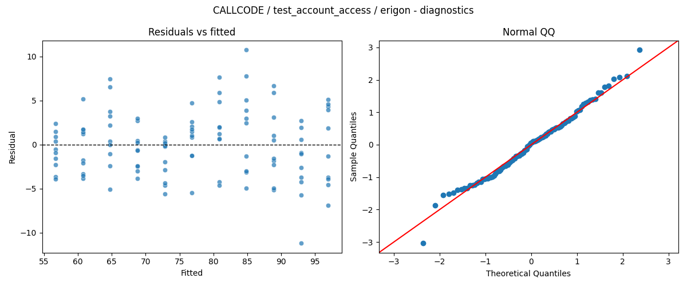

</details>

<details><summary>ethrex — NNLS regression summary</summary>

```
==============================================================================
                           NNLS Regression Results                            
==============================================================================
Dep. Variable:          test_runtime_ms              R-squared:          0.968
Model:                  NNLS                    Adj. R-squared:          0.968
No. Observations:       176                               RMSE:           8.49
Df Residuals:           174                                MAE:           6.82
Df Model:               1      
==============================================================================
                      coef     std err     P-value      [0.025      0.975]
------------------------------------------------------------------------------
         const     30.3979      2.0543       0.001     26.4961     34.4104
       opcount      0.0020      0.0000       0.001      0.0019      0.0020
==============================================================================
Notes: Non-negative least squares with bootstrap inference (1000 iterations)
==============================================================================
```

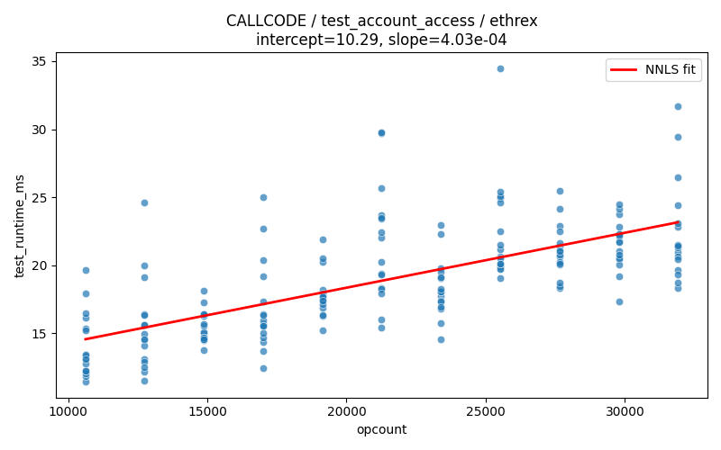

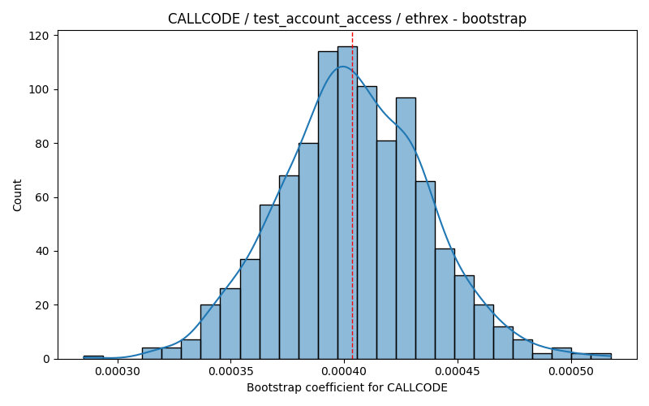

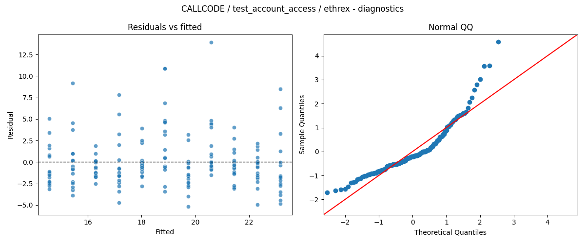

</details>

<details><summary>geth — NNLS regression summary</summary>

```
==============================================================================
                           NNLS Regression Results                            
==============================================================================
Dep. Variable:          test_runtime_ms              R-squared:          0.864
Model:                  NNLS                    Adj. R-squared:          0.863
No. Observations:       154                               RMSE:         213.41
Df Residuals:           152                                MAE:         182.21
Df Model:               1      
==============================================================================
                      coef     std err     P-value      [0.025      0.975]
------------------------------------------------------------------------------
         const    710.2743     63.6853       0.001    587.0587    840.3708
       opcount      0.0227      0.0007       0.001      0.0213      0.0242
==============================================================================
Notes: Non-negative least squares with bootstrap inference (1000 iterations)
==============================================================================
```

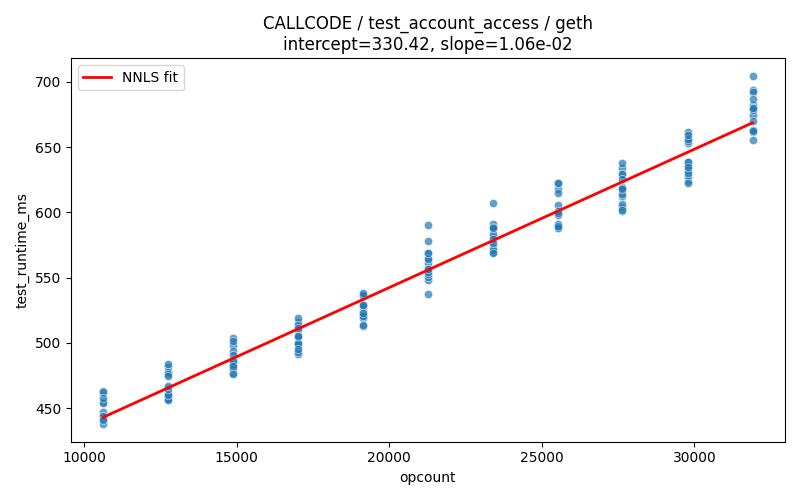

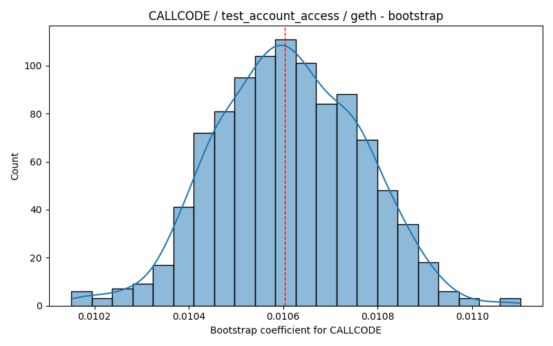

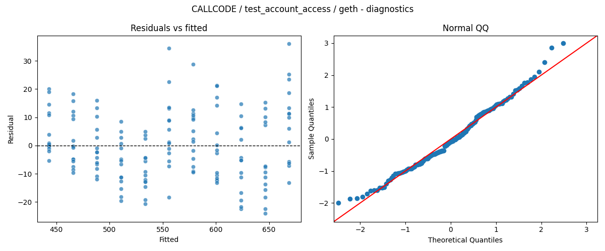

</details>

<details><summary>nethermind — NNLS regression summary</summary>

```
==============================================================================
                           NNLS Regression Results                            
==============================================================================
Dep. Variable:          test_runtime_ms              R-squared:          0.817
Model:                  NNLS                    Adj. R-squared:          0.816
No. Observations:       132                               RMSE:          44.75
Df Residuals:           130                                MAE:          34.67
Df Model:               1      
==============================================================================
                      coef     std err     P-value      [0.025      0.975]
------------------------------------------------------------------------------
         const     82.6827     12.0809       0.001     59.1757    106.8421
       opcount      0.0040      0.0002       0.001      0.0037      0.0043
==============================================================================
Notes: Non-negative least squares with bootstrap inference (1000 iterations)
==============================================================================
```

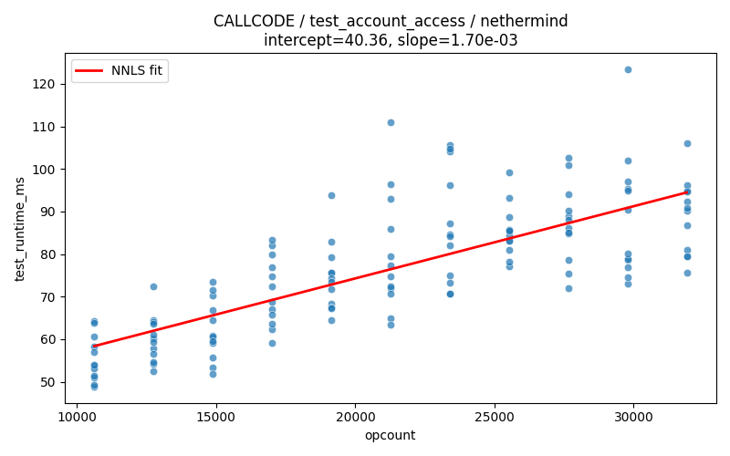

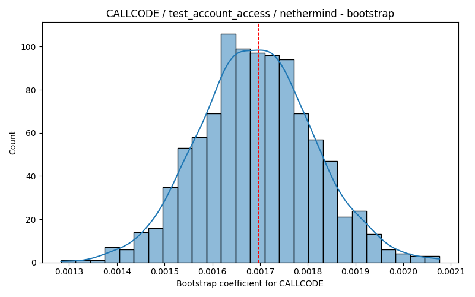

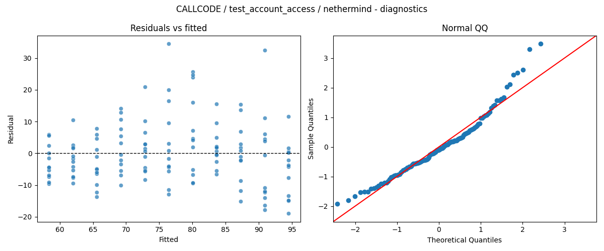

</details>

<details><summary>reth — NNLS regression summary</summary>

```
==============================================================================
                           NNLS Regression Results                            
==============================================================================
Dep. Variable:          test_runtime_ms              R-squared:          0.887
Model:                  NNLS                    Adj. R-squared:          0.886
No. Observations:       198                               RMSE:           6.66
Df Residuals:           196                                MAE:           4.80
Df Model:               1      
==============================================================================
                      coef     std err     P-value      [0.025      0.975]
------------------------------------------------------------------------------
         const     46.4586      1.3788       0.001     43.6712     49.2862
       opcount      0.0008      0.0000       0.001      0.0007      0.0008
==============================================================================
Notes: Non-negative least squares with bootstrap inference (1000 iterations)
==============================================================================
```

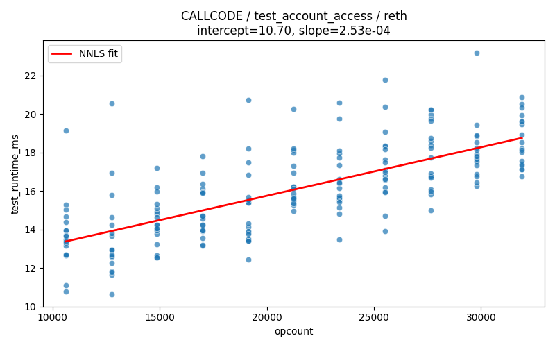

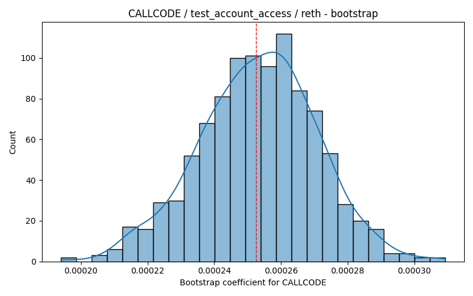

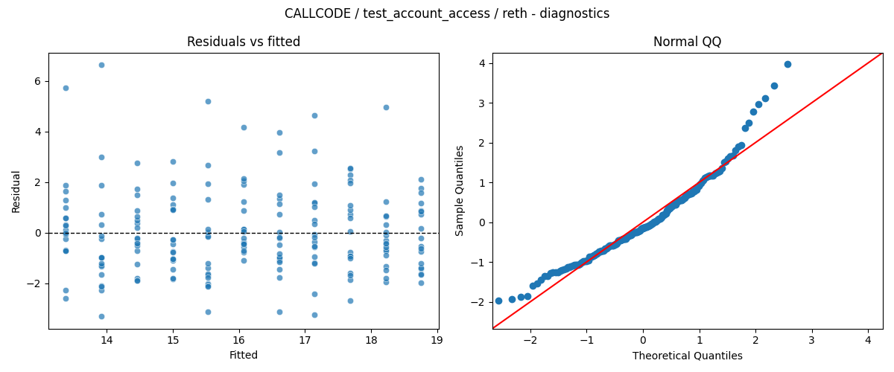

</details>

### test_account_access — combo `CALLCODE_AccountMode.EXISTING_CONTRACT` — `presets[cold_account_code_access]`

| client | nobs | R² | target_coef (ms) | p-value | 95% CI |
| --- | --- | --- | --- | --- | --- |
| `besu` | 253 | 0.9031 | 0.02754 | 1.00e-03 | [0.02646, 0.02859] |
| `erigon` | 110 | 0.8942 | 0.04913 | 1.00e-03 | [0.04581, 0.05194] |
| `ethrex` | 176 | 0.9941 | 0.007619 | 1.00e-03 | [0.007528, 0.007712] |
| `geth` | 154 | 0.859 | 0.02368 | 1.00e-03 | [0.02209, 0.02528] |
| `nethermind` | 132 | 0.623 | 0.01443 | 1.00e-03 | [0.01263, 0.01624] |
| `reth` | 198 | 0.9772 | 0.004006 | 1.00e-03 | [0.003921, 0.00409] |

<details><summary>besu — NNLS regression summary</summary>

```
==============================================================================
                           NNLS Regression Results                            
==============================================================================
Dep. Variable:          test_runtime_ms              R-squared:          0.903
Model:                  NNLS                    Adj. R-squared:          0.903
No. Observations:       253                               RMSE:         183.61
Df Residuals:           251                                MAE:         150.12
Df Model:               1      
==============================================================================
                      coef     std err     P-value      [0.025      0.975]
------------------------------------------------------------------------------
         const    575.5282     34.8625       0.001    508.5241    646.1761
       opcount      0.0275      0.0005       0.001      0.0265      0.0286
==============================================================================
Notes: Non-negative least squares with bootstrap inference (1000 iterations)
==============================================================================
```

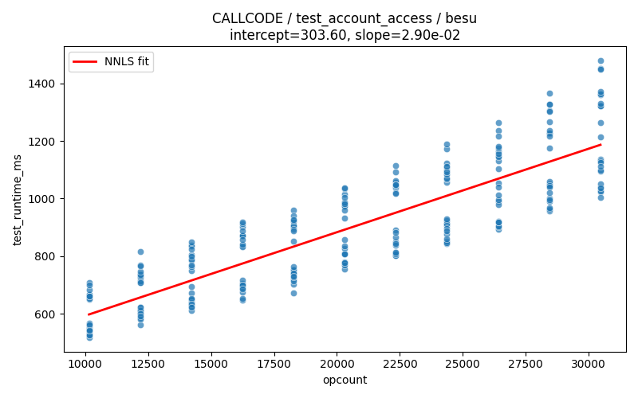

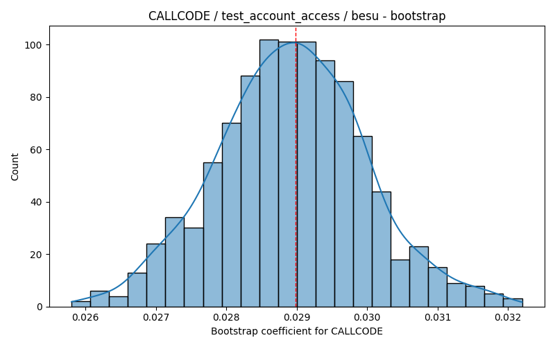

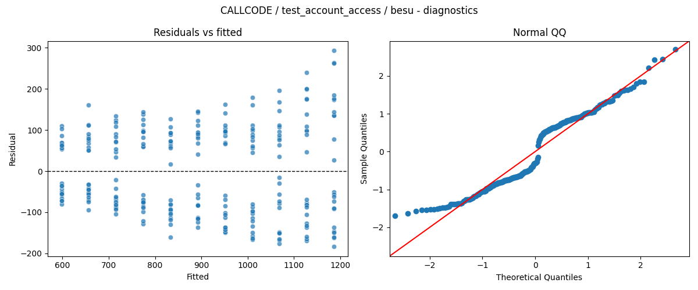

</details>

<details><summary>erigon — NNLS regression summary</summary>

```
==============================================================================
                           NNLS Regression Results                            
==============================================================================
Dep. Variable:          test_runtime_ms              R-squared:          0.894
Model:                  NNLS                    Adj. R-squared:          0.893
No. Observations:       110                               RMSE:         343.99
Df Residuals:           108                                MAE:         294.14
Df Model:               1      
==============================================================================
                      coef     std err     P-value      [0.025      0.975]
------------------------------------------------------------------------------
         const    838.1611    115.0222       0.001    621.6446   1076.1808
       opcount      0.0491      0.0015       0.001      0.0458      0.0519
==============================================================================
Notes: Non-negative least squares with bootstrap inference (1000 iterations)
==============================================================================
```

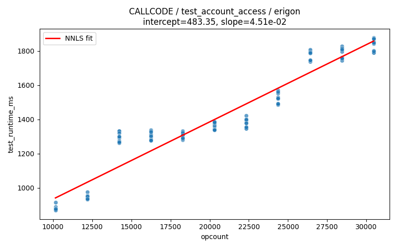

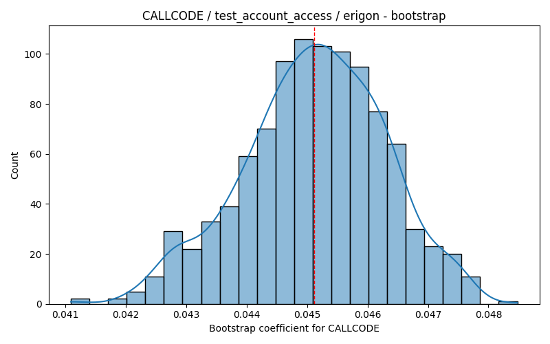

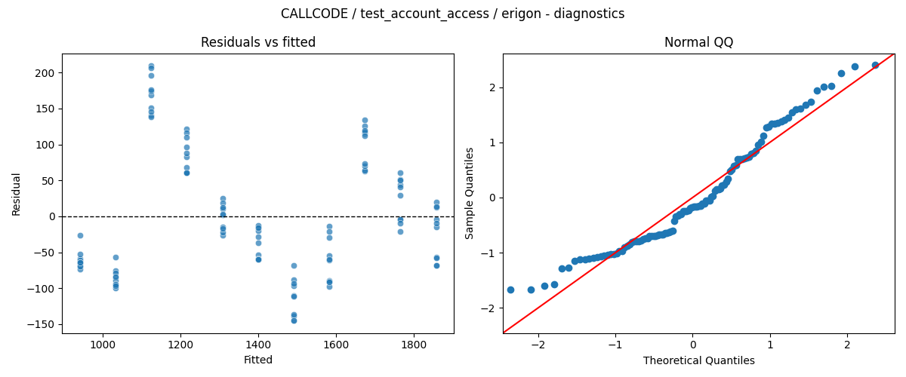

</details>

<details><summary>ethrex — NNLS regression summary</summary>

```
==============================================================================
                           NNLS Regression Results                            
==============================================================================
Dep. Variable:          test_runtime_ms              R-squared:          0.994
Model:                  NNLS                    Adj. R-squared:          0.994
No. Observations:       176                               RMSE:          11.92
Df Residuals:           174                                MAE:           9.08
Df Model:               1      
==============================================================================
                      coef     std err     P-value      [0.025      0.975]
------------------------------------------------------------------------------
         const     37.2099      3.0780       0.001     31.2335     43.3576
       opcount      0.0076      0.0000       0.001      0.0075      0.0077
==============================================================================
Notes: Non-negative least squares with bootstrap inference (1000 iterations)
==============================================================================
```

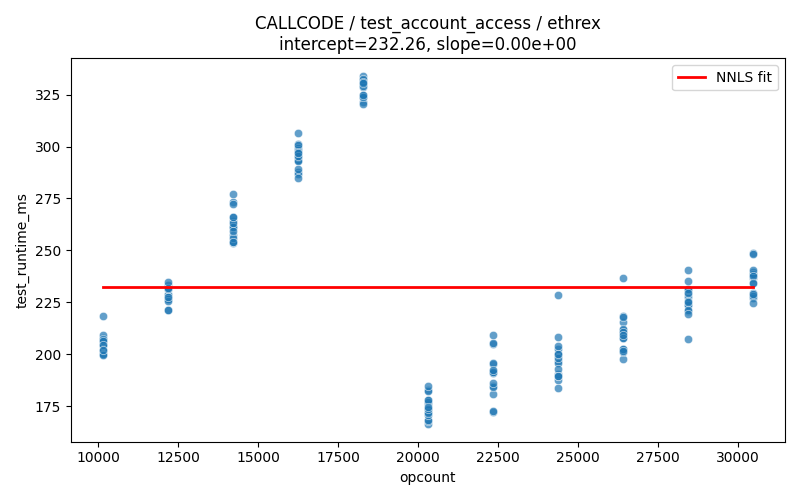


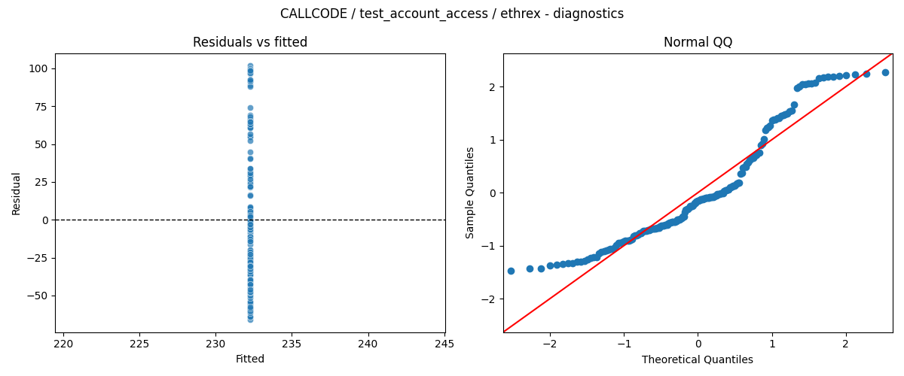

</details>

<details><summary>geth — NNLS regression summary</summary>

```
==============================================================================
                           NNLS Regression Results                            
==============================================================================
Dep. Variable:          test_runtime_ms              R-squared:          0.859
Model:                  NNLS                    Adj. R-squared:          0.858
No. Observations:       154                               RMSE:         195.24
Df Residuals:           152                                MAE:         166.87
Df Model:               1      
==============================================================================
                      coef     std err     P-value      [0.025      0.975]
------------------------------------------------------------------------------
         const    662.0965     59.3025       0.001    545.2697    776.0514
       opcount      0.0237      0.0008       0.001      0.0221      0.0253
==============================================================================
Notes: Non-negative least squares with bootstrap inference (1000 iterations)
==============================================================================
```

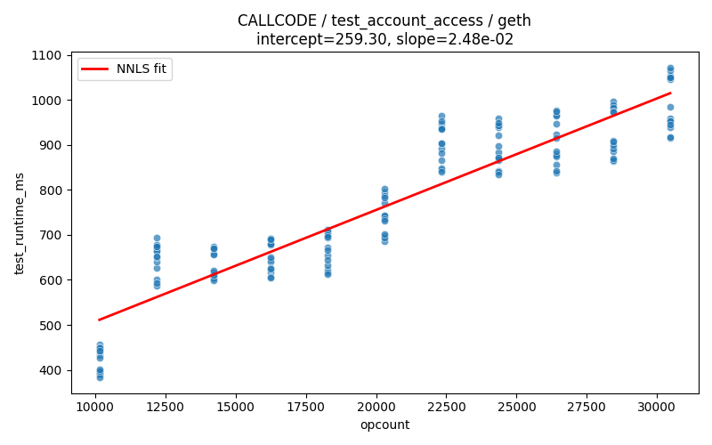

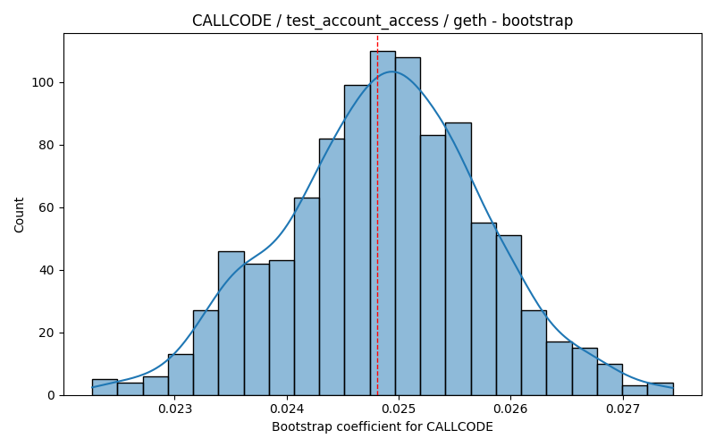

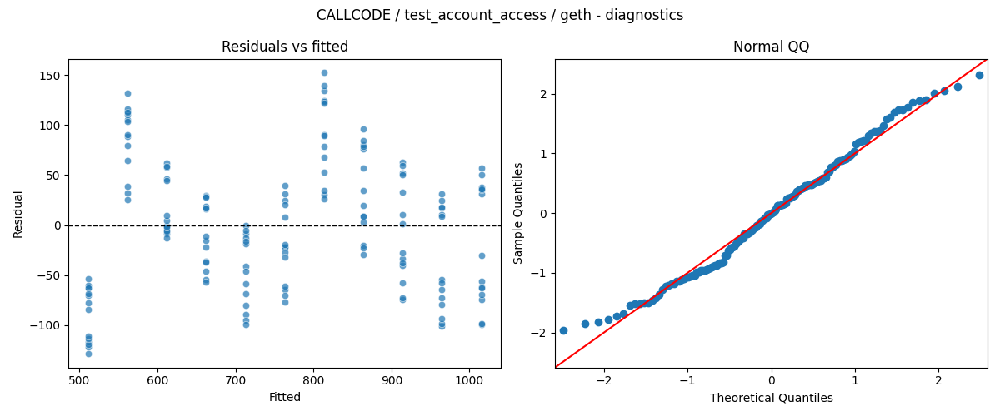

</details>

<details><summary>nethermind — NNLS regression summary</summary>

```
==============================================================================
                           NNLS Regression Results                            
==============================================================================
Dep. Variable:          test_runtime_ms              R-squared:          0.623
Model:                  NNLS                    Adj. R-squared:          0.620
No. Observations:       132                               RMSE:         228.42
Df Residuals:           130                                MAE:         161.68
Df Model:               1      
==============================================================================
                      coef     std err     P-value      [0.025      0.975]
------------------------------------------------------------------------------
         const    165.6106     55.6260       0.002     63.3113    276.8713
       opcount      0.0144      0.0010       0.001      0.0126      0.0162
==============================================================================
Notes: Non-negative least squares with bootstrap inference (1000 iterations)
==============================================================================
```

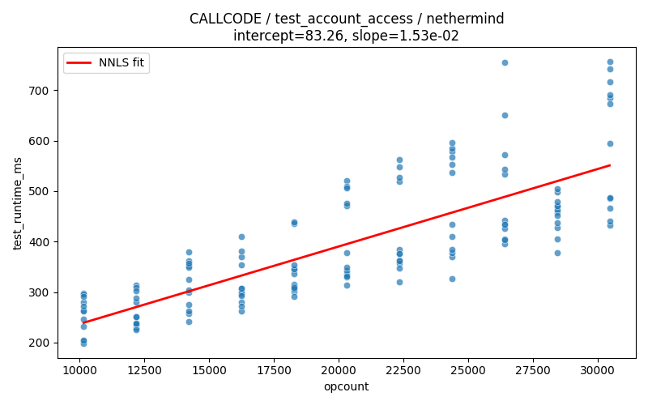

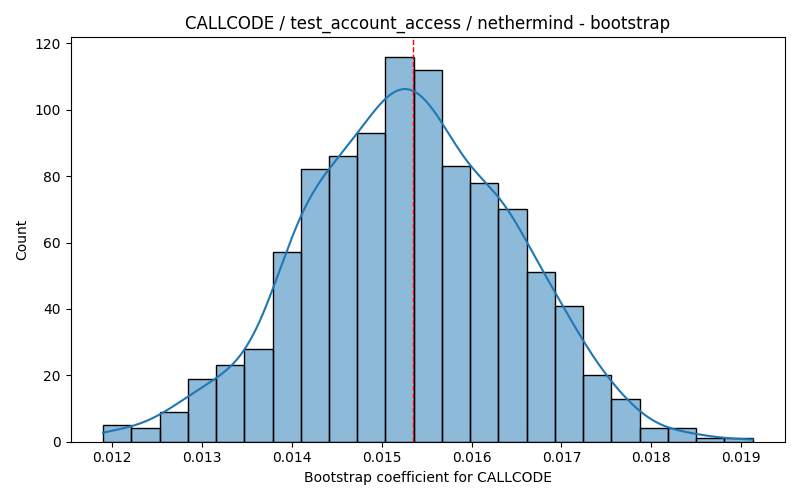

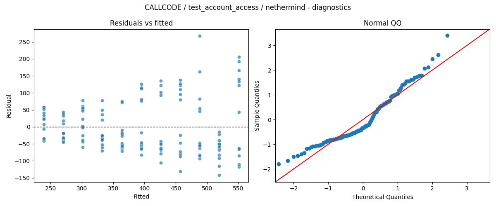

</details>

<details><summary>reth — NNLS regression summary</summary>

```
==============================================================================
                           NNLS Regression Results                            
==============================================================================
Dep. Variable:          test_runtime_ms              R-squared:          0.977
Model:                  NNLS                    Adj. R-squared:          0.977
No. Observations:       198                               RMSE:          12.46
Df Residuals:           196                                MAE:           9.59
Df Model:               1      
==============================================================================
                      coef     std err     P-value      [0.025      0.975]
------------------------------------------------------------------------------
         const    100.7141      2.8010       0.001     95.5503    106.4606
       opcount      0.0040      0.0000       0.001      0.0039      0.0041
==============================================================================
Notes: Non-negative least squares with bootstrap inference (1000 iterations)
==============================================================================
```

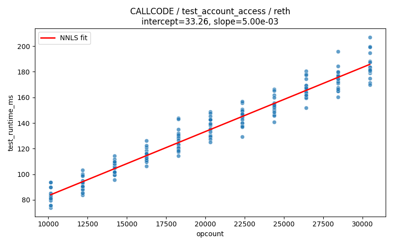

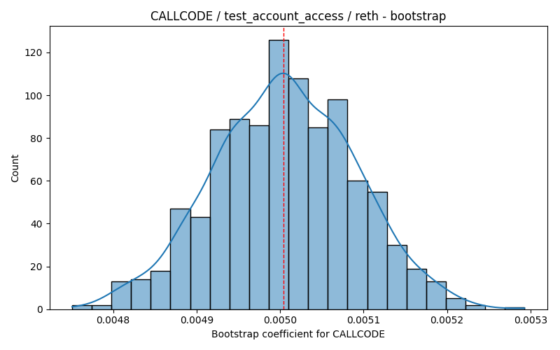

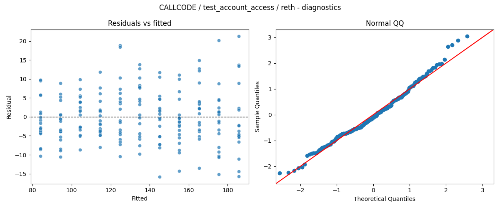

</details>

### test_account_access — combo `CALLCODE_AccountMode.NON_EXISTING_ACCOUNT` — `presets[cold_account_code_access]`

| client | nobs | R² | target_coef (ms) | p-value | 95% CI |
| --- | --- | --- | --- | --- | --- |
| `besu` | 253 | 0.8848 | 0.01535 | 1.00e-03 | [0.01462, 0.01598] |
| `erigon` | 110 | 0.9779 | 0.008498 | 1.00e-03 | [0.008283, 0.00872] |
| `ethrex` | 176 | 0.9683 | 0.001975 | 1.00e-03 | [0.001922, 0.002027] |
| `geth` | 154 | 0.8644 | 0.02269 | 1.00e-03 | [0.02128, 0.02415] |
| `nethermind` | 132 | 0.8172 | 0.003984 | 1.00e-03 | [0.003665, 0.004308] |
| `reth` | 198 | 0.8866 | 0.0007838 | 1.00e-03 | [0.0007472, 0.0008258] |

<details><summary>besu — NNLS regression summary</summary>

```
==============================================================================
                           NNLS Regression Results                            
==============================================================================
Dep. Variable:          test_runtime_ms              R-squared:          0.885
Model:                  NNLS                    Adj. R-squared:          0.884
No. Observations:       253                               RMSE:         131.52
Df Residuals:           251                                MAE:         116.20
Df Model:               1      
==============================================================================
                      coef     std err     P-value      [0.025      0.975]
------------------------------------------------------------------------------
         const    509.7103     26.6452       0.001    460.0821    566.3522
       opcount      0.0153      0.0003       0.001      0.0146      0.0160
==============================================================================
Notes: Non-negative least squares with bootstrap inference (1000 iterations)
==============================================================================
```


</details>

<details><summary>erigon — NNLS regression summary</summary>

```
==============================================================================
                           NNLS Regression Results                            
==============================================================================
Dep. Variable:          test_runtime_ms              R-squared:          0.978
Model:                  NNLS                    Adj. R-squared:          0.978
No. Observations:       110                               RMSE:          30.37
Df Residuals:           108                                MAE:          22.44
Df Model:               1      
==============================================================================
                      coef     std err     P-value      [0.025      0.975]
------------------------------------------------------------------------------
         const     15.7433      7.4438       0.023      0.2150     29.9239
       opcount      0.0085      0.0001       0.001      0.0083      0.0087
==============================================================================
Notes: Non-negative least squares with bootstrap inference (1000 iterations)
==============================================================================
```


</details>

<details><summary>ethrex — NNLS regression summary</summary>

```
==============================================================================
                           NNLS Regression Results                            
==============================================================================
Dep. Variable:          test_runtime_ms              R-squared:          0.968
Model:                  NNLS                    Adj. R-squared:          0.968
No. Observations:       176                               RMSE:           8.49
Df Residuals:           174                                MAE:           6.82
Df Model:               1      
==============================================================================
                      coef     std err     P-value      [0.025      0.975]
------------------------------------------------------------------------------
         const     30.3979      2.0543       0.001     26.4961     34.4104
       opcount      0.0020      0.0000       0.001      0.0019      0.0020
==============================================================================
Notes: Non-negative least squares with bootstrap inference (1000 iterations)
==============================================================================
```


</details>

<details><summary>geth — NNLS regression summary</summary>

```
==============================================================================
                           NNLS Regression Results                            
==============================================================================
Dep. Variable:          test_runtime_ms              R-squared:          0.864
Model:                  NNLS                    Adj. R-squared:          0.863
No. Observations:       154                               RMSE:         213.41
Df Residuals:           152                                MAE:         182.21
Df Model:               1      
==============================================================================
                      coef     std err     P-value      [0.025      0.975]
------------------------------------------------------------------------------
         const    710.2743     63.6853       0.001    587.0587    840.3708
       opcount      0.0227      0.0007       0.001      0.0213      0.0242
==============================================================================
Notes: Non-negative least squares with bootstrap inference (1000 iterations)
==============================================================================
```


</details>

<details><summary>nethermind — NNLS regression summary</summary>

```
==============================================================================
                           NNLS Regression Results                            
==============================================================================
Dep. Variable:          test_runtime_ms              R-squared:          0.817
Model:                  NNLS                    Adj. R-squared:          0.816
No. Observations:       132                               RMSE:          44.75
Df Residuals:           130                                MAE:          34.67
Df Model:               1      
==============================================================================
                      coef     std err     P-value      [0.025      0.975]
------------------------------------------------------------------------------
         const     82.6827     12.0809       0.001     59.1757    106.8421
       opcount      0.0040      0.0002       0.001      0.0037      0.0043
==============================================================================
Notes: Non-negative least squares with bootstrap inference (1000 iterations)
==============================================================================
```


</details>

<details><summary>reth — NNLS regression summary</summary>

```
==============================================================================
                           NNLS Regression Results                            
==============================================================================
Dep. Variable:          test_runtime_ms              R-squared:          0.887
Model:                  NNLS                    Adj. R-squared:          0.886
No. Observations:       198                               RMSE:           6.66
Df Residuals:           196                                MAE:           4.80
Df Model:               1      
==============================================================================
                      coef     std err     P-value      [0.025      0.975]
------------------------------------------------------------------------------
         const     46.4586      1.3788       0.001     43.6712     49.2862
       opcount      0.0008      0.0000       0.001      0.0007      0.0008
==============================================================================
Notes: Non-negative least squares with bootstrap inference (1000 iterations)
==============================================================================
```


</details>

### test_account_access — combo `CALLCODE_AccountMode.EXISTING_EOA` — `presets[cold_account_nocode_write]`

| client | nobs | R² | target_coef (ms) | p-value | 95% CI |
| --- | --- | --- | --- | --- | --- |
| `besu` | 253 | 0.806 | 0.02397 | 1.00e-03 | [0.02251, 0.0254] |
| `erigon` | 110 | 0.9746 | 0.007194 | 1.00e-03 | [0.007019, 0.007381] |
| `ethrex` | 176 | -2.22e-16 | 0 | 1.00e+00 | [0, 0] |
| `geth` | 154 | 0.8737 | 0.01321 | 1.00e-03 | [0.01234, 0.0141] |
| `nethermind` | 132 | 0.7634 | 0.004397 | 1.00e-03 | [0.003975, 0.004824] |
| `reth` | 198 | 0.8783 | 0.001518 | 1.00e-03 | [0.001448, 0.001588] |

<details><summary>besu — NNLS regression summary</summary>

```
==============================================================================
                           NNLS Regression Results                            
==============================================================================
Dep. Variable:          test_runtime_ms              R-squared:          0.806
Model:                  NNLS                    Adj. R-squared:          0.805
No. Observations:       253                               RMSE:          79.14
Df Residuals:           251                                MAE:          65.32
Df Model:               1      
==============================================================================
                      coef     std err     P-value      [0.025      0.975]
------------------------------------------------------------------------------
         const     96.4922     14.8777       0.001     68.5901    126.6838
       opcount      0.0240      0.0008       0.001      0.0225      0.0254
==============================================================================
Notes: Non-negative least squares with bootstrap inference (1000 iterations)
==============================================================================
```


</details>

<details><summary>erigon — NNLS regression summary</summary>

```
==============================================================================
                           NNLS Regression Results                            
==============================================================================
Dep. Variable:          test_runtime_ms              R-squared:          0.975
Model:                  NNLS                    Adj. R-squared:          0.974
No. Observations:       110                               RMSE:           7.82
Df Residuals:           108                                MAE:           5.76
Df Model:               1      
==============================================================================
                      coef     std err     P-value      [0.025      0.975]
------------------------------------------------------------------------------
         const     28.0700      1.9387       0.001     24.3807     31.7502
       opcount      0.0072      0.0001       0.001      0.0070      0.0074
==============================================================================
Notes: Non-negative least squares with bootstrap inference (1000 iterations)
==============================================================================
```


</details>

<details><summary>ethrex — NNLS regression summary</summary>

```
==============================================================================
                           NNLS Regression Results                            
==============================================================================
Dep. Variable:          test_runtime_ms              R-squared:         -0.000
Model:                  NNLS                    Adj. R-squared:         -0.006
No. Observations:       176                               RMSE:          47.17
Df Residuals:           174                                MAE:          37.52
Df Model:               1      
==============================================================================
                      coef     std err     P-value      [0.025      0.975]
------------------------------------------------------------------------------
         const    229.3730      3.5957       0.001    222.4101    236.4200
       opcount      0.0000      0.0000       1.000      0.0000      0.0000
==============================================================================
Notes: Non-negative least squares with bootstrap inference (1000 iterations)
==============================================================================
```


</details>

<details><summary>geth — NNLS regression summary</summary>

```
==============================================================================
                           NNLS Regression Results                            
==============================================================================
Dep. Variable:          test_runtime_ms              R-squared:          0.874
Model:                  NNLS                    Adj. R-squared:          0.873
No. Observations:       154                               RMSE:          33.80
Df Residuals:           152                                MAE:          27.41
Df Model:               1      
==============================================================================
                      coef     std err     P-value      [0.025      0.975]
------------------------------------------------------------------------------
         const    146.8853     10.4672       0.001    126.4701    166.9845
       opcount      0.0132      0.0004       0.001      0.0123      0.0141
==============================================================================
Notes: Non-negative least squares with bootstrap inference (1000 iterations)
==============================================================================
```


</details>

<details><summary>nethermind — NNLS regression summary</summary>

```
==============================================================================
                           NNLS Regression Results                            
==============================================================================
Dep. Variable:          test_runtime_ms              R-squared:          0.763
Model:                  NNLS                    Adj. R-squared:          0.762
No. Observations:       132                               RMSE:          16.47
Df Residuals:           130                                MAE:          12.91
Df Model:               1      
==============================================================================
                      coef     std err     P-value      [0.025      0.975]
------------------------------------------------------------------------------
         const     65.4149      4.2464       0.001     57.3078     73.8836
       opcount      0.0044      0.0002       0.001      0.0040      0.0048
==============================================================================
Notes: Non-negative least squares with bootstrap inference (1000 iterations)
==============================================================================
```


</details>

<details><summary>reth — NNLS regression summary</summary>

```
==============================================================================
                           NNLS Regression Results                            
==============================================================================
Dep. Variable:          test_runtime_ms              R-squared:          0.878
Model:                  NNLS                    Adj. R-squared:          0.878
No. Observations:       198                               RMSE:           3.80
Df Residuals:           196                                MAE:           2.85
Df Model:               1      
==============================================================================
                      coef     std err     P-value      [0.025      0.975]
------------------------------------------------------------------------------
         const     11.2017      0.7157       0.001      9.9678     12.6131
       opcount      0.0015      0.0000       0.001      0.0014      0.0016
==============================================================================
Notes: Non-negative least squares with bootstrap inference (1000 iterations)
==============================================================================
```


</details>

### test_account_access — combo `CALLCODE_AccountMode.NON_EXISTING_ACCOUNT` — `presets[cold_account_nocode_write]`

| client | nobs | R² | target_coef (ms) | p-value | 95% CI |
| --- | --- | --- | --- | --- | --- |
| `besu` | 253 | 0.3807 | 0.005542 | 1.00e-03 | [0.004703, 0.006372] |
| `erigon` | 110 | 0.9228 | 0.00189 | 1.00e-03 | [0.001796, 0.001991] |
| `ethrex` | 176 | 0.4449 | 0.0004034 | 1.00e-03 | [0.0003419, 0.0004683] |
| `geth` | 154 | 0.9723 | 0.0106 | 1.00e-03 | [0.01033, 0.01089] |
| `nethermind` | 132 | 0.5724 | 0.001696 | 1.00e-03 | [0.001461, 0.001929] |
| `reth` | 198 | 0.5083 | 0.0002525 | 1.00e-03 | [0.0002164, 0.0002869] |

<details><summary>besu — NNLS regression summary</summary>

```
==============================================================================
                           NNLS Regression Results                            
==============================================================================
Dep. Variable:          test_runtime_ms              R-squared:          0.381
Model:                  NNLS                    Adj. R-squared:          0.378
No. Observations:       253                               RMSE:          47.57
Df Residuals:           251                                MAE:          43.02
Df Model:               1      
==============================================================================
                      coef     std err     P-value      [0.025      0.975]
------------------------------------------------------------------------------
         const    299.5412      8.3166       0.001    283.1162    315.7326
       opcount      0.0055      0.0004       0.001      0.0047      0.0064
==============================================================================
Notes: Non-negative least squares with bootstrap inference (1000 iterations)
==============================================================================
```


</details>

<details><summary>erigon — NNLS regression summary</summary>

```
==============================================================================
                           NNLS Regression Results                            
==============================================================================
Dep. Variable:          test_runtime_ms              R-squared:          0.923
Model:                  NNLS                    Adj. R-squared:          0.922
No. Observations:       110                               RMSE:           3.68
Df Residuals:           108                                MAE:           2.96
Df Model:               1      
==============================================================================
                      coef     std err     P-value      [0.025      0.975]
------------------------------------------------------------------------------
         const     36.6405      1.0318       0.001     34.6386     38.6549
       opcount      0.0019      0.0001       0.001      0.0018      0.0020
==============================================================================
Notes: Non-negative least squares with bootstrap inference (1000 iterations)
==============================================================================
```


</details>

<details><summary>ethrex — NNLS regression summary</summary>

```
==============================================================================
                           NNLS Regression Results                            
==============================================================================
Dep. Variable:          test_runtime_ms              R-squared:          0.445
Model:                  NNLS                    Adj. R-squared:          0.442
No. Observations:       176                               RMSE:           3.03
Df Residuals:           174                                MAE:           2.18
Df Model:               1      
==============================================================================
                      coef     std err     P-value      [0.025      0.975]
------------------------------------------------------------------------------
         const     10.2895      0.7011       0.001      9.0029     11.6712
       opcount      0.0004      0.0000       0.001      0.0003      0.0005
==============================================================================
Notes: Non-negative least squares with bootstrap inference (1000 iterations)
==============================================================================
```


</details>

<details><summary>geth — NNLS regression summary</summary>

```
==============================================================================
                           NNLS Regression Results                            
==============================================================================
Dep. Variable:          test_runtime_ms              R-squared:          0.972
Model:                  NNLS                    Adj. R-squared:          0.972
No. Observations:       154                               RMSE:          12.04
Df Residuals:           152                                MAE:           9.81
Df Model:               1      
==============================================================================
                      coef     std err     P-value      [0.025      0.975]
------------------------------------------------------------------------------
         const    330.4238      3.0434       0.001    324.3644    336.0855
       opcount      0.0106      0.0002       0.001      0.0103      0.0109
==============================================================================
Notes: Non-negative least squares with bootstrap inference (1000 iterations)
==============================================================================
```


</details>

<details><summary>nethermind — NNLS regression summary</summary>

```
==============================================================================
                           NNLS Regression Results                            
==============================================================================
Dep. Variable:          test_runtime_ms              R-squared:          0.572
Model:                  NNLS                    Adj. R-squared:          0.569
No. Observations:       132                               RMSE:           9.87
Df Residuals:           130                                MAE:           7.47
Df Model:               1      
==============================================================================
                      coef     std err     P-value      [0.025      0.975]
------------------------------------------------------------------------------
         const     40.3607      2.3309       0.001     35.9138     44.9824
       opcount      0.0017      0.0001       0.001      0.0015      0.0019
==============================================================================
Notes: Non-negative least squares with bootstrap inference (1000 iterations)
==============================================================================
```


</details>

<details><summary>reth — NNLS regression summary</summary>

```
==============================================================================
                           NNLS Regression Results                            
==============================================================================
Dep. Variable:          test_runtime_ms              R-squared:          0.508
Model:                  NNLS                    Adj. R-squared:          0.506
No. Observations:       198                               RMSE:           1.67
Df Residuals:           196                                MAE:           1.28
Df Model:               1      
==============================================================================
                      coef     std err     P-value      [0.025      0.975]
------------------------------------------------------------------------------
         const     10.6991      0.4099       0.001      9.9091     11.5351
       opcount      0.0003      0.0000       0.001      0.0002      0.0003
==============================================================================
Notes: Non-negative least squares with bootstrap inference (1000 iterations)
==============================================================================
```


</details>

### test_account_access — combo `CALLCODE_AccountMode.EXISTING_CONTRACT` — `presets[cold_account_code_write]`

| client | nobs | R² | target_coef (ms) | p-value | 95% CI |
| --- | --- | --- | --- | --- | --- |
| `besu` | 253 | 0.747 | 0.02898 | 1.00e-03 | [0.02687, 0.03112] |
| `erigon` | 110 | 0.9178 | 0.04511 | 1.00e-03 | [0.04267, 0.04735] |
| `ethrex` | 176 | 1.11e-16 | 0 | 1.00e+00 | [0, 0] |
| `geth` | 154 | 0.8549 | 0.02481 | 1.00e-03 | [0.02311, 0.02664] |
| `nethermind` | 132 | 0.6113 | 0.01534 | 1.00e-03 | [0.01291, 0.01752] |
| `reth` | 198 | 0.9549 | 0.005004 | 1.00e-03 | [0.004835, 0.00517] |

<details><summary>besu — NNLS regression summary</summary>

```
==============================================================================
                           NNLS Regression Results                            
==============================================================================
Dep. Variable:          test_runtime_ms              R-squared:          0.747
Model:                  NNLS                    Adj. R-squared:          0.746
No. Observations:       253                               RMSE:         108.34
Df Residuals:           251                                MAE:          98.76
Df Model:               1      
==============================================================================
                      coef     std err     P-value      [0.025      0.975]
------------------------------------------------------------------------------
         const    303.5968     19.5477       0.001    264.9250    343.7065
       opcount      0.0290      0.0011       0.001      0.0269      0.0311
==============================================================================
Notes: Non-negative least squares with bootstrap inference (1000 iterations)
==============================================================================
```


</details>

<details><summary>erigon — NNLS regression summary</summary>

```
==============================================================================
                           NNLS Regression Results                            
==============================================================================
Dep. Variable:          test_runtime_ms              R-squared:          0.918
Model:                  NNLS                    Adj. R-squared:          0.917
No. Observations:       110                               RMSE:          86.70
Df Residuals:           108                                MAE:          71.99
Df Model:               1      
==============================================================================
                      coef     std err     P-value      [0.025      0.975]
------------------------------------------------------------------------------
         const    483.3468     27.5924       0.001    432.9987    542.3351
       opcount      0.0451      0.0012       0.001      0.0427      0.0473
==============================================================================
Notes: Non-negative least squares with bootstrap inference (1000 iterations)
==============================================================================
```


</details>

<details><summary>ethrex — NNLS regression summary</summary>

```
==============================================================================
                           NNLS Regression Results                            
==============================================================================
Dep. Variable:          test_runtime_ms              R-squared:          0.000
Model:                  NNLS                    Adj. R-squared:         -0.006
No. Observations:       176                               RMSE:          44.66
Df Residuals:           174                                MAE:          35.38
Df Model:               1      
==============================================================================
                      coef     std err     P-value      [0.025      0.975]
------------------------------------------------------------------------------
         const    232.2612      3.4753       0.001    225.5346    239.0500
       opcount      0.0000      0.0000       1.000      0.0000      0.0000
==============================================================================
Notes: Non-negative least squares with bootstrap inference (1000 iterations)
==============================================================================
```


</details>

<details><summary>geth — NNLS regression summary</summary>

```
==============================================================================
                           NNLS Regression Results                            
==============================================================================
Dep. Variable:          test_runtime_ms              R-squared:          0.855
Model:                  NNLS                    Adj. R-squared:          0.854
No. Observations:       154                               RMSE:          65.67
Df Residuals:           152                                MAE:          54.55
Df Model:               1      
==============================================================================
                      coef     std err     P-value      [0.025      0.975]
------------------------------------------------------------------------------
         const    259.2983     19.6660       0.001    220.9143    296.5316
       opcount      0.0248      0.0009       0.001      0.0231      0.0266
==============================================================================
Notes: Non-negative least squares with bootstrap inference (1000 iterations)
==============================================================================
```


</details>

<details><summary>nethermind — NNLS regression summary</summary>

```
==============================================================================
                           NNLS Regression Results                            
==============================================================================
Dep. Variable:          test_runtime_ms              R-squared:          0.611
Model:                  NNLS                    Adj. R-squared:          0.608
No. Observations:       132                               RMSE:          78.59
Df Residuals:           130                                MAE:          65.82
Df Model:               1      
==============================================================================
                      coef     std err     P-value      [0.025      0.975]
------------------------------------------------------------------------------
         const     83.2615     19.7737       0.001     45.7549    123.6592
       opcount      0.0153      0.0012       0.001      0.0129      0.0175
==============================================================================
Notes: Non-negative least squares with bootstrap inference (1000 iterations)
==============================================================================
```


</details>

<details><summary>reth — NNLS regression summary</summary>

```
==============================================================================
                           NNLS Regression Results                            
==============================================================================
Dep. Variable:          test_runtime_ms              R-squared:          0.955
Model:                  NNLS                    Adj. R-squared:          0.955
No. Observations:       198                               RMSE:           6.98
Df Residuals:           196                                MAE:           5.53
Df Model:               1      
==============================================================================
                      coef     std err     P-value      [0.025      0.975]
------------------------------------------------------------------------------
         const     33.2572      1.5995       0.001     30.2691     36.3806
       opcount      0.0050      0.0001       0.001      0.0048      0.0052
==============================================================================
Notes: Non-negative least squares with bootstrap inference (1000 iterations)
==============================================================================
```


</details>

### test_account_access — combo `CALLCODE_AccountMode.NON_EXISTING_ACCOUNT` — `presets[cold_account_code_write]`

| client | nobs | R² | target_coef (ms) | p-value | 95% CI |
| --- | --- | --- | --- | --- | --- |
| `besu` | 253 | 0.3807 | 0.005542 | 1.00e-03 | [0.004703, 0.006372] |
| `erigon` | 110 | 0.9228 | 0.00189 | 1.00e-03 | [0.001796, 0.001991] |
| `ethrex` | 176 | 0.4449 | 0.0004034 | 1.00e-03 | [0.0003419, 0.0004683] |
| `geth` | 154 | 0.9723 | 0.0106 | 1.00e-03 | [0.01033, 0.01089] |
| `nethermind` | 132 | 0.5724 | 0.001696 | 1.00e-03 | [0.001461, 0.001929] |
| `reth` | 198 | 0.5083 | 0.0002525 | 1.00e-03 | [0.0002164, 0.0002869] |

<details><summary>besu — NNLS regression summary</summary>

```
==============================================================================
                           NNLS Regression Results                            
==============================================================================
Dep. Variable:          test_runtime_ms              R-squared:          0.381
Model:                  NNLS                    Adj. R-squared:          0.378
No. Observations:       253                               RMSE:          47.57
Df Residuals:           251                                MAE:          43.02
Df Model:               1      
==============================================================================
                      coef     std err     P-value      [0.025      0.975]
------------------------------------------------------------------------------
         const    299.5412      8.3166       0.001    283.1162    315.7326
       opcount      0.0055      0.0004       0.001      0.0047      0.0064
==============================================================================
Notes: Non-negative least squares with bootstrap inference (1000 iterations)
==============================================================================
```


</details>

<details><summary>erigon — NNLS regression summary</summary>

```
==============================================================================
                           NNLS Regression Results                            
==============================================================================
Dep. Variable:          test_runtime_ms              R-squared:          0.923
Model:                  NNLS                    Adj. R-squared:          0.922
No. Observations:       110                               RMSE:           3.68
Df Residuals:           108                                MAE:           2.96
Df Model:               1      
==============================================================================
                      coef     std err     P-value      [0.025      0.975]
------------------------------------------------------------------------------
         const     36.6405      1.0318       0.001     34.6386     38.6549
       opcount      0.0019      0.0001       0.001      0.0018      0.0020
==============================================================================
Notes: Non-negative least squares with bootstrap inference (1000 iterations)
==============================================================================
```


</details>

<details><summary>ethrex — NNLS regression summary</summary>

```
==============================================================================
                           NNLS Regression Results                            
==============================================================================
Dep. Variable:          test_runtime_ms              R-squared:          0.445
Model:                  NNLS                    Adj. R-squared:          0.442
No. Observations:       176                               RMSE:           3.03
Df Residuals:           174                                MAE:           2.18
Df Model:               1      
==============================================================================
                      coef     std err     P-value      [0.025      0.975]
------------------------------------------------------------------------------
         const     10.2895      0.7011       0.001      9.0029     11.6712
       opcount      0.0004      0.0000       0.001      0.0003      0.0005
==============================================================================
Notes: Non-negative least squares with bootstrap inference (1000 iterations)
==============================================================================
```


</details>

<details><summary>geth — NNLS regression summary</summary>

```
==============================================================================
                           NNLS Regression Results                            
==============================================================================
Dep. Variable:          test_runtime_ms              R-squared:          0.972
Model:                  NNLS                    Adj. R-squared:          0.972
No. Observations:       154                               RMSE:          12.04
Df Residuals:           152                                MAE:           9.81
Df Model:               1      
==============================================================================
                      coef     std err     P-value      [0.025      0.975]
------------------------------------------------------------------------------
         const    330.4238      3.0434       0.001    324.3644    336.0855
       opcount      0.0106      0.0002       0.001      0.0103      0.0109
==============================================================================
Notes: Non-negative least squares with bootstrap inference (1000 iterations)
==============================================================================
```


</details>

<details><summary>nethermind — NNLS regression summary</summary>

```
==============================================================================
                           NNLS Regression Results                            
==============================================================================
Dep. Variable:          test_runtime_ms              R-squared:          0.572
Model:                  NNLS                    Adj. R-squared:          0.569
No. Observations:       132                               RMSE:           9.87
Df Residuals:           130                                MAE:           7.47
Df Model:               1      
==============================================================================
                      coef     std err     P-value      [0.025      0.975]
------------------------------------------------------------------------------
         const     40.3607      2.3309       0.001     35.9138     44.9824
       opcount      0.0017      0.0001       0.001      0.0015      0.0019
==============================================================================
Notes: Non-negative least squares with bootstrap inference (1000 iterations)
==============================================================================
```


</details>

<details><summary>reth — NNLS regression summary</summary>

```
==============================================================================
                           NNLS Regression Results                            
==============================================================================
Dep. Variable:          test_runtime_ms              R-squared:          0.508
Model:                  NNLS                    Adj. R-squared:          0.506
No. Observations:       198                               RMSE:           1.67
Df Residuals:           196                                MAE:           1.28
Df Model:               1      
==============================================================================
                      coef     std err     P-value      [0.025      0.975]
------------------------------------------------------------------------------
         const     10.6991      0.4099       0.001      9.9091     11.5351
       opcount      0.0003      0.0000       0.001      0.0002      0.0003
==============================================================================
Notes: Non-negative least squares with bootstrap inference (1000 iterations)
==============================================================================
```


</details>

### test_ext_account_query_warm — combo `CALLCODE`

| client | nobs | R² | target_coef (ms) | p-value | 95% CI |
| --- | --- | --- | --- | --- | --- |
| `besu` | 253 | 0.7234 | 0.0007038 | 1.00e-03 | [0.0006496, 0.0007578] |
| `erigon` | 110 | 0.9301 | 0.0002647 | 1.00e-03 | [0.0002521, 0.0002785] |
| `ethrex` | 176 | 0.9297 | 0.0001018 | 1.00e-03 | [9.716e-05, 0.000106] |
| `geth` | 154 | 0.9028 | 0.0001806 | 1.00e-03 | [0.000171, 0.0001903] |
| `nethermind` | 132 | 0.788 | 0.0002229 | 1.00e-03 | [0.0002017, 0.0002445] |
| `reth` | 198 | 0.9288 | 5.95e-05 | 1.00e-03 | [5.739e-05, 6.149e-05] |

<details><summary>besu — NNLS regression summary</summary>

```
==============================================================================
                           NNLS Regression Results                            
==============================================================================
Dep. Variable:          test_runtime_ms              R-squared:          0.723
Model:                  NNLS                    Adj. R-squared:          0.722
No. Observations:       253                               RMSE:         219.89
Df Residuals:           251                                MAE:         168.40
Df Model:               1      
==============================================================================
                      coef     std err     P-value      [0.025      0.975]
------------------------------------------------------------------------------
         const    801.6945     45.1202       0.001    713.4572    894.6962
       opcount      0.0007      0.0000       0.001      0.0006      0.0008
==============================================================================
Notes: Non-negative least squares with bootstrap inference (1000 iterations)
==============================================================================
```

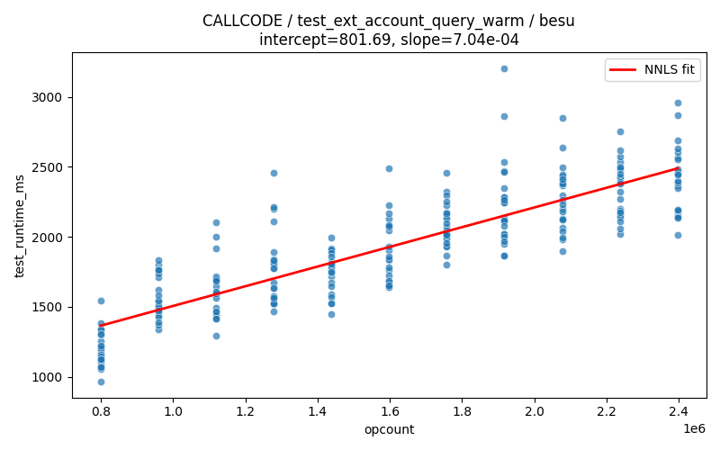

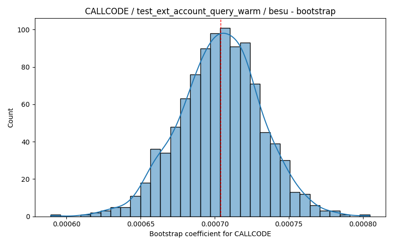

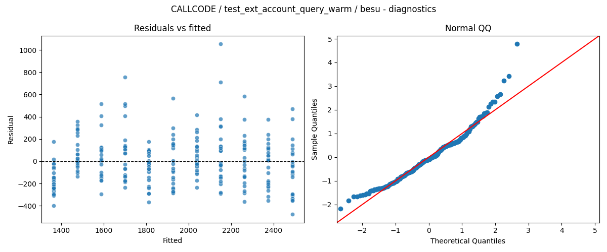

</details>

<details><summary>erigon — NNLS regression summary</summary>

```
==============================================================================
                           NNLS Regression Results                            
==============================================================================
Dep. Variable:          test_runtime_ms              R-squared:          0.930
Model:                  NNLS                    Adj. R-squared:          0.929
No. Observations:       110                               RMSE:          36.65
Df Residuals:           108                                MAE:          27.43
Df Model:               1      
==============================================================================
                      coef     std err     P-value      [0.025      0.975]
------------------------------------------------------------------------------
         const     32.6203     10.6806       0.001     11.8633     52.8316
       opcount      0.0003      0.0000       0.001      0.0003      0.0003
==============================================================================
Notes: Non-negative least squares with bootstrap inference (1000 iterations)
==============================================================================
```

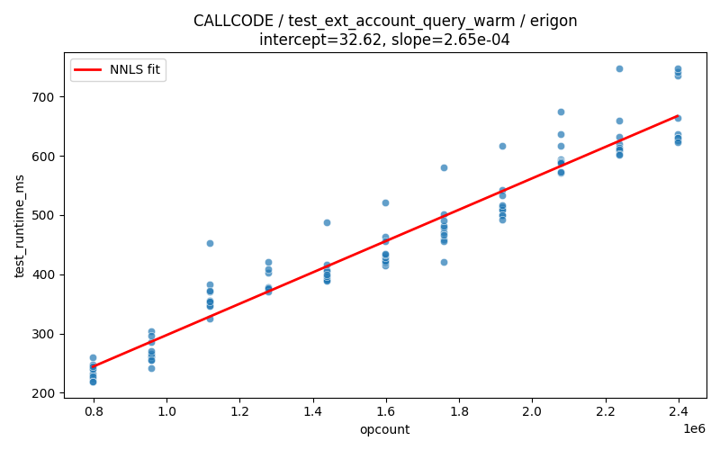

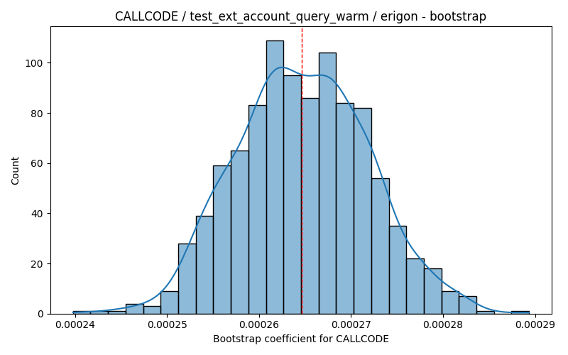

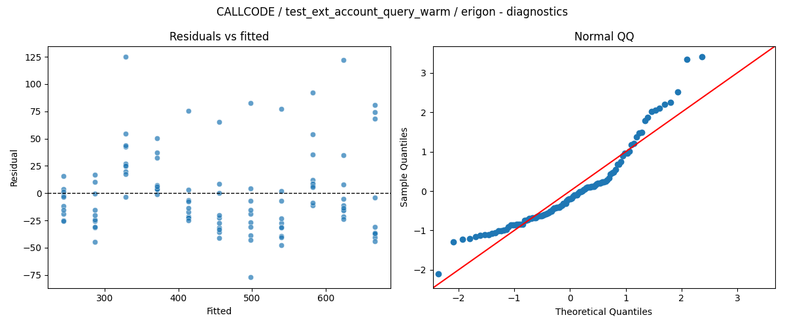

</details>

<details><summary>ethrex — NNLS regression summary</summary>

```
==============================================================================
                           NNLS Regression Results                            
==============================================================================
Dep. Variable:          test_runtime_ms              R-squared:          0.930
Model:                  NNLS                    Adj. R-squared:          0.929
No. Observations:       176                               RMSE:          14.14
Df Residuals:           174                                MAE:          10.82
Df Model:               1      
==============================================================================
                      coef     std err     P-value      [0.025      0.975]
------------------------------------------------------------------------------
         const     37.2815      3.3046       0.001     31.2227     44.3753
       opcount      0.0001      0.0000       0.001      0.0001      0.0001
==============================================================================
Notes: Non-negative least squares with bootstrap inference (1000 iterations)
==============================================================================
```

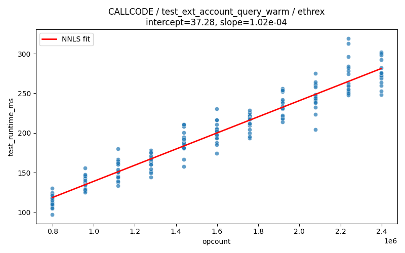

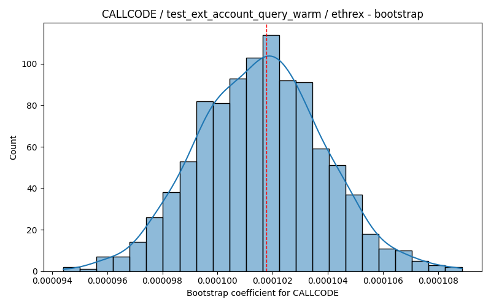

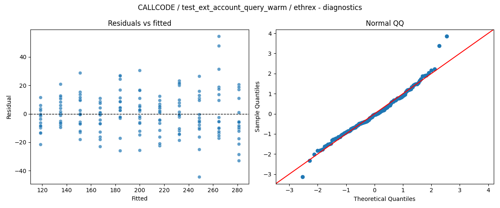

</details>

<details><summary>geth — NNLS regression summary</summary>

```
==============================================================================
                           NNLS Regression Results                            
==============================================================================
Dep. Variable:          test_runtime_ms              R-squared:          0.903
Model:                  NNLS                    Adj. R-squared:          0.902
No. Observations:       154                               RMSE:          29.95
Df Residuals:           152                                MAE:          22.46
Df Model:               1      
==============================================================================
                      coef     std err     P-value      [0.025      0.975]
------------------------------------------------------------------------------
         const     51.5589      7.2773       0.001     37.8331     65.7709
       opcount      0.0002      0.0000       0.001      0.0002      0.0002
==============================================================================
Notes: Non-negative least squares with bootstrap inference (1000 iterations)
==============================================================================
```

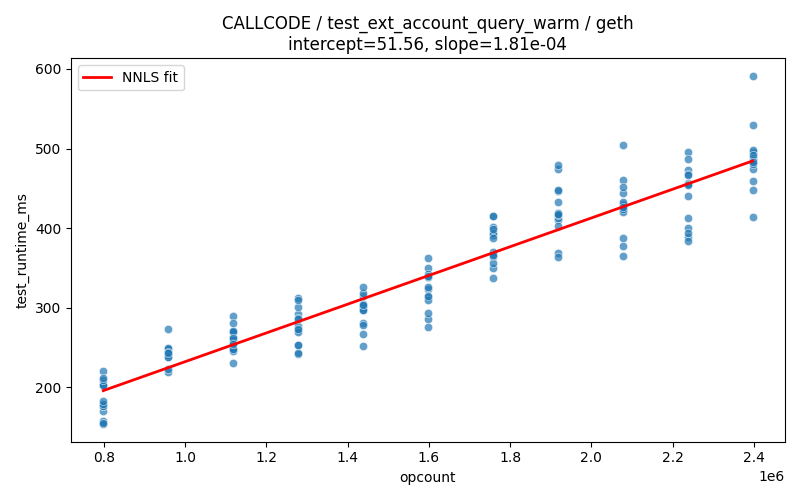

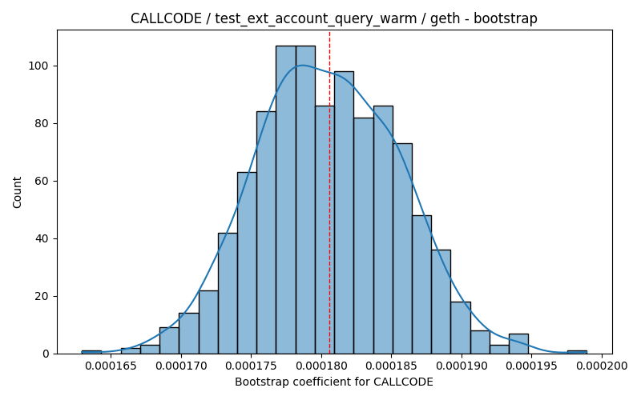

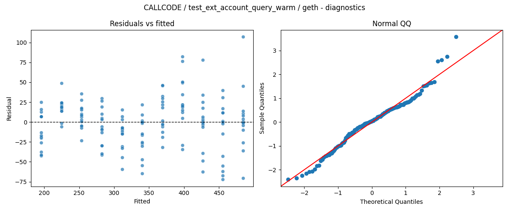

</details>

<details><summary>nethermind — NNLS regression summary</summary>

```
==============================================================================
                           NNLS Regression Results                            
==============================================================================
Dep. Variable:          test_runtime_ms              R-squared:          0.788
Model:                  NNLS                    Adj. R-squared:          0.786
No. Observations:       132                               RMSE:          58.42
Df Residuals:           130                                MAE:          45.27
Df Model:               1      
==============================================================================
                      coef     std err     P-value      [0.025      0.975]
------------------------------------------------------------------------------
         const    154.2619     16.1905       0.001    121.2399    187.6023
       opcount      0.0002      0.0000       0.001      0.0002      0.0002
==============================================================================
Notes: Non-negative least squares with bootstrap inference (1000 iterations)
==============================================================================
```

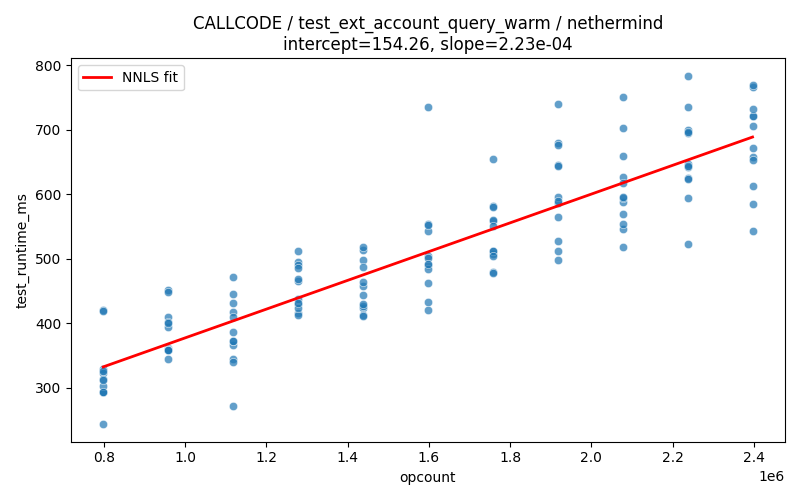

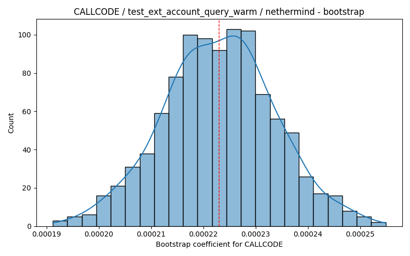

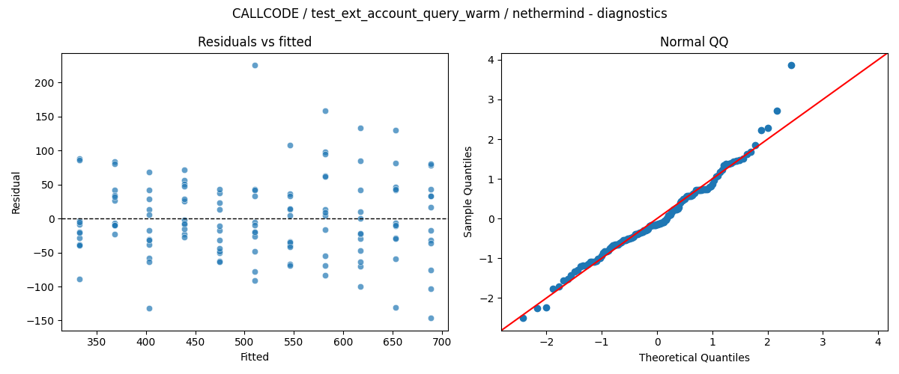

</details>

<details><summary>reth — NNLS regression summary</summary>

```
==============================================================================
                           NNLS Regression Results                            
==============================================================================
Dep. Variable:          test_runtime_ms              R-squared:          0.929
Model:                  NNLS                    Adj. R-squared:          0.928
No. Observations:       198                               RMSE:           8.32
Df Residuals:           196                                MAE:           6.63
Df Model:               1      
==============================================================================
                      coef     std err     P-value      [0.025      0.975]
------------------------------------------------------------------------------
         const     22.2975      1.7294       0.001     19.2249     25.7714
       opcount      0.0001      0.0000       0.001      0.0001      0.0001
==============================================================================
Notes: Non-negative least squares with bootstrap inference (1000 iterations)
==============================================================================
```

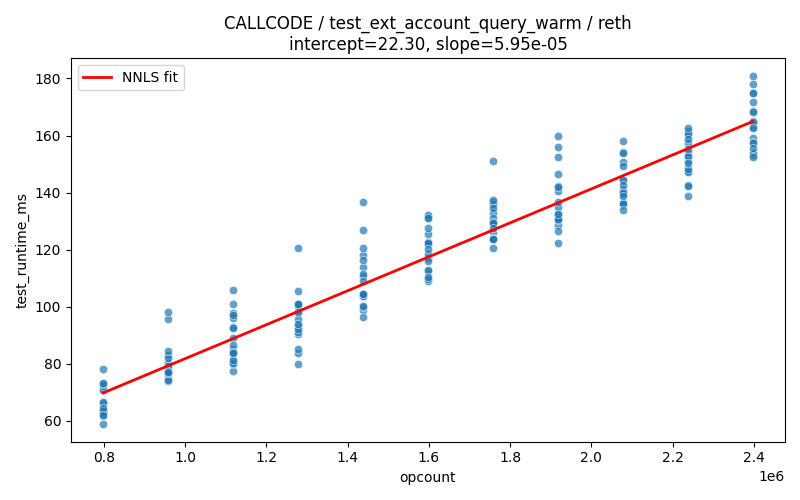

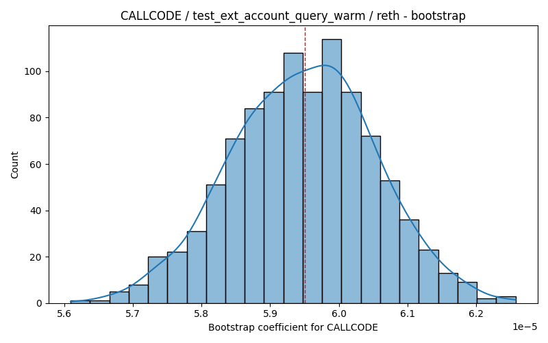

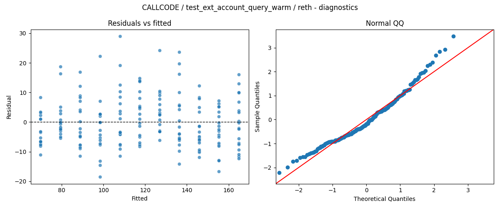

</details>

## DELEGATECALL

### test_account_access — combo `DELEGATECALL_AccountMode.EXISTING_EOA`

| client | nobs | R² | target_coef (ms) | p-value | 95% CI |
| --- | --- | --- | --- | --- | --- |
| `besu` | 253 | 0.8431 | 0.01483 | 1.00e-03 | [0.01405, 0.01558] |
| `erigon` | 110 | 0.9784 | 0.009085 | 1.00e-03 | [0.008866, 0.009311] |
| `ethrex` | 176 | 0.9922 | 0.006992 | 1.00e-03 | [0.006906, 0.007088] |
| `geth` | 154 | 0.9148 | 0.01095 | 1.00e-03 | [0.01036, 0.01158] |
| `nethermind` | 132 | 0.7445 | 0.004871 | 1.00e-03 | [0.004423, 0.005449] |
| `reth` | 198 | 0.9523 | 0.001076 | 1.00e-03 | [0.001045, 0.001109] |

<details><summary>besu — NNLS regression summary</summary>

```
==============================================================================
                           NNLS Regression Results                            
==============================================================================
Dep. Variable:          test_runtime_ms              R-squared:          0.843
Model:                  NNLS                    Adj. R-squared:          0.843
No. Observations:       253                               RMSE:         152.07
Df Residuals:           251                                MAE:         123.32
Df Model:               1      
==============================================================================
                      coef     std err     P-value      [0.025      0.975]
------------------------------------------------------------------------------
         const    564.5468     30.2069       0.001    507.5856    624.2253
       opcount      0.0148      0.0004       0.001      0.0140      0.0156
==============================================================================
Notes: Non-negative least squares with bootstrap inference (1000 iterations)
==============================================================================
```

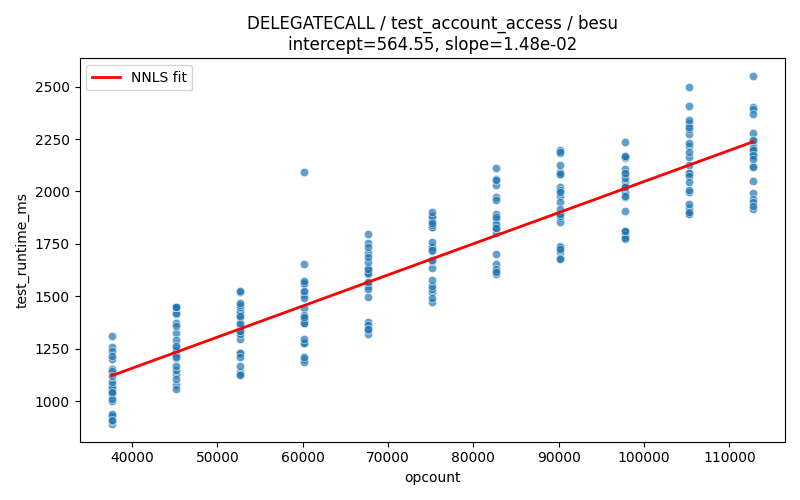

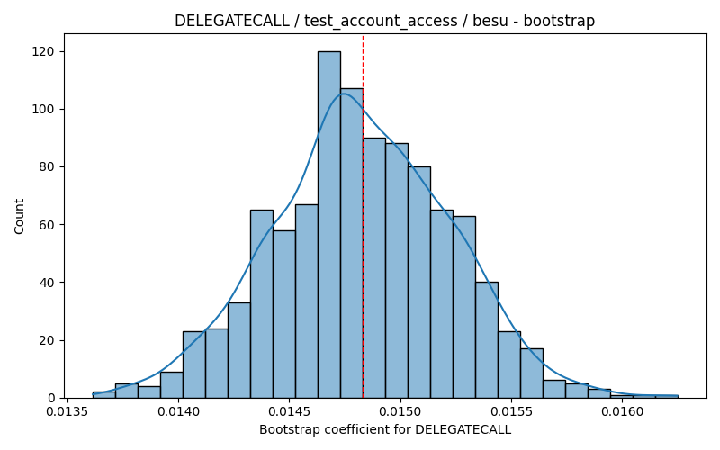

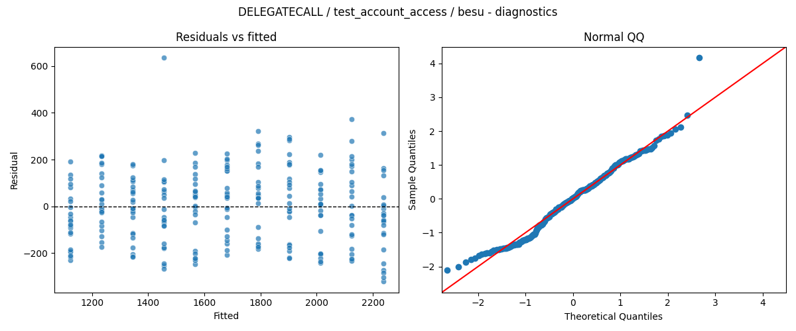

</details>

<details><summary>erigon — NNLS regression summary</summary>

```
==============================================================================
                           NNLS Regression Results                            
==============================================================================
Dep. Variable:          test_runtime_ms              R-squared:          0.978
Model:                  NNLS                    Adj. R-squared:          0.978
No. Observations:       110                               RMSE:          32.08
Df Residuals:           108                                MAE:          24.50
Df Model:               1      
==============================================================================
                      coef     std err     P-value      [0.025      0.975]
------------------------------------------------------------------------------
         const     25.7759      7.6966       0.001     10.5430     40.7170
       opcount      0.0091      0.0001       0.001      0.0089      0.0093
==============================================================================
Notes: Non-negative least squares with bootstrap inference (1000 iterations)
==============================================================================
```

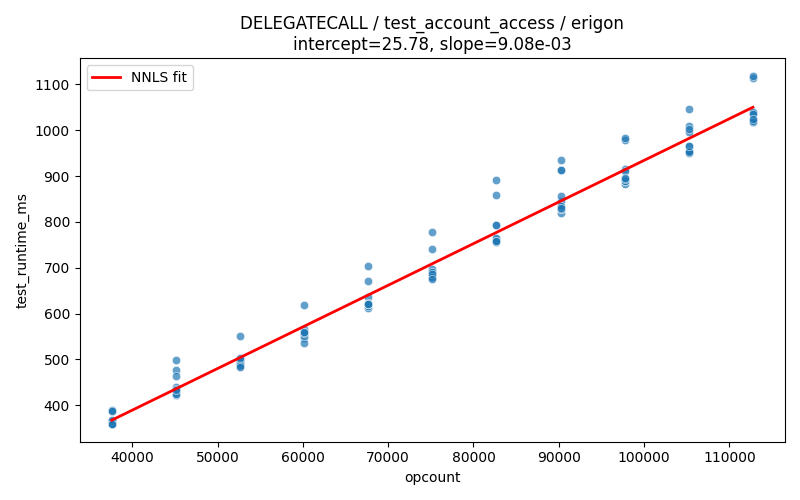

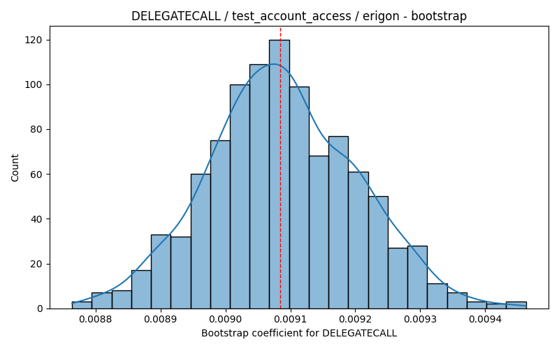

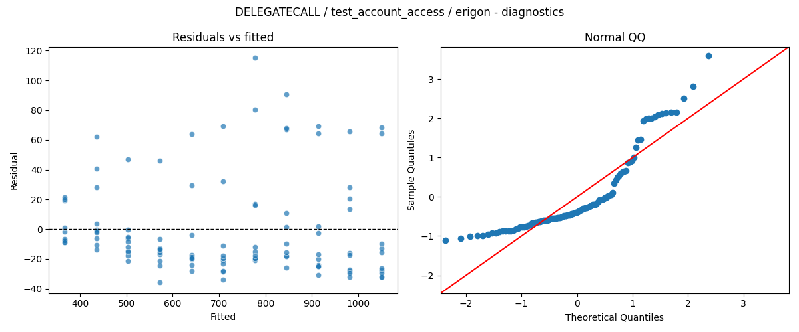

</details>

<details><summary>ethrex — NNLS regression summary</summary>

```
==============================================================================
                           NNLS Regression Results                            
==============================================================================
Dep. Variable:          test_runtime_ms              R-squared:          0.992
Model:                  NNLS                    Adj. R-squared:          0.992
No. Observations:       176                               RMSE:          14.72
Df Residuals:           174                                MAE:          11.51
Df Model:               1      
==============================================================================
                      coef     std err     P-value      [0.025      0.975]
------------------------------------------------------------------------------
         const     48.2563      3.3261       0.001     41.7720     54.8905
       opcount      0.0070      0.0000       0.001      0.0069      0.0071
==============================================================================
Notes: Non-negative least squares with bootstrap inference (1000 iterations)
==============================================================================
```

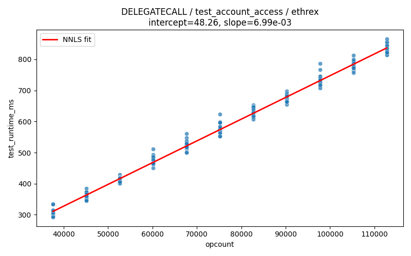

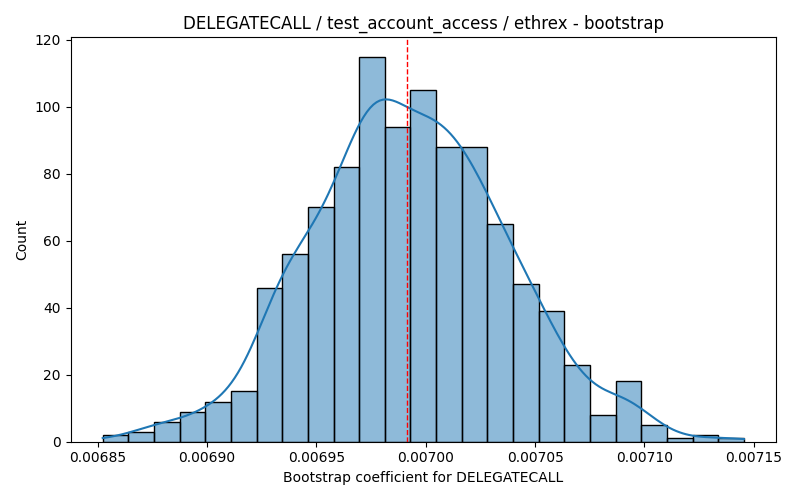

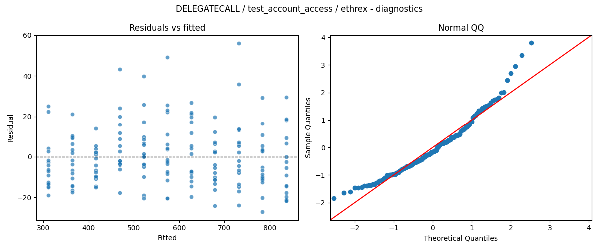

</details>

<details><summary>geth — NNLS regression summary</summary>

```
==============================================================================
                           NNLS Regression Results                            
==============================================================================
Dep. Variable:          test_runtime_ms              R-squared:          0.915
Model:                  NNLS                    Adj. R-squared:          0.914
No. Observations:       154                               RMSE:          79.47
Df Residuals:           152                                MAE:          65.40
Df Model:               1      
==============================================================================
                      coef     std err     P-value      [0.025      0.975]
------------------------------------------------------------------------------
         const    424.4641     27.1650       0.001    369.5144    475.1744
       opcount      0.0110      0.0003       0.001      0.0104      0.0116
==============================================================================
Notes: Non-negative least squares with bootstrap inference (1000 iterations)
==============================================================================
```

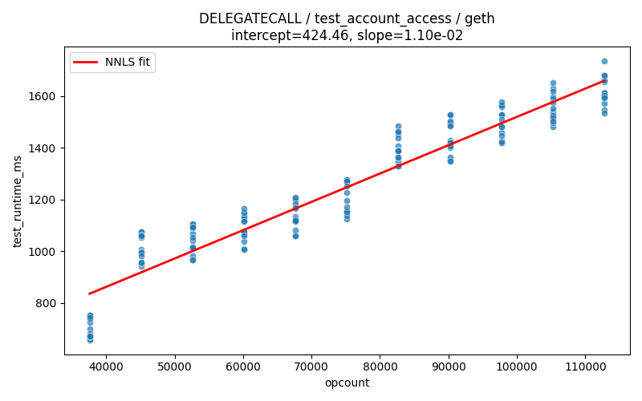

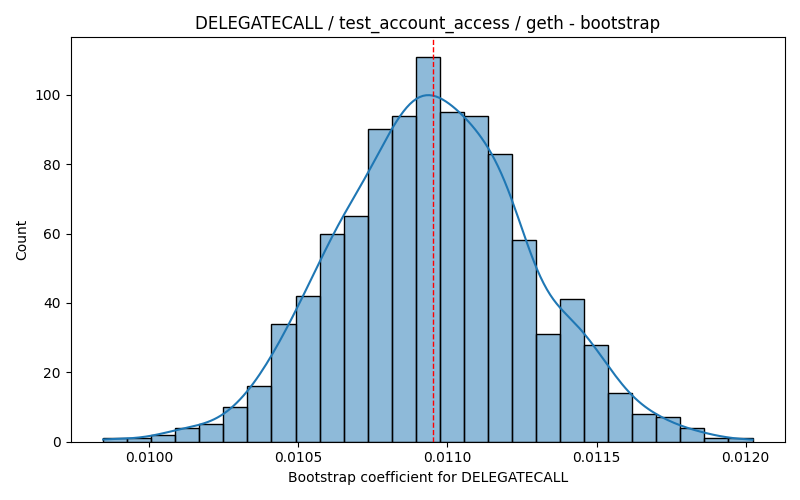

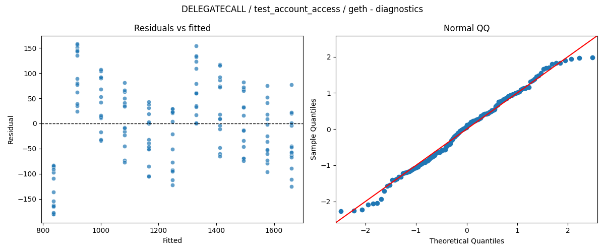

</details>

<details><summary>nethermind — NNLS regression summary</summary>

```
==============================================================================
                           NNLS Regression Results                            
==============================================================================
Dep. Variable:          test_runtime_ms              R-squared:          0.745
Model:                  NNLS                    Adj. R-squared:          0.743
No. Observations:       132                               RMSE:          67.83
Df Residuals:           130                                MAE:          43.93
Df Model:               1      
==============================================================================
                      coef     std err     P-value      [0.025      0.975]
------------------------------------------------------------------------------
         const     69.7310     17.0167       0.001     33.3362     97.8661
       opcount      0.0049      0.0003       0.001      0.0044      0.0054
==============================================================================
Notes: Non-negative least squares with bootstrap inference (1000 iterations)
==============================================================================
```

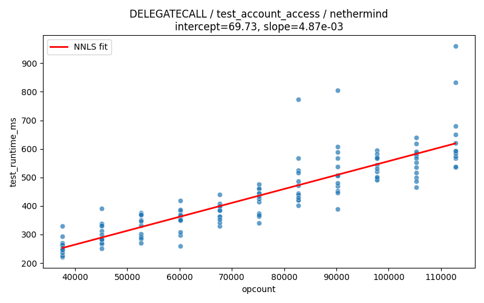

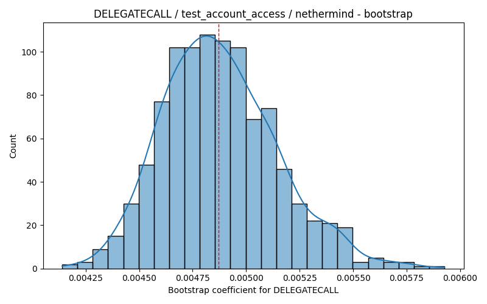

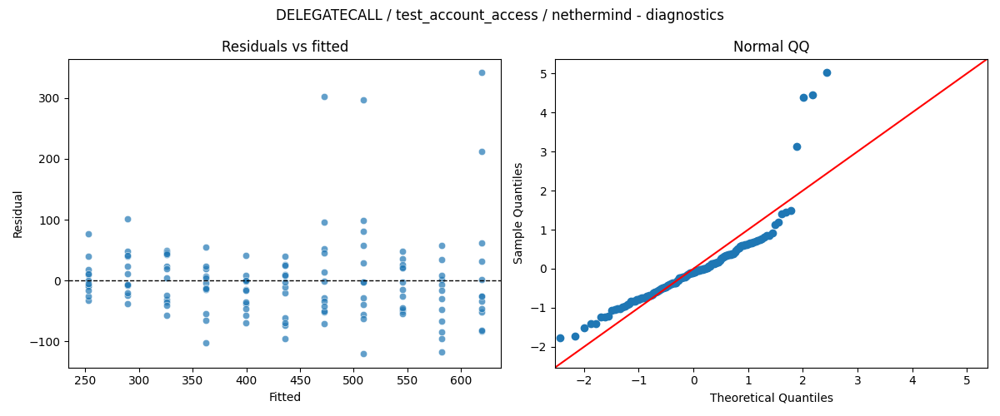

</details>

<details><summary>reth — NNLS regression summary</summary>

```
==============================================================================
                           NNLS Regression Results                            
==============================================================================
Dep. Variable:          test_runtime_ms              R-squared:          0.952
Model:                  NNLS                    Adj. R-squared:          0.952
No. Observations:       198                               RMSE:           5.73
Df Residuals:           196                                MAE:           4.11
Df Model:               1      
==============================================================================
                      coef     std err     P-value      [0.025      0.975]
------------------------------------------------------------------------------
         const     41.5015      1.2974       0.001     39.0683     44.1608
       opcount      0.0011      0.0000       0.001      0.0010      0.0011
==============================================================================
Notes: Non-negative least squares with bootstrap inference (1000 iterations)
==============================================================================
```

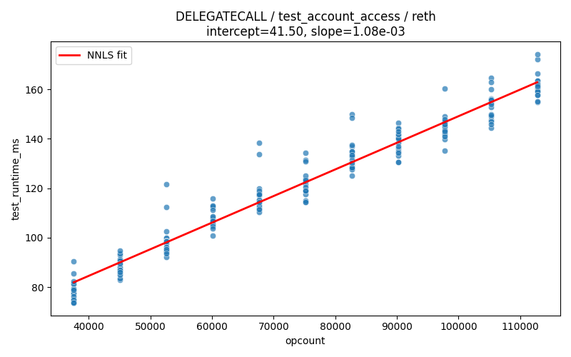

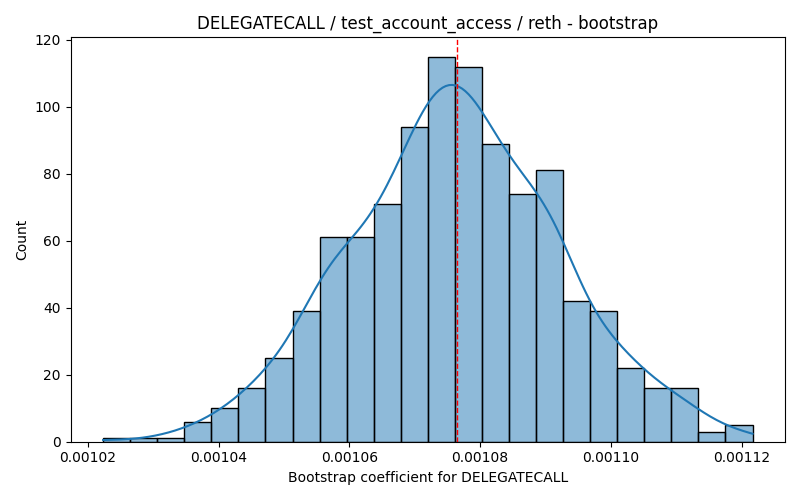

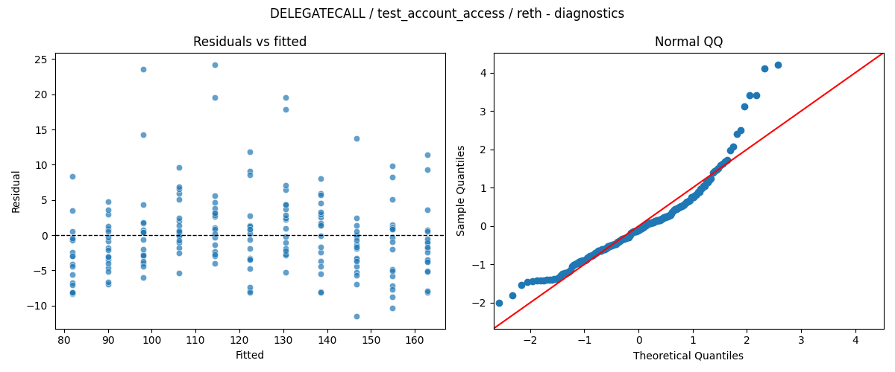

</details>

### test_account_access — combo `DELEGATECALL_AccountMode.NON_EXISTING_ACCOUNT` — `presets[cold_account_nocode_access]`

| client | nobs | R² | target_coef (ms) | p-value | 95% CI |
| --- | --- | --- | --- | --- | --- |
| `besu` | 253 | 0.8905 | 0.01529 | 1.00e-03 | [0.01459, 0.01595] |
| `erigon` | 110 | 0.9821 | 0.008486 | 1.00e-03 | [0.008259, 0.008693] |
| `ethrex` | 176 | 0.9613 | 0.00196 | 1.00e-03 | [0.001903, 0.002014] |
| `geth` | 154 | 0.8593 | 0.02228 | 1.00e-03 | [0.02062, 0.02388] |
| `nethermind` | 132 | 0.7517 | 0.00394 | 1.00e-03 | [0.003596, 0.004336] |
| `reth` | 198 | 0.9105 | 0.0008113 | 1.00e-03 | [0.0007744, 0.0008507] |

<details><summary>besu — NNLS regression summary</summary>

```
==============================================================================
                           NNLS Regression Results                            
==============================================================================
Dep. Variable:          test_runtime_ms              R-squared:          0.890
Model:                  NNLS                    Adj. R-squared:          0.890
No. Observations:       253                               RMSE:         127.48
Df Residuals:           251                                MAE:         110.74
Df Model:               1      
==============================================================================
                      coef     std err     P-value      [0.025      0.975]
------------------------------------------------------------------------------
         const    497.1225     26.2049       0.001    447.2019    550.9912
       opcount      0.0153      0.0003       0.001      0.0146      0.0160
==============================================================================
Notes: Non-negative least squares with bootstrap inference (1000 iterations)
==============================================================================
```

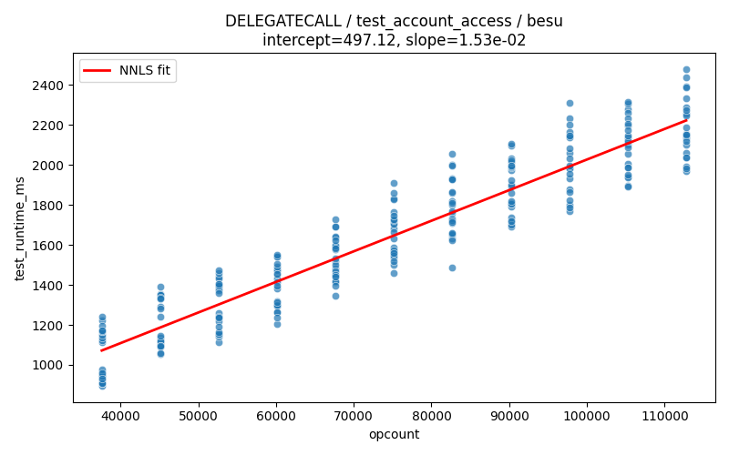

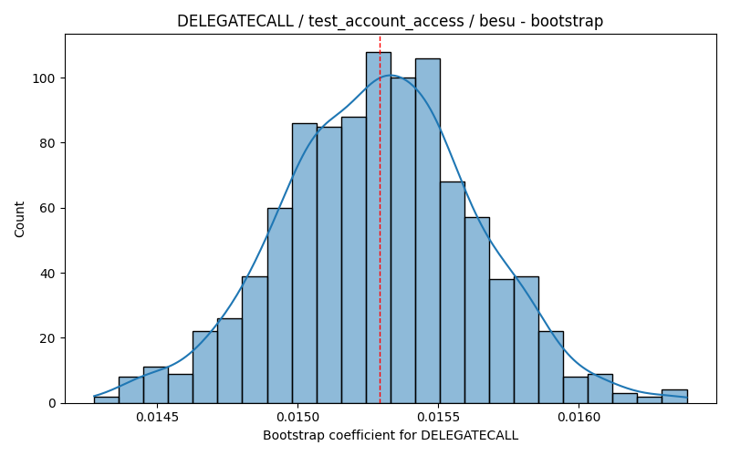

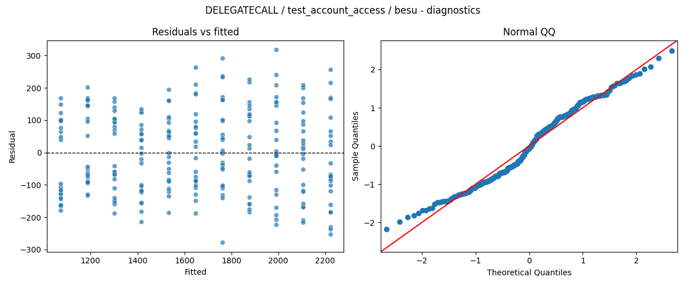

</details>

<details><summary>erigon — NNLS regression summary</summary>

```
==============================================================================
                           NNLS Regression Results                            
==============================================================================
Dep. Variable:          test_runtime_ms              R-squared:          0.982
Model:                  NNLS                    Adj. R-squared:          0.982
No. Observations:       110                               RMSE:          27.22
Df Residuals:           108                                MAE:          19.26
Df Model:               1      
==============================================================================
                      coef     std err     P-value      [0.025      0.975]
------------------------------------------------------------------------------
         const     11.9167      7.9340       0.083      0.0000     27.6321
       opcount      0.0085      0.0001       0.001      0.0083      0.0087
==============================================================================
Notes: Non-negative least squares with bootstrap inference (1000 iterations)
==============================================================================
```

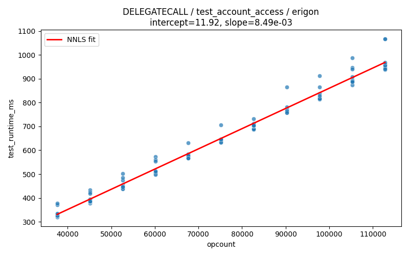

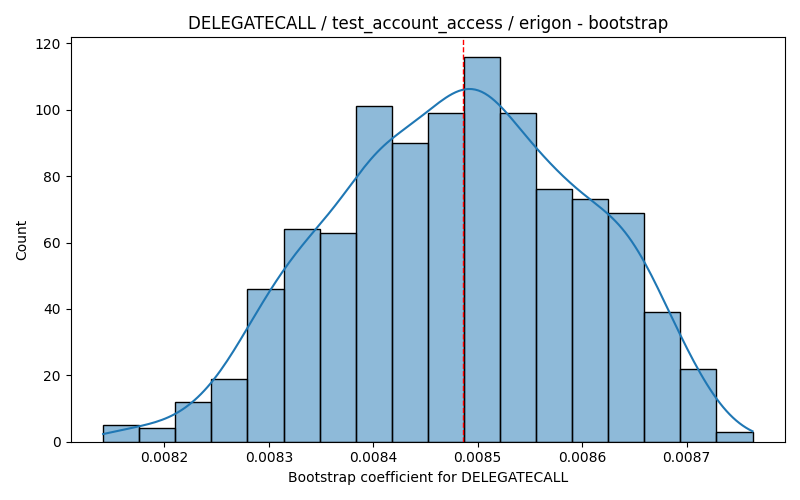

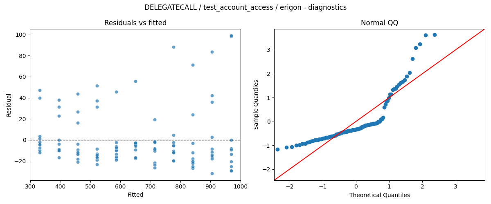

</details>

<details><summary>ethrex — NNLS regression summary</summary>

```
==============================================================================
                           NNLS Regression Results                            
==============================================================================
Dep. Variable:          test_runtime_ms              R-squared:          0.961
Model:                  NNLS                    Adj. R-squared:          0.961
No. Observations:       176                               RMSE:           9.35
Df Residuals:           174                                MAE:           7.54
Df Model:               1      
==============================================================================
                      coef     std err     P-value      [0.025      0.975]
------------------------------------------------------------------------------
         const     30.4011      2.1017       0.001     26.6222     34.6614
       opcount      0.0020      0.0000       0.001      0.0019      0.0020
==============================================================================
Notes: Non-negative least squares with bootstrap inference (1000 iterations)
==============================================================================
```

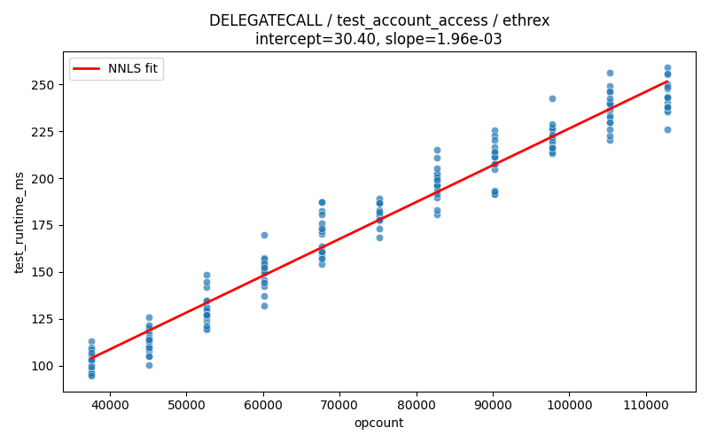

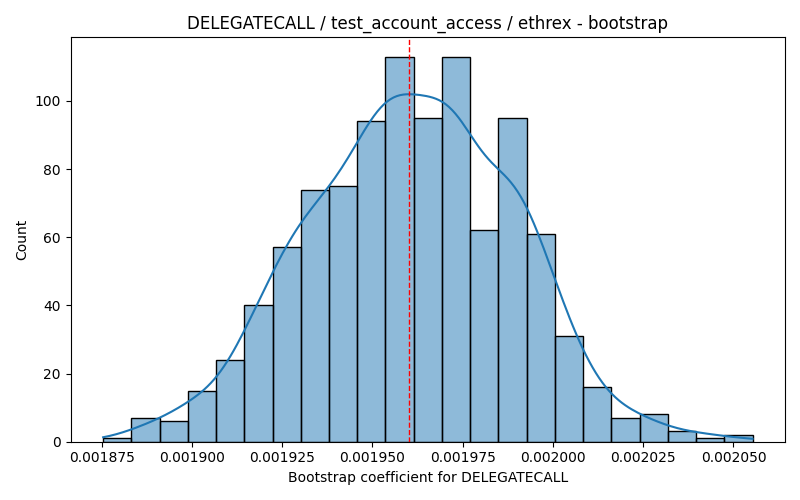

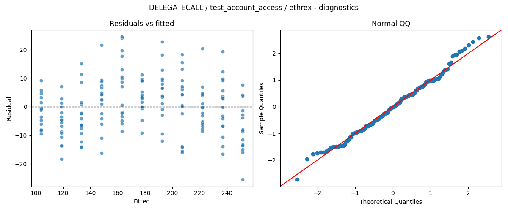

</details>

<details><summary>geth — NNLS regression summary</summary>

```
==============================================================================
                           NNLS Regression Results                            
==============================================================================
Dep. Variable:          test_runtime_ms              R-squared:          0.859
Model:                  NNLS                    Adj. R-squared:          0.858
No. Observations:       154                               RMSE:         214.34
Df Residuals:           152                                MAE:         182.84
Df Model:               1      
==============================================================================
                      coef     std err     P-value      [0.025      0.975]
------------------------------------------------------------------------------
         const    724.6037     67.5234       0.001    588.2802    864.1721
       opcount      0.0223      0.0008       0.001      0.0206      0.0239
==============================================================================
Notes: Non-negative least squares with bootstrap inference (1000 iterations)
==============================================================================
```

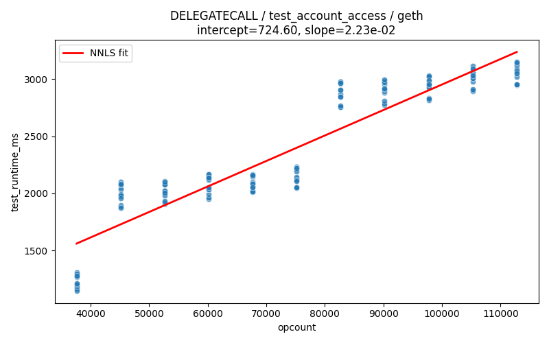

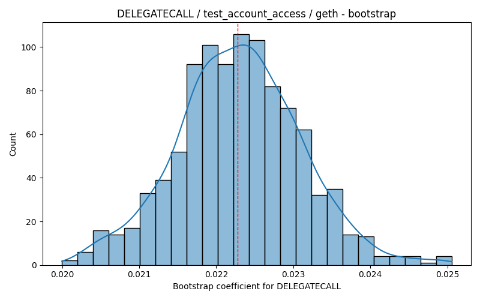

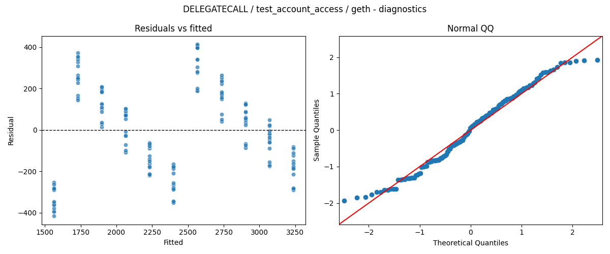

</details>

<details><summary>nethermind — NNLS regression summary</summary>

```
==============================================================================
                           NNLS Regression Results                            
==============================================================================
Dep. Variable:          test_runtime_ms              R-squared:          0.752
Model:                  NNLS                    Adj. R-squared:          0.750
No. Observations:       132                               RMSE:          53.84
Df Residuals:           130                                MAE:          39.86
Df Model:               1      
==============================================================================
                      coef     std err     P-value      [0.025      0.975]
------------------------------------------------------------------------------
         const     92.9635     12.7612       0.001     67.5176    116.7176
       opcount      0.0039      0.0002       0.001      0.0036      0.0043
==============================================================================
Notes: Non-negative least squares with bootstrap inference (1000 iterations)
==============================================================================
```

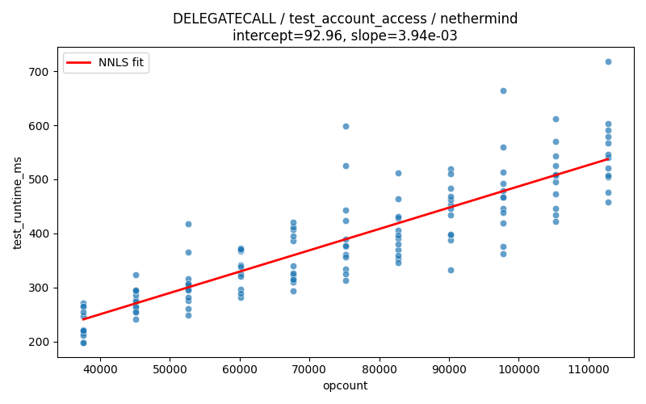

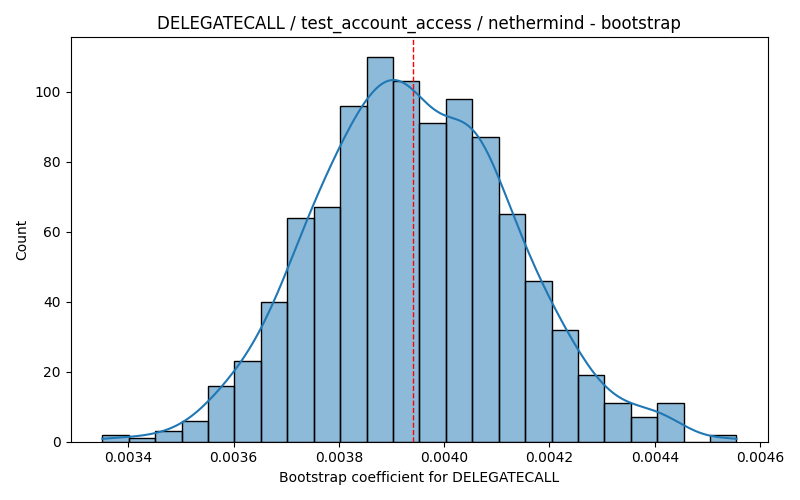

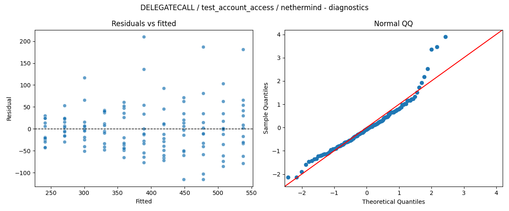

</details>

<details><summary>reth — NNLS regression summary</summary>

```
==============================================================================
                           NNLS Regression Results                            
==============================================================================
Dep. Variable:          test_runtime_ms              R-squared:          0.910
Model:                  NNLS                    Adj. R-squared:          0.910
No. Observations:       198                               RMSE:           6.05
Df Residuals:           196                                MAE:           4.60
Df Model:               1      
==============================================================================
                      coef     std err     P-value      [0.025      0.975]
------------------------------------------------------------------------------
         const     44.5384      1.4238       0.001     41.8641     47.2546
       opcount      0.0008      0.0000       0.001      0.0008      0.0009
==============================================================================
Notes: Non-negative least squares with bootstrap inference (1000 iterations)
==============================================================================
```

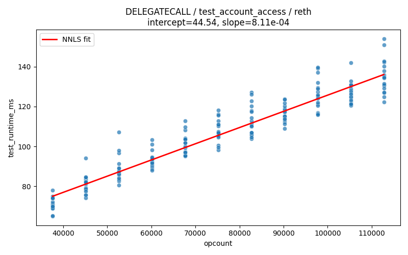

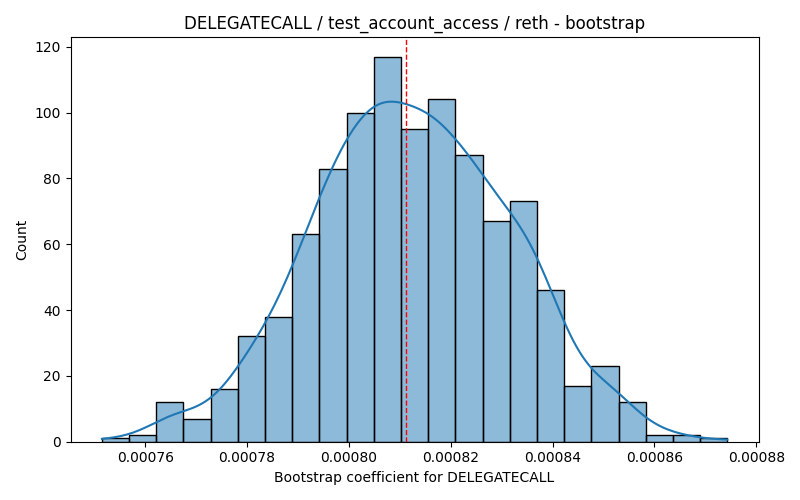

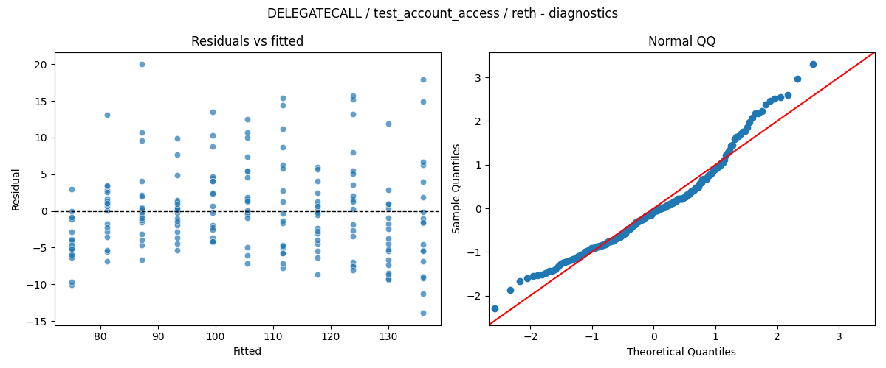

</details>

### test_account_access — combo `DELEGATECALL_AccountMode.EXISTING_CONTRACT`

| client | nobs | R² | target_coef (ms) | p-value | 95% CI |
| --- | --- | --- | --- | --- | --- |
| `besu` | 253 | 0.8985 | 0.02733 | 1.00e-03 | [0.0263, 0.02834] |
| `erigon` | 110 | 0.8959 | 0.04918 | 1.00e-03 | [0.04575, 0.0517] |
| `ethrex` | 176 | 0.9942 | 0.007494 | 1.00e-03 | [0.007419, 0.007568] |
| `geth` | 154 | 0.8543 | 0.02349 | 1.00e-03 | [0.02189, 0.0251] |
| `nethermind` | 132 | 0.6117 | 0.01577 | 1.00e-03 | [0.01354, 0.01804] |
| `reth` | 198 | 0.9792 | 0.004078 | 1.00e-03 | [0.003992, 0.004167] |

<details><summary>besu — NNLS regression summary</summary>

```
==============================================================================
                           NNLS Regression Results                            
==============================================================================
Dep. Variable:          test_runtime_ms              R-squared:          0.899
Model:                  NNLS                    Adj. R-squared:          0.898
No. Observations:       253                               RMSE:         187.15
Df Residuals:           251                                MAE:         148.14
Df Model:               1      
==============================================================================
                      coef     std err     P-value      [0.025      0.975]
------------------------------------------------------------------------------
         const    574.4228     33.3515       0.001    511.6946    642.7649
       opcount      0.0273      0.0005       0.001      0.0263      0.0283
==============================================================================
Notes: Non-negative least squares with bootstrap inference (1000 iterations)
==============================================================================
```

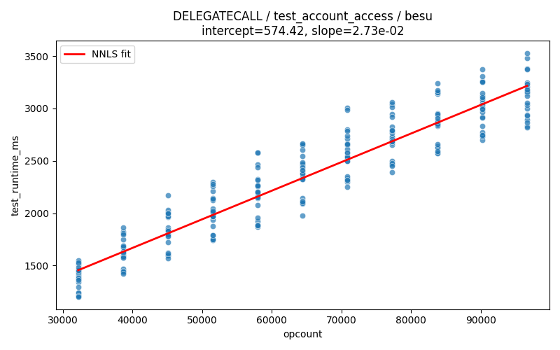

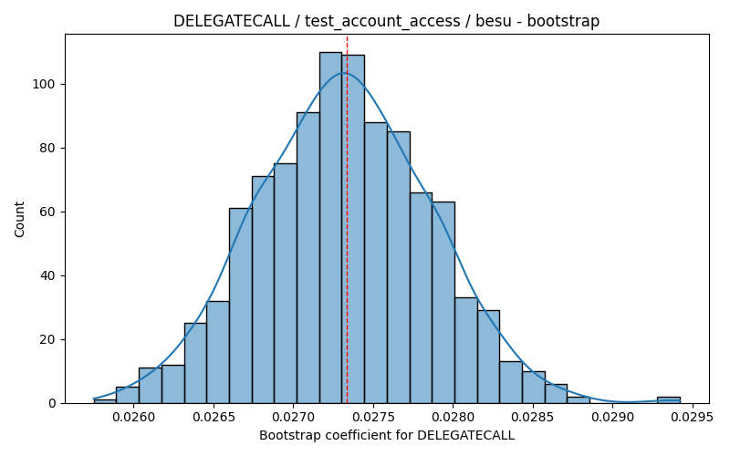

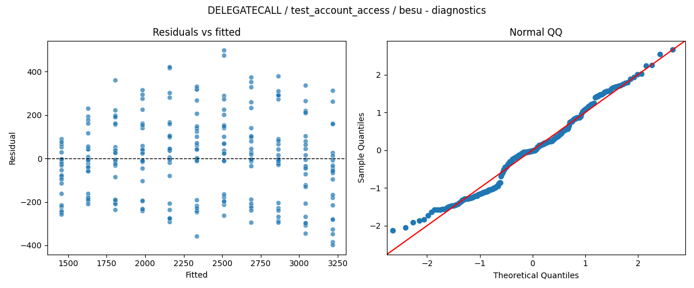

</details>

<details><summary>erigon — NNLS regression summary</summary>

```
==============================================================================
                           NNLS Regression Results                            
==============================================================================
Dep. Variable:          test_runtime_ms              R-squared:          0.896
Model:                  NNLS                    Adj. R-squared:          0.895
No. Observations:       110                               RMSE:         341.56
Df Residuals:           108                                MAE:         293.70
Df Model:               1      
==============================================================================
                      coef     std err     P-value      [0.025      0.975]
------------------------------------------------------------------------------
         const    831.6620    111.6058       0.001    644.2142   1087.3598
       opcount      0.0492      0.0015       0.001      0.0458      0.0517
==============================================================================
Notes: Non-negative least squares with bootstrap inference (1000 iterations)
==============================================================================
```

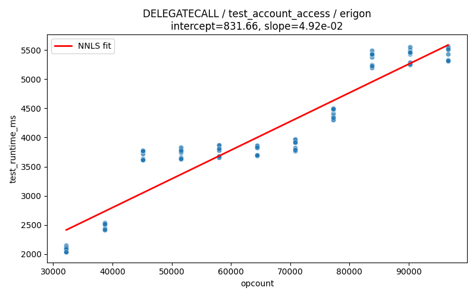

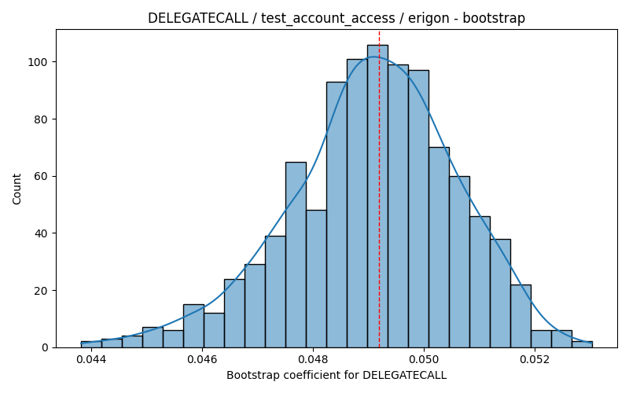


</details>

<details><summary>ethrex — NNLS regression summary</summary>

```
==============================================================================
                           NNLS Regression Results                            
==============================================================================
Dep. Variable:          test_runtime_ms              R-squared:          0.994
Model:                  NNLS                    Adj. R-squared:          0.994
No. Observations:       176                               RMSE:          11.64
Df Residuals:           174                                MAE:           9.10
Df Model:               1      
==============================================================================
                      coef     std err     P-value      [0.025      0.975]
------------------------------------------------------------------------------
         const     46.1816      2.6051       0.001     41.0684     51.2124
       opcount      0.0075      0.0000       0.001      0.0074      0.0076
==============================================================================
Notes: Non-negative least squares with bootstrap inference (1000 iterations)
==============================================================================
```

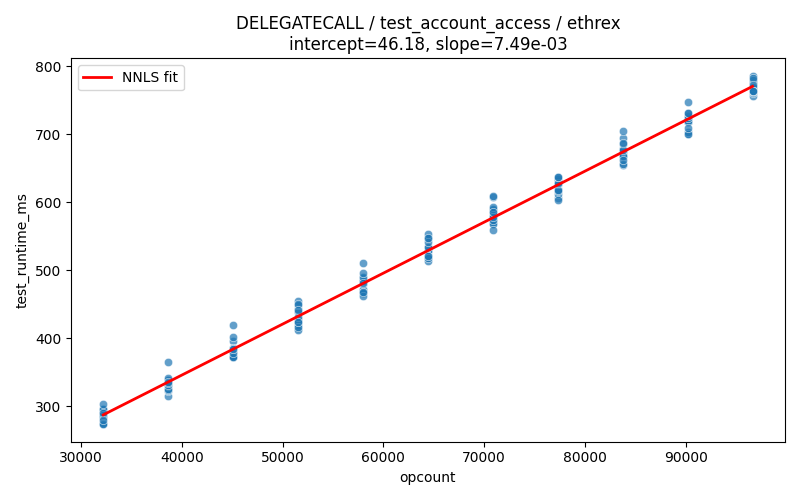

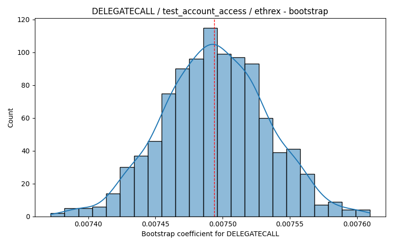

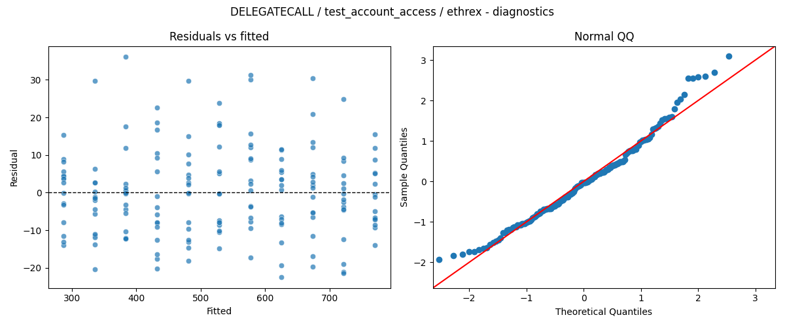

</details>

<details><summary>geth — NNLS regression summary</summary>

```
==============================================================================
                           NNLS Regression Results                            
==============================================================================
Dep. Variable:          test_runtime_ms              R-squared:          0.854
Model:                  NNLS                    Adj. R-squared:          0.853
No. Observations:       154                               RMSE:         197.58
Df Residuals:           152                                MAE:         166.29
Df Model:               1      
==============================================================================
                      coef     std err     P-value      [0.025      0.975]
------------------------------------------------------------------------------
         const    674.4965     59.8324       0.001    559.6639    791.6622
       opcount      0.0235      0.0008       0.001      0.0219      0.0251
==============================================================================
Notes: Non-negative least squares with bootstrap inference (1000 iterations)
==============================================================================
```

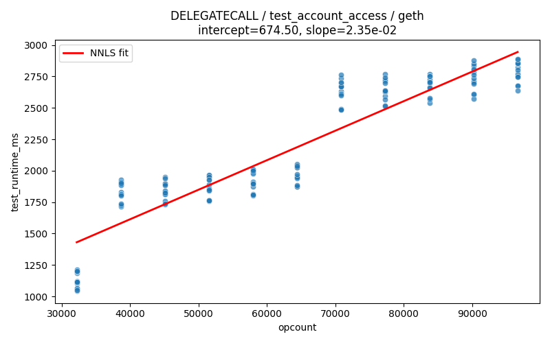

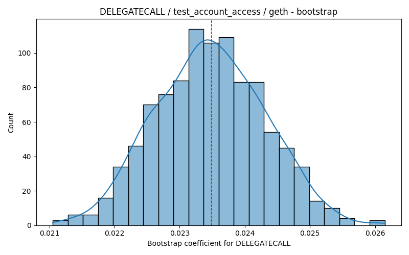

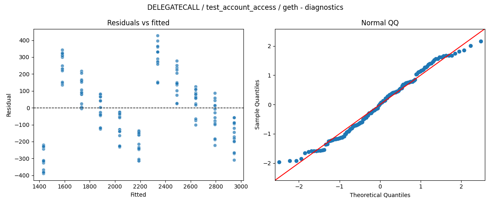

</details>

<details><summary>nethermind — NNLS regression summary</summary>

```
==============================================================================
                           NNLS Regression Results                            
==============================================================================
Dep. Variable:          test_runtime_ms              R-squared:          0.612
Model:                  NNLS                    Adj. R-squared:          0.609
No. Observations:       132                               RMSE:         256.01
Df Residuals:           130                                MAE:         197.79
Df Model:               1      
==============================================================================
                      coef     std err     P-value      [0.025      0.975]
------------------------------------------------------------------------------
         const    123.5567     62.3440       0.034      0.0000    250.7864
       opcount      0.0158      0.0011       0.001      0.0135      0.0180
==============================================================================
Notes: Non-negative least squares with bootstrap inference (1000 iterations)
==============================================================================
```

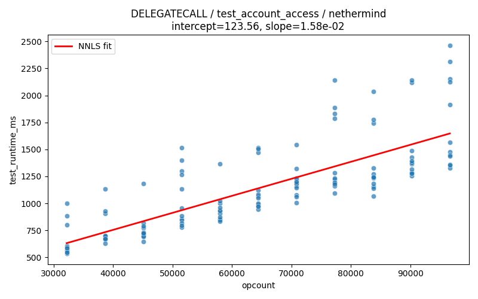

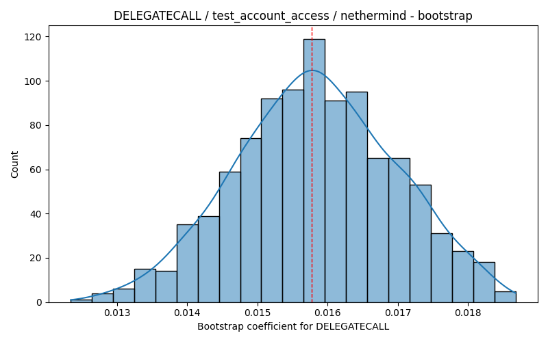

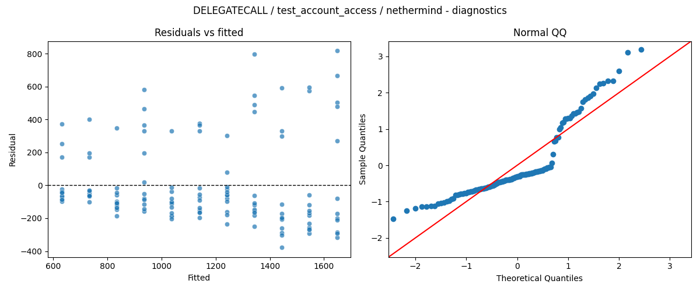

</details>

<details><summary>reth — NNLS regression summary</summary>

```
==============================================================================
                           NNLS Regression Results                            
==============================================================================
Dep. Variable:          test_runtime_ms              R-squared:          0.979
Model:                  NNLS                    Adj. R-squared:          0.979
No. Observations:       198                               RMSE:          12.11
Df Residuals:           196                                MAE:           9.35
Df Model:               1      
==============================================================================
                      coef     std err     P-value      [0.025      0.975]
------------------------------------------------------------------------------
         const     95.1515      2.8411       0.001     89.7610    100.7092
       opcount      0.0041      0.0000       0.001      0.0040      0.0042
==============================================================================
Notes: Non-negative least squares with bootstrap inference (1000 iterations)
==============================================================================
```

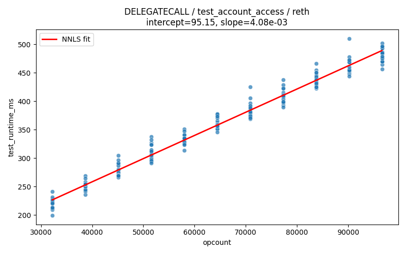

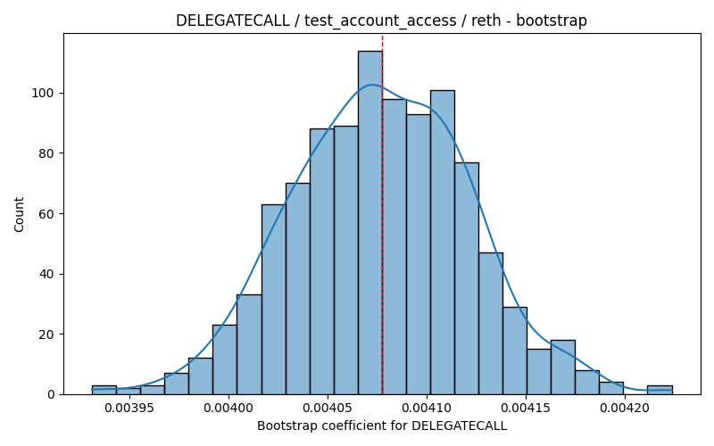

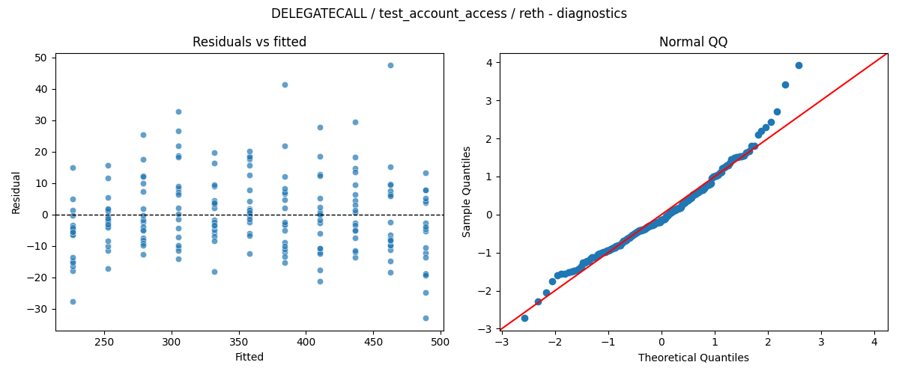

</details>

### test_account_access — combo `DELEGATECALL_AccountMode.NON_EXISTING_ACCOUNT` — `presets[cold_account_code_access]`

| client | nobs | R² | target_coef (ms) | p-value | 95% CI |
| --- | --- | --- | --- | --- | --- |
| `besu` | 253 | 0.8905 | 0.01529 | 1.00e-03 | [0.01459, 0.01595] |
| `erigon` | 110 | 0.9821 | 0.008486 | 1.00e-03 | [0.008259, 0.008693] |
| `ethrex` | 176 | 0.9613 | 0.00196 | 1.00e-03 | [0.001903, 0.002014] |
| `geth` | 154 | 0.8593 | 0.02228 | 1.00e-03 | [0.02062, 0.02388] |
| `nethermind` | 132 | 0.7517 | 0.00394 | 1.00e-03 | [0.003596, 0.004336] |
| `reth` | 198 | 0.9105 | 0.0008113 | 1.00e-03 | [0.0007744, 0.0008507] |

<details><summary>besu — NNLS regression summary</summary>

```
==============================================================================
                           NNLS Regression Results                            
==============================================================================
Dep. Variable:          test_runtime_ms              R-squared:          0.890
Model:                  NNLS                    Adj. R-squared:          0.890
No. Observations:       253                               RMSE:         127.48
Df Residuals:           251                                MAE:         110.74
Df Model:               1      
==============================================================================
                      coef     std err     P-value      [0.025      0.975]
------------------------------------------------------------------------------
         const    497.1225     26.2049       0.001    447.2019    550.9912
       opcount      0.0153      0.0003       0.001      0.0146      0.0160
==============================================================================
Notes: Non-negative least squares with bootstrap inference (1000 iterations)
==============================================================================
```


</details>

<details><summary>erigon — NNLS regression summary</summary>

```
==============================================================================
                           NNLS Regression Results                            
==============================================================================
Dep. Variable:          test_runtime_ms              R-squared:          0.982
Model:                  NNLS                    Adj. R-squared:          0.982
No. Observations:       110                               RMSE:          27.22
Df Residuals:           108                                MAE:          19.26
Df Model:               1      
==============================================================================
                      coef     std err     P-value      [0.025      0.975]
------------------------------------------------------------------------------
         const     11.9167      7.9340       0.083      0.0000     27.6321
       opcount      0.0085      0.0001       0.001      0.0083      0.0087
==============================================================================
Notes: Non-negative least squares with bootstrap inference (1000 iterations)
==============================================================================
```


</details>

<details><summary>ethrex — NNLS regression summary</summary>

```
==============================================================================
                           NNLS Regression Results                            
==============================================================================
Dep. Variable:          test_runtime_ms              R-squared:          0.961
Model:                  NNLS                    Adj. R-squared:          0.961
No. Observations:       176                               RMSE:           9.35
Df Residuals:           174                                MAE:           7.54
Df Model:               1      
==============================================================================
                      coef     std err     P-value      [0.025      0.975]
------------------------------------------------------------------------------
         const     30.4011      2.1017       0.001     26.6222     34.6614
       opcount      0.0020      0.0000       0.001      0.0019      0.0020
==============================================================================
Notes: Non-negative least squares with bootstrap inference (1000 iterations)
==============================================================================
```


</details>

<details><summary>geth — NNLS regression summary</summary>

```
==============================================================================
                           NNLS Regression Results                            
==============================================================================
Dep. Variable:          test_runtime_ms              R-squared:          0.859
Model:                  NNLS                    Adj. R-squared:          0.858
No. Observations:       154                               RMSE:         214.34
Df Residuals:           152                                MAE:         182.84
Df Model:               1      
==============================================================================
                      coef     std err     P-value      [0.025      0.975]
------------------------------------------------------------------------------
         const    724.6037     67.5234       0.001    588.2802    864.1721
       opcount      0.0223      0.0008       0.001      0.0206      0.0239
==============================================================================
Notes: Non-negative least squares with bootstrap inference (1000 iterations)
==============================================================================
```


</details>

<details><summary>nethermind — NNLS regression summary</summary>

```
==============================================================================
                           NNLS Regression Results                            
==============================================================================
Dep. Variable:          test_runtime_ms              R-squared:          0.752
Model:                  NNLS                    Adj. R-squared:          0.750
No. Observations:       132                               RMSE:          53.84
Df Residuals:           130                                MAE:          39.86
Df Model:               1      
==============================================================================
                      coef     std err     P-value      [0.025      0.975]
------------------------------------------------------------------------------
         const     92.9635     12.7612       0.001     67.5176    116.7176
       opcount      0.0039      0.0002       0.001      0.0036      0.0043
==============================================================================
Notes: Non-negative least squares with bootstrap inference (1000 iterations)
==============================================================================
```


</details>

<details><summary>reth — NNLS regression summary</summary>

```
==============================================================================
                           NNLS Regression Results                            
==============================================================================
Dep. Variable:          test_runtime_ms              R-squared:          0.910
Model:                  NNLS                    Adj. R-squared:          0.910
No. Observations:       198                               RMSE:           6.05
Df Residuals:           196                                MAE:           4.60
Df Model:               1      
==============================================================================
                      coef     std err     P-value      [0.025      0.975]
------------------------------------------------------------------------------
         const     44.5384      1.4238       0.001     41.8641     47.2546
       opcount      0.0008      0.0000       0.001      0.0008      0.0009
==============================================================================
Notes: Non-negative least squares with bootstrap inference (1000 iterations)
==============================================================================
```


</details>

### test_ext_account_query_warm — combo `DELEGATECALL`

| client | nobs | R² | target_coef (ms) | p-value | 95% CI |
| --- | --- | --- | --- | --- | --- |
| `besu` | 253 | 0.7094 | 0.0006574 | 1.00e-03 | [0.0006072, 0.0007122] |
| `erigon` | 110 | 0.9183 | 0.0002595 | 1.00e-03 | [0.0002442, 0.0002753] |
| `ethrex` | 176 | 0.9229 | 9.656e-05 | 1.00e-03 | [9.237e-05, 0.0001009] |
| `geth` | 154 | 0.9192 | 0.0001579 | 1.00e-03 | [0.0001506, 0.0001666] |
| `nethermind` | 132 | 0.6322 | 0.0003797 | 1.00e-03 | [0.0003334, 0.0004237] |
| `reth` | 198 | 0.8939 | 5.573e-05 | 1.00e-03 | [5.349e-05, 5.802e-05] |

<details><summary>besu — NNLS regression summary</summary>

```
==============================================================================
                           NNLS Regression Results                            
==============================================================================
Dep. Variable:          test_runtime_ms              R-squared:          0.709
Model:                  NNLS                    Adj. R-squared:          0.708
No. Observations:       253                               RMSE:         217.79
Df Residuals:           251                                MAE:         169.58
Df Model:               1      
==============================================================================
                      coef     std err     P-value      [0.025      0.975]
------------------------------------------------------------------------------
         const    776.7308     42.8339       0.001    693.2938    859.0515
       opcount      0.0007      0.0000       0.001      0.0006      0.0007
==============================================================================
Notes: Non-negative least squares with bootstrap inference (1000 iterations)
==============================================================================
```

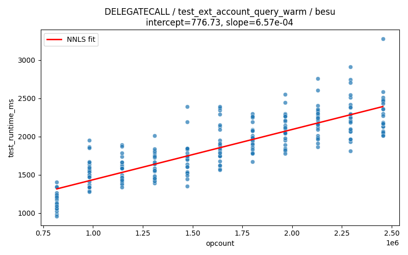

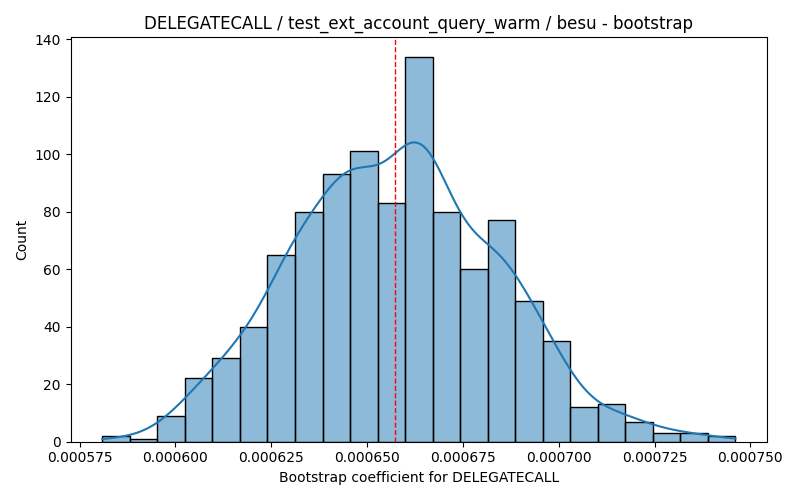

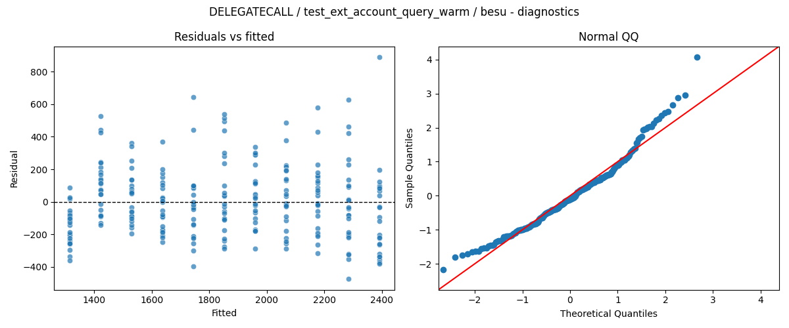

</details>

<details><summary>erigon — NNLS regression summary</summary>

```
==============================================================================
                           NNLS Regression Results                            
==============================================================================
Dep. Variable:          test_runtime_ms              R-squared:          0.918
Model:                  NNLS                    Adj. R-squared:          0.917
No. Observations:       110                               RMSE:          40.08
Df Residuals:           108                                MAE:          29.96
Df Model:               1      
==============================================================================
                      coef     std err     P-value      [0.025      0.975]
------------------------------------------------------------------------------
         const     50.3477     11.9300       0.001     27.0288     73.5543
       opcount      0.0003      0.0000       0.001      0.0002      0.0003
==============================================================================
Notes: Non-negative least squares with bootstrap inference (1000 iterations)
==============================================================================
```

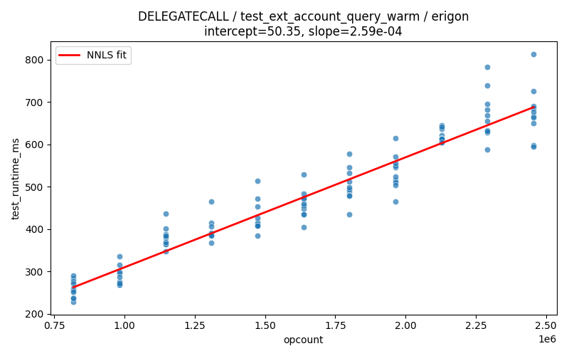

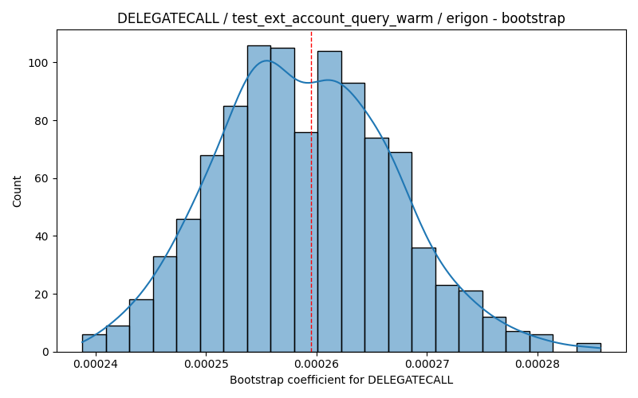

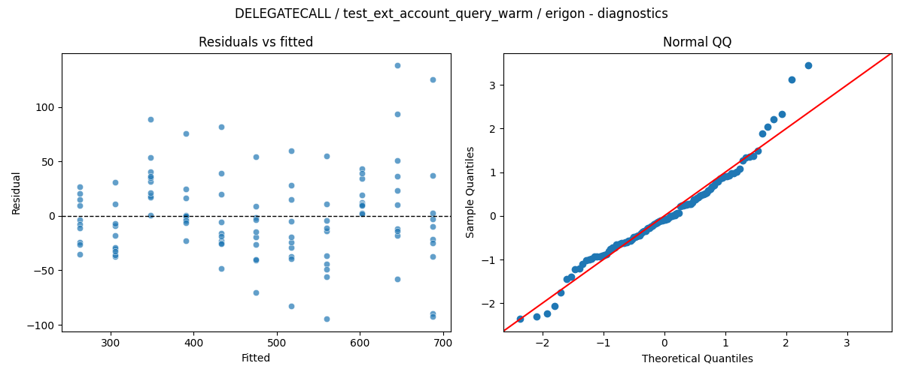

</details>

<details><summary>ethrex — NNLS regression summary</summary>

```
==============================================================================
                           NNLS Regression Results                            
==============================================================================
Dep. Variable:          test_runtime_ms              R-squared:          0.923
Model:                  NNLS                    Adj. R-squared:          0.922
No. Observations:       176                               RMSE:          14.45
Df Residuals:           174                                MAE:          11.41
Df Model:               1      
==============================================================================
                      coef     std err     P-value      [0.025      0.975]
------------------------------------------------------------------------------
         const     42.4114      3.4151       0.001     35.8326     49.2827
       opcount      0.0001      0.0000       0.001      0.0001      0.0001
==============================================================================
Notes: Non-negative least squares with bootstrap inference (1000 iterations)
==============================================================================
```

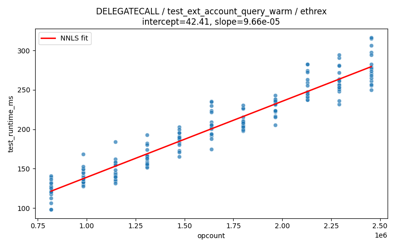

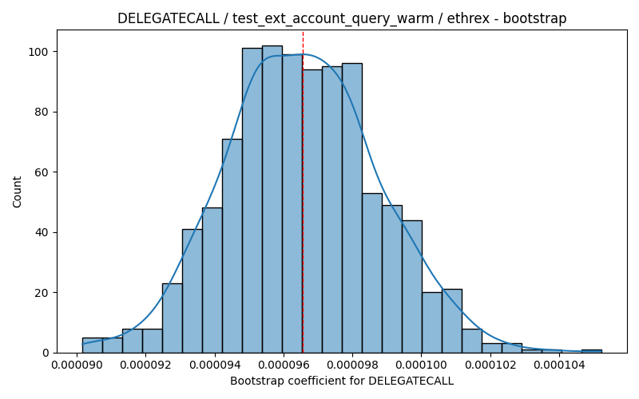

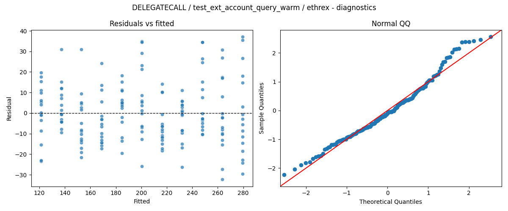

</details>

<details><summary>geth — NNLS regression summary</summary>

```
==============================================================================
                           NNLS Regression Results                            
==============================================================================
Dep. Variable:          test_runtime_ms              R-squared:          0.919
Model:                  NNLS                    Adj. R-squared:          0.919
No. Observations:       154                               RMSE:          24.25
Df Residuals:           152                                MAE:          17.91
Df Model:               1      
==============================================================================
                      coef     std err     P-value      [0.025      0.975]
------------------------------------------------------------------------------
         const     36.3141      5.9402       0.001     24.2079     47.1304
       opcount      0.0002      0.0000       0.001      0.0002      0.0002
==============================================================================
Notes: Non-negative least squares with bootstrap inference (1000 iterations)
==============================================================================
```

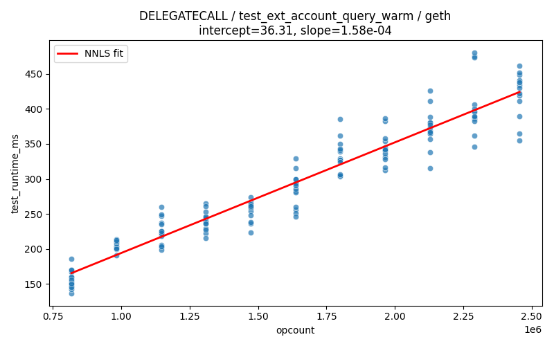

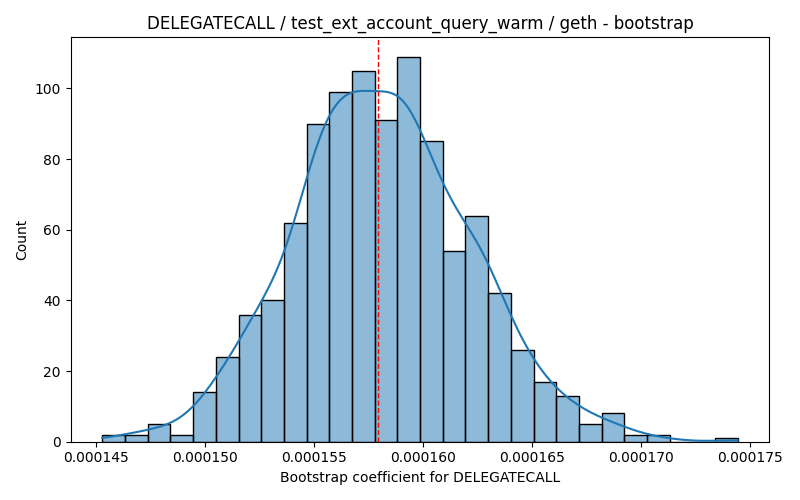

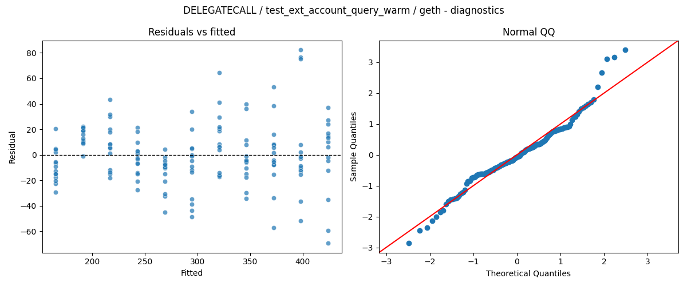

</details>

<details><summary>nethermind — NNLS regression summary</summary>

```
==============================================================================
                           NNLS Regression Results                            
==============================================================================
Dep. Variable:          test_runtime_ms              R-squared:          0.632
Model:                  NNLS                    Adj. R-squared:          0.629
No. Observations:       132                               RMSE:         149.91
Df Residuals:           130                                MAE:         116.79
Df Model:               1      
==============================================================================
                      coef     std err     P-value      [0.025      0.975]
------------------------------------------------------------------------------
         const    199.1289     34.1577       0.001    133.5619    267.1857
       opcount      0.0004      0.0000       0.001      0.0003      0.0004
==============================================================================
Notes: Non-negative least squares with bootstrap inference (1000 iterations)
==============================================================================
```

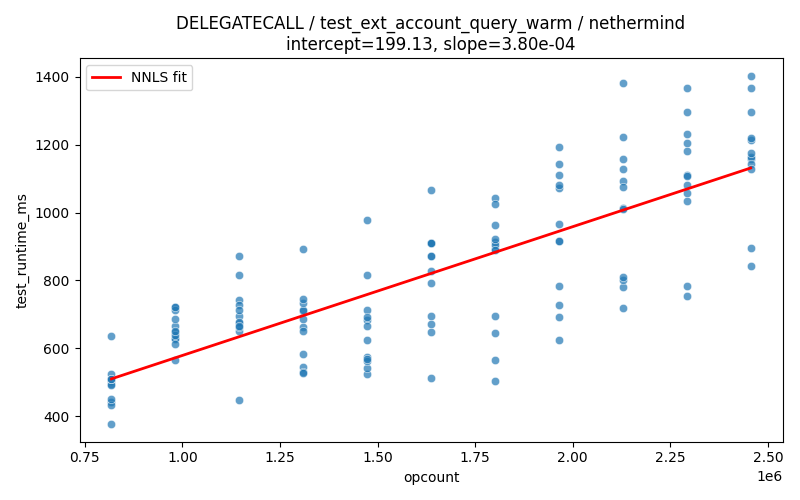

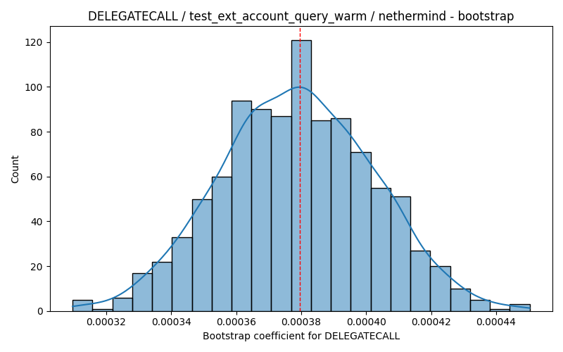

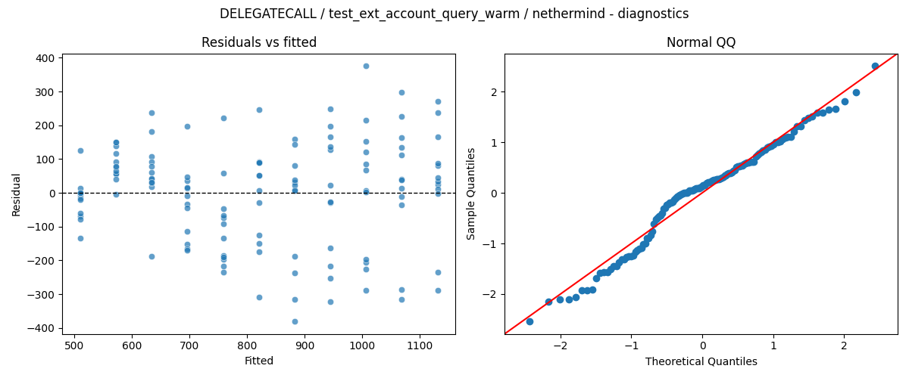

</details>

<details><summary>reth — NNLS regression summary</summary>

```
==============================================================================
                           NNLS Regression Results                            
==============================================================================
Dep. Variable:          test_runtime_ms              R-squared:          0.894
Model:                  NNLS                    Adj. R-squared:          0.893
No. Observations:       198                               RMSE:           9.94
Df Residuals:           196                                MAE:           7.87
Df Model:               1      
==============================================================================
                      coef     std err     P-value      [0.025      0.975]
------------------------------------------------------------------------------
         const     24.7031      1.9065       0.001     20.9658     28.3542
       opcount      0.0001      0.0000       0.001      0.0001      0.0001
==============================================================================
Notes: Non-negative least squares with bootstrap inference (1000 iterations)
==============================================================================
```

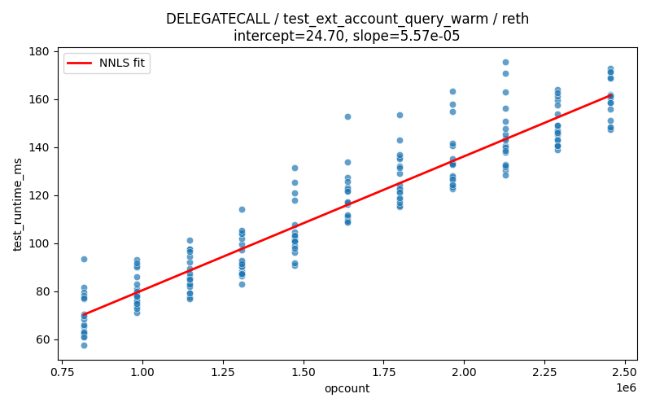

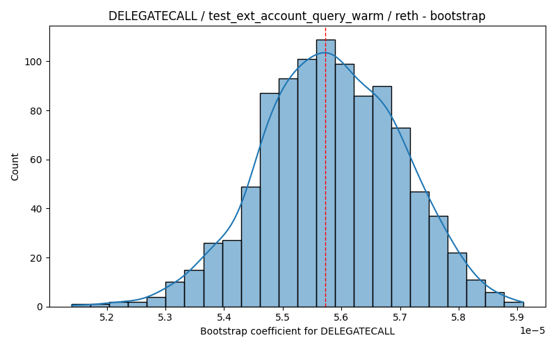

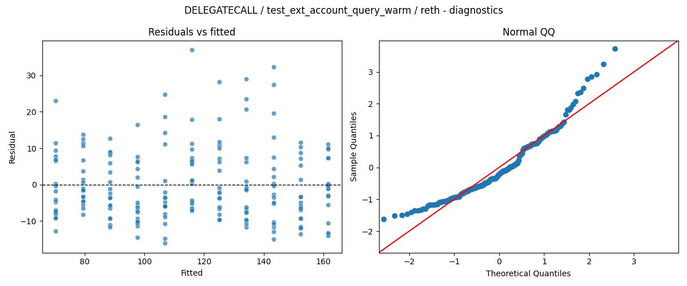

</details>

## EXTCODECOPY

### test_account_access — combo `EXTCODECOPY_AccountMode.NON_EXISTING_ACCOUNT` — `presets[cold_account_nocode_access]`

| client | nobs | R² | target_coef (ms) | p-value | 95% CI |
| --- | --- | --- | --- | --- | --- |
| `besu` | 253 | 0.2682 | 0.000559 | 1.00e-03 | [0.0004543, 0.0006554] |
| `erigon` | 110 | 0.9074 | 7.297e-05 | 1.00e-03 | [6.869e-05, 7.683e-05] |
| `ethrex` | 176 | 0.7503 | 3.732e-05 | 1.00e-03 | [3.401e-05, 4.071e-05] |
| `geth` | 154 | 0.9275 | 0.0003503 | 1.00e-03 | [0.0003349, 0.000367] |
| `nethermind` | 132 | 0.7842 | 0.0003484 | 1.00e-03 | [0.0003187, 0.0003768] |
| `reth` | 198 | 0.6065 | 2.085e-05 | 1.00e-03 | [1.862e-05, 2.321e-05] |

<details><summary>besu — NNLS regression summary</summary>

```
==============================================================================
                           NNLS Regression Results                            
==============================================================================
Dep. Variable:          test_runtime_ms              R-squared:          0.268
Model:                  NNLS                    Adj. R-squared:          0.265
No. Observations:       253                               RMSE:         237.08
Df Residuals:           251                                MAE:         214.52
Df Model:               1      
==============================================================================
                      coef     std err     P-value      [0.025      0.975]
------------------------------------------------------------------------------
         const    401.8418     43.8646       0.001    320.7392    488.8689
       opcount      0.0006      0.0001       0.001      0.0005      0.0007
==============================================================================
Notes: Non-negative least squares with bootstrap inference (1000 iterations)
==============================================================================
```

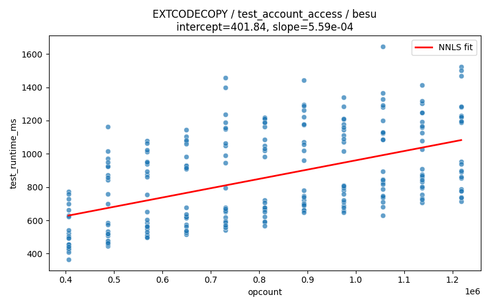

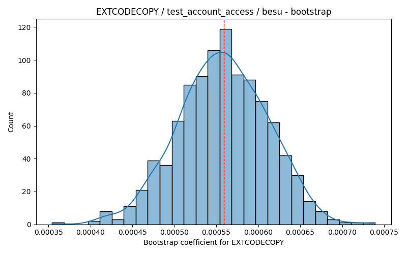

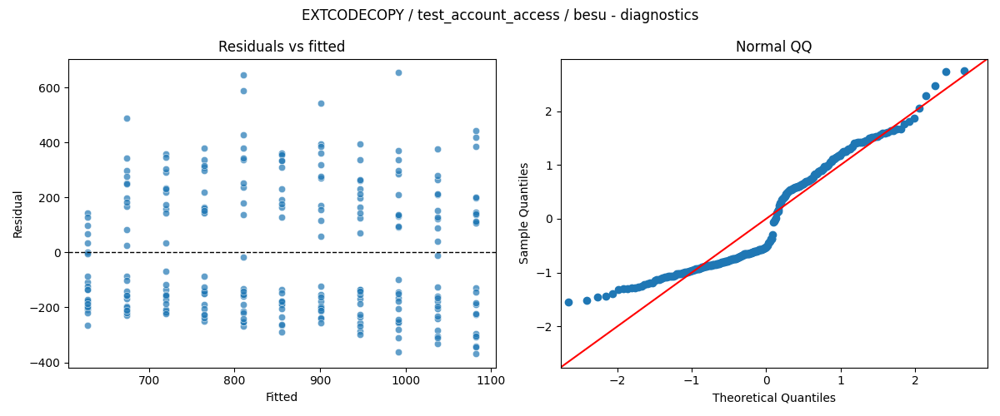

</details>

<details><summary>erigon — NNLS regression summary</summary>

```
==============================================================================
                           NNLS Regression Results                            
==============================================================================
Dep. Variable:          test_runtime_ms              R-squared:          0.907
Model:                  NNLS                    Adj. R-squared:          0.907
No. Observations:       110                               RMSE:           5.98
Df Residuals:           108                                MAE:           4.69
Df Model:               1      
==============================================================================
                      coef     std err     P-value      [0.025      0.975]
------------------------------------------------------------------------------
         const     22.0363      1.6819       0.001     19.0915     25.7546
       opcount      0.0001      0.0000       0.001      0.0001      0.0001
==============================================================================
Notes: Non-negative least squares with bootstrap inference (1000 iterations)
==============================================================================
```


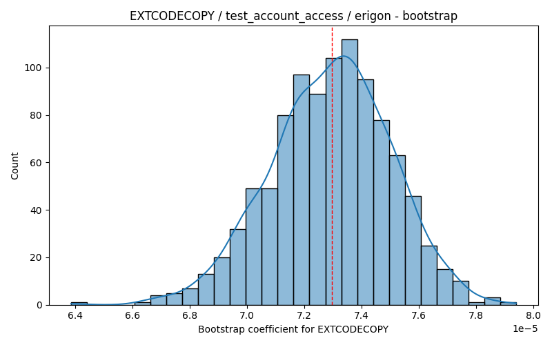

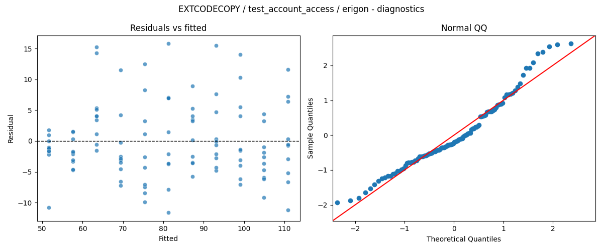

</details>

<details><summary>ethrex — NNLS regression summary</summary>

```
==============================================================================
                           NNLS Regression Results                            
==============================================================================
Dep. Variable:          test_runtime_ms              R-squared:          0.750
Model:                  NNLS                    Adj. R-squared:          0.749
No. Observations:       176                               RMSE:           5.53
Df Residuals:           174                                MAE:           4.32
Df Model:               1      
==============================================================================
                      coef     std err     P-value      [0.025      0.975]
------------------------------------------------------------------------------
         const      9.5803      1.4414       0.001      6.7995     12.3388
       opcount      0.0000      0.0000       0.001      0.0000      0.0000
==============================================================================
Notes: Non-negative least squares with bootstrap inference (1000 iterations)
==============================================================================
```

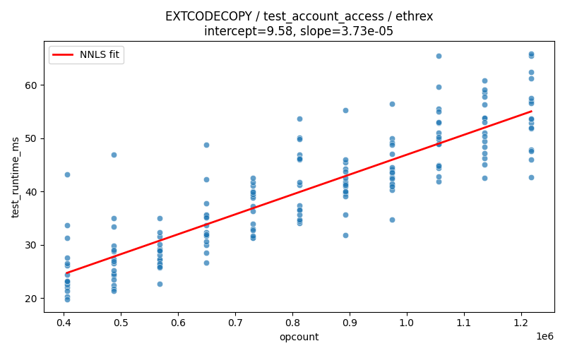

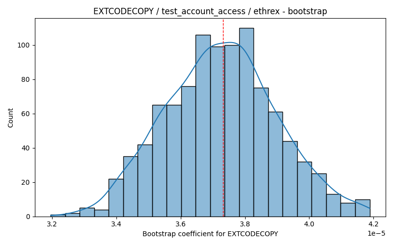

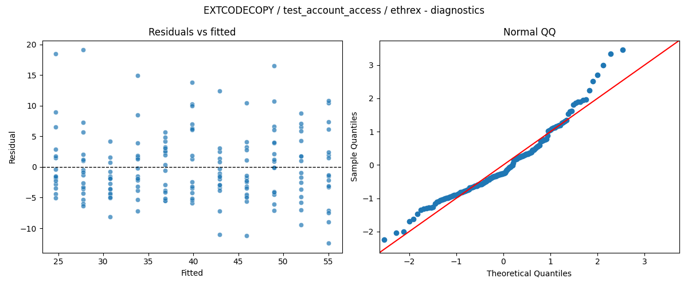

</details>

<details><summary>geth — NNLS regression summary</summary>

```
==============================================================================
                           NNLS Regression Results                            
==============================================================================
Dep. Variable:          test_runtime_ms              R-squared:          0.928
Model:                  NNLS                    Adj. R-squared:          0.927
No. Observations:       154                               RMSE:          25.15
Df Residuals:           152                                MAE:          19.07
Df Model:               1      
==============================================================================
                      coef     std err     P-value      [0.025      0.975]
------------------------------------------------------------------------------
         const     25.3932      5.7491       0.001     14.2772     36.6213
       opcount      0.0004      0.0000       0.001      0.0003      0.0004
==============================================================================
Notes: Non-negative least squares with bootstrap inference (1000 iterations)
==============================================================================
```

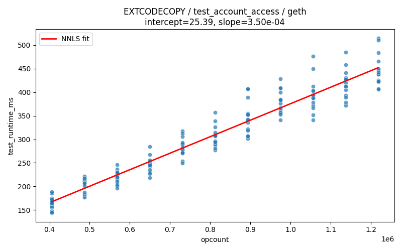

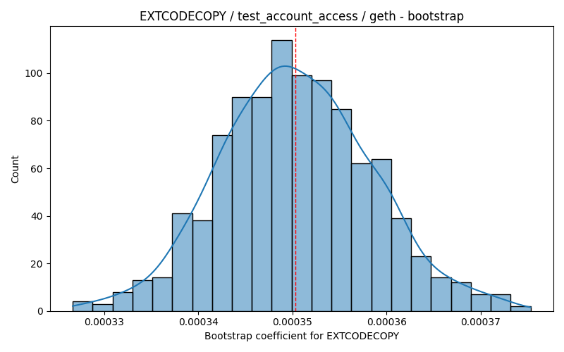

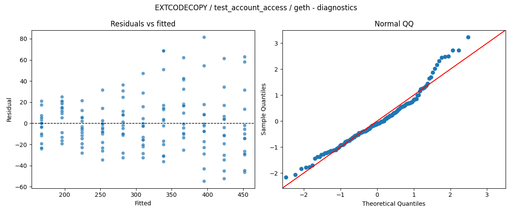

</details>

<details><summary>nethermind — NNLS regression summary</summary>

```
==============================================================================
                           NNLS Regression Results                            
==============================================================================
Dep. Variable:          test_runtime_ms              R-squared:          0.784
Model:                  NNLS                    Adj. R-squared:          0.783
No. Observations:       132                               RMSE:          46.92
Df Residuals:           130                                MAE:          33.54
Df Model:               1      
==============================================================================
                      coef     std err     P-value      [0.025      0.975]
------------------------------------------------------------------------------
         const    113.4185     11.1409       0.001     93.6185    135.6147
       opcount      0.0003      0.0000       0.001      0.0003      0.0004
==============================================================================
Notes: Non-negative least squares with bootstrap inference (1000 iterations)
==============================================================================
```

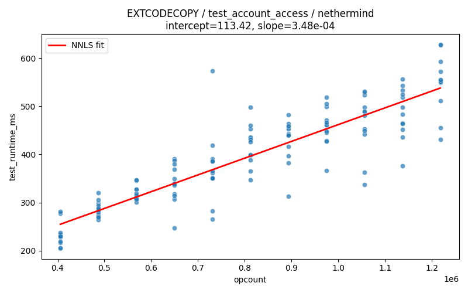

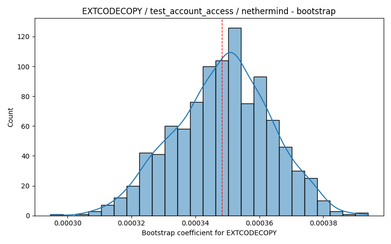

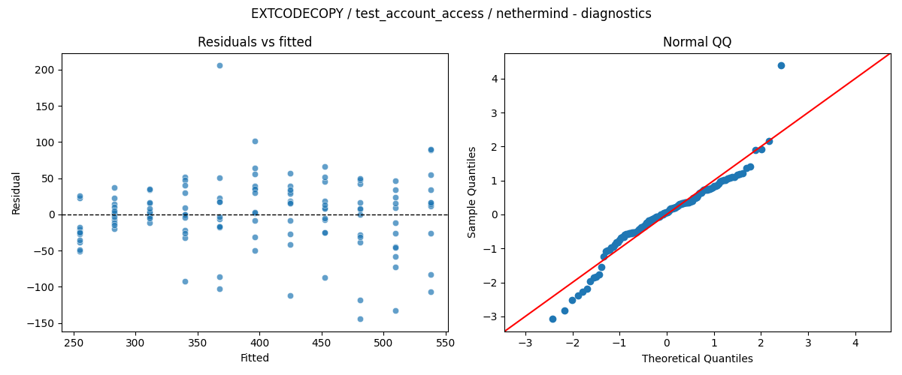

</details>

<details><summary>reth — NNLS regression summary</summary>

```
==============================================================================
                           NNLS Regression Results                            
==============================================================================
Dep. Variable:          test_runtime_ms              R-squared:          0.607
Model:                  NNLS                    Adj. R-squared:          0.604
No. Observations:       198                               RMSE:           4.31
Df Residuals:           196                                MAE:           3.04
Df Model:               1      
==============================================================================
                      coef     std err     P-value      [0.025      0.975]
------------------------------------------------------------------------------
         const      9.6933      1.0025       0.001      7.7952     11.7172
       opcount      0.0000      0.0000       0.001      0.0000      0.0000
==============================================================================
Notes: Non-negative least squares with bootstrap inference (1000 iterations)
==============================================================================
```

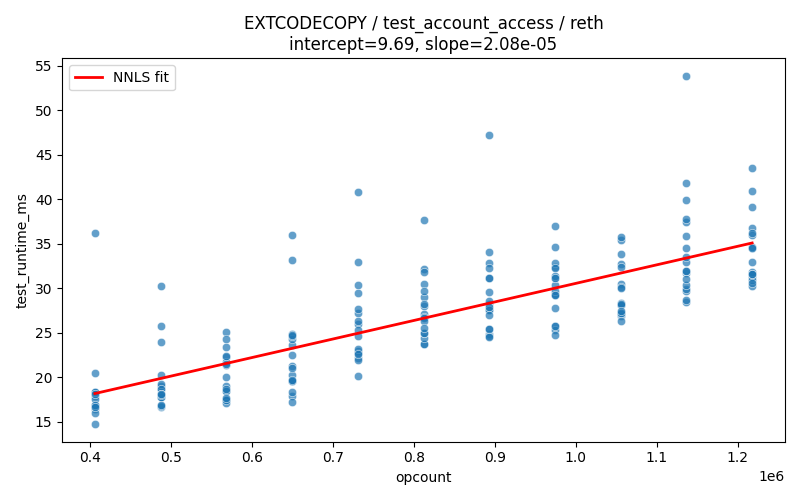

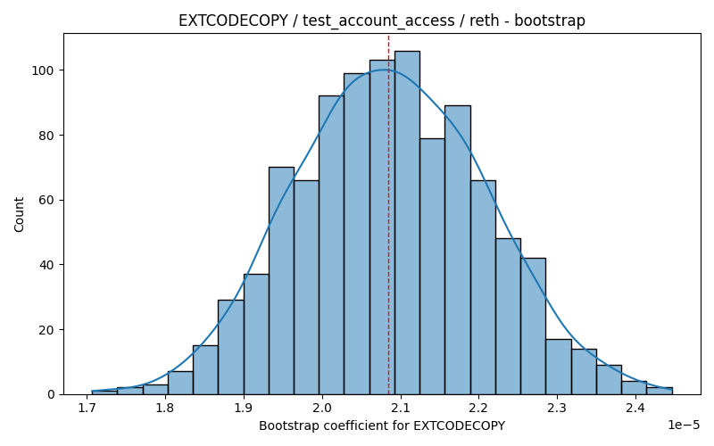

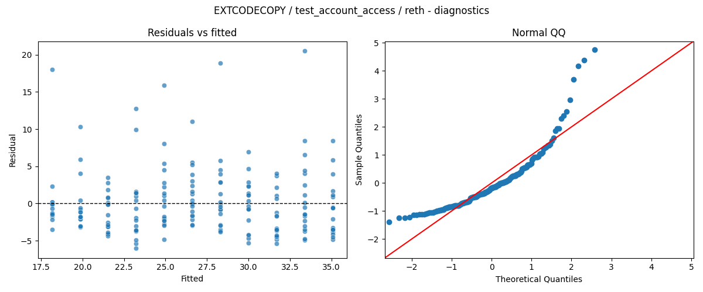

</details>

### test_account_access — combo `EXTCODECOPY_AccountMode.EXISTING_CONTRACT`

| client | nobs | R² | target_coef (ms) | p-value | 95% CI |
| --- | --- | --- | --- | --- | --- |
| `besu` | 253 | 0.3265 | 0.001969 | 1.00e-03 | [0.001658, 0.002308] |
| `erigon` | 110 | 0.8798 | 0.0003029 | 1.00e-03 | [0.0002787, 0.0003246] |
| `ethrex` | 176 | 0.8319 | 0.0002327 | 1.00e-03 | [0.000218, 0.0002463] |
| `geth` | 154 | 0.8897 | 0.0007742 | 1.00e-03 | [0.0007295, 0.000818] |
| `nethermind` | 132 | 0.8133 | 0.001351 | 1.00e-03 | [0.001239, 0.001475] |
| `reth` | 198 | 0.7986 | 0.0001026 | 1.00e-03 | [9.569e-05, 0.0001096] |

<details><summary>besu — NNLS regression summary</summary>

```
==============================================================================
                           NNLS Regression Results                            
==============================================================================
Dep. Variable:          test_runtime_ms              R-squared:          0.326
Model:                  NNLS                    Adj. R-squared:          0.324
No. Observations:       253                               RMSE:         279.45
Df Residuals:           251                                MAE:         252.82
Df Model:               1      
==============================================================================
                      coef     std err     P-value      [0.025      0.975]
------------------------------------------------------------------------------
         const    470.3619     51.4994       0.001    371.3608    571.4446
       opcount      0.0020      0.0002       0.001      0.0017      0.0023
==============================================================================
Notes: Non-negative least squares with bootstrap inference (1000 iterations)
==============================================================================
```

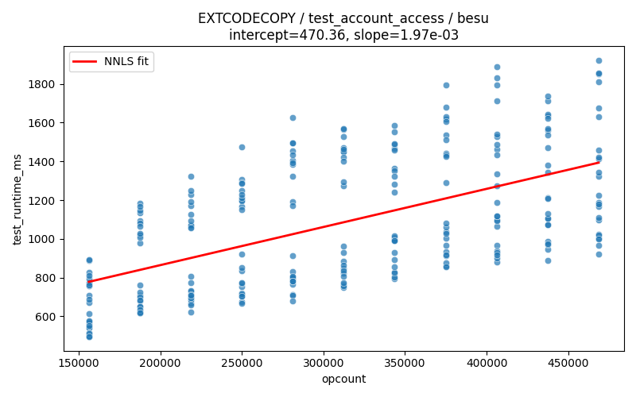

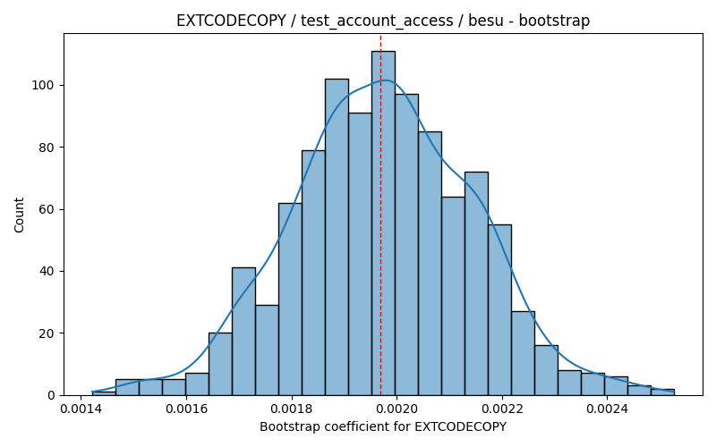

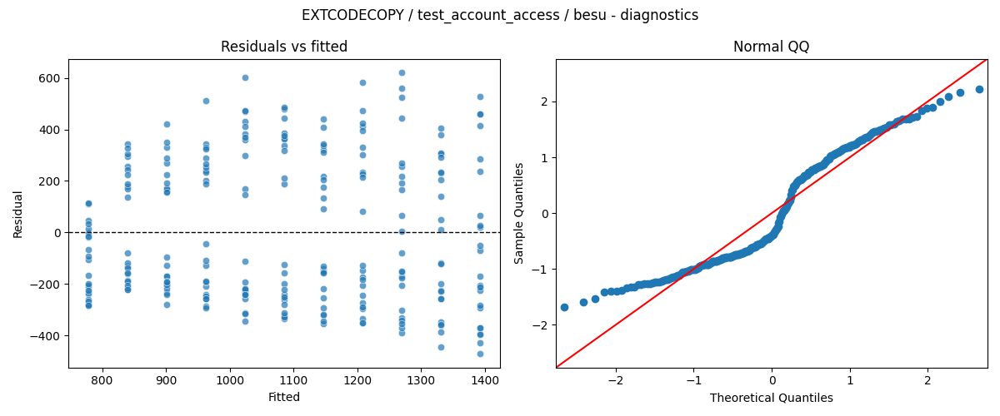

</details>

<details><summary>erigon — NNLS regression summary</summary>

```
==============================================================================
                           NNLS Regression Results                            
==============================================================================
Dep. Variable:          test_runtime_ms              R-squared:          0.880
Model:                  NNLS                    Adj. R-squared:          0.879
No. Observations:       110                               RMSE:          11.06
Df Residuals:           108                                MAE:           8.35
Df Model:               1      
==============================================================================
                      coef     std err     P-value      [0.025      0.975]
------------------------------------------------------------------------------
         const     40.6423      3.6274       0.001     34.0915     48.1175
       opcount      0.0003      0.0000       0.001      0.0003      0.0003
==============================================================================
Notes: Non-negative least squares with bootstrap inference (1000 iterations)
==============================================================================
```

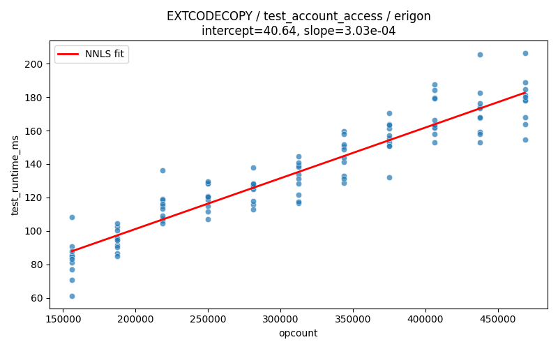

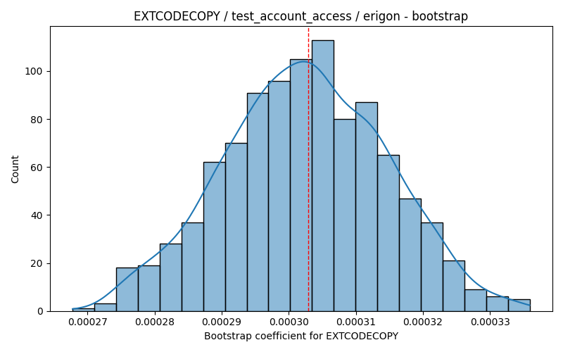

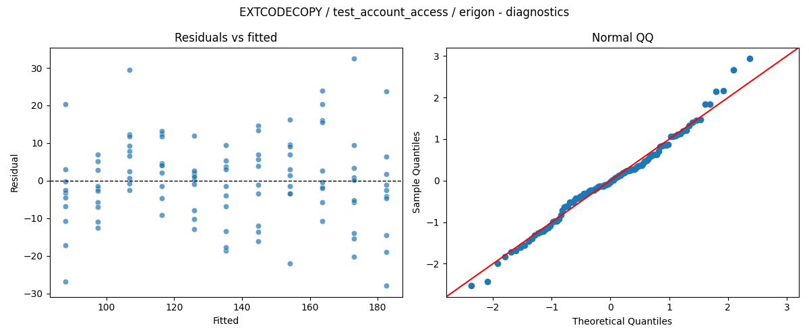

</details>

<details><summary>ethrex — NNLS regression summary</summary>

```
==============================================================================
                           NNLS Regression Results                            
==============================================================================
Dep. Variable:          test_runtime_ms              R-squared:          0.832
Model:                  NNLS                    Adj. R-squared:          0.831
No. Observations:       176                               RMSE:          10.33
Df Residuals:           174                                MAE:           8.04
Df Model:               1      
==============================================================================
                      coef     std err     P-value      [0.025      0.975]
------------------------------------------------------------------------------
         const     19.5662      2.1550       0.001     15.3867     23.7016
       opcount      0.0002      0.0000       0.001      0.0002      0.0002
==============================================================================
Notes: Non-negative least squares with bootstrap inference (1000 iterations)
==============================================================================
```

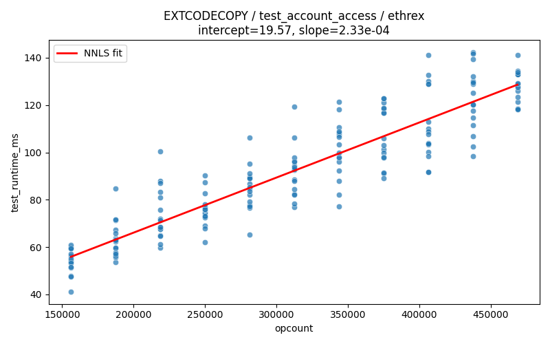

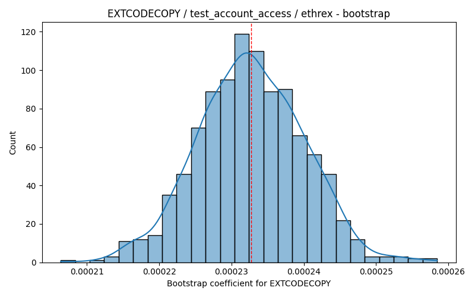

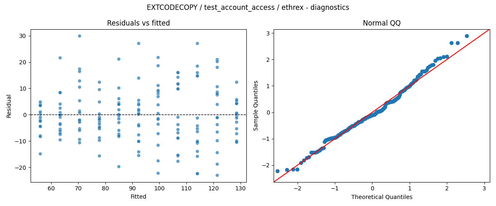

</details>

<details><summary>geth — NNLS regression summary</summary>

```
==============================================================================
                           NNLS Regression Results                            
==============================================================================
Dep. Variable:          test_runtime_ms              R-squared:          0.890
Model:                  NNLS                    Adj. R-squared:          0.889
No. Observations:       154                               RMSE:          26.93
Df Residuals:           152                                MAE:          20.67
Df Model:               1      
==============================================================================
                      coef     std err     P-value      [0.025      0.975]
------------------------------------------------------------------------------
         const     42.9369      5.9993       0.001     31.3652     54.9639
       opcount      0.0008      0.0000       0.001      0.0007      0.0008
==============================================================================
Notes: Non-negative least squares with bootstrap inference (1000 iterations)
==============================================================================
```

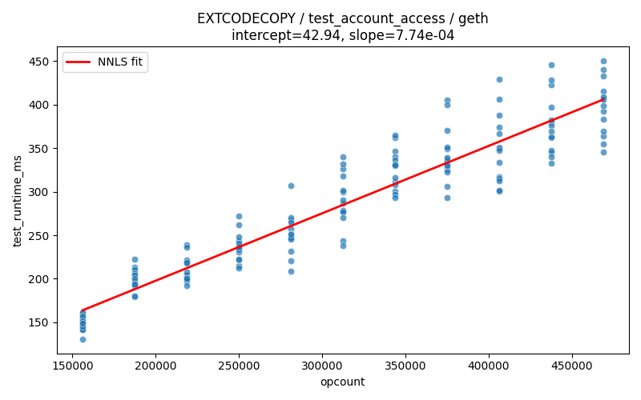

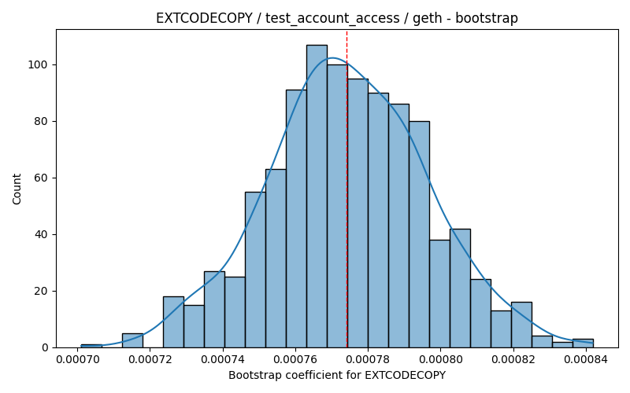

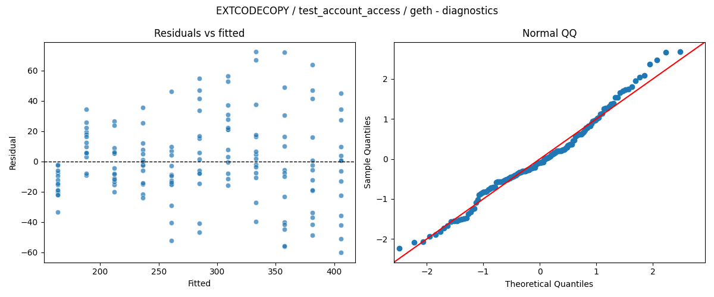

</details>

<details><summary>nethermind — NNLS regression summary</summary>

```
==============================================================================
                           NNLS Regression Results                            
==============================================================================
Dep. Variable:          test_runtime_ms              R-squared:          0.813
Model:                  NNLS                    Adj. R-squared:          0.812
No. Observations:       132                               RMSE:          63.95
Df Residuals:           130                                MAE:          51.41
Df Model:               1      
==============================================================================
                      coef     std err     P-value      [0.025      0.975]
------------------------------------------------------------------------------
         const    176.0182     18.3607       0.001    137.8094    209.9268
       opcount      0.0014      0.0001       0.001      0.0012      0.0015
==============================================================================
Notes: Non-negative least squares with bootstrap inference (1000 iterations)
==============================================================================
```

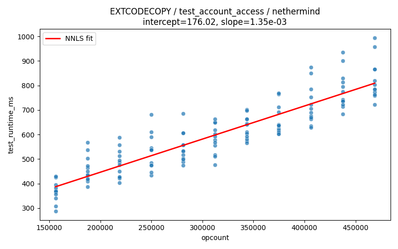

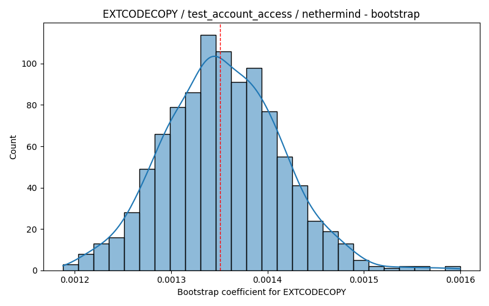

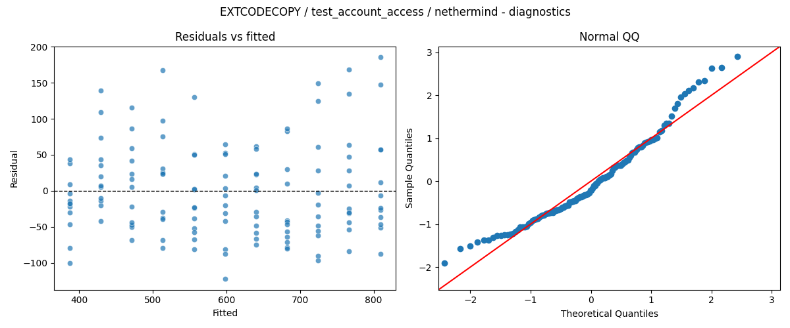

</details>

<details><summary>reth — NNLS regression summary</summary>

```
==============================================================================
                           NNLS Regression Results                            
==============================================================================
Dep. Variable:          test_runtime_ms              R-squared:          0.799
Model:                  NNLS                    Adj. R-squared:          0.798
No. Observations:       198                               RMSE:           5.09
Df Residuals:           196                                MAE:           3.86
Df Model:               1      
==============================================================================
                      coef     std err     P-value      [0.025      0.975]
------------------------------------------------------------------------------
         const     12.8083      1.0265       0.001     10.7717     14.8382
       opcount      0.0001      0.0000       0.001      0.0001      0.0001
==============================================================================
Notes: Non-negative least squares with bootstrap inference (1000 iterations)
==============================================================================
```

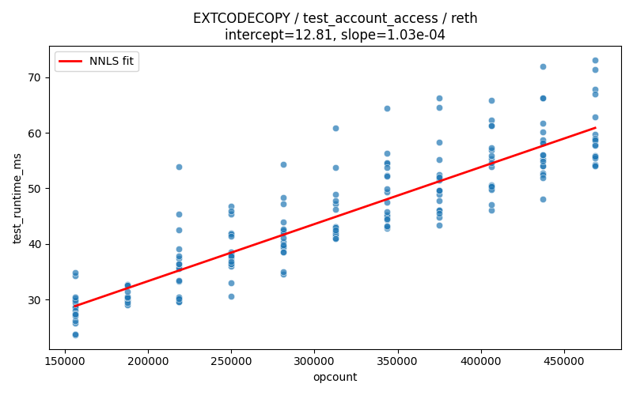

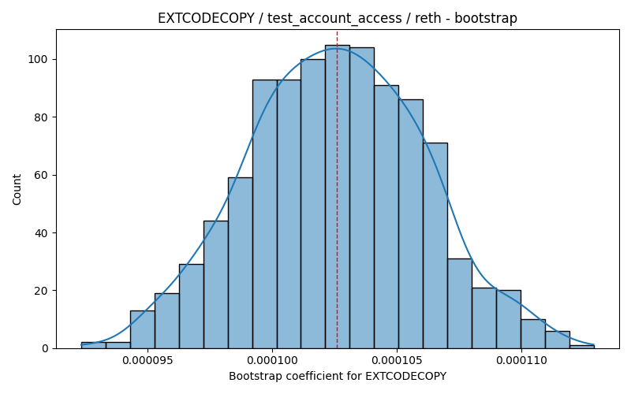

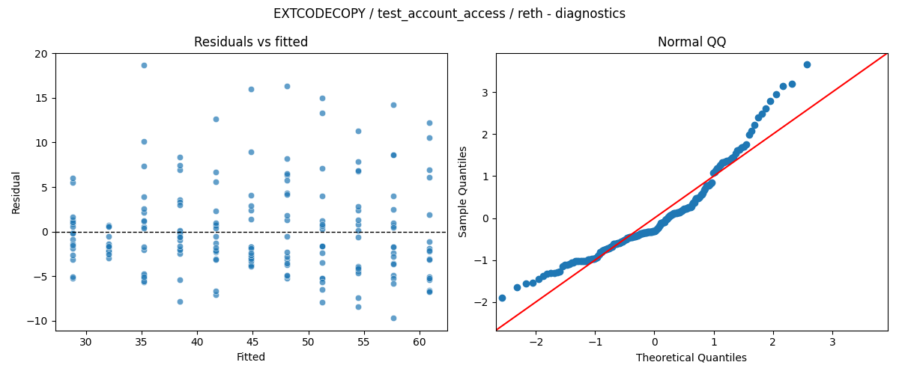

</details>

### test_account_access — combo `EXTCODECOPY_AccountMode.NON_EXISTING_ACCOUNT` — `presets[cold_account_code_access]`

| client | nobs | R² | target_coef (ms) | p-value | 95% CI |
| --- | --- | --- | --- | --- | --- |
| `besu` | 253 | 0.2682 | 0.000559 | 1.00e-03 | [0.0004543, 0.0006554] |
| `erigon` | 110 | 0.9074 | 7.297e-05 | 1.00e-03 | [6.869e-05, 7.683e-05] |
| `ethrex` | 176 | 0.7503 | 3.732e-05 | 1.00e-03 | [3.401e-05, 4.071e-05] |
| `geth` | 154 | 0.9275 | 0.0003503 | 1.00e-03 | [0.0003349, 0.000367] |
| `nethermind` | 132 | 0.7842 | 0.0003484 | 1.00e-03 | [0.0003187, 0.0003768] |
| `reth` | 198 | 0.6065 | 2.085e-05 | 1.00e-03 | [1.862e-05, 2.321e-05] |

<details><summary>besu — NNLS regression summary</summary>

```
==============================================================================
                           NNLS Regression Results                            
==============================================================================
Dep. Variable:          test_runtime_ms              R-squared:          0.268
Model:                  NNLS                    Adj. R-squared:          0.265
No. Observations:       253                               RMSE:         237.08
Df Residuals:           251                                MAE:         214.52
Df Model:               1      
==============================================================================
                      coef     std err     P-value      [0.025      0.975]
------------------------------------------------------------------------------
         const    401.8418     43.8646       0.001    320.7392    488.8689
       opcount      0.0006      0.0001       0.001      0.0005      0.0007
==============================================================================
Notes: Non-negative least squares with bootstrap inference (1000 iterations)
==============================================================================
```


</details>

<details><summary>erigon — NNLS regression summary</summary>

```
==============================================================================
                           NNLS Regression Results                            
==============================================================================
Dep. Variable:          test_runtime_ms              R-squared:          0.907
Model:                  NNLS                    Adj. R-squared:          0.907
No. Observations:       110                               RMSE:           5.98
Df Residuals:           108                                MAE:           4.69
Df Model:               1      
==============================================================================
                      coef     std err     P-value      [0.025      0.975]
------------------------------------------------------------------------------
         const     22.0363      1.6819       0.001     19.0915     25.7546
       opcount      0.0001      0.0000       0.001      0.0001      0.0001
==============================================================================
Notes: Non-negative least squares with bootstrap inference (1000 iterations)
==============================================================================
```


</details>

<details><summary>ethrex — NNLS regression summary</summary>

```
==============================================================================
                           NNLS Regression Results                            
==============================================================================
Dep. Variable:          test_runtime_ms              R-squared:          0.750
Model:                  NNLS                    Adj. R-squared:          0.749
No. Observations:       176                               RMSE:           5.53
Df Residuals:           174                                MAE:           4.32
Df Model:               1      
==============================================================================
                      coef     std err     P-value      [0.025      0.975]
------------------------------------------------------------------------------
         const      9.5803      1.4414       0.001      6.7995     12.3388
       opcount      0.0000      0.0000       0.001      0.0000      0.0000
==============================================================================
Notes: Non-negative least squares with bootstrap inference (1000 iterations)
==============================================================================
```


</details>

<details><summary>geth — NNLS regression summary</summary>

```
==============================================================================
                           NNLS Regression Results                            
==============================================================================
Dep. Variable:          test_runtime_ms              R-squared:          0.928
Model:                  NNLS                    Adj. R-squared:          0.927
No. Observations:       154                               RMSE:          25.15
Df Residuals:           152                                MAE:          19.07
Df Model:               1      
==============================================================================
                      coef     std err     P-value      [0.025      0.975]
------------------------------------------------------------------------------
         const     25.3932      5.7491       0.001     14.2772     36.6213
       opcount      0.0004      0.0000       0.001      0.0003      0.0004
==============================================================================
Notes: Non-negative least squares with bootstrap inference (1000 iterations)
==============================================================================
```


</details>

<details><summary>nethermind — NNLS regression summary</summary>

```
==============================================================================
                           NNLS Regression Results                            
==============================================================================
Dep. Variable:          test_runtime_ms              R-squared:          0.784
Model:                  NNLS                    Adj. R-squared:          0.783
No. Observations:       132                               RMSE:          46.92
Df Residuals:           130                                MAE:          33.54
Df Model:               1      
==============================================================================
                      coef     std err     P-value      [0.025      0.975]
------------------------------------------------------------------------------
         const    113.4185     11.1409       0.001     93.6185    135.6147
       opcount      0.0003      0.0000       0.001      0.0003      0.0004
==============================================================================
Notes: Non-negative least squares with bootstrap inference (1000 iterations)
==============================================================================
```


</details>

<details><summary>reth — NNLS regression summary</summary>

```
==============================================================================
                           NNLS Regression Results                            
==============================================================================
Dep. Variable:          test_runtime_ms              R-squared:          0.607
Model:                  NNLS                    Adj. R-squared:          0.604
No. Observations:       198                               RMSE:           4.31
Df Residuals:           196                                MAE:           3.04
Df Model:               1      
==============================================================================
                      coef     std err     P-value      [0.025      0.975]
------------------------------------------------------------------------------
         const      9.6933      1.0025       0.001      7.7952     11.7172
       opcount      0.0000      0.0000       0.001      0.0000      0.0000
==============================================================================
Notes: Non-negative least squares with bootstrap inference (1000 iterations)
==============================================================================
```


</details>

## EXTCODEHASH

### test_account_access — combo `EXTCODEHASH_AccountMode.NON_EXISTING_ACCOUNT` — `presets[cold_account_nocode_access]`

| client | nobs | R² | target_coef (ms) | p-value | 95% CI |
| --- | --- | --- | --- | --- | --- |
| `besu` | 253 | 0.892 | 0.01354 | 1.00e-03 | [0.01297, 0.01411] |
| `erigon` | 110 | 0.971 | 0.007631 | 1.00e-03 | [0.007394, 0.007773] |
| `ethrex` | 176 | 0.9525 | 0.001932 | 1.00e-03 | [0.001878, 0.001983] |
| `geth` | 154 | 0.8557 | 0.02175 | 1.00e-03 | [0.02026, 0.02323] |
| `nethermind` | 132 | 0.7571 | 0.003782 | 1.00e-03 | [0.003366, 0.004182] |
| `reth` | 198 | 0.9184 | 0.0007754 | 1.00e-03 | [0.0007427, 0.0008088] |

<details><summary>besu — NNLS regression summary</summary>

```
==============================================================================
                           NNLS Regression Results                            
==============================================================================
Dep. Variable:          test_runtime_ms              R-squared:          0.892
Model:                  NNLS                    Adj. R-squared:          0.892
No. Observations:       253                               RMSE:         112.56
Df Residuals:           251                                MAE:         100.65
Df Model:               1      
==============================================================================
                      coef     std err     P-value      [0.025      0.975]
------------------------------------------------------------------------------
         const    491.6102     22.8622       0.001    446.5602    535.3765
       opcount      0.0135      0.0003       0.001      0.0130      0.0141
==============================================================================
Notes: Non-negative least squares with bootstrap inference (1000 iterations)
==============================================================================
```

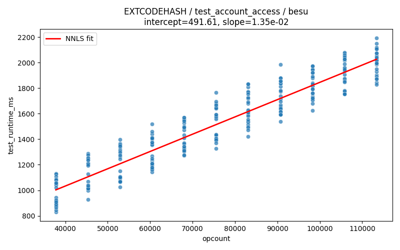

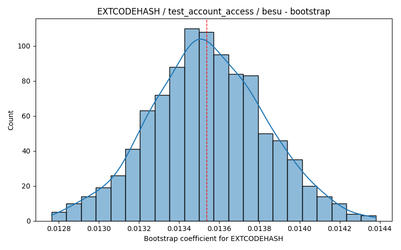

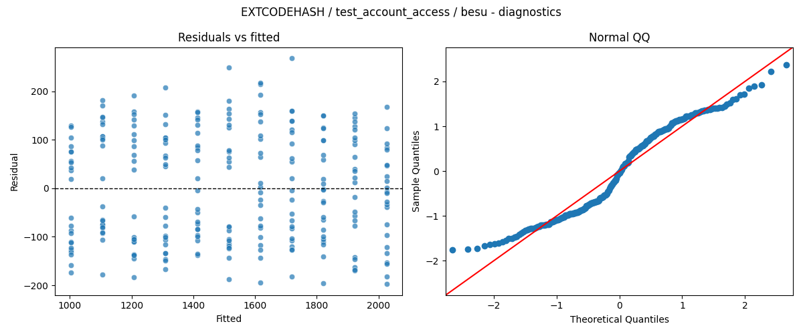

</details>

<details><summary>erigon — NNLS regression summary</summary>

```
==============================================================================
                           NNLS Regression Results                            
==============================================================================
Dep. Variable:          test_runtime_ms              R-squared:          0.971
Model:                  NNLS                    Adj. R-squared:          0.971
No. Observations:       110                               RMSE:          31.51
Df Residuals:           108                                MAE:          23.91
Df Model:               1      
==============================================================================
                      coef     std err     P-value      [0.025      0.975]
------------------------------------------------------------------------------
         const      5.8474      6.7509       0.225      0.0000     23.0235
       opcount      0.0076      0.0001       0.001      0.0074      0.0078
==============================================================================
Notes: Non-negative least squares with bootstrap inference (1000 iterations)
==============================================================================
```


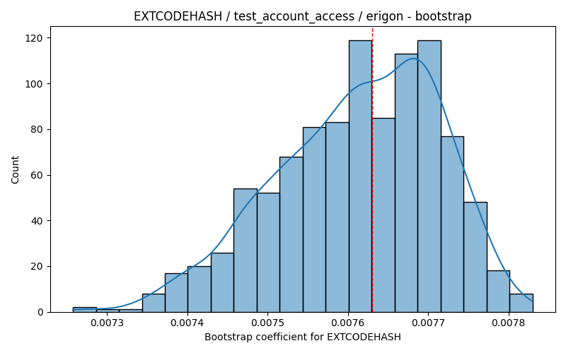

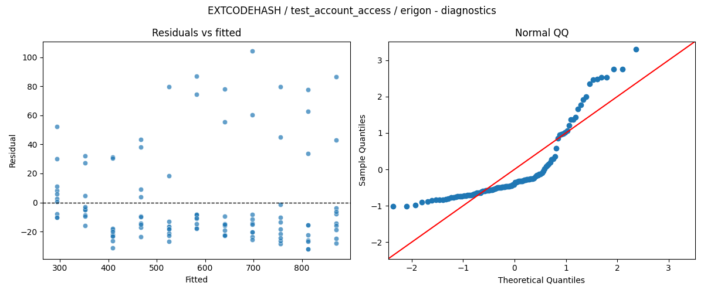

</details>

<details><summary>ethrex — NNLS regression summary</summary>

```
==============================================================================
                           NNLS Regression Results                            
==============================================================================
Dep. Variable:          test_runtime_ms              R-squared:          0.952
Model:                  NNLS                    Adj. R-squared:          0.952
No. Observations:       176                               RMSE:          10.31
Df Residuals:           174                                MAE:           7.18
Df Model:               1      
==============================================================================
                      coef     std err     P-value      [0.025      0.975]
------------------------------------------------------------------------------
         const     26.8085      2.3908       0.001     22.5481     31.5128
       opcount      0.0019      0.0000       0.001      0.0019      0.0020
==============================================================================
Notes: Non-negative least squares with bootstrap inference (1000 iterations)
==============================================================================
```

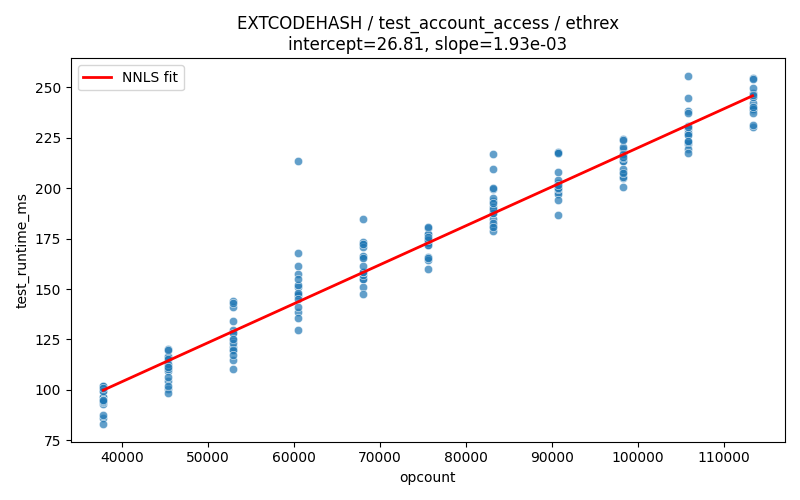

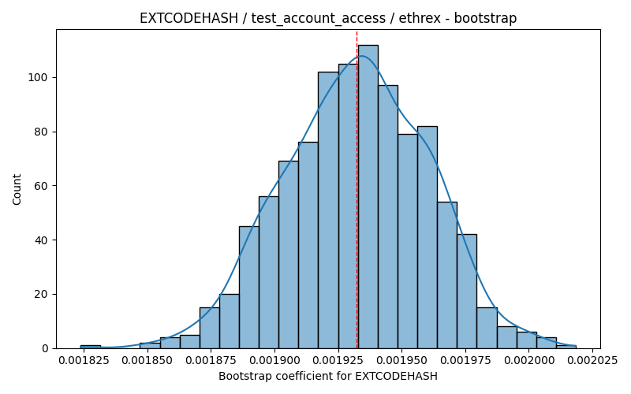

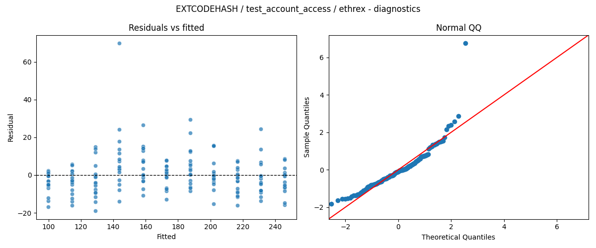

</details>

<details><summary>geth — NNLS regression summary</summary>

```
==============================================================================
                           NNLS Regression Results                            
==============================================================================
Dep. Variable:          test_runtime_ms              R-squared:          0.856
Model:                  NNLS                    Adj. R-squared:          0.855
No. Observations:       154                               RMSE:         213.39
Df Residuals:           152                                MAE:         182.00
Df Model:               1      
==============================================================================
                      coef     std err     P-value      [0.025      0.975]
------------------------------------------------------------------------------
         const    711.5352     65.7361       0.001    587.9844    848.2501
       opcount      0.0217      0.0008       0.001      0.0203      0.0232
==============================================================================
Notes: Non-negative least squares with bootstrap inference (1000 iterations)
==============================================================================
```

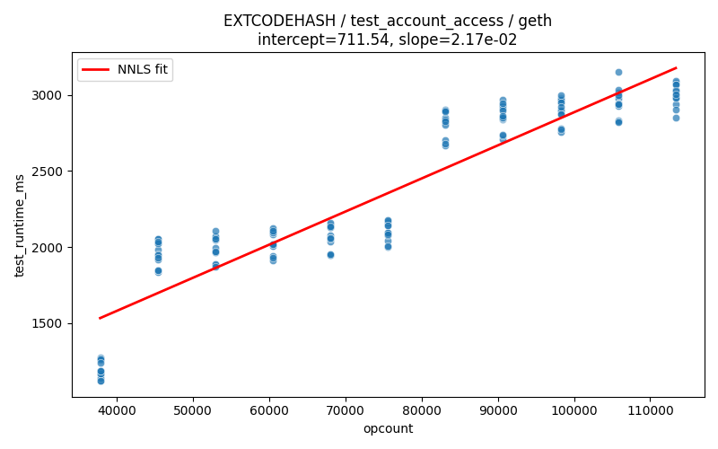

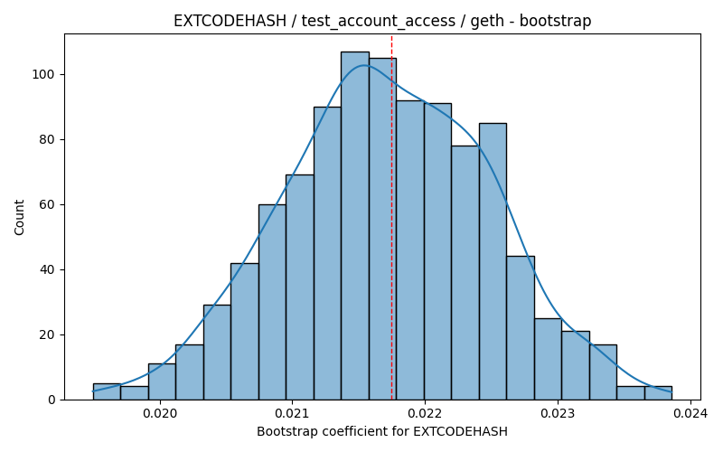

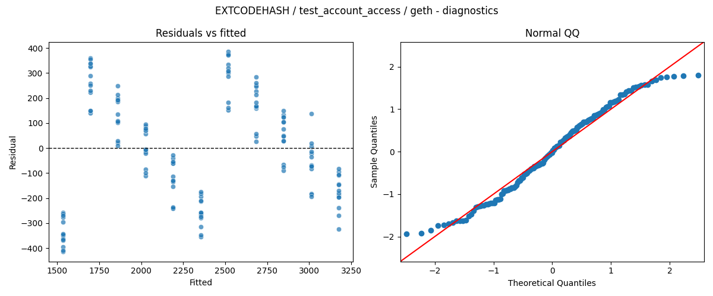

</details>

<details><summary>nethermind — NNLS regression summary</summary>

```
==============================================================================
                           NNLS Regression Results                            
==============================================================================
Dep. Variable:          test_runtime_ms              R-squared:          0.757
Model:                  NNLS                    Adj. R-squared:          0.755
No. Observations:       132                               RMSE:          51.19
Df Residuals:           130                                MAE:          39.66
Df Model:               1      
==============================================================================
                      coef     std err     P-value      [0.025      0.975]
------------------------------------------------------------------------------
         const     90.0595     15.2779       0.001     61.2659    121.0065
       opcount      0.0038      0.0002       0.001      0.0034      0.0042
==============================================================================
Notes: Non-negative least squares with bootstrap inference (1000 iterations)
==============================================================================
```

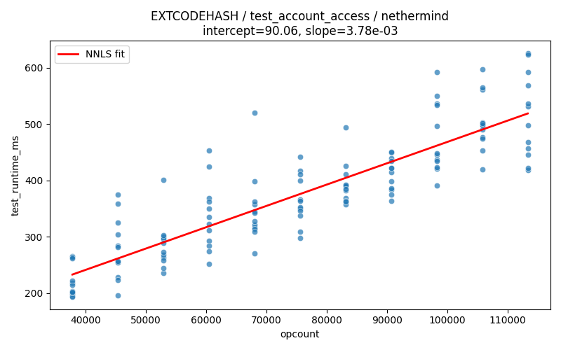

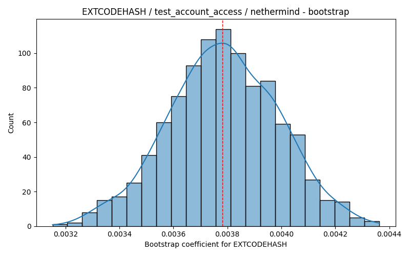

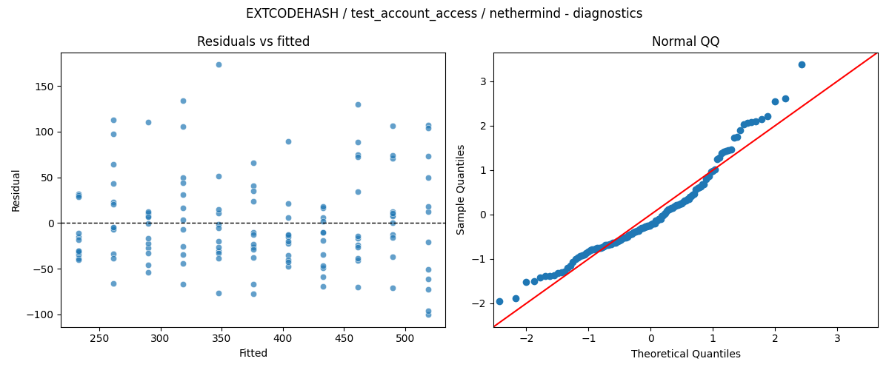

</details>

<details><summary>reth — NNLS regression summary</summary>

```
==============================================================================
                           NNLS Regression Results                            
==============================================================================
Dep. Variable:          test_runtime_ms              R-squared:          0.918
Model:                  NNLS                    Adj. R-squared:          0.918
No. Observations:       198                               RMSE:           5.52
Df Residuals:           196                                MAE:           4.37
Df Model:               1      
==============================================================================
                      coef     std err     P-value      [0.025      0.975]
------------------------------------------------------------------------------
         const     43.5497      1.2493       0.001     41.1021     45.9175
       opcount      0.0008      0.0000       0.001      0.0007      0.0008
==============================================================================
Notes: Non-negative least squares with bootstrap inference (1000 iterations)
==============================================================================
```

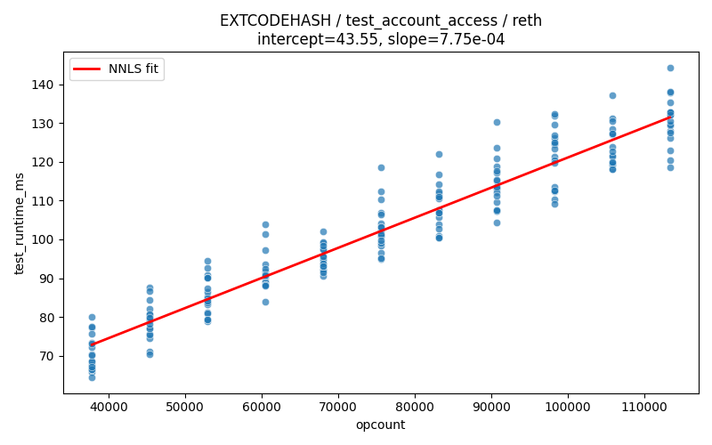

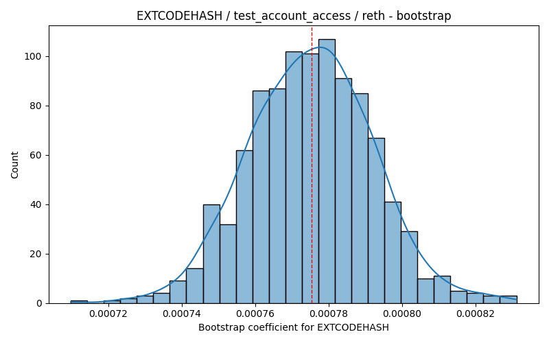

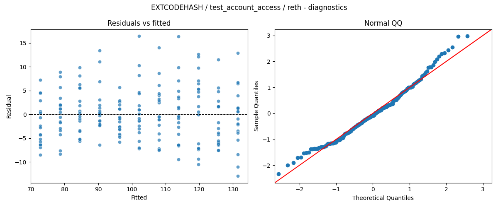

</details>

### test_account_access — combo `EXTCODEHASH_AccountMode.EXISTING_CONTRACT`

| client | nobs | R² | target_coef (ms) | p-value | 95% CI |
| --- | --- | --- | --- | --- | --- |
| `besu` | 253 | 0.8956 | 0.02566 | 1.00e-03 | [0.02468, 0.02661] |
| `erigon` | 110 | 0.934 | 0.0243 | 1.00e-03 | [0.02317, 0.02537] |
| `ethrex` | 176 | 0.9943 | 0.007349 | 1.00e-03 | [0.007264, 0.007438] |
| `geth` | 154 | 0.8558 | 0.02308 | 1.00e-03 | [0.02145, 0.0247] |
| `nethermind` | 132 | 0.5612 | 0.01225 | 1.00e-03 | [0.01065, 0.01443] |
| `reth` | 198 | 0.979 | 0.003897 | 1.00e-03 | [0.003817, 0.003971] |

<details><summary>besu — NNLS regression summary</summary>

```
==============================================================================
                           NNLS Regression Results                            
==============================================================================
Dep. Variable:          test_runtime_ms              R-squared:          0.896
Model:                  NNLS                    Adj. R-squared:          0.895
No. Observations:       253                               RMSE:         182.31
Df Residuals:           251                                MAE:         145.73
Df Model:               1      
==============================================================================
                      coef     std err     P-value      [0.025      0.975]
------------------------------------------------------------------------------
         const    543.9576     32.5112       0.001    482.1711    609.0463
       opcount      0.0257      0.0005       0.001      0.0247      0.0266
==============================================================================
Notes: Non-negative least squares with bootstrap inference (1000 iterations)
==============================================================================
```

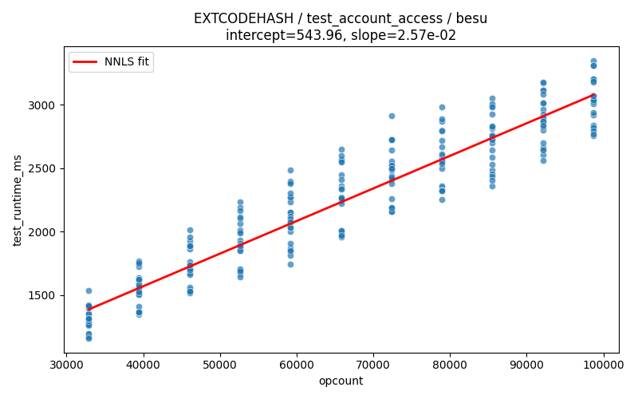

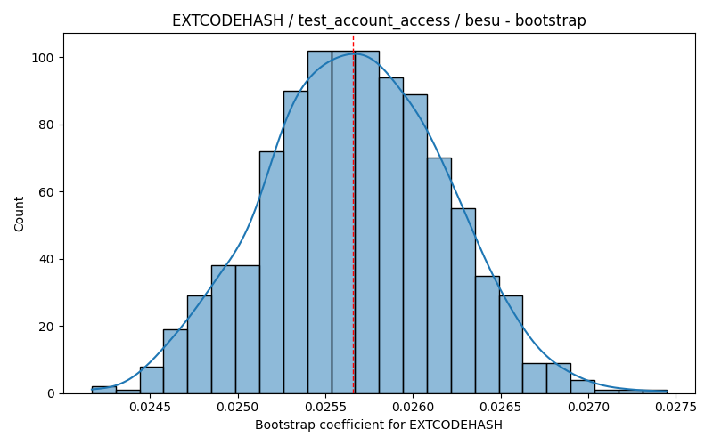

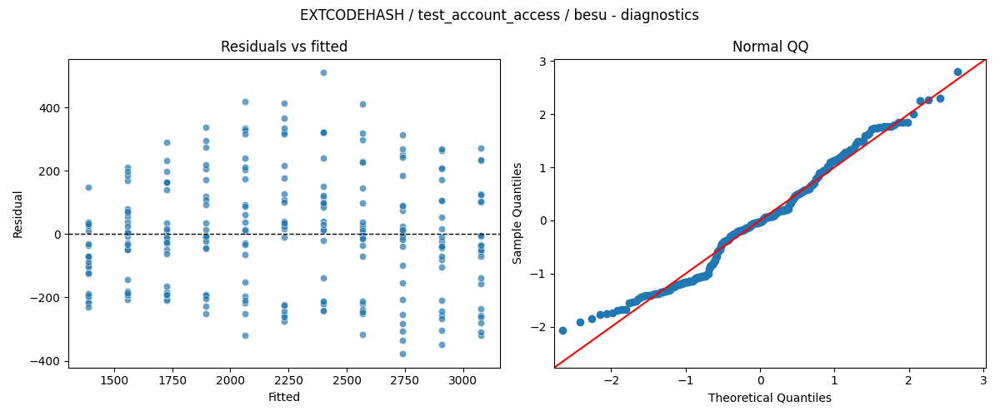

</details>

<details><summary>erigon — NNLS regression summary</summary>

```
==============================================================================
                           NNLS Regression Results                            
==============================================================================
Dep. Variable:          test_runtime_ms              R-squared:          0.934
Model:                  NNLS                    Adj. R-squared:          0.933
No. Observations:       110                               RMSE:         134.41
Df Residuals:           108                                MAE:         115.27
Df Model:               1      
==============================================================================
                      coef     std err     P-value      [0.025      0.975]
------------------------------------------------------------------------------
         const    382.4754     42.7721       0.001    303.6260    467.4885
       opcount      0.0243      0.0006       0.001      0.0232      0.0254
==============================================================================
Notes: Non-negative least squares with bootstrap inference (1000 iterations)
==============================================================================
```

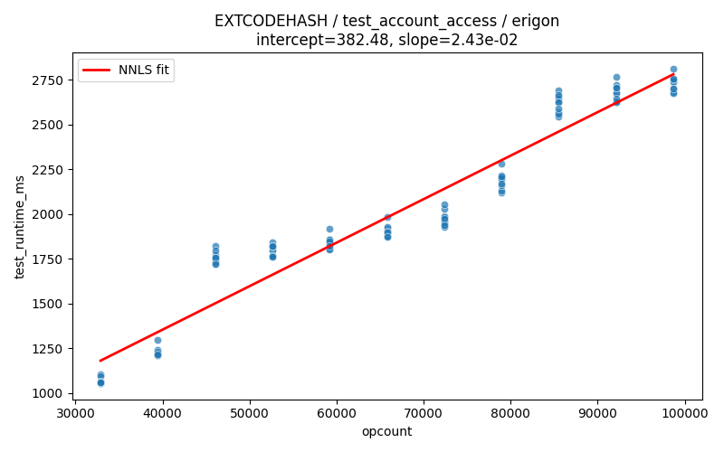

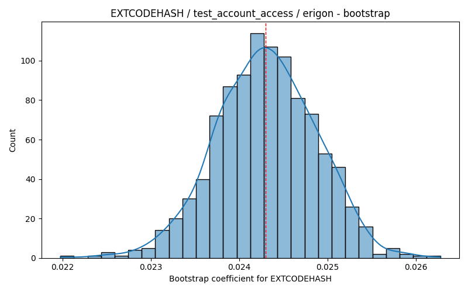

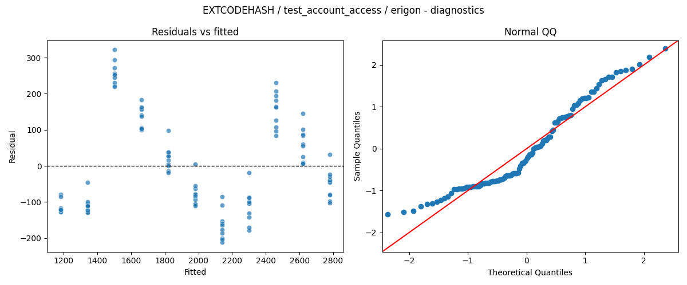

</details>

<details><summary>ethrex — NNLS regression summary</summary>

```
==============================================================================
                           NNLS Regression Results                            
==============================================================================
Dep. Variable:          test_runtime_ms              R-squared:          0.994
Model:                  NNLS                    Adj. R-squared:          0.994
No. Observations:       176                               RMSE:          11.59
Df Residuals:           174                                MAE:           9.26
Df Model:               1      
==============================================================================
                      coef     std err     P-value      [0.025      0.975]
------------------------------------------------------------------------------
         const     45.0985      2.7824       0.001     39.5373     50.5532
       opcount      0.0073      0.0000       0.001      0.0073      0.0074
==============================================================================
Notes: Non-negative least squares with bootstrap inference (1000 iterations)
==============================================================================
```

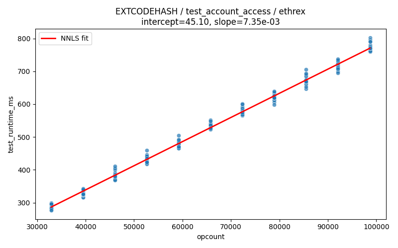

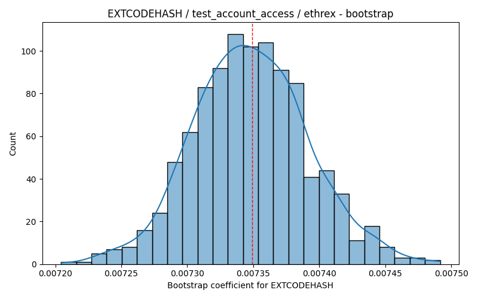

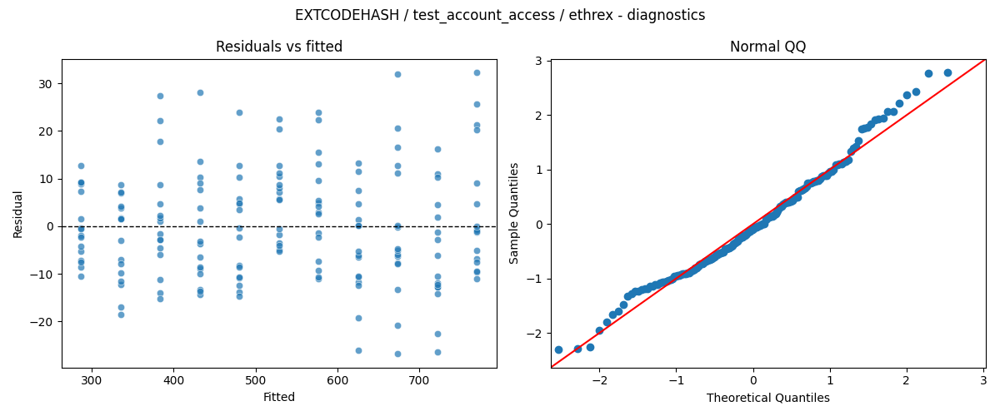

</details>

<details><summary>geth — NNLS regression summary</summary>

```
==============================================================================
                           NNLS Regression Results                            
==============================================================================
Dep. Variable:          test_runtime_ms              R-squared:          0.856
Model:                  NNLS                    Adj. R-squared:          0.855
No. Observations:       154                               RMSE:         197.14
Df Residuals:           152                                MAE:         167.23
Df Model:               1      
==============================================================================
                      coef     std err     P-value      [0.025      0.975]
------------------------------------------------------------------------------
         const    676.9662     61.9799       0.001    559.3471    804.6389
       opcount      0.0231      0.0008       0.001      0.0214      0.0247
==============================================================================
Notes: Non-negative least squares with bootstrap inference (1000 iterations)
==============================================================================
```

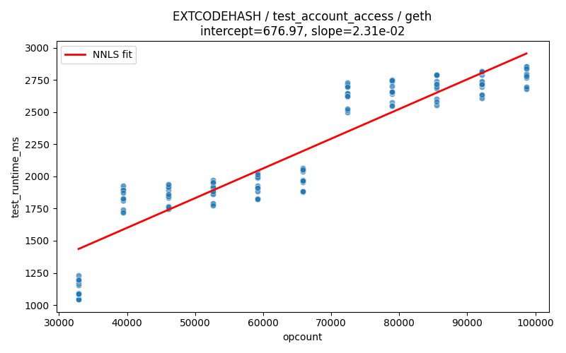

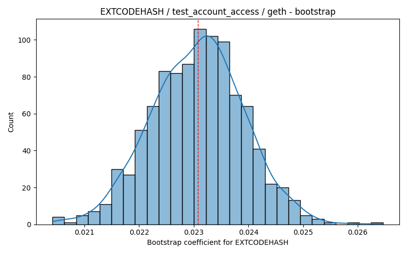

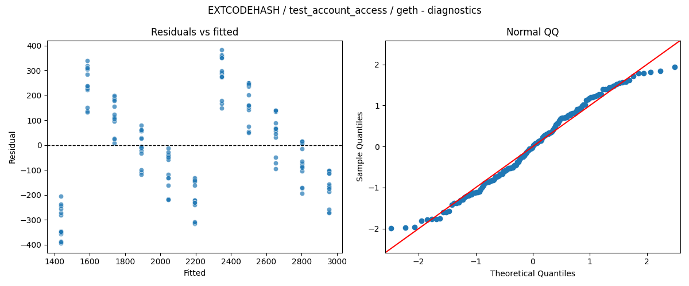

</details>

<details><summary>nethermind — NNLS regression summary</summary>

```
==============================================================================
                           NNLS Regression Results                            
==============================================================================
Dep. Variable:          test_runtime_ms              R-squared:          0.561
Model:                  NNLS                    Adj. R-squared:          0.558
No. Observations:       132                               RMSE:         225.35
Df Residuals:           130                                MAE:         160.68
Df Model:               1      
==============================================================================
                      coef     std err     P-value      [0.025      0.975]
------------------------------------------------------------------------------
         const    231.8250     56.7477       0.001    115.5209    333.3954
       opcount      0.0122      0.0009       0.001      0.0106      0.0144
==============================================================================
Notes: Non-negative least squares with bootstrap inference (1000 iterations)
==============================================================================
```

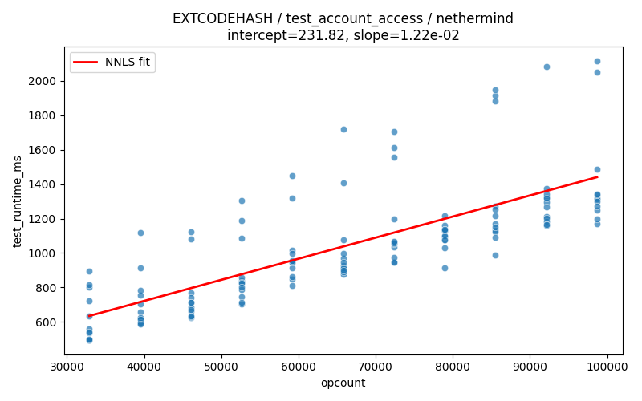

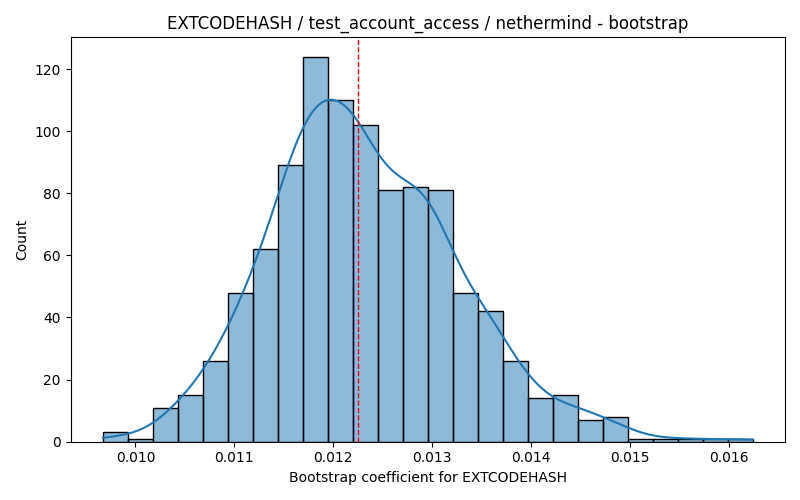

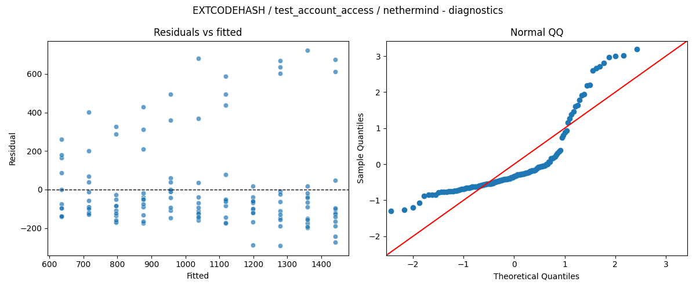

</details>

<details><summary>reth — NNLS regression summary</summary>

```
==============================================================================
                           NNLS Regression Results                            
==============================================================================
Dep. Variable:          test_runtime_ms              R-squared:          0.979
Model:                  NNLS                    Adj. R-squared:          0.979
No. Observations:       198                               RMSE:          11.89
Df Residuals:           196                                MAE:           9.28
Df Model:               1      
==============================================================================
                      coef     std err     P-value      [0.025      0.975]
------------------------------------------------------------------------------
         const    100.6613      2.5564       0.001     95.9397    106.0853
       opcount      0.0039      0.0000       0.001      0.0038      0.0040
==============================================================================
Notes: Non-negative least squares with bootstrap inference (1000 iterations)
==============================================================================
```

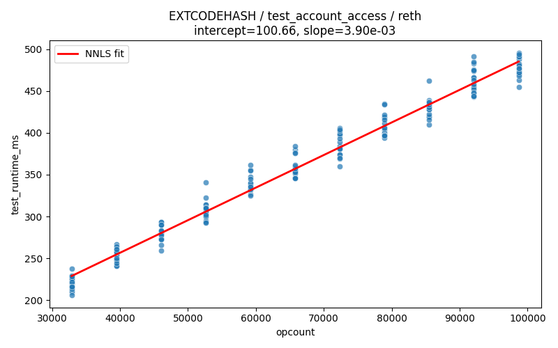

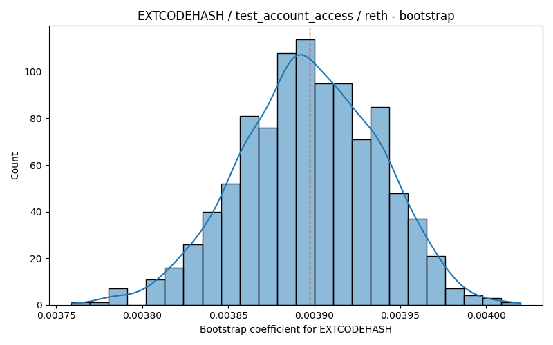

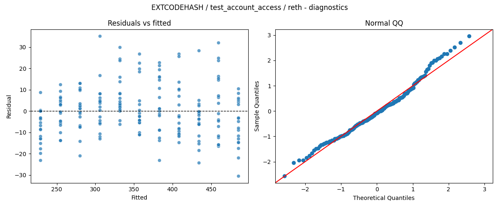

</details>

### test_account_access — combo `EXTCODEHASH_AccountMode.NON_EXISTING_ACCOUNT` — `presets[cold_account_code_access]`

| client | nobs | R² | target_coef (ms) | p-value | 95% CI |
| --- | --- | --- | --- | --- | --- |
| `besu` | 253 | 0.892 | 0.01354 | 1.00e-03 | [0.01297, 0.01411] |
| `erigon` | 110 | 0.971 | 0.007631 | 1.00e-03 | [0.007394, 0.007773] |
| `ethrex` | 176 | 0.9525 | 0.001932 | 1.00e-03 | [0.001878, 0.001983] |
| `geth` | 154 | 0.8557 | 0.02175 | 1.00e-03 | [0.02026, 0.02323] |
| `nethermind` | 132 | 0.7571 | 0.003782 | 1.00e-03 | [0.003366, 0.004182] |
| `reth` | 198 | 0.9184 | 0.0007754 | 1.00e-03 | [0.0007427, 0.0008088] |

<details><summary>besu — NNLS regression summary</summary>

```
==============================================================================
                           NNLS Regression Results                            
==============================================================================
Dep. Variable:          test_runtime_ms              R-squared:          0.892
Model:                  NNLS                    Adj. R-squared:          0.892
No. Observations:       253                               RMSE:         112.56
Df Residuals:           251                                MAE:         100.65
Df Model:               1      
==============================================================================
                      coef     std err     P-value      [0.025      0.975]
------------------------------------------------------------------------------
         const    491.6102     22.8622       0.001    446.5602    535.3765
       opcount      0.0135      0.0003       0.001      0.0130      0.0141
==============================================================================
Notes: Non-negative least squares with bootstrap inference (1000 iterations)
==============================================================================
```


</details>

<details><summary>erigon — NNLS regression summary</summary>

```
==============================================================================
                           NNLS Regression Results                            
==============================================================================
Dep. Variable:          test_runtime_ms              R-squared:          0.971
Model:                  NNLS                    Adj. R-squared:          0.971
No. Observations:       110                               RMSE:          31.51
Df Residuals:           108                                MAE:          23.91
Df Model:               1      
==============================================================================
                      coef     std err     P-value      [0.025      0.975]
------------------------------------------------------------------------------
         const      5.8474      6.7509       0.225      0.0000     23.0235
       opcount      0.0076      0.0001       0.001      0.0074      0.0078
==============================================================================
Notes: Non-negative least squares with bootstrap inference (1000 iterations)
==============================================================================
```


</details>

<details><summary>ethrex — NNLS regression summary</summary>

```
==============================================================================
                           NNLS Regression Results                            
==============================================================================
Dep. Variable:          test_runtime_ms              R-squared:          0.952
Model:                  NNLS                    Adj. R-squared:          0.952
No. Observations:       176                               RMSE:          10.31
Df Residuals:           174                                MAE:           7.18
Df Model:               1      
==============================================================================
                      coef     std err     P-value      [0.025      0.975]
------------------------------------------------------------------------------
         const     26.8085      2.3908       0.001     22.5481     31.5128
       opcount      0.0019      0.0000       0.001      0.0019      0.0020
==============================================================================
Notes: Non-negative least squares with bootstrap inference (1000 iterations)
==============================================================================
```


</details>

<details><summary>geth — NNLS regression summary</summary>

```
==============================================================================
                           NNLS Regression Results                            
==============================================================================
Dep. Variable:          test_runtime_ms              R-squared:          0.856
Model:                  NNLS                    Adj. R-squared:          0.855
No. Observations:       154                               RMSE:         213.39
Df Residuals:           152                                MAE:         182.00
Df Model:               1      
==============================================================================
                      coef     std err     P-value      [0.025      0.975]
------------------------------------------------------------------------------
         const    711.5352     65.7361       0.001    587.9844    848.2501
       opcount      0.0217      0.0008       0.001      0.0203      0.0232
==============================================================================
Notes: Non-negative least squares with bootstrap inference (1000 iterations)
==============================================================================
```


</details>

<details><summary>nethermind — NNLS regression summary</summary>

```
==============================================================================
                           NNLS Regression Results                            
==============================================================================
Dep. Variable:          test_runtime_ms              R-squared:          0.757
Model:                  NNLS                    Adj. R-squared:          0.755
No. Observations:       132                               RMSE:          51.19
Df Residuals:           130                                MAE:          39.66
Df Model:               1      
==============================================================================
                      coef     std err     P-value      [0.025      0.975]
------------------------------------------------------------------------------
         const     90.0595     15.2779       0.001     61.2659    121.0065
       opcount      0.0038      0.0002       0.001      0.0034      0.0042
==============================================================================
Notes: Non-negative least squares with bootstrap inference (1000 iterations)
==============================================================================
```


</details>

<details><summary>reth — NNLS regression summary</summary>

```
==============================================================================
                           NNLS Regression Results                            
==============================================================================
Dep. Variable:          test_runtime_ms              R-squared:          0.918
Model:                  NNLS                    Adj. R-squared:          0.918
No. Observations:       198                               RMSE:           5.52
Df Residuals:           196                                MAE:           4.37
Df Model:               1      
==============================================================================
                      coef     std err     P-value      [0.025      0.975]
------------------------------------------------------------------------------
         const     43.5497      1.2493       0.001     41.1021     45.9175
       opcount      0.0008      0.0000       0.001      0.0007      0.0008
==============================================================================
Notes: Non-negative least squares with bootstrap inference (1000 iterations)
==============================================================================
```


</details>

### test_ext_account_query_warm — combo `EXTCODEHASH`

| client | nobs | R² | target_coef (ms) | p-value | 95% CI |
| --- | --- | --- | --- | --- | --- |
| `besu` | 253 | 0.2966 | 0.0002239 | 1.00e-03 | [0.0001805, 0.0002702] |
| `erigon` | 110 | 0.9268 | 0.0002878 | 1.00e-03 | [0.0002743, 0.0003035] |
| `ethrex` | 176 | 0.7343 | 1.535e-05 | 1.00e-03 | [1.383e-05, 1.691e-05] |
| `geth` | 154 | 0.863 | 3.871e-05 | 1.00e-03 | [3.664e-05, 4.068e-05] |
| `nethermind` | 132 | 0.5701 | 0.0002326 | 1.00e-03 | [0.0001987, 0.0002669] |
| `reth` | 198 | 0.484 | 1.427e-05 | 1.00e-03 | [1.231e-05, 1.644e-05] |

<details><summary>besu — NNLS regression summary</summary>

```
==============================================================================
                           NNLS Regression Results                            
==============================================================================
Dep. Variable:          test_runtime_ms              R-squared:          0.297
Model:                  NNLS                    Adj. R-squared:          0.294
No. Observations:       253                               RMSE:         201.65
Df Residuals:           251                                MAE:         169.67
Df Model:               1      
==============================================================================
                      coef     std err     P-value      [0.025      0.975]
------------------------------------------------------------------------------
         const    468.0312     41.3967       0.001    385.5986    548.0894
       opcount      0.0002      0.0000       0.001      0.0002      0.0003
==============================================================================
Notes: Non-negative least squares with bootstrap inference (1000 iterations)
==============================================================================
```

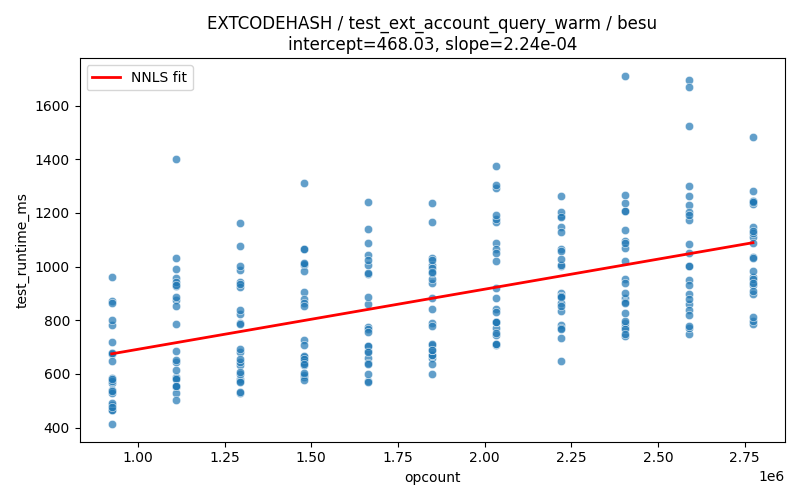

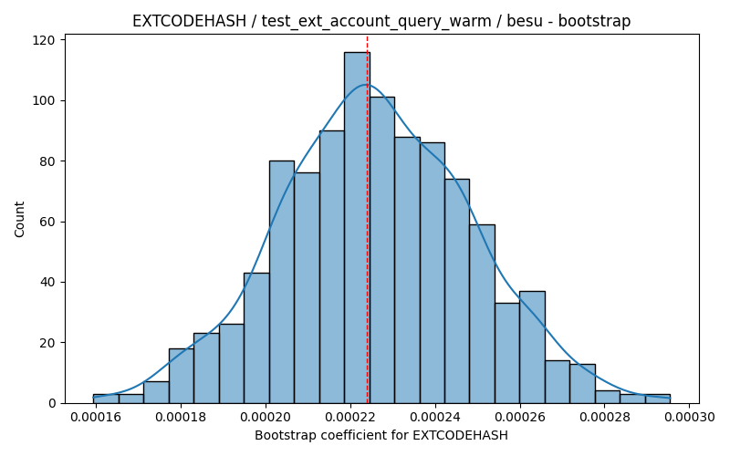

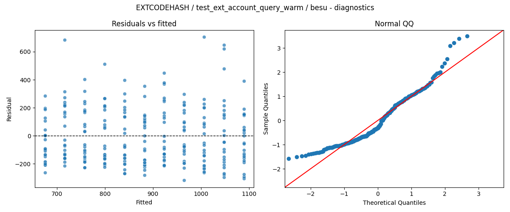

</details>

<details><summary>erigon — NNLS regression summary</summary>

```
==============================================================================
                           NNLS Regression Results                            
==============================================================================
Dep. Variable:          test_runtime_ms              R-squared:          0.927
Model:                  NNLS                    Adj. R-squared:          0.926
No. Observations:       110                               RMSE:          47.30
Df Residuals:           108                                MAE:          34.85
Df Model:               1      
==============================================================================
                      coef     std err     P-value      [0.025      0.975]
------------------------------------------------------------------------------
         const     32.0760     12.3965       0.007      6.6848     54.7279
       opcount      0.0003      0.0000       0.001      0.0003      0.0003
==============================================================================
Notes: Non-negative least squares with bootstrap inference (1000 iterations)
==============================================================================
```

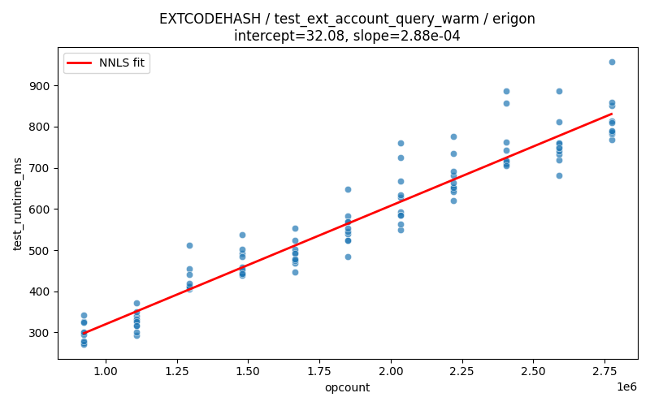

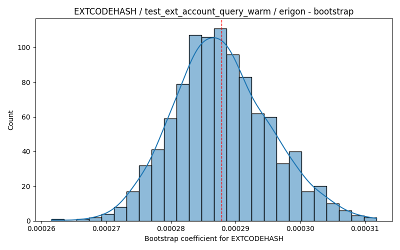

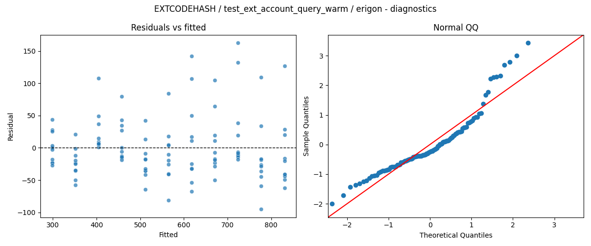

</details>

<details><summary>ethrex — NNLS regression summary</summary>

```
==============================================================================
                           NNLS Regression Results                            
==============================================================================
Dep. Variable:          test_runtime_ms              R-squared:          0.734
Model:                  NNLS                    Adj. R-squared:          0.733
No. Observations:       176                               RMSE:           5.40
Df Residuals:           174                                MAE:           3.89
Df Model:               1      
==============================================================================
                      coef     std err     P-value      [0.025      0.975]
------------------------------------------------------------------------------
         const      7.6144      1.2613       0.001      5.2113     10.0629
       opcount      0.0000      0.0000       0.001      0.0000      0.0000
==============================================================================
Notes: Non-negative least squares with bootstrap inference (1000 iterations)
==============================================================================
```

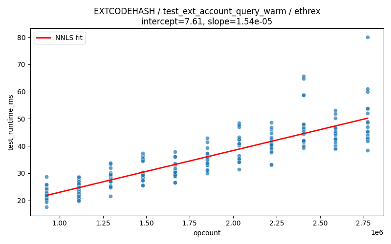

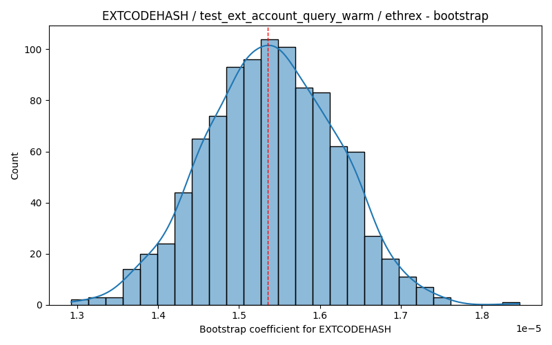

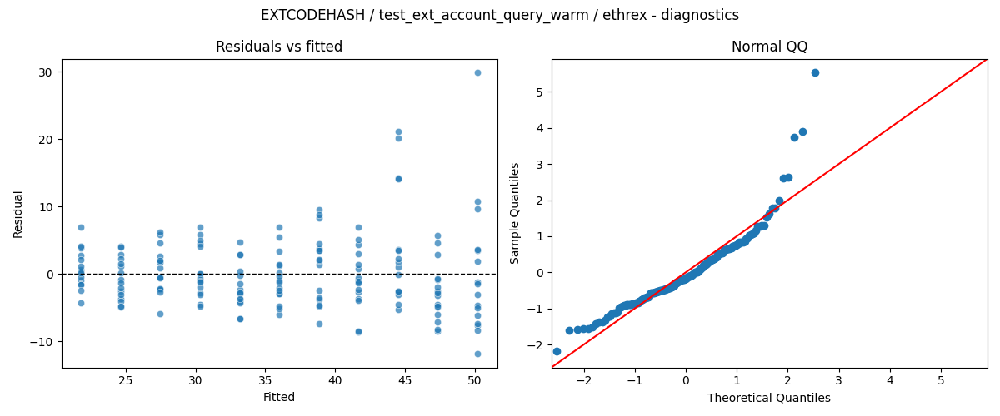

</details>

<details><summary>geth — NNLS regression summary</summary>

```
==============================================================================
                           NNLS Regression Results                            
==============================================================================
Dep. Variable:          test_runtime_ms              R-squared:          0.863
Model:                  NNLS                    Adj. R-squared:          0.862
No. Observations:       154                               RMSE:           9.02
Df Residuals:           152                                MAE:           6.77
Df Model:               1      
==============================================================================
                      coef     std err     P-value      [0.025      0.975]
------------------------------------------------------------------------------
         const     21.5438      1.8605       0.001     17.9620     25.3013
       opcount      0.0000      0.0000       0.001      0.0000      0.0000
==============================================================================
Notes: Non-negative least squares with bootstrap inference (1000 iterations)
==============================================================================
```

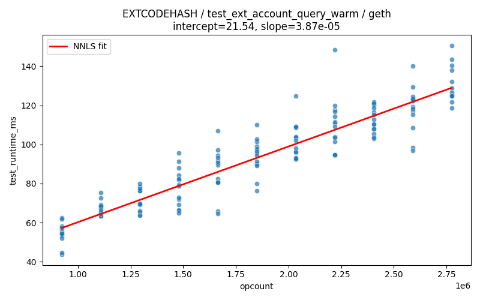

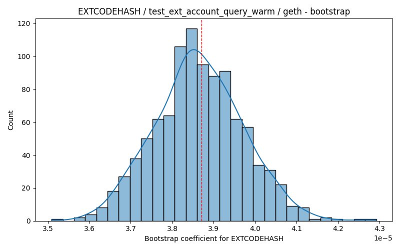

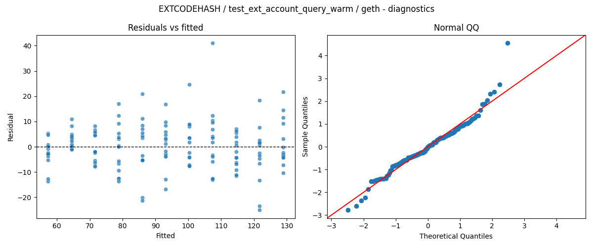

</details>

<details><summary>nethermind — NNLS regression summary</summary>

```
==============================================================================
                           NNLS Regression Results                            
==============================================================================
Dep. Variable:          test_runtime_ms              R-squared:          0.570
Model:                  NNLS                    Adj. R-squared:          0.567
No. Observations:       132                               RMSE:         118.10
Df Residuals:           130                                MAE:          94.33
Df Model:               1      
==============================================================================
                      coef     std err     P-value      [0.025      0.975]
------------------------------------------------------------------------------
         const    173.1531     29.9077       0.001    114.3510    232.2024
       opcount      0.0002      0.0000       0.001      0.0002      0.0003
==============================================================================
Notes: Non-negative least squares with bootstrap inference (1000 iterations)
==============================================================================
```

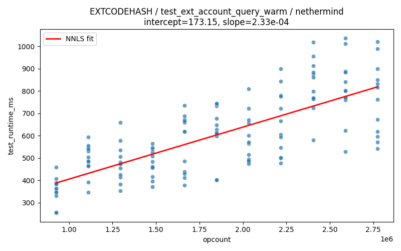

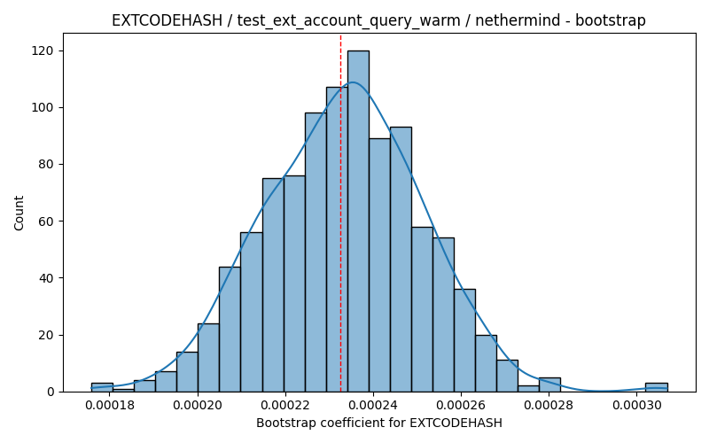

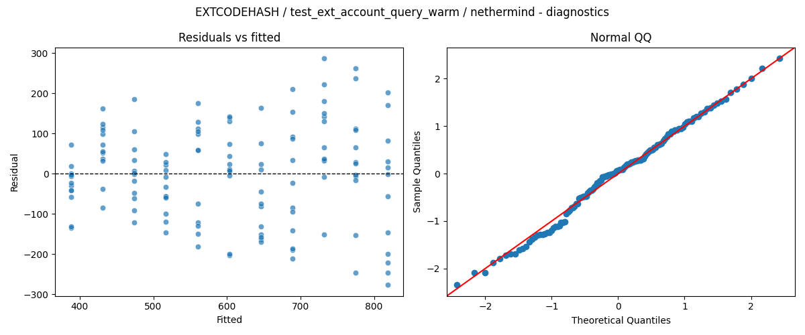

</details>

<details><summary>reth — NNLS regression summary</summary>

```
==============================================================================
                           NNLS Regression Results                            
==============================================================================
Dep. Variable:          test_runtime_ms              R-squared:          0.484
Model:                  NNLS                    Adj. R-squared:          0.481
No. Observations:       198                               RMSE:           8.62
Df Residuals:           196                                MAE:           5.09
Df Model:               1      
==============================================================================
                      coef     std err     P-value      [0.025      0.975]
------------------------------------------------------------------------------
         const      8.4351      1.7311       0.001      5.0714     11.6070
       opcount      0.0000      0.0000       0.001      0.0000      0.0000
==============================================================================
Notes: Non-negative least squares with bootstrap inference (1000 iterations)
==============================================================================
```

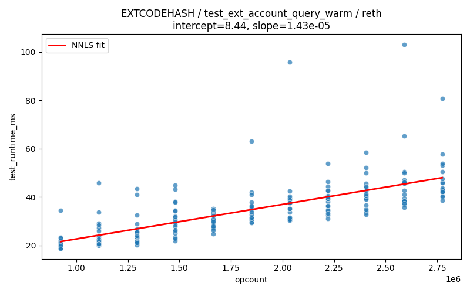

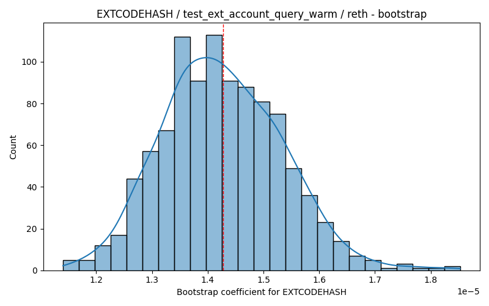

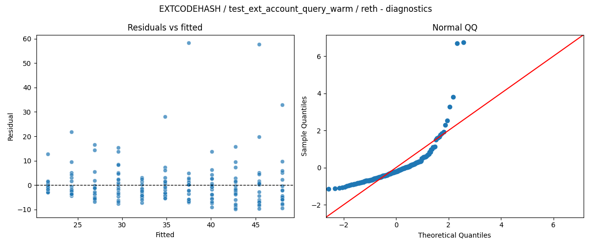

</details>

## EXTCODESIZE

### test_account_access — combo `EXTCODESIZE_AccountMode.NON_EXISTING_ACCOUNT` — `presets[cold_account_nocode_access]`

| client | nobs | R² | target_coef (ms) | p-value | 95% CI |
| --- | --- | --- | --- | --- | --- |
| `besu` | 253 | 0.8866 | 0.01331 | 1.00e-03 | [0.01273, 0.01396] |
| `erigon` | 110 | 0.9754 | 0.007725 | 1.00e-03 | [0.007493, 0.00793] |
| `ethrex` | 176 | 0.966 | 0.001917 | 1.00e-03 | [0.001865, 0.001968] |
| `geth` | 154 | 0.8634 | 0.02161 | 1.00e-03 | [0.02003, 0.02313] |
| `nethermind` | 132 | 0.6901 | 0.004051 | 1.00e-03 | [0.00359, 0.004571] |
| `reth` | 198 | 0.9006 | 0.0007283 | 1.00e-03 | [0.0006948, 0.0007628] |

<details><summary>besu — NNLS regression summary</summary>

```
==============================================================================
                           NNLS Regression Results                            
==============================================================================
Dep. Variable:          test_runtime_ms              R-squared:          0.887
Model:                  NNLS                    Adj. R-squared:          0.886
No. Observations:       253                               RMSE:         113.80
Df Residuals:           251                                MAE:         102.20
Df Model:               1      
==============================================================================
                      coef     std err     P-value      [0.025      0.975]
------------------------------------------------------------------------------
         const    504.1988     24.3949       0.001    453.3578    548.9915
       opcount      0.0133      0.0003       0.001      0.0127      0.0140
==============================================================================
Notes: Non-negative least squares with bootstrap inference (1000 iterations)
==============================================================================
```

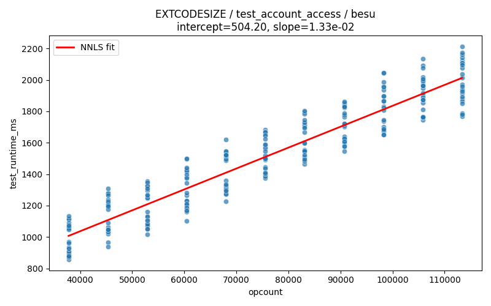

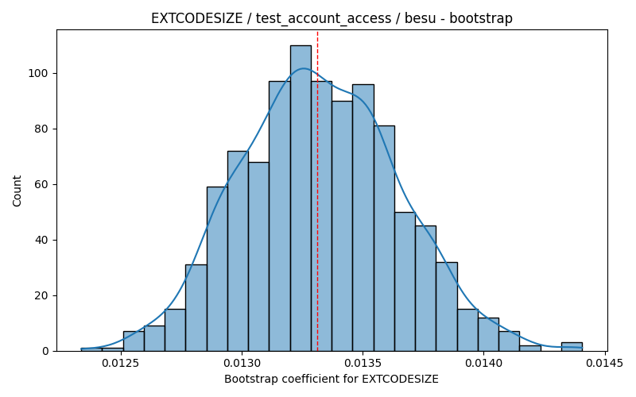

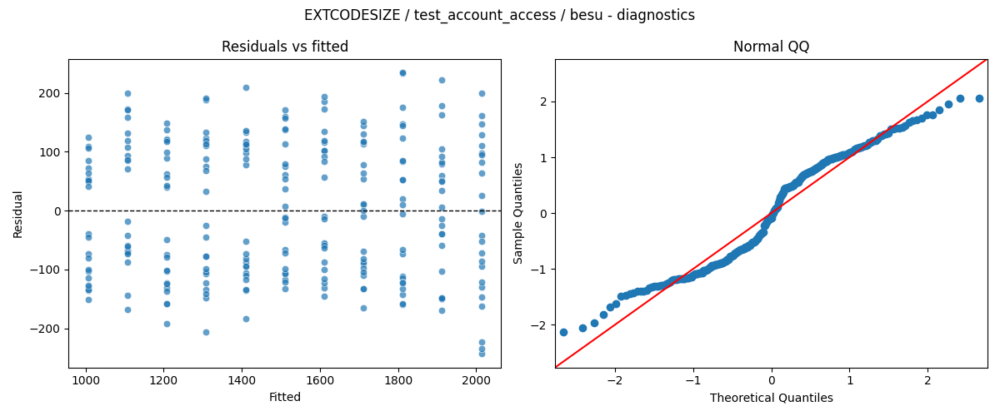

</details>

<details><summary>erigon — NNLS regression summary</summary>

```
==============================================================================
                           NNLS Regression Results                            
==============================================================================
Dep. Variable:          test_runtime_ms              R-squared:          0.975
Model:                  NNLS                    Adj. R-squared:          0.975
No. Observations:       110                               RMSE:          29.32
Df Residuals:           108                                MAE:          21.10
Df Model:               1      
==============================================================================
                      coef     std err     P-value      [0.025      0.975]
------------------------------------------------------------------------------
         const     12.4156      8.2487       0.080      0.0000     29.9024
       opcount      0.0077      0.0001       0.001      0.0075      0.0079
==============================================================================
Notes: Non-negative least squares with bootstrap inference (1000 iterations)
==============================================================================
```

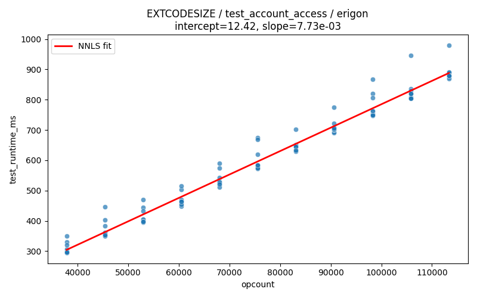

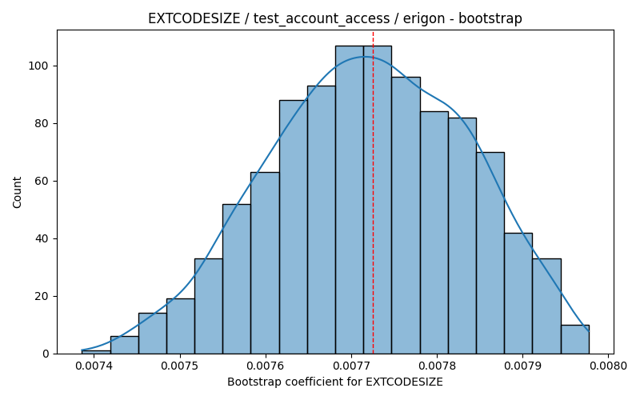

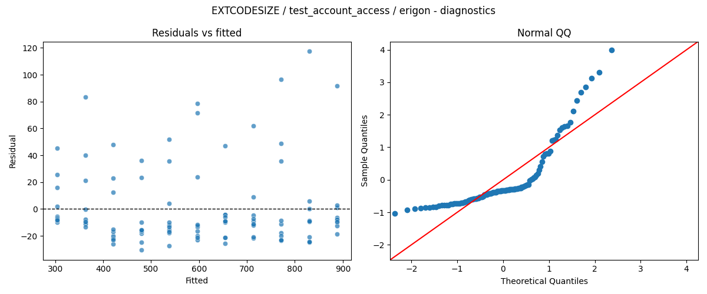

</details>

<details><summary>ethrex — NNLS regression summary</summary>

```
==============================================================================
                           NNLS Regression Results                            
==============================================================================
Dep. Variable:          test_runtime_ms              R-squared:          0.966
Model:                  NNLS                    Adj. R-squared:          0.966
No. Observations:       176                               RMSE:           8.60
Df Residuals:           174                                MAE:           6.78
Df Model:               1      
==============================================================================
                      coef     std err     P-value      [0.025      0.975]
------------------------------------------------------------------------------
         const     26.5866      1.9256       0.001     23.0109     30.4296
       opcount      0.0019      0.0000       0.001      0.0019      0.0020
==============================================================================
Notes: Non-negative least squares with bootstrap inference (1000 iterations)
==============================================================================
```


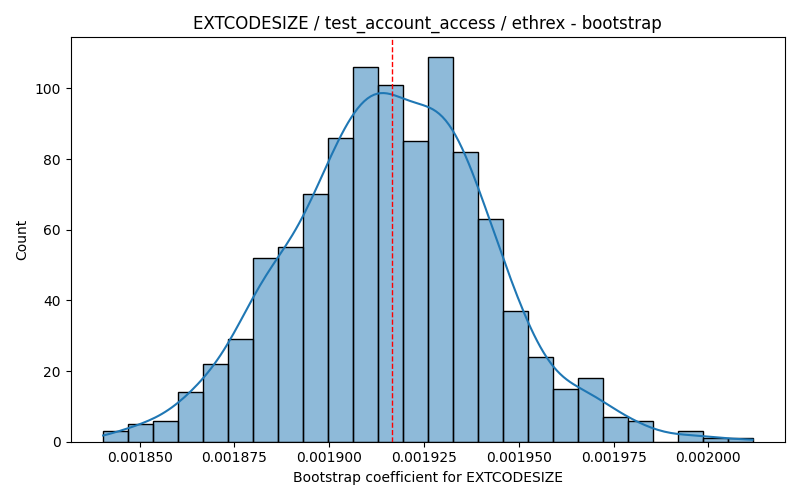

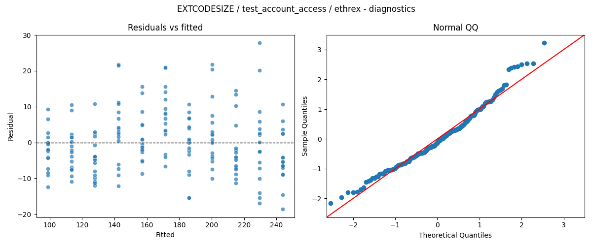

</details>

<details><summary>geth — NNLS regression summary</summary>

```
==============================================================================
                           NNLS Regression Results                            
==============================================================================
Dep. Variable:          test_runtime_ms              R-squared:          0.863
Model:                  NNLS                    Adj. R-squared:          0.862
No. Observations:       154                               RMSE:         205.44
Df Residuals:           152                                MAE:         174.19
Df Model:               1      
==============================================================================
                      coef     std err     P-value      [0.025      0.975]
------------------------------------------------------------------------------
         const    723.6600     65.4813       0.001    593.5608    855.3894
       opcount      0.0216      0.0008       0.001      0.0200      0.0231
==============================================================================
Notes: Non-negative least squares with bootstrap inference (1000 iterations)
==============================================================================
```

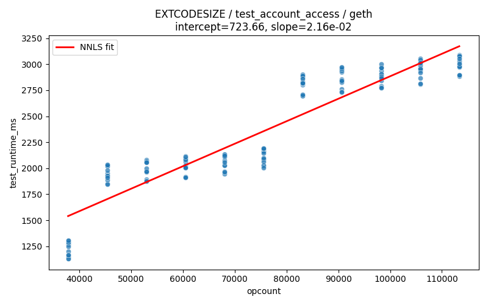

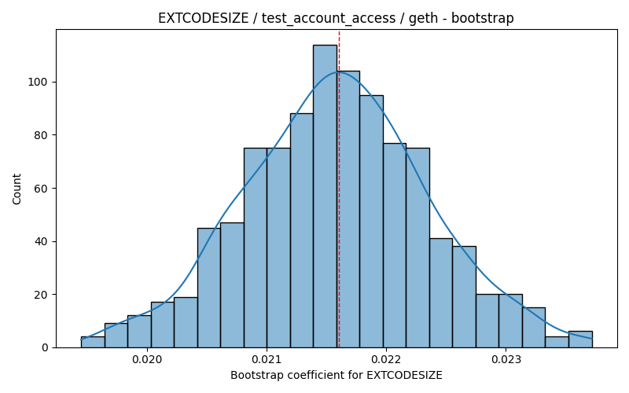

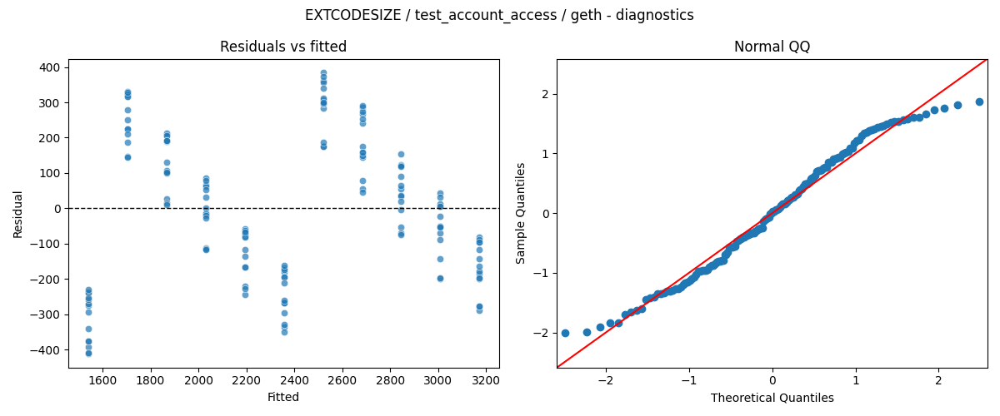

</details>

<details><summary>nethermind — NNLS regression summary</summary>

```
==============================================================================
                           NNLS Regression Results                            
==============================================================================
Dep. Variable:          test_runtime_ms              R-squared:          0.690
Model:                  NNLS                    Adj. R-squared:          0.688
No. Observations:       132                               RMSE:          64.88
Df Residuals:           130                                MAE:          41.53
Df Model:               1      
==============================================================================
                      coef     std err     P-value      [0.025      0.975]
------------------------------------------------------------------------------
         const     69.4569     16.1210       0.001     36.2840     98.5081
       opcount      0.0041      0.0003       0.001      0.0036      0.0046
==============================================================================
Notes: Non-negative least squares with bootstrap inference (1000 iterations)
==============================================================================
```

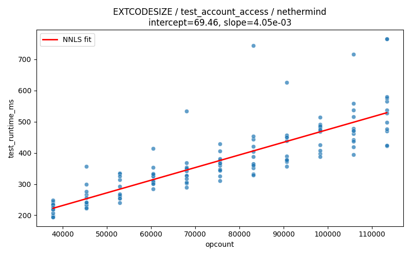

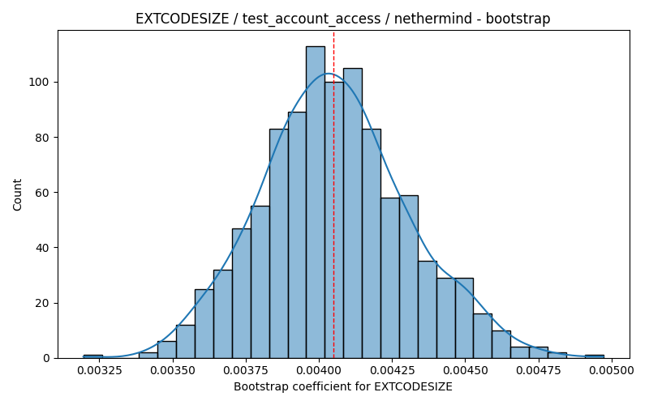

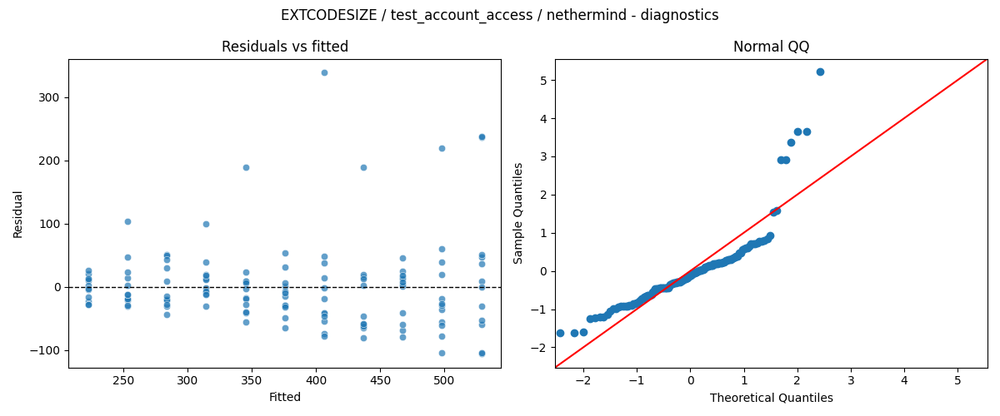

</details>

<details><summary>reth — NNLS regression summary</summary>

```
==============================================================================
                           NNLS Regression Results                            
==============================================================================
Dep. Variable:          test_runtime_ms              R-squared:          0.901
Model:                  NNLS                    Adj. R-squared:          0.900
No. Observations:       198                               RMSE:           5.78
Df Residuals:           196                                MAE:           4.61
Df Model:               1      
==============================================================================
                      coef     std err     P-value      [0.025      0.975]
------------------------------------------------------------------------------
         const     46.4355      1.3622       0.001     43.7146     49.1070
       opcount      0.0007      0.0000       0.001      0.0007      0.0008
==============================================================================
Notes: Non-negative least squares with bootstrap inference (1000 iterations)
==============================================================================
```

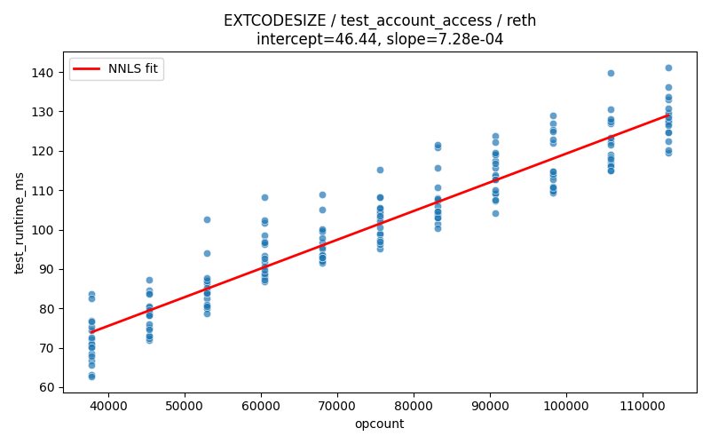

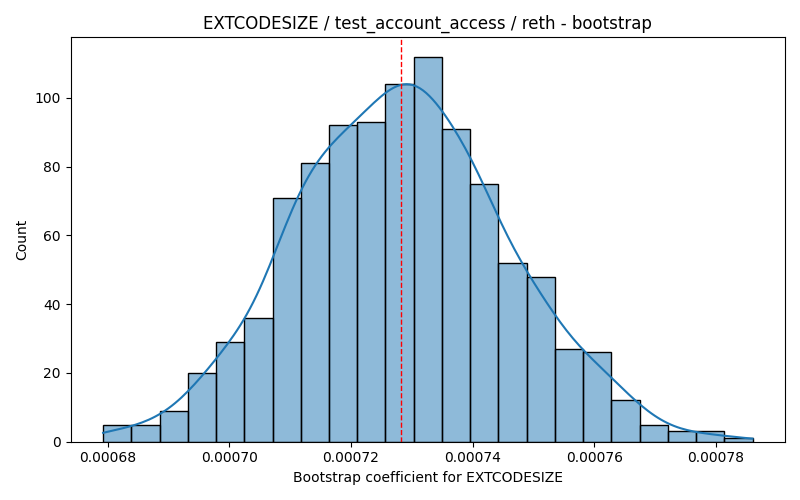

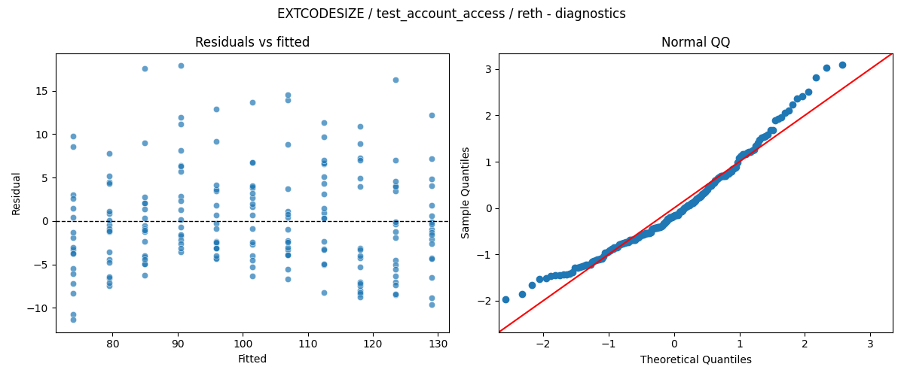

</details>

### test_account_access — combo `EXTCODESIZE_AccountMode.EXISTING_CONTRACT`

| client | nobs | R² | target_coef (ms) | p-value | 95% CI |
| --- | --- | --- | --- | --- | --- |
| `besu` | 253 | 0.9032 | 0.02572 | 1.00e-03 | [0.02476, 0.02667] |
| `erigon` | 110 | 0.8959 | 0.04874 | 1.00e-03 | [0.04579, 0.05163] |
| `ethrex` | 176 | 0.9929 | 0.007454 | 1.00e-03 | [0.00737, 0.007544] |
| `geth` | 154 | 0.8629 | 0.0233 | 1.00e-03 | [0.02179, 0.02486] |
| `nethermind` | 132 | 0.5514 | 0.01327 | 1.00e-03 | [0.01138, 0.01532] |
| `reth` | 198 | 0.9769 | 0.003964 | 1.00e-03 | [0.003875, 0.004061] |

<details><summary>besu — NNLS regression summary</summary>

```
==============================================================================
                           NNLS Regression Results                            
==============================================================================
Dep. Variable:          test_runtime_ms              R-squared:          0.903
Model:                  NNLS                    Adj. R-squared:          0.903
No. Observations:       253                               RMSE:         175.19
Df Residuals:           251                                MAE:         141.71
Df Model:               1      
==============================================================================
                      coef     std err     P-value      [0.025      0.975]
------------------------------------------------------------------------------
         const    532.4270     31.3110       0.001    471.6201    598.0716
       opcount      0.0257      0.0005       0.001      0.0248      0.0267
==============================================================================
Notes: Non-negative least squares with bootstrap inference (1000 iterations)
==============================================================================
```

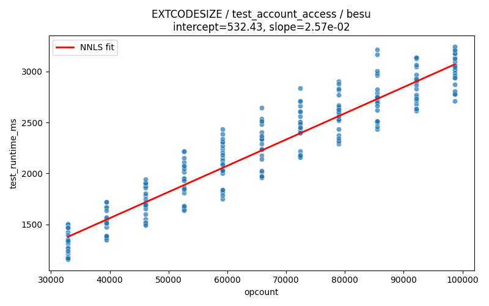

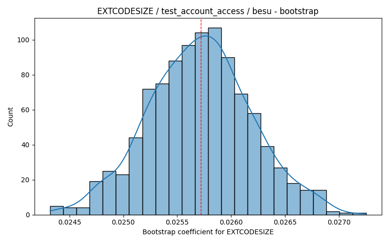

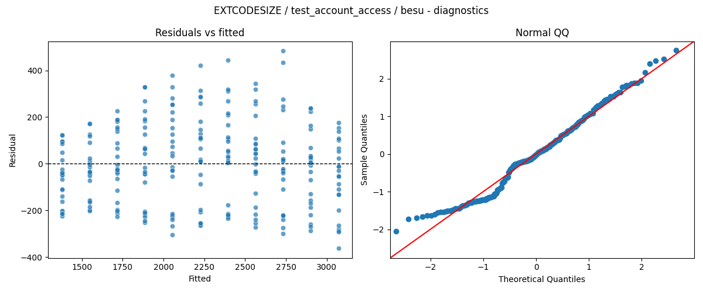

</details>

<details><summary>erigon — NNLS regression summary</summary>

```
==============================================================================
                           NNLS Regression Results                            
==============================================================================
Dep. Variable:          test_runtime_ms              R-squared:          0.896
Model:                  NNLS                    Adj. R-squared:          0.895
No. Observations:       110                               RMSE:         345.69
Df Residuals:           108                                MAE:         297.41
Df Model:               1      
==============================================================================
                      coef     std err     P-value      [0.025      0.975]
------------------------------------------------------------------------------
         const    833.0967    111.6134       0.001    620.0577   1061.3466
       opcount      0.0487      0.0015       0.001      0.0458      0.0516
==============================================================================
Notes: Non-negative least squares with bootstrap inference (1000 iterations)
==============================================================================
```

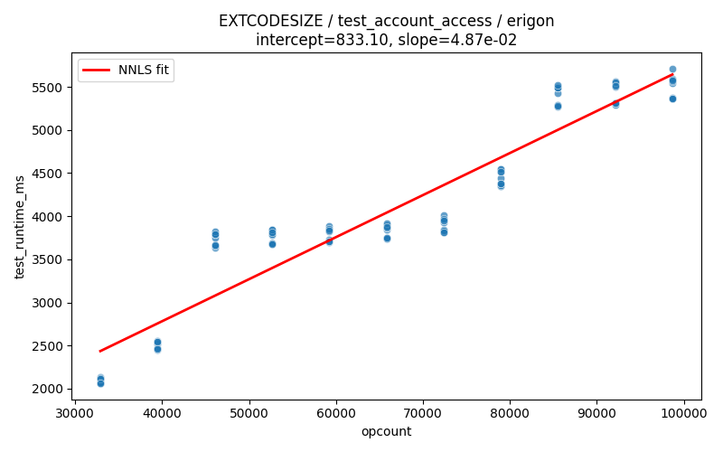

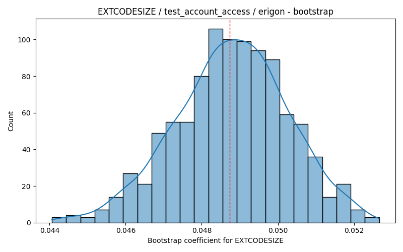

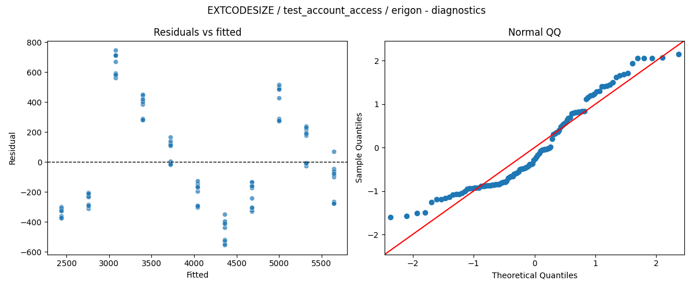

</details>

<details><summary>ethrex — NNLS regression summary</summary>

```
==============================================================================
                           NNLS Regression Results                            
==============================================================================
Dep. Variable:          test_runtime_ms              R-squared:          0.993
Model:                  NNLS                    Adj. R-squared:          0.993
No. Observations:       176                               RMSE:          13.14
Df Residuals:           174                                MAE:          10.11
Df Model:               1      
==============================================================================
                      coef     std err     P-value      [0.025      0.975]
------------------------------------------------------------------------------
         const     42.2296      2.9556       0.001     36.3112     47.7673
       opcount      0.0075      0.0000       0.001      0.0074      0.0075
==============================================================================
Notes: Non-negative least squares with bootstrap inference (1000 iterations)
==============================================================================
```

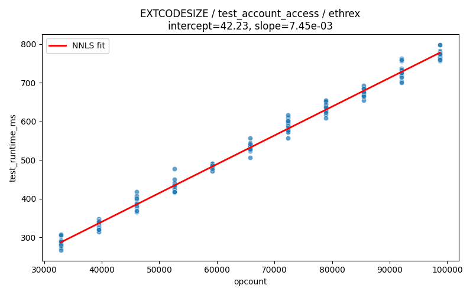

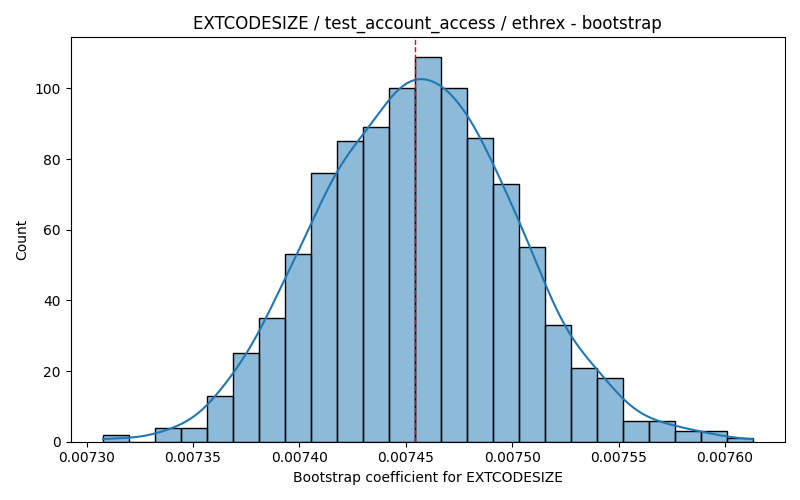

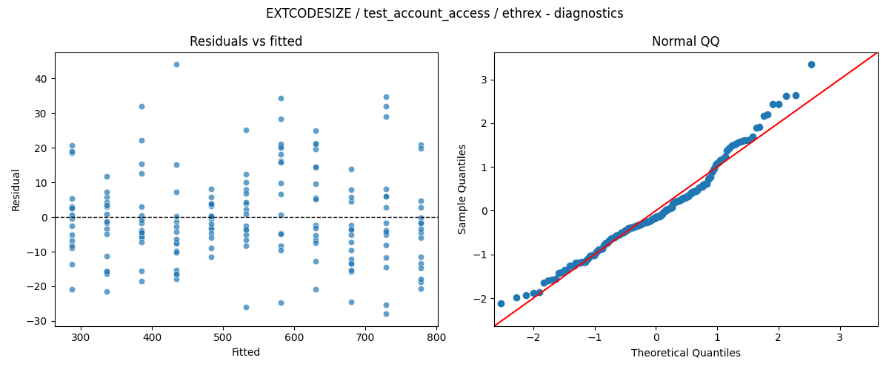

</details>

<details><summary>geth — NNLS regression summary</summary>

```
==============================================================================
                           NNLS Regression Results                            
==============================================================================
Dep. Variable:          test_runtime_ms              R-squared:          0.863
Model:                  NNLS                    Adj. R-squared:          0.862
No. Observations:       154                               RMSE:         193.26
Df Residuals:           152                                MAE:         162.89
Df Model:               1      
==============================================================================
                      coef     std err     P-value      [0.025      0.975]
------------------------------------------------------------------------------
         const    665.1640     59.7407       0.001    551.2094    780.6355
       opcount      0.0233      0.0008       0.001      0.0218      0.0249
==============================================================================
Notes: Non-negative least squares with bootstrap inference (1000 iterations)
==============================================================================
```

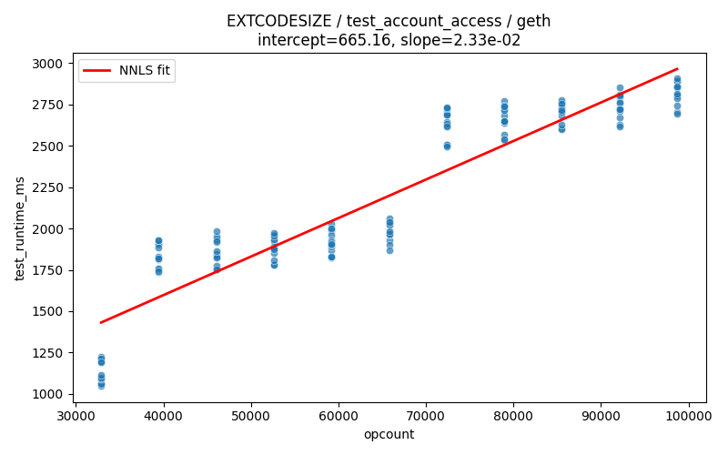

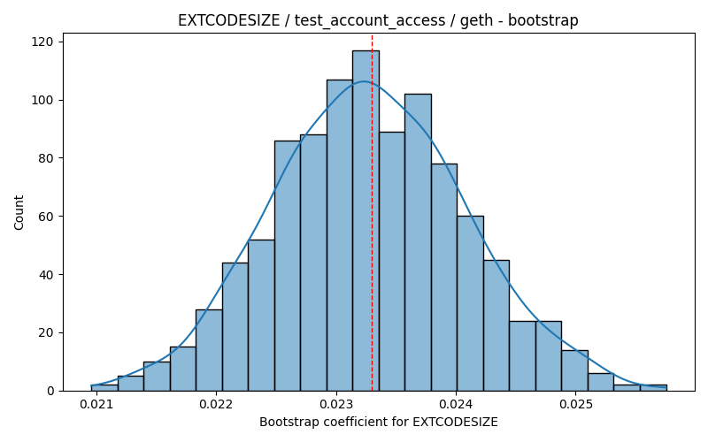

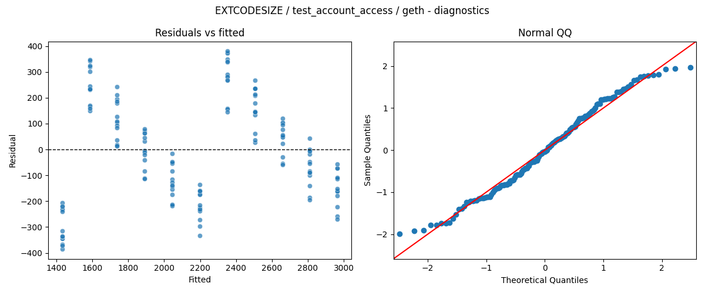

</details>

<details><summary>nethermind — NNLS regression summary</summary>

```
==============================================================================
                           NNLS Regression Results                            
==============================================================================
Dep. Variable:          test_runtime_ms              R-squared:          0.551
Model:                  NNLS                    Adj. R-squared:          0.548
No. Observations:       132                               RMSE:         248.92
Df Residuals:           130                                MAE:         183.87
Df Model:               1      
==============================================================================
                      coef     std err     P-value      [0.025      0.975]
------------------------------------------------------------------------------
         const    154.3437     59.0886       0.003     31.5797    266.3140
       opcount      0.0133      0.0010       0.001      0.0114      0.0153
==============================================================================
Notes: Non-negative least squares with bootstrap inference (1000 iterations)
==============================================================================
```

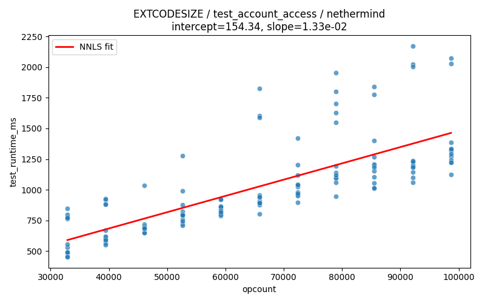

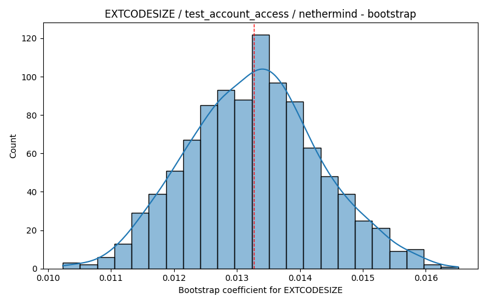

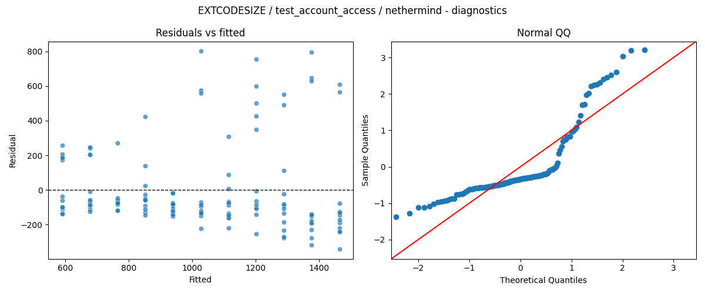

</details>

<details><summary>reth — NNLS regression summary</summary>

```
==============================================================================
                           NNLS Regression Results                            
==============================================================================
Dep. Variable:          test_runtime_ms              R-squared:          0.977
Model:                  NNLS                    Adj. R-squared:          0.977
No. Observations:       198                               RMSE:          12.68
Df Residuals:           196                                MAE:           9.85
Df Model:               1      
==============================================================================
                      coef     std err     P-value      [0.025      0.975]
------------------------------------------------------------------------------
         const     96.3039      2.9150       0.001     90.5786    101.6950
       opcount      0.0040      0.0000       0.001      0.0039      0.0041
==============================================================================
Notes: Non-negative least squares with bootstrap inference (1000 iterations)
==============================================================================
```

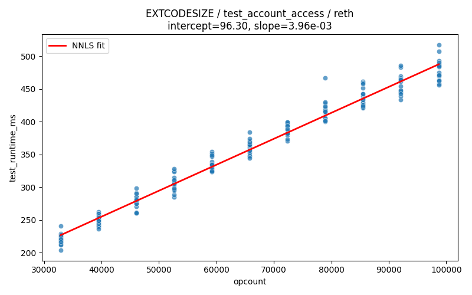

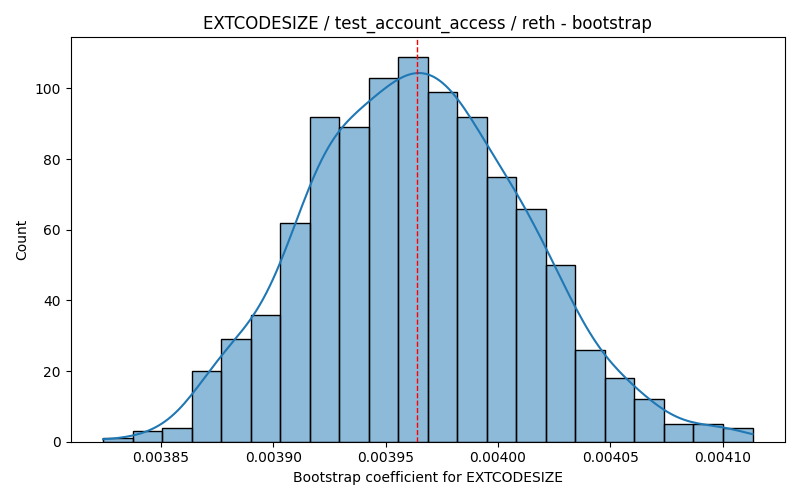

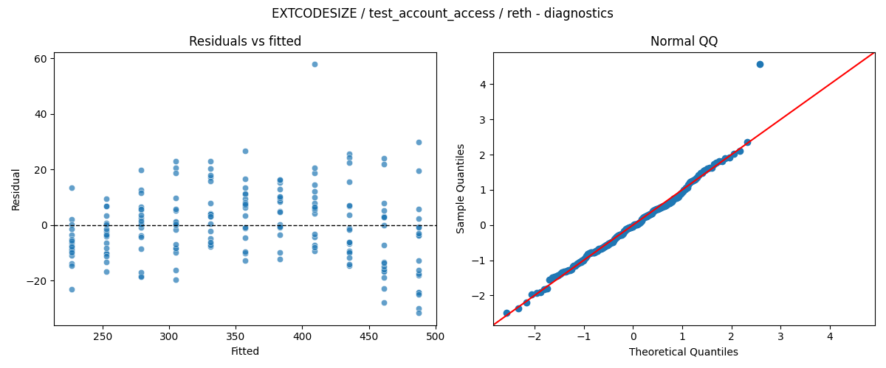

</details>

### test_account_access — combo `EXTCODESIZE_AccountMode.NON_EXISTING_ACCOUNT` — `presets[cold_account_code_access]`

| client | nobs | R² | target_coef (ms) | p-value | 95% CI |
| --- | --- | --- | --- | --- | --- |
| `besu` | 253 | 0.8866 | 0.01331 | 1.00e-03 | [0.01273, 0.01396] |
| `erigon` | 110 | 0.9754 | 0.007725 | 1.00e-03 | [0.007493, 0.00793] |
| `ethrex` | 176 | 0.966 | 0.001917 | 1.00e-03 | [0.001865, 0.001968] |
| `geth` | 154 | 0.8634 | 0.02161 | 1.00e-03 | [0.02003, 0.02313] |
| `nethermind` | 132 | 0.6901 | 0.004051 | 1.00e-03 | [0.00359, 0.004571] |
| `reth` | 198 | 0.9006 | 0.0007283 | 1.00e-03 | [0.0006948, 0.0007628] |

<details><summary>besu — NNLS regression summary</summary>

```
==============================================================================
                           NNLS Regression Results                            
==============================================================================
Dep. Variable:          test_runtime_ms              R-squared:          0.887
Model:                  NNLS                    Adj. R-squared:          0.886
No. Observations:       253                               RMSE:         113.80
Df Residuals:           251                                MAE:         102.20
Df Model:               1      
==============================================================================
                      coef     std err     P-value      [0.025      0.975]
------------------------------------------------------------------------------
         const    504.1988     24.3949       0.001    453.3578    548.9915
       opcount      0.0133      0.0003       0.001      0.0127      0.0140
==============================================================================
Notes: Non-negative least squares with bootstrap inference (1000 iterations)
==============================================================================
```


</details>

<details><summary>erigon — NNLS regression summary</summary>

```
==============================================================================
                           NNLS Regression Results                            
==============================================================================
Dep. Variable:          test_runtime_ms              R-squared:          0.975
Model:                  NNLS                    Adj. R-squared:          0.975
No. Observations:       110                               RMSE:          29.32
Df Residuals:           108                                MAE:          21.10
Df Model:               1      
==============================================================================
                      coef     std err     P-value      [0.025      0.975]
------------------------------------------------------------------------------
         const     12.4156      8.2487       0.080      0.0000     29.9024
       opcount      0.0077      0.0001       0.001      0.0075      0.0079
==============================================================================
Notes: Non-negative least squares with bootstrap inference (1000 iterations)
==============================================================================
```


</details>

<details><summary>ethrex — NNLS regression summary</summary>

```
==============================================================================
                           NNLS Regression Results                            
==============================================================================
Dep. Variable:          test_runtime_ms              R-squared:          0.966
Model:                  NNLS                    Adj. R-squared:          0.966
No. Observations:       176                               RMSE:           8.60
Df Residuals:           174                                MAE:           6.78
Df Model:               1      
==============================================================================
                      coef     std err     P-value      [0.025      0.975]
------------------------------------------------------------------------------
         const     26.5866      1.9256       0.001     23.0109     30.4296
       opcount      0.0019      0.0000       0.001      0.0019      0.0020
==============================================================================
Notes: Non-negative least squares with bootstrap inference (1000 iterations)
==============================================================================
```


</details>

<details><summary>geth — NNLS regression summary</summary>

```
==============================================================================
                           NNLS Regression Results                            
==============================================================================
Dep. Variable:          test_runtime_ms              R-squared:          0.863
Model:                  NNLS                    Adj. R-squared:          0.862
No. Observations:       154                               RMSE:         205.44
Df Residuals:           152                                MAE:         174.19
Df Model:               1      
==============================================================================
                      coef     std err     P-value      [0.025      0.975]
------------------------------------------------------------------------------
         const    723.6600     65.4813       0.001    593.5608    855.3894
       opcount      0.0216      0.0008       0.001      0.0200      0.0231
==============================================================================
Notes: Non-negative least squares with bootstrap inference (1000 iterations)
==============================================================================
```


</details>

<details><summary>nethermind — NNLS regression summary</summary>

```
==============================================================================
                           NNLS Regression Results                            
==============================================================================
Dep. Variable:          test_runtime_ms              R-squared:          0.690
Model:                  NNLS                    Adj. R-squared:          0.688
No. Observations:       132                               RMSE:          64.88
Df Residuals:           130                                MAE:          41.53
Df Model:               1      
==============================================================================
                      coef     std err     P-value      [0.025      0.975]
------------------------------------------------------------------------------
         const     69.4569     16.1210       0.001     36.2840     98.5081
       opcount      0.0041      0.0003       0.001      0.0036      0.0046
==============================================================================
Notes: Non-negative least squares with bootstrap inference (1000 iterations)
==============================================================================
```


</details>

<details><summary>reth — NNLS regression summary</summary>

```
==============================================================================
                           NNLS Regression Results                            
==============================================================================
Dep. Variable:          test_runtime_ms              R-squared:          0.901
Model:                  NNLS                    Adj. R-squared:          0.900
No. Observations:       198                               RMSE:           5.78
Df Residuals:           196                                MAE:           4.61
Df Model:               1      
==============================================================================
                      coef     std err     P-value      [0.025      0.975]
------------------------------------------------------------------------------
         const     46.4355      1.3622       0.001     43.7146     49.1070
       opcount      0.0007      0.0000       0.001      0.0007      0.0008
==============================================================================
Notes: Non-negative least squares with bootstrap inference (1000 iterations)
==============================================================================
```


</details>

### test_ext_account_query_warm — combo `EXTCODESIZE`

| client | nobs | R² | target_coef (ms) | p-value | 95% CI |
| --- | --- | --- | --- | --- | --- |
| `besu` | 253 | 0.2867 | 0.0002222 | 1.00e-03 | [0.000176, 0.0002682] |
| `erigon` | 110 | 0.8871 | 4.396e-05 | 1.00e-03 | [4.089e-05, 4.696e-05] |
| `ethrex` | 176 | 0.7855 | 1.576e-05 | 1.00e-03 | [1.474e-05, 1.683e-05] |
| `geth` | 154 | 0.7489 | 2.852e-05 | 1.00e-03 | [2.588e-05, 3.126e-05] |
| `nethermind` | 132 | 0.719 | 0.0001626 | 1.00e-03 | [0.0001457, 0.0001803] |
| `reth` | 198 | 0.4341 | 9.509e-06 | 1.00e-03 | [7.956e-06, 1.113e-05] |

<details><summary>besu — NNLS regression summary</summary>

```
==============================================================================
                           NNLS Regression Results                            
==============================================================================
Dep. Variable:          test_runtime_ms              R-squared:          0.287
Model:                  NNLS                    Adj. R-squared:          0.284
No. Observations:       253                               RMSE:         204.92
Df Residuals:           251                                MAE:         172.33
Df Model:               1      
==============================================================================
                      coef     std err     P-value      [0.025      0.975]
------------------------------------------------------------------------------
         const    466.7973     45.1889       0.001    379.1593    556.0282
       opcount      0.0002      0.0000       0.001      0.0002      0.0003
==============================================================================
Notes: Non-negative least squares with bootstrap inference (1000 iterations)
==============================================================================
```

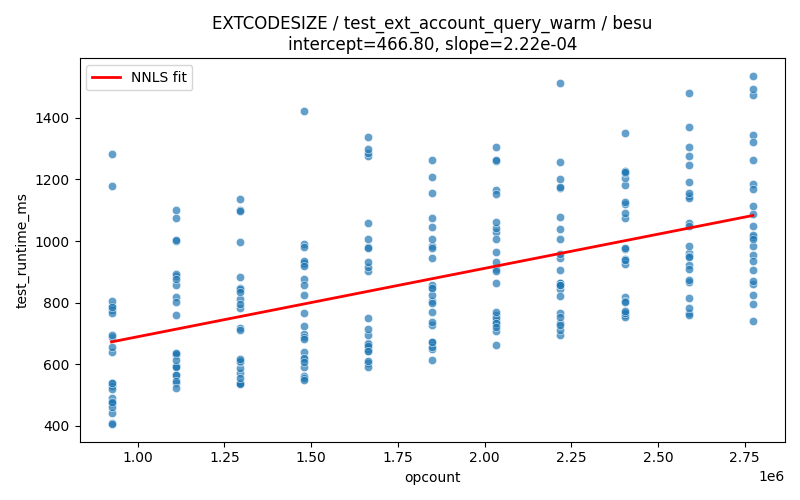

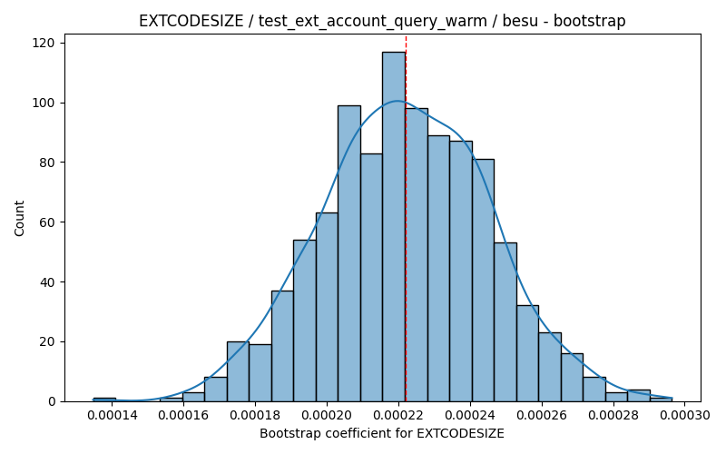

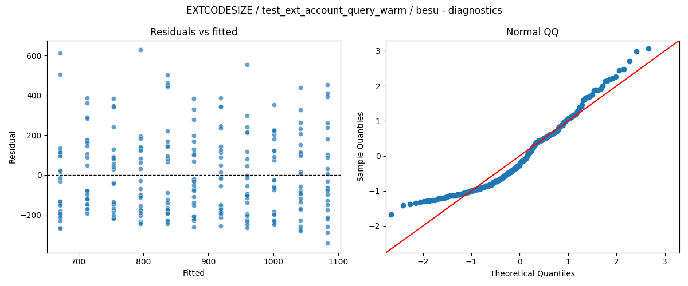

</details>

<details><summary>erigon — NNLS regression summary</summary>

```
==============================================================================
                           NNLS Regression Results                            
==============================================================================
Dep. Variable:          test_runtime_ms              R-squared:          0.887
Model:                  NNLS                    Adj. R-squared:          0.886
No. Observations:       110                               RMSE:           9.17
Df Residuals:           108                                MAE:           6.56
Df Model:               1      
==============================================================================
                      coef     std err     P-value      [0.025      0.975]
------------------------------------------------------------------------------
         const     23.5722      2.5597       0.001     18.6952     28.8332
       opcount      0.0000      0.0000       0.001      0.0000      0.0000
==============================================================================
Notes: Non-negative least squares with bootstrap inference (1000 iterations)
==============================================================================
```

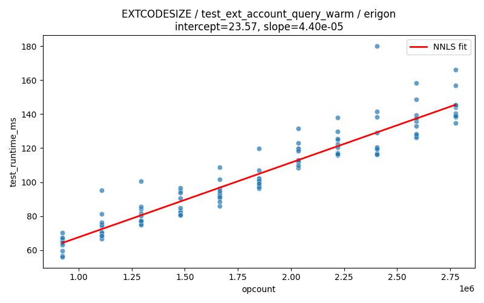

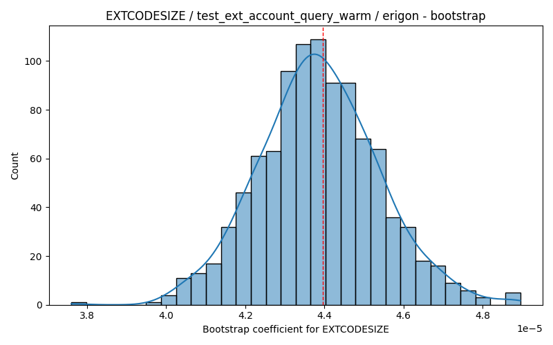

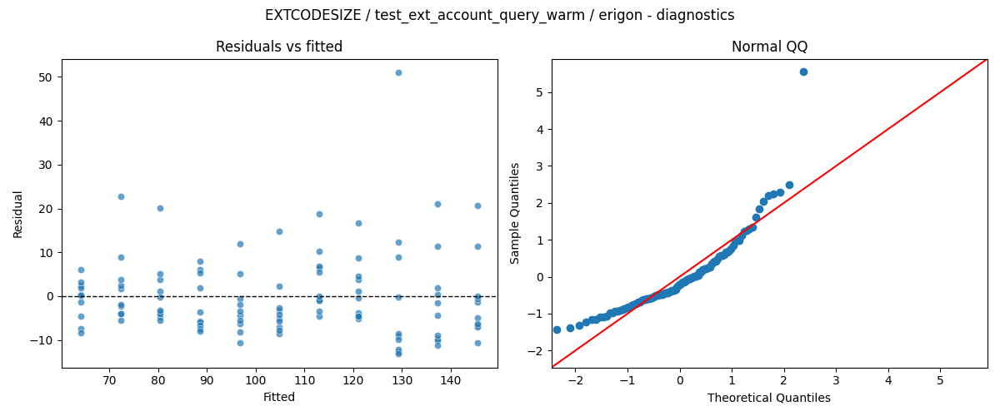

</details>

<details><summary>ethrex — NNLS regression summary</summary>

```
==============================================================================
                           NNLS Regression Results                            
==============================================================================
Dep. Variable:          test_runtime_ms              R-squared:          0.785
Model:                  NNLS                    Adj. R-squared:          0.784
No. Observations:       176                               RMSE:           4.82
Df Residuals:           174                                MAE:           3.79
Df Model:               1      
==============================================================================
                      coef     std err     P-value      [0.025      0.975]
------------------------------------------------------------------------------
         const      7.9096      0.9964       0.001      5.9420      9.7857
       opcount      0.0000      0.0000       0.001      0.0000      0.0000
==============================================================================
Notes: Non-negative least squares with bootstrap inference (1000 iterations)
==============================================================================
```

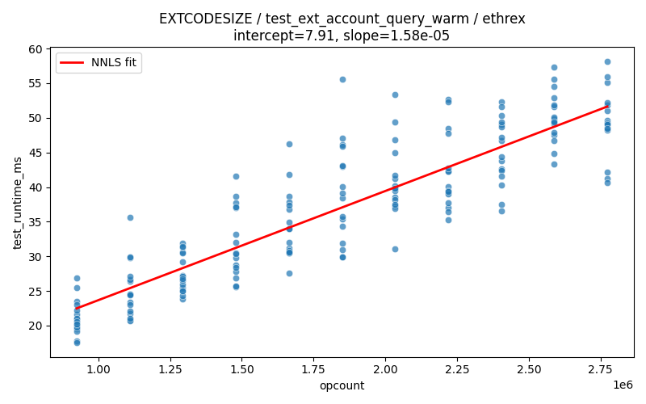

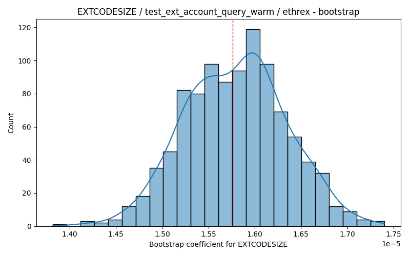

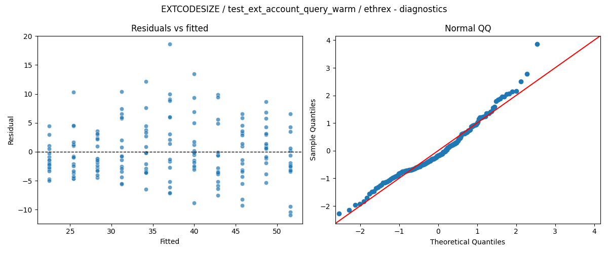

</details>

<details><summary>geth — NNLS regression summary</summary>

```
==============================================================================
                           NNLS Regression Results                            
==============================================================================
Dep. Variable:          test_runtime_ms              R-squared:          0.749
Model:                  NNLS                    Adj. R-squared:          0.747
No. Observations:       154                               RMSE:           9.66
Df Residuals:           152                                MAE:           7.11
Df Model:               1      
==============================================================================
                      coef     std err     P-value      [0.025      0.975]
------------------------------------------------------------------------------
         const     23.6874      2.4117       0.001     18.9946     28.4154
       opcount      0.0000      0.0000       0.001      0.0000      0.0000
==============================================================================
Notes: Non-negative least squares with bootstrap inference (1000 iterations)
==============================================================================
```

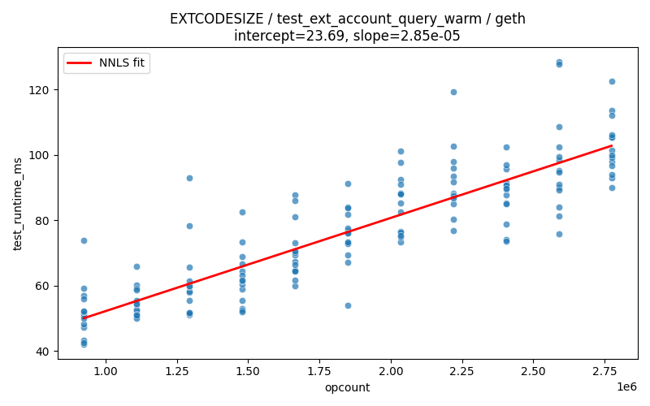

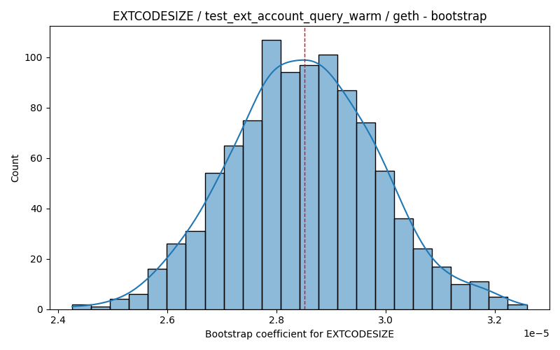

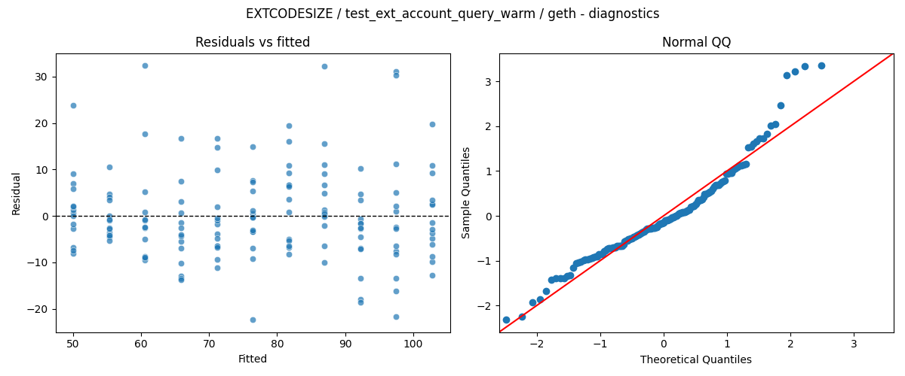

</details>

<details><summary>nethermind — NNLS regression summary</summary>

```
==============================================================================
                           NNLS Regression Results                            
==============================================================================
Dep. Variable:          test_runtime_ms              R-squared:          0.719
Model:                  NNLS                    Adj. R-squared:          0.717
No. Observations:       132                               RMSE:          59.43
Df Residuals:           130                                MAE:          45.26
Df Model:               1      
==============================================================================
                      coef     std err     P-value      [0.025      0.975]
------------------------------------------------------------------------------
         const    132.3934     15.2008       0.001    102.2860    161.6480
       opcount      0.0002      0.0000       0.001      0.0001      0.0002
==============================================================================
Notes: Non-negative least squares with bootstrap inference (1000 iterations)
==============================================================================
```

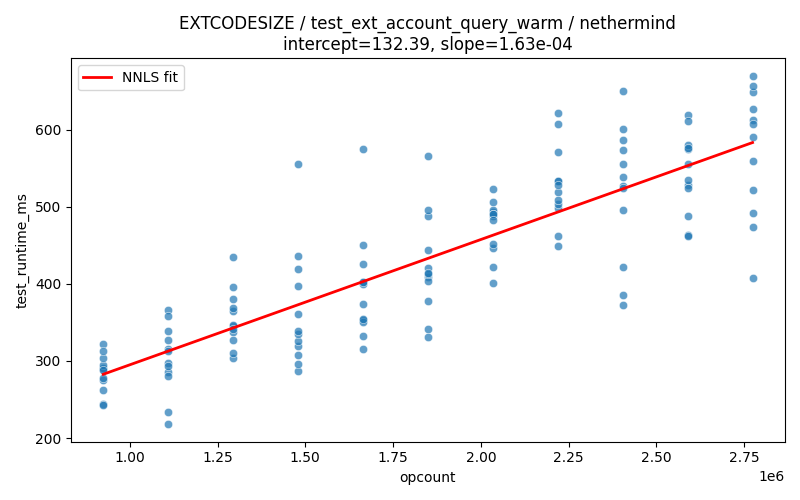

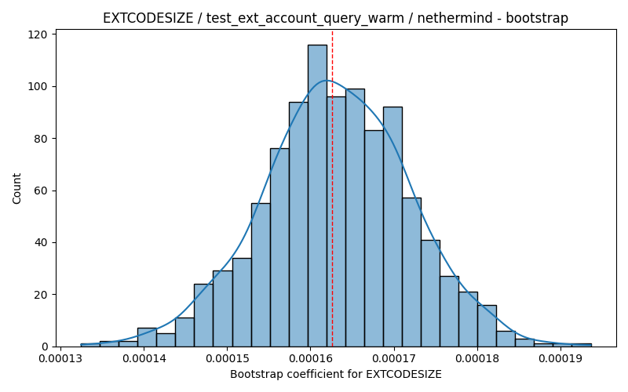

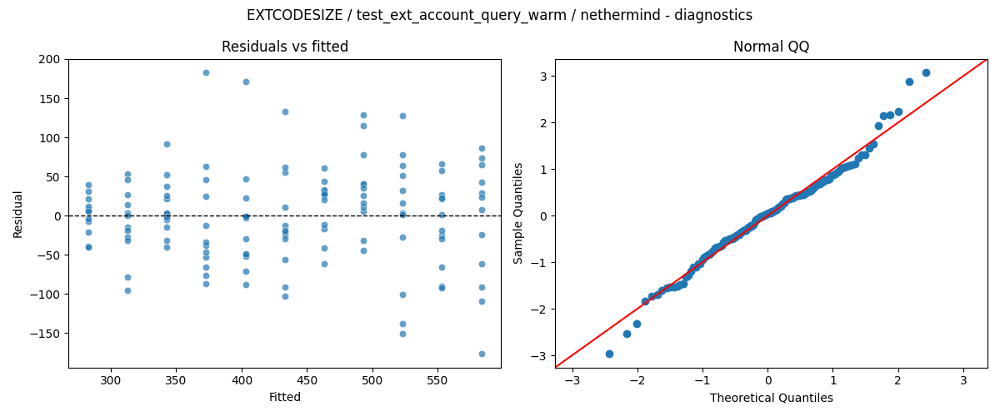

</details>

<details><summary>reth — NNLS regression summary</summary>

```
==============================================================================
                           NNLS Regression Results                            
==============================================================================
Dep. Variable:          test_runtime_ms              R-squared:          0.434
Model:                  NNLS                    Adj. R-squared:          0.431
No. Observations:       198                               RMSE:           6.35
Df Residuals:           196                                MAE:           4.04
Df Model:               1      
==============================================================================
                      coef     std err     P-value      [0.025      0.975]
------------------------------------------------------------------------------
         const      6.8747      1.4396       0.001      4.1854      9.8524
       opcount      0.0000      0.0000       0.001      0.0000      0.0000
==============================================================================
Notes: Non-negative least squares with bootstrap inference (1000 iterations)
==============================================================================
```

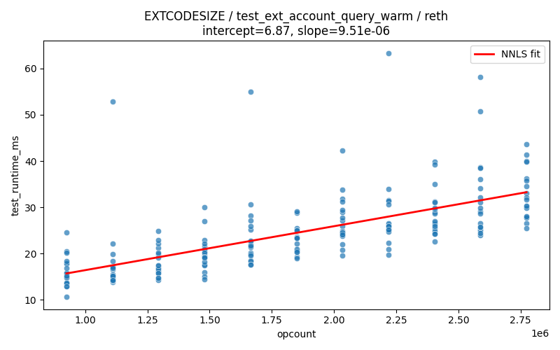

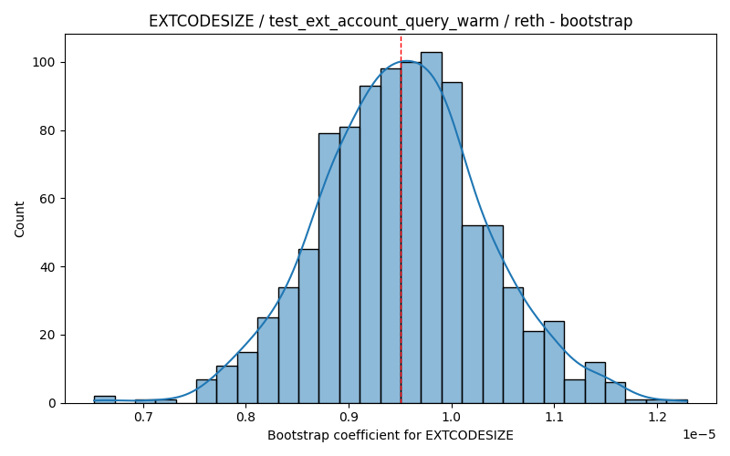

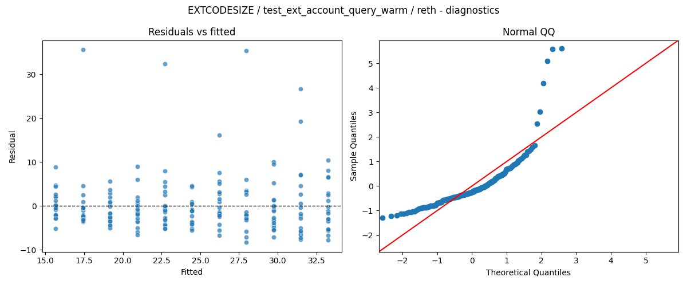

</details>

## STATICCALL

### test_account_access — combo `STATICCALL_AccountMode.EXISTING_EOA`

| client | nobs | R² | target_coef (ms) | p-value | 95% CI |
| --- | --- | --- | --- | --- | --- |
| `besu` | 253 | 0.847 | 0.01544 | 1.00e-03 | [0.0146, 0.01637] |
| `erigon` | 110 | 0.9731 | 0.009296 | 1.00e-03 | [0.009019, 0.009598] |
| `ethrex` | 176 | 0.9943 | 0.006971 | 1.00e-03 | [0.00689, 0.007046] |
| `geth` | 154 | 0.9176 | 0.01093 | 1.00e-03 | [0.0103, 0.0115] |
| `nethermind` | 132 | 0.8097 | 0.004177 | 1.00e-03 | [0.003847, 0.004516] |
| `reth` | 198 | 0.944 | 0.001084 | 1.00e-03 | [0.001046, 0.001122] |

<details><summary>besu — NNLS regression summary</summary>

```
==============================================================================
                           NNLS Regression Results                            
==============================================================================
Dep. Variable:          test_runtime_ms              R-squared:          0.847
Model:                  NNLS                    Adj. R-squared:          0.846
No. Observations:       253                               RMSE:         155.99
Df Residuals:           251                                MAE:         127.97
Df Model:               1      
==============================================================================
                      coef     std err     P-value      [0.025      0.975]
------------------------------------------------------------------------------
         const    637.3816     31.9927       0.001    570.2719    699.3713
       opcount      0.0154      0.0004       0.001      0.0146      0.0164
==============================================================================
Notes: Non-negative least squares with bootstrap inference (1000 iterations)
==============================================================================
```

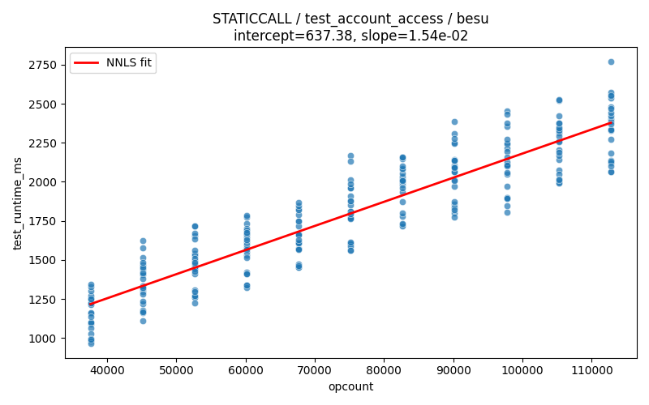

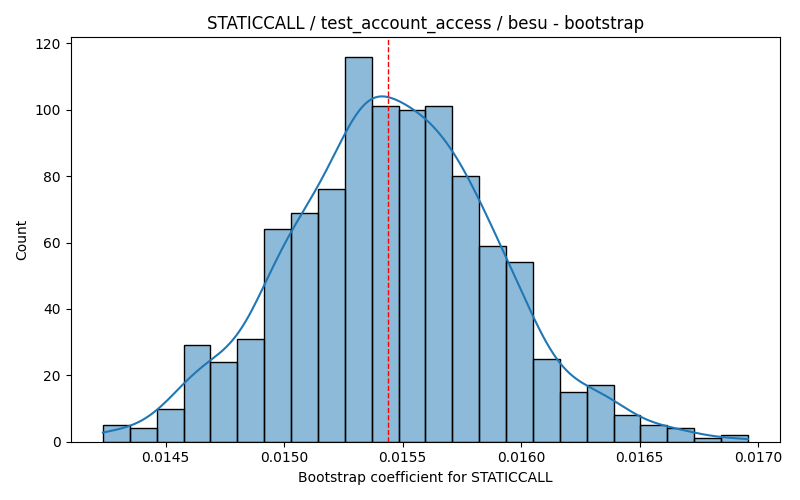

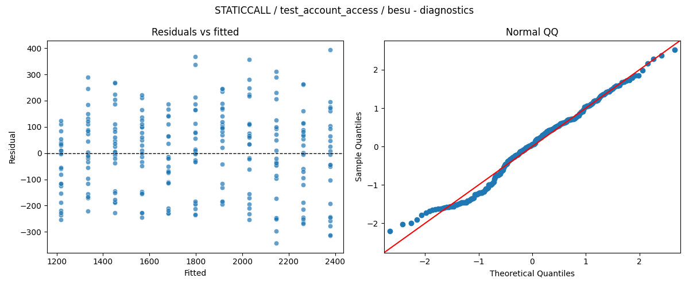

</details>

<details><summary>erigon — NNLS regression summary</summary>

```
==============================================================================
                           NNLS Regression Results                            
==============================================================================
Dep. Variable:          test_runtime_ms              R-squared:          0.973
Model:                  NNLS                    Adj. R-squared:          0.973
No. Observations:       110                               RMSE:          36.72
Df Residuals:           108                                MAE:          26.51
Df Model:               1      
==============================================================================
                      coef     std err     P-value      [0.025      0.975]
------------------------------------------------------------------------------
         const     21.7434      9.4226       0.018      1.4551     39.9613
       opcount      0.0093      0.0001       0.001      0.0090      0.0096
==============================================================================
Notes: Non-negative least squares with bootstrap inference (1000 iterations)
==============================================================================
```

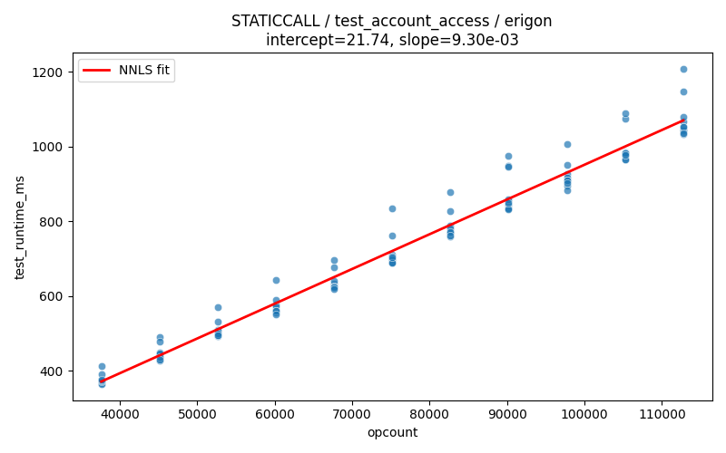

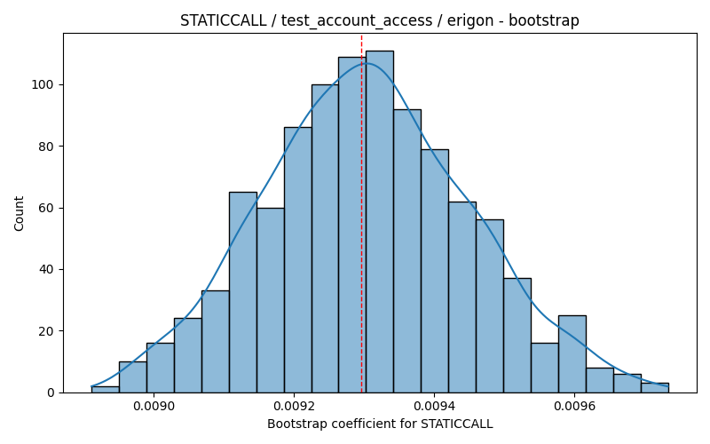

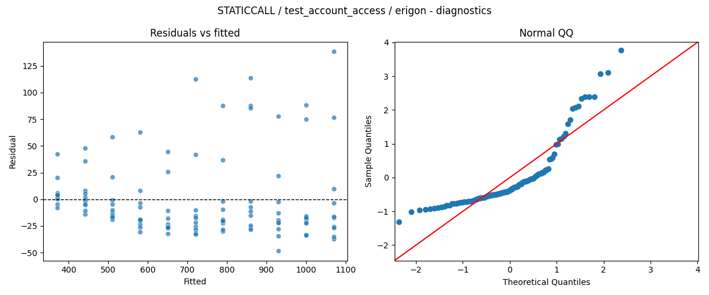

</details>

<details><summary>ethrex — NNLS regression summary</summary>

```
==============================================================================
                           NNLS Regression Results                            
==============================================================================
Dep. Variable:          test_runtime_ms              R-squared:          0.994
Model:                  NNLS                    Adj. R-squared:          0.994
No. Observations:       176                               RMSE:          12.57
Df Residuals:           174                                MAE:          10.00
Df Model:               1      
==============================================================================
                      coef     std err     P-value      [0.025      0.975]
------------------------------------------------------------------------------
         const     46.9964      3.0420       0.001     41.5619     53.2070
       opcount      0.0070      0.0000       0.001      0.0069      0.0070
==============================================================================
Notes: Non-negative least squares with bootstrap inference (1000 iterations)
==============================================================================
```

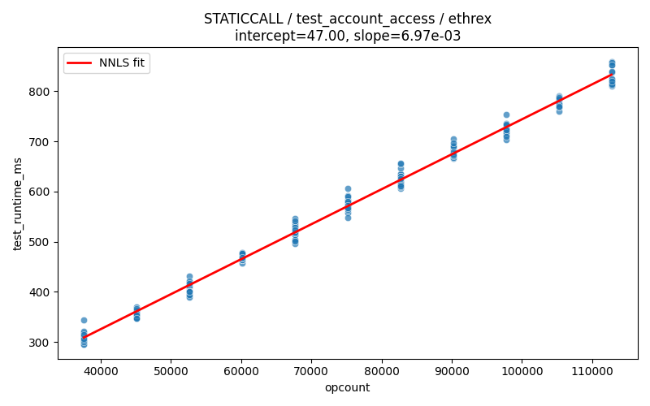

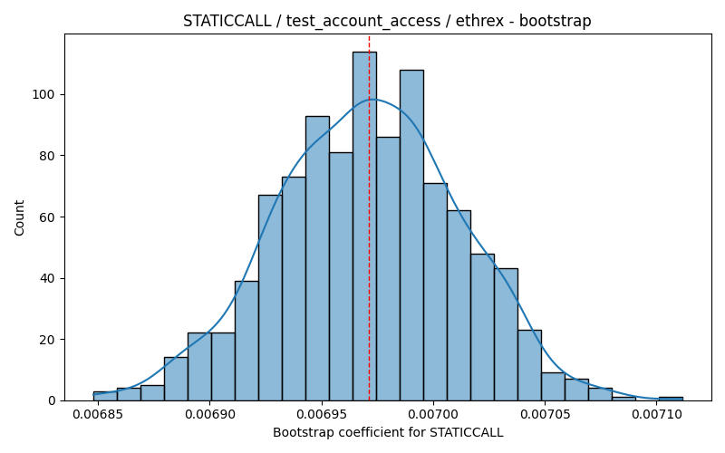

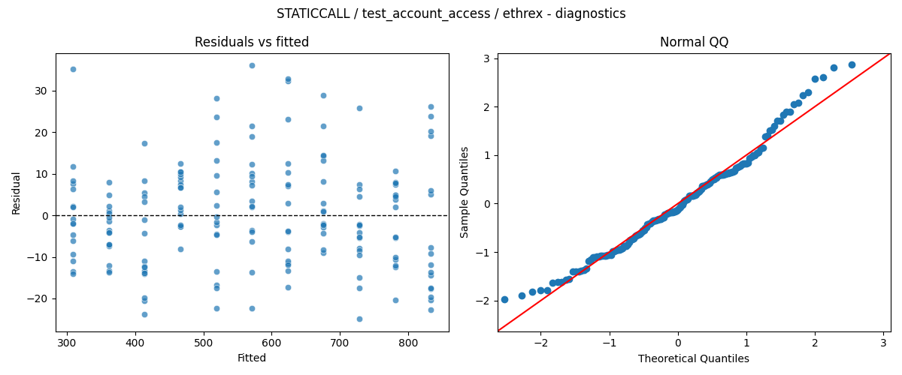

</details>

<details><summary>geth — NNLS regression summary</summary>

```
==============================================================================
                           NNLS Regression Results                            
==============================================================================
Dep. Variable:          test_runtime_ms              R-squared:          0.918
Model:                  NNLS                    Adj. R-squared:          0.917
No. Observations:       154                               RMSE:          77.88
Df Residuals:           152                                MAE:          64.10
Df Model:               1      
==============================================================================
                      coef     std err     P-value      [0.025      0.975]
------------------------------------------------------------------------------
         const    427.2427     26.7361       0.001    380.3893    482.6922
       opcount      0.0109      0.0003       0.001      0.0103      0.0115
==============================================================================
Notes: Non-negative least squares with bootstrap inference (1000 iterations)
==============================================================================
```

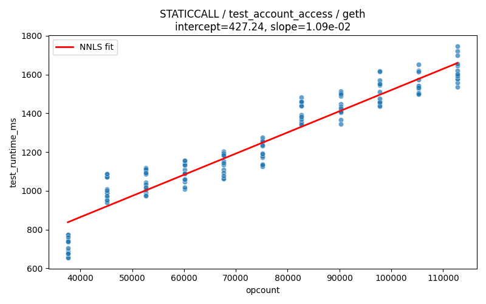

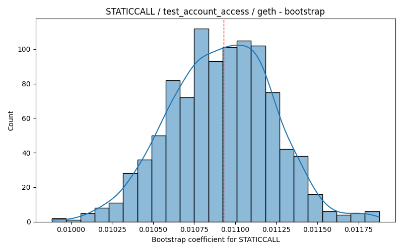

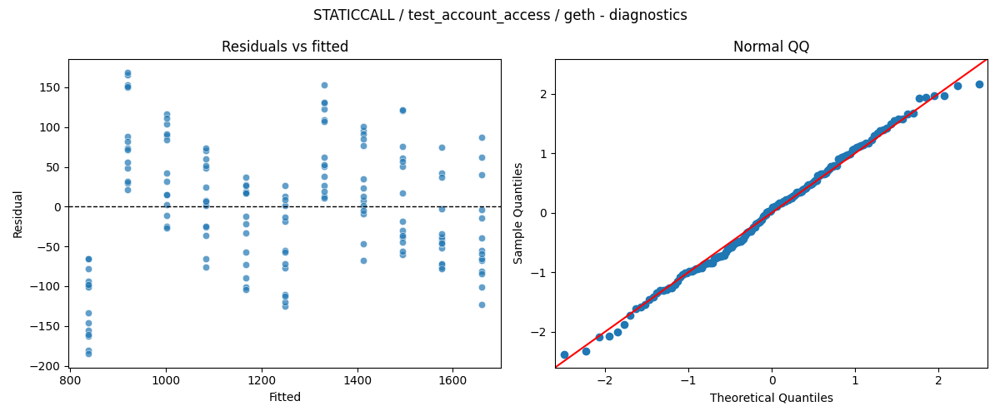

</details>

<details><summary>nethermind — NNLS regression summary</summary>

```
==============================================================================
                           NNLS Regression Results                            
==============================================================================
Dep. Variable:          test_runtime_ms              R-squared:          0.810
Model:                  NNLS                    Adj. R-squared:          0.808
No. Observations:       132                               RMSE:          48.13
Df Residuals:           130                                MAE:          36.91
Df Model:               1      
==============================================================================
                      coef     std err     P-value      [0.025      0.975]
------------------------------------------------------------------------------
         const    104.8633     11.6211       0.001     81.3542    127.8452
       opcount      0.0042      0.0002       0.001      0.0038      0.0045
==============================================================================
Notes: Non-negative least squares with bootstrap inference (1000 iterations)
==============================================================================
```

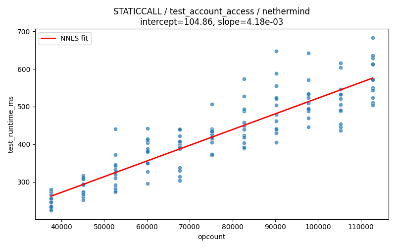

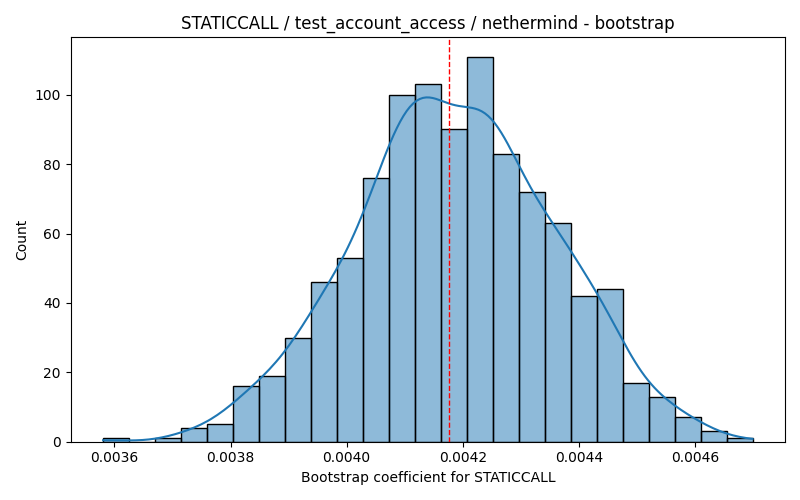

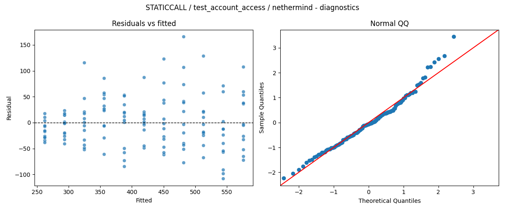

</details>

<details><summary>reth — NNLS regression summary</summary>

```
==============================================================================
                           NNLS Regression Results                            
==============================================================================
Dep. Variable:          test_runtime_ms              R-squared:          0.944
Model:                  NNLS                    Adj. R-squared:          0.944
No. Observations:       198                               RMSE:           6.28
Df Residuals:           196                                MAE:           4.84
Df Model:               1      
==============================================================================
                      coef     std err     P-value      [0.025      0.975]
------------------------------------------------------------------------------
         const     42.6446      1.3882       0.001     39.8190     45.4398
       opcount      0.0011      0.0000       0.001      0.0010      0.0011
==============================================================================
Notes: Non-negative least squares with bootstrap inference (1000 iterations)
==============================================================================
```

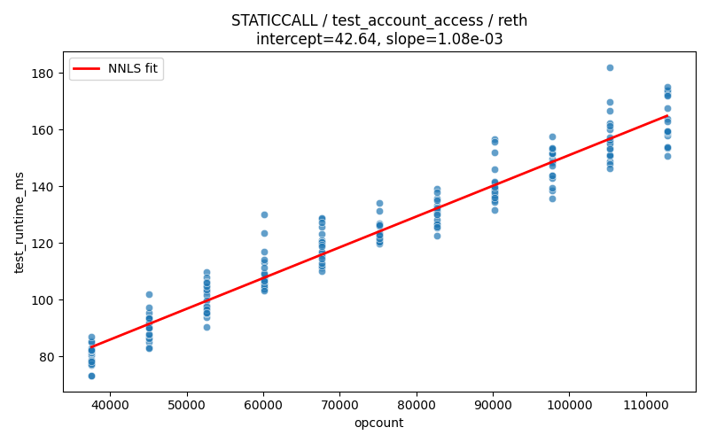

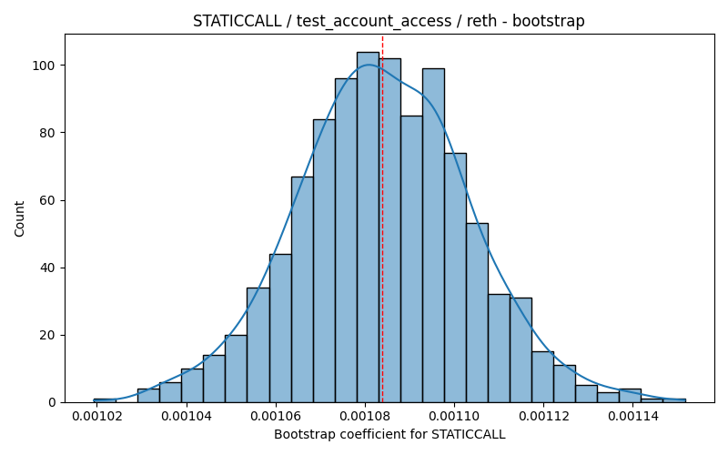

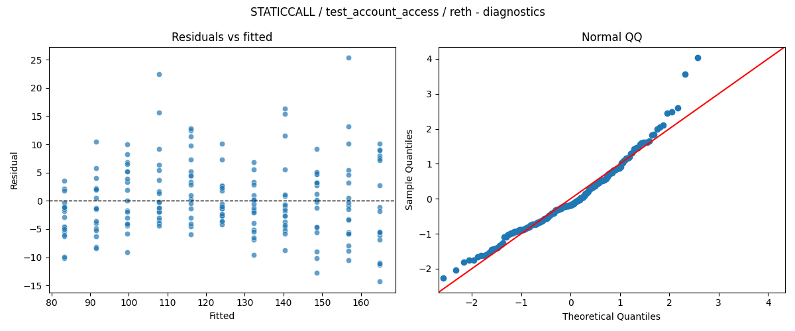

</details>

### test_account_access — combo `STATICCALL_AccountMode.NON_EXISTING_ACCOUNT` — `presets[cold_account_nocode_access]`

| client | nobs | R² | target_coef (ms) | p-value | 95% CI |
| --- | --- | --- | --- | --- | --- |
| `besu` | 253 | 0.8728 | 0.0165 | 1.00e-03 | [0.01571, 0.01737] |
| `erigon` | 110 | 0.9838 | 0.01073 | 1.00e-03 | [0.01059, 0.01082] |
| `ethrex` | 176 | 0.9709 | 0.001987 | 1.00e-03 | [0.001939, 0.002034] |
| `geth` | 154 | 0.8659 | 0.02263 | 1.00e-03 | [0.02131, 0.0242] |
| `nethermind` | 132 | 0.7466 | 0.004341 | 1.00e-03 | [0.003962, 0.004737] |
| `reth` | 198 | 0.9096 | 0.0007974 | 1.00e-03 | [0.0007607, 0.0008332] |

<details><summary>besu — NNLS regression summary</summary>

```
==============================================================================
                           NNLS Regression Results                            
==============================================================================
Dep. Variable:          test_runtime_ms              R-squared:          0.873
Model:                  NNLS                    Adj. R-squared:          0.872
No. Observations:       253                               RMSE:         149.77
Df Residuals:           251                                MAE:         133.14
Df Model:               1      
==============================================================================
                      coef     std err     P-value      [0.025      0.975]
------------------------------------------------------------------------------
         const    524.6611     30.8765       0.001    459.7954    582.1224
       opcount      0.0165      0.0004       0.001      0.0157      0.0174
==============================================================================
Notes: Non-negative least squares with bootstrap inference (1000 iterations)
==============================================================================
```

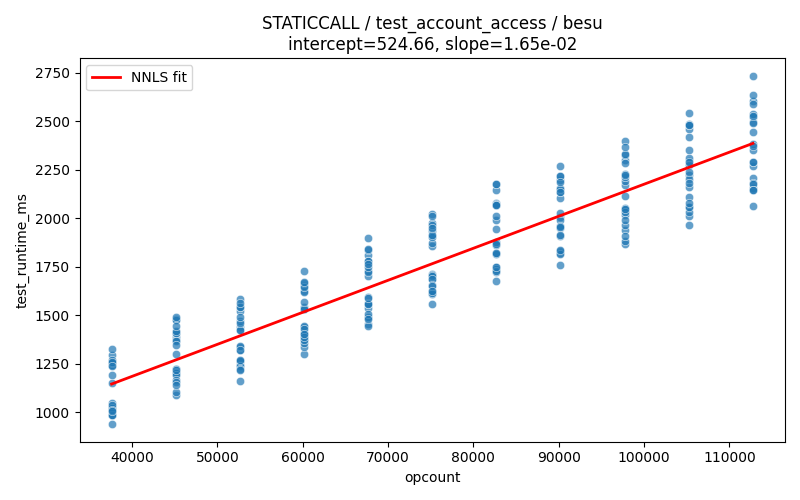

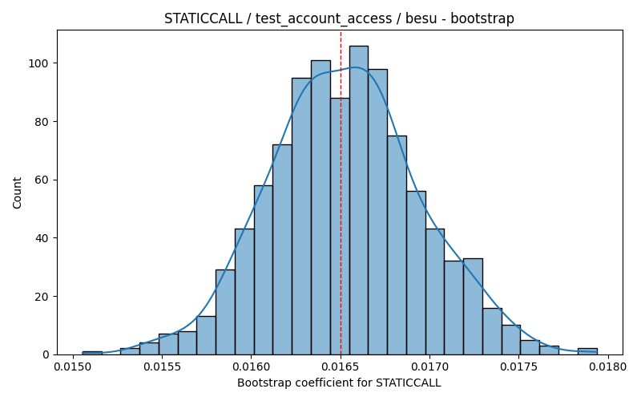

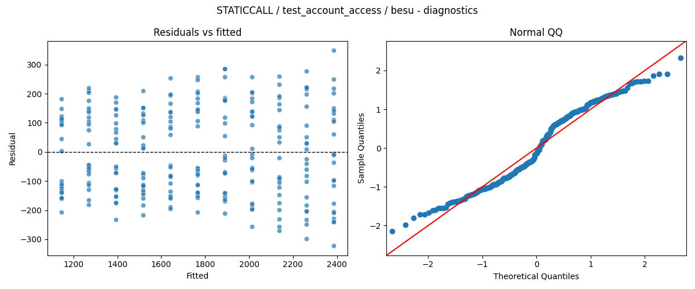

</details>

<details><summary>erigon — NNLS regression summary</summary>

```
==============================================================================
                           NNLS Regression Results                            
==============================================================================
Dep. Variable:          test_runtime_ms              R-squared:          0.984
Model:                  NNLS                    Adj. R-squared:          0.984
No. Observations:       110                               RMSE:          33.01
Df Residuals:           108                                MAE:          22.95
Df Model:               1      
==============================================================================
                      coef     std err     P-value      [0.025      0.975]
------------------------------------------------------------------------------
         const      0.0000      2.0713       1.000      0.0000      7.5586
       opcount      0.0107      0.0001       0.001      0.0106      0.0108
==============================================================================
Notes: Non-negative least squares with bootstrap inference (1000 iterations)
==============================================================================
```


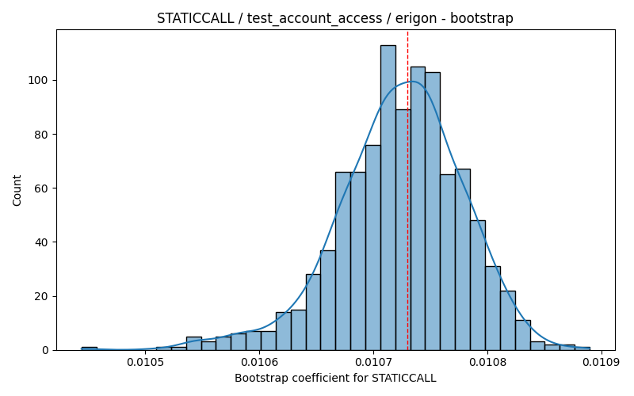

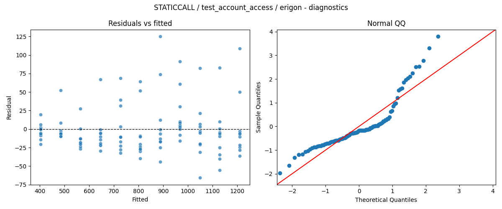

</details>

<details><summary>ethrex — NNLS regression summary</summary>

```
==============================================================================
                           NNLS Regression Results                            
==============================================================================
Dep. Variable:          test_runtime_ms              R-squared:          0.971
Model:                  NNLS                    Adj. R-squared:          0.971
No. Observations:       176                               RMSE:           8.18
Df Residuals:           174                                MAE:           6.38
Df Model:               1      
==============================================================================
                      coef     std err     P-value      [0.025      0.975]
------------------------------------------------------------------------------
         const     28.4545      1.8430       0.001     24.8844     32.2577
       opcount      0.0020      0.0000       0.001      0.0019      0.0020
==============================================================================
Notes: Non-negative least squares with bootstrap inference (1000 iterations)
==============================================================================
```

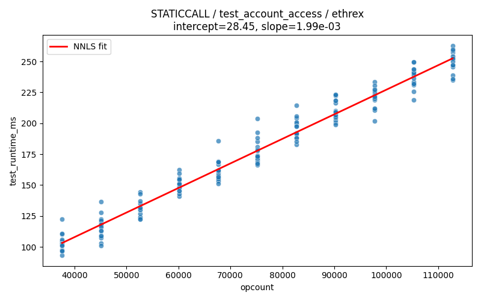

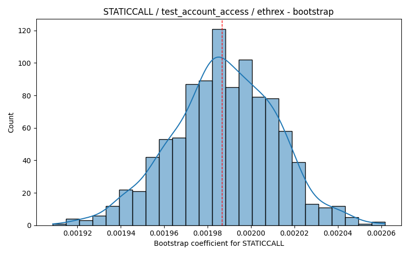

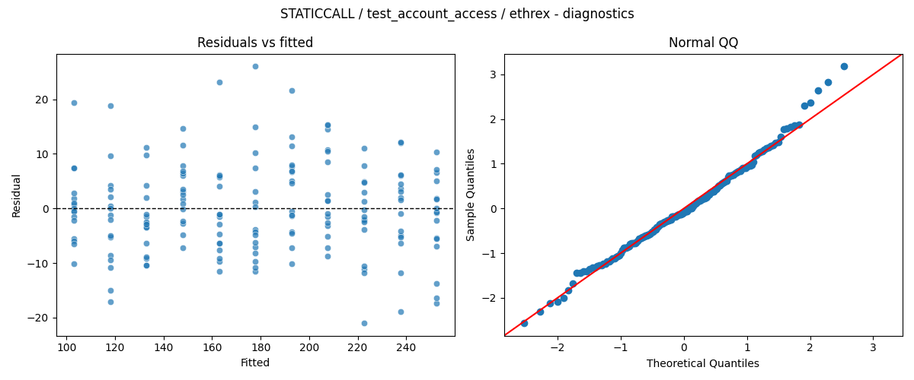

</details>

<details><summary>geth — NNLS regression summary</summary>

```
==============================================================================
                           NNLS Regression Results                            
==============================================================================
Dep. Variable:          test_runtime_ms              R-squared:          0.866
Model:                  NNLS                    Adj. R-squared:          0.865
No. Observations:       154                               RMSE:         211.72
Df Residuals:           152                                MAE:         179.97
Df Model:               1      
==============================================================================
                      coef     std err     P-value      [0.025      0.975]
------------------------------------------------------------------------------
         const    726.3808     63.4975       0.001    599.5487    839.8468
       opcount      0.0226      0.0008       0.001      0.0213      0.0242
==============================================================================
Notes: Non-negative least squares with bootstrap inference (1000 iterations)
==============================================================================
```


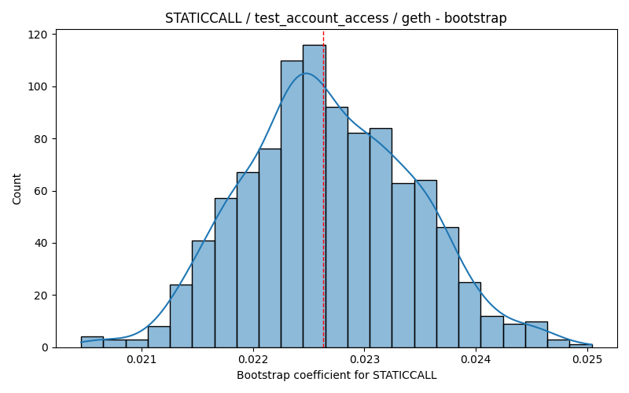

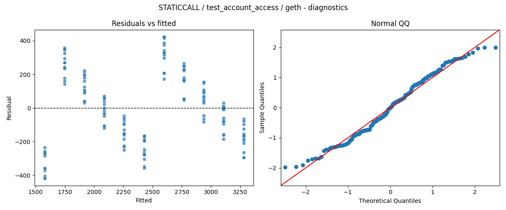

</details>

<details><summary>nethermind — NNLS regression summary</summary>

```
==============================================================================
                           NNLS Regression Results                            
==============================================================================
Dep. Variable:          test_runtime_ms              R-squared:          0.747
Model:                  NNLS                    Adj. R-squared:          0.745
No. Observations:       132                               RMSE:          60.12
Df Residuals:           130                                MAE:          39.10
Df Model:               1      
==============================================================================
                      coef     std err     P-value      [0.025      0.975]
------------------------------------------------------------------------------
         const     72.9322     12.5360       0.001     47.1614     97.0127
       opcount      0.0043      0.0002       0.001      0.0040      0.0047
==============================================================================
Notes: Non-negative least squares with bootstrap inference (1000 iterations)
==============================================================================
```

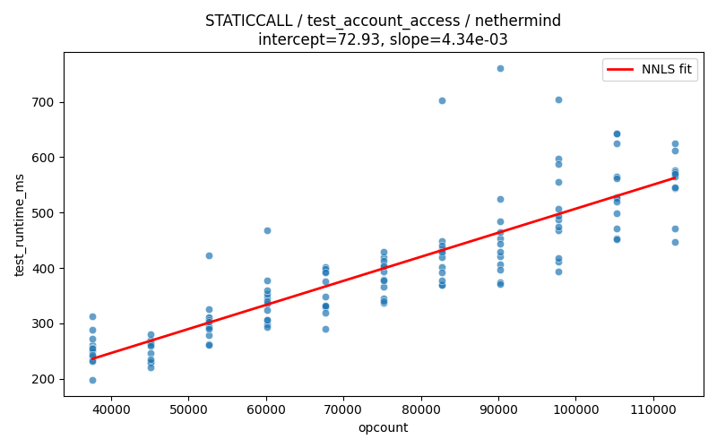

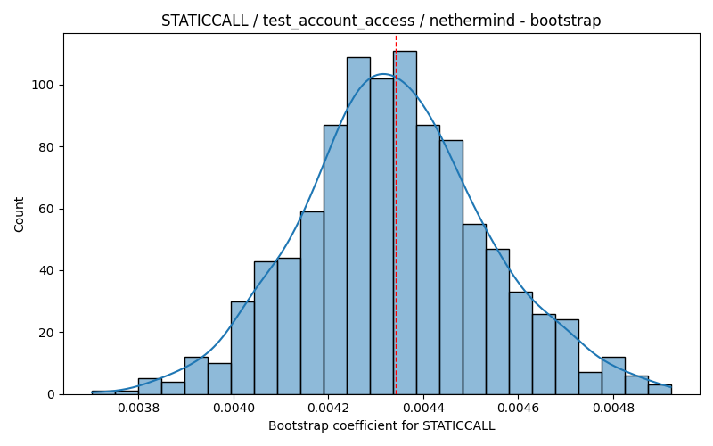

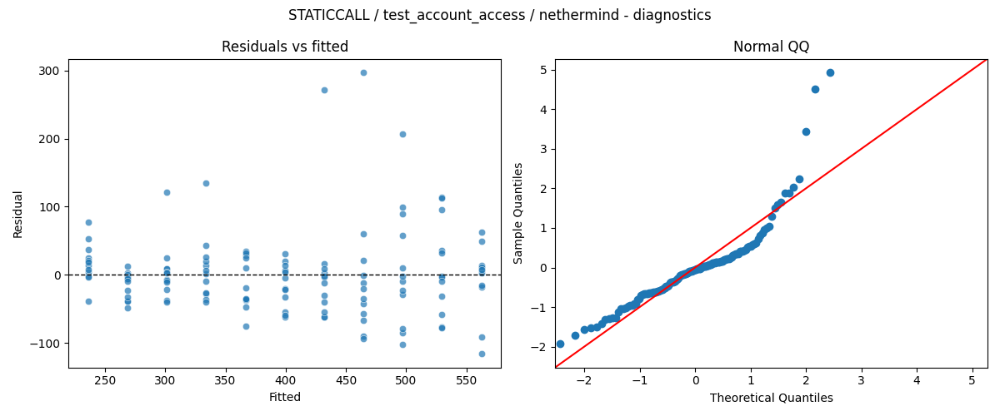

</details>

<details><summary>reth — NNLS regression summary</summary>

```
==============================================================================
                           NNLS Regression Results                            
==============================================================================
Dep. Variable:          test_runtime_ms              R-squared:          0.910
Model:                  NNLS                    Adj. R-squared:          0.909
No. Observations:       198                               RMSE:           5.98
Df Residuals:           196                                MAE:           4.56
Df Model:               1      
==============================================================================
                      coef     std err     P-value      [0.025      0.975]
------------------------------------------------------------------------------
         const     46.0147      1.3683       0.001     43.4366     48.6734
       opcount      0.0008      0.0000       0.001      0.0008      0.0008
==============================================================================
Notes: Non-negative least squares with bootstrap inference (1000 iterations)
==============================================================================
```

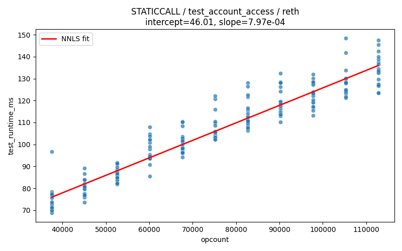

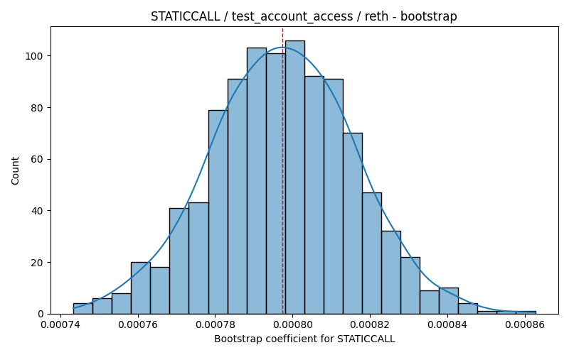

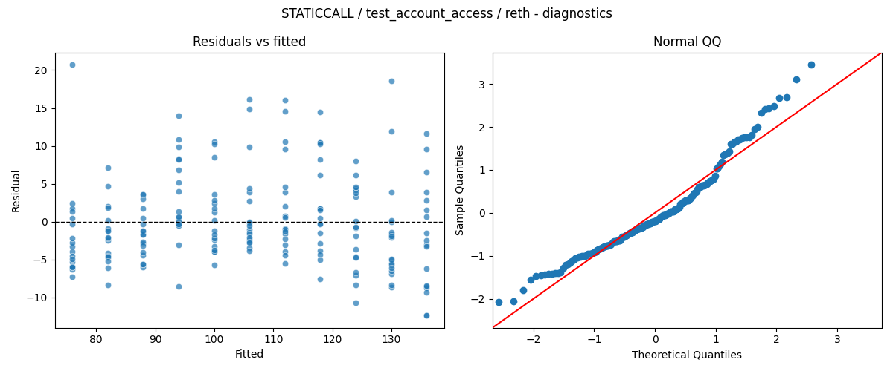

</details>

### test_account_access — combo `STATICCALL_AccountMode.EXISTING_CONTRACT`

| client | nobs | R² | target_coef (ms) | p-value | 95% CI |
| --- | --- | --- | --- | --- | --- |
| `besu` | 253 | 0.8983 | 0.02766 | 1.00e-03 | [0.02658, 0.02873] |
| `erigon` | 110 | 0.8948 | 0.0494 | 1.00e-03 | [0.04616, 0.05225] |
| `ethrex` | 176 | 0.9942 | 0.007645 | 1.00e-03 | [0.007551, 0.007745] |
| `geth` | 154 | 0.8595 | 0.02348 | 1.00e-03 | [0.02194, 0.02513] |
| `nethermind` | 132 | 0.6114 | 0.01318 | 1.00e-03 | [0.01137, 0.01498] |
| `reth` | 198 | 0.9739 | 0.004086 | 1.00e-03 | [0.003988, 0.004187] |

<details><summary>besu — NNLS regression summary</summary>

```
==============================================================================
                           NNLS Regression Results                            
==============================================================================
Dep. Variable:          test_runtime_ms              R-squared:          0.898
Model:                  NNLS                    Adj. R-squared:          0.898
No. Observations:       253                               RMSE:         189.60
Df Residuals:           251                                MAE:         150.93
Df Model:               1      
==============================================================================
                      coef     std err     P-value      [0.025      0.975]
------------------------------------------------------------------------------
         const    600.6864     34.2402       0.001    536.3189    670.4994
       opcount      0.0277      0.0005       0.001      0.0266      0.0287
==============================================================================
Notes: Non-negative least squares with bootstrap inference (1000 iterations)
==============================================================================
```

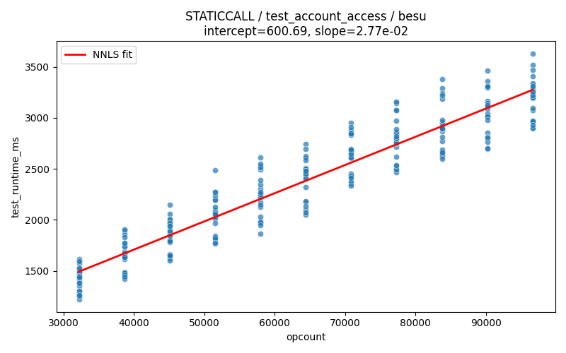

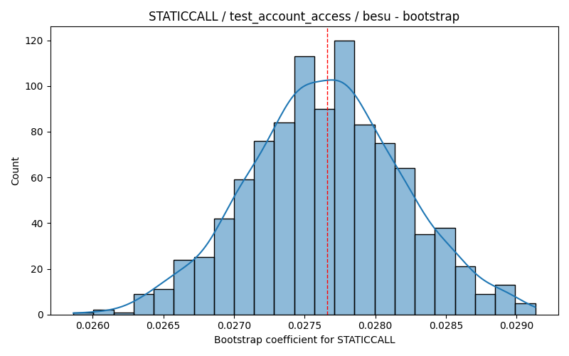

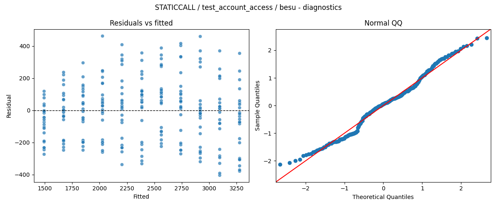

</details>

<details><summary>erigon — NNLS regression summary</summary>

```
==============================================================================
                           NNLS Regression Results                            
==============================================================================
Dep. Variable:          test_runtime_ms              R-squared:          0.895
Model:                  NNLS                    Adj. R-squared:          0.894
No. Observations:       110                               RMSE:         345.11
Df Residuals:           108                                MAE:         295.93
Df Model:               1      
==============================================================================
                      coef     std err     P-value      [0.025      0.975]
------------------------------------------------------------------------------
         const    830.4968    114.1310       0.001    620.2957   1066.7907
       opcount      0.0494      0.0015       0.001      0.0462      0.0522
==============================================================================
Notes: Non-negative least squares with bootstrap inference (1000 iterations)
==============================================================================
```

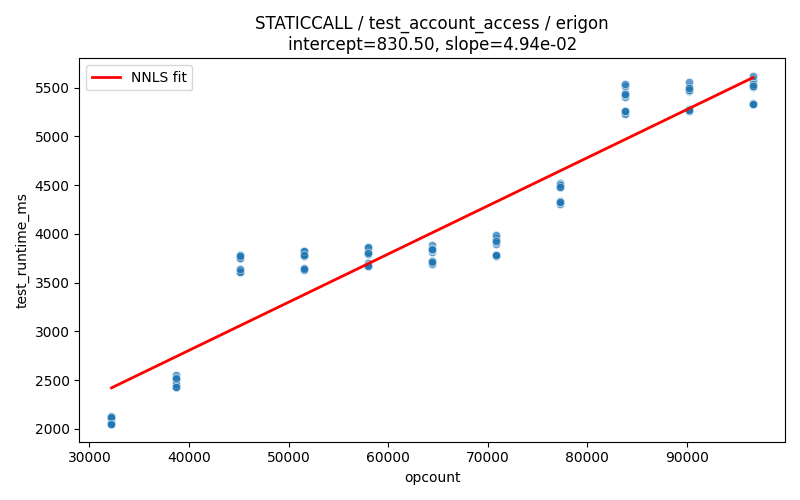

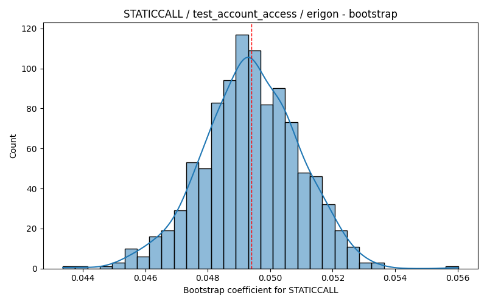

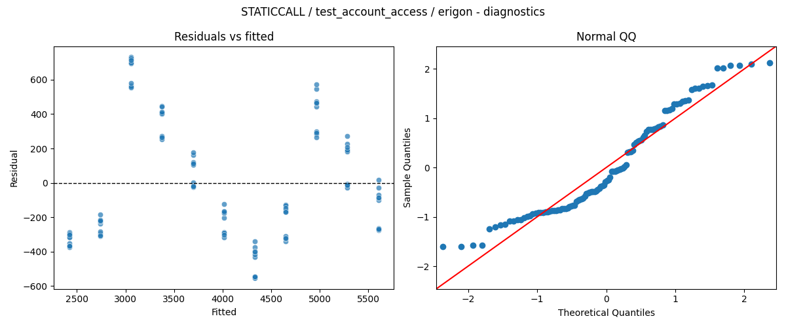

</details>

<details><summary>ethrex — NNLS regression summary</summary>

```
==============================================================================
                           NNLS Regression Results                            
==============================================================================
Dep. Variable:          test_runtime_ms              R-squared:          0.994
Model:                  NNLS                    Adj. R-squared:          0.994
No. Observations:       176                               RMSE:          11.94
Df Residuals:           174                                MAE:           9.41
Df Model:               1      
==============================================================================
                      coef     std err     P-value      [0.025      0.975]
------------------------------------------------------------------------------
         const     36.4608      2.9073       0.001     30.6178     41.8367
       opcount      0.0076      0.0000       0.001      0.0076      0.0077
==============================================================================
Notes: Non-negative least squares with bootstrap inference (1000 iterations)
==============================================================================
```

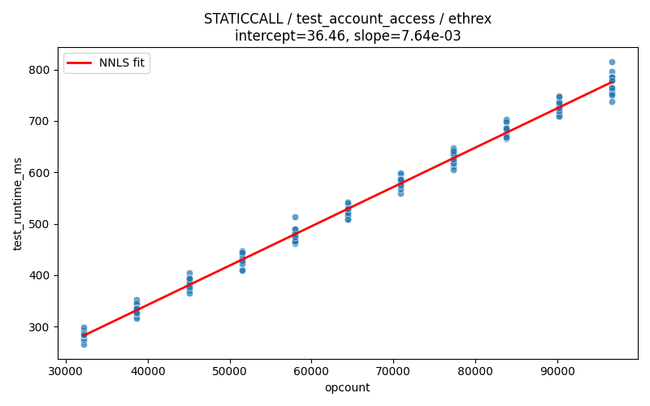

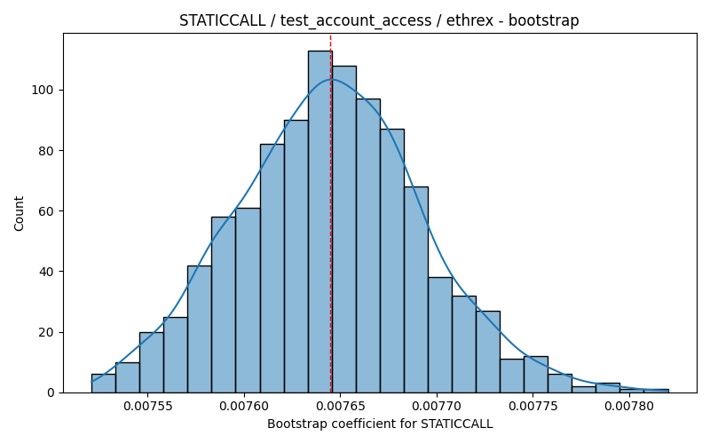

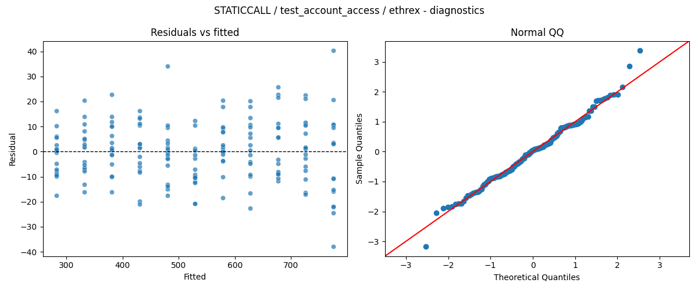

</details>

<details><summary>geth — NNLS regression summary</summary>

```
==============================================================================
                           NNLS Regression Results                            
==============================================================================
Dep. Variable:          test_runtime_ms              R-squared:          0.860
Model:                  NNLS                    Adj. R-squared:          0.859
No. Observations:       154                               RMSE:         193.39
Df Residuals:           152                                MAE:         163.66
Df Model:               1      
==============================================================================
                      coef     std err     P-value      [0.025      0.975]
------------------------------------------------------------------------------
         const    675.7287     62.4817       0.001    553.9263    793.1183
       opcount      0.0235      0.0009       0.001      0.0219      0.0251
==============================================================================
Notes: Non-negative least squares with bootstrap inference (1000 iterations)
==============================================================================
```

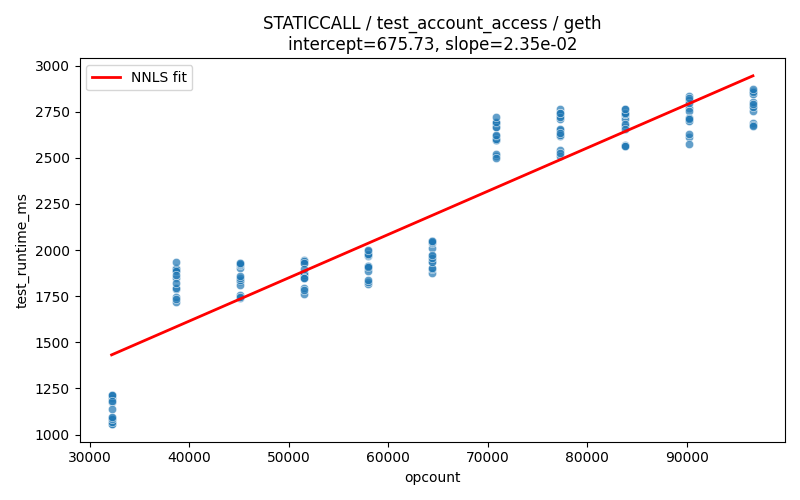

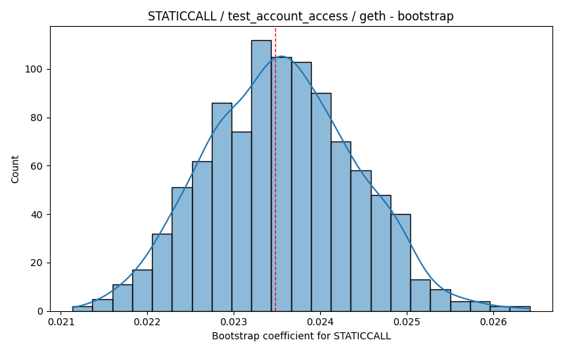

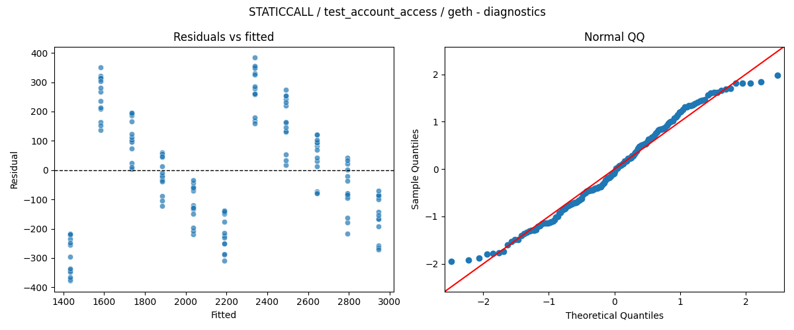

</details>

<details><summary>nethermind — NNLS regression summary</summary>

```
==============================================================================
                           NNLS Regression Results                            
==============================================================================
Dep. Variable:          test_runtime_ms              R-squared:          0.611
Model:                  NNLS                    Adj. R-squared:          0.608
No. Observations:       132                               RMSE:         214.00
Df Residuals:           130                                MAE:         152.86
Df Model:               1      
==============================================================================
                      coef     std err     P-value      [0.025      0.975]
------------------------------------------------------------------------------
         const    237.9820     55.3640       0.001    127.8573    346.6135
       opcount      0.0132      0.0009       0.001      0.0114      0.0150
==============================================================================
Notes: Non-negative least squares with bootstrap inference (1000 iterations)
==============================================================================
```

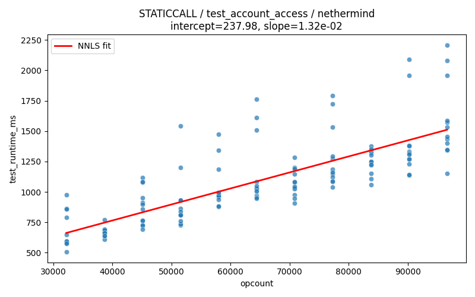

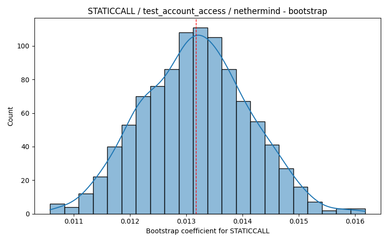

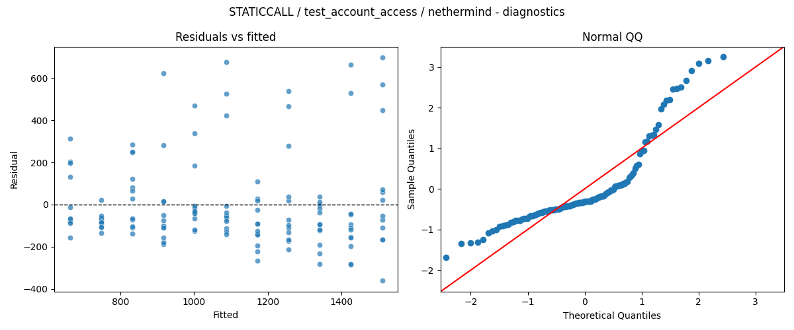

</details>

<details><summary>reth — NNLS regression summary</summary>

```
==============================================================================
                           NNLS Regression Results                            
==============================================================================
Dep. Variable:          test_runtime_ms              R-squared:          0.974
Model:                  NNLS                    Adj. R-squared:          0.974
No. Observations:       198                               RMSE:          13.62
Df Residuals:           196                                MAE:          10.81
Df Model:               1      
==============================================================================
                      coef     std err     P-value      [0.025      0.975]
------------------------------------------------------------------------------
         const     97.1921      2.9922       0.001     91.0953    103.3852
       opcount      0.0041      0.0001       0.001      0.0040      0.0042
==============================================================================
Notes: Non-negative least squares with bootstrap inference (1000 iterations)
==============================================================================
```

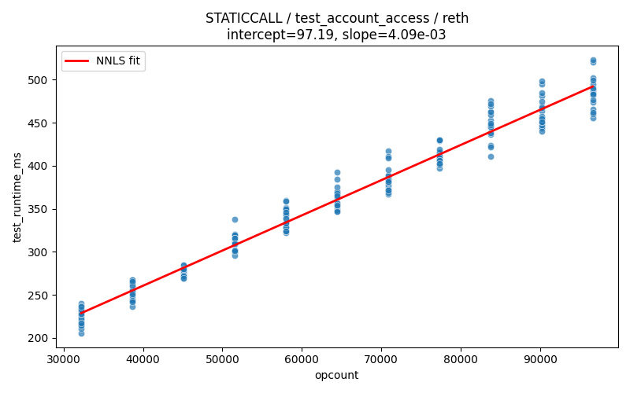

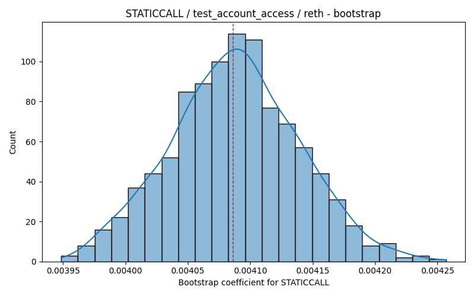

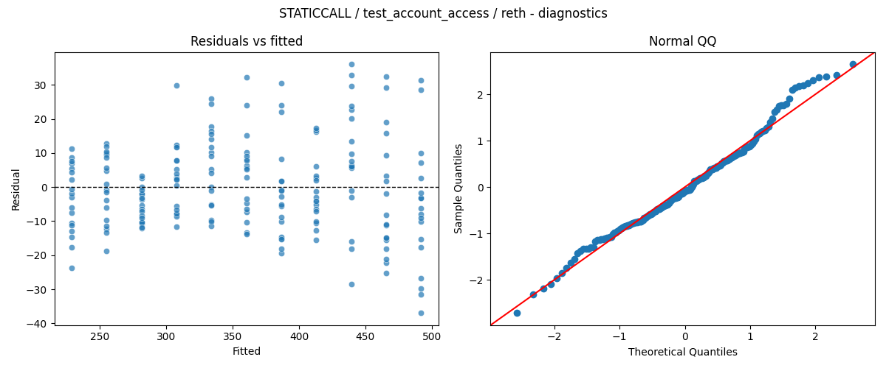

</details>

### test_account_access — combo `STATICCALL_AccountMode.NON_EXISTING_ACCOUNT` — `presets[cold_account_code_access]`

| client | nobs | R² | target_coef (ms) | p-value | 95% CI |
| --- | --- | --- | --- | --- | --- |
| `besu` | 253 | 0.8728 | 0.0165 | 1.00e-03 | [0.01571, 0.01737] |
| `erigon` | 110 | 0.9838 | 0.01073 | 1.00e-03 | [0.01059, 0.01082] |
| `ethrex` | 176 | 0.9709 | 0.001987 | 1.00e-03 | [0.001939, 0.002034] |
| `geth` | 154 | 0.8659 | 0.02263 | 1.00e-03 | [0.02131, 0.0242] |
| `nethermind` | 132 | 0.7466 | 0.004341 | 1.00e-03 | [0.003962, 0.004737] |
| `reth` | 198 | 0.9096 | 0.0007974 | 1.00e-03 | [0.0007607, 0.0008332] |

<details><summary>besu — NNLS regression summary</summary>

```
==============================================================================
                           NNLS Regression Results                            
==============================================================================
Dep. Variable:          test_runtime_ms              R-squared:          0.873
Model:                  NNLS                    Adj. R-squared:          0.872
No. Observations:       253                               RMSE:         149.77
Df Residuals:           251                                MAE:         133.14
Df Model:               1      
==============================================================================
                      coef     std err     P-value      [0.025      0.975]
------------------------------------------------------------------------------
         const    524.6611     30.8765       0.001    459.7954    582.1224
       opcount      0.0165      0.0004       0.001      0.0157      0.0174
==============================================================================
Notes: Non-negative least squares with bootstrap inference (1000 iterations)
==============================================================================
```


</details>

<details><summary>erigon — NNLS regression summary</summary>

```
==============================================================================
                           NNLS Regression Results                            
==============================================================================
Dep. Variable:          test_runtime_ms              R-squared:          0.984
Model:                  NNLS                    Adj. R-squared:          0.984
No. Observations:       110                               RMSE:          33.01
Df Residuals:           108                                MAE:          22.95
Df Model:               1      
==============================================================================
                      coef     std err     P-value      [0.025      0.975]
------------------------------------------------------------------------------
         const      0.0000      2.0713       1.000      0.0000      7.5586
       opcount      0.0107      0.0001       0.001      0.0106      0.0108
==============================================================================
Notes: Non-negative least squares with bootstrap inference (1000 iterations)
==============================================================================
```


</details>

<details><summary>ethrex — NNLS regression summary</summary>

```
==============================================================================
                           NNLS Regression Results                            
==============================================================================
Dep. Variable:          test_runtime_ms              R-squared:          0.971
Model:                  NNLS                    Adj. R-squared:          0.971
No. Observations:       176                               RMSE:           8.18
Df Residuals:           174                                MAE:           6.38
Df Model:               1      
==============================================================================
                      coef     std err     P-value      [0.025      0.975]
------------------------------------------------------------------------------
         const     28.4545      1.8430       0.001     24.8844     32.2577
       opcount      0.0020      0.0000       0.001      0.0019      0.0020
==============================================================================
Notes: Non-negative least squares with bootstrap inference (1000 iterations)
==============================================================================
```


</details>

<details><summary>geth — NNLS regression summary</summary>

```
==============================================================================
                           NNLS Regression Results                            
==============================================================================
Dep. Variable:          test_runtime_ms              R-squared:          0.866
Model:                  NNLS                    Adj. R-squared:          0.865
No. Observations:       154                               RMSE:         211.72
Df Residuals:           152                                MAE:         179.97
Df Model:               1      
==============================================================================
                      coef     std err     P-value      [0.025      0.975]
------------------------------------------------------------------------------
         const    726.3808     63.4975       0.001    599.5487    839.8468
       opcount      0.0226      0.0008       0.001      0.0213      0.0242
==============================================================================
Notes: Non-negative least squares with bootstrap inference (1000 iterations)
==============================================================================
```


</details>

<details><summary>nethermind — NNLS regression summary</summary>

```
==============================================================================
                           NNLS Regression Results                            
==============================================================================
Dep. Variable:          test_runtime_ms              R-squared:          0.747
Model:                  NNLS                    Adj. R-squared:          0.745
No. Observations:       132                               RMSE:          60.12
Df Residuals:           130                                MAE:          39.10
Df Model:               1      
==============================================================================
                      coef     std err     P-value      [0.025      0.975]
------------------------------------------------------------------------------
         const     72.9322     12.5360       0.001     47.1614     97.0127
       opcount      0.0043      0.0002       0.001      0.0040      0.0047
==============================================================================
Notes: Non-negative least squares with bootstrap inference (1000 iterations)
==============================================================================
```


</details>

<details><summary>reth — NNLS regression summary</summary>

```
==============================================================================
                           NNLS Regression Results                            
==============================================================================
Dep. Variable:          test_runtime_ms              R-squared:          0.910
Model:                  NNLS                    Adj. R-squared:          0.909
No. Observations:       198                               RMSE:           5.98
Df Residuals:           196                                MAE:           4.56
Df Model:               1      
==============================================================================
                      coef     std err     P-value      [0.025      0.975]
------------------------------------------------------------------------------
         const     46.0147      1.3683       0.001     43.4366     48.6734
       opcount      0.0008      0.0000       0.001      0.0008      0.0008
==============================================================================
Notes: Non-negative least squares with bootstrap inference (1000 iterations)
==============================================================================
```


</details>

### test_ext_account_query_warm — combo `STATICCALL`

| client | nobs | R² | target_coef (ms) | p-value | 95% CI |
| --- | --- | --- | --- | --- | --- |
| `besu` | 253 | 0.6903 | 0.0004174 | 1.00e-03 | [0.0003798, 0.0004514] |
| `erigon` | 110 | 0.8477 | 0.000479 | 1.00e-03 | [0.0004403, 0.0005164] |
| `ethrex` | 176 | 0.932 | 9.959e-05 | 1.00e-03 | [9.539e-05, 0.0001032] |
| `geth` | 154 | 0.8959 | 0.0001813 | 1.00e-03 | [0.0001716, 0.0001906] |
| `nethermind` | 132 | 0.6138 | 0.0003288 | 1.00e-03 | [0.0002798, 0.0003737] |
| `reth` | 198 | 0.9085 | 5.521e-05 | 1.00e-03 | [5.284e-05, 5.757e-05] |

<details><summary>besu — NNLS regression summary</summary>

```
==============================================================================
                           NNLS Regression Results                            
==============================================================================
Dep. Variable:          test_runtime_ms              R-squared:          0.690
Model:                  NNLS                    Adj. R-squared:          0.689
No. Observations:       253                               RMSE:         144.74
Df Residuals:           251                                MAE:         118.02
Df Model:               1      
==============================================================================
                      coef     std err     P-value      [0.025      0.975]
------------------------------------------------------------------------------
         const    649.5419     30.9737       0.001    593.1375    713.0507
       opcount      0.0004      0.0000       0.001      0.0004      0.0005
==============================================================================
Notes: Non-negative least squares with bootstrap inference (1000 iterations)
==============================================================================
```

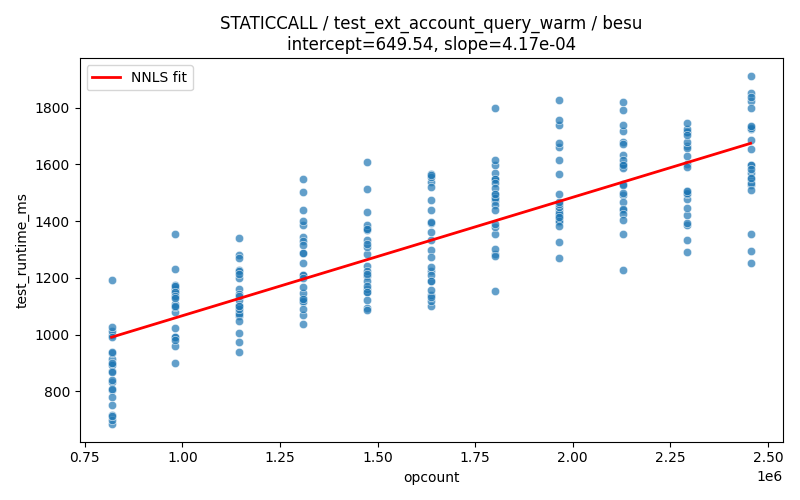

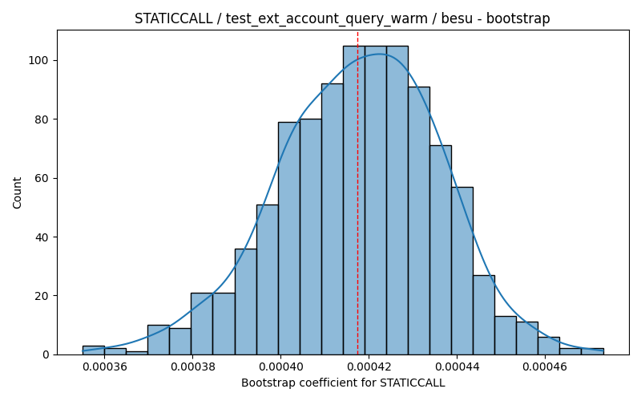

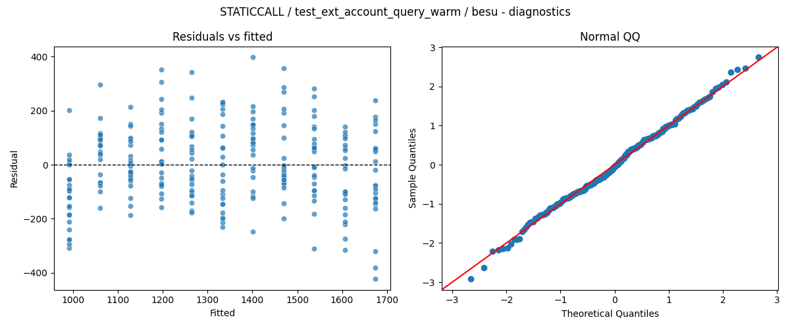

</details>

<details><summary>erigon — NNLS regression summary</summary>

```
==============================================================================
                           NNLS Regression Results                            
==============================================================================
Dep. Variable:          test_runtime_ms              R-squared:          0.848
Model:                  NNLS                    Adj. R-squared:          0.846
No. Observations:       110                               RMSE:         105.09
Df Residuals:           108                                MAE:          68.88
Df Model:               1      
==============================================================================
                      coef     std err     P-value      [0.025      0.975]
------------------------------------------------------------------------------
         const     55.3229     30.9624       0.037      0.0000    123.9677
       opcount      0.0005      0.0000       0.001      0.0004      0.0005
==============================================================================
Notes: Non-negative least squares with bootstrap inference (1000 iterations)
==============================================================================
```

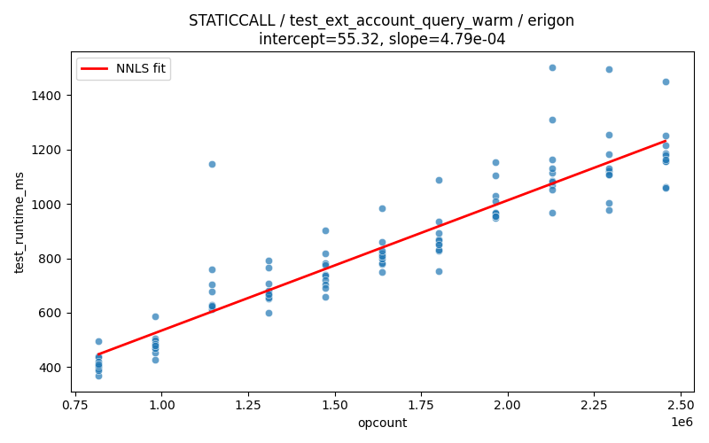

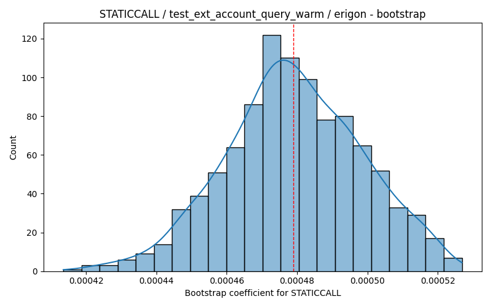

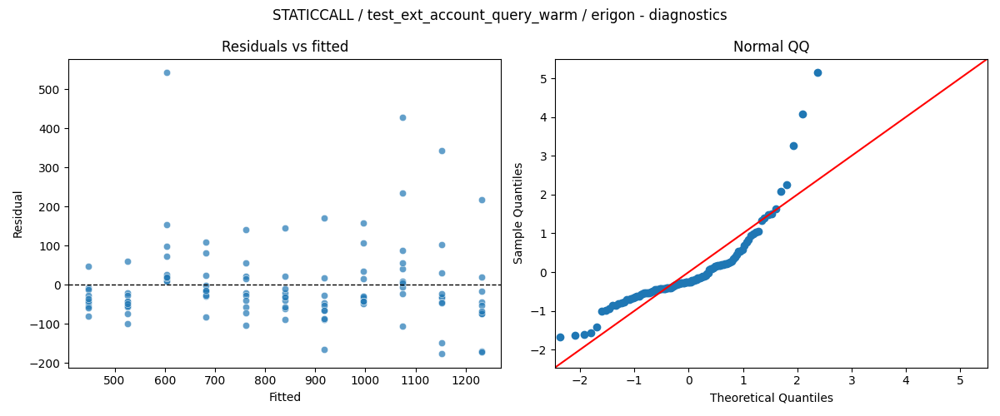

</details>

<details><summary>ethrex — NNLS regression summary</summary>

```
==============================================================================
                           NNLS Regression Results                            
==============================================================================
Dep. Variable:          test_runtime_ms              R-squared:          0.932
Model:                  NNLS                    Adj. R-squared:          0.932
No. Observations:       176                               RMSE:          13.93
Df Residuals:           174                                MAE:          11.21
Df Model:               1      
==============================================================================
                      coef     std err     P-value      [0.025      0.975]
------------------------------------------------------------------------------
         const     38.6432      3.2203       0.001     32.7531     45.3678
       opcount      0.0001      0.0000       0.001      0.0001      0.0001
==============================================================================
Notes: Non-negative least squares with bootstrap inference (1000 iterations)
==============================================================================
```

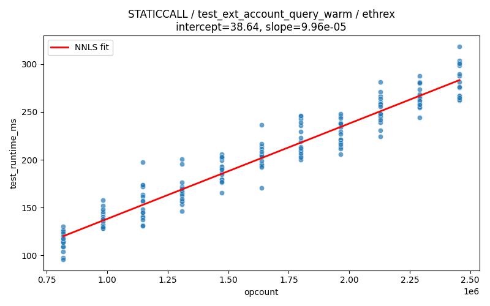

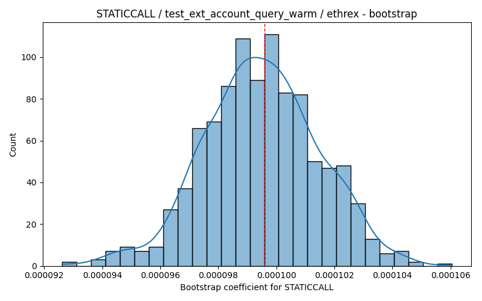

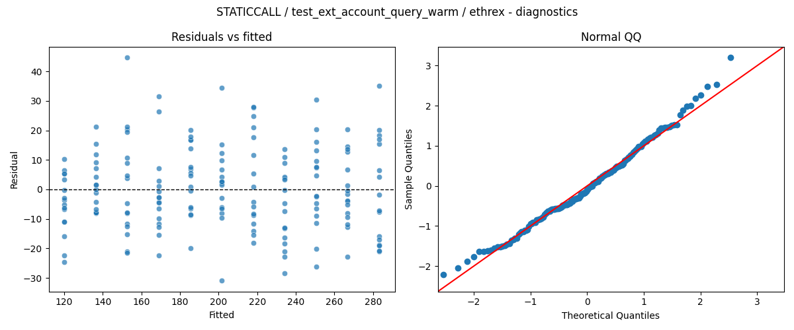

</details>

<details><summary>geth — NNLS regression summary</summary>

```
==============================================================================
                           NNLS Regression Results                            
==============================================================================
Dep. Variable:          test_runtime_ms              R-squared:          0.896
Model:                  NNLS                    Adj. R-squared:          0.895
No. Observations:       154                               RMSE:          32.00
Df Residuals:           152                                MAE:          24.84
Df Model:               1      
==============================================================================
                      coef     std err     P-value      [0.025      0.975]
------------------------------------------------------------------------------
         const     51.9737      7.5249       0.001     37.5900     66.9901
       opcount      0.0002      0.0000       0.001      0.0002      0.0002
==============================================================================
Notes: Non-negative least squares with bootstrap inference (1000 iterations)
==============================================================================
```

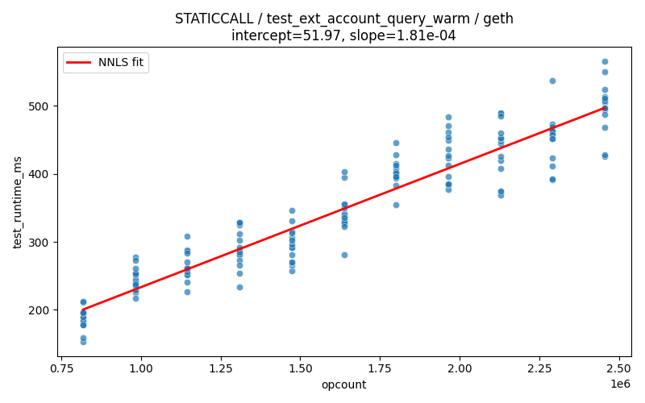

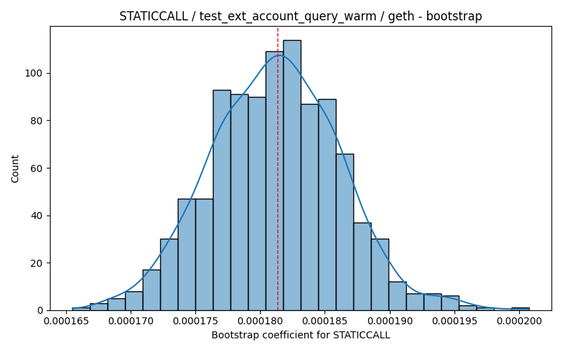

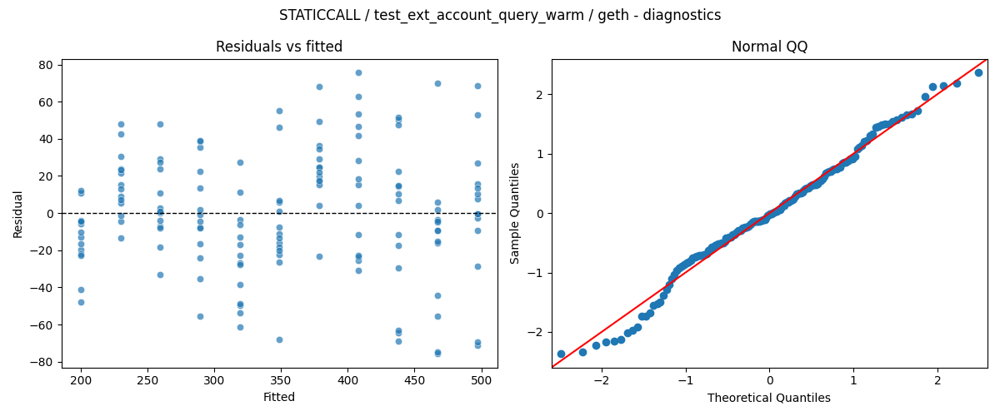

</details>

<details><summary>nethermind — NNLS regression summary</summary>

```
==============================================================================
                           NNLS Regression Results                            
==============================================================================
Dep. Variable:          test_runtime_ms              R-squared:          0.614
Model:                  NNLS                    Adj. R-squared:          0.611
No. Observations:       132                               RMSE:         135.01
Df Residuals:           130                                MAE:         104.60
Df Model:               1      
==============================================================================
                      coef     std err     P-value      [0.025      0.975]
------------------------------------------------------------------------------
         const    234.9842     34.0562       0.001    171.6228    305.6762
       opcount      0.0003      0.0000       0.001      0.0003      0.0004
==============================================================================
Notes: Non-negative least squares with bootstrap inference (1000 iterations)
==============================================================================
```

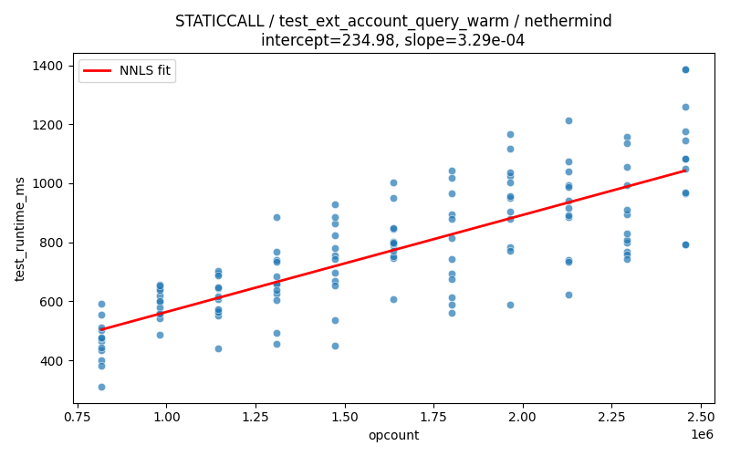

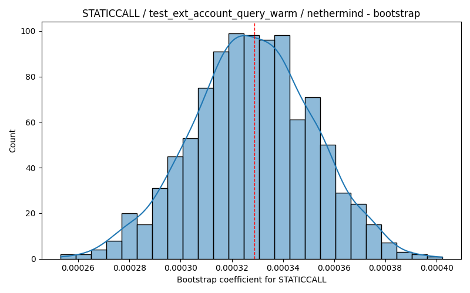

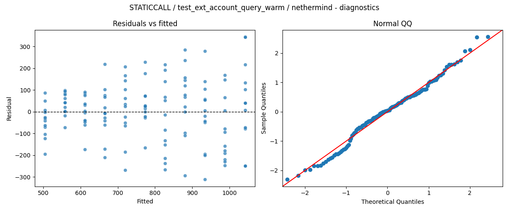

</details>

<details><summary>reth — NNLS regression summary</summary>

```
==============================================================================
                           NNLS Regression Results                            
==============================================================================
Dep. Variable:          test_runtime_ms              R-squared:          0.908
Model:                  NNLS                    Adj. R-squared:          0.908
No. Observations:       198                               RMSE:           9.07
Df Residuals:           196                                MAE:           7.38
Df Model:               1      
==============================================================================
                      coef     std err     P-value      [0.025      0.975]
------------------------------------------------------------------------------
         const     26.3626      2.0792       0.001     22.4912     30.7146
       opcount      0.0001      0.0000       0.001      0.0001      0.0001
==============================================================================
Notes: Non-negative least squares with bootstrap inference (1000 iterations)
==============================================================================
```

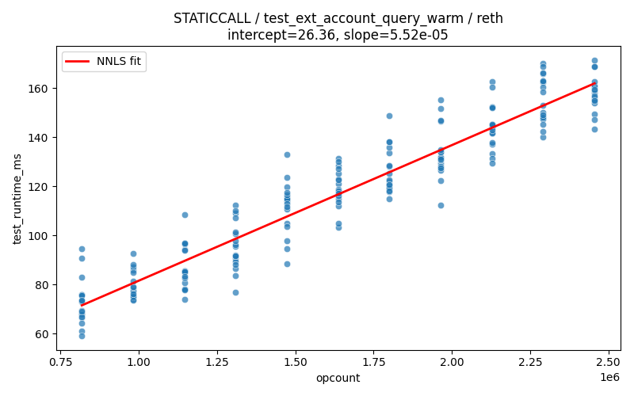

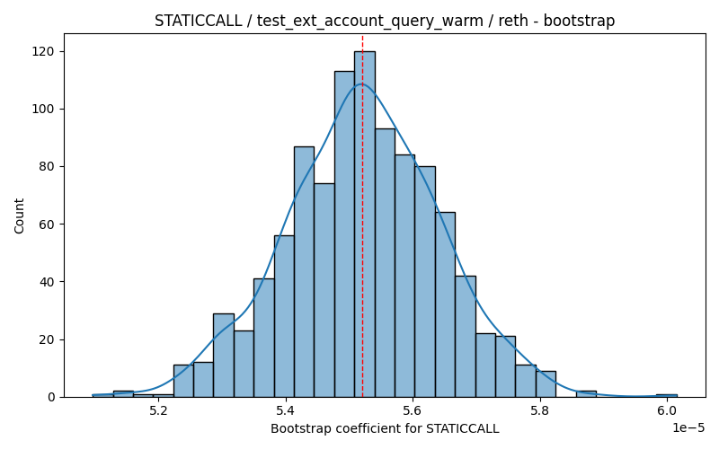

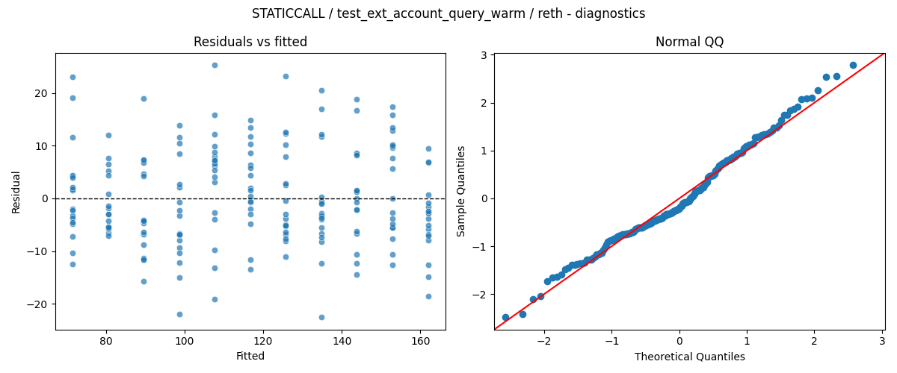

</details>
