# Glue opcodes report

Per-client NNLS fits of priced glue opcodes against their driver fixtures. Cycle-tier opcodes share one joint regression per client (shown once); pure-tier and mixed-tier opcodes each get a single-feature fit. Mixed-tier fits pre-adjust the LHS by subtracting the contribution of every priced upstream partner selected by the detector (pure ∪ cycle for `mixed_a`, plus `mixed_a` for `mixed_b`).

**Contents:** [besu](#besu) · [erigon](#erigon) · [ethrex](#ethrex) · [geth](#geth) · [nethermind](#nethermind) · [reth](#reth)

## besu

| glue_opcode | nobs | glue_runtime_ms | p_value | rsquared |
| --- | --- | --- | --- | --- |
| `ISZERO` | 3300 | 3.072e-06 | 1.00e-03 | 0.7961 |
| `JUMPDEST` | 3300 | 7.372e-07 | 1.00e-03 | 0.4502 |
| `SWAP` | 52800 | 2.627e-06 | 1.00e-03 | 0.3741 |
| `CALLDATASIZE` | 195107 | 2.758e-06 | 1.00e-03 | 0.9198 |
| `DUP` | 195107 | 1.124e-06 | 1.00e-03 | 0.9198 |
| `GAS` | 195107 | 2.336e-06 | 1.00e-03 | 0.9198 |
| `MLOAD` | 195107 | 8.407e-06 | 1.00e-03 | 0.9198 |
| `PUSH` | 195107 | 1.748e-06 | 1.00e-03 | 0.9198 |
| `PUSH0` | 195107 | 9.083e-07 | 1.00e-03 | 0.9198 |
| `STATICCALL` | 195107 | 0.0007179 | 1.00e-03 | 0.9198 |
| `ADD` | 3300 | 8.092e-06 | 1.00e-03 | 0.8247 |
| `AND` | 3300 | 5.655e-06 | 1.00e-03 | 0.8515 |
| `CALLDATACOPY` | 79200 | 1.299e-05 | 1.00e-03 | 0.635 |
| `CALLDATALOAD` | 13200 | 0 | 1.00e+00 | 2.22e-16 |
| `DIV` | 3300 | 1.265e-05 | 1.00e-03 | 0.789 |
| `EXP` | 3300 | 0.001018 | 1.00e-03 | 0.7552 |
| `GT` | 3300 | 1.819e-05 | 1.00e-03 | 0.144 |
| `JUMPI` | 3300 | 4.781e-06 | 1.00e-03 | 0.7294 |
| `LT` | 3300 | 1.838e-05 | 1.00e-03 | 0.1449 |
| `MSTORE` | 16500 | 1.384e-05 | 1.00e-03 | 0.7908 |
| `MSTORE8` | 16500 | 8.616e-06 | 1.00e-03 | 0.8288 |
| `MUL` | 3300 | 1.064e-05 | 1.00e-03 | 0.7992 |
| `PC` | 3300 | 2.739e-06 | 1.00e-03 | 0.8453 |
| `RETURNDATASIZE` | 13200 | 4.029e-06 | 1.00e-03 | 0.736 |
| `SELFBALANCE` | 2700 | 9.678e-06 | 1.00e-03 | 0.6837 |
| `SUB` | 3300 | 8.478e-06 | 1.00e-03 | 0.8175 |
| `JUMP` | 3300 | 4.012e-05 | 1.00e-03 | 0.8373 |
| `KECCAK256` | 52800 | 3.517e-05 | 1.00e-03 | 0.1511 |

### Cycle glue — joint fit · besu

<details><summary>Joint NNLS regression summary</summary>

```
==============================================================================
                           NNLS Regression Results                            
==============================================================================
Dep. Variable:          test_runtime_ms              R-squared:          0.920
Model:                  NNLS                    Adj. R-squared:          0.920
No. Observations:       195107                            RMSE:          27.68
Df Residuals:           195099                             MAE:          19.99
Df Model:               7      
==============================================================================
                      coef     std err     P-value      [0.025      0.975]
------------------------------------------------------------------------------
         const     46.8770      0.2067       0.001     46.4733     47.2629
  CALLDATASIZE      0.0000      0.0000       0.001      0.0000      0.0000
           DUP      0.0000      0.0000       0.001      0.0000      0.0000
           GAS      0.0000      0.0000       0.001      0.0000      0.0000
         MLOAD      0.0000      0.0000       0.001      0.0000      0.0000
          PUSH      0.0000      0.0000       0.001      0.0000      0.0000
         PUSH0      0.0000      0.0000       0.001      0.0000      0.0000
    STATICCALL      0.0007      0.0000       0.001      0.0007      0.0007
==============================================================================
Notes: Non-negative least squares with bootstrap inference (1000 iterations)
==============================================================================
```

</details>

<details><summary><code>CALLDATASIZE</code> · nobs=195107 · runtime_ms=2.758e-06 · p=1.00e-03 · R²=0.9198</summary>

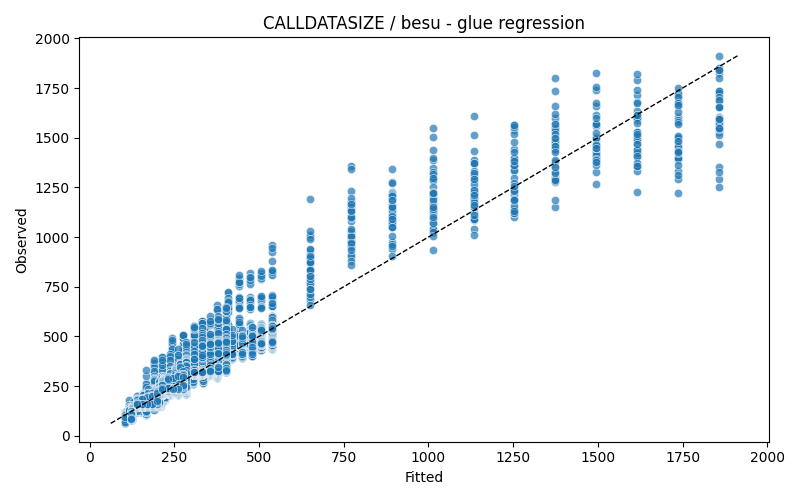

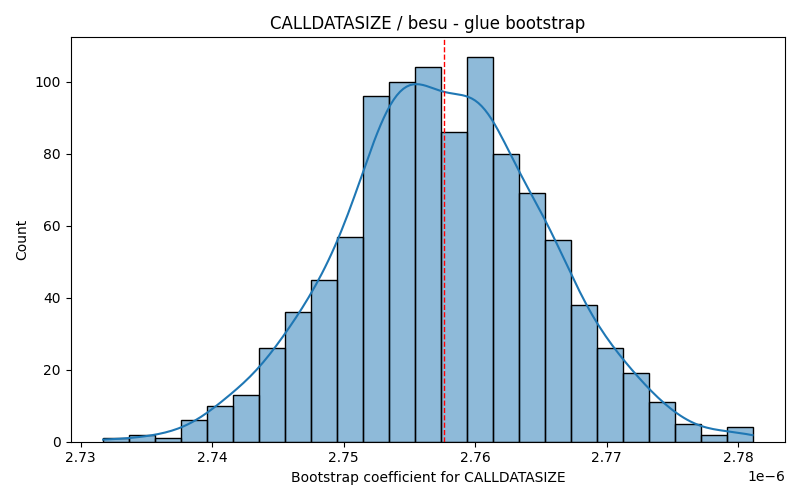


</details>

<details><summary><code>DUP</code> · nobs=195107 · runtime_ms=1.124e-06 · p=1.00e-03 · R²=0.9198</summary>


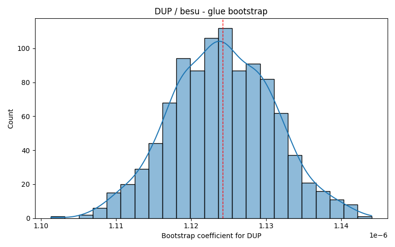


</details>

<details><summary><code>GAS</code> · nobs=195107 · runtime_ms=2.336e-06 · p=1.00e-03 · R²=0.9198</summary>


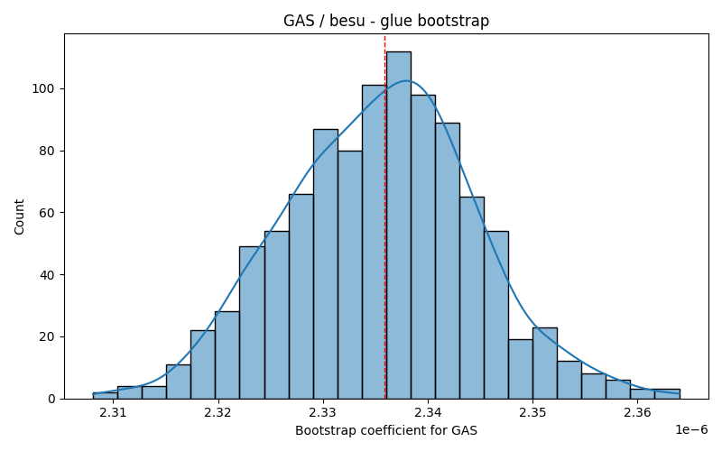


</details>

<details><summary><code>MLOAD</code> · nobs=195107 · runtime_ms=8.407e-06 · p=1.00e-03 · R²=0.9198</summary>

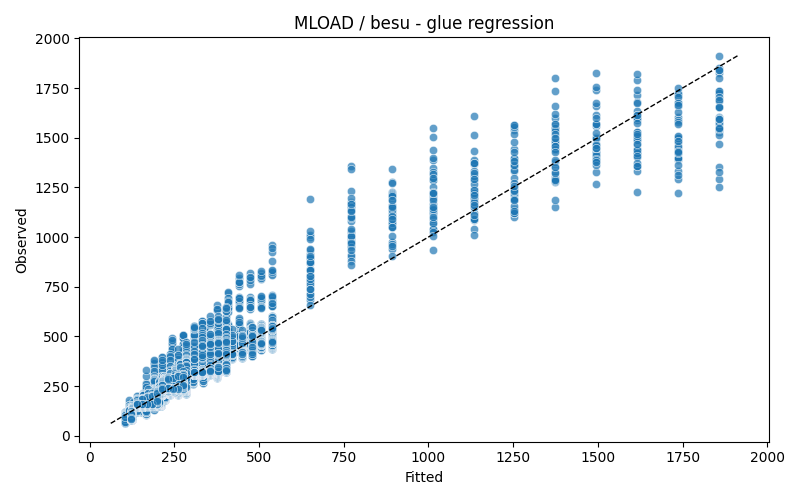

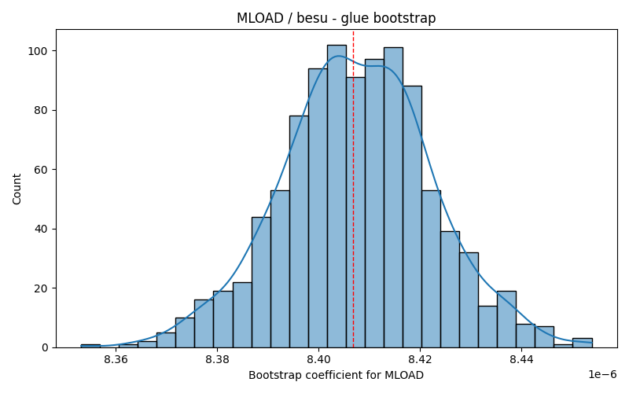


</details>

<details><summary><code>PUSH</code> · nobs=195107 · runtime_ms=1.748e-06 · p=1.00e-03 · R²=0.9198</summary>


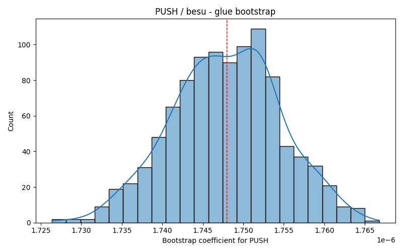

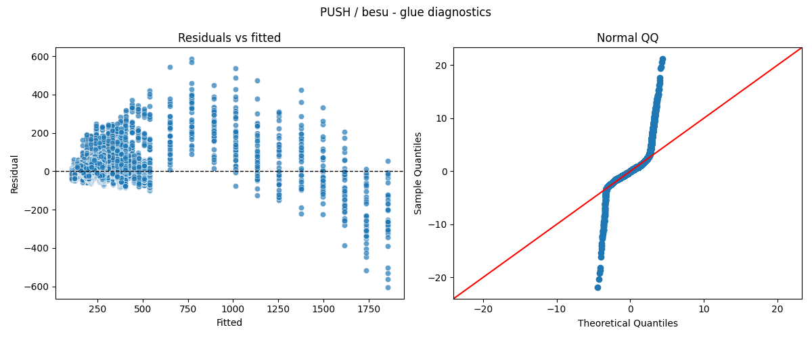

</details>

<details><summary><code>PUSH0</code> · nobs=195107 · runtime_ms=9.083e-07 · p=1.00e-03 · R²=0.9198</summary>


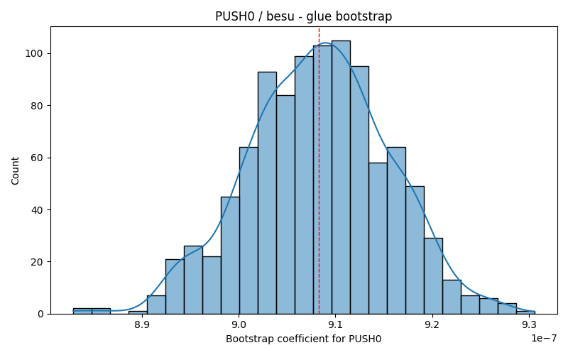


</details>

<details><summary><code>STATICCALL</code> · nobs=195107 · runtime_ms=0.0007179 · p=1.00e-03 · R²=0.9198</summary>


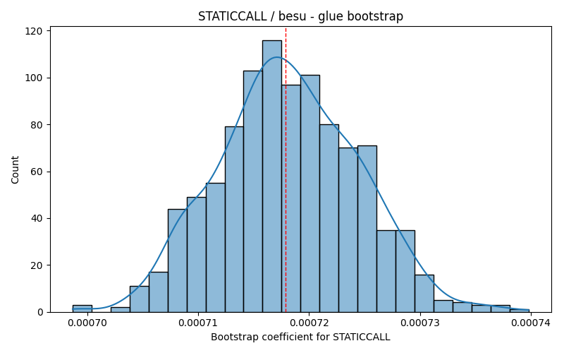


</details>

### Pure glue · besu

<details><summary><code>ISZERO</code> · nobs=3300 · runtime_ms=3.072e-06 · p=1.00e-03 · R²=0.7961</summary>

```
==============================================================================
                           NNLS Regression Results                            
==============================================================================
Dep. Variable:          test_runtime_ms              R-squared:          0.796
Model:                  NNLS                    Adj. R-squared:          0.796
No. Observations:       3300                              RMSE:          32.73
Df Residuals:           3298                               MAE:          25.89
Df Model:               1      
==============================================================================
                      coef     std err     P-value      [0.025      0.975]
------------------------------------------------------------------------------
         const     61.9708      1.9907       0.001     58.1210     65.7110
        ISZERO      0.0000      0.0000       0.001      0.0000      0.0000
==============================================================================
Notes: Non-negative least squares with bootstrap inference (1000 iterations)
==============================================================================
```

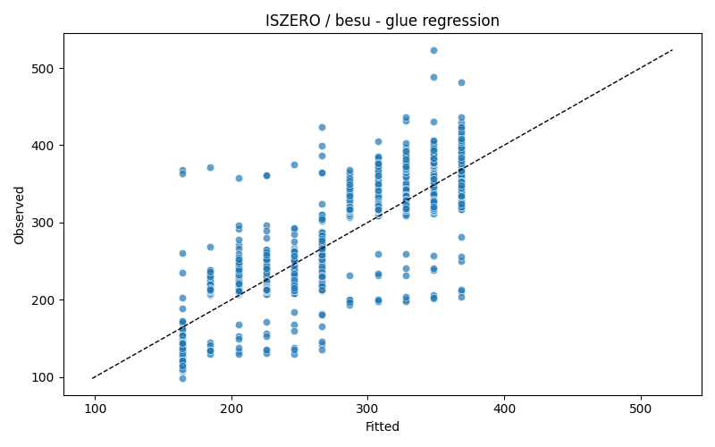

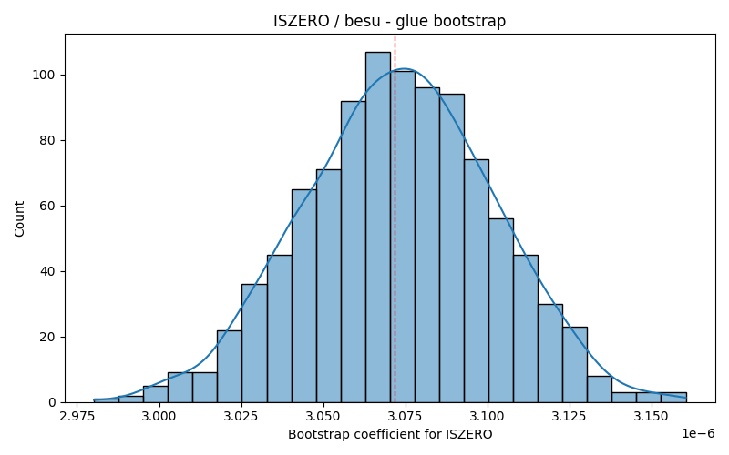

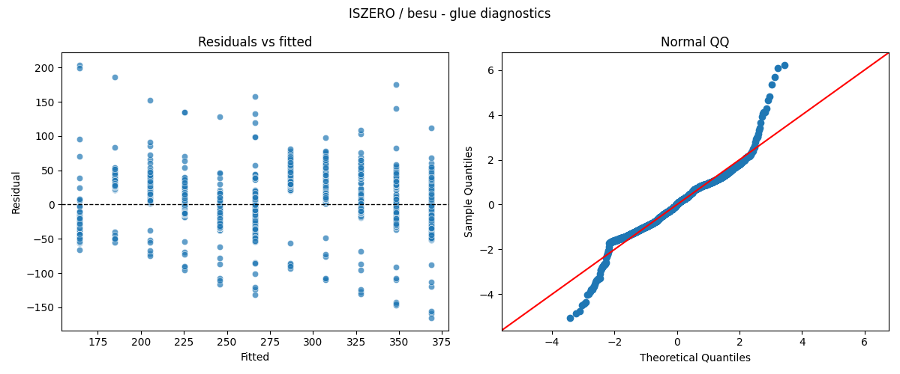

</details>

<details><summary><code>JUMPDEST</code> · nobs=3300 · runtime_ms=7.372e-07 · p=1.00e-03 · R²=0.4502</summary>

```
==============================================================================
                           NNLS Regression Results                            
==============================================================================
Dep. Variable:          test_runtime_ms              R-squared:          0.450
Model:                  NNLS                    Adj. R-squared:          0.450
No. Observations:       3300                              RMSE:          51.44
Df Residuals:           3298                               MAE:          21.01
Df Model:               1      
==============================================================================
                      coef     std err     P-value      [0.025      0.975]
------------------------------------------------------------------------------
         const     46.0091      3.1157       0.001     40.3546     52.4572
      JUMPDEST      0.0000      0.0000       0.001      0.0000      0.0000
==============================================================================
Notes: Non-negative least squares with bootstrap inference (1000 iterations)
==============================================================================
```


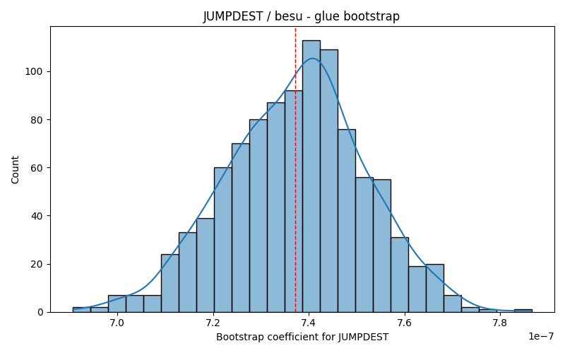


</details>

<details><summary><code>SWAP</code> · nobs=52800 · runtime_ms=2.627e-06 · p=1.00e-03 · R²=0.3741</summary>

```
==============================================================================
                           NNLS Regression Results                            
==============================================================================
Dep. Variable:          test_runtime_ms              R-squared:          0.374
Model:                  NNLS                    Adj. R-squared:          0.374
No. Observations:       52800                             RMSE:          71.54
Df Residuals:           52798                              MAE:          65.40
Df Model:               1      
==============================================================================
                      coef     std err     P-value      [0.025      0.975]
------------------------------------------------------------------------------
         const     50.2942      0.9139       0.001     48.5027     52.1007
          SWAP      0.0000      0.0000       0.001      0.0000      0.0000
==============================================================================
Notes: Non-negative least squares with bootstrap inference (1000 iterations)
==============================================================================
```

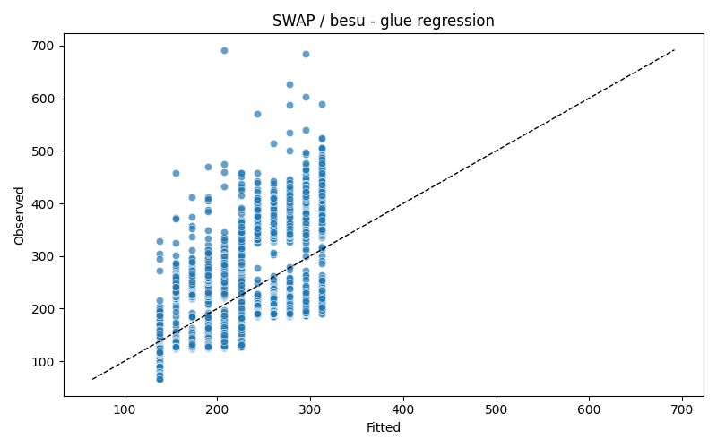

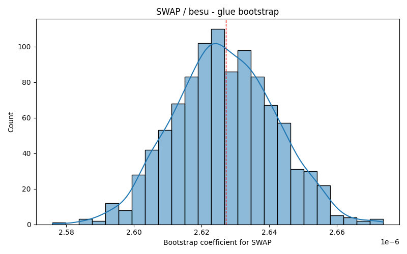

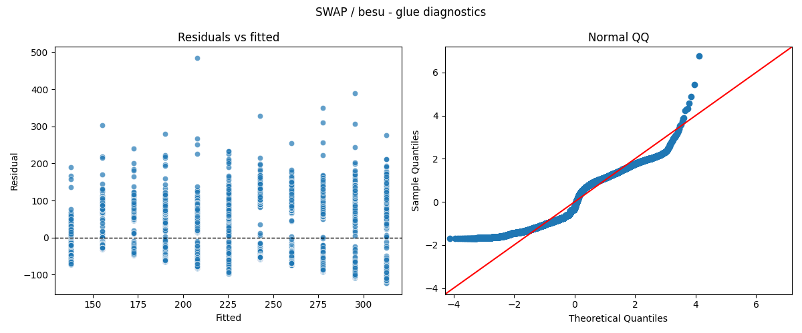

</details>

### Mixed glue (tier A) · besu

<details><summary><code>ADD</code> · nobs=3300 · runtime_ms=8.092e-06 · p=1.00e-03 · R²=0.8247</summary>

```
==============================================================================
                           NNLS Regression Results                            
==============================================================================
Dep. Variable:          test_runtime_ms              R-squared:          0.825
Model:                  NNLS                    Adj. R-squared:          0.825
No. Observations:       3300                              RMSE:          39.27
Df Residuals:           3298                               MAE:          32.22
Df Model:               1      
==============================================================================
                      coef     std err     P-value      [0.025      0.975]
------------------------------------------------------------------------------
         const     74.1582      2.4093       0.001     69.5119     78.7837
           ADD      0.0000      0.0000       0.001      0.0000      0.0000
==============================================================================
Notes: Non-negative least squares with bootstrap inference (1000 iterations)
==============================================================================
```

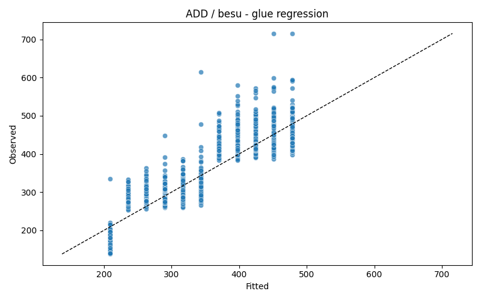

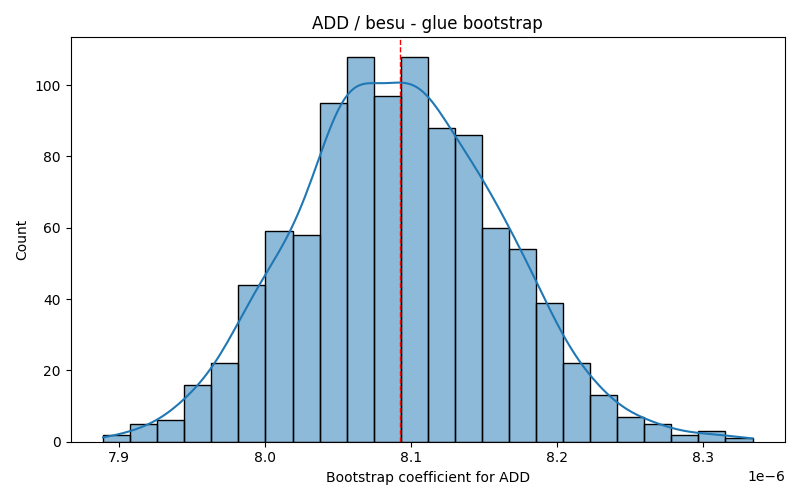

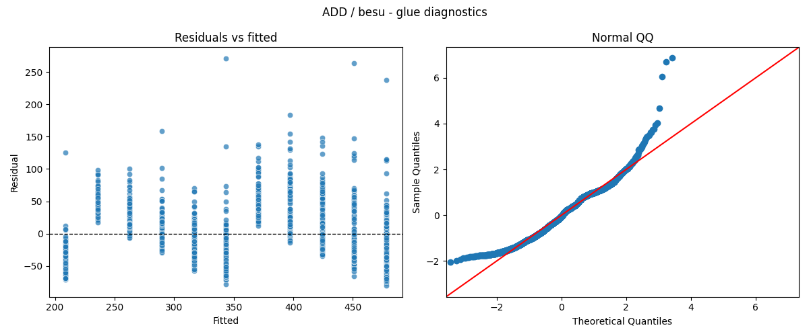

</details>

<details><summary><code>AND</code> · nobs=3300 · runtime_ms=5.655e-06 · p=1.00e-03 · R²=0.8515</summary>

```
==============================================================================
                           NNLS Regression Results                            
==============================================================================
Dep. Variable:          test_runtime_ms              R-squared:          0.851
Model:                  NNLS                    Adj. R-squared:          0.851
No. Observations:       3300                              RMSE:          24.86
Df Residuals:           3298                               MAE:          20.26
Df Model:               1      
==============================================================================
                      coef     std err     P-value      [0.025      0.975]
------------------------------------------------------------------------------
         const     59.5624      1.3630       0.001     56.8819     62.1636
           AND      0.0000      0.0000       0.001      0.0000      0.0000
==============================================================================
Notes: Non-negative least squares with bootstrap inference (1000 iterations)
==============================================================================
```

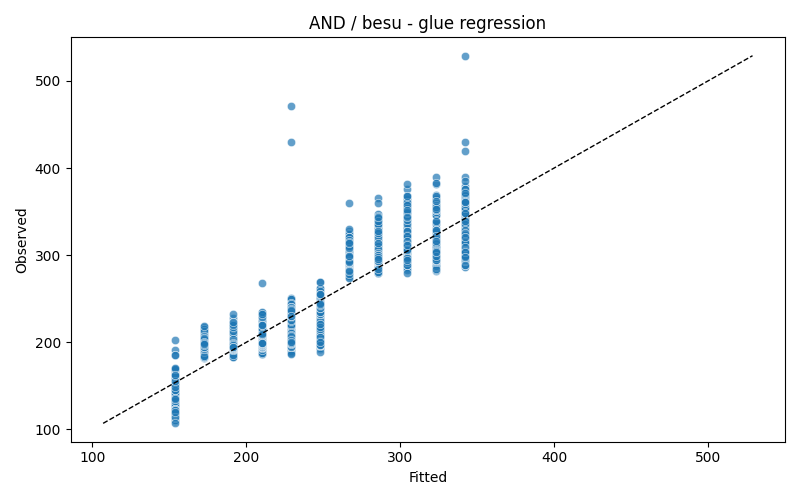

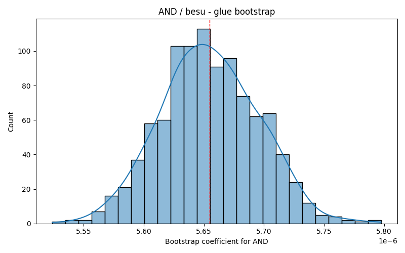

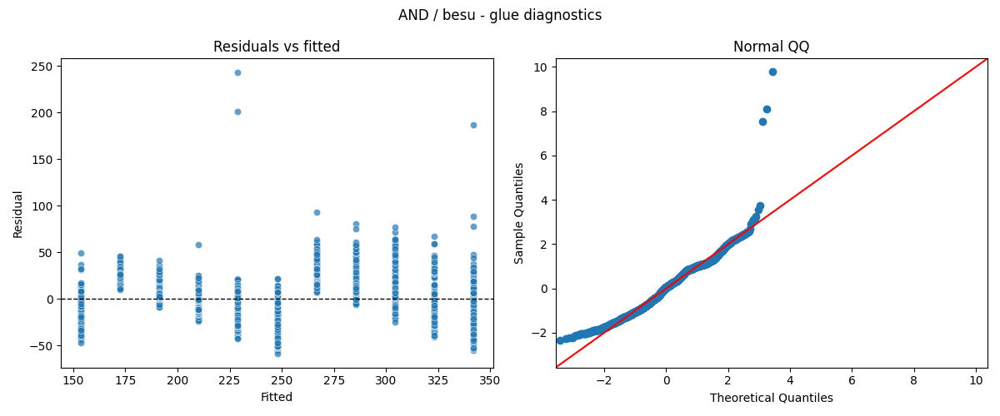

</details>

<details><summary><code>CALLDATACOPY</code> · nobs=79200 · runtime_ms=1.299e-05 · p=1.00e-03 · R²=0.635</summary>

```
==============================================================================
                           NNLS Regression Results                            
==============================================================================
Dep. Variable:          test_runtime_ms              R-squared:          0.635
Model:                  NNLS                    Adj. R-squared:          0.635
No. Observations:       79200                             RMSE:          74.07
Df Residuals:           79198                              MAE:          58.14
Df Model:               1      
==============================================================================
                      coef     std err     P-value      [0.025      0.975]
------------------------------------------------------------------------------
         const    124.7289      0.3338       0.001    124.0900    125.3574
  CALLDATACOPY      0.0000      0.0000       0.001      0.0000      0.0000
==============================================================================
Notes: Non-negative least squares with bootstrap inference (1000 iterations)
==============================================================================
```

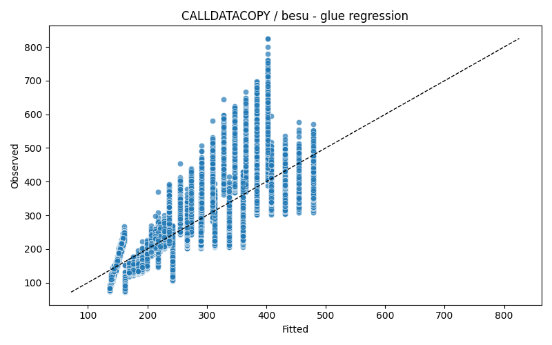

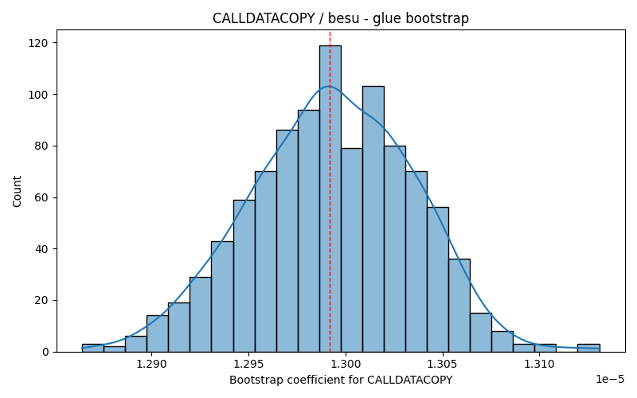

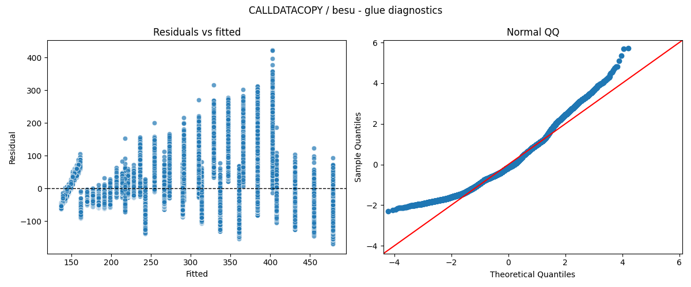

</details>

<details><summary><code>CALLDATALOAD</code> · nobs=13200 · runtime_ms=0 · p=1.00e+00 · R²=2.22e-16</summary>

```
==============================================================================
                           NNLS Regression Results                            
==============================================================================
Dep. Variable:          test_runtime_ms              R-squared:          0.000
Model:                  NNLS                    Adj. R-squared:         -0.000
No. Observations:       13200                             RMSE:           0.64
Df Residuals:           13198                              MAE:           0.42
Df Model:               1      
==============================================================================
                      coef     std err     P-value      [0.025      0.975]
------------------------------------------------------------------------------
         const      3.4134      0.0052       0.001      3.4035      3.4238
  CALLDATALOAD      0.0000      0.0000       1.000      0.0000      0.0000
==============================================================================
Notes: Non-negative least squares with bootstrap inference (1000 iterations)
==============================================================================
```

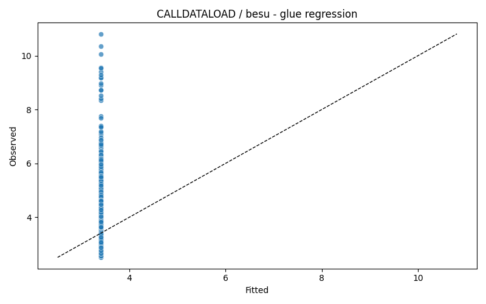

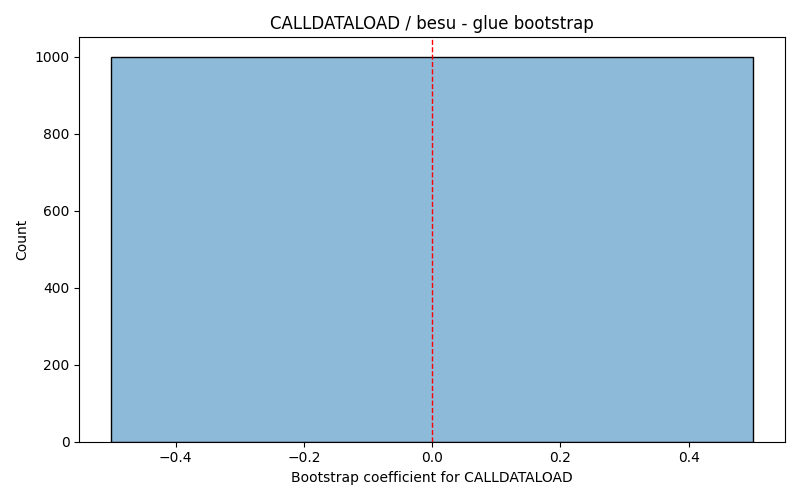

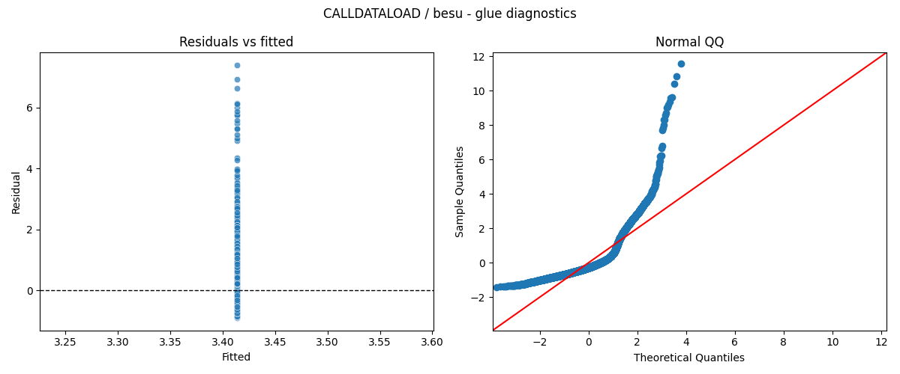

</details>

<details><summary><code>DIV</code> · nobs=3300 · runtime_ms=1.265e-05 · p=1.00e-03 · R²=0.789</summary>

```
==============================================================================
                           NNLS Regression Results                            
==============================================================================
Dep. Variable:          test_runtime_ms              R-squared:          0.789
Model:                  NNLS                    Adj. R-squared:          0.789
No. Observations:       3300                              RMSE:          51.64
Df Residuals:           3298                               MAE:          41.53
Df Model:               1      
==============================================================================
                      coef     std err     P-value      [0.025      0.975]
------------------------------------------------------------------------------
         const    133.2622      2.6123       0.001    128.2061    137.9842
           DIV      0.0000      0.0000       0.001      0.0000      0.0000
==============================================================================
Notes: Non-negative least squares with bootstrap inference (1000 iterations)
==============================================================================
```

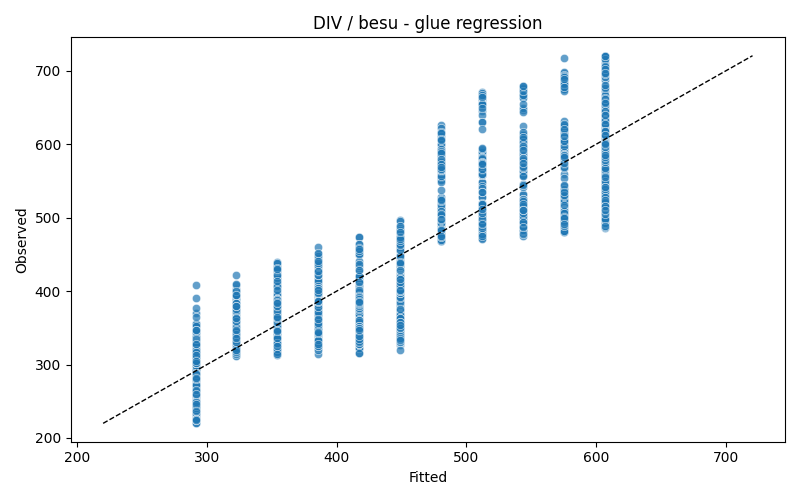

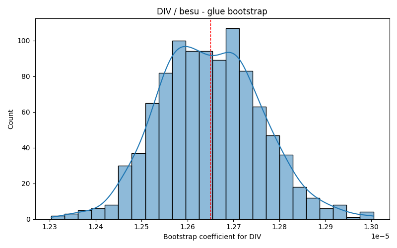

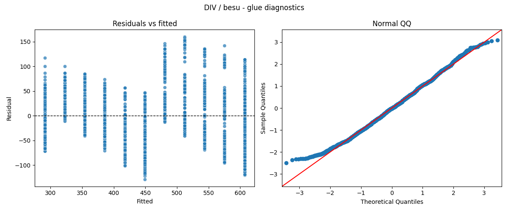

</details>

<details><summary><code>EXP</code> · nobs=3300 · runtime_ms=0.001018 · p=1.00e-03 · R²=0.7552</summary>

```
==============================================================================
                           NNLS Regression Results                            
==============================================================================
Dep. Variable:          test_runtime_ms              R-squared:          0.755
Model:                  NNLS                    Adj. R-squared:          0.755
No. Observations:       3300                              RMSE:          22.69
Df Residuals:           3298                               MAE:          17.56
Df Model:               1      
==============================================================================
                      coef     std err     P-value      [0.025      0.975]
------------------------------------------------------------------------------
         const     91.2648      1.5366       0.001     88.4417     94.4738
           EXP      0.0010      0.0000       0.001      0.0010      0.0010
==============================================================================
Notes: Non-negative least squares with bootstrap inference (1000 iterations)
==============================================================================
```

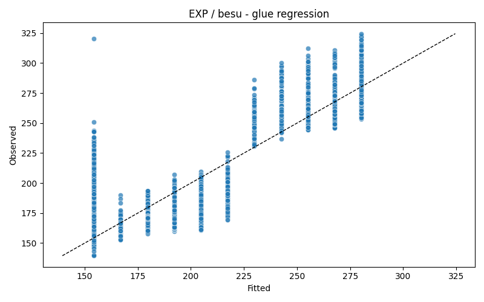

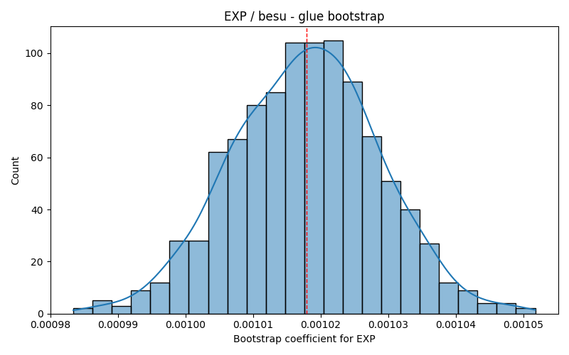

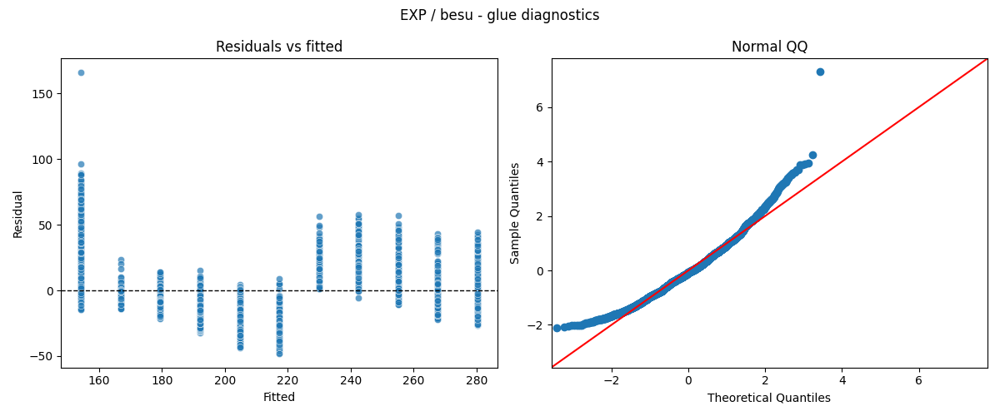

</details>

<details><summary><code>GT</code> · nobs=3300 · runtime_ms=1.819e-05 · p=1.00e-03 · R²=0.144</summary>

```
==============================================================================
                           NNLS Regression Results                            
==============================================================================
Dep. Variable:          test_runtime_ms              R-squared:          0.144
Model:                  NNLS                    Adj. R-squared:          0.144
No. Observations:       3300                              RMSE:         466.69
Df Residuals:           3298                               MAE:         442.38
Df Model:               1      
==============================================================================
                      coef     std err     P-value      [0.025      0.975]
------------------------------------------------------------------------------
         const    134.1904     23.0788       0.001     90.8983    180.9615
            GT      0.0000      0.0000       0.001      0.0000      0.0000
==============================================================================
Notes: Non-negative least squares with bootstrap inference (1000 iterations)
==============================================================================
```

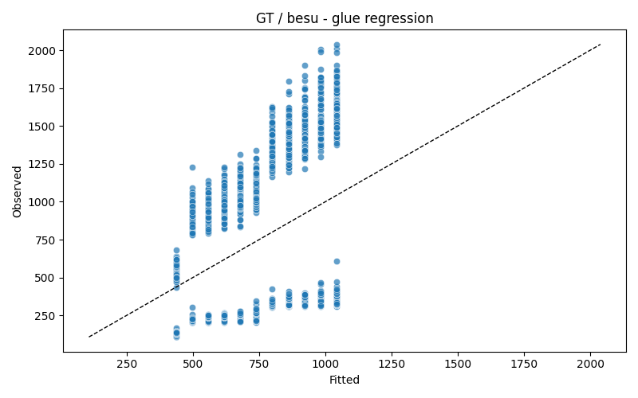

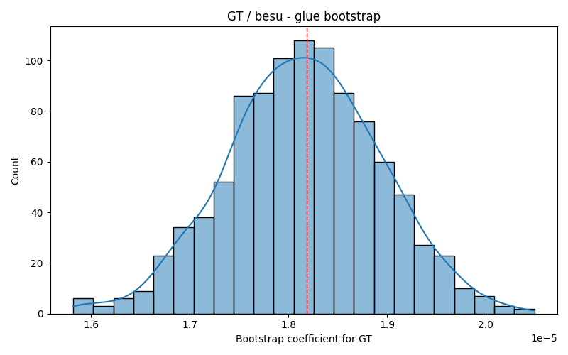

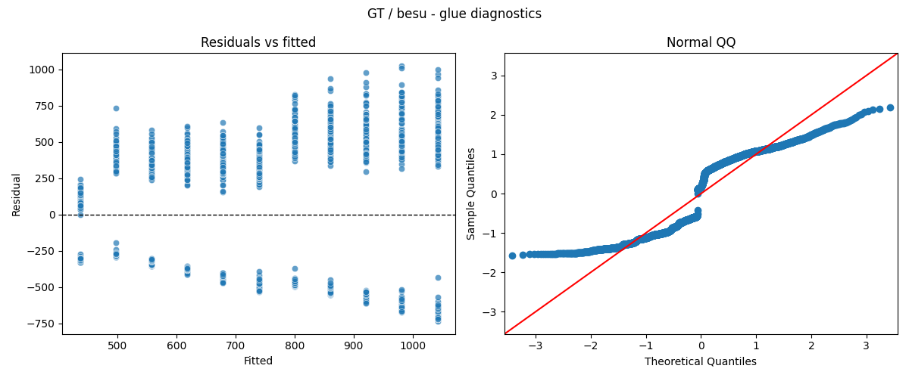

</details>

<details><summary><code>JUMPI</code> · nobs=3300 · runtime_ms=4.781e-06 · p=1.00e-03 · R²=0.7294</summary>

```
==============================================================================
                           NNLS Regression Results                            
==============================================================================
Dep. Variable:          test_runtime_ms              R-squared:          0.729
Model:                  NNLS                    Adj. R-squared:          0.729
No. Observations:       3300                              RMSE:          13.14
Df Residuals:           3298                               MAE:           9.89
Df Model:               1      
==============================================================================
                      coef     std err     P-value      [0.025      0.975]
------------------------------------------------------------------------------
         const     22.2362      0.7393       0.001     20.8347     23.6811
         JUMPI      0.0000      0.0000       0.001      0.0000      0.0000
==============================================================================
Notes: Non-negative least squares with bootstrap inference (1000 iterations)
==============================================================================
```

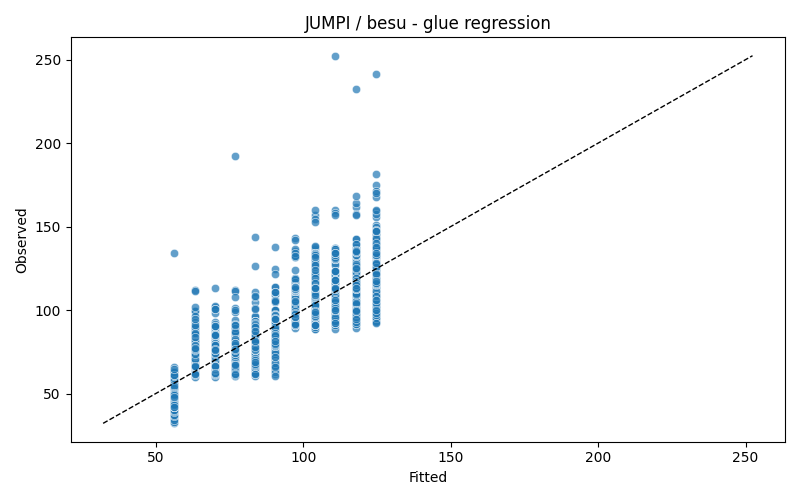

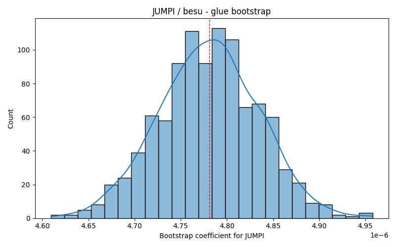

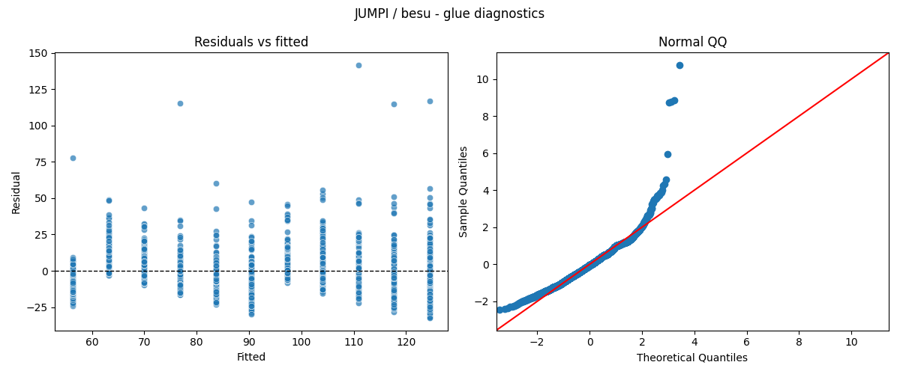

</details>

<details><summary><code>LT</code> · nobs=3300 · runtime_ms=1.838e-05 · p=1.00e-03 · R²=0.1449</summary>

```
==============================================================================
                           NNLS Regression Results                            
==============================================================================
Dep. Variable:          test_runtime_ms              R-squared:          0.145
Model:                  NNLS                    Adj. R-squared:          0.145
No. Observations:       3300                              RMSE:         469.91
Df Residuals:           3298                               MAE:         445.31
Df Model:               1      
==============================================================================
                      coef     std err     P-value      [0.025      0.975]
------------------------------------------------------------------------------
         const    160.3209     24.0183       0.001    114.6366    209.4040
            LT      0.0000      0.0000       0.001      0.0000      0.0000
==============================================================================
Notes: Non-negative least squares with bootstrap inference (1000 iterations)
==============================================================================
```

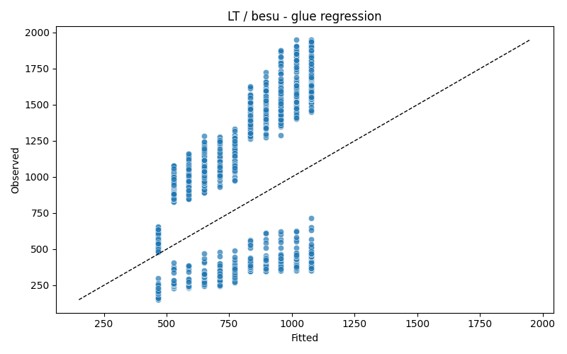


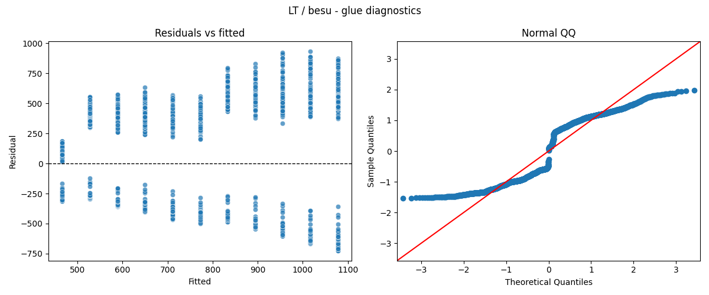

</details>

<details><summary><code>MSTORE</code> · nobs=16500 · runtime_ms=1.384e-05 · p=1.00e-03 · R²=0.7908</summary>

```
==============================================================================
                           NNLS Regression Results                            
==============================================================================
Dep. Variable:          test_runtime_ms              R-squared:          0.791
Model:                  NNLS                    Adj. R-squared:          0.791
No. Observations:       16500                             RMSE:          49.94
Df Residuals:           16498                              MAE:          40.76
Df Model:               1      
==============================================================================
                      coef     std err     P-value      [0.025      0.975]
------------------------------------------------------------------------------
         const     85.1968      1.3257       0.001     82.4939     87.7035
        MSTORE      0.0000      0.0000       0.001      0.0000      0.0000
==============================================================================
Notes: Non-negative least squares with bootstrap inference (1000 iterations)
==============================================================================
```

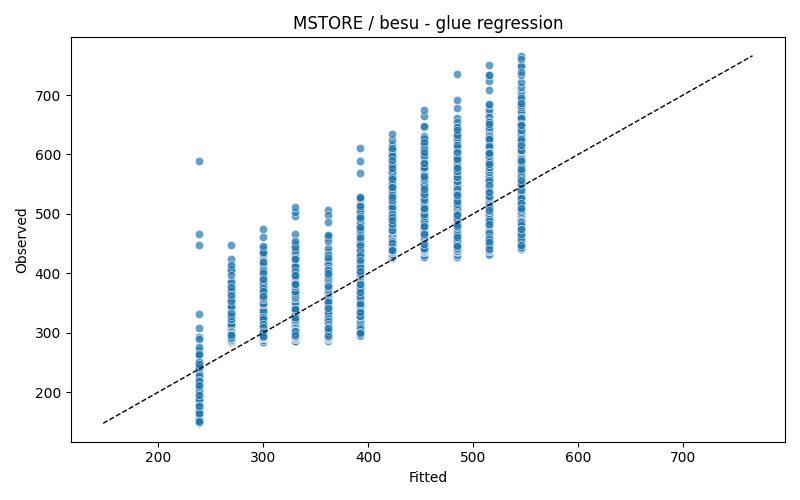

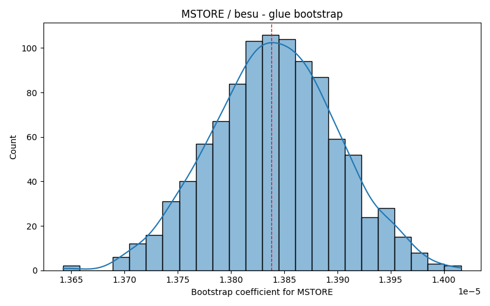

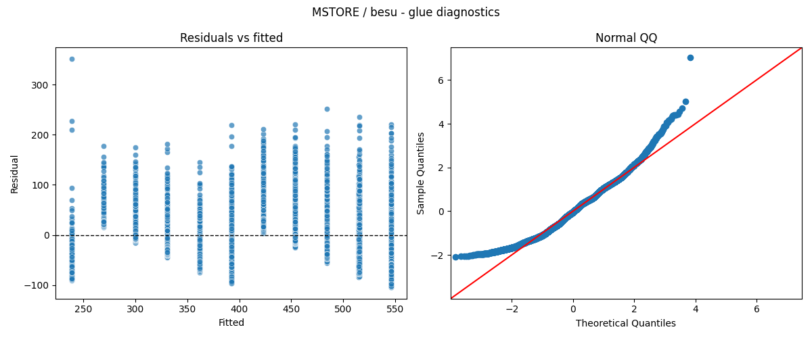

</details>

<details><summary><code>MSTORE8</code> · nobs=16500 · runtime_ms=8.616e-06 · p=1.00e-03 · R²=0.8288</summary>

```
==============================================================================
                           NNLS Regression Results                            
==============================================================================
Dep. Variable:          test_runtime_ms              R-squared:          0.829
Model:                  NNLS                    Adj. R-squared:          0.829
No. Observations:       16500                             RMSE:          27.48
Df Residuals:           16498                              MAE:          22.22
Df Model:               1      
==============================================================================
                      coef     std err     P-value      [0.025      0.975]
------------------------------------------------------------------------------
         const     52.4963      0.7294       0.001     51.1252     53.9669
       MSTORE8      0.0000      0.0000       0.001      0.0000      0.0000
==============================================================================
Notes: Non-negative least squares with bootstrap inference (1000 iterations)
==============================================================================
```

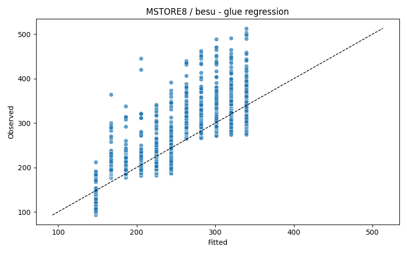

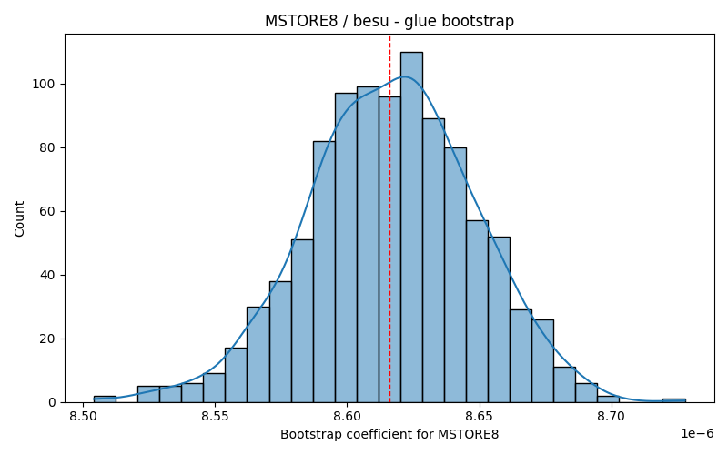

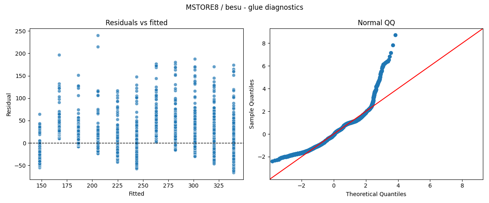

</details>

<details><summary><code>MUL</code> · nobs=3300 · runtime_ms=1.064e-05 · p=1.00e-03 · R²=0.7992</summary>

```
==============================================================================
                           NNLS Regression Results                            
==============================================================================
Dep. Variable:          test_runtime_ms              R-squared:          0.799
Model:                  NNLS                    Adj. R-squared:          0.799
No. Observations:       3300                              RMSE:          42.11
Df Residuals:           3298                               MAE:          33.30
Df Model:               1      
==============================================================================
                      coef     std err     P-value      [0.025      0.975]
------------------------------------------------------------------------------
         const     98.0158      2.0241       0.001     93.9228    101.7445
           MUL      0.0000      0.0000       0.001      0.0000      0.0000
==============================================================================
Notes: Non-negative least squares with bootstrap inference (1000 iterations)
==============================================================================
```

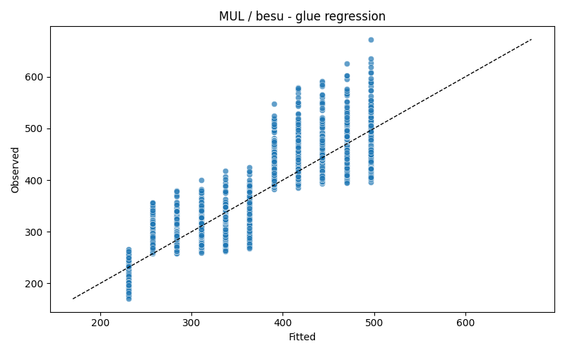


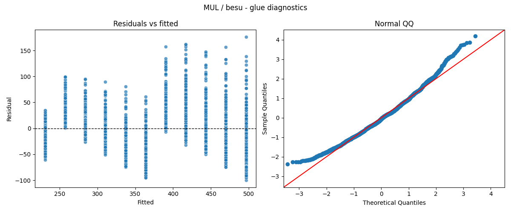

</details>

<details><summary><code>PC</code> · nobs=3300 · runtime_ms=2.739e-06 · p=1.00e-03 · R²=0.8453</summary>

```
==============================================================================
                           NNLS Regression Results                            
==============================================================================
Dep. Variable:          test_runtime_ms              R-squared:          0.845
Model:                  NNLS                    Adj. R-squared:          0.845
No. Observations:       3300                              RMSE:          35.03
Df Residuals:           3298                               MAE:          29.83
Df Model:               1      
==============================================================================
                      coef     std err     P-value      [0.025      0.975]
------------------------------------------------------------------------------
         const     71.2602      2.2430       0.001     66.7298     75.5880
            PC      0.0000      0.0000       0.001      0.0000      0.0000
==============================================================================
Notes: Non-negative least squares with bootstrap inference (1000 iterations)
==============================================================================
```

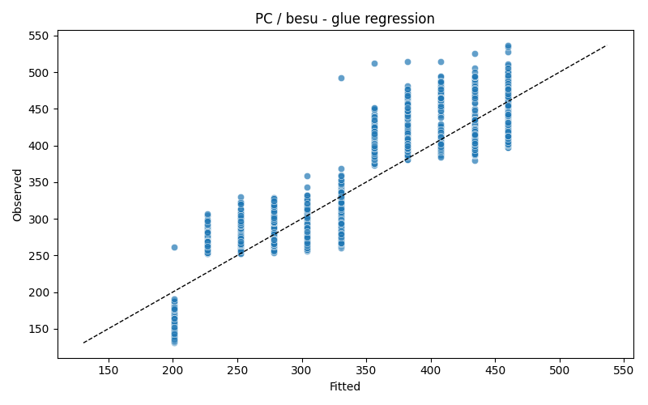

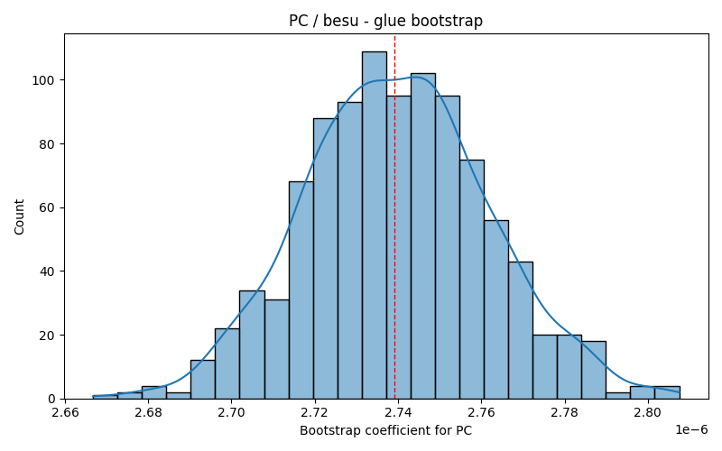

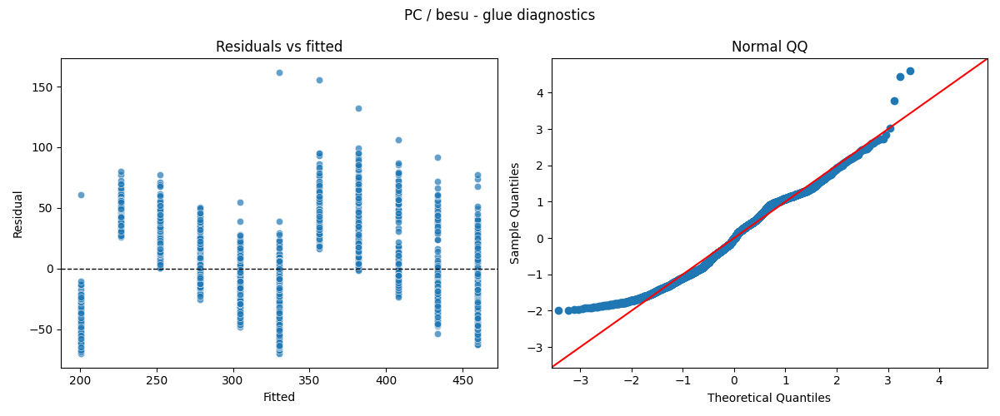

</details>

<details><summary><code>RETURNDATASIZE</code> · nobs=13200 · runtime_ms=4.029e-06 · p=1.00e-03 · R²=0.736</summary>

```
==============================================================================
                           NNLS Regression Results                            
==============================================================================
Dep. Variable:          test_runtime_ms              R-squared:          0.736
Model:                  NNLS                    Adj. R-squared:          0.736
No. Observations:       13200                             RMSE:          38.10
Df Residuals:           13198                              MAE:          25.49
Df Model:               1      
==============================================================================
                      coef     std err     P-value      [0.025      0.975]
------------------------------------------------------------------------------
         const     54.9442      1.0628       0.001     52.6991     57.0335
RETURNDATASIZE      0.0000      0.0000       0.001      0.0000      0.0000
==============================================================================
Notes: Non-negative least squares with bootstrap inference (1000 iterations)
==============================================================================
```

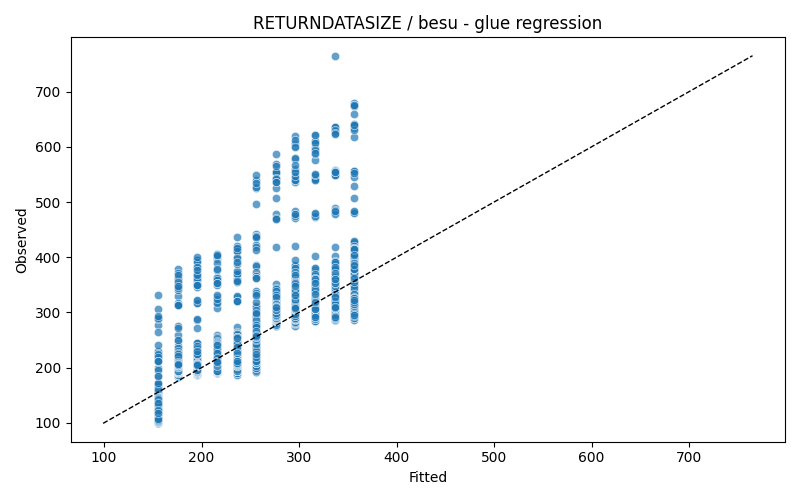

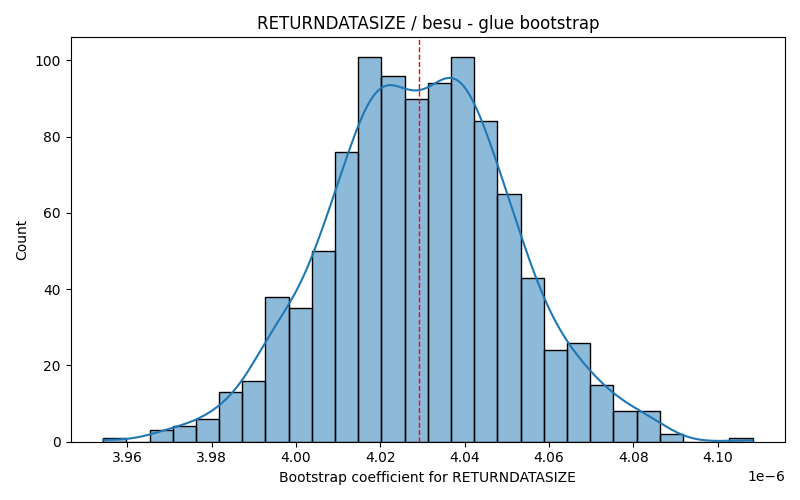

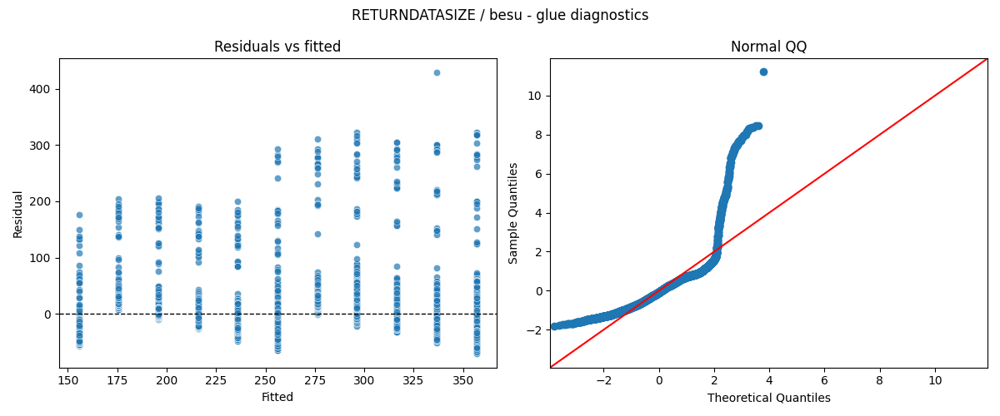

</details>

<details><summary><code>SELFBALANCE</code> · nobs=2700 · runtime_ms=9.678e-06 · p=1.00e-03 · R²=0.6837</summary>

```
==============================================================================
                           NNLS Regression Results                            
==============================================================================
Dep. Variable:          test_runtime_ms              R-squared:          0.684
Model:                  NNLS                    Adj. R-squared:          0.684
No. Observations:       2700                              RMSE:          66.40
Df Residuals:           2698                               MAE:          52.77
Df Model:               1      
==============================================================================
                      coef     std err     P-value      [0.025      0.975]
------------------------------------------------------------------------------
         const    231.5628      4.6520       0.001    222.0771    240.6602
   SELFBALANCE      0.0000      0.0000       0.001      0.0000      0.0000
==============================================================================
Notes: Non-negative least squares with bootstrap inference (1000 iterations)
==============================================================================
```

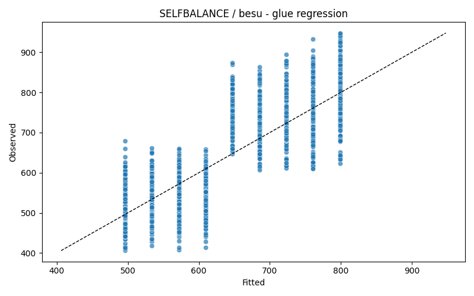

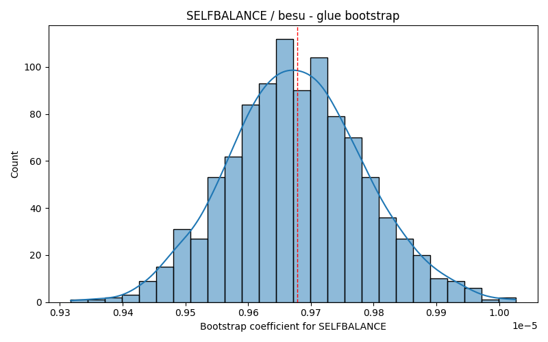

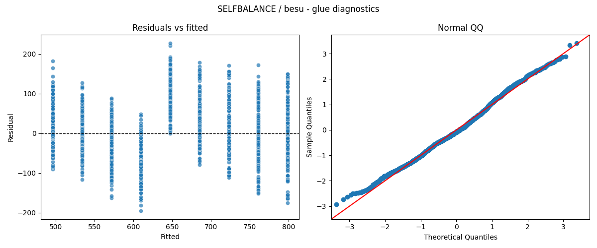

</details>

<details><summary><code>SUB</code> · nobs=3300 · runtime_ms=8.478e-06 · p=1.00e-03 · R²=0.8175</summary>

```
==============================================================================
                           NNLS Regression Results                            
==============================================================================
Dep. Variable:          test_runtime_ms              R-squared:          0.817
Model:                  NNLS                    Adj. R-squared:          0.817
No. Observations:       3300                              RMSE:          42.17
Df Residuals:           3298                               MAE:          34.16
Df Model:               1      
==============================================================================
                      coef     std err     P-value      [0.025      0.975]
------------------------------------------------------------------------------
         const     83.0463      2.4527       0.001     78.3021     87.6222
           SUB      0.0000      0.0000       0.001      0.0000      0.0000
==============================================================================
Notes: Non-negative least squares with bootstrap inference (1000 iterations)
==============================================================================
```

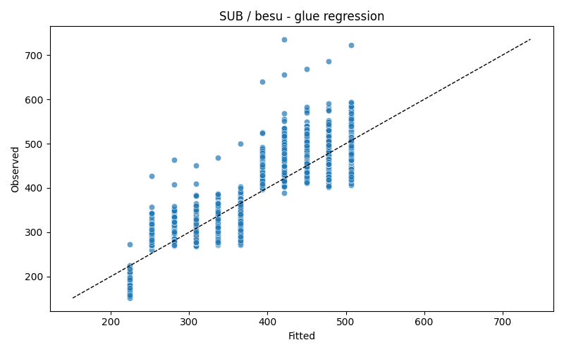

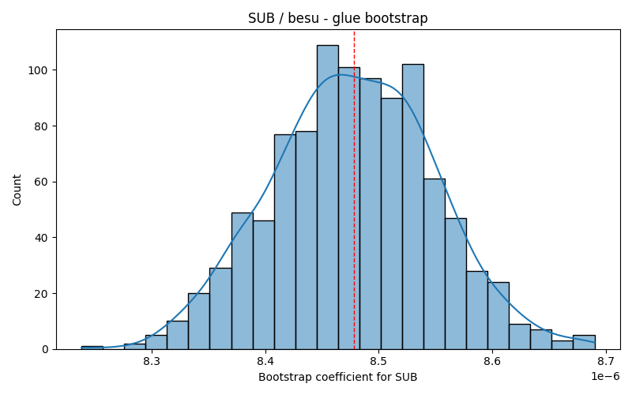

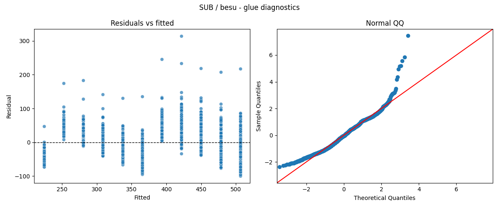

</details>

### Mixed glue (tier B) · besu

<details><summary><code>JUMP</code> · nobs=3300 · runtime_ms=4.012e-05 · p=1.00e-03 · R²=0.8373</summary>

```
==============================================================================
                           NNLS Regression Results                            
==============================================================================
Dep. Variable:          test_runtime_ms              R-squared:          0.837
Model:                  NNLS                    Adj. R-squared:          0.837
No. Observations:       3300                              RMSE:          65.71
Df Residuals:           3298                               MAE:          54.63
Df Model:               1      
==============================================================================
                      coef     std err     P-value      [0.025      0.975]
------------------------------------------------------------------------------
         const    128.9129      3.9561       0.001    120.9301    136.9588
          JUMP      0.0000      0.0000       0.001      0.0000      0.0000
==============================================================================
Notes: Non-negative least squares with bootstrap inference (1000 iterations)
==============================================================================
```

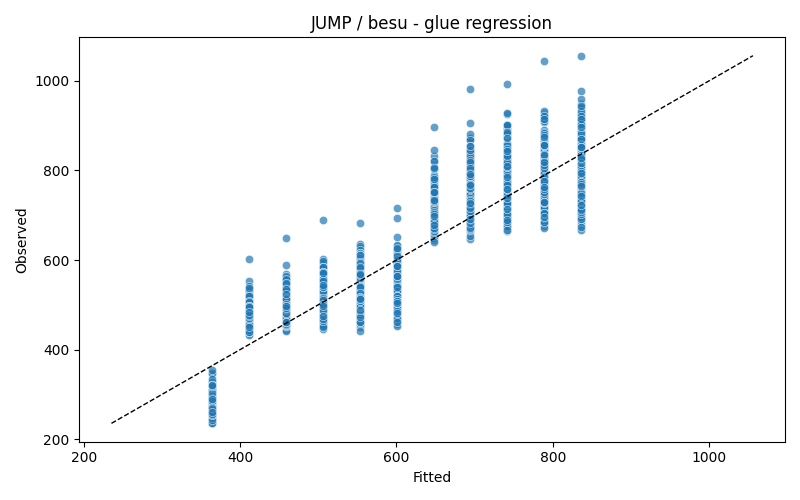

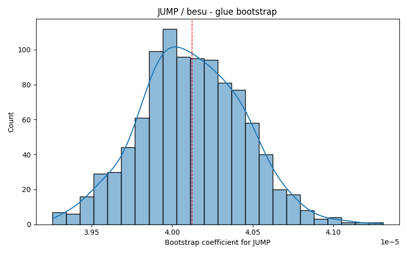

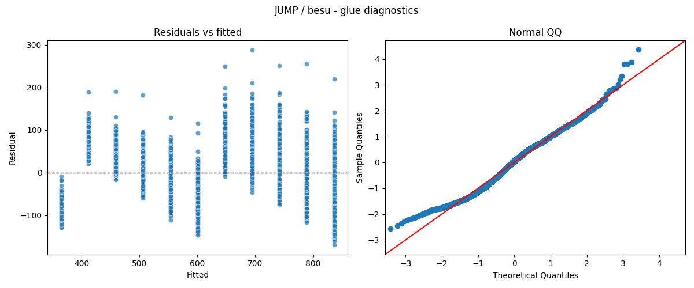

</details>

<details><summary><code>KECCAK256</code> · nobs=52800 · runtime_ms=3.517e-05 · p=1.00e-03 · R²=0.1511</summary>

```
==============================================================================
                           NNLS Regression Results                            
==============================================================================
Dep. Variable:          test_runtime_ms              R-squared:          0.151
Model:                  NNLS                    Adj. R-squared:          0.151
No. Observations:       52800                             RMSE:         165.66
Df Residuals:           52798                              MAE:         130.68
Df Model:               1      
==============================================================================
                      coef     std err     P-value      [0.025      0.975]
------------------------------------------------------------------------------
         const    516.6203      1.6053       0.001    513.6860    519.7182
     KECCAK256      0.0000      0.0000       0.001      0.0000      0.0000
==============================================================================
Notes: Non-negative least squares with bootstrap inference (1000 iterations)
==============================================================================
```

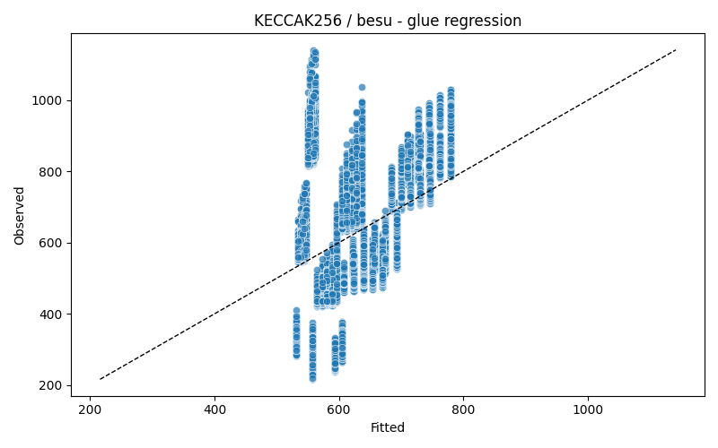

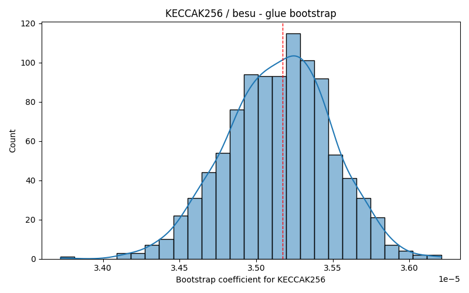

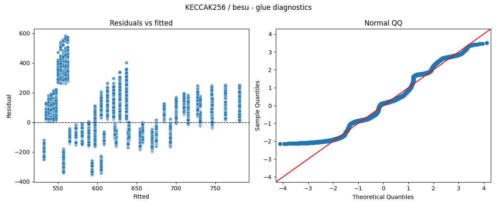

</details>

## erigon

| glue_opcode | nobs | glue_runtime_ms | p_value | rsquared |
| --- | --- | --- | --- | --- |
| `ISZERO` | 198 | 1.106e-06 | 1.00e-03 | 0.5337 |
| `JUMPDEST` | 198 | 7.669e-07 | 1.00e-03 | 0.9206 |
| `SWAP` | 3168 | 1.231e-06 | 1.00e-03 | 0.6369 |
| `CALLDATASIZE` | 11847 | 8.584e-07 | 1.00e-03 | 0.8972 |
| `DUP` | 11847 | 1.084e-06 | 1.00e-03 | 0.8972 |
| `GAS` | 11847 | 8.945e-07 | 1.00e-03 | 0.8972 |
| `MLOAD` | 11847 | 3.403e-06 | 1.00e-03 | 0.8972 |
| `PUSH` | 11847 | 2.696e-06 | 1.00e-03 | 0.8972 |
| `PUSH0` | 11847 | 8.961e-07 | 1.00e-03 | 0.8972 |
| `STATICCALL` | 11847 | 0.0004799 | 1.00e-03 | 0.8972 |
| `ADD` | 198 | 2.659e-06 | 1.00e-03 | 0.5691 |
| `AND` | 198 | 3.252e-06 | 1.00e-03 | 0.6137 |
| `CALLDATACOPY` | 4752 | 7.501e-06 | 1.00e-03 | 0.8147 |
| `CALLDATALOAD` | 792 | 0.0001792 | 1.00e-03 | 0.005246 |
| `DIV` | 198 | 9.676e-06 | 1.00e-03 | 0.8841 |
| `EXP` | 198 | 0.0003752 | 1.00e-03 | 0.1743 |
| `GT` | 198 | 2.792e-06 | 1.00e-03 | 0.926 |
| `JUMPI` | 198 | 4.116e-06 | 1.00e-03 | 0.2844 |
| `LT` | 198 | 2.855e-06 | 1.00e-03 | 0.919 |
| `MSTORE` | 990 | 5.665e-06 | 1.00e-03 | 0.8399 |
| `MSTORE8` | 990 | 5.259e-06 | 1.00e-03 | 0.6611 |
| `MUL` | 198 | 3.307e-06 | 1.00e-03 | 0.6341 |
| `PC` | 198 | 1.307e-06 | 1.00e-03 | 0.6538 |
| `RETURNDATASIZE` | 792 | 1.734e-06 | 1.00e-03 | 0.599 |
| `SELFBALANCE` | 162 | 1.354e-06 | 1.00e-03 | 0.854 |
| `SUB` | 198 | 2.795e-06 | 1.00e-03 | 0.5604 |
| `JUMP` | 198 | 7.139e-06 | 1.00e-03 | 0.7659 |
| `KECCAK256` | 3168 | 1.828e-05 | 1.00e-03 | 0.06337 |

### Cycle glue — joint fit · erigon

<details><summary>Joint NNLS regression summary</summary>

```
==============================================================================
                           NNLS Regression Results                            
==============================================================================
Dep. Variable:          test_runtime_ms              R-squared:          0.897
Model:                  NNLS                    Adj. R-squared:          0.897
No. Observations:       11847                             RMSE:          36.81
Df Residuals:           11839                              MAE:          18.21
Df Model:               7      
==============================================================================
                      coef     std err     P-value      [0.025      0.975]
------------------------------------------------------------------------------
         const     29.5993      1.1052       0.001     27.4233     31.7279
  CALLDATASIZE      0.0000      0.0000       0.001      0.0000      0.0000
           DUP      0.0000      0.0000       0.001      0.0000      0.0000
           GAS      0.0000      0.0000       0.001      0.0000      0.0000
         MLOAD      0.0000      0.0000       0.001      0.0000      0.0000
          PUSH      0.0000      0.0000       0.001      0.0000      0.0000
         PUSH0      0.0000      0.0000       0.001      0.0000      0.0000
    STATICCALL      0.0005      0.0000       0.001      0.0005      0.0005
==============================================================================
Notes: Non-negative least squares with bootstrap inference (1000 iterations)
==============================================================================
```

</details>

<details><summary><code>CALLDATASIZE</code> · nobs=11847 · runtime_ms=8.584e-07 · p=1.00e-03 · R²=0.8972</summary>


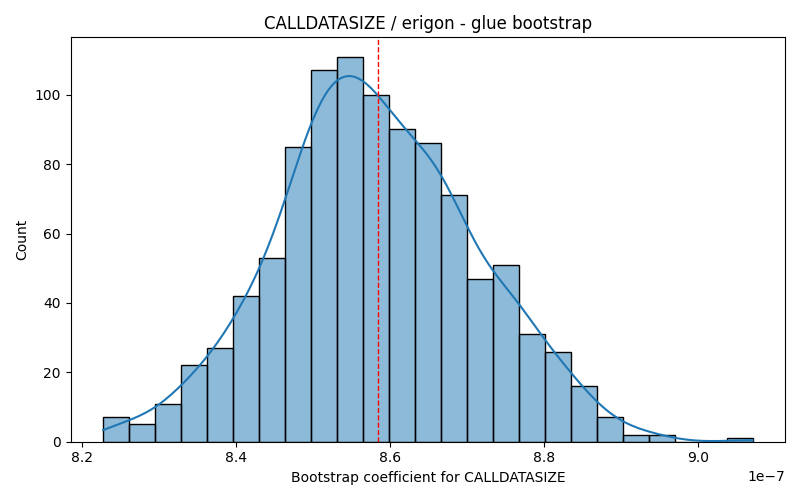

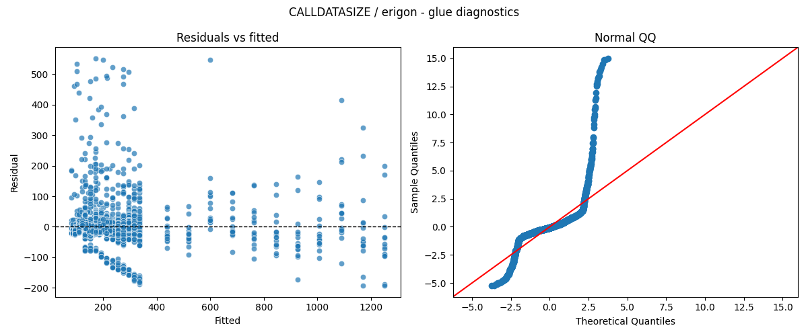

</details>

<details><summary><code>DUP</code> · nobs=11847 · runtime_ms=1.084e-06 · p=1.00e-03 · R²=0.8972</summary>


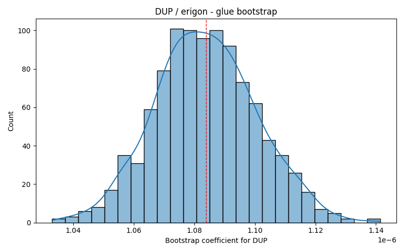


</details>

<details><summary><code>GAS</code> · nobs=11847 · runtime_ms=8.945e-07 · p=1.00e-03 · R²=0.8972</summary>


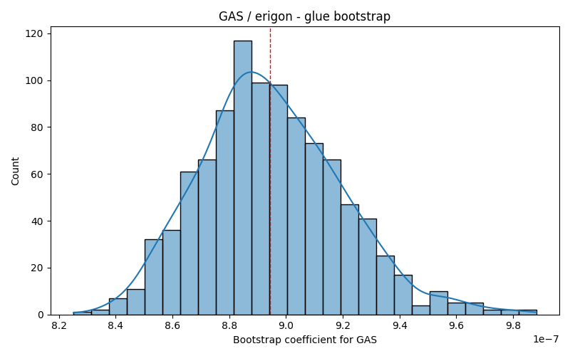


</details>

<details><summary><code>MLOAD</code> · nobs=11847 · runtime_ms=3.403e-06 · p=1.00e-03 · R²=0.8972</summary>

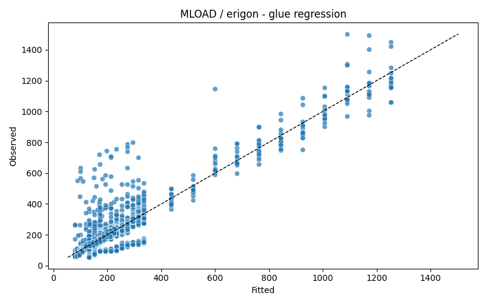

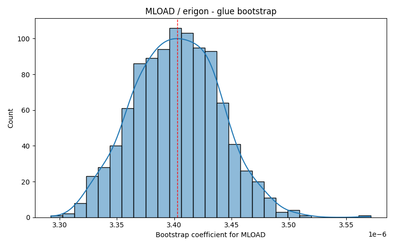

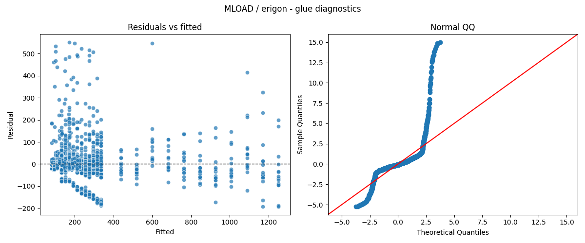

</details>

<details><summary><code>PUSH</code> · nobs=11847 · runtime_ms=2.696e-06 · p=1.00e-03 · R²=0.8972</summary>

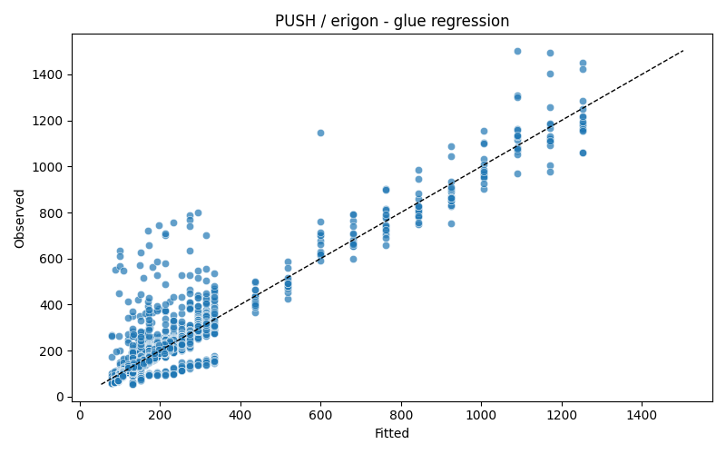

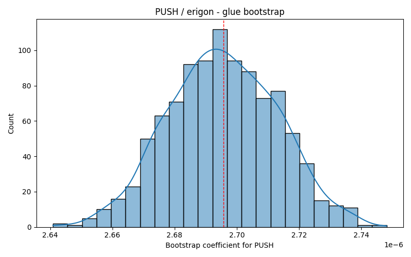


</details>

<details><summary><code>PUSH0</code> · nobs=11847 · runtime_ms=8.961e-07 · p=1.00e-03 · R²=0.8972</summary>

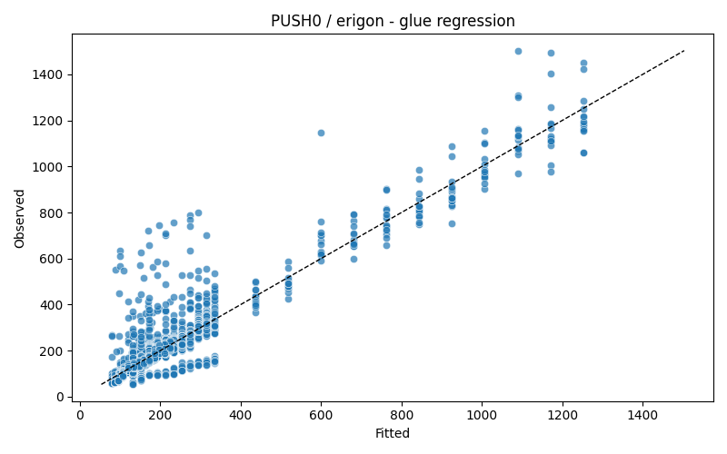

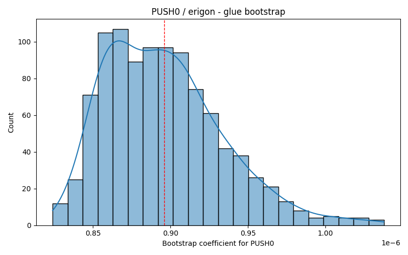


</details>

<details><summary><code>STATICCALL</code> · nobs=11847 · runtime_ms=0.0004799 · p=1.00e-03 · R²=0.8972</summary>

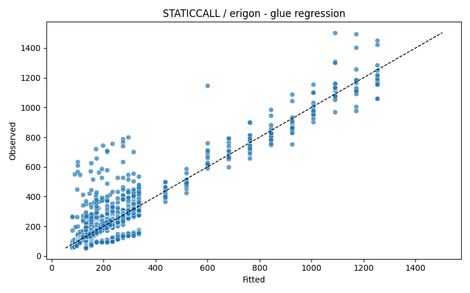

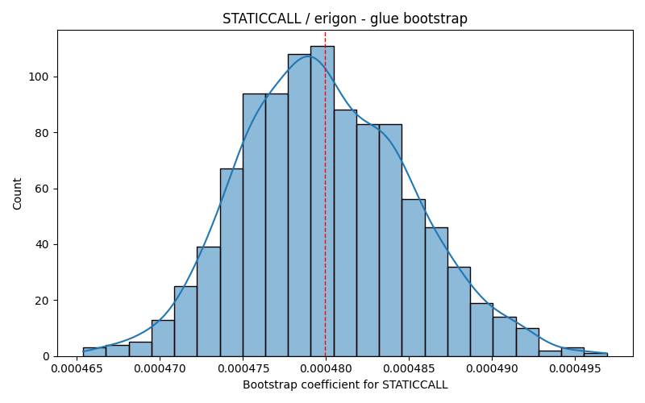


</details>

### Pure glue · erigon

<details><summary><code>ISZERO</code> · nobs=198 · runtime_ms=1.106e-06 · p=1.00e-03 · R²=0.5337</summary>

```
==============================================================================
                           NNLS Regression Results                            
==============================================================================
Dep. Variable:          test_runtime_ms              R-squared:          0.534
Model:                  NNLS                    Adj. R-squared:          0.531
No. Observations:       198                               RMSE:          21.78
Df Residuals:           196                                MAE:           7.65
Df Model:               1      
==============================================================================
                      coef     std err     P-value      [0.025      0.975]
------------------------------------------------------------------------------
         const     13.9755      2.7539       0.001      8.1630     18.9953
        ISZERO      0.0000      0.0000       0.001      0.0000      0.0000
==============================================================================
Notes: Non-negative least squares with bootstrap inference (1000 iterations)
==============================================================================
```

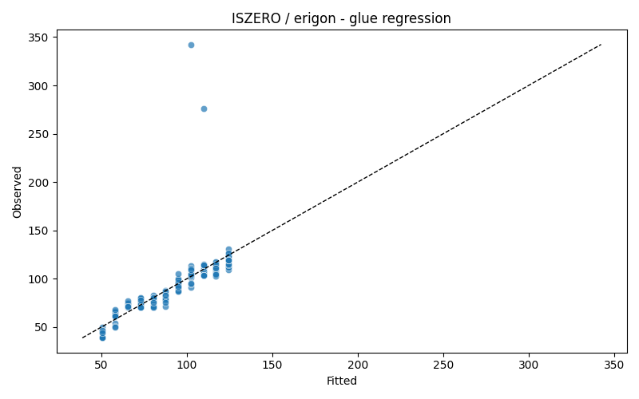

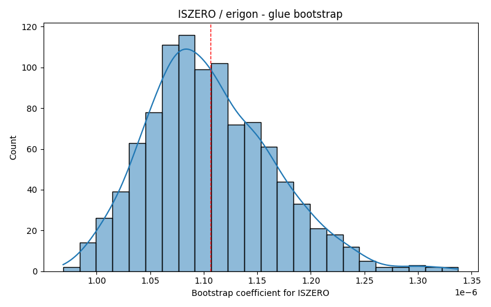

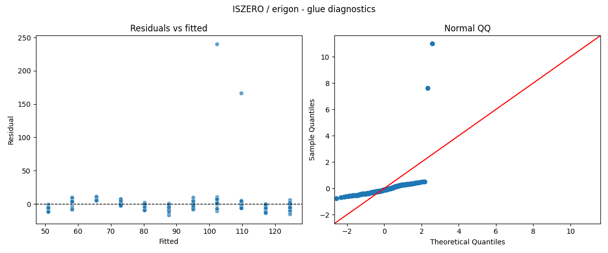

</details>

<details><summary><code>JUMPDEST</code> · nobs=198 · runtime_ms=7.669e-07 · p=1.00e-03 · R²=0.9206</summary>

```
==============================================================================
                           NNLS Regression Results                            
==============================================================================
Dep. Variable:          test_runtime_ms              R-squared:          0.921
Model:                  NNLS                    Adj. R-squared:          0.920
No. Observations:       198                               RMSE:          14.22
Df Residuals:           196                                MAE:          11.50
Df Model:               1      
==============================================================================
                      coef     std err     P-value      [0.025      0.975]
------------------------------------------------------------------------------
         const     23.3117      3.4939       0.001     16.8091     30.2143
      JUMPDEST      0.0000      0.0000       0.001      0.0000      0.0000
==============================================================================
Notes: Non-negative least squares with bootstrap inference (1000 iterations)
==============================================================================
```


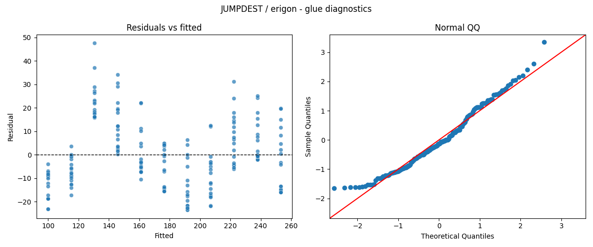

</details>

<details><summary><code>SWAP</code> · nobs=3168 · runtime_ms=1.231e-06 · p=1.00e-03 · R²=0.6369</summary>

```
==============================================================================
                           NNLS Regression Results                            
==============================================================================
Dep. Variable:          test_runtime_ms              R-squared:          0.637
Model:                  NNLS                    Adj. R-squared:          0.637
No. Observations:       3168                              RMSE:          19.57
Df Residuals:           3166                               MAE:           7.22
Df Model:               1      
==============================================================================
                      coef     std err     P-value      [0.025      0.975]
------------------------------------------------------------------------------
         const     24.5472      1.1368       0.001     22.3556     26.7755
          SWAP      0.0000      0.0000       0.001      0.0000      0.0000
==============================================================================
Notes: Non-negative least squares with bootstrap inference (1000 iterations)
==============================================================================
```

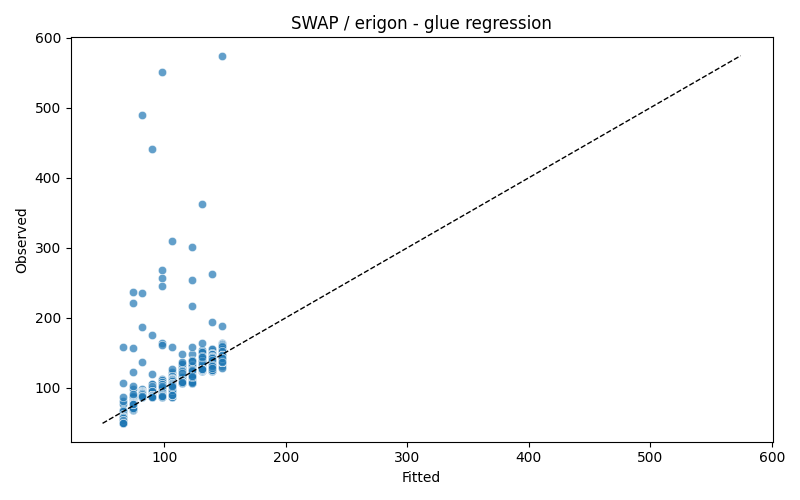

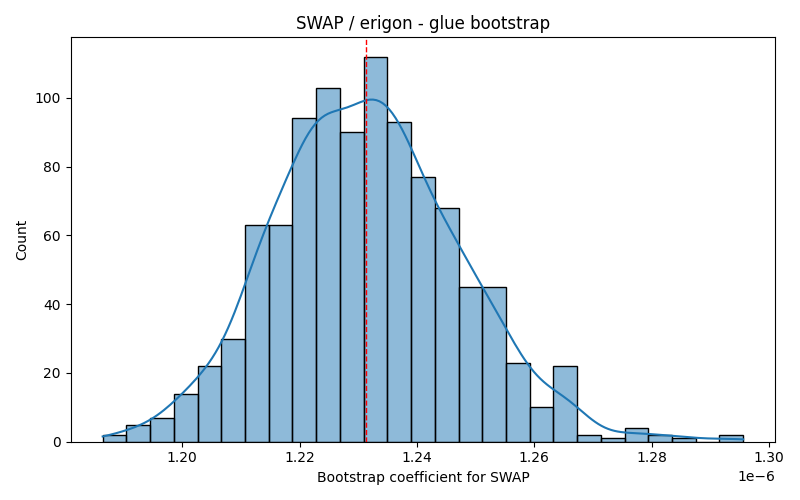

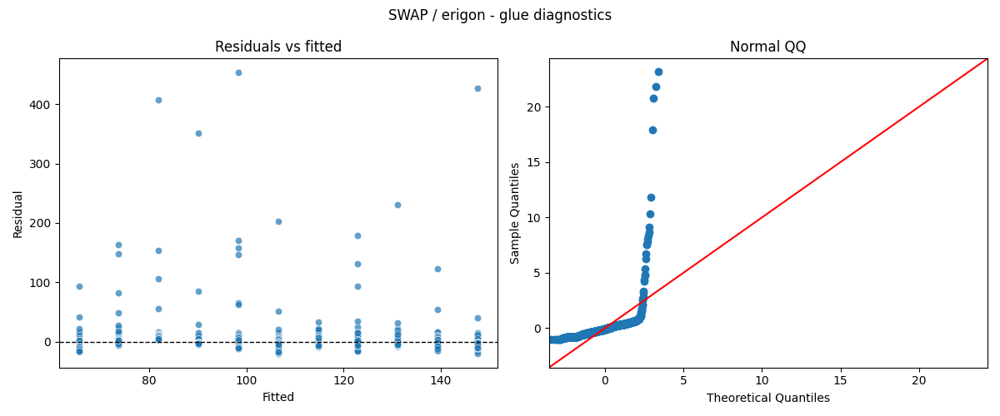

</details>

### Mixed glue (tier A) · erigon

<details><summary><code>ADD</code> · nobs=198 · runtime_ms=2.659e-06 · p=1.00e-03 · R²=0.5691</summary>

```
==============================================================================
                           NNLS Regression Results                            
==============================================================================
Dep. Variable:          test_runtime_ms              R-squared:          0.569
Model:                  NNLS                    Adj. R-squared:          0.567
No. Observations:       198                               RMSE:          24.35
Df Residuals:           196                                MAE:          10.19
Df Model:               1      
==============================================================================
                      coef     std err     P-value      [0.025      0.975]
------------------------------------------------------------------------------
         const     25.3122      7.6774       0.001     13.8466     43.4491
           ADD      0.0000      0.0000       0.001      0.0000      0.0000
==============================================================================
Notes: Non-negative least squares with bootstrap inference (1000 iterations)
==============================================================================
```

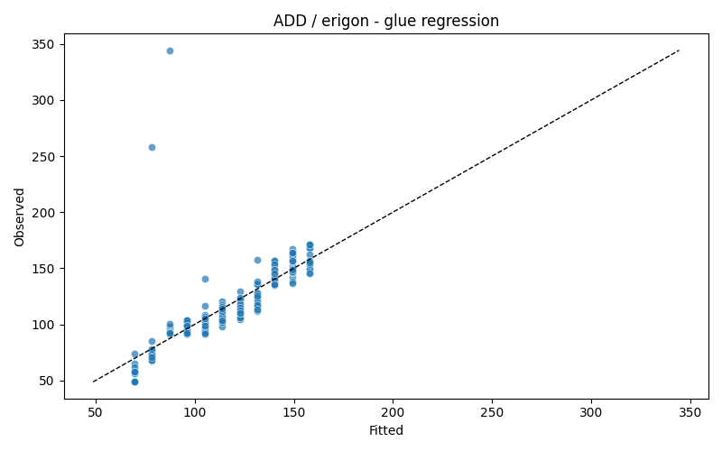

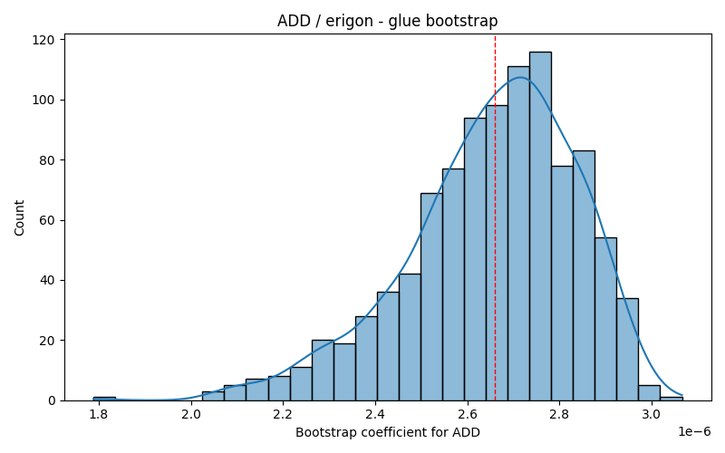


</details>

<details><summary><code>AND</code> · nobs=198 · runtime_ms=3.252e-06 · p=1.00e-03 · R²=0.6137</summary>

```
==============================================================================
                           NNLS Regression Results                            
==============================================================================
Dep. Variable:          test_runtime_ms              R-squared:          0.614
Model:                  NNLS                    Adj. R-squared:          0.612
No. Observations:       198                               RMSE:          27.16
Df Residuals:           196                                MAE:          11.77
Df Model:               1      
==============================================================================
                      coef     std err     P-value      [0.025      0.975]
------------------------------------------------------------------------------
         const      2.7014      4.6748       0.332      0.0000     14.4329
           AND      0.0000      0.0000       0.001      0.0000      0.0000
==============================================================================
Notes: Non-negative least squares with bootstrap inference (1000 iterations)
==============================================================================
```

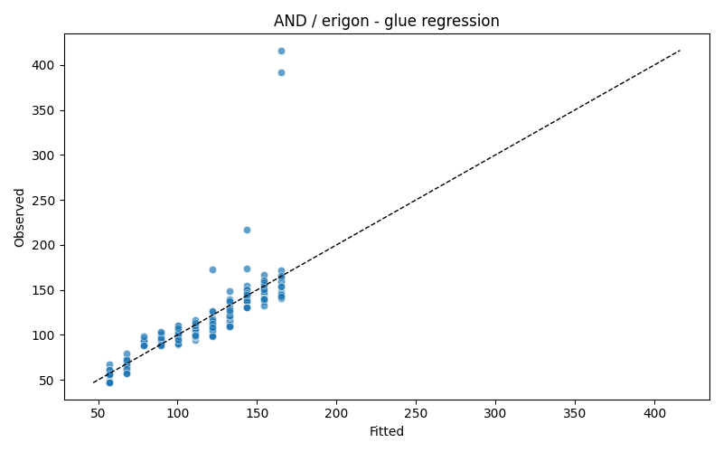

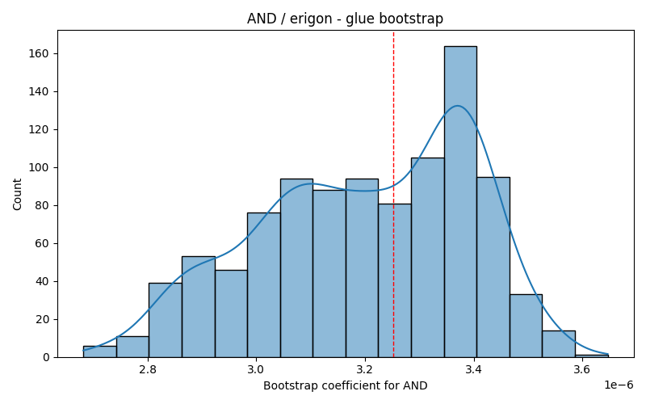

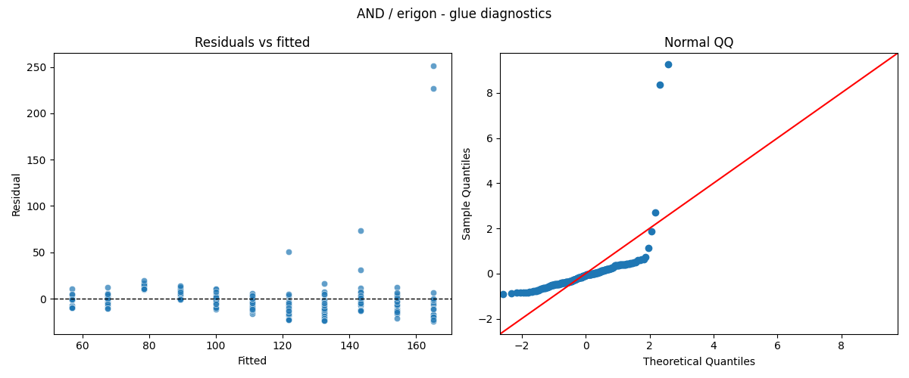

</details>

<details><summary><code>CALLDATACOPY</code> · nobs=4752 · runtime_ms=7.501e-06 · p=1.00e-03 · R²=0.8147</summary>

```
==============================================================================
                           NNLS Regression Results                            
==============================================================================
Dep. Variable:          test_runtime_ms              R-squared:          0.815
Model:                  NNLS                    Adj. R-squared:          0.815
No. Observations:       4752                              RMSE:          26.90
Df Residuals:           4750                               MAE:           9.90
Df Model:               1      
==============================================================================
                      coef     std err     P-value      [0.025      0.975]
------------------------------------------------------------------------------
         const     19.1340      0.6006       0.001     18.0010     20.4431
  CALLDATACOPY      0.0000      0.0000       0.001      0.0000      0.0000
==============================================================================
Notes: Non-negative least squares with bootstrap inference (1000 iterations)
==============================================================================
```

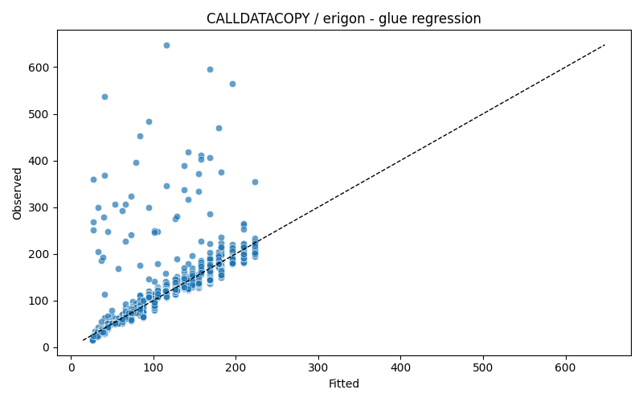

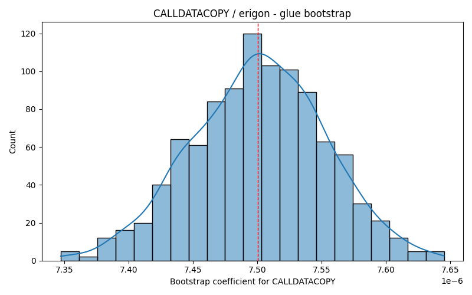

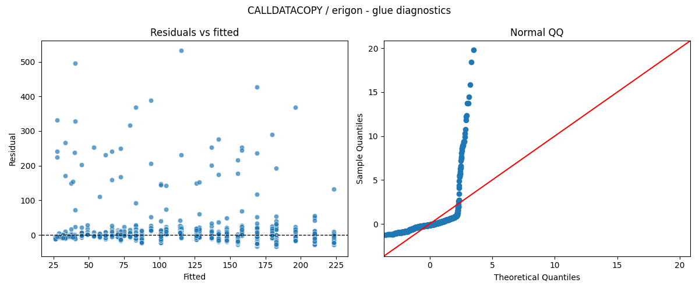

</details>

<details><summary><code>CALLDATALOAD</code> · nobs=792 · runtime_ms=0.0001792 · p=1.00e-03 · R²=0.005246</summary>

```
==============================================================================
                           NNLS Regression Results                            
==============================================================================
Dep. Variable:          test_runtime_ms              R-squared:          0.005
Model:                  NNLS                    Adj. R-squared:          0.004
No. Observations:       792                               RMSE:           9.47
Df Residuals:           790                                MAE:           1.31
Df Model:               1      
==============================================================================
                      coef     std err     P-value      [0.025      0.975]
------------------------------------------------------------------------------
         const      4.7666      0.9203       0.001      2.6935      6.1691
  CALLDATALOAD      0.0002      0.0001       0.001      0.0000      0.0004
==============================================================================
Notes: Non-negative least squares with bootstrap inference (1000 iterations)
==============================================================================
```

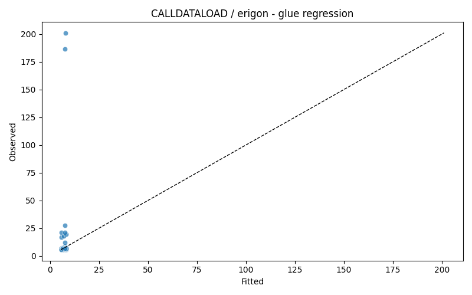

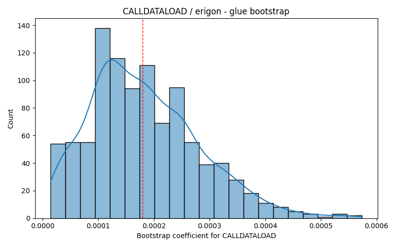

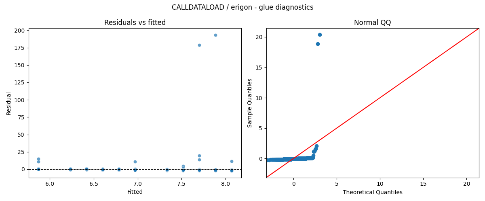

</details>

<details><summary><code>DIV</code> · nobs=198 · runtime_ms=9.676e-06 · p=1.00e-03 · R²=0.8841</summary>

```
==============================================================================
                           NNLS Regression Results                            
==============================================================================
Dep. Variable:          test_runtime_ms              R-squared:          0.884
Model:                  NNLS                    Adj. R-squared:          0.884
No. Observations:       198                               RMSE:          27.65
Df Residuals:           196                                MAE:          23.54
Df Model:               1      
==============================================================================
                      coef     std err     P-value      [0.025      0.975]
------------------------------------------------------------------------------
         const     24.0892      6.1140       0.001     12.7811     36.0937
           DIV      0.0000      0.0000       0.001      0.0000      0.0000
==============================================================================
Notes: Non-negative least squares with bootstrap inference (1000 iterations)
==============================================================================
```

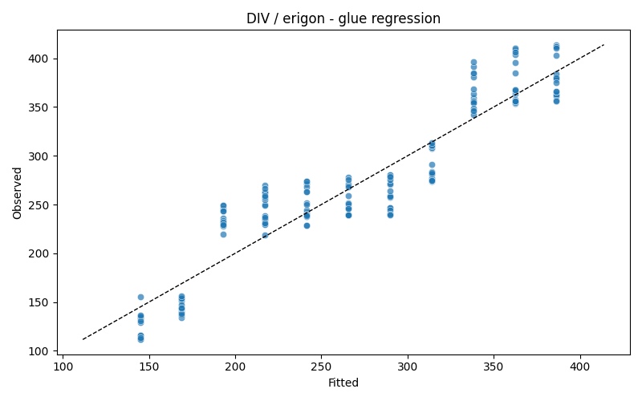

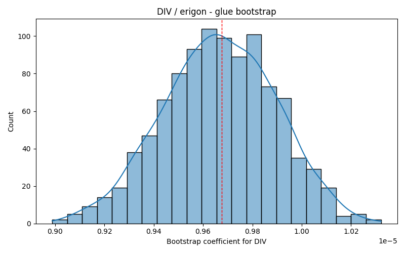

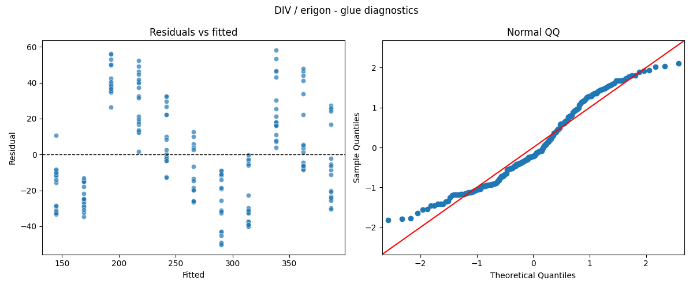

</details>

<details><summary><code>EXP</code> · nobs=198 · runtime_ms=0.0003752 · p=1.00e-03 · R²=0.1743</summary>

```
==============================================================================
                           NNLS Regression Results                            
==============================================================================
Dep. Variable:          test_runtime_ms              R-squared:          0.174
Model:                  NNLS                    Adj. R-squared:          0.170
No. Observations:       198                               RMSE:          31.98
Df Residuals:           196                                MAE:           8.50
Df Model:               1      
==============================================================================
                      coef     std err     P-value      [0.025      0.975]
------------------------------------------------------------------------------
         const     13.8021      5.7335       0.001      3.0741     26.1611
           EXP      0.0004      0.0000       0.001      0.0003      0.0005
==============================================================================
Notes: Non-negative least squares with bootstrap inference (1000 iterations)
==============================================================================
```

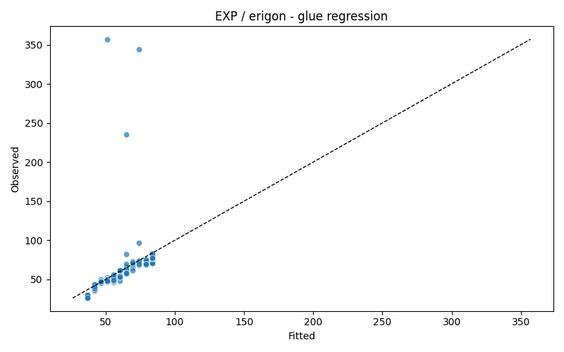

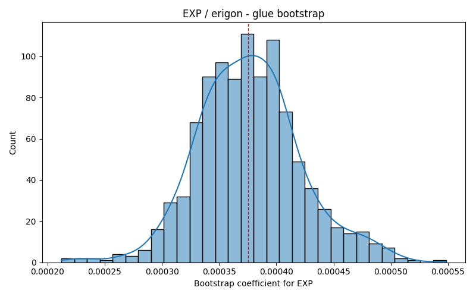

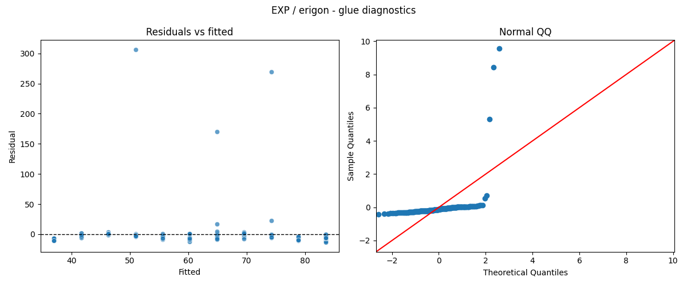

</details>

<details><summary><code>GT</code> · nobs=198 · runtime_ms=2.792e-06 · p=1.00e-03 · R²=0.926</summary>

```
==============================================================================
                           NNLS Regression Results                            
==============================================================================
Dep. Variable:          test_runtime_ms              R-squared:          0.926
Model:                  NNLS                    Adj. R-squared:          0.926
No. Observations:       198                               RMSE:           8.31
Df Residuals:           196                                MAE:           6.88
Df Model:               1      
==============================================================================
                      coef     std err     P-value      [0.025      0.975]
------------------------------------------------------------------------------
         const     21.3053      2.3054       0.001     16.8682     25.7465
            GT      0.0000      0.0000       0.001      0.0000      0.0000
==============================================================================
Notes: Non-negative least squares with bootstrap inference (1000 iterations)
==============================================================================
```

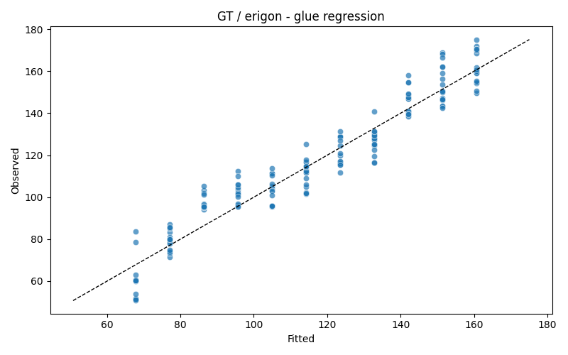

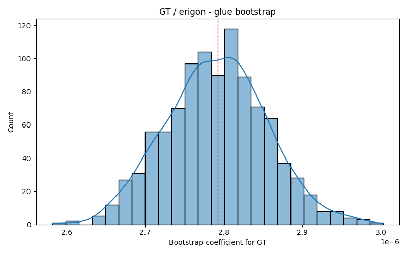

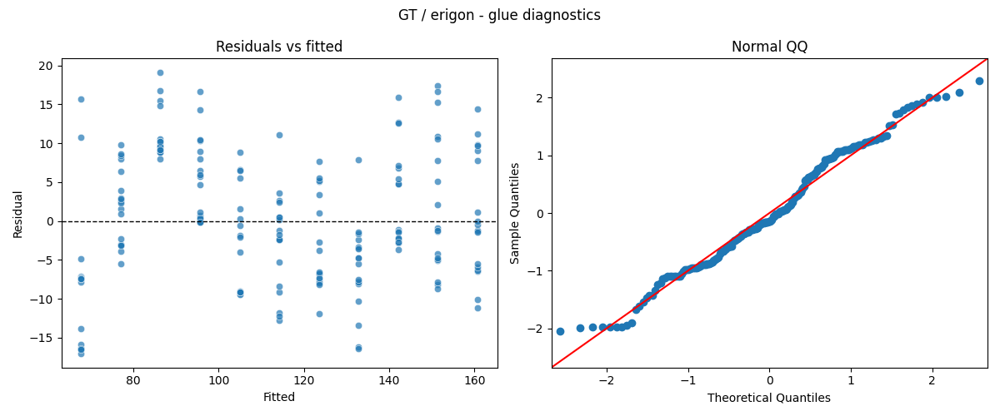

</details>

<details><summary><code>JUMPI</code> · nobs=198 · runtime_ms=4.116e-06 · p=1.00e-03 · R²=0.2844</summary>

```
==============================================================================
                           NNLS Regression Results                            
==============================================================================
Dep. Variable:          test_runtime_ms              R-squared:          0.284
Model:                  NNLS                    Adj. R-squared:          0.281
No. Observations:       198                               RMSE:          29.46
Df Residuals:           196                                MAE:           9.33
Df Model:               1      
==============================================================================
                      coef     std err     P-value      [0.025      0.975]
------------------------------------------------------------------------------
         const     12.8100      5.0227       0.012      2.1254     21.8434
         JUMPI      0.0000      0.0000       0.001      0.0000      0.0000
==============================================================================
Notes: Non-negative least squares with bootstrap inference (1000 iterations)
==============================================================================
```

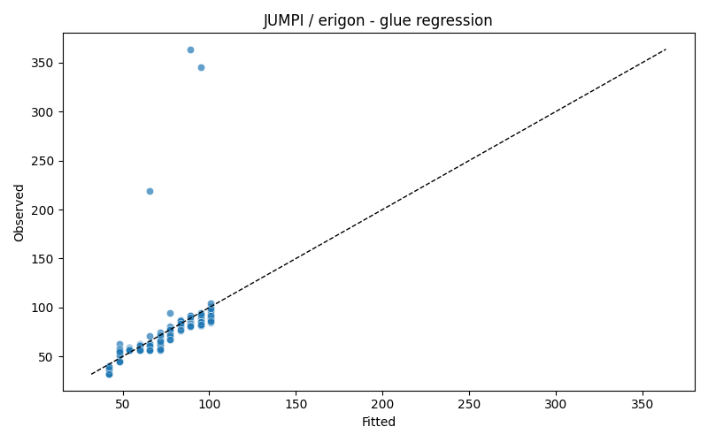

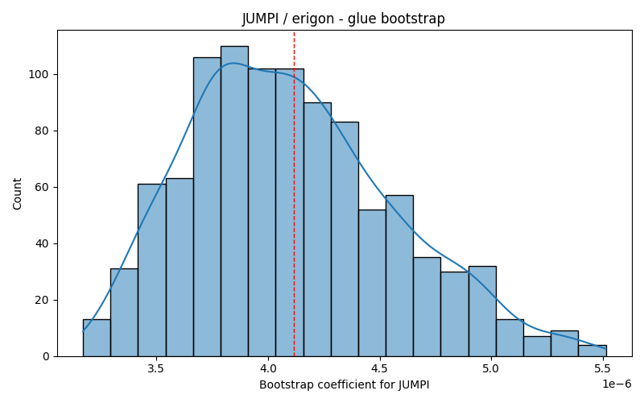

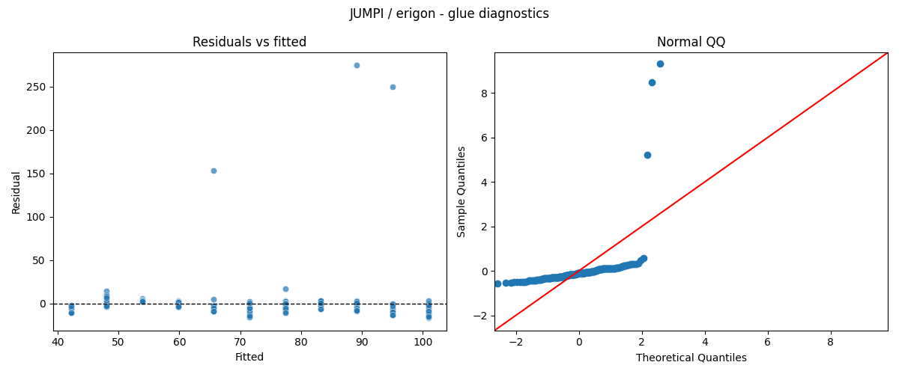

</details>

<details><summary><code>LT</code> · nobs=198 · runtime_ms=2.855e-06 · p=1.00e-03 · R²=0.919</summary>

```
==============================================================================
                           NNLS Regression Results                            
==============================================================================
Dep. Variable:          test_runtime_ms              R-squared:          0.919
Model:                  NNLS                    Adj. R-squared:          0.919
No. Observations:       198                               RMSE:           8.92
Df Residuals:           196                                MAE:           7.40
Df Model:               1      
==============================================================================
                      coef     std err     P-value      [0.025      0.975]
------------------------------------------------------------------------------
         const     20.9235      2.4457       0.001     16.0927     25.7743
            LT      0.0000      0.0000       0.001      0.0000      0.0000
==============================================================================
Notes: Non-negative least squares with bootstrap inference (1000 iterations)
==============================================================================
```


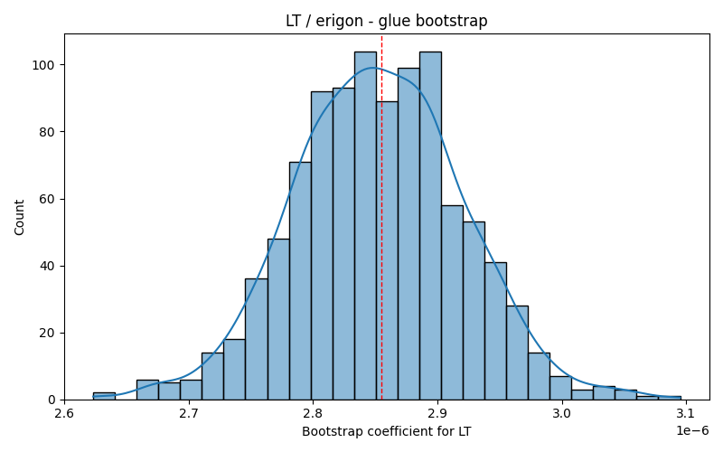

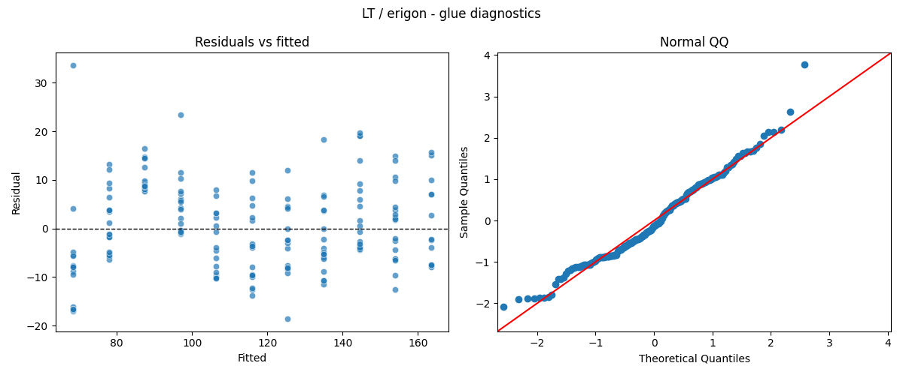

</details>

<details><summary><code>MSTORE</code> · nobs=990 · runtime_ms=5.665e-06 · p=1.00e-03 · R²=0.8399</summary>

```
==============================================================================
                           NNLS Regression Results                            
==============================================================================
Dep. Variable:          test_runtime_ms              R-squared:          0.840
Model:                  NNLS                    Adj. R-squared:          0.840
No. Observations:       990                               RMSE:          17.36
Df Residuals:           988                                MAE:           9.28
Df Model:               1      
==============================================================================
                      coef     std err     P-value      [0.025      0.975]
------------------------------------------------------------------------------
         const     24.1386      1.7744       0.001     20.8913     27.6803
        MSTORE      0.0000      0.0000       0.001      0.0000      0.0000
==============================================================================
Notes: Non-negative least squares with bootstrap inference (1000 iterations)
==============================================================================
```

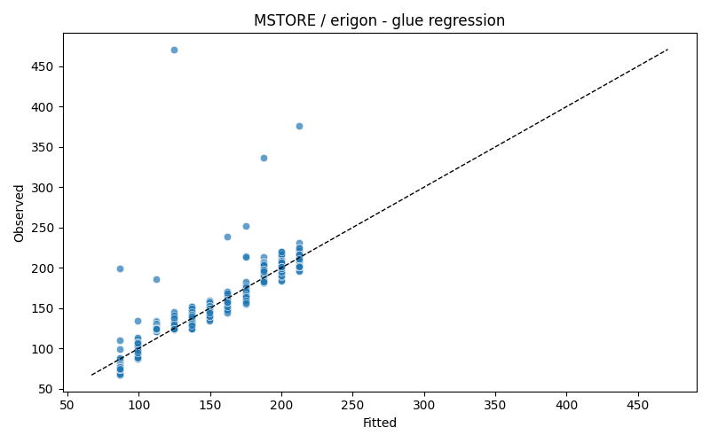


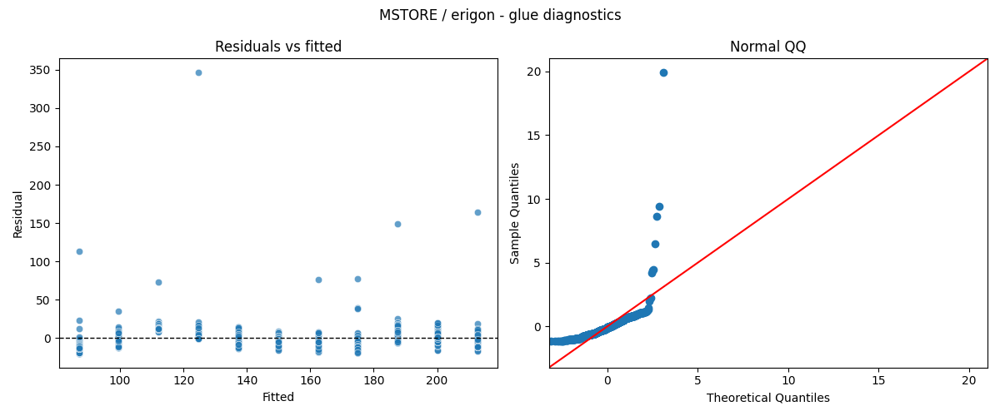

</details>

<details><summary><code>MSTORE8</code> · nobs=990 · runtime_ms=5.259e-06 · p=1.00e-03 · R²=0.6611</summary>

```
==============================================================================
                           NNLS Regression Results                            
==============================================================================
Dep. Variable:          test_runtime_ms              R-squared:          0.661
Model:                  NNLS                    Adj. R-squared:          0.661
No. Observations:       990                               RMSE:          26.42
Df Residuals:           988                                MAE:          10.67
Df Model:               1      
==============================================================================
                      coef     std err     P-value      [0.025      0.975]
------------------------------------------------------------------------------
         const     22.4161      2.4890       0.001     17.6392     27.4876
       MSTORE8      0.0000      0.0000       0.001      0.0000      0.0000
==============================================================================
Notes: Non-negative least squares with bootstrap inference (1000 iterations)
==============================================================================
```

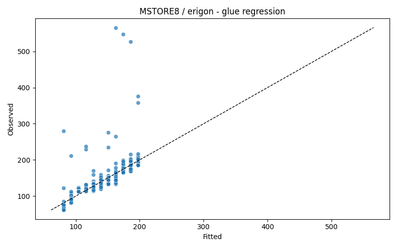

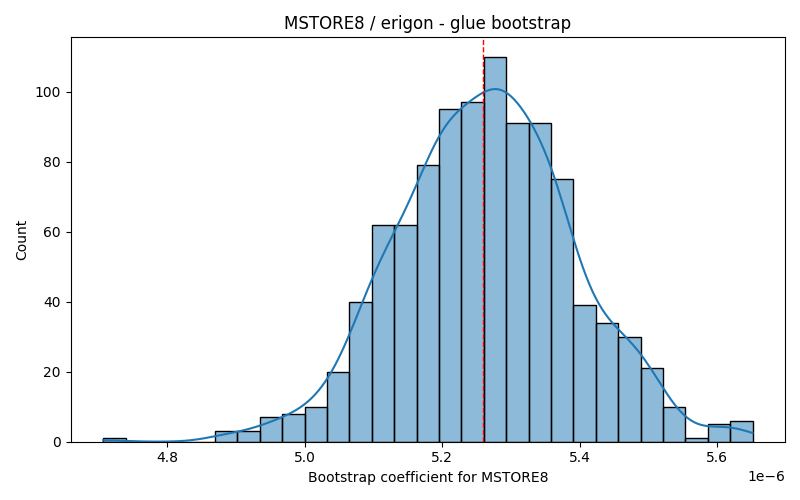

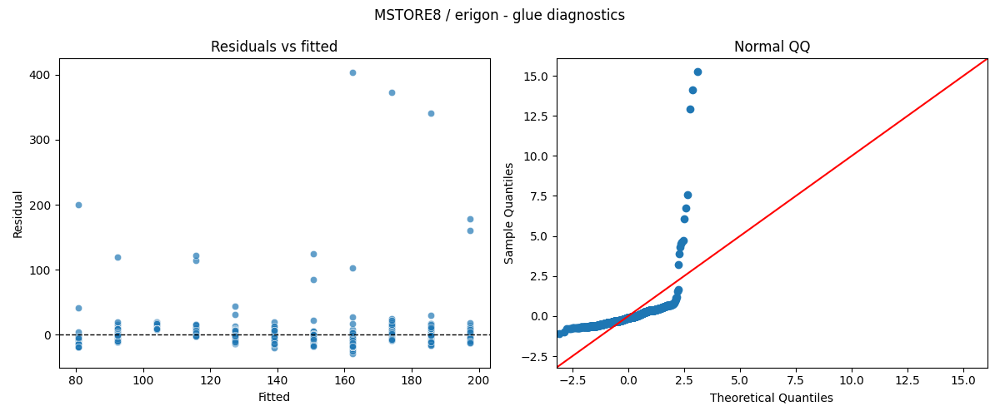

</details>

<details><summary><code>MUL</code> · nobs=198 · runtime_ms=3.307e-06 · p=1.00e-03 · R²=0.6341</summary>

```
==============================================================================
                           NNLS Regression Results                            
==============================================================================
Dep. Variable:          test_runtime_ms              R-squared:          0.634
Model:                  NNLS                    Adj. R-squared:          0.632
No. Observations:       198                               RMSE:          19.83
Df Residuals:           196                                MAE:           8.08
Df Model:               1      
==============================================================================
                      coef     std err     P-value      [0.025      0.975]
------------------------------------------------------------------------------
         const     21.0212      8.1508       0.001     10.5918     40.8836
           MUL      0.0000      0.0000       0.001      0.0000      0.0000
==============================================================================
Notes: Non-negative least squares with bootstrap inference (1000 iterations)
==============================================================================
```

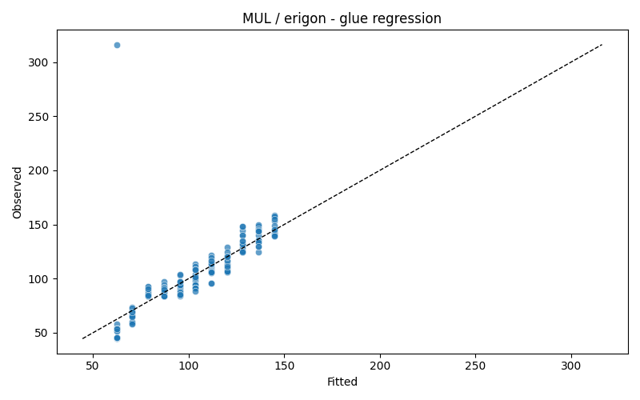

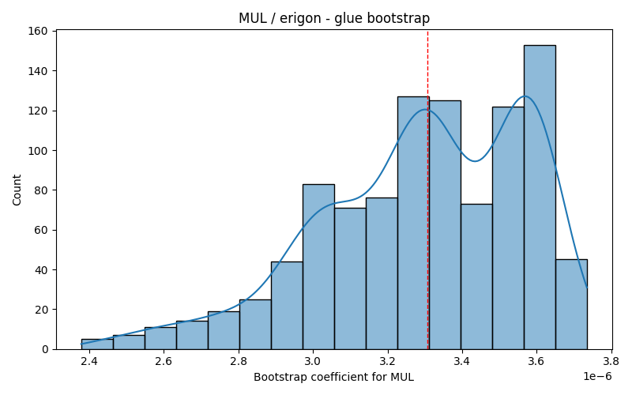

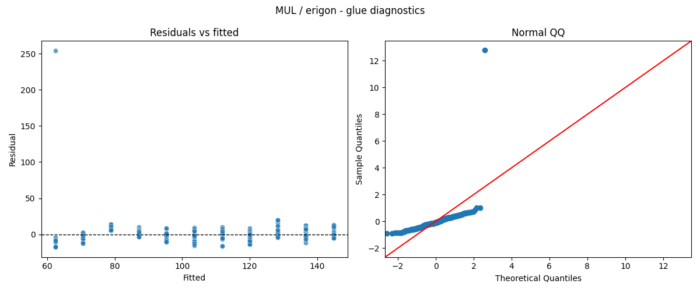

</details>

<details><summary><code>PC</code> · nobs=198 · runtime_ms=1.307e-06 · p=1.00e-03 · R²=0.6538</summary>

```
==============================================================================
                           NNLS Regression Results                            
==============================================================================
Dep. Variable:          test_runtime_ms              R-squared:          0.654
Model:                  NNLS                    Adj. R-squared:          0.652
No. Observations:       198                               RMSE:          28.43
Df Residuals:           196                                MAE:          13.31
Df Model:               1      
==============================================================================
                      coef     std err     P-value      [0.025      0.975]
------------------------------------------------------------------------------
         const     32.8801      8.5619       0.001     19.3485     52.1891
            PC      0.0000      0.0000       0.001      0.0000      0.0000
==============================================================================
Notes: Non-negative least squares with bootstrap inference (1000 iterations)
==============================================================================
```

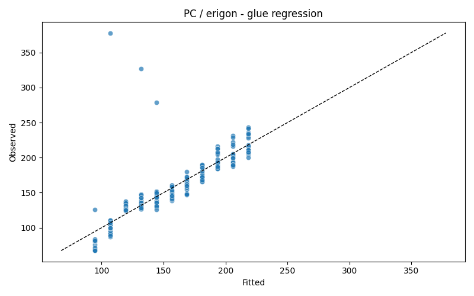

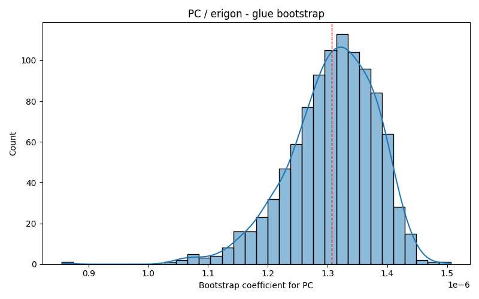

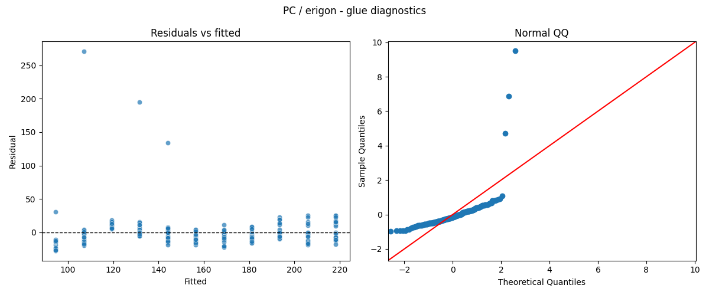

</details>

<details><summary><code>RETURNDATASIZE</code> · nobs=792 · runtime_ms=1.734e-06 · p=1.00e-03 · R²=0.599</summary>

```
==============================================================================
                           NNLS Regression Results                            
==============================================================================
Dep. Variable:          test_runtime_ms              R-squared:          0.599
Model:                  NNLS                    Adj. R-squared:          0.598
No. Observations:       792                               RMSE:          22.40
Df Residuals:           790                                MAE:           9.24
Df Model:               1      
==============================================================================
                      coef     std err     P-value      [0.025      0.975]
------------------------------------------------------------------------------
         const     23.2736      3.1926       0.001     17.5261     30.0114
RETURNDATASIZE      0.0000      0.0000       0.001      0.0000      0.0000
==============================================================================
Notes: Non-negative least squares with bootstrap inference (1000 iterations)
==============================================================================
```

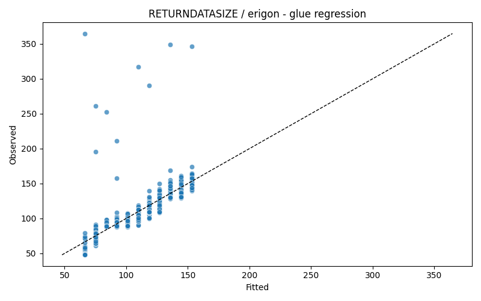

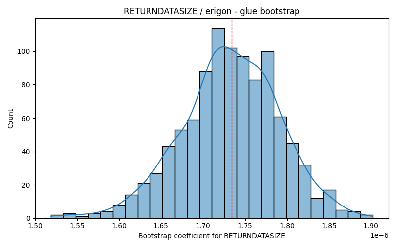

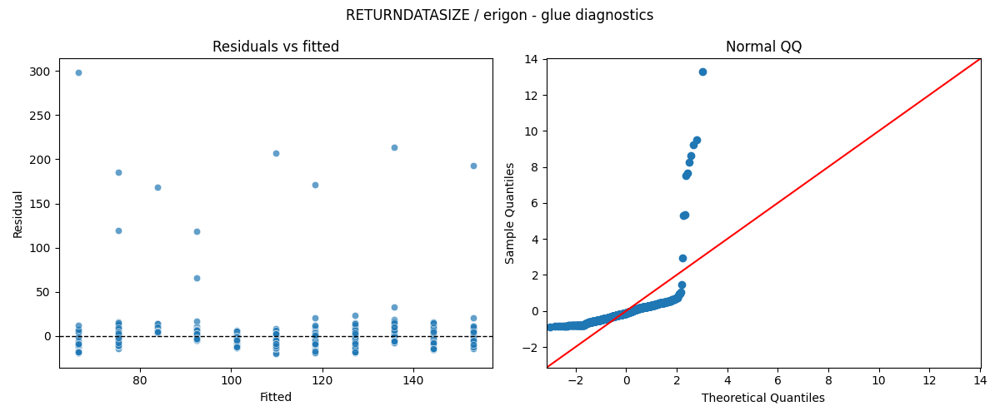

</details>

<details><summary><code>SELFBALANCE</code> · nobs=162 · runtime_ms=1.354e-06 · p=1.00e-03 · R²=0.854</summary>

```
==============================================================================
                           NNLS Regression Results                            
==============================================================================
Dep. Variable:          test_runtime_ms              R-squared:          0.854
Model:                  NNLS                    Adj. R-squared:          0.853
No. Observations:       162                               RMSE:           5.65
Df Residuals:           160                                MAE:           4.64
Df Model:               1      
==============================================================================
                      coef     std err     P-value      [0.025      0.975]
------------------------------------------------------------------------------
         const     21.1456      1.7076       0.001     17.8476     24.3972
   SELFBALANCE      0.0000      0.0000       0.001      0.0000      0.0000
==============================================================================
Notes: Non-negative least squares with bootstrap inference (1000 iterations)
==============================================================================
```

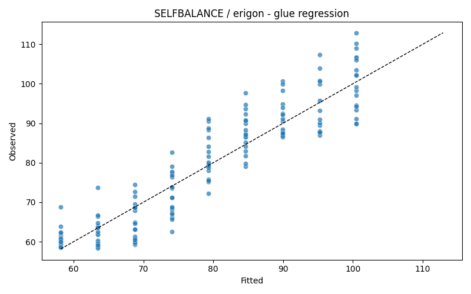

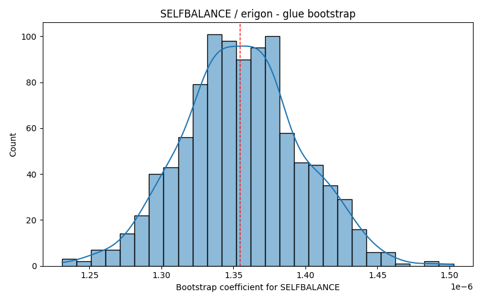

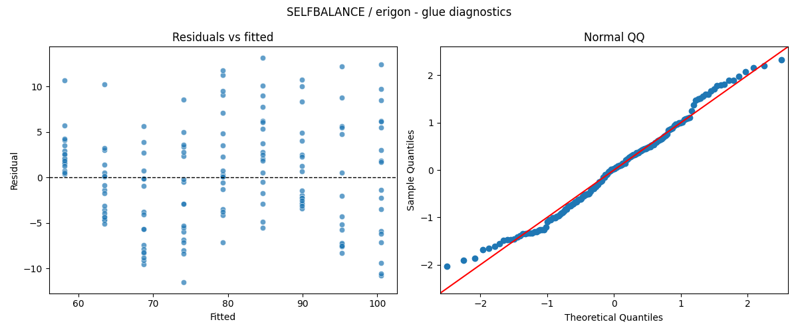

</details>

<details><summary><code>SUB</code> · nobs=198 · runtime_ms=2.795e-06 · p=1.00e-03 · R²=0.5604</summary>

```
==============================================================================
                           NNLS Regression Results                            
==============================================================================
Dep. Variable:          test_runtime_ms              R-squared:          0.560
Model:                  NNLS                    Adj. R-squared:          0.558
No. Observations:       198                               RMSE:          26.06
Df Residuals:           196                                MAE:          10.87
Df Model:               1      
==============================================================================
                      coef     std err     P-value      [0.025      0.975]
------------------------------------------------------------------------------
         const     20.9688      2.8776       0.001     15.8535     26.7124
           SUB      0.0000      0.0000       0.001      0.0000      0.0000
==============================================================================
Notes: Non-negative least squares with bootstrap inference (1000 iterations)
==============================================================================
```

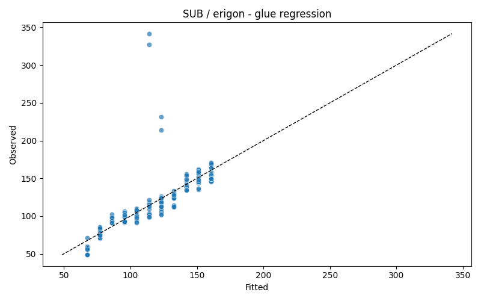

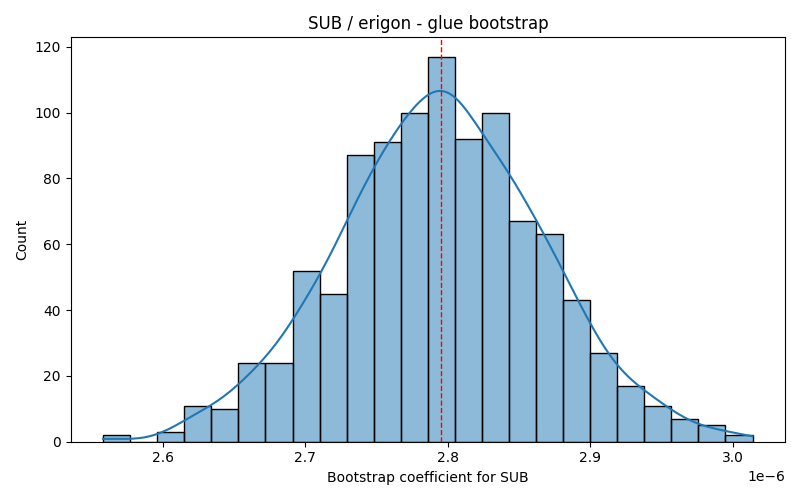

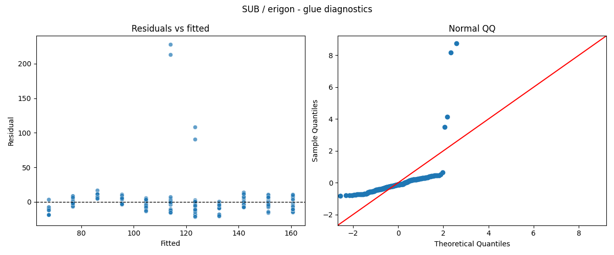

</details>

### Mixed glue (tier B) · erigon

<details><summary><code>JUMP</code> · nobs=198 · runtime_ms=7.139e-06 · p=1.00e-03 · R²=0.7659</summary>

```
==============================================================================
                           NNLS Regression Results                            
==============================================================================
Dep. Variable:          test_runtime_ms              R-squared:          0.766
Model:                  NNLS                    Adj. R-squared:          0.765
No. Observations:       198                               RMSE:          14.66
Df Residuals:           196                                MAE:           7.14
Df Model:               1      
==============================================================================
                      coef     std err     P-value      [0.025      0.975]
------------------------------------------------------------------------------
         const     18.2415      2.0625       0.001     13.9900     22.1378
          JUMP      0.0000      0.0000       0.001      0.0000      0.0000
==============================================================================
Notes: Non-negative least squares with bootstrap inference (1000 iterations)
==============================================================================
```

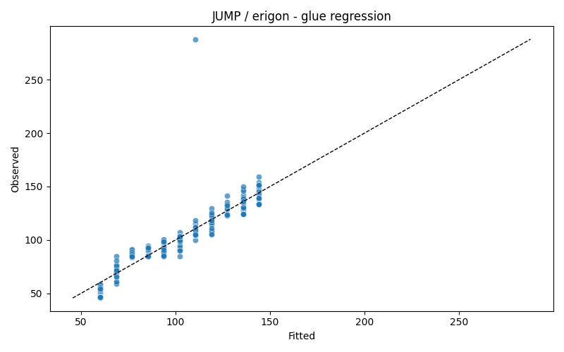

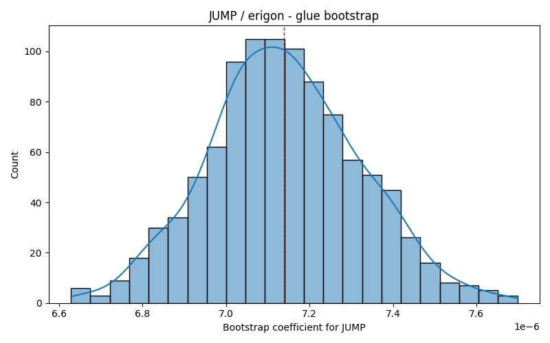

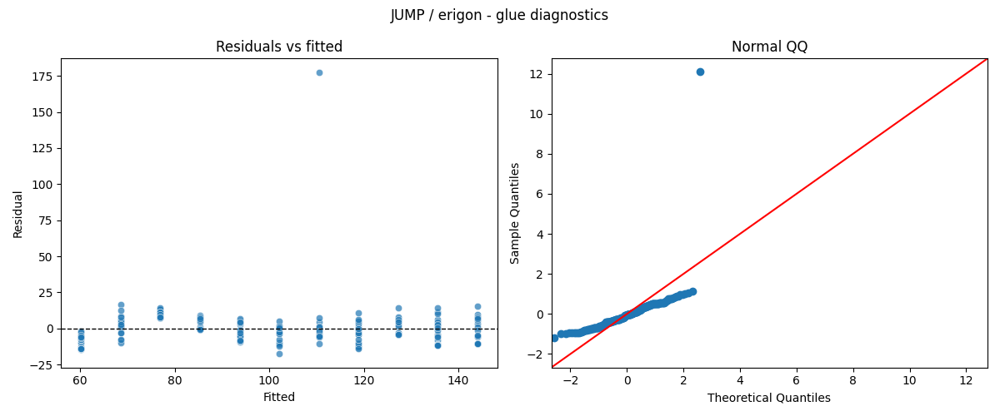

</details>

<details><summary><code>KECCAK256</code> · nobs=3168 · runtime_ms=1.828e-05 · p=1.00e-03 · R²=0.06337</summary>

```
==============================================================================
                           NNLS Regression Results                            
==============================================================================
Dep. Variable:          test_runtime_ms              R-squared:          0.063
Model:                  NNLS                    Adj. R-squared:          0.063
No. Observations:       3168                              RMSE:         139.67
Df Residuals:           3166                               MAE:         111.66
Df Model:               1      
==============================================================================
                      coef     std err     P-value      [0.025      0.975]
------------------------------------------------------------------------------
         const    374.7833      5.3906       0.001    363.9220    385.1469
     KECCAK256      0.0000      0.0000       0.001      0.0000      0.0000
==============================================================================
Notes: Non-negative least squares with bootstrap inference (1000 iterations)
==============================================================================
```

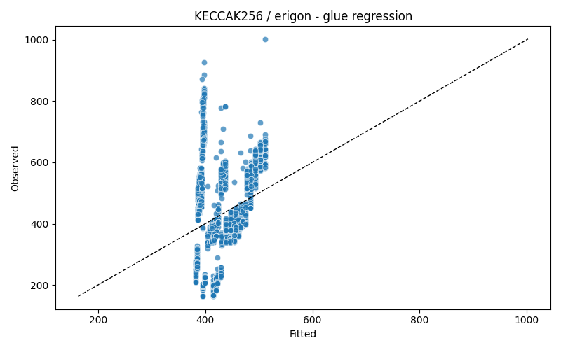

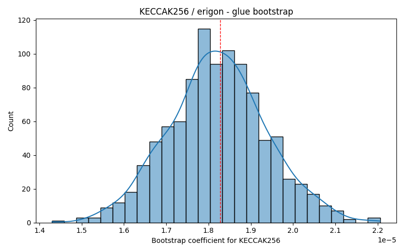

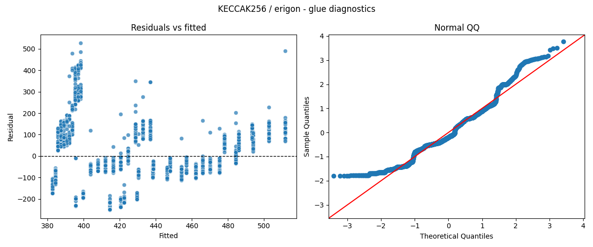

</details>

## ethrex

| glue_opcode | nobs | glue_runtime_ms | p_value | rsquared |
| --- | --- | --- | --- | --- |
| `ISZERO` | 286 | 5.089e-07 | 1.00e-03 | 0.8484 |
| `JUMPDEST` | 286 | 3.271e-07 | 1.00e-03 | 0.8395 |
| `SWAP` | 4576 | 7.216e-07 | 1.00e-03 | 0.7974 |
| `CALLDATASIZE` | 17149 | 4.657e-07 | 1.00e-03 | 0.9307 |
| `DUP` | 17149 | 4.691e-07 | 1.00e-03 | 0.9307 |
| `GAS` | 17149 | 4.633e-07 | 1.00e-03 | 0.9307 |
| `MLOAD` | 17149 | 1.128e-06 | 1.00e-03 | 0.9307 |
| `PUSH` | 17149 | 4.902e-07 | 1.00e-03 | 0.9307 |
| `PUSH0` | 17149 | 4.409e-07 | 1.00e-03 | 0.9307 |
| `STATICCALL` | 17149 | 0.0001094 | 1.00e-03 | 0.9307 |
| `ADD` | 286 | 1.074e-06 | 1.00e-03 | 0.8358 |
| `AND` | 286 | 1.01e-06 | 1.00e-03 | 0.8103 |
| `CALLDATACOPY` | 6864 | 2.437e-06 | 1.00e-03 | 0.8625 |
| `CALLDATALOAD` | 1144 | 2.082e-05 | 1.00e-03 | 0.2312 |
| `DIV` | 286 | 9.41e-06 | 1.00e-03 | 0.8421 |
| `EXP` | 286 | 0.0009096 | 1.00e-03 | 0.8215 |
| `GT` | 286 | 1.146e-06 | 1.00e-03 | 0.8409 |
| `JUMPI` | 286 | 1.438e-06 | 1.00e-03 | 0.8106 |
| `LT` | 286 | 9.071e-07 | 1.00e-03 | 0.8303 |
| `MSTORE` | 1430 | 1.731e-06 | 1.00e-03 | 0.8137 |
| `MSTORE8` | 1430 | 1.599e-06 | 1.00e-03 | 0.8194 |
| `MUL` | 286 | 1.356e-06 | 1.00e-03 | 0.7892 |
| `PC` | 286 | 5.415e-07 | 1.00e-03 | 0.8197 |
| `RETURNDATASIZE` | 1144 | 9.057e-07 | 1.00e-03 | 0.8409 |
| `SELFBALANCE` | 234 | 4.793e-06 | 1.00e-03 | 0.8188 |
| `SUB` | 286 | 1.065e-06 | 1.00e-03 | 0.8151 |
| `JUMP` | 286 | 4.304e-06 | 1.00e-03 | 0.8295 |
| `KECCAK256` | 4576 | 0 | 1.00e+00 | 0 |

### Cycle glue — joint fit · ethrex

<details><summary>Joint NNLS regression summary</summary>

```
==============================================================================
                           NNLS Regression Results                            
==============================================================================
Dep. Variable:          test_runtime_ms              R-squared:          0.931
Model:                  NNLS                    Adj. R-squared:          0.931
No. Observations:       17149                             RMSE:           6.53
Df Residuals:           17141                              MAE:           5.09
Df Model:               7      
==============================================================================
                      coef     std err     P-value      [0.025      0.975]
------------------------------------------------------------------------------
         const     12.9363      0.1681       0.001     12.5895     13.2683
  CALLDATASIZE      0.0000      0.0000       0.001      0.0000      0.0000
           DUP      0.0000      0.0000       0.001      0.0000      0.0000
           GAS      0.0000      0.0000       0.001      0.0000      0.0000
         MLOAD      0.0000      0.0000       0.001      0.0000      0.0000
          PUSH      0.0000      0.0000       0.001      0.0000      0.0000
         PUSH0      0.0000      0.0000       0.001      0.0000      0.0000
    STATICCALL      0.0001      0.0000       0.001      0.0001      0.0001
==============================================================================
Notes: Non-negative least squares with bootstrap inference (1000 iterations)
==============================================================================
```

</details>

<details><summary><code>CALLDATASIZE</code> · nobs=17149 · runtime_ms=4.657e-07 · p=1.00e-03 · R²=0.9307</summary>

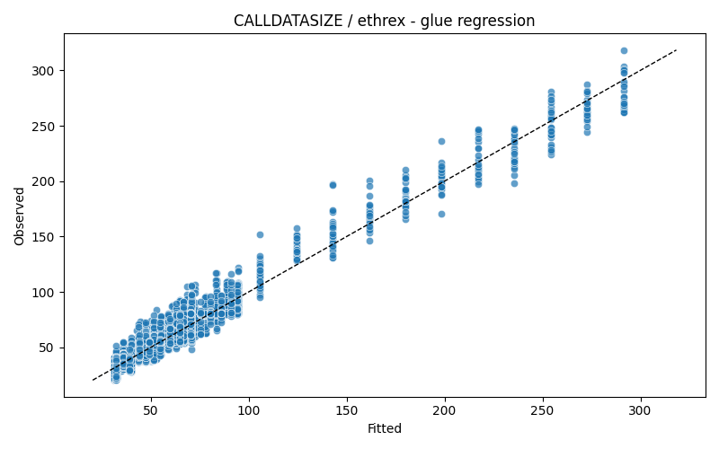

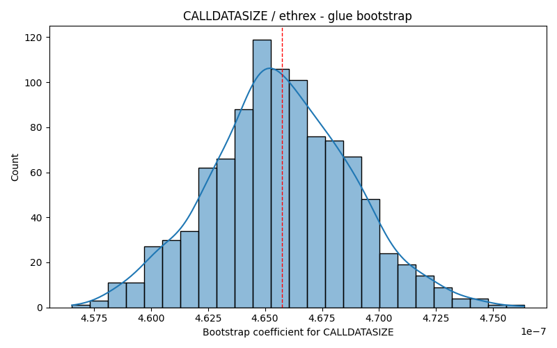

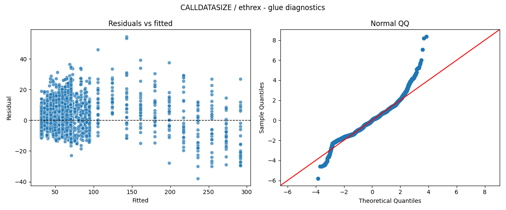

</details>

<details><summary><code>DUP</code> · nobs=17149 · runtime_ms=4.691e-07 · p=1.00e-03 · R²=0.9307</summary>


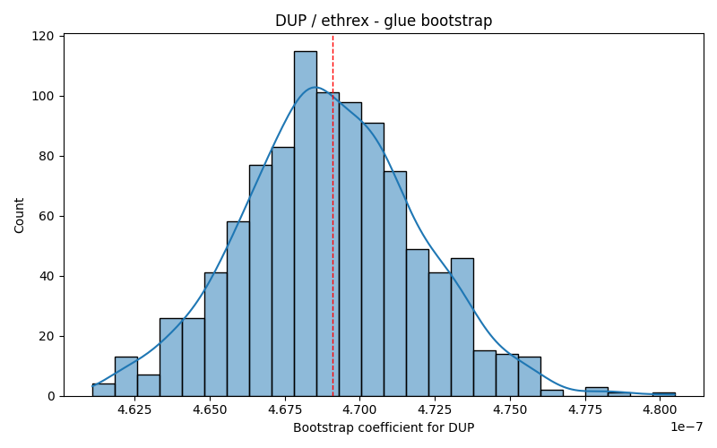


</details>

<details><summary><code>GAS</code> · nobs=17149 · runtime_ms=4.633e-07 · p=1.00e-03 · R²=0.9307</summary>


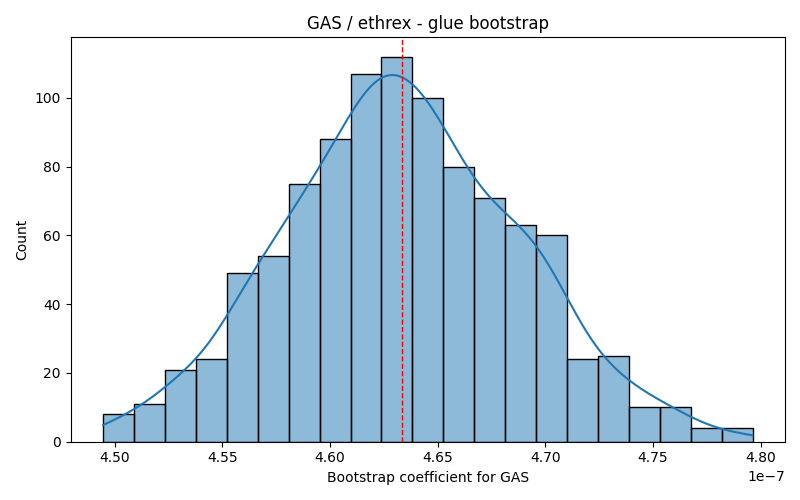

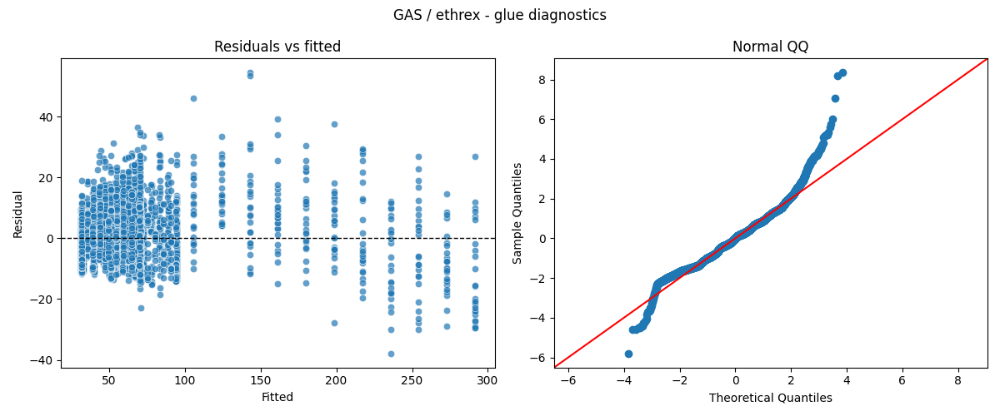

</details>

<details><summary><code>MLOAD</code> · nobs=17149 · runtime_ms=1.128e-06 · p=1.00e-03 · R²=0.9307</summary>


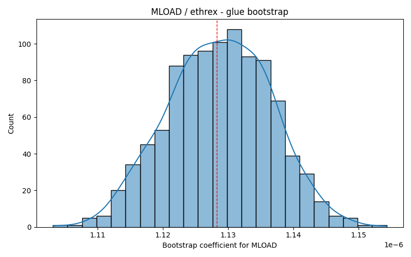


</details>

<details><summary><code>PUSH</code> · nobs=17149 · runtime_ms=4.902e-07 · p=1.00e-03 · R²=0.9307</summary>

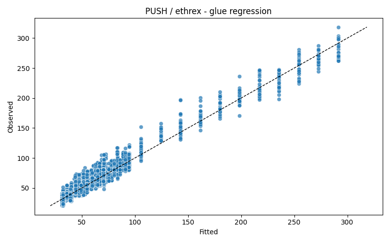

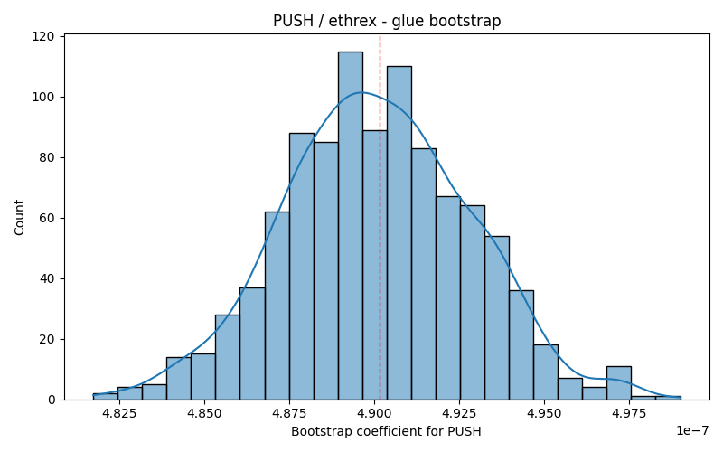


</details>

<details><summary><code>PUSH0</code> · nobs=17149 · runtime_ms=4.409e-07 · p=1.00e-03 · R²=0.9307</summary>

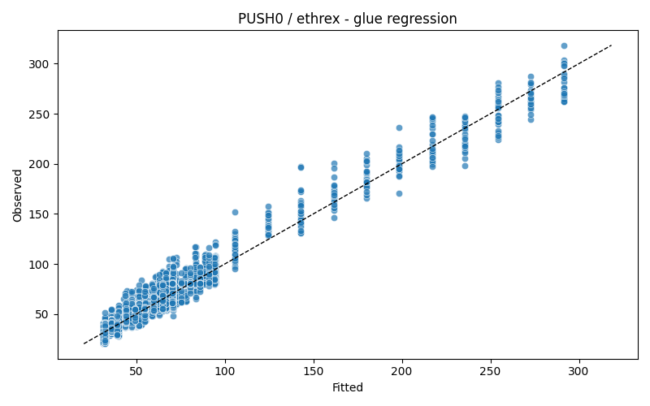

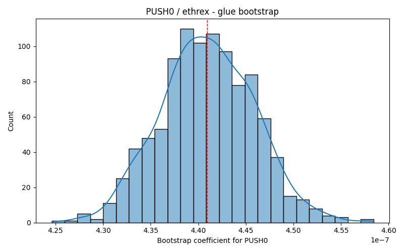


</details>

<details><summary><code>STATICCALL</code> · nobs=17149 · runtime_ms=0.0001094 · p=1.00e-03 · R²=0.9307</summary>


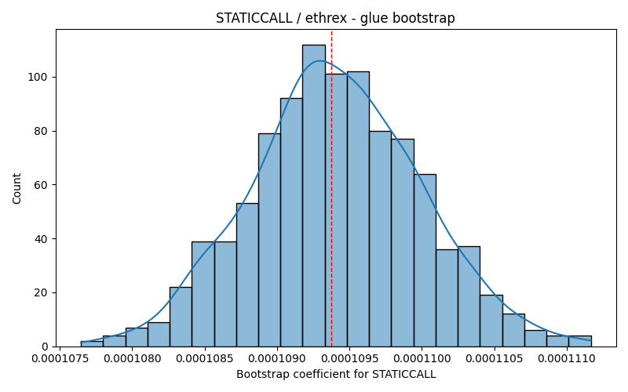


</details>

### Pure glue · ethrex

<details><summary><code>ISZERO</code> · nobs=286 · runtime_ms=5.089e-07 · p=1.00e-03 · R²=0.8484</summary>

```
==============================================================================
                           NNLS Regression Results                            
==============================================================================
Dep. Variable:          test_runtime_ms              R-squared:          0.848
Model:                  NNLS                    Adj. R-squared:          0.848
No. Observations:       286                               RMSE:           4.53
Df Residuals:           284                                MAE:           3.41
Df Model:               1      
==============================================================================
                      coef     std err     P-value      [0.025      0.975]
------------------------------------------------------------------------------
         const      8.9340      0.8951       0.001      7.1462     10.5391
        ISZERO      0.0000      0.0000       0.001      0.0000      0.0000
==============================================================================
Notes: Non-negative least squares with bootstrap inference (1000 iterations)
==============================================================================
```

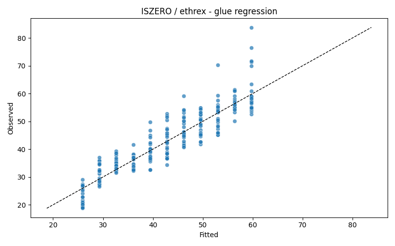

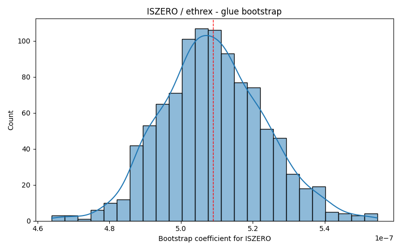

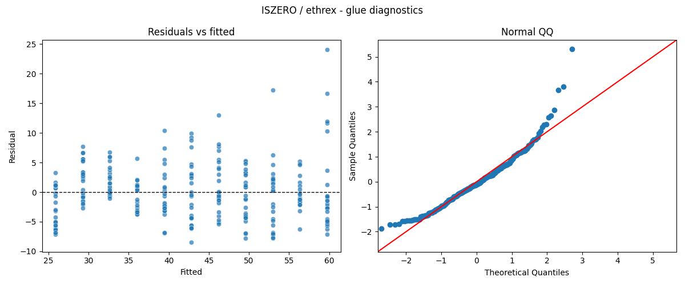

</details>

<details><summary><code>JUMPDEST</code> · nobs=286 · runtime_ms=3.271e-07 · p=1.00e-03 · R²=0.8395</summary>

```
==============================================================================
                           NNLS Regression Results                            
==============================================================================
Dep. Variable:          test_runtime_ms              R-squared:          0.839
Model:                  NNLS                    Adj. R-squared:          0.839
No. Observations:       286                               RMSE:           9.03
Df Residuals:           284                                MAE:           7.03
Df Model:               1      
==============================================================================
                      coef     std err     P-value      [0.025      0.975]
------------------------------------------------------------------------------
         const     18.7910      1.6948       0.001     15.5902     22.1897
      JUMPDEST      0.0000      0.0000       0.001      0.0000      0.0000
==============================================================================
Notes: Non-negative least squares with bootstrap inference (1000 iterations)
==============================================================================
```

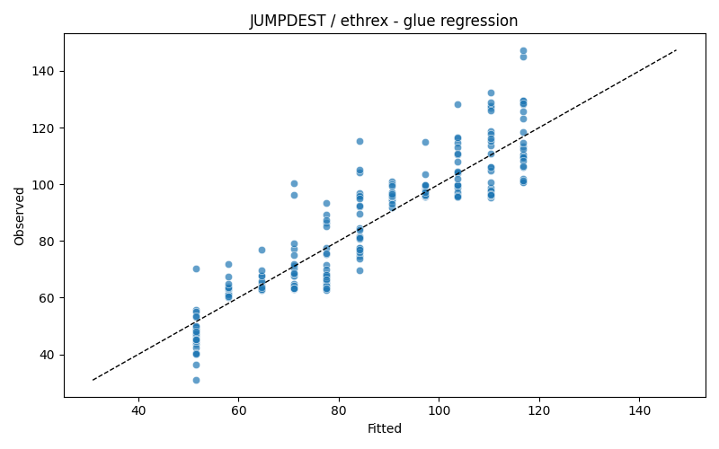

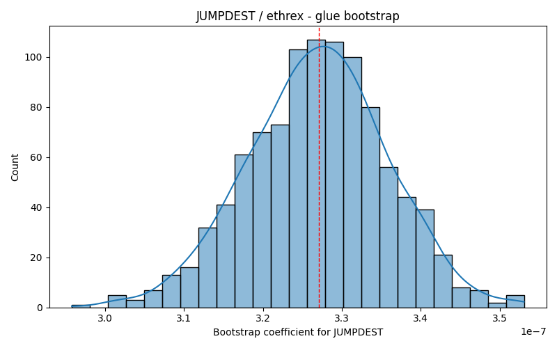

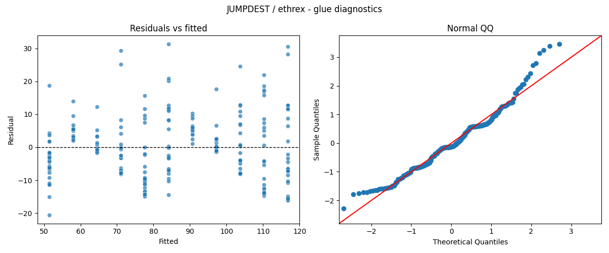

</details>

<details><summary><code>SWAP</code> · nobs=4576 · runtime_ms=7.216e-07 · p=1.00e-03 · R²=0.7974</summary>

```
==============================================================================
                           NNLS Regression Results                            
==============================================================================
Dep. Variable:          test_runtime_ms              R-squared:          0.797
Model:                  NNLS                    Adj. R-squared:          0.797
No. Observations:       4576                              RMSE:           7.66
Df Residuals:           4574                               MAE:           6.03
Df Model:               1      
==============================================================================
                      coef     std err     P-value      [0.025      0.975]
------------------------------------------------------------------------------
         const     15.1340      0.3782       0.001     14.3511     15.8805
          SWAP      0.0000      0.0000       0.001      0.0000      0.0000
==============================================================================
Notes: Non-negative least squares with bootstrap inference (1000 iterations)
==============================================================================
```

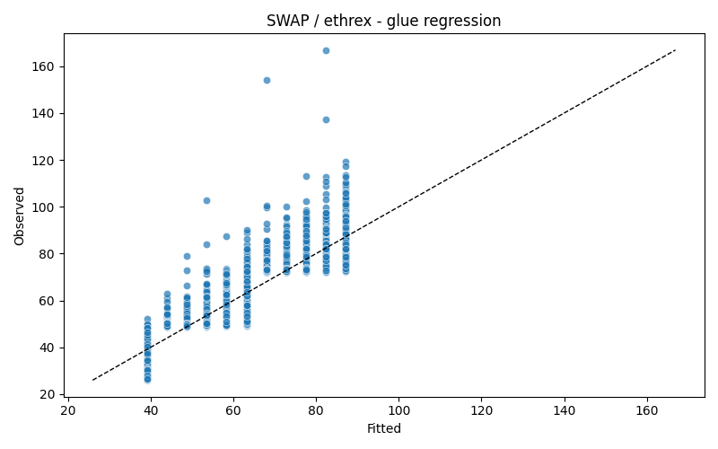

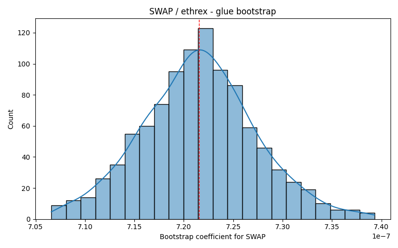

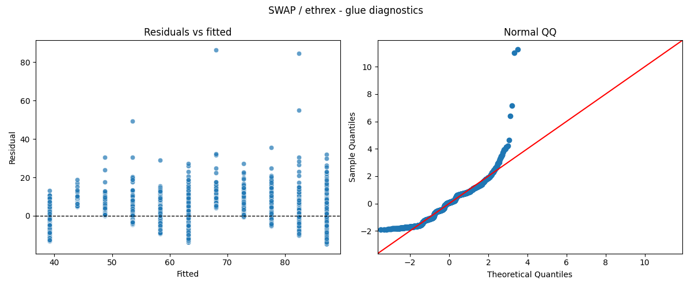

</details>

### Mixed glue (tier A) · ethrex

<details><summary><code>ADD</code> · nobs=286 · runtime_ms=1.074e-06 · p=1.00e-03 · R²=0.8358</summary>

```
==============================================================================
                           NNLS Regression Results                            
==============================================================================
Dep. Variable:          test_runtime_ms              R-squared:          0.836
Model:                  NNLS                    Adj. R-squared:          0.835
No. Observations:       286                               RMSE:           5.01
Df Residuals:           284                                MAE:           3.92
Df Model:               1      
==============================================================================
                      coef     std err     P-value      [0.025      0.975]
------------------------------------------------------------------------------
         const      9.2197      0.9751       0.001      7.2901     11.1489
           ADD      0.0000      0.0000       0.001      0.0000      0.0000
==============================================================================
Notes: Non-negative least squares with bootstrap inference (1000 iterations)
==============================================================================
```

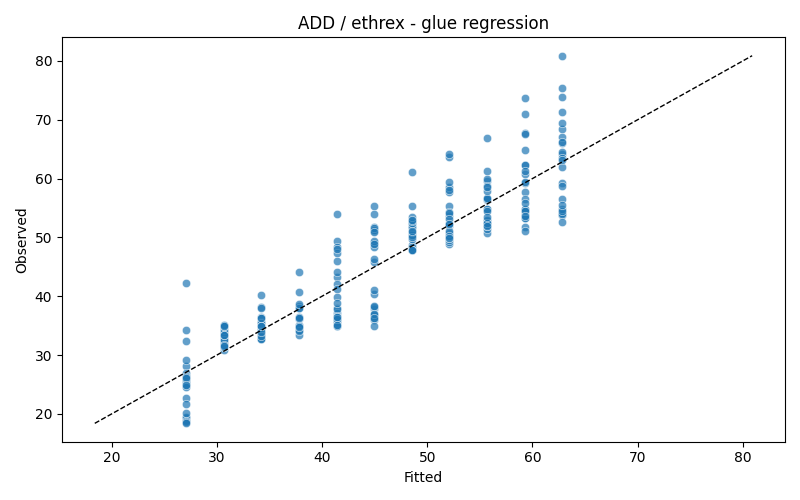

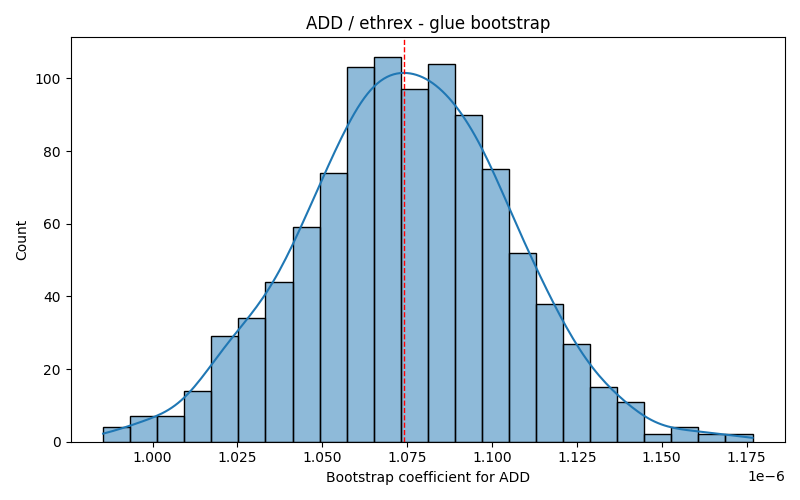


</details>

<details><summary><code>AND</code> · nobs=286 · runtime_ms=1.01e-06 · p=1.00e-03 · R²=0.8103</summary>

```
==============================================================================
                           NNLS Regression Results                            
==============================================================================
Dep. Variable:          test_runtime_ms              R-squared:          0.810
Model:                  NNLS                    Adj. R-squared:          0.810
No. Observations:       286                               RMSE:           5.15
Df Residuals:           284                                MAE:           3.87
Df Model:               1      
==============================================================================
                      coef     std err     P-value      [0.025      0.975]
------------------------------------------------------------------------------
         const      8.6780      1.0174       0.001      6.7255     10.5968
           AND      0.0000      0.0000       0.001      0.0000      0.0000
==============================================================================
Notes: Non-negative least squares with bootstrap inference (1000 iterations)
==============================================================================
```

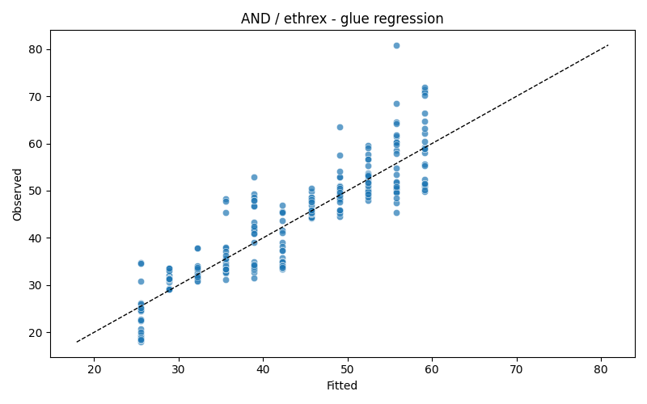

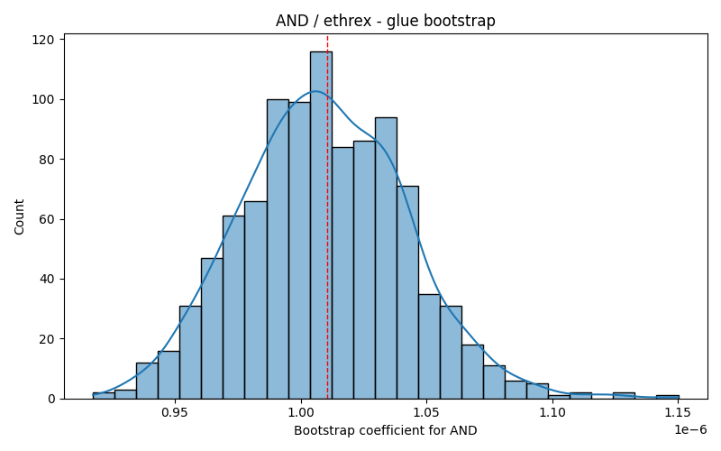

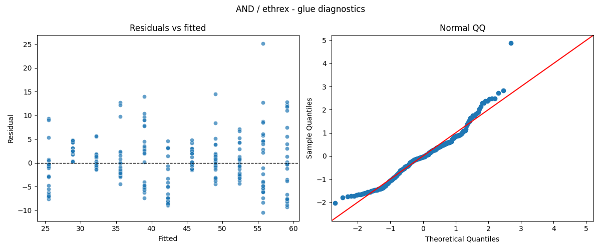

</details>

<details><summary><code>CALLDATACOPY</code> · nobs=6864 · runtime_ms=2.437e-06 · p=1.00e-03 · R²=0.8625</summary>

```
==============================================================================
                           NNLS Regression Results                            
==============================================================================
Dep. Variable:          test_runtime_ms              R-squared:          0.862
Model:                  NNLS                    Adj. R-squared:          0.862
No. Observations:       6864                              RMSE:           7.32
Df Residuals:           6862                               MAE:           5.42
Df Model:               1      
==============================================================================
                      coef     std err     P-value      [0.025      0.975]
------------------------------------------------------------------------------
         const     12.7574      0.1062       0.001     12.5570     12.9607
  CALLDATACOPY      0.0000      0.0000       0.001      0.0000      0.0000
==============================================================================
Notes: Non-negative least squares with bootstrap inference (1000 iterations)
==============================================================================
```

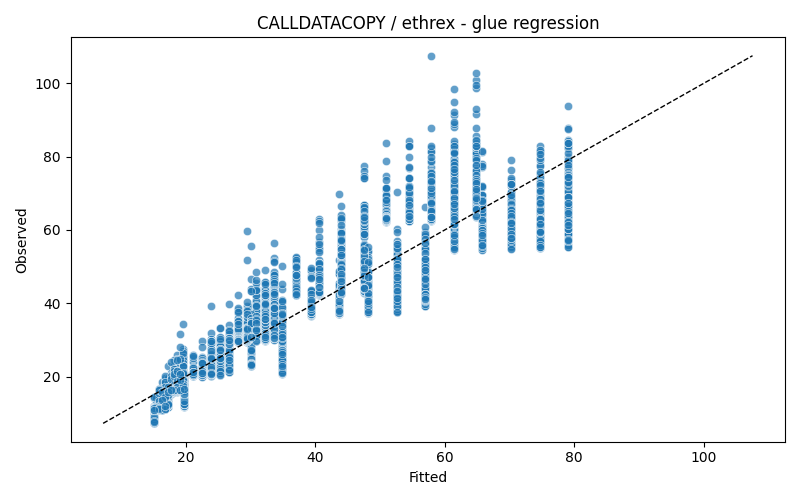

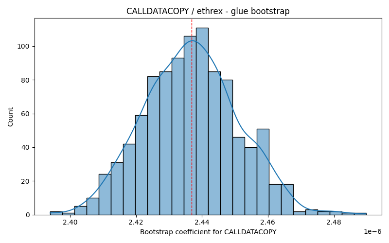

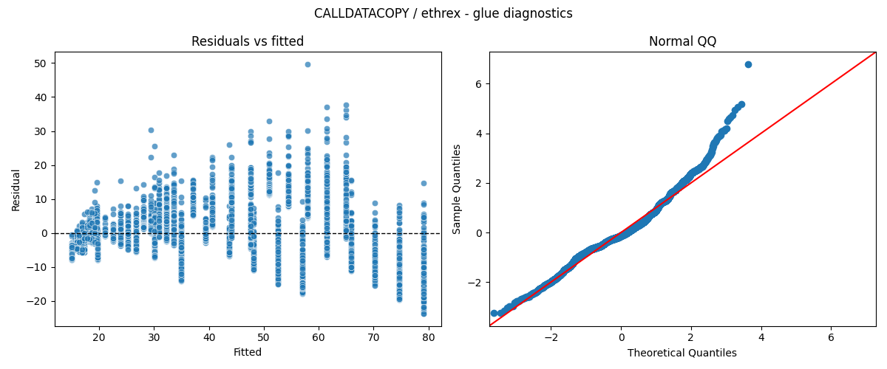

</details>

<details><summary><code>CALLDATALOAD</code> · nobs=1144 · runtime_ms=2.082e-05 · p=1.00e-03 · R²=0.2312</summary>

```
==============================================================================
                           NNLS Regression Results                            
==============================================================================
Dep. Variable:          test_runtime_ms              R-squared:          0.231
Model:                  NNLS                    Adj. R-squared:          0.231
No. Observations:       1144                              RMSE:           0.15
Df Residuals:           1142                               MAE:           0.12
Df Model:               1      
==============================================================================
                      coef     std err     P-value      [0.025      0.975]
------------------------------------------------------------------------------
         const      2.5186      0.0139       0.001      2.4921      2.5457
  CALLDATALOAD      0.0000      0.0000       0.001      0.0000      0.0000
==============================================================================
Notes: Non-negative least squares with bootstrap inference (1000 iterations)
==============================================================================
```

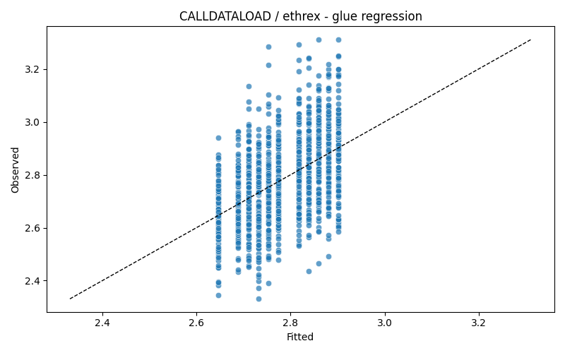

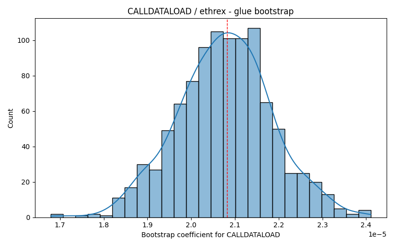

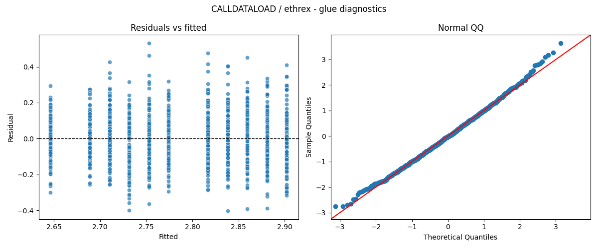

</details>

<details><summary><code>DIV</code> · nobs=286 · runtime_ms=9.41e-06 · p=1.00e-03 · R²=0.8421</summary>

```
==============================================================================
                           NNLS Regression Results                            
==============================================================================
Dep. Variable:          test_runtime_ms              R-squared:          0.842
Model:                  NNLS                    Adj. R-squared:          0.842
No. Observations:       286                               RMSE:          32.16
Df Residuals:           284                                MAE:          27.54
Df Model:               1      
==============================================================================
                      coef     std err     P-value      [0.025      0.975]
------------------------------------------------------------------------------
         const     75.6020      6.9936       0.001     61.7074     89.6816
           DIV      0.0000      0.0000       0.001      0.0000      0.0000
==============================================================================
Notes: Non-negative least squares with bootstrap inference (1000 iterations)
==============================================================================
```

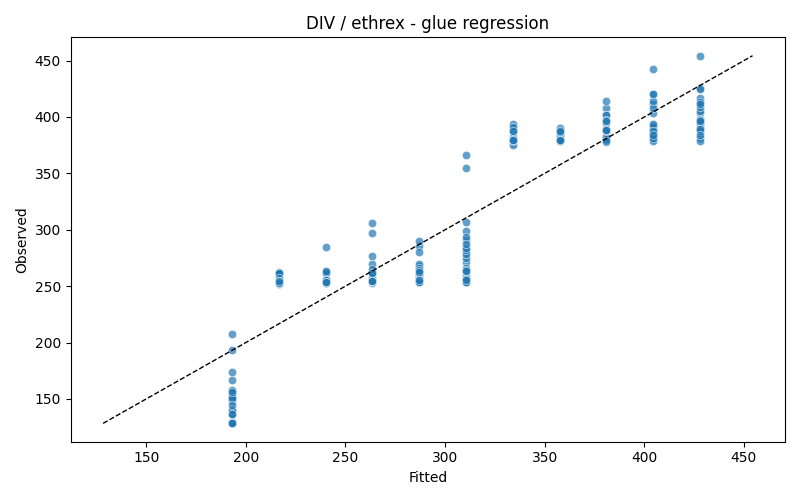

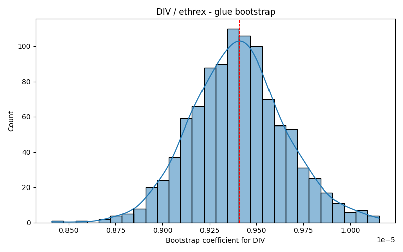

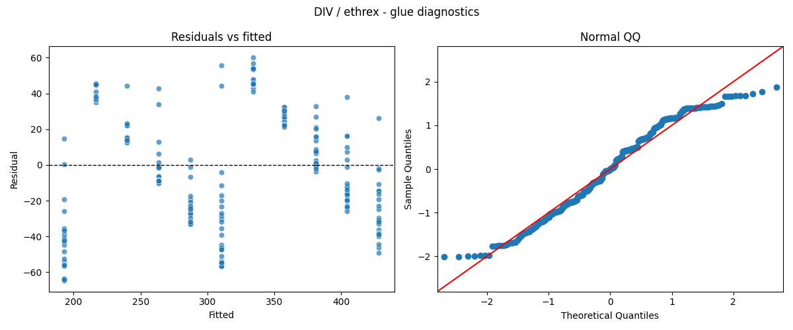

</details>

<details><summary><code>EXP</code> · nobs=286 · runtime_ms=0.0009096 · p=1.00e-03 · R²=0.8215</summary>

```
==============================================================================
                           NNLS Regression Results                            
==============================================================================
Dep. Variable:          test_runtime_ms              R-squared:          0.822
Model:                  NNLS                    Adj. R-squared:          0.821
No. Observations:       286                               RMSE:          16.60
Df Residuals:           284                                MAE:          13.60
Df Model:               1      
==============================================================================
                      coef     std err     P-value      [0.025      0.975]
------------------------------------------------------------------------------
         const     38.4334      3.6378       0.001     31.3454     45.6416
           EXP      0.0009      0.0000       0.001      0.0009      0.0010
==============================================================================
Notes: Non-negative least squares with bootstrap inference (1000 iterations)
==============================================================================
```

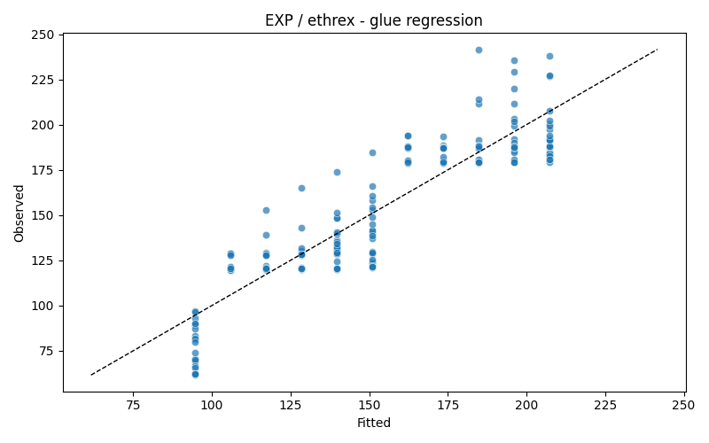

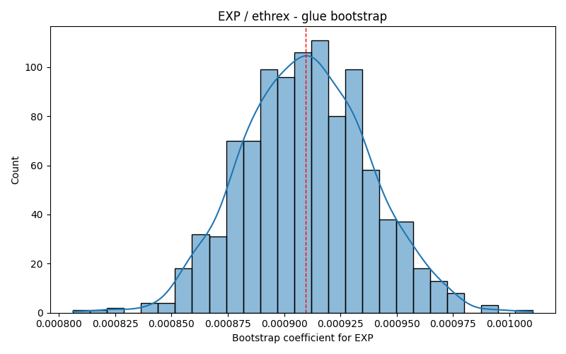

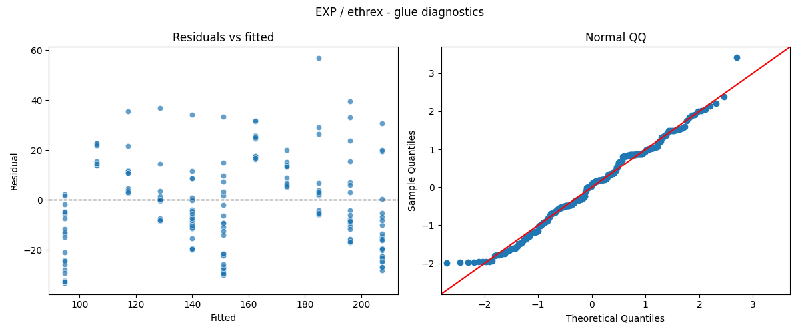

</details>

<details><summary><code>GT</code> · nobs=286 · runtime_ms=1.146e-06 · p=1.00e-03 · R²=0.8409</summary>

```
==============================================================================
                           NNLS Regression Results                            
==============================================================================
Dep. Variable:          test_runtime_ms              R-squared:          0.841
Model:                  NNLS                    Adj. R-squared:          0.840
No. Observations:       286                               RMSE:           5.25
Df Residuals:           284                                MAE:           4.18
Df Model:               1      
==============================================================================
                      coef     std err     P-value      [0.025      0.975]
------------------------------------------------------------------------------
         const      9.9920      1.0519       0.001      8.0215     12.1506
            GT      0.0000      0.0000       0.001      0.0000      0.0000
==============================================================================
Notes: Non-negative least squares with bootstrap inference (1000 iterations)
==============================================================================
```

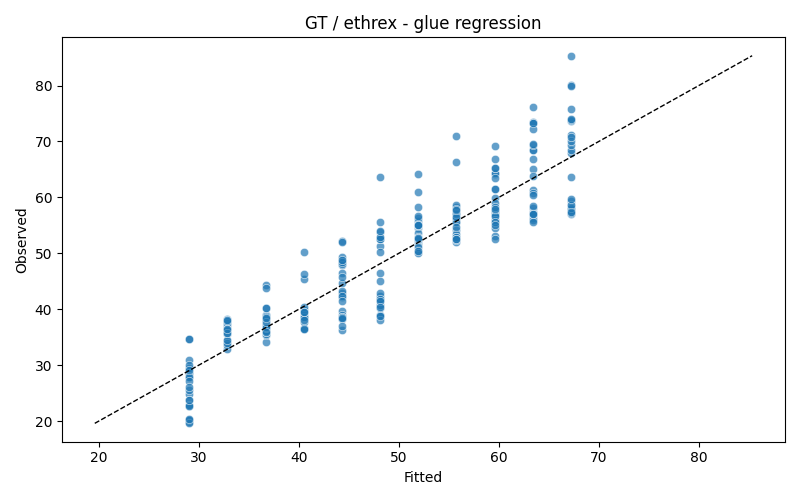

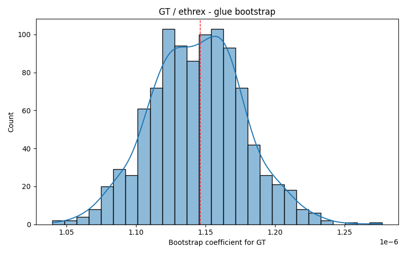

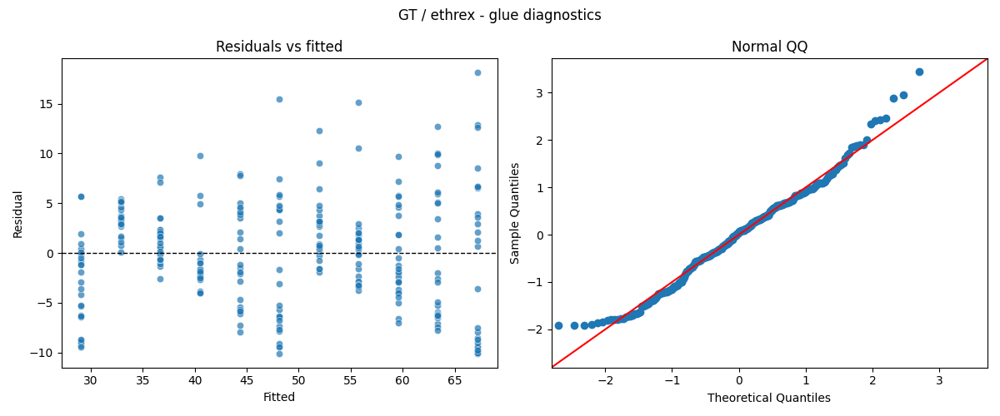

</details>

<details><summary><code>JUMPI</code> · nobs=286 · runtime_ms=1.438e-06 · p=1.00e-03 · R²=0.8106</summary>

```
==============================================================================
                           NNLS Regression Results                            
==============================================================================
Dep. Variable:          test_runtime_ms              R-squared:          0.811
Model:                  NNLS                    Adj. R-squared:          0.810
No. Observations:       286                               RMSE:           3.14
Df Residuals:           284                                MAE:           2.36
Df Model:               1      
==============================================================================
                      coef     std err     P-value      [0.025      0.975]
------------------------------------------------------------------------------
         const      6.4804      0.6096       0.001      5.3440      7.6906
         JUMPI      0.0000      0.0000       0.001      0.0000      0.0000
==============================================================================
Notes: Non-negative least squares with bootstrap inference (1000 iterations)
==============================================================================
```

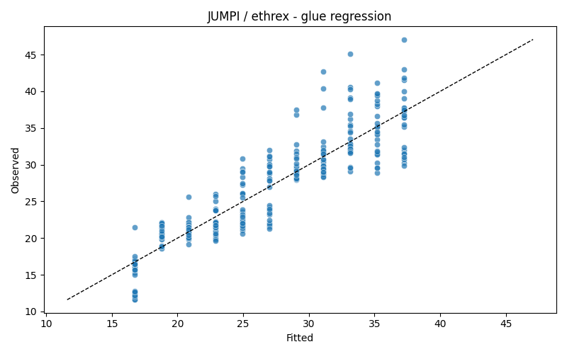

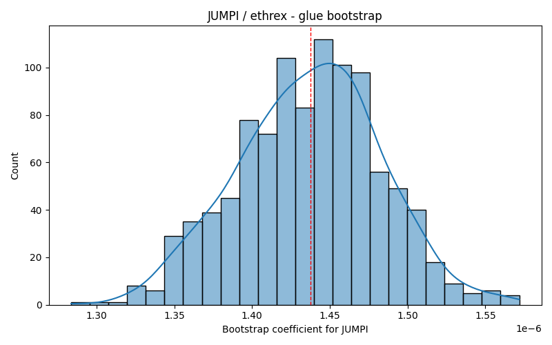

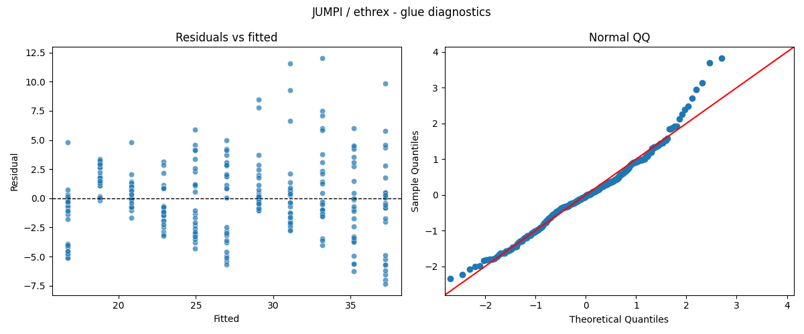

</details>

<details><summary><code>LT</code> · nobs=286 · runtime_ms=9.071e-07 · p=1.00e-03 · R²=0.8303</summary>

```
==============================================================================
                           NNLS Regression Results                            
==============================================================================
Dep. Variable:          test_runtime_ms              R-squared:          0.830
Model:                  NNLS                    Adj. R-squared:          0.830
No. Observations:       286                               RMSE:           4.32
Df Residuals:           284                                MAE:           3.32
Df Model:               1      
==============================================================================
                      coef     std err     P-value      [0.025      0.975]
------------------------------------------------------------------------------
         const     11.2472      0.8253       0.001      9.7000     12.9435
            LT      0.0000      0.0000       0.001      0.0000      0.0000
==============================================================================
Notes: Non-negative least squares with bootstrap inference (1000 iterations)
==============================================================================
```

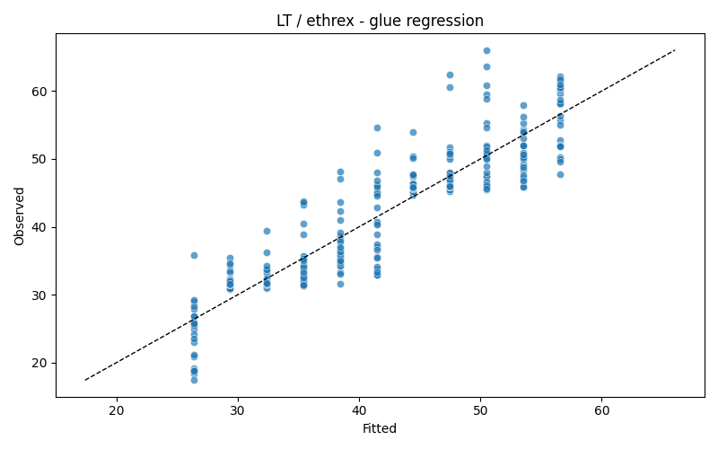

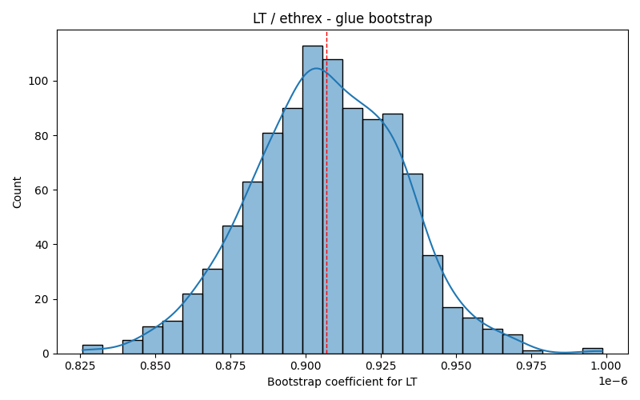

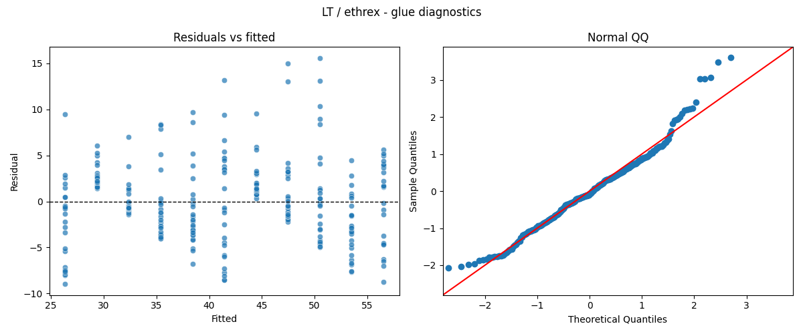

</details>

<details><summary><code>MSTORE</code> · nobs=1430 · runtime_ms=1.731e-06 · p=1.00e-03 · R²=0.8137</summary>

```
==============================================================================
                           NNLS Regression Results                            
==============================================================================
Dep. Variable:          test_runtime_ms              R-squared:          0.814
Model:                  NNLS                    Adj. R-squared:          0.814
No. Observations:       1430                              RMSE:           5.81
Df Residuals:           1428                               MAE:           4.41
Df Model:               1      
==============================================================================
                      coef     std err     P-value      [0.025      0.975]
------------------------------------------------------------------------------
         const     11.2942      0.4843       0.001     10.2916     12.2458
        MSTORE      0.0000      0.0000       0.001      0.0000      0.0000
==============================================================================
Notes: Non-negative least squares with bootstrap inference (1000 iterations)
==============================================================================
```

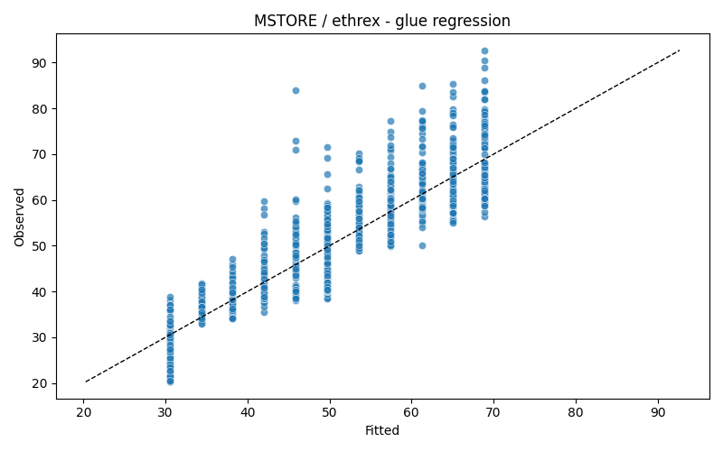

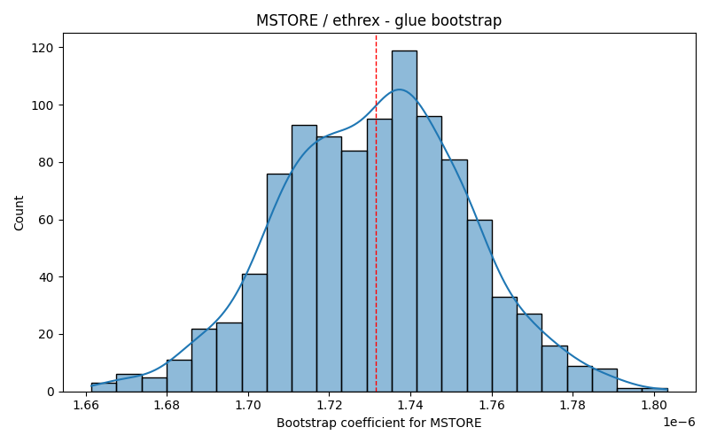

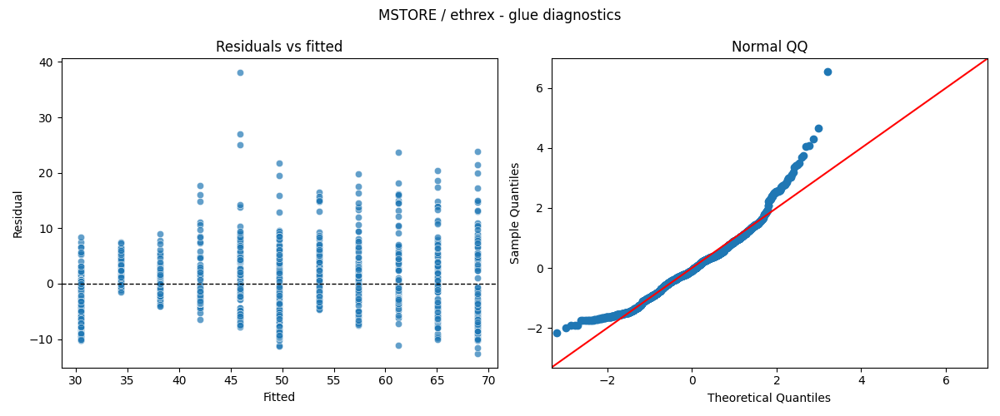

</details>

<details><summary><code>MSTORE8</code> · nobs=1430 · runtime_ms=1.599e-06 · p=1.00e-03 · R²=0.8194</summary>

```
==============================================================================
                           NNLS Regression Results                            
==============================================================================
Dep. Variable:          test_runtime_ms              R-squared:          0.819
Model:                  NNLS                    Adj. R-squared:          0.819
No. Observations:       1430                              RMSE:           5.27
Df Residuals:           1428                               MAE:           4.00
Df Model:               1      
==============================================================================
                      coef     std err     P-value      [0.025      0.975]
------------------------------------------------------------------------------
         const     10.2396      0.4344       0.001      9.4025     11.0961
       MSTORE8      0.0000      0.0000       0.001      0.0000      0.0000
==============================================================================
Notes: Non-negative least squares with bootstrap inference (1000 iterations)
==============================================================================
```

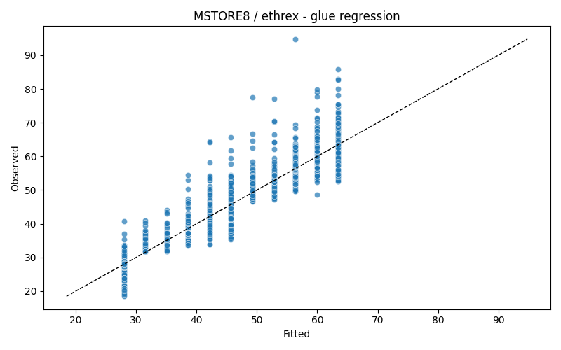

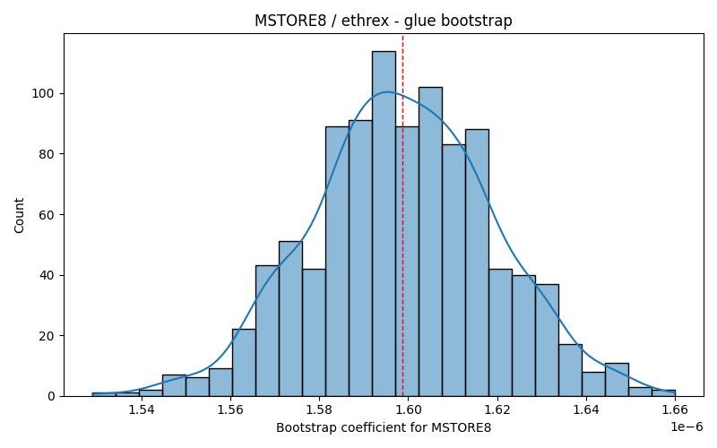

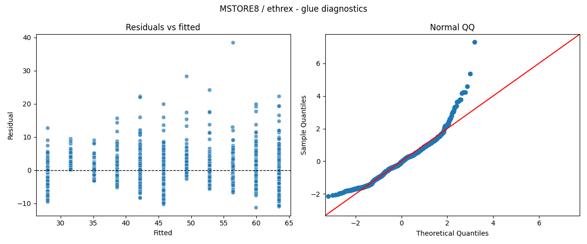

</details>

<details><summary><code>MUL</code> · nobs=286 · runtime_ms=1.356e-06 · p=1.00e-03 · R²=0.7892</summary>

```
==============================================================================
                           NNLS Regression Results                            
==============================================================================
Dep. Variable:          test_runtime_ms              R-squared:          0.789
Model:                  NNLS                    Adj. R-squared:          0.788
No. Observations:       286                               RMSE:           5.53
Df Residuals:           284                                MAE:           4.36
Df Model:               1      
==============================================================================
                      coef     std err     P-value      [0.025      0.975]
------------------------------------------------------------------------------
         const     12.5705      1.0908       0.001     10.3074     14.6272
           MUL      0.0000      0.0000       0.001      0.0000      0.0000
==============================================================================
Notes: Non-negative least squares with bootstrap inference (1000 iterations)
==============================================================================
```

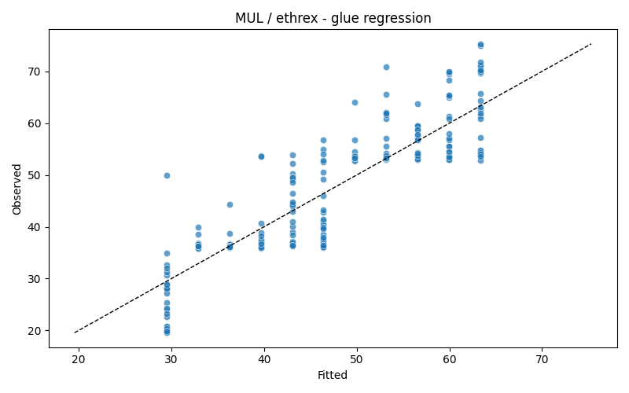

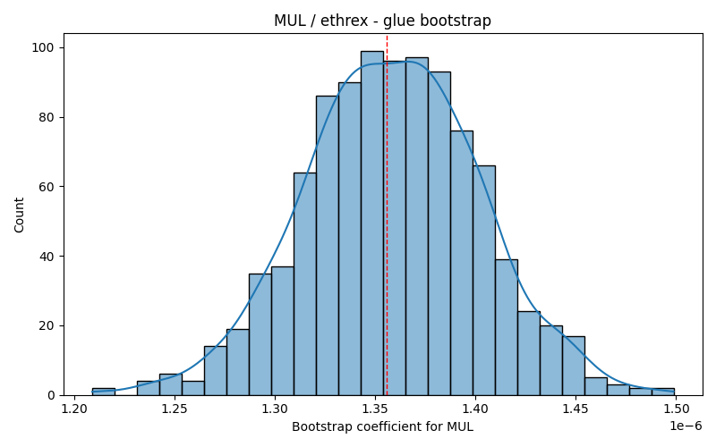

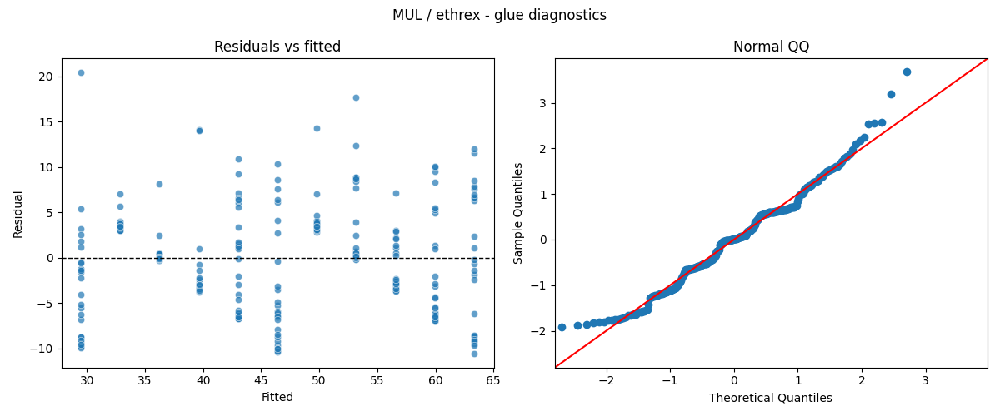

</details>

<details><summary><code>PC</code> · nobs=286 · runtime_ms=5.415e-07 · p=1.00e-03 · R²=0.8197</summary>

```
==============================================================================
                           NNLS Regression Results                            
==============================================================================
Dep. Variable:          test_runtime_ms              R-squared:          0.820
Model:                  NNLS                    Adj. R-squared:          0.819
No. Observations:       286                               RMSE:           7.59
Df Residuals:           284                                MAE:           6.22
Df Model:               1      
==============================================================================
                      coef     std err     P-value      [0.025      0.975]
------------------------------------------------------------------------------
         const     16.7947      1.4396       0.001     13.9654     19.5468
            PC      0.0000      0.0000       0.001      0.0000      0.0000
==============================================================================
Notes: Non-negative least squares with bootstrap inference (1000 iterations)
==============================================================================
```

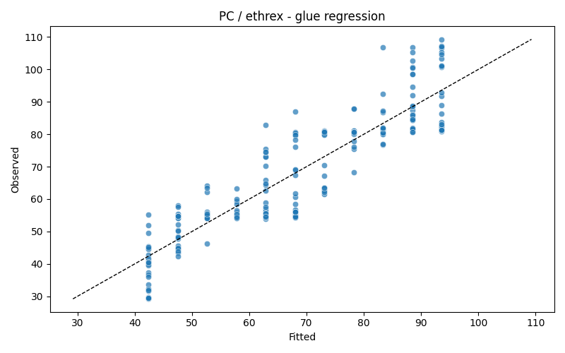

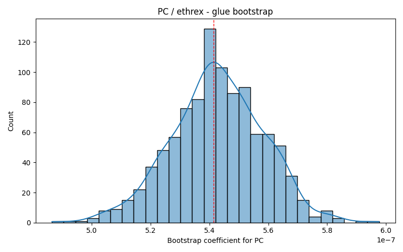

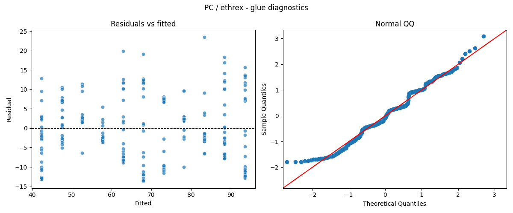

</details>

<details><summary><code>RETURNDATASIZE</code> · nobs=1144 · runtime_ms=9.057e-07 · p=1.00e-03 · R²=0.8409</summary>

```
==============================================================================
                           NNLS Regression Results                            
==============================================================================
Dep. Variable:          test_runtime_ms              R-squared:          0.841
Model:                  NNLS                    Adj. R-squared:          0.841
No. Observations:       1144                              RMSE:           6.22
Df Residuals:           1142                               MAE:           4.78
Df Model:               1      
==============================================================================
                      coef     std err     P-value      [0.025      0.975]
------------------------------------------------------------------------------
         const     12.2222      0.6092       0.001     10.9553     13.3482
RETURNDATASIZE      0.0000      0.0000       0.001      0.0000      0.0000
==============================================================================
Notes: Non-negative least squares with bootstrap inference (1000 iterations)
==============================================================================
```

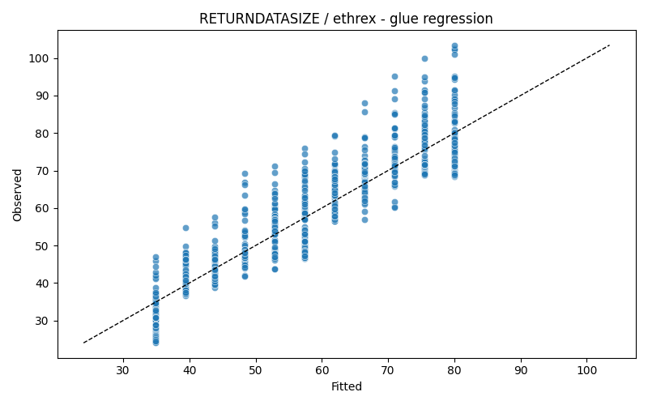

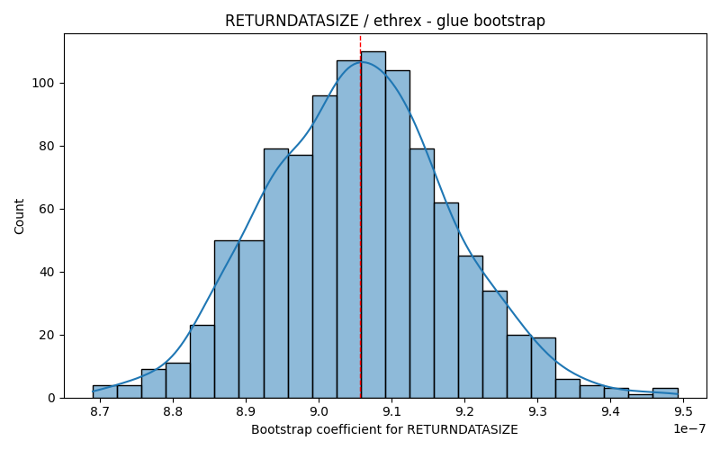

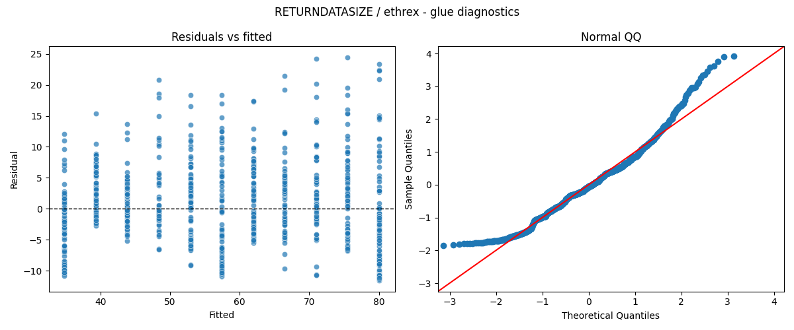

</details>

<details><summary><code>SELFBALANCE</code> · nobs=234 · runtime_ms=4.793e-06 · p=1.00e-03 · R²=0.8188</summary>

```
==============================================================================
                           NNLS Regression Results                            
==============================================================================
Dep. Variable:          test_runtime_ms              R-squared:          0.819
Model:                  NNLS                    Adj. R-squared:          0.818
No. Observations:       234                               RMSE:          22.75
Df Residuals:           232                                MAE:          18.74
Df Model:               1      
==============================================================================
                      coef     std err     P-value      [0.025      0.975]
------------------------------------------------------------------------------
         const     69.7411      5.0423       0.001     58.9802     78.8621
   SELFBALANCE      0.0000      0.0000       0.001      0.0000      0.0000
==============================================================================
Notes: Non-negative least squares with bootstrap inference (1000 iterations)
==============================================================================
```

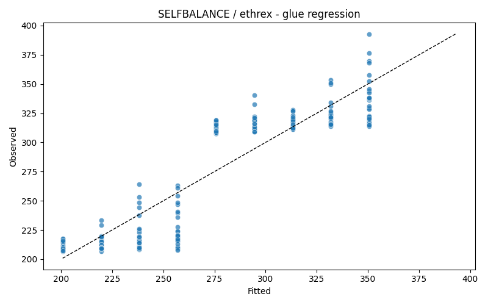

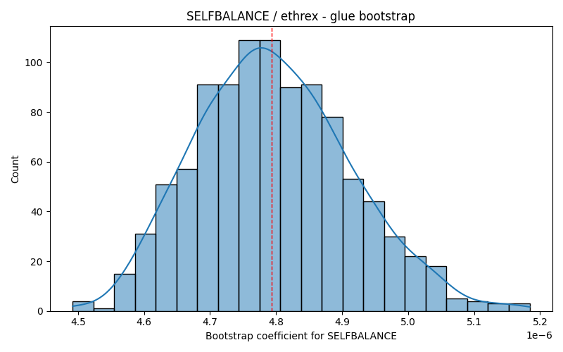

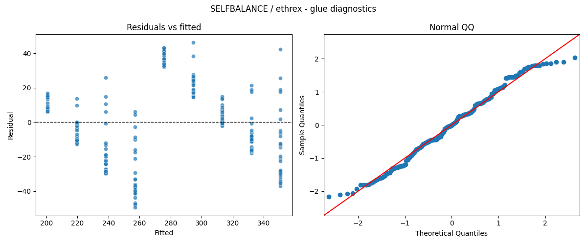

</details>

<details><summary><code>SUB</code> · nobs=286 · runtime_ms=1.065e-06 · p=1.00e-03 · R²=0.8151</summary>

```
==============================================================================
                           NNLS Regression Results                            
==============================================================================
Dep. Variable:          test_runtime_ms              R-squared:          0.815
Model:                  NNLS                    Adj. R-squared:          0.814
No. Observations:       286                               RMSE:           5.34
Df Residuals:           284                                MAE:           3.87
Df Model:               1      
==============================================================================
                      coef     std err     P-value      [0.025      0.975]
------------------------------------------------------------------------------
         const      8.9941      1.1290       0.001      6.7242     11.3331
           SUB      0.0000      0.0000       0.001      0.0000      0.0000
==============================================================================
Notes: Non-negative least squares with bootstrap inference (1000 iterations)
==============================================================================
```

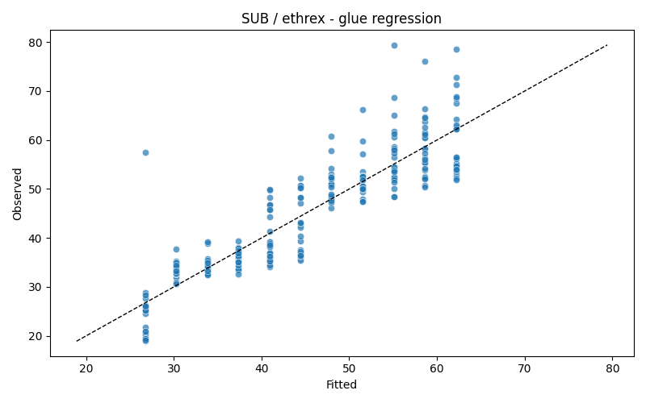

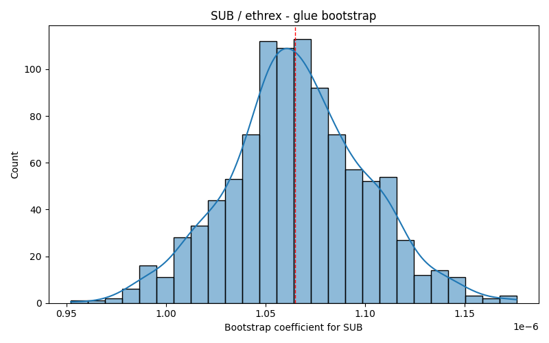

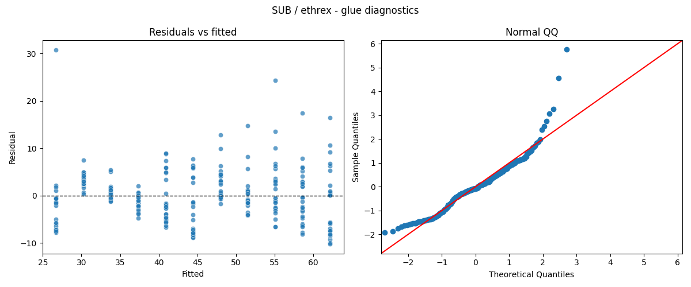

</details>

### Mixed glue (tier B) · ethrex

<details><summary><code>JUMP</code> · nobs=286 · runtime_ms=4.304e-06 · p=1.00e-03 · R²=0.8295</summary>

```
==============================================================================
                           NNLS Regression Results                            
==============================================================================
Dep. Variable:          test_runtime_ms              R-squared:          0.829
Model:                  NNLS                    Adj. R-squared:          0.829
No. Observations:       286                               RMSE:           7.25
Df Residuals:           284                                MAE:           5.90
Df Model:               1      
==============================================================================
                      coef     std err     P-value      [0.025      0.975]
------------------------------------------------------------------------------
         const     15.6680      1.4553       0.001     12.8971     18.5329
          JUMP      0.0000      0.0000       0.001      0.0000      0.0000
==============================================================================
Notes: Non-negative least squares with bootstrap inference (1000 iterations)
==============================================================================
```

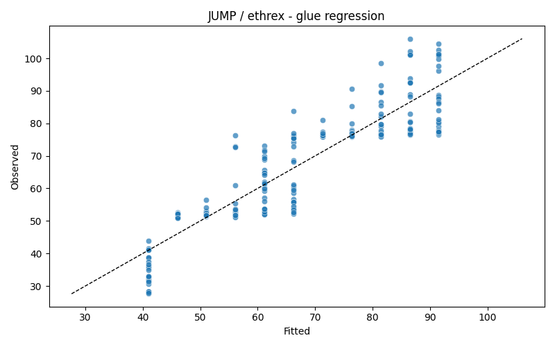

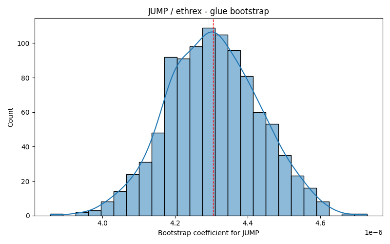

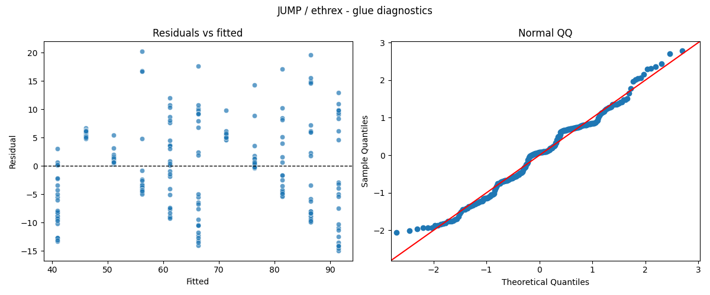

</details>

<details><summary><code>KECCAK256</code> · nobs=4576 · runtime_ms=0 · p=1.00e+00 · R²=0</summary>

```
==============================================================================
                           NNLS Regression Results                            
==============================================================================
Dep. Variable:          test_runtime_ms              R-squared:          0.000
Model:                  NNLS                    Adj. R-squared:         -0.000
No. Observations:       4576                              RMSE:         155.55
Df Residuals:           4574                               MAE:         128.75
Df Model:               1      
==============================================================================
                      coef     std err     P-value      [0.025      0.975]
------------------------------------------------------------------------------
         const    247.9316      2.3513       0.001    242.9043    252.5293
     KECCAK256      0.0000      0.0000       1.000      0.0000      0.0000
==============================================================================
Notes: Non-negative least squares with bootstrap inference (1000 iterations)
==============================================================================
```

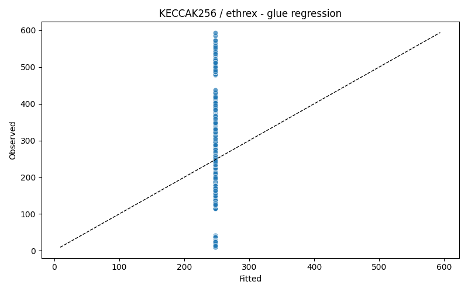


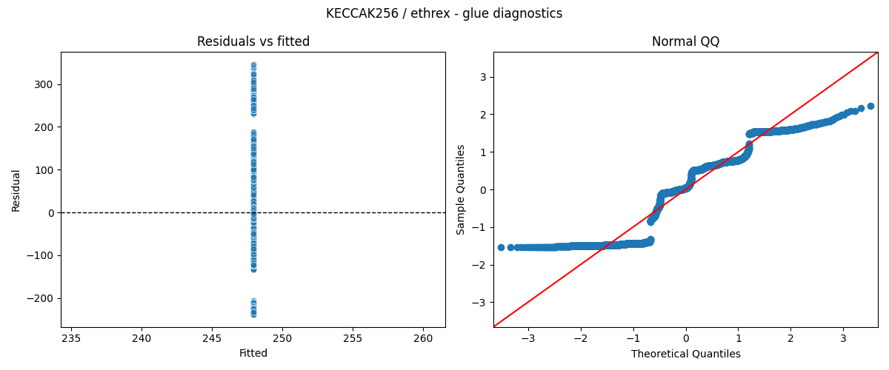

</details>

## geth

| glue_opcode | nobs | glue_runtime_ms | p_value | rsquared |
| --- | --- | --- | --- | --- |
| `ISZERO` | 2068 | 1.429e-06 | 1.00e-03 | 0.775 |
| `JUMPDEST` | 2068 | 1.154e-06 | 1.00e-03 | 0.7633 |
| `SWAP` | 33088 | 1.514e-06 | 1.00e-03 | 0.7634 |
| `CALLDATASIZE` | 122254 | 1.419e-06 | 1.00e-03 | 0.8169 |
| `DUP` | 122254 | 1.528e-06 | 1.00e-03 | 0.8169 |
| `GAS` | 122254 | 1.496e-06 | 1.00e-03 | 0.8169 |
| `MLOAD` | 122254 | 5.18e-06 | 1.00e-03 | 0.8169 |
| `PUSH` | 122254 | 2.26e-06 | 1.00e-03 | 0.8169 |
| `PUSH0` | 122254 | 1.445e-06 | 1.00e-03 | 0.8169 |
| `STATICCALL` | 122254 | 0.0001685 | 1.00e-03 | 0.8169 |
| `ADD` | 2068 | 4.464e-06 | 1.00e-03 | 0.8316 |
| `AND` | 2068 | 4.282e-06 | 1.00e-03 | 0.8009 |
| `CALLDATACOPY` | 49632 | 1.374e-05 | 1.00e-03 | 0.9534 |
| `CALLDATALOAD` | 8272 | 5.318e-05 | 1.00e-03 | 0.03602 |
| `DIV` | 2068 | 9.249e-06 | 1.00e-03 | 0.7901 |
| `EXP` | 2068 | 0.0003401 | 1.00e-03 | 0.8237 |
| `GT` | 2068 | 3.486e-06 | 1.00e-03 | 0.7517 |
| `JUMPI` | 2068 | 5.67e-06 | 1.00e-03 | 0.7484 |
| `LT` | 2068 | 4.368e-06 | 1.00e-03 | 0.7906 |
| `MSTORE` | 10340 | 8.013e-06 | 1.00e-03 | 0.807 |
| `MSTORE8` | 10340 | 7.404e-06 | 1.00e-03 | 0.7987 |
| `MUL` | 2068 | 4.963e-06 | 1.00e-03 | 0.8698 |
| `PC` | 2068 | 1.607e-06 | 1.00e-03 | 0.8347 |
| `RETURNDATASIZE` | 8272 | 3.125e-06 | 1.00e-03 | 0.613 |
| `SELFBALANCE` | 1692 | 7.422e-06 | 1.00e-03 | 0.7942 |
| `SUB` | 2068 | 4.382e-06 | 1.00e-03 | 0.8272 |
| `JUMP` | 2068 | 9.198e-06 | 1.00e-03 | 0.7781 |
| `KECCAK256` | 33088 | 3.677e-05 | 1.00e-03 | 0.2681 |

### Cycle glue — joint fit · geth

<details><summary>Joint NNLS regression summary</summary>

```
==============================================================================
                           NNLS Regression Results                            
==============================================================================
Dep. Variable:          test_runtime_ms              R-squared:          0.817
Model:                  NNLS                    Adj. R-squared:          0.817
No. Observations:       122254                            RMSE:          24.35
Df Residuals:           122246                             MAE:          18.76
Df Model:               7      
==============================================================================
                      coef     std err     P-value      [0.025      0.975]
------------------------------------------------------------------------------
         const     40.8927      0.2578       0.001     40.3745     41.4007
  CALLDATASIZE      0.0000      0.0000       0.001      0.0000      0.0000
           DUP      0.0000      0.0000       0.001      0.0000      0.0000
           GAS      0.0000      0.0000       0.001      0.0000      0.0000
         MLOAD      0.0000      0.0000       0.001      0.0000      0.0000
          PUSH      0.0000      0.0000       0.001      0.0000      0.0000
         PUSH0      0.0000      0.0000       0.001      0.0000      0.0000
    STATICCALL      0.0002      0.0000       0.001      0.0002      0.0002
==============================================================================
Notes: Non-negative least squares with bootstrap inference (1000 iterations)
==============================================================================
```

</details>

<details><summary><code>CALLDATASIZE</code> · nobs=122254 · runtime_ms=1.419e-06 · p=1.00e-03 · R²=0.8169</summary>


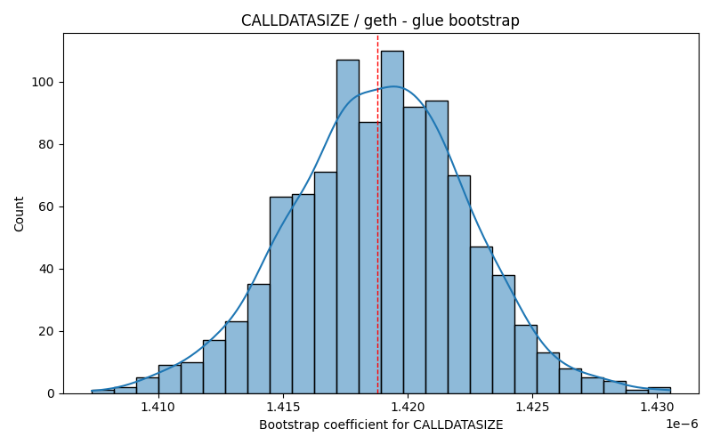

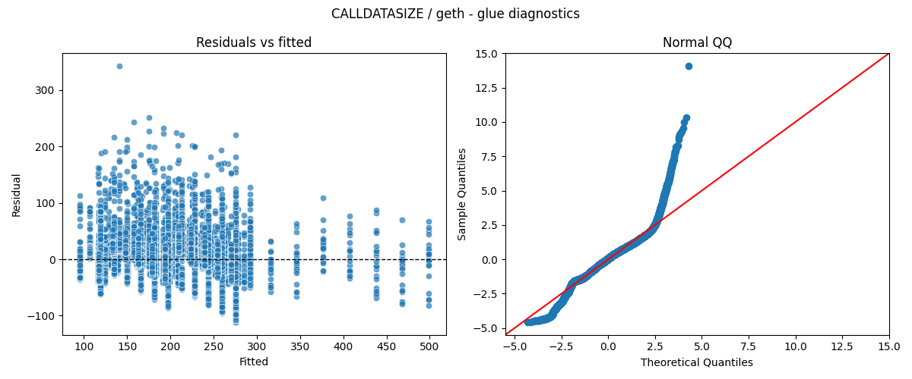

</details>

<details><summary><code>DUP</code> · nobs=122254 · runtime_ms=1.528e-06 · p=1.00e-03 · R²=0.8169</summary>


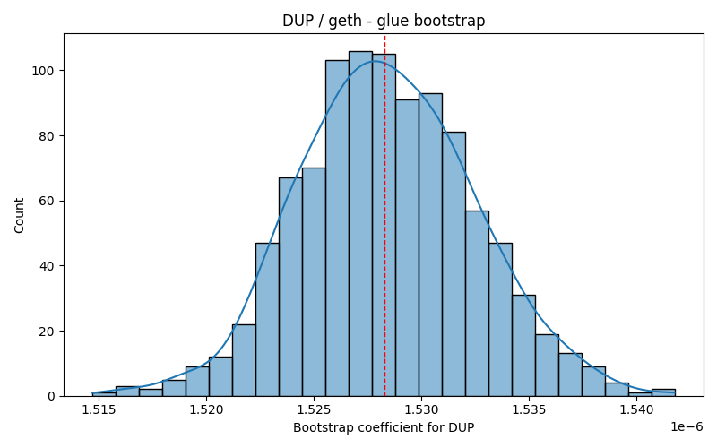


</details>

<details><summary><code>GAS</code> · nobs=122254 · runtime_ms=1.496e-06 · p=1.00e-03 · R²=0.8169</summary>


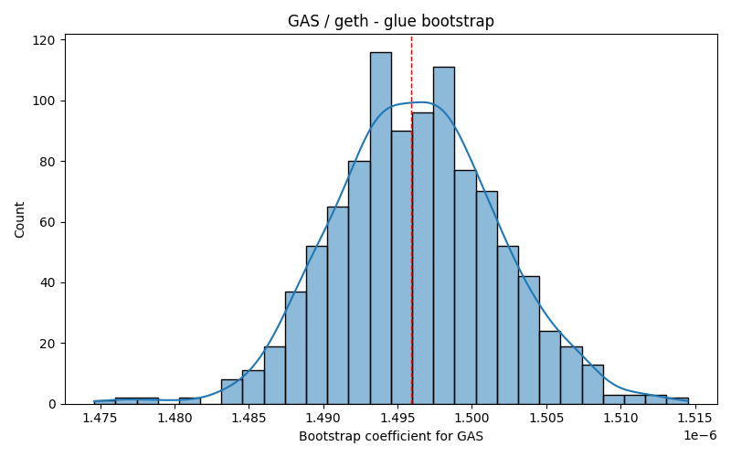

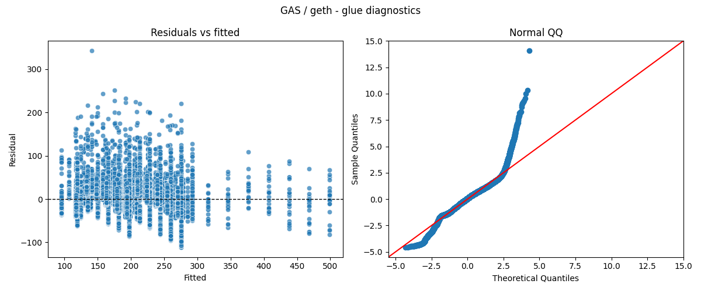

</details>

<details><summary><code>MLOAD</code> · nobs=122254 · runtime_ms=5.18e-06 · p=1.00e-03 · R²=0.8169</summary>


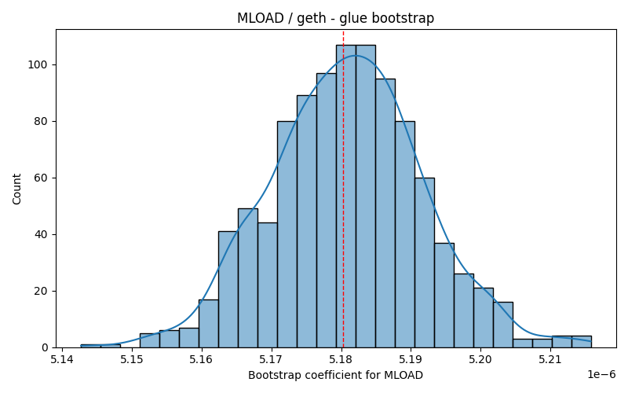

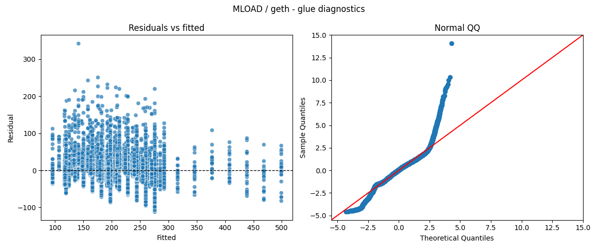

</details>

<details><summary><code>PUSH</code> · nobs=122254 · runtime_ms=2.26e-06 · p=1.00e-03 · R²=0.8169</summary>

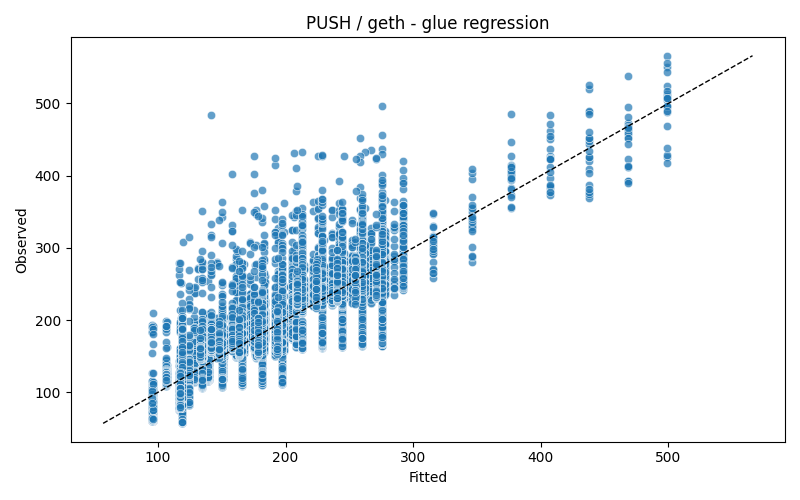

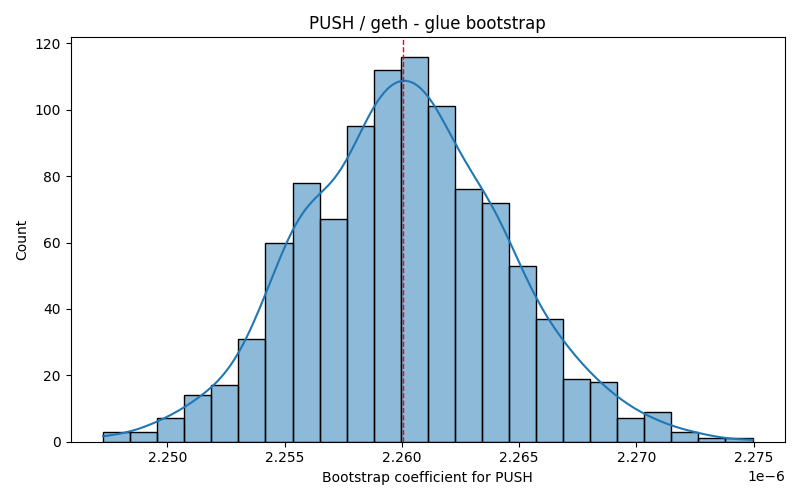


</details>

<details><summary><code>PUSH0</code> · nobs=122254 · runtime_ms=1.445e-06 · p=1.00e-03 · R²=0.8169</summary>

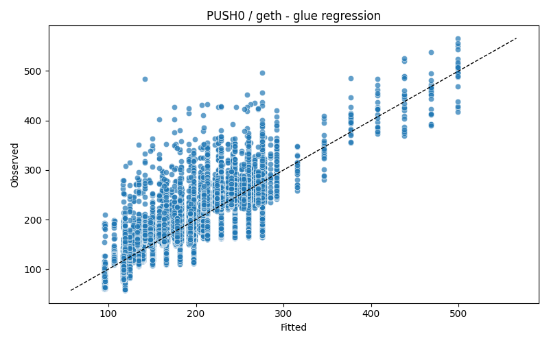

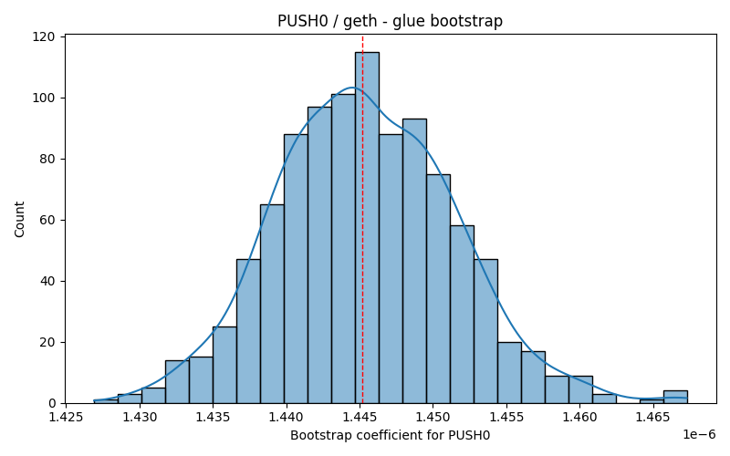


</details>

<details><summary><code>STATICCALL</code> · nobs=122254 · runtime_ms=0.0001685 · p=1.00e-03 · R²=0.8169</summary>

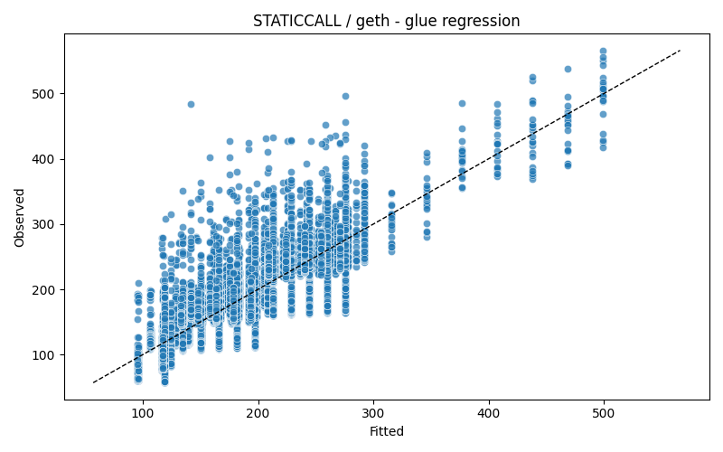

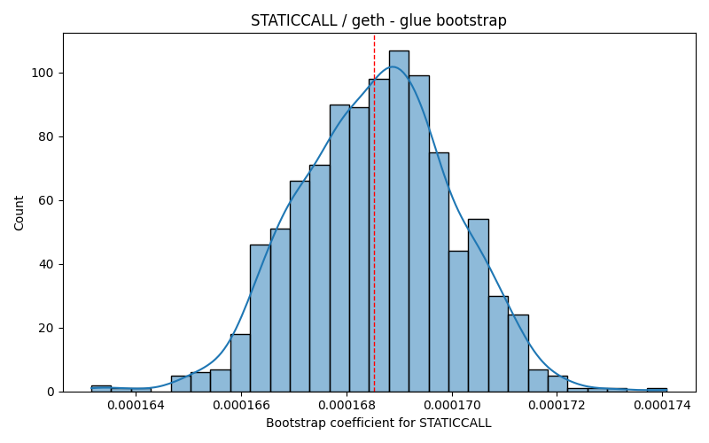


</details>

### Pure glue · geth

<details><summary><code>ISZERO</code> · nobs=2068 · runtime_ms=1.429e-06 · p=1.00e-03 · R²=0.775</summary>

```
==============================================================================
                           NNLS Regression Results                            
==============================================================================
Dep. Variable:          test_runtime_ms              R-squared:          0.775
Model:                  NNLS                    Adj. R-squared:          0.775
No. Observations:       2068                              RMSE:          16.21
Df Residuals:           2066                               MAE:          11.90
Df Model:               1      
==============================================================================
                      coef     std err     P-value      [0.025      0.975]
------------------------------------------------------------------------------
         const     23.1027      1.2245       0.001     20.6410     25.4855
        ISZERO      0.0000      0.0000       0.001      0.0000      0.0000
==============================================================================
Notes: Non-negative least squares with bootstrap inference (1000 iterations)
==============================================================================
```

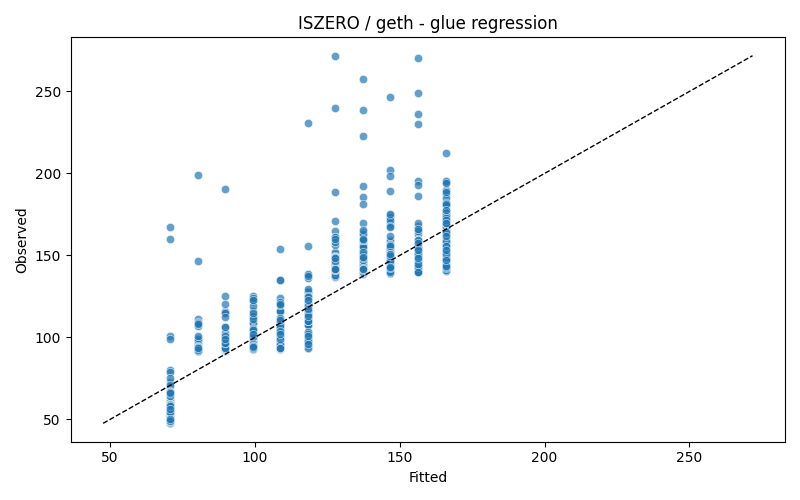

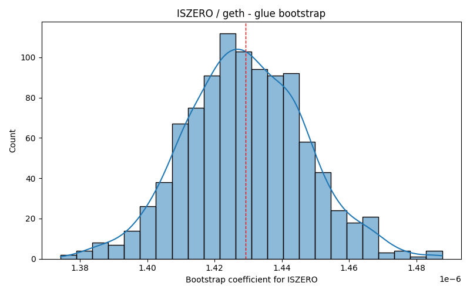

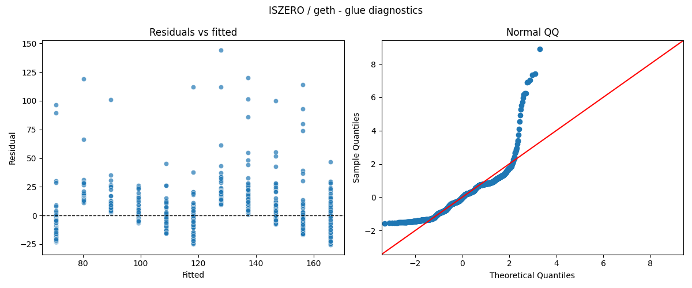

</details>

<details><summary><code>JUMPDEST</code> · nobs=2068 · runtime_ms=1.154e-06 · p=1.00e-03 · R²=0.7633</summary>

```
==============================================================================
                           NNLS Regression Results                            
==============================================================================
Dep. Variable:          test_runtime_ms              R-squared:          0.763
Model:                  NNLS                    Adj. R-squared:          0.763
No. Observations:       2068                              RMSE:          40.59
Df Residuals:           2066                               MAE:          27.41
Df Model:               1      
==============================================================================
                      coef     std err     P-value      [0.025      0.975]
------------------------------------------------------------------------------
         const     70.0044      2.8853       0.001     64.4919     75.7000
      JUMPDEST      0.0000      0.0000       0.001      0.0000      0.0000
==============================================================================
Notes: Non-negative least squares with bootstrap inference (1000 iterations)
==============================================================================
```

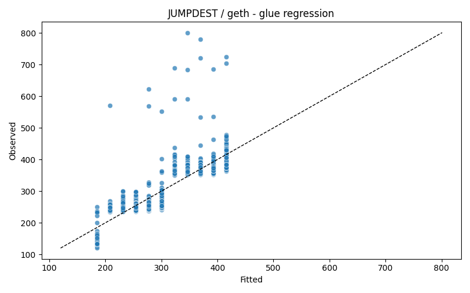

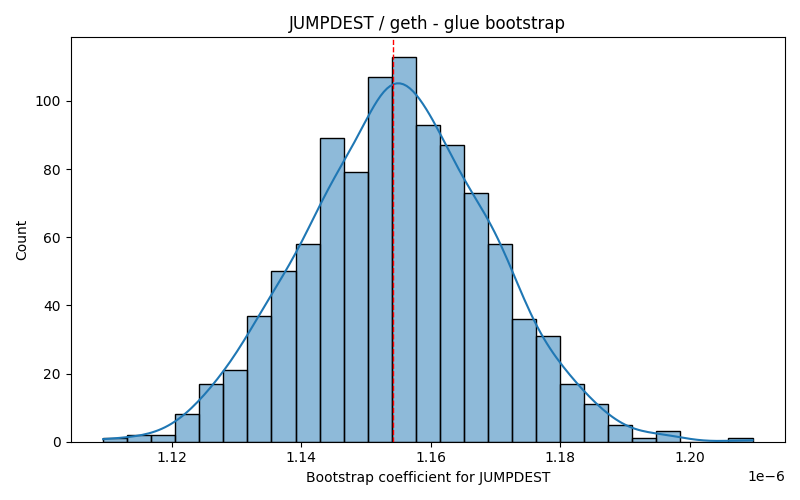

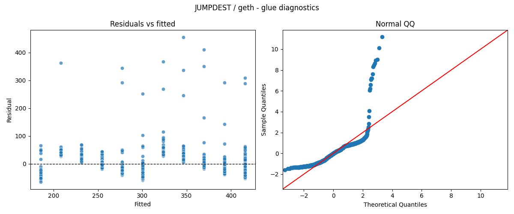

</details>

<details><summary><code>SWAP</code> · nobs=33088 · runtime_ms=1.514e-06 · p=1.00e-03 · R²=0.7634</summary>

```
==============================================================================
                           NNLS Regression Results                            
==============================================================================
Dep. Variable:          test_runtime_ms              R-squared:          0.763
Model:                  NNLS                    Adj. R-squared:          0.763
No. Observations:       33088                             RMSE:          17.75
Df Residuals:           33086                              MAE:          13.24
Df Model:               1      
==============================================================================
                      coef     std err     P-value      [0.025      0.975]
------------------------------------------------------------------------------
         const     31.6911      0.3481       0.001     30.9977     32.3495
          SWAP      0.0000      0.0000       0.001      0.0000      0.0000
==============================================================================
Notes: Non-negative least squares with bootstrap inference (1000 iterations)
==============================================================================
```

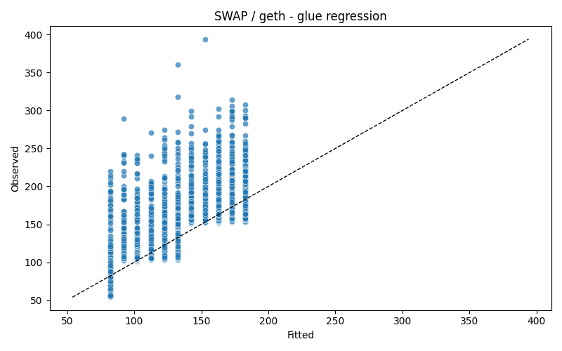

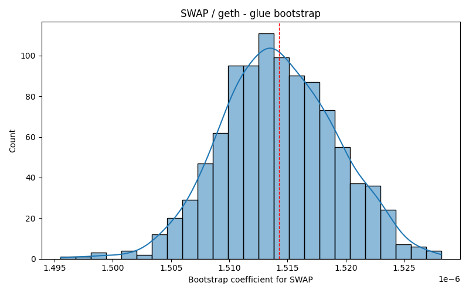

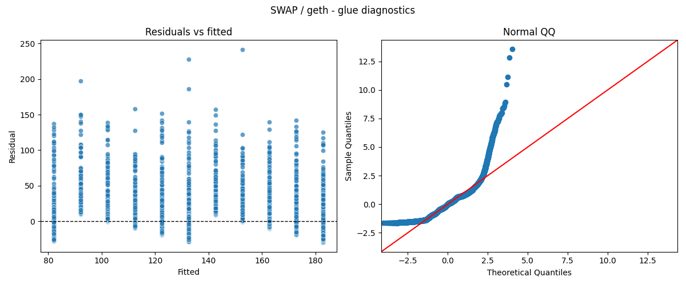

</details>

### Mixed glue (tier A) · geth

<details><summary><code>ADD</code> · nobs=2068 · runtime_ms=4.464e-06 · p=1.00e-03 · R²=0.8316</summary>

```
==============================================================================
                           NNLS Regression Results                            
==============================================================================
Dep. Variable:          test_runtime_ms              R-squared:          0.832
Model:                  NNLS                    Adj. R-squared:          0.831
No. Observations:       2068                              RMSE:          21.15
Df Residuals:           2066                               MAE:          15.53
Df Model:               1      
==============================================================================
                      coef     std err     P-value      [0.025      0.975]
------------------------------------------------------------------------------
         const     44.3772      1.4349       0.001     41.7281     47.2336
           ADD      0.0000      0.0000       0.001      0.0000      0.0000
==============================================================================
Notes: Non-negative least squares with bootstrap inference (1000 iterations)
==============================================================================
```


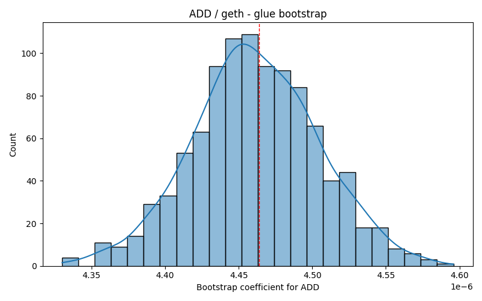

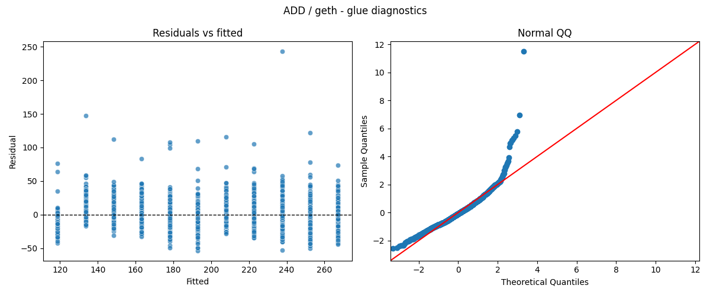

</details>

<details><summary><code>AND</code> · nobs=2068 · runtime_ms=4.282e-06 · p=1.00e-03 · R²=0.8009</summary>

```
==============================================================================
                           NNLS Regression Results                            
==============================================================================
Dep. Variable:          test_runtime_ms              R-squared:          0.801
Model:                  NNLS                    Adj. R-squared:          0.801
No. Observations:       2068                              RMSE:          22.47
Df Residuals:           2066                               MAE:          16.81
Df Model:               1      
==============================================================================
                      coef     std err     P-value      [0.025      0.975]
------------------------------------------------------------------------------
         const     45.2706      1.5335       0.001     42.3367     48.2134
           AND      0.0000      0.0000       0.001      0.0000      0.0000
==============================================================================
Notes: Non-negative least squares with bootstrap inference (1000 iterations)
==============================================================================
```

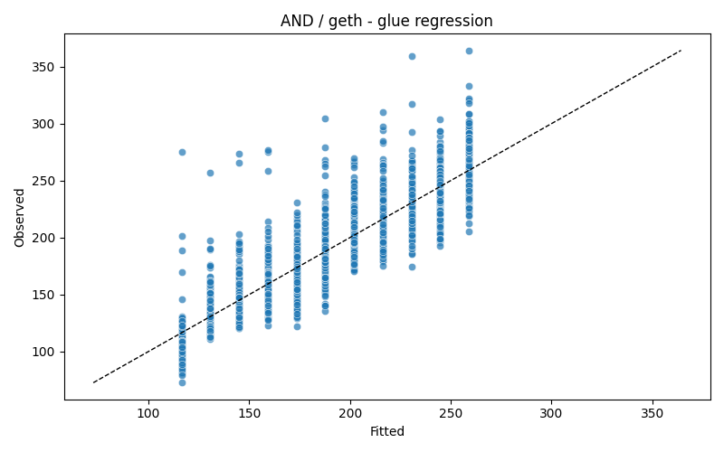

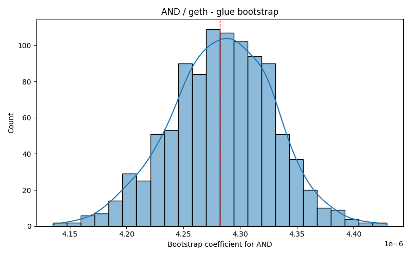

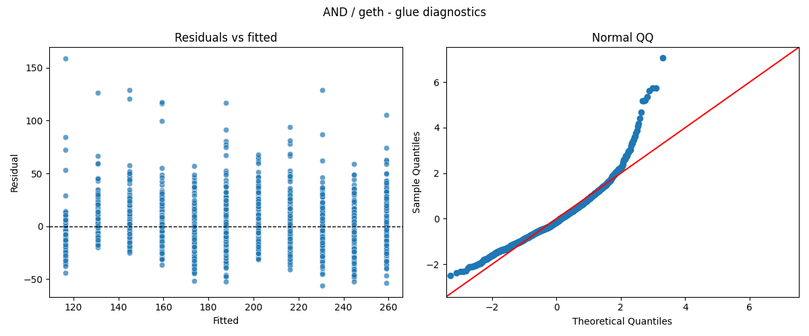

</details>

<details><summary><code>CALLDATACOPY</code> · nobs=49632 · runtime_ms=1.374e-05 · p=1.00e-03 · R²=0.9534</summary>

```
==============================================================================
                           NNLS Regression Results                            
==============================================================================
Dep. Variable:          test_runtime_ms              R-squared:          0.953
Model:                  NNLS                    Adj. R-squared:          0.953
No. Observations:       49632                             RMSE:          22.83
Df Residuals:           49630                              MAE:          16.33
Df Model:               1      
==============================================================================
                      coef     std err     P-value      [0.025      0.975]
------------------------------------------------------------------------------
         const     20.1910      0.1276       0.001     19.9415     20.4331
  CALLDATACOPY      0.0000      0.0000       0.001      0.0000      0.0000
==============================================================================
Notes: Non-negative least squares with bootstrap inference (1000 iterations)
==============================================================================
```

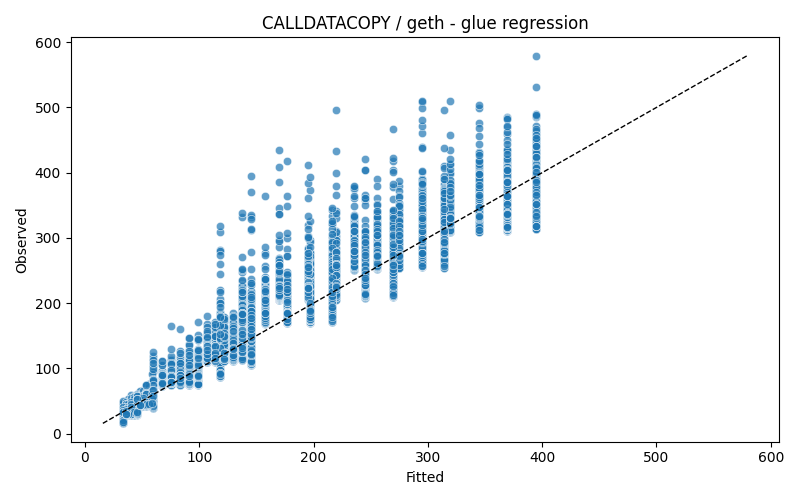

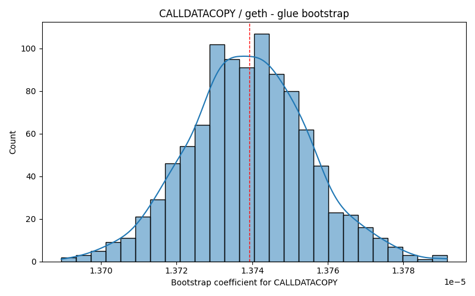

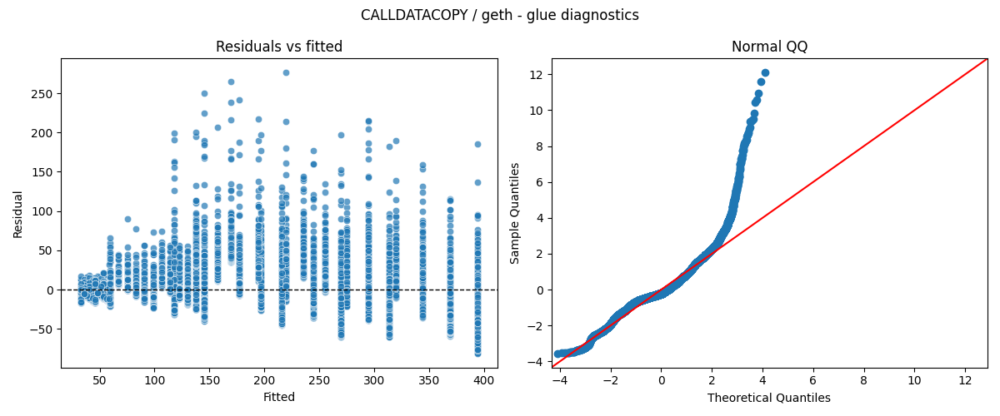

</details>

<details><summary><code>CALLDATALOAD</code> · nobs=8272 · runtime_ms=5.318e-05 · p=1.00e-03 · R²=0.03602</summary>

```
==============================================================================
                           NNLS Regression Results                            
==============================================================================
Dep. Variable:          test_runtime_ms              R-squared:          0.036
Model:                  NNLS                    Adj. R-squared:          0.036
No. Observations:       8272                              RMSE:           1.06
Df Residuals:           8270                               MAE:           0.54
Df Model:               1      
==============================================================================
                      coef     std err     P-value      [0.025      0.975]
------------------------------------------------------------------------------
         const      2.4527      0.0386       0.001      2.3782      2.5260
  CALLDATALOAD      0.0001      0.0000       0.001      0.0000      0.0001
==============================================================================
Notes: Non-negative least squares with bootstrap inference (1000 iterations)
==============================================================================
```

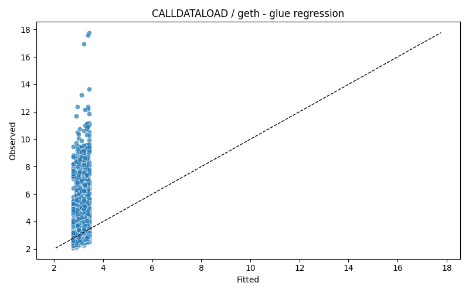

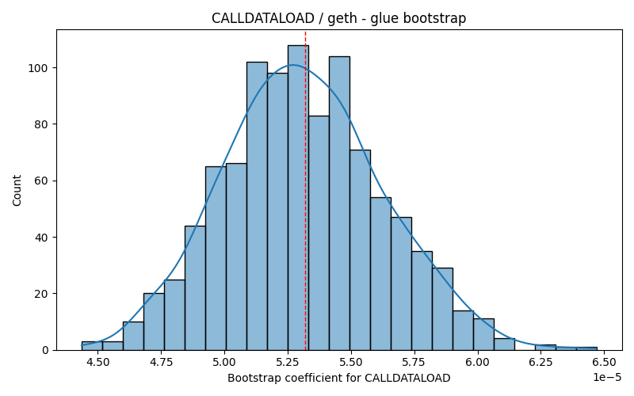

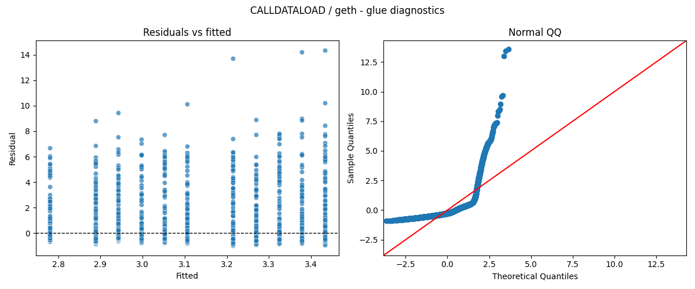

</details>

<details><summary><code>DIV</code> · nobs=2068 · runtime_ms=9.249e-06 · p=1.00e-03 · R²=0.7901</summary>

```
==============================================================================
                           NNLS Regression Results                            
==============================================================================
Dep. Variable:          test_runtime_ms              R-squared:          0.790
Model:                  NNLS                    Adj. R-squared:          0.790
No. Observations:       2068                              RMSE:          37.63
Df Residuals:           2066                               MAE:          30.97
Df Model:               1      
==============================================================================
                      coef     std err     P-value      [0.025      0.975]
------------------------------------------------------------------------------
         const     79.6522      2.9887       0.001     73.7919     85.3106
           DIV      0.0000      0.0000       0.001      0.0000      0.0000
==============================================================================
Notes: Non-negative least squares with bootstrap inference (1000 iterations)
==============================================================================
```

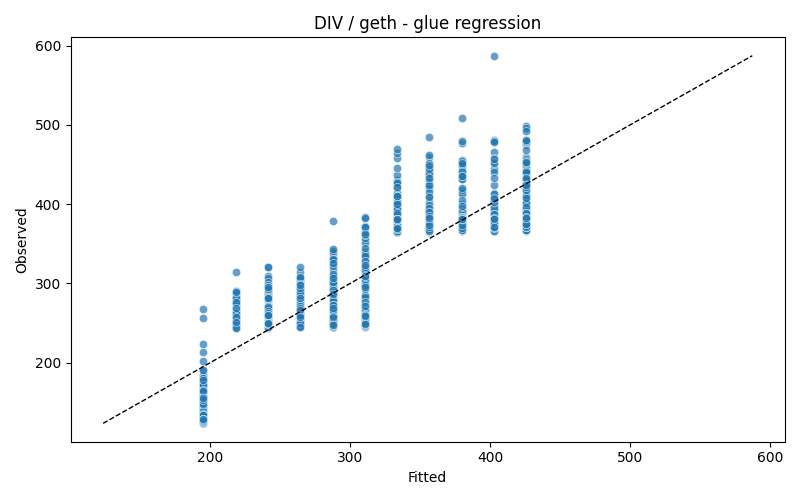

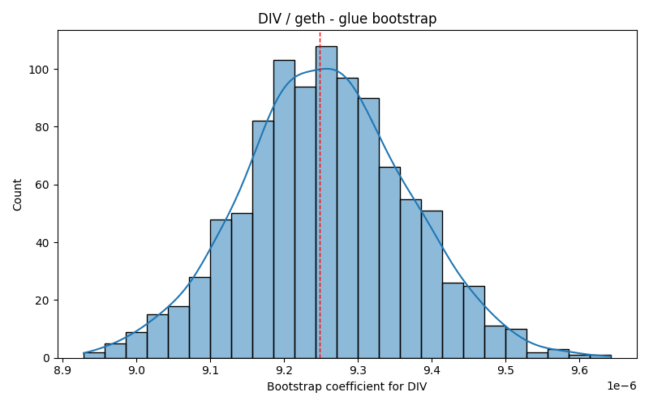

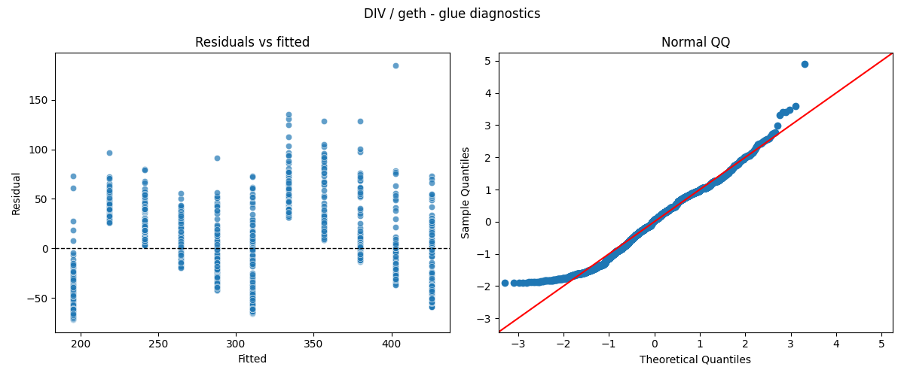

</details>

<details><summary><code>EXP</code> · nobs=2068 · runtime_ms=0.0003401 · p=1.00e-03 · R²=0.8237</summary>

```
==============================================================================
                           NNLS Regression Results                            
==============================================================================
Dep. Variable:          test_runtime_ms              R-squared:          0.824
Model:                  NNLS                    Adj. R-squared:          0.824
No. Observations:       2068                              RMSE:           6.16
Df Residuals:           2066                               MAE:           5.21
Df Model:               1      
==============================================================================
                      coef     std err     P-value      [0.025      0.975]
------------------------------------------------------------------------------
         const     12.6369      0.4988       0.001     11.6912     13.6331
           EXP      0.0003      0.0000       0.001      0.0003      0.0003
==============================================================================
Notes: Non-negative least squares with bootstrap inference (1000 iterations)
==============================================================================
```

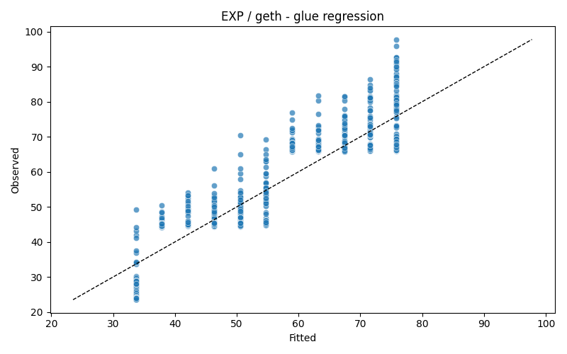

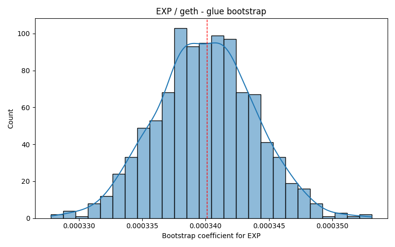

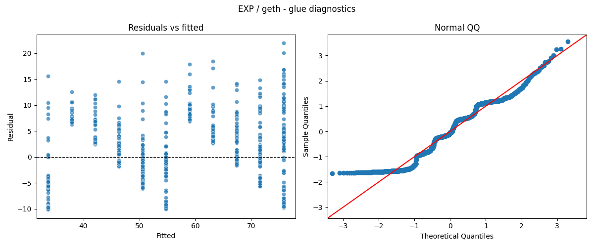

</details>

<details><summary><code>GT</code> · nobs=2068 · runtime_ms=3.486e-06 · p=1.00e-03 · R²=0.7517</summary>

```
==============================================================================
                           NNLS Regression Results                            
==============================================================================
Dep. Variable:          test_runtime_ms              R-squared:          0.752
Model:                  NNLS                    Adj. R-squared:          0.752
No. Observations:       2068                              RMSE:          21.09
Df Residuals:           2066                               MAE:          15.01
Df Model:               1      
==============================================================================
                      coef     std err     P-value      [0.025      0.975]
------------------------------------------------------------------------------
         const     39.8860      1.7381       0.001     36.2499     43.2371
            GT      0.0000      0.0000       0.001      0.0000      0.0000
==============================================================================
Notes: Non-negative least squares with bootstrap inference (1000 iterations)
==============================================================================
```

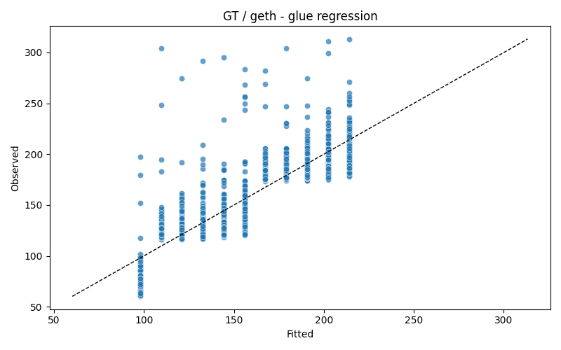

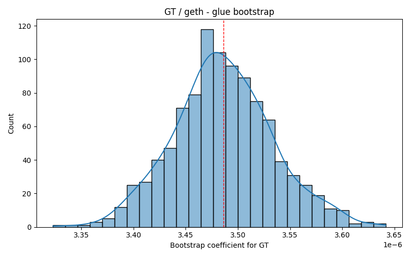

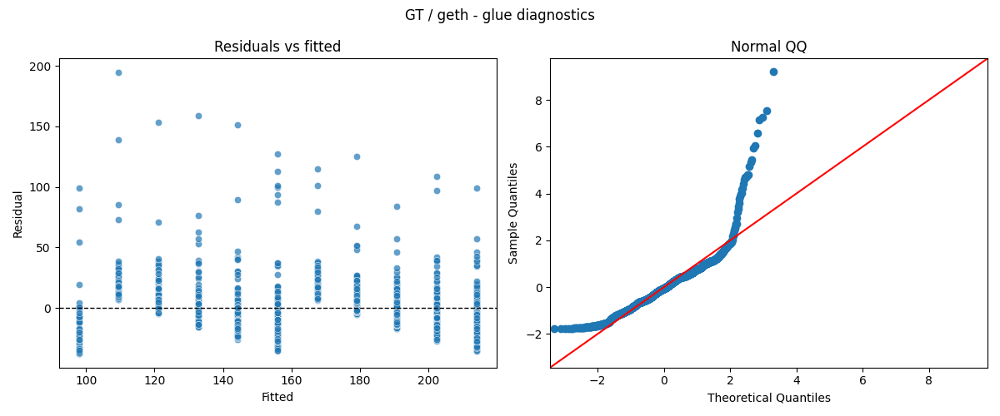

</details>

<details><summary><code>JUMPI</code> · nobs=2068 · runtime_ms=5.67e-06 · p=1.00e-03 · R²=0.7484</summary>

```
==============================================================================
                           NNLS Regression Results                            
==============================================================================
Dep. Variable:          test_runtime_ms              R-squared:          0.748
Model:                  NNLS                    Adj. R-squared:          0.748
No. Observations:       2068                              RMSE:          14.83
Df Residuals:           2066                               MAE:          10.79
Df Model:               1      
==============================================================================
                      coef     std err     P-value      [0.025      0.975]
------------------------------------------------------------------------------
         const     20.3320      1.0766       0.001     18.1596     22.4188
         JUMPI      0.0000      0.0000       0.001      0.0000      0.0000
==============================================================================
Notes: Non-negative least squares with bootstrap inference (1000 iterations)
==============================================================================
```

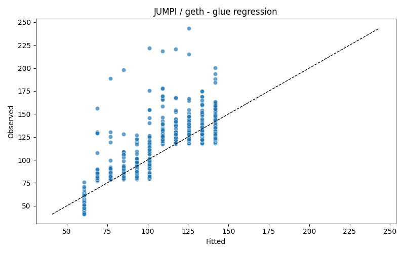

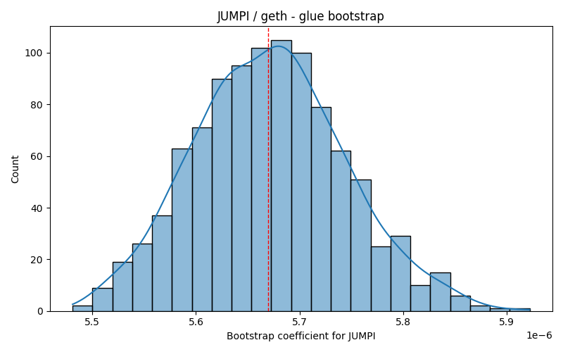

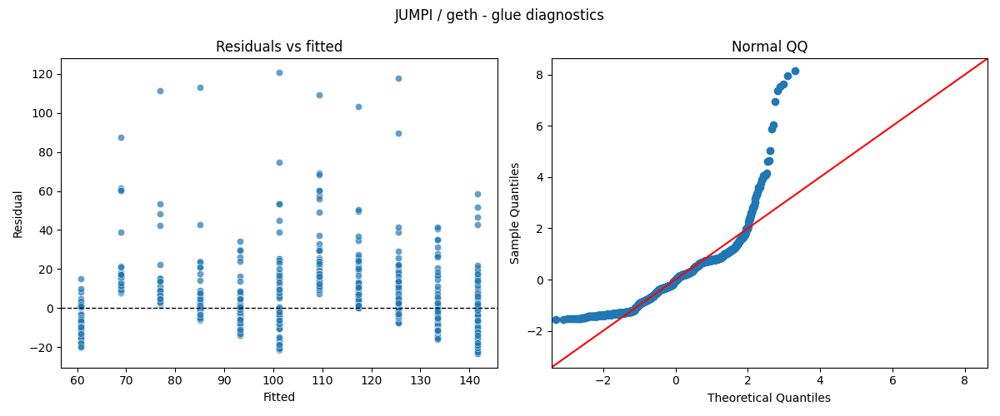

</details>

<details><summary><code>LT</code> · nobs=2068 · runtime_ms=4.368e-06 · p=1.00e-03 · R²=0.7906</summary>

```
==============================================================================
                           NNLS Regression Results                            
==============================================================================
Dep. Variable:          test_runtime_ms              R-squared:          0.791
Model:                  NNLS                    Adj. R-squared:          0.790
No. Observations:       2068                              RMSE:          23.66
Df Residuals:           2066                               MAE:          17.59
Df Model:               1      
==============================================================================
                      coef     std err     P-value      [0.025      0.975]
------------------------------------------------------------------------------
         const     40.0813      1.8057       0.001     36.7804     43.6998
            LT      0.0000      0.0000       0.001      0.0000      0.0000
==============================================================================
Notes: Non-negative least squares with bootstrap inference (1000 iterations)
==============================================================================
```

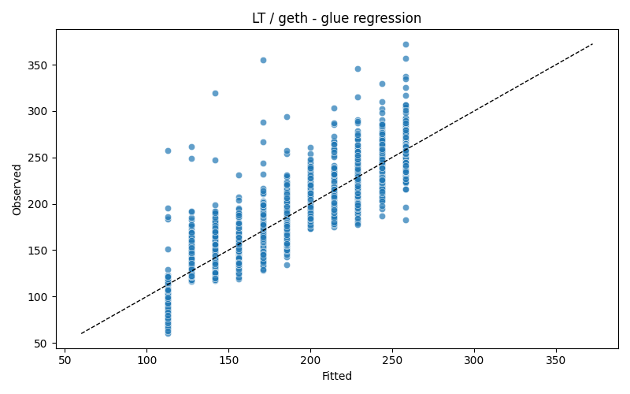

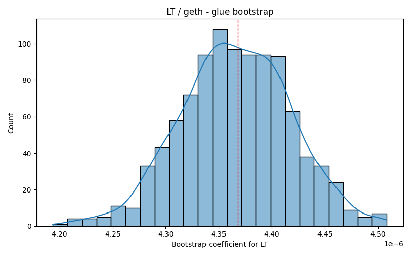

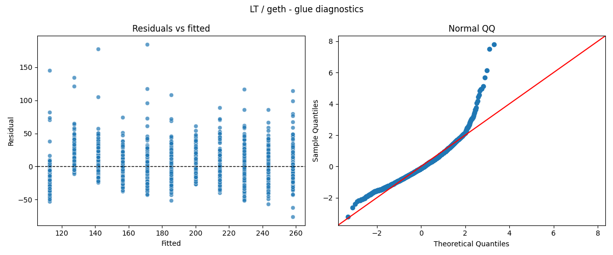

</details>

<details><summary><code>MSTORE</code> · nobs=10340 · runtime_ms=8.013e-06 · p=1.00e-03 · R²=0.807</summary>

```
==============================================================================
                           NNLS Regression Results                            
==============================================================================
Dep. Variable:          test_runtime_ms              R-squared:          0.807
Model:                  NNLS                    Adj. R-squared:          0.807
No. Observations:       10340                             RMSE:          27.50
Df Residuals:           10338                              MAE:          21.04
Df Model:               1      
==============================================================================
                      coef     std err     P-value      [0.025      0.975]
------------------------------------------------------------------------------
         const     55.2231      0.9758       0.001     53.3153     57.0115
        MSTORE      0.0000      0.0000       0.001      0.0000      0.0000
==============================================================================
Notes: Non-negative least squares with bootstrap inference (1000 iterations)
==============================================================================
```

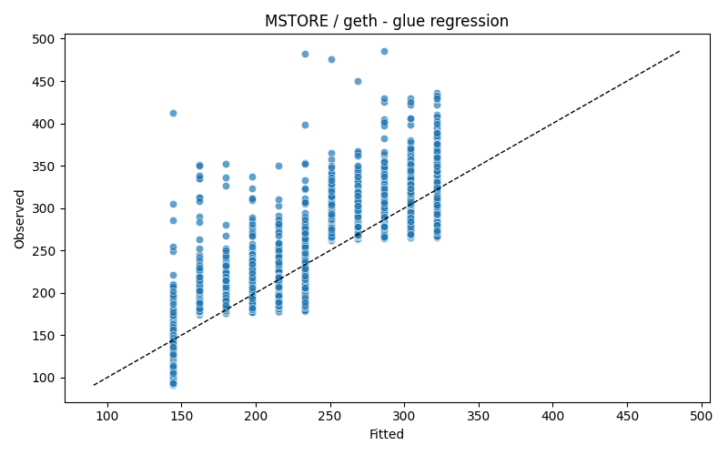

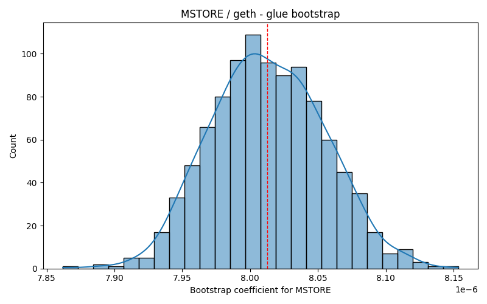

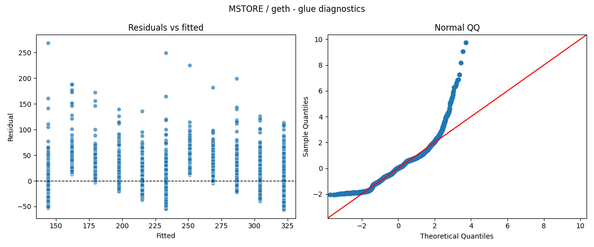

</details>

<details><summary><code>MSTORE8</code> · nobs=10340 · runtime_ms=7.404e-06 · p=1.00e-03 · R²=0.7987</summary>

```
==============================================================================
                           NNLS Regression Results                            
==============================================================================
Dep. Variable:          test_runtime_ms              R-squared:          0.799
Model:                  NNLS                    Adj. R-squared:          0.799
No. Observations:       10340                             RMSE:          26.08
Df Residuals:           10338                              MAE:          19.75
Df Model:               1      
==============================================================================
                      coef     std err     P-value      [0.025      0.975]
------------------------------------------------------------------------------
         const     50.7497      0.9142       0.001     48.8845     52.4955
       MSTORE8      0.0000      0.0000       0.001      0.0000      0.0000
==============================================================================
Notes: Non-negative least squares with bootstrap inference (1000 iterations)
==============================================================================
```

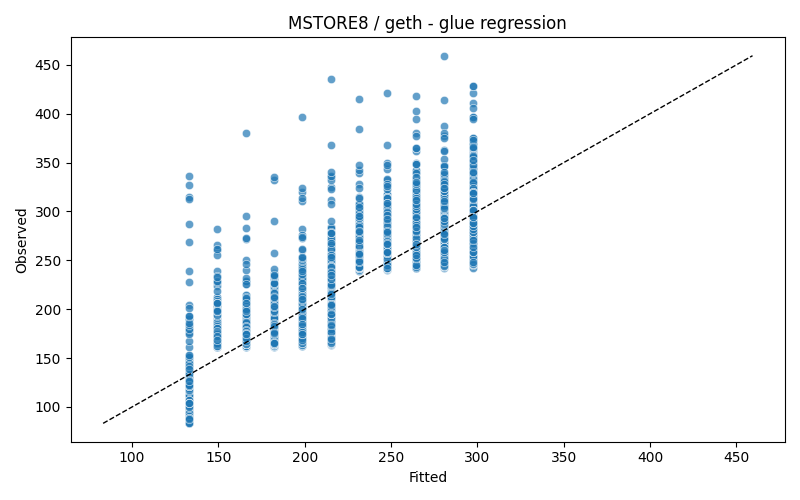

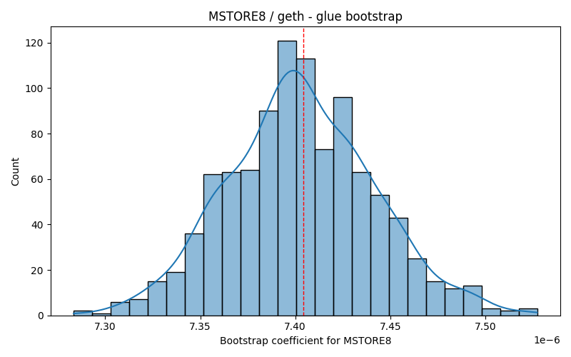

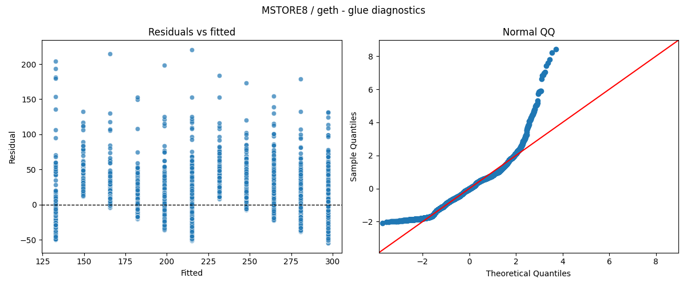

</details>

<details><summary><code>MUL</code> · nobs=2068 · runtime_ms=4.963e-06 · p=1.00e-03 · R²=0.8698</summary>

```
==============================================================================
                           NNLS Regression Results                            
==============================================================================
Dep. Variable:          test_runtime_ms              R-squared:          0.870
Model:                  NNLS                    Adj. R-squared:          0.870
No. Observations:       2068                              RMSE:          15.16
Df Residuals:           2066                               MAE:          11.42
Df Model:               1      
==============================================================================
                      coef     std err     P-value      [0.025      0.975]
------------------------------------------------------------------------------
         const     36.4253      1.2818       0.001     33.9022     38.8680
           MUL      0.0000      0.0000       0.001      0.0000      0.0000
==============================================================================
Notes: Non-negative least squares with bootstrap inference (1000 iterations)
==============================================================================
```

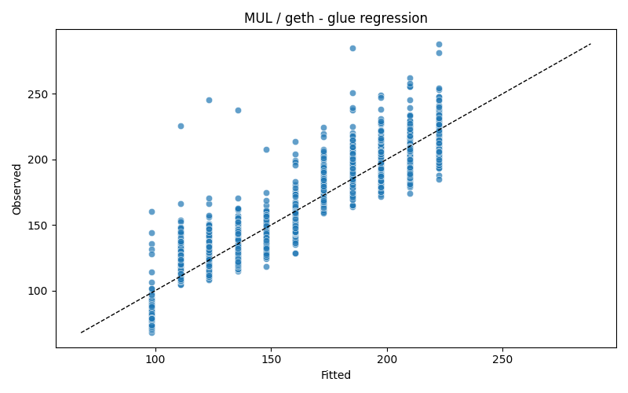

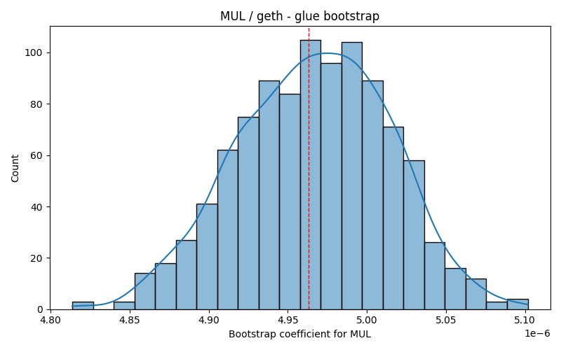

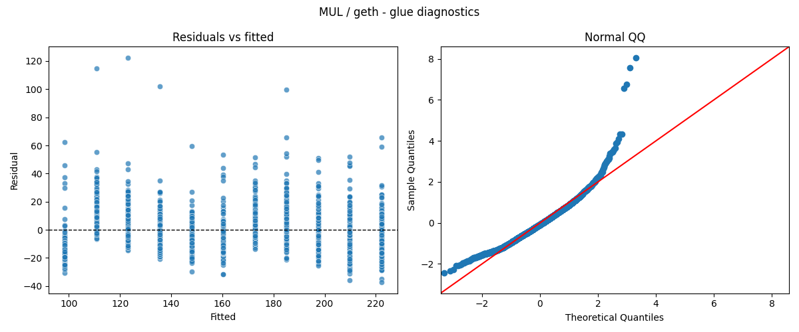

</details>

<details><summary><code>PC</code> · nobs=2068 · runtime_ms=1.607e-06 · p=1.00e-03 · R²=0.8347</summary>

```
==============================================================================
                           NNLS Regression Results                            
==============================================================================
Dep. Variable:          test_runtime_ms              R-squared:          0.835
Model:                  NNLS                    Adj. R-squared:          0.835
No. Observations:       2068                              RMSE:          21.38
Df Residuals:           2066                               MAE:          16.71
Df Model:               1      
==============================================================================
                      coef     std err     P-value      [0.025      0.975]
------------------------------------------------------------------------------
         const     42.5707      1.7901       0.001     39.0805     46.3561
            PC      0.0000      0.0000       0.001      0.0000      0.0000
==============================================================================
Notes: Non-negative least squares with bootstrap inference (1000 iterations)
==============================================================================
```

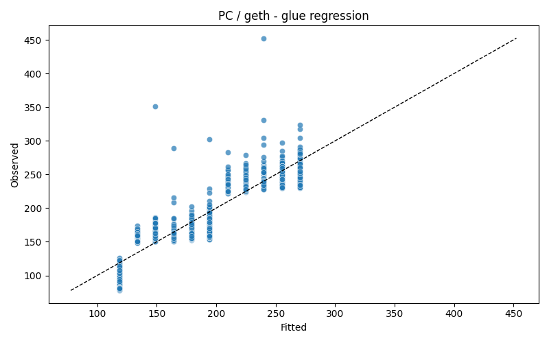

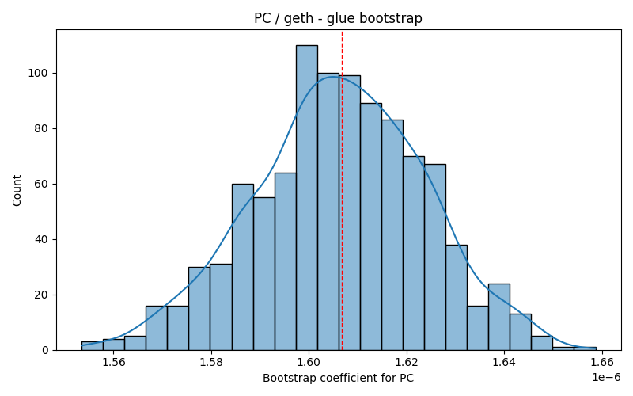

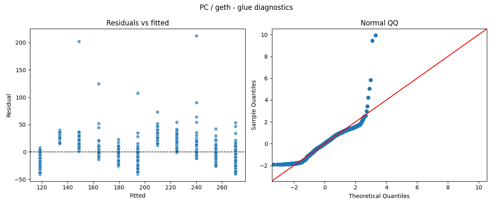

</details>

<details><summary><code>RETURNDATASIZE</code> · nobs=8272 · runtime_ms=3.125e-06 · p=1.00e-03 · R²=0.613</summary>

```
==============================================================================
                           NNLS Regression Results                            
==============================================================================
Dep. Variable:          test_runtime_ms              R-squared:          0.613
Model:                  NNLS                    Adj. R-squared:          0.613
No. Observations:       8272                              RMSE:          39.20
Df Residuals:           8270                               MAE:          28.34
Df Model:               1      
==============================================================================
                      coef     std err     P-value      [0.025      0.975]
------------------------------------------------------------------------------
         const     49.8814      1.3882       0.001     47.1604     52.4786
RETURNDATASIZE      0.0000      0.0000       0.001      0.0000      0.0000
==============================================================================
Notes: Non-negative least squares with bootstrap inference (1000 iterations)
==============================================================================
```

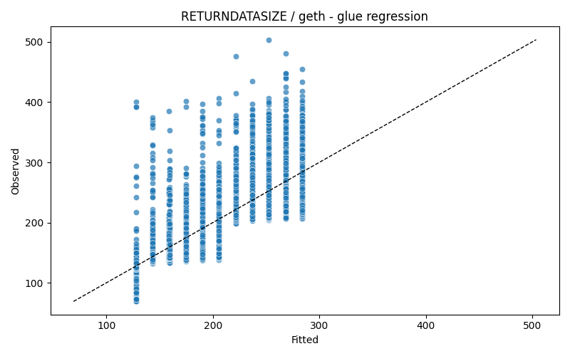

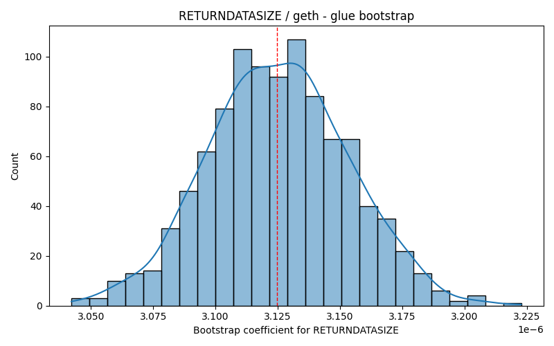

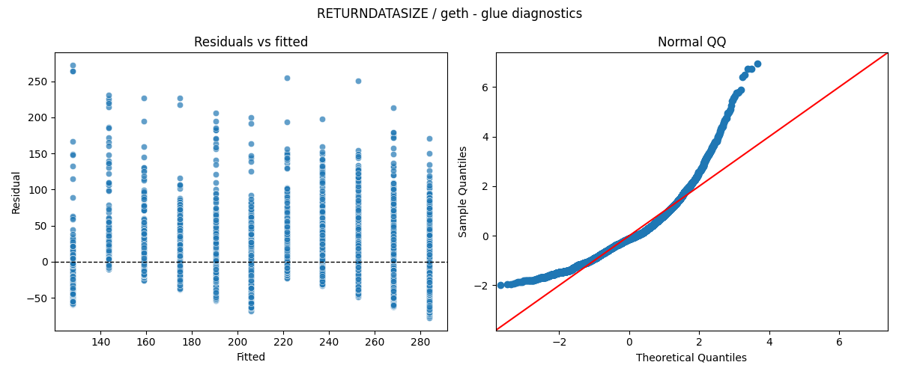

</details>

<details><summary><code>SELFBALANCE</code> · nobs=1692 · runtime_ms=7.422e-06 · p=1.00e-03 · R²=0.7942</summary>

```
==============================================================================
                           NNLS Regression Results                            
==============================================================================
Dep. Variable:          test_runtime_ms              R-squared:          0.794
Model:                  NNLS                    Adj. R-squared:          0.794
No. Observations:       1692                              RMSE:          38.11
Df Residuals:           1690                               MAE:          32.08
Df Model:               1      
==============================================================================
                      coef     std err     P-value      [0.025      0.975]
------------------------------------------------------------------------------
         const    120.4246      3.2980       0.001    113.7807    126.8103
   SELFBALANCE      0.0000      0.0000       0.001      0.0000      0.0000
==============================================================================
Notes: Non-negative least squares with bootstrap inference (1000 iterations)
==============================================================================
```

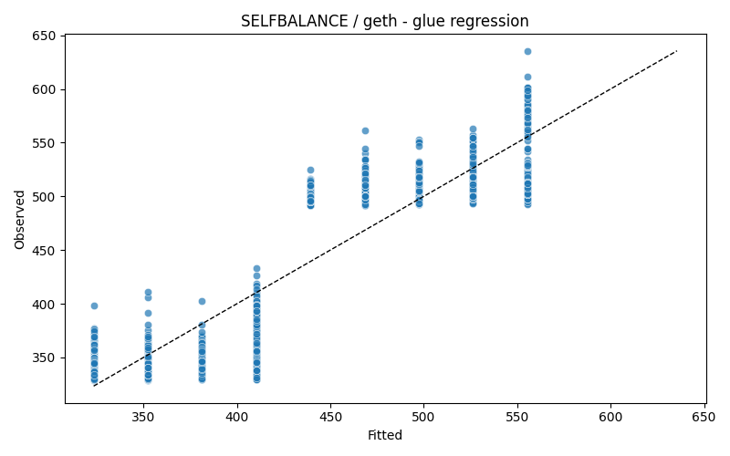

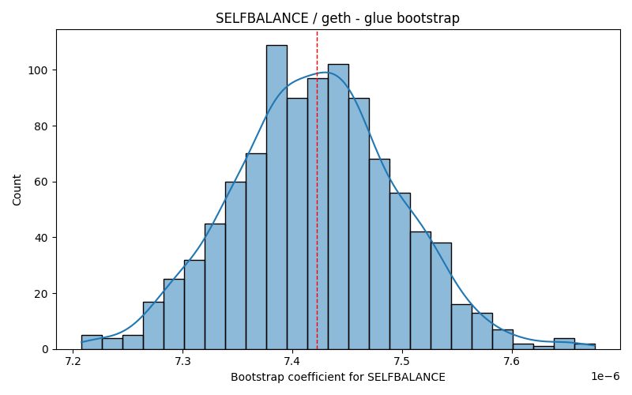

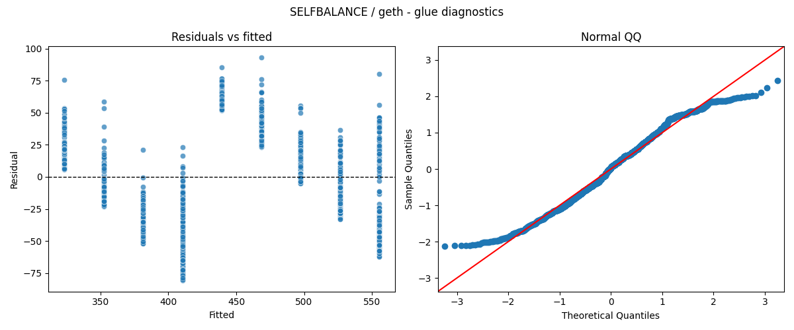

</details>

<details><summary><code>SUB</code> · nobs=2068 · runtime_ms=4.382e-06 · p=1.00e-03 · R²=0.8272</summary>

```
==============================================================================
                           NNLS Regression Results                            
==============================================================================
Dep. Variable:          test_runtime_ms              R-squared:          0.827
Model:                  NNLS                    Adj. R-squared:          0.827
No. Observations:       2068                              RMSE:          21.08
Df Residuals:           2066                               MAE:          15.96
Df Model:               1      
==============================================================================
                      coef     std err     P-value      [0.025      0.975]
------------------------------------------------------------------------------
         const     48.3378      1.5435       0.001     45.3193     51.5491
           SUB      0.0000      0.0000       0.001      0.0000      0.0000
==============================================================================
Notes: Non-negative least squares with bootstrap inference (1000 iterations)
==============================================================================
```

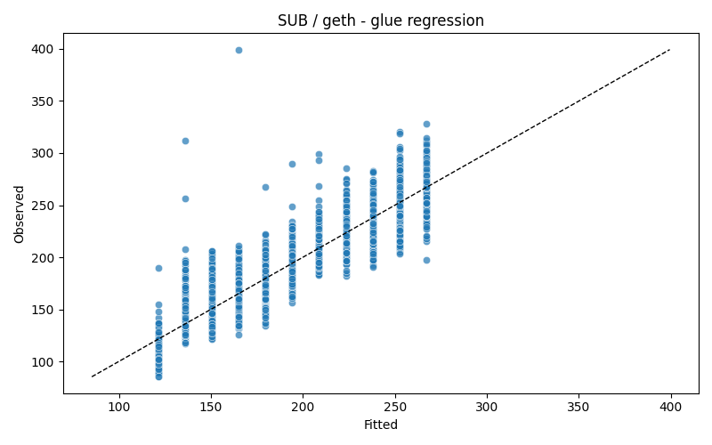

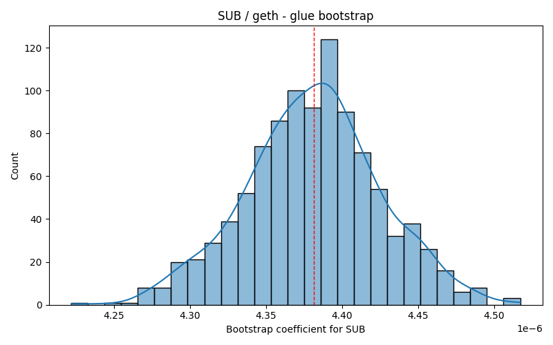

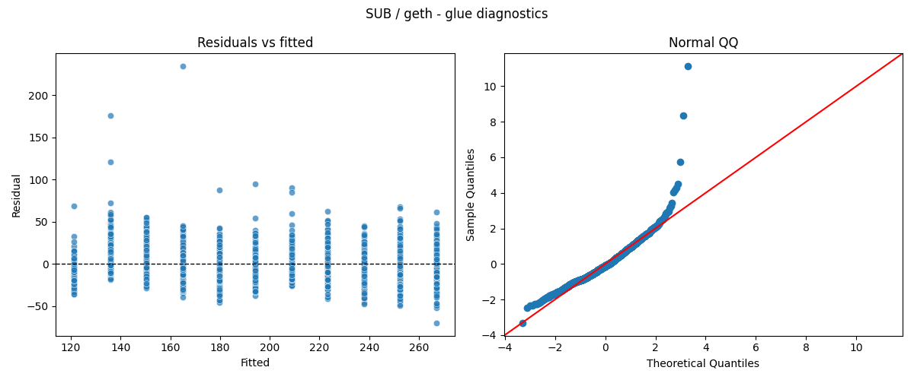

</details>

### Mixed glue (tier B) · geth

<details><summary><code>JUMP</code> · nobs=2068 · runtime_ms=9.198e-06 · p=1.00e-03 · R²=0.7781</summary>

```
==============================================================================
                           NNLS Regression Results                            
==============================================================================
Dep. Variable:          test_runtime_ms              R-squared:          0.778
Model:                  NNLS                    Adj. R-squared:          0.778
No. Observations:       2068                              RMSE:          18.25
Df Residuals:           2066                               MAE:          13.79
Df Model:               1      
==============================================================================
                      coef     std err     P-value      [0.025      0.975]
------------------------------------------------------------------------------
         const     34.4321      1.4660       0.001     31.5885     37.3752
          JUMP      0.0000      0.0000       0.001      0.0000      0.0000
==============================================================================
Notes: Non-negative least squares with bootstrap inference (1000 iterations)
==============================================================================
```

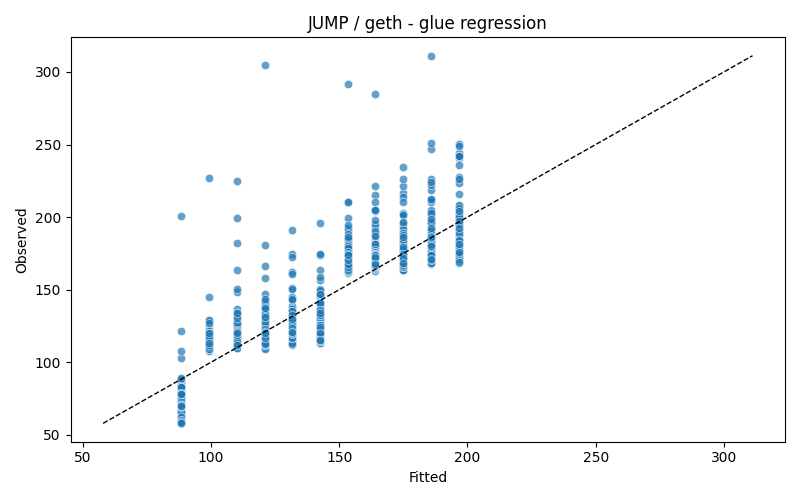

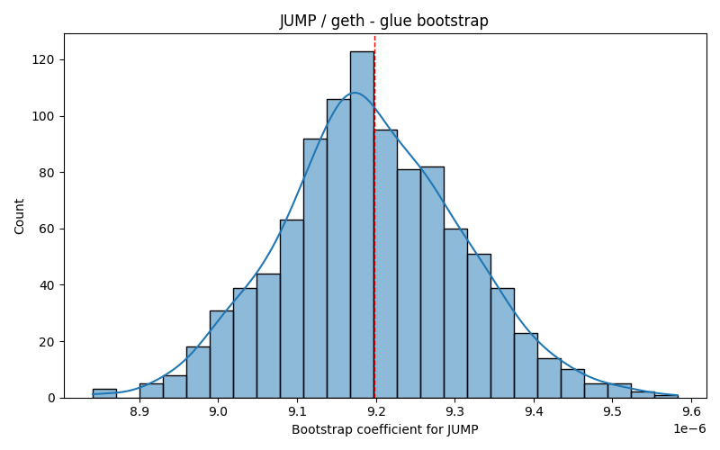

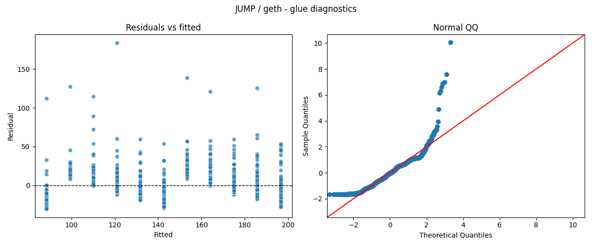

</details>

<details><summary><code>KECCAK256</code> · nobs=33088 · runtime_ms=3.677e-05 · p=1.00e-03 · R²=0.2681</summary>

```
==============================================================================
                           NNLS Regression Results                            
==============================================================================
Dep. Variable:          test_runtime_ms              R-squared:          0.268
Model:                  NNLS                    Adj. R-squared:          0.268
No. Observations:       33088                             RMSE:         120.76
Df Residuals:           33086                              MAE:          94.96
Df Model:               1      
==============================================================================
                      coef     std err     P-value      [0.025      0.975]
------------------------------------------------------------------------------
         const    378.0447      1.4939       0.001    375.0310    380.8623
     KECCAK256      0.0000      0.0000       0.001      0.0000      0.0000
==============================================================================
Notes: Non-negative least squares with bootstrap inference (1000 iterations)
==============================================================================
```

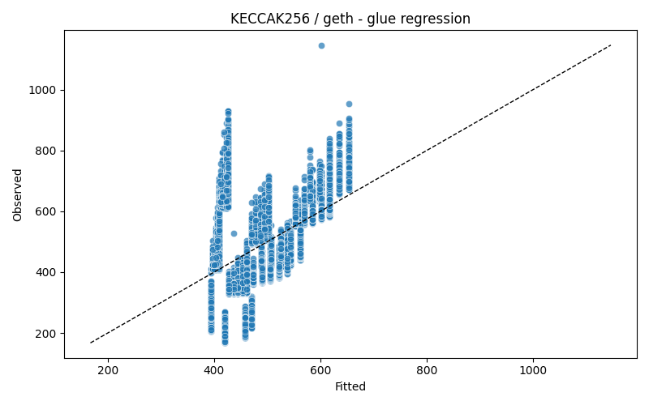

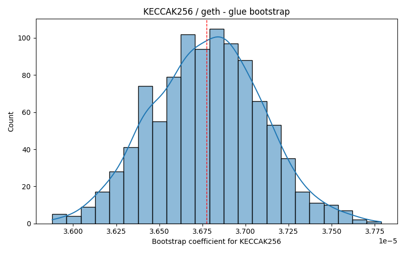

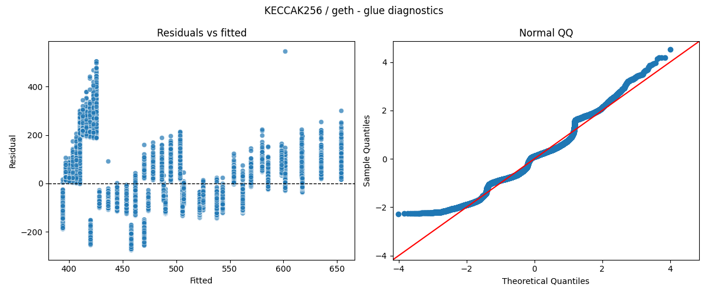

</details>

## nethermind

| glue_opcode | nobs | glue_runtime_ms | p_value | rsquared |
| --- | --- | --- | --- | --- |
| `ISZERO` | 2332 | 8.898e-07 | 1.00e-03 | 0.7246 |
| `JUMPDEST` | 2332 | 4.704e-07 | 1.00e-03 | 0.6724 |
| `SWAP` | 37312 | 5.069e-07 | 1.00e-03 | 0.4822 |
| `CALLDATASIZE` | 137786 | 4.275e-07 | 1.00e-03 | 0.9133 |
| `DUP` | 137786 | 2.872e-07 | 1.00e-03 | 0.9133 |
| `GAS` | 137786 | 3.746e-07 | 1.00e-03 | 0.9133 |
| `MLOAD` | 137786 | 1.366e-06 | 1.00e-03 | 0.9133 |
| `PUSH` | 137786 | 3.862e-07 | 1.00e-03 | 0.9133 |
| `PUSH0` | 137786 | 2.656e-07 | 1.00e-03 | 0.9133 |
| `STATICCALL` | 137786 | 0.0004467 | 1.00e-03 | 0.9133 |
| `ADD` | 2332 | 2.284e-06 | 1.00e-03 | 0.8461 |
| `AND` | 2332 | 1.275e-06 | 1.00e-03 | 0.7958 |
| `CALLDATACOPY` | 55968 | 4.559e-06 | 1.00e-03 | 0.6481 |
| `CALLDATALOAD` | 9328 | 3.666e-05 | 4.00e-03 | 0.0008089 |
| `DIV` | 2332 | 6.964e-06 | 1.00e-03 | 0.6161 |
| `EXP` | 2332 | 0 | 1.00e+00 | 0 |
| `GT` | 2332 | 1.592e-06 | 1.00e-03 | 0.6343 |
| `JUMPI` | 2332 | 1.745e-06 | 1.00e-03 | 0.5172 |
| `LT` | 2332 | 1.527e-06 | 1.00e-03 | 0.5946 |
| `MSTORE` | 11660 | 2.08e-06 | 1.00e-03 | 0.6696 |
| `MSTORE8` | 11660 | 2.017e-06 | 1.00e-03 | 0.7055 |
| `MUL` | 2332 | 5.288e-06 | 1.00e-03 | 0.8914 |
| `PC` | 2332 | 8.192e-07 | 1.00e-03 | 0.8253 |
| `RETURNDATASIZE` | 9328 | 8.315e-07 | 1.00e-03 | 0.5107 |
| `SELFBALANCE` | 1908 | 4.19e-06 | 1.00e-03 | 0.6067 |
| `SUB` | 2332 | 2.496e-06 | 1.00e-03 | 0.8641 |
| `JUMP` | 2332 | 5.752e-06 | 1.00e-03 | 0.8104 |
| `KECCAK256` | 37312 | 0 | 1.00e+00 | 1.11e-16 |

### Cycle glue — joint fit · nethermind

<details><summary>Joint NNLS regression summary</summary>

```
==============================================================================
                           NNLS Regression Results                            
==============================================================================
Dep. Variable:          test_runtime_ms              R-squared:          0.913
Model:                  NNLS                    Adj. R-squared:          0.913
No. Observations:       137786                            RMSE:          10.36
Df Residuals:           137778                             MAE:           5.47
Df Model:               7      
==============================================================================
                      coef     std err     P-value      [0.025      0.975]
------------------------------------------------------------------------------
         const     17.2569      0.0919       0.001     17.0807     17.4420
  CALLDATASIZE      0.0000      0.0000       0.001      0.0000      0.0000
           DUP      0.0000      0.0000       0.001      0.0000      0.0000
           GAS      0.0000      0.0000       0.001      0.0000      0.0000
         MLOAD      0.0000      0.0000       0.001      0.0000      0.0000
          PUSH      0.0000      0.0000       0.001      0.0000      0.0000
         PUSH0      0.0000      0.0000       0.001      0.0000      0.0000
    STATICCALL      0.0004      0.0000       0.001      0.0004      0.0005
==============================================================================
Notes: Non-negative least squares with bootstrap inference (1000 iterations)
==============================================================================
```

</details>

<details><summary><code>CALLDATASIZE</code> · nobs=137786 · runtime_ms=4.275e-07 · p=1.00e-03 · R²=0.9133</summary>

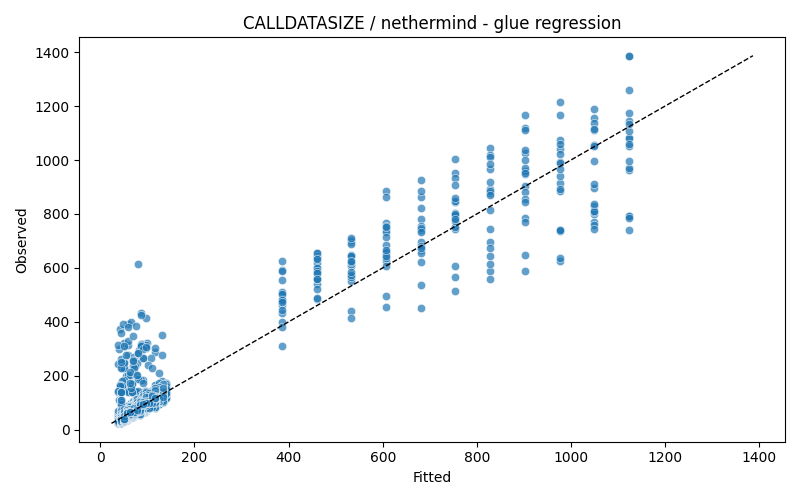


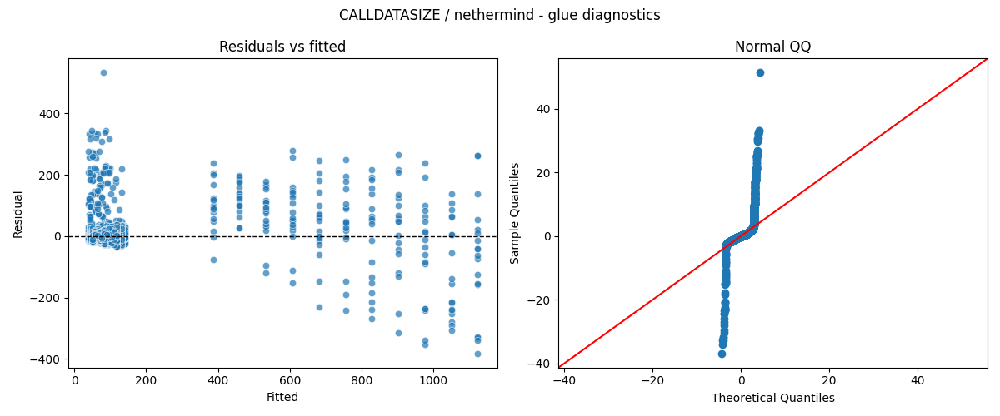

</details>

<details><summary><code>DUP</code> · nobs=137786 · runtime_ms=2.872e-07 · p=1.00e-03 · R²=0.9133</summary>

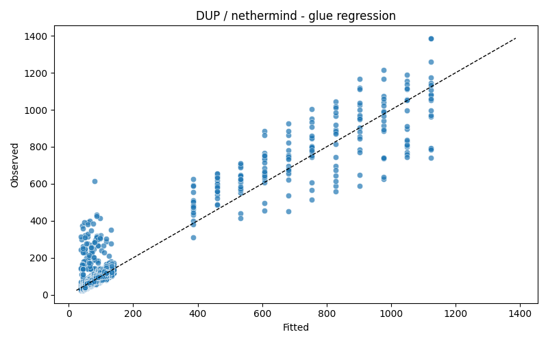

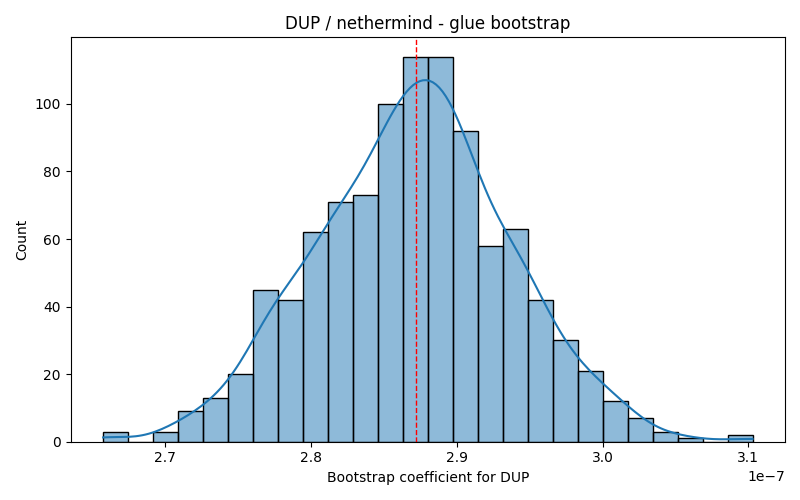

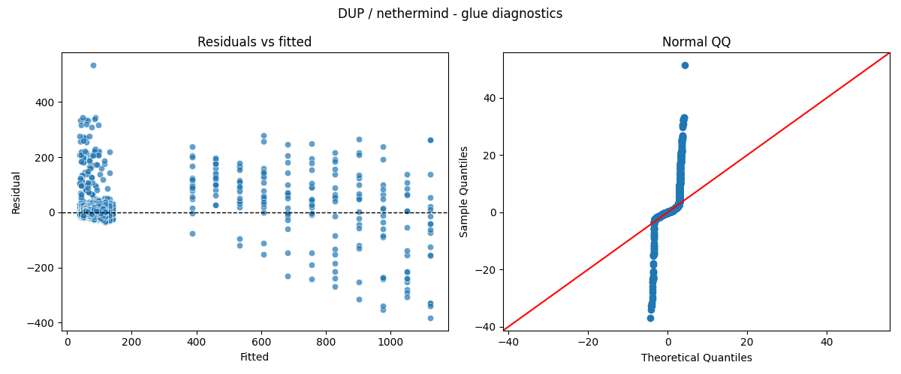

</details>

<details><summary><code>GAS</code> · nobs=137786 · runtime_ms=3.746e-07 · p=1.00e-03 · R²=0.9133</summary>

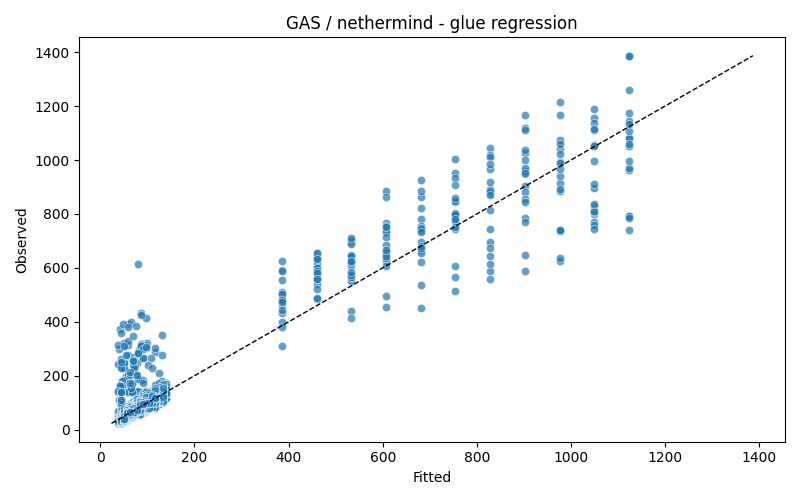

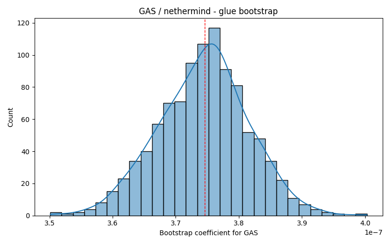


</details>

<details><summary><code>MLOAD</code> · nobs=137786 · runtime_ms=1.366e-06 · p=1.00e-03 · R²=0.9133</summary>


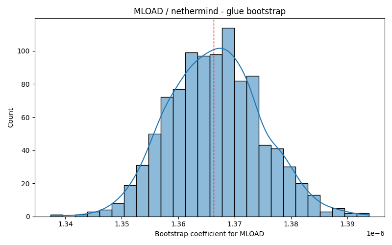


</details>

<details><summary><code>PUSH</code> · nobs=137786 · runtime_ms=3.862e-07 · p=1.00e-03 · R²=0.9133</summary>


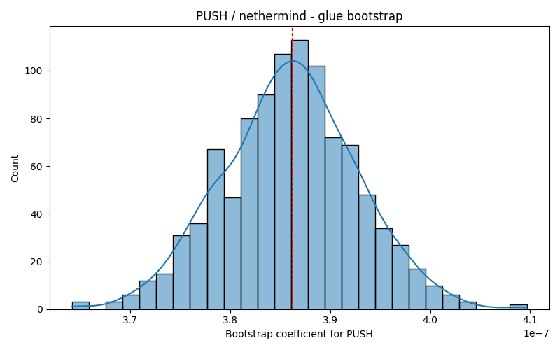


</details>

<details><summary><code>PUSH0</code> · nobs=137786 · runtime_ms=2.656e-07 · p=1.00e-03 · R²=0.9133</summary>


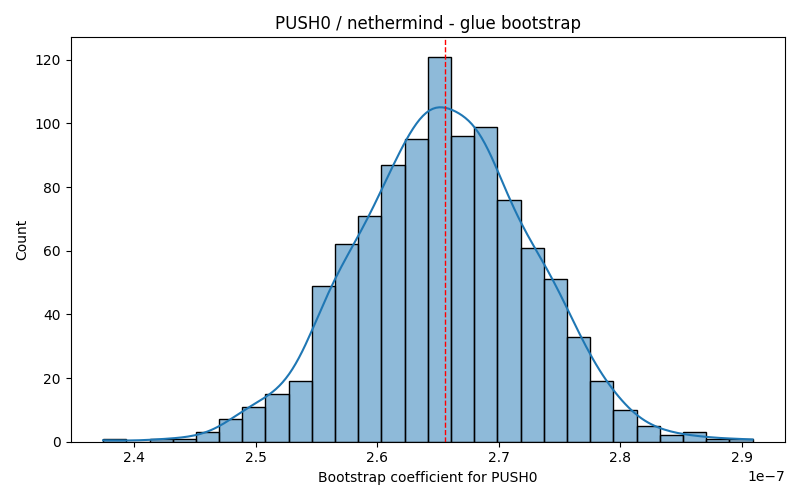


</details>

<details><summary><code>STATICCALL</code> · nobs=137786 · runtime_ms=0.0004467 · p=1.00e-03 · R²=0.9133</summary>

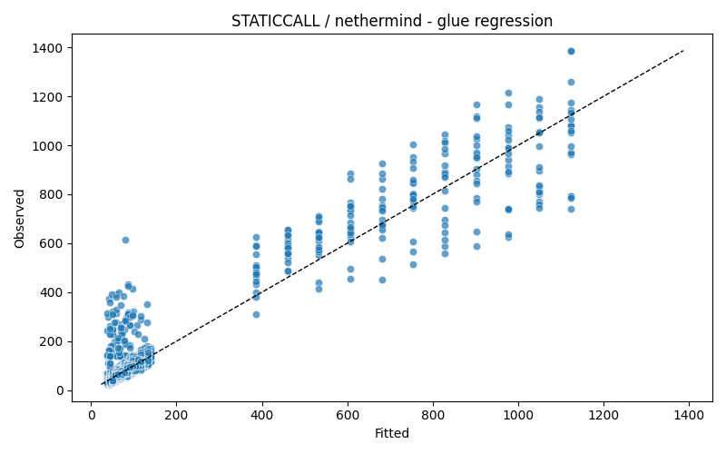

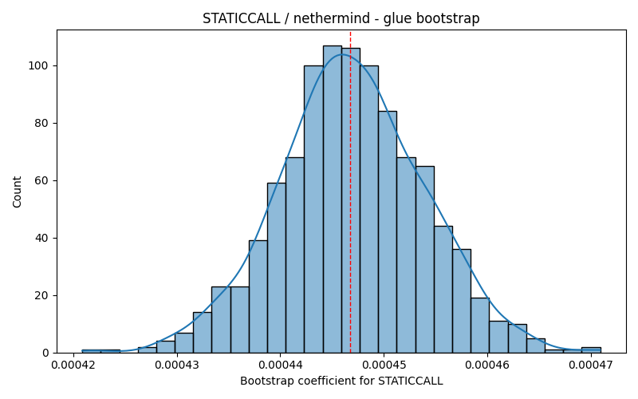

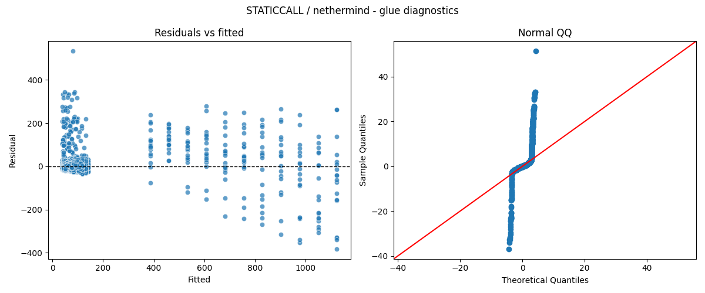

</details>

### Pure glue · nethermind

<details><summary><code>ISZERO</code> · nobs=2332 · runtime_ms=8.898e-07 · p=1.00e-03 · R²=0.7246</summary>

```
==============================================================================
                           NNLS Regression Results                            
==============================================================================
Dep. Variable:          test_runtime_ms              R-squared:          0.725
Model:                  NNLS                    Adj. R-squared:          0.724
No. Observations:       2332                              RMSE:          11.55
Df Residuals:           2330                               MAE:           6.99
Df Model:               1      
==============================================================================
                      coef     std err     P-value      [0.025      0.975]
------------------------------------------------------------------------------
         const     16.0653      0.7603       0.001     14.6481     17.5726
        ISZERO      0.0000      0.0000       0.001      0.0000      0.0000
==============================================================================
Notes: Non-negative least squares with bootstrap inference (1000 iterations)
==============================================================================
```

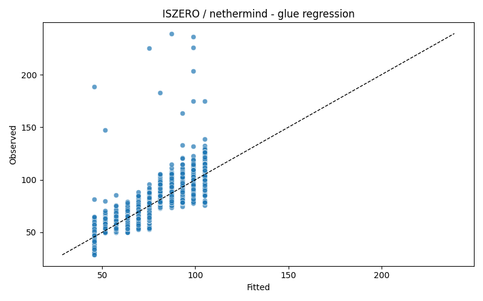

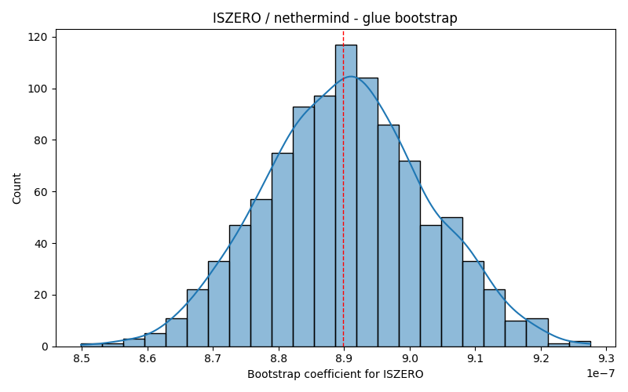

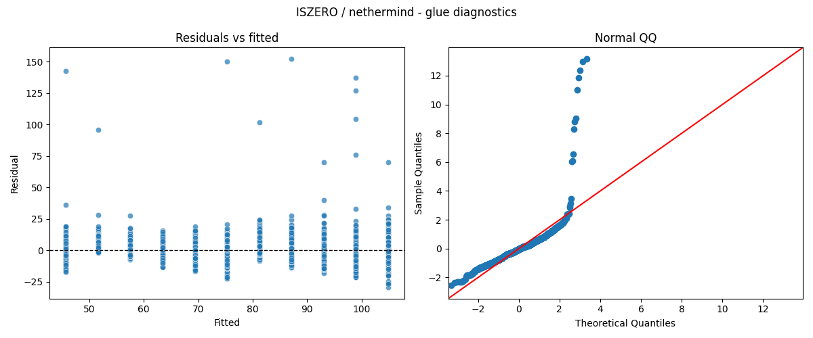

</details>

<details><summary><code>JUMPDEST</code> · nobs=2332 · runtime_ms=4.704e-07 · p=1.00e-03 · R²=0.6724</summary>

```
==============================================================================
                           NNLS Regression Results                            
==============================================================================
Dep. Variable:          test_runtime_ms              R-squared:          0.672
Model:                  NNLS                    Adj. R-squared:          0.672
No. Observations:       2332                              RMSE:          20.73
Df Residuals:           2330                               MAE:          16.69
Df Model:               1      
==============================================================================
                      coef     std err     P-value      [0.025      0.975]
------------------------------------------------------------------------------
         const     22.6112      1.2714       0.001     20.2260     25.0877
      JUMPDEST      0.0000      0.0000       0.001      0.0000      0.0000
==============================================================================
Notes: Non-negative least squares with bootstrap inference (1000 iterations)
==============================================================================
```

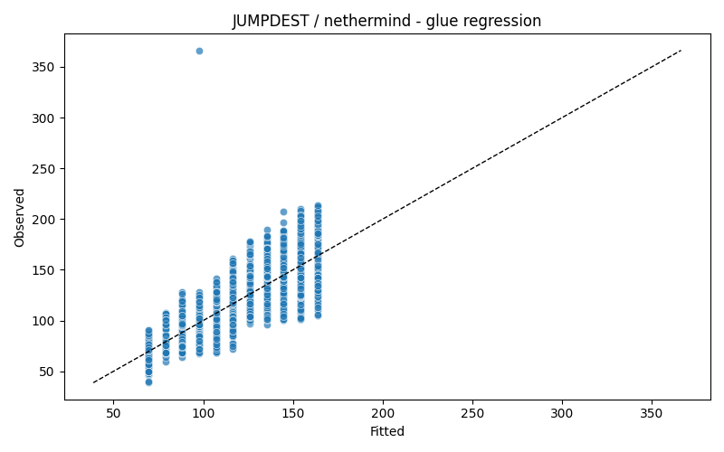

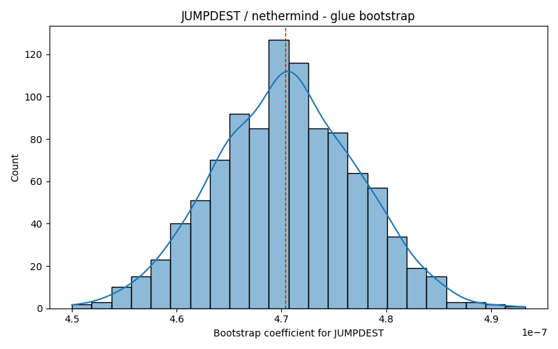

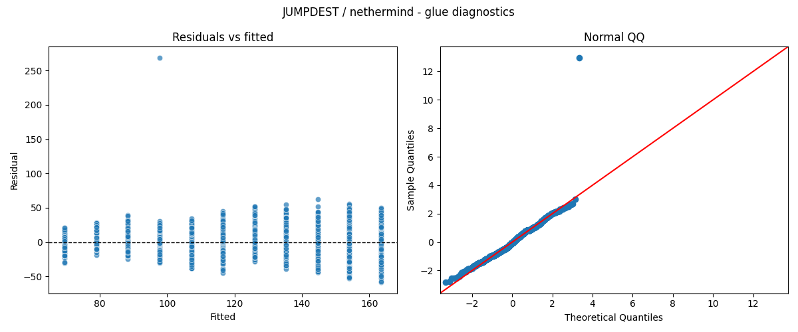

</details>

<details><summary><code>SWAP</code> · nobs=37312 · runtime_ms=5.069e-07 · p=1.00e-03 · R²=0.4822</summary>

```
==============================================================================
                           NNLS Regression Results                            
==============================================================================
Dep. Variable:          test_runtime_ms              R-squared:          0.482
Model:                  NNLS                    Adj. R-squared:          0.482
No. Observations:       37312                             RMSE:          11.06
Df Residuals:           37310                              MAE:           4.28
Df Model:               1      
==============================================================================
                      coef     std err     P-value      [0.025      0.975]
------------------------------------------------------------------------------
         const     16.7056      0.1901       0.001     16.3414     17.0514
          SWAP      0.0000      0.0000       0.001      0.0000      0.0000
==============================================================================
Notes: Non-negative least squares with bootstrap inference (1000 iterations)
==============================================================================
```

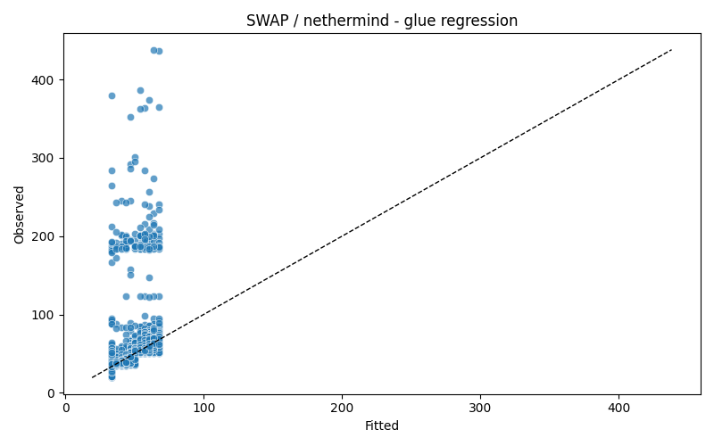

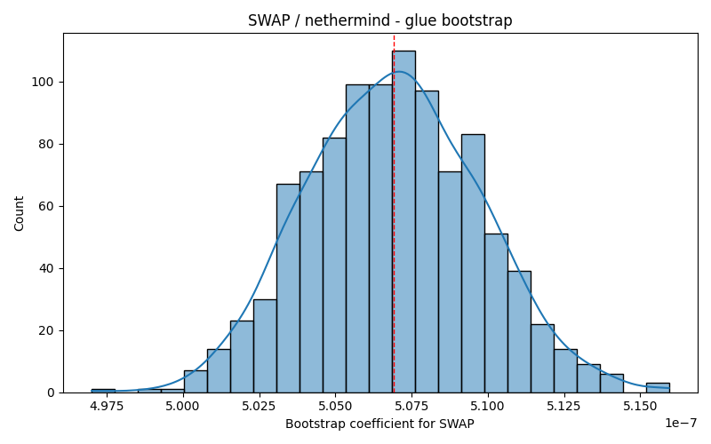

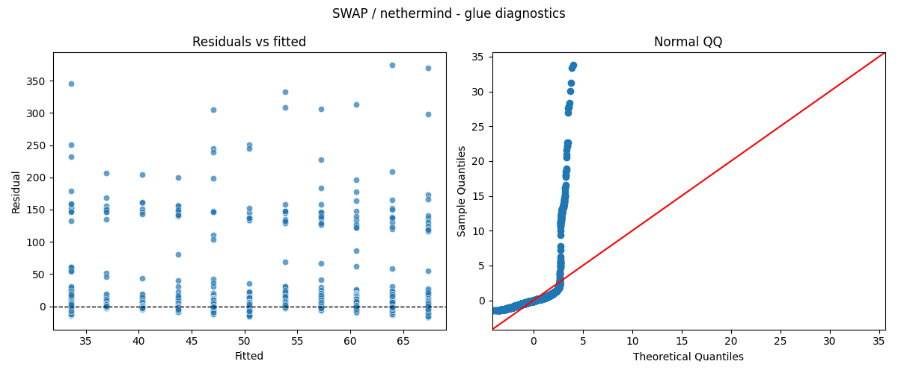

</details>

### Mixed glue (tier A) · nethermind

<details><summary><code>ADD</code> · nobs=2332 · runtime_ms=2.284e-06 · p=1.00e-03 · R²=0.8461</summary>

```
==============================================================================
                           NNLS Regression Results                            
==============================================================================
Dep. Variable:          test_runtime_ms              R-squared:          0.846
Model:                  NNLS                    Adj. R-squared:          0.846
No. Observations:       2332                              RMSE:          10.25
Df Residuals:           2330                               MAE:           6.98
Df Model:               1      
==============================================================================
                      coef     std err     P-value      [0.025      0.975]
------------------------------------------------------------------------------
         const     15.0271      0.6278       0.001     13.7830     16.1983
           ADD      0.0000      0.0000       0.001      0.0000      0.0000
==============================================================================
Notes: Non-negative least squares with bootstrap inference (1000 iterations)
==============================================================================
```

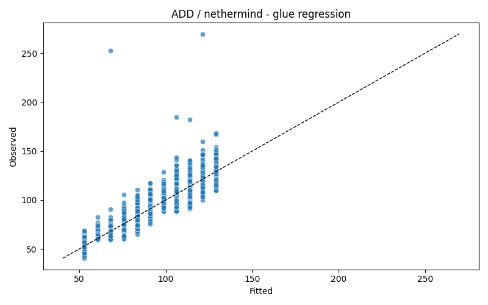

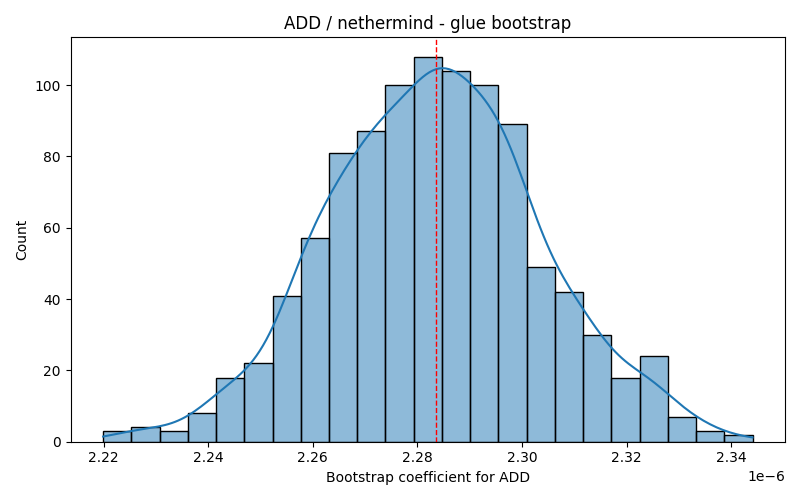

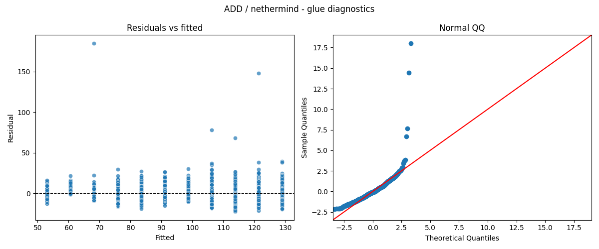

</details>

<details><summary><code>AND</code> · nobs=2332 · runtime_ms=1.275e-06 · p=1.00e-03 · R²=0.7958</summary>

```
==============================================================================
                           NNLS Regression Results                            
==============================================================================
Dep. Variable:          test_runtime_ms              R-squared:          0.796
Model:                  NNLS                    Adj. R-squared:          0.796
No. Observations:       2332                              RMSE:           6.80
Df Residuals:           2330                               MAE:           5.30
Df Model:               1      
==============================================================================
                      coef     std err     P-value      [0.025      0.975]
------------------------------------------------------------------------------
         const     14.0023      0.4692       0.001     13.1114     14.9958
           AND      0.0000      0.0000       0.001      0.0000      0.0000
==============================================================================
Notes: Non-negative least squares with bootstrap inference (1000 iterations)
==============================================================================
```

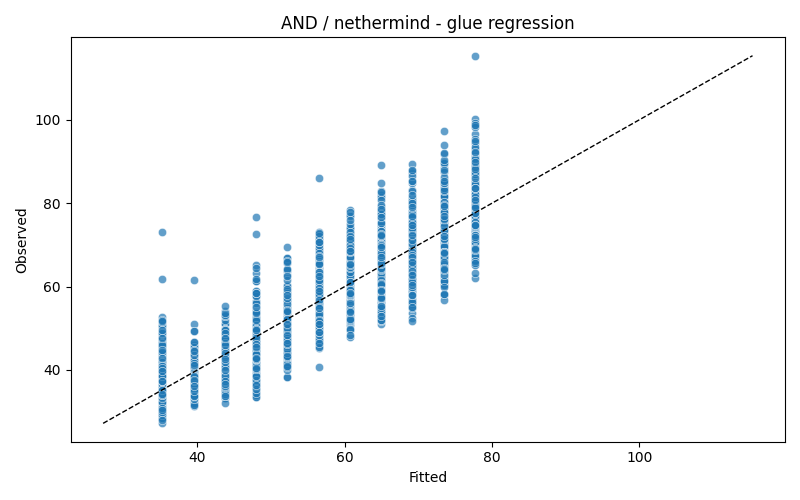

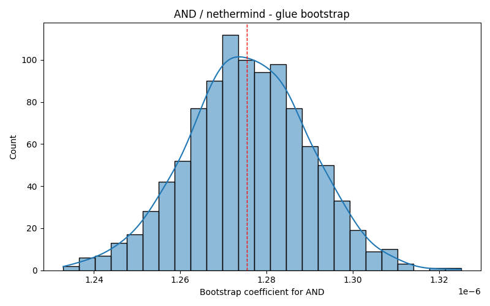

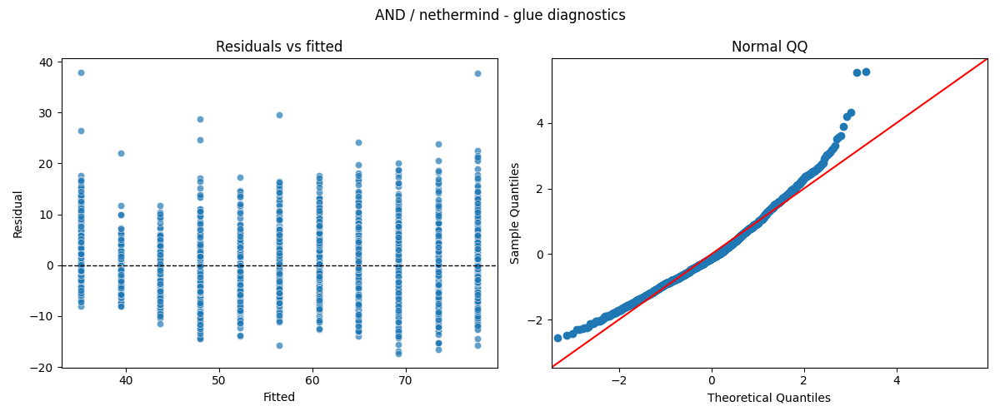

</details>

<details><summary><code>CALLDATACOPY</code> · nobs=55968 · runtime_ms=4.559e-06 · p=1.00e-03 · R²=0.6481</summary>

```
==============================================================================
                           NNLS Regression Results                            
==============================================================================
Dep. Variable:          test_runtime_ms              R-squared:          0.648
Model:                  NNLS                    Adj. R-squared:          0.648
No. Observations:       55968                             RMSE:          25.27
Df Residuals:           55966                              MAE:          19.89
Df Model:               1      
==============================================================================
                      coef     std err     P-value      [0.025      0.975]
------------------------------------------------------------------------------
         const     27.8152      0.1242       0.001     27.5794     28.0547
  CALLDATACOPY      0.0000      0.0000       0.001      0.0000      0.0000
==============================================================================
Notes: Non-negative least squares with bootstrap inference (1000 iterations)
==============================================================================
```

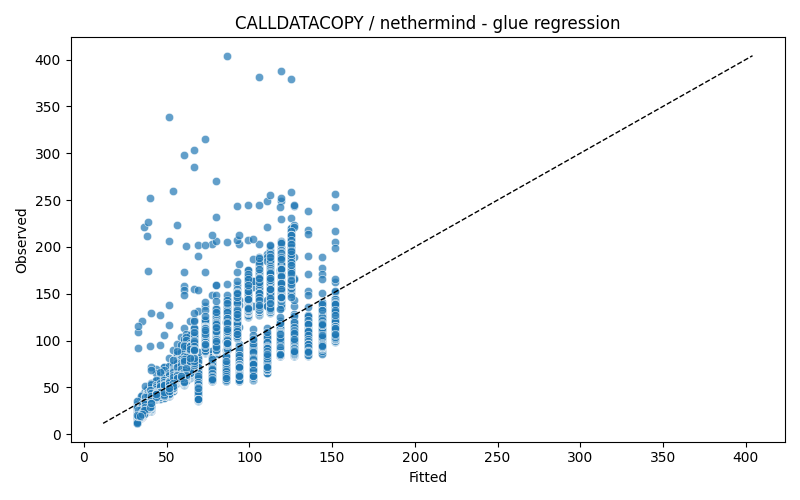

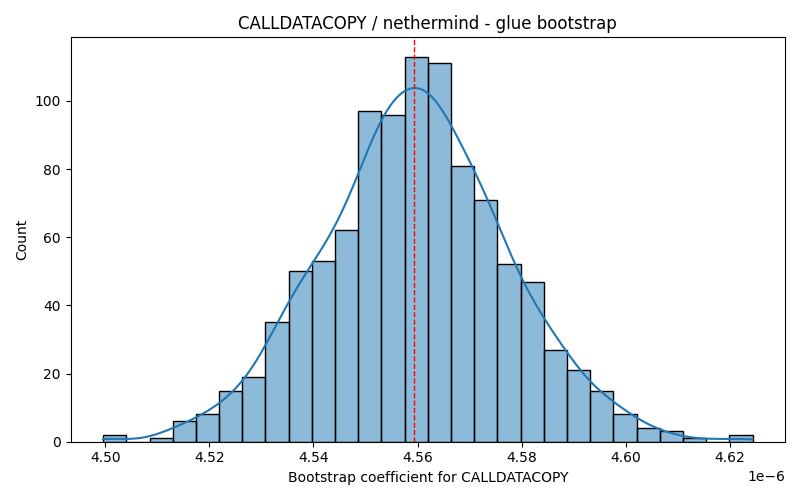

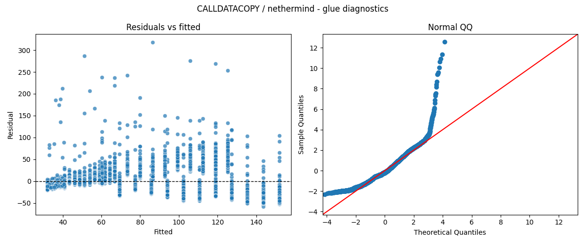

</details>

<details><summary><code>CALLDATALOAD</code> · nobs=9328 · runtime_ms=3.666e-05 · p=4.00e-03 · R²=0.0008089</summary>

```
==============================================================================
                           NNLS Regression Results                            
==============================================================================
Dep. Variable:          test_runtime_ms              R-squared:          0.001
Model:                  NNLS                    Adj. R-squared:          0.001
No. Observations:       9328                              RMSE:           4.95
Df Residuals:           9326                               MAE:           0.52
Df Model:               1      
==============================================================================
                      coef     std err     P-value      [0.025      0.975]
------------------------------------------------------------------------------
         const      2.8778      0.1871       0.001      2.5583      3.2685
  CALLDATALOAD      0.0000      0.0000       0.004      0.0000      0.0001
==============================================================================
Notes: Non-negative least squares with bootstrap inference (1000 iterations)
==============================================================================
```

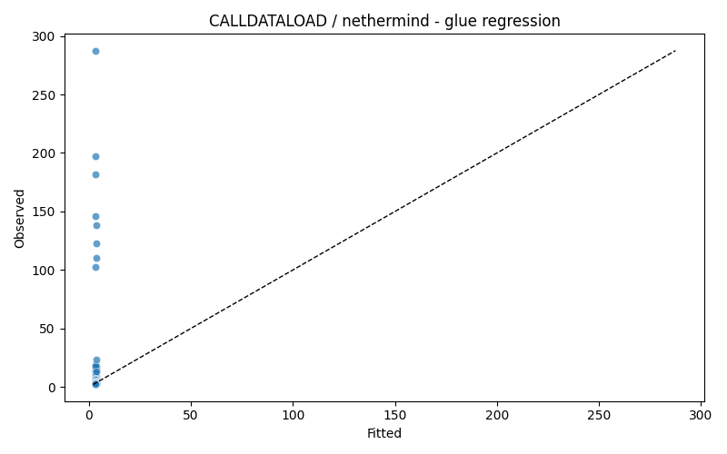

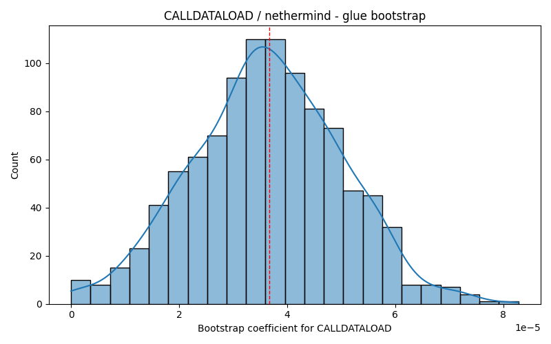

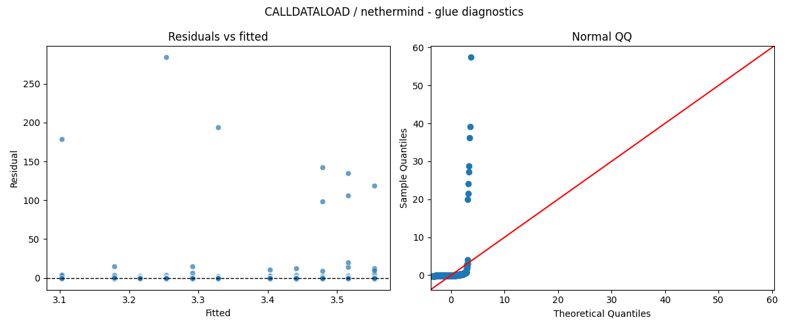

</details>

<details><summary><code>DIV</code> · nobs=2332 · runtime_ms=6.964e-06 · p=1.00e-03 · R²=0.6161</summary>

```
==============================================================================
                           NNLS Regression Results                            
==============================================================================
Dep. Variable:          test_runtime_ms              R-squared:          0.616
Model:                  NNLS                    Adj. R-squared:          0.616
No. Observations:       2332                              RMSE:          43.39
Df Residuals:           2330                               MAE:          33.92
Df Model:               1      
==============================================================================
                      coef     std err     P-value      [0.025      0.975]
------------------------------------------------------------------------------
         const    126.5643      4.3110       0.001    117.7538    135.1791
           DIV      0.0000      0.0000       0.001      0.0000      0.0000
==============================================================================
Notes: Non-negative least squares with bootstrap inference (1000 iterations)
==============================================================================
```

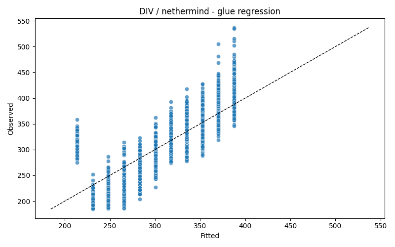

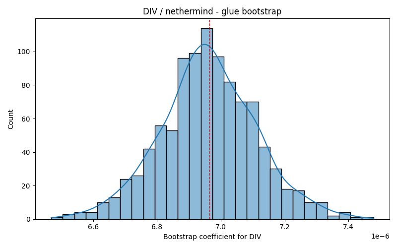

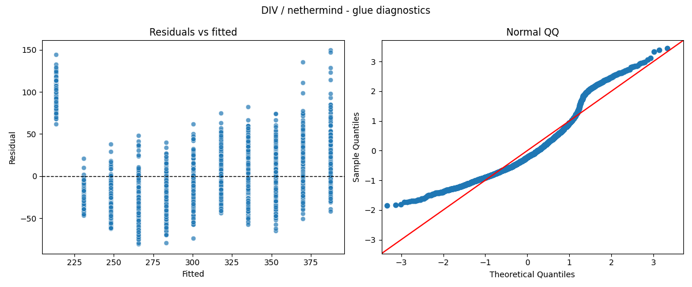

</details>

<details><summary><code>EXP</code> · nobs=2332 · runtime_ms=0 · p=1.00e+00 · R²=0</summary>

```
==============================================================================
                           NNLS Regression Results                            
==============================================================================
Dep. Variable:          test_runtime_ms              R-squared:          0.000
Model:                  NNLS                    Adj. R-squared:         -0.000
No. Observations:       2332                              RMSE:          46.91
Df Residuals:           2330                               MAE:          31.19
Df Model:               1      
==============================================================================
                      coef     std err     P-value      [0.025      0.975]
------------------------------------------------------------------------------
         const    102.7090      0.9844       0.001    100.8828    104.5943
           EXP      0.0000      0.0000       1.000      0.0000      0.0000
==============================================================================
Notes: Non-negative least squares with bootstrap inference (1000 iterations)
==============================================================================
```

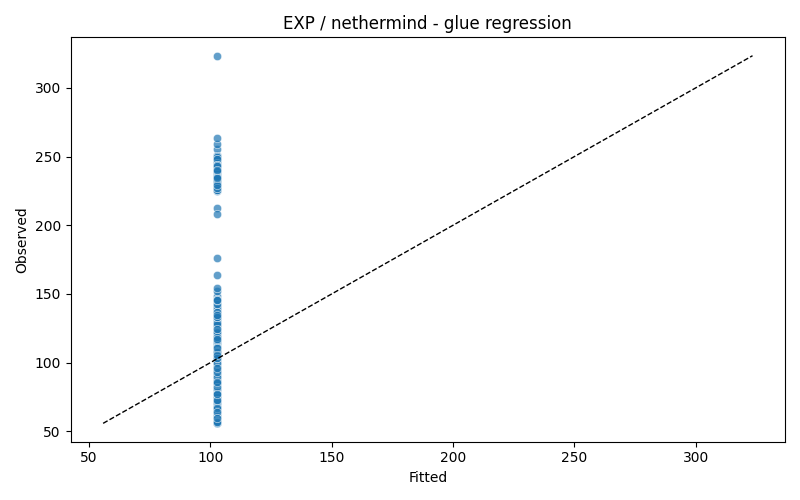

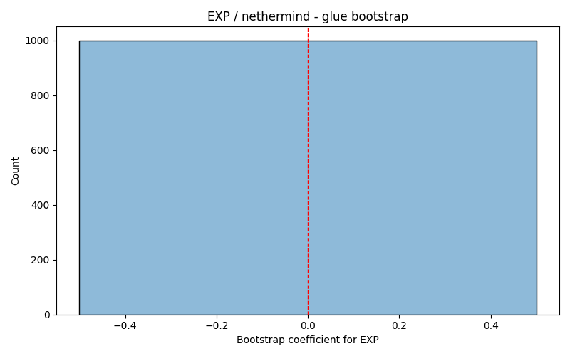

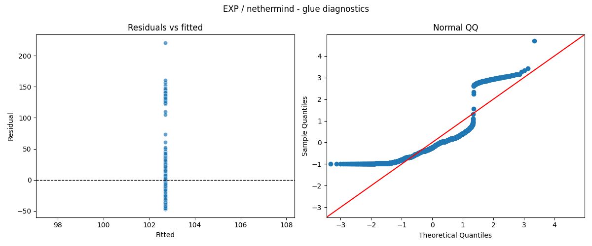

</details>

<details><summary><code>GT</code> · nobs=2332 · runtime_ms=1.592e-06 · p=1.00e-03 · R²=0.6343</summary>

```
==============================================================================
                           NNLS Regression Results                            
==============================================================================
Dep. Variable:          test_runtime_ms              R-squared:          0.634
Model:                  NNLS                    Adj. R-squared:          0.634
No. Observations:       2332                              RMSE:          12.72
Df Residuals:           2330                               MAE:           6.35
Df Model:               1      
==============================================================================
                      coef     std err     P-value      [0.025      0.975]
------------------------------------------------------------------------------
         const     14.5534      0.8823       0.001     12.8820     16.2923
            GT      0.0000      0.0000       0.001      0.0000      0.0000
==============================================================================
Notes: Non-negative least squares with bootstrap inference (1000 iterations)
==============================================================================
```

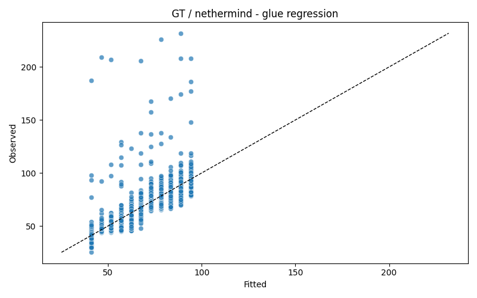

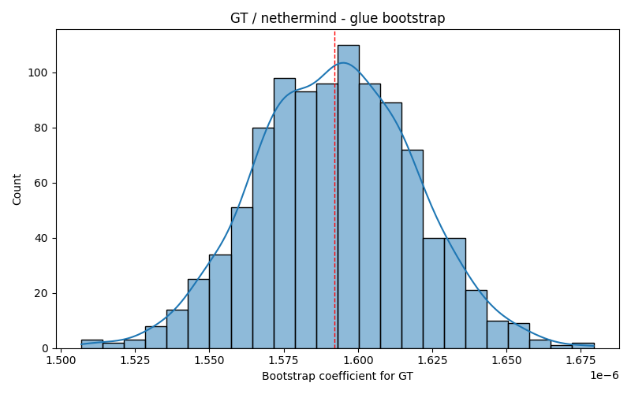

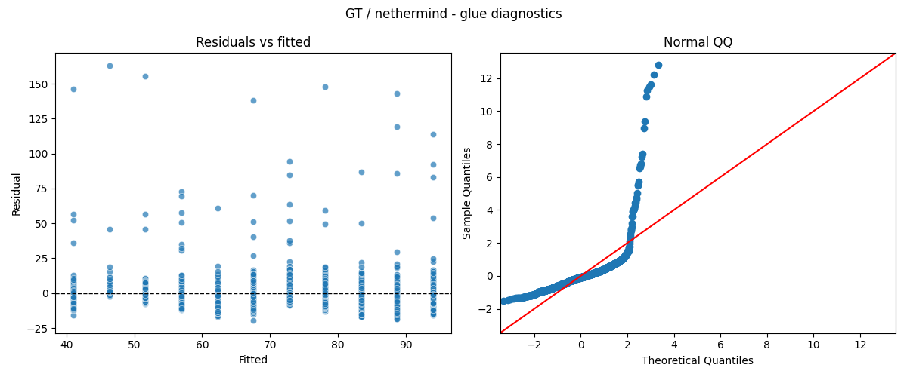

</details>

<details><summary><code>JUMPI</code> · nobs=2332 · runtime_ms=1.745e-06 · p=1.00e-03 · R²=0.5172</summary>

```
==============================================================================
                           NNLS Regression Results                            
==============================================================================
Dep. Variable:          test_runtime_ms              R-squared:          0.517
Model:                  NNLS                    Adj. R-squared:          0.517
No. Observations:       2332                              RMSE:           7.61
Df Residuals:           2330                               MAE:           3.54
Df Model:               1      
==============================================================================
                      coef     std err     P-value      [0.025      0.975]
------------------------------------------------------------------------------
         const      9.9805      0.6418       0.001      8.8773     11.3140
         JUMPI      0.0000      0.0000       0.001      0.0000      0.0000
==============================================================================
Notes: Non-negative least squares with bootstrap inference (1000 iterations)
==============================================================================
```

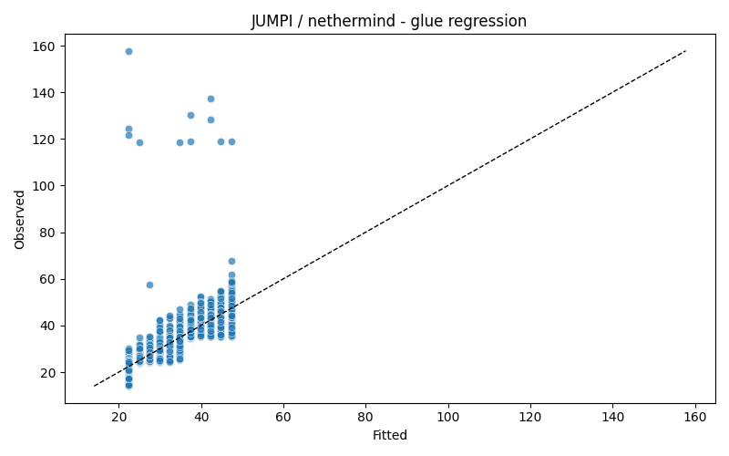

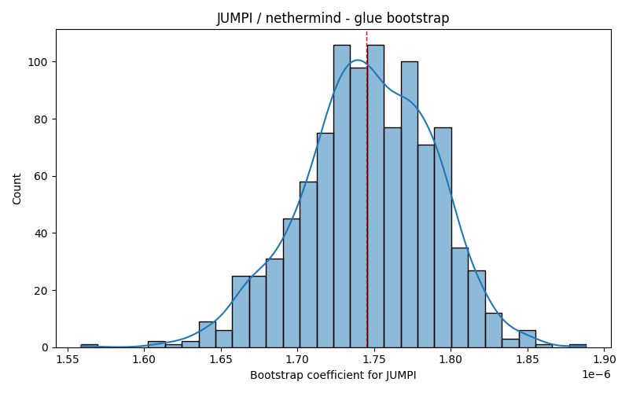

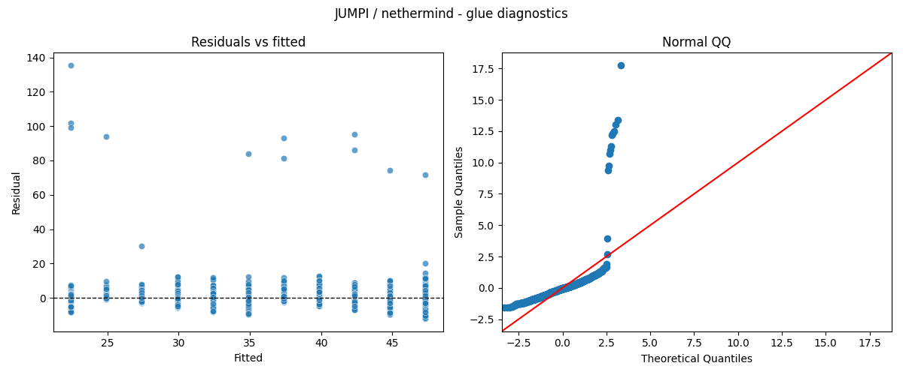

</details>

<details><summary><code>LT</code> · nobs=2332 · runtime_ms=1.527e-06 · p=1.00e-03 · R²=0.5946</summary>

```
==============================================================================
                           NNLS Regression Results                            
==============================================================================
Dep. Variable:          test_runtime_ms              R-squared:          0.595
Model:                  NNLS                    Adj. R-squared:          0.594
No. Observations:       2332                              RMSE:          13.27
Df Residuals:           2330                               MAE:           7.55
Df Model:               1      
==============================================================================
                      coef     std err     P-value      [0.025      0.975]
------------------------------------------------------------------------------
         const     19.2212      0.7679       0.001     17.7157     20.7268
            LT      0.0000      0.0000       0.001      0.0000      0.0000
==============================================================================
Notes: Non-negative least squares with bootstrap inference (1000 iterations)
==============================================================================
```

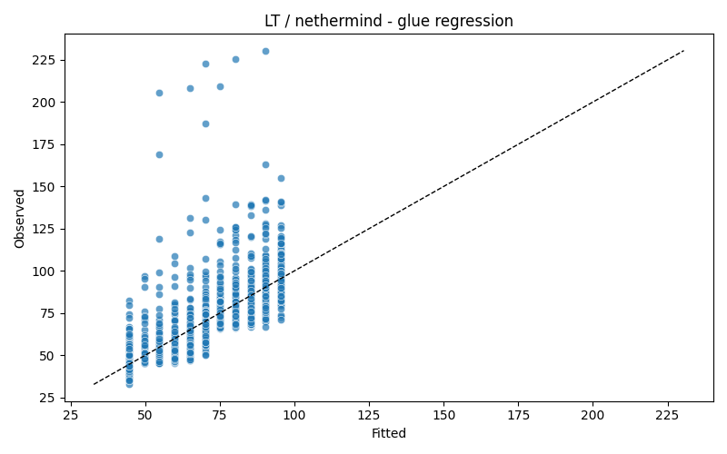

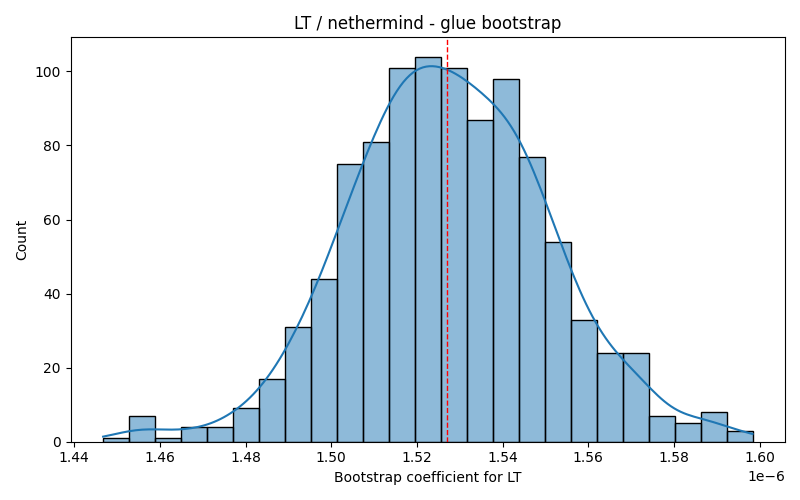

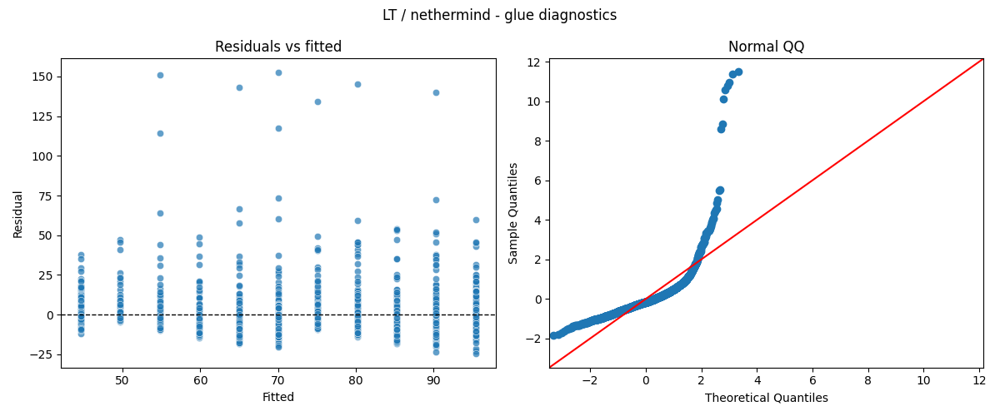

</details>

<details><summary><code>MSTORE</code> · nobs=11660 · runtime_ms=2.08e-06 · p=1.00e-03 · R²=0.6696</summary>

```
==============================================================================
                           NNLS Regression Results                            
==============================================================================
Dep. Variable:          test_runtime_ms              R-squared:          0.670
Model:                  NNLS                    Adj. R-squared:          0.670
No. Observations:       11660                             RMSE:          10.25
Df Residuals:           11658                              MAE:           5.00
Df Model:               1      
==============================================================================
                      coef     std err     P-value      [0.025      0.975]
------------------------------------------------------------------------------
         const     15.0002      0.2929       0.001     14.4723     15.5791
        MSTORE      0.0000      0.0000       0.001      0.0000      0.0000
==============================================================================
Notes: Non-negative least squares with bootstrap inference (1000 iterations)
==============================================================================
```

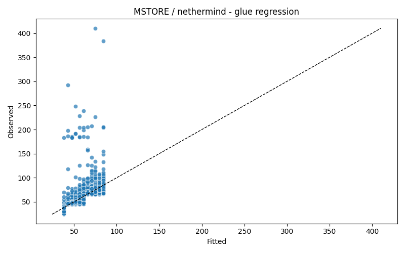

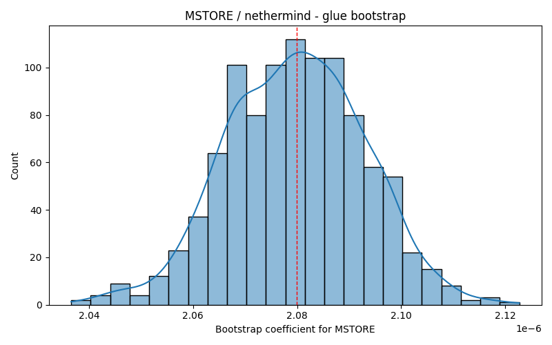

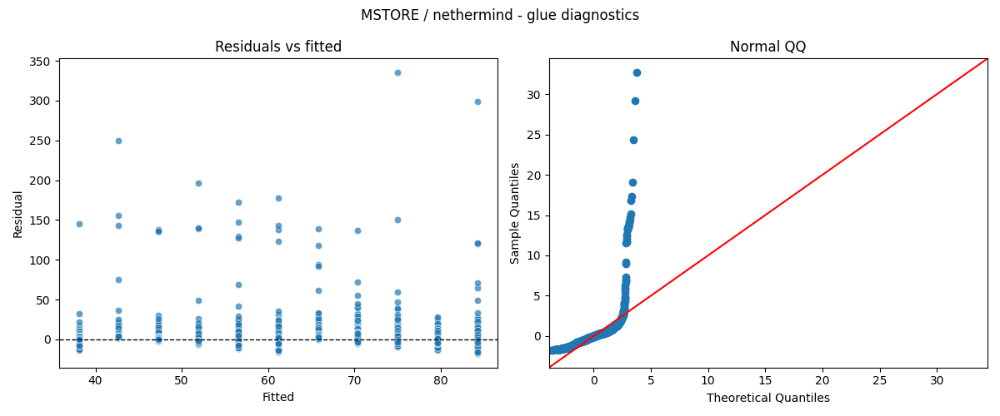

</details>

<details><summary><code>MSTORE8</code> · nobs=11660 · runtime_ms=2.017e-06 · p=1.00e-03 · R²=0.7055</summary>

```
==============================================================================
                           NNLS Regression Results                            
==============================================================================
Dep. Variable:          test_runtime_ms              R-squared:          0.706
Model:                  NNLS                    Adj. R-squared:          0.706
No. Observations:       11660                             RMSE:           9.15
Df Residuals:           11658                              MAE:           4.71
Df Model:               1      
==============================================================================
                      coef     std err     P-value      [0.025      0.975]
------------------------------------------------------------------------------
         const     14.8990      0.2986       0.001     14.3162     15.4910
       MSTORE8      0.0000      0.0000       0.001      0.0000      0.0000
==============================================================================
Notes: Non-negative least squares with bootstrap inference (1000 iterations)
==============================================================================
```

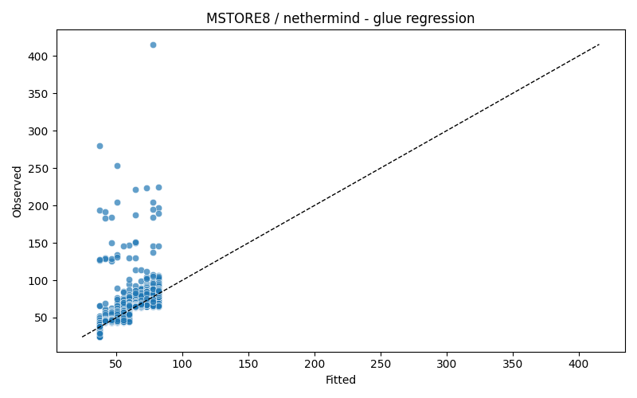

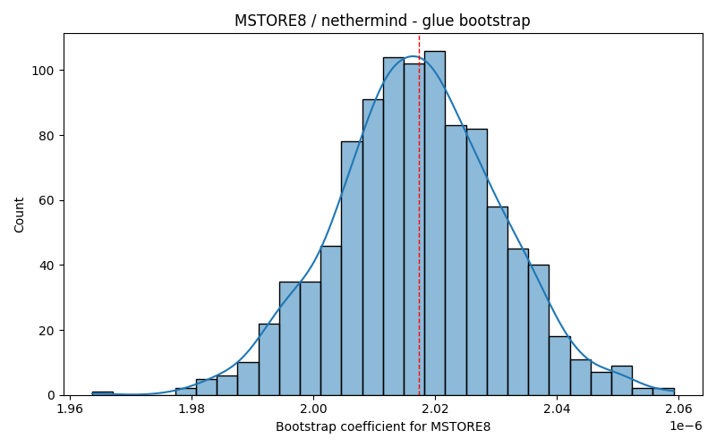


</details>

<details><summary><code>MUL</code> · nobs=2332 · runtime_ms=5.288e-06 · p=1.00e-03 · R²=0.8914</summary>

```
==============================================================================
                           NNLS Regression Results                            
==============================================================================
Dep. Variable:          test_runtime_ms              R-squared:          0.891
Model:                  NNLS                    Adj. R-squared:          0.891
No. Observations:       2332                              RMSE:          14.57
Df Residuals:           2330                               MAE:          10.89
Df Model:               1      
==============================================================================
                      coef     std err     P-value      [0.025      0.975]
------------------------------------------------------------------------------
         const     25.7566      0.9014       0.001     24.1104     27.5071
           MUL      0.0000      0.0000       0.001      0.0000      0.0000
==============================================================================
Notes: Non-negative least squares with bootstrap inference (1000 iterations)
==============================================================================
```

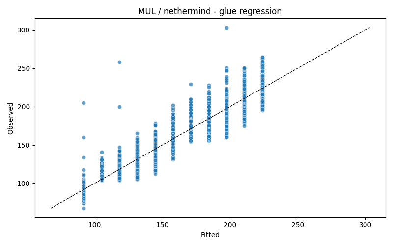

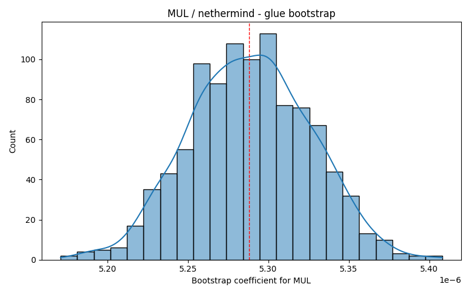

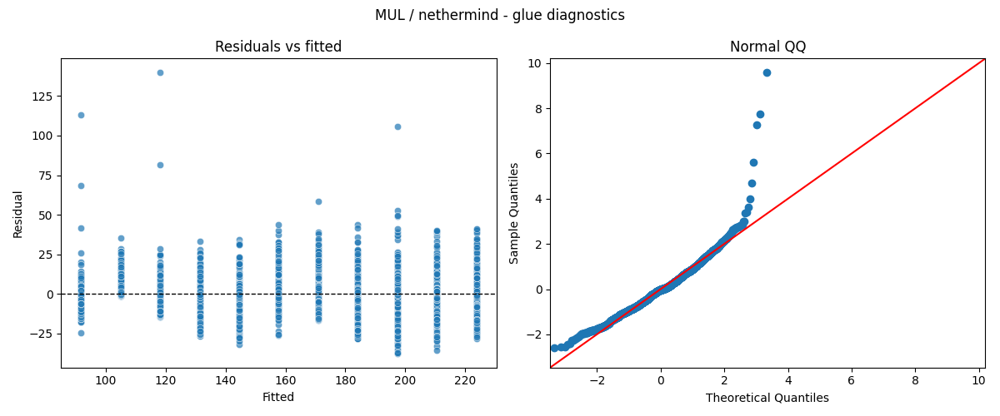

</details>

<details><summary><code>PC</code> · nobs=2332 · runtime_ms=8.192e-07 · p=1.00e-03 · R²=0.8253</summary>

```
==============================================================================
                           NNLS Regression Results                            
==============================================================================
Dep. Variable:          test_runtime_ms              R-squared:          0.825
Model:                  NNLS                    Adj. R-squared:          0.825
No. Observations:       2332                              RMSE:          11.27
Df Residuals:           2330                               MAE:           8.34
Df Model:               1      
==============================================================================
                      coef     std err     P-value      [0.025      0.975]
------------------------------------------------------------------------------
         const     18.9389      0.7153       0.001     17.5540     20.3299
            PC      0.0000      0.0000       0.001      0.0000      0.0000
==============================================================================
Notes: Non-negative least squares with bootstrap inference (1000 iterations)
==============================================================================
```

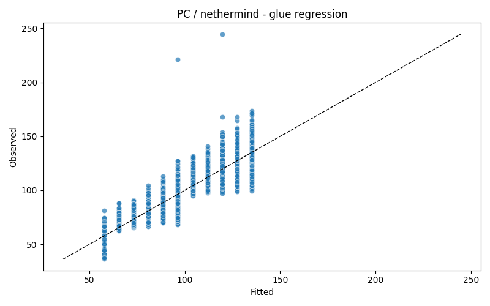

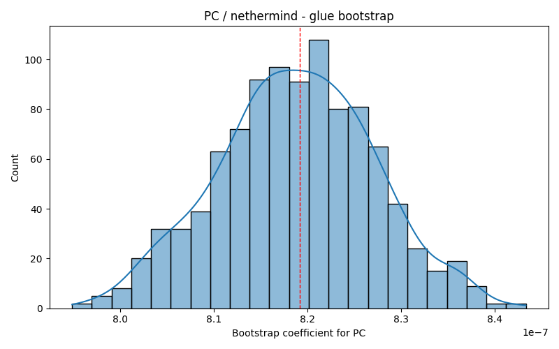

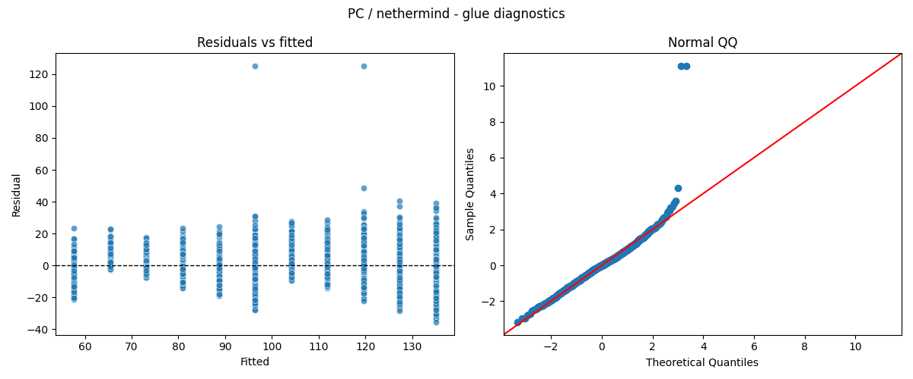

</details>

<details><summary><code>RETURNDATASIZE</code> · nobs=9328 · runtime_ms=8.315e-07 · p=1.00e-03 · R²=0.5107</summary>

```
==============================================================================
                           NNLS Regression Results                            
==============================================================================
Dep. Variable:          test_runtime_ms              R-squared:          0.511
Model:                  NNLS                    Adj. R-squared:          0.511
No. Observations:       9328                              RMSE:          12.85
Df Residuals:           9326                               MAE:           5.12
Df Model:               1      
==============================================================================
                      coef     std err     P-value      [0.025      0.975]
------------------------------------------------------------------------------
         const     11.8011      0.3833       0.001     11.0843     12.5311
RETURNDATASIZE      0.0000      0.0000       0.001      0.0000      0.0000
==============================================================================
Notes: Non-negative least squares with bootstrap inference (1000 iterations)
==============================================================================
```

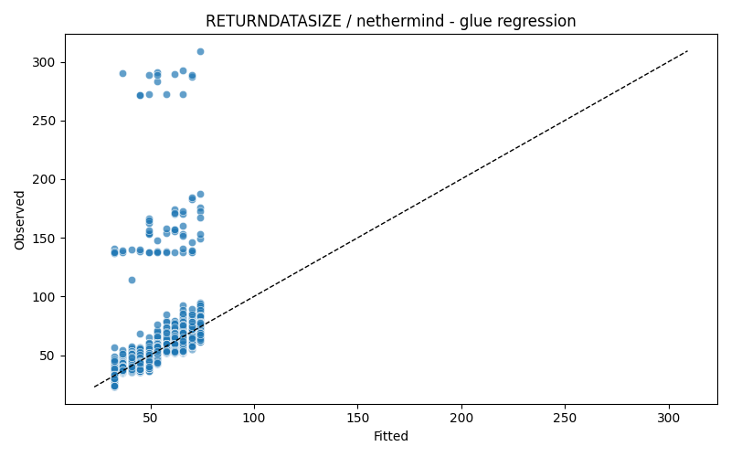

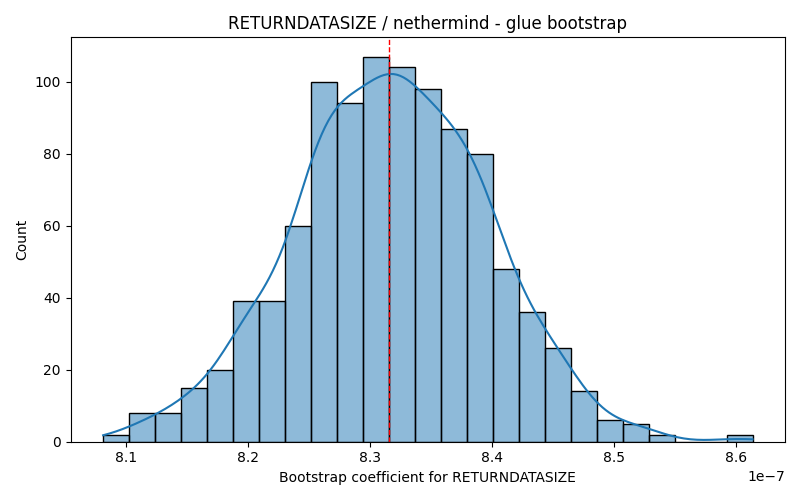


</details>

<details><summary><code>SELFBALANCE</code> · nobs=1908 · runtime_ms=4.19e-06 · p=1.00e-03 · R²=0.6067</summary>

```
==============================================================================
                           NNLS Regression Results                            
==============================================================================
Dep. Variable:          test_runtime_ms              R-squared:          0.607
Model:                  NNLS                    Adj. R-squared:          0.606
No. Observations:       1908                              RMSE:          34.03
Df Residuals:           1906                               MAE:          26.72
Df Model:               1      
==============================================================================
                      coef     std err     P-value      [0.025      0.975]
------------------------------------------------------------------------------
         const    115.7948      4.1523       0.001    107.8675    123.8272
   SELFBALANCE      0.0000      0.0000       0.001      0.0000      0.0000
==============================================================================
Notes: Non-negative least squares with bootstrap inference (1000 iterations)
==============================================================================
```

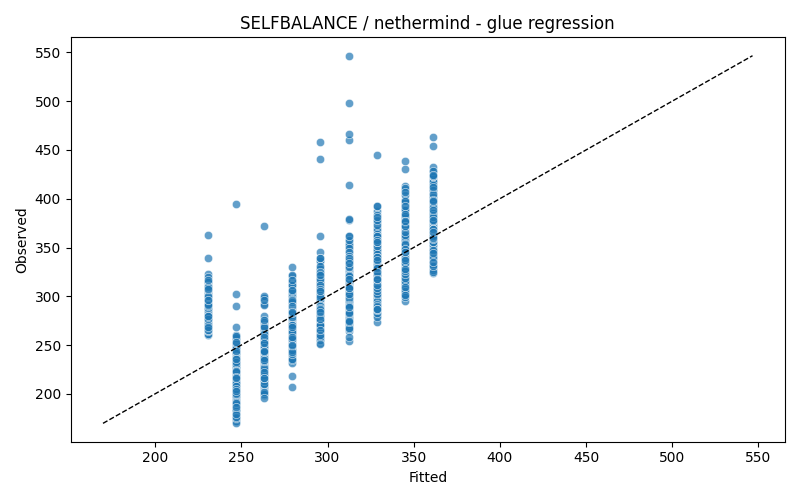

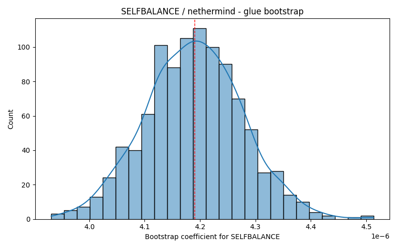

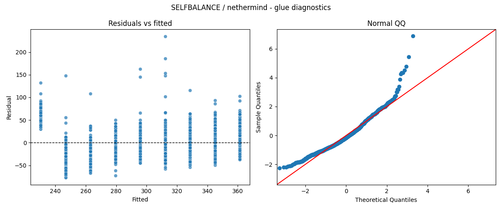

</details>

<details><summary><code>SUB</code> · nobs=2332 · runtime_ms=2.496e-06 · p=1.00e-03 · R²=0.8641</summary>

```
==============================================================================
                           NNLS Regression Results                            
==============================================================================
Dep. Variable:          test_runtime_ms              R-squared:          0.864
Model:                  NNLS                    Adj. R-squared:          0.864
No. Observations:       2332                              RMSE:          10.42
Df Residuals:           2330                               MAE:           7.39
Df Model:               1      
==============================================================================
                      coef     std err     P-value      [0.025      0.975]
------------------------------------------------------------------------------
         const     17.1927      0.6171       0.001     15.9985     18.4229
           SUB      0.0000      0.0000       0.001      0.0000      0.0000
==============================================================================
Notes: Non-negative least squares with bootstrap inference (1000 iterations)
==============================================================================
```

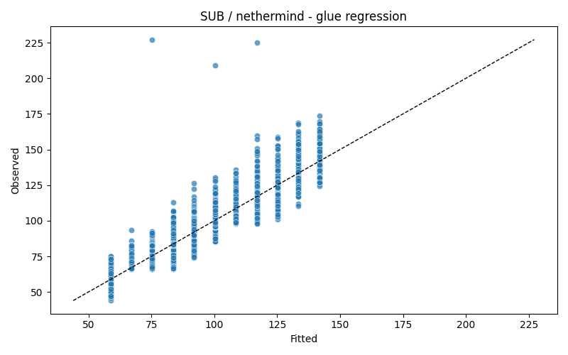

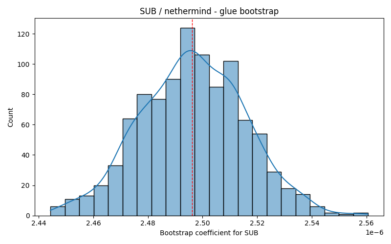

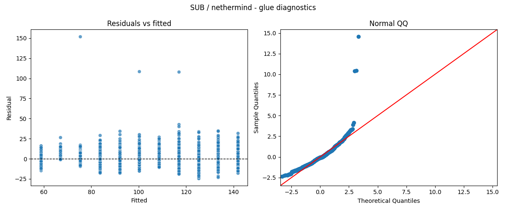

</details>

### Mixed glue (tier B) · nethermind

<details><summary><code>JUMP</code> · nobs=2332 · runtime_ms=5.752e-06 · p=1.00e-03 · R²=0.8104</summary>

```
==============================================================================
                           NNLS Regression Results                            
==============================================================================
Dep. Variable:          test_runtime_ms              R-squared:          0.810
Model:                  NNLS                    Adj. R-squared:          0.810
No. Observations:       2332                              RMSE:          10.34
Df Residuals:           2330                               MAE:           7.31
Df Model:               1      
==============================================================================
                      coef     std err     P-value      [0.025      0.975]
------------------------------------------------------------------------------
         const     17.4306      0.6725       0.001     16.1227     18.7643
          JUMP      0.0000      0.0000       0.001      0.0000      0.0000
==============================================================================
Notes: Non-negative least squares with bootstrap inference (1000 iterations)
==============================================================================
```

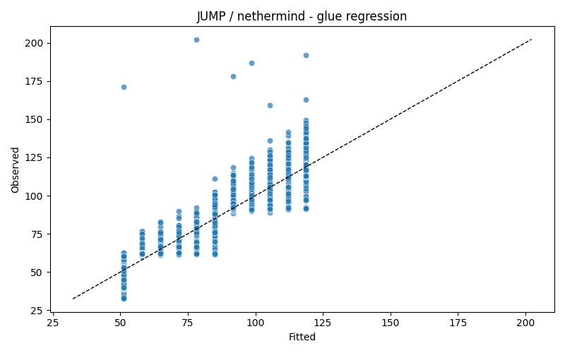

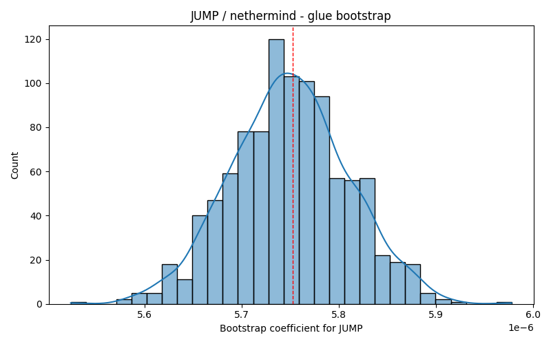

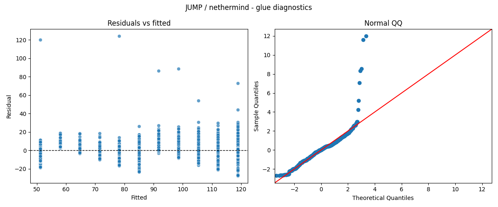

</details>

<details><summary><code>KECCAK256</code> · nobs=37312 · runtime_ms=0 · p=1.00e+00 · R²=1.11e-16</summary>

```
==============================================================================
                           NNLS Regression Results                            
==============================================================================
Dep. Variable:          test_runtime_ms              R-squared:          0.000
Model:                  NNLS                    Adj. R-squared:         -0.000
No. Observations:       37312                             RMSE:         284.27
Df Residuals:           37310                              MAE:         231.40
Df Model:               1      
==============================================================================
                      coef     std err     P-value      [0.025      0.975]
------------------------------------------------------------------------------
         const    409.6388      1.4315       0.001    406.8200    412.4669
     KECCAK256      0.0000      0.0000       1.000      0.0000      0.0000
==============================================================================
Notes: Non-negative least squares with bootstrap inference (1000 iterations)
==============================================================================
```

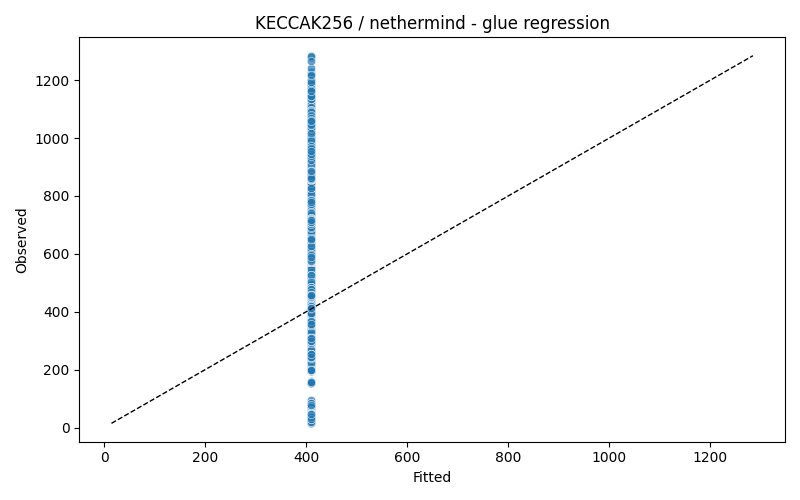


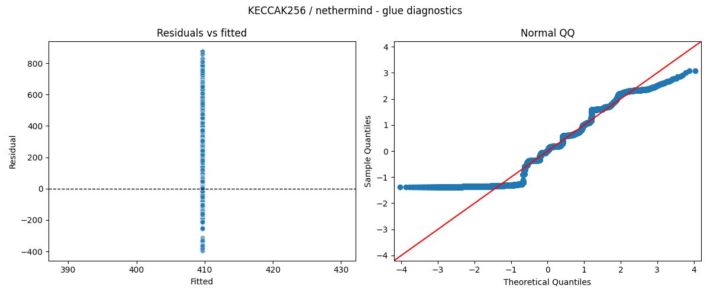

</details>

## reth

| glue_opcode | nobs | glue_runtime_ms | p_value | rsquared |
| --- | --- | --- | --- | --- |
| `ISZERO` | 583 | 1.351e-06 | 1.00e-03 | 0.8628 |
| `JUMPDEST` | 583 | 2.721e-07 | 1.00e-03 | 0.6465 |
| `SWAP` | 9328 | 4.737e-07 | 1.00e-03 | 0.7662 |
| `CALLDATASIZE` | 34705 | 4.47e-07 | 1.00e-03 | 0.783 |
| `DUP` | 34705 | 4.213e-07 | 1.00e-03 | 0.783 |
| `GAS` | 34705 | 4.372e-07 | 1.00e-03 | 0.783 |
| `MLOAD` | 34705 | 1.469e-06 | 1.00e-03 | 0.783 |
| `PUSH` | 34705 | 4.353e-07 | 1.00e-03 | 0.783 |
| `PUSH0` | 34705 | 3.893e-07 | 1.00e-03 | 0.783 |
| `STATICCALL` | 34705 | 5.725e-05 | 1.00e-03 | 0.783 |
| `ADD` | 583 | 8.263e-07 | 1.00e-03 | 0.7942 |
| `AND` | 583 | 8.072e-07 | 1.00e-03 | 0.7693 |
| `CALLDATACOPY` | 13992 | 2.381e-06 | 1.00e-03 | 0.8047 |
| `CALLDATALOAD` | 2332 | 1.799e-05 | 1.00e-03 | 0.00975 |
| `DIV` | 583 | 6.905e-06 | 1.00e-03 | 0.8458 |
| `EXP` | 583 | 0.0004965 | 1.00e-03 | 0.8375 |
| `GT` | 583 | 9.06e-07 | 1.00e-03 | 0.7878 |
| `JUMPI` | 583 | 1.268e-06 | 1.00e-03 | 0.6595 |
| `LT` | 583 | 9.447e-07 | 1.00e-03 | 0.7801 |
| `MSTORE` | 2915 | 2.545e-06 | 1.00e-03 | 0.3049 |
| `MSTORE8` | 2915 | 1.344e-06 | 1.00e-03 | 0.6383 |
| `MUL` | 583 | 1.105e-06 | 1.00e-03 | 0.655 |
| `PC` | 583 | 6.32e-07 | 1.00e-03 | 0.9004 |
| `RETURNDATASIZE` | 2332 | 7.981e-07 | 1.00e-03 | 0.8328 |
| `SELFBALANCE` | 477 | 3.732e-06 | 1.00e-03 | 0.7773 |
| `SUB` | 583 | 8.246e-07 | 1.00e-03 | 0.6197 |
| `JUMP` | 583 | 2.244e-06 | 1.00e-03 | 0.7516 |
| `KECCAK256` | 9328 | 0 | 1.00e+00 | 0 |

### Cycle glue — joint fit · reth

<details><summary>Joint NNLS regression summary</summary>

```
==============================================================================
                           NNLS Regression Results                            
==============================================================================
Dep. Variable:          test_runtime_ms              R-squared:          0.783
Model:                  NNLS                    Adj. R-squared:          0.783
No. Observations:       34705                             RMSE:           7.53
Df Residuals:           34697                              MAE:           5.36
Df Model:               7      
==============================================================================
                      coef     std err     P-value      [0.025      0.975]
------------------------------------------------------------------------------
         const     14.7790      0.1301       0.001     14.5296     15.0281
  CALLDATASIZE      0.0000      0.0000       0.001      0.0000      0.0000
           DUP      0.0000      0.0000       0.001      0.0000      0.0000
           GAS      0.0000      0.0000       0.001      0.0000      0.0000
         MLOAD      0.0000      0.0000       0.001      0.0000      0.0000
          PUSH      0.0000      0.0000       0.001      0.0000      0.0000
         PUSH0      0.0000      0.0000       0.001      0.0000      0.0000
    STATICCALL      0.0001      0.0000       0.001      0.0001      0.0001
==============================================================================
Notes: Non-negative least squares with bootstrap inference (1000 iterations)
==============================================================================
```

</details>

<details><summary><code>CALLDATASIZE</code> · nobs=34705 · runtime_ms=4.47e-07 · p=1.00e-03 · R²=0.783</summary>


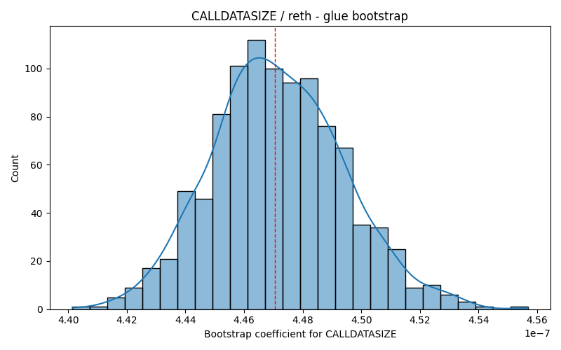

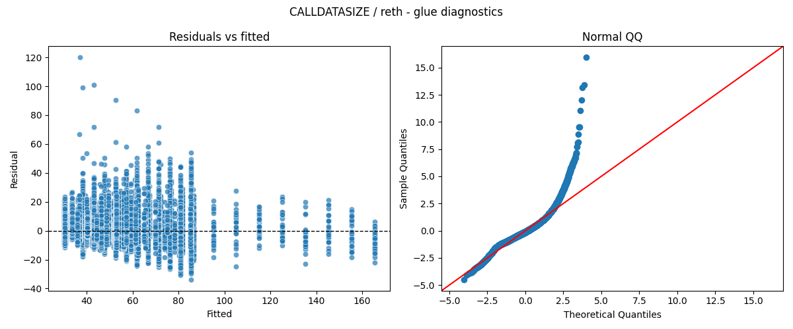

</details>

<details><summary><code>DUP</code> · nobs=34705 · runtime_ms=4.213e-07 · p=1.00e-03 · R²=0.783</summary>


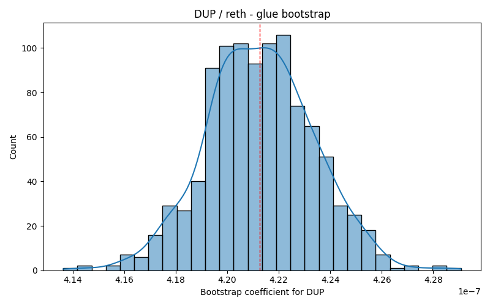


</details>

<details><summary><code>GAS</code> · nobs=34705 · runtime_ms=4.372e-07 · p=1.00e-03 · R²=0.783</summary>


</details>

<details><summary><code>MLOAD</code> · nobs=34705 · runtime_ms=1.469e-06 · p=1.00e-03 · R²=0.783</summary>


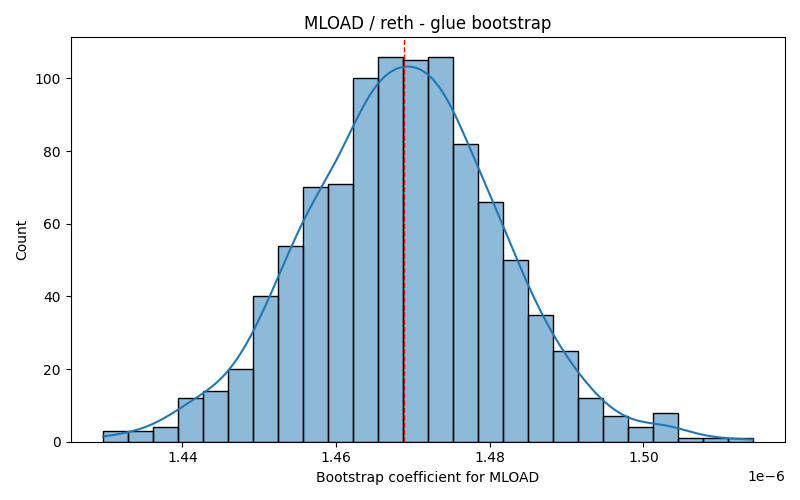


</details>

<details><summary><code>PUSH</code> · nobs=34705 · runtime_ms=4.353e-07 · p=1.00e-03 · R²=0.783</summary>


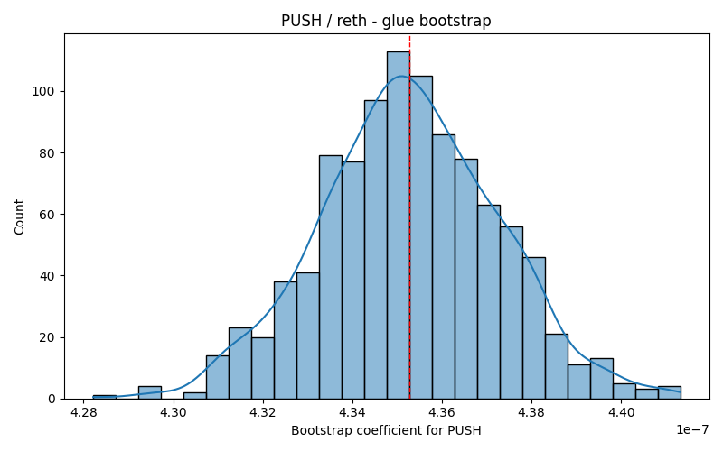

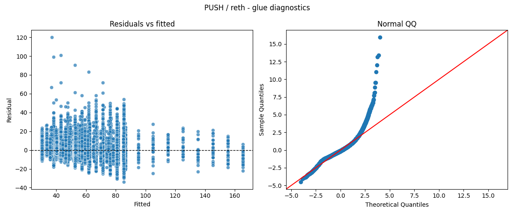

</details>

<details><summary><code>PUSH0</code> · nobs=34705 · runtime_ms=3.893e-07 · p=1.00e-03 · R²=0.783</summary>

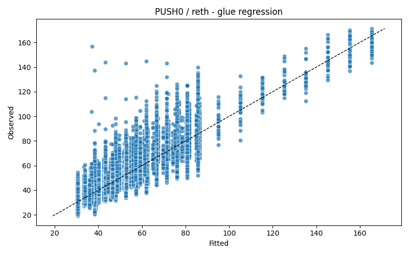

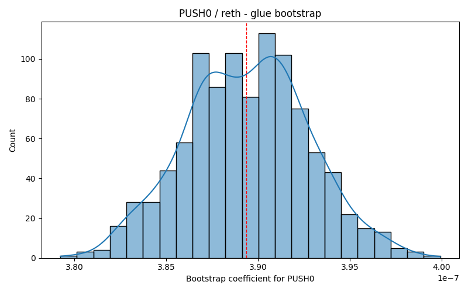


</details>

<details><summary><code>STATICCALL</code> · nobs=34705 · runtime_ms=5.725e-05 · p=1.00e-03 · R²=0.783</summary>


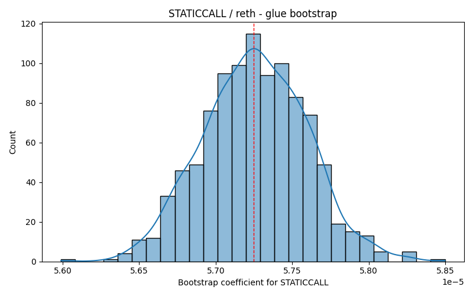


</details>

### Pure glue · reth

<details><summary><code>ISZERO</code> · nobs=583 · runtime_ms=1.351e-06 · p=1.00e-03 · R²=0.8628</summary>

```
==============================================================================
                           NNLS Regression Results                            
==============================================================================
Dep. Variable:          test_runtime_ms              R-squared:          0.863
Model:                  NNLS                    Adj. R-squared:          0.863
No. Observations:       583                               RMSE:          11.34
Df Residuals:           581                                MAE:           9.30
Df Model:               1      
==============================================================================
                      coef     std err     P-value      [0.025      0.975]
------------------------------------------------------------------------------
         const     31.2767      1.7813       0.001     27.5073     34.7219
        ISZERO      0.0000      0.0000       0.001      0.0000      0.0000
==============================================================================
Notes: Non-negative least squares with bootstrap inference (1000 iterations)
==============================================================================
```

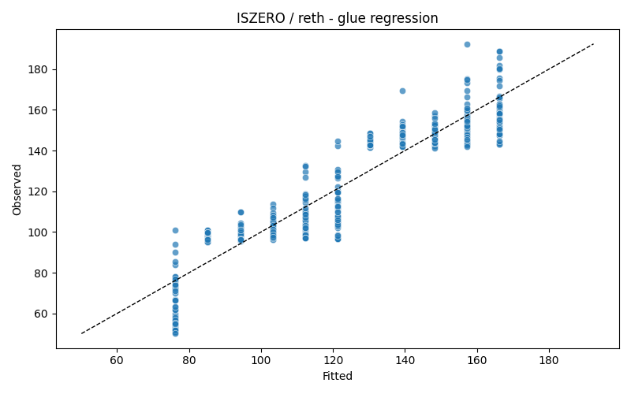

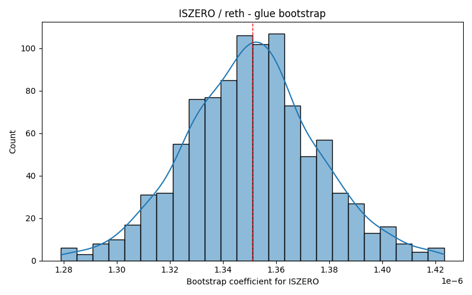

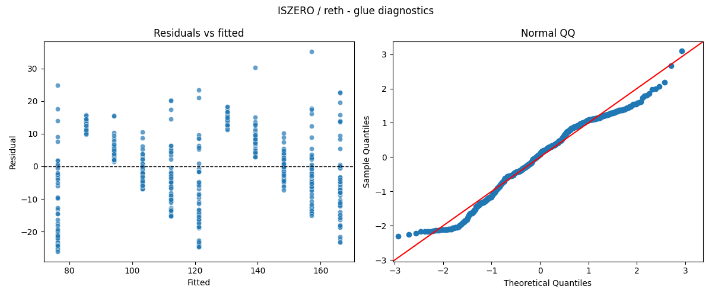

</details>

<details><summary><code>JUMPDEST</code> · nobs=583 · runtime_ms=2.721e-07 · p=1.00e-03 · R²=0.6465</summary>

```
==============================================================================
                           NNLS Regression Results                            
==============================================================================
Dep. Variable:          test_runtime_ms              R-squared:          0.646
Model:                  NNLS                    Adj. R-squared:          0.646
No. Observations:       583                               RMSE:          12.71
Df Residuals:           581                                MAE:           8.83
Df Model:               1      
==============================================================================
                      coef     std err     P-value      [0.025      0.975]
------------------------------------------------------------------------------
         const     18.2895      1.6645       0.001     15.0416     21.6135
      JUMPDEST      0.0000      0.0000       0.001      0.0000      0.0000
==============================================================================
Notes: Non-negative least squares with bootstrap inference (1000 iterations)
==============================================================================
```

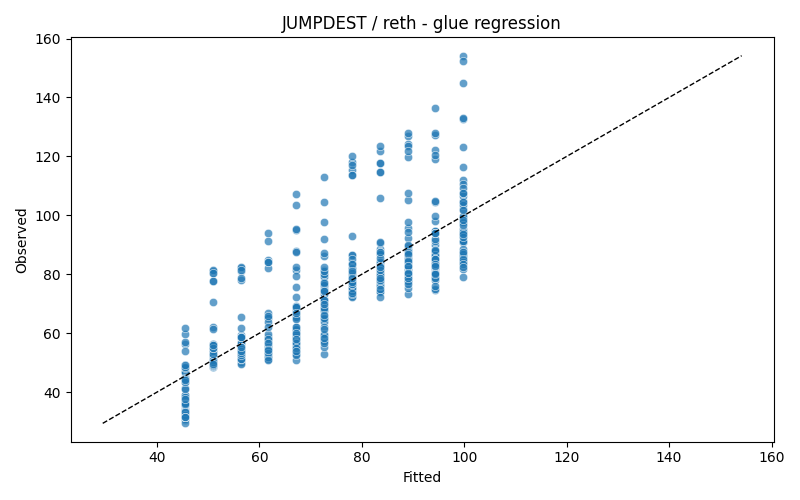

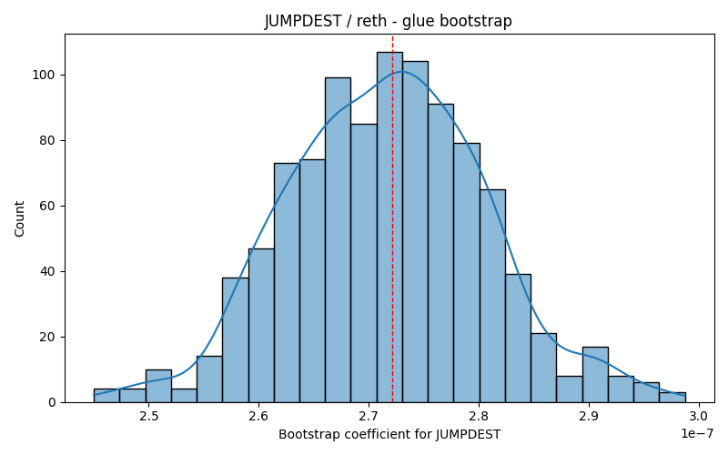

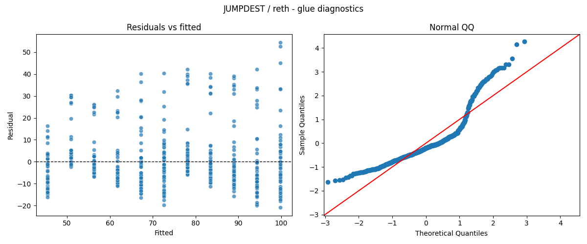

</details>

<details><summary><code>SWAP</code> · nobs=9328 · runtime_ms=4.737e-07 · p=1.00e-03 · R²=0.7662</summary>

```
==============================================================================
                           NNLS Regression Results                            
==============================================================================
Dep. Variable:          test_runtime_ms              R-squared:          0.766
Model:                  NNLS                    Adj. R-squared:          0.766
No. Observations:       9328                              RMSE:           5.51
Df Residuals:           9326                               MAE:           4.06
Df Model:               1      
==============================================================================
                      coef     std err     P-value      [0.025      0.975]
------------------------------------------------------------------------------
         const     13.9706      0.1976       0.001     13.5817     14.3690
          SWAP      0.0000      0.0000       0.001      0.0000      0.0000
==============================================================================
Notes: Non-negative least squares with bootstrap inference (1000 iterations)
==============================================================================
```

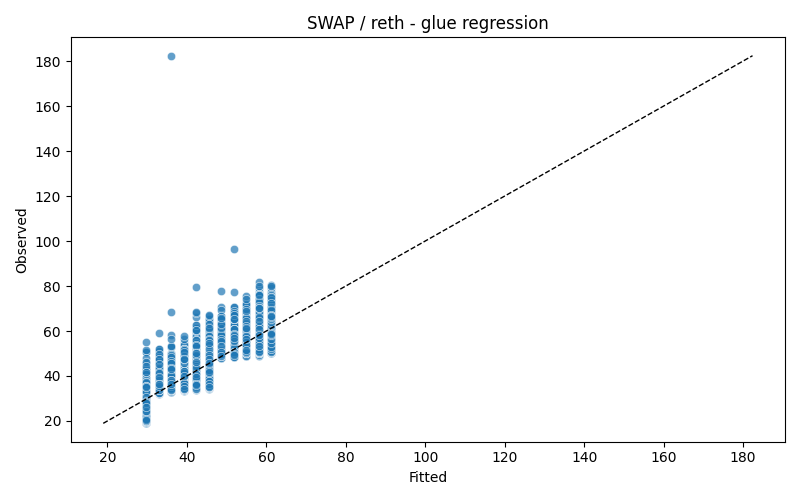

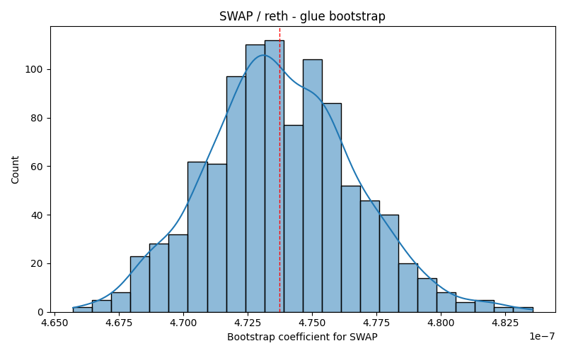

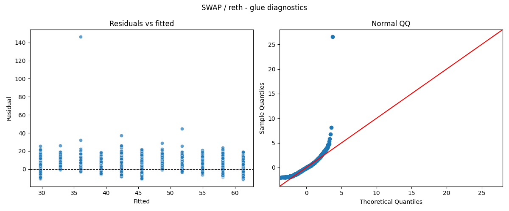

</details>

### Mixed glue (tier A) · reth

<details><summary><code>ADD</code> · nobs=583 · runtime_ms=8.263e-07 · p=1.00e-03 · R²=0.7942</summary>

```
==============================================================================
                           NNLS Regression Results                            
==============================================================================
Dep. Variable:          test_runtime_ms              R-squared:          0.794
Model:                  NNLS                    Adj. R-squared:          0.794
No. Observations:       583                               RMSE:           4.43
Df Residuals:           581                                MAE:           3.44
Df Model:               1      
==============================================================================
                      coef     std err     P-value      [0.025      0.975]
------------------------------------------------------------------------------
         const     13.4685      0.5929       0.001     12.3557     14.5846
           ADD      0.0000      0.0000       0.001      0.0000      0.0000
==============================================================================
Notes: Non-negative least squares with bootstrap inference (1000 iterations)
==============================================================================
```

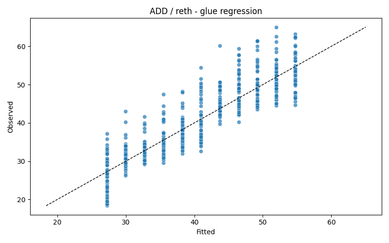

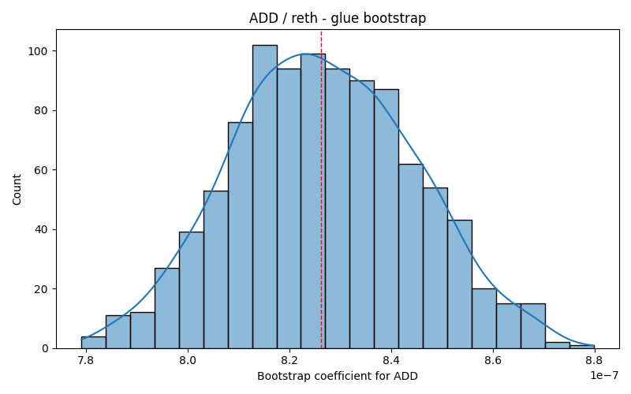

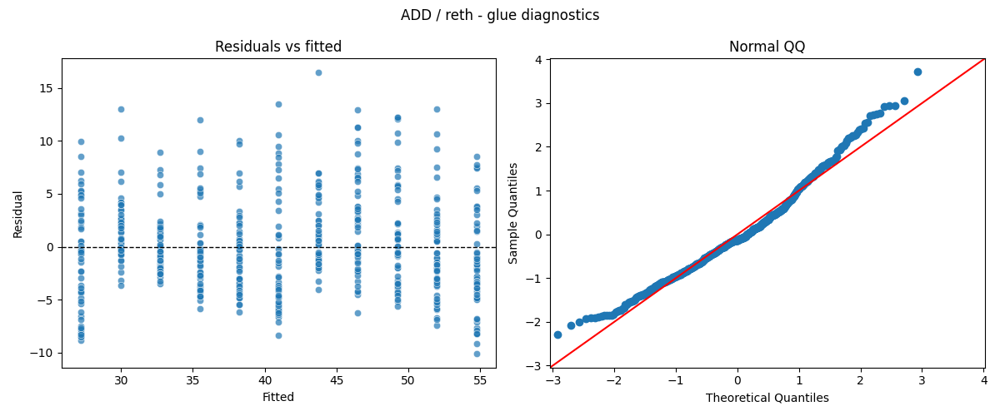

</details>

<details><summary><code>AND</code> · nobs=583 · runtime_ms=8.072e-07 · p=1.00e-03 · R²=0.7693</summary>

```
==============================================================================
                           NNLS Regression Results                            
==============================================================================
Dep. Variable:          test_runtime_ms              R-squared:          0.769
Model:                  NNLS                    Adj. R-squared:          0.769
No. Observations:       583                               RMSE:           4.65
Df Residuals:           581                                MAE:           3.49
Df Model:               1      
==============================================================================
                      coef     std err     P-value      [0.025      0.975]
------------------------------------------------------------------------------
         const     12.3453      0.6533       0.001     11.0932     13.5628
           AND      0.0000      0.0000       0.001      0.0000      0.0000
==============================================================================
Notes: Non-negative least squares with bootstrap inference (1000 iterations)
==============================================================================
```


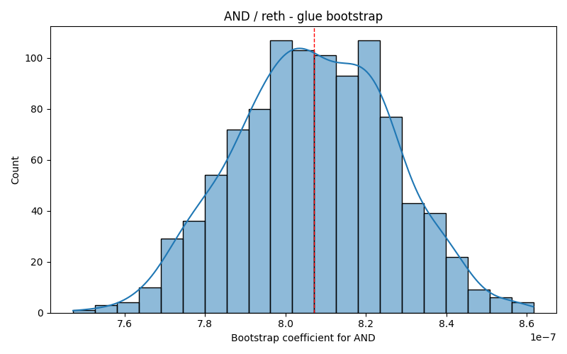

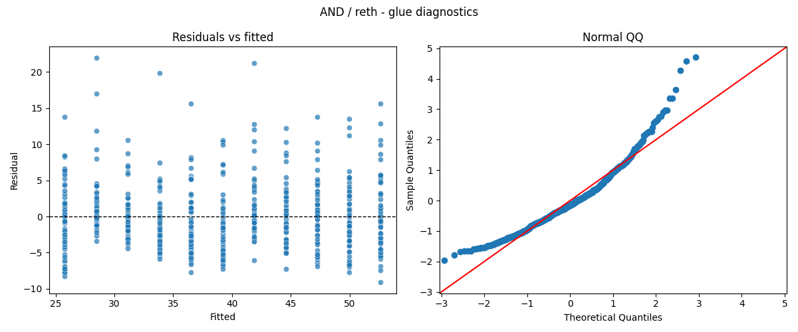

</details>

<details><summary><code>CALLDATACOPY</code> · nobs=13992 · runtime_ms=2.381e-06 · p=1.00e-03 · R²=0.8047</summary>

```
==============================================================================
                           NNLS Regression Results                            
==============================================================================
Dep. Variable:          test_runtime_ms              R-squared:          0.805
Model:                  NNLS                    Adj. R-squared:          0.805
No. Observations:       13992                             RMSE:           8.82
Df Residuals:           13990                              MAE:           6.50
Df Model:               1      
==============================================================================
                      coef     std err     P-value      [0.025      0.975]
------------------------------------------------------------------------------
         const     14.0713      0.0957       0.001     13.8878     14.2723
  CALLDATACOPY      0.0000      0.0000       0.001      0.0000      0.0000
==============================================================================
Notes: Non-negative least squares with bootstrap inference (1000 iterations)
==============================================================================
```

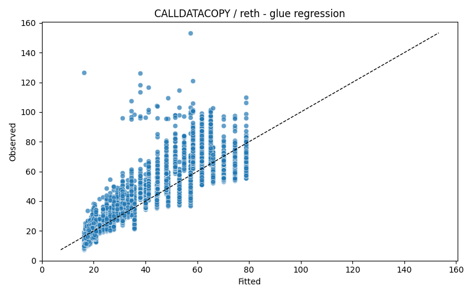

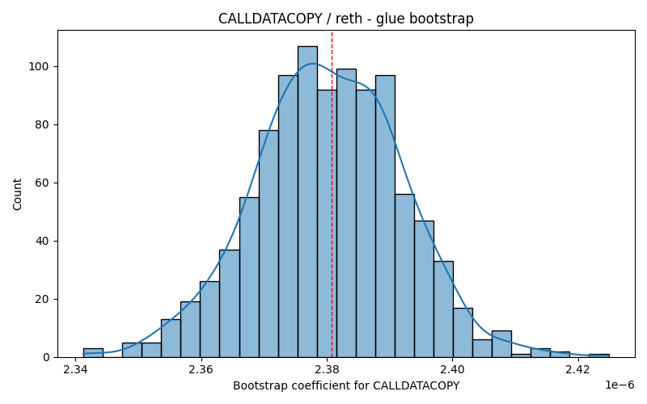

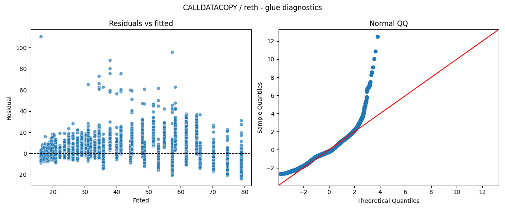

</details>

<details><summary><code>CALLDATALOAD</code> · nobs=2332 · runtime_ms=1.799e-05 · p=1.00e-03 · R²=0.00975</summary>

```
==============================================================================
                           NNLS Regression Results                            
==============================================================================
Dep. Variable:          test_runtime_ms              R-squared:          0.010
Model:                  NNLS                    Adj. R-squared:          0.009
No. Observations:       2332                              RMSE:           0.70
Df Residuals:           2330                               MAE:           0.47
Df Model:               1      
==============================================================================
                      coef     std err     P-value      [0.025      0.975]
------------------------------------------------------------------------------
         const      3.7292      0.0484       0.001      3.6311      3.8221
  CALLDATALOAD      0.0000      0.0000       0.001      0.0000      0.0000
==============================================================================
Notes: Non-negative least squares with bootstrap inference (1000 iterations)
==============================================================================
```

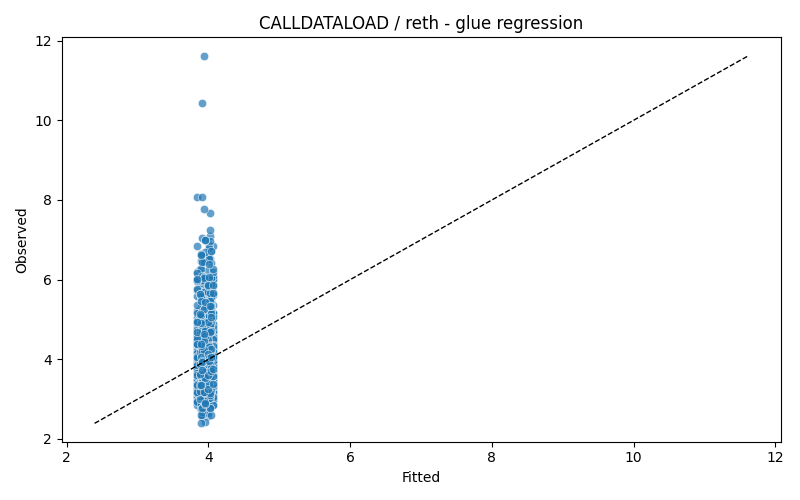

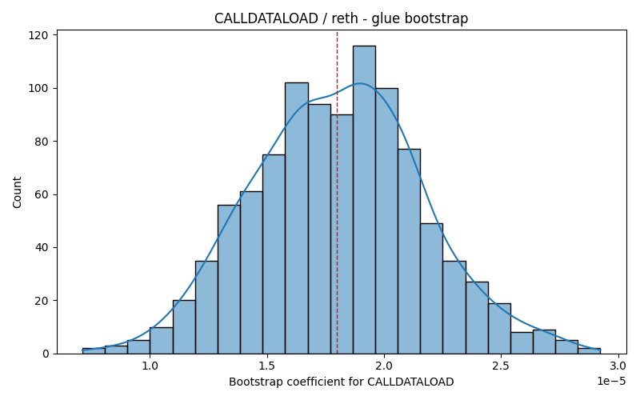

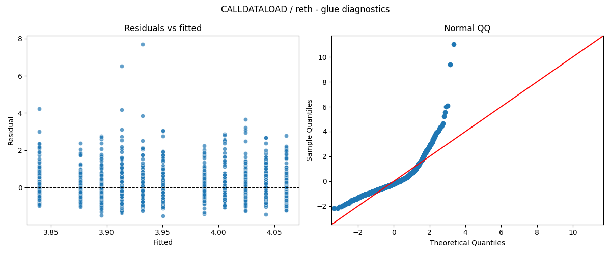

</details>

<details><summary><code>DIV</code> · nobs=583 · runtime_ms=6.905e-06 · p=1.00e-03 · R²=0.8458</summary>

```
==============================================================================
                           NNLS Regression Results                            
==============================================================================
Dep. Variable:          test_runtime_ms              R-squared:          0.846
Model:                  NNLS                    Adj. R-squared:          0.846
No. Observations:       583                               RMSE:          23.27
Df Residuals:           581                                MAE:          19.70
Df Model:               1      
==============================================================================
                      coef     std err     P-value      [0.025      0.975]
------------------------------------------------------------------------------
         const     60.3961      3.5355       0.001     53.6807     67.4370
           DIV      0.0000      0.0000       0.001      0.0000      0.0000
==============================================================================
Notes: Non-negative least squares with bootstrap inference (1000 iterations)
==============================================================================
```

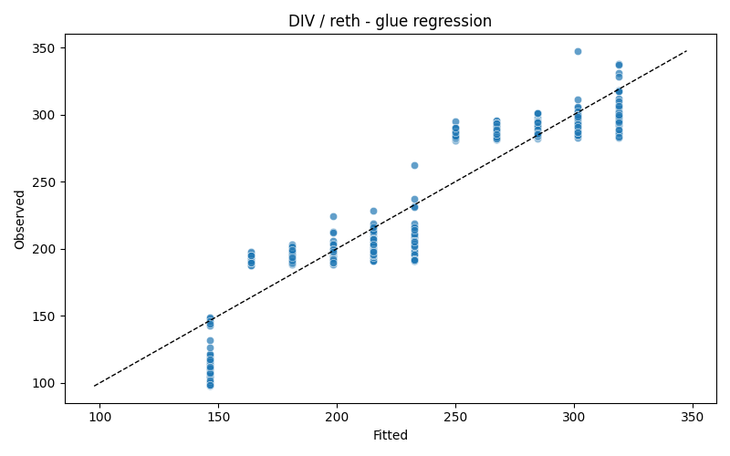


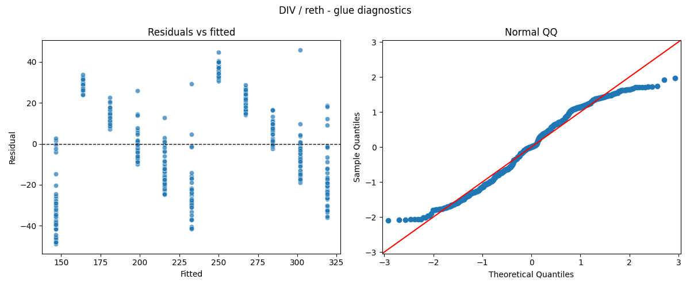

</details>

<details><summary><code>EXP</code> · nobs=583 · runtime_ms=0.0004965 · p=1.00e-03 · R²=0.8375</summary>

```
==============================================================================
                           NNLS Regression Results                            
==============================================================================
Dep. Variable:          test_runtime_ms              R-squared:          0.837
Model:                  NNLS                    Adj. R-squared:          0.837
No. Observations:       583                               RMSE:           8.56
Df Residuals:           581                                MAE:           7.07
Df Model:               1      
==============================================================================
                      coef     std err     P-value      [0.025      0.975]
------------------------------------------------------------------------------
         const     23.6343      1.3020       0.001     21.0888     26.0951
           EXP      0.0005      0.0000       0.001      0.0005      0.0005
==============================================================================
Notes: Non-negative least squares with bootstrap inference (1000 iterations)
==============================================================================
```

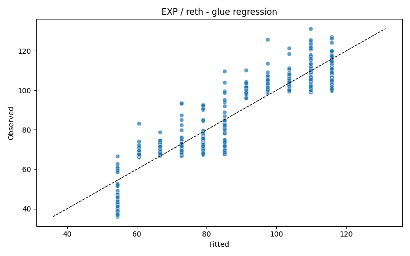

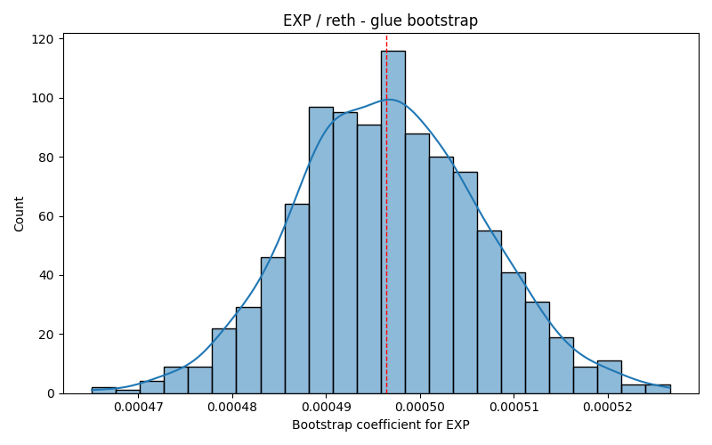

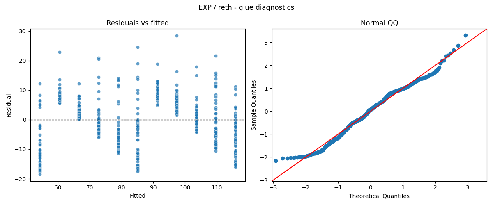

</details>

<details><summary><code>GT</code> · nobs=583 · runtime_ms=9.06e-07 · p=1.00e-03 · R²=0.7878</summary>

```
==============================================================================
                           NNLS Regression Results                            
==============================================================================
Dep. Variable:          test_runtime_ms              R-squared:          0.788
Model:                  NNLS                    Adj. R-squared:          0.787
No. Observations:       583                               RMSE:           4.95
Df Residuals:           581                                MAE:           3.72
Df Model:               1      
==============================================================================
                      coef     std err     P-value      [0.025      0.975]
------------------------------------------------------------------------------
         const     13.2719      0.6778       0.001     11.9121     14.5596
            GT      0.0000      0.0000       0.001      0.0000      0.0000
==============================================================================
Notes: Non-negative least squares with bootstrap inference (1000 iterations)
==============================================================================
```

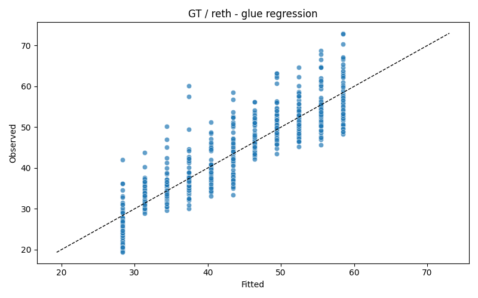

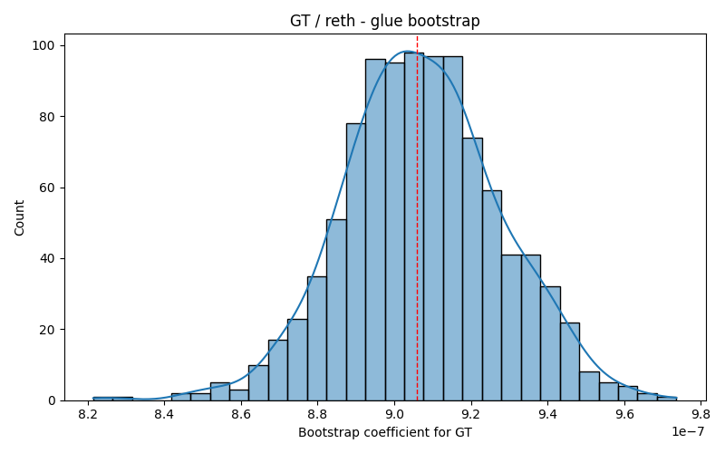

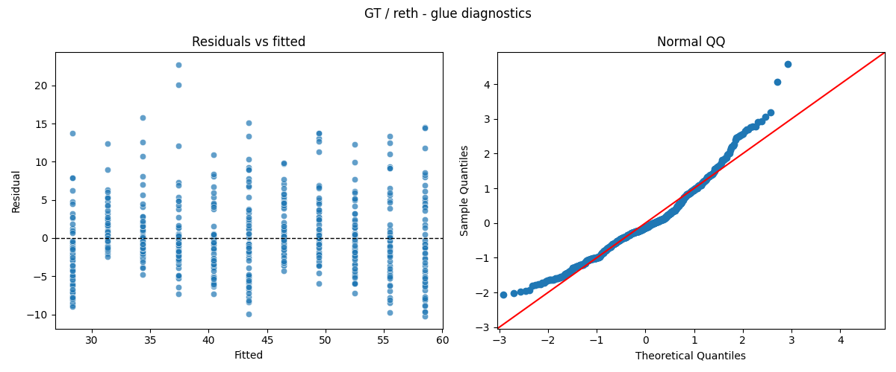

</details>

<details><summary><code>JUMPI</code> · nobs=583 · runtime_ms=1.268e-06 · p=1.00e-03 · R²=0.6595</summary>

```
==============================================================================
                           NNLS Regression Results                            
==============================================================================
Dep. Variable:          test_runtime_ms              R-squared:          0.660
Model:                  NNLS                    Adj. R-squared:          0.659
No. Observations:       583                               RMSE:           4.11
Df Residuals:           581                                MAE:           3.13
Df Model:               1      
==============================================================================
                      coef     std err     P-value      [0.025      0.975]
------------------------------------------------------------------------------
         const     10.2223      0.5111       0.001      9.2610     11.1837
         JUMPI      0.0000      0.0000       0.001      0.0000      0.0000
==============================================================================
Notes: Non-negative least squares with bootstrap inference (1000 iterations)
==============================================================================
```

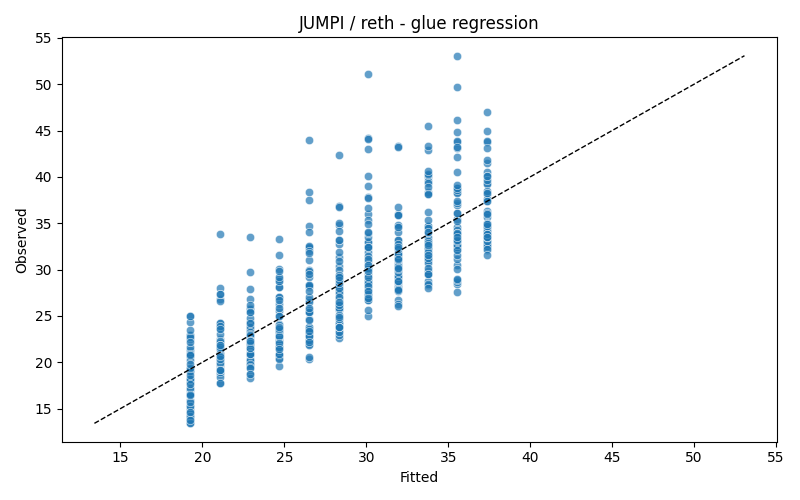

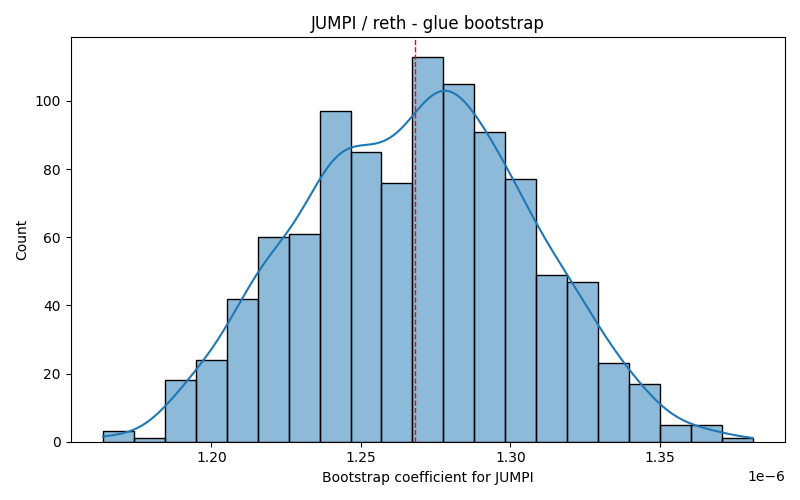

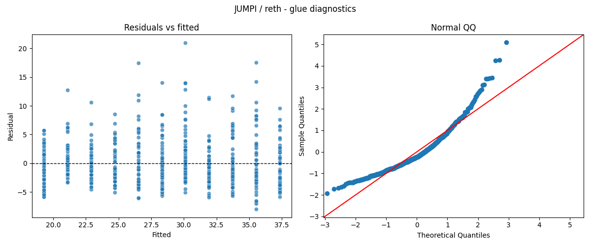

</details>

<details><summary><code>LT</code> · nobs=583 · runtime_ms=9.447e-07 · p=1.00e-03 · R²=0.7801</summary>

```
==============================================================================
                           NNLS Regression Results                            
==============================================================================
Dep. Variable:          test_runtime_ms              R-squared:          0.780
Model:                  NNLS                    Adj. R-squared:          0.780
No. Observations:       583                               RMSE:           5.28
Df Residuals:           581                                MAE:           4.02
Df Model:               1      
==============================================================================
                      coef     std err     P-value      [0.025      0.975]
------------------------------------------------------------------------------
         const     11.7252      0.7129       0.001     10.4069     13.1905
            LT      0.0000      0.0000       0.001      0.0000      0.0000
==============================================================================
Notes: Non-negative least squares with bootstrap inference (1000 iterations)
==============================================================================
```

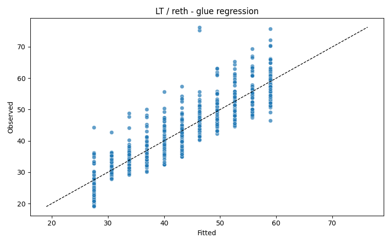

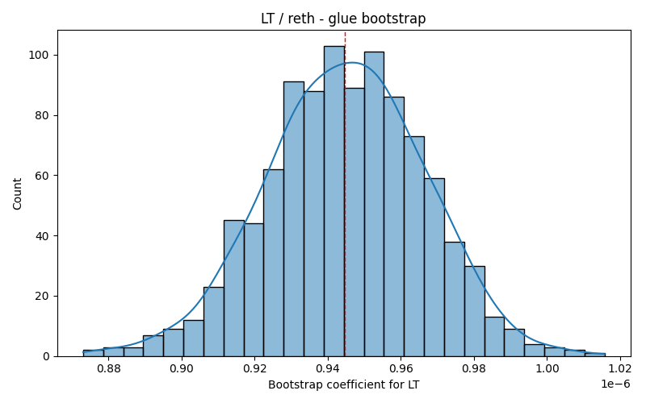

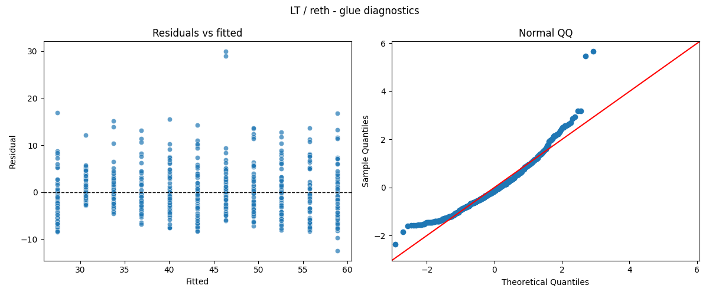

</details>

<details><summary><code>MSTORE</code> · nobs=2915 · runtime_ms=2.545e-06 · p=1.00e-03 · R²=0.3049</summary>

```
==============================================================================
                           NNLS Regression Results                            
==============================================================================
Dep. Variable:          test_runtime_ms              R-squared:          0.305
Model:                  NNLS                    Adj. R-squared:          0.305
No. Observations:       2915                              RMSE:          26.97
Df Residuals:           2913                               MAE:          23.95
Df Model:               1      
==============================================================================
                      coef     std err     P-value      [0.025      0.975]
------------------------------------------------------------------------------
         const     20.8257      1.5077       0.001     17.8177     23.7993
        MSTORE      0.0000      0.0000       0.001      0.0000      0.0000
==============================================================================
Notes: Non-negative least squares with bootstrap inference (1000 iterations)
==============================================================================
```

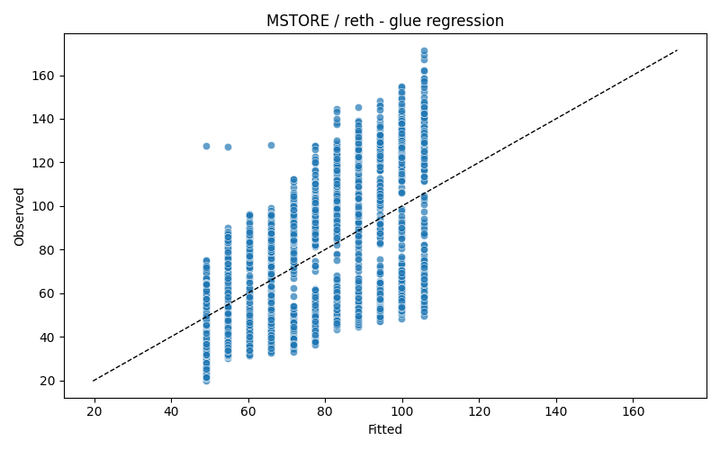

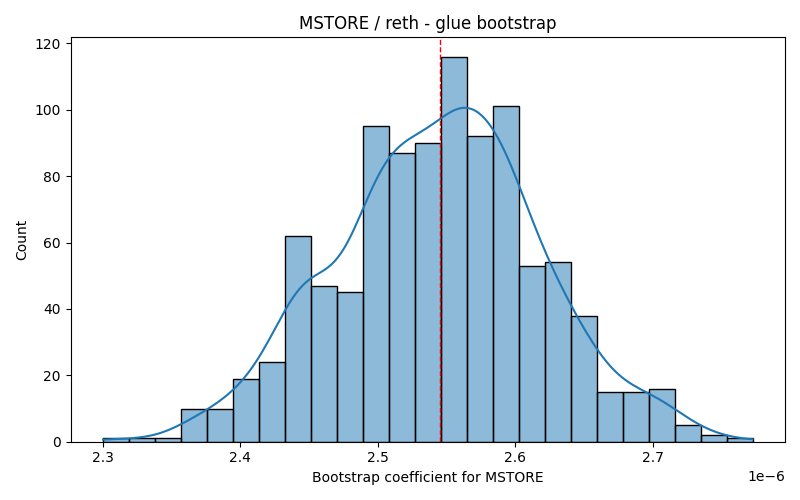

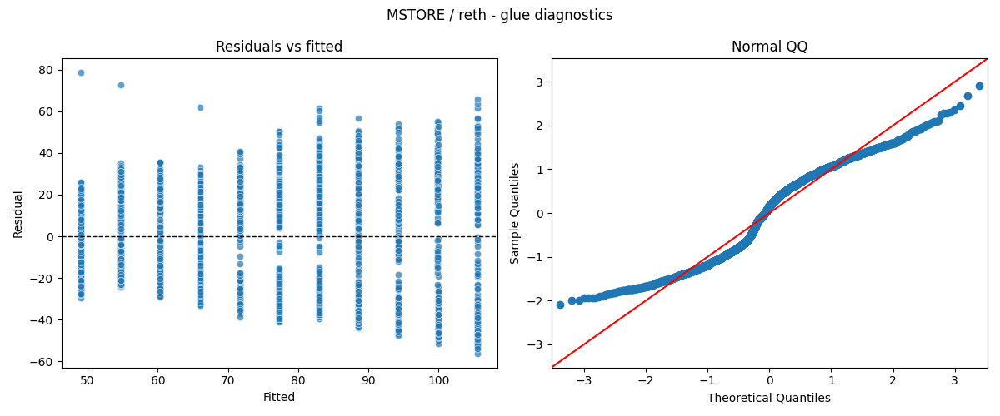

</details>

<details><summary><code>MSTORE8</code> · nobs=2915 · runtime_ms=1.344e-06 · p=1.00e-03 · R²=0.6383</summary>

```
==============================================================================
                           NNLS Regression Results                            
==============================================================================
Dep. Variable:          test_runtime_ms              R-squared:          0.638
Model:                  NNLS                    Adj. R-squared:          0.638
No. Observations:       2915                              RMSE:           7.10
Df Residuals:           2913                               MAE:           4.38
Df Model:               1      
==============================================================================
                      coef     std err     P-value      [0.025      0.975]
------------------------------------------------------------------------------
         const     13.8470      0.4458       0.001     12.9871     14.6697
       MSTORE8      0.0000      0.0000       0.001      0.0000      0.0000
==============================================================================
Notes: Non-negative least squares with bootstrap inference (1000 iterations)
==============================================================================
```

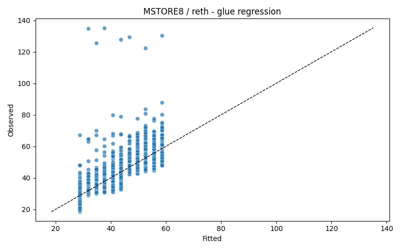

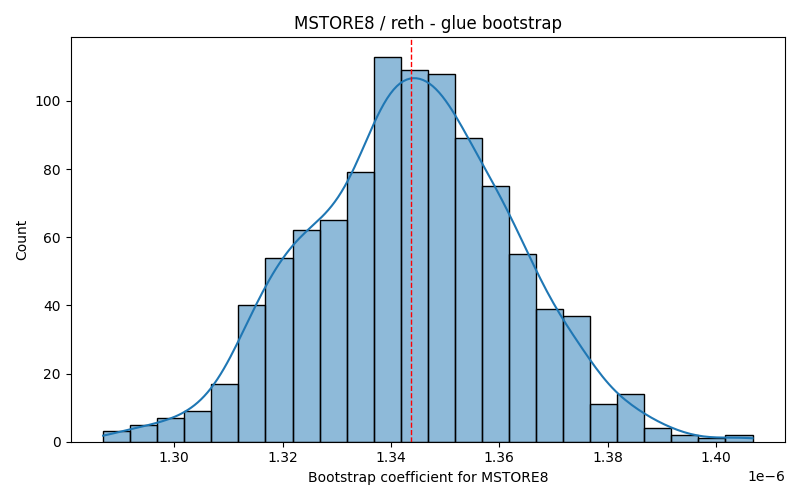

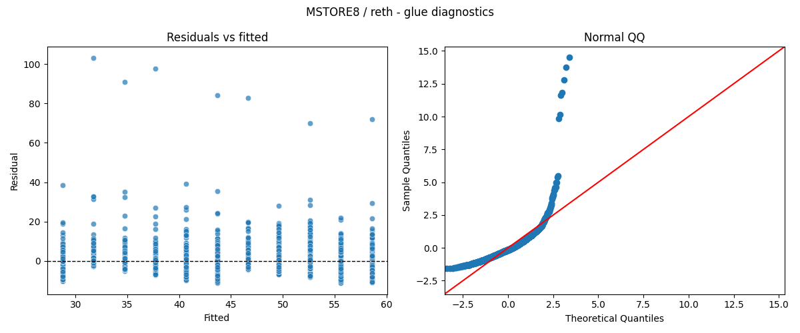

</details>

<details><summary><code>MUL</code> · nobs=583 · runtime_ms=1.105e-06 · p=1.00e-03 · R²=0.655</summary>

```
==============================================================================
                           NNLS Regression Results                            
==============================================================================
Dep. Variable:          test_runtime_ms              R-squared:          0.655
Model:                  NNLS                    Adj. R-squared:          0.654
No. Observations:       583                               RMSE:           6.33
Df Residuals:           581                                MAE:           4.11
Df Model:               1      
==============================================================================
                      coef     std err     P-value      [0.025      0.975]
------------------------------------------------------------------------------
         const     13.1869      0.8629       0.001     11.5623     14.8354
           MUL      0.0000      0.0000       0.001      0.0000      0.0000
==============================================================================
Notes: Non-negative least squares with bootstrap inference (1000 iterations)
==============================================================================
```

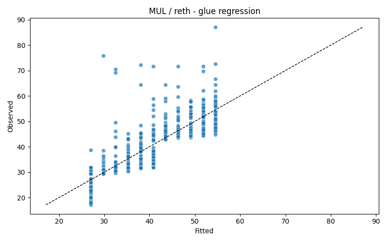

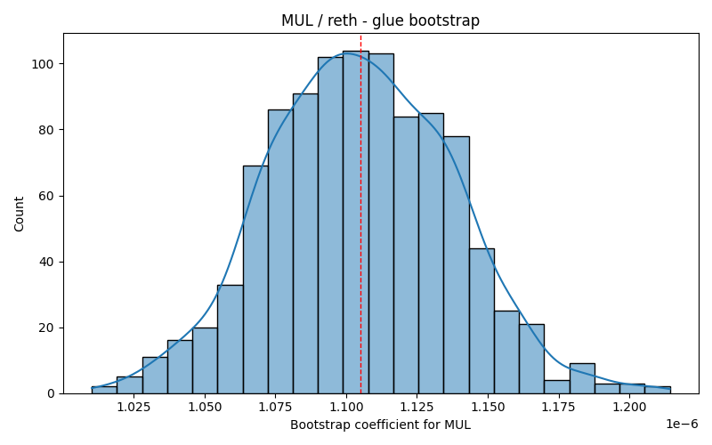

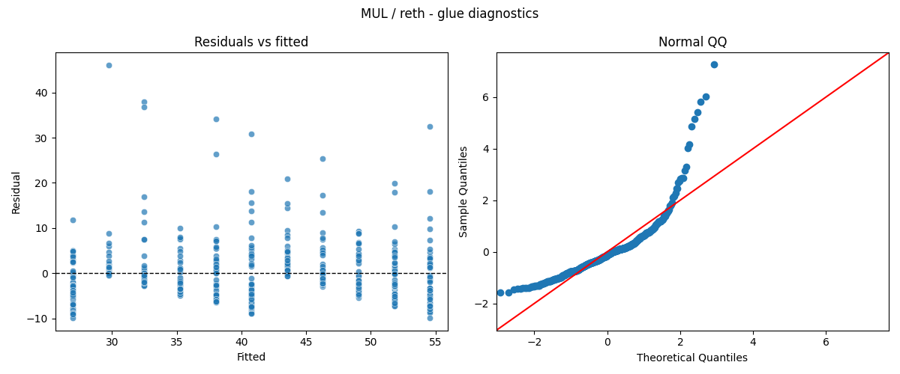

</details>

<details><summary><code>PC</code> · nobs=583 · runtime_ms=6.32e-07 · p=1.00e-03 · R²=0.9004</summary>

```
==============================================================================
                           NNLS Regression Results                            
==============================================================================
Dep. Variable:          test_runtime_ms              R-squared:          0.900
Model:                  NNLS                    Adj. R-squared:          0.900
No. Observations:       583                               RMSE:           6.29
Df Residuals:           581                                MAE:           4.96
Df Model:               1      
==============================================================================
                      coef     std err     P-value      [0.025      0.975]
------------------------------------------------------------------------------
         const     15.1598      0.8275       0.001     13.5563     16.8355
            PC      0.0000      0.0000       0.001      0.0000      0.0000
==============================================================================
Notes: Non-negative least squares with bootstrap inference (1000 iterations)
==============================================================================
```

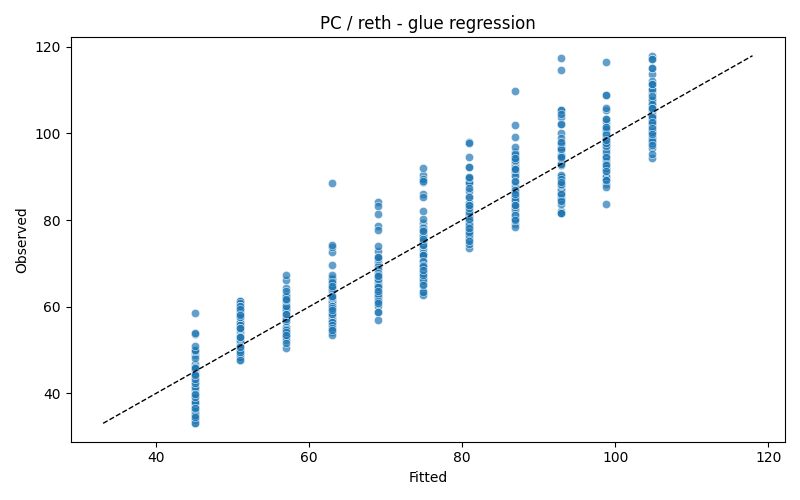

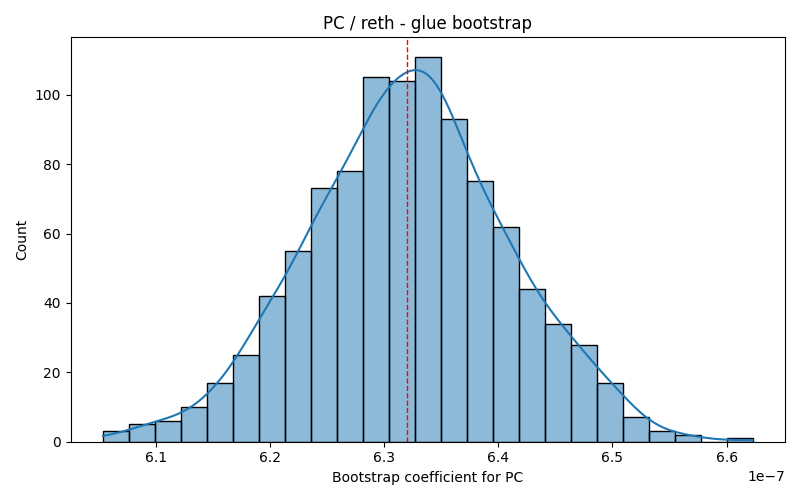

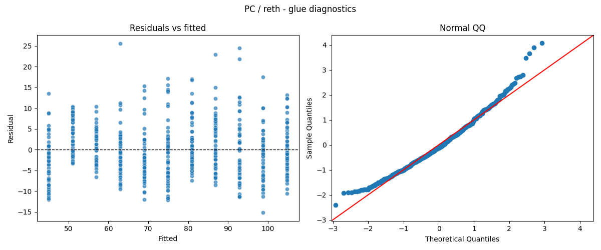

</details>

<details><summary><code>RETURNDATASIZE</code> · nobs=2332 · runtime_ms=7.981e-07 · p=1.00e-03 · R²=0.8328</summary>

```
==============================================================================
                           NNLS Regression Results                            
==============================================================================
Dep. Variable:          test_runtime_ms              R-squared:          0.833
Model:                  NNLS                    Adj. R-squared:          0.833
No. Observations:       2332                              RMSE:           5.65
Df Residuals:           2330                               MAE:           4.37
Df Model:               1      
==============================================================================
                      coef     std err     P-value      [0.025      0.975]
------------------------------------------------------------------------------
         const     16.0850      0.3879       0.001     15.3286     16.8086
RETURNDATASIZE      0.0000      0.0000       0.001      0.0000      0.0000
==============================================================================
Notes: Non-negative least squares with bootstrap inference (1000 iterations)
==============================================================================
```

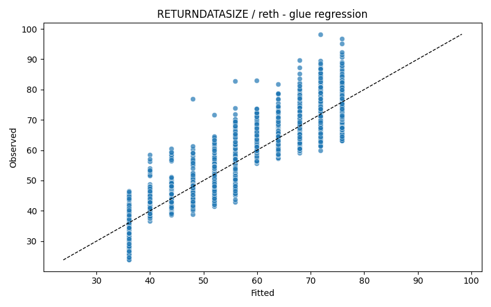

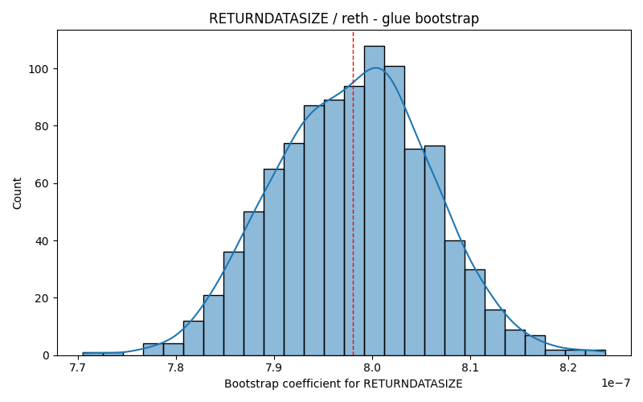

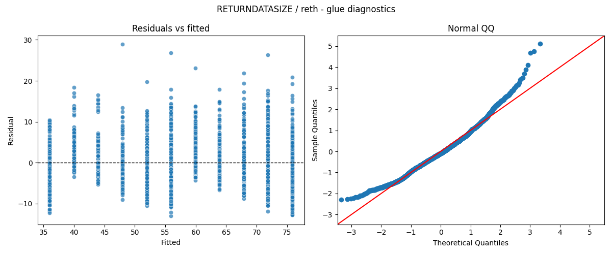

</details>

<details><summary><code>SELFBALANCE</code> · nobs=477 · runtime_ms=3.732e-06 · p=1.00e-03 · R²=0.7773</summary>

```
==============================================================================
                           NNLS Regression Results                            
==============================================================================
Dep. Variable:          test_runtime_ms              R-squared:          0.777
Model:                  NNLS                    Adj. R-squared:          0.777
No. Observations:       477                               RMSE:          20.15
Df Residuals:           475                                MAE:          15.88
Df Model:               1      
==============================================================================
                      coef     std err     P-value      [0.025      0.975]
------------------------------------------------------------------------------
         const     63.8765      3.7659       0.001     56.3903     71.1744
   SELFBALANCE      0.0000      0.0000       0.001      0.0000      0.0000
==============================================================================
Notes: Non-negative least squares with bootstrap inference (1000 iterations)
==============================================================================
```

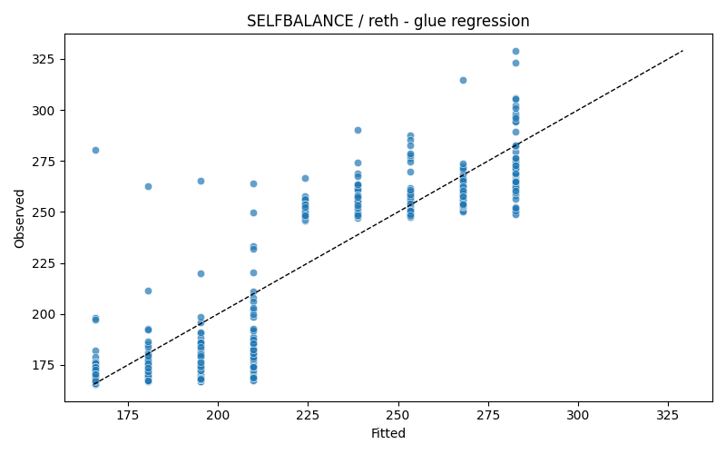

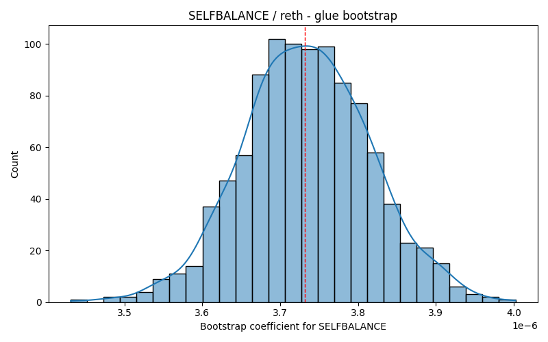

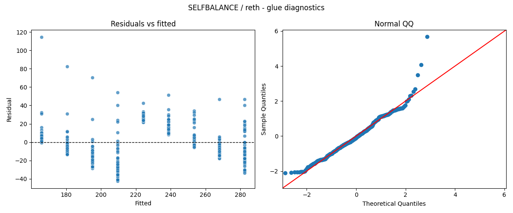

</details>

<details><summary><code>SUB</code> · nobs=583 · runtime_ms=8.246e-07 · p=1.00e-03 · R²=0.6197</summary>

```
==============================================================================
                           NNLS Regression Results                            
==============================================================================
Dep. Variable:          test_runtime_ms              R-squared:          0.620
Model:                  NNLS                    Adj. R-squared:          0.619
No. Observations:       583                               RMSE:           6.80
Df Residuals:           581                                MAE:           4.06
Df Model:               1      
==============================================================================
                      coef     std err     P-value      [0.025      0.975]
------------------------------------------------------------------------------
         const     12.9784      0.8290       0.001     11.4016     14.7711
           SUB      0.0000      0.0000       0.001      0.0000      0.0000
==============================================================================
Notes: Non-negative least squares with bootstrap inference (1000 iterations)
==============================================================================
```

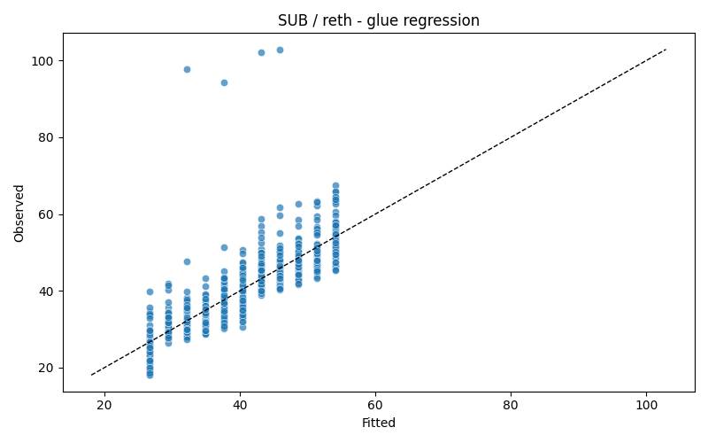

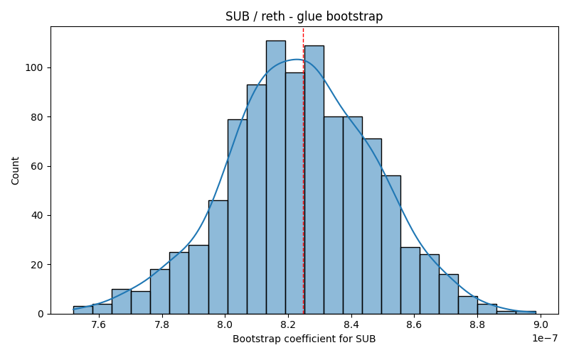

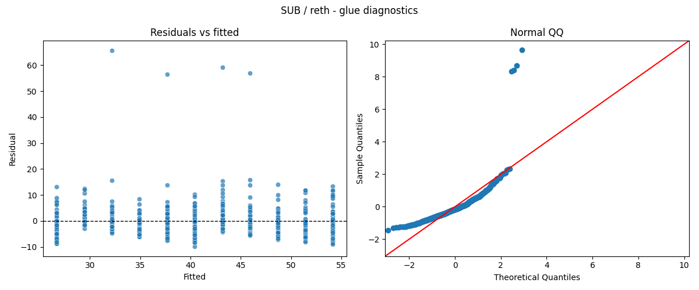

</details>

### Mixed glue (tier B) · reth

<details><summary><code>JUMP</code> · nobs=583 · runtime_ms=2.244e-06 · p=1.00e-03 · R²=0.7516</summary>

```
==============================================================================
                           NNLS Regression Results                            
==============================================================================
Dep. Variable:          test_runtime_ms              R-squared:          0.752
Model:                  NNLS                    Adj. R-squared:          0.751
No. Observations:       583                               RMSE:           4.79
Df Residuals:           581                                MAE:           3.62
Df Model:               1      
==============================================================================
                      coef     std err     P-value      [0.025      0.975]
------------------------------------------------------------------------------
         const     11.4981      0.6840       0.001     10.1689     12.7212
          JUMP      0.0000      0.0000       0.001      0.0000      0.0000
==============================================================================
Notes: Non-negative least squares with bootstrap inference (1000 iterations)
==============================================================================
```

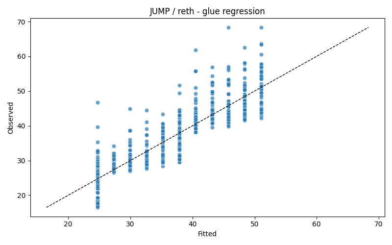

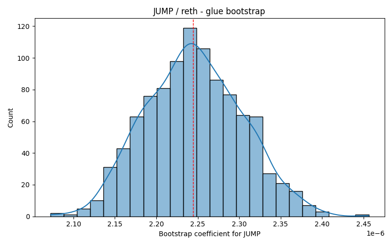

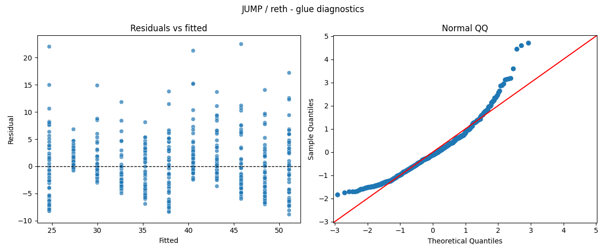

</details>

<details><summary><code>KECCAK256</code> · nobs=9328 · runtime_ms=0 · p=1.00e+00 · R²=0</summary>

```
==============================================================================
                           NNLS Regression Results                            
==============================================================================
Dep. Variable:          test_runtime_ms              R-squared:          0.000
Model:                  NNLS                    Adj. R-squared:         -0.000
No. Observations:       9328                              RMSE:         158.07
Df Residuals:           9326                               MAE:         133.33
Df Model:               1      
==============================================================================
                      coef     std err     P-value      [0.025      0.975]
------------------------------------------------------------------------------
         const    251.4002      1.6733       0.001    247.9588    254.6054
     KECCAK256      0.0000      0.0000       1.000      0.0000      0.0000
==============================================================================
Notes: Non-negative least squares with bootstrap inference (1000 iterations)
==============================================================================
```

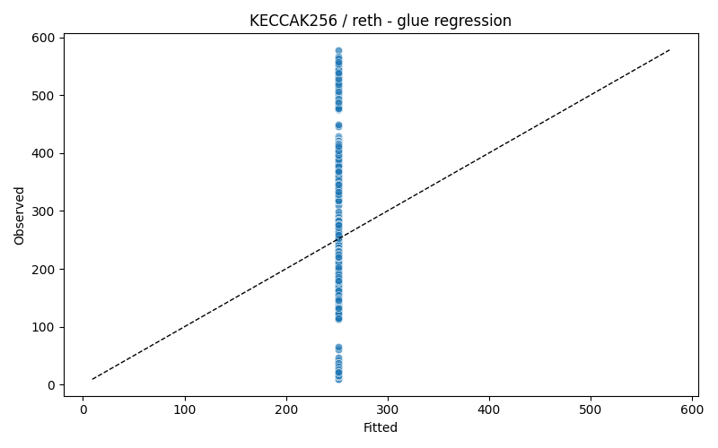


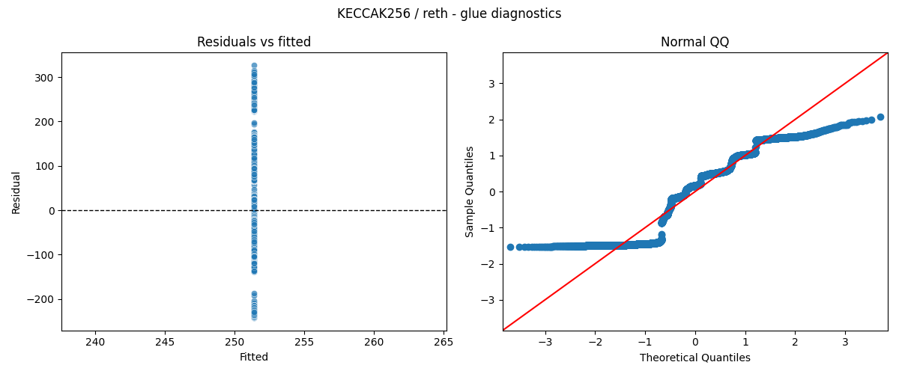

</details>
