# Runtime estimation report

Per-spec NNLS fits of `test_runtime_ms` against `opcount`, one row per (target opcode, test, model_by combo, client).

## Contents

- [SLOAD](#sload)
- [SSTORE](#sstore)
- [BALANCE](#balance)
- [CALL](#call)
- [CALLCODE](#callcode)
- [DELEGATECALL](#delegatecall)
- [EXTCODECOPY](#extcodecopy)
- [EXTCODEHASH](#extcodehash)
- [EXTCODESIZE](#extcodesize)
- [STATICCALL](#staticcall)

## SLOAD

### test_sload_bloated — combo `False`

| client | nobs | R² | target_coef (ms) | p-value | 95% CI |
| --- | --- | --- | --- | --- | --- |
| `besu` | 407 | 0.9279 | 0.007935 | 1.00e-03 | [0.007721, 0.00815] |
| `erigon` | 165 | 0.9696 | 0.005909 | 1.00e-03 | [0.005757, 0.006008] |
| `ethrex` | 275 | 0.9076 | 0.008583 | 1.00e-03 | [0.008452, 0.008716] |
| `geth` | 242 | 0.969 | 0.0243 | 1.00e-03 | [0.02366, 0.02485] |
| `nethermind` | 198 | 0.8475 | 0.003422 | 1.00e-03 | [0.003209, 0.00366] |
| `reth` | 308 | 0.9553 | 0.001296 | 1.00e-03 | [0.001263, 0.00133] |

<details><summary>besu — NNLS regression summary</summary>

```
==============================================================================
                           NNLS Regression Results                            
==============================================================================
Dep. Variable:          test_runtime_ms              R-squared:          0.928
Model:                  NNLS                    Adj. R-squared:          0.928
No. Observations:       407                               RMSE:          65.09
Df Residuals:           405                                MAE:          53.82
Df Model:               1      
==============================================================================
                      coef     std err     P-value      [0.025      0.975]
------------------------------------------------------------------------------
         const    114.0151      9.4806       0.001     95.6536    132.2719
       opcount      0.0079      0.0001       0.001      0.0077      0.0082
==============================================================================
Notes: Non-negative least squares with bootstrap inference (1000 iterations)
==============================================================================
```

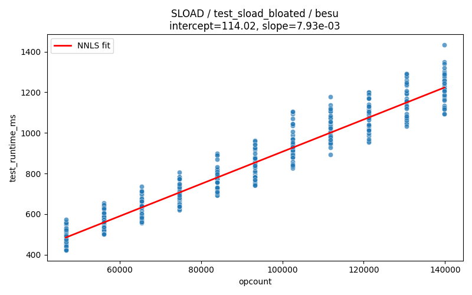

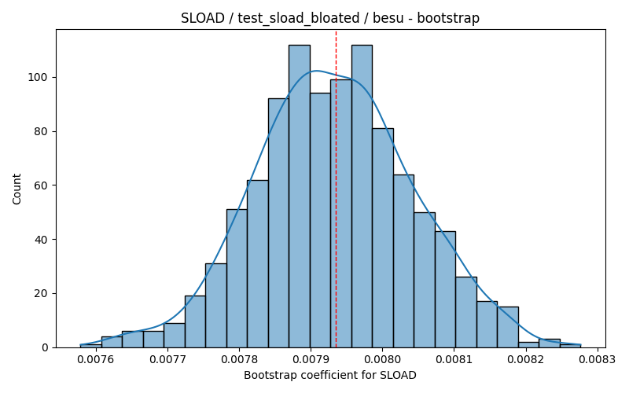

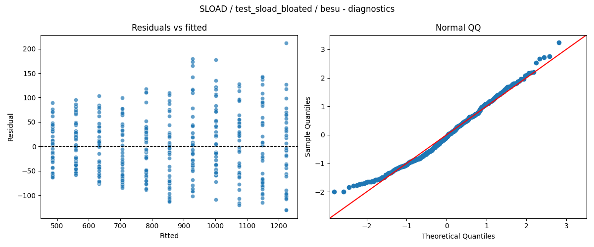

</details>

<details><summary>erigon — NNLS regression summary</summary>

```
==============================================================================
                           NNLS Regression Results                            
==============================================================================
Dep. Variable:          test_runtime_ms              R-squared:          0.970
Model:                  NNLS                    Adj. R-squared:          0.969
No. Observations:       165                               RMSE:          30.79
Df Residuals:           163                                MAE:          24.23
Df Model:               1      
==============================================================================
                      coef     std err     P-value      [0.025      0.975]
------------------------------------------------------------------------------
         const      4.6472      5.6224       0.259      0.0000     17.9432
       opcount      0.0059      0.0001       0.001      0.0058      0.0060
==============================================================================
Notes: Non-negative least squares with bootstrap inference (1000 iterations)
==============================================================================
```

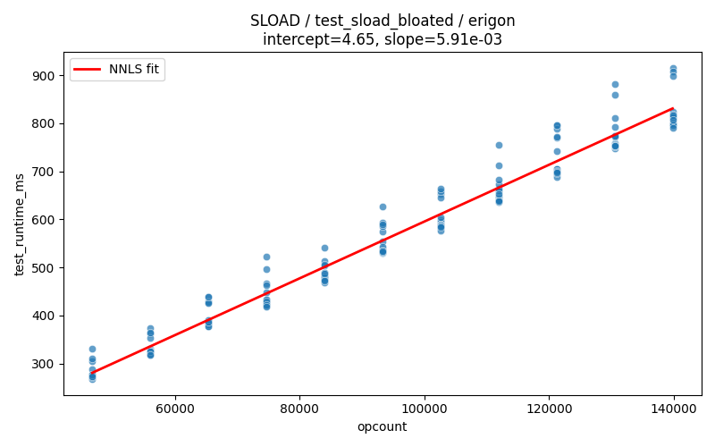

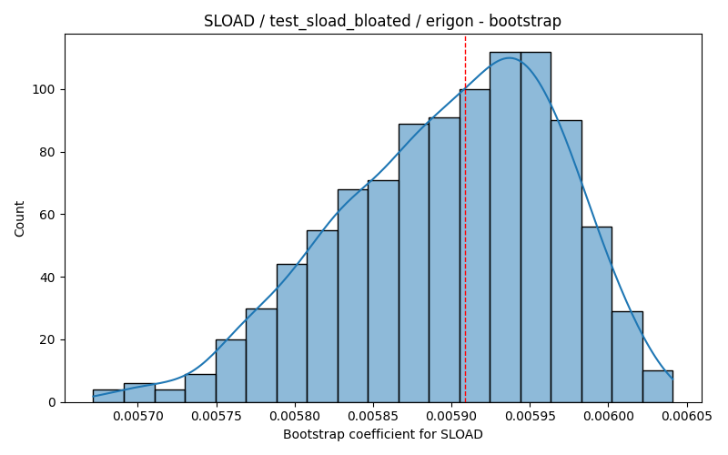

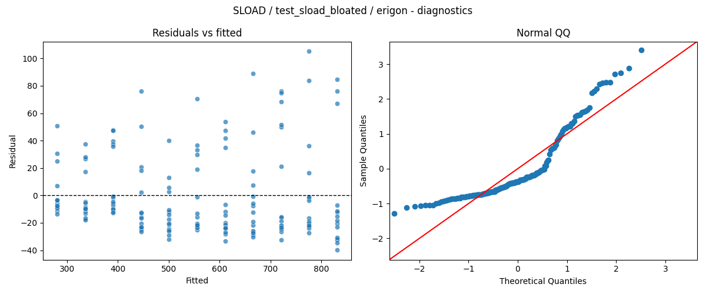

</details>

<details><summary>ethrex — NNLS regression summary</summary>

```
==============================================================================
                           NNLS Regression Results                            
==============================================================================
Dep. Variable:          test_runtime_ms              R-squared:          0.908
Model:                  NNLS                    Adj. R-squared:          0.907
No. Observations:       275                               RMSE:         104.05
Df Residuals:           273                                MAE:          90.75
Df Model:               1      
==============================================================================
                      coef     std err     P-value      [0.025      0.975]
------------------------------------------------------------------------------
         const      0.0000      0.0000       1.000      0.0000      0.0000
       opcount      0.0086      0.0001       0.001      0.0085      0.0087
==============================================================================
Notes: Non-negative least squares with bootstrap inference (1000 iterations)
==============================================================================
```

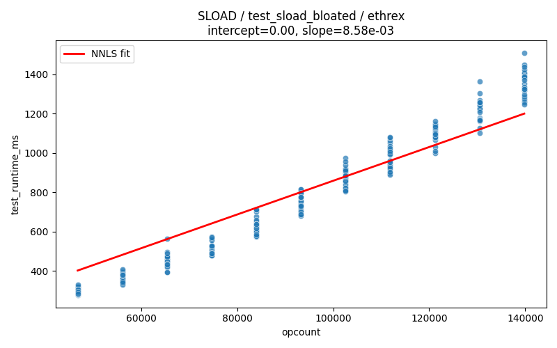

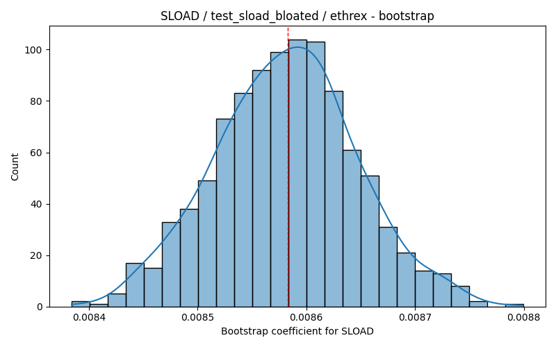

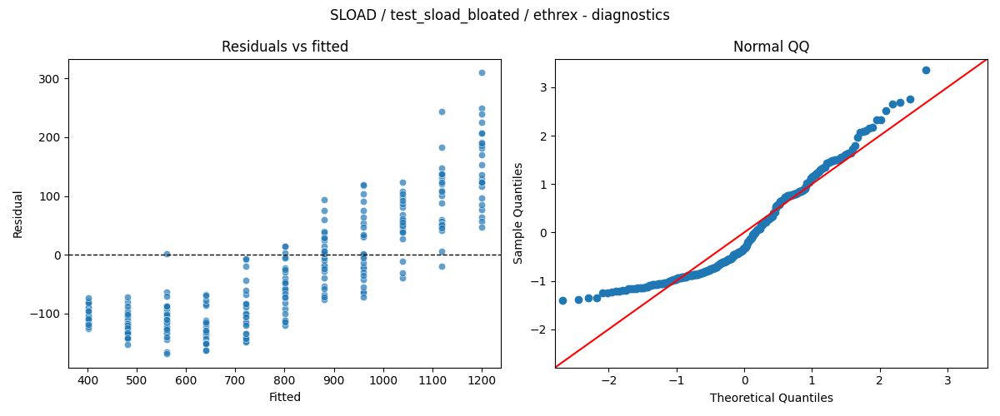

</details>

<details><summary>geth — NNLS regression summary</summary>

```
==============================================================================
                           NNLS Regression Results                            
==============================================================================
Dep. Variable:          test_runtime_ms              R-squared:          0.969
Model:                  NNLS                    Adj. R-squared:          0.969
No. Observations:       242                               RMSE:         127.87
Df Residuals:           240                                MAE:         104.25
Df Model:               1      
==============================================================================
                      coef     std err     P-value      [0.025      0.975]
------------------------------------------------------------------------------
         const    535.6826     27.3155       0.001    487.0544    592.0714
       opcount      0.0243      0.0003       0.001      0.0237      0.0249
==============================================================================
Notes: Non-negative least squares with bootstrap inference (1000 iterations)
==============================================================================
```


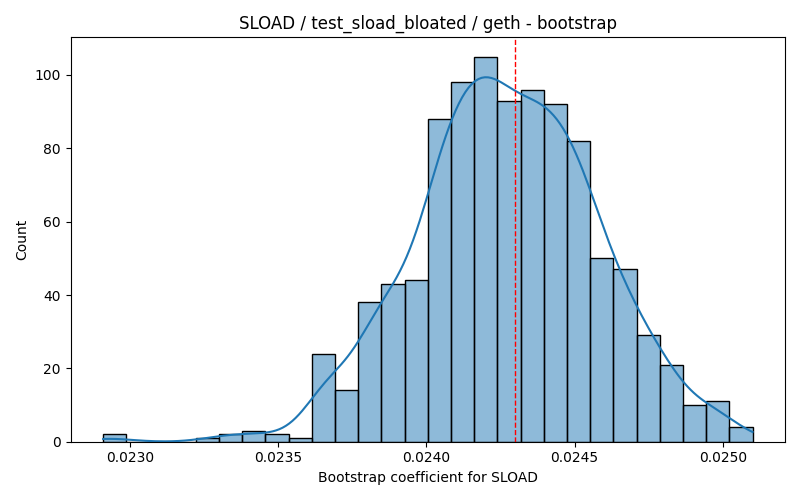

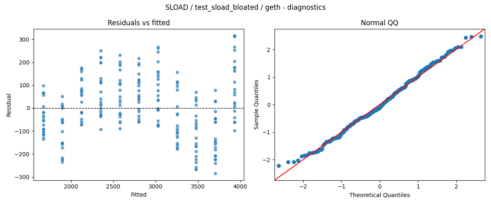

</details>

<details><summary>nethermind — NNLS regression summary</summary>

```
==============================================================================
                           NNLS Regression Results                            
==============================================================================
Dep. Variable:          test_runtime_ms              R-squared:          0.847
Model:                  NNLS                    Adj. R-squared:          0.847
No. Observations:       198                               RMSE:          42.73
Df Residuals:           196                                MAE:          28.13
Df Model:               1      
==============================================================================
                      coef     std err     P-value      [0.025      0.975]
------------------------------------------------------------------------------
         const     54.9626      9.9513       0.001     35.7717     73.6111
       opcount      0.0034      0.0001       0.001      0.0032      0.0037
==============================================================================
Notes: Non-negative least squares with bootstrap inference (1000 iterations)
==============================================================================
```

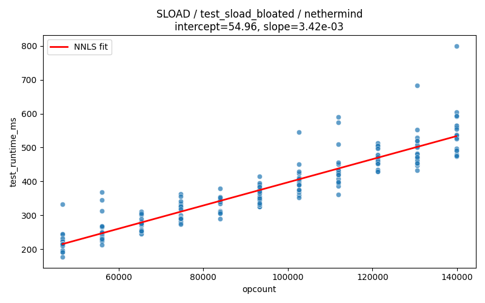

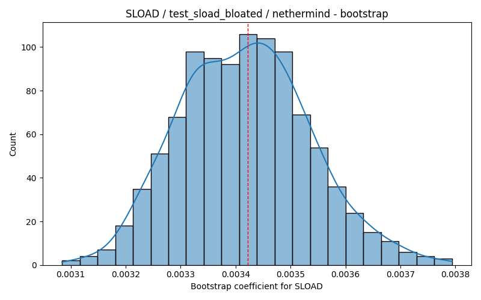

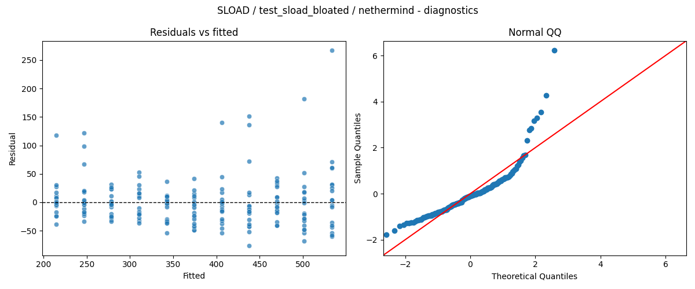

</details>

<details><summary>reth — NNLS regression summary</summary>

```
==============================================================================
                           NNLS Regression Results                            
==============================================================================
Dep. Variable:          test_runtime_ms              R-squared:          0.955
Model:                  NNLS                    Adj. R-squared:          0.955
No. Observations:       308                               RMSE:           8.25
Df Residuals:           306                                MAE:           6.60
Df Model:               1      
==============================================================================
                      coef     std err     P-value      [0.025      0.975]
------------------------------------------------------------------------------
         const     36.8589      1.5239       0.001     33.7977     39.9115
       opcount      0.0013      0.0000       0.001      0.0013      0.0013
==============================================================================
Notes: Non-negative least squares with bootstrap inference (1000 iterations)
==============================================================================
```

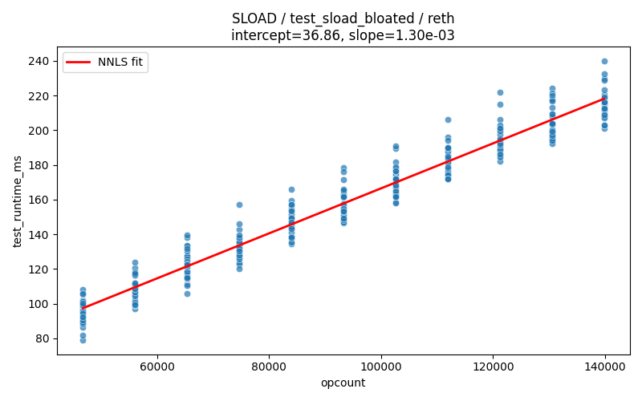

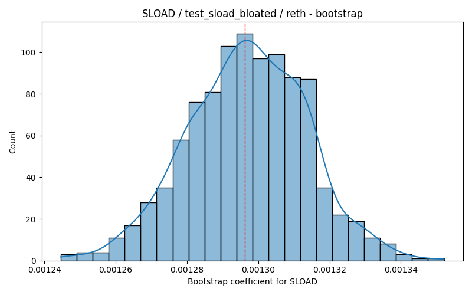

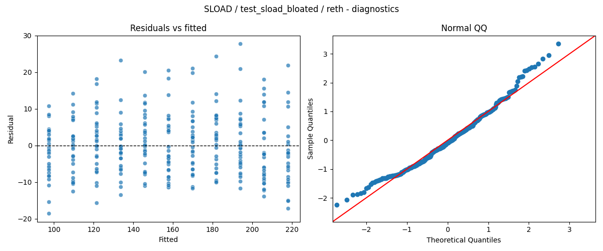

</details>

### test_sload_bloated — combo `True`

| client | nobs | R² | target_coef (ms) | p-value | 95% CI |
| --- | --- | --- | --- | --- | --- |
| `besu` | 407 | 0.958 | 0.01512 | 1.00e-03 | [0.01477, 0.01547] |
| `erigon` | 165 | 0.9708 | 0.005343 | 1.00e-03 | [0.005226, 0.005394] |
| `ethrex` | 275 | 0.9561 | 0.01267 | 1.00e-03 | [0.01255, 0.01278] |
| `geth` | 242 | 0.9661 | 0.02368 | 1.00e-03 | [0.02307, 0.02425] |
| `nethermind` | 198 | 0.9768 | 0.009045 | 1.00e-03 | [0.008856, 0.009223] |
| `reth` | 308 | 0.9577 | 0.001489 | 1.00e-03 | [0.001458, 0.001524] |

<details><summary>besu — NNLS regression summary</summary>

```
==============================================================================
                           NNLS Regression Results                            
==============================================================================
Dep. Variable:          test_runtime_ms              R-squared:          0.958
Model:                  NNLS                    Adj. R-squared:          0.958
No. Observations:       407                               RMSE:          93.19
Df Residuals:           405                                MAE:          80.17
Df Model:               1      
==============================================================================
                      coef     std err     P-value      [0.025      0.975]
------------------------------------------------------------------------------
         const    327.7543     14.3044       0.001    299.7570    354.7635
       opcount      0.0151      0.0002       0.001      0.0148      0.0155
==============================================================================
Notes: Non-negative least squares with bootstrap inference (1000 iterations)
==============================================================================
```

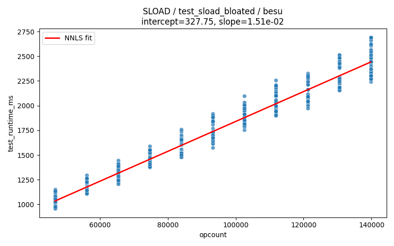

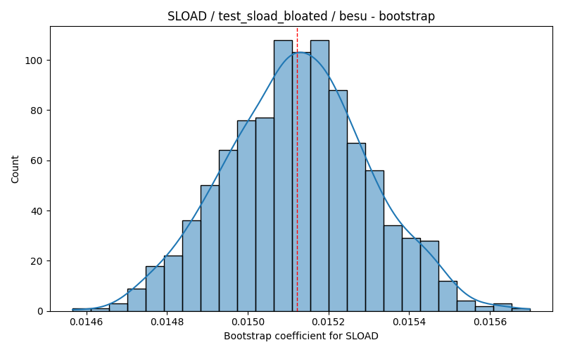

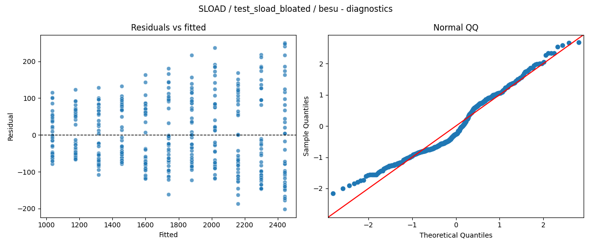

</details>

<details><summary>erigon — NNLS regression summary</summary>

```
==============================================================================
                           NNLS Regression Results                            
==============================================================================
Dep. Variable:          test_runtime_ms              R-squared:          0.971
Model:                  NNLS                    Adj. R-squared:          0.971
No. Observations:       165                               RMSE:          27.40
Df Residuals:           163                                MAE:          21.69
Df Model:               1      
==============================================================================
                      coef     std err     P-value      [0.025      0.975]
------------------------------------------------------------------------------
         const      0.0000      2.6809       1.000      0.0000      9.5767
       opcount      0.0053      0.0000       0.001      0.0052      0.0054
==============================================================================
Notes: Non-negative least squares with bootstrap inference (1000 iterations)
==============================================================================
```

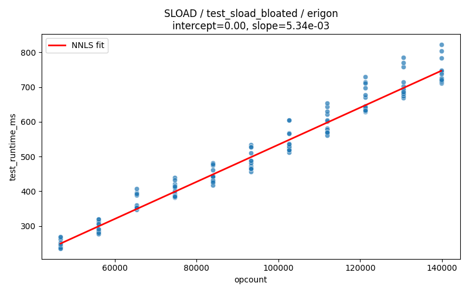

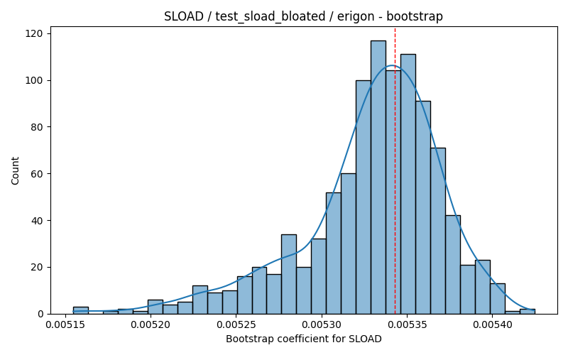

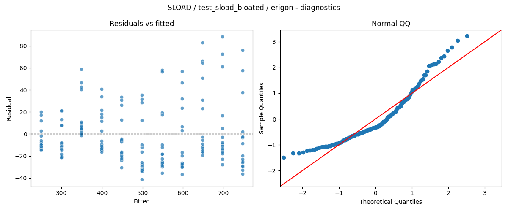

</details>

<details><summary>ethrex — NNLS regression summary</summary>

```
==============================================================================
                           NNLS Regression Results                            
==============================================================================
Dep. Variable:          test_runtime_ms              R-squared:          0.956
Model:                  NNLS                    Adj. R-squared:          0.956
No. Observations:       275                               RMSE:          94.32
Df Residuals:           273                                MAE:          81.48
Df Model:               1      
==============================================================================
                      coef     std err     P-value      [0.025      0.975]
------------------------------------------------------------------------------
         const      0.0000      0.0000       1.000      0.0000      0.0000
       opcount      0.0127      0.0001       0.001      0.0125      0.0128
==============================================================================
Notes: Non-negative least squares with bootstrap inference (1000 iterations)
==============================================================================
```

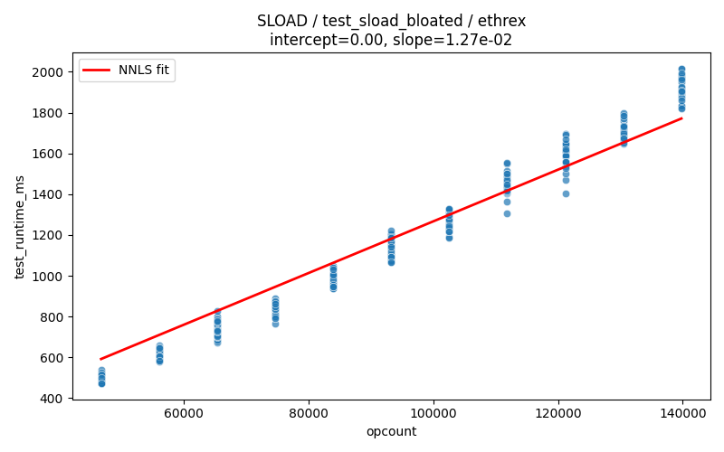

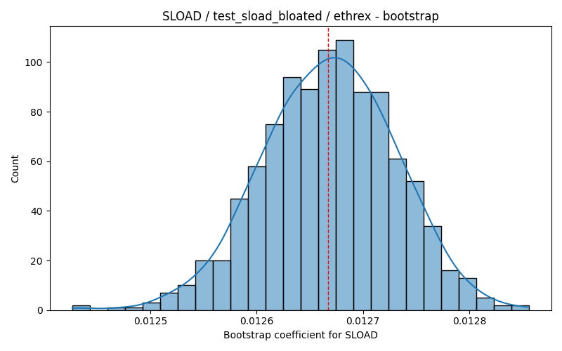

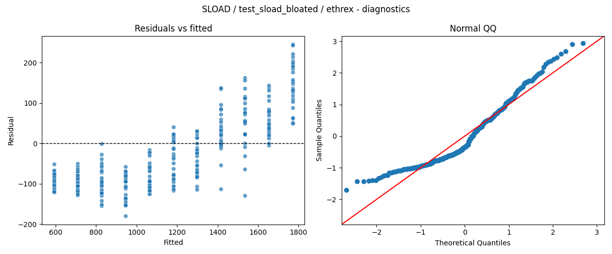

</details>

<details><summary>geth — NNLS regression summary</summary>

```
==============================================================================
                           NNLS Regression Results                            
==============================================================================
Dep. Variable:          test_runtime_ms              R-squared:          0.966
Model:                  NNLS                    Adj. R-squared:          0.966
No. Observations:       242                               RMSE:         130.59
Df Residuals:           240                                MAE:         105.06
Df Model:               1      
==============================================================================
                      coef     std err     P-value      [0.025      0.975]
------------------------------------------------------------------------------
         const    515.3866     26.4486       0.001    464.8911    568.0357
       opcount      0.0237      0.0003       0.001      0.0231      0.0242
==============================================================================
Notes: Non-negative least squares with bootstrap inference (1000 iterations)
==============================================================================
```

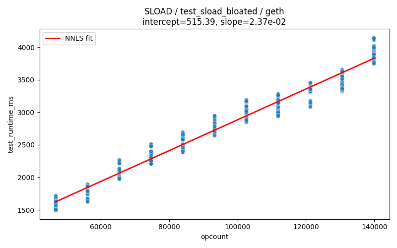

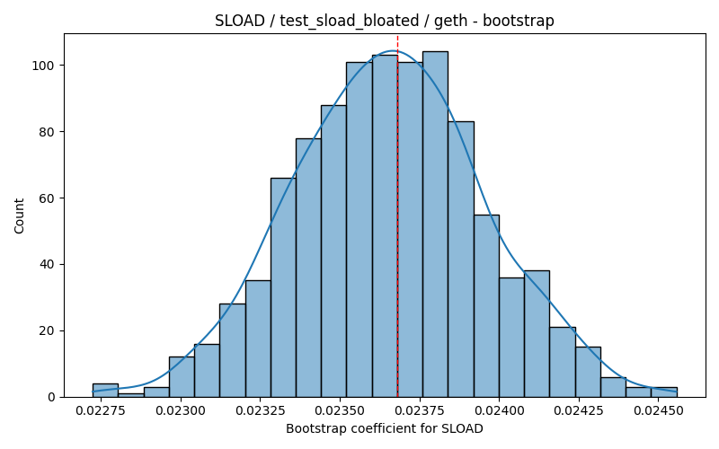

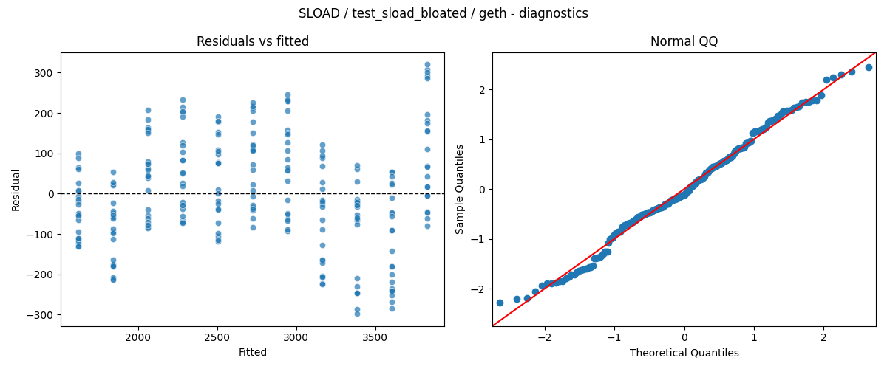

</details>

<details><summary>nethermind — NNLS regression summary</summary>

```
==============================================================================
                           NNLS Regression Results                            
==============================================================================
Dep. Variable:          test_runtime_ms              R-squared:          0.977
Model:                  NNLS                    Adj. R-squared:          0.977
No. Observations:       198                               RMSE:          41.02
Df Residuals:           196                                MAE:          32.10
Df Model:               1      
==============================================================================
                      coef     std err     P-value      [0.025      0.975]
------------------------------------------------------------------------------
         const     99.2816      7.7098       0.001     85.2635    115.4369
       opcount      0.0090      0.0001       0.001      0.0089      0.0092
==============================================================================
Notes: Non-negative least squares with bootstrap inference (1000 iterations)
==============================================================================
```

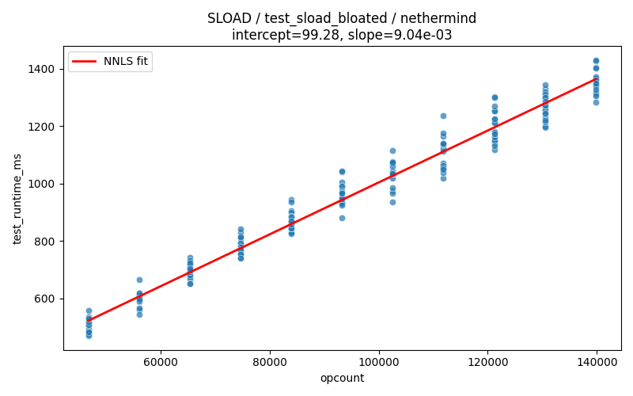

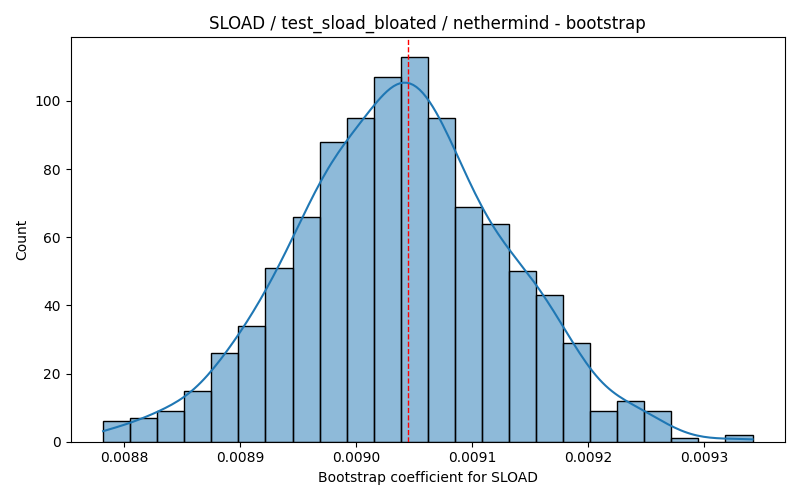

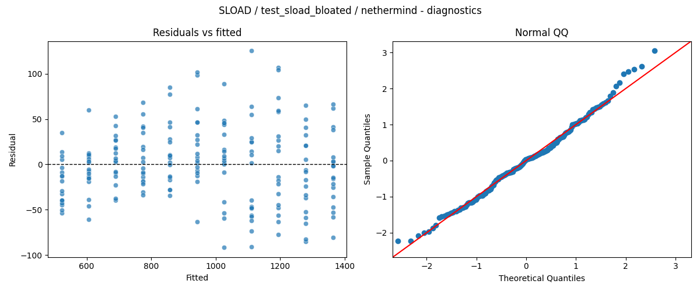

</details>

<details><summary>reth — NNLS regression summary</summary>

```
==============================================================================
                           NNLS Regression Results                            
==============================================================================
Dep. Variable:          test_runtime_ms              R-squared:          0.958
Model:                  NNLS                    Adj. R-squared:          0.958
No. Observations:       308                               RMSE:           9.21
Df Residuals:           306                                MAE:           7.15
Df Model:               1      
==============================================================================
                      coef     std err     P-value      [0.025      0.975]
------------------------------------------------------------------------------
         const     29.0824      1.5435       0.001     25.9774     32.0321
       opcount      0.0015      0.0000       0.001      0.0015      0.0015
==============================================================================
Notes: Non-negative least squares with bootstrap inference (1000 iterations)
==============================================================================
```

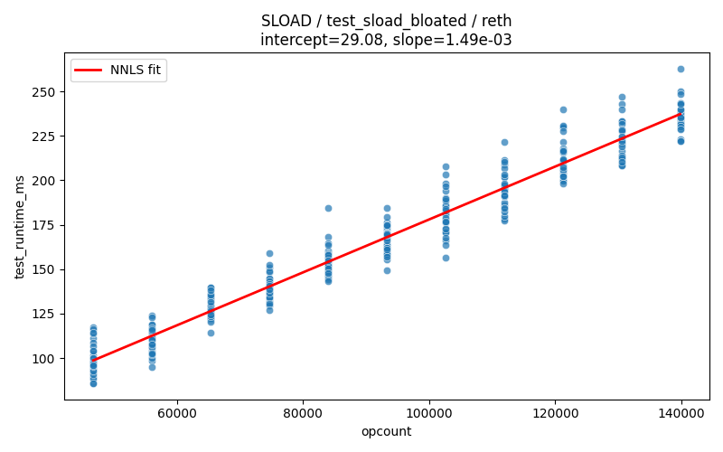

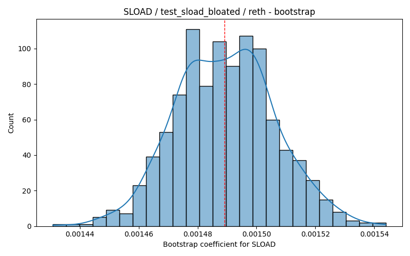

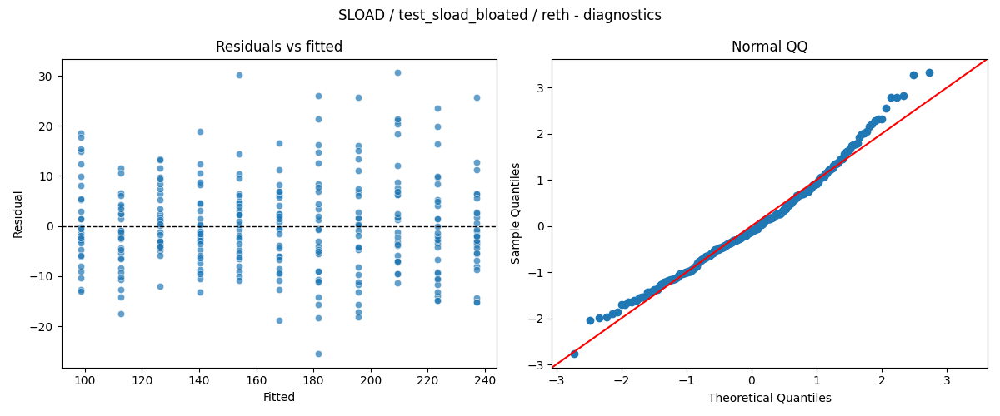

</details>

### test_storage_sload_same_key_benchmark

| client | nobs | R² | target_coef (ms) | p-value | 95% CI |
| --- | --- | --- | --- | --- | --- |
| `besu` | 814 | 0.6544 | 0.0002486 | 1.00e-03 | [0.0002363, 0.0002599] |
| `erigon` | 330 | 0.8999 | 4.737e-05 | 1.00e-03 | [4.549e-05, 4.922e-05] |
| `ethrex` | 550 | 0.8132 | 2.489e-05 | 1.00e-03 | [2.397e-05, 2.582e-05] |
| `geth` | 484 | 0.8261 | 4.254e-05 | 1.00e-03 | [4.082e-05, 4.429e-05] |
| `nethermind` | 396 | 0.8219 | 0.0001536 | 1.00e-03 | [0.0001458, 0.0001608] |
| `reth` | 616 | 0.4322 | 8.025e-06 | 1.00e-03 | [7.348e-06, 8.676e-06] |

<details><summary>besu — NNLS regression summary</summary>

```
==============================================================================
                           NNLS Regression Results                            
==============================================================================
Dep. Variable:          test_runtime_ms              R-squared:          0.654
Model:                  NNLS                    Adj. R-squared:          0.654
No. Observations:       814                               RMSE:         114.11
Df Residuals:           812                                MAE:          92.98
Df Model:               1      
==============================================================================
                      coef     std err     P-value      [0.025      0.975]
------------------------------------------------------------------------------
         const    348.5814     12.3136       0.001    326.2518    374.3537
       opcount      0.0002      0.0000       0.001      0.0002      0.0003
==============================================================================
Notes: Non-negative least squares with bootstrap inference (1000 iterations)
==============================================================================
```

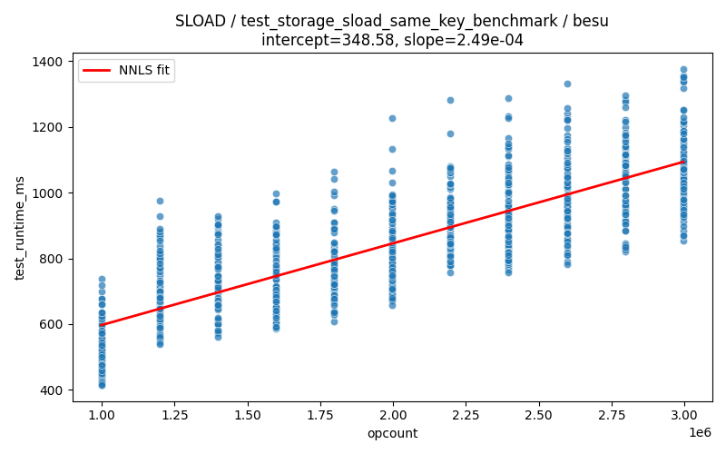

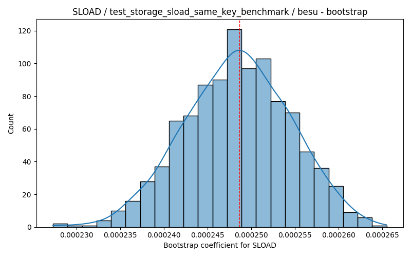

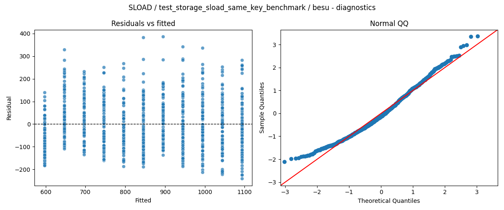

</details>

<details><summary>erigon — NNLS regression summary</summary>

```
==============================================================================
                           NNLS Regression Results                            
==============================================================================
Dep. Variable:          test_runtime_ms              R-squared:          0.900
Model:                  NNLS                    Adj. R-squared:          0.900
No. Observations:       330                               RMSE:           9.98
Df Residuals:           328                                MAE:           7.43
Df Model:               1      
==============================================================================
                      coef     std err     P-value      [0.025      0.975]
------------------------------------------------------------------------------
         const     20.6438      1.7724       0.001     17.1142     24.2436
       opcount      0.0000      0.0000       0.001      0.0000      0.0000
==============================================================================
Notes: Non-negative least squares with bootstrap inference (1000 iterations)
==============================================================================
```

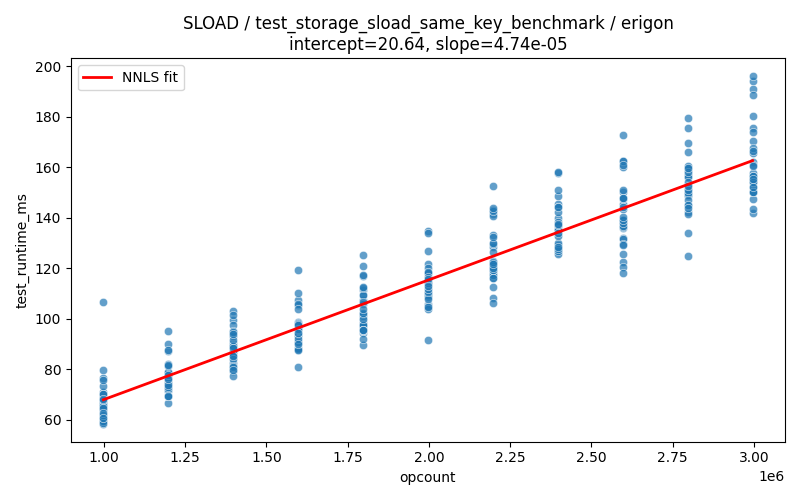

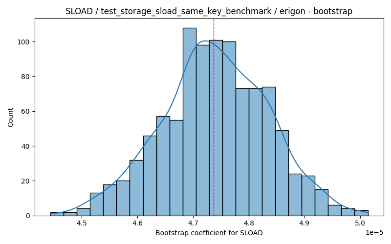

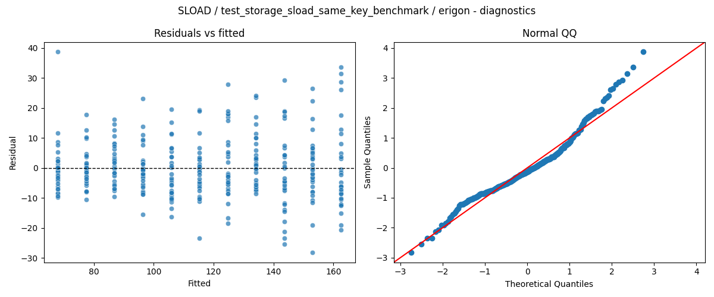

</details>

<details><summary>ethrex — NNLS regression summary</summary>

```
==============================================================================
                           NNLS Regression Results                            
==============================================================================
Dep. Variable:          test_runtime_ms              R-squared:          0.813
Model:                  NNLS                    Adj. R-squared:          0.813
No. Observations:       550                               RMSE:           7.53
Df Residuals:           548                                MAE:           5.87
Df Model:               1      
==============================================================================
                      coef     std err     P-value      [0.025      0.975]
------------------------------------------------------------------------------
         const     14.9186      0.9512       0.001     13.1530     16.7667
       opcount      0.0000      0.0000       0.001      0.0000      0.0000
==============================================================================
Notes: Non-negative least squares with bootstrap inference (1000 iterations)
==============================================================================
```

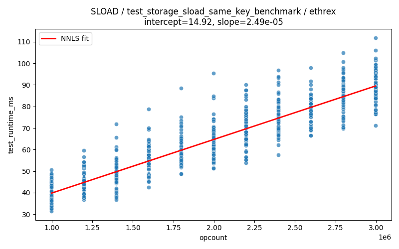

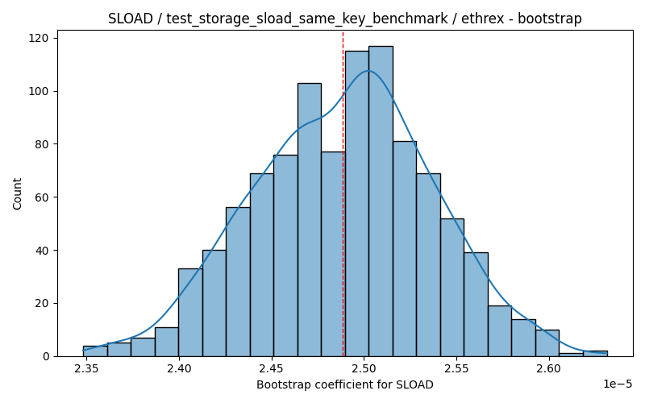

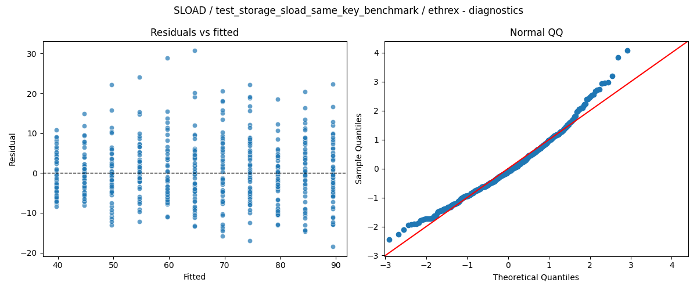

</details>

<details><summary>geth — NNLS regression summary</summary>

```
==============================================================================
                           NNLS Regression Results                            
==============================================================================
Dep. Variable:          test_runtime_ms              R-squared:          0.826
Model:                  NNLS                    Adj. R-squared:          0.826
No. Observations:       484                               RMSE:          12.33
Df Residuals:           482                                MAE:           9.28
Df Model:               1      
==============================================================================
                      coef     std err     P-value      [0.025      0.975]
------------------------------------------------------------------------------
         const     28.7229      1.6918       0.001     25.3931     31.9941
       opcount      0.0000      0.0000       0.001      0.0000      0.0000
==============================================================================
Notes: Non-negative least squares with bootstrap inference (1000 iterations)
==============================================================================
```

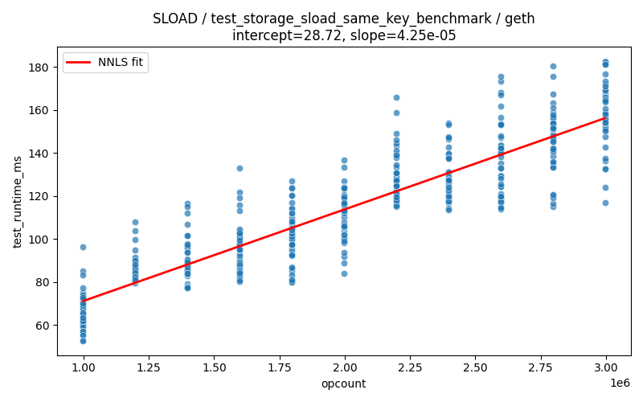

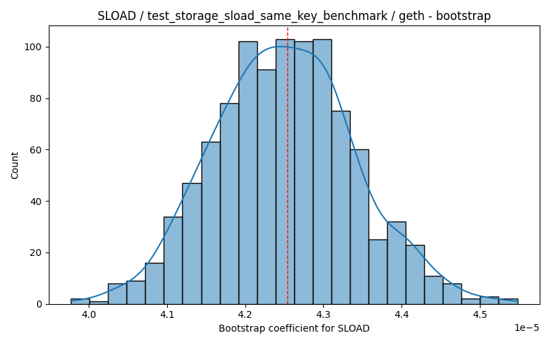

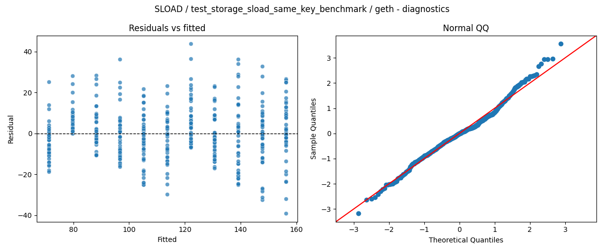

</details>

<details><summary>nethermind — NNLS regression summary</summary>

```
==============================================================================
                           NNLS Regression Results                            
==============================================================================
Dep. Variable:          test_runtime_ms              R-squared:          0.822
Model:                  NNLS                    Adj. R-squared:          0.821
No. Observations:       396                               RMSE:          45.15
Df Residuals:           394                                MAE:          34.06
Df Model:               1      
==============================================================================
                      coef     std err     P-value      [0.025      0.975]
------------------------------------------------------------------------------
         const    105.9248      7.2223       0.001     92.2914    119.9225
       opcount      0.0002      0.0000       0.001      0.0001      0.0002
==============================================================================
Notes: Non-negative least squares with bootstrap inference (1000 iterations)
==============================================================================
```

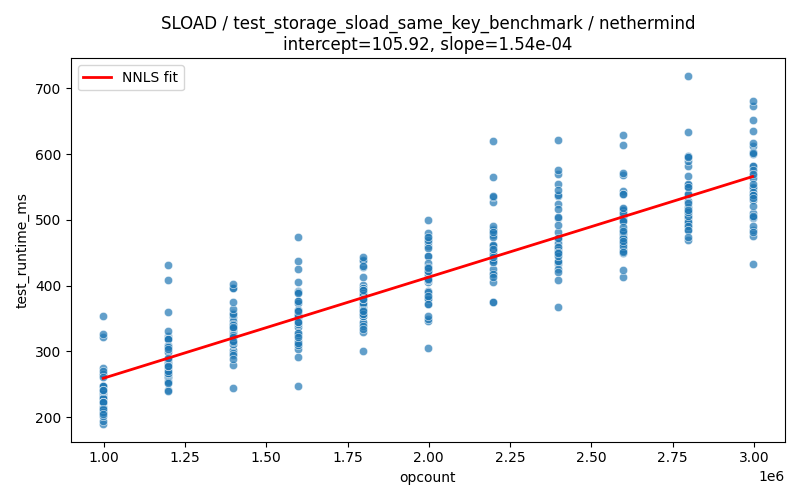

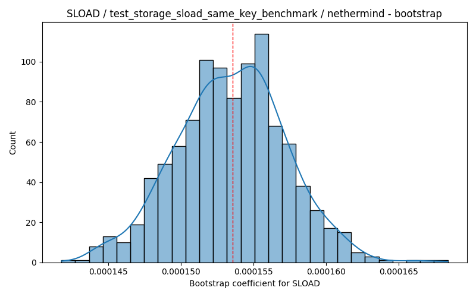

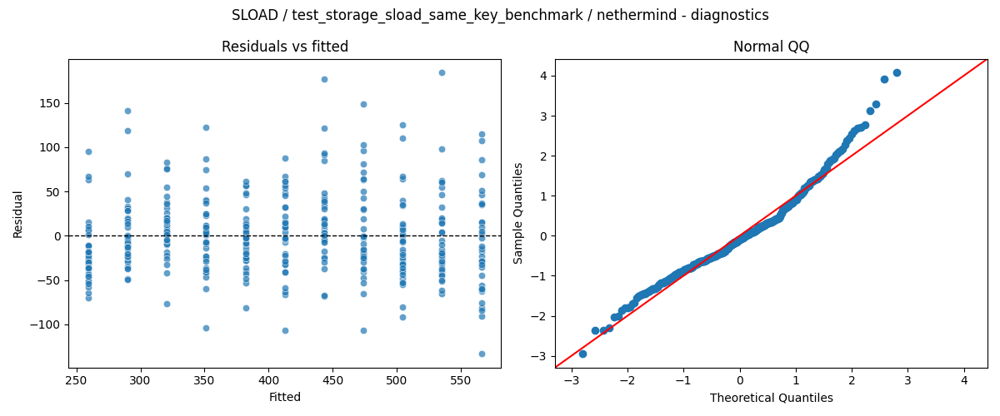

</details>

<details><summary>reth — NNLS regression summary</summary>

```
==============================================================================
                           NNLS Regression Results                            
==============================================================================
Dep. Variable:          test_runtime_ms              R-squared:          0.432
Model:                  NNLS                    Adj. R-squared:          0.431
No. Observations:       616                               RMSE:           5.81
Df Residuals:           614                                MAE:           3.80
Df Model:               1      
==============================================================================
                      coef     std err     P-value      [0.025      0.975]
------------------------------------------------------------------------------
         const      7.9411      0.6702       0.001      6.6248      9.2315
       opcount      0.0000      0.0000       0.001      0.0000      0.0000
==============================================================================
Notes: Non-negative least squares with bootstrap inference (1000 iterations)
==============================================================================
```

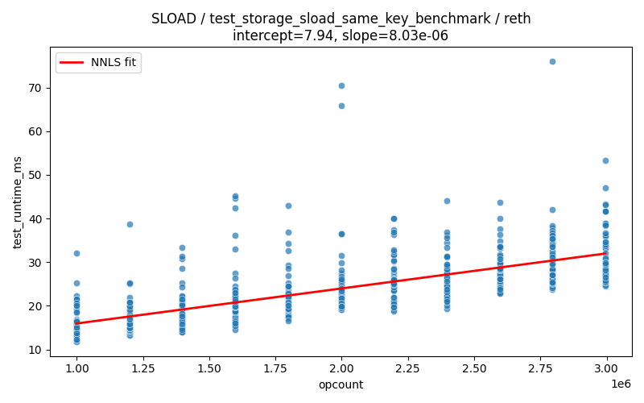

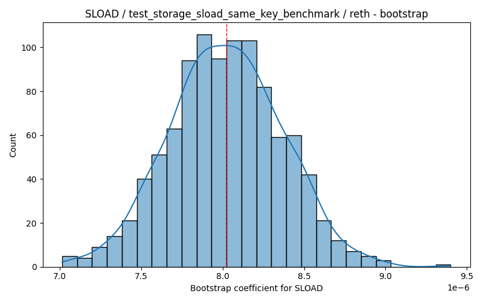

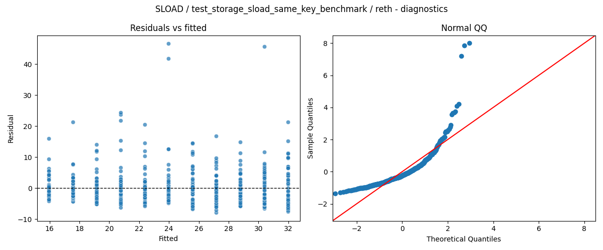

</details>

## SSTORE

### test_sstore_bloated — combo `False` — `presets[cold_storage_sstore_access]`

| client | nobs | R² | target_coef (ms) | p-value | 95% CI |
| --- | --- | --- | --- | --- | --- |
| `besu` | 407 | 0.7112 | 0.008568 | 1.00e-03 | [0.008077, 0.009121] |
| `erigon` | 165 | 0.9747 | 0.005902 | 1.00e-03 | [0.00581, 0.005953] |
| `ethrex` | 275 | 0.9301 | 0.009136 | 1.00e-03 | [0.009013, 0.00925] |
| `geth` | 242 | 0.9715 | 0.02405 | 1.00e-03 | [0.02348, 0.02459] |
| `nethermind` | 198 | 0.9084 | 0.003274 | 1.00e-03 | [0.003123, 0.003431] |
| `reth` | 308 | 0.9559 | 0.001291 | 1.00e-03 | [0.00126, 0.001323] |

<details><summary>besu — NNLS regression summary</summary>

```
==============================================================================
                           NNLS Regression Results                            
==============================================================================
Dep. Variable:          test_runtime_ms              R-squared:          0.711
Model:                  NNLS                    Adj. R-squared:          0.710
No. Observations:       407                               RMSE:         154.32
Df Residuals:           405                                MAE:         124.80
Df Model:               1      
==============================================================================
                      coef     std err     P-value      [0.025      0.975]
------------------------------------------------------------------------------
         const    428.9731     22.2903       0.001    383.9909    472.3830
       opcount      0.0086      0.0003       0.001      0.0081      0.0091
==============================================================================
Notes: Non-negative least squares with bootstrap inference (1000 iterations)
==============================================================================
```

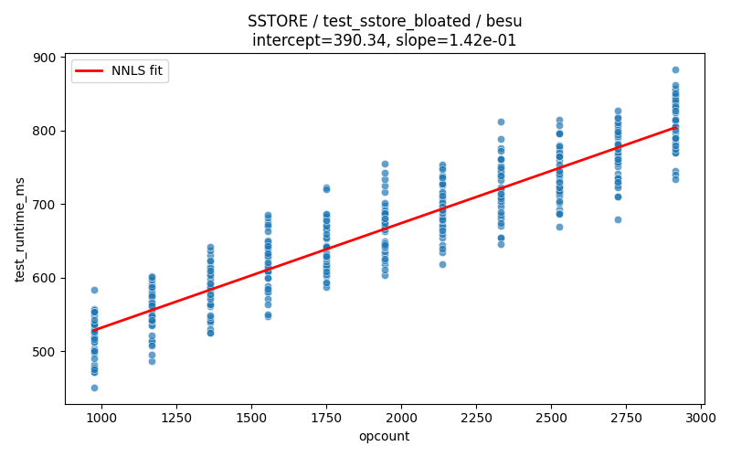

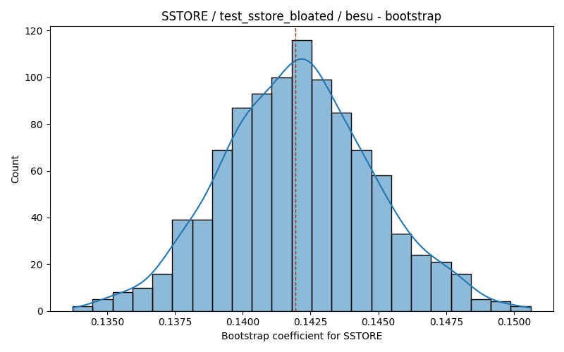

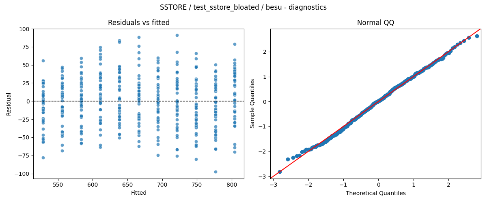

</details>

<details><summary>erigon — NNLS regression summary</summary>

```
==============================================================================
                           NNLS Regression Results                            
==============================================================================
Dep. Variable:          test_runtime_ms              R-squared:          0.975
Model:                  NNLS                    Adj. R-squared:          0.975
No. Observations:       165                               RMSE:          27.12
Df Residuals:           163                                MAE:          19.41
Df Model:               1      
==============================================================================
                      coef     std err     P-value      [0.025      0.975]
------------------------------------------------------------------------------
         const      0.0000      1.8213       1.000      0.0000      7.1145
       opcount      0.0059      0.0000       0.001      0.0058      0.0060
==============================================================================
Notes: Non-negative least squares with bootstrap inference (1000 iterations)
==============================================================================
```

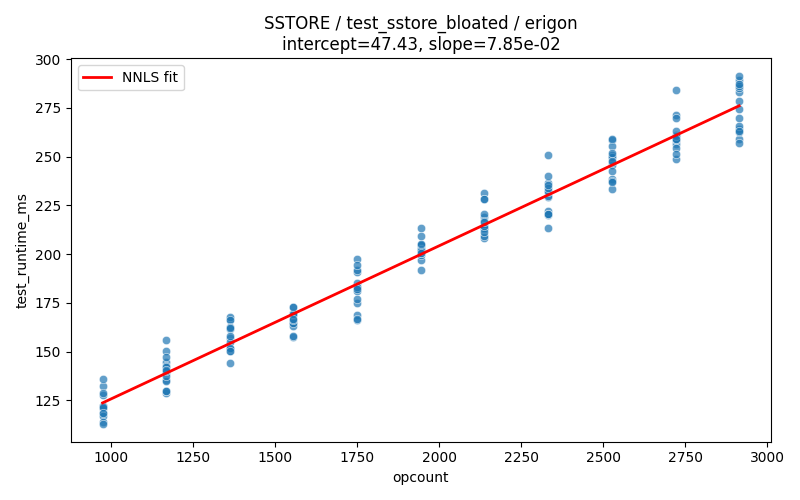

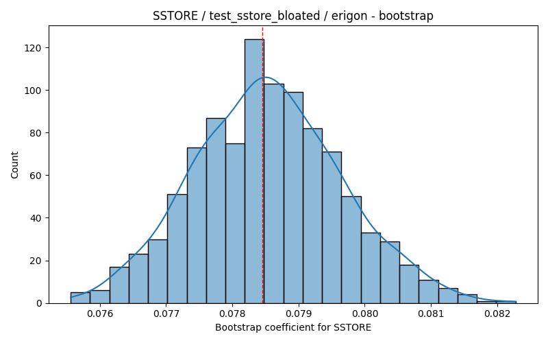

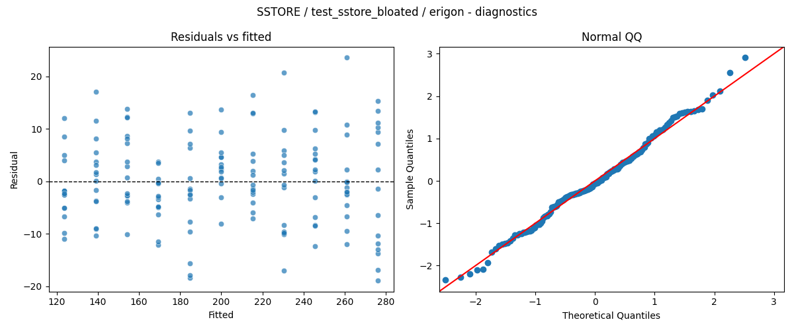

</details>

<details><summary>ethrex — NNLS regression summary</summary>

```
==============================================================================
                           NNLS Regression Results                            
==============================================================================
Dep. Variable:          test_runtime_ms              R-squared:          0.930
Model:                  NNLS                    Adj. R-squared:          0.930
No. Observations:       275                               RMSE:          85.88
Df Residuals:           273                                MAE:          72.84
Df Model:               1      
==============================================================================
                      coef     std err     P-value      [0.025      0.975]
------------------------------------------------------------------------------
         const      0.0000      0.0000       1.000      0.0000      0.0000
       opcount      0.0091      0.0001       0.001      0.0090      0.0093
==============================================================================
Notes: Non-negative least squares with bootstrap inference (1000 iterations)
==============================================================================
```

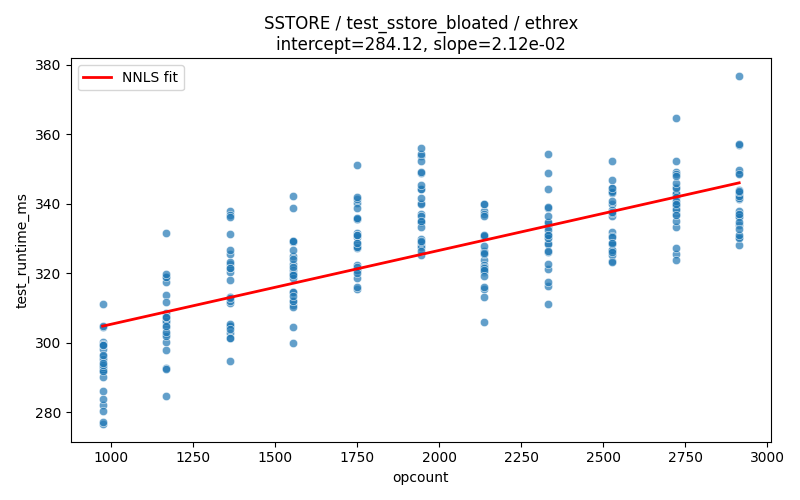

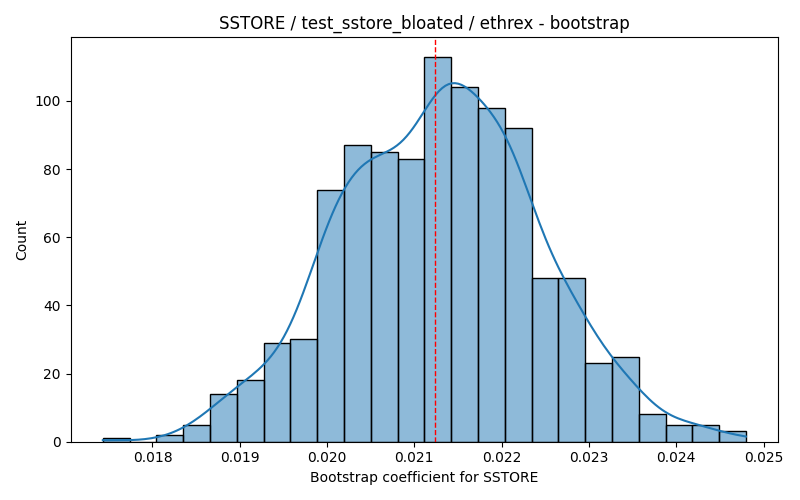

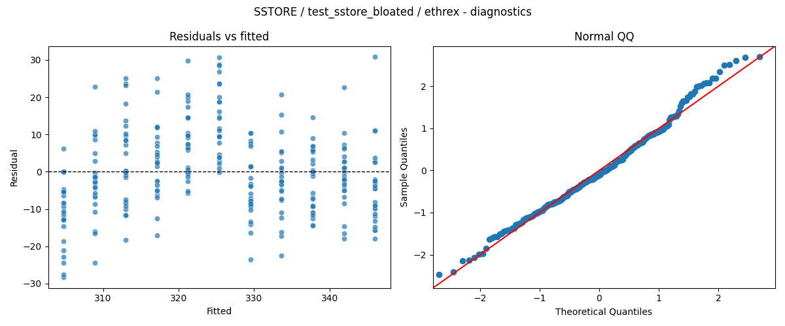

</details>

<details><summary>geth — NNLS regression summary</summary>

```
==============================================================================
                           NNLS Regression Results                            
==============================================================================
Dep. Variable:          test_runtime_ms              R-squared:          0.972
Model:                  NNLS                    Adj. R-squared:          0.971
No. Observations:       242                               RMSE:         116.39
Df Residuals:           240                                MAE:          93.10
Df Model:               1      
==============================================================================
                      coef     std err     P-value      [0.025      0.975]
------------------------------------------------------------------------------
         const    544.4222     24.2645       0.001    499.2711    595.9641
       opcount      0.0240      0.0003       0.001      0.0235      0.0246
==============================================================================
Notes: Non-negative least squares with bootstrap inference (1000 iterations)
==============================================================================
```

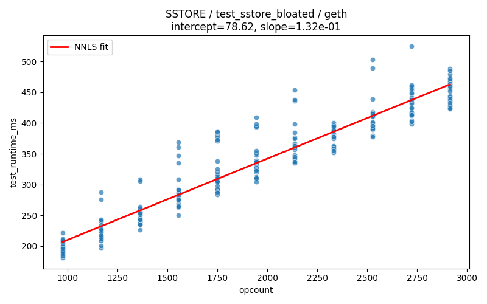

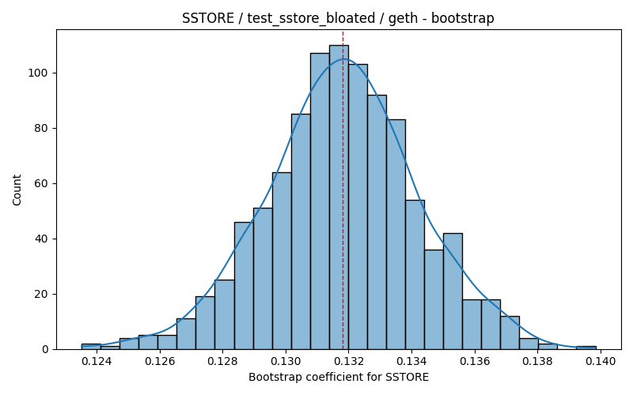

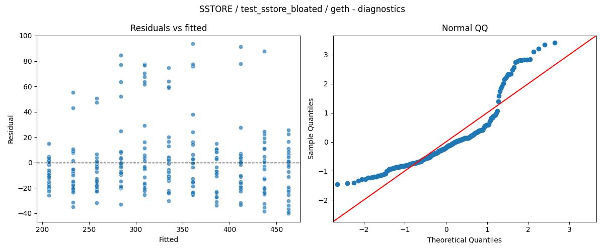

</details>

<details><summary>nethermind — NNLS regression summary</summary>

```
==============================================================================
                           NNLS Regression Results                            
==============================================================================
Dep. Variable:          test_runtime_ms              R-squared:          0.908
Model:                  NNLS                    Adj. R-squared:          0.908
No. Observations:       198                               RMSE:          29.39
Df Residuals:           196                                MAE:          21.90
Df Model:               1      
==============================================================================
                      coef     std err     P-value      [0.025      0.975]
------------------------------------------------------------------------------
         const     63.5299      6.7289       0.001     50.7836     77.1992
       opcount      0.0033      0.0001       0.001      0.0031      0.0034
==============================================================================
Notes: Non-negative least squares with bootstrap inference (1000 iterations)
==============================================================================
```

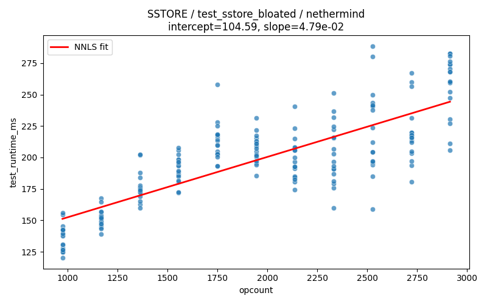

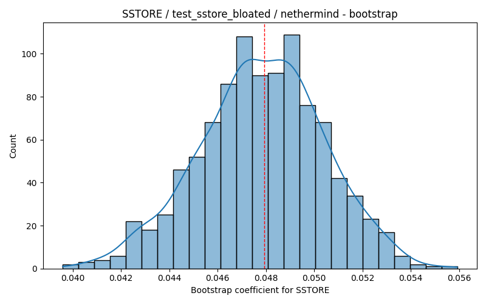

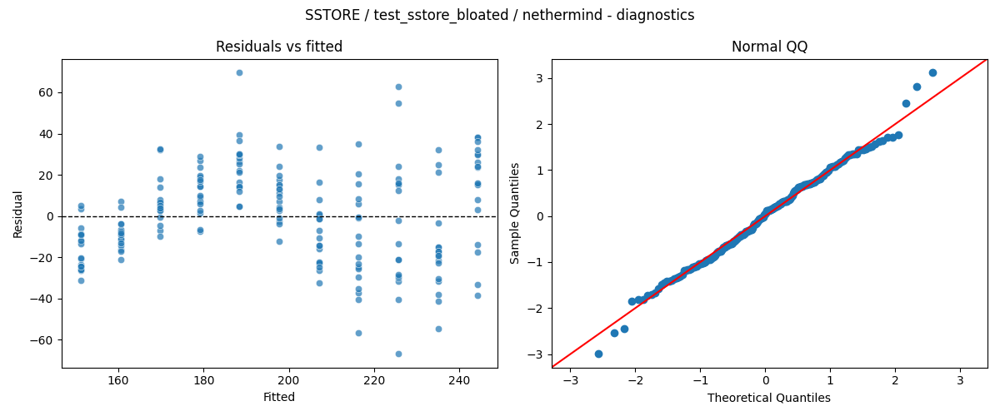

</details>

<details><summary>reth — NNLS regression summary</summary>

```
==============================================================================
                           NNLS Regression Results                            
==============================================================================
Dep. Variable:          test_runtime_ms              R-squared:          0.956
Model:                  NNLS                    Adj. R-squared:          0.956
No. Observations:       308                               RMSE:           7.83
Df Residuals:           306                                MAE:           6.01
Df Model:               1      
==============================================================================
                      coef     std err     P-value      [0.025      0.975]
------------------------------------------------------------------------------
         const     37.0131      1.3546       0.001     34.4211     39.6738
       opcount      0.0013      0.0000       0.001      0.0013      0.0013
==============================================================================
Notes: Non-negative least squares with bootstrap inference (1000 iterations)
==============================================================================
```

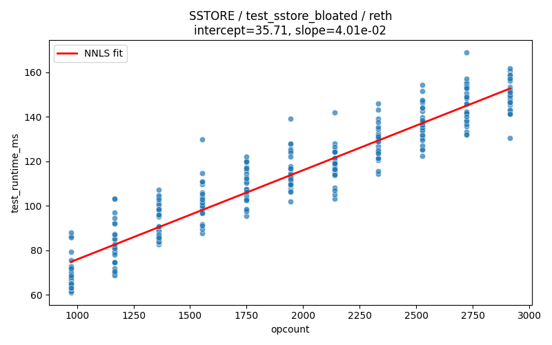

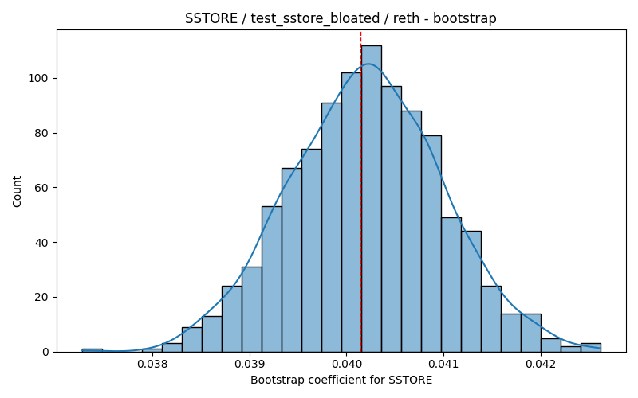

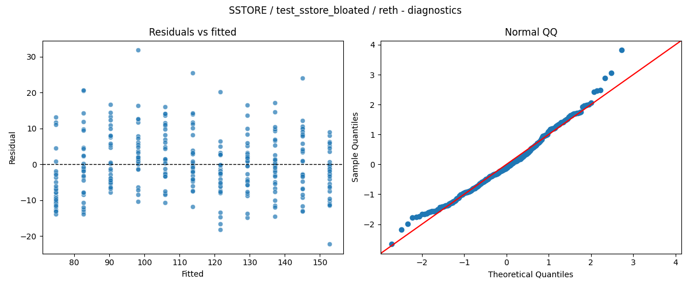

</details>

### test_sstore_bloated — combo `True` — `presets[cold_storage_sstore_access]`

| client | nobs | R² | target_coef (ms) | p-value | 95% CI |
| --- | --- | --- | --- | --- | --- |
| `besu` | 407 | 0.9072 | 0.01548 | 1.00e-03 | [0.01502, 0.01598] |
| `erigon` | 165 | 0.97 | 0.005286 | 1.00e-03 | [0.005147, 0.005337] |
| `ethrex` | 275 | 0.9736 | 0.01335 | 1.00e-03 | [0.01326, 0.01345] |
| `geth` | 242 | 0.9681 | 0.02342 | 1.00e-03 | [0.02285, 0.02396] |
| `nethermind` | 198 | 0.9781 | 0.009158 | 1.00e-03 | [0.008975, 0.009359] |
| `reth` | 308 | 0.9563 | 0.001503 | 1.00e-03 | [0.001468, 0.001542] |

<details><summary>besu — NNLS regression summary</summary>

```
==============================================================================
                           NNLS Regression Results                            
==============================================================================
Dep. Variable:          test_runtime_ms              R-squared:          0.907
Model:                  NNLS                    Adj. R-squared:          0.907
No. Observations:       407                               RMSE:         139.86
Df Residuals:           405                                MAE:         112.78
Df Model:               1      
==============================================================================
                      coef     std err     P-value      [0.025      0.975]
------------------------------------------------------------------------------
         const    575.6341     21.3545       0.001    532.1846    613.4412
       opcount      0.0155      0.0003       0.001      0.0150      0.0160
==============================================================================
Notes: Non-negative least squares with bootstrap inference (1000 iterations)
==============================================================================
```

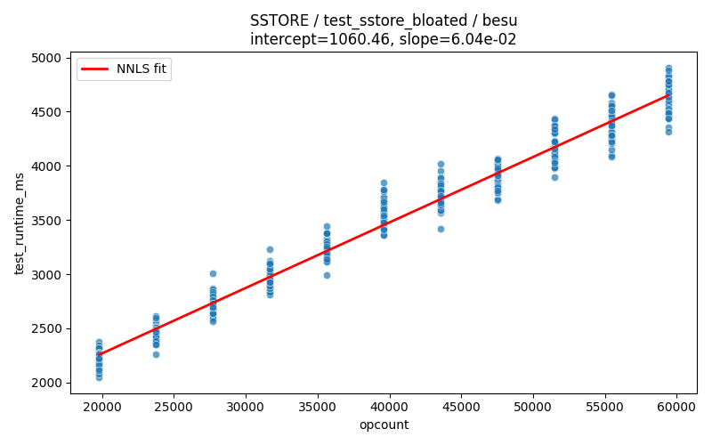

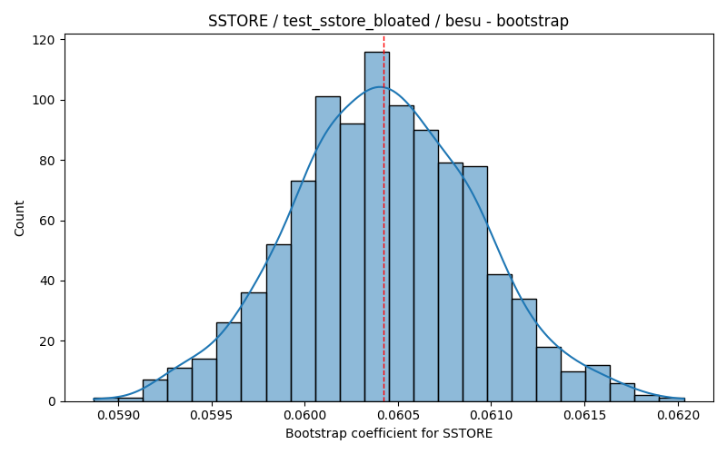

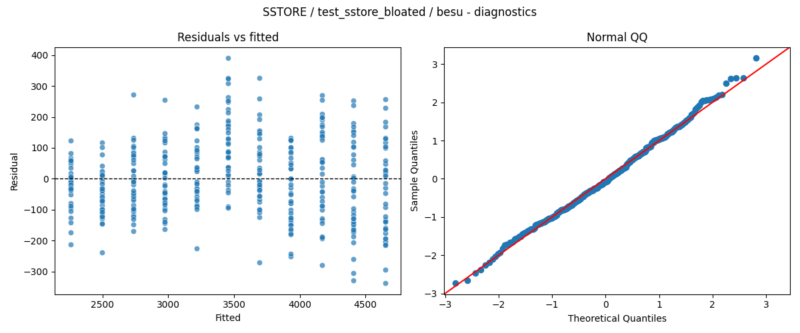

</details>

<details><summary>erigon — NNLS regression summary</summary>

```
==============================================================================
                           NNLS Regression Results                            
==============================================================================
Dep. Variable:          test_runtime_ms              R-squared:          0.970
Model:                  NNLS                    Adj. R-squared:          0.970
No. Observations:       165                               RMSE:          26.27
Df Residuals:           163                                MAE:          20.44
Df Model:               1      
==============================================================================
                      coef     std err     P-value      [0.025      0.975]
------------------------------------------------------------------------------
         const      0.0454      3.3920       0.500      0.0000     11.0602
       opcount      0.0053      0.0000       0.001      0.0051      0.0053
==============================================================================
Notes: Non-negative least squares with bootstrap inference (1000 iterations)
==============================================================================
```

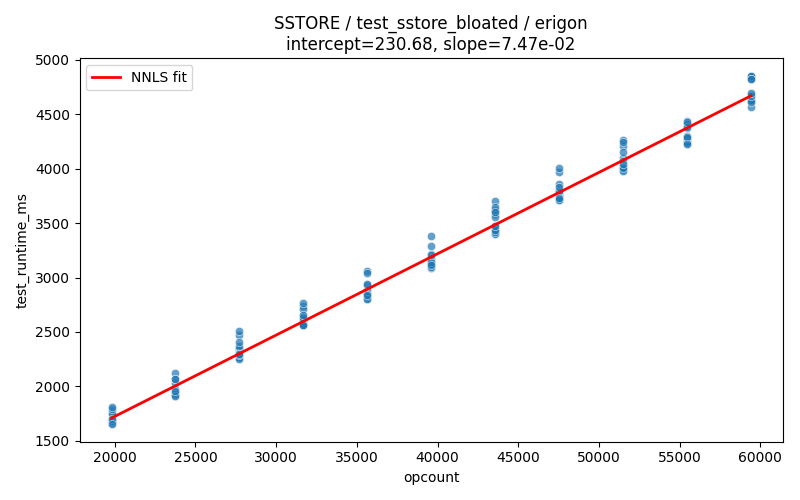

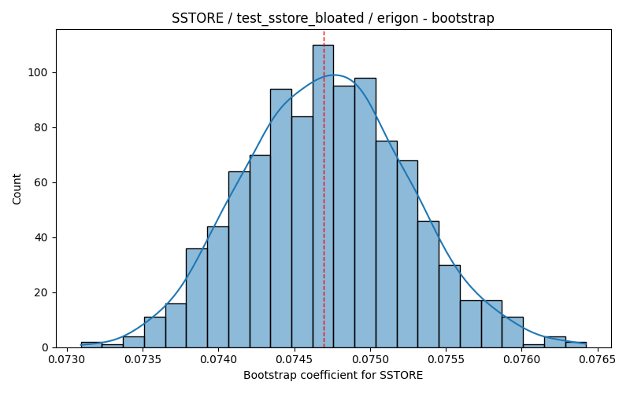

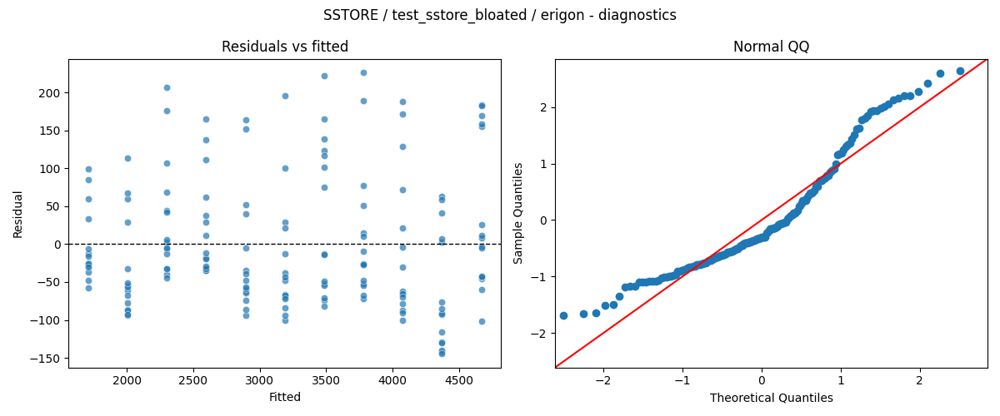

</details>

<details><summary>ethrex — NNLS regression summary</summary>

```
==============================================================================
                           NNLS Regression Results                            
==============================================================================
Dep. Variable:          test_runtime_ms              R-squared:          0.974
Model:                  NNLS                    Adj. R-squared:          0.973
No. Observations:       275                               RMSE:          69.41
Df Residuals:           273                                MAE:          57.43
Df Model:               1      
==============================================================================
                      coef     std err     P-value      [0.025      0.975]
------------------------------------------------------------------------------
         const      0.0000      0.0000       1.000      0.0000      0.0000
       opcount      0.0133      0.0000       0.001      0.0133      0.0134
==============================================================================
Notes: Non-negative least squares with bootstrap inference (1000 iterations)
==============================================================================
```

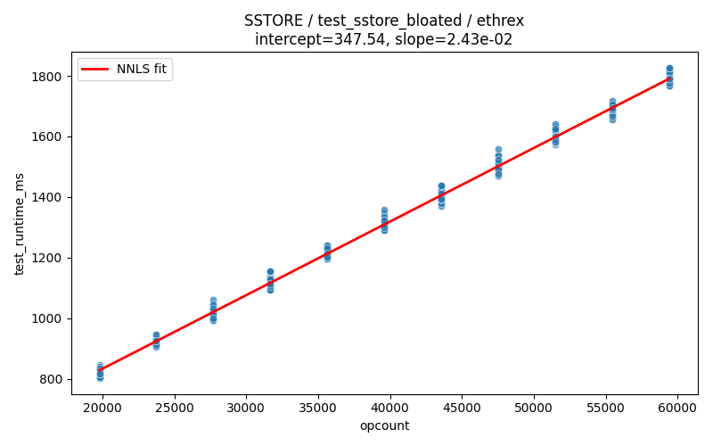

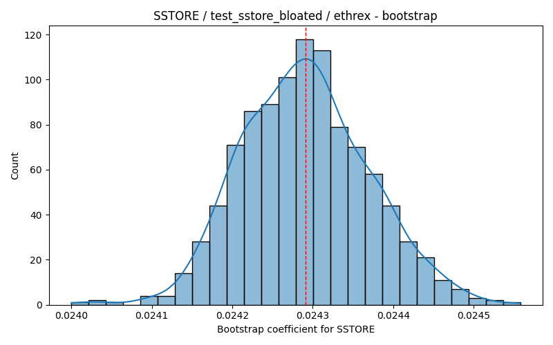

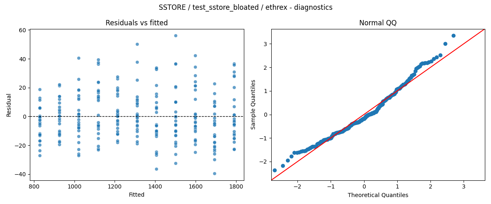

</details>

<details><summary>geth — NNLS regression summary</summary>

```
==============================================================================
                           NNLS Regression Results                            
==============================================================================
Dep. Variable:          test_runtime_ms              R-squared:          0.968
Model:                  NNLS                    Adj. R-squared:          0.968
No. Observations:       242                               RMSE:         120.26
Df Residuals:           240                                MAE:          95.19
Df Model:               1      
==============================================================================
                      coef     std err     P-value      [0.025      0.975]
------------------------------------------------------------------------------
         const    528.6024     23.6523       0.001    482.4126    574.7042
       opcount      0.0234      0.0003       0.001      0.0228      0.0240
==============================================================================
Notes: Non-negative least squares with bootstrap inference (1000 iterations)
==============================================================================
```

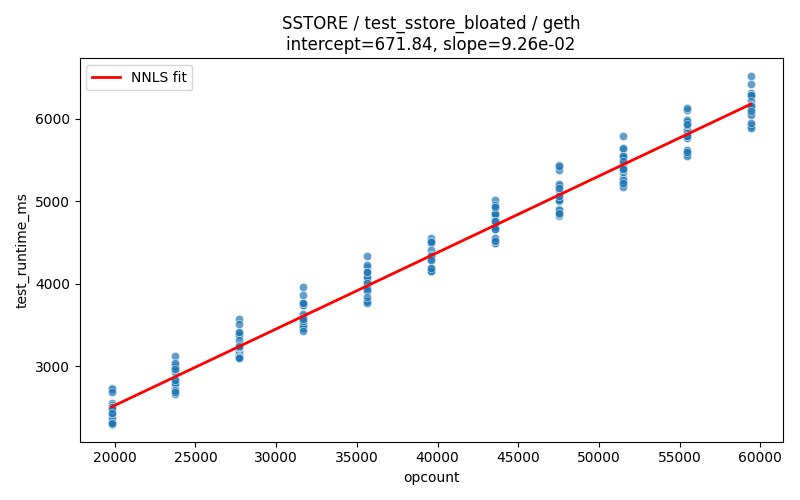

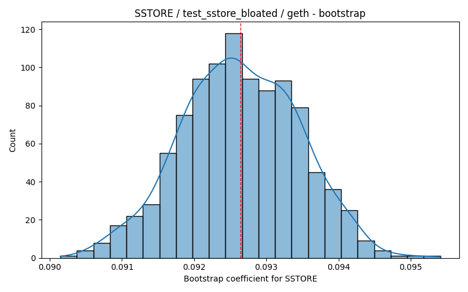

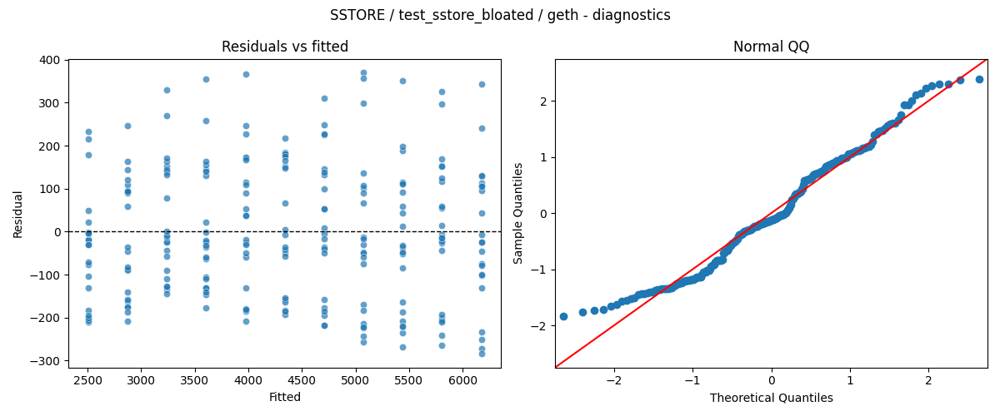

</details>

<details><summary>nethermind — NNLS regression summary</summary>

```
==============================================================================
                           NNLS Regression Results                            
==============================================================================
Dep. Variable:          test_runtime_ms              R-squared:          0.978
Model:                  NNLS                    Adj. R-squared:          0.978
No. Observations:       198                               RMSE:          38.73
Df Residuals:           196                                MAE:          30.11
Df Model:               1      
==============================================================================
                      coef     std err     P-value      [0.025      0.975]
------------------------------------------------------------------------------
         const     91.8048      8.2991       0.001     75.9227    108.5449
       opcount      0.0092      0.0001       0.001      0.0090      0.0094
==============================================================================
Notes: Non-negative least squares with bootstrap inference (1000 iterations)
==============================================================================
```

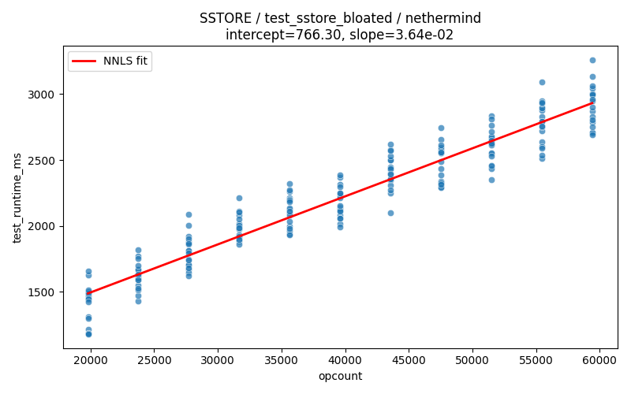

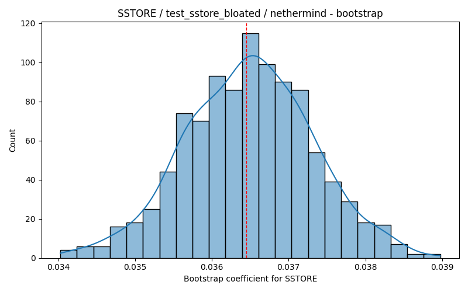

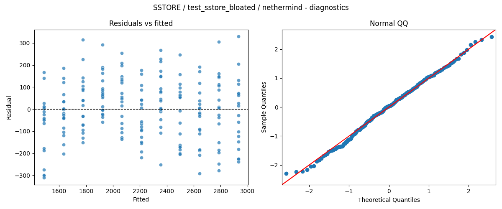

</details>

<details><summary>reth — NNLS regression summary</summary>

```
==============================================================================
                           NNLS Regression Results                            
==============================================================================
Dep. Variable:          test_runtime_ms              R-squared:          0.956
Model:                  NNLS                    Adj. R-squared:          0.956
No. Observations:       308                               RMSE:           9.08
Df Residuals:           306                                MAE:           7.15
Df Model:               1      
==============================================================================
                      coef     std err     P-value      [0.025      0.975]
------------------------------------------------------------------------------
         const     28.4395      1.6788       0.001     24.8045     31.6115
       opcount      0.0015      0.0000       0.001      0.0015      0.0015
==============================================================================
Notes: Non-negative least squares with bootstrap inference (1000 iterations)
==============================================================================
```

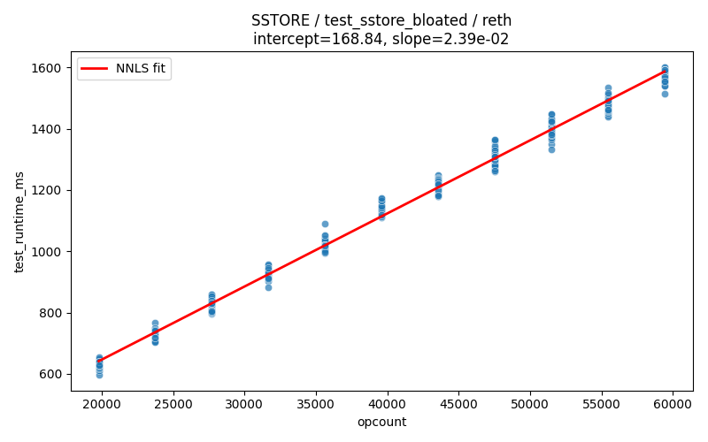

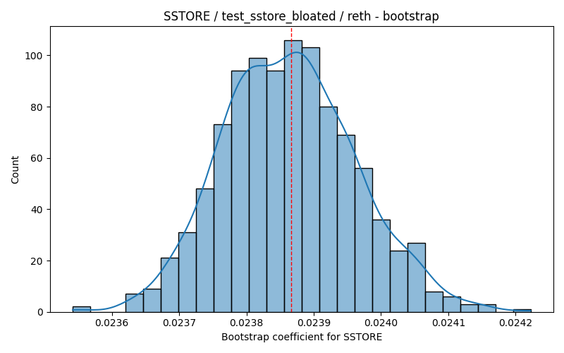

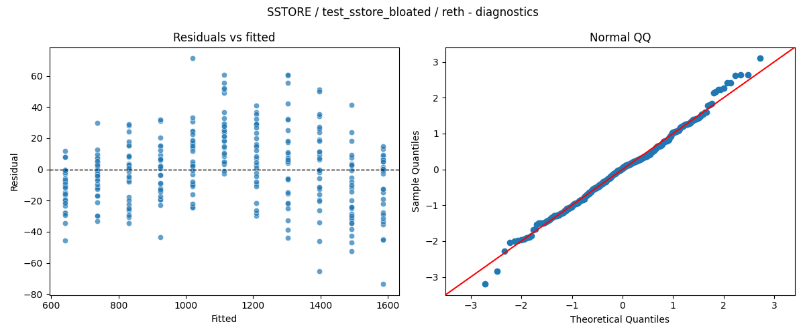

</details>

### test_sstore_bloated — combo `False` — `presets[cold_storage_sstore_write]`

| client | nobs | R² | target_coef (ms) | p-value | 95% CI |
| --- | --- | --- | --- | --- | --- |
| `besu` | 407 | 0.8638 | 0.1419 | 1.00e-03 | [0.1367, 0.1477] |
| `erigon` | 165 | 0.9725 | 0.07846 | 1.00e-03 | [0.07639, 0.08075] |
| `ethrex` | 275 | 0.5659 | 0.02123 | 1.00e-03 | [0.01905, 0.02352] |
| `geth` | 242 | 0.8974 | 0.1318 | 1.00e-03 | [0.1271, 0.1365] |
| `nethermind` | 198 | 0.6353 | 0.04793 | 1.00e-03 | [0.04259, 0.05271] |
| `reth` | 308 | 0.8974 | 0.04014 | 1.00e-03 | [0.03871, 0.04178] |

<details><summary>besu — NNLS regression summary</summary>

```
==============================================================================
                           NNLS Regression Results                            
==============================================================================
Dep. Variable:          test_runtime_ms              R-squared:          0.864
Model:                  NNLS                    Adj. R-squared:          0.863
No. Observations:       407                               RMSE:          34.61
Df Residuals:           405                                MAE:          28.08
Df Model:               1      
==============================================================================
                      coef     std err     P-value      [0.025      0.975]
------------------------------------------------------------------------------
         const    390.3350      5.4289       0.001    379.0962    401.0516
       opcount      0.1419      0.0028       0.001      0.1367      0.1477
==============================================================================
Notes: Non-negative least squares with bootstrap inference (1000 iterations)
==============================================================================
```


</details>

<details><summary>erigon — NNLS regression summary</summary>

```
==============================================================================
                           NNLS Regression Results                            
==============================================================================
Dep. Variable:          test_runtime_ms              R-squared:          0.973
Model:                  NNLS                    Adj. R-squared:          0.972
No. Observations:       165                               RMSE:           8.10
Df Residuals:           163                                MAE:           6.38
Df Model:               1      
==============================================================================
                      coef     std err     P-value      [0.025      0.975]
------------------------------------------------------------------------------
         const     47.4270      2.0581       0.001     43.0695     51.1269
       opcount      0.0785      0.0011       0.001      0.0764      0.0807
==============================================================================
Notes: Non-negative least squares with bootstrap inference (1000 iterations)
==============================================================================
```


</details>

<details><summary>ethrex — NNLS regression summary</summary>

```
==============================================================================
                           NNLS Regression Results                            
==============================================================================
Dep. Variable:          test_runtime_ms              R-squared:          0.566
Model:                  NNLS                    Adj. R-squared:          0.564
No. Observations:       275                               RMSE:          11.42
Df Residuals:           273                                MAE:           9.01
Df Model:               1      
==============================================================================
                      coef     std err     P-value      [0.025      0.975]
------------------------------------------------------------------------------
         const    284.1155      2.4551       0.001    279.2385    288.8958
       opcount      0.0212      0.0011       0.001      0.0190      0.0235
==============================================================================
Notes: Non-negative least squares with bootstrap inference (1000 iterations)
==============================================================================
```


</details>

<details><summary>geth — NNLS regression summary</summary>

```
==============================================================================
                           NNLS Regression Results                            
==============================================================================
Dep. Variable:          test_runtime_ms              R-squared:          0.897
Model:                  NNLS                    Adj. R-squared:          0.897
No. Observations:       242                               RMSE:          27.38
Df Residuals:           240                                MAE:          19.36
Df Model:               1      
==============================================================================
                      coef     std err     P-value      [0.025      0.975]
------------------------------------------------------------------------------
         const     78.6229      4.7836       0.001     69.7172     88.4804
       opcount      0.1318      0.0024       0.001      0.1271      0.1365
==============================================================================
Notes: Non-negative least squares with bootstrap inference (1000 iterations)
==============================================================================
```


</details>

<details><summary>nethermind — NNLS regression summary</summary>

```
==============================================================================
                           NNLS Regression Results                            
==============================================================================
Dep. Variable:          test_runtime_ms              R-squared:          0.635
Model:                  NNLS                    Adj. R-squared:          0.633
No. Observations:       198                               RMSE:          22.30
Df Residuals:           196                                MAE:          18.17
Df Model:               1      
==============================================================================
                      coef     std err     P-value      [0.025      0.975]
------------------------------------------------------------------------------
         const    104.5859      4.6343       0.001     96.6366    114.8555
       opcount      0.0479      0.0026       0.001      0.0426      0.0527
==============================================================================
Notes: Non-negative least squares with bootstrap inference (1000 iterations)
==============================================================================
```


</details>

<details><summary>reth — NNLS regression summary</summary>

```
==============================================================================
                           NNLS Regression Results                            
==============================================================================
Dep. Variable:          test_runtime_ms              R-squared:          0.897
Model:                  NNLS                    Adj. R-squared:          0.897
No. Observations:       308                               RMSE:           8.34
Df Residuals:           306                                MAE:           6.60
Df Model:               1      
==============================================================================
                      coef     std err     P-value      [0.025      0.975]
------------------------------------------------------------------------------
         const     35.7093      1.5979       0.001     32.5260     38.9045
       opcount      0.0401      0.0008       0.001      0.0387      0.0418
==============================================================================
Notes: Non-negative least squares with bootstrap inference (1000 iterations)
==============================================================================
```


</details>

### test_sstore_bloated — combo `True` — `presets[cold_storage_sstore_write]`

| client | nobs | R² | target_coef (ms) | p-value | 95% CI |
| --- | --- | --- | --- | --- | --- |
| `besu` | 407 | 0.9741 | 0.06042 | 1.00e-03 | [0.05943, 0.0614] |
| `erigon` | 165 | 0.9917 | 0.07469 | 1.00e-03 | [0.07369, 0.0758] |
| `ethrex` | 275 | 0.997 | 0.02429 | 1.00e-03 | [0.02415, 0.02445] |
| `geth` | 242 | 0.9825 | 0.09265 | 1.00e-03 | [0.09102, 0.09418] |
| `nethermind` | 198 | 0.9193 | 0.03645 | 1.00e-03 | [0.03478, 0.03815] |
| `reth` | 308 | 0.9941 | 0.02387 | 1.00e-03 | [0.02369, 0.02406] |

<details><summary>besu — NNLS regression summary</summary>

```
==============================================================================
                           NNLS Regression Results                            
==============================================================================
Dep. Variable:          test_runtime_ms              R-squared:          0.974
Model:                  NNLS                    Adj. R-squared:          0.974
No. Observations:       407                               RMSE:         123.46
Df Residuals:           405                                MAE:          99.03
Df Model:               1      
==============================================================================
                      coef     std err     P-value      [0.025      0.975]
------------------------------------------------------------------------------
         const   1060.4618     18.1478       0.001   1025.3380   1098.2786
       opcount      0.0604      0.0005       0.001      0.0594      0.0614
==============================================================================
Notes: Non-negative least squares with bootstrap inference (1000 iterations)
==============================================================================
```


</details>

<details><summary>erigon — NNLS regression summary</summary>

```
==============================================================================
                           NNLS Regression Results                            
==============================================================================
Dep. Variable:          test_runtime_ms              R-squared:          0.992
Model:                  NNLS                    Adj. R-squared:          0.992
No. Observations:       165                               RMSE:          85.64
Df Residuals:           163                                MAE:          68.75
Df Model:               1      
==============================================================================
                      coef     std err     P-value      [0.025      0.975]
------------------------------------------------------------------------------
         const    230.6848     19.9577       0.001    190.6046    268.1613
       opcount      0.0747      0.0005       0.001      0.0737      0.0758
==============================================================================
Notes: Non-negative least squares with bootstrap inference (1000 iterations)
==============================================================================
```


</details>

<details><summary>ethrex — NNLS regression summary</summary>

```
==============================================================================
                           NNLS Regression Results                            
==============================================================================
Dep. Variable:          test_runtime_ms              R-squared:          0.997
Model:                  NNLS                    Adj. R-squared:          0.997
No. Observations:       275                               RMSE:          16.72
Df Residuals:           273                                MAE:          13.20
Df Model:               1      
==============================================================================
                      coef     std err     P-value      [0.025      0.975]
------------------------------------------------------------------------------
         const    347.5405      3.0708       0.001    341.3537    353.2918
       opcount      0.0243      0.0001       0.001      0.0242      0.0244
==============================================================================
Notes: Non-negative least squares with bootstrap inference (1000 iterations)
==============================================================================
```


</details>

<details><summary>geth — NNLS regression summary</summary>

```
==============================================================================
                           NNLS Regression Results                            
==============================================================================
Dep. Variable:          test_runtime_ms              R-squared:          0.982
Model:                  NNLS                    Adj. R-squared:          0.982
No. Observations:       242                               RMSE:         154.85
Df Residuals:           240                                MAE:         128.42
Df Model:               1      
==============================================================================
                      coef     std err     P-value      [0.025      0.975]
------------------------------------------------------------------------------
         const    671.8426     32.5390       0.001    610.0570    734.0061
       opcount      0.0926      0.0008       0.001      0.0910      0.0942
==============================================================================
Notes: Non-negative least squares with bootstrap inference (1000 iterations)
==============================================================================
```


</details>

<details><summary>nethermind — NNLS regression summary</summary>

```
==============================================================================
                           NNLS Regression Results                            
==============================================================================
Dep. Variable:          test_runtime_ms              R-squared:          0.919
Model:                  NNLS                    Adj. R-squared:          0.919
No. Observations:       198                               RMSE:         135.27
Df Residuals:           196                                MAE:         109.06
Df Model:               1      
==============================================================================
                      coef     std err     P-value      [0.025      0.975]
------------------------------------------------------------------------------
         const    766.3037     33.3338       0.001    700.9958    830.9588
       opcount      0.0364      0.0008       0.001      0.0348      0.0382
==============================================================================
Notes: Non-negative least squares with bootstrap inference (1000 iterations)
==============================================================================
```


</details>

<details><summary>reth — NNLS regression summary</summary>

```
==============================================================================
                           NNLS Regression Results                            
==============================================================================
Dep. Variable:          test_runtime_ms              R-squared:          0.994
Model:                  NNLS                    Adj. R-squared:          0.994
No. Observations:       308                               RMSE:          23.00
Df Residuals:           306                                MAE:          17.95
Df Model:               1      
==============================================================================
                      coef     std err     P-value      [0.025      0.975]
------------------------------------------------------------------------------
         const    168.8354      3.6739       0.001    161.4169    175.6716
       opcount      0.0239      0.0001       0.001      0.0237      0.0241
==============================================================================
Notes: Non-negative least squares with bootstrap inference (1000 iterations)
==============================================================================
```


</details>

## BALANCE

### test_account_access — combo `BALANCE_AccountMode.EXISTING_EOA`

| client | nobs | R² | target_coef (ms) | p-value | 95% CI |
| --- | --- | --- | --- | --- | --- |
| `besu` | 407 | 0.8385 | 0.01285 | 1.00e-03 | [0.01227, 0.01343] |
| `erigon` | 165 | 0.9715 | 0.008951 | 1.00e-03 | [0.008709, 0.009159] |
| `ethrex` | 275 | 0.9921 | 0.006932 | 1.00e-03 | [0.006858, 0.007013] |
| `geth` | 242 | 0.915 | 0.01055 | 1.00e-03 | [0.01009, 0.011] |
| `nethermind` | 198 | 0.7667 | 0.003929 | 1.00e-03 | [0.003628, 0.004206] |
| `reth` | 308 | 0.9424 | 0.001069 | 1.00e-03 | [0.001043, 0.001098] |

<details><summary>besu — NNLS regression summary</summary>

```
==============================================================================
                           NNLS Regression Results                            
==============================================================================
Dep. Variable:          test_runtime_ms              R-squared:          0.838
Model:                  NNLS                    Adj. R-squared:          0.838
No. Observations:       407                               RMSE:         134.77
Df Residuals:           405                                MAE:         113.73
Df Model:               1      
==============================================================================
                      coef     std err     P-value      [0.025      0.975]
------------------------------------------------------------------------------
         const    486.2167     21.5415       0.001    445.0086    531.3793
       opcount      0.0128      0.0003       0.001      0.0123      0.0134
==============================================================================
Notes: Non-negative least squares with bootstrap inference (1000 iterations)
==============================================================================
```

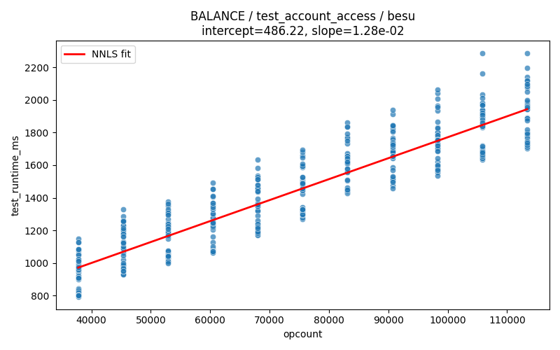

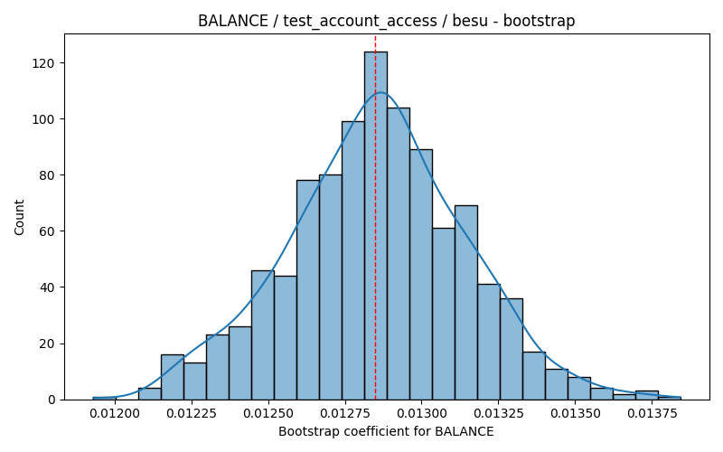

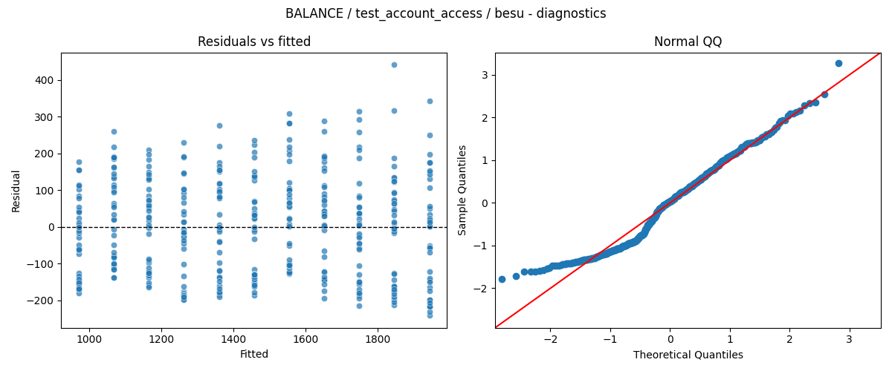

</details>

<details><summary>erigon — NNLS regression summary</summary>

```
==============================================================================
                           NNLS Regression Results                            
==============================================================================
Dep. Variable:          test_runtime_ms              R-squared:          0.971
Model:                  NNLS                    Adj. R-squared:          0.971
No. Observations:       165                               RMSE:          36.65
Df Residuals:           163                                MAE:          28.66
Df Model:               1      
==============================================================================
                      coef     std err     P-value      [0.025      0.975]
------------------------------------------------------------------------------
         const     11.5868      7.6373       0.076      0.0000     27.0164
       opcount      0.0090      0.0001       0.001      0.0087      0.0092
==============================================================================
Notes: Non-negative least squares with bootstrap inference (1000 iterations)
==============================================================================
```


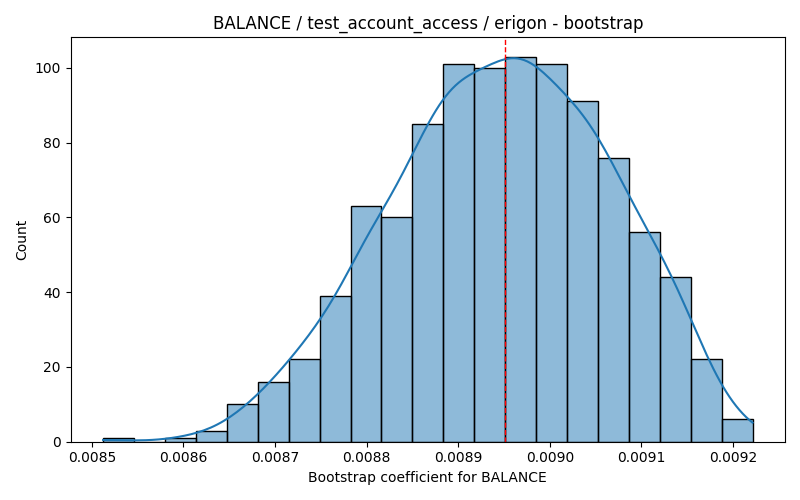

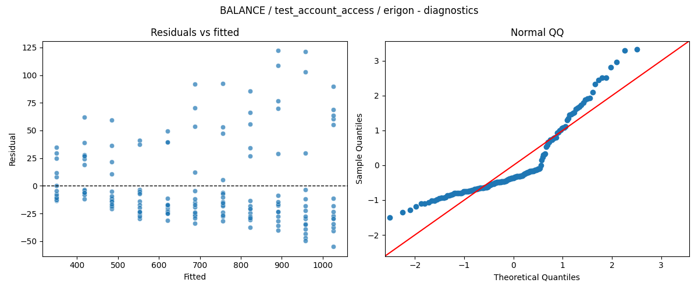

</details>

<details><summary>ethrex — NNLS regression summary</summary>

```
==============================================================================
                           NNLS Regression Results                            
==============================================================================
Dep. Variable:          test_runtime_ms              R-squared:          0.992
Model:                  NNLS                    Adj. R-squared:          0.992
No. Observations:       275                               RMSE:          14.74
Df Residuals:           273                                MAE:          11.19
Df Model:               1      
==============================================================================
                      coef     std err     P-value      [0.025      0.975]
------------------------------------------------------------------------------
         const     45.7752      2.8209       0.001     40.2833     51.1685
       opcount      0.0069      0.0000       0.001      0.0069      0.0070
==============================================================================
Notes: Non-negative least squares with bootstrap inference (1000 iterations)
==============================================================================
```

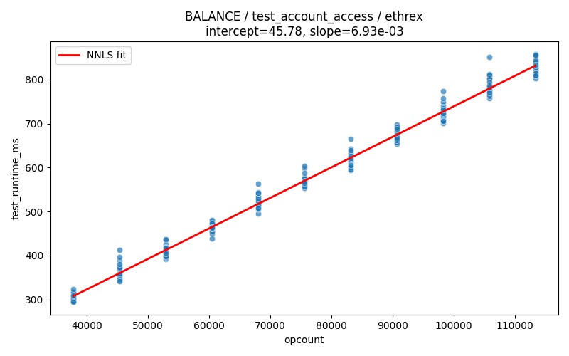

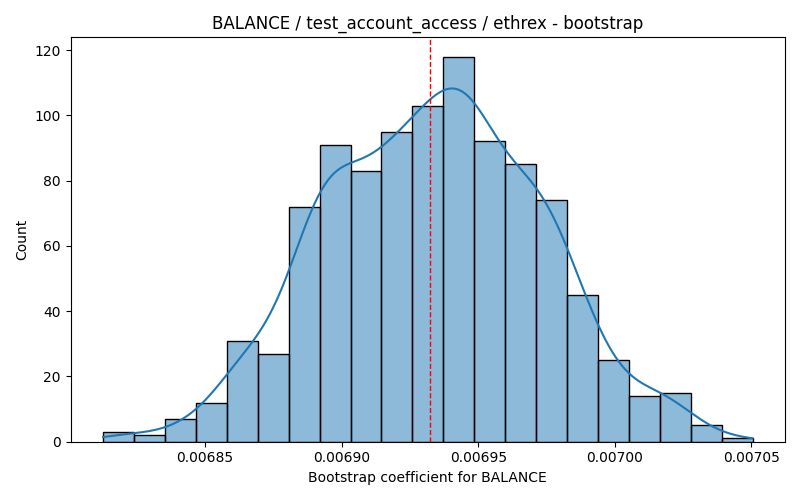

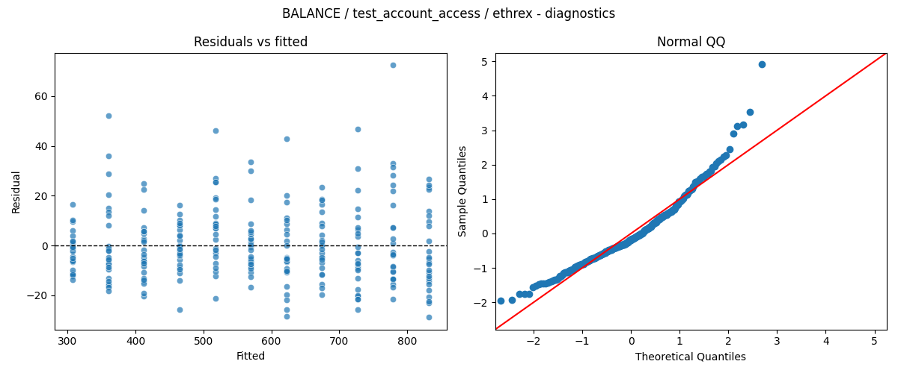

</details>

<details><summary>geth — NNLS regression summary</summary>

```
==============================================================================
                           NNLS Regression Results                            
==============================================================================
Dep. Variable:          test_runtime_ms              R-squared:          0.915
Model:                  NNLS                    Adj. R-squared:          0.915
No. Observations:       242                               RMSE:          76.88
Df Residuals:           240                                MAE:          63.50
Df Model:               1      
==============================================================================
                      coef     std err     P-value      [0.025      0.975]
------------------------------------------------------------------------------
         const    422.9416     19.7402       0.001    383.7632    461.2068
       opcount      0.0106      0.0002       0.001      0.0101      0.0110
==============================================================================
Notes: Non-negative least squares with bootstrap inference (1000 iterations)
==============================================================================
```

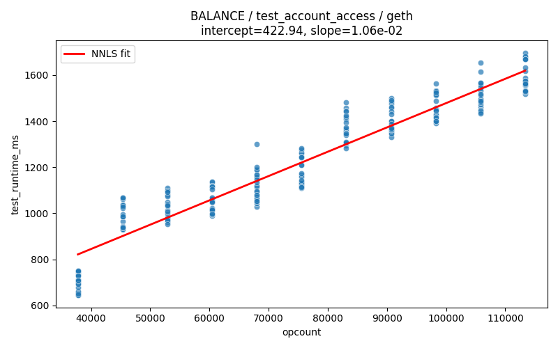

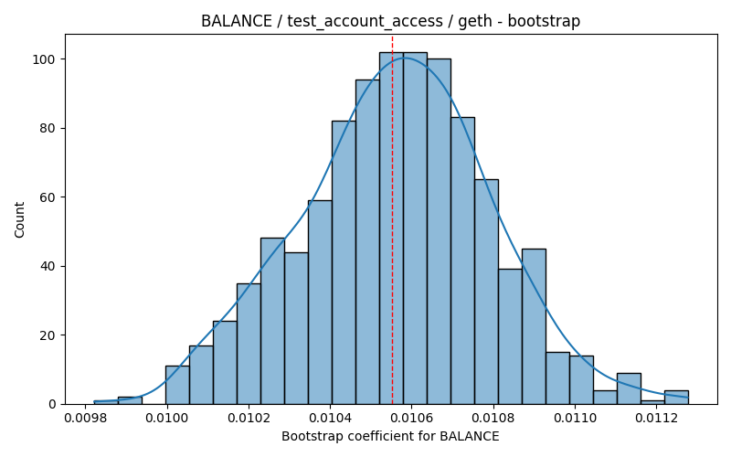

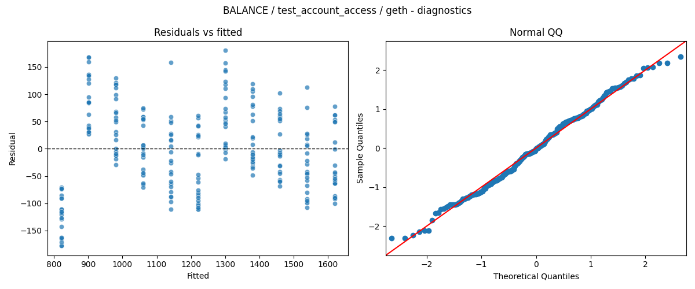

</details>

<details><summary>nethermind — NNLS regression summary</summary>

```
==============================================================================
                           NNLS Regression Results                            
==============================================================================
Dep. Variable:          test_runtime_ms              R-squared:          0.767
Model:                  NNLS                    Adj. R-squared:          0.765
No. Observations:       198                               RMSE:          51.80
Df Residuals:           196                                MAE:          40.42
Df Model:               1      
==============================================================================
                      coef     std err     P-value      [0.025      0.975]
------------------------------------------------------------------------------
         const    102.0649     11.4631       0.001     81.1537    125.0178
       opcount      0.0039      0.0001       0.001      0.0036      0.0042
==============================================================================
Notes: Non-negative least squares with bootstrap inference (1000 iterations)
==============================================================================
```

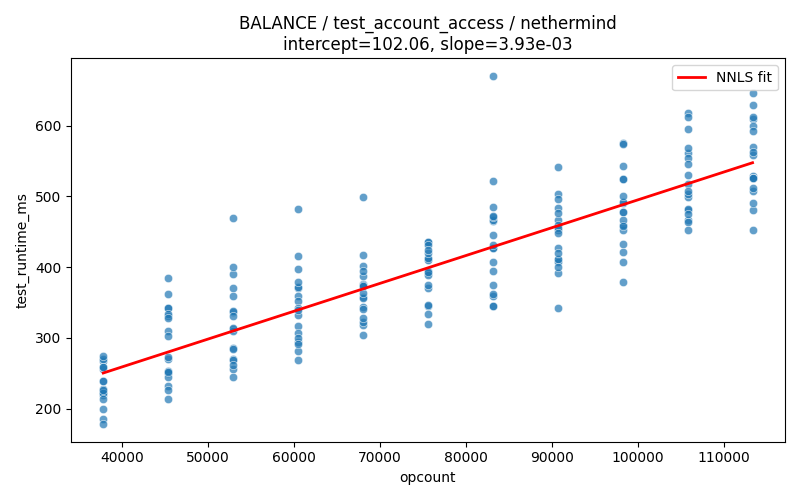

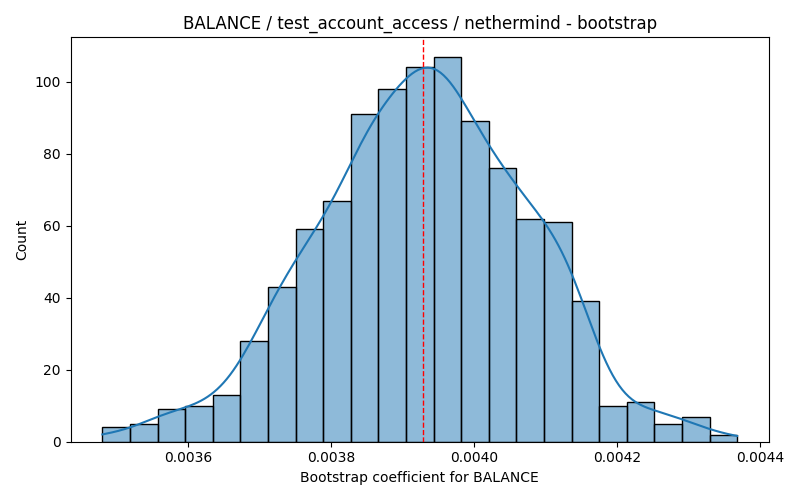

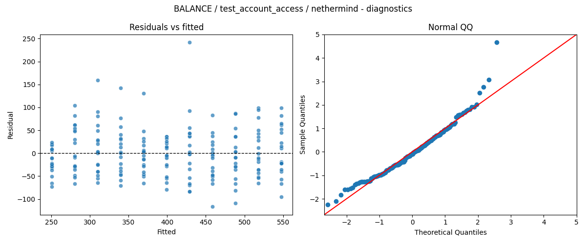

</details>

<details><summary>reth — NNLS regression summary</summary>

```
==============================================================================
                           NNLS Regression Results                            
==============================================================================
Dep. Variable:          test_runtime_ms              R-squared:          0.942
Model:                  NNLS                    Adj. R-squared:          0.942
No. Observations:       308                               RMSE:           6.31
Df Residuals:           306                                MAE:           4.85
Df Model:               1      
==============================================================================
                      coef     std err     P-value      [0.025      0.975]
------------------------------------------------------------------------------
         const     39.1213      1.0968       0.001     36.9799     41.1966
       opcount      0.0011      0.0000       0.001      0.0010      0.0011
==============================================================================
Notes: Non-negative least squares with bootstrap inference (1000 iterations)
==============================================================================
```

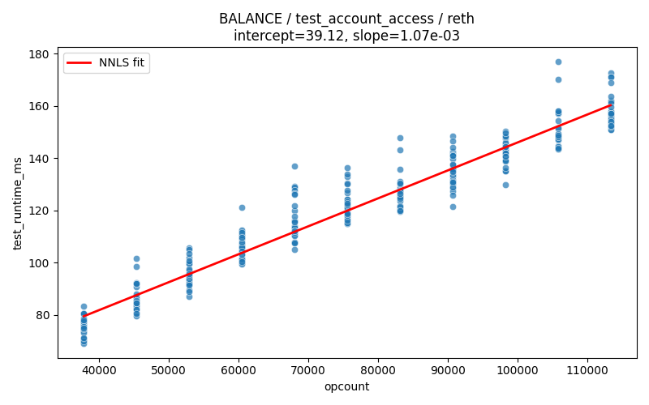

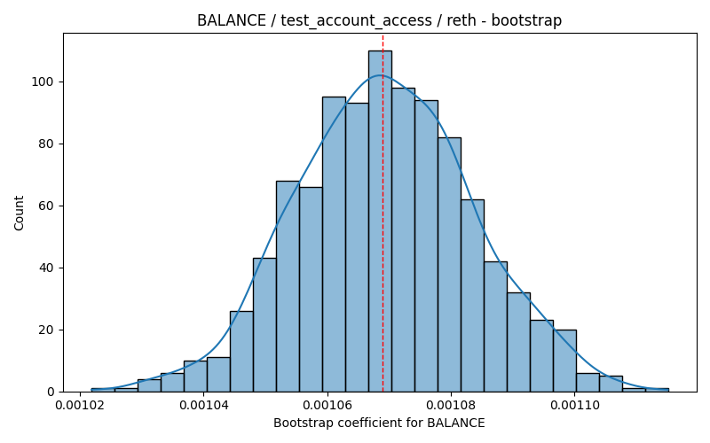

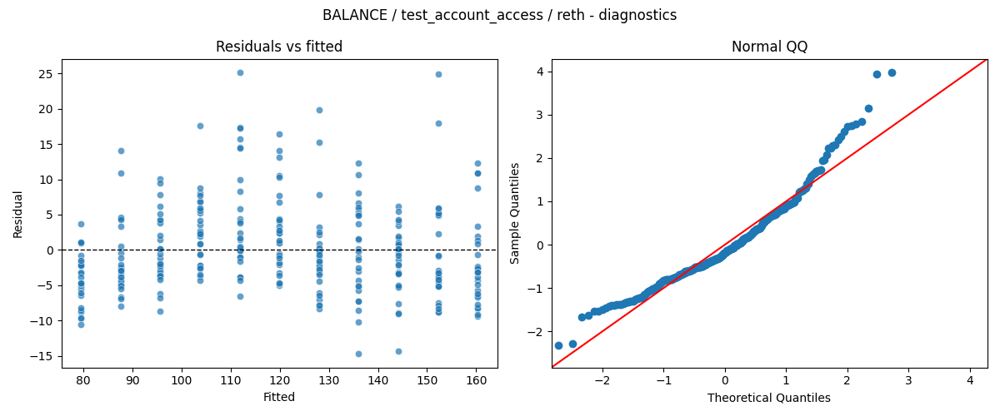

</details>

### test_account_access — combo `BALANCE_AccountMode.NON_EXISTING_ACCOUNT` — `presets[cold_account_nocode_access]`

| client | nobs | R² | target_coef (ms) | p-value | 95% CI |
| --- | --- | --- | --- | --- | --- |
| `besu` | 407 | 0.8852 | 0.01349 | 1.00e-03 | [0.01302, 0.01397] |
| `erigon` | 165 | 0.9747 | 0.008021 | 1.00e-03 | [0.007807, 0.008153] |
| `ethrex` | 275 | 0.9652 | 0.001891 | 1.00e-03 | [0.001848, 0.001932] |
| `geth` | 242 | 0.8577 | 0.02148 | 1.00e-03 | [0.02033, 0.02259] |
| `nethermind` | 198 | 0.7737 | 0.00361 | 1.00e-03 | [0.003349, 0.003871] |
| `reth` | 308 | 0.9026 | 0.0007625 | 1.00e-03 | [0.0007355, 0.00079] |

<details><summary>besu — NNLS regression summary</summary>

```
==============================================================================
                           NNLS Regression Results                            
==============================================================================
Dep. Variable:          test_runtime_ms              R-squared:          0.885
Model:                  NNLS                    Adj. R-squared:          0.885
No. Observations:       407                               RMSE:         116.10
Df Residuals:           405                                MAE:         104.59
Df Model:               1      
==============================================================================
                      coef     std err     P-value      [0.025      0.975]
------------------------------------------------------------------------------
         const    487.1444     19.2762       0.001    450.7782    524.7161
       opcount      0.0135      0.0003       0.001      0.0130      0.0140
==============================================================================
Notes: Non-negative least squares with bootstrap inference (1000 iterations)
==============================================================================
```

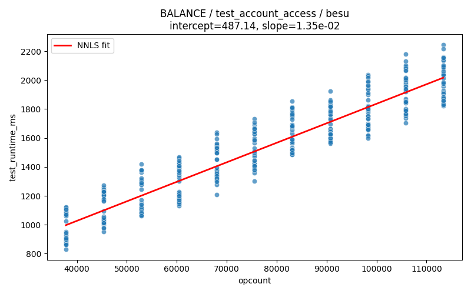

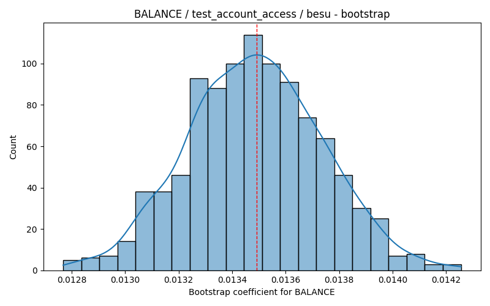


</details>

<details><summary>erigon — NNLS regression summary</summary>

```
==============================================================================
                           NNLS Regression Results                            
==============================================================================
Dep. Variable:          test_runtime_ms              R-squared:          0.975
Model:                  NNLS                    Adj. R-squared:          0.975
No. Observations:       165                               RMSE:          30.86
Df Residuals:           163                                MAE:          23.03
Df Model:               1      
==============================================================================
                      coef     std err     P-value      [0.025      0.975]
------------------------------------------------------------------------------
         const      5.8028      6.0244       0.216      0.0000     20.0916
       opcount      0.0080      0.0001       0.001      0.0078      0.0082
==============================================================================
Notes: Non-negative least squares with bootstrap inference (1000 iterations)
==============================================================================
```

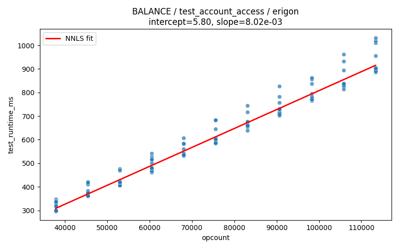

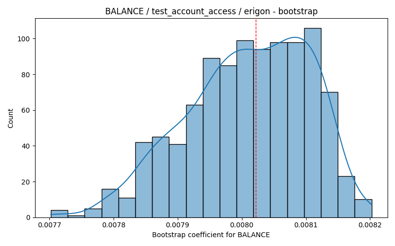

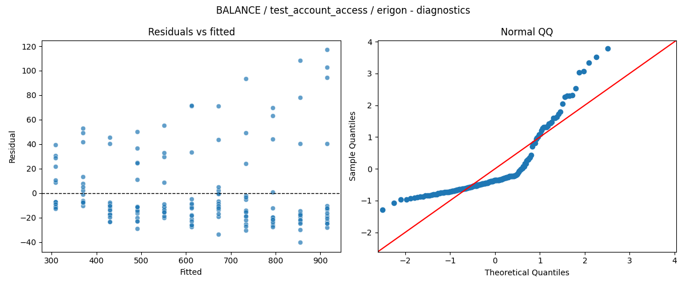

</details>

<details><summary>ethrex — NNLS regression summary</summary>

```
==============================================================================
                           NNLS Regression Results                            
==============================================================================
Dep. Variable:          test_runtime_ms              R-squared:          0.965
Model:                  NNLS                    Adj. R-squared:          0.965
No. Observations:       275                               RMSE:           8.58
Df Residuals:           273                                MAE:           6.93
Df Model:               1      
==============================================================================
                      coef     std err     P-value      [0.025      0.975]
------------------------------------------------------------------------------
         const     29.4487      1.7951       0.001     26.0179     33.0756
       opcount      0.0019      0.0000       0.001      0.0018      0.0019
==============================================================================
Notes: Non-negative least squares with bootstrap inference (1000 iterations)
==============================================================================
```

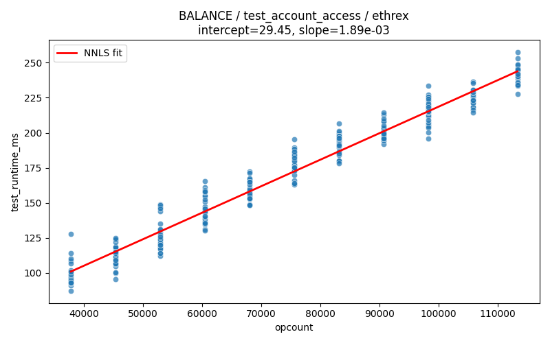

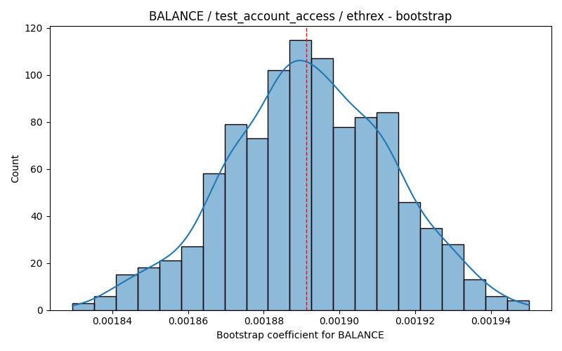

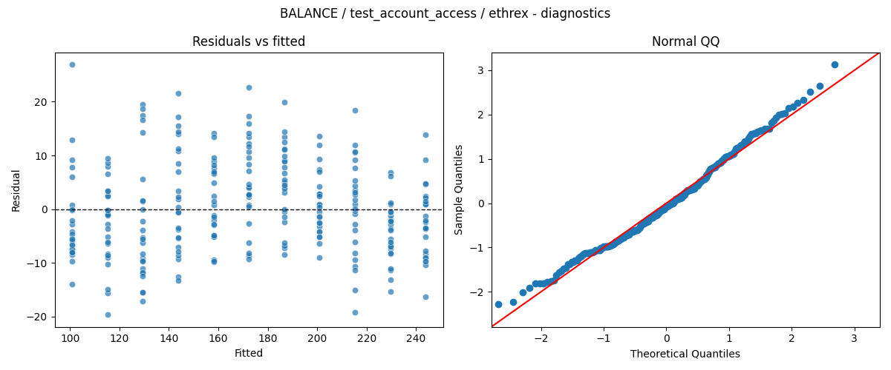

</details>

<details><summary>geth — NNLS regression summary</summary>

```
==============================================================================
                           NNLS Regression Results                            
==============================================================================
Dep. Variable:          test_runtime_ms              R-squared:          0.858
Model:                  NNLS                    Adj. R-squared:          0.857
No. Observations:       242                               RMSE:         209.12
Df Residuals:           240                                MAE:         176.52
Df Model:               1      
==============================================================================
                      coef     std err     P-value      [0.025      0.975]
------------------------------------------------------------------------------
         const    706.9875     52.0082       0.001    608.7332    808.6192
       opcount      0.0215      0.0006       0.001      0.0203      0.0226
==============================================================================
Notes: Non-negative least squares with bootstrap inference (1000 iterations)
==============================================================================
```

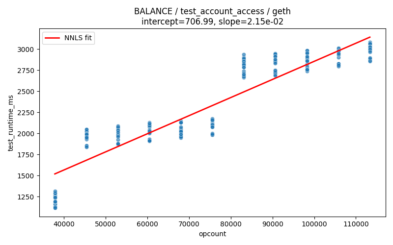

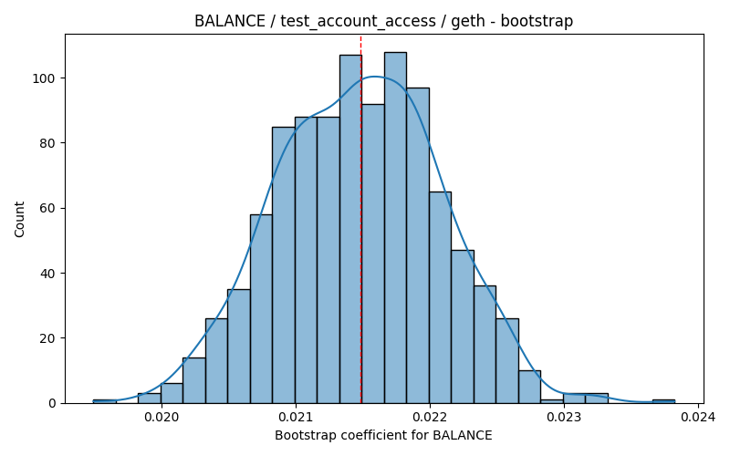

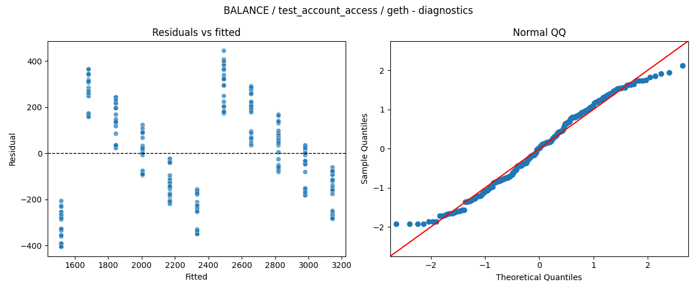

</details>

<details><summary>nethermind — NNLS regression summary</summary>

```
==============================================================================
                           NNLS Regression Results                            
==============================================================================
Dep. Variable:          test_runtime_ms              R-squared:          0.774
Model:                  NNLS                    Adj. R-squared:          0.773
No. Observations:       198                               RMSE:          46.66
Df Residuals:           196                                MAE:          32.55
Df Model:               1      
==============================================================================
                      coef     std err     P-value      [0.025      0.975]
------------------------------------------------------------------------------
         const     89.7286      9.2168       0.001     71.8462    107.7749
       opcount      0.0036      0.0001       0.001      0.0033      0.0039
==============================================================================
Notes: Non-negative least squares with bootstrap inference (1000 iterations)
==============================================================================
```

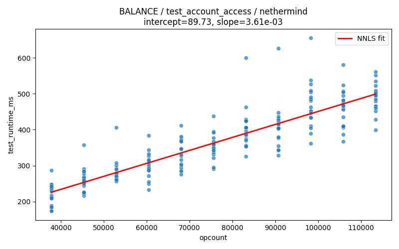

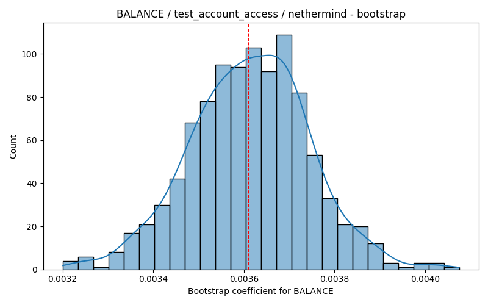

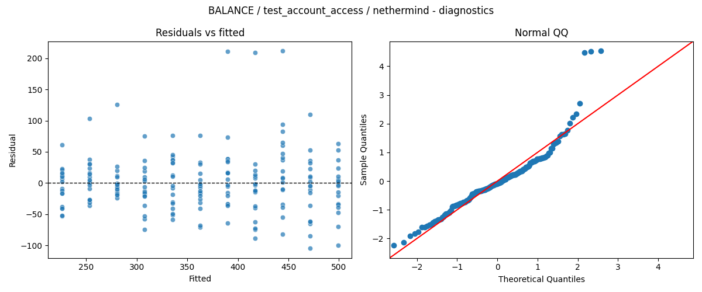

</details>

<details><summary>reth — NNLS regression summary</summary>

```
==============================================================================
                           NNLS Regression Results                            
==============================================================================
Dep. Variable:          test_runtime_ms              R-squared:          0.903
Model:                  NNLS                    Adj. R-squared:          0.902
No. Observations:       308                               RMSE:           5.99
Df Residuals:           306                                MAE:           4.64
Df Model:               1      
==============================================================================
                      coef     std err     P-value      [0.025      0.975]
------------------------------------------------------------------------------
         const     43.9607      1.0059       0.001     42.0682     45.9563
       opcount      0.0008      0.0000       0.001      0.0007      0.0008
==============================================================================
Notes: Non-negative least squares with bootstrap inference (1000 iterations)
==============================================================================
```

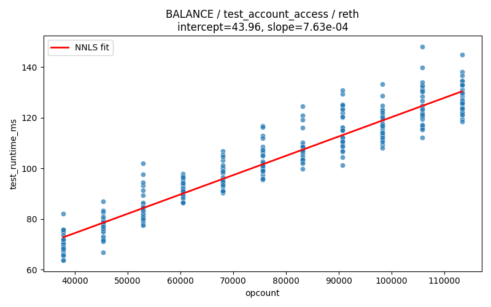

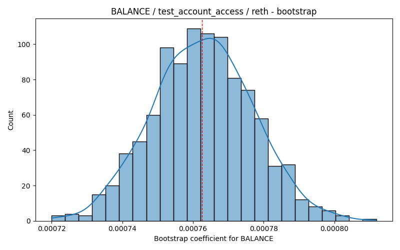

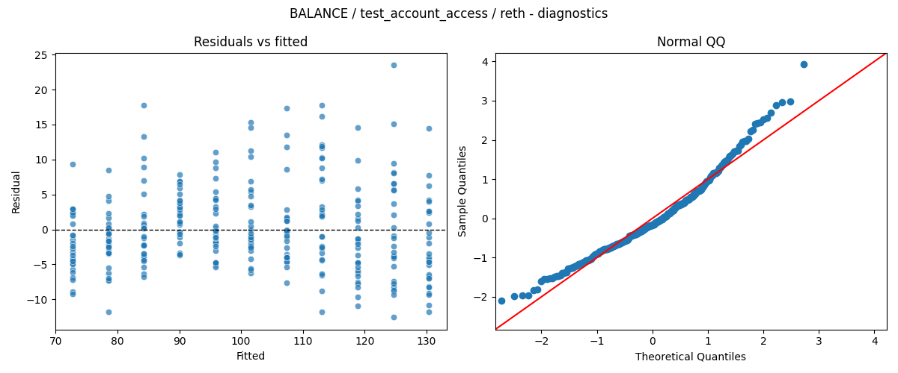

</details>

### test_account_access — combo `BALANCE_AccountMode.EXISTING_CONTRACT`

| client | nobs | R² | target_coef (ms) | p-value | 95% CI |
| --- | --- | --- | --- | --- | --- |
| `besu` | 407 | 0.8876 | 0.02507 | 1.00e-03 | [0.0243, 0.02581] |
| `erigon` | 165 | 0.9328 | 0.02471 | 1.00e-03 | [0.02366, 0.02557] |
| `ethrex` | 275 | 0.9931 | 0.007378 | 1.00e-03 | [0.007313, 0.007445] |
| `geth` | 242 | 0.854 | 0.02295 | 1.00e-03 | [0.02168, 0.02419] |
| `nethermind` | 198 | 0.5708 | 0.0134 | 1.00e-03 | [0.01166, 0.01523] |
| `reth` | 308 | 0.9786 | 0.003975 | 1.00e-03 | [0.00391, 0.004042] |

<details><summary>besu — NNLS regression summary</summary>

```
==============================================================================
                           NNLS Regression Results                            
==============================================================================
Dep. Variable:          test_runtime_ms              R-squared:          0.888
Model:                  NNLS                    Adj. R-squared:          0.887
No. Observations:       407                               RMSE:         185.58
Df Residuals:           405                                MAE:         156.73
Df Model:               1      
==============================================================================
                      coef     std err     P-value      [0.025      0.975]
------------------------------------------------------------------------------
         const    539.2354     25.0870       0.001    490.6093    588.7369
       opcount      0.0251      0.0004       0.001      0.0243      0.0258
==============================================================================
Notes: Non-negative least squares with bootstrap inference (1000 iterations)
==============================================================================
```

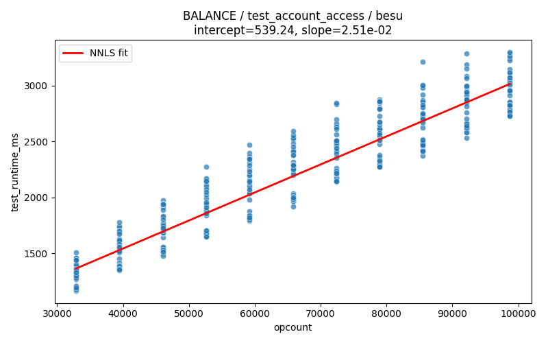

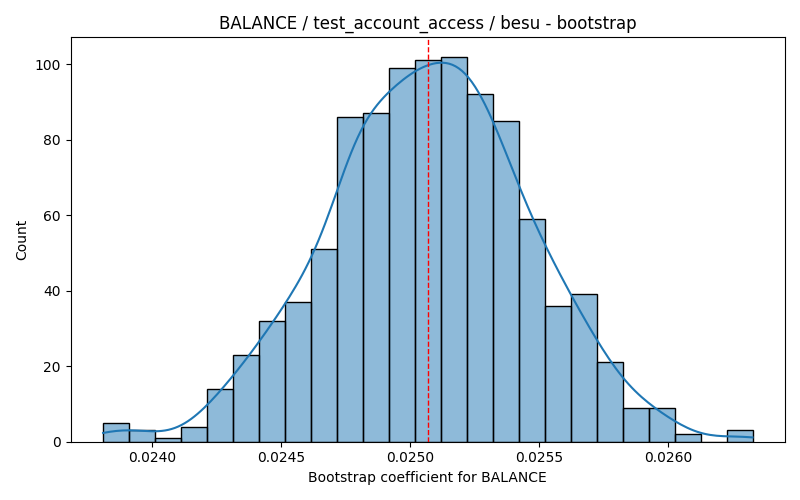

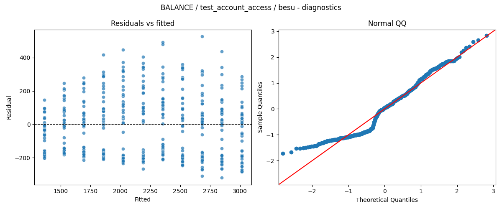

</details>

<details><summary>erigon — NNLS regression summary</summary>

```
==============================================================================
                           NNLS Regression Results                            
==============================================================================
Dep. Variable:          test_runtime_ms              R-squared:          0.933
Model:                  NNLS                    Adj. R-squared:          0.932
No. Observations:       165                               RMSE:         138.00
Df Residuals:           163                                MAE:         119.78
Df Model:               1      
==============================================================================
                      coef     std err     P-value      [0.025      0.975]
------------------------------------------------------------------------------
         const    379.3412     36.9753       0.001    313.4759    457.2513
       opcount      0.0247      0.0005       0.001      0.0237      0.0256
==============================================================================
Notes: Non-negative least squares with bootstrap inference (1000 iterations)
==============================================================================
```

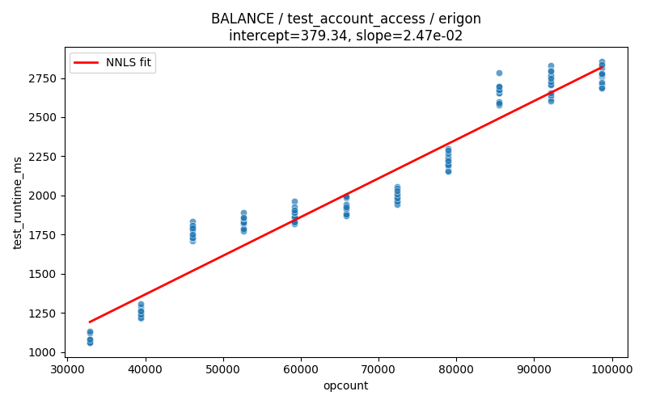

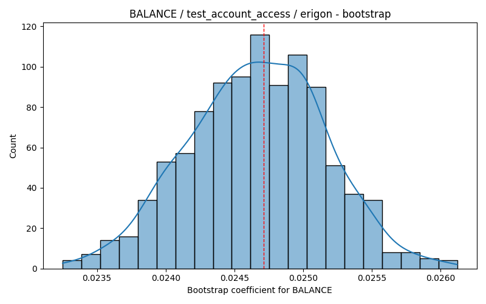

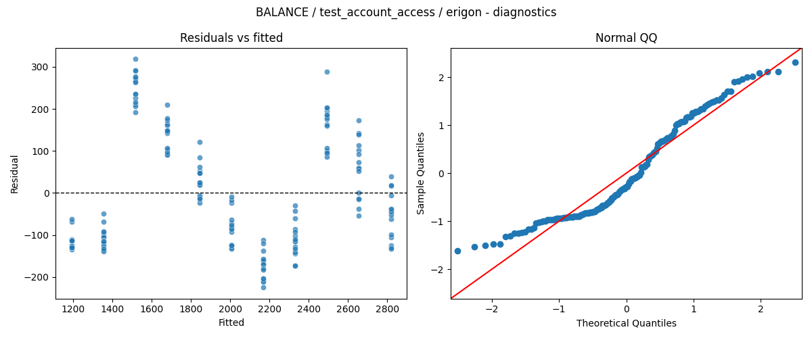

</details>

<details><summary>ethrex — NNLS regression summary</summary>

```
==============================================================================
                           NNLS Regression Results                            
==============================================================================
Dep. Variable:          test_runtime_ms              R-squared:          0.993
Model:                  NNLS                    Adj. R-squared:          0.993
No. Observations:       275                               RMSE:          12.83
Df Residuals:           273                                MAE:           9.84
Df Model:               1      
==============================================================================
                      coef     std err     P-value      [0.025      0.975]
------------------------------------------------------------------------------
         const     45.6808      2.2697       0.001     41.1547     49.9671
       opcount      0.0074      0.0000       0.001      0.0073      0.0074
==============================================================================
Notes: Non-negative least squares with bootstrap inference (1000 iterations)
==============================================================================
```

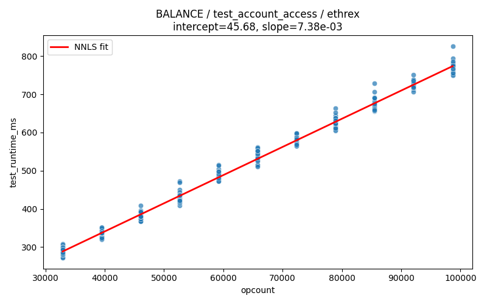

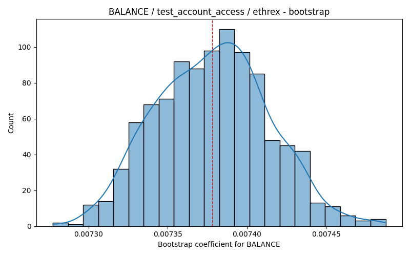

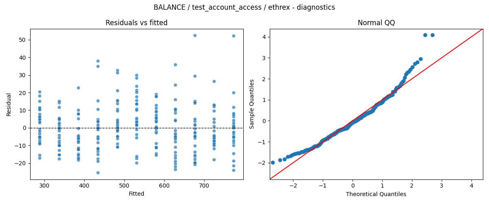

</details>

<details><summary>geth — NNLS regression summary</summary>

```
==============================================================================
                           NNLS Regression Results                            
==============================================================================
Dep. Variable:          test_runtime_ms              R-squared:          0.854
Model:                  NNLS                    Adj. R-squared:          0.853
No. Observations:       242                               RMSE:         197.42
Df Residuals:           240                                MAE:         165.71
Df Model:               1      
==============================================================================
                      coef     std err     P-value      [0.025      0.975]
------------------------------------------------------------------------------
         const    666.2250     46.8581       0.001    572.3663    760.4997
       opcount      0.0229      0.0006       0.001      0.0217      0.0242
==============================================================================
Notes: Non-negative least squares with bootstrap inference (1000 iterations)
==============================================================================
```

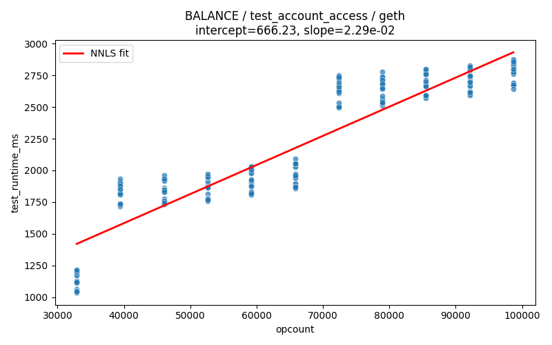

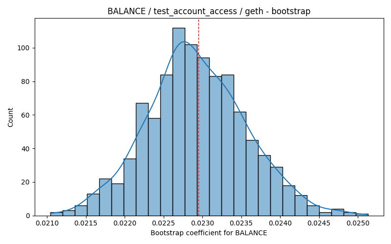

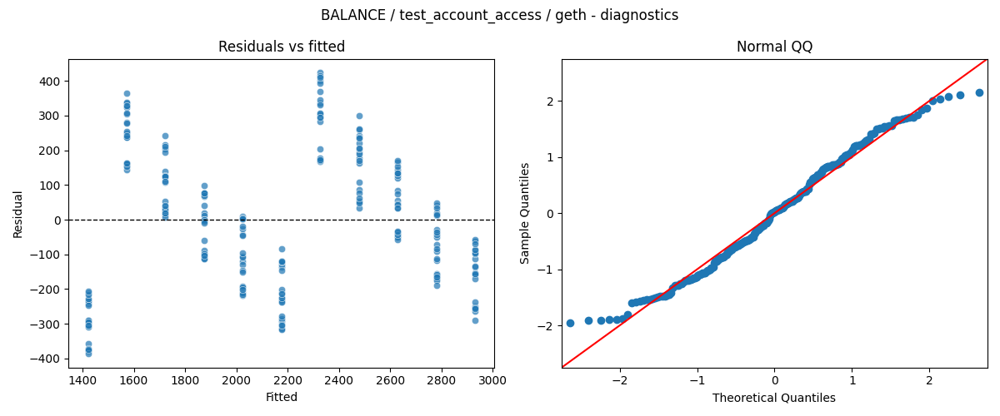

</details>

<details><summary>nethermind — NNLS regression summary</summary>

```
==============================================================================
                           NNLS Regression Results                            
==============================================================================
Dep. Variable:          test_runtime_ms              R-squared:          0.571
Model:                  NNLS                    Adj. R-squared:          0.569
No. Observations:       198                               RMSE:         241.76
Df Residuals:           196                                MAE:         183.52
Df Model:               1      
==============================================================================
                      coef     std err     P-value      [0.025      0.975]
------------------------------------------------------------------------------
         const    161.9544     51.9350       0.002     55.8445    264.0942
       opcount      0.0134      0.0009       0.001      0.0117      0.0152
==============================================================================
Notes: Non-negative least squares with bootstrap inference (1000 iterations)
==============================================================================
```

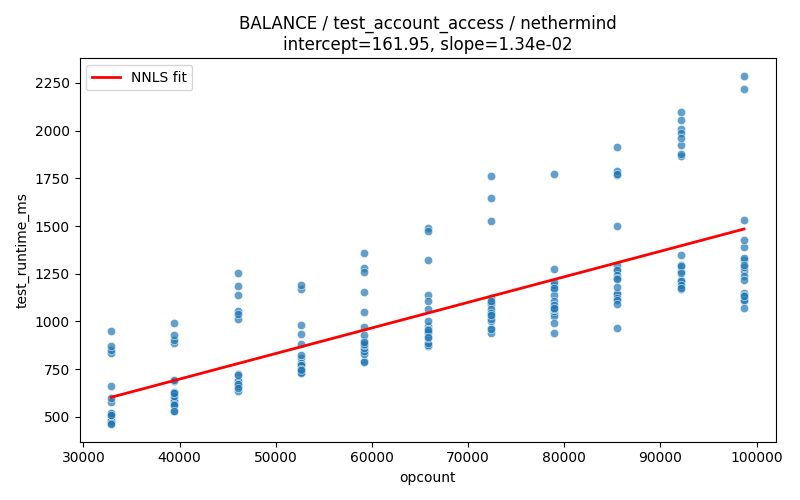

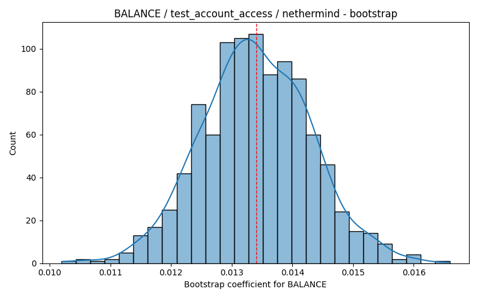

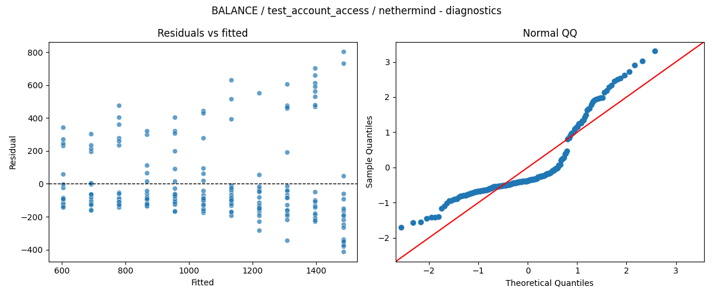

</details>

<details><summary>reth — NNLS regression summary</summary>

```
==============================================================================
                           NNLS Regression Results                            
==============================================================================
Dep. Variable:          test_runtime_ms              R-squared:          0.979
Model:                  NNLS                    Adj. R-squared:          0.979
No. Observations:       308                               RMSE:          12.22
Df Residuals:           306                                MAE:           9.83
Df Model:               1      
==============================================================================
                      coef     std err     P-value      [0.025      0.975]
------------------------------------------------------------------------------
         const     95.5440      2.2789       0.001     91.0109     99.8841
       opcount      0.0040      0.0000       0.001      0.0039      0.0040
==============================================================================
Notes: Non-negative least squares with bootstrap inference (1000 iterations)
==============================================================================
```

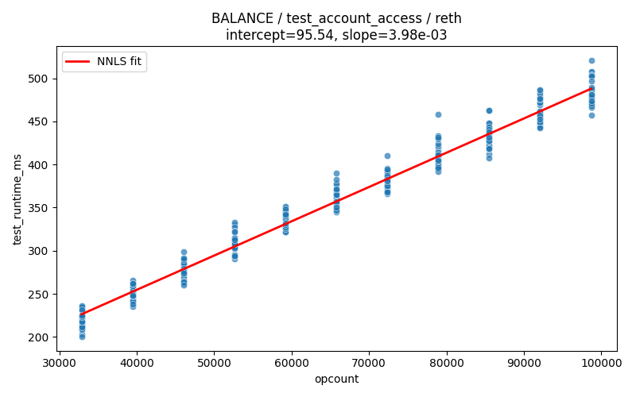

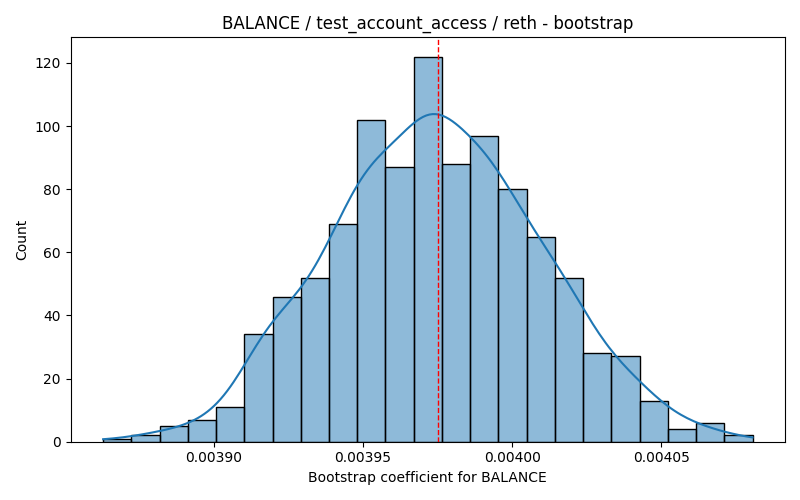

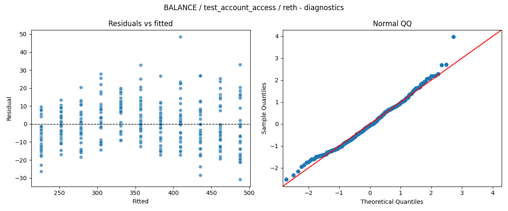

</details>

### test_account_access — combo `BALANCE_AccountMode.NON_EXISTING_ACCOUNT` — `presets[cold_account_code_access]`

| client | nobs | R² | target_coef (ms) | p-value | 95% CI |
| --- | --- | --- | --- | --- | --- |
| `besu` | 407 | 0.8852 | 0.01349 | 1.00e-03 | [0.01302, 0.01397] |
| `erigon` | 165 | 0.9747 | 0.008021 | 1.00e-03 | [0.007807, 0.008153] |
| `ethrex` | 275 | 0.9652 | 0.001891 | 1.00e-03 | [0.001848, 0.001932] |
| `geth` | 242 | 0.8577 | 0.02148 | 1.00e-03 | [0.02033, 0.02259] |
| `nethermind` | 198 | 0.7737 | 0.00361 | 1.00e-03 | [0.003349, 0.003871] |
| `reth` | 308 | 0.9026 | 0.0007625 | 1.00e-03 | [0.0007355, 0.00079] |

<details><summary>besu — NNLS regression summary</summary>

```
==============================================================================
                           NNLS Regression Results                            
==============================================================================
Dep. Variable:          test_runtime_ms              R-squared:          0.885
Model:                  NNLS                    Adj. R-squared:          0.885
No. Observations:       407                               RMSE:         116.10
Df Residuals:           405                                MAE:         104.59
Df Model:               1      
==============================================================================
                      coef     std err     P-value      [0.025      0.975]
------------------------------------------------------------------------------
         const    487.1444     19.2762       0.001    450.7782    524.7161
       opcount      0.0135      0.0003       0.001      0.0130      0.0140
==============================================================================
Notes: Non-negative least squares with bootstrap inference (1000 iterations)
==============================================================================
```


</details>

<details><summary>erigon — NNLS regression summary</summary>

```
==============================================================================
                           NNLS Regression Results                            
==============================================================================
Dep. Variable:          test_runtime_ms              R-squared:          0.975
Model:                  NNLS                    Adj. R-squared:          0.975
No. Observations:       165                               RMSE:          30.86
Df Residuals:           163                                MAE:          23.03
Df Model:               1      
==============================================================================
                      coef     std err     P-value      [0.025      0.975]
------------------------------------------------------------------------------
         const      5.8028      6.0244       0.216      0.0000     20.0916
       opcount      0.0080      0.0001       0.001      0.0078      0.0082
==============================================================================
Notes: Non-negative least squares with bootstrap inference (1000 iterations)
==============================================================================
```


</details>

<details><summary>ethrex — NNLS regression summary</summary>

```
==============================================================================
                           NNLS Regression Results                            
==============================================================================
Dep. Variable:          test_runtime_ms              R-squared:          0.965
Model:                  NNLS                    Adj. R-squared:          0.965
No. Observations:       275                               RMSE:           8.58
Df Residuals:           273                                MAE:           6.93
Df Model:               1      
==============================================================================
                      coef     std err     P-value      [0.025      0.975]
------------------------------------------------------------------------------
         const     29.4487      1.7951       0.001     26.0179     33.0756
       opcount      0.0019      0.0000       0.001      0.0018      0.0019
==============================================================================
Notes: Non-negative least squares with bootstrap inference (1000 iterations)
==============================================================================
```


</details>

<details><summary>geth — NNLS regression summary</summary>

```
==============================================================================
                           NNLS Regression Results                            
==============================================================================
Dep. Variable:          test_runtime_ms              R-squared:          0.858
Model:                  NNLS                    Adj. R-squared:          0.857
No. Observations:       242                               RMSE:         209.12
Df Residuals:           240                                MAE:         176.52
Df Model:               1      
==============================================================================
                      coef     std err     P-value      [0.025      0.975]
------------------------------------------------------------------------------
         const    706.9875     52.0082       0.001    608.7332    808.6192
       opcount      0.0215      0.0006       0.001      0.0203      0.0226
==============================================================================
Notes: Non-negative least squares with bootstrap inference (1000 iterations)
==============================================================================
```


</details>

<details><summary>nethermind — NNLS regression summary</summary>

```
==============================================================================
                           NNLS Regression Results                            
==============================================================================
Dep. Variable:          test_runtime_ms              R-squared:          0.774
Model:                  NNLS                    Adj. R-squared:          0.773
No. Observations:       198                               RMSE:          46.66
Df Residuals:           196                                MAE:          32.55
Df Model:               1      
==============================================================================
                      coef     std err     P-value      [0.025      0.975]
------------------------------------------------------------------------------
         const     89.7286      9.2168       0.001     71.8462    107.7749
       opcount      0.0036      0.0001       0.001      0.0033      0.0039
==============================================================================
Notes: Non-negative least squares with bootstrap inference (1000 iterations)
==============================================================================
```


</details>

<details><summary>reth — NNLS regression summary</summary>

```
==============================================================================
                           NNLS Regression Results                            
==============================================================================
Dep. Variable:          test_runtime_ms              R-squared:          0.903
Model:                  NNLS                    Adj. R-squared:          0.902
No. Observations:       308                               RMSE:           5.99
Df Residuals:           306                                MAE:           4.64
Df Model:               1      
==============================================================================
                      coef     std err     P-value      [0.025      0.975]
------------------------------------------------------------------------------
         const     43.9607      1.0059       0.001     42.0682     45.9563
       opcount      0.0008      0.0000       0.001      0.0007      0.0008
==============================================================================
Notes: Non-negative least squares with bootstrap inference (1000 iterations)
==============================================================================
```


</details>

### test_ext_account_query_warm — combo `BALANCE`

| client | nobs | R² | target_coef (ms) | p-value | 95% CI |
| --- | --- | --- | --- | --- | --- |
| `besu` | 407 | 0.2589 | 0.0002033 | 1.00e-03 | [0.0001697, 0.000233] |
| `erigon` | 165 | 0.8911 | 4.449e-05 | 1.00e-03 | [4.216e-05, 4.71e-05] |
| `ethrex` | 275 | 0.7438 | 1.472e-05 | 1.00e-03 | [1.395e-05, 1.554e-05] |
| `geth` | 242 | 0.8046 | 2.903e-05 | 1.00e-03 | [2.727e-05, 3.082e-05] |
| `nethermind` | 198 | 0.7428 | 0.000143 | 1.00e-03 | [0.000132, 0.0001539] |
| `reth` | 308 | 0.6973 | 1.293e-05 | 1.00e-03 | [1.201e-05, 1.394e-05] |

<details><summary>besu — NNLS regression summary</summary>

```
==============================================================================
                           NNLS Regression Results                            
==============================================================================
Dep. Variable:          test_runtime_ms              R-squared:          0.259
Model:                  NNLS                    Adj. R-squared:          0.257
No. Observations:       407                               RMSE:         201.12
Df Residuals:           405                                MAE:         164.35
Df Model:               1      
==============================================================================
                      coef     std err     P-value      [0.025      0.975]
------------------------------------------------------------------------------
         const    470.1406     31.6714       0.001    411.5173    538.4614
       opcount      0.0002      0.0000       0.001      0.0002      0.0002
==============================================================================
Notes: Non-negative least squares with bootstrap inference (1000 iterations)
==============================================================================
```

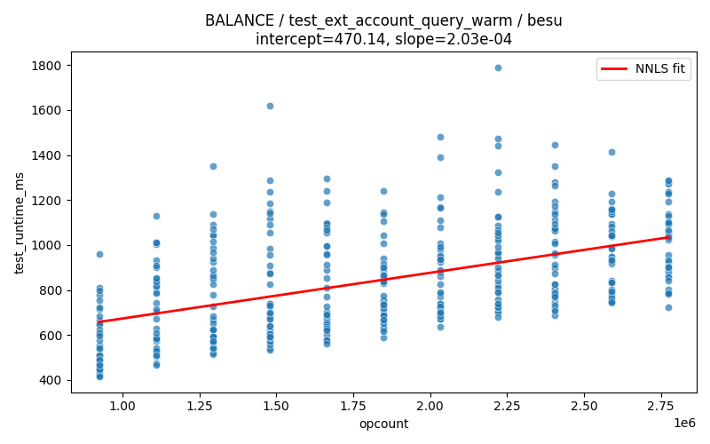

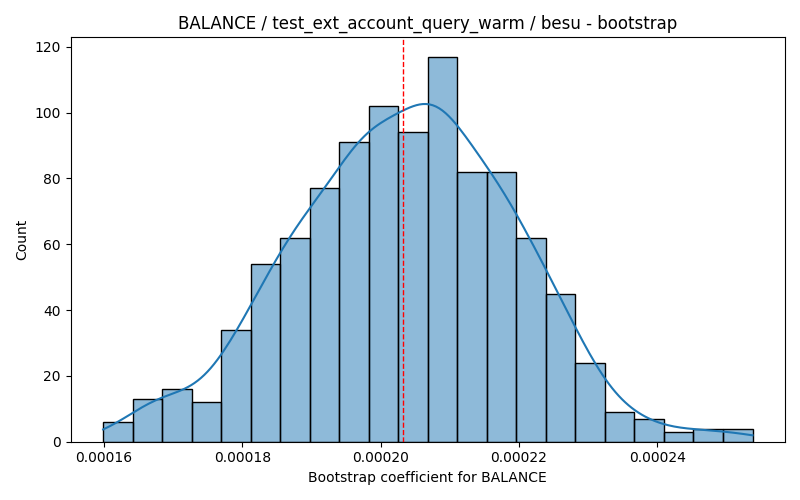

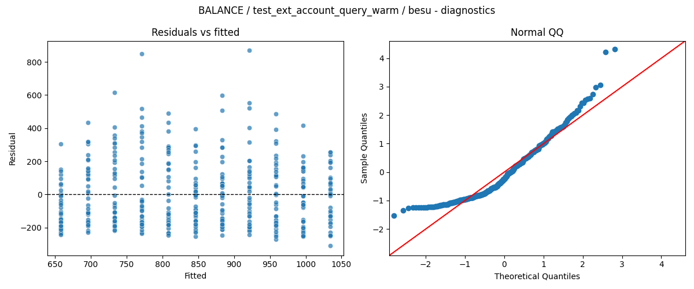

</details>

<details><summary>erigon — NNLS regression summary</summary>

```
==============================================================================
                           NNLS Regression Results                            
==============================================================================
Dep. Variable:          test_runtime_ms              R-squared:          0.891
Model:                  NNLS                    Adj. R-squared:          0.890
No. Observations:       165                               RMSE:           9.09
Df Residuals:           163                                MAE:           7.01
Df Model:               1      
==============================================================================
                      coef     std err     P-value      [0.025      0.975]
------------------------------------------------------------------------------
         const     24.6256      2.1096       0.001     20.3208     28.6250
       opcount      0.0000      0.0000       0.001      0.0000      0.0000
==============================================================================
Notes: Non-negative least squares with bootstrap inference (1000 iterations)
==============================================================================
```

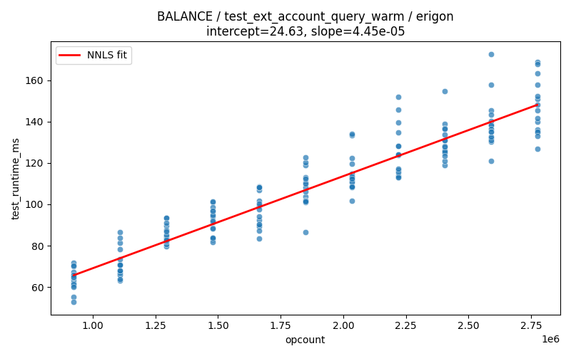

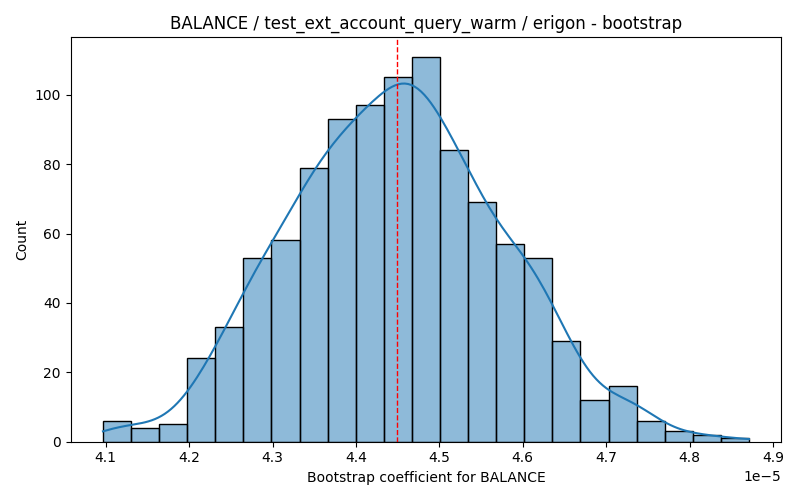

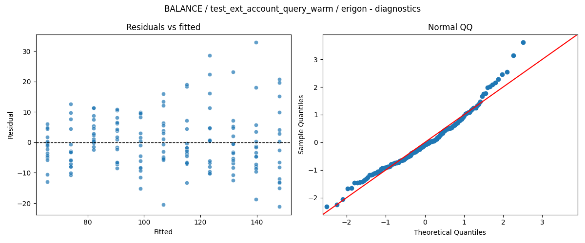

</details>

<details><summary>ethrex — NNLS regression summary</summary>

```
==============================================================================
                           NNLS Regression Results                            
==============================================================================
Dep. Variable:          test_runtime_ms              R-squared:          0.744
Model:                  NNLS                    Adj. R-squared:          0.743
No. Observations:       275                               RMSE:           5.05
Df Residuals:           273                                MAE:           3.41
Df Model:               1      
==============================================================================
                      coef     std err     P-value      [0.025      0.975]
------------------------------------------------------------------------------
         const      8.4417      0.7424       0.001      7.0247      9.8172
       opcount      0.0000      0.0000       0.001      0.0000      0.0000
==============================================================================
Notes: Non-negative least squares with bootstrap inference (1000 iterations)
==============================================================================
```

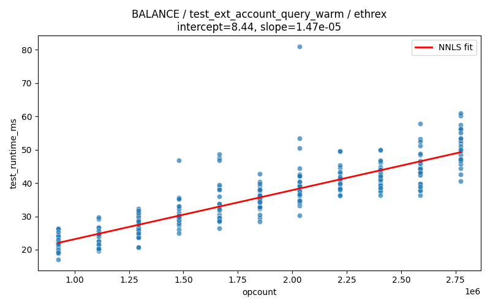

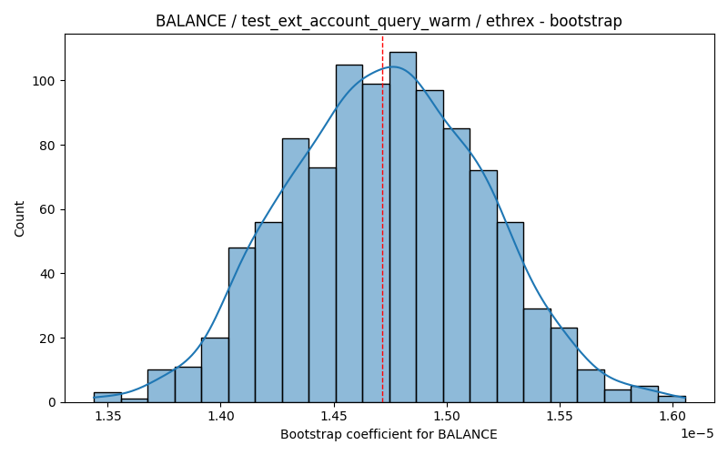

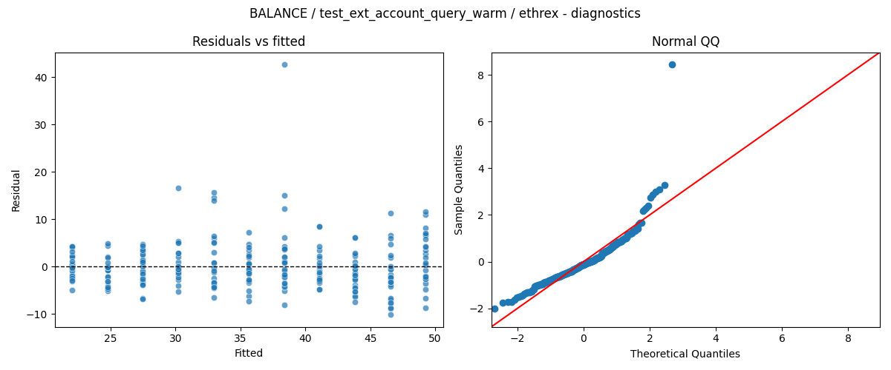

</details>

<details><summary>geth — NNLS regression summary</summary>

```
==============================================================================
                           NNLS Regression Results                            
==============================================================================
Dep. Variable:          test_runtime_ms              R-squared:          0.805
Model:                  NNLS                    Adj. R-squared:          0.804
No. Observations:       242                               RMSE:           8.37
Df Residuals:           240                                MAE:           6.34
Df Model:               1      
==============================================================================
                      coef     std err     P-value      [0.025      0.975]
------------------------------------------------------------------------------
         const     17.7507      1.5652       0.001     14.8575     20.9293
       opcount      0.0000      0.0000       0.001      0.0000      0.0000
==============================================================================
Notes: Non-negative least squares with bootstrap inference (1000 iterations)
==============================================================================
```

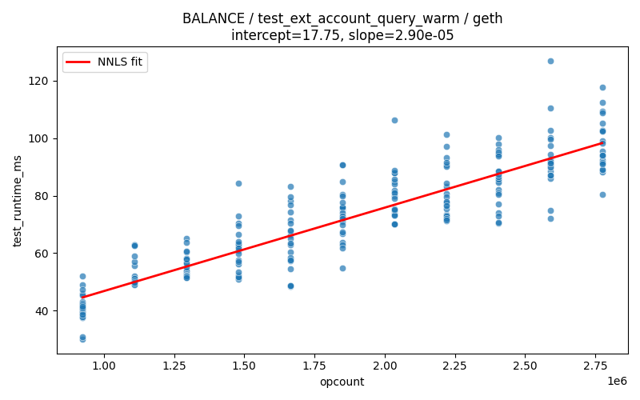

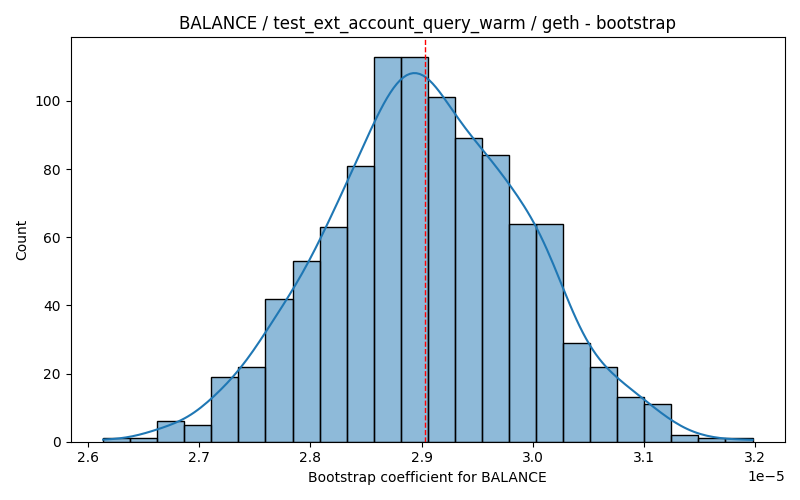

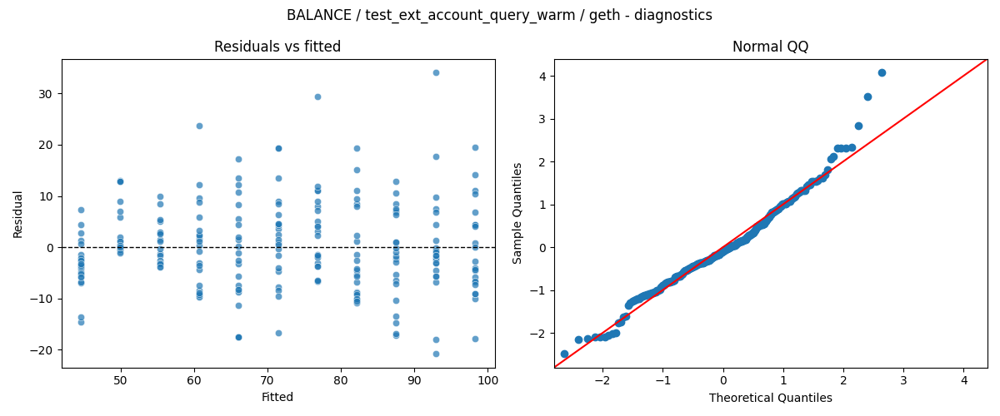

</details>

<details><summary>nethermind — NNLS regression summary</summary>

```
==============================================================================
                           NNLS Regression Results                            
==============================================================================
Dep. Variable:          test_runtime_ms              R-squared:          0.743
Model:                  NNLS                    Adj. R-squared:          0.742
No. Observations:       198                               RMSE:          49.20
Df Residuals:           196                                MAE:          35.99
Df Model:               1      
==============================================================================
                      coef     std err     P-value      [0.025      0.975]
------------------------------------------------------------------------------
         const     93.1701     10.3018       0.001     72.8993    113.5818
       opcount      0.0001      0.0000       0.001      0.0001      0.0002
==============================================================================
Notes: Non-negative least squares with bootstrap inference (1000 iterations)
==============================================================================
```

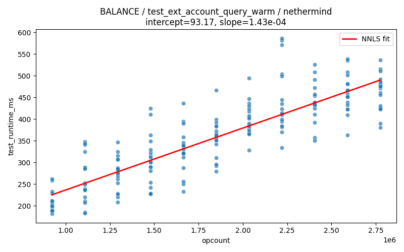

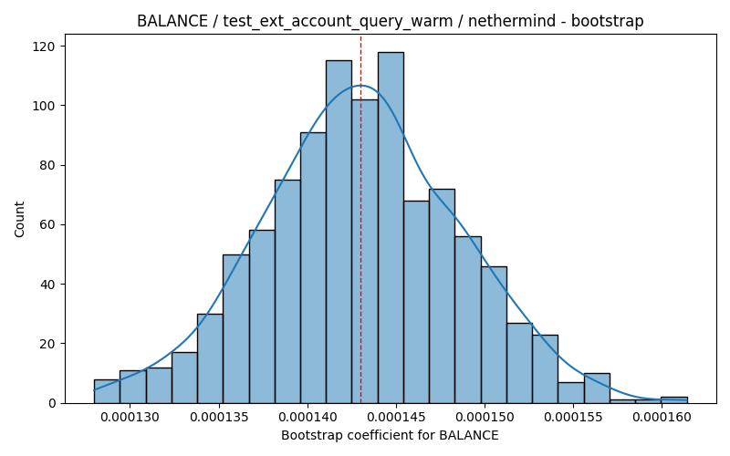

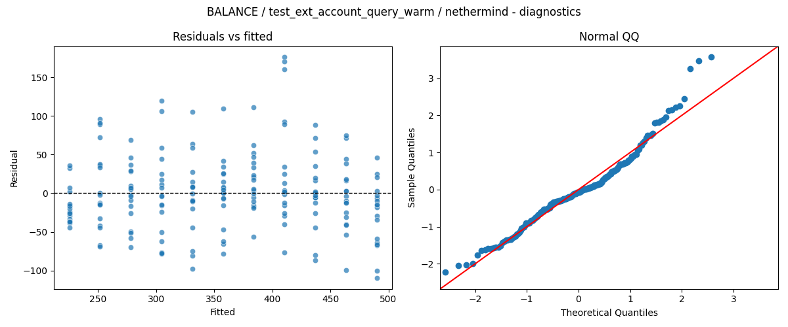

</details>

<details><summary>reth — NNLS regression summary</summary>

```
==============================================================================
                           NNLS Regression Results                            
==============================================================================
Dep. Variable:          test_runtime_ms              R-squared:          0.697
Model:                  NNLS                    Adj. R-squared:          0.696
No. Observations:       308                               RMSE:           4.98
Df Residuals:           306                                MAE:           3.81
Df Model:               1      
==============================================================================
                      coef     std err     P-value      [0.025      0.975]
------------------------------------------------------------------------------
         const      7.8033      0.8878       0.001      5.9212      9.3949
       opcount      0.0000      0.0000       0.001      0.0000      0.0000
==============================================================================
Notes: Non-negative least squares with bootstrap inference (1000 iterations)
==============================================================================
```

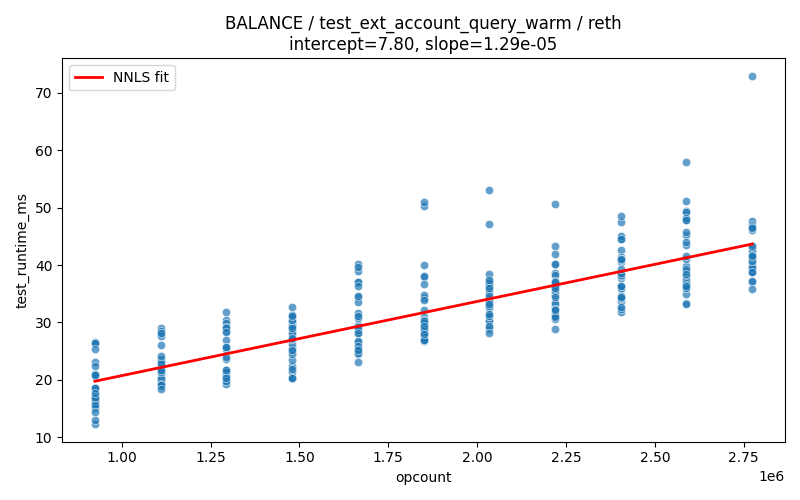

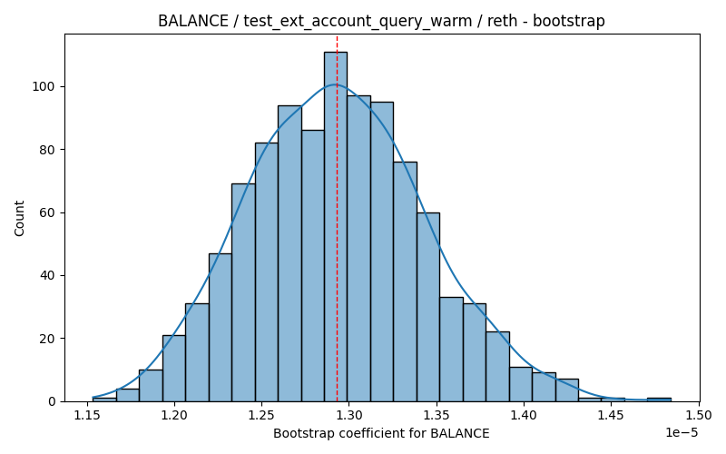

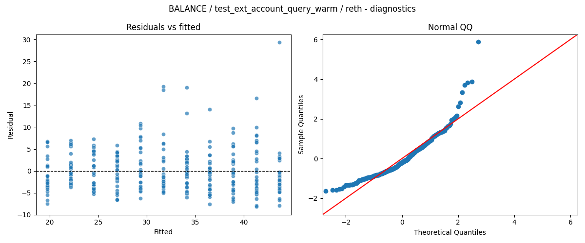

</details>

## CALL

### test_account_access — combo `CALL_AccountMode.EXISTING_EOA` — `presets[cold_account_nocode_access]`

| client | nobs | R² | target_coef (ms) | p-value | 95% CI |
| --- | --- | --- | --- | --- | --- |
| `besu` | 407 | 0.8432 | 0.01563 | 1.00e-03 | [0.01495, 0.01625] |
| `erigon` | 165 | 0.9731 | 0.01014 | 1.00e-03 | [0.009907, 0.01044] |
| `ethrex` | 275 | 0.9944 | 0.006955 | 1.00e-03 | [0.006895, 0.007017] |
| `geth` | 242 | 0.9079 | 0.0108 | 1.00e-03 | [0.01029, 0.01131] |
| `nethermind` | 198 | 0.7781 | 0.004834 | 1.00e-03 | [0.004407, 0.005243] |
| `reth` | 308 | 0.9526 | 0.001108 | 1.00e-03 | [0.001079, 0.001135] |

<details><summary>besu — NNLS regression summary</summary>

```
==============================================================================
                           NNLS Regression Results                            
==============================================================================
Dep. Variable:          test_runtime_ms              R-squared:          0.843
Model:                  NNLS                    Adj. R-squared:          0.843
No. Observations:       407                               RMSE:         160.09
Df Residuals:           405                                MAE:         134.50
Df Model:               1      
==============================================================================
                      coef     std err     P-value      [0.025      0.975]
------------------------------------------------------------------------------
         const    606.5014     25.1707       0.001    561.3060    659.6711
       opcount      0.0156      0.0003       0.001      0.0149      0.0162
==============================================================================
Notes: Non-negative least squares with bootstrap inference (1000 iterations)
==============================================================================
```

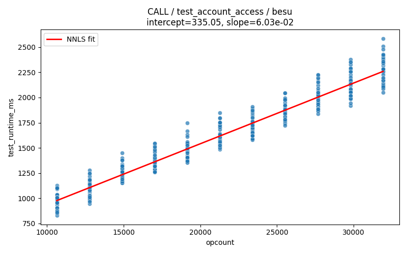

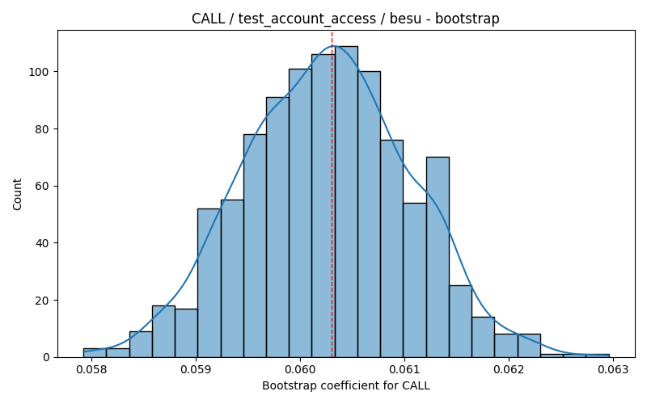

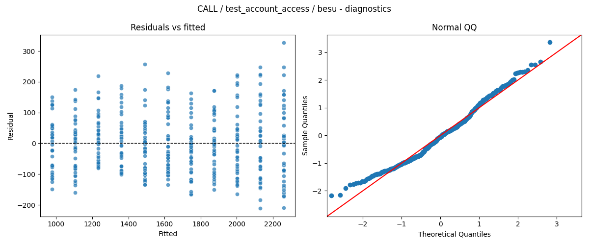

</details>

<details><summary>erigon — NNLS regression summary</summary>

```
==============================================================================
                           NNLS Regression Results                            
==============================================================================
Dep. Variable:          test_runtime_ms              R-squared:          0.973
Model:                  NNLS                    Adj. R-squared:          0.973
No. Observations:       165                               RMSE:          40.02
Df Residuals:           163                                MAE:          31.50
Df Model:               1      
==============================================================================
                      coef     std err     P-value      [0.025      0.975]
------------------------------------------------------------------------------
         const     37.2477      9.5309       0.001     17.6511     54.3103
       opcount      0.0101      0.0001       0.001      0.0099      0.0104
==============================================================================
Notes: Non-negative least squares with bootstrap inference (1000 iterations)
==============================================================================
```

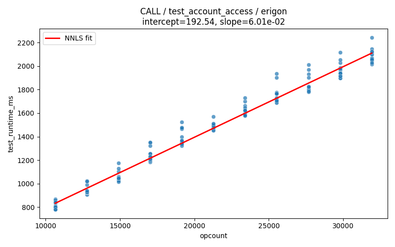

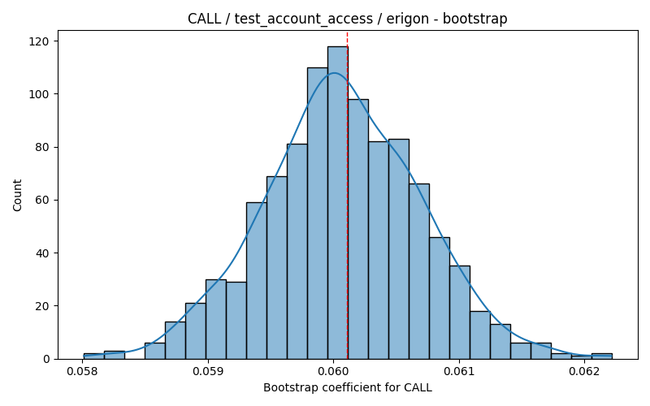

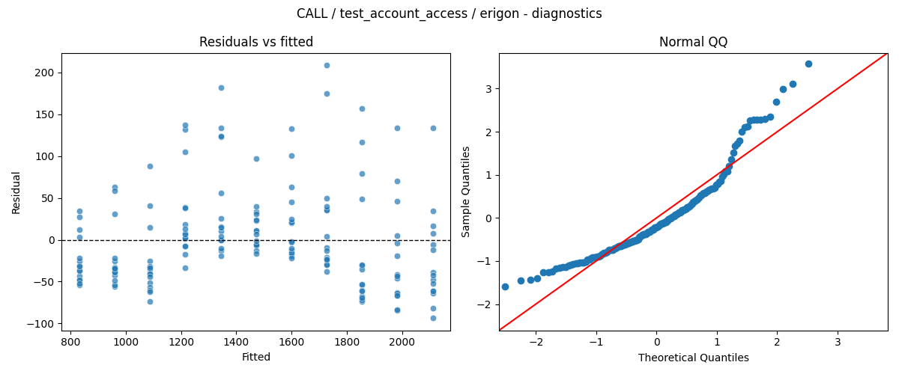

</details>

<details><summary>ethrex — NNLS regression summary</summary>

```
==============================================================================
                           NNLS Regression Results                            
==============================================================================
Dep. Variable:          test_runtime_ms              R-squared:          0.994
Model:                  NNLS                    Adj. R-squared:          0.994
No. Observations:       275                               RMSE:          12.43
Df Residuals:           273                                MAE:           9.94
Df Model:               1      
==============================================================================
                      coef     std err     P-value      [0.025      0.975]
------------------------------------------------------------------------------
         const     49.0123      2.5317       0.001     44.3382     53.9352
       opcount      0.0070      0.0000       0.001      0.0069      0.0070
==============================================================================
Notes: Non-negative least squares with bootstrap inference (1000 iterations)
==============================================================================
```

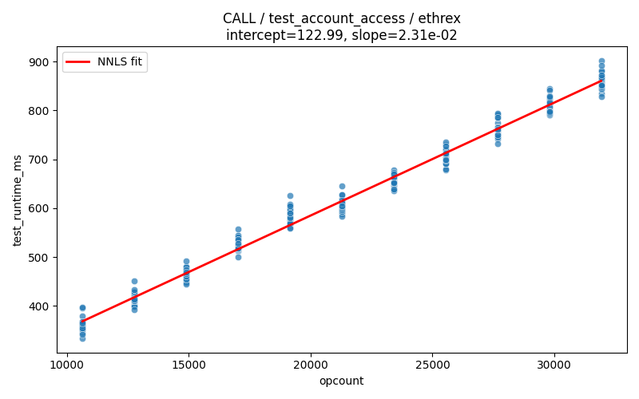

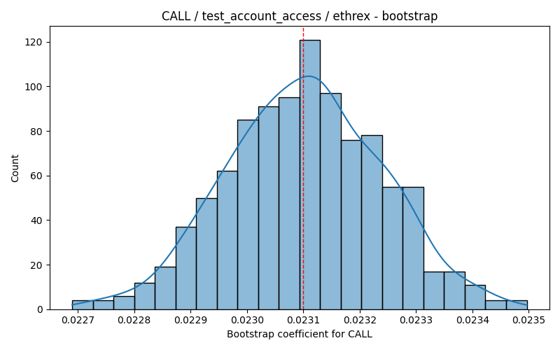

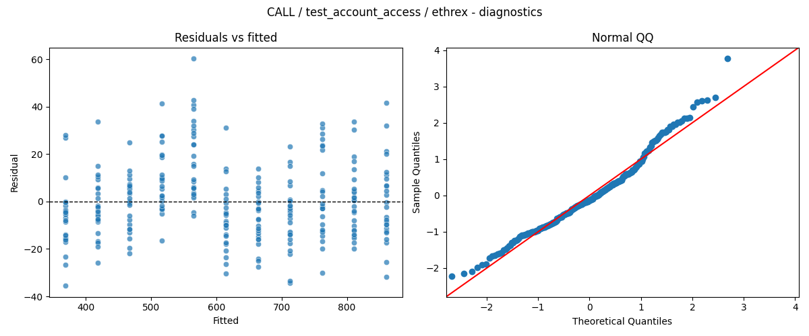

</details>

<details><summary>geth — NNLS regression summary</summary>

```
==============================================================================
                           NNLS Regression Results                            
==============================================================================
Dep. Variable:          test_runtime_ms              R-squared:          0.908
Model:                  NNLS                    Adj. R-squared:          0.908
No. Observations:       242                               RMSE:          81.67
Df Residuals:           240                                MAE:          67.04
Df Model:               1      
==============================================================================
                      coef     std err     P-value      [0.025      0.975]
------------------------------------------------------------------------------
         const    418.5308     21.3403       0.001    377.9693    461.7609
       opcount      0.0108      0.0003       0.001      0.0103      0.0113
==============================================================================
Notes: Non-negative least squares with bootstrap inference (1000 iterations)
==============================================================================
```

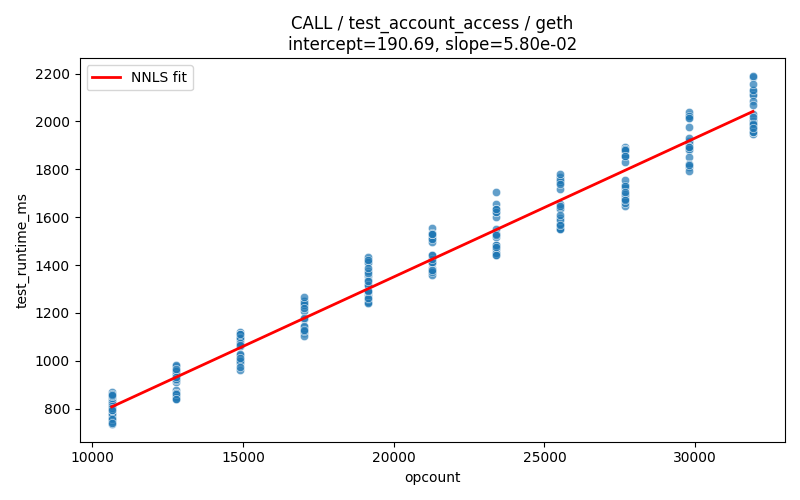

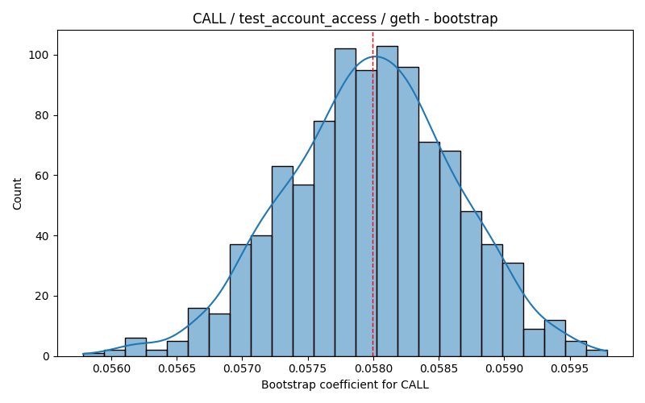

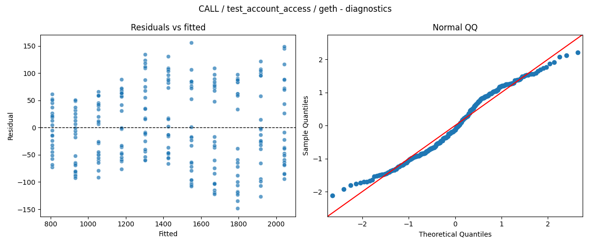

</details>

<details><summary>nethermind — NNLS regression summary</summary>

```
==============================================================================
                           NNLS Regression Results                            
==============================================================================
Dep. Variable:          test_runtime_ms              R-squared:          0.778
Model:                  NNLS                    Adj. R-squared:          0.777
No. Observations:       198                               RMSE:          61.29
Df Residuals:           196                                MAE:          43.87
Df Model:               1      
==============================================================================
                      coef     std err     P-value      [0.025      0.975]
------------------------------------------------------------------------------
         const     69.2738     13.8437       0.001     42.5865     96.8946
       opcount      0.0048      0.0002       0.001      0.0044      0.0052
==============================================================================
Notes: Non-negative least squares with bootstrap inference (1000 iterations)
==============================================================================
```

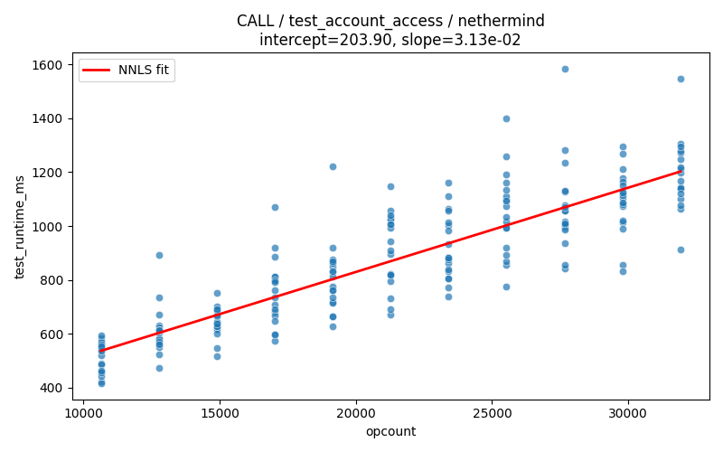

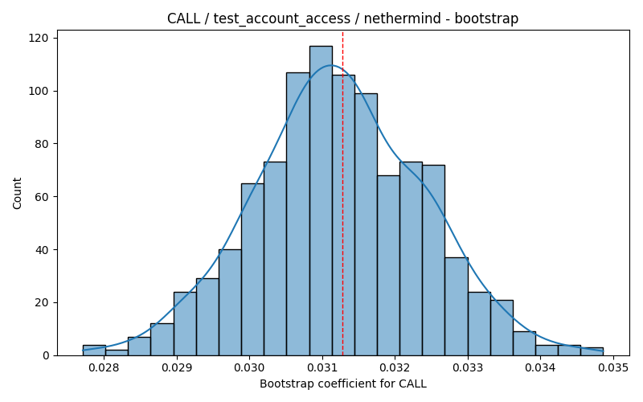

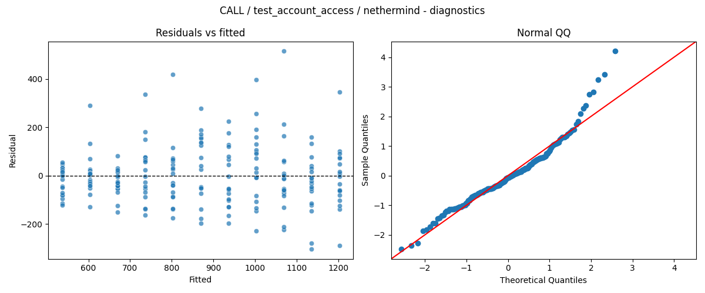

</details>

<details><summary>reth — NNLS regression summary</summary>

```
==============================================================================
                           NNLS Regression Results                            
==============================================================================
Dep. Variable:          test_runtime_ms              R-squared:          0.953
Model:                  NNLS                    Adj. R-squared:          0.952
No. Observations:       308                               RMSE:           5.87
Df Residuals:           306                                MAE:           4.74
Df Model:               1      
==============================================================================
                      coef     std err     P-value      [0.025      0.975]
------------------------------------------------------------------------------
         const     40.4200      1.0506       0.001     38.4248     42.4919
       opcount      0.0011      0.0000       0.001      0.0011      0.0011
==============================================================================
Notes: Non-negative least squares with bootstrap inference (1000 iterations)
==============================================================================
```

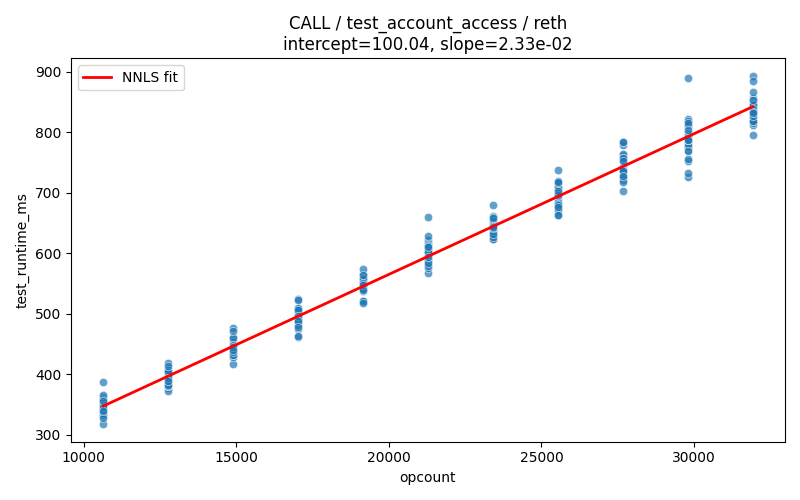

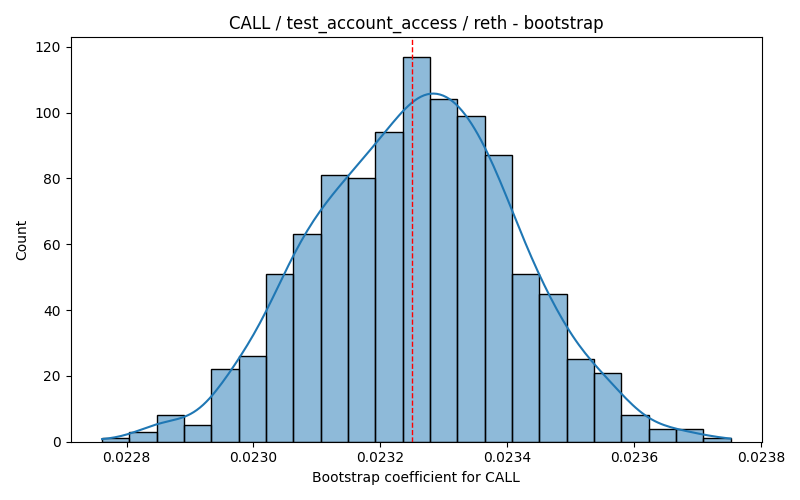

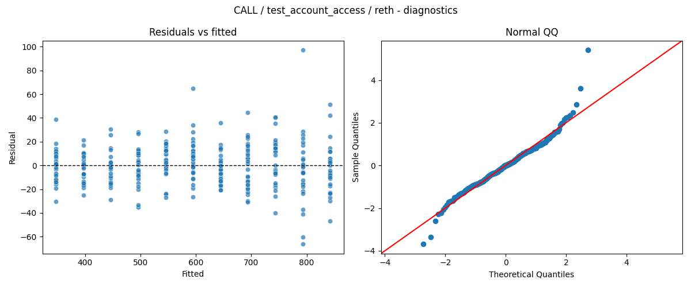

</details>

### test_account_access — combo `CALL_AccountMode.NON_EXISTING_ACCOUNT` — `presets[cold_account_nocode_access]`

| client | nobs | R² | target_coef (ms) | p-value | 95% CI |
| --- | --- | --- | --- | --- | --- |
| `besu` | 407 | 0.8692 | 0.01646 | 1.00e-03 | [0.01584, 0.01709] |
| `erigon` | 165 | 0.9782 | 0.009045 | 1.00e-03 | [0.008852, 0.009267] |
| `ethrex` | 275 | 0.9708 | 0.001991 | 1.00e-03 | [0.001947, 0.002032] |
| `geth` | 242 | 0.8606 | 0.022 | 1.00e-03 | [0.02081, 0.02323] |
| `nethermind` | 198 | 0.8324 | 0.004357 | 1.00e-03 | [0.004094, 0.004629] |
| `reth` | 308 | 0.921 | 0.0008251 | 1.00e-03 | [0.0008003, 0.0008539] |

<details><summary>besu — NNLS regression summary</summary>

```
==============================================================================
                           NNLS Regression Results                            
==============================================================================
Dep. Variable:          test_runtime_ms              R-squared:          0.869
Model:                  NNLS                    Adj. R-squared:          0.869
No. Observations:       407                               RMSE:         151.61
Df Residuals:           405                                MAE:         135.74
Df Model:               1      
==============================================================================
                      coef     std err     P-value      [0.025      0.975]
------------------------------------------------------------------------------
         const    528.4794     23.8086       0.001    482.8576    574.5882
       opcount      0.0165      0.0003       0.001      0.0158      0.0171
==============================================================================
Notes: Non-negative least squares with bootstrap inference (1000 iterations)
==============================================================================
```

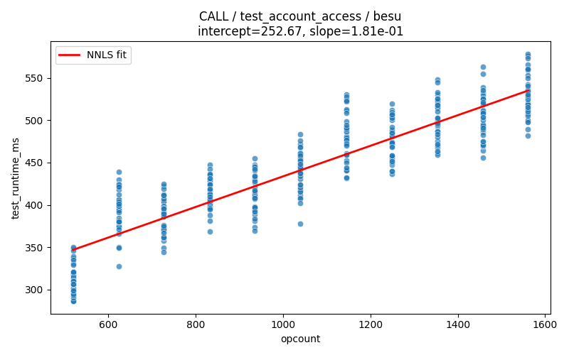

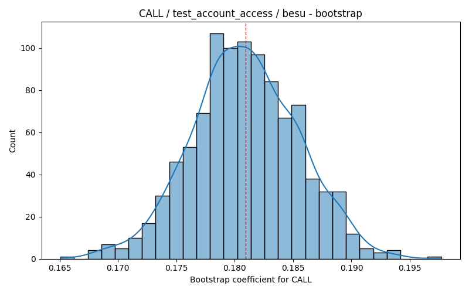

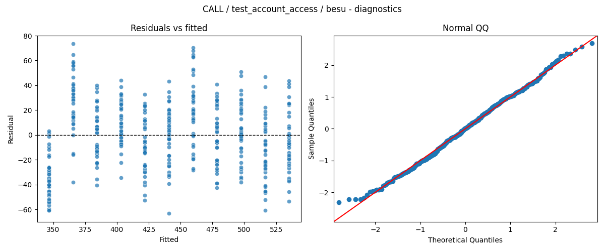

</details>

<details><summary>erigon — NNLS regression summary</summary>

```
==============================================================================
                           NNLS Regression Results                            
==============================================================================
Dep. Variable:          test_runtime_ms              R-squared:          0.978
Model:                  NNLS                    Adj. R-squared:          0.978
No. Observations:       165                               RMSE:          32.09
Df Residuals:           163                                MAE:          23.96
Df Model:               1      
==============================================================================
                      coef     std err     P-value      [0.025      0.975]
------------------------------------------------------------------------------
         const     20.4850      7.5263       0.008      5.3199     34.8628
       opcount      0.0090      0.0001       0.001      0.0089      0.0093
==============================================================================
Notes: Non-negative least squares with bootstrap inference (1000 iterations)
==============================================================================
```

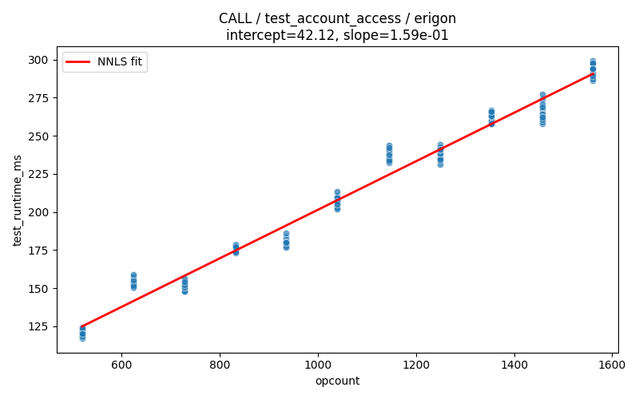

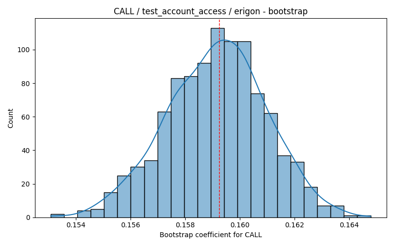

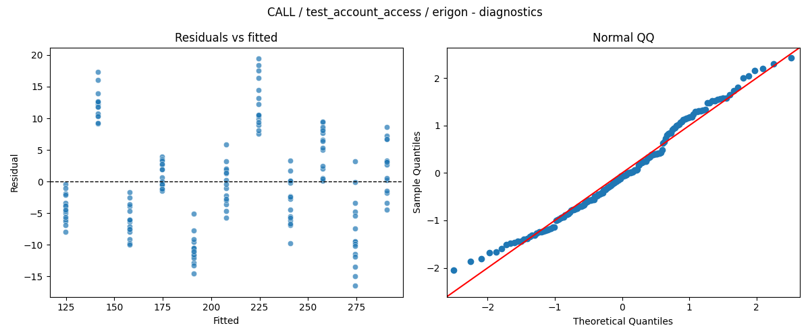

</details>

<details><summary>ethrex — NNLS regression summary</summary>

```
==============================================================================
                           NNLS Regression Results                            
==============================================================================
Dep. Variable:          test_runtime_ms              R-squared:          0.971
Model:                  NNLS                    Adj. R-squared:          0.971
No. Observations:       275                               RMSE:           8.20
Df Residuals:           273                                MAE:           6.78
Df Model:               1      
==============================================================================
                      coef     std err     P-value      [0.025      0.975]
------------------------------------------------------------------------------
         const     26.4986      1.6117       0.001     23.5646     29.8011
       opcount      0.0020      0.0000       0.001      0.0019      0.0020
==============================================================================
Notes: Non-negative least squares with bootstrap inference (1000 iterations)
==============================================================================
```

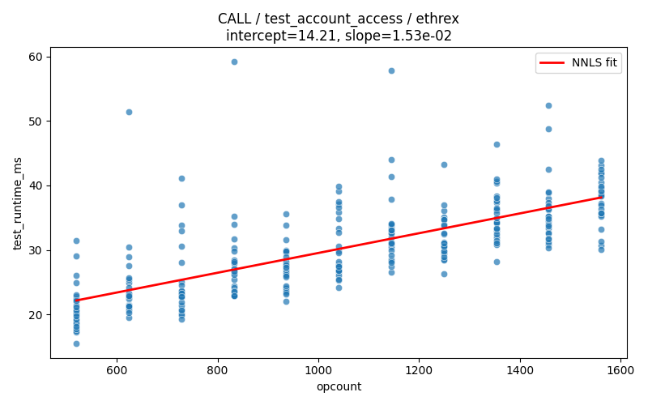

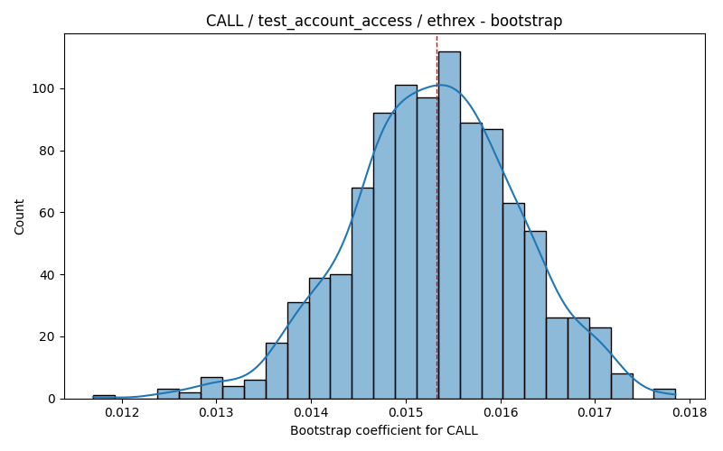

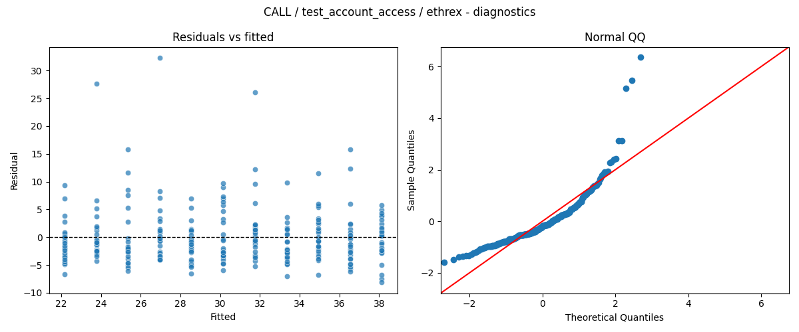

</details>

<details><summary>geth — NNLS regression summary</summary>

```
==============================================================================
                           NNLS Regression Results                            
==============================================================================
Dep. Variable:          test_runtime_ms              R-squared:          0.861
Model:                  NNLS                    Adj. R-squared:          0.860
No. Observations:       242                               RMSE:         210.21
Df Residuals:           240                                MAE:         176.34
Df Model:               1      
==============================================================================
                      coef     std err     P-value      [0.025      0.975]
------------------------------------------------------------------------------
         const    703.8662     51.5673       0.001    601.6968    803.0913
       opcount      0.0220      0.0006       0.001      0.0208      0.0232
==============================================================================
Notes: Non-negative least squares with bootstrap inference (1000 iterations)
==============================================================================
```

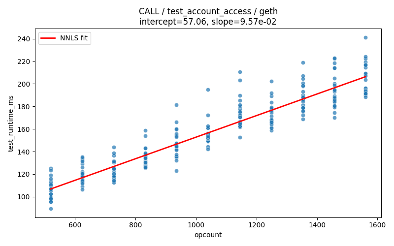

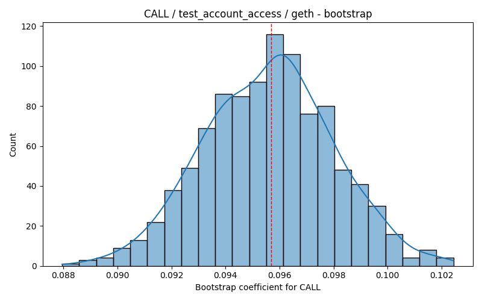

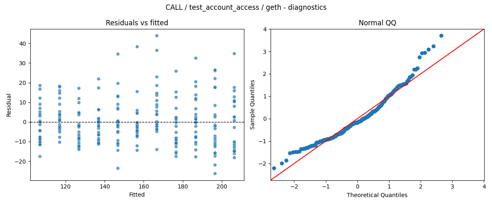

</details>

<details><summary>nethermind — NNLS regression summary</summary>

```
==============================================================================
                           NNLS Regression Results                            
==============================================================================
Dep. Variable:          test_runtime_ms              R-squared:          0.832
Model:                  NNLS                    Adj. R-squared:          0.832
No. Observations:       198                               RMSE:          46.42
Df Residuals:           196                                MAE:          34.42
Df Model:               1      
==============================================================================
                      coef     std err     P-value      [0.025      0.975]
------------------------------------------------------------------------------
         const     75.3015      9.1958       0.001     57.2192     94.1425
       opcount      0.0044      0.0001       0.001      0.0041      0.0046
==============================================================================
Notes: Non-negative least squares with bootstrap inference (1000 iterations)
==============================================================================
```

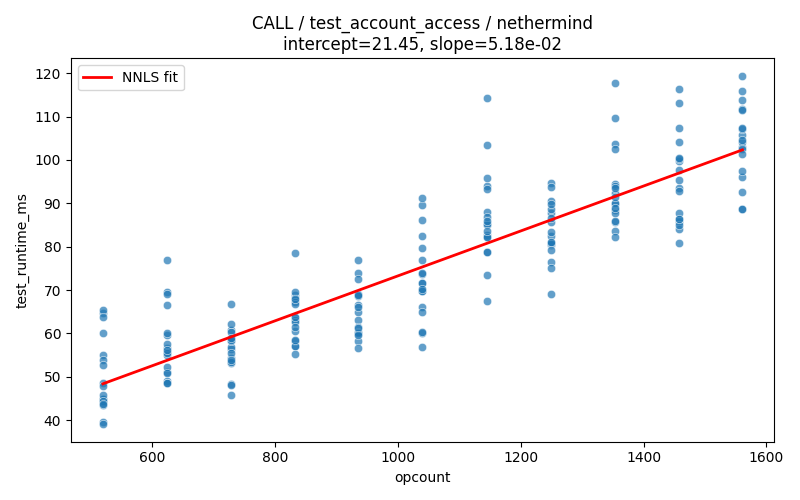

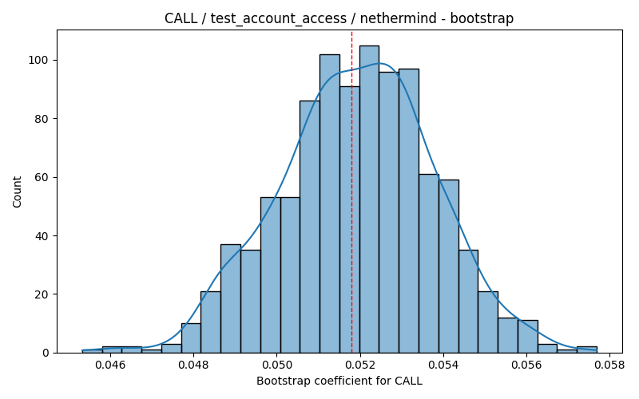

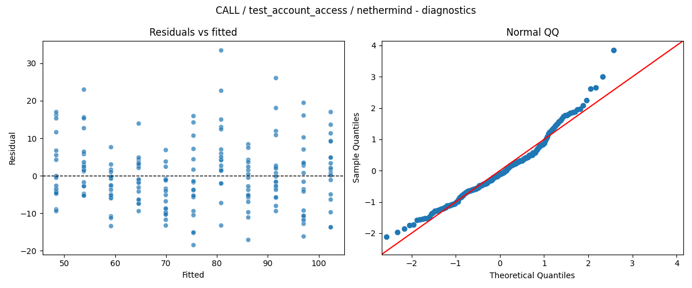

</details>

<details><summary>reth — NNLS regression summary</summary>

```
==============================================================================
                           NNLS Regression Results                            
==============================================================================
Dep. Variable:          test_runtime_ms              R-squared:          0.921
Model:                  NNLS                    Adj. R-squared:          0.921
No. Observations:       308                               RMSE:           5.74
Df Residuals:           306                                MAE:           4.41
Df Model:               1      
==============================================================================
                      coef     std err     P-value      [0.025      0.975]
------------------------------------------------------------------------------
         const     44.5276      0.9965       0.001     42.5317     46.3543
       opcount      0.0008      0.0000       0.001      0.0008      0.0009
==============================================================================
Notes: Non-negative least squares with bootstrap inference (1000 iterations)
==============================================================================
```

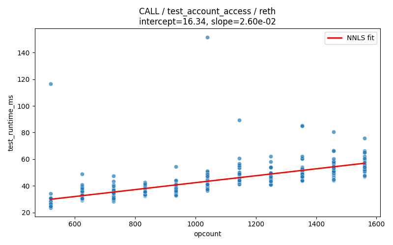

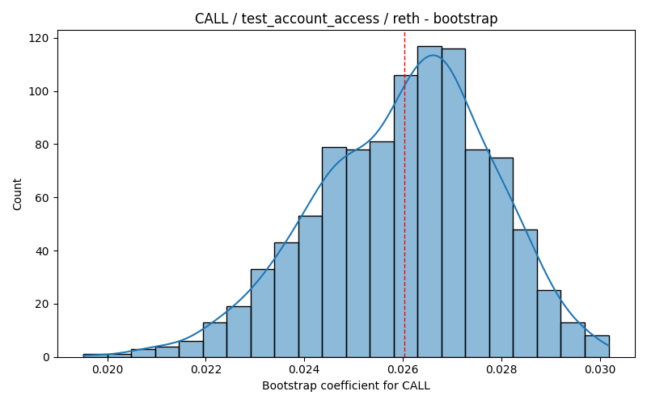

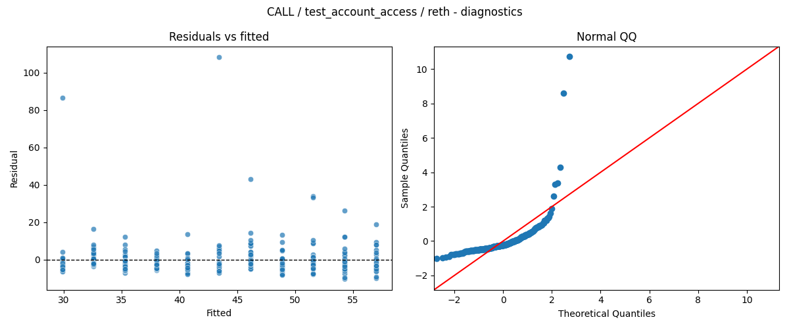

</details>

### test_account_access — combo `CALL_AccountMode.EXISTING_CONTRACT` — `presets[cold_account_code_access]`

| client | nobs | R² | target_coef (ms) | p-value | 95% CI |
| --- | --- | --- | --- | --- | --- |
| `besu` | 407 | 0.8961 | 0.0273 | 1.00e-03 | [0.02638, 0.02816] |
| `erigon` | 165 | 0.8958 | 0.04974 | 1.00e-03 | [0.04711, 0.05203] |
| `ethrex` | 275 | 0.9932 | 0.00756 | 1.00e-03 | [0.007487, 0.007633] |
| `geth` | 242 | 0.8575 | 0.02333 | 1.00e-03 | [0.02205, 0.02455] |
| `nethermind` | 198 | 0.6176 | 0.01498 | 1.00e-03 | [0.01322, 0.01697] |
| `reth` | 308 | 0.9778 | 0.004003 | 1.00e-03 | [0.003935, 0.004068] |

<details><summary>besu — NNLS regression summary</summary>

```
==============================================================================
                           NNLS Regression Results                            
==============================================================================
Dep. Variable:          test_runtime_ms              R-squared:          0.896
Model:                  NNLS                    Adj. R-squared:          0.896
No. Observations:       407                               RMSE:         189.18
Df Residuals:           405                                MAE:         159.85
Df Model:               1      
==============================================================================
                      coef     std err     P-value      [0.025      0.975]
------------------------------------------------------------------------------
         const    588.1252     28.6313       0.001    534.5180    645.9769
       opcount      0.0273      0.0005       0.001      0.0264      0.0282
==============================================================================
Notes: Non-negative least squares with bootstrap inference (1000 iterations)
==============================================================================
```

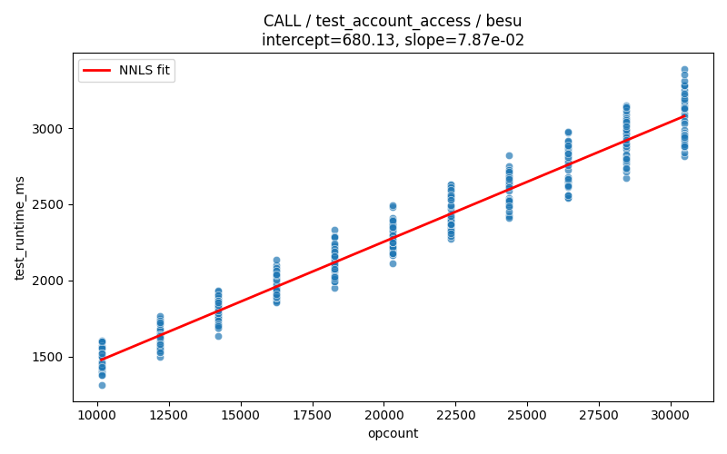

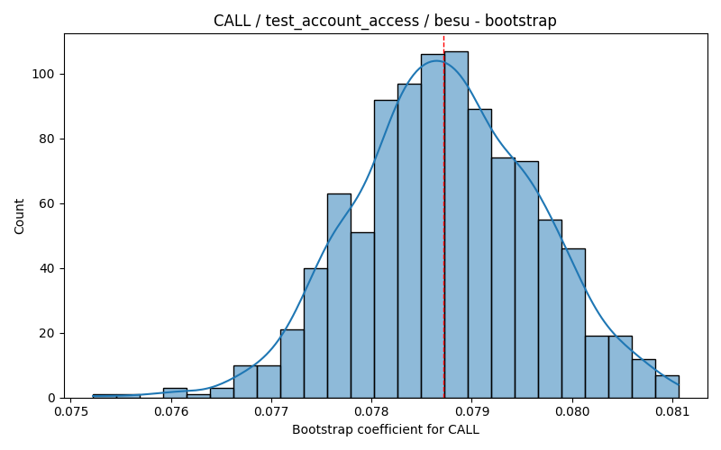

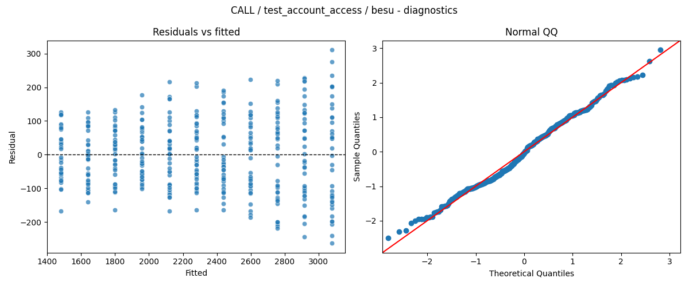

</details>

<details><summary>erigon — NNLS regression summary</summary>

```
==============================================================================
                           NNLS Regression Results                            
==============================================================================
Dep. Variable:          test_runtime_ms              R-squared:          0.896
Model:                  NNLS                    Adj. R-squared:          0.895
No. Observations:       165                               RMSE:         345.12
Df Residuals:           163                                MAE:         296.21
Df Model:               1      
==============================================================================
                      coef     std err     P-value      [0.025      0.975]
------------------------------------------------------------------------------
         const    836.0418     92.6979       0.001    667.0683   1033.9576
       opcount      0.0497      0.0012       0.001      0.0471      0.0520
==============================================================================
Notes: Non-negative least squares with bootstrap inference (1000 iterations)
==============================================================================
```

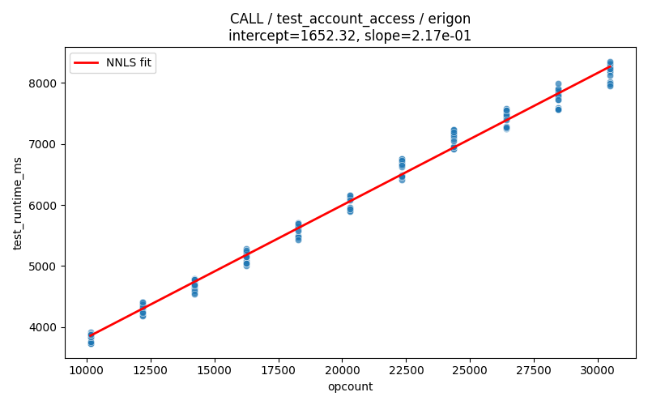

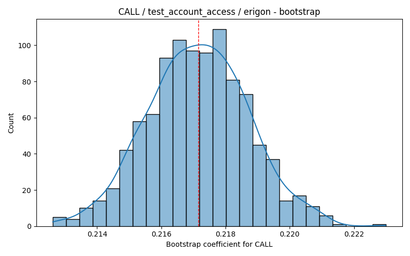

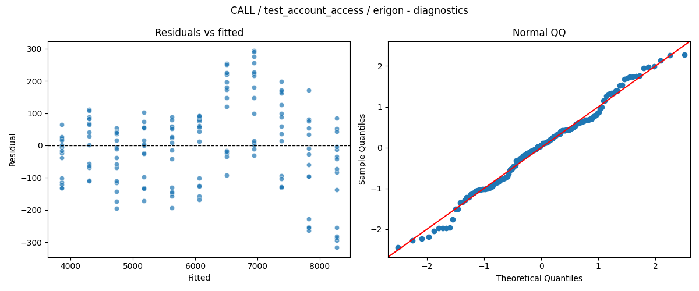

</details>

<details><summary>ethrex — NNLS regression summary</summary>

```
==============================================================================
                           NNLS Regression Results                            
==============================================================================
Dep. Variable:          test_runtime_ms              R-squared:          0.993
Model:                  NNLS                    Adj. R-squared:          0.993
No. Observations:       275                               RMSE:          12.77
Df Residuals:           273                                MAE:           9.85
Df Model:               1      
==============================================================================
                      coef     std err     P-value      [0.025      0.975]
------------------------------------------------------------------------------
         const     41.2123      2.2992       0.001     36.8021     45.8269
       opcount      0.0076      0.0000       0.001      0.0075      0.0076
==============================================================================
Notes: Non-negative least squares with bootstrap inference (1000 iterations)
==============================================================================
```

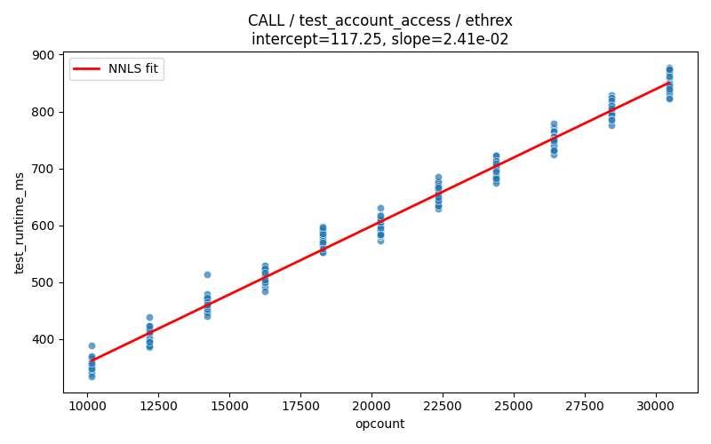

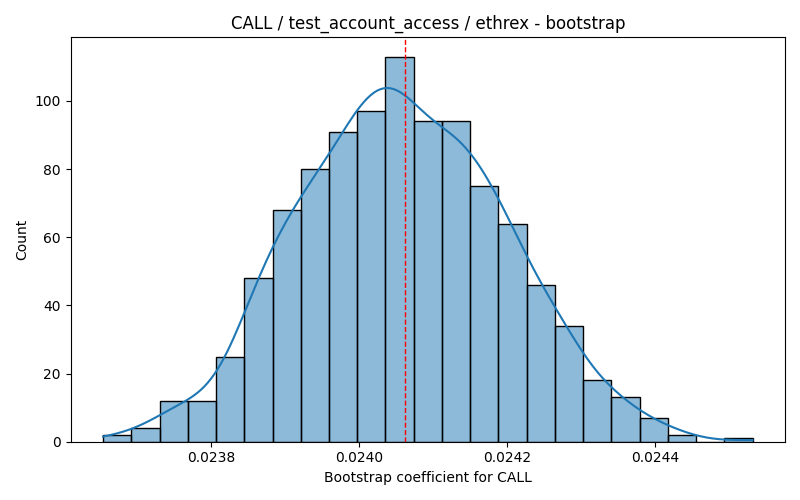

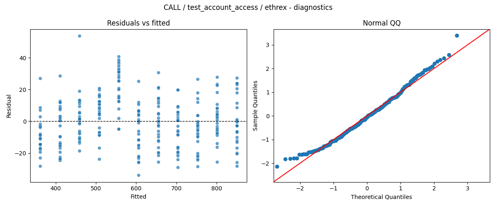

</details>

<details><summary>geth — NNLS regression summary</summary>

```
==============================================================================
                           NNLS Regression Results                            
==============================================================================
Dep. Variable:          test_runtime_ms              R-squared:          0.857
Model:                  NNLS                    Adj. R-squared:          0.857
No. Observations:       242                               RMSE:         193.51
Df Residuals:           240                                MAE:         162.15
Df Model:               1      
==============================================================================
                      coef     std err     P-value      [0.025      0.975]
------------------------------------------------------------------------------
         const    672.2593     46.9449       0.001    581.8425    760.3210
       opcount      0.0233      0.0006       0.001      0.0221      0.0246
==============================================================================
Notes: Non-negative least squares with bootstrap inference (1000 iterations)
==============================================================================
```


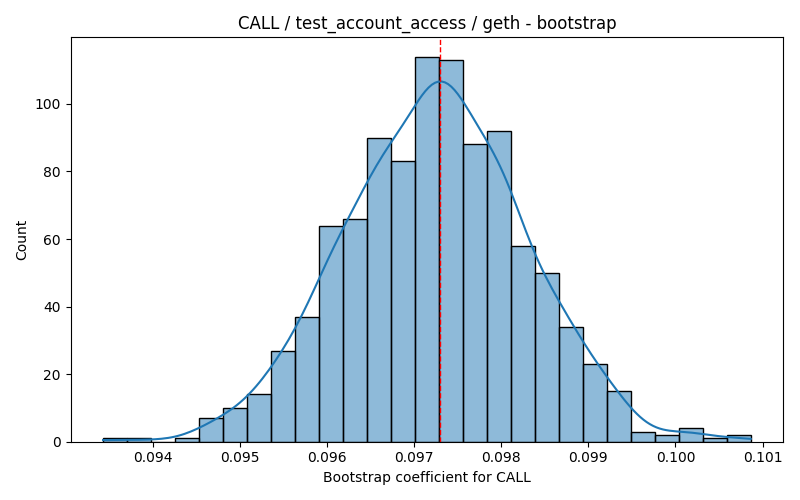

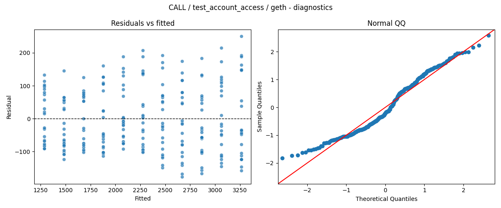

</details>

<details><summary>nethermind — NNLS regression summary</summary>

```
==============================================================================
                           NNLS Regression Results                            
==============================================================================
Dep. Variable:          test_runtime_ms              R-squared:          0.618
Model:                  NNLS                    Adj. R-squared:          0.616
No. Observations:       198                               RMSE:         239.81
Df Residuals:           196                                MAE:         169.12
Df Model:               1      
==============================================================================
                      coef     std err     P-value      [0.025      0.975]
------------------------------------------------------------------------------
         const    141.3669     52.4686       0.006     31.8935    243.2457
       opcount      0.0150      0.0009       0.001      0.0132      0.0170
==============================================================================
Notes: Non-negative least squares with bootstrap inference (1000 iterations)
==============================================================================
```

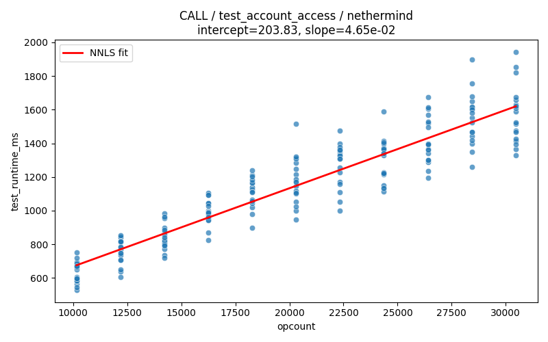

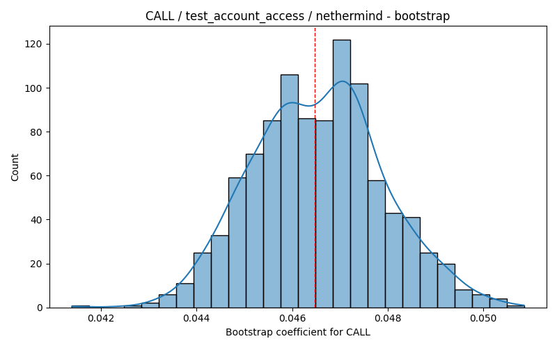

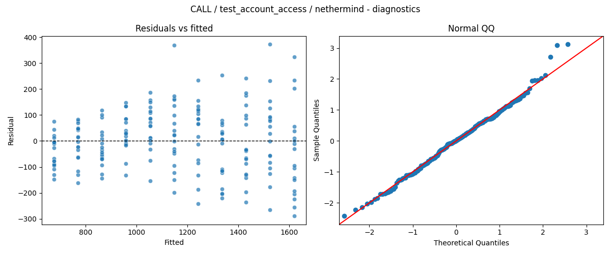

</details>

<details><summary>reth — NNLS regression summary</summary>

```
==============================================================================
                           NNLS Regression Results                            
==============================================================================
Dep. Variable:          test_runtime_ms              R-squared:          0.978
Model:                  NNLS                    Adj. R-squared:          0.978
No. Observations:       308                               RMSE:          12.27
Df Residuals:           306                                MAE:           9.69
Df Model:               1      
==============================================================================
                      coef     std err     P-value      [0.025      0.975]
------------------------------------------------------------------------------
         const    101.9524      2.1328       0.001     97.7894    106.2558
       opcount      0.0040      0.0000       0.001      0.0039      0.0041
==============================================================================
Notes: Non-negative least squares with bootstrap inference (1000 iterations)
==============================================================================
```

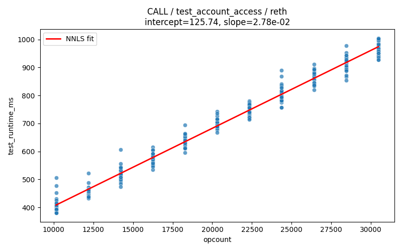

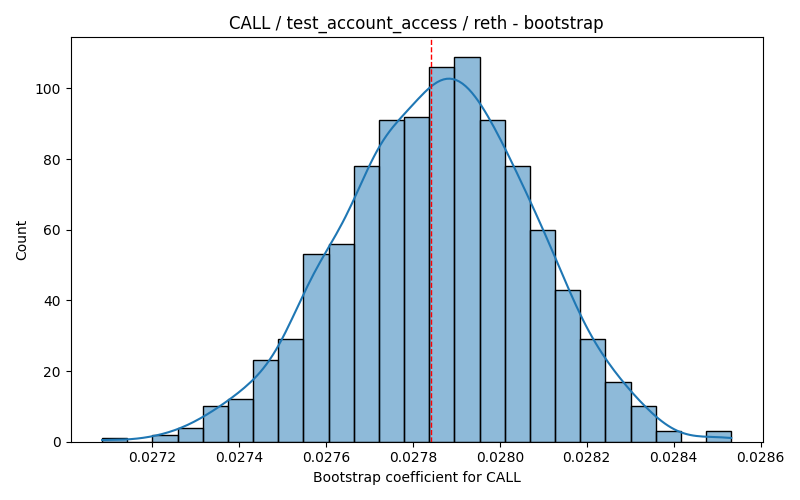

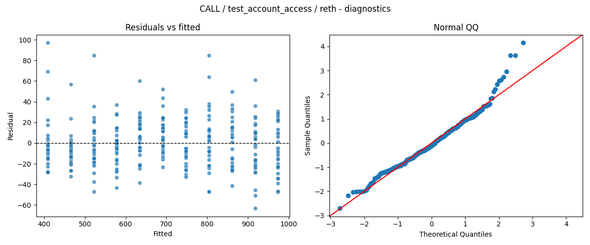

</details>

### test_account_access — combo `CALL_AccountMode.NON_EXISTING_ACCOUNT` — `presets[cold_account_code_access]`

| client | nobs | R² | target_coef (ms) | p-value | 95% CI |
| --- | --- | --- | --- | --- | --- |
| `besu` | 407 | 0.8692 | 0.01646 | 1.00e-03 | [0.01584, 0.01709] |
| `erigon` | 165 | 0.9782 | 0.009045 | 1.00e-03 | [0.008852, 0.009267] |
| `ethrex` | 275 | 0.9708 | 0.001991 | 1.00e-03 | [0.001947, 0.002032] |
| `geth` | 242 | 0.8606 | 0.022 | 1.00e-03 | [0.02081, 0.02323] |
| `nethermind` | 198 | 0.8324 | 0.004357 | 1.00e-03 | [0.004094, 0.004629] |
| `reth` | 308 | 0.921 | 0.0008251 | 1.00e-03 | [0.0008003, 0.0008539] |

<details><summary>besu — NNLS regression summary</summary>

```
==============================================================================
                           NNLS Regression Results                            
==============================================================================
Dep. Variable:          test_runtime_ms              R-squared:          0.869
Model:                  NNLS                    Adj. R-squared:          0.869
No. Observations:       407                               RMSE:         151.61
Df Residuals:           405                                MAE:         135.74
Df Model:               1      
==============================================================================
                      coef     std err     P-value      [0.025      0.975]
------------------------------------------------------------------------------
         const    528.4794     23.8086       0.001    482.8576    574.5882
       opcount      0.0165      0.0003       0.001      0.0158      0.0171
==============================================================================
Notes: Non-negative least squares with bootstrap inference (1000 iterations)
==============================================================================
```


</details>

<details><summary>erigon — NNLS regression summary</summary>

```
==============================================================================
                           NNLS Regression Results                            
==============================================================================
Dep. Variable:          test_runtime_ms              R-squared:          0.978
Model:                  NNLS                    Adj. R-squared:          0.978
No. Observations:       165                               RMSE:          32.09
Df Residuals:           163                                MAE:          23.96
Df Model:               1      
==============================================================================
                      coef     std err     P-value      [0.025      0.975]
------------------------------------------------------------------------------
         const     20.4850      7.5263       0.008      5.3199     34.8628
       opcount      0.0090      0.0001       0.001      0.0089      0.0093
==============================================================================
Notes: Non-negative least squares with bootstrap inference (1000 iterations)
==============================================================================
```


</details>

<details><summary>ethrex — NNLS regression summary</summary>

```
==============================================================================
                           NNLS Regression Results                            
==============================================================================
Dep. Variable:          test_runtime_ms              R-squared:          0.971
Model:                  NNLS                    Adj. R-squared:          0.971
No. Observations:       275                               RMSE:           8.20
Df Residuals:           273                                MAE:           6.78
Df Model:               1      
==============================================================================
                      coef     std err     P-value      [0.025      0.975]
------------------------------------------------------------------------------
         const     26.4986      1.6117       0.001     23.5646     29.8011
       opcount      0.0020      0.0000       0.001      0.0019      0.0020
==============================================================================
Notes: Non-negative least squares with bootstrap inference (1000 iterations)
==============================================================================
```


</details>

<details><summary>geth — NNLS regression summary</summary>

```
==============================================================================
                           NNLS Regression Results                            
==============================================================================
Dep. Variable:          test_runtime_ms              R-squared:          0.861
Model:                  NNLS                    Adj. R-squared:          0.860
No. Observations:       242                               RMSE:         210.21
Df Residuals:           240                                MAE:         176.34
Df Model:               1      
==============================================================================
                      coef     std err     P-value      [0.025      0.975]
------------------------------------------------------------------------------
         const    703.8662     51.5673       0.001    601.6968    803.0913
       opcount      0.0220      0.0006       0.001      0.0208      0.0232
==============================================================================
Notes: Non-negative least squares with bootstrap inference (1000 iterations)
==============================================================================
```


</details>

<details><summary>nethermind — NNLS regression summary</summary>

```
==============================================================================
                           NNLS Regression Results                            
==============================================================================
Dep. Variable:          test_runtime_ms              R-squared:          0.832
Model:                  NNLS                    Adj. R-squared:          0.832
No. Observations:       198                               RMSE:          46.42
Df Residuals:           196                                MAE:          34.42
Df Model:               1      
==============================================================================
                      coef     std err     P-value      [0.025      0.975]
------------------------------------------------------------------------------
         const     75.3015      9.1958       0.001     57.2192     94.1425
       opcount      0.0044      0.0001       0.001      0.0041      0.0046
==============================================================================
Notes: Non-negative least squares with bootstrap inference (1000 iterations)
==============================================================================
```


</details>

<details><summary>reth — NNLS regression summary</summary>

```
==============================================================================
                           NNLS Regression Results                            
==============================================================================
Dep. Variable:          test_runtime_ms              R-squared:          0.921
Model:                  NNLS                    Adj. R-squared:          0.921
No. Observations:       308                               RMSE:           5.74
Df Residuals:           306                                MAE:           4.41
Df Model:               1      
==============================================================================
                      coef     std err     P-value      [0.025      0.975]
------------------------------------------------------------------------------
         const     44.5276      0.9965       0.001     42.5317     46.3543
       opcount      0.0008      0.0000       0.001      0.0008      0.0009
==============================================================================
Notes: Non-negative least squares with bootstrap inference (1000 iterations)
==============================================================================
```


</details>

### test_account_access — combo `CALL_AccountMode.EXISTING_EOA` — `presets[cold_account_nocode_write]`

| client | nobs | R² | target_coef (ms) | p-value | 95% CI |
| --- | --- | --- | --- | --- | --- |
| `besu` | 407 | 0.9459 | 0.0603 | 1.00e-03 | [0.05874, 0.06174] |
| `erigon` | 165 | 0.9796 | 0.06011 | 1.00e-03 | [0.05884, 0.0613] |
| `ethrex` | 275 | 0.9896 | 0.0231 | 1.00e-03 | [0.02283, 0.02337] |
| `geth` | 242 | 0.9687 | 0.05799 | 1.00e-03 | [0.05668, 0.05918] |
| `nethermind` | 198 | 0.7463 | 0.03128 | 1.00e-03 | [0.02896, 0.03349] |
| `reth` | 308 | 0.987 | 0.02325 | 1.00e-03 | [0.02296, 0.02356] |

<details><summary>besu — NNLS regression summary</summary>

```
==============================================================================
                           NNLS Regression Results                            
==============================================================================
Dep. Variable:          test_runtime_ms              R-squared:          0.946
Model:                  NNLS                    Adj. R-squared:          0.946
No. Observations:       407                               RMSE:          97.01
Df Residuals:           405                                MAE:          78.79
Df Model:               1      
==============================================================================
                      coef     std err     P-value      [0.025      0.975]
------------------------------------------------------------------------------
         const    335.0519     16.0089       0.001    305.3415    367.9785
       opcount      0.0603      0.0008       0.001      0.0587      0.0617
==============================================================================
Notes: Non-negative least squares with bootstrap inference (1000 iterations)
==============================================================================
```


</details>

<details><summary>erigon — NNLS regression summary</summary>

```
==============================================================================
                           NNLS Regression Results                            
==============================================================================
Dep. Variable:          test_runtime_ms              R-squared:          0.980
Model:                  NNLS                    Adj. R-squared:          0.979
No. Observations:       165                               RMSE:          58.35
Df Residuals:           163                                MAE:          44.18
Df Model:               1      
==============================================================================
                      coef     std err     P-value      [0.025      0.975]
------------------------------------------------------------------------------
         const    192.5393     13.0961       0.001    168.8919    220.1050
       opcount      0.0601      0.0006       0.001      0.0588      0.0613
==============================================================================
Notes: Non-negative least squares with bootstrap inference (1000 iterations)
==============================================================================
```


</details>

<details><summary>ethrex — NNLS regression summary</summary>

```
==============================================================================
                           NNLS Regression Results                            
==============================================================================
Dep. Variable:          test_runtime_ms              R-squared:          0.990
Model:                  NNLS                    Adj. R-squared:          0.990
No. Observations:       275                               RMSE:          15.95
Df Residuals:           273                                MAE:          12.35
Df Model:               1      
==============================================================================
                      coef     std err     P-value      [0.025      0.975]
------------------------------------------------------------------------------
         const    122.9870      3.0327       0.001    116.9034    128.7939
       opcount      0.0231      0.0001       0.001      0.0228      0.0234
==============================================================================
Notes: Non-negative least squares with bootstrap inference (1000 iterations)
==============================================================================
```


</details>

<details><summary>geth — NNLS regression summary</summary>

```
==============================================================================
                           NNLS Regression Results                            
==============================================================================
Dep. Variable:          test_runtime_ms              R-squared:          0.969
Model:                  NNLS                    Adj. R-squared:          0.969
No. Observations:       242                               RMSE:          70.18
Df Residuals:           240                                MAE:          60.81
Df Model:               1      
==============================================================================
                      coef     std err     P-value      [0.025      0.975]
------------------------------------------------------------------------------
         const    190.6942     12.9998       0.001    166.1302    216.0546
       opcount      0.0580      0.0006       0.001      0.0567      0.0592
==============================================================================
Notes: Non-negative least squares with bootstrap inference (1000 iterations)
==============================================================================
```


</details>

<details><summary>nethermind — NNLS regression summary</summary>

```
==============================================================================
                           NNLS Regression Results                            
==============================================================================
Dep. Variable:          test_runtime_ms              R-squared:          0.746
Model:                  NNLS                    Adj. R-squared:          0.745
No. Observations:       198                               RMSE:         122.73
Df Residuals:           196                                MAE:          90.58
Df Model:               1      
==============================================================================
                      coef     std err     P-value      [0.025      0.975]
------------------------------------------------------------------------------
         const    203.9017     23.1623       0.001    160.1311    250.7947
       opcount      0.0313      0.0012       0.001      0.0290      0.0335
==============================================================================
Notes: Non-negative least squares with bootstrap inference (1000 iterations)
==============================================================================
```


</details>

<details><summary>reth — NNLS regression summary</summary>

```
==============================================================================
                           NNLS Regression Results                            
==============================================================================
Dep. Variable:          test_runtime_ms              R-squared:          0.987
Model:                  NNLS                    Adj. R-squared:          0.987
No. Observations:       308                               RMSE:          17.96
Df Residuals:           306                                MAE:          13.42
Df Model:               1      
==============================================================================
                      coef     std err     P-value      [0.025      0.975]
------------------------------------------------------------------------------
         const    100.0401      3.0422       0.001     94.3642    105.6300
       opcount      0.0233      0.0002       0.001      0.0230      0.0236
==============================================================================
Notes: Non-negative least squares with bootstrap inference (1000 iterations)
==============================================================================
```


</details>

### test_account_access — combo `CALL_AccountMode.NON_EXISTING_ACCOUNT` — `presets[cold_account_nocode_write]`

| client | nobs | R² | target_coef (ms) | p-value | 95% CI |
| --- | --- | --- | --- | --- | --- |
| `besu` | 407 | 0.8261 | 0.1809 | 1.00e-03 | [0.172, 0.1894] |
| `erigon` | 165 | 0.9772 | 0.1593 | 1.00e-03 | [0.1555, 0.1626] |
| `ethrex` | 275 | 0.4979 | 0.01532 | 1.00e-03 | [0.01358, 0.01702] |
| `geth` | 242 | 0.8764 | 0.09568 | 1.00e-03 | [0.09101, 0.1002] |
| `nethermind` | 198 | 0.7943 | 0.05181 | 1.00e-03 | [0.04843, 0.05545] |
| `reth` | 308 | 0.4198 | 0.02603 | 1.00e-03 | [0.02235, 0.02907] |

<details><summary>besu — NNLS regression summary</summary>

```
==============================================================================
                           NNLS Regression Results                            
==============================================================================
Dep. Variable:          test_runtime_ms              R-squared:          0.826
Model:                  NNLS                    Adj. R-squared:          0.826
No. Observations:       407                               RMSE:          27.33
Df Residuals:           405                                MAE:          22.27
Df Model:               1      
==============================================================================
                      coef     std err     P-value      [0.025      0.975]
------------------------------------------------------------------------------
         const    252.6724      5.2666       0.001    242.2438    263.3248
       opcount      0.1809      0.0046       0.001      0.1720      0.1894
==============================================================================
Notes: Non-negative least squares with bootstrap inference (1000 iterations)
==============================================================================
```


</details>

<details><summary>erigon — NNLS regression summary</summary>

```
==============================================================================
                           NNLS Regression Results                            
==============================================================================
Dep. Variable:          test_runtime_ms              R-squared:          0.977
Model:                  NNLS                    Adj. R-squared:          0.977
No. Observations:       165                               RMSE:           8.02
Df Residuals:           163                                MAE:           6.56
Df Model:               1      
==============================================================================
                      coef     std err     P-value      [0.025      0.975]
------------------------------------------------------------------------------
         const     42.1175      2.0375       0.001     38.4122     46.3206
       opcount      0.1593      0.0018       0.001      0.1555      0.1626
==============================================================================
Notes: Non-negative least squares with bootstrap inference (1000 iterations)
==============================================================================
```


</details>

<details><summary>ethrex — NNLS regression summary</summary>

```
==============================================================================
                           NNLS Regression Results                            
==============================================================================
Dep. Variable:          test_runtime_ms              R-squared:          0.498
Model:                  NNLS                    Adj. R-squared:          0.496
No. Observations:       275                               RMSE:           5.07
Df Residuals:           273                                MAE:           3.45
Df Model:               1      
==============================================================================
                      coef     std err     P-value      [0.025      0.975]
------------------------------------------------------------------------------
         const     14.2062      1.0095       0.001     12.3503     16.2582
       opcount      0.0153      0.0009       0.001      0.0136      0.0170
==============================================================================
Notes: Non-negative least squares with bootstrap inference (1000 iterations)
==============================================================================
```


</details>

<details><summary>geth — NNLS regression summary</summary>

```
==============================================================================
                           NNLS Regression Results                            
==============================================================================
Dep. Variable:          test_runtime_ms              R-squared:          0.876
Model:                  NNLS                    Adj. R-squared:          0.876
No. Observations:       242                               RMSE:          11.83
Df Residuals:           240                                MAE:           9.13
Df Model:               1      
==============================================================================
                      coef     std err     P-value      [0.025      0.975]
------------------------------------------------------------------------------
         const     57.0588      2.3603       0.001     52.6445     61.8192
       opcount      0.0957      0.0024       0.001      0.0910      0.1002
==============================================================================
Notes: Non-negative least squares with bootstrap inference (1000 iterations)
==============================================================================
```


</details>

<details><summary>nethermind — NNLS regression summary</summary>

```
==============================================================================
                           NNLS Regression Results                            
==============================================================================
Dep. Variable:          test_runtime_ms              R-squared:          0.794
Model:                  NNLS                    Adj. R-squared:          0.793
No. Observations:       198                               RMSE:           8.68
Df Residuals:           196                                MAE:           6.70
Df Model:               1      
==============================================================================
                      coef     std err     P-value      [0.025      0.975]
------------------------------------------------------------------------------
         const     21.4545      1.9118       0.001     17.6569     24.9039
       opcount      0.0518      0.0018       0.001      0.0484      0.0554
==============================================================================
Notes: Non-negative least squares with bootstrap inference (1000 iterations)
==============================================================================
```


</details>

<details><summary>reth — NNLS regression summary</summary>

```
==============================================================================
                           NNLS Regression Results                            
==============================================================================
Dep. Variable:          test_runtime_ms              R-squared:          0.420
Model:                  NNLS                    Adj. R-squared:          0.418
No. Observations:       308                               RMSE:          10.08
Df Residuals:           306                                MAE:           5.00
Df Model:               1      
==============================================================================
                      coef     std err     P-value      [0.025      0.975]
------------------------------------------------------------------------------
         const     16.3399      2.0045       0.001     13.0797     20.6533
       opcount      0.0260      0.0018       0.001      0.0223      0.0291
==============================================================================
Notes: Non-negative least squares with bootstrap inference (1000 iterations)
==============================================================================
```


</details>

### test_account_access — combo `CALL_AccountMode.EXISTING_CONTRACT` — `presets[cold_account_code_write]`

| client | nobs | R² | target_coef (ms) | p-value | 95% CI |
| --- | --- | --- | --- | --- | --- |
| `besu` | 407 | 0.9585 | 0.07871 | 1.00e-03 | [0.07698, 0.0805] |
| `erigon` | 165 | 0.9915 | 0.2171 | 1.00e-03 | [0.2141, 0.2203] |
| `ethrex` | 275 | 0.9896 | 0.02406 | 1.00e-03 | [0.02379, 0.02433] |
| `geth` | 242 | 0.9766 | 0.09729 | 1.00e-03 | [0.09524, 0.09924] |
| `nethermind` | 198 | 0.8621 | 0.04647 | 1.00e-03 | [0.04404, 0.04926] |
| `reth` | 308 | 0.9832 | 0.02784 | 1.00e-03 | [0.02742, 0.02827] |

<details><summary>besu — NNLS regression summary</summary>

```
==============================================================================
                           NNLS Regression Results                            
==============================================================================
Dep. Variable:          test_runtime_ms              R-squared:          0.959
Model:                  NNLS                    Adj. R-squared:          0.958
No. Observations:       407                               RMSE:         105.16
Df Residuals:           405                                MAE:          88.24
Df Model:               1      
==============================================================================
                      coef     std err     P-value      [0.025      0.975]
------------------------------------------------------------------------------
         const    680.1322     16.4925       0.001    648.1111    711.7309
       opcount      0.0787      0.0009       0.001      0.0770      0.0805
==============================================================================
Notes: Non-negative least squares with bootstrap inference (1000 iterations)
==============================================================================
```


</details>

<details><summary>erigon — NNLS regression summary</summary>

```
==============================================================================
                           NNLS Regression Results                            
==============================================================================
Dep. Variable:          test_runtime_ms              R-squared:          0.992
Model:                  NNLS                    Adj. R-squared:          0.991
No. Observations:       165                               RMSE:         128.89
Df Residuals:           163                                MAE:         101.73
Df Model:               1      
==============================================================================
                      coef     std err     P-value      [0.025      0.975]
------------------------------------------------------------------------------
         const   1652.3234     28.1581       0.001   1597.8788   1706.3425
       opcount      0.2171      0.0016       0.001      0.2141      0.2203
==============================================================================
Notes: Non-negative least squares with bootstrap inference (1000 iterations)
==============================================================================
```


</details>

<details><summary>ethrex — NNLS regression summary</summary>

```
==============================================================================
                           NNLS Regression Results                            
==============================================================================
Dep. Variable:          test_runtime_ms              R-squared:          0.990
Model:                  NNLS                    Adj. R-squared:          0.990
No. Observations:       275                               RMSE:          15.81
Df Residuals:           273                                MAE:          12.76
Df Model:               1      
==============================================================================
                      coef     std err     P-value      [0.025      0.975]
------------------------------------------------------------------------------
         const    117.2467      3.0308       0.001    111.7057    123.1046
       opcount      0.0241      0.0001       0.001      0.0238      0.0243
==============================================================================
Notes: Non-negative least squares with bootstrap inference (1000 iterations)
==============================================================================
```


</details>

<details><summary>geth — NNLS regression summary</summary>

```
==============================================================================
                           NNLS Regression Results                            
==============================================================================
Dep. Variable:          test_runtime_ms              R-squared:          0.977
Model:                  NNLS                    Adj. R-squared:          0.977
No. Observations:       242                               RMSE:          96.73
Df Residuals:           240                                MAE:          83.95
Df Model:               1      
==============================================================================
                      coef     std err     P-value      [0.025      0.975]
------------------------------------------------------------------------------
         const    298.5244     19.9180       0.001    262.8751    338.1712
       opcount      0.0973      0.0010       0.001      0.0952      0.0992
==============================================================================
Notes: Non-negative least squares with bootstrap inference (1000 iterations)
==============================================================================
```


</details>

<details><summary>nethermind — NNLS regression summary</summary>

```
==============================================================================
                           NNLS Regression Results                            
==============================================================================
Dep. Variable:          test_runtime_ms              R-squared:          0.862
Model:                  NNLS                    Adj. R-squared:          0.861
No. Observations:       198                               RMSE:         119.37
Df Residuals:           196                                MAE:          94.16
Df Model:               1      
==============================================================================
                      coef     std err     P-value      [0.025      0.975]
------------------------------------------------------------------------------
         const    203.8266     24.2434       0.001    155.1164    246.9537
       opcount      0.0465      0.0014       0.001      0.0440      0.0493
==============================================================================
Notes: Non-negative least squares with bootstrap inference (1000 iterations)
==============================================================================
```


</details>

<details><summary>reth — NNLS regression summary</summary>

```
==============================================================================
                           NNLS Regression Results                            
==============================================================================
Dep. Variable:          test_runtime_ms              R-squared:          0.983
Model:                  NNLS                    Adj. R-squared:          0.983
No. Observations:       308                               RMSE:          23.39
Df Residuals:           306                                MAE:          18.18
Df Model:               1      
==============================================================================
                      coef     std err     P-value      [0.025      0.975]
------------------------------------------------------------------------------
         const    125.7390      4.5580       0.001    116.7609    134.2138
       opcount      0.0278      0.0002       0.001      0.0274      0.0283
==============================================================================
Notes: Non-negative least squares with bootstrap inference (1000 iterations)
==============================================================================
```


</details>

### test_account_access — combo `CALL_AccountMode.NON_EXISTING_ACCOUNT` — `presets[cold_account_code_write]`

| client | nobs | R² | target_coef (ms) | p-value | 95% CI |
| --- | --- | --- | --- | --- | --- |
| `besu` | 407 | 0.8261 | 0.1809 | 1.00e-03 | [0.172, 0.1894] |
| `erigon` | 165 | 0.9772 | 0.1593 | 1.00e-03 | [0.1555, 0.1626] |
| `ethrex` | 275 | 0.4979 | 0.01532 | 1.00e-03 | [0.01358, 0.01702] |
| `geth` | 242 | 0.8764 | 0.09568 | 1.00e-03 | [0.09101, 0.1002] |
| `nethermind` | 198 | 0.7943 | 0.05181 | 1.00e-03 | [0.04843, 0.05545] |
| `reth` | 308 | 0.4198 | 0.02603 | 1.00e-03 | [0.02235, 0.02907] |

<details><summary>besu — NNLS regression summary</summary>

```
==============================================================================
                           NNLS Regression Results                            
==============================================================================
Dep. Variable:          test_runtime_ms              R-squared:          0.826
Model:                  NNLS                    Adj. R-squared:          0.826
No. Observations:       407                               RMSE:          27.33
Df Residuals:           405                                MAE:          22.27
Df Model:               1      
==============================================================================
                      coef     std err     P-value      [0.025      0.975]
------------------------------------------------------------------------------
         const    252.6724      5.2666       0.001    242.2438    263.3248
       opcount      0.1809      0.0046       0.001      0.1720      0.1894
==============================================================================
Notes: Non-negative least squares with bootstrap inference (1000 iterations)
==============================================================================
```


</details>

<details><summary>erigon — NNLS regression summary</summary>

```
==============================================================================
                           NNLS Regression Results                            
==============================================================================
Dep. Variable:          test_runtime_ms              R-squared:          0.977
Model:                  NNLS                    Adj. R-squared:          0.977
No. Observations:       165                               RMSE:           8.02
Df Residuals:           163                                MAE:           6.56
Df Model:               1      
==============================================================================
                      coef     std err     P-value      [0.025      0.975]
------------------------------------------------------------------------------
         const     42.1175      2.0375       0.001     38.4122     46.3206
       opcount      0.1593      0.0018       0.001      0.1555      0.1626
==============================================================================
Notes: Non-negative least squares with bootstrap inference (1000 iterations)
==============================================================================
```


</details>

<details><summary>ethrex — NNLS regression summary</summary>

```
==============================================================================
                           NNLS Regression Results                            
==============================================================================
Dep. Variable:          test_runtime_ms              R-squared:          0.498
Model:                  NNLS                    Adj. R-squared:          0.496
No. Observations:       275                               RMSE:           5.07
Df Residuals:           273                                MAE:           3.45
Df Model:               1      
==============================================================================
                      coef     std err     P-value      [0.025      0.975]
------------------------------------------------------------------------------
         const     14.2062      1.0095       0.001     12.3503     16.2582
       opcount      0.0153      0.0009       0.001      0.0136      0.0170
==============================================================================
Notes: Non-negative least squares with bootstrap inference (1000 iterations)
==============================================================================
```


</details>

<details><summary>geth — NNLS regression summary</summary>

```
==============================================================================
                           NNLS Regression Results                            
==============================================================================
Dep. Variable:          test_runtime_ms              R-squared:          0.876
Model:                  NNLS                    Adj. R-squared:          0.876
No. Observations:       242                               RMSE:          11.83
Df Residuals:           240                                MAE:           9.13
Df Model:               1      
==============================================================================
                      coef     std err     P-value      [0.025      0.975]
------------------------------------------------------------------------------
         const     57.0588      2.3603       0.001     52.6445     61.8192
       opcount      0.0957      0.0024       0.001      0.0910      0.1002
==============================================================================
Notes: Non-negative least squares with bootstrap inference (1000 iterations)
==============================================================================
```


</details>

<details><summary>nethermind — NNLS regression summary</summary>

```
==============================================================================
                           NNLS Regression Results                            
==============================================================================
Dep. Variable:          test_runtime_ms              R-squared:          0.794
Model:                  NNLS                    Adj. R-squared:          0.793
No. Observations:       198                               RMSE:           8.68
Df Residuals:           196                                MAE:           6.70
Df Model:               1      
==============================================================================
                      coef     std err     P-value      [0.025      0.975]
------------------------------------------------------------------------------
         const     21.4545      1.9118       0.001     17.6569     24.9039
       opcount      0.0518      0.0018       0.001      0.0484      0.0554
==============================================================================
Notes: Non-negative least squares with bootstrap inference (1000 iterations)
==============================================================================
```


</details>

<details><summary>reth — NNLS regression summary</summary>

```
==============================================================================
                           NNLS Regression Results                            
==============================================================================
Dep. Variable:          test_runtime_ms              R-squared:          0.420
Model:                  NNLS                    Adj. R-squared:          0.418
No. Observations:       308                               RMSE:          10.08
Df Residuals:           306                                MAE:           5.00
Df Model:               1      
==============================================================================
                      coef     std err     P-value      [0.025      0.975]
------------------------------------------------------------------------------
         const     16.3399      2.0045       0.001     13.0797     20.6533
       opcount      0.0260      0.0018       0.001      0.0223      0.0291
==============================================================================
Notes: Non-negative least squares with bootstrap inference (1000 iterations)
==============================================================================
```


</details>

### test_ext_account_query_warm — combo `CALL`

| client | nobs | R² | target_coef (ms) | p-value | 95% CI |
| --- | --- | --- | --- | --- | --- |
| `besu` | 407 | 0.7407 | 0.0005214 | 1.00e-03 | [0.0004923, 0.0005528] |
| `erigon` | 165 | 0.9135 | 0.0004802 | 1.00e-03 | [0.0004571, 0.0005052] |
| `ethrex` | 275 | 0.9256 | 9.881e-05 | 1.00e-03 | [9.511e-05, 0.0001025] |
| `geth` | 242 | 0.8756 | 0.0001301 | 1.00e-03 | [0.0001235, 0.0001367] |
| `nethermind` | 198 | 0.6886 | 0.0003602 | 1.00e-03 | [0.0003239, 0.0003924] |
| `reth` | 308 | 0.928 | 6.01e-05 | 1.00e-03 | [5.812e-05, 6.198e-05] |

<details><summary>besu — NNLS regression summary</summary>

```
==============================================================================
                           NNLS Regression Results                            
==============================================================================
Dep. Variable:          test_runtime_ms              R-squared:          0.741
Model:                  NNLS                    Adj. R-squared:          0.740
No. Observations:       407                               RMSE:         155.83
Df Residuals:           405                                MAE:         122.92
Df Model:               1      
==============================================================================
                      coef     std err     P-value      [0.025      0.975]
------------------------------------------------------------------------------
         const    569.3262     23.9193       0.001    525.2169    616.0685
       opcount      0.0005      0.0000       0.001      0.0005      0.0006
==============================================================================
Notes: Non-negative least squares with bootstrap inference (1000 iterations)
==============================================================================
```

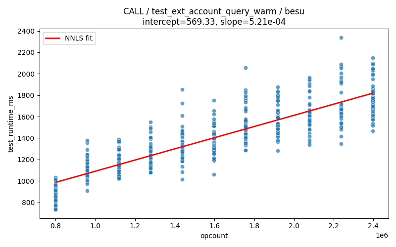

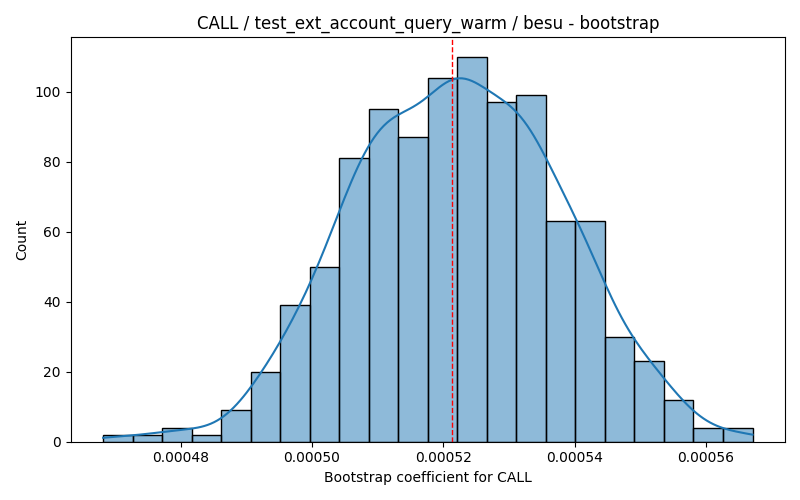

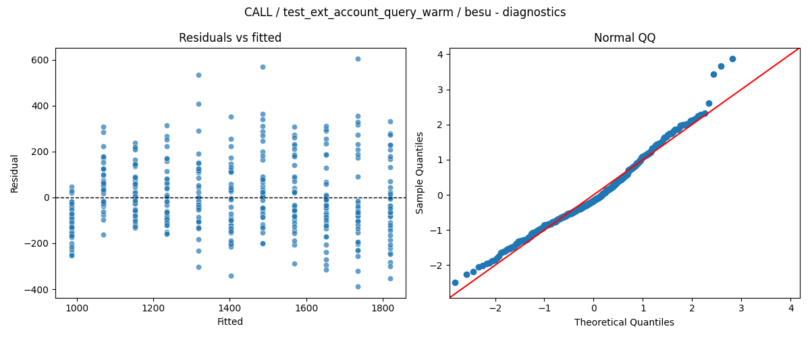

</details>

<details><summary>erigon — NNLS regression summary</summary>

```
==============================================================================
                           NNLS Regression Results                            
==============================================================================
Dep. Variable:          test_runtime_ms              R-squared:          0.913
Model:                  NNLS                    Adj. R-squared:          0.913
No. Observations:       165                               RMSE:          74.68
Df Residuals:           163                                MAE:          54.51
Df Model:               1      
==============================================================================
                      coef     std err     P-value      [0.025      0.975]
------------------------------------------------------------------------------
         const     53.5578     17.4472       0.003     19.5410     89.1221
       opcount      0.0005      0.0000       0.001      0.0005      0.0005
==============================================================================
Notes: Non-negative least squares with bootstrap inference (1000 iterations)
==============================================================================
```

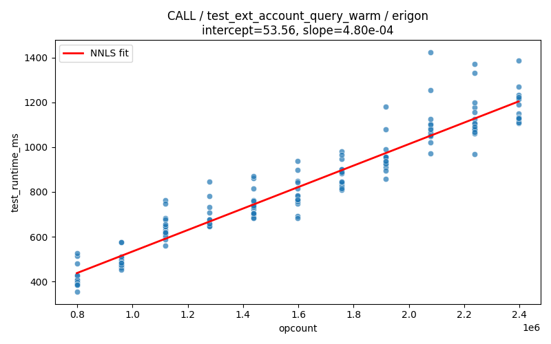

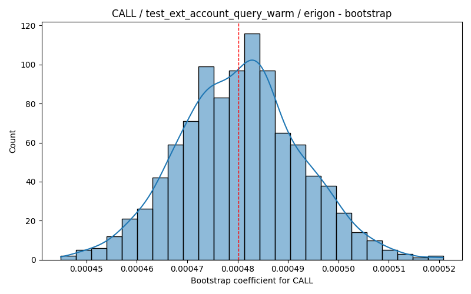

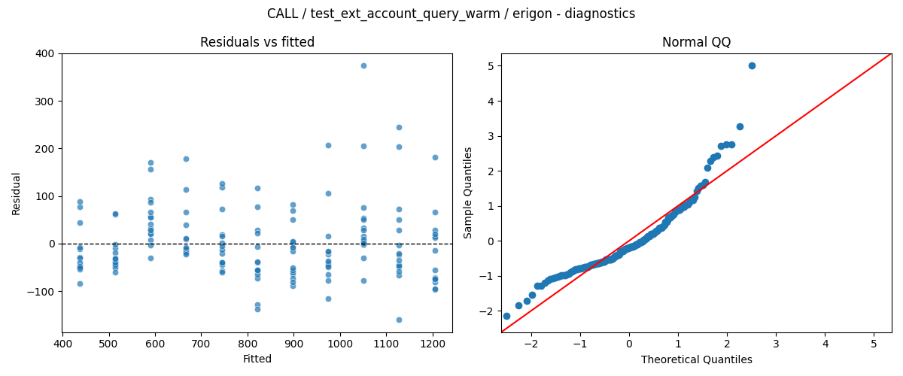

</details>

<details><summary>ethrex — NNLS regression summary</summary>

```
==============================================================================
                           NNLS Regression Results                            
==============================================================================
Dep. Variable:          test_runtime_ms              R-squared:          0.926
Model:                  NNLS                    Adj. R-squared:          0.925
No. Observations:       275                               RMSE:          14.16
Df Residuals:           273                                MAE:          10.82
Df Model:               1      
==============================================================================
                      coef     std err     P-value      [0.025      0.975]
------------------------------------------------------------------------------
         const     43.8892      3.0237       0.001     38.3036     49.9634
       opcount      0.0001      0.0000       0.001      0.0001      0.0001
==============================================================================
Notes: Non-negative least squares with bootstrap inference (1000 iterations)
==============================================================================
```

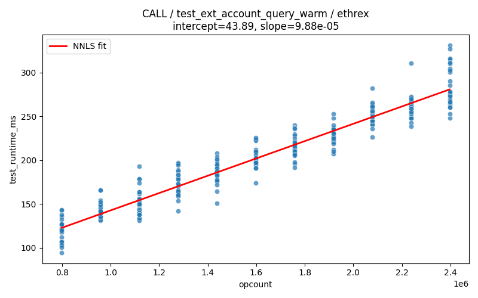

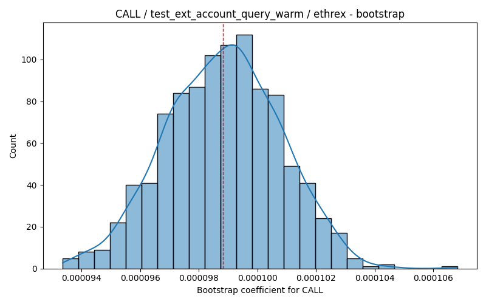

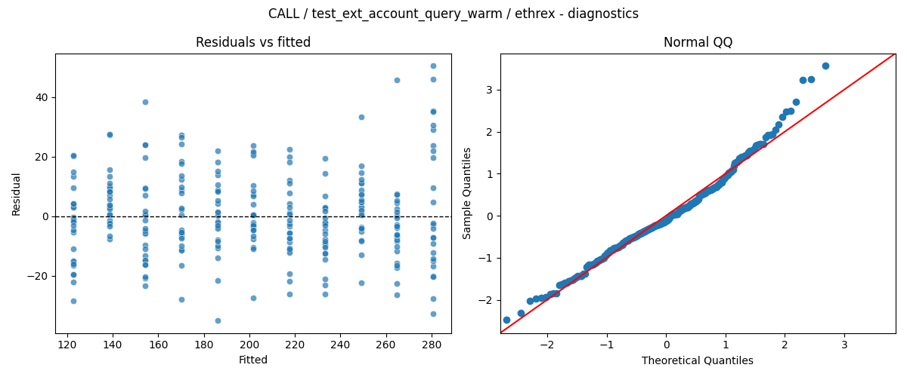

</details>

<details><summary>geth — NNLS regression summary</summary>

```
==============================================================================
                           NNLS Regression Results                            
==============================================================================
Dep. Variable:          test_runtime_ms              R-squared:          0.876
Model:                  NNLS                    Adj. R-squared:          0.875
No. Observations:       242                               RMSE:          24.78
Df Residuals:           240                                MAE:          18.74
Df Model:               1      
==============================================================================
                      coef     std err     P-value      [0.025      0.975]
------------------------------------------------------------------------------
         const     51.0647      5.1353       0.001     40.9897     61.1007
       opcount      0.0001      0.0000       0.001      0.0001      0.0001
==============================================================================
Notes: Non-negative least squares with bootstrap inference (1000 iterations)
==============================================================================
```

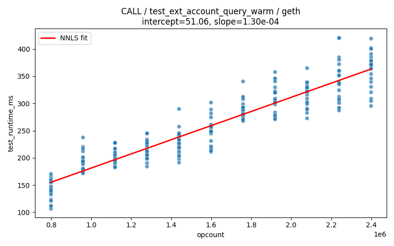

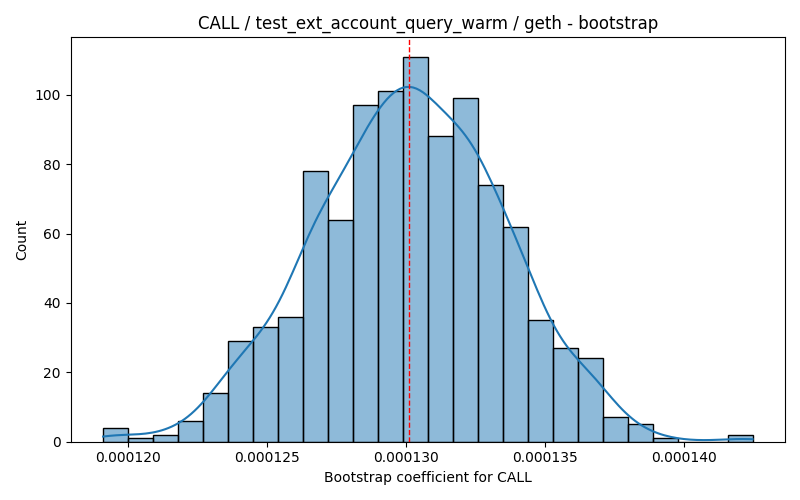

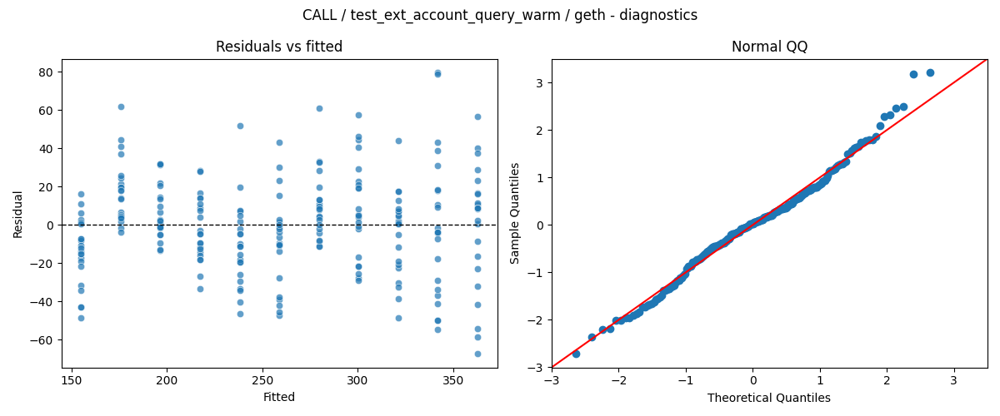

</details>

<details><summary>nethermind — NNLS regression summary</summary>

```
==============================================================================
                           NNLS Regression Results                            
==============================================================================
Dep. Variable:          test_runtime_ms              R-squared:          0.689
Model:                  NNLS                    Adj. R-squared:          0.687
No. Observations:       198                               RMSE:         122.39
Df Residuals:           196                                MAE:          96.07
Df Model:               1      
==============================================================================
                      coef     std err     P-value      [0.025      0.975]
------------------------------------------------------------------------------
         const    193.2858     25.1231       0.001    145.4124    242.6895
       opcount      0.0004      0.0000       0.001      0.0003      0.0004
==============================================================================
Notes: Non-negative least squares with bootstrap inference (1000 iterations)
==============================================================================
```

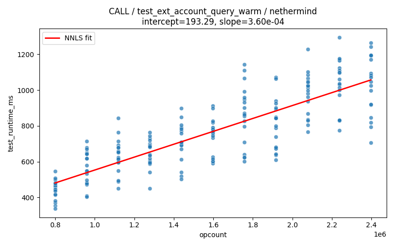

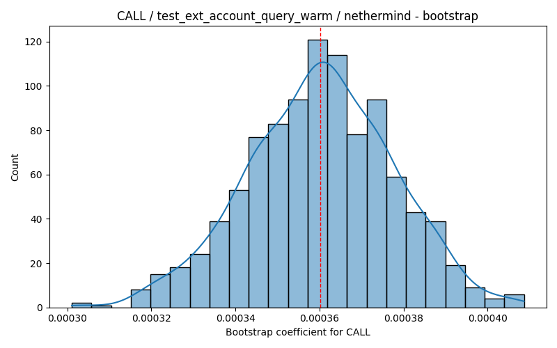

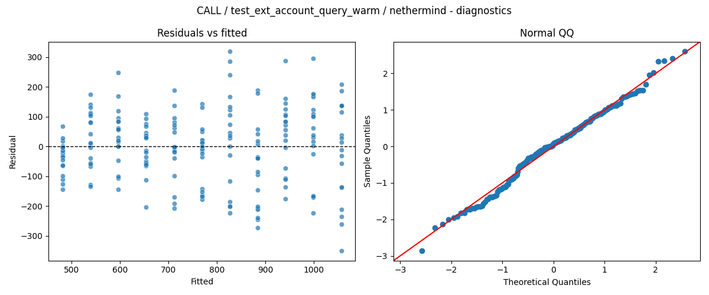

</details>

<details><summary>reth — NNLS regression summary</summary>

```
==============================================================================
                           NNLS Regression Results                            
==============================================================================
Dep. Variable:          test_runtime_ms              R-squared:          0.928
Model:                  NNLS                    Adj. R-squared:          0.928
No. Observations:       308                               RMSE:           8.45
Df Residuals:           306                                MAE:           6.52
Df Model:               1      
==============================================================================
                      coef     std err     P-value      [0.025      0.975]
------------------------------------------------------------------------------
         const     20.6422      1.6784       0.001     17.6373     24.1376
       opcount      0.0001      0.0000       0.001      0.0001      0.0001
==============================================================================
Notes: Non-negative least squares with bootstrap inference (1000 iterations)
==============================================================================
```

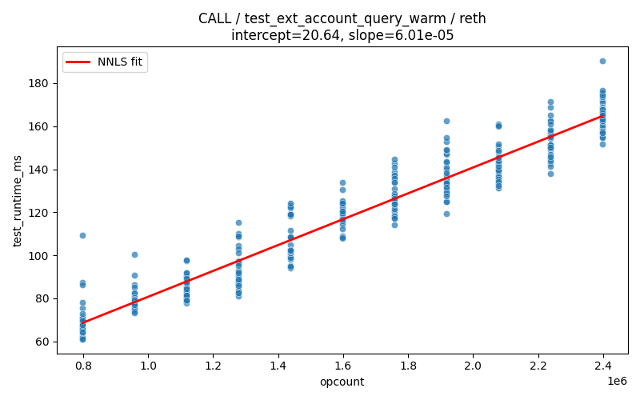

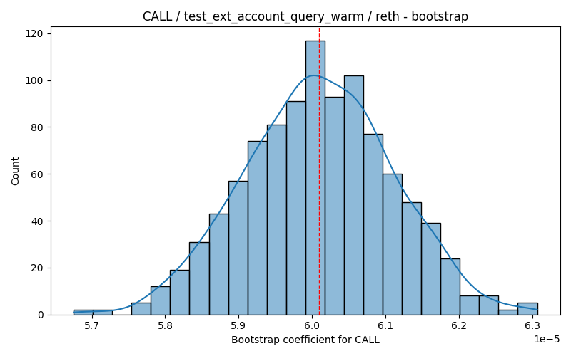

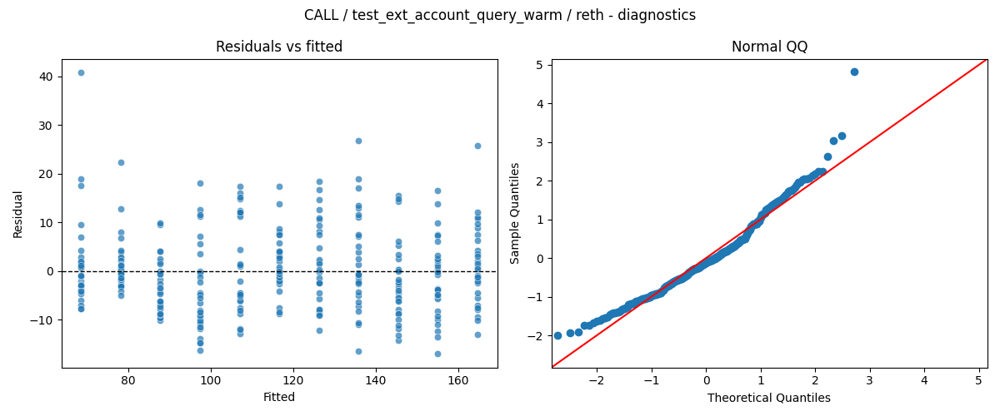

</details>

## CALLCODE

### test_account_access — combo `CALLCODE_AccountMode.EXISTING_EOA` — `presets[cold_account_nocode_access]`

| client | nobs | R² | target_coef (ms) | p-value | 95% CI |
| --- | --- | --- | --- | --- | --- |
| `besu` | 407 | 0.8459 | 0.01494 | 1.00e-03 | [0.01429, 0.01551] |
| `erigon` | 165 | 0.9724 | 0.009089 | 1.00e-03 | [0.008874, 0.009314] |
| `ethrex` | 275 | 0.9939 | 0.006944 | 1.00e-03 | [0.006881, 0.007009] |
| `geth` | 242 | 0.9153 | 0.01101 | 1.00e-03 | [0.01052, 0.01148] |
| `nethermind` | 198 | 0.7813 | 0.004196 | 1.00e-03 | [0.003891, 0.004521] |
| `reth` | 308 | 0.9514 | 0.001083 | 1.00e-03 | [0.001054, 0.001113] |

<details><summary>besu — NNLS regression summary</summary>

```
==============================================================================
                           NNLS Regression Results                            
==============================================================================
Dep. Variable:          test_runtime_ms              R-squared:          0.846
Model:                  NNLS                    Adj. R-squared:          0.846
No. Observations:       407                               RMSE:         151.46
Df Residuals:           405                                MAE:         128.33
Df Model:               1      
==============================================================================
                      coef     std err     P-value      [0.025      0.975]
------------------------------------------------------------------------------
         const    540.9502     23.2270       0.001    498.6461    588.1713
       opcount      0.0149      0.0003       0.001      0.0143      0.0155
==============================================================================
Notes: Non-negative least squares with bootstrap inference (1000 iterations)
==============================================================================
```

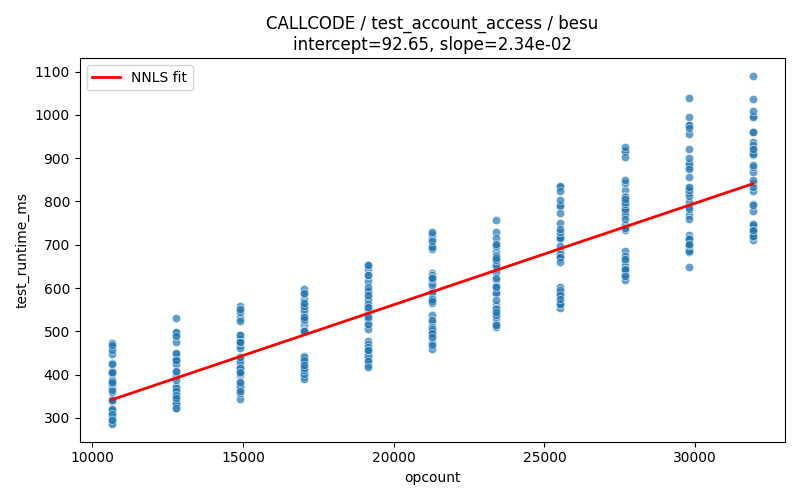

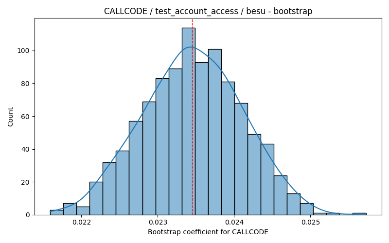

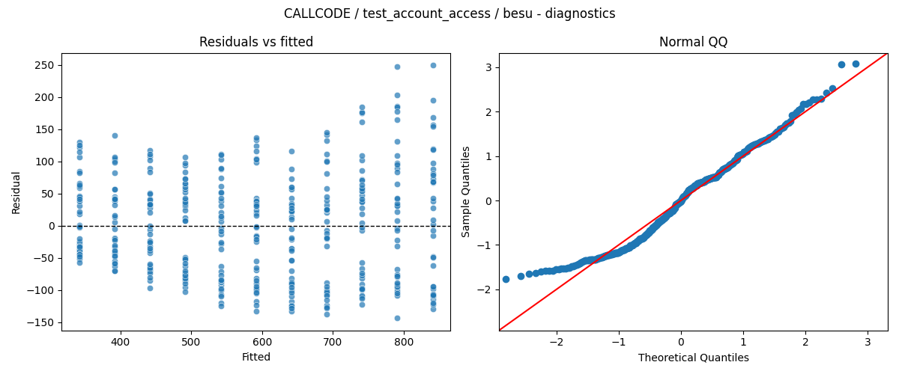

</details>

<details><summary>erigon — NNLS regression summary</summary>

```
==============================================================================
                           NNLS Regression Results                            
==============================================================================
Dep. Variable:          test_runtime_ms              R-squared:          0.972
Model:                  NNLS                    Adj. R-squared:          0.972
No. Observations:       165                               RMSE:          36.37
Df Residuals:           163                                MAE:          28.92
Df Model:               1      
==============================================================================
                      coef     std err     P-value      [0.025      0.975]
------------------------------------------------------------------------------
         const     31.8709      7.7593       0.001     16.1946     46.8512
       opcount      0.0091      0.0001       0.001      0.0089      0.0093
==============================================================================
Notes: Non-negative least squares with bootstrap inference (1000 iterations)
==============================================================================
```

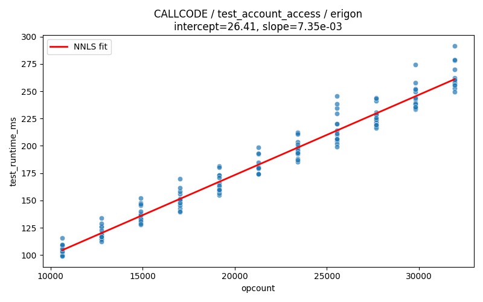

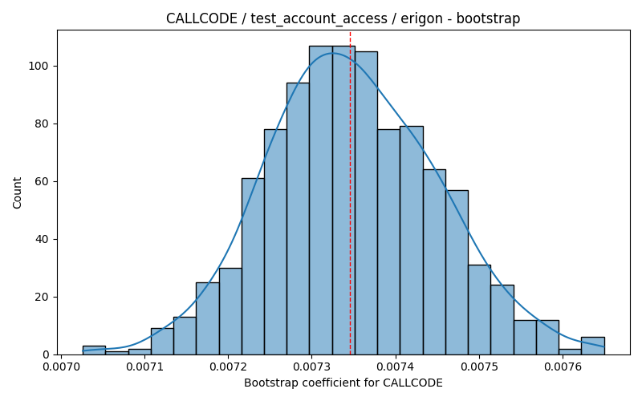

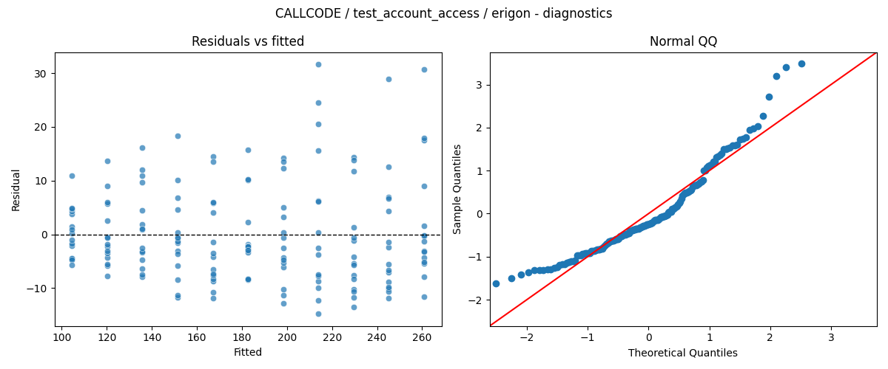

</details>

<details><summary>ethrex — NNLS regression summary</summary>

```
==============================================================================
                           NNLS Regression Results                            
==============================================================================
Dep. Variable:          test_runtime_ms              R-squared:          0.994
Model:                  NNLS                    Adj. R-squared:          0.994
No. Observations:       275                               RMSE:          12.94
Df Residuals:           273                                MAE:          10.22
Df Model:               1      
==============================================================================
                      coef     std err     P-value      [0.025      0.975]
------------------------------------------------------------------------------
         const     49.2231      2.3596       0.001     44.2994     53.8826
       opcount      0.0069      0.0000       0.001      0.0069      0.0070
==============================================================================
Notes: Non-negative least squares with bootstrap inference (1000 iterations)
==============================================================================
```

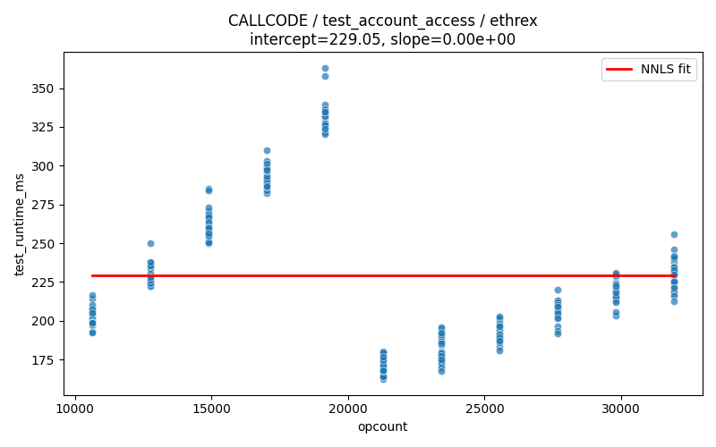


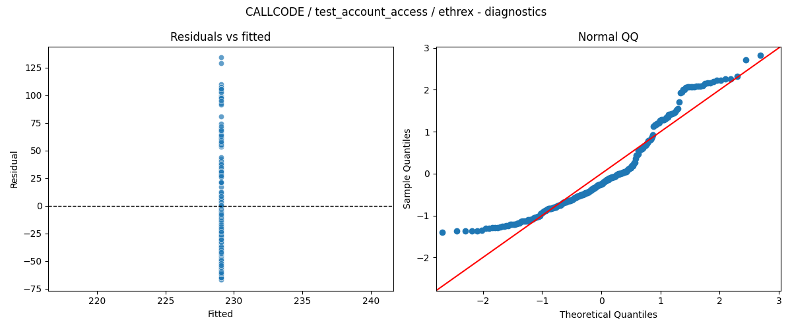

</details>

<details><summary>geth — NNLS regression summary</summary>

```
==============================================================================
                           NNLS Regression Results                            
==============================================================================
Dep. Variable:          test_runtime_ms              R-squared:          0.915
Model:                  NNLS                    Adj. R-squared:          0.915
No. Observations:       242                               RMSE:          79.49
Df Residuals:           240                                MAE:          65.19
Df Model:               1      
==============================================================================
                      coef     std err     P-value      [0.025      0.975]
------------------------------------------------------------------------------
         const    411.4127     21.6055       0.001    371.5377    453.7980
       opcount      0.0110      0.0003       0.001      0.0105      0.0115
==============================================================================
Notes: Non-negative least squares with bootstrap inference (1000 iterations)
==============================================================================
```

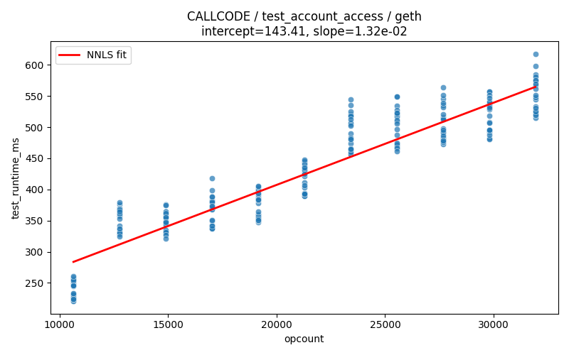

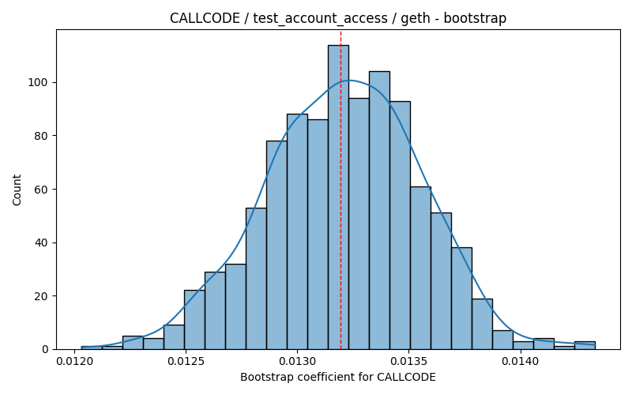

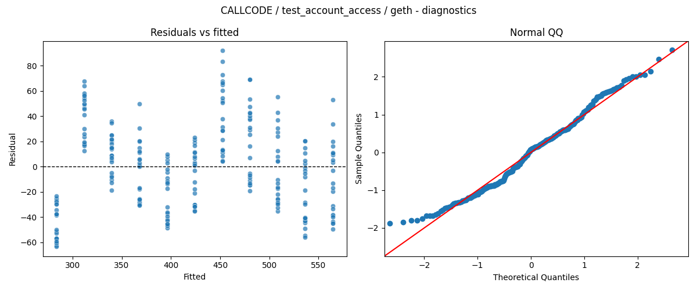

</details>

<details><summary>nethermind — NNLS regression summary</summary>

```
==============================================================================
                           NNLS Regression Results                            
==============================================================================
Dep. Variable:          test_runtime_ms              R-squared:          0.781
Model:                  NNLS                    Adj. R-squared:          0.780
No. Observations:       198                               RMSE:          52.72
Df Residuals:           196                                MAE:          36.73
Df Model:               1      
==============================================================================
                      coef     std err     P-value      [0.025      0.975]
------------------------------------------------------------------------------
         const     86.1715     10.6721       0.001     64.6673    106.3029
       opcount      0.0042      0.0002       0.001      0.0039      0.0045
==============================================================================
Notes: Non-negative least squares with bootstrap inference (1000 iterations)
==============================================================================
```


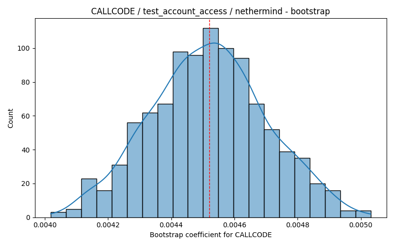

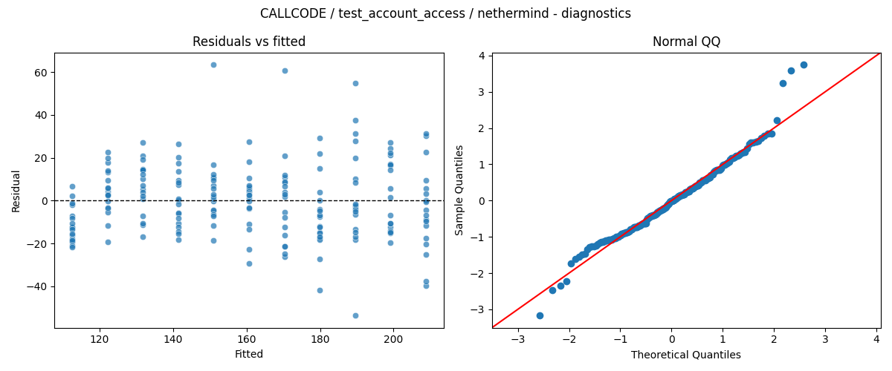

</details>

<details><summary>reth — NNLS regression summary</summary>

```
==============================================================================
                           NNLS Regression Results                            
==============================================================================
Dep. Variable:          test_runtime_ms              R-squared:          0.951
Model:                  NNLS                    Adj. R-squared:          0.951
No. Observations:       308                               RMSE:           5.82
Df Residuals:           306                                MAE:           4.49
Df Model:               1      
==============================================================================
                      coef     std err     P-value      [0.025      0.975]
------------------------------------------------------------------------------
         const     41.2671      1.1293       0.001     39.0678     43.5138
       opcount      0.0011      0.0000       0.001      0.0011      0.0011
==============================================================================
Notes: Non-negative least squares with bootstrap inference (1000 iterations)
==============================================================================
```

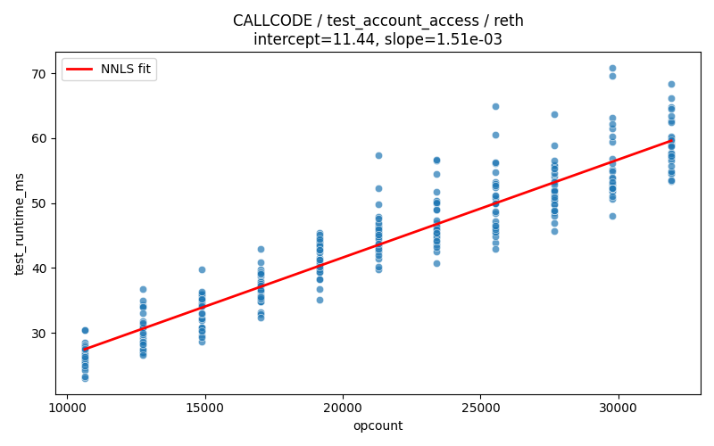

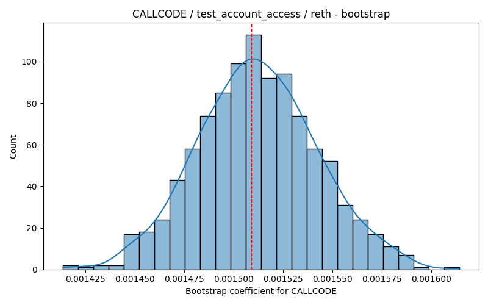

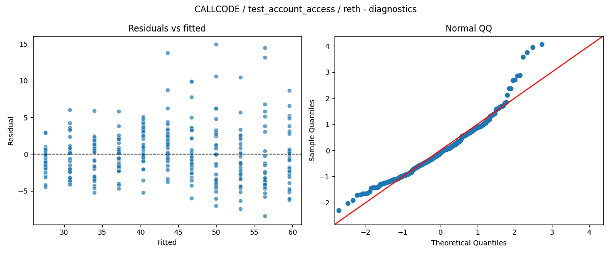

</details>

### test_account_access — combo `CALLCODE_AccountMode.NON_EXISTING_ACCOUNT` — `presets[cold_account_nocode_access]`

| client | nobs | R² | target_coef (ms) | p-value | 95% CI |
| --- | --- | --- | --- | --- | --- |
| `besu` | 407 | 0.8808 | 0.0151 | 1.00e-03 | [0.01454, 0.01565] |
| `erigon` | 165 | 0.9729 | 0.008529 | 1.00e-03 | [0.008342, 0.008735] |
| `ethrex` | 275 | 0.9694 | 0.001986 | 1.00e-03 | [0.001946, 0.002027] |
| `geth` | 242 | 0.8658 | 0.02263 | 1.00e-03 | [0.02139, 0.02382] |
| `nethermind` | 198 | 0.8401 | 0.004006 | 1.00e-03 | [0.003746, 0.004267] |
| `reth` | 308 | 0.8962 | 0.0007802 | 1.00e-03 | [0.0007526, 0.0008091] |

<details><summary>besu — NNLS regression summary</summary>

```
==============================================================================
                           NNLS Regression Results                            
==============================================================================
Dep. Variable:          test_runtime_ms              R-squared:          0.881
Model:                  NNLS                    Adj. R-squared:          0.880
No. Observations:       407                               RMSE:         131.89
Df Residuals:           405                                MAE:         117.25
Df Model:               1      
==============================================================================
                      coef     std err     P-value      [0.025      0.975]
------------------------------------------------------------------------------
         const    513.0156     21.1794       0.001    471.9053    555.3103
       opcount      0.0151      0.0003       0.001      0.0145      0.0156
==============================================================================
Notes: Non-negative least squares with bootstrap inference (1000 iterations)
==============================================================================
```

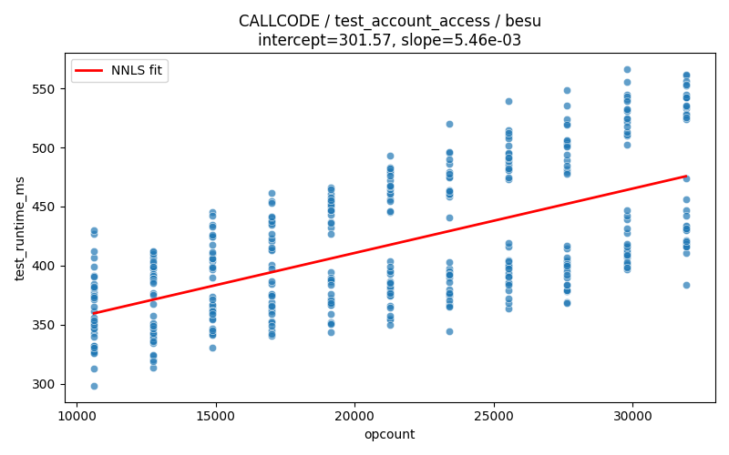

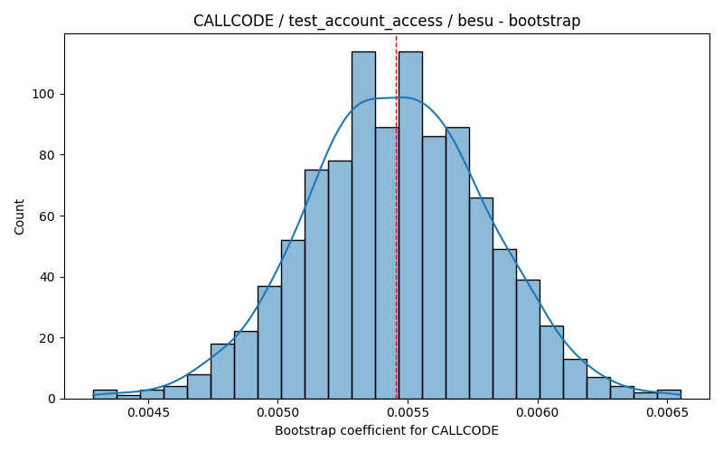

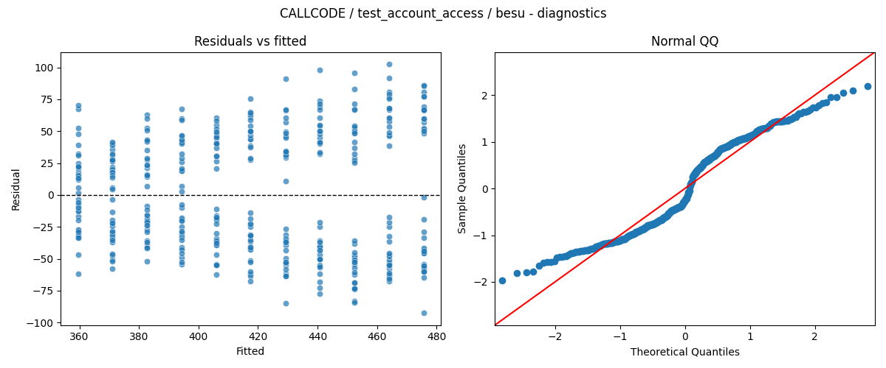

</details>

<details><summary>erigon — NNLS regression summary</summary>

```
==============================================================================
                           NNLS Regression Results                            
==============================================================================
Dep. Variable:          test_runtime_ms              R-squared:          0.973
Model:                  NNLS                    Adj. R-squared:          0.973
No. Observations:       165                               RMSE:          33.80
Df Residuals:           163                                MAE:          27.05
Df Model:               1      
==============================================================================
                      coef     std err     P-value      [0.025      0.975]
------------------------------------------------------------------------------
         const     19.1589      6.9560       0.005      5.1859     32.5307
       opcount      0.0085      0.0001       0.001      0.0083      0.0087
==============================================================================
Notes: Non-negative least squares with bootstrap inference (1000 iterations)
==============================================================================
```

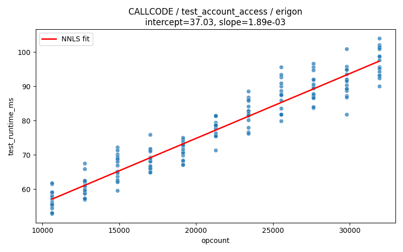

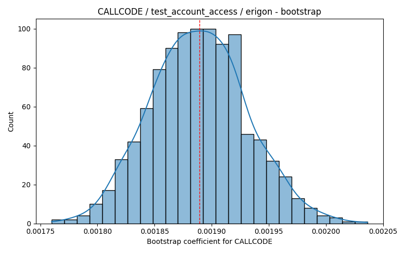

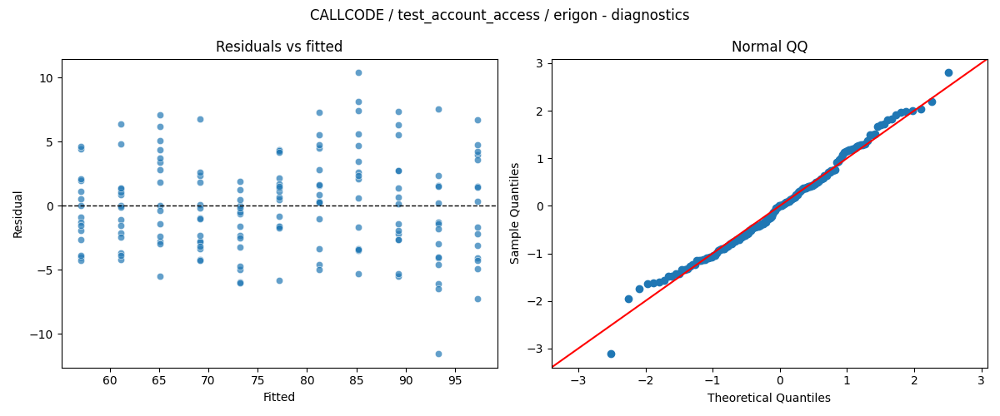

</details>

<details><summary>ethrex — NNLS regression summary</summary>

```
==============================================================================
                           NNLS Regression Results                            
==============================================================================
Dep. Variable:          test_runtime_ms              R-squared:          0.969
Model:                  NNLS                    Adj. R-squared:          0.969
No. Observations:       275                               RMSE:           8.38
Df Residuals:           273                                MAE:           6.62
Df Model:               1      
==============================================================================
                      coef     std err     P-value      [0.025      0.975]
------------------------------------------------------------------------------
         const     29.2276      1.5514       0.001     26.2733     32.2563
       opcount      0.0020      0.0000       0.001      0.0019      0.0020
==============================================================================
Notes: Non-negative least squares with bootstrap inference (1000 iterations)
==============================================================================
```

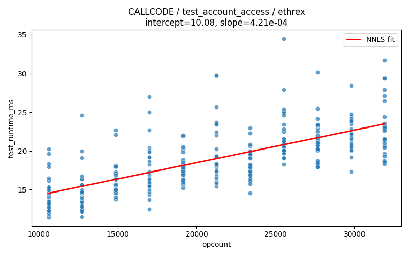

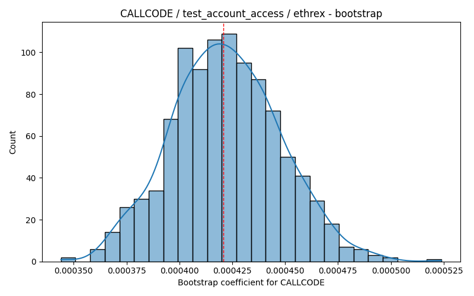

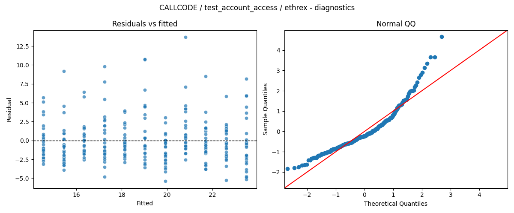

</details>

<details><summary>geth — NNLS regression summary</summary>

```
==============================================================================
                           NNLS Regression Results                            
==============================================================================
Dep. Variable:          test_runtime_ms              R-squared:          0.866
Model:                  NNLS                    Adj. R-squared:          0.865
No. Observations:       242                               RMSE:         211.50
Df Residuals:           240                                MAE:         179.93
Df Model:               1      
==============================================================================
                      coef     std err     P-value      [0.025      0.975]
------------------------------------------------------------------------------
         const    695.3824     51.1146       0.001    602.7743    799.4846
       opcount      0.0226      0.0006       0.001      0.0214      0.0238
==============================================================================
Notes: Non-negative least squares with bootstrap inference (1000 iterations)
==============================================================================
```

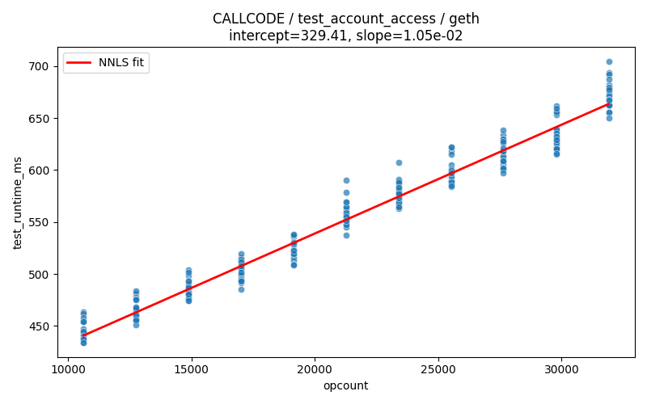

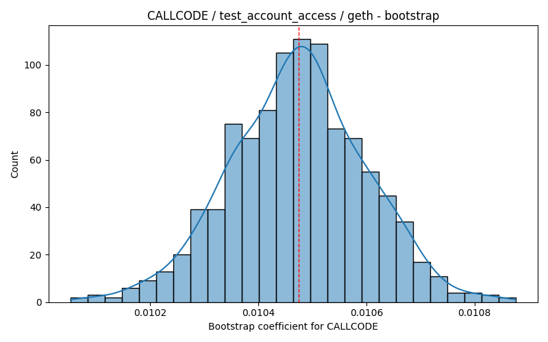

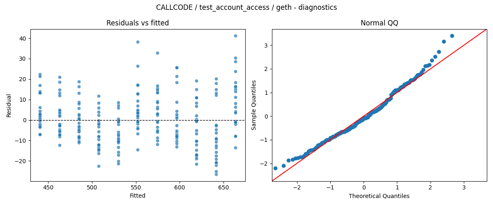

</details>

<details><summary>nethermind — NNLS regression summary</summary>

```
==============================================================================
                           NNLS Regression Results                            
==============================================================================
Dep. Variable:          test_runtime_ms              R-squared:          0.840
Model:                  NNLS                    Adj. R-squared:          0.839
No. Observations:       198                               RMSE:          41.51
Df Residuals:           196                                MAE:          31.77
Df Model:               1      
==============================================================================
                      coef     std err     P-value      [0.025      0.975]
------------------------------------------------------------------------------
         const     79.6288      9.2167       0.001     61.7534     97.8817
       opcount      0.0040      0.0001       0.001      0.0037      0.0043
==============================================================================
Notes: Non-negative least squares with bootstrap inference (1000 iterations)
==============================================================================
```

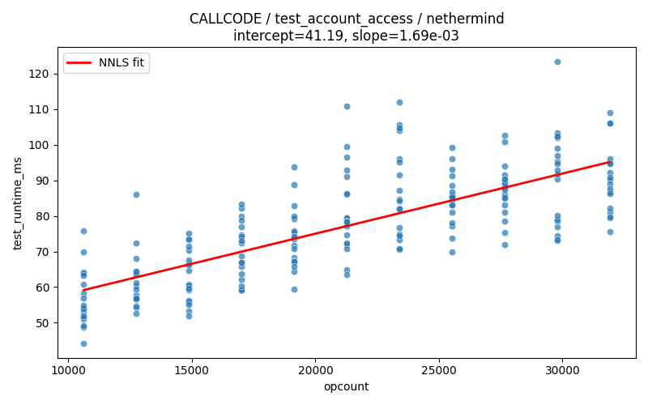

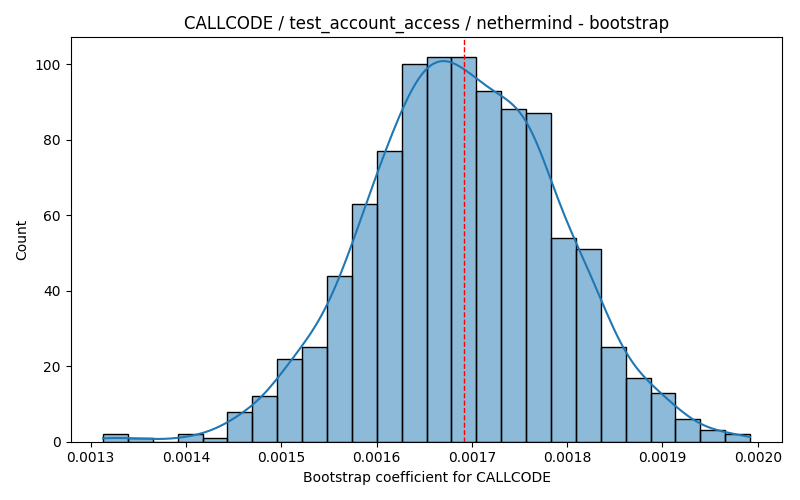

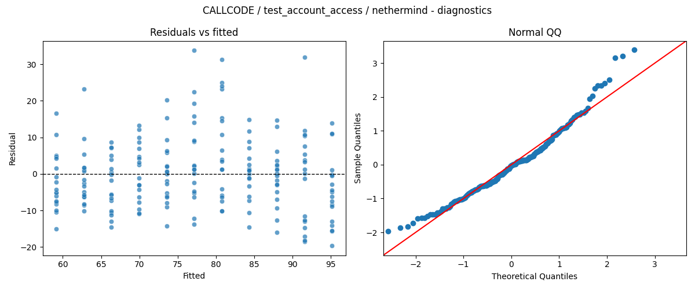

</details>

<details><summary>reth — NNLS regression summary</summary>

```
==============================================================================
                           NNLS Regression Results                            
==============================================================================
Dep. Variable:          test_runtime_ms              R-squared:          0.896
Model:                  NNLS                    Adj. R-squared:          0.896
No. Observations:       308                               RMSE:           6.30
Df Residuals:           306                                MAE:           4.63
Df Model:               1      
==============================================================================
                      coef     std err     P-value      [0.025      0.975]
------------------------------------------------------------------------------
         const     46.5696      1.0331       0.001     44.6269     48.5651
       opcount      0.0008      0.0000       0.001      0.0008      0.0008
==============================================================================
Notes: Non-negative least squares with bootstrap inference (1000 iterations)
==============================================================================
```

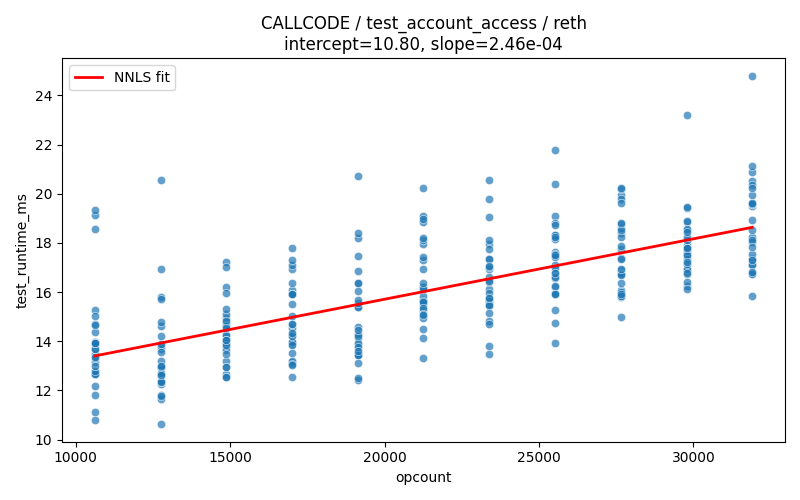

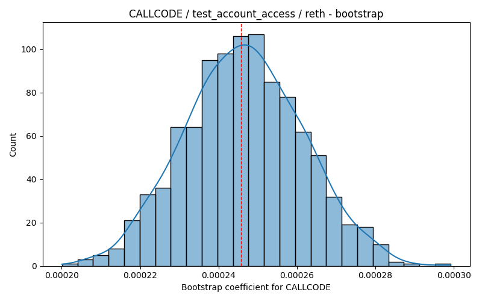

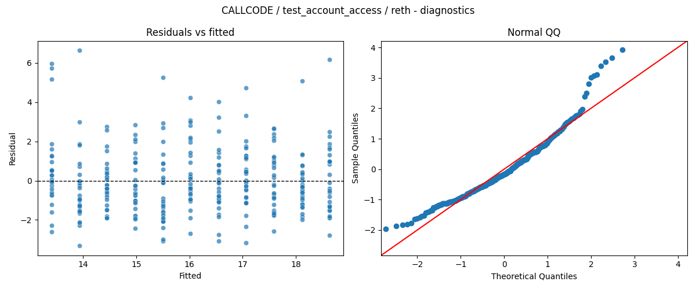

</details>

### test_account_access — combo `CALLCODE_AccountMode.EXISTING_CONTRACT` — `presets[cold_account_code_access]`

| client | nobs | R² | target_coef (ms) | p-value | 95% CI |
| --- | --- | --- | --- | --- | --- |
| `besu` | 407 | 0.8948 | 0.02705 | 1.00e-03 | [0.0262, 0.02789] |
| `erigon` | 165 | 0.8951 | 0.04926 | 1.00e-03 | [0.0468, 0.05147] |
| `ethrex` | 275 | 0.9936 | 0.007572 | 1.00e-03 | [0.007496, 0.007647] |
| `geth` | 242 | 0.859 | 0.02352 | 1.00e-03 | [0.02228, 0.02488] |
| `nethermind` | 198 | 0.6515 | 0.01547 | 1.00e-03 | [0.01395, 0.01713] |
| `reth` | 308 | 0.9759 | 0.003979 | 1.00e-03 | [0.003914, 0.004049] |

<details><summary>besu — NNLS regression summary</summary>

```
==============================================================================
                           NNLS Regression Results                            
==============================================================================
Dep. Variable:          test_runtime_ms              R-squared:          0.895
Model:                  NNLS                    Adj. R-squared:          0.895
No. Observations:       407                               RMSE:         188.73
Df Residuals:           405                                MAE:         161.16
Df Model:               1      
==============================================================================
                      coef     std err     P-value      [0.025      0.975]
------------------------------------------------------------------------------
         const    564.6528     27.0621       0.001    510.7692    618.4742
       opcount      0.0270      0.0004       0.001      0.0262      0.0279
==============================================================================
Notes: Non-negative least squares with bootstrap inference (1000 iterations)
==============================================================================
```

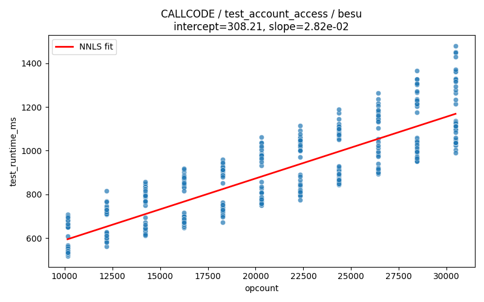

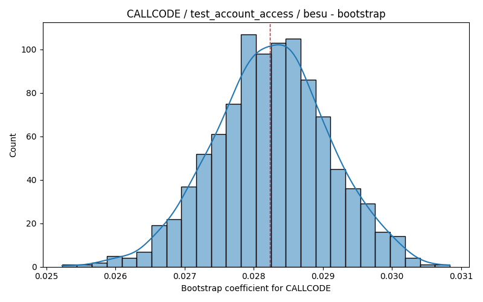

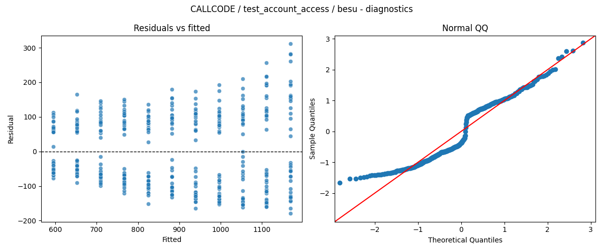

</details>

<details><summary>erigon — NNLS regression summary</summary>

```
==============================================================================
                           NNLS Regression Results                            
==============================================================================
Dep. Variable:          test_runtime_ms              R-squared:          0.895
Model:                  NNLS                    Adj. R-squared:          0.894
No. Observations:       165                               RMSE:         343.23
Df Residuals:           163                                MAE:         294.69
Df Model:               1      
==============================================================================
                      coef     std err     P-value      [0.025      0.975]
------------------------------------------------------------------------------
         const    840.2940     91.4313       0.001    673.3133   1025.0672
       opcount      0.0493      0.0012       0.001      0.0468      0.0515
==============================================================================
Notes: Non-negative least squares with bootstrap inference (1000 iterations)
==============================================================================
```

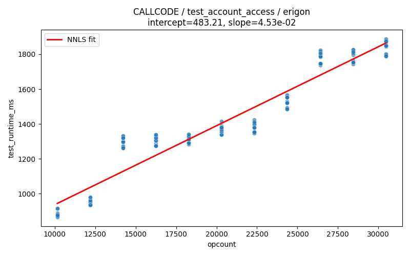

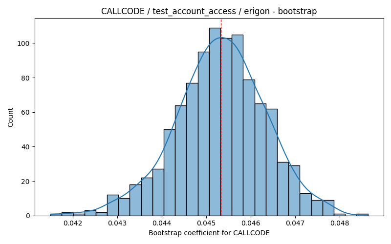

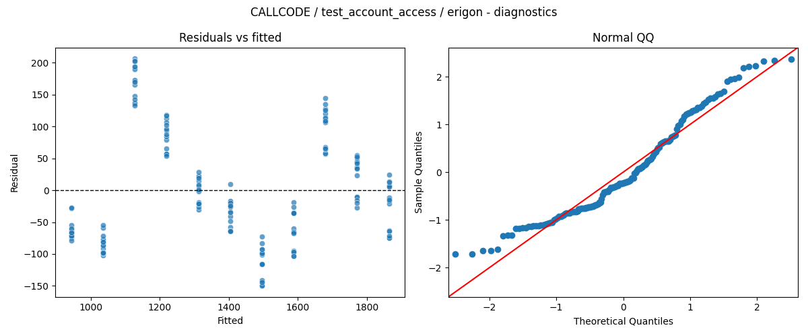

</details>

<details><summary>ethrex — NNLS regression summary</summary>

```
==============================================================================
                           NNLS Regression Results                            
==============================================================================
Dep. Variable:          test_runtime_ms              R-squared:          0.994
Model:                  NNLS                    Adj. R-squared:          0.994
No. Observations:       275                               RMSE:          12.40
Df Residuals:           273                                MAE:           9.31
Df Model:               1      
==============================================================================
                      coef     std err     P-value      [0.025      0.975]
------------------------------------------------------------------------------
         const     41.0496      2.4785       0.001     36.1384     46.2592
       opcount      0.0076      0.0000       0.001      0.0075      0.0076
==============================================================================
Notes: Non-negative least squares with bootstrap inference (1000 iterations)
==============================================================================
```

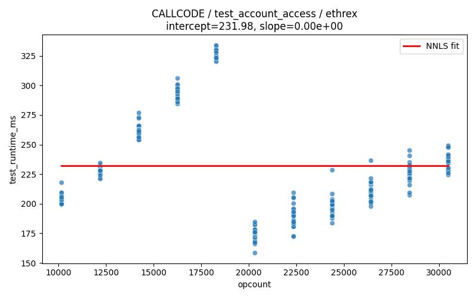


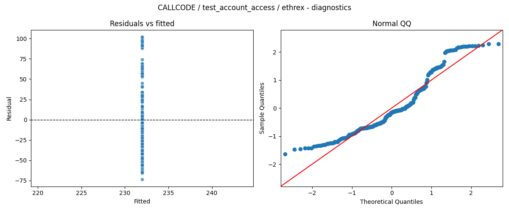

</details>

<details><summary>geth — NNLS regression summary</summary>

```
==============================================================================
                           NNLS Regression Results                            
==============================================================================
Dep. Variable:          test_runtime_ms              R-squared:          0.859
Model:                  NNLS                    Adj. R-squared:          0.858
No. Observations:       242                               RMSE:         193.92
Df Residuals:           240                                MAE:         164.53
Df Model:               1      
==============================================================================
                      coef     std err     P-value      [0.025      0.975]
------------------------------------------------------------------------------
         const    654.4860     48.3671       0.001    559.8690    743.1265
       opcount      0.0235      0.0007       0.001      0.0223      0.0249
==============================================================================
Notes: Non-negative least squares with bootstrap inference (1000 iterations)
==============================================================================
```

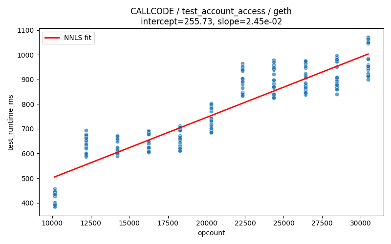

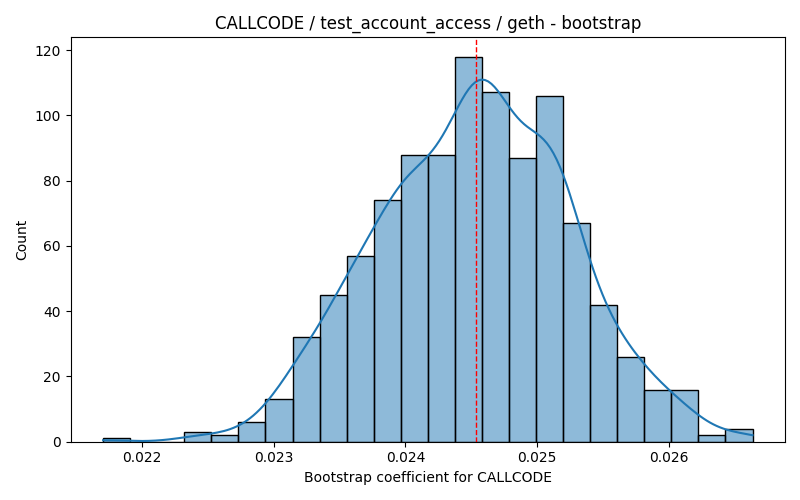

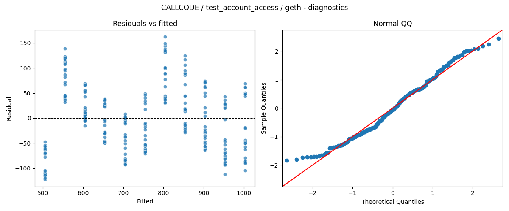

</details>

<details><summary>nethermind — NNLS regression summary</summary>

```
==============================================================================
                           NNLS Regression Results                            
==============================================================================
Dep. Variable:          test_runtime_ms              R-squared:          0.652
Model:                  NNLS                    Adj. R-squared:          0.650
No. Observations:       198                               RMSE:         230.20
Df Residuals:           196                                MAE:         169.47
Df Model:               1      
==============================================================================
                      coef     std err     P-value      [0.025      0.975]
------------------------------------------------------------------------------
         const    116.9903     46.5298       0.011     22.3459    202.8141
       opcount      0.0155      0.0008       0.001      0.0139      0.0171
==============================================================================
Notes: Non-negative least squares with bootstrap inference (1000 iterations)
==============================================================================
```

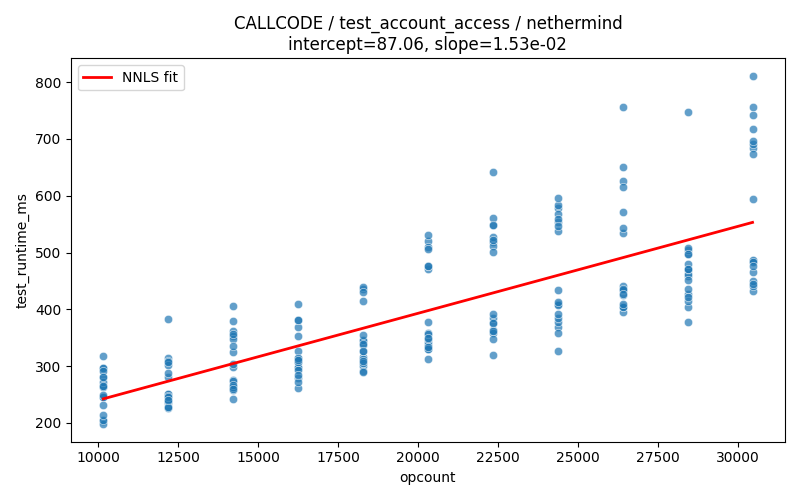

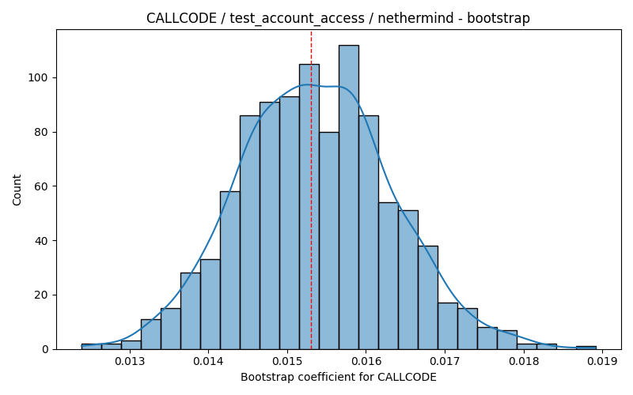

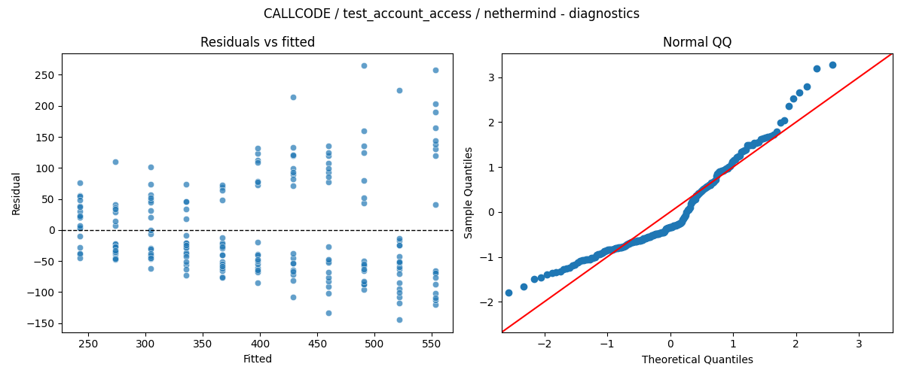

</details>

<details><summary>reth — NNLS regression summary</summary>

```
==============================================================================
                           NNLS Regression Results                            
==============================================================================
Dep. Variable:          test_runtime_ms              R-squared:          0.976
Model:                  NNLS                    Adj. R-squared:          0.976
No. Observations:       308                               RMSE:          12.72
Df Residuals:           306                                MAE:           9.84
Df Model:               1      
==============================================================================
                      coef     std err     P-value      [0.025      0.975]
------------------------------------------------------------------------------
         const    101.3644      2.2786       0.001     96.7202    105.5563
       opcount      0.0040      0.0000       0.001      0.0039      0.0040
==============================================================================
Notes: Non-negative least squares with bootstrap inference (1000 iterations)
==============================================================================
```

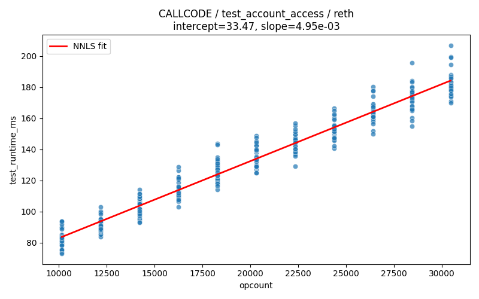

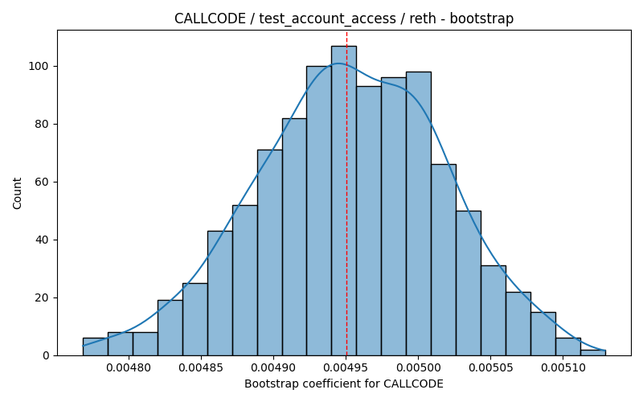

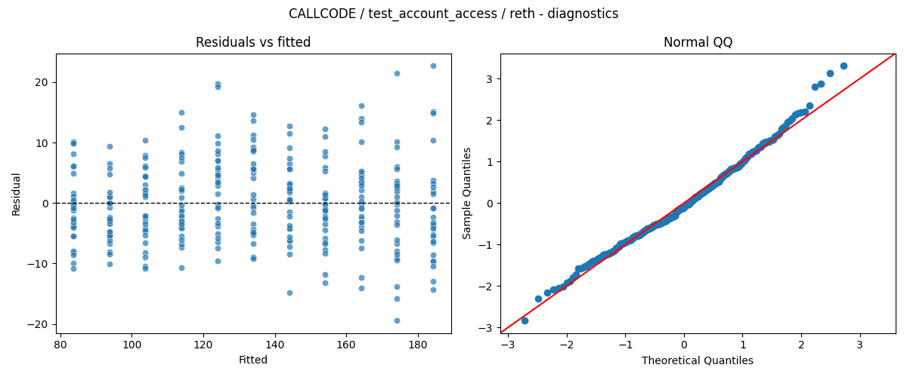

</details>

### test_account_access — combo `CALLCODE_AccountMode.NON_EXISTING_ACCOUNT` — `presets[cold_account_code_access]`

| client | nobs | R² | target_coef (ms) | p-value | 95% CI |
| --- | --- | --- | --- | --- | --- |
| `besu` | 407 | 0.8808 | 0.0151 | 1.00e-03 | [0.01454, 0.01565] |
| `erigon` | 165 | 0.9729 | 0.008529 | 1.00e-03 | [0.008342, 0.008735] |
| `ethrex` | 275 | 0.9694 | 0.001986 | 1.00e-03 | [0.001946, 0.002027] |
| `geth` | 242 | 0.8658 | 0.02263 | 1.00e-03 | [0.02139, 0.02382] |
| `nethermind` | 198 | 0.8401 | 0.004006 | 1.00e-03 | [0.003746, 0.004267] |
| `reth` | 308 | 0.8962 | 0.0007802 | 1.00e-03 | [0.0007526, 0.0008091] |

<details><summary>besu — NNLS regression summary</summary>

```
==============================================================================
                           NNLS Regression Results                            
==============================================================================
Dep. Variable:          test_runtime_ms              R-squared:          0.881
Model:                  NNLS                    Adj. R-squared:          0.880
No. Observations:       407                               RMSE:         131.89
Df Residuals:           405                                MAE:         117.25
Df Model:               1      
==============================================================================
                      coef     std err     P-value      [0.025      0.975]
------------------------------------------------------------------------------
         const    513.0156     21.1794       0.001    471.9053    555.3103
       opcount      0.0151      0.0003       0.001      0.0145      0.0156
==============================================================================
Notes: Non-negative least squares with bootstrap inference (1000 iterations)
==============================================================================
```


</details>

<details><summary>erigon — NNLS regression summary</summary>

```
==============================================================================
                           NNLS Regression Results                            
==============================================================================
Dep. Variable:          test_runtime_ms              R-squared:          0.973
Model:                  NNLS                    Adj. R-squared:          0.973
No. Observations:       165                               RMSE:          33.80
Df Residuals:           163                                MAE:          27.05
Df Model:               1      
==============================================================================
                      coef     std err     P-value      [0.025      0.975]
------------------------------------------------------------------------------
         const     19.1589      6.9560       0.005      5.1859     32.5307
       opcount      0.0085      0.0001       0.001      0.0083      0.0087
==============================================================================
Notes: Non-negative least squares with bootstrap inference (1000 iterations)
==============================================================================
```


</details>

<details><summary>ethrex — NNLS regression summary</summary>

```
==============================================================================
                           NNLS Regression Results                            
==============================================================================
Dep. Variable:          test_runtime_ms              R-squared:          0.969
Model:                  NNLS                    Adj. R-squared:          0.969
No. Observations:       275                               RMSE:           8.38
Df Residuals:           273                                MAE:           6.62
Df Model:               1      
==============================================================================
                      coef     std err     P-value      [0.025      0.975]
------------------------------------------------------------------------------
         const     29.2276      1.5514       0.001     26.2733     32.2563
       opcount      0.0020      0.0000       0.001      0.0019      0.0020
==============================================================================
Notes: Non-negative least squares with bootstrap inference (1000 iterations)
==============================================================================
```


</details>

<details><summary>geth — NNLS regression summary</summary>

```
==============================================================================
                           NNLS Regression Results                            
==============================================================================
Dep. Variable:          test_runtime_ms              R-squared:          0.866
Model:                  NNLS                    Adj. R-squared:          0.865
No. Observations:       242                               RMSE:         211.50
Df Residuals:           240                                MAE:         179.93
Df Model:               1      
==============================================================================
                      coef     std err     P-value      [0.025      0.975]
------------------------------------------------------------------------------
         const    695.3824     51.1146       0.001    602.7743    799.4846
       opcount      0.0226      0.0006       0.001      0.0214      0.0238
==============================================================================
Notes: Non-negative least squares with bootstrap inference (1000 iterations)
==============================================================================
```


</details>

<details><summary>nethermind — NNLS regression summary</summary>

```
==============================================================================
                           NNLS Regression Results                            
==============================================================================
Dep. Variable:          test_runtime_ms              R-squared:          0.840
Model:                  NNLS                    Adj. R-squared:          0.839
No. Observations:       198                               RMSE:          41.51
Df Residuals:           196                                MAE:          31.77
Df Model:               1      
==============================================================================
                      coef     std err     P-value      [0.025      0.975]
------------------------------------------------------------------------------
         const     79.6288      9.2167       0.001     61.7534     97.8817
       opcount      0.0040      0.0001       0.001      0.0037      0.0043
==============================================================================
Notes: Non-negative least squares with bootstrap inference (1000 iterations)
==============================================================================
```


</details>

<details><summary>reth — NNLS regression summary</summary>

```
==============================================================================
                           NNLS Regression Results                            
==============================================================================
Dep. Variable:          test_runtime_ms              R-squared:          0.896
Model:                  NNLS                    Adj. R-squared:          0.896
No. Observations:       308                               RMSE:           6.30
Df Residuals:           306                                MAE:           4.63
Df Model:               1      
==============================================================================
                      coef     std err     P-value      [0.025      0.975]
------------------------------------------------------------------------------
         const     46.5696      1.0331       0.001     44.6269     48.5651
       opcount      0.0008      0.0000       0.001      0.0008      0.0008
==============================================================================
Notes: Non-negative least squares with bootstrap inference (1000 iterations)
==============================================================================
```


</details>

### test_account_access — combo `CALLCODE_AccountMode.EXISTING_EOA` — `presets[cold_account_nocode_write]`

| client | nobs | R² | target_coef (ms) | p-value | 95% CI |
| --- | --- | --- | --- | --- | --- |
| `besu` | 407 | 0.7922 | 0.02345 | 1.00e-03 | [0.02219, 0.02467] |
| `erigon` | 165 | 0.9677 | 0.007345 | 1.00e-03 | [0.007157, 0.007557] |
| `ethrex` | 275 | 0 | 0 | 1.00e+00 | [0, 0] |
| `geth` | 242 | 0.8736 | 0.01319 | 1.00e-03 | [0.01252, 0.01383] |
| `nethermind` | 198 | 0.7634 | 0.004521 | 1.00e-03 | [0.004155, 0.004878] |
| `reth` | 308 | 0.8843 | 0.001509 | 1.00e-03 | [0.001453, 0.001572] |

<details><summary>besu — NNLS regression summary</summary>

```
==============================================================================
                           NNLS Regression Results                            
==============================================================================
Dep. Variable:          test_runtime_ms              R-squared:          0.792
Model:                  NNLS                    Adj. R-squared:          0.792
No. Observations:       407                               RMSE:          80.81
Df Residuals:           405                                MAE:          68.28
Df Model:               1      
==============================================================================
                      coef     std err     P-value      [0.025      0.975]
------------------------------------------------------------------------------
         const     92.6534     12.8417       0.001     67.8277    116.8179
       opcount      0.0234      0.0006       0.001      0.0222      0.0247
==============================================================================
Notes: Non-negative least squares with bootstrap inference (1000 iterations)
==============================================================================
```


</details>

<details><summary>erigon — NNLS regression summary</summary>

```
==============================================================================
                           NNLS Regression Results                            
==============================================================================
Dep. Variable:          test_runtime_ms              R-squared:          0.968
Model:                  NNLS                    Adj. R-squared:          0.967
No. Observations:       165                               RMSE:           9.04
Df Residuals:           163                                MAE:           7.02
Df Model:               1      
==============================================================================
                      coef     std err     P-value      [0.025      0.975]
------------------------------------------------------------------------------
         const     26.4145      1.9127       0.001     22.4293     30.0848
       opcount      0.0073      0.0001       0.001      0.0072      0.0076
==============================================================================
Notes: Non-negative least squares with bootstrap inference (1000 iterations)
==============================================================================
```


</details>

<details><summary>ethrex — NNLS regression summary</summary>

```
==============================================================================
                           NNLS Regression Results                            
==============================================================================
Dep. Variable:          test_runtime_ms              R-squared:          0.000
Model:                  NNLS                    Adj. R-squared:         -0.004
No. Observations:       275                               RMSE:          47.48
Df Residuals:           273                                MAE:          37.78
Df Model:               1      
==============================================================================
                      coef     std err     P-value      [0.025      0.975]
------------------------------------------------------------------------------
         const    229.0510      2.8886       0.001    223.0860    234.4769
       opcount      0.0000      0.0000       1.000      0.0000      0.0000
==============================================================================
Notes: Non-negative least squares with bootstrap inference (1000 iterations)
==============================================================================
```


</details>

<details><summary>geth — NNLS regression summary</summary>

```
==============================================================================
                           NNLS Regression Results                            
==============================================================================
Dep. Variable:          test_runtime_ms              R-squared:          0.874
Model:                  NNLS                    Adj. R-squared:          0.873
No. Observations:       242                               RMSE:          33.77
Df Residuals:           240                                MAE:          28.07
Df Model:               1      
==============================================================================
                      coef     std err     P-value      [0.025      0.975]
------------------------------------------------------------------------------
         const    143.4092      7.8294       0.001    129.4759    158.4556
       opcount      0.0132      0.0003       0.001      0.0125      0.0138
==============================================================================
Notes: Non-negative least squares with bootstrap inference (1000 iterations)
==============================================================================
```


</details>

<details><summary>nethermind — NNLS regression summary</summary>

```
==============================================================================
                           NNLS Regression Results                            
==============================================================================
Dep. Variable:          test_runtime_ms              R-squared:          0.763
Model:                  NNLS                    Adj. R-squared:          0.762
No. Observations:       198                               RMSE:          16.94
Df Residuals:           196                                MAE:          13.11
Df Model:               1      
==============================================================================
                      coef     std err     P-value      [0.025      0.975]
------------------------------------------------------------------------------
         const     64.5100      3.6778       0.001     57.6487     71.7616
       opcount      0.0045      0.0002       0.001      0.0042      0.0049
==============================================================================
Notes: Non-negative least squares with bootstrap inference (1000 iterations)
==============================================================================
```


</details>

<details><summary>reth — NNLS regression summary</summary>

```
==============================================================================
                           NNLS Regression Results                            
==============================================================================
Dep. Variable:          test_runtime_ms              R-squared:          0.884
Model:                  NNLS                    Adj. R-squared:          0.884
No. Observations:       308                               RMSE:           3.67
Df Residuals:           306                                MAE:           2.79
Df Model:               1      
==============================================================================
                      coef     std err     P-value      [0.025      0.975]
------------------------------------------------------------------------------
         const     11.4389      0.5679       0.001     10.2806     12.5119
       opcount      0.0015      0.0000       0.001      0.0015      0.0016
==============================================================================
Notes: Non-negative least squares with bootstrap inference (1000 iterations)
==============================================================================
```


</details>

### test_account_access — combo `CALLCODE_AccountMode.NON_EXISTING_ACCOUNT` — `presets[cold_account_nocode_write]`

| client | nobs | R² | target_coef (ms) | p-value | 95% CI |
| --- | --- | --- | --- | --- | --- |
| `besu` | 407 | 0.3817 | 0.005456 | 1.00e-03 | [0.004765, 0.006121] |
| `erigon` | 165 | 0.9215 | 0.001889 | 1.00e-03 | [0.001811, 0.001973] |
| `ethrex` | 275 | 0.4828 | 0.0004207 | 1.00e-03 | [0.0003734, 0.0004728] |
| `geth` | 242 | 0.9715 | 0.01047 | 1.00e-03 | [0.01022, 0.01071] |
| `nethermind` | 198 | 0.5669 | 0.001691 | 1.00e-03 | [0.001495, 0.001884] |
| `reth` | 308 | 0.4899 | 0.0002457 | 1.00e-03 | [0.0002186, 0.0002764] |

<details><summary>besu — NNLS regression summary</summary>

```
==============================================================================
                           NNLS Regression Results                            
==============================================================================
Dep. Variable:          test_runtime_ms              R-squared:          0.382
Model:                  NNLS                    Adj. R-squared:          0.380
No. Observations:       407                               RMSE:          46.74
Df Residuals:           405                                MAE:          42.47
Df Model:               1      
==============================================================================
                      coef     std err     P-value      [0.025      0.975]
------------------------------------------------------------------------------
         const    301.5731      6.7274       0.001    288.1727    314.6502
       opcount      0.0055      0.0003       0.001      0.0048      0.0061
==============================================================================
Notes: Non-negative least squares with bootstrap inference (1000 iterations)
==============================================================================
```


</details>

<details><summary>erigon — NNLS regression summary</summary>

```
==============================================================================
                           NNLS Regression Results                            
==============================================================================
Dep. Variable:          test_runtime_ms              R-squared:          0.922
Model:                  NNLS                    Adj. R-squared:          0.921
No. Observations:       165                               RMSE:           3.71
Df Residuals:           163                                MAE:           3.01
Df Model:               1      
==============================================================================
                      coef     std err     P-value      [0.025      0.975]
------------------------------------------------------------------------------
         const     37.0293      0.8784       0.001     35.2778     38.7493
       opcount      0.0019      0.0000       0.001      0.0018      0.0020
==============================================================================
Notes: Non-negative least squares with bootstrap inference (1000 iterations)
==============================================================================
```


</details>

<details><summary>ethrex — NNLS regression summary</summary>

```
==============================================================================
                           NNLS Regression Results                            
==============================================================================
Dep. Variable:          test_runtime_ms              R-squared:          0.483
Model:                  NNLS                    Adj. R-squared:          0.481
No. Observations:       275                               RMSE:           2.93
Df Residuals:           273                                MAE:           2.16
Df Model:               1      
==============================================================================
                      coef     std err     P-value      [0.025      0.975]
------------------------------------------------------------------------------
         const     10.0750      0.5456       0.001      8.9604     11.0613
       opcount      0.0004      0.0000       0.001      0.0004      0.0005
==============================================================================
Notes: Non-negative least squares with bootstrap inference (1000 iterations)
==============================================================================
```


</details>

<details><summary>geth — NNLS regression summary</summary>

```
==============================================================================
                           NNLS Regression Results                            
==============================================================================
Dep. Variable:          test_runtime_ms              R-squared:          0.972
Model:                  NNLS                    Adj. R-squared:          0.971
No. Observations:       242                               RMSE:          12.07
Df Residuals:           240                                MAE:           9.58
Df Model:               1      
==============================================================================
                      coef     std err     P-value      [0.025      0.975]
------------------------------------------------------------------------------
         const    329.4108      2.5225       0.001    324.5118    334.5497
       opcount      0.0105      0.0001       0.001      0.0102      0.0107
==============================================================================
Notes: Non-negative least squares with bootstrap inference (1000 iterations)
==============================================================================
```


</details>

<details><summary>nethermind — NNLS regression summary</summary>

```
==============================================================================
                           NNLS Regression Results                            
==============================================================================
Dep. Variable:          test_runtime_ms              R-squared:          0.567
Model:                  NNLS                    Adj. R-squared:          0.565
No. Observations:       198                               RMSE:           9.95
Df Residuals:           196                                MAE:           7.69
Df Model:               1      
==============================================================================
                      coef     std err     P-value      [0.025      0.975]
------------------------------------------------------------------------------
         const     41.1895      2.0475       0.001     37.4042     45.3949
       opcount      0.0017      0.0001       0.001      0.0015      0.0019
==============================================================================
Notes: Non-negative least squares with bootstrap inference (1000 iterations)
==============================================================================
```


</details>

<details><summary>reth — NNLS regression summary</summary>

```
==============================================================================
                           NNLS Regression Results                            
==============================================================================
Dep. Variable:          test_runtime_ms              R-squared:          0.490
Model:                  NNLS                    Adj. R-squared:          0.488
No. Observations:       308                               RMSE:           1.69
Df Residuals:           306                                MAE:           1.30
Df Model:               1      
==============================================================================
                      coef     std err     P-value      [0.025      0.975]
------------------------------------------------------------------------------
         const     10.7969      0.3428       0.001     10.1200     11.4695
       opcount      0.0002      0.0000       0.001      0.0002      0.0003
==============================================================================
Notes: Non-negative least squares with bootstrap inference (1000 iterations)
==============================================================================
```


</details>

### test_account_access — combo `CALLCODE_AccountMode.EXISTING_CONTRACT` — `presets[cold_account_code_write]`

| client | nobs | R² | target_coef (ms) | p-value | 95% CI |
| --- | --- | --- | --- | --- | --- |
| `besu` | 407 | 0.7385 | 0.02824 | 1.00e-03 | [0.02659, 0.02988] |
| `erigon` | 165 | 0.9176 | 0.04533 | 1.00e-03 | [0.0432, 0.04726] |
| `ethrex` | 275 | 0 | 0 | 1.00e+00 | [0, 0] |
| `geth` | 242 | 0.8488 | 0.02453 | 1.00e-03 | [0.02314, 0.02592] |
| `nethermind` | 198 | 0.5977 | 0.0153 | 1.00e-03 | [0.01352, 0.01726] |
| `reth` | 308 | 0.9555 | 0.004951 | 1.00e-03 | [0.004823, 0.005076] |

<details><summary>besu — NNLS regression summary</summary>

```
==============================================================================
                           NNLS Regression Results                            
==============================================================================
Dep. Variable:          test_runtime_ms              R-squared:          0.739
Model:                  NNLS                    Adj. R-squared:          0.738
No. Observations:       407                               RMSE:         107.92
Df Residuals:           405                                MAE:          98.63
Df Model:               1      
==============================================================================
                      coef     std err     P-value      [0.025      0.975]
------------------------------------------------------------------------------
         const    308.2105     15.6499       0.001    275.6814    339.4180
       opcount      0.0282      0.0008       0.001      0.0266      0.0299
==============================================================================
Notes: Non-negative least squares with bootstrap inference (1000 iterations)
==============================================================================
```


</details>

<details><summary>erigon — NNLS regression summary</summary>

```
==============================================================================
                           NNLS Regression Results                            
==============================================================================
Dep. Variable:          test_runtime_ms              R-squared:          0.918
Model:                  NNLS                    Adj. R-squared:          0.917
No. Observations:       165                               RMSE:          87.26
Df Residuals:           163                                MAE:          72.67
Df Model:               1      
==============================================================================
                      coef     std err     P-value      [0.025      0.975]
------------------------------------------------------------------------------
         const    483.2095     23.6434       0.001    439.5073    533.9070
       opcount      0.0453      0.0010       0.001      0.0432      0.0473
==============================================================================
Notes: Non-negative least squares with bootstrap inference (1000 iterations)
==============================================================================
```


</details>

<details><summary>ethrex — NNLS regression summary</summary>

```
==============================================================================
                           NNLS Regression Results                            
==============================================================================
Dep. Variable:          test_runtime_ms              R-squared:          0.000
Model:                  NNLS                    Adj. R-squared:         -0.004
No. Observations:       275                               RMSE:          44.69
Df Residuals:           273                                MAE:          35.53
Df Model:               1      
==============================================================================
                      coef     std err     P-value      [0.025      0.975]
------------------------------------------------------------------------------
         const    231.9845      2.6896       0.001    226.9543    237.5401
       opcount      0.0000      0.0000       1.000      0.0000      0.0000
==============================================================================
Notes: Non-negative least squares with bootstrap inference (1000 iterations)
==============================================================================
```


</details>

<details><summary>geth — NNLS regression summary</summary>

```
==============================================================================
                           NNLS Regression Results                            
==============================================================================
Dep. Variable:          test_runtime_ms              R-squared:          0.849
Model:                  NNLS                    Adj. R-squared:          0.848
No. Observations:       242                               RMSE:          66.49
Df Residuals:           240                                MAE:          55.89
Df Model:               1      
==============================================================================
                      coef     std err     P-value      [0.025      0.975]
------------------------------------------------------------------------------
         const    255.7279     15.8464       0.001    225.7808    286.8509
       opcount      0.0245      0.0007       0.001      0.0231      0.0259
==============================================================================
Notes: Non-negative least squares with bootstrap inference (1000 iterations)
==============================================================================
```


</details>

<details><summary>nethermind — NNLS regression summary</summary>

```
==============================================================================
                           NNLS Regression Results                            
==============================================================================
Dep. Variable:          test_runtime_ms              R-squared:          0.598
Model:                  NNLS                    Adj. R-squared:          0.596
No. Observations:       198                               RMSE:          80.62
Df Residuals:           196                                MAE:          67.03
Df Model:               1      
==============================================================================
                      coef     std err     P-value      [0.025      0.975]
------------------------------------------------------------------------------
         const     87.0633     16.1204       0.001     53.8348    116.4178
       opcount      0.0153      0.0010       0.001      0.0135      0.0173
==============================================================================
Notes: Non-negative least squares with bootstrap inference (1000 iterations)
==============================================================================
```


</details>

<details><summary>reth — NNLS regression summary</summary>

```
==============================================================================
                           NNLS Regression Results                            
==============================================================================
Dep. Variable:          test_runtime_ms              R-squared:          0.955
Model:                  NNLS                    Adj. R-squared:          0.955
No. Observations:       308                               RMSE:           6.86
Df Residuals:           306                                MAE:           5.46
Df Model:               1      
==============================================================================
                      coef     std err     P-value      [0.025      0.975]
------------------------------------------------------------------------------
         const     33.4701      1.2516       0.001     31.0516     35.9932
       opcount      0.0050      0.0001       0.001      0.0048      0.0051
==============================================================================
Notes: Non-negative least squares with bootstrap inference (1000 iterations)
==============================================================================
```


</details>

### test_account_access — combo `CALLCODE_AccountMode.NON_EXISTING_ACCOUNT` — `presets[cold_account_code_write]`

| client | nobs | R² | target_coef (ms) | p-value | 95% CI |
| --- | --- | --- | --- | --- | --- |
| `besu` | 407 | 0.3817 | 0.005456 | 1.00e-03 | [0.004765, 0.006121] |
| `erigon` | 165 | 0.9215 | 0.001889 | 1.00e-03 | [0.001811, 0.001973] |
| `ethrex` | 275 | 0.4828 | 0.0004207 | 1.00e-03 | [0.0003734, 0.0004728] |
| `geth` | 242 | 0.9715 | 0.01047 | 1.00e-03 | [0.01022, 0.01071] |
| `nethermind` | 198 | 0.5669 | 0.001691 | 1.00e-03 | [0.001495, 0.001884] |
| `reth` | 308 | 0.4899 | 0.0002457 | 1.00e-03 | [0.0002186, 0.0002764] |

<details><summary>besu — NNLS regression summary</summary>

```
==============================================================================
                           NNLS Regression Results                            
==============================================================================
Dep. Variable:          test_runtime_ms              R-squared:          0.382
Model:                  NNLS                    Adj. R-squared:          0.380
No. Observations:       407                               RMSE:          46.74
Df Residuals:           405                                MAE:          42.47
Df Model:               1      
==============================================================================
                      coef     std err     P-value      [0.025      0.975]
------------------------------------------------------------------------------
         const    301.5731      6.7274       0.001    288.1727    314.6502
       opcount      0.0055      0.0003       0.001      0.0048      0.0061
==============================================================================
Notes: Non-negative least squares with bootstrap inference (1000 iterations)
==============================================================================
```


</details>

<details><summary>erigon — NNLS regression summary</summary>

```
==============================================================================
                           NNLS Regression Results                            
==============================================================================
Dep. Variable:          test_runtime_ms              R-squared:          0.922
Model:                  NNLS                    Adj. R-squared:          0.921
No. Observations:       165                               RMSE:           3.71
Df Residuals:           163                                MAE:           3.01
Df Model:               1      
==============================================================================
                      coef     std err     P-value      [0.025      0.975]
------------------------------------------------------------------------------
         const     37.0293      0.8784       0.001     35.2778     38.7493
       opcount      0.0019      0.0000       0.001      0.0018      0.0020
==============================================================================
Notes: Non-negative least squares with bootstrap inference (1000 iterations)
==============================================================================
```


</details>

<details><summary>ethrex — NNLS regression summary</summary>

```
==============================================================================
                           NNLS Regression Results                            
==============================================================================
Dep. Variable:          test_runtime_ms              R-squared:          0.483
Model:                  NNLS                    Adj. R-squared:          0.481
No. Observations:       275                               RMSE:           2.93
Df Residuals:           273                                MAE:           2.16
Df Model:               1      
==============================================================================
                      coef     std err     P-value      [0.025      0.975]
------------------------------------------------------------------------------
         const     10.0750      0.5456       0.001      8.9604     11.0613
       opcount      0.0004      0.0000       0.001      0.0004      0.0005
==============================================================================
Notes: Non-negative least squares with bootstrap inference (1000 iterations)
==============================================================================
```


</details>

<details><summary>geth — NNLS regression summary</summary>

```
==============================================================================
                           NNLS Regression Results                            
==============================================================================
Dep. Variable:          test_runtime_ms              R-squared:          0.972
Model:                  NNLS                    Adj. R-squared:          0.971
No. Observations:       242                               RMSE:          12.07
Df Residuals:           240                                MAE:           9.58
Df Model:               1      
==============================================================================
                      coef     std err     P-value      [0.025      0.975]
------------------------------------------------------------------------------
         const    329.4108      2.5225       0.001    324.5118    334.5497
       opcount      0.0105      0.0001       0.001      0.0102      0.0107
==============================================================================
Notes: Non-negative least squares with bootstrap inference (1000 iterations)
==============================================================================
```


</details>

<details><summary>nethermind — NNLS regression summary</summary>

```
==============================================================================
                           NNLS Regression Results                            
==============================================================================
Dep. Variable:          test_runtime_ms              R-squared:          0.567
Model:                  NNLS                    Adj. R-squared:          0.565
No. Observations:       198                               RMSE:           9.95
Df Residuals:           196                                MAE:           7.69
Df Model:               1      
==============================================================================
                      coef     std err     P-value      [0.025      0.975]
------------------------------------------------------------------------------
         const     41.1895      2.0475       0.001     37.4042     45.3949
       opcount      0.0017      0.0001       0.001      0.0015      0.0019
==============================================================================
Notes: Non-negative least squares with bootstrap inference (1000 iterations)
==============================================================================
```


</details>

<details><summary>reth — NNLS regression summary</summary>

```
==============================================================================
                           NNLS Regression Results                            
==============================================================================
Dep. Variable:          test_runtime_ms              R-squared:          0.490
Model:                  NNLS                    Adj. R-squared:          0.488
No. Observations:       308                               RMSE:           1.69
Df Residuals:           306                                MAE:           1.30
Df Model:               1      
==============================================================================
                      coef     std err     P-value      [0.025      0.975]
------------------------------------------------------------------------------
         const     10.7969      0.3428       0.001     10.1200     11.4695
       opcount      0.0002      0.0000       0.001      0.0002      0.0003
==============================================================================
Notes: Non-negative least squares with bootstrap inference (1000 iterations)
==============================================================================
```


</details>

### test_ext_account_query_warm — combo `CALLCODE`

| client | nobs | R² | target_coef (ms) | p-value | 95% CI |
| --- | --- | --- | --- | --- | --- |
| `besu` | 407 | 0.7215 | 0.0006885 | 1.00e-03 | [0.0006469, 0.0007303] |
| `erigon` | 165 | 0.9206 | 0.000264 | 1.00e-03 | [0.0002524, 0.0002764] |
| `ethrex` | 275 | 0.9312 | 0.0001018 | 1.00e-03 | [9.847e-05, 0.0001052] |
| `geth` | 242 | 0.8966 | 0.0001803 | 1.00e-03 | [0.0001727, 0.0001881] |
| `nethermind` | 198 | 0.7792 | 0.000222 | 1.00e-03 | [0.0002049, 0.0002402] |
| `reth` | 308 | 0.9181 | 6.004e-05 | 1.00e-03 | [5.805e-05, 6.197e-05] |

<details><summary>besu — NNLS regression summary</summary>

```
==============================================================================
                           NNLS Regression Results                            
==============================================================================
Dep. Variable:          test_runtime_ms              R-squared:          0.721
Model:                  NNLS                    Adj. R-squared:          0.721
No. Observations:       407                               RMSE:         216.14
Df Residuals:           405                                MAE:         166.27
Df Model:               1      
==============================================================================
                      coef     std err     P-value      [0.025      0.975]
------------------------------------------------------------------------------
         const    787.1384     34.1330       0.001    719.3374    852.9868
       opcount      0.0007      0.0000       0.001      0.0006      0.0007
==============================================================================
Notes: Non-negative least squares with bootstrap inference (1000 iterations)
==============================================================================
```

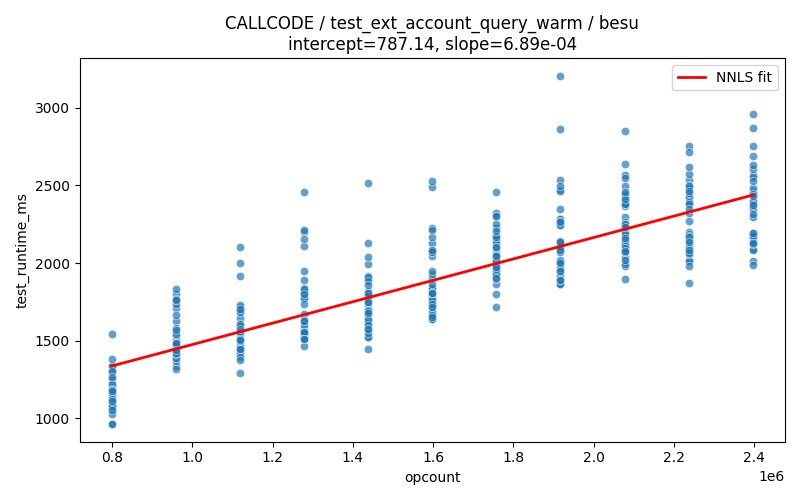

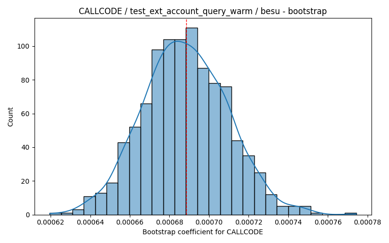

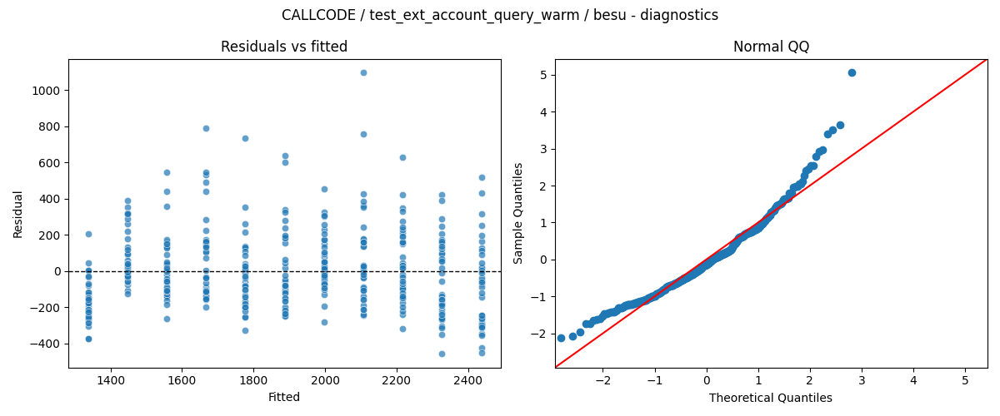

</details>

<details><summary>erigon — NNLS regression summary</summary>

```
==============================================================================
                           NNLS Regression Results                            
==============================================================================
Dep. Variable:          test_runtime_ms              R-squared:          0.921
Model:                  NNLS                    Adj. R-squared:          0.920
No. Observations:       165                               RMSE:          39.17
Df Residuals:           163                                MAE:          30.55
Df Model:               1      
==============================================================================
                      coef     std err     P-value      [0.025      0.975]
------------------------------------------------------------------------------
         const     39.0229      9.3049       0.001     20.9549     56.6900
       opcount      0.0003      0.0000       0.001      0.0003      0.0003
==============================================================================
Notes: Non-negative least squares with bootstrap inference (1000 iterations)
==============================================================================
```

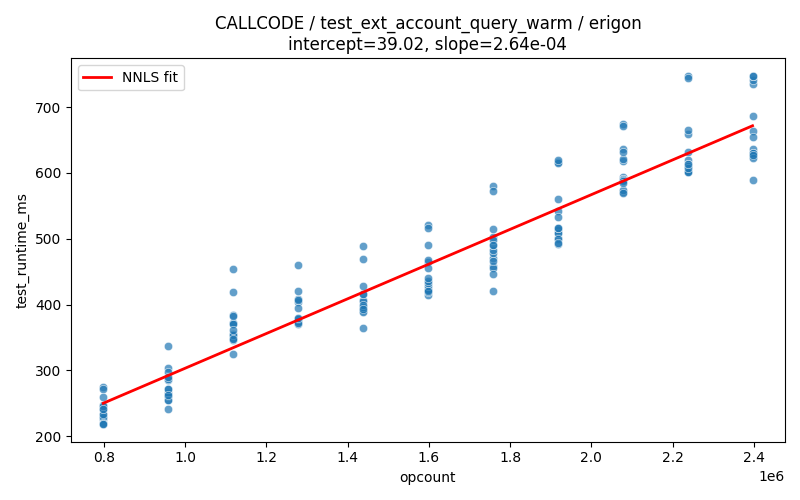

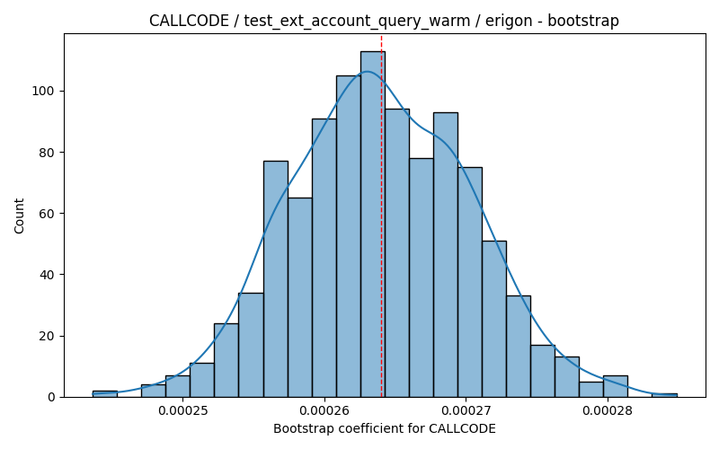

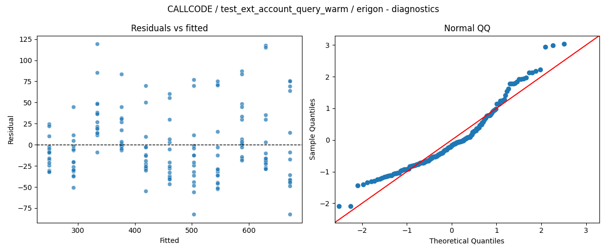

</details>

<details><summary>ethrex — NNLS regression summary</summary>

```
==============================================================================
                           NNLS Regression Results                            
==============================================================================
Dep. Variable:          test_runtime_ms              R-squared:          0.931
Model:                  NNLS                    Adj. R-squared:          0.931
No. Observations:       275                               RMSE:          13.98
Df Residuals:           273                                MAE:          10.76
Df Model:               1      
==============================================================================
                      coef     std err     P-value      [0.025      0.975]
------------------------------------------------------------------------------
         const     36.8789      2.5083       0.001     31.8311     41.8175
       opcount      0.0001      0.0000       0.001      0.0001      0.0001
==============================================================================
Notes: Non-negative least squares with bootstrap inference (1000 iterations)
==============================================================================
```

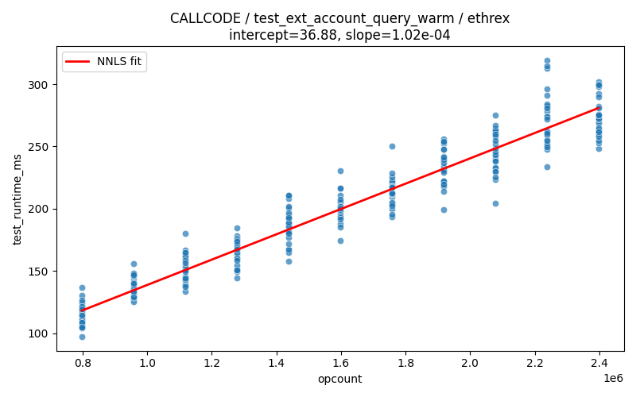

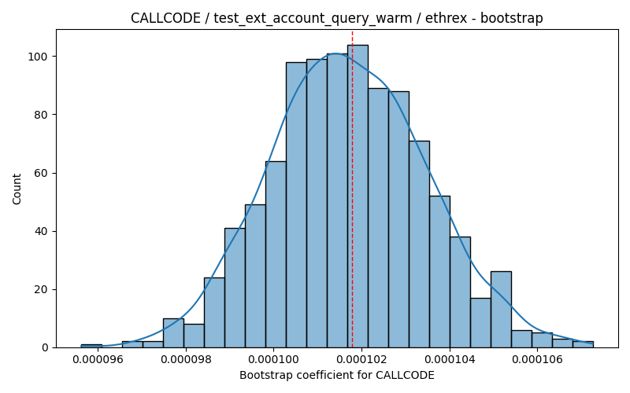

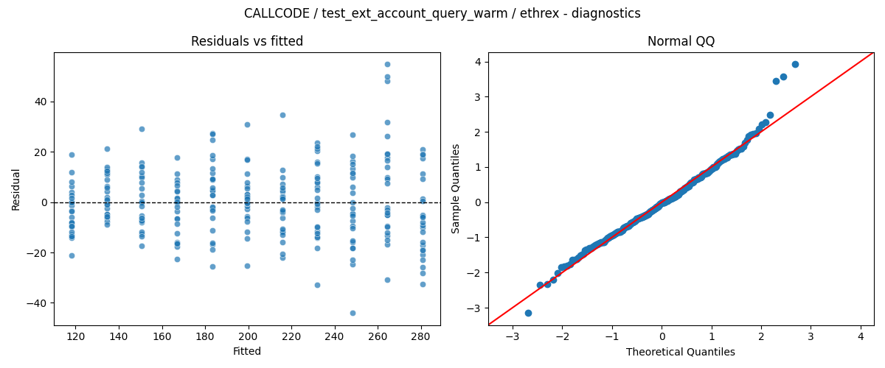

</details>

<details><summary>geth — NNLS regression summary</summary>

```
==============================================================================
                           NNLS Regression Results                            
==============================================================================
Dep. Variable:          test_runtime_ms              R-squared:          0.897
Model:                  NNLS                    Adj. R-squared:          0.896
No. Observations:       242                               RMSE:          30.93
Df Residuals:           240                                MAE:          23.86
Df Model:               1      
==============================================================================
                      coef     std err     P-value      [0.025      0.975]
------------------------------------------------------------------------------
         const     50.6245      5.9468       0.001     39.2665     61.8232
       opcount      0.0002      0.0000       0.001      0.0002      0.0002
==============================================================================
Notes: Non-negative least squares with bootstrap inference (1000 iterations)
==============================================================================
```

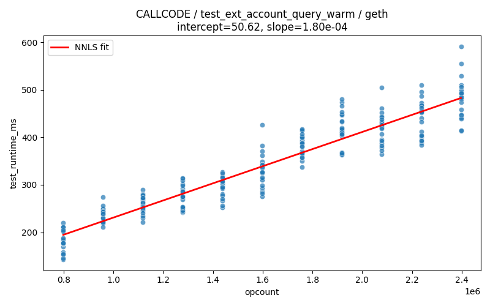

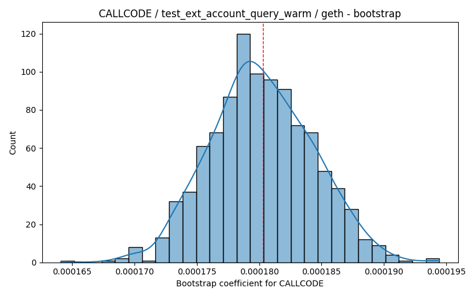

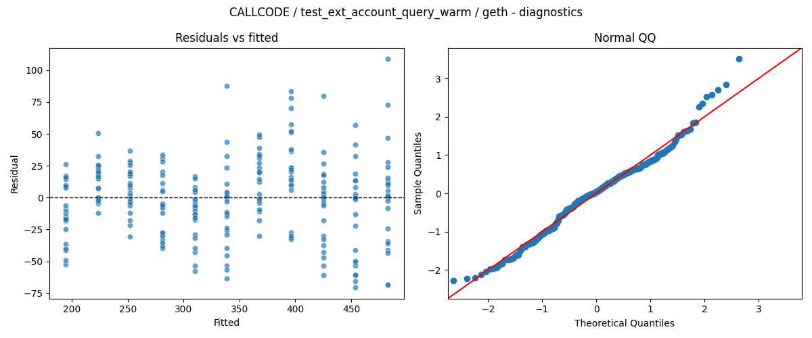

</details>

<details><summary>nethermind — NNLS regression summary</summary>

```
==============================================================================
                           NNLS Regression Results                            
==============================================================================
Dep. Variable:          test_runtime_ms              R-squared:          0.779
Model:                  NNLS                    Adj. R-squared:          0.778
No. Observations:       198                               RMSE:          59.71
Df Residuals:           196                                MAE:          47.66
Df Model:               1      
==============================================================================
                      coef     std err     P-value      [0.025      0.975]
------------------------------------------------------------------------------
         const    160.7766     13.8271       0.001    133.4095    187.5382
       opcount      0.0002      0.0000       0.001      0.0002      0.0002
==============================================================================
Notes: Non-negative least squares with bootstrap inference (1000 iterations)
==============================================================================
```

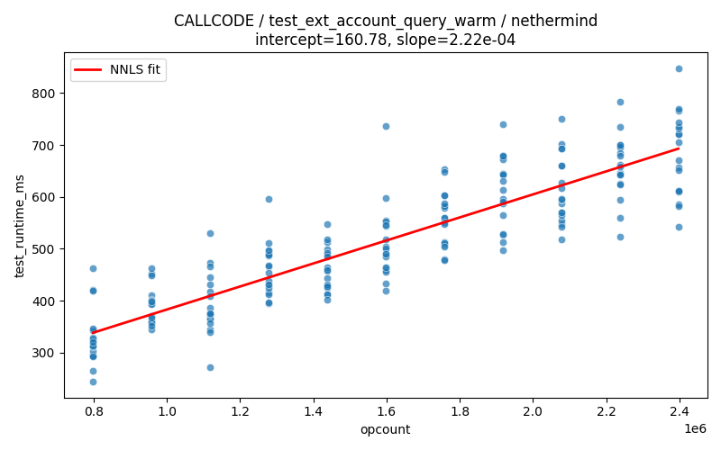

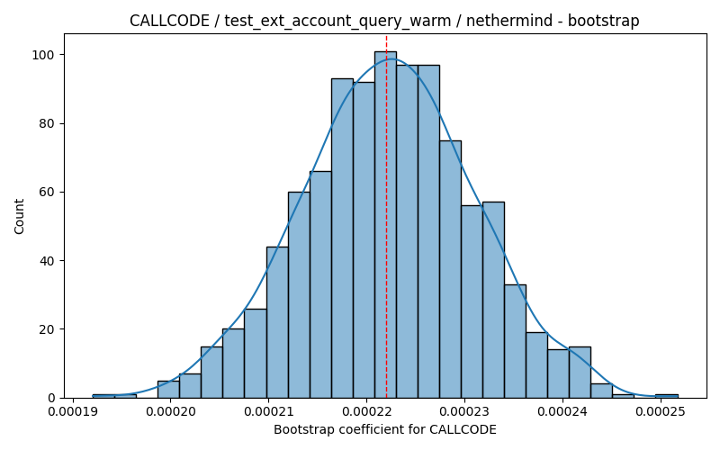

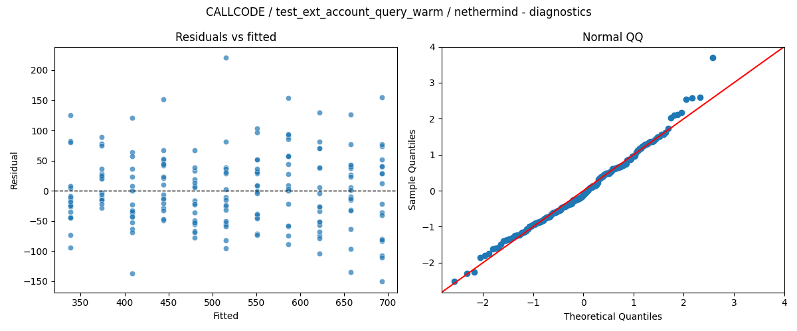

</details>

<details><summary>reth — NNLS regression summary</summary>

```
==============================================================================
                           NNLS Regression Results                            
==============================================================================
Dep. Variable:          test_runtime_ms              R-squared:          0.918
Model:                  NNLS                    Adj. R-squared:          0.918
No. Observations:       308                               RMSE:           9.06
Df Residuals:           306                                MAE:           7.06
Df Model:               1      
==============================================================================
                      coef     std err     P-value      [0.025      0.975]
------------------------------------------------------------------------------
         const     21.2359      1.5493       0.001     18.2288     24.5026
       opcount      0.0001      0.0000       0.001      0.0001      0.0001
==============================================================================
Notes: Non-negative least squares with bootstrap inference (1000 iterations)
==============================================================================
```

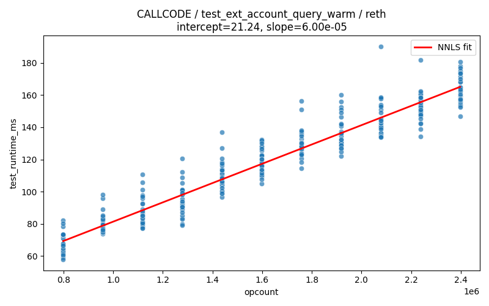

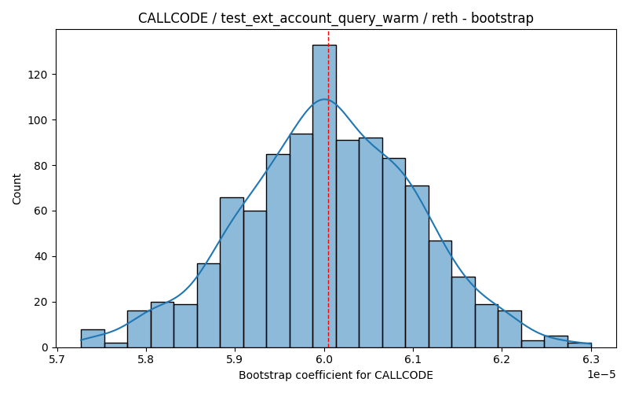

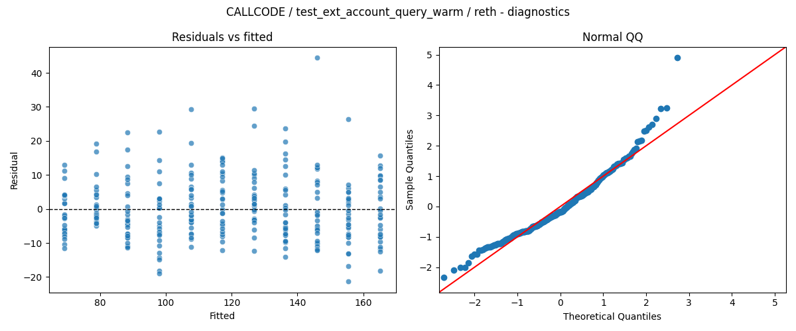

</details>

## DELEGATECALL

### test_account_access — combo `DELEGATECALL_AccountMode.EXISTING_EOA`

| client | nobs | R² | target_coef (ms) | p-value | 95% CI |
| --- | --- | --- | --- | --- | --- |
| `besu` | 407 | 0.8277 | 0.01459 | 1.00e-03 | [0.01395, 0.01523] |
| `erigon` | 165 | 0.9754 | 0.009155 | 1.00e-03 | [0.008945, 0.009369] |
| `ethrex` | 275 | 0.9924 | 0.006953 | 1.00e-03 | [0.006884, 0.007024] |
| `geth` | 242 | 0.9134 | 0.01097 | 1.00e-03 | [0.01049, 0.01144] |
| `nethermind` | 198 | 0.7568 | 0.004695 | 1.00e-03 | [0.004358, 0.005121] |
| `reth` | 308 | 0.9533 | 0.001059 | 1.00e-03 | [0.001034, 0.001082] |

<details><summary>besu — NNLS regression summary</summary>

```
==============================================================================
                           NNLS Regression Results                            
==============================================================================
Dep. Variable:          test_runtime_ms              R-squared:          0.828
Model:                  NNLS                    Adj. R-squared:          0.827
No. Observations:       407                               RMSE:         158.26
Df Residuals:           405                                MAE:         133.91
Df Model:               1      
==============================================================================
                      coef     std err     P-value      [0.025      0.975]
------------------------------------------------------------------------------
         const    550.9439     23.7799       0.001    505.9118    598.4397
       opcount      0.0146      0.0003       0.001      0.0140      0.0152
==============================================================================
Notes: Non-negative least squares with bootstrap inference (1000 iterations)
==============================================================================
```

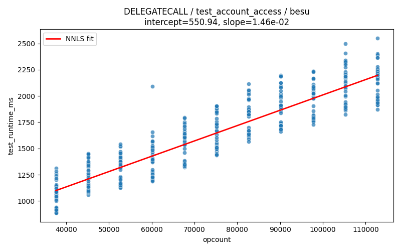

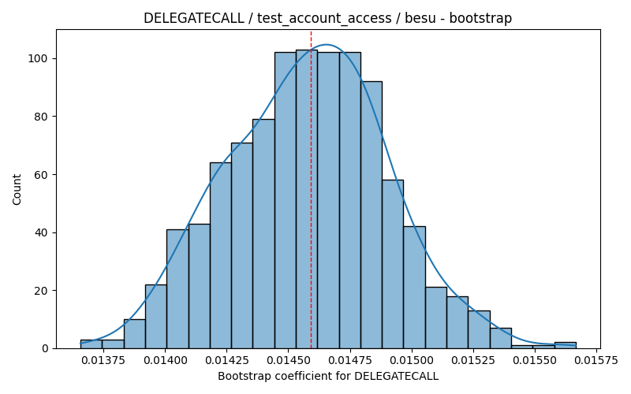

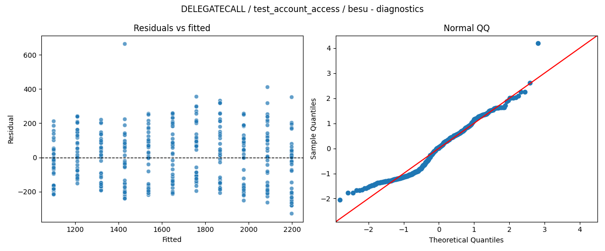

</details>

<details><summary>erigon — NNLS regression summary</summary>

```
==============================================================================
                           NNLS Regression Results                            
==============================================================================
Dep. Variable:          test_runtime_ms              R-squared:          0.975
Model:                  NNLS                    Adj. R-squared:          0.975
No. Observations:       165                               RMSE:          34.54
Df Residuals:           163                                MAE:          28.14
Df Model:               1      
==============================================================================
                      coef     std err     P-value      [0.025      0.975]
------------------------------------------------------------------------------
         const     25.0185      7.1904       0.002     10.7733     39.6415
       opcount      0.0092      0.0001       0.001      0.0089      0.0094
==============================================================================
Notes: Non-negative least squares with bootstrap inference (1000 iterations)
==============================================================================
```

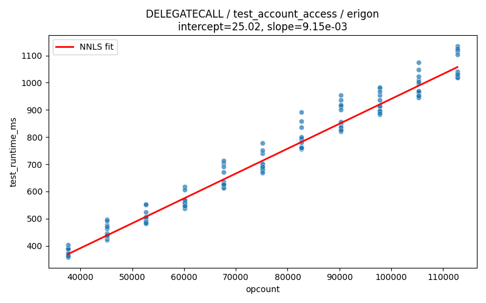

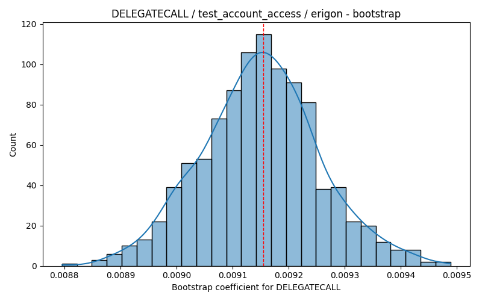

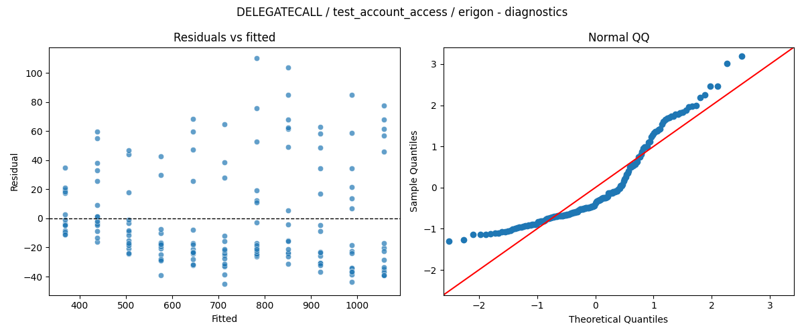

</details>

<details><summary>ethrex — NNLS regression summary</summary>

```
==============================================================================
                           NNLS Regression Results                            
==============================================================================
Dep. Variable:          test_runtime_ms              R-squared:          0.992
Model:                  NNLS                    Adj. R-squared:          0.992
No. Observations:       275                               RMSE:          14.45
Df Residuals:           273                                MAE:          11.24
Df Model:               1      
==============================================================================
                      coef     std err     P-value      [0.025      0.975]
------------------------------------------------------------------------------
         const     50.7267      2.7471       0.001     45.7096     56.1721
       opcount      0.0070      0.0000       0.001      0.0069      0.0070
==============================================================================
Notes: Non-negative least squares with bootstrap inference (1000 iterations)
==============================================================================
```

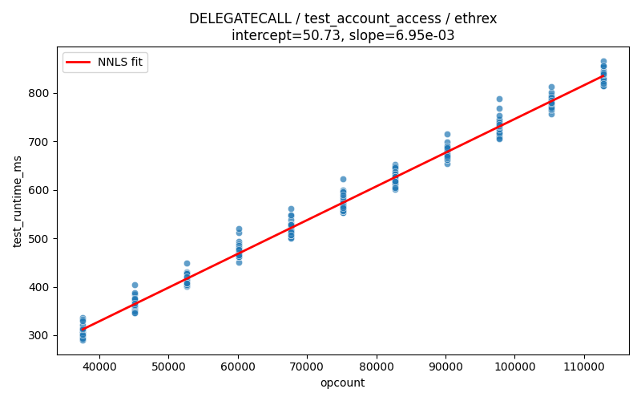

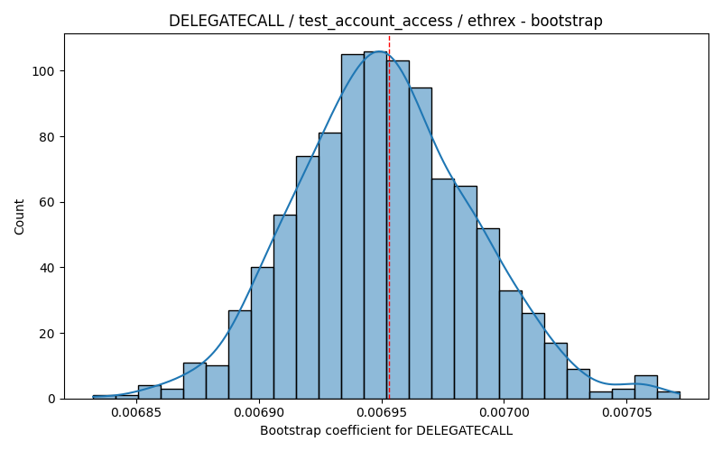

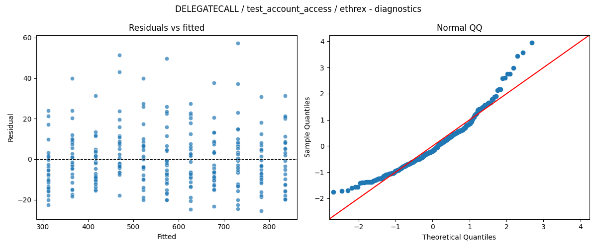

</details>

<details><summary>geth — NNLS regression summary</summary>

```
==============================================================================
                           NNLS Regression Results                            
==============================================================================
Dep. Variable:          test_runtime_ms              R-squared:          0.913
Model:                  NNLS                    Adj. R-squared:          0.913
No. Observations:       242                               RMSE:          80.30
Df Residuals:           240                                MAE:          66.33
Df Model:               1      
==============================================================================
                      coef     std err     P-value      [0.025      0.975]
------------------------------------------------------------------------------
         const    413.6116     20.8058       0.001    373.8620    455.3518
       opcount      0.0110      0.0002       0.001      0.0105      0.0114
==============================================================================
Notes: Non-negative least squares with bootstrap inference (1000 iterations)
==============================================================================
```

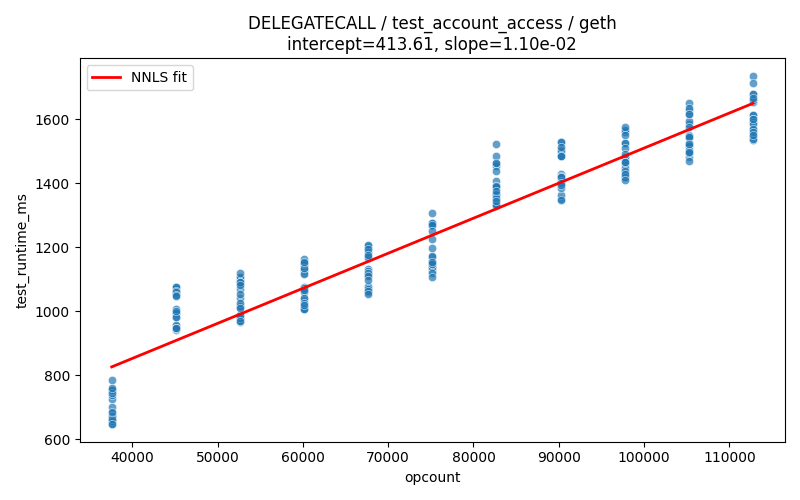

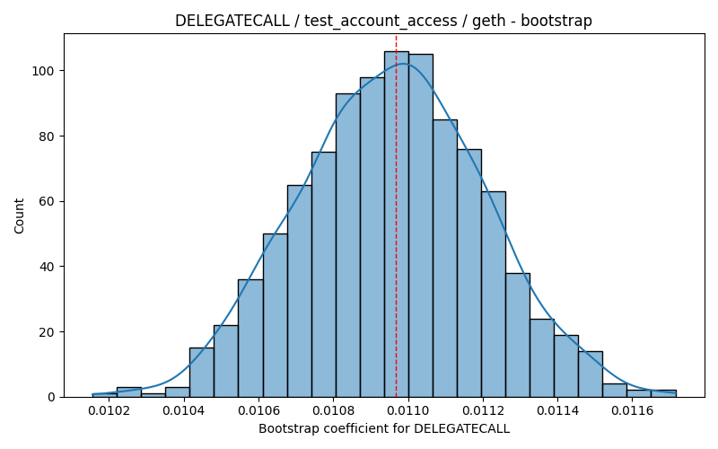

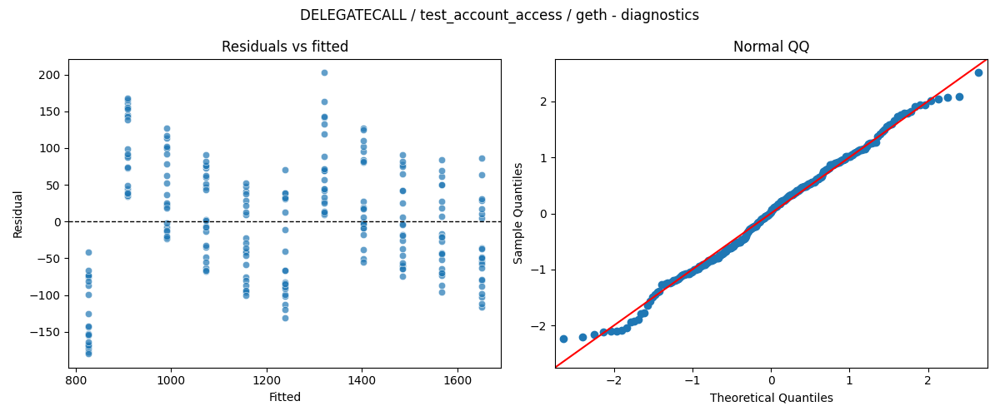

</details>

<details><summary>nethermind — NNLS regression summary</summary>

```
==============================================================================
                           NNLS Regression Results                            
==============================================================================
Dep. Variable:          test_runtime_ms              R-squared:          0.757
Model:                  NNLS                    Adj. R-squared:          0.756
No. Observations:       198                               RMSE:          63.27
Df Residuals:           196                                MAE:          42.35
Df Model:               1      
==============================================================================
                      coef     std err     P-value      [0.025      0.975]
------------------------------------------------------------------------------
         const     83.2097     12.7755       0.001     55.3784    105.8133
       opcount      0.0047      0.0002       0.001      0.0044      0.0051
==============================================================================
Notes: Non-negative least squares with bootstrap inference (1000 iterations)
==============================================================================
```

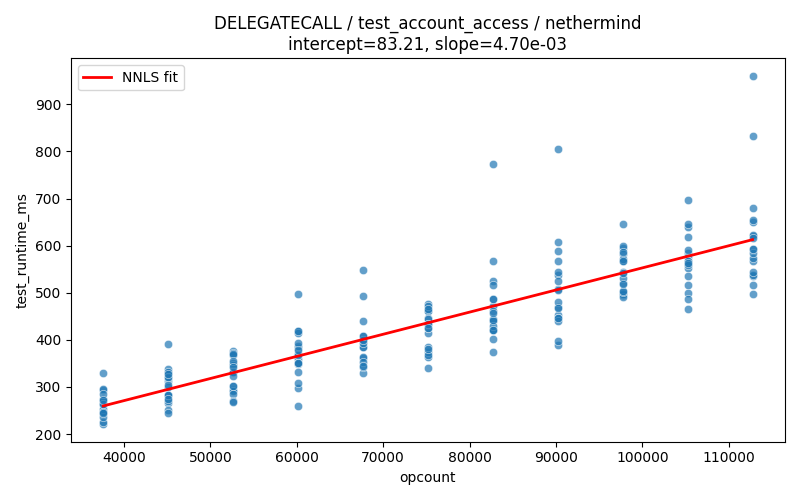

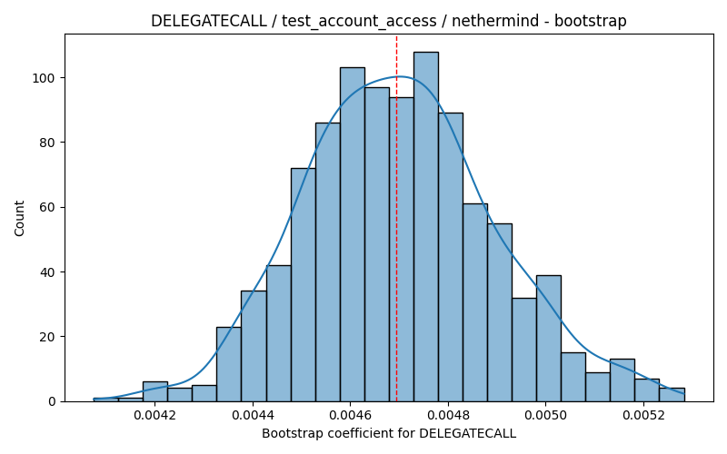

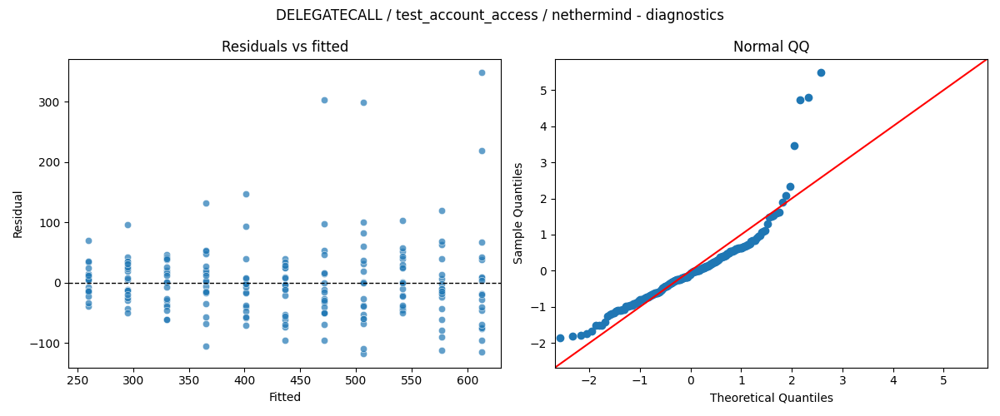

</details>

<details><summary>reth — NNLS regression summary</summary>

```
==============================================================================
                           NNLS Regression Results                            
==============================================================================
Dep. Variable:          test_runtime_ms              R-squared:          0.953
Model:                  NNLS                    Adj. R-squared:          0.953
No. Observations:       308                               RMSE:           5.57
Df Residuals:           306                                MAE:           4.11
Df Model:               1      
==============================================================================
                      coef     std err     P-value      [0.025      0.975]
------------------------------------------------------------------------------
         const     42.6090      0.9997       0.001     40.8305     44.6327
       opcount      0.0011      0.0000       0.001      0.0010      0.0011
==============================================================================
Notes: Non-negative least squares with bootstrap inference (1000 iterations)
==============================================================================
```

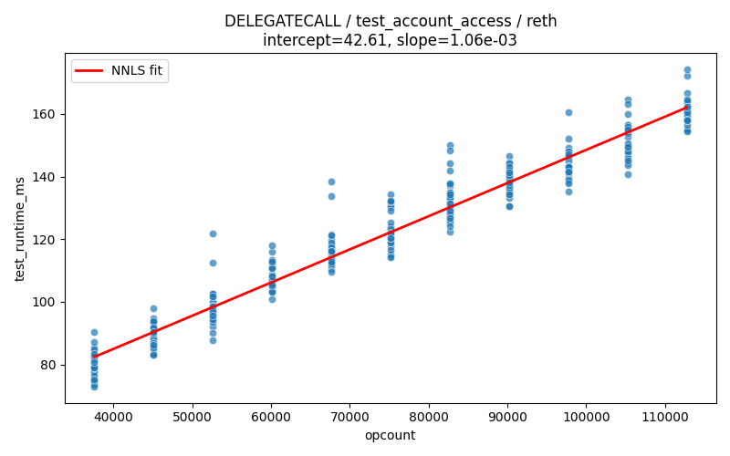

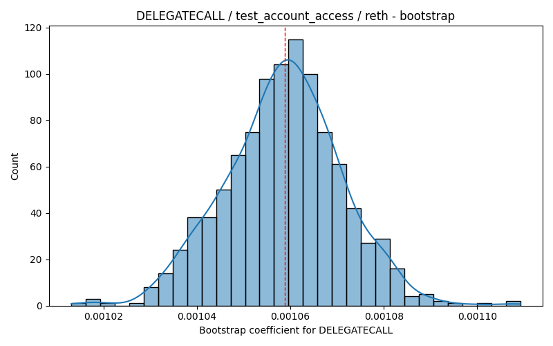

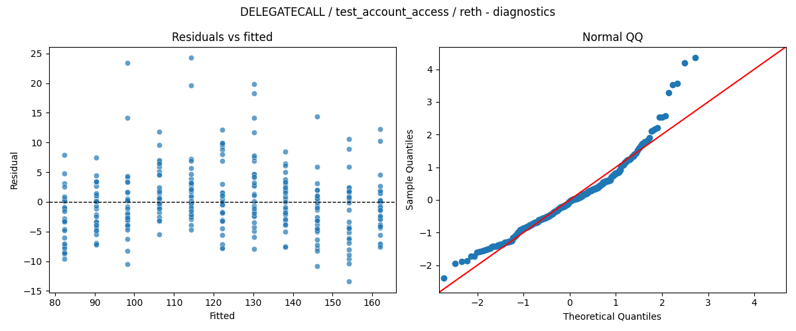

</details>

### test_account_access — combo `DELEGATECALL_AccountMode.NON_EXISTING_ACCOUNT` — `presets[cold_account_nocode_access]`

| client | nobs | R² | target_coef (ms) | p-value | 95% CI |
| --- | --- | --- | --- | --- | --- |
| `besu` | 407 | 0.8818 | 0.01495 | 1.00e-03 | [0.01442, 0.01549] |
| `erigon` | 165 | 0.9757 | 0.008584 | 1.00e-03 | [0.008356, 0.008764] |
| `ethrex` | 275 | 0.9619 | 0.00198 | 1.00e-03 | [0.001933, 0.002024] |
| `geth` | 242 | 0.8605 | 0.02229 | 1.00e-03 | [0.02108, 0.02349] |
| `nethermind` | 198 | 0.7625 | 0.004032 | 1.00e-03 | [0.003745, 0.00435] |
| `reth` | 308 | 0.9088 | 0.000807 | 1.00e-03 | [0.0007795, 0.0008358] |

<details><summary>besu — NNLS regression summary</summary>

```
==============================================================================
                           NNLS Regression Results                            
==============================================================================
Dep. Variable:          test_runtime_ms              R-squared:          0.882
Model:                  NNLS                    Adj. R-squared:          0.882
No. Observations:       407                               RMSE:         130.11
Df Residuals:           405                                MAE:         115.48
Df Model:               1      
==============================================================================
                      coef     std err     P-value      [0.025      0.975]
------------------------------------------------------------------------------
         const    508.1339     20.5158       0.001    468.9244    547.6989
       opcount      0.0149      0.0003       0.001      0.0144      0.0155
==============================================================================
Notes: Non-negative least squares with bootstrap inference (1000 iterations)
==============================================================================
```

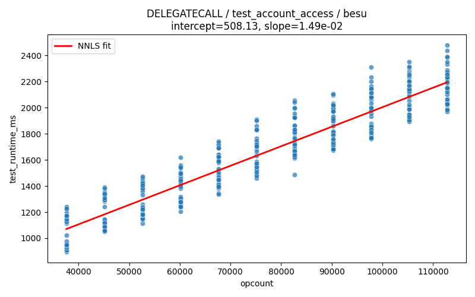

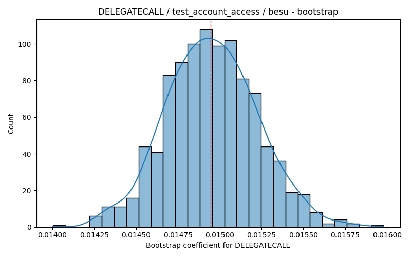

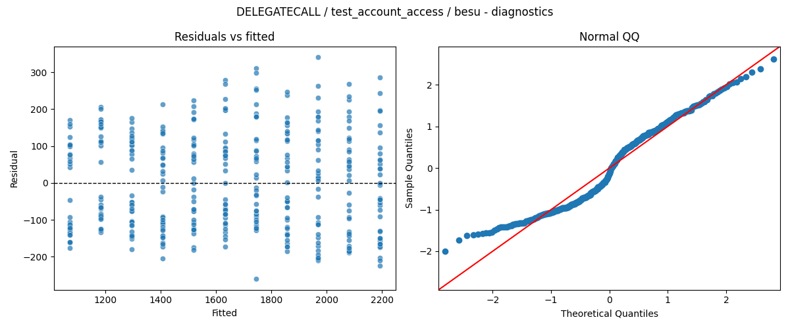

</details>

<details><summary>erigon — NNLS regression summary</summary>

```
==============================================================================
                           NNLS Regression Results                            
==============================================================================
Dep. Variable:          test_runtime_ms              R-squared:          0.976
Model:                  NNLS                    Adj. R-squared:          0.976
No. Observations:       165                               RMSE:          32.23
Df Residuals:           163                                MAE:          24.94
Df Model:               1      
==============================================================================
                      coef     std err     P-value      [0.025      0.975]
------------------------------------------------------------------------------
         const     10.1243      7.2856       0.101      0.0000     25.8495
       opcount      0.0086      0.0001       0.001      0.0084      0.0088
==============================================================================
Notes: Non-negative least squares with bootstrap inference (1000 iterations)
==============================================================================
```

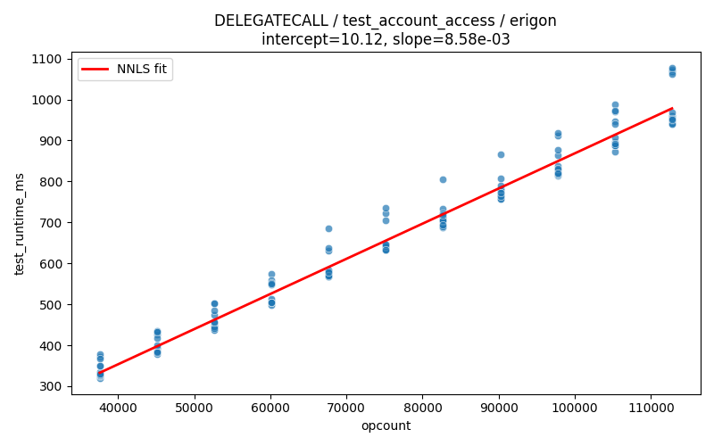

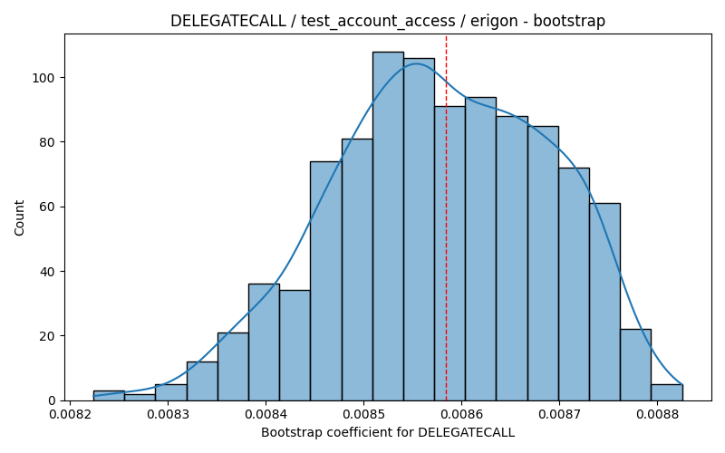

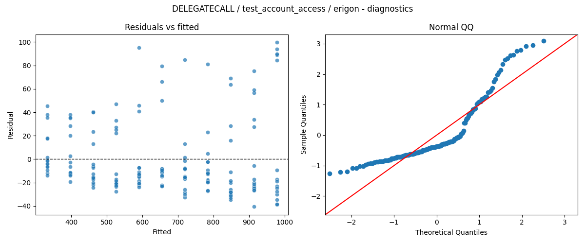

</details>

<details><summary>ethrex — NNLS regression summary</summary>

```
==============================================================================
                           NNLS Regression Results                            
==============================================================================
Dep. Variable:          test_runtime_ms              R-squared:          0.962
Model:                  NNLS                    Adj. R-squared:          0.962
No. Observations:       275                               RMSE:           9.37
Df Residuals:           273                                MAE:           7.48
Df Model:               1      
==============================================================================
                      coef     std err     P-value      [0.025      0.975]
------------------------------------------------------------------------------
         const     28.8343      1.6700       0.001     25.6064     32.0076
       opcount      0.0020      0.0000       0.001      0.0019      0.0020
==============================================================================
Notes: Non-negative least squares with bootstrap inference (1000 iterations)
==============================================================================
```

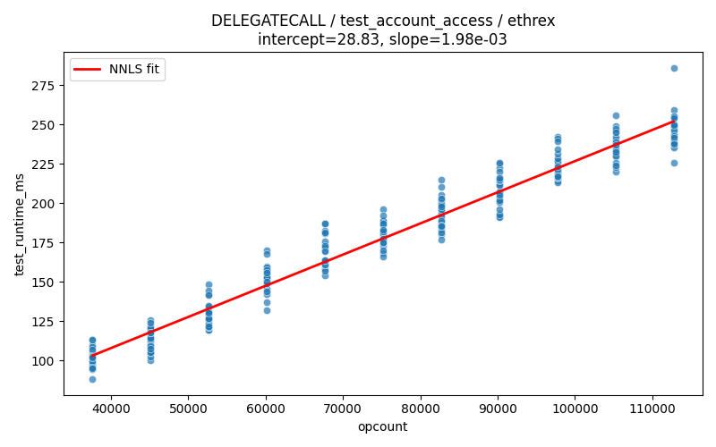

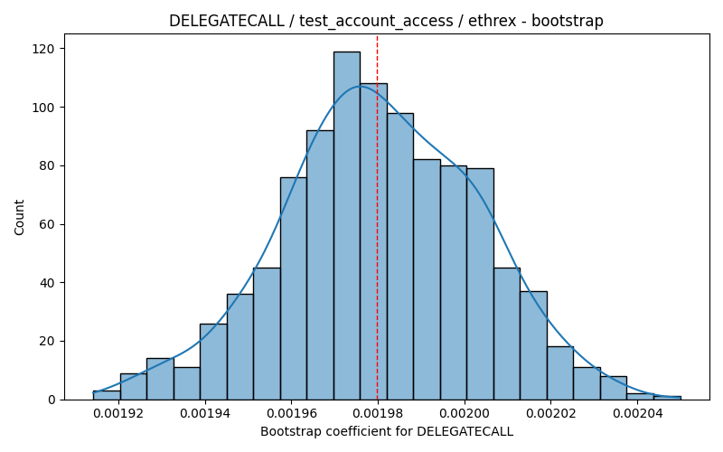

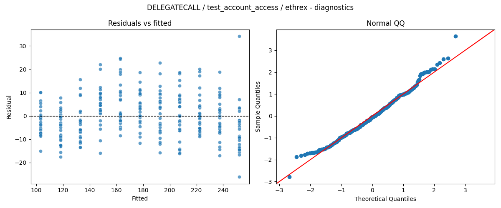

</details>

<details><summary>geth — NNLS regression summary</summary>

```
==============================================================================
                           NNLS Regression Results                            
==============================================================================
Dep. Variable:          test_runtime_ms              R-squared:          0.861
Model:                  NNLS                    Adj. R-squared:          0.860
No. Observations:       242                               RMSE:         213.34
Df Residuals:           240                                MAE:         181.00
Df Model:               1      
==============================================================================
                      coef     std err     P-value      [0.025      0.975]
------------------------------------------------------------------------------
         const    702.8214     54.2182       0.001    600.4760    814.6642
       opcount      0.0223      0.0006       0.001      0.0211      0.0235
==============================================================================
Notes: Non-negative least squares with bootstrap inference (1000 iterations)
==============================================================================
```

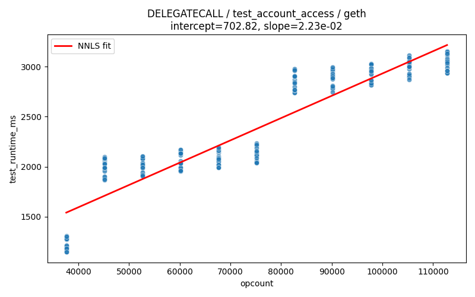

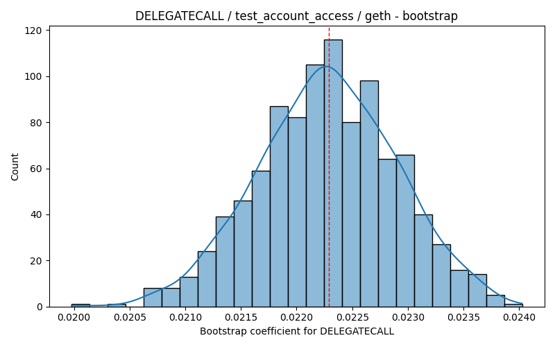

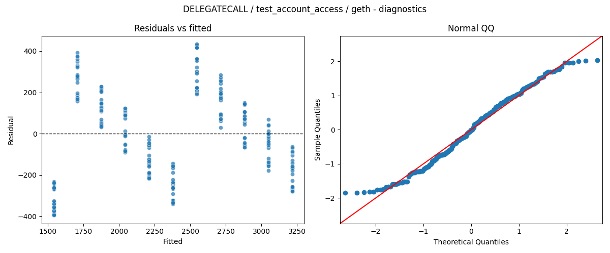

</details>

<details><summary>nethermind — NNLS regression summary</summary>

```
==============================================================================
                           NNLS Regression Results                            
==============================================================================
Dep. Variable:          test_runtime_ms              R-squared:          0.763
Model:                  NNLS                    Adj. R-squared:          0.761
No. Observations:       198                               RMSE:          53.49
Df Residuals:           196                                MAE:          39.27
Df Model:               1      
==============================================================================
                      coef     std err     P-value      [0.025      0.975]
------------------------------------------------------------------------------
         const     89.9405     10.4568       0.001     68.8496    108.5459
       opcount      0.0040      0.0002       0.001      0.0037      0.0043
==============================================================================
Notes: Non-negative least squares with bootstrap inference (1000 iterations)
==============================================================================
```

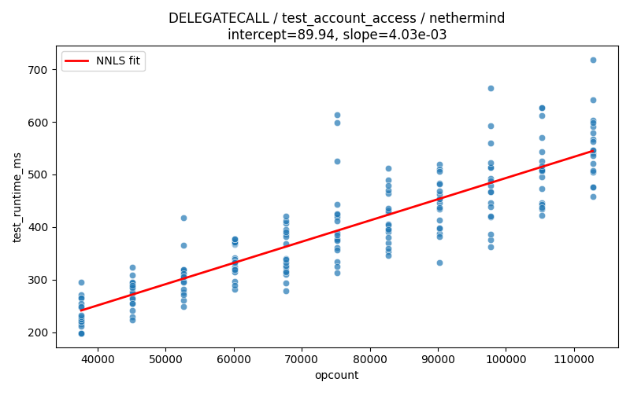

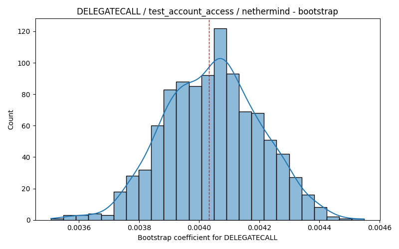

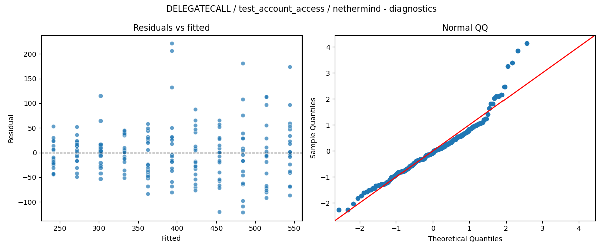

</details>

<details><summary>reth — NNLS regression summary</summary>

```
==============================================================================
                           NNLS Regression Results                            
==============================================================================
Dep. Variable:          test_runtime_ms              R-squared:          0.909
Model:                  NNLS                    Adj. R-squared:          0.909
No. Observations:       308                               RMSE:           6.08
Df Residuals:           306                                MAE:           4.67
Df Model:               1      
==============================================================================
                      coef     std err     P-value      [0.025      0.975]
------------------------------------------------------------------------------
         const     44.8391      1.0735       0.001     42.8163     46.8683
       opcount      0.0008      0.0000       0.001      0.0008      0.0008
==============================================================================
Notes: Non-negative least squares with bootstrap inference (1000 iterations)
==============================================================================
```

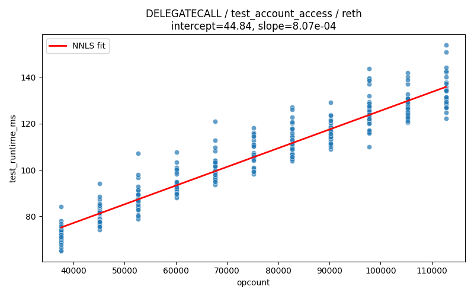

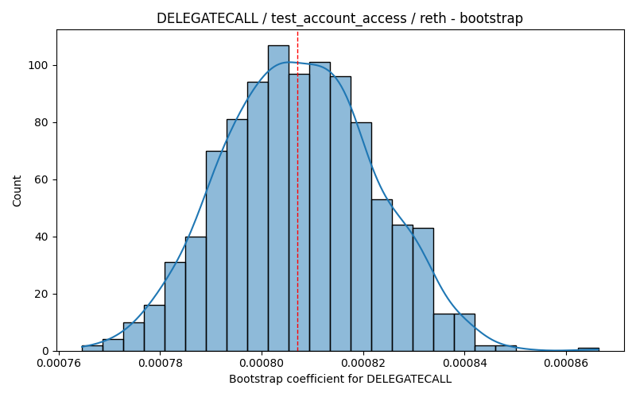


</details>

### test_account_access — combo `DELEGATECALL_AccountMode.EXISTING_CONTRACT`

| client | nobs | R² | target_coef (ms) | p-value | 95% CI |
| --- | --- | --- | --- | --- | --- |
| `besu` | 407 | 0.8925 | 0.02704 | 1.00e-03 | [0.02617, 0.02792] |
| `erigon` | 165 | 0.8966 | 0.04939 | 1.00e-03 | [0.04676, 0.05145] |
| `ethrex` | 275 | 0.9936 | 0.007467 | 1.00e-03 | [0.007405, 0.007528] |
| `geth` | 242 | 0.8572 | 0.02332 | 1.00e-03 | [0.02199, 0.02463] |
| `nethermind` | 198 | 0.5846 | 0.01512 | 1.00e-03 | [0.0132, 0.01705] |
| `reth` | 308 | 0.9798 | 0.004069 | 1.00e-03 | [0.004002, 0.004148] |

<details><summary>besu — NNLS regression summary</summary>

```
==============================================================================
                           NNLS Regression Results                            
==============================================================================
Dep. Variable:          test_runtime_ms              R-squared:          0.892
Model:                  NNLS                    Adj. R-squared:          0.892
No. Observations:       407                               RMSE:         191.14
Df Residuals:           405                                MAE:         159.65
Df Model:               1      
==============================================================================
                      coef     std err     P-value      [0.025      0.975]
------------------------------------------------------------------------------
         const    551.8476     28.1958       0.001    495.1595    605.9349
       opcount      0.0270      0.0005       0.001      0.0262      0.0279
==============================================================================
Notes: Non-negative least squares with bootstrap inference (1000 iterations)
==============================================================================
```

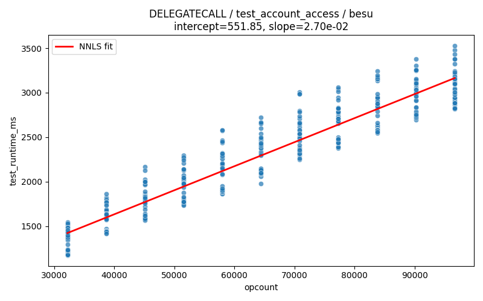

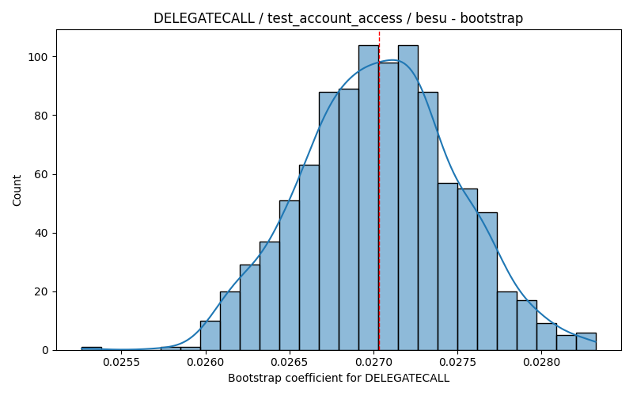

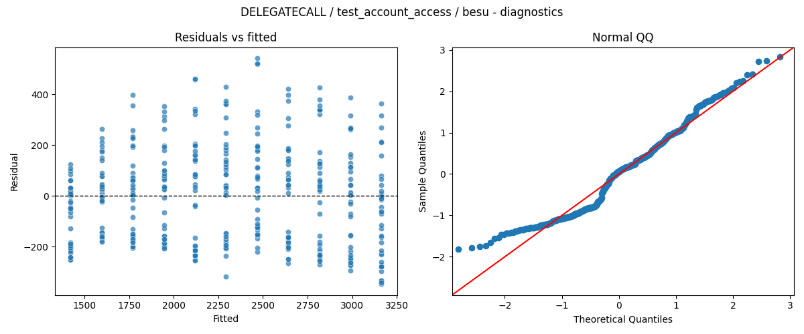

</details>

<details><summary>erigon — NNLS regression summary</summary>

```
==============================================================================
                           NNLS Regression Results                            
==============================================================================
Dep. Variable:          test_runtime_ms              R-squared:          0.897
Model:                  NNLS                    Adj. R-squared:          0.896
No. Observations:       165                               RMSE:         341.61
Df Residuals:           163                                MAE:         293.64
Df Model:               1      
==============================================================================
                      coef     std err     P-value      [0.025      0.975]
------------------------------------------------------------------------------
         const    829.9003     91.3301       0.001    670.5514   1037.1305
       opcount      0.0494      0.0012       0.001      0.0468      0.0514
==============================================================================
Notes: Non-negative least squares with bootstrap inference (1000 iterations)
==============================================================================
```

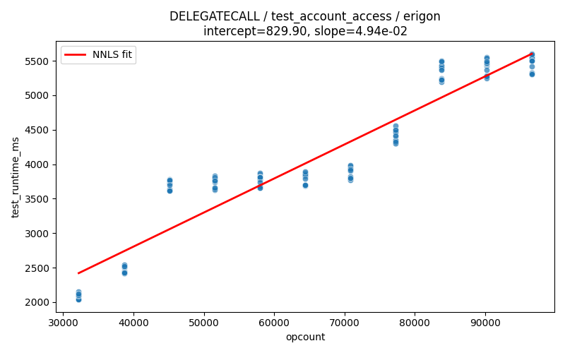

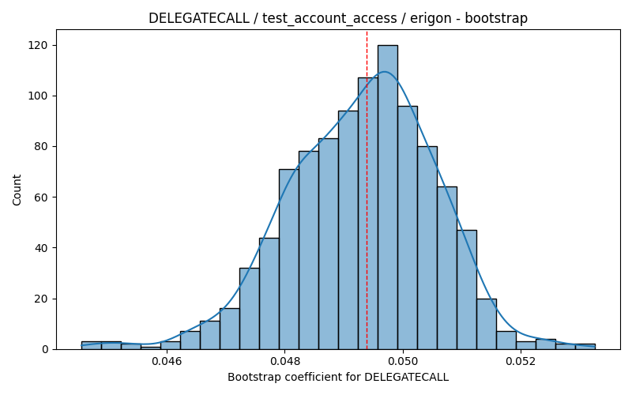

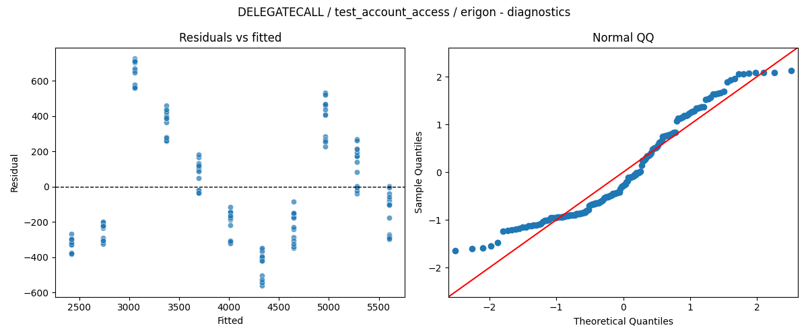

</details>

<details><summary>ethrex — NNLS regression summary</summary>

```
==============================================================================
                           NNLS Regression Results                            
==============================================================================
Dep. Variable:          test_runtime_ms              R-squared:          0.994
Model:                  NNLS                    Adj. R-squared:          0.994
No. Observations:       275                               RMSE:          12.19
Df Residuals:           273                                MAE:           9.67
Df Model:               1      
==============================================================================
                      coef     std err     P-value      [0.025      0.975]
------------------------------------------------------------------------------
         const     47.5503      2.1917       0.001     43.4216     51.8402
       opcount      0.0075      0.0000       0.001      0.0074      0.0075
==============================================================================
Notes: Non-negative least squares with bootstrap inference (1000 iterations)
==============================================================================
```

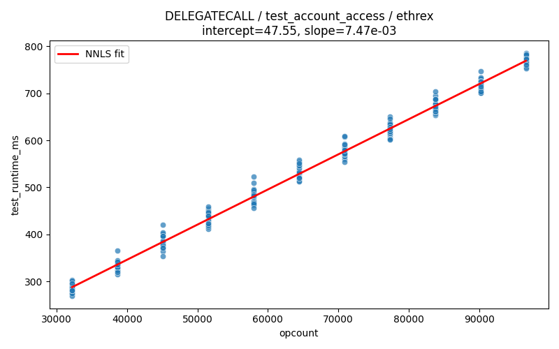

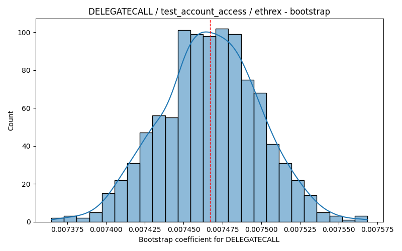

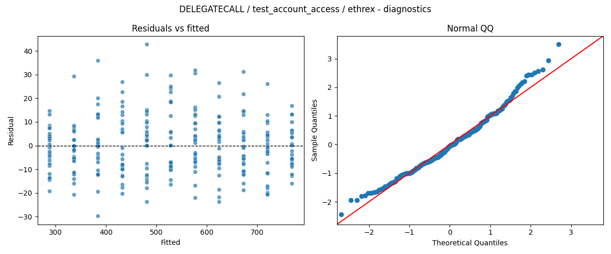

</details>

<details><summary>geth — NNLS regression summary</summary>

```
==============================================================================
                           NNLS Regression Results                            
==============================================================================
Dep. Variable:          test_runtime_ms              R-squared:          0.857
Model:                  NNLS                    Adj. R-squared:          0.857
No. Observations:       242                               RMSE:         193.85
Df Residuals:           240                                MAE:         162.96
Df Model:               1      
==============================================================================
                      coef     std err     P-value      [0.025      0.975]
------------------------------------------------------------------------------
         const    668.5287     47.1965       0.001    575.0338    765.0432
       opcount      0.0233      0.0006       0.001      0.0220      0.0246
==============================================================================
Notes: Non-negative least squares with bootstrap inference (1000 iterations)
==============================================================================
```

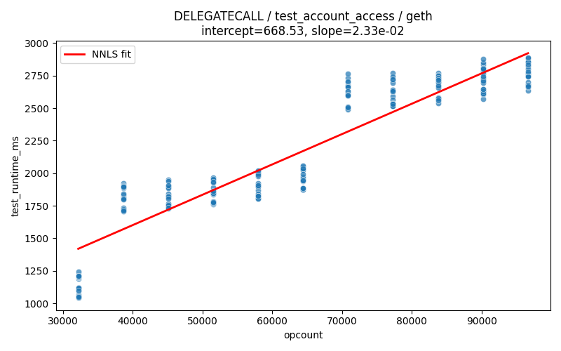

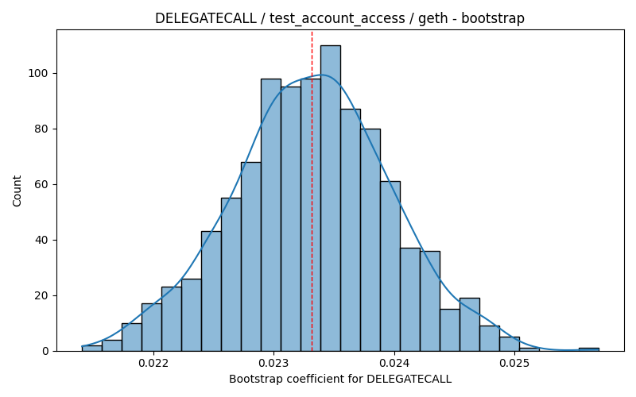

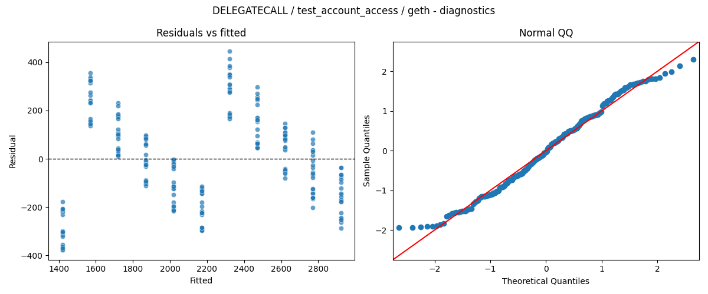

</details>

<details><summary>nethermind — NNLS regression summary</summary>

```
==============================================================================
                           NNLS Regression Results                            
==============================================================================
Dep. Variable:          test_runtime_ms              R-squared:          0.585
Model:                  NNLS                    Adj. R-squared:          0.582
No. Observations:       198                               RMSE:         259.56
Df Residuals:           196                                MAE:         200.13
Df Model:               1      
==============================================================================
                      coef     std err     P-value      [0.025      0.975]
------------------------------------------------------------------------------
         const    169.4004     55.3222       0.002     61.5528    274.4307
       opcount      0.0151      0.0010       0.001      0.0132      0.0171
==============================================================================
Notes: Non-negative least squares with bootstrap inference (1000 iterations)
==============================================================================
```

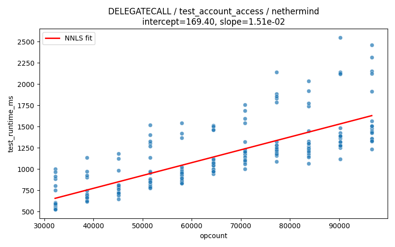

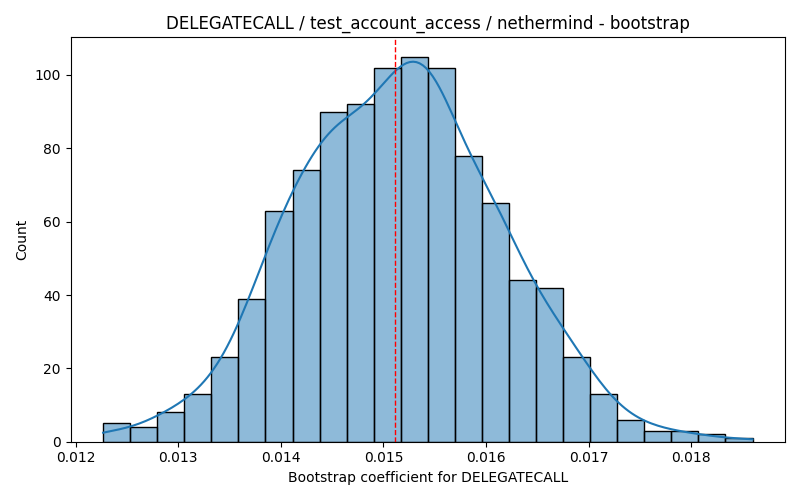

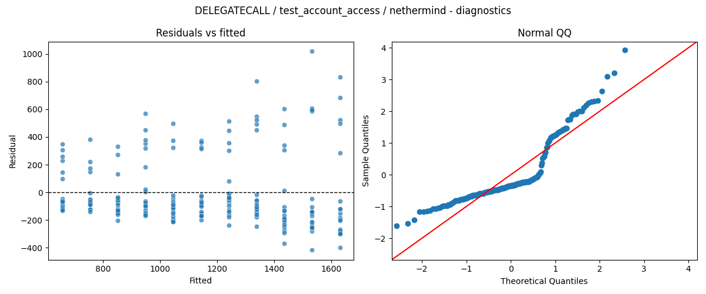

</details>

<details><summary>reth — NNLS regression summary</summary>

```
==============================================================================
                           NNLS Regression Results                            
==============================================================================
Dep. Variable:          test_runtime_ms              R-squared:          0.980
Model:                  NNLS                    Adj. R-squared:          0.980
No. Observations:       308                               RMSE:          11.91
Df Residuals:           306                                MAE:           9.17
Df Model:               1      
==============================================================================
                      coef     std err     P-value      [0.025      0.975]
------------------------------------------------------------------------------
         const     95.3409      2.2367       0.001     90.4888     99.6775
       opcount      0.0041      0.0000       0.001      0.0040      0.0041
==============================================================================
Notes: Non-negative least squares with bootstrap inference (1000 iterations)
==============================================================================
```

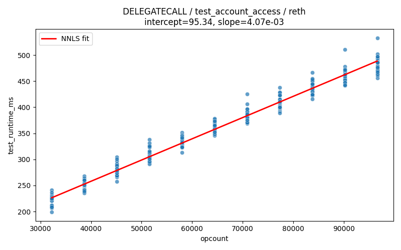

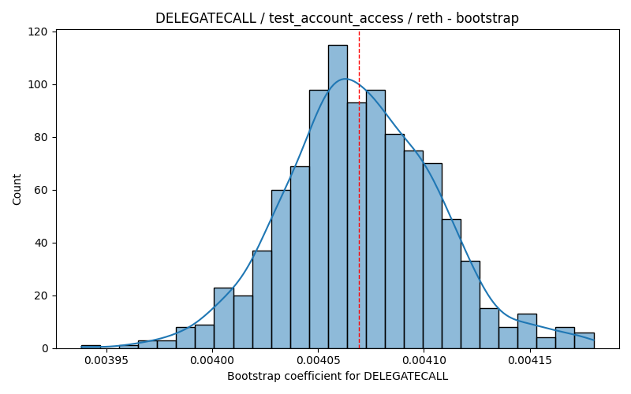

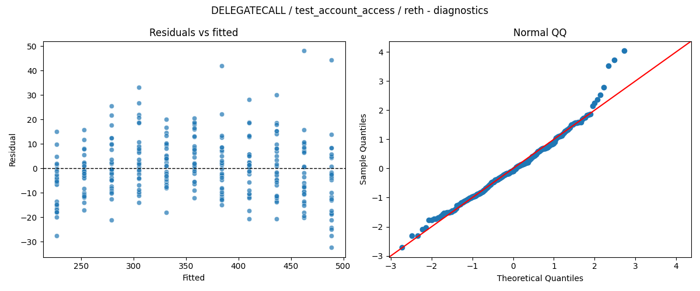

</details>

### test_account_access — combo `DELEGATECALL_AccountMode.NON_EXISTING_ACCOUNT` — `presets[cold_account_code_access]`

| client | nobs | R² | target_coef (ms) | p-value | 95% CI |
| --- | --- | --- | --- | --- | --- |
| `besu` | 407 | 0.8818 | 0.01495 | 1.00e-03 | [0.01442, 0.01549] |
| `erigon` | 165 | 0.9757 | 0.008584 | 1.00e-03 | [0.008356, 0.008764] |
| `ethrex` | 275 | 0.9619 | 0.00198 | 1.00e-03 | [0.001933, 0.002024] |
| `geth` | 242 | 0.8605 | 0.02229 | 1.00e-03 | [0.02108, 0.02349] |
| `nethermind` | 198 | 0.7625 | 0.004032 | 1.00e-03 | [0.003745, 0.00435] |
| `reth` | 308 | 0.9088 | 0.000807 | 1.00e-03 | [0.0007795, 0.0008358] |

<details><summary>besu — NNLS regression summary</summary>

```
==============================================================================
                           NNLS Regression Results                            
==============================================================================
Dep. Variable:          test_runtime_ms              R-squared:          0.882
Model:                  NNLS                    Adj. R-squared:          0.882
No. Observations:       407                               RMSE:         130.11
Df Residuals:           405                                MAE:         115.48
Df Model:               1      
==============================================================================
                      coef     std err     P-value      [0.025      0.975]
------------------------------------------------------------------------------
         const    508.1339     20.5158       0.001    468.9244    547.6989
       opcount      0.0149      0.0003       0.001      0.0144      0.0155
==============================================================================
Notes: Non-negative least squares with bootstrap inference (1000 iterations)
==============================================================================
```


</details>

<details><summary>erigon — NNLS regression summary</summary>

```
==============================================================================
                           NNLS Regression Results                            
==============================================================================
Dep. Variable:          test_runtime_ms              R-squared:          0.976
Model:                  NNLS                    Adj. R-squared:          0.976
No. Observations:       165                               RMSE:          32.23
Df Residuals:           163                                MAE:          24.94
Df Model:               1      
==============================================================================
                      coef     std err     P-value      [0.025      0.975]
------------------------------------------------------------------------------
         const     10.1243      7.2856       0.101      0.0000     25.8495
       opcount      0.0086      0.0001       0.001      0.0084      0.0088
==============================================================================
Notes: Non-negative least squares with bootstrap inference (1000 iterations)
==============================================================================
```


</details>

<details><summary>ethrex — NNLS regression summary</summary>

```
==============================================================================
                           NNLS Regression Results                            
==============================================================================
Dep. Variable:          test_runtime_ms              R-squared:          0.962
Model:                  NNLS                    Adj. R-squared:          0.962
No. Observations:       275                               RMSE:           9.37
Df Residuals:           273                                MAE:           7.48
Df Model:               1      
==============================================================================
                      coef     std err     P-value      [0.025      0.975]
------------------------------------------------------------------------------
         const     28.8343      1.6700       0.001     25.6064     32.0076
       opcount      0.0020      0.0000       0.001      0.0019      0.0020
==============================================================================
Notes: Non-negative least squares with bootstrap inference (1000 iterations)
==============================================================================
```


</details>

<details><summary>geth — NNLS regression summary</summary>

```
==============================================================================
                           NNLS Regression Results                            
==============================================================================
Dep. Variable:          test_runtime_ms              R-squared:          0.861
Model:                  NNLS                    Adj. R-squared:          0.860
No. Observations:       242                               RMSE:         213.34
Df Residuals:           240                                MAE:         181.00
Df Model:               1      
==============================================================================
                      coef     std err     P-value      [0.025      0.975]
------------------------------------------------------------------------------
         const    702.8214     54.2182       0.001    600.4760    814.6642
       opcount      0.0223      0.0006       0.001      0.0211      0.0235
==============================================================================
Notes: Non-negative least squares with bootstrap inference (1000 iterations)
==============================================================================
```


</details>

<details><summary>nethermind — NNLS regression summary</summary>

```
==============================================================================
                           NNLS Regression Results                            
==============================================================================
Dep. Variable:          test_runtime_ms              R-squared:          0.763
Model:                  NNLS                    Adj. R-squared:          0.761
No. Observations:       198                               RMSE:          53.49
Df Residuals:           196                                MAE:          39.27
Df Model:               1      
==============================================================================
                      coef     std err     P-value      [0.025      0.975]
------------------------------------------------------------------------------
         const     89.9405     10.4568       0.001     68.8496    108.5459
       opcount      0.0040      0.0002       0.001      0.0037      0.0043
==============================================================================
Notes: Non-negative least squares with bootstrap inference (1000 iterations)
==============================================================================
```


</details>

<details><summary>reth — NNLS regression summary</summary>

```
==============================================================================
                           NNLS Regression Results                            
==============================================================================
Dep. Variable:          test_runtime_ms              R-squared:          0.909
Model:                  NNLS                    Adj. R-squared:          0.909
No. Observations:       308                               RMSE:           6.08
Df Residuals:           306                                MAE:           4.67
Df Model:               1      
==============================================================================
                      coef     std err     P-value      [0.025      0.975]
------------------------------------------------------------------------------
         const     44.8391      1.0735       0.001     42.8163     46.8683
       opcount      0.0008      0.0000       0.001      0.0008      0.0008
==============================================================================
Notes: Non-negative least squares with bootstrap inference (1000 iterations)
==============================================================================
```


</details>

### test_ext_account_query_warm — combo `DELEGATECALL`

| client | nobs | R² | target_coef (ms) | p-value | 95% CI |
| --- | --- | --- | --- | --- | --- |
| `besu` | 407 | 0.7053 | 0.000646 | 1.00e-03 | [0.0006053, 0.000688] |
| `erigon` | 165 | 0.9055 | 0.0002652 | 1.00e-03 | [0.0002522, 0.0002794] |
| `ethrex` | 275 | 0.9288 | 9.579e-05 | 1.00e-03 | [9.289e-05, 9.924e-05] |
| `geth` | 242 | 0.9021 | 0.0001549 | 1.00e-03 | [0.0001481, 0.0001609] |
| `nethermind` | 198 | 0.6653 | 0.0003837 | 1.00e-03 | [0.0003509, 0.0004181] |
| `reth` | 308 | 0.8986 | 5.566e-05 | 1.00e-03 | [5.372e-05, 5.748e-05] |

<details><summary>besu — NNLS regression summary</summary>

```
==============================================================================
                           NNLS Regression Results                            
==============================================================================
Dep. Variable:          test_runtime_ms              R-squared:          0.705
Model:                  NNLS                    Adj. R-squared:          0.705
No. Observations:       407                               RMSE:         216.19
Df Residuals:           405                                MAE:         170.85
Df Model:               1      
==============================================================================
                      coef     std err     P-value      [0.025      0.975]
------------------------------------------------------------------------------
         const    753.0487     32.8406       0.001    691.7287    817.0032
       opcount      0.0006      0.0000       0.001      0.0006      0.0007
==============================================================================
Notes: Non-negative least squares with bootstrap inference (1000 iterations)
==============================================================================
```

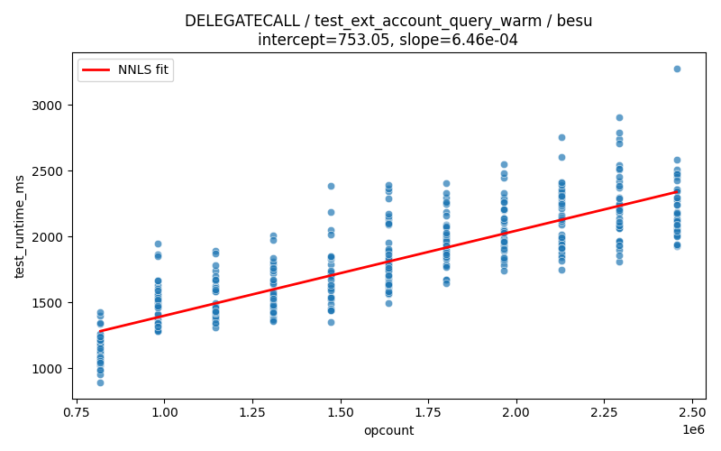

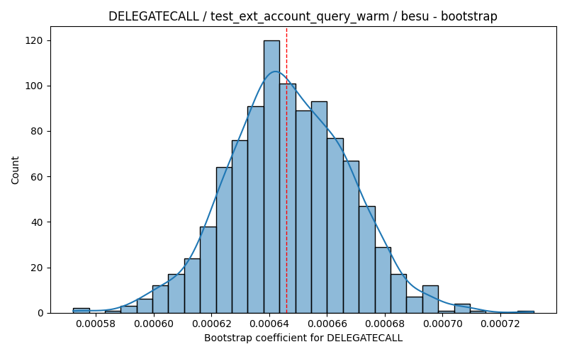

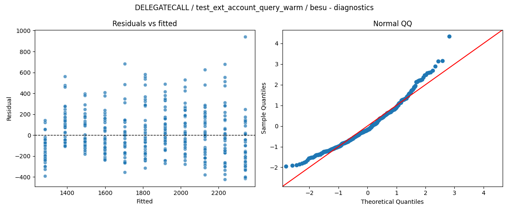

</details>

<details><summary>erigon — NNLS regression summary</summary>

```
==============================================================================
                           NNLS Regression Results                            
==============================================================================
Dep. Variable:          test_runtime_ms              R-squared:          0.906
Model:                  NNLS                    Adj. R-squared:          0.905
No. Observations:       165                               RMSE:          44.36
Df Residuals:           163                                MAE:          33.19
Df Model:               1      
==============================================================================
                      coef     std err     P-value      [0.025      0.975]
------------------------------------------------------------------------------
         const     47.3717     10.0806       0.001     27.2382     68.0644
       opcount      0.0003      0.0000       0.001      0.0003      0.0003
==============================================================================
Notes: Non-negative least squares with bootstrap inference (1000 iterations)
==============================================================================
```

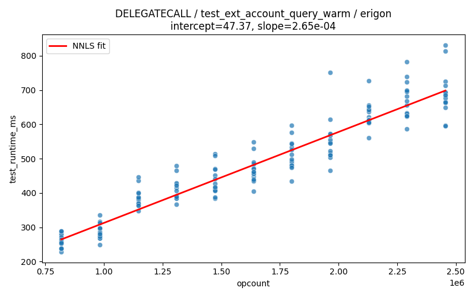

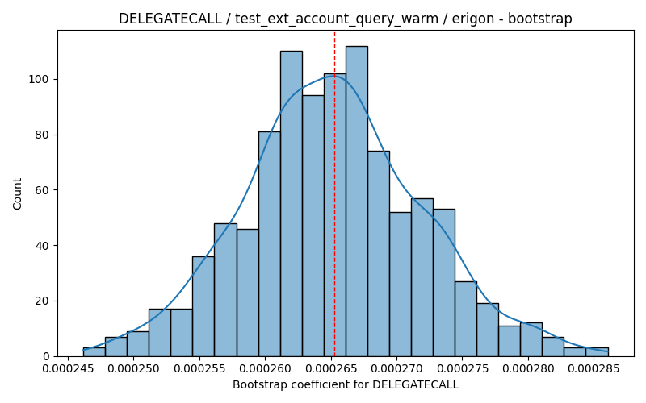

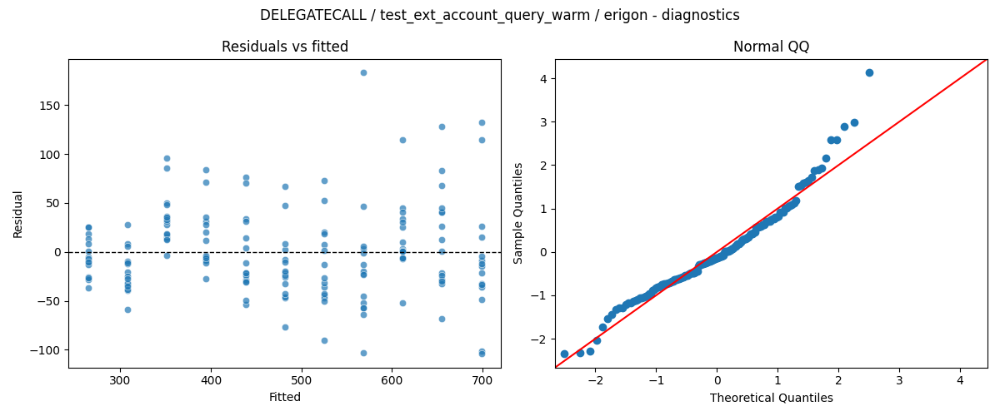

</details>

<details><summary>ethrex — NNLS regression summary</summary>

```
==============================================================================
                           NNLS Regression Results                            
==============================================================================
Dep. Variable:          test_runtime_ms              R-squared:          0.929
Model:                  NNLS                    Adj. R-squared:          0.929
No. Observations:       275                               RMSE:          13.73
Df Residuals:           273                                MAE:          10.92
Df Model:               1      
==============================================================================
                      coef     std err     P-value      [0.025      0.975]
------------------------------------------------------------------------------
         const     43.1875      2.6411       0.001     37.6523     48.0239
       opcount      0.0001      0.0000       0.001      0.0001      0.0001
==============================================================================
Notes: Non-negative least squares with bootstrap inference (1000 iterations)
==============================================================================
```

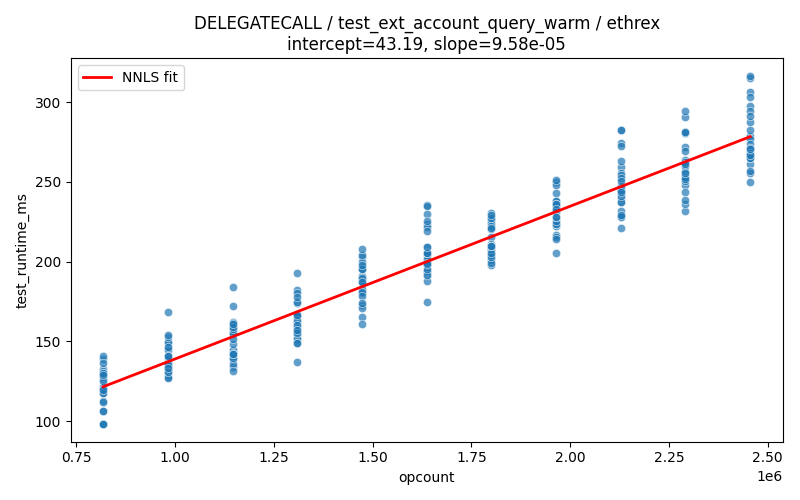

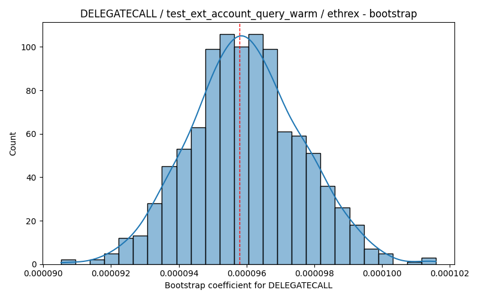

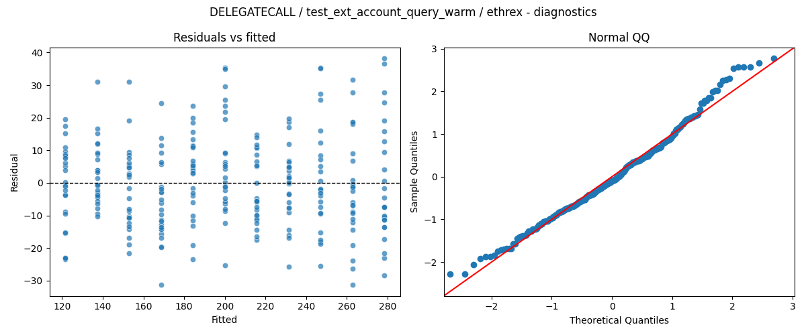

</details>

<details><summary>geth — NNLS regression summary</summary>

```
==============================================================================
                           NNLS Regression Results                            
==============================================================================
Dep. Variable:          test_runtime_ms              R-squared:          0.902
Model:                  NNLS                    Adj. R-squared:          0.902
No. Observations:       242                               RMSE:          26.41
Df Residuals:           240                                MAE:          19.79
Df Model:               1      
==============================================================================
                      coef     std err     P-value      [0.025      0.975]
------------------------------------------------------------------------------
         const     39.6244      4.8792       0.001     30.8518     49.1236
       opcount      0.0002      0.0000       0.001      0.0001      0.0002
==============================================================================
Notes: Non-negative least squares with bootstrap inference (1000 iterations)
==============================================================================
```

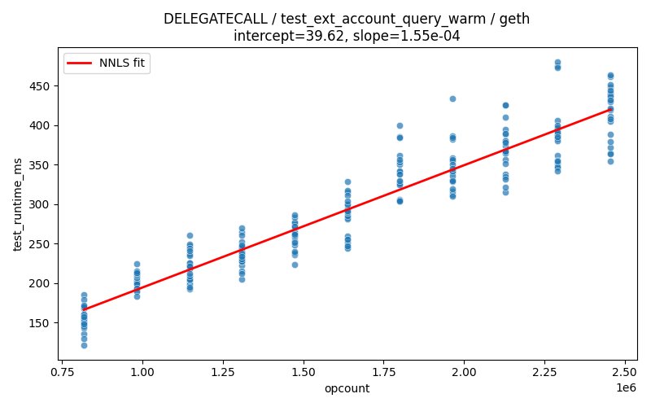

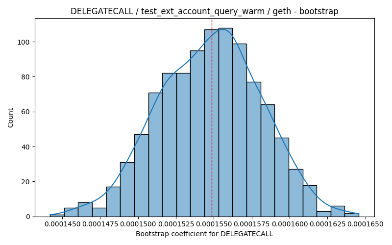

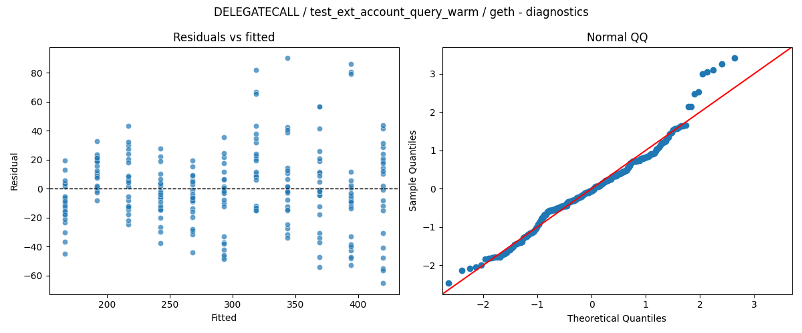

</details>

<details><summary>nethermind — NNLS regression summary</summary>

```
==============================================================================
                           NNLS Regression Results                            
==============================================================================
Dep. Variable:          test_runtime_ms              R-squared:          0.665
Model:                  NNLS                    Adj. R-squared:          0.664
No. Observations:       198                               RMSE:         140.90
Df Residuals:           196                                MAE:         110.00
Df Model:               1      
==============================================================================
                      coef     std err     P-value      [0.025      0.975]
------------------------------------------------------------------------------
         const    194.8322     26.2173       0.001    142.5126    243.6594
       opcount      0.0004      0.0000       0.001      0.0004      0.0004
==============================================================================
Notes: Non-negative least squares with bootstrap inference (1000 iterations)
==============================================================================
```

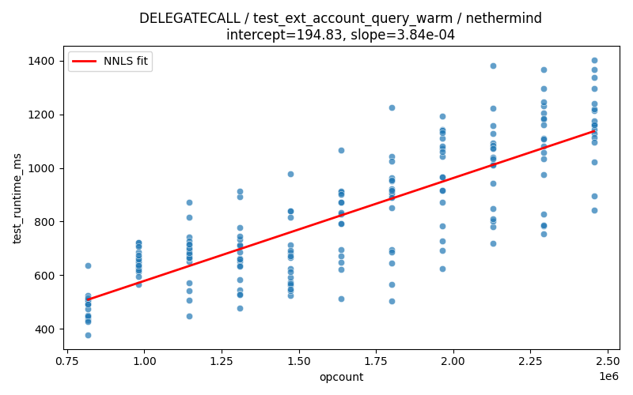

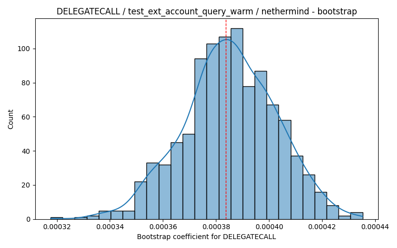

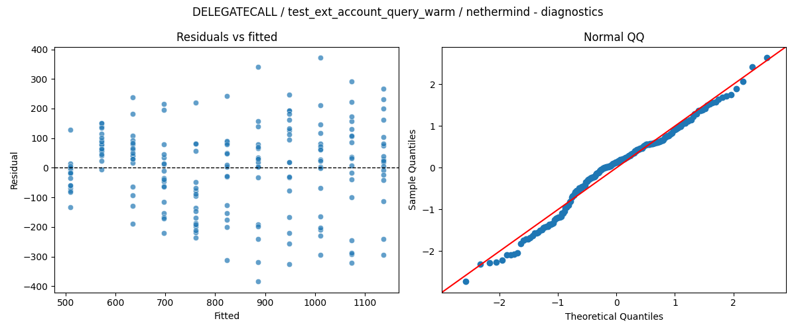

</details>

<details><summary>reth — NNLS regression summary</summary>

```
==============================================================================
                           NNLS Regression Results                            
==============================================================================
Dep. Variable:          test_runtime_ms              R-squared:          0.899
Model:                  NNLS                    Adj. R-squared:          0.898
No. Observations:       308                               RMSE:           9.68
Df Residuals:           306                                MAE:           7.55
Df Model:               1      
==============================================================================
                      coef     std err     P-value      [0.025      0.975]
------------------------------------------------------------------------------
         const     23.7495      1.5715       0.001     20.7630     26.8601
       opcount      0.0001      0.0000       0.001      0.0001      0.0001
==============================================================================
Notes: Non-negative least squares with bootstrap inference (1000 iterations)
==============================================================================
```

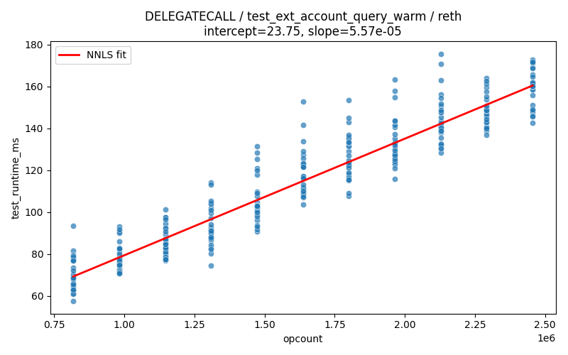

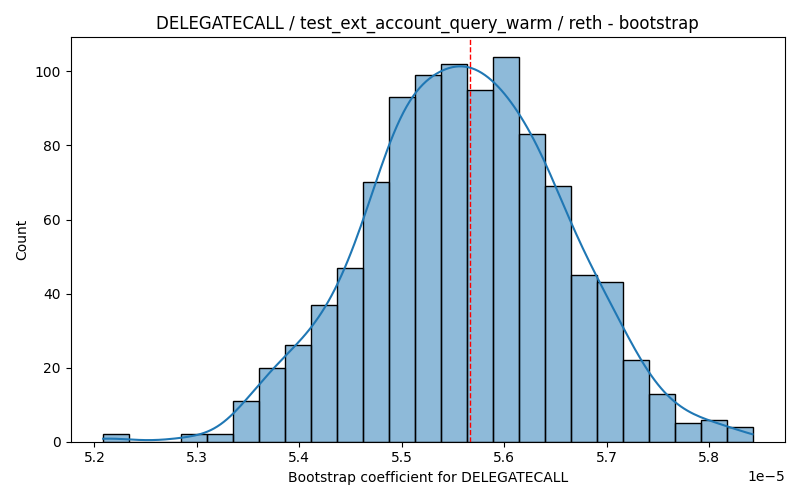

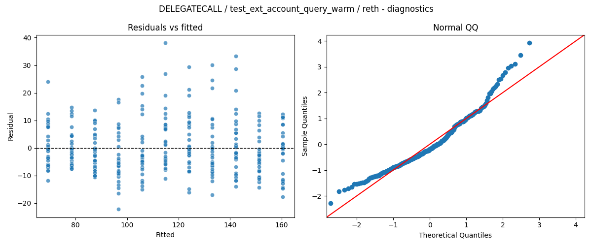

</details>

## EXTCODECOPY

### test_account_access — combo `EXTCODECOPY_AccountMode.NON_EXISTING_ACCOUNT` — `presets[cold_account_nocode_access]`

| client | nobs | R² | target_coef (ms) | p-value | 95% CI |
| --- | --- | --- | --- | --- | --- |
| `besu` | 407 | 0.2513 | 0.0005394 | 1.00e-03 | [0.0004547, 0.0006316] |
| `erigon` | 165 | 0.8972 | 7.383e-05 | 1.00e-03 | [7.02e-05, 7.722e-05] |
| `ethrex` | 275 | 0.7372 | 3.665e-05 | 1.00e-03 | [3.397e-05, 3.933e-05] |
| `geth` | 242 | 0.9295 | 0.00035 | 1.00e-03 | [0.0003374, 0.0003629] |
| `nethermind` | 198 | 0.7954 | 0.00035 | 1.00e-03 | [0.0003271, 0.0003734] |
| `reth` | 308 | 0.6253 | 2.103e-05 | 1.00e-03 | [1.943e-05, 2.275e-05] |

<details><summary>besu — NNLS regression summary</summary>

```
==============================================================================
                           NNLS Regression Results                            
==============================================================================
Dep. Variable:          test_runtime_ms              R-squared:          0.251
Model:                  NNLS                    Adj. R-squared:          0.250
No. Observations:       407                               RMSE:         239.02
Df Residuals:           405                                MAE:         216.15
Df Model:               1      
==============================================================================
                      coef     std err     P-value      [0.025      0.975]
------------------------------------------------------------------------------
         const    397.0774     35.9759       0.001    325.8192    468.0111
       opcount      0.0005      0.0000       0.001      0.0005      0.0006
==============================================================================
Notes: Non-negative least squares with bootstrap inference (1000 iterations)
==============================================================================
```

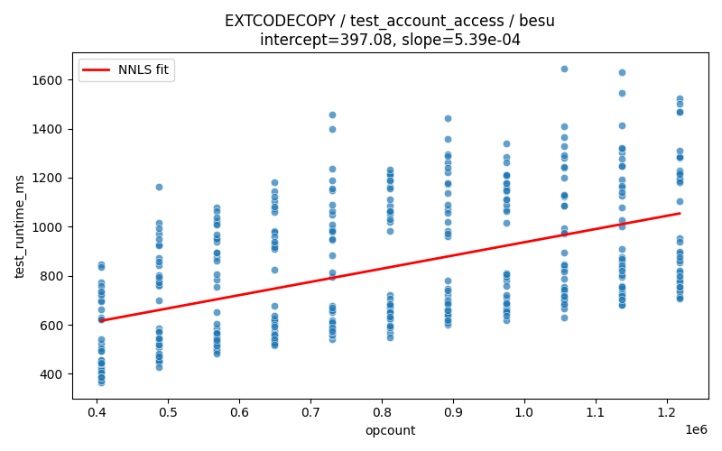

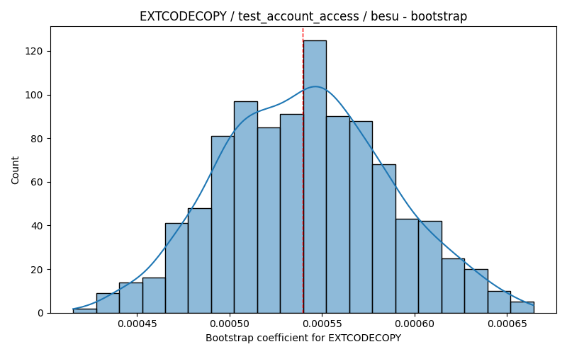

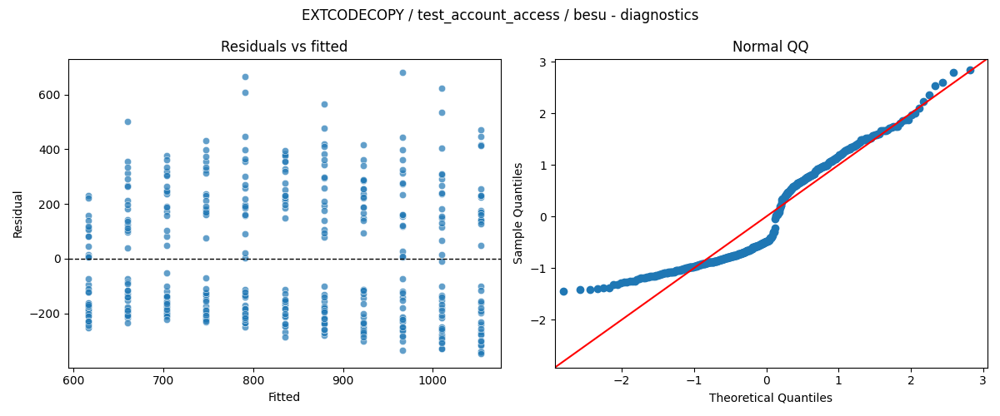

</details>

<details><summary>erigon — NNLS regression summary</summary>

```
==============================================================================
                           NNLS Regression Results                            
==============================================================================
Dep. Variable:          test_runtime_ms              R-squared:          0.897
Model:                  NNLS                    Adj. R-squared:          0.897
No. Observations:       165                               RMSE:           6.42
Df Residuals:           163                                MAE:           5.26
Df Model:               1      
==============================================================================
                      coef     std err     P-value      [0.025      0.975]
------------------------------------------------------------------------------
         const     22.1785      1.4912       0.001     19.3105     24.9417
       opcount      0.0001      0.0000       0.001      0.0001      0.0001
==============================================================================
Notes: Non-negative least squares with bootstrap inference (1000 iterations)
==============================================================================
```

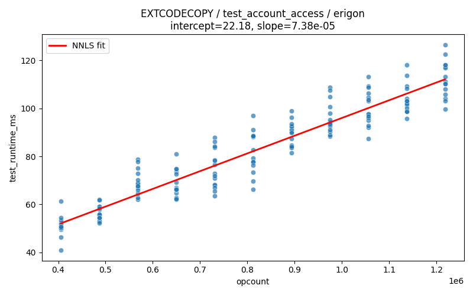

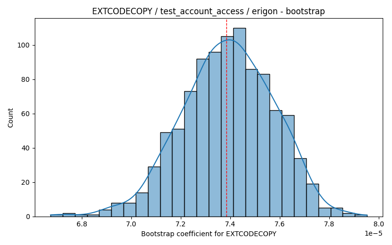

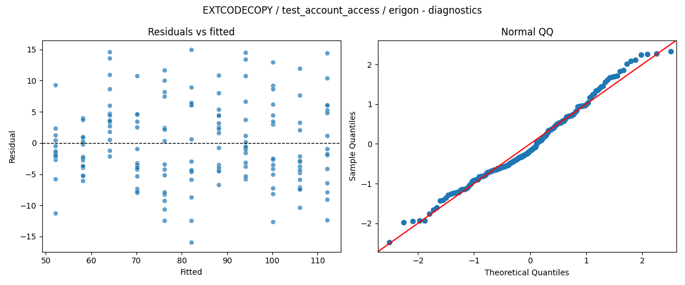

</details>

<details><summary>ethrex — NNLS regression summary</summary>

```
==============================================================================
                           NNLS Regression Results                            
==============================================================================
Dep. Variable:          test_runtime_ms              R-squared:          0.737
Model:                  NNLS                    Adj. R-squared:          0.736
No. Observations:       275                               RMSE:           5.62
Df Residuals:           273                                MAE:           4.29
Df Model:               1      
==============================================================================
                      coef     std err     P-value      [0.025      0.975]
------------------------------------------------------------------------------
         const     10.1373      1.1014       0.001      8.0179     12.2696
       opcount      0.0000      0.0000       0.001      0.0000      0.0000
==============================================================================
Notes: Non-negative least squares with bootstrap inference (1000 iterations)
==============================================================================
```

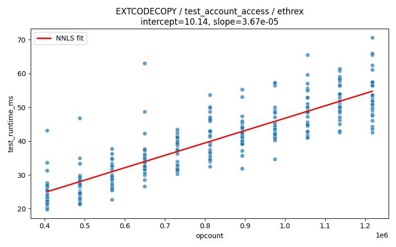

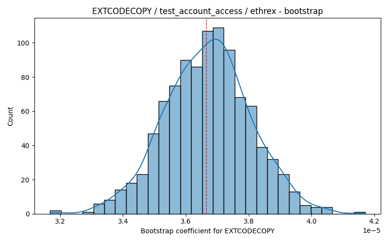

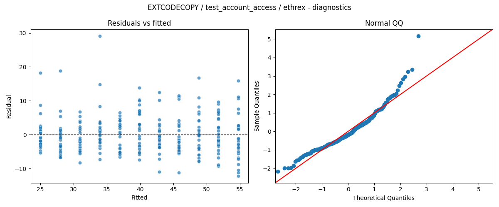

</details>

<details><summary>geth — NNLS regression summary</summary>

```
==============================================================================
                           NNLS Regression Results                            
==============================================================================
Dep. Variable:          test_runtime_ms              R-squared:          0.930
Model:                  NNLS                    Adj. R-squared:          0.929
No. Observations:       242                               RMSE:          24.74
Df Residuals:           240                                MAE:          19.07
Df Model:               1      
==============================================================================
                      coef     std err     P-value      [0.025      0.975]
------------------------------------------------------------------------------
         const     23.2595      4.5781       0.001     13.8762     32.6673
       opcount      0.0004      0.0000       0.001      0.0003      0.0004
==============================================================================
Notes: Non-negative least squares with bootstrap inference (1000 iterations)
==============================================================================
```

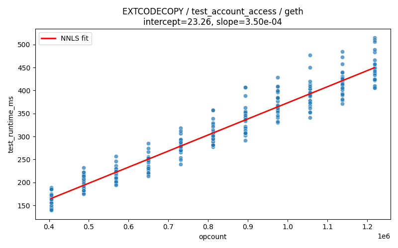

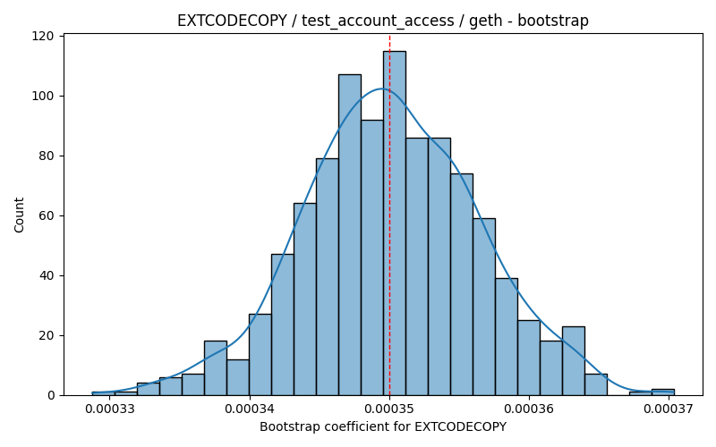

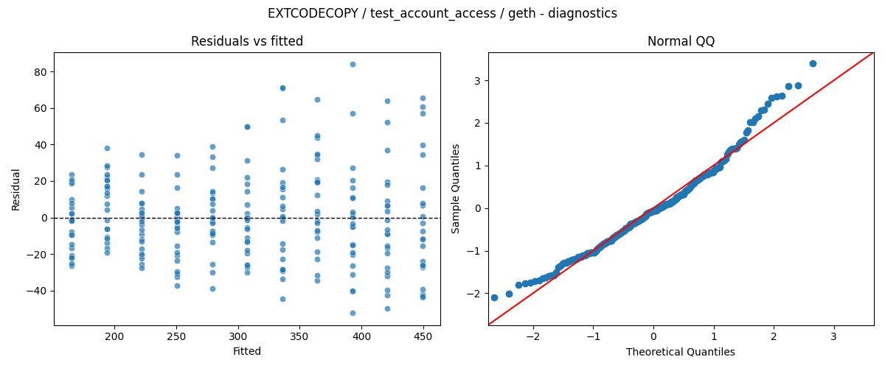

</details>

<details><summary>nethermind — NNLS regression summary</summary>

```
==============================================================================
                           NNLS Regression Results                            
==============================================================================
Dep. Variable:          test_runtime_ms              R-squared:          0.795
Model:                  NNLS                    Adj. R-squared:          0.794
No. Observations:       198                               RMSE:          45.58
Df Residuals:           196                                MAE:          32.39
Df Model:               1      
==============================================================================
                      coef     std err     P-value      [0.025      0.975]
------------------------------------------------------------------------------
         const    116.0580      8.7899       0.001     98.7430    133.2309
       opcount      0.0004      0.0000       0.001      0.0003      0.0004
==============================================================================
Notes: Non-negative least squares with bootstrap inference (1000 iterations)
==============================================================================
```

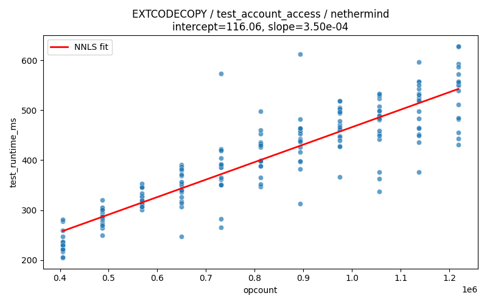

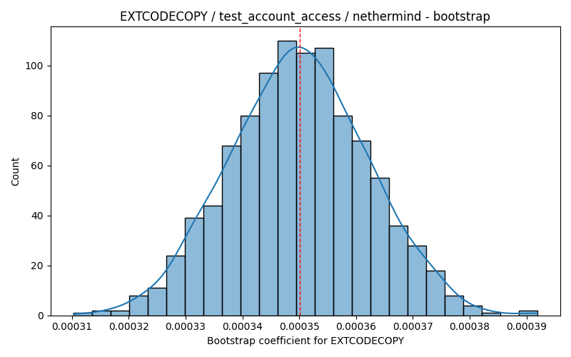

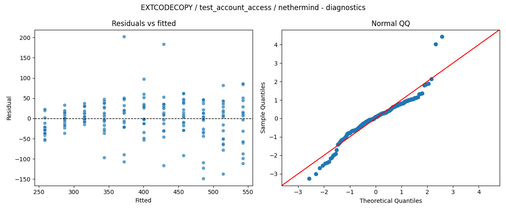

</details>

<details><summary>reth — NNLS regression summary</summary>

```
==============================================================================
                           NNLS Regression Results                            
==============================================================================
Dep. Variable:          test_runtime_ms              R-squared:          0.625
Model:                  NNLS                    Adj. R-squared:          0.624
No. Observations:       308                               RMSE:           4.18
Df Residuals:           306                                MAE:           2.98
Df Model:               1      
==============================================================================
                      coef     std err     P-value      [0.025      0.975]
------------------------------------------------------------------------------
         const      9.2897      0.6922       0.001      7.9589     10.6943
       opcount      0.0000      0.0000       0.001      0.0000      0.0000
==============================================================================
Notes: Non-negative least squares with bootstrap inference (1000 iterations)
==============================================================================
```

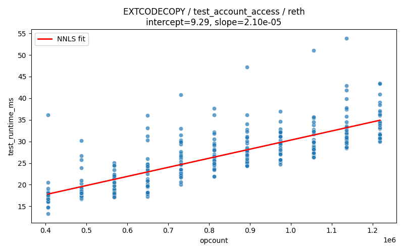

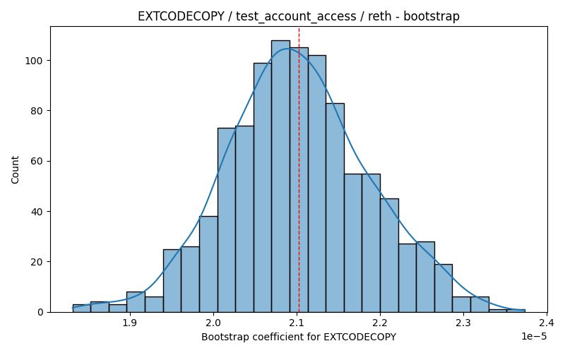

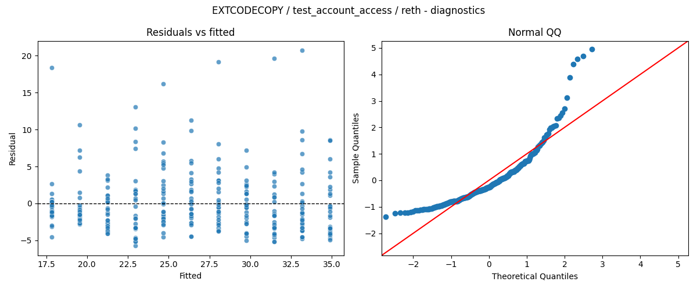

</details>

### test_account_access — combo `EXTCODECOPY_AccountMode.EXISTING_CONTRACT`

| client | nobs | R² | target_coef (ms) | p-value | 95% CI |
| --- | --- | --- | --- | --- | --- |
| `besu` | 407 | 0.3122 | 0.001889 | 1.00e-03 | [0.001642, 0.002143] |
| `erigon` | 165 | 0.8803 | 0.0003034 | 1.00e-03 | [0.0002857, 0.0003224] |
| `ethrex` | 275 | 0.839 | 0.0002311 | 1.00e-03 | [0.0002201, 0.0002425] |
| `geth` | 242 | 0.8799 | 0.000763 | 1.00e-03 | [0.0007271, 0.0007997] |
| `nethermind` | 198 | 0.8211 | 0.001338 | 1.00e-03 | [0.001249, 0.001423] |
| `reth` | 308 | 0.7928 | 0.0001061 | 1.00e-03 | [0.0001001, 0.0001128] |

<details><summary>besu — NNLS regression summary</summary>

```
==============================================================================
                           NNLS Regression Results                            
==============================================================================
Dep. Variable:          test_runtime_ms              R-squared:          0.312
Model:                  NNLS                    Adj. R-squared:          0.311
No. Observations:       407                               RMSE:         277.01
Df Residuals:           405                                MAE:         250.27
Df Model:               1      
==============================================================================
                      coef     std err     P-value      [0.025      0.975]
------------------------------------------------------------------------------
         const    468.4999     39.2096       0.001    393.3325    541.9307
       opcount      0.0019      0.0001       0.001      0.0016      0.0021
==============================================================================
Notes: Non-negative least squares with bootstrap inference (1000 iterations)
==============================================================================
```

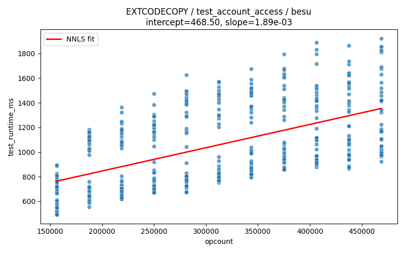

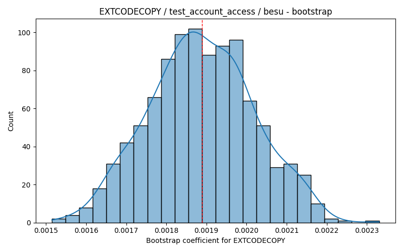

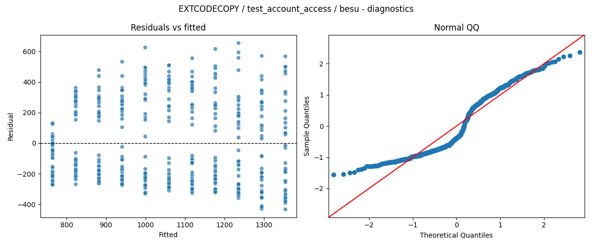

</details>

<details><summary>erigon — NNLS regression summary</summary>

```
==============================================================================
                           NNLS Regression Results                            
==============================================================================
Dep. Variable:          test_runtime_ms              R-squared:          0.880
Model:                  NNLS                    Adj. R-squared:          0.880
No. Observations:       165                               RMSE:          11.05
Df Residuals:           163                                MAE:           8.43
Df Model:               1      
==============================================================================
                      coef     std err     P-value      [0.025      0.975]
------------------------------------------------------------------------------
         const     40.9664      2.8340       0.001     35.3152     46.2916
       opcount      0.0003      0.0000       0.001      0.0003      0.0003
==============================================================================
Notes: Non-negative least squares with bootstrap inference (1000 iterations)
==============================================================================
```

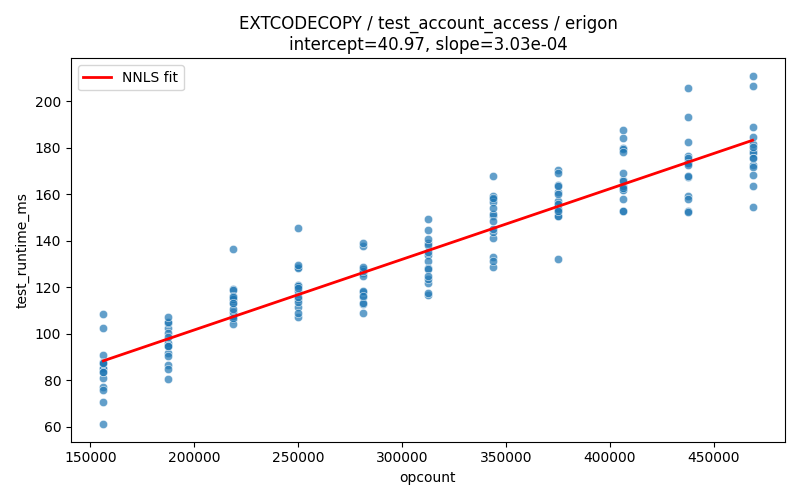

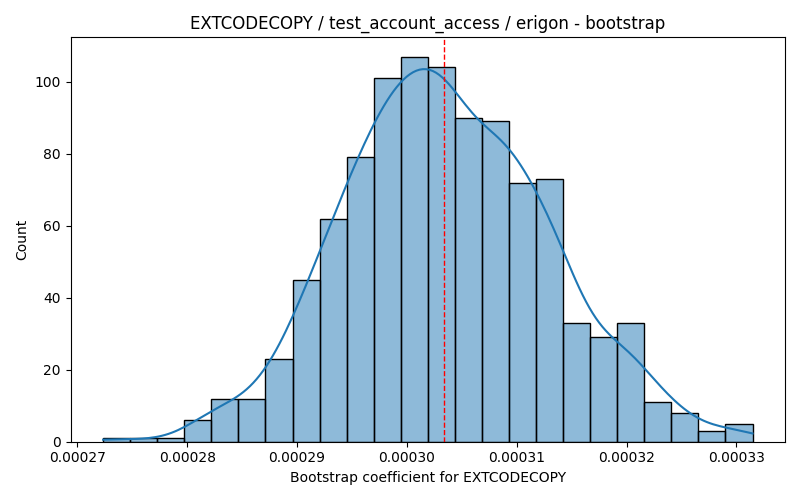

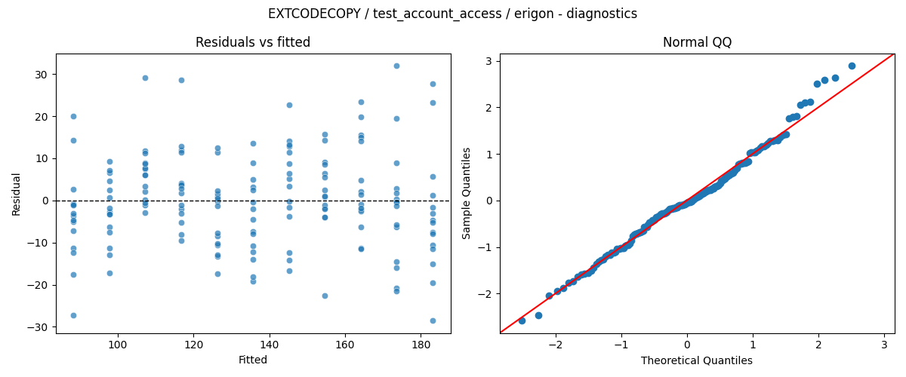

</details>

<details><summary>ethrex — NNLS regression summary</summary>

```
==============================================================================
                           NNLS Regression Results                            
==============================================================================
Dep. Variable:          test_runtime_ms              R-squared:          0.839
Model:                  NNLS                    Adj. R-squared:          0.838
No. Observations:       275                               RMSE:          10.00
Df Residuals:           273                                MAE:           7.83
Df Model:               1      
==============================================================================
                      coef     std err     P-value      [0.025      0.975]
------------------------------------------------------------------------------
         const     19.7701      1.7058       0.001     16.2215     23.1360
       opcount      0.0002      0.0000       0.001      0.0002      0.0002
==============================================================================
Notes: Non-negative least squares with bootstrap inference (1000 iterations)
==============================================================================
```

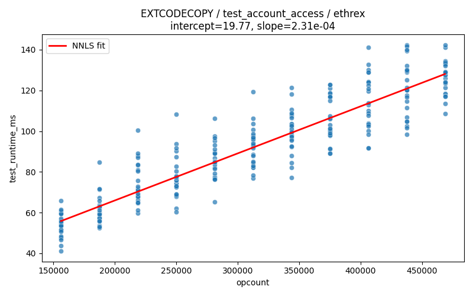

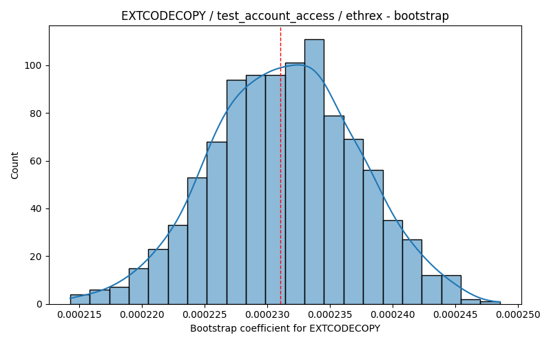

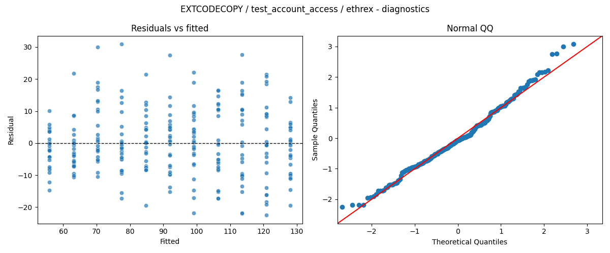

</details>

<details><summary>geth — NNLS regression summary</summary>

```
==============================================================================
                           NNLS Regression Results                            
==============================================================================
Dep. Variable:          test_runtime_ms              R-squared:          0.880
Model:                  NNLS                    Adj. R-squared:          0.879
No. Observations:       242                               RMSE:          27.85
Df Residuals:           240                                MAE:          21.50
Df Model:               1      
==============================================================================
                      coef     std err     P-value      [0.025      0.975]
------------------------------------------------------------------------------
         const     44.0550      5.1617       0.001     34.0770     54.1507
       opcount      0.0008      0.0000       0.001      0.0007      0.0008
==============================================================================
Notes: Non-negative least squares with bootstrap inference (1000 iterations)
==============================================================================
```

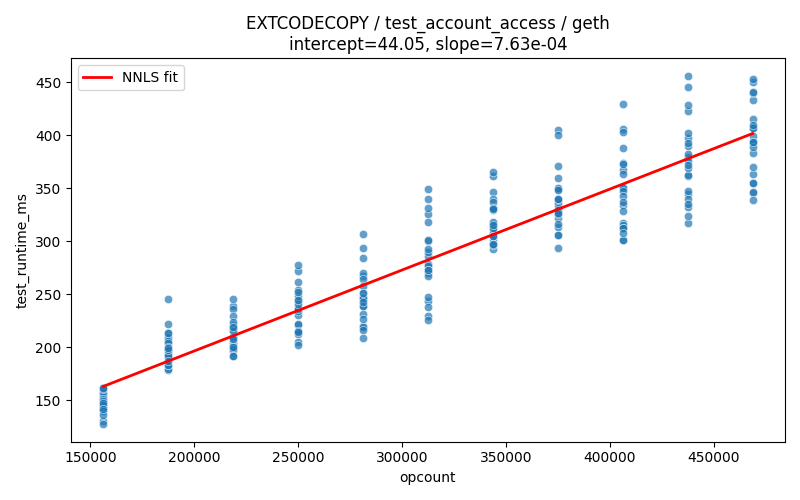


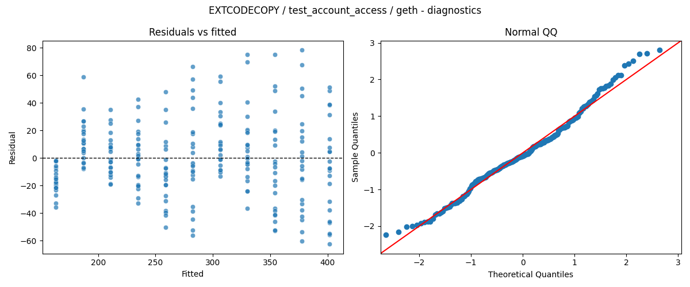

</details>

<details><summary>nethermind — NNLS regression summary</summary>

```
==============================================================================
                           NNLS Regression Results                            
==============================================================================
Dep. Variable:          test_runtime_ms              R-squared:          0.821
Model:                  NNLS                    Adj. R-squared:          0.820
No. Observations:       198                               RMSE:          61.70
Df Residuals:           196                                MAE:          49.21
Df Model:               1      
==============================================================================
                      coef     std err     P-value      [0.025      0.975]
------------------------------------------------------------------------------
         const    183.0073     13.5919       0.001    157.3038    209.2858
       opcount      0.0013      0.0000       0.001      0.0012      0.0014
==============================================================================
Notes: Non-negative least squares with bootstrap inference (1000 iterations)
==============================================================================
```

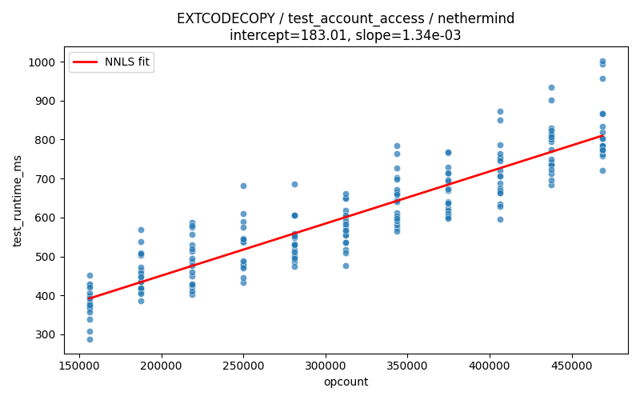

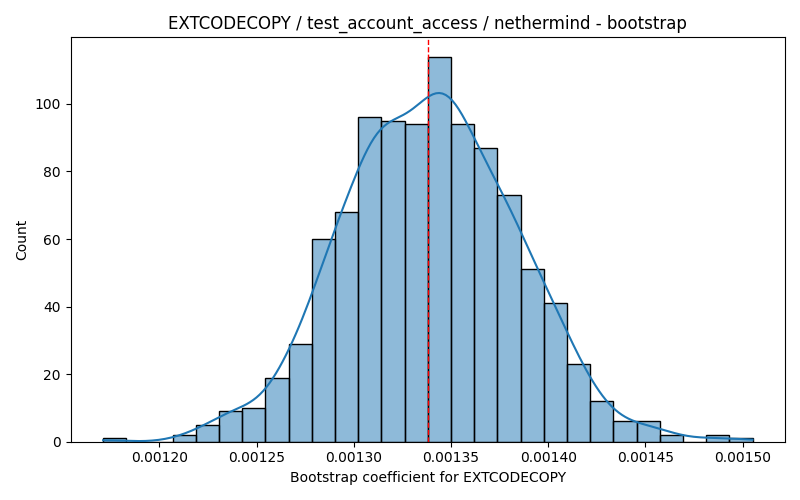

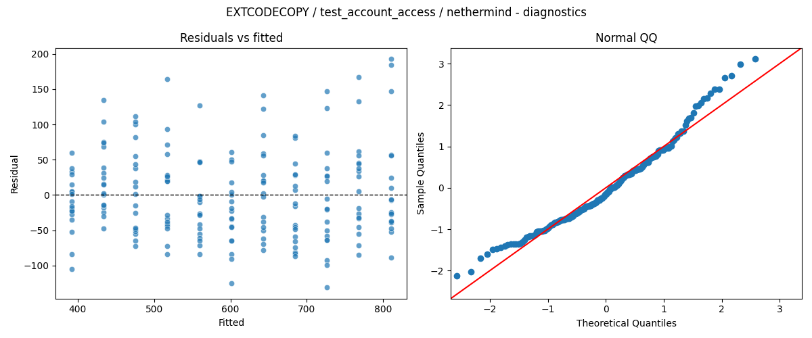

</details>

<details><summary>reth — NNLS regression summary</summary>

```
==============================================================================
                           NNLS Regression Results                            
==============================================================================
Dep. Variable:          test_runtime_ms              R-squared:          0.793
Model:                  NNLS                    Adj. R-squared:          0.792
No. Observations:       308                               RMSE:           5.36
Df Residuals:           306                                MAE:           4.17
Df Model:               1      
==============================================================================
                      coef     std err     P-value      [0.025      0.975]
------------------------------------------------------------------------------
         const     11.8665      0.8961       0.001     10.1221     13.5863
       opcount      0.0001      0.0000       0.001      0.0001      0.0001
==============================================================================
Notes: Non-negative least squares with bootstrap inference (1000 iterations)
==============================================================================
```

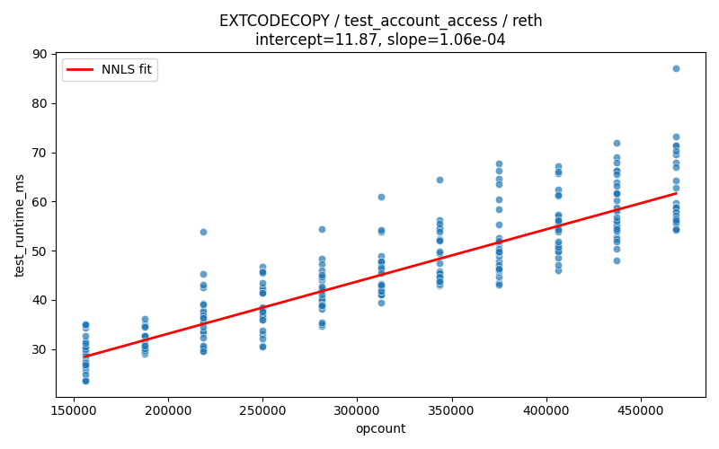

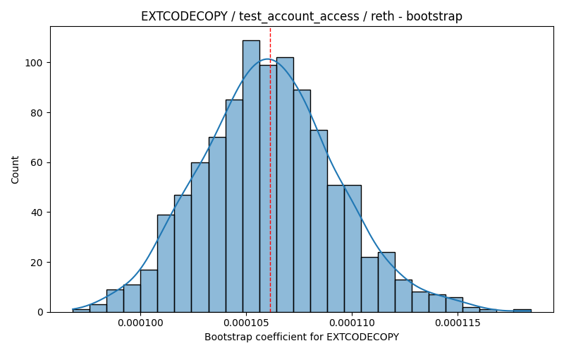

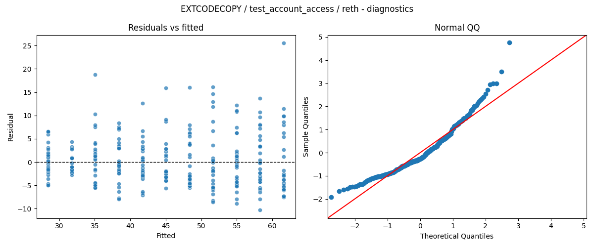

</details>

### test_account_access — combo `EXTCODECOPY_AccountMode.NON_EXISTING_ACCOUNT` — `presets[cold_account_code_access]`

| client | nobs | R² | target_coef (ms) | p-value | 95% CI |
| --- | --- | --- | --- | --- | --- |
| `besu` | 407 | 0.2513 | 0.0005394 | 1.00e-03 | [0.0004547, 0.0006316] |
| `erigon` | 165 | 0.8972 | 7.383e-05 | 1.00e-03 | [7.02e-05, 7.722e-05] |
| `ethrex` | 275 | 0.7372 | 3.665e-05 | 1.00e-03 | [3.397e-05, 3.933e-05] |
| `geth` | 242 | 0.9295 | 0.00035 | 1.00e-03 | [0.0003374, 0.0003629] |
| `nethermind` | 198 | 0.7954 | 0.00035 | 1.00e-03 | [0.0003271, 0.0003734] |
| `reth` | 308 | 0.6253 | 2.103e-05 | 1.00e-03 | [1.943e-05, 2.275e-05] |

<details><summary>besu — NNLS regression summary</summary>

```
==============================================================================
                           NNLS Regression Results                            
==============================================================================
Dep. Variable:          test_runtime_ms              R-squared:          0.251
Model:                  NNLS                    Adj. R-squared:          0.250
No. Observations:       407                               RMSE:         239.02
Df Residuals:           405                                MAE:         216.15
Df Model:               1      
==============================================================================
                      coef     std err     P-value      [0.025      0.975]
------------------------------------------------------------------------------
         const    397.0774     35.9759       0.001    325.8192    468.0111
       opcount      0.0005      0.0000       0.001      0.0005      0.0006
==============================================================================
Notes: Non-negative least squares with bootstrap inference (1000 iterations)
==============================================================================
```


</details>

<details><summary>erigon — NNLS regression summary</summary>

```
==============================================================================
                           NNLS Regression Results                            
==============================================================================
Dep. Variable:          test_runtime_ms              R-squared:          0.897
Model:                  NNLS                    Adj. R-squared:          0.897
No. Observations:       165                               RMSE:           6.42
Df Residuals:           163                                MAE:           5.26
Df Model:               1      
==============================================================================
                      coef     std err     P-value      [0.025      0.975]
------------------------------------------------------------------------------
         const     22.1785      1.4912       0.001     19.3105     24.9417
       opcount      0.0001      0.0000       0.001      0.0001      0.0001
==============================================================================
Notes: Non-negative least squares with bootstrap inference (1000 iterations)
==============================================================================
```


</details>

<details><summary>ethrex — NNLS regression summary</summary>

```
==============================================================================
                           NNLS Regression Results                            
==============================================================================
Dep. Variable:          test_runtime_ms              R-squared:          0.737
Model:                  NNLS                    Adj. R-squared:          0.736
No. Observations:       275                               RMSE:           5.62
Df Residuals:           273                                MAE:           4.29
Df Model:               1      
==============================================================================
                      coef     std err     P-value      [0.025      0.975]
------------------------------------------------------------------------------
         const     10.1373      1.1014       0.001      8.0179     12.2696
       opcount      0.0000      0.0000       0.001      0.0000      0.0000
==============================================================================
Notes: Non-negative least squares with bootstrap inference (1000 iterations)
==============================================================================
```


</details>

<details><summary>geth — NNLS regression summary</summary>

```
==============================================================================
                           NNLS Regression Results                            
==============================================================================
Dep. Variable:          test_runtime_ms              R-squared:          0.930
Model:                  NNLS                    Adj. R-squared:          0.929
No. Observations:       242                               RMSE:          24.74
Df Residuals:           240                                MAE:          19.07
Df Model:               1      
==============================================================================
                      coef     std err     P-value      [0.025      0.975]
------------------------------------------------------------------------------
         const     23.2595      4.5781       0.001     13.8762     32.6673
       opcount      0.0004      0.0000       0.001      0.0003      0.0004
==============================================================================
Notes: Non-negative least squares with bootstrap inference (1000 iterations)
==============================================================================
```


</details>

<details><summary>nethermind — NNLS regression summary</summary>

```
==============================================================================
                           NNLS Regression Results                            
==============================================================================
Dep. Variable:          test_runtime_ms              R-squared:          0.795
Model:                  NNLS                    Adj. R-squared:          0.794
No. Observations:       198                               RMSE:          45.58
Df Residuals:           196                                MAE:          32.39
Df Model:               1      
==============================================================================
                      coef     std err     P-value      [0.025      0.975]
------------------------------------------------------------------------------
         const    116.0580      8.7899       0.001     98.7430    133.2309
       opcount      0.0004      0.0000       0.001      0.0003      0.0004
==============================================================================
Notes: Non-negative least squares with bootstrap inference (1000 iterations)
==============================================================================
```


</details>

<details><summary>reth — NNLS regression summary</summary>

```
==============================================================================
                           NNLS Regression Results                            
==============================================================================
Dep. Variable:          test_runtime_ms              R-squared:          0.625
Model:                  NNLS                    Adj. R-squared:          0.624
No. Observations:       308                               RMSE:           4.18
Df Residuals:           306                                MAE:           2.98
Df Model:               1      
==============================================================================
                      coef     std err     P-value      [0.025      0.975]
------------------------------------------------------------------------------
         const      9.2897      0.6922       0.001      7.9589     10.6943
       opcount      0.0000      0.0000       0.001      0.0000      0.0000
==============================================================================
Notes: Non-negative least squares with bootstrap inference (1000 iterations)
==============================================================================
```


</details>

## EXTCODEHASH

### test_account_access — combo `EXTCODEHASH_AccountMode.NON_EXISTING_ACCOUNT` — `presets[cold_account_nocode_access]`

| client | nobs | R² | target_coef (ms) | p-value | 95% CI |
| --- | --- | --- | --- | --- | --- |
| `besu` | 407 | 0.8883 | 0.0134 | 1.00e-03 | [0.01296, 0.01381] |
| `erigon` | 165 | 0.9704 | 0.007684 | 1.00e-03 | [0.007484, 0.0078] |
| `ethrex` | 275 | 0.9582 | 0.001929 | 1.00e-03 | [0.001883, 0.001976] |
| `geth` | 242 | 0.8557 | 0.02161 | 1.00e-03 | [0.02036, 0.02279] |
| `nethermind` | 198 | 0.7717 | 0.003689 | 1.00e-03 | [0.003394, 0.003968] |
| `reth` | 308 | 0.9139 | 0.0007506 | 1.00e-03 | [0.0007235, 0.0007794] |

<details><summary>besu — NNLS regression summary</summary>

```
==============================================================================
                           NNLS Regression Results                            
==============================================================================
Dep. Variable:          test_runtime_ms              R-squared:          0.888
Model:                  NNLS                    Adj. R-squared:          0.888
No. Observations:       407                               RMSE:         113.52
Df Residuals:           405                                MAE:         103.21
Df Model:               1      
==============================================================================
                      coef     std err     P-value      [0.025      0.975]
------------------------------------------------------------------------------
         const    489.4558     17.3268       0.001    456.9824    523.4876
       opcount      0.0134      0.0002       0.001      0.0130      0.0138
==============================================================================
Notes: Non-negative least squares with bootstrap inference (1000 iterations)
==============================================================================
```

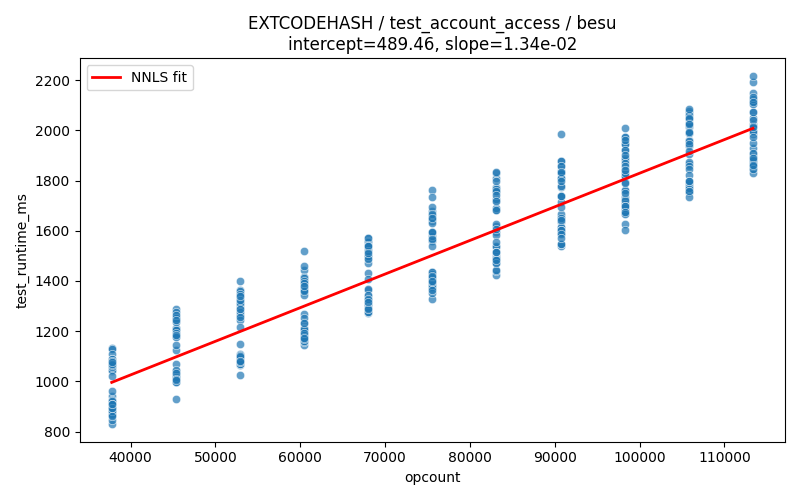

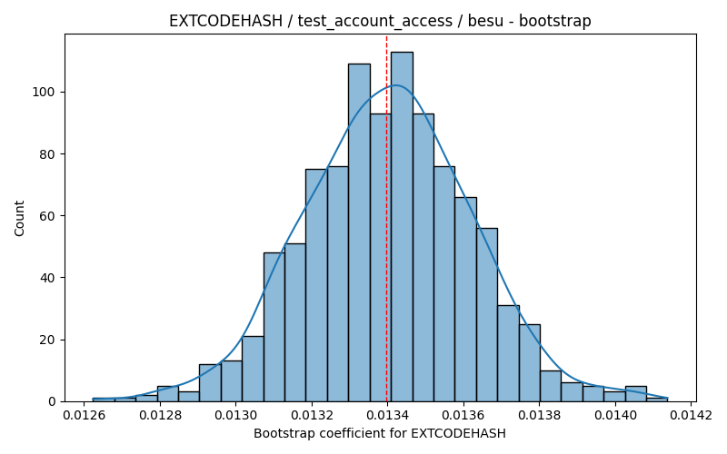

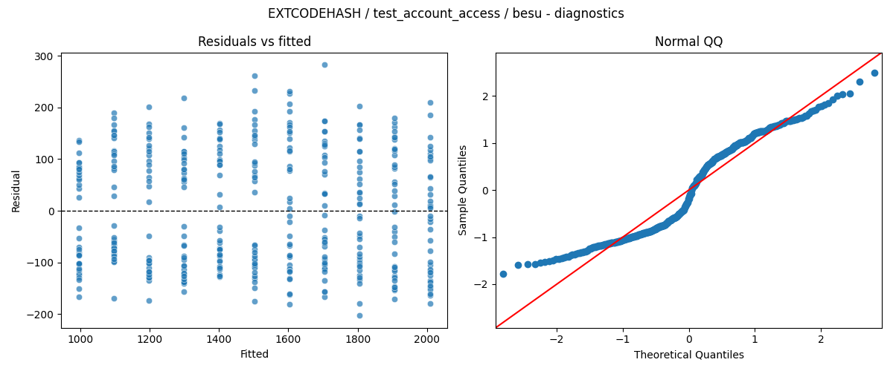

</details>

<details><summary>erigon — NNLS regression summary</summary>

```
==============================================================================
                           NNLS Regression Results                            
==============================================================================
Dep. Variable:          test_runtime_ms              R-squared:          0.970
Model:                  NNLS                    Adj. R-squared:          0.970
No. Observations:       165                               RMSE:          32.09
Df Residuals:           163                                MAE:          25.37
Df Model:               1      
==============================================================================
                      coef     std err     P-value      [0.025      0.975]
------------------------------------------------------------------------------
         const      4.1784      5.2431       0.281      0.0000     17.4410
       opcount      0.0077      0.0001       0.001      0.0075      0.0078
==============================================================================
Notes: Non-negative least squares with bootstrap inference (1000 iterations)
==============================================================================
```

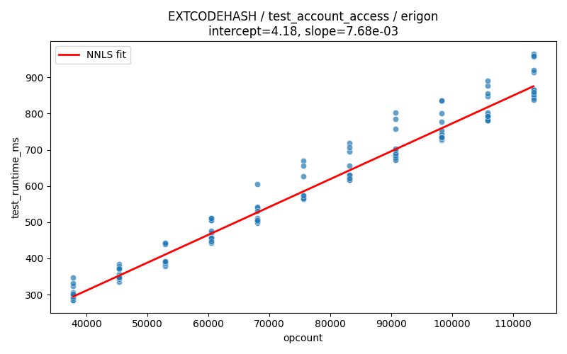

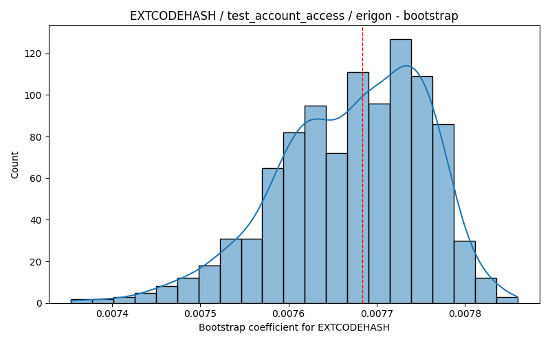

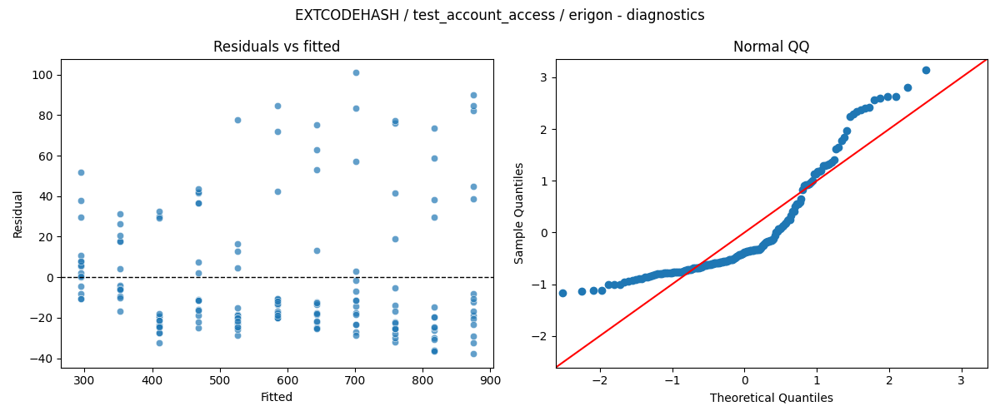

</details>

<details><summary>ethrex — NNLS regression summary</summary>

```
==============================================================================
                           NNLS Regression Results                            
==============================================================================
Dep. Variable:          test_runtime_ms              R-squared:          0.958
Model:                  NNLS                    Adj. R-squared:          0.958
No. Observations:       275                               RMSE:           9.63
Df Residuals:           273                                MAE:           6.90
Df Model:               1      
==============================================================================
                      coef     std err     P-value      [0.025      0.975]
------------------------------------------------------------------------------
         const     27.1317      1.9456       0.001     23.5527     31.1457
       opcount      0.0019      0.0000       0.001      0.0019      0.0020
==============================================================================
Notes: Non-negative least squares with bootstrap inference (1000 iterations)
==============================================================================
```

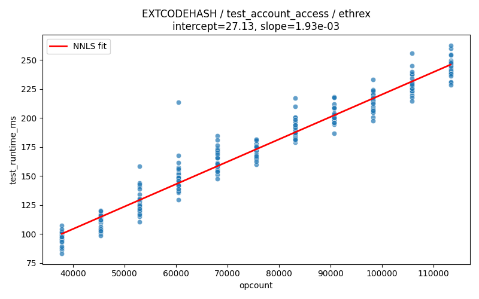

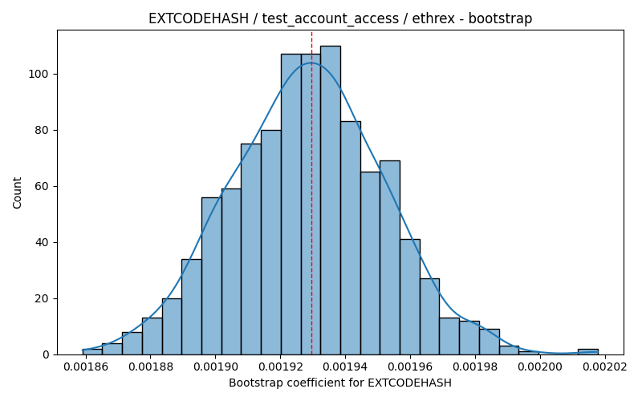

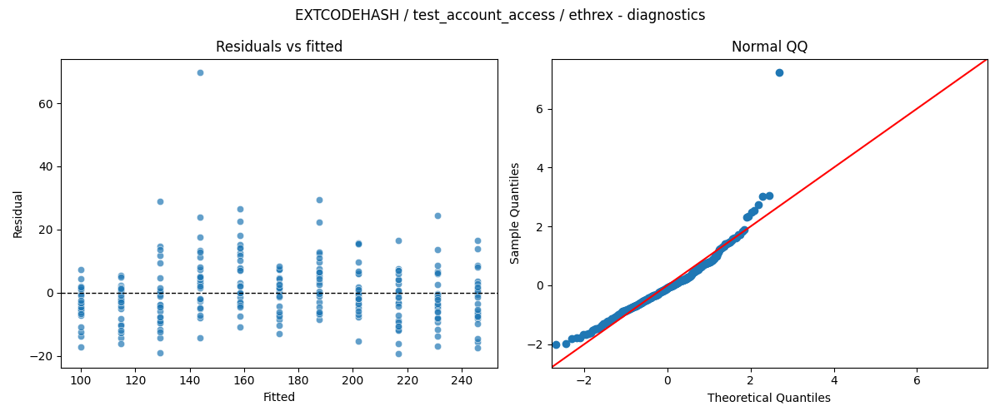

</details>

<details><summary>geth — NNLS regression summary</summary>

```
==============================================================================
                           NNLS Regression Results                            
==============================================================================
Dep. Variable:          test_runtime_ms              R-squared:          0.856
Model:                  NNLS                    Adj. R-squared:          0.855
No. Observations:       242                               RMSE:         212.09
Df Residuals:           240                                MAE:         180.54
Df Model:               1      
==============================================================================
                      coef     std err     P-value      [0.025      0.975]
------------------------------------------------------------------------------
         const    703.3842     52.9660       0.001    603.3560    815.4930
       opcount      0.0216      0.0006       0.001      0.0204      0.0228
==============================================================================
Notes: Non-negative least squares with bootstrap inference (1000 iterations)
==============================================================================
```

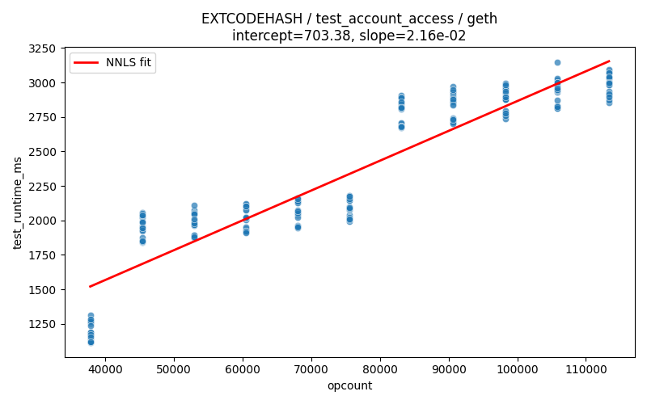

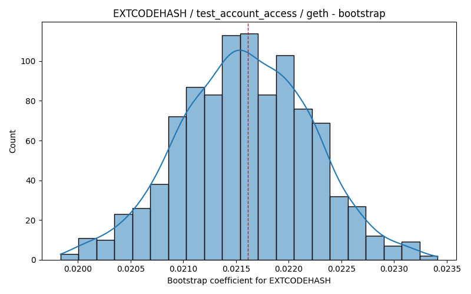

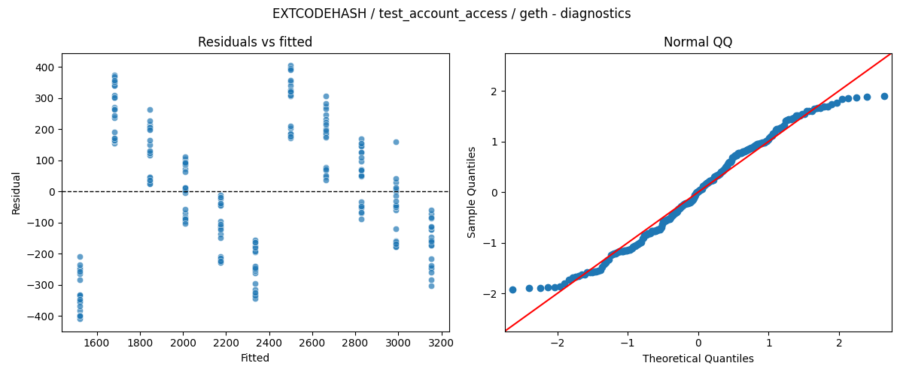

</details>

<details><summary>nethermind — NNLS regression summary</summary>

```
==============================================================================
                           NNLS Regression Results                            
==============================================================================
Dep. Variable:          test_runtime_ms              R-squared:          0.772
Model:                  NNLS                    Adj. R-squared:          0.771
No. Observations:       198                               RMSE:          47.95
Df Residuals:           196                                MAE:          36.51
Df Model:               1      
==============================================================================
                      coef     std err     P-value      [0.025      0.975]
------------------------------------------------------------------------------
         const     93.0097     10.7722       0.001     71.5927    114.0617
       opcount      0.0037      0.0001       0.001      0.0034      0.0040
==============================================================================
Notes: Non-negative least squares with bootstrap inference (1000 iterations)
==============================================================================
```

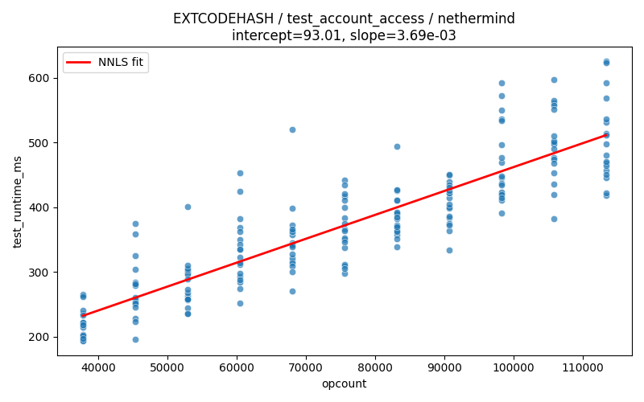

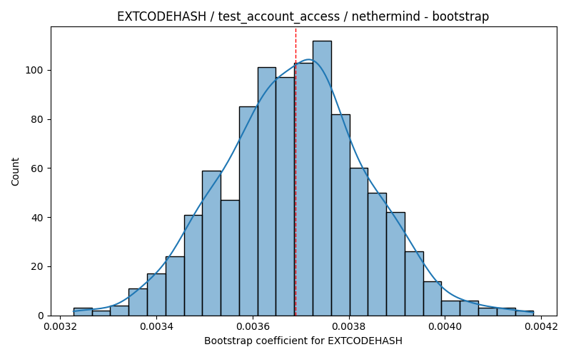

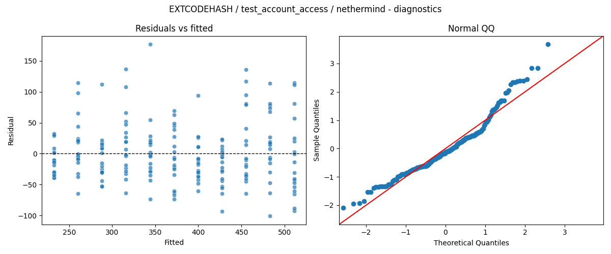

</details>

<details><summary>reth — NNLS regression summary</summary>

```
==============================================================================
                           NNLS Regression Results                            
==============================================================================
Dep. Variable:          test_runtime_ms              R-squared:          0.914
Model:                  NNLS                    Adj. R-squared:          0.914
No. Observations:       308                               RMSE:           5.50
Df Residuals:           306                                MAE:           4.39
Df Model:               1      
==============================================================================
                      coef     std err     P-value      [0.025      0.975]
------------------------------------------------------------------------------
         const     45.1548      1.0575       0.001     43.1454     47.3659
       opcount      0.0008      0.0000       0.001      0.0007      0.0008
==============================================================================
Notes: Non-negative least squares with bootstrap inference (1000 iterations)
==============================================================================
```

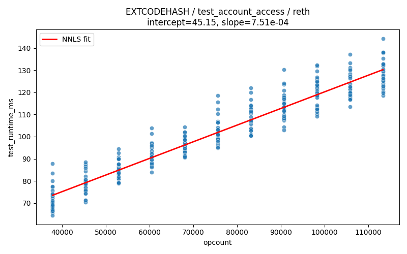

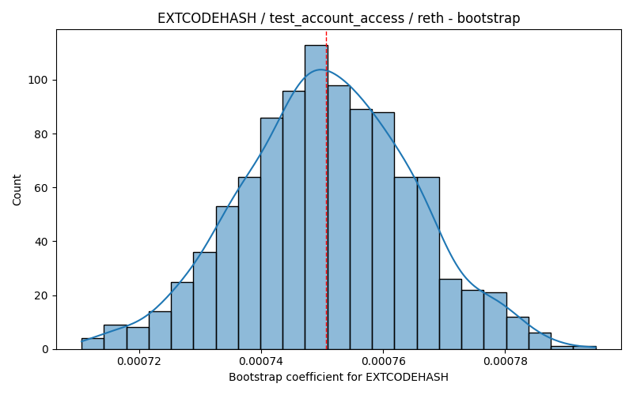

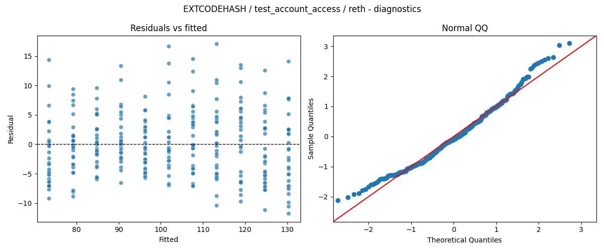

</details>

### test_account_access — combo `EXTCODEHASH_AccountMode.EXISTING_CONTRACT`

| client | nobs | R² | target_coef (ms) | p-value | 95% CI |
| --- | --- | --- | --- | --- | --- |
| `besu` | 407 | 0.8867 | 0.02525 | 1.00e-03 | [0.02443, 0.02598] |
| `erigon` | 165 | 0.934 | 0.02432 | 1.00e-03 | [0.02336, 0.02517] |
| `ethrex` | 275 | 0.9934 | 0.007372 | 1.00e-03 | [0.007301, 0.007442] |
| `geth` | 242 | 0.8564 | 0.023 | 1.00e-03 | [0.0217, 0.02427] |
| `nethermind` | 198 | 0.5685 | 0.01312 | 1.00e-03 | [0.01146, 0.01467] |
| `reth` | 308 | 0.9776 | 0.003902 | 1.00e-03 | [0.003835, 0.00397] |

<details><summary>besu — NNLS regression summary</summary>

```
==============================================================================
                           NNLS Regression Results                            
==============================================================================
Dep. Variable:          test_runtime_ms              R-squared:          0.887
Model:                  NNLS                    Adj. R-squared:          0.886
No. Observations:       407                               RMSE:         187.83
Df Residuals:           405                                MAE:         158.37
Df Model:               1      
==============================================================================
                      coef     std err     P-value      [0.025      0.975]
------------------------------------------------------------------------------
         const    529.8201     26.4318       0.001    482.0419    582.8437
       opcount      0.0253      0.0004       0.001      0.0244      0.0260
==============================================================================
Notes: Non-negative least squares with bootstrap inference (1000 iterations)
==============================================================================
```

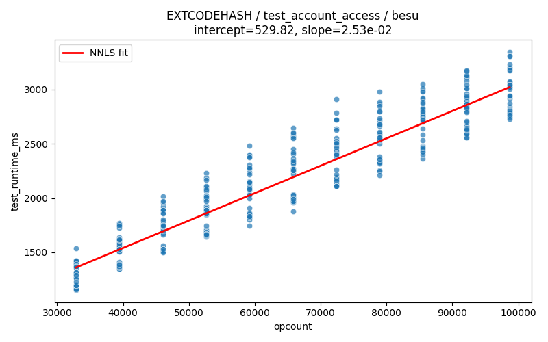

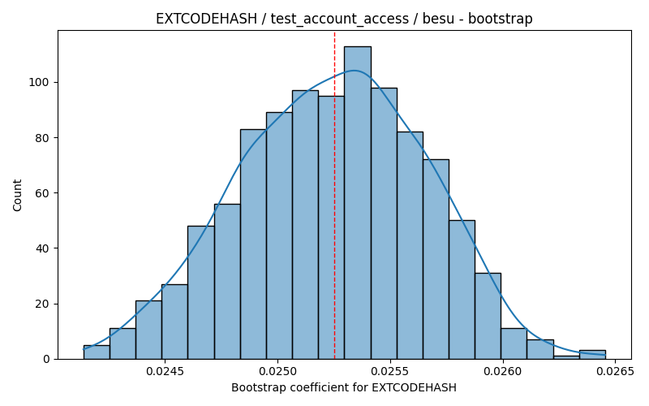

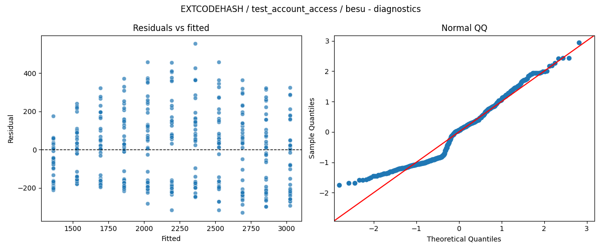

</details>

<details><summary>erigon — NNLS regression summary</summary>

```
==============================================================================
                           NNLS Regression Results                            
==============================================================================
Dep. Variable:          test_runtime_ms              R-squared:          0.934
Model:                  NNLS                    Adj. R-squared:          0.934
No. Observations:       165                               RMSE:         134.55
Df Residuals:           163                                MAE:         115.84
Df Model:               1      
==============================================================================
                      coef     std err     P-value      [0.025      0.975]
------------------------------------------------------------------------------
         const    386.7900     35.5677       0.001    321.4396    459.6211
       opcount      0.0243      0.0005       0.001      0.0234      0.0252
==============================================================================
Notes: Non-negative least squares with bootstrap inference (1000 iterations)
==============================================================================
```

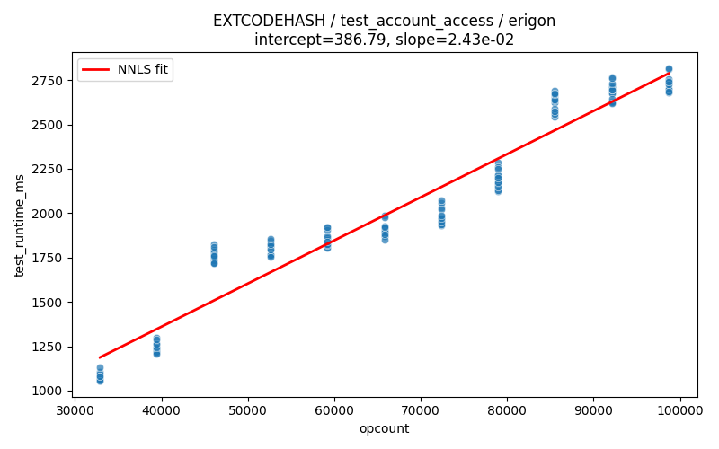

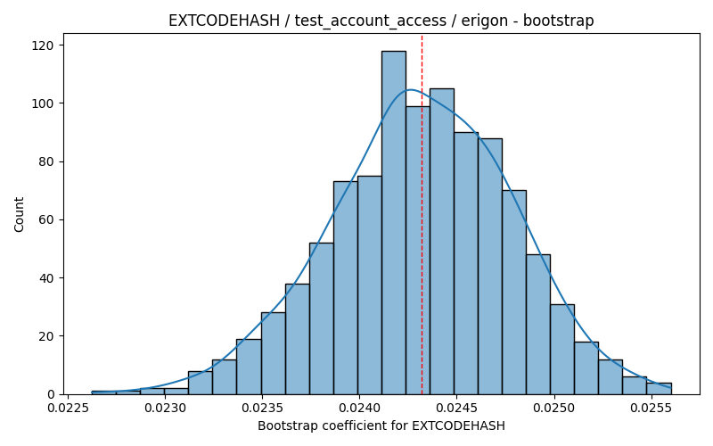


</details>

<details><summary>ethrex — NNLS regression summary</summary>

```
==============================================================================
                           NNLS Regression Results                            
==============================================================================
Dep. Variable:          test_runtime_ms              R-squared:          0.993
Model:                  NNLS                    Adj. R-squared:          0.993
No. Observations:       275                               RMSE:          12.49
Df Residuals:           273                                MAE:          10.03
Df Model:               1      
==============================================================================
                      coef     std err     P-value      [0.025      0.975]
------------------------------------------------------------------------------
         const     44.7530      2.2889       0.001     40.3754     49.2968
       opcount      0.0074      0.0000       0.001      0.0073      0.0074
==============================================================================
Notes: Non-negative least squares with bootstrap inference (1000 iterations)
==============================================================================
```

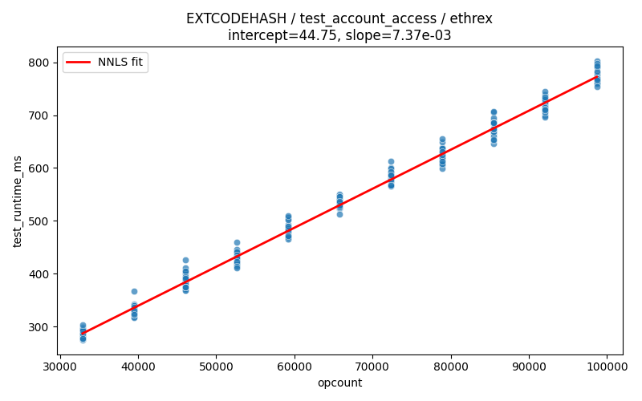

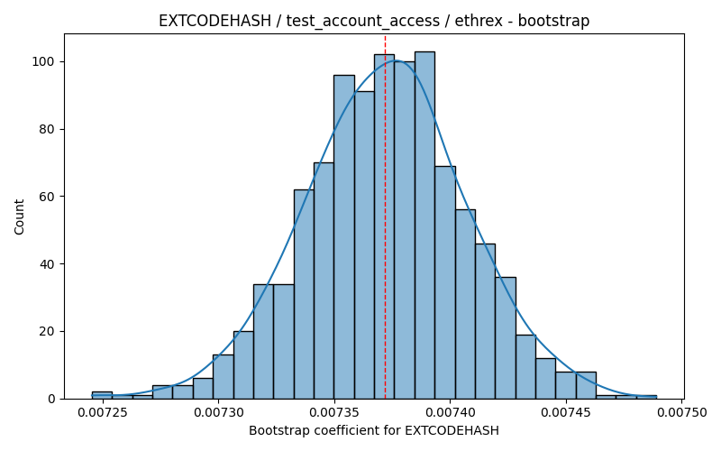

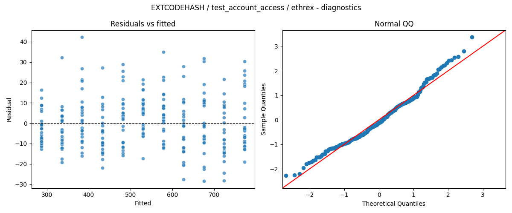

</details>

<details><summary>geth — NNLS regression summary</summary>

```
==============================================================================
                           NNLS Regression Results                            
==============================================================================
Dep. Variable:          test_runtime_ms              R-squared:          0.856
Model:                  NNLS                    Adj. R-squared:          0.856
No. Observations:       242                               RMSE:         196.00
Df Residuals:           240                                MAE:         165.90
Df Model:               1      
==============================================================================
                      coef     std err     P-value      [0.025      0.975]
------------------------------------------------------------------------------
         const    666.7258     48.9385       0.001    572.7309    762.6256
       opcount      0.0230      0.0007       0.001      0.0217      0.0243
==============================================================================
Notes: Non-negative least squares with bootstrap inference (1000 iterations)
==============================================================================
```

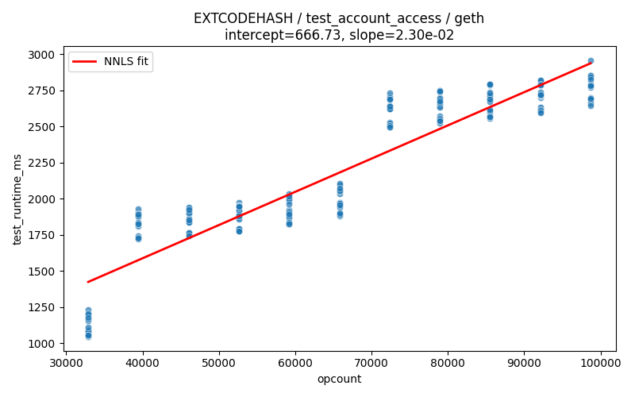

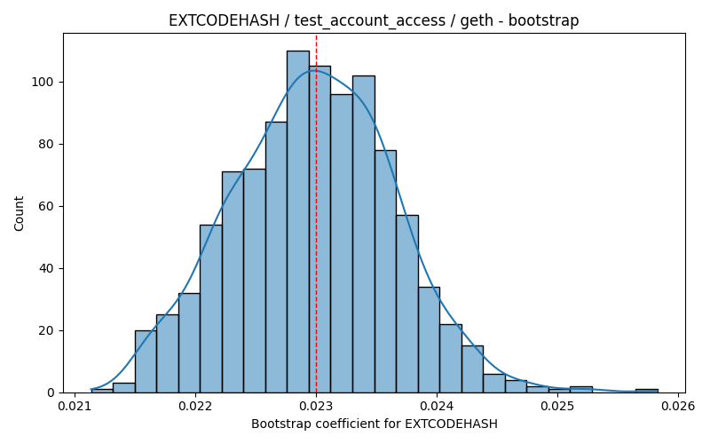

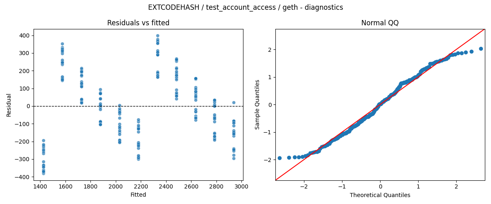

</details>

<details><summary>nethermind — NNLS regression summary</summary>

```
==============================================================================
                           NNLS Regression Results                            
==============================================================================
Dep. Variable:          test_runtime_ms              R-squared:          0.568
Model:                  NNLS                    Adj. R-squared:          0.566
No. Observations:       198                               RMSE:         237.83
Df Residuals:           196                                MAE:         176.08
Df Model:               1      
==============================================================================
                      coef     std err     P-value      [0.025      0.975]
------------------------------------------------------------------------------
         const    189.2741     48.9637       0.001     90.1200    284.4526
       opcount      0.0131      0.0008       0.001      0.0115      0.0147
==============================================================================
Notes: Non-negative least squares with bootstrap inference (1000 iterations)
==============================================================================
```

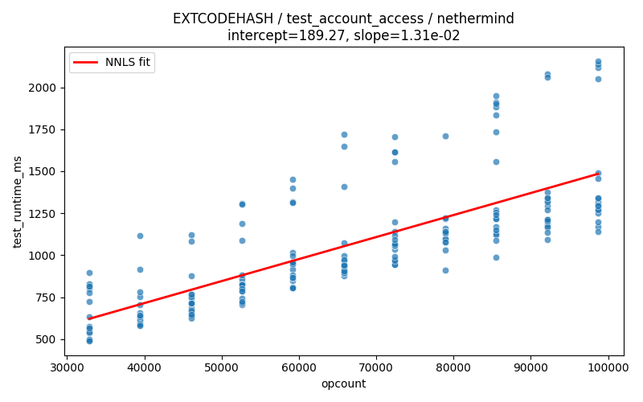

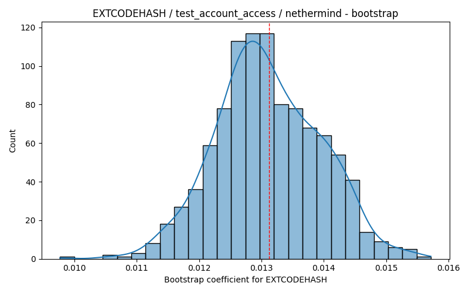

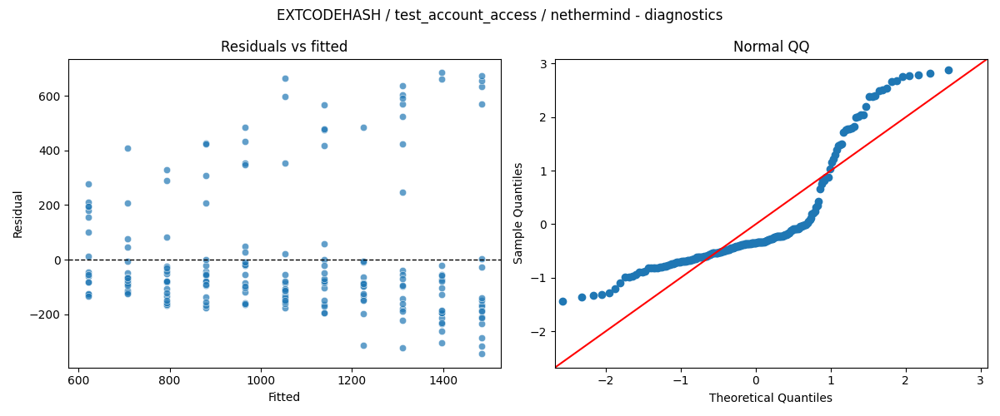

</details>

<details><summary>reth — NNLS regression summary</summary>

```
==============================================================================
                           NNLS Regression Results                            
==============================================================================
Dep. Variable:          test_runtime_ms              R-squared:          0.978
Model:                  NNLS                    Adj. R-squared:          0.977
No. Observations:       308                               RMSE:          12.30
Df Residuals:           306                                MAE:           9.66
Df Model:               1      
==============================================================================
                      coef     std err     P-value      [0.025      0.975]
------------------------------------------------------------------------------
         const    100.1468      2.1918       0.001     96.0304    104.7047
       opcount      0.0039      0.0000       0.001      0.0038      0.0040
==============================================================================
Notes: Non-negative least squares with bootstrap inference (1000 iterations)
==============================================================================
```


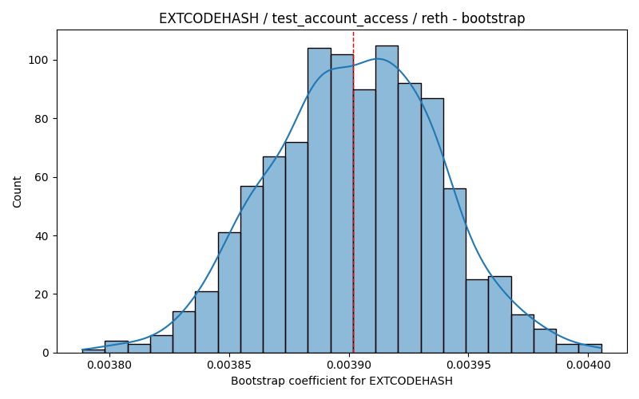

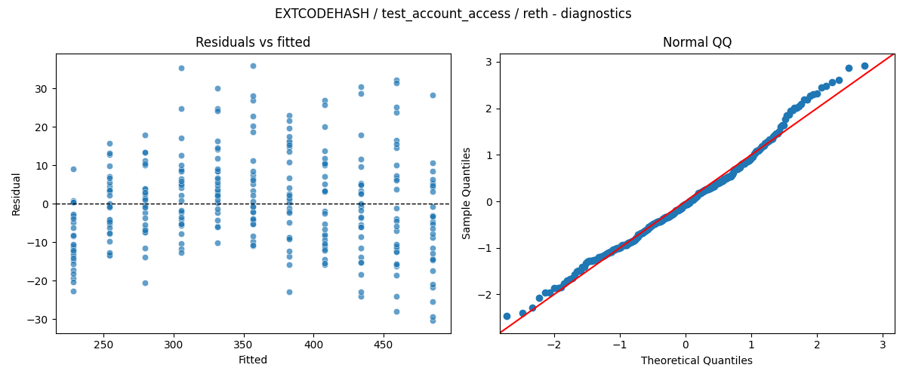

</details>

### test_account_access — combo `EXTCODEHASH_AccountMode.NON_EXISTING_ACCOUNT` — `presets[cold_account_code_access]`

| client | nobs | R² | target_coef (ms) | p-value | 95% CI |
| --- | --- | --- | --- | --- | --- |
| `besu` | 407 | 0.8883 | 0.0134 | 1.00e-03 | [0.01296, 0.01381] |
| `erigon` | 165 | 0.9704 | 0.007684 | 1.00e-03 | [0.007484, 0.0078] |
| `ethrex` | 275 | 0.9582 | 0.001929 | 1.00e-03 | [0.001883, 0.001976] |
| `geth` | 242 | 0.8557 | 0.02161 | 1.00e-03 | [0.02036, 0.02279] |
| `nethermind` | 198 | 0.7717 | 0.003689 | 1.00e-03 | [0.003394, 0.003968] |
| `reth` | 308 | 0.9139 | 0.0007506 | 1.00e-03 | [0.0007235, 0.0007794] |

<details><summary>besu — NNLS regression summary</summary>

```
==============================================================================
                           NNLS Regression Results                            
==============================================================================
Dep. Variable:          test_runtime_ms              R-squared:          0.888
Model:                  NNLS                    Adj. R-squared:          0.888
No. Observations:       407                               RMSE:         113.52
Df Residuals:           405                                MAE:         103.21
Df Model:               1      
==============================================================================
                      coef     std err     P-value      [0.025      0.975]
------------------------------------------------------------------------------
         const    489.4558     17.3268       0.001    456.9824    523.4876
       opcount      0.0134      0.0002       0.001      0.0130      0.0138
==============================================================================
Notes: Non-negative least squares with bootstrap inference (1000 iterations)
==============================================================================
```


</details>

<details><summary>erigon — NNLS regression summary</summary>

```
==============================================================================
                           NNLS Regression Results                            
==============================================================================
Dep. Variable:          test_runtime_ms              R-squared:          0.970
Model:                  NNLS                    Adj. R-squared:          0.970
No. Observations:       165                               RMSE:          32.09
Df Residuals:           163                                MAE:          25.37
Df Model:               1      
==============================================================================
                      coef     std err     P-value      [0.025      0.975]
------------------------------------------------------------------------------
         const      4.1784      5.2431       0.281      0.0000     17.4410
       opcount      0.0077      0.0001       0.001      0.0075      0.0078
==============================================================================
Notes: Non-negative least squares with bootstrap inference (1000 iterations)
==============================================================================
```


</details>

<details><summary>ethrex — NNLS regression summary</summary>

```
==============================================================================
                           NNLS Regression Results                            
==============================================================================
Dep. Variable:          test_runtime_ms              R-squared:          0.958
Model:                  NNLS                    Adj. R-squared:          0.958
No. Observations:       275                               RMSE:           9.63
Df Residuals:           273                                MAE:           6.90
Df Model:               1      
==============================================================================
                      coef     std err     P-value      [0.025      0.975]
------------------------------------------------------------------------------
         const     27.1317      1.9456       0.001     23.5527     31.1457
       opcount      0.0019      0.0000       0.001      0.0019      0.0020
==============================================================================
Notes: Non-negative least squares with bootstrap inference (1000 iterations)
==============================================================================
```


</details>

<details><summary>geth — NNLS regression summary</summary>

```
==============================================================================
                           NNLS Regression Results                            
==============================================================================
Dep. Variable:          test_runtime_ms              R-squared:          0.856
Model:                  NNLS                    Adj. R-squared:          0.855
No. Observations:       242                               RMSE:         212.09
Df Residuals:           240                                MAE:         180.54
Df Model:               1      
==============================================================================
                      coef     std err     P-value      [0.025      0.975]
------------------------------------------------------------------------------
         const    703.3842     52.9660       0.001    603.3560    815.4930
       opcount      0.0216      0.0006       0.001      0.0204      0.0228
==============================================================================
Notes: Non-negative least squares with bootstrap inference (1000 iterations)
==============================================================================
```


</details>

<details><summary>nethermind — NNLS regression summary</summary>

```
==============================================================================
                           NNLS Regression Results                            
==============================================================================
Dep. Variable:          test_runtime_ms              R-squared:          0.772
Model:                  NNLS                    Adj. R-squared:          0.771
No. Observations:       198                               RMSE:          47.95
Df Residuals:           196                                MAE:          36.51
Df Model:               1      
==============================================================================
                      coef     std err     P-value      [0.025      0.975]
------------------------------------------------------------------------------
         const     93.0097     10.7722       0.001     71.5927    114.0617
       opcount      0.0037      0.0001       0.001      0.0034      0.0040
==============================================================================
Notes: Non-negative least squares with bootstrap inference (1000 iterations)
==============================================================================
```


</details>

<details><summary>reth — NNLS regression summary</summary>

```
==============================================================================
                           NNLS Regression Results                            
==============================================================================
Dep. Variable:          test_runtime_ms              R-squared:          0.914
Model:                  NNLS                    Adj. R-squared:          0.914
No. Observations:       308                               RMSE:           5.50
Df Residuals:           306                                MAE:           4.39
Df Model:               1      
==============================================================================
                      coef     std err     P-value      [0.025      0.975]
------------------------------------------------------------------------------
         const     45.1548      1.0575       0.001     43.1454     47.3659
       opcount      0.0008      0.0000       0.001      0.0007      0.0008
==============================================================================
Notes: Non-negative least squares with bootstrap inference (1000 iterations)
==============================================================================
```


</details>

### test_ext_account_query_warm — combo `EXTCODEHASH`

| client | nobs | R² | target_coef (ms) | p-value | 95% CI |
| --- | --- | --- | --- | --- | --- |
| `besu` | 407 | 0.2843 | 0.0002179 | 1.00e-03 | [0.0001842, 0.0002524] |
| `erigon` | 165 | 0.9236 | 0.0002874 | 1.00e-03 | [0.0002753, 0.0002987] |
| `ethrex` | 275 | 0.7128 | 1.518e-05 | 1.00e-03 | [1.399e-05, 1.642e-05] |
| `geth` | 242 | 0.8355 | 3.857e-05 | 1.00e-03 | [3.674e-05, 4.05e-05] |
| `nethermind` | 198 | 0.5805 | 0.000241 | 1.00e-03 | [0.0002115, 0.0002702] |
| `reth` | 308 | 0.5157 | 1.392e-05 | 1.00e-03 | [1.251e-05, 1.551e-05] |

<details><summary>besu — NNLS regression summary</summary>

```
==============================================================================
                           NNLS Regression Results                            
==============================================================================
Dep. Variable:          test_runtime_ms              R-squared:          0.284
Model:                  NNLS                    Adj. R-squared:          0.283
No. Observations:       407                               RMSE:         202.19
Df Residuals:           405                                MAE:         170.64
Df Model:               1      
==============================================================================
                      coef     std err     P-value      [0.025      0.975]
------------------------------------------------------------------------------
         const    456.4549     32.9455       0.001    393.9481    521.5914
       opcount      0.0002      0.0000       0.001      0.0002      0.0003
==============================================================================
Notes: Non-negative least squares with bootstrap inference (1000 iterations)
==============================================================================
```

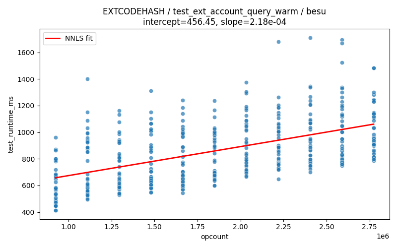

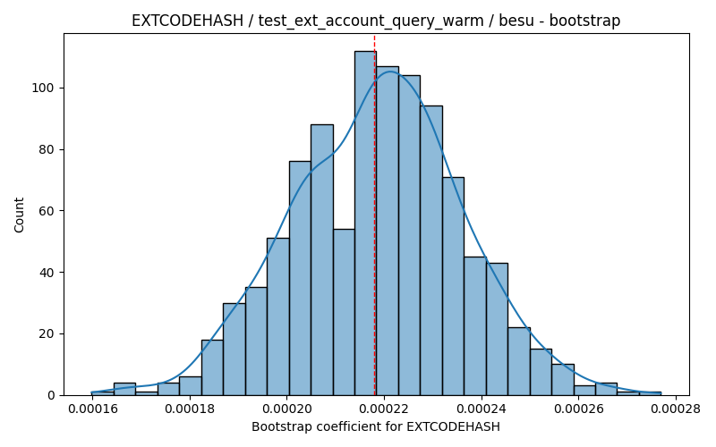

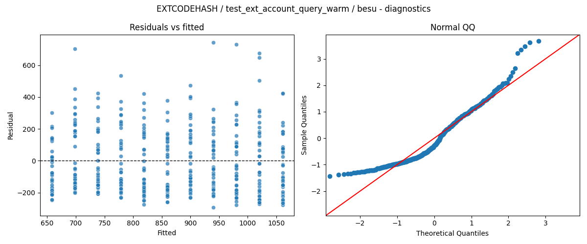

</details>

<details><summary>erigon — NNLS regression summary</summary>

```
==============================================================================
                           NNLS Regression Results                            
==============================================================================
Dep. Variable:          test_runtime_ms              R-squared:          0.924
Model:                  NNLS                    Adj. R-squared:          0.923
No. Observations:       165                               RMSE:          48.35
Df Residuals:           163                                MAE:          37.00
Df Model:               1      
==============================================================================
                      coef     std err     P-value      [0.025      0.975]
------------------------------------------------------------------------------
         const     36.9997     10.0486       0.001     17.0114     56.9577
       opcount      0.0003      0.0000       0.001      0.0003      0.0003
==============================================================================
Notes: Non-negative least squares with bootstrap inference (1000 iterations)
==============================================================================
```

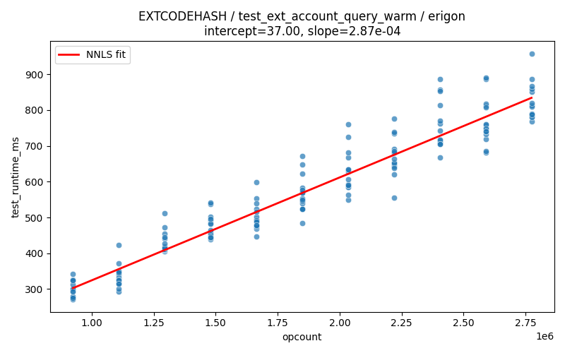

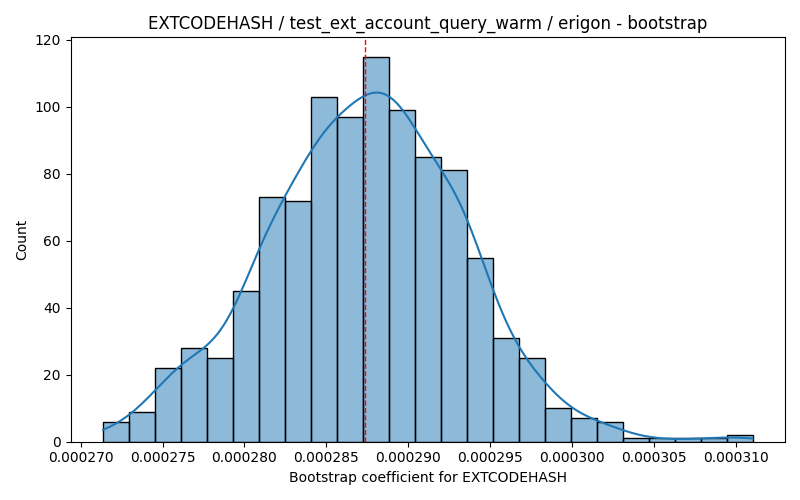

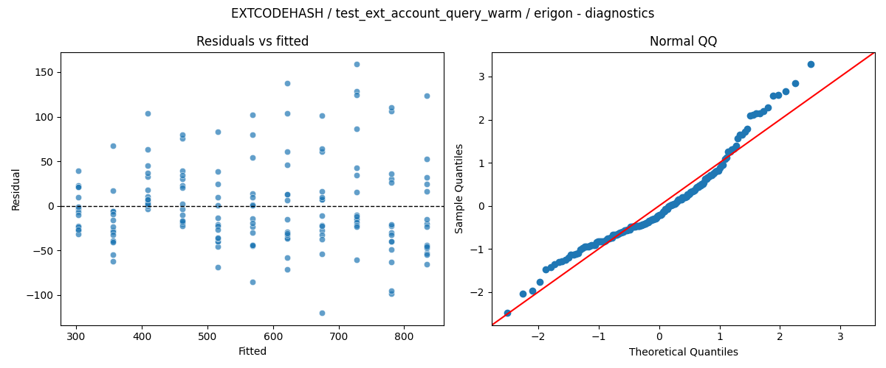

</details>

<details><summary>ethrex — NNLS regression summary</summary>

```
==============================================================================
                           NNLS Regression Results                            
==============================================================================
Dep. Variable:          test_runtime_ms              R-squared:          0.713
Model:                  NNLS                    Adj. R-squared:          0.712
No. Observations:       275                               RMSE:           5.63
Df Residuals:           273                                MAE:           4.09
Df Model:               1      
==============================================================================
                      coef     std err     P-value      [0.025      0.975]
------------------------------------------------------------------------------
         const      8.1973      1.0440       0.001      6.0702     10.3114
       opcount      0.0000      0.0000       0.001      0.0000      0.0000
==============================================================================
Notes: Non-negative least squares with bootstrap inference (1000 iterations)
==============================================================================
```

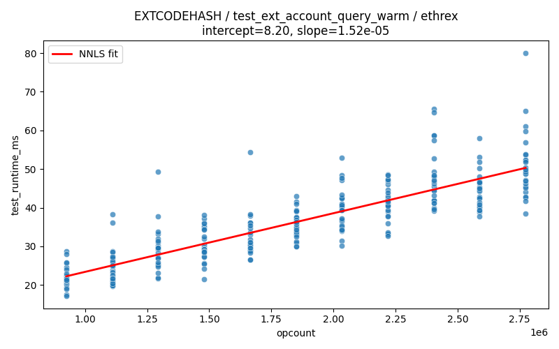

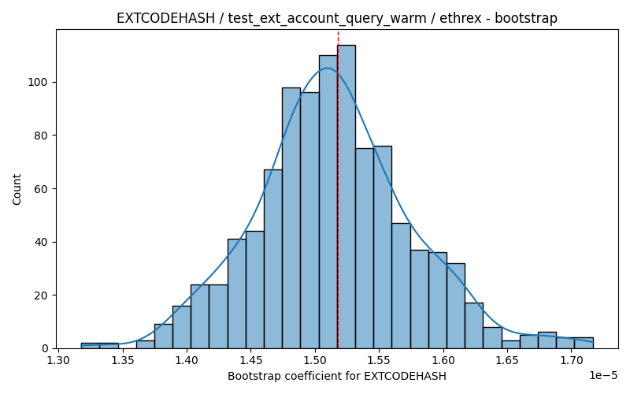

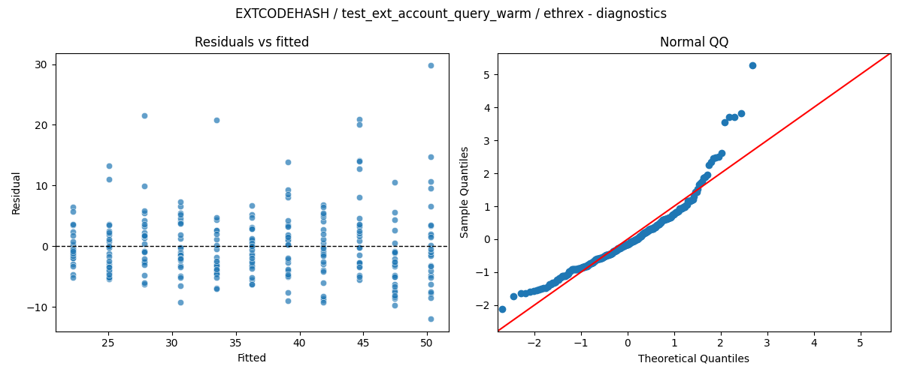

</details>

<details><summary>geth — NNLS regression summary</summary>

```
==============================================================================
                           NNLS Regression Results                            
==============================================================================
Dep. Variable:          test_runtime_ms              R-squared:          0.836
Model:                  NNLS                    Adj. R-squared:          0.835
No. Observations:       242                               RMSE:          10.01
Df Residuals:           240                                MAE:           7.42
Df Model:               1      
==============================================================================
                      coef     std err     P-value      [0.025      0.975]
------------------------------------------------------------------------------
         const     21.7179      1.7110       0.001     18.4576     25.0475
       opcount      0.0000      0.0000       0.001      0.0000      0.0000
==============================================================================
Notes: Non-negative least squares with bootstrap inference (1000 iterations)
==============================================================================
```

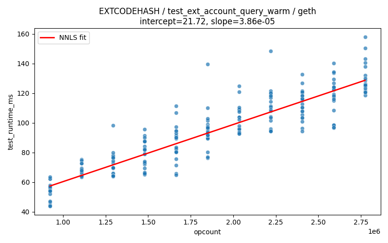

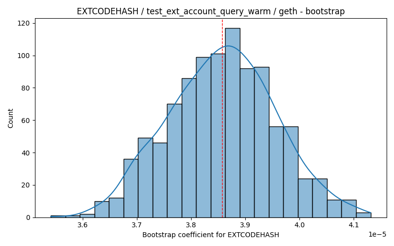

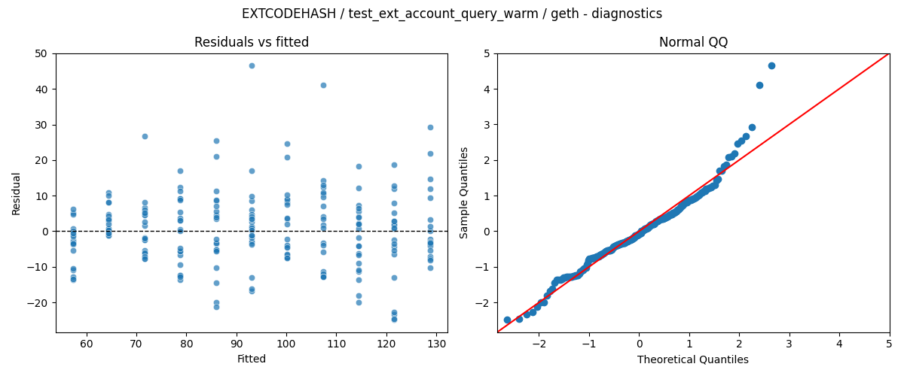

</details>

<details><summary>nethermind — NNLS regression summary</summary>

```
==============================================================================
                           NNLS Regression Results                            
==============================================================================
Dep. Variable:          test_runtime_ms              R-squared:          0.580
Model:                  NNLS                    Adj. R-squared:          0.578
No. Observations:       198                               RMSE:         119.81
Df Residuals:           196                                MAE:          95.73
Df Model:               1      
==============================================================================
                      coef     std err     P-value      [0.025      0.975]
------------------------------------------------------------------------------
         const    160.2341     24.9885       0.001    110.8039    207.7056
       opcount      0.0002      0.0000       0.001      0.0002      0.0003
==============================================================================
Notes: Non-negative least squares with bootstrap inference (1000 iterations)
==============================================================================
```

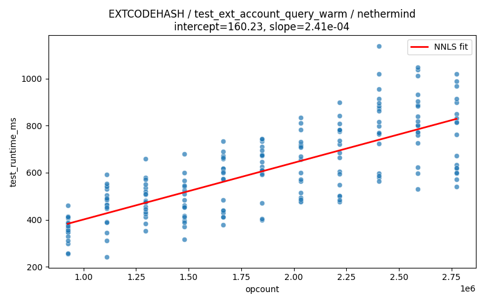

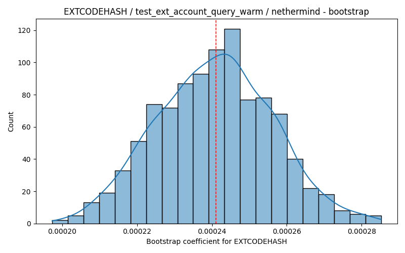

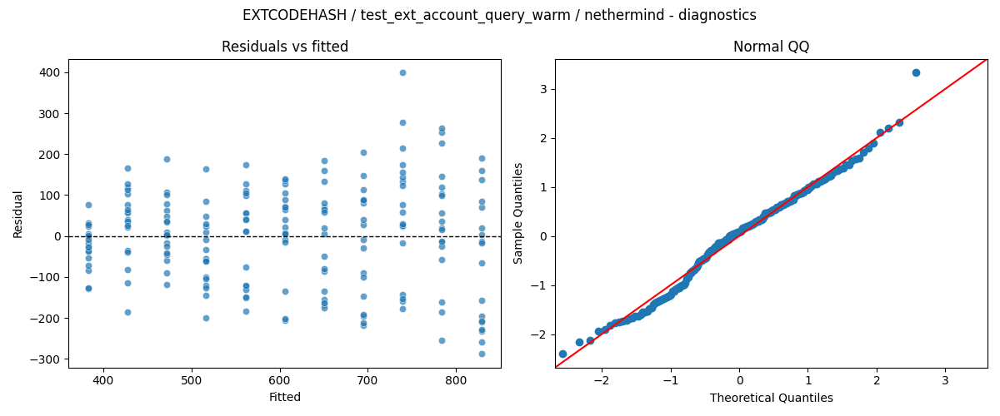

</details>

<details><summary>reth — NNLS regression summary</summary>

```
==============================================================================
                           NNLS Regression Results                            
==============================================================================
Dep. Variable:          test_runtime_ms              R-squared:          0.516
Model:                  NNLS                    Adj. R-squared:          0.514
No. Observations:       308                               RMSE:           7.89
Df Residuals:           306                                MAE:           5.01
Df Model:               1      
==============================================================================
                      coef     std err     P-value      [0.025      0.975]
------------------------------------------------------------------------------
         const      8.9686      1.3051       0.001      6.2930     11.3903
       opcount      0.0000      0.0000       0.001      0.0000      0.0000
==============================================================================
Notes: Non-negative least squares with bootstrap inference (1000 iterations)
==============================================================================
```

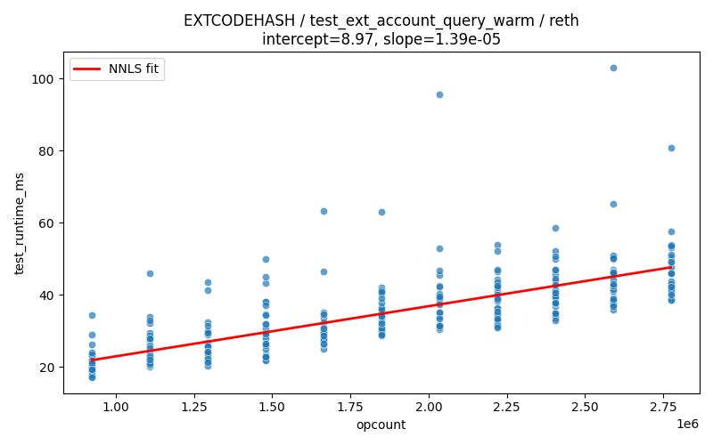

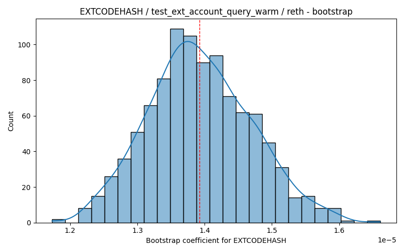

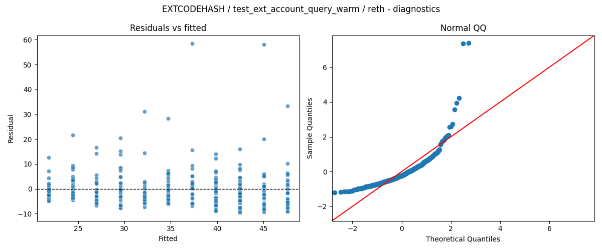

</details>

## EXTCODESIZE

### test_account_access — combo `EXTCODESIZE_AccountMode.NON_EXISTING_ACCOUNT` — `presets[cold_account_nocode_access]`

| client | nobs | R² | target_coef (ms) | p-value | 95% CI |
| --- | --- | --- | --- | --- | --- |
| `besu` | 407 | 0.8861 | 0.01316 | 1.00e-03 | [0.01269, 0.01363] |
| `erigon` | 165 | 0.972 | 0.007783 | 1.00e-03 | [0.007586, 0.007965] |
| `ethrex` | 275 | 0.967 | 0.001919 | 1.00e-03 | [0.001881, 0.001957] |
| `geth` | 242 | 0.8636 | 0.02157 | 1.00e-03 | [0.02037, 0.02269] |
| `nethermind` | 198 | 0.7349 | 0.003989 | 1.00e-03 | [0.003657, 0.004377] |
| `reth` | 308 | 0.9042 | 0.0007317 | 1.00e-03 | [0.0007059, 0.000761] |

<details><summary>besu — NNLS regression summary</summary>

```
==============================================================================
                           NNLS Regression Results                            
==============================================================================
Dep. Variable:          test_runtime_ms              R-squared:          0.886
Model:                  NNLS                    Adj. R-squared:          0.886
No. Observations:       407                               RMSE:         112.81
Df Residuals:           405                                MAE:         102.25
Df Model:               1      
==============================================================================
                      coef     std err     P-value      [0.025      0.975]
------------------------------------------------------------------------------
         const    505.2095     18.4140       0.001    468.9856    541.6025
       opcount      0.0132      0.0002       0.001      0.0127      0.0136
==============================================================================
Notes: Non-negative least squares with bootstrap inference (1000 iterations)
==============================================================================
```

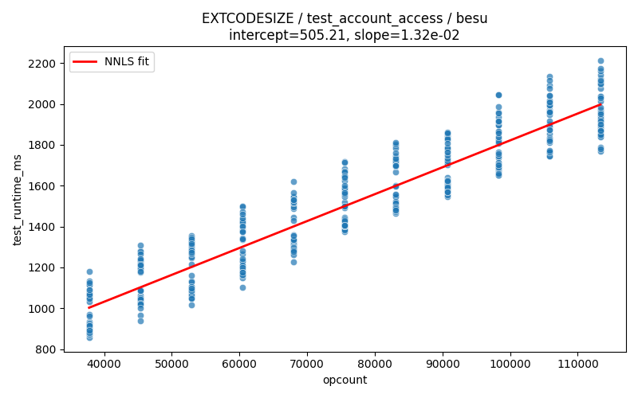

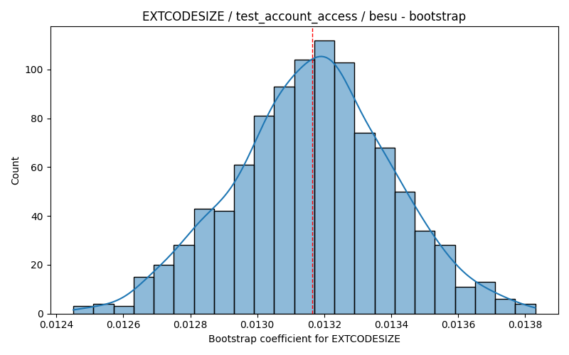

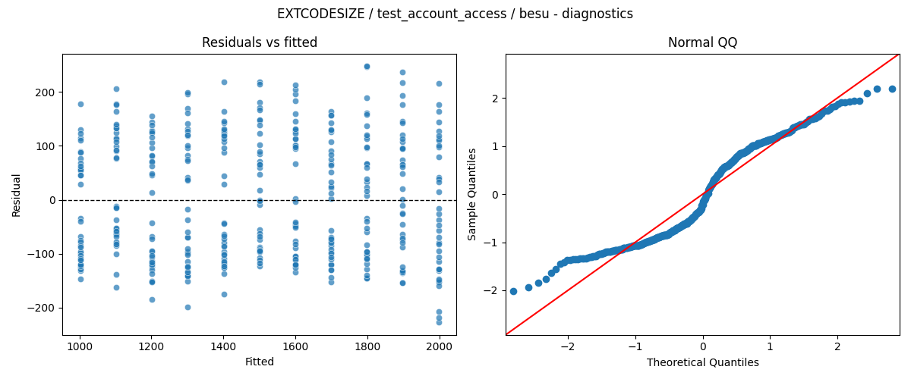

</details>

<details><summary>erigon — NNLS regression summary</summary>

```
==============================================================================
                           NNLS Regression Results                            
==============================================================================
Dep. Variable:          test_runtime_ms              R-squared:          0.972
Model:                  NNLS                    Adj. R-squared:          0.972
No. Observations:       165                               RMSE:          31.60
Df Residuals:           163                                MAE:          23.94
Df Model:               1      
==============================================================================
                      coef     std err     P-value      [0.025      0.975]
------------------------------------------------------------------------------
         const     11.5426      7.0874       0.069      0.0000     25.1774
       opcount      0.0078      0.0001       0.001      0.0076      0.0080
==============================================================================
Notes: Non-negative least squares with bootstrap inference (1000 iterations)
==============================================================================
```

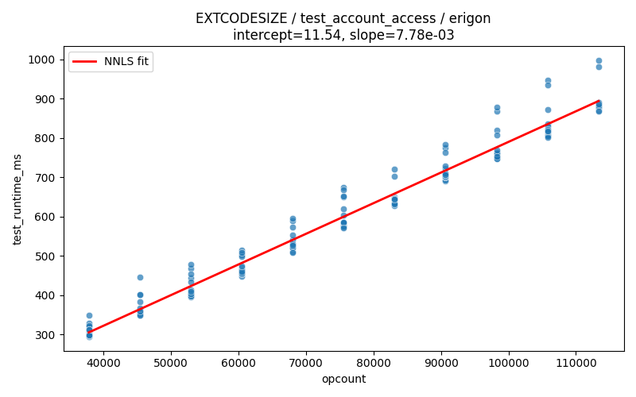

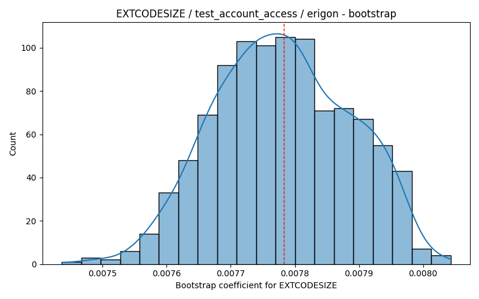

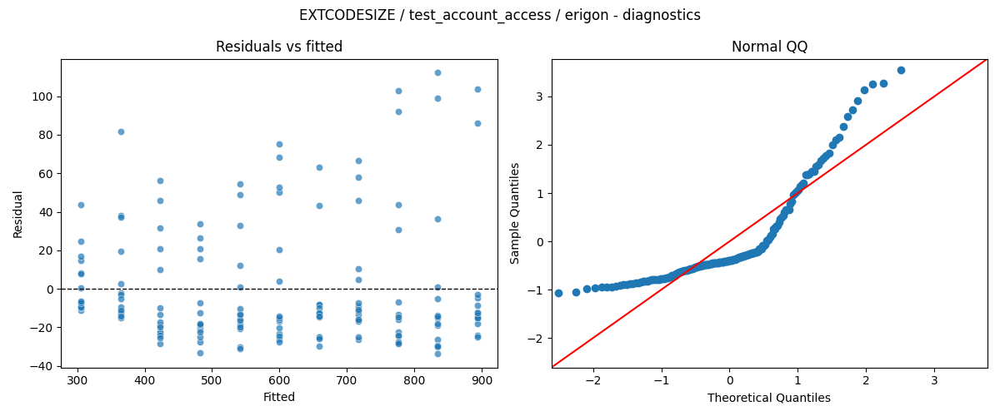

</details>

<details><summary>ethrex — NNLS regression summary</summary>

```
==============================================================================
                           NNLS Regression Results                            
==============================================================================
Dep. Variable:          test_runtime_ms              R-squared:          0.967
Model:                  NNLS                    Adj. R-squared:          0.967
No. Observations:       275                               RMSE:           8.48
Df Residuals:           273                                MAE:           6.72
Df Model:               1      
==============================================================================
                      coef     std err     P-value      [0.025      0.975]
------------------------------------------------------------------------------
         const     26.5177      1.5261       0.001     23.7053     29.3772
       opcount      0.0019      0.0000       0.001      0.0019      0.0020
==============================================================================
Notes: Non-negative least squares with bootstrap inference (1000 iterations)
==============================================================================
```

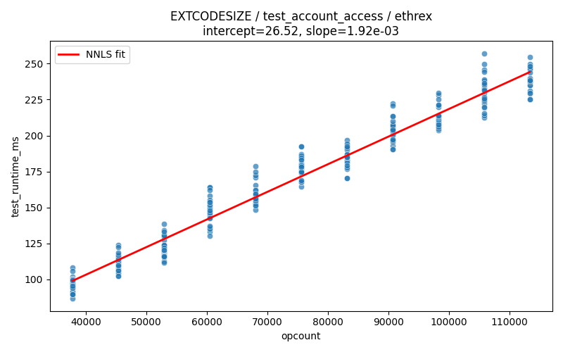

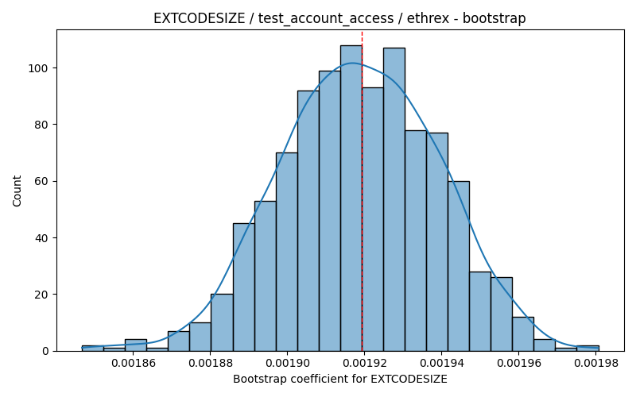

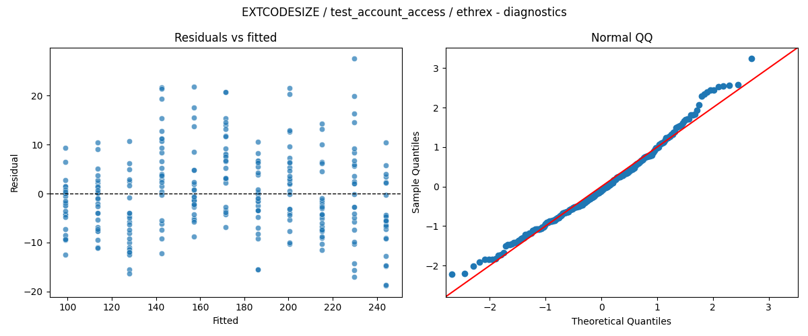

</details>

<details><summary>geth — NNLS regression summary</summary>

```
==============================================================================
                           NNLS Regression Results                            
==============================================================================
Dep. Variable:          test_runtime_ms              R-squared:          0.864
Model:                  NNLS                    Adj. R-squared:          0.863
No. Observations:       242                               RMSE:         204.87
Df Residuals:           240                                MAE:         173.50
Df Model:               1      
==============================================================================
                      coef     std err     P-value      [0.025      0.975]
------------------------------------------------------------------------------
         const    709.9441     51.1959       0.001    615.2722    810.6566
       opcount      0.0216      0.0006       0.001      0.0204      0.0227
==============================================================================
Notes: Non-negative least squares with bootstrap inference (1000 iterations)
==============================================================================
```


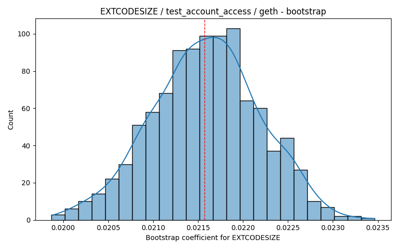

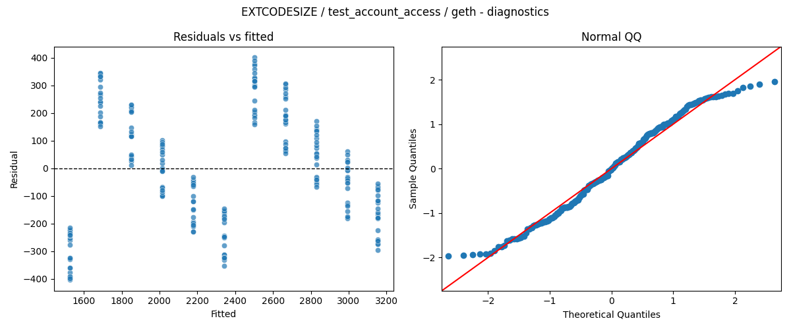

</details>

<details><summary>nethermind — NNLS regression summary</summary>

```
==============================================================================
                           NNLS Regression Results                            
==============================================================================
Dep. Variable:          test_runtime_ms              R-squared:          0.735
Model:                  NNLS                    Adj. R-squared:          0.733
No. Observations:       198                               RMSE:          57.27
Df Residuals:           196                                MAE:          37.43
Df Model:               1      
==============================================================================
                      coef     std err     P-value      [0.025      0.975]
------------------------------------------------------------------------------
         const     72.5315     11.7630       0.001     47.4688     92.9353
       opcount      0.0040      0.0002       0.001      0.0037      0.0044
==============================================================================
Notes: Non-negative least squares with bootstrap inference (1000 iterations)
==============================================================================
```

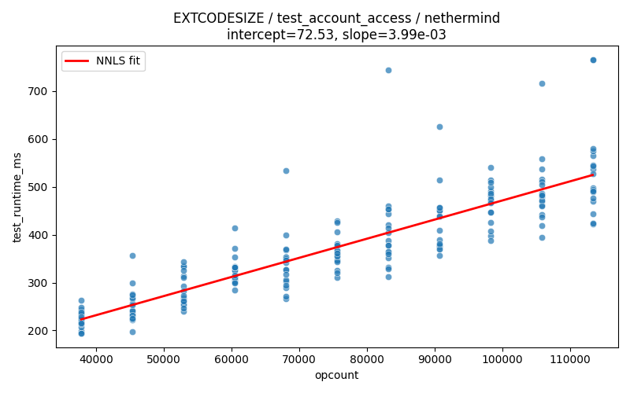

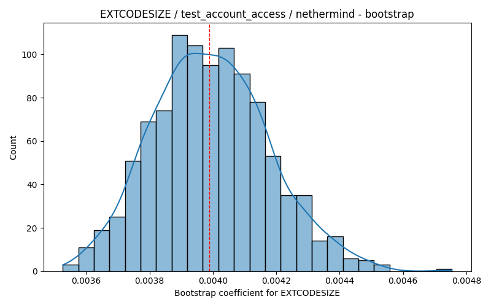

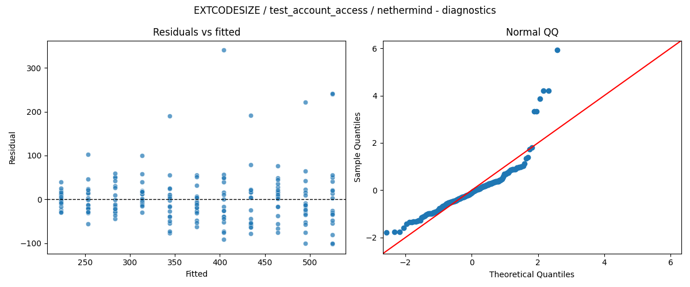

</details>

<details><summary>reth — NNLS regression summary</summary>

```
==============================================================================
                           NNLS Regression Results                            
==============================================================================
Dep. Variable:          test_runtime_ms              R-squared:          0.904
Model:                  NNLS                    Adj. R-squared:          0.904
No. Observations:       308                               RMSE:           5.69
Df Residuals:           306                                MAE:           4.57
Df Model:               1      
==============================================================================
                      coef     std err     P-value      [0.025      0.975]
------------------------------------------------------------------------------
         const     45.9741      1.0332       0.001     43.8949     47.9768
       opcount      0.0007      0.0000       0.001      0.0007      0.0008
==============================================================================
Notes: Non-negative least squares with bootstrap inference (1000 iterations)
==============================================================================
```

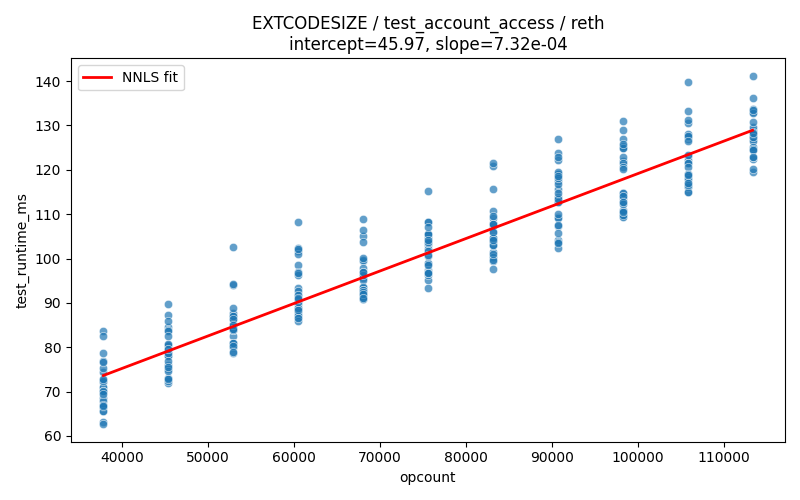

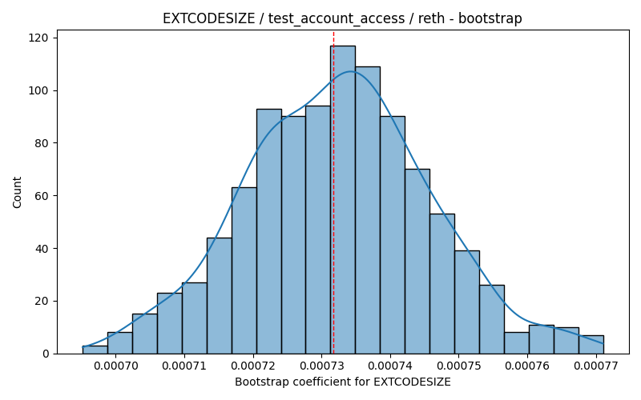

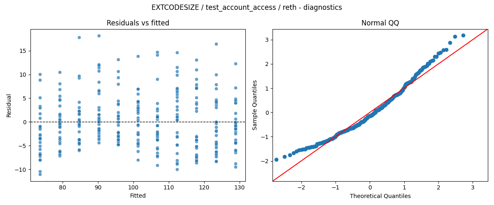

</details>

### test_account_access — combo `EXTCODESIZE_AccountMode.EXISTING_CONTRACT`

| client | nobs | R² | target_coef (ms) | p-value | 95% CI |
| --- | --- | --- | --- | --- | --- |
| `besu` | 407 | 0.8907 | 0.02526 | 1.00e-03 | [0.02452, 0.02603] |
| `erigon` | 165 | 0.8956 | 0.04874 | 1.00e-03 | [0.04633, 0.0509] |
| `ethrex` | 275 | 0.9926 | 0.007451 | 1.00e-03 | [0.007383, 0.007524] |
| `geth` | 242 | 0.8625 | 0.02316 | 1.00e-03 | [0.02186, 0.02447] |
| `nethermind` | 198 | 0.5873 | 0.0141 | 1.00e-03 | [0.01225, 0.01585] |
| `reth` | 308 | 0.974 | 0.003992 | 1.00e-03 | [0.003916, 0.00408] |

<details><summary>besu — NNLS regression summary</summary>

```
==============================================================================
                           NNLS Regression Results                            
==============================================================================
Dep. Variable:          test_runtime_ms              R-squared:          0.891
Model:                  NNLS                    Adj. R-squared:          0.890
No. Observations:       407                               RMSE:         184.09
Df Residuals:           405                                MAE:         155.36
Df Model:               1      
==============================================================================
                      coef     std err     P-value      [0.025      0.975]
------------------------------------------------------------------------------
         const    527.0442     25.0505       0.001    479.1042    579.3715
       opcount      0.0253      0.0004       0.001      0.0245      0.0260
==============================================================================
Notes: Non-negative least squares with bootstrap inference (1000 iterations)
==============================================================================
```

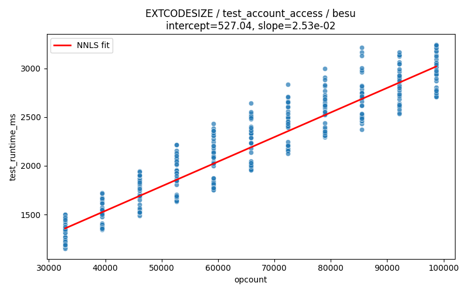

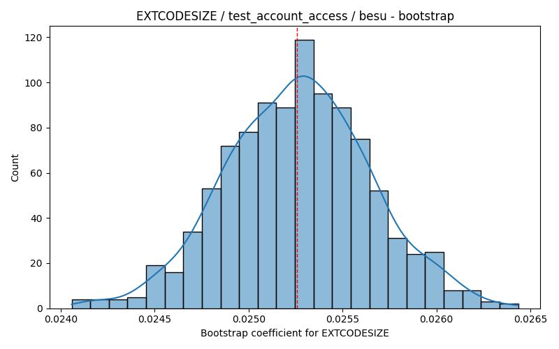

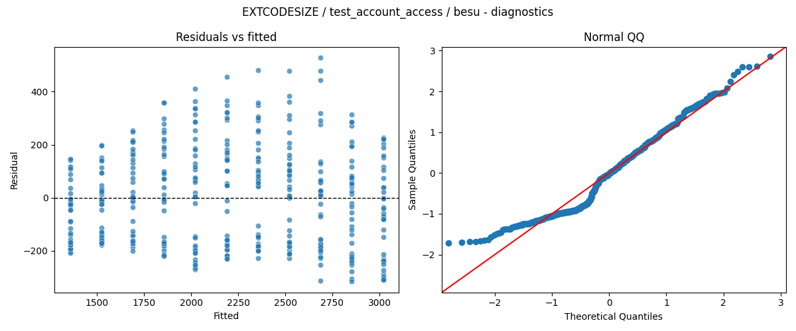

</details>

<details><summary>erigon — NNLS regression summary</summary>

```
==============================================================================
                           NNLS Regression Results                            
==============================================================================
Dep. Variable:          test_runtime_ms              R-squared:          0.896
Model:                  NNLS                    Adj. R-squared:          0.895
No. Observations:       165                               RMSE:         346.26
Df Residuals:           163                                MAE:         297.77
Df Model:               1      
==============================================================================
                      coef     std err     P-value      [0.025      0.975]
------------------------------------------------------------------------------
         const    843.3669     93.8758       0.001    672.4548   1022.1093
       opcount      0.0487      0.0012       0.001      0.0463      0.0509
==============================================================================
Notes: Non-negative least squares with bootstrap inference (1000 iterations)
==============================================================================
```

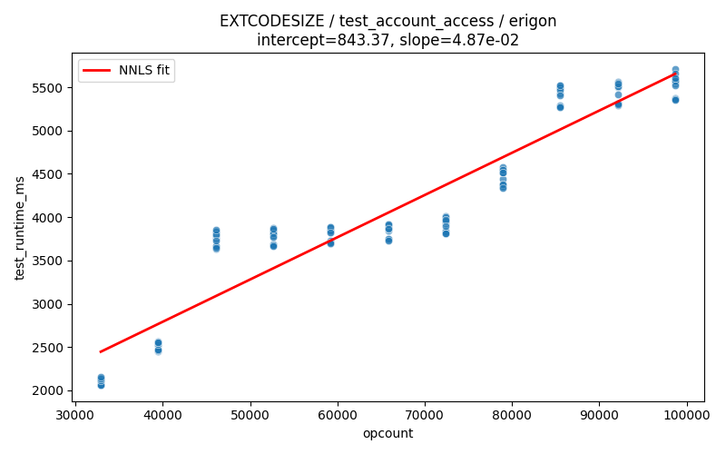

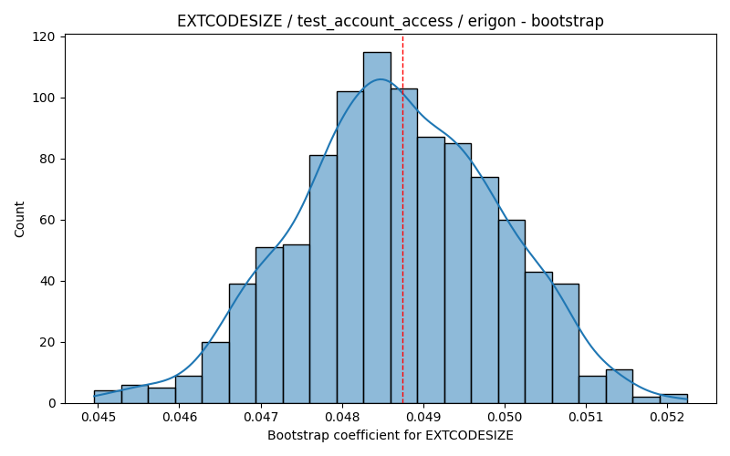

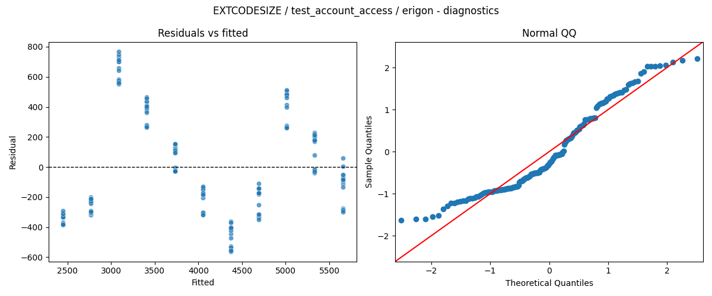

</details>

<details><summary>ethrex — NNLS regression summary</summary>

```
==============================================================================
                           NNLS Regression Results                            
==============================================================================
Dep. Variable:          test_runtime_ms              R-squared:          0.993
Model:                  NNLS                    Adj. R-squared:          0.993
No. Observations:       275                               RMSE:          13.39
Df Residuals:           273                                MAE:          10.28
Df Model:               1      
==============================================================================
                      coef     std err     P-value      [0.025      0.975]
------------------------------------------------------------------------------
         const     42.8269      2.3069       0.001     38.3522     47.2251
       opcount      0.0075      0.0000       0.001      0.0074      0.0075
==============================================================================
Notes: Non-negative least squares with bootstrap inference (1000 iterations)
==============================================================================
```

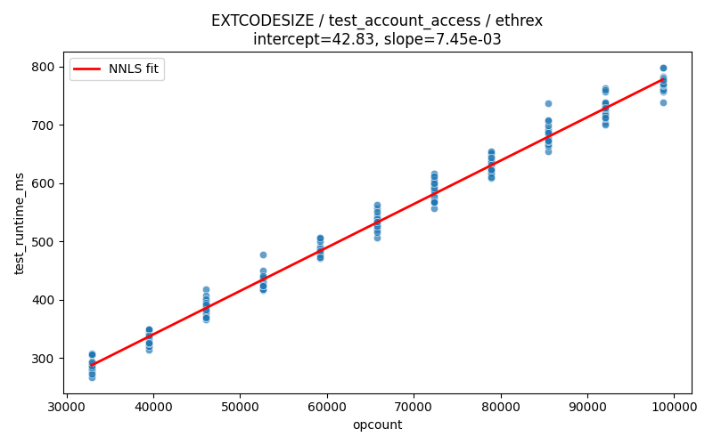

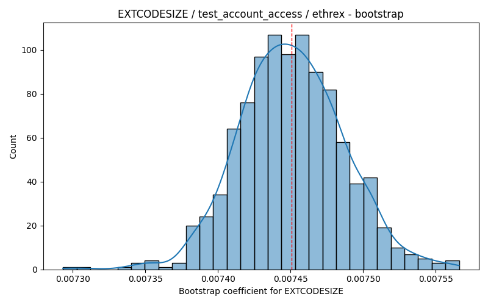

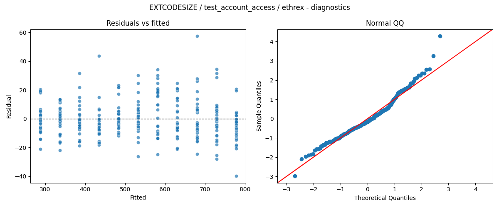

</details>

<details><summary>geth — NNLS regression summary</summary>

```
==============================================================================
                           NNLS Regression Results                            
==============================================================================
Dep. Variable:          test_runtime_ms              R-squared:          0.863
Model:                  NNLS                    Adj. R-squared:          0.862
No. Observations:       242                               RMSE:         192.33
Df Residuals:           240                                MAE:         161.81
Df Model:               1      
==============================================================================
                      coef     std err     P-value      [0.025      0.975]
------------------------------------------------------------------------------
         const    662.5904     49.0928       0.001    569.5292    760.1845
       opcount      0.0232      0.0007       0.001      0.0219      0.0245
==============================================================================
Notes: Non-negative least squares with bootstrap inference (1000 iterations)
==============================================================================
```

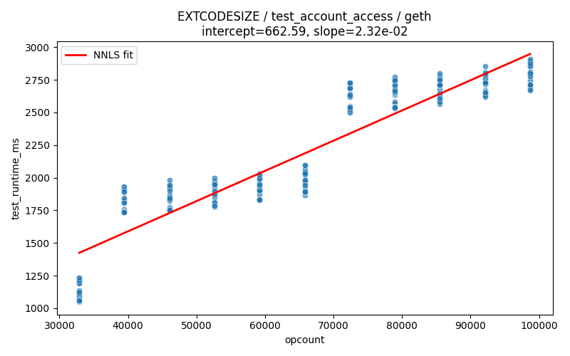

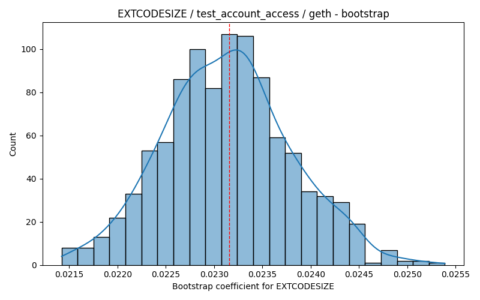

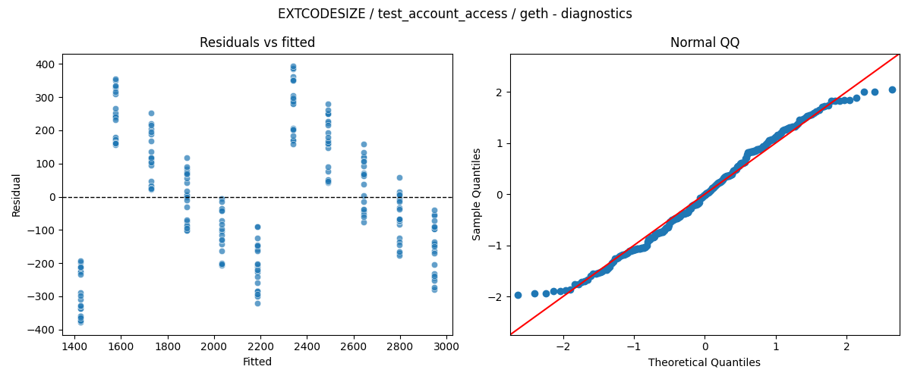

</details>

<details><summary>nethermind — NNLS regression summary</summary>

```
==============================================================================
                           NNLS Regression Results                            
==============================================================================
Dep. Variable:          test_runtime_ms              R-squared:          0.587
Model:                  NNLS                    Adj. R-squared:          0.585
No. Observations:       198                               RMSE:         245.96
Df Residuals:           196                                MAE:         177.82
Df Model:               1      
==============================================================================
                      coef     std err     P-value      [0.025      0.975]
------------------------------------------------------------------------------
         const    102.2518     51.2060       0.024      3.3808    206.9234
       opcount      0.0141      0.0009       0.001      0.0122      0.0159
==============================================================================
Notes: Non-negative least squares with bootstrap inference (1000 iterations)
==============================================================================
```

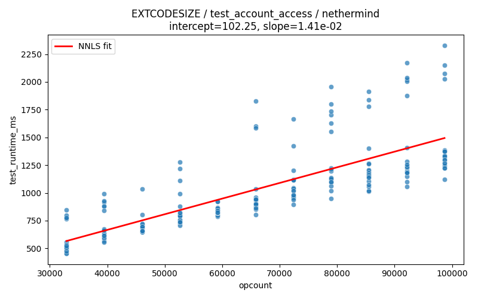

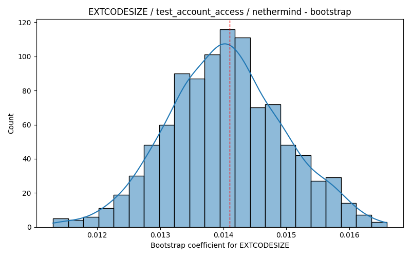

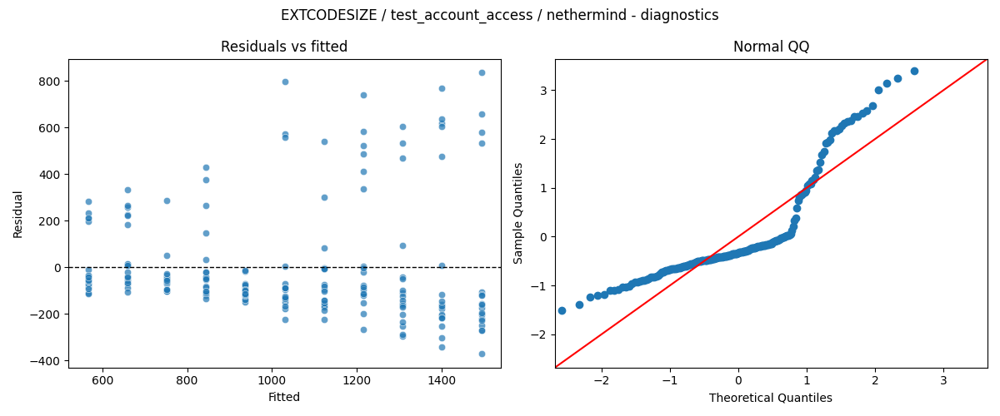

</details>

<details><summary>reth — NNLS regression summary</summary>

```
==============================================================================
                           NNLS Regression Results                            
==============================================================================
Dep. Variable:          test_runtime_ms              R-squared:          0.974
Model:                  NNLS                    Adj. R-squared:          0.974
No. Observations:       308                               RMSE:          13.58
Df Residuals:           306                                MAE:          10.45
Df Model:               1      
==============================================================================
                      coef     std err     P-value      [0.025      0.975]
------------------------------------------------------------------------------
         const     94.6024      2.4310       0.001     89.8278     99.3326
       opcount      0.0040      0.0000       0.001      0.0039      0.0041
==============================================================================
Notes: Non-negative least squares with bootstrap inference (1000 iterations)
==============================================================================
```

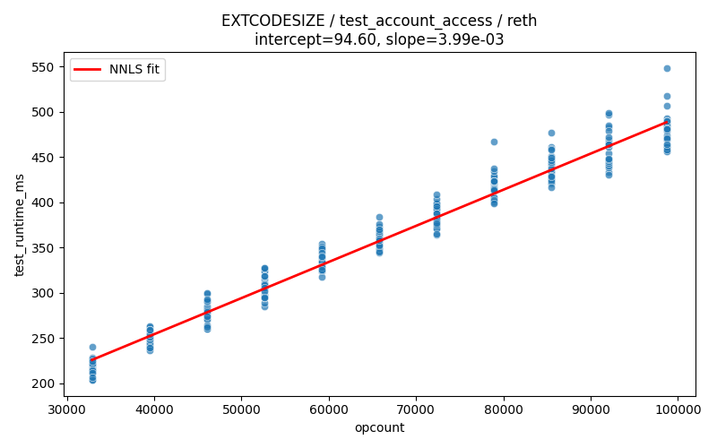

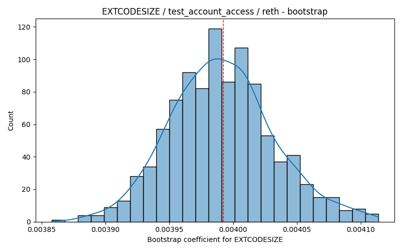

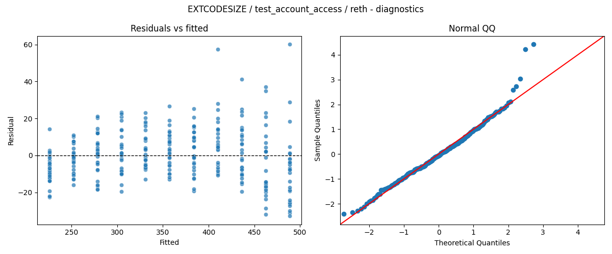

</details>

### test_account_access — combo `EXTCODESIZE_AccountMode.NON_EXISTING_ACCOUNT` — `presets[cold_account_code_access]`

| client | nobs | R² | target_coef (ms) | p-value | 95% CI |
| --- | --- | --- | --- | --- | --- |
| `besu` | 407 | 0.8861 | 0.01316 | 1.00e-03 | [0.01269, 0.01363] |
| `erigon` | 165 | 0.972 | 0.007783 | 1.00e-03 | [0.007586, 0.007965] |
| `ethrex` | 275 | 0.967 | 0.001919 | 1.00e-03 | [0.001881, 0.001957] |
| `geth` | 242 | 0.8636 | 0.02157 | 1.00e-03 | [0.02037, 0.02269] |
| `nethermind` | 198 | 0.7349 | 0.003989 | 1.00e-03 | [0.003657, 0.004377] |
| `reth` | 308 | 0.9042 | 0.0007317 | 1.00e-03 | [0.0007059, 0.000761] |

<details><summary>besu — NNLS regression summary</summary>

```
==============================================================================
                           NNLS Regression Results                            
==============================================================================
Dep. Variable:          test_runtime_ms              R-squared:          0.886
Model:                  NNLS                    Adj. R-squared:          0.886
No. Observations:       407                               RMSE:         112.81
Df Residuals:           405                                MAE:         102.25
Df Model:               1      
==============================================================================
                      coef     std err     P-value      [0.025      0.975]
------------------------------------------------------------------------------
         const    505.2095     18.4140       0.001    468.9856    541.6025
       opcount      0.0132      0.0002       0.001      0.0127      0.0136
==============================================================================
Notes: Non-negative least squares with bootstrap inference (1000 iterations)
==============================================================================
```


</details>

<details><summary>erigon — NNLS regression summary</summary>

```
==============================================================================
                           NNLS Regression Results                            
==============================================================================
Dep. Variable:          test_runtime_ms              R-squared:          0.972
Model:                  NNLS                    Adj. R-squared:          0.972
No. Observations:       165                               RMSE:          31.60
Df Residuals:           163                                MAE:          23.94
Df Model:               1      
==============================================================================
                      coef     std err     P-value      [0.025      0.975]
------------------------------------------------------------------------------
         const     11.5426      7.0874       0.069      0.0000     25.1774
       opcount      0.0078      0.0001       0.001      0.0076      0.0080
==============================================================================
Notes: Non-negative least squares with bootstrap inference (1000 iterations)
==============================================================================
```


</details>

<details><summary>ethrex — NNLS regression summary</summary>

```
==============================================================================
                           NNLS Regression Results                            
==============================================================================
Dep. Variable:          test_runtime_ms              R-squared:          0.967
Model:                  NNLS                    Adj. R-squared:          0.967
No. Observations:       275                               RMSE:           8.48
Df Residuals:           273                                MAE:           6.72
Df Model:               1      
==============================================================================
                      coef     std err     P-value      [0.025      0.975]
------------------------------------------------------------------------------
         const     26.5177      1.5261       0.001     23.7053     29.3772
       opcount      0.0019      0.0000       0.001      0.0019      0.0020
==============================================================================
Notes: Non-negative least squares with bootstrap inference (1000 iterations)
==============================================================================
```


</details>

<details><summary>geth — NNLS regression summary</summary>

```
==============================================================================
                           NNLS Regression Results                            
==============================================================================
Dep. Variable:          test_runtime_ms              R-squared:          0.864
Model:                  NNLS                    Adj. R-squared:          0.863
No. Observations:       242                               RMSE:         204.87
Df Residuals:           240                                MAE:         173.50
Df Model:               1      
==============================================================================
                      coef     std err     P-value      [0.025      0.975]
------------------------------------------------------------------------------
         const    709.9441     51.1959       0.001    615.2722    810.6566
       opcount      0.0216      0.0006       0.001      0.0204      0.0227
==============================================================================
Notes: Non-negative least squares with bootstrap inference (1000 iterations)
==============================================================================
```


</details>

<details><summary>nethermind — NNLS regression summary</summary>

```
==============================================================================
                           NNLS Regression Results                            
==============================================================================
Dep. Variable:          test_runtime_ms              R-squared:          0.735
Model:                  NNLS                    Adj. R-squared:          0.733
No. Observations:       198                               RMSE:          57.27
Df Residuals:           196                                MAE:          37.43
Df Model:               1      
==============================================================================
                      coef     std err     P-value      [0.025      0.975]
------------------------------------------------------------------------------
         const     72.5315     11.7630       0.001     47.4688     92.9353
       opcount      0.0040      0.0002       0.001      0.0037      0.0044
==============================================================================
Notes: Non-negative least squares with bootstrap inference (1000 iterations)
==============================================================================
```


</details>

<details><summary>reth — NNLS regression summary</summary>

```
==============================================================================
                           NNLS Regression Results                            
==============================================================================
Dep. Variable:          test_runtime_ms              R-squared:          0.904
Model:                  NNLS                    Adj. R-squared:          0.904
No. Observations:       308                               RMSE:           5.69
Df Residuals:           306                                MAE:           4.57
Df Model:               1      
==============================================================================
                      coef     std err     P-value      [0.025      0.975]
------------------------------------------------------------------------------
         const     45.9741      1.0332       0.001     43.8949     47.9768
       opcount      0.0007      0.0000       0.001      0.0007      0.0008
==============================================================================
Notes: Non-negative least squares with bootstrap inference (1000 iterations)
==============================================================================
```


</details>

### test_ext_account_query_warm — combo `EXTCODESIZE`

| client | nobs | R² | target_coef (ms) | p-value | 95% CI |
| --- | --- | --- | --- | --- | --- |
| `besu` | 407 | 0.2685 | 0.0002132 | 1.00e-03 | [0.0001764, 0.0002481] |
| `erigon` | 165 | 0.8539 | 4.487e-05 | 1.00e-03 | [4.164e-05, 4.851e-05] |
| `ethrex` | 275 | 0.776 | 1.639e-05 | 1.00e-03 | [1.543e-05, 1.744e-05] |
| `geth` | 242 | 0.7461 | 2.818e-05 | 1.00e-03 | [2.593e-05, 3.034e-05] |
| `nethermind` | 198 | 0.7351 | 0.0001623 | 1.00e-03 | [0.0001502, 0.0001758] |
| `reth` | 308 | 0.4547 | 9.918e-06 | 1.00e-03 | [8.568e-06, 1.118e-05] |

<details><summary>besu — NNLS regression summary</summary>

```
==============================================================================
                           NNLS Regression Results                            
==============================================================================
Dep. Variable:          test_runtime_ms              R-squared:          0.268
Model:                  NNLS                    Adj. R-squared:          0.267
No. Observations:       407                               RMSE:         205.79
Df Residuals:           405                                MAE:         172.65
Df Model:               1      
==============================================================================
                      coef     std err     P-value      [0.025      0.975]
------------------------------------------------------------------------------
         const    459.1789     34.4916       0.001    393.0266    528.5346
       opcount      0.0002      0.0000       0.001      0.0002      0.0002
==============================================================================
Notes: Non-negative least squares with bootstrap inference (1000 iterations)
==============================================================================
```

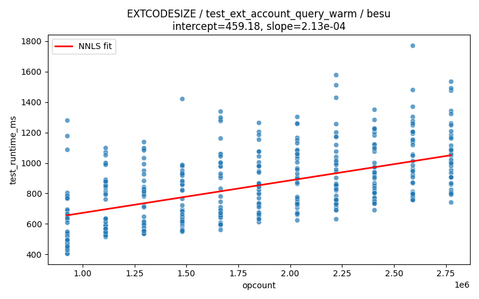

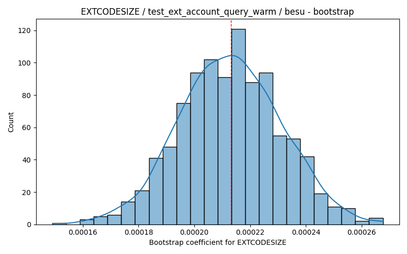

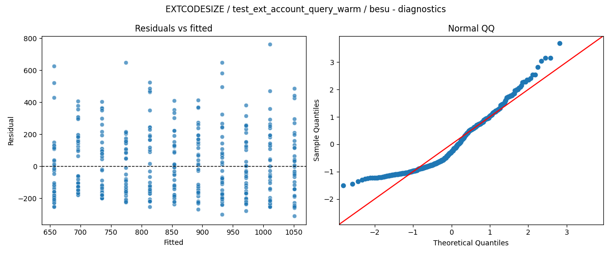

</details>

<details><summary>erigon — NNLS regression summary</summary>

```
==============================================================================
                           NNLS Regression Results                            
==============================================================================
Dep. Variable:          test_runtime_ms              R-squared:          0.854
Model:                  NNLS                    Adj. R-squared:          0.853
No. Observations:       165                               RMSE:          10.85
Df Residuals:           163                                MAE:           7.56
Df Model:               1      
==============================================================================
                      coef     std err     P-value      [0.025      0.975]
------------------------------------------------------------------------------
         const     22.9603      2.7897       0.001     17.3710     28.0948
       opcount      0.0000      0.0000       0.001      0.0000      0.0000
==============================================================================
Notes: Non-negative least squares with bootstrap inference (1000 iterations)
==============================================================================
```

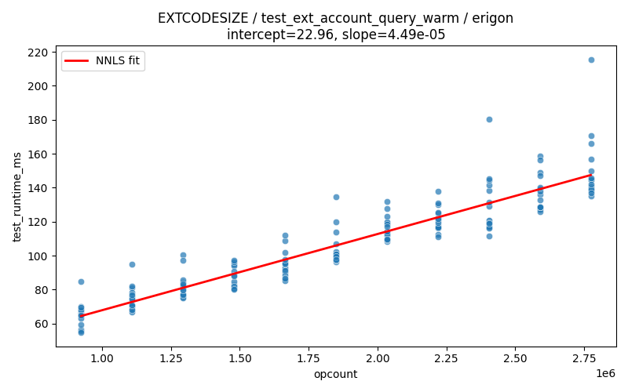

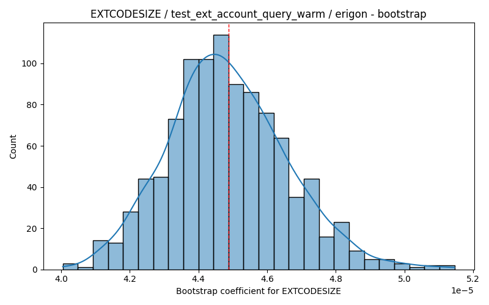

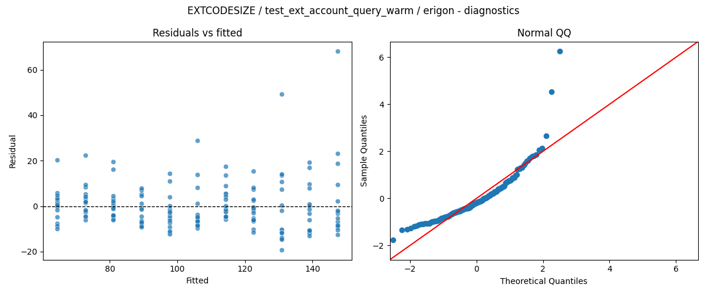

</details>

<details><summary>ethrex — NNLS regression summary</summary>

```
==============================================================================
                           NNLS Regression Results                            
==============================================================================
Dep. Variable:          test_runtime_ms              R-squared:          0.776
Model:                  NNLS                    Adj. R-squared:          0.775
No. Observations:       275                               RMSE:           5.15
Df Residuals:           273                                MAE:           3.99
Df Model:               1      
==============================================================================
                      coef     std err     P-value      [0.025      0.975]
------------------------------------------------------------------------------
         const      7.3746      0.8817       0.001      5.6170      9.0429
       opcount      0.0000      0.0000       0.001      0.0000      0.0000
==============================================================================
Notes: Non-negative least squares with bootstrap inference (1000 iterations)
==============================================================================
```

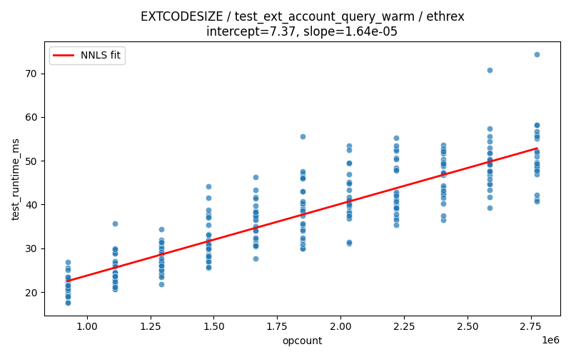

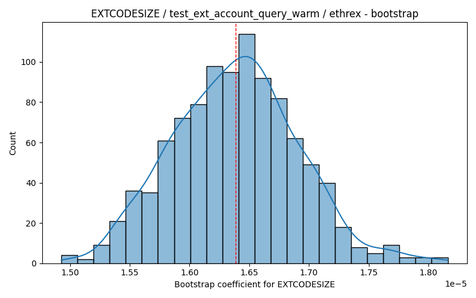

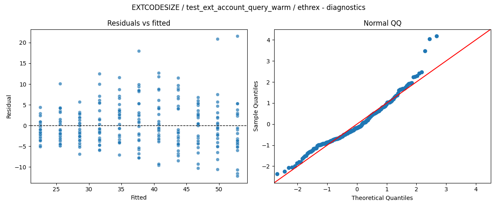

</details>

<details><summary>geth — NNLS regression summary</summary>

```
==============================================================================
                           NNLS Regression Results                            
==============================================================================
Dep. Variable:          test_runtime_ms              R-squared:          0.746
Model:                  NNLS                    Adj. R-squared:          0.745
No. Observations:       242                               RMSE:           9.61
Df Residuals:           240                                MAE:           7.16
Df Model:               1      
==============================================================================
                      coef     std err     P-value      [0.025      0.975]
------------------------------------------------------------------------------
         const     23.7785      2.0215       0.001     20.1220     28.1398
       opcount      0.0000      0.0000       0.001      0.0000      0.0000
==============================================================================
Notes: Non-negative least squares with bootstrap inference (1000 iterations)
==============================================================================
```

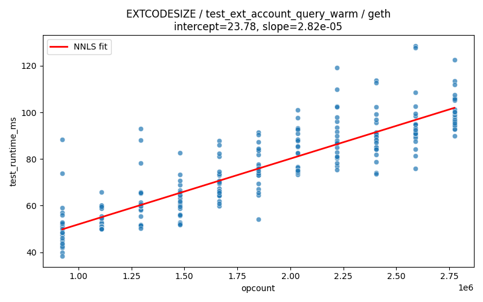

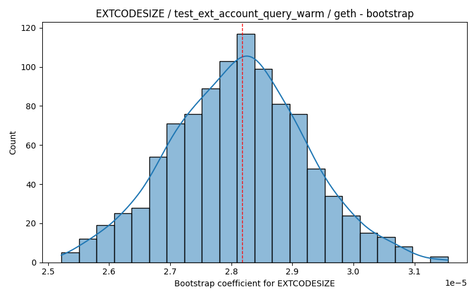

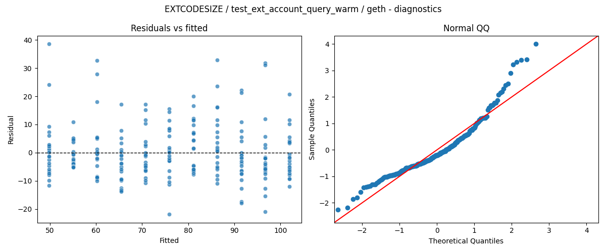

</details>

<details><summary>nethermind — NNLS regression summary</summary>

```
==============================================================================
                           NNLS Regression Results                            
==============================================================================
Dep. Variable:          test_runtime_ms              R-squared:          0.735
Model:                  NNLS                    Adj. R-squared:          0.734
No. Observations:       198                               RMSE:          56.97
Df Residuals:           196                                MAE:          43.07
Df Model:               1      
==============================================================================
                      coef     std err     P-value      [0.025      0.975]
------------------------------------------------------------------------------
         const    133.4584     11.2941       0.001    110.3322    153.6729
       opcount      0.0002      0.0000       0.001      0.0002      0.0002
==============================================================================
Notes: Non-negative least squares with bootstrap inference (1000 iterations)
==============================================================================
```

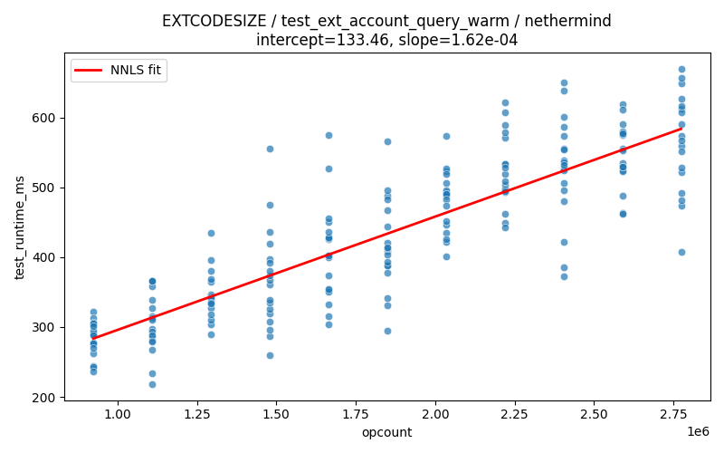

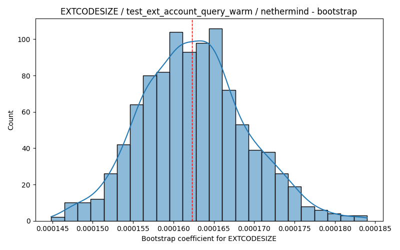

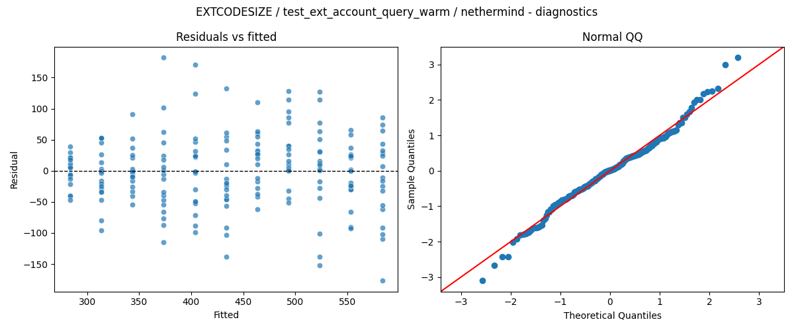

</details>

<details><summary>reth — NNLS regression summary</summary>

```
==============================================================================
                           NNLS Regression Results                            
==============================================================================
Dep. Variable:          test_runtime_ms              R-squared:          0.455
Model:                  NNLS                    Adj. R-squared:          0.453
No. Observations:       308                               RMSE:           6.35
Df Residuals:           306                                MAE:           4.01
Df Model:               1      
==============================================================================
                      coef     std err     P-value      [0.025      0.975]
------------------------------------------------------------------------------
         const      5.9734      1.1370       0.001      3.7955      8.2800
       opcount      0.0000      0.0000       0.001      0.0000      0.0000
==============================================================================
Notes: Non-negative least squares with bootstrap inference (1000 iterations)
==============================================================================
```

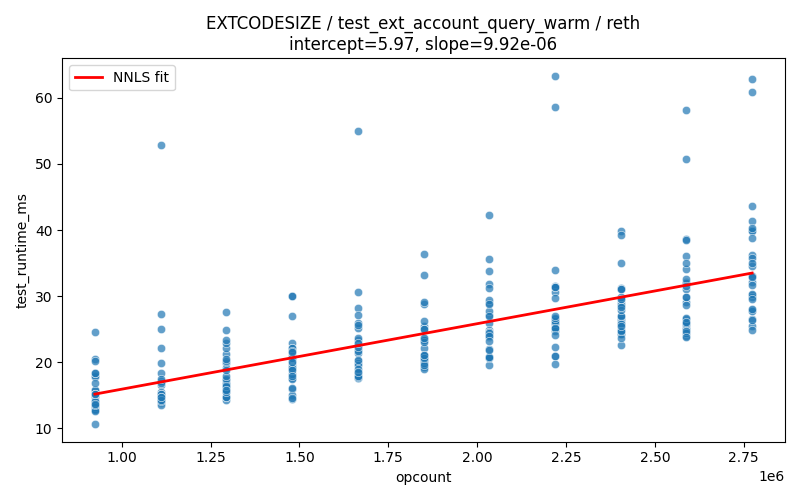

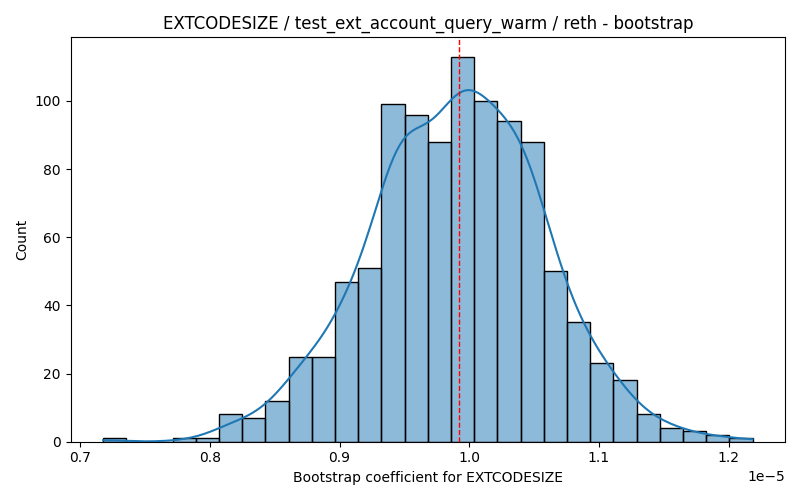

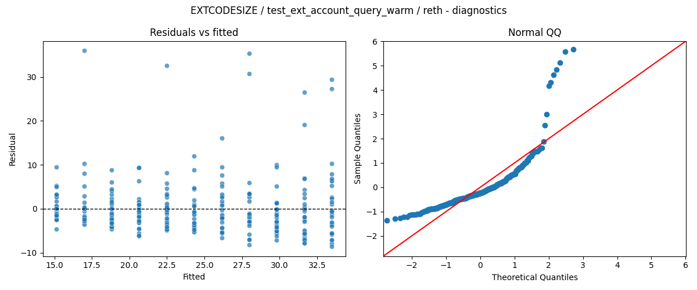

</details>

## STATICCALL

### test_account_access — combo `STATICCALL_AccountMode.EXISTING_EOA`

| client | nobs | R² | target_coef (ms) | p-value | 95% CI |
| --- | --- | --- | --- | --- | --- |
| `besu` | 407 | 0.8384 | 0.01545 | 1.00e-03 | [0.01478, 0.01616] |
| `erigon` | 165 | 0.9696 | 0.009322 | 1.00e-03 | [0.00907, 0.009598] |
| `ethrex` | 275 | 0.9947 | 0.006951 | 1.00e-03 | [0.006895, 0.007011] |
| `geth` | 242 | 0.9146 | 0.01105 | 1.00e-03 | [0.01057, 0.01153] |
| `nethermind` | 198 | 0.8295 | 0.004283 | 1.00e-03 | [0.004017, 0.004567] |
| `reth` | 308 | 0.9464 | 0.001074 | 1.00e-03 | [0.001043, 0.001105] |

<details><summary>besu — NNLS regression summary</summary>

```
==============================================================================
                           NNLS Regression Results                            
==============================================================================
Dep. Variable:          test_runtime_ms              R-squared:          0.838
Model:                  NNLS                    Adj. R-squared:          0.838
No. Observations:       407                               RMSE:         161.26
Df Residuals:           405                                MAE:         138.55
Df Model:               1      
==============================================================================
                      coef     std err     P-value      [0.025      0.975]
------------------------------------------------------------------------------
         const    605.6094     26.3790       0.001    553.1181    655.5938
       opcount      0.0155      0.0004       0.001      0.0148      0.0162
==============================================================================
Notes: Non-negative least squares with bootstrap inference (1000 iterations)
==============================================================================
```

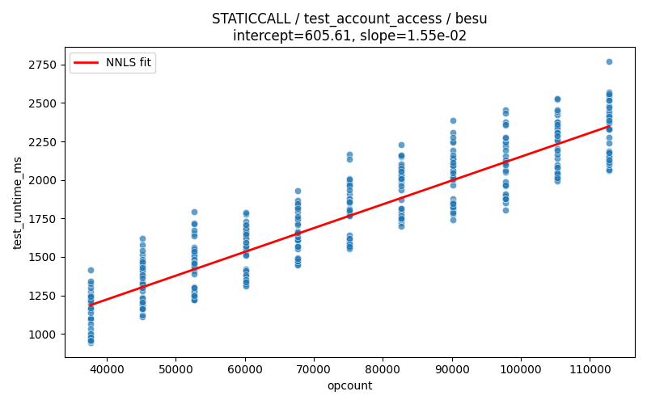

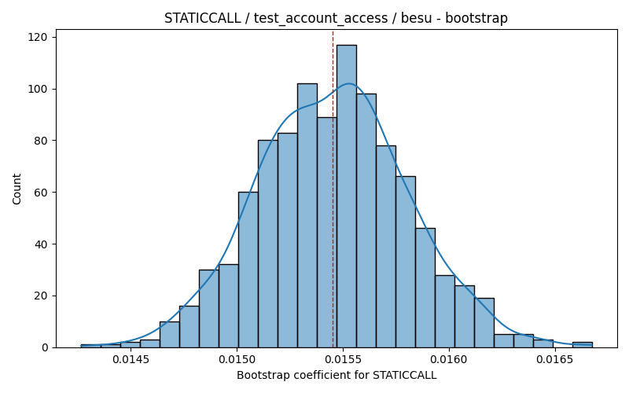

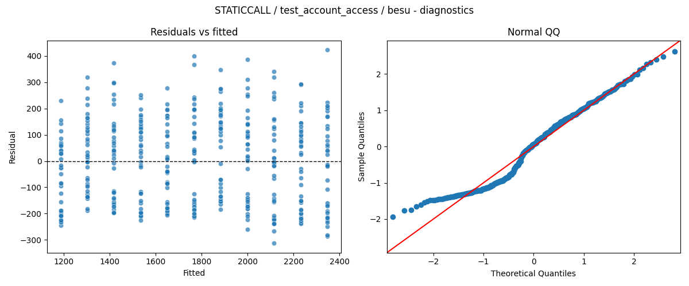

</details>

<details><summary>erigon — NNLS regression summary</summary>

```
==============================================================================
                           NNLS Regression Results                            
==============================================================================
Dep. Variable:          test_runtime_ms              R-squared:          0.970
Model:                  NNLS                    Adj. R-squared:          0.969
No. Observations:       165                               RMSE:          39.23
Df Residuals:           163                                MAE:          30.41
Df Model:               1      
==============================================================================
                      coef     std err     P-value      [0.025      0.975]
------------------------------------------------------------------------------
         const     25.0083      9.0203       0.002      6.2949     42.1864
       opcount      0.0093      0.0001       0.001      0.0091      0.0096
==============================================================================
Notes: Non-negative least squares with bootstrap inference (1000 iterations)
==============================================================================
```

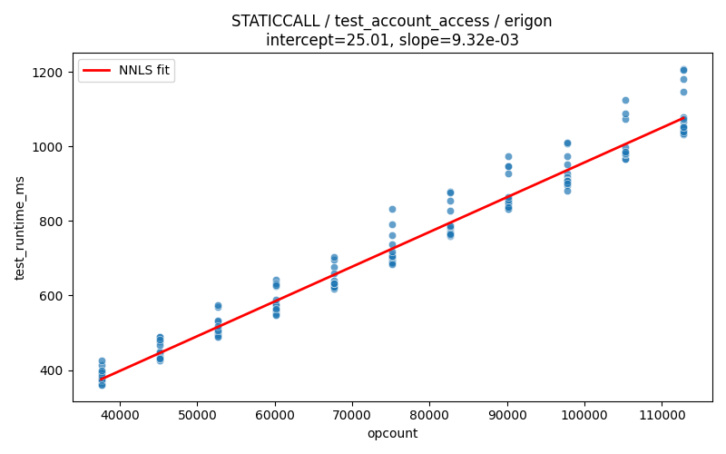

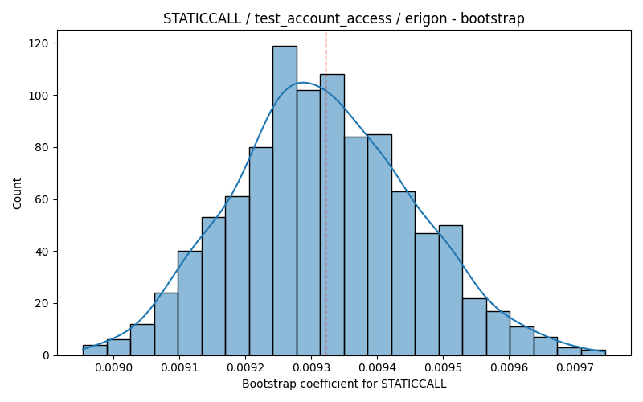

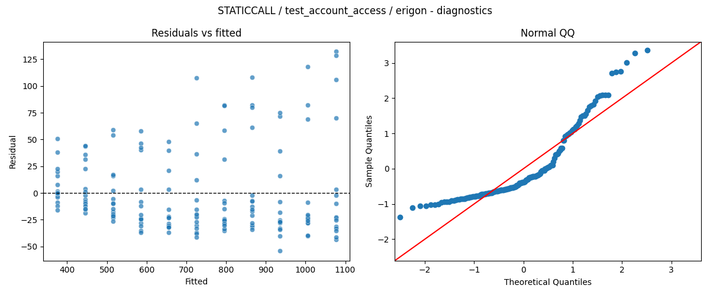

</details>

<details><summary>ethrex — NNLS regression summary</summary>

```
==============================================================================
                           NNLS Regression Results                            
==============================================================================
Dep. Variable:          test_runtime_ms              R-squared:          0.995
Model:                  NNLS                    Adj. R-squared:          0.995
No. Observations:       275                               RMSE:          12.03
Df Residuals:           273                                MAE:           9.64
Df Model:               1      
==============================================================================
                      coef     std err     P-value      [0.025      0.975]
------------------------------------------------------------------------------
         const     48.0845      2.1422       0.001     43.7322     52.3182
       opcount      0.0070      0.0000       0.001      0.0069      0.0070
==============================================================================
Notes: Non-negative least squares with bootstrap inference (1000 iterations)
==============================================================================
```

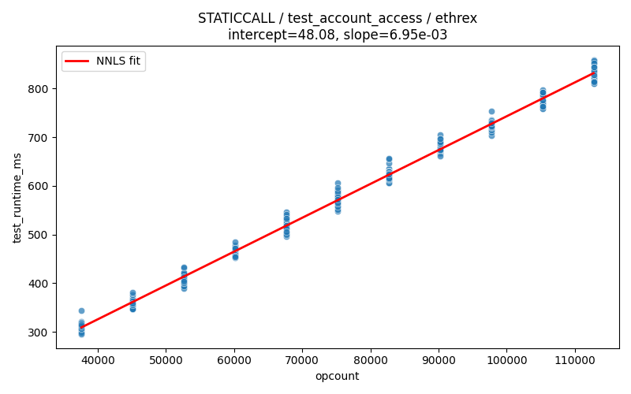

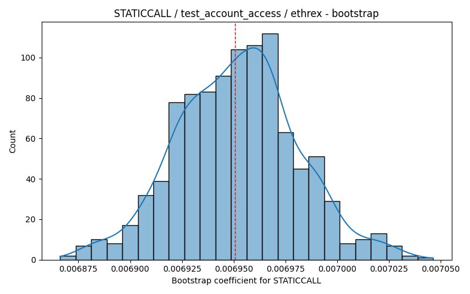

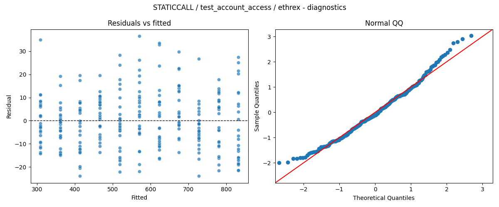

</details>

<details><summary>geth — NNLS regression summary</summary>

```
==============================================================================
                           NNLS Regression Results                            
==============================================================================
Dep. Variable:          test_runtime_ms              R-squared:          0.915
Model:                  NNLS                    Adj. R-squared:          0.914
No. Observations:       242                               RMSE:          80.28
Df Residuals:           240                                MAE:          66.66
Df Model:               1      
==============================================================================
                      coef     std err     P-value      [0.025      0.975]
------------------------------------------------------------------------------
         const    408.7440     20.9564       0.001    370.1896    449.6750
       opcount      0.0110      0.0002       0.001      0.0106      0.0115
==============================================================================
Notes: Non-negative least squares with bootstrap inference (1000 iterations)
==============================================================================
```

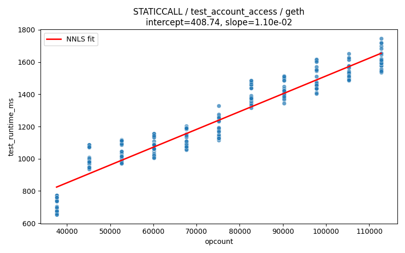

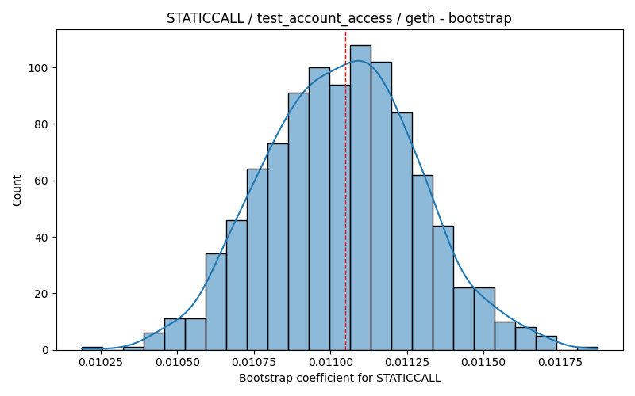

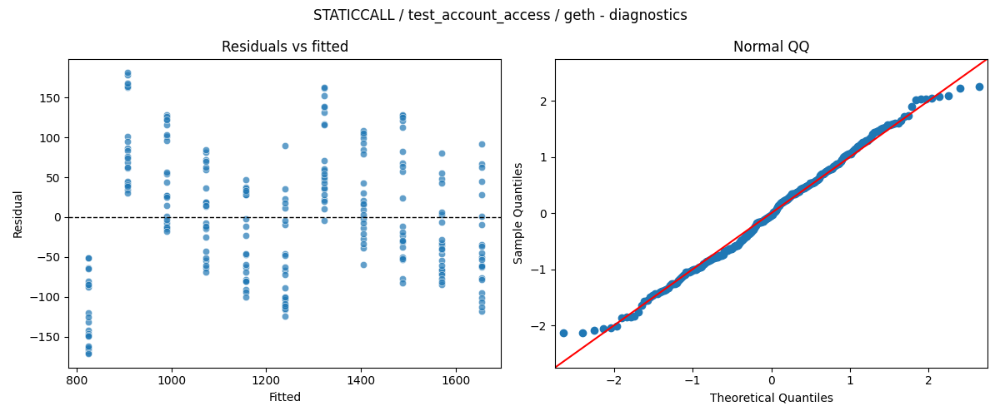

</details>

<details><summary>nethermind — NNLS regression summary</summary>

```
==============================================================================
                           NNLS Regression Results                            
==============================================================================
Dep. Variable:          test_runtime_ms              R-squared:          0.830
Model:                  NNLS                    Adj. R-squared:          0.829
No. Observations:       198                               RMSE:          46.16
Df Residuals:           196                                MAE:          36.05
Df Model:               1      
==============================================================================
                      coef     std err     P-value      [0.025      0.975]
------------------------------------------------------------------------------
         const    101.5895      9.5007       0.001     81.7048    119.7255
       opcount      0.0043      0.0001       0.001      0.0040      0.0046
==============================================================================
Notes: Non-negative least squares with bootstrap inference (1000 iterations)
==============================================================================
```

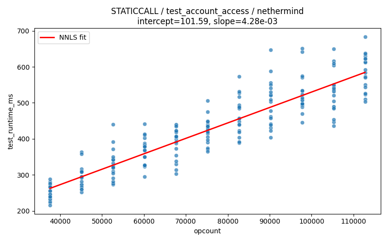

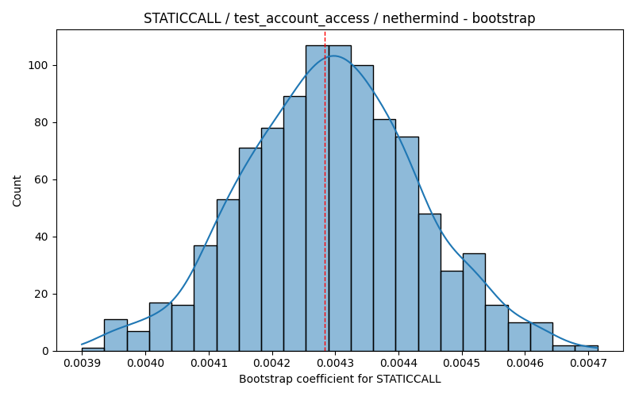

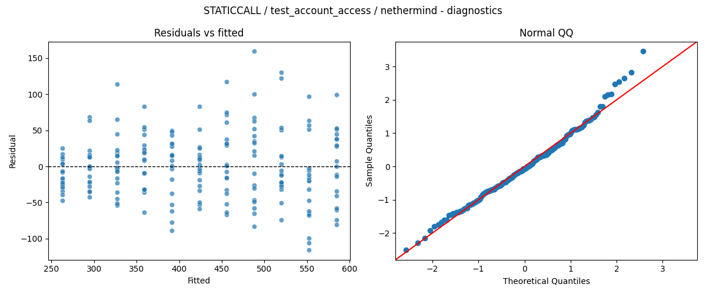

</details>

<details><summary>reth — NNLS regression summary</summary>

```
==============================================================================
                           NNLS Regression Results                            
==============================================================================
Dep. Variable:          test_runtime_ms              R-squared:          0.946
Model:                  NNLS                    Adj. R-squared:          0.946
No. Observations:       308                               RMSE:           6.08
Df Residuals:           306                                MAE:           4.71
Df Model:               1      
==============================================================================
                      coef     std err     P-value      [0.025      0.975]
------------------------------------------------------------------------------
         const     43.2840      1.1258       0.001     41.1461     45.5921
       opcount      0.0011      0.0000       0.001      0.0010      0.0011
==============================================================================
Notes: Non-negative least squares with bootstrap inference (1000 iterations)
==============================================================================
```

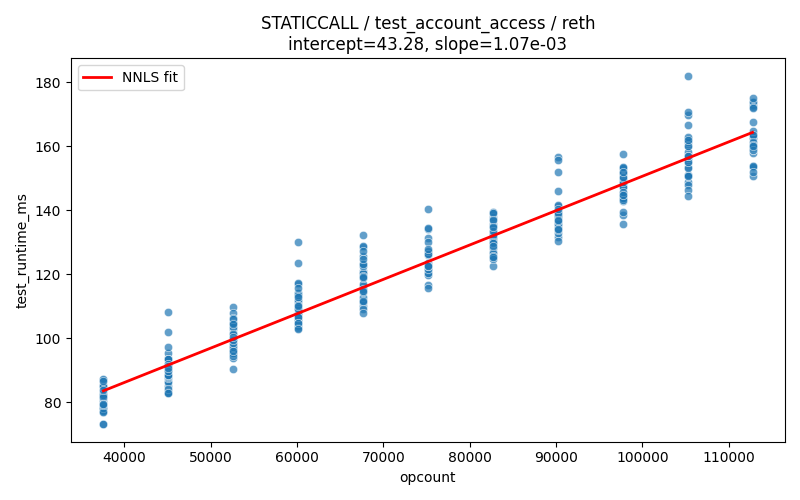

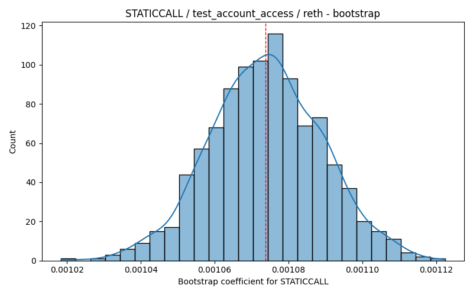

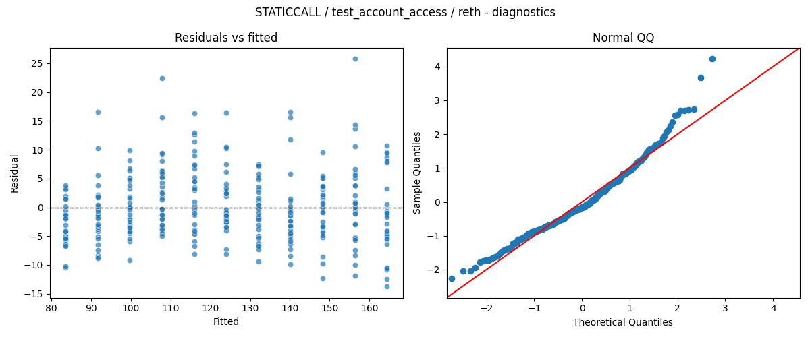

</details>

### test_account_access — combo `STATICCALL_AccountMode.NON_EXISTING_ACCOUNT` — `presets[cold_account_nocode_access]`

| client | nobs | R² | target_coef (ms) | p-value | 95% CI |
| --- | --- | --- | --- | --- | --- |
| `besu` | 407 | 0.8702 | 0.01629 | 1.00e-03 | [0.01573, 0.01689] |
| `erigon` | 165 | 0.9815 | 0.01079 | 1.00e-03 | [0.01064, 0.01087] |
| `ethrex` | 275 | 0.9716 | 0.001999 | 1.00e-03 | [0.001958, 0.002041] |
| `geth` | 242 | 0.8688 | 0.02267 | 1.00e-03 | [0.02153, 0.02379] |
| `nethermind` | 198 | 0.7802 | 0.00435 | 1.00e-03 | [0.004051, 0.004651] |
| `reth` | 308 | 0.9108 | 0.0007991 | 1.00e-03 | [0.0007705, 0.0008289] |

<details><summary>besu — NNLS regression summary</summary>

```
==============================================================================
                           NNLS Regression Results                            
==============================================================================
Dep. Variable:          test_runtime_ms              R-squared:          0.870
Model:                  NNLS                    Adj. R-squared:          0.870
No. Observations:       407                               RMSE:         149.53
Df Residuals:           405                                MAE:         134.29
Df Model:               1      
==============================================================================
                      coef     std err     P-value      [0.025      0.975]
------------------------------------------------------------------------------
         const    522.7044     22.5310       0.001    477.2752    566.1857
       opcount      0.0163      0.0003       0.001      0.0157      0.0169
==============================================================================
Notes: Non-negative least squares with bootstrap inference (1000 iterations)
==============================================================================
```

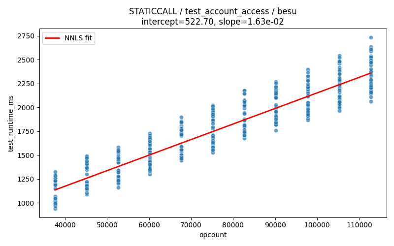

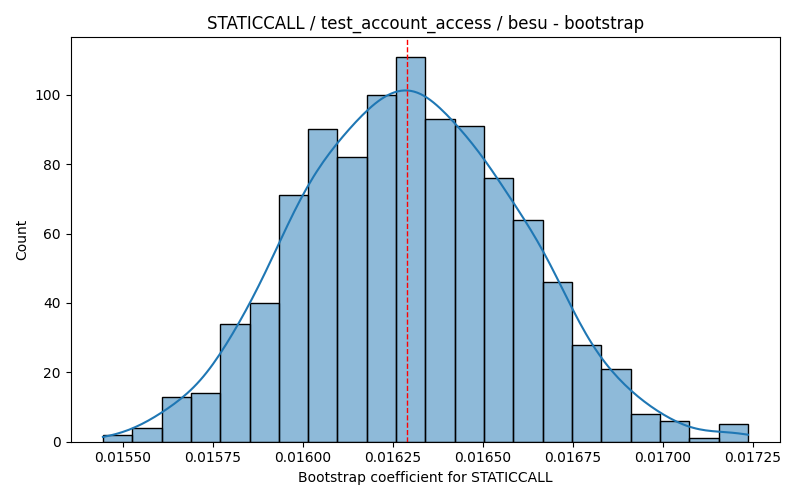

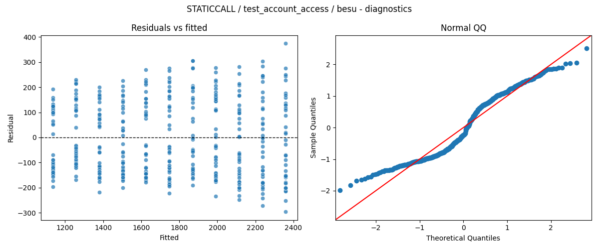

</details>

<details><summary>erigon — NNLS regression summary</summary>

```
==============================================================================
                           NNLS Regression Results                            
==============================================================================
Dep. Variable:          test_runtime_ms              R-squared:          0.981
Model:                  NNLS                    Adj. R-squared:          0.981
No. Observations:       165                               RMSE:          35.45
Df Residuals:           163                                MAE:          25.92
Df Model:               1      
==============================================================================
                      coef     std err     P-value      [0.025      0.975]
------------------------------------------------------------------------------
         const      0.0000      2.7149       1.000      0.0000      9.6801
       opcount      0.0108      0.0001       0.001      0.0106      0.0109
==============================================================================
Notes: Non-negative least squares with bootstrap inference (1000 iterations)
==============================================================================
```

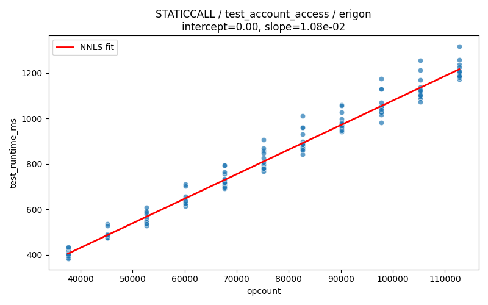

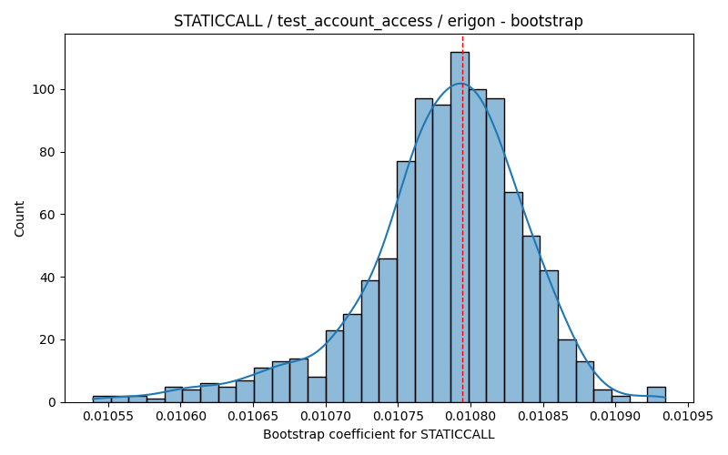

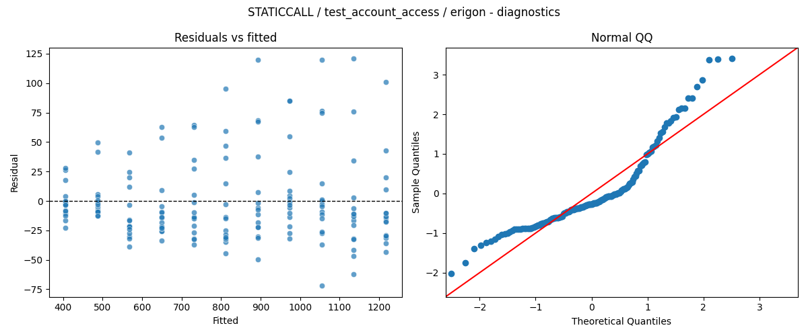

</details>

<details><summary>ethrex — NNLS regression summary</summary>

```
==============================================================================
                           NNLS Regression Results                            
==============================================================================
Dep. Variable:          test_runtime_ms              R-squared:          0.972
Model:                  NNLS                    Adj. R-squared:          0.972
No. Observations:       275                               RMSE:           8.12
Df Residuals:           273                                MAE:           6.39
Df Model:               1      
==============================================================================
                      coef     std err     P-value      [0.025      0.975]
------------------------------------------------------------------------------
         const     27.2171      1.5917       0.001     24.1450     30.3255
       opcount      0.0020      0.0000       0.001      0.0020      0.0020
==============================================================================
Notes: Non-negative least squares with bootstrap inference (1000 iterations)
==============================================================================
```

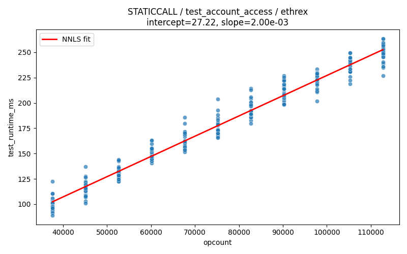

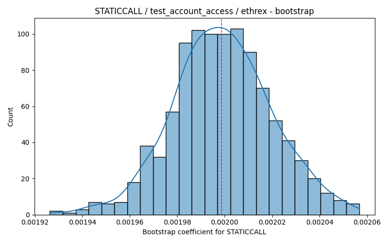

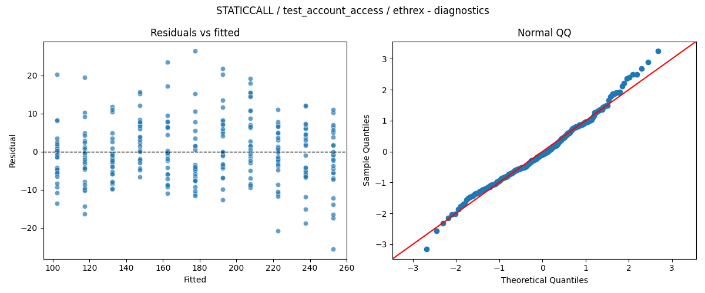

</details>

<details><summary>geth — NNLS regression summary</summary>

```
==============================================================================
                           NNLS Regression Results                            
==============================================================================
Dep. Variable:          test_runtime_ms              R-squared:          0.869
Model:                  NNLS                    Adj. R-squared:          0.868
No. Observations:       242                               RMSE:         209.41
Df Residuals:           240                                MAE:         178.14
Df Model:               1      
==============================================================================
                      coef     std err     P-value      [0.025      0.975]
------------------------------------------------------------------------------
         const    708.2150     49.6284       0.001    613.1038    809.0809
       opcount      0.0227      0.0006       0.001      0.0215      0.0238
==============================================================================
Notes: Non-negative least squares with bootstrap inference (1000 iterations)
==============================================================================
```


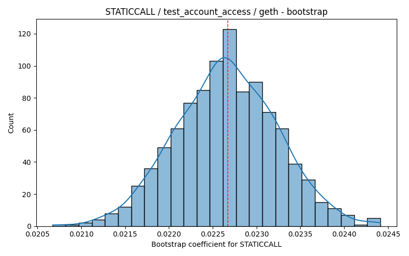

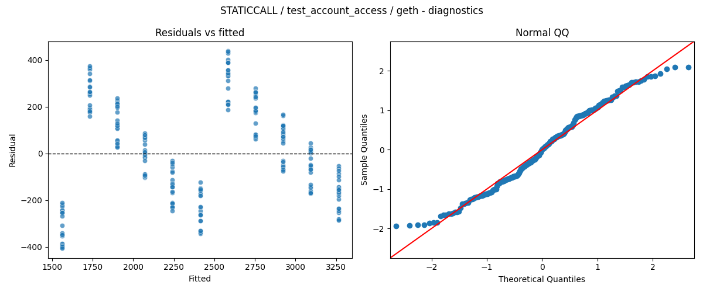

</details>

<details><summary>nethermind — NNLS regression summary</summary>

```
==============================================================================
                           NNLS Regression Results                            
==============================================================================
Dep. Variable:          test_runtime_ms              R-squared:          0.780
Model:                  NNLS                    Adj. R-squared:          0.779
No. Observations:       198                               RMSE:          54.88
Df Residuals:           196                                MAE:          37.44
Df Model:               1      
==============================================================================
                      coef     std err     P-value      [0.025      0.975]
------------------------------------------------------------------------------
         const     72.1584      9.9486       0.001     54.0183     92.1951
       opcount      0.0043      0.0002       0.001      0.0041      0.0047
==============================================================================
Notes: Non-negative least squares with bootstrap inference (1000 iterations)
==============================================================================
```

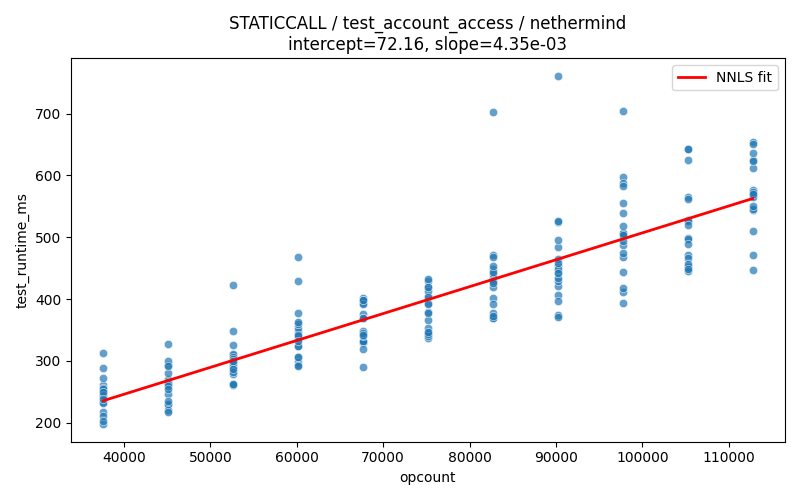

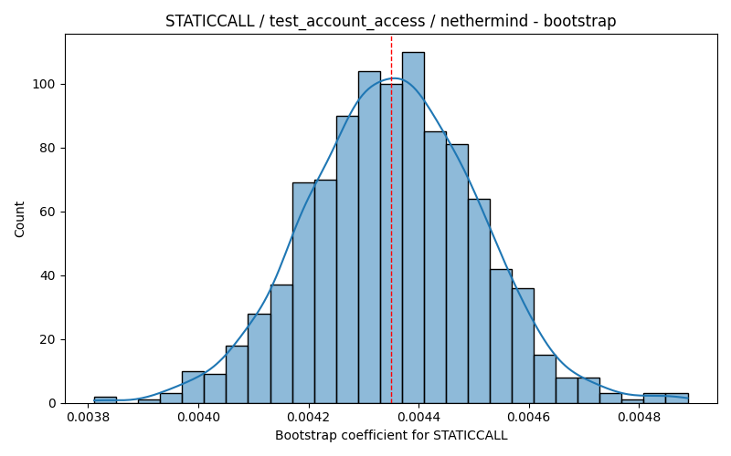

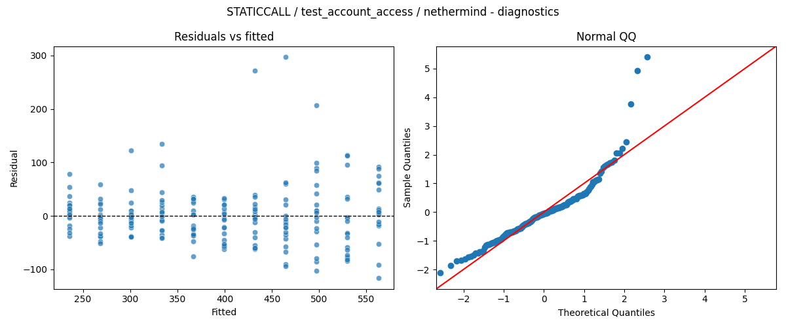

</details>

<details><summary>reth — NNLS regression summary</summary>

```
==============================================================================
                           NNLS Regression Results                            
==============================================================================
Dep. Variable:          test_runtime_ms              R-squared:          0.911
Model:                  NNLS                    Adj. R-squared:          0.911
No. Observations:       308                               RMSE:           5.94
Df Residuals:           306                                MAE:           4.53
Df Model:               1      
==============================================================================
                      coef     std err     P-value      [0.025      0.975]
------------------------------------------------------------------------------
         const     45.9975      1.0701       0.001     44.0020     48.1579
       opcount      0.0008      0.0000       0.001      0.0008      0.0008
==============================================================================
Notes: Non-negative least squares with bootstrap inference (1000 iterations)
==============================================================================
```

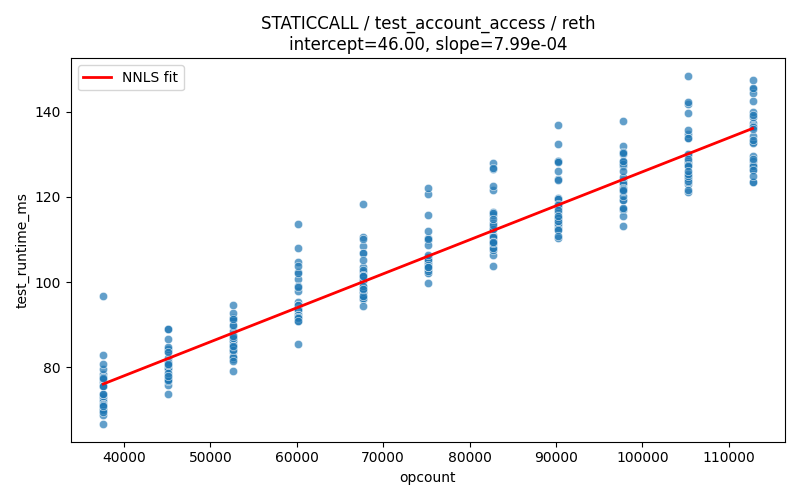

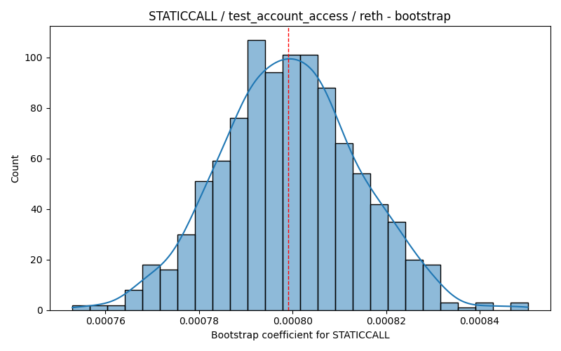

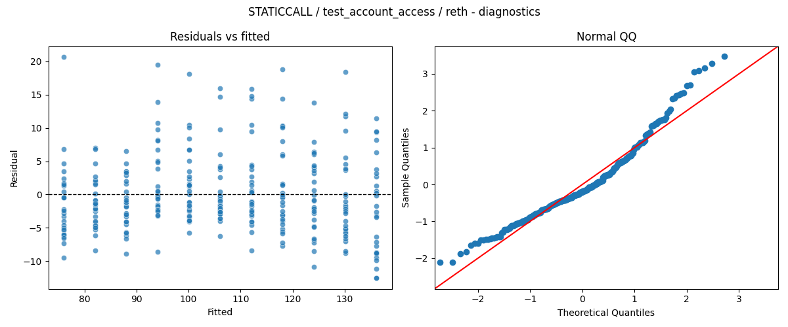

</details>

### test_account_access — combo `STATICCALL_AccountMode.EXISTING_CONTRACT`

| client | nobs | R² | target_coef (ms) | p-value | 95% CI |
| --- | --- | --- | --- | --- | --- |
| `besu` | 407 | 0.8888 | 0.02711 | 1.00e-03 | [0.02617, 0.02805] |
| `erigon` | 165 | 0.8949 | 0.04947 | 1.00e-03 | [0.04688, 0.05175] |
| `ethrex` | 275 | 0.994 | 0.007604 | 1.00e-03 | [0.007531, 0.007675] |
| `geth` | 242 | 0.8632 | 0.02338 | 1.00e-03 | [0.02216, 0.02469] |
| `nethermind` | 198 | 0.6279 | 0.0134 | 1.00e-03 | [0.01185, 0.01495] |
| `reth` | 308 | 0.9756 | 0.004042 | 1.00e-03 | [0.00397, 0.004123] |

<details><summary>besu — NNLS regression summary</summary>

```
==============================================================================
                           NNLS Regression Results                            
==============================================================================
Dep. Variable:          test_runtime_ms              R-squared:          0.889
Model:                  NNLS                    Adj. R-squared:          0.889
No. Observations:       407                               RMSE:         195.37
Df Residuals:           405                                MAE:         165.15
Df Model:               1      
==============================================================================
                      coef     std err     P-value      [0.025      0.975]
------------------------------------------------------------------------------
         const    595.4554     28.8594       0.001    539.9387    654.4796
       opcount      0.0271      0.0005       0.001      0.0262      0.0281
==============================================================================
Notes: Non-negative least squares with bootstrap inference (1000 iterations)
==============================================================================
```

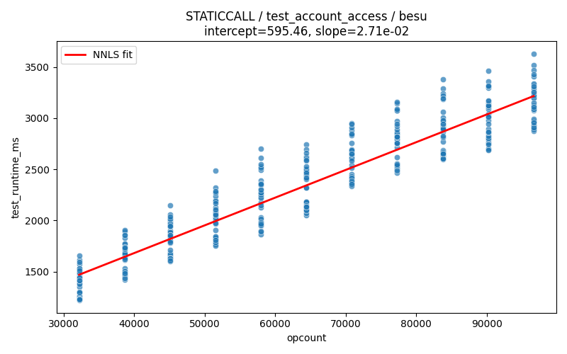

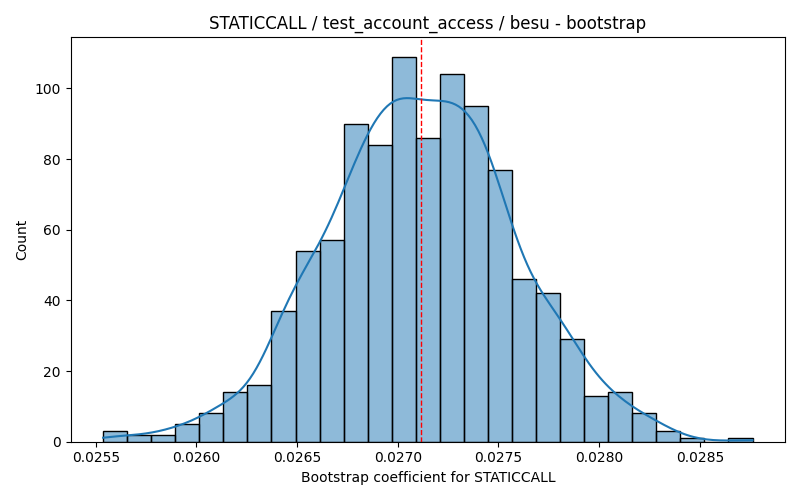

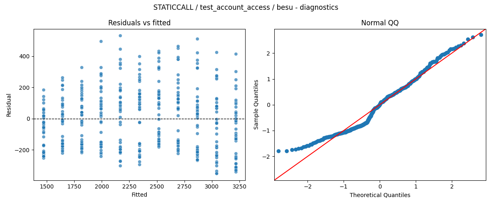

</details>

<details><summary>erigon — NNLS regression summary</summary>

```
==============================================================================
                           NNLS Regression Results                            
==============================================================================
Dep. Variable:          test_runtime_ms              R-squared:          0.895
Model:                  NNLS                    Adj. R-squared:          0.894
No. Observations:       165                               RMSE:         345.28
Df Residuals:           163                                MAE:         296.70
Df Model:               1      
==============================================================================
                      coef     std err     P-value      [0.025      0.975]
------------------------------------------------------------------------------
         const    835.9471     91.0931       0.001    663.9999   1019.6971
       opcount      0.0495      0.0012       0.001      0.0469      0.0518
==============================================================================
Notes: Non-negative least squares with bootstrap inference (1000 iterations)
==============================================================================
```

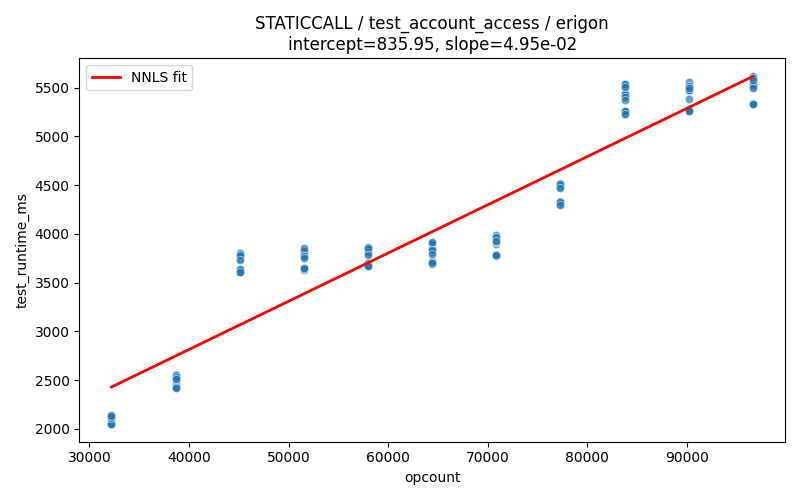

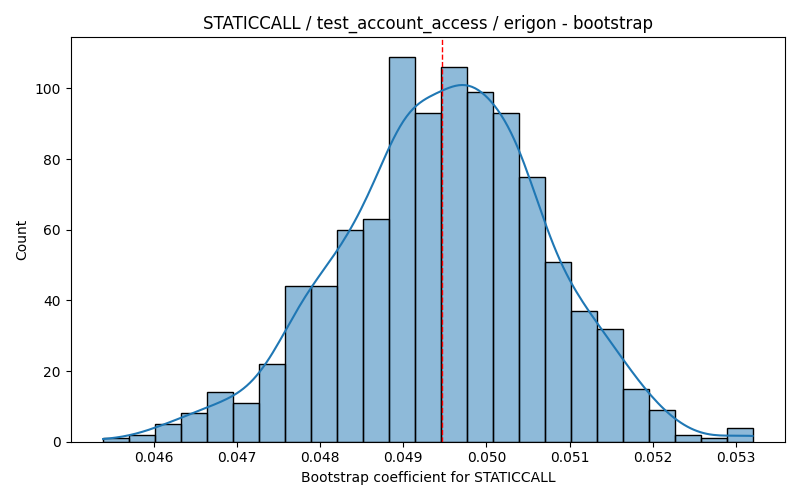

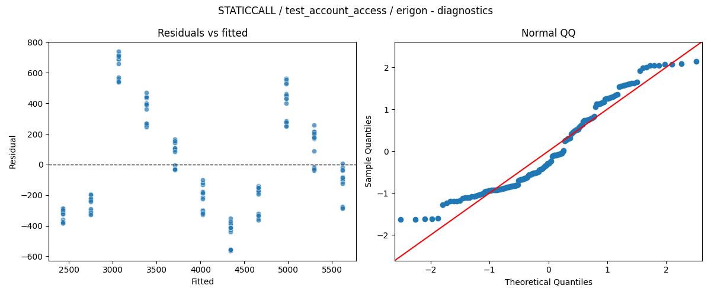

</details>

<details><summary>ethrex — NNLS regression summary</summary>

```
==============================================================================
                           NNLS Regression Results                            
==============================================================================
Dep. Variable:          test_runtime_ms              R-squared:          0.994
Model:                  NNLS                    Adj. R-squared:          0.994
No. Observations:       275                               RMSE:          12.04
Df Residuals:           273                                MAE:           9.59
Df Model:               1      
==============================================================================
                      coef     std err     P-value      [0.025      0.975]
------------------------------------------------------------------------------
         const     38.3859      2.2615       0.001     33.9322     42.7459
       opcount      0.0076      0.0000       0.001      0.0075      0.0077
==============================================================================
Notes: Non-negative least squares with bootstrap inference (1000 iterations)
==============================================================================
```

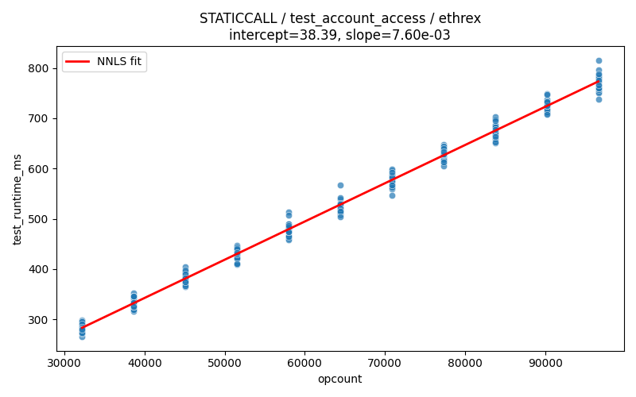

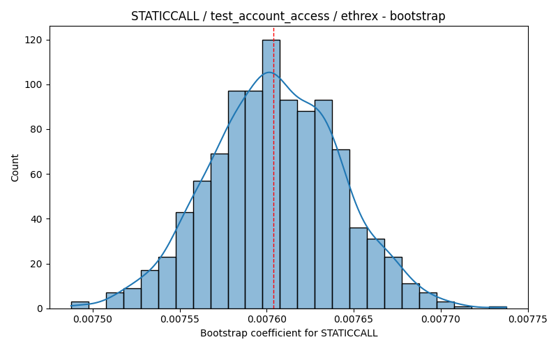

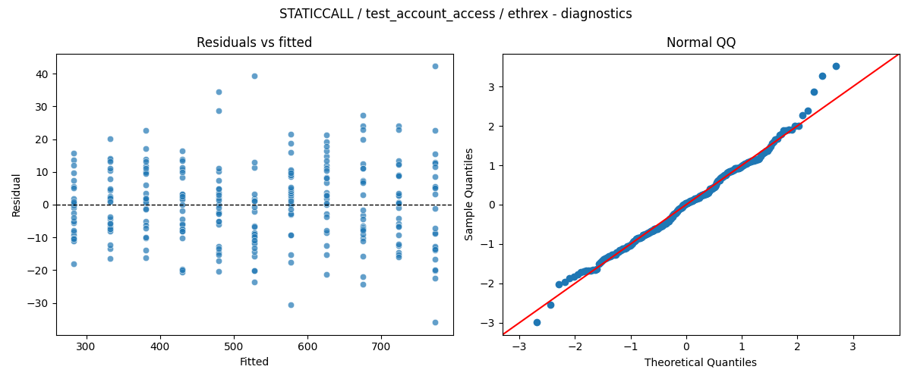

</details>

<details><summary>geth — NNLS regression summary</summary>

```
==============================================================================
                           NNLS Regression Results                            
==============================================================================
Dep. Variable:          test_runtime_ms              R-squared:          0.863
Model:                  NNLS                    Adj. R-squared:          0.863
No. Observations:       242                               RMSE:         189.63
Df Residuals:           240                                MAE:         159.81
Df Model:               1      
==============================================================================
                      coef     std err     P-value      [0.025      0.975]
------------------------------------------------------------------------------
         const    663.4469     47.4287       0.001    570.6860    752.5965
       opcount      0.0234      0.0006       0.001      0.0222      0.0247
==============================================================================
Notes: Non-negative least squares with bootstrap inference (1000 iterations)
==============================================================================
```


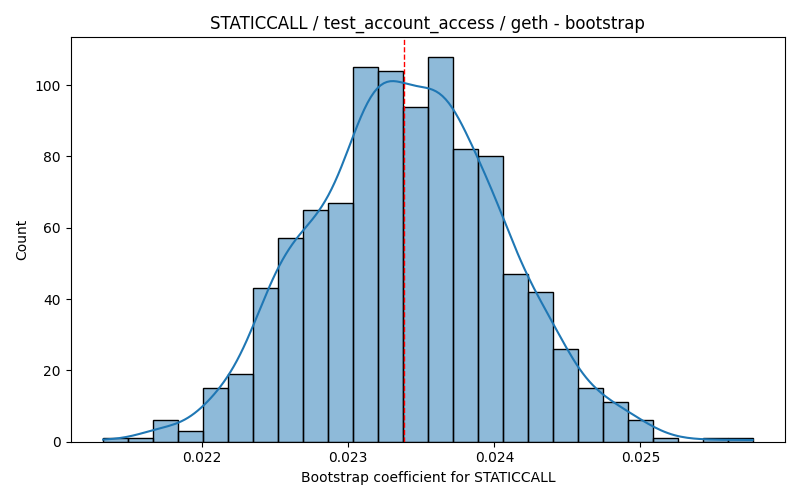

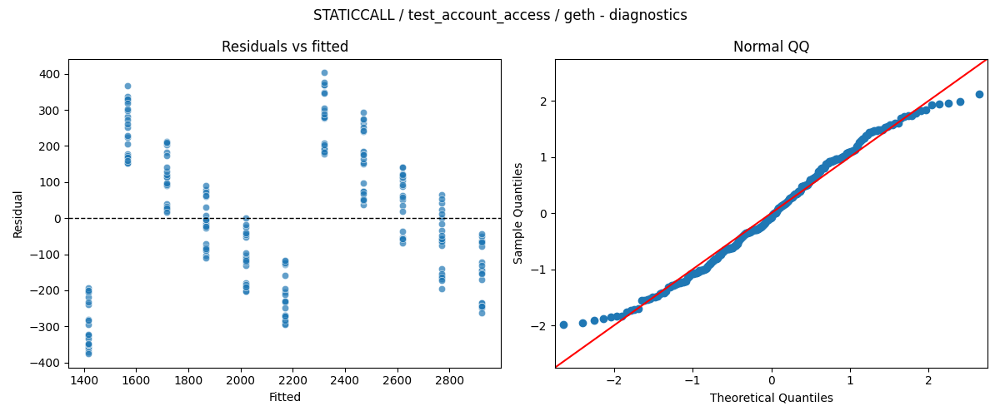

</details>

<details><summary>nethermind — NNLS regression summary</summary>

```
==============================================================================
                           NNLS Regression Results                            
==============================================================================
Dep. Variable:          test_runtime_ms              R-squared:          0.628
Model:                  NNLS                    Adj. R-squared:          0.626
No. Observations:       198                               RMSE:         210.07
Df Residuals:           196                                MAE:         148.53
Df Model:               1      
==============================================================================
                      coef     std err     P-value      [0.025      0.975]
------------------------------------------------------------------------------
         const    222.6325     47.6875       0.001    131.1076    315.1173
       opcount      0.0134      0.0008       0.001      0.0119      0.0149
==============================================================================
Notes: Non-negative least squares with bootstrap inference (1000 iterations)
==============================================================================
```

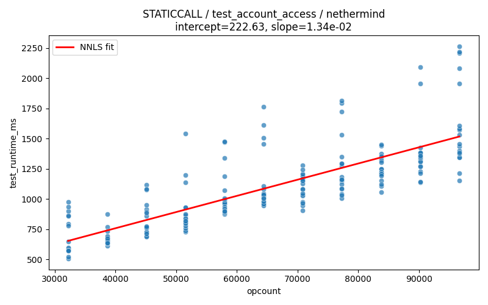

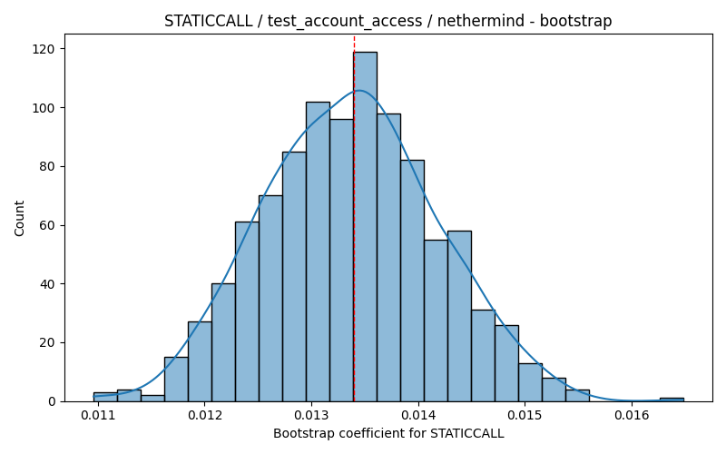

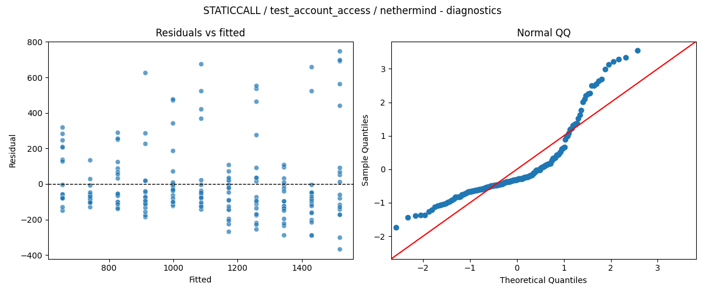

</details>

<details><summary>reth — NNLS regression summary</summary>

```
==============================================================================
                           NNLS Regression Results                            
==============================================================================
Dep. Variable:          test_runtime_ms              R-squared:          0.976
Model:                  NNLS                    Adj. R-squared:          0.976
No. Observations:       308                               RMSE:          13.01
Df Residuals:           306                                MAE:          10.25
Df Model:               1      
==============================================================================
                      coef     std err     P-value      [0.025      0.975]
------------------------------------------------------------------------------
         const     99.1257      2.2809       0.001     94.6667    103.4457
       opcount      0.0040      0.0000       0.001      0.0040      0.0041
==============================================================================
Notes: Non-negative least squares with bootstrap inference (1000 iterations)
==============================================================================
```

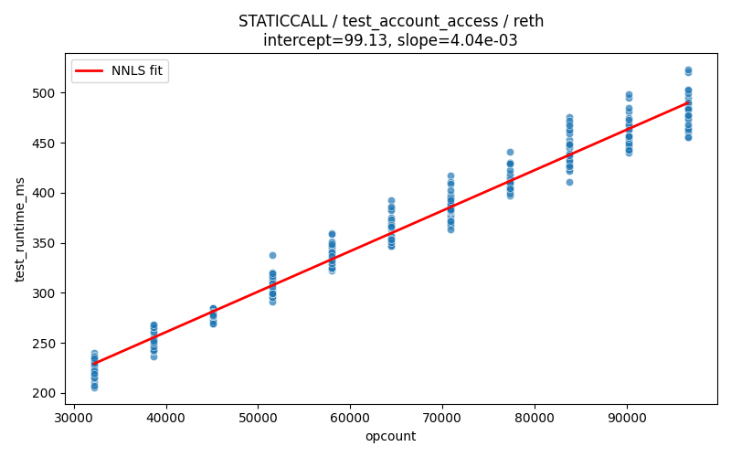

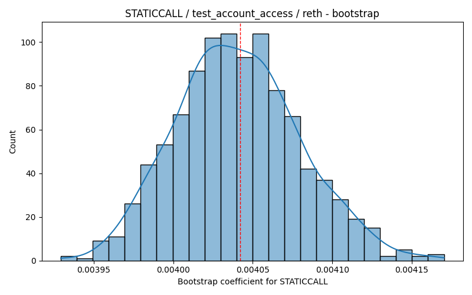

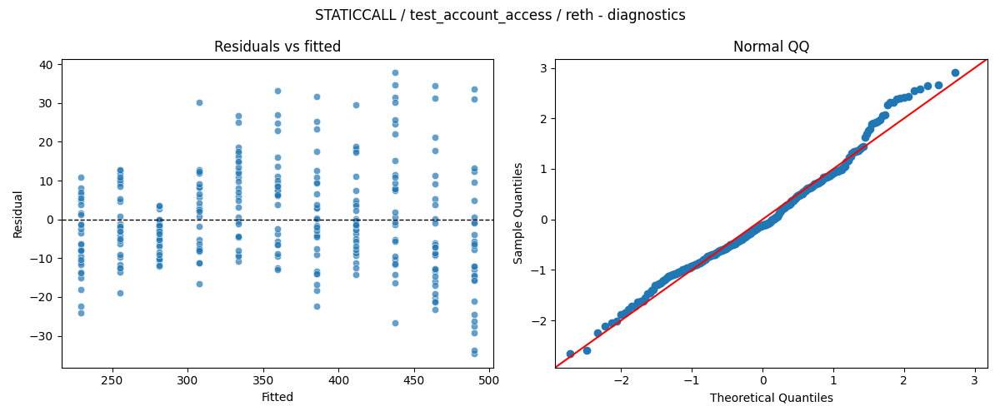

</details>

### test_account_access — combo `STATICCALL_AccountMode.NON_EXISTING_ACCOUNT` — `presets[cold_account_code_access]`

| client | nobs | R² | target_coef (ms) | p-value | 95% CI |
| --- | --- | --- | --- | --- | --- |
| `besu` | 407 | 0.8702 | 0.01629 | 1.00e-03 | [0.01573, 0.01689] |
| `erigon` | 165 | 0.9815 | 0.01079 | 1.00e-03 | [0.01064, 0.01087] |
| `ethrex` | 275 | 0.9716 | 0.001999 | 1.00e-03 | [0.001958, 0.002041] |
| `geth` | 242 | 0.8688 | 0.02267 | 1.00e-03 | [0.02153, 0.02379] |
| `nethermind` | 198 | 0.7802 | 0.00435 | 1.00e-03 | [0.004051, 0.004651] |
| `reth` | 308 | 0.9108 | 0.0007991 | 1.00e-03 | [0.0007705, 0.0008289] |

<details><summary>besu — NNLS regression summary</summary>

```
==============================================================================
                           NNLS Regression Results                            
==============================================================================
Dep. Variable:          test_runtime_ms              R-squared:          0.870
Model:                  NNLS                    Adj. R-squared:          0.870
No. Observations:       407                               RMSE:         149.53
Df Residuals:           405                                MAE:         134.29
Df Model:               1      
==============================================================================
                      coef     std err     P-value      [0.025      0.975]
------------------------------------------------------------------------------
         const    522.7044     22.5310       0.001    477.2752    566.1857
       opcount      0.0163      0.0003       0.001      0.0157      0.0169
==============================================================================
Notes: Non-negative least squares with bootstrap inference (1000 iterations)
==============================================================================
```


</details>

<details><summary>erigon — NNLS regression summary</summary>

```
==============================================================================
                           NNLS Regression Results                            
==============================================================================
Dep. Variable:          test_runtime_ms              R-squared:          0.981
Model:                  NNLS                    Adj. R-squared:          0.981
No. Observations:       165                               RMSE:          35.45
Df Residuals:           163                                MAE:          25.92
Df Model:               1      
==============================================================================
                      coef     std err     P-value      [0.025      0.975]
------------------------------------------------------------------------------
         const      0.0000      2.7149       1.000      0.0000      9.6801
       opcount      0.0108      0.0001       0.001      0.0106      0.0109
==============================================================================
Notes: Non-negative least squares with bootstrap inference (1000 iterations)
==============================================================================
```


</details>

<details><summary>ethrex — NNLS regression summary</summary>

```
==============================================================================
                           NNLS Regression Results                            
==============================================================================
Dep. Variable:          test_runtime_ms              R-squared:          0.972
Model:                  NNLS                    Adj. R-squared:          0.972
No. Observations:       275                               RMSE:           8.12
Df Residuals:           273                                MAE:           6.39
Df Model:               1      
==============================================================================
                      coef     std err     P-value      [0.025      0.975]
------------------------------------------------------------------------------
         const     27.2171      1.5917       0.001     24.1450     30.3255
       opcount      0.0020      0.0000       0.001      0.0020      0.0020
==============================================================================
Notes: Non-negative least squares with bootstrap inference (1000 iterations)
==============================================================================
```


</details>

<details><summary>geth — NNLS regression summary</summary>

```
==============================================================================
                           NNLS Regression Results                            
==============================================================================
Dep. Variable:          test_runtime_ms              R-squared:          0.869
Model:                  NNLS                    Adj. R-squared:          0.868
No. Observations:       242                               RMSE:         209.41
Df Residuals:           240                                MAE:         178.14
Df Model:               1      
==============================================================================
                      coef     std err     P-value      [0.025      0.975]
------------------------------------------------------------------------------
         const    708.2150     49.6284       0.001    613.1038    809.0809
       opcount      0.0227      0.0006       0.001      0.0215      0.0238
==============================================================================
Notes: Non-negative least squares with bootstrap inference (1000 iterations)
==============================================================================
```


</details>

<details><summary>nethermind — NNLS regression summary</summary>

```
==============================================================================
                           NNLS Regression Results                            
==============================================================================
Dep. Variable:          test_runtime_ms              R-squared:          0.780
Model:                  NNLS                    Adj. R-squared:          0.779
No. Observations:       198                               RMSE:          54.88
Df Residuals:           196                                MAE:          37.44
Df Model:               1      
==============================================================================
                      coef     std err     P-value      [0.025      0.975]
------------------------------------------------------------------------------
         const     72.1584      9.9486       0.001     54.0183     92.1951
       opcount      0.0043      0.0002       0.001      0.0041      0.0047
==============================================================================
Notes: Non-negative least squares with bootstrap inference (1000 iterations)
==============================================================================
```


</details>

<details><summary>reth — NNLS regression summary</summary>

```
==============================================================================
                           NNLS Regression Results                            
==============================================================================
Dep. Variable:          test_runtime_ms              R-squared:          0.911
Model:                  NNLS                    Adj. R-squared:          0.911
No. Observations:       308                               RMSE:           5.94
Df Residuals:           306                                MAE:           4.53
Df Model:               1      
==============================================================================
                      coef     std err     P-value      [0.025      0.975]
------------------------------------------------------------------------------
         const     45.9975      1.0701       0.001     44.0020     48.1579
       opcount      0.0008      0.0000       0.001      0.0008      0.0008
==============================================================================
Notes: Non-negative least squares with bootstrap inference (1000 iterations)
==============================================================================
```


</details>

### test_ext_account_query_warm — combo `STATICCALL`

| client | nobs | R² | target_coef (ms) | p-value | 95% CI |
| --- | --- | --- | --- | --- | --- |
| `besu` | 407 | 0.7085 | 0.0004217 | 1.00e-03 | [0.0003929, 0.0004471] |
| `erigon` | 165 | 0.8712 | 0.0004846 | 1.00e-03 | [0.0004533, 0.0005146] |
| `ethrex` | 275 | 0.9313 | 9.796e-05 | 1.00e-03 | [9.49e-05, 0.000101] |
| `geth` | 242 | 0.8826 | 0.0001813 | 1.00e-03 | [0.0001732, 0.0001895] |
| `nethermind` | 198 | 0.614 | 0.0003221 | 1.00e-03 | [0.0002871, 0.0003578] |
| `reth` | 308 | 0.9044 | 5.539e-05 | 1.00e-03 | [5.343e-05, 5.74e-05] |

<details><summary>besu — NNLS regression summary</summary>

```
==============================================================================
                           NNLS Regression Results                            
==============================================================================
Dep. Variable:          test_runtime_ms              R-squared:          0.708
Model:                  NNLS                    Adj. R-squared:          0.708
No. Observations:       407                               RMSE:         140.05
Df Residuals:           405                                MAE:         112.64
Df Model:               1      
==============================================================================
                      coef     std err     P-value      [0.025      0.975]
------------------------------------------------------------------------------
         const    615.1157     24.0789       0.001    570.2173    664.0191
       opcount      0.0004      0.0000       0.001      0.0004      0.0004
==============================================================================
Notes: Non-negative least squares with bootstrap inference (1000 iterations)
==============================================================================
```

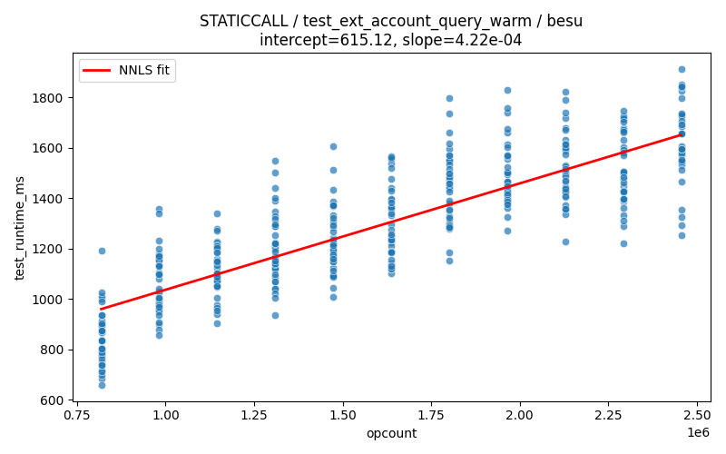

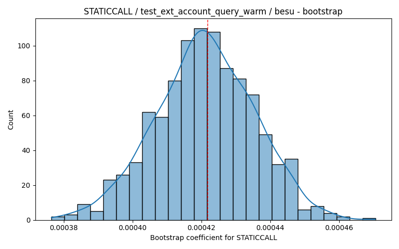

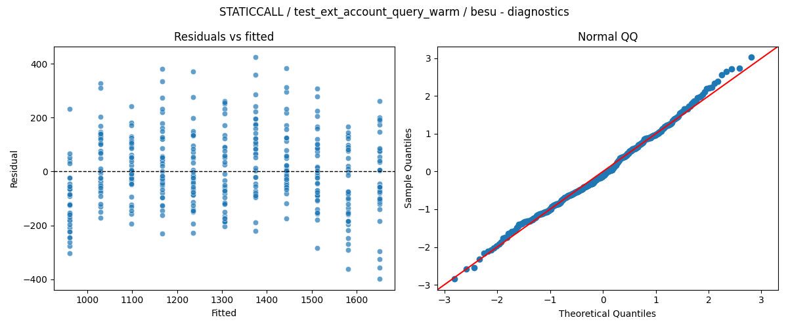

</details>

<details><summary>erigon — NNLS regression summary</summary>

```
==============================================================================
                           NNLS Regression Results                            
==============================================================================
Dep. Variable:          test_runtime_ms              R-squared:          0.871
Model:                  NNLS                    Adj. R-squared:          0.870
No. Observations:       165                               RMSE:          96.46
Df Residuals:           163                                MAE:          66.62
Df Model:               1      
==============================================================================
                      coef     std err     P-value      [0.025      0.975]
------------------------------------------------------------------------------
         const     53.1681     23.4699       0.007     10.6831    103.7381
       opcount      0.0005      0.0000       0.001      0.0005      0.0005
==============================================================================
Notes: Non-negative least squares with bootstrap inference (1000 iterations)
==============================================================================
```

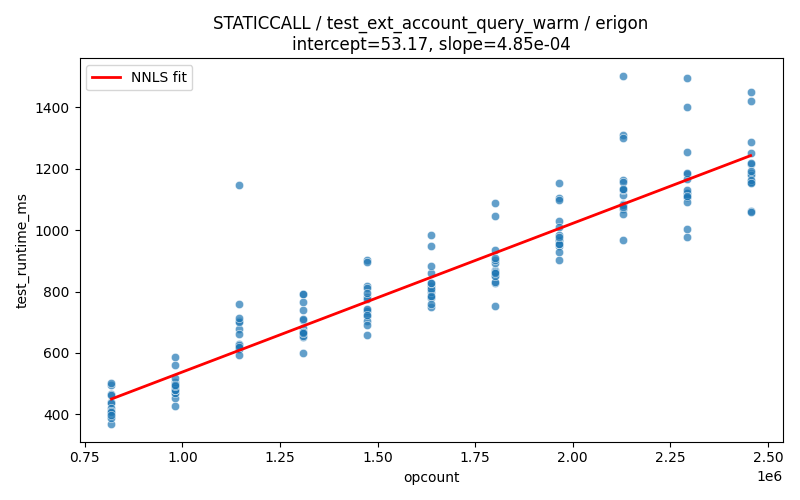

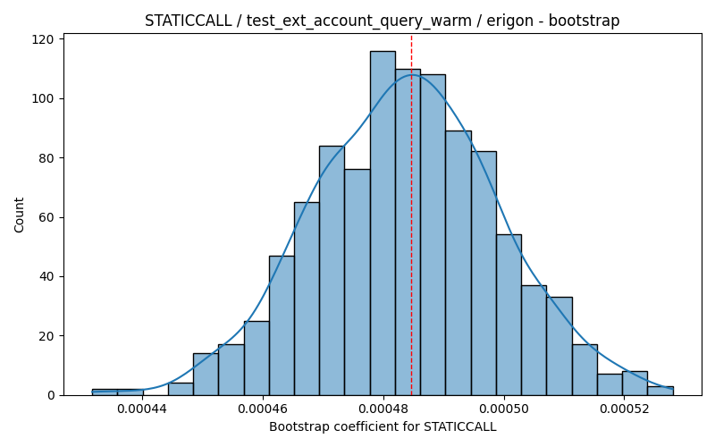

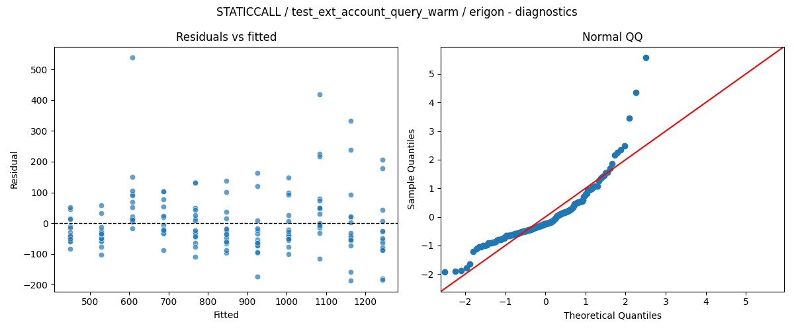

</details>

<details><summary>ethrex — NNLS regression summary</summary>

```
==============================================================================
                           NNLS Regression Results                            
==============================================================================
Dep. Variable:          test_runtime_ms              R-squared:          0.931
Model:                  NNLS                    Adj. R-squared:          0.931
No. Observations:       275                               RMSE:          13.77
Df Residuals:           273                                MAE:          10.94
Df Model:               1      
==============================================================================
                      coef     std err     P-value      [0.025      0.975]
------------------------------------------------------------------------------
         const     40.7751      2.6411       0.001     35.6521     45.8980
       opcount      0.0001      0.0000       0.001      0.0001      0.0001
==============================================================================
Notes: Non-negative least squares with bootstrap inference (1000 iterations)
==============================================================================
```

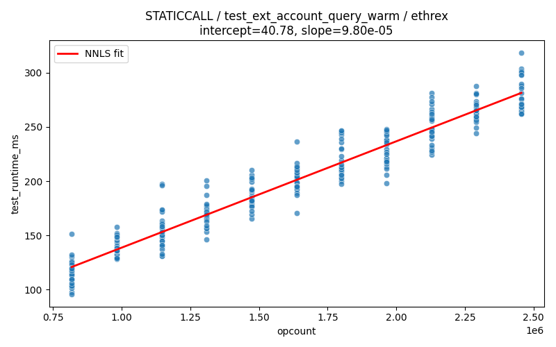

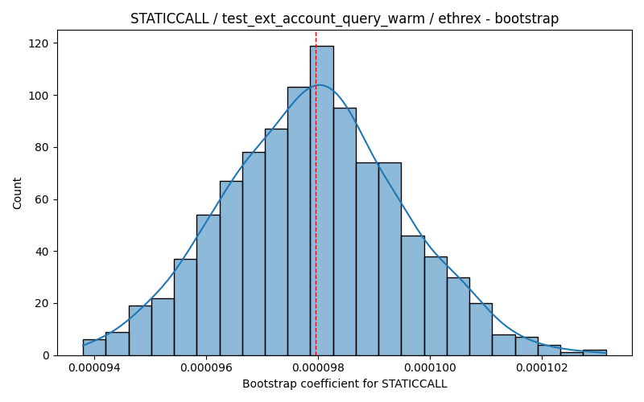

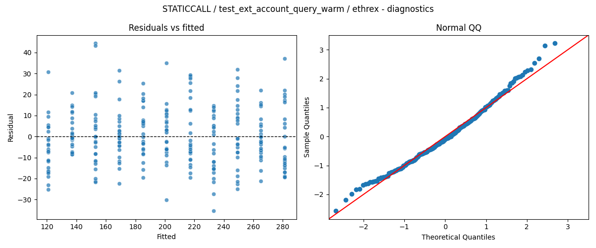

</details>

<details><summary>geth — NNLS regression summary</summary>

```
==============================================================================
                           NNLS Regression Results                            
==============================================================================
Dep. Variable:          test_runtime_ms              R-squared:          0.883
Model:                  NNLS                    Adj. R-squared:          0.882
No. Observations:       242                               RMSE:          34.23
Df Residuals:           240                                MAE:          26.50
Df Model:               1      
==============================================================================
                      coef     std err     P-value      [0.025      0.975]
------------------------------------------------------------------------------
         const     50.4025      6.4374       0.001     37.2129     62.7508
       opcount      0.0002      0.0000       0.001      0.0002      0.0002
==============================================================================
Notes: Non-negative least squares with bootstrap inference (1000 iterations)
==============================================================================
```

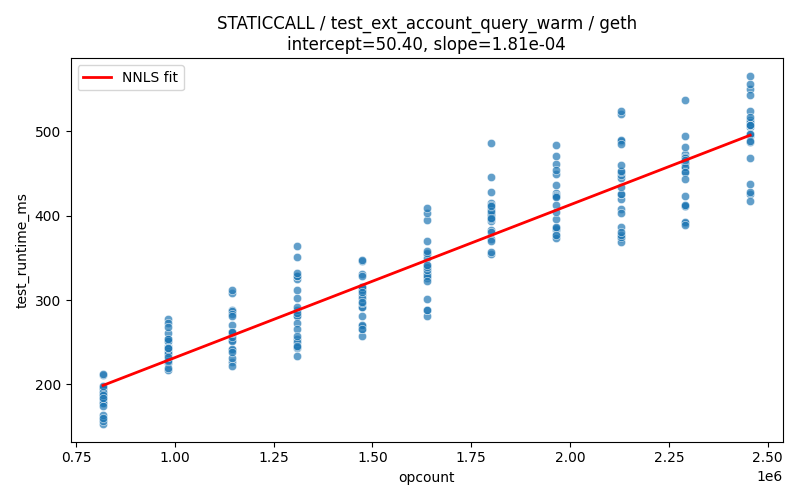

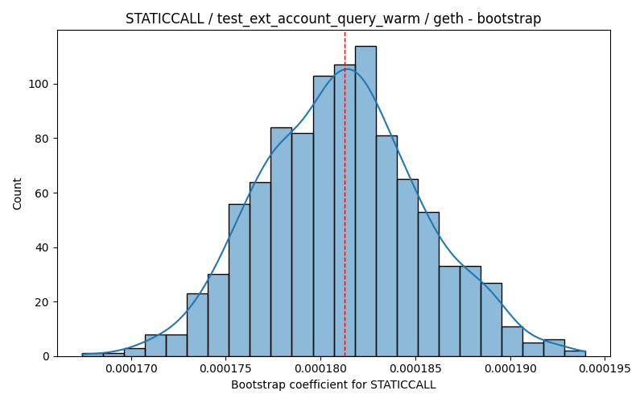

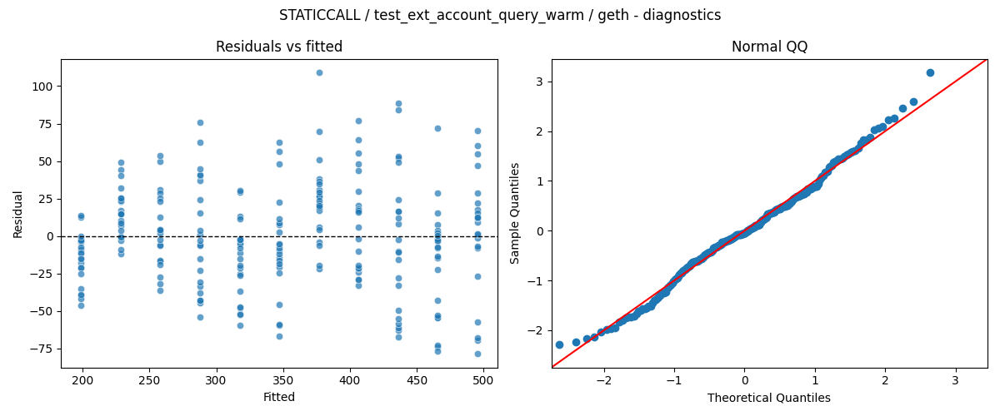

</details>

<details><summary>nethermind — NNLS regression summary</summary>

```
==============================================================================
                           NNLS Regression Results                            
==============================================================================
Dep. Variable:          test_runtime_ms              R-squared:          0.614
Model:                  NNLS                    Adj. R-squared:          0.612
No. Observations:       198                               RMSE:         132.22
Df Residuals:           196                                MAE:         102.29
Df Model:               1      
==============================================================================
                      coef     std err     P-value      [0.025      0.975]
------------------------------------------------------------------------------
         const    248.3137     26.1278       0.001    197.9769    298.8363
       opcount      0.0003      0.0000       0.001      0.0003      0.0004
==============================================================================
Notes: Non-negative least squares with bootstrap inference (1000 iterations)
==============================================================================
```

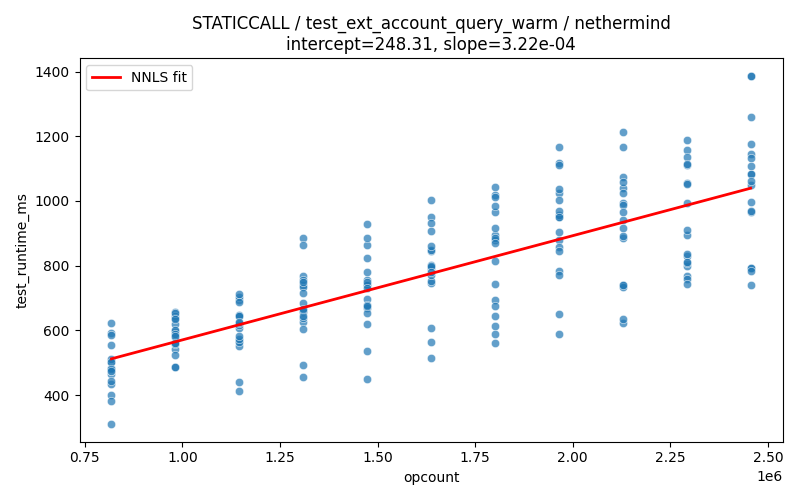

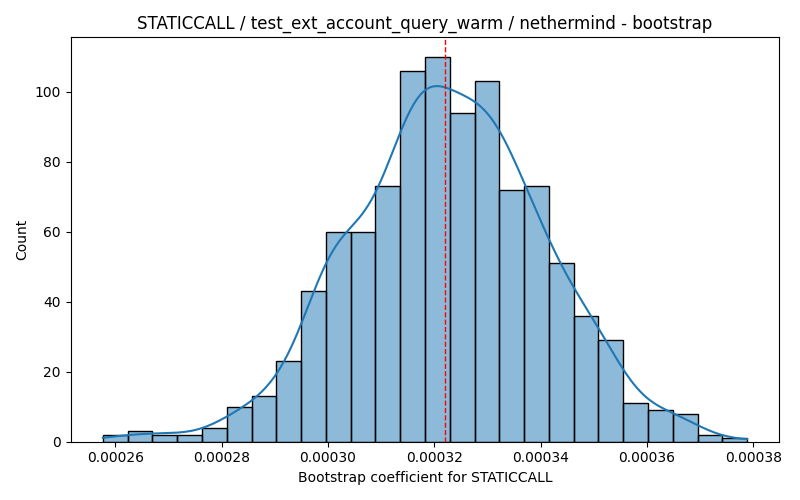

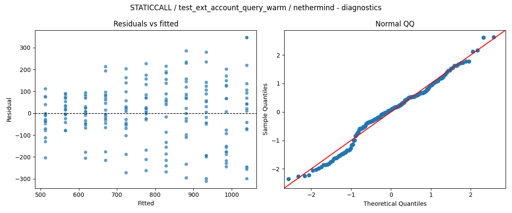

</details>

<details><summary>reth — NNLS regression summary</summary>

```
==============================================================================
                           NNLS Regression Results                            
==============================================================================
Dep. Variable:          test_runtime_ms              R-squared:          0.904
Model:                  NNLS                    Adj. R-squared:          0.904
No. Observations:       308                               RMSE:           9.32
Df Residuals:           306                                MAE:           7.40
Df Model:               1      
==============================================================================
                      coef     std err     P-value      [0.025      0.975]
------------------------------------------------------------------------------
         const     25.4790      1.7558       0.001     21.9736     28.9019
       opcount      0.0001      0.0000       0.001      0.0001      0.0001
==============================================================================
Notes: Non-negative least squares with bootstrap inference (1000 iterations)
==============================================================================
```

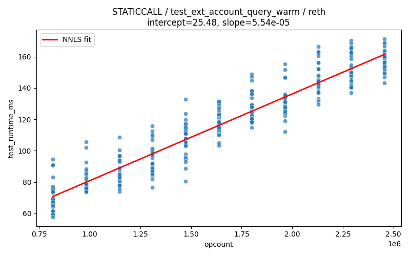

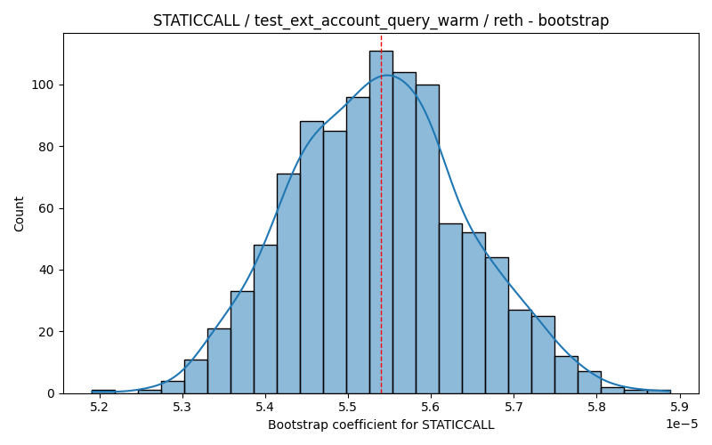

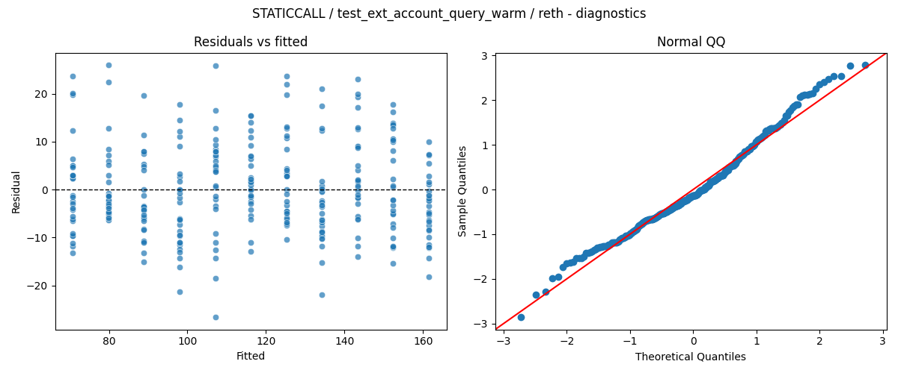

</details>
