# Glue opcodes report

Per-client NNLS fits of priced glue opcodes against their driver fixtures. Cycle-tier opcodes share one joint regression per client (shown once); pure-tier and mixed-tier opcodes each get a single-feature fit. Mixed-tier fits pre-adjust the LHS by subtracting the contribution of every priced upstream partner selected by the detector (pure ∪ cycle for `mixed_a`, plus `mixed_a` for `mixed_b`).

**Contents:** [besu](#besu) · [erigon](#erigon) · [ethrex](#ethrex) · [geth](#geth) · [nethermind](#nethermind) · [reth](#reth)

## besu

| glue_opcode | nobs | glue_runtime_ms | p_value | rsquared |
| --- | --- | --- | --- | --- |
| `ISZERO` | 3102 | 3.316e-06 | 1.00e-03 | 0.8236 |
| `JUMPDEST` | 3102 | 7.932e-07 | 1.00e-03 | 0.7614 |
| `SWAP` | 49632 | 2.791e-06 | 1.00e-03 | 0.4178 |
| `CALLDATASIZE` | 183414 | 2.944e-06 | 1.00e-03 | 0.9291 |
| `DUP` | 183414 | 1.292e-06 | 1.00e-03 | 0.9291 |
| `GAS` | 183414 | 2.527e-06 | 1.00e-03 | 0.9291 |
| `MLOAD` | 183414 | 8.848e-06 | 1.00e-03 | 0.9291 |
| `PUSH` | 183414 | 1.931e-06 | 1.00e-03 | 0.9291 |
| `PUSH0` | 183414 | 1.036e-06 | 1.00e-03 | 0.9291 |
| `STATICCALL` | 183414 | 0.0006929 | 1.00e-03 | 0.9291 |
| `ADD` | 3102 | 8.622e-06 | 1.00e-03 | 0.8647 |
| `AND` | 3102 | 6.027e-06 | 1.00e-03 | 0.8546 |
| `CALLDATACOPY` | 74448 | 1.397e-05 | 1.00e-03 | 0.643 |
| `CALLDATALOAD` | 12408 | 0 | 1.00e+00 | 2.22e-16 |
| `DIV` | 3102 | 1.359e-05 | 1.00e-03 | 0.7941 |
| `EXP` | 3102 | 0.001076 | 1.00e-03 | 0.7406 |
| `GT` | 3102 | 1.937e-05 | 1.00e-03 | 0.1473 |
| `JUMPI` | 3102 | 5.039e-06 | 1.00e-03 | 0.7396 |
| `LT` | 3102 | 1.927e-05 | 1.00e-03 | 0.1418 |
| `MSTORE` | 15510 | 1.477e-05 | 1.00e-03 | 0.8291 |
| `MSTORE8` | 15510 | 9.204e-06 | 1.00e-03 | 0.8587 |
| `MUL` | 3102 | 1.133e-05 | 1.00e-03 | 0.8012 |
| `PC` | 3102 | 2.894e-06 | 1.00e-03 | 0.8702 |
| `RETURNDATASIZE` | 12408 | 4.256e-06 | 1.00e-03 | 0.7894 |
| `SELFBALANCE` | 2538 | 1.03e-05 | 1.00e-03 | 0.7043 |
| `SUB` | 3102 | 9.054e-06 | 1.00e-03 | 0.8526 |
| `JUMP` | 3102 | 4.273e-05 | 1.00e-03 | 0.8523 |
| `KECCAK256` | 49632 | 3.801e-05 | 1.00e-03 | 0.1614 |

### Cycle glue — joint fit · besu

<details><summary>Joint NNLS regression summary</summary>

```
==============================================================================
                           NNLS Regression Results                            
==============================================================================
Dep. Variable:          test_runtime_ms              R-squared:          0.929
Model:                  NNLS                    Adj. R-squared:          0.929
No. Observations:       183414                            RMSE:          26.59
Df Residuals:           183406                             MAE:          19.36
Df Model:               7      
==============================================================================
                      coef     std err     P-value      [0.025      0.975]
------------------------------------------------------------------------------
         const     44.1715      0.2084       0.001     43.7404     44.5915
  CALLDATASIZE      0.0000      0.0000       0.001      0.0000      0.0000
           DUP      0.0000      0.0000       0.001      0.0000      0.0000
           GAS      0.0000      0.0000       0.001      0.0000      0.0000
         MLOAD      0.0000      0.0000       0.001      0.0000      0.0000
          PUSH      0.0000      0.0000       0.001      0.0000      0.0000
         PUSH0      0.0000      0.0000       0.001      0.0000      0.0000
    STATICCALL      0.0007      0.0000       0.001      0.0007      0.0007
==============================================================================
Notes: Non-negative least squares with bootstrap inference (1000 iterations)
==============================================================================
```

</details>

<details><summary><code>CALLDATASIZE</code> · nobs=183414 · runtime_ms=2.944e-06 · p=1.00e-03 · R²=0.9291</summary>

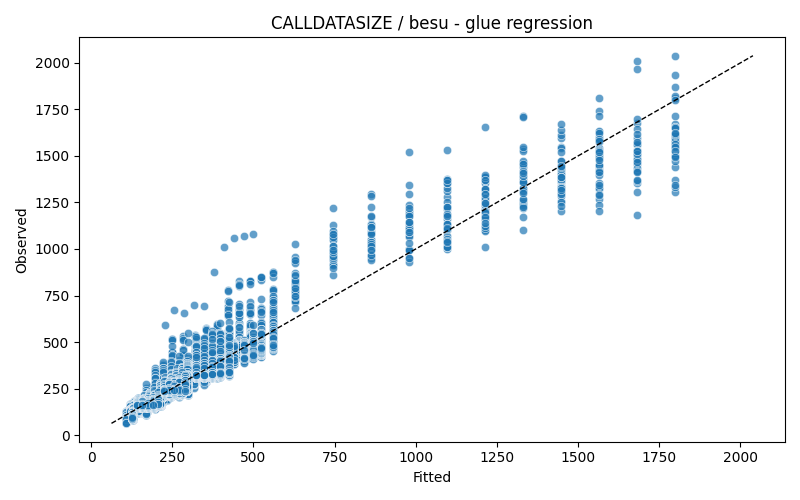

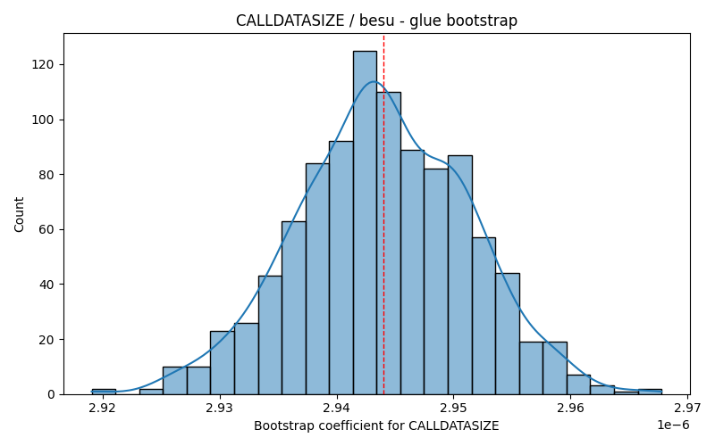


</details>

<details><summary><code>DUP</code> · nobs=183414 · runtime_ms=1.292e-06 · p=1.00e-03 · R²=0.9291</summary>


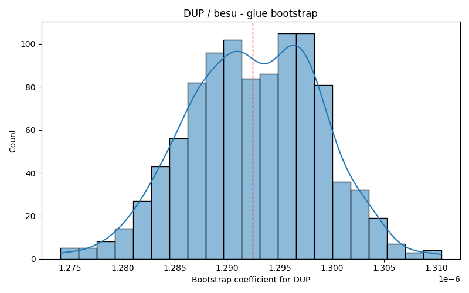


</details>

<details><summary><code>GAS</code> · nobs=183414 · runtime_ms=2.527e-06 · p=1.00e-03 · R²=0.9291</summary>


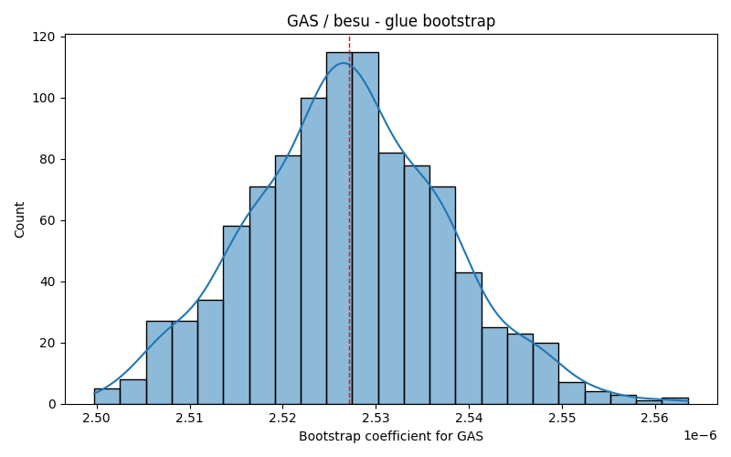

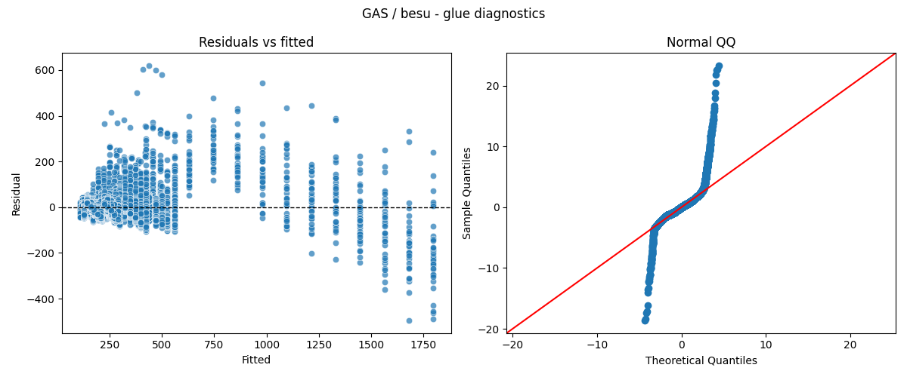

</details>

<details><summary><code>MLOAD</code> · nobs=183414 · runtime_ms=8.848e-06 · p=1.00e-03 · R²=0.9291</summary>

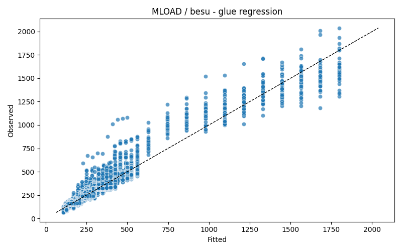

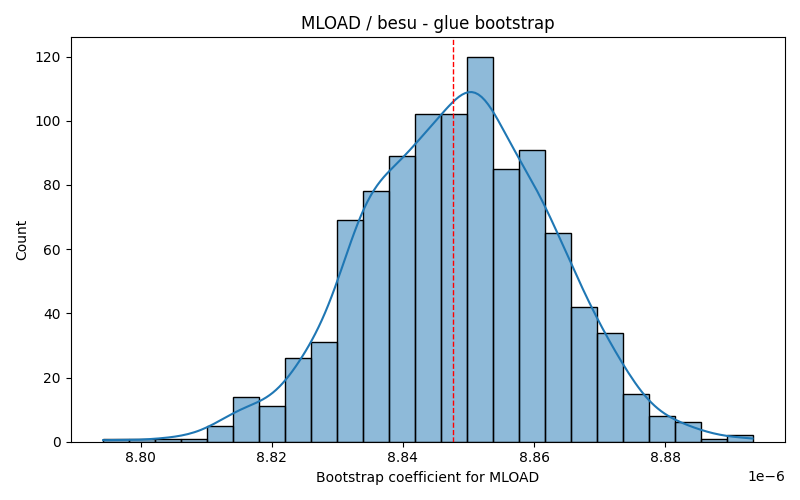

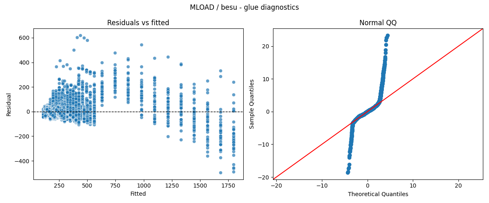

</details>

<details><summary><code>PUSH</code> · nobs=183414 · runtime_ms=1.931e-06 · p=1.00e-03 · R²=0.9291</summary>


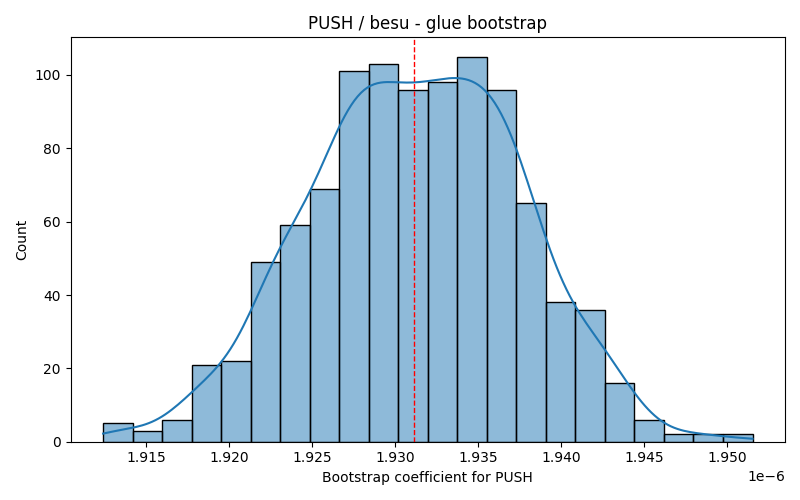


</details>

<details><summary><code>PUSH0</code> · nobs=183414 · runtime_ms=1.036e-06 · p=1.00e-03 · R²=0.9291</summary>


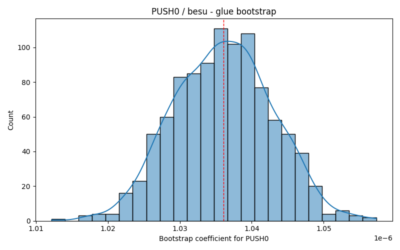


</details>

<details><summary><code>STATICCALL</code> · nobs=183414 · runtime_ms=0.0006929 · p=1.00e-03 · R²=0.9291</summary>


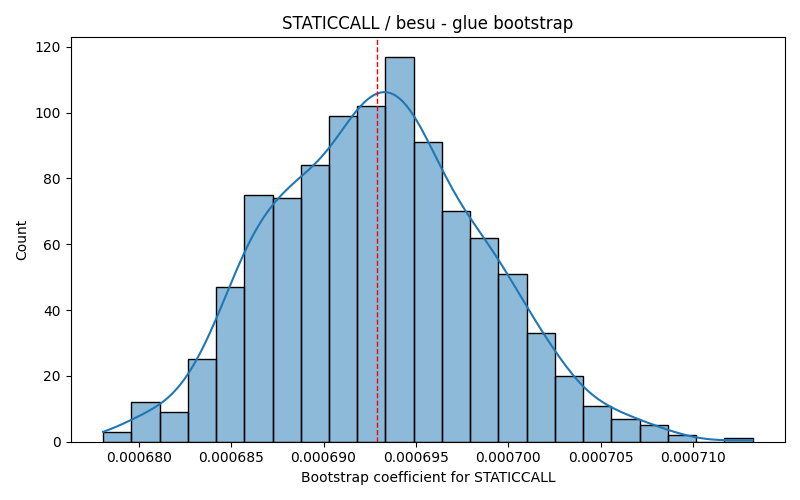

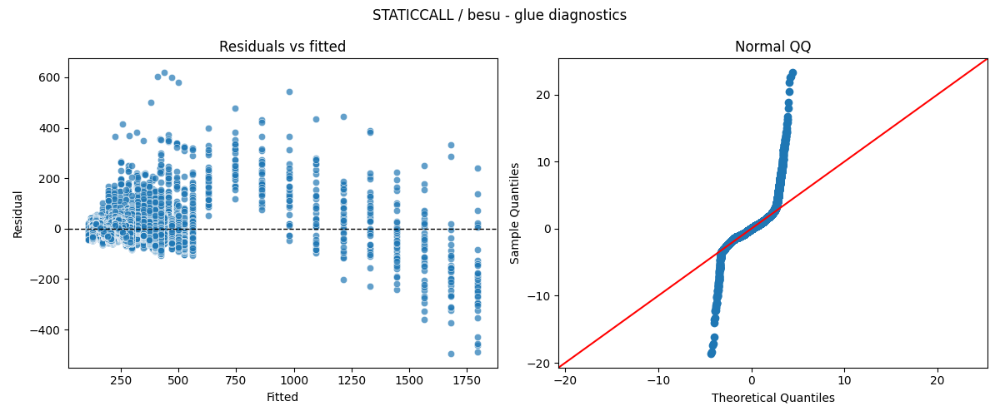

</details>

### Pure glue · besu

<details><summary><code>ISZERO</code> · nobs=3102 · runtime_ms=3.316e-06 · p=1.00e-03 · R²=0.8236</summary>

```
==============================================================================
                           NNLS Regression Results                            
==============================================================================
Dep. Variable:          test_runtime_ms              R-squared:          0.824
Model:                  NNLS                    Adj. R-squared:          0.824
No. Observations:       3102                              RMSE:          32.31
Df Residuals:           3100                               MAE:          25.43
Df Model:               1      
==============================================================================
                      coef     std err     P-value      [0.025      0.975]
------------------------------------------------------------------------------
         const     55.0572      1.8971       0.001     51.2448     58.5867
        ISZERO      0.0000      0.0000       0.001      0.0000      0.0000
==============================================================================
Notes: Non-negative least squares with bootstrap inference (1000 iterations)
==============================================================================
```

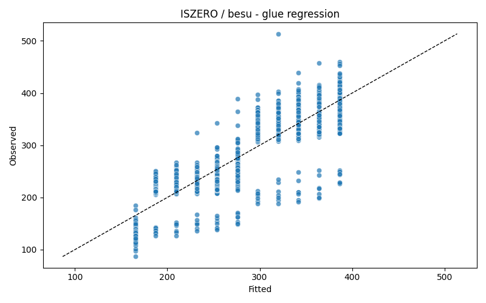

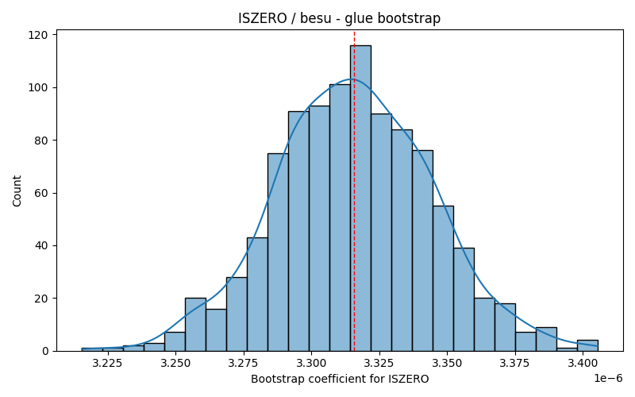

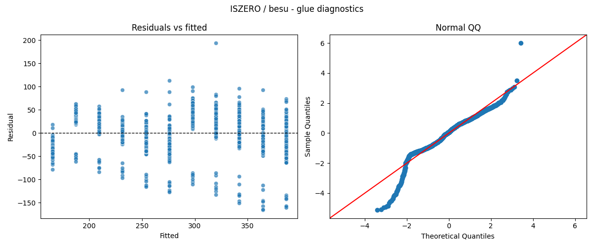

</details>

<details><summary><code>JUMPDEST</code> · nobs=3102 · runtime_ms=7.932e-07 · p=1.00e-03 · R²=0.7614</summary>

```
==============================================================================
                           NNLS Regression Results                            
==============================================================================
Dep. Variable:          test_runtime_ms              R-squared:          0.761
Model:                  NNLS                    Adj. R-squared:          0.761
No. Observations:       3102                              RMSE:          28.04
Df Residuals:           3100                               MAE:          18.24
Df Model:               1      
==============================================================================
                      coef     std err     P-value      [0.025      0.975]
------------------------------------------------------------------------------
         const     38.8986      1.6964       0.001     35.7305     42.1337
      JUMPDEST      0.0000      0.0000       0.001      0.0000      0.0000
==============================================================================
Notes: Non-negative least squares with bootstrap inference (1000 iterations)
==============================================================================
```

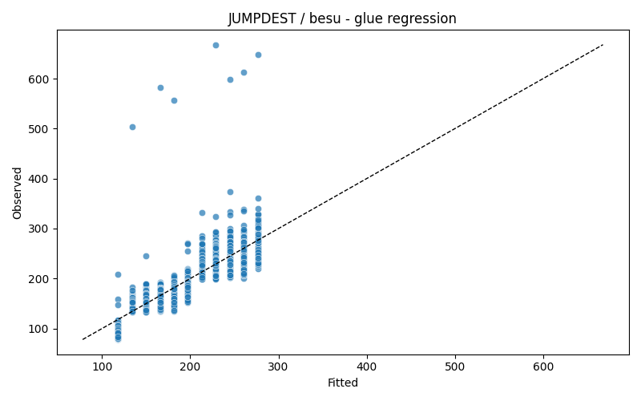

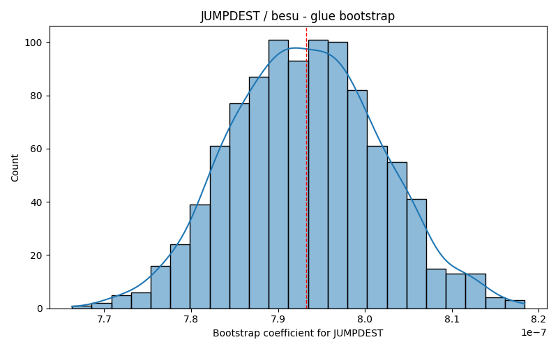

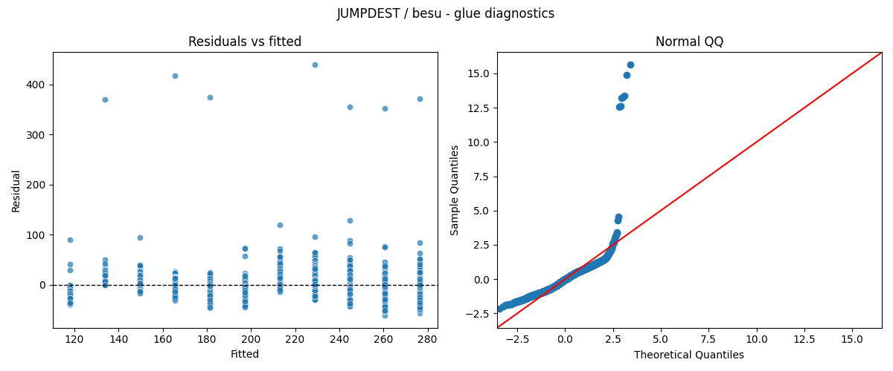

</details>

<details><summary><code>SWAP</code> · nobs=49632 · runtime_ms=2.791e-06 · p=1.00e-03 · R²=0.4178</summary>

```
==============================================================================
                           NNLS Regression Results                            
==============================================================================
Dep. Variable:          test_runtime_ms              R-squared:          0.418
Model:                  NNLS                    Adj. R-squared:          0.418
No. Observations:       49632                             RMSE:          69.37
Df Residuals:           49630                              MAE:          63.43
Df Model:               1      
==============================================================================
                      coef     std err     P-value      [0.025      0.975]
------------------------------------------------------------------------------
         const     47.3752      0.9056       0.001     45.6279     49.1945
          SWAP      0.0000      0.0000       0.001      0.0000      0.0000
==============================================================================
Notes: Non-negative least squares with bootstrap inference (1000 iterations)
==============================================================================
```

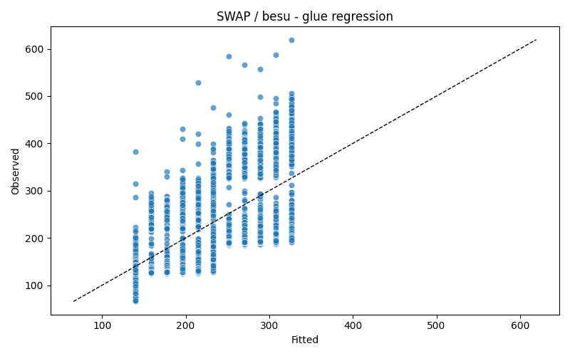

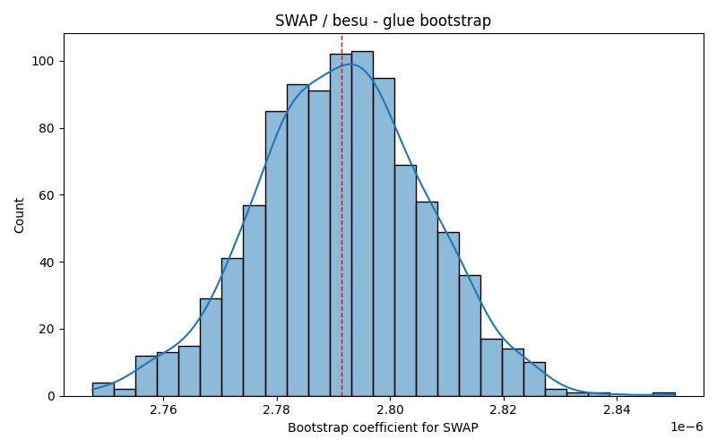

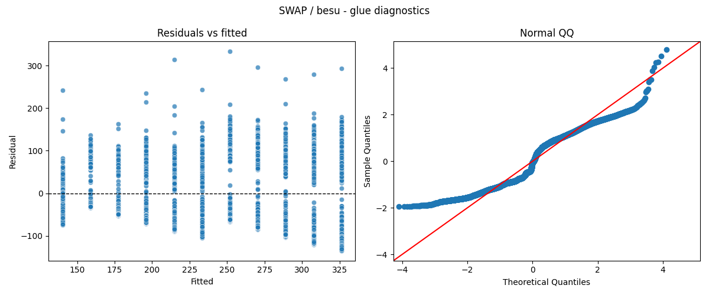

</details>

### Mixed glue (tier A) · besu

<details><summary><code>ADD</code> · nobs=3102 · runtime_ms=8.622e-06 · p=1.00e-03 · R²=0.8647</summary>

```
==============================================================================
                           NNLS Regression Results                            
==============================================================================
Dep. Variable:          test_runtime_ms              R-squared:          0.865
Model:                  NNLS                    Adj. R-squared:          0.865
No. Observations:       3102                              RMSE:          35.89
Df Residuals:           3100                               MAE:          30.23
Df Model:               1      
==============================================================================
                      coef     std err     P-value      [0.025      0.975]
------------------------------------------------------------------------------
         const     70.3371      2.2335       0.001     65.8408     74.5222
           ADD      0.0000      0.0000       0.001      0.0000      0.0000
==============================================================================
Notes: Non-negative least squares with bootstrap inference (1000 iterations)
==============================================================================
```

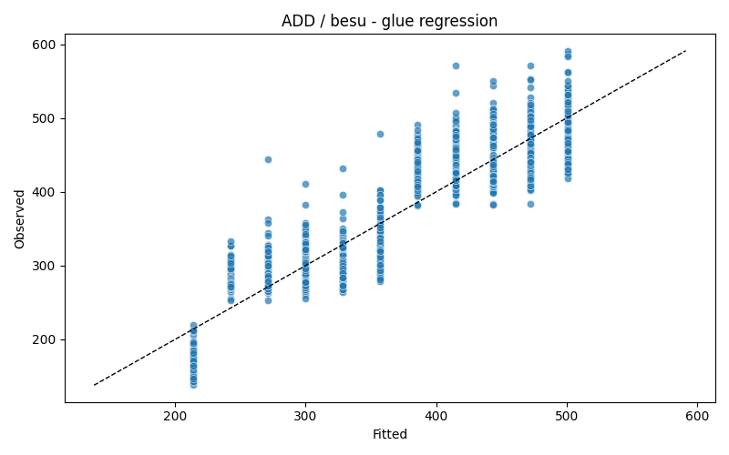

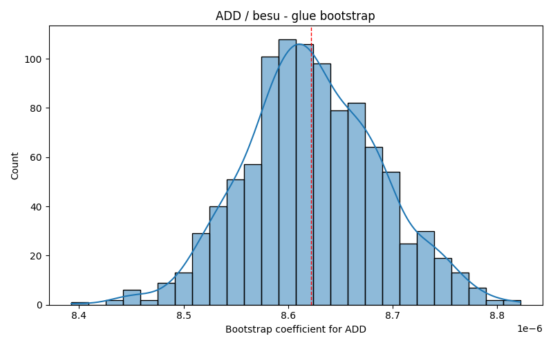

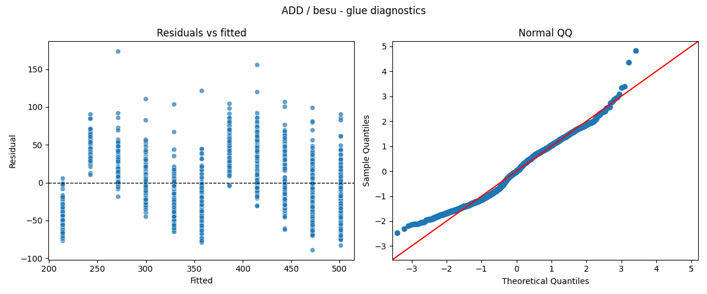

</details>

<details><summary><code>AND</code> · nobs=3102 · runtime_ms=6.027e-06 · p=1.00e-03 · R²=0.8546</summary>

```
==============================================================================
                           NNLS Regression Results                            
==============================================================================
Dep. Variable:          test_runtime_ms              R-squared:          0.855
Model:                  NNLS                    Adj. R-squared:          0.855
No. Observations:       3102                              RMSE:          26.17
Df Residuals:           3100                               MAE:          19.94
Df Model:               1      
==============================================================================
                      coef     std err     P-value      [0.025      0.975]
------------------------------------------------------------------------------
         const     57.2304      1.4301       0.001     54.3766     60.0591
           AND      0.0000      0.0000       0.001      0.0000      0.0000
==============================================================================
Notes: Non-negative least squares with bootstrap inference (1000 iterations)
==============================================================================
```

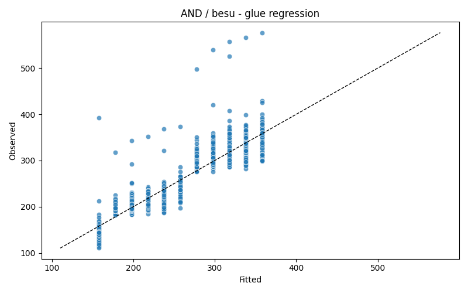

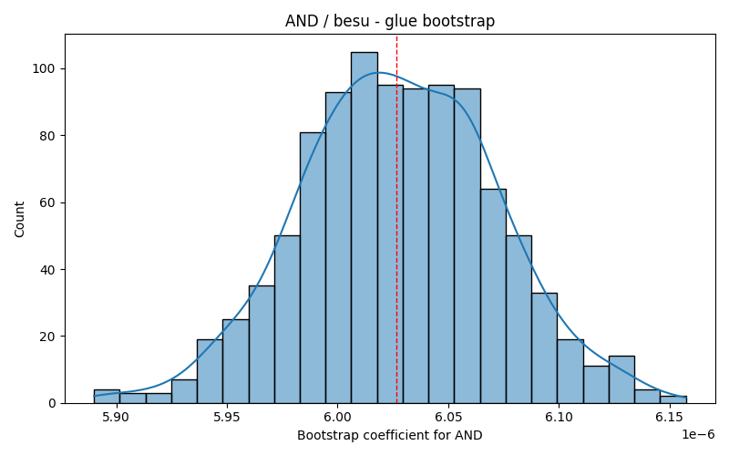

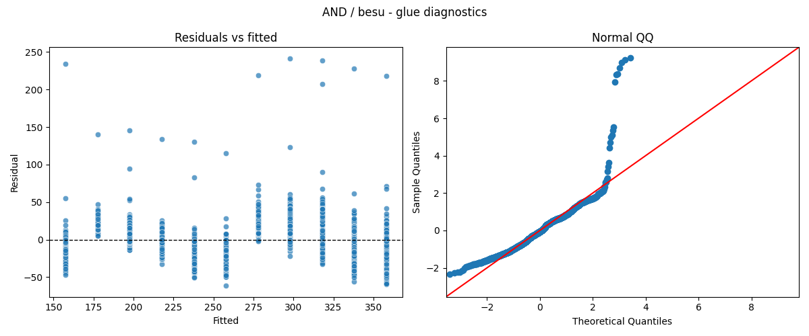

</details>

<details><summary><code>CALLDATACOPY</code> · nobs=74448 · runtime_ms=1.397e-05 · p=1.00e-03 · R²=0.643</summary>

```
==============================================================================
                           NNLS Regression Results                            
==============================================================================
Dep. Variable:          test_runtime_ms              R-squared:          0.643
Model:                  NNLS                    Adj. R-squared:          0.643
No. Observations:       74448                             RMSE:          78.30
Df Residuals:           74446                              MAE:          60.77
Df Model:               1      
==============================================================================
                      coef     std err     P-value      [0.025      0.975]
------------------------------------------------------------------------------
         const    123.1963      0.3466       0.001    122.5093    123.9076
  CALLDATACOPY      0.0000      0.0000       0.001      0.0000      0.0000
==============================================================================
Notes: Non-negative least squares with bootstrap inference (1000 iterations)
==============================================================================
```

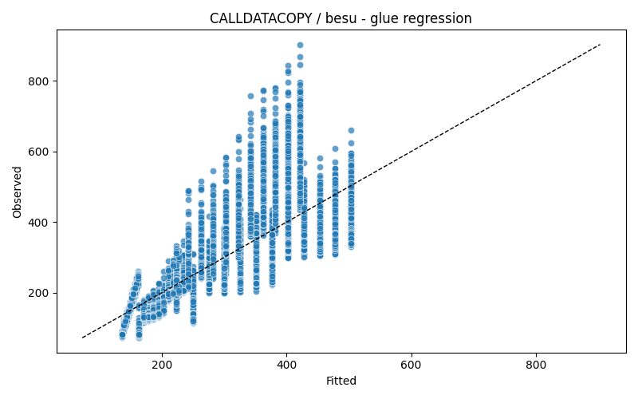

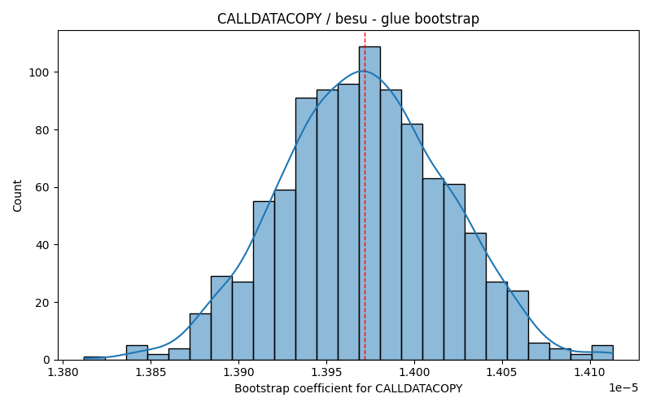

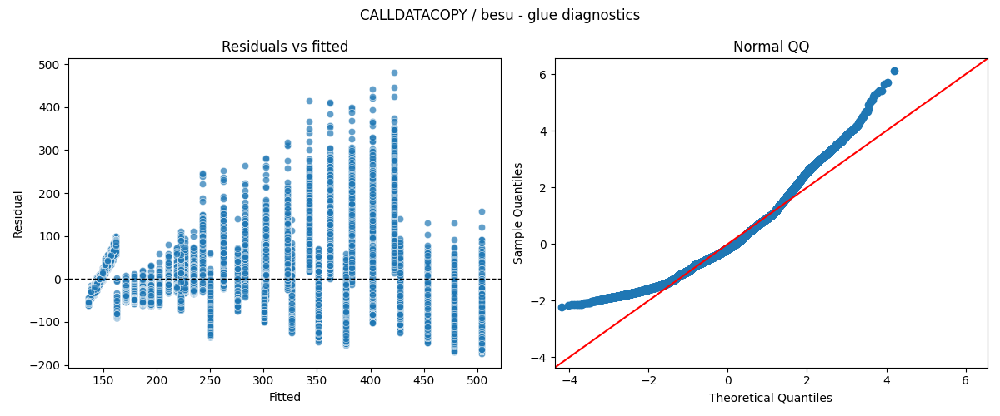

</details>

<details><summary><code>CALLDATALOAD</code> · nobs=12408 · runtime_ms=0 · p=1.00e+00 · R²=2.22e-16</summary>

```
==============================================================================
                           NNLS Regression Results                            
==============================================================================
Dep. Variable:          test_runtime_ms              R-squared:          0.000
Model:                  NNLS                    Adj. R-squared:         -0.000
No. Observations:       12408                             RMSE:           0.63
Df Residuals:           12406                              MAE:           0.42
Df Model:               1      
==============================================================================
                      coef     std err     P-value      [0.025      0.975]
------------------------------------------------------------------------------
         const      3.5300      0.0057       0.001      3.5182      3.5404
  CALLDATALOAD      0.0000      0.0000       1.000      0.0000      0.0000
==============================================================================
Notes: Non-negative least squares with bootstrap inference (1000 iterations)
==============================================================================
```

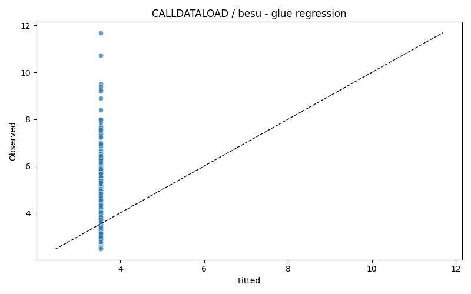


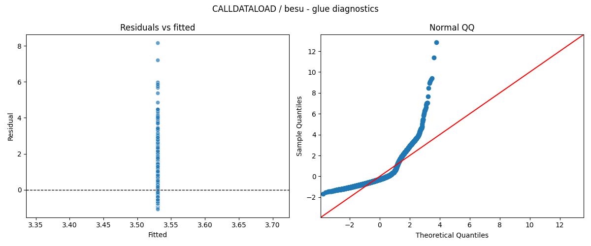

</details>

<details><summary><code>DIV</code> · nobs=3102 · runtime_ms=1.359e-05 · p=1.00e-03 · R²=0.7941</summary>

```
==============================================================================
                           NNLS Regression Results                            
==============================================================================
Dep. Variable:          test_runtime_ms              R-squared:          0.794
Model:                  NNLS                    Adj. R-squared:          0.794
No. Observations:       3102                              RMSE:          54.63
Df Residuals:           3100                               MAE:          44.53
Df Model:               1      
==============================================================================
                      coef     std err     P-value      [0.025      0.975]
------------------------------------------------------------------------------
         const    126.5125      2.7335       0.001    121.2204    131.8732
           DIV      0.0000      0.0000       0.001      0.0000      0.0000
==============================================================================
Notes: Non-negative least squares with bootstrap inference (1000 iterations)
==============================================================================
```

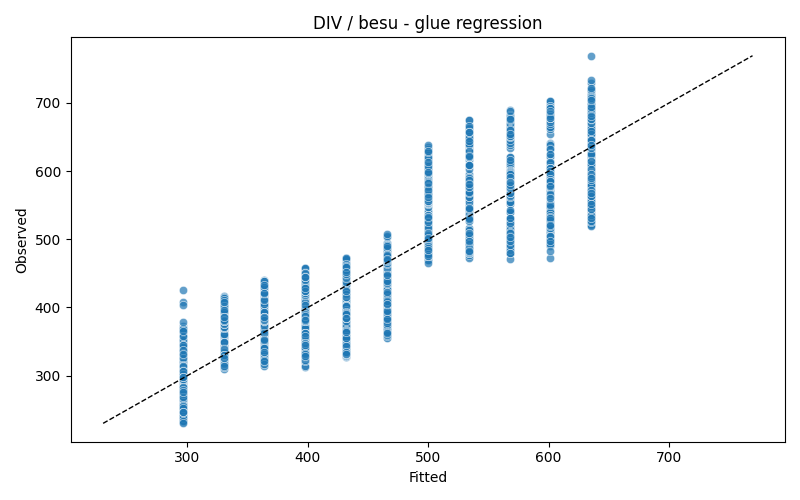

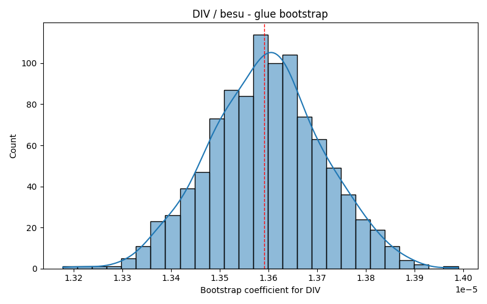

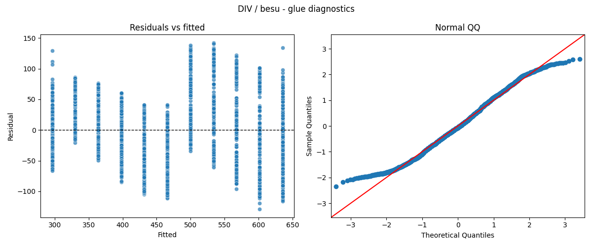

</details>

<details><summary><code>EXP</code> · nobs=3102 · runtime_ms=0.001076 · p=1.00e-03 · R²=0.7406</summary>

```
==============================================================================
                           NNLS Regression Results                            
==============================================================================
Dep. Variable:          test_runtime_ms              R-squared:          0.741
Model:                  NNLS                    Adj. R-squared:          0.740
No. Observations:       3102                              RMSE:          24.94
Df Residuals:           3100                               MAE:          19.10
Df Model:               1      
==============================================================================
                      coef     std err     P-value      [0.025      0.975]
------------------------------------------------------------------------------
         const     89.9264      1.7751       0.001     86.3841     93.4156
           EXP      0.0011      0.0000       0.001      0.0010      0.0011
==============================================================================
Notes: Non-negative least squares with bootstrap inference (1000 iterations)
==============================================================================
```

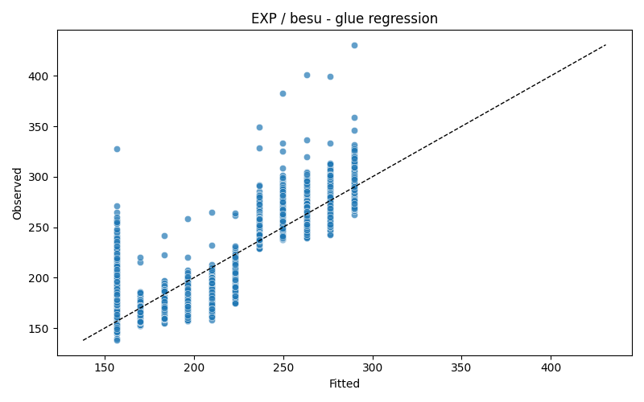

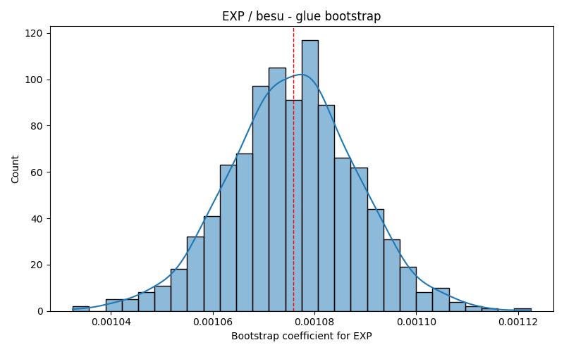

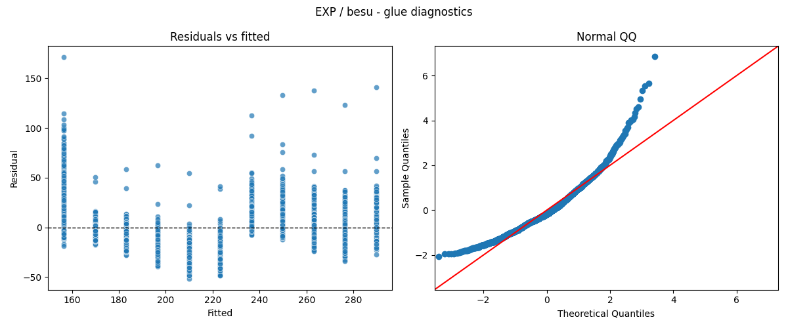

</details>

<details><summary><code>GT</code> · nobs=3102 · runtime_ms=1.937e-05 · p=1.00e-03 · R²=0.1473</summary>

```
==============================================================================
                           NNLS Regression Results                            
==============================================================================
Dep. Variable:          test_runtime_ms              R-squared:          0.147
Model:                  NNLS                    Adj. R-squared:          0.147
No. Observations:       3102                              RMSE:         490.49
Df Residuals:           3100                               MAE:         464.97
Df Model:               1      
==============================================================================
                      coef     std err     P-value      [0.025      0.975]
------------------------------------------------------------------------------
         const    123.9625     25.5845       0.001     71.6499    175.2981
            GT      0.0000      0.0000       0.001      0.0000      0.0000
==============================================================================
Notes: Non-negative least squares with bootstrap inference (1000 iterations)
==============================================================================
```

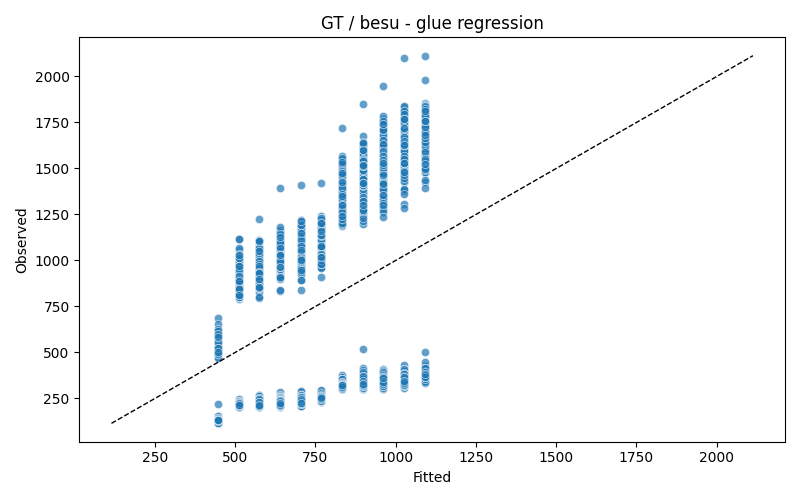

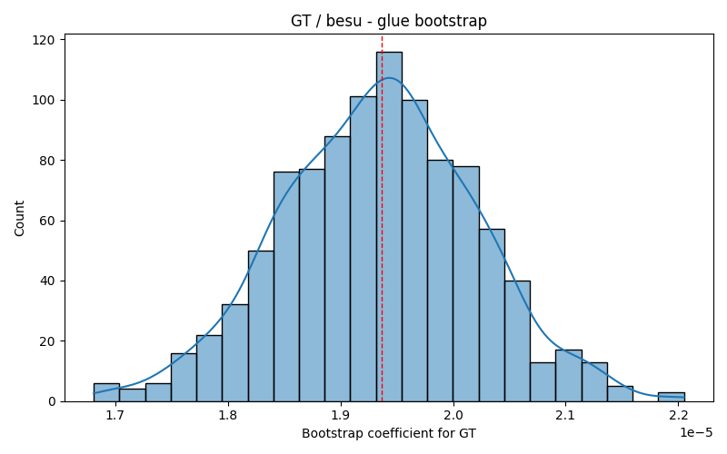

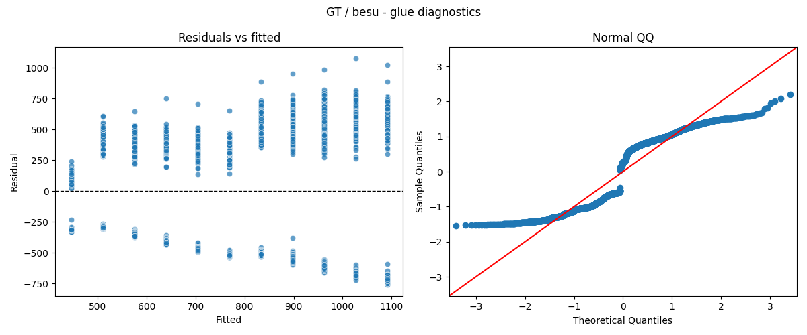

</details>

<details><summary><code>JUMPI</code> · nobs=3102 · runtime_ms=5.039e-06 · p=1.00e-03 · R²=0.7396</summary>

```
==============================================================================
                           NNLS Regression Results                            
==============================================================================
Dep. Variable:          test_runtime_ms              R-squared:          0.740
Model:                  NNLS                    Adj. R-squared:          0.740
No. Observations:       3102                              RMSE:          13.49
Df Residuals:           3100                               MAE:          10.44
Df Model:               1      
==============================================================================
                      coef     std err     P-value      [0.025      0.975]
------------------------------------------------------------------------------
         const     22.0714      0.8622       0.001     20.4968     23.7992
         JUMPI      0.0000      0.0000       0.001      0.0000      0.0000
==============================================================================
Notes: Non-negative least squares with bootstrap inference (1000 iterations)
==============================================================================
```


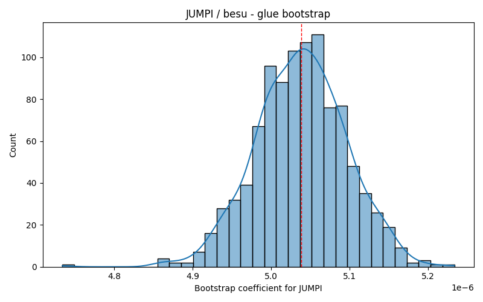

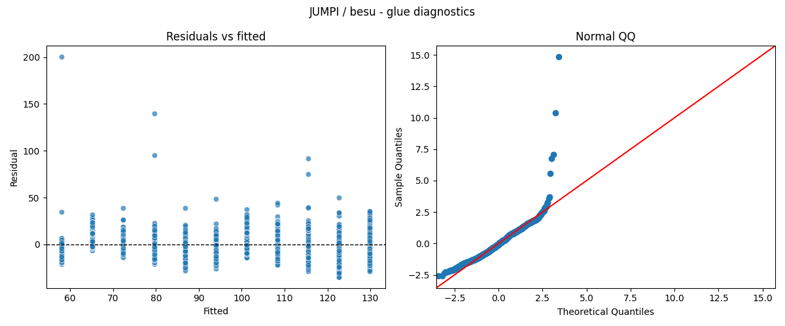

</details>

<details><summary><code>LT</code> · nobs=3102 · runtime_ms=1.927e-05 · p=1.00e-03 · R²=0.1418</summary>

```
==============================================================================
                           NNLS Regression Results                            
==============================================================================
Dep. Variable:          test_runtime_ms              R-squared:          0.142
Model:                  NNLS                    Adj. R-squared:          0.142
No. Observations:       3102                              RMSE:         498.85
Df Residuals:           3100                               MAE:         471.91
Df Model:               1      
==============================================================================
                      coef     std err     P-value      [0.025      0.975]
------------------------------------------------------------------------------
         const    154.4722     25.8016       0.001    102.4736    202.3677
            LT      0.0000      0.0000       0.001      0.0000      0.0000
==============================================================================
Notes: Non-negative least squares with bootstrap inference (1000 iterations)
==============================================================================
```

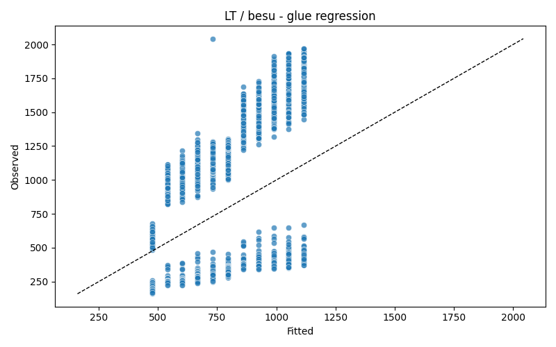

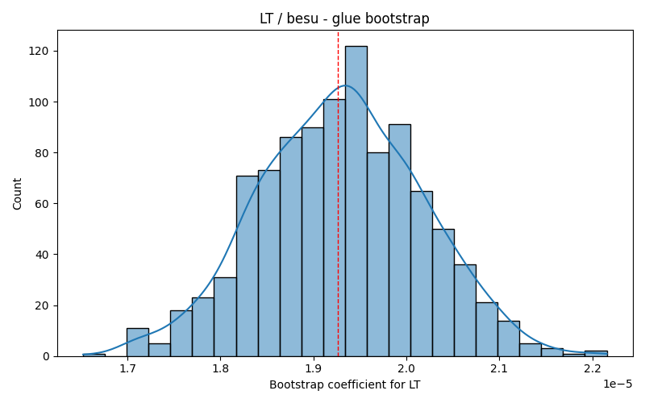

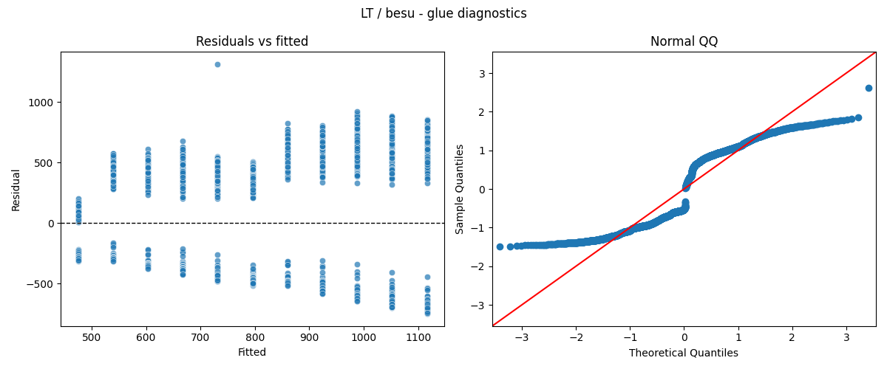

</details>

<details><summary><code>MSTORE</code> · nobs=15510 · runtime_ms=1.477e-05 · p=1.00e-03 · R²=0.8291</summary>

```
==============================================================================
                           NNLS Regression Results                            
==============================================================================
Dep. Variable:          test_runtime_ms              R-squared:          0.829
Model:                  NNLS                    Adj. R-squared:          0.829
No. Observations:       15510                             RMSE:          47.06
Df Residuals:           15508                              MAE:          38.08
Df Model:               1      
==============================================================================
                      coef     std err     P-value      [0.025      0.975]
------------------------------------------------------------------------------
         const     80.6023      1.2328       0.001     78.2984     83.0580
        MSTORE      0.0000      0.0000       0.001      0.0000      0.0000
==============================================================================
Notes: Non-negative least squares with bootstrap inference (1000 iterations)
==============================================================================
```

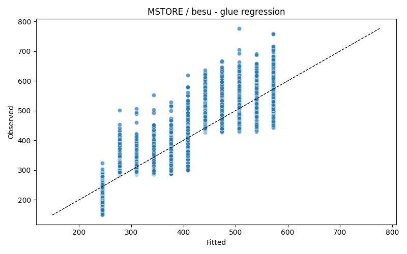


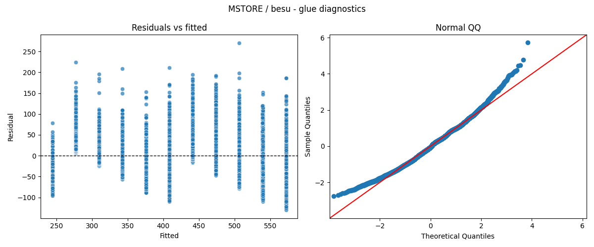

</details>

<details><summary><code>MSTORE8</code> · nobs=15510 · runtime_ms=9.204e-06 · p=1.00e-03 · R²=0.8587</summary>

```
==============================================================================
                           NNLS Regression Results                            
==============================================================================
Dep. Variable:          test_runtime_ms              R-squared:          0.859
Model:                  NNLS                    Adj. R-squared:          0.859
No. Observations:       15510                             RMSE:          26.20
Df Residuals:           15508                              MAE:          21.44
Df Model:               1      
==============================================================================
                      coef     std err     P-value      [0.025      0.975]
------------------------------------------------------------------------------
         const     48.9901      0.6973       0.001     47.6910     50.3113
       MSTORE8      0.0000      0.0000       0.001      0.0000      0.0000
==============================================================================
Notes: Non-negative least squares with bootstrap inference (1000 iterations)
==============================================================================
```


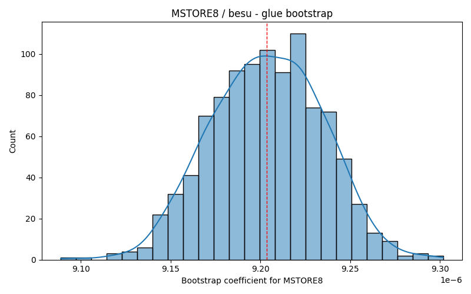

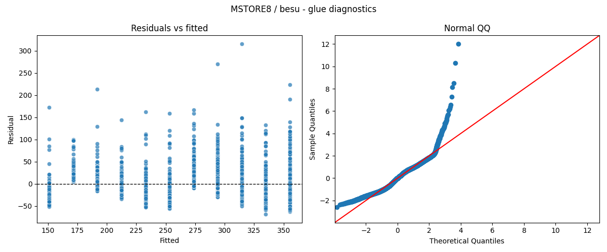

</details>

<details><summary><code>MUL</code> · nobs=3102 · runtime_ms=1.133e-05 · p=1.00e-03 · R²=0.8012</summary>

```
==============================================================================
                           NNLS Regression Results                            
==============================================================================
Dep. Variable:          test_runtime_ms              R-squared:          0.801
Model:                  NNLS                    Adj. R-squared:          0.801
No. Observations:       3102                              RMSE:          44.57
Df Residuals:           3100                               MAE:          35.43
Df Model:               1      
==============================================================================
                      coef     std err     P-value      [0.025      0.975]
------------------------------------------------------------------------------
         const     94.7721      2.2319       0.001     90.2882     98.8841
           MUL      0.0000      0.0000       0.001      0.0000      0.0000
==============================================================================
Notes: Non-negative least squares with bootstrap inference (1000 iterations)
==============================================================================
```

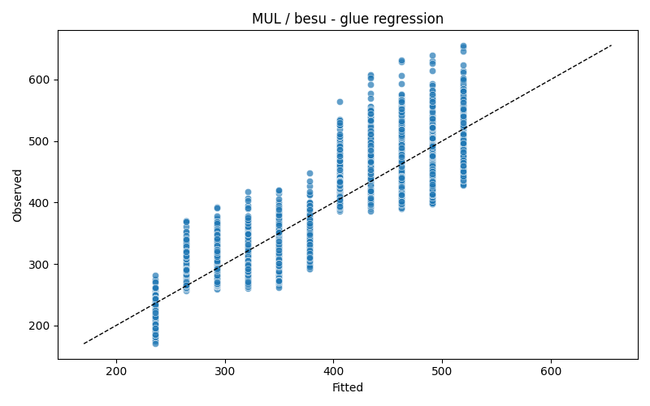

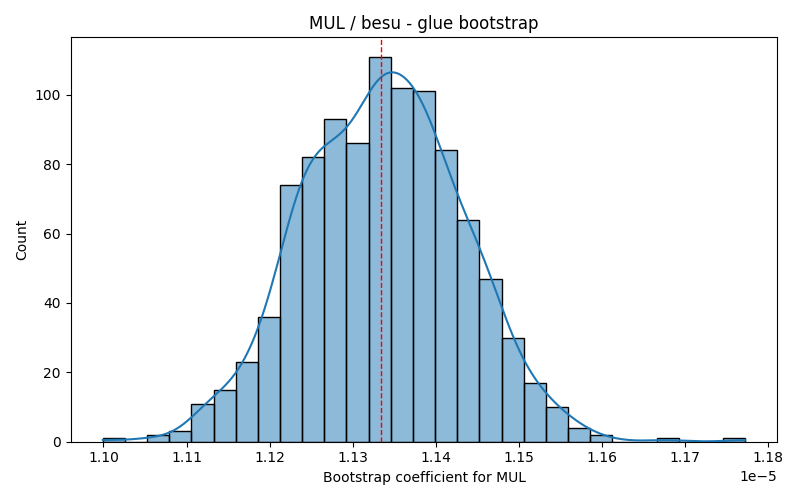

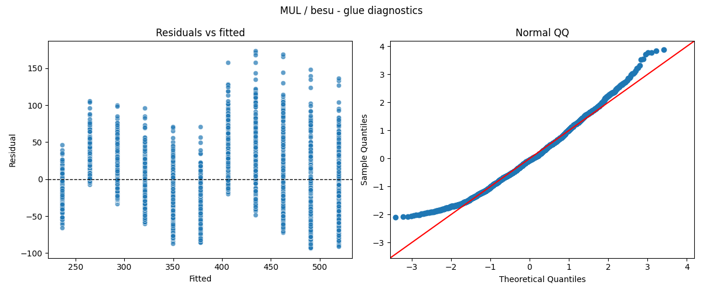

</details>

<details><summary><code>PC</code> · nobs=3102 · runtime_ms=2.894e-06 · p=1.00e-03 · R²=0.8702</summary>

```
==============================================================================
                           NNLS Regression Results                            
==============================================================================
Dep. Variable:          test_runtime_ms              R-squared:          0.870
Model:                  NNLS                    Adj. R-squared:          0.870
No. Observations:       3102                              RMSE:          33.42
Df Residuals:           3100                               MAE:          28.66
Df Model:               1      
==============================================================================
                      coef     std err     P-value      [0.025      0.975]
------------------------------------------------------------------------------
         const     68.1109      2.1133       0.001     64.0977     72.2535
            PC      0.0000      0.0000       0.001      0.0000      0.0000
==============================================================================
Notes: Non-negative least squares with bootstrap inference (1000 iterations)
==============================================================================
```

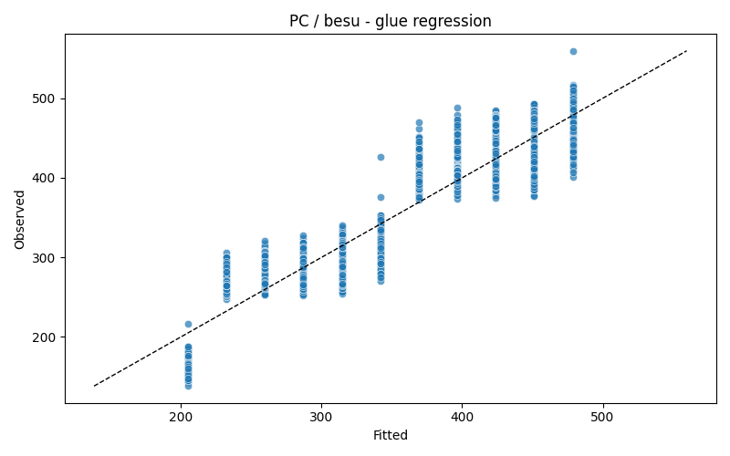

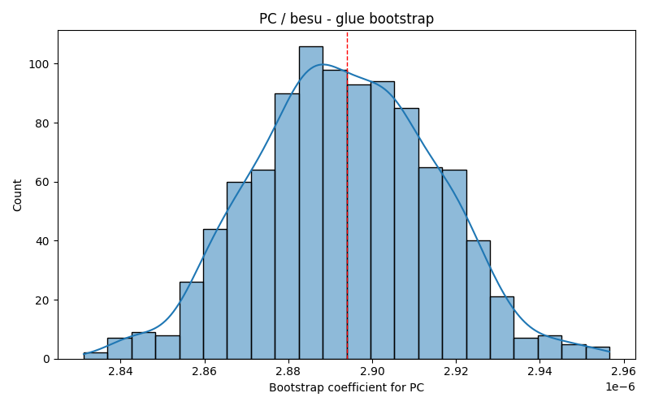

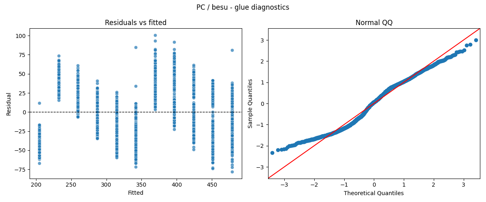

</details>

<details><summary><code>RETURNDATASIZE</code> · nobs=12408 · runtime_ms=4.256e-06 · p=1.00e-03 · R²=0.7894</summary>

```
==============================================================================
                           NNLS Regression Results                            
==============================================================================
Dep. Variable:          test_runtime_ms              R-squared:          0.789
Model:                  NNLS                    Adj. R-squared:          0.789
No. Observations:       12408                             RMSE:          34.71
Df Residuals:           12406                              MAE:          24.68
Df Model:               1      
==============================================================================
                      coef     std err     P-value      [0.025      0.975]
------------------------------------------------------------------------------
         const     51.7648      1.0130       0.001     49.8272     53.7208
RETURNDATASIZE      0.0000      0.0000       0.001      0.0000      0.0000
==============================================================================
Notes: Non-negative least squares with bootstrap inference (1000 iterations)
==============================================================================
```

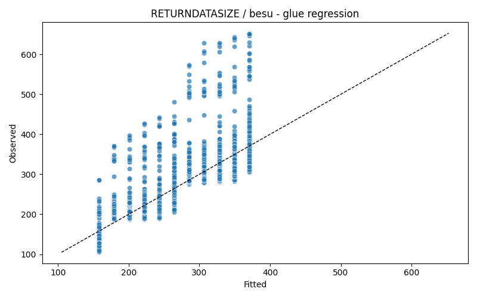

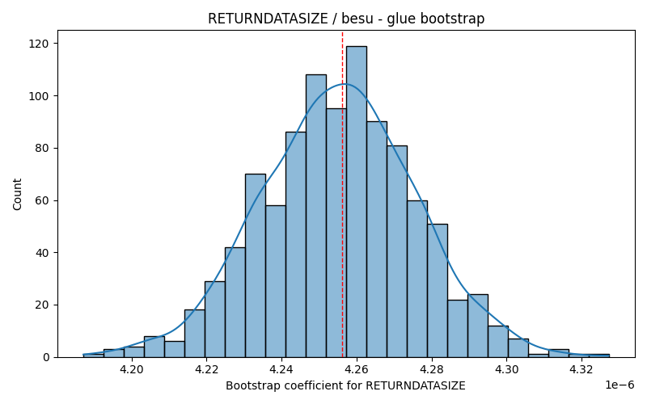

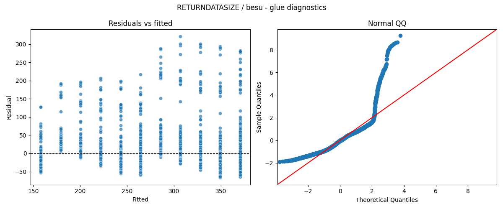

</details>

<details><summary><code>SELFBALANCE</code> · nobs=2538 · runtime_ms=1.03e-05 · p=1.00e-03 · R²=0.7043</summary>

```
==============================================================================
                           NNLS Regression Results                            
==============================================================================
Dep. Variable:          test_runtime_ms              R-squared:          0.704
Model:                  NNLS                    Adj. R-squared:          0.704
No. Observations:       2538                              RMSE:          67.32
Df Residuals:           2536                               MAE:          56.01
Df Model:               1      
==============================================================================
                      coef     std err     P-value      [0.025      0.975]
------------------------------------------------------------------------------
         const    235.6173      4.9926       0.001    225.2401    245.0909
   SELFBALANCE      0.0000      0.0000       0.001      0.0000      0.0000
==============================================================================
Notes: Non-negative least squares with bootstrap inference (1000 iterations)
==============================================================================
```

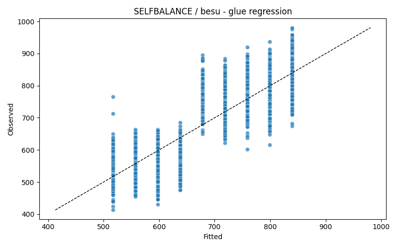

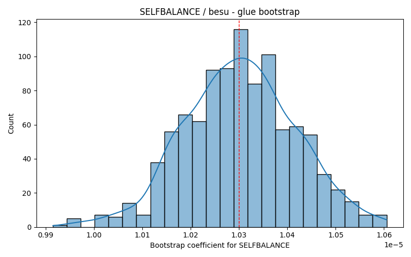

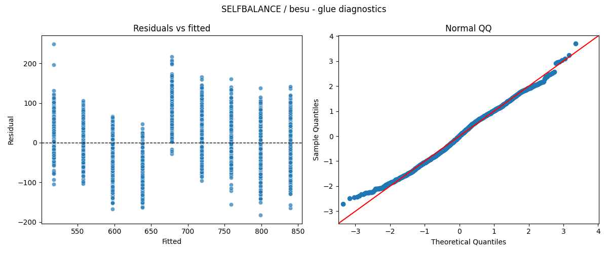

</details>

<details><summary><code>SUB</code> · nobs=3102 · runtime_ms=9.054e-06 · p=1.00e-03 · R²=0.8526</summary>

```
==============================================================================
                           NNLS Regression Results                            
==============================================================================
Dep. Variable:          test_runtime_ms              R-squared:          0.853
Model:                  NNLS                    Adj. R-squared:          0.853
No. Observations:       3102                              RMSE:          39.63
Df Residuals:           3100                               MAE:          33.55
Df Model:               1      
==============================================================================
                      coef     std err     P-value      [0.025      0.975]
------------------------------------------------------------------------------
         const     77.5577      2.3454       0.001     72.8005     81.9834
           SUB      0.0000      0.0000       0.001      0.0000      0.0000
==============================================================================
Notes: Non-negative least squares with bootstrap inference (1000 iterations)
==============================================================================
```

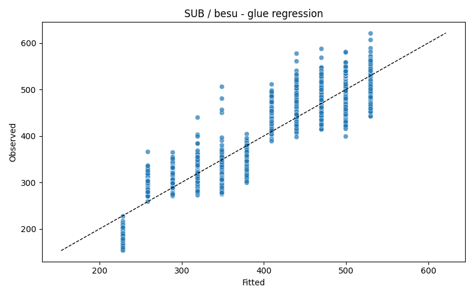

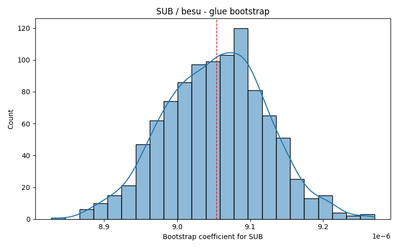

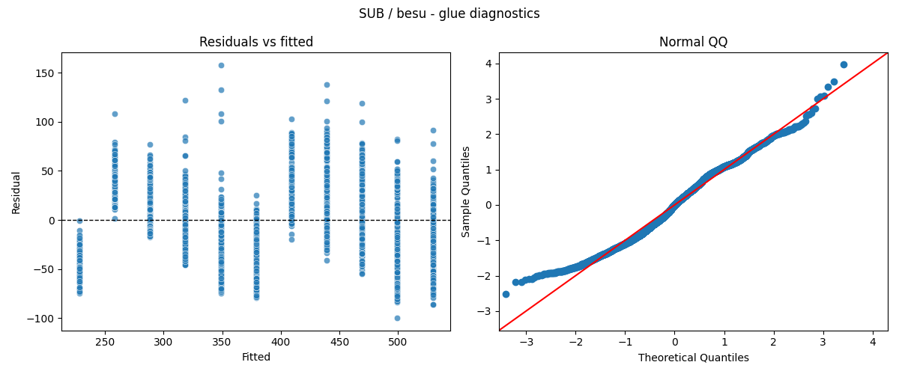

</details>

### Mixed glue (tier B) · besu

<details><summary><code>JUMP</code> · nobs=3102 · runtime_ms=4.273e-05 · p=1.00e-03 · R²=0.8523</summary>

```
==============================================================================
                           NNLS Regression Results                            
==============================================================================
Dep. Variable:          test_runtime_ms              R-squared:          0.852
Model:                  NNLS                    Adj. R-squared:          0.852
No. Observations:       3102                              RMSE:          66.09
Df Residuals:           3100                               MAE:          55.83
Df Model:               1      
==============================================================================
                      coef     std err     P-value      [0.025      0.975]
------------------------------------------------------------------------------
         const    123.3350      4.0611       0.001    114.9260    131.3442
          JUMP      0.0000      0.0000       0.001      0.0000      0.0000
==============================================================================
Notes: Non-negative least squares with bootstrap inference (1000 iterations)
==============================================================================
```

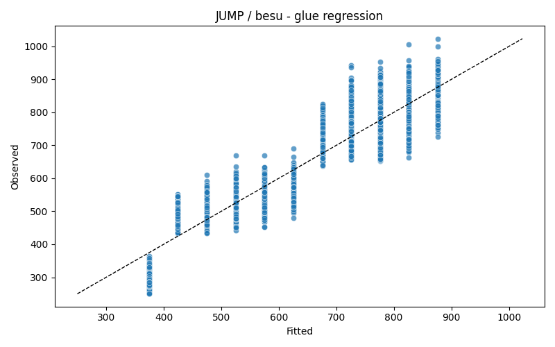

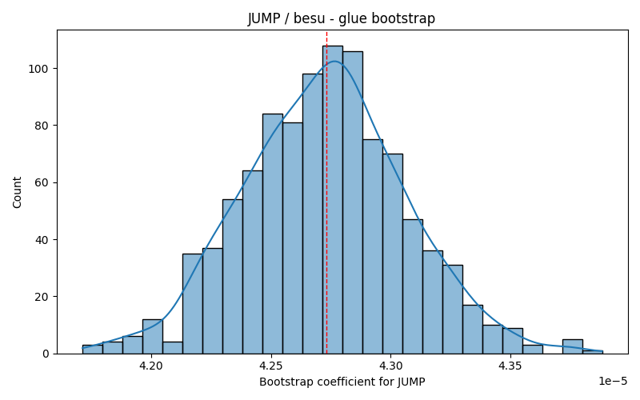

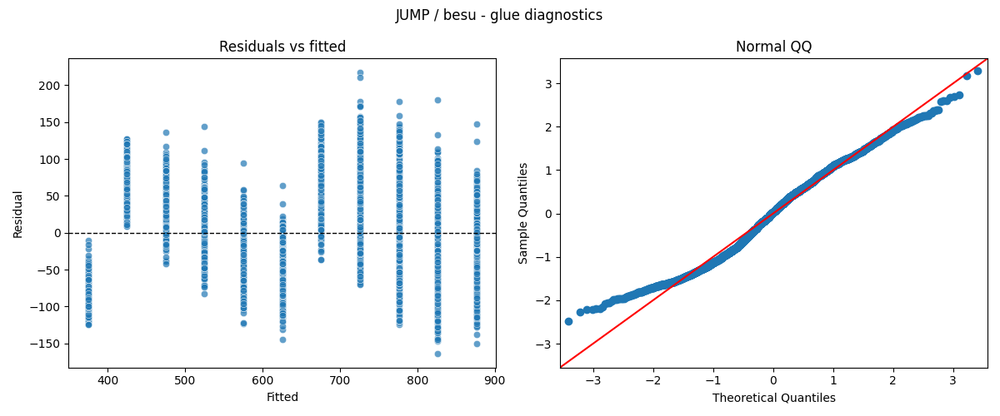

</details>

<details><summary><code>KECCAK256</code> · nobs=49632 · runtime_ms=3.801e-05 · p=1.00e-03 · R²=0.1614</summary>

```
==============================================================================
                           NNLS Regression Results                            
==============================================================================
Dep. Variable:          test_runtime_ms              R-squared:          0.161
Model:                  NNLS                    Adj. R-squared:          0.161
No. Observations:       49632                             RMSE:         172.18
Df Residuals:           49630                              MAE:         135.81
Df Model:               1      
==============================================================================
                      coef     std err     P-value      [0.025      0.975]
------------------------------------------------------------------------------
         const    530.1773      1.6613       0.001    527.0254    533.5040
     KECCAK256      0.0000      0.0000       0.001      0.0000      0.0000
==============================================================================
Notes: Non-negative least squares with bootstrap inference (1000 iterations)
==============================================================================
```

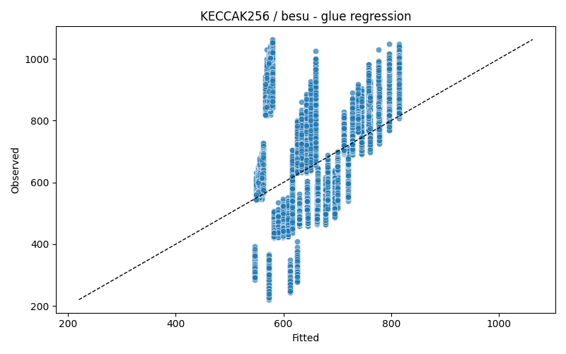

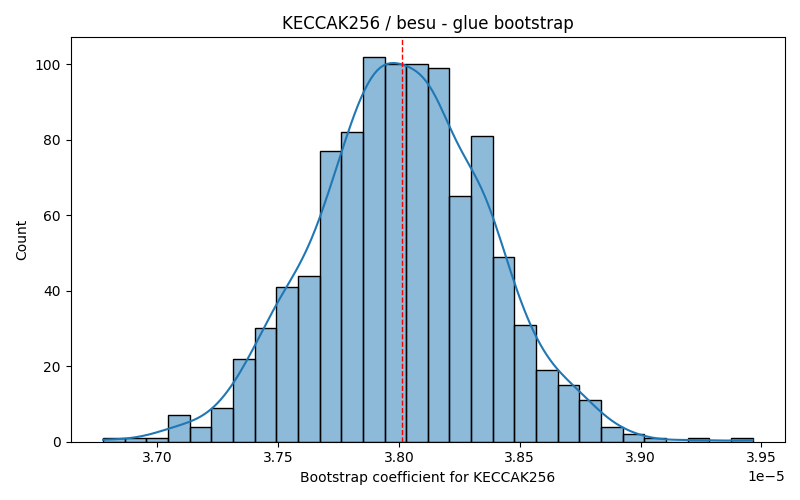

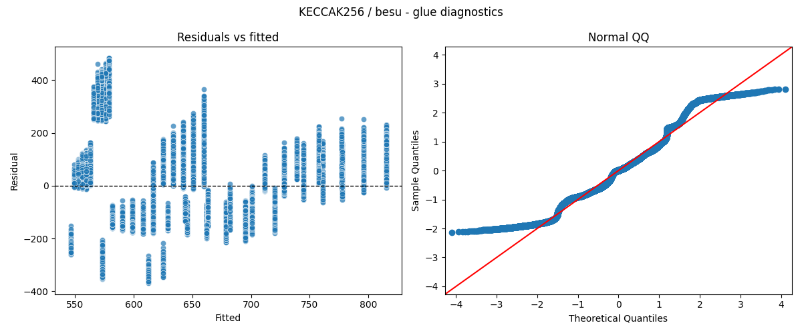

</details>

## erigon

| glue_opcode | nobs | glue_runtime_ms | p_value | rsquared |
| --- | --- | --- | --- | --- |
| `ISZERO` | 165 | 1.034e-06 | 1.00e-03 | 0.9342 |
| `JUMPDEST` | 165 | 8.079e-07 | 1.00e-03 | 0.9115 |
| `SWAP` | 2640 | 1.265e-06 | 1.00e-03 | 0.9272 |
| `CALLDATASIZE` | 9779 | 9.085e-07 | 1.00e-03 | 0.901 |
| `DUP` | 9779 | 1.138e-06 | 1.00e-03 | 0.901 |
| `GAS` | 9779 | 9.354e-07 | 1.00e-03 | 0.901 |
| `MLOAD` | 9779 | 3.461e-06 | 1.00e-03 | 0.901 |
| `PUSH` | 9779 | 2.807e-06 | 1.00e-03 | 0.901 |
| `PUSH0` | 9779 | 9.345e-07 | 1.00e-03 | 0.901 |
| `STATICCALL` | 9779 | 0.0004775 | 1.00e-03 | 0.901 |
| `ADD` | 165 | 2.915e-06 | 1.00e-03 | 0.9315 |
| `AND` | 165 | 2.908e-06 | 1.00e-03 | 0.9353 |
| `CALLDATACOPY` | 3960 | 7.609e-06 | 1.00e-03 | 0.974 |
| `CALLDATALOAD` | 660 | 4.384e-05 | 1.00e-03 | 0.2042 |
| `DIV` | 165 | 9.95e-06 | 1.00e-03 | 0.8913 |
| `EXP` | 165 | 0.0003672 | 1.00e-03 | 0.9164 |
| `GT` | 165 | 2.905e-06 | 1.00e-03 | 0.8874 |
| `JUMPI` | 165 | 3.716e-06 | 1.00e-03 | 0.909 |
| `LT` | 165 | 2.916e-06 | 1.00e-03 | 0.9371 |
| `MSTORE` | 825 | 5.791e-06 | 1.00e-03 | 0.8233 |
| `MSTORE8` | 825 | 5.16e-06 | 1.00e-03 | 0.7602 |
| `MUL` | 165 | 3.574e-06 | 1.00e-03 | 0.9264 |
| `PC` | 165 | 1.436e-06 | 1.00e-03 | 0.931 |
| `RETURNDATASIZE` | 660 | 1.898e-06 | 1.00e-03 | 0.9128 |
| `SELFBALANCE` | 135 | 1.492e-06 | 1.00e-03 | 0.8782 |
| `SUB` | 165 | 2.87e-06 | 1.00e-03 | 0.9269 |
| `JUMP` | 165 | 7.349e-06 | 1.00e-03 | 0.9312 |
| `KECCAK256` | 2640 | 2.221e-05 | 1.00e-03 | 0.1001 |

### Cycle glue — joint fit · erigon

<details><summary>Joint NNLS regression summary</summary>

```
==============================================================================
                           NNLS Regression Results                            
==============================================================================
Dep. Variable:          test_runtime_ms              R-squared:          0.901
Model:                  NNLS                    Adj. R-squared:          0.901
No. Observations:       9779                              RMSE:          28.90
Df Residuals:           9771                               MAE:          16.43
Df Model:               7      
==============================================================================
                      coef     std err     P-value      [0.025      0.975]
------------------------------------------------------------------------------
         const     28.7262      0.9658       0.001     26.9454     30.6467
  CALLDATASIZE      0.0000      0.0000       0.001      0.0000      0.0000
           DUP      0.0000      0.0000       0.001      0.0000      0.0000
           GAS      0.0000      0.0000       0.001      0.0000      0.0000
         MLOAD      0.0000      0.0000       0.001      0.0000      0.0000
          PUSH      0.0000      0.0000       0.001      0.0000      0.0000
         PUSH0      0.0000      0.0000       0.001      0.0000      0.0000
    STATICCALL      0.0005      0.0000       0.001      0.0005      0.0005
==============================================================================
Notes: Non-negative least squares with bootstrap inference (1000 iterations)
==============================================================================
```

</details>

<details><summary><code>CALLDATASIZE</code> · nobs=9779 · runtime_ms=9.085e-07 · p=1.00e-03 · R²=0.901</summary>

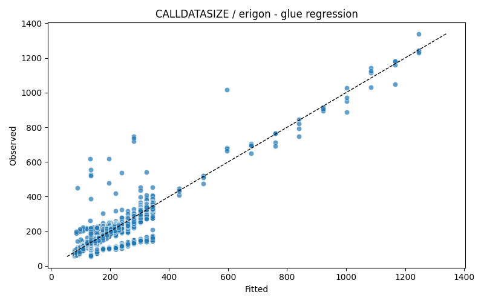

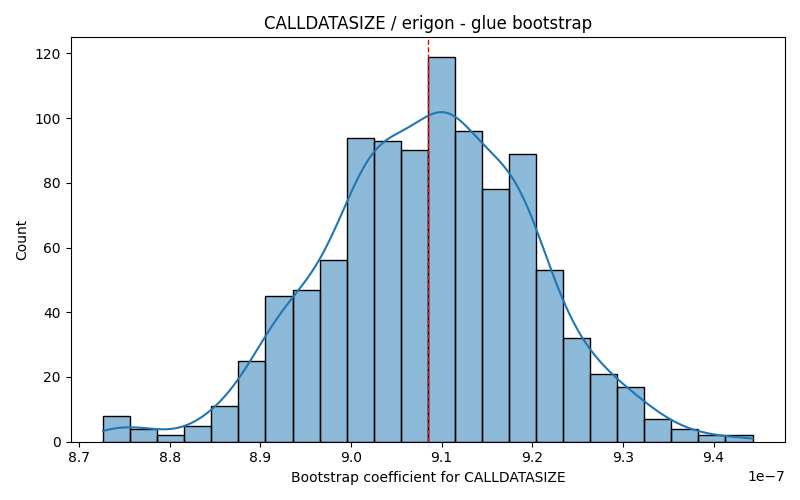


</details>

<details><summary><code>DUP</code> · nobs=9779 · runtime_ms=1.138e-06 · p=1.00e-03 · R²=0.901</summary>


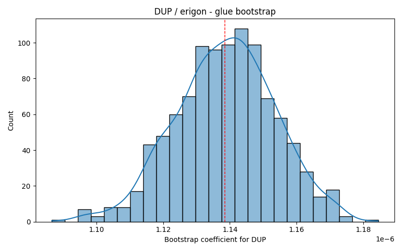


</details>

<details><summary><code>GAS</code> · nobs=9779 · runtime_ms=9.354e-07 · p=1.00e-03 · R²=0.901</summary>

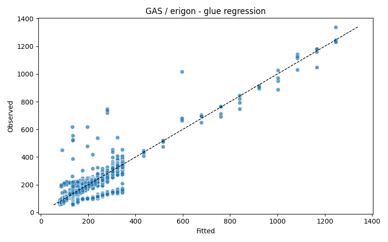

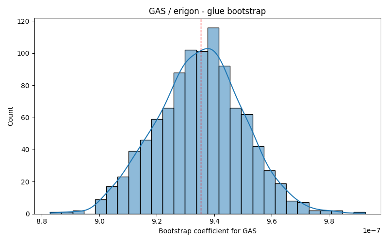

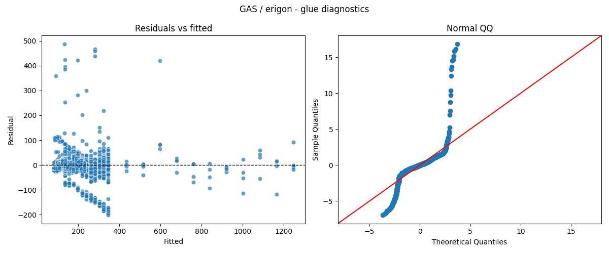

</details>

<details><summary><code>MLOAD</code> · nobs=9779 · runtime_ms=3.461e-06 · p=1.00e-03 · R²=0.901</summary>


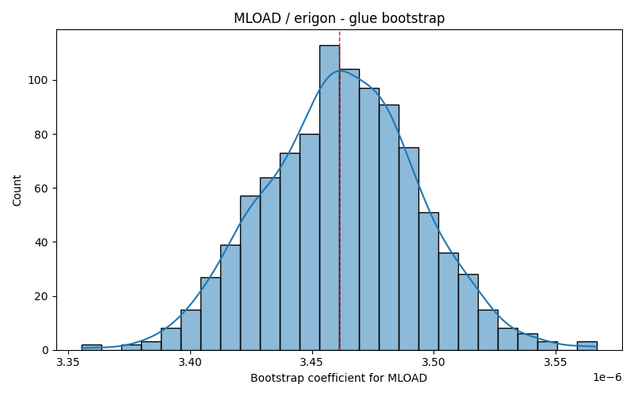

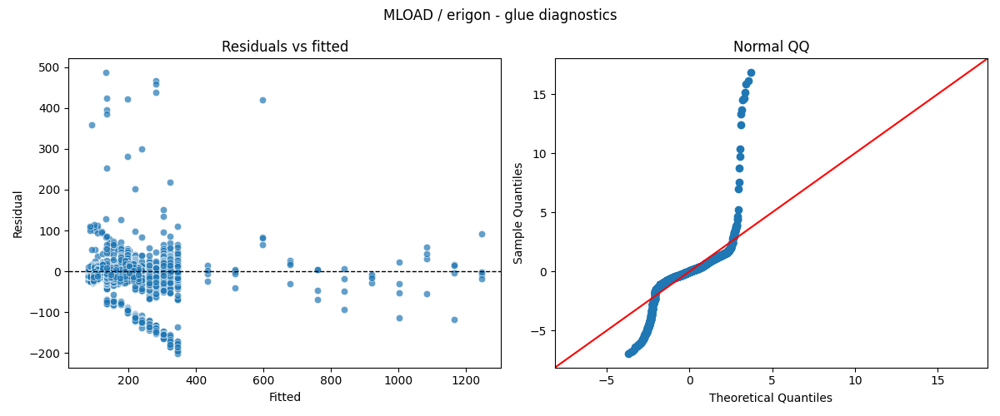

</details>

<details><summary><code>PUSH</code> · nobs=9779 · runtime_ms=2.807e-06 · p=1.00e-03 · R²=0.901</summary>


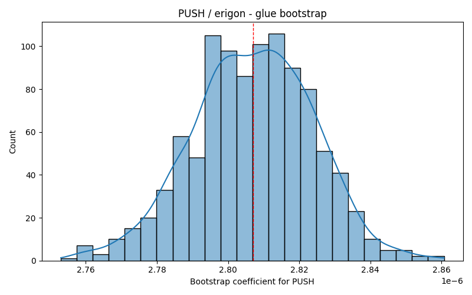


</details>

<details><summary><code>PUSH0</code> · nobs=9779 · runtime_ms=9.345e-07 · p=1.00e-03 · R²=0.901</summary>


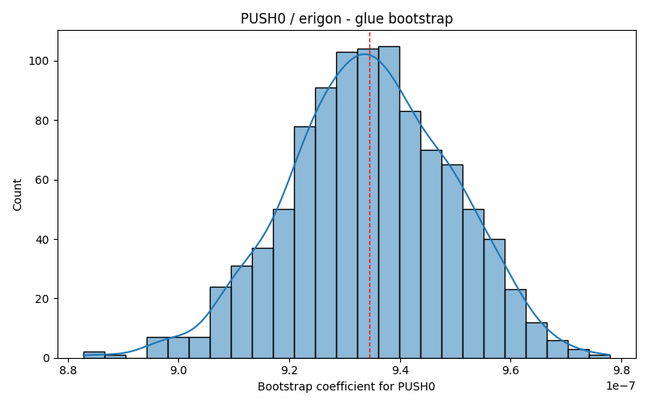


</details>

<details><summary><code>STATICCALL</code> · nobs=9779 · runtime_ms=0.0004775 · p=1.00e-03 · R²=0.901</summary>

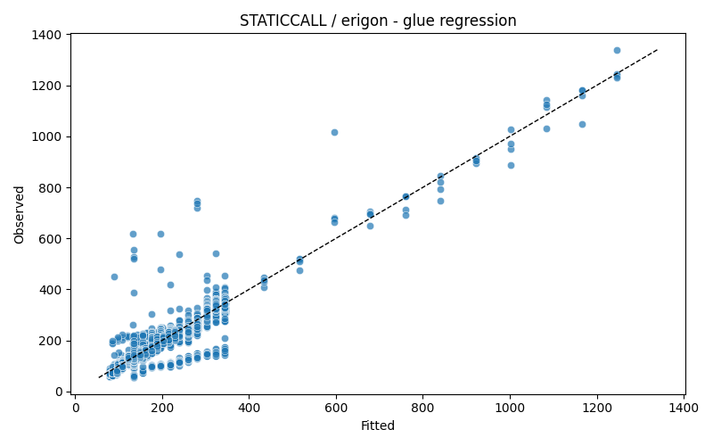

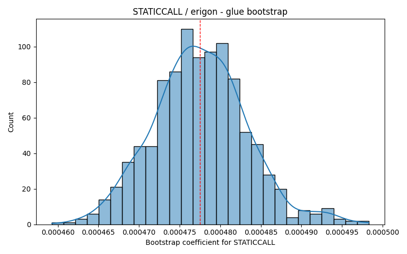


</details>

### Pure glue · erigon

<details><summary><code>ISZERO</code> · nobs=165 · runtime_ms=1.034e-06 · p=1.00e-03 · R²=0.9342</summary>

```
==============================================================================
                           NNLS Regression Results                            
==============================================================================
Dep. Variable:          test_runtime_ms              R-squared:          0.934
Model:                  NNLS                    Adj. R-squared:          0.934
No. Observations:       165                               RMSE:           5.78
Df Residuals:           163                                MAE:           4.77
Df Model:               1      
==============================================================================
                      coef     std err     P-value      [0.025      0.975]
------------------------------------------------------------------------------
         const     18.4076      1.6843       0.001     15.1087     21.7054
        ISZERO      0.0000      0.0000       0.001      0.0000      0.0000
==============================================================================
Notes: Non-negative least squares with bootstrap inference (1000 iterations)
==============================================================================
```

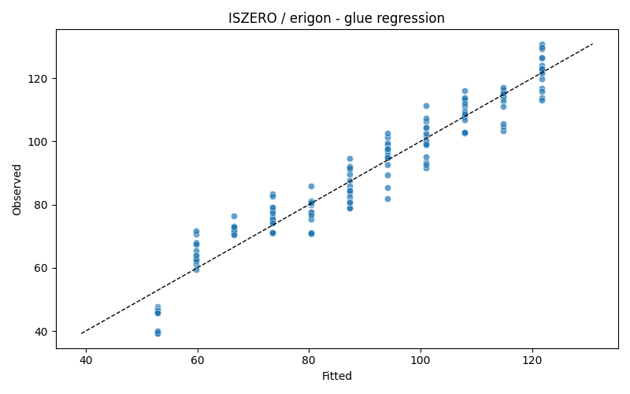

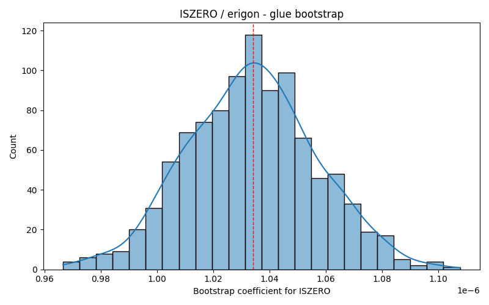

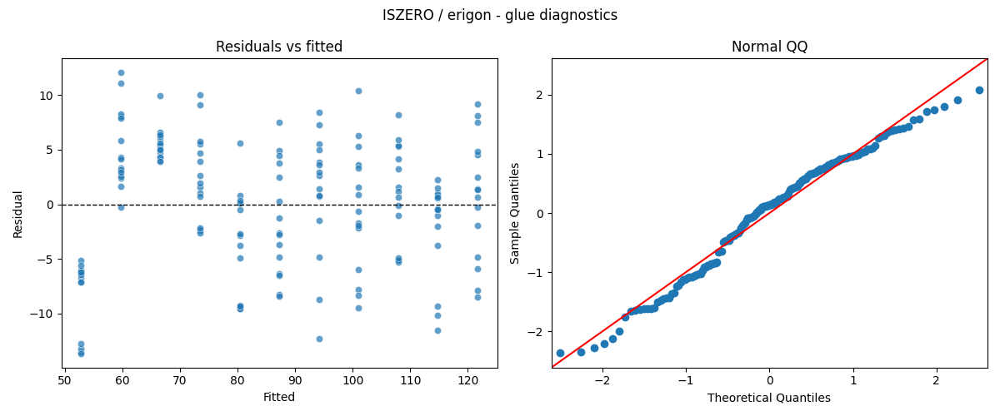

</details>

<details><summary><code>JUMPDEST</code> · nobs=165 · runtime_ms=8.079e-07 · p=1.00e-03 · R²=0.9115</summary>

```
==============================================================================
                           NNLS Regression Results                            
==============================================================================
Dep. Variable:          test_runtime_ms              R-squared:          0.911
Model:                  NNLS                    Adj. R-squared:          0.911
No. Observations:       165                               RMSE:          15.90
Df Residuals:           163                                MAE:          13.00
Df Model:               1      
==============================================================================
                      coef     std err     P-value      [0.025      0.975]
------------------------------------------------------------------------------
         const     22.8534      4.9540       0.001     14.1429     33.7734
      JUMPDEST      0.0000      0.0000       0.001      0.0000      0.0000
==============================================================================
Notes: Non-negative least squares with bootstrap inference (1000 iterations)
==============================================================================
```

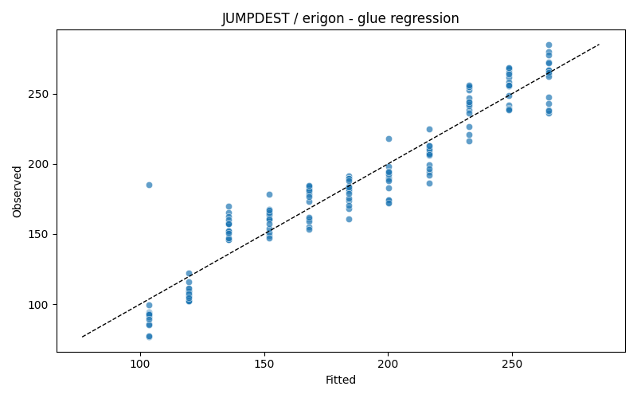

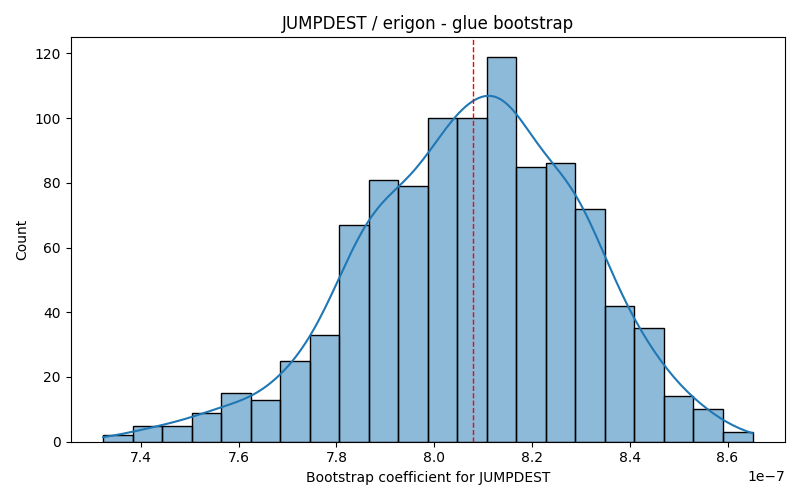

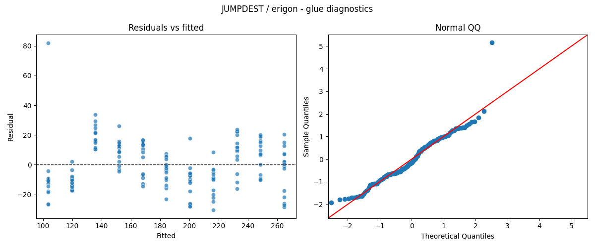

</details>

<details><summary><code>SWAP</code> · nobs=2640 · runtime_ms=1.265e-06 · p=1.00e-03 · R²=0.9272</summary>

```
==============================================================================
                           NNLS Regression Results                            
==============================================================================
Dep. Variable:          test_runtime_ms              R-squared:          0.927
Model:                  NNLS                    Adj. R-squared:          0.927
No. Observations:       2640                              RMSE:           7.46
Df Residuals:           2638                               MAE:           5.61
Df Model:               1      
==============================================================================
                      coef     std err     P-value      [0.025      0.975]
------------------------------------------------------------------------------
         const     22.4763      0.5236       0.001     21.4625     23.4402
          SWAP      0.0000      0.0000       0.001      0.0000      0.0000
==============================================================================
Notes: Non-negative least squares with bootstrap inference (1000 iterations)
==============================================================================
```

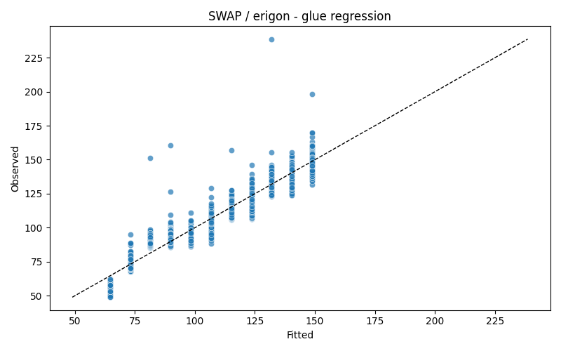

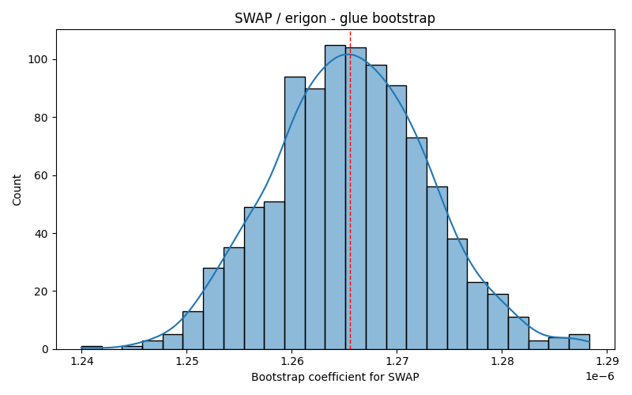

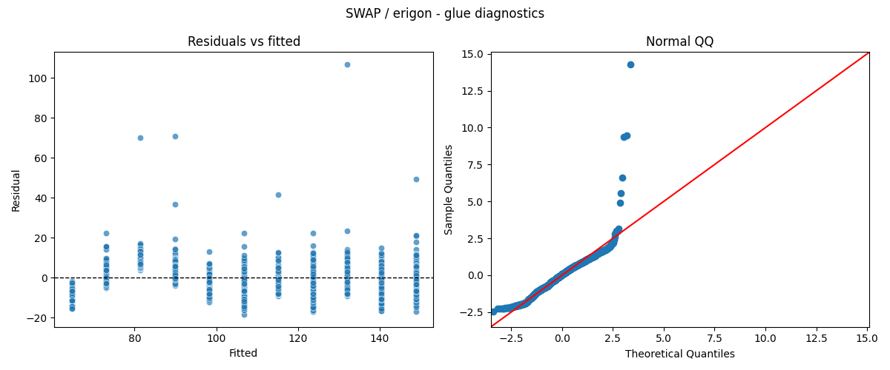

</details>

### Mixed glue (tier A) · erigon

<details><summary><code>ADD</code> · nobs=165 · runtime_ms=2.915e-06 · p=1.00e-03 · R²=0.9315</summary>

```
==============================================================================
                           NNLS Regression Results                            
==============================================================================
Dep. Variable:          test_runtime_ms              R-squared:          0.932
Model:                  NNLS                    Adj. R-squared:          0.931
No. Observations:       165                               RMSE:           8.32
Df Residuals:           163                                MAE:           6.93
Df Model:               1      
==============================================================================
                      coef     std err     P-value      [0.025      0.975]
------------------------------------------------------------------------------
         const     14.3342      2.2508       0.001     10.2308     19.2142
           ADD      0.0000      0.0000       0.001      0.0000      0.0000
==============================================================================
Notes: Non-negative least squares with bootstrap inference (1000 iterations)
==============================================================================
```

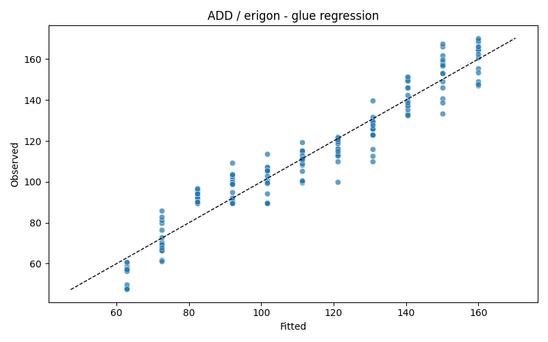

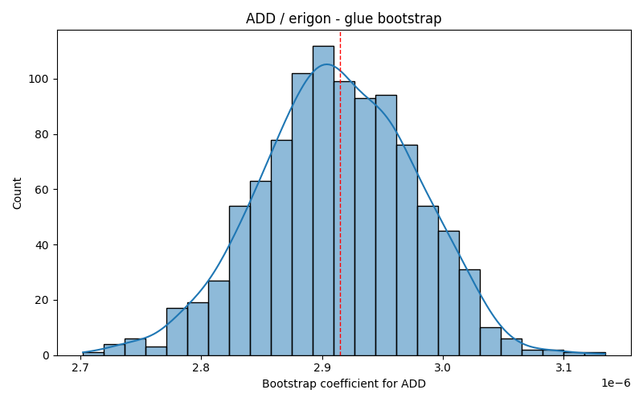

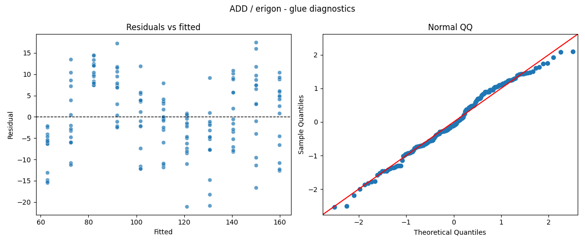

</details>

<details><summary><code>AND</code> · nobs=165 · runtime_ms=2.908e-06 · p=1.00e-03 · R²=0.9353</summary>

```
==============================================================================
                           NNLS Regression Results                            
==============================================================================
Dep. Variable:          test_runtime_ms              R-squared:          0.935
Model:                  NNLS                    Adj. R-squared:          0.935
No. Observations:       165                               RMSE:           8.05
Df Residuals:           163                                MAE:           6.71
Df Model:               1      
==============================================================================
                      coef     std err     P-value      [0.025      0.975]
------------------------------------------------------------------------------
         const     12.9102      2.1873       0.001      8.6438     17.2364
           AND      0.0000      0.0000       0.001      0.0000      0.0000
==============================================================================
Notes: Non-negative least squares with bootstrap inference (1000 iterations)
==============================================================================
```

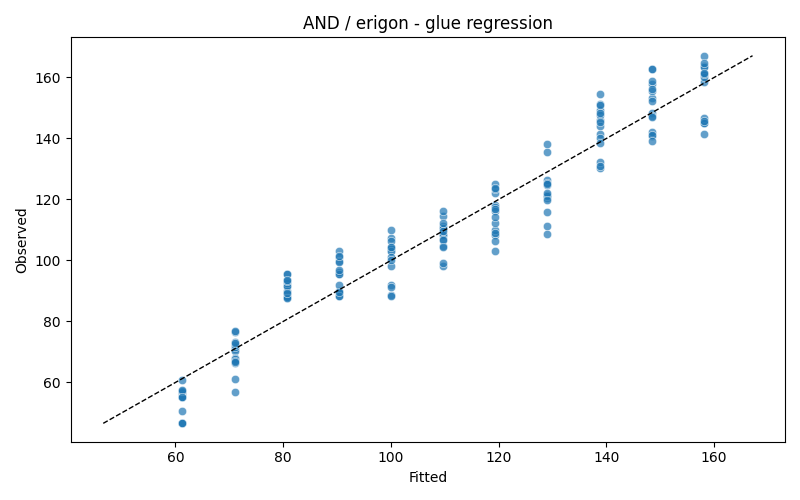

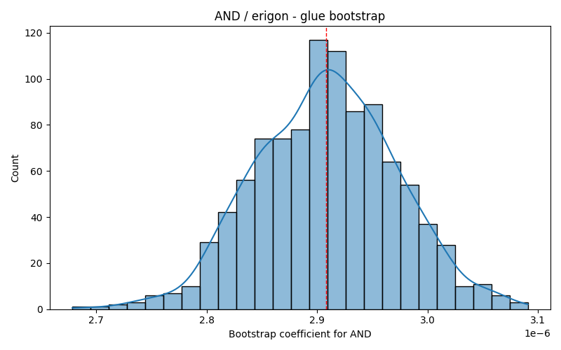

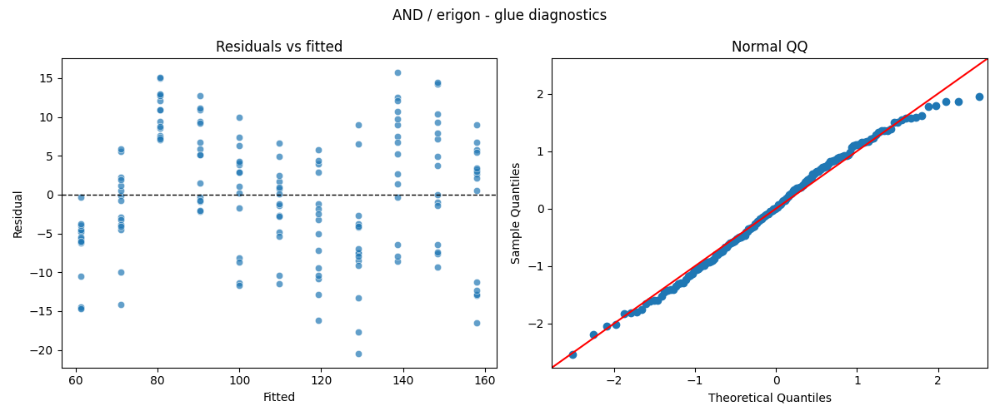

</details>

<details><summary><code>CALLDATACOPY</code> · nobs=3960 · runtime_ms=7.609e-06 · p=1.00e-03 · R²=0.974</summary>

```
==============================================================================
                           NNLS Regression Results                            
==============================================================================
Dep. Variable:          test_runtime_ms              R-squared:          0.974
Model:                  NNLS                    Adj. R-squared:          0.974
No. Observations:       3960                              RMSE:           9.35
Df Residuals:           3958                               MAE:           6.77
Df Model:               1      
==============================================================================
                      coef     std err     P-value      [0.025      0.975]
------------------------------------------------------------------------------
         const     16.6890      0.1770       0.001     16.3428     17.0439
  CALLDATACOPY      0.0000      0.0000       0.001      0.0000      0.0000
==============================================================================
Notes: Non-negative least squares with bootstrap inference (1000 iterations)
==============================================================================
```


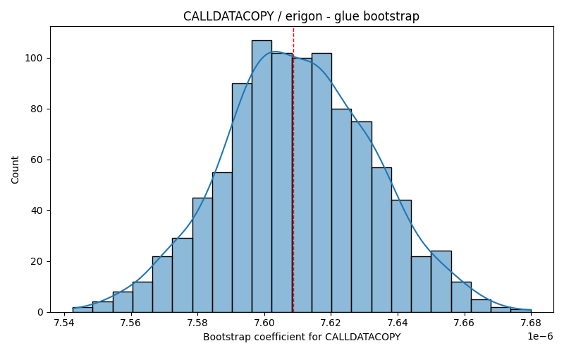

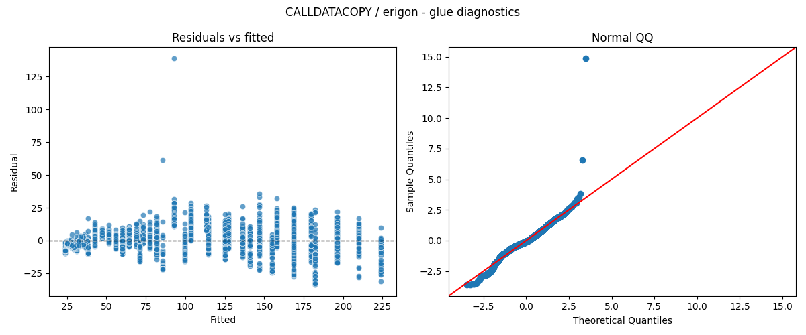

</details>

<details><summary><code>CALLDATALOAD</code> · nobs=660 · runtime_ms=4.384e-05 · p=1.00e-03 · R²=0.2042</summary>

```
==============================================================================
                           NNLS Regression Results                            
==============================================================================
Dep. Variable:          test_runtime_ms              R-squared:          0.204
Model:                  NNLS                    Adj. R-squared:          0.203
No. Observations:       660                               RMSE:           0.33
Df Residuals:           658                                MAE:           0.27
Df Model:               1      
==============================================================================
                      coef     std err     P-value      [0.025      0.975]
------------------------------------------------------------------------------
         const      5.8996      0.0452       0.001      5.8190      5.9927
  CALLDATALOAD      0.0000      0.0000       0.001      0.0000      0.0001
==============================================================================
Notes: Non-negative least squares with bootstrap inference (1000 iterations)
==============================================================================
```

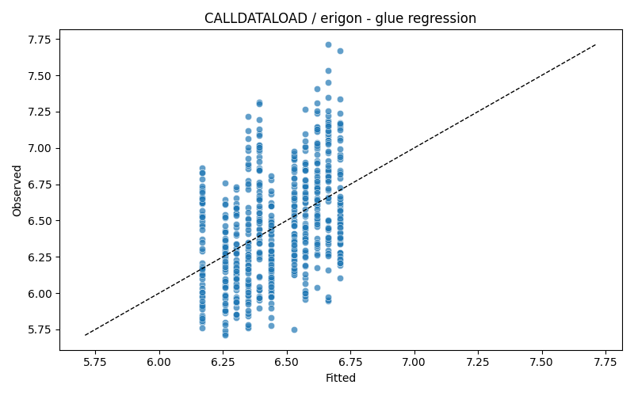

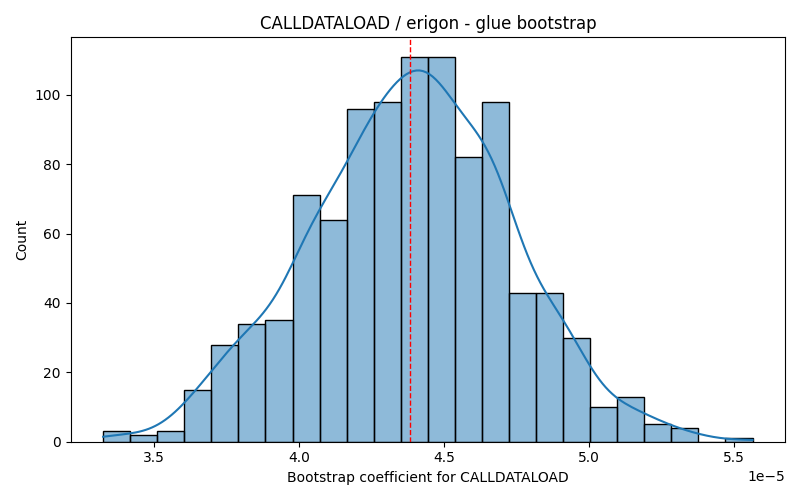

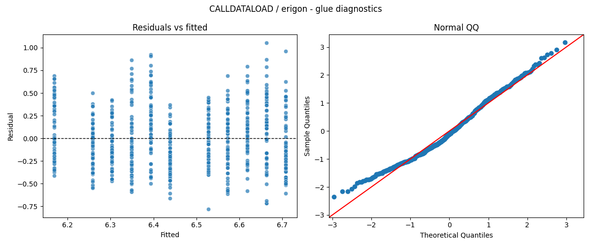

</details>

<details><summary><code>DIV</code> · nobs=165 · runtime_ms=9.95e-06 · p=1.00e-03 · R²=0.8913</summary>

```
==============================================================================
                           NNLS Regression Results                            
==============================================================================
Dep. Variable:          test_runtime_ms              R-squared:          0.891
Model:                  NNLS                    Adj. R-squared:          0.891
No. Observations:       165                               RMSE:          27.43
Df Residuals:           163                                MAE:          23.48
Df Model:               1      
==============================================================================
                      coef     std err     P-value      [0.025      0.975]
------------------------------------------------------------------------------
         const     23.4987      6.9485       0.001     10.5974     37.6683
           DIV      0.0000      0.0000       0.001      0.0000      0.0000
==============================================================================
Notes: Non-negative least squares with bootstrap inference (1000 iterations)
==============================================================================
```

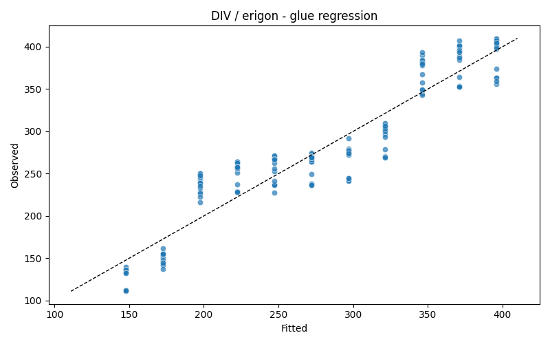

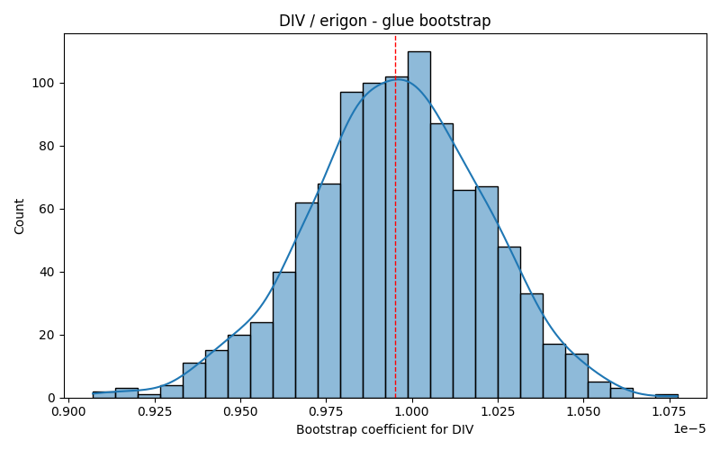

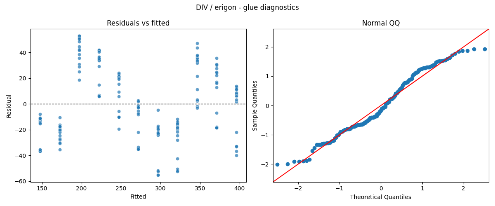

</details>

<details><summary><code>EXP</code> · nobs=165 · runtime_ms=0.0003672 · p=1.00e-03 · R²=0.9164</summary>

```
==============================================================================
                           NNLS Regression Results                            
==============================================================================
Dep. Variable:          test_runtime_ms              R-squared:          0.916
Model:                  NNLS                    Adj. R-squared:          0.916
No. Observations:       165                               RMSE:           4.34
Df Residuals:           163                                MAE:           3.45
Df Model:               1      
==============================================================================
                      coef     std err     P-value      [0.025      0.975]
------------------------------------------------------------------------------
         const     11.2750      1.2337       0.001      8.9577     13.7616
           EXP      0.0004      0.0000       0.001      0.0003      0.0004
==============================================================================
Notes: Non-negative least squares with bootstrap inference (1000 iterations)
==============================================================================
```

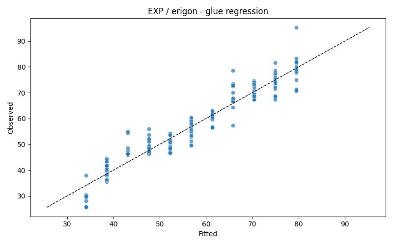

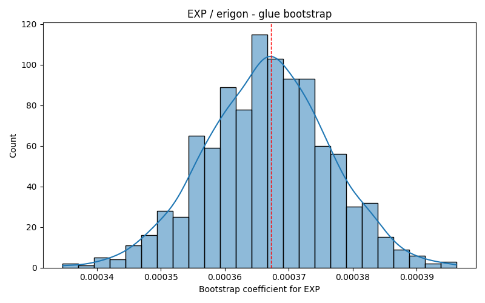

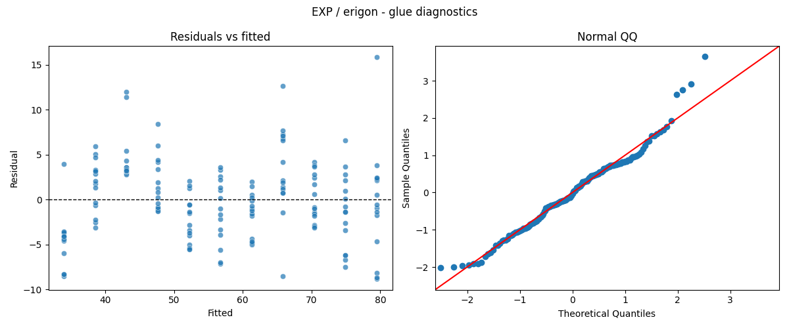

</details>

<details><summary><code>GT</code> · nobs=165 · runtime_ms=2.905e-06 · p=1.00e-03 · R²=0.8874</summary>

```
==============================================================================
                           NNLS Regression Results                            
==============================================================================
Dep. Variable:          test_runtime_ms              R-squared:          0.887
Model:                  NNLS                    Adj. R-squared:          0.887
No. Observations:       165                               RMSE:          10.89
Df Residuals:           163                                MAE:           7.48
Df Model:               1      
==============================================================================
                      coef     std err     P-value      [0.025      0.975]
------------------------------------------------------------------------------
         const     19.2333      2.3007       0.001     14.7549     23.5415
            GT      0.0000      0.0000       0.001      0.0000      0.0000
==============================================================================
Notes: Non-negative least squares with bootstrap inference (1000 iterations)
==============================================================================
```

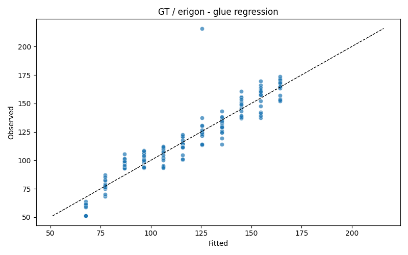

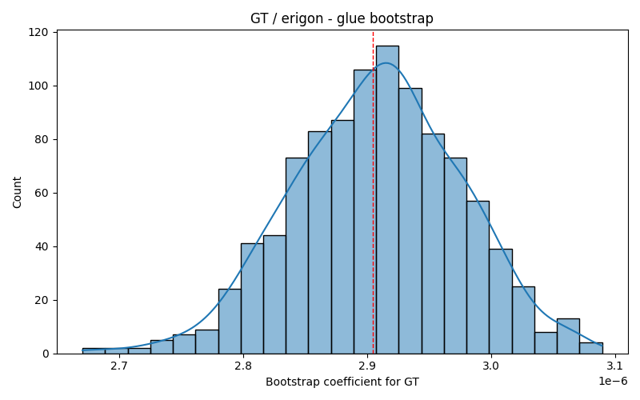

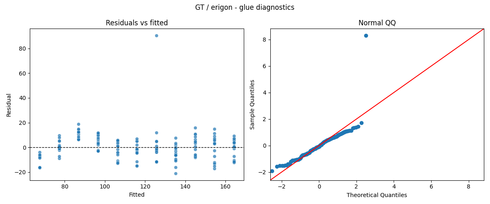

</details>

<details><summary><code>JUMPI</code> · nobs=165 · runtime_ms=3.716e-06 · p=1.00e-03 · R²=0.909</summary>

```
==============================================================================
                           NNLS Regression Results                            
==============================================================================
Dep. Variable:          test_runtime_ms              R-squared:          0.909
Model:                  NNLS                    Adj. R-squared:          0.908
No. Observations:       165                               RMSE:           5.30
Df Residuals:           163                                MAE:           4.33
Df Model:               1      
==============================================================================
                      coef     std err     P-value      [0.025      0.975]
------------------------------------------------------------------------------
         const     17.5099      1.6485       0.001     14.3413     20.9952
         JUMPI      0.0000      0.0000       0.001      0.0000      0.0000
==============================================================================
Notes: Non-negative least squares with bootstrap inference (1000 iterations)
==============================================================================
```

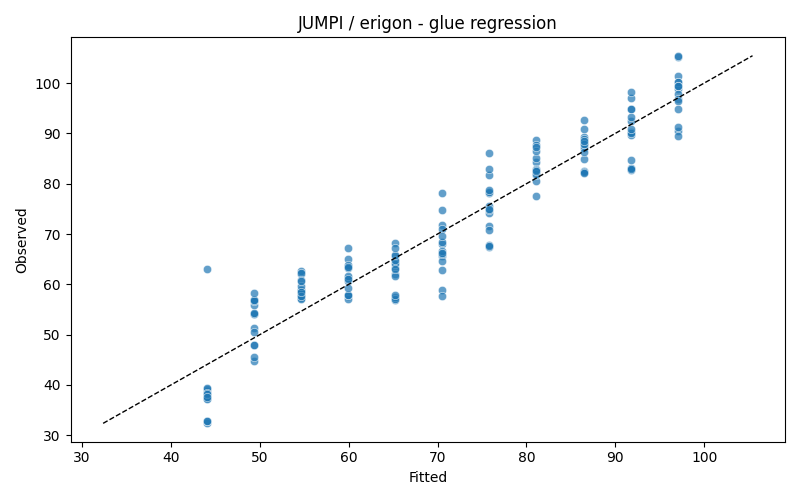

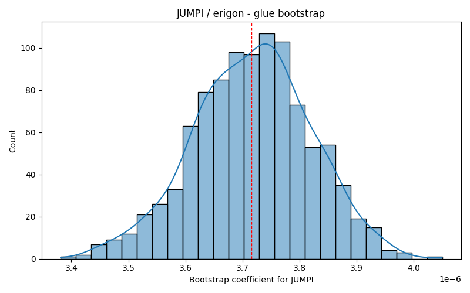

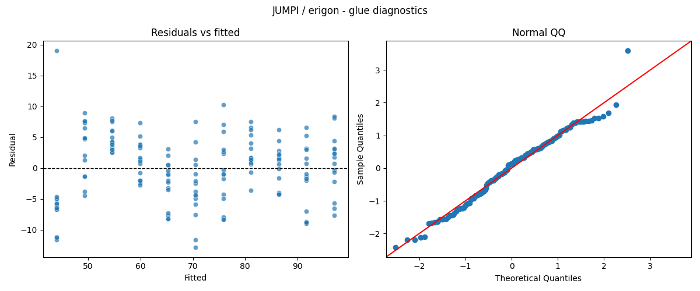

</details>

<details><summary><code>LT</code> · nobs=165 · runtime_ms=2.916e-06 · p=1.00e-03 · R²=0.9371</summary>

```
==============================================================================
                           NNLS Regression Results                            
==============================================================================
Dep. Variable:          test_runtime_ms              R-squared:          0.937
Model:                  NNLS                    Adj. R-squared:          0.937
No. Observations:       165                               RMSE:           7.95
Df Residuals:           163                                MAE:           6.56
Df Model:               1      
==============================================================================
                      coef     std err     P-value      [0.025      0.975]
------------------------------------------------------------------------------
         const     18.8236      2.2099       0.001     14.4658     23.1783
            LT      0.0000      0.0000       0.001      0.0000      0.0000
==============================================================================
Notes: Non-negative least squares with bootstrap inference (1000 iterations)
==============================================================================
```

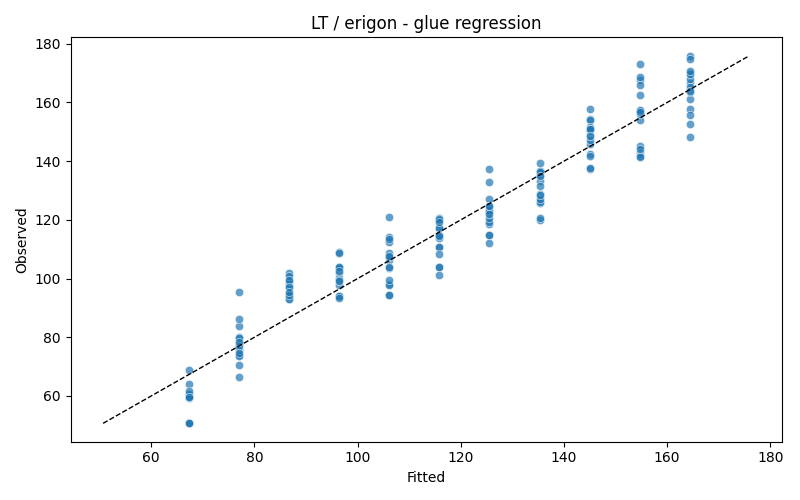

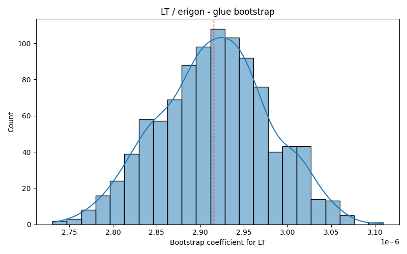

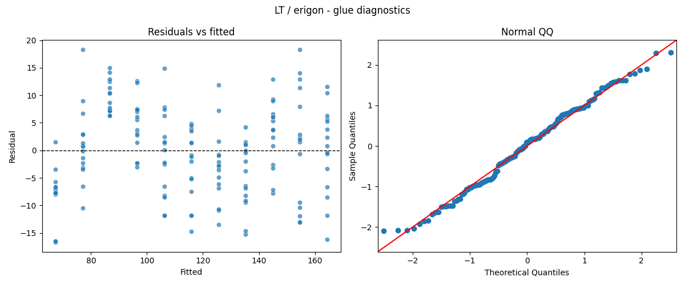

</details>

<details><summary><code>MSTORE</code> · nobs=825 · runtime_ms=5.791e-06 · p=1.00e-03 · R²=0.8233</summary>

```
==============================================================================
                           NNLS Regression Results                            
==============================================================================
Dep. Variable:          test_runtime_ms              R-squared:          0.823
Model:                  NNLS                    Adj. R-squared:          0.823
No. Observations:       825                               RMSE:          18.82
Df Residuals:           823                                MAE:          11.61
Df Model:               1      
==============================================================================
                      coef     std err     P-value      [0.025      0.975]
------------------------------------------------------------------------------
         const     28.7213      2.5272       0.001     23.9477     33.7447
        MSTORE      0.0000      0.0000       0.001      0.0000      0.0000
==============================================================================
Notes: Non-negative least squares with bootstrap inference (1000 iterations)
==============================================================================
```

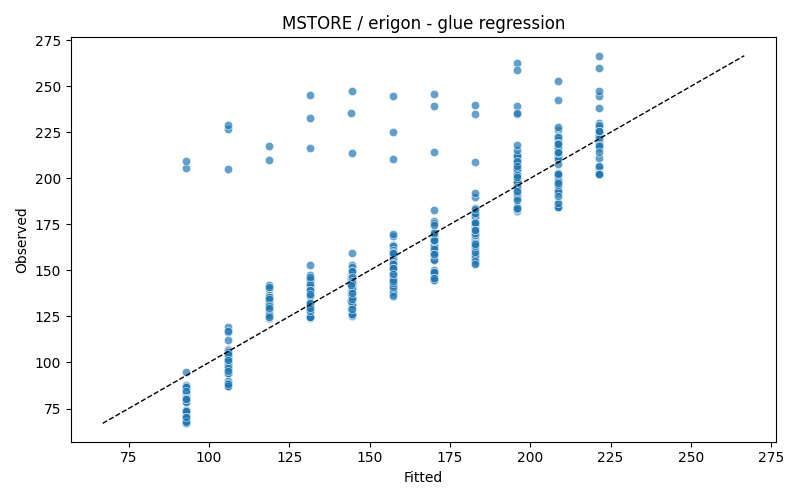

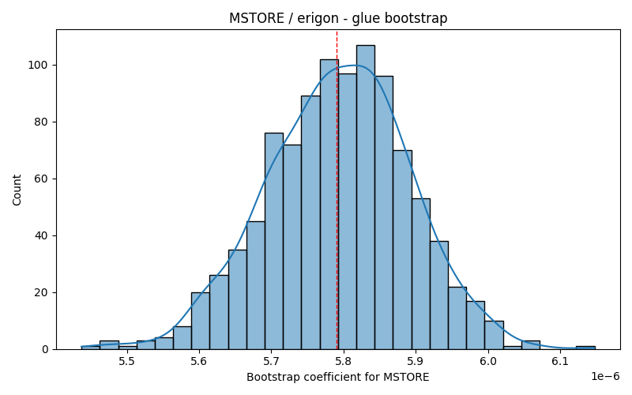

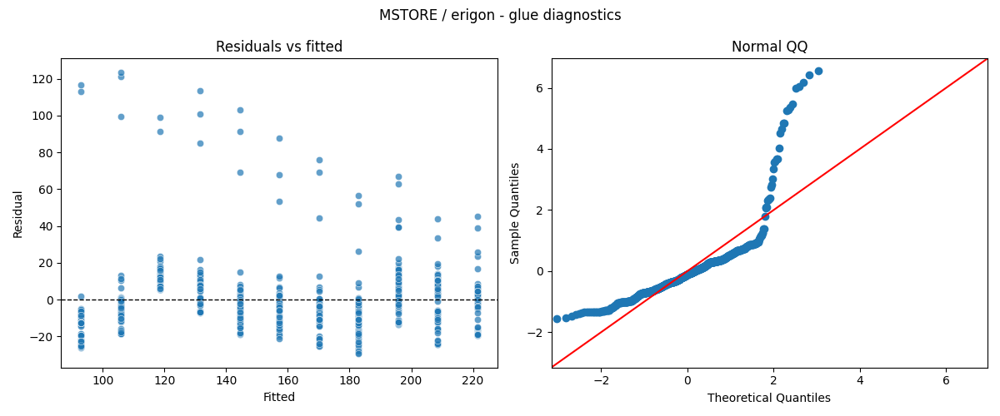

</details>

<details><summary><code>MSTORE8</code> · nobs=825 · runtime_ms=5.16e-06 · p=1.00e-03 · R²=0.7602</summary>

```
==============================================================================
                           NNLS Regression Results                            
==============================================================================
Dep. Variable:          test_runtime_ms              R-squared:          0.760
Model:                  NNLS                    Adj. R-squared:          0.760
No. Observations:       825                               RMSE:          20.34
Df Residuals:           823                                MAE:          11.75
Df Model:               1      
==============================================================================
                      coef     std err     P-value      [0.025      0.975]
------------------------------------------------------------------------------
         const     29.4124      2.7469       0.001     24.2353     34.9815
       MSTORE8      0.0000      0.0000       0.001      0.0000      0.0000
==============================================================================
Notes: Non-negative least squares with bootstrap inference (1000 iterations)
==============================================================================
```

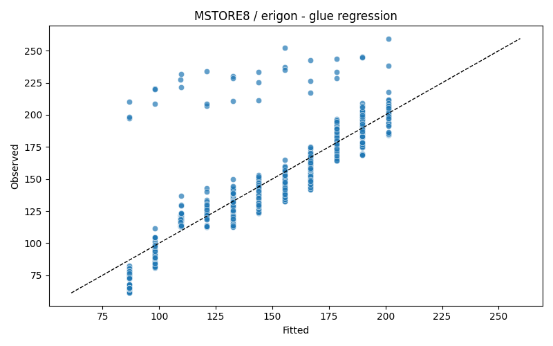

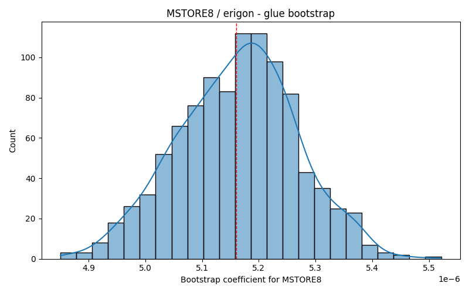

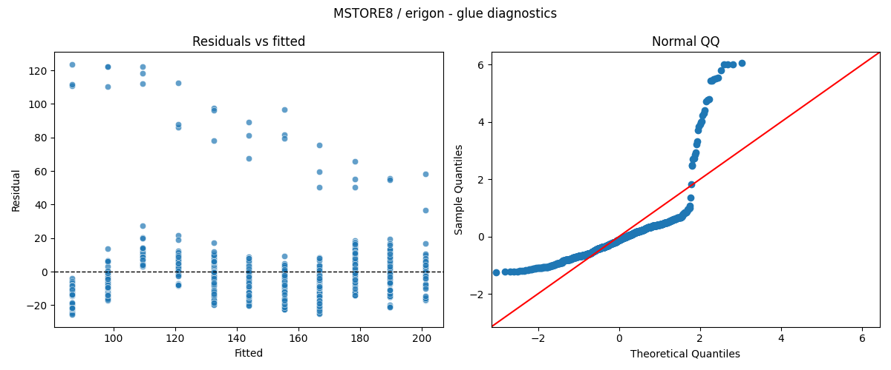

</details>

<details><summary><code>MUL</code> · nobs=165 · runtime_ms=3.574e-06 · p=1.00e-03 · R²=0.9264</summary>

```
==============================================================================
                           NNLS Regression Results                            
==============================================================================
Dep. Variable:          test_runtime_ms              R-squared:          0.926
Model:                  NNLS                    Adj. R-squared:          0.926
No. Observations:       165                               RMSE:           7.95
Df Residuals:           163                                MAE:           6.60
Df Model:               1      
==============================================================================
                      coef     std err     P-value      [0.025      0.975]
------------------------------------------------------------------------------
         const     14.2437      2.0920       0.001     10.3147     18.7844
           MUL      0.0000      0.0000       0.001      0.0000      0.0000
==============================================================================
Notes: Non-negative least squares with bootstrap inference (1000 iterations)
==============================================================================
```

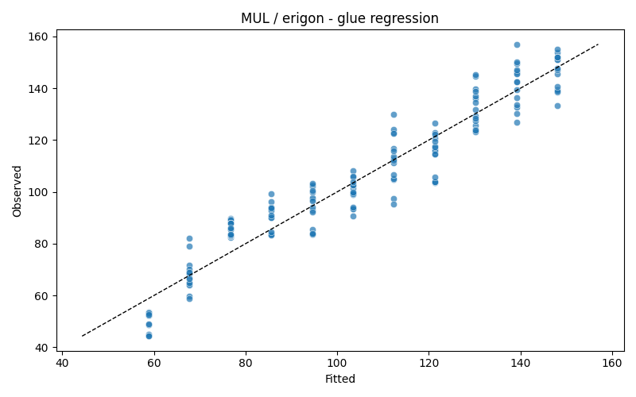

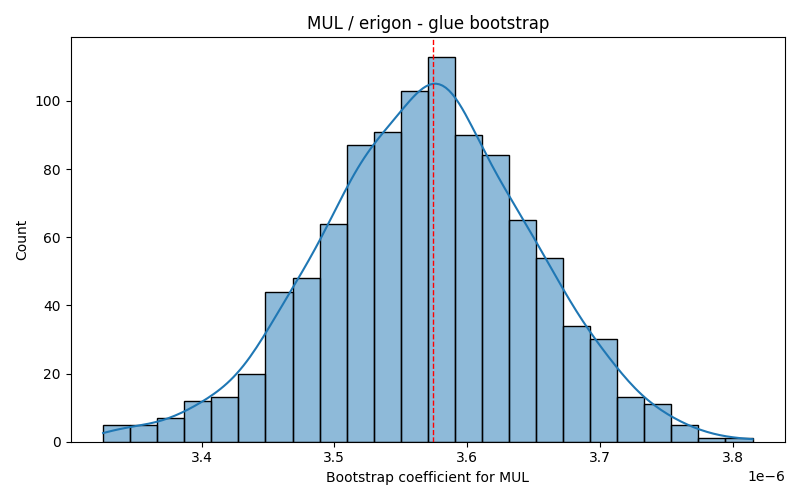

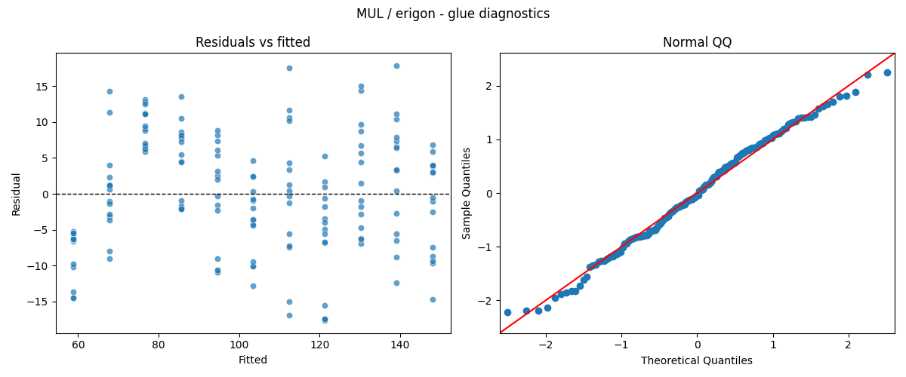

</details>

<details><summary><code>PC</code> · nobs=165 · runtime_ms=1.436e-06 · p=1.00e-03 · R²=0.931</summary>

```
==============================================================================
                           NNLS Regression Results                            
==============================================================================
Dep. Variable:          test_runtime_ms              R-squared:          0.931
Model:                  NNLS                    Adj. R-squared:          0.931
No. Observations:       165                               RMSE:          11.69
Df Residuals:           163                                MAE:           9.59
Df Model:               1      
==============================================================================
                      coef     std err     P-value      [0.025      0.975]
------------------------------------------------------------------------------
         const     21.5547      3.1216       0.001     15.8196     28.2808
            PC      0.0000      0.0000       0.001      0.0000      0.0000
==============================================================================
Notes: Non-negative least squares with bootstrap inference (1000 iterations)
==============================================================================
```

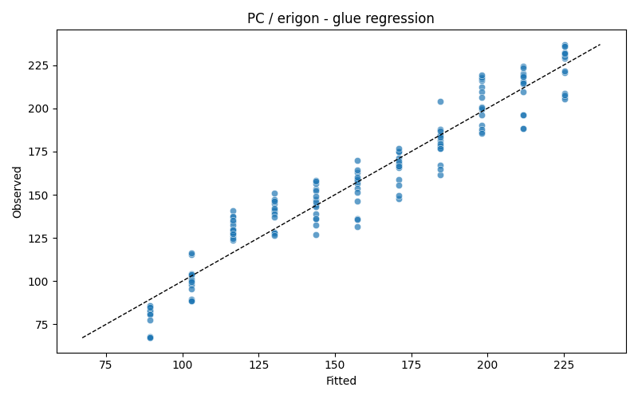

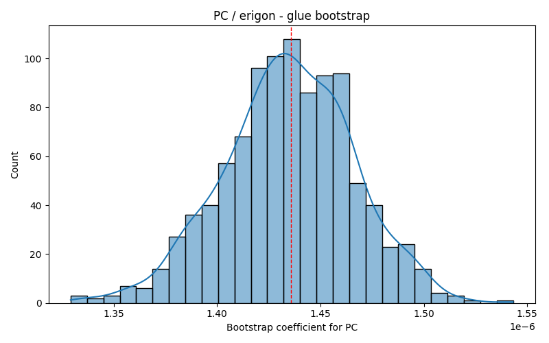

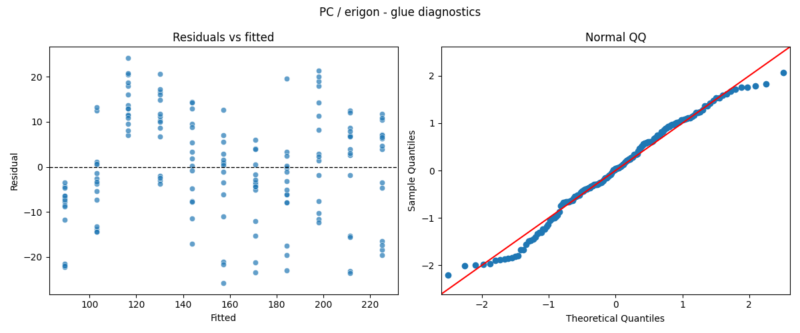

</details>

<details><summary><code>RETURNDATASIZE</code> · nobs=660 · runtime_ms=1.898e-06 · p=1.00e-03 · R²=0.9128</summary>

```
==============================================================================
                           NNLS Regression Results                            
==============================================================================
Dep. Variable:          test_runtime_ms              R-squared:          0.913
Model:                  NNLS                    Adj. R-squared:          0.913
No. Observations:       660                               RMSE:           9.27
Df Residuals:           658                                MAE:           7.10
Df Model:               1      
==============================================================================
                      coef     std err     P-value      [0.025      0.975]
------------------------------------------------------------------------------
         const     17.8689      1.2911       0.001     15.3579     20.4592
RETURNDATASIZE      0.0000      0.0000       0.001      0.0000      0.0000
==============================================================================
Notes: Non-negative least squares with bootstrap inference (1000 iterations)
==============================================================================
```

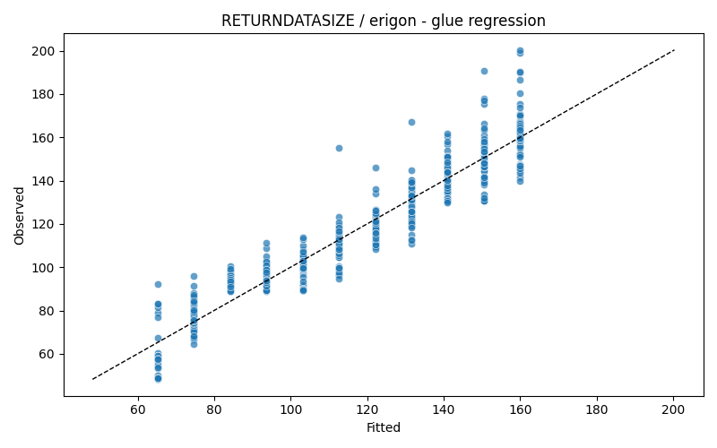

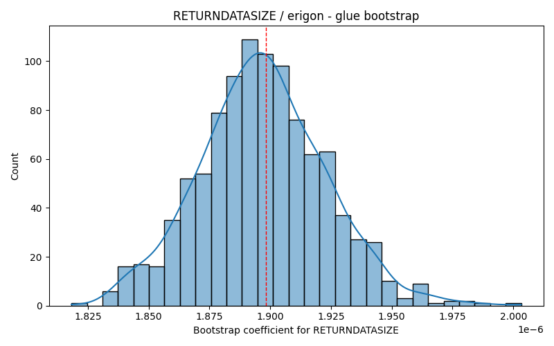

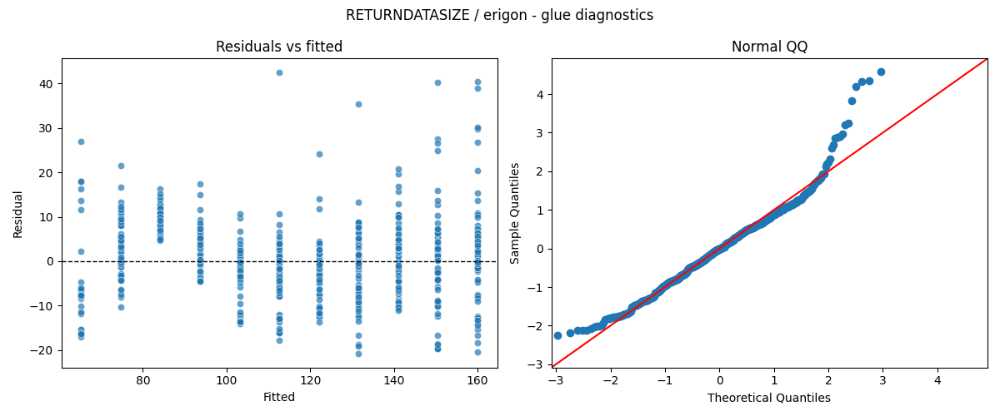

</details>

<details><summary><code>SELFBALANCE</code> · nobs=135 · runtime_ms=1.492e-06 · p=1.00e-03 · R²=0.8782</summary>

```
==============================================================================
                           NNLS Regression Results                            
==============================================================================
Dep. Variable:          test_runtime_ms              R-squared:          0.878
Model:                  NNLS                    Adj. R-squared:          0.877
No. Observations:       135                               RMSE:           5.60
Df Residuals:           133                                MAE:           4.51
Df Model:               1      
==============================================================================
                      coef     std err     P-value      [0.025      0.975]
------------------------------------------------------------------------------
         const     17.2103      1.9222       0.001     13.3131     20.8327
   SELFBALANCE      0.0000      0.0000       0.001      0.0000      0.0000
==============================================================================
Notes: Non-negative least squares with bootstrap inference (1000 iterations)
==============================================================================
```

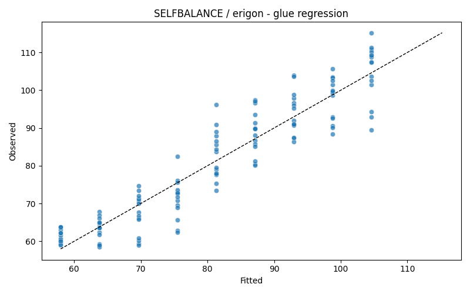

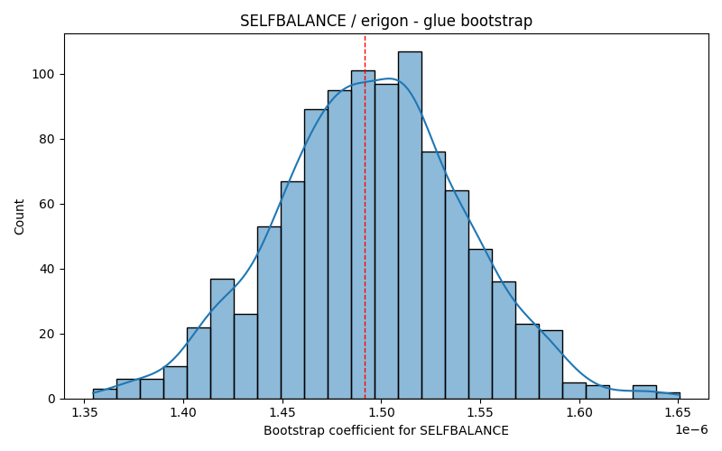

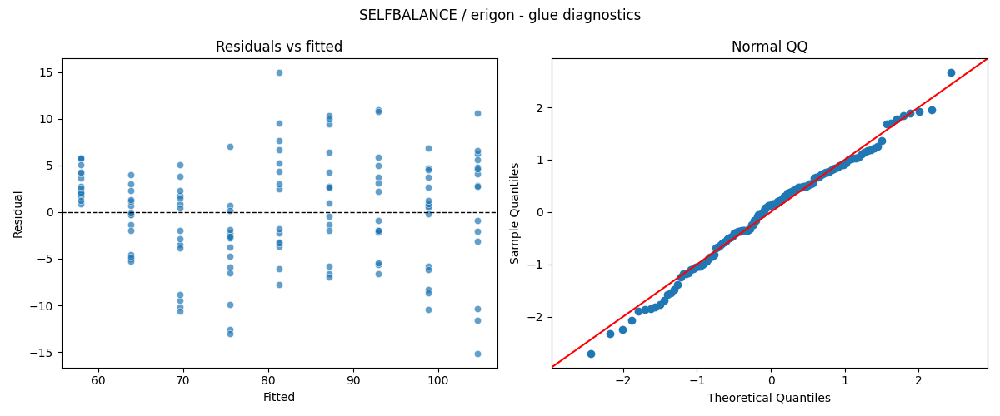

</details>

<details><summary><code>SUB</code> · nobs=165 · runtime_ms=2.87e-06 · p=1.00e-03 · R²=0.9269</summary>

```
==============================================================================
                           NNLS Regression Results                            
==============================================================================
Dep. Variable:          test_runtime_ms              R-squared:          0.927
Model:                  NNLS                    Adj. R-squared:          0.926
No. Observations:       165                               RMSE:           8.48
Df Residuals:           163                                MAE:           7.04
Df Model:               1      
==============================================================================
                      coef     std err     P-value      [0.025      0.975]
------------------------------------------------------------------------------
         const     17.4707      2.2880       0.001     13.3372     22.1785
           SUB      0.0000      0.0000       0.001      0.0000      0.0000
==============================================================================
Notes: Non-negative least squares with bootstrap inference (1000 iterations)
==============================================================================
```

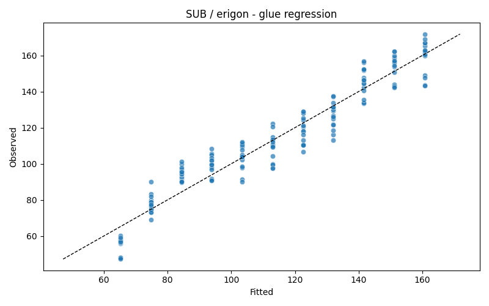

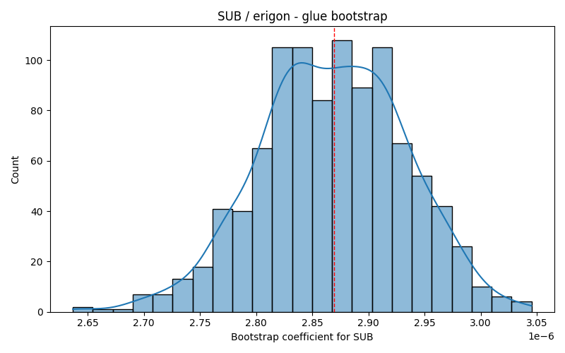

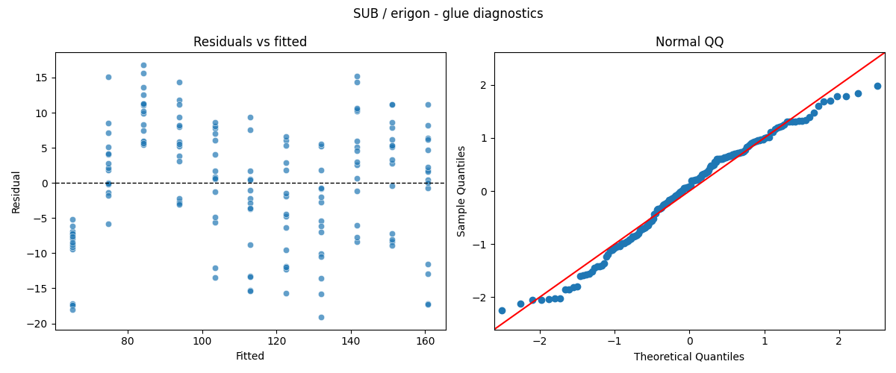

</details>

### Mixed glue (tier B) · erigon

<details><summary><code>JUMP</code> · nobs=165 · runtime_ms=7.349e-06 · p=1.00e-03 · R²=0.9312</summary>

```
==============================================================================
                           NNLS Regression Results                            
==============================================================================
Dep. Variable:          test_runtime_ms              R-squared:          0.931
Model:                  NNLS                    Adj. R-squared:          0.931
No. Observations:       165                               RMSE:           7.42
Df Residuals:           163                                MAE:           6.14
Df Model:               1      
==============================================================================
                      coef     std err     P-value      [0.025      0.975]
------------------------------------------------------------------------------
         const     19.3793      2.2491       0.001     15.3439     23.8288
          JUMP      0.0000      0.0000       0.001      0.0000      0.0000
==============================================================================
Notes: Non-negative least squares with bootstrap inference (1000 iterations)
==============================================================================
```

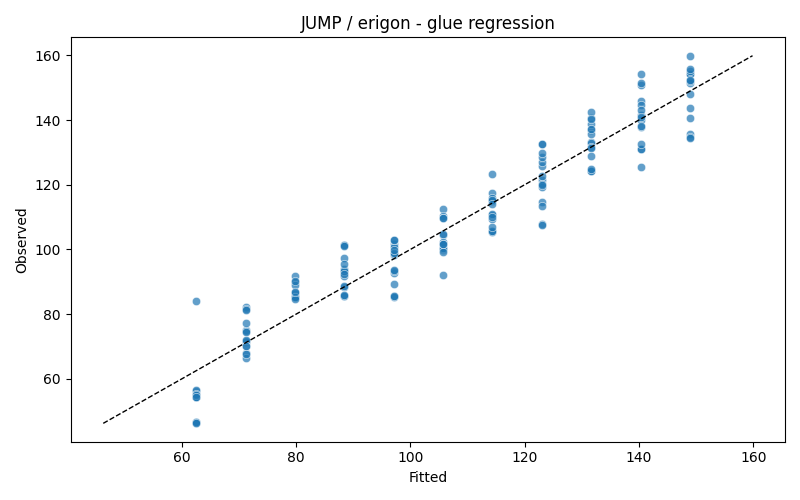

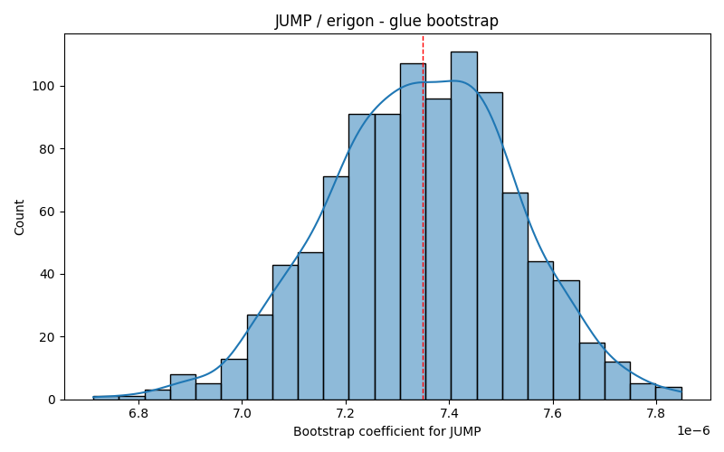

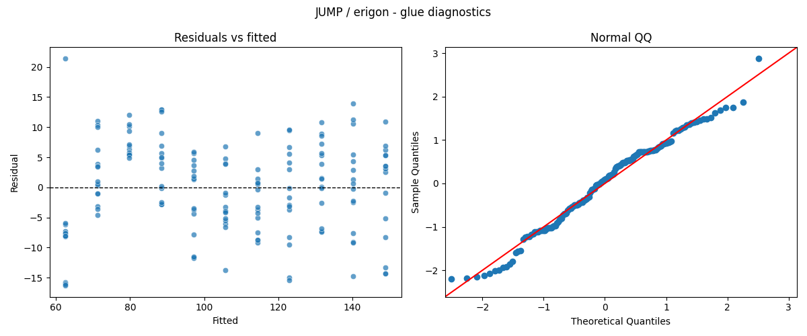

</details>

<details><summary><code>KECCAK256</code> · nobs=2640 · runtime_ms=2.221e-05 · p=1.00e-03 · R²=0.1001</summary>

```
==============================================================================
                           NNLS Regression Results                            
==============================================================================
Dep. Variable:          test_runtime_ms              R-squared:          0.100
Model:                  NNLS                    Adj. R-squared:          0.100
No. Observations:       2640                              RMSE:         132.35
Df Residuals:           2638                               MAE:         106.12
Df Model:               1      
==============================================================================
                      coef     std err     P-value      [0.025      0.975]
------------------------------------------------------------------------------
         const    363.5392      5.6713       0.001    353.0117    374.5737
     KECCAK256      0.0000      0.0000       0.001      0.0000      0.0000
==============================================================================
Notes: Non-negative least squares with bootstrap inference (1000 iterations)
==============================================================================
```

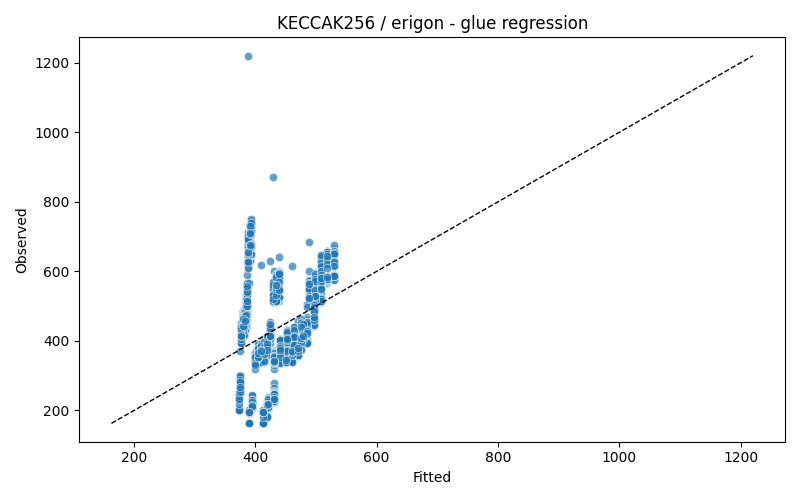

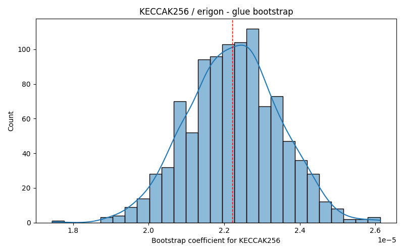

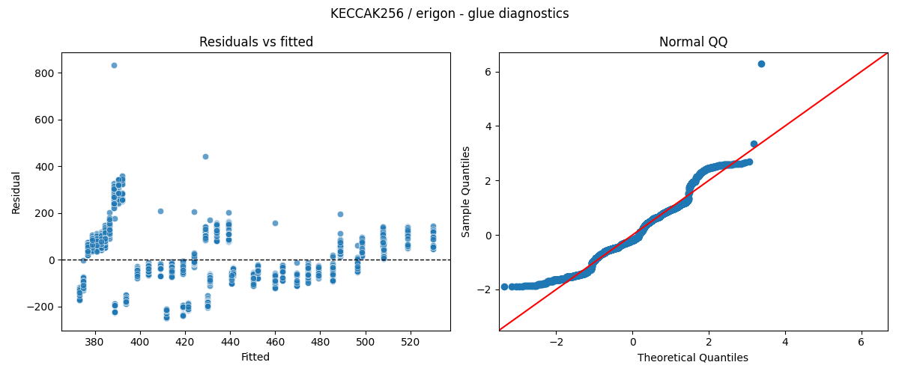

</details>

## ethrex

| glue_opcode | nobs | glue_runtime_ms | p_value | rsquared |
| --- | --- | --- | --- | --- |
| `ISZERO` | 330 | 5.066e-07 | 1.00e-03 | 0.8242 |
| `JUMPDEST` | 330 | 3.324e-07 | 1.00e-03 | 0.8549 |
| `SWAP` | 5280 | 7.147e-07 | 1.00e-03 | 0.8094 |
| `CALLDATASIZE` | 19778 | 4.659e-07 | 1.00e-03 | 0.9287 |
| `DUP` | 19778 | 4.738e-07 | 1.00e-03 | 0.9287 |
| `GAS` | 19778 | 4.697e-07 | 1.00e-03 | 0.9287 |
| `MLOAD` | 19778 | 1.15e-06 | 1.00e-03 | 0.9287 |
| `PUSH` | 19778 | 4.911e-07 | 1.00e-03 | 0.9287 |
| `PUSH0` | 19778 | 4.37e-07 | 1.00e-03 | 0.9287 |
| `STATICCALL` | 19778 | 0.0001108 | 1.00e-03 | 0.9287 |
| `ADD` | 330 | 1.181e-06 | 1.00e-03 | 0.8319 |
| `AND` | 330 | 1.128e-06 | 1.00e-03 | 0.8873 |
| `CALLDATACOPY` | 7920 | 2.419e-06 | 1.00e-03 | 0.8672 |
| `CALLDATALOAD` | 1320 | 2.328e-05 | 1.00e-03 | 0.2885 |
| `DIV` | 330 | 1.134e-05 | 1.00e-03 | 0.9407 |
| `EXP` | 330 | 0.001106 | 1.00e-03 | 0.9279 |
| `GT` | 330 | 1.132e-06 | 1.00e-03 | 0.8307 |
| `JUMPI` | 330 | 1.491e-06 | 1.00e-03 | 0.8009 |
| `LT` | 330 | 9.407e-07 | 1.00e-03 | 0.8114 |
| `MSTORE` | 1650 | 1.704e-06 | 1.00e-03 | 0.7915 |
| `MSTORE8` | 1650 | 1.584e-06 | 1.00e-03 | 0.7539 |
| `MUL` | 330 | 1.529e-06 | 1.00e-03 | 0.8682 |
| `PC` | 330 | 5.663e-07 | 1.00e-03 | 0.8371 |
| `RETURNDATASIZE` | 1320 | 8.989e-07 | 1.00e-03 | 0.8328 |
| `SELFBALANCE` | 270 | 5.768e-06 | 1.00e-03 | 0.8994 |
| `SUB` | 330 | 1.193e-06 | 1.00e-03 | 0.9077 |
| `JUMP` | 330 | 4.313e-06 | 1.00e-03 | 0.8352 |
| `KECCAK256` | 5280 | 0 | 1.00e+00 | -2.22e-16 |

### Cycle glue — joint fit · ethrex

<details><summary>Joint NNLS regression summary</summary>

```
==============================================================================
                           NNLS Regression Results                            
==============================================================================
Dep. Variable:          test_runtime_ms              R-squared:          0.929
Model:                  NNLS                    Adj. R-squared:          0.929
No. Observations:       19778                             RMSE:           6.64
Df Residuals:           19770                              MAE:           5.14
Df Model:               7      
==============================================================================
                      coef     std err     P-value      [0.025      0.975]
------------------------------------------------------------------------------
         const     12.7845      0.1573       0.001     12.4826     13.0922
  CALLDATASIZE      0.0000      0.0000       0.001      0.0000      0.0000
           DUP      0.0000      0.0000       0.001      0.0000      0.0000
           GAS      0.0000      0.0000       0.001      0.0000      0.0000
         MLOAD      0.0000      0.0000       0.001      0.0000      0.0000
          PUSH      0.0000      0.0000       0.001      0.0000      0.0000
         PUSH0      0.0000      0.0000       0.001      0.0000      0.0000
    STATICCALL      0.0001      0.0000       0.001      0.0001      0.0001
==============================================================================
Notes: Non-negative least squares with bootstrap inference (1000 iterations)
==============================================================================
```

</details>

<details><summary><code>CALLDATASIZE</code> · nobs=19778 · runtime_ms=4.659e-07 · p=1.00e-03 · R²=0.9287</summary>

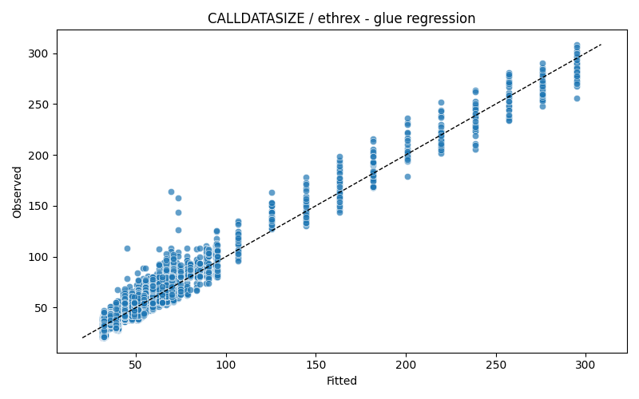

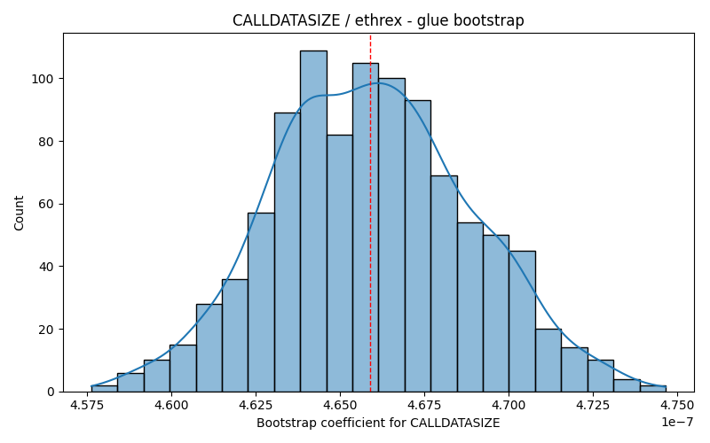

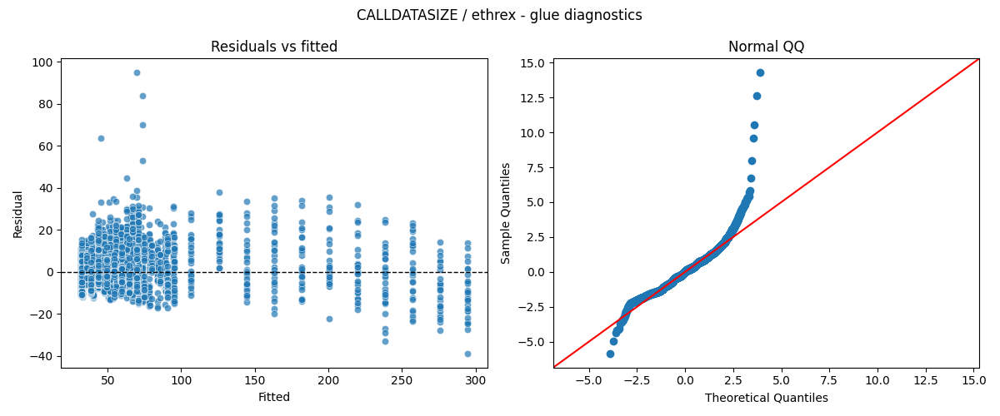

</details>

<details><summary><code>DUP</code> · nobs=19778 · runtime_ms=4.738e-07 · p=1.00e-03 · R²=0.9287</summary>


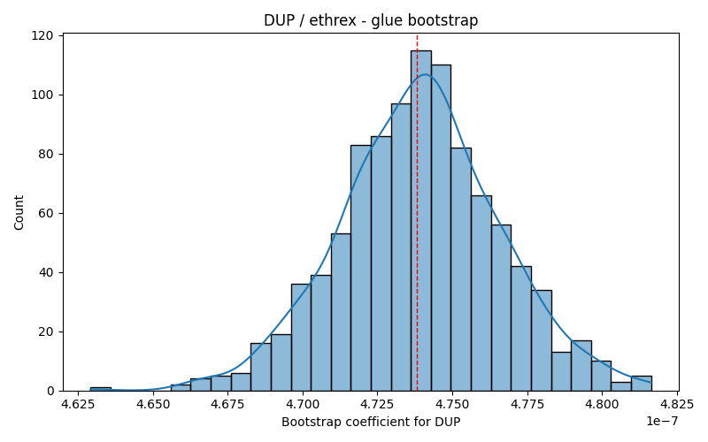

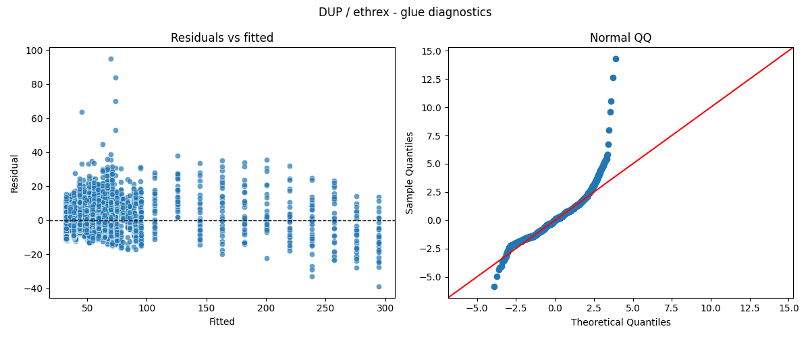

</details>

<details><summary><code>GAS</code> · nobs=19778 · runtime_ms=4.697e-07 · p=1.00e-03 · R²=0.9287</summary>


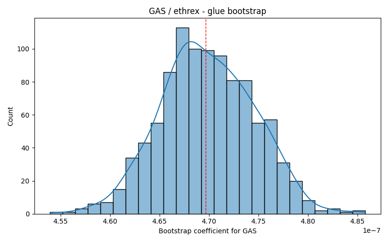


</details>

<details><summary><code>MLOAD</code> · nobs=19778 · runtime_ms=1.15e-06 · p=1.00e-03 · R²=0.9287</summary>

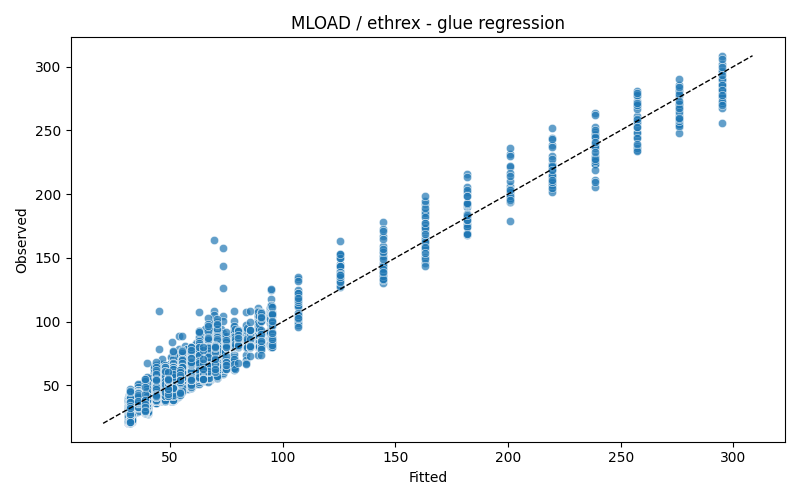

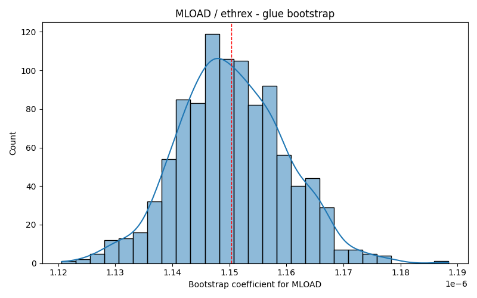

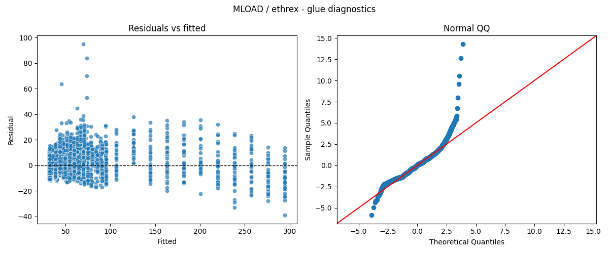

</details>

<details><summary><code>PUSH</code> · nobs=19778 · runtime_ms=4.911e-07 · p=1.00e-03 · R²=0.9287</summary>


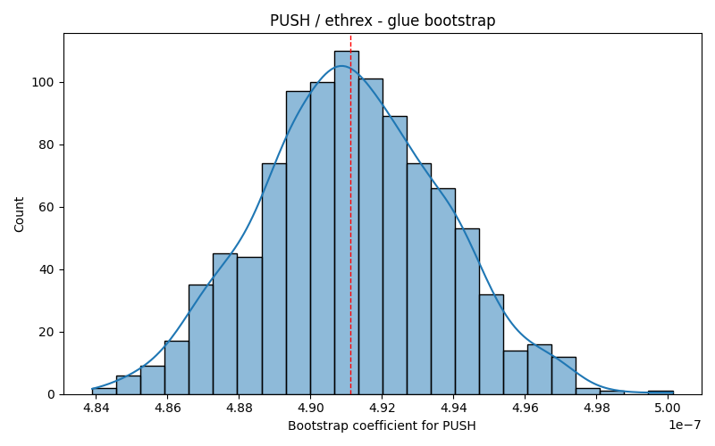


</details>

<details><summary><code>PUSH0</code> · nobs=19778 · runtime_ms=4.37e-07 · p=1.00e-03 · R²=0.9287</summary>


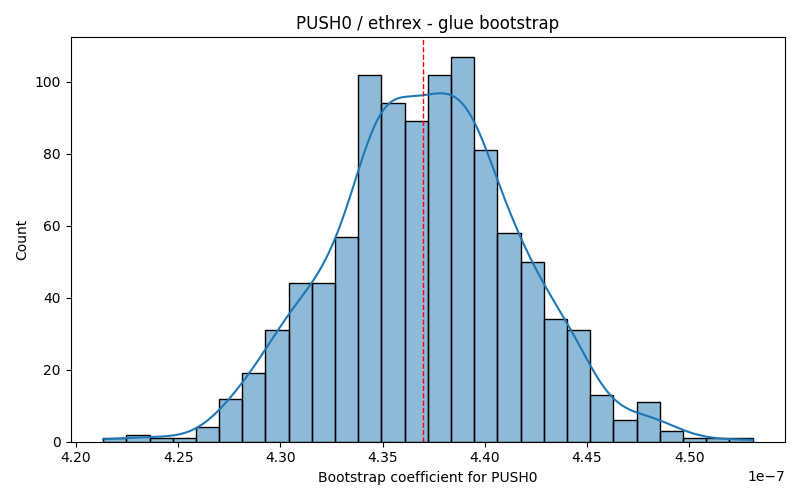


</details>

<details><summary><code>STATICCALL</code> · nobs=19778 · runtime_ms=0.0001108 · p=1.00e-03 · R²=0.9287</summary>

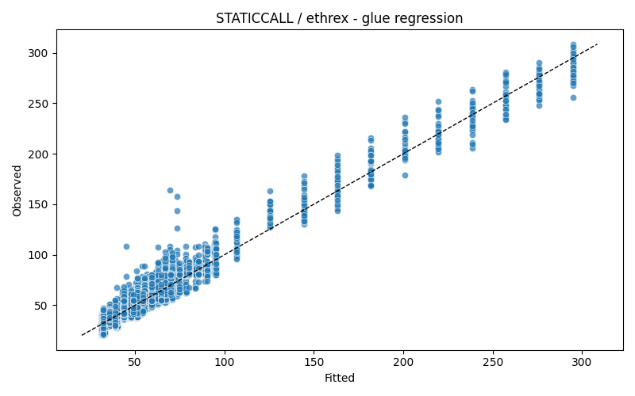

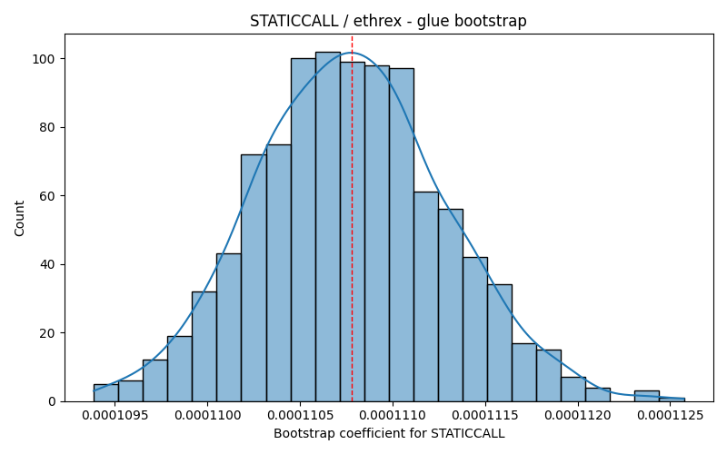

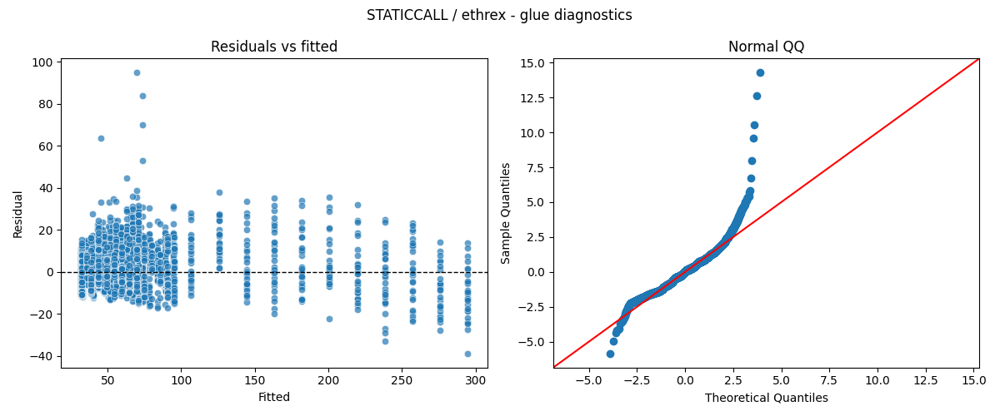

</details>

### Pure glue · ethrex

<details><summary><code>ISZERO</code> · nobs=330 · runtime_ms=5.066e-07 · p=1.00e-03 · R²=0.8242</summary>

```
==============================================================================
                           NNLS Regression Results                            
==============================================================================
Dep. Variable:          test_runtime_ms              R-squared:          0.824
Model:                  NNLS                    Adj. R-squared:          0.824
No. Observations:       330                               RMSE:           4.93
Df Residuals:           328                                MAE:           3.88
Df Model:               1      
==============================================================================
                      coef     std err     P-value      [0.025      0.975]
------------------------------------------------------------------------------
         const      9.7121      0.9194       0.001      7.9112     11.4617
        ISZERO      0.0000      0.0000       0.001      0.0000      0.0000
==============================================================================
Notes: Non-negative least squares with bootstrap inference (1000 iterations)
==============================================================================
```

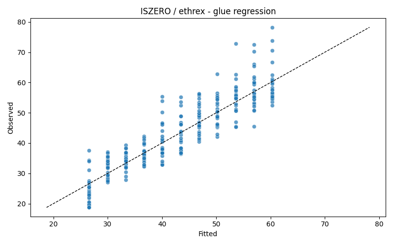

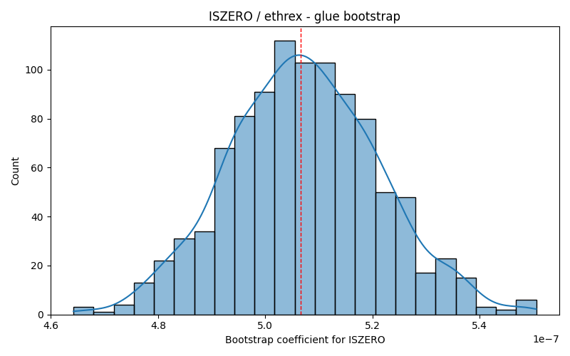

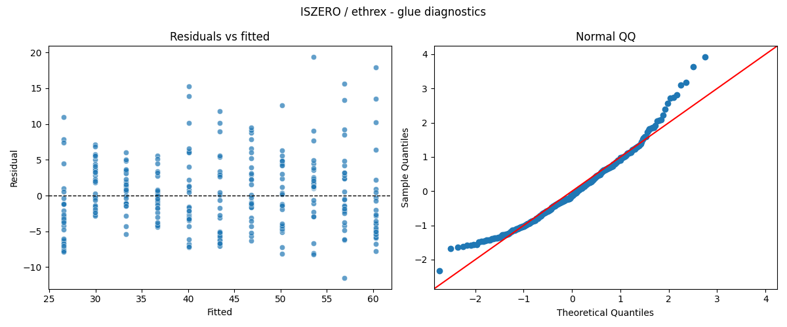

</details>

<details><summary><code>JUMPDEST</code> · nobs=330 · runtime_ms=3.324e-07 · p=1.00e-03 · R²=0.8549</summary>

```
==============================================================================
                           NNLS Regression Results                            
==============================================================================
Dep. Variable:          test_runtime_ms              R-squared:          0.855
Model:                  NNLS                    Adj. R-squared:          0.854
No. Observations:       330                               RMSE:           8.65
Df Residuals:           328                                MAE:           6.89
Df Model:               1      
==============================================================================
                      coef     std err     P-value      [0.025      0.975]
------------------------------------------------------------------------------
         const     18.5178      1.5293       0.001     15.4972     21.2253
      JUMPDEST      0.0000      0.0000       0.001      0.0000      0.0000
==============================================================================
Notes: Non-negative least squares with bootstrap inference (1000 iterations)
==============================================================================
```

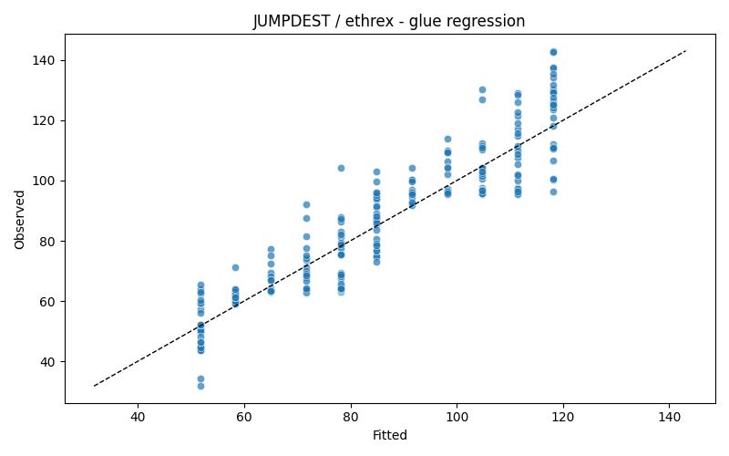

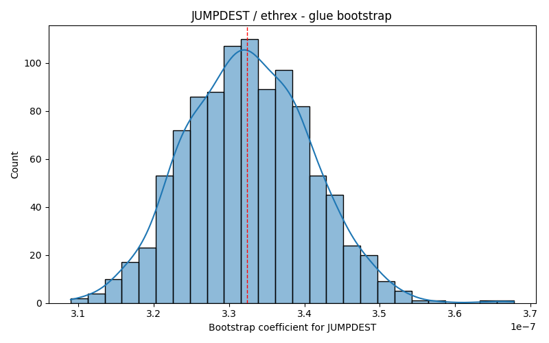

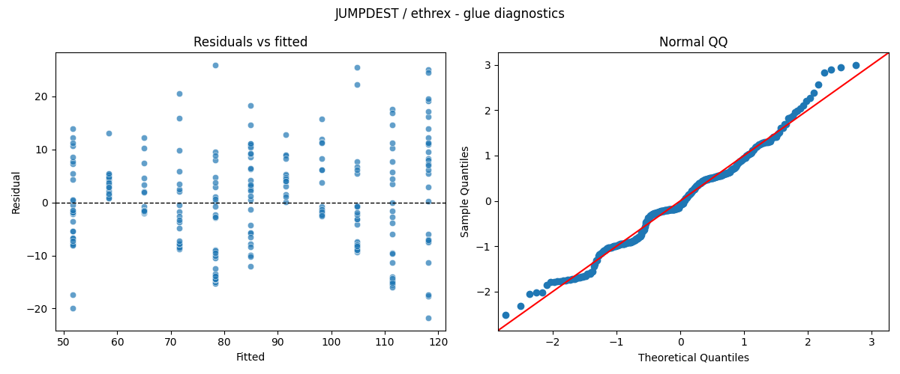

</details>

<details><summary><code>SWAP</code> · nobs=5280 · runtime_ms=7.147e-07 · p=1.00e-03 · R²=0.8094</summary>

```
==============================================================================
                           NNLS Regression Results                            
==============================================================================
Dep. Variable:          test_runtime_ms              R-squared:          0.809
Model:                  NNLS                    Adj. R-squared:          0.809
No. Observations:       5280                              RMSE:           7.30
Df Residuals:           5278                               MAE:           5.90
Df Model:               1      
==============================================================================
                      coef     std err     P-value      [0.025      0.975]
------------------------------------------------------------------------------
         const     15.3788      0.3558       0.001     14.7158     16.0764
          SWAP      0.0000      0.0000       0.001      0.0000      0.0000
==============================================================================
Notes: Non-negative least squares with bootstrap inference (1000 iterations)
==============================================================================
```

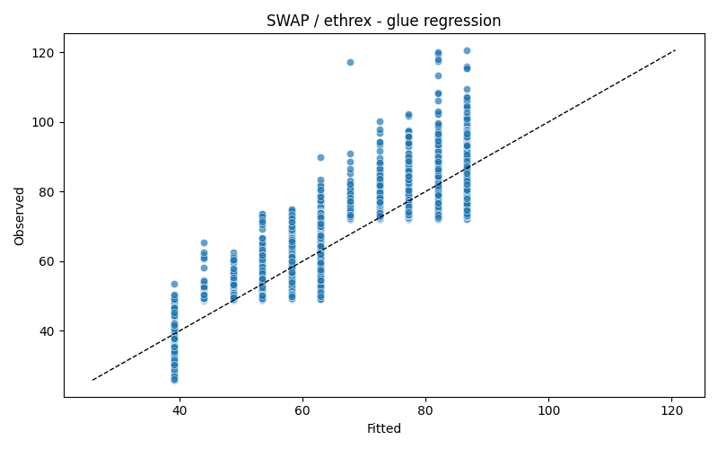

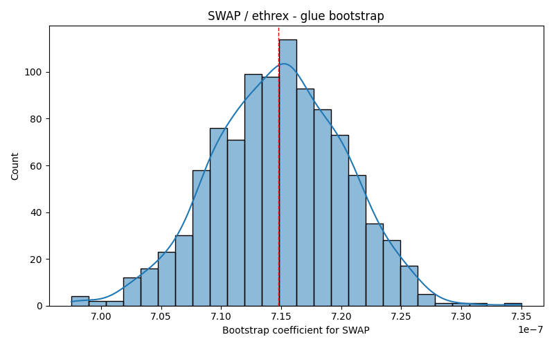

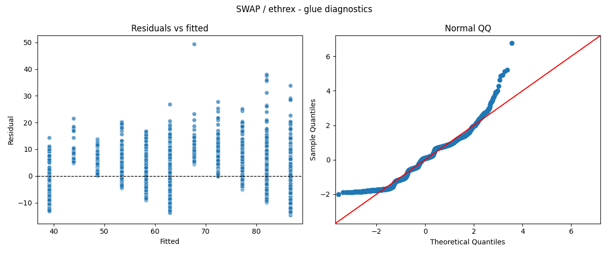

</details>

### Mixed glue (tier A) · ethrex

<details><summary><code>ADD</code> · nobs=330 · runtime_ms=1.181e-06 · p=1.00e-03 · R²=0.8319</summary>

```
==============================================================================
                           NNLS Regression Results                            
==============================================================================
Dep. Variable:          test_runtime_ms              R-squared:          0.832
Model:                  NNLS                    Adj. R-squared:          0.831
No. Observations:       330                               RMSE:           5.59
Df Residuals:           328                                MAE:           3.88
Df Model:               1      
==============================================================================
                      coef     std err     P-value      [0.025      0.975]
------------------------------------------------------------------------------
         const     10.0496      1.1340       0.001      7.8920     12.2834
           ADD      0.0000      0.0000       0.001      0.0000      0.0000
==============================================================================
Notes: Non-negative least squares with bootstrap inference (1000 iterations)
==============================================================================
```

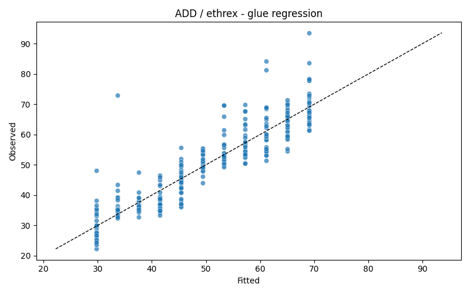

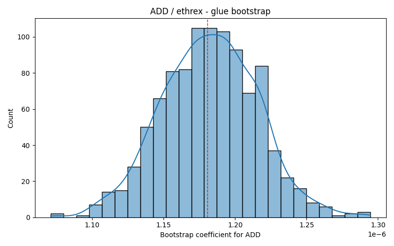

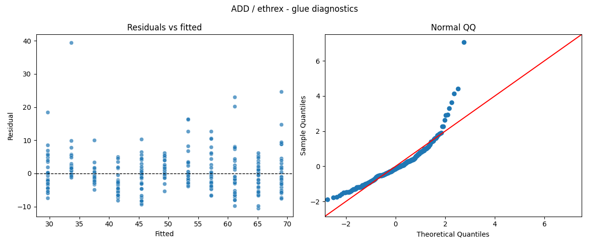

</details>

<details><summary><code>AND</code> · nobs=330 · runtime_ms=1.128e-06 · p=1.00e-03 · R²=0.8873</summary>

```
==============================================================================
                           NNLS Regression Results                            
==============================================================================
Dep. Variable:          test_runtime_ms              R-squared:          0.887
Model:                  NNLS                    Adj. R-squared:          0.887
No. Observations:       330                               RMSE:           4.23
Df Residuals:           328                                MAE:           3.05
Df Model:               1      
==============================================================================
                      coef     std err     P-value      [0.025      0.975]
------------------------------------------------------------------------------
         const      8.7243      0.7553       0.001      7.3190     10.2514
           AND      0.0000      0.0000       0.001      0.0000      0.0000
==============================================================================
Notes: Non-negative least squares with bootstrap inference (1000 iterations)
==============================================================================
```

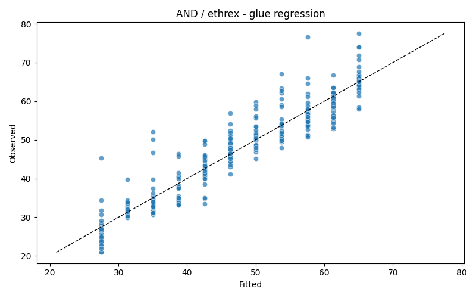

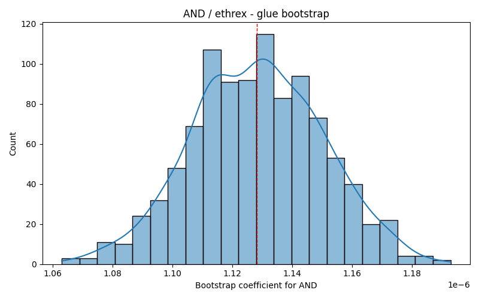

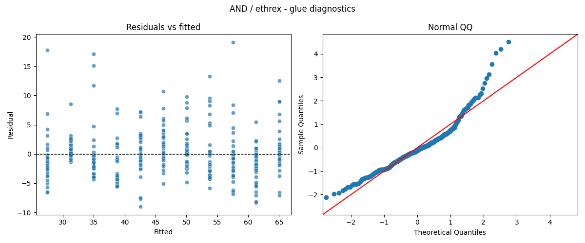

</details>

<details><summary><code>CALLDATACOPY</code> · nobs=7920 · runtime_ms=2.419e-06 · p=1.00e-03 · R²=0.8672</summary>

```
==============================================================================
                           NNLS Regression Results                            
==============================================================================
Dep. Variable:          test_runtime_ms              R-squared:          0.867
Model:                  NNLS                    Adj. R-squared:          0.867
No. Observations:       7920                              RMSE:           7.12
Df Residuals:           7918                               MAE:           5.30
Df Model:               1      
==============================================================================
                      coef     std err     P-value      [0.025      0.975]
------------------------------------------------------------------------------
         const     12.7728      0.0985       0.001     12.5845     12.9689
  CALLDATACOPY      0.0000      0.0000       0.001      0.0000      0.0000
==============================================================================
Notes: Non-negative least squares with bootstrap inference (1000 iterations)
==============================================================================
```

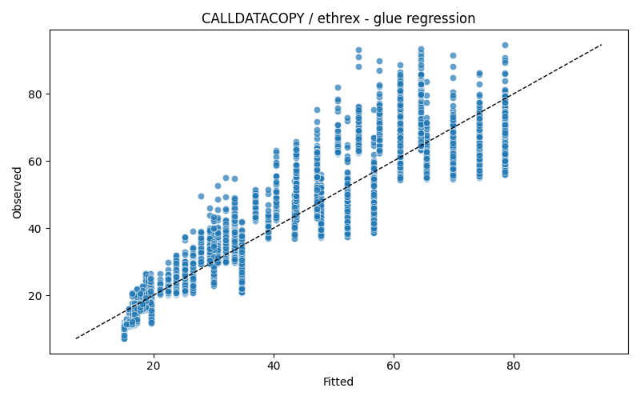

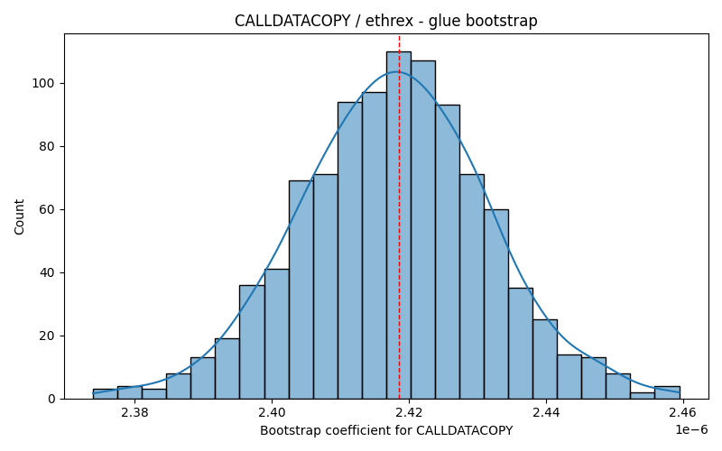

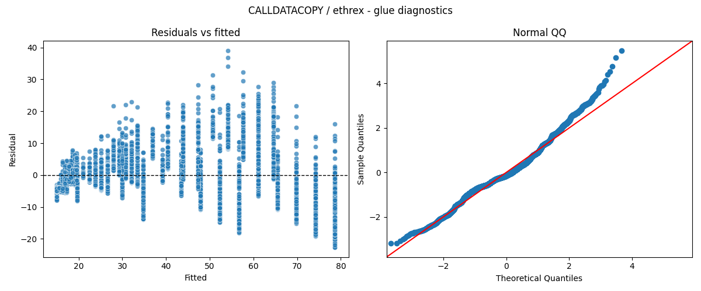

</details>

<details><summary><code>CALLDATALOAD</code> · nobs=1320 · runtime_ms=2.328e-05 · p=1.00e-03 · R²=0.2885</summary>

```
==============================================================================
                           NNLS Regression Results                            
==============================================================================
Dep. Variable:          test_runtime_ms              R-squared:          0.289
Model:                  NNLS                    Adj. R-squared:          0.288
No. Observations:       1320                              RMSE:           0.14
Df Residuals:           1318                               MAE:           0.11
Df Model:               1      
==============================================================================
                      coef     std err     P-value      [0.025      0.975]
------------------------------------------------------------------------------
         const      2.4992      0.0132       0.001      2.4737      2.5246
  CALLDATALOAD      0.0000      0.0000       0.001      0.0000      0.0000
==============================================================================
Notes: Non-negative least squares with bootstrap inference (1000 iterations)
==============================================================================
```

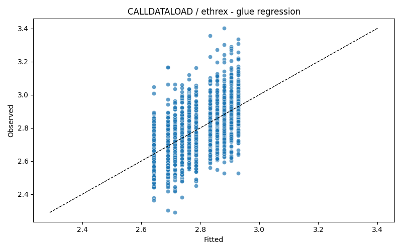

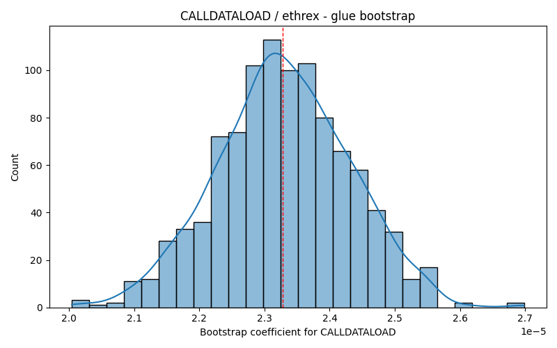

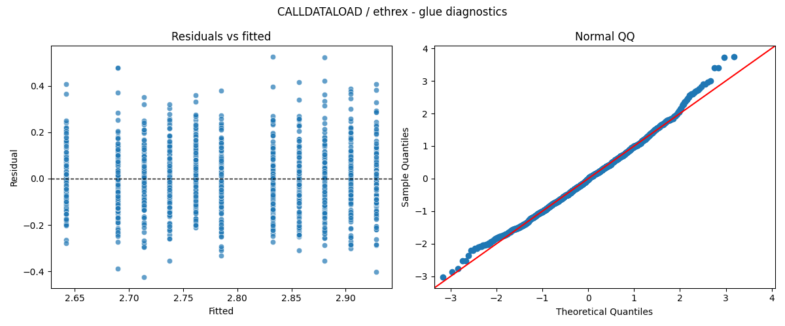

</details>

<details><summary><code>DIV</code> · nobs=330 · runtime_ms=1.134e-05 · p=1.00e-03 · R²=0.9407</summary>

```
==============================================================================
                           NNLS Regression Results                            
==============================================================================
Dep. Variable:          test_runtime_ms              R-squared:          0.941
Model:                  NNLS                    Adj. R-squared:          0.941
No. Observations:       330                               RMSE:          22.46
Df Residuals:           328                                MAE:          18.43
Df Model:               1      
==============================================================================
                      coef     std err     P-value      [0.025      0.975]
------------------------------------------------------------------------------
         const     66.4190      4.3474       0.001     58.3981     75.5532
           DIV      0.0000      0.0000       0.001      0.0000      0.0000
==============================================================================
Notes: Non-negative least squares with bootstrap inference (1000 iterations)
==============================================================================
```

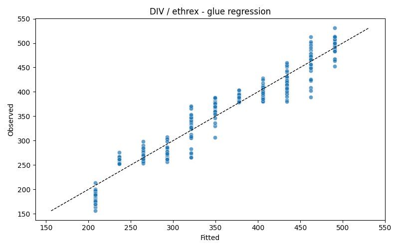

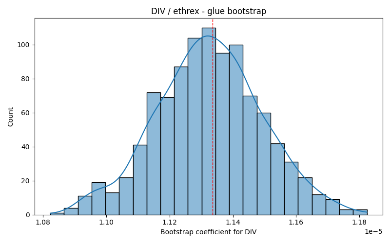

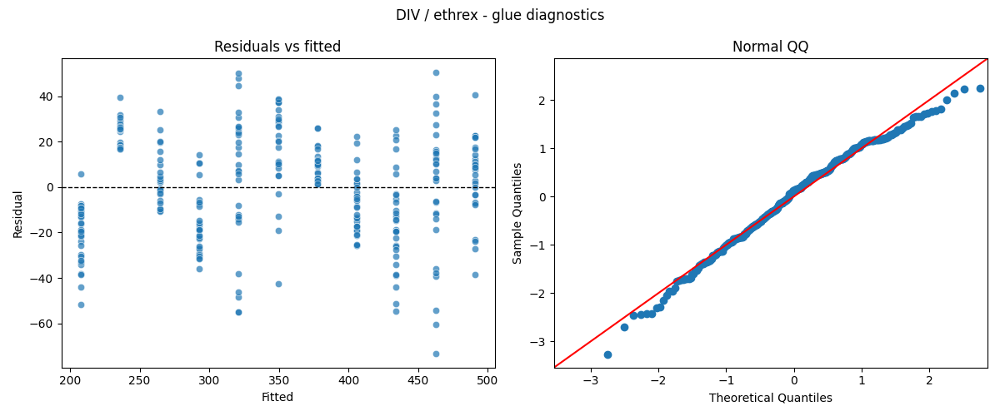

</details>

<details><summary><code>EXP</code> · nobs=330 · runtime_ms=0.001106 · p=1.00e-03 · R²=0.9279</summary>

```
==============================================================================
                           NNLS Regression Results                            
==============================================================================
Dep. Variable:          test_runtime_ms              R-squared:          0.928
Model:                  NNLS                    Adj. R-squared:          0.928
No. Observations:       330                               RMSE:          12.07
Df Residuals:           328                                MAE:           9.92
Df Model:               1      
==============================================================================
                      coef     std err     P-value      [0.025      0.975]
------------------------------------------------------------------------------
         const     32.3270      2.2141       0.001     27.9690     36.6227
           EXP      0.0011      0.0000       0.001      0.0011      0.0011
==============================================================================
Notes: Non-negative least squares with bootstrap inference (1000 iterations)
==============================================================================
```

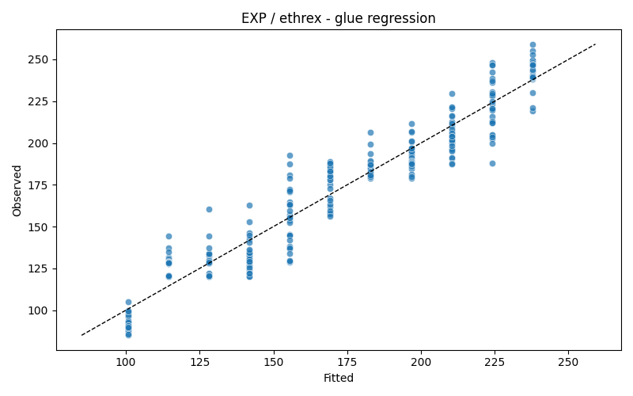

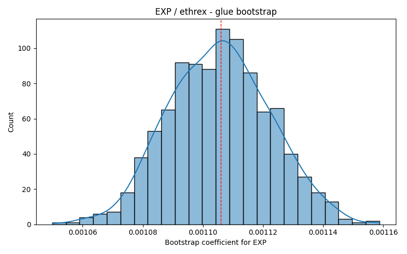

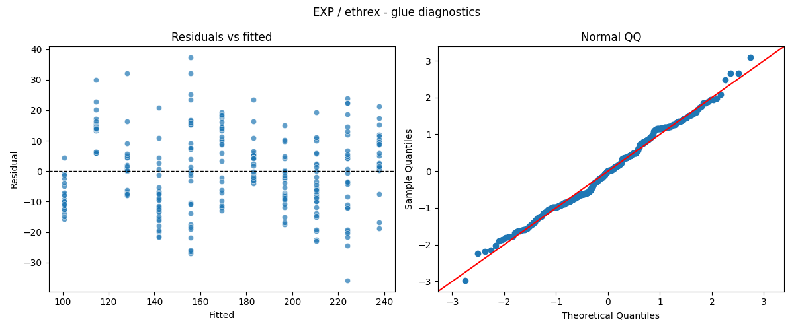

</details>

<details><summary><code>GT</code> · nobs=330 · runtime_ms=1.132e-06 · p=1.00e-03 · R²=0.8307</summary>

```
==============================================================================
                           NNLS Regression Results                            
==============================================================================
Dep. Variable:          test_runtime_ms              R-squared:          0.831
Model:                  NNLS                    Adj. R-squared:          0.830
No. Observations:       330                               RMSE:           5.38
Df Residuals:           328                                MAE:           4.24
Df Model:               1      
==============================================================================
                      coef     std err     P-value      [0.025      0.975]
------------------------------------------------------------------------------
         const     10.6808      0.9215       0.001      9.0307     12.5108
            GT      0.0000      0.0000       0.001      0.0000      0.0000
==============================================================================
Notes: Non-negative least squares with bootstrap inference (1000 iterations)
==============================================================================
```

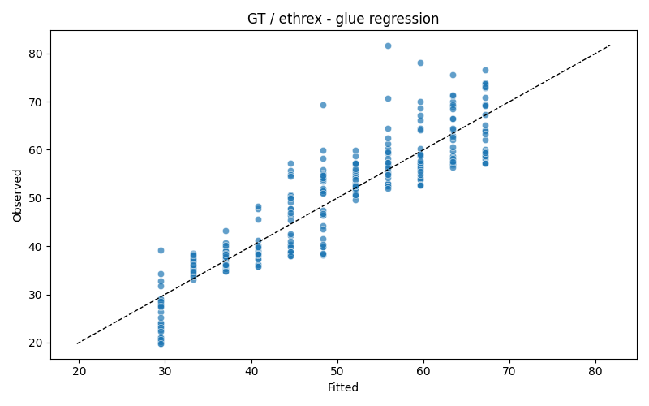

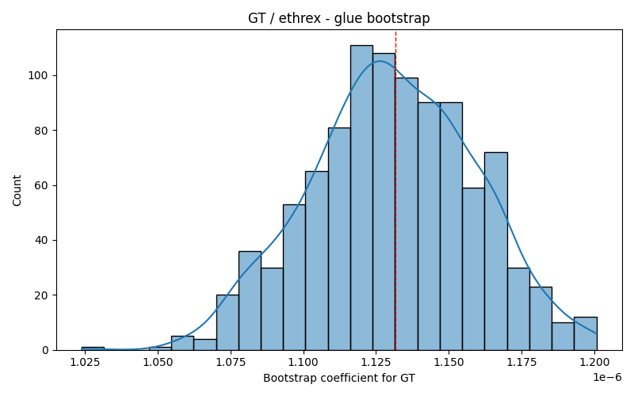

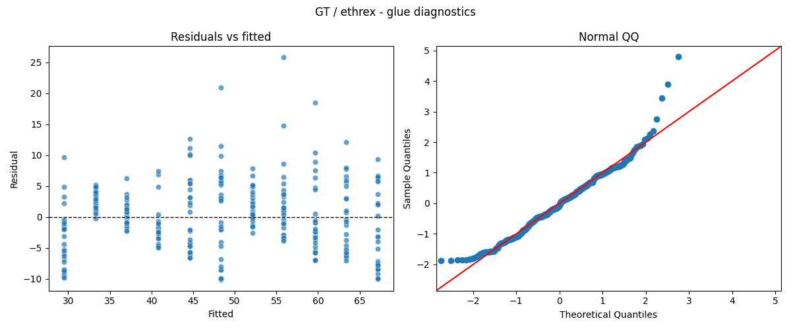

</details>

<details><summary><code>JUMPI</code> · nobs=330 · runtime_ms=1.491e-06 · p=1.00e-03 · R²=0.8009</summary>

```
==============================================================================
                           NNLS Regression Results                            
==============================================================================
Dep. Variable:          test_runtime_ms              R-squared:          0.801
Model:                  NNLS                    Adj. R-squared:          0.800
No. Observations:       330                               RMSE:           3.35
Df Residuals:           328                                MAE:           2.59
Df Model:               1      
==============================================================================
                      coef     std err     P-value      [0.025      0.975]
------------------------------------------------------------------------------
         const      6.0265      0.5828       0.001      4.8983      7.1623
         JUMPI      0.0000      0.0000       0.001      0.0000      0.0000
==============================================================================
Notes: Non-negative least squares with bootstrap inference (1000 iterations)
==============================================================================
```

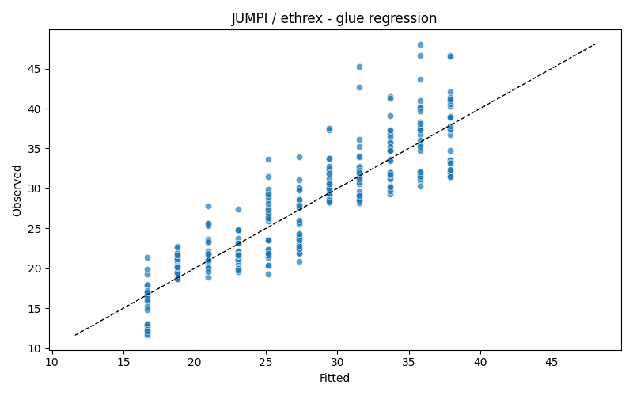

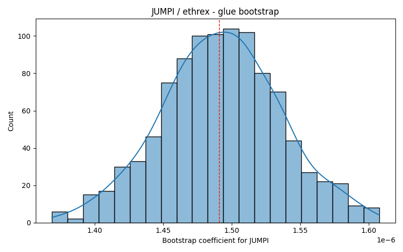

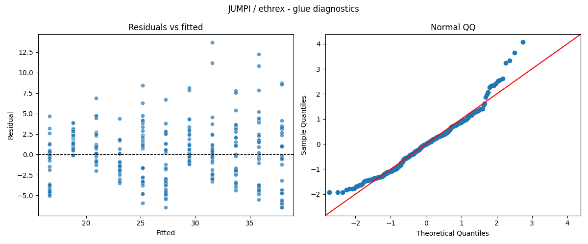

</details>

<details><summary><code>LT</code> · nobs=330 · runtime_ms=9.407e-07 · p=1.00e-03 · R²=0.8114</summary>

```
==============================================================================
                           NNLS Regression Results                            
==============================================================================
Dep. Variable:          test_runtime_ms              R-squared:          0.811
Model:                  NNLS                    Adj. R-squared:          0.811
No. Observations:       330                               RMSE:           4.77
Df Residuals:           328                                MAE:           3.72
Df Model:               1      
==============================================================================
                      coef     std err     P-value      [0.025      0.975]
------------------------------------------------------------------------------
         const     10.4682      0.8250       0.001      8.8164     12.1363
            LT      0.0000      0.0000       0.001      0.0000      0.0000
==============================================================================
Notes: Non-negative least squares with bootstrap inference (1000 iterations)
==============================================================================
```

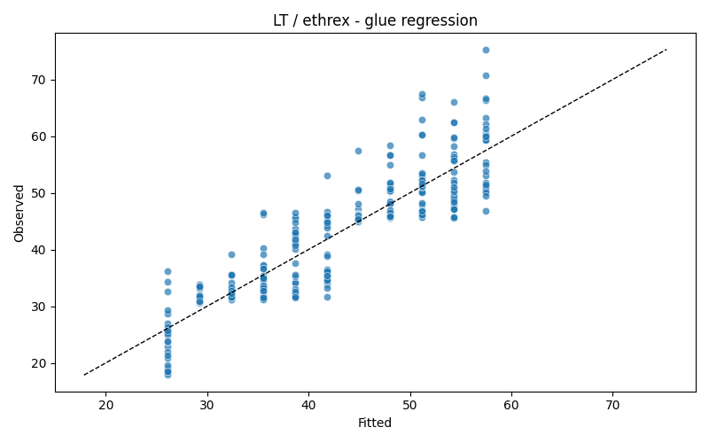

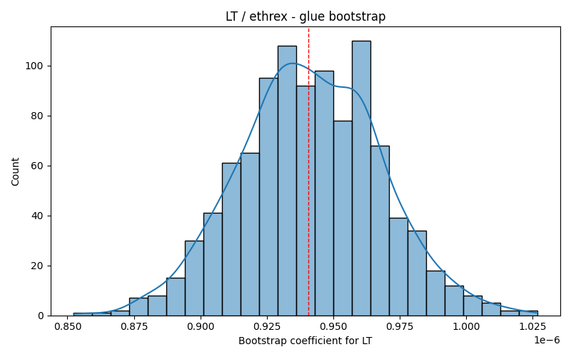

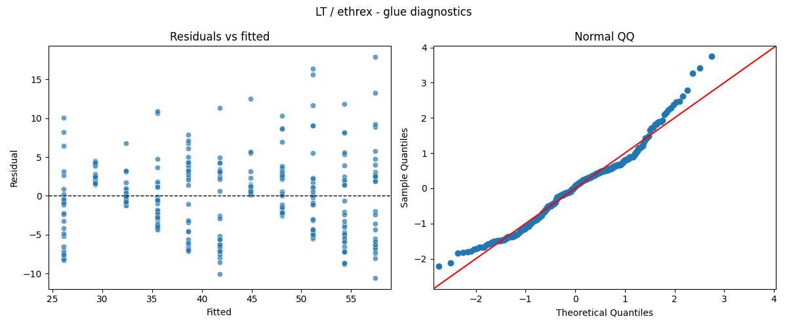

</details>

<details><summary><code>MSTORE</code> · nobs=1650 · runtime_ms=1.704e-06 · p=1.00e-03 · R²=0.7915</summary>

```
==============================================================================
                           NNLS Regression Results                            
==============================================================================
Dep. Variable:          test_runtime_ms              R-squared:          0.792
Model:                  NNLS                    Adj. R-squared:          0.791
No. Observations:       1650                              RMSE:           6.14
Df Residuals:           1648                               MAE:           4.38
Df Model:               1      
==============================================================================
                      coef     std err     P-value      [0.025      0.975]
------------------------------------------------------------------------------
         const     11.7703      0.4766       0.001     10.8153     12.6814
        MSTORE      0.0000      0.0000       0.001      0.0000      0.0000
==============================================================================
Notes: Non-negative least squares with bootstrap inference (1000 iterations)
==============================================================================
```

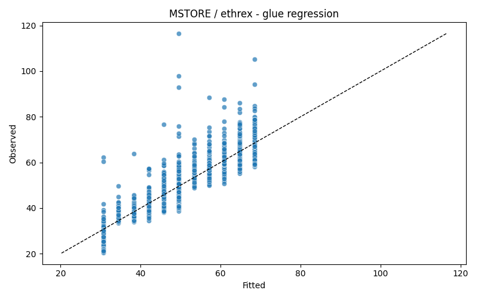

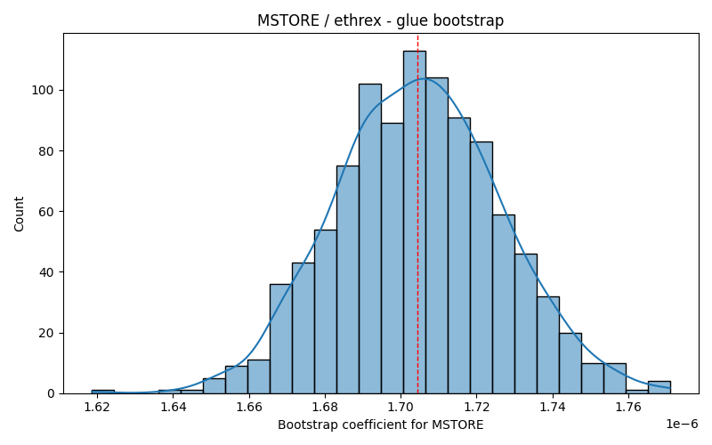

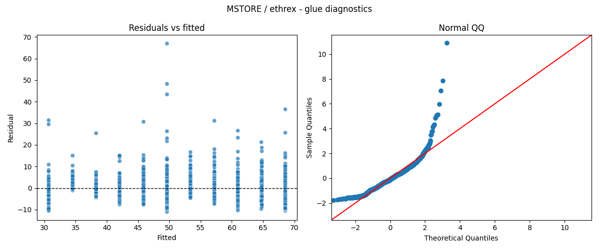

</details>

<details><summary><code>MSTORE8</code> · nobs=1650 · runtime_ms=1.584e-06 · p=1.00e-03 · R²=0.7539</summary>

```
==============================================================================
                           NNLS Regression Results                            
==============================================================================
Dep. Variable:          test_runtime_ms              R-squared:          0.754
Model:                  NNLS                    Adj. R-squared:          0.754
No. Observations:       1650                              RMSE:           6.35
Df Residuals:           1648                               MAE:           4.24
Df Model:               1      
==============================================================================
                      coef     std err     P-value      [0.025      0.975]
------------------------------------------------------------------------------
         const     10.8091      0.5038       0.001      9.8599     11.7656
       MSTORE8      0.0000      0.0000       0.001      0.0000      0.0000
==============================================================================
Notes: Non-negative least squares with bootstrap inference (1000 iterations)
==============================================================================
```

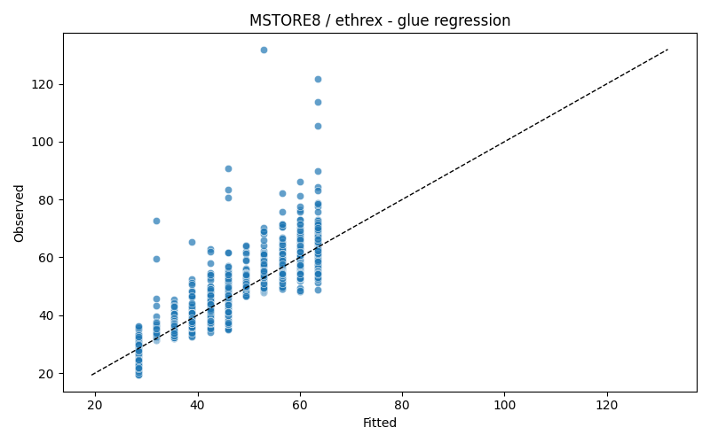

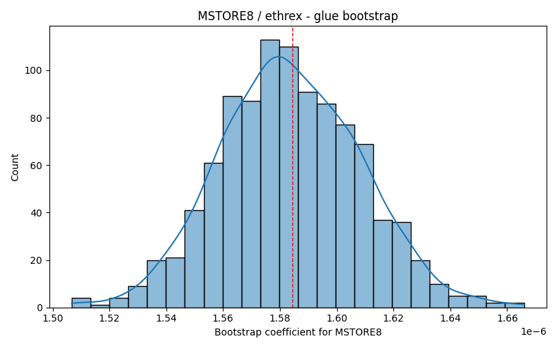

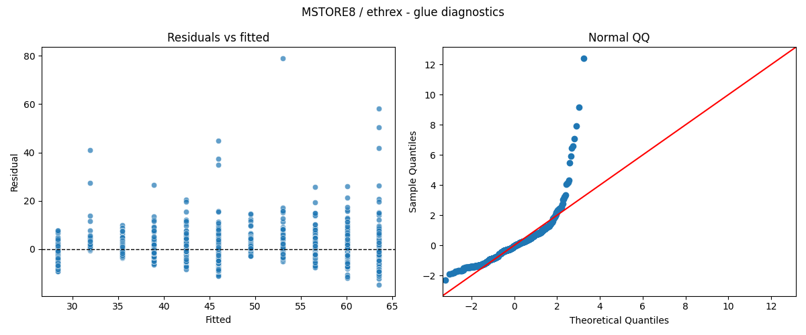

</details>

<details><summary><code>MUL</code> · nobs=330 · runtime_ms=1.529e-06 · p=1.00e-03 · R²=0.8682</summary>

```
==============================================================================
                           NNLS Regression Results                            
==============================================================================
Dep. Variable:          test_runtime_ms              R-squared:          0.868
Model:                  NNLS                    Adj. R-squared:          0.868
No. Observations:       330                               RMSE:           4.70
Df Residuals:           328                                MAE:           3.38
Df Model:               1      
==============================================================================
                      coef     std err     P-value      [0.025      0.975]
------------------------------------------------------------------------------
         const     12.9787      0.9163       0.001     11.1923     14.9960
           MUL      0.0000      0.0000       0.001      0.0000      0.0000
==============================================================================
Notes: Non-negative least squares with bootstrap inference (1000 iterations)
==============================================================================
```

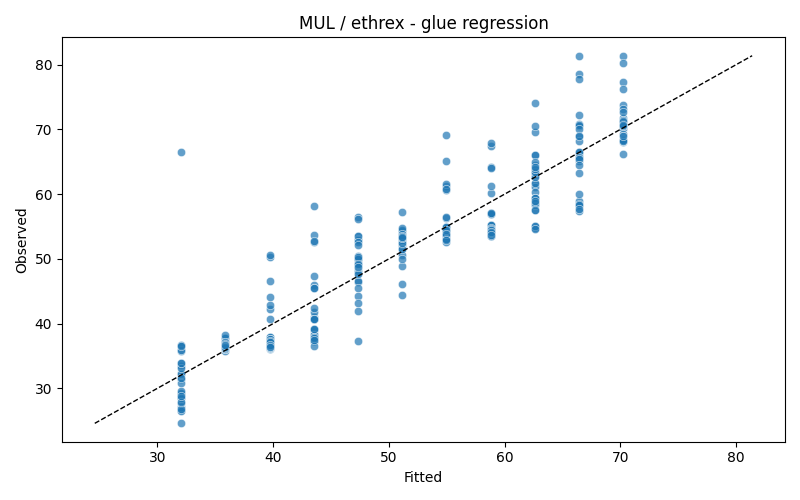

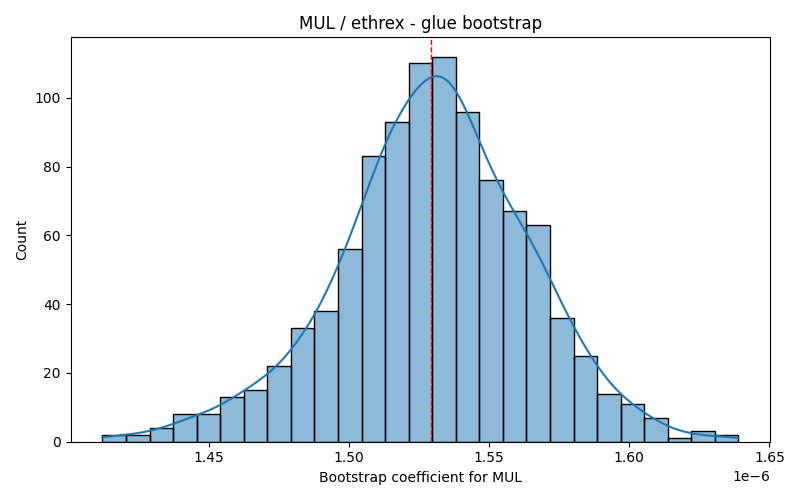

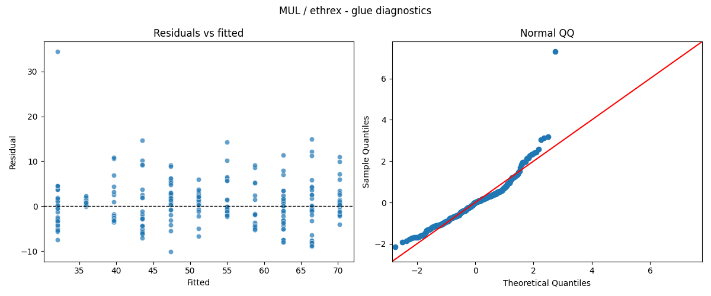

</details>

<details><summary><code>PC</code> · nobs=330 · runtime_ms=5.663e-07 · p=1.00e-03 · R²=0.8371</summary>

```
==============================================================================
                           NNLS Regression Results                            
==============================================================================
Dep. Variable:          test_runtime_ms              R-squared:          0.837
Model:                  NNLS                    Adj. R-squared:          0.837
No. Observations:       330                               RMSE:           7.47
Df Residuals:           328                                MAE:           6.19
Df Model:               1      
==============================================================================
                      coef     std err     P-value      [0.025      0.975]
------------------------------------------------------------------------------
         const     14.4804      1.3883       0.001     11.8283     17.0060
            PC      0.0000      0.0000       0.001      0.0000      0.0000
==============================================================================
Notes: Non-negative least squares with bootstrap inference (1000 iterations)
==============================================================================
```

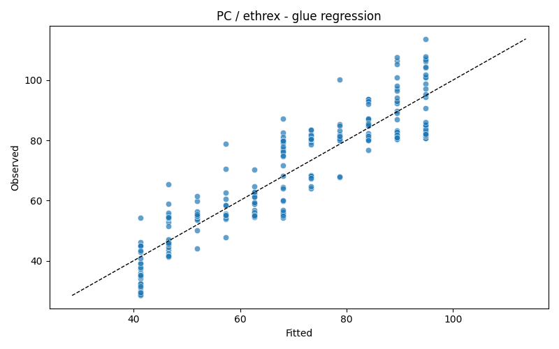

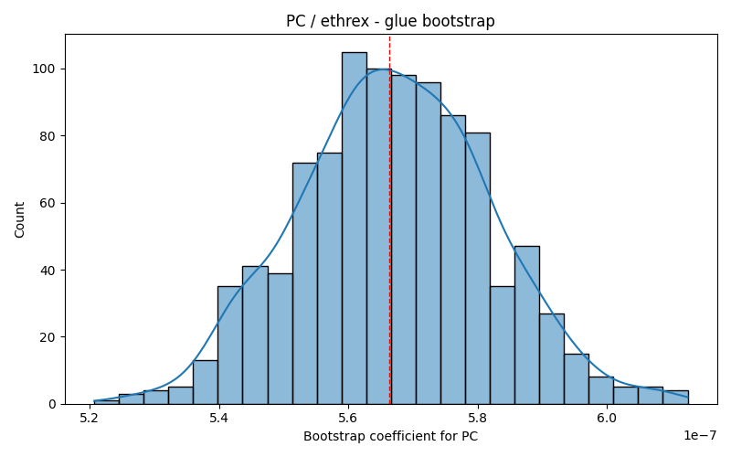

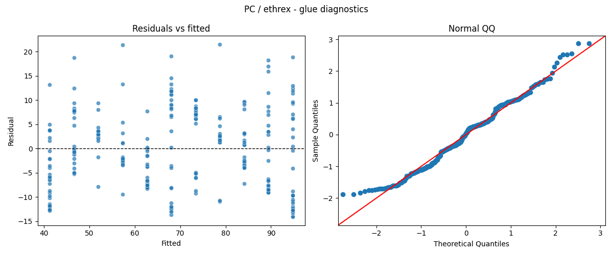

</details>

<details><summary><code>RETURNDATASIZE</code> · nobs=1320 · runtime_ms=8.989e-07 · p=1.00e-03 · R²=0.8328</summary>

```
==============================================================================
                           NNLS Regression Results                            
==============================================================================
Dep. Variable:          test_runtime_ms              R-squared:          0.833
Model:                  NNLS                    Adj. R-squared:          0.833
No. Observations:       1320                              RMSE:           6.36
Df Residuals:           1318                               MAE:           4.89
Df Model:               1      
==============================================================================
                      coef     std err     P-value      [0.025      0.975]
------------------------------------------------------------------------------
         const     12.0786      0.5784       0.001     10.8823     13.2475
RETURNDATASIZE      0.0000      0.0000       0.001      0.0000      0.0000
==============================================================================
Notes: Non-negative least squares with bootstrap inference (1000 iterations)
==============================================================================
```

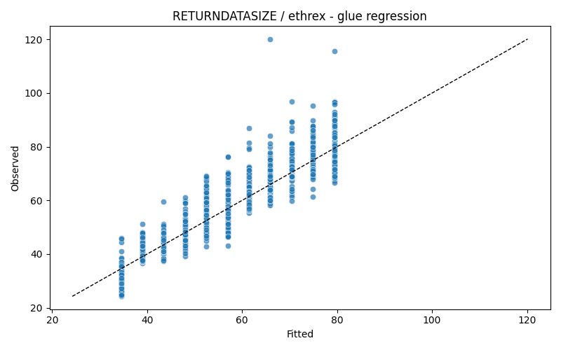

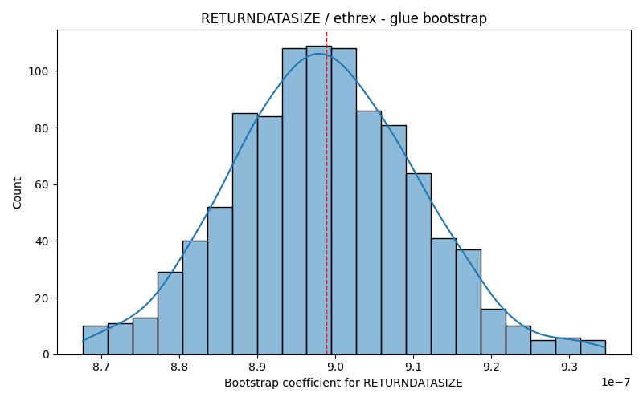

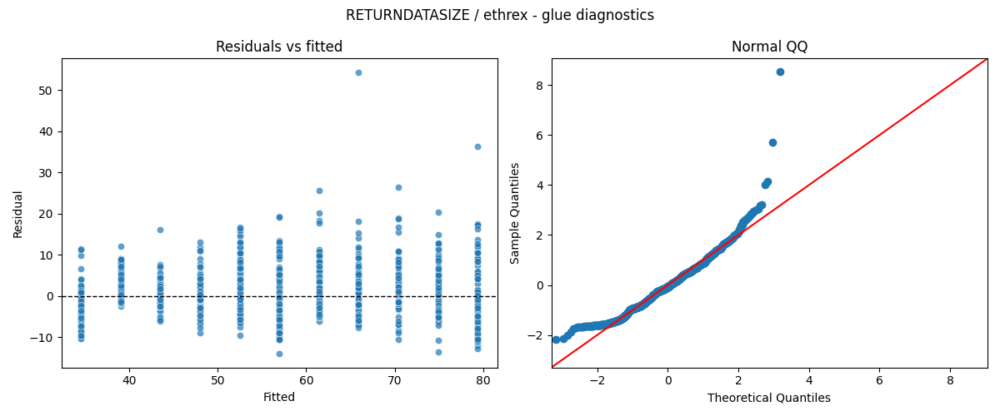

</details>

<details><summary><code>SELFBALANCE</code> · nobs=270 · runtime_ms=5.768e-06 · p=1.00e-03 · R²=0.8994</summary>

```
==============================================================================
                           NNLS Regression Results                            
==============================================================================
Dep. Variable:          test_runtime_ms              R-squared:          0.899
Model:                  NNLS                    Adj. R-squared:          0.899
No. Observations:       270                               RMSE:          19.46
Df Residuals:           268                                MAE:          15.90
Df Model:               1      
==============================================================================
                      coef     std err     P-value      [0.025      0.975]
------------------------------------------------------------------------------
         const     56.9631      4.8153       0.001     47.5102     66.4347
   SELFBALANCE      0.0000      0.0000       0.001      0.0000      0.0000
==============================================================================
Notes: Non-negative least squares with bootstrap inference (1000 iterations)
==============================================================================
```

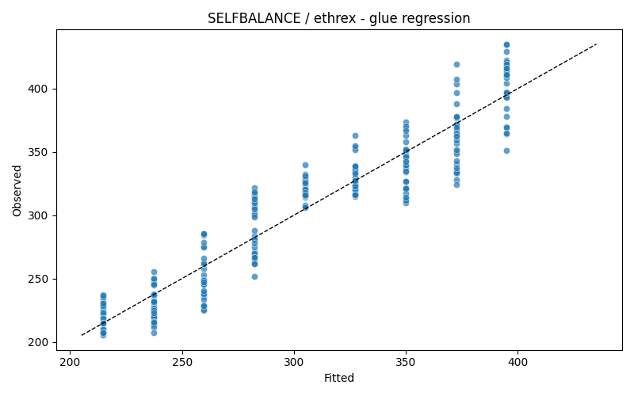

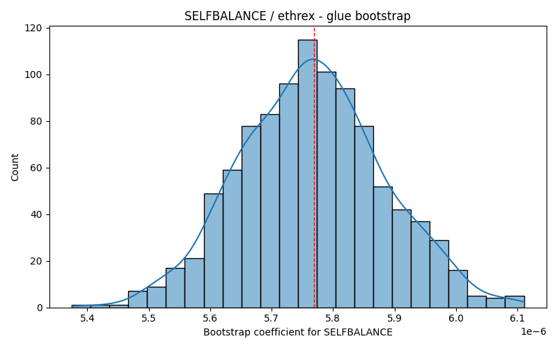

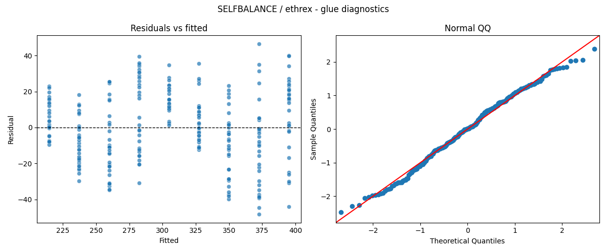

</details>

<details><summary><code>SUB</code> · nobs=330 · runtime_ms=1.193e-06 · p=1.00e-03 · R²=0.9077</summary>

```
==============================================================================
                           NNLS Regression Results                            
==============================================================================
Dep. Variable:          test_runtime_ms              R-squared:          0.908
Model:                  NNLS                    Adj. R-squared:          0.907
No. Observations:       330                               RMSE:           4.00
Df Residuals:           328                                MAE:           3.09
Df Model:               1      
==============================================================================
                      coef     std err     P-value      [0.025      0.975]
------------------------------------------------------------------------------
         const      8.8096      0.6920       0.001      7.4616     10.2380
           SUB      0.0000      0.0000       0.001      0.0000      0.0000
==============================================================================
Notes: Non-negative least squares with bootstrap inference (1000 iterations)
==============================================================================
```

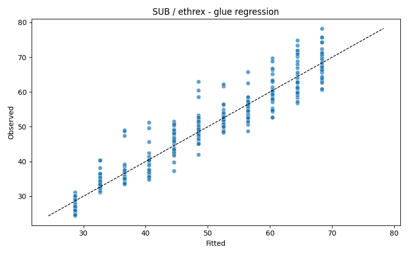

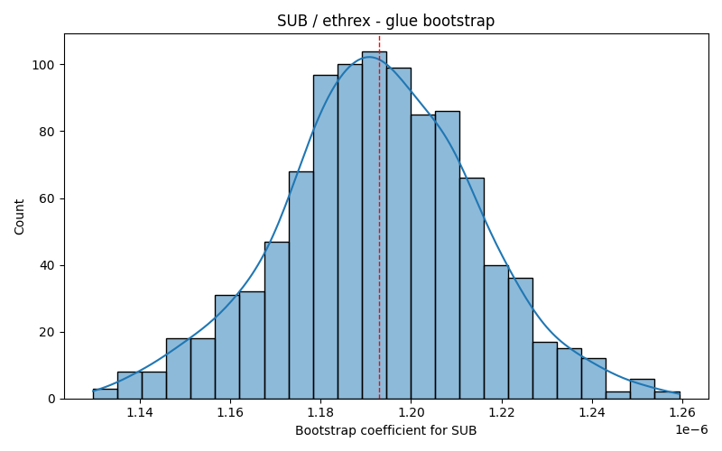

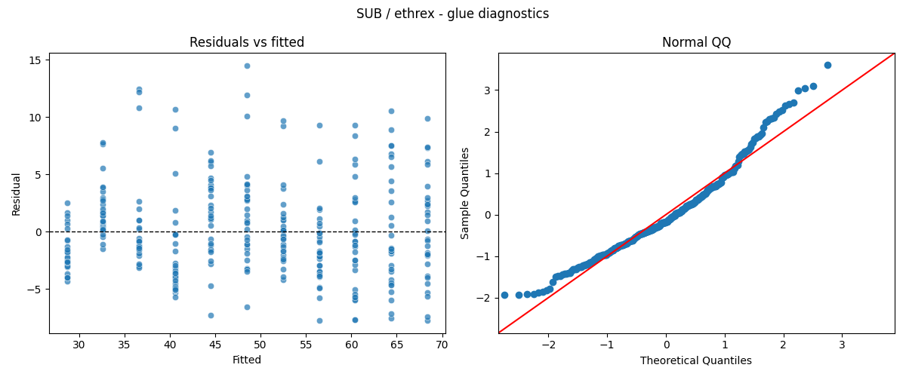

</details>

### Mixed glue (tier B) · ethrex

<details><summary><code>JUMP</code> · nobs=330 · runtime_ms=4.313e-06 · p=1.00e-03 · R²=0.8352</summary>

```
==============================================================================
                           NNLS Regression Results                            
==============================================================================
Dep. Variable:          test_runtime_ms              R-squared:          0.835
Model:                  NNLS                    Adj. R-squared:          0.835
No. Observations:       330                               RMSE:           7.12
Df Residuals:           328                                MAE:           5.80
Df Model:               1      
==============================================================================
                      coef     std err     P-value      [0.025      0.975]
------------------------------------------------------------------------------
         const     15.1930      1.2866       0.001     12.7420     17.8257
          JUMP      0.0000      0.0000       0.001      0.0000      0.0000
==============================================================================
Notes: Non-negative least squares with bootstrap inference (1000 iterations)
==============================================================================
```

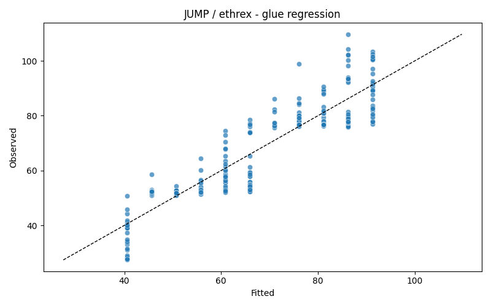

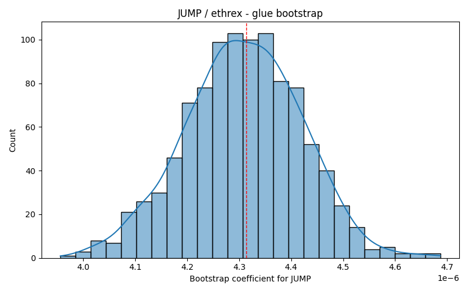

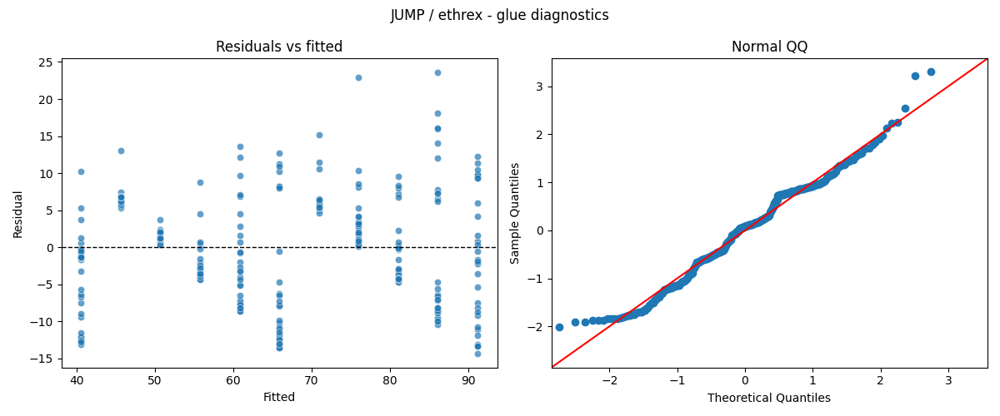

</details>

<details><summary><code>KECCAK256</code> · nobs=5280 · runtime_ms=0 · p=1.00e+00 · R²=-2.22e-16</summary>

```
==============================================================================
                           NNLS Regression Results                            
==============================================================================
Dep. Variable:          test_runtime_ms              R-squared:         -0.000
Model:                  NNLS                    Adj. R-squared:         -0.000
No. Observations:       5280                              RMSE:         155.14
Df Residuals:           5278                               MAE:         128.27
Df Model:               1      
==============================================================================
                      coef     std err     P-value      [0.025      0.975]
------------------------------------------------------------------------------
         const    247.2539      2.1216       0.001    243.2018    251.4352
     KECCAK256      0.0000      0.0000       1.000      0.0000      0.0000
==============================================================================
Notes: Non-negative least squares with bootstrap inference (1000 iterations)
==============================================================================
```

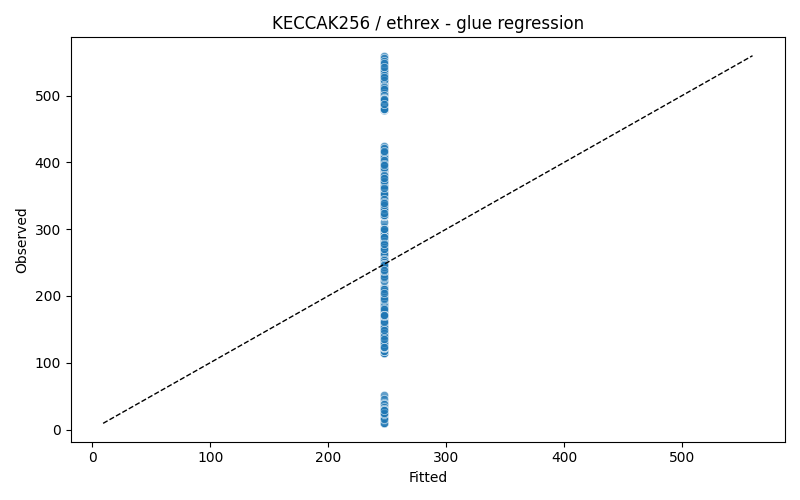


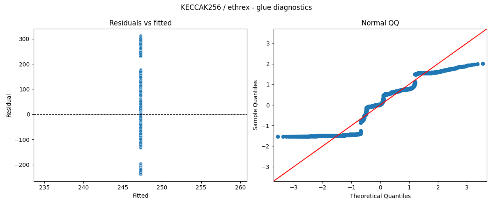

</details>

## geth

| glue_opcode | nobs | glue_runtime_ms | p_value | rsquared |
| --- | --- | --- | --- | --- |
| `ISZERO` | 2552 | 1.428e-06 | 1.00e-03 | 0.7595 |
| `JUMPDEST` | 2552 | 1.16e-06 | 1.00e-03 | 0.7874 |
| `SWAP` | 40832 | 1.531e-06 | 1.00e-03 | 0.7641 |
| `CALLDATASIZE` | 150876 | 1.426e-06 | 1.00e-03 | 0.8204 |
| `DUP` | 150876 | 1.534e-06 | 1.00e-03 | 0.8204 |
| `GAS` | 150876 | 1.504e-06 | 1.00e-03 | 0.8204 |
| `MLOAD` | 150876 | 5.203e-06 | 1.00e-03 | 0.8204 |
| `PUSH` | 150876 | 2.268e-06 | 1.00e-03 | 0.8204 |
| `PUSH0` | 150876 | 1.448e-06 | 1.00e-03 | 0.8204 |
| `STATICCALL` | 150876 | 0.0001666 | 1.00e-03 | 0.8204 |
| `ADD` | 2552 | 4.45e-06 | 1.00e-03 | 0.8363 |
| `AND` | 2552 | 4.189e-06 | 1.00e-03 | 0.7892 |
| `CALLDATACOPY` | 61248 | 1.379e-05 | 1.00e-03 | 0.9538 |
| `CALLDATALOAD` | 10208 | 5.218e-05 | 1.00e-03 | 0.03285 |
| `DIV` | 2552 | 9.53e-06 | 1.00e-03 | 0.791 |
| `EXP` | 2552 | 0.0003392 | 1.00e-03 | 0.7993 |
| `GT` | 2552 | 3.558e-06 | 1.00e-03 | 0.7744 |
| `JUMPI` | 2552 | 5.72e-06 | 1.00e-03 | 0.7423 |
| `LT` | 2552 | 4.471e-06 | 1.00e-03 | 0.8162 |
| `MSTORE` | 12760 | 8.03e-06 | 1.00e-03 | 0.8124 |
| `MSTORE8` | 12760 | 7.438e-06 | 1.00e-03 | 0.7962 |
| `MUL` | 2552 | 4.924e-06 | 1.00e-03 | 0.8626 |
| `PC` | 2552 | 1.629e-06 | 1.00e-03 | 0.8385 |
| `RETURNDATASIZE` | 10208 | 3.156e-06 | 1.00e-03 | 0.6104 |
| `SELFBALANCE` | 2088 | 7.486e-06 | 1.00e-03 | 0.7958 |
| `SUB` | 2552 | 4.422e-06 | 1.00e-03 | 0.8228 |
| `JUMP` | 2552 | 9.143e-06 | 1.00e-03 | 0.7598 |
| `KECCAK256` | 40832 | 3.67e-05 | 1.00e-03 | 0.265 |

### Cycle glue — joint fit · geth

<details><summary>Joint NNLS regression summary</summary>

```
==============================================================================
                           NNLS Regression Results                            
==============================================================================
Dep. Variable:          test_runtime_ms              R-squared:          0.820
Model:                  NNLS                    Adj. R-squared:          0.820
No. Observations:       150876                            RMSE:          24.13
Df Residuals:           150868                             MAE:          18.67
Df Model:               7      
==============================================================================
                      coef     std err     P-value      [0.025      0.975]
------------------------------------------------------------------------------
         const     40.9230      0.2204       0.001     40.4856     41.3292
  CALLDATASIZE      0.0000      0.0000       0.001      0.0000      0.0000
           DUP      0.0000      0.0000       0.001      0.0000      0.0000
           GAS      0.0000      0.0000       0.001      0.0000      0.0000
         MLOAD      0.0000      0.0000       0.001      0.0000      0.0000
          PUSH      0.0000      0.0000       0.001      0.0000      0.0000
         PUSH0      0.0000      0.0000       0.001      0.0000      0.0000
    STATICCALL      0.0002      0.0000       0.001      0.0002      0.0002
==============================================================================
Notes: Non-negative least squares with bootstrap inference (1000 iterations)
==============================================================================
```

</details>

<details><summary><code>CALLDATASIZE</code> · nobs=150876 · runtime_ms=1.426e-06 · p=1.00e-03 · R²=0.8204</summary>


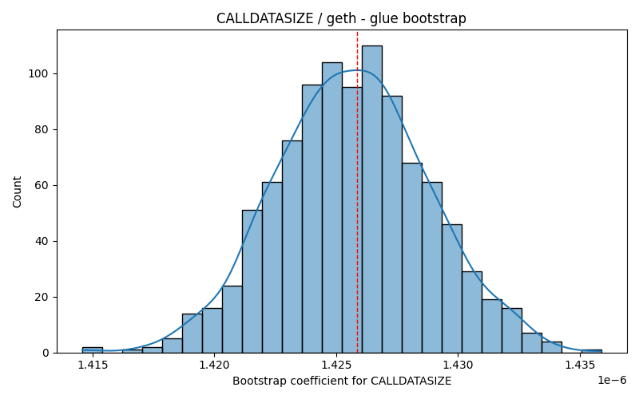

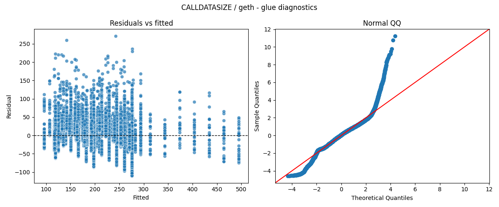

</details>

<details><summary><code>DUP</code> · nobs=150876 · runtime_ms=1.534e-06 · p=1.00e-03 · R²=0.8204</summary>


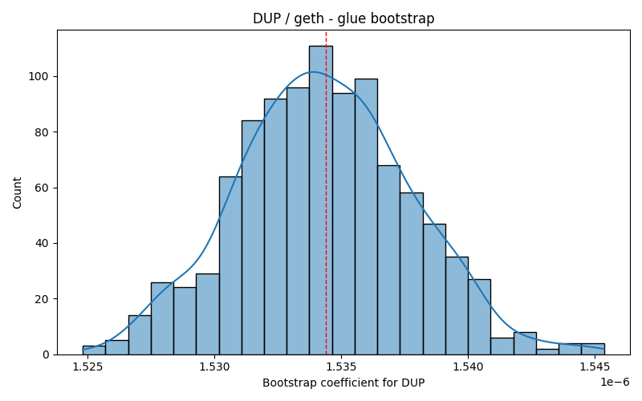


</details>

<details><summary><code>GAS</code> · nobs=150876 · runtime_ms=1.504e-06 · p=1.00e-03 · R²=0.8204</summary>

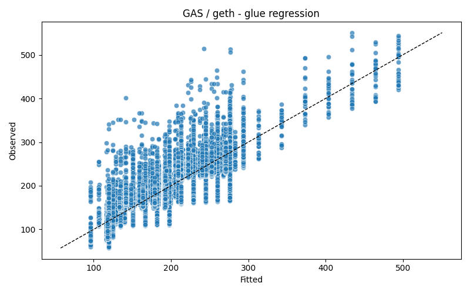

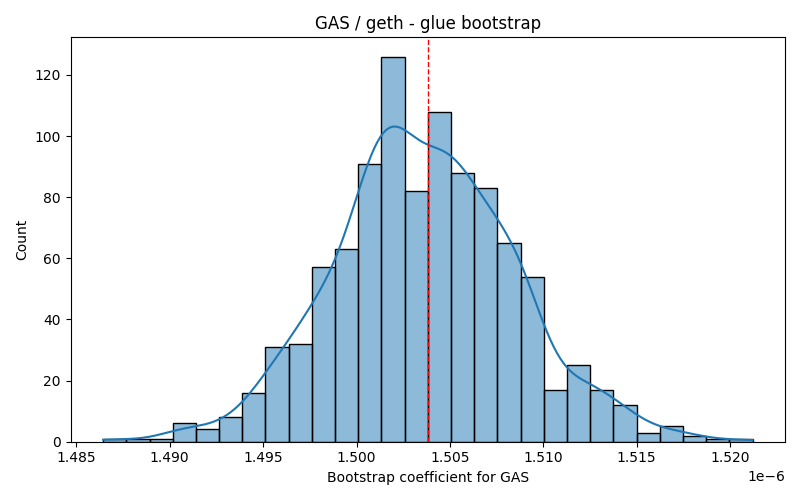


</details>

<details><summary><code>MLOAD</code> · nobs=150876 · runtime_ms=5.203e-06 · p=1.00e-03 · R²=0.8204</summary>


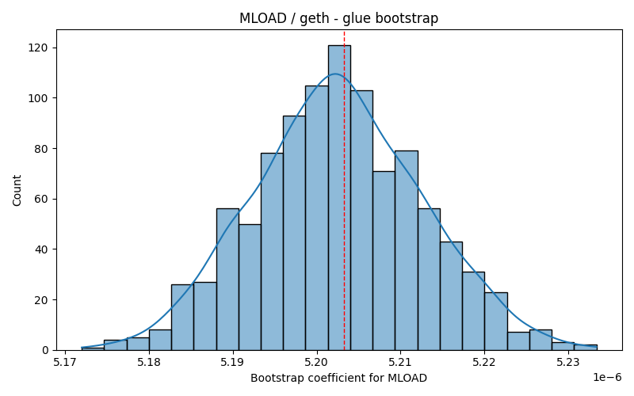


</details>

<details><summary><code>PUSH</code> · nobs=150876 · runtime_ms=2.268e-06 · p=1.00e-03 · R²=0.8204</summary>


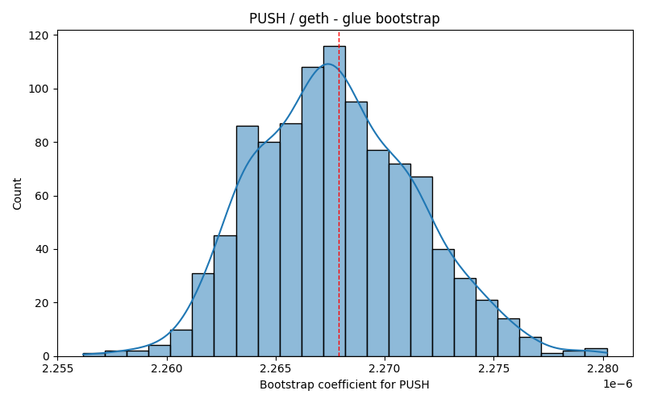

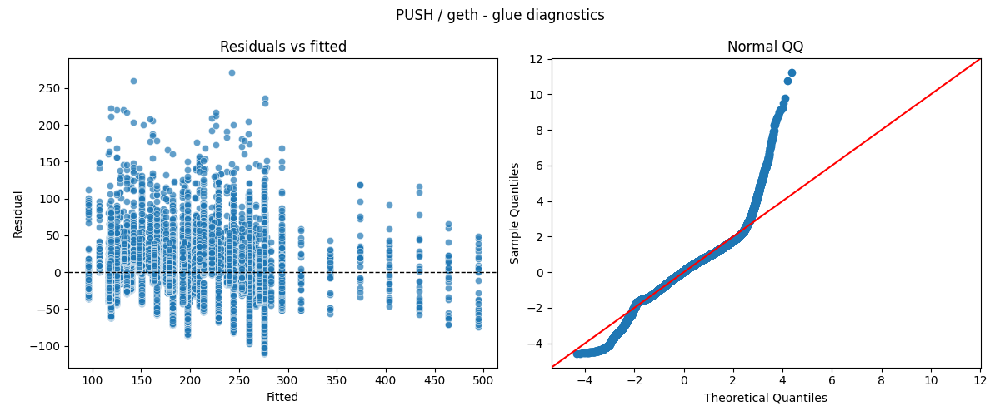

</details>

<details><summary><code>PUSH0</code> · nobs=150876 · runtime_ms=1.448e-06 · p=1.00e-03 · R²=0.8204</summary>

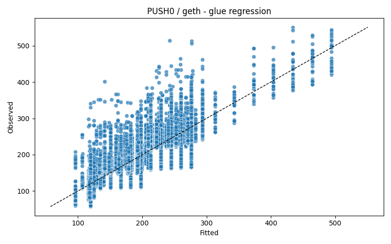


</details>

<details><summary><code>STATICCALL</code> · nobs=150876 · runtime_ms=0.0001666 · p=1.00e-03 · R²=0.8204</summary>


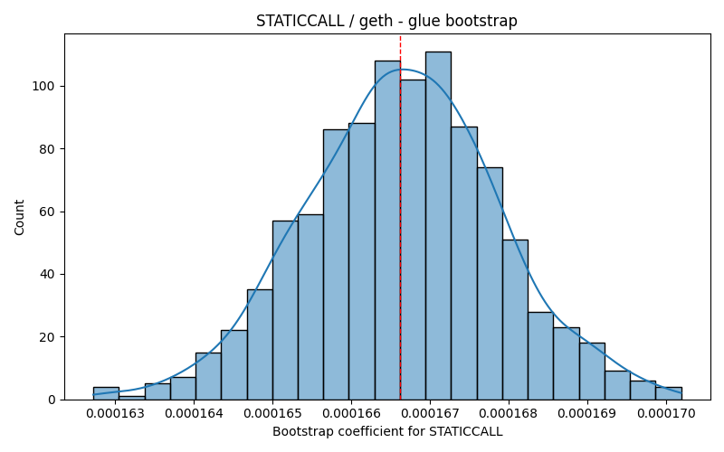

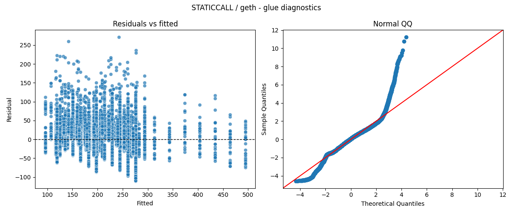

</details>

### Pure glue · geth

<details><summary><code>ISZERO</code> · nobs=2552 · runtime_ms=1.428e-06 · p=1.00e-03 · R²=0.7595</summary>

```
==============================================================================
                           NNLS Regression Results                            
==============================================================================
Dep. Variable:          test_runtime_ms              R-squared:          0.759
Model:                  NNLS                    Adj. R-squared:          0.759
No. Observations:       2552                              RMSE:          16.91
Df Residuals:           2550                               MAE:          12.06
Df Model:               1      
==============================================================================
                      coef     std err     P-value      [0.025      0.975]
------------------------------------------------------------------------------
         const     23.7224      1.1418       0.001     21.4694     25.9197
        ISZERO      0.0000      0.0000       0.001      0.0000      0.0000
==============================================================================
Notes: Non-negative least squares with bootstrap inference (1000 iterations)
==============================================================================
```

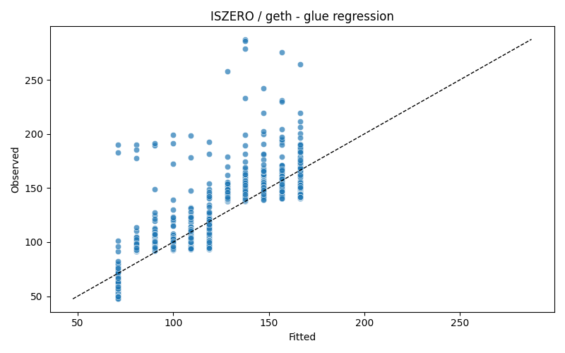

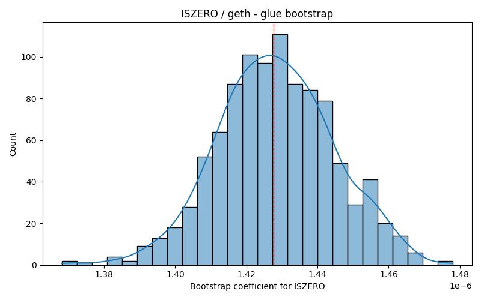

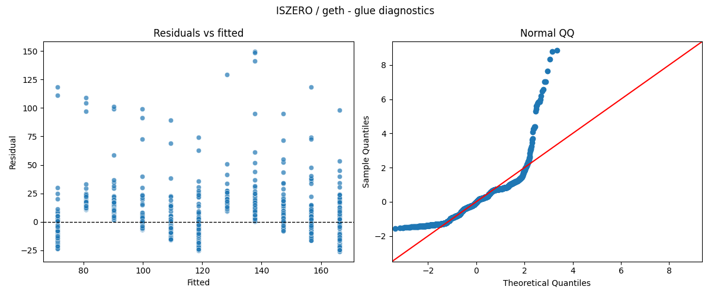

</details>

<details><summary><code>JUMPDEST</code> · nobs=2552 · runtime_ms=1.16e-06 · p=1.00e-03 · R²=0.7874</summary>

```
==============================================================================
                           NNLS Regression Results                            
==============================================================================
Dep. Variable:          test_runtime_ms              R-squared:          0.787
Model:                  NNLS                    Adj. R-squared:          0.787
No. Observations:       2552                              RMSE:          38.06
Df Residuals:           2550                               MAE:          26.71
Df Model:               1      
==============================================================================
                      coef     std err     P-value      [0.025      0.975]
------------------------------------------------------------------------------
         const     69.1109      2.5098       0.001     64.4197     74.3223
      JUMPDEST      0.0000      0.0000       0.001      0.0000      0.0000
==============================================================================
Notes: Non-negative least squares with bootstrap inference (1000 iterations)
==============================================================================
```

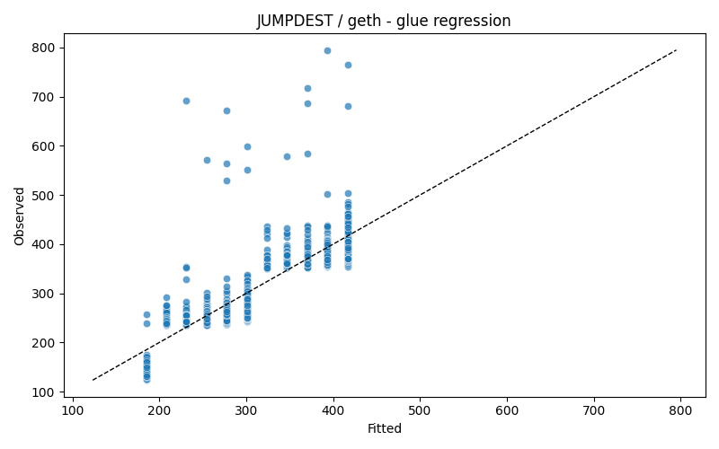

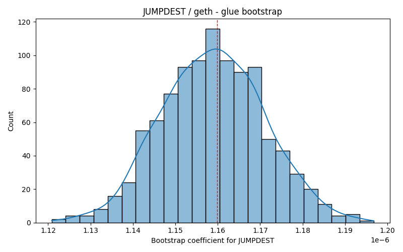

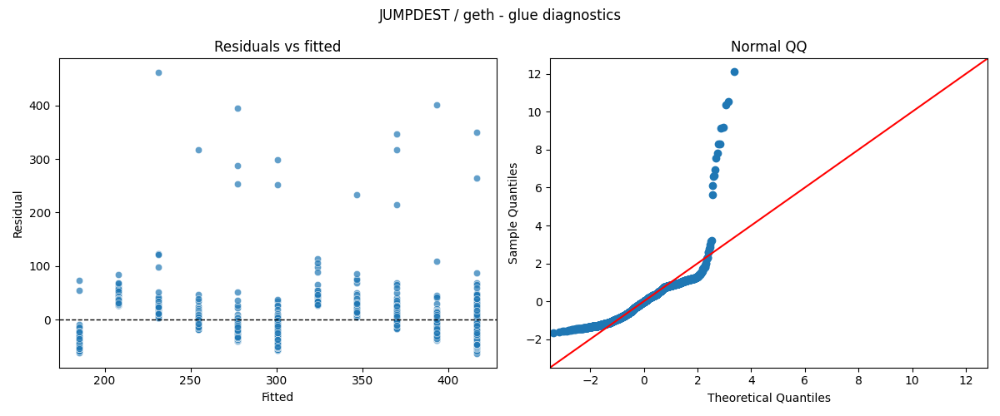

</details>

<details><summary><code>SWAP</code> · nobs=40832 · runtime_ms=1.531e-06 · p=1.00e-03 · R²=0.7641</summary>

```
==============================================================================
                           NNLS Regression Results                            
==============================================================================
Dep. Variable:          test_runtime_ms              R-squared:          0.764
Model:                  NNLS                    Adj. R-squared:          0.764
No. Observations:       40832                             RMSE:          17.91
Df Residuals:           40830                              MAE:          13.29
Df Model:               1      
==============================================================================
                      coef     std err     P-value      [0.025      0.975]
------------------------------------------------------------------------------
         const     30.9804      0.3026       0.001     30.3877     31.5899
          SWAP      0.0000      0.0000       0.001      0.0000      0.0000
==============================================================================
Notes: Non-negative least squares with bootstrap inference (1000 iterations)
==============================================================================
```

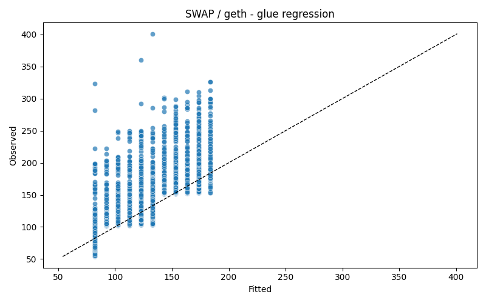

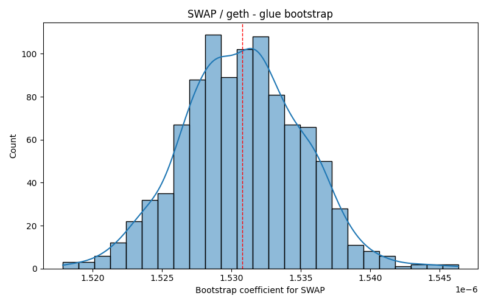

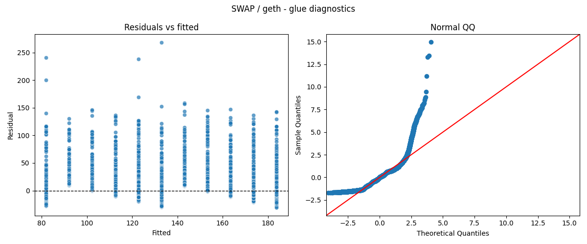

</details>

### Mixed glue (tier A) · geth

<details><summary><code>ADD</code> · nobs=2552 · runtime_ms=4.45e-06 · p=1.00e-03 · R²=0.8363</summary>

```
==============================================================================
                           NNLS Regression Results                            
==============================================================================
Dep. Variable:          test_runtime_ms              R-squared:          0.836
Model:                  NNLS                    Adj. R-squared:          0.836
No. Observations:       2552                              RMSE:          20.72
Df Residuals:           2550                               MAE:          15.50
Df Model:               1      
==============================================================================
                      coef     std err     P-value      [0.025      0.975]
------------------------------------------------------------------------------
         const     45.0430      1.2938       0.001     42.5966     47.6659
           ADD      0.0000      0.0000       0.001      0.0000      0.0000
==============================================================================
Notes: Non-negative least squares with bootstrap inference (1000 iterations)
==============================================================================
```

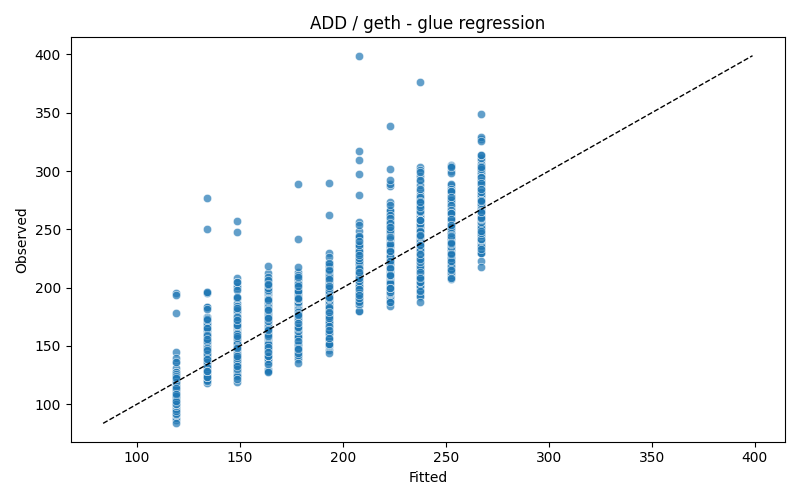

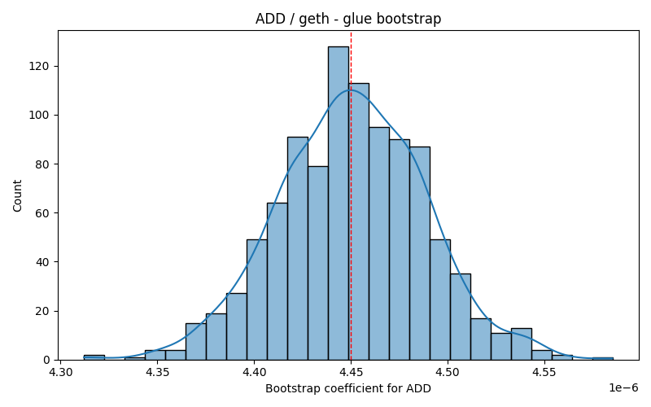

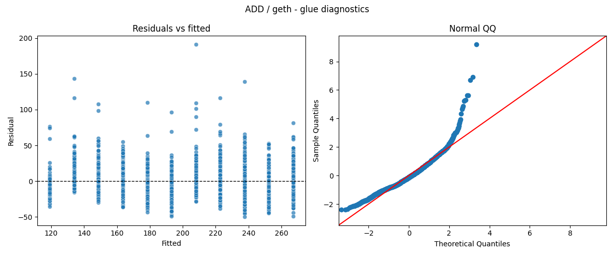

</details>

<details><summary><code>AND</code> · nobs=2552 · runtime_ms=4.189e-06 · p=1.00e-03 · R²=0.7892</summary>

```
==============================================================================
                           NNLS Regression Results                            
==============================================================================
Dep. Variable:          test_runtime_ms              R-squared:          0.789
Model:                  NNLS                    Adj. R-squared:          0.789
No. Observations:       2552                              RMSE:          22.79
Df Residuals:           2550                               MAE:          16.20
Df Model:               1      
==============================================================================
                      coef     std err     P-value      [0.025      0.975]
------------------------------------------------------------------------------
         const     47.4644      1.6200       0.001     44.5127     50.7754
           AND      0.0000      0.0000       0.001      0.0000      0.0000
==============================================================================
Notes: Non-negative least squares with bootstrap inference (1000 iterations)
==============================================================================
```

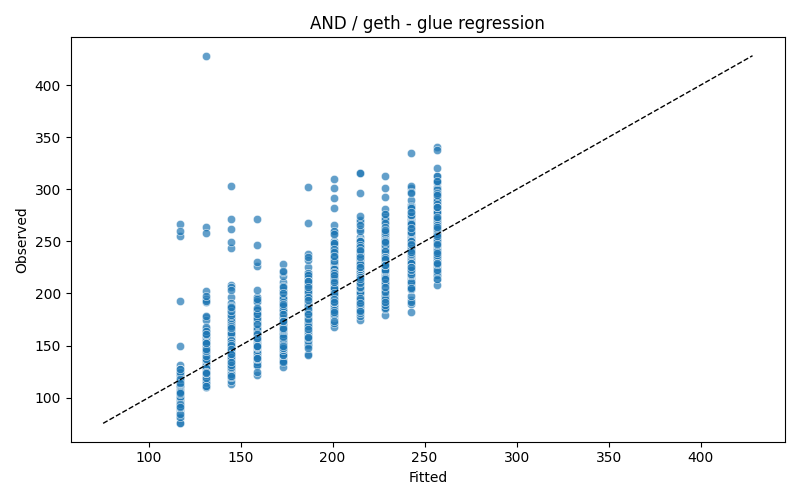

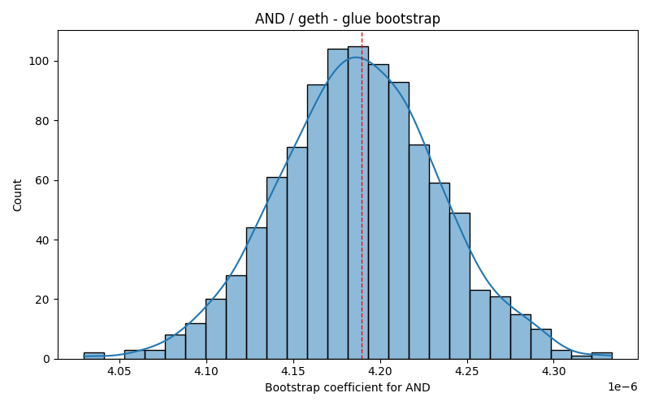

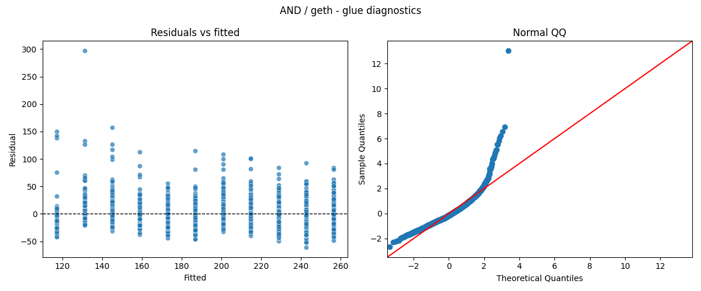

</details>

<details><summary><code>CALLDATACOPY</code> · nobs=61248 · runtime_ms=1.379e-05 · p=1.00e-03 · R²=0.9538</summary>

```
==============================================================================
                           NNLS Regression Results                            
==============================================================================
Dep. Variable:          test_runtime_ms              R-squared:          0.954
Model:                  NNLS                    Adj. R-squared:          0.954
No. Observations:       61248                             RMSE:          22.83
Df Residuals:           61246                              MAE:          16.41
Df Model:               1      
==============================================================================
                      coef     std err     P-value      [0.025      0.975]
------------------------------------------------------------------------------
         const     20.3596      0.1125       0.001     20.1383     20.5878
  CALLDATACOPY      0.0000      0.0000       0.001      0.0000      0.0000
==============================================================================
Notes: Non-negative least squares with bootstrap inference (1000 iterations)
==============================================================================
```

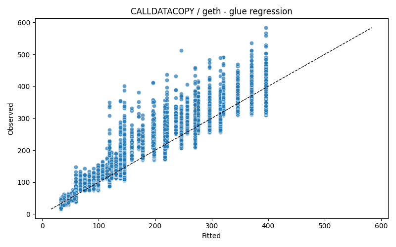

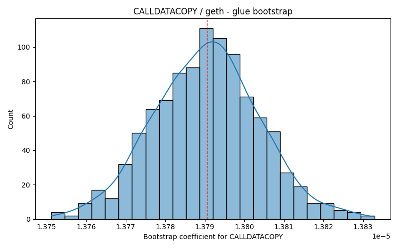

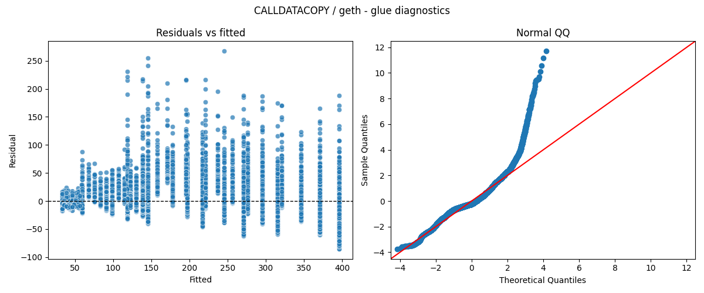

</details>

<details><summary><code>CALLDATALOAD</code> · nobs=10208 · runtime_ms=5.218e-05 · p=1.00e-03 · R²=0.03285</summary>

```
==============================================================================
                           NNLS Regression Results                            
==============================================================================
Dep. Variable:          test_runtime_ms              R-squared:          0.033
Model:                  NNLS                    Adj. R-squared:          0.033
No. Observations:       10208                             RMSE:           1.09
Df Residuals:           10206                              MAE:           0.55
Df Model:               1      
==============================================================================
                      coef     std err     P-value      [0.025      0.975]
------------------------------------------------------------------------------
         const      2.4692      0.0373       0.001      2.3992      2.5428
  CALLDATALOAD      0.0001      0.0000       0.001      0.0000      0.0001
==============================================================================
Notes: Non-negative least squares with bootstrap inference (1000 iterations)
==============================================================================
```

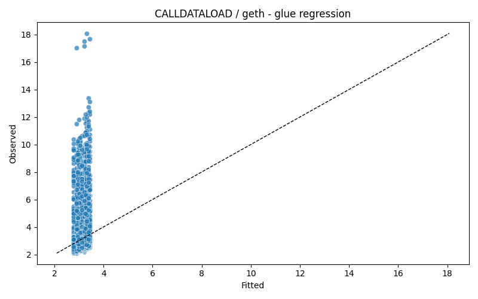

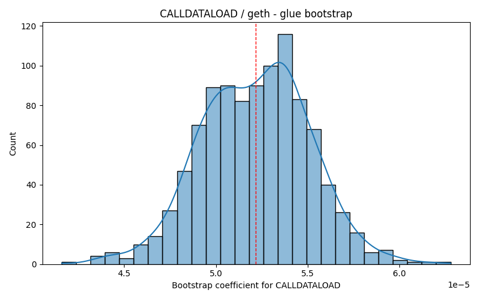

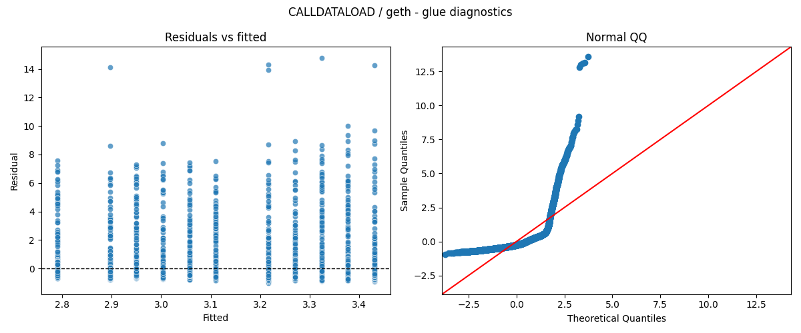

</details>

<details><summary><code>DIV</code> · nobs=2552 · runtime_ms=9.53e-06 · p=1.00e-03 · R²=0.791</summary>

```
==============================================================================
                           NNLS Regression Results                            
==============================================================================
Dep. Variable:          test_runtime_ms              R-squared:          0.791
Model:                  NNLS                    Adj. R-squared:          0.791
No. Observations:       2552                              RMSE:          38.67
Df Residuals:           2550                               MAE:          31.78
Df Model:               1      
==============================================================================
                      coef     std err     P-value      [0.025      0.975]
------------------------------------------------------------------------------
         const     73.3121      2.6519       0.001     68.0177     78.5867
           DIV      0.0000      0.0000       0.001      0.0000      0.0000
==============================================================================
Notes: Non-negative least squares with bootstrap inference (1000 iterations)
==============================================================================
```

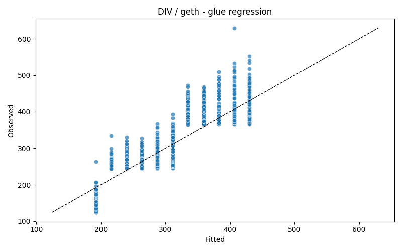

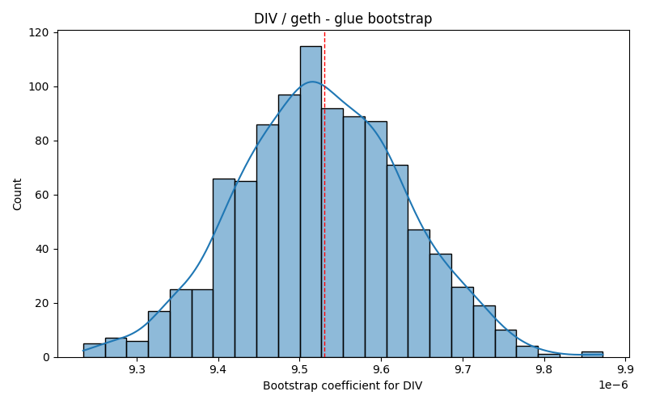

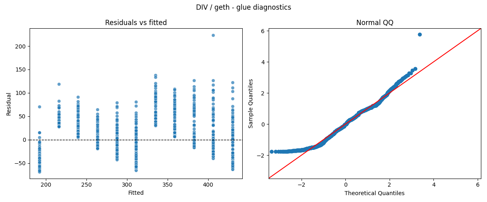

</details>

<details><summary><code>EXP</code> · nobs=2552 · runtime_ms=0.0003392 · p=1.00e-03 · R²=0.7993</summary>

```
==============================================================================
                           NNLS Regression Results                            
==============================================================================
Dep. Variable:          test_runtime_ms              R-squared:          0.799
Model:                  NNLS                    Adj. R-squared:          0.799
No. Observations:       2552                              RMSE:           6.66
Df Residuals:           2550                               MAE:           5.56
Df Model:               1      
==============================================================================
                      coef     std err     P-value      [0.025      0.975]
------------------------------------------------------------------------------
         const     13.1244      0.4685       0.001     12.1628     14.0403
           EXP      0.0003      0.0000       0.001      0.0003      0.0003
==============================================================================
Notes: Non-negative least squares with bootstrap inference (1000 iterations)
==============================================================================
```

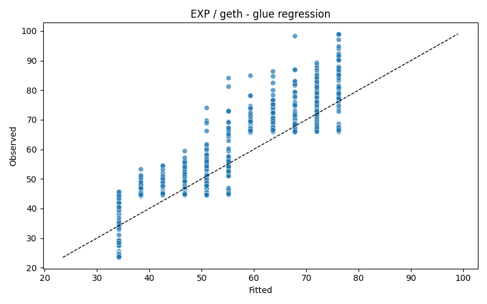

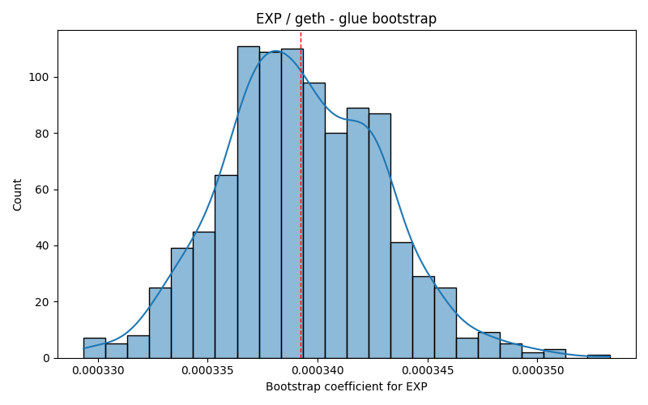

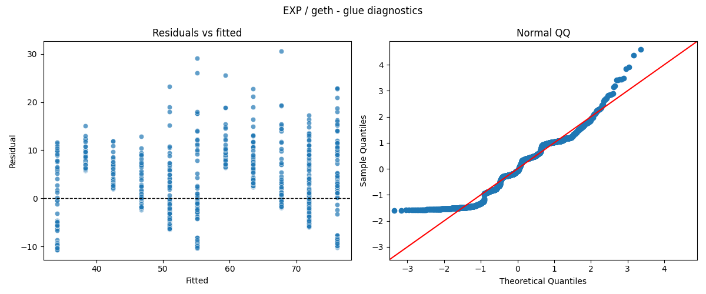

</details>

<details><summary><code>GT</code> · nobs=2552 · runtime_ms=3.558e-06 · p=1.00e-03 · R²=0.7744</summary>

```
==============================================================================
                           NNLS Regression Results                            
==============================================================================
Dep. Variable:          test_runtime_ms              R-squared:          0.774
Model:                  NNLS                    Adj. R-squared:          0.774
No. Observations:       2552                              RMSE:          20.21
Df Residuals:           2550                               MAE:          14.63
Df Model:               1      
==============================================================================
                      coef     std err     P-value      [0.025      0.975]
------------------------------------------------------------------------------
         const     37.2026      1.4522       0.001     34.7111     40.1113
            GT      0.0000      0.0000       0.001      0.0000      0.0000
==============================================================================
Notes: Non-negative least squares with bootstrap inference (1000 iterations)
==============================================================================
```

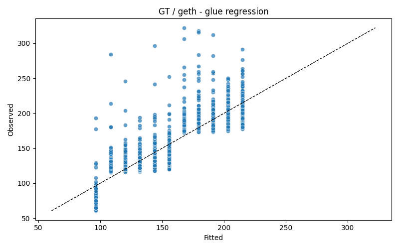

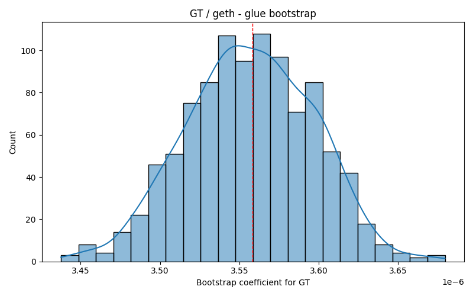

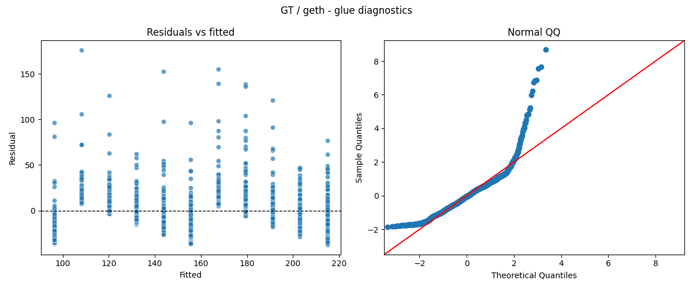

</details>

<details><summary><code>JUMPI</code> · nobs=2552 · runtime_ms=5.72e-06 · p=1.00e-03 · R²=0.7423</summary>

```
==============================================================================
                           NNLS Regression Results                            
==============================================================================
Dep. Variable:          test_runtime_ms              R-squared:          0.742
Model:                  NNLS                    Adj. R-squared:          0.742
No. Observations:       2552                              RMSE:          15.21
Df Residuals:           2550                               MAE:          11.02
Df Model:               1      
==============================================================================
                      coef     std err     P-value      [0.025      0.975]
------------------------------------------------------------------------------
         const     20.4630      1.0312       0.001     18.5309     22.5560
         JUMPI      0.0000      0.0000       0.001      0.0000      0.0000
==============================================================================
Notes: Non-negative least squares with bootstrap inference (1000 iterations)
==============================================================================
```

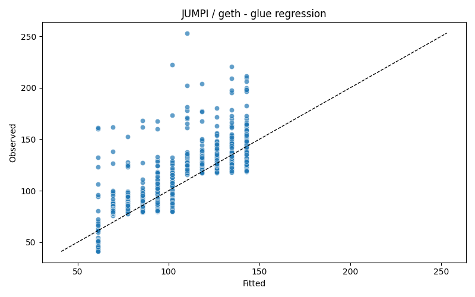

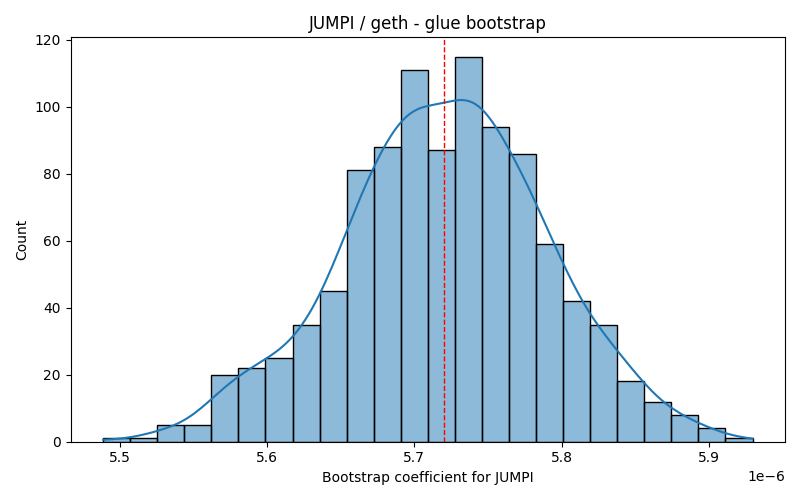

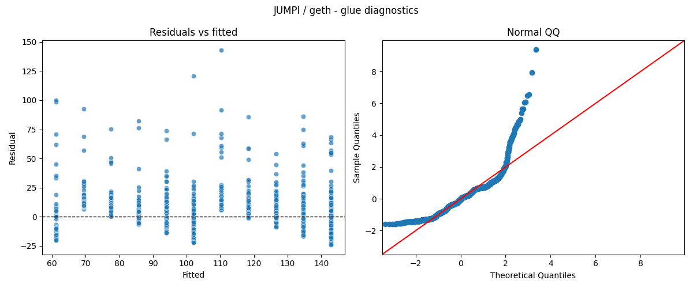

</details>

<details><summary><code>LT</code> · nobs=2552 · runtime_ms=4.471e-06 · p=1.00e-03 · R²=0.8162</summary>

```
==============================================================================
                           NNLS Regression Results                            
==============================================================================
Dep. Variable:          test_runtime_ms              R-squared:          0.816
Model:                  NNLS                    Adj. R-squared:          0.816
No. Observations:       2552                              RMSE:          22.33
Df Residuals:           2550                               MAE:          17.24
Df Model:               1      
==============================================================================
                      coef     std err     P-value      [0.025      0.975]
------------------------------------------------------------------------------
         const     37.4238      1.4618       0.001     34.5189     40.2493
            LT      0.0000      0.0000       0.001      0.0000      0.0000
==============================================================================
Notes: Non-negative least squares with bootstrap inference (1000 iterations)
==============================================================================
```

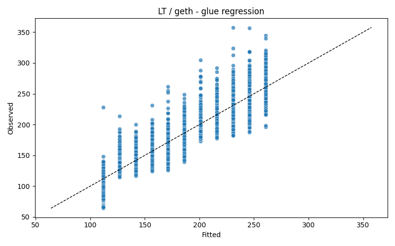

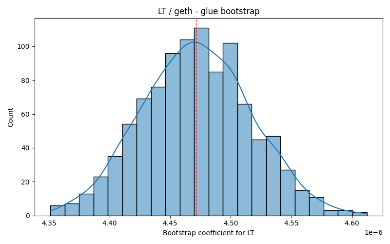

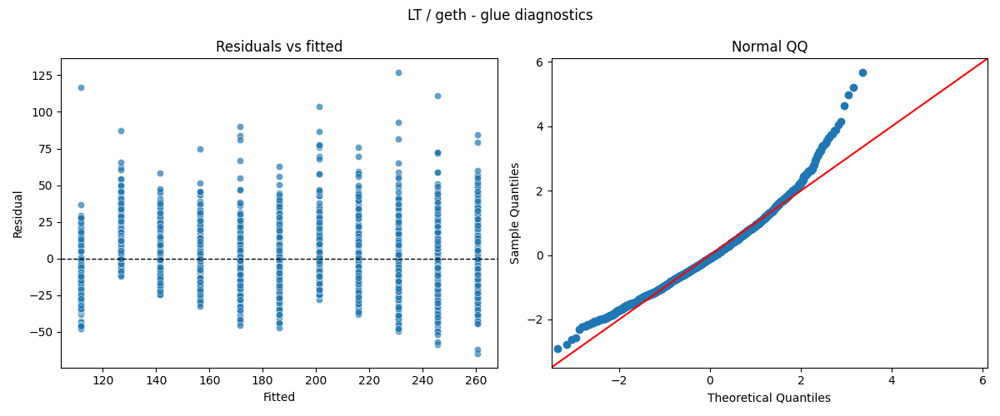

</details>

<details><summary><code>MSTORE</code> · nobs=12760 · runtime_ms=8.03e-06 · p=1.00e-03 · R²=0.8124</summary>

```
==============================================================================
                           NNLS Regression Results                            
==============================================================================
Dep. Variable:          test_runtime_ms              R-squared:          0.812
Model:                  NNLS                    Adj. R-squared:          0.812
No. Observations:       12760                             RMSE:          27.08
Df Residuals:           12758                              MAE:          20.99
Df Model:               1      
==============================================================================
                      coef     std err     P-value      [0.025      0.975]
------------------------------------------------------------------------------
         const     55.7460      0.8958       0.001     53.9914     57.4386
        MSTORE      0.0000      0.0000       0.001      0.0000      0.0000
==============================================================================
Notes: Non-negative least squares with bootstrap inference (1000 iterations)
==============================================================================
```

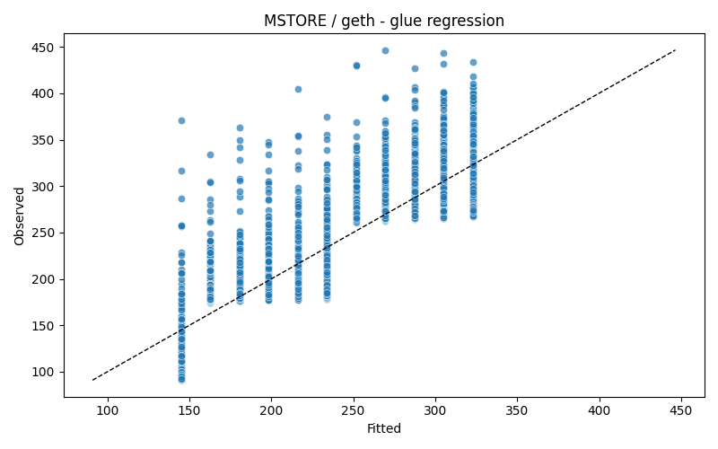

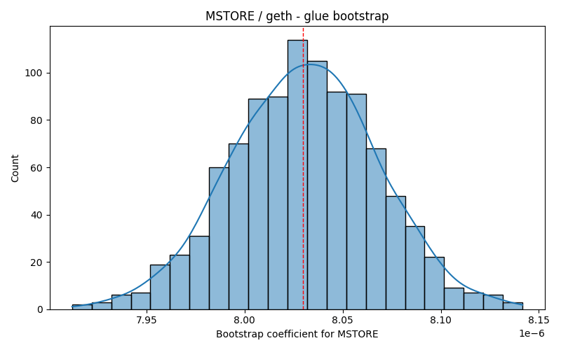

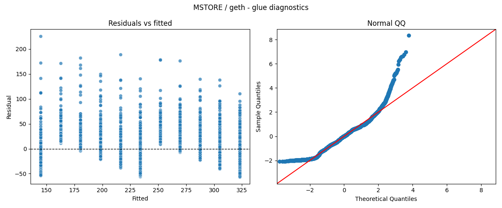

</details>

<details><summary><code>MSTORE8</code> · nobs=12760 · runtime_ms=7.438e-06 · p=1.00e-03 · R²=0.7962</summary>

```
==============================================================================
                           NNLS Regression Results                            
==============================================================================
Dep. Variable:          test_runtime_ms              R-squared:          0.796
Model:                  NNLS                    Adj. R-squared:          0.796
No. Observations:       12760                             RMSE:          26.41
Df Residuals:           12758                              MAE:          19.73
Df Model:               1      
==============================================================================
                      coef     std err     P-value      [0.025      0.975]
------------------------------------------------------------------------------
         const     50.8957      0.8506       0.001     49.3015     52.6470
       MSTORE8      0.0000      0.0000       0.001      0.0000      0.0000
==============================================================================
Notes: Non-negative least squares with bootstrap inference (1000 iterations)
==============================================================================
```

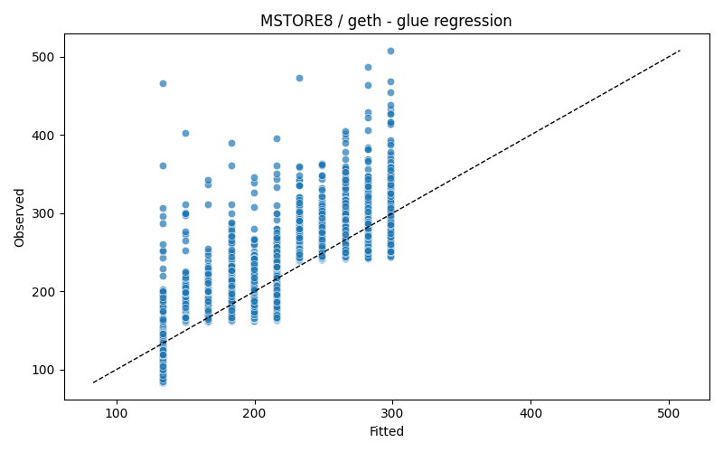

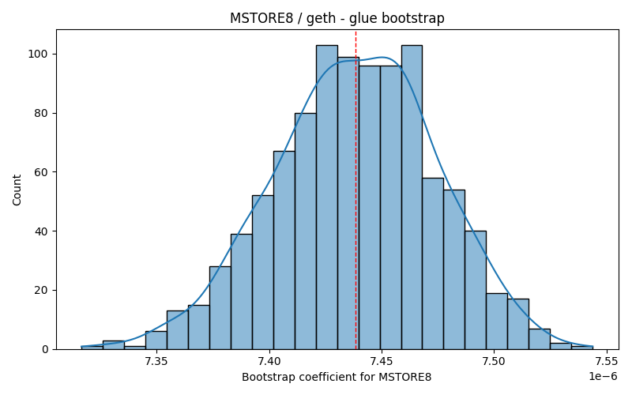

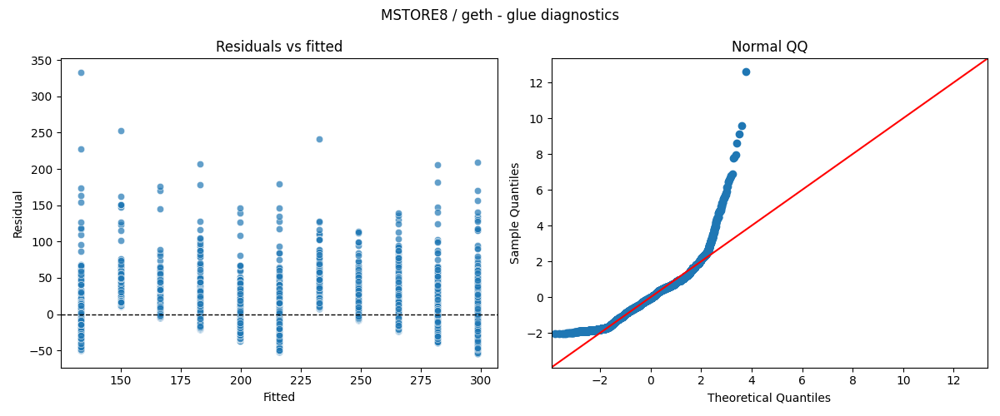

</details>

<details><summary><code>MUL</code> · nobs=2552 · runtime_ms=4.924e-06 · p=1.00e-03 · R²=0.8626</summary>

```
==============================================================================
                           NNLS Regression Results                            
==============================================================================
Dep. Variable:          test_runtime_ms              R-squared:          0.863
Model:                  NNLS                    Adj. R-squared:          0.863
No. Observations:       2552                              RMSE:          15.51
Df Residuals:           2550                               MAE:          11.66
Df Model:               1      
==============================================================================
                      coef     std err     P-value      [0.025      0.975]
------------------------------------------------------------------------------
         const     38.0570      1.1865       0.001     35.8183     40.4338
           MUL      0.0000      0.0000       0.001      0.0000      0.0000
==============================================================================
Notes: Non-negative least squares with bootstrap inference (1000 iterations)
==============================================================================
```


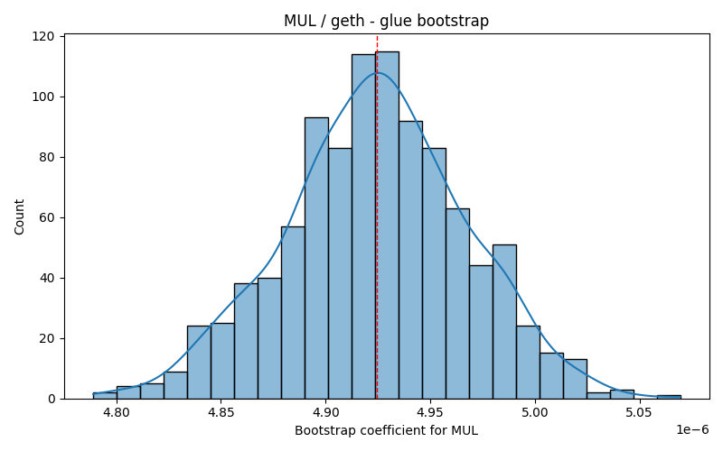

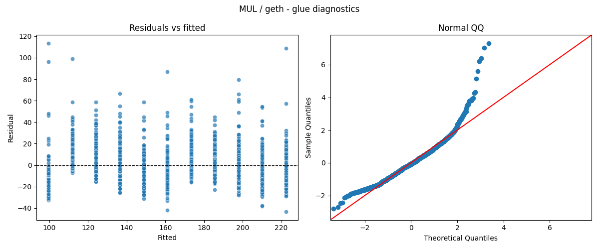

</details>

<details><summary><code>PC</code> · nobs=2552 · runtime_ms=1.629e-06 · p=1.00e-03 · R²=0.8385</summary>

```
==============================================================================
                           NNLS Regression Results                            
==============================================================================
Dep. Variable:          test_runtime_ms              R-squared:          0.839
Model:                  NNLS                    Adj. R-squared:          0.838
No. Observations:       2552                              RMSE:          21.37
Df Residuals:           2550                               MAE:          16.95
Df Model:               1      
==============================================================================
                      coef     std err     P-value      [0.025      0.975]
------------------------------------------------------------------------------
         const     41.7777      1.6118       0.001     38.6069     45.0393
            PC      0.0000      0.0000       0.001      0.0000      0.0000
==============================================================================
Notes: Non-negative least squares with bootstrap inference (1000 iterations)
==============================================================================
```

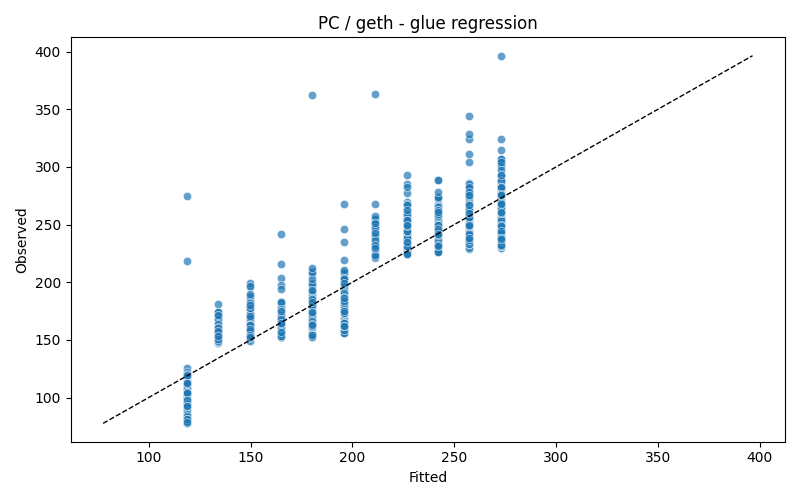

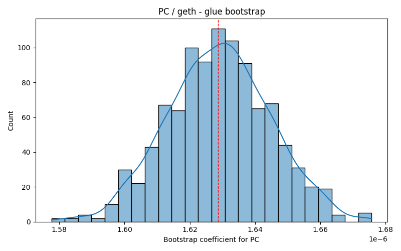

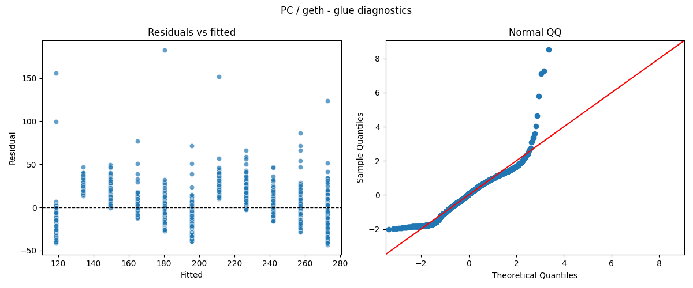

</details>

<details><summary><code>RETURNDATASIZE</code> · nobs=10208 · runtime_ms=3.156e-06 · p=1.00e-03 · R²=0.6104</summary>

```
==============================================================================
                           NNLS Regression Results                            
==============================================================================
Dep. Variable:          test_runtime_ms              R-squared:          0.610
Model:                  NNLS                    Adj. R-squared:          0.610
No. Observations:       10208                             RMSE:          39.81
Df Residuals:           10206                              MAE:          28.71
Df Model:               1      
==============================================================================
                      coef     std err     P-value      [0.025      0.975]
------------------------------------------------------------------------------
         const     48.9758      1.2831       0.001     46.5116     51.6765
RETURNDATASIZE      0.0000      0.0000       0.001      0.0000      0.0000
==============================================================================
Notes: Non-negative least squares with bootstrap inference (1000 iterations)
==============================================================================
```

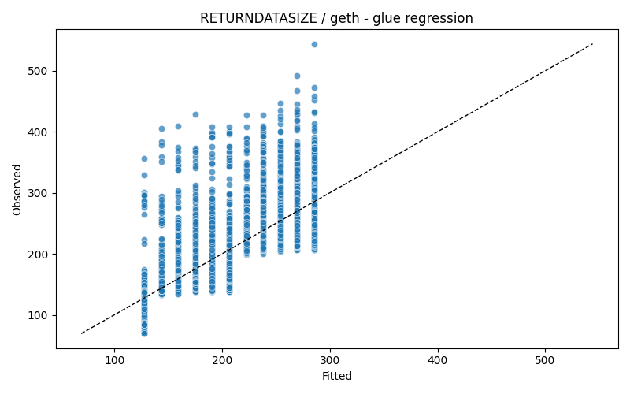

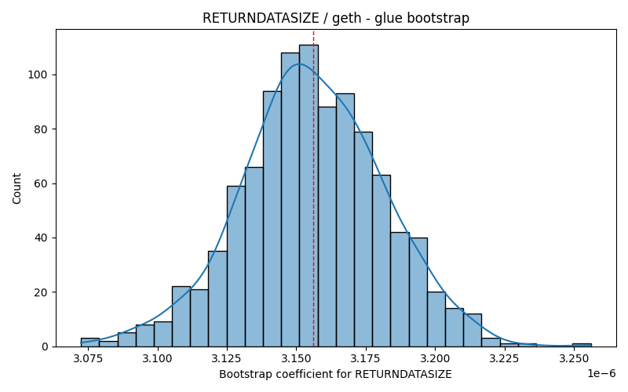

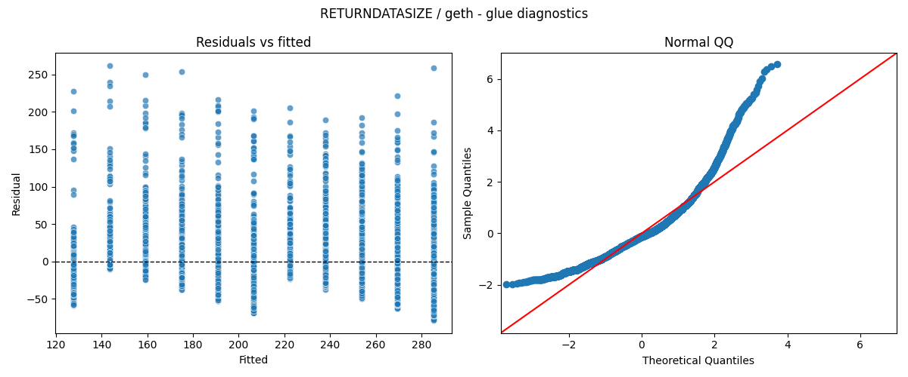

</details>

<details><summary><code>SELFBALANCE</code> · nobs=2088 · runtime_ms=7.486e-06 · p=1.00e-03 · R²=0.7958</summary>

```
==============================================================================
                           NNLS Regression Results                            
==============================================================================
Dep. Variable:          test_runtime_ms              R-squared:          0.796
Model:                  NNLS                    Adj. R-squared:          0.796
No. Observations:       2088                              RMSE:          38.25
Df Residuals:           2086                               MAE:          31.94
Df Model:               1      
==============================================================================
                      coef     std err     P-value      [0.025      0.975]
------------------------------------------------------------------------------
         const    119.0327      2.7385       0.001    112.9545    123.7931
   SELFBALANCE      0.0000      0.0000       0.001      0.0000      0.0000
==============================================================================
Notes: Non-negative least squares with bootstrap inference (1000 iterations)
==============================================================================
```

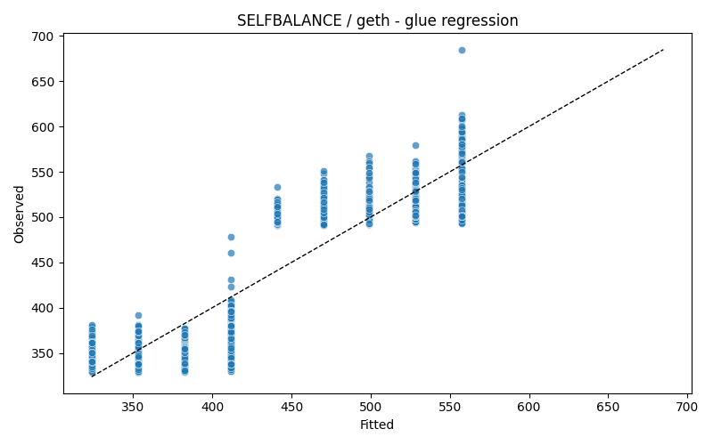

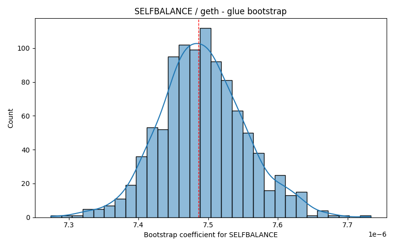

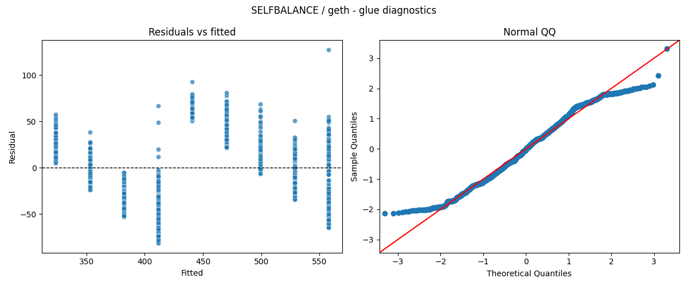

</details>

<details><summary><code>SUB</code> · nobs=2552 · runtime_ms=4.422e-06 · p=1.00e-03 · R²=0.8228</summary>

```
==============================================================================
                           NNLS Regression Results                            
==============================================================================
Dep. Variable:          test_runtime_ms              R-squared:          0.823
Model:                  NNLS                    Adj. R-squared:          0.823
No. Observations:       2552                              RMSE:          21.60
Df Residuals:           2550                               MAE:          16.42
Df Model:               1      
==============================================================================
                      coef     std err     P-value      [0.025      0.975]
------------------------------------------------------------------------------
         const     47.8657      1.4903       0.001     44.9708     50.8626
           SUB      0.0000      0.0000       0.001      0.0000      0.0000
==============================================================================
Notes: Non-negative least squares with bootstrap inference (1000 iterations)
==============================================================================
```

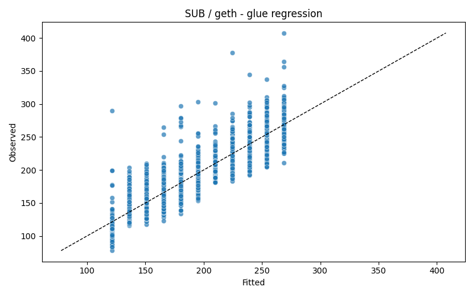

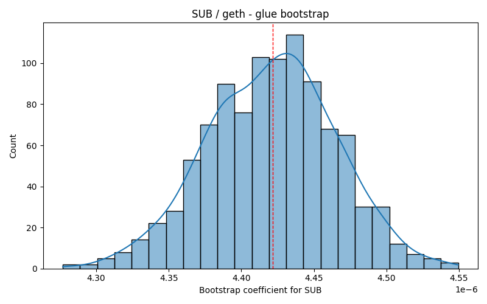

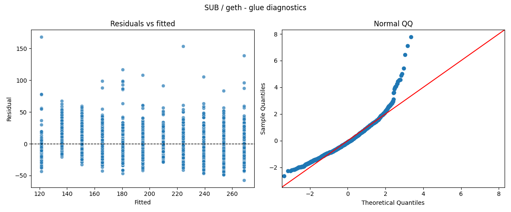

</details>

### Mixed glue (tier B) · geth

<details><summary><code>JUMP</code> · nobs=2552 · runtime_ms=9.143e-06 · p=1.00e-03 · R²=0.7598</summary>

```
==============================================================================
                           NNLS Regression Results                            
==============================================================================
Dep. Variable:          test_runtime_ms              R-squared:          0.760
Model:                  NNLS                    Adj. R-squared:          0.760
No. Observations:       2552                              RMSE:          19.10
Df Residuals:           2550                               MAE:          13.98
Df Model:               1      
==============================================================================
                      coef     std err     P-value      [0.025      0.975]
------------------------------------------------------------------------------
         const     35.3193      1.3662       0.001     32.7897     38.2240
          JUMP      0.0000      0.0000       0.001      0.0000      0.0000
==============================================================================
Notes: Non-negative least squares with bootstrap inference (1000 iterations)
==============================================================================
```

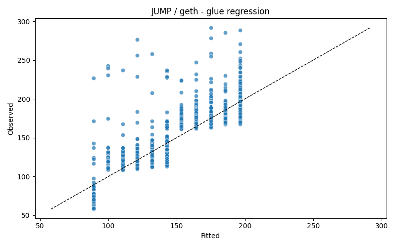

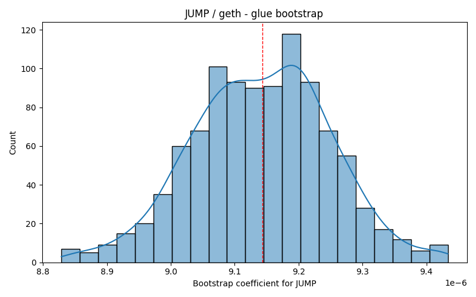

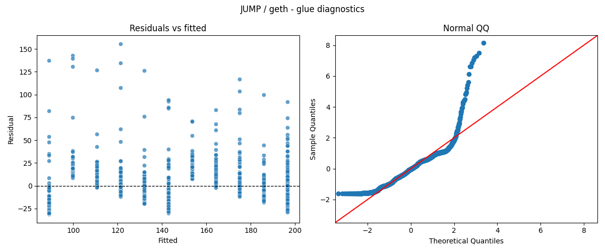

</details>

<details><summary><code>KECCAK256</code> · nobs=40832 · runtime_ms=3.67e-05 · p=1.00e-03 · R²=0.265</summary>

```
==============================================================================
                           NNLS Regression Results                            
==============================================================================
Dep. Variable:          test_runtime_ms              R-squared:          0.265
Model:                  NNLS                    Adj. R-squared:          0.265
No. Observations:       40832                             RMSE:         121.47
Df Residuals:           40830                              MAE:          95.34
Df Model:               1      
==============================================================================
                      coef     std err     P-value      [0.025      0.975]
------------------------------------------------------------------------------
         const    379.5152      1.2761       0.001    376.9862    381.9205
     KECCAK256      0.0000      0.0000       0.001      0.0000      0.0000
==============================================================================
Notes: Non-negative least squares with bootstrap inference (1000 iterations)
==============================================================================
```

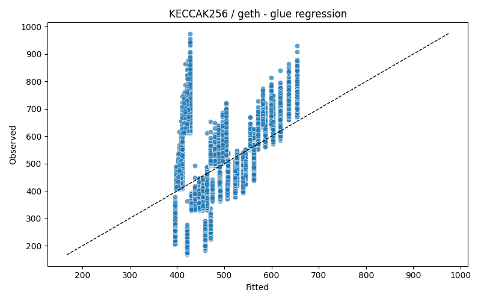

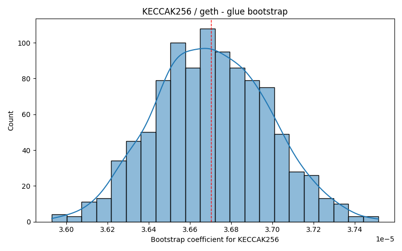

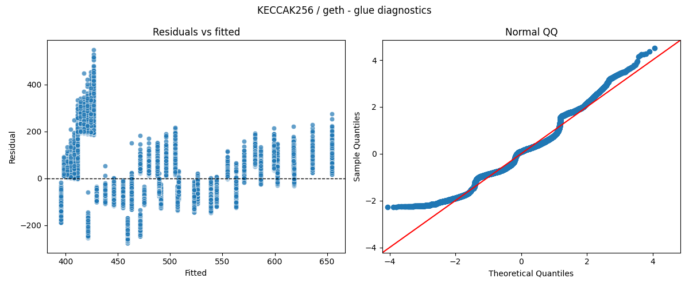

</details>

## nethermind

| glue_opcode | nobs | glue_runtime_ms | p_value | rsquared |
| --- | --- | --- | --- | --- |
| `ISZERO` | 2915 | 9.23e-07 | 1.00e-03 | 0.7671 |
| `JUMPDEST` | 2915 | 5.09e-07 | 1.00e-03 | 0.6306 |
| `SWAP` | 46640 | 5.341e-07 | 1.00e-03 | 0.5691 |
| `CALLDATASIZE` | 172238 | 4.914e-07 | 1.00e-03 | 0.9091 |
| `DUP` | 172238 | 3.395e-07 | 1.00e-03 | 0.9091 |
| `GAS` | 172238 | 4.539e-07 | 1.00e-03 | 0.9091 |
| `MLOAD` | 172238 | 1.447e-06 | 1.00e-03 | 0.9091 |
| `PUSH` | 172238 | 4.34e-07 | 1.00e-03 | 0.9091 |
| `PUSH0` | 172238 | 3.331e-07 | 1.00e-03 | 0.9091 |
| `STATICCALL` | 172238 | 0.0004402 | 1.00e-03 | 0.9091 |
| `ADD` | 2915 | 3.402e-06 | 1.00e-03 | 0.324 |
| `AND` | 2915 | 1.382e-06 | 1.00e-03 | 0.6259 |
| `CALLDATACOPY` | 69960 | 4.63e-06 | 1.00e-03 | 0.6849 |
| `CALLDATALOAD` | 11660 | 1.056e-05 | 2.34e-01 | 5.162e-05 |
| `DIV` | 2915 | 6.874e-06 | 1.00e-03 | 0.6209 |
| `EXP` | 2915 | 0 | 1.00e+00 | 0 |
| `GT` | 2915 | 1.691e-06 | 1.00e-03 | 0.7683 |
| `JUMPI` | 2915 | 1.948e-06 | 1.00e-03 | 0.6337 |
| `LT` | 2915 | 1.578e-06 | 1.00e-03 | 0.7562 |
| `MSTORE` | 14575 | 2.232e-06 | 1.00e-03 | 0.7048 |
| `MSTORE8` | 14575 | 2.179e-06 | 1.00e-03 | 0.7703 |
| `MUL` | 2915 | 5.192e-06 | 1.00e-03 | 0.9012 |
| `PC` | 2915 | 8.279e-07 | 1.00e-03 | 0.8458 |
| `RETURNDATASIZE` | 11660 | 9.311e-07 | 1.00e-03 | 0.6113 |
| `SELFBALANCE` | 2385 | 4.256e-06 | 1.00e-03 | 0.621 |
| `SUB` | 2915 | 2.534e-06 | 1.00e-03 | 0.8283 |
| `JUMP` | 2915 | 5.715e-06 | 1.00e-03 | 0.8185 |
| `KECCAK256` | 46640 | 0 | 1.00e+00 | 0 |

### Cycle glue — joint fit · nethermind

<details><summary>Joint NNLS regression summary</summary>

```
==============================================================================
                           NNLS Regression Results                            
==============================================================================
Dep. Variable:          test_runtime_ms              R-squared:          0.909
Model:                  NNLS                    Adj. R-squared:          0.909
No. Observations:       172238                            RMSE:          10.81
Df Residuals:           172230                             MAE:           5.86
Df Model:               7      
==============================================================================
                      coef     std err     P-value      [0.025      0.975]
------------------------------------------------------------------------------
         const     17.4164      0.0825       0.001     17.2621     17.5821
  CALLDATASIZE      0.0000      0.0000       0.001      0.0000      0.0000
           DUP      0.0000      0.0000       0.001      0.0000      0.0000
           GAS      0.0000      0.0000       0.001      0.0000      0.0000
         MLOAD      0.0000      0.0000       0.001      0.0000      0.0000
          PUSH      0.0000      0.0000       0.001      0.0000      0.0000
         PUSH0      0.0000      0.0000       0.001      0.0000      0.0000
    STATICCALL      0.0004      0.0000       0.001      0.0004      0.0005
==============================================================================
Notes: Non-negative least squares with bootstrap inference (1000 iterations)
==============================================================================
```

</details>

<details><summary><code>CALLDATASIZE</code> · nobs=172238 · runtime_ms=4.914e-07 · p=1.00e-03 · R²=0.9091</summary>

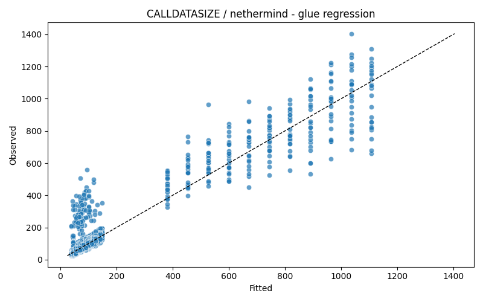

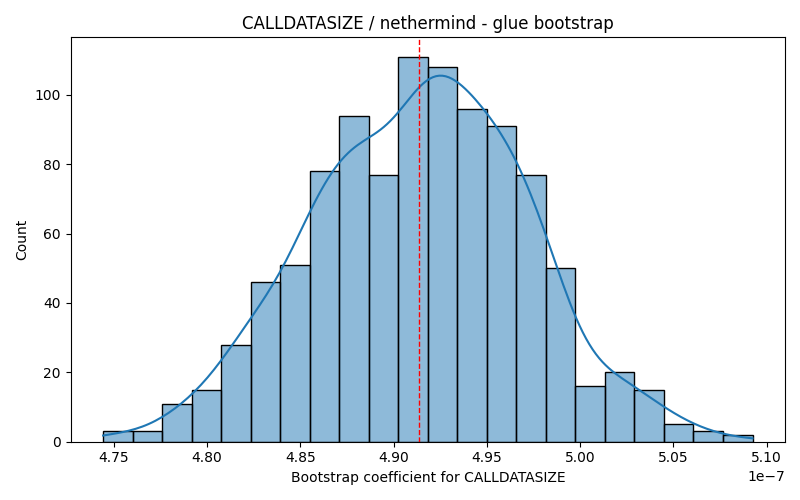

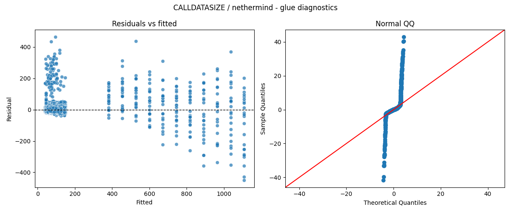

</details>

<details><summary><code>DUP</code> · nobs=172238 · runtime_ms=3.395e-07 · p=1.00e-03 · R²=0.9091</summary>

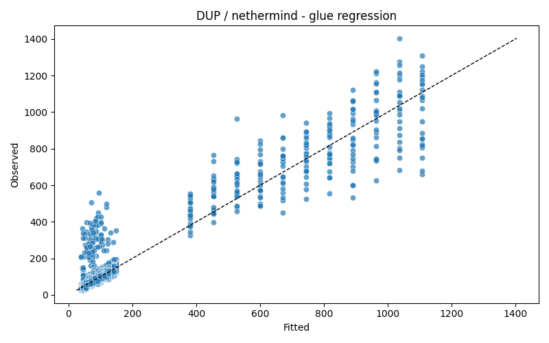

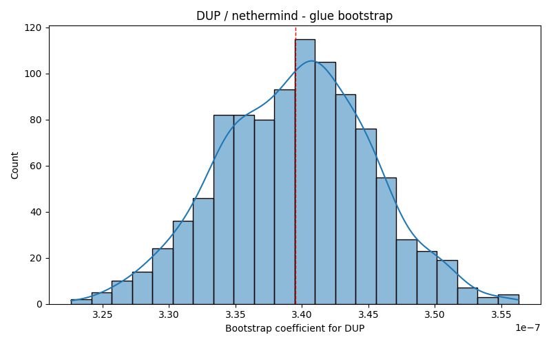

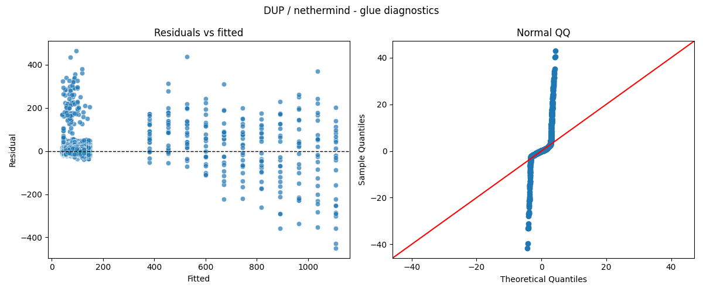

</details>

<details><summary><code>GAS</code> · nobs=172238 · runtime_ms=4.539e-07 · p=1.00e-03 · R²=0.9091</summary>


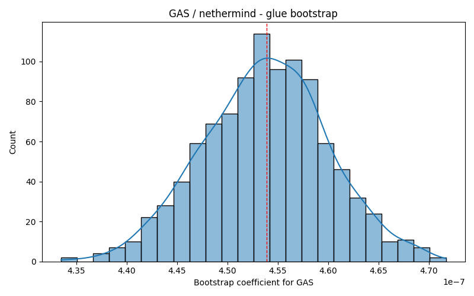


</details>

<details><summary><code>MLOAD</code> · nobs=172238 · runtime_ms=1.447e-06 · p=1.00e-03 · R²=0.9091</summary>


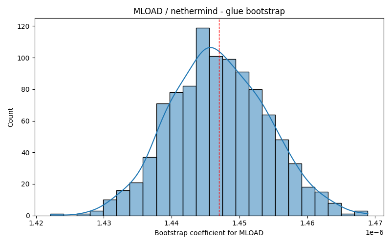


</details>

<details><summary><code>PUSH</code> · nobs=172238 · runtime_ms=4.34e-07 · p=1.00e-03 · R²=0.9091</summary>


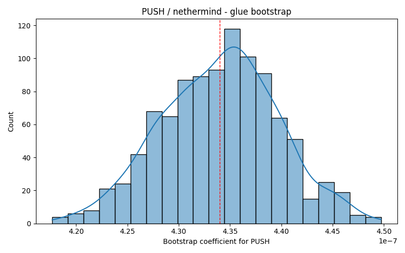


</details>

<details><summary><code>PUSH0</code> · nobs=172238 · runtime_ms=3.331e-07 · p=1.00e-03 · R²=0.9091</summary>

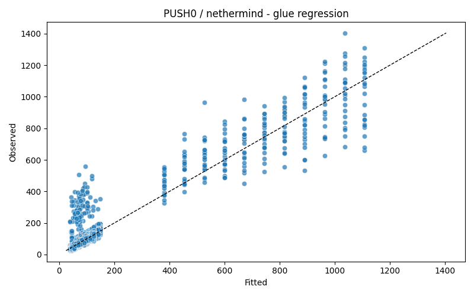

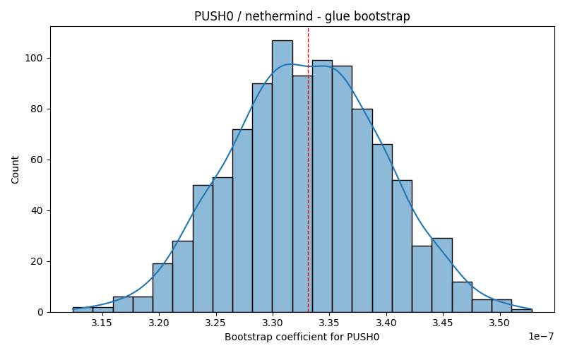

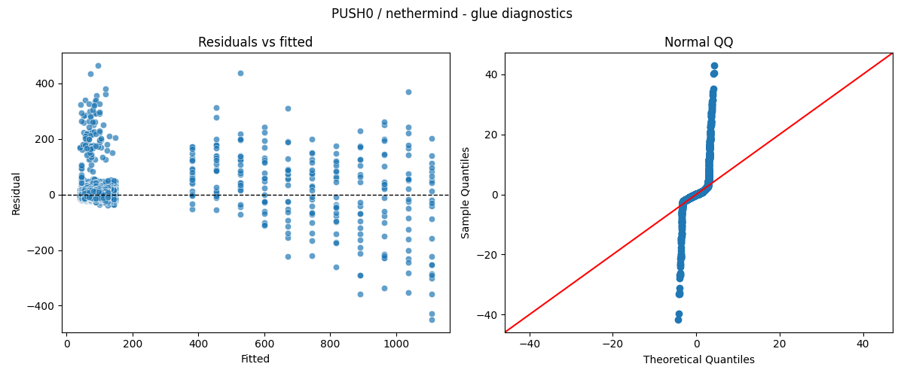

</details>

<details><summary><code>STATICCALL</code> · nobs=172238 · runtime_ms=0.0004402 · p=1.00e-03 · R²=0.9091</summary>

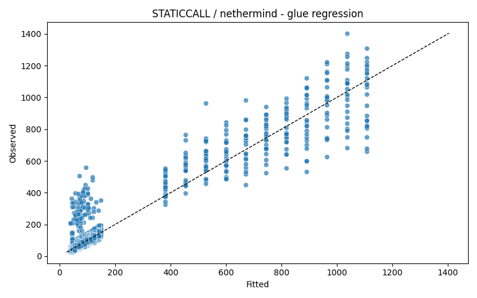

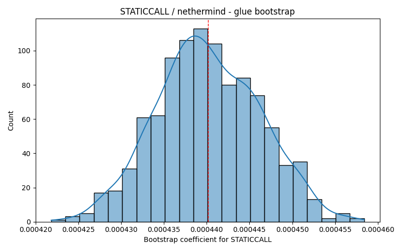


</details>

### Pure glue · nethermind

<details><summary><code>ISZERO</code> · nobs=2915 · runtime_ms=9.23e-07 · p=1.00e-03 · R²=0.7671</summary>

```
==============================================================================
                           NNLS Regression Results                            
==============================================================================
Dep. Variable:          test_runtime_ms              R-squared:          0.767
Model:                  NNLS                    Adj. R-squared:          0.767
No. Observations:       2915                              RMSE:          10.71
Df Residuals:           2913                               MAE:           6.53
Df Model:               1      
==============================================================================
                      coef     std err     P-value      [0.025      0.975]
------------------------------------------------------------------------------
         const     15.6971      0.6245       0.001     14.3839     16.8403
        ISZERO      0.0000      0.0000       0.001      0.0000      0.0000
==============================================================================
Notes: Non-negative least squares with bootstrap inference (1000 iterations)
==============================================================================
```

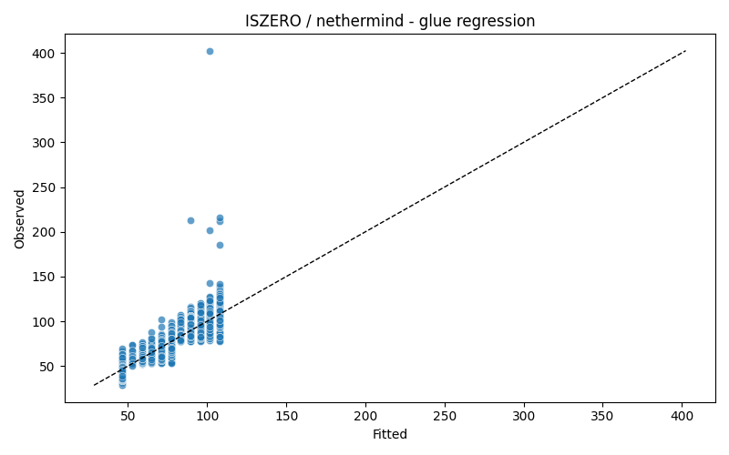

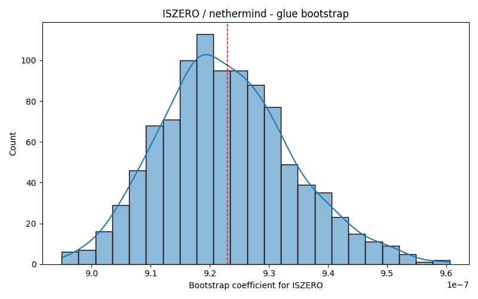

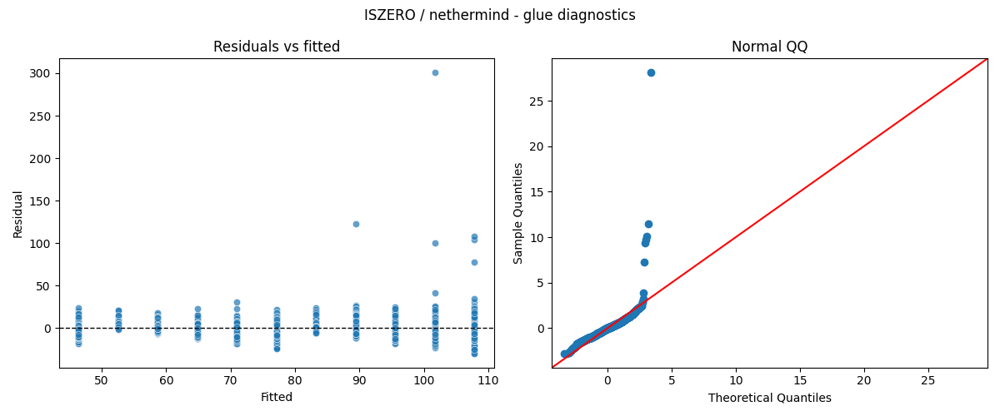

</details>

<details><summary><code>JUMPDEST</code> · nobs=2915 · runtime_ms=5.09e-07 · p=1.00e-03 · R²=0.6306</summary>

```
==============================================================================
                           NNLS Regression Results                            
==============================================================================
Dep. Variable:          test_runtime_ms              R-squared:          0.631
Model:                  NNLS                    Adj. R-squared:          0.630
No. Observations:       2915                              RMSE:          24.60
Df Residuals:           2913                               MAE:          18.04
Df Model:               1      
==============================================================================
                      coef     std err     P-value      [0.025      0.975]
------------------------------------------------------------------------------
         const     25.1593      1.3064       0.001     22.5900     27.7904
      JUMPDEST      0.0000      0.0000       0.001      0.0000      0.0000
==============================================================================
Notes: Non-negative least squares with bootstrap inference (1000 iterations)
==============================================================================
```

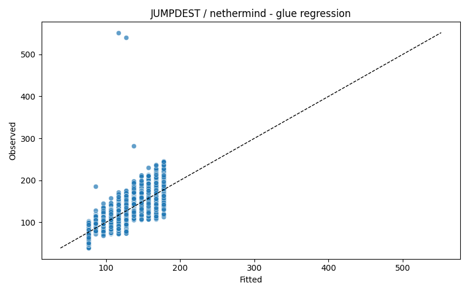

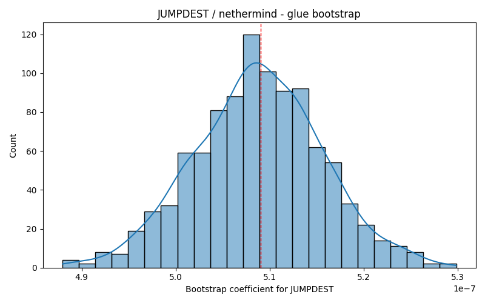

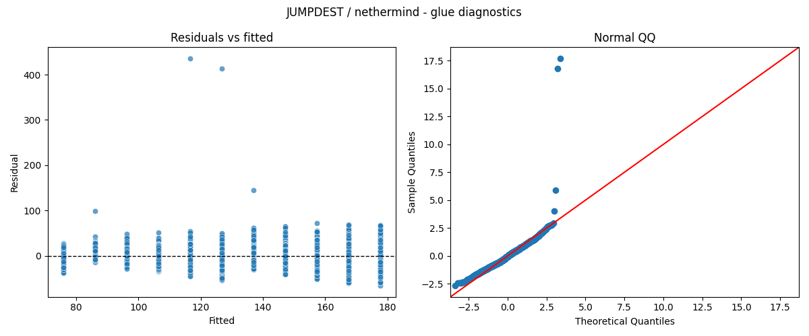

</details>

<details><summary><code>SWAP</code> · nobs=46640 · runtime_ms=5.341e-07 · p=1.00e-03 · R²=0.5691</summary>

```
==============================================================================
                           NNLS Regression Results                            
==============================================================================
Dep. Variable:          test_runtime_ms              R-squared:          0.569
Model:                  NNLS                    Adj. R-squared:          0.569
No. Observations:       46640                             RMSE:           9.78
Df Residuals:           46638                              MAE:           4.43
Df Model:               1      
==============================================================================
                      coef     std err     P-value      [0.025      0.975]
------------------------------------------------------------------------------
         const     17.2783      0.1562       0.001     16.9845     17.5989
          SWAP      0.0000      0.0000       0.001      0.0000      0.0000
==============================================================================
Notes: Non-negative least squares with bootstrap inference (1000 iterations)
==============================================================================
```


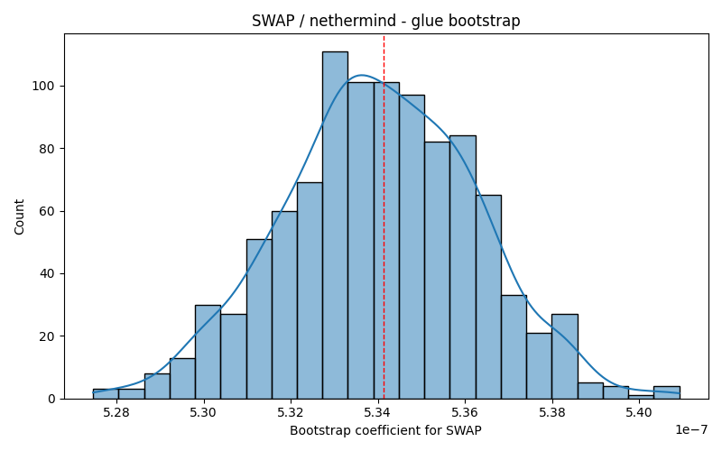

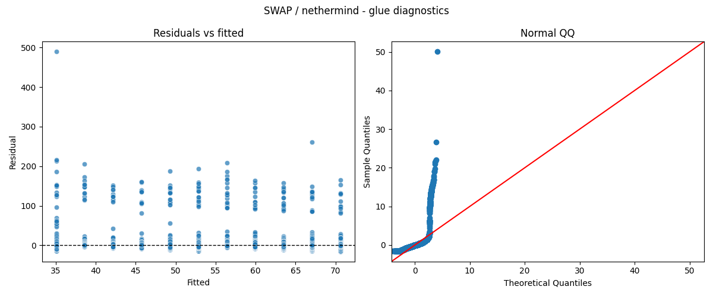

</details>

### Mixed glue (tier A) · nethermind

<details><summary><code>ADD</code> · nobs=2915 · runtime_ms=3.402e-06 · p=1.00e-03 · R²=0.324</summary>

```
==============================================================================
                           NNLS Regression Results                            
==============================================================================
Dep. Variable:          test_runtime_ms              R-squared:          0.324
Model:                  NNLS                    Adj. R-squared:          0.324
No. Observations:       2915                              RMSE:          51.72
Df Residuals:           2913                               MAE:          44.57
Df Model:               1      
==============================================================================
                      coef     std err     P-value      [0.025      0.975]
------------------------------------------------------------------------------
         const     28.4337      2.7421       0.001     23.2606     34.0680
           ADD      0.0000      0.0000       0.001      0.0000      0.0000
==============================================================================
Notes: Non-negative least squares with bootstrap inference (1000 iterations)
==============================================================================
```

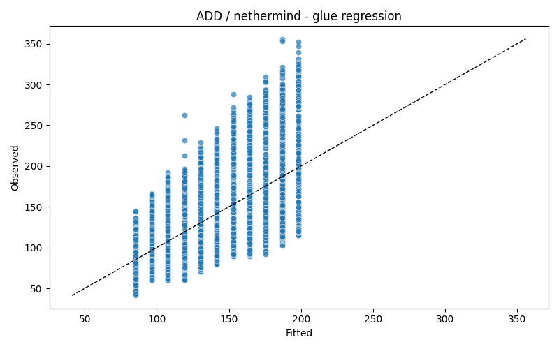


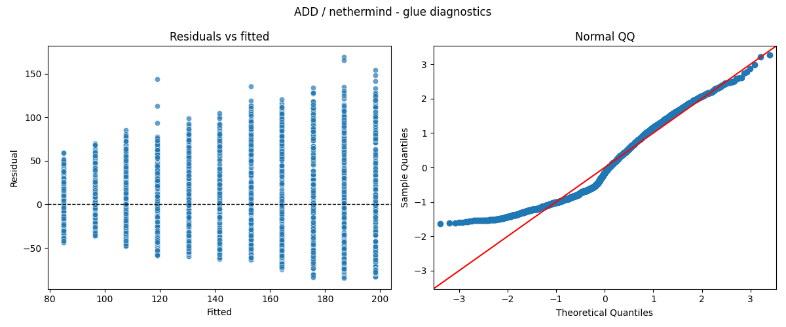

</details>

<details><summary><code>AND</code> · nobs=2915 · runtime_ms=1.382e-06 · p=1.00e-03 · R²=0.6259</summary>

```
==============================================================================
                           NNLS Regression Results                            
==============================================================================
Dep. Variable:          test_runtime_ms              R-squared:          0.626
Model:                  NNLS                    Adj. R-squared:          0.626
No. Observations:       2915                              RMSE:          11.25
Df Residuals:           2913                               MAE:           6.62
Df Model:               1      
==============================================================================
                      coef     std err     P-value      [0.025      0.975]
------------------------------------------------------------------------------
         const     15.2989      0.5980       0.001     14.0667     16.3764
           AND      0.0000      0.0000       0.001      0.0000      0.0000
==============================================================================
Notes: Non-negative least squares with bootstrap inference (1000 iterations)
==============================================================================
```

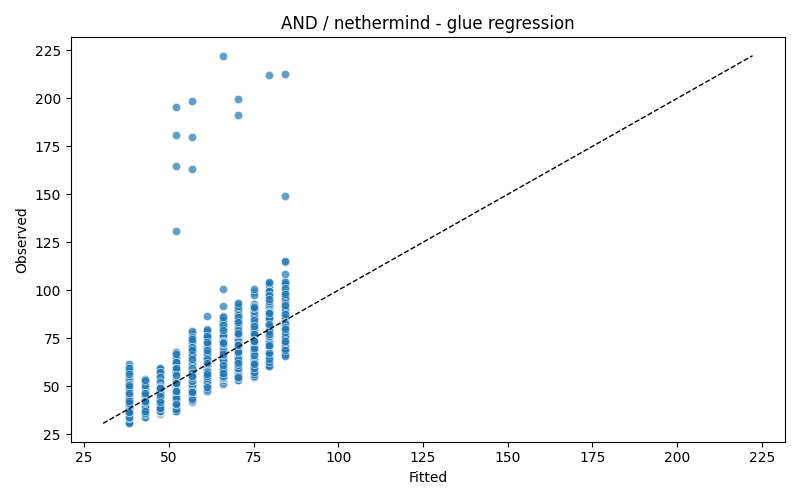

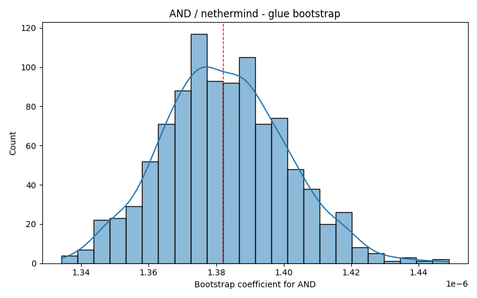

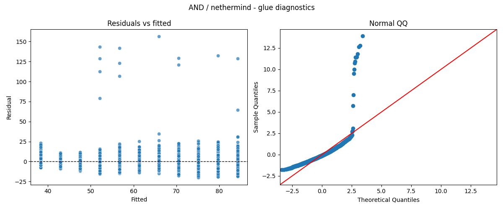

</details>

<details><summary><code>CALLDATACOPY</code> · nobs=69960 · runtime_ms=4.63e-06 · p=1.00e-03 · R²=0.6849</summary>

```
==============================================================================
                           NNLS Regression Results                            
==============================================================================
Dep. Variable:          test_runtime_ms              R-squared:          0.685
Model:                  NNLS                    Adj. R-squared:          0.685
No. Observations:       69960                             RMSE:          23.61
Df Residuals:           69958                              MAE:          18.47
Df Model:               1      
==============================================================================
                      coef     std err     P-value      [0.025      0.975]
------------------------------------------------------------------------------
         const     26.0541      0.1046       0.001     25.8449     26.2574
  CALLDATACOPY      0.0000      0.0000       0.001      0.0000      0.0000
==============================================================================
Notes: Non-negative least squares with bootstrap inference (1000 iterations)
==============================================================================
```

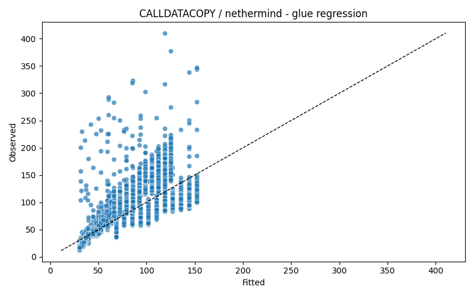

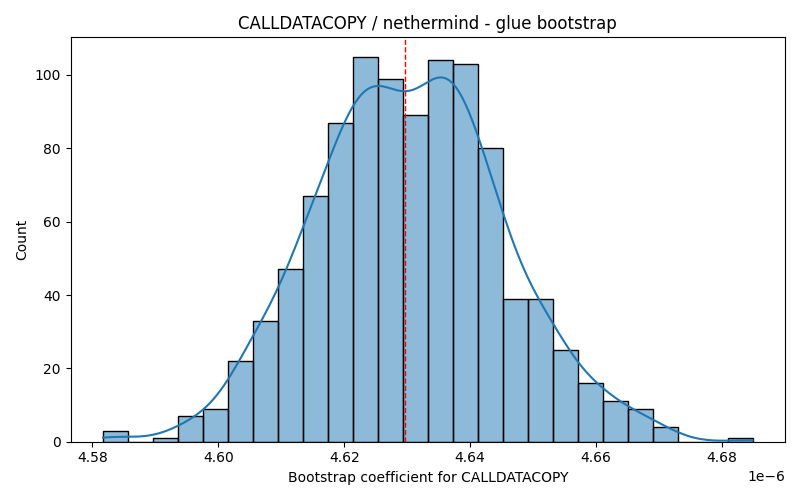

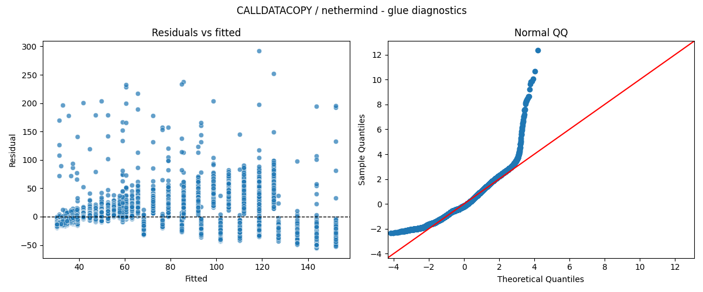

</details>

<details><summary><code>CALLDATALOAD</code> · nobs=11660 · runtime_ms=1.056e-05 · p=2.34e-01 · R²=5.162e-05</summary>

```
==============================================================================
                           NNLS Regression Results                            
==============================================================================
Dep. Variable:          test_runtime_ms              R-squared:          0.000
Model:                  NNLS                    Adj. R-squared:         -0.000
No. Observations:       11660                             RMSE:           5.64
Df Residuals:           11658                              MAE:           0.63
Df Model:               1      
==============================================================================
                      coef     std err     P-value      [0.025      0.975]
------------------------------------------------------------------------------
         const      3.2753      0.1702       0.001      2.8770      3.5002
  CALLDATALOAD      0.0000      0.0000       0.234      0.0000      0.0000
==============================================================================
Notes: Non-negative least squares with bootstrap inference (1000 iterations)
==============================================================================
```

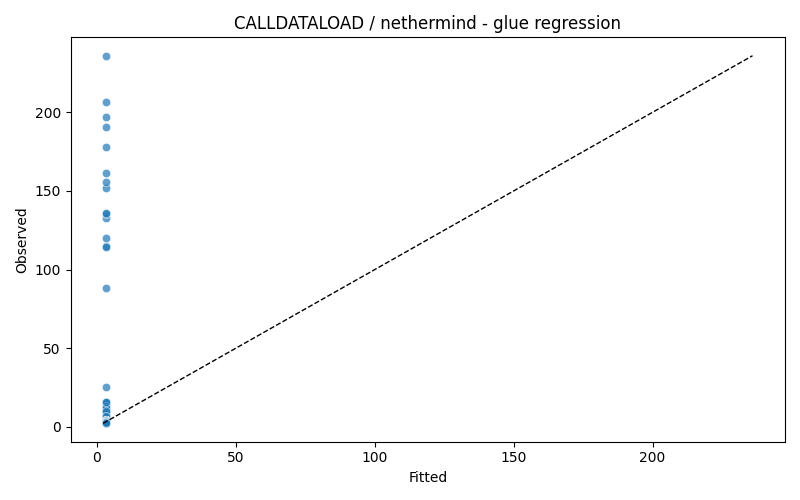

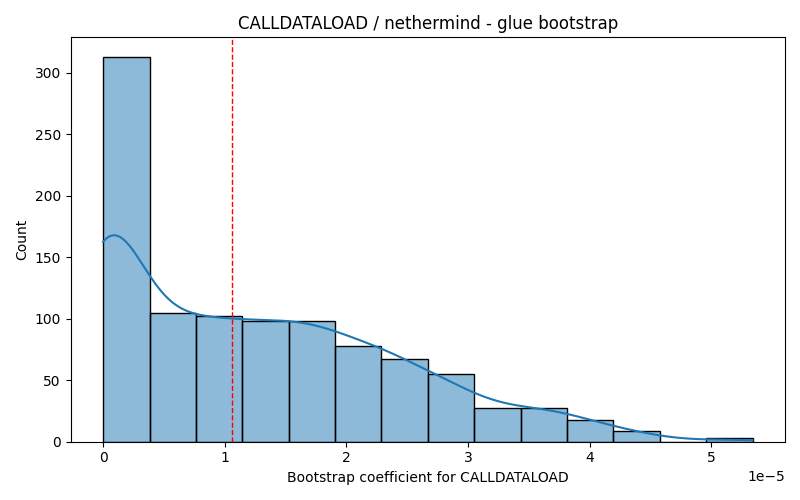

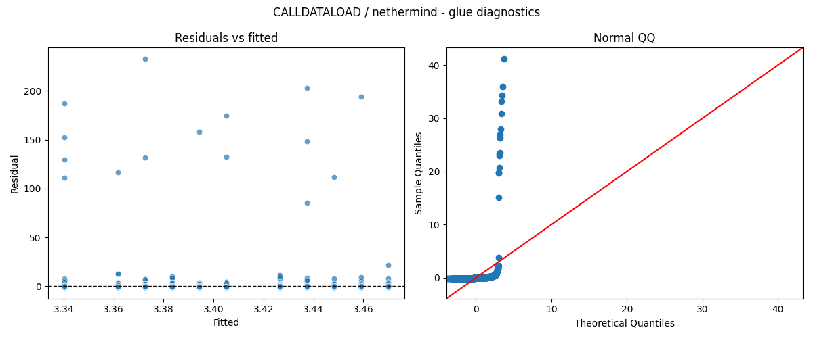

</details>

<details><summary><code>DIV</code> · nobs=2915 · runtime_ms=6.874e-06 · p=1.00e-03 · R²=0.6209</summary>

```
==============================================================================
                           NNLS Regression Results                            
==============================================================================
Dep. Variable:          test_runtime_ms              R-squared:          0.621
Model:                  NNLS                    Adj. R-squared:          0.621
No. Observations:       2915                              RMSE:          42.40
Df Residuals:           2913                               MAE:          33.05
Df Model:               1      
==============================================================================
                      coef     std err     P-value      [0.025      0.975]
------------------------------------------------------------------------------
         const    127.1508      3.6535       0.001    119.7885    134.2041
           DIV      0.0000      0.0000       0.001      0.0000      0.0000
==============================================================================
Notes: Non-negative least squares with bootstrap inference (1000 iterations)
==============================================================================
```

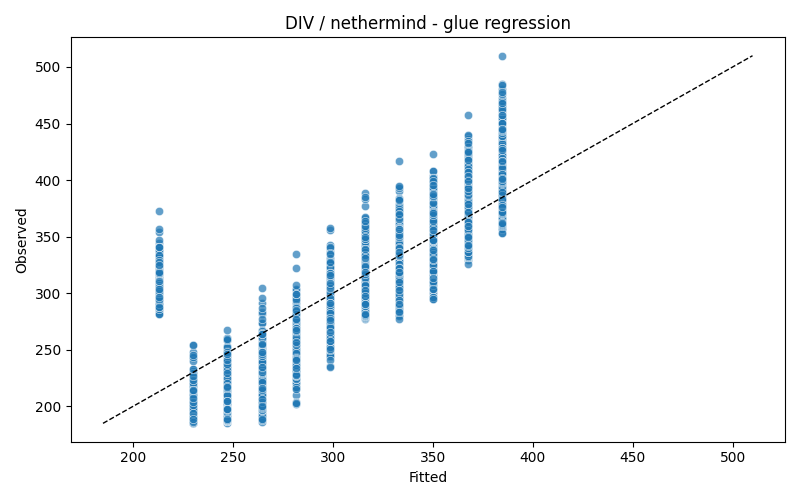

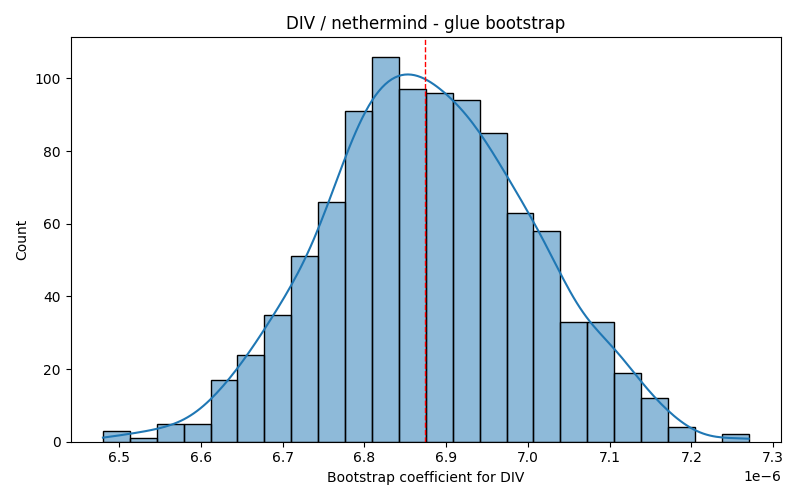

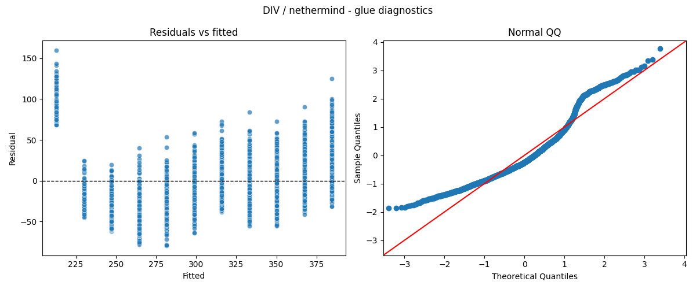

</details>

<details><summary><code>EXP</code> · nobs=2915 · runtime_ms=0 · p=1.00e+00 · R²=0</summary>

```
==============================================================================
                           NNLS Regression Results                            
==============================================================================
Dep. Variable:          test_runtime_ms              R-squared:          0.000
Model:                  NNLS                    Adj. R-squared:         -0.000
No. Observations:       2915                              RMSE:          47.53
Df Residuals:           2913                               MAE:          31.50
Df Model:               1      
==============================================================================
                      coef     std err     P-value      [0.025      0.975]
------------------------------------------------------------------------------
         const    103.0069      0.8594       0.001    101.3785    104.7394
           EXP      0.0000      0.0000       1.000      0.0000      0.0000
==============================================================================
Notes: Non-negative least squares with bootstrap inference (1000 iterations)
==============================================================================
```

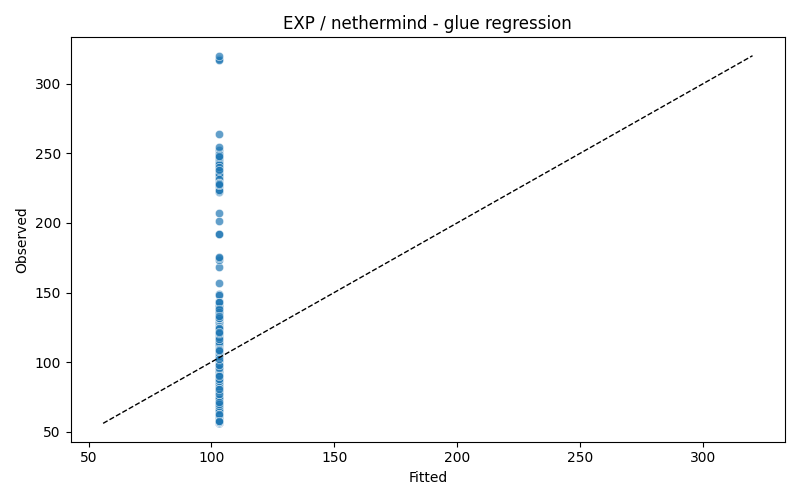


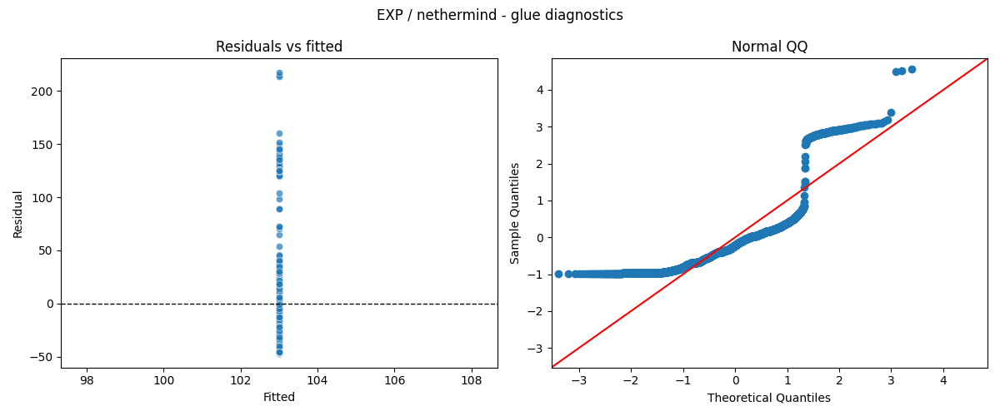

</details>

<details><summary><code>GT</code> · nobs=2915 · runtime_ms=1.691e-06 · p=1.00e-03 · R²=0.7683</summary>

```
==============================================================================
                           NNLS Regression Results                            
==============================================================================
Dep. Variable:          test_runtime_ms              R-squared:          0.768
Model:                  NNLS                    Adj. R-squared:          0.768
No. Observations:       2915                              RMSE:           9.78
Df Residuals:           2913                               MAE:           6.21
Df Model:               1      
==============================================================================
                      coef     std err     P-value      [0.025      0.975]
------------------------------------------------------------------------------
         const     14.6583      0.5107       0.001     13.6818     15.6847
            GT      0.0000      0.0000       0.001      0.0000      0.0000
==============================================================================
Notes: Non-negative least squares with bootstrap inference (1000 iterations)
==============================================================================
```

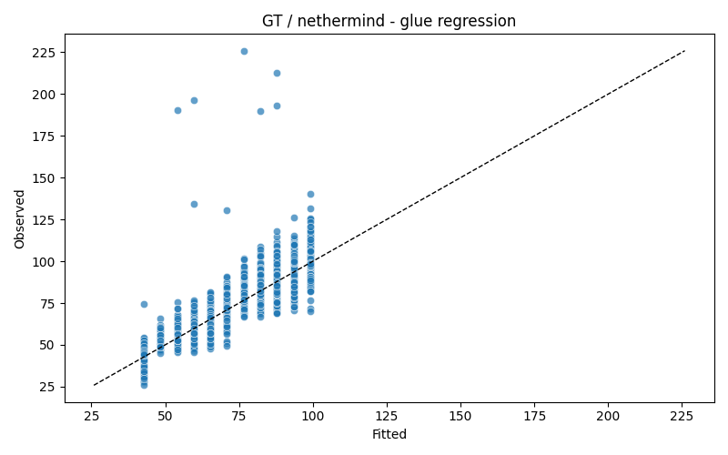

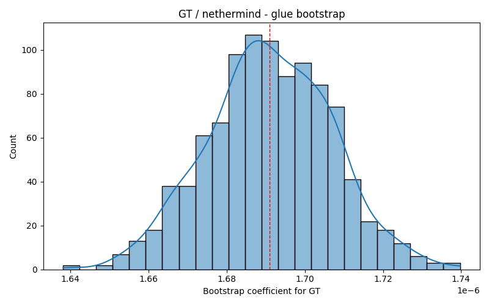

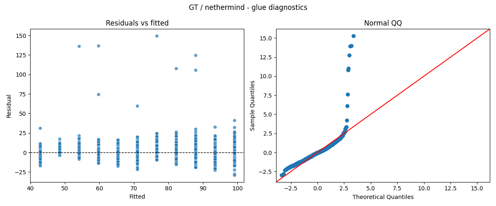

</details>

<details><summary><code>JUMPI</code> · nobs=2915 · runtime_ms=1.948e-06 · p=1.00e-03 · R²=0.6337</summary>

```
==============================================================================
                           NNLS Regression Results                            
==============================================================================
Dep. Variable:          test_runtime_ms              R-squared:          0.634
Model:                  NNLS                    Adj. R-squared:          0.634
No. Observations:       2915                              RMSE:           6.68
Df Residuals:           2913                               MAE:           3.55
Df Model:               1      
==============================================================================
                      coef     std err     P-value      [0.025      0.975]
------------------------------------------------------------------------------
         const      9.2786      0.4330       0.001      8.4620     10.1775
         JUMPI      0.0000      0.0000       0.001      0.0000      0.0000
==============================================================================
Notes: Non-negative least squares with bootstrap inference (1000 iterations)
==============================================================================
```

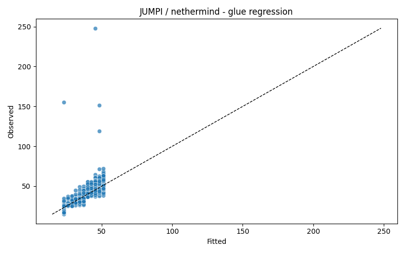

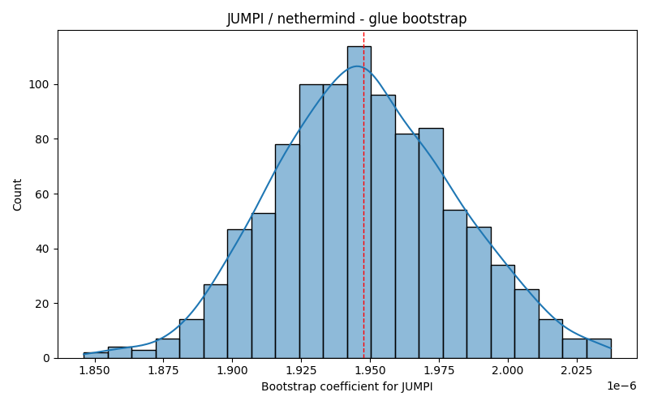

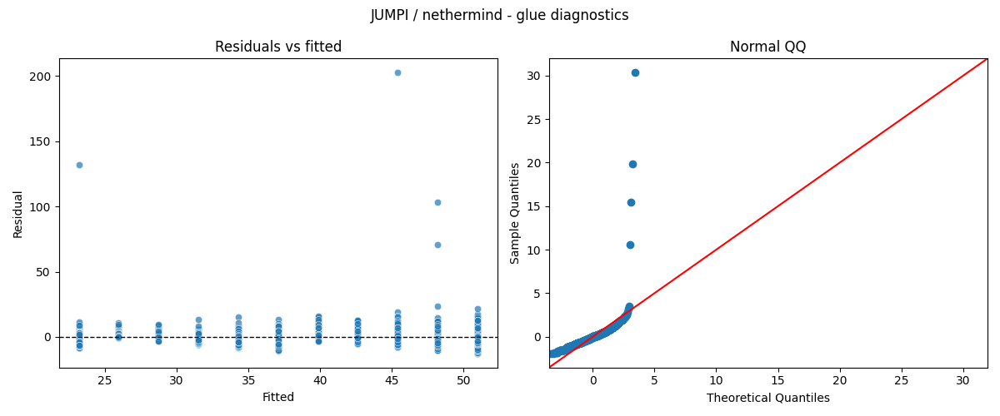

</details>

<details><summary><code>LT</code> · nobs=2915 · runtime_ms=1.578e-06 · p=1.00e-03 · R²=0.7562</summary>

```
==============================================================================
                           NNLS Regression Results                            
==============================================================================
Dep. Variable:          test_runtime_ms              R-squared:          0.756
Model:                  NNLS                    Adj. R-squared:          0.756
No. Observations:       2915                              RMSE:           9.43
Df Residuals:           2913                               MAE:           6.25
Df Model:               1      
==============================================================================
                      coef     std err     P-value      [0.025      0.975]
------------------------------------------------------------------------------
         const     19.7843      0.5934       0.001     18.6823     20.9696
            LT      0.0000      0.0000       0.001      0.0000      0.0000
==============================================================================
Notes: Non-negative least squares with bootstrap inference (1000 iterations)
==============================================================================
```

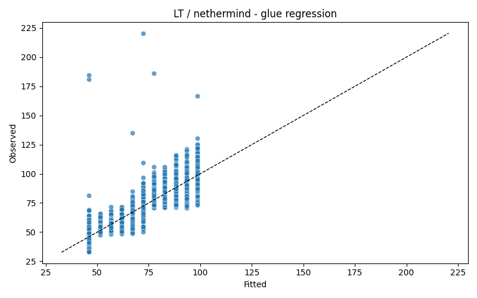

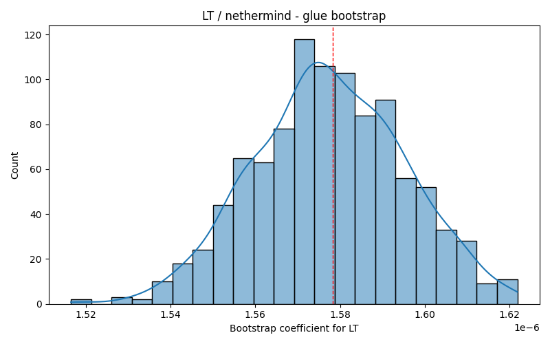

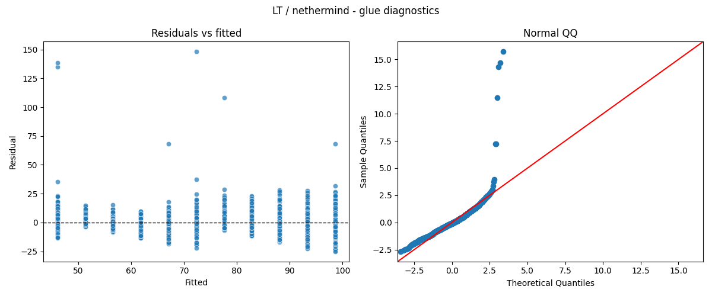

</details>

<details><summary><code>MSTORE</code> · nobs=14575 · runtime_ms=2.232e-06 · p=1.00e-03 · R²=0.7048</summary>

```
==============================================================================
                           NNLS Regression Results                            
==============================================================================
Dep. Variable:          test_runtime_ms              R-squared:          0.705
Model:                  NNLS                    Adj. R-squared:          0.705
No. Observations:       14575                             RMSE:          10.14
Df Residuals:           14573                              MAE:           5.13
Df Model:               1      
==============================================================================
                      coef     std err     P-value      [0.025      0.975]
------------------------------------------------------------------------------
         const     15.1608      0.2671       0.001     14.6147     15.6900
        MSTORE      0.0000      0.0000       0.001      0.0000      0.0000
==============================================================================
Notes: Non-negative least squares with bootstrap inference (1000 iterations)
==============================================================================
```

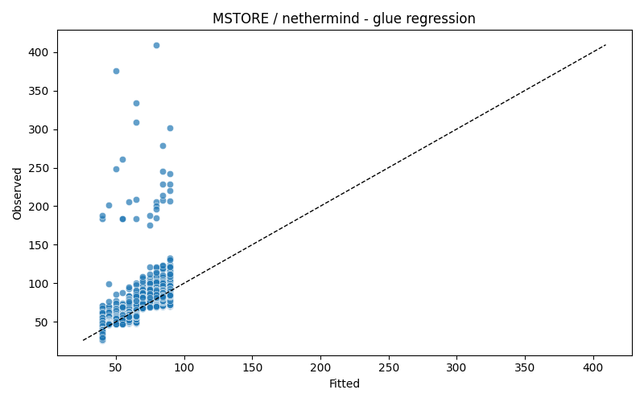

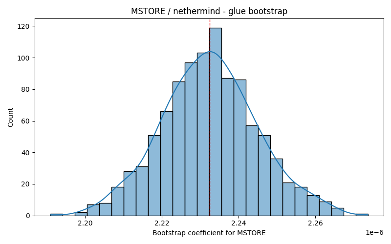

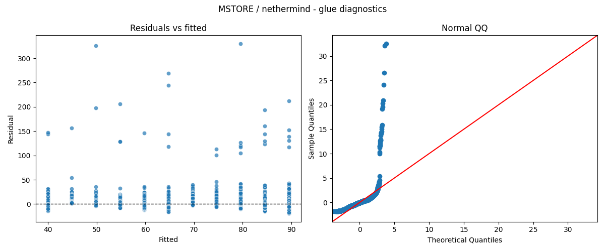

</details>

<details><summary><code>MSTORE8</code> · nobs=14575 · runtime_ms=2.179e-06 · p=1.00e-03 · R²=0.7703</summary>

```
==============================================================================
                           NNLS Regression Results                            
==============================================================================
Dep. Variable:          test_runtime_ms              R-squared:          0.770
Model:                  NNLS                    Adj. R-squared:          0.770
No. Observations:       14575                             RMSE:           8.35
Df Residuals:           14573                              MAE:           4.82
Df Model:               1      
==============================================================================
                      coef     std err     P-value      [0.025      0.975]
------------------------------------------------------------------------------
         const     15.1469      0.2366       0.001     14.7140     15.6024
       MSTORE8      0.0000      0.0000       0.001      0.0000      0.0000
==============================================================================
Notes: Non-negative least squares with bootstrap inference (1000 iterations)
==============================================================================
```

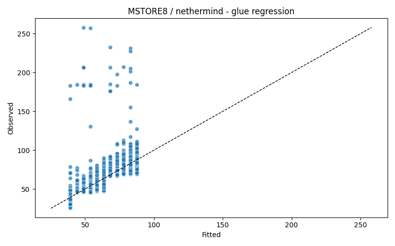

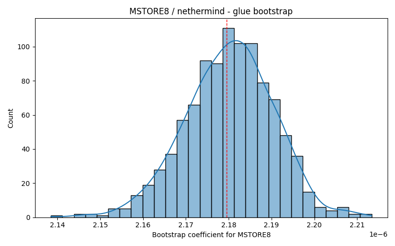

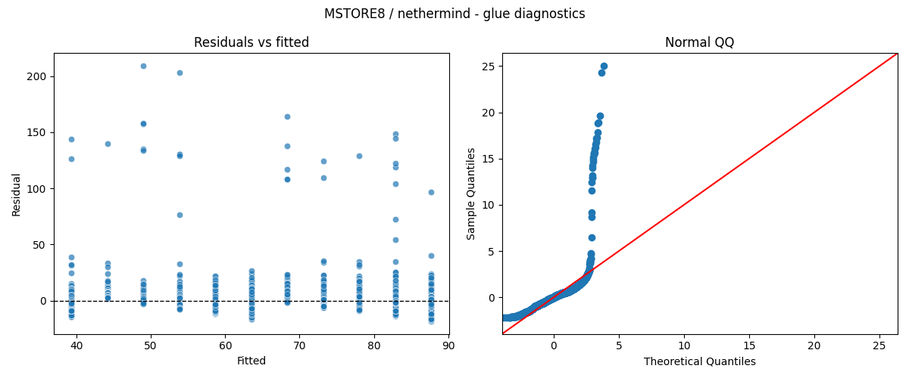

</details>

<details><summary><code>MUL</code> · nobs=2915 · runtime_ms=5.192e-06 · p=1.00e-03 · R²=0.9012</summary>

```
==============================================================================
                           NNLS Regression Results                            
==============================================================================
Dep. Variable:          test_runtime_ms              R-squared:          0.901
Model:                  NNLS                    Adj. R-squared:          0.901
No. Observations:       2915                              RMSE:          13.57
Df Residuals:           2913                               MAE:          10.31
Df Model:               1      
==============================================================================
                      coef     std err     P-value      [0.025      0.975]
------------------------------------------------------------------------------
         const     25.6358      0.7604       0.001     24.0981     27.0982
           MUL      0.0000      0.0000       0.001      0.0000      0.0000
==============================================================================
Notes: Non-negative least squares with bootstrap inference (1000 iterations)
==============================================================================
```

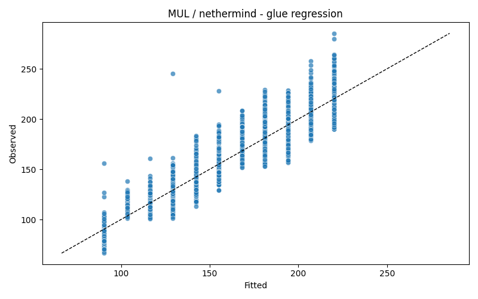

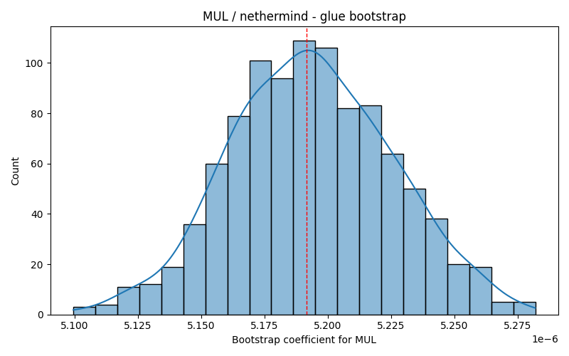

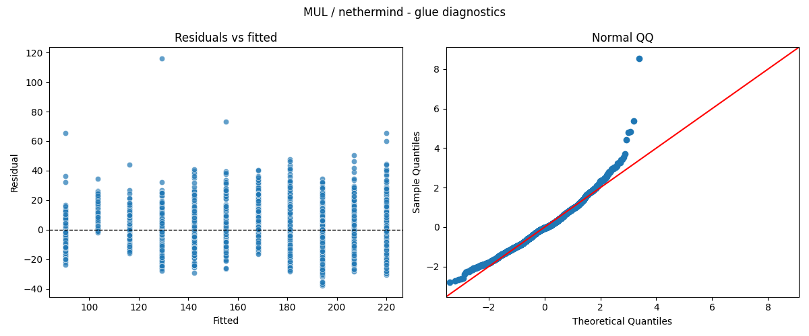

</details>

<details><summary><code>PC</code> · nobs=2915 · runtime_ms=8.279e-07 · p=1.00e-03 · R²=0.8458</summary>

```
==============================================================================
                           NNLS Regression Results                            
==============================================================================
Dep. Variable:          test_runtime_ms              R-squared:          0.846
Model:                  NNLS                    Adj. R-squared:          0.846
No. Observations:       2915                              RMSE:          10.57
Df Residuals:           2913                               MAE:           8.18
Df Model:               1      
==============================================================================
                      coef     std err     P-value      [0.025      0.975]
------------------------------------------------------------------------------
         const     18.8376      0.6363       0.001     17.5791     20.0557
            PC      0.0000      0.0000       0.001      0.0000      0.0000
==============================================================================
Notes: Non-negative least squares with bootstrap inference (1000 iterations)
==============================================================================
```

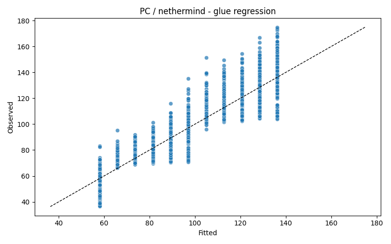

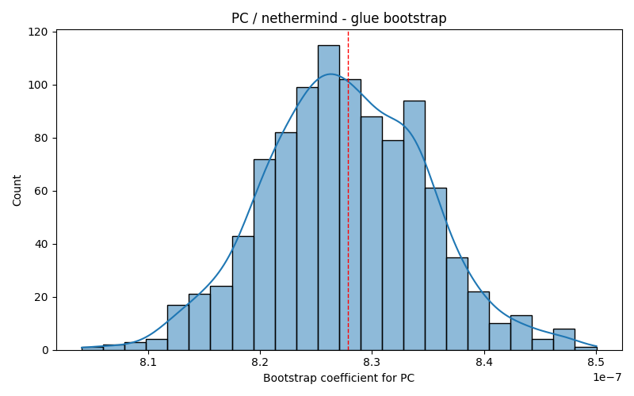

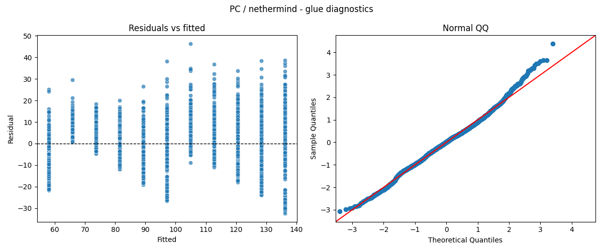

</details>

<details><summary><code>RETURNDATASIZE</code> · nobs=11660 · runtime_ms=9.311e-07 · p=1.00e-03 · R²=0.6113</summary>

```
==============================================================================
                           NNLS Regression Results                            
==============================================================================
Dep. Variable:          test_runtime_ms              R-squared:          0.611
Model:                  NNLS                    Adj. R-squared:          0.611
No. Observations:       11660                             RMSE:          11.72
Df Residuals:           11658                              MAE:           5.40
Df Model:               1      
==============================================================================
                      coef     std err     P-value      [0.025      0.975]
------------------------------------------------------------------------------
         const     13.0127      0.3182       0.001     12.4254     13.6634
RETURNDATASIZE      0.0000      0.0000       0.001      0.0000      0.0000
==============================================================================
Notes: Non-negative least squares with bootstrap inference (1000 iterations)
==============================================================================
```

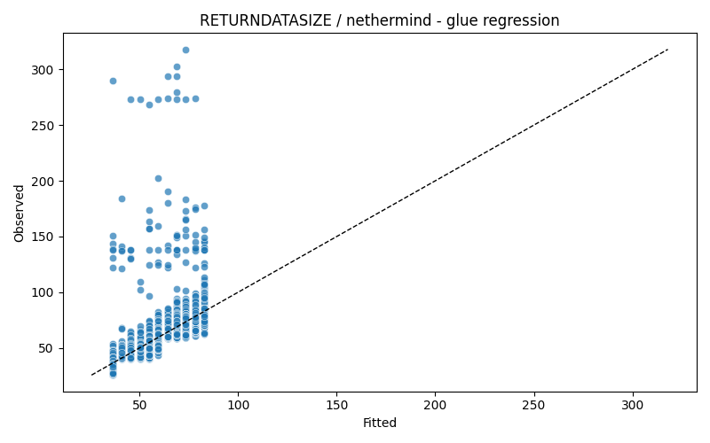

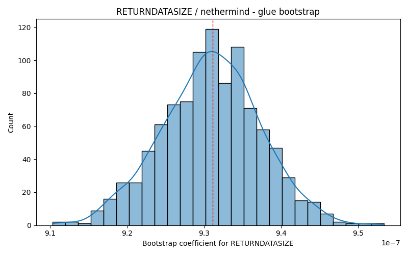

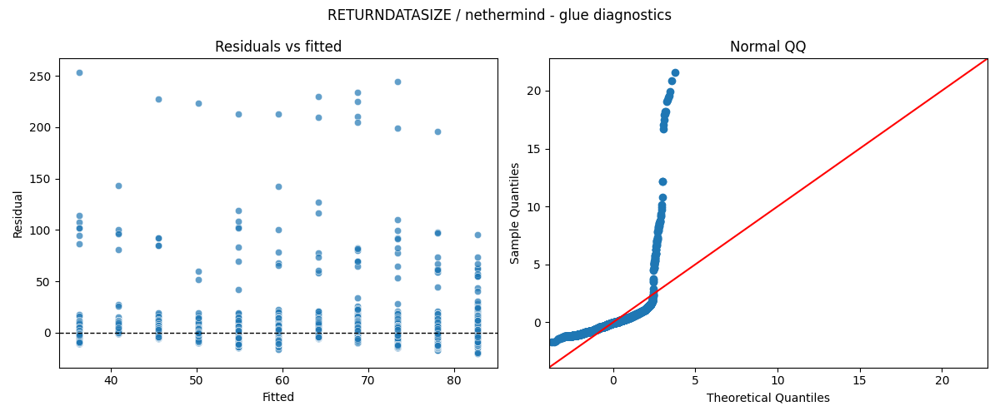

</details>

<details><summary><code>SELFBALANCE</code> · nobs=2385 · runtime_ms=4.256e-06 · p=1.00e-03 · R²=0.621</summary>

```
==============================================================================
                           NNLS Regression Results                            
==============================================================================
Dep. Variable:          test_runtime_ms              R-squared:          0.621
Model:                  NNLS                    Adj. R-squared:          0.621
No. Observations:       2385                              RMSE:          33.54
Df Residuals:           2383                               MAE:          26.89
Df Model:               1      
==============================================================================
                      coef     std err     P-value      [0.025      0.975]
------------------------------------------------------------------------------
         const    114.9352      3.7270       0.001    107.5345    122.2159
   SELFBALANCE      0.0000      0.0000       0.001      0.0000      0.0000
==============================================================================
Notes: Non-negative least squares with bootstrap inference (1000 iterations)
==============================================================================
```

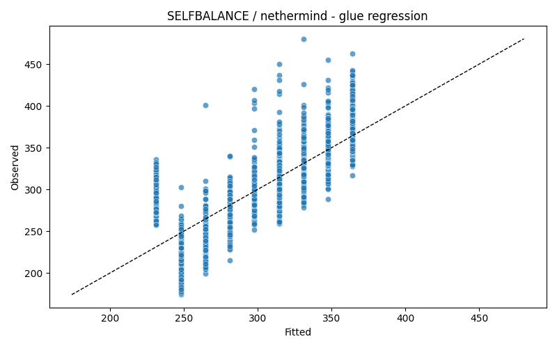

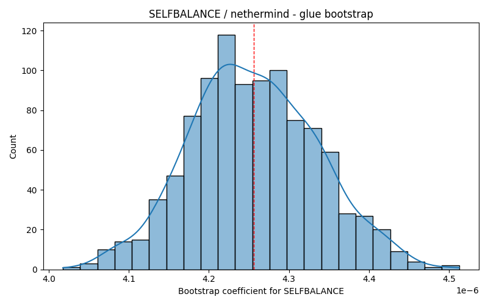

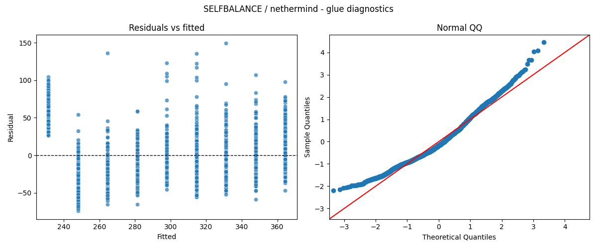

</details>

<details><summary><code>SUB</code> · nobs=2915 · runtime_ms=2.534e-06 · p=1.00e-03 · R²=0.8283</summary>

```
==============================================================================
                           NNLS Regression Results                            
==============================================================================
Dep. Variable:          test_runtime_ms              R-squared:          0.828
Model:                  NNLS                    Adj. R-squared:          0.828
No. Observations:       2915                              RMSE:          12.14
Df Residuals:           2913                               MAE:           7.93
Df Model:               1      
==============================================================================
                      coef     std err     P-value      [0.025      0.975]
------------------------------------------------------------------------------
         const     16.7910      0.6832       0.001     15.4260     18.1233
           SUB      0.0000      0.0000       0.001      0.0000      0.0000
==============================================================================
Notes: Non-negative least squares with bootstrap inference (1000 iterations)
==============================================================================
```

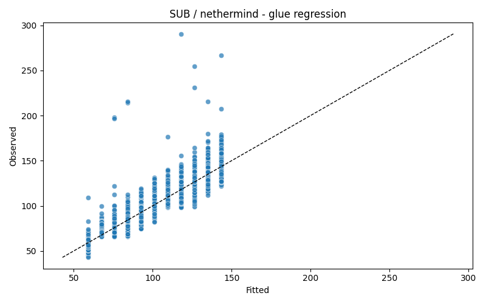

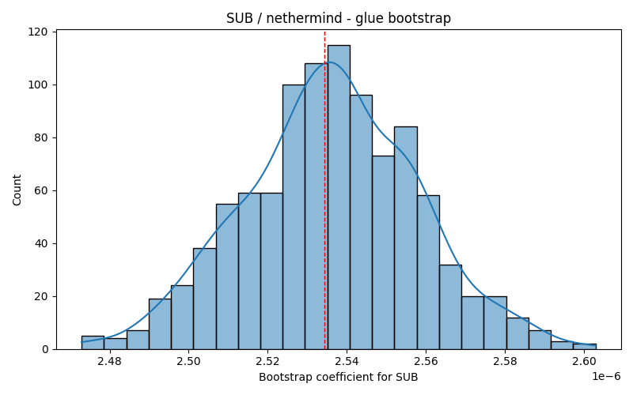

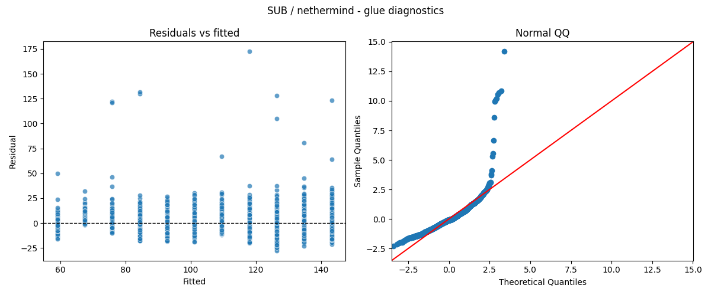

</details>

### Mixed glue (tier B) · nethermind

<details><summary><code>JUMP</code> · nobs=2915 · runtime_ms=5.715e-06 · p=1.00e-03 · R²=0.8185</summary>

```
==============================================================================
                           NNLS Regression Results                            
==============================================================================
Dep. Variable:          test_runtime_ms              R-squared:          0.818
Model:                  NNLS                    Adj. R-squared:          0.818
No. Observations:       2915                              RMSE:          10.00
Df Residuals:           2913                               MAE:           7.16
Df Model:               1      
==============================================================================
                      coef     std err     P-value      [0.025      0.975]
------------------------------------------------------------------------------
         const     17.0716      0.6231       0.001     15.8723     18.3159
          JUMP      0.0000      0.0000       0.001      0.0000      0.0000
==============================================================================
Notes: Non-negative least squares with bootstrap inference (1000 iterations)
==============================================================================
```

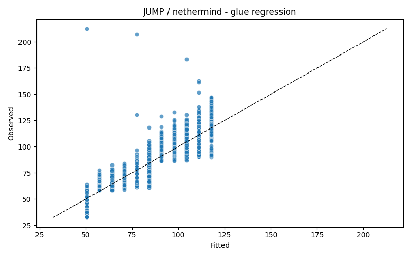

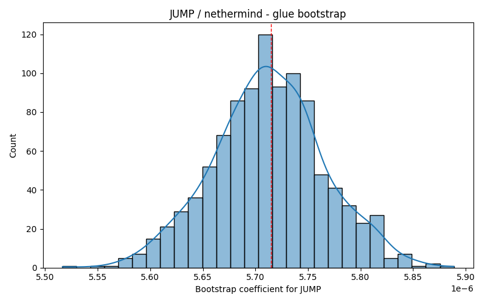

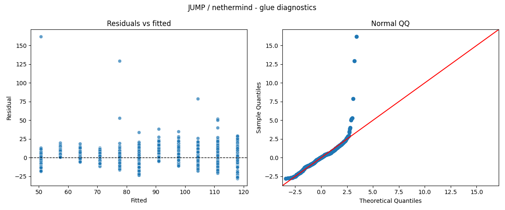

</details>

<details><summary><code>KECCAK256</code> · nobs=46640 · runtime_ms=0 · p=1.00e+00 · R²=0</summary>

```
==============================================================================
                           NNLS Regression Results                            
==============================================================================
Dep. Variable:          test_runtime_ms              R-squared:          0.000
Model:                  NNLS                    Adj. R-squared:         -0.000
No. Observations:       46640                             RMSE:         284.42
Df Residuals:           46638                              MAE:         231.60
Df Model:               1      
==============================================================================
                      coef     std err     P-value      [0.025      0.975]
------------------------------------------------------------------------------
         const    408.3821      1.4061       0.001    405.7817    411.0925
     KECCAK256      0.0000      0.0000       1.000      0.0000      0.0000
==============================================================================
Notes: Non-negative least squares with bootstrap inference (1000 iterations)
==============================================================================
```

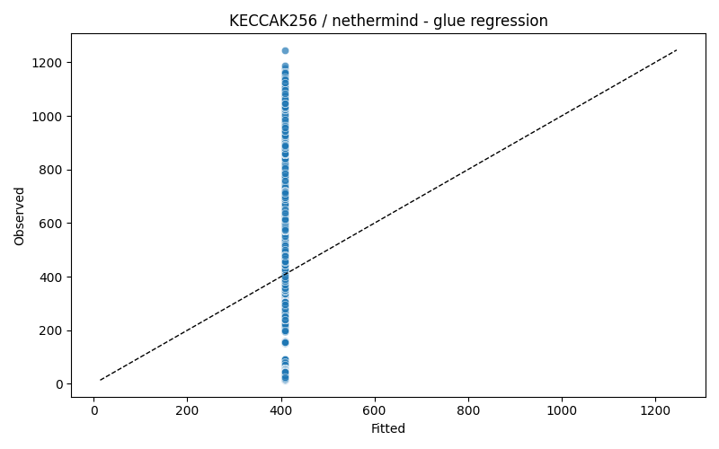

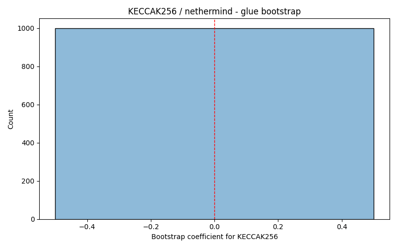

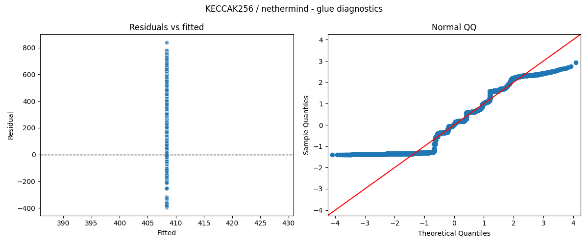

</details>

## reth

| glue_opcode | nobs | glue_runtime_ms | p_value | rsquared |
| --- | --- | --- | --- | --- |
| `ISZERO` | 682 | 1.303e-06 | 1.00e-03 | 0.8138 |
| `JUMPDEST` | 682 | 2.706e-07 | 1.00e-03 | 0.6892 |
| `SWAP` | 10912 | 4.849e-07 | 1.00e-03 | 0.5992 |
| `CALLDATASIZE` | 40634 | 4.419e-07 | 1.00e-03 | 0.7467 |
| `DUP` | 40634 | 4.063e-07 | 1.00e-03 | 0.7467 |
| `GAS` | 40634 | 4.256e-07 | 1.00e-03 | 0.7467 |
| `MLOAD` | 40634 | 1.453e-06 | 1.00e-03 | 0.7467 |
| `PUSH` | 40634 | 4.34e-07 | 1.00e-03 | 0.7467 |
| `PUSH0` | 40634 | 4.238e-07 | 1.00e-03 | 0.7467 |
| `STATICCALL` | 40634 | 5.624e-05 | 1.00e-03 | 0.7467 |
| `ADD` | 682 | 8.461e-07 | 1.00e-03 | 0.6007 |
| `AND` | 682 | 8.241e-07 | 1.00e-03 | 0.6963 |
| `CALLDATACOPY` | 16368 | 2.334e-06 | 1.00e-03 | 0.8064 |
| `CALLDATALOAD` | 2728 | 1.775e-05 | 1.00e-03 | 0.0051 |
| `DIV` | 682 | 6.907e-06 | 1.00e-03 | 0.8491 |
| `EXP` | 682 | 0.0005116 | 1.00e-03 | 0.8677 |
| `GT` | 682 | 9.44e-07 | 1.00e-03 | 0.7879 |
| `JUMPI` | 682 | 1.332e-06 | 1.00e-03 | 0.4771 |
| `LT` | 682 | 9.105e-07 | 1.00e-03 | 0.7366 |
| `MSTORE` | 3410 | 2.612e-06 | 1.00e-03 | 0.2985 |
| `MSTORE8` | 3410 | 1.342e-06 | 1.00e-03 | 0.7218 |
| `MUL` | 682 | 1.129e-06 | 1.00e-03 | 0.6916 |
| `PC` | 682 | 6.251e-07 | 1.00e-03 | 0.7545 |
| `RETURNDATASIZE` | 2728 | 8.38e-07 | 1.00e-03 | 0.7248 |
| `SELFBALANCE` | 558 | 3.739e-06 | 1.00e-03 | 0.8038 |
| `SUB` | 682 | 8.527e-07 | 1.00e-03 | 0.7402 |
| `JUMP` | 682 | 2.155e-06 | 1.00e-03 | 0.7139 |
| `KECCAK256` | 10912 | 0 | 1.00e+00 | 0 |

### Cycle glue — joint fit · reth

<details><summary>Joint NNLS regression summary</summary>

```
==============================================================================
                           NNLS Regression Results                            
==============================================================================
Dep. Variable:          test_runtime_ms              R-squared:          0.747
Model:                  NNLS                    Adj. R-squared:          0.747
No. Observations:       40634                             RMSE:           8.33
Df Residuals:           40626                              MAE:           5.53
Df Model:               7      
==============================================================================
                      coef     std err     P-value      [0.025      0.975]
------------------------------------------------------------------------------
         const     15.9913      0.1271       0.001     15.7374     16.2320
  CALLDATASIZE      0.0000      0.0000       0.001      0.0000      0.0000
           DUP      0.0000      0.0000       0.001      0.0000      0.0000
           GAS      0.0000      0.0000       0.001      0.0000      0.0000
         MLOAD      0.0000      0.0000       0.001      0.0000      0.0000
          PUSH      0.0000      0.0000       0.001      0.0000      0.0000
         PUSH0      0.0000      0.0000       0.001      0.0000      0.0000
    STATICCALL      0.0001      0.0000       0.001      0.0001      0.0001
==============================================================================
Notes: Non-negative least squares with bootstrap inference (1000 iterations)
==============================================================================
```

</details>

<details><summary><code>CALLDATASIZE</code> · nobs=40634 · runtime_ms=4.419e-07 · p=1.00e-03 · R²=0.7467</summary>

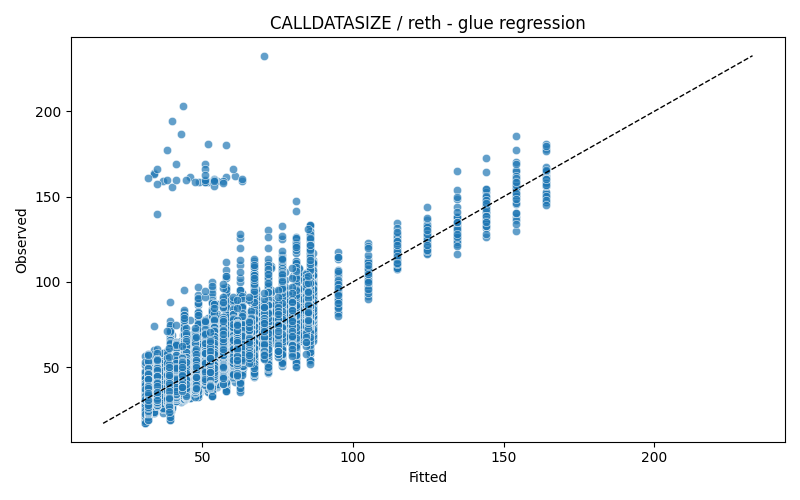

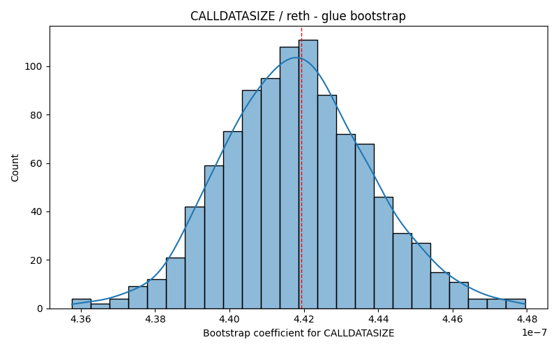


</details>

<details><summary><code>DUP</code> · nobs=40634 · runtime_ms=4.063e-07 · p=1.00e-03 · R²=0.7467</summary>


</details>

<details><summary><code>GAS</code> · nobs=40634 · runtime_ms=4.256e-07 · p=1.00e-03 · R²=0.7467</summary>


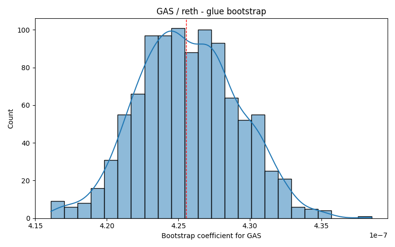


</details>

<details><summary><code>MLOAD</code> · nobs=40634 · runtime_ms=1.453e-06 · p=1.00e-03 · R²=0.7467</summary>


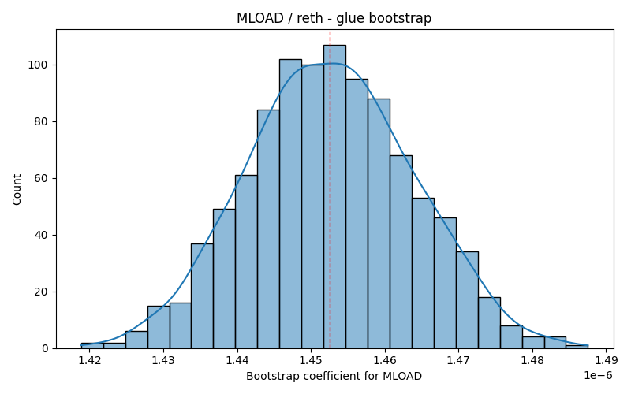

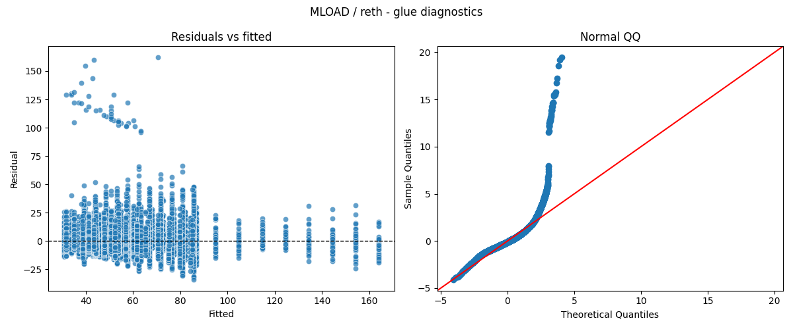

</details>

<details><summary><code>PUSH</code> · nobs=40634 · runtime_ms=4.34e-07 · p=1.00e-03 · R²=0.7467</summary>


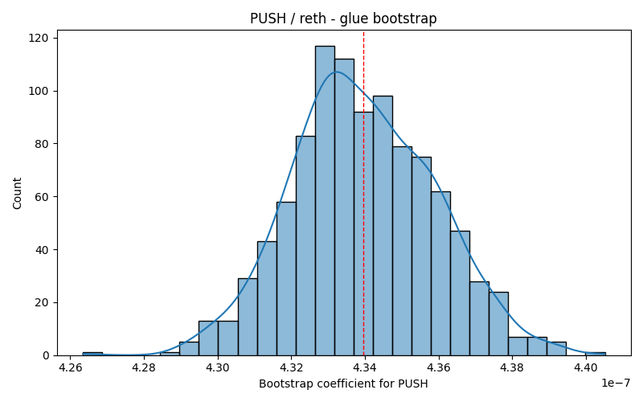


</details>

<details><summary><code>PUSH0</code> · nobs=40634 · runtime_ms=4.238e-07 · p=1.00e-03 · R²=0.7467</summary>


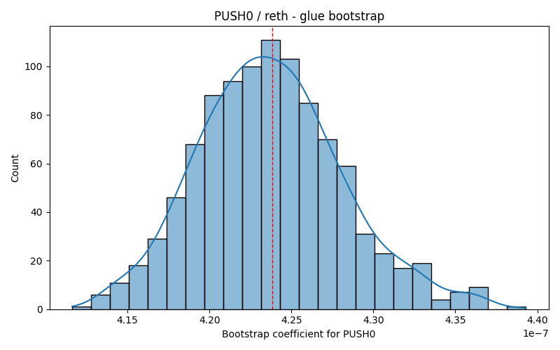


</details>

<details><summary><code>STATICCALL</code> · nobs=40634 · runtime_ms=5.624e-05 · p=1.00e-03 · R²=0.7467</summary>


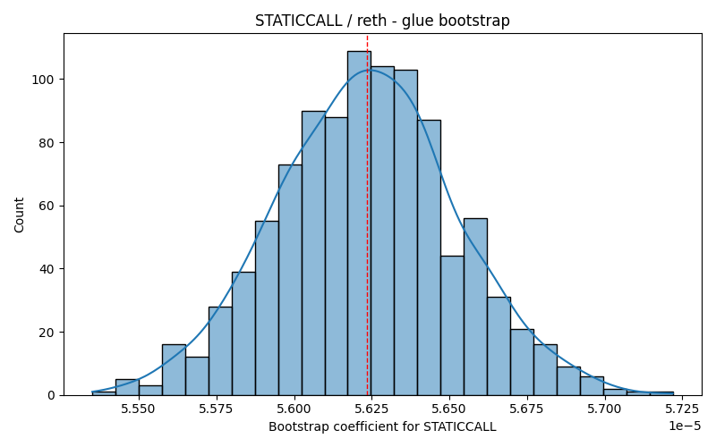


</details>

### Pure glue · reth

<details><summary><code>ISZERO</code> · nobs=682 · runtime_ms=1.303e-06 · p=1.00e-03 · R²=0.8138</summary>

```
==============================================================================
                           NNLS Regression Results                            
==============================================================================
Dep. Variable:          test_runtime_ms              R-squared:          0.814
Model:                  NNLS                    Adj. R-squared:          0.814
No. Observations:       682                               RMSE:          13.13
Df Residuals:           680                                MAE:           9.43
Df Model:               1      
==============================================================================
                      coef     std err     P-value      [0.025      0.975]
------------------------------------------------------------------------------
         const     36.0040      1.9244       0.001     32.4165     40.0620
        ISZERO      0.0000      0.0000       0.001      0.0000      0.0000
==============================================================================
Notes: Non-negative least squares with bootstrap inference (1000 iterations)
==============================================================================
```

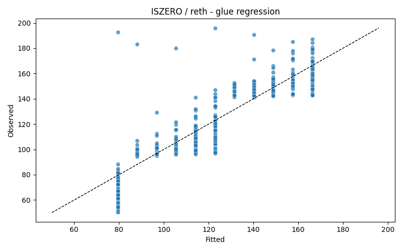

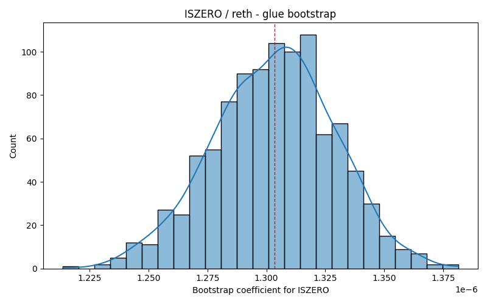

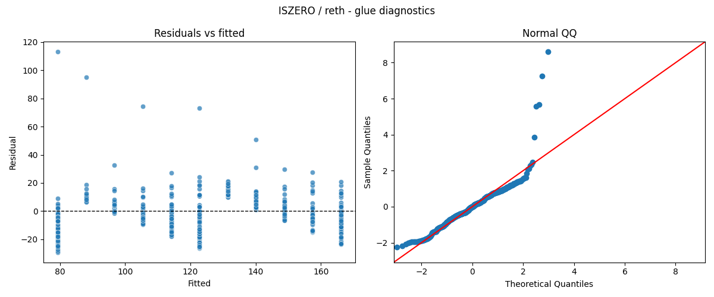

</details>

<details><summary><code>JUMPDEST</code> · nobs=682 · runtime_ms=2.706e-07 · p=1.00e-03 · R²=0.6892</summary>

```
==============================================================================
                           NNLS Regression Results                            
==============================================================================
Dep. Variable:          test_runtime_ms              R-squared:          0.689
Model:                  NNLS                    Adj. R-squared:          0.689
No. Observations:       682                               RMSE:          11.47
Df Residuals:           680                                MAE:           8.08
Df Model:               1      
==============================================================================
                      coef     std err     P-value      [0.025      0.975]
------------------------------------------------------------------------------
         const     21.7120      1.3206       0.001     19.1006     24.3132
      JUMPDEST      0.0000      0.0000       0.001      0.0000      0.0000
==============================================================================
Notes: Non-negative least squares with bootstrap inference (1000 iterations)
==============================================================================
```


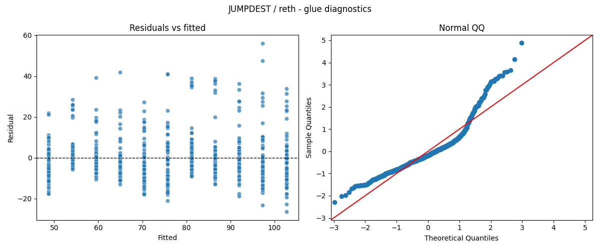

</details>

<details><summary><code>SWAP</code> · nobs=10912 · runtime_ms=4.849e-07 · p=1.00e-03 · R²=0.5992</summary>

```
==============================================================================
                           NNLS Regression Results                            
==============================================================================
Dep. Variable:          test_runtime_ms              R-squared:          0.599
Model:                  NNLS                    Adj. R-squared:          0.599
No. Observations:       10912                             RMSE:           8.35
Df Residuals:           10910                              MAE:           4.38
Df Model:               1      
==============================================================================
                      coef     std err     P-value      [0.025      0.975]
------------------------------------------------------------------------------
         const     14.7810      0.2490       0.001     14.3112     15.2667
          SWAP      0.0000      0.0000       0.001      0.0000      0.0000
==============================================================================
Notes: Non-negative least squares with bootstrap inference (1000 iterations)
==============================================================================
```

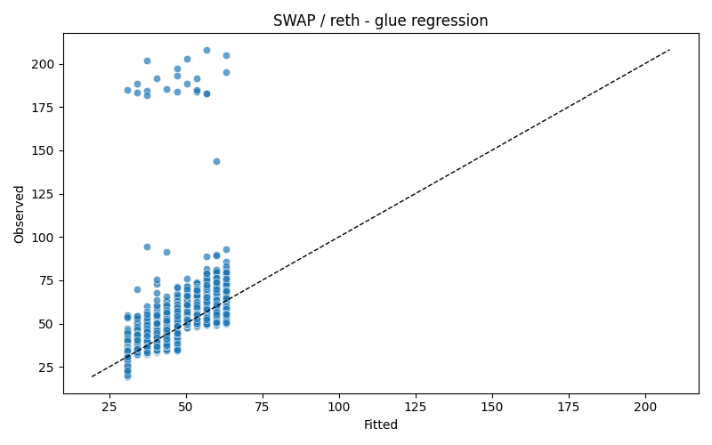

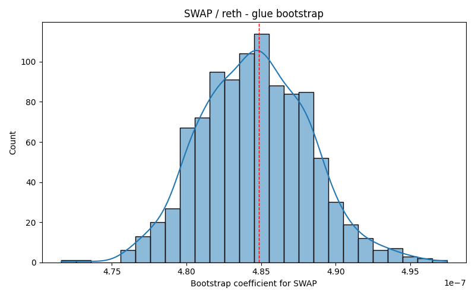

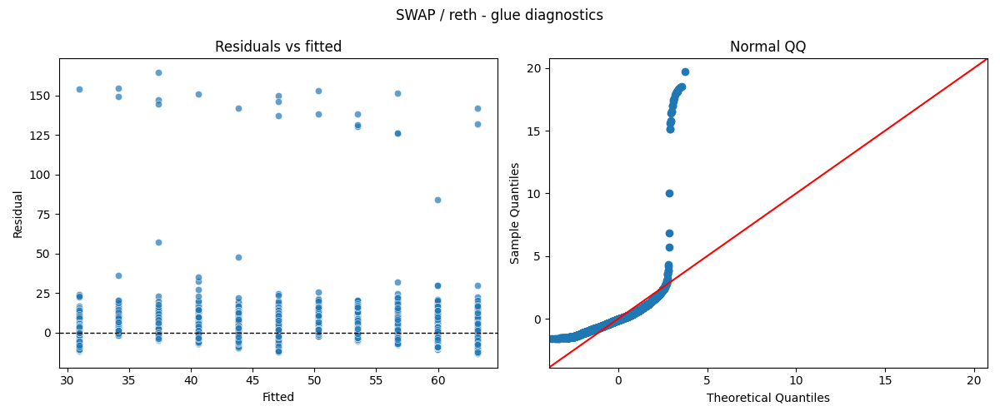

</details>

### Mixed glue (tier A) · reth

<details><summary><code>ADD</code> · nobs=682 · runtime_ms=8.461e-07 · p=1.00e-03 · R²=0.6007</summary>

```
==============================================================================
                           NNLS Regression Results                            
==============================================================================
Dep. Variable:          test_runtime_ms              R-squared:          0.601
Model:                  NNLS                    Adj. R-squared:          0.600
No. Observations:       682                               RMSE:           7.26
Df Residuals:           680                                MAE:           4.62
Df Model:               1      
==============================================================================
                      coef     std err     P-value      [0.025      0.975]
------------------------------------------------------------------------------
         const     13.9925      0.8824       0.001     12.2332     15.7567
           ADD      0.0000      0.0000       0.001      0.0000      0.0000
==============================================================================
Notes: Non-negative least squares with bootstrap inference (1000 iterations)
==============================================================================
```

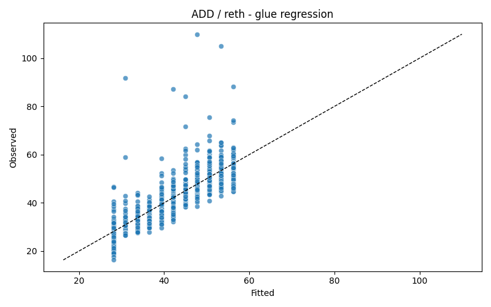


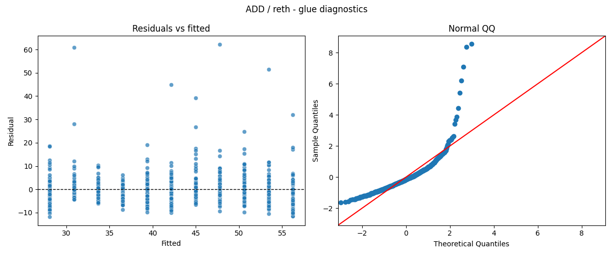

</details>

<details><summary><code>AND</code> · nobs=682 · runtime_ms=8.241e-07 · p=1.00e-03 · R²=0.6963</summary>

```
==============================================================================
                           NNLS Regression Results                            
==============================================================================
Dep. Variable:          test_runtime_ms              R-squared:          0.696
Model:                  NNLS                    Adj. R-squared:          0.696
No. Observations:       682                               RMSE:           5.73
Df Residuals:           680                                MAE:           4.27
Df Model:               1      
==============================================================================
                      coef     std err     P-value      [0.025      0.975]
------------------------------------------------------------------------------
         const     13.5223      0.6464       0.001     12.2630     14.7807
           AND      0.0000      0.0000       0.001      0.0000      0.0000
==============================================================================
Notes: Non-negative least squares with bootstrap inference (1000 iterations)
==============================================================================
```

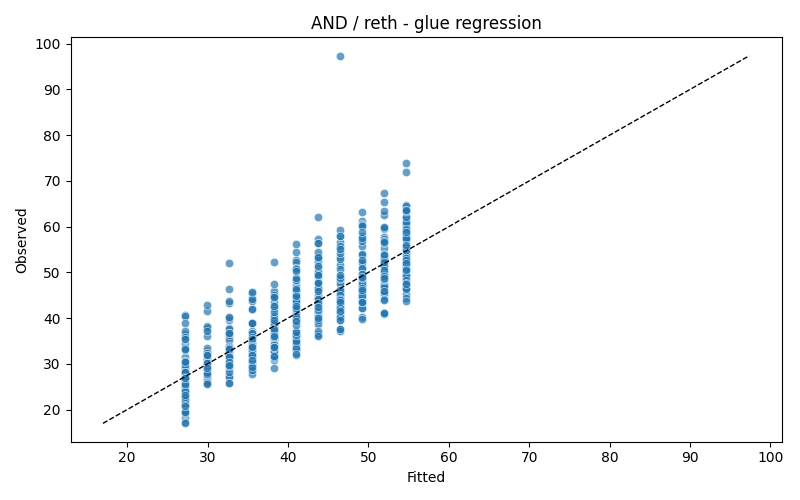

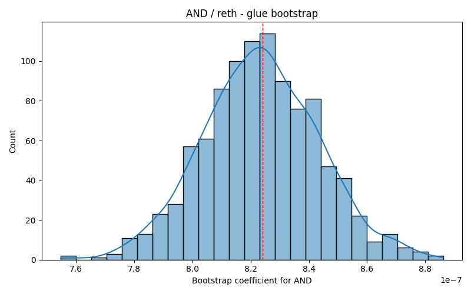

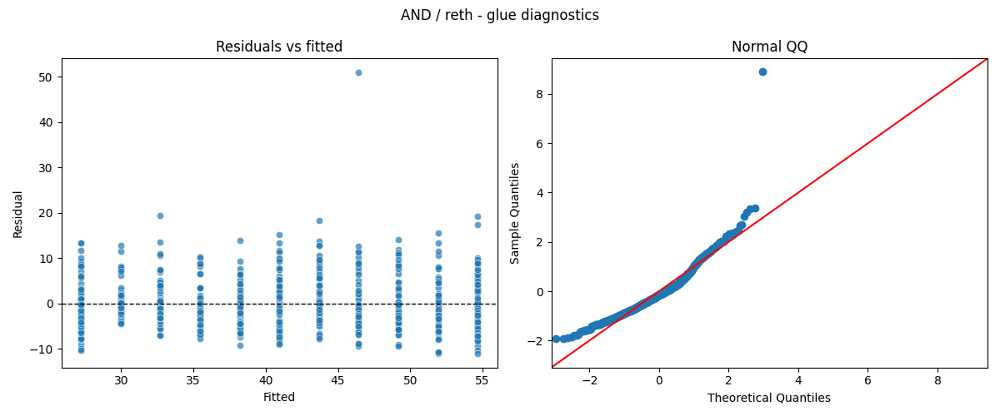

</details>

<details><summary><code>CALLDATACOPY</code> · nobs=16368 · runtime_ms=2.334e-06 · p=1.00e-03 · R²=0.8064</summary>

```
==============================================================================
                           NNLS Regression Results                            
==============================================================================
Dep. Variable:          test_runtime_ms              R-squared:          0.806
Model:                  NNLS                    Adj. R-squared:          0.806
No. Observations:       16368                             RMSE:           8.60
Df Residuals:           16366                              MAE:           6.66
Df Model:               1      
==============================================================================
                      coef     std err     P-value      [0.025      0.975]
------------------------------------------------------------------------------
         const     14.9251      0.0824       0.001     14.7636     15.0812
  CALLDATACOPY      0.0000      0.0000       0.001      0.0000      0.0000
==============================================================================
Notes: Non-negative least squares with bootstrap inference (1000 iterations)
==============================================================================
```

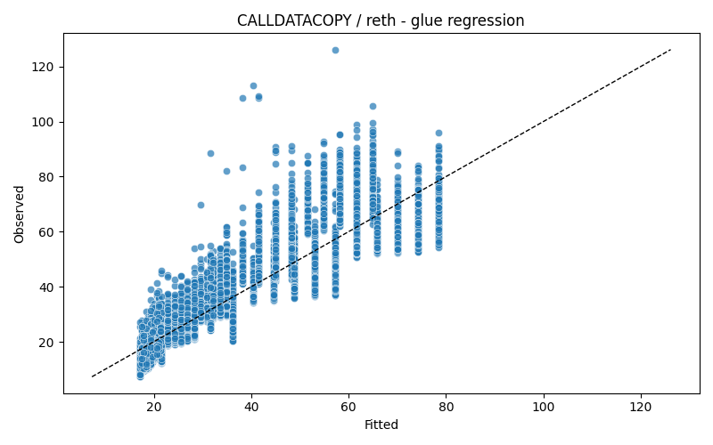

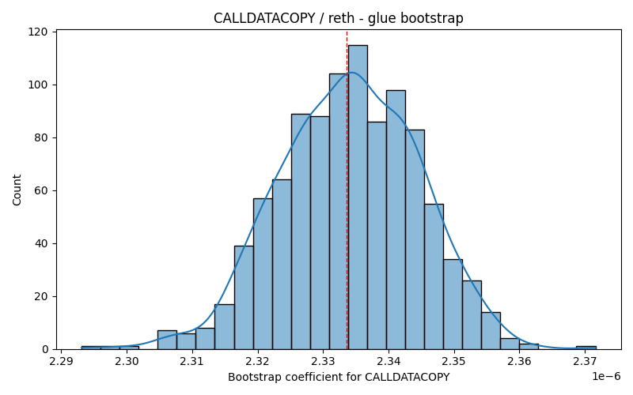

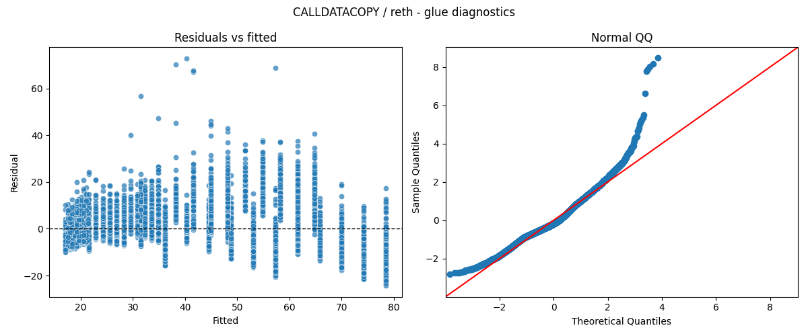

</details>

<details><summary><code>CALLDATALOAD</code> · nobs=2728 · runtime_ms=1.775e-05 · p=1.00e-03 · R²=0.0051</summary>

```
==============================================================================
                           NNLS Regression Results                            
==============================================================================
Dep. Variable:          test_runtime_ms              R-squared:          0.005
Model:                  NNLS                    Adj. R-squared:          0.005
No. Observations:       2728                              RMSE:           0.95
Df Residuals:           2726                               MAE:           0.78
Df Model:               1      
==============================================================================
                      coef     std err     P-value      [0.025      0.975]
------------------------------------------------------------------------------
         const      4.0321      0.0610       0.001      3.9142      4.1554
  CALLDATALOAD      0.0000      0.0000       0.001      0.0000      0.0000
==============================================================================
Notes: Non-negative least squares with bootstrap inference (1000 iterations)
==============================================================================
```

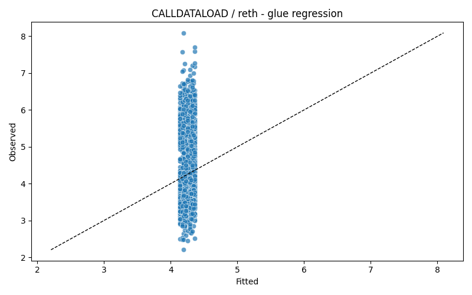

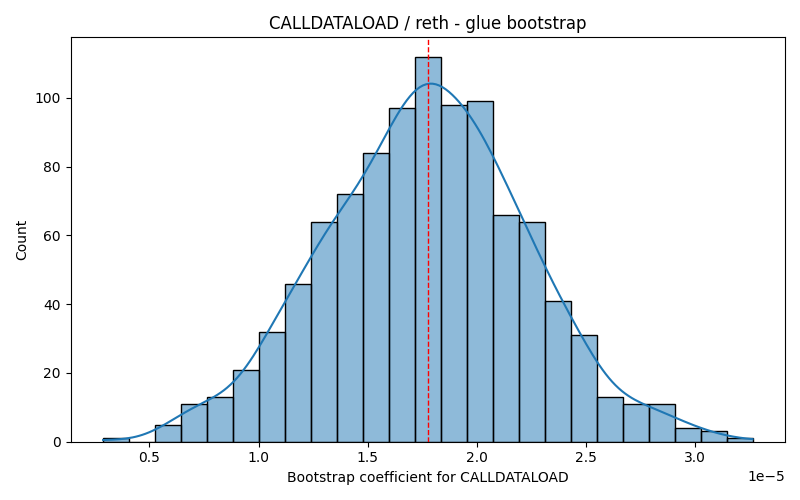

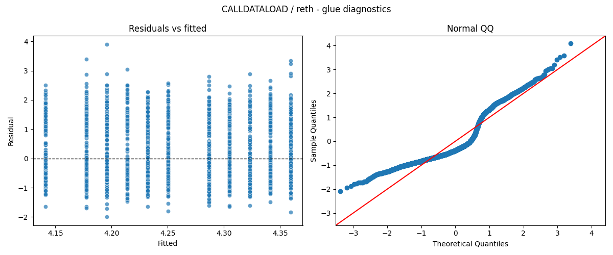

</details>

<details><summary><code>DIV</code> · nobs=682 · runtime_ms=6.907e-06 · p=1.00e-03 · R²=0.8491</summary>

```
==============================================================================
                           NNLS Regression Results                            
==============================================================================
Dep. Variable:          test_runtime_ms              R-squared:          0.849
Model:                  NNLS                    Adj. R-squared:          0.849
No. Observations:       682                               RMSE:          22.99
Df Residuals:           680                                MAE:          19.40
Df Model:               1      
==============================================================================
                      coef     std err     P-value      [0.025      0.975]
------------------------------------------------------------------------------
         const     62.2347      3.1596       0.001     55.7050     67.7581
           DIV      0.0000      0.0000       0.001      0.0000      0.0000
==============================================================================
Notes: Non-negative least squares with bootstrap inference (1000 iterations)
==============================================================================
```

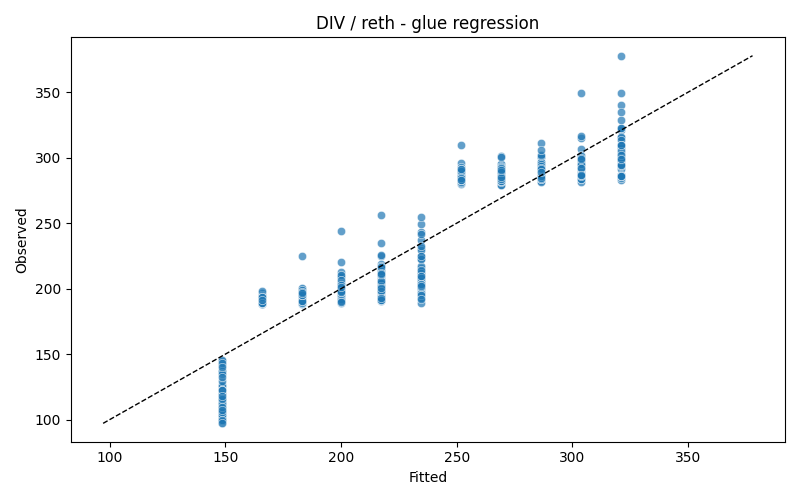


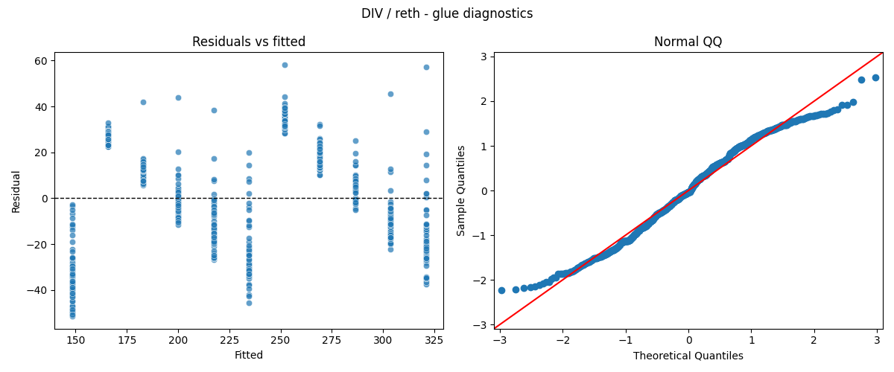

</details>

<details><summary><code>EXP</code> · nobs=682 · runtime_ms=0.0005116 · p=1.00e-03 · R²=0.8677</summary>

```
==============================================================================
                           NNLS Regression Results                            
==============================================================================
Dep. Variable:          test_runtime_ms              R-squared:          0.868
Model:                  NNLS                    Adj. R-squared:          0.867
No. Observations:       682                               RMSE:           7.82
Df Residuals:           680                                MAE:           6.35
Df Model:               1      
==============================================================================
                      coef     std err     P-value      [0.025      0.975]
------------------------------------------------------------------------------
         const     23.1922      1.0570       0.001     21.0615     25.3826
           EXP      0.0005      0.0000       0.001      0.0005      0.0005
==============================================================================
Notes: Non-negative least squares with bootstrap inference (1000 iterations)
==============================================================================
```

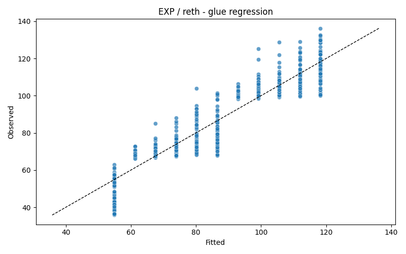

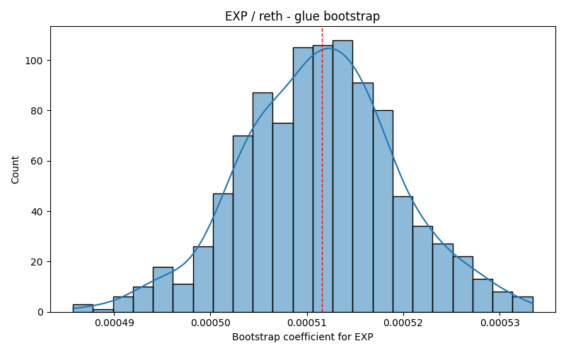

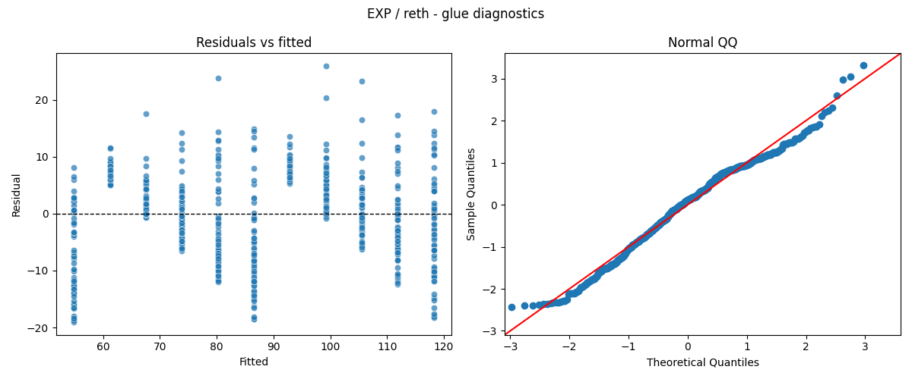

</details>

<details><summary><code>GT</code> · nobs=682 · runtime_ms=9.44e-07 · p=1.00e-03 · R²=0.7879</summary>

```
==============================================================================
                           NNLS Regression Results                            
==============================================================================
Dep. Variable:          test_runtime_ms              R-squared:          0.788
Model:                  NNLS                    Adj. R-squared:          0.788
No. Observations:       682                               RMSE:           5.15
Df Residuals:           680                                MAE:           4.02
Df Model:               1      
==============================================================================
                      coef     std err     P-value      [0.025      0.975]
------------------------------------------------------------------------------
         const     13.4388      0.6484       0.001     12.2016     14.7241
            GT      0.0000      0.0000       0.001      0.0000      0.0000
==============================================================================
Notes: Non-negative least squares with bootstrap inference (1000 iterations)
==============================================================================
```

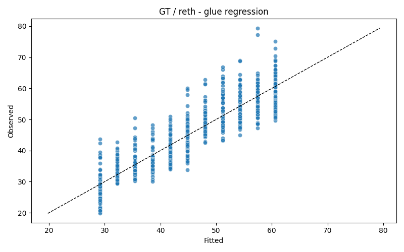

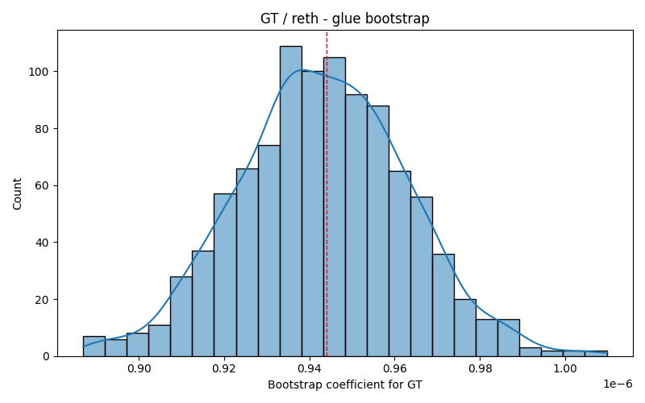

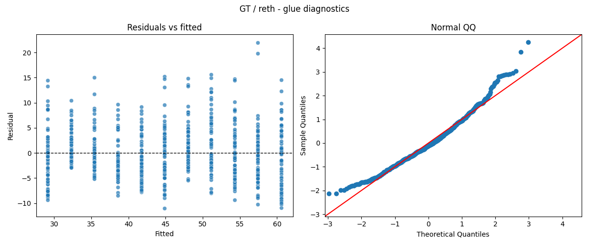

</details>

<details><summary><code>JUMPI</code> · nobs=682 · runtime_ms=1.332e-06 · p=1.00e-03 · R²=0.4771</summary>

```
==============================================================================
                           NNLS Regression Results                            
==============================================================================
Dep. Variable:          test_runtime_ms              R-squared:          0.477
Model:                  NNLS                    Adj. R-squared:          0.476
No. Observations:       682                               RMSE:           6.29
Df Residuals:           680                                MAE:           3.78
Df Model:               1      
==============================================================================
                      coef     std err     P-value      [0.025      0.975]
------------------------------------------------------------------------------
         const     10.6411      0.7864       0.001      9.1625     12.1942
         JUMPI      0.0000      0.0000       0.001      0.0000      0.0000
==============================================================================
Notes: Non-negative least squares with bootstrap inference (1000 iterations)
==============================================================================
```

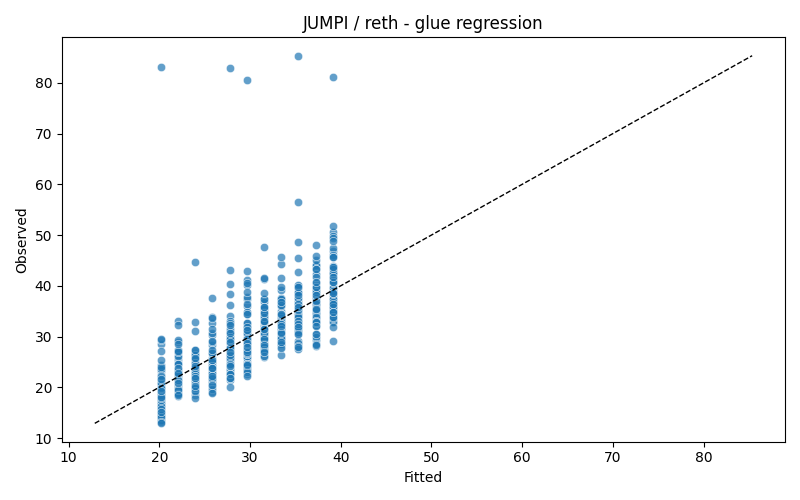


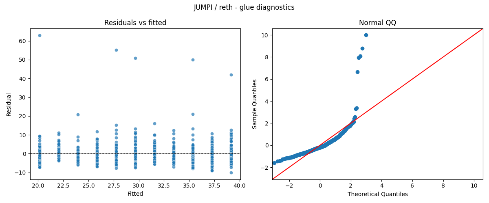

</details>

<details><summary><code>LT</code> · nobs=682 · runtime_ms=9.105e-07 · p=1.00e-03 · R²=0.7366</summary>

```
==============================================================================
                           NNLS Regression Results                            
==============================================================================
Dep. Variable:          test_runtime_ms              R-squared:          0.737
Model:                  NNLS                    Adj. R-squared:          0.736
No. Observations:       682                               RMSE:           5.73
Df Residuals:           680                                MAE:           4.22
Df Model:               1      
==============================================================================
                      coef     std err     P-value      [0.025      0.975]
------------------------------------------------------------------------------
         const     13.1018      0.7380       0.001     11.6250     14.6388
            LT      0.0000      0.0000       0.001      0.0000      0.0000
==============================================================================
Notes: Non-negative least squares with bootstrap inference (1000 iterations)
==============================================================================
```

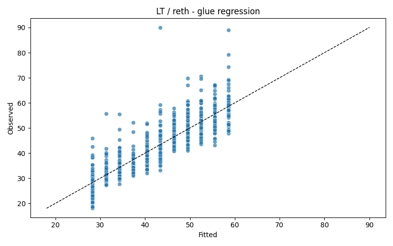


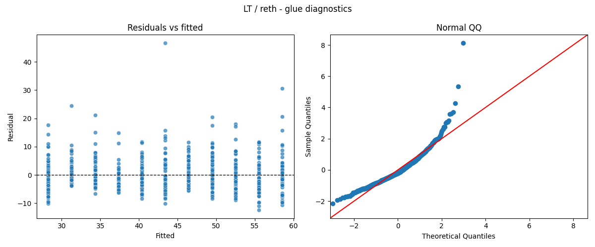

</details>

<details><summary><code>MSTORE</code> · nobs=3410 · runtime_ms=2.612e-06 · p=1.00e-03 · R²=0.2985</summary>

```
==============================================================================
                           NNLS Regression Results                            
==============================================================================
Dep. Variable:          test_runtime_ms              R-squared:          0.299
Model:                  NNLS                    Adj. R-squared:          0.298
No. Observations:       3410                              RMSE:          28.10
Df Residuals:           3408                               MAE:          25.04
Df Model:               1      
==============================================================================
                      coef     std err     P-value      [0.025      0.975]
------------------------------------------------------------------------------
         const     20.9454      1.3502       0.001     18.5100     23.6901
        MSTORE      0.0000      0.0000       0.001      0.0000      0.0000
==============================================================================
Notes: Non-negative least squares with bootstrap inference (1000 iterations)
==============================================================================
```

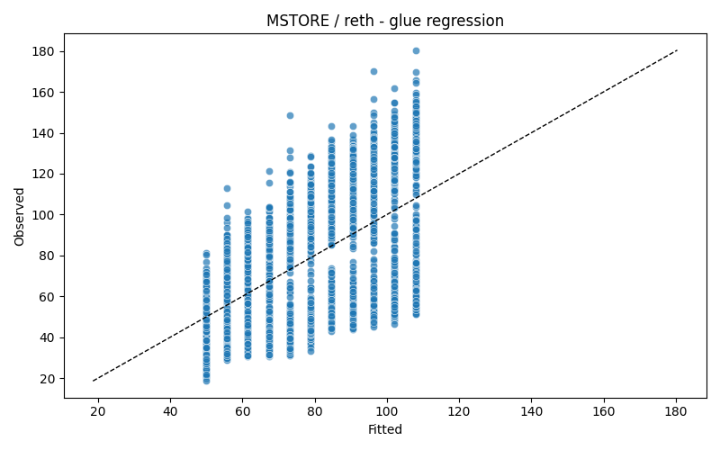

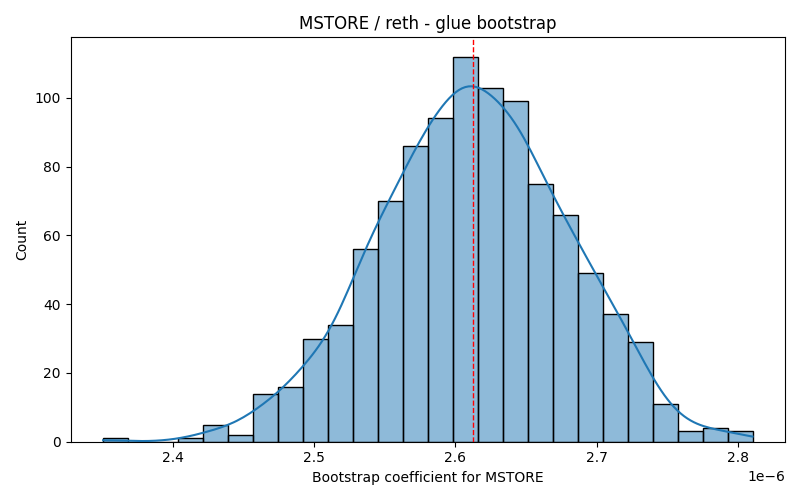

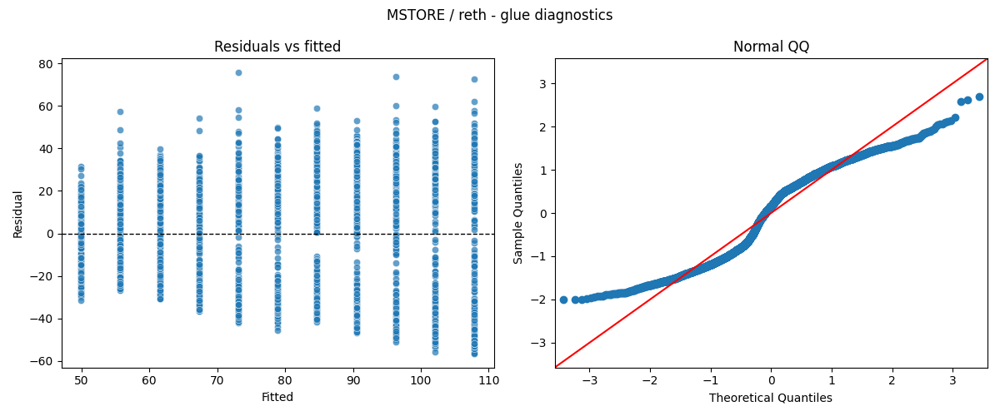

</details>

<details><summary><code>MSTORE8</code> · nobs=3410 · runtime_ms=1.342e-06 · p=1.00e-03 · R²=0.7218</summary>

```
==============================================================================
                           NNLS Regression Results                            
==============================================================================
Dep. Variable:          test_runtime_ms              R-squared:          0.722
Model:                  NNLS                    Adj. R-squared:          0.722
No. Observations:       3410                              RMSE:           5.85
Df Residuals:           3408                               MAE:           4.28
Df Model:               1      
==============================================================================
                      coef     std err     P-value      [0.025      0.975]
------------------------------------------------------------------------------
         const     14.4179      0.3374       0.001     13.7444     15.0425
       MSTORE8      0.0000      0.0000       0.001      0.0000      0.0000
==============================================================================
Notes: Non-negative least squares with bootstrap inference (1000 iterations)
==============================================================================
```

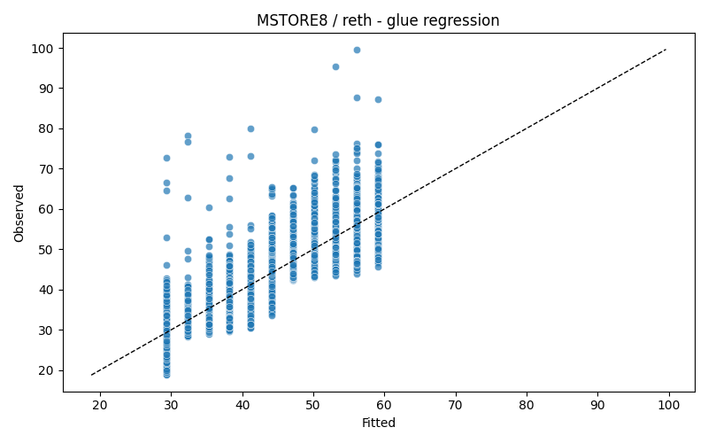

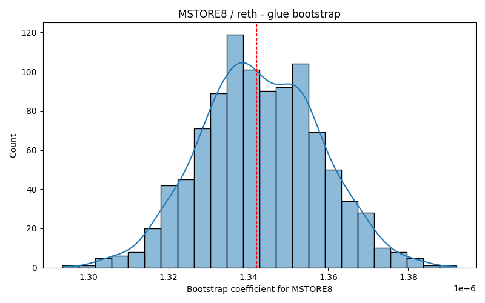

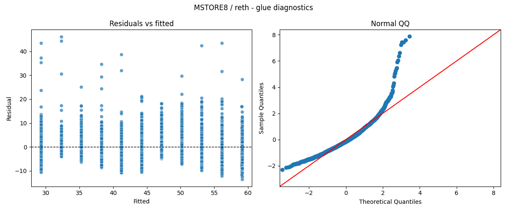

</details>

<details><summary><code>MUL</code> · nobs=682 · runtime_ms=1.129e-06 · p=1.00e-03 · R²=0.6916</summary>

```
==============================================================================
                           NNLS Regression Results                            
==============================================================================
Dep. Variable:          test_runtime_ms              R-squared:          0.692
Model:                  NNLS                    Adj. R-squared:          0.691
No. Observations:       682                               RMSE:           5.95
Df Residuals:           680                                MAE:           4.16
Df Model:               1      
==============================================================================
                      coef     std err     P-value      [0.025      0.975]
------------------------------------------------------------------------------
         const     13.5565      0.8185       0.001     11.9033     15.2309
           MUL      0.0000      0.0000       0.001      0.0000      0.0000
==============================================================================
Notes: Non-negative least squares with bootstrap inference (1000 iterations)
==============================================================================
```

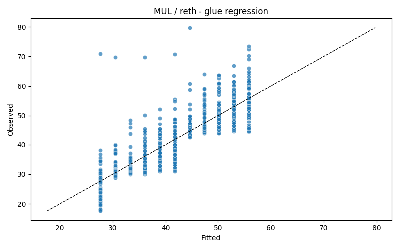

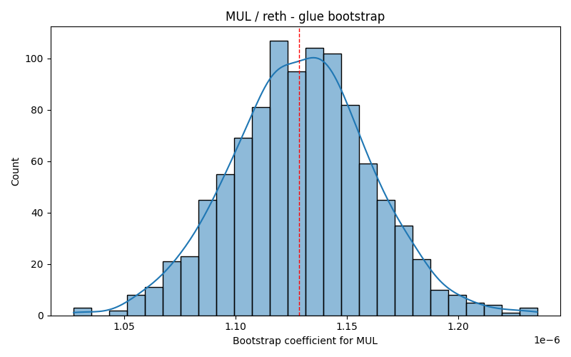

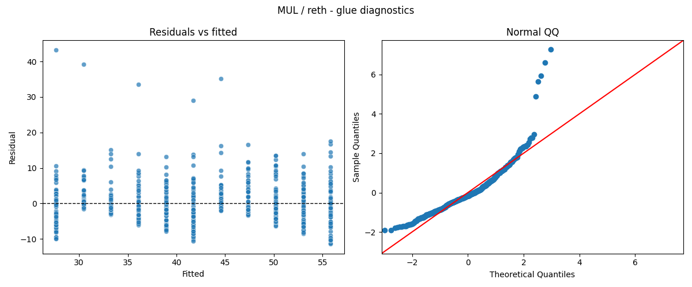

</details>

<details><summary><code>PC</code> · nobs=682 · runtime_ms=6.251e-07 · p=1.00e-03 · R²=0.7545</summary>

```
==============================================================================
                           NNLS Regression Results                            
==============================================================================
Dep. Variable:          test_runtime_ms              R-squared:          0.754
Model:                  NNLS                    Adj. R-squared:          0.754
No. Observations:       682                               RMSE:          10.66
Df Residuals:           680                                MAE:           5.58
Df Model:               1      
==============================================================================
                      coef     std err     P-value      [0.025      0.975]
------------------------------------------------------------------------------
         const     16.5594      1.5986       0.001     13.4871     19.7834
            PC      0.0000      0.0000       0.001      0.0000      0.0000
==============================================================================
Notes: Non-negative least squares with bootstrap inference (1000 iterations)
==============================================================================
```

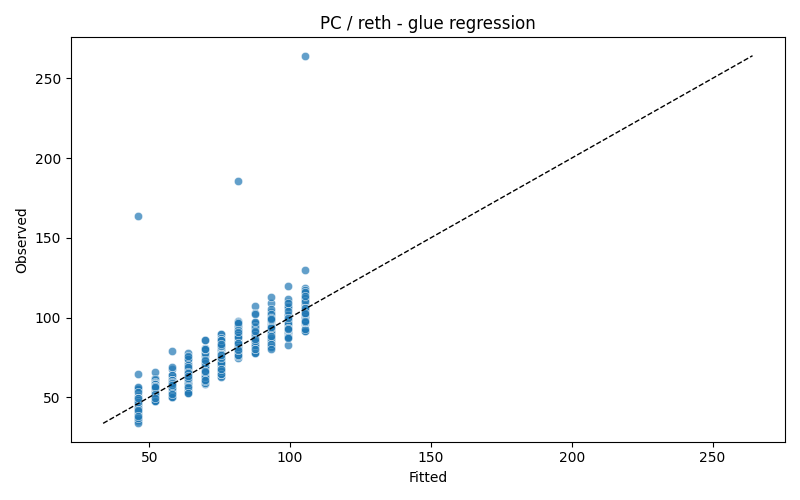

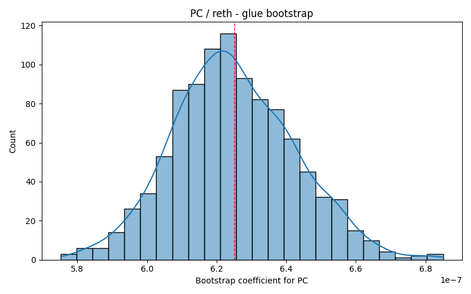

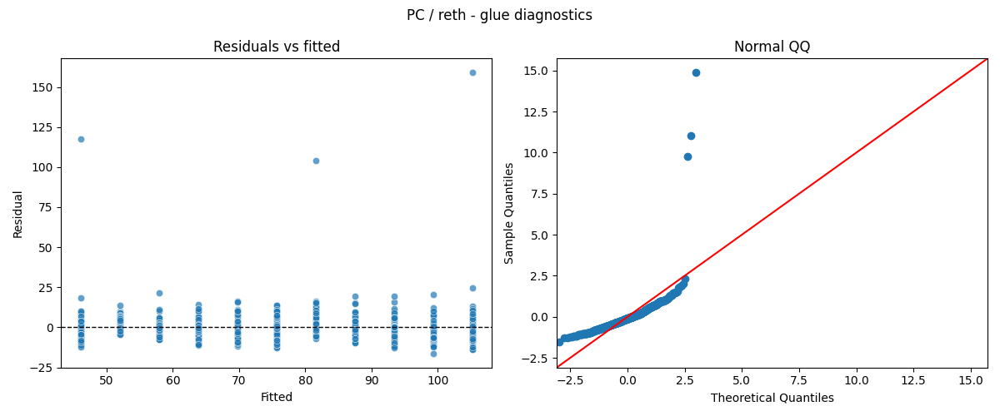

</details>

<details><summary><code>RETURNDATASIZE</code> · nobs=2728 · runtime_ms=8.38e-07 · p=1.00e-03 · R²=0.7248</summary>

```
==============================================================================
                           NNLS Regression Results                            
==============================================================================
Dep. Variable:          test_runtime_ms              R-squared:          0.725
Model:                  NNLS                    Adj. R-squared:          0.725
No. Observations:       2728                              RMSE:           8.15
Df Residuals:           2726                               MAE:           5.34
Df Model:               1      
==============================================================================
                      coef     std err     P-value      [0.025      0.975]
------------------------------------------------------------------------------
         const     17.0350      0.4580       0.001     16.1436     17.9927
RETURNDATASIZE      0.0000      0.0000       0.001      0.0000      0.0000
==============================================================================
Notes: Non-negative least squares with bootstrap inference (1000 iterations)
==============================================================================
```

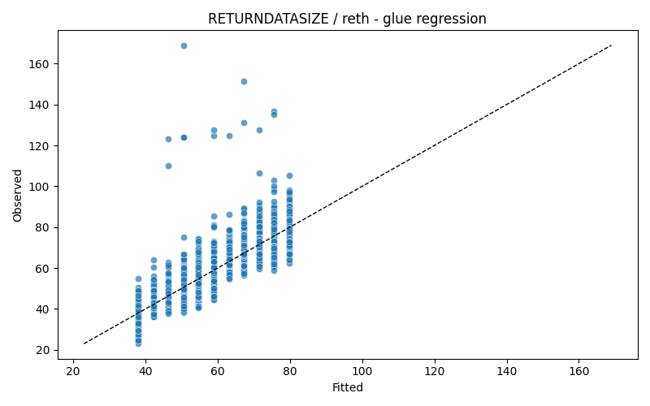

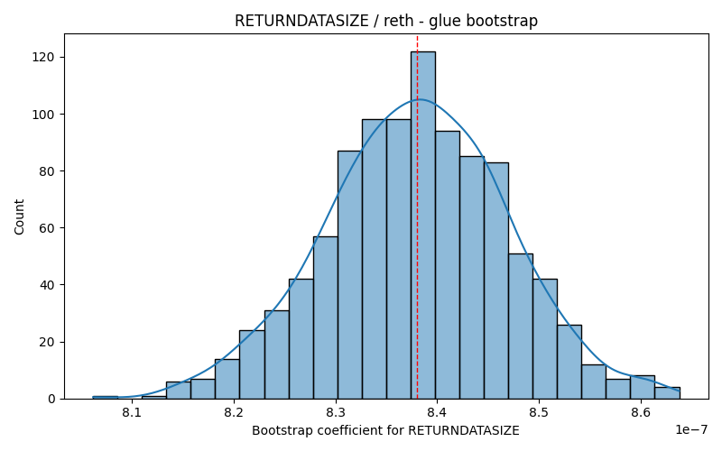

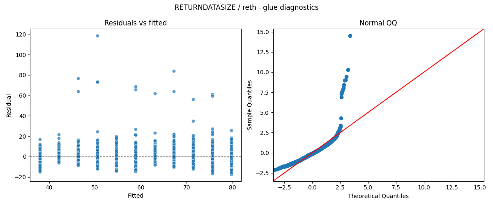

</details>

<details><summary><code>SELFBALANCE</code> · nobs=558 · runtime_ms=3.739e-06 · p=1.00e-03 · R²=0.8038</summary>

```
==============================================================================
                           NNLS Regression Results                            
==============================================================================
Dep. Variable:          test_runtime_ms              R-squared:          0.804
Model:                  NNLS                    Adj. R-squared:          0.803
No. Observations:       558                               RMSE:          18.64
Df Residuals:           556                                MAE:          15.19
Df Model:               1      
==============================================================================
                      coef     std err     P-value      [0.025      0.975]
------------------------------------------------------------------------------
         const     63.4760      2.7356       0.001     57.8115     68.6604
   SELFBALANCE      0.0000      0.0000       0.001      0.0000      0.0000
==============================================================================
Notes: Non-negative least squares with bootstrap inference (1000 iterations)
==============================================================================
```

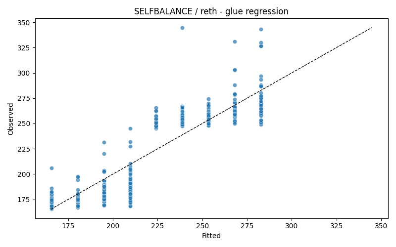

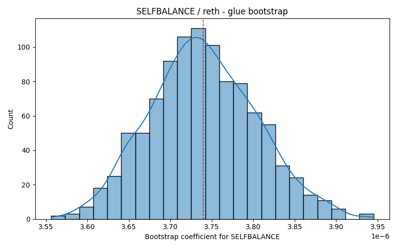

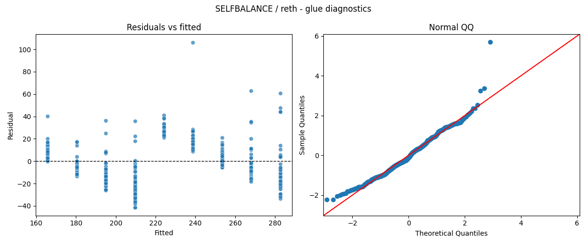

</details>

<details><summary><code>SUB</code> · nobs=682 · runtime_ms=8.527e-07 · p=1.00e-03 · R²=0.7402</summary>

```
==============================================================================
                           NNLS Regression Results                            
==============================================================================
Dep. Variable:          test_runtime_ms              R-squared:          0.740
Model:                  NNLS                    Adj. R-squared:          0.740
No. Observations:       682                               RMSE:           5.32
Df Residuals:           680                                MAE:           4.11
Df Model:               1      
==============================================================================
                      coef     std err     P-value      [0.025      0.975]
------------------------------------------------------------------------------
         const     13.0570      0.6621       0.001     11.8132     14.3027
           SUB      0.0000      0.0000       0.001      0.0000      0.0000
==============================================================================
Notes: Non-negative least squares with bootstrap inference (1000 iterations)
==============================================================================
```

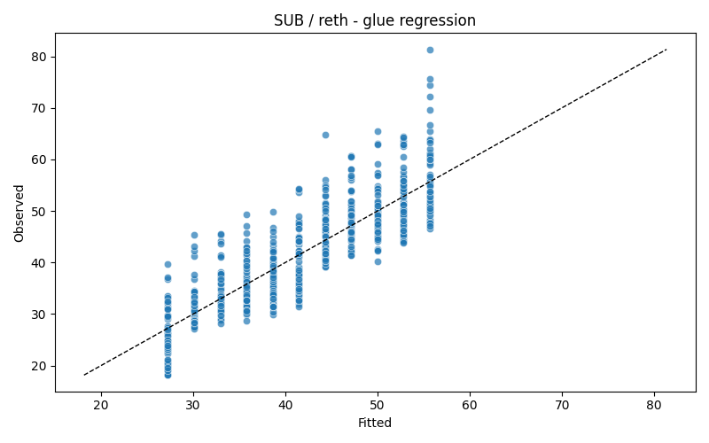

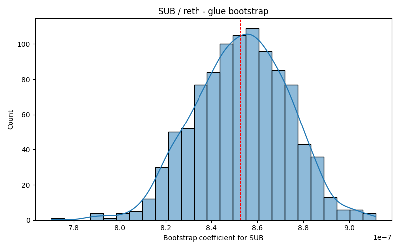

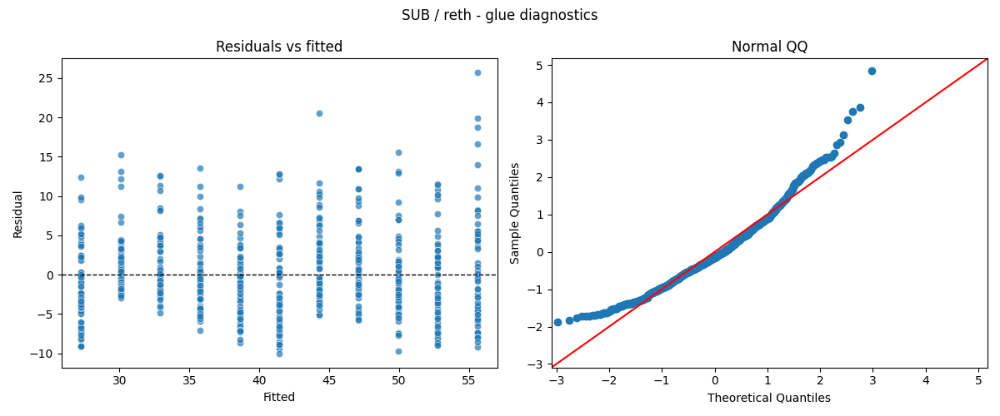

</details>

### Mixed glue (tier B) · reth

<details><summary><code>JUMP</code> · nobs=682 · runtime_ms=2.155e-06 · p=1.00e-03 · R²=0.7139</summary>

```
==============================================================================
                           NNLS Regression Results                            
==============================================================================
Dep. Variable:          test_runtime_ms              R-squared:          0.714
Model:                  NNLS                    Adj. R-squared:          0.714
No. Observations:       682                               RMSE:           5.07
Df Residuals:           680                                MAE:           3.94
Df Model:               1      
==============================================================================
                      coef     std err     P-value      [0.025      0.975]
------------------------------------------------------------------------------
         const     12.8508      0.6070       0.001     11.6032     13.9874
          JUMP      0.0000      0.0000       0.001      0.0000      0.0000
==============================================================================
Notes: Non-negative least squares with bootstrap inference (1000 iterations)
==============================================================================
```

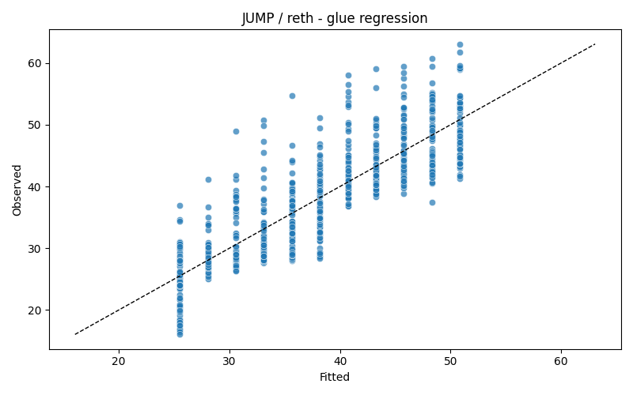

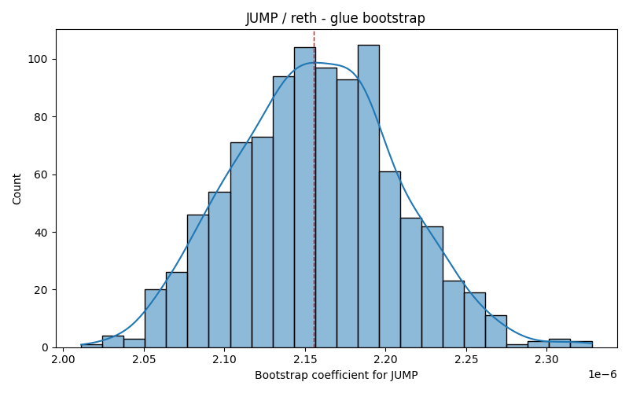

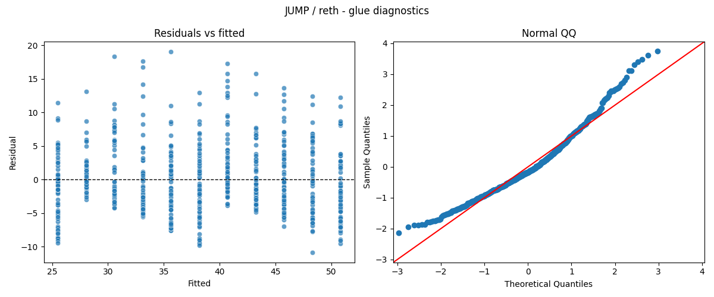

</details>

<details><summary><code>KECCAK256</code> · nobs=10912 · runtime_ms=0 · p=1.00e+00 · R²=0</summary>

```
==============================================================================
                           NNLS Regression Results                            
==============================================================================
Dep. Variable:          test_runtime_ms              R-squared:          0.000
Model:                  NNLS                    Adj. R-squared:         -0.000
No. Observations:       10912                             RMSE:         157.97
Df Residuals:           10910                              MAE:         133.23
Df Model:               1      
==============================================================================
                      coef     std err     P-value      [0.025      0.975]
------------------------------------------------------------------------------
         const    252.0603      1.4950       0.001    249.1446    254.9605
     KECCAK256      0.0000      0.0000       1.000      0.0000      0.0000
==============================================================================
Notes: Non-negative least squares with bootstrap inference (1000 iterations)
==============================================================================
```

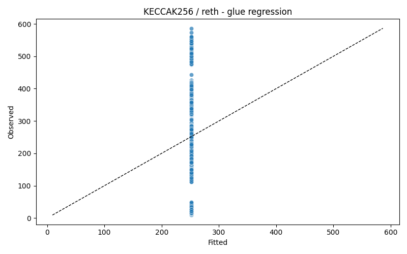


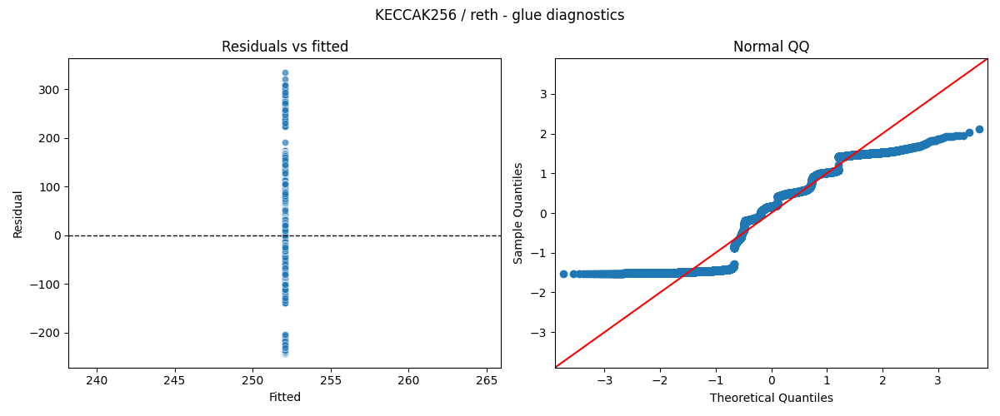

</details>
