# Runtime estimation report

Per-spec NNLS fits of `test_runtime_ms` against `opcount`, one row per (target opcode, test, model_by combo, client).

## Contents

- [SLOAD](#sload)
- [SSTORE](#sstore)
- [BALANCE](#balance)
- [CALL](#call)
- [CALLCODE](#callcode)
- [DELEGATECALL](#delegatecall)
- [EXTCODECOPY](#extcodecopy)
- [EXTCODEHASH](#extcodehash)
- [EXTCODESIZE](#extcodesize)
- [STATICCALL](#staticcall)

## SLOAD

### test_sload_bloated — combo `False`

| client | nobs | R² | target_coef (ms) | p-value | 95% CI |
| --- | --- | --- | --- | --- | --- |
| `besu` | 396 | 0.9437 | 0.00782 | 1.00e-03 | [0.007603, 0.008022] |
| `erigon` | 44 | 0.9983 | 0.006435 | 1.00e-03 | [0.006373, 0.006461] |
| `ethrex` | 308 | 0.9018 | 0.009923 | 1.00e-03 | [0.009773, 0.01007] |
| `geth` | 308 | 0.9709 | 0.02405 | 1.00e-03 | [0.02352, 0.02453] |
| `nethermind` | 253 | 0.8935 | 0.003309 | 1.00e-03 | [0.003172, 0.003438] |
| `reth` | 396 | 0.9505 | 0.00125 | 1.00e-03 | [0.00122, 0.00128] |

<details><summary>besu — NNLS regression summary</summary>

```
==============================================================================
                           NNLS Regression Results                            
==============================================================================
Dep. Variable:          test_runtime_ms              R-squared:          0.944
Model:                  NNLS                    Adj. R-squared:          0.944
No. Observations:       396                               RMSE:          56.23
Df Residuals:           394                                MAE:          47.84
Df Model:               1      
==============================================================================
                      coef     std err     P-value      [0.025      0.975]
------------------------------------------------------------------------------
         const    104.7190      9.4031       0.001     86.8070    123.9295
       opcount      0.0078      0.0001       0.001      0.0076      0.0080
==============================================================================
Notes: Non-negative least squares with bootstrap inference (1000 iterations)
==============================================================================
```

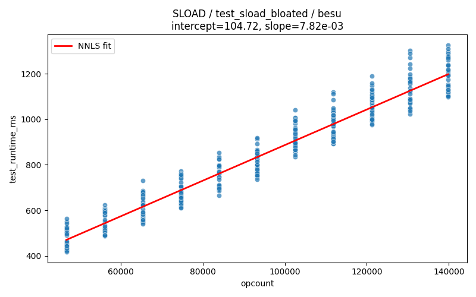

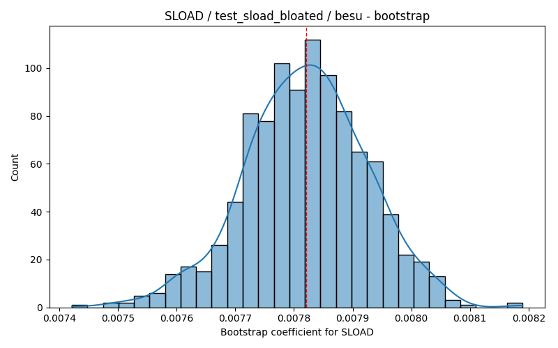

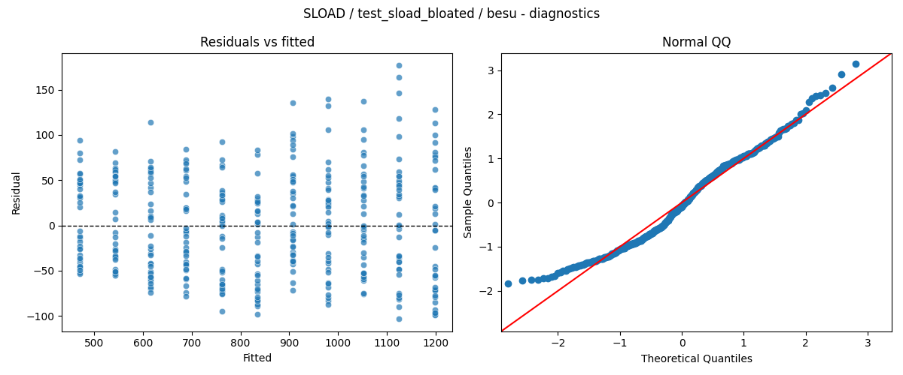

</details>

<details><summary>erigon — NNLS regression summary</summary>

```
==============================================================================
                           NNLS Regression Results                            
==============================================================================
Dep. Variable:          test_runtime_ms              R-squared:          0.998
Model:                  NNLS                    Adj. R-squared:          0.998
No. Observations:       44                                RMSE:           7.73
Df Residuals:           42                                 MAE:           5.47
Df Model:               1      
==============================================================================
                      coef     std err     P-value      [0.025      0.975]
------------------------------------------------------------------------------
         const      0.0000      1.4607       1.000      0.0000      5.1131
       opcount      0.0064      0.0000       0.001      0.0064      0.0065
==============================================================================
Notes: Non-negative least squares with bootstrap inference (1000 iterations)
==============================================================================
```


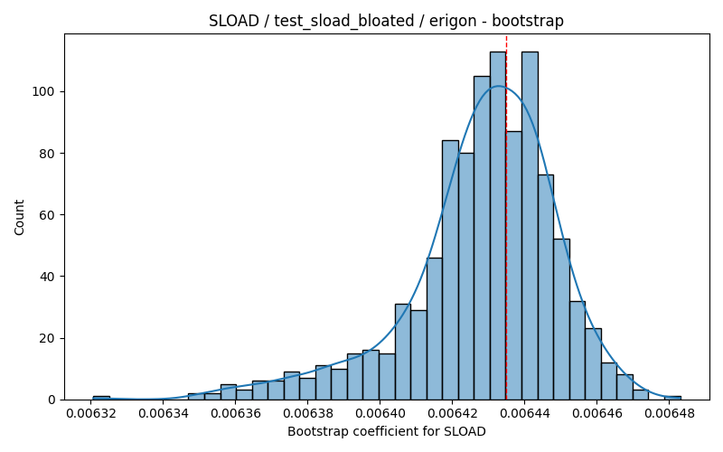

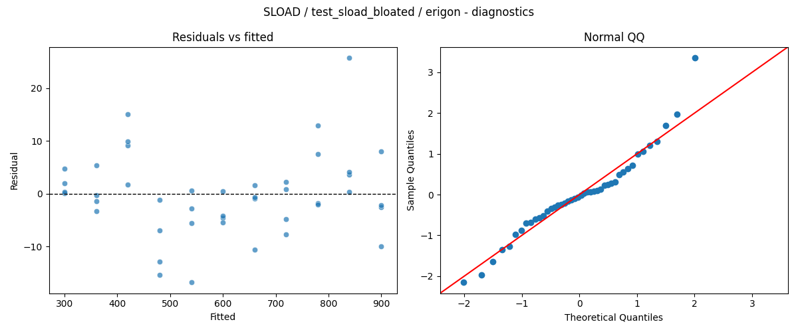

</details>

<details><summary>ethrex — NNLS regression summary</summary>

```
==============================================================================
                           NNLS Regression Results                            
==============================================================================
Dep. Variable:          test_runtime_ms              R-squared:          0.902
Model:                  NNLS                    Adj. R-squared:          0.902
No. Observations:       308                               RMSE:         125.06
Df Residuals:           306                                MAE:         105.87
Df Model:               1      
==============================================================================
                      coef     std err     P-value      [0.025      0.975]
------------------------------------------------------------------------------
         const      0.0000      0.0000       1.000      0.0000      0.0000
       opcount      0.0099      0.0001       0.001      0.0098      0.0101
==============================================================================
Notes: Non-negative least squares with bootstrap inference (1000 iterations)
==============================================================================
```

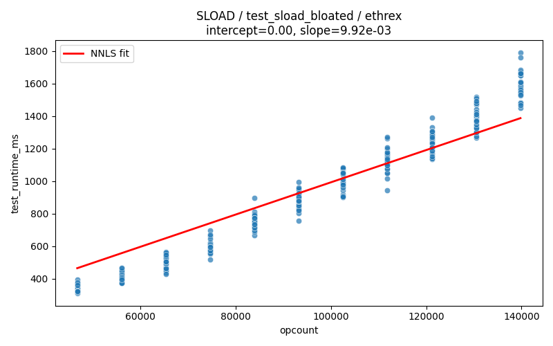

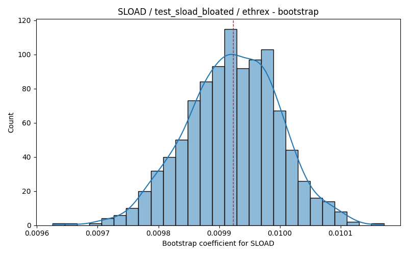

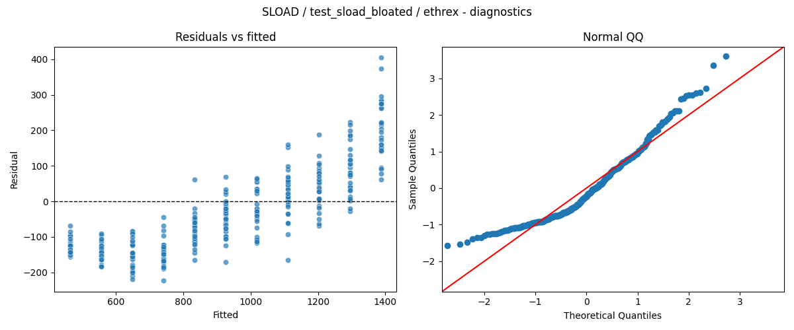

</details>

<details><summary>geth — NNLS regression summary</summary>

```
==============================================================================
                           NNLS Regression Results                            
==============================================================================
Dep. Variable:          test_runtime_ms              R-squared:          0.971
Model:                  NNLS                    Adj. R-squared:          0.971
No. Observations:       308                               RMSE:         122.42
Df Residuals:           306                                MAE:          97.43
Df Model:               1      
==============================================================================
                      coef     std err     P-value      [0.025      0.975]
------------------------------------------------------------------------------
         const    545.5609     22.4536       0.001    503.0136    591.4729
       opcount      0.0240      0.0003       0.001      0.0235      0.0245
==============================================================================
Notes: Non-negative least squares with bootstrap inference (1000 iterations)
==============================================================================
```


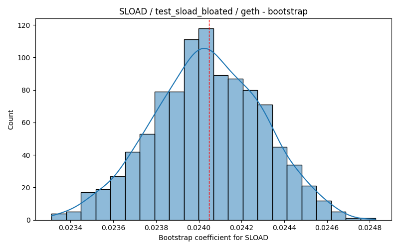

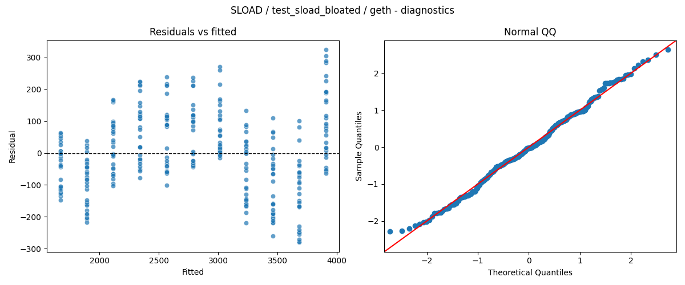

</details>

<details><summary>nethermind — NNLS regression summary</summary>

```
==============================================================================
                           NNLS Regression Results                            
==============================================================================
Dep. Variable:          test_runtime_ms              R-squared:          0.894
Model:                  NNLS                    Adj. R-squared:          0.893
No. Observations:       253                               RMSE:          33.62
Df Residuals:           251                                MAE:          27.25
Df Model:               1      
==============================================================================
                      coef     std err     P-value      [0.025      0.975]
------------------------------------------------------------------------------
         const     57.6416      5.9767       0.001     45.8773     69.6403
       opcount      0.0033      0.0001       0.001      0.0032      0.0034
==============================================================================
Notes: Non-negative least squares with bootstrap inference (1000 iterations)
==============================================================================
```

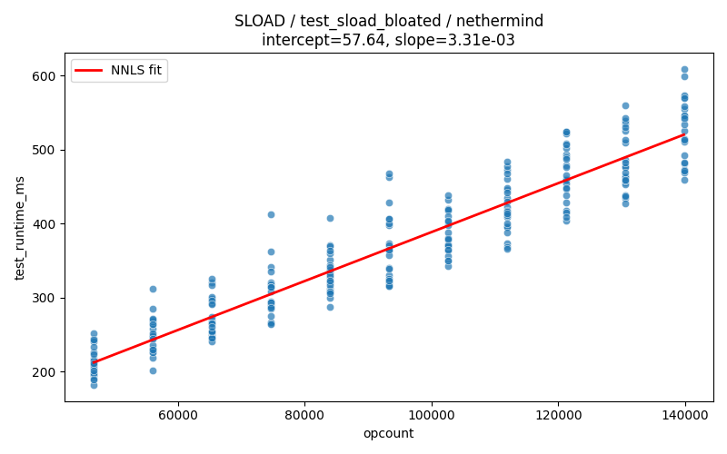

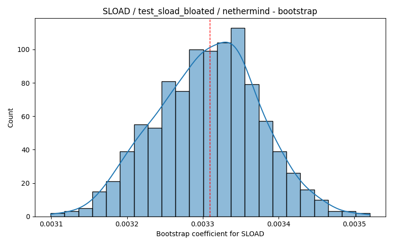

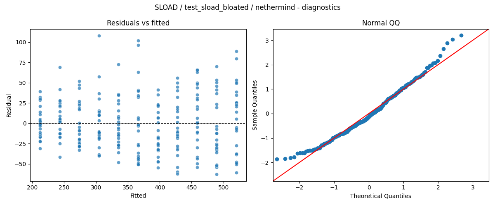

</details>

<details><summary>reth — NNLS regression summary</summary>

```
==============================================================================
                           NNLS Regression Results                            
==============================================================================
Dep. Variable:          test_runtime_ms              R-squared:          0.951
Model:                  NNLS                    Adj. R-squared:          0.950
No. Observations:       396                               RMSE:           8.39
Df Residuals:           394                                MAE:           6.63
Df Model:               1      
==============================================================================
                      coef     std err     P-value      [0.025      0.975]
------------------------------------------------------------------------------
         const     37.4216      1.4223       0.001     34.4653     40.1791
       opcount      0.0012      0.0000       0.001      0.0012      0.0013
==============================================================================
Notes: Non-negative least squares with bootstrap inference (1000 iterations)
==============================================================================
```

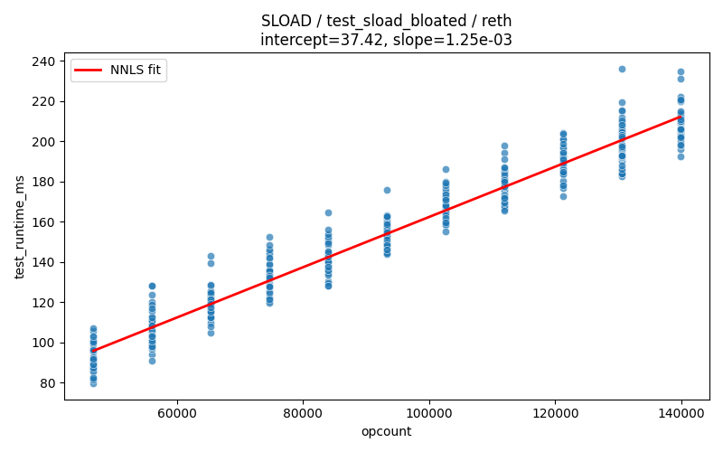

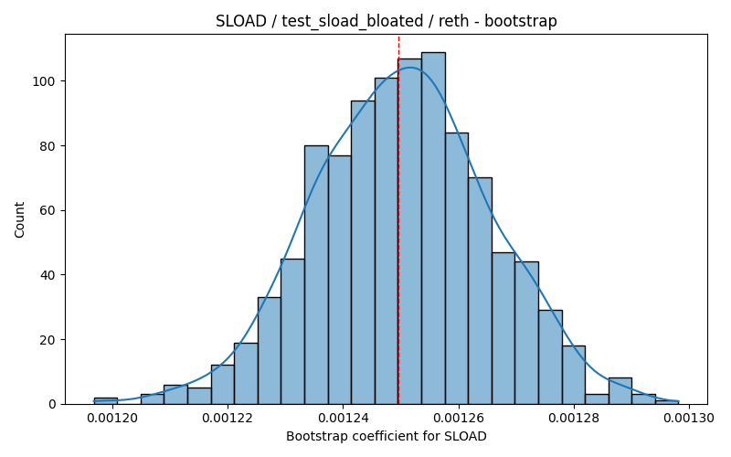

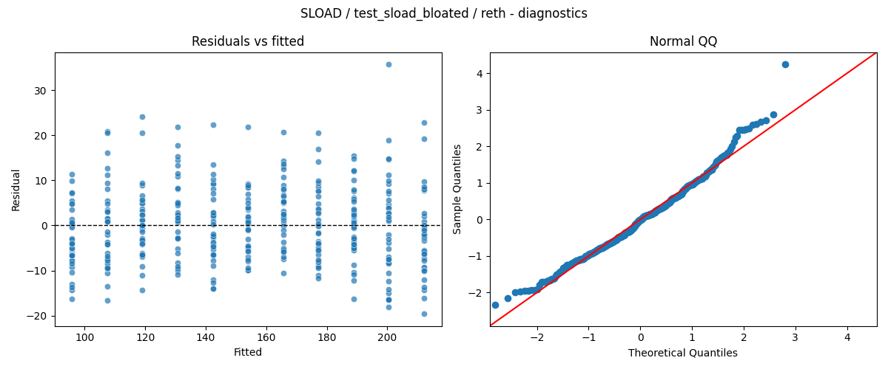

</details>

### test_sload_bloated — combo `True`

| client | nobs | R² | target_coef (ms) | p-value | 95% CI |
| --- | --- | --- | --- | --- | --- |
| `besu` | 396 | 0.9868 | 0.01488 | 1.00e-03 | [0.01472, 0.01505] |
| `erigon` | 44 | 0.9959 | 0.006294 | 1.00e-03 | [0.00623, 0.006328] |
| `ethrex` | 308 | 0.9456 | 0.01412 | 1.00e-03 | [0.01398, 0.01427] |
| `geth` | 308 | 0.9664 | 0.02358 | 1.00e-03 | [0.02307, 0.02412] |
| `nethermind` | 253 | 0.9728 | 0.008881 | 1.00e-03 | [0.008697, 0.009072] |
| `reth` | 396 | 0.951 | 0.001435 | 1.00e-03 | [0.001404, 0.001467] |

<details><summary>besu — NNLS regression summary</summary>

```
==============================================================================
                           NNLS Regression Results                            
==============================================================================
Dep. Variable:          test_runtime_ms              R-squared:          0.987
Model:                  NNLS                    Adj. R-squared:          0.987
No. Observations:       396                               RMSE:          50.63
Df Residuals:           394                                MAE:          38.34
Df Model:               1      
==============================================================================
                      coef     std err     P-value      [0.025      0.975]
------------------------------------------------------------------------------
         const    324.5346      7.3991       0.001    309.9615    339.3982
       opcount      0.0149      0.0001       0.001      0.0147      0.0150
==============================================================================
Notes: Non-negative least squares with bootstrap inference (1000 iterations)
==============================================================================
```

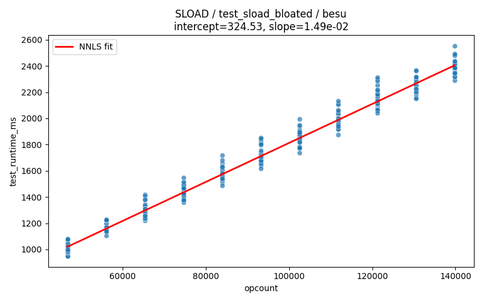

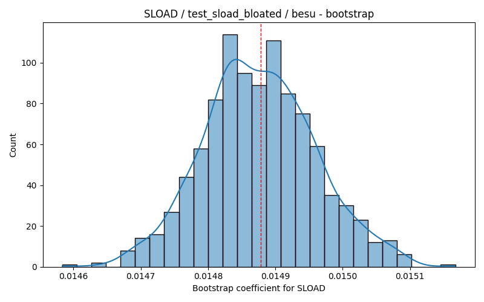

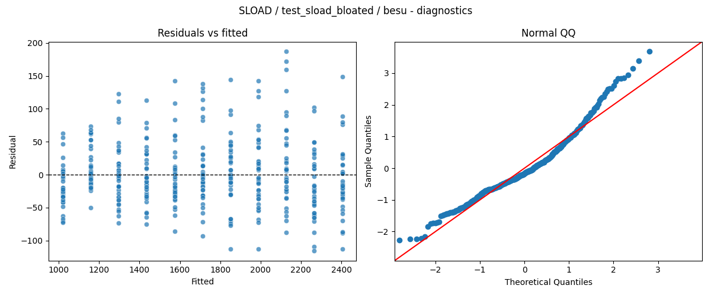

</details>

<details><summary>erigon — NNLS regression summary</summary>

```
==============================================================================
                           NNLS Regression Results                            
==============================================================================
Dep. Variable:          test_runtime_ms              R-squared:          0.996
Model:                  NNLS                    Adj. R-squared:          0.996
No. Observations:       44                                RMSE:          12.01
Df Residuals:           42                                 MAE:           8.07
Df Model:               1      
==============================================================================
                      coef     std err     P-value      [0.025      0.975]
------------------------------------------------------------------------------
         const      0.0000      2.0734       1.000      0.0000      7.0932
       opcount      0.0063      0.0000       0.001      0.0062      0.0063
==============================================================================
Notes: Non-negative least squares with bootstrap inference (1000 iterations)
==============================================================================
```

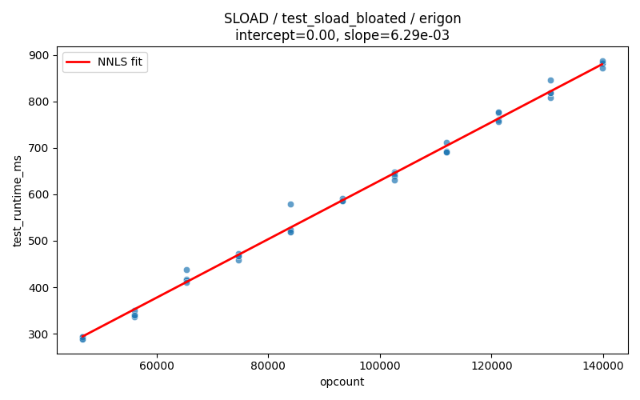

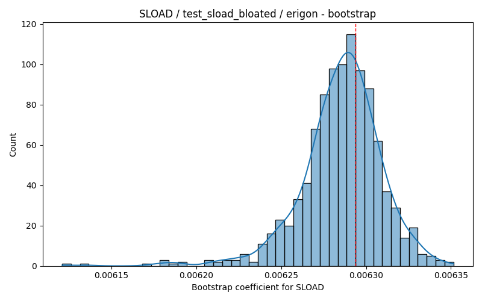

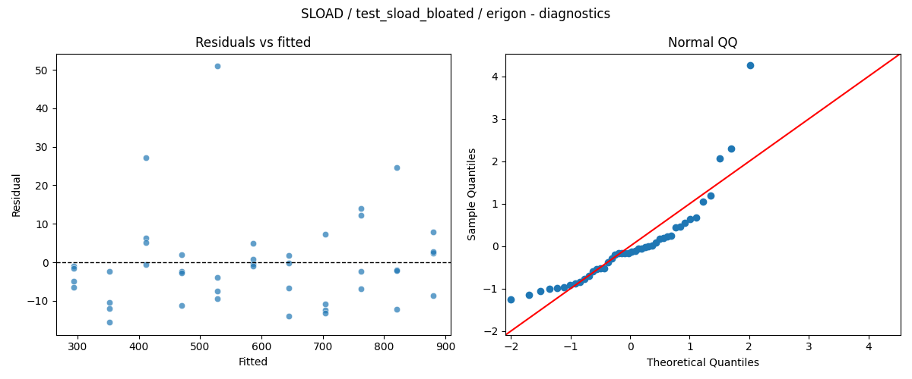

</details>

<details><summary>ethrex — NNLS regression summary</summary>

```
==============================================================================
                           NNLS Regression Results                            
==============================================================================
Dep. Variable:          test_runtime_ms              R-squared:          0.946
Model:                  NNLS                    Adj. R-squared:          0.945
No. Observations:       308                               RMSE:         120.41
Df Residuals:           306                                MAE:         105.21
Df Model:               1      
==============================================================================
                      coef     std err     P-value      [0.025      0.975]
------------------------------------------------------------------------------
         const      0.0000      0.0000       1.000      0.0000      0.0000
       opcount      0.0141      0.0001       0.001      0.0140      0.0143
==============================================================================
Notes: Non-negative least squares with bootstrap inference (1000 iterations)
==============================================================================
```

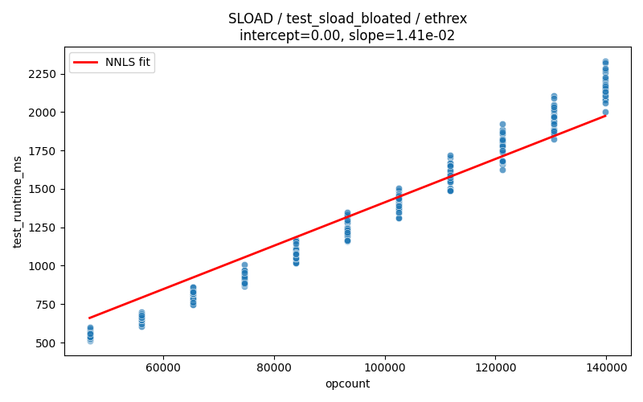

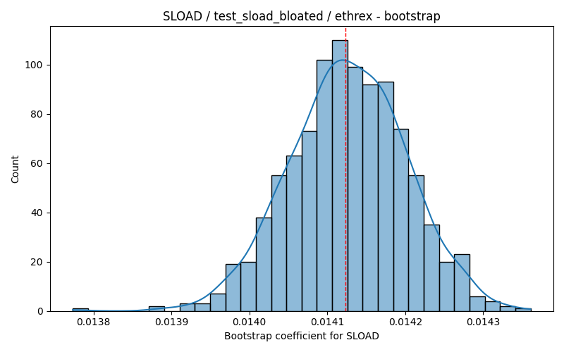

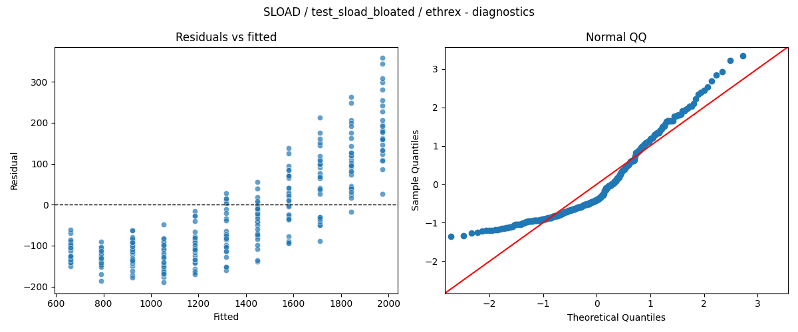

</details>

<details><summary>geth — NNLS regression summary</summary>

```
==============================================================================
                           NNLS Regression Results                            
==============================================================================
Dep. Variable:          test_runtime_ms              R-squared:          0.966
Model:                  NNLS                    Adj. R-squared:          0.966
No. Observations:       308                               RMSE:         129.47
Df Residuals:           306                                MAE:         104.26
Df Model:               1      
==============================================================================
                      coef     std err     P-value      [0.025      0.975]
------------------------------------------------------------------------------
         const    505.0366     23.3714       0.001    458.1572    551.5954
       opcount      0.0236      0.0003       0.001      0.0231      0.0241
==============================================================================
Notes: Non-negative least squares with bootstrap inference (1000 iterations)
==============================================================================
```

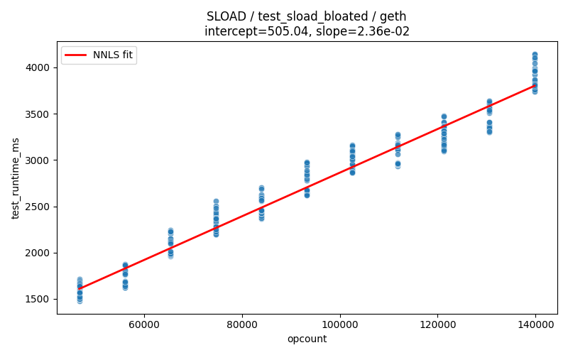

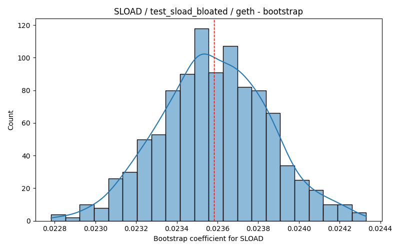

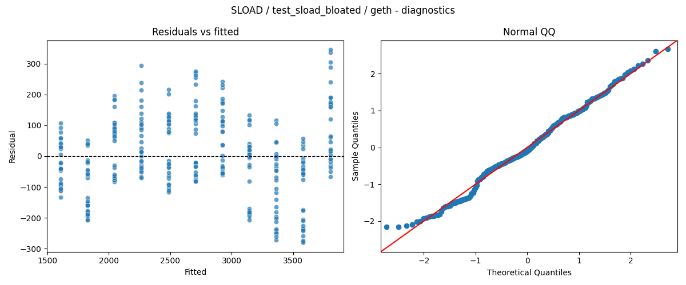

</details>

<details><summary>nethermind — NNLS regression summary</summary>

```
==============================================================================
                           NNLS Regression Results                            
==============================================================================
Dep. Variable:          test_runtime_ms              R-squared:          0.973
Model:                  NNLS                    Adj. R-squared:          0.973
No. Observations:       253                               RMSE:          43.69
Df Residuals:           251                                MAE:          35.17
Df Model:               1      
==============================================================================
                      coef     std err     P-value      [0.025      0.975]
------------------------------------------------------------------------------
         const    108.2867      8.6777       0.001     90.9832    124.7739
       opcount      0.0089      0.0001       0.001      0.0087      0.0091
==============================================================================
Notes: Non-negative least squares with bootstrap inference (1000 iterations)
==============================================================================
```


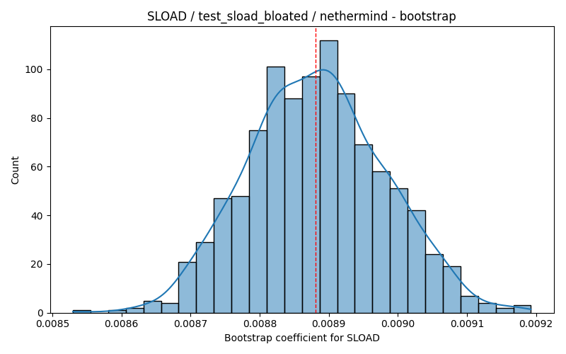

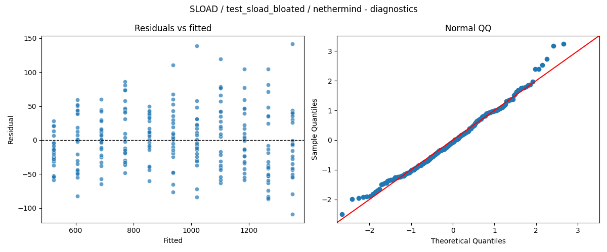

</details>

<details><summary>reth — NNLS regression summary</summary>

```
==============================================================================
                           NNLS Regression Results                            
==============================================================================
Dep. Variable:          test_runtime_ms              R-squared:          0.951
Model:                  NNLS                    Adj. R-squared:          0.951
No. Observations:       396                               RMSE:           9.58
Df Residuals:           394                                MAE:           7.76
Df Model:               1      
==============================================================================
                      coef     std err     P-value      [0.025      0.975]
------------------------------------------------------------------------------
         const     31.8461      1.4953       0.001     29.0781     34.8119
       opcount      0.0014      0.0000       0.001      0.0014      0.0015
==============================================================================
Notes: Non-negative least squares with bootstrap inference (1000 iterations)
==============================================================================
```

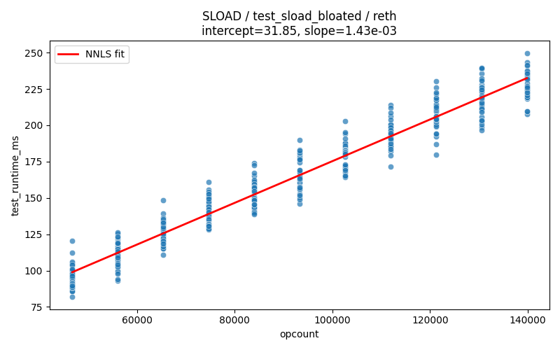

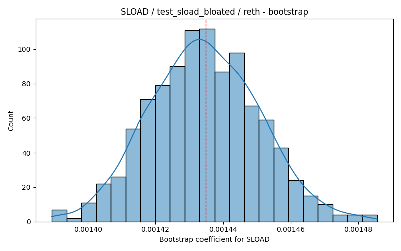

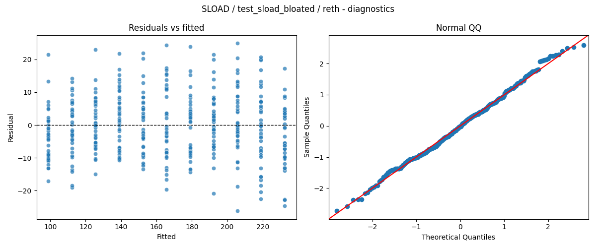

</details>

### test_storage_sload_same_key_benchmark

| client | nobs | R² | target_coef (ms) | p-value | 95% CI |
| --- | --- | --- | --- | --- | --- |
| `besu` | 792 | 0.7171 | 0.0002439 | 1.00e-03 | [0.0002335, 0.0002548] |
| `erigon` | 88 | 0.9054 | 4.733e-05 | 1.00e-03 | [4.401e-05, 5.108e-05] |
| `ethrex` | 616 | 0.6878 | 2.214e-05 | 1.00e-03 | [2.087e-05, 2.348e-05] |
| `geth` | 616 | 0.7864 | 4.274e-05 | 1.00e-03 | [4.096e-05, 4.466e-05] |
| `nethermind` | 506 | 0.7858 | 0.0001522 | 1.00e-03 | [0.0001452, 0.0001587] |
| `reth` | 792 | 0.4412 | 8.114e-06 | 1.00e-03 | [7.38e-06, 8.898e-06] |

<details><summary>besu — NNLS regression summary</summary>

```
==============================================================================
                           NNLS Regression Results                            
==============================================================================
Dep. Variable:          test_runtime_ms              R-squared:          0.717
Model:                  NNLS                    Adj. R-squared:          0.717
No. Observations:       792                               RMSE:          96.75
Df Residuals:           790                                MAE:          78.24
Df Model:               1      
==============================================================================
                      coef     std err     P-value      [0.025      0.975]
------------------------------------------------------------------------------
         const    326.1454     11.1123       0.001    304.7882    348.8245
       opcount      0.0002      0.0000       0.001      0.0002      0.0003
==============================================================================
Notes: Non-negative least squares with bootstrap inference (1000 iterations)
==============================================================================
```

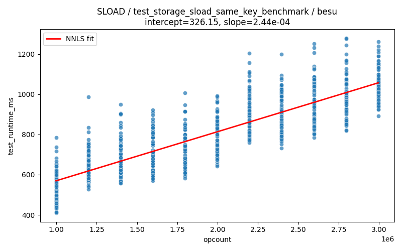

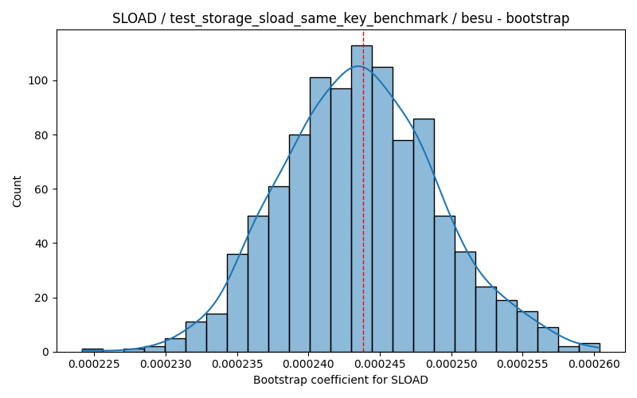

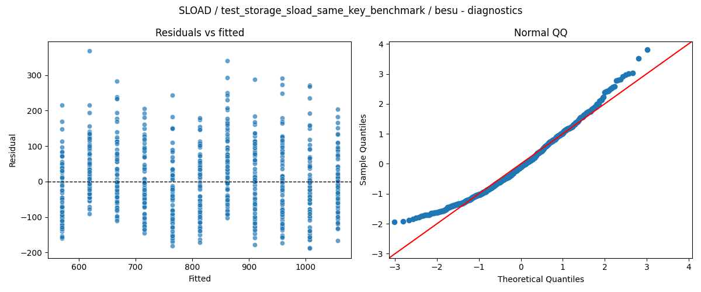

</details>

<details><summary>erigon — NNLS regression summary</summary>

```
==============================================================================
                           NNLS Regression Results                            
==============================================================================
Dep. Variable:          test_runtime_ms              R-squared:          0.905
Model:                  NNLS                    Adj. R-squared:          0.904
No. Observations:       88                                RMSE:           9.66
Df Residuals:           86                                 MAE:           6.19
Df Model:               1      
==============================================================================
                      coef     std err     P-value      [0.025      0.975]
------------------------------------------------------------------------------
         const     18.8214      3.1270       0.001     12.9989     24.5924
       opcount      0.0000      0.0000       0.001      0.0000      0.0001
==============================================================================
Notes: Non-negative least squares with bootstrap inference (1000 iterations)
==============================================================================
```

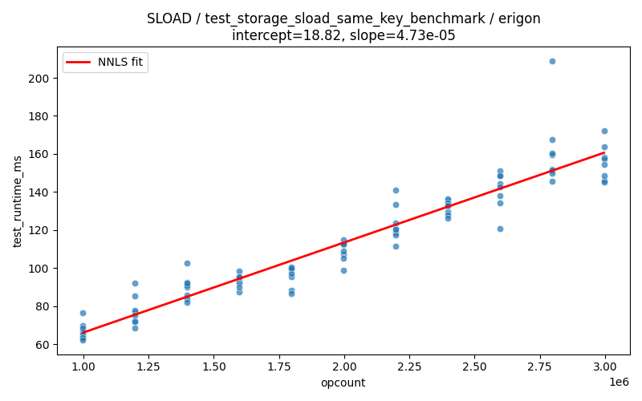

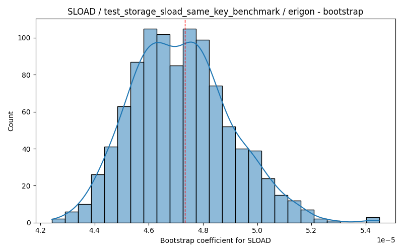

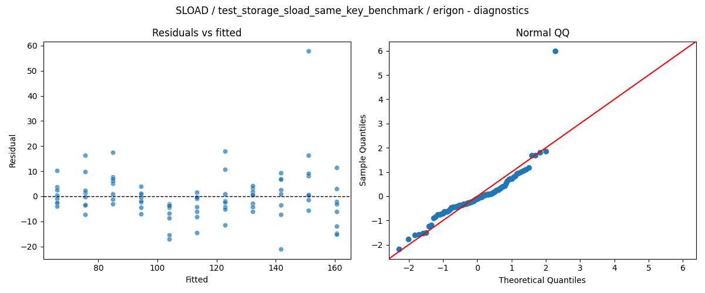

</details>

<details><summary>ethrex — NNLS regression summary</summary>

```
==============================================================================
                           NNLS Regression Results                            
==============================================================================
Dep. Variable:          test_runtime_ms              R-squared:          0.688
Model:                  NNLS                    Adj. R-squared:          0.687
No. Observations:       616                               RMSE:           9.42
Df Residuals:           614                                MAE:           7.09
Df Model:               1      
==============================================================================
                      coef     std err     P-value      [0.025      0.975]
------------------------------------------------------------------------------
         const     19.6220      1.4744       0.001     16.7706     22.5174
       opcount      0.0000      0.0000       0.001      0.0000      0.0000
==============================================================================
Notes: Non-negative least squares with bootstrap inference (1000 iterations)
==============================================================================
```

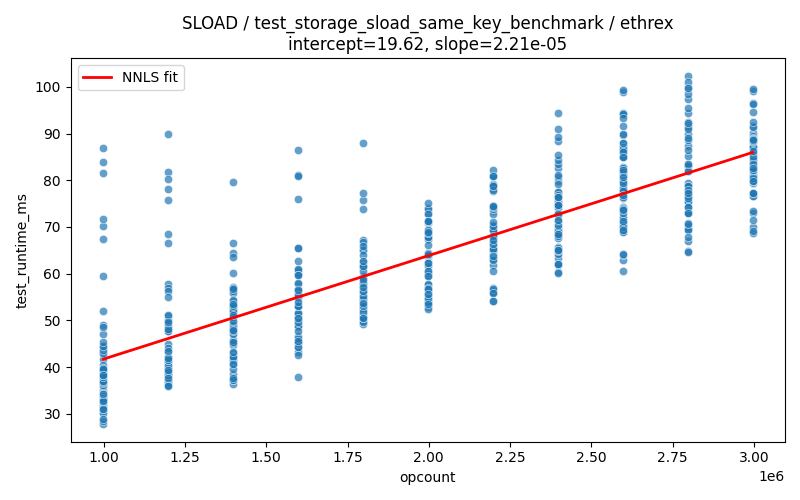

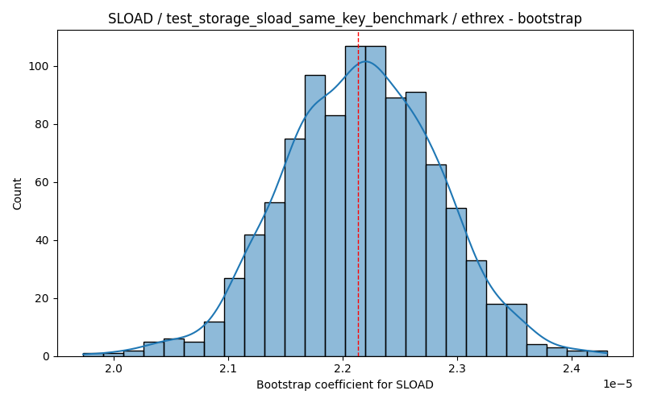

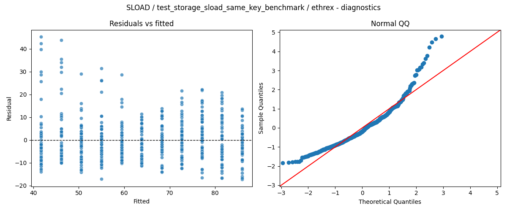

</details>

<details><summary>geth — NNLS regression summary</summary>

```
==============================================================================
                           NNLS Regression Results                            
==============================================================================
Dep. Variable:          test_runtime_ms              R-squared:          0.786
Model:                  NNLS                    Adj. R-squared:          0.786
No. Observations:       616                               RMSE:          14.07
Df Residuals:           614                                MAE:          11.06
Df Model:               1      
==============================================================================
                      coef     std err     P-value      [0.025      0.975]
------------------------------------------------------------------------------
         const     28.8768      1.7233       0.001     25.5695     32.1784
       opcount      0.0000      0.0000       0.001      0.0000      0.0000
==============================================================================
Notes: Non-negative least squares with bootstrap inference (1000 iterations)
==============================================================================
```

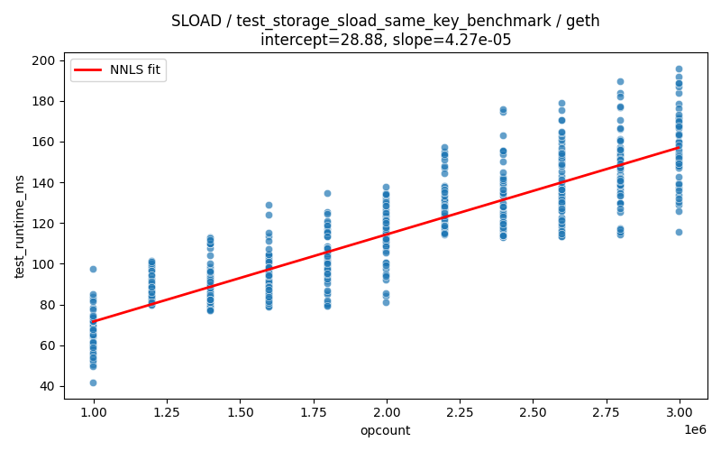

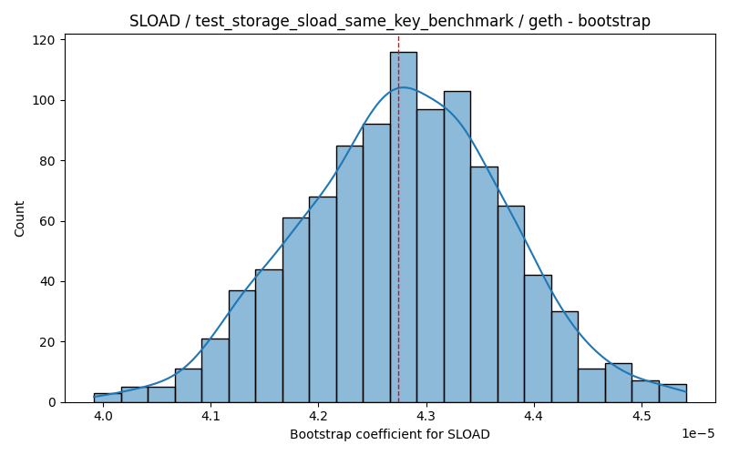

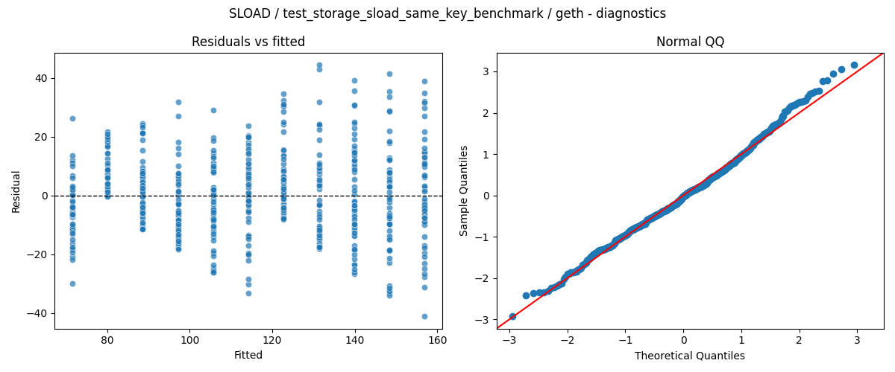

</details>

<details><summary>nethermind — NNLS regression summary</summary>

```
==============================================================================
                           NNLS Regression Results                            
==============================================================================
Dep. Variable:          test_runtime_ms              R-squared:          0.786
Model:                  NNLS                    Adj. R-squared:          0.785
No. Observations:       506                               RMSE:          50.19
Df Residuals:           504                                MAE:          37.69
Df Model:               1      
==============================================================================
                      coef     std err     P-value      [0.025      0.975]
------------------------------------------------------------------------------
         const    107.0574      6.9816       0.001     93.3523    120.9087
       opcount      0.0002      0.0000       0.001      0.0001      0.0002
==============================================================================
Notes: Non-negative least squares with bootstrap inference (1000 iterations)
==============================================================================
```

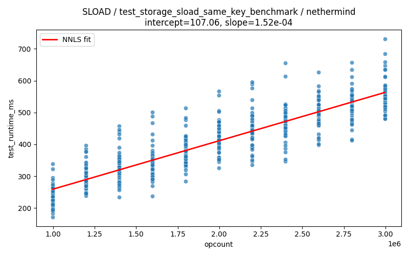

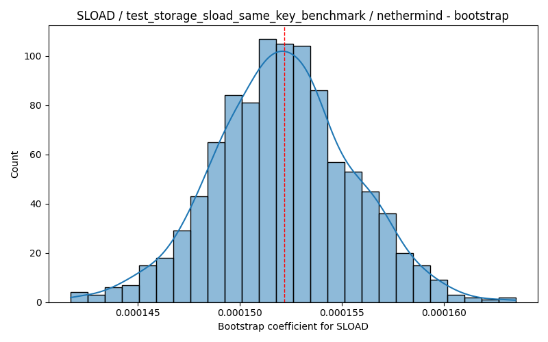

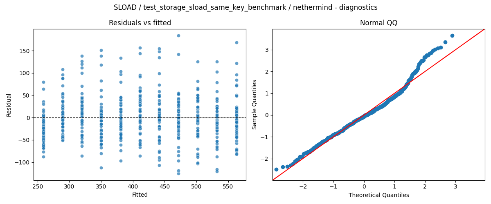

</details>

<details><summary>reth — NNLS regression summary</summary>

```
==============================================================================
                           NNLS Regression Results                            
==============================================================================
Dep. Variable:          test_runtime_ms              R-squared:          0.441
Model:                  NNLS                    Adj. R-squared:          0.440
No. Observations:       792                               RMSE:           5.77
Df Residuals:           790                                MAE:           3.60
Df Model:               1      
==============================================================================
                      coef     std err     P-value      [0.025      0.975]
------------------------------------------------------------------------------
         const      7.6206      0.6619       0.001      6.2502      8.9024
       opcount      0.0000      0.0000       0.001      0.0000      0.0000
==============================================================================
Notes: Non-negative least squares with bootstrap inference (1000 iterations)
==============================================================================
```

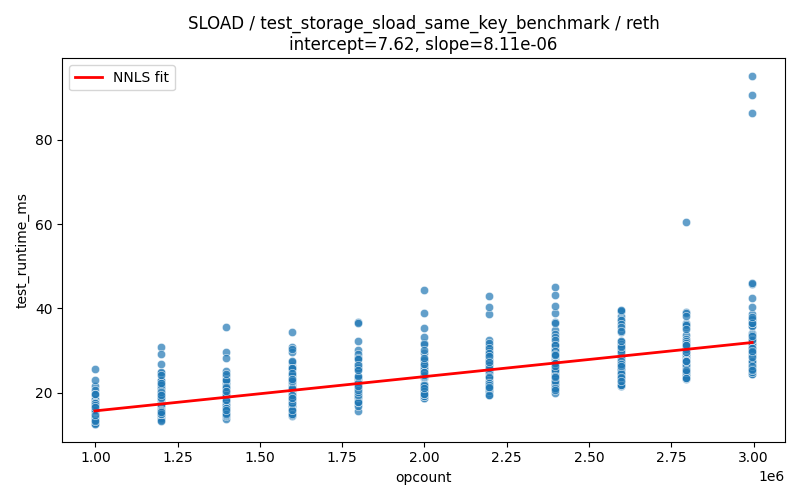

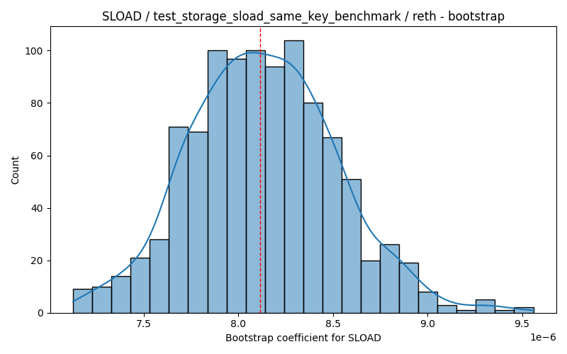

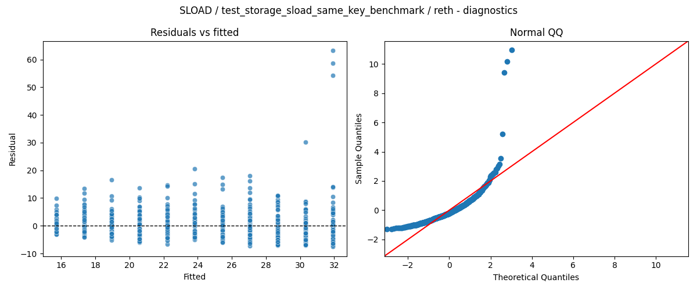

</details>

## SSTORE

### test_sstore_bloated — combo `False` — `presets[cold_storage_sstore_access]`

| client | nobs | R² | target_coef (ms) | p-value | 95% CI |
| --- | --- | --- | --- | --- | --- |
| `besu` | 396 | 0.6989 | 0.008002 | 1.00e-03 | [0.007513, 0.008538] |
| `erigon` | 44 | 0.9978 | 0.006396 | 1.00e-03 | [0.006359, 0.00643] |
| `ethrex` | 308 | 0.9349 | 0.01041 | 1.00e-03 | [0.01029, 0.01053] |
| `geth` | 308 | 0.973 | 0.0239 | 1.00e-03 | [0.02343, 0.02434] |
| `nethermind` | 253 | 0.9007 | 0.003305 | 1.00e-03 | [0.00317, 0.003449] |
| `reth` | 396 | 0.9539 | 0.001268 | 1.00e-03 | [0.001242, 0.001296] |

<details><summary>besu — NNLS regression summary</summary>

```
==============================================================================
                           NNLS Regression Results                            
==============================================================================
Dep. Variable:          test_runtime_ms              R-squared:          0.699
Model:                  NNLS                    Adj. R-squared:          0.698
No. Observations:       396                               RMSE:         148.44
Df Residuals:           394                                MAE:         118.23
Df Model:               1      
==============================================================================
                      coef     std err     P-value      [0.025      0.975]
------------------------------------------------------------------------------
         const    431.6657     23.7733       0.001    382.0215    476.5589
       opcount      0.0080      0.0003       0.001      0.0075      0.0085
==============================================================================
Notes: Non-negative least squares with bootstrap inference (1000 iterations)
==============================================================================
```

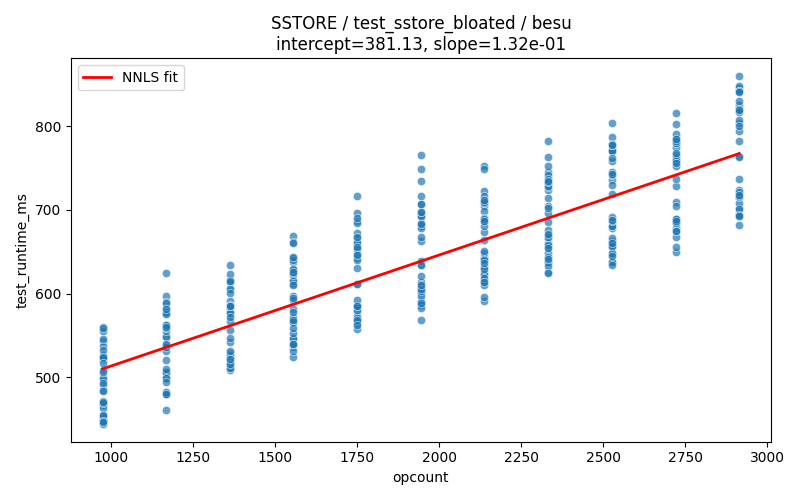

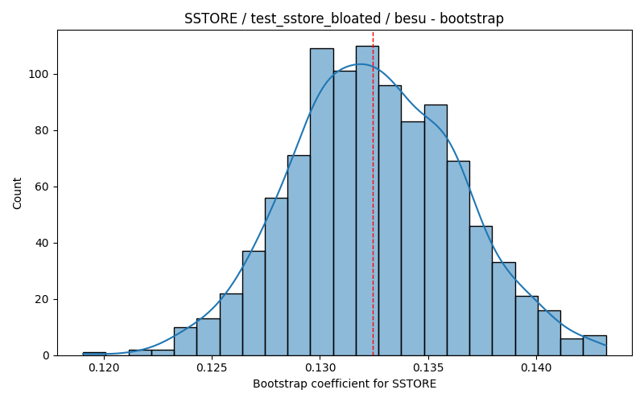

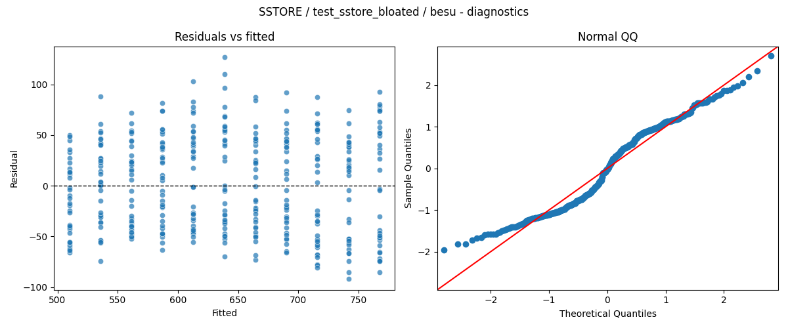

</details>

<details><summary>erigon — NNLS regression summary</summary>

```
==============================================================================
                           NNLS Regression Results                            
==============================================================================
Dep. Variable:          test_runtime_ms              R-squared:          0.998
Model:                  NNLS                    Adj. R-squared:          0.998
No. Observations:       44                                RMSE:           8.57
Df Residuals:           42                                 MAE:           6.55
Df Model:               1      
==============================================================================
                      coef     std err     P-value      [0.025      0.975]
------------------------------------------------------------------------------
         const      0.0000      0.6150       1.000      0.0000      1.1117
       opcount      0.0064      0.0000       0.001      0.0064      0.0064
==============================================================================
Notes: Non-negative least squares with bootstrap inference (1000 iterations)
==============================================================================
```

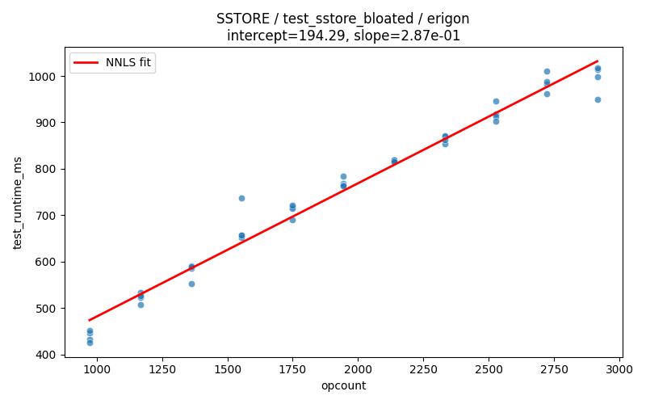

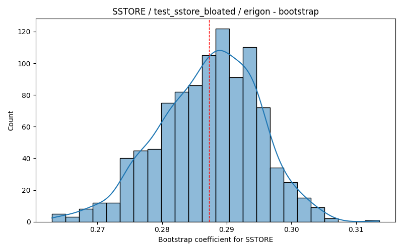

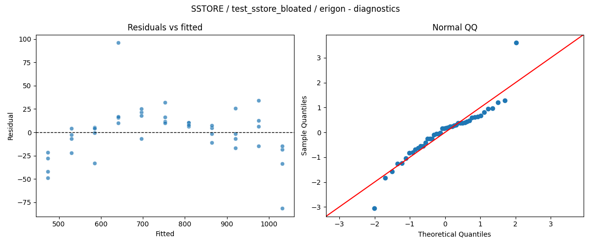

</details>

<details><summary>ethrex — NNLS regression summary</summary>

```
==============================================================================
                           NNLS Regression Results                            
==============================================================================
Dep. Variable:          test_runtime_ms              R-squared:          0.935
Model:                  NNLS                    Adj. R-squared:          0.935
No. Observations:       308                               RMSE:          94.83
Df Residuals:           306                                MAE:          82.08
Df Model:               1      
==============================================================================
                      coef     std err     P-value      [0.025      0.975]
------------------------------------------------------------------------------
         const      0.0000      0.0000       1.000      0.0000      0.0000
       opcount      0.0104      0.0001       0.001      0.0103      0.0105
==============================================================================
Notes: Non-negative least squares with bootstrap inference (1000 iterations)
==============================================================================
```

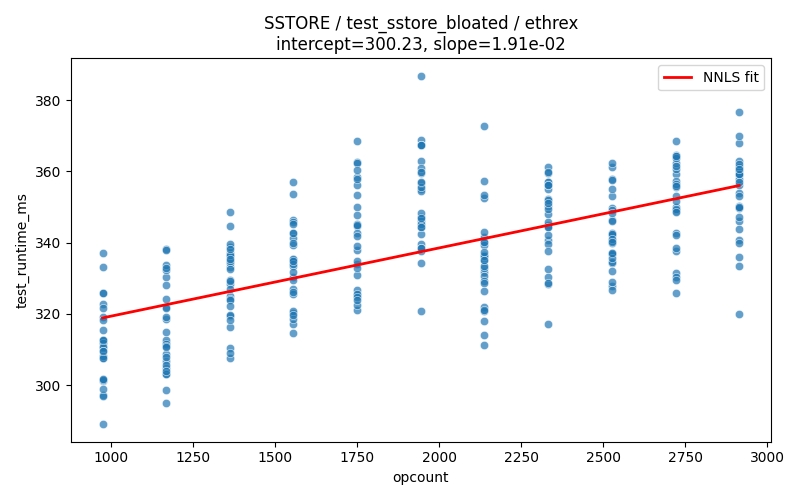

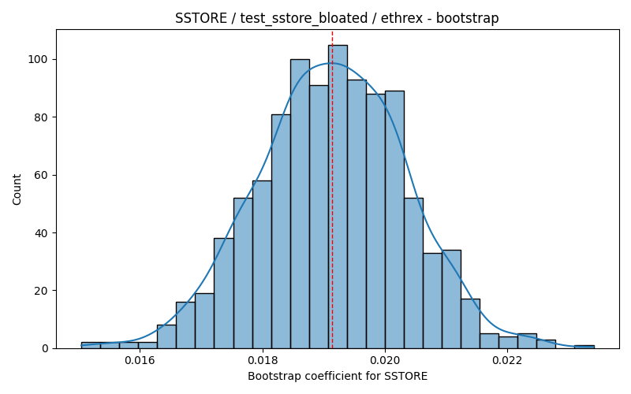

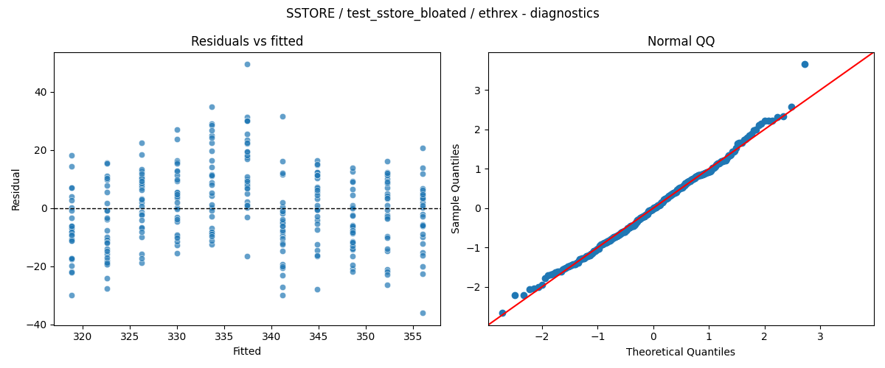

</details>

<details><summary>geth — NNLS regression summary</summary>

```
==============================================================================
                           NNLS Regression Results                            
==============================================================================
Dep. Variable:          test_runtime_ms              R-squared:          0.973
Model:                  NNLS                    Adj. R-squared:          0.973
No. Observations:       308                               RMSE:         112.58
Df Residuals:           306                                MAE:          91.15
Df Model:               1      
==============================================================================
                      coef     std err     P-value      [0.025      0.975]
------------------------------------------------------------------------------
         const    542.5835     20.7954       0.001    505.1822    585.4581
       opcount      0.0239      0.0002       0.001      0.0234      0.0243
==============================================================================
Notes: Non-negative least squares with bootstrap inference (1000 iterations)
==============================================================================
```

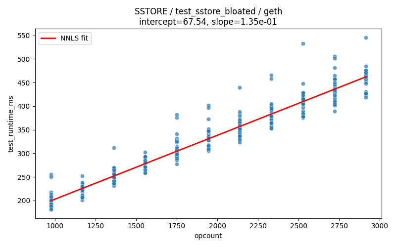

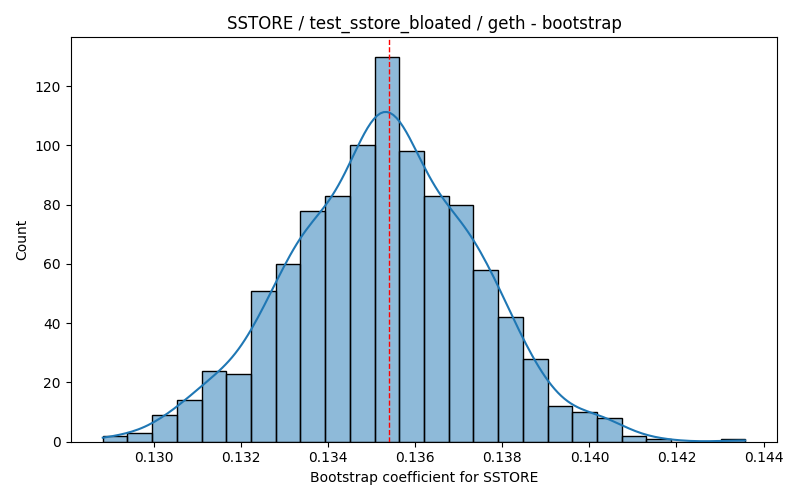

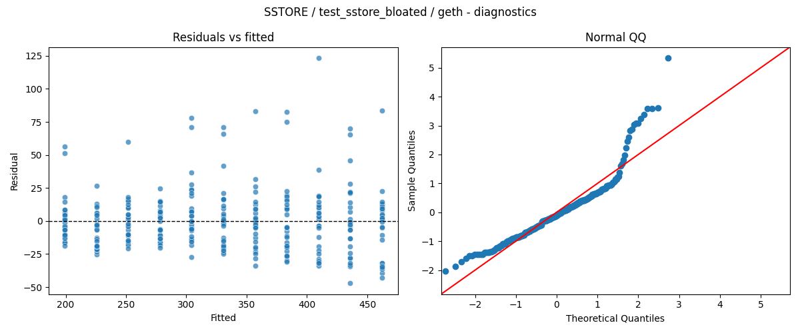

</details>

<details><summary>nethermind — NNLS regression summary</summary>

```
==============================================================================
                           NNLS Regression Results                            
==============================================================================
Dep. Variable:          test_runtime_ms              R-squared:          0.901
Model:                  NNLS                    Adj. R-squared:          0.900
No. Observations:       253                               RMSE:          31.02
Df Residuals:           251                                MAE:          23.98
Df Model:               1      
==============================================================================
                      coef     std err     P-value      [0.025      0.975]
------------------------------------------------------------------------------
         const     57.7032      5.7239       0.001     45.5951     68.5384
       opcount      0.0033      0.0001       0.001      0.0032      0.0034
==============================================================================
Notes: Non-negative least squares with bootstrap inference (1000 iterations)
==============================================================================
```

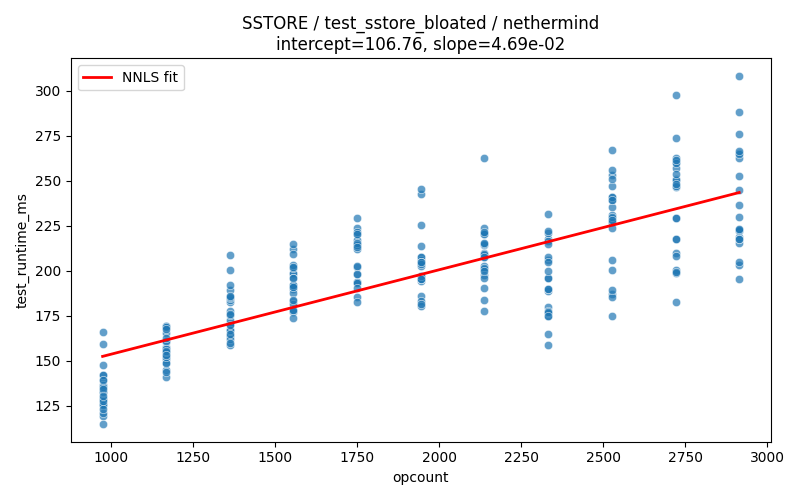

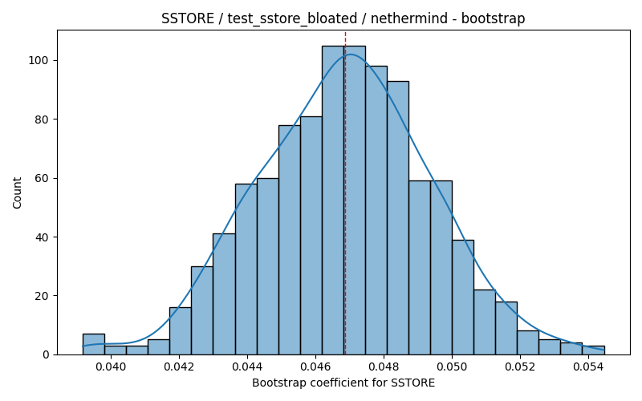

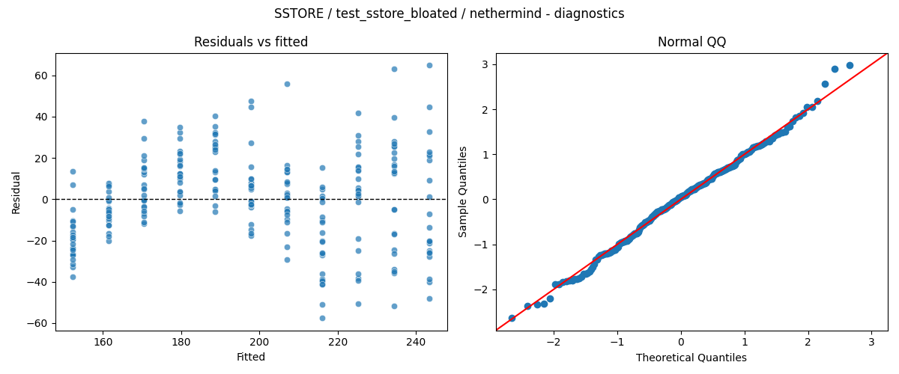

</details>

<details><summary>reth — NNLS regression summary</summary>

```
==============================================================================
                           NNLS Regression Results                            
==============================================================================
Dep. Variable:          test_runtime_ms              R-squared:          0.954
Model:                  NNLS                    Adj. R-squared:          0.954
No. Observations:       396                               RMSE:           7.87
Df Residuals:           394                                MAE:           6.26
Df Model:               1      
==============================================================================
                      coef     std err     P-value      [0.025      0.975]
------------------------------------------------------------------------------
         const     36.3232      1.2245       0.001     33.9050     38.6867
       opcount      0.0013      0.0000       0.001      0.0012      0.0013
==============================================================================
Notes: Non-negative least squares with bootstrap inference (1000 iterations)
==============================================================================
```

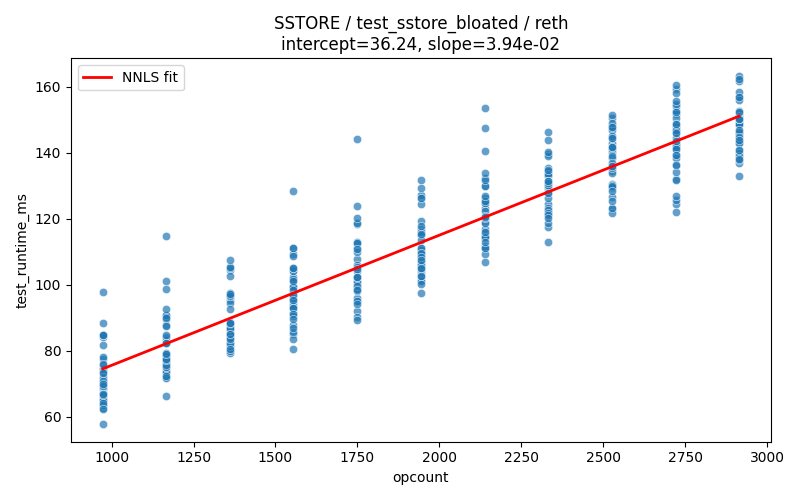

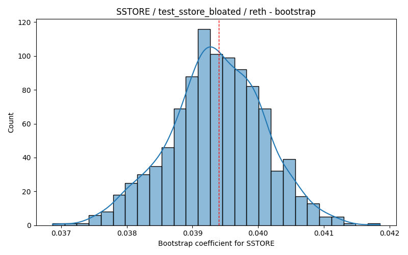

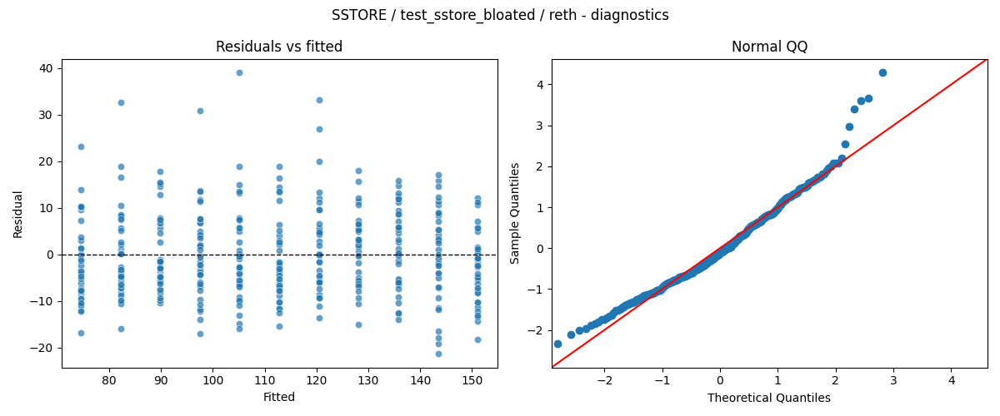

</details>

### test_sstore_bloated — combo `True` — `presets[cold_storage_sstore_access]`

| client | nobs | R² | target_coef (ms) | p-value | 95% CI |
| --- | --- | --- | --- | --- | --- |
| `besu` | 396 | 0.9455 | 0.0152 | 1.00e-03 | [0.01484, 0.01555] |
| `erigon` | 44 | 0.9845 | 0.006287 | 1.00e-03 | [0.006109, 0.006365] |
| `ethrex` | 308 | 0.969 | 0.01471 | 1.00e-03 | [0.0146, 0.01482] |
| `geth` | 308 | 0.9687 | 0.02336 | 1.00e-03 | [0.02289, 0.02386] |
| `nethermind` | 253 | 0.9756 | 0.009041 | 1.00e-03 | [0.008854, 0.009238] |
| `reth` | 396 | 0.9525 | 0.001438 | 1.00e-03 | [0.001406, 0.001468] |

<details><summary>besu — NNLS regression summary</summary>

```
==============================================================================
                           NNLS Regression Results                            
==============================================================================
Dep. Variable:          test_runtime_ms              R-squared:          0.945
Model:                  NNLS                    Adj. R-squared:          0.945
No. Observations:       396                               RMSE:         103.12
Df Residuals:           394                                MAE:          82.03
Df Model:               1      
==============================================================================
                      coef     std err     P-value      [0.025      0.975]
------------------------------------------------------------------------------
         const    560.0783     16.3642       0.001    528.9457    592.0326
       opcount      0.0152      0.0002       0.001      0.0148      0.0156
==============================================================================
Notes: Non-negative least squares with bootstrap inference (1000 iterations)
==============================================================================
```

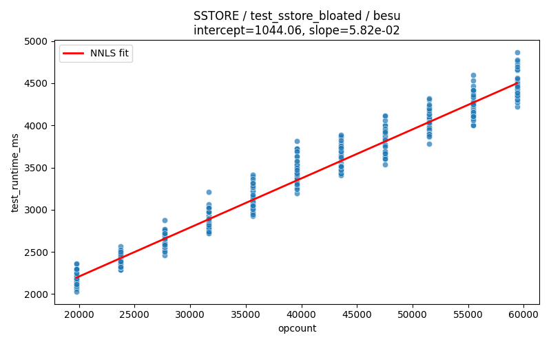

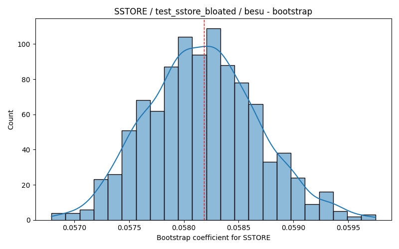

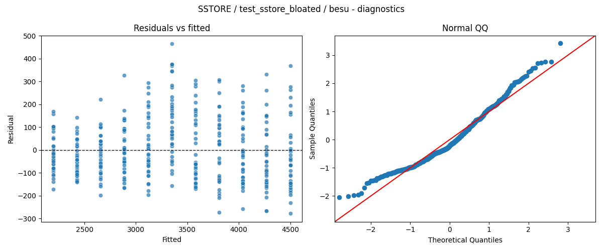

</details>

<details><summary>erigon — NNLS regression summary</summary>

```
==============================================================================
                           NNLS Regression Results                            
==============================================================================
Dep. Variable:          test_runtime_ms              R-squared:          0.984
Model:                  NNLS                    Adj. R-squared:          0.984
No. Observations:       44                                RMSE:          22.52
Df Residuals:           42                                 MAE:          16.45
Df Model:               1      
==============================================================================
                      coef     std err     P-value      [0.025      0.975]
------------------------------------------------------------------------------
         const      0.0000      4.4274       1.000      0.0000     15.8967
       opcount      0.0063      0.0001       0.001      0.0061      0.0064
==============================================================================
Notes: Non-negative least squares with bootstrap inference (1000 iterations)
==============================================================================
```

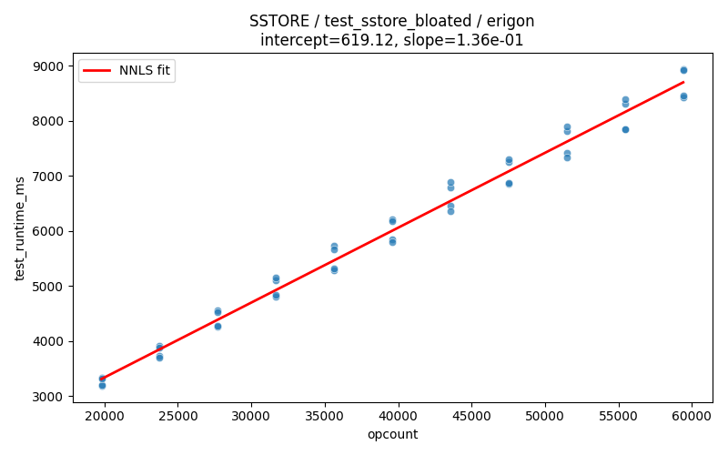

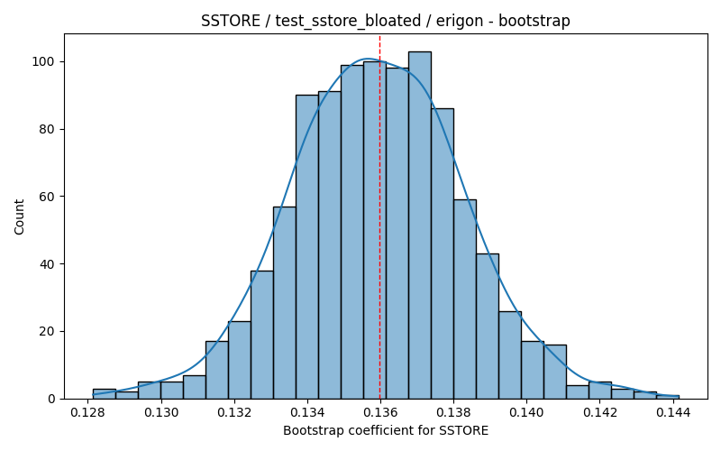

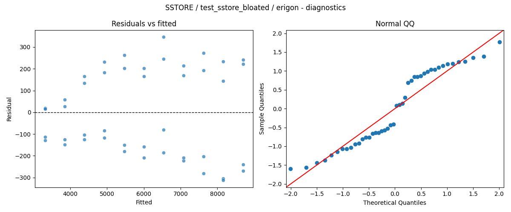

</details>

<details><summary>ethrex — NNLS regression summary</summary>

```
==============================================================================
                           NNLS Regression Results                            
==============================================================================
Dep. Variable:          test_runtime_ms              R-squared:          0.969
Model:                  NNLS                    Adj. R-squared:          0.969
No. Observations:       308                               RMSE:          84.27
Df Residuals:           306                                MAE:          68.40
Df Model:               1      
==============================================================================
                      coef     std err     P-value      [0.025      0.975]
------------------------------------------------------------------------------
         const      0.0000      0.0000       1.000      0.0000      0.0000
       opcount      0.0147      0.0001       0.001      0.0146      0.0148
==============================================================================
Notes: Non-negative least squares with bootstrap inference (1000 iterations)
==============================================================================
```

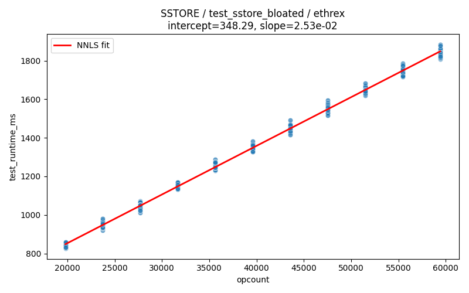

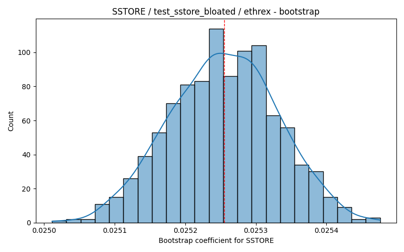

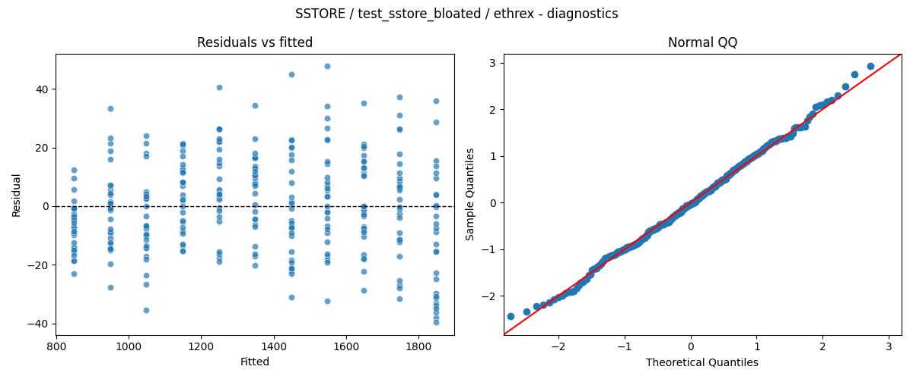

</details>

<details><summary>geth — NNLS regression summary</summary>

```
==============================================================================
                           NNLS Regression Results                            
==============================================================================
Dep. Variable:          test_runtime_ms              R-squared:          0.969
Model:                  NNLS                    Adj. R-squared:          0.969
No. Observations:       308                               RMSE:         118.74
Df Residuals:           306                                MAE:          94.17
Df Model:               1      
==============================================================================
                      coef     std err     P-value      [0.025      0.975]
------------------------------------------------------------------------------
         const    524.8413     21.3392       0.001    481.2078    563.9784
       opcount      0.0234      0.0002       0.001      0.0229      0.0239
==============================================================================
Notes: Non-negative least squares with bootstrap inference (1000 iterations)
==============================================================================
```

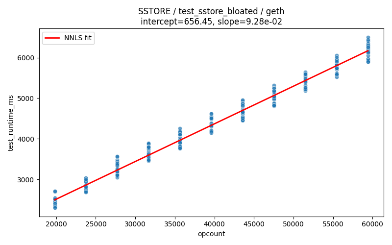

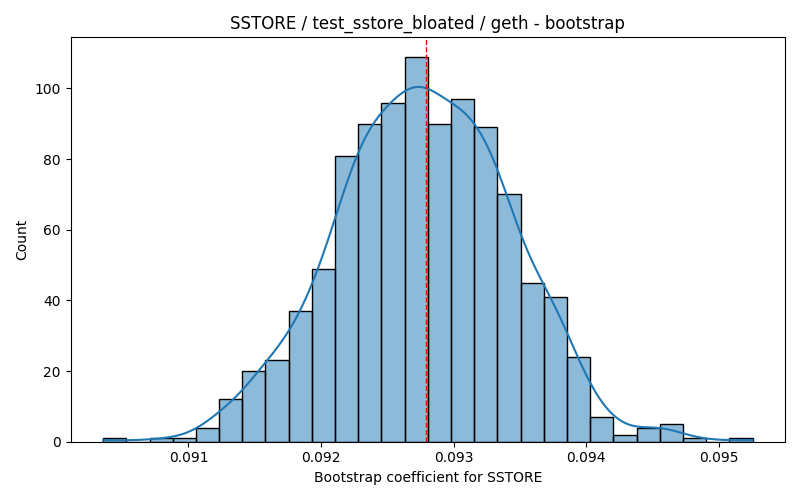

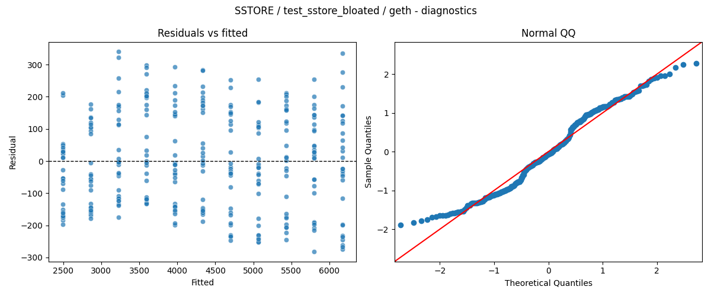

</details>

<details><summary>nethermind — NNLS regression summary</summary>

```
==============================================================================
                           NNLS Regression Results                            
==============================================================================
Dep. Variable:          test_runtime_ms              R-squared:          0.976
Model:                  NNLS                    Adj. R-squared:          0.976
No. Observations:       253                               RMSE:          40.41
Df Residuals:           251                                MAE:          31.49
Df Model:               1      
==============================================================================
                      coef     std err     P-value      [0.025      0.975]
------------------------------------------------------------------------------
         const     98.2257      7.9540       0.001     82.7969    113.3070
       opcount      0.0090      0.0001       0.001      0.0089      0.0092
==============================================================================
Notes: Non-negative least squares with bootstrap inference (1000 iterations)
==============================================================================
```

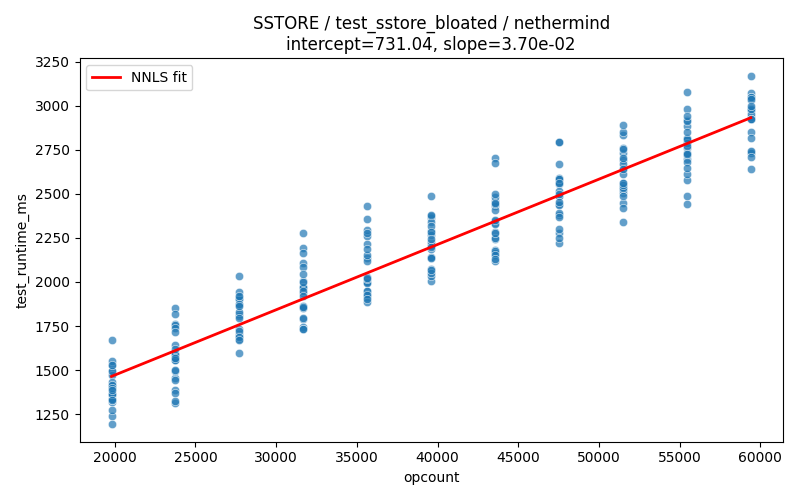

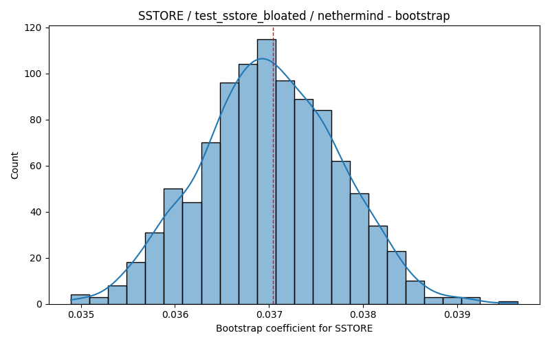

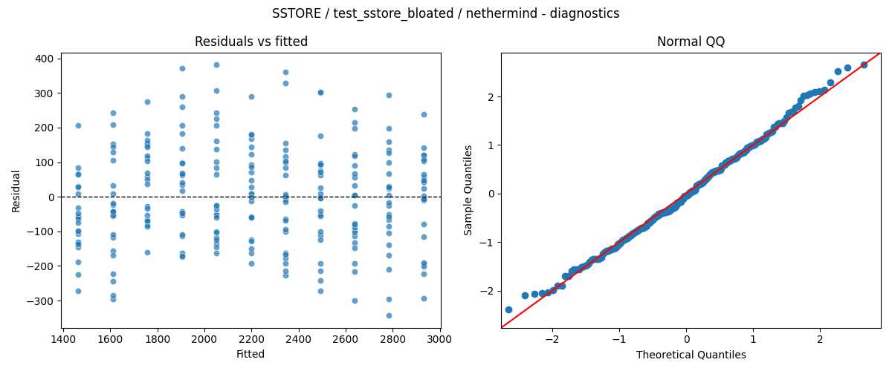

</details>

<details><summary>reth — NNLS regression summary</summary>

```
==============================================================================
                           NNLS Regression Results                            
==============================================================================
Dep. Variable:          test_runtime_ms              R-squared:          0.953
Model:                  NNLS                    Adj. R-squared:          0.952
No. Observations:       396                               RMSE:           9.07
Df Residuals:           394                                MAE:           7.23
Df Model:               1      
==============================================================================
                      coef     std err     P-value      [0.025      0.975]
------------------------------------------------------------------------------
         const     32.5632      1.4469       0.001     29.7835     35.4102
       opcount      0.0014      0.0000       0.001      0.0014      0.0015
==============================================================================
Notes: Non-negative least squares with bootstrap inference (1000 iterations)
==============================================================================
```

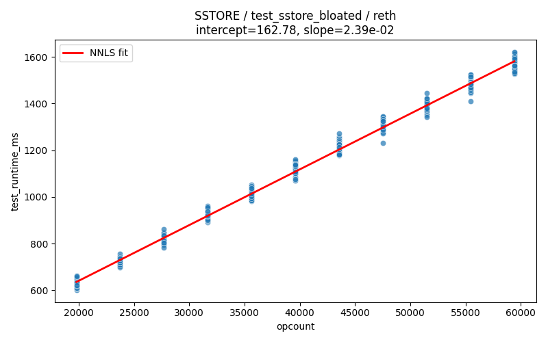

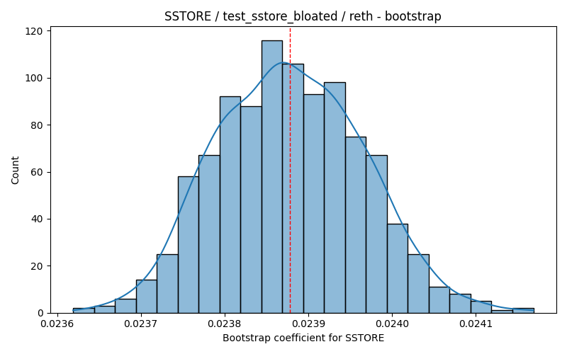

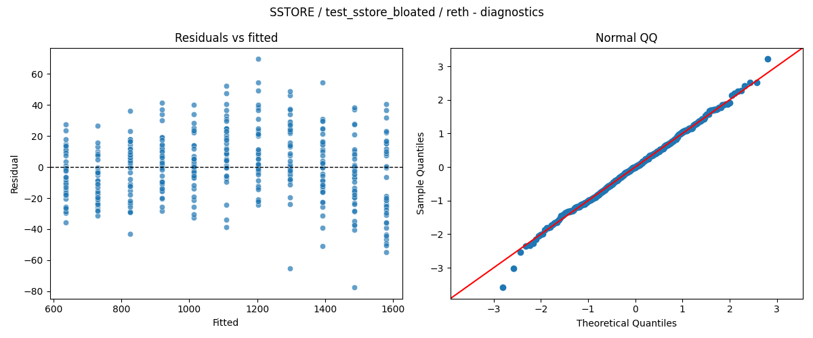

</details>

### test_sstore_bloated — combo `False` — `presets[cold_storage_sstore_write]`

| client | nobs | R² | target_coef (ms) | p-value | 95% CI |
| --- | --- | --- | --- | --- | --- |
| `besu` | 396 | 0.7504 | 0.1324 | 1.00e-03 | [0.1252, 0.1402] |
| `erigon` | 44 | 0.9777 | 0.2873 | 1.00e-03 | [0.2705, 0.3014] |
| `ethrex` | 308 | 0.4304 | 0.01914 | 1.00e-03 | [0.01683, 0.02141] |
| `geth` | 308 | 0.9288 | 0.1354 | 1.00e-03 | [0.1311, 0.1395] |
| `nethermind` | 253 | 0.6354 | 0.04687 | 1.00e-03 | [0.04209, 0.05173] |
| `reth` | 396 | 0.8767 | 0.0394 | 1.00e-03 | [0.03791, 0.04075] |

<details><summary>besu — NNLS regression summary</summary>

```
==============================================================================
                           NNLS Regression Results                            
==============================================================================
Dep. Variable:          test_runtime_ms              R-squared:          0.750
Model:                  NNLS                    Adj. R-squared:          0.750
No. Observations:       396                               RMSE:          46.92
Df Residuals:           394                                MAE:          41.66
Df Model:               1      
==============================================================================
                      coef     std err     P-value      [0.025      0.975]
------------------------------------------------------------------------------
         const    381.1341      7.3089       0.001    366.8436    395.3547
       opcount      0.1324      0.0038       0.001      0.1252      0.1402
==============================================================================
Notes: Non-negative least squares with bootstrap inference (1000 iterations)
==============================================================================
```


</details>

<details><summary>erigon — NNLS regression summary</summary>

```
==============================================================================
                           NNLS Regression Results                            
==============================================================================
Dep. Variable:          test_runtime_ms              R-squared:          0.978
Model:                  NNLS                    Adj. R-squared:          0.977
No. Observations:       44                                RMSE:          26.65
Df Residuals:           42                                 MAE:          18.73
Df Model:               1      
==============================================================================
                      coef     std err     P-value      [0.025      0.975]
------------------------------------------------------------------------------
         const    194.2853     15.4803       0.001    168.4892    229.0828
       opcount      0.2873      0.0077       0.001      0.2705      0.3014
==============================================================================
Notes: Non-negative least squares with bootstrap inference (1000 iterations)
==============================================================================
```


</details>

<details><summary>ethrex — NNLS regression summary</summary>

```
==============================================================================
                           NNLS Regression Results                            
==============================================================================
Dep. Variable:          test_runtime_ms              R-squared:          0.430
Model:                  NNLS                    Adj. R-squared:          0.429
No. Observations:       308                               RMSE:          13.53
Df Residuals:           306                                MAE:          10.92
Df Model:               1      
==============================================================================
                      coef     std err     P-value      [0.025      0.975]
------------------------------------------------------------------------------
         const    300.2324      2.5051       0.001    295.5725    305.1842
       opcount      0.0191      0.0012       0.001      0.0168      0.0214
==============================================================================
Notes: Non-negative least squares with bootstrap inference (1000 iterations)
==============================================================================
```


</details>

<details><summary>geth — NNLS regression summary</summary>

```
==============================================================================
                           NNLS Regression Results                            
==============================================================================
Dep. Variable:          test_runtime_ms              R-squared:          0.929
Model:                  NNLS                    Adj. R-squared:          0.929
No. Observations:       308                               RMSE:          23.03
Df Residuals:           306                                MAE:          16.28
Df Model:               1      
==============================================================================
                      coef     std err     P-value      [0.025      0.975]
------------------------------------------------------------------------------
         const     67.5382      3.7953       0.001     60.4446     75.7411
       opcount      0.1354      0.0021       0.001      0.1311      0.1395
==============================================================================
Notes: Non-negative least squares with bootstrap inference (1000 iterations)
==============================================================================
```


</details>

<details><summary>nethermind — NNLS regression summary</summary>

```
==============================================================================
                           NNLS Regression Results                            
==============================================================================
Dep. Variable:          test_runtime_ms              R-squared:          0.635
Model:                  NNLS                    Adj. R-squared:          0.634
No. Observations:       253                               RMSE:          21.81
Df Residuals:           251                                MAE:          17.27
Df Model:               1      
==============================================================================
                      coef     std err     P-value      [0.025      0.975]
------------------------------------------------------------------------------
         const    106.7643      4.4857       0.001     98.2749    115.7211
       opcount      0.0469      0.0025       0.001      0.0421      0.0517
==============================================================================
Notes: Non-negative least squares with bootstrap inference (1000 iterations)
==============================================================================
```


</details>

<details><summary>reth — NNLS regression summary</summary>

```
==============================================================================
                           NNLS Regression Results                            
==============================================================================
Dep. Variable:          test_runtime_ms              R-squared:          0.877
Model:                  NNLS                    Adj. R-squared:          0.876
No. Observations:       396                               RMSE:           9.07
Df Residuals:           394                                MAE:           7.21
Df Model:               1      
==============================================================================
                      coef     std err     P-value      [0.025      0.975]
------------------------------------------------------------------------------
         const     36.2382      1.4690       0.001     33.4982     39.4762
       opcount      0.0394      0.0007       0.001      0.0379      0.0407
==============================================================================
Notes: Non-negative least squares with bootstrap inference (1000 iterations)
==============================================================================
```


</details>

### test_sstore_bloated — combo `True` — `presets[cold_storage_sstore_write]`

| client | nobs | R² | target_coef (ms) | p-value | 95% CI |
| --- | --- | --- | --- | --- | --- |
| `besu` | 396 | 0.9665 | 0.05818 | 1.00e-03 | [0.05726, 0.05928] |
| `erigon` | 44 | 0.987 | 0.136 | 1.00e-03 | [0.1314, 0.1406] |
| `ethrex` | 308 | 0.9973 | 0.02526 | 1.00e-03 | [0.0251, 0.0254] |
| `geth` | 308 | 0.9838 | 0.09279 | 1.00e-03 | [0.0915, 0.09399] |
| `nethermind` | 253 | 0.9128 | 0.03704 | 1.00e-03 | [0.03558, 0.03837] |
| `reth` | 396 | 0.9948 | 0.02388 | 1.00e-03 | [0.02372, 0.02404] |

<details><summary>besu — NNLS regression summary</summary>

```
==============================================================================
                           NNLS Regression Results                            
==============================================================================
Dep. Variable:          test_runtime_ms              R-squared:          0.967
Model:                  NNLS                    Adj. R-squared:          0.966
No. Observations:       396                               RMSE:         135.62
Df Residuals:           394                                MAE:         110.20
Df Model:               1      
==============================================================================
                      coef     std err     P-value      [0.025      0.975]
------------------------------------------------------------------------------
         const   1044.0563     18.7862       0.001   1005.6298   1079.1729
       opcount      0.0582      0.0005       0.001      0.0573      0.0593
==============================================================================
Notes: Non-negative least squares with bootstrap inference (1000 iterations)
==============================================================================
```


</details>

<details><summary>erigon — NNLS regression summary</summary>

```
==============================================================================
                           NNLS Regression Results                            
==============================================================================
Dep. Variable:          test_runtime_ms              R-squared:          0.987
Model:                  NNLS                    Adj. R-squared:          0.987
No. Observations:       44                                RMSE:         195.13
Df Residuals:           42                                 MAE:         179.45
Df Model:               1      
==============================================================================
                      coef     std err     P-value      [0.025      0.975]
------------------------------------------------------------------------------
         const    619.1174     82.7045       0.001    468.9066    789.1868
       opcount      0.1360      0.0023       0.001      0.1314      0.1406
==============================================================================
Notes: Non-negative least squares with bootstrap inference (1000 iterations)
==============================================================================
```


</details>

<details><summary>ethrex — NNLS regression summary</summary>

```
==============================================================================
                           NNLS Regression Results                            
==============================================================================
Dep. Variable:          test_runtime_ms              R-squared:          0.997
Model:                  NNLS                    Adj. R-squared:          0.997
No. Observations:       308                               RMSE:          16.30
Df Residuals:           306                                MAE:          13.15
Df Model:               1      
==============================================================================
                      coef     std err     P-value      [0.025      0.975]
------------------------------------------------------------------------------
         const    348.2900      2.8397       0.001    342.9522    354.1217
       opcount      0.0253      0.0001       0.001      0.0251      0.0254
==============================================================================
Notes: Non-negative least squares with bootstrap inference (1000 iterations)
==============================================================================
```


</details>

<details><summary>geth — NNLS regression summary</summary>

```
==============================================================================
                           NNLS Regression Results                            
==============================================================================
Dep. Variable:          test_runtime_ms              R-squared:          0.984
Model:                  NNLS                    Adj. R-squared:          0.984
No. Observations:       308                               RMSE:         149.31
Df Residuals:           306                                MAE:         126.43
Df Model:               1      
==============================================================================
                      coef     std err     P-value      [0.025      0.975]
------------------------------------------------------------------------------
         const    656.4474     26.1178       0.001    607.5369    710.8016
       opcount      0.0928      0.0007       0.001      0.0915      0.0940
==============================================================================
Notes: Non-negative least squares with bootstrap inference (1000 iterations)
==============================================================================
```


</details>

<details><summary>nethermind — NNLS regression summary</summary>

```
==============================================================================
                           NNLS Regression Results                            
==============================================================================
Dep. Variable:          test_runtime_ms              R-squared:          0.913
Model:                  NNLS                    Adj. R-squared:          0.912
No. Observations:       253                               RMSE:         143.36
Df Residuals:           251                                MAE:         116.58
Df Model:               1      
==============================================================================
                      coef     std err     P-value      [0.025      0.975]
------------------------------------------------------------------------------
         const    731.0405     29.2700       0.001    677.0336    790.6437
       opcount      0.0370      0.0007       0.001      0.0356      0.0384
==============================================================================
Notes: Non-negative least squares with bootstrap inference (1000 iterations)
==============================================================================
```


</details>

<details><summary>reth — NNLS regression summary</summary>

```
==============================================================================
                           NNLS Regression Results                            
==============================================================================
Dep. Variable:          test_runtime_ms              R-squared:          0.995
Model:                  NNLS                    Adj. R-squared:          0.995
No. Observations:       396                               RMSE:          21.62
Df Residuals:           394                                MAE:          17.14
Df Model:               1      
==============================================================================
                      coef     std err     P-value      [0.025      0.975]
------------------------------------------------------------------------------
         const    162.7764      3.2215       0.001    156.7008    168.9129
       opcount      0.0239      0.0001       0.001      0.0237      0.0240
==============================================================================
Notes: Non-negative least squares with bootstrap inference (1000 iterations)
==============================================================================
```


</details>

## BALANCE

### test_account_access — combo `BALANCE_AccountMode.EXISTING_EOA`

| client | nobs | R² | target_coef (ms) | p-value | 95% CI |
| --- | --- | --- | --- | --- | --- |
| `besu` | 396 | 0.8953 | 0.01268 | 1.00e-03 | [0.01226, 0.01306] |
| `erigon` | 44 | 0.9888 | 0.009725 | 1.00e-03 | [0.009401, 0.009893] |
| `ethrex` | 308 | 0.9929 | 0.007199 | 1.00e-03 | [0.00713, 0.007272] |
| `geth` | 308 | 0.9055 | 0.01063 | 1.00e-03 | [0.01021, 0.01107] |
| `nethermind` | 253 | 0.831 | 0.003955 | 1.00e-03 | [0.003715, 0.004172] |
| `reth` | 396 | 0.9215 | 0.001053 | 1.00e-03 | [0.001021, 0.001082] |

<details><summary>besu — NNLS regression summary</summary>

```
==============================================================================
                           NNLS Regression Results                            
==============================================================================
Dep. Variable:          test_runtime_ms              R-squared:          0.895
Model:                  NNLS                    Adj. R-squared:          0.895
No. Observations:       396                               RMSE:         103.61
Df Residuals:           394                                MAE:          90.31
Df Model:               1      
==============================================================================
                      coef     std err     P-value      [0.025      0.975]
------------------------------------------------------------------------------
         const    486.4702     15.6312       0.001    457.2256    518.3098
       opcount      0.0127      0.0002       0.001      0.0123      0.0131
==============================================================================
Notes: Non-negative least squares with bootstrap inference (1000 iterations)
==============================================================================
```

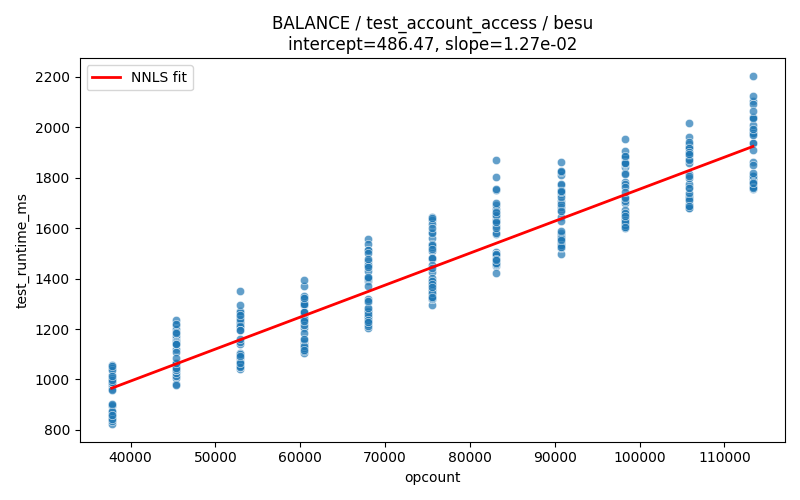

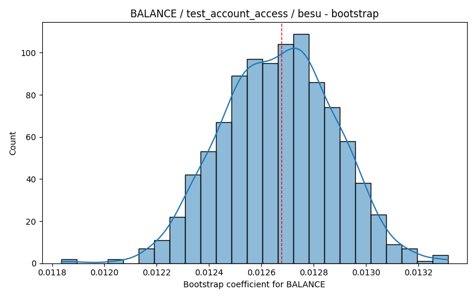

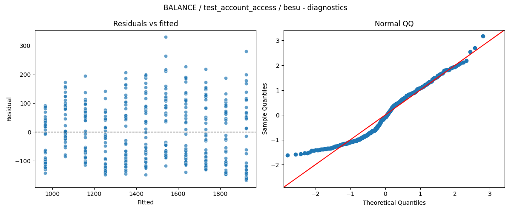

</details>

<details><summary>erigon — NNLS regression summary</summary>

```
==============================================================================
                           NNLS Regression Results                            
==============================================================================
Dep. Variable:          test_runtime_ms              R-squared:          0.989
Model:                  NNLS                    Adj. R-squared:          0.988
No. Observations:       44                                RMSE:          24.78
Df Residuals:           42                                 MAE:          19.02
Df Model:               1      
==============================================================================
                      coef     std err     P-value      [0.025      0.975]
------------------------------------------------------------------------------
         const      4.5074      8.2706       0.331      0.0000     26.0382
       opcount      0.0097      0.0001       0.001      0.0094      0.0099
==============================================================================
Notes: Non-negative least squares with bootstrap inference (1000 iterations)
==============================================================================
```

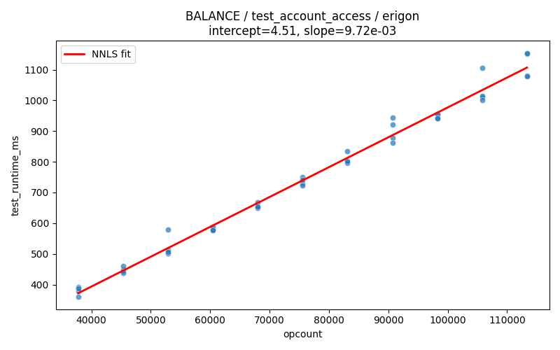

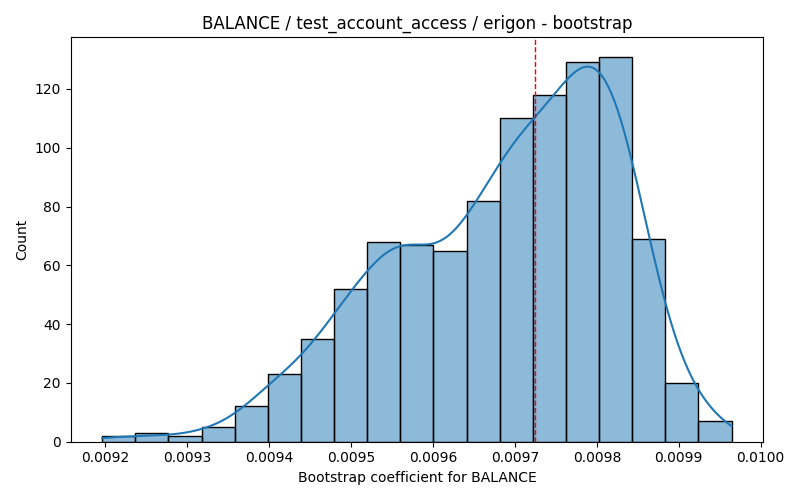

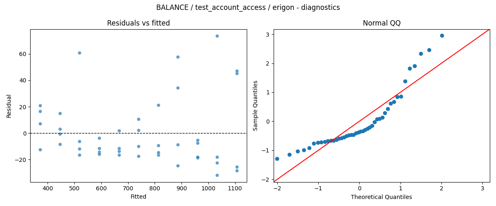

</details>

<details><summary>ethrex — NNLS regression summary</summary>

```
==============================================================================
                           NNLS Regression Results                            
==============================================================================
Dep. Variable:          test_runtime_ms              R-squared:          0.993
Model:                  NNLS                    Adj. R-squared:          0.993
No. Observations:       308                               RMSE:          14.54
Df Residuals:           306                                MAE:          11.21
Df Model:               1      
==============================================================================
                      coef     std err     P-value      [0.025      0.975]
------------------------------------------------------------------------------
         const     44.1708      2.4130       0.001     39.2751     48.7053
       opcount      0.0072      0.0000       0.001      0.0071      0.0073
==============================================================================
Notes: Non-negative least squares with bootstrap inference (1000 iterations)
==============================================================================
```

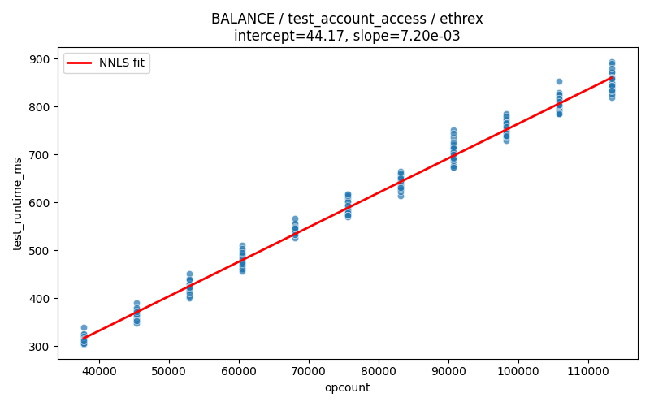

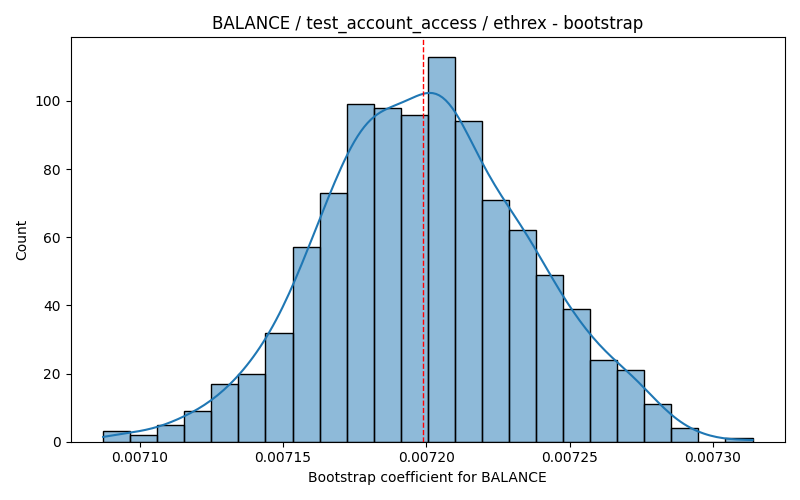

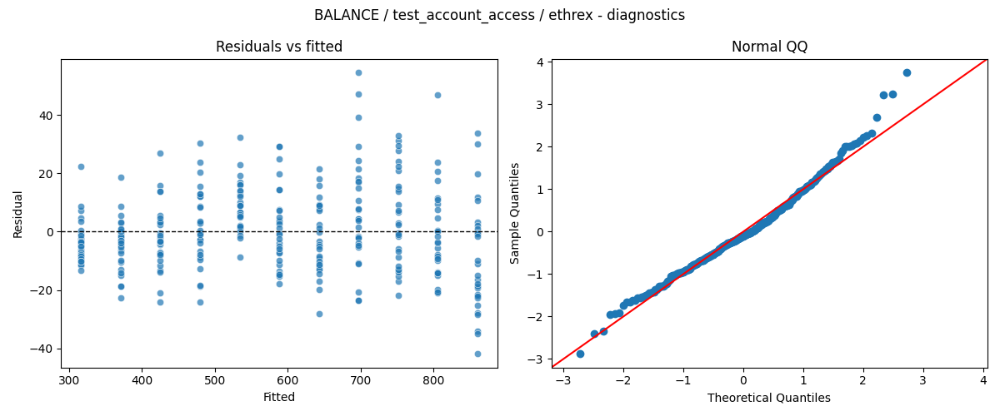

</details>

<details><summary>geth — NNLS regression summary</summary>

```
==============================================================================
                           NNLS Regression Results                            
==============================================================================
Dep. Variable:          test_runtime_ms              R-squared:          0.906
Model:                  NNLS                    Adj. R-squared:          0.905
No. Observations:       308                               RMSE:          82.10
Df Residuals:           306                                MAE:          67.07
Df Model:               1      
==============================================================================
                      coef     std err     P-value      [0.025      0.975]
------------------------------------------------------------------------------
         const    415.9262     19.0841       0.001    377.1399    452.7350
       opcount      0.0106      0.0002       0.001      0.0102      0.0111
==============================================================================
Notes: Non-negative least squares with bootstrap inference (1000 iterations)
==============================================================================
```

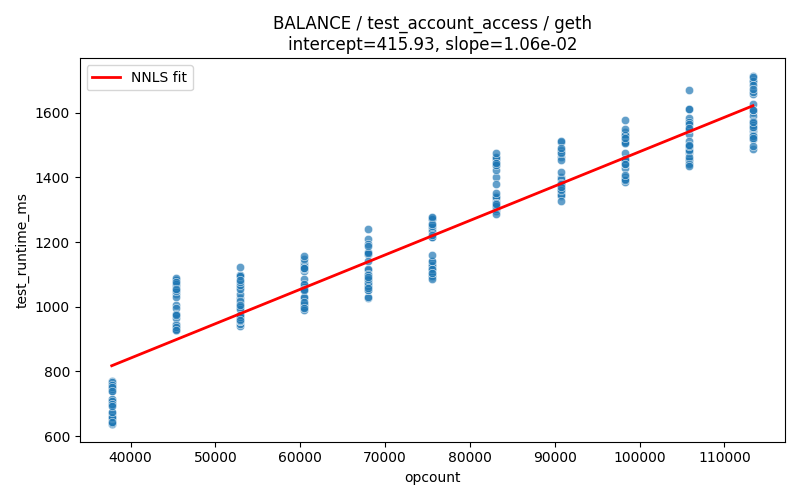


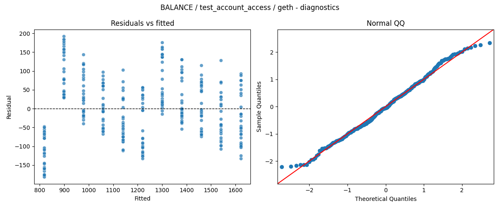

</details>

<details><summary>nethermind — NNLS regression summary</summary>

```
==============================================================================
                           NNLS Regression Results                            
==============================================================================
Dep. Variable:          test_runtime_ms              R-squared:          0.831
Model:                  NNLS                    Adj. R-squared:          0.830
No. Observations:       253                               RMSE:          42.63
Df Residuals:           251                                MAE:          33.40
Df Model:               1      
==============================================================================
                      coef     std err     P-value      [0.025      0.975]
------------------------------------------------------------------------------
         const     80.3719      8.3909       0.001     64.3622     97.0390
       opcount      0.0040      0.0001       0.001      0.0037      0.0042
==============================================================================
Notes: Non-negative least squares with bootstrap inference (1000 iterations)
==============================================================================
```

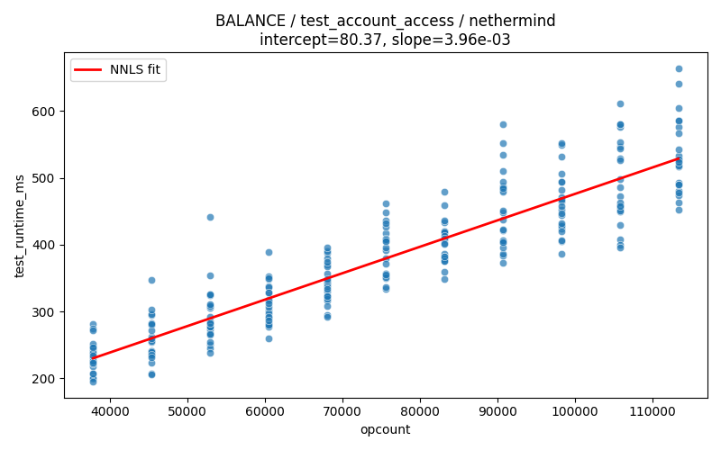

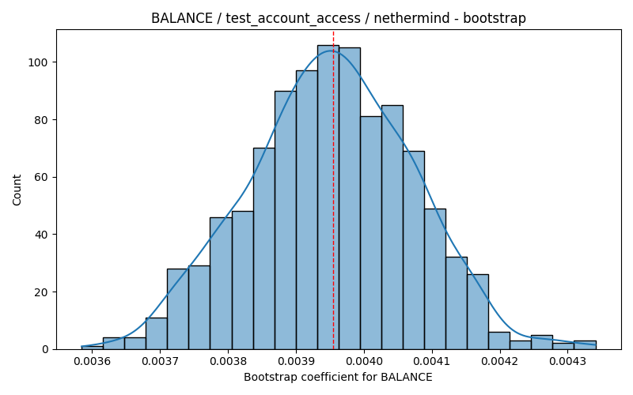

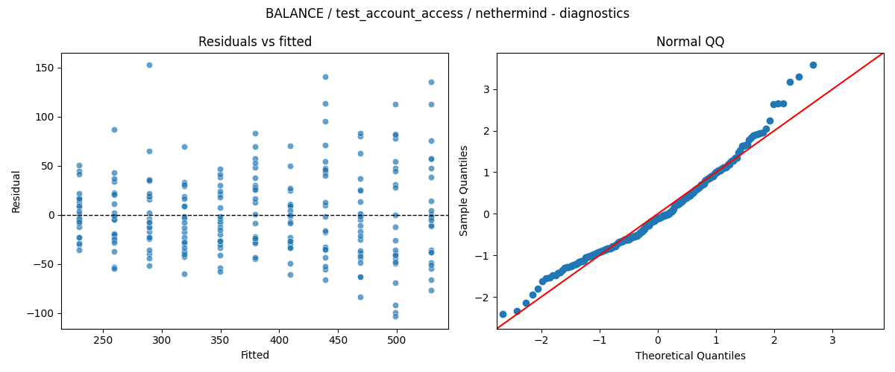

</details>

<details><summary>reth — NNLS regression summary</summary>

```
==============================================================================
                           NNLS Regression Results                            
==============================================================================
Dep. Variable:          test_runtime_ms              R-squared:          0.921
Model:                  NNLS                    Adj. R-squared:          0.921
No. Observations:       396                               RMSE:           7.35
Df Residuals:           394                                MAE:           5.84
Df Model:               1      
==============================================================================
                      coef     std err     P-value      [0.025      0.975]
------------------------------------------------------------------------------
         const     45.0419      1.2180       0.001     42.5386     47.4244
       opcount      0.0011      0.0000       0.001      0.0010      0.0011
==============================================================================
Notes: Non-negative least squares with bootstrap inference (1000 iterations)
==============================================================================
```

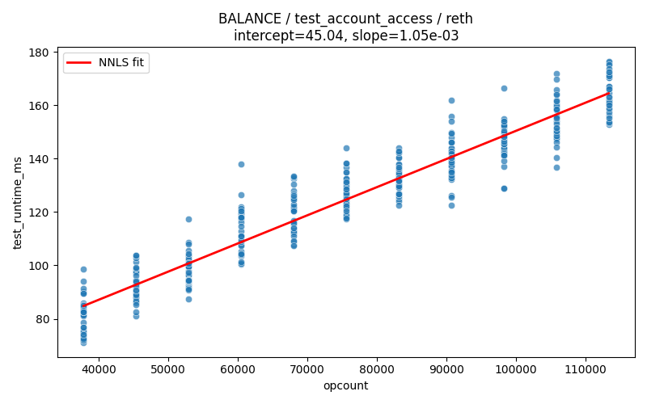

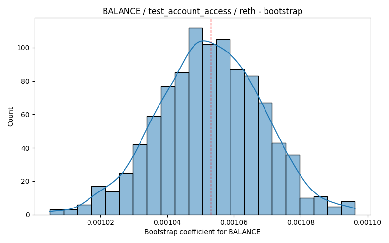

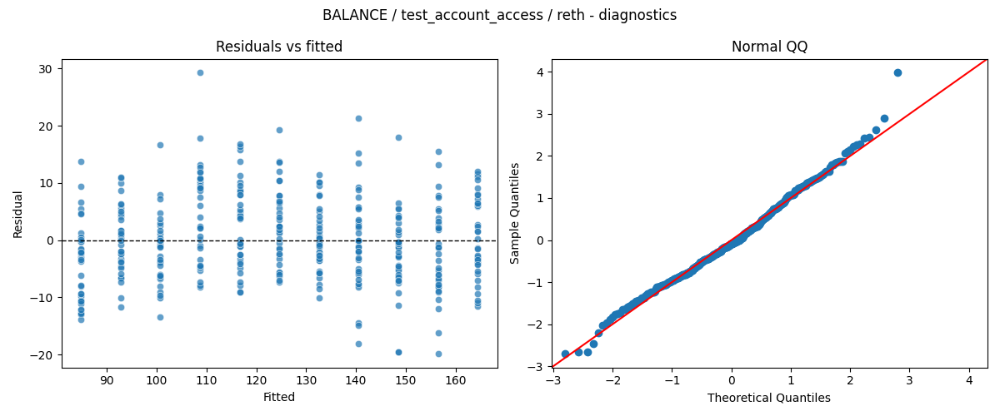

</details>

### test_account_access — combo `BALANCE_AccountMode.NON_EXISTING_ACCOUNT` — `presets[cold_account_nocode_access]`

| client | nobs | R² | target_coef (ms) | p-value | 95% CI |
| --- | --- | --- | --- | --- | --- |
| `besu` | 396 | 0.8434 | 0.01309 | 1.00e-03 | [0.0125, 0.01362] |
| `erigon` | 44 | 0.9928 | 0.008677 | 1.00e-03 | [0.00846, 0.008734] |
| `ethrex` | 308 | 0.9661 | 0.001995 | 1.00e-03 | [0.001954, 0.002034] |
| `geth` | 308 | 0.8586 | 0.02153 | 1.00e-03 | [0.02052, 0.02263] |
| `nethermind` | 253 | 0.8324 | 0.003592 | 1.00e-03 | [0.003404, 0.003779] |
| `reth` | 396 | 0.8705 | 0.0007489 | 1.00e-03 | [0.0007204, 0.0007812] |

<details><summary>besu — NNLS regression summary</summary>

```
==============================================================================
                           NNLS Regression Results                            
==============================================================================
Dep. Variable:          test_runtime_ms              R-squared:          0.843
Model:                  NNLS                    Adj. R-squared:          0.843
No. Observations:       396                               RMSE:         134.82
Df Residuals:           394                                MAE:         126.36
Df Model:               1      
==============================================================================
                      coef     std err     P-value      [0.025      0.975]
------------------------------------------------------------------------------
         const    483.6182     22.8322       0.001    441.9389    530.8702
       opcount      0.0131      0.0003       0.001      0.0125      0.0136
==============================================================================
Notes: Non-negative least squares with bootstrap inference (1000 iterations)
==============================================================================
```

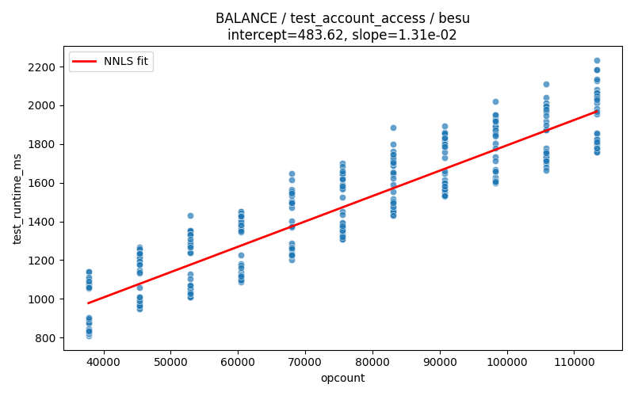

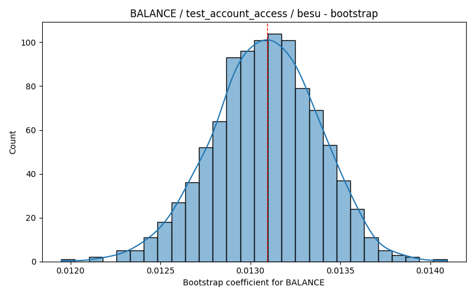


</details>

<details><summary>erigon — NNLS regression summary</summary>

```
==============================================================================
                           NNLS Regression Results                            
==============================================================================
Dep. Variable:          test_runtime_ms              R-squared:          0.993
Model:                  NNLS                    Adj. R-squared:          0.993
No. Observations:       44                                RMSE:          17.69
Df Residuals:           42                                 MAE:          11.62
Df Model:               1      
==============================================================================
                      coef     std err     P-value      [0.025      0.975]
------------------------------------------------------------------------------
         const      0.9183      6.0096       0.475      0.0000     20.1683
       opcount      0.0087      0.0001       0.001      0.0085      0.0087
==============================================================================
Notes: Non-negative least squares with bootstrap inference (1000 iterations)
==============================================================================
```


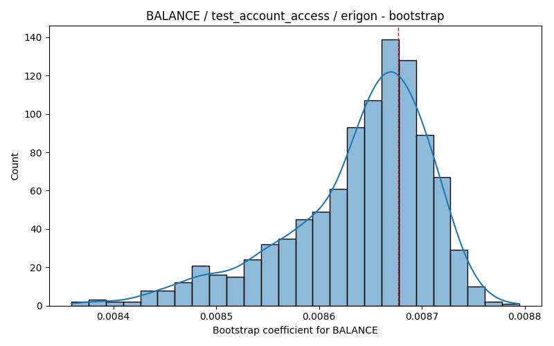

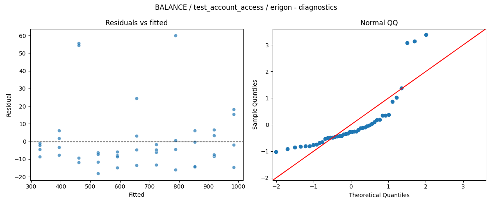

</details>

<details><summary>ethrex — NNLS regression summary</summary>

```
==============================================================================
                           NNLS Regression Results                            
==============================================================================
Dep. Variable:          test_runtime_ms              R-squared:          0.966
Model:                  NNLS                    Adj. R-squared:          0.966
No. Observations:       308                               RMSE:           8.93
Df Residuals:           306                                MAE:           7.18
Df Model:               1      
==============================================================================
                      coef     std err     P-value      [0.025      0.975]
------------------------------------------------------------------------------
         const     26.8995      1.5414       0.001     23.8124     29.9405
       opcount      0.0020      0.0000       0.001      0.0020      0.0020
==============================================================================
Notes: Non-negative least squares with bootstrap inference (1000 iterations)
==============================================================================
```

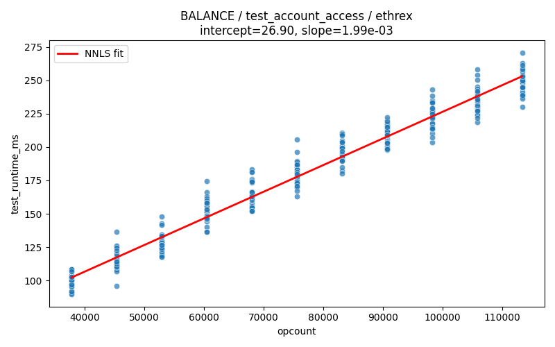

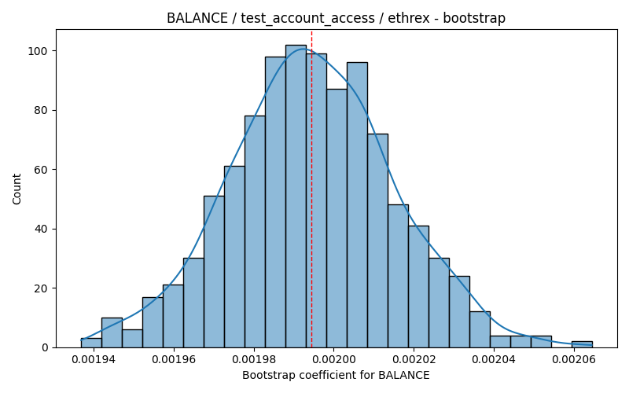


</details>

<details><summary>geth — NNLS regression summary</summary>

```
==============================================================================
                           NNLS Regression Results                            
==============================================================================
Dep. Variable:          test_runtime_ms              R-squared:          0.859
Model:                  NNLS                    Adj. R-squared:          0.858
No. Observations:       308                               RMSE:         208.85
Df Residuals:           306                                MAE:         177.36
Df Model:               1      
==============================================================================
                      coef     std err     P-value      [0.025      0.975]
------------------------------------------------------------------------------
         const    696.2181     45.2204       0.001    603.5602    784.0046
       opcount      0.0215      0.0005       0.001      0.0205      0.0226
==============================================================================
Notes: Non-negative least squares with bootstrap inference (1000 iterations)
==============================================================================
```


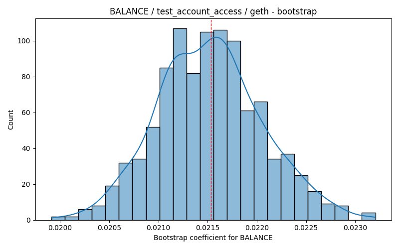

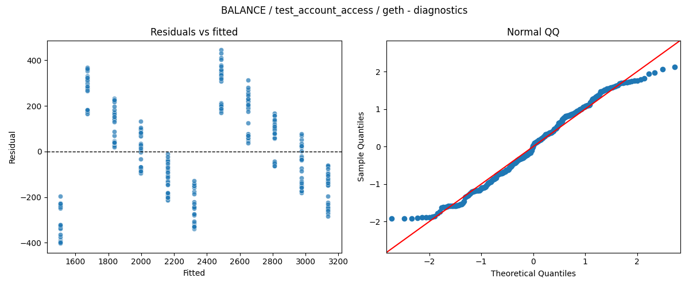

</details>

<details><summary>nethermind — NNLS regression summary</summary>

```
==============================================================================
                           NNLS Regression Results                            
==============================================================================
Dep. Variable:          test_runtime_ms              R-squared:          0.832
Model:                  NNLS                    Adj. R-squared:          0.832
No. Observations:       253                               RMSE:          38.53
Df Residuals:           251                                MAE:          30.53
Df Model:               1      
==============================================================================
                      coef     std err     P-value      [0.025      0.975]
------------------------------------------------------------------------------
         const     79.1599      6.9196       0.001     65.6281     92.6205
       opcount      0.0036      0.0001       0.001      0.0034      0.0038
==============================================================================
Notes: Non-negative least squares with bootstrap inference (1000 iterations)
==============================================================================
```

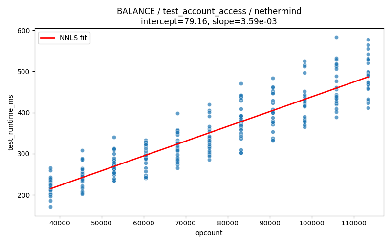

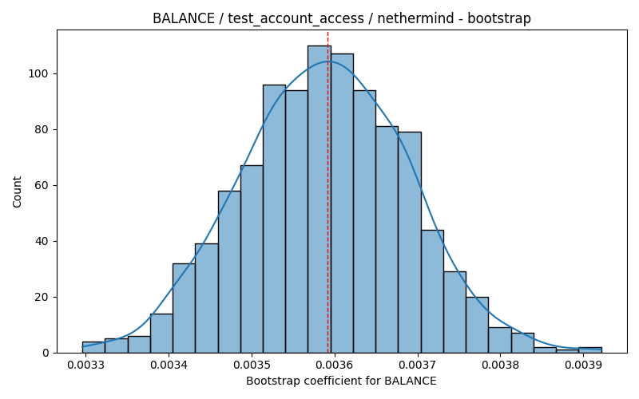

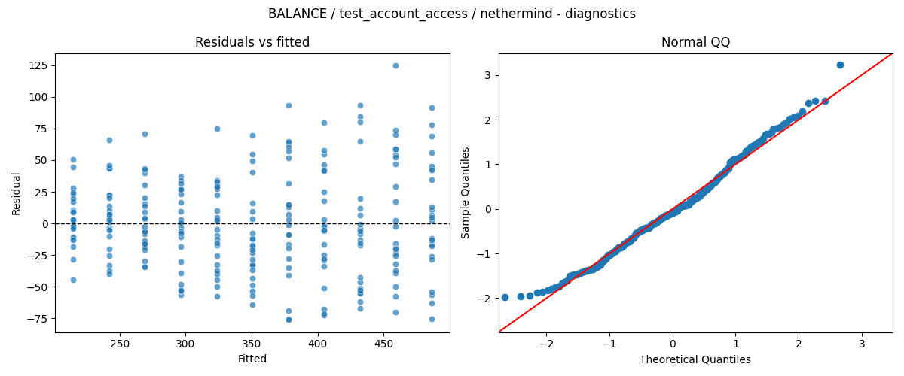

</details>

<details><summary>reth — NNLS regression summary</summary>

```
==============================================================================
                           NNLS Regression Results                            
==============================================================================
Dep. Variable:          test_runtime_ms              R-squared:          0.870
Model:                  NNLS                    Adj. R-squared:          0.870
No. Observations:       396                               RMSE:           6.90
Df Residuals:           394                                MAE:           5.55
Df Model:               1      
==============================================================================
                      coef     std err     P-value      [0.025      0.975]
------------------------------------------------------------------------------
         const     47.1033      1.1373       0.001     44.6740     49.2554
       opcount      0.0007      0.0000       0.001      0.0007      0.0008
==============================================================================
Notes: Non-negative least squares with bootstrap inference (1000 iterations)
==============================================================================
```

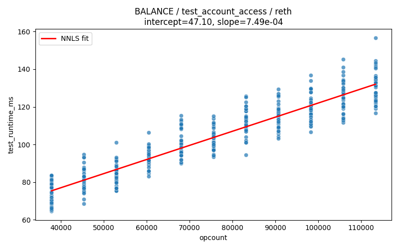

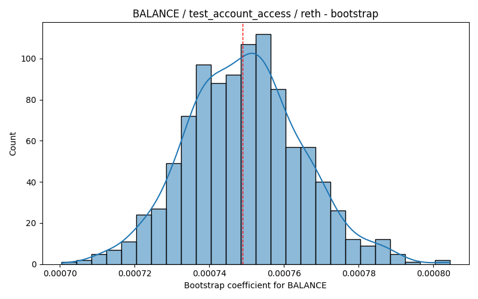

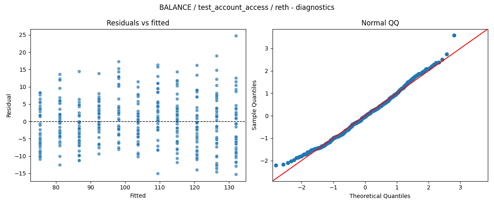

</details>

### test_account_access — combo `BALANCE_AccountMode.EXISTING_CONTRACT`

| client | nobs | R² | target_coef (ms) | p-value | 95% CI |
| --- | --- | --- | --- | --- | --- |
| `besu` | 396 | 0.9299 | 0.02462 | 1.00e-03 | [0.02403, 0.02519] |
| `erigon` | 44 | 0.9394 | 0.02383 | 1.00e-03 | [0.02203, 0.02546] |
| `ethrex` | 308 | 0.9938 | 0.007702 | 1.00e-03 | [0.007636, 0.007768] |
| `geth` | 308 | 0.8535 | 0.02274 | 1.00e-03 | [0.02164, 0.02385] |
| `nethermind` | 253 | 0.5396 | 0.01268 | 1.00e-03 | [0.0113, 0.01421] |
| `reth` | 396 | 0.9724 | 0.003932 | 1.00e-03 | [0.003864, 0.003993] |

<details><summary>besu — NNLS regression summary</summary>

```
==============================================================================
                           NNLS Regression Results                            
==============================================================================
Dep. Variable:          test_runtime_ms              R-squared:          0.930
Model:                  NNLS                    Adj. R-squared:          0.930
No. Observations:       396                               RMSE:         140.58
Df Residuals:           394                                MAE:         124.34
Df Model:               1      
==============================================================================
                      coef     std err     P-value      [0.025      0.975]
------------------------------------------------------------------------------
         const    527.9968     20.9000       0.001    488.7685    570.5855
       opcount      0.0246      0.0003       0.001      0.0240      0.0252
==============================================================================
Notes: Non-negative least squares with bootstrap inference (1000 iterations)
==============================================================================
```

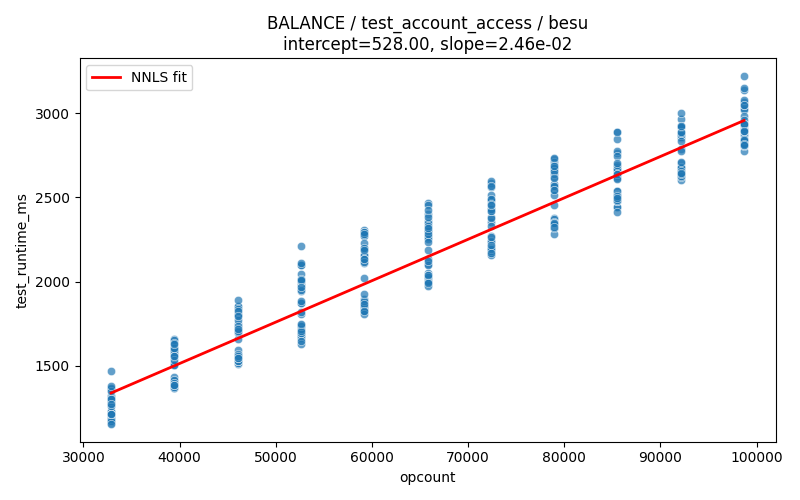

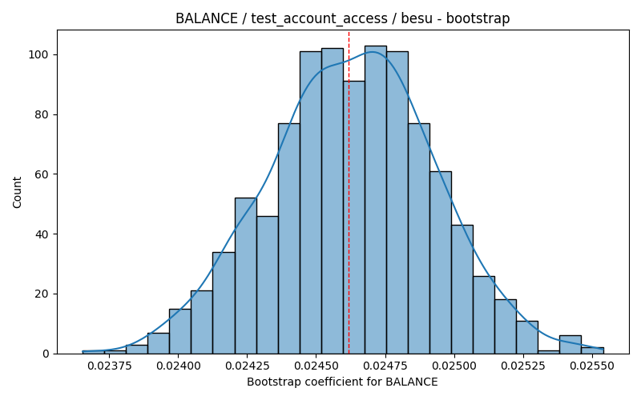

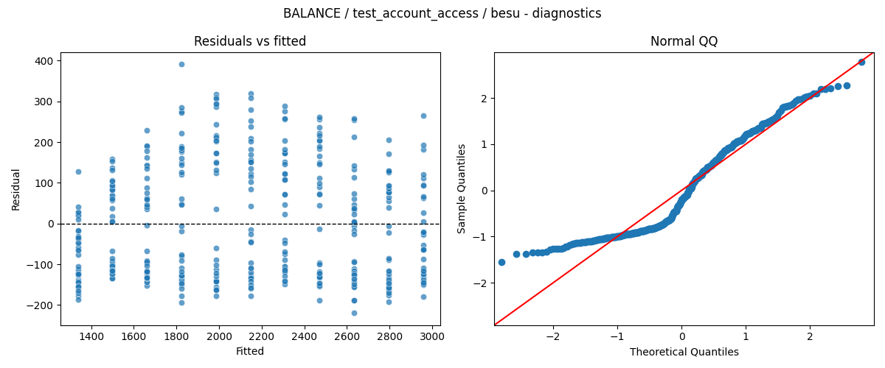

</details>

<details><summary>erigon — NNLS regression summary</summary>

```
==============================================================================
                           NNLS Regression Results                            
==============================================================================
Dep. Variable:          test_runtime_ms              R-squared:          0.939
Model:                  NNLS                    Adj. R-squared:          0.938
No. Observations:       44                                RMSE:         125.97
Df Residuals:           42                                 MAE:         108.47
Df Model:               1      
==============================================================================
                      coef     std err     P-value      [0.025      0.975]
------------------------------------------------------------------------------
         const    300.7267     63.4343       0.001    185.5561    429.4865
       opcount      0.0238      0.0009       0.001      0.0220      0.0255
==============================================================================
Notes: Non-negative least squares with bootstrap inference (1000 iterations)
==============================================================================
```

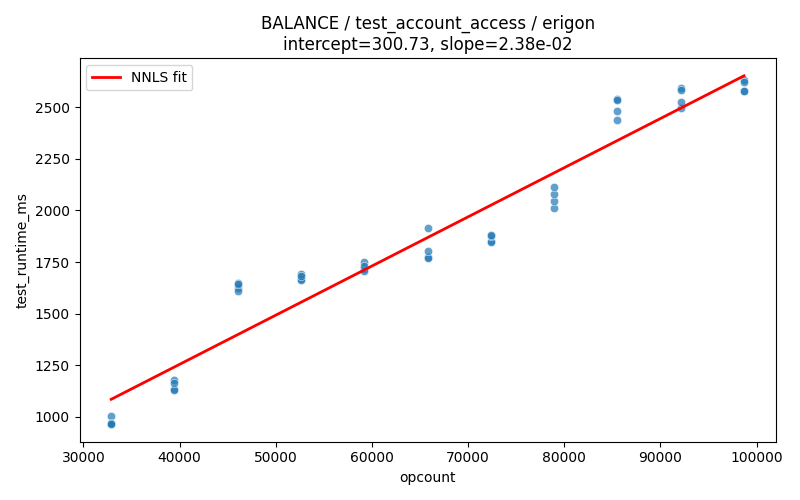

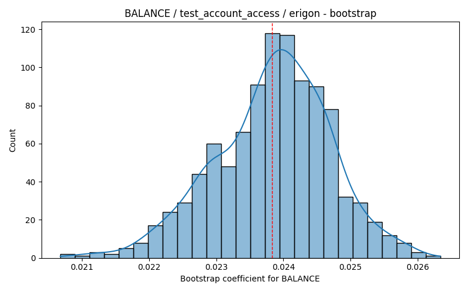

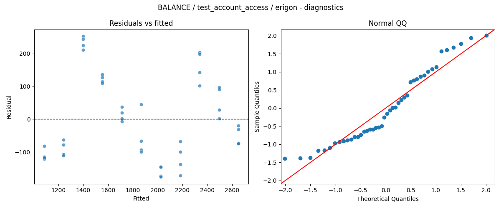

</details>

<details><summary>ethrex — NNLS regression summary</summary>

```
==============================================================================
                           NNLS Regression Results                            
==============================================================================
Dep. Variable:          test_runtime_ms              R-squared:          0.994
Model:                  NNLS                    Adj. R-squared:          0.994
No. Observations:       308                               RMSE:          12.70
Df Residuals:           306                                MAE:          10.06
Df Model:               1      
==============================================================================
                      coef     std err     P-value      [0.025      0.975]
------------------------------------------------------------------------------
         const     42.6918      2.1811       0.001     38.4077     46.7045
       opcount      0.0077      0.0000       0.001      0.0076      0.0078
==============================================================================
Notes: Non-negative least squares with bootstrap inference (1000 iterations)
==============================================================================
```

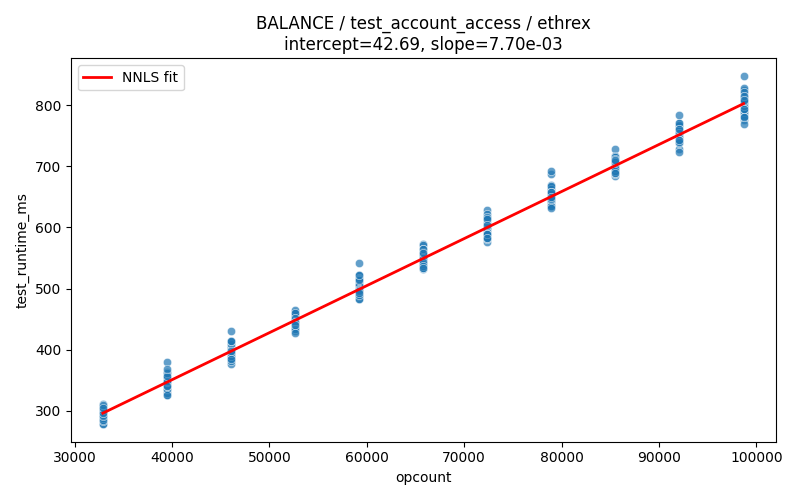

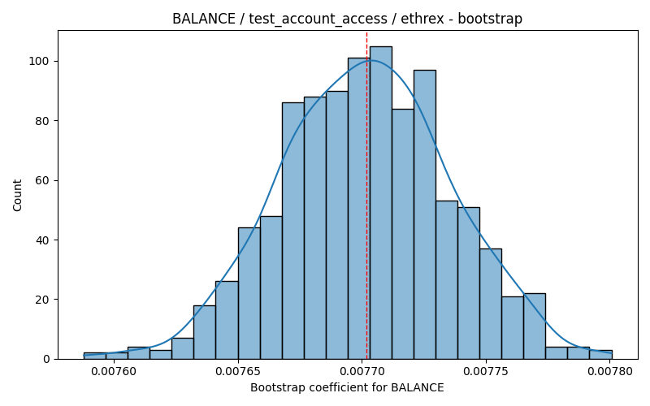

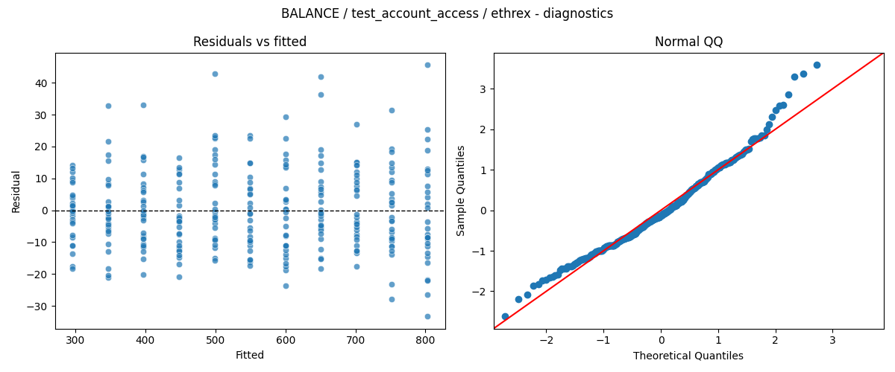

</details>

<details><summary>geth — NNLS regression summary</summary>

```
==============================================================================
                           NNLS Regression Results                            
==============================================================================
Dep. Variable:          test_runtime_ms              R-squared:          0.853
Model:                  NNLS                    Adj. R-squared:          0.853
No. Observations:       308                               RMSE:         196.01
Df Residuals:           306                                MAE:         165.35
Df Model:               1      
==============================================================================
                      coef     std err     P-value      [0.025      0.975]
------------------------------------------------------------------------------
         const    672.3587     42.0343       0.001    593.7873    754.6182
       opcount      0.0227      0.0006       0.001      0.0216      0.0238
==============================================================================
Notes: Non-negative least squares with bootstrap inference (1000 iterations)
==============================================================================
```


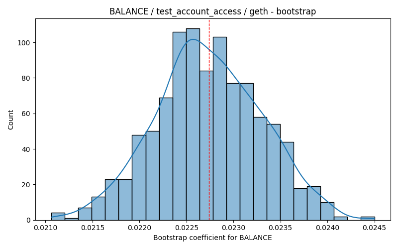

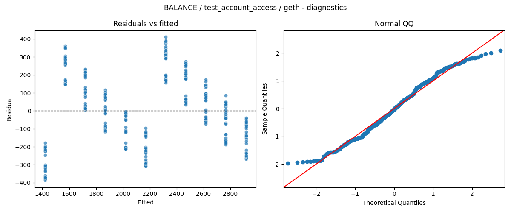

</details>

<details><summary>nethermind — NNLS regression summary</summary>

```
==============================================================================
                           NNLS Regression Results                            
==============================================================================
Dep. Variable:          test_runtime_ms              R-squared:          0.540
Model:                  NNLS                    Adj. R-squared:          0.538
No. Observations:       253                               RMSE:         243.68
Df Residuals:           251                                MAE:         176.13
Df Model:               1      
==============================================================================
                      coef     std err     P-value      [0.025      0.975]
------------------------------------------------------------------------------
         const    176.3931     40.9817       0.001     95.7765    253.1299
       opcount      0.0127      0.0007       0.001      0.0113      0.0142
==============================================================================
Notes: Non-negative least squares with bootstrap inference (1000 iterations)
==============================================================================
```

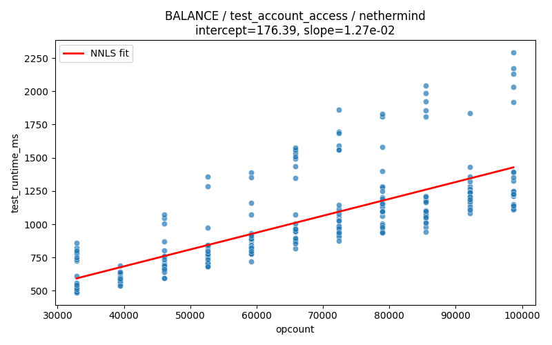

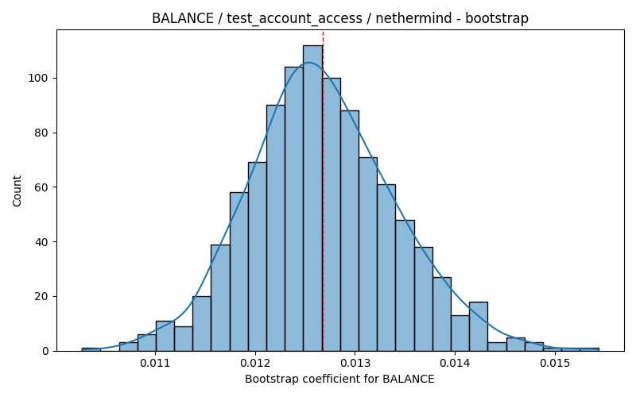

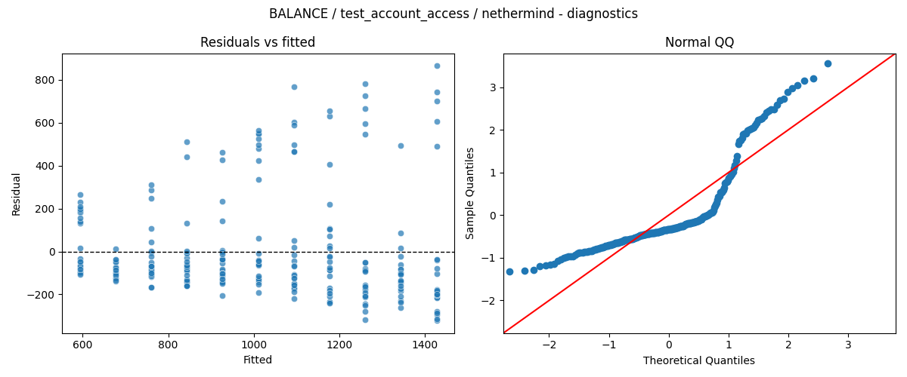

</details>

<details><summary>reth — NNLS regression summary</summary>

```
==============================================================================
                           NNLS Regression Results                            
==============================================================================
Dep. Variable:          test_runtime_ms              R-squared:          0.972
Model:                  NNLS                    Adj. R-squared:          0.972
No. Observations:       396                               RMSE:          13.79
Df Residuals:           394                                MAE:          11.18
Df Model:               1      
==============================================================================
                      coef     std err     P-value      [0.025      0.975]
------------------------------------------------------------------------------
         const    104.6831      2.1907       0.001    100.3946    109.1996
       opcount      0.0039      0.0000       0.001      0.0039      0.0040
==============================================================================
Notes: Non-negative least squares with bootstrap inference (1000 iterations)
==============================================================================
```

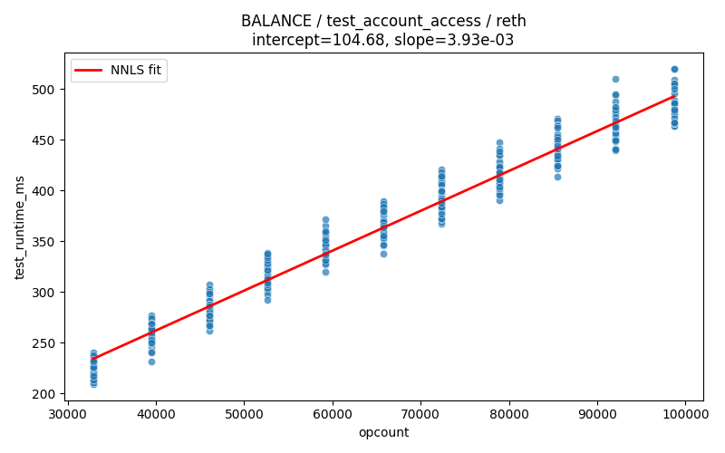

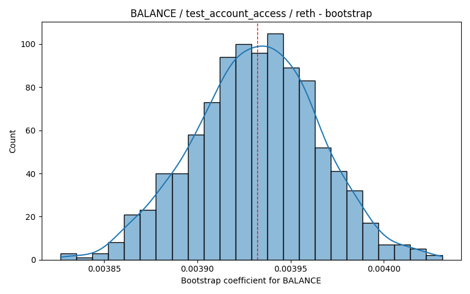

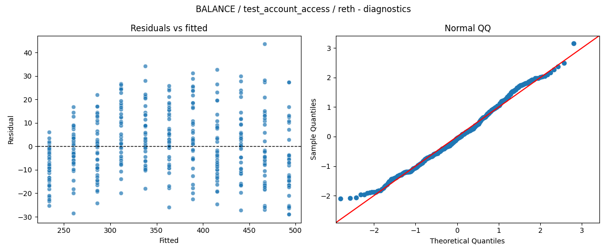

</details>

### test_account_access — combo `BALANCE_AccountMode.NON_EXISTING_ACCOUNT` — `presets[cold_account_code_access]`

| client | nobs | R² | target_coef (ms) | p-value | 95% CI |
| --- | --- | --- | --- | --- | --- |
| `besu` | 396 | 0.8434 | 0.01309 | 1.00e-03 | [0.0125, 0.01362] |
| `erigon` | 44 | 0.9928 | 0.008677 | 1.00e-03 | [0.00846, 0.008734] |
| `ethrex` | 308 | 0.9661 | 0.001995 | 1.00e-03 | [0.001954, 0.002034] |
| `geth` | 308 | 0.8586 | 0.02153 | 1.00e-03 | [0.02052, 0.02263] |
| `nethermind` | 253 | 0.8324 | 0.003592 | 1.00e-03 | [0.003404, 0.003779] |
| `reth` | 396 | 0.8705 | 0.0007489 | 1.00e-03 | [0.0007204, 0.0007812] |

<details><summary>besu — NNLS regression summary</summary>

```
==============================================================================
                           NNLS Regression Results                            
==============================================================================
Dep. Variable:          test_runtime_ms              R-squared:          0.843
Model:                  NNLS                    Adj. R-squared:          0.843
No. Observations:       396                               RMSE:         134.82
Df Residuals:           394                                MAE:         126.36
Df Model:               1      
==============================================================================
                      coef     std err     P-value      [0.025      0.975]
------------------------------------------------------------------------------
         const    483.6182     22.8322       0.001    441.9389    530.8702
       opcount      0.0131      0.0003       0.001      0.0125      0.0136
==============================================================================
Notes: Non-negative least squares with bootstrap inference (1000 iterations)
==============================================================================
```


</details>

<details><summary>erigon — NNLS regression summary</summary>

```
==============================================================================
                           NNLS Regression Results                            
==============================================================================
Dep. Variable:          test_runtime_ms              R-squared:          0.993
Model:                  NNLS                    Adj. R-squared:          0.993
No. Observations:       44                                RMSE:          17.69
Df Residuals:           42                                 MAE:          11.62
Df Model:               1      
==============================================================================
                      coef     std err     P-value      [0.025      0.975]
------------------------------------------------------------------------------
         const      0.9183      6.0096       0.475      0.0000     20.1683
       opcount      0.0087      0.0001       0.001      0.0085      0.0087
==============================================================================
Notes: Non-negative least squares with bootstrap inference (1000 iterations)
==============================================================================
```


</details>

<details><summary>ethrex — NNLS regression summary</summary>

```
==============================================================================
                           NNLS Regression Results                            
==============================================================================
Dep. Variable:          test_runtime_ms              R-squared:          0.966
Model:                  NNLS                    Adj. R-squared:          0.966
No. Observations:       308                               RMSE:           8.93
Df Residuals:           306                                MAE:           7.18
Df Model:               1      
==============================================================================
                      coef     std err     P-value      [0.025      0.975]
------------------------------------------------------------------------------
         const     26.8995      1.5414       0.001     23.8124     29.9405
       opcount      0.0020      0.0000       0.001      0.0020      0.0020
==============================================================================
Notes: Non-negative least squares with bootstrap inference (1000 iterations)
==============================================================================
```


</details>

<details><summary>geth — NNLS regression summary</summary>

```
==============================================================================
                           NNLS Regression Results                            
==============================================================================
Dep. Variable:          test_runtime_ms              R-squared:          0.859
Model:                  NNLS                    Adj. R-squared:          0.858
No. Observations:       308                               RMSE:         208.85
Df Residuals:           306                                MAE:         177.36
Df Model:               1      
==============================================================================
                      coef     std err     P-value      [0.025      0.975]
------------------------------------------------------------------------------
         const    696.2181     45.2204       0.001    603.5602    784.0046
       opcount      0.0215      0.0005       0.001      0.0205      0.0226
==============================================================================
Notes: Non-negative least squares with bootstrap inference (1000 iterations)
==============================================================================
```


</details>

<details><summary>nethermind — NNLS regression summary</summary>

```
==============================================================================
                           NNLS Regression Results                            
==============================================================================
Dep. Variable:          test_runtime_ms              R-squared:          0.832
Model:                  NNLS                    Adj. R-squared:          0.832
No. Observations:       253                               RMSE:          38.53
Df Residuals:           251                                MAE:          30.53
Df Model:               1      
==============================================================================
                      coef     std err     P-value      [0.025      0.975]
------------------------------------------------------------------------------
         const     79.1599      6.9196       0.001     65.6281     92.6205
       opcount      0.0036      0.0001       0.001      0.0034      0.0038
==============================================================================
Notes: Non-negative least squares with bootstrap inference (1000 iterations)
==============================================================================
```


</details>

<details><summary>reth — NNLS regression summary</summary>

```
==============================================================================
                           NNLS Regression Results                            
==============================================================================
Dep. Variable:          test_runtime_ms              R-squared:          0.870
Model:                  NNLS                    Adj. R-squared:          0.870
No. Observations:       396                               RMSE:           6.90
Df Residuals:           394                                MAE:           5.55
Df Model:               1      
==============================================================================
                      coef     std err     P-value      [0.025      0.975]
------------------------------------------------------------------------------
         const     47.1033      1.1373       0.001     44.6740     49.2554
       opcount      0.0007      0.0000       0.001      0.0007      0.0008
==============================================================================
Notes: Non-negative least squares with bootstrap inference (1000 iterations)
==============================================================================
```


</details>

### test_ext_account_query_warm — combo `BALANCE`

| client | nobs | R² | target_coef (ms) | p-value | 95% CI |
| --- | --- | --- | --- | --- | --- |
| `besu` | 396 | 0.3007 | 0.0002139 | 1.00e-03 | [0.0001837, 0.0002455] |
| `erigon` | 44 | 0.9721 | 6.517e-05 | 1.00e-03 | [6.138e-05, 6.857e-05] |
| `ethrex` | 308 | 0.2616 | 1.425e-05 | 1.00e-03 | [1.176e-05, 1.659e-05] |
| `geth` | 308 | 0.7521 | 2.909e-05 | 1.00e-03 | [2.743e-05, 3.093e-05] |
| `nethermind` | 253 | 0.6704 | 0.0001268 | 1.00e-03 | [0.0001159, 0.0001371] |
| `reth` | 396 | 0.649 | 1.296e-05 | 1.00e-03 | [1.195e-05, 1.401e-05] |

<details><summary>besu — NNLS regression summary</summary>

```
==============================================================================
                           NNLS Regression Results                            
==============================================================================
Dep. Variable:          test_runtime_ms              R-squared:          0.301
Model:                  NNLS                    Adj. R-squared:          0.299
No. Observations:       396                               RMSE:         190.79
Df Residuals:           394                                MAE:         158.40
Df Model:               1      
==============================================================================
                      coef     std err     P-value      [0.025      0.975]
------------------------------------------------------------------------------
         const    427.2171     29.5460       0.001    367.4006    486.0944
       opcount      0.0002      0.0000       0.001      0.0002      0.0002
==============================================================================
Notes: Non-negative least squares with bootstrap inference (1000 iterations)
==============================================================================
```

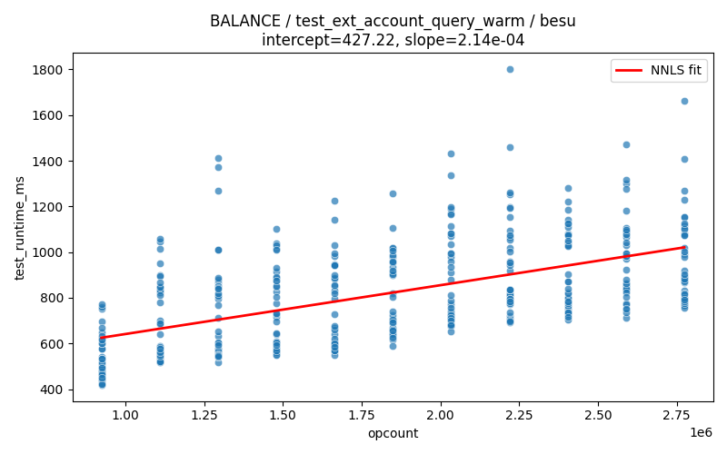

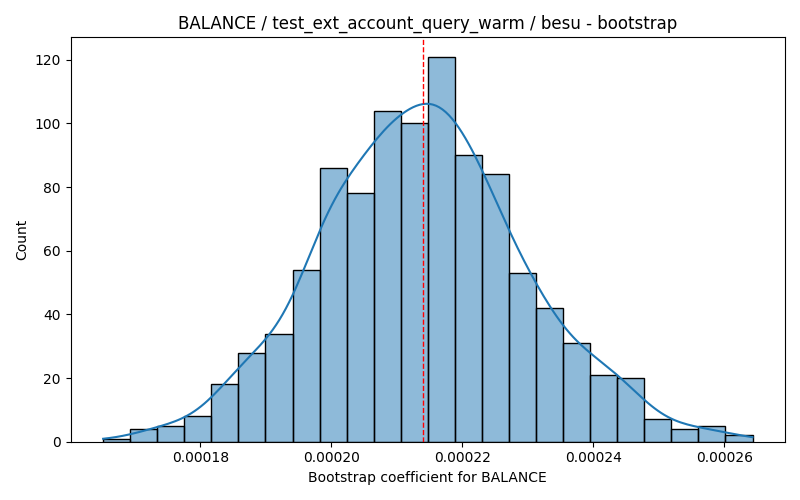

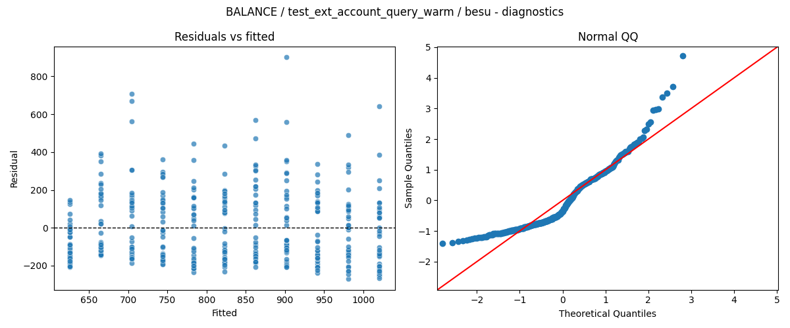

</details>

<details><summary>erigon — NNLS regression summary</summary>

```
==============================================================================
                           NNLS Regression Results                            
==============================================================================
Dep. Variable:          test_runtime_ms              R-squared:          0.972
Model:                  NNLS                    Adj. R-squared:          0.971
No. Observations:       44                                RMSE:           6.45
Df Residuals:           42                                 MAE:           4.93
Df Model:               1      
==============================================================================
                      coef     std err     P-value      [0.025      0.975]
------------------------------------------------------------------------------
         const     23.0377      3.2902       0.001     17.1186     29.2409
       opcount      0.0001      0.0000       0.001      0.0001      0.0001
==============================================================================
Notes: Non-negative least squares with bootstrap inference (1000 iterations)
==============================================================================
```

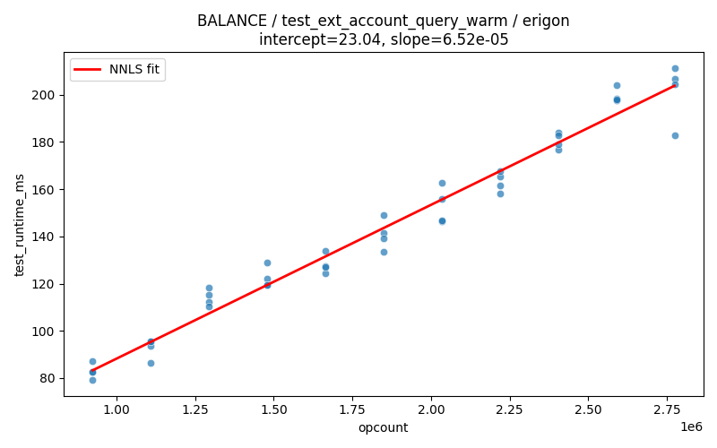

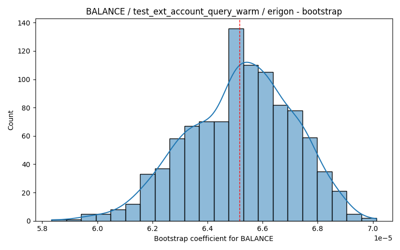

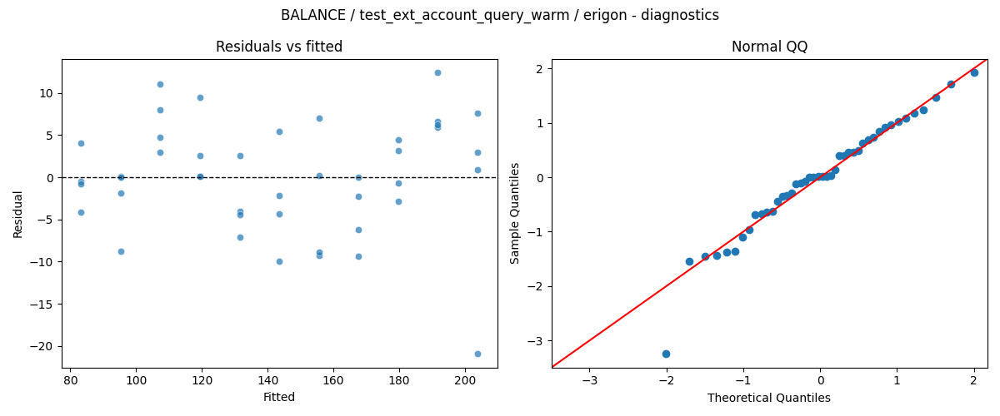

</details>

<details><summary>ethrex — NNLS regression summary</summary>

```
==============================================================================
                           NNLS Regression Results                            
==============================================================================
Dep. Variable:          test_runtime_ms              R-squared:          0.262
Model:                  NNLS                    Adj. R-squared:          0.259
No. Observations:       308                               RMSE:          14.00
Df Residuals:           306                                MAE:           9.10
Df Model:               1      
==============================================================================
                      coef     std err     P-value      [0.025      0.975]
------------------------------------------------------------------------------
         const     12.6456      2.5157       0.001      7.9235     17.6193
       opcount      0.0000      0.0000       0.001      0.0000      0.0000
==============================================================================
Notes: Non-negative least squares with bootstrap inference (1000 iterations)
==============================================================================
```

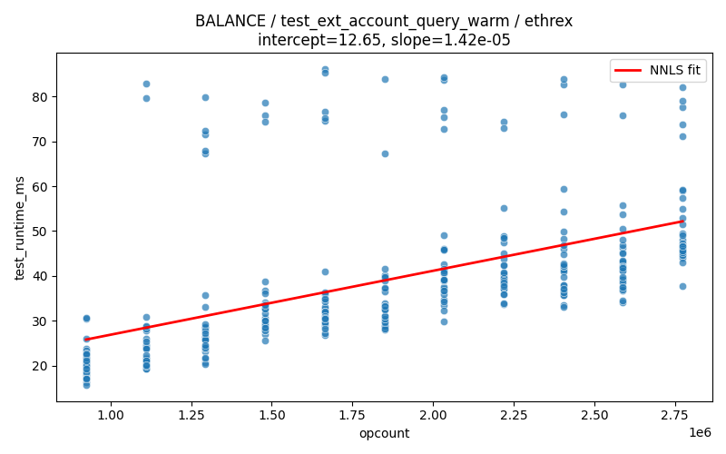

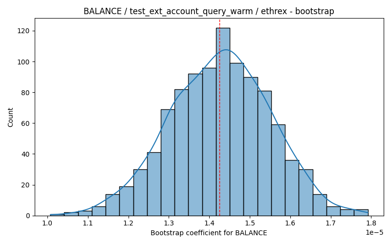

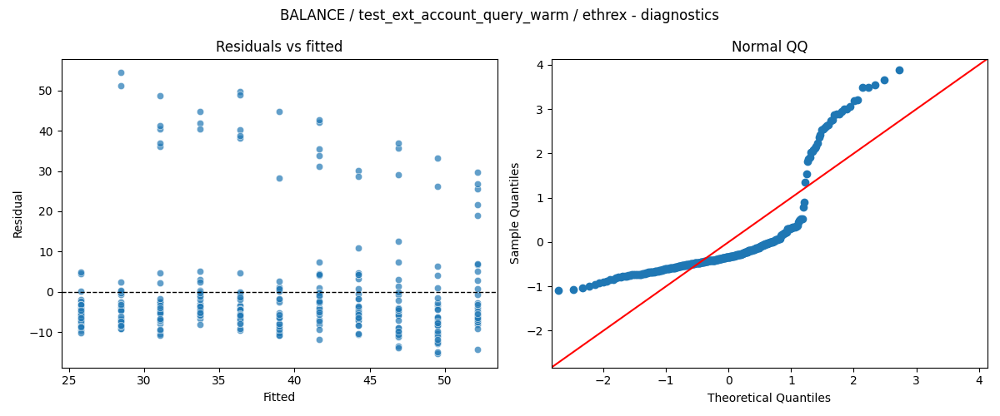

</details>

<details><summary>geth — NNLS regression summary</summary>

```
==============================================================================
                           NNLS Regression Results                            
==============================================================================
Dep. Variable:          test_runtime_ms              R-squared:          0.752
Model:                  NNLS                    Adj. R-squared:          0.751
No. Observations:       308                               RMSE:           9.77
Df Residuals:           306                                MAE:           7.78
Df Model:               1      
==============================================================================
                      coef     std err     P-value      [0.025      0.975]
------------------------------------------------------------------------------
         const     19.5283      1.6736       0.001     16.2141     22.8080
       opcount      0.0000      0.0000       0.001      0.0000      0.0000
==============================================================================
Notes: Non-negative least squares with bootstrap inference (1000 iterations)
==============================================================================
```

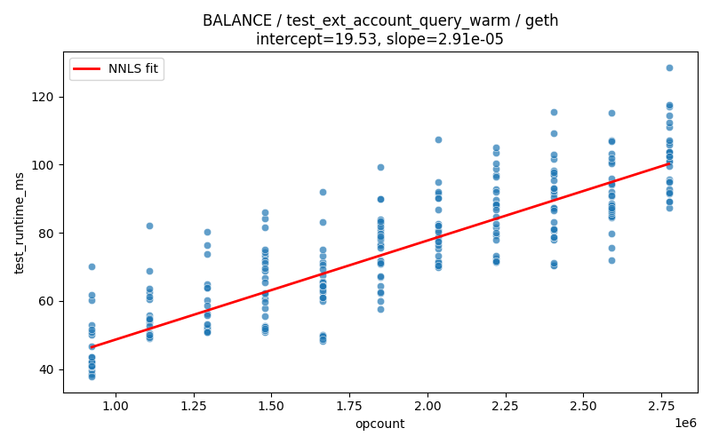

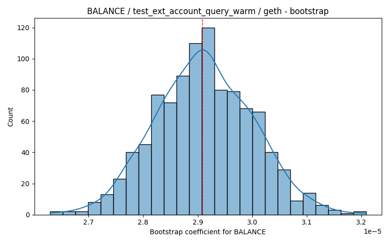

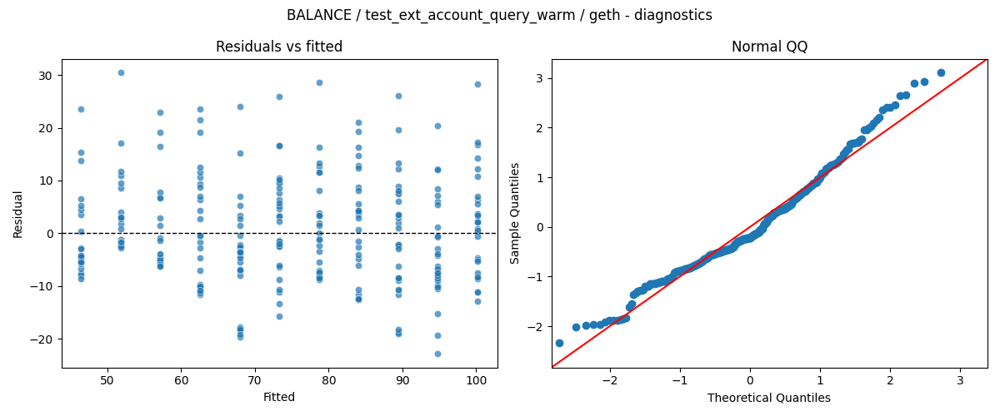

</details>

<details><summary>nethermind — NNLS regression summary</summary>

```
==============================================================================
                           NNLS Regression Results                            
==============================================================================
Dep. Variable:          test_runtime_ms              R-squared:          0.670
Model:                  NNLS                    Adj. R-squared:          0.669
No. Observations:       253                               RMSE:          51.98
Df Residuals:           251                                MAE:          41.04
Df Model:               1      
==============================================================================
                      coef     std err     P-value      [0.025      0.975]
------------------------------------------------------------------------------
         const    119.8652     10.0432       0.001    100.2948    140.6300
       opcount      0.0001      0.0000       0.001      0.0001      0.0001
==============================================================================
Notes: Non-negative least squares with bootstrap inference (1000 iterations)
==============================================================================
```

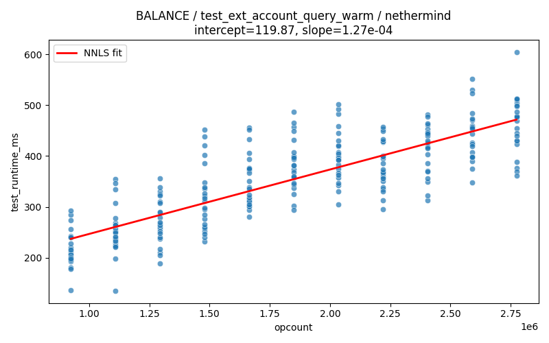

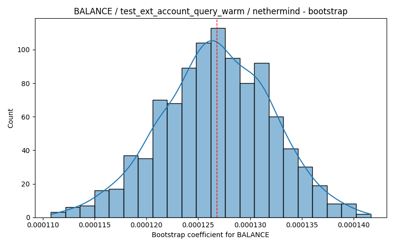

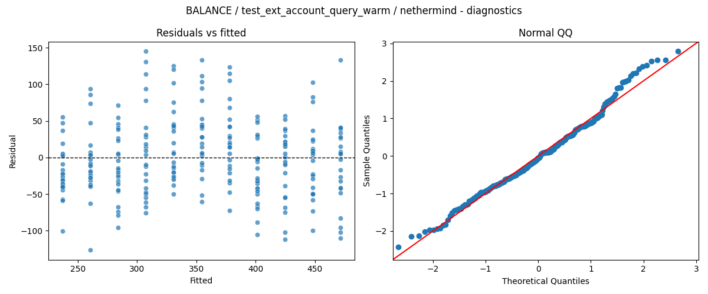

</details>

<details><summary>reth — NNLS regression summary</summary>

```
==============================================================================
                           NNLS Regression Results                            
==============================================================================
Dep. Variable:          test_runtime_ms              R-squared:          0.649
Model:                  NNLS                    Adj. R-squared:          0.648
No. Observations:       396                               RMSE:           5.58
Df Residuals:           394                                MAE:           4.33
Df Model:               1      
==============================================================================
                      coef     std err     P-value      [0.025      0.975]
------------------------------------------------------------------------------
         const      8.6267      0.9649       0.001      6.6637     10.5539
       opcount      0.0000      0.0000       0.001      0.0000      0.0000
==============================================================================
Notes: Non-negative least squares with bootstrap inference (1000 iterations)
==============================================================================
```

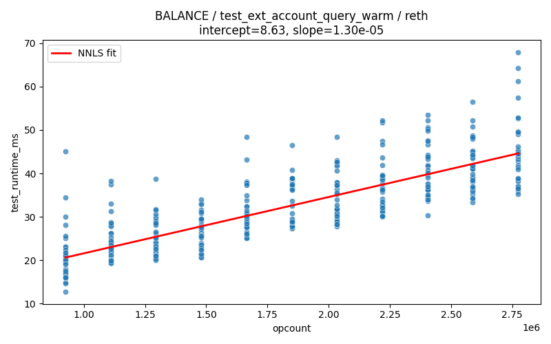

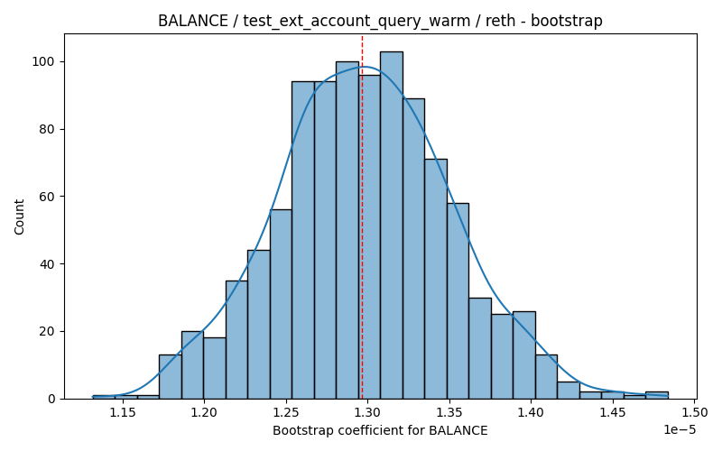

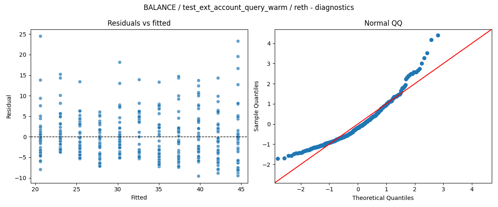

</details>

## CALL

### test_account_access — combo `CALL_AccountMode.EXISTING_EOA` — `presets[cold_account_nocode_access]`

| client | nobs | R² | target_coef (ms) | p-value | 95% CI |
| --- | --- | --- | --- | --- | --- |
| `besu` | 396 | 0.8938 | 0.01511 | 1.00e-03 | [0.0146, 0.01565] |
| `erigon` | 44 | 0.9894 | 0.01114 | 1.00e-03 | [0.01087, 0.01132] |
| `ethrex` | 308 | 0.9937 | 0.007264 | 1.00e-03 | [0.007202, 0.007331] |
| `geth` | 308 | 0.9091 | 0.01086 | 1.00e-03 | [0.01044, 0.0113] |
| `nethermind` | 253 | 0.8089 | 0.004143 | 1.00e-03 | [0.003912, 0.004357] |
| `reth` | 396 | 0.9139 | 0.001089 | 1.00e-03 | [0.001056, 0.001123] |

<details><summary>besu — NNLS regression summary</summary>

```
==============================================================================
                           NNLS Regression Results                            
==============================================================================
Dep. Variable:          test_runtime_ms              R-squared:          0.894
Model:                  NNLS                    Adj. R-squared:          0.894
No. Observations:       396                               RMSE:         123.64
Df Residuals:           394                                MAE:         107.29
Df Model:               1      
==============================================================================
                      coef     std err     P-value      [0.025      0.975]
------------------------------------------------------------------------------
         const    614.4537     19.6620       0.001    572.5511    652.8243
       opcount      0.0151      0.0003       0.001      0.0146      0.0156
==============================================================================
Notes: Non-negative least squares with bootstrap inference (1000 iterations)
==============================================================================
```

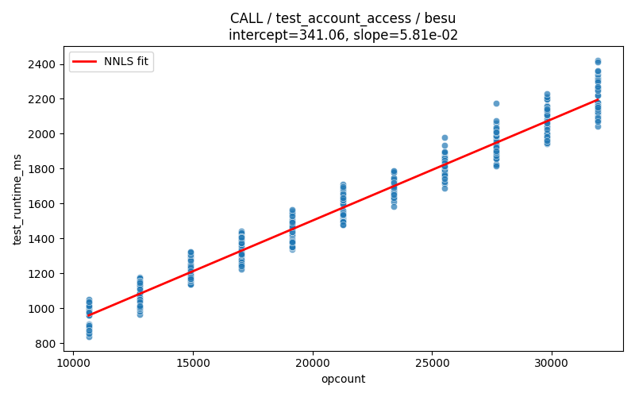

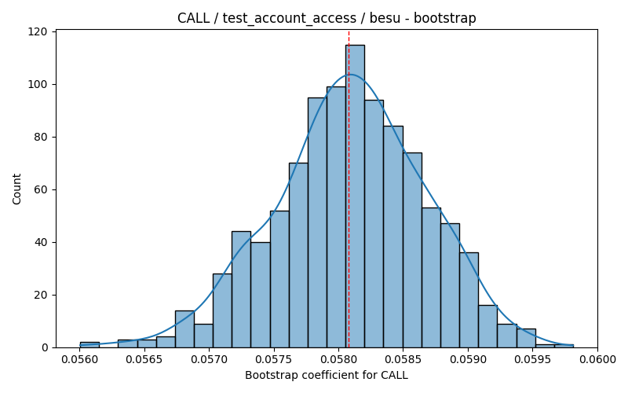

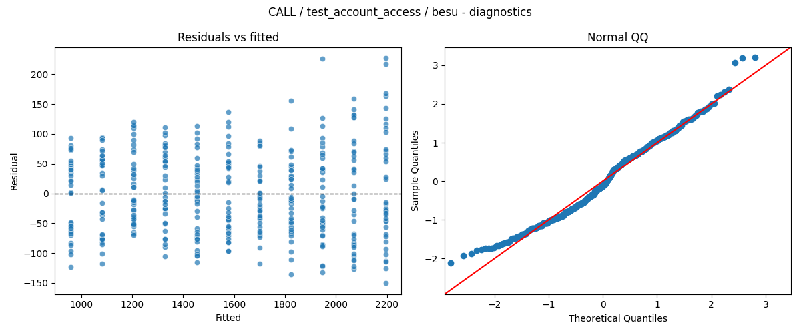

</details>

<details><summary>erigon — NNLS regression summary</summary>

```
==============================================================================
                           NNLS Regression Results                            
==============================================================================
Dep. Variable:          test_runtime_ms              R-squared:          0.989
Model:                  NNLS                    Adj. R-squared:          0.989
No. Observations:       44                                RMSE:          27.35
Df Residuals:           42                                 MAE:          20.43
Df Model:               1      
==============================================================================
                      coef     std err     P-value      [0.025      0.975]
------------------------------------------------------------------------------
         const      5.4173      7.0174       0.303      0.0000     22.4176
       opcount      0.0111      0.0001       0.001      0.0109      0.0113
==============================================================================
Notes: Non-negative least squares with bootstrap inference (1000 iterations)
==============================================================================
```

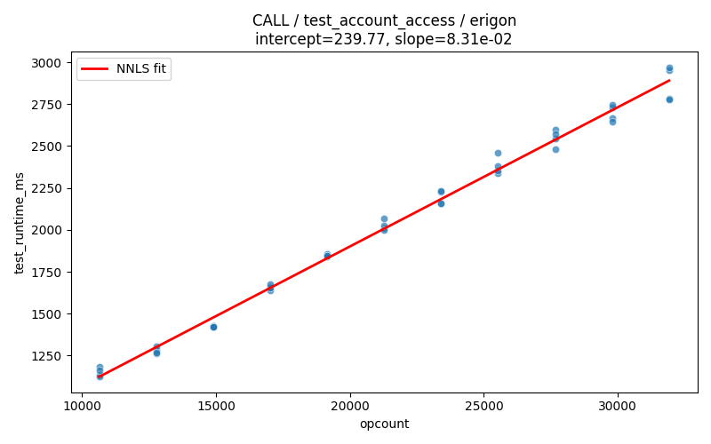

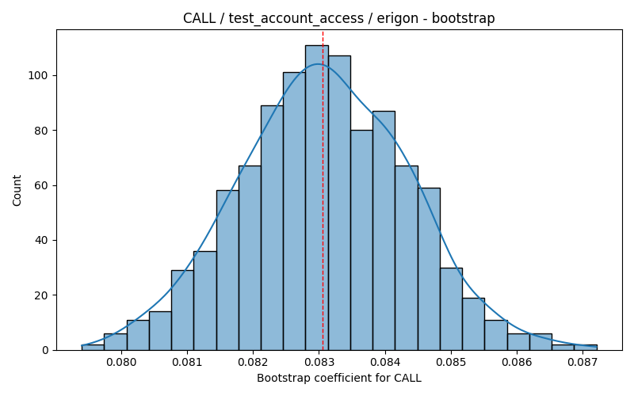

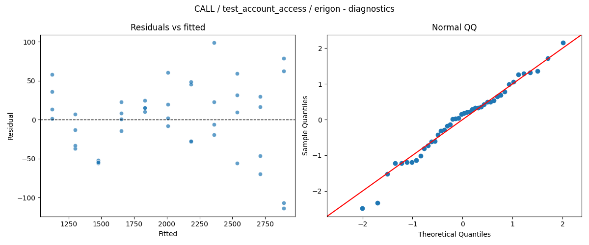

</details>

<details><summary>ethrex — NNLS regression summary</summary>

```
==============================================================================
                           NNLS Regression Results                            
==============================================================================
Dep. Variable:          test_runtime_ms              R-squared:          0.994
Model:                  NNLS                    Adj. R-squared:          0.994
No. Observations:       308                               RMSE:          13.78
Df Residuals:           306                                MAE:          10.63
Df Model:               1      
==============================================================================
                      coef     std err     P-value      [0.025      0.975]
------------------------------------------------------------------------------
         const     45.6384      2.4898       0.001     40.8229     50.2525
       opcount      0.0073      0.0000       0.001      0.0072      0.0073
==============================================================================
Notes: Non-negative least squares with bootstrap inference (1000 iterations)
==============================================================================
```

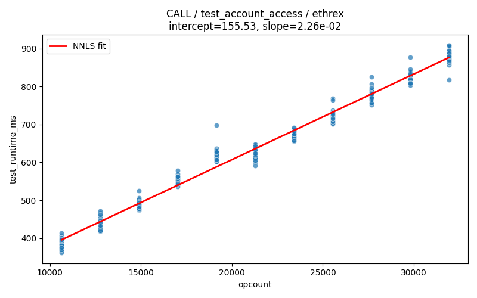

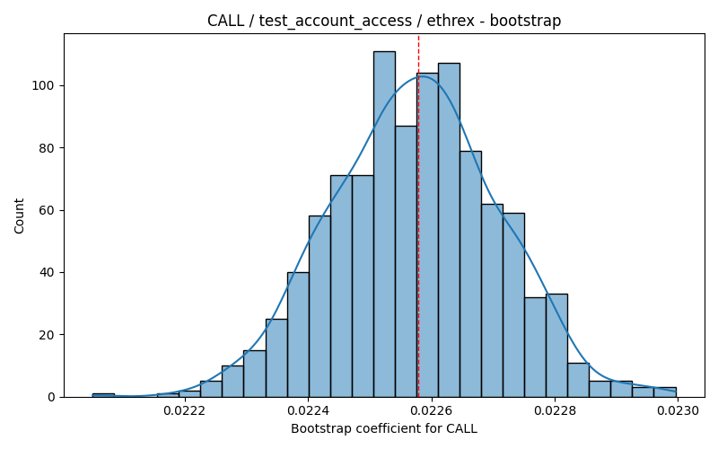

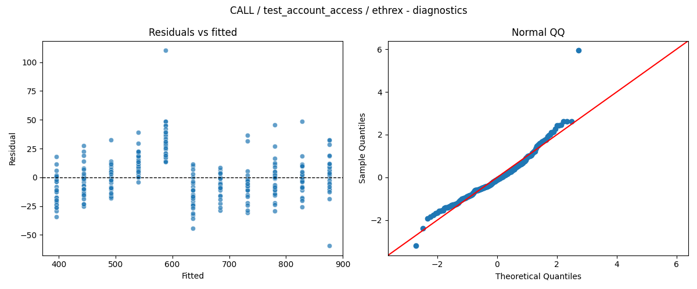

</details>

<details><summary>geth — NNLS regression summary</summary>

```
==============================================================================
                           NNLS Regression Results                            
==============================================================================
Dep. Variable:          test_runtime_ms              R-squared:          0.909
Model:                  NNLS                    Adj. R-squared:          0.909
No. Observations:       308                               RMSE:          81.56
Df Residuals:           306                                MAE:          66.93
Df Model:               1      
==============================================================================
                      coef     std err     P-value      [0.025      0.975]
------------------------------------------------------------------------------
         const    412.1915     18.8594       0.001    375.5981    449.0548
       opcount      0.0109      0.0002       0.001      0.0104      0.0113
==============================================================================
Notes: Non-negative least squares with bootstrap inference (1000 iterations)
==============================================================================
```

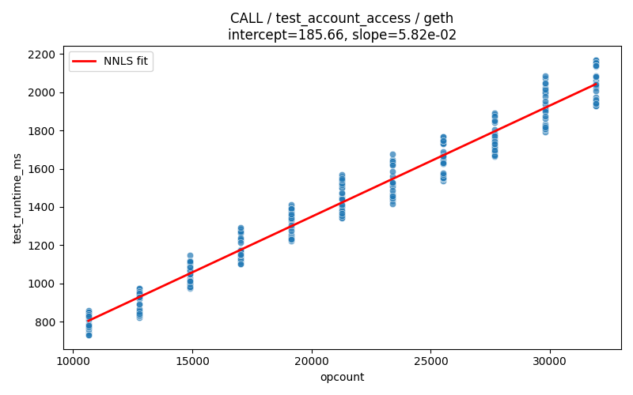

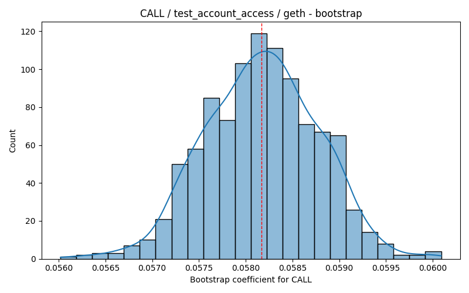

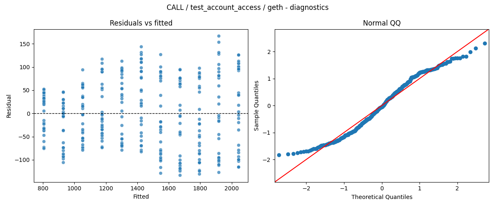

</details>

<details><summary>nethermind — NNLS regression summary</summary>

```
==============================================================================
                           NNLS Regression Results                            
==============================================================================
Dep. Variable:          test_runtime_ms              R-squared:          0.809
Model:                  NNLS                    Adj. R-squared:          0.808
No. Observations:       253                               RMSE:          47.81
Df Residuals:           251                                MAE:          37.06
Df Model:               1      
==============================================================================
                      coef     std err     P-value      [0.025      0.975]
------------------------------------------------------------------------------
         const     97.0563      8.1187       0.001     82.2315    113.3014
       opcount      0.0041      0.0001       0.001      0.0039      0.0044
==============================================================================
Notes: Non-negative least squares with bootstrap inference (1000 iterations)
==============================================================================
```

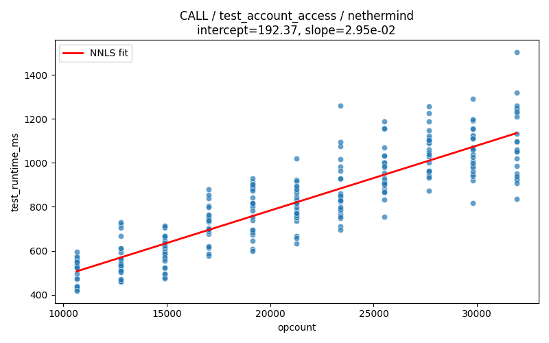

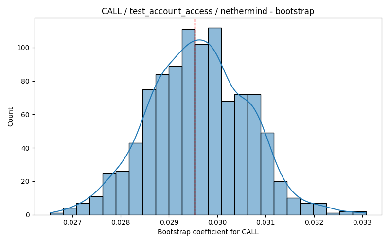

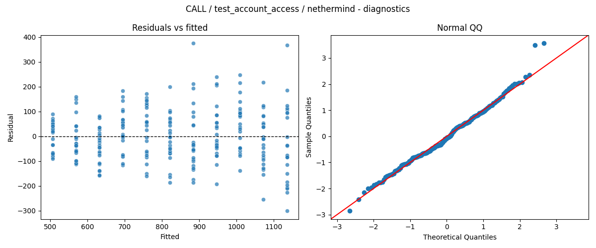

</details>

<details><summary>reth — NNLS regression summary</summary>

```
==============================================================================
                           NNLS Regression Results                            
==============================================================================
Dep. Variable:          test_runtime_ms              R-squared:          0.914
Model:                  NNLS                    Adj. R-squared:          0.914
No. Observations:       396                               RMSE:           7.94
Df Residuals:           394                                MAE:           6.31
Df Model:               1      
==============================================================================
                      coef     std err     P-value      [0.025      0.975]
------------------------------------------------------------------------------
         const     47.7953      1.2317       0.001     45.3361     50.3321
       opcount      0.0011      0.0000       0.001      0.0011      0.0011
==============================================================================
Notes: Non-negative least squares with bootstrap inference (1000 iterations)
==============================================================================
```

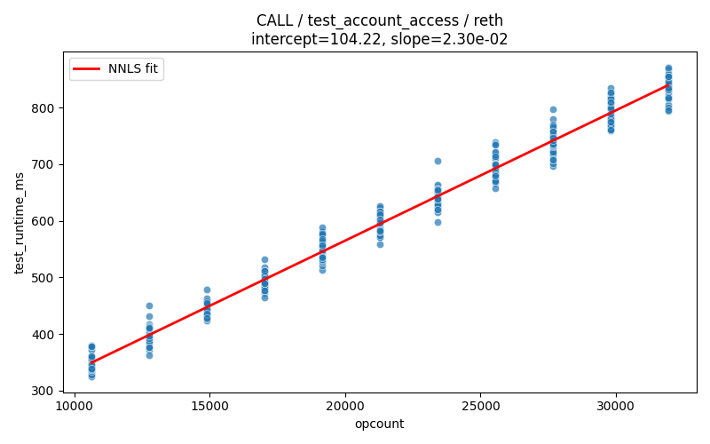

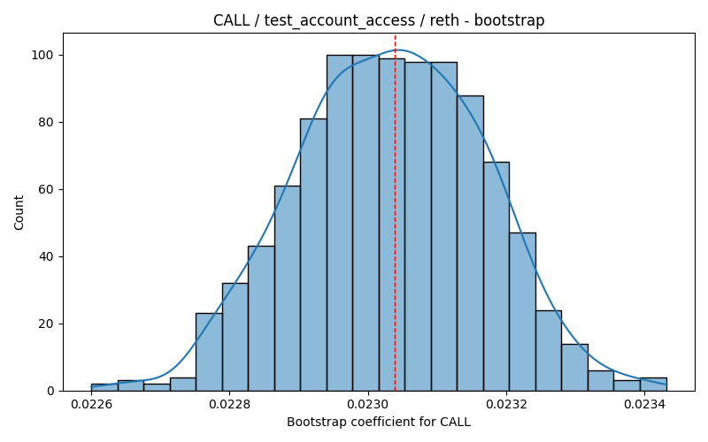

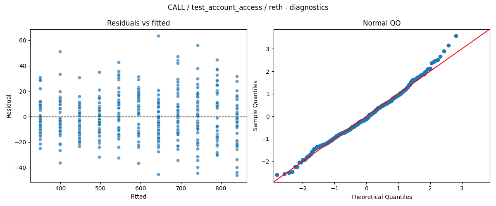

</details>

### test_account_access — combo `CALL_AccountMode.NON_EXISTING_ACCOUNT` — `presets[cold_account_nocode_access]`

| client | nobs | R² | target_coef (ms) | p-value | 95% CI |
| --- | --- | --- | --- | --- | --- |
| `besu` | 396 | 0.8488 | 0.01594 | 1.00e-03 | [0.0153, 0.01659] |
| `erigon` | 44 | 0.9944 | 0.01005 | 1.00e-03 | [0.009915, 0.01014] |
| `ethrex` | 308 | 0.9664 | 0.002042 | 1.00e-03 | [0.002, 0.002085] |
| `geth` | 308 | 0.8641 | 0.02193 | 1.00e-03 | [0.02094, 0.023] |
| `nethermind` | 253 | 0.8516 | 0.00407 | 1.00e-03 | [0.003863, 0.004281] |
| `reth` | 396 | 0.8817 | 0.0007737 | 1.00e-03 | [0.0007465, 0.0008013] |

<details><summary>besu — NNLS regression summary</summary>

```
==============================================================================
                           NNLS Regression Results                            
==============================================================================
Dep. Variable:          test_runtime_ms              R-squared:          0.849
Model:                  NNLS                    Adj. R-squared:          0.848
No. Observations:       396                               RMSE:         159.77
Df Residuals:           394                                MAE:         147.48
Df Model:               1      
==============================================================================
                      coef     std err     P-value      [0.025      0.975]
------------------------------------------------------------------------------
         const    525.4073     24.4522       0.001    476.4505    574.2339
       opcount      0.0159      0.0003       0.001      0.0153      0.0166
==============================================================================
Notes: Non-negative least squares with bootstrap inference (1000 iterations)
==============================================================================
```

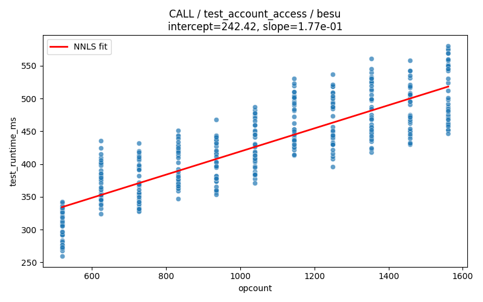

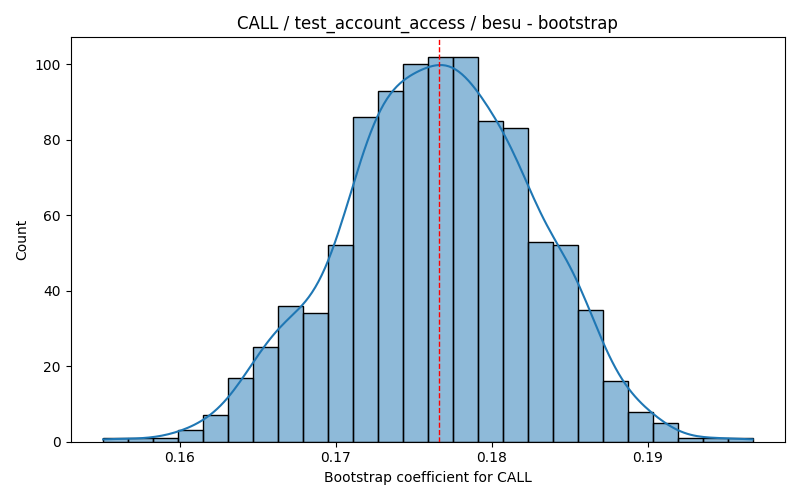

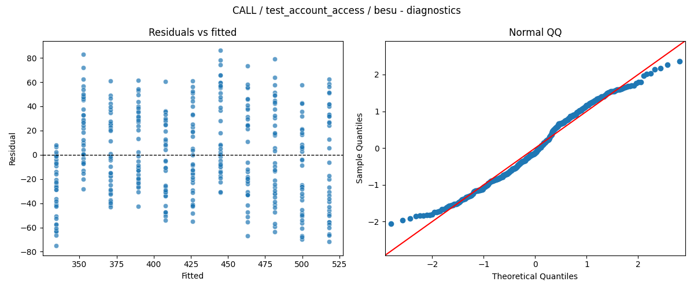

</details>

<details><summary>erigon — NNLS regression summary</summary>

```
==============================================================================
                           NNLS Regression Results                            
==============================================================================
Dep. Variable:          test_runtime_ms              R-squared:          0.994
Model:                  NNLS                    Adj. R-squared:          0.994
No. Observations:       44                                RMSE:          18.07
Df Residuals:           42                                 MAE:          11.84
Df Model:               1      
==============================================================================
                      coef     std err     P-value      [0.025      0.975]
------------------------------------------------------------------------------
         const      0.0000      1.7026       1.000      0.0000      6.3057
       opcount      0.0101      0.0001       0.001      0.0099      0.0101
==============================================================================
Notes: Non-negative least squares with bootstrap inference (1000 iterations)
==============================================================================
```

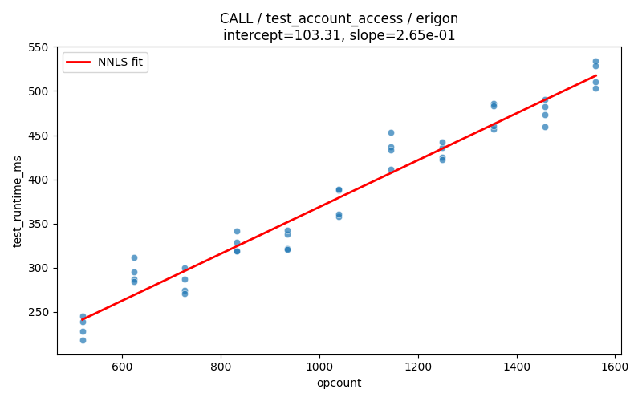

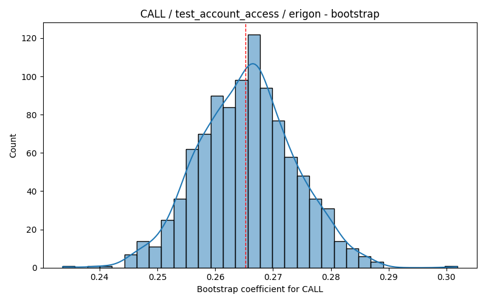

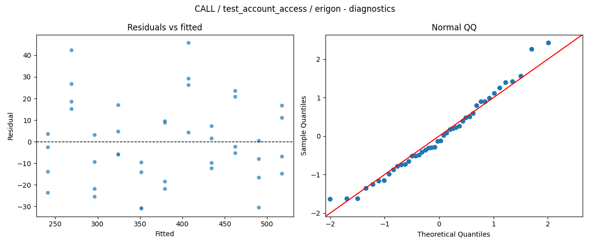

</details>

<details><summary>ethrex — NNLS regression summary</summary>

```
==============================================================================
                           NNLS Regression Results                            
==============================================================================
Dep. Variable:          test_runtime_ms              R-squared:          0.966
Model:                  NNLS                    Adj. R-squared:          0.966
No. Observations:       308                               RMSE:           9.04
Df Residuals:           306                                MAE:           7.12
Df Model:               1      
==============================================================================
                      coef     std err     P-value      [0.025      0.975]
------------------------------------------------------------------------------
         const     29.9417      1.6158       0.001     26.8995     33.2153
       opcount      0.0020      0.0000       0.001      0.0020      0.0021
==============================================================================
Notes: Non-negative least squares with bootstrap inference (1000 iterations)
==============================================================================
```

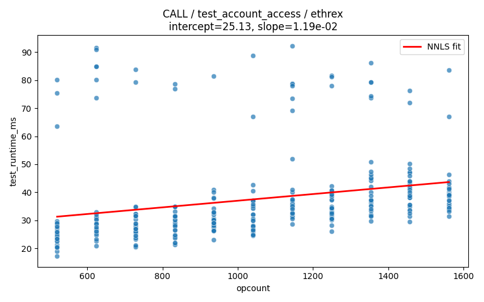

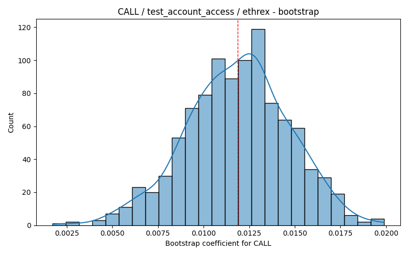

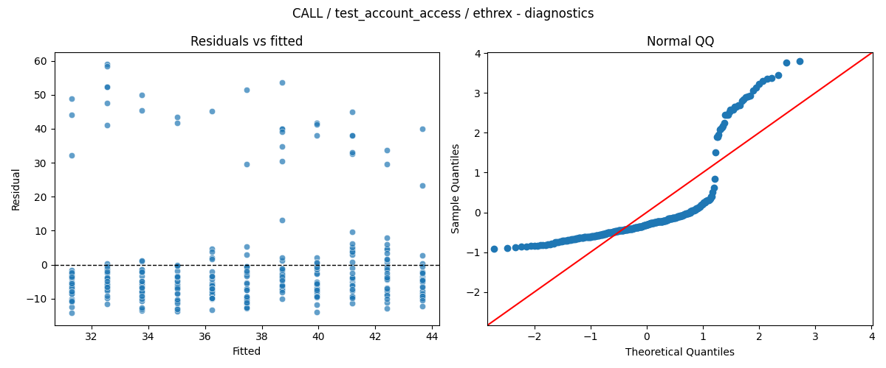

</details>

<details><summary>geth — NNLS regression summary</summary>

```
==============================================================================
                           NNLS Regression Results                            
==============================================================================
Dep. Variable:          test_runtime_ms              R-squared:          0.864
Model:                  NNLS                    Adj. R-squared:          0.864
No. Observations:       308                               RMSE:         206.56
Df Residuals:           306                                MAE:         175.71
Df Model:               1      
==============================================================================
                      coef     std err     P-value      [0.025      0.975]
------------------------------------------------------------------------------
         const    701.2552     45.0432       0.001    612.5614    787.3152
       opcount      0.0219      0.0005       0.001      0.0209      0.0230
==============================================================================
Notes: Non-negative least squares with bootstrap inference (1000 iterations)
==============================================================================
```

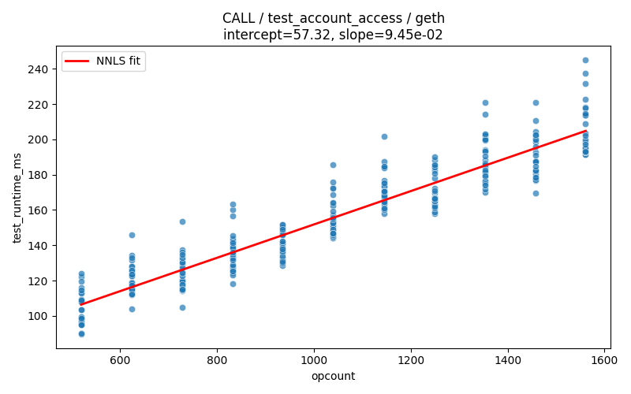

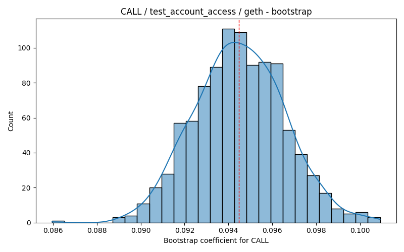

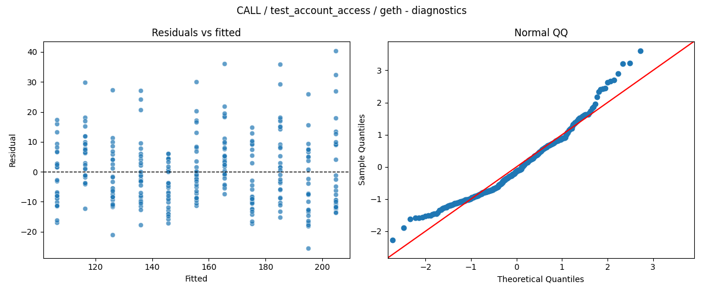

</details>

<details><summary>nethermind — NNLS regression summary</summary>

```
==============================================================================
                           NNLS Regression Results                            
==============================================================================
Dep. Variable:          test_runtime_ms              R-squared:          0.852
Model:                  NNLS                    Adj. R-squared:          0.851
No. Observations:       253                               RMSE:          40.34
Df Residuals:           251                                MAE:          32.16
Df Model:               1      
==============================================================================
                      coef     std err     P-value      [0.025      0.975]
------------------------------------------------------------------------------
         const     81.0480      7.5910       0.001     66.2321     95.5143
       opcount      0.0041      0.0001       0.001      0.0039      0.0043
==============================================================================
Notes: Non-negative least squares with bootstrap inference (1000 iterations)
==============================================================================
```

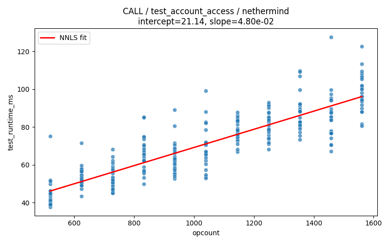

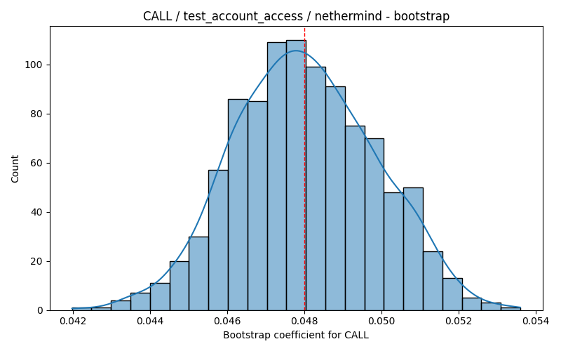

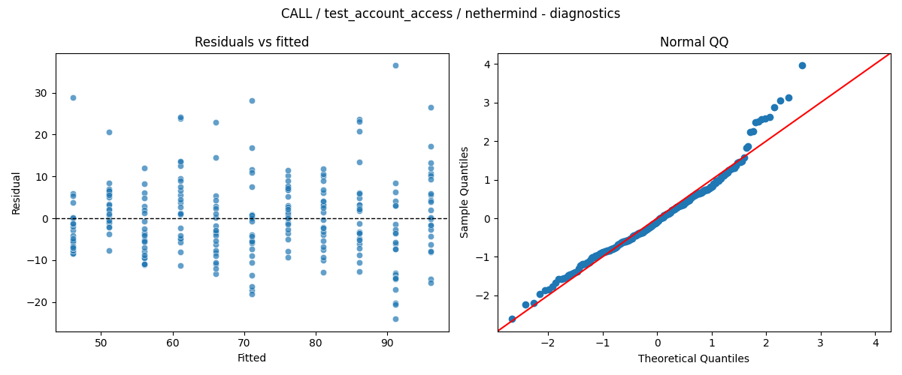

</details>

<details><summary>reth — NNLS regression summary</summary>

```
==============================================================================
                           NNLS Regression Results                            
==============================================================================
Dep. Variable:          test_runtime_ms              R-squared:          0.882
Model:                  NNLS                    Adj. R-squared:          0.881
No. Observations:       396                               RMSE:           6.73
Df Residuals:           394                                MAE:           5.20
Df Model:               1      
==============================================================================
                      coef     std err     P-value      [0.025      0.975]
------------------------------------------------------------------------------
         const     51.3402      1.0878       0.001     49.1131     53.4270
       opcount      0.0008      0.0000       0.001      0.0007      0.0008
==============================================================================
Notes: Non-negative least squares with bootstrap inference (1000 iterations)
==============================================================================
```

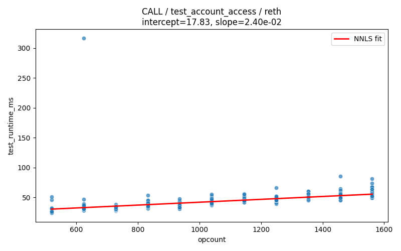

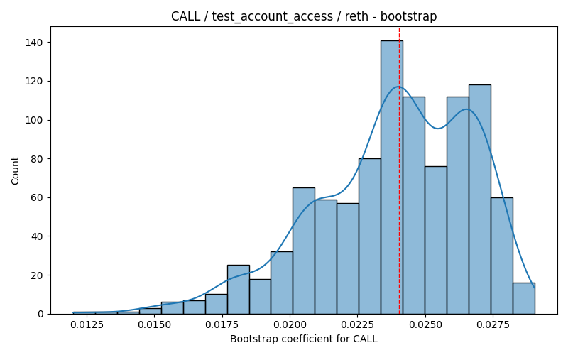

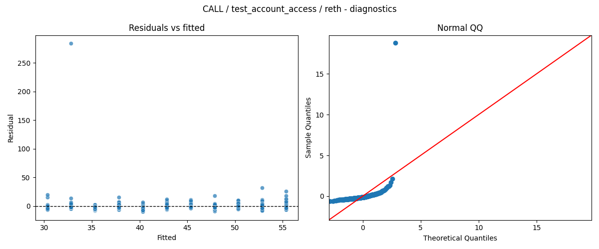

</details>

### test_account_access — combo `CALL_AccountMode.EXISTING_CONTRACT` — `presets[cold_account_code_access]`

| client | nobs | R² | target_coef (ms) | p-value | 95% CI |
| --- | --- | --- | --- | --- | --- |
| `besu` | 396 | 0.9387 | 0.02648 | 1.00e-03 | [0.02582, 0.02711] |
| `erigon` | 44 | 0.91 | 0.04911 | 1.00e-03 | [0.04425, 0.05291] |
| `ethrex` | 308 | 0.9937 | 0.007994 | 1.00e-03 | [0.00792, 0.008062] |
| `geth` | 308 | 0.8589 | 0.02338 | 1.00e-03 | [0.0223, 0.02456] |
| `nethermind` | 253 | 0.6003 | 0.01494 | 1.00e-03 | [0.01327, 0.01687] |
| `reth` | 396 | 0.9734 | 0.004045 | 1.00e-03 | [0.003974, 0.00411] |

<details><summary>besu — NNLS regression summary</summary>

```
==============================================================================
                           NNLS Regression Results                            
==============================================================================
Dep. Variable:          test_runtime_ms              R-squared:          0.939
Model:                  NNLS                    Adj. R-squared:          0.939
No. Observations:       396                               RMSE:         137.67
Df Residuals:           394                                MAE:         122.56
Df Model:               1      
==============================================================================
                      coef     std err     P-value      [0.025      0.975]
------------------------------------------------------------------------------
         const    596.1019     21.9022       0.001    553.2825    639.6627
       opcount      0.0265      0.0003       0.001      0.0258      0.0271
==============================================================================
Notes: Non-negative least squares with bootstrap inference (1000 iterations)
==============================================================================
```

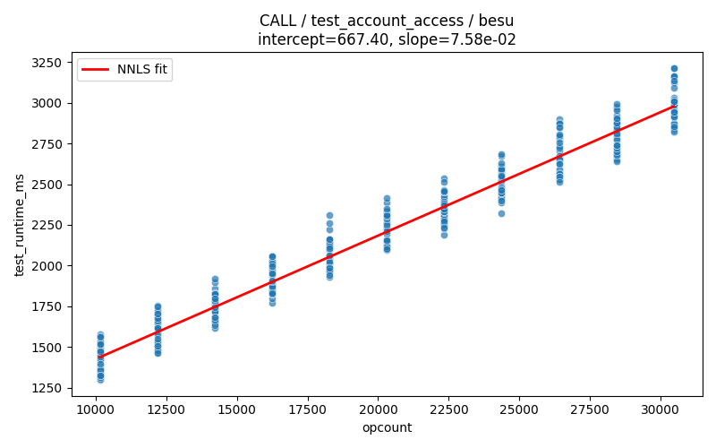

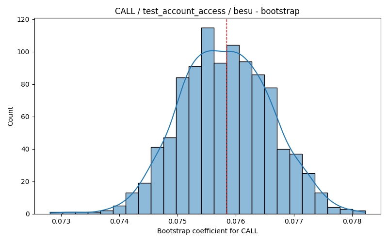

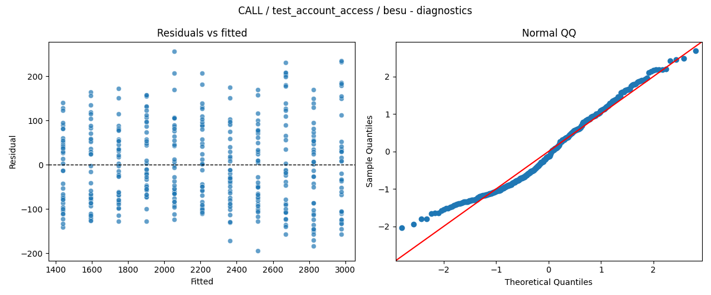

</details>

<details><summary>erigon — NNLS regression summary</summary>

```
==============================================================================
                           NNLS Regression Results                            
==============================================================================
Dep. Variable:          test_runtime_ms              R-squared:          0.910
Model:                  NNLS                    Adj. R-squared:          0.908
No. Observations:       44                                RMSE:         314.29
Df Residuals:           42                                 MAE:         272.63
Df Model:               1      
==============================================================================
                      coef     std err     P-value      [0.025      0.975]
------------------------------------------------------------------------------
         const    811.8856    159.5725       0.001    530.6102   1168.7735
       opcount      0.0491      0.0022       0.001      0.0442      0.0529
==============================================================================
Notes: Non-negative least squares with bootstrap inference (1000 iterations)
==============================================================================
```

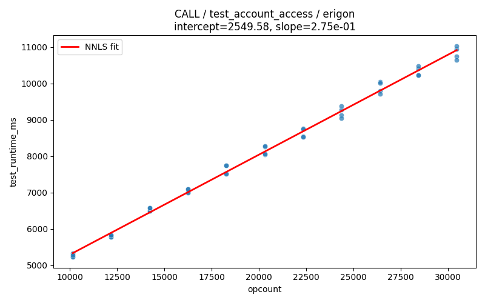

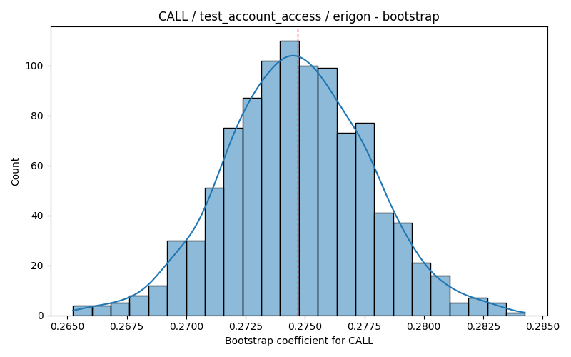

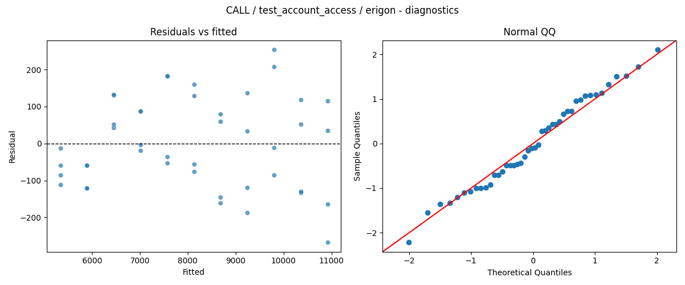

</details>

<details><summary>ethrex — NNLS regression summary</summary>

```
==============================================================================
                           NNLS Regression Results                            
==============================================================================
Dep. Variable:          test_runtime_ms              R-squared:          0.994
Model:                  NNLS                    Adj. R-squared:          0.994
No. Observations:       308                               RMSE:          12.94
Df Residuals:           306                                MAE:          10.05
Df Model:               1      
==============================================================================
                      coef     std err     P-value      [0.025      0.975]
------------------------------------------------------------------------------
         const     33.7504      2.1782       0.001     29.5490     37.9326
       opcount      0.0080      0.0000       0.001      0.0079      0.0081
==============================================================================
Notes: Non-negative least squares with bootstrap inference (1000 iterations)
==============================================================================
```


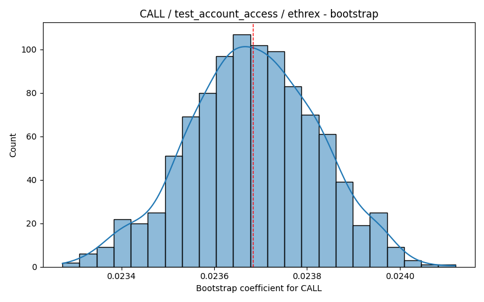

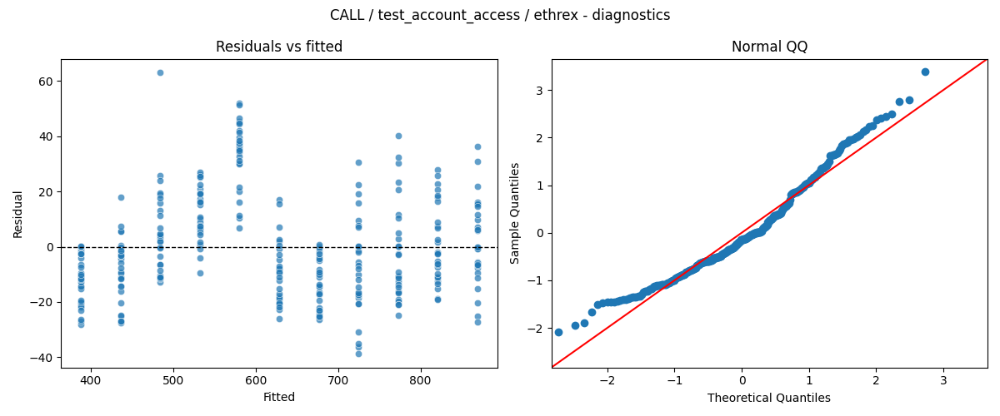

</details>

<details><summary>geth — NNLS regression summary</summary>

```
==============================================================================
                           NNLS Regression Results                            
==============================================================================
Dep. Variable:          test_runtime_ms              R-squared:          0.859
Model:                  NNLS                    Adj. R-squared:          0.858
No. Observations:       308                               RMSE:         192.84
Df Residuals:           306                                MAE:         162.31
Df Model:               1      
==============================================================================
                      coef     std err     P-value      [0.025      0.975]
------------------------------------------------------------------------------
         const    660.0726     42.7559       0.001    576.5046    742.0334
       opcount      0.0234      0.0006       0.001      0.0223      0.0246
==============================================================================
Notes: Non-negative least squares with bootstrap inference (1000 iterations)
==============================================================================
```

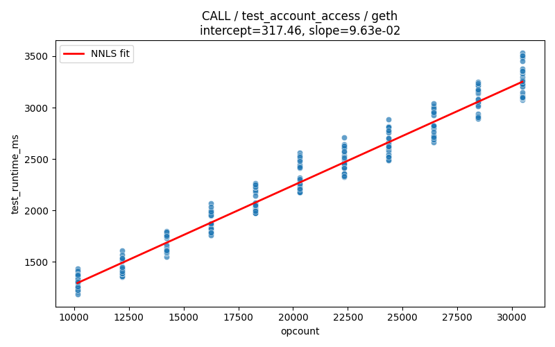

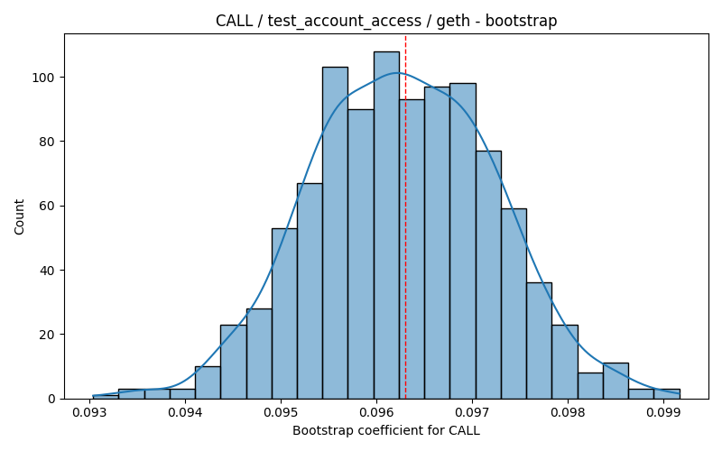

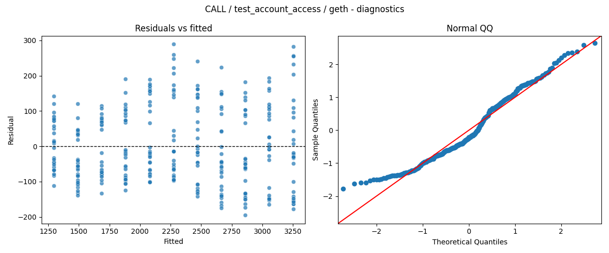

</details>

<details><summary>nethermind — NNLS regression summary</summary>

```
==============================================================================
                           NNLS Regression Results                            
==============================================================================
Dep. Variable:          test_runtime_ms              R-squared:          0.600
Model:                  NNLS                    Adj. R-squared:          0.599
No. Observations:       253                               RMSE:         248.07
Df Residuals:           251                                MAE:         183.19
Df Model:               1      
==============================================================================
                      coef     std err     P-value      [0.025      0.975]
------------------------------------------------------------------------------
         const    141.3833     50.3543       0.002     34.6957    238.9958
       opcount      0.0149      0.0009       0.001      0.0133      0.0169
==============================================================================
Notes: Non-negative least squares with bootstrap inference (1000 iterations)
==============================================================================
```

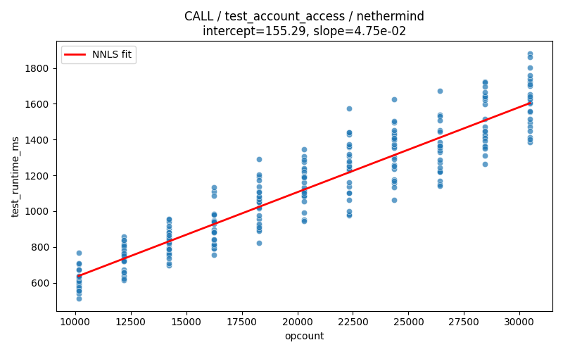

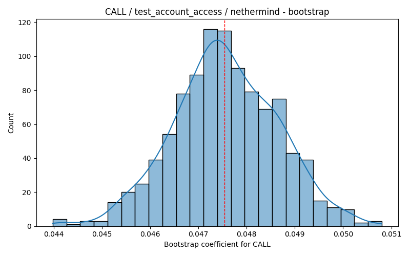

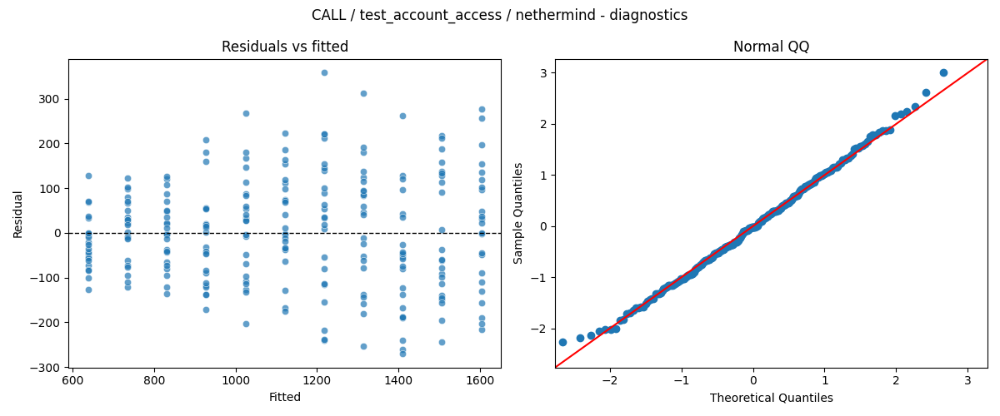

</details>

<details><summary>reth — NNLS regression summary</summary>

```
==============================================================================
                           NNLS Regression Results                            
==============================================================================
Dep. Variable:          test_runtime_ms              R-squared:          0.973
Model:                  NNLS                    Adj. R-squared:          0.973
No. Observations:       396                               RMSE:          13.60
Df Residuals:           394                                MAE:          10.67
Df Model:               1      
==============================================================================
                      coef     std err     P-value      [0.025      0.975]
------------------------------------------------------------------------------
         const    101.8029      2.2190       0.001     97.5371    106.4151
       opcount      0.0040      0.0000       0.001      0.0040      0.0041
==============================================================================
Notes: Non-negative least squares with bootstrap inference (1000 iterations)
==============================================================================
```

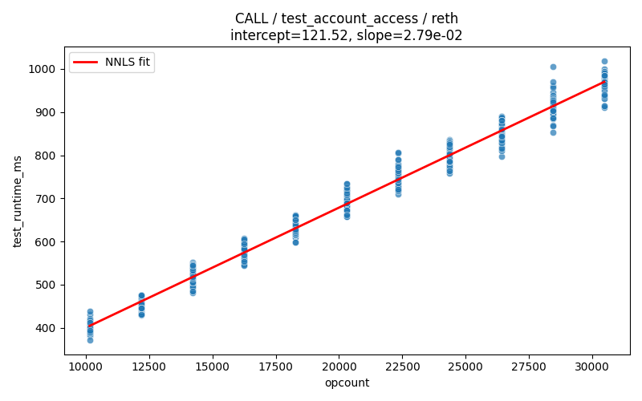

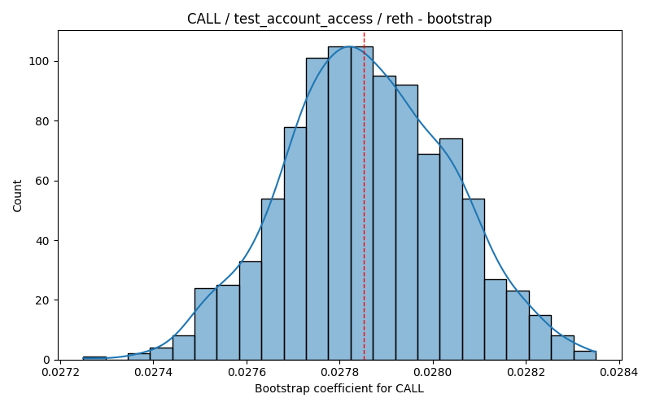

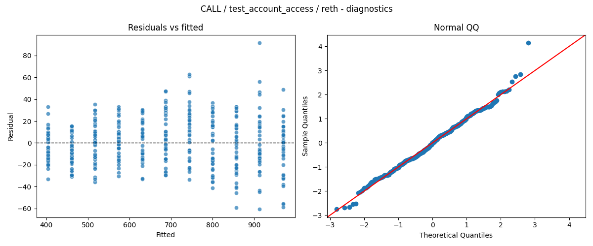

</details>

### test_account_access — combo `CALL_AccountMode.NON_EXISTING_ACCOUNT` — `presets[cold_account_code_access]`

| client | nobs | R² | target_coef (ms) | p-value | 95% CI |
| --- | --- | --- | --- | --- | --- |
| `besu` | 396 | 0.8488 | 0.01594 | 1.00e-03 | [0.0153, 0.01659] |
| `erigon` | 44 | 0.9944 | 0.01005 | 1.00e-03 | [0.009915, 0.01014] |
| `ethrex` | 308 | 0.9664 | 0.002042 | 1.00e-03 | [0.002, 0.002085] |
| `geth` | 308 | 0.8641 | 0.02193 | 1.00e-03 | [0.02094, 0.023] |
| `nethermind` | 253 | 0.8516 | 0.00407 | 1.00e-03 | [0.003863, 0.004281] |
| `reth` | 396 | 0.8817 | 0.0007737 | 1.00e-03 | [0.0007465, 0.0008013] |

<details><summary>besu — NNLS regression summary</summary>

```
==============================================================================
                           NNLS Regression Results                            
==============================================================================
Dep. Variable:          test_runtime_ms              R-squared:          0.849
Model:                  NNLS                    Adj. R-squared:          0.848
No. Observations:       396                               RMSE:         159.77
Df Residuals:           394                                MAE:         147.48
Df Model:               1      
==============================================================================
                      coef     std err     P-value      [0.025      0.975]
------------------------------------------------------------------------------
         const    525.4073     24.4522       0.001    476.4505    574.2339
       opcount      0.0159      0.0003       0.001      0.0153      0.0166
==============================================================================
Notes: Non-negative least squares with bootstrap inference (1000 iterations)
==============================================================================
```


</details>

<details><summary>erigon — NNLS regression summary</summary>

```
==============================================================================
                           NNLS Regression Results                            
==============================================================================
Dep. Variable:          test_runtime_ms              R-squared:          0.994
Model:                  NNLS                    Adj. R-squared:          0.994
No. Observations:       44                                RMSE:          18.07
Df Residuals:           42                                 MAE:          11.84
Df Model:               1      
==============================================================================
                      coef     std err     P-value      [0.025      0.975]
------------------------------------------------------------------------------
         const      0.0000      1.7026       1.000      0.0000      6.3057
       opcount      0.0101      0.0001       0.001      0.0099      0.0101
==============================================================================
Notes: Non-negative least squares with bootstrap inference (1000 iterations)
==============================================================================
```


</details>

<details><summary>ethrex — NNLS regression summary</summary>

```
==============================================================================
                           NNLS Regression Results                            
==============================================================================
Dep. Variable:          test_runtime_ms              R-squared:          0.966
Model:                  NNLS                    Adj. R-squared:          0.966
No. Observations:       308                               RMSE:           9.04
Df Residuals:           306                                MAE:           7.12
Df Model:               1      
==============================================================================
                      coef     std err     P-value      [0.025      0.975]
------------------------------------------------------------------------------
         const     29.9417      1.6158       0.001     26.8995     33.2153
       opcount      0.0020      0.0000       0.001      0.0020      0.0021
==============================================================================
Notes: Non-negative least squares with bootstrap inference (1000 iterations)
==============================================================================
```


</details>

<details><summary>geth — NNLS regression summary</summary>

```
==============================================================================
                           NNLS Regression Results                            
==============================================================================
Dep. Variable:          test_runtime_ms              R-squared:          0.864
Model:                  NNLS                    Adj. R-squared:          0.864
No. Observations:       308                               RMSE:         206.56
Df Residuals:           306                                MAE:         175.71
Df Model:               1      
==============================================================================
                      coef     std err     P-value      [0.025      0.975]
------------------------------------------------------------------------------
         const    701.2552     45.0432       0.001    612.5614    787.3152
       opcount      0.0219      0.0005       0.001      0.0209      0.0230
==============================================================================
Notes: Non-negative least squares with bootstrap inference (1000 iterations)
==============================================================================
```


</details>

<details><summary>nethermind — NNLS regression summary</summary>

```
==============================================================================
                           NNLS Regression Results                            
==============================================================================
Dep. Variable:          test_runtime_ms              R-squared:          0.852
Model:                  NNLS                    Adj. R-squared:          0.851
No. Observations:       253                               RMSE:          40.34
Df Residuals:           251                                MAE:          32.16
Df Model:               1      
==============================================================================
                      coef     std err     P-value      [0.025      0.975]
------------------------------------------------------------------------------
         const     81.0480      7.5910       0.001     66.2321     95.5143
       opcount      0.0041      0.0001       0.001      0.0039      0.0043
==============================================================================
Notes: Non-negative least squares with bootstrap inference (1000 iterations)
==============================================================================
```


</details>

<details><summary>reth — NNLS regression summary</summary>

```
==============================================================================
                           NNLS Regression Results                            
==============================================================================
Dep. Variable:          test_runtime_ms              R-squared:          0.882
Model:                  NNLS                    Adj. R-squared:          0.881
No. Observations:       396                               RMSE:           6.73
Df Residuals:           394                                MAE:           5.20
Df Model:               1      
==============================================================================
                      coef     std err     P-value      [0.025      0.975]
------------------------------------------------------------------------------
         const     51.3402      1.0878       0.001     49.1131     53.4270
       opcount      0.0008      0.0000       0.001      0.0007      0.0008
==============================================================================
Notes: Non-negative least squares with bootstrap inference (1000 iterations)
==============================================================================
```


</details>

### test_account_access — combo `CALL_AccountMode.EXISTING_EOA` — `presets[cold_account_nocode_write]`

| client | nobs | R² | target_coef (ms) | p-value | 95% CI |
| --- | --- | --- | --- | --- | --- |
| `besu` | 396 | 0.9683 | 0.05808 | 1.00e-03 | [0.05688, 0.05916] |
| `erigon` | 44 | 0.9933 | 0.08305 | 1.00e-03 | [0.08051, 0.08553] |
| `ethrex` | 308 | 0.9853 | 0.02258 | 1.00e-03 | [0.02231, 0.02282] |
| `geth` | 308 | 0.9668 | 0.05817 | 1.00e-03 | [0.05703, 0.05926] |
| `nethermind` | 253 | 0.7809 | 0.02954 | 1.00e-03 | [0.02766, 0.03156] |
| `reth` | 396 | 0.9871 | 0.02304 | 1.00e-03 | [0.02277, 0.02329] |

<details><summary>besu — NNLS regression summary</summary>

```
==============================================================================
                           NNLS Regression Results                            
==============================================================================
Dep. Variable:          test_runtime_ms              R-squared:          0.968
Model:                  NNLS                    Adj. R-squared:          0.968
No. Observations:       396                               RMSE:          70.77
Df Residuals:           394                                MAE:          59.98
Df Model:               1      
==============================================================================
                      coef     std err     P-value      [0.025      0.975]
------------------------------------------------------------------------------
         const    341.0579     11.9471       0.001    317.6345    364.6431
       opcount      0.0581      0.0006       0.001      0.0569      0.0592
==============================================================================
Notes: Non-negative least squares with bootstrap inference (1000 iterations)
==============================================================================
```


</details>

<details><summary>erigon — NNLS regression summary</summary>

```
==============================================================================
                           NNLS Regression Results                            
==============================================================================
Dep. Variable:          test_runtime_ms              R-squared:          0.993
Model:                  NNLS                    Adj. R-squared:          0.993
No. Observations:       44                                RMSE:          45.86
Df Residuals:           42                                 MAE:          36.27
Df Model:               1      
==============================================================================
                      coef     std err     P-value      [0.025      0.975]
------------------------------------------------------------------------------
         const    239.7707     24.2657       0.001    193.1946    288.3201
       opcount      0.0831      0.0013       0.001      0.0805      0.0855
==============================================================================
Notes: Non-negative least squares with bootstrap inference (1000 iterations)
==============================================================================
```


</details>

<details><summary>ethrex — NNLS regression summary</summary>

```
==============================================================================
                           NNLS Regression Results                            
==============================================================================
Dep. Variable:          test_runtime_ms              R-squared:          0.985
Model:                  NNLS                    Adj. R-squared:          0.985
No. Observations:       308                               RMSE:          18.54
Df Residuals:           306                                MAE:          13.90
Df Model:               1      
==============================================================================
                      coef     std err     P-value      [0.025      0.975]
------------------------------------------------------------------------------
         const    155.5328      3.1814       0.001    149.7109    161.9827
       opcount      0.0226      0.0001       0.001      0.0223      0.0228
==============================================================================
Notes: Non-negative least squares with bootstrap inference (1000 iterations)
==============================================================================
```


</details>

<details><summary>geth — NNLS regression summary</summary>

```
==============================================================================
                           NNLS Regression Results                            
==============================================================================
Dep. Variable:          test_runtime_ms              R-squared:          0.967
Model:                  NNLS                    Adj. R-squared:          0.967
No. Observations:       308                               RMSE:          72.49
Df Residuals:           306                                MAE:          62.42
Df Model:               1      
==============================================================================
                      coef     std err     P-value      [0.025      0.975]
------------------------------------------------------------------------------
         const    185.6578     11.7621       0.001    163.3061    207.7755
       opcount      0.0582      0.0006       0.001      0.0570      0.0593
==============================================================================
Notes: Non-negative least squares with bootstrap inference (1000 iterations)
==============================================================================
```


</details>

<details><summary>nethermind — NNLS regression summary</summary>

```
==============================================================================
                           NNLS Regression Results                            
==============================================================================
Dep. Variable:          test_runtime_ms              R-squared:          0.781
Model:                  NNLS                    Adj. R-squared:          0.780
No. Observations:       253                               RMSE:         105.29
Df Residuals:           251                                MAE:          84.64
Df Model:               1      
==============================================================================
                      coef     std err     P-value      [0.025      0.975]
------------------------------------------------------------------------------
         const    192.3733     19.7514       0.001    153.1413    230.3873
       opcount      0.0295      0.0010       0.001      0.0277      0.0316
==============================================================================
Notes: Non-negative least squares with bootstrap inference (1000 iterations)
==============================================================================
```


</details>

<details><summary>reth — NNLS regression summary</summary>

```
==============================================================================
                           NNLS Regression Results                            
==============================================================================
Dep. Variable:          test_runtime_ms              R-squared:          0.987
Model:                  NNLS                    Adj. R-squared:          0.987
No. Observations:       396                               RMSE:          17.76
Df Residuals:           394                                MAE:          14.08
Df Model:               1      
==============================================================================
                      coef     std err     P-value      [0.025      0.975]
------------------------------------------------------------------------------
         const    104.2231      2.7411       0.001     99.0040    109.3604
       opcount      0.0230      0.0001       0.001      0.0228      0.0233
==============================================================================
Notes: Non-negative least squares with bootstrap inference (1000 iterations)
==============================================================================
```


</details>

### test_account_access — combo `CALL_AccountMode.NON_EXISTING_ACCOUNT` — `presets[cold_account_nocode_write]`

| client | nobs | R² | target_coef (ms) | p-value | 95% CI |
| --- | --- | --- | --- | --- | --- |
| `besu` | 396 | 0.7176 | 0.1766 | 1.00e-03 | [0.1646, 0.1877] |
| `erigon` | 44 | 0.9558 | 0.2653 | 1.00e-03 | [0.2493, 0.2812] |
| `ethrex` | 308 | 0.05941 | 0.01187 | 1.00e-03 | [0.00612, 0.01712] |
| `geth` | 308 | 0.886 | 0.09447 | 1.00e-03 | [0.09065, 0.09855] |
| `nethermind` | 253 | 0.7463 | 0.04801 | 1.00e-03 | [0.04456, 0.05146] |
| `reth` | 396 | 0.2148 | 0.02403 | 1.00e-03 | [0.01753, 0.02802] |

<details><summary>besu — NNLS regression summary</summary>

```
==============================================================================
                           NNLS Regression Results                            
==============================================================================
Dep. Variable:          test_runtime_ms              R-squared:          0.718
Model:                  NNLS                    Adj. R-squared:          0.717
No. Observations:       396                               RMSE:          36.48
Df Residuals:           394                                MAE:          31.11
Df Model:               1      
==============================================================================
                      coef     std err     P-value      [0.025      0.975]
------------------------------------------------------------------------------
         const    242.4205      6.3529       0.001    230.5960    254.9131
       opcount      0.1766      0.0061       0.001      0.1646      0.1877
==============================================================================
Notes: Non-negative least squares with bootstrap inference (1000 iterations)
==============================================================================
```


</details>

<details><summary>erigon — NNLS regression summary</summary>

```
==============================================================================
                           NNLS Regression Results                            
==============================================================================
Dep. Variable:          test_runtime_ms              R-squared:          0.956
Model:                  NNLS                    Adj. R-squared:          0.955
No. Observations:       44                                RMSE:          18.79
Df Residuals:           42                                 MAE:          15.37
Df Model:               1      
==============================================================================
                      coef     std err     P-value      [0.025      0.975]
------------------------------------------------------------------------------
         const    103.3122      9.4594       0.001     85.4647    122.2944
       opcount      0.2653      0.0083       0.001      0.2493      0.2812
==============================================================================
Notes: Non-negative least squares with bootstrap inference (1000 iterations)
==============================================================================
```


</details>

<details><summary>ethrex — NNLS regression summary</summary>

```
==============================================================================
                           NNLS Regression Results                            
==============================================================================
Dep. Variable:          test_runtime_ms              R-squared:          0.059
Model:                  NNLS                    Adj. R-squared:          0.056
No. Observations:       308                               RMSE:          15.54
Df Residuals:           306                                MAE:           9.93
Df Model:               1      
==============================================================================
                      coef     std err     P-value      [0.025      0.975]
------------------------------------------------------------------------------
         const     25.1325      3.2616       0.001     19.1672     31.7902
       opcount      0.0119      0.0028       0.001      0.0061      0.0171
==============================================================================
Notes: Non-negative least squares with bootstrap inference (1000 iterations)
==============================================================================
```


</details>

<details><summary>geth — NNLS regression summary</summary>

```
==============================================================================
                           NNLS Regression Results                            
==============================================================================
Dep. Variable:          test_runtime_ms              R-squared:          0.886
Model:                  NNLS                    Adj. R-squared:          0.886
No. Observations:       308                               RMSE:          11.16
Df Residuals:           306                                MAE:           8.96
Df Model:               1      
==============================================================================
                      coef     std err     P-value      [0.025      0.975]
------------------------------------------------------------------------------
         const     57.3188      2.0649       0.001     53.1501     61.2505
       opcount      0.0945      0.0021       0.001      0.0906      0.0985
==============================================================================
Notes: Non-negative least squares with bootstrap inference (1000 iterations)
==============================================================================
```


</details>

<details><summary>nethermind — NNLS regression summary</summary>

```
==============================================================================
                           NNLS Regression Results                            
==============================================================================
Dep. Variable:          test_runtime_ms              R-squared:          0.746
Model:                  NNLS                    Adj. R-squared:          0.745
No. Observations:       253                               RMSE:           9.22
Df Residuals:           251                                MAE:           7.06
Df Model:               1      
==============================================================================
                      coef     std err     P-value      [0.025      0.975]
------------------------------------------------------------------------------
         const     21.1359      1.8269       0.001     17.6577     24.7161
       opcount      0.0480      0.0018       0.001      0.0446      0.0515
==============================================================================
Notes: Non-negative least squares with bootstrap inference (1000 iterations)
==============================================================================
```


</details>

<details><summary>reth — NNLS regression summary</summary>

```
==============================================================================
                           NNLS Regression Results                            
==============================================================================
Dep. Variable:          test_runtime_ms              R-squared:          0.215
Model:                  NNLS                    Adj. R-squared:          0.213
No. Observations:       396                               RMSE:          15.12
Df Residuals:           394                                MAE:           4.49
Df Model:               1      
==============================================================================
                      coef     std err     P-value      [0.025      0.975]
------------------------------------------------------------------------------
         const     17.8336      3.6643       0.001     12.9402     26.0298
       opcount      0.0240      0.0029       0.001      0.0175      0.0280
==============================================================================
Notes: Non-negative least squares with bootstrap inference (1000 iterations)
==============================================================================
```


</details>

### test_account_access — combo `CALL_AccountMode.EXISTING_CONTRACT` — `presets[cold_account_code_write]`

| client | nobs | R² | target_coef (ms) | p-value | 95% CI |
| --- | --- | --- | --- | --- | --- |
| `besu` | 396 | 0.9633 | 0.07584 | 1.00e-03 | [0.07434, 0.07728] |
| `erigon` | 44 | 0.9953 | 0.2747 | 1.00e-03 | [0.2687, 0.2809] |
| `ethrex` | 308 | 0.9852 | 0.02368 | 1.00e-03 | [0.0234, 0.02395] |
| `geth` | 308 | 0.9698 | 0.09631 | 1.00e-03 | [0.09443, 0.0981] |
| `nethermind` | 253 | 0.8684 | 0.04754 | 1.00e-03 | [0.0454, 0.04968] |
| `reth` | 396 | 0.985 | 0.02785 | 1.00e-03 | [0.02751, 0.02821] |

<details><summary>besu — NNLS regression summary</summary>

```
==============================================================================
                           NNLS Regression Results                            
==============================================================================
Dep. Variable:          test_runtime_ms              R-squared:          0.963
Model:                  NNLS                    Adj. R-squared:          0.963
No. Observations:       396                               RMSE:          95.03
Df Residuals:           394                                MAE:          80.68
Df Model:               1      
==============================================================================
                      coef     std err     P-value      [0.025      0.975]
------------------------------------------------------------------------------
         const    667.4049     15.5381       0.001    637.5196    697.6629
       opcount      0.0758      0.0008       0.001      0.0743      0.0773
==============================================================================
Notes: Non-negative least squares with bootstrap inference (1000 iterations)
==============================================================================
```


</details>

<details><summary>erigon — NNLS regression summary</summary>

```
==============================================================================
                           NNLS Regression Results                            
==============================================================================
Dep. Variable:          test_runtime_ms              R-squared:          0.995
Model:                  NNLS                    Adj. R-squared:          0.995
No. Observations:       44                                RMSE:         120.70
Df Residuals:           42                                 MAE:         103.55
Df Model:               1      
==============================================================================
                      coef     std err     P-value      [0.025      0.975]
------------------------------------------------------------------------------
         const   2549.5815     56.8119       0.001   2446.4708   2670.9844
       opcount      0.2747      0.0030       0.001      0.2687      0.2809
==============================================================================
Notes: Non-negative least squares with bootstrap inference (1000 iterations)
==============================================================================
```


</details>

<details><summary>ethrex — NNLS regression summary</summary>

```
==============================================================================
                           NNLS Regression Results                            
==============================================================================
Dep. Variable:          test_runtime_ms              R-squared:          0.985
Model:                  NNLS                    Adj. R-squared:          0.985
No. Observations:       308                               RMSE:          18.62
Df Residuals:           306                                MAE:          14.84
Df Model:               1      
==============================================================================
                      coef     std err     P-value      [0.025      0.975]
------------------------------------------------------------------------------
         const    147.6621      3.0898       0.001    141.9196    153.9632
       opcount      0.0237      0.0001       0.001      0.0234      0.0239
==============================================================================
Notes: Non-negative least squares with bootstrap inference (1000 iterations)
==============================================================================
```


</details>

<details><summary>geth — NNLS regression summary</summary>

```
==============================================================================
                           NNLS Regression Results                            
==============================================================================
Dep. Variable:          test_runtime_ms              R-squared:          0.970
Model:                  NNLS                    Adj. R-squared:          0.970
No. Observations:       308                               RMSE:         109.11
Df Residuals:           306                                MAE:          93.19
Df Model:               1      
==============================================================================
                      coef     std err     P-value      [0.025      0.975]
------------------------------------------------------------------------------
         const    317.4636     18.0272       0.001    284.5066    352.0541
       opcount      0.0963      0.0010       0.001      0.0944      0.0981
==============================================================================
Notes: Non-negative least squares with bootstrap inference (1000 iterations)
==============================================================================
```


</details>

<details><summary>nethermind — NNLS regression summary</summary>

```
==============================================================================
                           NNLS Regression Results                            
==============================================================================
Dep. Variable:          test_runtime_ms              R-squared:          0.868
Model:                  NNLS                    Adj. R-squared:          0.868
No. Observations:       253                               RMSE:         118.89
Df Residuals:           251                                MAE:          95.83
Df Model:               1      
==============================================================================
                      coef     std err     P-value      [0.025      0.975]
------------------------------------------------------------------------------
         const    155.2870     19.8214       0.001    116.3320    195.1412
       opcount      0.0475      0.0011       0.001      0.0454      0.0497
==============================================================================
Notes: Non-negative least squares with bootstrap inference (1000 iterations)
==============================================================================
```


</details>

<details><summary>reth — NNLS regression summary</summary>

```
==============================================================================
                           NNLS Regression Results                            
==============================================================================
Dep. Variable:          test_runtime_ms              R-squared:          0.985
Model:                  NNLS                    Adj. R-squared:          0.985
No. Observations:       396                               RMSE:          22.10
Df Residuals:           394                                MAE:          17.88
Df Model:               1      
==============================================================================
                      coef     std err     P-value      [0.025      0.975]
------------------------------------------------------------------------------
         const    121.5240      3.3136       0.001    114.9180    128.3761
       opcount      0.0279      0.0002       0.001      0.0275      0.0282
==============================================================================
Notes: Non-negative least squares with bootstrap inference (1000 iterations)
==============================================================================
```


</details>

### test_account_access — combo `CALL_AccountMode.NON_EXISTING_ACCOUNT` — `presets[cold_account_code_write]`

| client | nobs | R² | target_coef (ms) | p-value | 95% CI |
| --- | --- | --- | --- | --- | --- |
| `besu` | 396 | 0.7176 | 0.1766 | 1.00e-03 | [0.1646, 0.1877] |
| `erigon` | 44 | 0.9558 | 0.2653 | 1.00e-03 | [0.2493, 0.2812] |
| `ethrex` | 308 | 0.05941 | 0.01187 | 1.00e-03 | [0.00612, 0.01712] |
| `geth` | 308 | 0.886 | 0.09447 | 1.00e-03 | [0.09065, 0.09855] |
| `nethermind` | 253 | 0.7463 | 0.04801 | 1.00e-03 | [0.04456, 0.05146] |
| `reth` | 396 | 0.2148 | 0.02403 | 1.00e-03 | [0.01753, 0.02802] |

<details><summary>besu — NNLS regression summary</summary>

```
==============================================================================
                           NNLS Regression Results                            
==============================================================================
Dep. Variable:          test_runtime_ms              R-squared:          0.718
Model:                  NNLS                    Adj. R-squared:          0.717
No. Observations:       396                               RMSE:          36.48
Df Residuals:           394                                MAE:          31.11
Df Model:               1      
==============================================================================
                      coef     std err     P-value      [0.025      0.975]
------------------------------------------------------------------------------
         const    242.4205      6.3529       0.001    230.5960    254.9131
       opcount      0.1766      0.0061       0.001      0.1646      0.1877
==============================================================================
Notes: Non-negative least squares with bootstrap inference (1000 iterations)
==============================================================================
```


</details>

<details><summary>erigon — NNLS regression summary</summary>

```
==============================================================================
                           NNLS Regression Results                            
==============================================================================
Dep. Variable:          test_runtime_ms              R-squared:          0.956
Model:                  NNLS                    Adj. R-squared:          0.955
No. Observations:       44                                RMSE:          18.79
Df Residuals:           42                                 MAE:          15.37
Df Model:               1      
==============================================================================
                      coef     std err     P-value      [0.025      0.975]
------------------------------------------------------------------------------
         const    103.3122      9.4594       0.001     85.4647    122.2944
       opcount      0.2653      0.0083       0.001      0.2493      0.2812
==============================================================================
Notes: Non-negative least squares with bootstrap inference (1000 iterations)
==============================================================================
```


</details>

<details><summary>ethrex — NNLS regression summary</summary>

```
==============================================================================
                           NNLS Regression Results                            
==============================================================================
Dep. Variable:          test_runtime_ms              R-squared:          0.059
Model:                  NNLS                    Adj. R-squared:          0.056
No. Observations:       308                               RMSE:          15.54
Df Residuals:           306                                MAE:           9.93
Df Model:               1      
==============================================================================
                      coef     std err     P-value      [0.025      0.975]
------------------------------------------------------------------------------
         const     25.1325      3.2616       0.001     19.1672     31.7902
       opcount      0.0119      0.0028       0.001      0.0061      0.0171
==============================================================================
Notes: Non-negative least squares with bootstrap inference (1000 iterations)
==============================================================================
```


</details>

<details><summary>geth — NNLS regression summary</summary>

```
==============================================================================
                           NNLS Regression Results                            
==============================================================================
Dep. Variable:          test_runtime_ms              R-squared:          0.886
Model:                  NNLS                    Adj. R-squared:          0.886
No. Observations:       308                               RMSE:          11.16
Df Residuals:           306                                MAE:           8.96
Df Model:               1      
==============================================================================
                      coef     std err     P-value      [0.025      0.975]
------------------------------------------------------------------------------
         const     57.3188      2.0649       0.001     53.1501     61.2505
       opcount      0.0945      0.0021       0.001      0.0906      0.0985
==============================================================================
Notes: Non-negative least squares with bootstrap inference (1000 iterations)
==============================================================================
```


</details>

<details><summary>nethermind — NNLS regression summary</summary>

```
==============================================================================
                           NNLS Regression Results                            
==============================================================================
Dep. Variable:          test_runtime_ms              R-squared:          0.746
Model:                  NNLS                    Adj. R-squared:          0.745
No. Observations:       253                               RMSE:           9.22
Df Residuals:           251                                MAE:           7.06
Df Model:               1      
==============================================================================
                      coef     std err     P-value      [0.025      0.975]
------------------------------------------------------------------------------
         const     21.1359      1.8269       0.001     17.6577     24.7161
       opcount      0.0480      0.0018       0.001      0.0446      0.0515
==============================================================================
Notes: Non-negative least squares with bootstrap inference (1000 iterations)
==============================================================================
```


</details>

<details><summary>reth — NNLS regression summary</summary>

```
==============================================================================
                           NNLS Regression Results                            
==============================================================================
Dep. Variable:          test_runtime_ms              R-squared:          0.215
Model:                  NNLS                    Adj. R-squared:          0.213
No. Observations:       396                               RMSE:          15.12
Df Residuals:           394                                MAE:           4.49
Df Model:               1      
==============================================================================
                      coef     std err     P-value      [0.025      0.975]
------------------------------------------------------------------------------
         const     17.8336      3.6643       0.001     12.9402     26.0298
       opcount      0.0240      0.0029       0.001      0.0175      0.0280
==============================================================================
Notes: Non-negative least squares with bootstrap inference (1000 iterations)
==============================================================================
```


</details>

### test_ext_account_query_warm — combo `CALL`

| client | nobs | R² | target_coef (ms) | p-value | 95% CI |
| --- | --- | --- | --- | --- | --- |
| `besu` | 396 | 0.781 | 0.0004787 | 1.00e-03 | [0.0004541, 0.0005048] |
| `erigon` | 44 | 0.9629 | 0.0004847 | 1.00e-03 | [0.0004518, 0.0005103] |
| `ethrex` | 308 | 0.9478 | 0.0001079 | 1.00e-03 | [0.0001051, 0.0001106] |
| `geth` | 308 | 0.8508 | 0.000129 | 1.00e-03 | [0.0001222, 0.0001355] |
| `nethermind` | 253 | 0.6642 | 0.0003674 | 1.00e-03 | [0.0003339, 0.0004013] |
| `reth` | 396 | 0.9248 | 5.779e-05 | 1.00e-03 | [5.617e-05, 5.937e-05] |

<details><summary>besu — NNLS regression summary</summary>

```
==============================================================================
                           NNLS Regression Results                            
==============================================================================
Dep. Variable:          test_runtime_ms              R-squared:          0.781
Model:                  NNLS                    Adj. R-squared:          0.780
No. Observations:       396                               RMSE:         128.08
Df Residuals:           394                                MAE:          97.75
Df Model:               1      
==============================================================================
                      coef     std err     P-value      [0.025      0.975]
------------------------------------------------------------------------------
         const    584.8256     20.8222       0.001    545.3401    624.6012
       opcount      0.0005      0.0000       0.001      0.0005      0.0005
==============================================================================
Notes: Non-negative least squares with bootstrap inference (1000 iterations)
==============================================================================
```

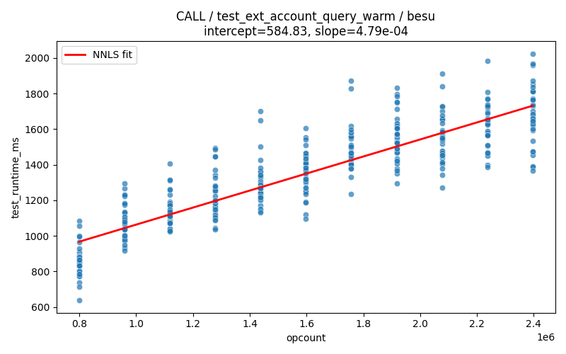

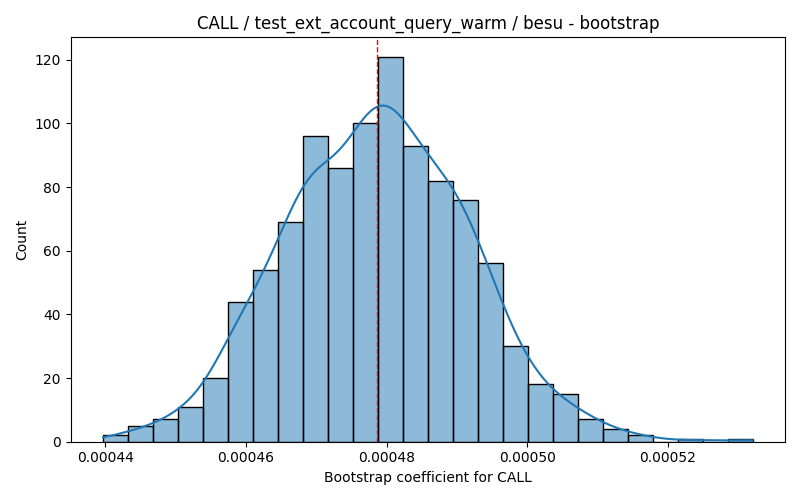

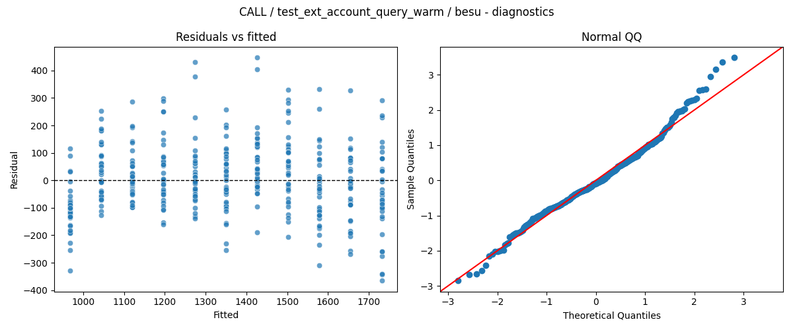

</details>

<details><summary>erigon — NNLS regression summary</summary>

```
==============================================================================
                           NNLS Regression Results                            
==============================================================================
Dep. Variable:          test_runtime_ms              R-squared:          0.963
Model:                  NNLS                    Adj. R-squared:          0.962
No. Observations:       44                                RMSE:          48.06
Df Residuals:           42                                 MAE:          34.69
Df Model:               1      
==============================================================================
                      coef     std err     P-value      [0.025      0.975]
------------------------------------------------------------------------------
         const     48.1940     20.4034       0.008     12.5880     91.4068
       opcount      0.0005      0.0000       0.001      0.0005      0.0005
==============================================================================
Notes: Non-negative least squares with bootstrap inference (1000 iterations)
==============================================================================
```

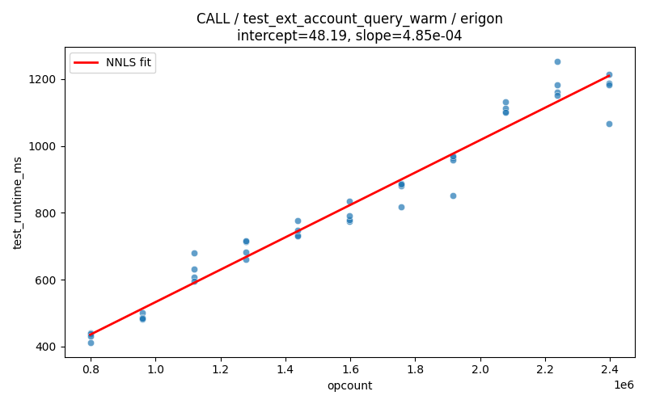

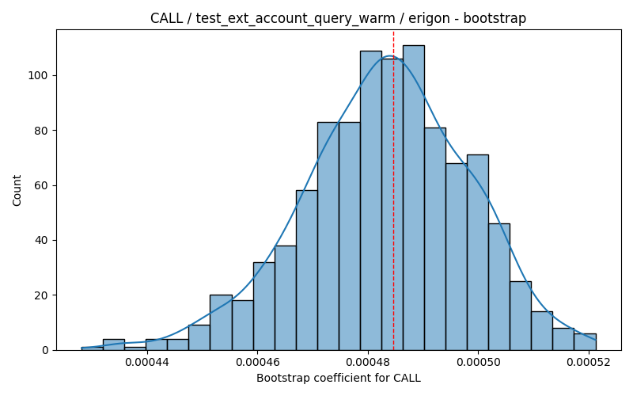

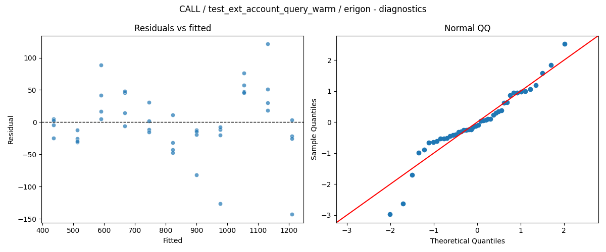

</details>

<details><summary>ethrex — NNLS regression summary</summary>

```
==============================================================================
                           NNLS Regression Results                            
==============================================================================
Dep. Variable:          test_runtime_ms              R-squared:          0.948
Model:                  NNLS                    Adj. R-squared:          0.948
No. Observations:       308                               RMSE:          12.80
Df Residuals:           306                                MAE:          10.23
Df Model:               1      
==============================================================================
                      coef     std err     P-value      [0.025      0.975]
------------------------------------------------------------------------------
         const     31.5799      2.3801       0.001     26.8882     36.1907
       opcount      0.0001      0.0000       0.001      0.0001      0.0001
==============================================================================
Notes: Non-negative least squares with bootstrap inference (1000 iterations)
==============================================================================
```

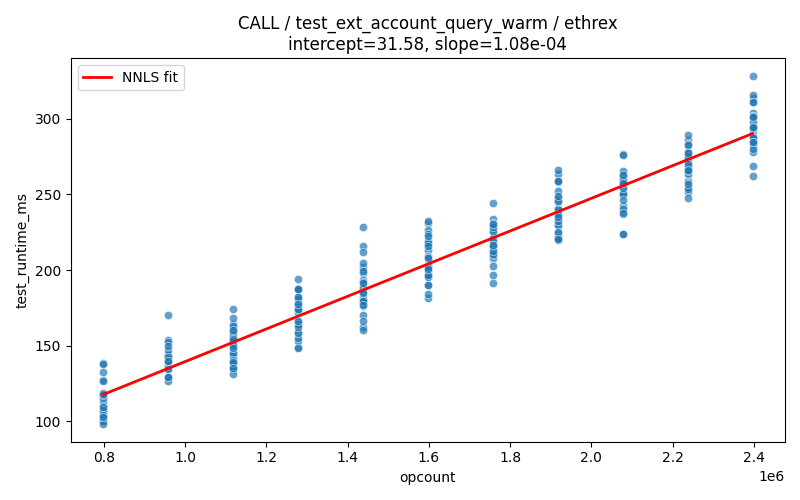

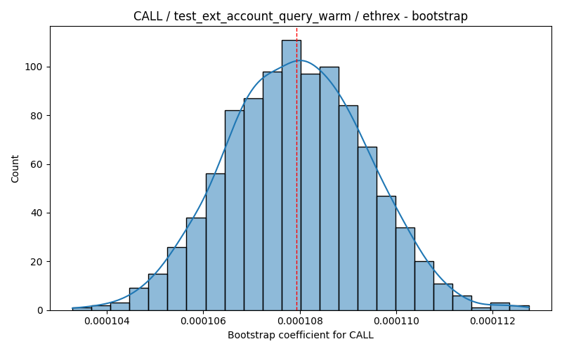

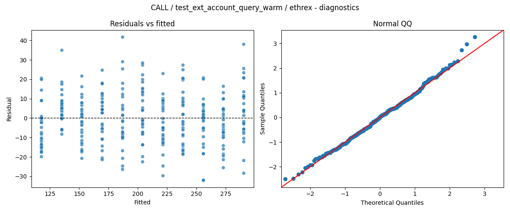

</details>

<details><summary>geth — NNLS regression summary</summary>

```
==============================================================================
                           NNLS Regression Results                            
==============================================================================
Dep. Variable:          test_runtime_ms              R-squared:          0.851
Model:                  NNLS                    Adj. R-squared:          0.850
No. Observations:       308                               RMSE:          27.29
Df Residuals:           306                                MAE:          22.19
Df Model:               1      
==============================================================================
                      coef     std err     P-value      [0.025      0.975]
------------------------------------------------------------------------------
         const     51.3167      5.0234       0.001     41.2001     61.8146
       opcount      0.0001      0.0000       0.001      0.0001      0.0001
==============================================================================
Notes: Non-negative least squares with bootstrap inference (1000 iterations)
==============================================================================
```

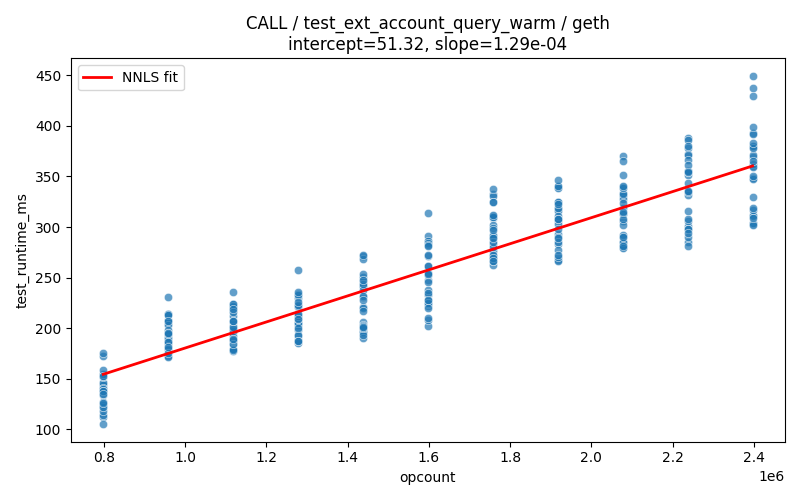

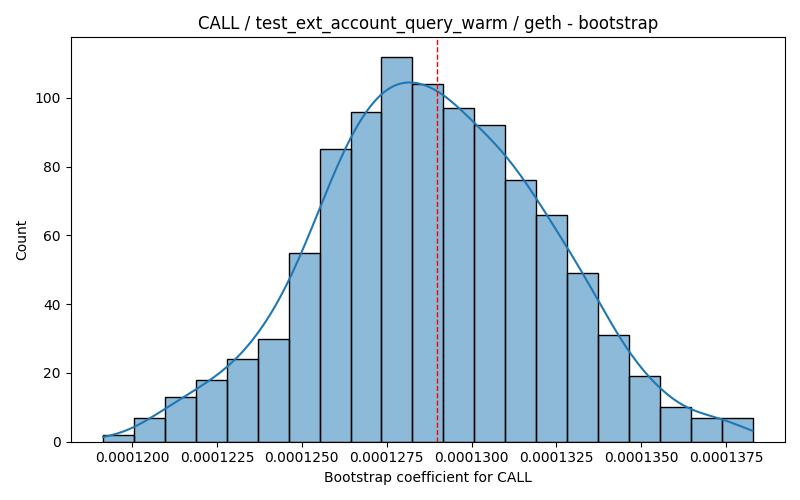

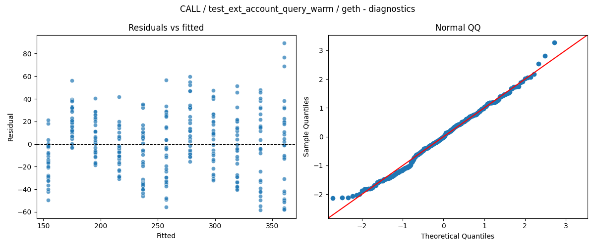

</details>

<details><summary>nethermind — NNLS regression summary</summary>

```
==============================================================================
                           NNLS Regression Results                            
==============================================================================
Dep. Variable:          test_runtime_ms              R-squared:          0.664
Model:                  NNLS                    Adj. R-squared:          0.663
No. Observations:       253                               RMSE:         131.99
Df Residuals:           251                                MAE:         107.90
Df Model:               1      
==============================================================================
                      coef     std err     P-value      [0.025      0.975]
------------------------------------------------------------------------------
         const    179.6424     23.9068       0.001    132.3704    228.2160
       opcount      0.0004      0.0000       0.001      0.0003      0.0004
==============================================================================
Notes: Non-negative least squares with bootstrap inference (1000 iterations)
==============================================================================
```

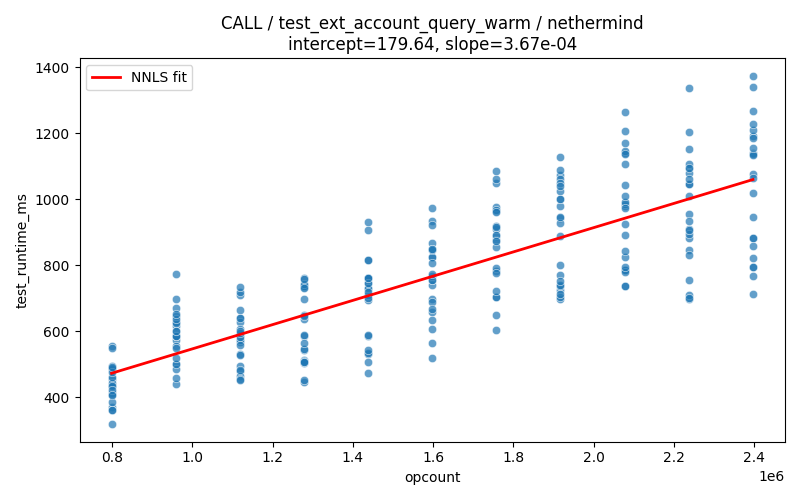

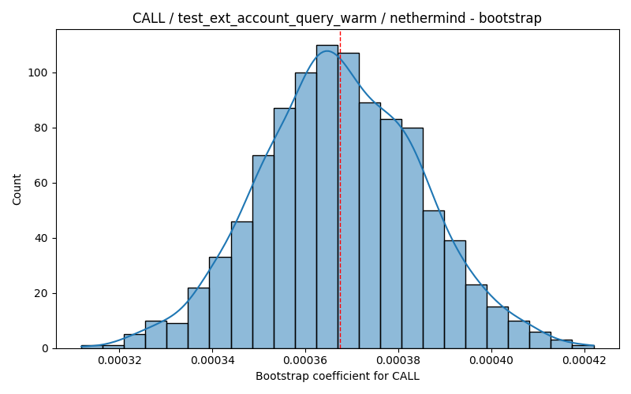

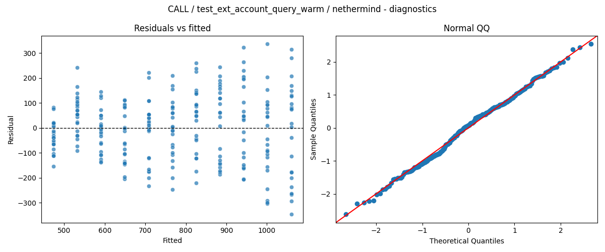

</details>

<details><summary>reth — NNLS regression summary</summary>

```
==============================================================================
                           NNLS Regression Results                            
==============================================================================
Dep. Variable:          test_runtime_ms              R-squared:          0.925
Model:                  NNLS                    Adj. R-squared:          0.925
No. Observations:       396                               RMSE:           8.33
Df Residuals:           394                                MAE:           6.38
Df Model:               1      
==============================================================================
                      coef     std err     P-value      [0.025      0.975]
------------------------------------------------------------------------------
         const     23.8363      1.4349       0.001     21.1210     26.6474
       opcount      0.0001      0.0000       0.001      0.0001      0.0001
==============================================================================
Notes: Non-negative least squares with bootstrap inference (1000 iterations)
==============================================================================
```

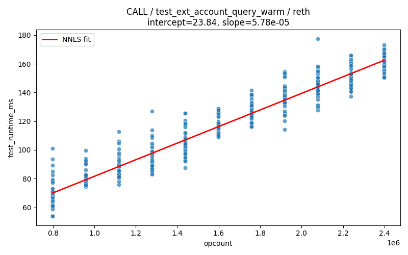

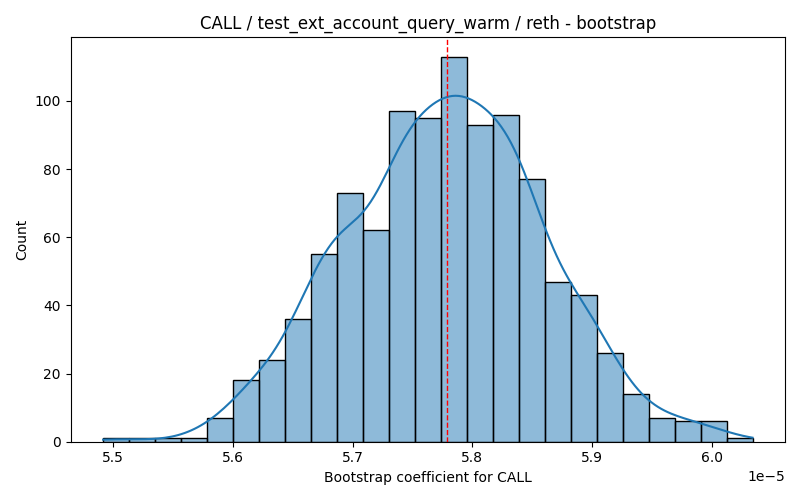

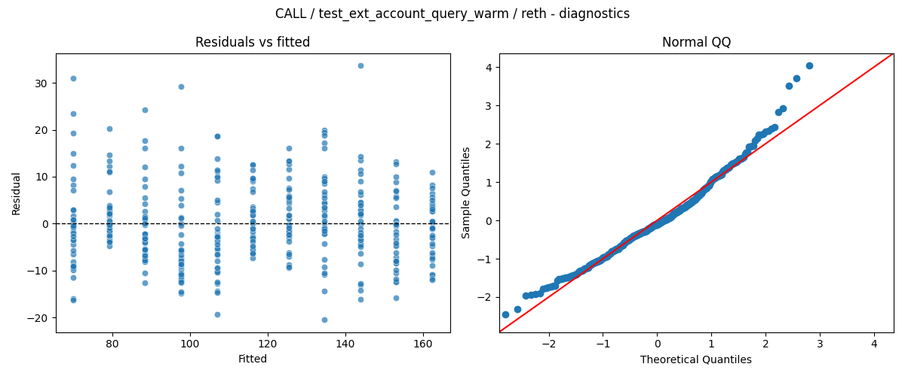

</details>

## CALLCODE

### test_account_access — combo `CALLCODE_AccountMode.EXISTING_EOA` — `presets[cold_account_nocode_access]`

| client | nobs | R² | target_coef (ms) | p-value | 95% CI |
| --- | --- | --- | --- | --- | --- |
| `besu` | 396 | 0.9027 | 0.01445 | 1.00e-03 | [0.01401, 0.01492] |
| `erigon` | 44 | 0.9855 | 0.009991 | 1.00e-03 | [0.009773, 0.01028] |
| `ethrex` | 308 | 0.9939 | 0.007266 | 1.00e-03 | [0.007204, 0.007333] |
| `geth` | 308 | 0.9101 | 0.01108 | 1.00e-03 | [0.01063, 0.01149] |
| `nethermind` | 253 | 0.8274 | 0.00387 | 1.00e-03 | [0.003643, 0.004082] |
| `reth` | 396 | 0.9167 | 0.001101 | 1.00e-03 | [0.001069, 0.001133] |

<details><summary>besu — NNLS regression summary</summary>

```
==============================================================================
                           NNLS Regression Results                            
==============================================================================
Dep. Variable:          test_runtime_ms              R-squared:          0.903
Model:                  NNLS                    Adj. R-squared:          0.902
No. Observations:       396                               RMSE:         112.62
Df Residuals:           394                                MAE:          97.77
Df Model:               1      
==============================================================================
                      coef     std err     P-value      [0.025      0.975]
------------------------------------------------------------------------------
         const    547.8217     17.6043       0.001    512.0324    580.6513
       opcount      0.0144      0.0002       0.001      0.0140      0.0149
==============================================================================
Notes: Non-negative least squares with bootstrap inference (1000 iterations)
==============================================================================
```

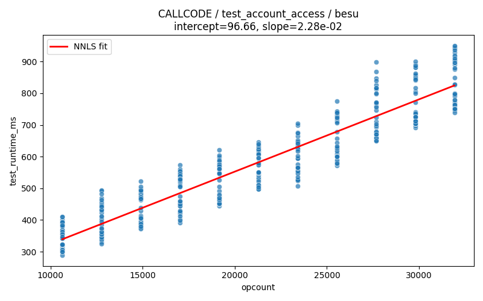

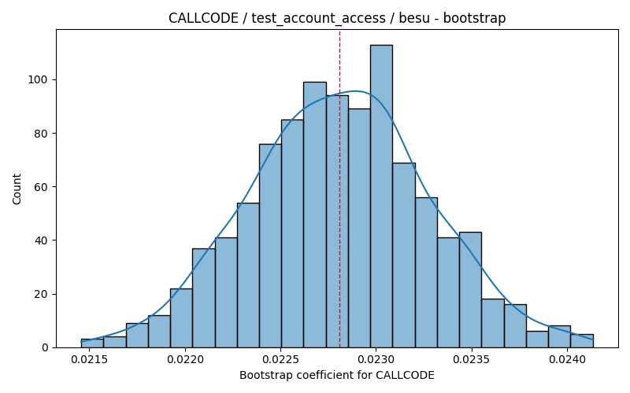

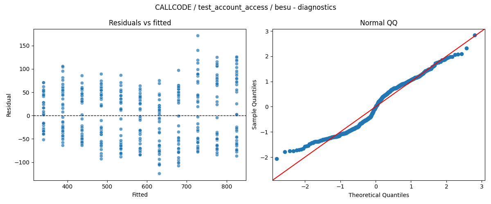

</details>

<details><summary>erigon — NNLS regression summary</summary>

```
==============================================================================
                           NNLS Regression Results                            
==============================================================================
Dep. Variable:          test_runtime_ms              R-squared:          0.986
Model:                  NNLS                    Adj. R-squared:          0.985
No. Observations:       44                                RMSE:          28.75
Df Residuals:           42                                 MAE:          16.88
Df Model:               1      
==============================================================================
                      coef     std err     P-value      [0.025      0.975]
------------------------------------------------------------------------------
         const     16.8933      7.7343       0.024      0.6601     31.2723
       opcount      0.0100      0.0001       0.001      0.0098      0.0103
==============================================================================
Notes: Non-negative least squares with bootstrap inference (1000 iterations)
==============================================================================
```

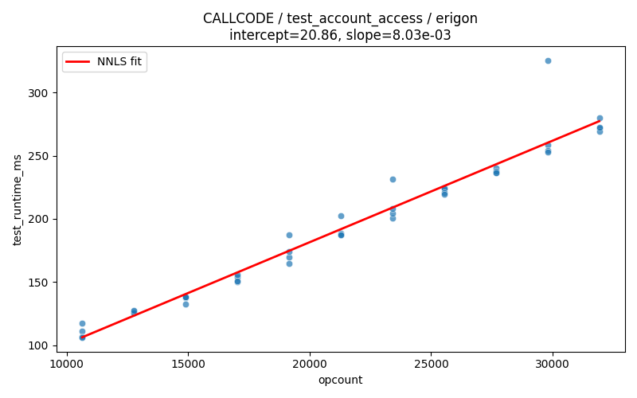

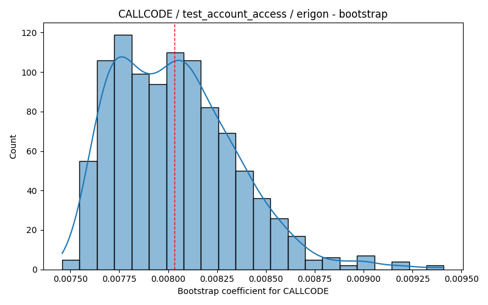

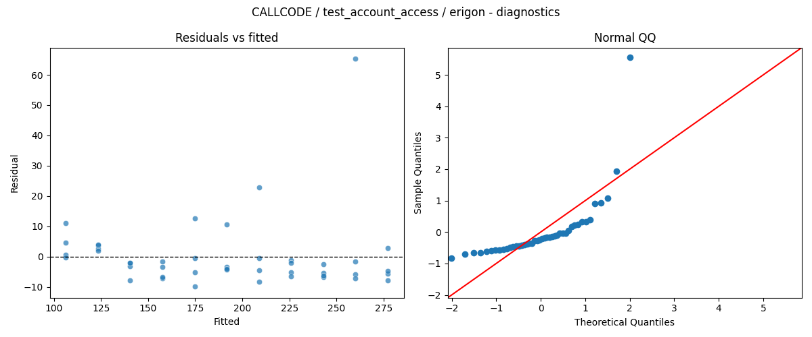

</details>

<details><summary>ethrex — NNLS regression summary</summary>

```
==============================================================================
                           NNLS Regression Results                            
==============================================================================
Dep. Variable:          test_runtime_ms              R-squared:          0.994
Model:                  NNLS                    Adj. R-squared:          0.994
No. Observations:       308                               RMSE:          13.54
Df Residuals:           306                                MAE:          10.75
Df Model:               1      
==============================================================================
                      coef     std err     P-value      [0.025      0.975]
------------------------------------------------------------------------------
         const     45.9788      2.5014       0.001     40.9870     50.9542
       opcount      0.0073      0.0000       0.001      0.0072      0.0073
==============================================================================
Notes: Non-negative least squares with bootstrap inference (1000 iterations)
==============================================================================
```

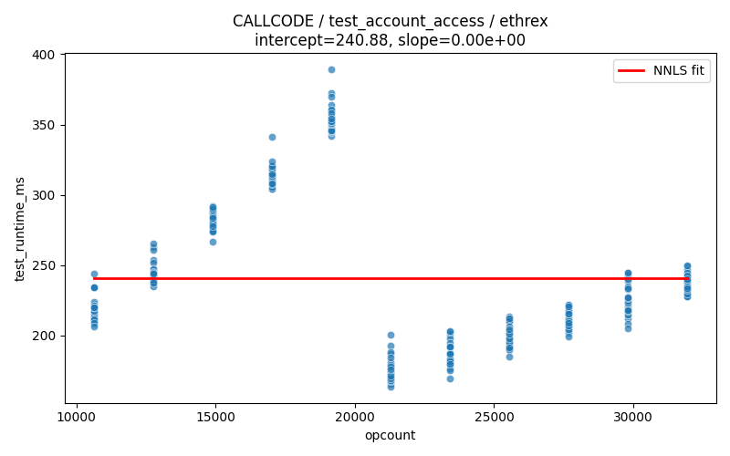

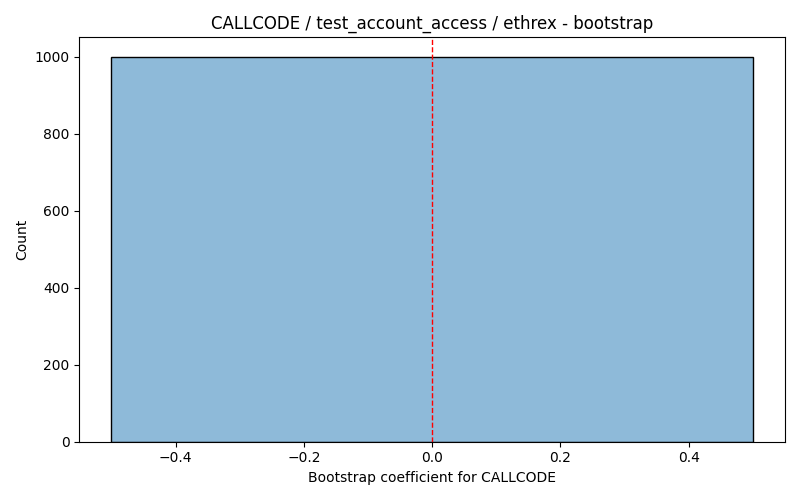

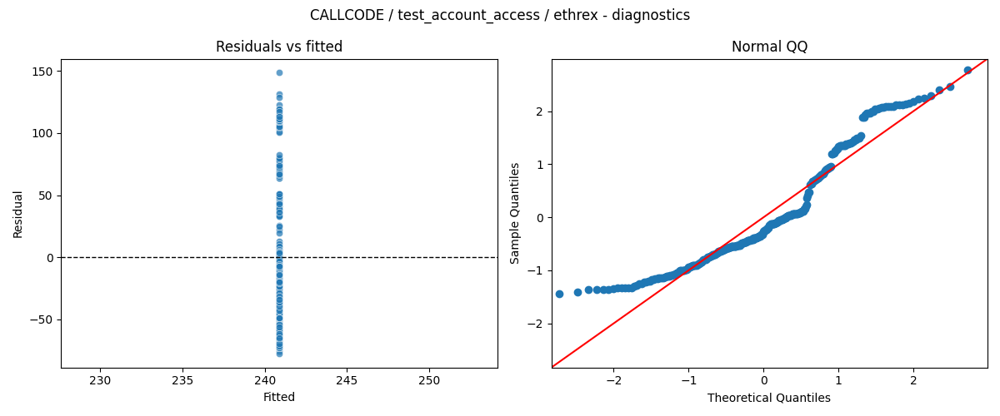

</details>

<details><summary>geth — NNLS regression summary</summary>

```
==============================================================================
                           NNLS Regression Results                            
==============================================================================
Dep. Variable:          test_runtime_ms              R-squared:          0.910
Model:                  NNLS                    Adj. R-squared:          0.910
No. Observations:       308                               RMSE:          82.71
Df Residuals:           306                                MAE:          68.75
Df Model:               1      
==============================================================================
                      coef     std err     P-value      [0.025      0.975]
------------------------------------------------------------------------------
         const    405.4436     18.9091       0.001    372.1415    442.5760
       opcount      0.0111      0.0002       0.001      0.0106      0.0115
==============================================================================
Notes: Non-negative least squares with bootstrap inference (1000 iterations)
==============================================================================
```

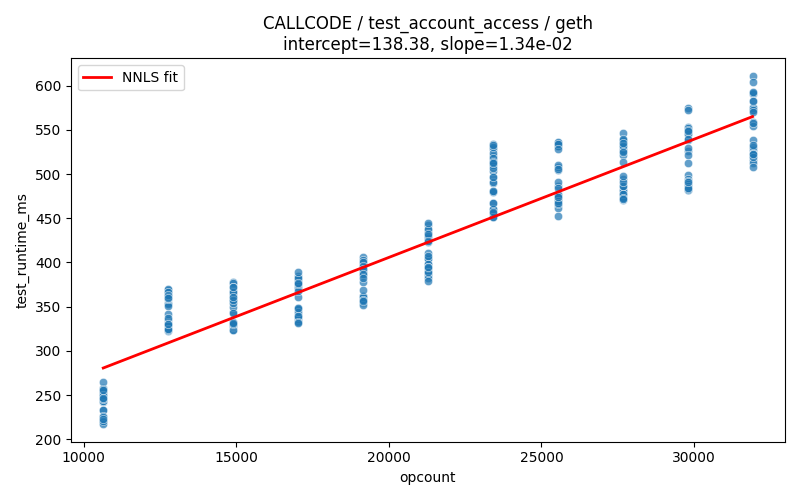

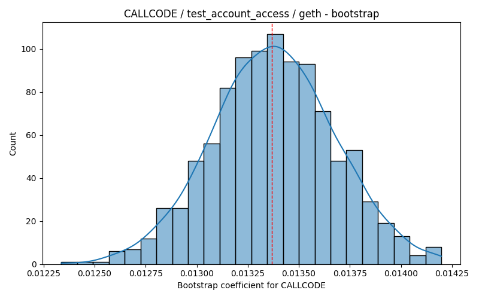

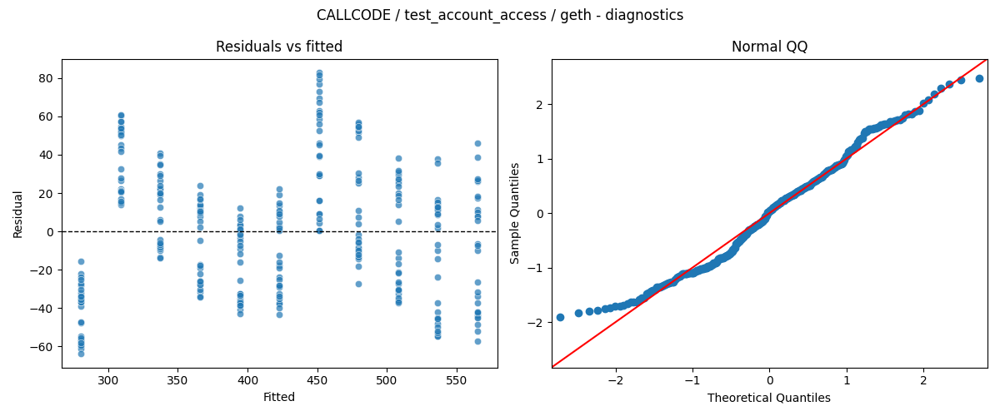

</details>

<details><summary>nethermind — NNLS regression summary</summary>

```
==============================================================================
                           NNLS Regression Results                            
==============================================================================
Dep. Variable:          test_runtime_ms              R-squared:          0.827
Model:                  NNLS                    Adj. R-squared:          0.827
No. Observations:       253                               RMSE:          41.97
Df Residuals:           251                                MAE:          34.26
Df Model:               1      
==============================================================================
                      coef     std err     P-value      [0.025      0.975]
------------------------------------------------------------------------------
         const     96.6447      7.9737       0.001     81.6461    113.1877
       opcount      0.0039      0.0001       0.001      0.0036      0.0041
==============================================================================
Notes: Non-negative least squares with bootstrap inference (1000 iterations)
==============================================================================
```

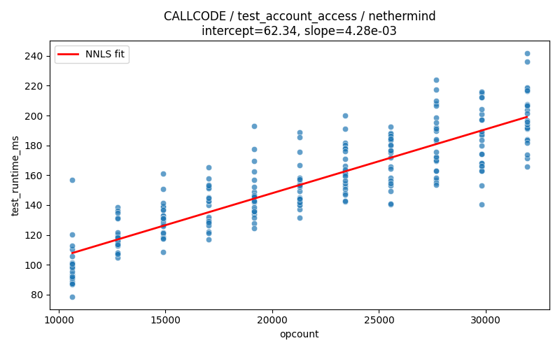

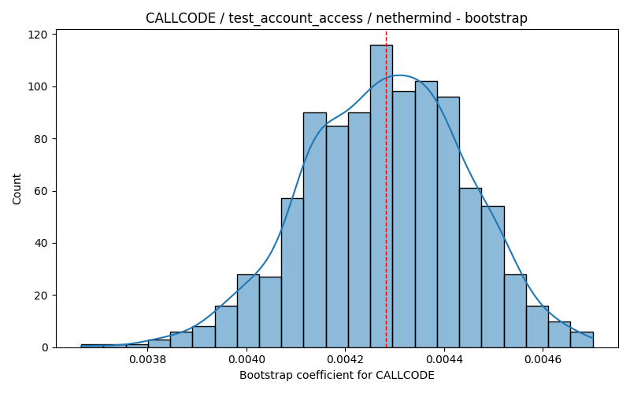

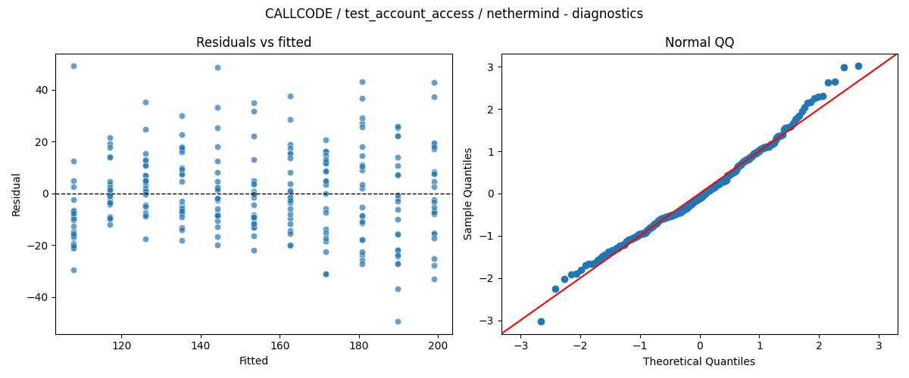

</details>

<details><summary>reth — NNLS regression summary</summary>

```
==============================================================================
                           NNLS Regression Results                            
==============================================================================
Dep. Variable:          test_runtime_ms              R-squared:          0.917
Model:                  NNLS                    Adj. R-squared:          0.916
No. Observations:       396                               RMSE:           7.88
Df Residuals:           394                                MAE:           6.19
Df Model:               1      
==============================================================================
                      coef     std err     P-value      [0.025      0.975]
------------------------------------------------------------------------------
         const     45.6142      1.2045       0.001     43.2212     47.9995
       opcount      0.0011      0.0000       0.001      0.0011      0.0011
==============================================================================
Notes: Non-negative least squares with bootstrap inference (1000 iterations)
==============================================================================
```

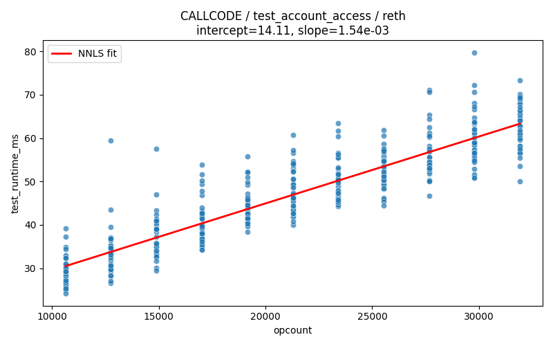


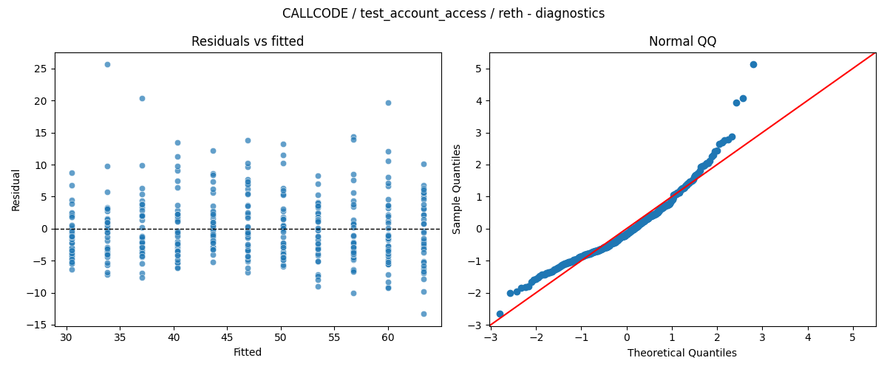

</details>

### test_account_access — combo `CALLCODE_AccountMode.NON_EXISTING_ACCOUNT` — `presets[cold_account_nocode_access]`

| client | nobs | R² | target_coef (ms) | p-value | 95% CI |
| --- | --- | --- | --- | --- | --- |
| `besu` | 396 | 0.8439 | 0.01462 | 1.00e-03 | [0.01397, 0.01523] |
| `erigon` | 44 | 0.9943 | 0.009146 | 1.00e-03 | [0.008958, 0.009367] |
| `ethrex` | 308 | 0.9654 | 0.002047 | 1.00e-03 | [0.002003, 0.002089] |
| `geth` | 308 | 0.866 | 0.02257 | 1.00e-03 | [0.02162, 0.0236] |
| `nethermind` | 253 | 0.8671 | 0.003857 | 1.00e-03 | [0.003662, 0.004053] |
| `reth` | 396 | 0.8615 | 0.0007443 | 1.00e-03 | [0.0007154, 0.0007718] |

<details><summary>besu — NNLS regression summary</summary>

```
==============================================================================
                           NNLS Regression Results                            
==============================================================================
Dep. Variable:          test_runtime_ms              R-squared:          0.844
Model:                  NNLS                    Adj. R-squared:          0.844
No. Observations:       396                               RMSE:         149.31
Df Residuals:           394                                MAE:         138.85
Df Model:               1      
==============================================================================
                      coef     std err     P-value      [0.025      0.975]
------------------------------------------------------------------------------
         const    515.0605     23.5872       0.001    469.6812    563.6538
       opcount      0.0146      0.0003       0.001      0.0140      0.0152
==============================================================================
Notes: Non-negative least squares with bootstrap inference (1000 iterations)
==============================================================================
```

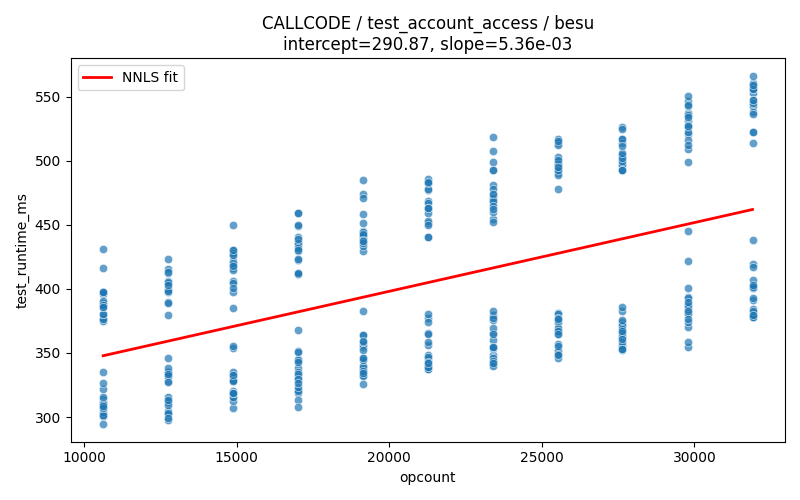

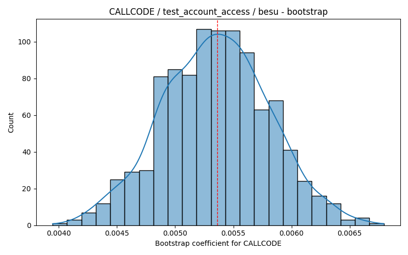

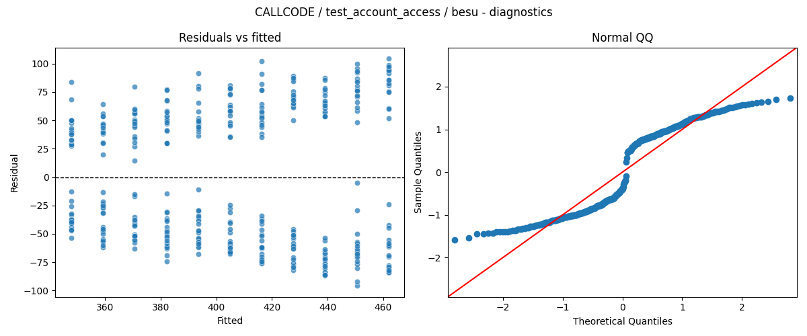

</details>

<details><summary>erigon — NNLS regression summary</summary>

```
==============================================================================
                           NNLS Regression Results                            
==============================================================================
Dep. Variable:          test_runtime_ms              R-squared:          0.994
Model:                  NNLS                    Adj. R-squared:          0.994
No. Observations:       44                                RMSE:          16.47
Df Residuals:           42                                 MAE:          11.59
Df Model:               1      
==============================================================================
                      coef     std err     P-value      [0.025      0.975]
------------------------------------------------------------------------------
         const     15.2355      7.7359       0.037      0.0000     31.4398
       opcount      0.0091      0.0001       0.001      0.0090      0.0094
==============================================================================
Notes: Non-negative least squares with bootstrap inference (1000 iterations)
==============================================================================
```

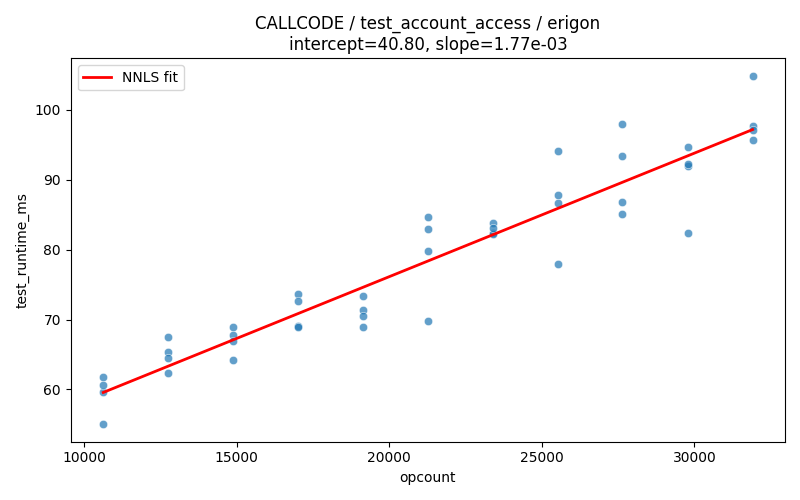

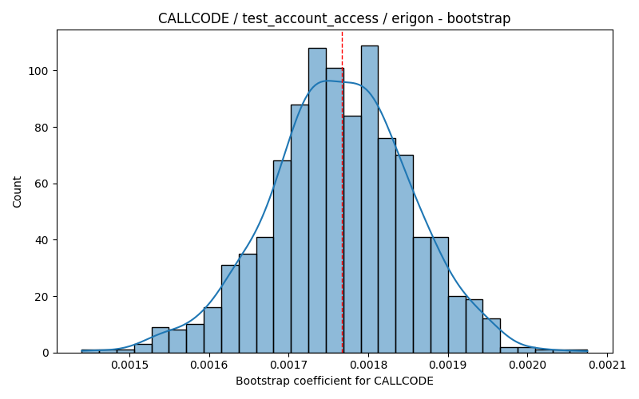

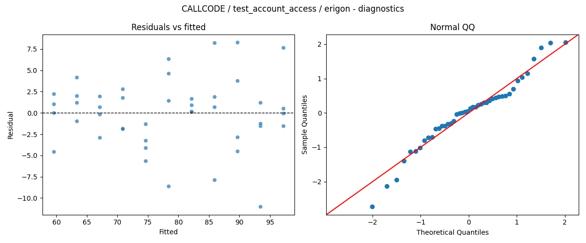

</details>

<details><summary>ethrex — NNLS regression summary</summary>

```
==============================================================================
                           NNLS Regression Results                            
==============================================================================
Dep. Variable:          test_runtime_ms              R-squared:          0.965
Model:                  NNLS                    Adj. R-squared:          0.965
No. Observations:       308                               RMSE:           9.20
Df Residuals:           306                                MAE:           7.22
Df Model:               1      
==============================================================================
                      coef     std err     P-value      [0.025      0.975]
------------------------------------------------------------------------------
         const     30.0941      1.5901       0.001     27.0380     33.1574
       opcount      0.0020      0.0000       0.001      0.0020      0.0021
==============================================================================
Notes: Non-negative least squares with bootstrap inference (1000 iterations)
==============================================================================
```

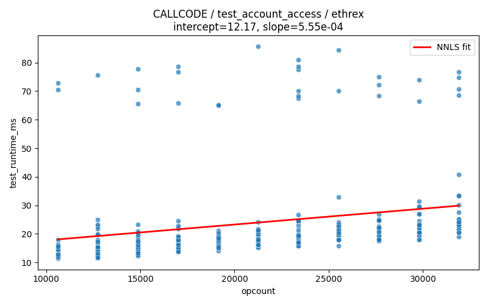

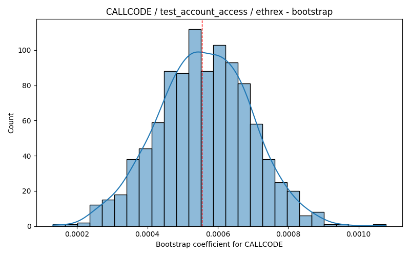

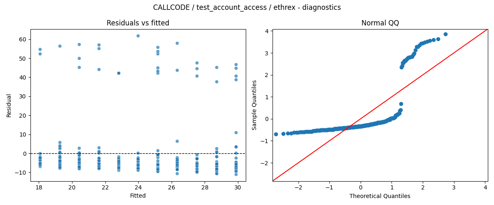

</details>

<details><summary>geth — NNLS regression summary</summary>

```
==============================================================================
                           NNLS Regression Results                            
==============================================================================
Dep. Variable:          test_runtime_ms              R-squared:          0.866
Model:                  NNLS                    Adj. R-squared:          0.866
No. Observations:       308                               RMSE:         210.79
Df Residuals:           306                                MAE:         179.15
Df Model:               1      
==============================================================================
                      coef     std err     P-value      [0.025      0.975]
------------------------------------------------------------------------------
         const    692.4137     43.7595       0.001    604.9306    774.5531
       opcount      0.0226      0.0005       0.001      0.0216      0.0236
==============================================================================
Notes: Non-negative least squares with bootstrap inference (1000 iterations)
==============================================================================
```

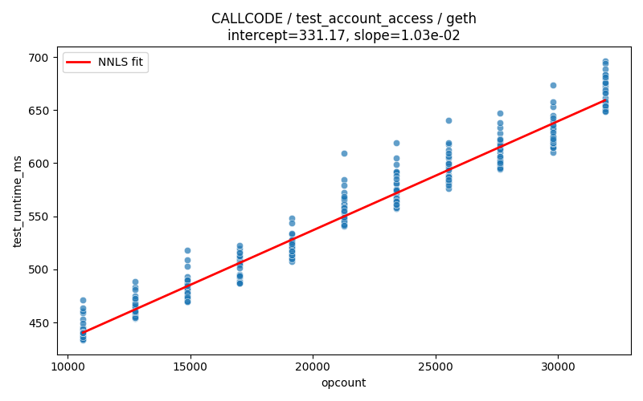

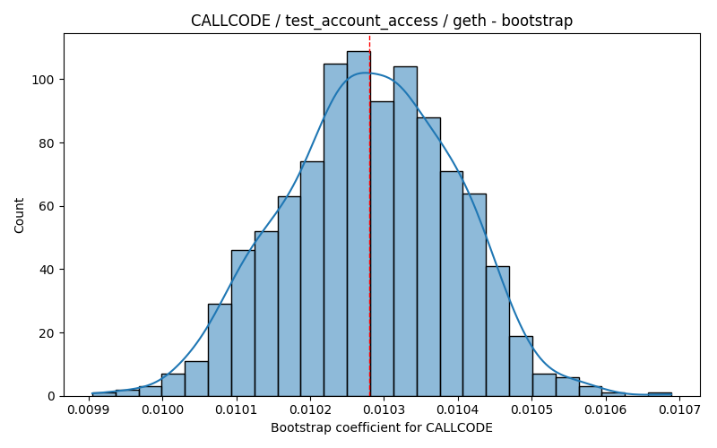

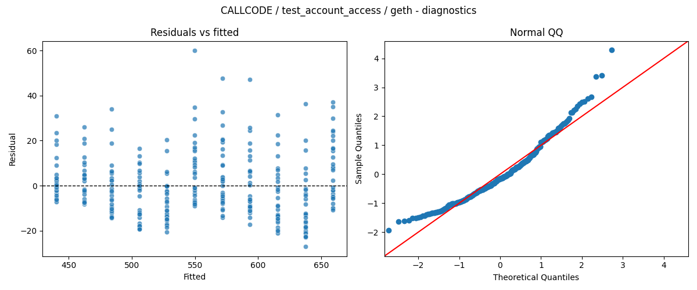

</details>

<details><summary>nethermind — NNLS regression summary</summary>

```
==============================================================================
                           NNLS Regression Results                            
==============================================================================
Dep. Variable:          test_runtime_ms              R-squared:          0.867
Model:                  NNLS                    Adj. R-squared:          0.867
No. Observations:       253                               RMSE:          35.86
Df Residuals:           251                                MAE:          27.66
Df Model:               1      
==============================================================================
                      coef     std err     P-value      [0.025      0.975]
------------------------------------------------------------------------------
         const     74.0327      7.3045       0.001     59.8656     87.8575
       opcount      0.0039      0.0001       0.001      0.0037      0.0041
==============================================================================
Notes: Non-negative least squares with bootstrap inference (1000 iterations)
==============================================================================
```

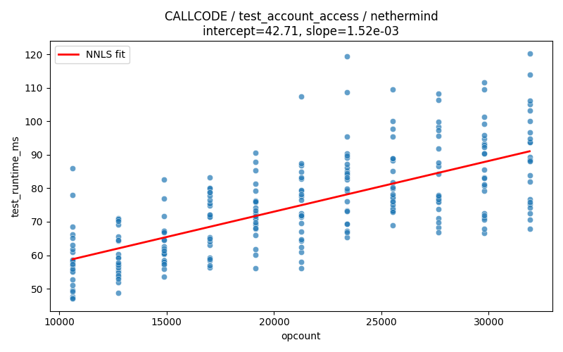

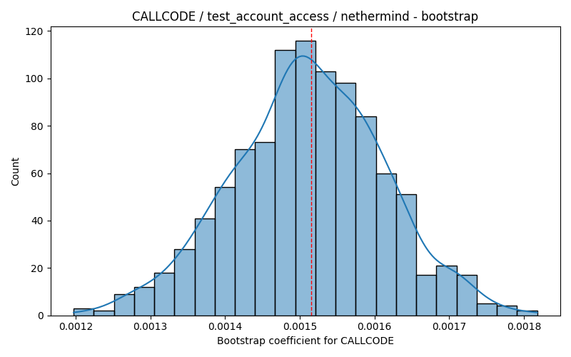

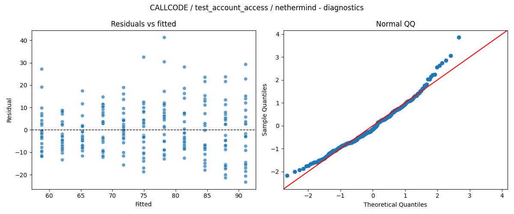

</details>

<details><summary>reth — NNLS regression summary</summary>

```
==============================================================================
                           NNLS Regression Results                            
==============================================================================
Dep. Variable:          test_runtime_ms              R-squared:          0.862
Model:                  NNLS                    Adj. R-squared:          0.861
No. Observations:       396                               RMSE:           7.09
Df Residuals:           394                                MAE:           5.43
Df Model:               1      
==============================================================================
                      coef     std err     P-value      [0.025      0.975]
------------------------------------------------------------------------------
         const     52.1981      1.1442       0.001     50.0640     54.4538
       opcount      0.0007      0.0000       0.001      0.0007      0.0008
==============================================================================
Notes: Non-negative least squares with bootstrap inference (1000 iterations)
==============================================================================
```

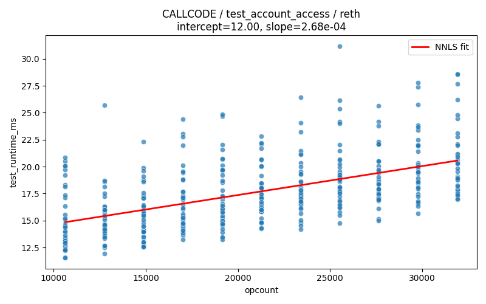

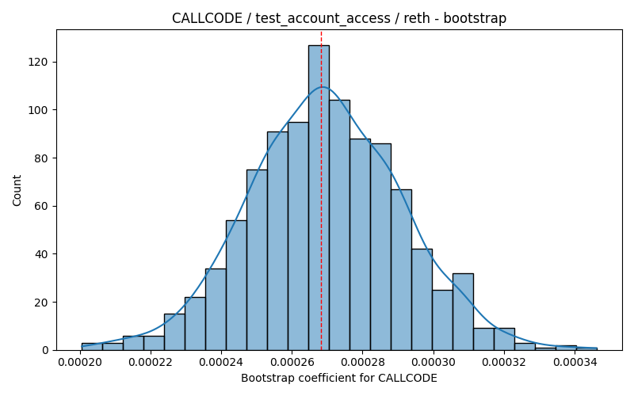

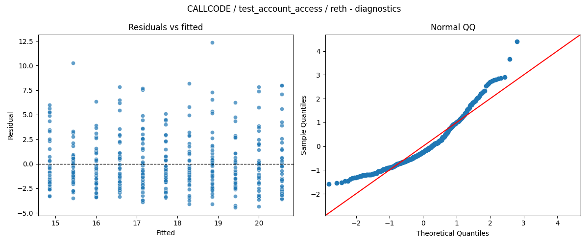

</details>

### test_account_access — combo `CALLCODE_AccountMode.EXISTING_CONTRACT` — `presets[cold_account_code_access]`

| client | nobs | R² | target_coef (ms) | p-value | 95% CI |
| --- | --- | --- | --- | --- | --- |
| `besu` | 396 | 0.9344 | 0.02641 | 1.00e-03 | [0.02574, 0.02711] |
| `erigon` | 44 | 0.9067 | 0.04946 | 1.00e-03 | [0.04459, 0.05353] |
| `ethrex` | 308 | 0.9931 | 0.007963 | 1.00e-03 | [0.007891, 0.008047] |
| `geth` | 308 | 0.8579 | 0.02331 | 1.00e-03 | [0.0222, 0.02435] |
| `nethermind` | 253 | 0.5709 | 0.01377 | 1.00e-03 | [0.01207, 0.0156] |
| `reth` | 396 | 0.9727 | 0.004036 | 1.00e-03 | [0.003967, 0.004106] |

<details><summary>besu — NNLS regression summary</summary>

```
==============================================================================
                           NNLS Regression Results                            
==============================================================================
Dep. Variable:          test_runtime_ms              R-squared:          0.934
Model:                  NNLS                    Adj. R-squared:          0.934
No. Observations:       396                               RMSE:         142.42
Df Residuals:           394                                MAE:         125.07
Df Model:               1      
==============================================================================
                      coef     std err     P-value      [0.025      0.975]
------------------------------------------------------------------------------
         const    563.6067     22.9682       0.001    518.4897    607.8896
       opcount      0.0264      0.0003       0.001      0.0257      0.0271
==============================================================================
Notes: Non-negative least squares with bootstrap inference (1000 iterations)
==============================================================================
```

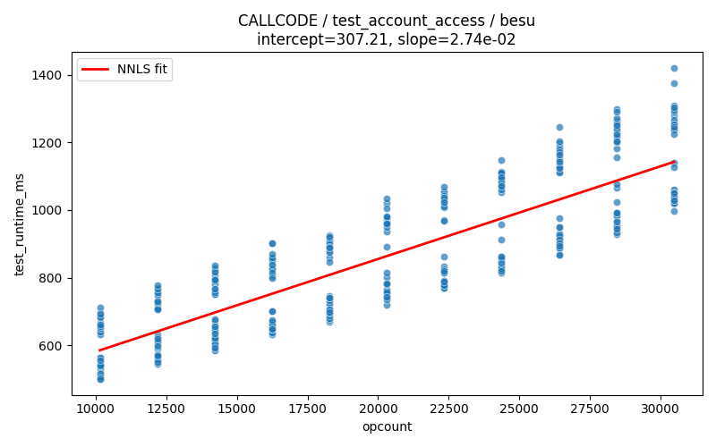

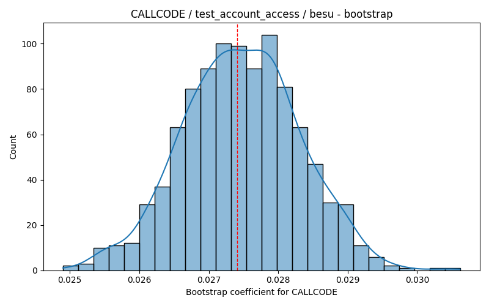

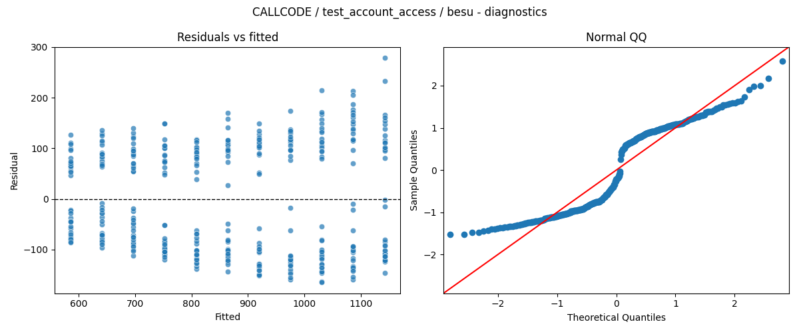

</details>

<details><summary>erigon — NNLS regression summary</summary>

```
==============================================================================
                           NNLS Regression Results                            
==============================================================================
Dep. Variable:          test_runtime_ms              R-squared:          0.907
Model:                  NNLS                    Adj. R-squared:          0.905
No. Observations:       44                                RMSE:         322.81
Df Residuals:           42                                 MAE:         271.96
Df Model:               1      
==============================================================================
                      coef     std err     P-value      [0.025      0.975]
------------------------------------------------------------------------------
         const    782.0306    157.7050       0.001    495.1930   1134.8871
       opcount      0.0495      0.0023       0.001      0.0446      0.0535
==============================================================================
Notes: Non-negative least squares with bootstrap inference (1000 iterations)
==============================================================================
```

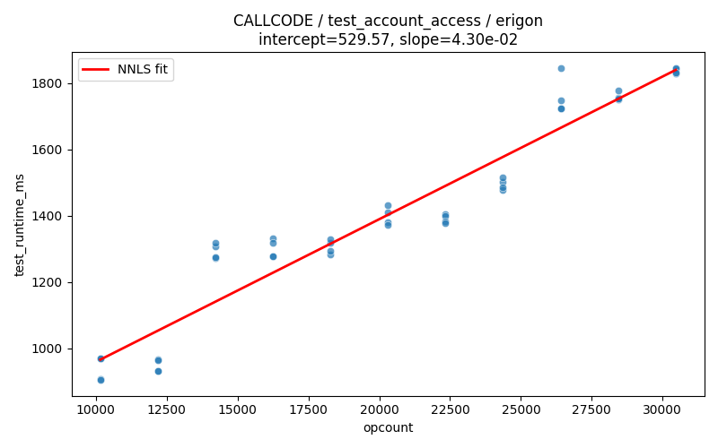

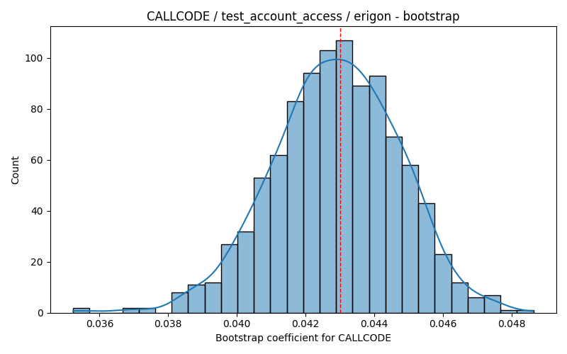

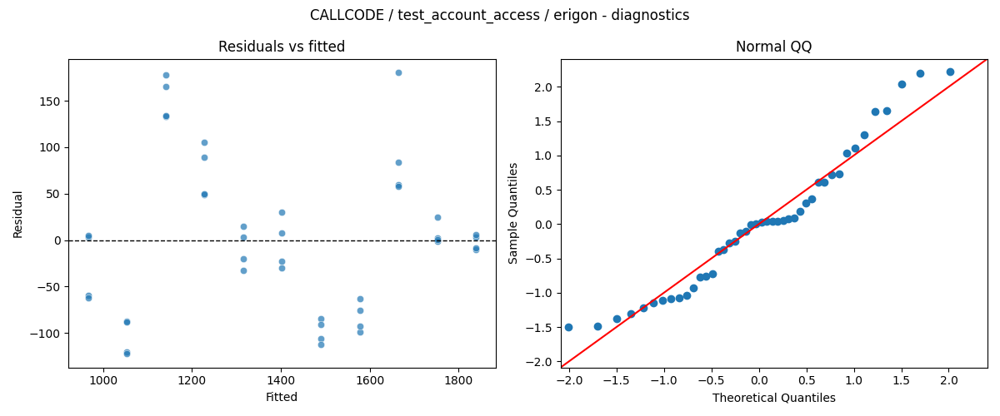

</details>

<details><summary>ethrex — NNLS regression summary</summary>

```
==============================================================================
                           NNLS Regression Results                            
==============================================================================
Dep. Variable:          test_runtime_ms              R-squared:          0.993
Model:                  NNLS                    Adj. R-squared:          0.993
No. Observations:       308                               RMSE:          13.50
Df Residuals:           306                                MAE:          10.27
Df Model:               1      
==============================================================================
                      coef     std err     P-value      [0.025      0.975]
------------------------------------------------------------------------------
         const     35.4434      2.4344       0.001     30.3928     40.1836
       opcount      0.0080      0.0000       0.001      0.0079      0.0080
==============================================================================
Notes: Non-negative least squares with bootstrap inference (1000 iterations)
==============================================================================
```

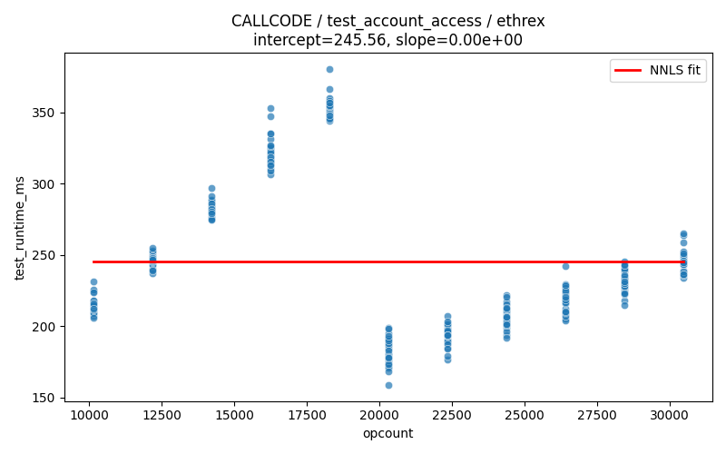


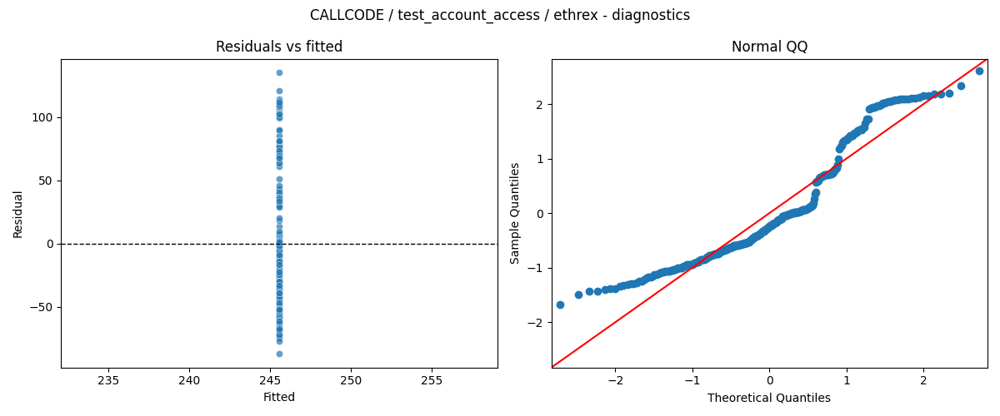

</details>

<details><summary>geth — NNLS regression summary</summary>

```
==============================================================================
                           NNLS Regression Results                            
==============================================================================
Dep. Variable:          test_runtime_ms              R-squared:          0.858
Model:                  NNLS                    Adj. R-squared:          0.857
No. Observations:       308                               RMSE:         193.12
Df Residuals:           306                                MAE:         161.46
Df Model:               1      
==============================================================================
                      coef     std err     P-value      [0.025      0.975]
------------------------------------------------------------------------------
         const    663.1310     41.4156       0.001    587.8615    743.4830
       opcount      0.0233      0.0006       0.001      0.0222      0.0244
==============================================================================
Notes: Non-negative least squares with bootstrap inference (1000 iterations)
==============================================================================
```

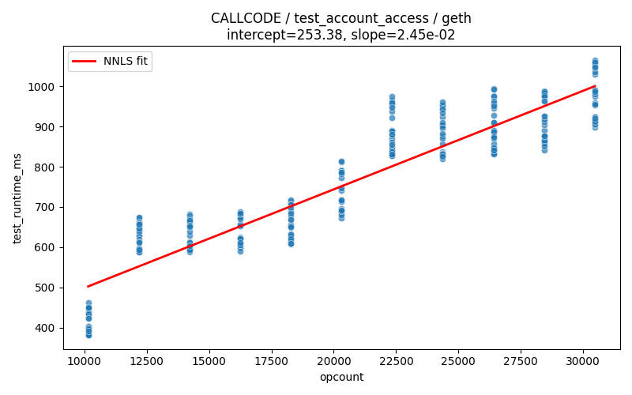

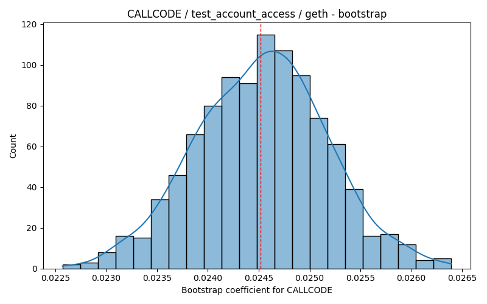

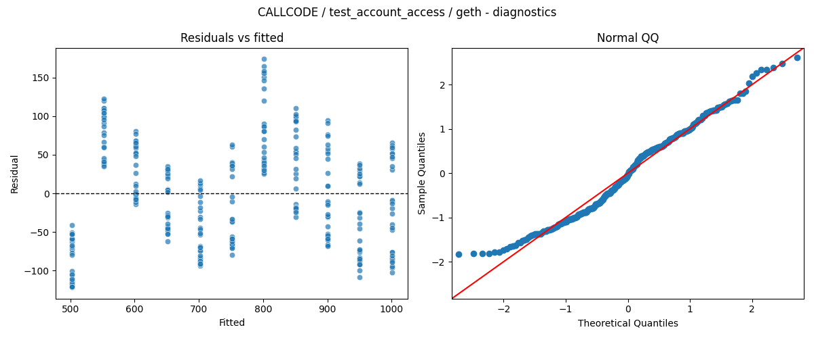

</details>

<details><summary>nethermind — NNLS regression summary</summary>

```
==============================================================================
                           NNLS Regression Results                            
==============================================================================
Dep. Variable:          test_runtime_ms              R-squared:          0.571
Model:                  NNLS                    Adj. R-squared:          0.569
No. Observations:       253                               RMSE:         242.88
Df Residuals:           251                                MAE:         183.49
Df Model:               1      
==============================================================================
                      coef     std err     P-value      [0.025      0.975]
------------------------------------------------------------------------------
         const    220.9554     50.4421       0.001    122.4118    321.1594
       opcount      0.0138      0.0009       0.001      0.0121      0.0156
==============================================================================
Notes: Non-negative least squares with bootstrap inference (1000 iterations)
==============================================================================
```

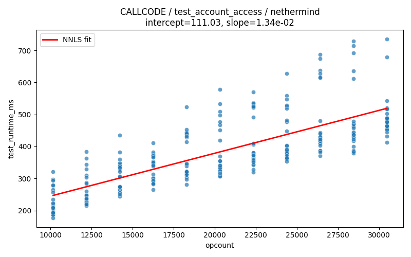

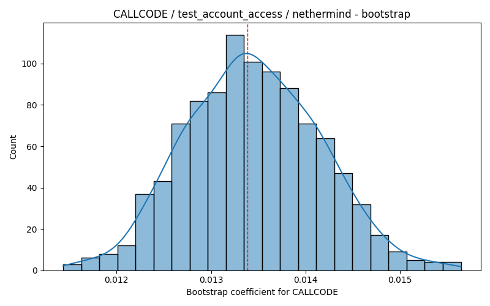

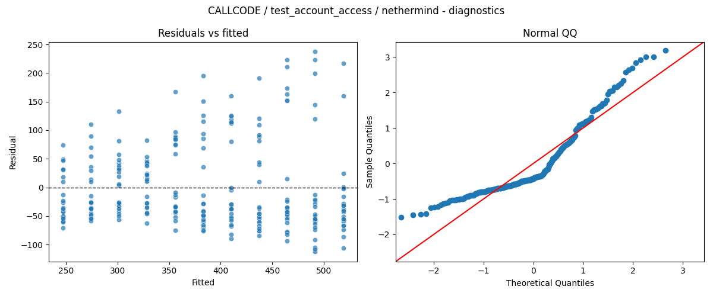

</details>

<details><summary>reth — NNLS regression summary</summary>

```
==============================================================================
                           NNLS Regression Results                            
==============================================================================
Dep. Variable:          test_runtime_ms              R-squared:          0.973
Model:                  NNLS                    Adj. R-squared:          0.973
No. Observations:       396                               RMSE:          13.75
Df Residuals:           394                                MAE:          11.04
Df Model:               1      
==============================================================================
                      coef     std err     P-value      [0.025      0.975]
------------------------------------------------------------------------------
         const    101.8697      2.2300       0.001     97.4483    106.2077
       opcount      0.0040      0.0000       0.001      0.0040      0.0041
==============================================================================
Notes: Non-negative least squares with bootstrap inference (1000 iterations)
==============================================================================
```


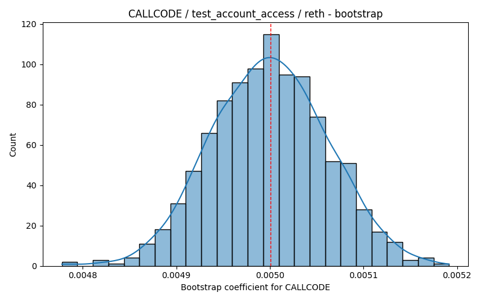

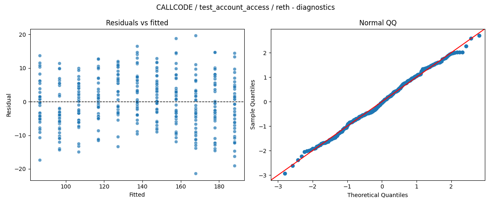

</details>

### test_account_access — combo `CALLCODE_AccountMode.NON_EXISTING_ACCOUNT` — `presets[cold_account_code_access]`

| client | nobs | R² | target_coef (ms) | p-value | 95% CI |
| --- | --- | --- | --- | --- | --- |
| `besu` | 396 | 0.8439 | 0.01462 | 1.00e-03 | [0.01397, 0.01523] |
| `erigon` | 44 | 0.9943 | 0.009146 | 1.00e-03 | [0.008958, 0.009367] |
| `ethrex` | 308 | 0.9654 | 0.002047 | 1.00e-03 | [0.002003, 0.002089] |
| `geth` | 308 | 0.866 | 0.02257 | 1.00e-03 | [0.02162, 0.0236] |
| `nethermind` | 253 | 0.8671 | 0.003857 | 1.00e-03 | [0.003662, 0.004053] |
| `reth` | 396 | 0.8615 | 0.0007443 | 1.00e-03 | [0.0007154, 0.0007718] |

<details><summary>besu — NNLS regression summary</summary>

```
==============================================================================
                           NNLS Regression Results                            
==============================================================================
Dep. Variable:          test_runtime_ms              R-squared:          0.844
Model:                  NNLS                    Adj. R-squared:          0.844
No. Observations:       396                               RMSE:         149.31
Df Residuals:           394                                MAE:         138.85
Df Model:               1      
==============================================================================
                      coef     std err     P-value      [0.025      0.975]
------------------------------------------------------------------------------
         const    515.0605     23.5872       0.001    469.6812    563.6538
       opcount      0.0146      0.0003       0.001      0.0140      0.0152
==============================================================================
Notes: Non-negative least squares with bootstrap inference (1000 iterations)
==============================================================================
```


</details>

<details><summary>erigon — NNLS regression summary</summary>

```
==============================================================================
                           NNLS Regression Results                            
==============================================================================
Dep. Variable:          test_runtime_ms              R-squared:          0.994
Model:                  NNLS                    Adj. R-squared:          0.994
No. Observations:       44                                RMSE:          16.47
Df Residuals:           42                                 MAE:          11.59
Df Model:               1      
==============================================================================
                      coef     std err     P-value      [0.025      0.975]
------------------------------------------------------------------------------
         const     15.2355      7.7359       0.037      0.0000     31.4398
       opcount      0.0091      0.0001       0.001      0.0090      0.0094
==============================================================================
Notes: Non-negative least squares with bootstrap inference (1000 iterations)
==============================================================================
```


</details>

<details><summary>ethrex — NNLS regression summary</summary>

```
==============================================================================
                           NNLS Regression Results                            
==============================================================================
Dep. Variable:          test_runtime_ms              R-squared:          0.965
Model:                  NNLS                    Adj. R-squared:          0.965
No. Observations:       308                               RMSE:           9.20
Df Residuals:           306                                MAE:           7.22
Df Model:               1      
==============================================================================
                      coef     std err     P-value      [0.025      0.975]
------------------------------------------------------------------------------
         const     30.0941      1.5901       0.001     27.0380     33.1574
       opcount      0.0020      0.0000       0.001      0.0020      0.0021
==============================================================================
Notes: Non-negative least squares with bootstrap inference (1000 iterations)
==============================================================================
```


</details>

<details><summary>geth — NNLS regression summary</summary>

```
==============================================================================
                           NNLS Regression Results                            
==============================================================================
Dep. Variable:          test_runtime_ms              R-squared:          0.866
Model:                  NNLS                    Adj. R-squared:          0.866
No. Observations:       308                               RMSE:         210.79
Df Residuals:           306                                MAE:         179.15
Df Model:               1      
==============================================================================
                      coef     std err     P-value      [0.025      0.975]
------------------------------------------------------------------------------
         const    692.4137     43.7595       0.001    604.9306    774.5531
       opcount      0.0226      0.0005       0.001      0.0216      0.0236
==============================================================================
Notes: Non-negative least squares with bootstrap inference (1000 iterations)
==============================================================================
```


</details>

<details><summary>nethermind — NNLS regression summary</summary>

```
==============================================================================
                           NNLS Regression Results                            
==============================================================================
Dep. Variable:          test_runtime_ms              R-squared:          0.867
Model:                  NNLS                    Adj. R-squared:          0.867
No. Observations:       253                               RMSE:          35.86
Df Residuals:           251                                MAE:          27.66
Df Model:               1      
==============================================================================
                      coef     std err     P-value      [0.025      0.975]
------------------------------------------------------------------------------
         const     74.0327      7.3045       0.001     59.8656     87.8575
       opcount      0.0039      0.0001       0.001      0.0037      0.0041
==============================================================================
Notes: Non-negative least squares with bootstrap inference (1000 iterations)
==============================================================================
```


</details>

<details><summary>reth — NNLS regression summary</summary>

```
==============================================================================
                           NNLS Regression Results                            
==============================================================================
Dep. Variable:          test_runtime_ms              R-squared:          0.862
Model:                  NNLS                    Adj. R-squared:          0.861
No. Observations:       396                               RMSE:           7.09
Df Residuals:           394                                MAE:           5.43
Df Model:               1      
==============================================================================
                      coef     std err     P-value      [0.025      0.975]
------------------------------------------------------------------------------
         const     52.1981      1.1442       0.001     50.0640     54.4538
       opcount      0.0007      0.0000       0.001      0.0007      0.0008
==============================================================================
Notes: Non-negative least squares with bootstrap inference (1000 iterations)
==============================================================================
```


</details>

### test_account_access — combo `CALLCODE_AccountMode.EXISTING_EOA` — `presets[cold_account_nocode_write]`

| client | nobs | R² | target_coef (ms) | p-value | 95% CI |
| --- | --- | --- | --- | --- | --- |
| `besu` | 396 | 0.8667 | 0.02281 | 1.00e-03 | [0.0219, 0.02372] |
| `erigon` | 44 | 0.9548 | 0.008033 | 1.00e-03 | [0.007591, 0.008704] |
| `ethrex` | 308 | -2.22e-16 | 0 | 1.00e+00 | [0, 0] |
| `geth` | 308 | 0.8784 | 0.01337 | 1.00e-03 | [0.01279, 0.01396] |
| `nethermind` | 253 | 0.7575 | 0.004282 | 1.00e-03 | [0.00395, 0.004573] |
| `reth` | 396 | 0.8112 | 0.001542 | 1.00e-03 | [0.001463, 0.001618] |

<details><summary>besu — NNLS regression summary</summary>

```
==============================================================================
                           NNLS Regression Results                            
==============================================================================
Dep. Variable:          test_runtime_ms              R-squared:          0.867
Model:                  NNLS                    Adj. R-squared:          0.866
No. Observations:       396                               RMSE:          60.19
Df Residuals:           394                                MAE:          53.36
Df Model:               1      
==============================================================================
                      coef     std err     P-value      [0.025      0.975]
------------------------------------------------------------------------------
         const     96.6612      9.3344       0.001     77.9733    114.9903
       opcount      0.0228      0.0005       0.001      0.0219      0.0237
==============================================================================
Notes: Non-negative least squares with bootstrap inference (1000 iterations)
==============================================================================
```


</details>

<details><summary>erigon — NNLS regression summary</summary>

```
==============================================================================
                           NNLS Regression Results                            
==============================================================================
Dep. Variable:          test_runtime_ms              R-squared:          0.955
Model:                  NNLS                    Adj. R-squared:          0.954
No. Observations:       44                                RMSE:          11.76
Df Residuals:           42                                 MAE:           6.49
Df Model:               1      
==============================================================================
                      coef     std err     P-value      [0.025      0.975]
------------------------------------------------------------------------------
         const     20.8567      5.2965       0.003      9.6287     28.7793
       opcount      0.0080      0.0003       0.001      0.0076      0.0087
==============================================================================
Notes: Non-negative least squares with bootstrap inference (1000 iterations)
==============================================================================
```


</details>

<details><summary>ethrex — NNLS regression summary</summary>

```
==============================================================================
                           NNLS Regression Results                            
==============================================================================
Dep. Variable:          test_runtime_ms              R-squared:         -0.000
Model:                  NNLS                    Adj. R-squared:         -0.003
No. Observations:       308                               RMSE:          53.52
Df Residuals:           306                                MAE:          42.96
Df Model:               1      
==============================================================================
                      coef     std err     P-value      [0.025      0.975]
------------------------------------------------------------------------------
         const    240.8836      3.0348       0.001    235.4654    246.9687
       opcount      0.0000      0.0000       1.000      0.0000      0.0000
==============================================================================
Notes: Non-negative least squares with bootstrap inference (1000 iterations)
==============================================================================
```


</details>

<details><summary>geth — NNLS regression summary</summary>

```
==============================================================================
                           NNLS Regression Results                            
==============================================================================
Dep. Variable:          test_runtime_ms              R-squared:          0.878
Model:                  NNLS                    Adj. R-squared:          0.878
No. Observations:       308                               RMSE:          33.47
Df Residuals:           306                                MAE:          28.03
Df Model:               1      
==============================================================================
                      coef     std err     P-value      [0.025      0.975]
------------------------------------------------------------------------------
         const    138.3791      6.7539       0.001    125.4423    152.2543
       opcount      0.0134      0.0003       0.001      0.0128      0.0140
==============================================================================
Notes: Non-negative least squares with bootstrap inference (1000 iterations)
==============================================================================
```


</details>

<details><summary>nethermind — NNLS regression summary</summary>

```
==============================================================================
                           NNLS Regression Results                            
==============================================================================
Dep. Variable:          test_runtime_ms              R-squared:          0.757
Model:                  NNLS                    Adj. R-squared:          0.757
No. Observations:       253                               RMSE:          16.31
Df Residuals:           251                                MAE:          12.95
Df Model:               1      
==============================================================================
                      coef     std err     P-value      [0.025      0.975]
------------------------------------------------------------------------------
         const     62.3378      3.3014       0.001     56.3994     68.9394
       opcount      0.0043      0.0002       0.001      0.0040      0.0046
==============================================================================
Notes: Non-negative least squares with bootstrap inference (1000 iterations)
==============================================================================
```


</details>

<details><summary>reth — NNLS regression summary</summary>

```
==============================================================================
                           NNLS Regression Results                            
==============================================================================
Dep. Variable:          test_runtime_ms              R-squared:          0.811
Model:                  NNLS                    Adj. R-squared:          0.811
No. Observations:       396                               RMSE:           5.01
Df Residuals:           394                                MAE:           3.84
Df Model:               1      
==============================================================================
                      coef     std err     P-value      [0.025      0.975]
------------------------------------------------------------------------------
         const     14.1069      0.8346       0.001     12.4901     15.8878
       opcount      0.0015      0.0000       0.001      0.0015      0.0016
==============================================================================
Notes: Non-negative least squares with bootstrap inference (1000 iterations)
==============================================================================
```


</details>

### test_account_access — combo `CALLCODE_AccountMode.NON_EXISTING_ACCOUNT` — `presets[cold_account_nocode_write]`

| client | nobs | R² | target_coef (ms) | p-value | 95% CI |
| --- | --- | --- | --- | --- | --- |
| `besu` | 396 | 0.2649 | 0.005361 | 1.00e-03 | [0.004461, 0.006266] |
| `erigon` | 44 | 0.8965 | 0.001766 | 1.00e-03 | [0.001582, 0.001933] |
| `ethrex` | 308 | 0.0517 | 0.0005549 | 1.00e-03 | [0.0003015, 0.0008173] |
| `geth` | 308 | 0.9609 | 0.01028 | 1.00e-03 | [0.01006, 0.01048] |
| `nethermind` | 253 | 0.4776 | 0.001516 | 1.00e-03 | [0.001305, 0.00171] |
| `reth` | 396 | 0.2935 | 0.0002683 | 1.00e-03 | [0.0002274, 0.0003108] |

<details><summary>besu — NNLS regression summary</summary>

```
==============================================================================
                           NNLS Regression Results                            
==============================================================================
Dep. Variable:          test_runtime_ms              R-squared:          0.265
Model:                  NNLS                    Adj. R-squared:          0.263
No. Observations:       396                               RMSE:          60.10
Df Residuals:           394                                MAE:          57.09
Df Model:               1      
==============================================================================
                      coef     std err     P-value      [0.025      0.975]
------------------------------------------------------------------------------
         const    290.8715      8.9693       0.001    273.8032    309.4549
       opcount      0.0054      0.0005       0.001      0.0045      0.0063
==============================================================================
Notes: Non-negative least squares with bootstrap inference (1000 iterations)
==============================================================================
```


</details>

<details><summary>erigon — NNLS regression summary</summary>

```
==============================================================================
                           NNLS Regression Results                            
==============================================================================
Dep. Variable:          test_runtime_ms              R-squared:          0.897
Model:                  NNLS                    Adj. R-squared:          0.894
No. Observations:       44                                RMSE:           4.04
Df Residuals:           42                                 MAE:           2.99
Df Model:               1      
==============================================================================
                      coef     std err     P-value      [0.025      0.975]
------------------------------------------------------------------------------
         const     40.8046      1.6893       0.001     37.6446     43.9875
       opcount      0.0018      0.0001       0.001      0.0016      0.0019
==============================================================================
Notes: Non-negative least squares with bootstrap inference (1000 iterations)
==============================================================================
```


</details>

<details><summary>ethrex — NNLS regression summary</summary>

```
==============================================================================
                           NNLS Regression Results                            
==============================================================================
Dep. Variable:          test_runtime_ms              R-squared:          0.052
Model:                  NNLS                    Adj. R-squared:          0.049
No. Observations:       308                               RMSE:          16.00
Df Residuals:           306                                MAE:           9.46
Df Model:               1      
==============================================================================
                      coef     std err     P-value      [0.025      0.975]
------------------------------------------------------------------------------
         const     12.1748      2.8772       0.001      6.7642     17.7843
       opcount      0.0006      0.0001       0.001      0.0003      0.0008
==============================================================================
Notes: Non-negative least squares with bootstrap inference (1000 iterations)
==============================================================================
```


</details>

<details><summary>geth — NNLS regression summary</summary>

```
==============================================================================
                           NNLS Regression Results                            
==============================================================================
Dep. Variable:          test_runtime_ms              R-squared:          0.961
Model:                  NNLS                    Adj. R-squared:          0.961
No. Observations:       308                               RMSE:          13.96
Df Residuals:           306                                MAE:          10.86
Df Model:               1      
==============================================================================
                      coef     std err     P-value      [0.025      0.975]
------------------------------------------------------------------------------
         const    331.1716      2.3026       0.001    327.0128    335.5762
       opcount      0.0103      0.0001       0.001      0.0101      0.0105
==============================================================================
Notes: Non-negative least squares with bootstrap inference (1000 iterations)
==============================================================================
```


</details>

<details><summary>nethermind — NNLS regression summary</summary>

```
==============================================================================
                           NNLS Regression Results                            
==============================================================================
Dep. Variable:          test_runtime_ms              R-squared:          0.478
Model:                  NNLS                    Adj. R-squared:          0.476
No. Observations:       253                               RMSE:          10.67
Df Residuals:           251                                MAE:           8.50
Df Model:               1      
==============================================================================
                      coef     std err     P-value      [0.025      0.975]
------------------------------------------------------------------------------
         const     42.7118      2.0378       0.001     38.9285     46.8452
       opcount      0.0015      0.0001       0.001      0.0013      0.0017
==============================================================================
Notes: Non-negative least squares with bootstrap inference (1000 iterations)
==============================================================================
```


</details>

<details><summary>reth — NNLS regression summary</summary>

```
==============================================================================
                           NNLS Regression Results                            
==============================================================================
Dep. Variable:          test_runtime_ms              R-squared:          0.293
Model:                  NNLS                    Adj. R-squared:          0.292
No. Observations:       396                               RMSE:           2.80
Df Residuals:           394                                MAE:           2.18
Df Model:               1      
==============================================================================
                      coef     std err     P-value      [0.025      0.975]
------------------------------------------------------------------------------
         const     12.0042      0.4642       0.001     11.0489     12.9027
       opcount      0.0003      0.0000       0.001      0.0002      0.0003
==============================================================================
Notes: Non-negative least squares with bootstrap inference (1000 iterations)
==============================================================================
```


</details>

### test_account_access — combo `CALLCODE_AccountMode.EXISTING_CONTRACT` — `presets[cold_account_code_write]`

| client | nobs | R² | target_coef (ms) | p-value | 95% CI |
| --- | --- | --- | --- | --- | --- |
| `besu` | 396 | 0.7283 | 0.02741 | 1.00e-03 | [0.02578, 0.02906] |
| `erigon` | 44 | 0.9207 | 0.043 | 1.00e-03 | [0.03909, 0.04633] |
| `ethrex` | 308 | 0 | 0 | 1.00e+00 | [0, 0] |
| `geth` | 308 | 0.8485 | 0.02452 | 1.00e-03 | [0.02324, 0.02581] |
| `nethermind` | 253 | 0.573 | 0.01339 | 1.00e-03 | [0.01213, 0.01481] |
| `reth` | 396 | 0.9511 | 0.005001 | 1.00e-03 | [0.004882, 0.00512] |

<details><summary>besu — NNLS regression summary</summary>

```
==============================================================================
                           NNLS Regression Results                            
==============================================================================
Dep. Variable:          test_runtime_ms              R-squared:          0.728
Model:                  NNLS                    Adj. R-squared:          0.728
No. Observations:       396                               RMSE:         107.52
Df Residuals:           394                                MAE:         101.11
Df Model:               1      
==============================================================================
                      coef     std err     P-value      [0.025      0.975]
------------------------------------------------------------------------------
         const    307.2068     15.7245       0.001    276.8528    337.2875
       opcount      0.0274      0.0008       0.001      0.0258      0.0291
==============================================================================
Notes: Non-negative least squares with bootstrap inference (1000 iterations)
==============================================================================
```


</details>

<details><summary>erigon — NNLS regression summary</summary>

```
==============================================================================
                           NNLS Regression Results                            
==============================================================================
Dep. Variable:          test_runtime_ms              R-squared:          0.921
Model:                  NNLS                    Adj. R-squared:          0.919
No. Observations:       44                                RMSE:          81.07
Df Residuals:           42                                 MAE:          63.00
Df Model:               1      
==============================================================================
                      coef     std err     P-value      [0.025      0.975]
------------------------------------------------------------------------------
         const    529.5738     43.5093       0.001    451.9120    621.4198
       opcount      0.0430      0.0018       0.001      0.0391      0.0463
==============================================================================
Notes: Non-negative least squares with bootstrap inference (1000 iterations)
==============================================================================
```


</details>

<details><summary>ethrex — NNLS regression summary</summary>

```
==============================================================================
                           NNLS Regression Results                            
==============================================================================
Dep. Variable:          test_runtime_ms              R-squared:          0.000
Model:                  NNLS                    Adj. R-squared:         -0.003
No. Observations:       308                               RMSE:          51.78
Df Residuals:           306                                MAE:          41.34
Df Model:               1      
==============================================================================
                      coef     std err     P-value      [0.025      0.975]
------------------------------------------------------------------------------
         const    245.5634      3.0317       0.001    239.5535    251.2893
       opcount      0.0000      0.0000       1.000      0.0000      0.0000
==============================================================================
Notes: Non-negative least squares with bootstrap inference (1000 iterations)
==============================================================================
```


</details>

<details><summary>geth — NNLS regression summary</summary>

```
==============================================================================
                           NNLS Regression Results                            
==============================================================================
Dep. Variable:          test_runtime_ms              R-squared:          0.848
Model:                  NNLS                    Adj. R-squared:          0.848
No. Observations:       308                               RMSE:          66.55
Df Residuals:           306                                MAE:          56.99
Df Model:               1      
==============================================================================
                      coef     std err     P-value      [0.025      0.975]
------------------------------------------------------------------------------
         const    253.3828     13.8323       0.001    226.4042    281.3979
       opcount      0.0245      0.0006       0.001      0.0232      0.0258
==============================================================================
Notes: Non-negative least squares with bootstrap inference (1000 iterations)
==============================================================================
```


</details>

<details><summary>nethermind — NNLS regression summary</summary>

```
==============================================================================
                           NNLS Regression Results                            
==============================================================================
Dep. Variable:          test_runtime_ms              R-squared:          0.573
Model:                  NNLS                    Adj. R-squared:          0.571
No. Observations:       253                               RMSE:          74.23
Df Residuals:           251                                MAE:          60.16
Df Model:               1      
==============================================================================
                      coef     std err     P-value      [0.025      0.975]
------------------------------------------------------------------------------
         const    111.0321     12.7833       0.001     85.0147    133.8044
       opcount      0.0134      0.0007       0.001      0.0121      0.0148
==============================================================================
Notes: Non-negative least squares with bootstrap inference (1000 iterations)
==============================================================================
```


</details>

<details><summary>reth — NNLS regression summary</summary>

```
==============================================================================
                           NNLS Regression Results                            
==============================================================================
Dep. Variable:          test_runtime_ms              R-squared:          0.951
Model:                  NNLS                    Adj. R-squared:          0.951
No. Observations:       396                               RMSE:           7.29
Df Residuals:           394                                MAE:           5.97
Df Model:               1      
==============================================================================
                      coef     std err     P-value      [0.025      0.975]
------------------------------------------------------------------------------
         const     35.7158      1.2552       0.001     33.4410     38.1668
       opcount      0.0050      0.0001       0.001      0.0049      0.0051
==============================================================================
Notes: Non-negative least squares with bootstrap inference (1000 iterations)
==============================================================================
```


</details>

### test_account_access — combo `CALLCODE_AccountMode.NON_EXISTING_ACCOUNT` — `presets[cold_account_code_write]`

| client | nobs | R² | target_coef (ms) | p-value | 95% CI |
| --- | --- | --- | --- | --- | --- |
| `besu` | 396 | 0.2649 | 0.005361 | 1.00e-03 | [0.004461, 0.006266] |
| `erigon` | 44 | 0.8965 | 0.001766 | 1.00e-03 | [0.001582, 0.001933] |
| `ethrex` | 308 | 0.0517 | 0.0005549 | 1.00e-03 | [0.0003015, 0.0008173] |
| `geth` | 308 | 0.9609 | 0.01028 | 1.00e-03 | [0.01006, 0.01048] |
| `nethermind` | 253 | 0.4776 | 0.001516 | 1.00e-03 | [0.001305, 0.00171] |
| `reth` | 396 | 0.2935 | 0.0002683 | 1.00e-03 | [0.0002274, 0.0003108] |

<details><summary>besu — NNLS regression summary</summary>

```
==============================================================================
                           NNLS Regression Results                            
==============================================================================
Dep. Variable:          test_runtime_ms              R-squared:          0.265
Model:                  NNLS                    Adj. R-squared:          0.263
No. Observations:       396                               RMSE:          60.10
Df Residuals:           394                                MAE:          57.09
Df Model:               1      
==============================================================================
                      coef     std err     P-value      [0.025      0.975]
------------------------------------------------------------------------------
         const    290.8715      8.9693       0.001    273.8032    309.4549
       opcount      0.0054      0.0005       0.001      0.0045      0.0063
==============================================================================
Notes: Non-negative least squares with bootstrap inference (1000 iterations)
==============================================================================
```


</details>

<details><summary>erigon — NNLS regression summary</summary>

```
==============================================================================
                           NNLS Regression Results                            
==============================================================================
Dep. Variable:          test_runtime_ms              R-squared:          0.897
Model:                  NNLS                    Adj. R-squared:          0.894
No. Observations:       44                                RMSE:           4.04
Df Residuals:           42                                 MAE:           2.99
Df Model:               1      
==============================================================================
                      coef     std err     P-value      [0.025      0.975]
------------------------------------------------------------------------------
         const     40.8046      1.6893       0.001     37.6446     43.9875
       opcount      0.0018      0.0001       0.001      0.0016      0.0019
==============================================================================
Notes: Non-negative least squares with bootstrap inference (1000 iterations)
==============================================================================
```


</details>

<details><summary>ethrex — NNLS regression summary</summary>

```
==============================================================================
                           NNLS Regression Results                            
==============================================================================
Dep. Variable:          test_runtime_ms              R-squared:          0.052
Model:                  NNLS                    Adj. R-squared:          0.049
No. Observations:       308                               RMSE:          16.00
Df Residuals:           306                                MAE:           9.46
Df Model:               1      
==============================================================================
                      coef     std err     P-value      [0.025      0.975]
------------------------------------------------------------------------------
         const     12.1748      2.8772       0.001      6.7642     17.7843
       opcount      0.0006      0.0001       0.001      0.0003      0.0008
==============================================================================
Notes: Non-negative least squares with bootstrap inference (1000 iterations)
==============================================================================
```


</details>

<details><summary>geth — NNLS regression summary</summary>

```
==============================================================================
                           NNLS Regression Results                            
==============================================================================
Dep. Variable:          test_runtime_ms              R-squared:          0.961
Model:                  NNLS                    Adj. R-squared:          0.961
No. Observations:       308                               RMSE:          13.96
Df Residuals:           306                                MAE:          10.86
Df Model:               1      
==============================================================================
                      coef     std err     P-value      [0.025      0.975]
------------------------------------------------------------------------------
         const    331.1716      2.3026       0.001    327.0128    335.5762
       opcount      0.0103      0.0001       0.001      0.0101      0.0105
==============================================================================
Notes: Non-negative least squares with bootstrap inference (1000 iterations)
==============================================================================
```


</details>

<details><summary>nethermind — NNLS regression summary</summary>

```
==============================================================================
                           NNLS Regression Results                            
==============================================================================
Dep. Variable:          test_runtime_ms              R-squared:          0.478
Model:                  NNLS                    Adj. R-squared:          0.476
No. Observations:       253                               RMSE:          10.67
Df Residuals:           251                                MAE:           8.50
Df Model:               1      
==============================================================================
                      coef     std err     P-value      [0.025      0.975]
------------------------------------------------------------------------------
         const     42.7118      2.0378       0.001     38.9285     46.8452
       opcount      0.0015      0.0001       0.001      0.0013      0.0017
==============================================================================
Notes: Non-negative least squares with bootstrap inference (1000 iterations)
==============================================================================
```


</details>

<details><summary>reth — NNLS regression summary</summary>

```
==============================================================================
                           NNLS Regression Results                            
==============================================================================
Dep. Variable:          test_runtime_ms              R-squared:          0.293
Model:                  NNLS                    Adj. R-squared:          0.292
No. Observations:       396                               RMSE:           2.80
Df Residuals:           394                                MAE:           2.18
Df Model:               1      
==============================================================================
                      coef     std err     P-value      [0.025      0.975]
------------------------------------------------------------------------------
         const     12.0042      0.4642       0.001     11.0489     12.9027
       opcount      0.0003      0.0000       0.001      0.0002      0.0003
==============================================================================
Notes: Non-negative least squares with bootstrap inference (1000 iterations)
==============================================================================
```


</details>

### test_ext_account_query_warm — combo `CALLCODE`

| client | nobs | R² | target_coef (ms) | p-value | 95% CI |
| --- | --- | --- | --- | --- | --- |
| `besu` | 396 | 0.7358 | 0.0006252 | 1.00e-03 | [0.0005874, 0.0006623] |
| `erigon` | 44 | 0.9512 | 0.000271 | 1.00e-03 | [0.0002527, 0.000288] |
| `ethrex` | 308 | 0.9409 | 0.0001033 | 1.00e-03 | [0.0001005, 0.0001063] |
| `geth` | 308 | 0.8811 | 0.0001792 | 1.00e-03 | [0.0001708, 0.0001871] |
| `nethermind` | 253 | 0.7137 | 0.0002059 | 1.00e-03 | [0.0001896, 0.0002215] |
| `reth` | 396 | 0.9069 | 5.738e-05 | 1.00e-03 | [5.569e-05, 5.907e-05] |

<details><summary>besu — NNLS regression summary</summary>

```
==============================================================================
                           NNLS Regression Results                            
==============================================================================
Dep. Variable:          test_runtime_ms              R-squared:          0.736
Model:                  NNLS                    Adj. R-squared:          0.735
No. Observations:       396                               RMSE:         189.28
Df Residuals:           394                                MAE:         141.36
Df Model:               1      
==============================================================================
                      coef     std err     P-value      [0.025      0.975]
------------------------------------------------------------------------------
         const    817.5437     31.4423       0.001    758.4159    881.7213
       opcount      0.0006      0.0000       0.001      0.0006      0.0007
==============================================================================
Notes: Non-negative least squares with bootstrap inference (1000 iterations)
==============================================================================
```

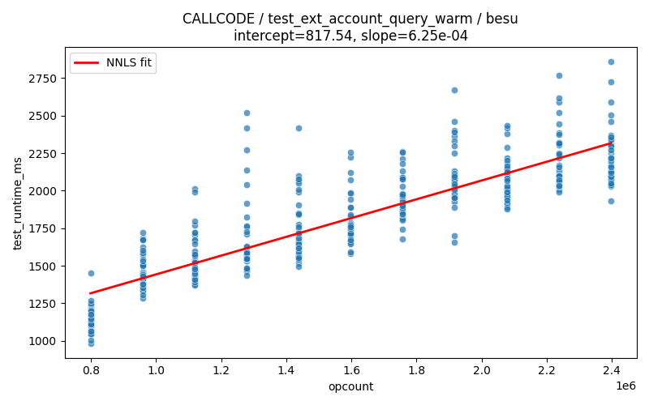

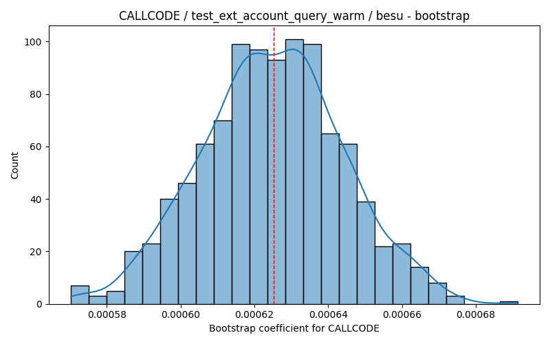

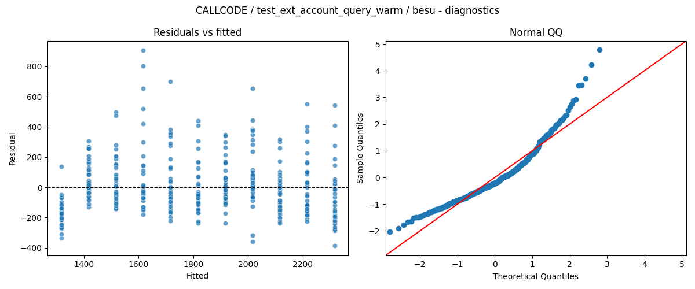

</details>

<details><summary>erigon — NNLS regression summary</summary>

```
==============================================================================
                           NNLS Regression Results                            
==============================================================================
Dep. Variable:          test_runtime_ms              R-squared:          0.951
Model:                  NNLS                    Adj. R-squared:          0.950
No. Observations:       44                                RMSE:          31.01
Df Residuals:           42                                 MAE:          25.31
Df Model:               1      
==============================================================================
                      coef     std err     P-value      [0.025      0.975]
------------------------------------------------------------------------------
         const     51.7330     14.8092       0.001     23.0573     80.9861
       opcount      0.0003      0.0000       0.001      0.0003      0.0003
==============================================================================
Notes: Non-negative least squares with bootstrap inference (1000 iterations)
==============================================================================
```

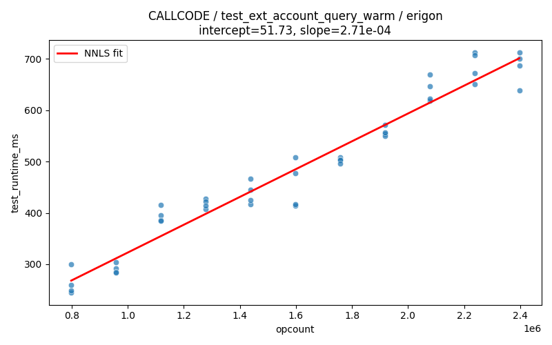

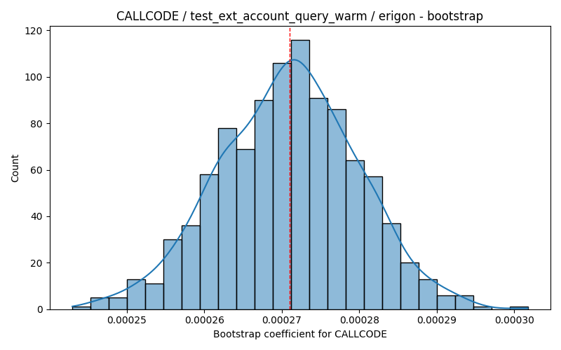

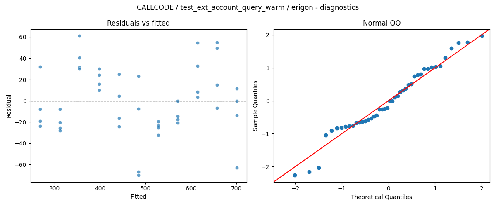

</details>

<details><summary>ethrex — NNLS regression summary</summary>

```
==============================================================================
                           NNLS Regression Results                            
==============================================================================
Dep. Variable:          test_runtime_ms              R-squared:          0.941
Model:                  NNLS                    Adj. R-squared:          0.941
No. Observations:       308                               RMSE:          13.09
Df Residuals:           306                                MAE:          10.47
Df Model:               1      
==============================================================================
                      coef     std err     P-value      [0.025      0.975]
------------------------------------------------------------------------------
         const     35.1767      2.4102       0.001     30.6825     40.0139
       opcount      0.0001      0.0000       0.001      0.0001      0.0001
==============================================================================
Notes: Non-negative least squares with bootstrap inference (1000 iterations)
==============================================================================
```

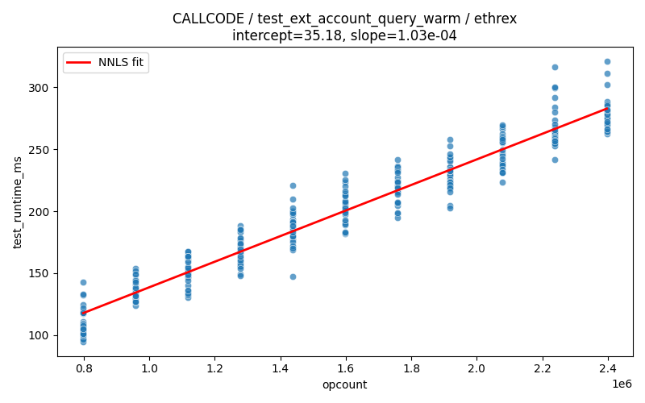

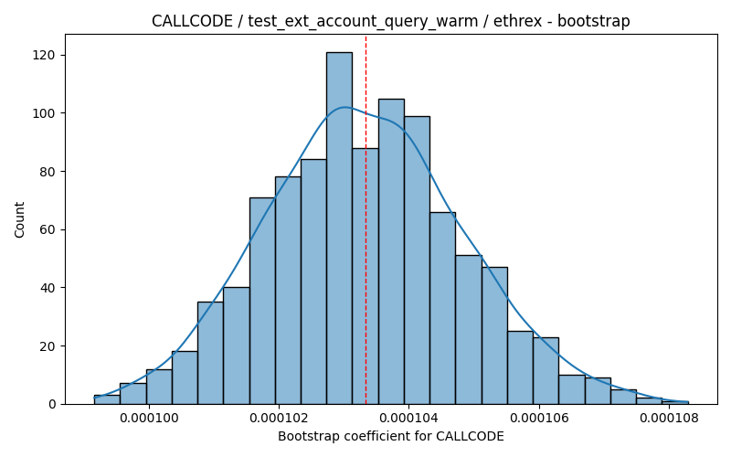

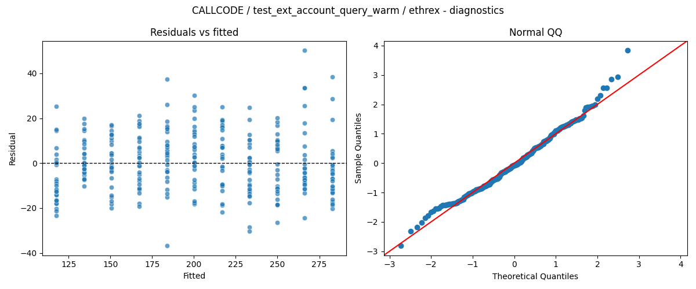

</details>

<details><summary>geth — NNLS regression summary</summary>

```
==============================================================================
                           NNLS Regression Results                            
==============================================================================
Dep. Variable:          test_runtime_ms              R-squared:          0.881
Model:                  NNLS                    Adj. R-squared:          0.881
No. Observations:       308                               RMSE:          33.27
Df Residuals:           306                                MAE:          25.85
Df Model:               1      
==============================================================================
                      coef     std err     P-value      [0.025      0.975]
------------------------------------------------------------------------------
         const     52.9380      6.1855       0.001     41.4792     65.7495
       opcount      0.0002      0.0000       0.001      0.0002      0.0002
==============================================================================
Notes: Non-negative least squares with bootstrap inference (1000 iterations)
==============================================================================
```

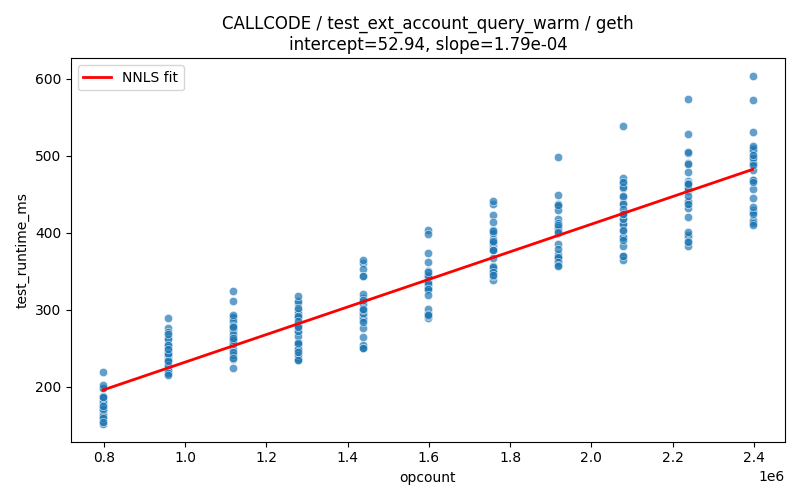

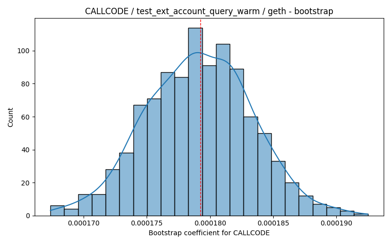

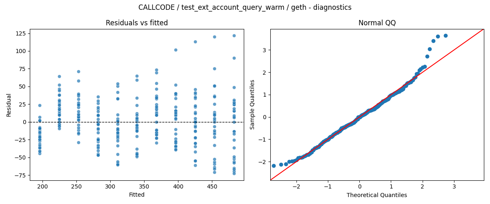

</details>

<details><summary>nethermind — NNLS regression summary</summary>

```
==============================================================================
                           NNLS Regression Results                            
==============================================================================
Dep. Variable:          test_runtime_ms              R-squared:          0.714
Model:                  NNLS                    Adj. R-squared:          0.713
No. Observations:       253                               RMSE:          65.90
Df Residuals:           251                                MAE:          51.72
Df Model:               1      
==============================================================================
                      coef     std err     P-value      [0.025      0.975]
------------------------------------------------------------------------------
         const    184.4525     12.7051       0.001    160.8084    209.9241
       opcount      0.0002      0.0000       0.001      0.0002      0.0002
==============================================================================
Notes: Non-negative least squares with bootstrap inference (1000 iterations)
==============================================================================
```

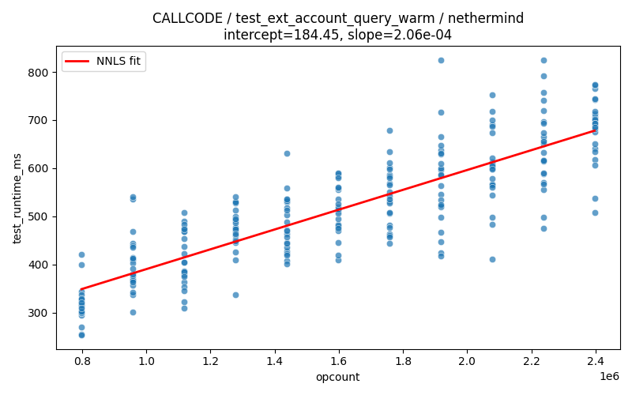

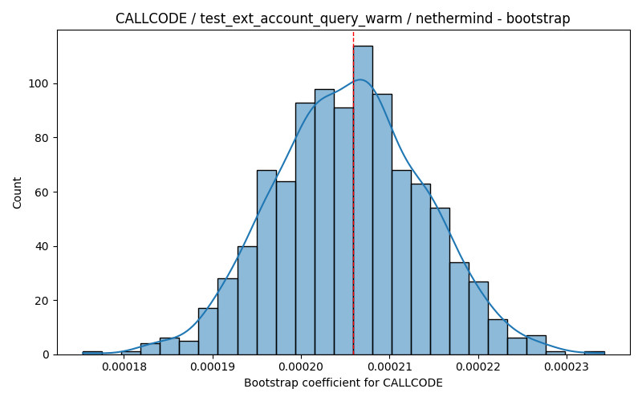

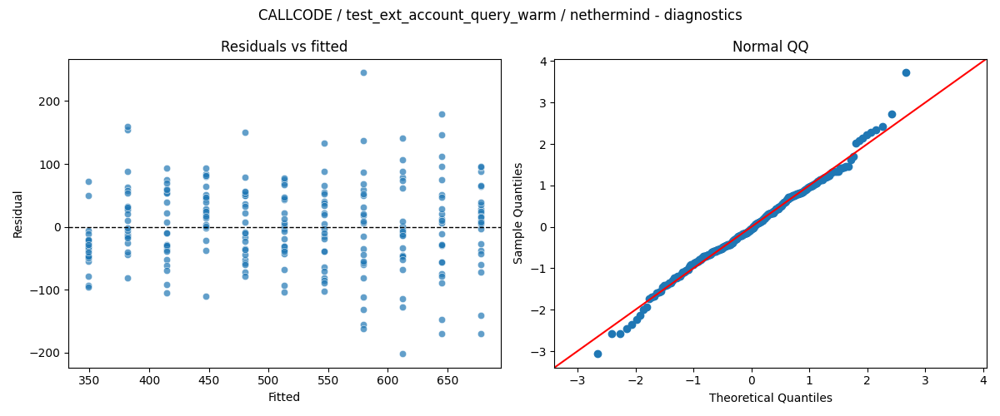

</details>

<details><summary>reth — NNLS regression summary</summary>

```
==============================================================================
                           NNLS Regression Results                            
==============================================================================
Dep. Variable:          test_runtime_ms              R-squared:          0.907
Model:                  NNLS                    Adj. R-squared:          0.907
No. Observations:       396                               RMSE:           9.29
Df Residuals:           394                                MAE:           7.29
Df Model:               1      
==============================================================================
                      coef     std err     P-value      [0.025      0.975]
------------------------------------------------------------------------------
         const     22.6956      1.4914       0.001     19.8163     25.5846
       opcount      0.0001      0.0000       0.001      0.0001      0.0001
==============================================================================
Notes: Non-negative least squares with bootstrap inference (1000 iterations)
==============================================================================
```

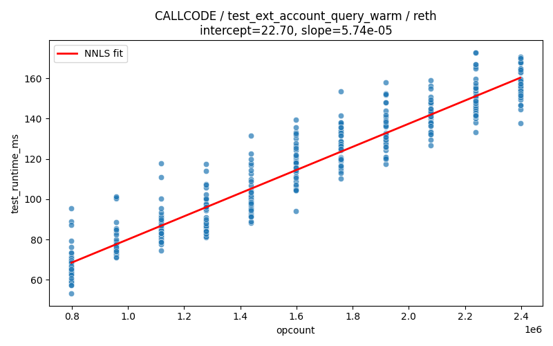

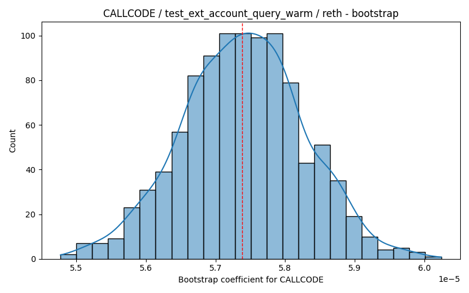

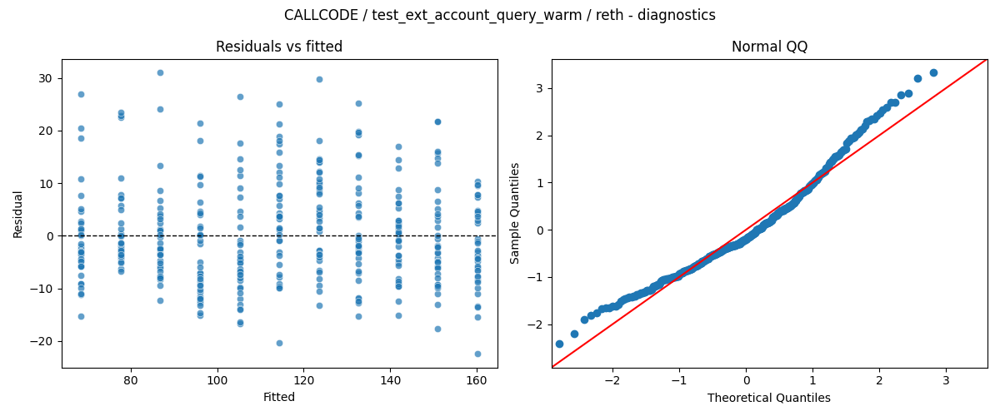

</details>

## DELEGATECALL

### test_account_access — combo `DELEGATECALL_AccountMode.EXISTING_EOA`

| client | nobs | R² | target_coef (ms) | p-value | 95% CI |
| --- | --- | --- | --- | --- | --- |
| `besu` | 396 | 0.8952 | 0.01433 | 1.00e-03 | [0.01383, 0.01479] |
| `erigon` | 44 | 0.9936 | 0.009804 | 1.00e-03 | [0.009589, 0.01003] |
| `ethrex` | 308 | 0.9939 | 0.007284 | 1.00e-03 | [0.007222, 0.007349] |
| `geth` | 308 | 0.9111 | 0.01103 | 1.00e-03 | [0.0106, 0.01145] |
| `nethermind` | 253 | 0.8222 | 0.004401 | 1.00e-03 | [0.00416, 0.004679] |
| `reth` | 396 | 0.9196 | 0.001086 | 1.00e-03 | [0.001056, 0.001119] |

<details><summary>besu — NNLS regression summary</summary>

```
==============================================================================
                           NNLS Regression Results                            
==============================================================================
Dep. Variable:          test_runtime_ms              R-squared:          0.895
Model:                  NNLS                    Adj. R-squared:          0.895
No. Observations:       396                               RMSE:         116.50
Df Residuals:           394                                MAE:          98.96
Df Model:               1      
==============================================================================
                      coef     std err     P-value      [0.025      0.975]
------------------------------------------------------------------------------
         const    545.4733     18.2434       0.001    510.4076    585.6329
       opcount      0.0143      0.0002       0.001      0.0138      0.0148
==============================================================================
Notes: Non-negative least squares with bootstrap inference (1000 iterations)
==============================================================================
```

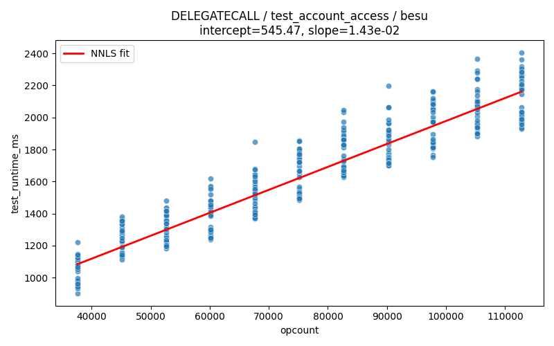

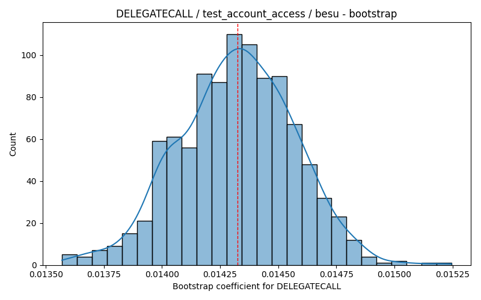

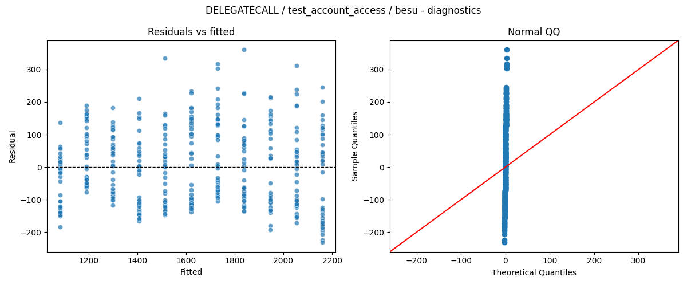

</details>

<details><summary>erigon — NNLS regression summary</summary>

```
==============================================================================
                           NNLS Regression Results                            
==============================================================================
Dep. Variable:          test_runtime_ms              R-squared:          0.994
Model:                  NNLS                    Adj. R-squared:          0.993
No. Observations:       44                                RMSE:          18.77
Df Residuals:           42                                 MAE:          12.36
Df Model:               1      
==============================================================================
                      coef     std err     P-value      [0.025      0.975]
------------------------------------------------------------------------------
         const     25.3458      8.5035       0.002     10.0271     44.0354
       opcount      0.0098      0.0001       0.001      0.0096      0.0100
==============================================================================
Notes: Non-negative least squares with bootstrap inference (1000 iterations)
==============================================================================
```

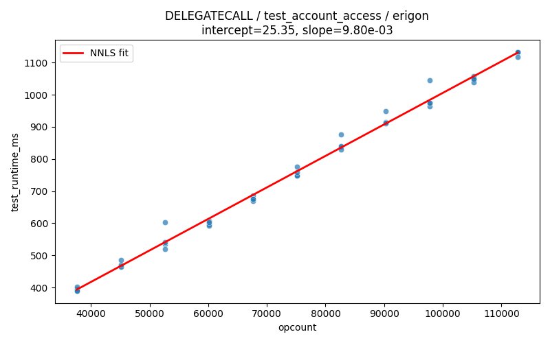

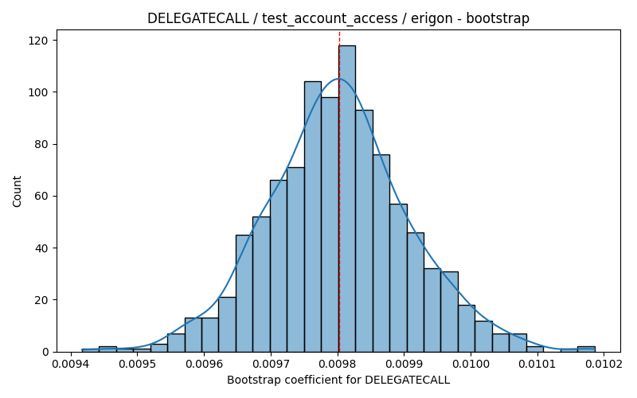

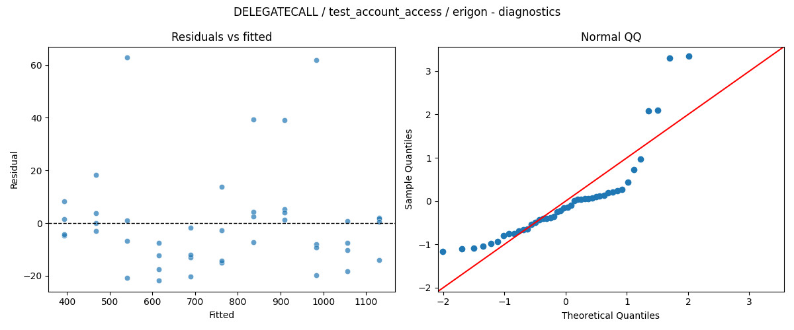

</details>

<details><summary>ethrex — NNLS regression summary</summary>

```
==============================================================================
                           NNLS Regression Results                            
==============================================================================
Dep. Variable:          test_runtime_ms              R-squared:          0.994
Model:                  NNLS                    Adj. R-squared:          0.994
No. Observations:       308                               RMSE:          13.61
Df Residuals:           306                                MAE:          10.55
Df Model:               1      
==============================================================================
                      coef     std err     P-value      [0.025      0.975]
------------------------------------------------------------------------------
         const     43.6537      2.3986       0.001     39.0930     48.3071
       opcount      0.0073      0.0000       0.001      0.0072      0.0073
==============================================================================
Notes: Non-negative least squares with bootstrap inference (1000 iterations)
==============================================================================
```

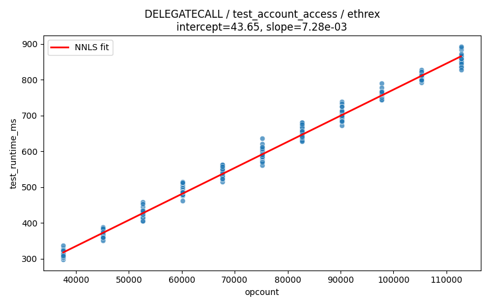

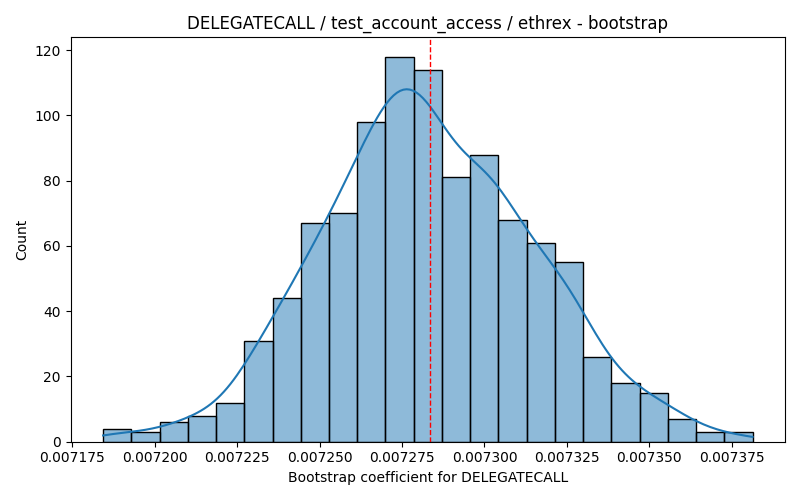

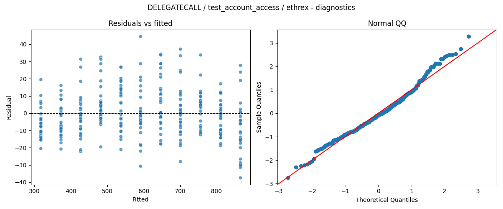

</details>

<details><summary>geth — NNLS regression summary</summary>

```
==============================================================================
                           NNLS Regression Results                            
==============================================================================
Dep. Variable:          test_runtime_ms              R-squared:          0.911
Model:                  NNLS                    Adj. R-squared:          0.911
No. Observations:       308                               RMSE:          81.94
Df Residuals:           306                                MAE:          67.78
Df Model:               1      
==============================================================================
                      coef     std err     P-value      [0.025      0.975]
------------------------------------------------------------------------------
         const    405.9327     18.2818       0.001    371.0121    443.5264
       opcount      0.0110      0.0002       0.001      0.0106      0.0115
==============================================================================
Notes: Non-negative least squares with bootstrap inference (1000 iterations)
==============================================================================
```

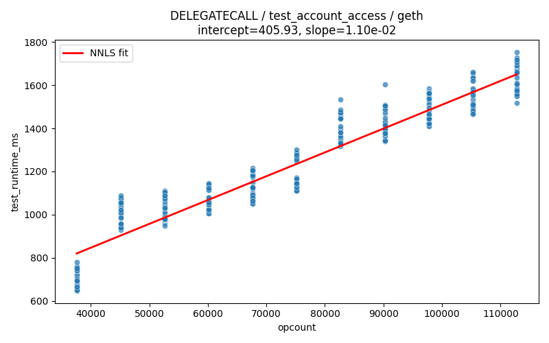

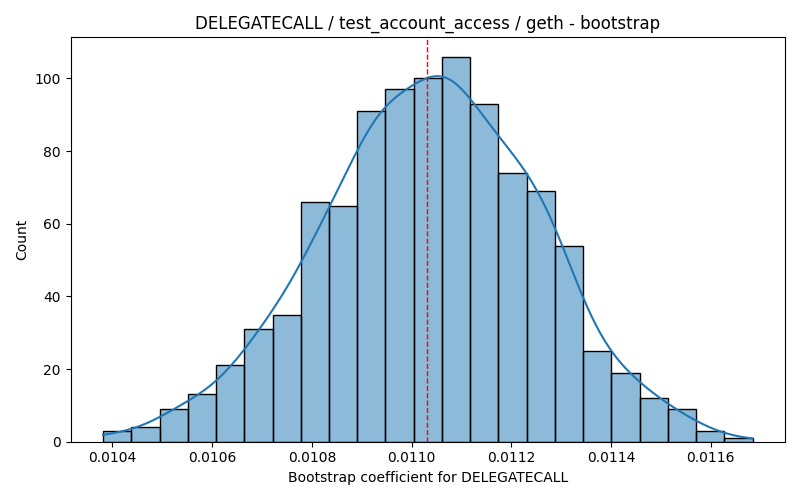

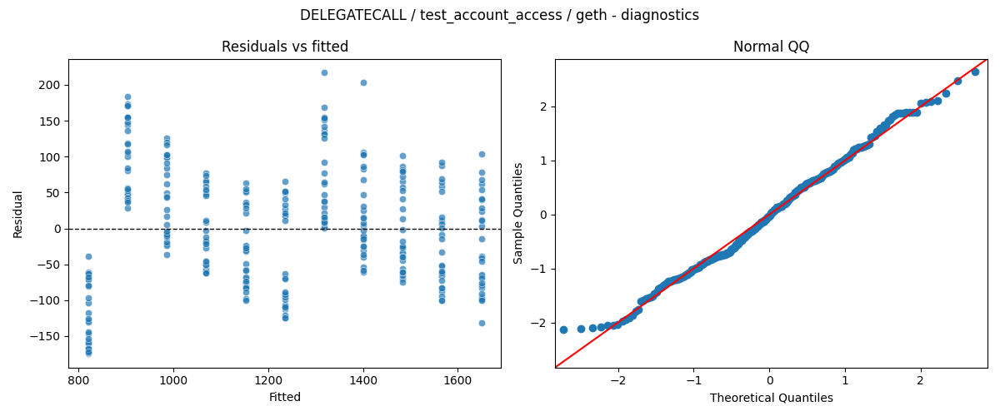

</details>

<details><summary>nethermind — NNLS regression summary</summary>

```
==============================================================================
                           NNLS Regression Results                            
==============================================================================
Dep. Variable:          test_runtime_ms              R-squared:          0.822
Model:                  NNLS                    Adj. R-squared:          0.821
No. Observations:       253                               RMSE:          48.65
Df Residuals:           251                                MAE:          36.90
Df Model:               1      
==============================================================================
                      coef     std err     P-value      [0.025      0.975]
------------------------------------------------------------------------------
         const     76.6710      8.7389       0.001     59.3902     92.5000
       opcount      0.0044      0.0001       0.001      0.0042      0.0047
==============================================================================
Notes: Non-negative least squares with bootstrap inference (1000 iterations)
==============================================================================
```

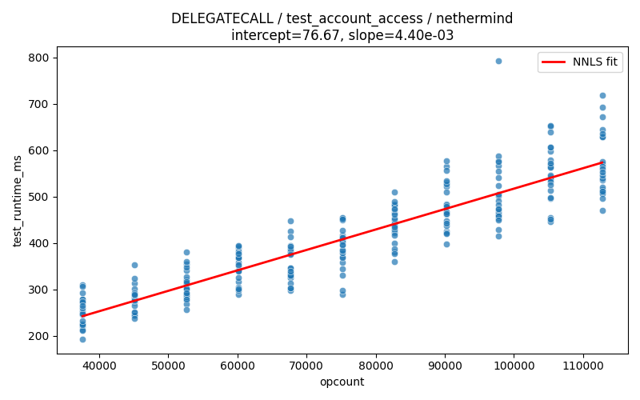

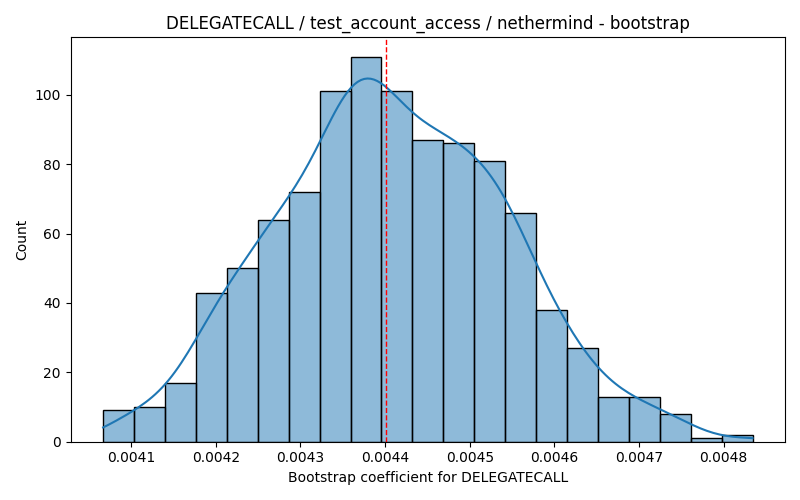

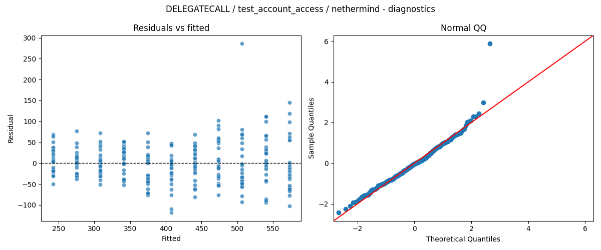

</details>

<details><summary>reth — NNLS regression summary</summary>

```
==============================================================================
                           NNLS Regression Results                            
==============================================================================
Dep. Variable:          test_runtime_ms              R-squared:          0.920
Model:                  NNLS                    Adj. R-squared:          0.919
No. Observations:       396                               RMSE:           7.63
Df Residuals:           394                                MAE:           6.06
Df Model:               1      
==============================================================================
                      coef     std err     P-value      [0.025      0.975]
------------------------------------------------------------------------------
         const     46.5166      1.2003       0.001     44.1598     48.8989
       opcount      0.0011      0.0000       0.001      0.0011      0.0011
==============================================================================
Notes: Non-negative least squares with bootstrap inference (1000 iterations)
==============================================================================
```

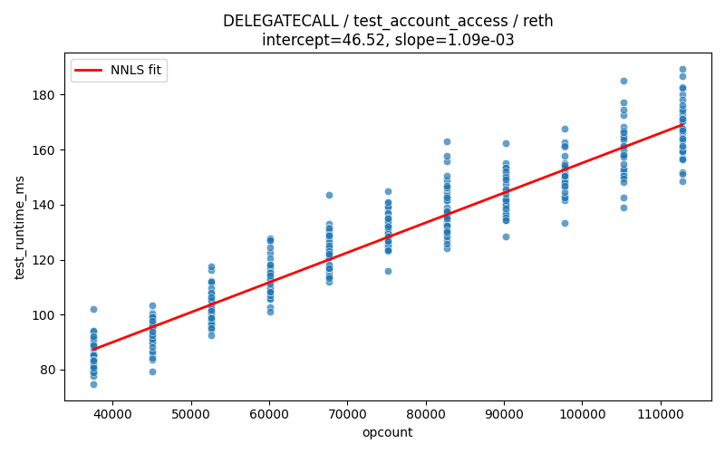

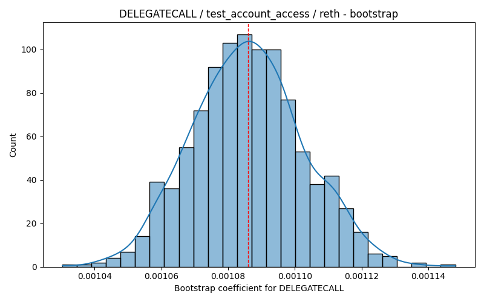

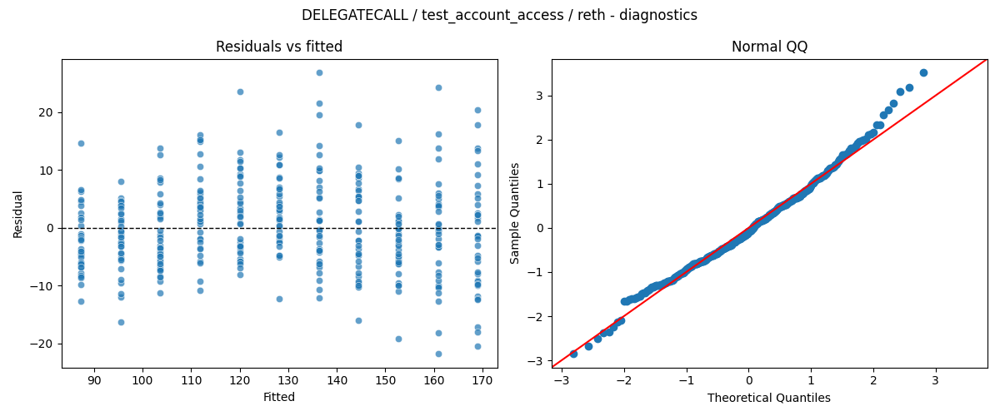

</details>

### test_account_access — combo `DELEGATECALL_AccountMode.NON_EXISTING_ACCOUNT` — `presets[cold_account_nocode_access]`

| client | nobs | R² | target_coef (ms) | p-value | 95% CI |
| --- | --- | --- | --- | --- | --- |
| `besu` | 396 | 0.8483 | 0.01471 | 1.00e-03 | [0.01408, 0.01535] |
| `erigon` | 44 | 0.9969 | 0.009347 | 1.00e-03 | [0.009272, 0.009402] |
| `ethrex` | 308 | 0.9626 | 0.002035 | 1.00e-03 | [0.001995, 0.002079] |
| `geth` | 308 | 0.8686 | 0.02232 | 1.00e-03 | [0.02129, 0.02335] |
| `nethermind` | 253 | 0.8527 | 0.00418 | 1.00e-03 | [0.003955, 0.004411] |
| `reth` | 396 | 0.8926 | 0.0007692 | 1.00e-03 | [0.0007411, 0.0007968] |

<details><summary>besu — NNLS regression summary</summary>

```
==============================================================================
                           NNLS Regression Results                            
==============================================================================
Dep. Variable:          test_runtime_ms              R-squared:          0.848
Model:                  NNLS                    Adj. R-squared:          0.848
No. Observations:       396                               RMSE:         147.95
Df Residuals:           394                                MAE:         136.95
Df Model:               1      
==============================================================================
                      coef     std err     P-value      [0.025      0.975]
------------------------------------------------------------------------------
         const    493.0238     24.2650       0.001    445.3807    541.5037
       opcount      0.0147      0.0003       0.001      0.0141      0.0153
==============================================================================
Notes: Non-negative least squares with bootstrap inference (1000 iterations)
==============================================================================
```


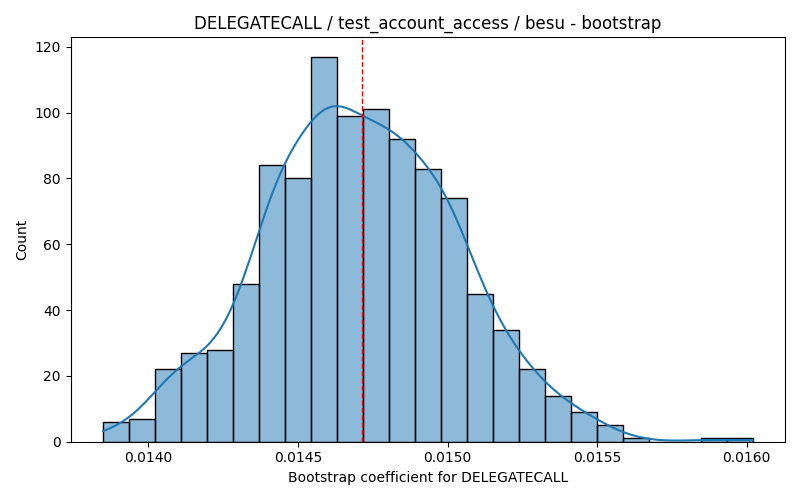

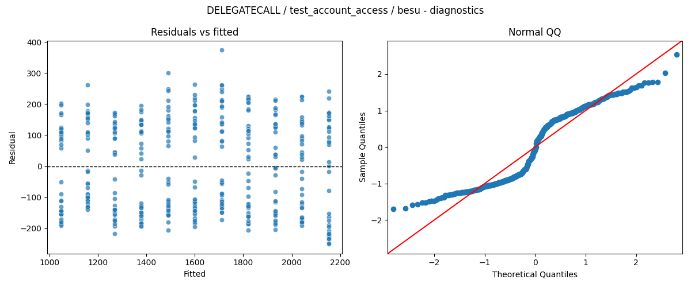

</details>

<details><summary>erigon — NNLS regression summary</summary>

```
==============================================================================
                           NNLS Regression Results                            
==============================================================================
Dep. Variable:          test_runtime_ms              R-squared:          0.997
Model:                  NNLS                    Adj. R-squared:          0.997
No. Observations:       44                                RMSE:          12.56
Df Residuals:           42                                 MAE:           8.98
Df Model:               1      
==============================================================================
                      coef     std err     P-value      [0.025      0.975]
------------------------------------------------------------------------------
         const      0.0000      1.0237       1.000      0.0000      3.9495
       opcount      0.0093      0.0000       0.001      0.0093      0.0094
==============================================================================
Notes: Non-negative least squares with bootstrap inference (1000 iterations)
==============================================================================
```

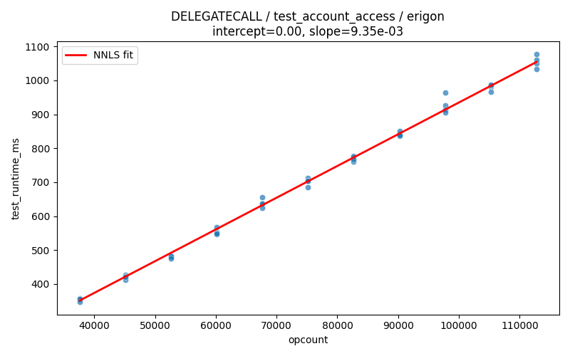

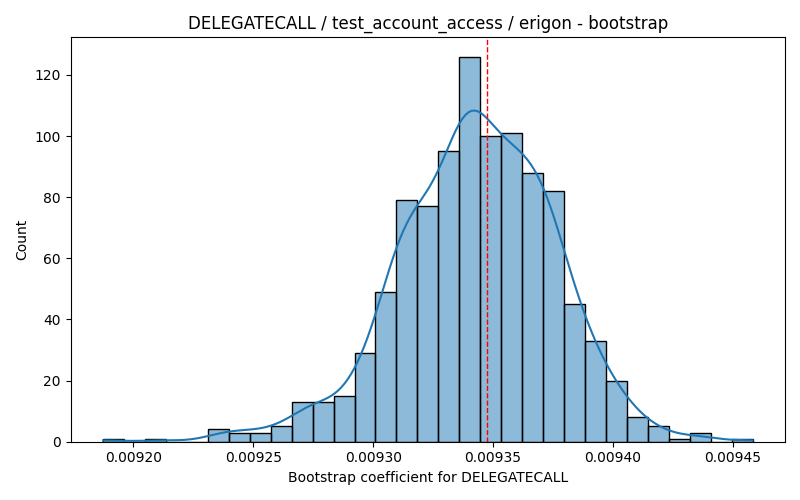

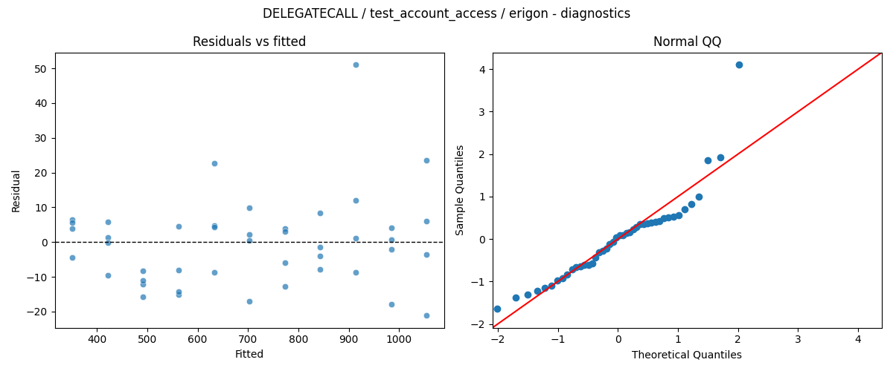

</details>

<details><summary>ethrex — NNLS regression summary</summary>

```
==============================================================================
                           NNLS Regression Results                            
==============================================================================
Dep. Variable:          test_runtime_ms              R-squared:          0.963
Model:                  NNLS                    Adj. R-squared:          0.962
No. Observations:       308                               RMSE:           9.53
Df Residuals:           306                                MAE:           7.82
Df Model:               1      
==============================================================================
                      coef     std err     P-value      [0.025      0.975]
------------------------------------------------------------------------------
         const     29.3180      1.6852       0.001     25.9529     32.5901
       opcount      0.0020      0.0000       0.001      0.0020      0.0021
==============================================================================
Notes: Non-negative least squares with bootstrap inference (1000 iterations)
==============================================================================
```

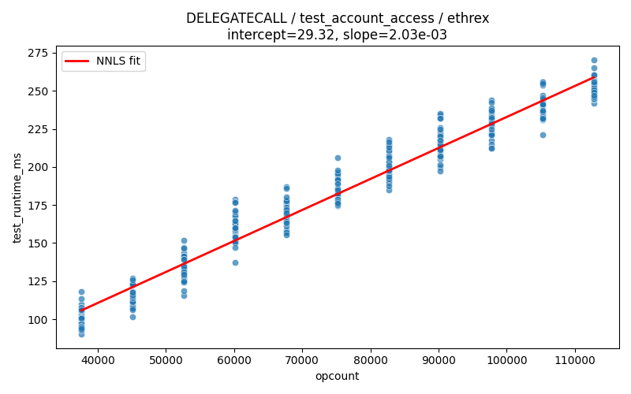

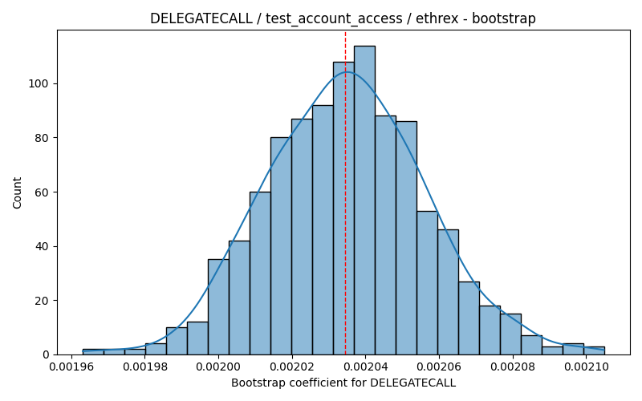

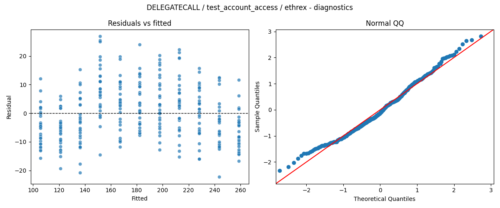

</details>

<details><summary>geth — NNLS regression summary</summary>

```
==============================================================================
                           NNLS Regression Results                            
==============================================================================
Dep. Variable:          test_runtime_ms              R-squared:          0.869
Model:                  NNLS                    Adj. R-squared:          0.868
No. Observations:       308                               RMSE:         206.36
Df Residuals:           306                                MAE:         174.41
Df Model:               1      
==============================================================================
                      coef     std err     P-value      [0.025      0.975]
------------------------------------------------------------------------------
         const    690.5555     44.9091       0.001    605.3851    781.4425
       opcount      0.0223      0.0005       0.001      0.0213      0.0233
==============================================================================
Notes: Non-negative least squares with bootstrap inference (1000 iterations)
==============================================================================
```

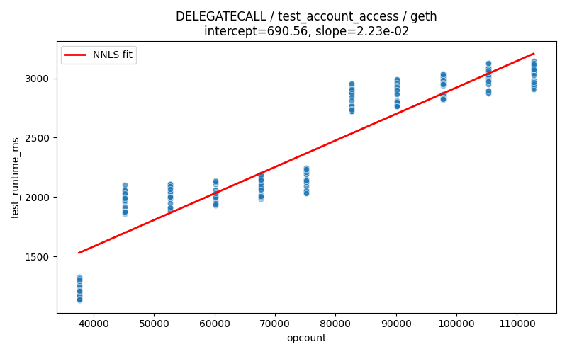

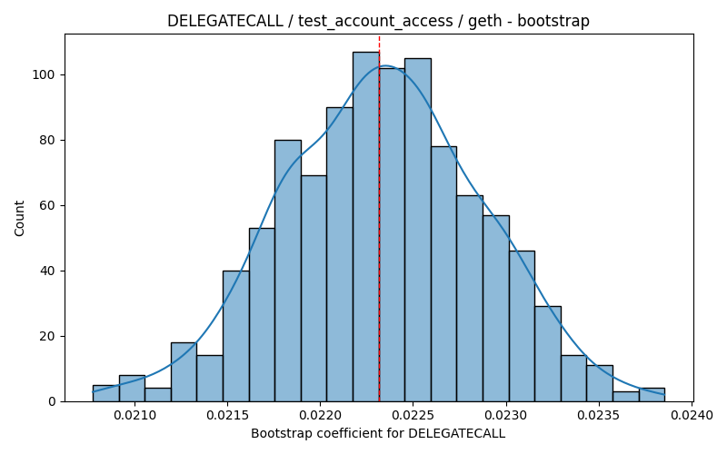

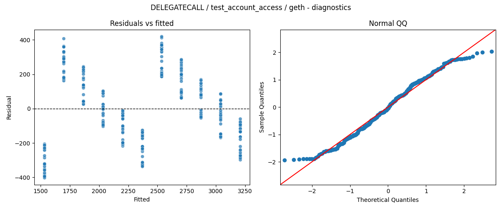

</details>

<details><summary>nethermind — NNLS regression summary</summary>

```
==============================================================================
                           NNLS Regression Results                            
==============================================================================
Dep. Variable:          test_runtime_ms              R-squared:          0.853
Model:                  NNLS                    Adj. R-squared:          0.852
No. Observations:       253                               RMSE:          41.30
Df Residuals:           251                                MAE:          31.15
Df Model:               1      
==============================================================================
                      coef     std err     P-value      [0.025      0.975]
------------------------------------------------------------------------------
         const     67.6405      7.9911       0.001     51.9941     83.4959
       opcount      0.0042      0.0001       0.001      0.0040      0.0044
==============================================================================
Notes: Non-negative least squares with bootstrap inference (1000 iterations)
==============================================================================
```

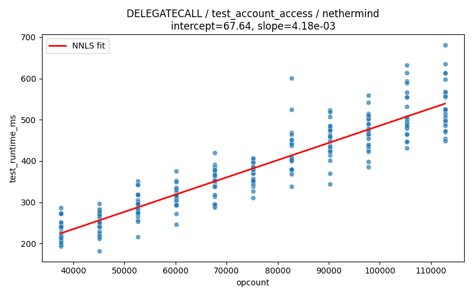

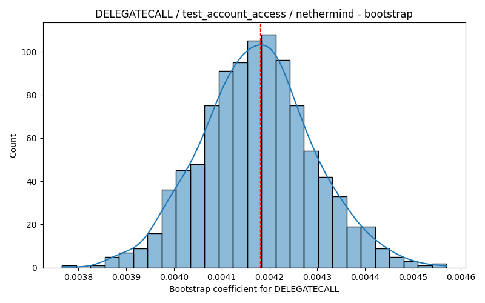

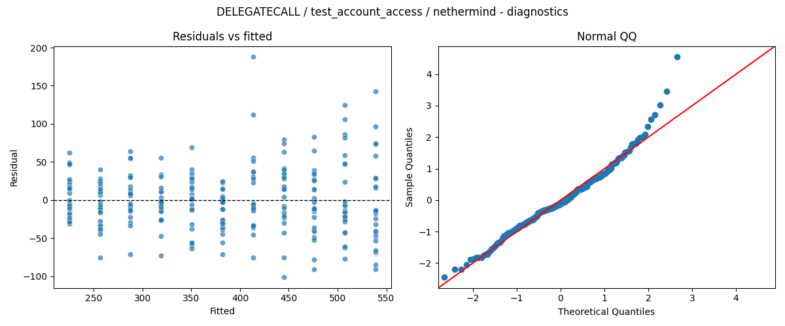

</details>

<details><summary>reth — NNLS regression summary</summary>

```
==============================================================================
                           NNLS Regression Results                            
==============================================================================
Dep. Variable:          test_runtime_ms              R-squared:          0.893
Model:                  NNLS                    Adj. R-squared:          0.892
No. Observations:       396                               RMSE:           6.35
Df Residuals:           394                                MAE:           5.07
Df Model:               1      
==============================================================================
                      coef     std err     P-value      [0.025      0.975]
------------------------------------------------------------------------------
         const     50.1408      1.0517       0.001     48.0650     52.1926
       opcount      0.0008      0.0000       0.001      0.0007      0.0008
==============================================================================
Notes: Non-negative least squares with bootstrap inference (1000 iterations)
==============================================================================
```

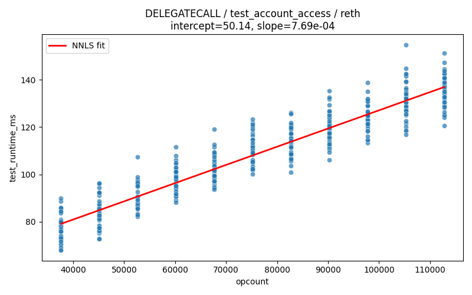

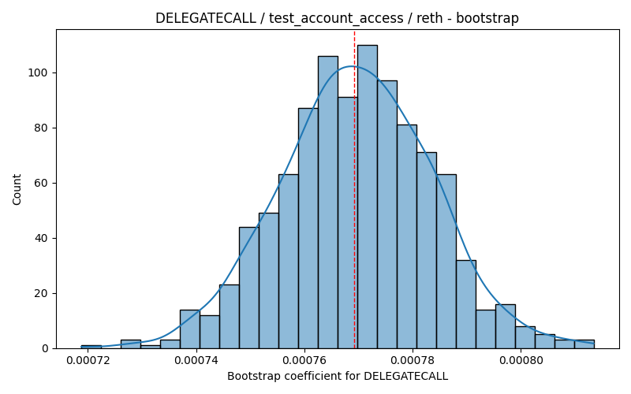

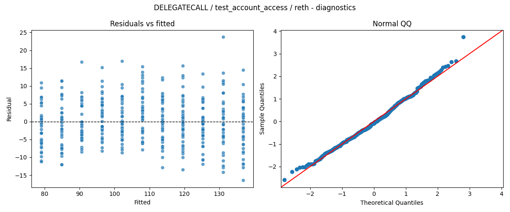

</details>

### test_account_access — combo `DELEGATECALL_AccountMode.EXISTING_CONTRACT`

| client | nobs | R² | target_coef (ms) | p-value | 95% CI |
| --- | --- | --- | --- | --- | --- |
| `besu` | 396 | 0.9346 | 0.02634 | 1.00e-03 | [0.02568, 0.02696] |
| `erigon` | 44 | 0.9084 | 0.04746 | 1.00e-03 | [0.04275, 0.05119] |
| `ethrex` | 308 | 0.9932 | 0.007846 | 1.00e-03 | [0.007769, 0.007917] |
| `geth` | 308 | 0.8596 | 0.02332 | 1.00e-03 | [0.02222, 0.02441] |
| `nethermind` | 253 | 0.5598 | 0.01388 | 1.00e-03 | [0.01238, 0.0156] |
| `reth` | 396 | 0.9703 | 0.004085 | 1.00e-03 | [0.004016, 0.004156] |

<details><summary>besu — NNLS regression summary</summary>

```
==============================================================================
                           NNLS Regression Results                            
==============================================================================
Dep. Variable:          test_runtime_ms              R-squared:          0.935
Model:                  NNLS                    Adj. R-squared:          0.934
No. Observations:       396                               RMSE:         141.96
Df Residuals:           394                                MAE:         127.17
Df Model:               1      
==============================================================================
                      coef     std err     P-value      [0.025      0.975]
------------------------------------------------------------------------------
         const    555.5542     21.8503       0.001    514.2405    599.6469
       opcount      0.0263      0.0003       0.001      0.0257      0.0270
==============================================================================
Notes: Non-negative least squares with bootstrap inference (1000 iterations)
==============================================================================
```

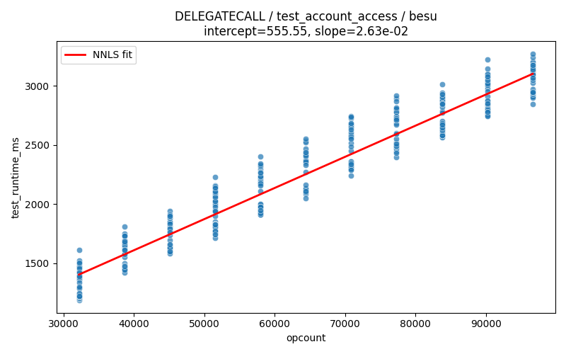

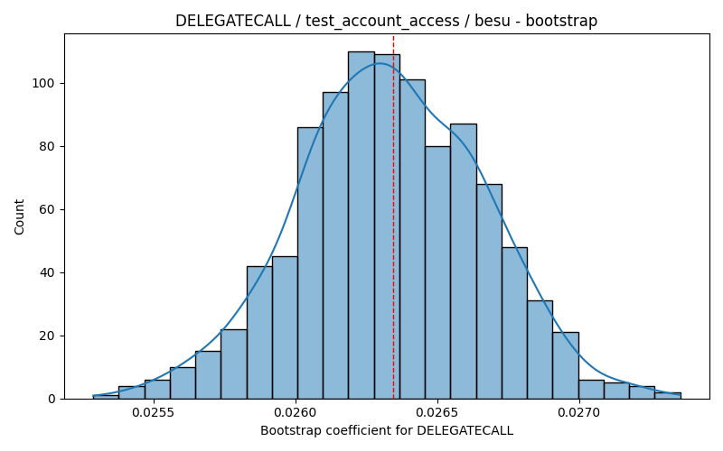

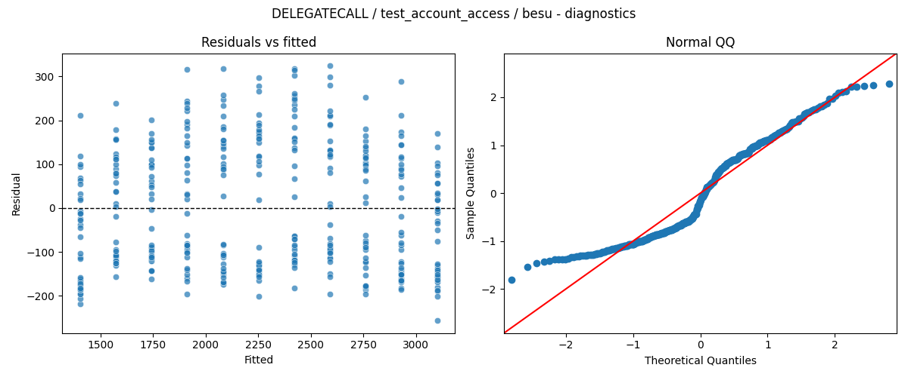

</details>

<details><summary>erigon — NNLS regression summary</summary>

```
==============================================================================
                           NNLS Regression Results                            
==============================================================================
Dep. Variable:          test_runtime_ms              R-squared:          0.908
Model:                  NNLS                    Adj. R-squared:          0.906
No. Observations:       44                                RMSE:         306.95
Df Residuals:           42                                 MAE:         268.65
Df Model:               1      
==============================================================================
                      coef     std err     P-value      [0.025      0.975]
------------------------------------------------------------------------------
         const    884.6706    158.0932       0.001    603.8382   1224.9514
       opcount      0.0475      0.0021       0.001      0.0427      0.0512
==============================================================================
Notes: Non-negative least squares with bootstrap inference (1000 iterations)
==============================================================================
```

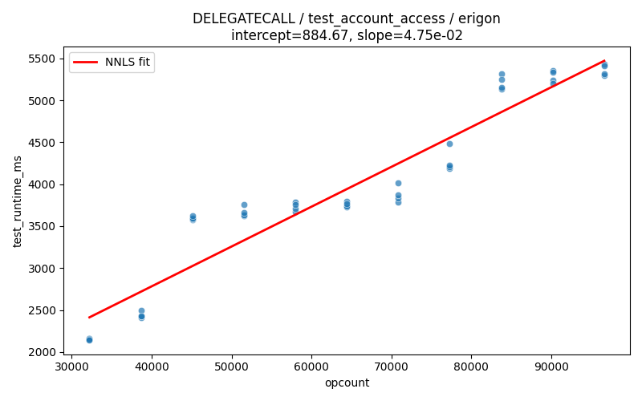

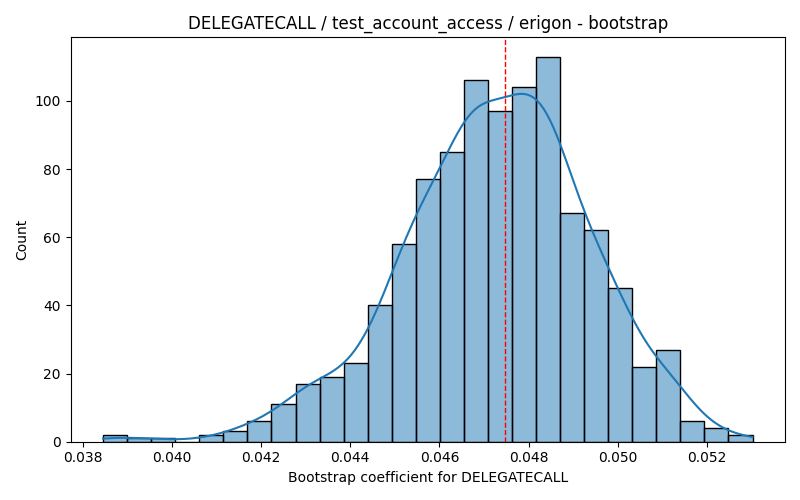


</details>

<details><summary>ethrex — NNLS regression summary</summary>

```
==============================================================================
                           NNLS Regression Results                            
==============================================================================
Dep. Variable:          test_runtime_ms              R-squared:          0.993
Model:                  NNLS                    Adj. R-squared:          0.993
No. Observations:       308                               RMSE:          13.22
Df Residuals:           306                                MAE:          10.47
Df Model:               1      
==============================================================================
                      coef     std err     P-value      [0.025      0.975]
------------------------------------------------------------------------------
         const     42.4377      2.3651       0.001     37.6548     47.1200
       opcount      0.0078      0.0000       0.001      0.0078      0.0079
==============================================================================
Notes: Non-negative least squares with bootstrap inference (1000 iterations)
==============================================================================
```

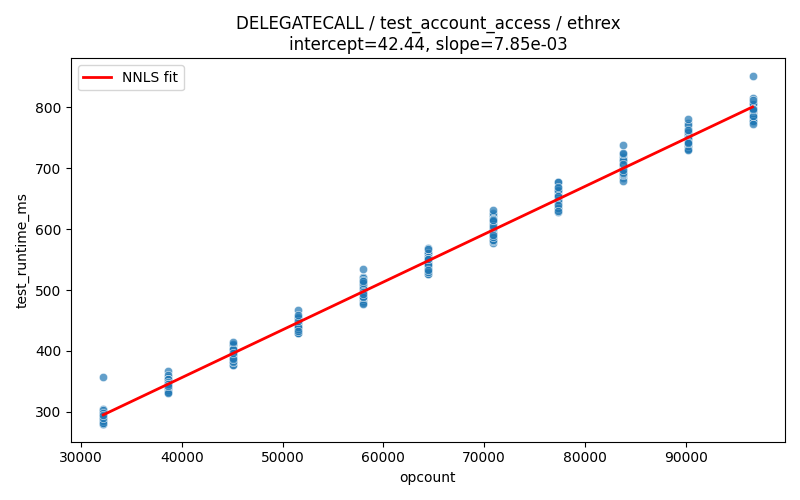

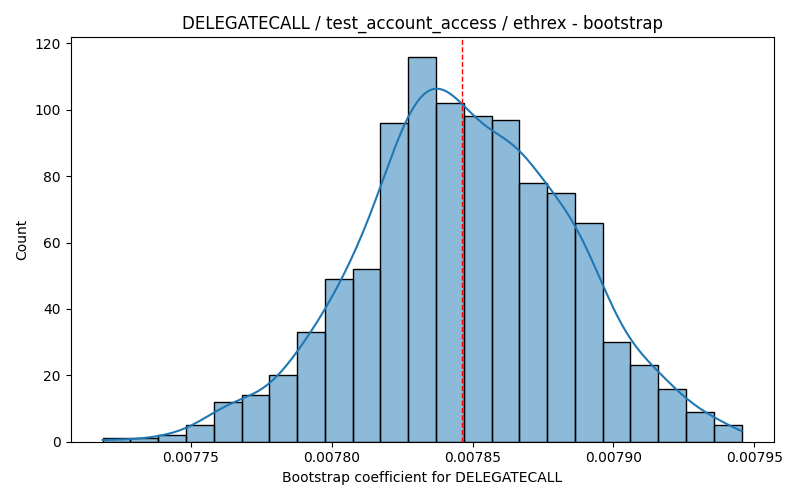

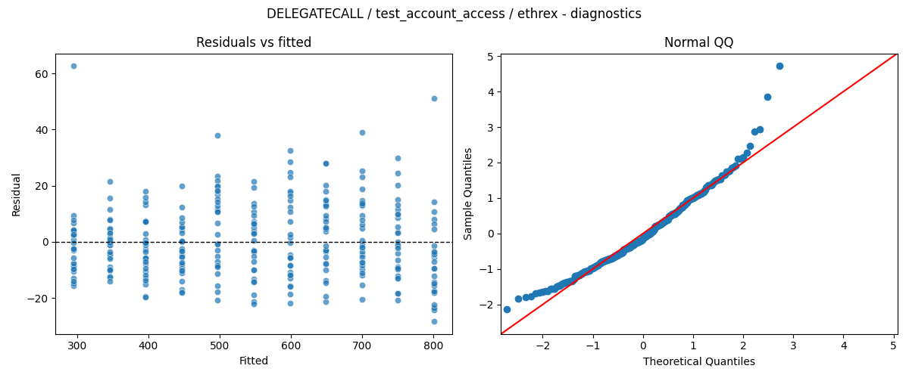

</details>

<details><summary>geth — NNLS regression summary</summary>

```
==============================================================================
                           NNLS Regression Results                            
==============================================================================
Dep. Variable:          test_runtime_ms              R-squared:          0.860
Model:                  NNLS                    Adj. R-squared:          0.859
No. Observations:       308                               RMSE:         192.03
Df Residuals:           306                                MAE:         161.70
Df Model:               1      
==============================================================================
                      coef     std err     P-value      [0.025      0.975]
------------------------------------------------------------------------------
         const    657.7399     39.9224       0.001    582.2170    733.9961
       opcount      0.0233      0.0006       0.001      0.0222      0.0244
==============================================================================
Notes: Non-negative least squares with bootstrap inference (1000 iterations)
==============================================================================
```


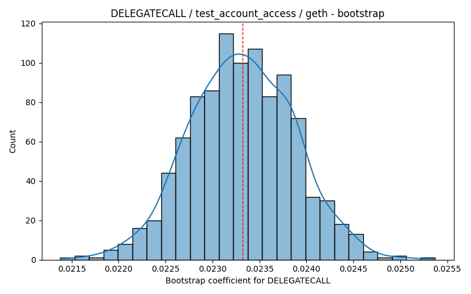

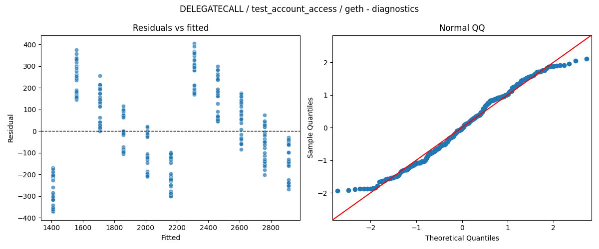

</details>

<details><summary>nethermind — NNLS regression summary</summary>

```
==============================================================================
                           NNLS Regression Results                            
==============================================================================
Dep. Variable:          test_runtime_ms              R-squared:          0.560
Model:                  NNLS                    Adj. R-squared:          0.558
No. Observations:       253                               RMSE:         250.68
Df Residuals:           251                                MAE:         182.17
Df Model:               1      
==============================================================================
                      coef     std err     P-value      [0.025      0.975]
------------------------------------------------------------------------------
         const    190.9301     46.0546       0.001     96.9784    279.2970
       opcount      0.0139      0.0008       0.001      0.0124      0.0156
==============================================================================
Notes: Non-negative least squares with bootstrap inference (1000 iterations)
==============================================================================
```

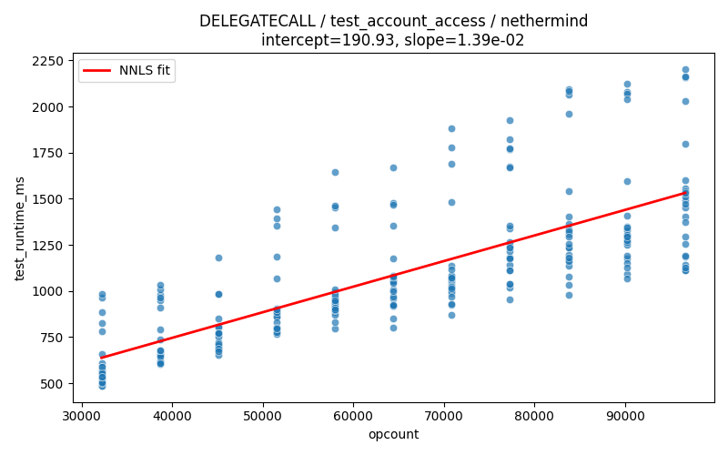

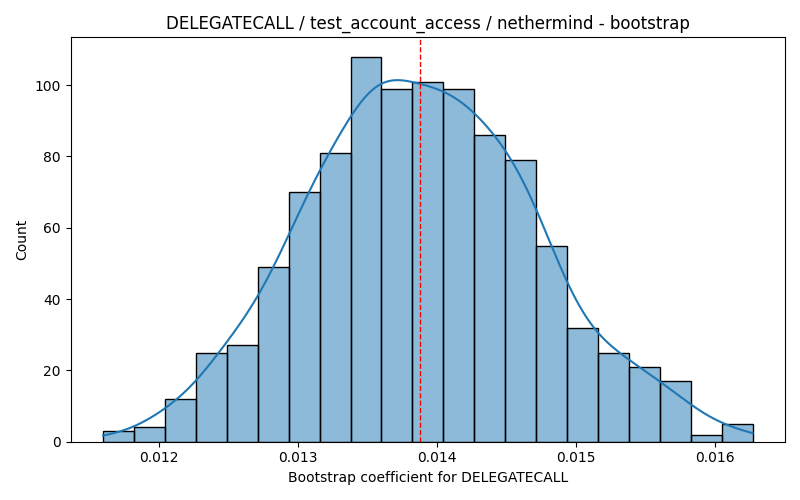

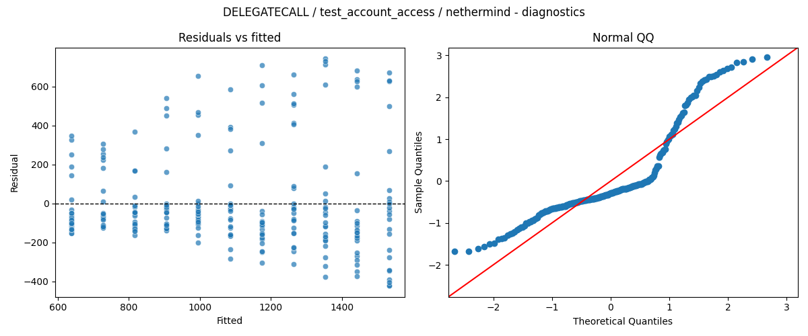

</details>

<details><summary>reth — NNLS regression summary</summary>

```
==============================================================================
                           NNLS Regression Results                            
==============================================================================
Dep. Variable:          test_runtime_ms              R-squared:          0.970
Model:                  NNLS                    Adj. R-squared:          0.970
No. Observations:       396                               RMSE:          14.55
Df Residuals:           394                                MAE:          11.51
Df Model:               1      
==============================================================================
                      coef     std err     P-value      [0.025      0.975]
------------------------------------------------------------------------------
         const     99.7987      2.1053       0.001     95.6237    104.0218
       opcount      0.0041      0.0000       0.001      0.0040      0.0042
==============================================================================
Notes: Non-negative least squares with bootstrap inference (1000 iterations)
==============================================================================
```

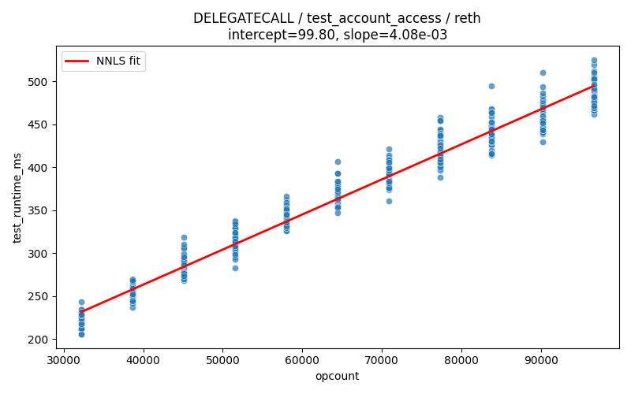

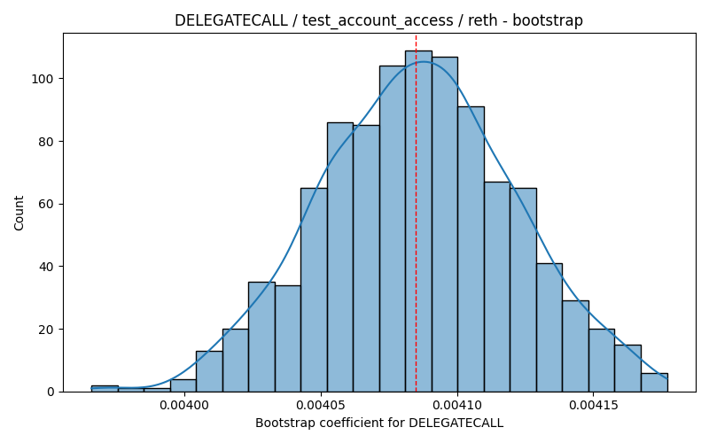

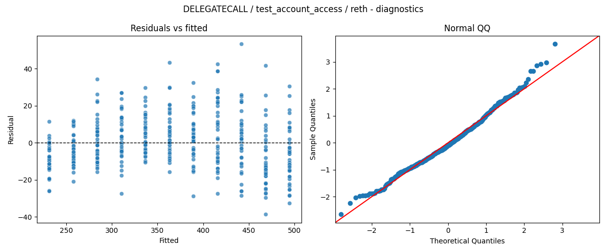

</details>

### test_account_access — combo `DELEGATECALL_AccountMode.NON_EXISTING_ACCOUNT` — `presets[cold_account_code_access]`

| client | nobs | R² | target_coef (ms) | p-value | 95% CI |
| --- | --- | --- | --- | --- | --- |
| `besu` | 396 | 0.8483 | 0.01471 | 1.00e-03 | [0.01408, 0.01535] |
| `erigon` | 44 | 0.9969 | 0.009347 | 1.00e-03 | [0.009272, 0.009402] |
| `ethrex` | 308 | 0.9626 | 0.002035 | 1.00e-03 | [0.001995, 0.002079] |
| `geth` | 308 | 0.8686 | 0.02232 | 1.00e-03 | [0.02129, 0.02335] |
| `nethermind` | 253 | 0.8527 | 0.00418 | 1.00e-03 | [0.003955, 0.004411] |
| `reth` | 396 | 0.8926 | 0.0007692 | 1.00e-03 | [0.0007411, 0.0007968] |

<details><summary>besu — NNLS regression summary</summary>

```
==============================================================================
                           NNLS Regression Results                            
==============================================================================
Dep. Variable:          test_runtime_ms              R-squared:          0.848
Model:                  NNLS                    Adj. R-squared:          0.848
No. Observations:       396                               RMSE:         147.95
Df Residuals:           394                                MAE:         136.95
Df Model:               1      
==============================================================================
                      coef     std err     P-value      [0.025      0.975]
------------------------------------------------------------------------------
         const    493.0238     24.2650       0.001    445.3807    541.5037
       opcount      0.0147      0.0003       0.001      0.0141      0.0153
==============================================================================
Notes: Non-negative least squares with bootstrap inference (1000 iterations)
==============================================================================
```


</details>

<details><summary>erigon — NNLS regression summary</summary>

```
==============================================================================
                           NNLS Regression Results                            
==============================================================================
Dep. Variable:          test_runtime_ms              R-squared:          0.997
Model:                  NNLS                    Adj. R-squared:          0.997
No. Observations:       44                                RMSE:          12.56
Df Residuals:           42                                 MAE:           8.98
Df Model:               1      
==============================================================================
                      coef     std err     P-value      [0.025      0.975]
------------------------------------------------------------------------------
         const      0.0000      1.0237       1.000      0.0000      3.9495
       opcount      0.0093      0.0000       0.001      0.0093      0.0094
==============================================================================
Notes: Non-negative least squares with bootstrap inference (1000 iterations)
==============================================================================
```


</details>

<details><summary>ethrex — NNLS regression summary</summary>

```
==============================================================================
                           NNLS Regression Results                            
==============================================================================
Dep. Variable:          test_runtime_ms              R-squared:          0.963
Model:                  NNLS                    Adj. R-squared:          0.962
No. Observations:       308                               RMSE:           9.53
Df Residuals:           306                                MAE:           7.82
Df Model:               1      
==============================================================================
                      coef     std err     P-value      [0.025      0.975]
------------------------------------------------------------------------------
         const     29.3180      1.6852       0.001     25.9529     32.5901
       opcount      0.0020      0.0000       0.001      0.0020      0.0021
==============================================================================
Notes: Non-negative least squares with bootstrap inference (1000 iterations)
==============================================================================
```


</details>

<details><summary>geth — NNLS regression summary</summary>

```
==============================================================================
                           NNLS Regression Results                            
==============================================================================
Dep. Variable:          test_runtime_ms              R-squared:          0.869
Model:                  NNLS                    Adj. R-squared:          0.868
No. Observations:       308                               RMSE:         206.36
Df Residuals:           306                                MAE:         174.41
Df Model:               1      
==============================================================================
                      coef     std err     P-value      [0.025      0.975]
------------------------------------------------------------------------------
         const    690.5555     44.9091       0.001    605.3851    781.4425
       opcount      0.0223      0.0005       0.001      0.0213      0.0233
==============================================================================
Notes: Non-negative least squares with bootstrap inference (1000 iterations)
==============================================================================
```


</details>

<details><summary>nethermind — NNLS regression summary</summary>

```
==============================================================================
                           NNLS Regression Results                            
==============================================================================
Dep. Variable:          test_runtime_ms              R-squared:          0.853
Model:                  NNLS                    Adj. R-squared:          0.852
No. Observations:       253                               RMSE:          41.30
Df Residuals:           251                                MAE:          31.15
Df Model:               1      
==============================================================================
                      coef     std err     P-value      [0.025      0.975]
------------------------------------------------------------------------------
         const     67.6405      7.9911       0.001     51.9941     83.4959
       opcount      0.0042      0.0001       0.001      0.0040      0.0044
==============================================================================
Notes: Non-negative least squares with bootstrap inference (1000 iterations)
==============================================================================
```


</details>

<details><summary>reth — NNLS regression summary</summary>

```
==============================================================================
                           NNLS Regression Results                            
==============================================================================
Dep. Variable:          test_runtime_ms              R-squared:          0.893
Model:                  NNLS                    Adj. R-squared:          0.892
No. Observations:       396                               RMSE:           6.35
Df Residuals:           394                                MAE:           5.07
Df Model:               1      
==============================================================================
                      coef     std err     P-value      [0.025      0.975]
------------------------------------------------------------------------------
         const     50.1408      1.0517       0.001     48.0650     52.1926
       opcount      0.0008      0.0000       0.001      0.0007      0.0008
==============================================================================
Notes: Non-negative least squares with bootstrap inference (1000 iterations)
==============================================================================
```


</details>

### test_ext_account_query_warm — combo `DELEGATECALL`

| client | nobs | R² | target_coef (ms) | p-value | 95% CI |
| --- | --- | --- | --- | --- | --- |
| `besu` | 396 | 0.7361 | 0.0005958 | 1.00e-03 | [0.0005592, 0.0006314] |
| `erigon` | 44 | 0.9333 | 0.0002753 | 1.00e-03 | [0.0002563, 0.0002983] |
| `ethrex` | 308 | 0.936 | 0.0001017 | 1.00e-03 | [9.883e-05, 0.0001044] |
| `geth` | 308 | 0.9018 | 0.0001583 | 1.00e-03 | [0.0001525, 0.0001644] |
| `nethermind` | 253 | 0.6099 | 0.0003889 | 1.00e-03 | [0.0003507, 0.0004285] |
| `reth` | 396 | 0.9251 | 5.308e-05 | 1.00e-03 | [5.142e-05, 5.474e-05] |

<details><summary>besu — NNLS regression summary</summary>

```
==============================================================================
                           NNLS Regression Results                            
==============================================================================
Dep. Variable:          test_runtime_ms              R-squared:          0.736
Model:                  NNLS                    Adj. R-squared:          0.735
No. Observations:       396                               RMSE:         184.67
Df Residuals:           394                                MAE:         145.29
Df Model:               1      
==============================================================================
                      coef     std err     P-value      [0.025      0.975]
------------------------------------------------------------------------------
         const    761.1189     29.5352       0.001    703.8991    821.8750
       opcount      0.0006      0.0000       0.001      0.0006      0.0006
==============================================================================
Notes: Non-negative least squares with bootstrap inference (1000 iterations)
==============================================================================
```

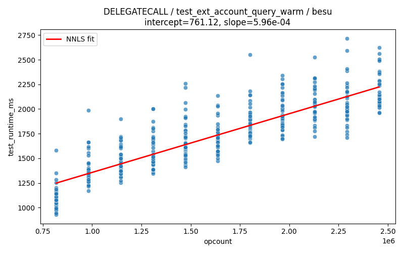

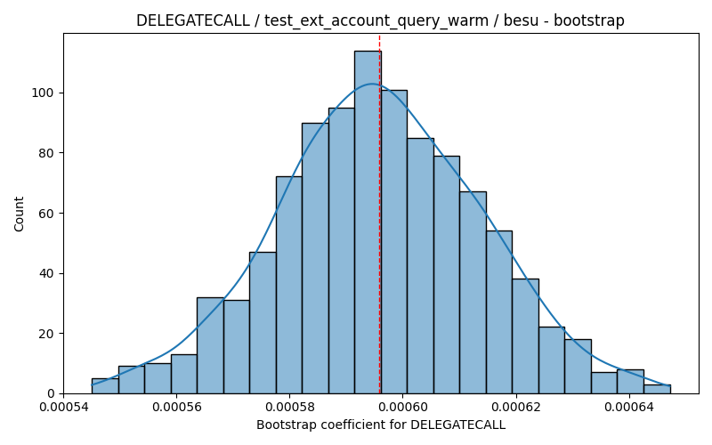

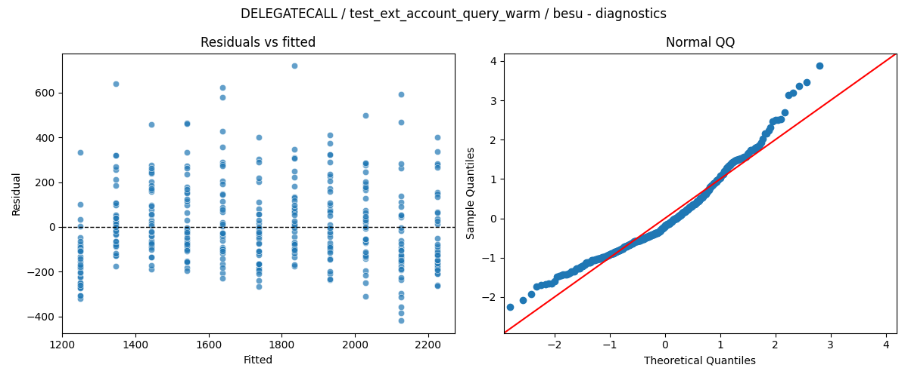

</details>

<details><summary>erigon — NNLS regression summary</summary>

```
==============================================================================
                           NNLS Regression Results                            
==============================================================================
Dep. Variable:          test_runtime_ms              R-squared:          0.933
Model:                  NNLS                    Adj. R-squared:          0.932
No. Observations:       44                                RMSE:          38.11
Df Residuals:           42                                 MAE:          27.65
Df Model:               1      
==============================================================================
                      coef     std err     P-value      [0.025      0.975]
------------------------------------------------------------------------------
         const     38.4422     15.9317       0.014      3.0330     70.1259
       opcount      0.0003      0.0000       0.001      0.0003      0.0003
==============================================================================
Notes: Non-negative least squares with bootstrap inference (1000 iterations)
==============================================================================
```

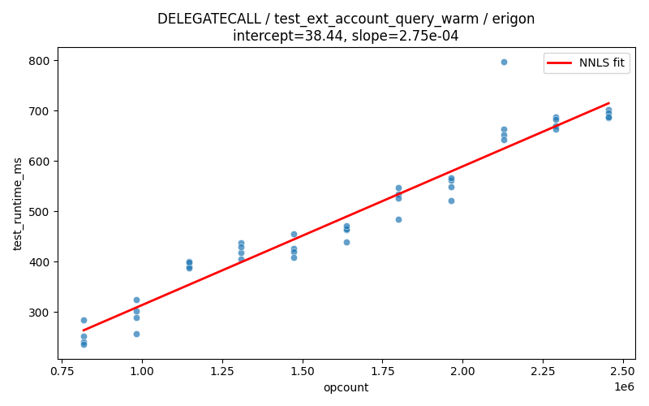

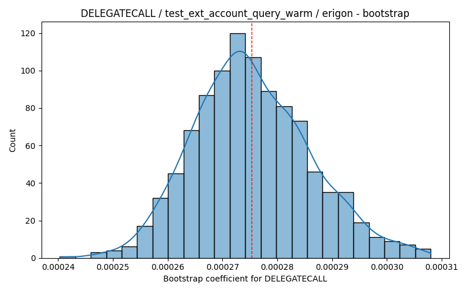

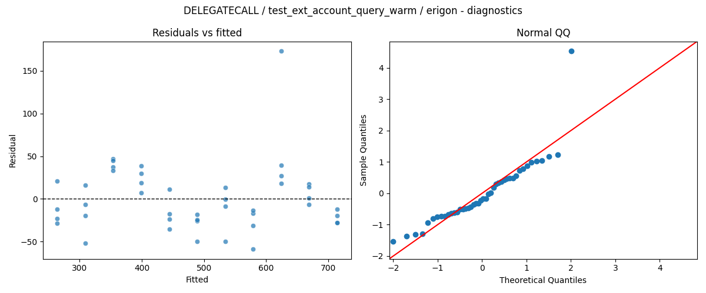

</details>

<details><summary>ethrex — NNLS regression summary</summary>

```
==============================================================================
                           NNLS Regression Results                            
==============================================================================
Dep. Variable:          test_runtime_ms              R-squared:          0.936
Model:                  NNLS                    Adj. R-squared:          0.936
No. Observations:       308                               RMSE:          13.77
Df Residuals:           306                                MAE:          10.63
Df Model:               1      
==============================================================================
                      coef     std err     P-value      [0.025      0.975]
------------------------------------------------------------------------------
         const     34.1368      2.4656       0.001     29.5723     39.1954
       opcount      0.0001      0.0000       0.001      0.0001      0.0001
==============================================================================
Notes: Non-negative least squares with bootstrap inference (1000 iterations)
==============================================================================
```

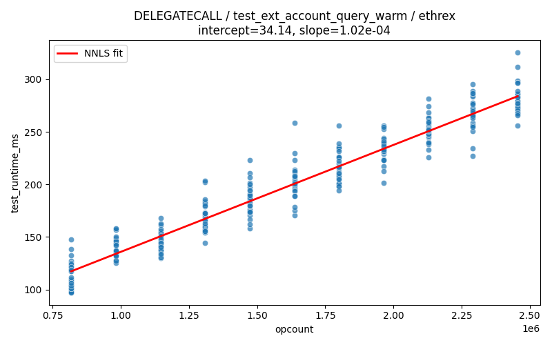

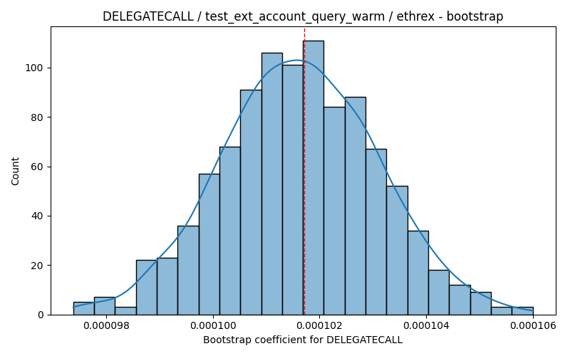

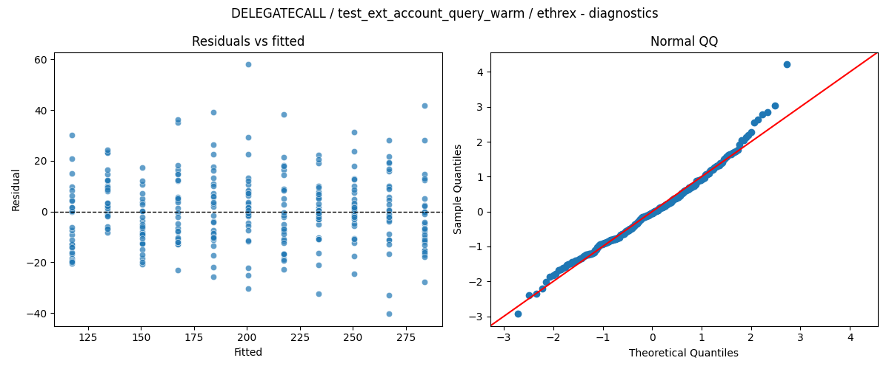

</details>

<details><summary>geth — NNLS regression summary</summary>

```
==============================================================================
                           NNLS Regression Results                            
==============================================================================
Dep. Variable:          test_runtime_ms              R-squared:          0.902
Model:                  NNLS                    Adj. R-squared:          0.902
No. Observations:       308                               RMSE:          27.04
Df Residuals:           306                                MAE:          20.43
Df Model:               1      
==============================================================================
                      coef     std err     P-value      [0.025      0.975]
------------------------------------------------------------------------------
         const     36.9458      4.5594       0.001     27.9217     46.0074
       opcount      0.0002      0.0000       0.001      0.0002      0.0002
==============================================================================
Notes: Non-negative least squares with bootstrap inference (1000 iterations)
==============================================================================
```

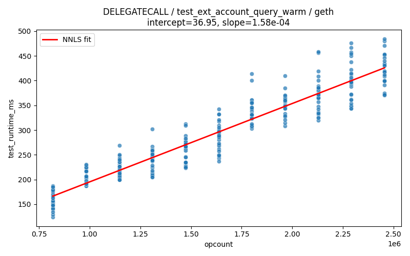

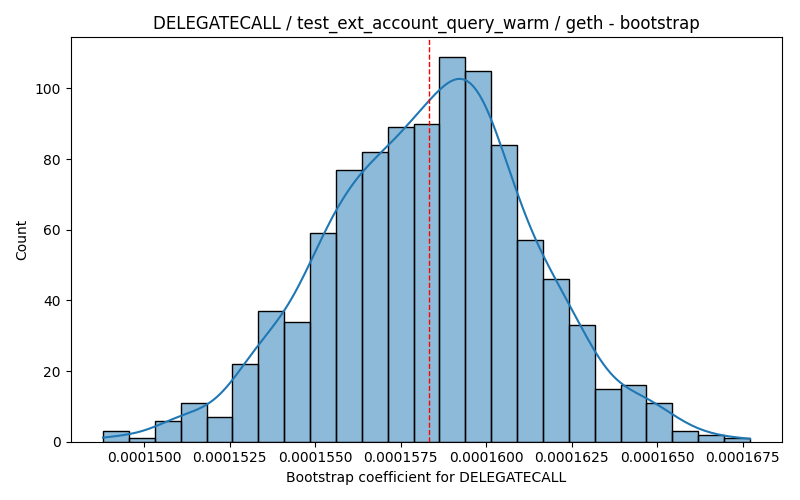

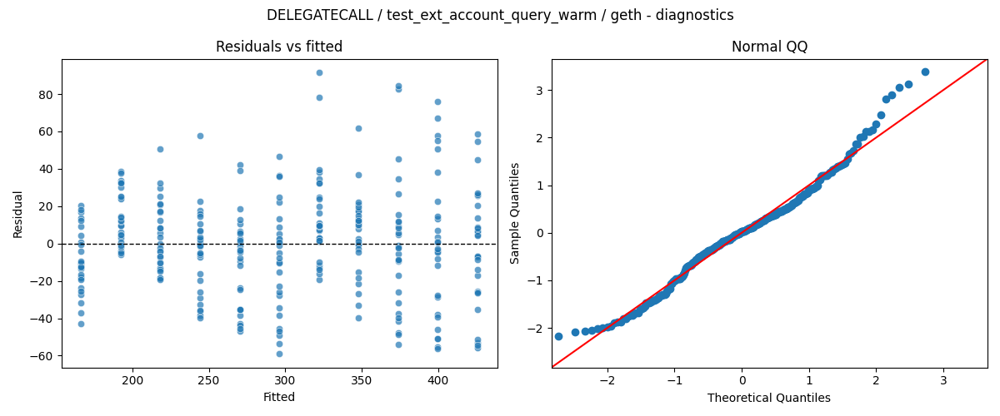

</details>

<details><summary>nethermind — NNLS regression summary</summary>

```
==============================================================================
                           NNLS Regression Results                            
==============================================================================
Dep. Variable:          test_runtime_ms              R-squared:          0.610
Model:                  NNLS                    Adj. R-squared:          0.608
No. Observations:       253                               RMSE:         160.99
Df Residuals:           251                                MAE:         133.44
Df Model:               1      
==============================================================================
                      coef     std err     P-value      [0.025      0.975]
------------------------------------------------------------------------------
         const    161.4366     29.8675       0.001    103.6817    221.9899
       opcount      0.0004      0.0000       0.001      0.0004      0.0004
==============================================================================
Notes: Non-negative least squares with bootstrap inference (1000 iterations)
==============================================================================
```

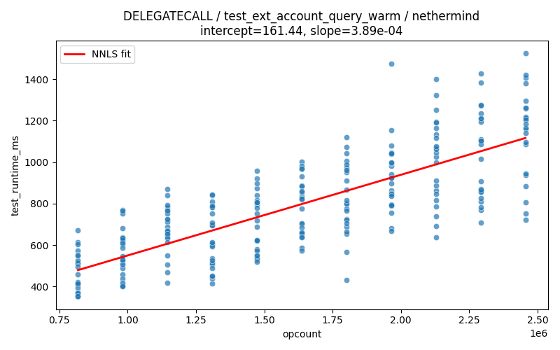

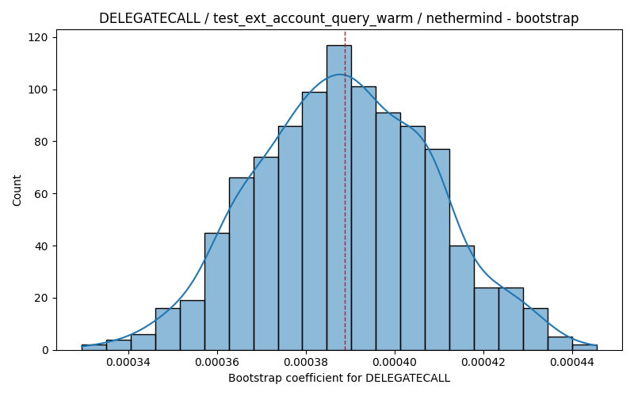

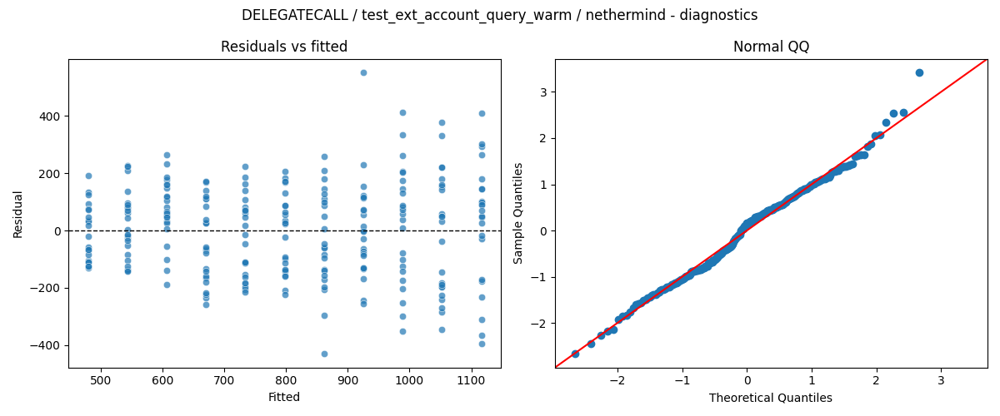

</details>

<details><summary>reth — NNLS regression summary</summary>

```
==============================================================================
                           NNLS Regression Results                            
==============================================================================
Dep. Variable:          test_runtime_ms              R-squared:          0.925
Model:                  NNLS                    Adj. R-squared:          0.925
No. Observations:       396                               RMSE:           7.82
Df Residuals:           394                                MAE:           6.04
Df Model:               1      
==============================================================================
                      coef     std err     P-value      [0.025      0.975]
------------------------------------------------------------------------------
         const     24.9659      1.3915       0.001     22.2724     27.7401
       opcount      0.0001      0.0000       0.001      0.0001      0.0001
==============================================================================
Notes: Non-negative least squares with bootstrap inference (1000 iterations)
==============================================================================
```

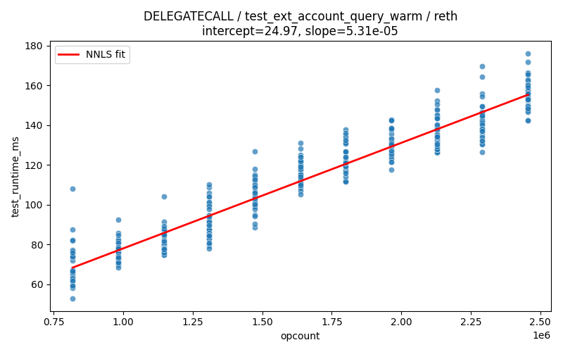

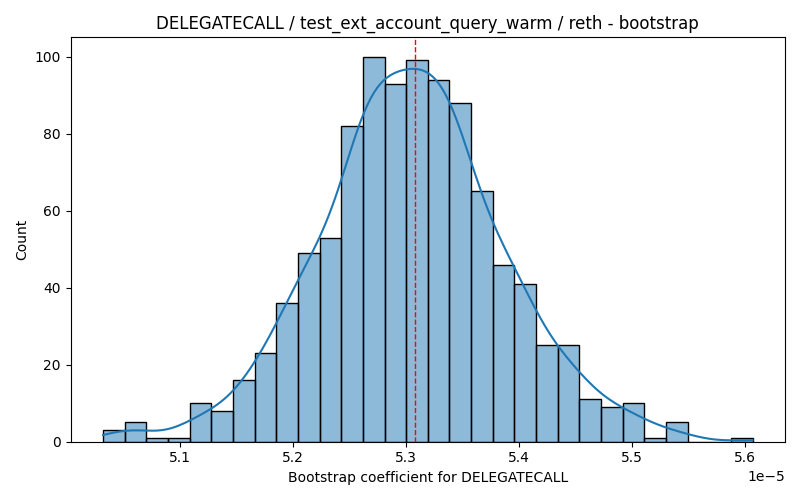

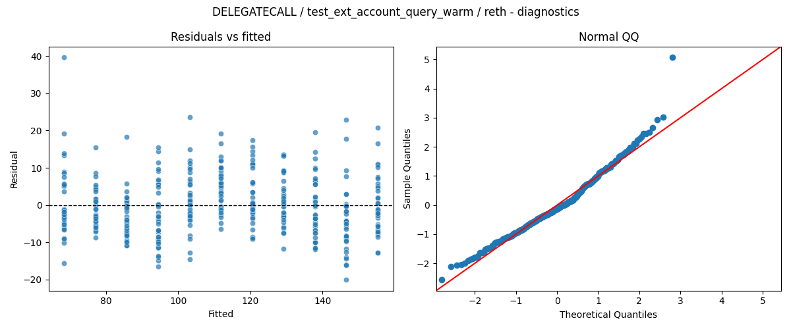

</details>

## EXTCODECOPY

### test_account_access — combo `EXTCODECOPY_AccountMode.NON_EXISTING_ACCOUNT` — `presets[cold_account_nocode_access]`

| client | nobs | R² | target_coef (ms) | p-value | 95% CI |
| --- | --- | --- | --- | --- | --- |
| `besu` | 396 | 0.2598 | 0.0005365 | 1.00e-03 | [0.0004444, 0.0006255] |
| `erigon` | 44 | 0.9386 | 8.226e-05 | 1.00e-03 | [7.516e-05, 8.865e-05] |
| `ethrex` | 308 | 0.3878 | 3.717e-05 | 1.00e-03 | [3.148e-05, 4.236e-05] |
| `geth` | 308 | 0.9327 | 0.0003369 | 1.00e-03 | [0.0003273, 0.0003483] |
| `nethermind` | 253 | 0.664 | 0.0003408 | 1.00e-03 | [0.0003108, 0.0003723] |
| `reth` | 396 | 0.5245 | 2.374e-05 | 1.00e-03 | [2.144e-05, 2.628e-05] |

<details><summary>besu — NNLS regression summary</summary>

```
==============================================================================
                           NNLS Regression Results                            
==============================================================================
Dep. Variable:          test_runtime_ms              R-squared:          0.260
Model:                  NNLS                    Adj. R-squared:          0.258
No. Observations:       396                               RMSE:         232.50
Df Residuals:           394                                MAE:         212.24
Df Model:               1      
==============================================================================
                      coef     std err     P-value      [0.025      0.975]
------------------------------------------------------------------------------
         const    379.5960     36.5766       0.001    313.5679    457.4673
       opcount      0.0005      0.0000       0.001      0.0004      0.0006
==============================================================================
Notes: Non-negative least squares with bootstrap inference (1000 iterations)
==============================================================================
```

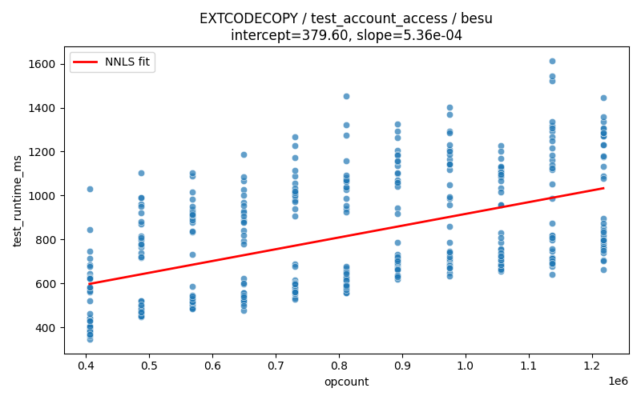

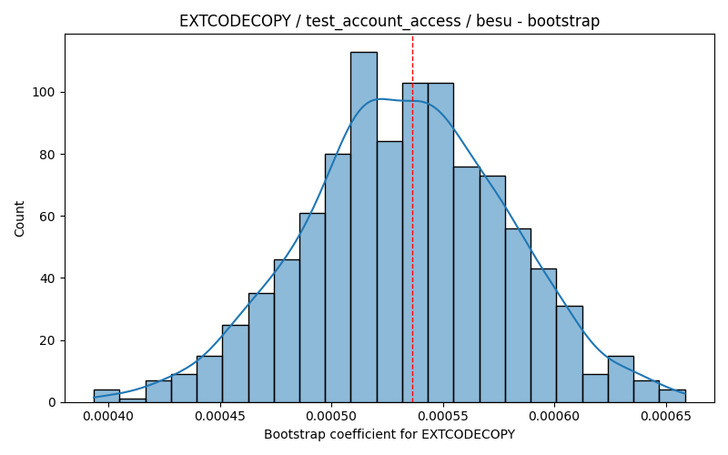

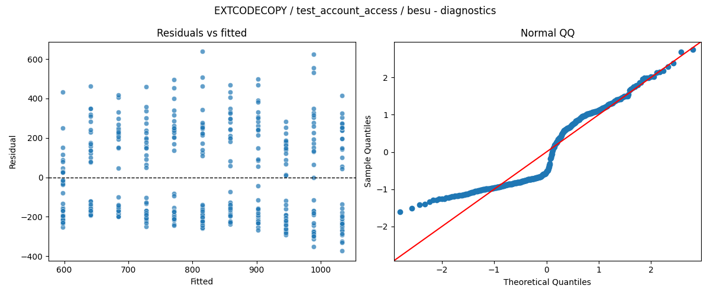

</details>

<details><summary>erigon — NNLS regression summary</summary>

```
==============================================================================
                           NNLS Regression Results                            
==============================================================================
Dep. Variable:          test_runtime_ms              R-squared:          0.939
Model:                  NNLS                    Adj. R-squared:          0.937
No. Observations:       44                                RMSE:           5.40
Df Residuals:           42                                 MAE:           4.25
Df Model:               1      
==============================================================================
                      coef     std err     P-value      [0.025      0.975]
------------------------------------------------------------------------------
         const     25.8614      2.8865       0.001     20.7353     31.6083
       opcount      0.0001      0.0000       0.001      0.0001      0.0001
==============================================================================
Notes: Non-negative least squares with bootstrap inference (1000 iterations)
==============================================================================
```

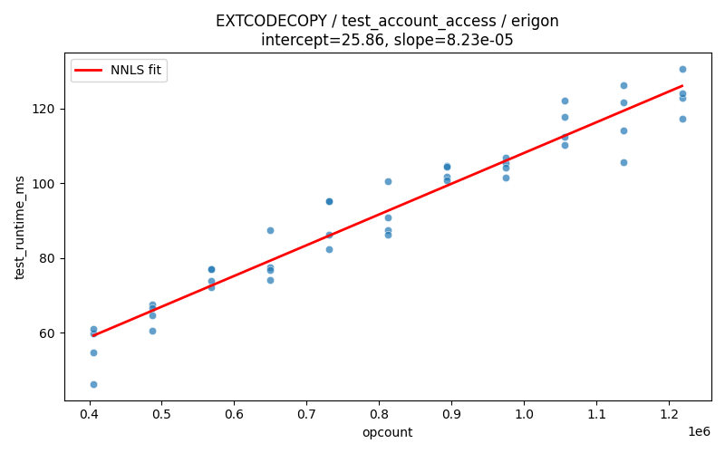

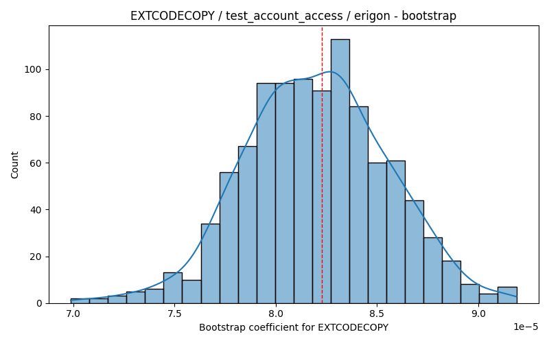

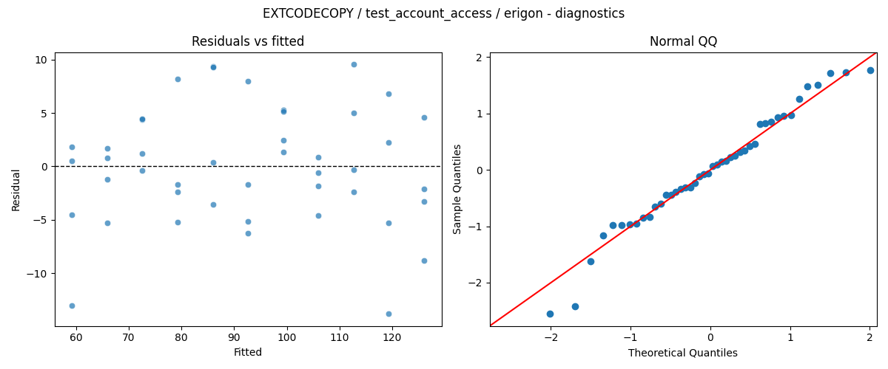

</details>

<details><summary>ethrex — NNLS regression summary</summary>

```
==============================================================================
                           NNLS Regression Results                            
==============================================================================
Dep. Variable:          test_runtime_ms              R-squared:          0.388
Model:                  NNLS                    Adj. R-squared:          0.386
No. Observations:       308                               RMSE:          11.99
Df Residuals:           306                                MAE:           7.81
Df Model:               1      
==============================================================================
                      coef     std err     P-value      [0.025      0.975]
------------------------------------------------------------------------------
         const     11.8386      2.3576       0.001      7.3744     16.7320
       opcount      0.0000      0.0000       0.001      0.0000      0.0000
==============================================================================
Notes: Non-negative least squares with bootstrap inference (1000 iterations)
==============================================================================
```

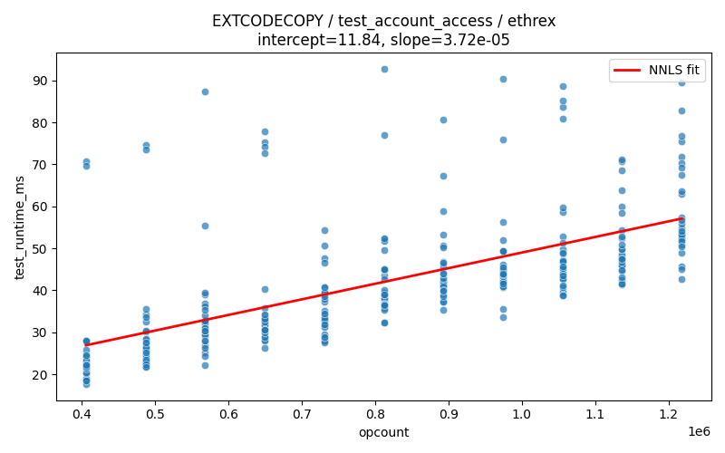

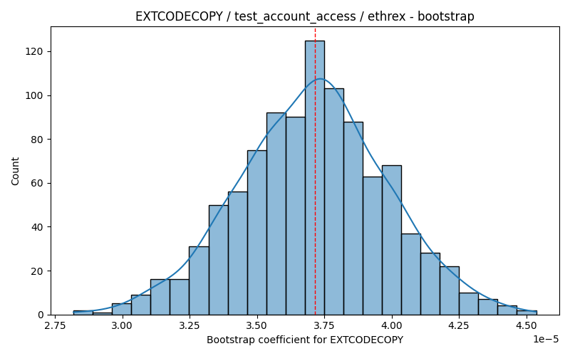

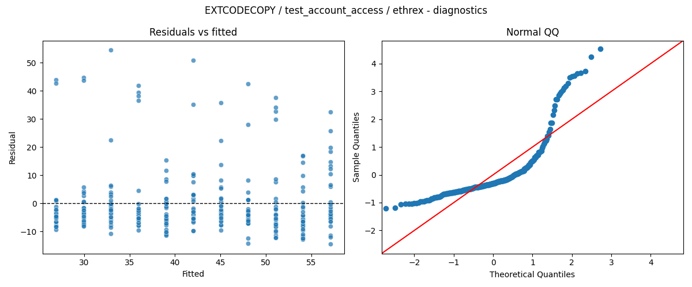

</details>

<details><summary>geth — NNLS regression summary</summary>

```
==============================================================================
                           NNLS Regression Results                            
==============================================================================
Dep. Variable:          test_runtime_ms              R-squared:          0.933
Model:                  NNLS                    Adj. R-squared:          0.933
No. Observations:       308                               RMSE:          23.23
Df Residuals:           306                                MAE:          17.88
Df Model:               1      
==============================================================================
                      coef     std err     P-value      [0.025      0.975]
------------------------------------------------------------------------------
         const     31.2079      4.0513       0.001     22.4196     38.7633
       opcount      0.0003      0.0000       0.001      0.0003      0.0003
==============================================================================
Notes: Non-negative least squares with bootstrap inference (1000 iterations)
==============================================================================
```

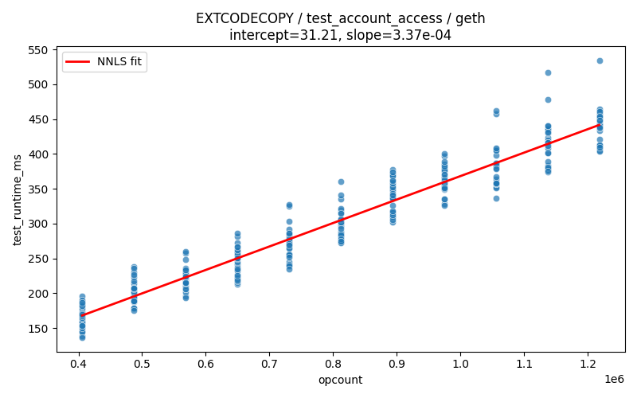

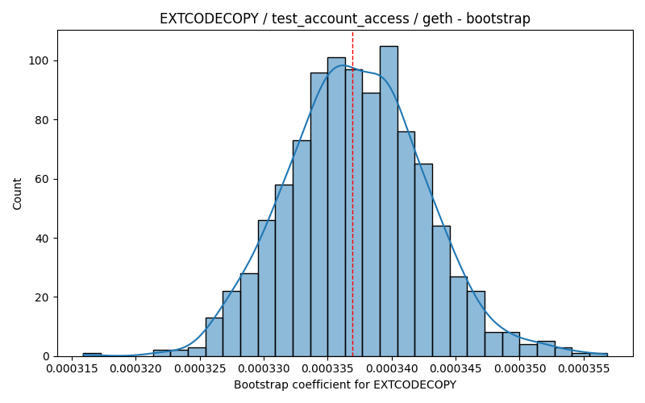

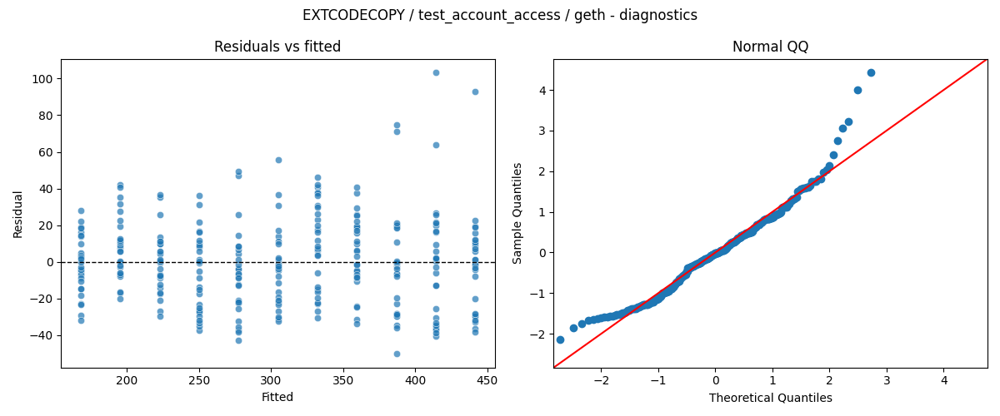

</details>

<details><summary>nethermind — NNLS regression summary</summary>

```
==============================================================================
                           NNLS Regression Results                            
==============================================================================
Dep. Variable:          test_runtime_ms              R-squared:          0.664
Model:                  NNLS                    Adj. R-squared:          0.663
No. Observations:       253                               RMSE:          62.24
Df Residuals:           251                                MAE:          42.49
Df Model:               1      
==============================================================================
                      coef     std err     P-value      [0.025      0.975]
------------------------------------------------------------------------------
         const    125.6761     11.8927       0.001    101.1327    148.9311
       opcount      0.0003      0.0000       0.001      0.0003      0.0004
==============================================================================
Notes: Non-negative least squares with bootstrap inference (1000 iterations)
==============================================================================
```

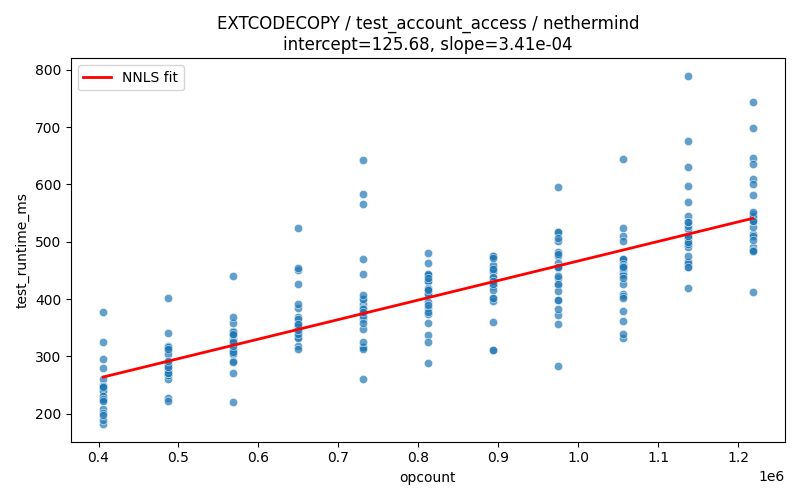

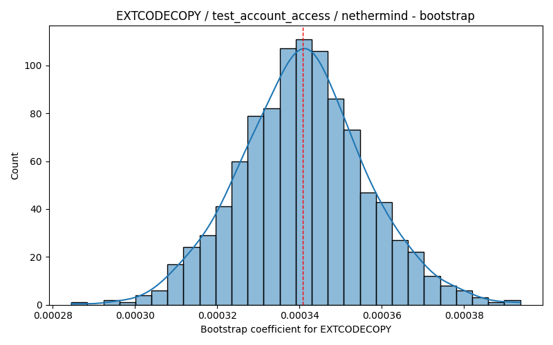

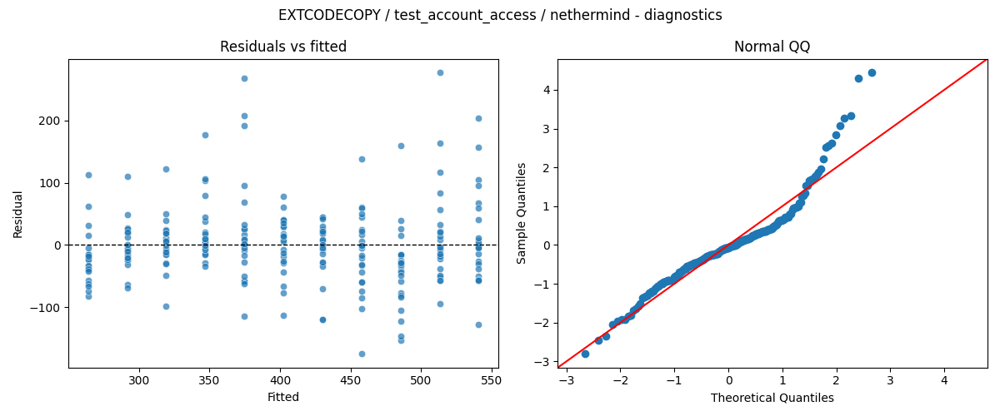

</details>

<details><summary>reth — NNLS regression summary</summary>

```
==============================================================================
                           NNLS Regression Results                            
==============================================================================
Dep. Variable:          test_runtime_ms              R-squared:          0.525
Model:                  NNLS                    Adj. R-squared:          0.523
No. Observations:       396                               RMSE:           5.80
Df Residuals:           394                                MAE:           4.19
Df Model:               1      
==============================================================================
                      coef     std err     P-value      [0.025      0.975]
------------------------------------------------------------------------------
         const      9.2035      0.9310       0.001      7.2800     11.0495
       opcount      0.0000      0.0000       0.001      0.0000      0.0000
==============================================================================
Notes: Non-negative least squares with bootstrap inference (1000 iterations)
==============================================================================
```

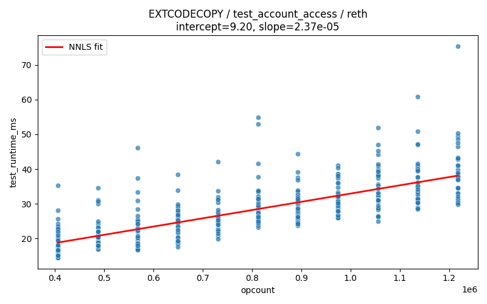

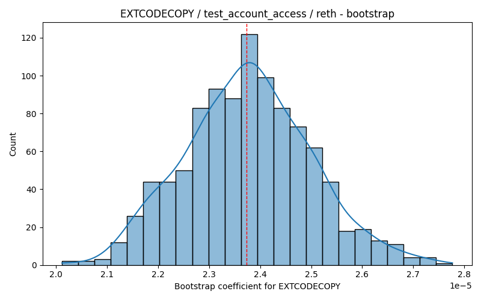

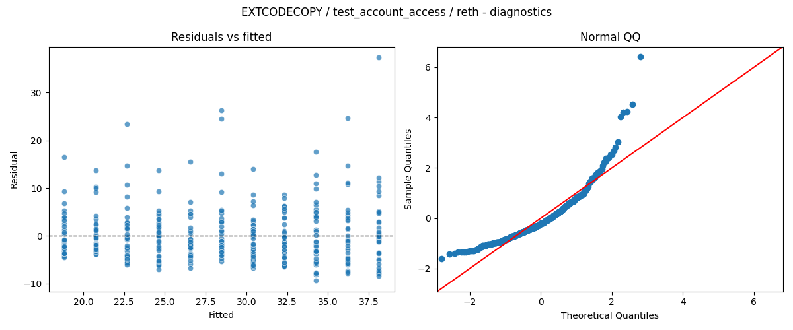

</details>

### test_account_access — combo `EXTCODECOPY_AccountMode.EXISTING_CONTRACT`

| client | nobs | R² | target_coef (ms) | p-value | 95% CI |
| --- | --- | --- | --- | --- | --- |
| `besu` | 396 | 0.3304 | 0.001838 | 1.00e-03 | [0.001595, 0.002079] |
| `erigon` | 44 | 0.9501 | 0.0003084 | 1.00e-03 | [0.0002815, 0.0003334] |
| `ethrex` | 308 | 0.7833 | 0.0002108 | 1.00e-03 | [0.0001979, 0.0002229] |
| `geth` | 308 | 0.8876 | 0.0007556 | 1.00e-03 | [0.000726, 0.0007872] |
| `nethermind` | 253 | 0.7973 | 0.001348 | 1.00e-03 | [0.001264, 0.001431] |
| `reth` | 396 | 0.7661 | 0.0001141 | 1.00e-03 | [0.000108, 0.0001208] |

<details><summary>besu — NNLS regression summary</summary>

```
==============================================================================
                           NNLS Regression Results                            
==============================================================================
Dep. Variable:          test_runtime_ms              R-squared:          0.330
Model:                  NNLS                    Adj. R-squared:          0.329
No. Observations:       396                               RMSE:         258.50
Df Residuals:           394                                MAE:         239.29
Df Model:               1      
==============================================================================
                      coef     std err     P-value      [0.025      0.975]
------------------------------------------------------------------------------
         const    451.9807     37.1612       0.001    378.2668    525.1840
       opcount      0.0018      0.0001       0.001      0.0016      0.0021
==============================================================================
Notes: Non-negative least squares with bootstrap inference (1000 iterations)
==============================================================================
```

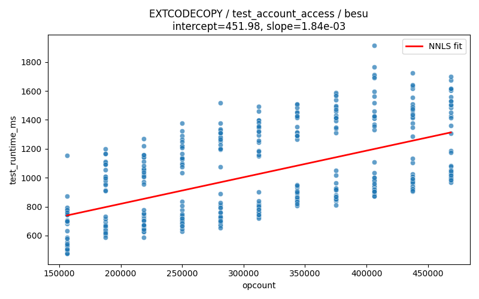

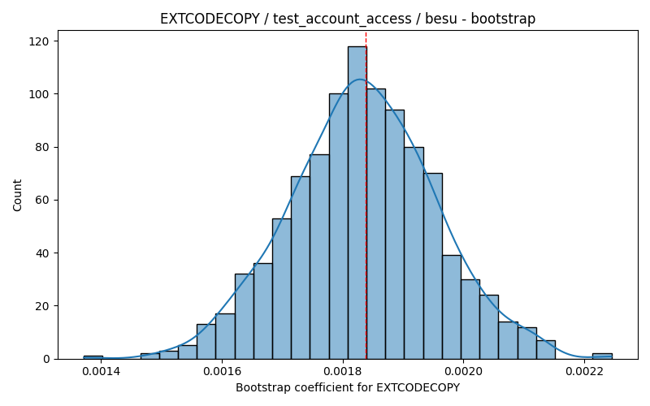

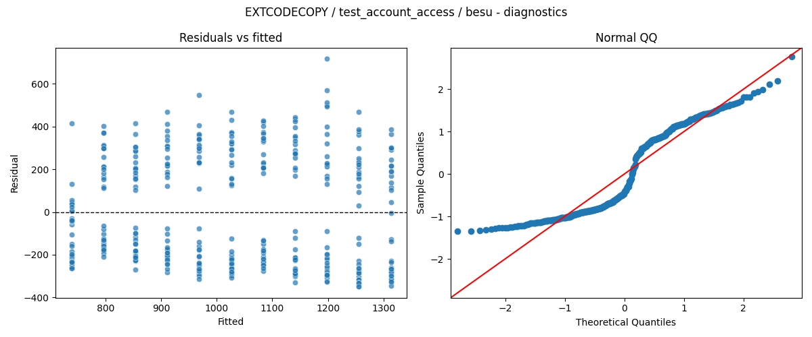

</details>

<details><summary>erigon — NNLS regression summary</summary>

```
==============================================================================
                           NNLS Regression Results                            
==============================================================================
Dep. Variable:          test_runtime_ms              R-squared:          0.950
Model:                  NNLS                    Adj. R-squared:          0.949
No. Observations:       44                                RMSE:           6.98
Df Residuals:           42                                 MAE:           5.50
Df Model:               1      
==============================================================================
                      coef     std err     P-value      [0.025      0.975]
------------------------------------------------------------------------------
         const     40.7090      4.2424       0.001     32.7878     49.9721
       opcount      0.0003      0.0000       0.001      0.0003      0.0003
==============================================================================
Notes: Non-negative least squares with bootstrap inference (1000 iterations)
==============================================================================
```

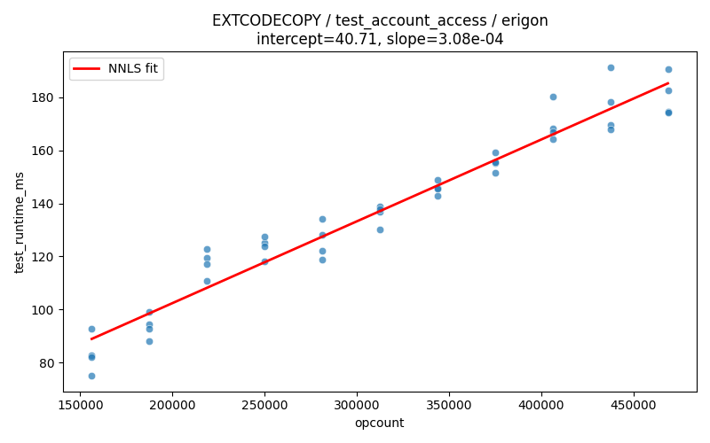

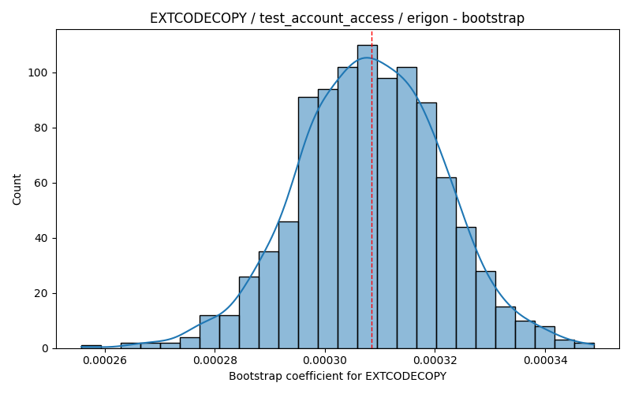

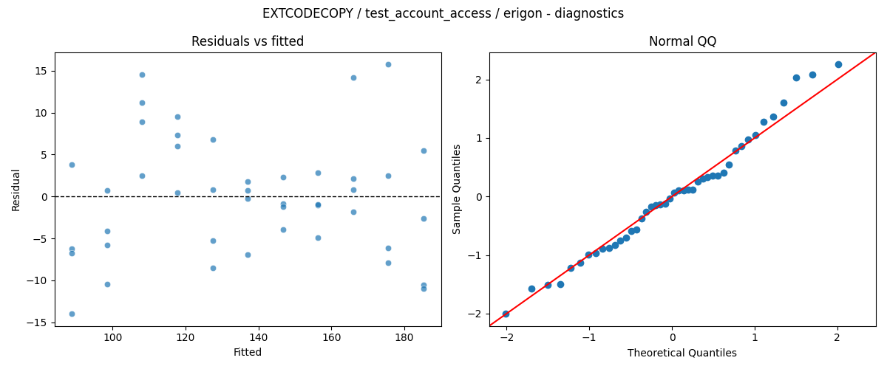

</details>

<details><summary>ethrex — NNLS regression summary</summary>

```
==============================================================================
                           NNLS Regression Results                            
==============================================================================
Dep. Variable:          test_runtime_ms              R-squared:          0.783
Model:                  NNLS                    Adj. R-squared:          0.783
No. Observations:       308                               RMSE:          10.95
Df Residuals:           306                                MAE:           8.59
Df Model:               1      
==============================================================================
                      coef     std err     P-value      [0.025      0.975]
------------------------------------------------------------------------------
         const     22.4621      2.0285       0.001     18.6671     26.5507
       opcount      0.0002      0.0000       0.001      0.0002      0.0002
==============================================================================
Notes: Non-negative least squares with bootstrap inference (1000 iterations)
==============================================================================
```

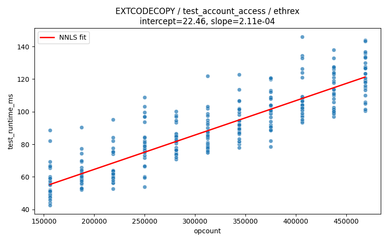

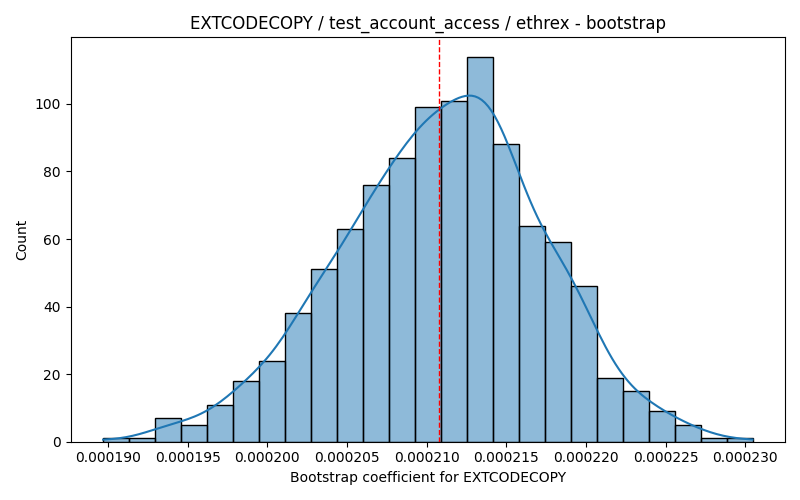

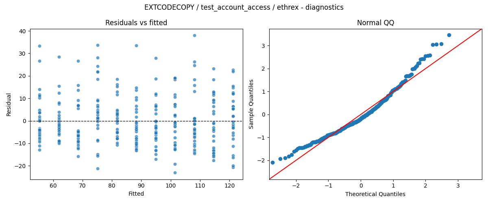

</details>

<details><summary>geth — NNLS regression summary</summary>

```
==============================================================================
                           NNLS Regression Results                            
==============================================================================
Dep. Variable:          test_runtime_ms              R-squared:          0.888
Model:                  NNLS                    Adj. R-squared:          0.887
No. Observations:       308                               RMSE:          26.57
Df Residuals:           306                                MAE:          21.09
Df Model:               1      
==============================================================================
                      coef     std err     P-value      [0.025      0.975]
------------------------------------------------------------------------------
         const     42.4138      4.5634       0.001     32.8372     51.1638
       opcount      0.0008      0.0000       0.001      0.0007      0.0008
==============================================================================
Notes: Non-negative least squares with bootstrap inference (1000 iterations)
==============================================================================
```

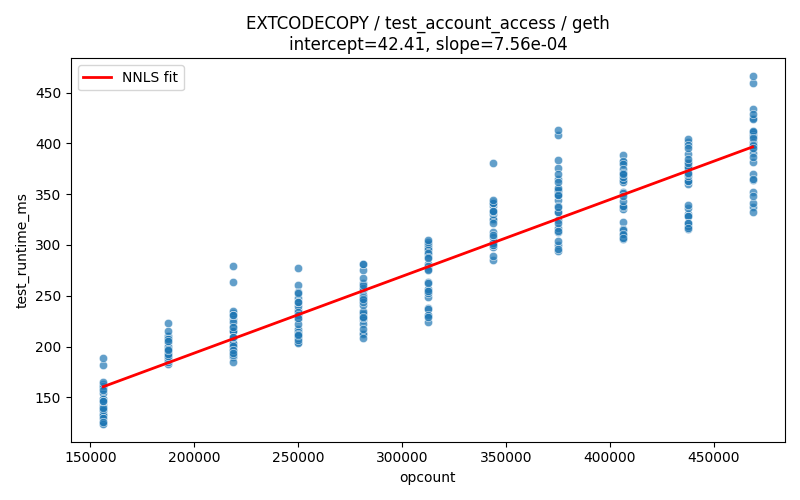

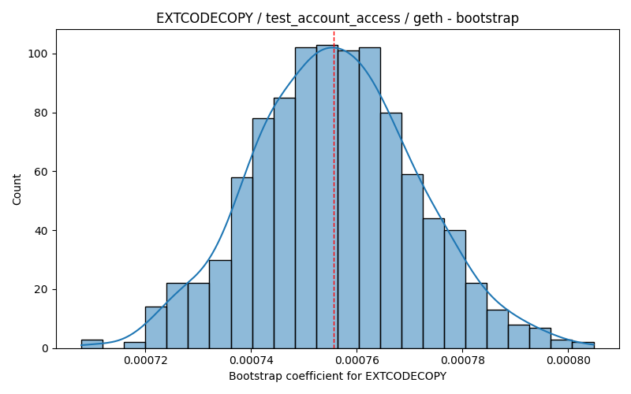

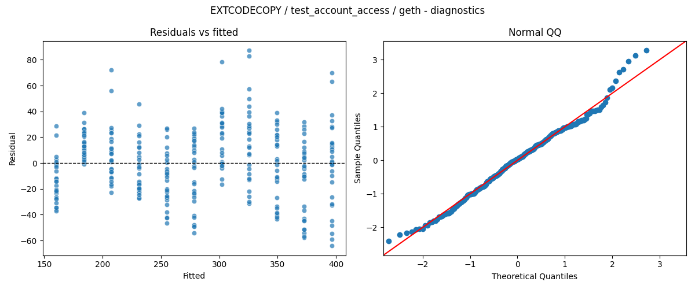

</details>

<details><summary>nethermind — NNLS regression summary</summary>

```
==============================================================================
                           NNLS Regression Results                            
==============================================================================
Dep. Variable:          test_runtime_ms              R-squared:          0.797
Model:                  NNLS                    Adj. R-squared:          0.797
No. Observations:       253                               RMSE:          67.14
Df Residuals:           251                                MAE:          53.07
Df Model:               1      
==============================================================================
                      coef     std err     P-value      [0.025      0.975]
------------------------------------------------------------------------------
         const    182.4849     12.2768       0.001    158.5757    207.1812
       opcount      0.0013      0.0000       0.001      0.0013      0.0014
==============================================================================
Notes: Non-negative least squares with bootstrap inference (1000 iterations)
==============================================================================
```

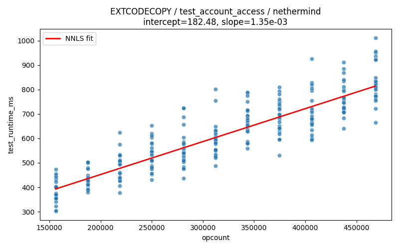

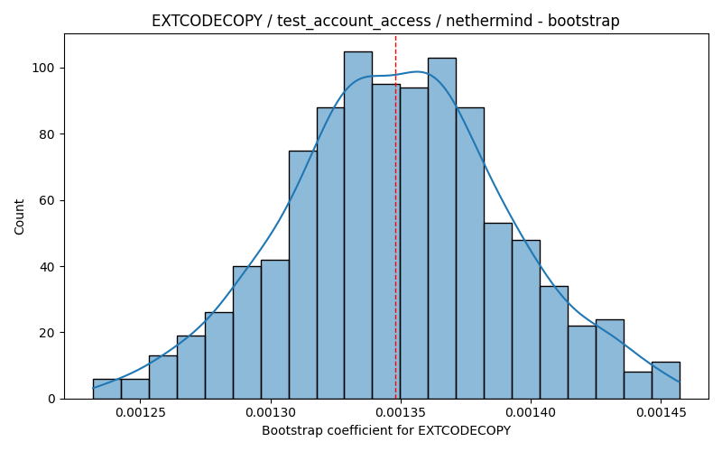

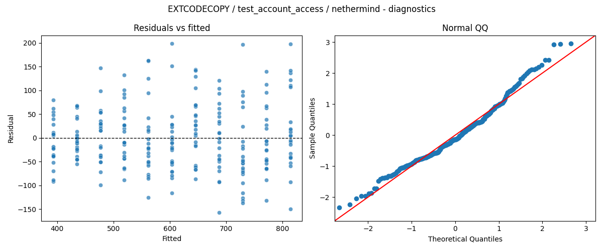

</details>

<details><summary>reth — NNLS regression summary</summary>

```
==============================================================================
                           NNLS Regression Results                            
==============================================================================
Dep. Variable:          test_runtime_ms              R-squared:          0.766
Model:                  NNLS                    Adj. R-squared:          0.766
No. Observations:       396                               RMSE:           6.23
Df Residuals:           394                                MAE:           4.82
Df Model:               1      
==============================================================================
                      coef     std err     P-value      [0.025      0.975]
------------------------------------------------------------------------------
         const     12.1728      0.9647       0.001     10.3509     14.0917
       opcount      0.0001      0.0000       0.001      0.0001      0.0001
==============================================================================
Notes: Non-negative least squares with bootstrap inference (1000 iterations)
==============================================================================
```

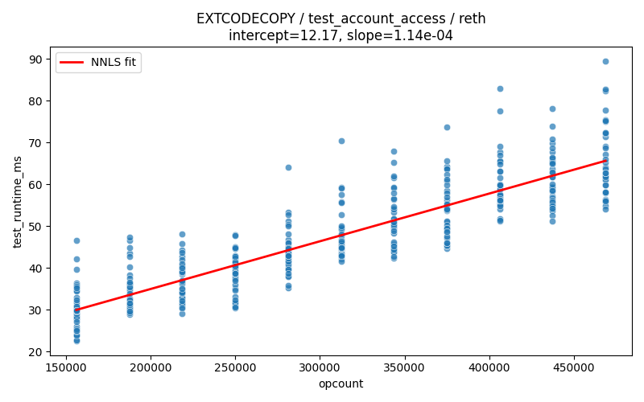

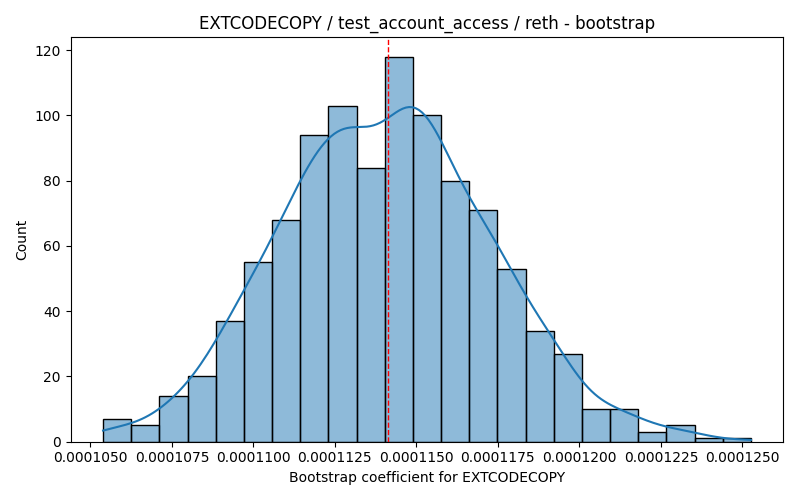

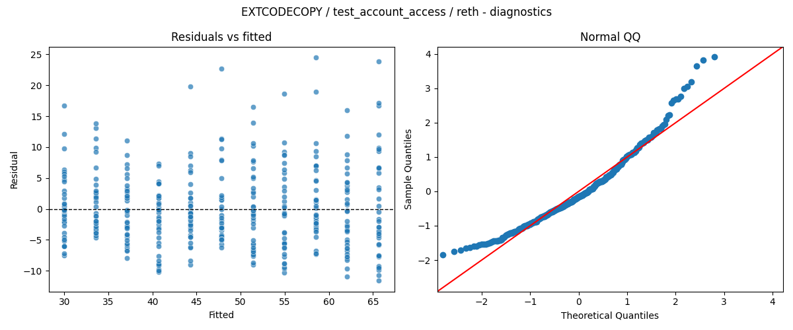

</details>

### test_account_access — combo `EXTCODECOPY_AccountMode.NON_EXISTING_ACCOUNT` — `presets[cold_account_code_access]`

| client | nobs | R² | target_coef (ms) | p-value | 95% CI |
| --- | --- | --- | --- | --- | --- |
| `besu` | 396 | 0.2598 | 0.0005365 | 1.00e-03 | [0.0004444, 0.0006255] |
| `erigon` | 44 | 0.9386 | 8.226e-05 | 1.00e-03 | [7.516e-05, 8.865e-05] |
| `ethrex` | 308 | 0.3878 | 3.717e-05 | 1.00e-03 | [3.148e-05, 4.236e-05] |
| `geth` | 308 | 0.9327 | 0.0003369 | 1.00e-03 | [0.0003273, 0.0003483] |
| `nethermind` | 253 | 0.664 | 0.0003408 | 1.00e-03 | [0.0003108, 0.0003723] |
| `reth` | 396 | 0.5245 | 2.374e-05 | 1.00e-03 | [2.144e-05, 2.628e-05] |

<details><summary>besu — NNLS regression summary</summary>

```
==============================================================================
                           NNLS Regression Results                            
==============================================================================
Dep. Variable:          test_runtime_ms              R-squared:          0.260
Model:                  NNLS                    Adj. R-squared:          0.258
No. Observations:       396                               RMSE:         232.50
Df Residuals:           394                                MAE:         212.24
Df Model:               1      
==============================================================================
                      coef     std err     P-value      [0.025      0.975]
------------------------------------------------------------------------------
         const    379.5960     36.5766       0.001    313.5679    457.4673
       opcount      0.0005      0.0000       0.001      0.0004      0.0006
==============================================================================
Notes: Non-negative least squares with bootstrap inference (1000 iterations)
==============================================================================
```


</details>

<details><summary>erigon — NNLS regression summary</summary>

```
==============================================================================
                           NNLS Regression Results                            
==============================================================================
Dep. Variable:          test_runtime_ms              R-squared:          0.939
Model:                  NNLS                    Adj. R-squared:          0.937
No. Observations:       44                                RMSE:           5.40
Df Residuals:           42                                 MAE:           4.25
Df Model:               1      
==============================================================================
                      coef     std err     P-value      [0.025      0.975]
------------------------------------------------------------------------------
         const     25.8614      2.8865       0.001     20.7353     31.6083
       opcount      0.0001      0.0000       0.001      0.0001      0.0001
==============================================================================
Notes: Non-negative least squares with bootstrap inference (1000 iterations)
==============================================================================
```


</details>

<details><summary>ethrex — NNLS regression summary</summary>

```
==============================================================================
                           NNLS Regression Results                            
==============================================================================
Dep. Variable:          test_runtime_ms              R-squared:          0.388
Model:                  NNLS                    Adj. R-squared:          0.386
No. Observations:       308                               RMSE:          11.99
Df Residuals:           306                                MAE:           7.81
Df Model:               1      
==============================================================================
                      coef     std err     P-value      [0.025      0.975]
------------------------------------------------------------------------------
         const     11.8386      2.3576       0.001      7.3744     16.7320
       opcount      0.0000      0.0000       0.001      0.0000      0.0000
==============================================================================
Notes: Non-negative least squares with bootstrap inference (1000 iterations)
==============================================================================
```


</details>

<details><summary>geth — NNLS regression summary</summary>

```
==============================================================================
                           NNLS Regression Results                            
==============================================================================
Dep. Variable:          test_runtime_ms              R-squared:          0.933
Model:                  NNLS                    Adj. R-squared:          0.933
No. Observations:       308                               RMSE:          23.23
Df Residuals:           306                                MAE:          17.88
Df Model:               1      
==============================================================================
                      coef     std err     P-value      [0.025      0.975]
------------------------------------------------------------------------------
         const     31.2079      4.0513       0.001     22.4196     38.7633
       opcount      0.0003      0.0000       0.001      0.0003      0.0003
==============================================================================
Notes: Non-negative least squares with bootstrap inference (1000 iterations)
==============================================================================
```


</details>

<details><summary>nethermind — NNLS regression summary</summary>

```
==============================================================================
                           NNLS Regression Results                            
==============================================================================
Dep. Variable:          test_runtime_ms              R-squared:          0.664
Model:                  NNLS                    Adj. R-squared:          0.663
No. Observations:       253                               RMSE:          62.24
Df Residuals:           251                                MAE:          42.49
Df Model:               1      
==============================================================================
                      coef     std err     P-value      [0.025      0.975]
------------------------------------------------------------------------------
         const    125.6761     11.8927       0.001    101.1327    148.9311
       opcount      0.0003      0.0000       0.001      0.0003      0.0004
==============================================================================
Notes: Non-negative least squares with bootstrap inference (1000 iterations)
==============================================================================
```


</details>

<details><summary>reth — NNLS regression summary</summary>

```
==============================================================================
                           NNLS Regression Results                            
==============================================================================
Dep. Variable:          test_runtime_ms              R-squared:          0.525
Model:                  NNLS                    Adj. R-squared:          0.523
No. Observations:       396                               RMSE:           5.80
Df Residuals:           394                                MAE:           4.19
Df Model:               1      
==============================================================================
                      coef     std err     P-value      [0.025      0.975]
------------------------------------------------------------------------------
         const      9.2035      0.9310       0.001      7.2800     11.0495
       opcount      0.0000      0.0000       0.001      0.0000      0.0000
==============================================================================
Notes: Non-negative least squares with bootstrap inference (1000 iterations)
==============================================================================
```


</details>

## EXTCODEHASH

### test_account_access — combo `EXTCODEHASH_AccountMode.NON_EXISTING_ACCOUNT` — `presets[cold_account_nocode_access]`

| client | nobs | R² | target_coef (ms) | p-value | 95% CI |
| --- | --- | --- | --- | --- | --- |
| `besu` | 396 | 0.8485 | 0.01301 | 1.00e-03 | [0.01251, 0.01355] |
| `erigon` | 44 | 0.9883 | 0.008341 | 1.00e-03 | [0.008074, 0.008469] |
| `ethrex` | 308 | 0.9678 | 0.001986 | 1.00e-03 | [0.001945, 0.002025] |
| `geth` | 308 | 0.8632 | 0.02156 | 1.00e-03 | [0.02061, 0.02261] |
| `nethermind` | 253 | 0.837 | 0.003838 | 1.00e-03 | [0.003604, 0.00406] |
| `reth` | 396 | 0.8813 | 0.0007339 | 1.00e-03 | [0.000709, 0.0007616] |

<details><summary>besu — NNLS regression summary</summary>

```
==============================================================================
                           NNLS Regression Results                            
==============================================================================
Dep. Variable:          test_runtime_ms              R-squared:          0.848
Model:                  NNLS                    Adj. R-squared:          0.848
No. Observations:       396                               RMSE:         131.43
Df Residuals:           394                                MAE:         122.59
Df Model:               1      
==============================================================================
                      coef     std err     P-value      [0.025      0.975]
------------------------------------------------------------------------------
         const    485.9259     21.7555       0.001    444.9126    524.4430
       opcount      0.0130      0.0003       0.001      0.0125      0.0135
==============================================================================
Notes: Non-negative least squares with bootstrap inference (1000 iterations)
==============================================================================
```

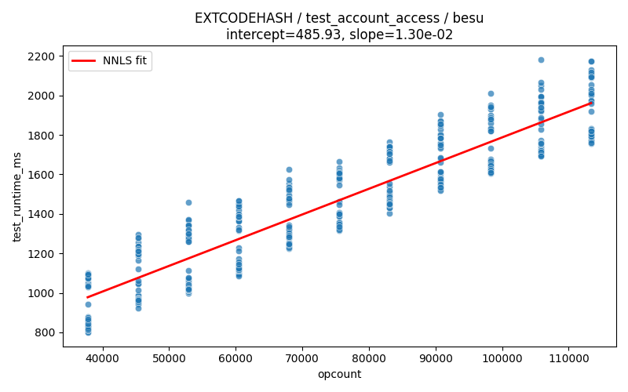

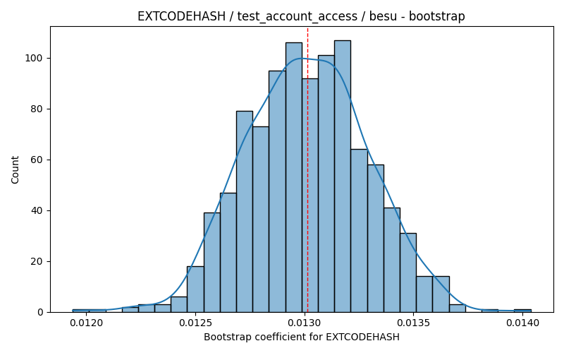

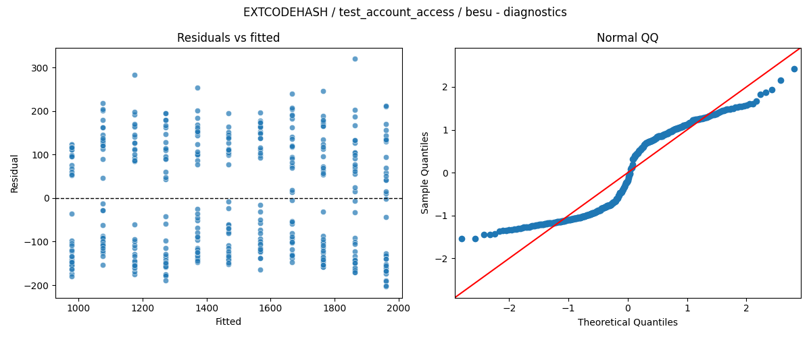

</details>

<details><summary>erigon — NNLS regression summary</summary>

```
==============================================================================
                           NNLS Regression Results                            
==============================================================================
Dep. Variable:          test_runtime_ms              R-squared:          0.988
Model:                  NNLS                    Adj. R-squared:          0.988
No. Observations:       44                                RMSE:          21.71
Df Residuals:           42                                 MAE:          16.51
Df Model:               1      
==============================================================================
                      coef     std err     P-value      [0.025      0.975]
------------------------------------------------------------------------------
         const      6.1751      8.5122       0.302      0.0000     28.7344
       opcount      0.0083      0.0001       0.001      0.0081      0.0085
==============================================================================
Notes: Non-negative least squares with bootstrap inference (1000 iterations)
==============================================================================
```

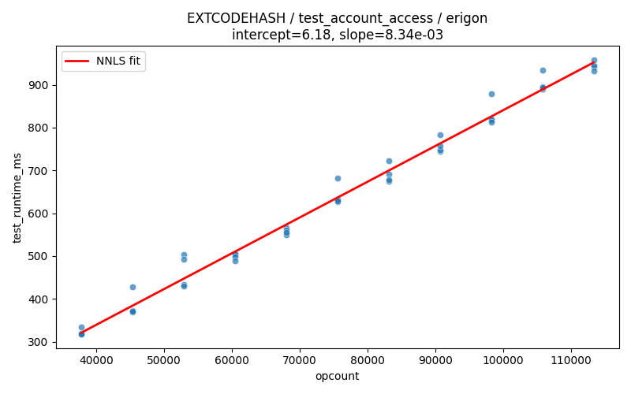

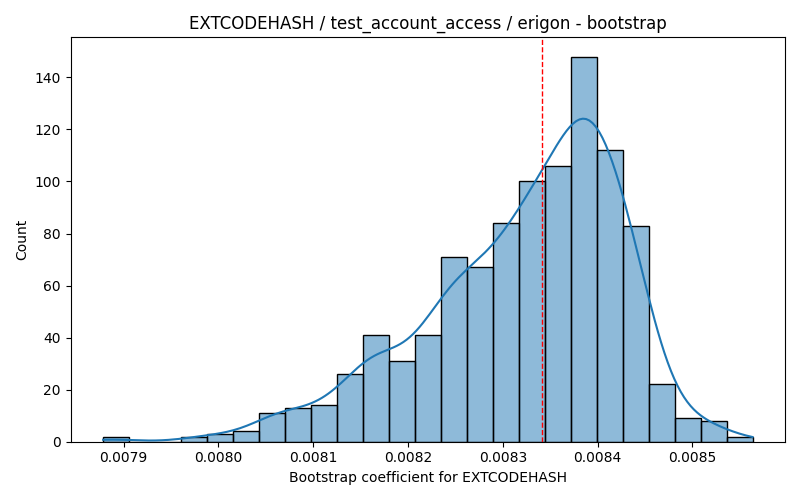

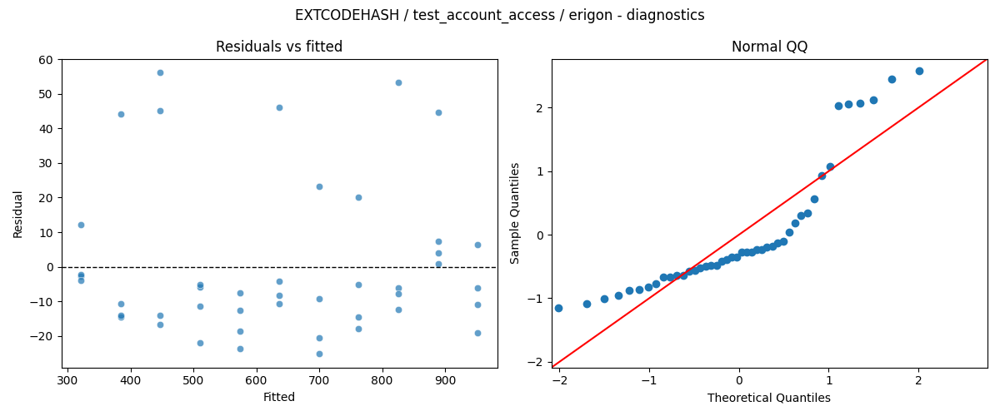

</details>

<details><summary>ethrex — NNLS regression summary</summary>

```
==============================================================================
                           NNLS Regression Results                            
==============================================================================
Dep. Variable:          test_runtime_ms              R-squared:          0.968
Model:                  NNLS                    Adj. R-squared:          0.968
No. Observations:       308                               RMSE:           8.65
Df Residuals:           306                                MAE:           7.01
Df Model:               1      
==============================================================================
                      coef     std err     P-value      [0.025      0.975]
------------------------------------------------------------------------------
         const     27.0432      1.5977       0.001     24.0201     30.3021
       opcount      0.0020      0.0000       0.001      0.0019      0.0020
==============================================================================
Notes: Non-negative least squares with bootstrap inference (1000 iterations)
==============================================================================
```

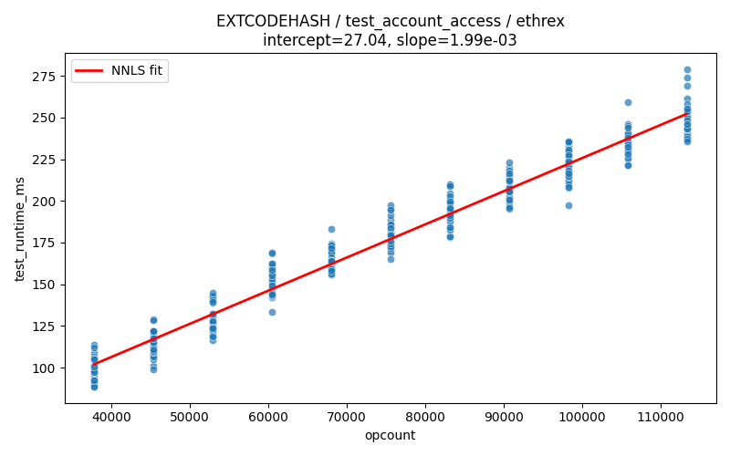

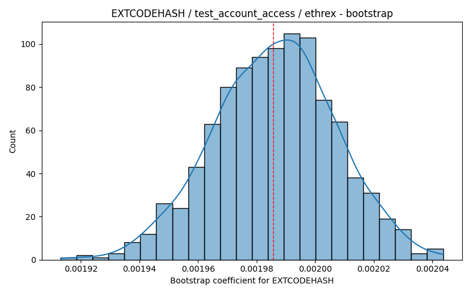

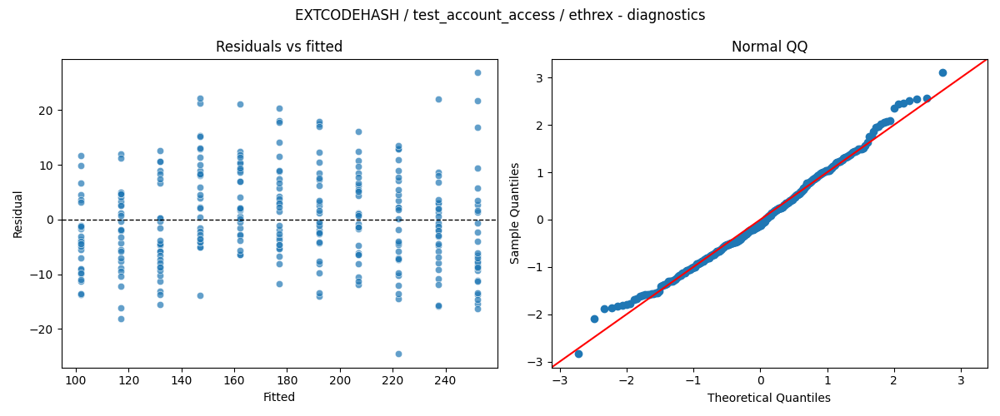

</details>

<details><summary>geth — NNLS regression summary</summary>

```
==============================================================================
                           NNLS Regression Results                            
==============================================================================
Dep. Variable:          test_runtime_ms              R-squared:          0.863
Model:                  NNLS                    Adj. R-squared:          0.863
No. Observations:       308                               RMSE:         205.14
Df Residuals:           306                                MAE:         173.20
Df Model:               1      
==============================================================================
                      coef     std err     P-value      [0.025      0.975]
------------------------------------------------------------------------------
         const    691.9280     43.9283       0.001    606.3610    773.9516
       opcount      0.0216      0.0005       0.001      0.0206      0.0226
==============================================================================
Notes: Non-negative least squares with bootstrap inference (1000 iterations)
==============================================================================
```

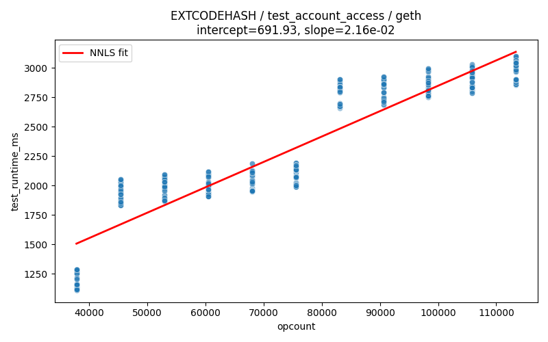

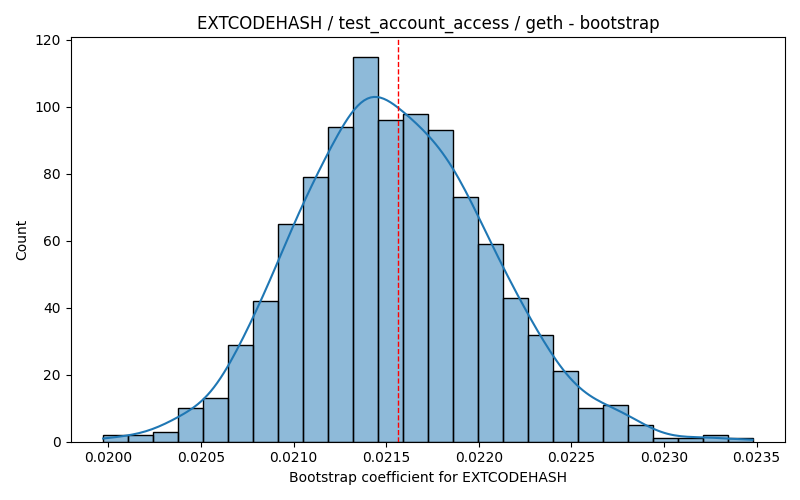

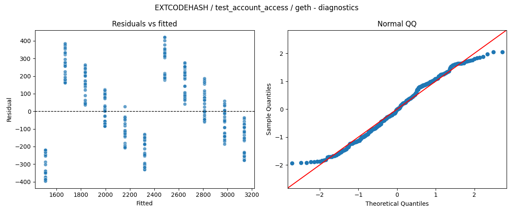

</details>

<details><summary>nethermind — NNLS regression summary</summary>

```
==============================================================================
                           NNLS Regression Results                            
==============================================================================
Dep. Variable:          test_runtime_ms              R-squared:          0.837
Model:                  NNLS                    Adj. R-squared:          0.836
No. Observations:       253                               RMSE:          40.48
Df Residuals:           251                                MAE:          33.00
Df Model:               1      
==============================================================================
                      coef     std err     P-value      [0.025      0.975]
------------------------------------------------------------------------------
         const     68.2799      7.5266       0.001     54.5972     84.1633
       opcount      0.0038      0.0001       0.001      0.0036      0.0041
==============================================================================
Notes: Non-negative least squares with bootstrap inference (1000 iterations)
==============================================================================
```

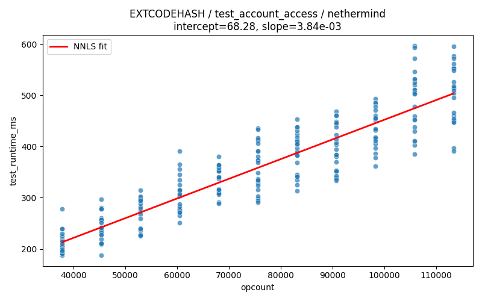

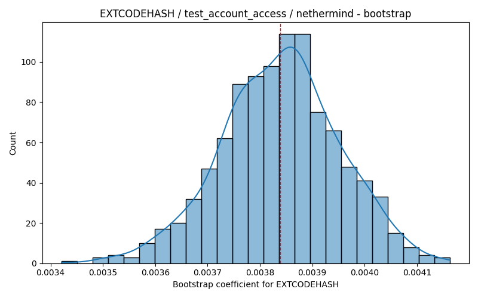

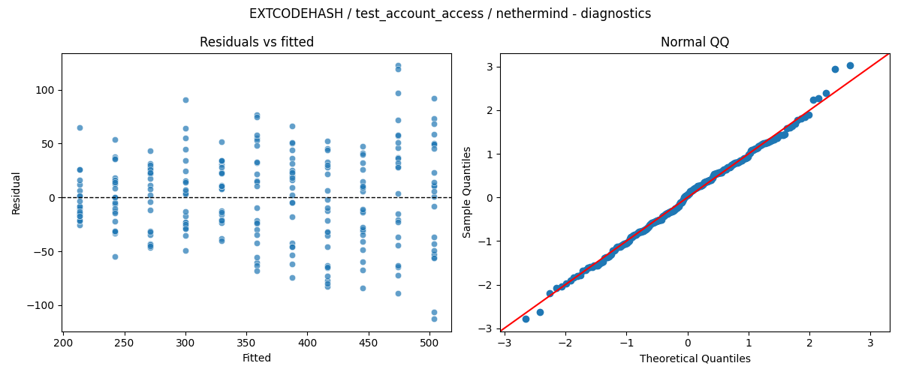

</details>

<details><summary>reth — NNLS regression summary</summary>

```
==============================================================================
                           NNLS Regression Results                            
==============================================================================
Dep. Variable:          test_runtime_ms              R-squared:          0.881
Model:                  NNLS                    Adj. R-squared:          0.881
No. Observations:       396                               RMSE:           6.44
Df Residuals:           394                                MAE:           5.14
Df Model:               1      
==============================================================================
                      coef     std err     P-value      [0.025      0.975]
------------------------------------------------------------------------------
         const     48.6254      1.0398       0.001     46.5245     50.5630
       opcount      0.0007      0.0000       0.001      0.0007      0.0008
==============================================================================
Notes: Non-negative least squares with bootstrap inference (1000 iterations)
==============================================================================
```

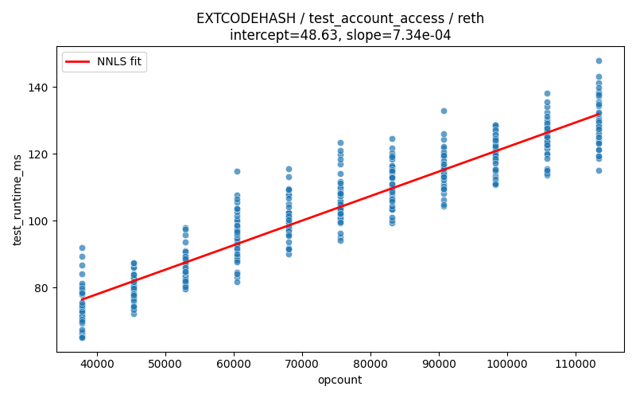

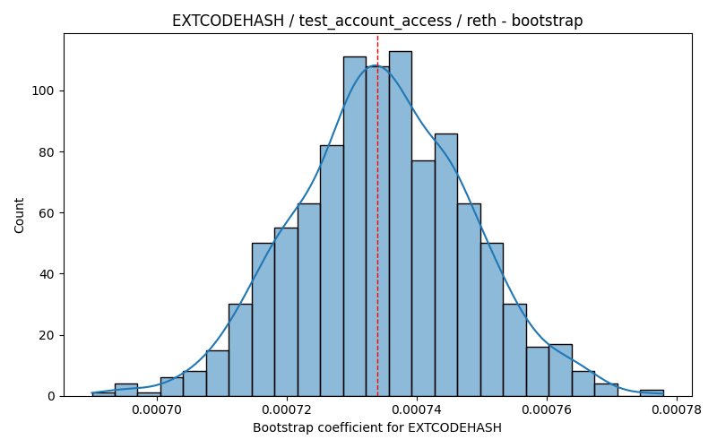

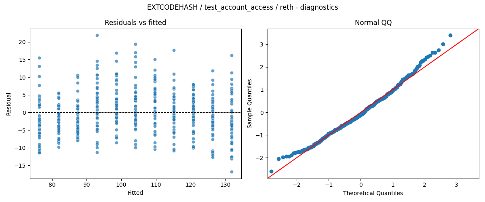

</details>

### test_account_access — combo `EXTCODEHASH_AccountMode.EXISTING_CONTRACT`

| client | nobs | R² | target_coef (ms) | p-value | 95% CI |
| --- | --- | --- | --- | --- | --- |
| `besu` | 396 | 0.9309 | 0.0246 | 1.00e-03 | [0.02409, 0.02514] |
| `erigon` | 44 | 0.9381 | 0.02347 | 1.00e-03 | [0.02167, 0.02502] |
| `ethrex` | 308 | 0.9927 | 0.007749 | 1.00e-03 | [0.007679, 0.007816] |
| `geth` | 308 | 0.8587 | 0.02291 | 1.00e-03 | [0.02178, 0.02396] |
| `nethermind` | 253 | 0.6093 | 0.01415 | 1.00e-03 | [0.0128, 0.01554] |
| `reth` | 396 | 0.9731 | 0.003929 | 1.00e-03 | [0.003859, 0.003997] |

<details><summary>besu — NNLS regression summary</summary>

```
==============================================================================
                           NNLS Regression Results                            
==============================================================================
Dep. Variable:          test_runtime_ms              R-squared:          0.931
Model:                  NNLS                    Adj. R-squared:          0.931
No. Observations:       396                               RMSE:         139.50
Df Residuals:           394                                MAE:         122.21
Df Model:               1      
==============================================================================
                      coef     std err     P-value      [0.025      0.975]
------------------------------------------------------------------------------
         const    532.8648     18.3909       0.001    495.9106    568.3167
       opcount      0.0246      0.0003       0.001      0.0241      0.0251
==============================================================================
Notes: Non-negative least squares with bootstrap inference (1000 iterations)
==============================================================================
```

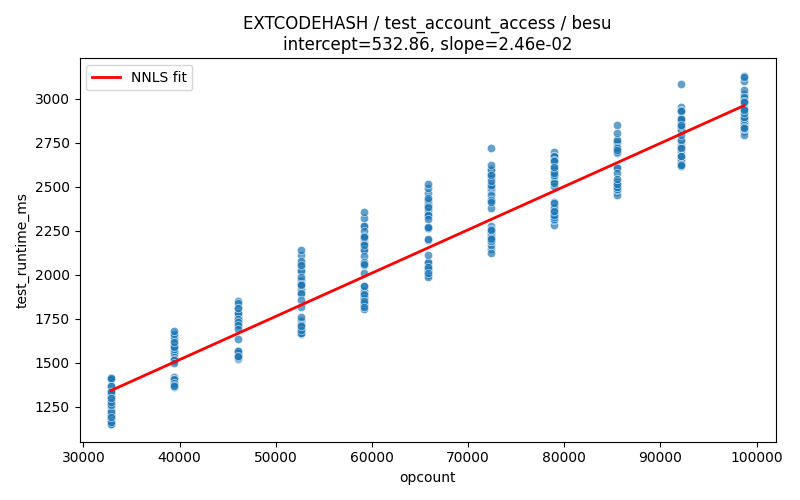

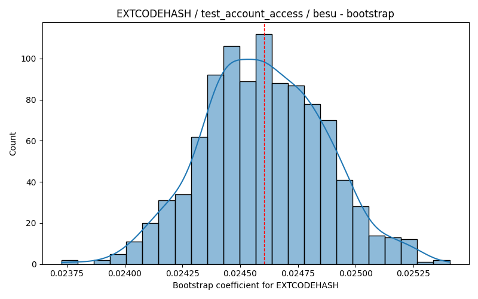

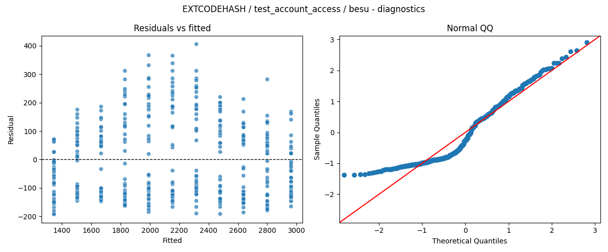

</details>

<details><summary>erigon — NNLS regression summary</summary>

```
==============================================================================
                           NNLS Regression Results                            
==============================================================================
Dep. Variable:          test_runtime_ms              R-squared:          0.938
Model:                  NNLS                    Adj. R-squared:          0.937
No. Observations:       44                                RMSE:         125.47
Df Residuals:           42                                 MAE:         107.89
Df Model:               1      
==============================================================================
                      coef     std err     P-value      [0.025      0.975]
------------------------------------------------------------------------------
         const    302.4658     64.2697       0.001    188.3135    434.7589
       opcount      0.0235      0.0009       0.001      0.0217      0.0250
==============================================================================
Notes: Non-negative least squares with bootstrap inference (1000 iterations)
==============================================================================
```

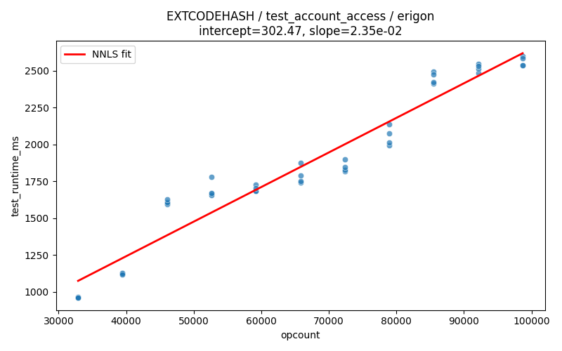

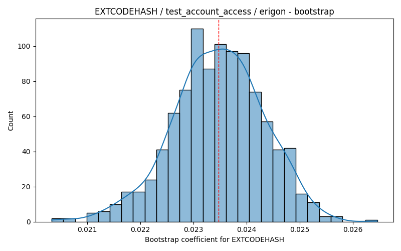

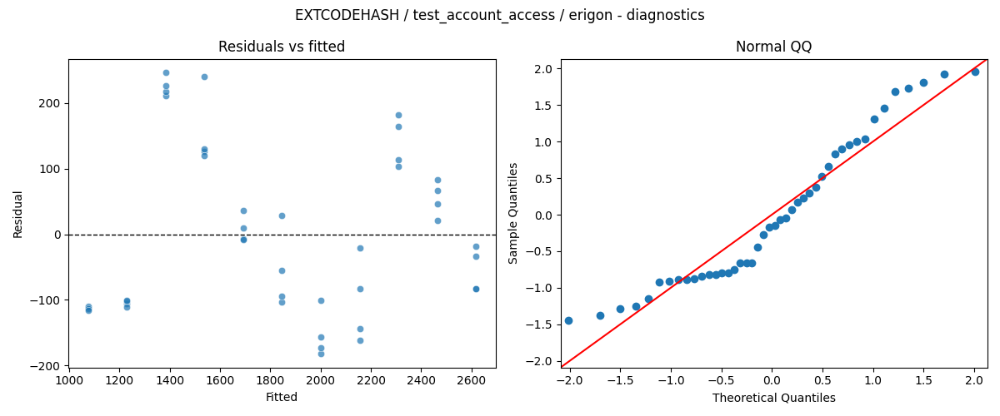

</details>

<details><summary>ethrex — NNLS regression summary</summary>

```
==============================================================================
                           NNLS Regression Results                            
==============================================================================
Dep. Variable:          test_runtime_ms              R-squared:          0.993
Model:                  NNLS                    Adj. R-squared:          0.993
No. Observations:       308                               RMSE:          13.82
Df Residuals:           306                                MAE:          10.98
Df Model:               1      
==============================================================================
                      coef     std err     P-value      [0.025      0.975]
------------------------------------------------------------------------------
         const     40.4932      2.2291       0.001     36.2472     44.8232
       opcount      0.0077      0.0000       0.001      0.0077      0.0078
==============================================================================
Notes: Non-negative least squares with bootstrap inference (1000 iterations)
==============================================================================
```

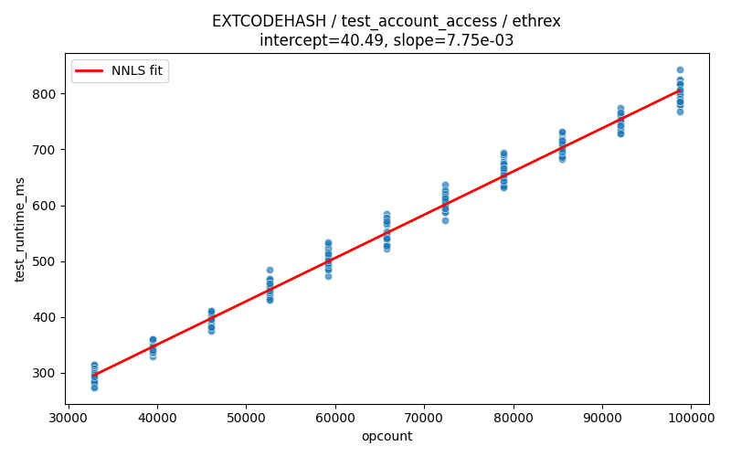

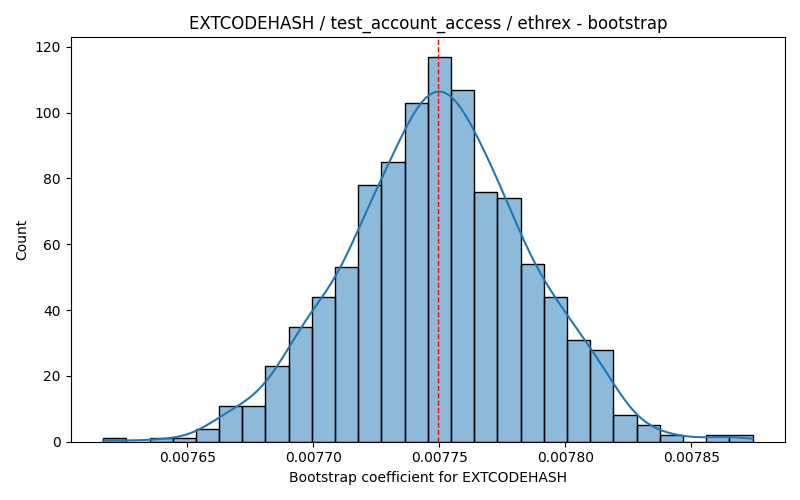

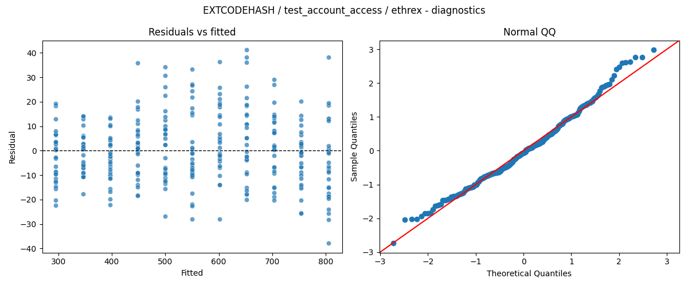

</details>

<details><summary>geth — NNLS regression summary</summary>

```
==============================================================================
                           NNLS Regression Results                            
==============================================================================
Dep. Variable:          test_runtime_ms              R-squared:          0.859
Model:                  NNLS                    Adj. R-squared:          0.858
No. Observations:       308                               RMSE:         193.33
Df Residuals:           306                                MAE:         163.43
Df Model:               1      
==============================================================================
                      coef     std err     P-value      [0.025      0.975]
------------------------------------------------------------------------------
         const    667.2352     41.3467       0.001    591.4646    750.9922
       opcount      0.0229      0.0006       0.001      0.0218      0.0240
==============================================================================
Notes: Non-negative least squares with bootstrap inference (1000 iterations)
==============================================================================
```

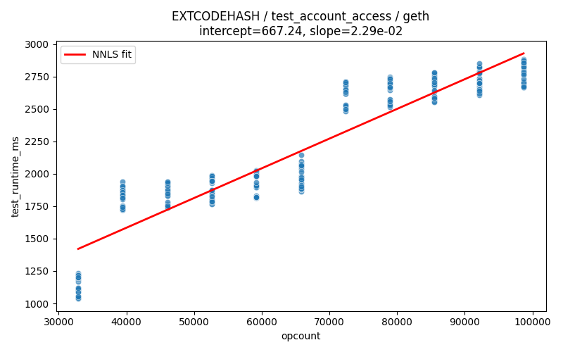

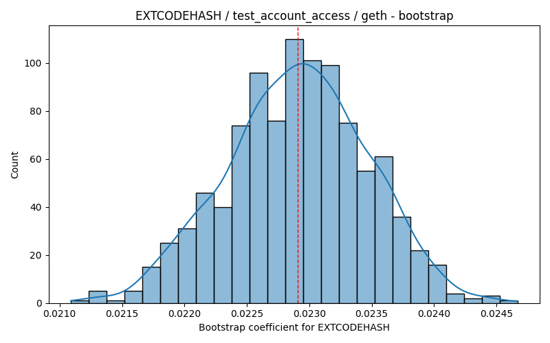

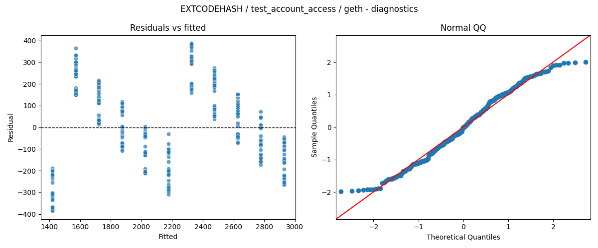

</details>

<details><summary>nethermind — NNLS regression summary</summary>

```
==============================================================================
                           NNLS Regression Results                            
==============================================================================
Dep. Variable:          test_runtime_ms              R-squared:          0.609
Model:                  NNLS                    Adj. R-squared:          0.608
No. Observations:       253                               RMSE:         235.82
Df Residuals:           251                                MAE:         171.22
Df Model:               1      
==============================================================================
                      coef     std err     P-value      [0.025      0.975]
------------------------------------------------------------------------------
         const     97.1868     40.5381       0.007     21.3371    177.0404
       opcount      0.0142      0.0007       0.001      0.0128      0.0155
==============================================================================
Notes: Non-negative least squares with bootstrap inference (1000 iterations)
==============================================================================
```

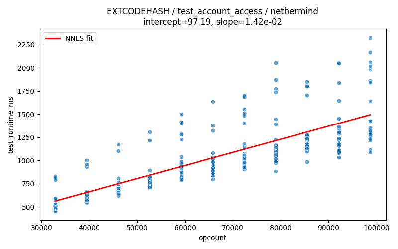

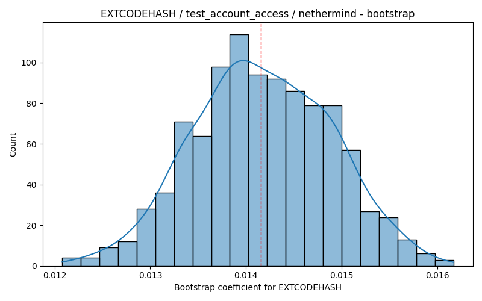

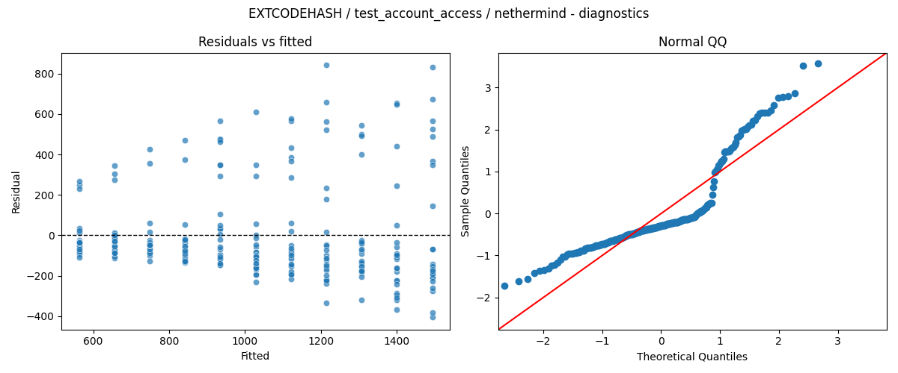

</details>

<details><summary>reth — NNLS regression summary</summary>

```
==============================================================================
                           NNLS Regression Results                            
==============================================================================
Dep. Variable:          test_runtime_ms              R-squared:          0.973
Model:                  NNLS                    Adj. R-squared:          0.973
No. Observations:       396                               RMSE:          13.59
Df Residuals:           394                                MAE:          10.91
Df Model:               1      
==============================================================================
                      coef     std err     P-value      [0.025      0.975]
------------------------------------------------------------------------------
         const    104.3552      2.1751       0.001    100.2912    108.8173
       opcount      0.0039      0.0000       0.001      0.0039      0.0040
==============================================================================
Notes: Non-negative least squares with bootstrap inference (1000 iterations)
==============================================================================
```

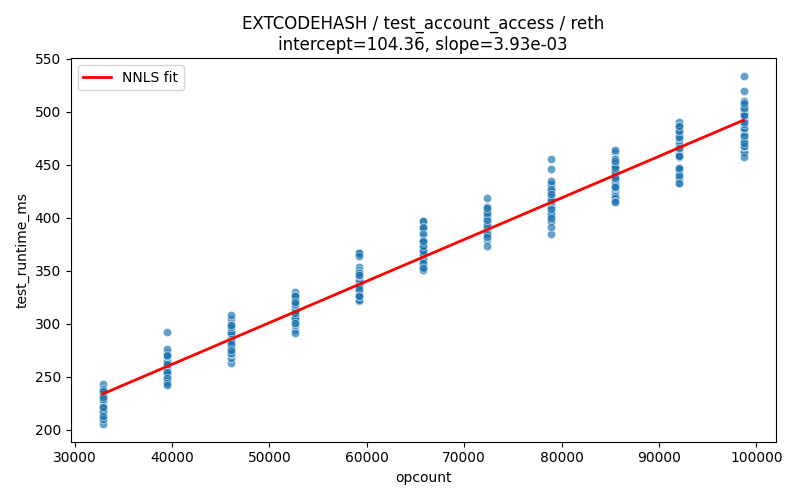

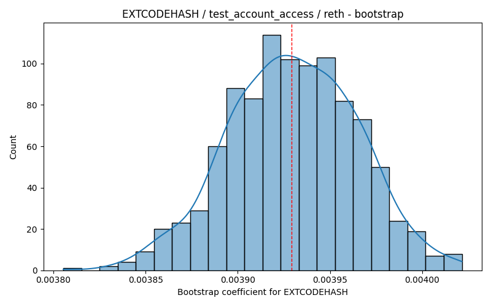

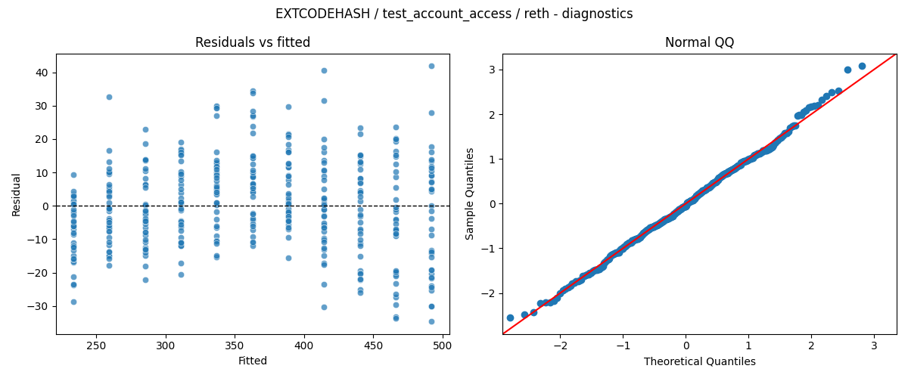

</details>

### test_account_access — combo `EXTCODEHASH_AccountMode.NON_EXISTING_ACCOUNT` — `presets[cold_account_code_access]`

| client | nobs | R² | target_coef (ms) | p-value | 95% CI |
| --- | --- | --- | --- | --- | --- |
| `besu` | 396 | 0.8485 | 0.01301 | 1.00e-03 | [0.01251, 0.01355] |
| `erigon` | 44 | 0.9883 | 0.008341 | 1.00e-03 | [0.008074, 0.008469] |
| `ethrex` | 308 | 0.9678 | 0.001986 | 1.00e-03 | [0.001945, 0.002025] |
| `geth` | 308 | 0.8632 | 0.02156 | 1.00e-03 | [0.02061, 0.02261] |
| `nethermind` | 253 | 0.837 | 0.003838 | 1.00e-03 | [0.003604, 0.00406] |
| `reth` | 396 | 0.8813 | 0.0007339 | 1.00e-03 | [0.000709, 0.0007616] |

<details><summary>besu — NNLS regression summary</summary>

```
==============================================================================
                           NNLS Regression Results                            
==============================================================================
Dep. Variable:          test_runtime_ms              R-squared:          0.848
Model:                  NNLS                    Adj. R-squared:          0.848
No. Observations:       396                               RMSE:         131.43
Df Residuals:           394                                MAE:         122.59
Df Model:               1      
==============================================================================
                      coef     std err     P-value      [0.025      0.975]
------------------------------------------------------------------------------
         const    485.9259     21.7555       0.001    444.9126    524.4430
       opcount      0.0130      0.0003       0.001      0.0125      0.0135
==============================================================================
Notes: Non-negative least squares with bootstrap inference (1000 iterations)
==============================================================================
```


</details>

<details><summary>erigon — NNLS regression summary</summary>

```
==============================================================================
                           NNLS Regression Results                            
==============================================================================
Dep. Variable:          test_runtime_ms              R-squared:          0.988
Model:                  NNLS                    Adj. R-squared:          0.988
No. Observations:       44                                RMSE:          21.71
Df Residuals:           42                                 MAE:          16.51
Df Model:               1      
==============================================================================
                      coef     std err     P-value      [0.025      0.975]
------------------------------------------------------------------------------
         const      6.1751      8.5122       0.302      0.0000     28.7344
       opcount      0.0083      0.0001       0.001      0.0081      0.0085
==============================================================================
Notes: Non-negative least squares with bootstrap inference (1000 iterations)
==============================================================================
```


</details>

<details><summary>ethrex — NNLS regression summary</summary>

```
==============================================================================
                           NNLS Regression Results                            
==============================================================================
Dep. Variable:          test_runtime_ms              R-squared:          0.968
Model:                  NNLS                    Adj. R-squared:          0.968
No. Observations:       308                               RMSE:           8.65
Df Residuals:           306                                MAE:           7.01
Df Model:               1      
==============================================================================
                      coef     std err     P-value      [0.025      0.975]
------------------------------------------------------------------------------
         const     27.0432      1.5977       0.001     24.0201     30.3021
       opcount      0.0020      0.0000       0.001      0.0019      0.0020
==============================================================================
Notes: Non-negative least squares with bootstrap inference (1000 iterations)
==============================================================================
```


</details>

<details><summary>geth — NNLS regression summary</summary>

```
==============================================================================
                           NNLS Regression Results                            
==============================================================================
Dep. Variable:          test_runtime_ms              R-squared:          0.863
Model:                  NNLS                    Adj. R-squared:          0.863
No. Observations:       308                               RMSE:         205.14
Df Residuals:           306                                MAE:         173.20
Df Model:               1      
==============================================================================
                      coef     std err     P-value      [0.025      0.975]
------------------------------------------------------------------------------
         const    691.9280     43.9283       0.001    606.3610    773.9516
       opcount      0.0216      0.0005       0.001      0.0206      0.0226
==============================================================================
Notes: Non-negative least squares with bootstrap inference (1000 iterations)
==============================================================================
```


</details>

<details><summary>nethermind — NNLS regression summary</summary>

```
==============================================================================
                           NNLS Regression Results                            
==============================================================================
Dep. Variable:          test_runtime_ms              R-squared:          0.837
Model:                  NNLS                    Adj. R-squared:          0.836
No. Observations:       253                               RMSE:          40.48
Df Residuals:           251                                MAE:          33.00
Df Model:               1      
==============================================================================
                      coef     std err     P-value      [0.025      0.975]
------------------------------------------------------------------------------
         const     68.2799      7.5266       0.001     54.5972     84.1633
       opcount      0.0038      0.0001       0.001      0.0036      0.0041
==============================================================================
Notes: Non-negative least squares with bootstrap inference (1000 iterations)
==============================================================================
```


</details>

<details><summary>reth — NNLS regression summary</summary>

```
==============================================================================
                           NNLS Regression Results                            
==============================================================================
Dep. Variable:          test_runtime_ms              R-squared:          0.881
Model:                  NNLS                    Adj. R-squared:          0.881
No. Observations:       396                               RMSE:           6.44
Df Residuals:           394                                MAE:           5.14
Df Model:               1      
==============================================================================
                      coef     std err     P-value      [0.025      0.975]
------------------------------------------------------------------------------
         const     48.6254      1.0398       0.001     46.5245     50.5630
       opcount      0.0007      0.0000       0.001      0.0007      0.0008
==============================================================================
Notes: Non-negative least squares with bootstrap inference (1000 iterations)
==============================================================================
```


</details>

### test_ext_account_query_warm — combo `EXTCODEHASH`

| client | nobs | R² | target_coef (ms) | p-value | 95% CI |
| --- | --- | --- | --- | --- | --- |
| `besu` | 396 | 0.2582 | 0.0002019 | 1.00e-03 | [0.0001662, 0.000234] |
| `erigon` | 44 | 0.9319 | 0.0003153 | 1.00e-03 | [0.000287, 0.0003333] |
| `ethrex` | 308 | 0.3252 | 1.529e-05 | 1.00e-03 | [1.298e-05, 1.759e-05] |
| `geth` | 308 | 0.7914 | 3.763e-05 | 1.00e-03 | [3.557e-05, 3.973e-05] |
| `nethermind` | 253 | 0.5904 | 0.0002283 | 1.00e-03 | [0.0002046, 0.0002504] |
| `reth` | 396 | 0.6402 | 1.334e-05 | 1.00e-03 | [1.233e-05, 1.441e-05] |

<details><summary>besu — NNLS regression summary</summary>

```
==============================================================================
                           NNLS Regression Results                            
==============================================================================
Dep. Variable:          test_runtime_ms              R-squared:          0.258
Model:                  NNLS                    Adj. R-squared:          0.256
No. Observations:       396                               RMSE:         200.14
Df Residuals:           394                                MAE:         166.09
Df Model:               1      
==============================================================================
                      coef     std err     P-value      [0.025      0.975]
------------------------------------------------------------------------------
         const    456.0099     32.7309       0.001    392.4799    522.0794
       opcount      0.0002      0.0000       0.001      0.0002      0.0002
==============================================================================
Notes: Non-negative least squares with bootstrap inference (1000 iterations)
==============================================================================
```

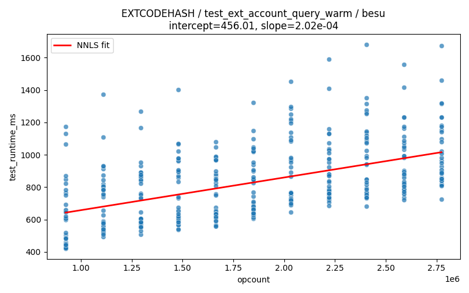

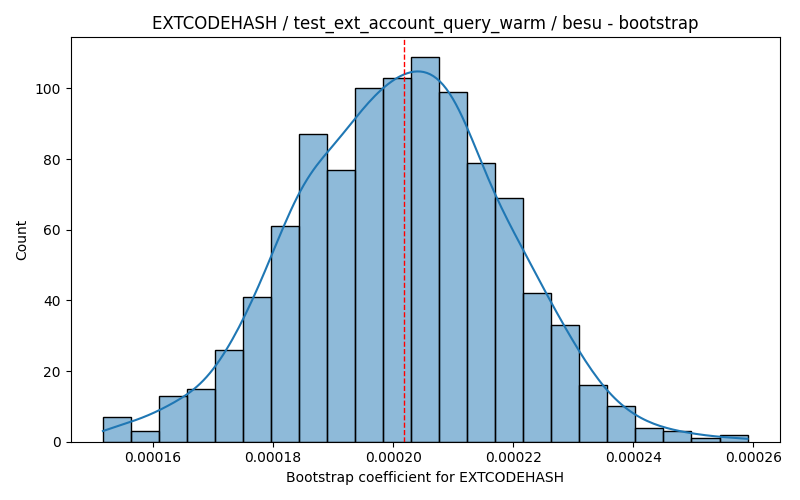

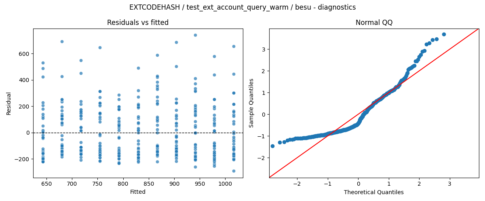

</details>

<details><summary>erigon — NNLS regression summary</summary>

```
==============================================================================
                           NNLS Regression Results                            
==============================================================================
Dep. Variable:          test_runtime_ms              R-squared:          0.932
Model:                  NNLS                    Adj. R-squared:          0.930
No. Observations:       44                                RMSE:          49.84
Df Residuals:           42                                 MAE:          33.12
Df Model:               1      
==============================================================================
                      coef     std err     P-value      [0.025      0.975]
------------------------------------------------------------------------------
         const     21.2261     20.2013       0.166      0.0000     69.8004
       opcount      0.0003      0.0000       0.001      0.0003      0.0003
==============================================================================
Notes: Non-negative least squares with bootstrap inference (1000 iterations)
==============================================================================
```

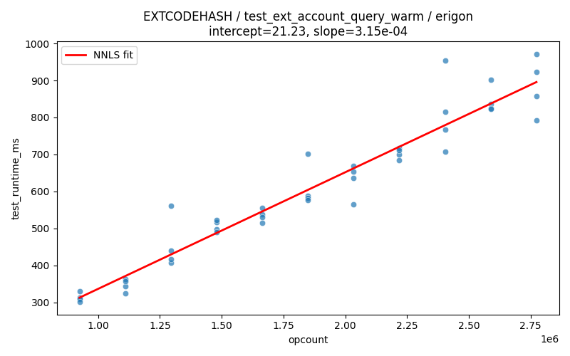

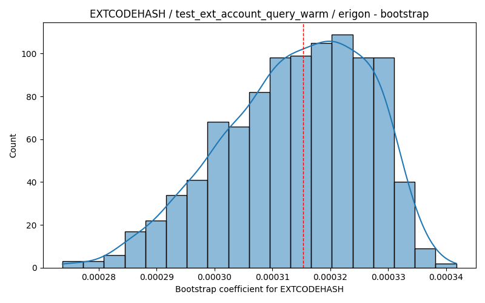

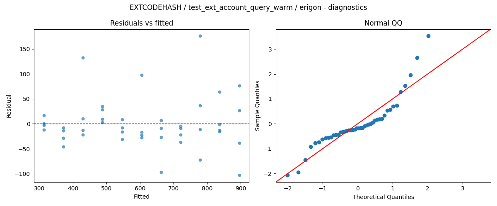

</details>

<details><summary>ethrex — NNLS regression summary</summary>

```
==============================================================================
                           NNLS Regression Results                            
==============================================================================
Dep. Variable:          test_runtime_ms              R-squared:          0.325
Model:                  NNLS                    Adj. R-squared:          0.323
No. Observations:       308                               RMSE:          12.88
Df Residuals:           306                                MAE:           8.32
Df Model:               1      
==============================================================================
                      coef     std err     P-value      [0.025      0.975]
------------------------------------------------------------------------------
         const     10.2987      2.1939       0.001      6.0917     14.8854
       opcount      0.0000      0.0000       0.001      0.0000      0.0000
==============================================================================
Notes: Non-negative least squares with bootstrap inference (1000 iterations)
==============================================================================
```

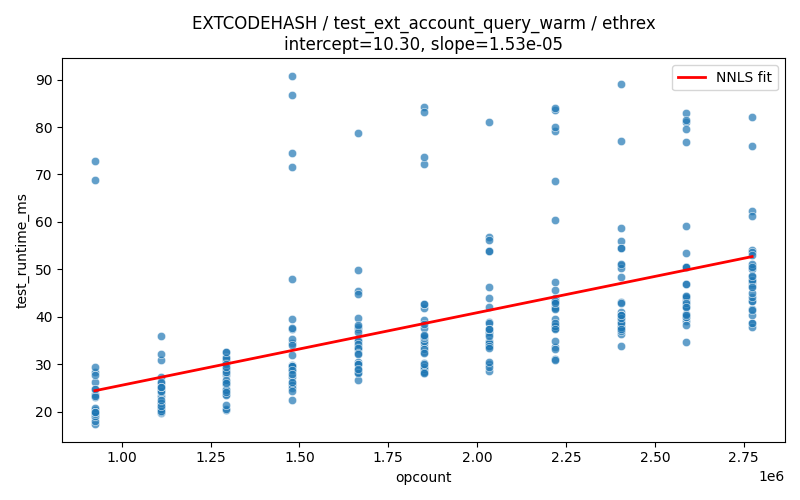

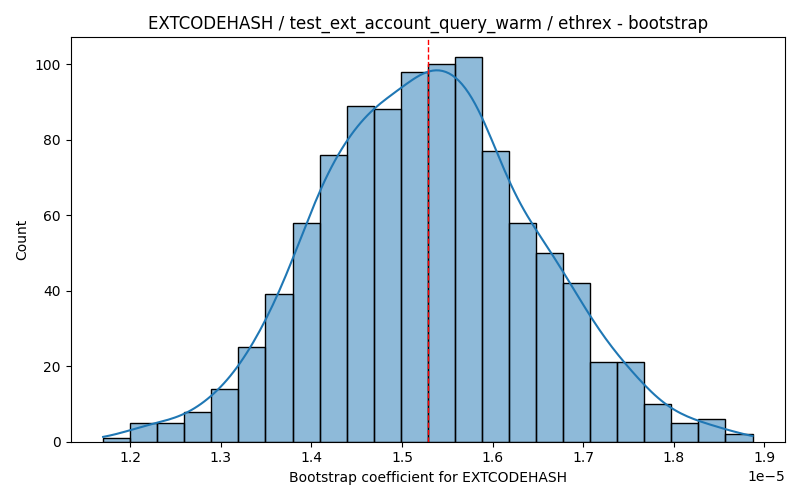

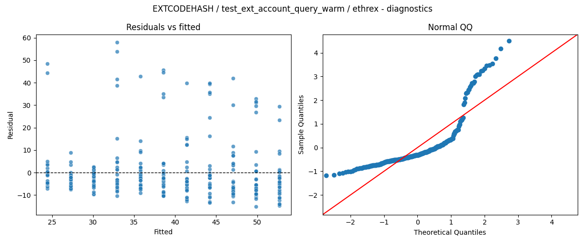

</details>

<details><summary>geth — NNLS regression summary</summary>

```
==============================================================================
                           NNLS Regression Results                            
==============================================================================
Dep. Variable:          test_runtime_ms              R-squared:          0.791
Model:                  NNLS                    Adj. R-squared:          0.791
No. Observations:       308                               RMSE:          11.30
Df Residuals:           306                                MAE:           8.80
Df Model:               1      
==============================================================================
                      coef     std err     P-value      [0.025      0.975]
------------------------------------------------------------------------------
         const     24.4102      1.8445       0.001     20.8150     28.0843
       opcount      0.0000      0.0000       0.001      0.0000      0.0000
==============================================================================
Notes: Non-negative least squares with bootstrap inference (1000 iterations)
==============================================================================
```

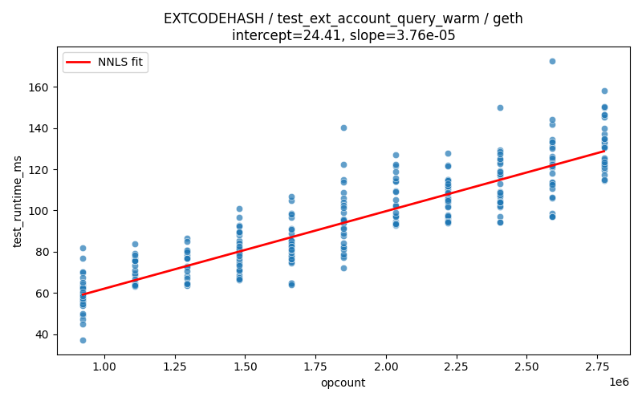

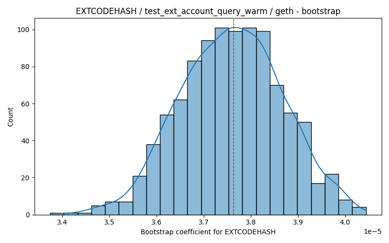

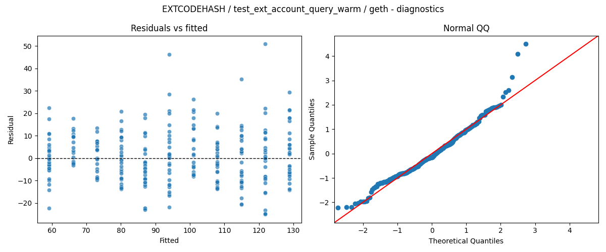

</details>

<details><summary>nethermind — NNLS regression summary</summary>

```
==============================================================================
                           NNLS Regression Results                            
==============================================================================
Dep. Variable:          test_runtime_ms              R-squared:          0.590
Model:                  NNLS                    Adj. R-squared:          0.589
No. Observations:       253                               RMSE:         111.20
Df Residuals:           251                                MAE:          89.94
Df Model:               1      
==============================================================================
                      coef     std err     P-value      [0.025      0.975]
------------------------------------------------------------------------------
         const    150.4545     19.4810       0.001    114.7952    189.0528
       opcount      0.0002      0.0000       0.001      0.0002      0.0003
==============================================================================
Notes: Non-negative least squares with bootstrap inference (1000 iterations)
==============================================================================
```

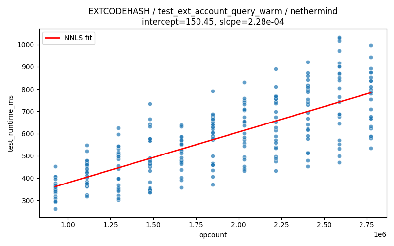

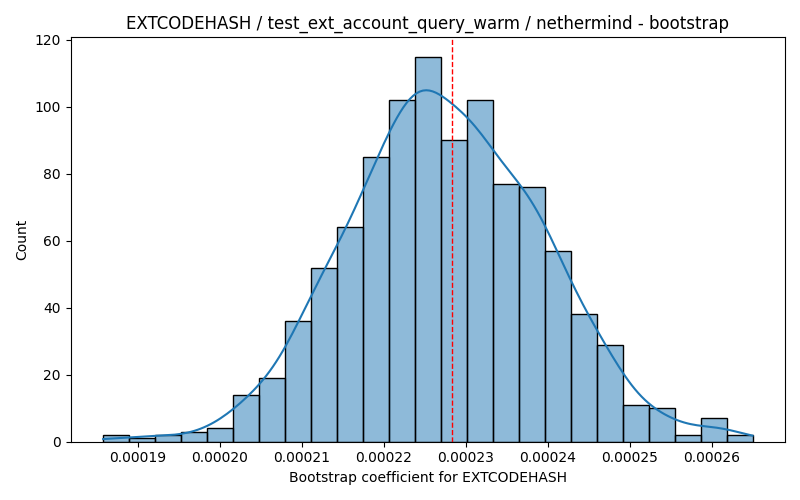

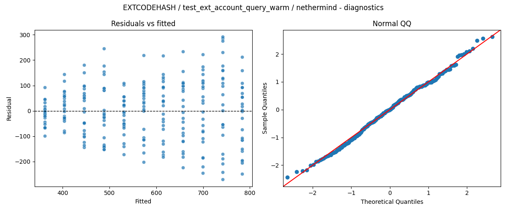

</details>

<details><summary>reth — NNLS regression summary</summary>

```
==============================================================================
                           NNLS Regression Results                            
==============================================================================
Dep. Variable:          test_runtime_ms              R-squared:          0.640
Model:                  NNLS                    Adj. R-squared:          0.639
No. Observations:       396                               RMSE:           5.85
Df Residuals:           394                                MAE:           4.30
Df Model:               1      
==============================================================================
                      coef     std err     P-value      [0.025      0.975]
------------------------------------------------------------------------------
         const      9.6130      0.9538       0.001      7.6464     11.3904
       opcount      0.0000      0.0000       0.001      0.0000      0.0000
==============================================================================
Notes: Non-negative least squares with bootstrap inference (1000 iterations)
==============================================================================
```

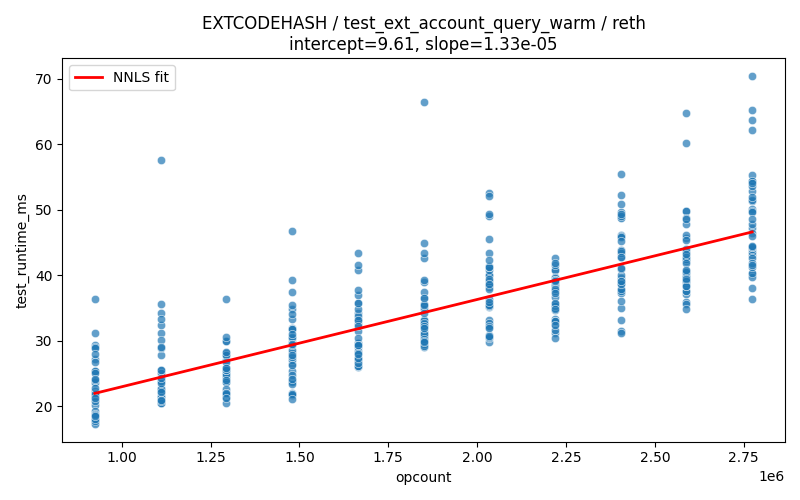

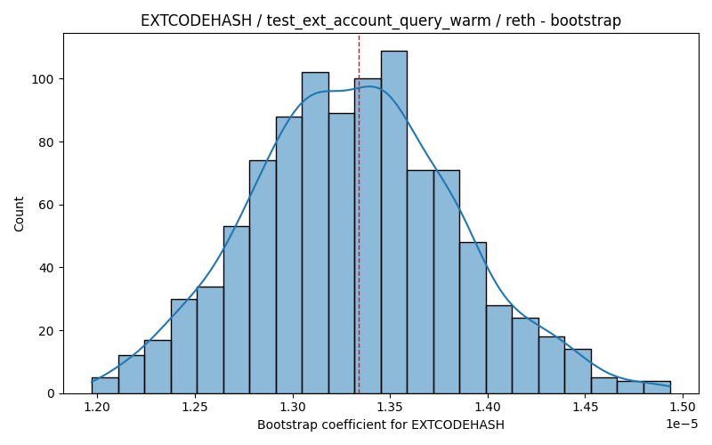

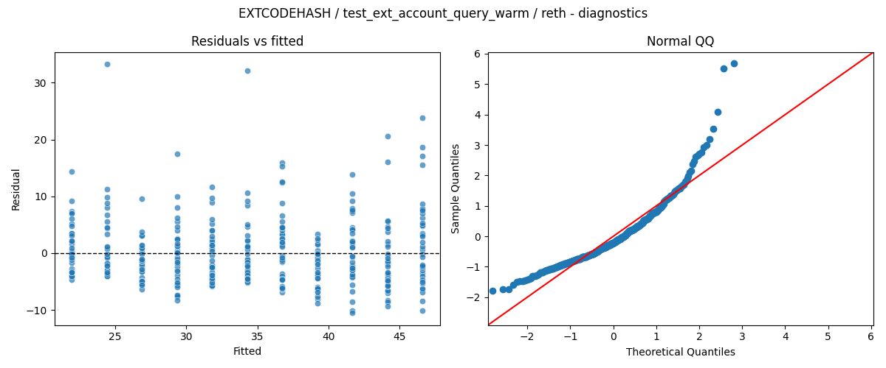

</details>

## EXTCODESIZE

### test_account_access — combo `EXTCODESIZE_AccountMode.NON_EXISTING_ACCOUNT` — `presets[cold_account_nocode_access]`

| client | nobs | R² | target_coef (ms) | p-value | 95% CI |
| --- | --- | --- | --- | --- | --- |
| `besu` | 396 | 0.8477 | 0.01296 | 1.00e-03 | [0.01239, 0.01354] |
| `erigon` | 44 | 0.9941 | 0.008566 | 1.00e-03 | [0.008505, 0.008637] |
| `ethrex` | 308 | 0.9648 | 0.001964 | 1.00e-03 | [0.001921, 0.002006] |
| `geth` | 308 | 0.8637 | 0.02158 | 1.00e-03 | [0.02068, 0.02262] |
| `nethermind` | 253 | 0.8447 | 0.003773 | 1.00e-03 | [0.003561, 0.003992] |
| `reth` | 396 | 0.8631 | 0.0007083 | 1.00e-03 | [0.0006787, 0.0007358] |

<details><summary>besu — NNLS regression summary</summary>

```
==============================================================================
                           NNLS Regression Results                            
==============================================================================
Dep. Variable:          test_runtime_ms              R-squared:          0.848
Model:                  NNLS                    Adj. R-squared:          0.847
No. Observations:       396                               RMSE:         131.29
Df Residuals:           394                                MAE:         121.31
Df Model:               1      
==============================================================================
                      coef     std err     P-value      [0.025      0.975]
------------------------------------------------------------------------------
         const    486.1677     22.0971       0.001    443.4689    528.5999
       opcount      0.0130      0.0003       0.001      0.0124      0.0135
==============================================================================
Notes: Non-negative least squares with bootstrap inference (1000 iterations)
==============================================================================
```

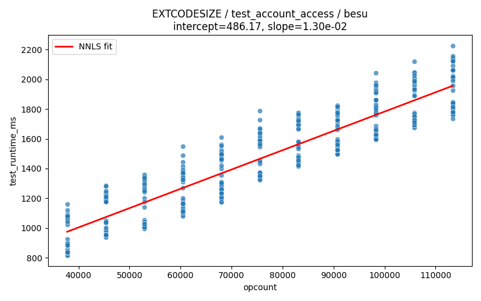

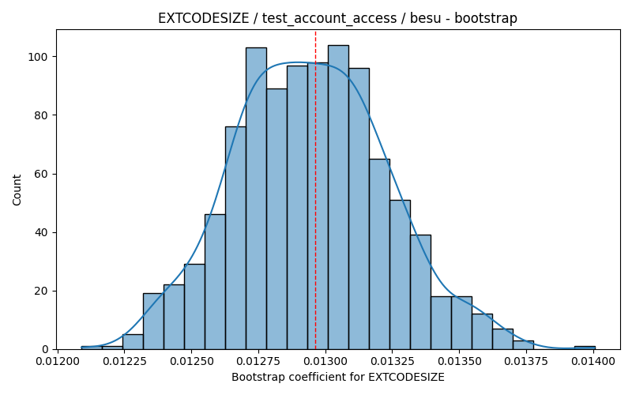

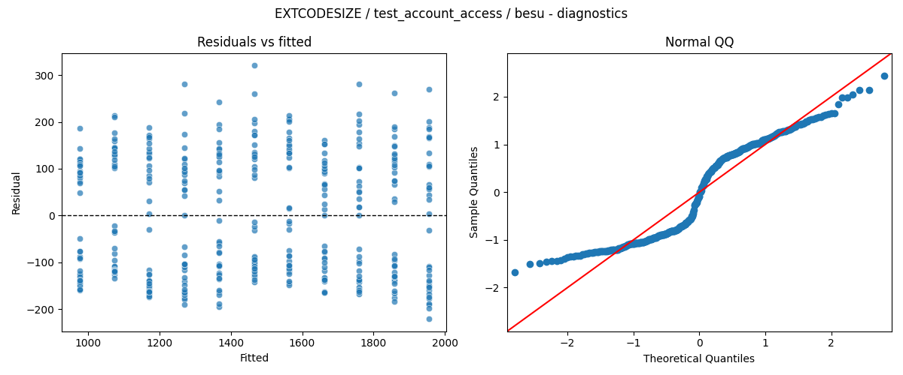

</details>

<details><summary>erigon — NNLS regression summary</summary>

```
==============================================================================
                           NNLS Regression Results                            
==============================================================================
Dep. Variable:          test_runtime_ms              R-squared:          0.994
Model:                  NNLS                    Adj. R-squared:          0.994
No. Observations:       44                                RMSE:          15.91
Df Residuals:           42                                 MAE:          10.74
Df Model:               1      
==============================================================================
                      coef     std err     P-value      [0.025      0.975]
------------------------------------------------------------------------------
         const      0.0000      0.3560       1.000      0.0000      0.0000
       opcount      0.0086      0.0000       0.001      0.0085      0.0086
==============================================================================
Notes: Non-negative least squares with bootstrap inference (1000 iterations)
==============================================================================
```


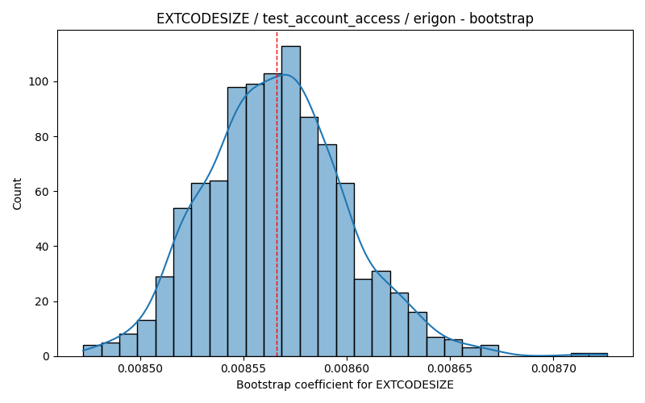

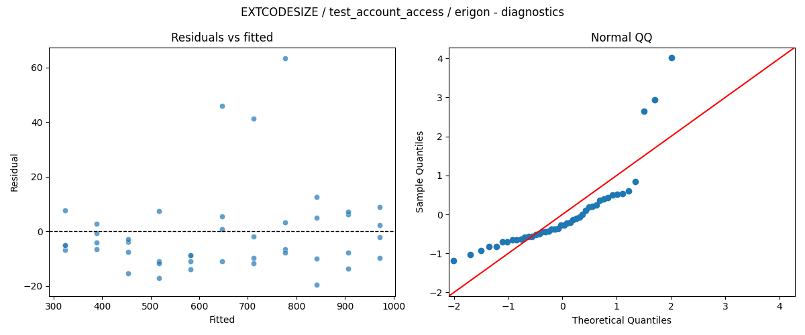

</details>

<details><summary>ethrex — NNLS regression summary</summary>

```
==============================================================================
                           NNLS Regression Results                            
==============================================================================
Dep. Variable:          test_runtime_ms              R-squared:          0.965
Model:                  NNLS                    Adj. R-squared:          0.965
No. Observations:       308                               RMSE:           8.97
Df Residuals:           306                                MAE:           7.05
Df Model:               1      
==============================================================================
                      coef     std err     P-value      [0.025      0.975]
------------------------------------------------------------------------------
         const     28.5120      1.7014       0.001     25.2359     31.9409
       opcount      0.0020      0.0000       0.001      0.0019      0.0020
==============================================================================
Notes: Non-negative least squares with bootstrap inference (1000 iterations)
==============================================================================
```

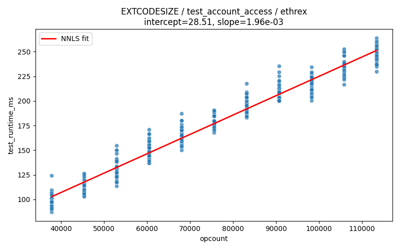

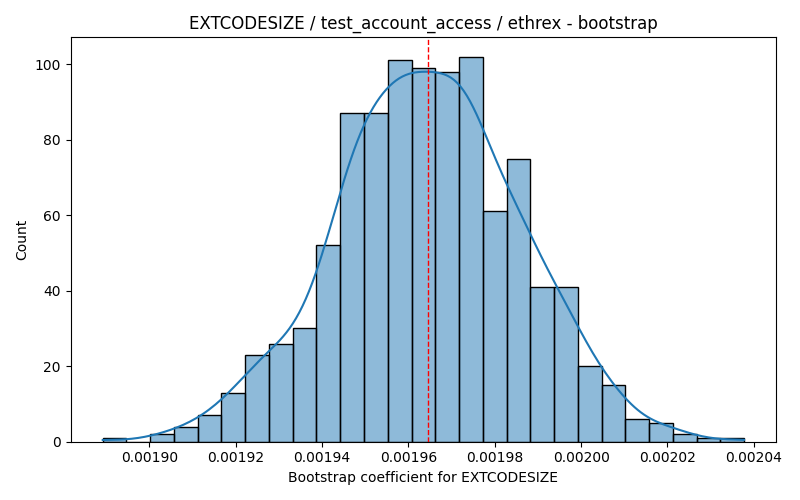

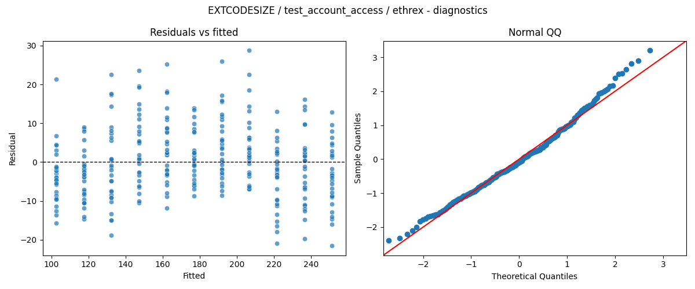

</details>

<details><summary>geth — NNLS regression summary</summary>

```
==============================================================================
                           NNLS Regression Results                            
==============================================================================
Dep. Variable:          test_runtime_ms              R-squared:          0.864
Model:                  NNLS                    Adj. R-squared:          0.863
No. Observations:       308                               RMSE:         204.93
Df Residuals:           306                                MAE:         172.77
Df Model:               1      
==============================================================================
                      coef     std err     P-value      [0.025      0.975]
------------------------------------------------------------------------------
         const    694.8173     44.6962       0.001    598.9776    776.0149
       opcount      0.0216      0.0005       0.001      0.0207      0.0226
==============================================================================
Notes: Non-negative least squares with bootstrap inference (1000 iterations)
==============================================================================
```


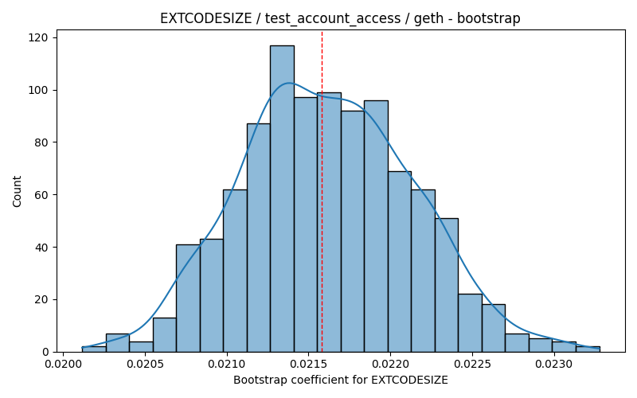

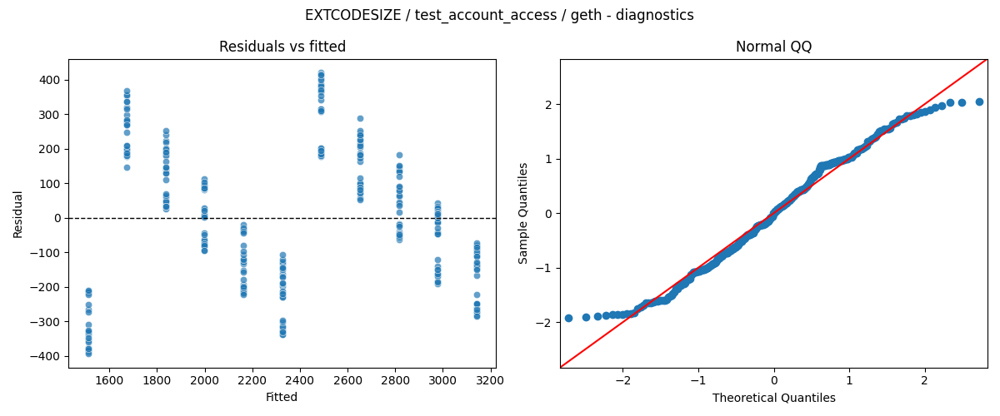

</details>

<details><summary>nethermind — NNLS regression summary</summary>

```
==============================================================================
                           NNLS Regression Results                            
==============================================================================
Dep. Variable:          test_runtime_ms              R-squared:          0.845
Model:                  NNLS                    Adj. R-squared:          0.844
No. Observations:       253                               RMSE:          38.67
Df Residuals:           251                                MAE:          29.69
Df Model:               1      
==============================================================================
                      coef     std err     P-value      [0.025      0.975]
------------------------------------------------------------------------------
         const     70.3913      7.8017       0.001     54.8373     86.3863
       opcount      0.0038      0.0001       0.001      0.0036      0.0040
==============================================================================
Notes: Non-negative least squares with bootstrap inference (1000 iterations)
==============================================================================
```

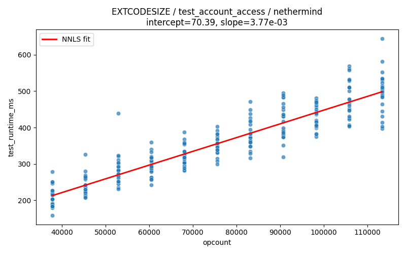

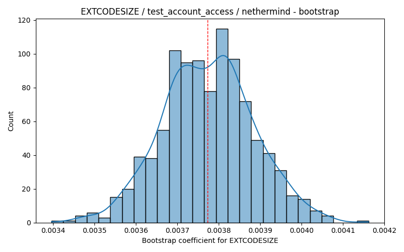

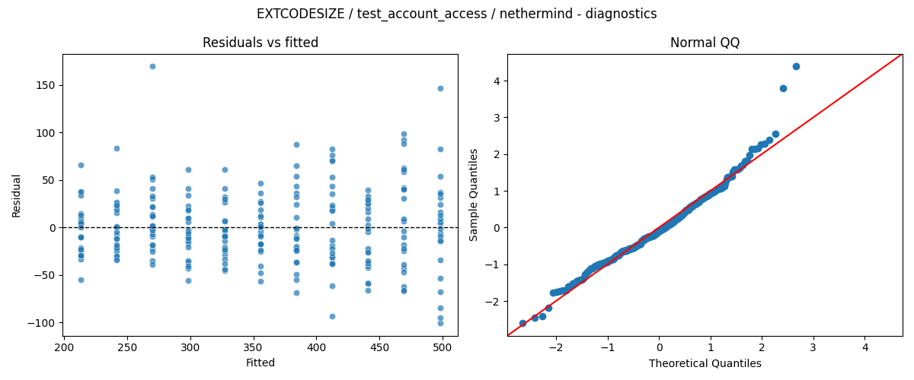

</details>

<details><summary>reth — NNLS regression summary</summary>

```
==============================================================================
                           NNLS Regression Results                            
==============================================================================
Dep. Variable:          test_runtime_ms              R-squared:          0.863
Model:                  NNLS                    Adj. R-squared:          0.863
No. Observations:       396                               RMSE:           6.74
Df Residuals:           394                                MAE:           5.21
Df Model:               1      
==============================================================================
                      coef     std err     P-value      [0.025      0.975]
------------------------------------------------------------------------------
         const     50.4960      1.1056       0.001     48.4466     52.5841
       opcount      0.0007      0.0000       0.001      0.0007      0.0007
==============================================================================
Notes: Non-negative least squares with bootstrap inference (1000 iterations)
==============================================================================
```

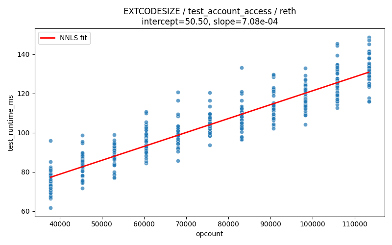

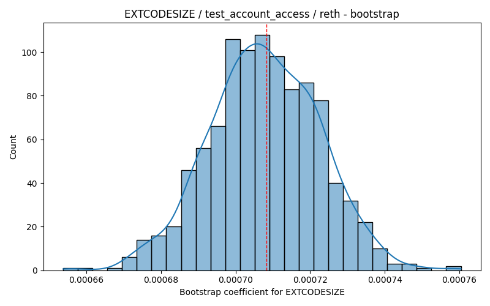

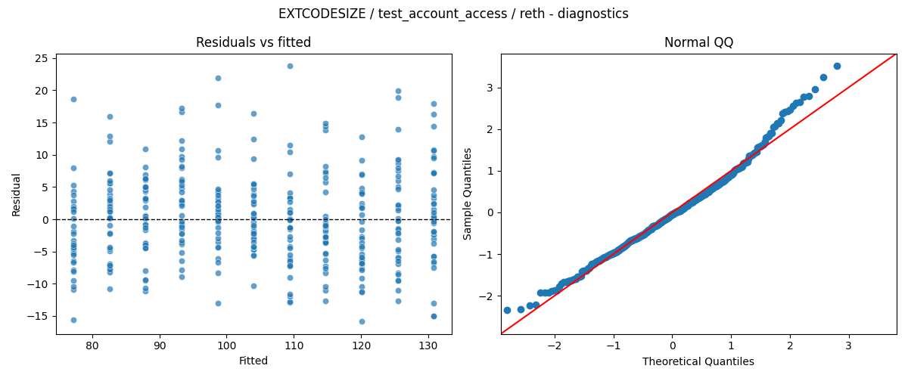

</details>

### test_account_access — combo `EXTCODESIZE_AccountMode.EXISTING_CONTRACT`

| client | nobs | R² | target_coef (ms) | p-value | 95% CI |
| --- | --- | --- | --- | --- | --- |
| `besu` | 396 | 0.933 | 0.02484 | 1.00e-03 | [0.02427, 0.02538] |
| `erigon` | 44 | 0.9106 | 0.04765 | 1.00e-03 | [0.04305, 0.05143] |
| `ethrex` | 308 | 0.9931 | 0.007701 | 1.00e-03 | [0.007632, 0.007773] |
| `geth` | 308 | 0.8597 | 0.02299 | 1.00e-03 | [0.02187, 0.0241] |
| `nethermind` | 253 | 0.5801 | 0.01277 | 1.00e-03 | [0.01141, 0.01419] |
| `reth` | 396 | 0.9747 | 0.003996 | 1.00e-03 | [0.003932, 0.004061] |

<details><summary>besu — NNLS regression summary</summary>

```
==============================================================================
                           NNLS Regression Results                            
==============================================================================
Dep. Variable:          test_runtime_ms              R-squared:          0.933
Model:                  NNLS                    Adj. R-squared:          0.933
No. Observations:       396                               RMSE:         138.48
Df Residuals:           394                                MAE:         122.10
Df Model:               1      
==============================================================================
                      coef     std err     P-value      [0.025      0.975]
------------------------------------------------------------------------------
         const    518.5494     19.7826       0.001    480.8799    556.8313
       opcount      0.0248      0.0003       0.001      0.0243      0.0254
==============================================================================
Notes: Non-negative least squares with bootstrap inference (1000 iterations)
==============================================================================
```

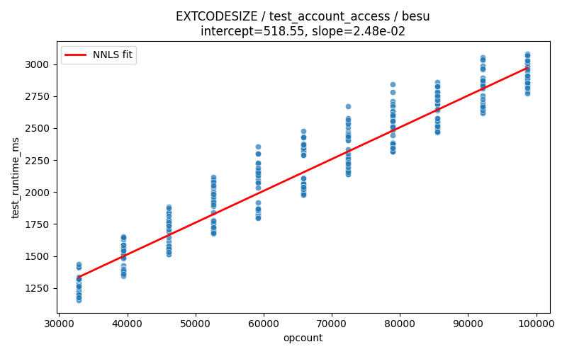

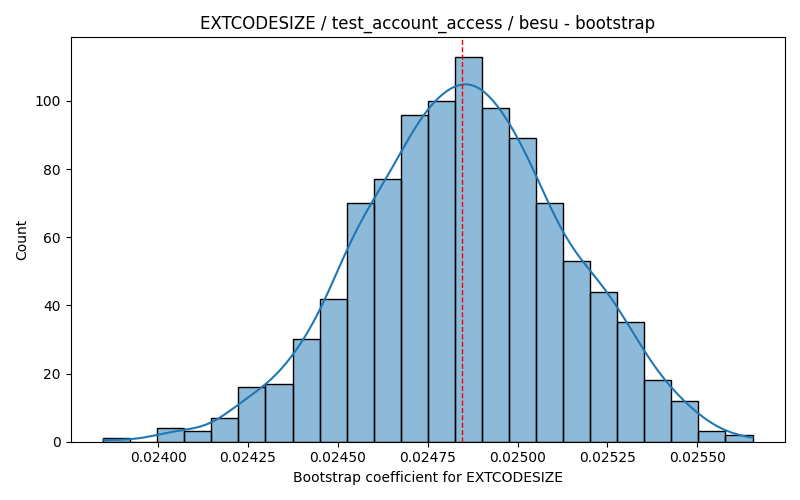

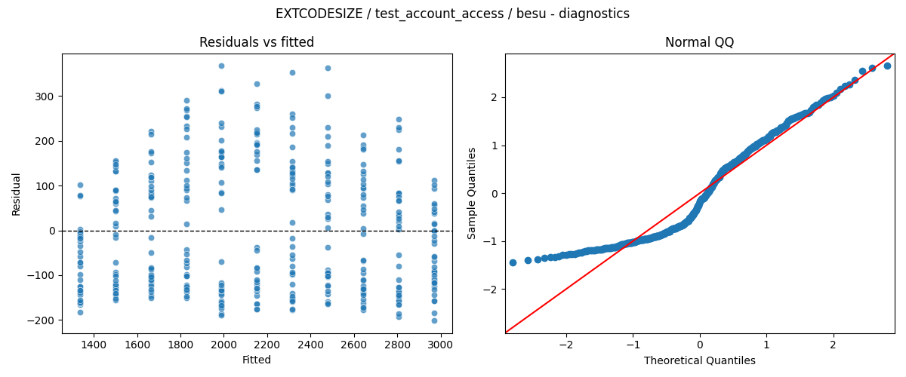

</details>

<details><summary>erigon — NNLS regression summary</summary>

```
==============================================================================
                           NNLS Regression Results                            
==============================================================================
Dep. Variable:          test_runtime_ms              R-squared:          0.911
Model:                  NNLS                    Adj. R-squared:          0.908
No. Observations:       44                                RMSE:         310.66
Df Residuals:           42                                 MAE:         278.47
Df Model:               1      
==============================================================================
                      coef     std err     P-value      [0.025      0.975]
------------------------------------------------------------------------------
         const    841.5261    166.2143       0.001    553.7500   1194.9803
       opcount      0.0477      0.0022       0.001      0.0431      0.0514
==============================================================================
Notes: Non-negative least squares with bootstrap inference (1000 iterations)
==============================================================================
```

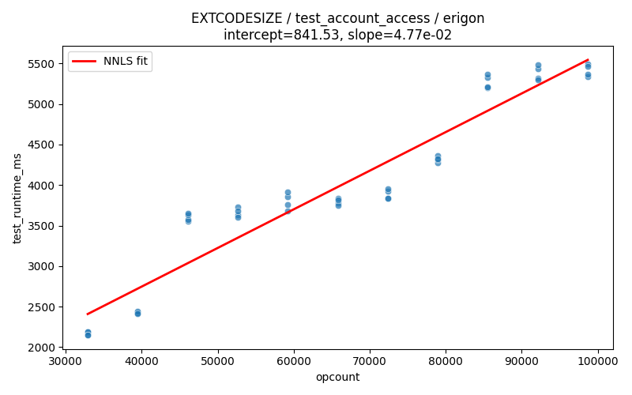

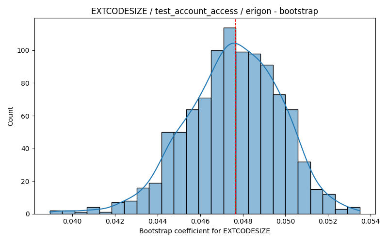

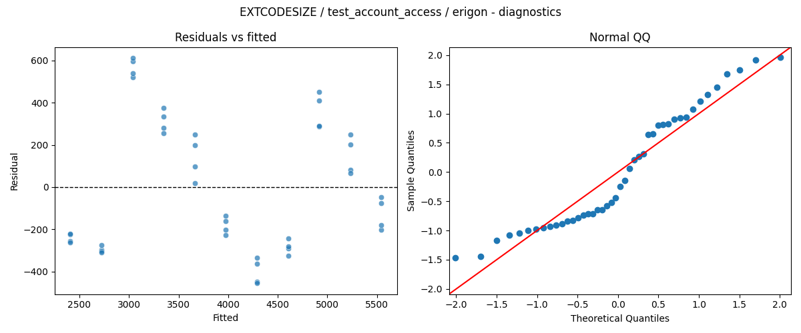

</details>

<details><summary>ethrex — NNLS regression summary</summary>

```
==============================================================================
                           NNLS Regression Results                            
==============================================================================
Dep. Variable:          test_runtime_ms              R-squared:          0.993
Model:                  NNLS                    Adj. R-squared:          0.993
No. Observations:       308                               RMSE:          13.39
Df Residuals:           306                                MAE:          10.84
Df Model:               1      
==============================================================================
                      coef     std err     P-value      [0.025      0.975]
------------------------------------------------------------------------------
         const     43.3249      2.5007       0.001     38.5454     48.0852
       opcount      0.0077      0.0000       0.001      0.0076      0.0078
==============================================================================
Notes: Non-negative least squares with bootstrap inference (1000 iterations)
==============================================================================
```

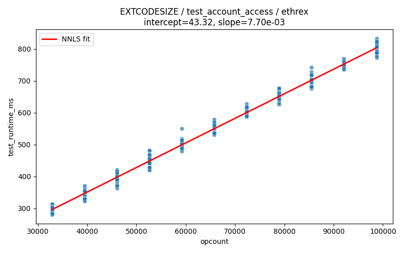

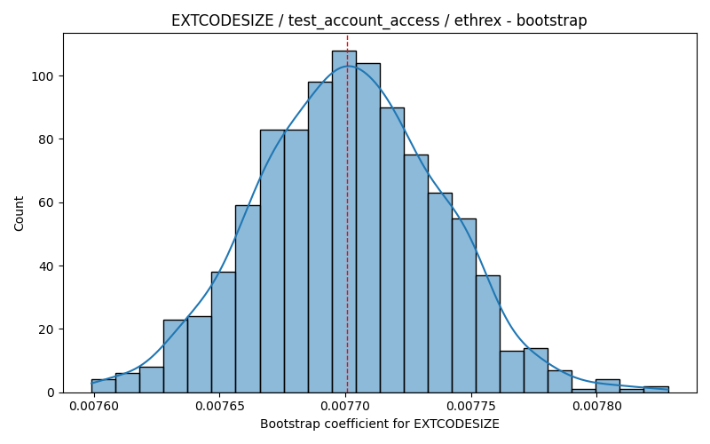

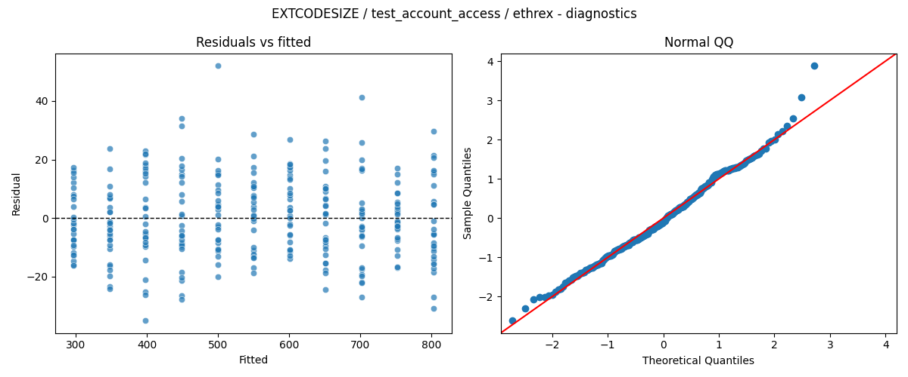

</details>

<details><summary>geth — NNLS regression summary</summary>

```
==============================================================================
                           NNLS Regression Results                            
==============================================================================
Dep. Variable:          test_runtime_ms              R-squared:          0.860
Model:                  NNLS                    Adj. R-squared:          0.859
No. Observations:       308                               RMSE:         193.24
Df Residuals:           306                                MAE:         161.88
Df Model:               1      
==============================================================================
                      coef     std err     P-value      [0.025      0.975]
------------------------------------------------------------------------------
         const    666.7364     42.8235       0.001    584.9283    752.5562
       opcount      0.0230      0.0006       0.001      0.0219      0.0241
==============================================================================
Notes: Non-negative least squares with bootstrap inference (1000 iterations)
==============================================================================
```


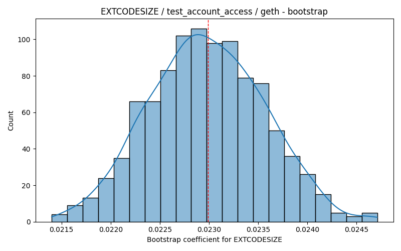

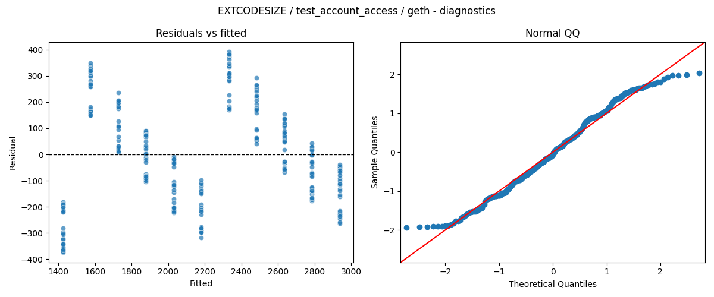

</details>

<details><summary>nethermind — NNLS regression summary</summary>

```
==============================================================================
                           NNLS Regression Results                            
==============================================================================
Dep. Variable:          test_runtime_ms              R-squared:          0.580
Model:                  NNLS                    Adj. R-squared:          0.578
No. Observations:       253                               RMSE:         226.01
Df Residuals:           251                                MAE:         159.95
Df Model:               1      
==============================================================================
                      coef     std err     P-value      [0.025      0.975]
------------------------------------------------------------------------------
         const    162.1940     43.2605       0.001     76.6275    243.7292
       opcount      0.0128      0.0007       0.001      0.0114      0.0142
==============================================================================
Notes: Non-negative least squares with bootstrap inference (1000 iterations)
==============================================================================
```

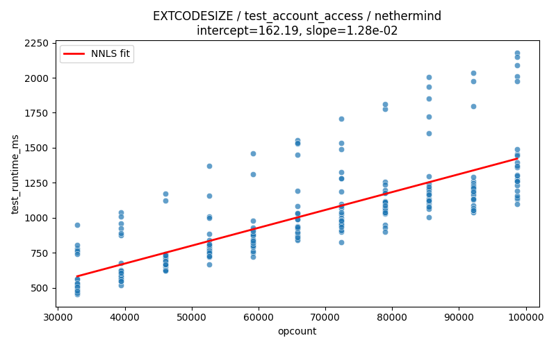

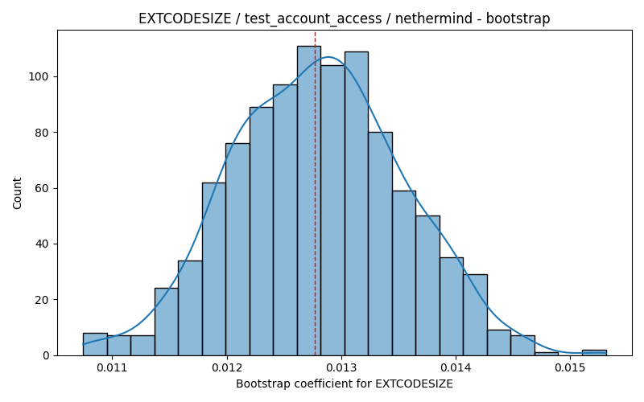

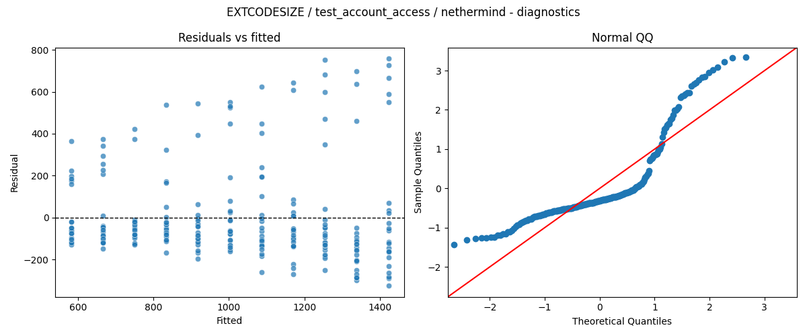

</details>

<details><summary>reth — NNLS regression summary</summary>

```
==============================================================================
                           NNLS Regression Results                            
==============================================================================
Dep. Variable:          test_runtime_ms              R-squared:          0.975
Model:                  NNLS                    Adj. R-squared:          0.975
No. Observations:       396                               RMSE:          13.40
Df Residuals:           394                                MAE:          10.67
Df Model:               1      
==============================================================================
                      coef     std err     P-value      [0.025      0.975]
------------------------------------------------------------------------------
         const    100.1743      2.1337       0.001     95.7645    104.3124
       opcount      0.0040      0.0000       0.001      0.0039      0.0041
==============================================================================
Notes: Non-negative least squares with bootstrap inference (1000 iterations)
==============================================================================
```

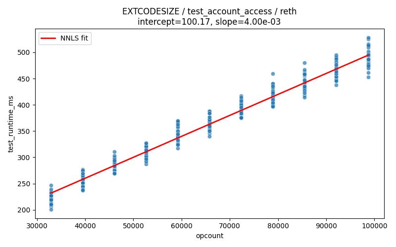

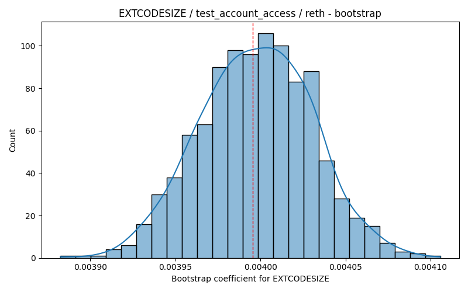

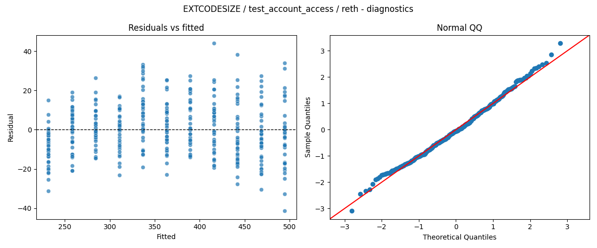

</details>

### test_account_access — combo `EXTCODESIZE_AccountMode.NON_EXISTING_ACCOUNT` — `presets[cold_account_code_access]`

| client | nobs | R² | target_coef (ms) | p-value | 95% CI |
| --- | --- | --- | --- | --- | --- |
| `besu` | 396 | 0.8477 | 0.01296 | 1.00e-03 | [0.01239, 0.01354] |
| `erigon` | 44 | 0.9941 | 0.008566 | 1.00e-03 | [0.008505, 0.008637] |
| `ethrex` | 308 | 0.9648 | 0.001964 | 1.00e-03 | [0.001921, 0.002006] |
| `geth` | 308 | 0.8637 | 0.02158 | 1.00e-03 | [0.02068, 0.02262] |
| `nethermind` | 253 | 0.8447 | 0.003773 | 1.00e-03 | [0.003561, 0.003992] |
| `reth` | 396 | 0.8631 | 0.0007083 | 1.00e-03 | [0.0006787, 0.0007358] |

<details><summary>besu — NNLS regression summary</summary>

```
==============================================================================
                           NNLS Regression Results                            
==============================================================================
Dep. Variable:          test_runtime_ms              R-squared:          0.848
Model:                  NNLS                    Adj. R-squared:          0.847
No. Observations:       396                               RMSE:         131.29
Df Residuals:           394                                MAE:         121.31
Df Model:               1      
==============================================================================
                      coef     std err     P-value      [0.025      0.975]
------------------------------------------------------------------------------
         const    486.1677     22.0971       0.001    443.4689    528.5999
       opcount      0.0130      0.0003       0.001      0.0124      0.0135
==============================================================================
Notes: Non-negative least squares with bootstrap inference (1000 iterations)
==============================================================================
```


</details>

<details><summary>erigon — NNLS regression summary</summary>

```
==============================================================================
                           NNLS Regression Results                            
==============================================================================
Dep. Variable:          test_runtime_ms              R-squared:          0.994
Model:                  NNLS                    Adj. R-squared:          0.994
No. Observations:       44                                RMSE:          15.91
Df Residuals:           42                                 MAE:          10.74
Df Model:               1      
==============================================================================
                      coef     std err     P-value      [0.025      0.975]
------------------------------------------------------------------------------
         const      0.0000      0.3560       1.000      0.0000      0.0000
       opcount      0.0086      0.0000       0.001      0.0085      0.0086
==============================================================================
Notes: Non-negative least squares with bootstrap inference (1000 iterations)
==============================================================================
```


</details>

<details><summary>ethrex — NNLS regression summary</summary>

```
==============================================================================
                           NNLS Regression Results                            
==============================================================================
Dep. Variable:          test_runtime_ms              R-squared:          0.965
Model:                  NNLS                    Adj. R-squared:          0.965
No. Observations:       308                               RMSE:           8.97
Df Residuals:           306                                MAE:           7.05
Df Model:               1      
==============================================================================
                      coef     std err     P-value      [0.025      0.975]
------------------------------------------------------------------------------
         const     28.5120      1.7014       0.001     25.2359     31.9409
       opcount      0.0020      0.0000       0.001      0.0019      0.0020
==============================================================================
Notes: Non-negative least squares with bootstrap inference (1000 iterations)
==============================================================================
```


</details>

<details><summary>geth — NNLS regression summary</summary>

```
==============================================================================
                           NNLS Regression Results                            
==============================================================================
Dep. Variable:          test_runtime_ms              R-squared:          0.864
Model:                  NNLS                    Adj. R-squared:          0.863
No. Observations:       308                               RMSE:         204.93
Df Residuals:           306                                MAE:         172.77
Df Model:               1      
==============================================================================
                      coef     std err     P-value      [0.025      0.975]
------------------------------------------------------------------------------
         const    694.8173     44.6962       0.001    598.9776    776.0149
       opcount      0.0216      0.0005       0.001      0.0207      0.0226
==============================================================================
Notes: Non-negative least squares with bootstrap inference (1000 iterations)
==============================================================================
```


</details>

<details><summary>nethermind — NNLS regression summary</summary>

```
==============================================================================
                           NNLS Regression Results                            
==============================================================================
Dep. Variable:          test_runtime_ms              R-squared:          0.845
Model:                  NNLS                    Adj. R-squared:          0.844
No. Observations:       253                               RMSE:          38.67
Df Residuals:           251                                MAE:          29.69
Df Model:               1      
==============================================================================
                      coef     std err     P-value      [0.025      0.975]
------------------------------------------------------------------------------
         const     70.3913      7.8017       0.001     54.8373     86.3863
       opcount      0.0038      0.0001       0.001      0.0036      0.0040
==============================================================================
Notes: Non-negative least squares with bootstrap inference (1000 iterations)
==============================================================================
```


</details>

<details><summary>reth — NNLS regression summary</summary>

```
==============================================================================
                           NNLS Regression Results                            
==============================================================================
Dep. Variable:          test_runtime_ms              R-squared:          0.863
Model:                  NNLS                    Adj. R-squared:          0.863
No. Observations:       396                               RMSE:           6.74
Df Residuals:           394                                MAE:           5.21
Df Model:               1      
==============================================================================
                      coef     std err     P-value      [0.025      0.975]
------------------------------------------------------------------------------
         const     50.4960      1.1056       0.001     48.4466     52.5841
       opcount      0.0007      0.0000       0.001      0.0007      0.0007
==============================================================================
Notes: Non-negative least squares with bootstrap inference (1000 iterations)
==============================================================================
```


</details>

### test_ext_account_query_warm — combo `EXTCODESIZE`

| client | nobs | R² | target_coef (ms) | p-value | 95% CI |
| --- | --- | --- | --- | --- | --- |
| `besu` | 396 | 0.2819 | 0.0002069 | 1.00e-03 | [0.0001755, 0.0002409] |
| `erigon` | 44 | 0.9738 | 6.366e-05 | 1.00e-03 | [5.976e-05, 6.706e-05] |
| `ethrex` | 308 | 0.1607 | 1.126e-05 | 1.00e-03 | [8.167e-06, 1.389e-05] |
| `geth` | 308 | 0.7368 | 3.03e-05 | 1.00e-03 | [2.822e-05, 3.223e-05] |
| `nethermind` | 253 | 0.6396 | 0.0001601 | 1.00e-03 | [0.0001452, 0.0001758] |
| `reth` | 396 | 0.572 | 8.49e-06 | 1.00e-03 | [7.752e-06, 9.205e-06] |

<details><summary>besu — NNLS regression summary</summary>

```
==============================================================================
                           NNLS Regression Results                            
==============================================================================
Dep. Variable:          test_runtime_ms              R-squared:          0.282
Model:                  NNLS                    Adj. R-squared:          0.280
No. Observations:       396                               RMSE:         193.12
Df Residuals:           394                                MAE:         159.88
Df Model:               1      
==============================================================================
                      coef     std err     P-value      [0.025      0.975]
------------------------------------------------------------------------------
         const    436.6703     29.8710       0.001    377.4430    497.1346
       opcount      0.0002      0.0000       0.001      0.0002      0.0002
==============================================================================
Notes: Non-negative least squares with bootstrap inference (1000 iterations)
==============================================================================
```

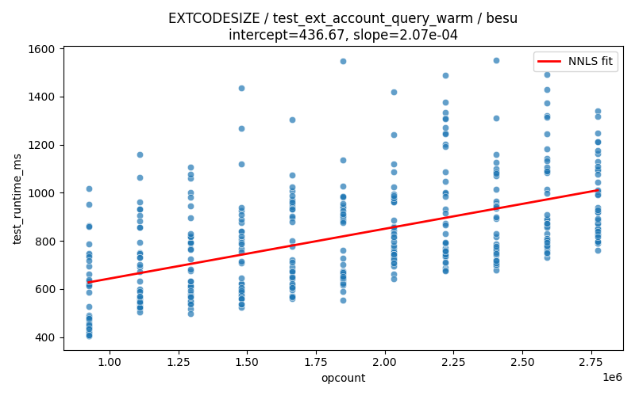

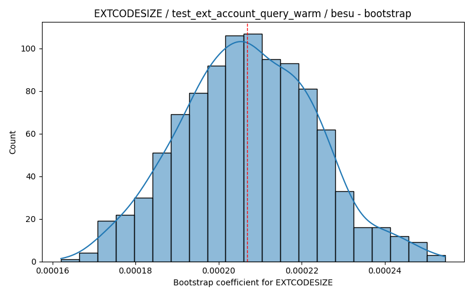

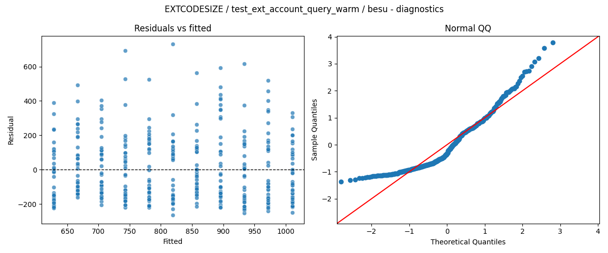

</details>

<details><summary>erigon — NNLS regression summary</summary>

```
==============================================================================
                           NNLS Regression Results                            
==============================================================================
Dep. Variable:          test_runtime_ms              R-squared:          0.974
Model:                  NNLS                    Adj. R-squared:          0.973
No. Observations:       44                                RMSE:           6.10
Df Residuals:           42                                 MAE:           4.43
Df Model:               1      
==============================================================================
                      coef     std err     P-value      [0.025      0.975]
------------------------------------------------------------------------------
         const     24.7587      3.0097       0.001     19.1286     30.9189
       opcount      0.0001      0.0000       0.001      0.0001      0.0001
==============================================================================
Notes: Non-negative least squares with bootstrap inference (1000 iterations)
==============================================================================
```

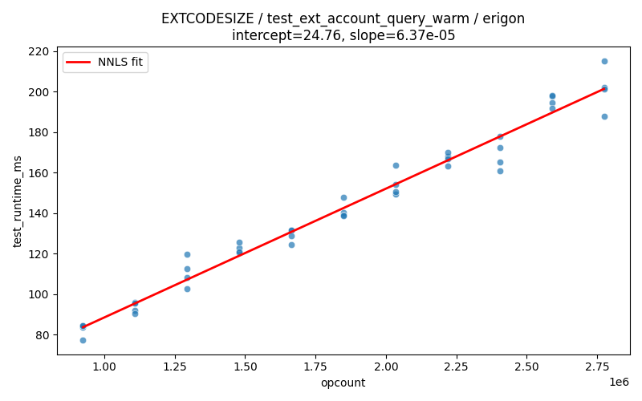

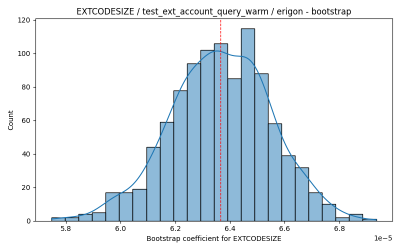

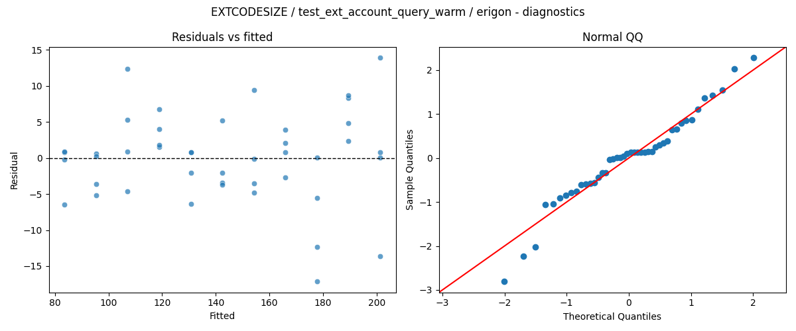

</details>

<details><summary>ethrex — NNLS regression summary</summary>

```
==============================================================================
                           NNLS Regression Results                            
==============================================================================
Dep. Variable:          test_runtime_ms              R-squared:          0.161
Model:                  NNLS                    Adj. R-squared:          0.158
No. Observations:       308                               RMSE:          15.05
Df Residuals:           306                                MAE:          10.18
Df Model:               1      
==============================================================================
                      coef     std err     P-value      [0.025      0.975]
------------------------------------------------------------------------------
         const     20.6329      3.1949       0.001     15.1421     27.2546
       opcount      0.0000      0.0000       0.001      0.0000      0.0000
==============================================================================
Notes: Non-negative least squares with bootstrap inference (1000 iterations)
==============================================================================
```

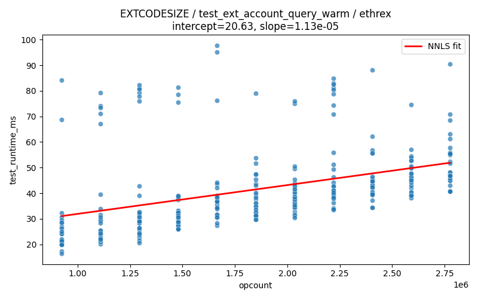

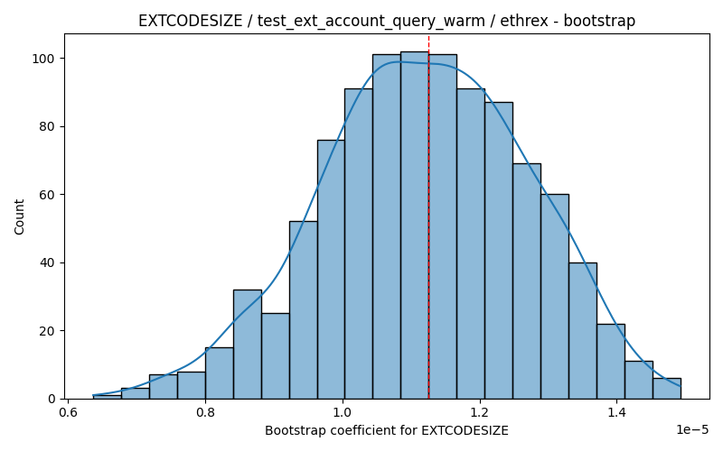

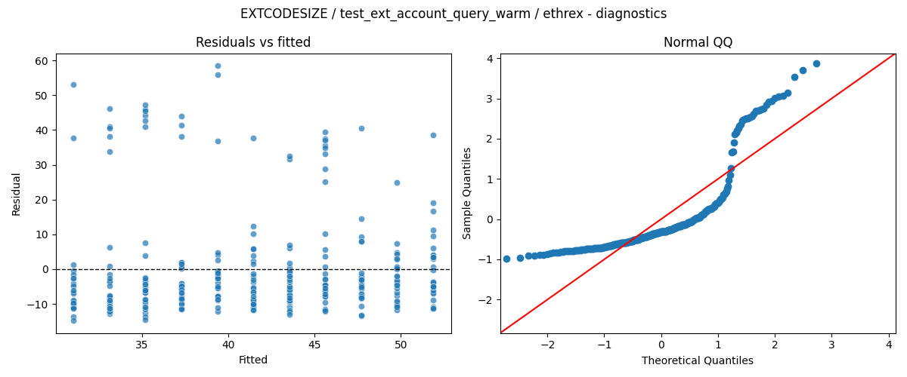

</details>

<details><summary>geth — NNLS regression summary</summary>

```
==============================================================================
                           NNLS Regression Results                            
==============================================================================
Dep. Variable:          test_runtime_ms              R-squared:          0.737
Model:                  NNLS                    Adj. R-squared:          0.736
No. Observations:       308                               RMSE:          10.59
Df Residuals:           306                                MAE:           8.36
Df Model:               1      
==============================================================================
                      coef     std err     P-value      [0.025      0.975]
------------------------------------------------------------------------------
         const     19.9921      1.9102       0.001     16.4898     23.7169
       opcount      0.0000      0.0000       0.001      0.0000      0.0000
==============================================================================
Notes: Non-negative least squares with bootstrap inference (1000 iterations)
==============================================================================
```

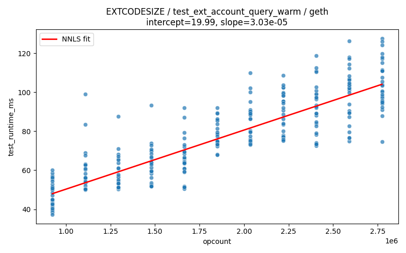

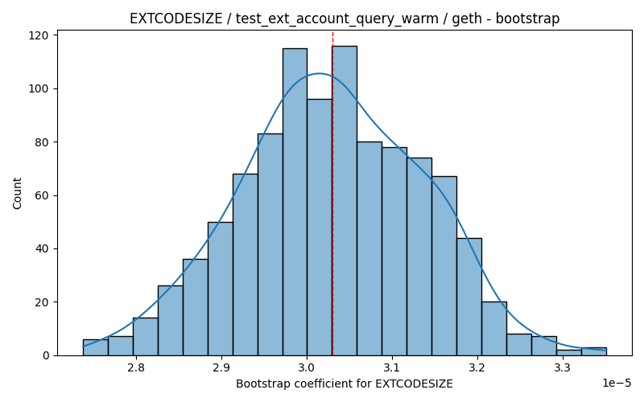

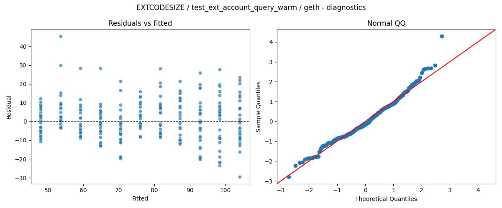

</details>

<details><summary>nethermind — NNLS regression summary</summary>

```
==============================================================================
                           NNLS Regression Results                            
==============================================================================
Dep. Variable:          test_runtime_ms              R-squared:          0.640
Model:                  NNLS                    Adj. R-squared:          0.638
No. Observations:       253                               RMSE:          70.26
Df Residuals:           251                                MAE:          55.28
Df Model:               1      
==============================================================================
                      coef     std err     P-value      [0.025      0.975]
------------------------------------------------------------------------------
         const    137.4477     12.7024       0.001    112.6789    162.3055
       opcount      0.0002      0.0000       0.001      0.0001      0.0002
==============================================================================
Notes: Non-negative least squares with bootstrap inference (1000 iterations)
==============================================================================
```

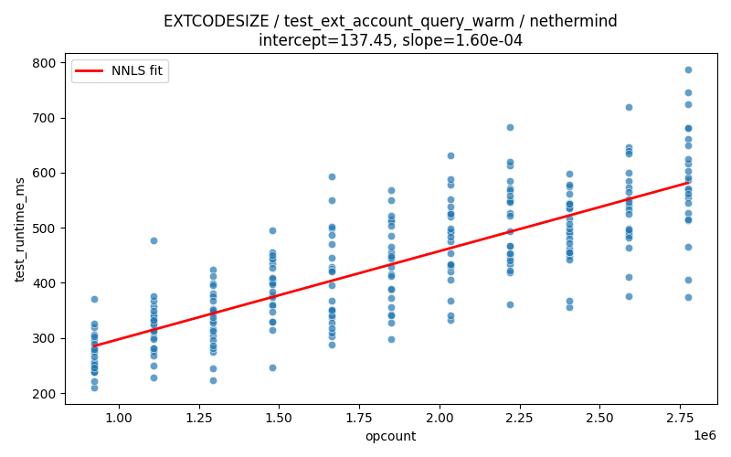

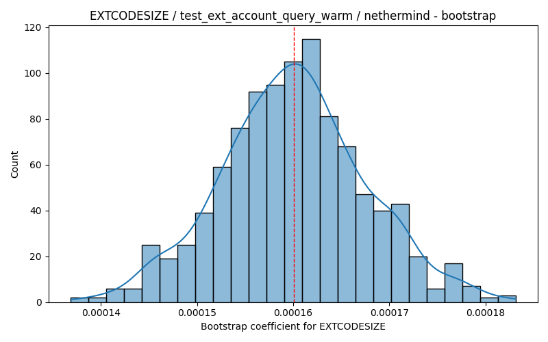

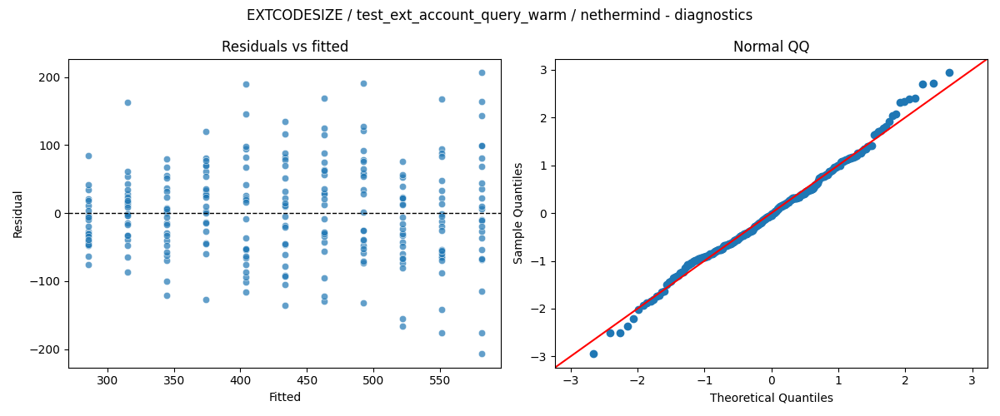

</details>

<details><summary>reth — NNLS regression summary</summary>

```
==============================================================================
                           NNLS Regression Results                            
==============================================================================
Dep. Variable:          test_runtime_ms              R-squared:          0.572
Model:                  NNLS                    Adj. R-squared:          0.571
No. Observations:       396                               RMSE:           4.29
Df Residuals:           394                                MAE:           3.19
Df Model:               1      
==============================================================================
                      coef     std err     P-value      [0.025      0.975]
------------------------------------------------------------------------------
         const      7.6446      0.6453       0.001      6.3779      8.9284
       opcount      0.0000      0.0000       0.001      0.0000      0.0000
==============================================================================
Notes: Non-negative least squares with bootstrap inference (1000 iterations)
==============================================================================
```

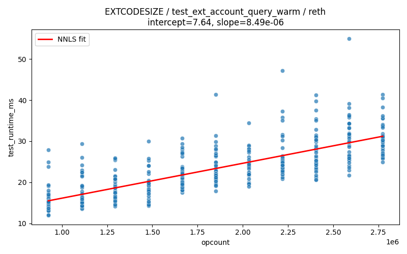

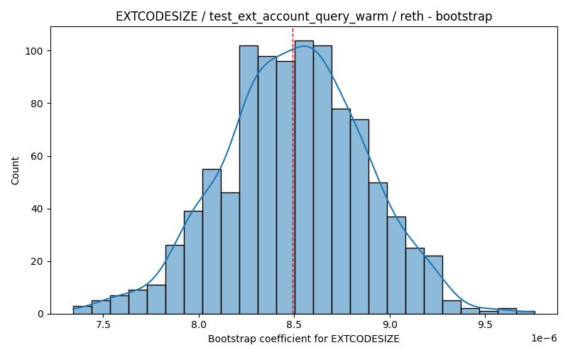

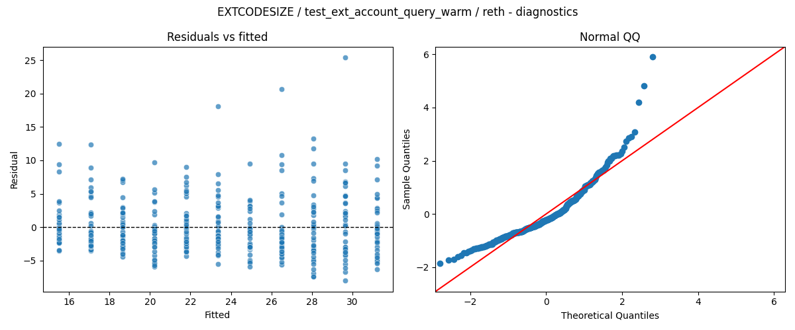

</details>

## STATICCALL

### test_account_access — combo `STATICCALL_AccountMode.EXISTING_EOA`

| client | nobs | R² | target_coef (ms) | p-value | 95% CI |
| --- | --- | --- | --- | --- | --- |
| `besu` | 396 | 0.9026 | 0.01516 | 1.00e-03 | [0.01463, 0.01564] |
| `erigon` | 44 | 0.9928 | 0.01018 | 1.00e-03 | [0.009887, 0.01041] |
| `ethrex` | 308 | 0.9936 | 0.007308 | 1.00e-03 | [0.007245, 0.007384] |
| `geth` | 308 | 0.9101 | 0.01109 | 1.00e-03 | [0.01066, 0.01151] |
| `nethermind` | 253 | 0.8498 | 0.004224 | 1.00e-03 | [0.003982, 0.004441] |
| `reth` | 396 | 0.9279 | 0.001093 | 1.00e-03 | [0.001063, 0.001124] |

<details><summary>besu — NNLS regression summary</summary>

```
==============================================================================
                           NNLS Regression Results                            
==============================================================================
Dep. Variable:          test_runtime_ms              R-squared:          0.903
Model:                  NNLS                    Adj. R-squared:          0.902
No. Observations:       396                               RMSE:         118.36
Df Residuals:           394                                MAE:         104.26
Df Model:               1      
==============================================================================
                      coef     std err     P-value      [0.025      0.975]
------------------------------------------------------------------------------
         const    595.7092     19.6731       0.001    559.6325    635.8577
       opcount      0.0152      0.0003       0.001      0.0146      0.0156
==============================================================================
Notes: Non-negative least squares with bootstrap inference (1000 iterations)
==============================================================================
```

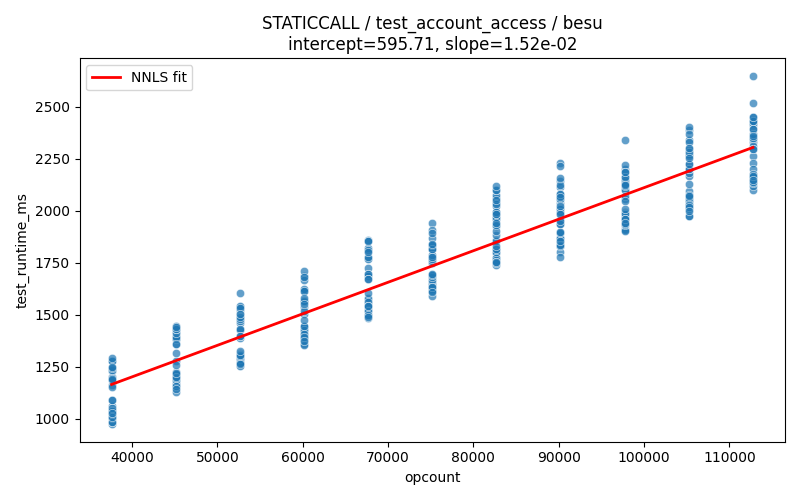

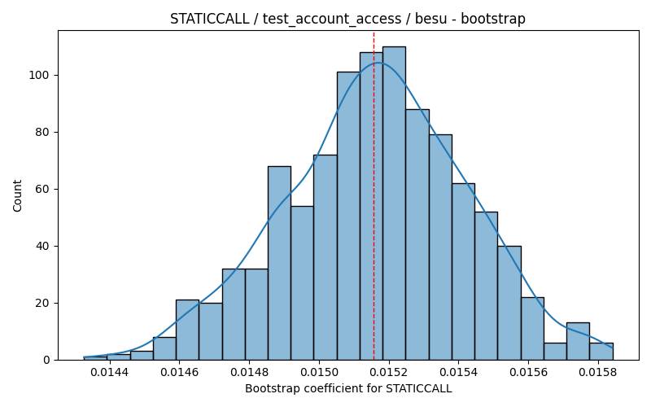

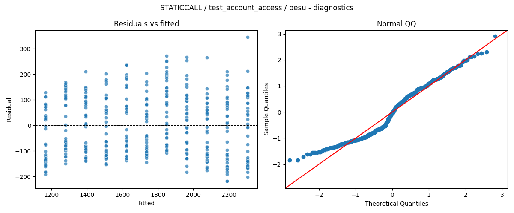

</details>

<details><summary>erigon — NNLS regression summary</summary>

```
==============================================================================
                           NNLS Regression Results                            
==============================================================================
Dep. Variable:          test_runtime_ms              R-squared:          0.993
Model:                  NNLS                    Adj. R-squared:          0.993
No. Observations:       44                                RMSE:          20.56
Df Residuals:           42                                 MAE:          14.20
Df Model:               1      
==============================================================================
                      coef     std err     P-value      [0.025      0.975]
------------------------------------------------------------------------------
         const     11.8380      9.1142       0.151      0.0000     30.6555
       opcount      0.0102      0.0001       0.001      0.0099      0.0104
==============================================================================
Notes: Non-negative least squares with bootstrap inference (1000 iterations)
==============================================================================
```

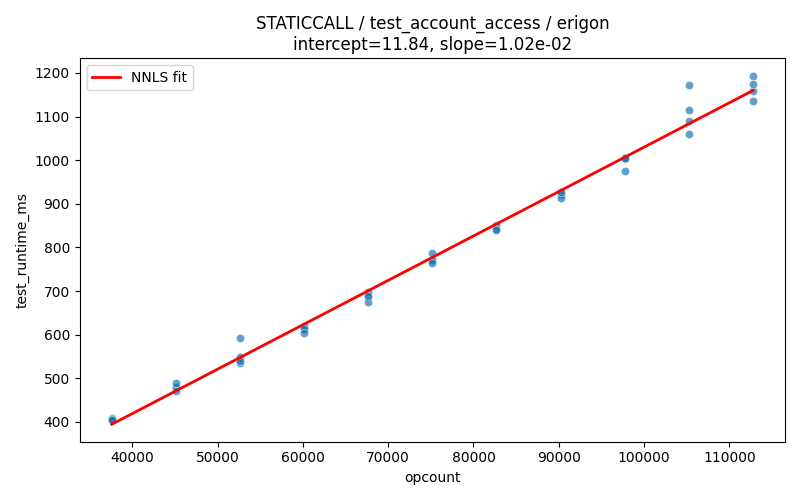

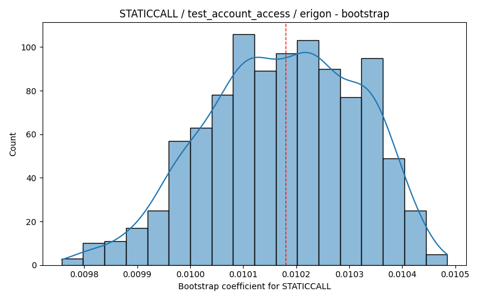

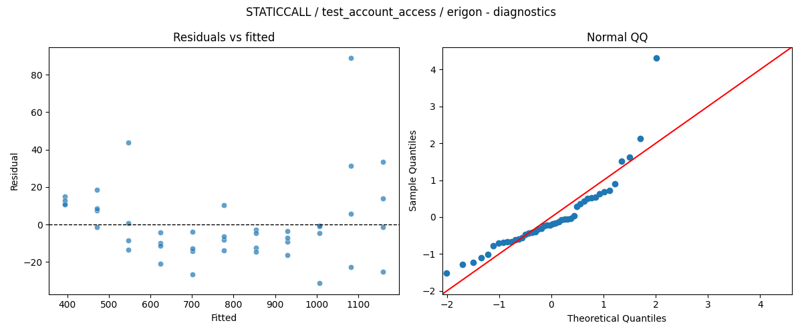

</details>

<details><summary>ethrex — NNLS regression summary</summary>

```
==============================================================================
                           NNLS Regression Results                            
==============================================================================
Dep. Variable:          test_runtime_ms              R-squared:          0.994
Model:                  NNLS                    Adj. R-squared:          0.994
No. Observations:       308                               RMSE:          13.94
Df Residuals:           306                                MAE:          10.87
Df Model:               1      
==============================================================================
                      coef     std err     P-value      [0.025      0.975]
------------------------------------------------------------------------------
         const     43.4139      2.5309       0.001     38.3305     48.0203
       opcount      0.0073      0.0000       0.001      0.0072      0.0074
==============================================================================
Notes: Non-negative least squares with bootstrap inference (1000 iterations)
==============================================================================
```

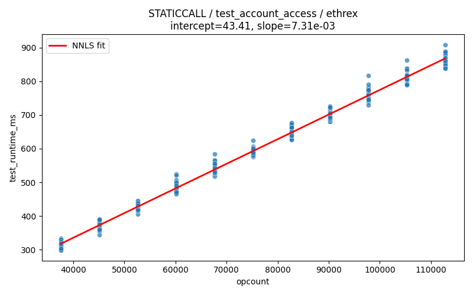

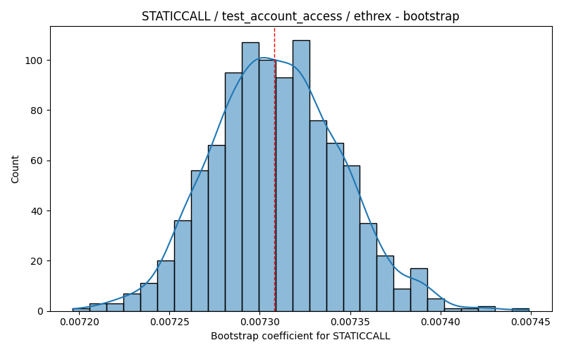

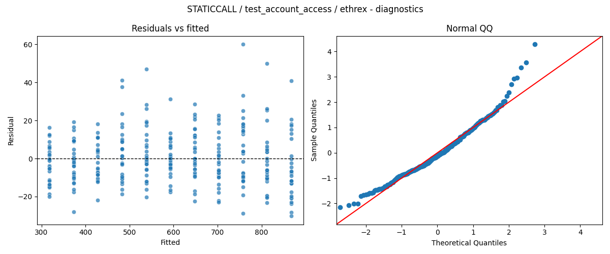

</details>

<details><summary>geth — NNLS regression summary</summary>

```
==============================================================================
                           NNLS Regression Results                            
==============================================================================
Dep. Variable:          test_runtime_ms              R-squared:          0.910
Model:                  NNLS                    Adj. R-squared:          0.910
No. Observations:       308                               RMSE:          82.87
Df Residuals:           306                                MAE:          69.56
Df Model:               1      
==============================================================================
                      coef     std err     P-value      [0.025      0.975]
------------------------------------------------------------------------------
         const    405.9625     18.5391       0.001    368.8473    442.8645
       opcount      0.0111      0.0002       0.001      0.0107      0.0115
==============================================================================
Notes: Non-negative least squares with bootstrap inference (1000 iterations)
==============================================================================
```

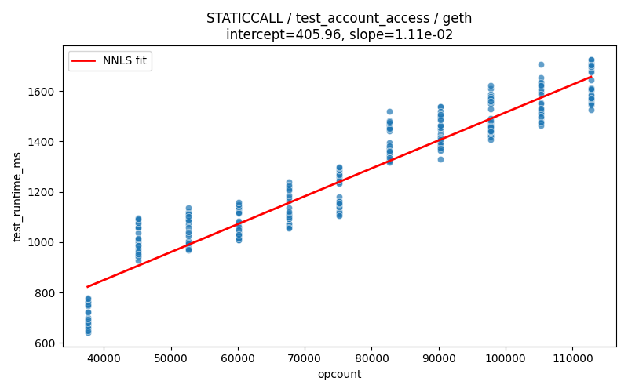

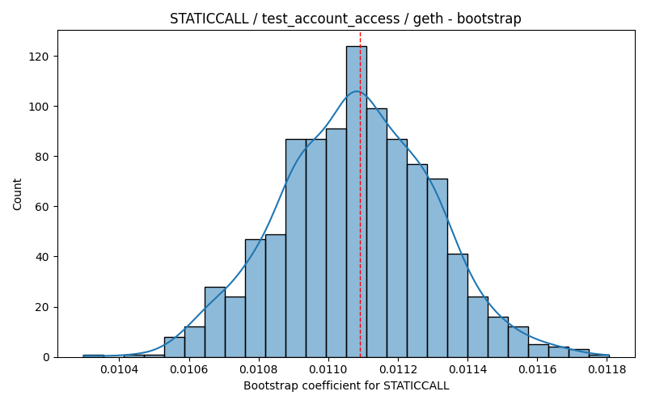

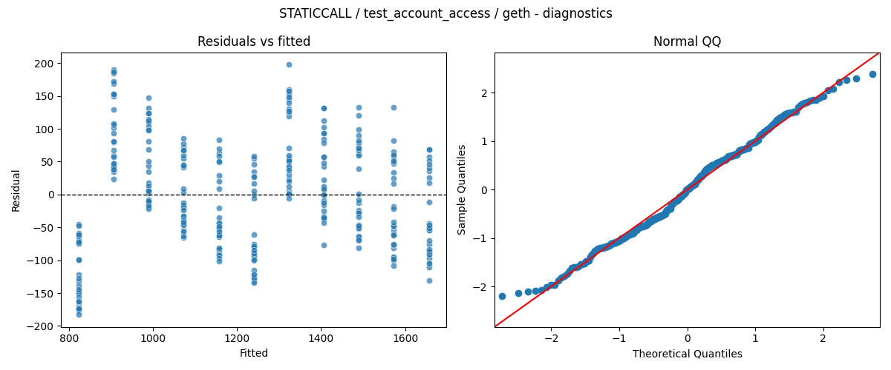

</details>

<details><summary>nethermind — NNLS regression summary</summary>

```
==============================================================================
                           NNLS Regression Results                            
==============================================================================
Dep. Variable:          test_runtime_ms              R-squared:          0.850
Model:                  NNLS                    Adj. R-squared:          0.849
No. Observations:       253                               RMSE:          42.22
Df Residuals:           251                                MAE:          32.98
Df Model:               1      
==============================================================================
                      coef     std err     P-value      [0.025      0.975]
------------------------------------------------------------------------------
         const     87.2026      7.7582       0.001     72.6018    102.9440
       opcount      0.0042      0.0001       0.001      0.0040      0.0044
==============================================================================
Notes: Non-negative least squares with bootstrap inference (1000 iterations)
==============================================================================
```

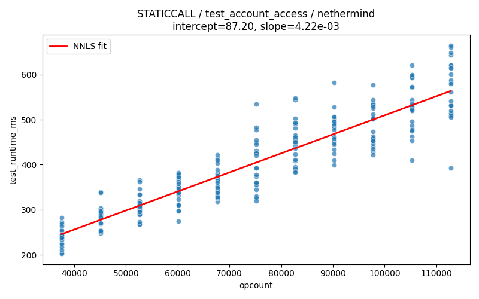


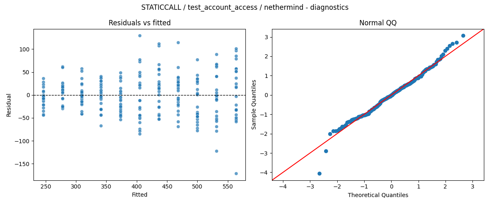

</details>

<details><summary>reth — NNLS regression summary</summary>

```
==============================================================================
                           NNLS Regression Results                            
==============================================================================
Dep. Variable:          test_runtime_ms              R-squared:          0.928
Model:                  NNLS                    Adj. R-squared:          0.928
No. Observations:       396                               RMSE:           7.25
Df Residuals:           394                                MAE:           5.74
Df Model:               1      
==============================================================================
                      coef     std err     P-value      [0.025      0.975]
------------------------------------------------------------------------------
         const     47.2635      1.2000       0.001     44.9759     49.5868
       opcount      0.0011      0.0000       0.001      0.0011      0.0011
==============================================================================
Notes: Non-negative least squares with bootstrap inference (1000 iterations)
==============================================================================
```

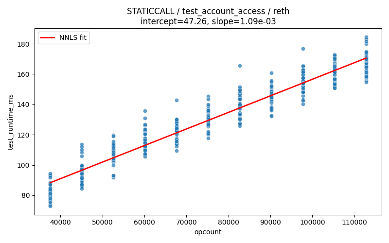

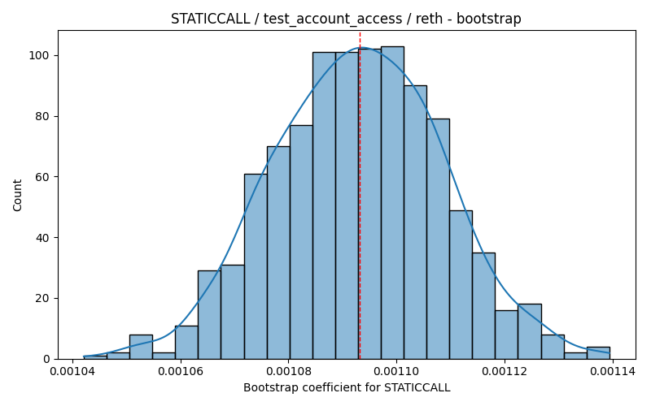

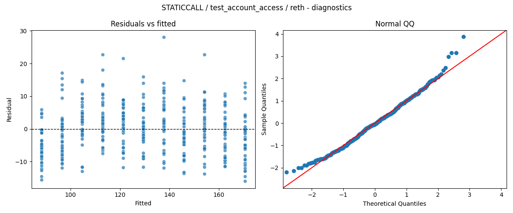

</details>

### test_account_access — combo `STATICCALL_AccountMode.NON_EXISTING_ACCOUNT` — `presets[cold_account_nocode_access]`

| client | nobs | R² | target_coef (ms) | p-value | 95% CI |
| --- | --- | --- | --- | --- | --- |
| `besu` | 396 | 0.8438 | 0.01574 | 1.00e-03 | [0.01509, 0.01639] |
| `erigon` | 44 | 0.9915 | 0.01147 | 1.00e-03 | [0.01131, 0.01157] |
| `ethrex` | 308 | 0.9638 | 0.002027 | 1.00e-03 | [0.001984, 0.002071] |
| `geth` | 308 | 0.868 | 0.02262 | 1.00e-03 | [0.02154, 0.02372] |
| `nethermind` | 253 | 0.8403 | 0.003905 | 1.00e-03 | [0.003695, 0.004128] |
| `reth` | 396 | 0.8691 | 0.0007458 | 1.00e-03 | [0.0007142, 0.0007783] |

<details><summary>besu — NNLS regression summary</summary>

```
==============================================================================
                           NNLS Regression Results                            
==============================================================================
Dep. Variable:          test_runtime_ms              R-squared:          0.844
Model:                  NNLS                    Adj. R-squared:          0.843
No. Observations:       396                               RMSE:         161.00
Df Residuals:           394                                MAE:         149.67
Df Model:               1      
==============================================================================
                      coef     std err     P-value      [0.025      0.975]
------------------------------------------------------------------------------
         const    521.6020     25.2203       0.001    471.4272    572.0980
       opcount      0.0157      0.0003       0.001      0.0151      0.0164
==============================================================================
Notes: Non-negative least squares with bootstrap inference (1000 iterations)
==============================================================================
```

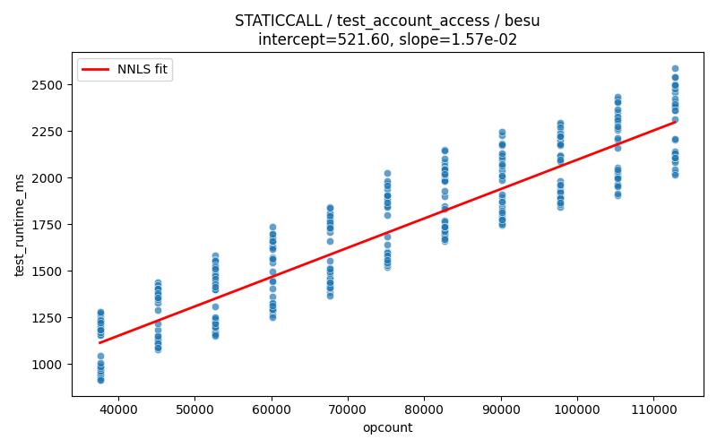

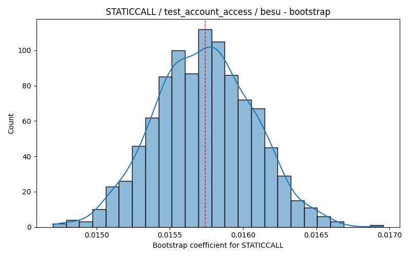

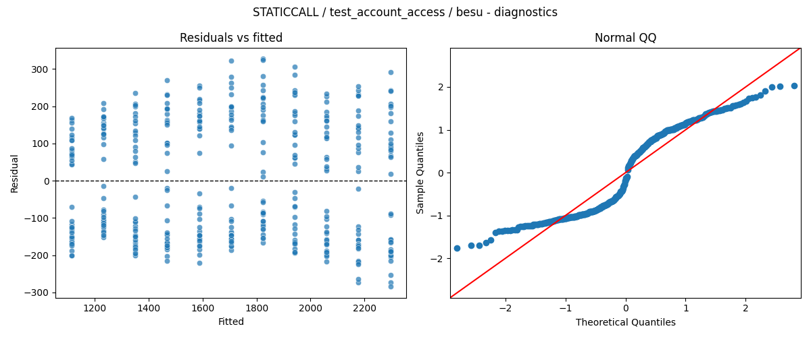

</details>

<details><summary>erigon — NNLS regression summary</summary>

```
==============================================================================
                           NNLS Regression Results                            
==============================================================================
Dep. Variable:          test_runtime_ms              R-squared:          0.991
Model:                  NNLS                    Adj. R-squared:          0.991
No. Observations:       44                                RMSE:          25.48
Df Residuals:           42                                 MAE:          17.98
Df Model:               1      
==============================================================================
                      coef     std err     P-value      [0.025      0.975]
------------------------------------------------------------------------------
         const      0.0000      3.1267       1.000      0.0000     11.7561
       opcount      0.0115      0.0001       0.001      0.0113      0.0116
==============================================================================
Notes: Non-negative least squares with bootstrap inference (1000 iterations)
==============================================================================
```

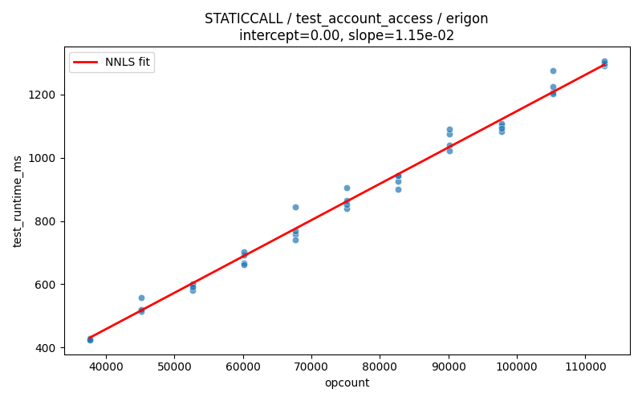

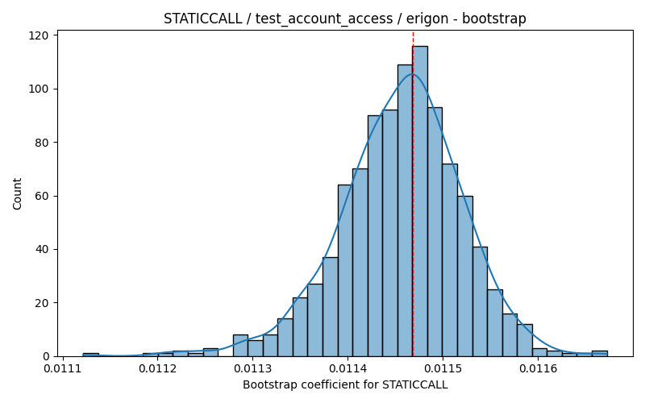

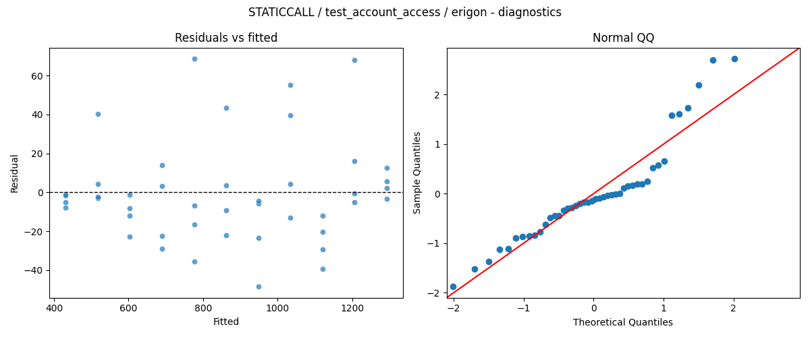

</details>

<details><summary>ethrex — NNLS regression summary</summary>

```
==============================================================================
                           NNLS Regression Results                            
==============================================================================
Dep. Variable:          test_runtime_ms              R-squared:          0.964
Model:                  NNLS                    Adj. R-squared:          0.964
No. Observations:       308                               RMSE:           9.34
Df Residuals:           306                                MAE:           7.44
Df Model:               1      
==============================================================================
                      coef     std err     P-value      [0.025      0.975]
------------------------------------------------------------------------------
         const     30.3096      1.8388       0.001     26.7844     34.0370
       opcount      0.0020      0.0000       0.001      0.0020      0.0021
==============================================================================
Notes: Non-negative least squares with bootstrap inference (1000 iterations)
==============================================================================
```

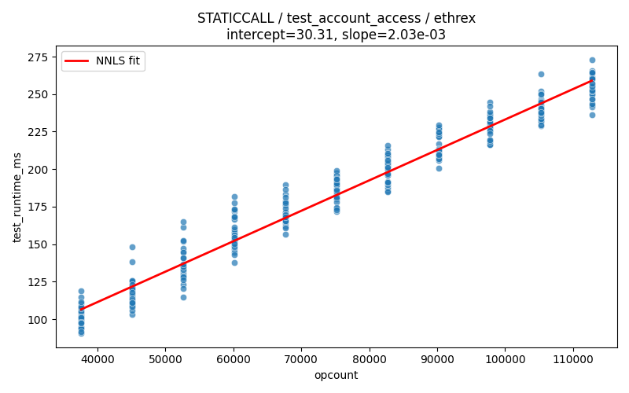

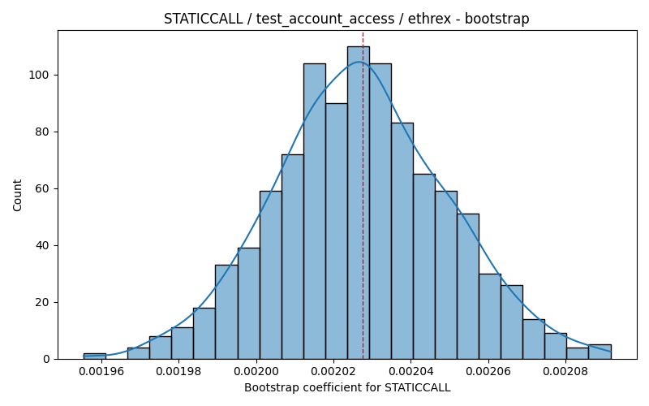

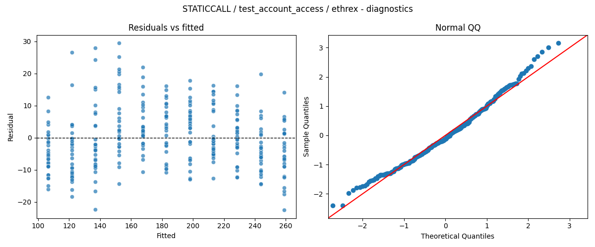

</details>

<details><summary>geth — NNLS regression summary</summary>

```
==============================================================================
                           NNLS Regression Results                            
==============================================================================
Dep. Variable:          test_runtime_ms              R-squared:          0.868
Model:                  NNLS                    Adj. R-squared:          0.868
No. Observations:       308                               RMSE:         209.67
Df Residuals:           306                                MAE:         176.76
Df Model:               1      
==============================================================================
                      coef     std err     P-value      [0.025      0.975]
------------------------------------------------------------------------------
         const    703.5478     47.1860       0.001    608.0329    797.2925
       opcount      0.0226      0.0006       0.001      0.0215      0.0237
==============================================================================
Notes: Non-negative least squares with bootstrap inference (1000 iterations)
==============================================================================
```


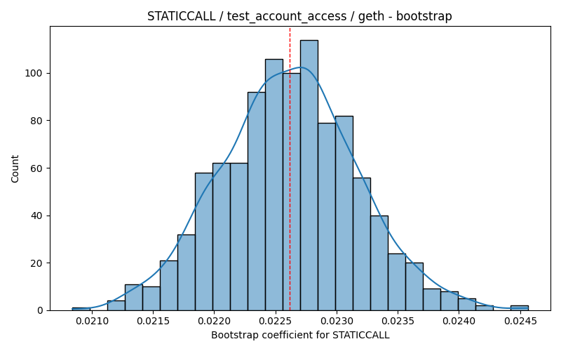

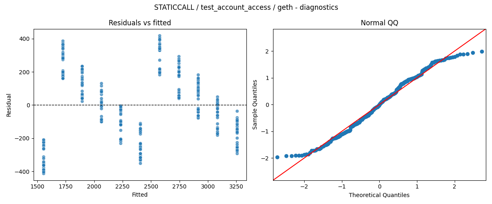

</details>

<details><summary>nethermind — NNLS regression summary</summary>

```
==============================================================================
                           NNLS Regression Results                            
==============================================================================
Dep. Variable:          test_runtime_ms              R-squared:          0.840
Model:                  NNLS                    Adj. R-squared:          0.840
No. Observations:       253                               RMSE:          40.48
Df Residuals:           251                                MAE:          31.44
Df Model:               1      
==============================================================================
                      coef     std err     P-value      [0.025      0.975]
------------------------------------------------------------------------------
         const     87.2002      8.1473       0.001     69.8611    102.8300
       opcount      0.0039      0.0001       0.001      0.0037      0.0041
==============================================================================
Notes: Non-negative least squares with bootstrap inference (1000 iterations)
==============================================================================
```

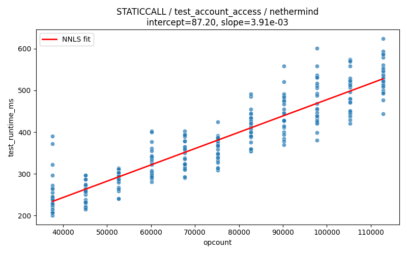

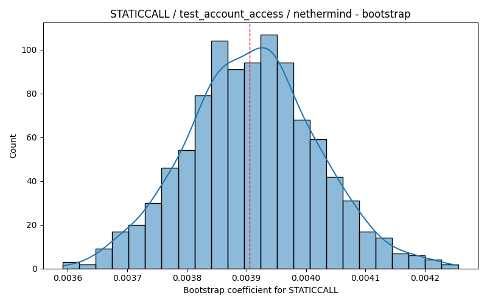

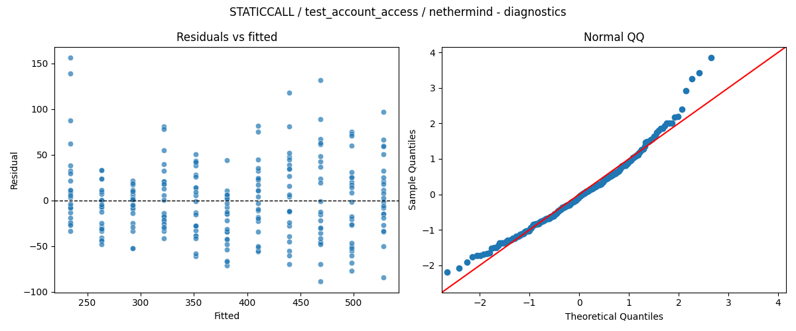

</details>

<details><summary>reth — NNLS regression summary</summary>

```
==============================================================================
                           NNLS Regression Results                            
==============================================================================
Dep. Variable:          test_runtime_ms              R-squared:          0.869
Model:                  NNLS                    Adj. R-squared:          0.869
No. Observations:       396                               RMSE:           6.88
Df Residuals:           394                                MAE:           5.46
Df Model:               1      
==============================================================================
                      coef     std err     P-value      [0.025      0.975]
------------------------------------------------------------------------------
         const     52.2904      1.1841       0.001     49.9112     54.5629
       opcount      0.0007      0.0000       0.001      0.0007      0.0008
==============================================================================
Notes: Non-negative least squares with bootstrap inference (1000 iterations)
==============================================================================
```

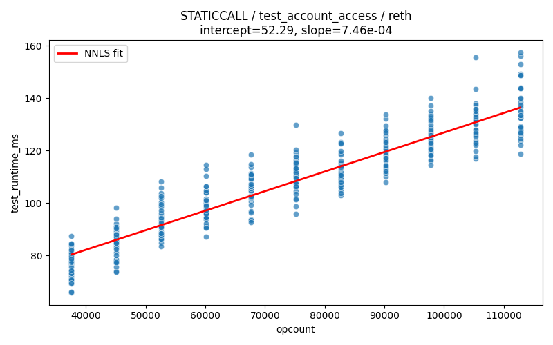

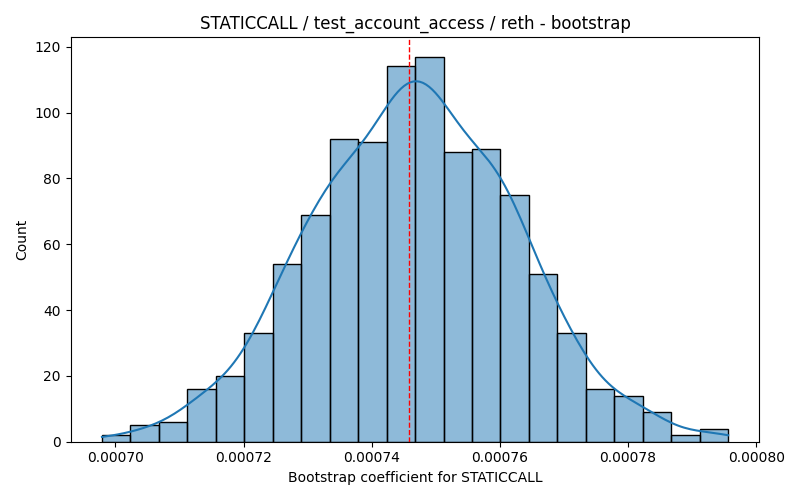

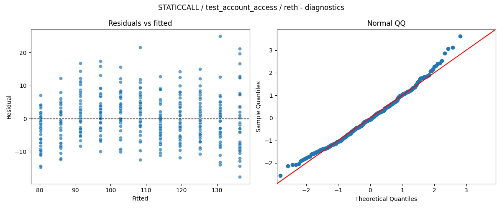

</details>

### test_account_access — combo `STATICCALL_AccountMode.EXISTING_CONTRACT`

| client | nobs | R² | target_coef (ms) | p-value | 95% CI |
| --- | --- | --- | --- | --- | --- |
| `besu` | 396 | 0.9385 | 0.02653 | 1.00e-03 | [0.02587, 0.02719] |
| `erigon` | 44 | 0.9079 | 0.04719 | 1.00e-03 | [0.04248, 0.05115] |
| `ethrex` | 308 | 0.9928 | 0.007894 | 1.00e-03 | [0.007823, 0.007969] |
| `geth` | 308 | 0.8558 | 0.02335 | 1.00e-03 | [0.02224, 0.02451] |
| `nethermind` | 253 | 0.5954 | 0.01531 | 1.00e-03 | [0.01365, 0.01694] |
| `reth` | 396 | 0.9757 | 0.004028 | 1.00e-03 | [0.003971, 0.004089] |

<details><summary>besu — NNLS regression summary</summary>

```
==============================================================================
                           NNLS Regression Results                            
==============================================================================
Dep. Variable:          test_runtime_ms              R-squared:          0.938
Model:                  NNLS                    Adj. R-squared:          0.938
No. Observations:       396                               RMSE:         138.37
Df Residuals:           394                                MAE:         121.84
Df Model:               1      
==============================================================================
                      coef     std err     P-value      [0.025      0.975]
------------------------------------------------------------------------------
         const    583.1968     22.1068       0.001    540.3378    625.4163
       opcount      0.0265      0.0003       0.001      0.0259      0.0272
==============================================================================
Notes: Non-negative least squares with bootstrap inference (1000 iterations)
==============================================================================
```

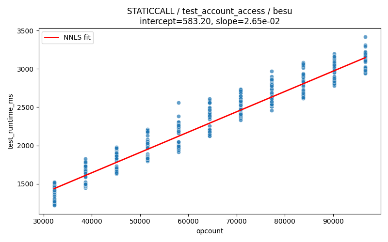

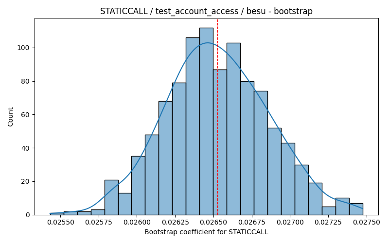

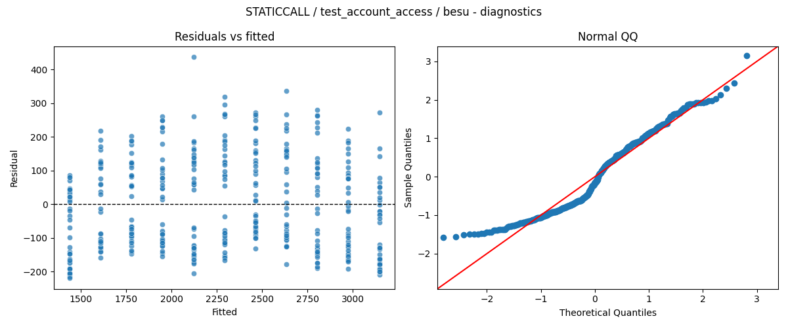

</details>

<details><summary>erigon — NNLS regression summary</summary>

```
==============================================================================
                           NNLS Regression Results                            
==============================================================================
Dep. Variable:          test_runtime_ms              R-squared:          0.908
Model:                  NNLS                    Adj. R-squared:          0.906
No. Observations:       44                                RMSE:         306.22
Df Residuals:           42                                 MAE:         263.04
Df Model:               1      
==============================================================================
                      coef     std err     P-value      [0.025      0.975]
------------------------------------------------------------------------------
         const    921.2028    164.5550       0.001    626.5633   1271.4489
       opcount      0.0472      0.0022       0.001      0.0425      0.0511
==============================================================================
Notes: Non-negative least squares with bootstrap inference (1000 iterations)
==============================================================================
```

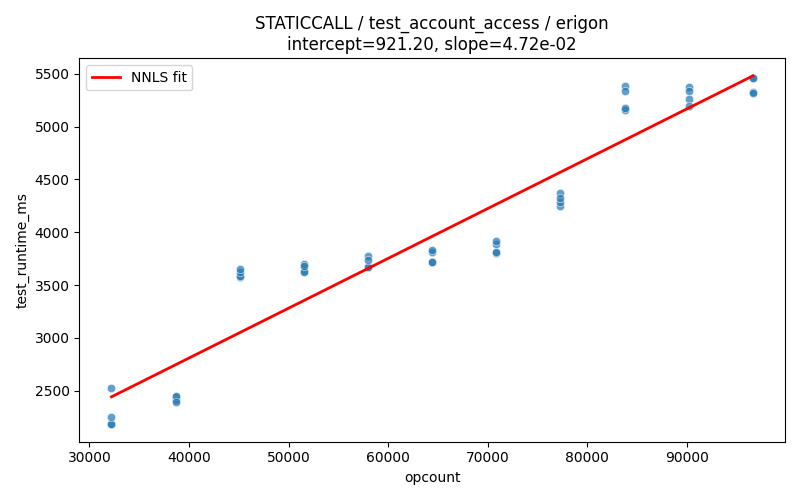

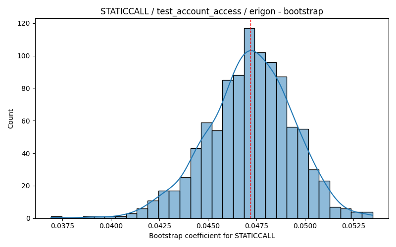

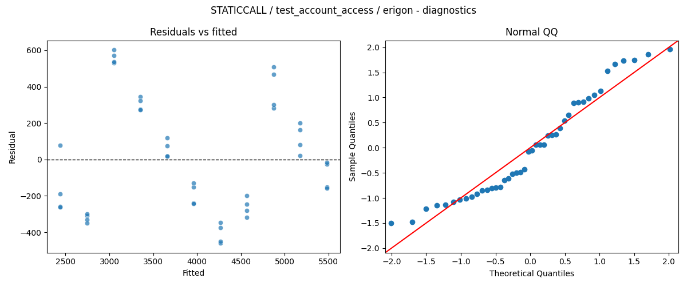

</details>

<details><summary>ethrex — NNLS regression summary</summary>

```
==============================================================================
                           NNLS Regression Results                            
==============================================================================
Dep. Variable:          test_runtime_ms              R-squared:          0.993
Model:                  NNLS                    Adj. R-squared:          0.993
No. Observations:       308                               RMSE:          13.70
Df Residuals:           306                                MAE:          10.79
Df Model:               1      
==============================================================================
                      coef     std err     P-value      [0.025      0.975]
------------------------------------------------------------------------------
         const     40.8681      2.3096       0.001     36.1381     45.2742
       opcount      0.0079      0.0000       0.001      0.0078      0.0080
==============================================================================
Notes: Non-negative least squares with bootstrap inference (1000 iterations)
==============================================================================
```

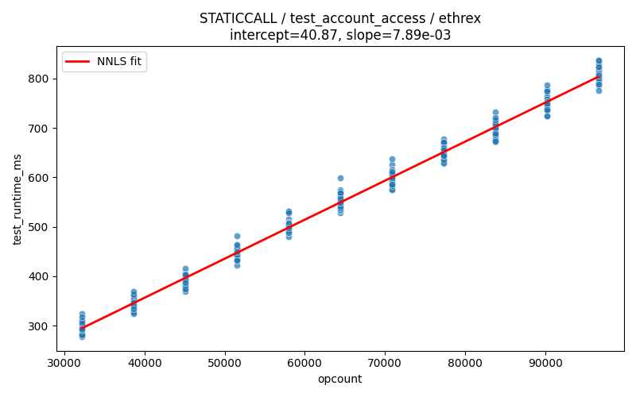

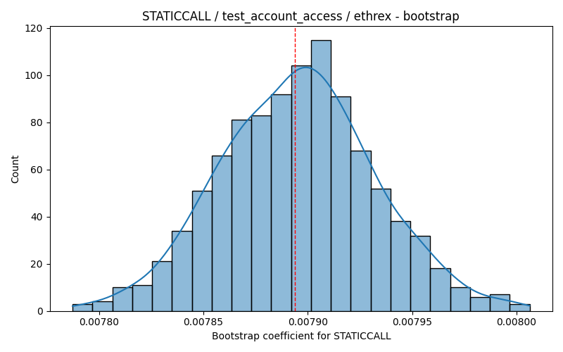

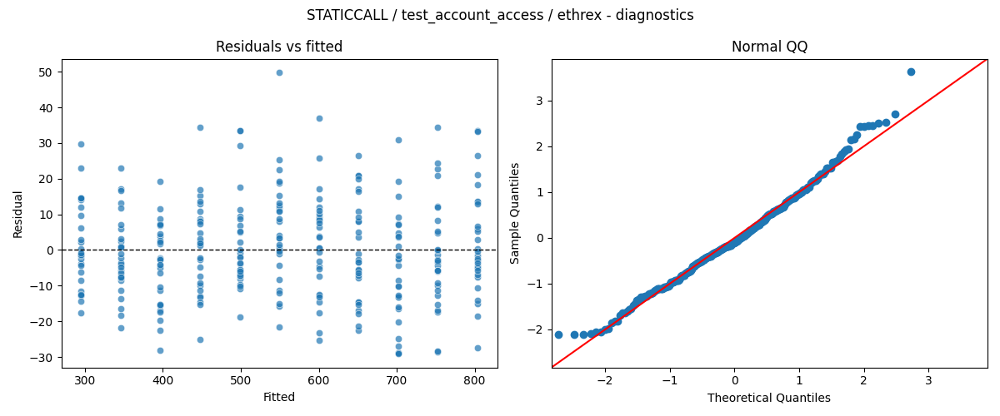

</details>

<details><summary>geth — NNLS regression summary</summary>

```
==============================================================================
                           NNLS Regression Results                            
==============================================================================
Dep. Variable:          test_runtime_ms              R-squared:          0.856
Model:                  NNLS                    Adj. R-squared:          0.855
No. Observations:       308                               RMSE:         195.27
Df Residuals:           306                                MAE:         165.98
Df Model:               1      
==============================================================================
                      coef     std err     P-value      [0.025      0.975]
------------------------------------------------------------------------------
         const    660.1809     42.0923       0.001    579.1810    744.3068
       opcount      0.0233      0.0006       0.001      0.0222      0.0245
==============================================================================
Notes: Non-negative least squares with bootstrap inference (1000 iterations)
==============================================================================
```


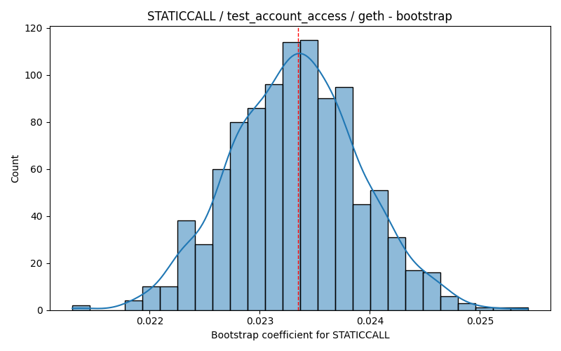

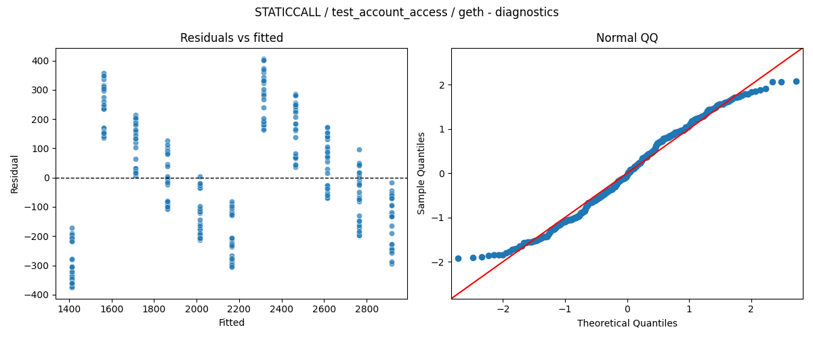

</details>

<details><summary>nethermind — NNLS regression summary</summary>

```
==============================================================================
                           NNLS Regression Results                            
==============================================================================
Dep. Variable:          test_runtime_ms              R-squared:          0.595
Model:                  NNLS                    Adj. R-squared:          0.594
No. Observations:       253                               RMSE:         257.07
Df Residuals:           251                                MAE:         195.63
Df Model:               1      
==============================================================================
                      coef     std err     P-value      [0.025      0.975]
------------------------------------------------------------------------------
         const    122.9374     47.1758       0.004     31.1095    213.3268
       opcount      0.0153      0.0009       0.001      0.0137      0.0169
==============================================================================
Notes: Non-negative least squares with bootstrap inference (1000 iterations)
==============================================================================
```

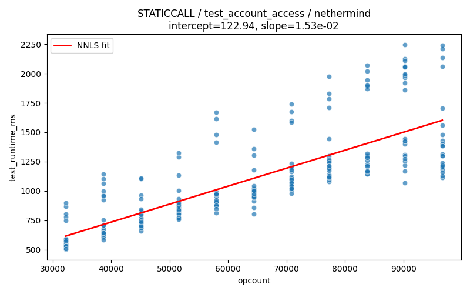

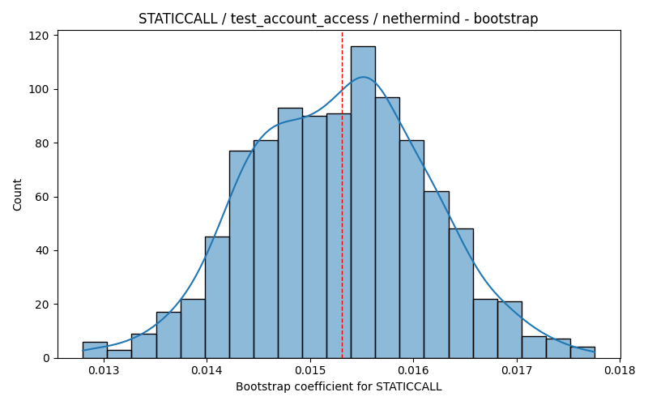

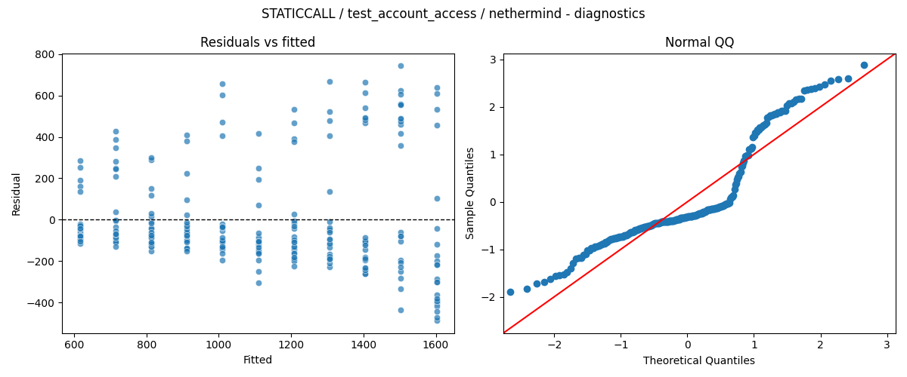

</details>

<details><summary>reth — NNLS regression summary</summary>

```
==============================================================================
                           NNLS Regression Results                            
==============================================================================
Dep. Variable:          test_runtime_ms              R-squared:          0.976
Model:                  NNLS                    Adj. R-squared:          0.976
No. Observations:       396                               RMSE:          12.94
Df Residuals:           394                                MAE:          10.35
Df Model:               1      
==============================================================================
                      coef     std err     P-value      [0.025      0.975]
------------------------------------------------------------------------------
         const    102.4770      1.8336       0.001     98.9449    105.9168
       opcount      0.0040      0.0000       0.001      0.0040      0.0041
==============================================================================
Notes: Non-negative least squares with bootstrap inference (1000 iterations)
==============================================================================
```

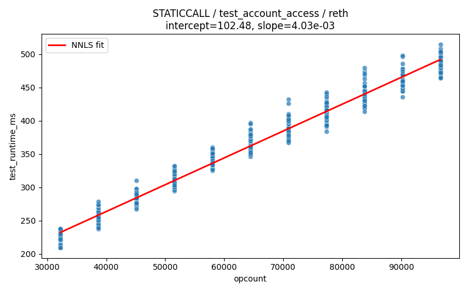

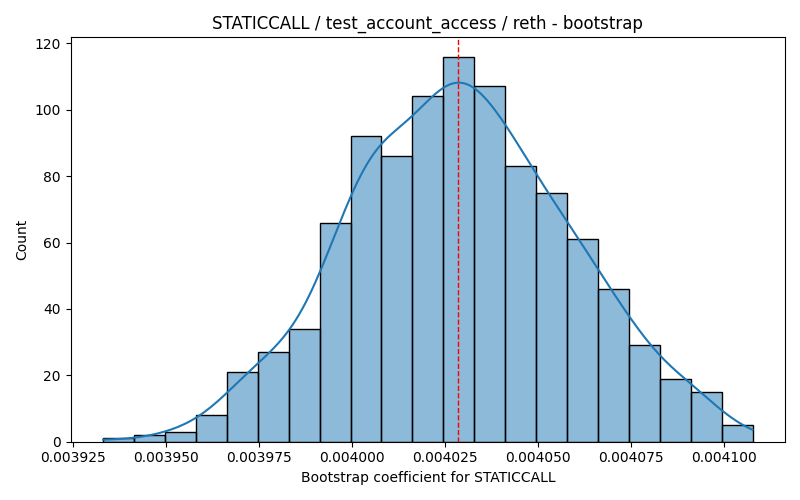

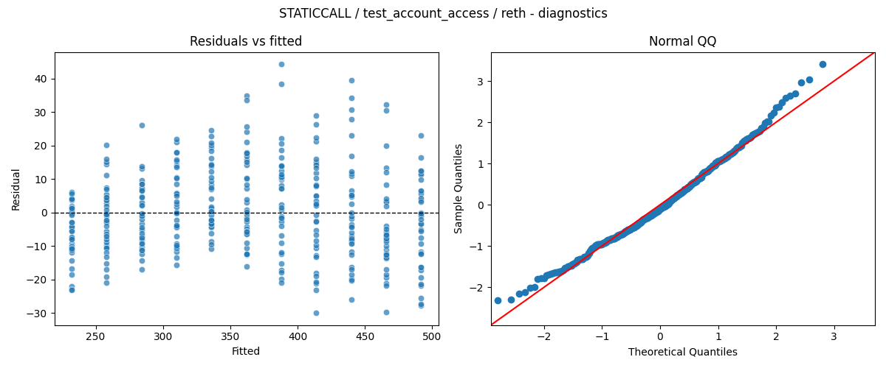

</details>

### test_account_access — combo `STATICCALL_AccountMode.NON_EXISTING_ACCOUNT` — `presets[cold_account_code_access]`

| client | nobs | R² | target_coef (ms) | p-value | 95% CI |
| --- | --- | --- | --- | --- | --- |
| `besu` | 396 | 0.8438 | 0.01574 | 1.00e-03 | [0.01509, 0.01639] |
| `erigon` | 44 | 0.9915 | 0.01147 | 1.00e-03 | [0.01131, 0.01157] |
| `ethrex` | 308 | 0.9638 | 0.002027 | 1.00e-03 | [0.001984, 0.002071] |
| `geth` | 308 | 0.868 | 0.02262 | 1.00e-03 | [0.02154, 0.02372] |
| `nethermind` | 253 | 0.8403 | 0.003905 | 1.00e-03 | [0.003695, 0.004128] |
| `reth` | 396 | 0.8691 | 0.0007458 | 1.00e-03 | [0.0007142, 0.0007783] |

<details><summary>besu — NNLS regression summary</summary>

```
==============================================================================
                           NNLS Regression Results                            
==============================================================================
Dep. Variable:          test_runtime_ms              R-squared:          0.844
Model:                  NNLS                    Adj. R-squared:          0.843
No. Observations:       396                               RMSE:         161.00
Df Residuals:           394                                MAE:         149.67
Df Model:               1      
==============================================================================
                      coef     std err     P-value      [0.025      0.975]
------------------------------------------------------------------------------
         const    521.6020     25.2203       0.001    471.4272    572.0980
       opcount      0.0157      0.0003       0.001      0.0151      0.0164
==============================================================================
Notes: Non-negative least squares with bootstrap inference (1000 iterations)
==============================================================================
```


</details>

<details><summary>erigon — NNLS regression summary</summary>

```
==============================================================================
                           NNLS Regression Results                            
==============================================================================
Dep. Variable:          test_runtime_ms              R-squared:          0.991
Model:                  NNLS                    Adj. R-squared:          0.991
No. Observations:       44                                RMSE:          25.48
Df Residuals:           42                                 MAE:          17.98
Df Model:               1      
==============================================================================
                      coef     std err     P-value      [0.025      0.975]
------------------------------------------------------------------------------
         const      0.0000      3.1267       1.000      0.0000     11.7561
       opcount      0.0115      0.0001       0.001      0.0113      0.0116
==============================================================================
Notes: Non-negative least squares with bootstrap inference (1000 iterations)
==============================================================================
```


</details>

<details><summary>ethrex — NNLS regression summary</summary>

```
==============================================================================
                           NNLS Regression Results                            
==============================================================================
Dep. Variable:          test_runtime_ms              R-squared:          0.964
Model:                  NNLS                    Adj. R-squared:          0.964
No. Observations:       308                               RMSE:           9.34
Df Residuals:           306                                MAE:           7.44
Df Model:               1      
==============================================================================
                      coef     std err     P-value      [0.025      0.975]
------------------------------------------------------------------------------
         const     30.3096      1.8388       0.001     26.7844     34.0370
       opcount      0.0020      0.0000       0.001      0.0020      0.0021
==============================================================================
Notes: Non-negative least squares with bootstrap inference (1000 iterations)
==============================================================================
```


</details>

<details><summary>geth — NNLS regression summary</summary>

```
==============================================================================
                           NNLS Regression Results                            
==============================================================================
Dep. Variable:          test_runtime_ms              R-squared:          0.868
Model:                  NNLS                    Adj. R-squared:          0.868
No. Observations:       308                               RMSE:         209.67
Df Residuals:           306                                MAE:         176.76
Df Model:               1      
==============================================================================
                      coef     std err     P-value      [0.025      0.975]
------------------------------------------------------------------------------
         const    703.5478     47.1860       0.001    608.0329    797.2925
       opcount      0.0226      0.0006       0.001      0.0215      0.0237
==============================================================================
Notes: Non-negative least squares with bootstrap inference (1000 iterations)
==============================================================================
```


</details>

<details><summary>nethermind — NNLS regression summary</summary>

```
==============================================================================
                           NNLS Regression Results                            
==============================================================================
Dep. Variable:          test_runtime_ms              R-squared:          0.840
Model:                  NNLS                    Adj. R-squared:          0.840
No. Observations:       253                               RMSE:          40.48
Df Residuals:           251                                MAE:          31.44
Df Model:               1      
==============================================================================
                      coef     std err     P-value      [0.025      0.975]
------------------------------------------------------------------------------
         const     87.2002      8.1473       0.001     69.8611    102.8300
       opcount      0.0039      0.0001       0.001      0.0037      0.0041
==============================================================================
Notes: Non-negative least squares with bootstrap inference (1000 iterations)
==============================================================================
```


</details>

<details><summary>reth — NNLS regression summary</summary>

```
==============================================================================
                           NNLS Regression Results                            
==============================================================================
Dep. Variable:          test_runtime_ms              R-squared:          0.869
Model:                  NNLS                    Adj. R-squared:          0.869
No. Observations:       396                               RMSE:           6.88
Df Residuals:           394                                MAE:           5.46
Df Model:               1      
==============================================================================
                      coef     std err     P-value      [0.025      0.975]
------------------------------------------------------------------------------
         const     52.2904      1.1841       0.001     49.9112     54.5629
       opcount      0.0007      0.0000       0.001      0.0007      0.0008
==============================================================================
Notes: Non-negative least squares with bootstrap inference (1000 iterations)
==============================================================================
```


</details>

### test_ext_account_query_warm — combo `STATICCALL`

| client | nobs | R² | target_coef (ms) | p-value | 95% CI |
| --- | --- | --- | --- | --- | --- |
| `besu` | 396 | 0.7718 | 0.0004445 | 1.00e-03 | [0.0004187, 0.0004703] |
| `erigon` | 44 | 0.9096 | 0.0004698 | 1.00e-03 | [0.0004169, 0.0005059] |
| `ethrex` | 308 | 0.9428 | 0.0001032 | 1.00e-03 | [0.0001004, 0.0001058] |
| `geth` | 308 | 0.8777 | 0.0001777 | 1.00e-03 | [0.000171, 0.0001847] |
| `nethermind` | 253 | 0.6248 | 0.0003408 | 1.00e-03 | [0.0003058, 0.0003764] |
| `reth` | 396 | 0.918 | 5.746e-05 | 1.00e-03 | [5.569e-05, 5.917e-05] |

<details><summary>besu — NNLS regression summary</summary>

```
==============================================================================
                           NNLS Regression Results                            
==============================================================================
Dep. Variable:          test_runtime_ms              R-squared:          0.772
Model:                  NNLS                    Adj. R-squared:          0.771
No. Observations:       396                               RMSE:         125.11
Df Residuals:           394                                MAE:          94.57
Df Model:               1      
==============================================================================
                      coef     std err     P-value      [0.025      0.975]
------------------------------------------------------------------------------
         const    529.2291     19.9422       0.001    489.3053    570.4283
       opcount      0.0004      0.0000       0.001      0.0004      0.0005
==============================================================================
Notes: Non-negative least squares with bootstrap inference (1000 iterations)
==============================================================================
```

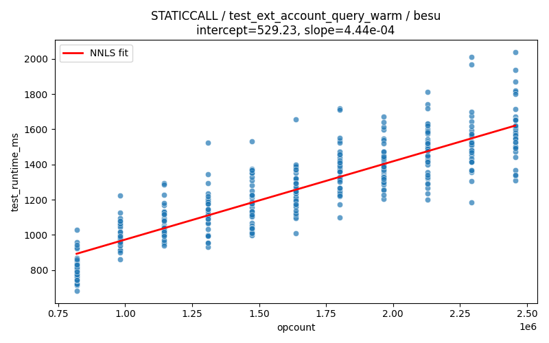

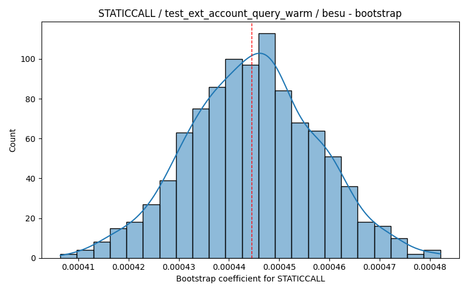

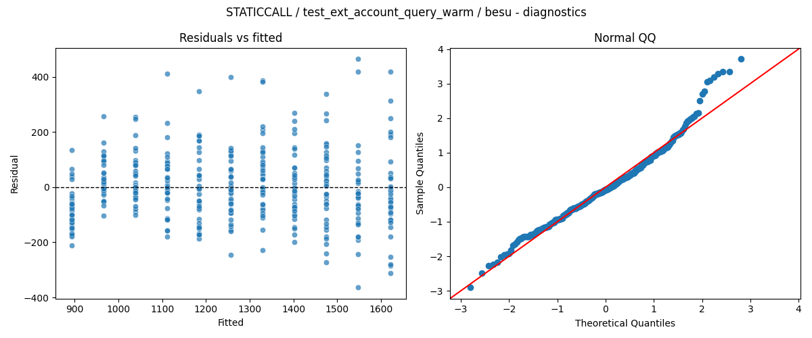

</details>

<details><summary>erigon — NNLS regression summary</summary>

```
==============================================================================
                           NNLS Regression Results                            
==============================================================================
Dep. Variable:          test_runtime_ms              R-squared:          0.910
Model:                  NNLS                    Adj. R-squared:          0.907
No. Observations:       44                                RMSE:          76.67
Df Residuals:           42                                 MAE:          45.23
Df Model:               1      
==============================================================================
                      coef     std err     P-value      [0.025      0.975]
------------------------------------------------------------------------------
         const     75.7679     45.1847       0.011      6.6714    178.0424
       opcount      0.0005      0.0000       0.001      0.0004      0.0005
==============================================================================
Notes: Non-negative least squares with bootstrap inference (1000 iterations)
==============================================================================
```

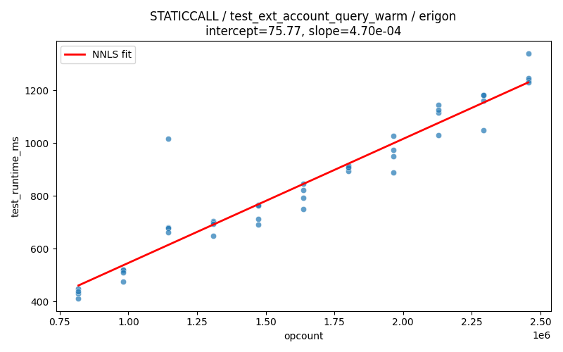

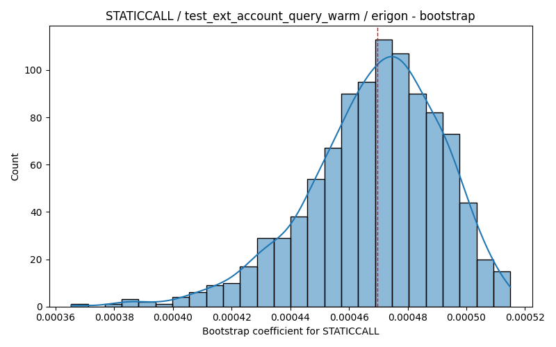

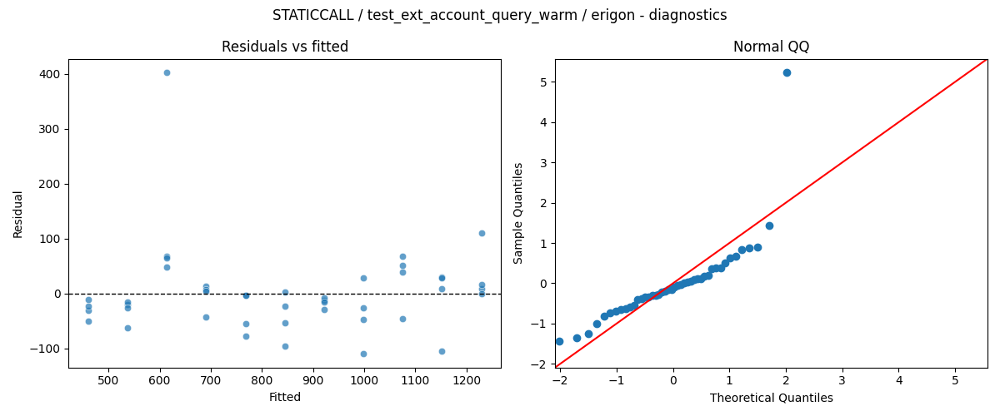

</details>

<details><summary>ethrex — NNLS regression summary</summary>

```
==============================================================================
                           NNLS Regression Results                            
==============================================================================
Dep. Variable:          test_runtime_ms              R-squared:          0.943
Model:                  NNLS                    Adj. R-squared:          0.943
No. Observations:       308                               RMSE:          13.16
Df Residuals:           306                                MAE:          10.65
Df Model:               1      
==============================================================================
                      coef     std err     P-value      [0.025      0.975]
------------------------------------------------------------------------------
         const     33.8378      2.3178       0.001     29.5336     38.3489
       opcount      0.0001      0.0000       0.001      0.0001      0.0001
==============================================================================
Notes: Non-negative least squares with bootstrap inference (1000 iterations)
==============================================================================
```

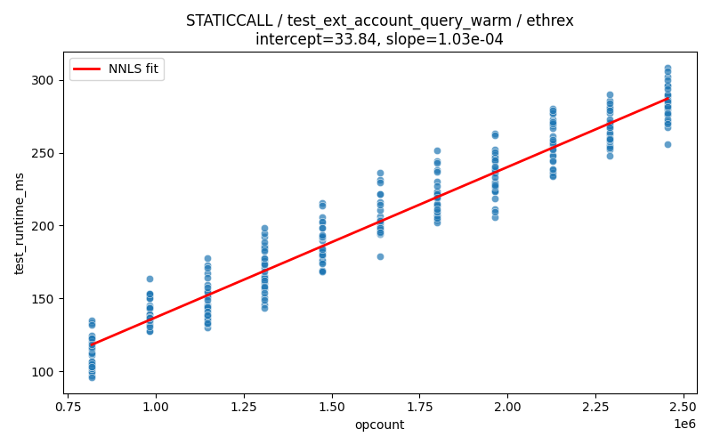

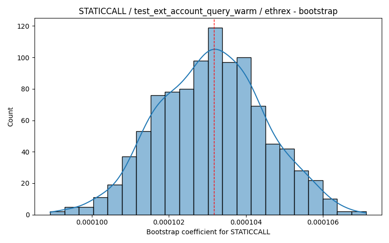

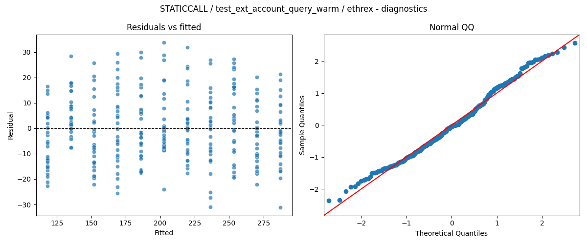

</details>

<details><summary>geth — NNLS regression summary</summary>

```
==============================================================================
                           NNLS Regression Results                            
==============================================================================
Dep. Variable:          test_runtime_ms              R-squared:          0.878
Model:                  NNLS                    Adj. R-squared:          0.877
No. Observations:       308                               RMSE:          34.33
Df Residuals:           306                                MAE:          27.00
Df Model:               1      
==============================================================================
                      coef     std err     P-value      [0.025      0.975]
------------------------------------------------------------------------------
         const     53.6802      5.4884       0.001     42.9308     63.7379
       opcount      0.0002      0.0000       0.001      0.0002      0.0002
==============================================================================
Notes: Non-negative least squares with bootstrap inference (1000 iterations)
==============================================================================
```

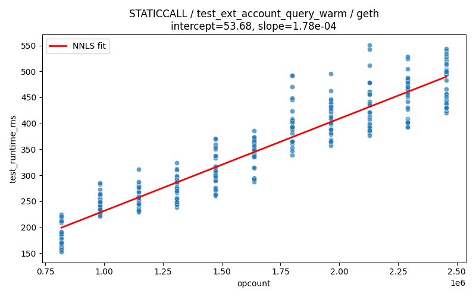

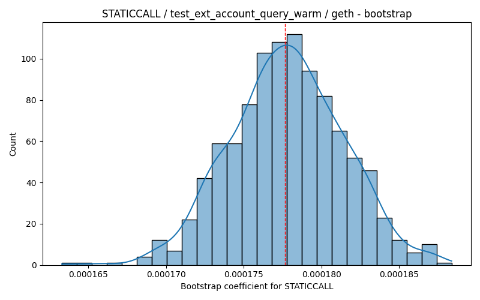


</details>

<details><summary>nethermind — NNLS regression summary</summary>

```
==============================================================================
                           NNLS Regression Results                            
==============================================================================
Dep. Variable:          test_runtime_ms              R-squared:          0.625
Model:                  NNLS                    Adj. R-squared:          0.623
No. Observations:       253                               RMSE:         136.74
Df Residuals:           251                                MAE:         109.73
Df Model:               1      
==============================================================================
                      coef     std err     P-value      [0.025      0.975]
------------------------------------------------------------------------------
         const    203.7165     25.9616       0.001    154.8753    254.3703
       opcount      0.0003      0.0000       0.001      0.0003      0.0004
==============================================================================
Notes: Non-negative least squares with bootstrap inference (1000 iterations)
==============================================================================
```

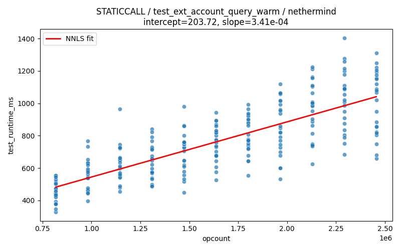

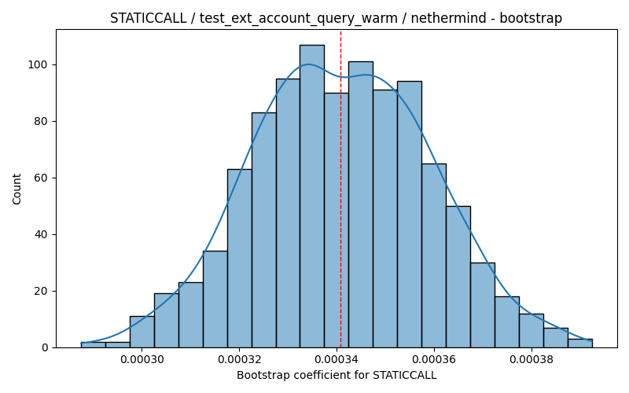

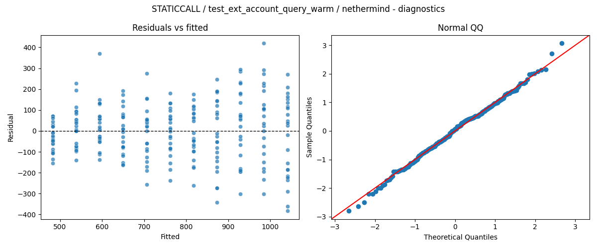

</details>

<details><summary>reth — NNLS regression summary</summary>

```
==============================================================================
                           NNLS Regression Results                            
==============================================================================
Dep. Variable:          test_runtime_ms              R-squared:          0.918
Model:                  NNLS                    Adj. R-squared:          0.918
No. Observations:       396                               RMSE:           8.89
Df Residuals:           394                                MAE:           6.78
Df Model:               1      
==============================================================================
                      coef     std err     P-value      [0.025      0.975]
------------------------------------------------------------------------------
         const     21.0730      1.4600       0.001     18.2809     24.0001
       opcount      0.0001      0.0000       0.001      0.0001      0.0001
==============================================================================
Notes: Non-negative least squares with bootstrap inference (1000 iterations)
==============================================================================
```

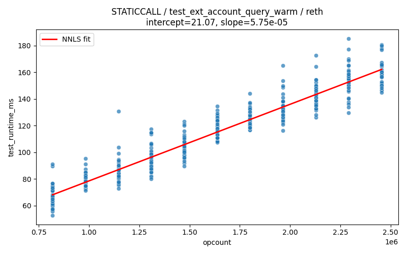

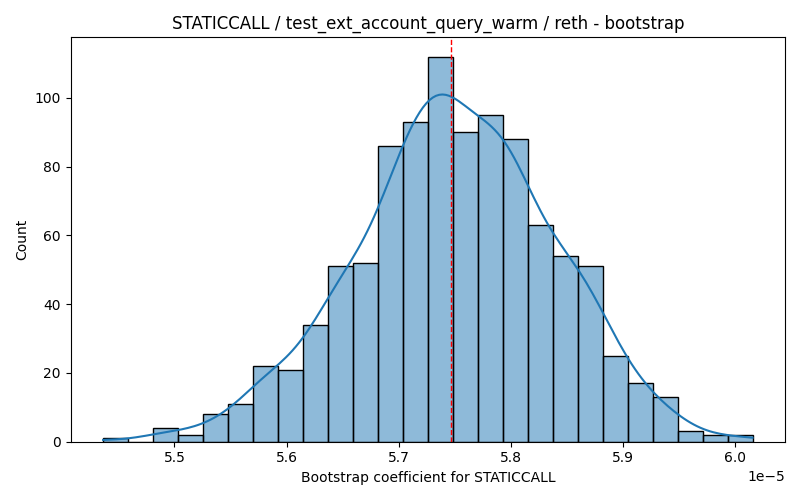

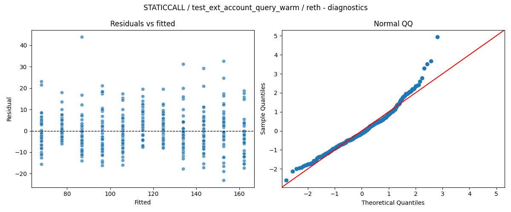

</details>
